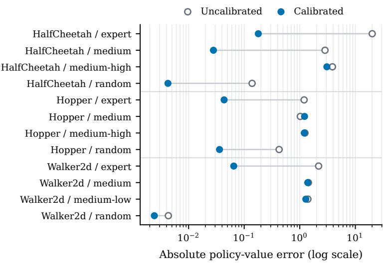
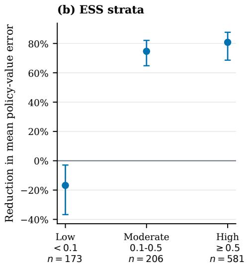

# Bellman Calibration for Marginalized Importance Weighting in Ofline Reinforcement Learning

Lars van der Laan Stanford University vdlaan@stanford.edu

Nathan Kallus Netflix and Cornell University

## Abstract

Marginalized importance weighting evaluates a target policy by reweighting ofline state–action samples with its discounted occupancy ratio, characterized by an adjoint Bellman equation. Existing minimax, primal–dual, and fitted fixed-point estimators can leave residual occupancy-balance violations because of function-class approximation, regularization, or incomplete optimization. These violations are dificult to diagnose and reduce because the objectives generally lack a direct supervised validation loss for hyperparameter tuning, model selection, and early stopping. We introduce isotonic Bellman calibration, a one-dimensional, modelagnostic post-processing method that reduces these violations while preserving the ranking information in any initial occupancy-ratio estimate. The method corrects the estimate’s scale and shape by applying fitted occupancy-ratio evaluation (FORE) over a one-dimensional class of nondecreasing transformations. We characterize Bellman calibration as a conditional fixed-point property equivalent to occupancy-balance against every test function of the calibrated ratio. More generally, we derive a calibration–refinement bound showing that any fitted ratio with small calibration error performs nearly as well as the best post-processing based on its fitted values. For isotonic Bellman calibration, we establish finite-sample calibration guarantees and a KL oracle inequality relative to the best monotone transformation of the initial estimate. Consequently, isotonic Bellman calibration achieves small calibration error and KL risk within statistical error of the best monotone correction, with guarantees for downstream target-occupancy functionals, including policy-value estimation.

## 1. Introduction

Marginalized importance weighting evaluates a target policy by reweighting samples from an ofline state–action distribution using the target policy’s discounted occupancy ratio (Liu et al., 2018; Xie et al., 2019; Yin and Wang, 2020). Unlike trajectory-level importance sampling, it corrects marginal state–action occupancies without multiplying importance ratios across time (Jiang and Li, 2016; Liu et al., 2018; Xie et al., 2019). Because the occupancy ratio depends on the target policy and transition law, but not on the reward function, a single estimate can evaluate multiple rewards without fitting a separate value function for each. It can also be combined with a fitted value or (Q)-function to obtain doubly robust and semiparametrically eficient estimators (Kallus and Uehara, 2020b, 2022; Uehara et al., 2020). Accurate occupancy-ratio estimation is therefore a central problem in ofline policy evaluation.

The discounted occupancy ratio satisfies an adjoint Bellman equation, which induces balance identities linking the reweighted ofline distribution to the target policy’s initial distribution and onestep dynamics (Nachum et al., 2019; Uehara et al., 2021). Many estimators enforce these identities through saddle-point problems over weight and critic classes, choosing weights to minimize the worst-case empirical violation of the resulting Bellman moments. This principle underlies minimax weighting and primal–dual methods such as DualDICE (Nachum et al., 2019; Uehara et al., 2020, 2021). Fitted occupancy-ratio evaluation (FORE) instead targets the adjoint Bellman fixed point directly through a sequence of ratio-fitting problems analogous to fitted (Q)-evaluation (van der Laan and Kallus, 2026).

Despite these advances, marginalized importance weighting can remain statistically dificult and unstable. Under limited overlap, the true occupancy ratio may be large in regions poorly represented in the ofline data, making both the ratio and the resulting value estimates highly variable. Occupancy-ratio estimation is further complicated by its fixed-point characterization, which provides neither observed labels nor a canonical held-out loss for tuning and model selection. In minimax, primal–dual, and fitted fixed-point methods, regularization, restricted ratio or critic classes, optimization error, and early termination can also leave substantial population Bellman imbalance even when the empirical objective is small (Nachum et al., 2019; Uehara et al., 2020, 2021). Yet an imperfect ratio estimate may still reliably rank regions from relatively low to relatively high target occupancy, even when its magnitudes are poorly calibrated for Bellman balance.

This observation motivates post-processing methods that stabilize fitted ratios while preserving their ordering information. Standard approaches include normalization, trimming, and clipping, which rescale weights, discard observations with extreme fitted ratios, or cap extreme values (Crump et al., 2009; Espeholt et al., 2018; Ionides, 2008; Lee et al., 2011; Munos et al., 2016; Robins et al., 2000; Zhang and Whiteson, 2022; Zhou et al., 2020). These transformations reduce weight dispersion by targeting prespecified distortions, such as global scale or tail behavior, and often require tuning parameters whose bias–variance tradeof is dificult to assess from observed data (Espeholt et al., 2018; Ionides, 2008; Lee et al., 2011; Munos et al., 2016; Orenstein, 2022; Su et al., 2020; van der Laan et al., 2025c).

To directly correct residual imbalance, we adapt post-hoc calibration from supervised learning (Bella et al., 2010; Guo et al., 2017; Gupta and Ramdas, 2021; Lichtenstein et al., 1977; Noarov and Roth, 2023). In classification and regression, a predictor is calibrated if the average outcome among observations receiving a given prediction equals that prediction. For example, an event assigned probability 0.6 should occur approximately 60% of the time. Analogously, we call a fitted occupancy ratio calibrated if, conditional on its fitted value, it agrees on average with one application of the adjoint Bellman operator. This is natural because the true occupancy ratio is a fixed point of that operator. Equivalently, the adjoint Bellman moments are balanced against every function of the fitted ratio. Calibration therefore corrects the magnitudes relevant for Bellman balance while preserving the ordering encoded by the initial estimate.

We develop a simple post-processing method that applies to any initial occupancy-ratio estimator and learns a nonparametric one-dimensional monotone correction. The method provides finitesample nonparametric Bellman calibration guarantees. Our method, isotonic Bellman calibration, applies fitted occupancy-ratio evaluation (FORE) over a one-dimensional class of nondecreasing transformations, using adjoint Bellman targets in place of observed calibration labels. It extends classical isotonic calibration (Niculescu-Mizil and Caruana, 2005; Zadrozny and Elkan, 2002), which uses isotonic regression (Barlow and Brunk, 1972) to learn a monotone transformation of an initial predictor. Monotonicity preserves the ordering of the initial estimate, while the adjoint Bellman equation determines the scale and shape of the correction. The transformation class contains rescaling, clipping, and other monotone parametric adjustments, while allowing more flexible, dataadaptive corrections across the range of fitted ratios. The procedure operates as a low-dimensional post-processing step for an already fitted ratio model.

Contributions. Our contributions are threefold.

1. We formalize Bellman calibration for occupancy ratios through adjoint Bellman moments, characterize it as a conditional fixed-point property, and derive a calibration–refinement bound that controls occupancy-ratio error by the calibration error and the best approximation to the true ratio by a transformation of the fitted ratio.

2. We develop fitted isotonic Bellman calibration, a model-agnostic post-processing method based on fitted occupancy-ratio evaluation (FORE). Its core form requires only a stopping rule. Each iteration solves a convex isotonic optimization problem whose optimality conditions imply an exact empirical Bellman-balance identity.

3. We establish finite-sample calibration and accuracy guarantees, including a nonasymptotic bound on Bellman calibration error under subexponential initial coverage and one-step smoothing, and a KL regret bound showing that, up to statistical error, calibration preserves and may improve occupancy-ratio estimation accuracy.

## 1.1. Related work

Of-policy evaluation and occupancy corrections. Classical of-policy evaluation uses trajectory-level or per-decision importance ratios, while doubly robust estimators combine importance weighting with value-function estimates (Jiang and Li, 2016; Thomas and Brunskill, 2016). Marginalized importance sampling avoids products of trajectory ratios by correcting marginal state or state–action occupancies (Liu et al., 2018; Xie et al., 2019; Yin and Wang, 2020). Semiparametric theory likewise identifies the occupancy ratio and value function as the two nuisance functions underlying eficient and doubly robust of-policy evaluation (Kallus and Uehara, 2019, 2020a,b, 2022; Uehara et al., 2022; van der Laan et al., 2025a,b). Related stationary-distribution and occupancy corrections are also used to mitigate distribution shift in of-policy temporal-diference learning and fitted value-function methods (Gelada and Bellemare, 2019; Hallak and Mannor, 2017; Patterson et al., 2022; Sutton et al., 2016; van der Laan and Kallus, 2025b,c). Under weak overlap, recent work also truncates estimated occupancy ratios to stabilize doubly robust of-policy estimators (Mehrabi and Wager, 2024). Such methods rely on prespecified or theoretically guided truncation levels whose bias–variance tradeof can be dificult to assess from the observed data.

Primal–dual, minimax, and fitted ratio estimation. Many occupancy-ratio estimators enforce balance or stationarity restrictions through saddle-point, minimax, or temporal-diference objectives. DualDICE estimates discounted distribution corrections without behavior-policy probabilities or products of trajectory ratios (Nachum et al., 2019), while GenDICE and GradientDICE extend this approach to stationary-distribution correction (Zhang et al., 2020a,b). Related work develops minimax weight and value-function learners, regularized Lagrangian formulations, confidence proce dures, and regression-based variants (Che et al., 2025; Dai et al., 2020a; Liu et al., 2018; Uehara et al., 2020, 2021; Yang et al., 2020). Related finite-horizon work includes the FORC estimator of Huang et al. (2023); see also Huang and Jiang (2024). FORC recursively fits stagewise occupancy ratios by squared-loss regression under stagewise realizability conditions, a density-ratio analogue of Bellman completeness. In the discounted setting, fitted occupancy-ratio evaluation (FORE) instead recursively applies the adjoint Bellman map and projects each image through a single-level density-ratio objective (van der Laan and Kallus, 2026). Its guarantees require realizability or approximation of the target occupancy ratio, rather than richness of a separate critic class or adjoint Bellman completeness.

We build on FORE by repurposing its fitted recursion for post-hoc calibration. Rather than fitting another high-dimensional ratio model, our method restricts each iteration to a nondecreasing transformation of an arbitrary initial estimate. This yields a model-agnostic calibration procedure with no regularization or transformation-shape hyperparameter in its core form. It provides exact empirical Bellman-balance identities together with finite-sample guarantees for calibration and occupancy-ratio accuracy.

Calibration. Post-hoc calibration transforms an initial predictor to satisfy self-consistency within strata of its fitted values. In supervised learning, common methods include Platt scaling, histogram binning, and isotonic regression (Guo et al., 2017; Kuleshov and Liang, 2015; Kuleshov et al., 2018; Niculescu-Mizil and Caruana, 2005; Platt, 1999; Zadrozny and Elkan, 2001, 2002). General theory for isotonic calibration in regression and loss-based prediction is developed by Van Der Laan and Alaa (2025). In causal inference, calibration methods have been used to recalibrate propensity scores and inverse-probability weights, improving the finite-sample performance of estimators of average treatment efects and single-stage policy values (Ballinari and Bearth, 2024; Deshpande and Kuleshov, 2023; Gutman et al., 2022; Klaassen et al., 2025; Van Der Laan et al., 2023; van der Laan et al., 2024, 2025c). These methods concern one-step importance weights; discounted occupancy ratios instead satisfy a recursive adjoint Bellman equation. In the nondynamic special case $\gamma = 0 ,$ our method and guarantees recover and extend the isotonic inverse-probability-weight calibration results of van der Laan et al. (2025c) from static treatment interventions to general treatment policies.

The closest related work in reinforcement learning develops Bellman calibration for value prediction, using fitted Q-evaluation and histogram binning to recalibrate value functions against one-step Bellman targets (van der Laan and Kallus, 2025a). We develop the adjoint analogue of Bellman calibration for occupancy ratios. Specifically, we replace the Bellman operator with its adjoint, use FORE rather than fitted Q-evaluation, and introduce an isotonic procedure with finite-sample Bellman-balance and occupancy-ratio accuracy guarantees. The proof of our calibration guarantees in Section 5.1 builds on calibration arguments developed for supervised losses in Van Der Laan and Alaa (2025); Van Der Laan et al. (2023); Whitehouse et al. (2024).

## 2. Discounted occupancy ratios and Bellman balance

## 2.1. Discounted MDPs and occupancy ratios

We consider a discounted MDP $( \mathcal { S } , \mathcal { A } , P , \gamma )$ , where S and A are measurable state and action spaces, $\textstyle P ( \cdot \mid s , a )$ is the state-transition kernel, and $\gamma \in [ 0 , 1 )$ is the discount factor. Let $X = ( S , A ) \in \mathcal { X } : =$ ${ \mathcal { S } } \times { \mathcal { A } } .$ , and let ν denote the ofline state–action sampling distribution. For a stationary ergodic trajectory generated by a behavior policy, ν may be taken as the stationary distribution of the induced state–action process. When multiple finite trajectories are pooled, ν may instead be taken as the time-averaged state–action distribution over the sampled time points.

For a target policy π and initial state distribution $\rho _ { 0 }$ , define the initial state–action distribution and the policy-induced transition kernel on state–action pairs by

$$
\mu _ { 0 , \pi } ( d s , d a ) = \rho _ { 0 } ( d s ) \pi ( d a \mid s ) , \qquad P _ { \pi } ( d x ^ { \prime } \mid x ) = P ( d s ^ { \prime } \mid s , a ) \pi ( d a ^ { \prime } \mid s ^ { \prime } ) ,
$$

where $x = ( s , a )$ and $x ^ { \prime } = ( s ^ { \prime } , a ^ { \prime } )$ . For any integrable $g : \mathcal { X }  \mathbb { R }$ , write $\begin{array} { r } { ( P _ { \pi } g ) ( x ) : = \int g ( x ^ { \prime } ) P _ { \pi } ( d x ^ { \prime } \mid x ) } \end{array}$ The normalized discounted occupancy measure under $\pi$ is

$$
\mu _ { \pi } = ( 1 - \gamma ) \sum _ { t \geq 0 } \gamma ^ { t } \mathcal { L } _ { \pi } ( X _ { t } ) ,
$$

where $X _ { 0 } \sim \mu _ { 0 , \pi }$ and $X _ { t + 1 } \mid X _ { t } \sim P _ { \pi } ( \cdot \mid X _ { t } )$ . Assuming $\mu _ { \pi } \ll \nu ,$ define the discounted occupancy ratio by $w _ { \pi } ( x ) : = ( d \mu _ { \pi } / d \nu ) ( x )$ . This ratio underlies marginalized importance weighting (Liu et al., 2018; Uehara et al., 2020). In particular, for any integrable reward function $r : \mathcal { X }  \mathbb { R }$ , the

normalized target-policy value satisfies

$$
V _ { \pi } ( r ) : = ( 1 - \gamma ) \mathbb { E } _ { \pi } \left[ \sum _ { t \geq 0 } \gamma ^ { t } r ( S _ { t } , A _ { t } ) \right] = \mathbb { E } _ { \mu _ { \pi } } \{ r ( X ) \} = \mathbb { E } _ { \nu } \{ w _ { \pi } ( X ) r ( X ) \} .
$$

## 2.2. Adjoint Bellman equation and balance moments

The target occupancy measure $\mu _ { \pi }$ satisfies the adjoint Bellman equation (Uehara et al., 2021)

$$
\mu _ { \pi } = ( 1 - \gamma ) \mu _ { 0 , \pi } + \gamma \mu _ { \pi } P _ { \pi } .\tag{1}
$$

For any weight function ω such that $( \omega \nu ) P _ { \pi } \ll \nu ,$ define the adjoint Bellman operator

$$
\mathcal { B } _ { \pi } ^ { \star } \omega : = ( 1 - \gamma ) \omega _ { 0 } + \gamma \frac { d \{ ( \omega \nu ) P _ { \pi } \} } { d \nu } , \qquad \omega _ { 0 } : = \frac { d \mu _ { 0 , \pi } } { d \nu } .
$$

The occupancy ratio $w _ { \pi } = d \mu _ { \pi } / d \nu$ is then characterized by the fixed-point equation

$$
w _ { \pi } = B _ { \pi } ^ { \star } w _ { \pi } .\tag{2}
$$

Although $B _ { \pi } ^ { \star } \omega$ is generally unavailable pointwise, its action against test functions can be evaluated using one-step transitions (van der Laan and Kallus, 2026). For any measurable $f$ for which the expectations exist,

$$
{ \mathbb E } _ { \boldsymbol \nu } \left[ \{ \mathcal { B } _ { \pi } ^ { \star } \boldsymbol { \omega } \} ( X ) f ( X ) \right] = ( 1 - \gamma ) { \mathbb E } _ { \mu _ { 0 , \pi } } \{ f ( X _ { 0 } ) \} + \gamma { \mathbb E } _ { \boldsymbol \nu } \left[ \boldsymbol { \omega } ( X ) f ( X ^ { + } ) \right] ,\tag{3}
$$

where $X \sim \nu , X ^ { + } \mid X \sim P _ { \pi } ( \cdot \mid X )$ , and $X _ { 0 } \sim \mu _ { 0 , \pi }$ . Evaluating this identity at the fixed point yields the occupancy-balance moments (Nachum et al., 2019; Uehara et al., 2021)

$$
\mathbb { E } _ { \nu } \left[ w _ { \pi } ( X ) \{ g ( X ) - \gamma g ( X ^ { + } ) \} \right] = ( 1 - \gamma ) \mathbb { E } _ { \mu _ { 0 , \pi } } \{ g ( X _ { 0 } ) \} ,\tag{4}
$$

for every measurable $g : \mathcal { X }  \mathbb { R }$ for which the expectations exist.

## 2.3. Occupancy-ratio estimation and residual imbalance

A common approach to occupancy-ratio estimation is minimax occupancy balancing (Liu et al., 2018; Nachum et al., 2019; Uehara et al., 2020, 2021). These methods estimate the occupancy ratio by minimizing violations of (4) over a critic class. Schematically, they solve

$$
\widehat { \omega } \in \mathop { \mathrm { a r g } \mathrm { m i n } } _ { \omega \in \mathcal { W } } \mathop { \operatorname* { s u p } } _ { f \in \mathcal { F } } \left| ( 1 - \gamma ) \mathbb { E } _ { \mu _ { 0 , \pi } } \{ f ( X _ { 0 } ) \} - \mathbb { E } _ { \nu } \left[ \omega ( X ) \{ f ( X ) - \gamma f ( X ^ { + } ) \} \right] \right| ,\tag{5}
$$

using empirical expectations and suitable regularization in practice. The critic class $\mathcal { F }$ determines which violations of the adjoint Bellman equation are detectable. Thus, converting a small minimax objective into control of the adjoint Bellman residual generally requires $\mathcal { F }$ to contain witnesses for the residuals generated by candidate weights. A representative completeness condition is

$$
\left\{ B _ { \pi } ^ { \star } \omega - \omega : \omega \in \mathcal { W } \right\} \subseteq c \mathcal { F }
$$

for some $c > 0$ (Uehara et al., 2021). Without suficient critic richness, a candidate weight may satisfy every tested moment while remaining imbalanced in untested directions. Even when the population classes are suficiently rich, finite-sample error, regularization, and imperfect optimization may leave residual imbalance.

Fitted occupancy-ratio evaluation (FORE) (van der Laan and Kallus, 2026) instead estimates the ratio through an iterative fitted fixed-point procedure in which each update approximates the composition of an adjoint Bellman update with a KL projection onto the ratio class. This avoids both a separately specified critic class and closure of the ratio class under adjoint Bellman updates. Nevertheless, statistical error, early stopping, and the absence of a canonical held-out loss for tuning or model selection may leave the fitted ratio imperfectly balanced. These considerations motivate a post-processing step that directly targets residual Bellman imbalance in an initial occupancy-ratio estimate.

## 3. Bellman Calibration for Marginalized Importance Weights

## 3.1. Population Bellman calibration

An estimated occupancy ratio may retain useful predictive information even when its fitted values exhibit systematic Bellman imbalance. This is common for flexible machine-learning estimators whose predictions preserve relative structure but are distorted in scale or shape (Dwivedi et al., 2020; Guo et al., 2017; Niculescu-Mizil and Caruana, 2005). We therefore post-process an initial estimate $\widehat { w } _ { \pi }$ through a flexible transformation $\theta : \mathbb { R }  \mathbb { R } _ { + }$ , yielding $\bar { w } _ { \pi } = \theta \circ \widehat { w } _ { \pi }$ . Such transformations include familiar corrections such as rescaling and clipping. More generally, our goal is to remove Bellman imbalance detectable from the fitted values while retaining the information they contain about the true occupancy ratio. Rather than refitting the underlying high-dimensional predictor or restricting attention to prespecified corrections, we formalize this objective by imposing the adjoint Bellman moment identities against test functions of the calibrated weight itself.

We say that $\bar { w } _ { \pi }$ is perfectly calibrated for occupancy balance if, for every bounded measurable $g : \mathbb { R }  \mathbb { R }$ 2

$$
{ \mathbb E } _ { \boldsymbol \nu } \left[ \bar { w } _ { \boldsymbol \pi } ( \boldsymbol X ) \{ g ( \bar { w } _ { \boldsymbol \pi } ( \boldsymbol X ) ) - \gamma g ( \bar { w } _ { \boldsymbol \pi } ( \boldsymbol X ^ { + } ) ) \} \right] = ( 1 - \gamma ) { \mathbb E } _ { \boldsymbol \mu _ { 0 , \pi } } \{ g ( \bar { w } _ { \boldsymbol \pi } ( \boldsymbol X _ { 0 } ) ) \} .\tag{6}
$$

Equivalently, the adjoint Bellman moment identities in (4) hold with $w _ { \pi }$ replaced by $\bar { w } _ { \pi }$ for all test functions of the form $g \circ { \bar { w } } _ { \pi }$

To characterize this condition directly through the fitted values, define the calibration function of a candidate weight ω by

$$
\Gamma _ { \omega } ( t ) : = \mathbb { E } _ { \nu } \left[ \{ B _ { \pi } ^ { \star } \omega \} ( X ) \lvert \omega ( X ) = t \right] .\tag{7}
$$

Equation (6) is equivalent to

$$
\begin{array} { r l } { { \mathbb E } _ { \nu } \left[ \{ \mathcal { B } _ { \pi } ^ { \star } \bar { w } _ { \pi } - \bar { w } _ { \pi } \} ( X ) g ( \bar { w } _ { \pi } ( X ) ) \right] = 0 }  & { { \mathrm { f o r ~ e v e r y ~ b o u n d e d ~ m e a s u r a b l e ~ } } g , } \\ { { \iff \quad } } & { { \nu { \mathrm { - a l m o s t ~ s u r e l y . } } } } \end{array}
$$

Thus, a perfectly calibrated weight satisfies the adjoint Bellman fixed-point equation after conditioning on its own fitted values. Equivalently, among state–action pairs assigned the same fitted occupancy ratio, the average adjoint Bellman update equals that fitted ratio.

The true occupancy ratio $w _ { \pi }$ is automatically perfectly calibrated: since $w _ { \pi } = B _ { \pi } ^ { \star } w _ { \pi }$ ν-almost surely, the law of iterated expectations yields $\Gamma _ { w _ { \pi } } \circ w _ { \pi } = w _ { \pi }$ ν-almost surely. Perfect calibration is weaker than pointwise recovery of $w _ { \pi } \colon$ it requires only that the Bellman residual vanish on average conditional on the fitted value. It therefore provides a natural one-dimensional self-consistency condition for post-processing fitted weights. In particular, a large fitted weight must be matched by a correspondingly large conditional mean adjoint Bellman update.

## 3.2. Calibration, optimal post-processing, and accuracy

We next show that calibration ensures that an estimated occupancy ratio efectively uses the information its fitted values contain about the true ratio. A calibration–refinement bound makes this precise by separating Bellman calibration error from the residual error achievable by optimal post-processing. The key implication is that a well-calibrated estimate is accurate whenever its fitted values can be accurately transformed into the true occupancy ratio.

We define the $L ^ { 2 }$ calibration and refinement errors by

$$
\begin{array} { r } { \mathrm { C a l } _ { 2 } ^ { 2 } ( \omega ) : = \| \Gamma _ { \omega } \circ \omega - \omega \| _ { L ^ { 2 } ( \nu ) } ^ { 2 } , \qquad \mathrm { R e f } _ { 2 } ^ { 2 } ( \omega ) : = \operatorname* { i n f } _ { a } \| w _ { \pi } - a \circ \omega \| _ { L ^ { 2 } ( \nu ) } ^ { 2 } , } \end{array}\tag{8}
$$

where the infimum is over measurable transformations $a : \mathbb { R }  \mathbb { R }$ . When $w _ { \pi } \in L ^ { 2 } ( \nu )$ , the optimal post-processing is $a \circ \omega = \mathbb { E } _ { \nu } ( w _ { \pi } \mid \omega )$ . The calibration error also admits the dual Bellman-balance representation

$$
\mathrm { C a l } _ { 2 } ( \omega ) = \operatorname* { s u p } _ { \mathbb { E } _ { \nu } \left[ g \{ \omega ( X ) \} ^ { 2 } \right] \leq 1 } \left| \mathbb { E } _ { \nu } \left[ \omega ( X ) \{ g ( \omega ( X ) ) - \gamma g ( \omega ( X ^ { + } ) ) \} \right] - ( 1 - \gamma ) \mathbb { E } _ { \mu _ { 0 , \pi } } \{ g ( \omega ( X _ { 0 } ) ) \} \right| .\tag{9}
$$

Thus, $\mathrm { C a l _ { 2 } } ( \omega )$ is the largest normalized Bellman imbalance detectable from the fitted values. It vanishes if and only if ω is perfectly calibrated for occupancy balance.

Theorem 3.1 (Calibration–refinement bound for occupancy ratios). For every $\omega \in L ^ { 2 } ( \nu )$ such that $B _ { \pi } ^ { \star } \omega \in L ^ { 2 } ( \nu )$ and $w _ { \pi } \in L ^ { 2 } ( \nu )$

$$
\| \omega - w _ { \pi } \| _ { L ^ { 1 } ( \nu ) } \leq \frac { \mathrm { C a l } _ { 2 } ( \omega ) + \mathrm { R e f } _ { 2 } ( \omega ) } { 1 - \gamma } .
$$

The refinement error is the smallest $L ^ { 2 } ( \nu )$ discrepancy between the true occupancy ratio and any transformation of the fitted weight $\omega ( X )$ . It therefore measures the best accuracy attainable by post-processing that weight alone. Theorem 3.1 bounds the error of ω by this optimal post-processing error plus its calibration error, with the usual $( 1 - \gamma ) ^ { - 1 }$ amplification of Bellman error in discounted infinite-horizon problems (Munos and Szepesvári, 2008). Thus, a small calibration error guarantees that $\omega$ is accurate whenever some transformation of $\omega ( X )$ can accurately recover $w _ { \pi }$ . In particular, a perfectly calibrated weight satisfies $\lVert \omega - w _ { \pi } \rVert _ { L ^ { 1 } ( \nu ) } \leq ( 1 - \gamma ) ^ { - 1 } \mathrm { R e f } _ { 2 } ( \omega )$ . The $L ^ { 1 } ( \nu )$ error also has a direct functional interpretation:

$$
\| \omega - w _ { \pi } \| _ { L ^ { 1 } ( \nu ) } = \displaystyle \operatorname* { s u p } _ { \| g \| _ { \infty } \leq 1 } \| \mathbb { E } _ { \nu } \{ \omega ( X ) g ( X ) \} - \mathbb { E } _ { \mu _ { \pi } } \{ g ( X ) \} \| .
$$

Consequently, the same bound controls the error in every bounded linear functional of the target discounted occupancy distribution, including expected rewards, costs, feature moments, and visitation probabilities.

This result is the occupancy-ratio analogue of classical calibration–refinement decompositions for proper scoring rules (Bröcker, 2009; DeGroot and Fienberg, 1983; Murphy, 1973; Van Der Laan et al., 2023), and the adjoint counterpart of the Bellman calibration–refinement decomposition for value functions in van der Laan and Kallus (2025a).

## 4. Fitted isotonic Bellman calibration

Motivated by the calibration–refinement bound, we develop a post-processing procedure that improves Bellman calibration while preserving the ordering induced by an initial occupancy-ratio estimate $\widehat { w } _ { \pi }$ . The method applies FORE over the class of nondecreasing transformations of $\widehat { w } _ { \pi }$ reducing each update to a one-dimensional isotonic risk-minimization problem. Monotonicity preserves the ranking induced by $\widehat { w } _ { \pi }$ while allowing its scale and shape to adapt to the adjoint Bellman equation. The transformation class contains the identity map and familiar restricted adjustments such as rescaling and clipping, while also allowing flexible nonlinear corrections. As shown in Section 5, the resulting estimator achieves Bellman calibration with a KL accuracy guarantee up to statistical error.

We separate estimation and calibration by sample splitting or cross-fitting, following Van Der Laan et al. (2023). The formal results below use an external calibration sample independent of the training data. It contains one-step transitions $O _ { i } = ( S _ { i } , A _ { i } , S _ { i } ^ { \prime } ) , i = 1 , \dots , n$ , with $( S _ { i } , A _ { i } ) \sim \nu$ and $S _ { i } ^ { \prime } \mid S _ { i } , A _ { i } \sim P ( \cdot \mid S _ { i } , A _ { i } )$ . Given $S _ { i } ^ { \prime } ,$ , draw $A _ { i } ^ { + } \ \sim \ \pi ( \cdot \ | \ S _ { i } ^ { \prime } )$ , and define $X _ { i } = ( S _ { i } , A _ { i } )$ and $X _ { i } ^ { + } = ( S _ { i } ^ { \prime } , A _ { i } ^ { + } )$ . We also observe an independent sample $X _ { 0 , j } \sim \mu _ { 0 , \pi } , j = 1 , \ldots , m ,$ from the target initial state–action distribution. In the empirical implementation, the fitting data are instead reused through cross-calibration: estimate $\widehat { w } _ { \pi }$ by cross-fitting (Chernozhukov et al., 2018; Zheng and van der Laan, 2011), as is standard in double reinforcement learning (Kallus and Uehara, 2020b, 2022), and calibrate the pooled out-of-fold predictions (Van Der Laan et al., 2023; van der Laan et al., 2025c). The finite-sample theorem below covers the external-sample implementation; Section 6 evaluates the pooled cross-fitted estimator on independent evaluation trajectories.

We now define the isotonic Bellman calibration procedure. Let $\mathcal { F } _ { \mathrm { i s o } }$ denote the class of nondecreasing functions $h : \mathbb { R }  \mathbb { R }$ , and let $\mathcal { F } _ { \mathrm { i s o } , n }$ be the empirical subclass of nondecreasing step functions determined by their values at the fitted-value design points $\{ \widehat { w } _ { \pi } ( X _ { i } ) \} _ { i = 1 } ^ { n }$ and extended constantly between and beyond these points. Algorithm 1 repeatedly fits a transformation in $\mathcal { F } _ { \mathrm { i s o } , n }$ to the current occupancy-ratio estimate and normalizes the resulting weights. As in classical isotonic calibration (Niculescu-Mizil and Caruana, 2005; Zadrozny and Elkan, 2002), each update is a convex one-dimensional problem that, after a one-time sorting step, can be solved in linear time using a generalized pooled adjacent violators algorithm (Barlow and Brunk, 1972; Best et al., 2000; De Leeuw et al., 2010). The procedure terminates after $K _ { \mathrm { m a x } }$ iterations or when the relative empirical $L ^ { 2 }$ change falls below $\varepsilon ,$ where $\begin{array} { r } { \| f \| _ { n , 2 } ^ { 2 } : = n ^ { - 1 } \sum _ { i = 1 } ^ { n } f ( X _ { i } ) ^ { 2 } } \end{array}$ . In practice, $K _ { \mathrm { m a x } }$ may be chosen large and ε set to machine precision or a statistical tolerance; the geometric convergence of the underlying FORE recursion implies that $O ( \log n )$ iterations sufice to reduce the iteration error below any polynomial statistical tolerance (van der Laan and Kallus, 2026). Computational details are given in Appendix A.

## 5. Finite-sample guarantees for isotonic Bellman calibration

## 5.1. Bellman calibration error

In this subsection, we derive a finite-sample bound for the calibration error in the calibration– refinement decomposition of Section 3.2. The result shows that the exact empirical balance enforced by the isotonic update translates into population calibration under weak conditions. In Section 5.2, we complement this result with an oracle inequality showing that enforcing calibration preserves, and may improve, occupancy-ratio accuracy up to statistical error.

Throughout this section, following Chen and Jiang (2019), we assume that the transition and initial-state samples are i.i.d. and mutually independent. The analysis could be extended to dependent trajectory data under suitable mixing conditions by replacing the i.i.d. concentration arguments with their mixing-sequence analogues.

The argument begins with an exact empirical balance identity implied by the isotonic subproblem.

Algorithm 1 Isotonic Bellman calibration for marginalized importance weighting   
Require: Initial estimate $\widehat { w } _ { \pi }$ , samples $\{ ( X _ { i } , X _ { i } ^ { + } ) \} _ { i = 1 } ^ { n }$ and $\{ X _ { 0 , j } \} _ { j = 1 } ^ { m }$ , tolerance $\varepsilon > 0$ , and $K _ { \mathrm { m a x } }$   
1: Initialize $\widehat { \omega } ^ { ( 0 ) } ( x ) \gets 1$ and $K \gets K _ { \operatorname* { m a x } }$   
2: for $k = 0 , \ldots , K _ { \operatorname* { m a x } } - 1$ do   
3: Compute   
$\widehat { h } _ { k + 1 } \in \mathop { \mathrm { a r g } \operatorname* { m i n } } _ { h \in \mathcal { F } _ { \mathrm { i s o } , n } } \Biggl \{ \log \left[ \frac { 1 } { n } \sum _ { i = 1 } ^ { n } \exp \{ h ( \widehat { w } _ { \pi } ( X _ { i } ) ) \} \right] - ( 1 - \gamma ) \frac { 1 } { m } \sum _ { j = 1 } ^ { m } h \{ \widehat { w } _ { \pi } ( X _ { 0 , j } ) \} \Biggr \} .$   
$- \gamma \frac { 1 } { n } \sum _ { i = 1 } ^ { n } \widehat { \omega } ^ { ( k ) } ( X _ { i } ) h \{ \widehat { w } _ { \pi } ( X _ { i } ^ { + } ) \} \biggr \} .$   
4: Set   
$\widehat { \omega } ^ { ( k + 1 ) } ( x ) \gets \frac { \exp [ \widehat { h } _ { k + 1 } \{ \widehat { w } _ { \pi } ( x ) \} ] } { n ^ { - 1 } \sum _ { i = 1 } ^ { n } \exp [ \widehat { h } _ { k + 1 } \{ \widehat { w } _ { \pi } ( X _ { i } ) \} ] } .$   
5: If $\| \widehat { \omega } ^ { ( k + 1 ) } - \widehat { \omega } ^ { ( k ) } \| _ { n , 2 } \leq \varepsilon \| \widehat { \omega } ^ { ( k ) } \| _ { n , 2 } ,$ , set $K \gets k + 1$ and break.   
6: end for   
7: return ${ \widehat { \bar { w } } _ { \pi } }  \widehat { \omega } ^ { ( K ) }$

For any bounded $g : \mathbb { R }  \mathbb { R }$ , consider the exponentially tilted density ratio

$$
\omega _ { \varepsilon } ( x ) = \frac { \widehat { \omega } ^ { ( k + 1 ) } ( x ) \exp \bigl [ \varepsilon g \{ \widehat { \omega } ^ { ( k + 1 ) } ( x ) \} \bigr ] } { P _ { n } \bigl [ \widehat { \omega } ^ { ( k + 1 ) } \exp \bigl \{ \varepsilon g ( \widehat { \omega } ^ { ( k + 1 ) } ) \bigr \} \bigr ] } .
$$

For all suficiently small positive and negative $\varepsilon ,$ this perturbation preserves normalization and isotonicity across the fitted-value design points, as well as any fitted zeros. It therefore defines a two-sided feasible path through the optimizer. Diferentiating the empirical objective along this path and applying first-order optimality at $\varepsilon = 0$ yields

$$
\frac { 1 } { n } \sum _ { i = 1 } ^ { n } \left[ \widehat { \omega } ^ { ( k + 1 ) } ( X _ { i } ) g \{ \widehat { \omega } ^ { ( k + 1 ) } ( X _ { i } ) \} - \gamma \widehat { \omega } ^ { ( k ) } ( X _ { i } ) g \{ \widehat { \omega } ^ { ( k + 1 ) } ( X _ { i } ^ { + } ) \} \right] = ( 1 - \gamma ) \frac { 1 } { m } \sum _ { j = 1 } ^ { m } g \{ \widehat { \omega } ^ { ( k + 1 ) } ( X _ { 0 , j } ) \} .\tag{10}
$$

Thus, every isotonic update satisfies an exact empirical occupancy-balance condition. When successive iterates are close, $\widehat { \omega } ^ { ( k + 1 ) } \approx \widehat { \omega } ^ { ( k ) }$ , this identity becomes the empirical analogue of perfect occupancy calibration in (6).

We next combine (10) with uniform concentration over functions of the fitted weights to obtain a finite-sample bound for the population calibration error. The analysis relies on the following regularity conditions. Throughout, let $N = n \wedge$ m and $M _ { N } : = 1 \lor A _ { \mathrm { e n v } } \log ( e N )$ , where $A _ { \mathrm { e n v } } > 0$ is fixed. For each $N$ , define

$$
\mathcal { W } _ { N } : = \left\{ f \circ \widehat { w } _ { \pi } : f \mathrm { ~ i s ~ n o n d e c r e a s i n g , } \quad 0 \leq f \circ \widehat { w } _ { \pi } \leq M _ { N } , \quad \frac { 1 } { 2 } \leq \mathbb { E } _ { \nu } ( f \circ \widehat { w } _ { \pi } ) \leq 2 \right\}
$$

A1 Subexponential initial coverage and one-step smoothing. There are constants $0 < K _ { 0 } , K _ { + } < \infty$ independent of $N _ { ; }$ such that

$$
\left\| \frac { d \mu _ { 0 , \pi } } { d \nu } \right\| _ { \psi _ { 1 } } \leq K _ { 0 } , \qquad \operatorname* { s u p } _ { N \geq 1 } \operatorname* { s u p } _ { \omega \in \mathcal { W } _ { N } } \left\| \frac { d \{ ( \omega \nu ) P _ { \pi } \} } { d \nu } \right\| _ { \psi _ { 1 } } \leq K _ { + } ,
$$

where $\| Z \| _ { \psi _ { 1 } } : = \operatorname* { i n f } \{ s > 0 : E _ { \nu } \exp ( | Z | / s ) \le 2 \}$

A2 Boundedness. It holds almost surely that $0 \leq \widehat { \omega } ^ { ( k ) } ( x ) \leq M _ { N }$ for $0 \leq k \leq K$ for ν-almost every x.

A3 Finite variation. There is a finite constant $V _ { \mathrm { c a l } }$ , independent of N, such that, almost surely, the truncated calibration function

$$
t \mapsto \mathbb { E } _ { \nu } \Big [ \{ \mathcal { B } _ { \pi } ^ { \star } \widehat { \omega } ^ { ( K ) } \} ( X ) \ | \ \widehat { \omega } ^ { ( K ) } ( X ) = t \Big ] \wedge M _ { N }
$$

has total variation at most $V _ { \mathrm { c a l } } \vee M _ { N }$

Condition A1 holds, for example, when the initial density ratio and the transition density relative to ν are uniformly bounded, and more generally permits unbounded induced densities with uniformly exponential tails; see Lemma D.12. Condition A2 requires the isotonic solutions to grow at most logarithmically and holds automatically under uniform boundedness. Finally, Condition A3 is standard in isotonic calibration (van der Laan and Kallus, 2025a; Van Der Laan et al., 2023; van der Laan et al., 2024, 2025c) and rules out highly irregular truncated calibration functions. It holds, for example, when the function is uniformly bounded and monotone, or when it has bounded support and is piecewise Lipschitz with finitely many jumps.

Theorem 5.1 (Finite-sample Bellman calibration). Assume Conditions A1–A3. Let $K \geq 1$ , put $K _ { \mathrm { s m } } = ( 1 - \gamma ) K _ { 0 } + \gamma K _ { + }$ , and suppose that $A _ { \mathrm { e n v } } > 2 K _ { \mathrm { s m } } / 3$ . For each suficiently large $N = n \land m ,$ conditional on the training data used to fit $\widehat { w } _ { \pi }$ , the following bound holds with probability at least $1 - \delta$ over the calibration sample:

$$
\mathrm { C a l } _ { 2 } ( { \widehat \omega } ^ { ( K ) } ) \leq \kappa _ { \mathrm { c a l } , N } \sqrt { \log ( e N ) } \left\{ N ^ { - 1 / 3 } + \sqrt { \frac { \log ( 1 / \delta ) } { N } } + \| { \widehat \omega } ^ { ( K ) } - { \widehat \omega } ^ { ( K - 1 ) } \| _ { n , 2 } \right\} ,
$$

where $\begin{array} { r } { \| f \| _ { n , 2 } ^ { 2 } = n ^ { - 1 } \sum _ { i = 1 } ^ { n } f ( X _ { i } ) ^ { 2 } } \end{array}$ . The constant may be chosen so that $\kappa _ { \mathrm { c a l } , N } \leq C \{ 1 + K _ { 0 } + K _ { + } +$ $V _ { \mathrm { c a l } } + M _ { N } \} ^ { 8 }$ , where $C < \infty$ is universal.

The first two terms in Theorem 5.1 capture statistical calibration error, while the final term, $\begin{array} { r } { \left\| \widehat { \omega } ^ { ( K ) } - \widehat { \omega } ^ { ( K - 1 ) } \right\| _ { n , 2 } , } \end{array}$ captures the remaining iteration error. This term is directly observable and therefore provides a computable stopping criterion. It arises because the transition term in (10) uses $\widehat { \omega } ^ { ( K - 1 ) }$ , whereas the remaining terms use $\widehat { \omega } ^ { ( K ) }$

Once the diference between successive iterates is no larger than the statistical error, the fitted weight achieves $L ^ { 2 }$ calibration error of order $( n \land m ) ^ { - 1 / 3 }$ , up to logarithmic terms and high-probability factors. Equivalently, its squared calibration error is of order $( n \land m ) ^ { - 2 / 3 }$ , matching the classical squared-error rate for isotonic regression and calibration (Chatterjee et al., 2015; Groeneboom and Jongbloed, 2014; Van Der Laan et al., 2023). Combined with the calibration–refinement bound in Section 3.2, this implies that the $L ^ { 1 } ( \nu )$ occupancy-ratio error is controlled by the best $L ^ { 2 } ( \nu )$ approximation of the true ratio by a transformation of the calibrated weights, plus a calibration contribution of order $( n \land m ) ^ { - 1 / 3 }$ , all scaled by $( 1 - \gamma ) ^ { - 1 }$

## 5.2. KL regret and accuracy preservation

The preceding results establish that isotonic Bellman calibration achieves small Bellman calibration error. We now derive a generalized-KL oracle inequality relative to the best monotone transformation of the initial estimate. Generalized KL divergence controls $L ^ { 1 } ( \nu )$ error and, for bounded rewards, policy-value error; the argument uses the KL contraction of FORE (van der Laan and Kallus, 2026).

The KL analysis requires fitted ratios to remain strictly positive because the logarithmic loss is singular at zero (van der Laan and Kallus, 2026). Unconstrained isotonic risk minimization, however, may assign zero weight to the leftmost fitted block, a boundary phenomenon at the lower end of the observed fitted-value range (Barlow and Brunk, 1972; Dai et al., 2020b; Lim, 2025). Under standard isotonic regularity conditions, this block occupies a shrinking region of order $N ^ { - 1 / 3 }$ (Deng et al., 2021; Groeneboom, 2011). Although zero weights are admissible for reward reweighting, they lead to infinite KL divergence.

For the KL analysis, we therefore consider a strictly positive, constrained variant of Algorithm 1. Each update is computed over the same empirical isotonic step-function class, but with the fitted transformation constrained to $[ \varepsilon _ { \mathrm { b } } , T _ { N } ]$ , or equivalently its logarithm constrained to $[ \log \varepsilon _ { \mathrm { b } } , \log T _ { N } ]$ where $T _ { N } = 1 \vee A _ { \mathrm { e n v } } \log ( e N )$ and $0 < \varepsilon _ { \mathrm { b } } \le 1$ is a fixed user-chosen lower bound. Denote the resulting iterates by ${ \widehat \omega } _ { \mathrm { K L } } ^ { ( k ) }$ . When the constraints are inactive, the constrained and unconstrained updates coincide. With a small lower bound and the growing upper bound $T _ { N }$ , the constraints otherwise afect only boundary behavior. We therefore use the constrained variant for the KL analysis but recommend the unconstrained procedure in practice.

For measurable $f \geq 0$ and $g > 0$ , define the generalized KL divergence

$$
D _ { \nu } ^ { \mathrm { K L } } ( f \| g ) : = \mathbb { E } _ { \nu } \left[ f ( X ) \log { \frac { f ( X ) } { g ( X ) } } - f ( X ) + g ( X ) \right] .\tag{11}
$$

This reduces to the usual KL divergence when both $f$ and $g$ integrate to one under ν. Define the following class of normalized ratios generated by bounded transformations in the empirical isotonic step class:

$$
\mathcal { W } _ { \mathrm { b } , N } = \left\{ \frac { f \{ \widehat { w } _ { \pi } ( \cdot ) \} } { \mathbb { E } _ { \nu } f \{ \widehat { w } _ { \pi } ( X ) \} } : f \in \mathcal { F } _ { \mathrm { i s o } , n } , \ \varepsilon _ { \mathrm { b } } \leq f \circ \widehat { w } _ { \pi } \leq T _ { N } \right\} .
$$

Define the corresponding KL approximation error by

$$
\varepsilon _ { \mathrm { i s o } , N } : = \operatorname* { i n f } _ { v \in \mathcal { W } _ { \mathrm { b } , N } } D _ { \nu } ^ { \mathrm { K L } } ( v \| w _ { \pi } ) .
$$

A4 Soft lower-tail margin. The target occupancy ratio is positive ν-almost surely, and there exist constants $A < \infty$ and $\alpha > 0$ such that, for every $t \in ( 0 , 1 ]$ 1]，

$$
\nu \{ x : 0 < w _ { \pi } ( x ) \leq t \} \leq A t ^ { \alpha } .
$$

Condition A4 is the soft-margin condition used in analyses of fitted FORE (van der Laan and Kallus, 2026). It permits $w _ { \pi }$ to approach zero provided its lower tail has polynomially small ν-mass, and contributes only a logarithmic factor to the statistical error. The adjoint Bellman equation gives $w _ { \pi } \geq ( 1 - \gamma ) \omega _ { 0 }$ ν-almost everywhere, so if ess in $: \phantom { + } : _ { x \sim \nu } \omega _ { 0 } ( x ) \geq c _ { 0 } > 0$ , then $w _ { \pi } \geq m _ { \star } : = ( 1 - \gamma ) c _ { 0 }$ and Condition A4 holds for any finite $\alpha > 0$ with $A = m _ { \star } ^ { - \alpha }$ . In particular, if $\nu = \mu _ { 0 , \pi }$ , then $m _ { \star } = 1 - \gamma$

Theorem 5.2 (Isotonic FORE calibration KL regret). Assume Conditions A1 and $A \llcorner$ with the smoothing supremum in Condition A1 extended to $\mathcal { W } _ { N }$ and to the normalized ratios induced $b y$ all $f \in \mathcal { F } _ { \mathrm { i s o } }$ satisfying $\varepsilon _ { \mathrm { b } } \leq f \circ \widehat { w } _ { \pi } \leq T _ { N }$ . Conditional on the training data used to $f i t \widehat { \ w } _ { \pi }$ , with probability at least $1 - \delta$ over the calibration sample,

$$
\begin{array} { r l } & { D _ { \nu } ^ { \mathrm { K L } } ( \widehat \omega _ { \mathrm { K L } } ^ { ( K ) } \| w _ { \pi } ) \le C _ { N } \left( \frac { 1 + \gamma } { 2 } \right) ^ { K } D _ { \nu } ^ { \mathrm { K L } } ( \widehat \omega _ { \mathrm { K L } } ^ { ( 0 ) } \| w _ { \pi } ) } \\ & { \qquad + \frac { C _ { N } } { 1 - \gamma } \varepsilon _ { \mathrm { i s o } , N } + \frac { C _ { N } } { ( 1 - \gamma ) ^ { 2 } } \log ^ { 2 } ( e N ) \left\{ N ^ { - 2 / 3 } + \frac { \log ( 1 / \delta ) } { N } \right\} , } \end{array}
$$

where $N = n \wedge m$ . For universal finite exponents $p , q$ and a finite constant $C _ { 0 } = C _ { 0 } ( A , \alpha )$ , the envelope factor may be chosen so that

$$
\begin{array} { r } { C _ { N } \le C _ { 0 } ( 1 + K _ { 0 } + K _ { + } ) ^ { q } \left\{ 1 + ( T _ { N } / \varepsilon _ { \mathrm { b } } ) ^ { 2 } \right\} ^ { p } . } \end{array}
$$

Theorem 5.2 gives an oracle bound comprising a geometrically decaying iteration error, a bounded isotonic approximation error, and a statistical error from the calibration sample. Choosing $K \geq$ $\log ( N ) / \log \{ 2 / ( 1 + \gamma ) \}$ makes the geometric factor at most $N ^ { - 1 }$ , so logarithmically many iterations sufice to make the iteration error negligible. Moreover, because $T _ { N }$ grows logarithmically and $\varepsilon _ { \mathrm { b } }$ is fixed, $C _ { N }$ contributes only a fixed power of $\mathrm { l o g } ( e N )$ . Whenever the identity transformation is admissible, the approximation error satisfies

$$
\varepsilon _ { \mathrm { i s o } , N } \leq D _ { \nu } ^ { \mathrm { K L } } \left( \frac { \widehat { w } _ { \pi } } { \mathbb { E } _ { \nu } \{ \widehat { w } _ { \pi } ( X ) \} } \bigg \| w _ { \pi } \right) ,
$$

and may be strictly smaller when a monotone transformation corrects systematic miscalibration.

Whenever the empirically normalized unconstrained updates remain in $[ \varepsilon _ { \mathrm { b } } , T _ { N } ]$ at every iteration, the constrained and unconstrained procedures coincide. Combined with Theorem 5.1, this yields a simultaneous calibration-and-accuracy guarantee: if the bounded-class approximation and iteration errors are no larger than the statistical error, the estimator achieves small Bellman calibration error and KL risk within statistical error of the best normalized ratio in the monotone-transformation class.

## 6. Experimental evaluation

We test whether isotonic Bellman calibration improves out-of-sample Bellman balance and of-policy value estimation. We evaluate on D4RL MuJoCo and InfiniteCartPole under a common protocol.

## 6.1. Experimental design and evaluation metrics

We calibrate neural FORE, DualDICE (Nachum et al., 2019), SCOPE-RL minimax weight learning (MWL) (Kiyohara et al., 2023; Uehara et al., 2020), and NeuralDICE (Yang et al., 2020). For the three comparison methods, we use the authors’ implementations identified in Appendix B.2. The hyperparameters for each base estimator are fixed across tasks and replications; reference policy values do not enter fitting or hyperparameter selection. Ten-fold grouped cross-fitting produces out-of-fold fitted scores. We fit one isotonic map to the pooled out-of-fold scores, apply it to the ten fold-specific predictors, and aggregate their predictions pointwise by the median. The uncalibrated base estimator fitted once on the full training sample serves as the control.

For D4RL, we use twelve matched dataset–policy pairs from HalfCheetah, Hopper, and Walker2d (Fu et al., 2020), two sample sizes, and ten independent replications. For InfiniteCartPole, we use four behavior policies and ten independent replications. With four base estimators, the design gives 960 paired D4RL comparisons and 160 paired CartPole comparisons.

The primary evaluation metrics are absolute policy-value error and projected Bellman calibration error. The latter measures the component of the population calibration residual detected by indicator functions of fitted-ratio quantile bins. We estimate it on behavior-policy data independent of fitting and calibration, using sample splitting to remove the upward noise bias from squaring one empirical moment vector. Appendix B.3 gives the estimator. All comparisons are paired within experimenta setting, sample size, replication, and base estimator, with cluster bootstrap confidence intervals.

## 6.2. Results

Calibration and policy-value accuracy. Calibration reduces both projected calibration error and policy-value error in D4RL and CartPole (Table 1). Mean policy-value error falls from 2.99 to 0.710 in D4RL and from 0.176 to 0.110 in CartPole.

Table 1: Cross-calibrated estimator versus the uncalibrated estimator fitted on the full training sample. Lower is better. Projected calibration error is evaluated on an independent evaluation sample using the sample-split estimator in Appendix B.3. ∆ is calibrated minus uncalibrated; brackets give paired 95% cluster bootstrap confidence intervals.
<table><tr><td></td><td colspan="4">Projected calibration error</td><td colspan="3">Absolute policy-value error</td></tr><tr><td>Benchmark</td><td>Uncalibrated</td><td>Calibrated</td><td>∆ [95% CI]</td><td>Uncalibrated</td><td>Calibrated</td><td></td></tr><tr><td>D4RL</td><td>16.1</td><td>0.120</td><td>-16.0 [−44.3, −1.02]</td><td>2.99</td><td>0.710</td><td>-2.28 [−3.28, -1.39]</td></tr><tr><td>CartPole</td><td>0.00207</td><td>1.96×10−4</td><td>-0.00187 [−0.00248, -0.00133]</td><td>0.176</td><td>0.110</td><td>-0.0658 [−0.0733, -0.0580]</td></tr></table>

(a) D4RL settings  


  
Figure 1: D4RL policy-value error across tasks and ESS strata. (a) Mean absolute policy-value error for each matched dataset–policy pair; lines connect paired uncalibrated and calibrated estimators. (b) Relative change in cluster-balanced mean policy-value error across strata defined by the uncalibrated estimator’s ESS fraction. Positive values favor calibration; bars give paired 95% cluster bootstrap confidence intervals.

Task and ESS heterogeneity. Calibration lowers value error in eleven of twelve D4RL dataset–policy pairs (Figure 1a). The direction and magnitude of the change vary across ESS strata: mean policyvalue error decreases by 80.8% in the high-ESS stratum and 74.7% in the moderate-ESS stratum, but increases by 16.8% in the low-ESS stratum (Figure 1b).

Base estimators. Calibration reduces mean projected calibration error for every base estimator in both benchmarks and reduces policy-value error for DualDICE, MWL, and NeuralDICE. Neural FORE is the only exception: its projected calibration error decreases, but its mean value error increases from 0.465 to 1.03 in D4RL and from 0.123 to 0.133 in CartPole. The uncalibrated FORE estimator has the lowest mean policy-value error among the four base estimators in both benchmarks. Estimator-level and task-level results appear in Appendix B.4.

## 7. Conclusion

An occupancy-ratio estimate may retain useful information about the true ratio while remaining systematically inconsistent with adjoint Bellman balance. Isotonic Bellman calibration corrects this residual imbalance through a data-driven monotone transformation that adjusts the fitted weights while preserving their ordering. This low-dimensional post-processing can improve Bellman balance and, when the initial fitted values remain informative about the true ratio, improve downstream of-policy value estimation.

The method is most useful when the behavior data adequately cover the target occupancy and the initial ratio estimate preserves meaningful ranking information. Under limited coverage or small calibration samples, lower-complexity transformations, such as log-linear corrections, may provide a better bias–variance tradeof.

Several extensions are natural. First, Bellman calibration could be combined with coveragestopped FORE, calibrating occupancy-ratio estimates on the well-supported region while avoiding extrapolation into poorly covered parts of the target occupancy (van der Laan and Kallus, 2026). Second, calibration could be strengthened from the one-dimensional tests induced by the fitted ratio to richer multicalibration conditions involving additional state–action features or subgroups (Noarov and Roth, 2023). Finally, extending the framework to finite-horizon and nonstationary settings would require time-indexed occupancy ratios and calibration conditions that may vary across decision times.

## References

D. Ballinari and N. Bearth. Improving the finite sample estimation of average treatment efects using double/debiased machine learning with propensity score calibration, 2024. URL https: //arxiv.org/abs/2409.04874.

R. E. Barlow and H. D. Brunk. The isotonic regression problem and its dual. Journal of the American Statistical Association, 67(337):140–147, 1972.

P. L. Bartlett, O. Bousquet, and S. Mendelson. Local rademacher complexities. The Annals of Statistics, 33(4):1497–1537, 2005. doi: 10.1214/009053605000000282. URL https://doi.org/10 1214/009053605000000282.

A. Bella, C. Ferri, J. Hernández-Orallo, and M. J. Ramírez-Quintana. Calibration of machine learning models. In Handbook of Research on Machine Learning Applications and Trends: Algorithms, Methods, and Techniques, pages 128–146. IGI Global, 2010.

M. J. Best, N. Chakravarti, and V. A. Ubhaya. Minimizing separable convex functions subject to simple chain constraints. SIAM Journal on Optimization, 10(3):658–672, 2000.

O. Bousquet. A bennett concentration inequality and its application to suprema of empirical processes. Comptes Rendus Mathematique, 334(6):495–500, 2002.

J. Bröcker. Reliability, suficiency, and the decomposition of proper scores. Quarterly Journal of the Royal Meteorological Society: A journal of the atmospheric sciences, applied meteorology and physical oceanography, 135(643):1512–1519, 2009.

S. Chatterjee, A. Guntuboyina, and B. Sen. On risk bounds in isotonic and other shape restricted regression problems. The Annals of Statistics, 43(4):1774–1800, 2015. doi: 10.1214/15-AOS1324. URL https://doi.org/10.1214/15-AOS1324.

F. Che, B. Chan, C. Ma, and A. R. Mahmood. AVG-DICE: Stationary distribution correction by regression. Reinforcement Learning Journal, 6:2415–2426, 2025.

J. Chen and N. Jiang. Information-theoretic considerations in batch reinforcement learning. In International conference on machine learning, pages 1042–1051. PMLR, 2019.

T. Chen and C. Guestrin. Xgboost: A scalable tree boosting system. In Proceedings of the 22nd acm sigkdd international conference on knowledge discovery and data mining, pages 785–794, 2016.

V. Chernozhukov, D. Chetverikov, M. Demirer, E. Duflo, C. Hansen, W. Newey, and J. Robins. Double/debiased machine learning for treatment and structural parameters. The Econometrics Journal, 21(1):C1–C68, 2018. doi: 10.1111/ectj.12097. URL https://doi.org/10.1111/ectj.1 2097.

R. K. Crump, V. J. Hotz, G. W. Imbens, and O. A. Mitnik. Dealing with limited overlap in estimation of average treatment efects. Biometrika, 96(1):187–199, 2009.

B. Dai, O. Nachum, Y. Chow, L. Li, C. Szepesvari, and D. Schuurmans. Coindice: Of-policy confidence interval estimation. In H. Larochelle, M. Ranzato, R. Hadsell, M. Balcan, and H. Lin, editors, Advances in Neural Information Processing Systems, volume 33, pages 9398–9411. Curran Associates, Inc., 2020a. URL https://proceedings.neurips.cc/paper\_files/paper/2020/ file/6aaba9a124857622930ca4e50f5afed2-Paper.pdf.

R. Dai, H. Song, R. F. Barber, and G. Raskutti. The bias of isotonic regression. Electronic journal of statistics, 14(1):801, 2020b.

J. De Leeuw, K. Hornik, and P. Mair. Isotone optimization in r: pool-adjacent-violators algorithm (pava) and active set methods. Journal of statistical software, 32:1–24, 2010.

M. H. DeGroot and S. E. Fienberg. The comparison and evaluation of forecasters. Journal of the Royal Statistical Society: Series D (The Statistician), 32(1-2):12–22, 1983.

H. Deng, Q. Han, and C.-H. Zhang. Confidence intervals for multiple isotonic regression and other monotone models. The Annals of Statistics, 49(4):2021 – 2052, 2021. doi: 10.1214/20-AOS2025. URL https://doi.org/10.1214/20-AOS2025.

S. Deshpande and V. Kuleshov. Calibrated and conformal propensity scores for causal efect estimation. arXiv preprint arXiv:2306.00382, 2023. URL https://arxiv.org/abs/2306.00382.

R. Dwivedi, Y. S. Tan, B. Park, M. Wei, K. Horgan, D. Madigan, and B. Yu. Stable discovery of interpretable subgroups via calibration in causal studies. International Statistical Review, 88(S1): S135–S178, 2020. doi: 10.1111/insr.12427. URL https://doi.org/10.1111/insr.12427.

L. Espeholt, H. Soyer, R. Munos, K. Simonyan, V. Mnih, T. Ward, Y. Doron, V. Firoiu, T. Harley, I. Dunning, S. Legg, and K. Kavukcuoglu. IMPALA: Scalable distributed deep-RL with importance weighted actor-learner architectures. In Proceedings of the 35th International Conference on Machine Learning, volume 80 of Proceedings of Machine Learning Research, pages 1407–1416. PMLR, 2018. URL https://proceedings.mlr.press/v80/espeholt18a.html.

J. Fu, A. Kumar, O. Nachum, G. Tucker, and S. Levine. D4RL: datasets for deep data-driven reinforcement learning. CoRR, abs/2004.07219, 2020. URL https://arxiv.org/abs/2004.072 19.

C. Gelada and M. G. Bellemare. Of-policy deep reinforcement learning by bootstrapping the covariate shift. In The Thirty-Third AAAI Conference on Artificial Intelligence, AAAI 2019, The Thirty-First Innovative Applications of Artificial Intelligence Conference, IAAI 2019, The Ninth AAAI Symposium on Educational Advances in Artificial Intelligence, EAAI 2019, Honolulu, Hawaii, USA, January 27 - February 1, 2019, pages 3647–3655. AAAI Press, 2019. doi: 10.1609/ AAAI.V33I01.33013647. URL https://doi.org/10.1609/aaai.v33i01.33013647.

P. Groeneboom. Vertices of the Least Concave Majorant of Brownian Motion with Parabolic Drift. Electronic Journal of Probability, 16(84):2234–2258, 2011. doi: 10.1214/EJP.v16-959. URL https://doi.org/10.1214/EJP.v16-959.

P. Groeneboom and G. Jongbloed. Nonparametric Estimation under Shape Constraints: Estimators, Algorithms and Asymptotics, volume 38 of Cambridge Series in Statistical and Probabilistic Mathematics. Cambridge University Press, 2014. doi: 10.1017/CBO9781139020893. URL https://doi.org/10.1017/CBO9781139020893.

C. Guo, G. Pleiss, Y. Sun, and K. Q. Weinberger. On calibration of modern neural networks. In International conference on machine learning, pages 1321–1330. PMLR, 2017.

C. Gupta and A. Ramdas. Distribution-free calibration guarantees for histogram binning without sample splitting. In International Conference on Machine Learning, pages 3942–3952. PMLR, 2021.

R. Gutman, E. Karavani, and Y. Shimoni. Propensity score models are better when post-calibrated. arXiv preprint arXiv:2211.01221, 2022.

A. Hallak and S. Mannor. Consistent on-line of-policy evaluation. In D. Precup and Y. W. Teh, editors, Proceedings of the 34th International Conference on Machine Learning, volume 70 of Proceedings of Machine Learning Research, pages 1372–1383. PMLR, 06–11 Aug 2017. URL https://proceedings.mlr.press/v70/hallak17a.html.

A. Huang and N. Jiang. Occupancy-based policy gradient: Estimation, convergence, and optimality. In Advances in Neural Information Processing Systems, 2024. URL https://proceedings.neur ips.cc/paper\_files/paper/2024/file/010c855df402b443e0c16e5b7434e74c-Paper-Confe rence.pdf.

A. Huang, J. Chen, and N. Jiang. Reinforcement learning in low-rank mdps with density features. arXiv preprint arXiv:2302.02252, 2023. URL https://arxiv.org/abs/2302.02252.

E. L. Ionides. Truncated importance sampling. Journal of Computational and Graphical Statistics, 17(2):295–311, 2008.

N. Jiang and L. Li. Doubly robust of-policy value evaluation for reinforcement learning. In M. F. Balcan and K. Q. Weinberger, editors, Proceedings of The 33rd International Conference on Machine Learning, volume 48 of Proceedings of Machine Learning Research, pages 652–661, New York, New York, USA, 20–22 Jun 2016. PMLR. URL https://proceedings.mlr.press/v48/ jiang16.html.

N. Kallus and M. Uehara. Intrinsically eficient, stable, and bounded of-policy evaluation for reinforcement learning. In H. Wallach, H. Larochelle, A. Beygelzimer, F. d'Alché-Buc, E. Fox,

and R. Garnett, editors, Advances in Neural Information Processing Systems, volume 32. Curran Associates, Inc., 2019. URL https://proceedings.neurips.cc/paper\_files/paper/2019/fi le/59bcda7c438bad7d2afffe9e2fed00be-Paper.pdf.

N. Kallus and M. Uehara. Double reinforcement learning for eficient and robust of-policy evaluation. In H. D. III and A. Singh, editors, Proceedings of the 37th International Conference on Machine Learning, volume 119 of Proceedings of Machine Learning Research, pages 5078–5088. PMLR, 13–18 Jul 2020a. URL https://proceedings.mlr.press/v119/kallus20b.html.

N. Kallus and M. Uehara. Double reinforcement learning for eficient of-policy evaluation in markov decision processes. Journal of Machine Learning Research, 21(167):1–63, 2020b. URL http://jmlr.org/papers/v21/19-827.html.

N. Kallus and M. Uehara. Eficiently breaking the curse of horizon in of-policy evaluation with double reinforcement learning. Oper. Res., 70(6):3282–3302, 2022. doi: 10.1287/OPRE.2021.2249. URL https://doi.org/10.1287/opre.2021.2249.

H. Kiyohara, R. Kishimoto, K. Kawakami, K. Kobayashi, K. Nakata, and Y. Saito. SCOPE-RL: A python library for ofline reinforcement learning and of-policy evaluation. arXiv preprint arXiv:2311.18206, 2023. doi: 10.48550/arXiv.2311.18206. URL https://arxiv.org/abs/2311.1 8206.

S. Klaassen, J. Rabenseifner, J. Kueck, and P. Bach. Calibration strategies for robust causal estimation: Theoretical and empirical insights on propensity score-based estimators, 2025. URL https://arxiv.org/abs/2503.17290.

V. Kuleshov and P. S. Liang. Calibrated structured prediction. Advances in Neural Information Processing Systems, 28, 2015.

V. Kuleshov, N. Fenner, and S. Ermon. Accurate uncertainties for deep learning using calibrated regression. In International conference on machine learning, pages 2796–2804. PMLR, 2018.

B. K. Lee, J. Lessler, and E. A. Stuart. Weight trimming and propensity score weighting. PloS one, 6(3):e18174, 2011.

S. Lichtenstein, B. Fischhof, and L. D. Phillips. Calibration of probabilities: The state of the art. In Decision Making and Change in Human Afairs: Proceedings of the Fifth Research Conference on Subjective Probability, Utility, and Decision Making, Darmstadt, 1–4 September, 1975, pages 275–324. Springer, 1977.

E. Lim. An estimator for isotonic regression with boundary consistency. Statistics & probability letters, page 110513, 2025.

Q. Liu, L. Li, Z. Tang, and D. Zhou. Breaking the curse of horizon: Infinite-horizon of-policy estimation. In S. Bengio, H. Wallach, H. Larochelle, K. Grauman, N. Cesa-Bianchi, and R. Garnett, editors, Advances in Neural Information Processing Systems, volume 31. Curran Associates, Inc., 2018. URL https://proceedings.neurips.cc/paper\_files/paper/2018/file/dda04f9d634 145a9c68d5dfe53b21272-Paper.pdf.

M. Mehrabi and S. Wager. Of-policy evaluation in Markov decision processes under weak distributional overlap. arXiv preprint arXiv:2402.08201, 2024. doi: 10.48550/arXiv.2402.08201. URL https://arxiv.org/abs/2402.08201.

R. Munos and C. Szepesvári. Finite-time bounds for fitted value iteration. Journal of Machine Learning Research, 9(27):815–857, 2008. URL http://jmlr.org/papers/v9/munos08a.html.

R. Munos, T. Stepleton, A. Harutyunyan, and M. Bellemare. Safe and eficient of-policy reinforcement learning. Advances in neural information processing systems, 29, 2016.

A. H. Murphy. A new vector partition of the probability score. Journal of Applied Meteorology and Climatology, 12(4):595–600, 1973.

O. Nachum, Y. Chow, B. Dai, and L. Li. Dualdice: Behavior-agnostic estimation of discounted stationary distribution corrections. In H. Wallach, H. Larochelle, A. Beygelzimer, F. d'Alché-Buc, E. Fox, and R. Garnett, editors, Advances in Neural Information Processing Systems, volume 32. Curran Associates, Inc., 2019. URL https://proceedings.neurips.cc/paper\_files/paper/2 019/file/cf9a242b70f45317ffd281241fa66502-Paper.pdf.

A. Niculescu-Mizil and R. Caruana. Predicting good probabilities with supervised learning. In Proceedings of the 22nd international conference on Machine learning, pages 625–632, 2005.

G. Noarov and A. Roth. The scope of multicalibration: Characterizing multicalibration via property elicitation. arXiv preprint arXiv:2302.08507, 2023.

P. Orenstein. Robust importance sampling with adaptive winsorization. Bernoulli, 28(4):2862–2873, 2022. doi: 10.3150/21-BEJ1440. URL https://doi.org/10.3150/21-BEJ1440.

A. Patterson, A. White, and M. White. A generalized projected bellman error for of-policy value estimation in reinforcement learning. Journal of Machine Learning Research, 23(145):1–61, 2022. URL http://jmlr.org/papers/v23/21-037.html.

J. C. Platt. Probabilistic outputs for support vector machines and comparisons to regularized likelihood methods. In Advances in Large Margin Classifiers, pages 61–74. MIT Press, 1999.

J. M. Robins, M. A. Hernan, and B. Brumback. Marginal structural models and causal inference in epidemiology, 2000.

Y. Su, M. Dimakopoulou, A. Krishnamurthy, and M. Dudík. Doubly robust of-policy evaluation with shrinkage. In International Conference on Machine Learning, pages 9167–9176. PMLR, 2020.

R. S. Sutton, A. R. Mahmood, and M. White. An emphatic approach to the problem of of-policy temporal-diference learning. Journal of Machine Learning Research, 17(73):1–29, 2016. URL http://jmlr.org/papers/v17/14-488.html.

P. Thomas and E. Brunskill. Data-eficient of-policy policy evaluation for reinforcement learning. In M. F. Balcan and K. Q. Weinberger, editors, Proceedings of The 33rd International Conference on Machine Learning, volume 48 of Proceedings of Machine Learning Research, pages 2139–2148, New York, New York, USA, 20–22 Jun 2016. PMLR. URL https://proceedings.mlr.press/ v48/thomasa16.html.

M. Uehara, J. Huang, and N. Jiang. Minimax weight and q-function learning for of-policy evaluation. In H. D. III and A. Singh, editors, Proceedings of the 37th International Conference on Machine Learning, volume 119 of Proceedings of Machine Learning Research, pages 9659–9668. PMLR, 13–18 Jul 2020. URL https://proceedings.mlr.press/v119/uehara20a.html.

M. Uehara, M. Imaizumi, N. Jiang, N. Kallus, W. Sun, and T. Xie. Finite sample analysis of minimax ofline reinforcement learning: Completeness, fast rates and first-order eficiency. CoRR, abs/2102.02981, 2021. URL https://arxiv.org/abs/2102.02981.

M. Uehara, C. Shi, and N. Kallus. A review of of-policy evaluation in reinforcement learning. CoRR, abs/2212.06355, 2022. doi: 10.48550/ARXIV.2212.06355. URL https://doi.org/10.48550/arX iv.2212.06355.

L. Van Der Laan and A. Alaa. Generalized venn and venn-abers calibration with applications in conformal prediction. arXiv preprint arXiv:2502.05676, 2025.

L. van der Laan and N. Kallus. Bellman calibration for v-learning in ofline reinforcement learning. arXiv preprint arXiv:2512.23694, 2025a.

L. van der Laan and N. Kallus. Stationary reweighting yields local convergence of soft fitted q-iteration. CoRR, abs/2512.23927, 2025b. doi: 10.48550/ARXIV.2512.23927. URL https: //doi.org/10.48550/arXiv.2512.23927.

L. van der Laan and N. Kallus. Fitted Q evaluation without bellman completeness via stationary weighting. CoRR, abs/2512.23805, 2025c. doi: 10.48550/ARXIV.2512.23805. URL https: //doi.org/10.48550/arXiv.2512.23805.

L. van der Laan and N. Kallus. Fitted occupancy-ratio evaluation without bellman completeness. arXiv preprint arXiv:2607.05375, 2026.

L. Van Der Laan, E. Ulloa-Pérez, M. Carone, and A. Luedtke. Causal isotonic calibration for heterogeneous treatment efects. In International Conference on Machine Learning, pages 34831– 34854. PMLR, 2023.

L. van der Laan, A. Luedtke, and M. Carone. Doubly robust inference via calibration. arXiv preprint arXiv:2411.02771, 2024.

L. van der Laan, A. Bibaut, and N. Kallus. Eficient inference for inverse reinforcement learning and dynamic discrete choice models. arXiv preprint arXiv:2512.24407, 2025a.

L. van der Laan, D. Hubbard, A. Tran, N. Kallus, and A. Bibaut. Semiparametric double reinforcement learning with applications to long-term causal inference. arXiv preprint arXiv:2501.06926, 2025b.

L. van der Laan, Z. Lin, M. Carone, and A. Luedtke. Stabilized inverse probability weighting via isotonic calibration. In Proceedings of the Fourth Conference on Causal Learning and Reasoning, volume 275 of Proceedings of Machine Learning Research, pages 139–173. PMLR, 2025c. URL https://proceedings.mlr.press/v275/laan25a.html.

A. W. van der Vaart and J. A. Wellner. Weak Convergence and Empirical Processes: With Applications to Statistics. Springer Series in Statistics. Springer, New York, 1996.

M. J. Wainwright. High-Dimensional Statistics: A Non-Asymptotic Viewpoint, volume 48 of Cambridge Series in Statistical and Probabilistic Mathematics. Cambridge University Press, 2019. doi: 10.1017/9781108627771. URL https://doi.org/10.1017/9781108627771.

J. Whitehouse, C. Jung, V. Syrgkanis, B. Wilder, and Z. S. Wu. Orthogonal causal calibration. arXiv preprint arXiv:2406.01933, 2024.

T. Xie, Y. Ma, and Y.-X. Wang. Towards optimal of-policy evaluation for reinforcement learning with marginalized importance sampling. In H. Wallach, H. Larochelle, A. Beygelzimer, F. d'Alché-Buc, E. Fox, and R. Garnett, editors, Advances in Neural Information Processing Systems, volume 32. Curran Associates, Inc., 2019. URL https://proceedings.neurips.cc/paper\_files/paper/2 019/file/4ffb0d2ba92f664c2281970110a2e071-Paper.pdf.

M. Yang, O. Nachum, B. Dai, L. Li, and D. Schuurmans. Of-policy evaluation via the regularized lagrangian. In H. Larochelle, M. Ranzato, R. Hadsell, M. Balcan, and H. Lin, editors, Advances in Neural Information Processing Systems, volume 33, pages 6551–6561. Curran Associates, Inc., 2020. URL https://proceedings.neurips.cc/paper\_files/paper/2020/file/488e4104520 c6aab692863cc1dba45af-Paper.pdf.

M. Yin and Y.-X. Wang. Asymptotically eficient of-policy evaluation for tabular reinforcement learning. In S. Chiappa and R. Calandra, editors, Proceedings of the Twenty Third International Conference on Artificial Intelligence and Statistics, volume 108 of Proceedings of Machine Learning Research, pages 3948–3958. PMLR, 26–28 Aug 2020. URL https://proceedings.mlr.press/ v108/yin20b.html.

B. Zadrozny and C. Elkan. Obtaining calibrated probability estimates from decision trees and naive bayesian classifiers. In Proceedings of the Eighteenth International Conference on Machine Learning, pages 609–616. Morgan Kaufmann, 2001.

B. Zadrozny and C. Elkan. Transforming classifier scores into accurate multiclass probability estimates. In Proceedings of the eighth ACM SIGKDD international conference on Knowledge discovery and data mining, pages 694–699, 2002.

R. Zhang, B. Dai, L. Li, and D. Schuurmans. Gendice: Generalized ofline estimation of stationary values. In 8th International Conference on Learning Representations, ICLR 2020, Addis Ababa, Ethiopia, April 26-30, 2020. OpenReview.net, 2020a. URL https://openreview.net/forum?i d=HkxlcnVFwB.

S. Zhang and S. Whiteson. Truncated emphatic temporal diference methods for prediction and control. Journal of Machine Learning Research, 23(153):1–59, 2022.

S. Zhang, B. Liu, and S. Whiteson. GradientDICE: Rethinking generalized ofline estimation of stationary values. In H. D. III and A. Singh, editors, Proceedings of the 37th International Conference on Machine Learning, volume 119 of Proceedings of Machine Learning Research, pages 11194–11203. PMLR, 13–18 Jul 2020b. URL https://proceedings.mlr.press/v119/zhang20 r.html.

W. Zheng and M. J. van der Laan. Cross-validated targeted minimum-loss-based estimation. In Targeted learning: causal inference for observational and experimental data, pages 459–474. Springer, 2011.

Y. Zhou, R. A. Matsouaka, and L. Thomas. Propensity score weighting under limited overlap and model misspecification. Statistical methods in medical research, 29(12):3721–3756, 2020.

## A. Finite-dimensional isotonic implementation

## A.1. Generalized PAVA

This section derives the finite-dimensional form of the fitting step on line 3 of Algorithm 1 and describes its generalized pooled adjacent violators algorithm (PAVA) implementation. Fix an iteration k. Denote the ordered distinct fitted values observed in the behavior sample and their induced cells by

$$
T _ { n } : = \{ \widehat w _ { \pi } ( X _ { i } ) : i = 1 , \ldots , n \} = \{ t _ { 1 } < \cdots < t _ { J } \} , \qquad I _ { j } : = \left\{ { ( t _ { j - 1 } , t _ { j } ] } , \quad j = 1 , \ldots , J - 1 , \atop { ( t _ { J - 1 } , \infty ) } , \quad j = J ,  \right.
$$

where $t _ { 0 } = - \infty$ . We represent the calibration transformation by a nondecreasing step function that takes the value $u _ { j } = \exp \{ h ( t _ { j } ) \}$ on $I _ { j }$ , allowing $u _ { j } = 0$ as a boundary value. Thus, the transformation is constant below the smallest fitted-value design point, between successive design points, and above the largest design point.

For $j = 1 , \dots , J ,$ define

$$
\begin{array} { r l } & { a _ { j } = \displaystyle \frac { 1 } { n } \sum _ { i = 1 } ^ { n } \mathbf { 1 } \{ \widehat { w } _ { \pi } ( X _ { i } ) = t _ { j } \} , } \\ & { b _ { j } = ( 1 - \gamma ) \displaystyle \frac { 1 } { m } \sum _ { \ell = 1 } ^ { m } \mathbf { 1 } \{ \widehat { w } _ { \pi } ( X _ { 0 , \ell } ) \in I _ { j } \} + \gamma \frac { \sum _ { i = 1 } ^ { n } \widehat { \omega } ^ { ( k ) } ( X _ { i } ) \mathbf { 1 } \{ \widehat { w } _ { \pi } ( X _ { i } ^ { + } ) \in I _ { j } \} } { \sum _ { i = 1 } ^ { n } \widehat { \omega } ^ { ( k ) } ( X _ { i } ) } . } \end{array}\tag{12}
$$

Thus, $a _ { j }$ is the empirical frequency of the fitted-value design point $t _ { j }$ in the behavior sample, whereas $b _ { j }$ is the mass of the corresponding fitted-value cell under the discounted mixture of the initial-state fitted values and the self-normalized, $\widehat { \omega } ^ { ( k ) }$ -weighted successor fitted values. For the empirically normalized iterates in Algorithm 1, $\begin{array} { r } { \sum _ { i } \widehat { \omega } ^ { ( k ) } ( X _ { i } ) = n ; } \end{array}$ the denominator in (12) is retained only to make the self-normalization explicit. In particular, $a _ { j } > 0 , b _ { j } \geq 0$ , and $\textstyle \sum _ { j } a _ { j } = \sum _ { j } b _ { j } = 1$

With this notation, the fitting criterion reduces to

$$
\operatorname* { m i n } _ { \substack { 0 \leq u _ { 1 } \leq \cdots \leq u _ { J } } } \left\{ \log \left( \sum _ { j = 1 } ^ { J } a _ { j } u _ { j } \right) - \sum _ { j = 1 } ^ { J } b _ { j } \log u _ { j } \right\} .\tag{13}
$$

Here and below, 0 log $0 = 0$ , whereas $- b \log 0 = + \infty$ for $b > 0$ . The objective is unchanged when all coordinates of u are multiplied by the same positive constant. Its normalized representative is therefore obtained by solving the separable convex problem

$$
\operatorname* { m i n } _ { 0 \leq u _ { 1 } \leq \dots \leq u _ { J } } \sum _ { j = 1 } ^ { J } \{ a _ { j } u _ { j } - b _ { j } \log u _ { j } \} .\tag{14}
$$

Indeed, for any fixed monotone vector u, minimizing the criterion in (14) over cu, $c > 0$ , gives $\begin{array} { r } { c = ( \sum _ { j } a _ { j } u _ { j } ) ^ { - 1 } } \end{array}$ . Substitution yields one plus the logarithmic objective in (13). Hence, the solutions of (14) are precisely the normalized solutions to the fitting step in Algorithm 1.

Problem (14) is a generalized isotonic regression problem over a total order and can be solved by generalized PAVA (Barlow and Brunk, 1972; Best et al., 2000; De Leeuw et al., 2010). To obtain the block update, consider a consecutive block $B \subseteq \{ 1 , \dots , J \}$ whose coordinates are constrained to share a common value u. Its contribution to the criterion is

$$
A _ { B } u - C _ { B } \log u , \qquad A _ { B } = \sum _ { j \in B } a _ { j } , \qquad C _ { B } = \sum _ { j \in B } b _ { j } .
$$

When $A _ { B } > 0$ , the blockwise minimizer is $u _ { B } = C _ { B } / A _ { B }$ , with $u _ { B } = 0$ understood as a boundary value when $C _ { B } = 0$ . Because $a _ { j } > 0$ for every $j$ , each nonempty block has $A _ { B } > 0$ . Thus, every block update is well defined, PAVA terminates after finitely many poolings, and the normalized problem attains its minimum.

Generalized PAVA begins with singleton blocks and repeatedly pools adjacent blocks whose block values violate monotonicity. Each pooled block is assigned the updated value $C _ { B } / A _ { B }$ . Equivalently, this is ordinary weighted PAVA applied to the pseudo-outcomes $b _ { j } / a _ { j }$ with weights $a _ { j }$

Finally, the fitted calibration transformation takes the value $\widehat { \boldsymbol { u } } _ { j }$ on $I _ { j }$ . When the fitted block values are positive, this is equivalent to setting $\widehat { h } = \log \widehat { u } _ { j }$ on $I _ { j }$ . Because the resulting transformation is piecewise constant and nondecreasing as a function of $\widehat { w } _ { \pi }$ , the same finite-dimensional problem can also be implemented using univariate regression-tree software that supports monotonicity constraints and custom losses, including the R and Python implementations of xgboost (Chen and Guestrin, 2016).

## A.2. Reference Python implementation

```python
def pava(a, b, tol=1e-12):
"""Solve min_{u increasing} sum_j a_j u_j - b_j log u_j."""
a = np.asarray(a, dtype=float).reshape(-1)
b = np.asarray(b, dtype=float).reshape(-1)
if a.shape != b.shape:
raise ValueError("a and b must have the same shape")
if np.any(a <= tol) or np.any(b < -tol):
raise ValueError("a must be positive and b must be nonnegative")
b = np.maximum(b, 0.0)
def block_value(A, B):
return B / A
blocks = []
for j in range(len(a)):
A, B = float(a[j]), float(b[j])
blocks.append([j, j + 1, A, B, block_value(A, B)])
while len(blocks) > 1 and blocks[-2][4] > blocks[-1][4] + tol:
r = blocks.pop()
l = blocks.pop()
A, B = l[2] + r[2], l[3] + r[3]
blocks.append([l[0], r[1], A, B, block_value(A, B)])
u = np.zeros_like(a)
for start, stop, A, B, v in blocks:
u[start:stop] = v
```

```python
return u / np.sum(a * u)
def isotonic_fore_weights(s, sp, s0, gamma, n_iter=50, tol=1e-10):
II I II
Exact isotonic FORE calibration on scalar fitted values.
s : fitted values at behavior-sample points X_i
sp : fitted values at successor points X_i^+
s0 : fitted values at initial-state points X_{0j}
II II I
n, m = len(s), len(s0)
grid = np.unique(s)
J = len(grid)
def cell_index(x):
return np.minimum(np.searchsorted(grid, x, side="left"), J - 1)
ix = cell_index(s)
ip = cell_index(sp)
i0 = cell_index(s0)
a = np.bincount(ix, minlength=J) / n
b0 = np.bincount(i0, minlength=J) / m
w = np.ones(n)
for _ in range(n_iter):
old = w
bp = np.bincount(ip, weights=w / np.sum(w), minlength=J)
b = (1.0 - gamma) * b0 + gamma * bp
u = pava(a, b)
w = u[ix]
w = w / np.mean(w)
if np.sqrt(np.mean((w - old) ** 2)) <= tol:
break
return w
```

## B. Experimental details

## B.1. Calibration and aggregation

Grouped cross-fitting. All base estimators use the same ten-fold trajectory-level partition, so transitions and initial observations from a trajectory remain in the same fold. For each fold k, we fit the base ratio estimator on the other nine folds and evaluate it on the held-out behavior observations $X _ { i }$ , target-policy successor observations $X _ { i } ^ { + }$ , and initial observations $X _ { 0 , j }$

We pool the out-of-fold scores and fit a single isotonic calibration map. The map is applied to each of the ten fold-specific predictors, and their calibrated predictions are aggregated pointwise by the median. The comparison estimator is the uncalibrated output of the same base estimator fitted on the full training sample, using the same architecture and optimization schedule as the fold-specific fits. The cross-calibrated estimator uses the normalized isotonic map in Algorithm 1.

Independent evaluation sample. Projected Bellman calibration error is evaluated on a behaviorpolicy sample independent of all fitting and calibration data. For each fitted estimator, we evaluate the resulting ratio on behavior observations $X _ { i }$ , target-policy successor observations $X _ { i } ^ { + }$ , and initial observations $X _ { 0 , j }$ . The evaluation trajectories are partitioned into three disjoint subsamples. Subsample C defines the estimator-specific quantile-bin basis and Gram matrix, while subsamples A and B estimate the two Bellman-moment vectors entering the Gram-weighted product estimator. All estimators in a paired comparison use the same partition.

InfiniteCartPole uses independently simulated behavior trajectories for evaluation. For D4RL, we split the logged episodes before constructing the training and evaluation observations. We reserve 20% of episodes for evaluation and use the remainder for training. Behavior, successor, and initial-state observations are sampled from the corresponding episode sets, so training and evaluation use disjoint episodes.

Isotonic map. The isotonic map has knots at the pooled observed behavior scores and is constant outside their range. After PAVA, each boundary block containing fewer than ten behavior observations is merged successively with the adjacent block using behavior-frequency weights. This preserves monotonicity and total fitted mass while leaving interior blocks unchanged. The resulting map is applied to all fold-specific predictors.

Preprocessing of base-estimator outputs. The calibration method accepts any real-valued initial score. For base estimators producing signed ratio estimates, we replace negative estimates by zero in both the cross-fitted and full-sample estimators. Neural FORE instead returns log-ratio scores. Within each fold, we truncate these scores to the finite range observed for the held-out behavior observations; the full-sample estimator uses the range observed in its training data. The same bounds are used for successor, initial-state, and independent evaluation observations.

## B.2. Base estimators and benchmarks

Estimator settings. We use one fixed set of hyperparameters per base estimator across tasks, replications, folds, and full-sample fits (Table 2).

DualDICE uses the Google Research implementation<sup>1</sup>, MWL uses SCOPE-RL version 0.2.1<sup>2</sup>, and NeuralDICE uses the Google Research DICE-RL implementation<sup>3</sup>.

Table 2: Base occupancy-ratio estimators and fixed hyperparameters.
<table><tr><td>Estimator</td><td>Settings</td></tr><tr><td>Neural FORE</td><td>Two hidden layers of width 128; at most 300 outer iterations; 30 variational steps per iteration; batch size 8,192; learning rate  $1 0 ^ { - 3 } ;$  weight decay 0.1; early stopping by Bellman loss on a 20% validation subset of the training fold; early stopping begins after 10 iterations and occurs after 20 iterations</td></tr><tr><td>DUALDICE</td><td>without improvement. Google Research implementation; 5,000 updates; batch size 256.</td></tr><tr><td>SCOPE-RL MWL</td><td>State-action minimax objective; 10,000 updates; hidden width 128; batch size 128; training-fold standardization; median kernel bandwidth.</td></tr><tr><td>NEURALDICE</td><td>Google Research DICE-RL configuration; primal, dual, and normalization regularizers (0, 1, 1); positive  $\zeta$  output; reward term included; two hidden layers of width 64; 5,000 updates; batch size 256; learning rate  $1 0 ^ { - 4 }$ </td></tr></table>

D4RL MuJoCo. We use twelve matched behavior-dataset and target-policy pairs from D4RL (Fu et al., 2020): random, medium, medium-high, and expert for HalfCheetah and Hopper, and random, medium-low, medium, and expert for Walker2d. We evaluate sample sizes 10,000 and 50,000, discount $\gamma = 0 . 9 9$ , and ten independent replications, giving 960 comparisons across the four base estimators.

Reference policy values. D4RL target values are estimated from independent target-policy rollouts. We increase the rollout sample until the two-sided 95% confidence interval has half-width at most 0.02 max{|Vb |, sdc, 1}, subject to a maximum of 32,768 trajectories. Every reported reference value satisfies this criterion.

InfiniteCartPole. InfiniteCartPole uses full-support behavior policies with policy parameter $\alpha \in \{ 0 , 0 . 3 3 , 0 . 6 6 , 0 . 9 \}$ and target policy parameter $\alpha = 1$ . Each setting uses 400 training trajectories of horizon 250, a sample of 50,000 transitions, discount $\gamma = 0 . 9 9 5$ , and ten independent replications, giving 160 comparisons across the four base estimators. Projected Bellman calibration error is evaluated on 400 additional behavior-policy trajectories independent of training. Reference policy values are estimated by independent target-policy rollouts using the same precision criterion as for D4RL.

## B.3. Evaluation metrics and uncertainty quantification

Policy-value error. For an estimated occupancy ratio ${ \widehat { \omega } } ,$ we estimate policy value by $\widehat { V } _ { \widehat { \omega } } : =$ $\begin{array} { r } { n ^ { - 1 } \sum _ { i = 1 } ^ { n } \widehat { \omega } ( S _ { i } , A _ { i } ) R _ { i } } \end{array}$ . We report absolute error relative to rollout-based reference values using the training behavior sample.

Projected Bellman calibration error. This metric measures the component of the population Bellman calibration residual detected by indicator functions of fitted-ratio quantile bins. We estimate the squared $L ^ { 2 } ( \nu )$ norm of this projection with three disjoint evaluation subsamples. Subsample C defines the bin basis and empirical Gram matrix. We set

$$
J _ { 0 } = \operatorname* { m i n } \left\{ 2 0 , \operatorname* { m a x } \left( 5 , \left\lfloor n _ { A B } ^ { 1 / 3 } \right\rfloor \right) \right\} ,
$$

where $n _ { A B }$ is the number of evaluation transition observations outside subsample C. Empirical quantiles define up to $J _ { 0 }$ nonempty bins with boundaries at observed fitted values; ties are not split and may reduce the number of bins to $J \leq J _ { 0 }$

Let $\phi _ { C } ( \boldsymbol { x } ) : = ( \mathbb { 1 } \{ \widehat { \omega } ( \boldsymbol { x } ) \in I _ { C , j } \} ) _ { j = 1 } ^ { J }$ denote the bin indicators defined by subsample $C ,$ and let $\mathbb { P } _ { D }$ and $\mathbb { P } _ { 0 , D }$ denote empirical averages over the transition and initial-state observations in subsample $D _ { : }$ respectively. For $D \in \{ A , B \}$ , define

$$
\begin{array} { r l } & { \boldsymbol { b } _ { D } = ( 1 - \gamma ) \mathbb { P } _ { 0 , D } \{ \phi _ { C } ( X _ { 0 } ) \} + \gamma \mathbb { P } _ { D } \{ \widehat { \omega } ( X ) \phi _ { C } ( X ^ { + } ) \} - \mathbb { P } _ { D } \{ \widehat { \omega } ( X ) \phi _ { C } ( X ) \} , } \\ & { G _ { C } = \mathbb { P } _ { C } \{ \phi _ { C } ( X ) \phi _ { C } ( X ) ^ { \top } \} . } \end{array}
$$

At the population level, for a fixed basis ϕ, write $r _ { \omega } : = \Gamma _ { \omega } \circ \omega - \omega , b _ { \phi } : = \mathbb { E } _ { \nu } ( r _ { \omega } \phi )$ , and $G _ { \phi } : = \mathbb { E } _ { \nu } ( \phi \phi ^ { \top } )$ . The corresponding projected Bellman calibration error is

$$
\begin{array} { r } { \mathcal { E } _ { \phi } ( \omega ) = b _ { \phi } ^ { \top } G _ { \phi } ^ { \dag } b _ { \phi } = \left. \Pi _ { \mathrm { s p a n } ( \phi ) } r _ { \omega } \right. _ { L ^ { 2 } ( \nu ) } ^ { 2 } \leq \mathrm { C a l } _ { 2 } ^ { 2 } ( \omega ) , } \end{array}
$$

where $G _ { \phi } ^ { \dagger }$ is the Moore–Penrose inverse. We estimate this quantity by

$$
\widehat { \mathcal { E } } _ { \mathrm { p r o j } } = b _ { A } ^ { \top } \left\{ G _ { C } + 1 0 ^ { - 8 } \frac { \mathrm { t r } ( G _ { C } ) } { J } I _ { J } \right\} ^ { - 1 } b _ { B } .
$$

The diagonal term stabilizes the matrix inverse numerically. Conditional on the fitted estimator, bin basis, and $G _ { C }$ , the vectors $b _ { A }$ and $b _ { B }$ independently estimate the same Bellman-moment vector. Their product therefore omits the variance term that would enter if one empirical moment vector were squared. The product estimator is signed, so $\widehat { \mathcal E } _ { \mathrm { { p r o j } } }$ can be negative in finite samples; we report it without truncation.

Efective sample size. For D4RL, the ESS fraction summarizes the concentration of the weights from the uncalibrated full-sample estimator,

$$
\frac { \mathrm { E S S } ( \widehat { \omega } ) } { n } = \frac { \{ \sum _ { i = 1 } ^ { n } \widehat { \omega } _ { i } \} ^ { 2 } } { n \sum _ { i = 1 } ^ { n } \widehat { \omega } _ { i } ^ { 2 } } .
$$

We define low, moderate, and high ESS strata by fractions below 0.1, from 0.1 to 0.5, and at least 0.5, respectively. The strata are computed from the uncalibrated estimator and used to summarize heterogeneity in the paired value-error comparisons.

Confidence intervals. All primary comparisons pair the full-sample and calibrated estimators within experimental setting, sample size, discount, replication, and base estimator. We aggregate paired diferences within clusters defined by benchmark, experimental setting, and replication. Percentile 95% confidence intervals use 10,000 cluster bootstrap resamples.

## B.4. Additional results

Base estimators. Table 3 disaggregates projected calibration and policy-value error by base estimator.

Table 3: Mean error by base estimator. Each arrow compares the uncalibrated estimator with the ten-fold crosscalibrated estimator. Lower is better.
<table><tr><td>Benchmark</td><td>Base estimator</td><td>Projected calibration error</td><td>Policy-value error</td></tr><tr><td>D4RL</td><td>Neural FORE</td><td> $6 3 . 9  0 . 2 3 8$ </td><td> $0 . 4 6 5  1 . 0 3$ </td></tr><tr><td>D4RL</td><td>DUALDICE</td><td> $0 . 3 0 8 \to 0 . 0 6 8 6$ </td><td> $1 . 9 0  0 . 4 9 5$ </td></tr><tr><td>D4RL</td><td>SCOPE-RL MWL</td><td> $0 . 2 2 8  0 . 1 1 3$ </td><td> $0 . 6 8 5  0 . 5 7 9$ </td></tr><tr><td>D4RL</td><td>NEURALDICE</td><td> $0 . 0 6 3 3  0 . 0 6 0 8$ </td><td> $8 . 9 1  0 . 7 4 1$ </td></tr><tr><td>CartPole</td><td>Neural FORE</td><td> $6 . 0 5 \times 1 0 ^ { - 4 }  3 . 2 8 \times 1 0 ^ { - 4 }$ </td><td> $0 . 1 2 3  0 . 1 3 3$ </td></tr><tr><td>CartPole</td><td>DUALDICE</td><td> $0 . 0 0 6 7 3  1 . 4 0 \times 1 0 ^ { - 4 }$ </td><td> $0 . 2 1 2  0 . 1 2 4$ </td></tr><tr><td>CartPole</td><td>SCOPE-RL MWL</td><td> $4 . 2 7 \times 1 0 ^ { - 5 }  1 . 1 9 \times 1 0 ^ { - 5 }$ </td><td> $0 . 1 8 3  0 . 1 2 7$ </td></tr><tr><td> $\mathrm { C a r t P o l e }$ </td><td>NEURALDICE</td><td> $9 . 0 3 \times 1 0 ^ { - 4 }  3 . 0 6 \times 1 0 ^ { - 4 }$ </td><td> $0 . 1 8 6 \to 0 . 0 5 6 8$ </td></tr></table>

Task-level heterogeneity. Table 4 reports results for every matched D4RL dataset–policy pair, averaging over sample sizes, replications, and base estimators. Calibration lowers mean policy-value error in eleven of the twelve pairs.

Table 4: D4RL error by matched dataset–policy pair, averaged over sample sizes, replications, and base estimators.
<table><tr><td>Dataset-policy pair</td><td>Uncalibrated</td><td>Calibrated</td></tr><tr><td>HalfCheetah-expert</td><td>20.1</td><td>0.179</td></tr><tr><td>HalfCheetah-medium</td><td>2.84</td><td>0.0280</td></tr><tr><td>HalfCheetah-medium-high</td><td>3.87</td><td>3.07</td></tr><tr><td>HalfCheetah-random</td><td>0.139</td><td>0.00425</td></tr><tr><td>Hopper-expert</td><td>1.20</td><td>0.0435</td></tr><tr><td>Hopper-medium</td><td>1.02</td><td>1.22</td></tr><tr><td>Hopper-medium-high</td><td>1.24</td><td>1.20</td></tr><tr><td>Hopper-random</td><td>0.425</td><td>0.0360</td></tr><tr><td>Walker2d-expert</td><td>2.18</td><td>0.0649</td></tr><tr><td>Walker2d-medium</td><td>1.43</td><td>1.39</td></tr><tr><td>Walker2d-medium-low</td><td>1.40</td><td>1.28</td></tr><tr><td>Walker2d-random</td><td>0.00432</td><td>0.00242</td></tr></table>

## C. Fixed-image KL calibration–refinement identity

In this section, we give the generalized-KL analogue of the fixed-image identity in Lemma D.4.

For measurable $f \geq 0$ and $g > 0 .$ , recall the generalized KL divergence $D _ { \nu } ^ { \mathrm { K L } } ( f \| g )$ from (11). We use the adjoint Bellman KL discrepancy $D _ { \nu } ^ { \mathrm { K L } } ( B _ { \pi } ^ { \star } \omega \| \omega )$ to measure departure from the adjoint Bellman fixed-point equation. Indeed, for any $\omega > 0$ satisfying $\mathbb { E } _ { \nu } \{ \omega ( X ) \} = 1$ , the $L ^ { 1 } ( \nu )$ contraction of $B _ { \pi } ^ { \star }$ , its fixed-point property, and Pinsker’s inequality give

$$
\| \omega - w _ { \pi } \| _ { L ^ { 1 } ( \nu ) } \leq \frac { \sqrt { 2 D _ { \nu } ^ { \mathrm { K L } } ( \mathcal { B } _ { \pi } ^ { \star } \omega \| \omega ) } } { 1 - \gamma } .
$$

Thus, the adjoint Bellman KL discrepancy controls the $L ^ { 1 } ( \nu )$ error of the estimated occupancy ratio.

We decompose this discrepancy into calibration and refinement components:

$$
\begin{array} { r } { \mathrm { C a l } _ { \mathrm { K L } } ( \omega ) : = D _ { \nu } ^ { \mathrm { K L } } ( \Gamma _ { \omega } \circ \omega \| \omega ) , \qquad \mathrm { R e f } _ { \mathrm { K L } } ( \omega ) : = \operatorname* { i n f } D _ { a } ^ { \mathrm { K L } } ( \mathcal { B } _ { \pi } ^ { \star } \omega \| a \circ \omega ) , } \end{array}\tag{15}
$$

where the infimum is over measurable transformations $a : \mathbb { R } \to ( 0 , \infty )$ . The following result gives an exact decomposition of the adjoint Bellman KL discrepancy.

Theorem C.1 (Fixed-image KL calibration–refinement identity). For every ω for which the quantities in (15) are finite,

$$
D _ { \nu } ^ { \mathrm { K L } } ( \mathcal { B } _ { \pi } ^ { \star } \omega \| \omega ) = \mathrm { R e f } _ { \mathrm { K L } } ( \omega ) + \mathrm { C a l } _ { \mathrm { K L } } ( \omega ) .\tag{16}
$$

With the adjoint Bellman image held fixed, the refinement error is the smallest KL discrepancy attainable by transforming only the fitted value $\omega ( X )$ . The calibration error is the remaining removable component; in particular, $\mathrm { C a l } _ { \mathrm { K L } } ( \omega ) = 0$ if and only if ω is perfectly calibrated. Moreover,

$$
D _ { \nu } ^ { \mathrm { K L } } ( \mathcal { B } _ { \pi } ^ { \star } \omega \| \omega ) - D _ { \nu } ^ { \mathrm { K L } } ( \mathcal { B } _ { \pi } ^ { \star } \omega \| \Gamma _ { \omega } \circ \omega ) = \mathrm { C a l } _ { \mathrm { K L } } ( \omega ) .
$$

Thus, with the adjoint Bellman image $B _ { \pi } ^ { \star } \omega$ held fixed, the calibration error is exactly the maximal reduction in KL discrepancy attainable through post-processing based only on the fitted values. A perfectly calibrated weight therefore cannot be further improved by such post-processing. This is the occupancy-ratio analogue of classical calibration–refinement decompositions for proper scoring rules (Bröcker, 2009; DeGroot and Fienberg, 1983; Murphy, 1973; Van Der Laan et al., 2023).

## D. Auxiliary results for the finite-sample analysis

This section is organized by proof role. We first introduce the empirical-process notation and restate the fitted FORE guarantee used in the KL analysis. We then collect the population calibration identities, establish the KL-regret bound for the bounded isotonic update, and derive the finite-sample Bellman calibration bound from the exact empirical balance identity.

Throughout the appendix, the training sample used to fit $\widehat { w } _ { \pi }$ is conditioned on. All probabilities are conditional on that sample unless stated otherwise.

## D.1. Notation and empirical-process conventions

Let

$$
P _ { n } f = { \frac { 1 } { n } } \sum _ { i = 1 } ^ { n } f ( X _ { i } ) , \qquad Q _ { n } \varphi = { \frac { 1 } { n } } \sum _ { i = 1 } ^ { n } \varphi ( X _ { i } , X _ { i } ^ { + } ) , \qquad P _ { 0 , m } f = { \frac { 1 } { m } } \sum _ { j = 1 } ^ { m } f ( X _ { 0 , j } ) .
$$

Let $Q _ { \nu , \pi }$ be the law of $( X , X ^ { + } )$ under $X \sim \nu$ and $X ^ { + } \mid X \sim P _ { \pi } ( \cdot \mid X )$

For this subsection, let $Z _ { 1 } , \ldots , Z _ { N }$ be independent observations with common law P, let $P _ { N } =$ $N ^ { - 1 } \sum _ { i = 1 } ^ { N } \delta _ { Z _ { i } }$ , and let $\sigma _ { 1 } , \dots , \sigma _ { N }$ be independent Rademacher variables. For a class $\mathcal { G }$ of squareintegrable functions under $P$ , define

$$
\mathcal { R } _ { N } ( \mathcal { G } , r ; P ) = \mathbb { E } _ { Z , \sigma } \operatorname* { s u p } _ { \boldsymbol { g } \in \mathcal { G } : \atop \| \boldsymbol { g } \| _ { L ^ { 2 } ( P ) } \leq r } \left| \frac { 1 } { N } \sum _ { i = 1 } ^ { N } \sigma _ { i } \boldsymbol { g } ( Z _ { i } ) \right| .
$$

## D.2. Fitted FORE guarantee

We restate the fitted FORE finite-sample bound of van der Laan and Kallus (2026) in the notation of this paper.

Let H be a class of log-ratio functions on $x ,$ and define

$$
\Lambda _ { \nu } ( h ) = \log \mathbb { E } _ { \nu } \{ \exp h ( X ) \} , \qquad \omega _ { h } ( x ) = \exp \{ h ( x ) - \Lambda _ { \nu } ( h ) \} , \qquad \mathcal { W } = \{ \omega _ { h } : h \in \mathcal { H } \} .
$$

Let

$$
\varepsilon _ { \mathcal { H } } : = \operatorname* { i n f } _ { v \in \mathcal { W } } D _ { \nu } ^ { \mathrm { K L } } ( v \| w _ { \pi } ) .
$$

Set

$$
\begin{array} { r } { \mathcal { H } ^ { \circ } = \{ h - \mathbb { E } _ { \boldsymbol \nu } h ( \boldsymbol { X } ) : h \in \mathcal { H } \} , \qquad \mathcal { H } _ { \Delta } = \{ h _ { 1 } - h _ { 2 } : h _ { 1 } , h _ { 2 } \in \mathcal { H } ^ { \circ } \} . } \end{array}
$$

Let $Q _ { \nu , \Delta }$ denote the law of $( X , X )$ for $X \sim \nu ,$ and let $Q _ { \nu , \pi }$ denote the law of $( X , X ^ { + } )$ for $X \sim \nu$ and $X ^ { + } \mid X \sim P _ { \pi } ( \cdot \mid X )$ . Define

$$
\mathcal { G } _ { \times } = \left\{ ( x , x ^ { + } ) \mapsto f ( x ) h _ { \Delta } ( x ^ { + } ) : f \in \mathcal { W } , \ h _ { \Delta } \in \mathcal { H } _ { \Delta } \right\}
$$

and

$$
\mathfrak { C } _ { N } ( r ) = \operatorname* { m a x } \left\{ \mathcal { R } _ { N } ( \mathcal { H } _ { \Delta } , r ; \nu ) , \mathcal { R } _ { N } ( \mathcal { H } _ { \Delta } , r ; \mu _ { 0 , \pi } ) , \mathcal { R } _ { N } ( \mathcal { G } _ { \times } , r ; Q _ { \nu , \Delta } ) , \mathcal { R } _ { N } ( \mathcal { G } _ { \times } , r ; Q _ { \nu , \pi } ) \right\} .
$$

Define the fitted critical radius by

$$
\mathfrak { r } _ { N , \mathrm { f i t } } = N ^ { - 1 / 2 } \vee \operatorname* { i n f } \left\{ r > 0 : \mathfrak { C } _ { N } ( r ) \leq r ^ { 2 } \right\} .\tag{17}
$$

F1 Closed convex log-ratio class. H is convex, closed, and totally bounded as a subset of $L ^ { 2 } ( \nu )$

F2 Bounded log class, initial coverage, and one-step smoothing. There exist a measurable set $\mathcal { X } _ { R }$ with $\nu ( \mathcal { X } _ { R } ) = 1$ and finite constants $R , K _ { 0 } , K _ { + }$ such that

$$
\begin{array} { r l r } & { } & { \underset { h \in \mathcal { H } } { \operatorname* { s u p } } \left| h ( x ) - \mathbb { E } _ { \boldsymbol { \nu } } h ( X ) \right| \leq R , \qquad x \in \mathcal { X } _ { R } , } \\ & { } & { \left\| \frac { d \mu _ { 0 , \pi } } { d \nu } \right\| _ { \psi _ { 1 } } \leq K _ { 0 } , \qquad \underset { \omega \in \mathcal { W } } { \operatorname* { s u p } } \left\| \frac { d \{ ( \omega \nu ) P _ { \pi } \} } { d \nu } \right\| _ { \psi _ { 1 } } \leq K _ { + } . } \end{array}
$$

F3 Target lower tail and KL approximation. The target occupancy ratio is positive ν-almost surely, $\varepsilon _ { \mathcal { H } } < \infty$ , and there are constants $0 < A < \infty$ and $\alpha > 0$ such that, for every $t \in ( 0 , 1 ]$

$$
\nu \{ x : 0 < w _ { \pi } ( x ) \leq t \} \leq A t ^ { \alpha } .
$$

Theorem D.1 (Fitted FORE with empirical normalization). Let $\gamma \in [ 0 , 1 )$ . Assume Conditions $F 1 -$ F3 and suppose that $0 \in \mathcal H$ . Let $\widehat { h } _ { 0 } , \hdots , \widehat { h } _ { K } \in \mathcal { H }$ be the log-ratio representatives generated by the exact fitted FORE recursion over H, initialized at $\widehat { h } _ { 0 } = 0$ . Write

$$
\widehat { \Lambda } _ { n } ( h ) = \log \left\{ \frac { 1 } { n } \sum _ { i = 1 } ^ { n } \exp h ( X _ { i } ) \right\} , \qquad \widehat { \omega } ^ { ( k ) } ( x ) = \exp \{ \widehat { h } _ { k } ( x ) - \widehat { \Lambda } _ { n } ( \widehat { h } _ { k } ) \} , \qquad 0 \leq k \leq K .
$$

In particular, $\widehat { \omega } ^ { ( 0 ) } \equiv 1$ . The iterates are constructed from independent transition draws from ν and independent initial draws from $\mu _ { 0 , \pi }$ , and each empirical subproblem is solved exactly. Then, with probability at least $1 - \delta$

$$
\begin{array} { r l } & { D _ { \nu } ^ { \mathrm { K L } } ( \widehat { \omega } ^ { ( K ) } \| w _ { \pi } ) \leq C _ { \mathrm { e n v } } \left( \displaystyle \frac { 1 + \gamma } { 2 } \right) ^ { K } D _ { \nu } ^ { \mathrm { K L } } ( \widehat { \omega } ^ { ( 0 ) } \| w _ { \pi } ) } \\ & { \qquad + \displaystyle \frac { C _ { \mathrm { e n v } } } { 1 - \gamma } \varepsilon _ { \mathcal { H } } } \\ & { \qquad + \displaystyle \frac { C _ { \mathrm { e n v } } } { ( 1 - \gamma ) ^ { 2 } } \log ^ { 2 } ( e N ) \left\{ \mathfrak { r } _ { N , \mathrm { f t } } ^ { 2 } + \displaystyle \frac { \log ( 1 / \delta ) } { N } \right\} , } \end{array}\tag{18}
$$

where $N = n \wedge m$ . For universal finite exponents $p , q$

$$
\begin{array} { r } { C _ { \mathrm { e n v } } \le C _ { 0 } ( A , \alpha ) ( 1 + K _ { 0 } + K _ { + } ) ^ { q } ( 1 + e ^ { 2 R } ) ^ { p } . } \end{array}\tag{19}
$$

Proof. Apply van der Laan and Kallus (2026, Theorem 4.2) with behavior distribution $\nu ,$ target occupancy ratio $w _ { \pi }$ , target initial state–action distribution $\mu _ { 0 , \pi }$ , and log-ratio class H. Conditions F1– F3 correspond, respectively, to the closed convex class, bounded log-envelope and smoothing, and target lower-tail conditions of that theorem. The quantity $\varepsilon _ { \mathcal { H } }$ is its KL approximation error. Exact empirical minimization and normalization give the required update, while $\omega _ { \widehat { h } _ { k } } \in \mathcal { W }$ verifies uniform smoothing at every population-normalized iterate.

The cited theorem assumes equal numbers of transition and initial observations, but its proof treats the two empirical processes separately. Applying the two bounds at sample sizes n and m and then setting $N = n \land m$ gives (18). Tracking the constants in that proof gives the envelope bound in (19).

The argument also applies to an exact recursion over a possibly sample-dependent closed convex subclass of H that contains zero. The empirical-process event is uniform over H, and, on this event, the projection argument applies deterministically to the realized subclass. The approximation error is then computed over that subclass, while the critical radius and envelope constants are inherited from H. This proves the restated guarantee. □

## D.3. Empirical-process tools

We use Bousquet’s version of Talagrand’s maximal inequality (Bousquet, 2002) and Dudley’s localized entropy bound (Bartlett et al., 2005; Wainwright, 2019).

Lemma D.2 (Bousquet’s inequality). Let G be a countable class of measurable functions satisfying $P g = 0 , \| g \| _ { \infty } \leq b$ , and $P g ^ { 2 } \leq v$ for all $g \in { \mathcal { G } }$ . Then, for every $u \geq 0$ , with probability at least $1 - e ^ { - u }$

$$
\operatorname* { s u p } _ { g \in \mathcal { G } } \left| ( P _ { N } - P ) g \right| \leq \mathbb { E } \operatorname* { s u p } _ { g \in \mathcal { G } } \left| ( P _ { N } - P ) g \right| + \sqrt { \frac { 2 u } { N } \left\{ v + 2 b \mathbb { E } \operatorname* { s u p } _ { g \in \mathcal { G } } \left| ( P _ { N } - P ) g \right| \right\} } + \frac { b u } { 3 N } .
$$

Lemma D.3 (Localized entropy bound for Rademacher averages). Let G have uniform envelope M, and suppose that, uniformly over probability measures $Q$

$$
\log N \{ \epsilon , \mathcal { G } , L ^ { 2 } ( Q ) \} \leq H ( \epsilon ) .
$$

Set $\begin{array} { r } { J ( r ) : = \int _ { 0 } ^ { r } \sqrt { 1 + H ( \epsilon ) } d \epsilon } \end{array}$ , with the integral truncated at M. Then, up to a universal constant,

$$
\mathcal { R } _ { N } ( \mathcal { G } , r ; P ) \lesssim \frac { J ( r ) } { \sqrt { N } } + \frac { M J ( r ) ^ { 2 } } { r ^ { 2 } N } .
$$

## D.4. Population calibration and refinement identities

Proof of Theorem 3.1. Write $\Pi _ { \omega } f = \mathbb { E } _ { \nu } ( f \mid \omega )$ . Since $B _ { \pi } ^ { \star } w _ { \pi } = w _ { \pi }$ , the triangle inequality gives

$$
\begin{array} { r l } & { \| \omega - w _ { \pi } \| _ { L ^ { 1 } ( \nu ) } \leq \| \omega - \Pi _ { \omega } w _ { \pi } \| _ { L ^ { 1 } ( \nu ) } + \| \Pi _ { \omega } w _ { \pi } - w _ { \pi } \| _ { L ^ { 1 } ( \nu ) } } \\ & { \qquad \leq \| \omega - \Pi _ { \omega } \mathcal { B } _ { \pi } ^ { \star } \omega \| _ { L ^ { 1 } ( \nu ) } + \| \Pi _ { \omega } ( \mathcal { B } _ { \pi } ^ { \star } \omega - \mathcal { B } _ { \pi } ^ { \star } w _ { \pi } ) \| _ { L ^ { 1 } ( \nu ) } } \\ & { \qquad + \| \Pi _ { \omega } w _ { \pi } - w _ { \pi } \| _ { L ^ { 1 } ( \nu ) } } \\ & { \qquad \leq \mathrm { C a l } _ { 2 } ( \omega ) + \gamma \| \omega - w _ { \pi } \| _ { L ^ { 1 } ( \nu ) } + \mathrm { R e f } _ { 2 } ( \omega ) . } \end{array}\tag{20}
$$

The final step in (20) uses the $L ^ { 1 }$ -contraction property of conditional expectation and

$$
\begin{array} { r } { \| \pmb { \mathcal { B } } _ { \pi } ^ { \star } \omega - \pmb { \mathcal { B } } _ { \pi } ^ { \star } w _ { \pi } \| _ { L ^ { 1 } ( \nu ) } \leq \gamma \| \omega - w _ { \pi } \| _ { L ^ { 1 } ( \nu ) } . } \end{array}\tag{21}
$$

The left-hand side of (21) is the ν-density of $\gamma \{ ( \omega - w _ { \pi } ) \nu \} P _ { \pi }$ , while a Markov kernel cannot increase the total variation norm of a signed measure. The L<sup>2</sup>-projection property of conditional expectation also gives

$$
\begin{array} { r } { \| \Pi _ { \omega } w _ { \pi } - w _ { \pi } \| _ { L ^ { 1 } ( \nu ) } \leq \| \Pi _ { \omega } w _ { \pi } - w _ { \pi } \| _ { L ^ { 2 } ( \nu ) } = \mathrm { R e f } _ { 2 } ( \omega ) . } \end{array}\tag{22}
$$

Combining (20)– (22) and rearranging gives the inequality in Theorem 3.1.

We use the adjoint Bellman $L ^ { 2 }$ error $\| B _ { \pi } ^ { \star } \omega - \omega \| _ { L ^ { 2 } ( \nu ) }$ to measure departure from the adjoint Bellman fixed-point equation. Indeed, the $L ^ { 1 } ( \nu )$ contraction of $B _ { \pi } ^ { \star }$ , its fixed-point property, and the inequality $\| f \| _ { L ^ { 1 } ( \nu ) } \leq \| f \| _ { L ^ { 2 } ( \nu ) }$ give

$$
\| \omega - w _ { \pi } \| _ { L ^ { 1 } ( \nu ) } \leq \frac { \| \mathcal { B } _ { \pi } ^ { \star } \omega - \omega \| _ { L ^ { 2 } ( \nu ) } } { 1 - \gamma } .
$$

Thus, the adjoint Bellman $L ^ { 2 }$ error controls the $L ^ { 1 } ( \nu )$ error of the estimated occupancy ratio.

Lemma D.4 (Fixed-image calibration–refinement identity). For every $\omega \in L ^ { 2 } ( \nu )$ such that $B _ { \pi } ^ { \star } \omega \in$ $L ^ { 2 } ( \nu )$ , define

$$
\begin{array} { r } { \mathrm { R e f } _ { \mathrm { i m g } , 2 } ^ { 2 } ( \omega ) : = \underset { a } { \operatorname* { i n f } } \| \mathcal { B } _ { \pi } ^ { \star } \omega - a \circ \omega \| _ { L ^ { 2 } ( \nu ) } ^ { 2 } , } \end{array}
$$

where the infimum is over measurable transformations $a : \mathbb { R }  \mathbb { R }$ . Then

$$
\begin{array} { r } { \| \pmb { \mathcal { B } } _ { \pi } ^ { \star } \omega - \omega \| _ { L ^ { 2 } ( \nu ) } ^ { 2 } = \mathrm { R e f } _ { \mathrm { i m g } , 2 } ^ { 2 } ( \omega ) + \mathrm { C a l } _ { 2 } ^ { 2 } ( \omega ) . } \end{array}\tag{23}
$$

Equivalently,

$$
\begin{array} { r } { \| \mathcal { B } _ { \pi } ^ { \star } \omega - \omega \| _ { L ^ { 2 } ( \nu ) } ^ { 2 } - \| \mathcal { B } _ { \pi } ^ { \star } \omega - \Gamma _ { \omega } \circ \omega \| _ { L ^ { 2 } ( \nu ) } ^ { 2 } = \mathrm { C a l } _ { 2 } ^ { 2 } ( \omega ) . } \end{array}\tag{24}
$$

Proof. Let $Y _ { \omega } = B _ { \pi } ^ { \star } \omega ( X )$ and $S _ { \omega } = \omega ( X )$ . For every square-integrable measurable transform $a ( S _ { \omega } )$ 2 conditional expectation gives

$$
\begin{array} { r l } & { \mathbb { E } _ { \boldsymbol \nu } \{ Y _ { \omega } - a ( S _ { \omega } ) \} ^ { 2 } = \mathbb { E } _ { \boldsymbol \nu } \{ Y _ { \omega } - \Gamma _ { \omega } ( S _ { \omega } ) \} ^ { 2 } } \\ & { \quad \quad \quad \quad \quad + \mathbb { E } _ { \boldsymbol \nu } \{ \Gamma _ { \omega } ( S _ { \omega } ) - a ( S _ { \omega } ) \} ^ { 2 } , } \end{array}\tag{25}
$$

because the cross term has conditional expectation zero given $S _ { \omega }$ . The infimum over a is attained at $a ( S _ { \omega } ) = \Gamma _ { \omega } ( S _ { \omega } )$ . Taking the infimum in (25) gives (23); setting $a ( S _ { \omega } ) = S _ { \omega }$ gives (24). □

Proof of Theorem C.1. Let $Y _ { \omega } = B _ { \pi } ^ { \star } \omega$ and $S _ { \omega } = \omega ( X )$ . For any positive measurable transformation $a ( S _ { \omega } )$ with finite divergence, the tower property gives

$$
D _ { \nu } ^ { \mathrm { K L } } ( Y _ { \omega } \| a \circ \omega ) = D _ { \nu } ^ { \mathrm { K L } } ( Y _ { \omega } \| \Gamma _ { \omega } \circ \omega ) + D _ { \nu } ^ { \mathrm { K L } } ( \Gamma _ { \omega } \circ \omega \| a \circ \omega ) .\tag{26}
$$

Here the cross term is zero because log $\{ \Gamma _ { \omega } ( S _ { \omega } ) / a ( S _ { \omega } ) \}$ is a function of $S _ { \omega }$ and $\mathbb { E } _ { \boldsymbol { \nu } } \{ Y _ { \omega } \mid S _ { \omega } \} = \Gamma _ { \omega } ( S _ { \omega } )$ The second divergence is nonnegative, so the infimum over such transformations is attained at $a \circ \omega = \Gamma _ { \omega } \circ \omega$ . Thus $\mathrm { R e f } _ { \mathrm { K L } } ( \omega ) = D _ { \nu } ^ { \mathrm { K L } } ( Y _ { \omega } \| \Gamma _ { \omega } \circ \omega )$ . Taking $a ( S _ { \omega } ) = S _ { \omega }$ in (26) gives the decomposition in (16). □

Relation to squared calibration error. A second-order Taylor expansion of $z \mapsto z$ log z shows that, if $\omega$ and $\Gamma _ { \omega } \circ \omega$ are bounded below by m, then

$$
D _ { \nu } ^ { \mathrm { K L } } ( \Gamma _ { \omega } \circ \omega \| \omega ) \leq \frac { 1 } { 2 m } \| \Gamma _ { \omega } \circ \omega - \omega \| _ { L ^ { 2 } ( \nu ) } ^ { 2 } = \frac { 1 } { 2 m } \mathrm { C a l } _ { 2 } ^ { 2 } ( \omega ) .
$$

For a positive fitted ratio $\omega ,$ define the true-ratio $\mathrm { K L }$ refinement error by

$$
\begin{array} { r } { \mathrm { R e f } _ { \pi , \mathrm { K L } } ( \omega ) : = \underset { a } { \operatorname* { i n f } } D _ { \nu } ^ { \mathrm { K L } } ( w _ { \pi } \| a \circ \omega ) , } \end{array}
$$

where the infimum is over measurable transformations $a : \mathbb { R } \to ( 0 , \infty )$

Lemma D.5 (KL calibration–refinement bound for occupancy ratios). Suppose that $w _ { \pi } ~ > ~ 0$ ν-almost surely. For every normalized $\omega > 0$ for which $\mathrm { C a l } _ { \mathrm { K L } } ( \omega )$ and $\operatorname { R e f } _ { \pi , \mathrm { K L } } ( \omega )$ are finite,

$$
\| \omega - w _ { \pi } \| _ { L ^ { 1 } ( \nu ) } \leq \frac { 1 } { 1 - \gamma } \left\{ \sqrt { 2 \mathrm { C a l } _ { \mathrm { K L } } ( \omega ) } + \sqrt { 2 \mathrm { R e f } _ { \pi , \mathrm { K L } } ( \omega ) } \right\} .
$$

Proof. Write $\Pi _ { \omega } f = \mathbb { E } _ { \nu } ( f \mid \omega )$ and set $q _ { \omega } = \Pi _ { \omega } w _ { \pi }$ . For every positive measurable transform $a \circ \omega$ with finite divergence, conditional expectation gives

$$
D _ { \nu } ^ { \mathrm { K L } } ( w _ { \pi } \| a \circ \omega ) = D _ { \nu } ^ { \mathrm { K L } } ( w _ { \pi } \| q _ { \omega } ) + D _ { \nu } ^ { \mathrm { K L } } ( q _ { \omega } \| a \circ \omega ) .
$$

The cross term is ${ \mathbb E } _ { \nu } [ \{ w _ { \pi } - q _ { \omega } \} \log \{ q _ { \omega } / ( a \circ \omega ) \} ] = 0$ because the logarithm is a function of $\omega .$ Hence

$$
\mathrm { R e f } _ { \pi , \mathrm { K L } } ( \omega ) = D _ { \nu } ^ { \mathrm { K L } } ( w _ { \pi } \| q _ { \omega } ) ,
$$

with the infimum attained at $a \circ \omega = q _ { \omega }$

Because ω is normalized, so are $\Gamma _ { \omega } \circ \omega , q _ { \omega }$ , and $w _ { \pi }$ . Using $w _ { \pi } = B _ { \pi } ^ { \star } w _ { \pi }$ , conditional-expectation contraction, the $L ^ { 1 } ( \nu )$ -contraction property of the adjoint Bellman update, and Pinsker’s inequality gives

$$
\begin{array} { r l } & { \| \omega - w _ { \pi } \| _ { L ^ { 1 } ( \nu ) } \leq \| \omega - \Pi _ { \omega } \mathcal { B } _ { \pi } ^ { \star } \omega \| _ { L ^ { 1 } ( \nu ) } + \| \Pi _ { \omega } ( \mathcal { B } _ { \pi } ^ { \star } \omega - \mathcal { B } _ { \pi } ^ { \star } w _ { \pi } ) \| _ { L ^ { 1 } ( \nu ) } } \\ & { \qquad + \| q _ { \omega } - w _ { \pi } \| _ { L ^ { 1 } ( \nu ) } } \\ & { \qquad \leq \sqrt { 2 \operatorname { C a l } _ { \mathrm { K L } } ( \omega ) } + \gamma \| \omega - w _ { \pi } \| _ { L ^ { 1 } ( \nu ) } + \sqrt { 2 \operatorname { R e f } _ { \pi , \mathrm { K L } } ( \omega ) } . } \end{array}
$$

Rearranging gives the bound in Lemma D.5.

For any bounded measurable $g : \mathcal { X }  \mathbb { R }$ , define the target functional and, for $\omega \in L ^ { 1 } ( \nu )$ , its weighted analogue by

$$
\Psi _ { \pi } ( g ) : = \mathbb { E } _ { \mu _ { \pi } } \{ g ( X ) \} = \mathbb { E } _ { \nu } \{ w _ { \pi } ( X ) g ( X ) \} , \qquad \Psi _ { \omega } ( g ) : = \mathbb { E } _ { \nu } \{ \omega ( X ) g ( X ) \} .
$$

Corollary D.6 (Target-occupancy functional error). For any $\omega \in L ^ { 2 } ( \nu )$ with $B _ { \pi } ^ { \star } \omega \in L ^ { 2 } ( \nu )$ and $w _ { \pi } \in L ^ { 2 } ( \nu )$ 2

$$
\operatorname* { s u p } _ { \| g \| _ { \infty } \leq 1 } | \Psi _ { \omega } ( g ) - \Psi _ { \pi } ( g ) | \leq \frac { \mathrm { R e f } _ { 2 } ( \omega ) + \mathrm { C a l } _ { 2 } ( \omega ) } { 1 - \gamma } .
$$

Moreover, for any $\omega \in L ^ { 1 } ( \nu )$ such that $w _ { \pi } > 0$ and $\omega \geq 0$ ν-almost surely and $D _ { \nu } ^ { \mathrm { K L } } ( \omega \| w _ { \pi } ) < \infty$

$$
\operatorname* { s u p } _ { \| g \| _ { \infty } \leq 1 } | \Psi _ { \omega } ( g ) - \Psi _ { \pi } ( g ) | \leq \left\{ 2 \left[ \mathbb { E } _ { \nu } \{ \omega ( X ) \} + 1 \right] D _ { \nu } ^ { \mathrm { K L } } ( \omega \| w _ { \pi } ) \right\} ^ { 1 / 2 } .
$$

Proof of Corollary D.6. For every g with $\| g \| _ { \infty } \leq 1$

$$
| \Psi _ { \omega } ( g ) - \Psi _ { \pi } ( g ) | = | \mathbb { E } _ { \nu } \{ ( \omega - w _ { \pi } ) ( X ) g ( X ) \} | \le \| \omega - w _ { \pi } \| _ { L ^ { 1 } ( \nu ) } .\tag{27}
$$

Combining (27) with Theorem 3.1 proves the squared-error calibration bound in the corollary. For the generalized-Pinsker claim, the scalar inequality

$$
\frac { ( a - b ) ^ { 2 } } { a + b } \leq 2 \left\{ a \log \left( \frac { a } { b } \right) - a + b \right\} , \qquad a , b \geq 0 ,\tag{28}
$$

holds with the usual extended-value conventions. To verify it when $b > 0 .$ , set $t = a / b$ and subtract the left-hand side of (28) from its right-hand side. The resulting function satisfies

$$
F ( t ) : = 2 ( t \log t - t + 1 ) - { \frac { ( t - 1 ) ^ { 2 } } { t + 1 } } , F ( 1 ) = F ^ { \prime } ( 1 ) = 0 , F ^ { \prime \prime } ( t ) = { \frac { 2 } { t } } - { \frac { 8 } { ( t + 1 ) ^ { 3 } } } \geq 0 ,
$$

where the final inequality follows from $( t + 1 ) ^ { 3 } \geq 4 t$ . The cases $b = 0$ follow from the extended-value convention.

For the generalized-KL bound in Corollary D.6, fix $\omega \in L ^ { 1 } ( \nu )$ such that $w _ { \pi } > 0$ and $\omega \geq 0$ ν-almost surely and $D _ { \nu } ^ { \mathrm { K L } } ( \omega \| w _ { \pi } ) < \infty$ . Inequality (28) and Cauchy–Schwarz give

$$
\begin{array} { r } { \| \omega - w _ { \pi } \| _ { L ^ { 1 } ( \nu ) } ^ { 2 } \leq \mathbb { E } _ { \nu } \{ \omega ( X ) + w _ { \pi } ( X ) \} \mathbb { E } _ { \nu } \left\{ \frac { \{ \omega ( X ) - w _ { \pi } ( X ) \} ^ { 2 } } { \omega ( X ) + w _ { \pi } ( X ) } \right\} } \end{array}\tag{29}
$$

$$
\begin{array} { r } { \leq 2 \left[ \mathbb { E } _ { \boldsymbol { \nu } } \{ \omega ( \boldsymbol { X } ) \} + 1 \right] D _ { \boldsymbol { \nu } } ^ { \mathrm { K L } } ( \omega \| w _ { \pi } ) , } \end{array}
$$

where $\mathbb { E } _ { \nu } w _ { \pi } = 1$ . Combining (27) and (29) proves the generalized-KL bound.

Lemma D.7 (KL contraction for the adjoint Bellman update). For any normalized $\omega , \widetilde { \omega }$

$$
D _ { \nu } ^ { \mathrm { K L } } ( \mathcal { B } _ { \pi } ^ { \star } \omega \| \mathcal { B } _ { \pi } ^ { \star } \widetilde { \omega } ) \leq \gamma D _ { \nu } ^ { \mathrm { K L } } ( \omega \| \widetilde { \omega } ) .\tag{30}
$$

In particular,

$$
D _ { \nu } ^ { \mathrm { K L } } ( \mathcal { B } _ { \pi } ^ { \star } \omega \| w _ { \pi } ) \leq \gamma D _ { \nu } ^ { \mathrm { K L } } ( \omega \| w _ { \pi } ) .\tag{31}
$$

Proof. In measure form, $( B _ { \pi } ^ { \star } \omega ) \nu = ( 1 - \gamma ) \mu _ { 0 , \pi } + \gamma ( \omega \nu ) P _ { \pi }$ . Therefore, joint convexity of KL divergence and data processing under $P _ { \pi }$ give

$$
\begin{array} { r l } & { D _ { \nu } ^ { \mathrm { K L } } ( \mathcal { B } _ { \pi } ^ { \star } \omega \| \mathcal { B } _ { \pi } ^ { \star } \widetilde { \omega } ) \leq \gamma D _ { \mathrm { K L } } \{ ( \omega \nu ) P _ { \pi } \| ( \widetilde { \omega } \nu ) P _ { \pi } \} } \\ & { \qquad \leq \gamma D _ { \nu } ^ { \mathrm { K L } } ( \omega \| \widetilde { \omega } ) . } \end{array}
$$

The data-processing inequality establishes (30). Taking $\widetilde { \omega } = w _ { \pi }$ and using its fixed-point property proves (31). □

Lemma D.8 (KL fixed-point recursion for projected Bellman updates). Under the conditions of Lemma $D . 7 ,$ let $\omega , \omega ^ { + }$ be normalized. If, for some $\varepsilon \geq 0$ 2

$$
D _ { \nu } ^ { \mathrm { K L } } ( \omega ^ { + } \| w _ { \pi } ) \leq D _ { \nu } ^ { \mathrm { K L } } ( B _ { \pi } ^ { \star } \omega \| w _ { \pi } ) + \varepsilon ,\tag{32}
$$

then

$$
D _ { \nu } ^ { \mathrm { K L } } ( \omega ^ { + } \| w _ { \pi } ) \leq \gamma D _ { \nu } ^ { \mathrm { K L } } ( \omega \| w _ { \pi } ) + \varepsilon .
$$

Consequently, if iterates $\boldsymbol { \omega } ^ { ( k + 1 ) }$ satisfy (32) with $\omega = \omega ^ { ( k ) }$ and errors $\varepsilon _ { k }$ , then

$$
D _ { \nu } ^ { \mathrm { K L } } ( \omega ^ { ( K ) } \| w _ { \pi } ) \leq \gamma ^ { K } D _ { \nu } ^ { \mathrm { K L } } ( \omega ^ { ( 0 ) } \| w _ { \pi } ) + \sum _ { k = 0 } ^ { K - 1 } \gamma ^ { K - 1 - k } \varepsilon _ { k } .\tag{33}
$$

If $\varepsilon _ { k } \leq \varepsilon$ for all k, the summation term in (33) is at most $( 1 - \gamma ) ^ { - 1 } \varepsilon$

Proof. The one-step bound (32) and Lemma D.7 give

$$
D _ { \nu } ^ { \mathrm { K L } } ( \omega ^ { + } \| w _ { \pi } ) \leq D _ { \nu } ^ { \mathrm { K L } } ( \mathcal { B } _ { \pi } ^ { \star } \omega \| w _ { \pi } ) + \varepsilon \leq \gamma D _ { \nu } ^ { \mathrm { K L } } ( \omega \| w _ { \pi } ) + \varepsilon .
$$

Iterating this one-step inequality gives (33) and completes the proof.

## D.5. Proof of the isotonic FORE KL-regret theorem

Lemma D.9 (Entropy of the isotonic log-calibration class). Let $\mathcal { M } _ { R }$ be the class of nondecreasing functions $\mathbb { R }  [ - R , R ]$ . There is a universal constant $C < \infty$ such that, for every probability distribution $Q$ on R and every $0 < \epsilon \le R$ 2

$$
\log N \{ \epsilon , \mathcal { M } _ { R } , L ^ { 2 } ( Q ) \} \leq \log N _ { \parallel } \{ \epsilon , \mathcal { M } _ { R } , L ^ { 2 } ( Q ) \} \leq \frac { C R } { \epsilon } .\tag{34}
$$

Consequently, for the fixed initial occupancy-ratio estimate $\widehat { w } _ { \pi }$

$$
\operatorname* { s u p } _ { Q } \log N \{ \epsilon , \{ h \circ \widehat w _ { \pi } : h \in \mathcal M _ { R } \} , L ^ { 2 } ( Q ) \} \leq \frac { C R } { \epsilon } ,
$$

where the supremum is over probability distributions on $\mathcal { X } .$

Proof. The bracketing bound in (34) is Theorem 2.7.5 of van der Vaart and Wellner (1996); the covering-number inequality follows because bracketing numbers dominate covering numbers. For the composition class, apply that theorem to the pushforward distribution of ${ \widehat { w } } _ { \pi } ( X )$ under $Q .$ . Composition with $\widehat { w } _ { \pi }$ preserves the $L ^ { 2 }$ bracket radius, so every bracket for $\mathcal { M } _ { R }$ under the pushforward distribution induces an $L ^ { 2 } ( Q )$ bracket for $\{ h \circ \widehat { w } _ { \pi } : h \in \mathcal { M } _ { R } \}$ . This proves the entropy bound for the composition class. □

Lemma D.10 (Localized complexity of bounded isotonic calibration). Let $0 < \tau \leq M$ , and let

$$
\mathcal { W } _ { N } = \{ u = \theta \circ \widehat { w } _ { \pi } : \theta \ n o n d e c r e a s i n g , \ \tau \leq u \leq M \} .
$$

Define

$$
\mathcal { H } _ { N } = \{ \log { u } : u \in \mathcal { W } _ { N } \} , \qquad \mathcal { H } _ { N } ^ { \circ } = \{ h - \mathbb { E } _ { \boldsymbol { \nu } } h : h \in \mathcal { H } _ { N } \} , \qquad \mathcal { H } _ { N , \Delta } = \{ h _ { 1 } - h _ { 2 } : h _ { 1 } , h _ { 2 } \in \mathcal { H } _ { N } ^ { \circ } \} ,
$$

and

$$
\mathcal { W } _ { N } ^ { \mathrm { n o r m } } = \left\{ \frac { u } { \mathbb { E } _ { \boldsymbol { \nu } } u } : u \in \overline { { \mathcal { W } } } _ { N } \right\} .
$$

For $Q _ { \nu , \Delta }$ and $Q _ { \nu , \pi }$ as in (17), define

$$
\mathcal { G } _ { N , \times } = \{ ( x , x ^ { + } ) \mapsto \omega ( x ) b ( x ^ { + } ) : \omega \in \mathcal { W } _ { N } ^ { \mathrm { n o r m } } , \ b \in \mathcal { H } _ { N , \Delta } \} .
$$

There is a constant $C _ { \tau , M } < \infty$ such that, for every $r > 0$

$$
\begin{array} { r l } { \mathcal { R } _ { N } ( \mathcal { H } _ { N , \Delta } , r ; P ) \leq C _ { \tau , M } \left\{ \sqrt { \frac { r } { N } } + \frac { 1 } { N r } \right\} , \quad } & { P \in \{ \nu , \mu _ { 0 , \pi } \} , } \\ { \mathcal { R } _ { N } ( \mathcal { G } _ { N , \times } , r ; Q ) \leq C _ { \tau , M } \left\{ \sqrt { \frac { r } { N } } + \frac { 1 } { N r } \right\} , \quad } & { Q \in \{ Q _ { \nu , \Delta } , Q _ { \nu , \pi } \} . } \end{array}\tag{35}
$$

Consequently, the corresponding critical radius satisfies

$$
\mathfrak { r } _ { N , \mathrm { h t } } \le C _ { \tau , M } N ^ { - 1 / 3 } .
$$

Moreover, one may take

$$
C _ { \tau , M } \leq C \{ 1 + M / \tau \} ^ { 4 }
$$

for a universal finite C.

Proof. Multiplying every raw weight by $\tau ^ { - 1 }$ changes neither its centered log-ratio representative nor its population-normalized ratio. We may therefore work with raw weights in $[ 1 , L ]$ , where $L = M / \tau$ For any probability measure $Q _ { i }$ , Lemma D.9, applied to the pushforward law of ${ \widehat { w } } _ { \pi } ( X )$ , gives

$$
\log N \{ \epsilon , \mathcal { H } _ { N } , L ^ { 2 } ( Q ) \} \leq \frac { C ( 1 + \log L ) } { \epsilon } .
$$

To account for centering, set $\overline { { Q } } = ( Q + \nu ) / 2$ . For $h , h ^ { \prime } \in \mathcal { H } _ { N }$ ,

$$
\begin{array} { r l } & { \| ( h - \mathbb { E } _ { \nu } h ) - ( h ^ { \prime } - \mathbb { E } _ { \nu } h ^ { \prime } ) \| _ { L ^ { 2 } ( Q ) } } \\ & { \le \| h - h ^ { \prime } \| _ { L ^ { 2 } ( Q ) } + \| h - h ^ { \prime } \| _ { L ^ { 2 } ( \nu ) } \le 2 \sqrt { 2 } \| h - h ^ { \prime } \| _ { L ^ { 2 } ( \overline { { Q } } ) } . } \end{array}
$$

Thus, the same uniform $1 / \epsilon$ entropy bound holds for $\mathcal { H } _ { N } ^ { \mathrm { { o } } }$ and, by a product-cover argument, for $\mathcal { H } _ { N , \Delta }$

The monotone bracketing bound on the weight scale gives

$$
\log N \{ \epsilon , \overline { { \mathcal { W } } } _ { N } , L ^ { 2 } ( Q ) \} \leq \frac { C L } { \epsilon } .
$$

Moreover, if $\bar { u } = u / \mathbb { E } _ { \nu } u$ and $\bar { u } ^ { \prime } = u ^ { \prime } / \mathbb { E } _ { \nu } u ^ { \prime }$ , then

$$
\| \bar { u } - \bar { u } ^ { \prime } \| _ { L ^ { 2 } ( Q ) } \leq \| u - u ^ { \prime } \| _ { L ^ { 2 } ( Q ) } + L \| u - u ^ { \prime } \| _ { L ^ { 2 } ( \nu ) } .
$$

Applying the mixture argument with $( Q + \nu ) / 2$ shows that $\mathcal { W } _ { N } ^ { \mathrm { n o r m } }$ also has uniform $1 / \epsilon$ entropy. Since $\mathcal { W } _ { N } ^ { \mathrm { n o r m } }$ has envelope $L$ and $\mathcal { H } _ { N , \Delta }$ has envelope 2 log L, a product cover yields

$$
\log N \{ \epsilon , \mathcal { G } _ { N , \times } , L ^ { 2 } ( Q ) \} \leq \frac { C ( 1 + L ) ^ { 3 } } { \epsilon }
$$

uniformly over $Q .$ . Lemma D.3, with $J ( r ) \leq C ( 1 + L ) ^ { 3 / 2 } \sqrt { r } .$ , gives (35) with $C _ { \tau , M } \leq C ( 1 + L ) ^ { 4 }$ Let

$$
\mathfrak { C } _ { N , \mathrm { i s o } } ( r ) = \operatorname* { m a x } \left\{ \mathcal { R } _ { N } ( \mathcal { H } _ { N , \Delta } , r ; \nu ) , \mathcal { R } _ { N } ( \mathcal { H } _ { N , \Delta } , r ; \mu _ { 0 , \pi } ) , \mathcal { R } _ { N } ( \mathcal { G } _ { N , \times } , r ; Q _ { \nu , \Delta } ) , \mathcal { R } _ { N } ( \mathcal { G } _ { N , \times } , r ; Q _ { \nu , \pi } ) \right\} .
$$

The Rademacher bounds imply ${ \mathfrak { C } } _ { N , \mathrm { i s o } } ( r ) \leq r ^ { 2 }$ whenever $r \ge C _ { \tau , M } N ^ { - 1 / 3 }$ . Since $N ^ { - 1 / 2 } \le N ^ { - 1 / 3 }$ , the definition in (17) gives $\mathfrak { r } _ { N , \mathrm { f i t } } \le C _ { \tau , M } N ^ { - 1 / 3 }$ , as claimed. □

Proof of Theorem 5.2. Set $N = n \land m$ and $R _ { N } : = \log ( T _ { N } / \varepsilon _ { \mathrm { b } } )$ . For a measurable function $h ,$ define

$$
\Lambda ( h ) : = \log \mathbb { E } _ { \nu } \exp \{ h ( X ) \} , \qquad \omega _ { h } : = \exp \{ h - \Lambda ( h ) \} .
$$

Consider the bounded isotonic class

$$
\mathcal { \overline { H } } _ { \mathrm { b } , N } : = \left\{ g \circ \widehat { w } _ { \pi } : g \mathrm { ~ i s ~ n o n d e c r e a s i n g , } \quad \log \varepsilon _ { \mathrm { b } } \leq g \circ \widehat { w } _ { \pi } \leq \log T _ { N } \right\} ,
$$

and its empirical step-function subclass

$$
\mathcal { H } _ { \mathrm { b } , N } : = \left\{ g \circ \widehat { w } _ { \pi } : g \in \mathscr { F } _ { \mathrm { i s o } , n } , \quad \log \varepsilon _ { \mathrm { b } } \leq g \circ \widehat { w } _ { \pi } \leq \log T _ { N } \right\} .
$$

Because exponentiation preserves monotonicity, $\{ \omega _ { h } : h \in \mathcal { H } _ { \mathrm { b } , N } \} = \mathcal { W } _ { \mathrm { b } , N }$

We first verify initialization and finiteness of the approximation error. Since $\varepsilon _ { \mathrm { b } } \leq 1 \leq T _ { N }$ , the zero function belongs to $\mathcal { H } _ { \mathrm { b } , N }$ . Thus, $\widehat { h } _ { 0 } = 0$ and $\widehat { \omega } _ { \mathrm { K L } } ^ { ( 0 ) } \equiv 1$ , as required by Theorem D.1. Moreover, Condition A4 and Tonelli’s theorem give

$$
\mathbb { E } _ { \nu } \left[ \log \{ 1 / w _ { \pi } ( X ) \} { \mathbf 1 } \{ w _ { \pi } ( X ) \leq 1 \} \right] \leq \int _ { 0 } ^ { \infty } \{ 1 \wedge A e ^ { - \alpha s } \} d s < \infty .
$$

The opposite tail is also integrable because log $w _ { \pi } \leq w _ { \pi }$ on $\{ w _ { \pi } > 1 \}$ and $\mathbb { E } _ { \nu } w _ { \pi } = 1$ . Hence $D _ { \nu } ^ { \mathrm { K L } } ( 1 \| w _ { \pi } ) < \infty$ . Since $1 \in \mathcal { W } _ { \mathrm { b } , N }$ , the infimum defining $\varepsilon _ { \mathrm { i s o } , N }$ is finite.

We next verify the geometric conditions on the function classes. The class $\overline { { \mathcal { H } } } _ { \mathrm { b } , N }$ is convex because monotonicity and the pointwise box constraints are preserved under convex combinations. To prove closedness, let $T = { \widehat { w } } _ { \pi } ( X )$ , let $P _ { T }$ be its distribution under $\nu ,$ and suppose

$$
h _ { j } = g _ { j } ( T ) \in \overline { { \mathcal { H } } } \mathrm { b } _ { , N } , \qquad h _ { j } \longrightarrow h \quad \mathrm { i n ~ } L ^ { 2 } ( \nu ) .
$$

The $\sigma ( T )$ -measurable functions form a closed subspace of $L ^ { 2 } ( \nu )$ , so $h = g ( T )$ almost surely for some measurable $g _ { ; }$ , and $g _ { j }  g$ in $L ^ { 2 } ( P _ { T } )$ . Along a subsequence, this convergence holds pointwise on a set $A \subseteq \mathbb { R }$ with $P _ { T } ( A ) = 1$ . Because every $g _ { j }$ is nondecreasing, $g$ is nondecreasing on A. Define

$$
{ \widetilde { g } } ( t ) : = \operatorname* { s u p } \{ g ( s ) : s \in A , \ s \leq t \} ,
$$

with the supremum set equal to log $\varepsilon _ { \mathrm { b } }$ when the indexing set is empty. Then $\widetilde g$ is nondecreasing, agrees with $g$ on $A ,$ , and takes values in $[ \log \varepsilon _ { \mathrm { b } } , \log T _ { N } ]$ . Therefore $h = \widetilde g ( T )$ almost surely, proving that $\overline { { \mathcal { H } } } _ { \mathrm { b } , N }$ is closed in $L ^ { 2 } ( \nu )$

Lemma D.9 shows that $\overline { { \mathcal { H } } } _ { \mathrm { b } , N }$ is totally bounded. It is therefore compact in $L ^ { 2 } ( \nu )$ . For every $h \in \overline { { \mathcal { H } } } _ { \mathrm { b } , N }$ 2

$$
\begin{array} { c } { \log \varepsilon _ { \mathrm { b } } \leq h ( x ) \leq \log T _ { N } , \qquad \log \varepsilon _ { \mathrm { b } } \leq \Lambda ( h ) \leq \log T _ { N } , } \\ { \| \log \omega _ { h } \| _ { \infty } = \| h - \Lambda ( h ) \| _ { \infty } \leq R _ { N } . } \end{array}
$$

If the behavior-sample fitted values have J distinct values, then $\mathcal { H } _ { \mathrm { b } , N }$ is parameterized by

$$
\left\{ ( a _ { 1 } , \dots , a _ { J } ) : \log \varepsilon _ { \mathrm { b } } \leq a _ { 1 } \leq \dots \leq a _ { J } \leq \log T _ { N } \right\} .
$$

This parameter set is compact and convex, and the associated step-function extension is continuous in $L ^ { 2 } ( \nu )$ . Consequently, $\mathcal { H } _ { \mathrm { b } , N }$ is a closed, convex, compact subset of $\overline { { \mathcal { H } } } _ { \mathrm { b } , N }$ containing zero. We now relate the algorithmic iterates to the population-normalized ratio class. Define $\widehat { \Lambda } _ { n } ( h ) : =$ log[n $\begin{array} { r } { \mathbf { \mu } ^ { - 1 } \sum _ { i = 1 } ^ { n } \exp \{ h ( X _ { i } ) \} ] } \end{array}$ . If $\widehat { h } _ { k } \in \mathcal { H } _ { \mathrm { b } , N }$ is the fitted log-calibration function at iteration $k ,$ then $\widehat { \omega } _ { \mathrm { K L } } ^ { ( k ) } = \exp \{ \widehat { h } _ { k } - \widehat { \Lambda } _ { n } ( \widehat { h } _ { k } ) \}$ . Its population-normalized version is

$$
\frac { \widehat { \omega } _ { \mathrm { K L } } ^ { ( k ) } } { \mathbb { E } _ { \nu } \widehat { \omega } _ { \mathrm { K L } } ^ { ( k ) } } = \frac { \exp \{ \widehat { h } _ { k } \} } { \mathbb { E } _ { \nu } \exp \{ \widehat { h } _ { k } ( X ) \} } = \omega _ { \widehat { h } _ { k } } \in \mathcal { W } _ { \mathrm { b } , N } .
$$

Thus, the restricted recursion in Theorem D.1 has approximation error exactly $\varepsilon _ { \mathrm { i s o } , N }$

It remains to bound the statistical complexity. Apply Lemma D.10 with

$$
\tau = \varepsilon _ { \mathrm { b } } , \qquad M = T _ { N } , \qquad { \overline { { \mathcal { W } } } } _ { N } = \{ \exp ( h ) : h \in { \overline { { \mathcal { H } } } } _ { \mathrm { b } , N } \} .
$$

The lemma controls the centered diference class $\mathcal { H } _ { \Delta }$ and the population-normalized product class $\mathcal { G } _ { \times }$ in (17), and gives

$$
\mathfrak { r } _ { N , \mathrm { f i t } } ^ { 2 } \le C _ { \mathrm { i s o , N } } N ^ { - 2 / 3 } , \qquad C _ { \mathrm { i s o , N } } \le C \{ 1 + T _ { N } / \varepsilon _ { \mathrm { b } } \} ^ { 8 } .
$$

All conditions of Theorem D.1 and its uniform-subclass extension are now verified. Condition A1 gives the required smoothing bound uniformly over $\mathcal { W } _ { N }$ and the population-normalized ratio class generated by $\overline { { \mathcal { H } } } _ { \mathrm { b } , N }$ , while Condition $\mathrm { A 4 }$ gives the required lower-tail bound. Therefore, with probability at least $1 - \delta$

$$
\begin{array} { r } { D _ { \nu } ^ { \mathrm { K L } } ( \widehat { \omega } _ { \mathrm { K L } } ^ { ( K ) } \| w _ { \pi } ) \leq C _ { N } \left( \displaystyle \frac { 1 + \gamma } { 2 } \right) ^ { K } D _ { \nu } ^ { \mathrm { K L } } ( \widehat { \omega } _ { \mathrm { K L } } ^ { ( 0 ) } \| w _ { \pi } ) + \displaystyle \frac { C _ { N } } { 1 - \gamma } \varepsilon _ { \mathrm { i s o } , N } } \\ { + \displaystyle \frac { C _ { N } } { ( 1 - \gamma ) ^ { 2 } } \log ^ { 2 } ( e N ) \left\{ N ^ { - 2 / 3 } + \displaystyle \frac { \log ( 1 / \delta ) } { N } \right\} . } \end{array}
$$

Finally, the polynomial bounds in Theorem D.1 and Lemma D.10 imply that, for universal finite exponents $p , q ,$

$$
\begin{array} { r } { C _ { N } \leq C _ { 0 } ( A , \alpha ) ( 1 + K _ { 0 } + K _ { + } ) ^ { q } \{ 1 + ( T _ { N } / \varepsilon _ { \mathrm { b } } ) ^ { 2 } \} ^ { p } . } \end{array}
$$

This proves the theorem.

## D.6. Proof of finite-sample Bellman calibration

Proof of the dual representation in (9). By (3),

$$
\mathbb { E } _ { \nu } [ \{ \mathcal { B } _ { \pi } ^ { \star } \omega \} ( X ) g \{ \omega ( X ) \} ] = ( 1 - \gamma ) \mathbb { E } _ { \mu _ { 0 , \pi } } [ g \{ \omega ( X _ { 0 } ) \} ] + \gamma \mathbb { E } _ { \nu } [ \omega ( X ) g \{ \omega ( X ^ { + } ) \} ] .
$$

Hence, the Bellman-balance functional in (9) equals

$$
{ \mathbb E } _ { \nu } [ \{ \omega ( X ) - { \mathcal B } _ { \pi } ^ { \star } \omega ( X ) \} g \{ \omega ( X ) \} ] .
$$

Let

$$
r _ { \omega } ( X ) = \mathbb { E } _ { \nu } [ \omega ( X ) - B _ { \pi } ^ { \star } \omega ( X ) \mid \omega ( X ) ] .
$$

The tower property gives

$$
\begin{array} { r } { \mathbb { E } _ { \nu } [ \{ \omega ( X ) - B _ { \pi } ^ { \star } \omega ( X ) \} g \{ \omega ( X ) \} ] = \mathbb { E } _ { \nu } [ r _ { \omega } ( X ) g \{ \omega ( X ) \} ] . } \end{array}
$$

Taking the supremum over the unit ball of square-integrable functions of $\omega ( X )$ gives $\| r _ { \omega } \| _ { L ^ { 2 } ( \nu ) }$ which is $\mathrm { C a l _ { 2 } } ( \omega )$ by (8). This proves the dual representation. □

Lemma D.11 (Exact empirical Bellman balance). For every iteration $k \geq 0$ and every bounded measurable $g : \mathbb { R }  \mathbb { R }$ ，

$$
P _ { n } [ \widehat { \omega } ^ { ( k + 1 ) } g \{ \widehat { \omega } ^ { ( k + 1 ) } \} ] - \gamma Q _ { n } [ \widehat { \omega } ^ { ( k ) } ( X ) g \{ \widehat { \omega } ^ { ( k + 1 ) } ( X ^ { + } ) \} ] - ( 1 - \gamma ) P _ { 0 , m } [ g \{ \widehat { \omega } ^ { ( k + 1 ) } \} ] = 0 .\tag{36}
$$

Proof. Let $\widehat { u } _ { j }$ be the normalized PAVA solution at the fitted-value design point $t _ { j } .$ , so that $\textstyle \sum _ { j } a _ { j } { \widehat { u } } _ { j } = 1$ Finiteness of the objective implies $b _ { j } = 0$ whenever $\widehat { u } _ { j } = 0$ . For bounded $^ { g , }$ consider the supportpreserving perturbation $u _ { \varepsilon , j } : = \widehat { u } _ { j } \exp \{ \varepsilon g ( \widehat { u } _ { j } ) \}$ . Zero blocks remain zero, tied positive values receive the same perturbation, and the finitely many distinct positive fitted block values remain ordered for all suficiently small positive and negative $\varepsilon .$ . Diferentiating the finite-dimensional objective along this two-sided feasible path gives

$$
0 = \sum _ { j = 1 } ^ { J } a _ { j } \widehat { u } _ { j } g ( \widehat { u } _ { j } ) - \sum _ { j = 1 } ^ { J } b _ { j } g ( \widehat { u } _ { j } ) .
$$

Substituting the definitions of $a _ { j }$ and $b _ { j }$ , together with the fitted-value cell convention in Appendix $\mathrm { A }$ yields (36). □

Lemma D.12 (Bounded-density condition for subexponential smoothing). Suppose

$$
\frac { d \mu _ { 0 , \pi } } { d \nu } \leq L _ { 0 } \qquad \nu { \it - a l m o s t \ s u r e l y } ,
$$

and suppose that $P _ { \pi } ( \cdot \mid x )$ admits a jointly measurable density $p _ { \pi } ( \cdot \mid x )$ relative to ν satisfying

$$
\operatorname* { e s s } _ { ( x , y ) \sim \nu \otimes \nu } p _ { \pi } ( y \mid x ) \leq L _ { P } .
$$

Then Condition A1 holds with

$$
K _ { 0 } \leq \frac { L _ { 0 } } { \log 2 } , \qquad K _ { + } \leq \frac { 2 L _ { P } } { \log 2 } .
$$

The same constants verify the enlarged smoothing requirement over $\mathcal { W } _ { N } \cup \mathcal { W } _ { \mathrm { b } , N }$ in Theorem 5.2.

Proof. For any nonnegative ω with $E _ { \nu } \omega \leq 2$ , Fubini’s theorem gives

$$
\displaystyle \frac { d \{ ( \omega \nu ) P _ { \pi } \} } { d \nu } ( y ) = \int \omega ( x ) p _ { \pi } ( y \mid x ) d \nu ( x ) \le 2 L _ { P }
$$

for ν-almost every y. Finally, if $0 \leq Z \leq L .$ , then $E \exp \{ Z \log ( 2 ) / L \} \le 2$ , so $\| Z \| _ { \psi _ { 1 } } \leq L / \log 2$ Applying this observation to the initial density and the one-step density proves the bounds in Lemma D.12. Every element of $\mathcal { W } _ { \mathrm { b } , N }$ has ν-mass one. Applying the one-step density bound with this normalization also verifies the enlarged smoothing requirement. □

Lemma D.13 (Subexponential tails of the adjoint Bellman image and norm transfer). Suppose Condition A1 holds. Let $\omega \in \mathcal { W } _ { N }$ , and put $Y _ { \omega } : = B _ { \pi } ^ { \star } \omega$ and $K _ { \mathrm { s m } } : = ( 1 - \gamma ) K _ { 0 } + \gamma K _ { + }$ . Then

$$
\| Y _ { \omega } \| _ { \psi _ { 1 } } \leq K _ { \mathrm { s m } } ,
$$

and, for every $T \geq 0$

$$
E _ { \nu } ( Y _ { \omega } - T ) _ { + } \le 2 K _ { \mathrm { s m } } e ^ { - T / K _ { \mathrm { s m } } } , \qquad \| ( Y _ { \omega } - T ) _ { + } \| _ { L ^ { 2 } ( \nu ) } \le 2 K _ { \mathrm { s m } } e ^ { - T / ( 2 K _ { \mathrm { s m } } ) } .
$$

$\boldsymbol { J } \boldsymbol { f r }$ is bounded, then, for every $t \geq 0$

$$
\begin{array} { c } { { \| r \| _ { L ^ { 2 } ( \mu _ { 0 , \pi } ) } ^ { 2 } \leq t \| r \| _ { L ^ { 2 } ( \nu ) } ^ { 2 } + 2 K _ { 0 } \| r \| _ { \infty } ^ { 2 } e ^ { - t / K _ { 0 } } , } } \\ { { Q _ { \nu , \pi } \{ \omega ( X ) ^ { 2 } r ( X ^ { + } ) ^ { 2 } \} \leq M _ { N } \left\{ t \| r \| _ { L ^ { 2 } ( \nu ) } ^ { 2 } + 2 K _ { + } \| r \| _ { \infty } ^ { 2 } e ^ { - t / K _ { + } } \right\} . } } \end{array}\tag{37}
$$

Replacing $K _ { 0 }$ by $K _ { + }$ in the first inequality of (37) also bounds $Q _ { \nu , \pi } \{ r ( X ^ { + } ) ^ { 2 } \}$

Proof. The Bellman image is

$$
Y _ { \omega } = ( 1 - \gamma ) \frac { d \mu _ { 0 , \pi } } { d \nu } + \gamma \frac { d \{ ( \omega \nu ) P _ { \pi } \} } { d \nu } .
$$

The triangle inequality for the Orlicz norm gives $\| Y _ { \omega } \| _ { \psi _ { 1 } } \leq K _ { \mathrm { s m } } . \mathrm { I f } \ \| Z \| _ { \psi _ { 1 } } \leq K$ , Markov’s inequality gives $P ( Z > s ) \le 2 e ^ { - s / K }$ . Tonelli’s theorem therefore gives

$$
\begin{array} { r l } & { E ( Z - T ) _ { + } = \displaystyle \int _ { T } ^ { \infty } P ( Z > s ) d s \le 2 K e ^ { - T / K } , } \\ & { E ( Z - T ) _ { + } ^ { 2 } = 2 \displaystyle \int _ { T } ^ { \infty } ( s - T ) P ( Z > s ) d s \le 4 K ^ { 2 } e ^ { - T / K } . } \end{array}\tag{38}
$$

Applying (38) with $Z = Y _ { \omega }$ proves the two tail inequalities in Lemma D.13.

For any nonnegative density s,

$$
\int r ^ { 2 } s d \nu \leq t \| r \| _ { L ^ { 2 } ( \nu ) } ^ { 2 } + \| r \| _ { \infty } ^ { 2 } E _ { \nu } ( s - t ) _ { + } .\tag{39}
$$

Apply (39) to the initial density and to the successor density generated by $\omega ,$ using $\omega ^ { 2 } \leq M _ { N } \omega$ Taking $\omega \equiv 1$ , which belongs to every $\mathcal { W } _ { N }$ , proves the final norm-transfer bound. □

For $V < \infty$ , define the bounded-variation fitted-value class

$$
\mathcal { V } _ { \widehat { w } _ { \pi } } ( V ) = \{ x \mapsto v \{ \widehat { w } _ { \pi } ( x ) \} : \| v \| _ { \infty } + \mathrm { T V } ( v ) \leq V \} .
$$

Lemma D.14 (Bounded variation of the upper-truncated calibration residual). Assume Condition A3. Put $\omega = \widehat { \omega } ^ { ( K ) } , T = M _ { N }$ , and $q _ { T } ( t ) : = \mathbb { E } _ { \nu } [ \{ B _ { \pi } ^ { \star } \omega \} ( X ) \mid \omega ( X ) = t ] \wedge T$ . Then both $\omega$ and $e _ { T } = \omega - q _ { T } ( \omega )$ belong to $\nu _ { \widehat { w } _ { \pi } } ( V _ { T } )$ , where one may take $V _ { T } = 4 T + V _ { \mathrm { c a l } }$

Proof. Write $\omega = \theta \circ \widehat { w } _ { \pi }$ , where θ is nondecreasing and takes values in [0, T]. Hence

$$
\begin{array} { c } { \left\| { \boldsymbol { \theta } } \right\| _ { \infty } + \mathrm { T V } ( { \boldsymbol { \theta } } ) \leq 2 T , } \\ { \left\| { \boldsymbol { q } } _ { T } \circ { \boldsymbol { \theta } } \right\| _ { \infty } + \mathrm { T V } ( { \boldsymbol { q } } _ { T } \circ { \boldsymbol { \theta } } ) \leq T + ( V _ { \mathrm { c a l } } \vee T ) \leq 2 T + V _ { \mathrm { c a l } } , } \\ { \left\| { \boldsymbol { \theta } } - { \boldsymbol { q } } _ { T } \circ { \boldsymbol { \theta } } \right\| _ { \infty } + \mathrm { T V } ( { \boldsymbol { \theta } } - { \boldsymbol { q } } _ { T } \circ { \boldsymbol { \theta } } ) \leq 4 T + V _ { \mathrm { c a l } } . } \end{array}
$$

Here the second line uses Condition A3 and the fact that composition with a nondecreasing map cannot increase total variation; the third uses the triangle inequality for total variation. Thus, both functions belong to $\nu _ { \widehat { w } _ { \pi } } ( V _ { T } )$ with $V _ { T } = 4 T + V _ { \mathrm { c a l } }$ □

Lemma D.15 (Entropy of bounded-variation calibration classes). Fix $V < \infty$ . There is a constant $C _ { V } < \infty$ such that, uniformly over probability measures $Q$

$$
\log N \{ \epsilon , \mathcal { V } _ { \widehat { w } _ { \pi } } ( V ) , L ^ { 2 } ( Q ) \} \leq \frac { C _ { V } } { \epsilon } , \qquad 0 < \epsilon \leq 1 .
$$

The same bound, with a possibly larger $C _ { V }$ , holds for the classes

$$
\begin{array} { r l } & { \{ a b : a , b \in \mathcal { V } _ { \widehat { w _ { \pi } } } ( V ) \} , \qquad \{ ( x , x ^ { + } ) \mapsto a ( x ) b ( x ^ { + } ) : a , b \in \mathcal { V } _ { \widehat { w _ { \pi } } } ( V ) \} , } \\ & { \qquad \{ ( x , x ^ { + } ) \mapsto b ( x ^ { + } ) ^ { 2 } : b \in \mathcal { V } _ { \widehat { w _ { \pi } } } ( V ) \} . } \end{array}
$$

For all four classes, the entropy constant and the uniform envelope may be chosen no larger than $C ( 1 + V ) ^ { 2 }$ , for a universal $C$

Proof. Let $B { \nu _ { V } }$ be the class of real functions v with $\| v \| _ { \infty } + \mathrm { T V } ( v ) \leq V$ . By the Jordan decomposition, each element of $B { \nu _ { V } }$ is the diference of two nondecreasing functions whose ranges are bounded by a constant depending only on $V .$ . The monotone bracketing bound used in Lemma D.9 therefore gives

$$
\operatorname* { s u p } _ { \widetilde { Q } } \log N _ { \mathbb { I } } \{ \epsilon , B \mathcal { V } _ { V } , L ^ { 2 } ( \widetilde { Q } ) \} \leq \frac { C ( 1 + V ) } { \epsilon } .
$$

Composition with $\widehat { w } _ { \pi }$ transfers brackets under $Q$ to brackets under the pushforward distribution of ${ \widehat { w } } _ { \pi } ( X )$ when $X \sim Q$ . Because bracketing numbers dominate covering numbers, this proves the entropy bound for $\nu _ { \widehat { w } _ { \pi } } ( V )$

If $a ( x ) = v _ { a } \{ \widehat { w } _ { \pi } ( x ) \}$ } and $b ( x ) = v _ { b } \{ \widehat { w } _ { \pi } ( x ) \}$ with $v _ { a } , v _ { b } \in B \mathcal { V } _ { V }$ , then $\| v _ { a } v _ { b } \| _ { \infty } \leq V ^ { 2 }$ and

$$
\mathrm { T V } ( v _ { a } v _ { b } ) \leq \| v _ { a } \| _ { \infty } \mathrm { T V } ( v _ { b } ) + \| v _ { b } \| _ { \infty } \mathrm { T V } ( v _ { a } ) \leq 2 V ^ { 2 } .
$$

Thus the pointwise product class is contained in a bounded-variation class with radius at most $3 V ^ { 2 }$ so the entropy bound for $\nu _ { \widehat { w } _ { \pi } } ( V )$ applies. Taking ${ v _ { a } } = { v _ { b } }$ gives the bound for $b ^ { 2 }$

For the two-coordinate product class, let $Q _ { 1 }$ and $Q _ { 2 }$ be the two marginals of $Q . \mathrm { I f } \parallel a - a ^ { \prime } \parallel _ { L ^ { 2 } ( Q _ { 1 } ) } \leq \epsilon$ and $\| b - b ^ { \prime } \| _ { L ^ { 2 } ( Q _ { 2 } ) } \leq \epsilon .$ , then

$$
\| a ( X ) b ( X ^ { + } ) - a ^ { \prime } ( X ) b ^ { \prime } ( X ^ { + } ) \| _ { L ^ { 2 } ( Q ) } \leq C _ { V } \epsilon .
$$

Covering the two marginal classes at radius $\epsilon / ( 2 V )$ and multiplying the covering numbers gives the entropy bound for the product class. The same calculations bound the entropy constants and envelopes by $C ( 1 + V ) ^ { 2 }$ , as claimed. □

Lemma D.16 (Local maximal inequality for 1/ϵ-entropy classes). Let $\mathcal { F }$ be a uniformly bounded class satisfying

$$
\operatorname* { s u p } _ { Q } \log N \{ \epsilon , \mathcal { F } , L ^ { 2 } ( Q ) \} \le \frac { A } { \epsilon } , \qquad 0 < \epsilon \le 1 .
$$

If $Z _ { 1 } , \dots , Z _ { N } \sim P$ independently and $\rho _ { N } = N ^ { - 1 / 3 } + \sqrt { \log ( 1 / \delta ) / N }$ , then, with probability at least $1 - \delta$

$$
| ( P _ { N } - P ) f | \leq C _ { A , M } \left\{ \rho _ { N } \| f \| _ { L ^ { 2 } ( P ) } + \rho _ { N } ^ { 2 } \right\} \qquad f o r \ a l l \ f \in \mathcal { F } ,
$$

where M is a uniform envelope for $\mathcal { F }$ . One may take $C _ { A , M } \leq C ( 1 + A + M )$ , with C universal.

Proof. Let $u = \log ( 1 / \delta )$ and ${ \mathcal { F } } ( r ) = \{ f \in { \mathcal { F } } : \| f \| _ { L ^ { 2 } ( P ) } \leq r \}$ . The entropy assumption and Lemma D.3 imply

$$
\mathcal { R } _ { N } ( \mathcal { F } , r ; P ) \leq C ( 1 + A + M ) \left\{ \sqrt { \frac { r } { N } } + \frac { 1 } { N r } \right\} .\tag{40}
$$

For every radius $r \geq \rho _ { N } \geq N ^ { - 1 / 3 }$ , the term $1 / ( N r )$ in (40) is bounded by $\sqrt { r / N }$ . Symmetrization therefore gives

$$
\mathbb { E } \operatorname* { s u p } _ { f \in \mathcal { F } ( r ) } \left| ( P _ { N } - P ) f \right| \leq 2 \mathcal { R } _ { N } ( \mathcal { F } , r ; P ) \leq C _ { A , M } \sqrt { \frac { r } { N } } .
$$

Apply Lemma D.2 to the centered class $\{ f - P f : f \in \mathcal { F } ( r ) \}$ . The centered envelope is at most 2M, and the variance is at most $r ^ { 2 }$ . Hence, with probability at least $1 - e ^ { - v }$

$$
\operatorname* { s u p } _ { f \in \mathcal { F } ( r ) } | ( P _ { N } - P ) f | \leq C _ { A , M } \left\{ \sqrt { \frac { r } { N } } + r \sqrt { \frac { v } { N } } + \frac { v } { N } \right\} .\tag{41}
$$

We apply (41) on the dyadic shells $\{ f : 2 ^ { j - 1 } \rho _ { N } < \| f \| _ { L ^ { 2 } ( P ) } \leq 2 ^ { j } \rho _ { N } \}$ , together with the ball $\{ f : \| f \| _ { L ^ { 2 } ( P ) } \leq \rho _ { N } \}$ . Use $v _ { j } = u + 2 \log ( j + 1 ) + \log ( \pi ^ { 2 } / 6 )$ and take a union bound over $j .$ . Since $\rho _ { N } \geq N ^ { - 1 / 3 }$ and $\rho _ { N } ^ { 2 } N \ge u + N ^ { 1 / 3 }$ , the Bousquet bound is at most

$$
C _ { A , M } \{ \rho _ { N } r _ { j } + \rho _ { N } ^ { 2 } \} , \qquad r _ { j } = 2 ^ { j } \rho _ { N } ,
$$

on the jth shell and at most $C _ { A , M } \rho _ { N } ^ { 2 }$ on the innermost ball. Replacing $r _ { j }$ by $\| f \| _ { L ^ { 2 } ( P ) }$ and enlarging the numerical constant gives the asserted local maximal inequality and the stated dependence on A, M. The four classes in Lemma D.17 have finite $L ^ { 2 } ( Q )$ covering numbers at every positive radius. The local maximal inequality therefore extends from a countable dense subclass to each full class by taking limits over the net radius. □

Lemma D.17 (Localized empirical-process bound for bounded-variation calibration classes). Fix $V < \infty$ and condition on the training data used to $f i t \widehat { w } _ { \pi }$ . Let

$$
\rho _ { n , m } = ( n \wedge m ) ^ { - 1 / 3 } + \sqrt { \frac { \log ( 1 / \delta ) } { n \wedge m } } .
$$

With conditional probability at least $1 - \delta ,$ the following bounds hold simultaneously for $P _ { n } , \ Q _ { n }$ , and $P _ { 0 , m }$ . For all $a , b \in \mathcal { V } _ { \widehat { w } _ { \pi } } ( V )$ 2

$$
\begin{array} { r l } & { ~ | ( P _ { n } - \nu ) ( a b ) | \le C _ { V } \{ \rho _ { n , m } \| a b \| _ { L ^ { 2 } ( \nu ) } + \rho _ { n , m } ^ { 2 } \} , } \\ & { ~ | ( P _ { 0 , m } - \mu _ { 0 , \pi } ) a | \le C _ { V } \{ \rho _ { n , m } \| a \| _ { L ^ { 2 } ( \mu _ { 0 , \pi } ) } + \rho _ { n , m } ^ { 2 } \} , } \\ & { ~ | ( Q _ { n } - Q _ { \nu , \pi } ) \{ a ( X ) b ( X ^ { + } ) \} | \le C _ { V } \{ \rho _ { n , m } \| a ( X ) b ( X ^ { + } ) \| _ { L ^ { 2 } ( Q _ { \nu , \pi } ) } + \rho _ { n , m } ^ { 2 } \} , } \\ & { ~ | ( Q _ { n } - Q _ { \nu , \pi } ) \{ b ( X ^ { + } ) ^ { 2 } \} | \le C _ { V } \{ \rho _ { n , m } \| b ( X ^ { + } ) ^ { 2 } \| _ { L ^ { 2 } ( Q _ { \nu , \pi } ) } + \rho _ { n , m } ^ { 2 } \} , } \end{array}\tag{42}
$$

where $Q _ { \nu , \pi }$ is the law $o f \left( X , X ^ { + } \right)$ under $X \sim \nu$ and $X ^ { + } \mid X \sim P _ { \pi } ( \cdot \mid X )$ . The constant in all four inequalities in (42) may be chosen no larger than $C ( 1 + V ) ^ { 2 }$

Proof. Lemma D.15 verifies the entropy condition in Lemma D.16 for each of the four classes appearing in the statement. Applying Lemma D.16 to the corresponding samples, with failure probability $\delta / 4$ for each class, and taking a union bound gives simultaneous control. Since $n \wedge m \leq$ $n , m$ , replacing either sample size by n ∧ m only enlarges the upper bounds. This proves the lemma. □

Lemma D.18 (Truncated calibration comparison). Put

$$
\omega = \widehat { \omega } ^ { ( K ) } , \qquad \omega ^ { - } = \widehat { \omega } ^ { ( K - 1 ) } , \qquad T = M _ { N } ,
$$

and define

$$
\begin{array} { r l } & { \quad Y = { \mathcal { B } } _ { \pi } ^ { \star } \omega , \qquad \Gamma _ { \omega } ( t ) = E _ { \nu } \{ Y ( X ) \mid \omega ( X ) = t \} , } \\ & { q _ { T } ( t ) = \Gamma _ { \omega } ( t ) \wedge T , \qquad e _ { T } = \omega - q _ { T } ( \omega ) , } \\ & { \eta _ { 2 } ( T ) = \Vert ( Y - T ) _ { + } \Vert _ { L ^ { 2 } ( \nu ) } . } \end{array}
$$

Then

$$
\mathrm { C a l } _ { 2 } ( \omega ) \leq \Vert e _ { T } \Vert _ { L ^ { 2 } ( \nu ) } + \eta _ { 2 } ( T ) ,\tag{43}
$$

and

$$
\begin{array} { r l } & { \| e _ { T } \| _ { L ^ { 2 } ( \nu ) } ^ { 2 } \leq | ( \nu - P _ { n } ) ( \omega e _ { T } ) | + ( 1 - \gamma ) | ( \mu _ { 0 , \pi } - P _ { 0 , m } ) e _ { T } | } \\ & { \qquad + \gamma \left| ( Q _ { \nu , \pi } - Q _ { n } ) \{ \omega ( X ) e _ { T } ( X ^ { + } ) \} \right| } \\ & { \qquad + \gamma \left| Q _ { n } \{ ( \omega - \omega ^ { - } ) ( X ) e _ { T } ( X ^ { + } ) \} \right| . } \end{array}\tag{44}
$$

Proof. Conditional Jensen’s inequality gives

$$
\| ( \Gamma _ { \omega } - T ) _ { + } \circ \omega \| _ { 2 } \leq \| ( Y - T ) _ { + } \| _ { 2 } = \eta _ { 2 } ( T ) .
$$

Since $\omega - \Gamma _ { \omega } ( \omega ) = e _ { T } - ( \Gamma _ { \omega } - T ) _ { + } \circ \omega$ , the triangle inequality proves the calibration-error bound (43).

To prove (44), observe that

$$
\begin{array} { r l r } {  { E _ { \nu } [ \{ \omega - \Gamma _ { \omega } ( \omega ) \} e _ { T } ] = \| e _ { T } \| _ { 2 } ^ { 2 } - E _ { \nu } [ \{ ( \Gamma _ { \omega } - T ) _ { + } \circ \omega \} e _ { T } ] } } \\ & { } & { \geq \| e _ { T } \| _ { 2 } ^ { 2 } , ~ } \end{array}\tag{45}
$$

because $e _ { T } = \omega - T \le 0$ wherever $\Gamma _ { \omega } ( \omega ) > T$ . The left-hand side of (45) is the population Bellmanbalance functional evaluated at $e _ { T }$ . Lemma D.11, applied with $g ( t ) = t - q _ { T } ( t )$ , shows that the corresponding empirical functional is zero. Adding and subtracting this empirical functional yields (44), which proves the lemma. □

Proof of Theorem 5.1. Abbreviate

$$
\begin{array} { r l r l } & { T = M _ { N } , } & & { \omega = \widehat \omega ^ { ( K ) } , } & { \omega ^ { - } = \widehat \omega ^ { ( K - 1 ) } , } \\ & { e = e _ { T } = \omega - q _ { T } ( \omega ) , } & { a = \| e \| _ { L ^ { 2 } ( \nu ) } , } & { \Delta _ { K } = \| \omega - \omega ^ { - } \| _ { n , 2 } , } \\ & { \rho _ { N } = N ^ { - 1 / 3 } + \sqrt { \displaystyle \frac { \log ( 1 / \delta ) } { N } } , } & { L _ { N } = \log ( e N ) , } & { V _ { N } = 4 T + V _ { \mathrm { c a l } } + 2 . } \end{array}
$$

Lemma D.14 gives $e , \omega \in \mathcal { V } _ { \widehat { w } _ { \pi } } ( V _ { N } )$ , and the same class contains $\omega ^ { - }$ <sup>−</sup>. We work on the event in Lemma D.17 with $V = V _ { N }$

We first verify that the realized iterates belong to $\mathcal { W } _ { N }$ , which permits the use of Condition A1. Since $P _ { n } \omega = P _ { n } \omega ^ { - } = 1$ , the source-sample product bound in (42) gives

$$
| E _ { \nu } \omega - 1 | \vee | E _ { \nu } \omega ^ { - } - 1 | \le C ( 1 + V _ { N } ) ^ { 2 } \{ T \rho _ { N } + \rho _ { N } ^ { 2 } \} .\tag{46}
$$

The upper bound in (46) is $o ( 1 )$ because $T = O ( \log N )$ . Hence, for all suficiently large $N$ , both population masses lie in $[ 1 / 2 , 2 ]$ , so $\omega , \omega ^ { - } \in \mathcal { W } _ { N }$

Take $t _ { N } = ( 1 + K _ { 0 } + K _ { + } ) L _ { N }$ in Lemma D.13. Since $\| e \| _ { \infty } \leq T$ , its transfer bounds give

$$
\begin{array} { r } { \| e \| _ { L ^ { 2 } ( \mu _ { 0 , \pi } ) } \le C _ { 1 } \sqrt { L _ { N } } ( a + \rho _ { N } ) , } \\ { \| \omega ( X ) e ( X ^ { + } ) \| _ { L ^ { 2 } ( Q _ { \nu , \pi } ) } \le C _ { 1 } \sqrt { L _ { N } } ( a + \rho _ { N } ) , } \end{array}\tag{47}
$$

where one may take $C _ { 1 } \le C ( 1 + K _ { 0 } + K _ { + } + T ) ^ { 2 }$ . The exponential remainders in (47) are bounded by $C T ^ { 3 / 2 } ( e N ) ^ { - 1 / 2 }$ , and hence by $C \rho _ { N }$ , for all suficiently large N. Since $\| \omega e \| _ { 2 } \leq T a$ , Lemma D.17 implies that the first three empirical-process terms in (44) are bounded by

$$
C _ { 2 } \sqrt { L _ { N } } \{ \rho _ { N } a + \rho _ { N } ^ { 2 } \} ,\tag{48}
$$

with $C _ { 2 } \le C ( 1 + K _ { 0 } + K _ { + } + V _ { \mathrm { c a l } } + T ) ^ { 5 }$

For the iteration term, the unweighted successor transfer gives

$$
{ Q _ { \nu , \pi } \{ e ( X ^ { + } ) ^ { 2 } \} } \le { C _ { 1 } } { L _ { N } ( a + \rho _ { N } ) ^ { 2 } } .\tag{49}
$$

Moreover,

$$
\| e ( X ^ { + } ) ^ { 2 } \| _ { L ^ { 2 } ( Q _ { \nu , \pi } ) } \leq T \| e ( X ^ { + } ) \| _ { L ^ { 2 } ( Q _ { \nu , \pi } ) } .\tag{50}
$$

Applying the successor-square bound in (42), together with (49) and (50), yields

$$
\begin{array} { r l r } {  { Q _ { n } \{ e ( X ^ { + } ) ^ { 2 } \} \le C _ { 1 } L _ { N } ( a + \rho _ { N } ) ^ { 2 } } } \\ & { } & { + C ( 1 + V _ { N } ) ^ { 2 } \{ \rho _ { N } T \sqrt { C _ { 1 } L _ { N } } ( a + \rho _ { N } ) + \rho _ { N } ^ { 2 } \} } \end{array}
$$

and therefore

$$
Q _ { n } \{ e ( X ^ { + } ) ^ { 2 } \} \leq C _ { 3 } L _ { N } ( a + \rho _ { N } ) ^ { 2 } ,\tag{51}
$$

where $C _ { 3 } \le C ( 1 + K _ { 0 } + K _ { + } + V _ { \mathrm { c a l } } + T ) ^ { 5 }$ . By (51), Cauchy–Schwarz on the common transition sample gives

$$
\begin{array} { r } { \left| Q _ { n } \{ ( \omega - \omega ^ { - } ) ( X ) e ( X ^ { + } ) \} \right| \le \sqrt { C _ { 3 } L _ { N } } \Delta _ { K } ( a + \rho _ { N } ) . } \end{array}\tag{52}
$$

Combining (48) and (52) with (44) gives

$$
a ^ { 2 } \leq \kappa _ { 0 , N } \sqrt { L _ { N } } ( \rho _ { N } + \Delta _ { K } ) ( a + \rho _ { N } ) ,\tag{53}
$$

where $\kappa _ { 0 , N } \leq C \{ 1 + K _ { 0 } + K _ { + } + V _ { \mathrm { c a l } } + T \} ^ { 6 }$ . To track this constant, set $H _ { N } = 1 + K _ { 0 } + K _ { + } + V _ { \mathrm { c a l } } + T$ The bounded-variation empirical-process constant is at most $C H _ { N } ^ { 2 }$ . The initial-law and weightedsuccessor transfers contribute, respectively, $C \sqrt { L _ { N } } ( a + \rho _ { N } )$ and $C \sqrt { T L _ { N } } ( a + \rho _ { N } )$ . The factor $\sqrt { T }$ together with $\| \omega e \| _ { 2 } \le T a$ , is absorbed into the polynomial in $H _ { N }$ . Consequently, the first three terms in (44) are bounded by $C H _ { N } ^ { 5 } \sqrt { L _ { N } } \{ \rho _ { N } a + \rho _ { N } ^ { 2 } \}$ , and its iteration term contributes no larger factor. Thus, $C H _ { N } ^ { 6 }$ bounds every coeficient in the quadratic inequality (53).

Since $\rho _ { N } \le \rho _ { N } + \Delta _ { K }$ , solving (53) gives

$$
a \leq \kappa _ { \mathrm { c a l } , N } \sqrt { L _ { N } } ( \rho _ { N } + \Delta _ { K } ) ,\tag{54}
$$

where $\kappa _ { \mathrm { c a l } , N } \leq C \{ 1 + K _ { 0 } + K _ { + } + V _ { \mathrm { c a l } } + T \} ^ { 8 }$ . Lemma D.18 now yields the explicit bound before tail absorption:

$$
\mathrm { C a l } _ { 2 } ( \omega ) \leq \kappa _ { \mathrm { c a l } , N } \sqrt { L _ { N } } ( \rho _ { N } + \Delta _ { K } ) + \eta _ { 2 } ( T ) .
$$

Because $\omega \in \mathcal { W } _ { N }$ , Lemma D.13 gives

$$
\eta _ { 2 } ( T ) \leq 2 K _ { \mathrm { s m } } e ^ { - T / ( 2 K _ { \mathrm { s m } } ) } .\tag{55}
$$

Since $T = 1 \vee A _ { \mathrm { e n v } } \log ( e N )$ and $A _ { \mathrm { e n v } } > 2 K _ { \mathrm { s m } } / 3$ , the upper bound in (55) is $o ( N ^ { - 1 / 3 } )$ , even after multiplication by any fixed polynomial in $T$ . For all suficiently large $N$ , this remainder is therefore absorbed by $\kappa _ { \mathrm { c a l } , N } \sqrt { L _ { N } } \rho _ { N }$ . Substituting the definitions of $\rho _ { N } , \ L _ { N }$ , and $\Delta _ { K }$ gives the bound in Theorem 5.1. □