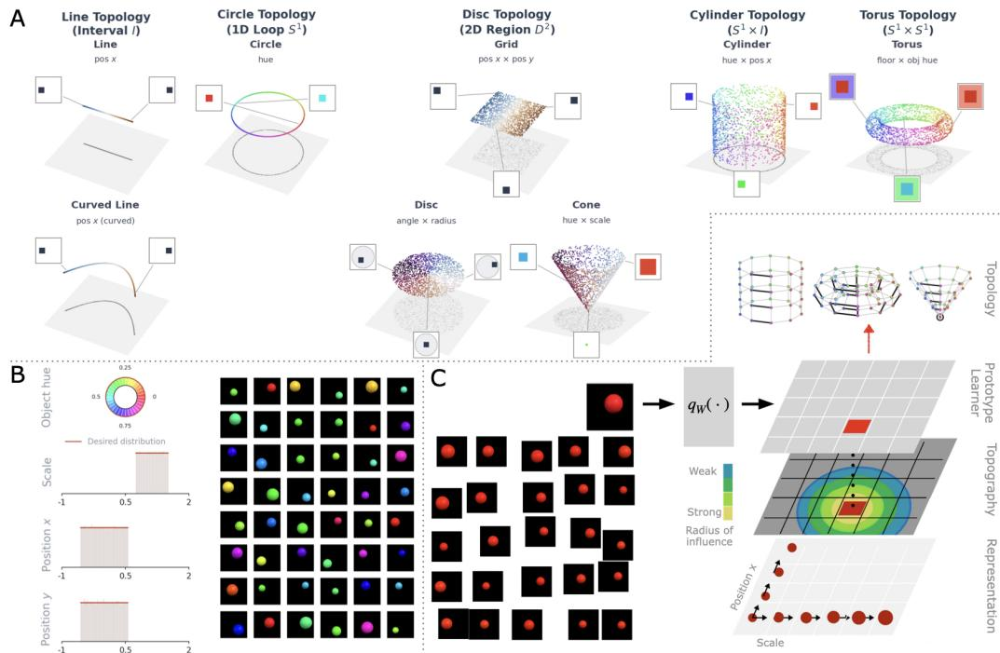
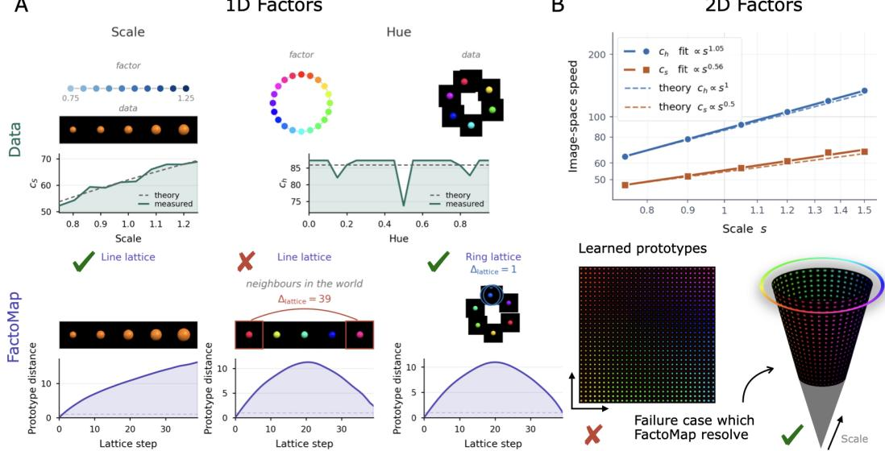
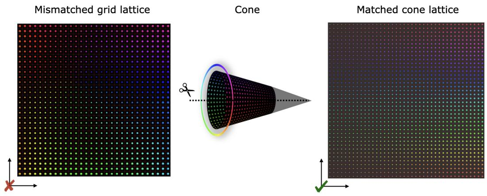

# Beyond Uniform Local Isometry and Topology: FactoMap for Disentangled Representations

Sohini Gupta University of Alberta Alberta Machine Intelligence Institute (Amii)

Bahareh Tolooshams University of Alberta Alberta Machine Intelligence Institute (Amii) Canada CIFAR AI Chair

## Abstract

Many disentanglement methods represent generative factors using Euclidean prod uct coordinates, although the underlying factor spaces may wrap, collapse, or have position-dependent geometry. We introduce factor-space structure, combining factor domains, generator-induced identifications, and position-dependent scales to distinguish topologically equivalent spaces with different factor geometries. We show that statistically independent factors need not be geometrically separable: hue and scale produce effects that grow at different rates, yielding anisotropy that no fixed rescaling removes. We propose the Factor-Space Topographic Map (FactoMap), which learns interpretable prototypes indexed by a factor-space lattice. Topographic learning transfers the lattice’s periodicity, collapses, and non-uniform extent to the representation. Experiments show that matching this structure preserves factor continuity and enables disentanglement of the underlying factors.

## 1 Introduction

Disentangled representation learning seeks to recover the factors that generate a dataset, so that changing one factor of the world changes one coordinate of the representation while leaving the others fixed [1–3]. Such representations are appealing because their coordinates can support interpretation, generalization, fairness, and control [4–9]. However, the factors underlying an arbitrary generative process cannot be recovered from unlabelled observations without additional assumptions [10].

Existing approaches impose inductive biases through statistics or geometry. Statistical methods encourage factorized representations [11–14], while geometric ones constrain how distances vary between factors and observations [15–17]. A prominent geometric assumption is local isometry: equal-sized changes in different factor directions should produce equal-sized changes in the observation, up to a fixed global choice of units. This enables identifiability under suitable conditions [18, 19], and has motivated methods that favour flat or distance-preserving representations [20].

Local isometry, however, is not generally a property of the data-generating process. Different factors act through different mechanisms, and their effects can depend on the current factor configuration. For an object with independently varying hue and scale, changing hue affects its area, whereas changing scale primarily affects its boundary. Because area and perimeter grow at different rates, their relative effect vary as the object grows: the mismatch is position-dependent and cannot be removed by a fixed rescaling of the units. Statistical independence therefore does not imply geometric separability. Factors may be sampled independently while remaining geometrically coupled through the generator.

Local geometry cannot determine whether a factor terminates or closes: an interval and a circle are locally indistinguishable, although a Euclidean coordinate must cut a periodic factor. Non-Euclidean topologies address this closure problem [21–24], but topology [25] alone remains insufficient. A square, a planar disk, and a finite conical surface are homeomorphic [25], yet support different factor organizations. A circular factor may retain constant extent, shrink, or collapse at one point.

  
Figure 1: FactoMaps: Factor-Space + Topology + Topography. A. Representative factor spaces and lattices; the disk and cone share topology but differ in factor-space geometry. B. Factor distributions and samples. C. FactoMap learns topographic prototypes on distinct factor-space structures.

These spaces therefore share a topology while differing in their factor identifications and local scalestructure; a representation encoding only dimension and topology cannot express these distinctions.

We introducefactor-space structure and the Factor-Space Topographic Map (FactoMap, Figure 1), a structured prototype learner designed to disentangle data by aligning lattice coordinates with the underlying factors, even when they do not admit uniform Euclidean geometry. The formalism combines topology with generator-induced identifications and position-dependent scales; FactoMap realizes this structure as a lattice of interpretable prototypes, learned through topographic cooperation [26, 27].

• Factor-spaceformalism. We separate factor domains, generator-induced identifications, and factorwise scales, distinguishing homeomorphic spaces with different organizations or geometries.

• Failure of uniform local isometry. We show that statistically independent hue and scale are geometrically coupled, producing position-dependent anisotropy that fixed rescaling cannot remove.

• Factor-space prototype disentanglement. We propose FactoMap, whose supplied lattice distance encodes periodic closure, collapsed fibres, and non-uniform factor extent. Topographic learning organizes the prototypes to vary smoothly along factor-space paths, making the lattice coordinates a structured representation aligned with the underlying factors.

• Controlled evaluation. In one- and two-factor settings, we compare matched and mismatched prototype domains to isolate how factor-space structure affects disentanglement.

## 2 Factor-Space Topographic Map (FactoMap)

Factor-space structure. Topology specifies neither generator-induced identifications nor positiondependent factor scales. We therefore propose the following factor-space structure.

Definition 2.1 (Factor-Space Structure). Let $\begin{array} { r } { \mathcal { Z } = \prod _ { i = 1 } ^ { p } Z _ { i } } \end{array}$ , with $Z _ { i } ~ \in ~ \{ I , S ^ { 1 } \}$ and $I = [ 0 , 1 ]$ and let $g : \mathcal { Z }  \mathbb { R } ^ { m }$ be piecewise continuously differentiable. Let $e _ { i }$ denote the i-th coordinate direction, with increments along a circularfactor taken modulo its period. The generator induces $z \approx _ { g } z ^ { \prime } \iff g ( z ) = g ( z ^ { \prime } ) , c _ { i } ( z ) : = \| \frac { \partial g } { \partial z _ { i } } ( z ) \| _ { 2 } , c _ { g } : = ( c _ { 1 } , \ldots , c _ { p } )$ . We call $\mathfrak { F } _ { g } : = ( \mathcal { Z } , \approx _ { g } , \pmb { c } _ { g } )$ the factor-space structure induced by $^ { g , }$ and $\begin{array} { r } { \dot { \mathcal { F } } _ { g } : = \mathcal { Z } / \approx _ { g } , } \end{array}$ , the realized factor space, equipped with the quotient topology. $c _ { i } ( z )$ measures the local data-space effect offactor i, i.e., for admissible $\delta  0 ,$ , we have

$$
\| g ( z + \delta e _ { i } ) - g ( z ) \| _ { 2 } = c _ { i } ( z ) | \delta | + o ( | \delta | ) .\tag{2.1}
$$

The pair $( \mathcal { Z } , \approx _ { g } )$ determines the topology of ${ \mathcal { F } } _ { g } ,$ , while $c _ { g }$ records its factor-wise local scales on Z (see Section $\mathrm { \bar { A } . 1 ) }$ . FactoMap models diagonal factor-wise scales; the HSV renderer additionally induces unmodelled cross-terms, analyzed in Section B.

Beyond uniform Euclidean factor geometry. Some geometric approaches to disentanglement impose local isometry to a Euclidean factor domain [15, 16, 18–20]. Let $J _ { g } ( z ) \bar { \mathbf { \xi } } =$ $[ \partial g / \partial z _ { 1 } , . . . , \partial g / \partial z _ { p } ]$ and $\begin{array} { r } { G ( z ) = J _ { g } ( z ) ^ { \top } J _ { g } ( z ) } \end{array}$ . Up to a fixed global scale, local isometry to uniform Euclidean factor coordinates requires $\bar { G } ( z ) = C ^ { 2 } I$ . This fails when factor directions have nonzero cross-terms or when their diagonal scales are unequal or position-dependent. FactoMap addresses the latter by allowing its lattice geometry to vary with the scale functions in Definition 2.1.

Consider hue $h \in S ^ { 1 }$ and scale $s \in [ s _ { \operatorname* { m i n } } , s _ { \operatorname* { m a x } } ] , s _ { \operatorname* { m i n } } > 0$ , on a black background: $g ( h , s ) _ { x y } =$ $m _ { x y } ( s ) \rho ( h )$ . The exponent γ depends on the rendering model; a fixed-width transition gives $\gamma = { ^ { 1 } \mathrm { / 2 } }$

Proposition 2.1 (Scale-dependent anisotropy). Suppose that $m _ { s }$ and ρ are continuously differentiable and, for all $s \in [ s _ { \operatorname* { m i n } } , s _ { \operatorname* { m a x } } ]$ and $\mathring { h ^ { \mathrm { ~ \in ~ } } } S ^ { 1 } , \mathring { \| } m _ { s } \| _ { 2 } = a s , \mathring { \| } \mathring { o _ { s } } m _ { s } \| _ { 2 } = b s ^ { \gamma } , \mathring { \| } \mathring { \pmb { \rho ( h ) } } \| _ { 2 } =$ $q , \parallel \rho ^ { \prime } ( h ) \parallel _ { 2 } = v ,$ where $a , b , q , v \ > \ 0 .$ . The constant-radius condition implies $\langle \pmb { \rho } ( h ) , \pmb { \rho } ^ { \prime } ( h ) \rangle =$ $\begin{array} { r } { \frac 1 2 { \partial _ { h } } \| \pmb { \rho } ( h ) \| _ { 2 } ^ { 2 } = 0 . } \end{array}$ . Hence, the hue and scale directions are orthogonal and

$$
\begin{array} { r } { c _ { s } ( h , s ) = b q s ^ { \gamma } , \qquad c _ { h } ( h , s ) = a v s , \qquad \kappa ( s ) : = \frac { c _ { h } ( h , s ) } { c _ { s } ( h , s ) } = \frac { a v } { b q } s ^ { 1 - \gamma } . } \end{array}\tag{2.2}
$$

Hence, $G ( h , s ) = \mathrm { d i a g } ( a ^ { 2 } v ^ { 2 } s ^ { 2 } , b ^ { 2 } q ^ { 2 } s ^ { 2 \gamma } )$ , and $\kappa ( s _ { \mathrm { m a x } } ) / \kappa ( s _ { \mathrm { m i n } } ) = \bigl ( { s } _ { \mathrm { m a x } } \big / s _ { \mathrm { m i n } } \bigr ) ^ { 1 - \gamma }$ . No fixed diagonal re-weighting makes $G \doteq C ^ { 2 } I$ throughout a non-degenerate scale interval.

Hence, statistically independent factors need not be geometrically separable: the observation-space extent of hue varies with scale. A uniform cylinder cannot represent this dependence, whereas a matched lattice varies the extent of its cyclic axis along the scale axis (see Section A.2).

Factor-space topographic map. We propose FactoMap, a structured prototype learner to realize a factor-space structure as an interpretable topographic representation. It has three components: a factor-space lattice, a data-space prototype field, and a topographic learning objective.

Factor-space lattice. For a supplied structure ${ \mathfrak { F } } ,$ let $( \Lambda _ { \mathfrak { F } } , d _ { \mathfrak { F } } )$ be a finite lattice with an analytic distance chosen to realize that structure (see Section $\mathbf { A . } 3 )$ . Interval and circular factors determine whether axes terminate or wrap; identifications determine which fibres meet or collapse; and the scale functions inform their relative local extent. This finite realization need not be unique.

Prototype representation. Each site $k \in \Lambda _ { \mathfrak { F } }$ indexes a learnable prototype $\pmb { w } _ { k } \in \mathbb { R } ^ { m }$ , defining $W : \bar { \Lambda _ { \mathfrak { F } } } \to \bar { \mathbb { R } } ^ { m } , k \mapsto \pmb { w } _ { k }$ . FactoMap encodes an observation by its best-matching lattice coordinate,

$$
q _ { W } ( \pmb { x } ) : = \underset { \pmb { k } \in \Lambda _ { \mathfrak { F } } } { \arg \operatorname* { m i n } } \ : \| \pmb { x } - \pmb { w } _ { k } \| _ { 2 } ^ { 2 } .\tag{2.3}
$$

Thus, $q _ { W } ( { \pmb x } )$ is a factor-space-indexed discrete coordinate.

Topographic learning. For neighbourhood width $\sigma _ { t } ,$ , define $H _ { \sigma _ { t } } ( j , k ) = \exp [ - d _ { \mathfrak F } ( j , k ) ^ { 2 } / ( 2 \sigma _ { t } ^ { 2 } ) ]$ ]. We learn the prototypes with the self-organizing-map objective [26]

$$
\begin{array} { r } { \mathcal { L } _ { t } ( W ) = \mathbb { E } _ { \pmb { x } } \Big [ \sum _ { k \in \Lambda _ { \mathfrak { F } } } H _ { \sigma _ { t } } ( q _ { W } ( \pmb { x } ) , k ) \| \pmb { x } - \pmb { w } _ { k } \| _ { 2 } ^ { 2 } \Big ] . } \end{array}\tag{2.4}
$$

The neighbourhood term encourages nearby factor-space sites to represent nearby observations (see Section A.4). $( \Lambda _ { \mathfrak { F } } , d _ { \mathfrak { F } } , W , q _ { W } )$ defines the learned FactoMap: the lattice encodes the supplied topology and geometry, while topographic learning realizes them in observation-space prototypes.

## 3 Results

We introduce FactoShapes, a synthetic dataset with four controlled generative factors: object hue, scale, and horizontal and vertical position, and evaluate FactoMap on it (see Section B).

Topology matching removes the cut in a periodic factor. For the interval-valued scale factor, a line-lattice FactoMap learns an ordered sequence of prototypes whose object size changes smoothly along the lattice (Figure 2A). Finite differences on the rendered images show that the local scale speed increases approximately as $c _ { s } ( s ) \propto { \sqrt { s } } ,$ , consistent with the analytical fixed-width rendering model. Applying the same open lattice to hue introduces a cut: hue values near 0 and 1 are adjacent in factor space, but their best-matching sites lie at opposite lattice ends. A ring lattice reduces this separation and produces a continuous cycle of hue prototypes. Thus, local continuity does not determine global closure; periodicity must be encoded in the factor-space lattice. The prototype-distance profiles show how the structures are realized. For scale, the nonlinear cumulative distance is consistent with a position-dependent $c _ { s } ( s )$ . Along the hue ring, distance from a reference prototype increases toward the antipode and then decreases, as expected for a cyclic factor.

A  
B  
  
Figure 2: FactoMap disentangles factors when topology and local scale match their factor-space structure. A. A line lattice represents scale continuously. For periodic hue, an open lattice separates adjacent endpoint hues $( \Delta _ { \mathrm { l a t t i c e } } = 3 9 )$ , whereas a ring restores their adjacency $( \Delta _ { \mathrm { l a t t i c e } } = 1 )$ . B. With hue and scale varied jointly, the measured image-space speeds agree with the analytical laws $c _ { h } \propto s$ and $c _ { s } \propto { \sqrt { s } }$ . A rectangular lattice mixes the two factors, whereas the matched conestructured lattice wraps hue and varies its extent with scale, yielding factor-aligned prototypes.

Independent factors exhibit position-dependent anisotropy. When hue and scale vary jointly, their measured image-space speeds follow different power laws (Figure 2B, top). Power-law fits give $c _ { h } ^ { \mathrm { m e a s } } ( s ) \propto s ^ { 1 . 0 5 }$ and $c _ { s } ^ { \mathrm { m e a s } } ( s ) \propto s ^ { 0 . 5 6 }$ , close to the analytical predictions $c _ { h } ^ { \mathrm { t h } } ( s ) \propto s$ and $c _ { s } ^ { \mathrm { t h } } ( s ) \stackrel { \sim } { \propto } s ^ { 0 . 5 }$ from Proposition 2.1. Consequently, $\kappa ( s ) = c _ { h } \dot { ( s ) } \big / c _ { s } ( s ) \overset { - } { \propto } s ^ { 1 . 0 5 - 0 . 5 6 } \overset {  } { = } s ^ { 0 . 4 9 }$ . Over $s \in [ 0 . 7 5 , 1 . 5 ]$ , the fitted anisotropy therefore changes by $\kappa ( s _ { \mathrm { m a x } } ) / \kappa ( s _ { \mathrm { m i n } } ) = 2 ^ { 0 . 4 9 } \approx 1 . 4 0 4$ , in close agreement with the analytical prediction $\sqrt { 2 } \approx 1 . 4 1$ . Thus, no fixed rescaling matches both directions across scales: independently sampled hue and scale remain geometrically coupled by the generator.

The matched factor-space inductive bias enables hue-scale disentanglement. As predicted by Proposition 2.1, the two-dimensional lattice must represent unequal, position-dependent factor scales: its cyclic circumference must vary with $c _ { h } ( s ) \propto s ,$ while displacement along its scale direction must reflect $c _ { s } ( s ) \propto \sqrt { s }$ . The measured power laws above closely match these analytical rates. A rectangular lattice neither wraps hue nor varies its cyclic extent; empirically, its prototypes mix hue and scale rather than aligning the two factors with separate coordinates (Figure 2B, bottom).

Table 1: Disentanglement withFactoMap uses a supplied cone lattice over the sampled interval: hue wraps around the cyclic coordinate, and the circum- matched cone and mismatched grid. ference of its fibres varies with scale (note: because $s _ { \operatorname* { m i n } } > 0$ Lattice InfoM ↑ InfoE ↑ InfoC ↑ the experimental lattice contains no collapsed fibre; hence,   
practically the prototypes are on a conical frustum. Collapse ✔ Cone 0.953 0.822 0.950 at $s = 0$ remains a formal extension illustrated in Figure 1). ✘ Grid 0.272 0.544 0.025 The analytic distance incorporates the factor-wise scales, us-

ing $c _ { h } ( s )$ for the cyclic extent and $c _ { s } ( s )$ for displacement along scale. The learned prototypes consequently organize hue around the cyclic coordinate and scale along the non-periodic coordinate. In this experiment, the mismatched rectangular lattice fails to disentangle hue and scale, whereas supplying the matched cone structure yields a factor-aligned prototype representation. This qualitative organization is confirmed quantitatively in Table 1 using InfoMEC [9]; the matched cone lattice substantially improves disentanglement over the mismatched grid.

## Acknowledgments and Disclosure of Funding

S.G. and B.T. would like to thank Valérie Costa for helpful discussions. S.G. and B.T. acknowledge support of Natural Sciences and Engineering Research Council of Canada (NSERC), RGPIN-2026- 05959, and funding from the Canada CIFAR AI Chairs Program.

## References

[1] Yoshua Bengio, Aaron Courville, and Pascal Vincent. Representation learning: A review and new perspectives. IEEE transactions on pattern analysis and machine intelligence, 35(8):1798– 1828, 2013.

[2] Irina Higgins, David Amos, David Pfau, Sebastien Racaniere, Loic Matthey, Danilo Rezende, and Alexander Lerchner. Towards a definition of disentangled representations, 2018.

[3] Guillaume Desjardins, Aaron Courville, and Yoshua Bengio. Disentangling factors of variation via generative entangling. arXiv preprint arXiv:1210.5474, 2012.

[4] Xi Chen, Yan Duan, Rein Houthooft, John Schulman, Ilya Sutskever, and Pieter Abbeel. Infogan: Interpretable representation learning by information maximizing generative adversarial nets. Advances in neural information processing systems, 29, 2016.

[5] Jianxin Ma, Chang Zhou, Peng Cui, Hongxia Yang, and Wenwu Zhu. Learning disentangled representations for recommendation. Advances in neural information processing systems, 32, 2019.

[6] Francesco Locatello, Ben Poole, Gunnar Raetsch, Bernhard Schölkopf, Olivier Bachem, and Michael Tschannen. Weakly-supervised disentanglement without compromises. In Hal Daumé III and Aarti Singh, editors, Proceedings of the 37th International Conference on Machine Learning, volume 119 of Proceedings ofMachine Learning Research, pages 6348–6359. PMLR, 13–18 Jul 2020.

[7] Francesco Locatello, Gabriele Abbati, Thomas Rainforth, Stefan Bauer, Bernhard Schölkopf, and Olivier Bachem. On the fairness of disentangled representations. Advances in neural information processing systems, 32, 2019.

[8] Karsten Roth, Mark Ibrahim, Zeynep Akata, Pascal Vincent, and Diane Bouchacourt. Disentanglement of correlated factors via hausdorff factorized support. In The Eleventh International Conference on Learning Representations, 2023.

[9] Kyle Hsu, Will Dorrell, James C. R. Whittington, Jiajun Wu, and Chelsea Finn. Disentanglement via latent quantization. In Thirty-seventh Conference on Neural Information Processing Systems, 2023.

[10] Francesco Locatello, Stefan Bauer, Mario Lucic, Gunnar Raetsch, Sylvain Gelly, Bernhard Schölkopf, and Olivier Bachem. Challenging common assumptions in the unsupervised learning of disentangled representations. In international conference on machine learning, pages 4114– 4124. PMLR, 2019.

[11] Irina Higgins, Loic Matthey, Arka Pal, Christopher Burgess, Xavier Glorot, Matthew Botvinick, Shakir Mohamed, and Alexander Lerchner. beta-VAE: Learning basic visual concepts with a constrained variational framework. In International Conference on Learning Representations, 2017.

[12] Hyunjik Kim and Andriy Mnih. Disentangling by factorising. In Jennifer Dy and Andreas Krause, editors, Proceedings of the 35th International Conference on Machine Learning, volume 80 of Proceedings of Machine Learning Research, pages 2649–2658. PMLR, 10–15 Jul 2018.

[13] Ricky TQ Chen, Xuechen Li, Roger B Grosse, and David K Duvenaud. Isolating sources of disentanglement in variational autoencoders. Advances in neural information processing systems, 31, 2018.

[14] Abhishek Kumar, Prasanna Sattigeri, and Avinash Balakrishnan. Variational inference of disentangled latent concepts from unlabeled observations. In International Conference on Learning Representations, 2018.

[15] Amos Gropp, Matan Atzmon, and Yaron Lipman. Isometric autoencoders, 2020.

[16] In Huh, changwook jeong, Jae Myung Choe, Young-Gu Kim, and Dae Sin Kim. Isometric quotient variational auto-encoders for structure-preserving representation learning. In Thirtyseventh Conference on Neural Information Processing Systems, 2023.

[17] Yue Song, Andy Keller, Nicu Sebe, and Max Welling. Flow factorized representation learning. Advances in Neural Information Processing Systems, 36:49761–49782, 2023.

[18] Daniella Horan, Eitan Richardson, and Yair Weiss. When is unsupervised disentanglement possible? In A. Beygelzimer, Y. Dauphin, P. Liang, and J. Wortman Vaughan, editors, Advances in Neural Information Processing Systems, 2021.

[19] Walter Nelson, Marco Fumero, Theofanis Karaletsos, and Francesco Locatello. Statistical and structural identifiability in representation learning. In The Fourteenth International Conference on Learning Representations, 2026.

[20] Yonghyeon Lee, Sangwoong Yoon, MinJun Son, and Frank C. Park. Regularized autoencoders for isometric representation learning. In International Conference on Learning Representations, 2022.

[21] Tim R Davidson, Luca Falorsi, Nicola De Cao, Thomas Kipf, and Jakub M Tomczak. Hyperspherical variational auto-encoders. arXiv preprint arXiv:1804.00891, 2018.

[22] Michael Moor, Max Horn, Bastian Rieck, and Karsten Borgwardt. Topological autoencoders. In International conference on machine learning, pages 7045–7054. PMLR, 2020.

[23] Loek Tonnaer, Luis Armando Perez Rey, Vlado Menkovski, Mike Holenderski, and Jim Portegies. Quantifying and learning linear symmetry-based disentanglement. In Kamalika Chaudhuri, Stefanie Jegelka, Le Song, Csaba Szepesvari, Gang Niu, and Sivan Sabato, editors, Proceedings of the 39th International Conference on Machine Learning, volume 162 of Proceedings of Machine Learning Research, pages 21584–21608. PMLR, 17–23 Jul 2022.

[24] Jilles S van Hulst, Jakub M Tomczak, WPMH Heemels, and Duarte J Antunes. Constructing vae latent spaces with prescribed topology. arXiv preprint arXiv:2606.07058, 2026.

[25] John M Lee. Introduction to topological manifolds. Springer, 2000.

[26] Teuvo Kohonen. The self-organizing map. Proceedings of the IEEE, 78(9):1464–1480, 1990.

[27] Max Welling, Simon Osindero, and Geoffrey E Hinton. Learning sparse topographic representations with products of student-t distributions. Advances in neural information processing systems, 15, 2002.

[28] Erwin Kreyszig. Differential geometry, volume 11. Courier Corporation, 1991.

[29] Diederik P Kingma and Jimmy Ba. Adam: A method for stochastic optimization. In International Conference on Learning Representations, 2014.

[30] Chris Burgess and Hyunjik Kim. 3d shapes dataset. https://github.com/deepmind/3dshapesdataset/, 2018.

## A Factor-space and FactoMap Details

Notation. We denote scalars as non-bold-lower-case a, vectors as bold-lower-case $^ { a , }$ and matrices as upper-case letters $A . \parallel \cdot \parallel _ { 2 }$ denotes the $\ell _ { 2 }$ (Euclidean) norm. The generator $g : \mathcal { Z }  \mathbb { R } ^ { m }$ maps factor configurations $z \in { \mathcal { Z } }$ to observations x. We write $\mathfrak { F } _ { g } = ( \mathcal { Z } , \approx _ { g } , \pmb { c } _ { g } )$ for the factor-space structure induced by $g$ and $\mathcal { F } _ { g } = \mathcal { Z } / \approx _ { g }$ for its realized factor space. For a supplied structure $\mathfrak { F } , \Lambda _ { \mathfrak { F } }$ denotes its finite lattice realization and $d _ { \mathfrak { F } }$ its analytic lattice distance. Each site $k \in \Lambda _ { \mathfrak { F } }$ indexes a prototype $\boldsymbol { w _ { k } } \in \mathbb { R } ^ { m }$ , and $W : \Lambda _ { \mathfrak { F } } \to \mathbb { R } ^ { m }$ denotes the prototype field. The encoder $q _ { W } ( { \pmb x } )$ returns the best-matching lattice site, $H _ { \sigma _ { t } } ( j , k )$ is the topographic neighbourhood kernel at iteration $t ,$ and $\mathcal { L } _ { t } ( W )$ and $\widehat { \mathcal { L } } _ { t } ( W )$ denote the population and minibatch objectives, respectively. Finally, $p$ is number of factors, and $K : = | \Lambda _ { \mathfrak { F } } |$ is the number of prototypes.

## A.1 Remarks on the factor-space structure

The realized factor space $\mathcal { F } _ { g } = \mathcal { Z } / \approx _ { g }$ carries the quotient topology induced by the canonical projection $\pi : \mathcal { Z } \to \dot { \mathcal { F } } _ { g } .$ . The scale functions are defined on $\mathcal { Z }$ and need not descend to the quotient: descent would require

$$
c _ { i } ( z ) = c _ { i } ( z ^ { \prime } ) \qquad \mathrm { w h e n e v e r } \qquad { z \approx _ { g } z ^ { \prime } . }\tag{A.1}
$$

This distinction matters at collapsed fibres, where the generator can identify an entire coordinate fibre while the remaining scale functions still vary along that fibre.

The complete pullback metric [28] is

$$
G _ { i j } ( z ) = \left. { \frac { \partial g } { \partial z _ { i } } ( z ) , \frac { \partial g } { \partial z _ { j } } ( z ) } \right. ,\tag{A.2}
$$

whose diagonal entries satisfy $G _ { i i } = c _ { i } ^ { 2 }$ . The present FactoMap construction uses these diagonal scales and analytic separable lattice distances; it does not represent nonzero off-diagonal terms.

Neither $c _ { g }$ nor the quotient topology uniquely determines a global lattice distance. The choice of $( \Lambda _ { \mathfrak { F } } , d _ { \mathfrak { F } } )$ is therefore a supplied finite realization of the factor-space structure and is part of the model design.

## A.2 Derivation of the hue-scale metric

Proposition 2.1 (Scale-dependent anisotropy). Suppose that $m _ { s }$ and $\rho$ are continuously differentiable and, for all $s \in [ s _ { \operatorname* { m i n } } , s _ { \operatorname* { m a x } } ]$ and $\mathring { h ^ { \prime } } \mathring { \in } S ^ { 1 } , \mathring { \| } m _ { s } \| _ { 2 } = a s , \ \mathring { \| } \mathring { \partial _ { s } } m _ { s } \| _ { 2 } = b s ^ { \gamma } , \ \mathring { \| } \mathring { \pmb { \rho } ( h ) } \mathring { \| } _ { 2 } =$ $q , \| \pmb { \rho } ^ { \prime } ( h ) \| _ { 2 } = v ,$ , where $a , b , q , v \ > \ 0 .$ . The constant-radius condition implies $\langle \rho ( h ) , \rho ^ { \prime } ( h ) \rangle =$ $\begin{array} { r } { \frac 1 2 { \partial _ { h } } \| \pmb { \rho } ( h ) \| _ { 2 } ^ { 2 } = 0 . } \end{array}$ . Hence, the hue and scale directions are orthogonal and

$$
\begin{array} { r } { c _ { s } ( h , s ) = b q s ^ { \gamma } , \qquad c _ { h } ( h , s ) = a v s , \qquad \kappa ( s ) : = \frac { c _ { h } ( h , s ) } { c _ { s } ( h , s ) } = \frac { a v } { b q } s ^ { 1 - \gamma } . } \end{array}\tag{2.2}
$$

Hence, $G ( h , s ) = \mathrm { d i a g } ( a ^ { 2 } v ^ { 2 } s ^ { 2 } , b ^ { 2 } q ^ { 2 } s ^ { 2 \gamma } )$ , and κ(smax $) \big / \kappa ( s _ { \mathrm { m i n } } ) = \big ( s _ { \mathrm { m a x } } \big / s _ { \mathrm { m i n } } \big ) ^ { 1 - \gamma }$ . No fixed diagonal re-weighting makes $G \dot { = } C ^ { 2 } I$ throughout a non-degenerate scale interval.

Proof. Because the background is black, the generator separates into a spatial mask and a colour vector:

$$
\frac { \partial g } { \partial h } = m _ { s } \rho ^ { \prime } ( h ) , \qquad \frac { \partial g } { \partial s } = ( \partial _ { s } m _ { s } ) \rho ( h ) .\tag{A.3}
$$

Taking norms gives

$$
c _ { h } = \| m _ { s } \| _ { 2 } \| \rho ^ { \prime } ( h ) \| _ { 2 } = a v s , \qquad c _ { s } = \| \partial _ { s } m _ { s } \| _ { 2 } \| \rho ( h ) \| _ { 2 } = b q s ^ { \gamma } .\tag{A.4}
$$

Moreover,

$$
\left. \frac { \partial g } { \partial h } , \frac { \partial g } { \partial s } \right. = \langle m _ { s } , \partial _ { s } m _ { s } \rangle \langle \pmb { \rho } ^ { \prime } ( h ) , \pmb { \rho } ( h ) \rangle = 0 ,\tag{A.5}
$$

because constant colour magnitude implies $\langle \pmb { \rho } ^ { \prime } ( h ) , \pmb { \rho } ( h ) \rangle = 0$ . Substitution into $G = J _ { q } ^ { \top } J _ { g }$ proves the stated metric and scale ratio. A fixed diagonal coordinate re-weighting multiplies $c _ { h }$ and $c _ { s }$ by constants and therefore cannot remove their positional dependence. In particular, the hue-hue entry remains proportional to $s ^ { 2 }$ , so the metric cannot equal $C ^ { 2 } I$ on a non-degenerate scale interval. ■

Factor-wise reparameterization. For coordinate changes $h = \eta ( u )$ and $s = \sigma ( t )$ , the transformed scales are

$$
\widetilde c _ { u } = a v \sigma ( t ) | \eta ^ { \prime } ( u ) | , \qquad \widetilde c _ { t } = b q \sigma ( t ) ^ { \gamma } | \sigma ^ { \prime } ( t ) | .\tag{A.6}
$$

The first cannot be constant on a non-degenerate scale interval because its dependence on t cannot be cancelled by $\eta ^ { \prime } ( u )$ . Hence no factor-wise reparameterization makes the metric uniformly Euclidean. A scale reparameterization can equalize the two diagonal entries point-wise, but their common value remains position-dependent, yielding a conformal rather than a uniformly isometric metric.

Dependence on the mask model. The exponent $\gamma$ is renderer-dependent. For a smooth self-similar mask $m _ { s } ( \pmb { r } ) = \phi ( \pmb { r } / s )$ , a change of variables gives

$$
\| m _ { s } \| _ { 2 } \propto s , \qquad \| \partial _ { s } m _ { s } \| _ { 2 } \propto 1 ,\tag{A.7}
$$

so $\gamma = 0$ . For a smooth transition of fixed spatial width, the changing pixels occupy a band whose area grows with the object perimeter, giving

$$
\| \partial _ { s } m _ { s } \| _ { 2 } ^ { 2 } \propto s , \qquad \| \partial _ { s } m _ { s } \| _ { 2 } \propto \sqrt { s } ,\tag{A.8}
$$

and hence $\begin{array} { r } { \gamma = \frac { 1 } { 2 } } \end{array}$ . A hard binary mask is not differentiable in $L ^ { 2 }$ with respect to $s ;$ finite-step lattice distances nevertheless remain well defined. The measured exponent $\gamma \approx 0 . 5 6$ is close to the fixed-width prediction but should be interpreted as a property of the rendering pipeline. The theoretical conclusion does not depend on the precise exponent: in every smooth model above, the hue scale depends on the scale factor, so the induced geometry is not a uniform Euclidean product in the original factor coordinates.

Collapse at zero scale. If the model is extended by $m _ { 0 } \equiv 0$ , then $g ( h , 0 ) = 0$ for every $h \in S ^ { 1 }$ Thus, $\approx _ { g }$ identifies the entire hue fibre at $s = 0$ , while $c _ { h } ( h , s ) = a v s  0$ . The identification and vanishing scale record the same collapse globally and locally.

## A.3 Analytic lattice distances

FactoMap receives the finite lattice and its distance as inputs: $( \Lambda _ { \mathfrak { F } } , d _ { \mathfrak { F } } )$ . No topology selection, identification estimation, or scale estimation is performed in the present work.

For a regular product lattice $\Pi _ { i = 1 } ^ { p } \{ 0 , \dots , S _ { i } - 1 \}$ , define

$$
\rho _ { i } ( a , b ) = \left\{ \begin{array} { l l } { | a - b | , } & { Z _ { i } = I , } \\ { \operatorname* { m i n } \{ | a - b | , S _ { i } - | a - b | \} , } & { Z _ { i } = S ^ { 1 } . } \end{array} \right.\tag{A.9}
$$

A weighted product distance is

$$
d _ { \mathfrak { F } } ( { j } , { k } ) ^ { 2 } = \sum _ { i = 1 } ^ { p } \lambda _ { i } ^ { 2 } \rho _ { i } ( j _ { i } , k _ { i } ) ^ { 2 } ,\tag{A.10}
$$

where $\lambda _ { i } > 0$ fixes the lattice unit of factor i. Open axes give lines and grids; wrapped axes give rings, cylinders, and tori.

For collapsed or non-uniform structures, (A.10) is replaced by the analytic distance used by the corresponding lattice. These distances must specify both the collapse implementation and the dependence of one factor’s extent on another. Finally, because the neighbourhood depends on $d _ { \mathfrak { F } } / \sigma _ { t }$ a global rescaling of the lattice distance is equivalent to rescaling the neighbourhood schedule. Distance normalization and the $\sigma _ { t }$ schedule must therefore be specified together.

## A.4 Optimization

For each mini-batch $B _ { t }$ , we compute

$$
b _ { n } = \underset { j \in \Lambda _ { \mathfrak { F } } } { \arg \operatorname* { m i n } } \ : \| \pmb { x } _ { n } - \pmb { w } _ { j } \| _ { 2 } ^ { 2 } , \qquad \pmb { x } _ { n } \in \mathcal { B } _ { t } ,\tag{A.11}
$$

and hold $b _ { n }$ fixed during the subsequent gradient step. Conditional on these assignments, the minibatch objective is

$$
\widehat { \mathcal { L } } _ { t } ( W ) = \frac { 1 } { | \mathcal { B } _ { t } | } \sum _ { \substack { \mathbf { x } _ { n } \in \mathcal { B } _ { t } } } \sum _ { k \in \Lambda _ { \mathfrak { F } } } H _ { \sigma _ { t } } ( b _ { n } , k ) \| \mathbf { x } _ { n } - \pmb { w } _ { k } \| _ { 2 } ^ { 2 } ,\tag{A.12}
$$

with prototype gradient

$$
\nabla _ { \pmb { w } _ { k } } \widehat { \mathcal { L } } _ { t } = \frac { 2 } { | \pmb { \mathscr { B } } _ { t } | } \sum _ { \pmb { x } _ { n } \in \pmb { \mathscr { B } } _ { t } } H _ { \sigma _ { t } } ( { \pmb { b } } _ { n } , { \pmb { k } } ) ( \pmb { w } _ { k } - \pmb { x } _ { n } ) .\tag{A.13}
$$

We update the prototypes with Adam [29] and recompute the BMUs after every update; no gradient is propagated through the arg min. The experimental details specify the Adam parameters, batch size, number of updates, prototype initialization, and the complete schedule for $\sigma _ { t }$ annealing.

## B Experimental Details

## B.1 Datasets

FactoShapes. We introduce FactoShapes, a synthetic image dataset of resolution $6 4 \times 6 4 \times 3$ RGB images (Figure 3). The generative factors are v = (object\_hue, scale, $\mathrm { p o s } _ { x } , \mathrm { p o s } _ { y } )$ , so that the factor space is $S ^ { 1 } \times I ^ { 3 }$ : hue is periodic (HSV hue in $[ 0 , 1 )$ at fixed saturation $\langle S \rangle$ and value $\langle V \rangle )$ , while scale and the two position factors are intervals, $s \in [ s _ { \operatorname* { m i n } } , s _ { \operatorname* { m a x } } ]$ and $p _ { x } , p _ { y } \in \left[ - p ^ { \star } , p ^ { \star } \right]$ . The bound $p ^ { \star }$ is obtained by a numerical solver as the largest offset for which the projected object remains fully inside the frame at the largest scale $s _ { \mathrm { m a x } } ,$ guaranteeing that no sample is clipped and that the four factors are independently variable over the whole product range.

Sampling. FactoShapes supports three modes. In grid mode the dataset is the Cartesian product of $n _ { h } \times n _ { s } \times n _ { x } \times n _ { y }$ factor values, giving $N = \langle N \rangle$ ⟩ images with integer factor classes, matching the Shapes3D [30] convention. In random-binned mode factor values are drawn uniformly from the same discrete grid, so that each image is a random lattice point and factor classes remain defined. In continuous mode each factor is drawn i.i.d. with a choice of uniform or Gaussian distribution from its continuous range; no image is repeated, and the integer class array is set to −1 throughout. Datasets are written in 3dshapes format: images of shape (N, 64, 64, 3) uint8, labels of shape $( N , 4 )$ float64, latents\_classes of shape $( N , 4 )$ int64, together with attributes recording the factor names and ranges.

Figure 1B shows the distribution and samples of the dataset when hue is in [0, 1) with ${ \bf S } { = } { \bf V } { = } 1$ $s \in [ 0 . 7 5 , 1 . 5 ]$ and $p _ { x } , p _ { y } \in \left[ 0 . 5 5 6 , 0 . 5 5 6 \right]$

Hue and scale as the two varying factors. We vary object\_hue (HSV hue in [0, 1) with $S = V = 1 )$ and scale $( s \in [ 0 . 7 5 , 1 . 5 ] )$ while keeping the pos and $\mathrm { p o s } _ { y }$ fixed. We generate 100,000 samples in the continuous mode with each varying factor drawn from i.i.d. uniformly for our experiments. Figure 3 shows the sampling distribution with visuals of generated sample.

HSV-induced metric cross-term. Proposition 2.1 assumes a colour path with constant RGB norm about the black background, whereas the experiments use $\pmb { \rho } _ { \mathrm { H S V } } ( h ) \bar { \ } = \mathrm { H S V } \mathrm { t o R G B } ( h , 1 , 1 )$ with normalized hue $h \in [ 0 , 1 )$ . This path has non-constant RGB norm and is differentiable only within each of its six linear sectors. In the first sector, $h \in [ 0 , \frac { 1 } { 6 } ]$ , it is

$$
\rho ( h ) = ( 1 , 6 h , 0 ) = ( 1 , \tau , 0 ) , \qquad \tau : = 6 h \in [ 0 , 1 ] .\tag{B.1}
$$

The remaining sectors have the same form up to a channel permutation and orientation. Away from the sector boundaries,

$$
\| \rho ( h ) \| _ { 2 } = \sqrt { 1 + \tau ^ { 2 } } , \qquad \| \rho ^ { \prime } ( h ) \| _ { 2 } = 6 , \qquad | \langle \rho ( h ) , \rho ^ { \prime } ( h ) \rangle | = 6 \tau .\tag{B.2}
$$

Consequently, the normalized colour contribution to the cross-term is

$$
{ \frac { | \langle \pmb { \rho } , \pmb { \rho } ^ { \prime } \rangle | } { \| \pmb { \rho } \| _ { 2 } \| \pmb { \rho } ^ { \prime } \| _ { 2 } } } = { \frac { \tau } { \sqrt { 1 + \tau ^ { 2 } } } } .\tag{B.3}
$$

For $g ( h , s ) = m _ { s } \rho ( h )$ , the metric cross-term factorizes as

$$
G _ { h s } ( h , s ) = \langle m _ { s } , \partial _ { s } m _ { s } \rangle \langle \pmb { \rho } ^ { \prime } ( h ) , \pmb { \rho } ( h ) \rangle ,\tag{B.4}
$$

and is therefore generally nonzero. Under the leading-order mask model, however, the diagonal scales retain the scale dependence

$$
c _ { h } ( h , s ) = 6 a s \propto s , \qquad c _ { s } ( h , s ) = b \sqrt { 1 + \tau ^ { 2 } } s ^ { \gamma } \propto s ^ { \gamma }\tag{B.5}
$$

almost everywhere. Thus, the supplied lattice matches the factor topology and the power-law dependence on scale, but not the HSV-induced cross-term or the hue-dependent prefactor of $c _ { s } .$ The results consequently demonstrate the benefit of this partial geometric match rather than general handling of non-diagonal metrics.

$$
\begin{array} { r l } & { \mathrm { 1 } } \\ & { \mathrm { 1 } } \\ & { \mathrm { 2 } } \\ & { \mathrm { 3 } } \\ & { \mathrm { 4 } } \\ & { \mathrm { 5 } } \\ & { \mathrm { 4 } } \\ & { \mathrm { 5 } } \\ & { \mathrm { 6 } } \\ & { \mathrm { 4 } } \\ & { \mathrm { 5 } } \\ & { \mathrm { 6 } } \\ & { \mathrm { 6 } } \\ & { \mathrm { 7 } } \\ & { \mathrm { 6 } } \\ & { \mathrm { 7 } } \\ & { \mathrm { 8 } } \\ & { \mathrm { 6 } } \\ & { \mathrm { 7 } } \\ & { \mathrm { 7 } } \\ & { \mathrm { 8 } } \\ & { \mathrm { 9 } } \\ & { \mathrm { 9 } } \\ & { \mathrm { 9 } } \\ & { \mathrm { 9 } } \\ & { \mathrm { 8 } } \\ & { \mathrm { 9 } } \\ & { \mathrm { 9 } } \\ & { \mathrm { 9 } } \\ & { \mathrm { 9 } } \\ & { \mathrm { 9 } } \\ & { \mathrm { 9 } } \\ & { \mathrm { 9 } } \\ & { \mathrm { 9 } } \\ & { \mathrm { 9 } } \\ & { \mathrm { 8 } } \\ & { \mathrm { 9 } } \\ & { \mathrm { 9 } } \\ & { \mathrm { 9 } } \\ & { \mathrm { 9 } } \\ & { \mathrm { 9 } } \\ & { \mathrm { 9 } } \\ & { \mathrm { 9 } } \\ & { \mathrm { 9 } } \\ & { \mathrm { 9 } } \\ & { \mathrm { 9 } } \\ & { \mathrm { 8 } } \\ & { \mathrm { 9 } } \\ & { \mathrm { 9 } } \\ & { \mathrm { 9 } } \\ & { \mathrm { 9 } } \\ & { \mathrm { 9 } } \\ & { \mathrm { 9 } } \\ & { \mathrm { 9 } } \\ & { \mathrm { 9 } } \\ & { \mathrm { 9 } } \\ & { \mathrm { 9 } } \\ & { \mathrm { 9 } } \\ & { \mathrm { 9 } } \\ & { \mathrm { 9 } } \\ & { \mathrm { 9 } } \\ & { \mathrm { 9 } } \\ & { \mathrm { 9 } } \end{array} \mapsto \begin{array} { r l } & { \mathrm { 1 0 } } \\ & { \mathrm { 6 } } \\ &  \mathrm { 7 }  \end{array}
$$

Figure 3: FactoShapes Dataset. Sampling distribution (uniform) and visuals of samples for object\_hue and scale as varying factors.

## B.2 Training and model parameters

Training. Training uses a single step counter, while step < num\_steps. We take num\_steps = 60,000 updates at batch size $B = 1 2 8$ , optimized with Adam at initial learning rate $\eta _ { 0 } = 0 . 1$ . We use the inbuilt ExponentialLR learning rate scheduler function with $\gamma = e ^ { - 1 / \bar { \mathrm { n u m } } _ { - } \mathrm { s t e p s } }$ . The initial neighborhood radius is not set explicitly; the model initializes it to half its own topological diameter. The radius $\sigma _ { 0 }$ exponentially decays to $\sigma _ { T } = 1 . 0$ in the first 65% of the training steps and is held constant thereafter.

Prototype field. For the cone FactoMap we specify the lattice size to be $4 0 \times 2 0$ with prototypes $W \in \bar { \mathbb { R } } ^ { \bar { K } \times 1 2 , 2 8 8 }$ where $K = 8 0 0$ here. Knowing the fact that the rows are wrapped we have an increased number on the rows. The lattice carries cone metric: a ring at radius r has circumference 2πkr with $k = 0 . 2 4 3$ , and column j sits at radius $r _ { j } = r _ { 0 } + j$ with $r _ { 0 } = 1 8 . 4$ , so radii run from 18.4 at the inner rim to 37.4 at the outer rim.

The cone is used rather than a plain grid because an open rectangular grid cannot represent periodic hue without introducing a seam; wrapping the hue axis removes this artificial boundary. A cylinder is neither suitable as the generator’s induced metric is not a product metric: the hue and scale coefficients scale as $c _ { h } \propto s ^ { 1 . 0 5 }$ and $c _ { s } \propto s ^ { 0 . 5 6 }$ , so the arc length of a full hue circle relative to radial spacing grows with scale. Forming a cone helps to preserve the relation.

## C Additional Visualizations

We learn grid and cone prototype lattices on FactoShapes (Figure 3), where hue and scale are the only varying factors. On the grid, hue and scale don’t run systematically along the lattice axes, so neither factor is recoverable from any axis direction. The failure is informative: the learned prototypes still wrap in hue, indicating that the map is trying to close a cycle the grid cannot support. Matching this cyclic structure requires a lattice with a circular direction, and the taper of a cone additionally accommodates the growth of the hue metric with scale. On the cone lattice, hue aligns with the circular direction and scale with the axial direction (Figure 4), and Table 1 confirms this with InfoMEC.

  
Figure 4: Visualizations of learned prototypes in a grid lattice and cone lattice. The cone is cut to unfold the lattice to visualization the alignment of prototypes.