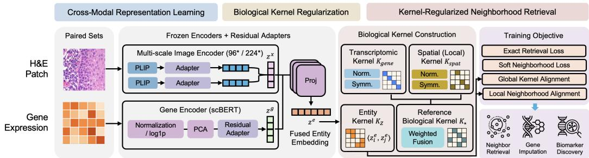

# BioKERN: Biological Kernel Regularization for Histology-to-Transcriptomics Neighborhood Retrieval

Seungik Cho Department of Physics and Astronomy Rice University Houston, TX 77005 sc252@rice.edu

Betul Orcan-Ekmekci∗   
Department of Mathematics   
Rice University   
Houston, TX 77005   
orcan@rice.edu

## Abstract

Spatially resolved biology requires representations that preserve biological neighborhood structure rather than only exact cross-modal correspondences. Existing histology–transcriptomics objectives can emphasize instance-level matching even when non-paired spots share molecular or spatial context. We introduce BioKERN, a multimodal spatial representation-learning framework that incorporates biological structure as an explicit, learnable inductive bias. BioKERN constructs a trainingtime biological kernel by combining transcriptomic similarity and spatial proximity, then uses it to provide graded neighborhood supervision and regularize embedding geometry. Evaluation uses a fixed, model-independent biological neighborhood definition shared by all methods. Across Mouse Brain Visium and Human Liver GSE240429, BioKERN consistently improves biological-neighborhood retrieval over BLEEP in both single- and multi-scale settings. Controlled shared-architecture experiments show that most of the improvement arises from biological-kernel regularization rather than increased model capacity. These results support explicit biological geometry as an interpretable inductive bias for multimodal learning in spatial biology.

## 1 Introduction

Spatial transcriptomics measures molecular state while preserving tissue location, providing a direct view of how gene-expression programs are organized within anatomical structure [Ståhl et al., 2016, Stickels et al., 2021, Chen et al., 2022]. Histology provides a complementary morphological view and is available at substantially larger scale in both research and clinical workflows [Campanella et al., 2019, Lu et al., 2021]. This asymmetry motivates a natural multimodal learning problem: given an H&E patch from a new tissue, retrieve transcriptomic profiles representing the same biological context from a profiled reference.

Exact image–spot correspondence is useful supervision, but it does not fully capture the organization of spatial tissue. Spatially adjacent observations, spots within the same tissue domain, or locations with similar transcriptional programs can represent related biological states even when they are not the same measured location. A representation optimized only for instance identity can therefore under-represent biologically meaningful neighborhood structure.

Biological similarity is also multi-factorial. Transcriptomic similarity reflects molecular programs, whereas spatial proximity reflects tissue organization [Palla et al., 2022, Dries et al., 2021]. Their relative utility can differ between tissue settings, motivating a learnable rather than fixed combination of these signals.

We introduce BioKERN (Biological KErnel Regularization for histology-to-transcriptomics Neighborhood retrieval), which incorporates explicit biological geometry into multimodal spatial representation learning. BioKERN constructs a reference kernel from transcriptomic similarity and spatial proximity, learns their relative weighting, and regularizes the H&E–transcriptomics representation to preserve this geometry.

We formulate the resulting task as biological neighborhood retrieval (BNR): given an H&E query, the representation should retrieve transcriptomic states belonging to the same biological neighborhood rather than being evaluated only by exact-pair matching.

Our main contributions are as follows.

• Biologically structured multimodal representation learning. BioKERN augments instance-level alignment with graded supervision derived from explicit biological neighborhood similarity.

• Learnable molecular–spatial weighting. BioKERN combines transcriptomic similarity and spatial proximity through a learned scalar weight, yielding a compact and interpretable biological prior.

• Controlled validation of the biological prior. Shared-architecture controls, shuffled-kernel controls, and ablations show that biological-kernel regularization accounts for most of the improvement in biological-neighborhood retrieval.

## 2 Related Work

Histology–transcriptomics representation learning. BLEEP [Xie et al., 2023] learns a joint image–gene representation for retrieval-based expression prediction and uses similarity-smoothed targets to reduce purely instance-discriminative supervision. Other multimodal or spatial methods, including mclSTExp [Yang et al., 2024], ConGcR [Zhou et al., 2024], SpaGCN [Hu et al., 2021], STAGATE [Dong and Zhang, 2022], and GraphST [Long et al., 2023], incorporate spatial context or graph structure. BioKERN differs by defining an explicit biological target geometry from transcriptomic and spatial similarity, then using that geometry for both graded retrieval supervision and direct global/local representation regularization.

Structured relational supervision. Kernel alignment [Cristianini et al., 2002, Cortes et al., 2012], relational representation learning [Park et al., 2019, Tung and Mori, 2019], and supervised contrastive learning [Khosla et al., 2020] show that pairwise structure can guide representations beyond one-hot instance labels. BioKERN adapts this principle to spatial biology using a learnable molecular–spatial reference kernel. Extended related work is provided in Appendix A.

## 3 Method

BioKERN learns a multimodal spatial representation in which cross-modal similarity reflects paired image–gene correspondence together with biological neighborhood structure. The framework consists of multimodal representation learning, construction of a learnable biological reference kernel, and kernel-regularized neighborhood supervision (Figure 1).

Multimodal spatial representations. For each spatial-transcriptomics spot, we observe $( x _ { i } , g _ { i } , s _ { i } )$ where $x _ { i }$ is an H&E image patch, gi is the corresponding gene-expression profile, and $s _ { i } \in \mathbb { R } ^ { 2 }$ is its tissue coordinate. A frozen PLIP pathology encoder [Huang et al., 2023] extracts morphology features, while gene expression is normalized, log-transformed, standardized, and reduced with PCA. Lightweight ResidualAdapters project both modalities into a shared $d = 1 2 8$ dimensional ℓ2-normalized embedding space. We evaluate two image-context settings: the single-scale (SS) setting uses a 96 × 96 H&E patch to capture local morphology, whereas the multi-scale (MS) setting combines representations from $9 6 \times 9 6$ and $2 2 4 \times 2 2 4$ patches using a learnable fusion weight, thereby incorporating both local morphology and broader tissue context. All backbone encoders remain frozen.

  
Figure 1: BioKERN overview. Multimodal image and gene representations are regularized during training using a biological reference kernel combining transcriptomic and spatial similarity. The kernel defines graded neighborhoods and supervises global and local embedding geometry; inference requires only the learned image and transcriptomic embeddings.

Learnable biological reference kernel. We describe biological relatedness using complementary transcriptomic and spatial RBF kernels,

$$
K _ { \mathrm { g e n e } } ( i , j ) = \exp \left( - \frac { \| h _ { i } ^ { g } - h _ { j } ^ { g } \| _ { 2 } ^ { 2 } } { 2 \sigma _ { g } ^ { 2 } } \right) , \qquad K _ { \mathrm { s p a t } } ( i , j ) = \exp \left( - \frac { \| s _ { i } - s _ { j } \| _ { 2 } ^ { 2 } } { 2 \sigma _ { s } ^ { 2 } } \right) .\tag{1}
$$

Bandwidths are determined from training-set pairwise distances. Rather than fixing the relative weighting of molecular and spatial information, BioKERN learns their composition:

$$
K _ { \star } = \alpha K _ { \mathrm { g e n e } } + ( 1 - \alpha ) K _ { \mathrm { s p a t } } , \qquad \alpha = \sigma ( a )\tag{2}
$$

where α is optimized end-to-end. For multi-section training, spatial affinities are defined only within the same tissue section; pairs from different sections have $K _ { \mathrm { s p a t } } ( i , j ) = 0$ , while transcriptomic affinities remain available across sections. The resulting scalar gives a compact, interpretable weighting of the two sources of biological neighborhood structure.

Biological-neighborhood supervision. Standard bidirectional InfoNCE preserves exact image– gene correspondence,

$$
\mathcal { L } _ { \mathrm { r e t } } = \frac { 1 } { 2 } \left[ \boldsymbol { \mathrm { C E } } ( \boldsymbol { S } , I ) + \boldsymbol { \mathrm { C E } } ( \boldsymbol { S } ^ { \top } , I ) \right] , \qquad \boldsymbol { S } = \boldsymbol { Z } ^ { x } ( \boldsymbol { Z } ^ { g } ) ^ { \top } / \tau .\tag{3}
$$

BioKERN augments this objective with three biologically structured terms. For each observation, the soft neighborhood loss selects the minibatch top-k non-self neighbors under $K _ { \star } \left( k = 2 0 \right)$ and normalizes their kernel affinities into graded targets. The exact paired observation is excluded from this biological-neighborhood set, so $\mathcal { L } _ { \mathrm { { s o f t } } }$ adds supervision for distinct but biologically related spots while $\mathcal { L } _ { \mathrm { r e t } }$ retains exact-pair alignment.

To regularize representation geometry, image and gene embeddings are fused into a spot-level entity representation $z _ { i } ^ { e }$ , yielding $\mathbf { \bar { \it K } } _ { Z } ( i , j ) = \langle \bar { z _ { i } ^ { e } } , z _ { i } ^ { e } \rangle$ ⟩. The global alignment loss matches the overall entity-kernel geometry to $K _ { \star }$ , whereas the local alignment loss focuses on the strongest biological neighborhood edges. The complete objective is

$$
\begin{array} { r } { \mathcal { L } = \mathcal { L } _ { \mathrm { r e t } } + \lambda _ { s } \mathcal { L } _ { \mathrm { s o f t } } + \lambda _ { g } \mathcal { L } _ { \mathrm { g l o b } } + \lambda _ { \ell } \mathcal { L } _ { \mathrm { l o c } } , } \end{array}\tag{4}
$$

where $\lambda _ { s } = 0 . 3 , \lambda _ { q } = 0 . 1$ , and $\lambda _ { \ell } = 0 . 5$ . The biological kernel is a training-time supervisory signal; at inference, an H&E query is ranked directly against reference transcriptomic embeddings by cosine similarity. Detailed loss definitions are provided in Appendix B.

## 4 Results

Experimental setup. We evaluate on two 10× Visium benchmarks with distinct tissue organization. Mouse Brain Visium uses 2,200 spots with a 1,650/550 train/test split. Human Liver GSE240429 uses a cross-slice transfer setting: A1+B1+D1 (6,963 spots) are used for training and C1 (2,273 spots) for testing. Single-scale (SS) experiments use a 96 × 96 H&E patch, while multi-scale (MS) experiments combine $9 6 \times 9 6$ and $2 2 4 \times 2 2 4$ representations with learned fusion.

Table 1: Biological-neighborhood retrieval across tissues and scales. Bio-mAP uses the same fixed $K _ { \mathrm { e v a l } }$ for every method; stochastic methods are mean±standard deviation over five seeds.
<table><tr><td>Dataset / Scale</td><td>Ridge</td><td>PLIP linear</td><td>BLEEP</td><td> ${ \mathrm { B L E E P } } ^ { * }$ </td><td>BioKERN</td></tr><tr><td>Mouse Brain SS</td><td>0.4902</td><td> $0 . 5 4 0 7 { \scriptstyle \pm . 0 0 3 3 }$ </td><td> $0 . 5 0 8 7 { \scriptstyle \pm . 0 0 3 3 }$ </td><td> $0 . 5 3 2 7 { \scriptstyle \pm . 0 0 3 6 }$ </td><td> $\mathbf { 0 . 6 1 9 0 { \scriptstyle \pm . 0 0 2 3 } }$ </td></tr><tr><td>Mouse Brain MS</td><td>0.5567</td><td> $0 . 5 8 3 1 { \scriptstyle \pm . 0 0 2 3 }$ </td><td> $0 . 4 9 6 0 { \scriptstyle \pm . 0 0 5 6 }$ </td><td> $0 . 5 5 4 1 { \scriptstyle \pm . 0 0 4 0 }$ </td><td> $\mathbf { 0 . 6 7 1 6 { \scriptstyle \pm . 0 0 2 1 } }$ </td></tr><tr><td>Human Liver SS</td><td>0.0383</td><td> $0 . 0 3 0 7 { \scriptstyle \pm . 0 0 0 1 }$ </td><td> $0 . 0 3 0 2 { \scriptstyle \pm . 0 0 0 5 }$ </td><td> $0 . 0 3 0 9 { \scriptstyle \pm . 0 0 0 4 }$ </td><td> $\mathbf { 0 . 0 3 9 6 { \scriptstyle \pm . 0 0 0 7 } }$ </td></tr><tr><td>Human Liver MS</td><td>0.0403</td><td> $0 . 0 3 1 9 { \scriptstyle \pm . 0 0 0 5 }$ </td><td> $0 . 0 3 1 2 { \scriptstyle \pm . 0 0 0 5 }$ </td><td> $0 . 0 3 2 1 { \scriptstyle \pm . 0 0 0 5 }$ </td><td> $\mathbf { 0 . 0 4 0 8 } \pm . 0 0 0 5$ </td></tr></table>

For every held-out H&E query, the retrieval gallery consists of the transcriptomic profiles from the same held-out test set. The exact paired profile remains in the gallery for exact-pair metrics but is excluded when defining biological-neighborhood positives. Bio-mAP uses one fixed, model-independent evaluation kernel, $K _ { \mathrm { e v a l } } = 0 . 5 \bar { K } _ { \mathrm { g e n e } } + 0 . 5 \bar { K } _ { \mathrm { s p a t } }$ , for every method; query-side expression is used only to construct evaluation labels and is never provided to the retrieval model. We additionally report transcriptomic-neighbor recall, spatial-neighbor recall, cluster consistency, and exact-pair retrieval in Appendix C. We compare against CCA, Ridge regression, a naive PLIP zero-shot lower bound, PLIP linear, and BLEEP. BLEEP∗ uses the same ResidualAdapter backbone as BioKERN while retaining BLEEP’s training objective, isolating architectural effects.

BioKERN improves biological-neighborhood retrieval. BioKERN achieves the highest Bio-mAP among the baselines shown in Table 1 across both tissues and image-context settings. Relative to BLEEP, Mouse Brain Bio-mAP increases from 0.5087 to 0.6190 in SS and from 0.4960 to 0.6716 in MS. BioKERN also exceeds BLEEP∗, indicating that the gain is not explained by the ResidualAdapter architecture alone. The Human Liver gains are smaller in absolute magnitude, but persist in the cross-slice transfer setting and remain competitive with the strong Ridge baseline.

Biological regularization accounts for most of the gain. We decompose the improvement sequentially as BLEEP → BLEEP∗ (architecture), BLEEP∗ → Ret-only (objective change), and Ret-only → BioKERN (biological regularization). Under this additive decomposition, the biologicalregularization step accounts for approximately 63–91% of the total Bio-mAP improvement across the four settings. On Mouse Brain SS, the architecture contributes +0.0240, the objective change +0.0037, and the biological-regularization step +0.0826. A shuffled-kernel control further shows that meaningful biological pairwise structure is important rather than merely adding another relational loss.

Graded neighborhood supervision is the strongest component. Ablations show that removing biological-kernel supervision substantially reduces Bio-mAP, while removing $\mathcal { L } _ { \mathrm { { s o f t } } }$ causes the largest degradation among the three biological objectives. The relative value of molecular and spatial structure varies across tissue settings: combining both signals performs best on Mouse Brain and Human Liver MS, whereas Human Liver SS favors the transcriptomic-only kernel. Consistent with this tissue-dependent behavior, the learned molecular–spatial weight is stable across multiple initializations, with Human Liver assigning greater weight to transcriptomic similarity than Mouse Brain. The strong fixed-α control nevertheless shows that the primary gain arises from biologicalneighborhood supervision rather than from learning α alone. Full ablations and kernel-weight analyses are provided in Appendices F and G.

## 5 Conclusion

BioKERN introduces an explicit biological inductive bias for multimodal spatial representation learning. Rather than evaluating representation quality only through exact-pair matching, BioKERN uses a learnable molecular–spatial reference geometry to provide graded neighborhood supervision and relational regularization. Across mouse brain and human liver, this improves biological-context retrieval, and controlled experiments indicate that the biological regularization—rather than architectural complexity—accounts for most of the gain.

The current study remains limited to two single-donor benchmarks and a scalar kernel mixture. Future work should evaluate cross-donor and cross-platform transfer, richer region-dependent biological priors, and larger spatial resources. More broadly, BioKERN provides a simple mechanism for injecting explicit biological structure into foundation-model-based multimodal representations for spatial biology.

## References

Patrik L Ståhl et al. Visualization and analysis of gene expression in tissue sections by spatial transcriptomics. Science, 353(6294):78–82, 2016.

Robert R Stickels et al. Highly sensitive spatial transcriptomics at near-cellular resolution with Slide-seqV2. Nature Biotechnology, 39(3):313–319, 2021.

Ao Chen et al. Spatiotemporal transcriptomic atlas of mouse organogenesis using DNA nanoballpatterned arrays. Cell, 185(10):1777–1792, 2022.

Gabriele Campanella et al. Clinical-grade computational pathology using weakly supervised deep learning on whole slide images. Nature Medicine, 25(8):1301–1309, 2019.

Ming Y Lu et al. Data-efficient and weakly supervised computational pathology on whole-slide images. Nature Biomedical Engineering, 5(6):555–570, 2021.

Giovanni Palla et al. Squidpy: a scalable framework for spatial omics analysis. Nature Methods, 19 (2):171–178, 2022.

Ruben Dries et al. Giotto: a toolbox for integrative analysis and visualization of spatial expression data. Genome Biology, 22(1):1–31, 2021.

Juannan Xie et al. BLEEP: Bi-modal embedding framework for spatially resolved gene expression prediction. In Advances in Neural Information Processing Systems, volume 36, 2023.

Mengqian Yang et al. Multimodal contrastive learning for spatial gene expression prediction using histology images. Briefings in Bioinformatics, 25(6), 2024.

Xu Zhou et al. ConGcR: Contrastive graph-based representation learning for spatial transcriptomics. bioRxiv, 2024.

Jian Hu et al. SpaGCN: Integrating gene expression, spatial location and histology to identify spatial domains and spatially variable genes by graph convolutional network. Nature Methods, 18(11): 1342–1351, 2021.

Kangning Dong and Shihua Zhang. STAGATE: Deciphering spatial domains from spatially resolved transcriptomics with an adaptive graph attention auto-encoder. In Nature Communications, volume 13, page 1739, 2022.

Yahui Long et al. GraphST: Spatially informed clustering and integration of spatial transcriptomics data. Nature Methods, 20(7):1053–1063, 2023.

Nello Cristianini, John Shawe-Taylor, André Elisseeff, and Jaz Kandola. On kernel-target alignment. Advances in Neural Information Processing Systems, 14, 2002.

Corinna Cortes, Mehryar Mohri, and Afshin Rostamizadeh. Algorithms for learning kernels based on centered alignment. Journal ofMachine Learning Research, 13:795–828, 2012.

Wonpyo Park, Dongju Kim, Yan Lu, and Minsu Cho. Relational knowledge distillation. In Conference on Computer Vision and Pattern Recognition, pages 3967–3976, 2019.

Frederick Tung and Greg Mori. Similarity-preserving knowledge distillation. In International Conference on Computer Vision, pages 1365–1374, 2019.

Prannay Khosla et al. Supervised contrastive learning. In Advances in Neural Information Processing Systems, volume 33, pages 18661–18673, 2020.

Zhi Huang et al. A visual-language foundation model for pathology image analysis using medical Twitter. In Nature Medicine, volume 29, pages 2307–2316, 2023.

Yu Wang et al. STMCL: Spatial transcriptomics multi-slice contrastive learning. bioRxiv, 2024.

Xin Li et al. Spatial transcriptomics expression prediction from histopathology based on cross-modal mask reconstruction and contrastive learning. Medical Image Analysis, 2025a.

Yu Wang et al. FineST: Fine-grained spatial transcriptomics prediction from histology. arXiv preprint, 2026.

Rahul Gindra et al. A large-scale benchmark of cross-modal learning for histology and gene expression in spatial transcriptomics. arXiv preprint arXiv:2508.01490, 2025.

Bryan He et al. Integrating spatial gene expression and breast tumour morphology via deep learning. Nature Biomedical Engineering, 4(8):827–834, 2020.

Minxing Pang et al. Leveraging information in spatial transcriptomics to predict super-resolution gene expression from histology images in tumors. bioRxiv, 2021.

Yuansong Zeng et al. Spatial transcriptomics prediction from histology jointly through Transformer and graph neural networks. Briefings in Bioinformatics, 23(5), 2022.

Shunxing Xu et al. GHIST: Single-cell resolution spatial gene expression prediction from histology. Nature Methods, 2025.

Yang Li et al. FmH2ST: Foundation model for histology-to-spatial transcriptomics. arXiv preprint, 2025b.

Guillaume Jaume et al. Cross-modal knowledge distillation from spatial transcriptomics to histology. In arXiv preprint arXiv:2311.09769, 2023.

Guillaume Jaume et al. HEST-1k: A dataset for spatial transcriptomics and histology image analysis. arXiv preprint arXiv:2406.16192, 2024.

Andrés Mejía et al. SpaRED: Standardized pipeline for reproducible evaluation of spatially resolved expression data. bioRxiv, 2024.

Wei Chen et al. spCLUE: Contrastive learning for spatial domain detection. bioRxiv, 2025.

Debidatta Dwibedi et al. With a little help from my friends: Nearest-neighbor contrastive learning of visual representations. In International Conference on Computer Vision, pages 9588–9597, 2021.

## A Extended Related Work

Histology–transcriptomics alignment. Contrastive learning has emerged as a dominant paradigm for aligning H&E patches with gene-expression profiles. BLEEP [Xie et al., 2023] learns a bi-modal embedding space for retrieval-based expression prediction and uses similarity-smoothed targets derived from within-modality relationships. Thus, BioKERN is not distinguished simply by using non-one-hot supervision; its key difference is the use of an explicit molecular–spatial biological reference geometry for both retrieval supervision and representation regularization. mclSTExp [Yang et al., 2024] extends this with multimodal contrastive learning incorporating spatially contextualized expression representations, while ConGcR [Zhou et al., 2024] integrates gene expression, spatial location, and tissue morphology through contrastive representation learning.

More recent approaches including STMCL [Wang et al., 2024], CMRCNet [Li et al., 2025a], and FineST [Wang et al., 2026] combine cross-modal alignment with reconstruction objectives or foundation-model features. A large-scale benchmark of histology–gene-expression cross-modal learning [Gindra et al., 2025] further highlights the importance of dataset-specific gene-expression representations. These approaches differ in how they use paired supervision, reconstruction, and contextual information. BioKERN specifically studies an explicit biological target geometry over transcriptomic and spatial similarity and uses that geometry to regularize cross-modal retrieval.

Gene-expression prediction from histology. A parallel line of work directly predicts spatially resolved gene expression from H&E. ST-Net [He et al., 2020] and HisToGene [Pang et al., 2021] established the viability of deep learning for this task, while Hist2ST [Zeng et al., 2022] introduced graph-based spatial modeling. Recent methods use pathology foundation models [Xu et al., 2025, Li et al., 2025b] and cross-modal knowledge distillation [Jaume et al., 2023]. Larger resources including HEST-1k [Jaume et al., 2024] and SpaRED [Mejía et al., 2024] facilitate standardized evaluation. These methods principally optimize expression reconstruction; BioKERN instead studies retrieval of biologically related transcriptomic contexts.

Spatial neighborhood modeling. Spatial-transcriptomics analysis routinely depends on local neighborhood structure. Squidpy [Palla et al., 2022] and Giotto [Dries et al., 2021] provide spatial graphs, statistics, and neighborhood analyses. SpaGCN [Hu et al., 2021], STAGATE [Dong and Zhang, 2022], GraphST [Long et al., 2023], and spCLUE [Chen et al., 2025] learn representations that preserve spatial structure through graph convolutions, attention, or contrastive learning. BioKERN applies a related principle across modalities: the shared H&E–gene space is regularized to preserve a biologically interpretable reference geometry.

Kernel and relational regularization. Kernel-target alignment provides a classical framework for comparing learned similarities with a desired structure [Cristianini et al., 2002, Cortes et al., 2012]. Relational knowledge distillation [Park et al., 2019] and similarity-preserving learning [Tung and Mori, 2019] show that preserving pairwise relationships can improve representation transfer. Supervised contrastive learning [Khosla et al., 2020] and nearest-neighbor contrastive learning [Dwibedi et al., 2021] similarly extend instance discrimination to richer positive relations. BioKERN contributes a biological reference kernel combining transcriptomic and spatial signals and uses it for both soft retrieval supervision and direct embedding-geometry regularization.

## B Additional Method Details

## B.1 Problem Definition

Given a spatial-transcriptomics dataset,

$$
\mathcal { D } = \{ ( x _ { i } , g _ { i } , s _ { i } ) \} _ { i = 1 } ^ { N } ,\tag{B.1}
$$

$x _ { i }$ denotes the H&E patch centered at spot $i , g _ { i }$ the corresponding gene-expression profile, and $s _ { i } \in \mathbb { R } ^ { 2 }$ its spatial coordinate.

The goal is to learn a shared morphology–transcriptomics representation in which an H&E query retrieves spots whose transcriptional state belongs to the same biological neighborhood rather than only the exact paired spot.

## B.2 Image and Gene Representation

A frozen PLIP encoder [Huang et al., 2023] maps each H&E patch to

$$
h _ { i } ^ { x } \in \mathbb { R } ^ { 5 1 2 } .\tag{B.2}
$$

Gene expression is normalized to 10,000 counts per spot, log1p transformed, filtered to highly variable genes, standardized per gene, and reduced with PCA to

$$
h _ { i } ^ { g } \in \mathbb { R } ^ { 1 2 8 } .\tag{B.3}
$$

Both modalities are projected into a common $d = 1 2 8$ dimensional space using a ResidualAdapter:

$$
z _ { i } ^ { m } = \ell _ { 2 } \mathrm { - N o r m a l i z e } \left[ \mathrm { L a y e r N o r m } \left( W _ { m } h _ { i } ^ { m } + \eta _ { m } \mathrm { M L P } _ { m } ( h _ { i } ^ { m } ) \right) \right] , \qquad m \in \{ x , g \} .\tag{B.4}
$$

Here $W _ { m }$ is a linear projection, $\mathrm { M L P } _ { m }$ is a two-layer GELU network with hidden dimension 256 and 10% dropout, and $\eta _ { m }$ is a learnable residual scale initialized to 0.1. All backbone parameters remain frozen.

We additionally define a fused entity representation

$$
z _ { i } ^ { e } = \ell _ { 2 } \mathrm { - N o r m a l i z e } \left( \rho z _ { i } ^ { x } + ( 1 - \rho ) z _ { i } ^ { g } \right) , \qquad \rho = \sigma ( r ) .\tag{B.5}
$$

The learned entity kernel is

$$
K _ { Z } ( i , j ) = \langle z _ { i } ^ { e } , z _ { j } ^ { e } \rangle .\tag{B.6}
$$

For multi-scale experiments,

$$
z _ { i } ^ { x } = \ell _ { 2 } \mathrm { - N o r m a l i z e } \left[ w _ { s } \mathrm { R A } _ { \mathrm { s m a l l } } ( h _ { i } ^ { x , 9 6 } ) + ( 1 - w _ { s } ) \mathrm { R A } _ { \mathrm { l a r g e } } ( h _ { i } ^ { x , 2 2 4 } ) \right] ,\tag{B.7}
$$

where

$$
\boldsymbol { w } _ { s } = \sigma ( \boldsymbol { u } ) .\tag{B.8}
$$

## B.3 Learnable Biological Reference Kernel

The transcriptomic kernel is

$$
K _ { \mathrm { g e n e } } ( i , j ) = \exp \left( - \frac { \| h _ { i } ^ { g } - h _ { j } ^ { g } \| _ { 2 } ^ { 2 } } { 2 \sigma _ { g } ^ { 2 } } \right) .\tag{B.9}
$$

The spatial kernel is

$$
K _ { \mathrm { s p a t } } ( i , j ) = \exp \left( - \frac { \| s _ { i } - s _ { j } \| _ { 2 } ^ { 2 } } { 2 \sigma _ { s } ^ { 2 } } \right) .\tag{B.10}
$$

Both bandwidths are determined using the median pairwise-distance heuristic on the training set. For datasets containing multiple tissue sections, $K _ { \mathrm { s p a t } } ( \bar { i } , j )$ is set to zero whenever i and j originate from different sections; no cross-section spatial coordinate is treated as a physical neighbor. The reference biological kernel is

$$
K _ { \star } = \alpha K _ { \mathrm { g e n e } } + ( 1 - \alpha ) K _ { \mathrm { s p a t } } , \qquad \alpha = \sigma ( a ) .\tag{B.11}
$$

## B.4 Biological-Neighborhood Objective

The complete training objective is

$$
\begin{array} { r } { \mathcal { L } = \mathcal { L } _ { \mathrm { r e t } } + \lambda _ { s } \mathcal { L } _ { \mathrm { s o f t } } + \lambda _ { g } \mathcal { L } _ { \mathrm { g l o b } } + \lambda _ { \ell } \mathcal { L } _ { \mathrm { l o c } } . } \end{array}\tag{B.12}
$$

We use

$$
\lambda _ { s } = 0 . 3 , \qquad \lambda _ { g } = 0 . 1 , \qquad \lambda _ { \ell } = 0 . 5 .\tag{B.13}
$$

Exact retrieval loss. Let

$$
S = Z ^ { x } ( Z ^ { g } ) ^ { \top } / \tau .\tag{B.14}
$$

Then

$$
\mathcal { L } _ { \mathrm { r e t } } = \frac { 1 } { 2 } \left[ \mathrm { C E } ( \boldsymbol { S } , I ) + \mathrm { C E } ( \boldsymbol { S } ^ { \top } , I ) \right] .\tag{B.15}
$$

Soft neighborhood loss. For each anchor i, the top-k non-self neighbors $( k = 2 0 )$ within the current minibatch under $K _ { \star }$ define

$$
P _ { i j } = \frac { K _ { \star } ( i , j ) \mathbf { 1 } [ j \in \mathcal { N } _ { k } ( i ) , ~ j \neq i ] } { \sum _ { \ell \neq i } K _ { \star } ( i , \ell ) \mathbf { 1 } [ \ell \in \mathcal { N } _ { k } ( i ) ] } .\tag{B.16}
$$

The bidirectional soft retrieval loss is

$$
\mathcal { L } _ { \mathrm { s o f t } } = - \frac { 1 } { 2 B } \sum _ { i , j } P _ { i j } ( \log p _ { i j } ^ { x  g } + \log p _ { i j } ^ { g  x } ) .\tag{B.17}
$$

Global kernel alignment.

$$
\mathcal { L } _ { \mathrm { g l o b } } = \frac { 1 } { B ^ { 2 } } \| K _ { Z } - K _ { \star } \| _ { F } ^ { 2 } .\tag{B.18}
$$

Local kernel alignment. Let

$$
M _ { i j } = \mathbf { 1 } [ j \in \mathcal { N } _ { k } ( i ) , j \neq i ] .\tag{B.19}
$$

Then

$$
\mathcal { L } _ { \mathrm { l o c } } = \frac { \sum _ { i , j } M _ { i j } \left( K _ { Z } ( i , j ) - K _ { \star } ( i , j ) \right) ^ { 2 } } { \sum _ { i , j } M _ { i j } } .\tag{B.20}
$$

The biological kernel is used as training-time supervision and is not required for query-time ranking. At inference, an H&E query is embedded as $z ^ { x }$ , and reference transcriptomic embeddings are ranked by cosine similarity,

$$
\langle z ^ { x } , z _ { j } ^ { g } \rangle .\tag{B.21}
$$

## C Experimental Details

## C.1 Datasets

Mouse Brain Visium. We use the coronal 10× Visium mouse-brain dataset distributed through Squidpy [Palla et al., 2022]. A 2,200-spot subset is fixed before model training and used identically for all methods, with 1,650 training and 550 test spots. The split is performed before feature selection: highly variable gene selection, gene-wise standardization, and PCA are fitted on the training spots only, and the held-out spots are transformed using the fitted training parameters. Gene embeddings use PCA-128 representations from the top 3,000 training-selected highly variable genes. Leiden clustering at resolution 0.5 produces 10 evaluation domains.

Human Liver GSE240429. We use four 10× Visium slices from donor C73. We use the same cross-slice dataset setting as BLEEP, with slices A1+B1+D1 (6,963 spots) used for training and slice C1 (2,273 spots) used for testing. All gene preprocessing is fitted using A1+B1+D1 only: the union of the top 1,000 highly variable genes from the training slices is standardized with training statistics and reduced to PCA-128, after which C1 is transformed without refitting. Spatial affinities are computed only within a slice; cross-slice entries of $K _ { \mathrm { s p a t } }$ are set to zero.

For both datasets, single-scale (SS) experiments use 96 × 96 H&E patches, while multi-scale (MS) experiments combine 96 × 96 and 224 × 224 patch representations using a learned fusion weight.

## C.2 Retrieval Protocol

For each held-out query, the input to the retrieval model is the H&E patch only. The gallery contains transcriptomic embeddings for all spots in the corresponding held-out test set, including the exact paired profile. The exact pair is retained when computing exact-retrieval metrics such as ExR@k and MedRank, but it is excluded from all biological-neighborhood positive sets. Query-side gene expression and spatial coordinates are used only to construct evaluation labels and are never supplied to the retrieval model at inference. Thus, all methods are evaluated on exactly the same query/gallery pairs.

## C.3 Baselines

External baselines include CCA, Ridge regression, PLIP linear probe, and BLEEP [Xie et al., 2023]. We also report a naive PLIP zero-shot lower bound, which compares separately constructed image and gene PCA representations without learned cross-modal alignment.

Internal baselines use the same ResidualAdapter backbone as BioKERN: BLEEP∗, Ret-only, Rank, and Shuffled Kernel.

PLIP linear trains one linear projection for each modality using exact bidirectional InfoNCE. BLEEP∗ applies BLEEP’s smoothed-contrastive loss to the ResidualAdapter backbone. Ret-only uses the same exact bidirectional InfoNCE objective with the ResidualAdapter backbone but without biologicalkernel supervision. Rank combines retrieval loss with a log-determinant regularizer. Shuffled Kernel retains the BioKERN objective but randomly permutes the biological kernel for each random seed.

## C.4 Biological Neighborhood Metrics

Bio-mAP. To keep evaluation independent of the learned training kernel, every method is evaluated against the same fixed biological kernel,

$$
K _ { \mathrm { e v a l } } ( i , j ) = 0 . 5 K _ { \mathrm { g e n e } } ( i , j ) + 0 . 5 K _ { \mathrm { s p a t } } ( i , j ) .\tag{C.1}
$$

For each query $i ,$ the exact paired/self index is removed before selecting the top-50 spots under $K _ { \mathrm { e v a l } }$ as the biological-positive set $\mathcal { P } _ { i }$ . The fixed top-50 definition is used identically for all methods. Because this corresponds to different positive prevalence at different gallery sizes, we compare Bio-mAP values within a dataset rather than interpreting their absolute magnitude across Mouse Brain and Human Liver.

Bio-mAP is

$$
{ \mathrm { B i o - m A P } } = { \frac { 1 } { N } } \sum _ { i = 1 } ^ { N } { \mathrm { A P } } _ { i } ,\tag{C.2}
$$

where

$$
\mathrm { A P } _ { i } = \frac { 1 } { | \mathcal { P } _ { i } | } \sum _ { r = 1 } ^ { N } \mathbf { 1 } [ \pi _ { i } ( r ) \in \mathcal { P } _ { i } ] \frac { | \mathcal { P } _ { i } \cap \mathrm { t o p } - r | } { r } .\tag{C.3}
$$

BioR@ $p \%$ . BioR@p% uses the same fixed $K _ { \mathrm { e v a l } }$ and excludes the exact paired/self index before defining the top-p% biological neighborhood. Let

$$
K _ { p } = \lfloor N p / 1 0 0 \rfloor .\tag{C.4}
$$

Then

$$
\mathrm { B i o R @ } p \% = \frac { 1 } { N } \sum _ { i = 1 } ^ { N } \frac { | \mathcal { P } _ { i } ^ { ( p ) } \cap \mathrm { t o p } - K _ { p } ( i ) | } { | \mathcal { P } _ { i } ^ { ( p ) } | } .\tag{C.5}
$$

We report $p \in \{ 1 , 5 , 1 0 \}$

GeneR@5% and SpatR@5%. GeneR@5% and SpatR@5% replace $K _ { \mathrm { e v a l } }$ with $K _ { \mathrm { g e n e } }$ and $K _ { \mathrm { s p a t } } .$ respectively, and exclude the exact paired/self index before defining positives. They therefore quantify transcriptomic and spatial neighborhood retrieval independently of the learned training weight α.

ClsHit@10. If $c _ { i }$ denotes the fixed Leiden label associated with query $i ,$

$$
\mathrm { C l s H i t @ 1 0 } = \frac { 1 } { N } \sum _ { i = 1 } ^ { N } \frac { 1 } { 1 0 } \sum _ { r = 1 } ^ { 1 0 } \mathbf { 1 } [ c _ { \pi _ { i } ( r ) } = c _ { i } ] .\tag{C.6}
$$

Mouse Brain uses the 10 Leiden domains defined above. For Human Liver, Leiden labels are constructed on held-out C1 from its training-fitted gene representation and are used only as evaluation annotations; cluster labels are never provided to any retrieval model.

Exact-pair metrics. We additionally report exact-pair and expression-profile metrics:

• ExR@k: fraction of queries whose exact paired spot appears in the top-k retrieved observations;

• MedRank: median rank of the exact paired spot; and

• PCC@k: query-wise profile correlation between the true gene expression vector and the mean expression profile of the top-k retrieved spots.

Specifically, with $R _ { i } ^ { k }$ denoting the top-k retrieved spots,

$$
\mathrm { P C C @ } k = \frac { 1 } { N } \sum _ { i = 1 } ^ { N } \mathrm { c o r r } _ { \mathrm { g e n e s } } \left( g _ { i } , \frac { 1 } { k } \sum _ { j \in R _ { i } ^ { k } } g _ { j } \right) .\tag{C.7}
$$

## C.5 Training

All neural models use AdamW with initial learning rate $3 \times 1 0 ^ { - 4 }$ , weight decay $1 0 ^ { - 4 }$ , cosine annealing, batch size 256, and 60 epochs. Neighborhood size and loss weights are selected using held-out validation data from the training split and are fixed before final test evaluation. We use $k = 2 0 , \lambda _ { s } = 0 . 3 , \lambda _ { g } = 0 . 1$ , and $\lambda _ { \ell } = \mathsf { 0 } . \mathsf { \bar { 5 } } ; \lambda _ { s } = 0 . 3$ was selected as a conservative operating point that improves biological-neighborhood retrieval while retaining exact-pair alignment. All final stochastic results are reported as mean±standard deviation over five random seeds.

## D Full Benchmark Results

Table D.1: Biological Neighborhood Retrieval on Mouse Brain Visium (single-scale, PLIP $9 6 \times 9 6 )$ Mean±standard deviation over five random seeds. All methods use the same fixed $K _ { \mathrm { e v a l } } ;$ bold indicates the best value in each column.
<table><tr><td>Method</td><td>Bio-mAP↑</td><td>BioR@5%↑</td><td>GeneR@5%↑</td><td>SpatR@5%↑</td><td>ClsHit@10↑</td><td>ExR@10↑</td><td>MedRank.↓</td><td>PCC@10↑</td></tr><tr><td>CCA</td><td>0.3910±0.0000</td><td>0.3677±0.0000</td><td>0.3558±0.0000</td><td>0.3100±0.0000</td><td>0.6409±0.0000</td><td>0.3709±0.0000</td><td>18.00±0.00</td><td>0.7782±0.0000</td></tr><tr><td>Ridge</td><td>0.4902±0.0000</td><td>0.3919±0.0000</td><td>0.4094±0.0000</td><td>0.2941±0.0000</td><td>0.6105±0.0000</td><td>0.2509±0.0000</td><td> $2 7 . 0 0 { \scriptstyle \pm 0 . 0 0 }$ </td><td>0.7670±0.0000</td></tr><tr><td>PLIP zero-shot</td><td>0.1653±0.0000</td><td>0.0647±0.0000</td><td>0.0794±0.0000</td><td>0.0599±0.0000</td><td>0.1469±0.0000</td><td>0.0327±0.0000</td><td>202.50±0.00</td><td>0.6716±0.0000</td></tr><tr><td>PLIP linear</td><td>0.5407±0.0033</td><td>0.4685±0.0025</td><td>0.4288±0.0028</td><td>0.4068±0.0016</td><td> $0 . 7 1 7 5 { \scriptstyle \pm 0 . 0 0 4 2 }$ </td><td>0.4956±0.0162</td><td>10.80±0.75</td><td> $0 . 7 8 5 2 { \scriptstyle \pm 0 . 0 0 0 3 }$ </td></tr><tr><td>BLEEP</td><td>0.5087±0.0033</td><td>0.4510±0.0024</td><td>0.4034±0.0043</td><td>0.3979±0.0033</td><td>0.6928±0.0045</td><td>0.4938±0.0096</td><td>10.80±0.75</td><td> $0 . 7 8 4 2 { \scriptstyle \pm 0 . 0 0 0 3 }$ </td></tr><tr><td>BLEEP*</td><td>0.5327±0.0036</td><td>0.4674±0.0036</td><td> $0 . 4 2 5 0 { \scriptstyle \pm 0 . 0 0 2 8 }$ </td><td> $0 . 4 0 9 1 { \scriptstyle \pm 0 . 0 0 4 8 }$ </td><td> $0 . 7 1 3 6 { \pm } 0 . 0 0 4 6$ </td><td> $0 . 4 8 8 7 { \scriptstyle \pm 0 . 0 0 8 6 }$ </td><td>10.90±0.20</td><td> $0 . 7 8 5 1 { \scriptstyle \pm 0 . 0 0 0 4 }$ </td></tr><tr><td>Ret-only</td><td>0.5364±0.0022</td><td>0.4701±0.0022</td><td> $0 . 4 2 6 2 { \scriptstyle \pm 0 . 0 0 3 4 }$ </td><td> $0 . 4 1 1 3 { \scriptstyle \pm 0 . 0 0 2 6 }$ </td><td> $0 . 7 1 6 8 { \pm } 0 . 0 0 3 3$ </td><td> $\mathbf { 0 . 5 0 2 9 { \pm 0 . 0 1 1 4 } }$ </td><td>10.50±0.45</td><td> $0 . 7 8 5 5 { \scriptstyle \pm 0 . 0 0 0 6 }$ </td></tr><tr><td>Rank</td><td>0.5356±0.0034</td><td>0.4693±0.0028</td><td>0.4272±0.0031</td><td>0.4108±0.0016</td><td>0.7212±0.0037</td><td> $0 . 4 9 2 7 { \scriptstyle \pm 0 . 0 1 8 5 }$ </td><td>10.80±0.75</td><td>0.7857±0.0003</td></tr><tr><td>Shuffled Kernel</td><td> $0 . 4 9 3 9 { \pm } 0 . 0 0 3 1$ </td><td>0.4417±0.0017</td><td> $0 . 4 0 1 0 { \scriptstyle \pm 0 . 0 0 2 3 }$ </td><td> $0 . 3 8 9 1 { \scriptstyle \pm 0 . 0 0 2 3 }$ </td><td> $0 . 6 9 4 7 { \scriptstyle \pm 0 . 0 0 6 7 }$ </td><td> $0 . 4 5 3 1 { \scriptstyle \pm 0 . 0 1 8 1 }$ </td><td>12.50±1.00</td><td> $0 . 7 8 4 3 { \scriptstyle \pm 0 . 0 0 0 4 }$ </td></tr><tr><td>BioKERN</td><td>0.6190±0.0023</td><td>0.5155±0.0028</td><td> $\mathbf { 0 . 4 4 8 2 \pm 0 . 0 0 2 1 }$ </td><td> $\mathbf { 0 . 4 3 4 8 { \pm 0 . 0 0 2 9 } }$ </td><td> $\mathbf { 0 . 7 2 4 1 { \pm } 0 . 0 0 3 4 }$ </td><td> $0 . 4 9 3 8 { \pm } 0 . 0 1 0 7$ </td><td>10.50±0.45</td><td> $\mathbf { 0 . 7 8 6 2 { \scriptstyle \pm 0 . 0 0 0 2 } }$ </td></tr></table>

Table D.2: Biological Neighborhood Retrieval on Mouse Brain Visium (multi-scale, P $\mathrm { { J P 9 6 \times 9 6 + } }$ 224 × 224). All methods use the same fixed $K _ { \mathrm { e v a l } }$ . Bold indicates the best value in each column.
<table><tr><td>Method</td><td>Bio-mAP↑</td><td>BioR@5%↑</td><td>GeneR@5%↑</td><td>SpatR@5%↑</td><td>ClsHit@10↑</td><td>ExR@10↑</td><td>MedRank↓</td><td>PCC@10↑</td></tr><tr><td>CCA</td><td> $0 . 2 8 1 3 { \scriptstyle \pm 0 . 0 0 0 0 }$ </td><td>0.2661±0.0000</td><td>0.2585±0.0000</td><td> $0 . 2 3 1 6 { \pm } 0 . 0 0 0 0$ </td><td>0.5162±0.0000</td><td> $0 . 2 6 7 3 { \scriptstyle \pm 0 . 0 0 0 0 }$ </td><td> $3 4 . 0 0 { \scriptstyle \pm 0 . 0 0 }$ </td><td> $0 . 7 6 6 2 { \scriptstyle \pm 0 . 0 0 0 0 }$ </td></tr><tr><td>Ridge</td><td>0.5567±0.0000</td><td>0.4596±0.0000</td><td>0.4692±0.0000</td><td> $0 . 3 4 8 4 { \pm } 0 . 0 0 0 0$ </td><td>0.6931±0.0000</td><td> $0 . 3 3 2 7 { \scriptstyle \pm 0 . 0 0 0 0 }$ </td><td>19.00±0.00</td><td> $0 . 7 7 5 3 { \scriptstyle \pm 0 . 0 0 0 0 }$ </td></tr><tr><td>PLIP zero-shot</td><td>0.0956±0.0000</td><td>0.0178±0.0000</td><td>0.0255±0.0000</td><td>0.0197±0.0000</td><td>0.0660±0.0000</td><td> $0 . 0 0 3 6 { \scriptstyle \pm 0 . 0 0 0 0 }$ </td><td>326.00±0.00</td><td> $0 . 6 3 9 9 { \scriptstyle \pm 0 . 0 0 0 0 }$ </td></tr><tr><td>PLIP linear</td><td> $0 . 5 8 3 1 { \scriptstyle \pm 0 . 0 0 2 3 }$ </td><td>0.5109±0.0039</td><td> $0 . 4 4 9 4 { \scriptstyle \pm 0 . 0 0 3 7 }$ </td><td> $0 . 4 5 8 8 { \pm } 0 . 0 0 1 6$ </td><td> $0 . 7 4 7 1 { \scriptstyle \pm 0 . 0 0 5 1 }$ </td><td> $0 . 5 4 1 8 { \scriptstyle \pm 0 . 0 0 7 2 }$ </td><td>9.00±0.00</td><td> $0 . 7 8 5 8 { \pm } 0 . 0 0 0 3$ </td></tr><tr><td>BLEEP</td><td>0.4960±0.0056</td><td>0.4647±0.0037</td><td> $0 . 4 0 7 4 { \scriptstyle \pm 0 . 0 0 3 3 }$ </td><td> $0 . 4 2 6 3 { \pm } 0 . 0 0 4 8$ </td><td> $0 . 7 1 8 3 { \scriptstyle \pm 0 . 0 0 4 3 }$ </td><td> $0 . 5 2 9 8 { \pm } 0 . 0 1 5 4$ </td><td>9.40±0.49</td><td> $0 . 7 8 6 4 { \scriptstyle \pm 0 . 0 0 0 4 }$ </td></tr><tr><td>BLEEP*</td><td>0.5541±0.0040</td><td>0.4981±0.0032</td><td>0.4465±0.0035</td><td>0.4458±0.0023</td><td>0.7506±0.0030</td><td>0.5549±0.0071</td><td>8.60±0.49</td><td>0.7876±0.0002</td></tr><tr><td>Ret-only</td><td>0.5602±0.0035</td><td>0.5017±0.0029</td><td>0.4484±0.0024</td><td>0.4508±0.0032</td><td>0.7577±0.0034</td><td>0.5447±0.0080</td><td>9.00±0.00</td><td>0.7877±0.0002</td></tr><tr><td>Rank</td><td>0.5560±0.0019</td><td>0.4994±0.0029</td><td>0.4465±0.0025</td><td>0.4457±0.0029</td><td>0.7543±0.0038</td><td>0.5418±0.0117</td><td>9.40±0.49</td><td>0.7879±0.0002</td></tr><tr><td>Shuffled Kernel</td><td>0.5015±0.0028</td><td>0.4651±0.0032</td><td>0.4173±0.0034</td><td>0.4222±0.0017</td><td>0.7337±0.0056</td><td>0.5258±0.0096</td><td>9.40±0.49</td><td>0.7862±0.0004</td></tr><tr><td>BioKERN</td><td>0.6716±0.0021</td><td>0.5587±0.0034</td><td>0.4713±0.0024</td><td>0.4764±0.0018</td><td>0.7596±0.0033</td><td> $0 . 5 4 5 5 { \scriptstyle \pm 0 . 0 1 2 5 }$ </td><td>8.90±0.20</td><td>0.7881±0.0002</td></tr></table>

Table D.3: Biological Neighborhood Retrieval on Human Liver GSE240429 (single-scale). Train: A1+B1+D1; test: C1. All methods use the same fixed $K _ { \mathrm { e v a l } }$ . Bold indicates the best value in each column.
<table><tr><td>Method</td><td>Bio-mAP↑</td><td>BioR@5%↑</td><td>GeneR@5%↑</td><td>SpatR@5%↑</td><td>ClsHit@10↑</td><td>ExR@10↑</td><td>MedRank.↓</td><td>PCC@10↑</td></tr><tr><td>CCA</td><td>0.0265±0.0000</td><td> $0 . 0 5 1 3 { \scriptstyle \pm 0 . 0 0 0 0 }$ </td><td>0.0518±0.0000</td><td>0.0511±0.0000</td><td>0.1974±0.0000</td><td> $0 . 0 0 5 3 { \scriptstyle \pm 0 . 0 0 0 0 }$ </td><td>1129.0±0.0</td><td> $0 . 8 5 7 4 { \scriptstyle \pm 0 . 0 0 0 0 }$ </td></tr><tr><td>Ridge</td><td>0.0383±0.0000</td><td> $0 . 0 6 9 6 { \scriptstyle \pm 0 . 0 0 0 0 }$ </td><td> $0 . 0 7 4 2 { \scriptstyle \pm 0 . 0 0 0 0 }$ </td><td> $0 . 0 5 5 2 { \scriptstyle \pm 0 . 0 0 0 0 }$ </td><td> $0 . 1 9 1 6 { \pm } 0 . 0 0 0 0$ </td><td> $0 . 0 0 4 8 { \pm } 0 . 0 0 0 0$ </td><td> $1 1 5 2 . 0 { \pm } 0 . 0 $ </td><td> $0 . 8 3 6 6 { \scriptstyle \pm 0 . 0 0 0 0 }$ </td></tr><tr><td>PLIP zero-shot</td><td> $0 . 0 3 1 2 { \scriptstyle \pm 0 . 0 0 0 0 }$ </td><td> $0 . 0 5 5 3 { \scriptstyle \pm 0 . 0 0 0 0 }$ </td><td> $0 . 0 7 5 4 { \scriptstyle \pm 0 . 0 0 0 0 }$ </td><td> $0 . 0 4 9 8 { \pm } 0 . 0 0 0 0$ </td><td> $\mathbf { 0 . 3 0 8 8 { \pm 0 . 0 0 0 0 } }$ </td><td> $0 . 0 0 5 7 { \scriptstyle \pm 0 . 0 0 0 0 }$ </td><td> $\mathbf { 9 5 1 . 0 { \pm } 0 . 0 }$ </td><td> $0 . 8 3 2 2 { \scriptstyle \pm 0 . 0 0 0 0 }$ </td></tr><tr><td>PLIP linear</td><td> $0 . 0 3 0 7 { \scriptstyle \pm 0 . 0 0 0 1 }$ </td><td> $0 . 0 6 1 2 { \scriptstyle \pm 0 . 0 0 0 3 }$ </td><td> $0 . 0 5 8 5 { \scriptstyle \pm 0 . 0 0 1 2 }$ </td><td> $0 . 0 5 9 7 { \scriptstyle \pm 0 . 0 0 0 6 }$ </td><td>0.1869±0.0007</td><td> $0 . 0 0 4 8 { \pm } 0 . 0 0 1 0$ </td><td> $1 1 4 0 . 4 \pm 5 . 9 5$ </td><td> $0 . 8 5 2 7 { \scriptstyle \pm 0 . 0 0 0 3 }$ </td></tr><tr><td>BLEEP</td><td> $0 . 0 3 0 2 { \scriptstyle \pm 0 . 0 0 0 5 }$ </td><td> $0 . 0 5 7 8 { \scriptstyle \pm 0 . 0 0 1 2 }$ </td><td> $0 . 0 4 9 4 { \scriptstyle \pm 0 . 0 0 1 2 }$ </td><td> $0 . 0 6 5 1 { \scriptstyle \pm 0 . 0 0 1 4 }$ </td><td> $0 . 2 1 2 5 { \scriptstyle \pm 0 . 0 0 1 7 }$ </td><td> $0 . 0 0 7 4 { \scriptstyle \pm 0 . 0 0 1 2 }$ </td><td> $1 0 4 3 . 0 { \pm } 2 3 . 1 $ </td><td> $0 . 8 5 5 1 { \scriptstyle \pm 0 . 0 0 0 4 }$ </td></tr><tr><td>BLEEP*</td><td>0.0309±0.0004</td><td>0.0580±0.0011</td><td> $0 . 0 4 9 8 { \pm } 0 . 0 0 1 2$ </td><td> $0 . 0 6 8 8 { \pm } 0 . 0 0 0 9$ </td><td>0.2116±0.0043</td><td>0.0076±0.0014</td><td>1020.2±4.31</td><td> $0 . 8 5 2 5 { \scriptstyle \pm 0 . 0 0 0 2 }$ </td></tr><tr><td>Ret-only</td><td>0.0313±0.0005</td><td>0.0583±0.0012</td><td> $0 . 0 5 1 4 { \scriptstyle \pm 0 . 0 0 1 7 }$ </td><td> $0 . 0 6 7 5 { \scriptstyle \pm 0 . 0 0 0 6 }$ </td><td>0.2104±0.0045</td><td> $0 . 0 0 7 7 { \scriptstyle \pm 0 . 0 0 1 0 }$ </td><td>1012.2±21.9</td><td> $0 . 8 5 2 7 { \scriptstyle \pm 0 . 0 0 0 5 }$ </td></tr><tr><td>Rank</td><td>0.0312±0.0003</td><td>0.0585±0.0009</td><td> $0 . 0 5 1 3 { \scriptstyle \pm 0 . 0 0 1 0 }$ </td><td> $0 . 0 6 8 1 { \scriptstyle \pm 0 . 0 0 0 5 }$ </td><td>0.2110±0.0025</td><td>0.0090±0.0009</td><td>1007.8±8.06</td><td> $0 . 8 5 2 6 { \scriptstyle \pm 0 . 0 0 0 4 }$ </td></tr><tr><td>Shuffled Kernel</td><td>0.0301±0.0003</td><td> $0 . 0 5 7 3 { \scriptstyle \pm 0 . 0 0 1 2 }$ </td><td>0.0490±0.0009</td><td>0.0659±0.0006</td><td>0.2026±0.0024</td><td> $0 . 0 0 7 6 { \scriptstyle \pm 0 . 0 0 0 6 }$ </td><td> $1 0 1 2 . 6 { \pm } 1 5 . 4 $ </td><td>0.8545±0.0001</td></tr><tr><td>BioKERN</td><td>0.0396±0.0007</td><td>0.0802±0.0017</td><td> $\mathbf { 0 . 0 8 3 5 } \pm \mathbf { 0 . 0 0 } 2 3$ </td><td> $\mathbf { 0 . 0 6 9 4 } \pm \mathbf { 0 . 0 0 0 5 }$ </td><td>0.2175±0.0021</td><td> $0 . 0 0 7 7 { \scriptstyle \pm 0 . 0 0 1 6 }$ </td><td> $9 6 4 . 2 \pm 5 . 3 4 $ </td><td> $\mathbf { 0 . 8 5 7 6 { \scriptstyle \pm 0 . 0 0 0 2 } }$ </td></tr></table>

Table D.4: Biological Neighborhood Retrieval on Human Liver GSE240429 (multi-scale). All methods use the same fixed $K _ { \mathrm { e v a l } }$ . Bold indicates the best value in each column.
<table><tr><td>Method</td><td>Bio-mAP↑</td><td>BioR@5%↑</td><td>GeneR@5%↑</td><td>SpatR@5%↑</td><td>ClsHit@10↑</td><td>ExR@10↑</td><td>MedRank.↓</td><td>PCC@10↑</td></tr><tr><td>CCA</td><td>0.0271±0.0000</td><td>0.0546±0.0000</td><td>0.0532±0.0000</td><td>0.0534±0.0000</td><td>0.2035±0.0000</td><td>0.0062±0.0000</td><td>1084.0±0.0</td><td> $0 . 8 5 7 8 { \scriptstyle \pm 0 . 0 0 0 0 }$ </td></tr><tr><td>Ridge</td><td>0.0403±0.0000</td><td>0.0765±0.0000</td><td>0.0761±0.0000</td><td>0.0589±0.0000</td><td>0.1945±0.0000</td><td> $0 . 0 0 7 5 { \scriptstyle \pm 0 . 0 0 0 0 }$ </td><td>1097.0±0.0</td><td> $0 . 8 3 8 1 { \scriptstyle \pm 0 . 0 0 0 0 }$ </td></tr><tr><td>PLIP zero-shot</td><td>0.0293±0.0000</td><td>0.0527±0.0000</td><td>0.0638±0.0000</td><td>0.0522±0.0000</td><td>0.2553±0.0000</td><td> $0 . 0 0 5 3 { \scriptstyle \pm 0 . 0 0 0 0 }$ </td><td>1072.0±0.0</td><td> $0 . 8 3 1 7 { \scriptstyle \pm 0 . 0 0 0 0 }$ </td></tr><tr><td>PLIP linear</td><td> $0 . 0 3 1 9 { \scriptstyle \pm 0 . 0 0 0 5 }$ </td><td>0.0645±0.0015</td><td>0.0571±0.0015</td><td>0.0607±0.0010</td><td>0.1822±0.0022</td><td> $0 . 0 0 6 2 { \scriptstyle \pm 0 . 0 0 1 4 }$ </td><td>1109.6±13.2</td><td> $0 . 8 5 2 8 { \scriptstyle \pm 0 . 0 0 0 3 }$ </td></tr><tr><td>BLEEP</td><td>0.0312±0.0005</td><td>0.0601±0.0010</td><td>0.0481±0.0029</td><td> $0 . 0 6 8 8 { \pm } 0 . 0 0 1 2$ </td><td>0.2122±0.0021</td><td>0.0068±0.0017</td><td>970.4±10.9</td><td>0.8556±0.0006</td></tr><tr><td>BLEEP*</td><td>0.0321±0.0005</td><td>0.0604±0.0010</td><td>0.0486±0.0017</td><td>0.0718±0.0010</td><td>0.2116±0.0017</td><td>0.0098±0.0014</td><td>960.0±12.8</td><td>0.8532±0.0004</td></tr><tr><td>Ret-only</td><td>0.0321±0.0003</td><td>0.0603±0.0009</td><td>0.0495±0.0017</td><td>0.0710±0.0010</td><td>0.2100±0.0021</td><td>0.0086±0.0018</td><td>975.4±13.1</td><td>0.8533±0.0007</td></tr><tr><td>Rank</td><td>0.0319±0.0005</td><td>0.0602±0.0013</td><td>0.0496±0.0018</td><td>0.0709±0.0003</td><td>0.2087±0.0036</td><td>0.0091±0.0019</td><td>982.8±9.56</td><td>0.8532±0.0005</td></tr><tr><td>Shuffled Kernel</td><td>0.0293±0.0003</td><td>0.0562±0.0013</td><td>0.0446±0.0017</td><td>0.0670±0.0010</td><td>0.2040±0.0027</td><td>0.0092±0.0017</td><td>992.2±11.0</td><td>0.8549±0.0003</td></tr><tr><td>BioKERN</td><td>0.0408±0.0005</td><td>0.0820±0.0014</td><td>0.0802±0.0016</td><td>0.0725±0.0012</td><td>0.2173±0.0041</td><td>0.0097±0.0015</td><td>923.8±16.3</td><td>0.8581±0.0002</td></tr></table>

## E Isolating the Effect of Biological Regularization

To avoid conflating architecture, objective, and biological supervision, we use a sequential additive decomposition:

$$
\Delta _ { \mathrm { t o t a l } } = \Delta _ { \mathrm { a r c h } } + \Delta _ { \mathrm { o b j } } + \Delta _ { \mathrm { b i o } } ,\tag{E.1}
$$

where $\Delta _ { \mathrm { a r c h } }$ is BLEEP∗ minus BLEEP, $\Delta _ { \mathrm { o b j } }$ is Ret-only minus BLEEP∗, and $\Delta _ { \mathrm { b i o } }$ is BioKERN minus Ret-only. The shuffled-kernel model is reported separately as a sanity check and is not part of the additive path.

Table E.1: Sequential effect decomposition on Mouse Brain Visium. “Step $\Delta ^ { \prime \prime }$ is the change from the preceding model in the additive path. The biological regularization step explains 74.9% (SS) and 63.4% (MS) of the total gain.
<table><tr><td>Scale</td><td>Method</td><td>Bio-mAP</td><td>Step ∆</td><td>Interpretation</td></tr><tr><td rowspan="5">SS</td><td>BLEEP</td><td>0.5087</td><td></td><td>baseline</td></tr><tr><td>BLEEP*</td><td>0.5327</td><td>+0.0240</td><td>architecture</td></tr><tr><td>Ret-only</td><td>0.5364</td><td>+0.0037</td><td>objective</td></tr><tr><td>BioKERN</td><td>0.6190</td><td>+0.0826</td><td>biological regularization</td></tr><tr><td>Shuffled Kernel</td><td>0.4939</td><td></td><td>sanity check</td></tr><tr><td rowspan="5">MS</td><td>BLEEP</td><td>0.4960</td><td></td><td>baseline</td></tr><tr><td>BLEEP*</td><td>0.5541</td><td>+0.0581</td><td>architecture</td></tr><tr><td>Ret-only</td><td>0.5602</td><td>+0.0061</td><td>objective</td></tr><tr><td>BioKERN</td><td>0.6716</td><td>+0.1114</td><td>biological regularization</td></tr><tr><td>Shuffled Kernel</td><td>0.5015</td><td></td><td>sanity check</td></tr></table>

Table E.2: Sequential effect decomposition on Human Liver GSE240429. The biological regularization step explains 88.3% (SS) and 90.6% (MS) of the total gain.
<table><tr><td>Scale</td><td>Method</td><td>Bio-mAP</td><td>Step ∆</td><td>Interpretation</td></tr><tr><td rowspan="5">SS</td><td>BLEEP</td><td>0.0302</td><td></td><td>baseline</td></tr><tr><td>BLEEP*</td><td>0.0309</td><td>+0.0007</td><td>architecture</td></tr><tr><td>Ret-only</td><td>0.0313</td><td>+0.0004</td><td>objective</td></tr><tr><td>BioKERN</td><td>0.0396</td><td>+0.0083</td><td>biological regularization</td></tr><tr><td>Shuffled Kernel</td><td>0.0301</td><td></td><td>sanity check</td></tr><tr><td rowspan="5">MS</td><td>BLEEP</td><td>0.0312</td><td></td><td>baseline</td></tr><tr><td>BLEEP*</td><td>0.0321</td><td>+0.0009</td><td>architecture</td></tr><tr><td>Ret-only</td><td>0.0321</td><td>+0.0000</td><td>objective</td></tr><tr><td>BioKERN</td><td>0.0408</td><td>+0.0087</td><td>biological regularization</td></tr><tr><td>Shuffled Kernel</td><td>0.0293</td><td></td><td>sanity check</td></tr></table>

## F Ablation Studies

## F.1 Mouse Brain Visium: Single Scale

Table F.1: Ablation study on Mouse Brain Visium, single-scale. All variants share the Residual-Adapter backbone and the same fixed evaluation kernel as the main benchmark.
<table><tr><td>Setting</td><td>Bio-mAP</td><td>BioR@5%</td><td>GeneR@5%</td><td>SpatR@5%</td><td>ClsHit@10</td><td>ExR@10</td><td>MedRank</td><td>PCC@10</td></tr><tr><td colspan="9">Kernel design</td></tr><tr><td>BioKERN</td><td>0.6190±0.0023</td><td>0.5155±0.0028</td><td>0.4482±0.0021</td><td>0.4348±0.0029</td><td>0.7241±0.0034</td><td>0.4938±0.0107</td><td>10.50±0.45</td><td>0.7862±0.0002</td></tr><tr><td>w/o Bio Kernel</td><td>0.5370±0.0042</td><td>0.4714±0.0043</td><td>0.4277±0.0049</td><td>0.4110±0.0017</td><td>0.7195±0.0060</td><td>0.4818±0.0040</td><td>10.40±0.49</td><td>0.7855±0.0002</td></tr><tr><td>Kgene only</td><td>0.5834±0.0009</td><td>0.4953±0.0024</td><td>0.4496±0.0018</td><td>0.4081±0.0018</td><td>0.7228±0.0043</td><td>0.4775±0.0112</td><td>11.40±0.49</td><td>0.7862±0.0003 0.7853±0.0003</td></tr><tr><td>Kspat only</td><td>0.5880±0.0026</td><td>0.4969±0.0020</td><td>0.4254±0.0032</td><td>0.4344±0.0035</td><td>0.7191±0.0014</td><td>0.5018±0.0103</td><td>11.00±0.00</td><td></td></tr><tr><td>Fixed α = 0.5</td><td>0.6201±0.0035</td><td>0.5154±0.0034</td><td>0.4458±0.0037</td><td>0.4351±0.0010</td><td>0.7223±0.0015</td><td>0.4855±0.0141</td><td>11.20±0.68</td><td>0.7860±0.0004</td></tr><tr><td>Shuffled Kernel</td><td>0.4949±0.0033</td><td>0.4422±0.0032</td><td>0.4032±0.0025</td><td>0.3911±0.0027</td><td>0.6974±0.0023</td><td>0.4607±0.0170</td><td>11.90±0.66</td><td>0.7845±0.0004</td></tr><tr><td colspan="9">Loss terms</td></tr><tr><td>w/o Lsoft</td><td>0.5587±0.0029</td><td>0.4824±0.0031</td><td>0.4362±0.0027</td><td>0.4191±0.0025</td><td>0.7244±0.0028</td><td>0.4967±0.0089</td><td>10.50±0.45</td><td>0.7860±0.0002</td></tr><tr><td>w/o Lglob</td><td>0.6190±0.0042</td><td>0.5154±0.0013</td><td>0.4489±0.0017</td><td>0.4345±0.0013</td><td>0.7210±0.0023</td><td>0.4884±0.0166</td><td>10.80±0.75</td><td>0.7862±0.0003</td></tr><tr><td>w/o Lloc</td><td>0.6059±0.0013</td><td>0.5068±0.0013</td><td>0.4437±0.0023</td><td>0.4306±0.0022</td><td>0.7239±0.0046</td><td>0.4771±0.0050</td><td>11.40±0.49</td><td>0.7864±0.0002</td></tr></table>

## F.2 Mouse Brain Visium: Multi Scale

Table F.2: Ablation study on Mouse Brain Visium, multi-scale. All variants use the same fixed evaluation kernel as the main benchmark.
<table><tr><td>Setting</td><td>Bio-mAP</td><td>BioR@5%</td><td>GeneR@5%</td><td>SpatR@5%</td><td>ClsHit@10</td><td>ExR@10</td><td>MedRank</td><td>PCC@10</td></tr><tr><td>BioKERN</td><td>0.6716±0.0021</td><td>0.5587±0.0034</td><td>0.4713±0.0024</td><td>0.4764±0.0018</td><td>0.7596±0.0033</td><td>0.5455±0.0125</td><td>8.90±0.20</td><td>0.7881±0.0002</td></tr><tr><td>w/o Bio Kernel</td><td>0.5628±0.0052</td><td>0.5044±0.0038</td><td>0.4499±0.0027</td><td>0.4508±0.0032</td><td>0.7597±0.0032</td><td>0.5542±0.0031</td><td>9.20±0.40</td><td>0.7882±0.0004</td></tr><tr><td> $K _ { \mathrm { g e n e } } \mathrm { o n l y }$ </td><td>0.6157±0.0031</td><td>0.5278±0.0028</td><td>0.4688±0.0027</td><td>0.4401±0.0020</td><td>0.7616±0.0025</td><td>0.5255±0.0173</td><td>9.70±0.75</td><td>0.7880±0.0002</td></tr><tr><td> $K _ { \mathrm { s p a t } } \mathrm { o n l y }$ </td><td>0.6308±0.0036</td><td>0.5313±0.0047</td><td>0.4335±0.0027</td><td>0.4760±0.0028</td><td>0.7428±0.0043</td><td>0.5433±0.0072</td><td>9.00±0.00</td><td>0.7864±0.0002</td></tr><tr><td>Fixed α = 0.5</td><td>0.6711±0.0032</td><td>0.5577±0.0031</td><td>0.4668±0.0030</td><td>0.4812±0.0020</td><td>0.7580±0.0047</td><td>0.5425±0.0096</td><td>9.00±0.55</td><td>0.7876±0.0004</td></tr><tr><td>Shuffled Kernel</td><td>0.5042±0.0056</td><td>0.4683±0.0045</td><td>0.4172±0.0034</td><td>0.4259±0.0053</td><td>0.7317±0.0027</td><td>0.5222±0.0161</td><td>9.80±0.40</td><td>0.7866±0.0004</td></tr><tr><td>w/o  $\mathcal { L } _ { \mathrm { { s o f t } } }$ </td><td>0.5922±0.0040</td><td>0.5190±0.0033</td><td>0.4584±0.0031</td><td>0.4589±0.0031</td><td>0.7545±0.0044</td><td>0.5371±0.0090</td><td>9.10±0.20</td><td>0.7885±0.0003</td></tr><tr><td>w/o  $\scriptstyle { \mathcal { L } } _ { \mathrm { g l o b } }$ </td><td>0.6717±0.0014</td><td>0.5605±0.0011</td><td>0.4710±0.0037</td><td>0.4775±0.0034</td><td>0.7530±0.0039</td><td>0.5364±0.0154</td><td>9.20±0.40</td><td>0.7880±0.0004</td></tr><tr><td>w/o  $\mathcal { L } _ { \mathrm { l o c } } ^ { \mathrm { v } }$ </td><td>0.6577±0.0020</td><td>0.5526±0.0018</td><td>0.4673±0.0013</td><td>0.4738±0.0041</td><td>0.7559±0.0059</td><td>0.5356±0.0075</td><td>9.20±0.40</td><td>0.7882±0.0002</td></tr></table>

## F.3 Human Liver: Single Scale

Table F.3: Ablation study on Human Liver GSE240429, single-scale. All variants use the same fixed evaluation kernel and cross-slice spatial masking as the main benchmark.
<table><tr><td>Setting</td><td>Bio-mAP</td><td>BioR@5%</td><td>GeneR@5%</td><td>SpatR@5%</td><td>ClsHit@10</td><td>ExR@10</td><td>MedRank</td><td>PCC@10</td></tr><tr><td>BioKERN</td><td>0.0396±0.0007</td><td>0.0802±0.0017</td><td>0.0835±0.0023</td><td>0.0694±0.0005</td><td>0.2175±0.0021</td><td>0.0077±0.0016</td><td>964.2±5.34</td><td>0.8576±0.0002</td></tr><tr><td>w/o Bio Kernel</td><td>0.0314±0.0003</td><td>0.0584±0.0008</td><td>0.0502±0.0016</td><td>0.0686±0.0009</td><td>0.2099±0.0050</td><td>0.0079±0.0018</td><td>1012.0±9.94</td><td>0.8527±0.0005</td></tr><tr><td> $K _ { \mathrm { g e n e } }$  only</td><td>0.0445±0.0003</td><td>0.0895±0.0014</td><td>0.1197±0.0010</td><td>0.0617±0.0002</td><td>0.2171±0.0061</td><td>0.0063±0.0007</td><td>1028.2±5.46</td><td>0.8573±0.0002</td></tr><tr><td> $K _ { \mathrm { s p a t } } ^ { \mathrm { ^ { - } } } \mathrm { o n l y }$ </td><td>0.0298±0.0005</td><td>0.0548±0.0014</td><td>0.0404±0.0017</td><td>0.0722±0.0006</td><td>0.2055±0.0034</td><td>0.0094±0.0010</td><td>968.2±11.7</td><td>0.8531±0.0004</td></tr><tr><td>Fixed α = 0.5</td><td>0.0376±0.0007</td><td>0.0752±0.0016</td><td>0.0727±0.0036</td><td>0.0707±0.0009</td><td>0.2175±0.0029</td><td>0.0067±0.0007</td><td>969.2±9.43</td><td>0.8567±0.0003</td></tr><tr><td>Shuffled Kernel</td><td>0.0294±0.0004</td><td>0.0559±0.0013</td><td>0.0473±0.0019</td><td>0.0663±0.0004</td><td>0.2081±0.0048</td><td>0.0070±0.0017</td><td>1019.6±12.0</td><td>0.8543±0.0005</td></tr><tr><td> $\mathrm { w } / \mathrm { o } \ \mathcal { L } _ { \mathrm { s o f t } }$ </td><td>0.0318±0.0004</td><td>0.0599±0.0014</td><td>0.0507±0.0025</td><td>0.0689±0.0008</td><td>0.2067±0.0013</td><td>0.0083±0.0009</td><td>1030.0±16.0</td><td>0.8535±0.0003</td></tr><tr><td> $\mathrm { w } / \mathrm { o } \ \mathcal { L } _ { \mathrm { g l o b } }$ </td><td>0.0402±0.0004</td><td>0.0807±0.0017 0.0742±0.0011</td><td>0.0859±0.0025</td><td>0.0694±0.0002</td><td>0.2176±0.0016</td><td>0.0070±0.0006</td><td>966.4±20.4</td><td>0.8577±0.0003</td></tr><tr><td> $\mathrm { w } / \mathrm { o } \ \mathcal { L } _ { \mathrm { l o c } } ^ { \mathrm { v } }$ </td><td>0.0369±0.0004</td><td></td><td>0.0752±0.0010</td><td>0.0694±0.0006</td><td>0.2188±0.0020</td><td>0.0073±0.0013</td><td>961.2±16.0</td><td>0.8559±0.0004</td></tr></table>

## F.4 Human Liver: Multi Scale

Table F.4: Ablation study on Human Liver GSE240429, multi-scale. All variants use the same fixed evaluation kernel and cross-slice spatial masking as the main benchmark.
<table><tr><td>Setting</td><td>Bio-mAP</td><td>BioR@5%</td><td>GeneR@5%</td><td>SpatR@5%</td><td>ClsHit@10</td><td>ExR@10</td><td>MedRank</td><td>PCC@10</td></tr><tr><td>BioKERN</td><td>0.0408±0.0005</td><td>0.0820±0.0014</td><td>0.0802±0.0016</td><td>0.0725±0.0012</td><td>0.2173±0.0041</td><td>0.0097±0.0015</td><td>923.8±16.3</td><td>0.8581±0.0002</td></tr><tr><td>w/o Bio Kernel</td><td>0.0320±0.0004</td><td>0.0597±0.0009</td><td>0.0485±0.0013</td><td>0.0708±0.0008</td><td>0.2086±0.0017</td><td>0.0080±0.0004</td><td>979.6±21.0</td><td>0.8532±0.0004</td></tr><tr><td> $K _ { \mathrm { g e n e } }$  only</td><td>0.0403±0.0002</td><td>0.0824±0.0007</td><td>0.0793±0.0016</td><td>0.0634±0.0008</td><td>0.2124±0.0051</td><td>0.0074±0.0006</td><td>1004.2±14.6</td><td>0.8583±0.0002</td></tr><tr><td> $K _ { \mathrm { s p a t } }$  only</td><td>0.0318±0.0006</td><td>0.0603±0.0018</td><td>0.0446±0.0019</td><td>0.0726±0.0006</td><td>0.2116±0.0012</td><td>0.0080±0.0003</td><td>917.8±15.0</td><td>0.8538±0.0005</td></tr><tr><td>Fixed α = 0.5</td><td>0.0382±0.0005</td><td>0.0763±0.0016</td><td>0.0689±0.0025</td><td>0.0740±0.0012</td><td>0.2128±0.0035</td><td>0.0083±0.0009</td><td>918.6±14.2</td><td>0.8570±0.0003</td></tr><tr><td>Shuffled Kernel</td><td>0.0291±0.0005</td><td>0.0558±0.0013</td><td>0.0441±0.0024</td><td>0.0676±0.0007</td><td>0.2066±0.0036</td><td>0.0091±0.0011</td><td>984.6±8.19</td><td>0.8549±0.0004</td></tr><tr><td> $\mathrm { w } / \mathrm { o } \ \mathcal { L } _ { \mathrm { s o f t } }$ </td><td>0.0333±0.0006 0.0408±0.0012</td><td>0.0637±0.0018</td><td>0.0524±0.0022</td><td>0.0721±0.0006</td><td>0.2092±0.0042</td><td>0.0077±0.0015</td><td>955.0±22.1</td><td>0.8542±0.0004</td></tr><tr><td> $\mathrm { w } / 0 \mathcal { L } _ { \mathrm { g l o b } }$ </td><td>0.0371±0.0005</td><td>0.0824±0.0026 0.0749±0.0018</td><td>0.0786±0.0037 0.0684±0.0023</td><td>0.0733±0.0013</td><td>0.2177±0.0023 0.2162±0.0029</td><td>0.0093±0.0021</td><td>920.2±17.4</td><td>0.8580±0.0003</td></tr><tr><td>w/o Lloc</td><td></td><td></td><td></td><td>0.0728±0.0012</td><td></td><td>0.0073±0.0017</td><td>919.6±4.45</td><td>0.8564±0.0004</td></tr></table>

## G Sensitivity and Learned Biological Weighting

Table G.1: Sensitivity to $\lambda _ { s }$ on Mouse Brain Visium single-scale (seed 42). The default setting is $\lambda _ { s } = 0 . 3$
<table><tr><td> $\lambda _ { s }$ </td><td>Bio-mAP</td><td>BioR@5%</td><td>BioR@10%</td><td>ExR@10</td></tr><tr><td>0.0</td><td>0.5556</td><td>0.4776</td><td>0.5209</td><td>0.5018</td></tr><tr><td>0.1</td><td>0.5863</td><td>0.4962</td><td>0.5509</td><td>0.4855</td></tr><tr><td>0.2</td><td>0.6048</td><td>0.5086</td><td>0.5709</td><td>0.4891</td></tr><tr><td>0.3</td><td>0.6216</td><td>0.5165</td><td>0.5855</td><td>0.4909</td></tr><tr><td>0.5</td><td>0.6412</td><td>0.5288</td><td>0.6018</td><td>0.4745</td></tr><tr><td>1.0</td><td>0.6671</td><td>0.5415</td><td>0.6127</td><td>0.4382</td></tr></table>

This post-hoc sensitivity analysis is not used for test-set hyperparameter selection. Increasing $\lambda _ { s }$ improves Bio-mAP in this run while reducing exact-pair retrieval, confirming the trade-off that motivated selecting $\lambda _ { s } = 0 . 3$ on validation data as a conservative operating point.

Table G.2: Trajectory of the learned biological-kernel weight α on Mouse Brain Visium (single-scale, five seeds).
<table><tr><td>Epoch</td><td>α (mean±std)</td><td>Dominant signal</td></tr><tr><td>5</td><td> $0 . 6 0 2 2 { \scriptstyle \pm 0 . 0 0 0 3 }$ </td><td>gene</td></tr><tr><td>10</td><td> $0 . 6 0 4 8 { \pm } 0 . 0 0 0 5$ </td><td>gene</td></tr><tr><td>20</td><td> $0 . 6 0 9 3 { \scriptstyle \pm 0 . 0 0 0 8 }$ </td><td>gene</td></tr><tr><td>30</td><td> $0 . 6 1 2 4 { \scriptstyle \pm 0 . 0 0 0 9 }$ </td><td>gene</td></tr><tr><td>40</td><td> $0 . 6 1 4 2 { \scriptstyle \pm 0 . 0 0 0 9 }$ </td><td>gene</td></tr><tr><td>50</td><td> $0 . 6 1 4 9 { \pm } 0 . 0 0 0 9$ </td><td>gene</td></tr><tr><td>60</td><td> $0 . 6 1 5 0 { \scriptstyle \pm 0 . 0 0 0 9 }$ </td><td>gene</td></tr></table>

The kernel weight changes only modestly from its initialization of 0.600, converging to approximately 0.615 on Mouse Brain SS. Additional runs initialized at $\alpha \in \{ 0 . 2 , 0 . 5 , 0 . 8 \}$ converge to similar final weights and yield Bio-mAP differences within the observed seed-level variability, indicating that the learned weighting is not an artifact of a single initialization. Across tissue settings, Human Liver consistently converges to a larger transcriptomic weight than Mouse Brain. Together with the strong $\operatorname { f i x e d } { \cdot } \alpha = 0 . 5$ ablation, these results suggest that the principal performance benefit comes from biological-neighborhood supervision itself, while α provides a stable, compact summary of the relative molecular and spatial weighting rather than a quantitative measure of biological importance.

## H Implementation and Reproducibility Details

Mouse Brain preprocessing. We use the coronal mouse-brain 10× Visium dataset distributed through Squidpy [Palla et al., 2022]. A fixed 2,200-spot subset is selected before model fitting with random seed 42 and used identically for all compared methods. We split these observations into 1,650 training and 550 test spots before fitting any gene-level preprocessing. Counts are normalized to 10,000 per spot and log1p transformed. The top 3,000 highly variable genes are selected on the training split only; gene-wise standardization and PCA-128 are also fitted on training spots only, and the resulting transforms are applied to test spots without refitting. Leiden clustering at resolution 0.5 and random seed 42 yields 10 evaluation domains.

Human Liver preprocessing. GSE240429 contains four 10× Visium slices from donor C73. Training uses A1+B1+D1 and testing uses C1. The union of the top 1,000 highly variable genes across the training slices produces 2,625 genes after deduplication. Gene-wise standardization and PCA-128 are fitted on A1+B1+D1 only, and C1 is transformed using the fitted training statistics. Spatial coordinates are used only within their native slice; cross-slice spatial-kernel affinities are masked to zero.

Image features. H&E patches are extracted at each spatial spot from the high-resolution tissue image using the tissue\_hires\_scalef parameter from Space Ranger. Single-scale experiments use 96 × 96 native-image crops; multi-scale experiments additionally use 224 × 224 crops from the same spot center. Each crop is resized to the PLIP image encoder input resolution and processed with the normalization associated with the public pretrained PLIP image processor. The PLIP backbone remains frozen, and its output features are $\ell _ { 2 }$ normalized before the trainable adapters. No test-time gene or spatial information enters the image encoder.

Kernel construction. Both $K _ { \mathrm { g e n e } }$ and $K _ { \mathrm { s p a t } }$ are RBF kernels whose bandwidths are fixed using the median pairwise-distance heuristic on training data. During training, the biological kernel

$$
K _ { \star } = \alpha K _ { \mathrm { g e n e } } + ( 1 - \alpha ) K _ { \mathrm { s p a t } }\tag{H.1}
$$

is recomputed within each minibatch using the current learned α. Self entries are removed before selecting top-k biological neighbors. In Human Liver, $K _ { \mathrm { s p a t } } ( i , j ) = 0$ for pairs from different slices, so slice-local coordinates are never interpreted as cross-slice physical proximity.

Evaluation is deliberately decoupled from the learned training weight. Every model is evaluated with the same fixed kernel

$$
K _ { \mathrm { e v a l } } = 0 . 5 K _ { \mathrm { g e n e } } + 0 . 5 K _ { \mathrm { s p a t } } ,\tag{H.2}
$$

constructed independently of model predictions. The exact paired/self index is removed before defining Bio-mAP, BioR, GeneR, and SpatR positive sets.

Optimization. All experiments are implemented in PyTorch and trained on a single NVIDIA A100 40 GB GPU. We use AdamW with weight decay $1 0 ^ { - \bar { 4 } } , \beta _ { 1 } = 0 . 9 , \beta _ { 2 } = 0 . 9 9 9$ , initial learning rate $3 \times 1 0 ^ { - 4 }$ , cosine annealing, batch size 256, and 60 training epochs without early stopping.

We parameterize the constrained mixture weights as $\alpha = \sigma ( a ) , \rho = \sigma ( r )$ , and $w _ { s } = \sigma ( u )$ . The unconstrained parameters a, r, and u, together with $\tau , \eta _ { x }$ , and $\eta _ { g }$ , are initialized as logit(0.6), 0, 0, log(0.07), 0.1, and 0.1, respectively.

Loss weights are fixed to

$$
\lambda _ { s } = 0 . 3 , \qquad \lambda _ { g } = 0 . 1 , \qquad \lambda _ { \ell } = 0 . 5 .\tag{H.3}
$$

The reported k and loss weights are selected on held-out validation data from the training split and are fixed before final test evaluation. The loss implementation uses mean normalization over anchors or valid pairwise entries, matching the equations in Appendix $\mathbf { B } ;$ in particular, $\mathcal { L } _ { \mathrm { s o f t } }$ is averaged over the $B$ anchors and $\mathcal { L } _ { \mathrm { g l o b } }$ over the $B ^ { 2 }$ kernel entries.

All stochastic experiments report mean±standard deviation over five random seeds.

Baseline implementation. CCA uses 50 components and at most 1,000 iterations. Ridge regression uses regularization coefficient 1.0. The reported PLIP zero-shot result is a naive unaligned lower bound: PCA-128 is fitted to training PLIP features and compared by cosine similarity with the gene PCA representation without learned cross-modal alignment. PLIP linear trains one linear projection for each modality with exact bidirectional InfoNCE using the same optimizer and schedule as BioKERN. BLEEP uses its original two-layer MLP encoder and similarity-smoothed contrastive objective. BLEEP∗ replaces the BLEEP projection architecture with the ResidualAdapter backbone while retaining the BLEEP objective. Ret-only, Rank, and Shuffled use the same ResidualAdapter architecture and differ only in the applied loss.

## I Limitations and Broader Directions

The current evaluation is restricted to two single-donor spatial transcriptomics benchmarks. Human Liver evaluates cross-slice transfer within one donor, while Mouse Brain uses a within-section split; neither setting captures the full variation expected across donors, disease states, sample-processing protocols, or spatial-transcriptomics platforms.

Biological neighborhoods are operationalized through transcriptomic similarity and spatial proximity rather than external expert annotations. Bio-mAP is therefore evaluated with a fixed, modelindependent molecular–spatial kernel and should still be interpreted together with transcriptomic, spatial, cluster, and exact-pair metrics. The training-time mixture parameter α is a single scalar for each trained model; although it is stable to initialization, it cannot represent region-specific changes in which biological signal is most informative.

Larger-scale validation will be necessary to determine whether the learned molecular–spatial weighting transfers across tissues and datasets. Future work will therefore evaluate BioKERN on resources such as HEST-1k [Jaume et al., 2024], study multi-donor and disease-stratified settings, and incorporate richer priors such as cell-type relationships, morphological neighborhoods, pathway activity, and cell–cell interaction structure. The formulation is also compatible with modalities beyond gene expression and histology, including spatial proteomics and multiplexed imaging.