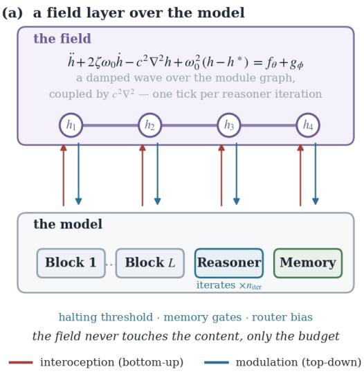
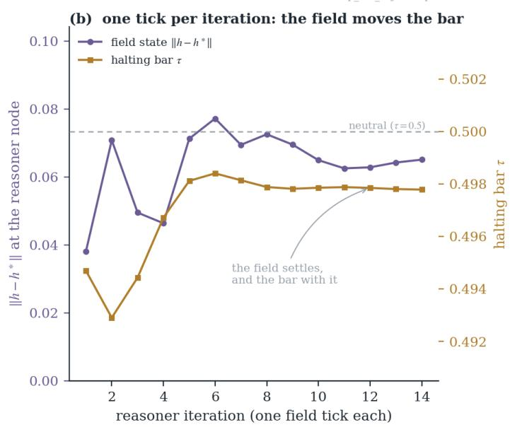
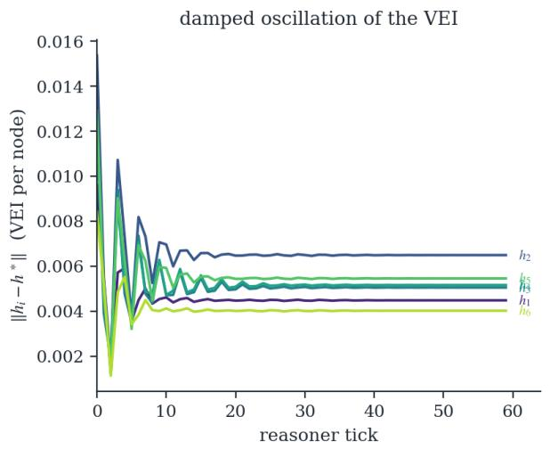
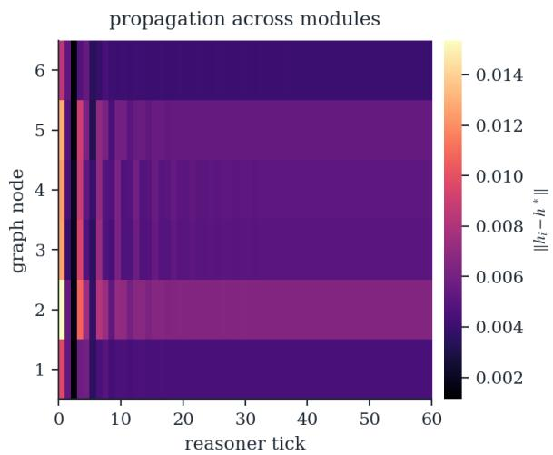
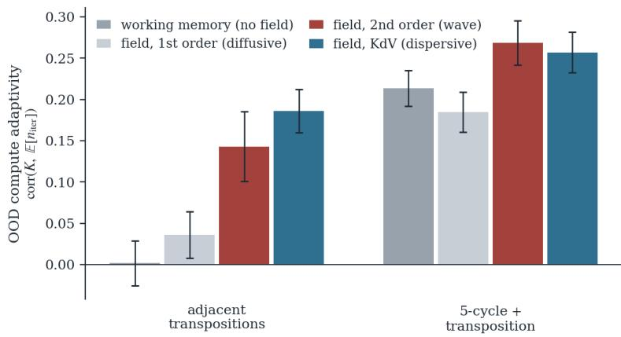
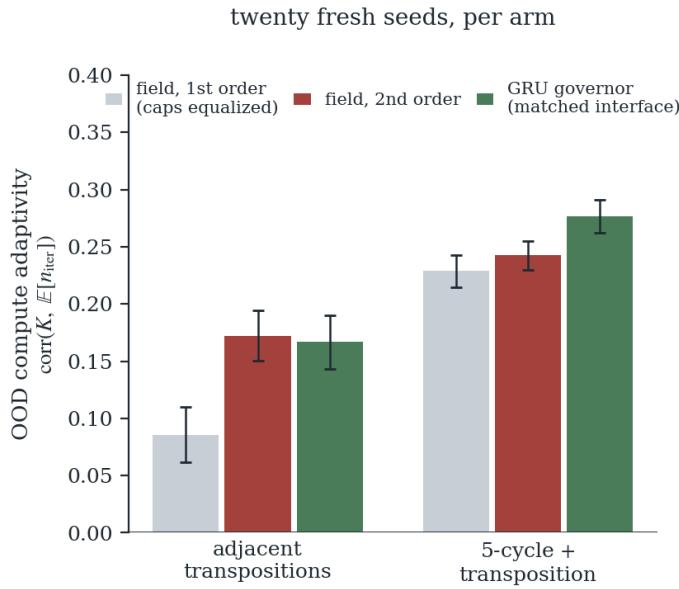
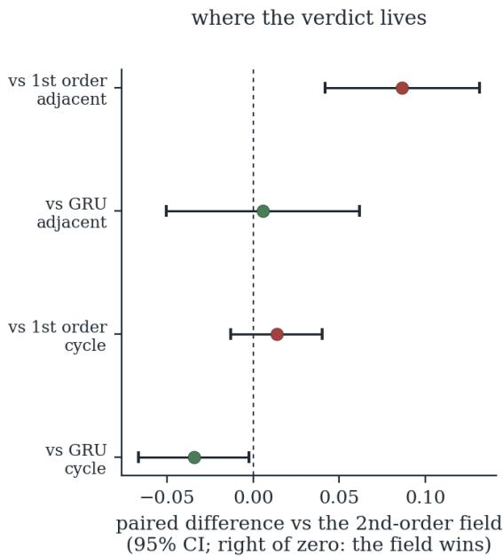

# Can a Dynamic Internal Field Govern a Transformer’s Cognition? Certifiability, not Superiority, in Homeostatic Compute Control

Francisco M. Arrabal-Campos∗ Department of Chemistry and Physics, Research Centre CIAIMBITAL Department of Engineering, Research Centre CIAIMBITAL University of Almería, 04120 Almería, Spain (∗corresponding author)

Francisco G. Montoya Department of Engineering, Research Centre CIAIMBITAL University of Almería, 04120 Almería, Spain

Alfredo Alcayde Department of Engineering, Research Centre CIAIMBITAL University of Almería, 04120 Almería, Spain

fmarrabal@ual.es

pagilm@ual.es

aalcayde@ual.es

ifernan@ual.es

## Abstract

An intelligent system does not merely reason: it governs its own reasoning—how much to compute, when to stop, which module to activate. We ask whether that role of metacognitive governor can be played by a dynamic internal field: a low-dimensional homeostatic state, with explicit physics and certified stability, that modulates a transformer’s cognition without performing it. Our instance is the Homeostatic Background Processor (HBP): a field defined over the module graph of a transformer and governed by a family of partial diferential equations on the graph Laplacian —damped wave (forced Klein–Gordon), its difusive limit, and a KdV-type dynamics— that evolves along the iterations of an adaptive-depth reasoner and modulates its computation (halting threshold, block gain, memory gates; the interface also exposes a router-bias head, not consumed by the models reported here) through a universal interface of interoception and modulation. We characterize the stability of the integrator o the whole family, and we are explicit that this is an integrator certificate and not a closedloop one. Two of the three ingredients are classical and we recall them with attribution: a placement dichotomy for antisymmetric operators (gyroscopic in the second-order branch, positional in the first), which is Kelvin–Tait–Chetaev (Thomson & Tait, 1879; Merkin, 1997) and, in its first-order half, exactly Anti-Symmetric DGN (Gravina et al., 2023a) with γI generalized to K; and a coercivity bound giving an unconditionally contractive implicit kernel, which is the logarithmic-norm resolvent estimate (Dahlquist, 1959; Söderlind, 2006). The circulatory branch produces flutter with threshold $\dot { \beta } \rho ( A ^ { 3 } ) < 2 \zeta \omega _ { 0 } ^ { 2 }$ , exact only when stifness and damping are both multiples of the identity —a hypothesis none of our runs satisfies, and under which the threshold is Bottema’s criterion (Bottema, 1955). What is new is narrower, and we now prove it: a discrete Schur–Cohn criterion with complex coeficients for the Verlet integrator with velocity coupling, necessary and suficient per latent root and requiring no commutation hypothesis, which shows that a backward-diferenced gyroscopic term does not inherit the neutrality it has in continuous time. Empirically (S5, NC1-hard; pre-registered protocol, n=10, plus a twenty-seed preregistered deconfounding campaign that partly over

turned it), the answer is threefold: substance no, structure only in part, certifiability yes. Substance $( n o ) .$ the type of the field’s physics is irrelevant for accuracy —wave, diffusion, gated mixtures, non-local Poisson-type coupling and even a 2D Navier–Stokes flow substrate all give the same accuracy; the evidence is consistent with the gradient laminating every modulation demand to a quasi-static set-point, and incompressible flow hits a physi cal ceiling $\scriptstyle ( \nabla \cdot u = 0$ forbids concentrating information). Structure (only in part): the second order of the dynamics endows out-of-distribution compute allocation with a robustness the end-to-end learned halting control (gating\_wm) lacks, and —after fixing a BF16 bug that froze the physical parameters— replicates unchanged; but a preregistered deconfounding campaign bounds the claim. With twenty fresh seeds, with the first-order branch rebuilt at equalized caps (which the unconditionally contractive implicit kernel makes safe, so the original caps were an artifact of the explicit integrator), and with a matched-interface GRU replacing the physical integrator, the order efect is strong in one generator family (+0.087 [+0.042, +0.132], t=4.0) and is not detected in the other (+0.014 [−0.013, +0.040], n.s.— an interval that excludes the original v3 estimate but not a small positive efect): part of the original contrast was capacity, not order. The GRU governor is statistically indistinguishable from the field in the first family (+0.006 [−0.051, +0.062], n.s.) and nominally exceeds it in the second $( - 0 . 0 3 5 \ [ - 0 . 0 6 7 , - 0 . 0 0 2 ] )$ ), with mutual accuracy non-inferiority throughout. Certifiability (yes): what distinguishes the field is therefore not capability but that its stability is provable —placement dichotomy, flutter threshold exact under $\mathbf { K } { = } \omega _ { 0 } ^ { 2 } \mathbf { I }$ unconditional contraction bound— and, above all, that the one-step operator admits an exact runtime check. That is a diference of kind, not of existence: learned recurrences do carry certificates, and for gated recurrent units in particular there are explicit ISS and incremental-ISS conditions on the weights (Bonassi et al., 2021); they are suficient and conservative, and obtaining them requires bespoke machinery, whereas the field’s spectral radius is read of directly. We conclude that a dynamic internal field is a viable and certifiable compute governor —the “brainstem” of a cognitive architecture— but not an enhancer of cognition: it modulates, it does not think. A kill-gate with a positively controlled probe finds no evidence for the remaining route—the field as temporal evidence accumulator— on twelve frozen solvers of a companion substrate $( \Delta \mathrm { A U C } = + 0 . 0 0 0 7 ~ [ - 0 . 0 0 6 5 , + 0 . 0 0 7 9 ]$ against a 0.03 pass threshold); we read this as the recurrent state already integrating its own history, a mechanism we propose rather than demonstrate. The null, broad and with a mechanism, delimits which role a homeostatic field can and cannot play in an adaptive transformer.

## 1 Introduction

A cognitive architecture is not exhausted by the module that reasons. Alongside perception, memory and inference, an intelligent system needs a layer that governs its own computation: how much to think before answering, when to stop, which module to activate, how to distribute efort across parts of the input of uneven dificulty. In the brain, that function is performed not by the cortex but by the neuromodulatory and homeostatic systems —brainstem, hypothalamus, norepinephrine/acetylcholine tone— which set the gain, the arousal and the budget of cognition without executing it. This article asks whether that role of metacognitive governor can be played, in an adaptive transformer, by a dynamic internal field: a low-dimensional homeostatic state, with explicit physics and certified stability, that modulates cognition without performing it. (Our substrate is a family of small decoder-only transformers—4.2–5.6M parameters, per-variant counts in the repository—on an $\mathrm { N C ^ { 1 } }$ -hard task; the question and the formalism are architecture generic, and “language model” below refers to the architectural class, not the scale.)

The concrete motivation is adaptive computation. A standard transformer computes at fixed depth; under logarithmic precision it is confined to $\mathrm { T \bar { C } ^ { 0 } }$ (Merrill & Sabharwal, 2023) and only learns “shortcuts” that do not extrapolate (Liu et al., 2023). Matching depth to dificulty —Adaptive Computation Time (Graves, 2016), PonderNet (Banino et al., 2021), Universal Transformers (Dehghani et al., 2019), looped transformers (Fan et al., 2025), depth-adaptive and early-exit decoding (Elbayad et al., 2020; Schwartz et al., 2020), and token-level compute routing (Raposo et al., 2024)— is the classic remedy, but in all of them the halting policy is learned end-to-end and can overfit the training distribution. We propose to anchor that decision in a dynamic internal field and ask what is gained —and what is not— by doing so.

Our instance of the governor is the Homeostatic Background Processor (HBP): a low-dimensional field over the model’s module graph, governed by a family of PDE operators on the graph Laplacian and advection —reaction, difusion, wave, advection, dispersion and a KdV-type nonlinearity—, which evolves along the iterations of a recurrent reasoner and modulates its computation through a universal interface: each module exposes interoception $s _ { i }$ (bottom-up) and receives modulation $m _ { i }$ (top-down), inspired by biological predic tive regulation and neuromodulation (Sterling, 2012; Barrett, 2017; Friston, 2010; Doya, 2002; Vecoven et al., 2020) (Fig. 1). The family lets us decompose the headline question into two that the adaptive-computation literature does not isolate: (i) does substance matter, i.e. the type of the field’s physics (wave vs. difusion vs. KdV, local vs. non-local, modulator vs. substrate)? and (ii) does structure matter, i.e. the order of the dynamics? We evaluate with a pre-registered protocol and adversarial verification, and the answer is threefold: substance does not —the physical regime is irrelevant for accuracy, a broad mechanism null that we explain by the temporal coarse-graining of the gradient and, for the flow substrate, by an incompressibility limit—; the second-order structure does, but only within one of two generator families once capacity is equalized, and a matched-interface GRU governor ties the field there and nominally exceeds it in the other (Sec. 5.4); what remains distinctive of the field is neither substance nor superiority but certifiability.

The answer, in one sentence. A dynamic internal field can govern an LLM’s computation —it is a viable governor, with certifiable stability— but it cannot enhance its cognition: it modulates, it does not think. And it is not the only thing that can govern: the one learned alternative we tested—a GRU cell with this same interoceptive interface—does the job at least as well, matching the field in one generator family and nominally beating it in the other, so the field’s distinctive contribution is that its stability is provable rather than merely observed. We thus place the HBP in the metacognitive/autonomic layer of a cognitive architecture —the computational “brainstem”, not the cortex— and characterize precisely, via a broad null with a mechanism, which role a homeostatic field can occupy and which it cannot.

## Contributions.

1. An architectural positioning, backed by evidence: a dynamic internal field belongs to the metacognitive compute-governor layer of an LLM, not to the reasoning layer; the empirical pattern (neutral for accuracy; better compute allocation than the no-controller baseline, in one of two generator families, and matched there by a learned recurrent governor) is what suggests that placement (Sec. 3, 6).

2. A novel formalism: a family of homeostatic PDE fields over the module graph (wave, difusion, advection, dispersion, saturated KdV nonlinearity), with continuous mixing between first- and secondorder branches and optional gating of the physics by interoception (Sec. 3).

3. A stability characterization of the family’s integrator, assembled from classical results with attribution and one new criterion. Classical: the placement dichotomy (Kelvin–Tait–Chetaev (Thomson & Tait, 1879; Merkin, 1997); its first-order half is A-DGN (Gravina et al., 2023a) with γI → K), the flutter threshold (Bottema’s criterion (Bottema, 1955) at isotropic stifness and damping, and the internal-damping whirl threshold of Smith (1933)), and the unconditionally contractive implicit kernel (the logarithmic-norm resolvent bound (Dahlquist, 1959; Söderlind, 2006; Bai et al., 2003)). New, and proved here (App. B, Prop. 4): a discrete complex Schur–Cohn condition for the Verlet integrator with velocity coupling, necessary and suficient per latent root and free of any commutation hypothesis, with the passage to an operator-level box certificate quantified rather than assumed. All are imposed as a diferentiable penalty during training and audited on trained checkpoints with the exact spectral radius (Sec. 4, App. A).

4. Two pre-registered empirical studies on state tracking in $S _ { 5 } { \mathrm { : } }$ a first campaign (n=10) in which the OOD compute-robustness efect survives a paired re-run with learnable physics after a numericalprecision bug (BF16 freezing), and a twenty-seed deconfounding campaign that bounds the claim—at equalized caps the order efect holds in one generator family and not the other, and a matchedinterface GRU governor attains it too (Secs. 5, 5.4).

5. A broad mechanism null, adversarially verified: none of the members of the family moves accuracy, not even in dual tasks designed to excite regime switching, nor under non-local coupling (Poisson enslavement on the graph), nor with the field as a substrate of a 2D Navier–Stokes flow —where an incompressibility limit (∇·u=0) prevents delivering information to a point. We propose the temporal coarse-graining of the gradient as the explanation for the modulator null (Sec. 6).

## 2 Related work

Adaptive computation and learned halting. The idea of decoupling compute depth from architectural depth goes back to Adaptive Computation Time (ACT) (Graves, 2016); PonderNet (Banino et al., 2021) reformulates it probabilistically, and Universal Transformers (Dehghani et al., 2019) and looped transformers (Fan et al., 2025; Giannou et al., 2023) carry it to depth recurrence. Our reasoner inherits this paradigm with PonderNet-style halting. The crucial distinction is that in these works the compute-allocation policy is learned end-to-end; our study provides direct evidence that such a policy can overfit (the adaptivity of the gating\_wm control collapses out of distribution in one of the two generator sets) and that anchoring it in a stateful governor with an interoceptive interface makes it more robust—though the deconfounding o Sec. 5.4 shows that the explicit physics is not what buys the robustness: a GRU with the same interface is as robust in adjacent and nominally more so in cycle\_transp.

Expressivity and state tracking. Under logarithmic precision, a fixed-depth transformer sits in $\mathrm { T C } ^ { 0 }$ (Merrill & Sabharwal, 2023); the word problem over $S _ { 5 }$ is NC1-complete by the theorem of Barrington (1989), and transformers learn shortcuts that do not extrapolate (Liu et al., 2023). Intermediate generation extends the expressive power (Merrill & Sabharwal, 2024), and state-space models share the limitation (Merrill et al., 2024). This justifies that our task requires iterative computation and motivates the extrapolation axis (Ani et al., 2022; Jelassi et al., 2023).

External and working memory. Neural Turing Machines (Graves et al., 2014) and the DNC (Graves et al., 2016) enable algorithms with addressable memory. Our gating\_wm control incorporates a working memory in this spirit; our experiments attribute the in-distribution accuracy gain to the recurrence rather than to the memory (gating ≥ gating\_wm in both generator sets) and, in either case, not to the HBP: a negative that we make explicit.

Certified learned dynamics, and where our certificate sits. An earlier version of this paper did not engage this literature, which is a serious omission because it is where the bar actually is. Stability guarantees for learned recurrent models come in two grades. By construction: coRNN and UnICORNN (Rusch & Mishra, 2021a;b) are structure-preserving discretizations of second-order oscillator networks with proven state and gradient bounds; AntisymmetricRNN (Chang et al., 2019) and A-DGN (Gravina et al., 2023a) obtain stability from antisymmetric parameterization; Recurrent Equilibrium Networks (Revay et al., 2024) give a free parameterization of all models that are contracting and satisfy prescribed incremental IQCs, trainable by unconstrained gradient descent; Lipschitz RNNs (Erichson et al., 2021) and the Lyapunovprojected models of Kolter & Manek (2019) do the same by other routes; LinOSS (Rusch & Rus, 2025) and its damped extension (Boyer et al., 2025) obtain stable oscillatory state-space layers with a non-negativity condition, the latter decoupling damping from frequency exactly as our learnable per-dimension ζ does; and CON (Stölzle & Della Santina, 2024) proves global asymptotic stability and input-to-state stability for a coupled damped-oscillator network in closed loop. By certificate: Bonassi et al. (2021) give explicit ISS and incremental-ISS conditions on the weights of a gated recurrent unit, checkable post hoc or imposable during training.

Two consequences for this paper, both uncomfortable and both stated here rather than left for a referee. First, our guarantee is of the weaker grade: we impose a diferentiable penalty and probe the operator at evaluation time, where coRNN, REN and D-LinOSS are stable by construction. Second, the closed-loop result we do not prove —the field, its host, and the interoception/modulation path considered as one system— is exactly what CON proves for its setting. What is genuinely unoccupied in this literature is the conjunction of second order, instance-gated (time-varying) coeficients, and closed loop: REN has the loop without the first two, CON has the first and third without gating, LinOSS has only the first. We do not fill that gap here; we mark it.

PDE-governed neural networks on graphs. Interpreting layers as discretizations of continuous dynamics is the basis of Neural ODEs (Chen et al., 2018); on graphs, PDE-GCN (Chamberlain et al., 2021; Eliasof et al., 2021) derives architectures from the difusion and wave equations, GraphCON (Rusch et al., 2022) couples oscillators at the nodes (the second-order dynamics closest to our wave branch), ADR-GNN (Eliasof et al., 2023) adds advection and reaction, and Anti-Symmetric DGN (Gravina et al., 2023b) obtains stability by construction with antisymmetric operators. We should be explicit about how close that last one is: the first-order half of our placement dichotomy is A-DGN, with their $\gamma \mathbf { I }$ generalized to a symmetric $\mathbf { K } \succeq \omega _ { 0 } ^ { 2 } \mathbf { I }$ . Claiming the generalization is honest; not flagging the coincidence would not be. Our family difers on three points: (i) the field does not transport the task representation but a lowdimensional modulatory state; (ii) the “time” of the PDE is the reasoner’s iterations, not the layers; (iii) the wave↔difusion mixing and the odd operators (advection, KdV dispersion) require a stability analysis that the GNN literature does not cover: incorrect placement of an antisymmetric operator in a second-order dynamics produces circulatory $\begin{array} { r } { f l u t t e r , } \end{array}$ a classical phenomenon of non-conservative mechanics (Ziegler, 1952; Merkin, 1997; Kirillov, 2013) that, to our knowledge, had not been pointed out in this context.

Homeostasis and neuromodulation. Diferentiable plasticity and neuromodulation (Miconi et al., 2018; 2019) enable internal modulation of computation; homeostatic variables coupled to vulnerability signals confer adaptability under concept shift (Man et al., 2022). The HBP articulates this intuition as a physically motivated and analyzable dynamical system, with certified stability and its efect on the compute policy isolated experimentally.

## 3 A family of homeostatic fields

Let there be a graph of N nodes (modules: L backbone blocks, the reasoner and the working memory) with combinatorial Laplacian $\mathbf { L } \in \mathbb { R } ^ { N \times N }$ (symmetric, PSD) and oriented advection matrix A (antisymmetric; spectrum $\{ \pm i \mu _ { k } \} )$ ), defined over the chain backbone → reasoner → memory. Each node holds an internal state vector (VEI) $h _ { i } \in \mathbb { R } ^ { d _ { h } }$ ; we write $u : = h - h ^ { * }$ (deviation from the learnable rest state). Per latent dimension, we define the operators

$$
\mathbf { K } : = \omega _ { 0 } ^ { 2 } \mathbf { I } + c ^ { 2 } \mathbf { L } , \qquad \mathbf { C } : = 2 \zeta \omega _ { 0 } \mathbf { I } + D \mathbf { L } , \qquad \mathbf { G } : = b \mathbf { A } + \beta \mathbf { A } ^ { 3 } ,\tag{1}
$$

(stifness: reaction + spatial difusion; dissipation: uniform + structural; antisymmetric: advection + thirdorder dispersion, the only odd spatial operator well defined over an oriented graph, with $( i \mu ) ^ { 3 } = - i \mu ^ { 3 } )$ , and the KdV-type nonlinear perturbation

$$
r ( u ) : = - \nu \operatorname { t a n h } ( u ) \odot \operatorname { t a n h } ( \mathbf { A } u ) ,\tag{2}
$$

the saturated u $\partial _ { x } u$ term: $r ( 0 ) = 0$ with null Jacobian at the equilibrium (same quadratic order as KdV near $u = 0 )$ and globally bounded by ν. The family consists of two branches coupled by a convex mixture $\alpha \in [ 0 , 1 ]$

$$
\begin{array} { r l } { ( \mathrm { w a v e } , \mathrm { 2 n d ~ o r d e r } ) : } & { { } i i + ( \mathbf { C } + \mathbf { G } ) i + \mathbf { K } u = r ( u ) + f _ { \theta } ( h , s ) + g _ { \phi } ( h , x ) , } \end{array}\tag{3}
$$

$$
( \mathrm { d i f f u s i o n } , \ 1 \mathrm { s t \ o r d e r } ) ; \quad \gamma \dot { u } + ( \mathbf { K } + \mathbf { G } ) u = r ( u ) + f _ { \theta } ( h , s ) + g _ { \phi } ( h , x ) ,\tag{4}
$$

where $f _ { \theta }$ is a bounded self-check (tanh, gain $\leq 0 . 3 )$ that consumes the interoception $s , g _ { \phi } \mathrm { ~ a ~ }$ bounded external forcing from the input, and $\gamma \textup { a }$ learnable rate of the difusive branch (decoupled from ζ). Note the distinct placement of G: gyroscopic (on u˙ ) in (3), positional (on u) in (4); Lemma 1 shows it is the only stable choice in each branch. The state advances by

$$
h _ { n + 1 } = \alpha \Phi _ { \mathrm { w a v e } } ( h _ { n } , h _ { n - 1 } ) + ( 1 - \alpha ) \Phi _ { \mathrm { d i f f } } ( h _ { n } ) ,\tag{5}
$$

  
it sets how much to compute, never what  
Figure 1: The Homeostatic Background Processor. An internal-state field h (top) lives over the model’s module graph —backbone blocks, the adaptive-depth reasoner and the working memory (bottom)— coupled by the graph Laplacian $\left( - c ^ { 2 } \nabla ^ { 2 } h \right)$ . Each module exposes an interoception signal $s _ { i }$ (bottom-up) and receives modulation $m _ { i }$ (top-down: halting threshold, block gain, memory gates; the interface also exposes a routerbias head, not consumed by the experiments reported here). The field evolves under a damped-wave PDE (one instance of the family of Sec. 3), one tick per reasoner iteration.

with $\Phi _ { \mathrm { w a v e } }$ a position Verlet step and $\Phi _ { \mathrm { d i f f } }$ an IMEX backward-Euler step (stif part K+G implicit; Prop. 2). This difers from the classical implicit–explicit split of Ascher et al. (1995), where the stif symmetric difusive term is taken implicitly and the advective, antisymmetric term explicitly — with the conditional stability that entails. Here the antisymmetric operator goes inside the implicit kernel, which is what the coercivity argument of Prop. 2 makes unconditionally safe. The coeficient α can be (i) an architectural constant (α=1: wave; $\alpha { = } 0$ or order 1: difusion), (ii) imposed per instance (experimental oracles), or (iii) gated by interoception together with D and b (“homeostasis chooses its physics”), the hypothesis that Section 6 evaluates and refutes for accuracy.

Instantiated physics. We evaluate three members of the family: hbp\_full (damped wave: $\alpha { = } 1$ , G=0, D=0), hbp\_first (difusive relaxation: order 1, overdamped limit), and hbp\_kdv (wave + dispersion + KdV nonlinearity: $\alpha { = } 1 , \beta _ { \mathrm { m a x } } { = } 0 . 1 , \nu _ { \mathrm { m a x } } { = } 0 . 3 )$ ; plus the gated variant hbp\_mix. At N=6 the dispersion has only three pairs of modes: there is no solitonic regime, and we make it explicit as a limit of the testbed.

“Time” is thinking. The HBP ticks once per reasoner iteration (PonderNet-style halting, up to $N _ { \mathrm { m a x } } { = } 2 4 )$ . At iteration n: (i) the field modulates the reasoner block with a soft perturbation $1 + s _ { \mathrm { m o d } } \operatorname { t a n h } ( \cdot )$ around the identity; (ii) per-node interoception $s _ { n }$ is collected (progress, activation, efort, attention entropy, valid fraction); (iii) one step of the family is integrated; (iv) the VEI biases the halting threshold and the write/forget gates of the working memory. The physical parameters $( \omega _ { 0 } , \zeta , c , D , b , \beta , \nu , \gamma )$ are learnable per latent dimension within safe ranges (squash), and are stored in FP32 (Sec. 5.1).

## 4 Stability analysis of the family

We define the per-dimension energy $\begin{array} { r } { E ( u , \dot { u } ) = \frac { 1 } { 2 } \| \dot { u } \| ^ { 2 } + \frac { 1 } { 2 } \{ u ^ { \top } \mathbf { K } u } \end{array}$ (kinetic + restoring well + graph Dirichlet energy). In the autonomous case of (3) with $\mathbf { G } = 0 , \dot { E } = - \dot { u } ^ { \top } \mathbf { C } \dot { u } \leq 0$ (strict dissipation with $\zeta \geq \zeta _ { \mathrm { m i n } } > 0 )$ The nontrivial question is where the antisymmetric operators can enter without destroying this structure. Lemma 1 (Placement of antisymmetric operators). Let $\mathbf { K } = \mathbf { K } ^ { \top } \succ 0 , \mathbf { C } = \mathbf { C } ^ { \top } \succ 0$ and $\mathbf { G } = - \mathbf { G } ^ { \top }$ with spectrum {iµk}. Then:

(a) (gyroscopic: safe). For $\ddot { u } + ( \mathbf { C } + \mathbf { G } ) \dot { u } + \mathbf { K } u = 0$ , the energy satisfies $\dot { E } = - \dot { u } ^ { \top } { \bf C } \dot { u } \le 0 .$ , since $\dot { u } ^ { \top } \mathbf G \dot { u } = 0$ (the gyroscopic force does no work); by LaSalle, the origin is globally and asymptotically stable for all b, β (Kelvin–Tait–Chetaev theorem (Merkin, 1997; Kirillov, 2013)).

(b) (positional in first order: safe). For $\gamma { \dot { u } } + ( \mathbf { K } + \mathbf { G } ) u = 0$ , every eigenvalue λ $o f - ( \mathbf { K } + \mathbf { G } ) / \gamma$ satisfies Re $\lambda = - ( v ^ { * } \mathbf { K } v ) / \gamma \leq - \omega _ { 0 } ^ { 2 } / \gamma < 0$ unconditionally in ∥G∥ (numerical range: $v ^ { \ast } \mathbf { G } v \in i \mathbb { R } )$ With $\mathbf { K } = 0 , \sigma ( - \mathbf { G } ) \subset i \mathbb { R }$ : conservative transport and dispersion, with the KdV dispersion relation on the graph.

(c) (circulatory: flutter, with a threshold that is exact only in the isotropic case). For $\ddot { u } + \mathbf { C } \dot { u } + ( \mathbf { K } + \mathbf { G } ) u = 0$ with ${ \bf K } = \omega _ { 0 } ^ { 2 } { \bf I }$ and $\mathbf { C } = 2 \zeta \omega _ { 0 } \mathbf { I }$ (equal frequencies and isotropic damping: the degenerate Merkin case (Merkin, 1997); this is the per-dimension structure of the field only when c=0 and there is no structural difusion, which no run of ours satisfies —see App. A, where we also note that the headline arm sets $\mathbf { G } = 0$ outright, making this a design-exclusion result rather than a certificate of a system we ran) and $\mathbf { G } = \beta \mathbf { A } ^ { 3 }$ , the system decouples in the unitary basis of G and the Routh–Hurwitz criterion with complex coeficients gives asymptotic stability if and only if $\beta \rho ( \mathbf { A } ^ { 3 } ) < 2 \zeta \omega _ { 0 } ^ { 2 }$ . Under these hypotheses this is Bottema’s criterion (Bottema, 1955) evaluated at isotropic stifness and damping, and it coincides with the internal-damping whirl threshold of Smith (1933); we recall it rather than claim it. The threshold vanishes with the damping (as $\zeta  0 _ { \mathrm { { ; } } }$ , every $\beta > 0$ destabilizes (Ziegler, 1952)) and grows only linearly with $\zeta \omega _ { 0 } ^ { 2 }$ . Note that the isotropic case is the one in which the celebrated destabilization paradox does not appear: the threshold tends to zero continuously with ζ, with none of the discontinuous drop that makes the general case interesting.

(d) (nonlinear perturbation). r satisfies $r ( 0 ) = 0 , D r ( 0 ) = 0$ and $\| r ( u ) \| \leq \nu \colon$ the linearization at the equilibrium —and with it $( a ) { - } ( c )$ and the discrete certificates— is not altered; in (4) the origin is GAS $i f \nu ( 1 + \rho ( \mathbf { A } ) ) < \omega _ { 0 } ^ { 2 }$ —the Jacobian of the saturating perturbation contributes a diagonal and an A-coupled term, so the Lipschitz constant is $\nu ( 1 + \rho ( \mathbf { A } ) )$ , not $\nu \rho ( \mathbf { A } )$ as an earlier version of this lemma stated; outside that condition we claim only local stability and do not exhibit the basin. On the invariant set induced by the state projection —a hard clamp in the implementation— $r + f _ { \theta } + g _ { \phi }$ acts as a bounded forcing and both branches are BIBS.

Lemma 1 justifies the placement of (3) and (4) and invalidates the circulatory alternative: at our operating point $( \beta _ { \mathrm { m a x } } { = } 0 . 1 , \rho ( \mathbf { A } ^ { 3 } ) { = } 5 . 8 5 )$ the threshold of (c), used here as the design guide it is for $c > 0 \ ( \mathrm { A p p . ~ A } )$ is violated over almost the entire admissible parameter box, and the free simulation confirms the flutter (divergence) against the gyroscopic decay.

Proposition 1 (Discrete stability of the wave branch). For the position Verlet $u _ { t + 1 } = ( 2 \mathbf { I } - \Delta t ^ { 2 } \mathbf { K } - \Delta t ( \mathbf { C } +$ $\mathbf { G } ) ) u _ { t } - ( \mathbf { I } - \Delta t ( \mathbf { C } + \mathbf { G } ) ) u _ { t - 1 }$ , every latent eigenvalue z solves the complex scalar polynomial $z ^ { 2 } - ( 2 - q -$ $g - i \tilde { \mu } ) z + ( 1 - g - i \tilde { \mu } ) = 0$ with $q = \Delta t ^ { 2 } x ^ { * } \mathbf { K } x , g = \Delta t x ^ { * } \mathbf { C } x$ real and $\tilde { \mu } = \Delta t \mathrm { I m } ( x ^ { \ast } \mathbf { G } x ) , | \tilde { \mu } | \leq \Delta t \rho ( \mathbf { G } )$ $\rho ( \mathbf { G } ) = \operatorname* { m a x } _ { k } | b \mu _ { k } - \beta \mu _ { k } ^ { 3 } |$ . For $q > 0$ , Cohn’s criterion for the complex quadratic gives $| z | < 1$ if and only if

$$
( i ) ~ \tilde { \mu } ^ { 2 } < g ( 2 - g ) , \qquad ( i i ) ~ q ( g ^ { 2 } + \tilde { \mu } ^ { 2 } ) < 2 g \left( g ( 2 - g ) - \tilde { \mu } ^ { 2 } \right) .\tag{6}
$$

Two remarks on scope, both proved in App. B. First, the reduction to (6) is a latent-root argument and therefore needs no commutation hypothesis: each eigenvalue satisfies the scalar polynomial with the Rayleigh quotients of its own latent vector, whether or not K, C and G are simultaneously diagonalizable. Second, the equivalence is per latent root; certifying the whole operator requires the triples $( q , g , \tilde { \mu } )$ to be controlled, and bounding them by the spectra of K, C, G replaces their joint numerical range by a box that contains it, so the box form is suficient but not necessary —and, we find, markedly conservative. At $\tilde { \mu } = 0$ (ii) reduces to the classical damped-Verlet criterion $q < 4 ( 1 - \zeta \omega _ { 0 } \Delta t )$ . Condition (i) is genuinely discrete: the gyroscopic term discretized with a backward diference does not inherit the continuous neutrality, but injects energy at the exact rate $\sqrt { 1 + \tilde { \mu } ^ { 2 } }$ per step, which the dissipation must absorb; as $\Delta t  0$ the condition empties $( \tilde { \mu } ^ { 2 } = O ( \Delta t ^ { 2 } )$ against $g ( 2 - g ) = O ( \Delta t ) \}$ and the continuum is recovered. A Cayley discretization of the gyroscopic term (Iserles et al., 2000) would restore exact neutrality at the cost of an implicit step.

This is the one result in this paper for which we have not found a precedent; the placement dichotomy and the contraction bound are classical (App. B). We prove it in App. B and check it in experiments/verify\_verlet\_schurcohn.py: the symbolic identity, 302 400 cells of a $( q , g , \tilde { \mu } )$ grid against exact roots with zero discrepancies, and 400 draws of non-commuting (K, C, G) —none of the 400 pairs commuted— with a maximum latent-polynomial residual of $6 \cdot 1 0 ^ { - 1 4 }$

Proposition 2 (IMEX difusive branch with implicit antisymmetric kernel). With the antisymmetric part inside the implicit kernel, $\mathbf { M } _ { G } : = \mathbf { I } + \lambda ( \mathbf { K } + \mathbf { G } ) , \lambda = \Delta t / \gamma$ , one has $\mathrm { R e } \langle x , \mathbf { M } _ { G } x \rangle \geq ( 1 + \lambda \omega _ { 0 } ^ { 2 } ) \| x \| ^ { 2 }$ for all $x ,$ , hence $\| \mathbf { M } _ { G } ^ { - 1 } \| _ { 2 } \leq ( 1 + \lambda \omega _ { 0 } ^ { 2 } ) ^ { - 1 } < 1$ unconditionally in $\gamma , \omega _ { 0 } , c , b , \beta$ and with no commutation hypothesis between L and G. (With G explicit this claim is false; the Cayley variant on the antisymmetric part preserves exactly the norm of the conservative transport.)

Remark 1. The force −Gu˙ in the wave branch is of Coriolis type: it preserves the stability structure of the antisymmetric operators, not their literal transport semantics, which survive only in the first-order branch.

Remark 2. The stability of the convex mixture α of the discrete maps does not follow from the continuous lemma (the per-branch Lyapunov functions are distinct), and —correcting an earlier version of this remark— neither does it follow from Propositions 1 and 2: the spectral radius is not convex, so per-branch bounds do not transfer to the mixture, and a norm bound cannot be combined with a spectral-radius bound for a non-normal companion. The runtime probe builds the companion of the wave branch only. The gated mixture arm therefore has neither an analytic nor an exact numerical certificate, and we report its results on that footing. We attempted to repair this with the standard instrument —a common quadratic Lyapunov function obtained $b y$ semidefinite programming over the vertices of the coeficient box— and report the outcome in App. C: it succeeds for the wave branch on the region the trained models occupy, and it fails for the mixture. The per-branch conditions are imposed as a diferentiable penalty during training (on the learned coeficients, or their caps if gated) and verified at evaluation time with the exact spectral radius of the 2N×2N companion matrix per dimension (covers the non-normal case $[ { \bf L } , { \bf A } ] \neq 0 )$ . Under bounded forcing, the VEI is expected to be ISS to a ball around $h ^ { * }$ by a standard argument (Sontag, 1989), which we do not prove here and on which nothing below depends. The energy identity, the flutter threshold and the discrete criterion were validated numerically against the implemented operators at fixed parameter draws (energy identity to residual $4 { \cdot } 1 0 ^ { - 1 6 }$ ; flutter threshold to $\pm 2 \% ; 0 / 2 \cdot 1 0 ^ { 5 }$ discrepancies of the discrete criterion against exact roots).

NMR analogy. The family is formally that of a system of coupled spins: $\zeta \sim 1 / T _ { 2 }$ (transverse relaxation), ω0 (precession), $c ^ { 2 } \mathbf { L }$ (dipolar coupling), $D \sim 1 / T _ { 1 }$ (longitudinal relaxation / spin difusion), b A (directed transport) and β ${ \mathbf A } ^ { 3 }$ (dispersion: mode-dependent group velocity; Fig. 2 shows the real propagationoscillation). The normal modes of L are the spectrum of the system, and the flutter certificate of Lemma 1(c) is the analog of the instability threshold of a spin system pumped above its relaxation rate.

## 5 Experiments

Task and protocol. Non-commutative state tracking: composition of K generators of $S _ { 5 } \ \mathrm { ( N C ^ { 1 } \mathrm { - h a r d } \Rightarrow }$ requires recurrence), with dense supervision of the running permutation and two generator sets (adjacent transpositions; 5-cycle + transposition). Pre-registered protocol (declared before looking at any number): fresh seeds 10..19, evaluation with a disjoint seed (no contamination), argmax restricted to the answer subvocabulary, $N _ { \mathrm { m a x } } { = } 2 4 ~ \geq ~ K _ { \mathrm { m a x } }$ , primary analysis paired by seed (Fisher-z of the pure-OOD correlation, $K \ge 1 4 )$ with Holm correction over the 4 contrasts. Models of 4.2–5.6M parameters (vanilla 4.23M, gating 5.28M, gating\_wm 5.54M, the field variants 5.60M; per-variant counts in the repository). OOD regime: training with $K \leq 1 2 .$ , evaluation up to $K \leq 2 4$

  
Figure 2: Intrinsic dynamics of the field (simulation of the solver of Sec. 3). An interoceptive impulse at node 1 induces a damped oscillation of the VEI (left, $\| h _ { i } - h ^ { * } \|$ per node) that propagates to neighboring modules through the Laplacian coupling (right, node×tick map). It is the second-order regime that the analogy with coupled spins in NMR describes (a local impulse spreads and precesses); the Verlet scheme integrates it stably under the certificate of Prop. 1.

## 5.1 A numerical-precision bug and its $\mathsf { \mathbf { A } } / \mathsf { \mathbf { B } } \colon$ the efect is structural

During the audit we discovered that, in BF16, the field’s raw physical parameters $( | \theta | \sim 0 . 3 – 1 . 6 )$ have $\mathrm { U L P / 2 ~ ( 1 . 0 { \cdot } 1 0 ^ { - 3 } ~ t o ~ 3 . 9 { \cdot } 1 0 ^ { - 3 } ) }$ larger than the typical Adam step $( \mathrm { l r } \approx 3 { \cdot } 1 0 ^ { - 4 } )$ : the update is rounded to zero at every step and ω0, ζ, c remain frozen at their initialization throughout training (verified: $\zeta \equiv 0 . 5$ exact after 2500 steps; with the fix —anchoring those parameters to FP32— they move). With the bug fixed, we re-ran the full protocol (90 cells). The seed-paired $\mathrm { A } / \mathrm { B }$ between frozen and learnable physics gives $\Delta \mathrm { c o r r } _ { \mathrm { O O D } } = + 0 . 0 1 0 \pm 0 . 0 4 6$ (adjacent) and $+ 0 . 0 1 9 \pm 0 . 0 5 4$ (5-cycle), both non-significant at $n { = } 1 0$ and with intervals wide enough to contain efects the size of the order efect itself: we find no evidence that the HBP efect depends on the fine tuning of its physical constants. This $\mathrm { A } / \mathrm { B }$ re-runs the same cells and seeds under a diferent numerical precision, so it is a paired same-batch contrast rather than an independent replication —and Sec. 5.4 then bounds the structural reading to one generator family. We report both versions for transparency; all numbers that follow are from the fixed version (v3, learnable physics).

## 5.2 In distribution: recurrence—not the field, and not the working memory—explains accuracy

Table 1: Accuracy by dificulty (in-distribution, mean over $n { = } 3$ seeds; per-seed values and paired contrasts in the repository).
<table><tr><td colspan="4"></td><td colspan="3"> $S _ { 5 }$  5-cycle+transp.</td></tr><tr><td>Model</td><td>short</td><td> $S _ { 5 }$  adjacent medium</td><td>long</td><td>short</td><td>medium</td><td>long</td></tr><tr><td>vanilla</td><td>0.984</td><td>0.670</td><td>0.147</td><td>0.974</td><td>0.976</td><td>0.581</td></tr><tr><td>gating</td><td>0.985</td><td>0.761</td><td>0.218</td><td>0.974</td><td>0.980</td><td>0.725</td></tr><tr><td>gating_wm</td><td>0.983</td><td>0.747</td><td>0.197</td><td>0.974</td><td>0.982</td><td>0.714</td></tr><tr><td>hbp_first</td><td>0.987</td><td>0.776</td><td>0.245</td><td>0.974</td><td>0.985</td><td>0.730</td></tr><tr><td>hbp_full</td><td>0.986</td><td>0.771</td><td>0.248</td><td>0.974</td><td>0.984</td><td>0.741</td></tr></table>

The gain decomposes cleanly, and the working memory is not where it comes from: recurrence buys +0.071 (adjacent) and +0.144 (5-cycle) in the long stratum (vanilla→gating), adding the working memory buys nothing and is nominally negative (gating→gating\_wm: −0.021 and −0.011), and the HBP adds +0.03–0.05

in the long stratum, which does not reach significance at $n { = } 3 \ ( p \geq 0 . 1 1 )$ . The 2nd- vs 1st-order contrast is null in distribution.

## 5.3 Out of distribution (v3, before deconfounding): a second-order adaptivity signal

We measure compute adaptivity corr $( K , \mathbb { E } [ n _ { \mathrm { i t e r } } ] )$ restricted to the pure-OOD range $( K \ge 1 4 )$ , paired by seed (Table 2, Fig. 3).

Table 2: Pure-OOD compute adaptivity, protocol v3 (learnable physics), n=10 fresh seeds (±std). Fisherz paired contrasts against the gating\_wm control. Boldface marks uncorrected $p < 0 . 0 5 $ neither contrast survives Holm-4 individually, and the order contrast these numbers support is bounded by the deconfounding of Sec. 5.4.
<table><tr><td></td><td>gating_wm (WM) hbp_first (diffusive) hbp_full (wave)</td><td></td><td></td></tr><tr><td> $S _ { 5 }$  adjacent</td><td> $0 . 0 0 2 \pm 0 . 0 8 7$ </td><td> $0 . 0 3 6 \pm 0 . 0 9 0$ </td><td> $0 . 1 4 3 \pm 0 . 1 3 4$ </td></tr><tr><td>vs WM  $S _ { 5 } \ 5 \mathrm { - c y c l e + t r a n s p . }$ </td><td> $0 . 2 1 3 \pm 0 . 0 6 8$ </td><td> $t { = } 0 . 7 7 , p { = } 0 . 4 6$   $0 . 1 8 5 \pm 0 . 0 7 7$ </td><td> $\mathbf { t } { = } \mathbf { 2 . 6 8 } , p { = } 0 . 0 2 5$   $0 . 2 6 8 \pm 0 . 0 8 5$ </td></tr></table>

  
Figure 3: OOD compute adaptivity by variant and generator set $( n { = } 1 0 , \pm \mathrm { S E M } )$ , protocol v3 (learnable physics). The hbp\_first arm runs at its original caps: the twenty-seed replication of Sec. 5.4 shows that the 5-cycle gap displayed here is confounded with capacity and vanishes once the caps are equalized.

Three observations. (1) A second-order signal, later bounded: the difusive limit ties with the control in both generator sets, and the direct wave−difusion contrast gives $t { = } 1 . 9 0 \ \left( p { = } 0 . 0 9 \right)$ and $t { = } 3 . 4 9 \ \left( p { = } 0 . 0 0 7 \right)$ Both are exploratory (outside the pre-registered Holm-4 family) and both run with the hbp\_first caps not equalized; Sec. 5.4 shows that once they are, the 5-cycle contrast disappears $\left( + 0 . 0 1 4 \ [ - 0 . 0 1 3 , + 0 . 0 4 0 ] \right.$ n.s.)—part of what reads here as order was capacity. (2) Statistical honesty: none of the primary contrasts individually survives Holm-4 $\scriptstyle ( p = 0 . 0 2 5 / 0 . 0 2 8$ against $\alpha _ { \mathrm { H o l m } } { = } 0 . 0 1 2 5 / 0 . 0 1 6 7 )$ . We report no combined $p \mathrm { : }$ the two generator sets share the same ten seeds, so a Fisher combination would violate independence. We present the efect as directionally consistent evidence from a single confirmatory batch—not as definitive, and not as an independent replication, since v2 and v3 re-run the same cells and seeds. (3) The compute slope in pure OOD $( \mathbb { E } [ n _ { \mathrm { i t e r } } | K \in 1 8 . . 2 4 ] - \mathbb { E } [ n _ { \mathrm { i t e r } } | K \in 1 2 . . 1 5 ] )$ is maximal for the second order in both sets (0.45 and 2.45), though in 5-cycle the gating\_wm control is a near-tie (2.29) and hbp\_first (1.49) falls below the control, so the ordering is monotone only in adjacent. OOD accuracy does not separate across variants (≈ 0.06–0.08; the task does not extrapolate for anyone): the efect is on the allocation of computation.

  
Figure 4: The deconfounding campaign of this section (twenty fresh seeds, 20–39). $L e f t { : }$ out-of-distribution compute adaptivity per arm and generator family; the first-order arm now runs at caps equalized to the second-order ones, which the unconditionally contractive implicit kernel of Proposition 2 makes safe. Right: the same evidence as seed-paired diferences from the second-order field, which is where the verdict actually lives. The order efect clears zero only in adjacent; the matched-interface GRU governor ties the field there and its interval falls entirely below zero in cycle\_transp. Error bars are ±SEM (left) and 95% CI (right).

## 5.4 Deconfounding order, and a matched-interface learned governor

At review’s request we ran a preregistered deconfounding campaign (twenty fresh seeds 20–39, never used before; OOD protocol unchanged; paired by seed, one-sided, Holm-2 per hypothesis). The first-order arm was rebuilt with caps equalized to the second-order ones $( c _ { \mathrm { m a x } } { = } 0 . 7 ,$ ω0 up to 1.8). The equalization is of the coeficient caps only: the second-order branch still carries a velocity state, hence twice the efective controller state, and we did not run the two further controls that would separate order from state size and from underdamping (a first-order arm with $2 d _ { h }$ state; an overdamped second-order arm at the same caps); the adjacent efect below must be read with that residual confound. The equalized caps are what the unconditionally contractive implicit kernel of Proposition 2 makes safe: the original hbp\_first caps were an artifact of the explicit ζ-coupled integrator, so the earlier order contrast was confounded with capacity. The second new arm replaces the physical integrator with a per-node GRU cell of identical interface—same interoception, same external forcing, same modulation heads.

The results execute the preregistration’s honest branches. For reference, mean pure-OOD adaptivity per arm $( n { = } 2 0 , \pm 1 \mathrm { S E } )$ is hbp\_full 0.172±0.022 / hbp\_first\_eq 0.086±0.024 / hbp\_gru 0.167±0.023 in adjacent, and $0 . 2 4 2 \pm 0 . 0 1 3 / 0 . 2 2 9 \pm 0 . 0 1 4 / 0 . 2 7 7 \pm 0 . 0 1 5$ in cycle\_transp—the GRU arm in cycle\_transp is the best single arm of the study. The order efect is strong in adjacent $( \Delta _ { \mathrm { c o r r } } = + 0 . 0 8 7 \ [ + 0 . 0 4 2 , + 0 . 1 3 2 ] , t = 4 . 0$ $\scriptstyle p = 3 . 5 \times 1 0 ^ { - 4 } )$ and not detected in cycle\_transp once capacity is equalized $( + 0 . 0 1 4 [ - 0 . 0 1 3 , + 0 . 0 4 0 ] , \mathrm { n . s . } )$ under Holm the order hypothesis is not confirmed as a family-general claim, and we report it as generatorbounded—part of the original contrast was capacity. The GRU governor is statistically indistinguishable from the field in adjacent $( + 0 . 0 0 6 ~ [ - 0 . 0 5 1 , + 0 . 0 6 2 ] , \mathrm { n . s . - a n }$ interval too wide to certify equivalence) and nominally exceeds it in cycle\_transp $\left( - 0 . 0 3 5 \ [ - 0 . 0 6 7 , - 0 . 0 0 2 ] \right)$ , with mutual accuracy non-inferiority everywhere (margin 0.02). We therefore downgrade structure yes to: a stateful recurrent governor with this interoceptive interface sufices. The field’s distinctive contribution is that it is an implementation whose stability is certifiable (Appendices A–B); the GRU carries no such certificate.

## 5.5 The zoo of physics: KdV dispersion neither helps nor hurts

On the same protocol (n=10), hbp\_kdv (wave + dispersion $\beta { \bf A } ^ { 3 } +$ saturated nonlinearity, gyroscopic placement of Lemma 1) matches the pure wave in OOD adaptivity: $\mathrm { c o r r } _ { \mathrm { O O D } } = 0 . 1 8 6$ vs. 0.143 (adjacent) and 0.257 vs. 0.268 (5-cycle); the paired kdv−wave contrast is null in both $( t { = } 1 . 1 2 , p { = } 0 . 2 9 ; t { = } { - } 0 . 5 9 , p { = } 0 . 5 7 )$ Since hbp\_kdv is second order, it separates from the gating\_wm control in adjacent $( t { = } 7 . 0 5 , ~ p { < } 0 . 0 0 1 )$ but not in 5-cycle $( t { = } 2 . 0 8 , p { = } 0 . 0 7 , \mathrm { n . s . } ) ;$ ; both contrasts are exploratory, outside the pre-registered Holm-4 family. That is: what separates hbp\_kdv from hbp\_full —the third-order dispersive operator— shows no detectable efect at $n { = } 1 0$ in either direction, while what they share —the second-order inertia— is what covaries with adaptivity, and only in adjacent once Sec. 5.4 bounds it. The zoo runs with the corrected dynamics (gyroscopic placement, IMEX with antisymmetric kernel, complex Schur–Cohn certificate active; the exact spectral radius was checked < 1 at initialization and at the $\beta$ cap, not at every trained operating points). At N=6 and ∼5–11 ticks there is no solitonic regime to exploit; the result bounds the role of dispersion in small module graphs and reinforces the reading we can defend: within this zoo, what covaries with adaptivity is the second-order inertial term rather than the richness of the spatial operator—a reading that Sec. 5.4 then confines to adjacent and shows is not exclusive to a physical integrator.

## 6 A mechanism null: the field’s physics does not move accuracy

The family lets us ask directly: does the physical regime of the field matter for performance? Three independent lines of evidence, subjected to adversarial verification (refutation panels with pre-specified confounder controls), answer no:

(1) Forced physics. Training with α imposed (pure wave vs. pure difusion) over four tasks (composition in $S _ { 5 }$ , functional iteration, modular sum with distractors, recall), accuracy is identical in all $( | \Delta | \leq 0 . 0 1 2$ within binomial error), with both regimes certified stable.

(2) Gated physics. Letting interoception choose $\alpha , D , b$ per tick $\left( \mathbf { h } \mathbf { b } \mathbf { p } _ { - } \mathbf { m } \mathbf { i } \mathbf { x } \right)$ , the gating converges to a constant physics $( \alpha  0 . 7 9 $ , deviation across inputs $\sim 1 0 ^ { - 5 }$ , also per dimension: $\alpha \in [ 0 . 7 6 , 0 . 8 4 ]$ across the $N { \times } d _ { h }$ components), with the head weights growing under weight decay (the gradient arrives; the loss prefers constant physics) and with a strongly input-sensitive initialization retrained back to the same attractor. Ablating D or b changes accuracy $\mathrm { b y < 0 . 0 0 8 }$

(3) Dual-regime tasks. We design tasks with two signaled modes whose temporal modulation demand difers (oscillatory retention vs. monotone settling), mounted on composition in $S _ { 5 }$ to guarantee iteration (the reasoner reaches $\mathbb { E } [ n _ { \mathrm { i t e r } } ]$ up to 11, increasing with K). Even so, wave and difusion perform identically within each mode $( | \Delta | \leq 0 . 0 0 5 )$ , which bounds $\mathrm { t o } ~ \le ~ 0 . 0 0 5$ the gap a physics-switching oracle could have achieved on these tasks; we do not claim the bound transfers to demands we did not construct.

(4) Beyond local physics: non-locality and a flow substrate. The three lines above vary the type of local physics. We further test two structural extensions that the set-point argument does not trivially dissolve. $( a )$ Non-locality. We couple the modulation to a stream function enslaved by Poisson on the graph, $\psi = \mathbf { L } ^ { + } ( h - h ^ { * } )$ , so that the modulation of each node depends on the whole field (the discrete analog of the non-local dipolar field in NMR, $\nabla ^ { 2 } \psi = - \omega )$ On the same OOD protocol, non-locality does not improve accuracy $( \Delta \approx 0 )$ and degrades compute adaptivity in 5-cycle+transp. $( \Delta z = - 0 . 0 6 9 , t = - 3 . 8 8 )$ while showing no efect in adjacent $( \Delta z = - 0 . 0 2 3 , t = - 0 . 6 6 , \mathrm { n . s . } )$ . A plausible reading—which this exploratory contrast does not establish—is that the dificulty signal governing halting is local to the reasoner node, so globalizing it blurs it. (b) 2D flow substrate. We carry the field to a sheet with incompressible Navier–Stokes dynamics (vorticity $\omega , \psi = { \bf L } ^ { + } \omega$ , velocity $u = \partial _ { y } \psi , v = - \partial _ { x } \psi$ , advected passive scalar S), where the field computes transport instead of modulating. A fundamental physical limit closes it: by incompressibility $( \nabla \cdot u = 0$ , conservation of material area) a flow can transport and mix but never concentrate information at a point —concentrating requires negative divergence, i.e. compressibility—; in a delivery task with loca readout, the mass delivered to the destination is ≈ 0 and the temporal dynamics makes it worse (mixes more). The incompressible flow substrate is a mixer, not a delivering computer. Both extensions confirm the null by routes that are not “another type of local physics”.

Interpretation: temporal coarse-graining. The reasoner does not process one token per tick: it groups (∼5 ticks for ∼19 operations), and gradient descent systematically finds solutions in which the modulation demand is a quasi-static set-point per instance. Both branches of the family reach any forced set-point at equilibrium; they difer only in the transient (∼4 ticks), which is invisible to the loss. Physics switching would only pay of with oscillatory demands aligned tick by tick, which the architecture does not force and the gradient does not discover. Together with (4), the pattern is broad: neither the types of local physics we instantiated, nor non-locality, nor the substrate-computer role change the result. This null is, we believe, informative beyond our model: it suggests that dynamic modulatory substrates in adaptive architectures are exercised by their recurrent structure (statefulness, and—in one of our two generator families—the order of the dynamics) rather than by their type of physics, and that an incompressible field, despite its elegance, has a structural ceiling as a spatial computer.

The field as an evidence accumulator: the niche is occupied. One employment survives the setpoint argument on paper: a damped second-order field is, formally, a leaky integrator with inertia—the physical form of sequential evidence accumulation. If the reasoner’s per-tick posterior stream (halting mass, readout margin and entropy, prediction flips, trajectory speed) were noisy in a way that a temporal filter could exploit, the field would finally carry load. We tested the premise with a kill-gate whose primary cel and pass threshold $\left( \Delta \mathrm { A U C } \geq 0 . 0 3 \right)$ were fixed in a dated design document before the verdict—not a formal pre-registration, and the probe was recalibrated after a first null (below)—run on the twelve frozen solvers of the integration program of the companion paper (Arrabal-Campos, 2026) (six seeds × two independent runs, a reasoner-with-value substrate distinct from the n=10 protocol above; we report the gate here because it closes this paper’s thesis, and the transfer of its conclusion rests on the shared recurrent-reasoner structure), using a probe whose sensitivity we certified with planted distributed signals (load 0 gives −0.001 ± 0.001, unbiased; load 0.20 gives +0.026 [+0.020, +0.031], i.e. sensitivity at the scale of—but not above—the 0.03 threshold; an uncalibrated version of the same probe paid an overfitting tax of ∼0.018 AUC that biased it toward the null, and the positive control caught it before any verdict). The result is flat: the full stream predicts success no better than the last tick alone, ∆AUC = +0.0007 [−0.0065, +0.0079] in the predeclared primary cell—against a pass threshold of 0.03, which it does not meet—with every secondary cell within [−0.0012, +0.0073]; and the detrended stream carries almost no temporal structure (lag-2–6 autocorrelation ≈ +0.05; non-DC spectral peaks in 0% of trajectory-speed traces and 17% of margin traces, none exploitable by the certified probe). The mechanism is structural rather than statistical: the recurrent state already integrates its own history, so the last tick is a suficient statistic of the trajectory and the accumulator’s niche is occupied by construction. This closes the last route by which the field could have carried content, and sharpens the paper’s thesis into an audit: of the employments we were able to imagine and test—source of computation, load-bearing physics, evidence accumulator—none is performed better by the field than by a dedicated component of the architecture, except the one the field already performs. It modulates compute; that is the job, and it is a real one—but not an exclusive one: a matched learned recurrence modulates compute at least as well (Sec. 5.4), so what stays the field’s own is the certificate, not the job.

## 7 Discussion and limitations

## 7.1 What the homeostatic field does and does not do

The results tease apart three questions. Does it improve accuracy? No: the recurrence explains indistribution accuracy (the working memory adds nothing on top of it in our own table), and none of the members of the family we instantiated —forced, gated or from the zoo— moves it. Does the type of physics matter? No for performance (Sec. 6); the difusion equation plays here the role of the contrast that gives meaning to the central claim, and the KdV operators bound the role of dispersion at small N. Does structure matter? Partly: the second-order dynamics produces a compute allocation more robust out of distribution than the control’s learned policy, and the efect is independent of the tuning of its constants (BF16-bug A/B) —but under deconfounding at equalized capacity it holds in one generator family and not the other, and a matched-interface GRU reaches the same place—nominally going past it in the family where the order efect vanishes (Sec. 5.4). The field is a compute controller, not an accuracy enhancer; inertia is an active ingredient in one family, and the class of viable governors is wider than the field.

## 7.2 Where it fits: the field as governor, not as cortex

The pattern of results is not an ambiguous failure but a location signal. That a dynamic internal field is neutral for accuracy yet load-bearing only for compute allocation—in one generator family, and not exclusively (Sec. 5.4)—places it, on the evidence we have, in the metacognitive control / resource governor layer of a cognitive architecture —and not in the reasoning one. In biological terms, it is not the cortex (which computes the answer) but the neuromodulatory and homeostatic substrate (which sets gain, arousal and budget); in systems terms, it is the scheduler/governor, not the arithmetic unit; in control terms, the external supervisory loop, slow and certified, wrapped around the fast inference loop. Its universal interoception/modulation interface (Fig. 1) is precisely that of a governor: it observes the computationa “vital signs” (progress, uncertainty, efort) and modulates how much and where to compute, without deciding what. The certified stability (Sec. 4) ceases to be a technical detail and becomes the design property a governor needs: a control loop that provably does not diverge. It is also, after the GRU comparison, the property that survives as distinctive: the field is not the strongest governor of its class, it is the one that comes with a proof. The substance null and the bounded structure efect, together, do not disqualify the field —they relocate it: it is a viable and certifiable compute governor, not a cognition module.

## 7.3 What this component is not, and what is missing

Our thesis is bounded: the HBP is one piece —the regulatory one— of a broader intelligent system, not the system. It does not reason, it does not plan and it does not replace the recurrent reasoner, whose recurrence is what explains in-distribution accuracy. A complete architecture pursuing cognition would require, in addition to the governor characterized here, a deliberative module (the “cortex”), a world model/memory, and a system of drives and goals; all of them lie outside this work and are the subject of future development. This article’s contribution is to close, with rigor and honesty, the question about that piece: a dynamic internal field can govern an LLM’s computation in a certifiable way, and what is distinctively its own is the certificate—not capability, and not even the second-order structure, which is bounded to one generator family and matched by a learned recurrence.

## 7.4 Limitations

(1) A single task family (S5), though theoretically sharp. (2) The finding’s metric is compute allocation, not OOD accuracy (which does not separate), and the structural efect that remains is bounded to one of the two generator sets and is reproduced by a matched-interface GRU governor (Sec. 5.4). (3) Small scale (4.2–5.6M parameters; n=3 in-dist and n=10 OOD in v3, raised to n=20 in the deconfounding campaign) and v3 primary contrasts that do not survive Holm-4 individually; the deconfounding equalizes coeficient caps but not controller state size. (4) N=6 nodes: no solitonic regime for the dispersion; the zoo of physics at large N remains open. (5) The mechanism null is a result about what the gradient finds, not about what the architecture could express: a task with an architecturally forced tick-aligned oscillatory demand could reverse it. (6) The flow-substrate limit (Sec. 6, line 4) is specific to incompressibility: a field with learnable sinks (compressible advection–difusion–reaction) could deliver, at the cost of abandoning the vorticity–stream-function formulation and its elegance; we did not evaluate it.

## 7.5 Future work

(i) Larger module graphs (nodes per layer/head) where dispersion and advection have suficient spectrum; (ii) Cayley discretization of the gyroscopic term (exact discrete neutrality, Prop. 1); (iii) tasks where the compute budget is the efective bottleneck, to turn allocation robustness into accuracy; (iv) interoceptive signals discriminative of the problem (the current ones are nearly input-invariant at fixed K, which limits any gating); (v) integration with NMR applications, where the formal analogy is transferable.

## 8 Conclusion

We asked whether a dynamic internal field can modulate an LLM’s cognition. The answer, supported by proved results with their scope stated (App. A), numerical audits of the implementation, and two predeclared empirical campaigns (the v3 protocol and the v4 deconfounding), is and threefold: substance no, structure only in part, certifiability yes. A second-order homeostatic field is a viable and certifiable compute governor —it confers on compute allocation an out-of-distribution robustness that the gating\_wm control’s learned halting policy does not have, in one of two generator families, while a matched-interface GRU governor reaches the same place—and nominally goes past it in the other family—without a certificate— , but its type of physics is irrelevant for accuracy in every configuration we tested: we propose that the gradient laminates temporal demand to set-points, and the null is broad, resisting the sweep of local physics, Poisson-type non-locality and a 2D Navier–Stokes flow substrate (closed by an incompressibility limit). The field modulates, it does not think. We thus place the HBP in the metacognitive control layer of a cognitive architecture —its computational “brainstem”— and provide the stability tools (gyroscopic-placement lemma, complex Schur–Cohn certificates, unconditional IMEX scheme) that a governor of this kind needs —and that its learned competitors do not have. We believe the substance/structure/certifiability demarcation, the broad null with a mechanism, and the architectural location that follows from it are useful to anyone designing the layer that governs —rather than performs— a model’s computation. Characterizing one piece well, and its limits, is the necessary step before assembling the rest.

Reproducibility. All the code is pure PyTorch, with no third-party framework dependencies, with fixed seeds and protocols frozen before observing the data. The field’s implementation and its certificates are in model/hbp.py (PDE family, gyroscopic placement, IMEX solver, stability\_penalty and the exact spectral radius certificate\_spectral\_radius); the 2D flow substrate in model/flow2d.py. Reproducing the tables and figures: the pre-registered benchmark and its paired analysis (experiments/benchmark\_v3.py, experiments/benchmark\_report\_v2.py), the v4 deconfounding campaign (PREREG\_V4.md, experiments/benchmark\_v4.py, results\_benchmark\_v4/report\_v4.json), the accumulator killgate (mhbp/tasks/reasoner\_g0/n4\_g1.py), the KdV zoo (experiments/benchmark\_zoo.py), the non-locality A/B (experiments/benchmark\_elliptic.py), and the mechanism-null studies (experiments/\_alpha\_scan.py, experiments/\_pde\_study.py, experiments/\_twin\_pilot.py, experiments/\_gates\_flowroute.py). A regression test verifies that the field is actually wired in —ablating it changes the forward pass and the compute policy, though not accuracy— (experiments/\_audit\_hbp.py), a check of plumbing rather than of the functional load this paper’s null denies; and physical verifications of the 2D solver in experiments/\_check\_flow2d.py. The physical parameters are anchored to FP32 (pin\_fp32); we document the BF16 precision bug and its A/B as part of the experimental record.

## A Scope and status of the stability results

At a reviewer’s request we state precisely what is proven, under which hypotheses, and what is verified numerically.

Proven. The discrete Verlet criterion of Prop. 1 is proved in App. B: it is necessary and suficient per latent root, and the reduction uses no commutation hypothesis. The passage from latent roots to an operator-level certificate via the parameter box is suficient only, and Remark 4 both proves the correct finite check and reports how conservative it is. The placement lemma’s structural claims—that antisymmetric coupling enters the second-order branch gyroscopically and the first-order branch positionally, and that the two placements have qualitatively diferent stability consequences—follow from the symmetric/antisymmetric decomposition given in the stability section, with the standard energy arguments sketched there —standard because they are classical: (a) is Kelvin–Tait–Chetaev and (b) is the accretive/numerical range argument. Part (c) of the dichotomy is not proved here: showing that one Lyapunov candidate stops decreasing does not establish instability, and the corresponding instability theorems are in Bulatovic (1999). The unconditional contraction of the IMEX kernel does not follow from Schur–Cohn applied mode by mode —that route needs simultaneous diagonalization, which fails here— but from the coercivity of the symmetric part, which is precisely what buys the absence of a commutation hypothesis (App. B).

Exact under hypothesis, and the hypothesis is never met. The closed-form flutter threshold $\beta \rho ( A ^ { 3 } ) < 2 \zeta \omega _ { 0 } ^ { 2 }$ is exact when both the stifness and the damping operator are multiples of the identity: $K = \omega _ { 0 } ^ { 2 } I \ ( \mathrm { i . e . } \ c = 0 )$ and $C = 2 \zeta \omega _ { 0 } I$ (i.e. no structural difusion). The second is a hypothesis the earlier version of this appendix left silent. Two corrections follow. First, the parenthetical equivalence $^ { 6 } c = 0$ or $[ { \bf L } , A ^ { 3 } ] = 0 ^ { \ ' }$ was wrong: under commutation with $c > 0$ the system does decouple, but the per-mode threshold becomes $\beta | \nu _ { j } | < 2 \zeta \omega _ { 0 } \sqrt { \omega _ { 0 } ^ { 2 } + c ^ { 2 } \ell _ { j } }$ , so the published threshold is then suficient but not necessary, hence not exact. Second, and more consequentially: in the implementation c is parameterized as $c _ { \operatorname* { m a x } } \sigma ( \cdot )$ and is therefore strictly positive in every run, so the exact regime covers none of the systems we report. Worse for the reader who checks, the headline arm instantiates no antisymmetric operator at all $( \mathbf { G } = 0$ by configuration), so the placement-and-flutter apparatus is a design-exclusion result about a variant we chose not to build, not a certificate of anything we ran. We use the threshold as the design guide it is, and claim nothing more.

Verified numerically. The identities and thresholds of the stability section were validated against direct numerical experiments on the discrete system (residuals at machine precision for the identities; threshold location within the stated tolerance; no instability observed under the certified conditions in long-horizon integration). These are audits of the implementation at fixed parameter draws, not theorems.

On trained runs. The operative guarantee during and after training is the runtime certificate: the exact spectral radius of the one-step operator, computed by probing the implementation (certificate\_spectral\_radius), together with the training-time stability penalty. Certificates are audited on trained checkpoints in dedicated scripts; they are not logged at every training step, and we scope the paper’s verification claims accordingly.

Evidence-accumulator gate. The kill-gate of Section 6 ran on the twelve frozen solvers of the integration program of the companion paper (Arrabal-Campos, 2026)—a reasoner-with-value substrate distinct from the $n { = } 1 0$ protocol of this paper; the transfer of its conclusion rests on the shared recurrent-reasoner structure, as stated in the main text.

## B Proofs of the certified results

We give complete proofs of the three results whose scope Appendix A delimits: the placement dichotomy, the exact flutter threshold under the stated hypothesis, and the unconditional IMEX kernel bound. Throughout, K is symmetric with $K \succeq \omega _ { 0 } ^ { 2 } I$ (in the field, $K = \omega _ { 0 } ^ { 2 } I + c ^ { 2 } \mathbf { L }$ with L the graph Laplacian, positive semidefinite), and G is real antisymmetric $( G ^ { \top } = - G )$

Lemma 2 (Placement dichotomy). Let $F ( t )$ be a bounded forcing. (i) In the first-order branch $\dot { u } = - K u -$ $G u + F$ , the antisymmetric term is norm-neutral: $\begin{array} { r } { \frac { d } { d t } \frac 1 2 \| u \| ^ { 2 } = - u ^ { \top } \dot { K } u + u ^ { \top } \dot { F } } \end{array}$ , so stability is governed by K alone. (ii) In the second-order branch with gyroscopic placement, $\ddot { x } + 2 \zeta \omega _ { 0 } \dot { x } + K x + G \dot { x } = F$ , the mechanical energy $\begin{array} { r } { \dot { \boldsymbol { E } } = \frac { 1 } { 2 } \| \dot { \boldsymbol { x } } \| ^ { 2 } + \frac { 1 } { 2 } \boldsymbol { x } ^ { \top } \boldsymbol { K } \boldsymbol { x } } \end{array}$ satisfies $\begin{array} { r } { \dot { E } = - 2 \zeta \omega _ { 0 } \overline { { \| \dot { x } \| ^ { 2 } } } + \dot { x } ^ { \top } F \colon } \end{array}$ the antisymmetric term does no work and E remains a Lyapunov function. (iii) With circulatory placement, $\ddot { x } + 2 \zeta \omega _ { 0 } \dot { x } + K x + G x = F$ , one gets $\dot { E } = - 2 \zeta \omega _ { 0 } \| \dot { x } \| ^ { 2 } - \dot { x } ^ { \top } G x + \dot { x } ^ { \top } F .$ ; the cross term $\dot { x } ^ { \top } G x$ is sign-indefinite and can pump energy, so stability is conditional (Lemma 3).

Proof. All three identities follow by diferentiating the stated functional along trajectories and using $v ^ { \top } G v =$ 0 for every real v (by antisymmetry, $v ^ { \top } G v = ( v ^ { \top } G v ) ^ { \top } = - v ^ { \top } G v )$ . In (i), $\boldsymbol { u } ^ { \top } \dot { \boldsymbol { u } } = - \boldsymbol { u } ^ { \top } \boldsymbol { K } \boldsymbol { u } - \boldsymbol { u } ^ { \top } \boldsymbol { G } \boldsymbol { u } + \boldsymbol { u } ^ { \top } \boldsymbol { F }$ and the middle term vanishes. In (ii), $\begin{array} { r } { \dot { E } = \dot { x } ^ { \top } \ddot { x } + \dot { x } ^ { \top } K x ; } \end{array}$ substituting x¨ and cancelling $\dot { x } ^ { \top } G \dot { x } = 0$ gives the claim. In (iii) the same substitution leaves $- \dot { x } ^ { \top } G x$ , which has no sign. □

Lemma 3 (Exact flutter threshold for $K = \omega _ { 0 } ^ { 2 } I )$ . Consider the unforced circulatory system $\ddot { x } + 2 \zeta \omega _ { 0 } \dot { x } +$ $\omega _ { 0 } ^ { 2 } x + \beta A ^ { 3 } x = 0$ with $\zeta , \omega _ { 0 } , \beta > 0$ and A real antisymmetric. The origin is asymptotically stable if and only $i f \beta \rho ( A ^ { 3 } ) < 2 \zeta \omega _ { 0 } ^ { 2 }$ , where $\rho ( \cdot )$ is the spectral radius.

Proof. $A ^ { 3 }$ is antisymmetric, hence normal with purely imaginary spectrum $\{ i \nu _ { j } \} , \nu _ { j } \in \mathbb { R }$ , and $\mathbb { C } ^ { N }$ decomposes into orthogonal invariant eigenplanes. Because the remaining operators are multiples of the identity, the system block-diagonalizes over these planes, and on the mode with eigenvalue iν the characteristic polynomial is $p ( \lambda ) = \lambda ^ { 2 } + 2 \zeta \omega _ { 0 } \lambda + \omega _ { 0 } ^ { 2 } + i \beta \nu$ . At $\beta = 0$ both roots lie in the open left half-plane (real part $- \zeta \omega _ { 0 } < 0$ for $\zeta < 1$ ; two negative real roots $- \zeta \omega _ { 0 } \pm \omega _ { 0 } \sqrt { \zeta ^ { 2 } - 1 } \mathrm { f o r } \zeta \geq 1 )$ . Roots depend continuously on $\beta ,$ so instability can only arise by a root crossing the imaginary axis. Setting $\lambda = i \omega ~ ( \omega \in \mathbb { R } )$ and separating real and imaginary parts: $- \omega ^ { 2 } + \omega _ { 0 } ^ { 2 } = 0$ and $2 \zeta \omega _ { 0 } \omega + \beta \nu = 0 .$ , i.e. $\omega = \pm \omega _ { 0 }$ and $\beta \nu = \mp 2 \zeta \omega _ { 0 } ^ { 2 }$ . A boundary crossing therefore occurs exactly at $\beta | \nu | = 2 \zeta \omega _ { 0 } ^ { 2 } ;$ ; below it no root can have reached the axis, above it (checking the sign of $\partial \operatorname { R e } \lambda / \partial \beta$ at the crossing, which is positive) one root has positive real part. Taking the worst mode $| \nu | = \rho ( A ^ { 3 } )$ gives the claim. For $K = \omega _ { 0 } ^ { 2 } I + c ^ { 2 } \mathbf { L }$ with $c > 0$ the eigenplanes of $A ^ { 3 }$ are no longer invariant unless $[ { \bf L } , A ^ { 3 } ] = 0$ , and the threshold is not claimed exact (Appendix A). □

Proposition 3 (Unconditional IMEX kernel bound; standard, recalled for completeness). Let $M = I { + } \lambda ( K { + }$ G) with $\lambda > 0$ , K symmetric with $K \succeq \omega _ { 0 } ^ { 2 } I$ , and G real antisymmetric. Then M is invertible and $\| M ^ { - 1 } \| _ { 2 } \leq$ $( 1 + \lambda \omega _ { 0 } ^ { 2 } ) ^ { - 1 } < 1$ , with no condition on λ (hence on $d t , \zeta )$ and no commutation hypothesis. Consequently the backward-Euler update $u ^ { \prime } = M ^ { - 1 } ( u + \lambda F )$ is a strict contraction toward the forced equilibrium whenever F is independent of the state. When F depends on $u \ : - a s$ it does in the implementation, where it collects the saturating perturbation and the learned drives— the composed map has Lipschitz constant at most (1 + $\lambda L _ { F } ) / ( 1 + \lambda \omega _ { 0 } ^ { 2 } )$ , which is below one only if $L _ { F } < \omega _ { 0 } ^ { 2 }$ . That is a condition on the operating box, not a consequence of this proposition, and we do not assert it: at the low end of the admissible range $( \omega _ { 0 } ^ { 2 }$ small against the drive gains) it need not hold.

Proof. For any $x \in \mathbb { C } ^ { N } , x ^ { * } G x$ is purely imaginary: since G is real antisymmetric, $( x ^ { * } G x ) ^ { * } = x ^ { * } G ^ { \top } x =$ $- x ^ { * } G x$ Hence Re $x ^ { * } M x = \| x \| ^ { 2 } + \lambda x ^ { * } K x \geq ( 1 + \lambda \omega _ { 0 } ^ { 2 } ) \| x \| ^ { 2 }$ , using $K \succeq \omega _ { 0 } ^ { 2 } I$ By Cauchy–Schwarz, $\begin{array} { r } { \| M x \| \| x \| \ge | x ^ { * } M x | \ge \operatorname { R e } x ^ { * } M x , \mathrm { ~ s o ~ } \| M x \| \ge ( 1 + \lambda \omega _ { 0 } ^ { 2 } ) \| x \| \enspace \mathrm { i } ^ { - } } \end{array}$ or all x; thus M is injective (hence invertible) and $\sigma _ { \operatorname* { m i n } } ( M ) \geq 1 + \lambda \omega _ { 0 } ^ { 2 }$ , which is the stated bound on $\lVert M ^ { - 1 } \rVert _ { 2 }$ □

Remark 3. Proposition 3 is the reason the first-order branch can run with equalized caps $( c _ { \mathrm { m a x } } , \ : \omega _ { 0 , \mathrm { m a x } }$ at the second-order values) in the v4 deconfounding study: the implicit kernel is unconditionally contractive, so the caps that the explicit ζ-coupled Euler forced on hbp\_first are not needed. When the antisymmetric coeficients are gated per instance, G cannot be folded into a fixed kernel and the certificate falls back to the runtime spectral-radius probe, as stated in Appendix A.

Author contributions (CRediT). F.M.A.-C. (corresponding): conceptualization, methodology, software, formal analysis, investigation, visualization, project administration, writing—original draft. F.G.M.: conceptualization, methodology, formal analysis, validation, supervision, writing—review and editing. A.A.: software, data curation, resources, investigation, validation, writing—review and editing. I.F.: conceptualization, supervision, funding acquisition, resources, validation, writing—review and editing.

Data and code availability. The full program—model code, preregistrations, run artifacts and the scripts that produce every table and figure in this paper—is covered by the MIT licence. It is available at https: //github.com/fmarrabal/miuracognitive. Every number in the text enters as a macro transcribed from an archived artifact and checked against it, so each one can be traced back to the file it came from.

Use of generative AI. The experiments were designed, executed and adjudicated by the authors. A large language model was used as a coding and drafting assistant throughout, including for implementation, for adversarial review of the manuscript’s internal consistency, and for literature search; all claims, numbers and verdicts reported here were verified by the authors against the archived artifacts.

Proposition 4 (Discrete criterion for the wave branch; Prop. 1). Let $\mathbf { K } = \mathbf { K } ^ { \top } , ~ \mathbf { C } = \mathbf { C } ^ { \top }$ be real and $\mathbf { G } = - \mathbf { G } ^ { \top }$ real, and consider the position-Verlet step with velocity coupling

$$
u _ { t + 1 } = \big ( 2 { \mathbf { I } } - \Delta t ^ { 2 } { \mathbf { K } } - \Delta t ( { \mathbf { C } } + { \mathbf { G } } ) \big ) u _ { t } - \big ( { \mathbf { I } } - \Delta t ( { \mathbf { C } } + { \mathbf { G } } ) \big ) u _ { t - 1 } .
$$

Let z be an eigenvalue of its companion operator and x $\neq 0$ the corresponding latent vector, normalized to $\| x \| = 1$ . Put $q = \Delta t ^ { 2 } x ^ { * } \mathbf { K } x , g = \Delta t x ^ { * } \mathbf { C } x$ and $\tilde { \mu } = \Delta t \operatorname { I m } ( x ^ { * } \mathbf { G } x )$ , all real. Then $z ^ { 2 } + a _ { 1 } z + a _ { 0 } = 0$ with $a _ { 0 } = ( 1 - g ) - i \tilde { \mu }$ and $a _ { 1 } = - ( 2 - q - g ) + i \tilde { \mu }$ , and, provided $q > 0$

$$
| z | < 1 \quad \Longleftrightarrow \quad \tilde { \mu } ^ { 2 } < g ( 2 - g ) a n d q ( g ^ { 2 } + \tilde { \mu } ^ { 2 } ) < 2 g \big ( g ( 2 - g ) - \tilde { \mu } ^ { 2 } \big ) .
$$

No commutation between K, C and G is assumed.

Proof. Reduction. Writing the recursion as a quadratic matrix polynomial, z is a latent root of $P ( z ) =$ $z ^ { 2 } \mathbf { I } - z \big ( 2 \mathbf { I } - \Delta t ^ { 2 } \mathbf { K } - \Delta t ( \mathbf { C } + \mathbf { G } ) \big ) + \big ( \mathbf { I } - \Delta t ( \mathbf { C } + \mathbf { G } ) \big )$ with $P ( z ) x = 0$ . Left-multiplying by $x ^ { * }$ and using $\| x \| = 1$ gives the scalar equation. Here x∗Kx and $x ^ { * } \mathbf { C } x$ are real because K, C are real symmetric, and $x ^ { * } \mathbf G x$ is purely imaginary because G is real antisymmetric $( \overline { { x ^ { * } \mathbf { G } x } } = x ^ { * } \mathbf { G } ^ { \top } x = - x ^ { * } \mathbf { G } x )$ . Hence $a _ { 0 } , a _ { 1 }$ have the stated form. Note that this step uses only the latent vector attached $\mathrm { t o } ~ z ;$ it does not diagonalize the three operators simultaneously, and therefore holds when they do not commute.

Criterion. For a monic complex quadratic $z ^ { 2 } + a _ { 1 } z + a _ { 0 } .$ Cohn’s criterion states that both roots lie in the open unit disk if and only if $| a _ { 0 } | < 1$ and $| a _ { 1 } - \bar { a } _ { 1 } a _ { 0 } | < 1 - | a _ { 0 } | ^ { 2 }$ . We evaluate both.

For the first, $| a _ { 0 } | ^ { 2 } = ( 1 - g ) ^ { 2 } + \tilde { \mu } ^ { 2 } , \mathrm { s o } | a _ { 0 } | < 1 \iff 1 - 2 g + g ^ { 2 } + \tilde { \mu } ^ { 2 } < 1 \iff \tilde { \mu } ^ { 2 } < g ( 2 - g )$ , which is (i).   
Write $D : = 1 - | a _ { 0 } | ^ { 2 } = g ( 2 - g ) - \tilde { \mu } ^ { 2 }$ , positive exactly under (i).

For the second, set $s : = 2 - q - g$ , so $a _ { 1 } = - s + i \tilde { \mu }$ and $\bar { a } _ { 1 } = - s - i \tilde { \mu }$ . Then

$$
\bar { a } _ { 1 } a _ { 0 } = \left( - s - i \tilde { \mu } \right) \left( \left( 1 - g \right) - i \tilde { \mu } \right) = - s ( 1 - g ) - \tilde { \mu } ^ { 2 } + i \tilde { \mu } \left( s - \left( 1 - g \right) \right) ,
$$

and therefore

$$
a _ { 1 } - \bar { a } _ { 1 } a _ { 0 } = \left( \tilde { \mu } ^ { 2 } - s g \right) + i \tilde { \mu } \left( 2 - s - g \right) = \left( q g - D \right) + i q \tilde { \mu } ,
$$

using $2 - s - g = q$ and $\tilde { \mu } ^ { 2 } - s g = \tilde { \mu } ^ { 2 } - g ( 2 - q - g ) = q g - D$ . Squaring, the condition $| a _ { 1 } - \bar { a } _ { 1 } a _ { 0 } | ^ { 2 } < D ^ { 2 }$ reads

$$
( q g - D ) ^ { 2 } + q ^ { 2 } { \tilde { \mu } } ^ { 2 } < D ^ { 2 } \Longleftrightarrow q ^ { 2 } \big ( g ^ { 2 } + { \tilde { \mu } } ^ { 2 } \big ) < 2 q g D ,
$$

and dividing by $q > 0$ gives exactly (ii). Both steps are equivalences, so the criterion is necessary and suficient, not merely suficient. □

Remark 4 (From latent roots to the operator: the box, and its price). Certifying the whole operator requires controlling the triples $( q , g , \tilde { \mu } )$ , which range over the joint numerical range of $\displaystyle ( \mathbf { K } , \mathbf { C } , \mathbf { G } )$ on unit vectors. Replacing that set by the box $q \in \Delta t ^ { 2 } [ \lambda _ { \operatorname* { m i n } } ( \mathbf { K } ) , \lambda _ { \operatorname* { m a x } } ( \mathbf { K } ) ] , g \in \Delta t [ \lambda _ { \operatorname* { m i n } } ( \mathbf { C } ) , \lambda _ { \operatorname* { m a x } } ( \mathbf { C } ) ] , | \tilde { \mu } | \leq \Delta t \rho ( \mathbf { G } )$ yields a suficient condition, since the box contains the joint range. Verifying it over the box is a finite computation, but not simply a check at the corners, which an earlier version of this paper asserted without proof. In q and in $\tilde { \mu } { } ^ { 2 }$ the left side of (ii) increases and the right side decreases, so the worst case is $q _ { \mathrm { m a x } } , | \tilde { \mu } | _ { \mathrm { m a x } }$ . In g it is not monotone: $F ( g ) : = 2 g \big ( g ( 2 - g ) - \tilde { \mu } ^ { 2 } \big ) - q \big ( g ^ { 2 } + \tilde { \mu } ^ { 2 } \big )$ is a cubic with negative leading coeficient, so its minimum over an interval is attained at an endpoint or at the interior critical point solving $- 6 g ^ { 2 } + ( 8 - 2 q ) g - 2 { \tilde { \mu } } ^ { 2 } = 0$ Likewise (i) binds at whichever endpoint of the g-interval is farther from 1, since $g ( 2 - g )$ peaks there. The certificate is therefore the minimum of F over the endpoints together with any interior critical point. We record that this box bound is markedly conservative: over 400 random non-commuting draws it certified only $^ { 8 , }$ all of them correctly. For that reason the operative check in the experiments is the exact spectral radius of the companion, not the box.

## C A common-Lyapunov certificate: what it buys, and where it stops

The runtime probe of Sec. 4 returns a spectral radius, which is blind to non-normal transients and says nothing about convex mixtures or about time-varying (instance-gated) coeficients, since neither the spectral radius nor stability under products is implied by $\rho ( \Phi _ { t } ) < 1$ . The standard repair is a common quadratic Lyapunov function: find $P \succ 0$ with $\Phi ^ { \top } \bar { P } \Phi \preceq \bar { \rho ^ { 2 } } \bar { P }$ simultaneously for every Φ in the family. If it exists, $\| \bar { P } ^ { 1 / 2 } \Phi P ^ { - 1 / 2 } \| \le \rho$ is a norm bound; the operator norm is convex, so every convex mixture inherits it, and submultiplicative, so arbitrary products do too. That single object would close the mixture, the gated case and the transients at once.

We solved it. One technical point makes the vertex argument valid: Φ is not afine in $( \omega _ { 0 } , \zeta , c ) \ - \mathrm { t h e }$ entries carry $\omega _ { 0 } ^ { 2 } , \zeta \omega _ { 0 }$ and $c ^ { 2 } -$ so we reparameterize in $( \Delta t \mathrm { \bar { 2 } } \omega _ { 0 } ^ { 2 } , 2 \Delta t \zeta \omega _ { 0 } , \Delta t ^ { 2 } c ^ { 2 } , . . . )$ , in which it is afine; the derived box contains the physical one, so the certificate is conservative rather than optimistic. Feasibility is re-checked by explicit eigenvalue tests rather than trusted from the solver status.

What it buys. On the envelope of the trained checkpoints $( \omega _ { 0 } \in [ 0 . 4 8 8 , 0 . 5 2 9 ] , \zeta \in [ 0 . 4 7 5 , 0 . 5 3 8 ] , c \leq$ 0.371, read of the weights) a common $P$ exists with $\rho = 0 . 9 5 2$ and $\kappa = \sqrt { \lambda _ { \mathrm { m a x } } / \lambda _ { \mathrm { m i n } } } = 2 . 5 1$ ; the worst vertex spectral radius is 0.732, so the trained models sit well inside. This is strictly stronger than the runtime probe: a norm bound, valid for mixtures and for gated products within the wave branch.

Where it stops, in three places. First, the declared coeficient box is not certifiable because it is not stable: 40 of its 64 vertices are already divergent (worst $\rho = 5 . 2 4 )$ , the culprit being c, which enters the stifness as $c ^ { 2 } \lambda _ { \operatorname* { m a x } } ( \mathbf { L } )$ and at $c _ { \mathrm { m a x } } = 0 . 7$ already contributes ≈ 1.83. The certifiable frontier degenerates to $c = 0 , \ \omega _ { 0 } \leq 0 . 2 7 6$ . What keeps the model away from those configurations is training, not the box; the honest reading is that the caps in the configuration are nominal and too loose, and the operative guarantee remains the runtime check.

Second, the mixture still does not close: including the difusive branch and the antisymmetric operators, max $\| \Phi \| _ { P } = 1 . 5 7$ under the wave branch’s P, and no common P exists for the enlarged set either.

Third, and most consequentially, the closed loop does not close by small-gain. The condition $\rho + \kappa \Delta t L _ { F } < 1$ requires $L _ { F } < 0 . 0 1 9 2$ . The only state-dependent forcing is $f _ { \mathrm { g a i n } } f _ { \theta } ( [ h ; s ] )$ , whose Lipschitz constant in h is bounded exactly from the weights by $f _ { \mathrm { g a i n } } \lVert W _ { 2 } \rVert \mathrm { L i p ( S i L U ) } \lVert W _ { 1 h } \rVert ;$ measured on the trained checkpoints it lies between 0.367 and 0.918. The gap is a factor of roughly fifty, and it is structural rather than marginal: the contraction margin $1 - \rho = 0 . 0 4 8$ is an order of magnitude smaller than the learned forcing gain. Certifying a single operating point instead of the envelope would raise the threshold to $\approx 0 . 1 3$ and still leave a factor of seven.

What that does and does not mean. Small-gain is a suficient condition. Its failure does not show the loop is unstable —it does not diverge in training— but that this technique does not reach. We also do not attempt the loop through the host (h → modulation → transformer → interoception $ f _ { \theta } )$ , which would require a Lipschitz bound on the host with respect to its own modulation that we do not have. We state the boundary rather than blur it: the certificate is an integrator certificate, extended here from spectral radius to norm on the region actually used, and it stops at the mixture and at the closed loop. The scripts are experiments/certify\_lmi.py, experiments/certify\_lmi\_ckpt.py and experiments/certify\_lmi\_iss.py.

## References

Cem Anil, Yuhuai Wu, Anders Andreassen, Aitor Lewkowycz, Vedant Misra, Vinay Ramasesh, Ambrose Slone, Guy Gur-Ari, Ethan Dyer, and Behnam Neyshabur. Exploring length generalization in large language models. Advances in Neural Information Processing Systems (NeurIPS), 2022. arXiv:2207.04901.

Francisco M. Arrabal-Campos. Where cognition lives: Dissecting emergent from computed function in a minimal complete cognitive architecture. Companion paper, arXiv preprint, 2026.

Uri M. Ascher, Steven J. Ruuth, and Brian T. R. Wetton. Implicit-explicit methods for time-dependent partial diferential equations. SIAM Journal on Numerical Analysis, 32(3):797–823, 1995.

Zhong-Zhi Bai, Gene H. Golub, and Michael K. Ng. Hermitian and skew-hermitian splitting methods for non-hermitian positive definite linear systems. SIAM Journal on Matrix Analysis and Applications, 24(3): 603–626, 2003. ISSN 0895-4798. doi: 10.1137/S0895479801395458.

Andrea Banino, Jan Balaguer, and Charles Blundell. PonderNet: Learning to ponder. In 8th ICML Workshop on Automated Machine Learning (AutoML), 2021. arXiv:2107.05407.

Lisa Feldman Barrett. The theory of constructed emotion: An active inference account of interoception and categorization. Social Cognitive and Afective Neuroscience, 12(1):1–23, 2017.

David A. Barrington. Bounded-width polynomial-size branching programs recognize exactly those languages in NC1. Journal of Computer and System Sciences, 38(1):150–164, 1989.

Fabio Bonassi, Marcello Farina, and Riccardo Scattolini. On the stability properties of gated recurrent units neural networks. Systems & Control Letters, 157:105049, 2021. doi: 10.1016/j.sysconle.2021.105049.

Oene Bottema. On the stability of the equilibrium of a linear mechanical system. Zeitschrift für angewandte Mathematik und Physik (ZAMP), 6(2):97–104, March 1955. doi: 10.1007/BF01607296.

Jared Boyer, T. Konstantin Rusch, and Daniela Rus. Learning to dissipate energy in oscillatory state-space models, 2025. Preprint; introduces the D-LinOSS (Damped Linear Oscillatory State-Space) model.

R. M. Bulatovic. On the stability of linear circulatory systems. Zeitschrift für angewandte Mathematik und Physik (ZAMP), 50(4):669–674, 1999. doi: 10.1007/s000330050172.

Benjamin P. Chamberlain, James Rowbottom, Maria Gorinova, Stefan Webb, Emanuele Rossi, and Michael M. Bronstein. Grand: Graph neural difusion. In International Conference on Machine Learning (ICML), 2021.

Bo Chang, Minmin Chen, Eldad Haber, and Ed H. Chi. AntisymmetricRNN: A dynamical system view on recurrent neural networks. In 7th International Conference on Learning Representations (ICLR 2019), 2019. URL https://openreview.net/forum?id=ryxepo0cFX.

Ricky T. Q. Chen, Yulia Rubanova, Jesse Bettencourt, and David K. Duvenaud. Neural ordinary diferential equations. In Advances in Neural Information Processing Systems (NeurIPS), volume 31, pp. 6571–6583, 2018.

Germund Dahlquist. Stability and Error Bounds in the Numerical Integration of Ordinary Diferential Equations. Number 130 in Transactions of the Royal Institute of Technology, Stockholm. Almqvist & Wiksell, Uppsala, 1959. Doctoral thesis, Stockholm University, defended December 1958. Widely cited with the year 1958 (thesis) or 1959 (series publication).

Mostafa Dehghani, Stephan Gouws, Oriol Vinyals, Jakob Uszkoreit, and Łukasz Kaiser. Universal transformers. In International Conference on Learning Representations (ICLR), 2019. arXiv:1807.03819.

Kenji Doya. Metalearning and neuromodulation. Neural Networks, 15(4-6):495–506, 2002.

Maha Elbayad, Jiatao Gu, Edouard Grave, and Michael Auli. Depth-adaptive transformer. In International Conference on Learning Representations (ICLR), 2020.

Moshe Eliasof, Eldad Haber, and Eran Treister. PDE-GCN: Novel architectures for graph neural networks motivated by partial diferential equations. In Advances in Neural Information Processing Systems (NeurIPS), 2021.

Moshe Eliasof, Eldad Haber, and Eran Treister. ADR-GNN: Advection-difusion-reaction graph neural networks. arXiv preprint arXiv:2307.16092, 2023.

N. Benjamin Erichson, Omri Azencot, Alejandro F. Queiruga, Liam Hodgkinson, and Michael W. Mahoney. Lipschitz recurrent neural networks. In 9th International Conference on Learning Representations (ICLR 2021), 2021. URL https://openreview.net/forum?id=-N7PBXqOUJZ.

Ying Fan, Yilun Du, Kannan Ramchandran, and Kangwook Lee. Looped transformers for length generalization. In International Conference on Learning Representations (ICLR), 2025. arXiv:2409.15647.

Karl Friston. The free-energy principle: A unified brain theory? Nature Reviews Neuroscience, 11(2): 127–138, 2010.

Angeliki Giannou, Shashank Rajput, Jy-Yong Sohn, Kangwook Lee, Jason D. Lee, and Dimitris Papailiopoulos. Looped transformers as programmable computers. In Proceedings of the 40th International Conference on Machine Learning (ICML), 2023. arXiv:2301.13196.

Alex Graves. Adaptive computation time for recurrent neural networks. arXiv preprint arXiv:1603.08983, 2016.

Alex Graves, Greg Wayne, and Ivo Danihelka. Neural turing machines. arXiv preprint arXiv:1410.5401, 2014.

Alex Graves, Greg Wayne, Malcolm Reynolds, Tim Harley, Ivo Danihelka, et al. Hybrid computing using a neural network with dynamic external memory. Nature, 538(7626):471–476, 2016.

Alessio Gravina, Davide Bacciu, and Claudio Gallicchio. Anti-symmetric DGN: a stable architecture for deep graph networks. In The Eleventh International Conference on Learning Representations (ICLR 2023), 2023a. URL https://openreview.net/forum?id=J3Y7cgZOOS.

Alessio Gravina, Davide Bacciu, and Claudio Gallicchio. Anti-symmetric DGN: A stable architecture for deep graph networks. In International Conference on Learning Representations (ICLR), 2023b.

Arieh Iserles, Hans Z. Munthe-Kaas, Syvert P. Nørsett, and Antonella Zanna. Lie-group methods. Acta Numerica, 9:215–365, 2000. ISSN 0962-4929. doi: 10.1017/S0962492900002154.

Samy Jelassi, Stéphane d’Ascoli, Carles Domingo-Enrich, Yuhuai Wu, Yuanzhi Li, and François Charton. Length generalization in arithmetic transformers. arXiv preprint arXiv:2306.15400, 2023.

Oleg N. Kirillov. Nonconservative Stability Problems of Modern Physics. De Gruyter, 2013.

J. Zico Kolter and Gaurav Manek. Learning stable deep dynamics models. In Advances in Neural Information Processing Systems 32 (NeurIPS 2019), pp. 11126–11134, 2019. URL https://proceedings.neurips. cc/paper/2019/hash/0a4bbceda17a6253386bc9eb45240e25-Abstract.html.

Bingbin Liu, Jordan T. Ash, Surbhi Goel, Akshay Krishnamurthy, and Cyril Zhang. Transformers learn shortcuts to automata. In International Conference on Learning Representations (ICLR), 2023. arXiv:2210.10749.

Kingson Man, Antonio Damasio, and Hartmut Neven. Need is all you need: Homeostatic neural networks adapt to concept shift. arXiv preprint arXiv:2205.08645, 2022.

David R. Merkin. Introduction to the Theory of Stability, volume 24 of Texts in Applied Mathematics. Springer, New York, NY, 1997. doi: 10.1007/978-1-4612-4046-4. Translated and edited by F. F. Afagh and A. L. Smirnov.

William Merrill and Ashish Sabharwal. The parallelism tradeof: Limitations of log-precision transformers. Transactions of the Association for Computational Linguistics (TACL), 11:531–545, 2023.

William Merrill and Ashish Sabharwal. The expressive power of transformers with chain of thought. In International Conference on Learning Representations (ICLR), 2024.

William Merrill, Jackson Petty, and Ashish Sabharwal. The illusion of state in state-space models. In Proceedings of the 41st International Conference on Machine Learning (ICML), 2024. arXiv:2404.08819.

Thomas Miconi, Kenneth O. Stanley, and Jef Clune. Diferentiable plasticity: Training plastic neural networks with backpropagation. In International Conference on Machine Learning (ICML), pp. 3559– 3568, 2018.

Thomas Miconi, Aditya Rawal, Jef Clune, and Kenneth O. Stanley. Backpropamine: Training self-modifying neural networks with diferentiable neuromodulated plasticity. In International Conference on Learning Representations (ICLR), 2019.

David Raposo, Sam Ritter, Blake Richards, Timothy Lillicrap, Peter Conway Humphreys, and Adam Santoro. Mixture-of-depths: Dynamically allocating compute in transformer-based language models. arXiv preprint arXiv:2404.02258, 2024.

Max Revay, Ruigang Wang, and Ian R. Manchester. Recurrent equilibrium networks: Flexible dynamic models with guaranteed stability and robustness. IEEE Transactions on Automatic Control, 69(5):2855– 2870, 2024. doi: 10.1109/TAC.2023.3294101.

T. Konstantin Rusch and Siddhartha Mishra. Coupled oscillatory recurrent neural network (coRNN): An accurate and (gradient) stable architecture for learning long time dependencies. In 9th International Conference on Learning Representations (ICLR 2021), 2021a. URL https://openreview.net/forum? id=F3s69XzWOia. Oral presentation.

T. Konstantin Rusch and Siddhartha Mishra. UnICORNN: A recurrent model for learning very long time dependencies. In Marina Meila and Tong Zhang (eds.), Proceedings of the 38th International Conference on Machine Learning (ICML 2021), volume 139 of Proceedings of Machine Learning Research, pp. 9168–9178. PMLR, 2021b. URL https://proceedings.mlr.press/v139/rusch21a.html.

T. Konstantin Rusch and Daniela Rus. Oscillatory state-space models. In The Thirteenth International Conference on Learning Representations (ICLR 2025), 2025. URL https://openreview.net/forum?id= GRMfXcAAFh. Oral presentation; introduces the LinOSS (Linear Oscillatory State-Space) model.

T. Konstantin Rusch, Benjamin P. Chamberlain, James Rowbottom, Siddhartha Mishra, and Michael M. Bronstein. Graph-coupled oscillator networks. In International Conference on Machine Learning (ICML), 2022.

Roy Schwartz, Gabriel Stanovsky, Swabha Swayamdipta, Jesse Dodge, and Noah A. Smith. The right tool for the job: Matching model and instance complexities. In Association for Computational Linguistics (ACL), 2020.

David Macleish Smith. The motion of a rotor carried by a flexible shaft in flexible bearings. Proceedings of the Royal Society of London. Series A, Containing Papers of a Mathematical and Physical Character, 142 (846):92–118, October 1933. doi: 10.1098/rspa.1933.0158.

Gustaf Söderlind. The logarithmic norm. history and modern theory. BIT Numerical Mathematics, 46(3): 631–652, 2006. ISSN 0006-3835. doi: 10.1007/s10543-006-0069-9.

Eduardo D. Sontag. Smooth stabilization implies coprime factorization. IEEE Transactions on Automatic Control, 34(4):435–443, 1989.

Peter Sterling. Allostasis: A model of predictive regulation. Physiology & Behavior, 106(1):5–15, 2012.

Maximilian Stölzle and Cosimo Della Santina. Input-to-state stable coupled oscillator networks for closed-form model-based control in latent space. In Advances in Neural Information Processing Systems 37 (NeurIPS 2024), 2024. URL http://papers.nips.cc/paper\_files/paper/2024/hash/ 952ddaa9299d81cc307427edab034784-Abstract-Conference.html.

William Thomson and Peter Guthrie Tait. Treatise on Natural Philosophy, volume I. Cambridge University Press, Cambridge, new edition, 1879. Vol. I, Part I. Efect of dissipative and gyroscopic (“gyrostatic”) forces on stability treated in § 345 and its roman-numeral subsections, ending p. 415 (§ 346 begins p. 416).

Nicolas Vecoven, Damien Ernst, Antoine Wehenkel, and Guillaume Drion. Introducing neuromodulation in deep neural networks to learn adaptive behaviours. PLOS ONE, 15(1):e0227922, 2020.

Hans Ziegler. Die Stabilitätskriterien der Elastomechanik. Ingenieur-Archiv, 20(1):49–56, 1952.