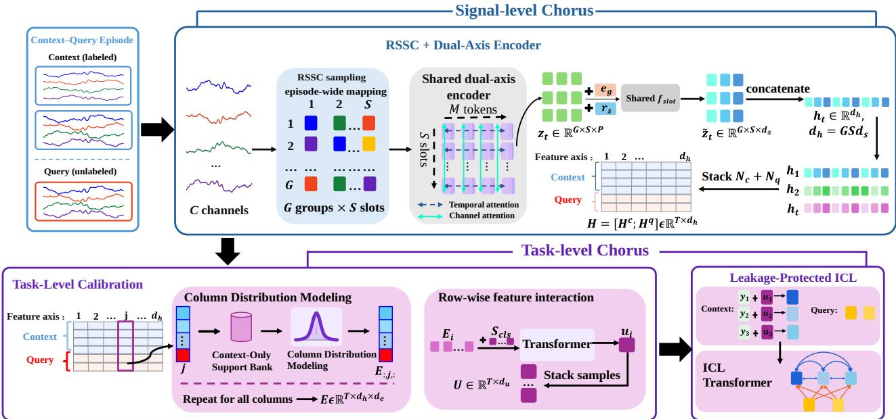
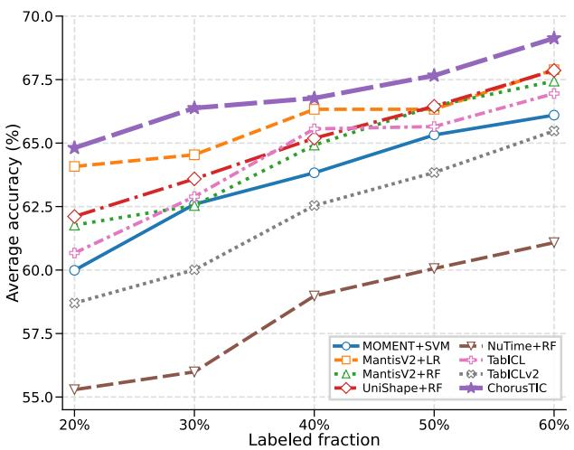

# ChorusTIC: Training-Free Multivariate Time Series Classification via Chorus In-Context Learning

Juntao Fang1∗, Shifeng Xie2,3, Ruichu Cai1†, Shengji Zheng1, Zijian Li4, Keli Zhang2, Lujia Pan2, Themis Palpanas3, Zhifeng Hao

1Guangdong University of Technology

2Huawei Noah’s Ark Lab

3Université Paris Cité

4Mohamed bin Zayed University of Artificial Intelligence

5Shantou University

Corresponding author: cairuichu@gmail.com

## Abstract

Time series classification underpins applications in healthcare, sensing, and industrial monitoring. Although time series foundation models support forecasting and transferable representation learning, classification still typically requires fitting a task-specific classifier on each target dataset, while individual channels of multivariate inputs are often encoded independently. We introduce ChorusTIC, a classification-native foundation model for in-context classification across heterogeneous channel configurations without target-task parameter updates. ChorusTIC combines episode-consistent Random Subchannel Slot Concatenation with a shared dual-axis encoder to model temporal and cross-channel interactions and map variable channel configurations into a fixed-width representation independent of the original channel count. It then calibrates feature axes using context-derived distributions and predicts query labels through leakage-protected in-context learning. We pretrain ChorusTIC solely on synthetic labeled episodes comprising context and query sets that share a task background, with classes distinguished by sparse temporal or cross-channel rules. Evaluations on the complete UEA-30 and UCR-128 archives show strong full-context and low-label performance without target-specific classifier fitting. Code is available at https://github.com/fangjuntao/ChorusTIC.

## Introduction

Time series classification (TSC) supports applications including human activity recognition, clinical monitoring, digital health, and industrial sensing (Ismail Fawaz et al. 2019; Bagnall et al. 2018; Foumani et al. 2023). Many such applications involve multivariate time series recorded simultaneously by multiple sensors or electrodes (Bagnall et al. 2018; Foumani et al. 2023). Discriminative evidence may be localized to particular variables and temporal intervals (Hsieh et al. 2021; Li et al. 2021), while multivariate classification may also depend on interactions among variables, correlations across sensors, and temporal lead and lag relationships (Bennett, Cucuringu, and Reinert 2022; Zuo et al. 2023;

Wang et al. 2024; Mu, Shahzad, and Zhu 2025). A transferable multivariate classifier must therefore capture both within-channel temporal patterns and task-relevant crosschannel relationships while accommodating heterogeneous channel configurations.

Recent time series foundation models (TSFMs) have demonstrated promising transferability across datasets and domains (Liang et al. 2024). For classification, however, the prevailing approach remains representation transfer: a pretrained encoder produces features for each sample, after which a task-specific classifier is fitted on every target dataset (Goswami et al. 2024; Feofanov et al. 2025, 2026; Lin et al. 2024; Liu et al. 2026). Although pretraining provides reusable representations across tasks, this pipeline still requires target-task optimization and remains sensitive to the choice of representation layer, token aggregation strategy, and downstream classifier (Fang et al. 2026). Moreover, multivariate inputs are often processed through channel-wise encoding, which may not preserve task-relevant temporal and cross-channel interactions. In-context learning (ICL) provides an alternative by conditioning predictions directly on labeled examples (Fang et al. 2026; Yeh et al. 2025; Küken et al. 2026; O’Rourke, Trisovic, and Bertsimas 2026b). Given a labeled context set and an unlabeled query set, an in-context classifier infers the target decision rule without updating its parameters. Existing approaches, however, focus primarily on univariate TSC and do not jointly address two challenges in multivariate classification across heterogeneous channel configurations: modeling aligned temporal and crosschannel interactions and mapping variable channel sets to a fixed-dimensional representation for support-conditioned inference.

We propose ChorusTIC, a classification-native foundation model that performs Chorus ICL across heterogeneous channel configurations. At the signal level, Random Subchannel Slot Concatenation (RSSC) assigns input channels to episode-consistent group-slot positions. A shared dual-axis encoder captures temporal and within-group cross-channel interactions, after which fixed-order slot concatenation produces a representation whose dimensionality is independent of the original channel count. At the task level, Column Distribution Modeling calibrates the resulting feature axes using the labeled context, and row-wise interaction forms sample-level representations. A leakage-protected in-context classifier injects labels only into context representations and predicts query labels without target-task parameter updates.

Training this model requires pretraining tasks that capture the relationship between context and query samples rather than collections of isolated sequences. Existing episodic generators are primarily designed for univariate classification or derive class identity from a restricted family of generative mechanisms (Yeh et al. 2025; Küken et al. 2026). We therefore construct a labeled multivariate episodic prior. Each episode shares a task-level temporal background, while classes difer through sparse temporal or cross-channel rules applied to selected temporal regions and channel subsets. The rule families cover temporal motifs, position and order changes, informative-channel selection, cross-channel phase and delay relationships, and correlation changes. Instancelevel nuisance transformations increase within-class diversity, while episode-wise label permutation prevents fixed associations between synthetic patterns and numerical label indices.

Our contributions are summarized as follows:

• We introduce ChorusTIC, a classification-native foundation model that performs support-conditioned inference across heterogeneous univariate and multivariate classification tasks without target-task parameter updates.

• We construct a labeled multivariate episodic prior whose classes difer through sparse temporal and cross-channel discriminative rules under a shared task background, together with instance-level variation and episode-wise label permutation.

• We evaluate ChorusTIC under full-context and low-label protocols on complete UEA-30 and UCR-128 archives, together with ablation studies that assess its architectural, inference, and pretraining designs.

## Related Work

Time series foundation models (TSFMs). Time series forecasting represents one of the most active areas of foundation model research. Large pretrained forecasting models support a range of deployment protocols, including zeroshot prediction, adaptation from limited observations, and task-specific fine-tuning (Ansari et al. 2024, 2025; Das et al. 2023; Cohen et al. 2024; Woo et al. 2024; Auer et al. 2025b; Moroshan et al. 2025; Rasul et al. 2024). By contrast, foundation models for time series classification commonly follow a representation-transfer paradigm: a pretrained encoder extracts features, and a separate classifier is then fitted using labeled samples from each target dataset (Feofanov et al. 2025; Lin et al. 2024; Zhang et al. 2025; Xie et al. 2025; Auer et al. 2025a; Gao et al. 2024; Zhou et al. 2023). Generalpurpose models such as MOMENT (Goswami et al. 2024) also adopt this embedding-based formulation and are widely used as representation backbones for downstream classification. Therefore, although existing methods provide transferable time series representations, broadly applicable frameworks that directly infer query labels for unseen classification tasks without target-specific optimization remain limited.

In-context time series classification. In-context learning predicts query labels from labeled context examples without fitting a task-specific classifier. TIC-FM (Fang et al. 2026) combines a pretrained time series encoder with a latent-memory in-context learner, while TiCT (Yeh et al. 2025) is trained end to end on synthetic episodes and introduces scalable label representations. Both are primarily developed or evaluated for univariate classification. Table-Time (Wang et al. 2025) and FETA (Sui et al. 2025) use general-purpose language models with textual tables or channel-wise exemplar reasoning, whereas iAmTime (Saha and Shmakov 2026) treats classification as one task within a general instruction-conditioned framework. Concurrently, RocketPFN (O’Rourke, Trisovic, and Bertsimas 2026b) combines random convolutional features with a pretrained tabular in-context classifier. TimEE (Küken et al. 2026) constructs augmented classification tasks from the training splits of UCR datasets to train an in-context classifier. These methods demonstrate the potential of training-free time series classification but do not jointly learn classification-specific temporal and cross-channel representations while accommodating variable channel counts. ChorusTIC addresses this gap through dual-axis encoding and episode-consistent fixeddimensional composition.

Synthetic pretraining. Synthetic data support the construction of forecasting corpora, representation-learning datasets, and complete classification tasks (Ansari et al. 2024; Xie et al. 2025; Feofanov et al. 2026; Yeh et al. 2025; Küken et al. 2026). ChorusTIC complements these eforts with a multivariate episodic prior aligned with its deployment protocol: context and query samples share a task-level background, while sparse temporal or cross-channel discriminative rules determine class identity. Further discussion and detailed comparisons appear in Appendix A.

## Method

## Problem Formulation and Model Overview

For a classification task τ, let $\mathcal { C } _ { \tau } = \{ ( X _ { i } ^ { c } , y _ { i } ^ { c } ) \} _ { i = 1 } ^ { N _ { c } }$ and $\mathcal { Q } _ { \tau } =$ $\{ X _ { j } ^ { q } \} _ { j = 1 } ^ { N _ { q } }$ denote the labeled context and unlabeled query sets, respectively. Each $X _ { i } ^ { c } , X _ { i } ^ { q } \in \mathbb { R } ^ { C \times L }$ contains C channels and L time steps, with task-specific C and L fixed within τ . Let $\mathbf { X } ^ { c } = [ X _ { 1 } ^ { c } ; \ldots ; X _ { N _ { c } } ^ { c } ]$ and $\mathbf { X } ^ { q } = [ X _ { 1 } ^ { q } ; \ldots ; X _ { N _ { \alpha } } ^ { q } ]$ be the stacked inputs, and let $Y ^ { c } = ( y _ { 1 } ^ { c } , \dots , y _ { N _ { c } } ^ { c } )$ and $\dot { Y ^ { q } } =$ $( y _ { 1 } ^ { q } , \dots , y _ { N _ { q } } ^ { q } )$ be their labels. We model $p _ { \Theta } ( \bar { Y } ^ { q } \mid \mathbf { X } ^ { q } , \mathcal { C } _ { \tau } )$ without target-task parameter updates.

As illustrated in Figure 1, ChorusTIC performs Chorus ICL in three stages. First, RSSC samples an episodelevel channel-to-slot assignment, and a shared dual-axis encoder models temporal and within-group cross-channel interactions before fixed-order slot composition. Second, Column Distribution Modeling calibrates feature axes using context-derived distributions, and row-wise interaction forms sample-level representations. Third, a leakage-protected ICL

  
Figure 1: Overview of ChorusTIC. Given labeled context and unlabeled queries, the signal-level Chorus uses one RSSC channel-to-slot assignment throughout the episode. Each sampled group is processed by a shared dual-axis encoder that captures temporal structure within slots and cross-channel interactions across slots. A shared readout summarizes each encoded slot, and fixed-order concatenation yields a fixed-width representation for each sample. The task-level Chorus calibrates feature axes from context-only distributions before row-wise interaction. Finally, the leakage-protected ICL Transformer predicts each query from the labeled context while preventing direct information exchange between queries.

Transformer conditions on context labels and predicts all queries in parallel.

Let $T = \bar { N } _ { c } + N _ { q } , \mathbf { X } _ { \tau } = [ \mathbf { X } ^ { c } ; \mathbf { X } ^ { q } ] \in \mathbb { R } ^ { T \times C \times L }$ , and let I denote the RSSC assignment shared across the episode. The overall computation is

$$
\begin{array} { r l } & { \cal { H } = \mathcal { R } _ { \psi } ( \mathbf { X } _ { \tau } ; \mathcal { T } ) , \qquad \cal { U } = \mathcal { A } _ { \phi } ( H ; N _ { c } ) , } \\ & { \cal { O } ^ { q } = \mathcal { G } _ { \theta } ( U , Y ^ { c } ; N _ { c } ) . } \end{array}
$$

Here, $H \in \mathbb { R } ^ { T \times d _ { h } } , U \in \mathbb { R } ^ { T \times d _ { u } }$ , and $O ^ { q } \in \mathbb { R } ^ { N _ { q } \times K }$ . The operators $\mathcal { R } _ { \psi } , A _ { \phi }$ , and $\mathcal { G } _ { \theta }$ denote the RSSC-based signal encoder, task-level calibration and row-wise interaction, and the leakage-protected in-context classifier, respectively. Moreover, $\smash { \breve { Y } ^ { c } \in \{ 1 , \dots , K \} ^ { N _ { c } } }$ and K is the number of classes in the current episode. We consider $K \leq K _ { \operatorname* { m a x } }$ in the main text; Appendix B covers $K > K _ { \operatorname* { m a x } }$ . Predictions are obtained as $P ^ { q } = \mathrm { s o f t m a x } ( O ^ { q } )$ and $\hat { y } _ { j } ^ { q } = \arg \operatorname* { m a x } _ { 1 \leq k \leq K } P _ { j , k } ^ { q }$ for $j = 1 , \ldots , N _ { q }$

## RSSC-Based Multivariate Representation

RSSC definition. Random Subchannel Slot Concatenation is an episode-level adapter that maps a variable-size channel set to a representation whose width is independent of the original channel count. RSSC consists of two operations surrounding a shared group encoder: (i) an episode-consistent assignment from input channels to ordered group-slot positions, and (ii) a fixed-order composition of the encoded slot representations. The dual-axis encoder is the shared group encoder applied between these two RSSC operations.

Unless otherwise stated, we use coverage sampling. When $C \geq N _ { s }$ , RSSC samples $N _ { s }$ channels without replacement. When $C \mathrm { ~ < ~ } N _ { s }$ , independently permuted channel lists are concatenated until all slots are filled:

$$
\mathbf i = \left\{ \begin{array} { l l } { \mathrm { P e r m } ( \mathcal V ) _ { 1 : N _ { s } } , } & { C \geq N _ { s } , } \\ { \left[ \mathrm { P e r m } _ { 1 } ( \mathcal V ) ; \ldots ; \mathrm { P e r m } _ { R } ( \mathcal V ) \right] _ { 1 : N _ { s } } , } & { C < N _ { s } , } \end{array} \right.
$$

where $R = \lceil N _ { s } / C \rceil$ . Thus, observed channels are reused when necessary rather than replaced by artificial zero-valued slots. The index vector is reshaped into G ordered groups

$$
\mathcal { T } _ { g } = ( i _ { g , 1 } , \dotsc , i _ { g , S } ) \in \mathcal { V } ^ { S } , \qquad g = 1 , \dotsc , G .
$$

The assignment $\mathcal { I } = \{ \mathcal { T } _ { g } \} _ { g = 1 } ^ { G }$ is shared across all context and query samples in an episode. Thus, each group-slot position $( g , s )$ identifies a fixed source channel within the episode, although the assignment may change across episodes. For sample t, the input to group g is $\boldsymbol { X _ { t , g } } = \boldsymbol { X _ { t , \mathcal { T } _ { a } } } \in \mathbb { R } ^ { S \times L }$

Each group defines a sampled subchannel view, and channel-axis attention operates only among its S slots. Thus, S controls the number of channels modeled jointly within each group, whereas $G$ controls the number of sampled views. The groups are not jointly processed by channel-axis attention; instead, their encoded slots are concatenated and subsequently integrated by the row-wise Transformer.

Patch tokenization and shared dual-axis encoder. Each selected channel is resampled to length $L _ { 0 }$ and divided into M non-overlapping patches. Each patch is encoded from its normalized values, first diferences, and local statistics:

$\begin{array} { r c l } { u _ { t , g , s , m } } & { = } & { f _ { \mathrm { t o k } } ( x _ { t , g , s , m } , \Delta x _ { t , g , s , m } , \mu _ { t , g , s , m } , \sigma _ { t , g , s , m } ) ~ \in } \end{array}$ $\mathbb { R } ^ { P }$ . Stacking the tokens within a group gives ${ U _ { t , g } ^ { ( 0 ) } } ~ \in$ $\mathbb { R } ^ { S \times M \times P }$ . More details are provided in Appendix B.

Each dual-axis layer first models temporal dependencies within each slot and then interactions across slots at aligned patch positions:

$$
\begin{array} { r l } & { \widetilde { U } _ { t , g } ^ { \left( \ell \right) } = \mathrm { T e m p B l o c k } ^ { \left( \ell \right) } \left( U _ { t , g } ^ { \left( \ell \right) } \right) , } \\ & { U _ { t , g } ^ { \left( \ell + 1 \right) } = \mathrm { C h a n B l o c k } ^ { \left( \ell \right) } \left( \widetilde { U } _ { t , g } ^ { \left( \ell \right) } \right) , } \end{array} \ell = 0 , \ldots , L _ { D } - 1 .
$$

The temporal block attends over the M patches independently for each slot, whereas the channel block attends over the S slots independently at each aligned patch position. A shared summary-token readout then produces an encoded slot representation $z _ { t , g , s } \in \mathbb { R } ^ { P }$ for every group-slot position. Because channel-axis attention has already mixed information among the sampled slots, $z _ { t , g , s }$ is conditioned on the other channels in group g and is not an independently encoded channel representation.

Fixed-dimensional RSSC composition. Learnable group embeddings $e _ { g } \in \mathbb { R } ^ { P }$ and slot embeddings $r _ { s } ~ \in \mathbb { R } ^ { \breve { P } }$ encode structural positions in the fixed group-slot layout rather than globally aligned sensor identities. Each encoded slot is projected as

$$
\widetilde { \boldsymbol { z } } _ { t , g , s } = f _ { \mathrm { s l o t } } \left( \boldsymbol { z } _ { t , g , s } + \boldsymbol { e } _ { g } + \boldsymbol { r } _ { s } \right) \in \mathbb { R } ^ { d _ { s } } ,
$$

where $f _ { \mathrm { s l o t } } : \mathbb { R } ^ { P }  \mathbb { R } ^ { d _ { s } }$ is shared across all group-slot positions. The sample representation is obtained by concatenating the projected slots in a fixed order:

$$
h _ { t } = \mathrm { L N } \left( \bigcirc _ { g = 1 } ^ { G } \bigcirc _ { s = 1 } ^ { S } \bigcirc _ { \mathscr { z } _ { t , g , s } } \right) \in \mathbb R ^ { d _ { h } } , \qquad d _ { h } = G S d _ { s } .
$$

For fixed $G , S ,$ and $d _ { s } .$ , the representation dimension $d _ { h }$ is independent of the original channel count C. RSSC therefore retains the positions of multiple sampled subchannel views while providing a common representation width across tasks. It does not assume globally aligned channel identities: each slot has consistent task-local semantics within an episode but may be reassigned across episodes. Stacking all context and query representations gives

$$
H = [ H ^ { c } ; H ^ { q } ] = [ h _ { 1 } ; \ldots ; h _ { T } ] \in \mathbb { R } ^ { T \times d _ { h } } .
$$

Task-Level Calibration and ICL

Column Distribution Modeling. The semantics and scale of a latent feature axis may vary across tasks. For each feature axis $j \in \{ 1 , \ldots , d _ { h } \}$ , we first embed every scalar activation:

$$
\begin{array} { r } { q _ { i , j } ^ { ( 0 ) } = f _ { \mathrm { c e l l } } ( H _ { i , j } ) \in \mathbb { R } ^ { d _ { e } } , \qquad Q _ { j } ^ { ( 0 ) } = [ q _ { 1 , j } ^ { ( 0 ) } ; \dots ; q _ { T , j } ^ { ( 0 ) } ] . } \end{array}
$$

A shared induced-attention encoder constructs an axisspecific bank from context cells only:

$$
S _ { j } = S _ { \phi } \mathopen { } \mathclose \bgroup \left( Q _ { j , 1 : N _ { c } } ^ { ( 0 ) } \aftergroup \egroup \right) \in \mathbb { R } ^ { N _ { \mathrm { i n d } } \times d _ { e } } ,
$$

where $N _ { \mathrm { i n d } }$ denotes the number of inducing tokens. Every context or query cell attends to this bank:

$$
R _ { j } = { \mathcal C } _ { \phi } ( Q _ { j } ^ { ( 0 ) } , S _ { j } ) , \qquad [ W _ { j } , B _ { j } ] = { \mathcal D } _ { \phi } ( R _ { j } ) ,
$$

where $W _ { j } , B _ { j } \in \mathbb { R } ^ { T \times d _ { e } }$ . The calibrated embeddings are

$$
E _ { : , j , : } = W _ { j } \odot \left( H _ { : , j } \mathbf { 1 } _ { d _ { e } } ^ { \top } \right) + B _ { j } .
$$

Applying this operation to all $d _ { h }$ axes yields $E \in \mathbb { R } ^ { T \times d _ { h } \times d _ { e } }$ Because $S _ { j }$ is constructed exclusively from context samples, query samples cannot modify the reference distribution or communicate with one another. Column Distribution Modeling processes each feature axis independently, while cross-axis interactions are handled by the subsequent rowwise Transformer.

Row-wise feature interaction. For sample i, let $E _ { i } \ =$ $E _ { i , : , : } \in \mathbb { R } ^ { d _ { h } \times d _ { e } }$ . We prepend $K _ { \mathrm { c l s } }$ learnable summary tokens $S _ { \mathrm { c l s } } ~ \in ~ \mathbb { R } ^ { K _ { \mathrm { c l s } } \times d _ { e } ^ { - } }$ and obtain the sample representation as $\overline { { u } } _ { i } ~ = ~ \mathrm { v e c } ( \mathcal { F } _ { \mathrm { r o w } } ( [ S _ { \mathrm { c l s } } ; E _ { i } ] ) _ { 1 : K _ { \mathrm { c l s } } , : } ) ~ \mathrm { ~ \widehat { \in ~ } ~ \mathbb { R } ^ { d _ { u } } ~ }$ , where $d _ { u } \ = \ K _ { \mathrm { c l s } } d _ { e }$ . The row Transformer processes each sample independently, preventing cross-sample information flow. Stacking the outputs gives $\pmb { \zeta } = [ u _ { 1 } ; \ldots ; u _ { T } ] \in \mathbb { R } ^ { T \times d _ { u } }$

Leakage-protected ICL. Labels are injected only into context tokens:

$$
\bar { u } _ { i } = \left\{ \begin{array} { l l } { u _ { i } + \mathcal { E } _ { y } ( y _ { i } ^ { c } ) , } & { i \le N _ { c } , } \\ { u _ { i } , } & { i > N _ { c } , } \end{array} \right.\tag{1}
$$

where $\mathcal { E } _ { y } ( \cdot ) \in \mathbb { R } ^ { d _ { u } }$ is a learnable label embedding. Let $\bar { U } =$ $[ \bar { u } _ { 1 } ; \dots ; \bar { u } _ { T } ]$ . The ICL Transformer uses context tokens as its only keys and values. With i denoting the target position and j the source position, the additive attention mask is

$$
M _ { i j } = \left\{ \begin{array} { l l } { 0 , } & { j \le N _ { c } , } \\ { - \infty , } & { j > N _ { c } . } \end{array} \right.\tag{2}
$$

Thus, context tokens attend only to the context, and each query attends only to the context. A query retains its own representation through the residual stream but never serves as a key or value, preventing query-to-query information flow. The query logits are

$$
V = \mathcal { G } _ { \boldsymbol { \theta } } ( \bar { U } ; M ) , \qquad O ^ { q } = \operatorname { D e c } \left( V _ { N _ { c } + 1 : T } \right) .\tag{3}
$$

## Labeled Episodic Pretraining

ChorusTIC is pretrained on classification episodes rather than isolated sequences. Each episode samples $\omega =$ $( K , C , L , N _ { c } , N _ { q } , \dot { \kappa } , r , d )$ , where κ denotes the task type, r the discriminative rule family, and d the task-dificulty setting. Univariate and multivariate tasks are sampled with probabilities 0.2 and 0.8, respectively. Univariate tasks use $C = 1$ and $r \in \mathcal { R } _ { \mathrm { t e m p } } .$ , whereas multivariate tasks use $2 \leq C \leq 1 0$ and $r \in \mathcal { R } _ { \mathrm { c r o s s } }$ . Class proportions follow $\underline { { \theta } } \sim \mathrm { D i r i c h l e t } ( \alpha \mathbf { 1 } _ { K } )$ , with every class represented in the context set.

Shared background and discriminative rules. Each episode first samples a shared temporal background:

$$
b \sim \operatorname { C a t e g o r i c a l } ( \lambda ) , \qquad W \sim \mathcal { P } _ { b } , \qquad W \in \mathbb { R } ^ { C \times L } ,
$$

where $\{ \mathcal { P } _ { b } \}$ is a collection of temporal process families. For each class $k ,$ a sparse rule operator constructs a prototype

$$
P _ { k } = \Gamma _ { r , k } \left( W ; S _ { k } , \mathcal { T } _ { k } , \eta _ { k } \right) , \qquad k = 1 , \ldots , K ,
$$

where $\boldsymbol { S _ { k } }$ and $\mathcal { T } _ { k }$ denote the informative channel subset and temporal region, respectively, and $\eta _ { k }$ contains the rule parameters. Temporal rule families introduce class-dependent motif shape, polarity, position, order, or local anomalies. Crosschannel rule families introduce class diferences through informative-channel selection, relative delay or phase, and correlation structure. Each episode uses one sampled discriminative rule family. An instance of class $y _ { i }$ is generated by $X _ { i } = \mathcal { A } _ { \xi _ { i } } ( P _ { y _ { i } } ) + \bar { \varepsilon } _ { i }$ , where $\mathcal { A } _ { \xi _ { i } }$ applies instance-specific nuisance transformations and $\varepsilon _ { i }$ denotes sensor noise. The dificulty variable d controls the discriminative strength and nuisance magnitude. Detailed background families, rule operators, and transformations are provided in Appendix B.

Episode construction and objective. Generated samples are divided into context and query sets, with every query class represented in the context. We then sample an episodespecific bijection $\sigma \varepsilon ~ : ~ \{ 1 , \dots , K \} ~  ~ \{ \bar { 1 } , \dots , \bar { K } \}$ and apply it to both context and query labels. Let $\begin{array} { r l } { \tilde { \mathcal { C } } _ { \mathcal { E } } } & { { } = } \end{array}$ $\{ ( \bar { X _ { i } ^ { c } } , \sigma \varepsilon ( y _ { i } ^ { c } ) ) \} _ { i = 1 } ^ { N _ { c } }$ . The model is trained by minimizing query cross-entropy:

$$
\mathcal { L } ( \boldsymbol { \Theta } ) = - \mathbb { E } _ { \mathcal { E } \sim p _ { \mathrm { s y n } } } \left[ \frac { 1 } { N _ { q } } \sum _ { j = 1 } ^ { N _ { q } } \log p _ { \boldsymbol { \Theta } } \left( \sigma _ { \mathcal { E } } ( y _ { j } ^ { q } ) \mid X _ { j } ^ { q } , \widetilde { \mathcal { C } } _ { \mathcal { E } } \right) \right] .
$$

Label permutation prevents fixed synthetic rules from acquiring fixed numerical label meanings and forces the model to infer label semantics from the context.

## Deployment-Time Inference

All parameters remain fixed on a target task. To reduce sensitivity to arbitrary label indices, we average predictions over $M _ { \pi }$ cyclic label permutations. For $m = 0 , \ldots , M _ { \pi } - 1$ define

$$
\pi _ { m } ( y ) = 1 + { \big ( } ( y - 1 + m ) { \bmod { K } } { \big ) } .
$$

Let $P _ { m } ~ \in ~ \{ 0 , 1 \} ^ { K \times K }$ be the corresponding permutation matrix, with $( P _ { m } ) _ { y , \pi _ { m } ( y ) } = 1$

Because RSSC samples channel-to-slot assignments stochastically, we additionally average predictions over $M _ { R }$ independent RSSC draws. Within each draw, the same assignment is shared by all context and query samples. Let

$$
O ^ { q , ( m , a ) } = \mathrm { C h o r u s T I C } \left( X ^ { c } , \pi _ { m } ( Y ^ { c } ) , X ^ { q } ; { \mathcal { T } } ^ { ( a ) } \right)
$$

denote the query logits under label permutation m and RSSC draw a. The aligned ensemble logits are

$$
\bar { O } ^ { q } = \frac { 1 } { M _ { \pi } M _ { R } } \sum _ { m = 0 } ^ { M _ { \pi } - 1 } \sum _ { a = 1 } ^ { M _ { R } } O ^ { q , ( m , a ) } P _ { m } ^ { \top } .
$$

The final probabilities and predictions are

$$
P ^ { q } = \operatorname { s o f t m a x } ( \bar { O } ^ { q } / \tau ) , \qquad \widehat { y } _ { j } ^ { q } = \arg \operatorname * { m a x } _ { k } P _ { j , k } ^ { q } ,
$$

where the temperature is set to $\tau = 0 . 9$ by default. We use $M _ { R } = 4$ in the main experiments. Full ensemble settings and the hierarchical extension for tasks with $K > K _ { \operatorname* { m a x } }$ are provided in Appendix B.

## Experiments

Our experiments address four questions: (1) Can Chorus-TIC classify univariate and multivariate time series without target-task parameter updates? (2) How does it compare with generic ICL methods and frozen TSFMs that fit targetspecific classifiers? (3) How efectively does it infer a taskspecific decision rule from limited labeled context? (4) How do its architectural, inference, and pretraining components contribute to performance?

## Experimental Setup

Benchmarks. We evaluate ChorusTIC on the UEA Multivariate Time Series Classification Archive (Bagnall et al. 2018) and the UCR Time Series Classification Archive (Dau et al. 2019). UEA contains 30 multivariate datasets with diverse channel counts, sequence lengths, and class structures, and serves as our primary benchmark for native multivariate classification. UCR contains 128 univariate datasets and evaluates transfer to the single-channel setting. We use the oficial train/test splits throughout. For ChorusTIC, the training split provides the labeled context and the test split constitutes the query set; no model parameter is updated on a target dataset.

Compared methods. We organize the baselines by their target-task adaptation protocol.

Time series ICL classifiers predict query labels directly from labeled context examples without target-specific parameter updates. On UCR, we compare with TIC-FM (Fang et al. 2026) and TiCT (Yeh et al. 2025), which provide the closest protocol match in the univariate setting.

Generic ICL classifiers include TabICL (Qu et al. 2025) and TabICLv2 (Qu et al. 2026). For each dataset, we concatenate the channel-wise sequences of a sample into a fixeddimensional vector and treat the resulting samples as rows of a tabular classification task. These methods provide trainingfree controls, but do not explicitly encode temporal order.

Frozen time series foundation models include MO-MENT (Goswami et al. 2024), Mantis (Feofanov et al. 2025), MantisV2 (Feofanov et al. 2026), UniShape (Liu et al. 2026), and NuTime (Lin et al. 2024). We keep each pretrained backbone fixed and extract its final-layer representation using the model’s default readout. A lightweight classifier is then fitted on the target training split. We follow the original frozenfeature protocol when one is available. Because NuTime is evaluated primarily through fine-tuning, we fit a random forest to its frozen CLS representations for the main comparison.

Evaluation protocol. Across all settings, the complete official test split serves as the query set. Full-context evaluation uses the complete training split as labeled context, with no parameter updates to ChorusTIC. For fixed-shot evaluation, we sample $\dot { k } \in \{ 5 , 1 0 \}$ examples per class and average results over five context sets shared across methods. A dataset is excluded at shot level k if any class has fewer than k training examples; all methods use the same eligible datasets and context sets. For the context-scaling analysis, we use shared class-stratified subsets containing 20%, 30%, 40%, 50%, or 60% of the training split.

Table 1: Classification results on the complete UEA-30 archive. “Target fit” indicates whether a dataset-specific classifier is fitted on the target training split. Best and second-best average accuracies and average ranks are shown in bold and underlined, respectively. Per-dataset results are provided in Appendix D.
<table><tr><td colspan="2"></td><td>Target fit</td><td>Avg. Acc.</td><td>Avg. Rank</td></tr><tr><td>Protocol Time-series ICL</td><td>Method</td><td>No</td><td>72.27%</td><td>3.57</td></tr><tr><td></td><td>ChorusTIC TabICL</td><td>No</td><td>65.33%</td><td>5.18</td></tr><tr><td rowspan="2">Generic ICL</td><td>TabICLv2</td><td>No</td><td>67.96%</td><td>4.37</td></tr><tr><td>MOMENT+SVM</td><td>Yes</td><td>68.17%</td><td>5.48</td></tr><tr><td rowspan="5">Frozen TSFM</td><td>Mantis+RF</td><td>Yes</td><td>69.34%</td><td>5.22</td></tr><tr><td>MantisV2+LR</td><td>Yes</td><td>70.50%</td><td>4.02</td></tr><tr><td>MantisV2+RF</td><td>Yes</td><td>69.54%</td><td>4.63</td></tr><tr><td>UniShape+RF</td><td>Yes</td><td>69.72%</td><td>4.92</td></tr><tr><td>NuTime+RF</td><td>Yes</td><td>57.92%</td><td>7.62</td></tr></table>

Metrics and statistical analysis. We report the unweighted average classification accuracy across datasets. When describing aggregate gains, relative improvement over a reference method is computed as $( A _ { \mathrm { o u r s } } - A _ { \mathrm { r e f } } ) / A _ { \mathrm { r e f } } \ \times$ × 100% using unrounded average accuracies.

## Main Results

Multivariate classification on UEA. Table 1 reports results on the complete UEA-30 archive. ChorusTIC achieves the highest average accuracy and the best average rank among the evaluated methods without target-specific parameter updates. Relative to MantisV2+LR, the strongest frozen-feature baseline, ChorusTIC improves average accuracy by approximately 2.51% and reduces the average rank from 4.02 to 3.57. This comparison is notable because MantisV2+LR fits a separate logistic-regression classifier on every target dataset, whereas ChorusTIC infers the target decision rule directly from labeled context examples.

Among generic ICL baselines, ChorusTIC yields relative improvements of approximately 6.34% over TabICLv2 and 10.62% over TabICL. These methods likewise avoid targetspecific fitting but operate on vectorized multivariate inputs without explicit temporal or aligned cross-channel modeling. Their lower aggregate performance is consistent with the benefit of time-series-specific representation learning for incontext classification.

Univariate classification on UCR. Table 2 reports results on the complete UCR-128 archive. ChorusTIC achieves the highest average accuracy and the best average rank among the evaluated methods. Relative to MantisV2+LR, the strongest frozen-feature baseline, it improves average accuracy by approximately 1.41% while requiring no target-specific classifier. It also reduces the average rank from 5.50 to 4.43, indicating consistent performance across the archive.

Among training-free time-series classifiers, ChorusTIC yields relative improvements of approximately 1.44% over TIC-FM and 2.51% over TiCT. It also outperforms TabI-

Table 2: Classification results on the UCR-128 archive. “Target fit” indicates whether a classifier is fitted on the target training split. Best and second-best results are shown in bold and underlined, respectively. Per-dataset results are provided in Appendix D.
<table><tr><td>Protocol</td><td>Method</td><td>Target fit</td><td>Avg. Acc.</td><td>Avg. Rank</td></tr><tr><td rowspan="6">Frozen TSFM</td><td>MOMENT+SVM</td><td>Yes</td><td>77.98%</td><td>6.11</td></tr><tr><td>Mantis+RF</td><td>Yes</td><td>78.67%</td><td>6.42</td></tr><tr><td>MantisV2+RF</td><td>Yes</td><td>78.79%</td><td>6.51</td></tr><tr><td>MantisV2+LR</td><td>Yes</td><td>80.03%</td><td>5.50</td></tr><tr><td>UniShape+RF</td><td>Yes</td><td>78.86%</td><td>5.83</td></tr><tr><td>NuTime+RF</td><td>Yes</td><td>69.39%</td><td>9.55</td></tr><tr><td rowspan="2">Generic ICL</td><td>TabICL</td><td>No</td><td>76.83%</td><td>6.38</td></tr><tr><td>TabICLv2</td><td>No</td><td>78.88%</td><td>5.15</td></tr><tr><td rowspan="3">Time-series ICL</td><td>TiCT</td><td>No</td><td>79.17%</td><td>4.81</td></tr><tr><td>TIC-FM</td><td>No</td><td>80.01%</td><td>5.32</td></tr><tr><td>ChorusTIC</td><td>No</td><td>81.16%</td><td>4.43</td></tr></table>

CLv2, the strongest generic ICL baseline, by approximately 2.89%. These results show that the same pretrained model retains strong performance in the single-channel setting while supporting both univariate and multivariate classification without target-specific optimization.

## Low-Label Multivariate Classification

We examine whether ChorusTIC can infer a target-task decision rule from limited labeled context. We consider two complementary protocols. In the fixed-shot protocol, we sample 5 or 10 labeled examples per class. In the proportional protocol, we retain 20%–60% of the oficial training split as labeled data. Within each budget, all methods are evaluated on the same eligible datasets and matched labeled subsets.

Fixed-shot performance. Table 3 shows that ChorusTIC achieves the highest average accuracy under both label budgets without target-specific parameter updates. With five examples per class, it yields an approximately 1.11% relative improvement over UniShape+RF, the strongest competing method. With ten examples per class, its relative improvement over the strongest baseline, MantisV2+LR, increases to approximately 4.06%. Compared with TabICL, the strongest generic ICL baseline under both budgets, ChorusTIC yields relative improvements of approximately 5.72% and 6.88% at five and ten shots, respectively. These results indicate that time-series-specific support conditioning enables efective decision-rule inference from limited labeled examples without target-specific optimization.

Scaling with labeled context. Figure 2 complements the fixed-shot analysis by varying the labeled fraction from 20% to 60% on UEA-30. ChorusTIC ranks first at every reported fraction, yielding relative improvements of 0.66% to 2.85% over the strongest competing method at each fraction. Its average accuracy increases monotonically from 64.81% with 20% labeled data to 69.13% with 60%, corresponding to a

Table 3: Fixed-shot classification accuracy on UEA. Results are averaged over five independently sampled support sets and over the 28 and 24 datasets eligible for the 5-shot and 10-shot settings, respectively. Within each budget, all methods use the same datasets and matched support sets. “Target fit” indicates whether a classifier is fitted on the target support set. Best and second-best results are shown in bold and underlined, respectively.
<table><tr><td>Method</td><td>Target fit</td><td>5-shot</td><td>10-shot</td></tr><tr><td>MOMENT+SVM</td><td>Yes</td><td>59.42%</td><td>63.64%</td></tr><tr><td>MantisV2+LR</td><td>Yes</td><td>61.50%</td><td>65.80%</td></tr><tr><td>MantisV2+RF</td><td>Yes</td><td>60.10%</td><td>63.66%</td></tr><tr><td>UniShape+RF</td><td>Yes</td><td>62.19%</td><td>65.35%</td></tr><tr><td>NuTime+RF</td><td>Yes</td><td>54.68%</td><td>59.83%</td></tr><tr><td>TabICL</td><td>No</td><td>59.48%</td><td>64.06%</td></tr><tr><td>TabICLv2</td><td>No</td><td>58.65%</td><td>61.85%</td></tr><tr><td>ChorusTIC</td><td>No</td><td>62.88%</td><td>68.47%</td></tr></table>

  
Figure 2: Scaling with labeled data on UEA-30. Each point reports the average accuracy obtained using the indicated fraction of the oficial training split.

6.67% relative increase over its own accuracy at the smallest reported fraction.

These results indicate that support-conditioned inference remains efective beyond the fixed-shot regime. As more labeled context becomes available, ChorusTIC consistently improves without target-specific parameter updates. Together, the fixed-shot and proportional results demonstrate its efectiveness across diferent low-label regimes.

## Ablation and Pretraining-Prior Analysis

We evaluate four design choices spanning the architecture, inference procedure, and pretraining prior: channel-axis attention, task-conditioned feature calibration, label-permutation ensembling, and cross-channel discriminative rules. Architecture and prior ablations are separately pretrained from scratch using the same optimization schedule, training budget, and random seed as the complete model. The inference ablation reuses the complete-model checkpoint and modifies only the label-permutation strategy at test time. All variants are evaluated under the same unified protocol.

Table 4: Ablation results on UEA-30. ∆ Acc. is measured relative to the complete model in percentage points.
<table><tr><td>Factor</td><td>Variant</td><td>Avg. Acc.</td><td>∆ Acc.</td></tr><tr><td>Complete model</td><td>ChorusTIC</td><td>72.27%</td><td>0.00</td></tr><tr><td>Architecture</td><td>No channel-axis attention No task-conditioned calibration</td><td>71.69% 70.66%</td><td>-0.58</td></tr><tr><td>Inference</td><td>No label-permutation ensemble</td><td>71.38%</td><td>-1.61 -0.89</td></tr><tr><td>Pretraining prior</td><td>No cross-channel discriminative</td><td>71.07%-1.20</td><td></td></tr></table>

For the channel-attention ablation, we replace channelaxis attention with an identity mapping while retaining temporal attention. For the calibration ablation, we remove the task-conditioned afine transformation while preserving the representation width and in-context learner. Both variants use the complete episodic prior. We evaluate label-permutation ensembling by disabling cyclic permutations while keeping the RSSC ensemble size fixed. For the prior ablation, we retain multivariate episodes but replace cross-channel rules involving informative channels, relative phase or delay, and correlation structure with channel-wise temporal rules.

Table 4 shows that all ablations reduce accuracy, supporting the complementary roles of the four components. Task-conditioned calibration has the largest efect, consistent with the need to align task-dependent RSSC feature axes before in-context inference. Removing cross-channel rules causes the next-largest decline, indicating that channel interaction benefits from a prior that makes cross-channel structure class-discriminative. The label-permutation result shows that cyclic averaging mitigates sensitivity to arbitrary label indices. Removing channel-axis attention lowers accuracy, supporting the benefit of modeling aligned within-group interactions before slot-level summarization and task-level integration. Together, these results support the joint use of signal-level interaction, task-level calibration, inference-time ensembling, and a matching multivariate episodic prior.

## Conclusion

We introduce ChorusTIC, a classification-native foundation model for support-conditioned univariate and multivariate TSC without per-dataset classifier fitting. ChorusTIC combines episode-consistent RSSC, a shared dual-axis encoder, context-derived calibration, and leakage-protected ICL to model temporal and cross-channel interactions across heterogeneous channel configurations and predict query labels directly from labeled context. A labeled episodic prior over synthetic tasks aligns pretraining with deployment. On the UCR-128 and UEA-30 archives, ChorusTIC achieves strong fullcontext and low-label performance without target-specific classifier fitting and improves consistently as labeled context grows. These results indicate that cross-channel modeling and support-conditioned inference provide complementary mechanisms for classification across heterogeneous channel configurations. Although UCR and UEA provide broad coverage, they do not encompass the full range of deployment conditions. Future work will develop a broader benchmark that extends the current protocols to cover missing channels, asynchronous sampling, and domain shifts.

## References

Ansari, A. F.; Shchur, O.; Küken, J.; Auer, A.; Han, B.; Mercado, P.; Rangapuram, S. S.; Shen, H.; Stella, L.; Zhang, X.; Goswami, M.; Kapoor, S.; Maddix, D. C.; Guerron, P.; Hu, T.; Yin, J.; Erickson, N.; Desai, P. M.; Wang, H.; Rangwala, H.; Karypis, G.; Wang, Y.; and Bohlke-Schneider, M. 2025. Chronos-2: From Univariate to Universal Forecasting. arXiv preprint arXiv:2510.15821.

Ansari, A. F.; Stella, L.; Turkmen, C.; Zhang, X.; Mercado, P.; Shen, H.; Shchur, O.; Rangapuram, S. S.; Pineda Arango, S.; Kapoor, S.; Zschiegner, J.; Maddix, D. C.; Mahoney, M. W.; Torkkola, K.; Gordon Wilson, A.; Bohlke-Schneider, M.; and Wang, Y. 2024. Chronos: Learning the Language of Time Series. Transactions on Machine Learning Research.

Auer, A.; Klotz, D.; Böck, S.; and Hochreiter, S. 2025a. Pre-trained Forecasting Models: Strong Zero-Shot Feature Extractors for Time Series Classification. In NeurIPS 2025 Workshop on Recent Advances in Time Series Foundation Models (BERT2S).

Auer, A.; Podest, P.; Klotz, D.; Böck, S.; Klambauer, G.; and Hochreiter, S. 2025b. TiRex: Zero-Shot Forecasting Across Long and Short Horizons with Enhanced In-Context Learning. In The Thirty-Ninth Annual Conference on Neural Information Processing Systems.

Bagnall, A.; Dau, H. A.; Lines, J.; Flynn, M.; Large, J.; Bostrom, A.; Southam, P.; and Keogh, E. 2018. The UEA multivariate time series classification archive, 2018. arXiv preprint arXiv:1811.00075.

Bennett, S.; Cucuringu, M.; and Reinert, G. 2022. Lead– lag detection and network clustering for multivariate time series with an application to the US equity market. Machine Learning, 111(12): 4497–4538.

Cohen, B.; Khwaja, E.; Wang, K.; Masson, C.; Ramé, E.; Doubli, Y.; and Abou-Amal, O. 2024. Toto: Time Series Optimized Transformer for Observability. arXiv:2407.07874.

Das, A.; Kong, W.; Sen, R.; and Zhou, Y. 2023. A decoderonly foundation model for time-series forecasting. arXiv preprint arXiv:2310.10688.

Dau, H. A.; Bagnall, A.; Kamgar, K.; Yeh, C.-C. M.; Zhu, Y.; Gharghabi, S.; Ratanamahatana, C. A.; and Keogh, E. 2019. The UCR time series archive.

Fang, J.; Xie, S.; Nie, S.; Ling, Y.; Liu, Y.; Li, Z.; Zhang, K.; Pan, L.; Palpanas, T.; and Cai, R. 2026. Rethinking Zero-Shot Time Series Classification: From Task-specific Classifiers to In-Context Inference. arXiv preprint arXiv:2602.00620.

Feofanov, V.; Wen, S.; Alonso, M.; Ilbert, R.; Guo, H.; Tiomoko, M.; Pan, L.; Zhang, J.; and Redko, I. 2025. Mantis:

Lightweight Calibrated Foundation Model for User-Friendly Time Series Classification. arXiv:2502.15637.

Feofanov, V.; Wen, S.; Zhang, J.; Pan, L.; and Redko, I. 2026. Mantisv2: Closing the zero-shot gap in time series classification with synthetic data and test-time strategies. arXiv preprint arXiv:2602.17868.

Foumani, N. M.; Tan, C. W.; Webb, G. I.; and Salehi, M. 2023. Improving position encoding of transformers for multivariate time series classification. arXiv preprint arXiv:2305.16642.

Gao, S.; Koker, T.; Queen, O.; Hartvigsen, T.; Tsiligkaridis, T.; and Zitnik, M. 2024. UniTS: A Unified Multi-Task Time Series Model. arXiv:2403.00131.

Goswami, M.; Szafer, K.; Choudhry, A.; Cai, Y.; Li, S.; and Dubrawski, A. 2024. MOMENT: A Family of Open Timeseries Foundation Models. arXiv:2402.03885.

Hsieh, T.-Y.; Wang, S.; Sun, Y.; and Honavar, V. 2021. Explainable multivariate time series classification: a deep neural network which learns to attend to important variables as well as time intervals. In Proceedings of the 14th ACM international conference on web search and data mining, 607–615.

Ismail Fawaz, H.; Forestier, G.; Weber, J.; Idoumghar, L.; and Muller, P.-A. 2019. Deep learning for time series classification: a review. Data mining and knowledge discovery, 33(4): 917–963.

Küken, J.; Hoo, S. B.; Purucker, L.; and Hutter, F. 2026. TimEE: Towards End-to-end Time Series Classification via In-Context Learning. In 1st ICLR Workshop on Time Series in the Age ofLarge Models.

Li, G.; Choi, B.; Xu, J.; Bhowmick, S. S.; Chun, K.-P.; and Wong, G. L.-H. 2021. Shapenet: A shapelet-neural network approach for multivariate time series classification. In Proceedings of the AAAI conference on artificial intelligence, volume 35, 8375–8383.

Liang, Y.; Wen, H.; Nie, Y.; Jiang, Y.; Jin, M.; Song, D.; Pan, S.; and Wen, Q. 2024. Foundation Models for Time Series Analysis: A Tutorial and Survey. In Proceedings of the 30th ACM SIGKDD Conference on Knowledge Discovery and Data Mining, KDD ’24, 6555–6565. ACM.

Lin, C.; Wen, X.; Cao, W.; Huang, C.; Bian, J.; Lin, S.; and Wu, Z. 2024. NuTime: Numerically Multi-Scaled Embedding for Large-Scale Time-Series Pretraining. arXiv:2310.07402.

Liu, Z.; Wang, Y.; Li, B.; Zheng, J.; Eldele, E.; Wu, M.; and Ma, Q. 2026. A Unified Shape-Aware Foundation Model for Time Series Classification. In Fortieth AAAI Conference on Artificial Intelligence, Thirty-Eighth Conference on Innovative Applications ofArtificial Intelligence, Sixteenth Symposium on Educational Advances in Artificial Intelligence, AAAI 2026, Singapore, January 20-27, 2026.

Moroshan, V.; Siems, J.; Zela, A.; Carstensen, T.; and Hutter, F. 2025. TempoPFN: Synthetic Pre-training of Linear RNNs for Zero-shot Time Series Forecasting. arXiv:2510.25502.

Mu, Y.; Shahzad, M.; and Zhu, X. X. 2025. MPTSNet: Integrating Multiscale Periodic Local Patterns and Global

Dependencies for Multivariate Time Series Classification. In Thirty-Ninth AAAI Conference on Artificial Intelligence, Thirty-Seventh Conference on Innovative Applications of Artificial Intelligence, Fifteenth Symposium on Educational Advances in Artificial Intelligence, AAAI 2025, Philadelphia, PA, USA, February 25 - March 4, 2025.

O’Rourke, F. M.; Trisovic, A.; and Bertsimas, D. 2026a. A Causal DAG Prior for Synthetic Time-Series Classification Datasets. arXiv preprint arXiv:2606.21776.

O’Rourke, F. M.; Trisovic, A.; and Bertsimas, D. 2026b. RocketPFN: Accurate Time Series Classification via In-Context Learning. arXiv preprint arXiv:2606.21786.

Qu, J.; HolzmÞller, D.; Varoquaux, G.; and Morvan, M. L. 2026. TabICLv2: A better, faster, scalable, and open tabular foundation model. arXiv preprint arXiv:2602.11139.

Qu, J.; Holzmüller, D.; Varoquaux, G.; and Morvan, M. L. 2025. TabICL: A Tabular Foundation Model for In-Context Learning on Large Data. arXiv:2502.05564.

Rasul, K.; Ashok, A.; Williams, A. R.; Ghonia, H.; Bhagwatkar, R.; Khorasani, A.; Bayazi, M. J. D.; Adamopoulos, G.; Riachi, R.; Hassen, N.; Biloš, M.; Garg, S.; Schneider, A.; Chapados, N.; Drouin, A.; Zantedeschi, V.; Nevmyvaka, Y.; and Rish, I. 2024. Lag-Llama: Towards Foundation Models for Probabilistic Time Series Forecasting. arXiv:2310.08278.

Saha, A.; and Shmakov, K. 2026. A Foundation Model for Instruction-Conditioned In-Context Time Series Tasks. arXiv preprint arXiv:2603.22586.

Sui, S.; Xu, Z.; Chuang, Y.-N.; Lai, K.-H.; and Hu, X. 2025. Training-free time series classification via in-context reasoning with llm agents. arXiv preprint arXiv:2510.05950.

Wang, J.; Cheng, M.; Mao, Q.; Zhou, Y.; Wang, D.; Liu, Q.; Xu, F.; and Li, X. 2025. Tabletime: Reformulating time series classification as training-free table understanding with large language models. In Proceedings ofthe 34th ACM International Conference on Information and Knowledge Management, 3009–3019.

Wang, Y.; Xu, Y.; Yang, J.; Wu, M.; Li, X.; Xie, L.; and Chen, Z. 2024. Graph-Aware Contrasting for Multivariate Time-Series Classification. In Thirty-Eighth AAAI Conference on Artificial Intelligence, AAAI 2024, Thirty-Sixth Conference on Innovative Applications of Artificial Intelligence, IAAI 2024, Fourteenth Symposium on Educational Advances in Artificial Intelligence, EAAI 2024, February 20-27, 2024, Vancouver, Canada, 15725–15734.

Woo, G.; Liu, C.; Kumar, A.; Xiong, C.; Savarese, S.; and Sahoo, D. 2024. Unified Training of Universal Time Series Forecasting Transformers. arXiv:2402.02592.

Xie, S.; Feofanov, V.; Alonso, M.; Odonnat, A.; Zhang, J.; Palpanas, T.; and Redko, I. 2025. CauKer: classification time series foundation models can be pretrained on synthetic data only. arXiv:2508.02879.

Yeh, C.-C. M.; Saini, U. S.; Wang, J.; Dai, X.; Fan, X.; Sun, J.; Fan, Y.; and Zheng, Y. 2025. TiCT: A Synthetically Pre-Trained Foundation Model for Time Series Classification. arXiv:2511.19694.

Zhang, H.; Liu, Y.; Qiu, Y.; Liu, H.; Pei, Z.; Wang, J.; and Long, M. 2025. TimesBERT: A BERT-Style Foundation Model for Time Series Understanding. arXiv:2502.21245.

Zhou, T.; Niu, P.; Wang, X.; Sun, L.; and Jin, R. 2023. One Fits All:Power General Time Series Analysis by Pretrained LM. arXiv:2302.11939.

Zuo, R.; Li, G.; Choi, B.; Bhowmick, S. S.; Mah, D. N.; and Wong, G. L. 2023. SVP-T: A Shape-Level Variable-Position Transformer for Multivariate Time Series Classification. In Thirty-Seventh AAAI Conference on Artificial Intelligence, AAAI 2023, Thirty-Fifth Conference on Innovative Applications of Artificial Intelligence, IAAI 2023, Thirteenth Symposium on Educational Advances in Artificial Intelligence, EAAI 2023, Washington, DC, USA, February 7-14, 2023.

## A Extended Related Work

General-purpose and classification-oriented TSFMs. Large-scale pretraining enables time series models to transfer temporal knowledge across datasets and tasks (Liang et al. 2024). MOMENT adopts masked time series modeling and evaluates transfer to forecasting, classification, anomaly detection, and imputation (Goswami et al. 2024). NuTime decomposes each temporal window into normalized shape, mean, and standard deviation, and uses numerically multi-scaled embeddings with contrastive pretraining (Lin et al. 2024). Both models serve primarily as transferable encoders; downstream classification requires a predictor fitted on the labeled target split.

To improve classification transfer, classification-oriented TSFMs tailor their tokenization schemes and pretraining objectives to discriminative representation learning. Mantis introduces a lightweight Transformer with time-series-specific token generation and contrastive pretraining, together with multivariate adaptations (Feofanov et al. 2025). MantisV2 and related Mantis variants strengthen frozen feature transfer through synthetic pretraining, intermediate-layer selection, token aggregation, self-ensembling, and representation fusion (Feofanov et al. 2026). UniShape uses multiscale shape tokens and prototype-based pretraining to capture transferable discriminative subsequences (Liu et al. 2026). These methods improve representation quality, but the target decision rule is still learned by fitting or adapting a classification head. Consequently, labeled support examples do not directly condition the backbone representation of each query. ChorusTIC instead jointly processes the labeled support set and query set and performs classification without target-task optimization.

In-context classification from time series. Recent work replaces target-specific classifier fitting with ICL. TIC-FM treats the target training split as context and combines a pretrained time series encoder, a projection adapter, and a split-masked latent-memory Transformer (Fang et al. 2026). It predicts the complete query set without parameter updates, but its encoder was developed primarily for univariate series. TiCT is pretrained end-to-end on synthetic classification tasks and introduces bit-based label representations and specialized output attention to support larger class spaces (Yeh et al. 2025). Its synthetic task construction is based on KernelSynth and Mixup-inspired transformations and is evaluated primarily on the univariate UCR archive.

RocketPFN provides a concurrent route to training-free time series classification by transforming time series into tabular features with random convolutional kernels and applying TabPFN for in-context classification (O’Rourke, Trisovic, and Bertsimas 2026b). This two-stage formulation difers from ChorusTIC, which integrates learned temporal and cross-channel encoding with episodically pretrained in-context inference. iAmTime instead adopts a broader instruction-conditioned formulation in which forecasting, imputation, reconstruction, classification, anomaly detection, and source separation share an encoder and decoder (Saha and Shmakov 2026). For classification, episode-local labels are represented as scalar output sequences and decoded by matching the predicted value to the nearest class code. Its pretraining mixture includes real and synthetic sequences, including labeled series from the UCR and UEA collections, and its classification evaluation covers selected subsets of these archives, while its primary empirical focus is forecasting. This setting demonstrates general instruction-conditioned task adaptation bu difers materially from ChorusTIC, which is pretrained without real benchmark series and is designed specifically for categorical in-context classification with learned temporal and cross-channel interaction.

General-purpose language models provide another training-free route. TableTime serializes multivariate series as textual tables and combines contextual information with neighborhood-assisted reasoning (Wang et al. 2025). FETA retrieves exemplars independently for each channel, asks an LLM to produce channel-level decisions, and aggregates them through confidence weighted late fusion (Sui et al. 2025). These methods preserve training-free deployment but difer from a learned time-seriesnative foundation model in representation, computational cost, and cross-channel interaction.

Synthetic priors for time series models. Synthetic pretraining has been explored at diferent levels of granularity. Chronos uses kernel-composed synthetic series to augment large forecasting corpora (Ansari et al. 2024). CauKer combines Gaussian process kernels with structural causal models to generate diverse unlabeled sequences for representation pretraining (Xie et al. 2025), while Mantis variants show that classification encoders can be pretrained entirely on synthetic data (Feofanov et al. 2025, 2026). These approaches primarily generate individual sequences rather than complete context and query classification tasks.

TiCT instead pretrains on synthetic binary in-context tasks constructed by mixing two univariate KernelSynth templates, applying stochastic time series augmentations, and assigning labels according to a task-specific mixing threshold (Yeh et al. 2025). TimEE constructs augmented classification tasks from the training splits of UCR datasets (Küken et al. 2026). A recen causal DAG prior generates complete multivariate and multiclass datasets with explicit temporal, cross-channel, and label structure, and validates the prior by adapting TabPFN (O’Rourke, Trisovic, and Bertsimas 2026a). ChorusTIC difers by jointly designing a classification-native temporal and cross-channel architecture with an episodic prior aligned with its deploymen protocol. Each episode shares a task-level temporal background, while sparse class-specific rules are applied to selected tempora regions and channel subsets. The resulting tasks control within-channel motifs, informative-channel selection, cross-channel phase and delay relationships, and correlation structure, thereby directly exercising the cross-channel evidence modeled by ChorusTIC.

## B Detailed Method

This appendix expands the method described in the main paper. It follows the same notation and module order.

## B.1 RSSC Group Construction

Consider episode b with valid channel set $\mathcal { V } _ { b } \subseteq \{ 1 , \dots , C _ { b } \}$ . Let $N _ { s } = G S$ be the total number of RSSC slots. RSSC samples a flattened channel-index vector

$$
\boldsymbol { i } _ { b } = ( i _ { b , 1 } , \dots , i _ { b , N _ { s } } ) \in \mathcal { V } _ { b } ^ { N _ { s } }\tag{B.1}
$$

and reshapes it into G ordered groups $\{ \mathcal { T } _ { b , g } \} _ { g = 1 } ^ { G }$ , each containing S slots. The same index tensor is shared by every context and query sample in the episode. Consequently, each group-slot position refers to the same source channel throughout one forward pass.

Under coverage sampling, if $| \gamma _ { b } | \geq N _ { s }$ , we sample without replacement:

$$
\begin{array} { r } { \pmb { i } _ { b } = \mathrm { P e r m } ( \mathcal { V } _ { b } ) _ { 1 : N _ { s } } . } \end{array}\tag{B.2}
$$

$\mathrm { I f } \left| \mathcal { V } _ { b } \right| < N _ { s }$ , independent permutations are concatenated until all slots are filled:

$$
\begin{array} { r l r } & { \displaystyle { R _ { b } } = \left\lceil \frac { N _ { s } } { | \mathcal { V } _ { b } | } \right\rceil , } & \\ & { \displaystyle i _ { b } = \left\lceil \mathrm { P e r m } _ { 1 } ( \mathcal { V } _ { b } ) ; \ldots ; \mathrm { P e r m } _ { R _ { b } } ( \mathcal { V } _ { b } ) \right\rceil _ { 1 : N _ { s } } . } & \end{array}\tag{B.3}
$$

Thus, observed channels are reused when necessary rather than replaced by artificial zero-valued slots. The implementation also supports independent sampling with replacement:

$$
i _ { b , n } \stackrel { \mathrm { i . i . d . } } { \sim } \mathrm { U n i f o r m } ( \mathcal { V } _ { b } ) , \qquad n = 1 , \ldots , N _ { s } .\tag{B.4}
$$

For sample t and group g, the gathered raw sequence is

$$
X _ { b , t , g } = X _ { b , t , \mathcal { T } _ { b , g } } \in \mathbb { R } ^ { S \times L _ { b } } .\tag{B.5}
$$

A channel mask is used only for genuinely missing or unavailable channels. Repeated RSSC slots remain valid observations and are not masked.

## B.2 Patch Tokenization

Each selected channel is linearly resampled to a common length $L _ { 0 }$ . Let $x _ { b , t , g , s } \in \mathbb { R } ^ { L _ { 0 } }$ denote the resulting sequence, which is divided into M non-overlapping patches $x _ { b , t , g , s , m } \in \mathbb { R } ^ { w }$ of length $w = L _ { 0 } / \ddot { M }$

The convolutional branches apply sequence-level normalization

$$
\quad S ( z ) = { \frac { z - \operatorname { M e a n } ( z ) } { \operatorname { S t d } ( z ) + 1 0 ^ { - 5 } } } ,\tag{B.6}
$$

where the statistics are computed over the complete temporal axis. The first-order diference is computed before patch aggregation:

$$
\begin{array} { r } { \Delta x _ { b , t , g , s } [ \ell ] = \left\{ \begin{array} { l l } { x _ { b , t , g , s } [ \ell + 1 ] - x _ { b , t , g , s } [ \ell ] , } & { \ell < L _ { 0 } , } \\ { 0 , } & { \ell = L _ { 0 } . } \end{array} \right. } \end{array}\tag{B.7}
$$

In parallel, the local mean and standard deviation are computed from each unnormalized resampled patch:

$$
\mu _ { b , t , g , s , m } = \mathrm { M e a n } ( x _ { b , t , g , s , m } ) , \qquad \sigma _ { b , t , g , s , m } = \mathrm { S t d } ( x _ { b , t , g , s , m } ) .\tag{B.8}
$$

The normalized signal and its independently normalized first diference are processed by shared convolutional encoders. Their outputs are layer-normalized and averaged within each patch:

$$
\begin{array} { r l } & { h _ { b , t , g , s , m } ^ { x } = \mathrm { P o o l } _ { m } ( \mathrm { L N } _ { x } ( \mathrm { C o n v } _ { x } ( S ( x _ { b , t , g , s } ) ) ) ) , } \\ & { h _ { b , t , g , s , m } ^ { \Delta } = \mathrm { P o o l } _ { m } ( \mathrm { L N } _ { \Delta } ( \mathrm { C o n v } _ { \Delta } ( S ( \Delta x _ { b , t , g , s } ) ) ) ) , } \end{array}\tag{B.9}
$$

where $\mathrm { P o o l } _ { m }$ averages the convolutional features assigned to patch m. The patch token is then

$$
\begin{array} { c } { { u _ { b , t , g , s , m } = \mathrm { P r o j } \left( h _ { b , t , g , s , m } ^ { x } \parallel h _ { b , t , g , s , m } ^ { \Delta } \right. } } \\ { { \left. \parallel \mathrm { S E } _ { \mu } ( \mu _ { b , t , g , s , m } ) \parallel \mathrm { S E } _ { \sigma } ( \sigma _ { b , t , g , s , m } ) \right) \mathrm { , } } } \end{array}\tag{B.10}
$$

where $u _ { b , t , g , s , m } \in \mathbb { R } ^ { P }$ and ∥ denotes concatenation. Stacking the tokens within sampled group g gives

$$
U _ { b , t , g } ^ { ( 0 ) } \in \mathbb { R } ^ { S \times M \times P } .\tag{B.11}
$$

## B.3 Dual-Axis Encoder and Slot Readout

For a mini-batch of B episodes, all BT G sampled group instances are processed in parallel. Let $\bar { B } = B T G$ . At layer ℓ, the input has shape

$$
U ^ { ( \ell ) } \in \mathbb { R } ^ { \bar { B } \times S \times M \times P } .\tag{B.12}
$$

Temporal-axis block. The tensor is reshaped as

$$
U _ { \mathrm { t e m p } } ^ { ( \ell ) } \in \mathbb { R } ^ { ( \bar { B } S ) \times M \times P } ,\tag{B.13}
$$

so each sampled channel is treated as an independent patch sequence. The temporal block applies

$$
\begin{array} { r l } & { A _ { \mathrm { t e m p } } ^ { ( \ell ) } = \mathrm { M H S A } _ { \mathrm { t e m p } } ^ { ( \ell ) } \left( \mathrm { L N } ( U _ { \mathrm { t e m p } } ^ { ( \ell ) } ) \right) , } \\ & { \bar { U } _ { \mathrm { t e m p } } ^ { ( \ell ) } = U _ { \mathrm { t e m p } } ^ { ( \ell ) } + A _ { \mathrm { t e m p } } ^ { ( \ell ) } , } \\ & { \widetilde { U } _ { \mathrm { t e m p } } ^ { ( \ell ) } = \bar { U } _ { \mathrm { t e m p } } ^ { ( \ell ) } + \mathrm { F F N } _ { \mathrm { t e m p } } ^ { ( \ell ) } \left( \mathrm { L N } ( \bar { U } _ { \mathrm { t e m p } } ^ { ( \ell ) } ) \right) . } \end{array}\tag{B.14}
$$

Channel-axis block. After restoring the slot and patch axes, the output is reshaped as

$$
U _ { \mathrm { c h a n } } ^ { ( \ell ) } \in \mathbb { R } ^ { ( \bar { B } M ) \times S \times P } .\tag{B.15}
$$

Thus, every aligned patch position attends across the sampled slots:

$$
\begin{array} { r l } & { ~ A _ { \mathrm { c h a n } } ^ { ( \ell ) } = \mathrm { M H S A } _ { \mathrm { c h a n } } ^ { ( \ell ) } \left( \mathrm { L N } ( U _ { \mathrm { c h a n } } ^ { ( \ell ) } ) ; M _ { \mathrm { c h } } \right) , } \\ & { ~ \bar { U } _ { \mathrm { c h a n } } ^ { ( \ell ) } = U _ { \mathrm { c h a n } } ^ { ( \ell ) } + A _ { \mathrm { c h a n } } ^ { ( \ell ) } , } \\ & { U _ { \mathrm { c h a n } } ^ { ( \ell + 1 ) } = \bar { U } _ { \mathrm { c h a n } } ^ { ( \ell ) } + \mathrm { F F N } _ { \mathrm { c h a n } } ^ { ( \ell ) } \left( \mathrm { L N } ( \bar { U } _ { \mathrm { c h a n } } ^ { ( \ell ) } ) \right) . } \end{array}\tag{B.16}
$$

The optional mask $M _ { \mathrm { c h } }$ excludes genuinely unavailable channels from key and value positions.

After $L _ { D }$ dual-axis layers, the refined patch tokens for slot s are denoted by $U _ { b , t , g , s , : } ^ { ( L _ { D } ) } \in \mathbb { R } ^ { M \times P } .$ . A shared learnable summary token $q _ { \mathrm { t s } } \in \mathbb { R } ^ { P }$ is prepended before temporal readout:

$$
\begin{array} { r l } & { R _ { b , t , g , s } = \mathrm { R e a d o u t } \left( \left[ q _ { \mathrm { t s } } ; U _ { b , t , g , s , \cdot } ^ { \left( L _ { D } \right) } \right] \right) , } \\ & { z _ { b , t , g , s } = R _ { b , t , g , s , 0 } \in \mathbb { R } ^ { P } . } \end{array}\tag{B.17}
$$

## B.4 Fixed-Dimensional RSSC Composition

Learnable group embeddings $e _ { g } \in \mathbb { R } ^ { P }$ and slot embeddings $r _ { s } \in \mathbb { R } ^ { P }$ distinguish positions in the RSSC interface. Each slot representation is projected as

$$
\widetilde { \boldsymbol { z } } _ { b , t , \boldsymbol { g } , \boldsymbol { s } } = \rho ( \boldsymbol { z } _ { b , t , \boldsymbol { g } , \boldsymbol { s } } + \boldsymbol { e } _ { \boldsymbol { g } } + \boldsymbol { r } _ { \boldsymbol { s } } ) \in \mathbb { R } ^ { d _ { \boldsymbol { s } } } .\tag{B.18}
$$

The final sample representation is

$$
h _ { b , t } = \operatorname { L N } \left( \underset { g = 1 } { \overset { G } { \| } } \underset { s = 1 } { \overset { S } { \| } } \underset { s } { \overset { \_ } { \ z } } { _ { b , t , g , s } } \right) \in \mathbb { R } ^ { d _ { h } } , \qquad d _ { h } = G S d _ { s } .\tag{B.19}
$$

Compared with global pooling, RSSC preserves the positions of multiple sampled channel views while providing a representation width that is independent of the original channel count.

For one episode, stacking all context and query samples gives

$$
H = [ H ^ { c } ; H ^ { q } ] \in \mathbb { R } ^ { T \times d _ { h } } , \qquad T = N _ { c } + N _ { q } .\tag{B.20}
$$

## B.5 Column Distribution Modeling

Consider feature axis $j \in \{ 1 , \ldots , d _ { h } \}$ . A shared scalar projection maps each activation to a cell embedding:

$$
\begin{array} { r } { q _ { i , j } ^ { ( 0 ) } = f _ { \mathrm { c e l l } } ( H _ { i , j } ) \in \mathbb { R } ^ { d _ { e } } , \qquad Q _ { j } ^ { ( 0 ) } = [ q _ { 1 , j } ^ { ( 0 ) } ; \dots ; q _ { T , j } ^ { ( 0 ) } ] . } \end{array}\tag{B.21}
$$

All parameters are shared across feature axes.

The column encoder contains $L _ { \mathrm { c o l } }$ induced-attention blocks. At layer ℓ, learnable inducing tokens $I ^ { ( \ell ) } \in \mathbb { R } ^ { N _ { \mathrm { i n d } } \times d _ { \epsilon } }$ attend only to the context cells:

$$
\begin{array} { r } { S _ { j } ^ { ( \ell ) } = \mathrm { M A B } _ { 1 } ^ { ( \ell ) } \left( I ^ { ( \ell ) } , Q _ { j , 1 : N _ { c } } ^ { ( \ell ) } , Q _ { j , 1 : N _ { c } } ^ { ( \ell ) } \right) \in \mathbb { R } ^ { N _ { \mathrm { i n d } } \times d _ { e } } . } \end{array}\tag{B.22}
$$

All cells then read from the context-derived bank:

$$
Q _ { j } ^ { ( \ell + 1 ) } = \mathrm { M A B } _ { 2 } ^ { ( \ell ) } \left( Q _ { j } ^ { ( \ell ) } , S _ { j } ^ { ( \ell ) } , S _ { j } ^ { ( \ell ) } \right) .\tag{B.23}
$$

The context slice $Q _ { j , 1 : N _ { c } } ^ { ( \ell ) }$ depends only on context cells at every layer. A query cell contributes only its own query vector in Eq. (B.23); it is never used as a key or value. Therefore, queries neither modify the context-derived bank nor communicate with one another.

The final states are decoded into cell-wise afine parameters:

$$
\begin{array} { r } { W _ { j } = \mathrm { L N } _ { w } \left( f _ { w } ( Q _ { j } ^ { ( L _ { \mathrm { c o l } } ) } ) \right) , } \\ { B _ { j } = \mathrm { L N } _ { b } \left( f _ { b } ( Q _ { j } ^ { ( L _ { \mathrm { c o l } } ) } ) \right) , } \end{array}\tag{B.24}
$$

where $W _ { j } , B _ { j } \in \mathbb { R } ^ { T \times d _ { e } }$ . The calibrated embedding of cell $( i , j )$ is

$$
E _ { i , j , : } = W _ { i , j , : } H _ { i , j } + B _ { i , j , : } \in \mathbb { R } ^ { d _ { e } } .\tag{B.25}
$$

Processing every axis gives

$$
E \in \mathbb { R } ^ { T \times d _ { h } \times d _ { e } } .\tag{B.26}
$$

Column Distribution Modeling processes each axis independently. Interactions among diferent feature axes are introduced only by the row-wise Transformer described next.

## B.6 Row-Wise Feature Interaction

For sample i, let $E _ { i } = E _ { i , : , : } \in \mathbb { R } ^ { d _ { h } \times d _ { e } }$ . We prepend $K _ { \mathrm { c l s } }$ learned summary tokens

$$
S _ { \mathrm { c l s } } = [ s _ { 1 } ; \ldots ; s _ { K _ { \mathrm { c l s } } } ] \in \mathbb { R } ^ { K _ { \mathrm { c l s } } \times d _ { e } }\tag{B.27}
$$

and apply a shared row Transformer:

$$
R _ { i } ^ { \mathrm { { r o w } } } = { \mathcal { F } } _ { \mathrm { { r o w } } } \left( \left[ S _ { \mathrm { { c l s } } } ; E _ { i } \right] \right) .\tag{B.28}
$$

The outputs corresponding to the summary tokens form the sample token

$$
u _ { i } = \mathrm { v e c } \left( R _ { i , 1 : K _ { \mathrm { c l s } } } ^ { \mathrm { r o w } } \right) \in \mathbb { R } ^ { d _ { u } } , \qquad d _ { u } = K _ { \mathrm { c l s } } d _ { e } .\tag{B.29}
$$

Because $\mathcal { F } _ { \mathrm { r o w } }$ is applied independently to each row, it models interactions among feature axes without introducing cross-sample information flow

## B.7 Leakage-Protected In-Context Inference

Label embeddings are injected only into context tokens:

$$
\bar { u } _ { i } = \left\{ \begin{array} { l l } { u _ { i } + \mathcal { E } _ { y } ( y _ { i } ^ { c } ) , } & { i \le N _ { c } , } \\ { u _ { i } , } & { i > N _ { c } . } \end{array} \right.\tag{B.30}
$$

Let $\bar { U } = [ \bar { u } _ { 1 } ; \dots ; \bar { u } _ { T } ]$ . With target position i and source position $j ,$ the additive attention mask is

$$
M _ { i j } = \left\{ \begin{array} { l l } { 0 , } & { j \le N _ { c } , } \\ { - \infty , } & { j > N _ { c } . } \end{array} \right.\tag{B.31}
$$

Thus, context tokens are the only keys and values. Context tokens attend to the context, while each query attends to the context using its own hidden state as the attention query. The residual stream preserves the query representation even though query tokens never serve as keys or values.

Starting from $V ^ { ( 0 ) } = \bar { U }$ , the in-context Transformer applies

$$
V ^ { ( \ell + 1 ) } = \mathcal { G } _ { \theta } ^ { ( \ell ) } \left( V ^ { ( \ell ) } ; M \right) , \qquad \ell = 0 , \dots , L _ { \mathrm { i c l } } - 1 .\tag{B.32}
$$

The decoder maps the final query states to logits:

$$
O ^ { q } = \mathrm { D e c } \left( V _ { N _ { c } + 1 : T } ^ { \left( L _ { \mathrm { i c l } } \right) } \right) \in \mathbb { R } ^ { N _ { q } \times K } .\tag{B.33}
$$

The class probabilities and predictions are

$$
P ^ { q } = \operatorname { s o f t m a x } ( O ^ { q } ) , \qquad \hat { y } _ { j } ^ { q } = \operatorname { a r g m a x } _ { k } P _ { j , k } ^ { q } .\tag{B.34}
$$

## B.8 Complete Synthetic Episodic Prior

Episode configuration. Each episode samples

$$
\omega = ( K , C , L , N _ { c } , N _ { q } , \kappa , r , d ) , \qquad \kappa \in \{ \mathrm { u n i } , \mathrm { m u l t i } \} ,\tag{B.35}
$$

where $\kappa$ denotes the task type, r denotes the discriminative rule family, and $d$ controls task dificulty. For the reported model, univariate and multivariate episodes are sampled with probabilities 0.2 and 0.8, respectively. Univariate episodes use $C = 1$ and $r \in \mathcal { R } _ { \mathrm { t e m p } } .$ , whereas multivariate episodes use $2 \leq C \leq 1 0$ and $r \in \mathcal { R } _ { \mathrm { c r o s s } }$ . Class proportions are sampled as

$$
\underline { { \pmb { \varrho } } } \sim \mathrm { D i r i c h l e t } ( \alpha \mathbf { 1 } _ { K } ) ,
$$

subject to every active class being represented in the context set.

Shared temporal background. A generator family is first selected from a categorical mixture:

$$
a \sim \operatorname { C a t e g o r i c a l } ( \lambda ) , \qquad W \sim { \mathcal { P } } _ { a } , \qquad W \in \mathbb { R } ^ { C \times L } .\tag{B.36}
$$

The collection $\{ \mathcal { P } _ { a } \}$ contains:

• smooth, periodic, and colored-noise processes;

• structural channel graphs with lagged or nonlinear dependencies;

• regime-switching and changepoint processes;

• event, spike, burst, and plateau processes;

• amplitude- and frequency-modulated sinusoids; and

• audio-like multiscale processes.

The sampled background is normalized channel-wise using robust location and scale statistics and clipped for numerical stability. All classes within an episode share the same background, so class identity cannot be inferred from independently generated nuisance dynamics.

Class-specific discriminative rules. For class $k ,$ we sample an informative channel subset $S _ { k }$ , an informative temporal region $\mathcal { T } _ { k } .$ , and rule parameters $\eta _ { k }$ . The class prototype is

$$
P _ { k } = \Gamma _ { r , k } \left( W ; S _ { k } , \mathcal { T } _ { k } , \eta _ { k } \right) , \qquad k = 1 , \ldots , K .\tag{B.37}
$$

The modification is sparse in time and, for multivariate episodes, sparse in channels.

For univariate episodes, the rule families include motif shape, polarity, position, order, and localized deviations. Multivariate episodes define class diferences through informative-channel selection, channel-specific motifs, relative delays, phase relationships, and correlation regimes.

Instance-level variation. An observed instance of class $y _ { i }$ is generated as

$$
X _ { i } = \mathcal { A } _ { \xi _ { i } } ( P _ { y _ { i } } ) + \varepsilon _ { i } ,\tag{B.38}
$$

where $\mathcal { A } _ { \xi _ { i } }$ is an instance-specific nuisance transformation and $\varepsilon _ { i }$ denotes sensor noise. The transformation family contains temporal shifts, elastic warping, local masking, length perturbations, burst noise, quantization, amplitude clipping, and distractorchannel perturbations. Easy episodes use stronger discriminative rules and weaker nuisance transformations, whereas hard episodes reduce the class margin and increase nuisance severity.

Context and query construction. After instance generation, samples are independently shufled and divided into context and query sets. An episode-specific random bijection

$$
\sigma \varepsilon : \{ 1 , \dots , K \} \to \{ 1 , \dots , K \}\tag{B.39}
$$

is applied to every context and query label:

$$
\widetilde { y } = \sigma \varepsilon ( y ) .\tag{B.40}
$$

The model observes $( X ^ { c } , \widetilde { Y } ^ { c } , X ^ { q } )$ but not $\widetilde { Y } ^ { q }$

Let

$$
\widetilde { \mathcal { C } } \varepsilon = \{ ( X _ { i } ^ { c } , \sigma \varepsilon ( y _ { i } ^ { c } ) ) \} _ { i = 1 } ^ { N _ { c } } .\tag{B.41}
$$

The pretraining objective is

$$
\mathcal { L } ( \boldsymbol { \Theta } ) = - \mathbb { E } _ { \mathcal { E } \sim p _ { \mathrm { s y n } } } \left[ \frac { 1 } { N _ { q } } \sum _ { j = 1 } ^ { N _ { q } } \log p _ { \boldsymbol { \Theta } } \left( \sigma _ { \mathcal { E } } ( y _ { j } ^ { q } ) \mid X _ { j } ^ { q } , \widetilde { \mathcal { C } } _ { \mathcal { E } } \right) \right] .\tag{B.42}
$$

The episode-specific permutation prevents fixed numerical labels from becoming associated with particular synthetic rules.

## B.9 Deployment-Time Ensembling

Label permutation ensemble. For a target task with K classes, define the m-th cyclic permutation as

$$
\pi _ { m } ( y ) = 1 + { \big ( } ( y - 1 + m ) { \bmod { K } } { \big ) } , \qquad m = 0 , \ldots , M _ { \pi } - 1 .\tag{B.43}
$$

Let $P _ { m } \in \{ 0 , 1 \} ^ { K \times K }$ denote its permutation matrix:

$$
( P _ { m } ) _ { y , \pi _ { m } ( y ) } = 1 .\tag{B.44}
$$

The model predicts using the permuted context labels:

$$
O ^ { q , ( m ) } = C h o r u s T I C \left( X ^ { c } , \pi _ { m } ( Y ^ { c } ) , X ^ { q } \right) .\tag{B.45}
$$

Because column $\pi _ { m } ( y )$ corresponds to original class $y ,$ the logits are restored by

$$
{ \widetilde { \cal O } } ^ { q , ( m ) } = { \cal O } ^ { q , ( m ) } P _ { m } ^ { \top } .\tag{B.46}
$$

The ensemble logits are

$$
\bar { O } ^ { q } = \frac { 1 } { M _ { \pi } } \sum _ { m = 0 } ^ { M _ { \pi } - 1 } \widetilde { O } ^ { q , ( m ) } .\tag{B.47}
$$

RSSC sampling ensemble. Because RSSC samples channel groups stochastically, deployment averages predictions over $M _ { R }$ independent RSSC draws. Let $O ^ { q , ( m , a ) }$ denote the logits obtained using label permutation m and RSSC draw $^ { a , }$ where $a = 1 , \ldots , M _ { R }$ . The combined estimator is

$$
\bar { O } ^ { q } = \frac { 1 } { M _ { \pi } M _ { R } } \sum _ { m = 0 } ^ { M _ { \pi } - 1 } \sum _ { a = 1 } ^ { M _ { R } } O ^ { q , ( m , a ) } P _ { m } ^ { \top } .\tag{B.48}
$$

Within each draw, the same sampled RSSC channel indices are shared across all context and query samples.

The final probabilities and predictions are

$$
P ^ { q } = \operatorname { s o f t m a x } \left( \frac { \bar { O } ^ { q } } { \tau } \right) , \qquad \widehat { y } _ { j } ^ { q } = \arg \operatorname * { m a x } _ { k } P _ { j , k } ^ { q } ,\tag{B.49}
$$

where the temperature is set to $\tau = 0 . 9$ by default. The reported configuration uses $M _ { \pi } = 8$ cyclic label permutations and $M _ { R } = 4$ independent RSSC draws, resulting in 32 ensemble members per prediction.

## B.10 Hierarchical Extension for Many-Class Tasks

The native decoder supports at most $K _ { \mathrm { m a x } }$ classes. For $K > K _ { \operatorname* { m a x } }$ , we construct a balanced tree whose leaves correspond to the original classes and whose internal nodes have at most $K _ { \mathrm { m a x } }$ children.

For internal node $v ,$ let ch(v) denote its child groups and let $\mathcal { C } _ { v }$ contain the context samples whose labels belong to descendants of v. The original labels in $\mathcal { C } _ { v }$ are replaced by local child-group indices. The model then predicts

$$
p _ { \Theta } \left( g \mid X , \mathcal { C } _ { v } \right) , \qquad g \in \mathrm { c h } ( v ) .\tag{B.50}
$$

At the final internal node, each child corresponds to an individual class. For class $y ,$ let $v _ { 0 } , \ldots , v _ { D _ { y } - 1 }$ denote the internal nodes on its path and $g _ { v _ { d } } ( y )$ the child selected at node $v _ { d } .$ . Its probability is

$$
p _ { \Theta } \left( y \mid X , \mathcal { C } _ { \tau } \right) = \prod _ { d = 0 } ^ { D _ { y } - 1 } p _ { \Theta } \left( g _ { v _ { d } } ( y ) \mid X , \mathcal { C } _ { v _ { d } } \right) .\tag{B.51}
$$

This procedure decomposes a many-class task into a sequence of native-capacity in-context decisions and requires no target-task parameter updates.

## C Reproducibility Details

## C.1 Datasets and Evaluation Splits

We evaluate on all 128 datasets in the UCR Time Series Classification Archive and all 30 datasets in the UEA Multivariate Time Series Classification Archive. We use the oficial train/test splits without excluding datasets or modifying their labels. Both archives are publicly available from their oficial repositories.

For full-context evaluation, the complete oficial training split is provided to ChorusTIC as labeled context, and the complete oficial test split is used as the query set. No ChorusTIC parameter is updated on a target dataset. For frozen-representation baselines, the pretrained backbone remains fixed, while the specified lightweight classifier is fitted using only the oficial target training split. Test labels are used only for final accuracy computation.

For fixed-shot evaluation, we sample $k \in \{ 5 , 1 0 \}$ labeled examples per class from the oficial training split and use the complete test split as the query set. A dataset is excluded from the k-shot setting only if at least one class contains fewer than k training examples. Results are averaged over five independently sampled support sets, and all methods use identical support sets for each dataset and label budget. The sampling seeds are 0, 1, 2, 3, and 4. For proportional-label evaluation, we retain 20%, 30%, 40%, 50%, or 60% of the oficial training split using class-stratified sampling, with identical sampled subsets shared across methods.

No real-world time series are used to pretrain ChorusTIC. Synthetic episodes are generated online from the episodic prior described in Section B.8 and contain no samples from the UCR or UEA archives.

## C.2 Input Preprocessing

All preprocessing is performed independently for each dataset. UCR samples are treated as univariate time series and represented with a singleton channel axis, whereas UEA samples retain their original multivariate organization. We do not flatten or concatenate UEA channels before ChorusTIC encoding. No dataset-level channel selection or truncation is applied during preprocessing; RSSC subsequently samples channel groups within the ChorusTIC encoder.

The data reader maps every input to the model length $L _ { 0 } = 5 1 2$ . Time series with a diferent original length are resampled along the temporal axis using linear interpolation with align\_corners=False. Missing values in UEA files are replaced with zero before temporal interpolation. The same preprocessing procedure is applied to the oficial training and test splits, without using test labels or test-set statistics. Labels are mapped to consecutive integers using a label encoder fitted on the training split and reused for the corresponding test split.

## C.3 ChorusTIC Configuration

The reported model uses the checkpoint at pretraining step 6000. Its architecture is reconstructed from model\_hparams\_latest.json, and checkpoint loading is performed with strict consistency checks for both the RSSC encoder and the in-context learner. All parameters are set to evaluation mode and remain frozen throughout target-task evaluation

Table C.1 lists the final model configuration. The final inference configuration is given in Table C.2. Batch-size parameters control memory consumption only. When a CUDA out-of-memory error is detected, the implementation reduces the relevant batch sizes and retries the same computation. The efective batch sizes are recorded in the output files.

Table C.1: Final ChorusTIC architecture and pretraining configuration. All values correspond to the checkpoint used for the reported UCR and UEA results.
<table><tr><td>Configuration</td><td>Value</td><td>Configuration</td><td>Value</td></tr><tr><td>Input length  $L _ { 0 }$ </td><td>512</td><td>Task-level embedding width</td><td>128</td></tr><tr><td>Number of temporal patches M</td><td>32</td><td>Column-attention blocks</td><td>3</td></tr><tr><td>RSSC groups G</td><td>4</td><td>Column-attention heads</td><td>4</td></tr><tr><td>Slots per RSSC group S</td><td>4</td><td>Column inducing tokens</td><td>128</td></tr><tr><td>RSSC slot dimension</td><td>32</td><td>Row-interaction blocks</td><td>3</td></tr><tr><td>RSSC sampling strategy</td><td>Coverage</td><td>Row-attention heads</td><td>8</td></tr><tr><td>Signal-encoder width</td><td>512</td><td>Row summary tokens</td><td>4</td></tr><tr><td>Dual-axis encoder layers</td><td>3</td><td>ICL Transformer blocks</td><td>12</td></tr><tr><td>Temporal-attention heads</td><td>8</td><td>ICL attention heads</td><td>4</td></tr><tr><td>Channel-attention heads</td><td>4</td><td>ICL feed-forward expansion</td><td>2</td></tr><tr><td>Temporal feed-forward width</td><td>512</td><td>ICL dropout</td><td>0</td></tr><tr><td>Channel feed-forward width</td><td>512</td><td>Maximum native class count Kmax</td><td>10</td></tr><tr><td>Dual-axis dropout</td><td>0.1</td><td>Pretraining optimizer</td><td>AdamW</td></tr><tr><td>Learning rate</td><td>1 × 10</td><td>Weight decay</td><td>0</td></tr><tr><td>Episode batch size</td><td>36</td><td>Pretraining steps</td><td>6000</td></tr><tr><td>Gradient clipping</td><td>1.0</td><td>Numerical precision</td><td>FP32 with AMP</td></tr></table>

## C.4 Hyperparameter Development and Baseline Configuration

We distinguish prediction-relevant hyperparameters from parameters that afect only computational batching. The latter, including v2\_batch\_size, mantis\_batch\_size, and the ensemble batch sizes, are adjusted according to available GPU memory and do not change the prediction rule.

During preliminary development, prediction-relevant settings are evaluated on a fixed synthetic validation set containing 64 episodes sampled independently from the episodic prior. UCR and UEA test labels are not used for hyperparameter selection.

Table C.2: Final ChorusTIC inference configuration.
<table><tr><td>Parameter</td><td>Final value</td></tr><tr><td>Checkpoint</td><td>step-6000</td></tr><tr><td>Evaluation mode</td><td>classifier_v2</td></tr><tr><td>Context mode</td><td>full training split</td></tr><tr><td>Label-permutation ensemble size</td><td>8</td></tr><tr><td>Cyclic label-permutation ensemble</td><td>enabled</td></tr><tr><td>RSSC inference draws  $M _ { R }$ </td><td>4</td></tr><tr><td>Softmax temperature</td><td>0.9</td></tr><tr><td>Channel selection</td><td>disabled</td></tr><tr><td>Evaluation seed</td><td>0</td></tr><tr><td>Total ensemble evaluations</td><td>32</td></tr><tr><td>Hierarchical classification</td><td>Enabled for  $K > 1 0$ </td></tr></table>

Ensemble sizes are selected by considering validation accuracy and inference cost, with larger settings omitted once accuracy gains begin to saturate. Table C.3 summarizes the candidate values and final settings.

Table C.3: Development ranges and final inference hyperparameters.
<table><tr><td>Parameter</td><td>Values considered</td><td>Final</td><td>Selection criterion</td></tr><tr><td>Label-permutation ensemble size  $M _ { \pi }$ </td><td>{1, 2, 4, 8}</td><td>8</td><td>Validation accuracy and inference cost</td></tr><tr><td>RSSC inference draws  $M _ { R }$ </td><td>{1, 2, 4, 8}</td><td>4</td><td>Validation accuracy and inference cost</td></tr><tr><td>Cyclic label permutation</td><td>Enabled, disabled</td><td>Enabled</td><td>Validation accuracy</td></tr></table>

For all comparison methods, we use the authors’ released implementations, pretrained checkpoints, preprocessing procedures, and recommended default hyperparameters. Frozen foundation models use the representation readout and target-classifier protocol specified in their original implementations or papers. No baseline is tuned separately on a target test split.

Table C.4: Implementations and target-task protocols of the comparison methods. “Oficial” indicates the use of an author released implementation.
<table><tr><td>Method</td><td>Official</td><td>Version or checkpoint</td><td>Target protocol</td></tr><tr><td>MOMENT</td><td>Yes</td><td>MOMENT-1-base</td><td>Frozen feature + SVM</td></tr><tr><td>Mantis</td><td>Yes</td><td>Mantis-8M</td><td>Frozen feature + RF</td></tr><tr><td>MantisV2</td><td>Yes</td><td>MantisV2</td><td>Frozen feature + LR/RF</td></tr><tr><td>UniShape</td><td>Yes</td><td>unishape_checkpoint_zeroshot</td><td>Frozen feature + RF</td></tr><tr><td>NuTime</td><td>Yes</td><td>checkpoint_bias9</td><td>Frozen CLS + RF</td></tr><tr><td>TabICL</td><td>Yes</td><td>tabicl-classifier-v1.1-20250506</td><td>In-context inference</td></tr><tr><td>TabICLv2</td><td>Yes</td><td>tabicl-classifier-v2-20260212</td><td>In-context inference</td></tr><tr><td>TIC-FM</td><td>Yes</td><td>TIC-FM</td><td>In-context inference</td></tr><tr><td>TiCT</td><td>Yes</td><td>ResNet, 47M parameters</td><td>In-context inference</td></tr></table>

## C.5 Evaluation Metrics and Statistical Analysis

For dataset d, classification accuracy is

$$
\operatorname { A c c } _ { d } = \frac { 1 } { N _ { d } } \sum _ { i = 1 } ^ { N _ { d } } \mathbb { I } [ \widehat { y } _ { d , i } = y _ { d , i } ] ,\tag{C.1}
$$

where $N _ { d }$ is the number of test samples. For an archive containing D datasets, average accuracy is the unweighted macro-average

$$
\operatorname { A v g A c c } = \frac { 1 } { D } \sum _ { d = 1 } ^ { D } \operatorname { A c c } _ { d } .\tag{C.2}
$$

Macro-averaging gives equal weight to every dataset and prevents large datasets from dominating the archive-level result.

best/second-best markings, and win/tie/loss counts are computed from the stored full-precision accuracies rather than the rounded values displayed in the tables.

Win/tie/loss counts are reported from the perspective of ChorusTIC. A win indicates $\mathrm { A c c } _ { d , \mathrm { C h o r u s T I C } } > \mathrm { A c c } _ { d , \mathrm { b a s e l i n e } } ,$ a loss indicates the opposite, and exact equality is counted as a tie.

Relative improvement over a reference method is computed from the unrounded macro-average accuracies as

$$
\mathrm { R e l G a i n } = \frac { \mathrm { A v g A c c } _ { \mathrm { o u r s } } - \mathrm { A v g A c c } _ { \mathrm { r e f } } } { \mathrm { A v g A c c } _ { \mathrm { r e f } } } \times 1 0 0 \%\tag{C.3}
$$

Paired statistical testing. To assess whether the observed performance diferences are statistically reliable across datasets, we compare ChorusTIC with each baseline using a two-sided Wilcoxon signed-rank test on paired per-dataset accuracies. UEA-30 and UCR-128 are analyzed separately because they represent distinct benchmark collections and evaluation settings. For each comparison, the null hypothesis is that the distribution of the nonzero paired accuracy diferences is symmetric about zero.

Datasets with an exact zero diference are omitted from the signed-rank calculation, following the standard Wilcoxon zerodiference convention. The resulting number of nonzero paired diferences is reported as $n _ { \mathrm { e f f } }$ . Let $\mathbf { \bar { \boldsymbol { W } } ^ { + } }$ and $W ^ { - }$ denote the sums of the ranks associated with positive and negative diferences, respectively. The reported two-sided test statistic is

$$
W = \operatorname* { m i n } \left( W ^ { + } , W ^ { - } \right) .\tag{C.4}
$$

Because ChorusTIC is compared with multiple baselines, the resulting p-values are adjusted using the Holm procedure. Correction is performed separately within each archive: the UEA-30 family contains eight baseline comparisons, whereas the UCR-128 family contains ten. Statistical significance is assessed at $\alpha = 0 . 0 5$ using the Holm-corrected $p \textmd { - }$ values. All tests use stored full-precision per-dataset accuracies, and statistical conclusions are based on the corrected rather than the uncorrected values.

## C.6 Computing Infrastructure

Table C.5 reports the computing and software environment used for pretraining and evaluation.

Table C.5: Computing and software environment.
<table><tr><td>Item</td><td>Configuration</td></tr><tr><td>GPU model and count</td><td>4× NVIDIA Tesla V100 PCIe</td></tr><tr><td>GPU memory</td><td>32 GiB per GPU (128 GiB total)</td></tr><tr><td>GPU driver</td><td>570.86.15</td></tr><tr><td>CPU model</td><td>Intel Xeon Gold 6140 @ 2.30 GHz</td></tr><tr><td>System memory</td><td>251 GiB</td></tr><tr><td>Operating system</td><td>Ubuntu 18.04.6 LTS</td></tr><tr><td>Python</td><td>3.10.18</td></tr><tr><td>PyTorch</td><td>2.5.1</td></tr><tr><td>CUDA runtime</td><td>12.4</td></tr><tr><td>cuDNN</td><td>9.1.0</td></tr><tr><td>NumPy</td><td>2.0.1</td></tr><tr><td>scikit-learn</td><td>1.7.2</td></tr></table>

## D Additional Experiments

## D.1 Evaluation Details

Benchmarks. We use the oficial train/test splits of the UEA-30 multivariate archive (Bagnall et al. 2018) and the UCR-128 univariate archive (Dau et al. 2019). For ChorusTIC, the training split supplies labeled context and the test split forms the query set; no target-task parameter is updated. In fixed-shot evaluation, we sample 5 or 10 context examples per class and retain the complete test split. Results are averaged over five independently sampled context sets shared across methods. A dataset is included at a given shot level only when every class contains enough training examples.

Baselines. On UCR, TIC-FM (Fang et al. 2026) and TiCT (Yeh et al. 2025) provide the closest time-series ICL comparisons. TabICL (Qu et al. 2025) and TabICLv2 (Qu et al. 2026) serve as generic ICL controls after each series is vectorized. Frozen TSFM baselines include MOMENT (Goswami et al. 2024), Mantis (Feofanov et al. 2025), MantisV2 (Feofanov et al. 2026), UniShape (Liu et al. 2026), and NuTime (Lin et al. 2024). Each TSFM backbone remains fixed, and its default final-layer readout is used to fit the lightweight classifier named in the tables. NuTime+RF uses the final normalized CLS representation and a random forest.

Metrics. We report the unweighted average accuracy and average rank across datasets. Win/tie/loss counts use paired perdataset accuracies and are reported from the perspective of ChorusTIC. The five-run average applies to sampled low-label context sets.

## D.2 Archive-Level Results

UEA-30 Table D.1 supplements the main-paper comparison with win/tie/loss counts. ChorusTIC is the only evaluated method that combines training-free deployment with native multivariate encoding. Its gains over generic ICL controls are consistent with the need to preserve temporal and cross-channel structure rather than treating each series as an unordered feature vector.

Table D.1: Classification results on the complete UEA-30 archive. “Target fit” indicates whether a dataset-specific classifier is fitted on the target training split. W/T/L counts are reported from the perspective of ChorusTIC. Best and second-best average accuracies and average ranks are shown in bold and underlined, respectively.
<table><tr><td></td><td></td><td>Target</td><td>Avg.</td><td> $\operatorname { A v g } .$ </td><td></td></tr><tr><td>Protocol</td><td>Method</td><td>fit</td><td>Acc. ↑</td><td>Rank ↓</td><td>W/T/L</td></tr><tr><td>Time-series ICL</td><td>ChorusTIC</td><td>No</td><td>72.27%</td><td>3.57</td><td>二</td></tr><tr><td rowspan="2">Generic ICL</td><td>TabICL</td><td>No</td><td>65.33%</td><td>5.18</td><td>18/3/9</td></tr><tr><td>TabICLv2</td><td>No</td><td>67.96%</td><td>4.37</td><td>16/1/13</td></tr><tr><td rowspan="6">Frozen TSFM</td><td>MOMENT+SVM</td><td>Yes</td><td>68.17%</td><td>5.48</td><td>22/2/6</td></tr><tr><td>Mantis+RF</td><td>Yes</td><td>69.34%</td><td>5.22</td><td>21/1/8</td></tr><tr><td>MantisV2+LR</td><td>Yes</td><td>70.50%</td><td>4.02</td><td>18/3/9</td></tr><tr><td>MantisV2+RF</td><td>Yes</td><td>69.54%</td><td>4.63</td><td>16/2/12</td></tr><tr><td>UniShape+RF</td><td>Yes</td><td>69.72%</td><td>4.92</td><td>18/3/9</td></tr><tr><td>NuTime+RF</td><td>Yes</td><td>57.92%</td><td>7.62</td><td>26/1/3</td></tr></table>

Table D.2: Classification results on the complete UCR-128 archive. “Target fit” indicates whether a classifier is fitted on the target training split. Best and second-best results are shown in bold and underlined, respectively.
<table><tr><td>Protocol</td><td>Method</td><td>Target fit</td><td>Avg. Acc.</td><td>Avg. Rank</td></tr><tr><td rowspan="6">Frozen TSFM</td><td>MOMENT+SVM</td><td>Yes</td><td>77.98%</td><td>6.11</td></tr><tr><td>Mantis+RF</td><td>Yes</td><td>78.67%</td><td>6.42</td></tr><tr><td>MantisV2+RF</td><td>Yes</td><td>78.79%</td><td>6.51</td></tr><tr><td>MantisV2+LR</td><td>Yes</td><td>80.03%</td><td>5.50</td></tr><tr><td>UniShape+RF</td><td>Yes</td><td>78.86%</td><td>5.83</td></tr><tr><td>NuTime+RF</td><td>Yes</td><td>69.39%</td><td>9.55</td></tr><tr><td rowspan="2">Generic ICL</td><td>TabICL</td><td>No</td><td>76.83%</td><td>6.38</td></tr><tr><td>TabICLv2</td><td>No</td><td>78.88%</td><td>5.15</td></tr><tr><td rowspan="3">Time-series ICL</td><td>TiCT</td><td>No</td><td>79.17%</td><td>4.81</td></tr><tr><td>TIC-FM</td><td>No</td><td>80.01%</td><td>5.32</td></tr><tr><td>ChorusTIC</td><td>No</td><td>81.16%</td><td>4.43</td></tr></table>

UCR-128 Table D.2 summarizes the complete UCR-128 comparison. The same pretrained ChorusTIC model transfers to the single-channel setting and achieves the best aggregate accuracy and rank without fitting a target-specific classifier.

## D.3 Per-Dataset Results

UEA-30 Table D.3 reports the per-dataset accuracies underlying the UEA aggregate statistics. It exposes variation across heterogeneous multivariate tasks while confirming ChorusTIC’s best archive-level average accuracy and rank without targettask fitting.

UCR-128 Table D.4 provides the corresponding per-dataset results across all 128 tasks. These results show the variation behind the archive averages while retaining the same training-free classification protocol for ChorusTIC.

Statistical Comparison Results We conduct two-sided Wilcoxon signed-rank tests using full-precision per-dataset accuracies, excluding zero paired diferences from the signed-rank calculation. Holm correction is applied separately to the UEA-30 and UCR-128 families of comparisons. On UEA-30, the diferences remain significant after correction for MOMENT+SVM (W/T/L $= 2 2 / 2 / 6$ , raw $p = 4 . 7 \dot { 3 } \times 1 0 ^ { - 4 }$ , adjusted $p = 3 . 3 1 \times 1 0 ^ { - 3 } )$ and NuTime+RF $\begin{array} { r } { ( \mathbf { W } / \mathrm { T } / \mathrm { L } = 2 6 / 1 / 3 , } \end{array}$ raw $p = 4 . 7 0 \times 1 0 ^ { - 6 }$

adjusted $p = 3 . 7 6 \times 1 0 ^ { - 5 } )$ . On UCR-128, the diferences remain significant after correction for MOMENT+SVM, Mantis+RF, MantisV2+RF, UniShape+RF, NuTime+RF, and TabICL. For example, Mantis+RF has a W/T/L count of $9 3 / 4 / 3 1$ with adjusted $p = 5 . 2 2 \times 1 0 ^ { - 6 }$ , NuTime+RF has $1 2 1 / 1 / 6$ with adjusted $p \doteq 4 . 9 0 \times 1 0 ^ { - 3 0 }$ , and TabICL has $7 6 / 6 / 4 6$ with adjusted $p \overset { \cdot } { = } 2 . 9 3 \times 1 0 ^ { - 3 }$  
Table D.3: Per-dataset classification accuracy on the complete UEA-30 archive. Best and second-best results within each dataset are shown in bold and underlined, respectively, based on the displayed four-decimal accuracies. Avg. Acc. is the macroaverage over datasets; Avg. Rank is computed among the 9 displayed methods using full-precision accuracies. Abbreviations: MO-MENT=MOMENT+SVM, Mantis=Mantis+RF, MV2-LR=MantisV2+LR, MV2-RF=MantisV2+RF, UniShape=UniShape+RF, and NuTime=NuTime+RF.
<table><tr><td>Dataset</td><td>TabICL</td><td>TabICLv2</td><td>MOMENT</td><td>Mantis</td><td>MV2-LR</td><td>MV2-RF</td><td>UniShape</td><td>NuTime</td><td>ChorusTIC</td></tr><tr><td>ArticularyWordRecognition</td><td>0.9800</td><td>0.9833</td><td>0.9600</td><td>0.9927</td><td>0.9933</td><td>0.9933</td><td>0.9900</td><td>0.7600</td><td>0.9800</td></tr><tr><td>AtrialFibrillation</td><td>0.2000</td><td>0.3333</td><td>0.1333</td><td>0.2800</td><td>0.1333</td><td>0.0667</td><td>0.2000</td><td>0.1333</td><td>0.2667</td></tr><tr><td>BasicMotions</td><td>1.0000</td><td>0.9750</td><td>1.0000</td><td>1.0000</td><td>1.0000</td><td>1.0000</td><td>1.0000</td><td>1.0000</td><td>1.0000</td></tr><tr><td>CharacterTrajectories</td><td>0.9847</td><td>0.9937</td><td>0.9742</td><td>0.9401</td><td>0.9742</td><td>0.9568</td><td>0.9749</td><td>0.8621</td><td>0.9889</td></tr><tr><td>Cricket</td><td>0.9444</td><td>0.9444</td><td>0.9861</td><td>1.0000</td><td>0.9861</td><td>0.9861</td><td>0.9722</td><td>0.8611</td><td>0.9722</td></tr><tr><td>DuckDuckGeese</td><td>0.2000</td><td>0.2000</td><td>0.4600</td><td>0.3880</td><td>0.4800</td><td>0.5000</td><td>0.4600</td><td>0.2600</td><td>0.4600</td></tr><tr><td>ERing</td><td>0.9630</td><td>0.9556</td><td>0.9185</td><td>0.9452</td><td>0.9704</td><td>0.9519</td><td>0.9481</td><td>0.7185</td><td>0.9185</td></tr><tr><td>EigenWorms</td><td>0.4198</td><td>0.4198</td><td>0.7863</td><td>0.7252</td><td>0.8397</td><td>0.7863</td><td>0.7786</td><td>0.5191</td><td>0.9008</td></tr><tr><td>Epilepsy</td><td>0.9203</td><td>0.9493</td><td>0.9855</td><td>0.9957</td><td>1.0000</td><td>1.0000</td><td>1.0000</td><td>0.9710</td><td>1.0000</td></tr><tr><td>EthanolConcentration</td><td>0.4297</td><td>0.4449</td><td>0.2700</td><td>0.2837</td><td>0.3764</td><td>0.3916</td><td>0.4030</td><td>0.3536</td><td>0.3802</td></tr><tr><td>FaceDetection</td><td>0.6107</td><td>0.6544</td><td>0.5360</td><td>0.5178</td><td>0.5292</td><td>0.5184</td><td>0.5647</td><td>0.5258</td><td>0.5573</td></tr><tr><td>FingerMovements</td><td>0.5600</td><td>0.5500</td><td>0.6000</td><td>0.5160</td><td>0.5700</td><td>0.5300</td><td>0.5500</td><td>0.5000</td><td>0.4600</td></tr><tr><td>HandMovementDirection</td><td>0.4595</td><td>0.4459</td><td>0.3378</td><td>0.2730</td><td>0.2432</td><td>0.2432</td><td>0.3108</td><td>0.2432</td><td>0.2838</td></tr><tr><td>Handwriting</td><td>0.2635</td><td>0.2824</td><td>0.3106</td><td>0.3369</td><td>0.3635</td><td>0.2906</td><td>0.2753</td><td>0.1400</td><td>0.3612</td></tr><tr><td>Heartbeat</td><td>0.7317</td><td>0.7610</td><td>0.7122</td><td>0.7678</td><td>0.7854</td><td>0.8195</td><td>0.7854</td><td>0.6098</td><td>0.8000</td></tr><tr><td>InsectWingbeatSubset</td><td>0.4370</td><td>0.5400</td><td>0.4490</td><td>0.5396</td><td>0.6210</td><td>0.5410</td><td>0.3730</td><td>0.1940</td><td>0.6140</td></tr><tr><td>JapaneseVowels</td><td>0.9784</td><td>0.9730</td><td>0.7811</td><td>0.9697</td><td>0.9730</td><td>0.9514</td><td>0.9270</td><td>0.8541</td><td>0.9757</td></tr><tr><td>LSST</td><td>0.5799</td><td>0.6833</td><td>0.6557</td><td>0.6038</td><td>0.6221</td><td>0.6330</td><td>0.6326</td><td>0.3564</td><td>0.6849</td></tr><tr><td>Libras</td><td>0.8944</td><td>0.8944</td><td>0.8778</td><td>0.8911</td><td>0.9222</td><td>0.8778</td><td>0.8611</td><td>0.7833</td><td>0.9111</td></tr><tr><td>MotorImagery</td><td>0.5000</td><td>0.5000</td><td>0.4700</td><td>0.5220</td><td>0.5000</td><td>0.5600</td><td>0.5700</td><td>0.6400</td><td>0.5000</td></tr><tr><td>NATOPS</td><td>0.8667</td><td>0.9556</td><td>0.8167</td><td>0.8556</td><td>0.8611</td><td>0.8778</td><td>0.8500</td><td>0.6667</td><td>0.8722</td></tr><tr><td>PEMS-SF</td><td>0.1734</td><td>0.1734</td><td>0.7630</td><td>0.9098</td><td>0.8266</td><td>0.9884</td><td>0.9884</td><td>0.3699</td><td>0.8613</td></tr><tr><td>PenDigits</td><td>0.9831</td><td>0.9834</td><td>0.9837</td><td>0.9410</td><td>0.9688</td><td>0.9431</td><td>0.9548</td><td>0.8974</td><td>0.9757</td></tr><tr><td>PhonemeSpectra</td><td>0.1566</td><td>0.1163</td><td>0.2648</td><td>0.2746</td><td>0.2997</td><td>0.2815</td><td>0.2434</td><td>0.1452</td><td>0.3185</td></tr><tr><td>RacketSports</td><td>0.8553</td><td>0.8553</td><td>0.8158</td><td>0.9276</td><td>0.9013</td><td>0.8882</td><td>0.8618</td><td>0.7368</td><td>0.8684</td></tr><tr><td>SelfRegulationSCP1</td><td>0.8805</td><td>0.9044</td><td>0.7713</td><td>0.8061</td><td>0.7782</td><td>0.7782</td><td>0.7952</td><td>0.7747</td><td>0.8191</td></tr><tr><td>SelfRegulationSCP2</td><td>0.4944</td><td>0.4889</td><td>0.5389</td><td>0.4922</td><td>0.5111</td><td>0.5333</td><td>0.4722</td><td>0.5889</td><td>0.5333</td></tr><tr><td>SpokenArabicDigits</td><td>0.9850</td><td>0.9914</td><td>0.9759</td><td>0.8425</td><td>0.9432</td><td>0.9031</td><td>0.9527</td><td>0.7849</td><td>0.9704</td></tr><tr><td>StandWalkJump</td><td>0.2667</td><td>0.5333</td><td>0.4667</td><td>0.4400</td><td>0.4000</td><td>0.3333</td><td>0.3333</td><td>0.3333</td><td>0.5333</td></tr><tr><td>UWaveGestureLibrary</td><td>0.8812</td><td>0.9031</td><td>0.8500</td><td>0.8250</td><td>0.7781</td><td>0.7375</td><td>0.8875</td><td>0.7937</td><td>0.9125</td></tr><tr><td>Avg. Acc. (%)</td><td>65.33</td><td>67.96</td><td>68.17</td><td>69.34</td><td>70.50</td><td>69.54</td><td>69.72</td><td>57.92</td><td>72.27</td></tr><tr><td>Avg. Rank</td><td>5.18</td><td>4.37</td><td>5.48</td><td>5.22</td><td>4.02</td><td>4.63</td><td>4.92</td><td>7.62</td><td>3.57</td></tr></table>

Table D.4: Per-dataset classification accuracy on the complete UCR-128 archive. Bold and underlined values denote the best and second-best results per dataset. Method headers are abbreviated: Chorus=ChorusTIC, MOM=MOMENT+SVM, Mantis=Mantis+RF, MV2- RF=MantisV2+RF, MV2-LR=MantisV2+LR, Uni=UniShape+RF, and NuTime=NuTime+RF.
<table><tr><td></td><td></td><td></td><td></td><td></td><td></td><td></td><td></td><td></td><td></td><td></td><td></td></tr><tr><td></td><td></td><td></td><td></td><td></td><td></td><td></td><td></td><td></td><td></td><td></td><td></td></tr><tr><td></td><td></td><td></td><td></td><td></td><td></td><td></td><td></td><td></td><td></td><td></td><td></td></tr><tr><td></td><td></td><td></td><td></td><td></td><td></td><td></td><td></td><td></td><td></td><td></td><td></td></tr><tr><td></td><td></td><td></td><td></td><td></td><td></td><td></td><td></td><td></td><td></td><td></td><td></td></tr><tr><td></td><td></td><td></td><td></td><td></td><td></td><td></td><td></td><td></td><td></td><td></td><td></td></tr><tr><td></td><td></td><td></td><td></td><td></td><td></td><td></td><td></td><td></td><td></td><td></td><td></td></tr><tr><td></td><td></td><td></td><td></td><td></td><td></td><td></td><td></td><td></td><td></td><td></td><td></td></tr><tr><td></td><td></td><td></td><td></td><td></td><td></td><td></td><td></td><td></td><td></td><td></td><td></td></tr><tr><td></td><td></td><td></td><td></td><td></td><td></td><td></td><td></td><td></td><td></td><td></td><td></td></tr><tr><td></td><td></td><td></td><td></td><td></td><td></td><td></td><td></td><td></td><td></td><td></td><td></td></tr><tr><td></td><td></td><td></td><td></td><td></td><td></td><td></td><td></td><td></td><td></td><td></td><td></td></tr><tr><td></td><td></td><td></td><td></td><td></td><td></td><td></td><td></td><td></td><td></td><td></td><td></td></tr><tr><td></td><td></td><td></td><td></td><td></td><td></td><td></td><td></td><td></td><td></td><td></td><td></td></tr><tr><td></td><td></td><td></td><td></td><td></td><td></td><td></td><td></td><td></td><td>0.6923</td><td></td><td></td></tr><tr><td>GestureMidAirD1</td><td></td><td></td><td>0.7524</td><td></td><td></td><td></td><td>0.6705</td><td>0.9135</td><td></td><td>0.6846 0.7188</td><td>0.7154</td></tr><tr><td>SonyAIBORobotSurface1</td><td>0.8968</td><td>0.7704 0.9200</td><td>0.8723</td><td>0.8153 0.9154</td><td>0.8220 0.8538</td><td>0.6722 0.8154</td><td>0.7923</td><td>0.7846</td><td>0.9839</td><td></td><td>0.7770</td></tr><tr><td>ToeSegmentation2</td><td>0.9231</td><td>0.5870</td><td>0.5948</td><td>0.5519</td><td>0.5779</td><td>0.5974</td><td>0.6299</td><td>0.6299</td><td>0.8125 0.7143</td><td>0.9077</td><td>0.8923</td></tr><tr><td>MiddlePhalanxOutlineAgeGroup</td><td>0.6299</td><td>0.7659</td><td>0.7893</td><td>0.7854</td><td>0.8000</td><td>0.5854</td><td>0.8293</td><td>0.8244</td><td>0.8033</td><td>0.6364</td><td>0.6494</td></tr><tr><td>ProximalPhalanxTW NonInvasiveFetalECGThorax2</td><td>0.8098</td><td>0.6778</td><td>0.8495</td><td>0.8997</td><td>0.8707</td><td>0.6992</td><td>0.9410</td><td>0.9659</td><td>0.8590</td><td>0.7902 0.8718</td><td>0.8049 0.9084</td></tr><tr><td>CricketY</td><td>0.9191 0.7308</td><td>0.7374</td><td>0.7508</td><td>0.7385</td><td>0.7436</td><td>0.5769</td><td>0.6385</td><td>0.6769</td><td>0.6944</td><td>0.7897</td><td>0.7872</td></tr><tr><td>GunPointMaleVersusFemale</td><td>0.9842</td><td>0.9968</td><td>0.9968</td><td>0.9968</td><td>0.9968 0.5375</td><td>0.9810</td><td>1.0000</td><td>1.0000</td><td>1.0000</td><td>0.9968</td><td>0.9968</td></tr><tr><td>DodgerLoopDay</td><td>0.4000</td><td>0.4975</td><td>0.4700 0.6987</td><td>0.5125</td><td>0.7532</td><td>0.4500 0.7143</td><td>0.6375 0.5584</td><td>0.6250 0.5844</td><td>0.7143</td><td>0.4750</td><td>0.6000</td></tr><tr><td>Worms</td><td>0.7792</td><td>0.6260 0.2980</td><td>0.3376</td><td>0.7403 0.4000</td><td>0.2960</td><td>0.3480</td><td>0.6620</td><td>0.8040</td><td>0.7200 0.3800</td><td>0.6753 0.3100</td><td>0.7532</td></tr><tr><td>EthanolLevel</td><td>0.3680</td><td>0.9961</td><td>0.9914</td><td>0.9974</td><td>0.9245</td><td>0.8534</td><td>0.9157</td><td>0.9271</td><td>0.9655</td><td>0.9903</td><td>0.4340</td></tr><tr><td>TwoLeadECG ECGFiveDays</td><td>0.9956 0.9721</td><td>0.8997</td><td>0.8978</td><td>0.9605</td><td>0.7944</td><td>0.6992</td><td>0.9803</td><td>0.9617</td><td>0.9432</td><td>0.9617</td><td>0.9605 0.8746</td></tr><tr><td>DodgerLoopGame</td><td>0.8406</td><td>0.7246</td><td>0.6420</td><td>0.6232</td><td>0.7319 1.0000</td><td>0.6449</td><td>0.7609 0.9600</td><td>0.8188 0.9600</td><td>0.9375 1.0000</td><td>0.5942 1.0000</td><td>0.8841</td></tr><tr><td>Trace</td><td>1.0000</td><td>1.0000</td><td>1.0000 1.0000</td><td>1.0000 1.0000</td><td>1.0000</td><td>0.9900 0.9905</td><td>0.9905</td><td>1.0000</td><td>1.0000</td><td>1.0000</td><td>1.0000</td></tr><tr><td>Plane</td><td>1.0000</td><td>1.0000 0.9333</td><td>0.9000</td><td>0.9500</td><td>0.9333</td><td>0.8167</td><td>0.9500</td><td>0.9333</td><td>0.6667</td><td></td><td>1.0000</td></tr><tr><td>Meat</td><td>0.8333</td><td>0.6689</td><td>0.6971</td><td>0.7035</td><td>0.7155</td><td>0.6018</td><td>0.8134</td><td>0.8214</td><td>0.7242</td><td>0.9000</td><td>0.8833</td></tr><tr><td>Crop UWaveGestureLibraryZ</td><td>0.6994 0.7398</td><td>0.7225</td><td>0.7061</td><td>0.7272</td><td>0.7370</td><td>0.7256</td><td>0.7404</td><td>0.7524</td><td>0.7790</td><td>0.6514 0.7661</td><td>0.7433 0.7694</td></tr><tr><td>SemgHandMovementCh2</td><td>0.4200</td><td>0.7209</td><td>0.6378</td><td>0.6000</td><td>0.7689</td><td>0.6422</td><td>0.5800</td><td>0.6578</td><td>0.6111</td><td>0.7489</td><td>0.7933</td></tr><tr><td>CricketX</td><td>0.7154</td><td>0.7328 0.9536</td><td>0.7405 0.9551</td><td>0.7256</td><td>0.7359</td><td>0.6077 0.8841</td><td>0.6513 0.9783</td><td>0.6590 0.9855</td><td>0.6528</td><td>0.8103</td><td>0.7590</td></tr><tr><td>DodgerLoopWeekend</td><td>0.9565</td><td>0.9080</td><td>0.9040</td><td>0.9565 0.9467</td><td>0.9638 0.9267</td><td>0.9000</td><td>0.9933</td><td>1.0000</td><td>1.0000 0.9333</td><td>0.9420 0.9333</td><td>0.9855</td></tr><tr><td>SmoothSubspace</td><td>0.9667</td><td>0.7644</td><td>0.9000</td><td>0.9135</td><td>0.4375</td><td>0.6058</td><td>0.2260</td><td>0.2019</td><td>0.2115</td><td>0.8750 0.6835</td><td>0.9867 0.8173 0.6906</td></tr><tr><td>PigCVP DistalPhalanxTW</td><td>0.7981 0.6691</td><td>0.6820 0.8829</td><td>0.6835 0.8829 0.9853</td><td>0.6691 0.9258 0.9867</td><td>0.6331 0.8840 0.9733</td><td>0.6259 0.7821 0.8867</td><td>0.6906 0.9531 0.9533</td><td>0.7050 0.9727 0.9667</td><td>0.6909 0.9875 0.9500</td></tr><tr><td>Dataset</td><td>MOM</td><td>Mantis</td><td>MV2-RF</td><td>MV2-LR</td><td>Uni</td><td>NuTime</td><td>TabICL</td><td>TabICLv2</td><td>TiCT</td><td>TIC-FM</td><td>Chorus</td></tr><tr><td>SyntheticControl</td><td>0.9633</td><td>0.9753</td><td>0.9753</td><td>0.9733</td><td>0.9633</td><td>0.9600</td><td>0.9833</td><td>0.9867</td><td>0.9667</td><td>0.9933</td><td>0.9933</td></tr><tr><td>TwoPatterns</td><td>0.9838</td><td>0.8708</td><td>0.9274</td><td>0.9758</td><td>0.8750</td><td>0.8085</td><td>0.9002</td><td>0.9355</td><td>0.8040</td><td>0.9852</td><td>0.9810</td></tr><tr><td>ECG200</td><td>0.8700</td><td>0.8220</td><td>0.8620</td><td>0.8600</td><td>0.8700</td><td>0.8100</td><td>0.8900</td><td>0.8800</td><td>0.7000</td><td>0.8200</td><td>0.8500</td></tr><tr><td>Coffee</td><td>0.8929</td><td>0.9571</td><td>1.0000</td><td>1.0000</td><td>0.9643</td><td>0.8571</td><td>1.0000</td><td>1.0000</td><td>1.0000</td><td>1.0000</td><td>0.9643</td></tr><tr><td>Wine</td><td>0.5000</td><td>0.7667</td><td>0.7444</td><td>0.6667</td><td>0.6296</td><td>0.5926</td><td>0.7037</td><td>0.7037</td><td>0.7273</td><td>0.8704</td><td>0.8148</td></tr><tr><td>PowerCons</td><td>0.9000</td><td>0.9144</td><td>0.9289</td><td>0.9389</td><td>0.9389</td><td>0.9111</td><td>0.9889</td><td>1.0000</td><td>0.8889</td><td>0.9611</td><td>0.9722</td></tr><tr><td>UWaveGestureLibraryAll</td><td>0.9227</td><td>0.8382</td><td>0.7951</td><td>0.8495</td><td>0.8755</td><td>0.8023</td><td>0.9651</td><td>0.9698</td><td>0.9576</td><td>0.8889</td><td>0.8814</td></tr><tr><td>PhalangesOutlinesCorrect</td><td>0.7016</td><td>0.7699</td><td>0.8214</td><td>0.8042</td><td>0.7995</td><td>0.7075</td><td>0.8578</td><td>0.8601</td><td>0.8346</td><td>0.7506</td><td>0.7867</td></tr><tr><td>ItalyPowerDemand</td><td>0.9504</td><td>0.9044</td><td>0.9158</td><td>0.9125</td><td>0.7940</td><td>0.8562</td><td>0.9621</td><td>0.9689</td><td>0.9273</td><td>0.9174</td><td>0.8678</td></tr><tr><td>MedicalImages</td><td>0.7618</td><td>0.6966</td><td>0.7313</td><td>0.7526</td><td>0.7184</td><td>0.5934</td><td>0.7987</td><td>0.8342</td><td>0.7965</td><td>0.7829</td><td>0.7803</td></tr><tr><td>NonInvasiveFetalECGThorax1</td><td>0.9033</td><td>0.6159</td><td>0.8117</td><td>0.8850</td><td>0.8417</td><td>0.6738</td><td>0.9237</td><td>0.9562</td><td>0.8457</td><td>0.8504</td><td>0.9003</td></tr><tr><td>Haptics</td><td>0.4968</td><td>0.4721</td><td>0.4877</td><td>0.4643</td><td>0.5130</td><td>0.3994</td><td>0.4513</td><td>0.4675</td><td>0.6304</td><td>0.4481</td><td></td></tr><tr><td>ChlorineConcentration</td><td>0.5716</td><td>0.6765</td><td>0.6700</td><td>0.6609</td><td>0.6703</td><td>0.3732</td><td>0.9703</td><td>0.9927</td><td>0.7471</td><td>0.5656</td><td>0.5130</td></tr><tr><td>HouseTwenty</td><td>0.9580</td><td>0.9445</td><td>0.9395</td><td>0.9580</td><td>0.9496</td><td>0.9160</td><td>0.7395</td><td>0.8319</td><td>1.0000</td><td>0.9496</td><td>0.6771</td></tr><tr><td>BME</td><td>0.9800</td><td>0.9347</td><td>0.7707</td><td>0.8067</td><td>0.9467</td><td>0.6400</td><td>0.9800</td><td>1.0000</td><td>0.6667</td><td>0.9533</td><td>0.9748</td></tr><tr><td>CinCECGTorso</td><td>0.7565</td><td>0.6584</td><td>0.7209</td><td>0.7572</td><td>0.7942</td><td>0.6283</td><td>0.8080</td><td>0.8783</td><td>1.0000</td><td>0.6964</td><td>0.9933</td></tr><tr><td>GestureMidAirD2</td><td>0.5231</td><td>0.6138</td><td>0.5662</td><td>0.5769</td><td>0.6077</td><td>0.4538</td><td>0.5846</td><td>0.6154</td><td>0.5769</td><td>0.6154</td><td>0.6688</td></tr><tr><td>SonyAIBORobotSurface2</td><td>0.9570</td><td>0.8306</td><td>0.9142</td><td>0.9265</td><td>0.8206</td><td>0.7702</td><td>0.8300</td><td>0.8174</td><td>0.9796</td><td>0.8804</td><td>0.5846</td></tr><tr><td>DiatomSizeReduction</td><td>0.7092</td><td>0.8575</td><td>0.8085</td><td>0.8824</td><td>0.8464</td><td>0.8105</td><td>0.9477</td><td>0.9771</td><td>1.0000</td><td>0.9542</td><td>0.9035</td></tr><tr><td>WormsTwoClass</td><td>0.8052</td><td>0.7922</td><td>0.7506</td><td>0.7662</td><td>0.7922</td><td>0.7532</td><td>0.5974</td><td>0.6234</td><td>0.8462</td><td>0.7662</td><td>0.9444</td></tr><tr><td>ToeSegmentation1</td><td>0.9386</td><td>0.9649</td><td>0.9711</td><td>0.9649</td><td>0.9123</td><td>0.8333</td><td>0.6535</td><td>0.6053</td><td>0.9630</td><td>0.9035</td><td>0.7403</td></tr><tr><td>Chinatown</td><td>0.9650</td><td>0.8426</td><td>0.9364</td><td>0.9446</td><td>0.9592</td><td>0.6210</td><td>0.9796</td><td>0.9883</td><td>0.9444</td><td>0.9738</td><td>0.9079</td></tr><tr><td>OliveOil</td><td>0.4000</td><td>0.9133</td><td>0.8467</td><td>0.4000</td><td>0.7333</td><td>0.5667</td><td>0.9000</td><td>0.9333</td><td>0.3333</td><td>0.6333</td><td>0.9621 0.8333</td></tr><tr><td>BeetleFly</td><td>0.9500</td><td>0.8300</td><td>0.9400</td><td>0.8500</td><td>0.9500</td><td>0.7500</td><td>0.9000</td><td>0.7000</td><td>0.5000</td><td>0.9000</td><td>0.7000</td></tr><tr><td>AllGestureWiimoteY</td><td>0.7443</td><td>0.6483</td><td>0.6526</td><td>0.6843</td><td>0.6543</td><td>0.5371</td><td>0.4957</td><td>0.6929</td><td>0.7600</td><td>0.7243</td><td>0.7457</td></tr><tr><td>ShakeGestureWiimoteZ</td><td>0.9000</td><td>0.8840</td><td>0.9080</td><td>0.8800</td><td>0.8400</td><td>0.8200</td><td>0.7600</td><td>0.7400</td><td>0.9000</td><td>0.9400</td><td>0.9400</td></tr><tr><td>FaceFour</td><td>0.7955</td><td>0.9455</td><td>0.9227</td><td>0.9545</td><td>0.8864</td><td>0.7841</td><td>0.8750</td><td>0.8864</td><td>1.0000</td><td>0.9205</td><td>0.8295</td></tr><tr><td>LargeKitchenAppliances</td><td>0.8480</td><td>0.7904</td><td>0.6795</td><td>0.7920</td><td></td><td>0.7653</td><td>0.7093</td><td>0.6720</td><td>0.7333</td><td>0.7920</td><td></td></tr><tr><td></td><td></td><td></td><td></td><td></td><td>0.8427</td><td></td><td></td><td></td><td></td><td></td><td>0.8267</td></tr><tr><td>Avg. Acc. (%) Avg. Rank</td><td>77.98</td><td>78.67</td><td>78.79 6.51</td><td>80.03</td><td>78.86</td><td>69.39</td><td>76.83</td><td>78.88 5.15</td><td>79.17</td><td>80.01 5.32</td><td>81.16</td></tr></table>