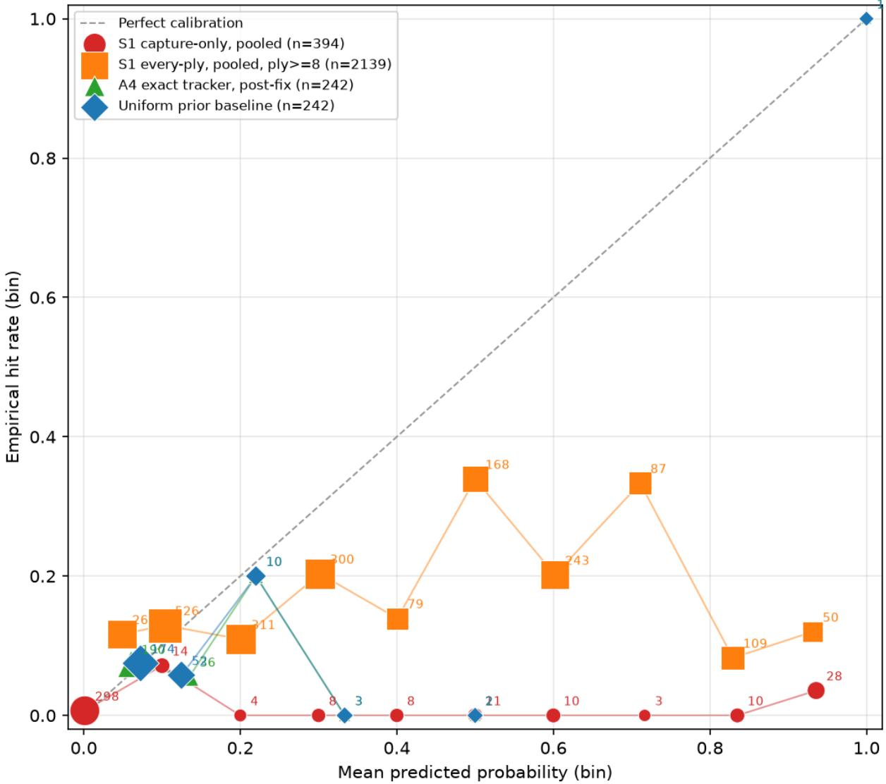
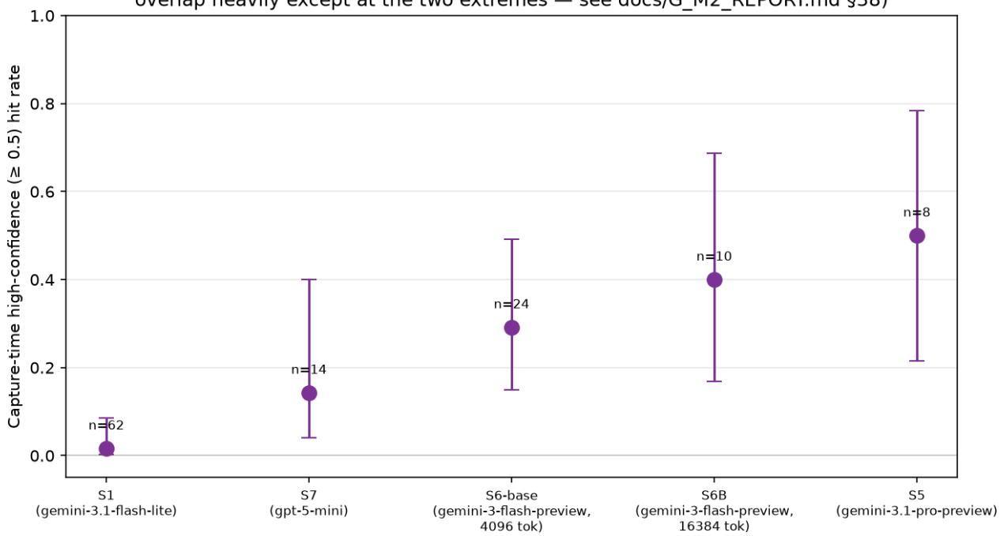
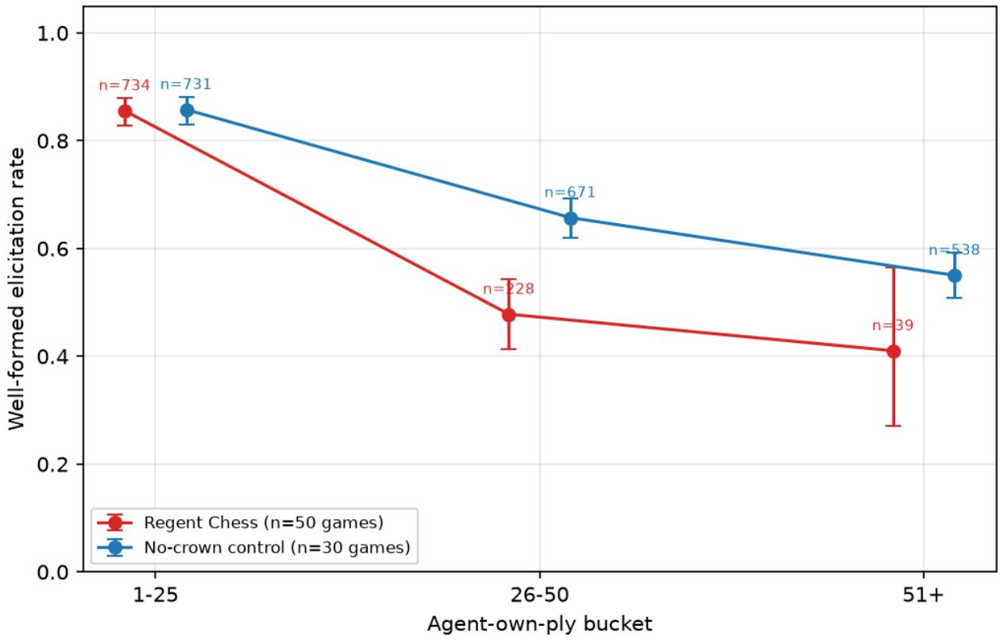
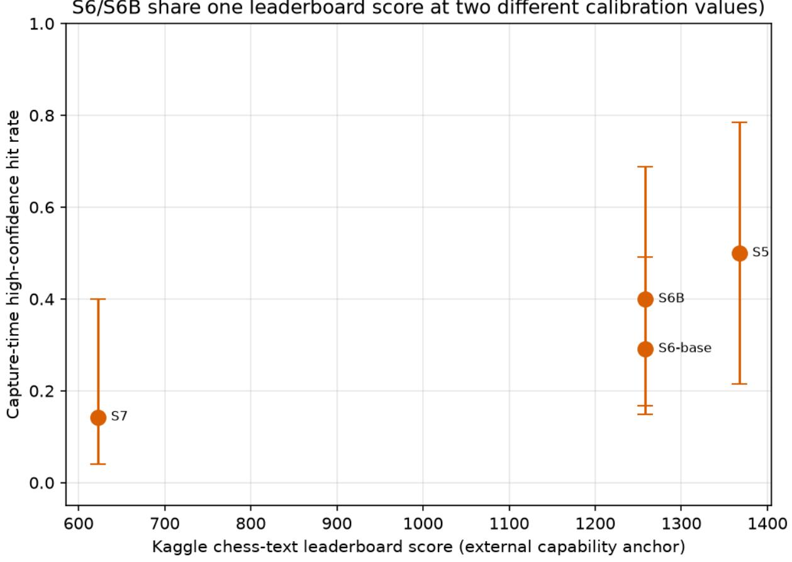

# Confident at the moment of action: belief miscalibration in LLM play under hidden information

Bhushan Kashinath Joshi

bjoshi2779@yahoo.com

## Abstract

Agentic systems increasingly gate actions on a model’s own stated confidence, which assumes confidence tracks correctness at the moment of acting. We test this in a hidden-information chess variant where royal status can be secretly, repeatedly relocated between pieces, and where an agent’s stated probability distribution over the opponent’s hidden royal piece — elicited every turn, separately from the move it chooses — is scored against ground truth recoverable after the game. Across two independent batches, captures made at high stated confidence (≥0.5) about the hidden piece’s location were correct in 1 of 62 cases. The calibration deficit is concentrated almost entirely in these events: 99.3% of it in the original batch, 98.7% in the replication. The same pattern, in weaker form, orders consistently (point estimates only; most pairwise gaps are not statistically distinguishable at this sample size) across four further model configurations spanning a second provider reported as scope for the finding, not as evidence that capability predicts calibration: a same-model comparison at a fixed external leaderboard score shows a deliberation-budget change alone moves the metric by nearly as much as a large cross-model gap. In a separate seat, conventional evaluation axes — legality, cost, latency, completion rate — can dissociate entirely from belief quality, with the configuration winning on every conventional axis producing the worst belief quality tested. A model exhibiting this pattern can still win the game its belief was about, which is why outcome-only evaluation would not detect it.

## 1. Introduction

Agentic deployments increasingly gate consequential actions on a model’s own stated confidence — escalate to a human only if the model reports itself below some threshold, act autonomously only above it. This pattern assumes that a model’s stated confidence, at the moment it acts, tracks whether that action is actually correct. That assumption is not safe in general: a recent large-scale benchmark of verbalized confidence across frontier models finds that its most accurate model is not its best-calibrated one, confirming accuracy and calibration measure genuinely diferent things even before any hidden-state task is involved [10]. Whether the assumption holds under hidden information specifically is rarely tested directly, because doing so requires two things most evalu ation settings don’t provide together: a moment where the model states a belief about something not directly observable, and a distinct action taken at the same operational point, elicited independently of the stated belief. This permits belief quality to be evaluated at the action-selected locus, and belief–action correspondence to be analysed separately — both checked against a fact that can be recovered independently of either.

Standard evaluations cannot test this assumption because they collapse the two moments into one. A QA benchmark scores an answer; a verbalized- confidence study scores that same answer’s stated probability of being correct. There is no separate action to check the stated belief against — the belief is the graded output. A competitive-game benchmark, by contrast, has an action (a move) but typically no elicited belief about hidden state at all, and scores only the game’s outcome.

Neither setting can show a model stating one thing and doing another, because neither elicits a belief and an action as two separable events.

We build a setting where both are observable and ground truth for the hidden state is exact and recoverable at reveal: a chess variant in which royal status can be secretly, repeatedly relocated between pieces, and in which we elicit, every turn, both a move and a probability distribution over where the opponent’s hidden royal piece currently is. Because the true answer is logged internally and never exposed to either player during play, we can score the stated belief against fact at any point, and compare it against the move chosen that same turn.

Doing so, we find that a model’s stated belief and its subsequent action come apart precisely at the moment the action is taken: when the model captures a piece at high stated confidence about where the hidden royal piece is, it is correct in only 1 of 62 such cases across two independent batches — a gap concentrated almost entirely in these high-confidence events, not spread evenly across the model’s beliefs in general. Critically, a model exhibiting exactly this pattern can still win the game the belief was about, which is precisely why an evaluation that scores only outcomes does not surface it.

Our contributions: (1) a measurement of stated-belief miscalibration at the moment of action, replicated across two independent batches with a consistent mechanism, and scoped — not claimed universal — across five seat-configurations spanning two model providers; (2) a demonstration, using a separate seat, that conventional evaluation axes (legality, cost, latency, completion rate) can dissociate entirely from the capability this setting is built to measure, with the configuration that wins on every conventional axis producing the worst belief quality tested; and (3) a setting design — detailed in §3 and discussed for its own methodological contribution in §6 — in which a hidden fact is created and revised by the agent under test rather than assigned to it externally, and in which a source-visible opponent makes it possible to bound what any predictor could achieve before concluding a model failed to achieve it.

## 2. Related Work

Game-based LLM evaluation. Contamination and saturation have pushed LLM evaluation toward competitive games, where correctness cannot be memorized from a static answer key. Kaggle Game Arena launched with chess in August 2025 [1] and had, by early 2026, expanded to include poker and Werewolf alongside chess and Four in a Row [2, 3]. Each game carries its own leaderboard and metric — chess uses an Elo rating fit by Bradley–Terry over all-play-all pairwise outcomes within that game [2] — with a unified ranking aggregating per-game scores into a single consolidated figure [2]. In every case the ranking is over game outcomes, not over the quality of the reasoning that produced them. Game Arena’s launch post frames the efort against the dificulty of knowing “if models trained on internet data are actually solving problems or just remembering answers they’ve already seen,” and against benchmark saturation, where near-ceiling scores stop revealing meaningful performance diferences [1]. Its Chess Openings variant seeds each game from one of the twenty most popular two-ply openings in Lichess data, addressing an observed tendency of models in the original text-chess format to default to a narrow set of memorized lines (the Sicilian Defense chief among them); openings play is used to separate genuine calculation from recalled theory [4]. We adopt the same contamination-resistance rationale for choosing a synthetic, nonstandard ruleset — but every metric across Game Arena’s games is an outcome metric: win, loss, chip stack, vote share. None of it elicits a model’s stated belief about hidden state and scores that belief against ground truth, which is the layer our setting is built to measure.

LLM calibration and uncertainty. A separate literature asks whether a model’s verbalized con fidence tracks the correctness of its own answers on QA-style tasks, from the finding that models can predict “P(IK)” — the probability they know an answer — reasonably well in the right format, though calibration of that prediction degrades on unfamiliar tasks [5], to recent work showing verbalized confidence is highly sensitive to elicitation protocol: which answer string is scored and under what conditioning context, with the sign of the ECE comparison left undetermined by protocol choice alone in half of one paper’s twelve tested configurations [6]. Other recent work targets overconfidence directly: ConfTuner fine-tunes models against a tokenized Brier-score loss, proven a proper scoring rule, to produce better-calibrated verbal confidence [7], and DINCO estimates and corrects for a model’s suggestibility bias by having it verbalize confidence across self-generated distractor claims, then combines the resulting normalized confidence with a self-consistency signal for a further calibration gain [8]. A mechanistic strand traces the failure further upstream: RLHF is shown to push models toward verbalized overconfidence specifically because the reward models used in its optimization step carry an inherent bias toward high-confidence scores independent of response quality [9], and a recent 15-model benchmark scoring verbalized confidence with the same Brier-score methodology used throughout our own analysis finds five of fifteen models, spanning three labs, score worse than a calibrated-random baseline [10] — evidence the pattern is not one lab’s idiosyncrasy. The same benchmark also names Gemini 3.1 Flash-Lite — this paper’s own primary seat (§3) — the single worst-calibrated model it tested, by a wide margin [10]; we return to what that means for this paper’s own finding in §5. Closest to our own setting, recent work on long-horizon agents in partially observable environments separates an agent into a belief-state model and a policy model, representing the belief as atomic claims carrying verbalized certainty la bels and conditioning the policy on that compact belief rather than the full interaction history [11] That separation is an architectural choice made to improve task performance and bound context growth, and it presumes the verbalized certainty attached to each claim is informative enough to act on. Our setting inverts the question: rather than designing a decoupling, we measure one that was not intended — whether a model’s own stated belief and its chosen action agree at the moment the action is taken — and find that they need not. In the QA literature the stated belief and the scored answer are the same channel, so belief–action consistency is structurally unmeasurable there; in Agent-BRACE the belief state is optimized against downstream task reward, never scored against the action it informed, so it remains unmeasured. A related strand asks not whether a single stated confidence is calibrated but whether belief updates coherently as multi-turn evidence accumulates, comparing per-turn model distributions against exact Bayesian posteriors where one exists and asking whether better latent inference translates into better downstream prediction [12]; their measurement points are researcher-chosen turns and their downstream object is a prediction, whereas Regent Chess’s capture-time analysis conditions calibration on realized capture events within an ongoing game. Bearing most directly on this question, concurrent work finds that LLM actions frequently contradict separately elicited confidences across prediction-market betting, tool invocation, and user-challenge settings, naming the pattern the action–belief gap [13] — we do no claim novelty for the general observation that stated belief and chosen action can diverge. What difers: they ask whether a subsequent action is coherent with an elicited confidence, while we ask whether a stated probability is empirically calibrated — whether cases assigned probability p are correct at approximately frequency p — against independently logged ground truth at the actionselected locus, and a model can be action-consistent yet badly miscalibrated, or well-calibrated yet act incoherently; they elicit confidence in a static setting and observe behaviour in an interactive one, their own framing, whereas Regent Chess elicits the hidden-state distribution within the same structured response as the move, inside the evolving game, rather than importing a confidence measured on a separate static task; and their targets are future events or static facts, while ours is a hidden state present at every point, exactly recoverable afterward, and relocatable by the opponent mid-game. Our own free-control result (§4.7) — isolated-position elicitation overstating in-game performance by 28.4 points on one seat and 41.2 on another — is itself a caveat on static elicitation generally, including theirs, not a criticism of their result.

Theory-of-mind and hidden-information benchmarks. LLM agents have been placed in imperfect-information games explicitly to probe opponent modeling and deception: WOLF, a Werewolf-based evaluation presented at the NeurIPS 2025 Workshop on Multi-Turn Interactions in Large Language Models, separately measures deception production and detection across rolegrounded agents, finding werewolves produce deceptive statements on 31% of turns while peer detection reaches only 71–73% precision and roughly 52% overall accuracy — production comes considerably more easily than detection, scored against the speakers’ own self-reported honesty as ground truth [14], a weaker standard than the logged, model-independent fact our own setting scores against (§3). A related instrument, MafiaScope, probes agent beliefs after every public utterance in the social-deduction game Mafia, on a context copy whose answers never re-enter gameplay, scores first-order role beliefs against ground truth the engine holds, and relates those beliefs to subsequent votes [15] — the closest prior instrument in kind, though, as in Werewolf, the state being predicted is a role assigned to another agent at setup, not one the tracked agent itself creates and revises. A separate study of extended-play Texas Hold’em finds theory-of-mind-like opponent modeling emerges over repeated hands, but only when agents are given persistent memory [16]. In every such setting, the hidden state is exogenous — a role assigned at setup, a hand of cards dealt once — fixed and outside the agent’s control for the game’s duration; the inference task is entirely about someone else’s fixed secret. Our setting inverts this: the hidden fact (which piece secretly holds royal status) is chosen and can be relocated by the player themself, mid-game, unobserved, making concealment a matter of managing a self-created, revisable intention rather than protecting a static fact one did not choose.

## 3. Setting and Method

Regent Chess.1 We use a digital chess variant in which royal status can be secretly transferred between pieces. The objective is not fixed to the king: a player wins by capturing the opponent’s Regent, the piece that currently holds royal status, which may or may not be the Original King. A Crown Shift — the secret action of transferring royal status to another piece — becomes available to each player at the start of their 4th turn and again 15 moves after each use; it is executed silently, with no declaration to the opponent, and does not consume the player’s turn (a regular move must still follow). Outside of Crown Shift, standard chess rules apply. Full rules are given in the Appendix, reproduced from the frozen ruleset under which every reported game was played.

The design property this paper depends on: ground truth is exact and recoverable at reveal. Every Crown Shift is logged internally (invisible to both players and to the agent under test during play) and can be replayed after the game to recover, for any ply, which piece was the true Regent. This is what permits scoring a stated belief against a fact, not a proxy.

Elicitation. Each real turn, the agent under test receives the board state, its own move history, and its own known state (own color, own current Regent, own mode) — never the opponent’s — and returns a single structured response: a chosen move, and a probability distribution over which of the opponent’s live pieces is most likely to be the opponent’s Regent, expressed as a top-k list of (square, probability) pairs with an explicit residual mass for “some other opponent piece.” The prompt explicitly names the mover’s own color and the opponent’s color and states that named squares must hold an opponent piece, never the mover’s own — a disambiguation fix found to matter substantially for some seats (§4.7). We flag here, not only in Limitations, that this is a top-k elicitation: a model can fail to name a square for reasons ranging from “did not consider it” to “considered it, but it did not make the cut” to “the format asked for fewer candidates than the model’s actual uncertainty spanned” — the coverage finding in §4.6 must be read with this caveat live, not appended afterward.

Opponent. All games are played against a fixed, deterministic heuristic agent (Tier-1, medium dificulty) that does not model the LLM’s beliefs and follows a fixed, source-visible policy. A constant, non-adaptive opponent is what makes seat-to-seat comparison and depth-indexed curves meaningful (a stronger or better-calibrated opponent would confound “the model got worse” with “the opponent got better”), and a source-visible policy is the precondition for the oracle-vs-public tractability bound discussed in §6 — neither is available against an opponent whose policy cannot be read from code.

Scoring. We score belief quality two ways, treated as separate questions throughout, never blended: capture-only scoring pairs the model’s stated probability on a square with whether that square held the true Regent, at the moment the model captures a piece on that square — an exposurebiased population by construction (a piece is captured partly because it is capturable, which anti correlates with actually being the hidden Regent). Every-ply scoring pairs every named candidate square, on every well-formed ply, with whether it is the true Regent that ply — richer, an order of magnitude more events, and free of capture-time exposure bias. Both are scored against a population-matched uniform prior (1 / number of the opponent’s live pieces, computed perply, not a single reused constant) as the baseline, using Brier score with paired bootstrap confidence intervals (same event indices resampled for both curves under comparison). The pre-shift window (board-ply < 8) is excluded from every belief-quality comparison: the rules guarantee the Original King is still the Regent until each side’s 4th turn, so during that window the correct answer is knowable by rule alone, and any predictor that has read the rules gets a free, structurally unfair advantage over one that has not (§4.2).

Pre-registration. Four expectations were written before any model played, each with a stated falsifier, and scored verbatim rather than reworded to fit results: that top models would not excel initially and would instead produce fluent but poorly-calibrated belief statements; that illegalmove rates would rise with game length; that stated beliefs would show a belief–action gap; and that tracking accuracy and narrative quality would show a possible asymmetry, which required an elicitation format never built and is recorded as not scoreable rather than force-fit. The first three are directly the results reported in §4.1–§4.2, §4.5, and §4.6 respectively. All headline figures in this paper were re-derived from version-controlled analysis code immediately before writing, after an earlier internal check found a figure that had not been re-verified against a subsequently fixed bug in an unrelated tracking component.

Seats. We refer to each model-plus-sampling-configuration pairing under test as a seat (e.g., a specific model at a specific temperature and token budget). Seats are labeled in the order they were audited for this work, not in the order they appear in any table or figure — several seats audited early were later dropped from calibration scoring for reasons specific to them (excess truncation, an adapter incompatibility, or a well-formed rate too low to yield scoreable events) and appear only where a result of theirs is directly relevant (§4.4, by model name; §4.7, by label), never in Table 1; this is why the labels below are non-consecutive. Five seat-configurations across two model families/labs were scored for capture-time calibration (Table 1). Only one seat (S1, Gemini 3.1 Flash-Lite) received the full calibration battery (capture-only, every-ply, and ground-truth-scored belief quality across many games) — every other seat’s number is capture-time high-confidence hit rate only, from a smaller sample. This asymmetry is stated here and repeated at the point each cross-seat figure is used (§4.3), not left implicit.

Table 1. Seat configurations, external leaderboard scores, sampling parameters, and calibrationscoring sample sizes for the five seats compared in §4.3.
<table><tr><td>Seat</td><td>Model</td><td>chess-text leaderboard score</td><td>Temperature</td><td>max_tokens</td><td>Games (calibration- scored)</td></tr><tr><td>S1</td><td>gemini-3.1- flash-lite</td><td>no external anchor</td><td>0.7</td><td>4096</td><td>80 (62 high-conf. capture</td></tr><tr><td>S7</td><td>gpt-5-mini- 2025-08-07</td><td>622.59</td><td>1.0 (API- forced)</td><td>4096</td><td>events) — (14 high-conf. capture</td></tr><tr><td>S6-base</td><td>gemini-3-flash- 1258.32 preview</td><td></td><td>0.7</td><td>4096</td><td>events) — (24 high-conf. capture</td></tr><tr><td>S6B</td><td>gemini-3-flash- 1258.32 preview</td><td></td><td>0.7</td><td>16384</td><td>events) — (10 high-conf. capture events)</td></tr><tr><td>S5</td><td>gemini-3.1- pro-preview</td><td>1367.40</td><td>0.7</td><td>4096</td><td>—(8 high-conf. capture events)</td></tr></table>

The “score” column is this leaderboard’s own reported metric label, not an Elo rating (retrieved 2026-08-15); we use its scale directly rather than relabel it. S1 has no entry on the external leaderboard used for the other four seats. S7 is the only non-Google seat scored here, and its sampling temperature is an API-enforced deviation from the rest of the table (gpt-5-mini rejects any value other than 1.0), not a discretionary choice — stated here because it sits directly on the claim S7 is used to support (§4.3), not filed only as a footnote.

## 4. Results

## 4.1 Primary finding: capture-time miscalibration is real, replicated, and concentrated (S1)

We measured S1’s capture-time calibration in two independent batches, run under a pre-registered replication design rather than pooled from the start: in the original batch, 0 of 22 captures made at $\ge 0 . 5$ stated confidence were correct; in a separate, later-run replication batch, 1 of 40 were. The replication did not just add sample size — it agreed in direction and magnitude with the original (Brier ratio vs. matched uniform: 7.127 original vs. 7.094 replication, a 95% CI on the replication of [4.298, 13.135], about 26% tighter than the original’s [3.825, 15.740]). Pooling both batches: 1 of 62 high-confidence captures were correct (1.6%).

At capture time specifically, S1’s Brier score is 0.1445 against a matched uniform prior’s 0.0203 — a paired-bootstrap 95% CI on the ratio of $\mathbf { 3 . 8 \times - 1 5 . 9 \times }$ . The uniform comparator is populationmatched — recomputed per ply over the opponent’s live pieces — but is not conditioned on the exposure mechanism by which a position becomes a capture opportunity; it is a matched uninformative baseline, not a model of action-conditioned dificulty. This gap is not difuse: 99.3% of the total Brier gap between S1 and uniform is concentrated in the high-confidence events above (98.7% in the replication batch, independently); the remaining, lower-confidence events contribute essentially nothing to the miscalibration. Figure 1 (the reliability diagram) shows this directly — S1’s capture-only curve sits at or near zero hit rate across nearly the entire confidence range, with the exception of a small positive rate at the extreme top bin.

## 4.2 The gap is not confined to capture time — it holds from the first ply where inference is possible

Restricting to every well-formed ply from board-ply ≥ 8 onward (excluding the rule-determined pre-shift window, §3), S1’s stated beliefs are significantly worse than a population-matched uniform prior, in both batches independently at ply≥8 (delta +0.059 original batch, +0.070 replication batch), growing worse at stricter ply cutofs in both $\mathrm { ( t o ~ + 0 . 0 9 8 - + 0 . 1 1 2 }$ at ply≥14). This is a separate population from §4.1’s capture-only result (§3’s every-ply scoring, not captureonly), but it points the same direction: the failure is not confined to the instant of action, though it is far more severe there. We note explicitly that an earlier internal analysis pooling all plies including the pre-shift window found no gap in either direction (“tied with uniform”); that reading did not survive excluding the rule-determined window, where a model that has read the rules gets a free, structurally unfair advantage over a baseline that has not. We report only the corrected, $\mathrm { p l y } { \geq } 8$ comparison here.

4.3 Scope: the failure orders consistently across five seat-configurations from two labs
<table><tr><td>Seat</td><td>Capture-time hits / n Rate</td><td>95% Wilson CI</td></tr><tr><td>S1</td><td>1/ 62 1.6%</td><td>[0.3%, 8.6%]</td></tr><tr><td>S7</td><td>2 / 14 14.3%</td><td>[4.0%, 39.9%]</td></tr><tr><td>S6-base</td><td>7 /24 29.2%</td><td>[14.9%, 49.2%]</td></tr><tr><td>S6B</td><td>4 / 10 40.0%</td><td>[16.8%, 68.7%]</td></tr><tr><td>S5</td><td>4/8 50.0%</td><td>[21.5%, 78.5%]</td></tr></table>

Point estimates order monotonically and span two labs (Google, OpenAI); see Figure 2. We state plainly what this ordering does and does not support: pairwise significance clears only at the two extremes (S1 vs. S5); the three middle points, and S7 against all three of its neighbors, are not pairwise distinguishable at these sample sizes. We report the ordering as scope evidence that the failure is not confined to one model; we do not claim external capability predicts calibration, and one internal comparison argues directly against that stronger claim: S6 and S6B are the same model at the same external leaderboard score (1258.32), difering only in deliberation budget (max\_tokens 4096 vs. 16384), yet their capture-time rates difer by 10.8 points (29.2% vs. 40.0%) — comparable in size to the 14.9-point gap between S7 and S6-base, which spans a real, substantial 635.7 points on that leaderboard’s scale. A configuration change within one model moves this metric by about as much as a large cross-model capability gap does.

Two further caveats on this ordering, stated here rather than deferred: S7’s sampling temperature is forced to 1.0 by its API, unlike every other scored seat’s 0.7 (§3) — S7’s point estimate is not a clean seat-only comparison. And the two most capable seats scored (S5, S6/S6B) are the same model family and lab; “capable models are less prone to this failure” rests, at present, on evidence from one lab, in the same way the failure claim itself rested on one lab before S7 was added. On the narrower question of whether the underlying overconfidence pattern itself is specific to one seat — the objection our own five points can only partially answer at this n — independent evidence points the same direction: a 15-model verbalized-confidence benchmark using the same Brier-score methodology we use throughout finds general verbalized overconfidence pervasive across frontier systems, not an artifact of any single lab or model size [10].

## 4.4 A second pillar: conventional evaluation metrics dissociate from the capability this paper measures

In earlier smoke-pilot work with a separate seat (DeepSeek V4 Flash, not part of the calibration comparison above), disabling the model’s extended reasoning mode produced a configuration that scored best on every conventional axis a standard LLM evaluation would report: 100% model-driven legal moves, 0% illegal attempts, 0% truncated responses, and roughly 28× cheaper and 25× faster per game than the reasoning-enabled configuration of the same model. That same configuration’s well-formed belief rate was 3.8%. The configuration that would win a conventional benchmark on every reported axis is, on this evidence, the one demonstrably not tracking the board. This is not confined to one seat’s idiosyncrasy: it is the within-model version of this paper’s central argument — that legal, fluent, cheap, fast play and accurate belief-tracking are not the same capability and do not move together, and an evaluation that only scores the former will select for the latter’s absence.

## 4.5 Depth-dependent format degradation, and a residual specific to hidden-state tracking

S1’s well-formed elicitation rate (the rate at which its response parses as a valid move plus a valid belief distribution) declines with game depth: 85.6% in the opening third of a game (agent-ownply 1–25) to 47.8% at mid-depth (26–50) to 41.0% deep in the game (51+, though this bucket is under-powered, n=39). Illegal move-attempt rate rises over the same range, from 1.2% (opening) to 4.5% (mid-depth) to 20.0% (deep) — a roughly 17-fold increase.

To ask whether this decline is specific to tracking hidden state, we ran a control: the identical seat, harness, and elicitation format, against the identical opponent, with the hidden-Regent mechanic disabled entirely (standard chess, no Crown Shift). The control declines too — from 85.8% (opening) to 65.7% (mid-game), a 20.1-point drop — which rules out “hidden-state tracking is the sole cause”

of Regent Chess’s own decline (a 37.8-point drop over the same range, from 85.6% to 47.8%): if hidden-state tracking were the only mechanism, a condition with no hidden state at all should not decline nearly this much. It does not, however, mean the two conditions decline at the same rate — Regent Chess’s decline is substantially steeper.

A direct per-bucket significance test confirms this is real, not noise: at ply 1–25, the two conditions are statistically indistinguishable $( \mathrm { p } = 0 . 9 0 7 )$ ; at ply 26–50 — the only bucket where both conditions carry enough samples to compare reliably (n = 228 vs. 671; the deep bucket’s n = 39 vs. 538 is both under-powered and confounded by which games survive that long) — Regent Chess sits significantly below the control, 47.8% vs. 65.7% $( \mathrm { p } = 1 . 6 { \times } 1 0 ^ { - 6 } )$ . The honest reading is neither “hidden-state-specific” nor “general context growth alone”: general context growth accounts for real, substantial decline even with no hidden state to track (the control’s own 20.1-point drop), and a further, independently measurable, hidden-state-specific residual accounts for the remaining diference between how far each condition fell from its own opening rate — 37.8 points for Regent Chess, 20.1 for the control, a 17.7-point diference-in-declines.2 We scope this claim explicitly to the single well-powered bucket where it is measurable, not to depth in general.

## 4.6 Coverage: most captures target a square the model never named as a candidate

These are two distinct properties and are reported separately throughout: action-time calibration (§4.1–§4.2) asks whether stated confidence tracks correctness at the moment of action; belief–action consistency, measured here, asks whether the square acted upon featured in the stated belief at all. Neither implies the other.

Restricting to captures where that same ply’s belief distribution named two or more candidates (n = 91), the square S1 actually captured had been named as any candidate only 26.4% of the time (24/91) — statistically indistinguishable from a pre-registered, exposure-matched permutation null of 29.2% [24.2%, 35.2%] (p = 0.218, one-sided). We state the elicitation caveat here, not as an afterthought: this is a top-k format (§3), and a model can fail to name a square for reasons that are not all “did not consider it.” What is real and convention-free regardless of that caveat: 73.6% of S1’s captures target a square it never listed as a candidate at all. Among the smaller subset where the eventually-captured square was named (n = 24), its rank among the named candidates was in fact high (mean percentile 0.788, top-ranked 70.8% of the time) — the opposite direction from an earlier, since-withdrawn characterization of this result as a systematic rank-inversion. We flag this figure’s own limit rather than let it stand unqualified: 17 of these 24 events named only a single candidate, making “top-ranked” close to tautological for most of the subset (there is only one square to rank), so the 70.8% figure should be read as a weak, directionally-suggestive check against the withdrawn inversion claim, not as positive evidence of good ranking on its own. The gap that survives — and is not subject to this limitation — is a candidate-coverage gap, not a ranking failure.

## 4.7 Free-form screening overstates real-game performance

A static, single-position elicitation test — the kind a lightweight pre-deployment check would plausibly use — measurably overstates how a seat performs across a real, multi-turn game. For S1, a free, isolated-position control measured 89.3% well-formed; the same seat, same prompt, inside real games measured 60.9% — a 28.4-point gap. For a second seat (S2), the gap was larger still: 53.6% free-control vs. 12.4% in real games (a pre-registered stop-rule halted further spend on that seat once this gap was confirmed), 41.2 points. The gap is not fixed, and is worse for the weaker of the two seats tested. A single-position screening test is not a substitute for measuring inside the interaction it is meant to predict.

## 4.8 Pre-registered expectations, scored

Of the four expectations stated in §3, three could be scored against these results and one could not. The first (fluent but poorly-calibrated belief statements, rather than early excellence) is confirmed by §4.1–§4.2. The second (illegal-move rate rising with game length) is confirmed by §4.5’s 1.2%→4.5%→20.0% progression. The third (a belief–action gap) is confirmed by §4.6, exactly as stated — not the stronger rank-inversion form considered and withdrawn during analysis (§4.6’s own note); the confirmed result takes the specific form of a coverage gap, a special case of the action– belief divergence documented more broadly elsewhere [13]. The fourth, an asymmetry between tracking accuracy and narrative quality, required an elicitation format that was never built in this work and is recorded as not scoreable rather than force-fit to adjacent results.

Reliability diagram — S1 vs A4 exact tracker (post-fix) vs uniform-prior baseline (S1 capture-only/every-ply pooled across original + replication batches; every-ply restricted to board-ply>=8, excluding the rule-recitation window; marker area α bin n — connecting lines are visual guides only, not weighted)  
  
Figure 1: Reliability diagram: stated confidence vs. hit rate at capture time, pooled across both scored batches (n=394 capture-only events), with the corrected reference tracker curve. Marker area is proportional to bin n; no line is drawn across an empty bin. Cited in §4.1.

Capture-time calibration across five seats/configurations (95% Wilson Cls; point estimates order correctly, but adjacent Cls overlap heavily except at the two extremes — see docs/G\_M2\_REPORT.md §38)  
  
Figure 2: Five-seat capture-time calibration ordering, with 95% Wilson confidence intervals. Cited in §4.3.

Well-formed rate by ply bucket: Regent Chess vs no-crown control (95%Wilson Cls, bucket-by-bucket, never pooled)  
  
Figure 3: Well-formed-rate degradation curves by ply bucket, Regent Chess vs. the no-crown control. Cited in §4.5.

  
Figure 4: Supplementary: leaderboard score vs. capture-time calibration. Cited narratively in §4.3 (the S6/S6B same-score point); does not stand alone as evidence for any claim.

## 5. Limitations

Single seat, full battery. Only S1 received the complete calibration battery (capture-only, everyply, ground-truth-scored belief quality across many games). The every-ply worse-than-uniform result (§4.2), the capture-time Brier ratio and its mechanism (§4.1), the coverage figure (§4.6), and the depth-degradation curves (§4.5) are all S1-only findings. The five-seat ordering (§4.3) supports one narrow slice of scope — capture- time high-confidence hit rate — and nothing about every-ply calibration, coverage, or depth efects in the other four seats.

A chess-capability leaderboard score is not this paper’s only external anchor, and a within-model confound undercuts the ordering’s strongest reading. S1 does not appear on the Kaggle chess-text leaderboard used to place the other four seats (§4.3), and that leaderboard’s score is a proxy for chess capability, not calibration — largely orthogonal to what this paper measures. A more relevant anchor exists: ConfidenceBench [10] independently scores Gemini 3.1 Flash-Lite’s general verbalized-confidence calibration and finds a bimodal confidence distribution (mass near a 25% floor or in an 80–100% band) that resembles the pattern we observe at capture time (§4.1, Figure 1) — corroboration from a diferent instrument, not something we constructed. It also covers S5 (gemini-3.1-pro-preview). Separately, S6 and S6B — the same model at the same external leaderboard score — difer in capture-time calibration by 10.8 points from a deliberationbudget change alone, comparable to a cross-model gap spanning 635.7 points on that leaderboard’s scale. Together these mean the ordering in §4.3 cannot support a claim that external capability predicts calibration on this task, only that the failure generalizes across labs.

Is this just a generally badly-calibrated model, not a hidden-state- tracking failure? ConfidenceBench [10] independently names Gemini 3.1 Flash-Lite the worst-calibrated model of fifteen tested, by a wide margin — a real objection, since it raises the possibility that our finding merely restates a known, general property of this model rather than anything specific to belieftracking under hidden information. General miscalibration predicts uniformly poor calibration across contexts; it does not predict what we actually observe: 99.3% (98.7% in replication) of the Brier gap concentrated in a narrow band of high-confidence capture events rather than spread evenly across S1’s stated beliefs (§4.1), nor does it predict the pattern attenuating monotonically across five model/ configuration seats spanning two labs, including seats ConfidenceBench never evaluated at all (§4.3). A generally overconfident model would look bad everywhere; what we find instead is a model that looks fine most of the time and is confidently, specifically wrong at the moment it acts on a hidden-state belief. We also note S1 was selected for this paper’s pilot work on cost grounds, before and independent of any knowledge of its calibration profile on any benchmark this finding was not obtained by searching for a badly-calibrated model to demonstrate the efect.

Single opponent, single game length regime. All results are against one fixed, moderatedificulty heuristic opponent. The depth-degradation residual (§4.5) is measurable only in one ply bucket against this opponent; whether it holds at greater depth, or against a stronger or positionresponsive opponent, is untested.

No transfer validation. Nothing in this work establishes that performance on this instrument predicts performance on any real-world or downstream task. Every number here should be read as domain-internal until that validation exists.

Sampling and reproducibility. S1’s provider rejects a fixed random seed outright, so its games are not exactly replayable from a recorded seed — only re-runnable under the same configuration; the replication reported in §4.1–§4.2 used exactly this re-run design, and its agreement with the original batch is itself evidence the finding is not an artifact of one particular random draw. Provider-default, non-deterministic sampling applies throughout; sampling parameters are reported in Table 1 where they matter to a specific claim.

Footnote-level caveats (stated briefly; do not individually threaten a headline claim): truncation rates vary substantially and uncontrolled across seats (from near-zero to over 80% at a fixed token budget), and a seat that truncates more often is not on equal footing with one that does not; colour balance across real-game batches was checked and found balanced (40–60% white/black) for every seat scored here; sampling non-determinism means exact byte-for-byte reproduction of a specific game is not always possible, only reproduction of the aggregate finding under the same configuration; the top-k elicitation caveat on the coverage finding (§4.6, stated live, not repeated here); an internal check found no evidence that any tested predictor — including a hand-built exact reference tracker with full access to the game’s internal state — reliably beats a uniform prior at predicting the hidden Regent past the point where its identity is no longer determined by rule, against this specific opponent; we do not claim, and this paper does not require, that the underlying task is demonstrably solvable by any method (see Discussion, §6, on the tractability question generally).

Future work, not a limitation of what is claimed here: whether this result is sensitive to elicitation architecture. Joint elicitation, as used here, may allow the belief request to interact with move generation; split elicitation avoids persistent-context contamination but measures belief in a separate model call and context from the one producing the move. Which better captures the belief associated with the action is an empirical question — re-probing a frozen state has itself been shown to flip an answer 34.8% of the time in an unrelated instrument [15], so neither architecture should be assumed free of its own measurement noise. Two further items remain open: whether the finding holds against a position-responsive (rather than fixed-policy) opponent, and a systematic multi-seat replication of the full calibration battery beyond S1.

## 6. Discussion

Why outcome metrics do not surface this. A model can hold a badly miscalibrated belief and still win the game the belief was about. In one representative real game, S1 stated 70% and 20% confidence on two squares and assigned zero probability to a third — then captured a piece on that third square for ordinary tactical reasons unrelated to its stated belief, and that square turned out to hold the opponent’s secretly relocated Regent. The model won. An evaluation that scores only the outcome — who won, how many moves, whether the move was legal — records this as a clean success. Only an instrument that separately elicits and scores the stated belief, at a moment distinct from the action taken on it, can see that the win happened despite the belief, not because of it. This is not a story about one game or one seat: it is the same shape as §4.4’s within-model dissociation, where disabling extended reasoning produced a configuration that won on every conventional metric while producing the worst belief quality tested. One is a single game a reader can look at directly; the other is a controlled, within-model comparison across a full sample. Together they are the paper’s central argument stated twice, at two diferent grains: an evaluation built only to score outcomes, legality, cost, and latency will not merely fail to detect poor belief-tracking — it will actively reward the configuration that has the least of it.

A plausible mechanism, not one we test. Our result is a behavioral measurement at the moment of action, not an intervention on how S1 was trained — we make no claim about why the miscalibration exists, only that it does and where. It is, however, consistent with a training-time account proposed elsewhere: reward models used in RLHF’s optimization step have been shown to carry an inherent bias toward high-confidence verbalizations independent of actual response quality [9], which would push an instruction-tuned model toward confident wrong beliefs exactly at the moments an evaluator never separately checks. We note the connection rather than claim it: nothing here isolates training procedure as the cause, and a base or non-RLHF’d model on this same instrument is the natural test.

Endogenous vs. exogenous hidden state. Existing hidden-information settings used to evaluate language models — a dealt hand of cards, an assigned social-deduction role — give the agent hidden information it did not choose and cannot change: the task is purely inference about someone else’s fixed fact, or protecting a fact of one’s own by not revealing it. Crown Shift is diferent in kind: a player creates the hidden fact by choosing where to move it, and can revise that choice repeatedly over the course of a game, all while under observation. Concealing an intention you formed and can change is a diferent cognitive demand from concealing a card you were dealt once.

This distinction is not incidental to the setting’s design — it is the reason a coverage gap of the kind measured here (§4.6) is even expressible: there must be a real decision the agent made about its own hidden state, not just an inference about someone else’s.

The oracle-vs-public tractability bound. A central methodological risk in any “the model failed” claim is that the underlying task might not have been solvable by any method — in which case the finding is really about task design, not model capability. We tested this directly for our own setting using an oracle (full access to internal game state) against a public predictor (only what either player can observe), and found the answer is opponent-policy-dependent: shift target, once a shift is known to have occurred, is substantially predictable from public position features (83.1% top-3 accuracy vs. a 37.5% naive baseline); shift timing, against our fixed opponent, is close to random by that opponent’s own policy, and an oracle with full internal access gains almost nothing over a public predictor at forecasting it. A predictor needs both factors jointly, and a near-flat timing factor collapses the product even when the target factor is well resolved — which is the mechanism behind this paper’s own finding that no tested predictor, including a hand-built exact reference tracker, beats uniform meaningfully past the point where the rules stop determining the answer, against this opponent. The general point: distinguishing “the model failed” from “the task was impossible for anyone” requires a computable ceiling, and a computable ceiling requires an opponent whose policy can be read from source. Most evaluation settings — anything scored against a closed-source or human opponent — cannot make this distinction at all. This is the paper’s most transferable methodological contribution, independent of any single model’s score.

Deliberation caps as an evaluation bias. A fixed token budget for model output penalizes models that would otherwise deliberate longer, independent of whether that deliberation would have helped — the same “time vs. depth” limitation documented by other game-based LLM evaluation eforts. We observed this directly: one seat truncated on roughly a third of its turns at the token budget used throughout this work, while another almost never did. This cuts in a specific direction worth naming: it strengthens any result showing a capable model outperforming despite frequent truncation (its deliberation was cut short and it still did better), and it weakens any absolute claim about a model’s calibration ceiling, since a longer budget was never tested for every seat.

## 7. Conclusion

Under an instrument that elicits a stated belief about hidden game state separately from the action taken on it, and scores both against ground truth exact and recoverable at reveal, one language model’s confidence at the moment it acts is not merely uninformative: captures made at high stated confidence were correct in only 1 of 62 cases across two independent, direction-agreeing batches, worse than an uninformative prior from the earliest ply at which inference is even possible, present in weaker form (not claimed universal, and not shown to track external capability) across four further configurations spanning a second lab. Irreducible dificulty does not license confidence: where a hidden state is hard or partly unidentifiable, the appropriate epistemic response is low or difuse confidence, not confident error, so near-unidentifiability makes calibration more important, not less — we make no claim that the post-shift state is demonstrably inferable, and the finding does not require one; no predictor we tested, including a privileged hand-built reference tracker, reliably beats uniform once the rules stop determining the answer outright. A model exhibiting this pattern can still win the game its belief was about, which is why an evaluation scoring outcomes alone would not surface it. Two extensions follow directly: whether the same failure holds against an opponent whose behavior is responsive to the board — our own fixed opponent’s near-random shift timing is what makes the hidden state unmeasurable past a certain point here, and a position-responsive opponent is the natural next instrument — and whether a score on this platform predicts anything about model behavior in a deployment setting outside it, which we consider the more consequential of the two and entirely unaddressed by this work.

## Use of AI tools

This work made extensive use of large language model assistance, and we describe that use in detail below both to comply with disclosure policy and because the pattern of failures we encountered may be useful to others adopting similar workflows.

Three tools were used, in distinct roles, across the project. Claude Opus 5, used in a conversational chat interface, served as reviewer and research-direction collaborator: it read drafts and results, proposed and critiqued framing decisions (including the choice between a findings-led and an instrument-led paper), identified specific errors during review passes (including a sentence in §4.5 that stated the control condition’s decline ran in the opposite direction from what the underlying data showed), ranked what to cut for length, and drafted the first version of this disclosure section. Claude Code, an agentic coding assistant operating directly on the project’s files and tools, did the execution: running experiments and analysis code, verifying every citation against its primary source, writing and editing all manuscript text and figures under the author’s and Opus’s direction, compiling the manuscript to LaTeX to obtain a real page count, and all git and file operations. Where a fix originated with Opus’s review, Claude Code implemented and re-verified it before it entered the manuscript; the author approved each round before it proceeded to the next. A third tool, GPT-5.6 Sol, was used later in the process in a review and literature-search role. It surfaced three adjacent works now cited in §2, helped assess their relationship to the paper’s contribution, and reviewed the manuscript’s claims and the resulting correction instructions, including identifying a conceptual error in a proposed correction before implementation. Its outputs were independently verified before use: numerical details it supplied for one cited work were found to be incorrect and were not used. All three tools are subsequently referred to as “AI assistance” below where the distinction is not load-bearing to the specific claim.

The game variant used as this paper’s instrument (Regent Chess, §3) was designed by the author prior to this work. AI assistance (Claude, chat interface) was used for its software implementation and to surface rule edge cases during that implementation. Rule correctness is established by a test suite covering each rule clause, written with AI assistance and verified by the suite’s execution. We state this separately from the categories below because it is a distinct kind of provenance claim: the game’s design is prior, independent creative work, not a research output of this paper or a product of the AI-assisted process described here — AI assistance entered only at the implementation stage, after the design existed.

Required-disclosure categories. We used generative AI tools to: develop conceptual frameworks (the instrument-design principles in §6 were articulated in dialogue with an AI assistant, though derived from this work’s own empirical findings); propose and refine hypotheses (the preregistered expectation branches in §3 and §4.8 were drafted with AI assistance and ruled on by the author before any corresponding data existed); design and provide feedback on research methodology and experiments (the permutation null in §4.6, the population-matched baseline in §4.1, the paired-bootstrap procedure, the pre-shift exclusion rule in §3, and the oracle-vs-public tractability analysis in §6 were all proposed or substantially shaped in dialogue with an AI assistant); implement methods (all analysis code, the game engine, the agent harness, and the elicitation pipeline were written with AI coding assistance under author direction); and interpret results (AI assistance was used throughout to reason about what each measurement did and did not support).

We did not use generative AI tools to generate synthetic datasets — all game records analysed here are logs of real model play against a deterministic opponent, at metered API cost. We did not use them to assist with translation, to formulate survey or interview questions, or to transcribe research material; these are not applicable to this work. Mathematical claims in this paper are limited to standard statistical procedures applied via established libraries; no novel proofs were formulated or assisted.

Recommended-disclosure categories. We additionally used generative AI tools to: create and modify all figures; identify and summarise related literature; format references; suggest the paper’s structure and title; draft all sections of the manuscript against an author-approved outline; edit for readability; and for general brainstorming and information search.

Verification and responsibility. All AI-assisted work was reviewed. Specifically:

• Every headline figure in this paper is produced by version-controlled analysis code that writes its output to a file, following an internal rule adopted mid-project after a previously-reported result was found to have been computed ad hoc and could not be exactly reproduced. A single canonical numbers document is the source for every figure cited here, and an automated test pins a subset of those figures against the underlying committed data.

• Several results reported in earlier internal drafts were withdrawn or substantially revised during pre-submission verification, including a claimed rank-inversion efect (§4.6), an attribution of depth-dependent degradation entirely to hidden-state tracking (§4.5), and a claim that the belief-scoring task is demonstrably tractable (§5, §6). Each was tested against a pre-registered decision rule and reported at the strength the test supported.

• Citation verification required multiple passes. Errors of attribution, title, venue, and quotation accuracy were found after earlier passes had reported the reference list as verified. The final list was checked against the resolved source for each entry, confirming that the identifier resolves, that title and authors match, and that each source supports the specific claim attributed to it — including a final pass in which the author personally visited primary sources himself, unassisted, which located named individual bylines the prior AI-driven passes had not surfaced (Oran Kelly and Yao Yan, both now cited by name in [3] and [4] rather than by organization alone). We note this because verifying that a citation exists proved insuficient when the reference list was AI-assisted.

The author made all substantive research decisions, including the rulings that resolved ambiguous design questions, the pre-registered stopping rules and their application, the decision to close data collection, and the selection of which claims this paper asserts and at what strength. We take responsibility for the final content of this work, including all text, claims, and artifacts produced with the aid of generative AI.

## References

[1] Olszewska, K. and Risdal, M. “Kaggle Game Arena evaluates AI models through games.” Google Blog — Innovation and AI, August 4, 2025. https://blog.google/innovation-andai/products/kaggle-game-arena/

[2] Kaggle. “Kaggle Game Arena” (platform page — games roster and methodology). https://www.kaggle.com/game-arena

[3] Kelly, O. “Advancing AI benchmarking with Game Arena.” Google Blog — Innovation and AI, February 2026. https://blog.google/innovation-and-ai/models-and-research/googledeepmind/kaggle-game-arena-updates/

[4] Yan, Y. “Adding Chess Openings to Game Arena.” Kaggle Blog. https://www.kaggle.com/blog/gamearena-chess-openings

[5] Kadavath, S., Conerly, T., Askell, A., Henighan, T., Drain, D., Perez, E., Schiefer, N., Hatfield-Dodds, Z., DasSarma, N., Tran-Johnson, E., Johnston, S., El-Showk, S., Jones, A., Elhage, N., Hume, T., Chen, A., Bai, Y., Bowman, S., Fort, S., Ganguli, D., Hernandez, D., Jacobson, J., Kernion, J., Kravec, S., Lovitt, L., Ndousse, K., Olsson, C., Ringer, S., Amodei, D., Brown, T., Clark, J., Joseph, N., Mann, B., McCandlish, S., Olah, C., and Kaplan, J. “Language Models (Mostly) Know What They Know.” arXiv:2207.05221, 2022. https://arxiv.org/abs/2207.05221

[6] Kim, H. and Kang, P. “Same Answer, Diferent Confidence: Protocol Sensitivity in LLM Confidence Calibration.” arXiv:2605.27752, 2026. https://arxiv.org/abs/2605.27752

[7] Li, Y., Xiong, M., Wu, J., and Hooi, B. “ConfTuner: Training Large Language Models to Express Their Confidence Verbally.” NeurIPS 2025. arXiv:2508.18847. https://arxiv.org/abs/2508.18847

[8] Wang, V. and Stengel-Eskin, E. “Calibrating Verbalized Confidence with Self-Generated Distractors.” ICLR 2026. arXiv:2509.25532. https://arxiv.org/abs/2509.25532

[9] Leng, J., Huang, C., Zhu, B., and Huang, J. “Taming Overconfidence in LLMs: Reward Calibration in RLHF.” arXiv:2410.09724, 2024/2025. https://arxiv.org/abs/2410.09724

[10] french-Constant, M., Yang, D., Huang, X., and Kapoor, S. “ConfidenceBench: Evaluating Confidence Calibration in Large Language Models.” arXiv:2607.20526, 2026. https://arxiv.org/abs/2607.20526

[11] Singh, J., Khan, Z., Prasad, A., Chen, J. C.-Y., Nambi, A., Lee, H., Stengel-Eskin, E., and Bansal, M. “Agent-BRACE: Decoupling Beliefs from Actions in Long-Horizon Tasks via Verbalized State Uncertainty.” arXiv:2605.11436, 2026. https://arxiv.org/abs/2605.11436

[12] Samanta, A., Magesh, A., Lancewicki, T., Jain, A., Yu, Y., Sajda, P., Hassani, K., Modi, A., Jiang, D. R., and Efroni, Y. “BayesBench: Evaluating LLM Belief Trajectories Under Multi-Turn Evidence Accumulation.” arXiv:2606.30850, 2026. https://arxiv.org/abs/2606.30850

[13] Pal, A., Kitanovski, T., Liang, A., Potti, A., and Goldblum, M. “Knowing What You Know Is Not Enough: Large Language Model Confidences Don’t Align With Their Actions.” arXiv:2511.13240, 2025/2026. https://arxiv.org/abs/2511.13240

[14] Agarwal, M., Rana, S., Sundoro, T., Berhe, H., Kim, S., Sharma, V., O’Brien, S., and Zhu, K. “WOLF: Werewolf-based Observations for LLM Deception and Falsehoods.” Spotlight presentation, NeurIPS 2025 Workshop on Multi-Turn Interactions in Large Language Models (MTI-LLM). arXiv:2512.09187. https://arxiv.org/abs/2512.09187

[15] Karpov, I. “MafiaScope: Non-Invasive, Time-Resolved Belief Probing for LLM Agents in Social Deduction Games.” arXiv:2607.10645, 2026. https://arxiv.org/abs/2607.10645

[16] Lin, H.-T. and Hou, T.-Y. “Readable Minds: Emergent Theory-of-Mind-Like Behavior in LLM Poker Agents.” arXiv:2604.04157, 2026. https://arxiv.org/abs/2604.04157

## Appendix: Regent Chess Rules

The rules below reproduce the frozen “Golden Rules” ruleset, version 1.2, under which every game reported in this paper was played. Internal version-history annotations present in the source ruleset have been removed for readability; no rule text has been altered. Sections of the source ruleset covering interface requirements, strategic commentary, and data-handling policy are omitted here, as they do not bear on any reported result. Rule correctness is established by a test suite in which each rule clause is covered by at least one test.

## Core principle

Regent Chess is a digital chess variant in which royal status can be secretly transferred between pieces. The objective is not fixed to the king: a player wins by capturing the opponent’s Regent, the piece that currently holds royal status, which may or may not be that player’s Original King.

Terminology

• Regent — The piece that currently holds royal status. Capturing the opponent’s Regent wins the game immediately.

• Original King — The piece that began the game as the king.

• Crown Shift — The secret action of transferring royal status from the current Regent to another piece.

• King Mode — A player is in King Mode when their Original King is their Regent. Standard chess rules apply to the king.

• Regent Mode — A player is in Regent Mode when some other piece is their Regent. That piece gains royal immunity.

## Setup

The game begins from the standard chess starting position. Both players start in King Mode with their Original King as Regent. All hidden state is tracked privately by the software and logged for post-game recovery.

## Crown Shift

Availability. Crown Shift becomes available to each player at the start of their 4th turn, that is, after they have completed three moves. Once used, it becomes available again at the start of the turn following 15 further completed moves; a player who shifts on their 10th move may shift again from their 25th. Each player tracks their own move count independently, and availability is unafected by the opponent’s actions or timing. Crown Shift may be used even when the Original King is in check or checkmate.

Execution. Crown Shift may be used only during the player’s own turn. No declaration is made; the action is secret and the opponent is not notified. The player may select any of their own pieces to become the new Regent, including the Original King, which returns them to King Mode. If the Original King has been captured — possible only while it was demoted in Regent Mode — the player can never return to King Mode, since a captured piece cannot be selected. After executing a Crown Shift, the player must still make a regular move: the shift does not consume the turn.

Escaping checkmate. At the start of a turn on which the Original King is in checkmate, the player may use Crown Shift before attempting any other move. Assigning royal status to a piece other than the Original King immediately nullifies the checkmate condition, after which the player must make a legal move with any piece. If the player cannot do so, chooses not to shift, or shifts while selecting the Original King, the checkmate stands and the game is lost.

Timing: if Crown Shift is unavailable at the moment checkmate occurs — before the 4th turn, or during cooldown — the game ends immediately as a loss. If it is available, the game pauses for that player’s turn so the escape may be attempted.

Risk. Royal status may be shifted to any piece, including one currently under attack, in which case it may be captured immediately and the game lost. This includes shifting away from an Original King that is itself under attack.

## Game modes and piece behaviour

King Mode. Standard chess rules apply to the Original King. It cannot move into or remain in check; if it is in check, the player must address the threat by moving, blocking, or capturing. Castling is permitted subject to standard restrictions, and is possible only in King Mode.

Regent Mode — the Regent. The Regent moves according to the standard rules for its piece type, is immune to all check restrictions, and may move into or remain on attacked squares. Its capture ends the game immediately.

Regent Mode — the demoted Original King. The Original King retains its movement pattern of one square in any direction but is no longer royal. It may move into or remain on attacked squares, and may be deliberately exposed as a sacrifice. It cannot castle. Its capture is material loss only and does not end the game.

## Win conditions

A player wins immediately upon capturing the opponent’s Regent; the game ends at the instant the capture is executed.

Checkmate applies only in King Mode: if the Original King as Regent is checkmated and the player cannot or does not use Crown Shift to escape, the game is lost. In Regent Mode traditional checkmate is impossible, since the Regent is immune to check restrictions.

## Special rules and interactions

Pawn promotion. If a Regent pawn promotes, the promoted piece automatically becomes the new Regent, gaining both the movement of its new type and royal immunity. The transition is silent.

Check announcements. The software announces check whenever a player’s Original King is attacked, regardless of whether that player is in King Mode or Regent Mode. In King Mode the player must respond; in Regent Mode the player may ignore it and move freely, though responding anyway may preserve deception. Because the announcement does not depend on the player’s mode, it functions as a probing signal for the opponent.

Stalemate and passing. Traditional stalemate is abolished. A player with no legal move available has their turn automatically passed; play continues with the opponent and no draw results from this alone.

In King Mode this applies only when the player is not in check — a King-Mode player in check with no legal move is checkmated, or checkmate-pending, instead. In Regent Mode it applies regardless of whether the Original King is under attack, since Regent Mode already permits remaining in check.

A pass does not count as one of the player’s own moves for Crown Shift purposes: it advances neither the eligibility threshold nor the cooldown. It does not count toward the 50-move rule below, which measures player decisions, but it does count toward the 75-move backstop, which measures elapsed plies. A pass forfeits nothing beyond the turn: a player who had Crown Shift available before passing still has it on their next real turn. Crown Shift cannot be attempted on a passed turn, since passing means no action was available at all.

A pass is not announced as a separate event but is visible in the game record as a gap in the normal alternation of moves. If both players pass on consecutive turns, the game is an immediate draw.

Forced draw conditions. A game is drawn if any of the following occur.

1. Consecutive passes. Both players pass consecutively, having no legal moves.

2. 50-move rule. Fifty consecutive half-moves have been made without a capture and without a Crown Shift. Captures and Crown Shifts each reset this counter. Passed turns do not count toward it.

3. 75-move backstop. Seventy-five full moves without a capture or pawn move. This counter is not reset by Crown Shifts, and passed turns do count toward it. The asymmetry with the 50-move rule is deliberate: the 50-move rule forces meaningful decisions, while the backstop bounds game length regardless of why a ply occurred, preventing a losing player from stalling indefinitely by shifting every 15 moves.

4. Threefold repetition. The same visible board state — piece placement, side to move, castling rights, en passant availability — occurs three times. Hidden state, that is the identity of either Regent, is not part of the comparison; a secret Crown Shift between occurrences does not prevent the draw.

5. Dead position. Only the two Original Kings remain.

Insuficient-material draws are otherwise abolished. Standard chess declares positions such as king and knight versus king drawn because checkmate is impossible, but in Regent Chess a lone knight can still win by capturing the Regent. Any material beyond bare kings keeps the game live.

Castling restrictions. Castling is permitted only in King Mode and must involve the Original King as Regent together with a rook. A rook that is the current Regent cannot be used to castle. All standard castling restrictions apply. Returning to King Mode does not restore castling rights lost while demoted: if the Original King or the relevant rook moved at any point, castling with it remains permanently unavailable.

## Standard chess rules

All other standard chess rules remain in efect, including en passant, piece movement patterns except for the check immunities described above, and turn alternation.