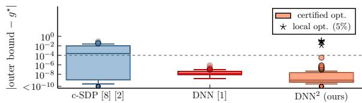
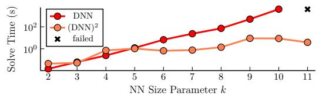
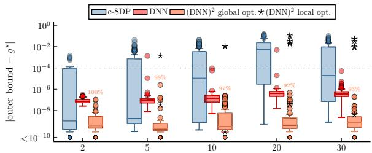
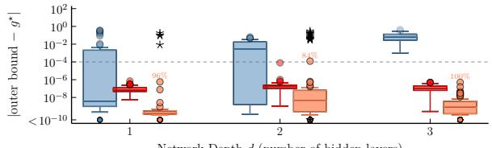
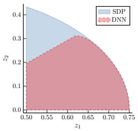
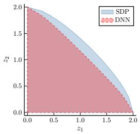

# (DNN)2: Doubly Non-Negative Relaxations for Deep Neural Networks

Hanna Jiamei Zhang1, Alan Papalia2, Michael Everett1, and David M. Rosen1

Abstract— Existing linear program (LP) and semidefinite program (SDP) relaxations for rectified linear unit (ReLU) neural network (NN) verification yield overly-conservative safety guarantees due to significant relaxation gaps. While the completely positive program (CPP) formulation [1] closes this gap, it is NP-hard to solve. Its cheapest tractable relaxation, the doubly non-negative program (DNN), retains critical constraints as an SDP, but one whose size exceeds the reach of interior-point methods at practical scale. While Burer–Monteiro (BM) factorization has been applied to make SDP-based verification [2] scalable, no such result exists for the strictly tighter DNN formulation. A key obstacle is that additional non-negativity constraints in the DNN cause dual multipliers for optimality certification to be non-unique, making standard certification methods inapplicable. We propose a novel eigenvalue maximization procedure that searches the non-unique multiplier space for a valid certificate, i.e. a global optimality guarantee. Experiments demonstrate that our approach (DNN)2 produces bounds consistently tighter than the standard SDP method, often matching the exact solution, and that our certification procedure confirms global optimality when a valid certificate exists. These results are a key step toward providing tight, certifiable, and computationally scalable verification guarantees needed to deploy neural network controllers and perception modules in safety-critical autonomous systems.

## I. INTRODUCTION

As NNs are rapidly adopted in safety-critical settings (e.g. autonomous vehicles, surgical robots, aerospace controllers), the absence of behavioral guarantees poses a substantial risk. One way to address this is through neural network verification methods, which verify or falsify whether a network’s outputs remain within safe limits by computing outer bounds on the output over a specified region of possible inputs. These outer bounds over-approximate a network’s reachable outputs, connecting verification to the reachability analysis underlying reach-avoid guarantees in learning-based control [3]. We focus on feed-forward (FF) ReLU networks, for which verification can be posed as a nonconvex optimization problem that is NP-hard [4], making convex relaxations a principled path to tractable, sound safety verification.

The most widely studied relaxations are LP-based, strengthened with bound-propagation [5], [6], and apply broadly across different architectures. These are sound (never incorrectly declare an unsafe network safe) and scalable, but face an inherent barrier to tight verification [7]. Specifically, the ReLU activation is characterized by a quadratic complementarity constraint, which LP relaxations can only approximate with linear outer bounds. The resulting gap can leave verification queries inconclusive even when the network satisfies the safety property. For modern verifiers, ex. α, β-CROWN [5], the default recourse is to recover completeness via branch-and-bound [8], subdividing the input space to compensate for the loose LP relaxation, effective in many settings, but exponential in the worst case. An alternative relaxation that is already tight needs no branching, but solving it scalably with BM factorization requires an extra solution certification step which we introduce in this work. Ultimately, LP relaxations exchange tightness for computational tractability. When the gap between a relaxed bound and the true optimum determines whether a safe system can be certified or must default to costly conservative fallbacks, closing it has direct operational value.

  
Fig. 1: (top) A comparison of the tightness of various verification methods against the ground-truth mixed integer linear program (MILP) solution across 100 ReLU NNs. While the standard c-SDP [2], [9] leaves significant relaxation gaps, our proposed rank-2 BM-factorized DNN, (DNN)2, consistently produces tighter bounds, frequently matching the exact MILP solution 95% of all verification instances. Our proposed optimality certification procedure (Eq. 10) reliably distinguishes between global and local optima, with the latter marked with . (bottom) Wall time computational Eperformance comparison between the direct DNN (solved via interior-point methods, MOSEK) and (DNN)2 (solved as a non-linear program, KNITRO) with increasing network size parameter k, using the Julia JuMP interface. As expected, while interior-point solve times grow rapidly (cubically) with problem size, our (DNN)2 exhibits significantly more favorable linear scaling.

Beyond LP approaches, exact bounds can be obtained with MILP verifiers [8], but their reliance on exhaustive search renders them intractable for larger problem instances. SDP relaxations [9] offer a middle ground between tractability and expressivity. The positive semidefinite (PSD) constraint on the lifted moment matrix directly enforces quadratic relationships among neuron variables that would otherwise require an infinite collection of linear constraints to represent. However, existing SDPs still omit verification defining constraints needed to fully capture the NN computation [1], potentially causing relaxation gaps.

Brown et al. [1] showed that FF ReLU verification can be formulated exactly (zero relaxation gap) as a CPP. Solving a CPP is intractable, but unlike the MILP, whose intractability offers no intermediate approximations, the sum of squares (SOS) hierarchy [10] provides a family of tractable CPP relaxations, each expressible as an SDP. The coarsest level (0-SOS) yields the DNN relaxation, shown on small NNs, to be 1) tighter than the SDP of [9] and its tightened variants [11], [12], and 2) often exact [1]. Those results motivate this work, which develops the algorithmic tools needed to exploit these tighter DNN formulations at scale.

Exploiting such formulations requires addressing a second challenge: scalability. Interior-point methods typically used to solve SDP relaxations scale as $\mathcal { O } ( n ^ { 3 } )$ per iteration in the matrix variable dimension (where n is proportional to the number of neurons in the NN). BM factorization [13] can exploit low-rank structure to solve large-scale SDPs at a fraction of this cost. However, this converts the convex relaxation into a nonconvex non-linear program (NLP): a locally optimal solution does not yield a valid verification bound unless it can be certified as a global minimizer of the original SDP relaxation. This is distinct from the “certified” label commonly used in the NN verification literature, which refers to the validity of the relaxation itself. Using BM factorization within a Riemannian Staircase (RS) framework [14] efficiently yields certifiably globally optimal solutions to large-scale SDPs, as demonstrated in certifiably correct estimation [15], [16] and in NN verification [2], for what we will refer to as the canonical $S D P$ (c-SDP) [9].

Extending these techniques to the tighter DNN formulation poses a certification challenge: Karush–Kuhn–Tucker (KKT) multipliers exist under mild constraint qualifications, but the linear independence constraint qualification (LICQ), which guarantees their uniqueness, is generically violated for the DNN formulation. Without uniqueness, the NLP solver returns one set of multipliers from a family of valid ones, and that particular set may not yield a certificate confirming global optimality of the local NLP solution even when it is in fact globally optimal. Certification therefore requires searching over this family, which is the problem we address.

When c-SDP bounds are insufficiently tight to verify properties of a FF ReLU neural network, the tighter DNN relaxation formulation can close the gap. To exploit and further investigate the DNN relaxation our contributions are:

• Scalable optimization of the DNN relaxation via BM factorization. We apply rank-2 BM factorization to the DNN relaxation, replacing interior-point SDP solves with much lower-dimensional NLP solves. The resulting bounds are tighter than the c-SDP and often exact.

• Global optimality certificates without the LICQ. We introduce an eigenvalue maximization procedure that searches the set of valid multipliers to construct global optimality certificates of the BM-DNN, a key step toward enabling its practical use in NN verification.

Notation. For a matrix $M ,$ we use $M _ { i , j }$ to denote the entry in the ith row and jth column, $M _ { * , j }$ denotes the entire jth column. The matrix/trace inner product is $\langle A , B \rangle \ =$ $\operatorname { T r } ( A ^ { \top } B )$ . We write $[ n ] \triangleq 1 , \dots , n$ for $n > 0$ as a shorthand for sets of indexing integers. R and $\mathbb { R } _ { + }$ denote the real and nonnegative real numbers, and $\mathbb { R } ^ { n }$ and $\mathbb { R } _ { + } ^ { n }$ for their ndimensional counterparts. $\mathbb { S } ^ { n }$ and $\mathbb { S } _ { + } ^ { n }$ are symmetric and PSD matrices of order n. For $x , y \in \mathbb { R } ^ { n } , x \odot y$ is the Hadamard (elementwise) product. $\mathbf { 1 } _ { n } \in \mathbb { R } ^ { n }$ is the vector of all ones.

## II. PROBLEM FORMULATION AND PRELIMINARIES

We formulate verification for FF ReLU networks as a nonconvex optimization problem, following the modeling of [9] and [1]. The restriction to FF ReLU architectures is significant: the piecewise-linear structure of ReLU activations admits an exact representation through bilinear complementarity constraints, which in turn enables the conic reformulations we focus the following discussion on.

## A. NN Verification as Optimization

We consider an ℓ layer FF ReLU NN representing function $f$ with input $z _ { 0 , * } \in \mathbb { R } ^ { h _ { 0 } }$ and output $f ( z _ { 0 , * } ) = z _ { \ell , * } \in \mathbb { R } ^ { h _ { \ell } }$ with $f$ being the composition of functions $f = f _ { \ell } \circ f _ { \ell - 1 } \circ$ $\cdots \circ f _ { 1 }$ . The ith layer of $f$ is function $f _ { i } : \mathbb { R } ^ { h _ { i - 1 } }  \mathbb { R } ^ { h }$

$$
z _ { i , * } = f _ { i } ( z _ { i - 1 , * } ) = \sigma ( \hat { z } _ { i , * } ) = \sigma ( W [ i - 1 ] z _ { i - 1 , * } + b [ i - 1 ] )\tag{1}
$$

where $h _ { i }$ is the dimension of the hidden variable $z _ { i , * } ,$ $\overline { { W } } [ i \mathrm { ~ - ~ } 1 ] \ \in \ \mathbb { R } ^ { h _ { i } \times h _ { i - 1 } }$ are the weight matrices, and $b [ i -$ $1 ] \ \in \ \mathbb { R } ^ { h _ { i } }$ are bias vectors. The vector of all neurons in the ith layer is denoted by $z _ { i , * }$ and $z _ { i , j }$ refers to the $j \mathrm { t h }$ neuron in the ith layer. The activation function is the ReLU $\sigma ( \hat { z } _ { i , j } ) = \operatorname* { m a x } ( 0 , \hat { z } _ { i , j } )$ which acts elementwise on vectors and is not applied to the last layer $f _ { \ell } .$ . Preactivation values are denoted $\hat { z } _ { i , \cdot }$ ∗ implying that $z _ { 0 , * } = \hat { z } _ { 0 , * }$ . Introduced in [1], a positive/negative splitting for each neuron $\lambda _ { i , j } ^ { + } = z _ { i , j }$ and $\lambda _ { i , j } ^ { - } = z _ { i , j } - \hat { z } _ { i , j }$ such that $\lambda ^ { + } , \lambda ^ { - } \geq 0$ is used rather than the typical pre/post-activation parameterization.

Safety rules are specified as input-output relationships on $f .$ For all inputs $z _ { 0 , * } = \mathcal { X } \subseteq \mathbb { R } ^ { h _ { 0 } }$ , we want to ensure that the output belongs to set $z _ { \ell , * } = y \subseteq \mathbb { R } ^ { h _ { \ell } }$ . Following common convention, we consider bounded, polytopic input sets and output sets defined by a half-space constraint:

$$
\mathcal { X } = \{ x \in \mathbb { R } ^ { h _ { 0 } } | \overline { { A } } x \leq a \} , \ y = \{ y \in \mathbb { R } ^ { h _ { \ell } } | \bar { c } ^ { \top } y \geq d \} ^ { 1 }\tag{2}
$$

Substituting $\lambda ^ { + } , \lambda ^ { - }$ into the quadratically constrained quadratic program (QCQP) for FF ReLU NN verification [9] yields the non-convex, non-linear QCQP:

$$
\begin{array} { r l } { \{ }  & { \underset { \ r { s } . \ r { A } . \ r { A } . \ r { A } ^ { - } } { \ r { m i n } } ~ c ^ { \top } ( \lambda _ { \ell , * } ^ { + } - \lambda _ { \ell , * } ^ { - } ) } \\ { \mathrm { s . t . } } & { \ r { A } ( \lambda _ { 0 , * } ^ { + } - \lambda _ { 0 , * } ^ { - } ) \leq a , } \\ & { \lambda _ { i + 1 , * } ^ { + } - \lambda _ { i + 1 , * } ^ { - } = W [ i ] \lambda _ { i , * } ^ { + } + b [ i ] , \quad \forall i \in [ \ell ] } \\ & { \lambda _ { i , j } ^ { + } \lambda _ { i , j } ^ { - } = 0 , \quad \forall i \in [ \ell - 1 ] , j \in h _ { i } } \\ & { \lambda ^ { + } , \lambda ^ { - } \geq 0 } \end{array}\tag{3}
$$

where the network is safe if and only if $g ^ { \star } \geq$ d as per (2). The optimal value $g ^ { \star }$ of $( 3 )$ is the ground truth against which all relaxation bounds in this work are measured, i.e. a relaxation is tight to the extent that its optimal value approaches $g ^ { \star }$

## B. Generalized Cone Programs

A generalized cone program (or conic optimization) is a convex optimization problem class that minimizes a linear objective function over the intersection of an affine subspace and a convex cone $\kappa ^ { n }$ , unifying SDPs, DNNs, and CPPs as

$$
g _ { K } ^ { \star } = \operatorname* { m i n } _ { Z \in K ^ { n } } \ g ( Z ) \ \mathrm { ~ s . t . ~ } A ( Z ) = b , \ B ( Z ) \leq u\tag{Cn}
$$

where $Z \in \mathbb { S } ^ { n }$ is a symmetric matrix variable constrained to lie in a cone of symmetric matrices $\mathcal { K } ^ { n } \subset \mathbb { S } ^ { n } , f$ $\mathbb { S } ^ { n } \to \mathbb { R }$ is a convex and twice-continuously-differentiable function, and $\mathcal { A } : \mathbb { S } ^ { n } \to \mathbb { R } ^ { m _ { 1 } }$ , and $B : \mathbb { S } ^ { n } \to \mathbb { R } ^ { m _ { 2 } }$ are linear operators defined by $\mathcal { A } ( Z ) _ { i } = \left. A _ { i } , Z \right. , i \in [ m _ { 1 } ]$ and $B ( Z ) _ { j } = \left. A _ { j } , Z \right. , j \in [ m _ { 2 } ]$ . The choice of $\kappa ^ { n }$ influences both the tightness and tractability of a given (Cn). We discuss these choices of convex $\kappa ^ { n }$ : the PSD cone $\mathbb { S } _ { + } ^ { n }$ and the cone of completely positive (CP) matrices $\mathbb { C } _ { * } ^ { n }$ , that is, matrices that have a factorization with entry-wise non-negative entries:

$$
\mathbb { S } _ { + } ^ { n } : = \{ X \in \mathbb { S } ^ { n } | v ^ { \top } X v \geq 0 , \forall v \in \mathbb { R } ^ { n } \} ,\tag{4}
$$

$$
{ \mathrm { o r ~ e q u i v a l e n t l y ~ } } \left\{ X \in \mathbb { S } ^ { n } \mid X = B B ^ { \top } , B \in \mathbb { R } ^ { n \times r } \right\}\tag{5}
$$

$$
\mathbb { C } _ { * } ^ { n } : = \{ X \in \mathbb { S } ^ { n } | X = B B ^ { \top } , B \in \mathbb { R } _ { + } ^ { n \times r } \} .\tag{6}
$$

The nomenclature of SDP and CPP arises naturally for describing problems of the form (Cn) with the corresponding choice of $\textstyle { \mathcal { K } } ^ { n }$ . Unlike the PSD cone, merely testing membership in $\mathbb { C } _ { * } ^ { n }$ is NP-hard [17], making direct optimization over it intractable. This obstacle motivates the use of tractable outer approximations, one being the intersection of the PSD and entrywise non-negative cones $\mathbb { S } _ { + } ^ { n } \cap \mathbb { R } _ { + } ^ { n }$ , the DNN cone. The relationship between these cones is

$$
\underbrace { \mathbb { C } _ { * } ^ { n } } _ { \mathrm { C P P ~ ( e x a c t ) } } \subseteq \underbrace { \mathbb { S } _ { + } ^ { n } \cap \mathbb { R } _ { + } ^ { n } } _ { \mathrm { D N N ~ ( 0 - S O S ) } } \subseteq \underbrace { \mathbb { S } _ { + } ^ { n } } _ { \mathrm { S D P } } .\tag{7}
$$

## C. Conic Reformulations of Neural Network Verification

We now present three conic reformulations of (3): 1. the canonical SDP relaxation [9], 2. the exact reformulation of (3) as a CPP [1], and 3. its tractable relaxations (in particular the DNN). We emphasize that each arises from a different construction but shares the common form of a generalized cone program (Cn) to highlight both their relationship to one another and the gaps this work addresses in how to approach scalably solving each form. Note that the structural properties outlined for each instance of (Cn) extend beyond the NN verification setting, in fact they hold more generally for the entire $\textstyle { \mathcal { K } } ^ { n }$ problem class.

As the objective and constraint functions are all quadratic, written more generally (3) can be expressed as

$$
\begin{array} { r l } & { g _ { \mathrm { Q C Q P } } ^ { \star } = \underset { X \in \mathbb { R } ^ { n \times r } } { \operatorname* { m i n } } \left. Q , X X ^ { \mathsf { T } } \right. } \\ & { \qquad \mathrm { s . t . } \ \left. A _ { i } , X X ^ { \mathsf { T } } \right. = b _ { i } , \quad i \in [ m _ { 1 } ] } \\ & { \qquad \quad \left. A _ { j } , X X ^ { \mathsf { T } } \right. \leq u _ { j } , \quad j \in [ m _ { 2 } ] , } \end{array}\tag{Qcqp}
$$

with objective matrix $Q \in \mathbb { S } ^ { n }$ , constraint matrices $A _ { i } , A _ { j } \in$ $\mathbb { S } ^ { n }$ , constraint vectors $b \in \mathbb { R } ^ { m _ { 1 } } \textbf { \em u } \in \mathbb { R } ^ { m _ { 2 } }$ , and $r \ \leq \ n .$ Since $X ~ \in ~ \mathbb { R } ^ { n \times r }$ only enters (Qcqp) through the outer product $X X ^ { \mathsf { T } }$ , which is symmetric and PSD satisfying $\operatorname { r a n k } ( X X ^ { \mathsf { T } } ) \ \leq \ r$ , convex relaxations can be obtained by replacing $\dot { X } \dot { X } ^ { \top }$ with matrix variable $Z$ constrained to an appropriate cone $\kappa ^ { n }$

1) SDP relaxation $( K ^ { n } = \mathbb { S } _ { + } ^ { n } ) \colon$ The class of problems of the form (Qcqp) admits a general procedure called Shor’s relaxation [18] for constructing convex relaxations. This consists of replacing the low-rank symmetric outer product $X X ^ { \mathsf { T } }$ in (Qcqp) with a generic symmetric and PSD matrix variable $Z \in \mathcal { K } ^ { n } = \mathbb { S } _ { + } ^ { n }$ in (Cn), resulting in the canonical SDP relaxation of (3) we denote $g _ { \mathbb { S } _ { + } }$ , first proposed in [9].

Shor’s relaxation is solvable in polynomial time via interior-point methods and provides a lower bound $g _ { \mathbb { S } _ { + } } ^ { \star } \ \leq$ $g _ { \mathrm { Q c q p } } ^ { \star }$ . However, it increases the dimension of the decision variable from $X \in \mathbb { R } ^ { n \times r }$ to $Z \in \mathbb { S } _ { + } ^ { n }$ so that the number of free variables scales quadratically in network size, limiting applicability due to memory constraints. This concern persists for the DNN. More fundamentally, the PSD constraint alone does not enforce entry-wise non-negativity of $Z ,$ which [1] showed to be among the most critical verification defining constraints: in ablation experiments, omitting $\Lambda \geq 0$ produced relative errors ranging from $1 0 ^ { 2 }$ to $1 0 ^ { 4 }$

2) CPPform $( K ^ { n } = \mathbb { C } _ { * } ^ { n } ) { \mathrm { : } }$ Analogous to Shor’s relaxation for SDPs, Brown et al. [1] constructed an exact convex formulation of (3) by replacing $X X ^ { \top }$ where $X = \left( \lambda \ : 1 \right)$ with matrix variable $\bar { Z } = \bar { ( \begin{array} { c } { { \Lambda } } \\ { { \lambda ^ { \top } } } \end{array} \overset {  } { _ 1 } ) }$ constrained to be $\mathrm { C P } \left( Z \in \right.$ $\mathbb { C } _ { * } ^ { n } )$ [1, Thm. 4.1]. Λ is a matrix which represents the secondorder cross terms of elements in $\lambda = \bar { ( ( \lambda ^ { + } ) ^ { \top } \ ( \lambda ^ { - } ) ^ { \top } \ s ^ { \top } ) ^ { \top } }$ and s is the concatenated slack variables used to represent inequality constraints. They form a minimal set of verificationdefining constraints whose removal fundamentally misrepresents the NN [1, Eqns. 13b-g] which we restate as (3) being equivalent to (Cn) with $\ b { \mathcal { K } } ^ { n } = \mathbb { C } _ { * } ^ { n }$ , a CPP we denote $g _ { \mathbb { C } _ { * } }$

Despite being convex, optimizing over $\mathbb { C } _ { * } ^ { n }$ is intractable as membership testing in the $\mathbb { C } _ { * } ^ { n }$ cone and its dual, the copositive cone $\mathbb { C } ^ { n }$ , is NP-hard and co-NP-complete respectively [17]. The intractability of the CPP echoes that of the MILP, both provide exact formulations of (3), but package the NP-hardness differently. Whereas the MILP encodes it in combinatorial branching, the CPP encodes it entirely in the cone constraint, simplifying the objective and feasibility constraints to be linear [19]. This structural property enables the hierarchy of tractable relaxations described next.

3) DNN relaxation $( K ^ { n } = \mathbb { S } _ { + } ^ { n } \cap \mathbb { R } _ { + } ^ { n } ) .$ : Although optimizing over $\mathbb { C } _ { * } ^ { n }$ is intractable, Parrilo [10] constructed a hierarchy of tractable outer approximations of $\mathbb { C } _ { * } ^ { n }$ , expressible as SDPs, with successively tighter approximations at greater computational cost. The coarsest (0-SOS) level of this hierarchy relaxes the CPP by replacing $\mathbb { C } _ { * } ^ { n }$ with $K ^ { n } = \mathbb { S } _ { + } ^ { n } \cap \mathbb { R } _ { + } ^ { n }$ a DNN we denote $g _ { \mathbb { S } _ { + } \cap \mathbb { R } _ { + } }$ . For brevity, we refer to this as the DNN relaxation, noting that it is an SDP because it is an instance of (Cn) with ${ \cal K } ^ { n } = { \mathbb S } _ { + } ^ { n }$ . Unlike the c-SDP relaxation of $( 3 )$ , the DNN retains all verification-defining constraints and is thus tighter, $g _ { \mathrm { Q c q p } } ^ { \star } = g _ { \mathbb { C } _ { * } } ^ { \star } \geq g _ { \mathbb { S } _ { + } \cap \mathbb { R } _ { + } } ^ { \star } \geq g _ { \mathbb { S } _ { + } } ^ { \star } \ [ 1 ]$

The DNN represents a potentially favorable tradeoff between tightness and tractability. It is the tightest relaxation that remains expressible as an SDP of the same size as the CPP formulation, without requiring additional decision variables or constraints as in higher levels of the SOS hierarchy. It retains all verification-defining constraints identified in [1], and empirically achieves significantly smaller relaxation gaps than existing SDP formulations for small networks. While even tighter SDP relaxations may be possible using higher SOS levels, the 0-SOS relaxation is a compelling target for scalable solver development and investigation of the tightness-tractability frontier. Thus, we focus on the DNN relaxation as the tightest practically available formulation, with the exact CPP serving as a theoretical reference point.

## D. Scalably Solving SDPs via Burer–Monteiro Factorization

BM factorization of SDPs dramatically reduces the number of decision variables from $n ^ { 2 }$ to nr. When the relaxation is exact, the minimizer $Z ^ { \star }$ admits a low-rank factorization $Z ^ { \star } ~ = ~ X ^ { \star } X ^ { \star ^ { \sf T } }$ with $X ^ { \star } \in \mathbb { R } ^ { n \times r } ,$ , a global minimizer of (Qcqp). Burer and Monteiro (BM) [13] proposed to algorithmically exploit this observation by reparameterizing $Z$ using an assumed rank- $- p$ factorization $\bar { Z } \stackrel { \mathbf { \bar { \mathbf { \Lambda } } } } { = } Y Y ^ { \mathsf { T } }$ with factor $Y \in \mathbb { R } ^ { n \times p } , r \leq p \ll n$ . Substituting this parameterization into (Cn) yields the BM factorization, which enforces positive semi-definiteness by construction for ${ \mathcal { K } } = { \mathbb { S } } _ { + } ^ { n }$

$$
g _ { B M } ^ { \star } = \operatorname* { m i n } _ { Y \in \mathbb { R } ^ { n \times p } } g ( Y Y ^ { \top } ) \mathrm { s . t . } A ( Y Y ^ { \top } ) = b , \ B ( Y Y ^ { \top } ) \leq u .\tag{Bm}
$$

## E. Global Optimality Certification and the Role of the LICQ

Solving these problem forms requires addressing that the BM factorized form (Bm) is a non-convex NLP that is known to admit suboptimal local minima. To overcome this, the RS framework has been employed successfully as a systematic approach to search for global optimum by incrementally increasing the rank of the factor matrix $Y ,$ thereby smoothing the optimization landscape and escaping sub-optimal points. Within such a framework, we must check that first-order stationary points $Y ^ { \star }$ of the NLP (Bm) with corresponding Lagrange multipliers $\mu = ( \lambda , \gamma )$ , actually correspond to a solution $Z \in \mathbb { S } _ { + } ^ { n }$ of (Cn), our target SDP relaxation. That is, specifically we are checking the optimality of $Z = Y ^ { \star } Y ^ { \star ^ { \top } }$ as a solution to the SDP using the certificate matrix

$$
S = S ( \boldsymbol { Y } ^ { \star } , \mu ) \triangleq \nabla f ( \boldsymbol { Y } ^ { \star } \boldsymbol { Y } ^ { \star \mathsf { T } } ) - \boldsymbol { \mathcal { A } } ^ { * } ( \lambda ) - \mathcal { B } ^ { * } ( \boldsymbol { \gamma } ) ,\tag{8}
$$

where $\mathcal { A } ^ { \ast } : \mathbb { R } ^ { m _ { 1 } } \to \mathbb { S } ^ { n }$ , and $B ^ { * } : \mathbb { R } ^ { m _ { 2 } }  \mathbb { S } ^ { n }$ linear operators defined as $\begin{array} { r } { \mathcal { A } ^ { * } ( \lambda ) = \sum _ { i = 1 } ^ { m _ { 1 } } \lambda _ { i } A _ { i } } \end{array}$ and $\begin{array} { r } { B ^ { * } ( \gamma ) = \sum _ { i = 1 } ^ { m _ { 2 } } \gamma _ { j } A _ { j } } \end{array}$

The RS [14] integrates these components [16, Algo. 1]: starting from a rank-p factorization, it iteratively performs local optimization to recover a KKT point $Y ^ { \star }$ of (Bm), constructs the certificate matrix $S ,$ either certifying optimality of $Z = Y ^ { \star } Y ^ { \star ^ { \top } }$ when $S \succeq 0 ,$ or escaping to rank- $( p + 1 )$ otherwise [16, Thm. 4]. Prior applications of RS relied on the LICQ holding at the local minimizer $Y ^ { \star }$ , guaranteeing the existence and uniqueness of the multipliers $\mu$ to construct S for optimality verification and establish a second-order direction of descent when $Y ^ { \star }$ is found not to be optimal. In certifiable perception, the LICQ is known to hold generically for the constraints arising in many robotic perception tasks (which often involve estimation over smooth manifolds), allowing the successful application of this framework [15], [20]. Similarly, this framework has been applied in NN verification for the canonical SDP [9], because of [2, Lemma E.2], if the nonzero preactivation (NPCQ) condition holds, then the LICQ holds. We refer the reader to [20] for a detailed treatment of the role of LICQ in a RS framework.

## III. CERTIFIABLY AND SCALABLY SOLVING DNNS

Here we present our approach to scalably solving DNN relaxations of the form (Cn) via BM factorization, followed by a certification procedure that provides global optimality guarantees even when the LICQ fails.

## A. Burer–Monteiro Factorization for DNN Scalablility

The DNN, (Cn) with $K ^ { n } = \mathbb { S } _ { + } ^ { n } \cap \mathbb { R } _ { + } ^ { n }$ , can be written in the form of (Bm) with the addition of constraints enforcing element-wise non-negativity on individual entries of the resultant outer product $( Y Y ^ { \top } ) _ { i j } \ \ge \ 0 \ \forall i , j \ \in \ [ n ]$ . This is the BM factorization of the target DNN, BM-DNN.

Proposition 1: Let $Y ^ { \star }$ be a first-order stationary point of (Bm). If there exist dual multipliers $\mu = ( \lambda , \gamma )$ satisfying the KKT conditions at $Y ^ { \star }$ such that $S \succeq 0$ as per (8), then $Z ^ { \star } = Y ^ { \star } Y ^ { \star ^ { \sf T } }$ is a global minimizer of (Cn).

The optimality certificate described in Prop. 1 requires only the existence of multipliers $\mu$ such that $\begin{array} { r l r } { S } & { { } \succeq } & { 0 } \end{array}$ regardless of the LICQ. With the LICQ, $\mu$ is unique [21], allowing for efficient certification (a linear system solve to form $S$ directly) [20] and that $S \ \sharp \ 0$ definitively proves non-optimality of $Y ^ { \star }$ [16, Footnote 3]. This case has been explored extensively in past work (Sec. II-D). Without the LICQ, there exists more than one set of valid multipliers $\mu ,$ so $S \not \subseteq 0$ , with certificate $S$ constructed from the particular multipliers $\mu ^ { \star }$ returned by the specific NLP solver used, is inconclusive. Certification reverts to a semidefinite feasibility problem, finding an intersection between the affine space and the PSD cone for a certificate (if it exists), which is generally as computationally demanding as the original SDP (Cn) [20].

The LICQ is violated for DNNs due to the simultaneously active entry-wise non-negativity constraints. A unique $\mu$ does not exist and we require a robust procedure to search over the space of feasible multipliers of BM-DNN for a $\mu$ satisfying $S \succeq 0$ , which, if found, certifies global optimality of solution $Z = Y ^ { \star } Y ^ { \star ^ { \top } }$ for the DNN as per Prop. 1.

## B. Search for Optimality Certificate

We formalize the search for a certificate as the following optimization problem, in which we maximize the minimum eigenvalue of the certificate matrix S over the space of feasible multipliers $\mu$ of the BM-DNN:

$$
\operatorname* { m a x } _ { \mu = \lambda , \gamma } \mathrm { ~ e i g m i n } \circ S \mathrm { ~ } \mathrm { s . t . } S Y ^ { \star } = 0 , \mathrm { ~ } c \odot \gamma = 0 , \mathrm { ~ } \gamma \leq 0 .\tag{9}
$$

$Y ^ { \star }$ is a stationary point returned from the NLP solver, the constraint slack is $\overset { \cdot } { c } = ( \overset { \triangledown } { B } ( Y ^ { \star } Y ^ { \star } { } ^ { \mathsf { T } } ) - u )$ , and eigmin returns the minimum eigenvalue of a given matrix. The constraints of (9) enforce KKT conditions of BM-DNN (stationarity, complementary slackness, and dual feasibility) in order for $\mu$ to represent true stationary points of (Bm). Prob. (9) is convex but nonsmooth. If the optimal value, $\theta _ { \mathrm { m i n } } ^ { \star } \geq 0 ;$ then a multiplier vector $\mu$ such that $S \succeq 0$ exists, Prop. 1 applies, and the BM solution is certified globally optimal. If it is negative, and the DNN satisfies a suitable constraint qualification (CQ) (ex. Slater’s), then $Z = Y ^ { \star } ( Y ^ { \star } ) T ^ { \top }$ is not optimal for the DNN. This is due to the fact for convex problems, the KKT conditions are necessary and sufficient for global optimality under a suitable CQ, so the nonexistence of valid multipliers is conclusive.

In practice, NLP solvers satisfy the KKT conditions only to within solver tolerances, so the exact stationarity and complementary slackness constraints in (9) may admit no feasible point in finite precision. To ensure the feasible set has interior, we relax these constraints using $\ell _ { 1 } { \mathrm { - n o r m } }$ bounds $\epsilon _ { \mathrm { s t a t } }$ and $\epsilon _ { \mathrm { c s } } ,$ , set from the residuals of the multipliers $\mu ^ { \star }$ by the NLP solver. We note that one could select different norms that would interact differently with the solver of choice. Thus, let $\mathcal { F }$ denote the feasible set $\mathcal { F } = \{ \mu \mid \| S Y ^ { \star } \| _ { 1 } \leq \epsilon _ { \mathrm { s t a t } } , \ \| c \odot \gamma \| _ { 1 } \leq \epsilon _ { \mathrm { c s } } , \ \gamma \leq 0 \}$

To express the objective of (9) operationally, we introduce an epigraph variable $\theta _ { \mathrm { m i n } }$ representing the minimum eigenvalue of $S$ yielding the numerically robust SDP

$$
\operatorname* { m a x } _ { \mu , \theta _ { \mathrm { m i n } } } \quad \theta _ { \mathrm { m i n } } \quad \mathrm { s . t . } \quad S ( \mu ) - \theta _ { \mathrm { m i n } } I \succeq 0 , \quad \mu \in \mathcal { F } ,\tag{10}
$$

where results $\theta _ { \mathrm { m i n } } ^ { \star } \geq 0$ means $S \succeq 0$ and $\theta _ { \mathrm { m i n } } ^ { \star } < 0$ means $S \not \subseteq 0 .$ . Solving (10) as an SDP (of the same dimension as our target DNN) establishes that a valid certificate can be constructed despite the obstacle of LICQ failure. NB: In this work, solving (10) via interior-point methods is a validation choice, not an intrinsic cost of the certificate, since any feasible $\mu$ yielding $S \succeq 0$ suffices, (10) need not be solved to global optimality, permitting early termination. Scaling the certificate search (9) is the remaining step toward an end-toend pipeline, which we leave to future work.

## IV. EXPERIMENTAL RESULTS AND DISCUSSION

We consider FF ReLU networks, generated by selecting weights and biases uniformly between 1.0 and 1.0. We consider safety rule $\mathcal { X } : = \{ z _ { 0 , * } | z _ { 0 , * } \in [ - 1 . 0 , 0 . 1 ] ^ { 2 } \}$ and $y = \{ z _ { \ell , * } | z _ { \ell , * } \ge 0 \}$ . We use notation $h \ = \ [ 2 , 1 0 , 1 ]$ to represent the NN from Brown [1] with two inputs, one hidden layer with 10 neurons, and 1 output. We computed ground truth bounds by solving the MILP [8]. SDPs are solved using MOSEK [22] and BM-SDPs (i.e. NLPs) with KNITRO [23]. All solvers are set with comparable tolerances. NLPs are initialized with the network state obtained by evaluating the network at the midpoint of the input set. Our implementation is available as open-source Julia/JuMP code.2 We evaluate the rank $p = 2$ BM factorization of the DNN relaxation, denoted $( \mathrm { D N N } ) ^ { 2 }$ , to demonstrate both the tightness gains of the cheapest BM-DNN over the c-SDP and the reliability of our global optimality certificate (10). We restrict attention to these instances to isolate the effect of relaxation tightness and applying BM factorization.

## A. Global Optimality Certification and Tightness of DNN

On the small test NN of [1], where the DNN relaxation is known to be tighter than c-SDP and often exact [1], we find that $( \mathrm { D N N } ) ^ { 2 }$ recovers the (exact) global optimum of (Cn) in 95% of verification queries, and that our certificate (10) correctly identifies each such case (Fig. 1).

To further investigate the practicality of this restriction we compare the c-SDP, the DNN, and our $( \mathrm { D N N } ) ^ { 2 }$ varying NN height $t ,$ and depth with number of hidden layers $d ,$ evaluating 100 random network instances per configuration for architectures $h = [ 2 , t , 1 ]$ and $h = [ 2 , 4 \cdot \mathbf { 1 } _ { d } , 2 ]$ . As shown in Fig. 2, the SDP relaxation bounds become progressively looser for larger (wider and deeper) networks, whereas $( \mathrm { D N N } ) ^ { 2 }$ remains tight (i.e. within meaningful tolerance $1 0 ^ { - 4 }$ marked in all figures with a dotted grey line) to the MILP ground truth in the majority of instances. Our certificate correctly identifies solutions that are not globally optimal, i.e., it never falsely certifies a suboptimal solution.

In 0.075% of queries, the $( \mathrm { D N N } ) ^ { 2 }$ bound matches the MILP to numerical precision yet our certificate fails to confirm global optimality. This reflects a solver limitation, not a flaw in the formulation: the interior-point method used for (10) times out before finding $\mathrm { ~ a ~ } \mu$ with $S \succeq 0$ . Since any such $\mu$ suffices (global optimality of (10) is not required) more scalable solution strategies are a promising direction for future work. Developing these would enable certified DNN verification at the same scale as the BM solve itself.

Finally, we note that the DNN relaxation is exact in all but 2 instances, and the $( \mathrm { D N N } ) ^ { 2 }$ recovers the globally optimal DNN bound in 84–100% of queries depending on network configuration. Developing a RS-style rank escalation procedure for the DNN setting (Section III-B) would, with appropriate theoretical foundations, guarantee recovery of the global DNN optimum in all cases. Whether the DNN relaxation remains frequently exact for larger, trained networks is an important open question for future investigation.

To understand why the DNN relaxation is tighter, we replicate the feasible set analysis of [9, Fig. 2] in Fig. 3. Both the SDP and DNN enforce joint constraints that yield a convex feasible region, but the DNN additionally imposes element-wise non-negativity, producing a strictly smaller feasible set and thus a strictly tighter relaxation.

## B. Computational Scalability of BM-DNN over DNN

To further motivate this approach, we compare the computational scaling of $( \mathrm { D N N } ) ^ { 2 }$ solved as an NLP against the direct DNN solved via interior-point methods. We use a toy network (weights set to 1 and biases 0) with a single-point (trivial) input set and architecture $\left[ k , k \cdot \mathbf { 1 } _ { k } , k \right]$ for increasing k. As shown in Fig. 1, DNN solve times grow rapidly with problem size, while the BM-factored form exhibits significantly more favorable scaling. For small instances, the $( \mathrm { D N N } ) ^ { 2 }$ solve is slower than DNN due to NLP solver overhead, however, the scaling trends diverge rapidly with increasing k. This gap will widen as interior-point costs grow cubically in the matrix dimension while the BM variable count grows only linearly. The failed SDP solve at $k = 1 1$ due to memory exhaustion illustrates this precisely.

  
Network Height t (number of hidden layer neurons)

  
Network Depth d (number of hidden layers)  
Fig. 2: Analysis of how verification accuracy degrades as NNs increase in height (top) and depth (bottom). The canonical c-SDP bounds (blue) become progressively looser as the network grows, making safety verification more difficult. In contrast, our $( \mathrm { D N N } ) ^ { 2 }$ formulation (orange) remains highly tight to the MILP ground truth across all tested scales, demonstrating its robustness for larger, more complex network architectures. Our proposed certification procedure (Eq. 10) successfully identifies instances where $( \mathrm { D N N } ) ^ { 2 }$ has reached a local rather than global optimum; these points are marked with  and are excluded from the box plots. The percentage of instances certified as globally optimal is annotated for each configuration.

  
Fig. 3: Visualizing why the DNN relaxation is tighter than c-SDP. Let $z _ { 1 } = \mathrm { R e L U } \left( x _ { 1 } + x _ { 2 } \right)$ and $z _ { 2 } = \mathrm { R e L U } \left( x _ { 1 } - x _ { 2 } \right)$ . (left) The feasible set of each relaxation projected onto the post-activation variables $( z _ { 1 } , z _ { 2 } )$ for fixed input $x _ { 1 } = x _ { 2 } = 0 . 5$ . (right) The same projection across all feasible inputs, under the objective max $z _ { 1 } + z _ { 2 }$ . Because the DNN formulation enforces additional element-wise non-negativity constraints not present in the SDP, it produces a strictly smaller feasible set (red) than the SDP (blue), leading to tighter outer NN bounds and more accurate safety guarantees.

## V. DISCUSSION AND FUTURE WORK

We have shown that the DNN, the coarsest level of the CPP relaxation hierarchy, consistently yields tighter verification bounds than the canonical SDP and is frequently exact, even when solved as a rank-2 BM factorization. Our certificate (10) reliably identifies globally optimal BM-DNN solutions despite LICQ failure. Together these results establish BM-factorized DNN relaxations as a promising path toward scalable, tight neural network verification.

[1] R. A. Brown, E. Schmerling, N. Azizan, and M. Pavone, “A unified view of sdp-based neural network verification through completely positive programming,” in International conference on artificial intelligence and statistics. PMLR, 2022, pp. 9334–9355.

[2] H.-M. Chiu and R. Y. Zhang, “Tight certification of adversarially trained neural networks via nonconvex low-rank semidefinite relaxations,” in International Conference on Machine Learning. PMLR, 2023, pp. 5631–5660.

[3] M. Everett, “Neural network verification in control,” in 2021 60th IEEE Conference on Decision and Control (CDC), 2021, pp. 6326– 6340.

[4] G. Katz, C. Barrett, D. L. Dill, K. Julian, and M. J. Kochenderfer, “Reluplex: An efficient smt solver for verifying deep neural networks,” in Int. Conf. Comput. Aided Verif. Springer, 2017, pp. 97–117.

[5] S. Wang, H. Zhang, K. Xu, X. Lin, S. Jana, C.-J. Hsieh, and J. Z. Kolter, “Beta-crown: Efficient bound propagation with per-neuron split constraints for neural network robustness verification,” Advances in neural information processing systems, vol. 34, pp. 29 909–29 921, 2021.

[6] H. Zhang, T.-W. Weng, P.-Y. Chen, C.-J. Hsieh, and L. Daniel, “Efficient neural network robustness certification with general activation functions,” Advances in neural information processing systems, vol. 31, 2018.

[7] H. Salman, G. Yang, H. Zhang, C.-J. Hsieh, and P. Zhang, “A convex relaxation barrier to tight robustness verification of neural networks,” Advances in Neural Information Processing Systems, vol. 32, 2019.

[8] V. Tjeng, K. Xiao, and R. Tedrake, “Evaluating robustness of neural networks with mixed integer programming,” arXiv:1711.07356, 2017.

[9] A. Raghunathan, J. Steinhardt, and P. S. Liang, “Semidefinite relaxations for certifying robustness to adversarial examples,” Advances in neural information processing systems, vol. 31, 2018.

[10] P. A. Parrilo, Structured semidefinite programs and semialgebraic geometry methods in robustness and optimization. California Institute of Technology, 2000.

[11] B. Batten, P. Kouvaros, A. Lomuscio, and Y. Zheng, “Efficient neural network verification via layer-based semidefinite relaxations and linear cuts.” in IJCAI, 2021, pp. 2184–2190.

[12] M. Fazlyab, M. Morari, and G. J. Pappas, “Safety verification and robustness analysis of neural networks via quadratic constraints and semidefinite programming,” IEEE Transactions on Automatic Control, vol. 67, no. 1, pp. 1–15, 2020.

[13] S. Burer and R. D. Monteiro, “A nonlinear programming algorithm for solving semidefinite programs via low-rank factorization,” Mathematical programming, vol. 95, no. 2, pp. 329–357, 2003.

[14] N. Boumal, “A riemannian low-rank method for optimization over semidefinite matrices with block-diagonal constraints,” arXiv:1506.00575, 2015.

[15] D. M. Rosen, L. Carlone, A. S. Bandeira, and J. J. Leonard, “Se-sync: A certifiably correct algorithm for synchronization over the special euclidean group,” The International Journal of Robotics Research, vol. 38, no. 2-3, pp. 95–125, 2019.

[16] D. M. Rosen, “Scalable low-rank semidefinite programming for certifiably correct machine perception,” in International Workshop on the Algorithmic Foundations of Robotics. Springer, 2020, pp. 551–566.

[17] M. Dur, “Copositive programming–a survey,” in ¨ Recent Advances in Optimization and its Applications in Engineering: The 14th Belgian-French-German Conference on Optimization. Springer, 2010, pp. 3–20.

[18] N. Z. Shor, “Quadratic optimization problems,” Soviet Journal of Computer and Systems Sciences, vol. 25, pp. 1–11, 1987.

[19] S. Burer, “On the copositive representation of binary and continuous nonconvex quadratic programs,” Mathematical Programming, vol. 120, no. 2, pp. 479–495, Sep. 2009.

[20] A. Papalia, Y. Tian, D. M. Rosen, J. P. How, and J. J. Leonard, “An overview of the burer-monteiro method for certifiable robot perception,” 2025.

[21] G. Wachsmuth, “On licq and the uniqueness of lagrange multipliers,” Operations Research Letters, vol. 41, no. 1, pp. 78–80, 2013.

[22] MOSEK ApS, MOSEK Optimizer API for Julia. Version 10.2, 2024. [Online]. Available: https://docs.mosek.com/latest/juliaapi/index.html

[23] R. H. Byrd, J. Nocedal, and R. A. Waltz, “KNITRO: An integrated package for nonlinear optimization,” in Large-Scale Nonlinear Optimization, ser. Nonconvex Optimization and Its Applications, G. Di Pillo and M. Roma, Eds. Springer, 2006, vol. 83, pp. 35–59.