# Extended Abstract Track

# Parameter-Level Attribution of Symmetry in Trained Networks Though Parameter-Wise Functional Sensitivity

Alan Muriithi Vedanta Thapar

Mathematical Institute, University of Oxford

muriithi@maths.ox.ac.uk vedanta.thapar@maths.ox.ac.uk

Torben Berndt

Heidelberg Institute for Theoretical Studies

Editors: List of editors’ names

## Abstract

When a network has learned a function with a known symmetry, can that symmetry be moved through the parametrisation—is there a motion in parameter space realising the group action in function space? We formulate this as a lifting problem for the realisation map Φ : $\theta \mapsto f _ { \theta }$ , and show that a smooth parameter-space action exists only if the tangent space to the function’s symmetry orbit lies within the image of dΦ , whose columns are the functional sensitivities of individual parameters. This condition is also suficient for pointwise first-order lifting. Relaxing it in least squares yields two local parameter directions: one following the symmetry orbit, one descending towards the equivariant subspace, with residuals measuring what the parametrisation cannot reach. On a rotationally invariant classifier we find these directions induce their predicted function-space motion, but only locally: recomputed directions track the orbit and reduce the equivariance defect, while directions held fixed depart from both after training. The same holds for Hamiltonian neural networks trained on a rotationally symmetric potential, even though the architecture does not explicitly enforce the symmetry.

Keywords: Functional Sensitivity, Neural Networks, Parameter Sensitivity, Equivariant Subnetworks.

## 1. Introduction

A fundamental question in the study of parameterised function classes is to identify the subsets of parameters that play a dominant role in the behaviour of the learned map. We approach this by defining the functional sensitivity of a neural network, which measures the local response of the output map to small perturbations of a parameter. Concretely, consider a map $f _ { \theta } : \mathcal { X }  \mathcal { Y }$ , parameterised by a set of weights and biases encoded in θ. The pointwise functional sensitivity of the i-th parameter, $\theta _ { i } ,$ , at an input $x \in \mathcal { X }$ is defined as

$$
S _ { i } ^ { * } ( x ; \theta ) : = \frac { \partial f _ { \theta } } { \partial \theta _ { i } } ( x ; \theta ) \in \mathbb { R } ^ { \dim \mathcal { V } } ,
$$

and the aggregate functional sensitivity is obtained by averaging its magnitude over inputs,

$$
\begin{array} { r } { S _ { i } ( \theta ) : = \Big ( \frac { 1 } { \mathrm { d i m } y } \mathbb { E } _ { x \sim \mathcal { D } } \big [ \| S _ { i } ^ { * } ( x ; \theta ) \| _ { 2 } ^ { 2 } \big ] \Big ) ^ { 1 / 2 } , } \end{array}
$$

where D is a probe distribution on $x ;$ the discretisation, and the sensitivity-normalised gauge in which all per-parameter attributions below are computed, are given in Appendix A.5.

# Muriithi Thapar Berndt

## Extended Abstract Track

Mathematically, this object is related to the neural tangent kernel (NTK) (Jacot et al., 2018), which considers the inner product between pointwise sensitivities at diferent inputs for fixed θ. Where the NTK is a tool for the asymptotic analysis of optimisation in the infinite-width limit, the functional sensitivity shifts the focus from comparing the response of the map at diferent inputs to comparing the roles of individual parameters.

We study functional sensitivity in networks trained from sampled trajectory data, aiming to identify which parameters encode symmetries of the learned map. Our main contributions are:

(i) we introduce functional sensitivity, a parameter-level diferential framework relating individual parameters to local variations of the learned map; (ii) we develop a projection of infinitesimal symmetry generators onto the parameter tangent space, yielding per-parameter attributions of symmetry and a diagnostic for equivariance; and (iii) we empirically compare these quantities in Hamiltonian neural networks, identifying orthogonal directions along the symmetry orbit and towards the equivariant subspace.

Maiti et al. (2021) infer the manifestation of symmetries in the learned function through parameter-space correlators. In contrast, our method analyses the local diferential geometry of the learned map rather than statistical correlations in parameter space. Furthermore, our approach provides parameter-level attribution of symmetry generators, enabling the identification of the specific parameters that contribute to a given symmetry.

## 2. Symmetry Orbits and Infinitesimal Lifting

This section studies when a symmetry action on function space can be lifted through the parametrisation of a neural network. Figure 2 illustrates the construction; a more rigorous treatment is given in Appendix A.

## 2.1. Setup and the Diferential Lifting Criterion

Let G be a finite-dimensional Lie group acting smoothly on X by $\tau : G \times \mathcal { X }  \mathcal { X }$ , and let $( \rho , V )$ be a finite-dimensional representation of G. On a hypothesis space $\boldsymbol { B }$ of diferentiable maps $f : \mathcal { X } \to V$ , these actions induce Π : $G \to { \mathrm { G L } } ( { \boldsymbol { B } } )$ with $[ \Pi ( g ) f ] ( x ) = \rho ( g ) f ( \tau _ { g ^ { - 1 } } x ) ;$ ; its fixed points are precisely the equivariant functions. A neural network $f _ { \boldsymbol { \theta } } \in \boldsymbol { B }$ is specified by parameters $\theta \in \Theta$ , and we denote the realisation map by $\Phi : \Theta \to B , \theta \mapsto f _ { \theta }$ , with realised model class $\mathcal { M } : = \Phi ( \Theta )$ .

While $g \in G$ acts naturally on $f _ { \theta }$ in function space, it is not clear whether $\Pi ( g ) f _ { \theta }$ is again realised by some parameter vector. Ideally, there exists a smooth action $\beta : G \times \Theta  \Theta$ such that $\Phi ( \beta _ { g } \theta ) = \Pi ( g ) \Phi ( \theta )$ . Such a global lift need not exist, so we study its weaker infinitesimal counterpart: each generator of G induces an infinitesimal direction in function space, while the network Jacobian determines which function-space directions are reachable through parameter variations, and if the symmetry action can be lifted, the former must lie within the latter.

For $f _ { \theta } ,$ let $o _ { f _ { \theta } } ( g ) = \Pi ( g ) f _ { \theta }$ be its orbit map and define $a _ { f _ { \theta } } : = \mathrm { d } ( o _ { f _ { \theta } } ) _ { e } : { \mathfrak { g } } \to T _ { f _ { \theta } } { \mathcal { B } }$ Likewise, let $J _ { \theta } : = \mathrm { d } \Phi _ { \theta } : T _ { \theta } \Theta \to T _ { f _ { \theta } } \mathcal { B }$ be the diferential of the realisation map, so that the locally accessible directions are $\mathcal { T } _ { \theta } : = \mathrm { I m } ( J _ { \theta } )$ . If a global lift $\beta$ exists, defining $b _ { \theta } ( g ) : = \beta _ { g } \theta$

# Extended Abstract Track

gives $\Phi \circ b _ { \theta } = o _ { f _ { \theta } }$ ; diferentiating at the identity yields

$$
J _ { \theta } L _ { \theta } = a _ { f _ { \theta } } , \quad L _ { \theta } : = \mathrm { d } ( b _ { \theta } ) _ { e } , \qquad { \mathrm { w h e n c e } } \qquad T _ { f _ { \theta } } ( G \cdot f _ { \theta } ) \subseteq \operatorname { I m } ( J _ { \theta } )\tag{1}
$$

is necessary for lifting. At fixed $\theta ,$ the inclusion in (1) is also suficient for pointwise firstorder lifting, although not for the existence of a smooth local or global action on parameter space.

Concretely, when $\Theta \subseteq \mathbb { R } ^ { p }$ the columns of $J _ { \theta }$ are exactly the pointwise functional sensitivities of Section 1, $\mathcal T _ { \theta } = \operatorname { s p a n } \{ S _ { 1 } ^ { \ast } ( \cdot ; \theta ) , \dots , S _ { p } ^ { \ast } ( \cdot ; \theta ) \}$ , so the coeficients $c ^ { \star }$ below are a per-parameter attribution of the symmetry direction.

## 2.2. Local Alignment Objectives

We probe this local geometry in two complementary ways: whether the network can move along a symmetry direction, and whether it can move towards the equivariant subspace.

Symmetry directions. For a fixed generator $\xi \in { \mathfrak { g } } .$ , let $\eta _ { \xi } : = a _ { f _ { \theta } } ( \xi )$ be the induced direction in function space (we reserve g for group elements). An exact infinitesimal lift exists when $\eta _ { \xi } \in \operatorname { I m } ( J _ { \theta } )$ . Otherwise, we take the minimum- $\mathbf { \nabla } \cdot \ell _ { 2 } .$ -norm parameter direction that best approximates $\eta _ { \xi }$

$$
\begin{array} { r } { c ^ { \star } = J _ { \theta } ^ { + } \eta _ { \xi } = \arg \operatorname* { m i n } _ { c } \\\big \{ \| c \| _ { 2 } : c \in \arg \operatorname* { m i n } _ { z } \| J _ { \theta } z - \eta _ { \xi } \| _ { 2 } \big \} , } \end{array}\tag{2}
$$

whose residual $\| J _ { \theta } c ^ { \star } - \eta _ { \xi } \| _ { 2 }$ measures the component of the symmetry direction that is locally inaccessible. Here $J _ { \theta } ^ { + }$ is the truncated pseudoinverse: singular values below $\tau \sigma _ { \mathrm { m a x } } ( J _ { \theta } )$ , with $\tau = 1 0 ^ { - 3 }$ , are discarded, so $\mathcal { T } _ { \theta }$ is the numerically resolved tangent space rather than the full span of an overparameterised Jacobian, and the minimum-norm solve is performed in the sensitivity-normalised gauge of Appendix A.5.

Towards the equivariant subspace. The previous objective measures movement along a symmetry orbit, but not whether the model can move towards equivariance. Let $\mathcal { E } : = \mathcal { B } ^ { G }$ be the equivariant subspace, with orthogonal projection $P _ { \mathcal { E } }$ , and define $\delta _ { \theta } : = f _ { \theta } - P \varepsilon f _ { \theta }$ , so that $- \delta _ { \theta }$ points from $f _ { \theta }$ towards its projection onto $\mathcal { E } .$ . Since $\langle \delta _ { \theta } , \eta _ { \xi } \rangle = 0$ (Appendix A.4), the two directions answer genuinely diferent questions: $\eta _ { \xi }$ is tangent to the level set of $\| \delta _ { \theta } \|$ . We again compute the best locally accessible parameter direction,

$$
\begin{array} { r } { b ^ { \star } = J _ { \theta } ^ { + } ( - \delta _ { \theta } ) = \arg \operatorname* { m i n } _ { c } \bigl \{ \| c \| _ { 2 } : c \in \arg \operatorname* { m i n } _ { z } \| J _ { \theta } z + \delta _ { \theta } \| _ { 2 } \bigr \} , } \end{array}\tag{3}
$$

with residual $\| J _ { \theta } b ^ { \star } + \delta _ { \theta } \| _ { 2 }$ measuring how much of the direction towards equivariance lies outside the locally accessible tangent space.

## 3. Experiments

We evaluate whether the local parameter-space directions introduced in Section 2 induce their predicted finite changes in function space.

# Extended Abstract Track

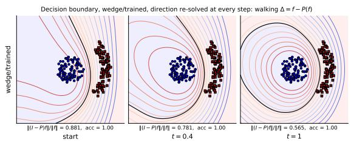  
(a) Invariance-directed flow

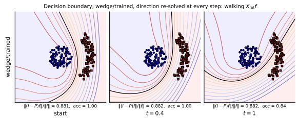  
(b) Symmetry orbit flow  
Figure 1: Resolved parameter-space flows for the wedge-trained classifier. (a) The equivariance-directed flow along $b ^ { \star }$ moves the realised function towards the equivariant subspace, reducing its non-invariant component. (b) The symmetrydirected flow along $c ^ { \star }$ moves the realised function along its rotational symmetry orbit while approximately preserving its distance from the equivariant subspace. The local direction is recomputed at every integration step.

## 3.1. Annulus Classifier

We train an MLP to distinguish an inner disc from an outer annulus, either using a $9 0 ^ { \circ }$ wedge or the full 360◦ annulus. For each model, we compute the symmetry-directed direction $c ^ { \star }$ and the equivariance-directed direction $b ^ { \star }$ . Since these directions are defined locally, we compare a Resolved trajectory, which recomputes the Jacobian and least-squares direction at every step, with a Fixed trajectory that reuses the direction computed at t = 0. Figures 1 and 8 show the resulting flows, while Figure 7 compares their angular deviation profiles.

The resolved trajectories closely follow the predicted function-space dynamics: the symmetry-directed flow approximately preserves the equivariance defect, whereas the equivariance directed flow reduces it. Fixed directions can deviate substantially after training, while the discrepancy is much smaller at initialisation. The construction is thus reliable locally, but must be recomputed over finite trajectories; see Appendix C.2 for further results.

## 3.2. Physics-Informed Neural Networks

As a dynamical benchmark, we consider the Mexican hat potential defined by a isotropic quartic Hamiltonian

$$
H ( q , p ) = \frac { 1 } { 2 } \| p \| ^ { 2 } + \frac { 1 } { 2 } \alpha \| q \| ^ { 2 } + \frac { 1 } { 4 } \| q \| ^ { 4 } , \qquad q , p \in \mathbb { R } ^ { 2 } ,
$$

with equations of motion ${ \dot { q } } = p$ and $\dot { p } = - ( \alpha + \| q \| ^ { 2 } ) q$

The dynamics are exactly equivariant under simultaneous rotations $( q , p ) \mapsto ( R _ { \varphi } q , R _ { \varphi } p )$ the radial force has vanishing rotational Lie derivative, as verified in Appendix C.1. We use Adaptable symplectic recurrent neural networks (ASRNNs) introduced by Thapar and Gupta (2026) as a Hamiltonian neural network architecture (see Appendix B.1 for details) designed to learn and predict the dynamics using only trajectory data and at multiple values of α. As before we compare a Resolved and Fixed trajectory; the angular deviation profiles at multiple values of α are shown in Figures 3 and 4 of Appendix C.1, deferred there for space. We can see clearly that when the direction is recomputed at every step,

## Extended Abstract Track

walking along $c ^ { \star }$ and $b ^ { \star }$ shifts and reduces the equivariance error respectively. The former corresponds to efectively rotating the potential, while the latter actually makes the learned potential ‘more’ equivariant. In contrast when the direction is kept fixed, while we see similar behaviour for the first few steps, the drift accumulates over time.

## Acknowledgments

AM is supported by a Scientific Computing PhD studentship from the Ada Lovelace Centre and expresses gratitude to the Mathematical Institute, University of Oxford for funding. VT expresses gratitude to the Rhodes Trust and the Mathematical Institute, University of Oxford for funding. TB acknowledges funding from the Klaus Tschira Foundation.

## References

Zhengdao Chen, Jianyu Zhang, Martin Arjovsky, and L´eon Bottou. Symplectic recurrent neural networks. In International Conference on Learning Representations, 2020. URL https://openreview.net/forum?id=BkgYPREtPr.

Samuel Greydanus, Misko Dzamba, and Jason Yosinski. Hamiltonian neural networks. In Advances in Neural Information Processing Systems, volume 32, 2019. URL https://proceedings.neurips.cc/paper\_files/paper/2019/file/ 26cd8ecadce0d4efd6cc8a8725cbd1f8-Paper.pdf.

Arthur Jacot, Franck Gabriel, and Clement Hongler. Neural tangent kernel: Convergence and generalization in neural networks. In S. Bengio, H. Wallach, H. Larochelle, K. Grauman, N. Cesa-Bianchi, and R. Garnett, editors, Advances in Neural Information Processing Systems, volume 31. Curran Associates, Inc., 2018. URL https://proceedings.neurips.cc/paper\_files/paper/2018/file/ 5a4be1fa34e62bb8a6ec6b91d2462f5a-Paper.pdf.

Benedict Leimkuhler and Sebastian Reich. Simulating Hamiltonian Dynamics. Cambridge Monographs on Applied and Computational Mathematics. Cambridge University Press, Cambridge, 2005.

Anindita Maiti, Keegan Stoner, and James Halverson. Symmetry-via-duality: Invariant neural network densities from parameter-space correlators, 2021. URL https://arxiv. org/abs/2106.00694.

Vedanta Thapar and Abhinav Gupta. Machine learning hamiltonian dynamical systems with sparse and noisy data, 2026. URL https://arxiv.org/abs/2604.17470.

## Extended Abstract Track

## Appendix A. Symmetry Orbits and Infinitesimal Lifting

We study whether the action of a Lie group on a function space can be lifted, at least infinitesimally, through the parameterisation of a neural network. The group- and Liealgebraic constructions below are standard; the object of interest is the resulting diferential lifting problem for the neural-network realisation map.

## A.1. Motivation and Setup

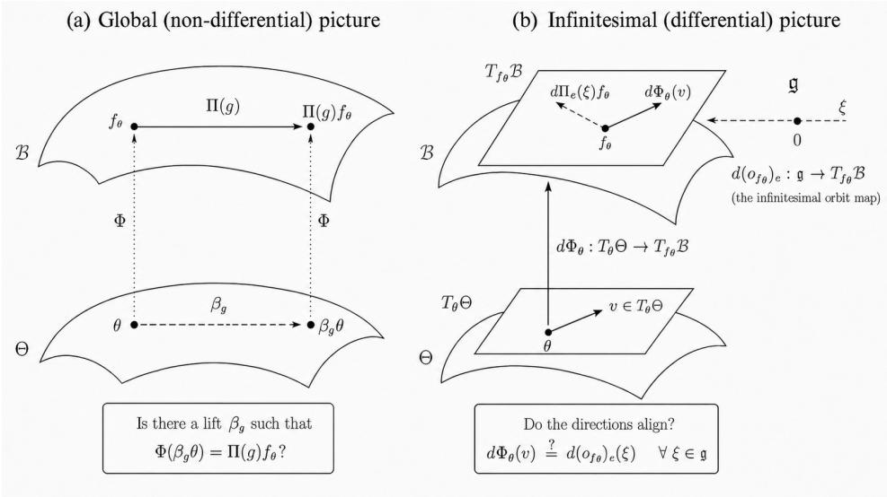  
Figure 2: Global and infinitesimal lifting through the neural-network realisation map. Left: can a symmetry transformation in function space be realised by a transformation in parameter space? Right: do the infinitesimal symmetry directions lie in the function-space tangent directions accessible through the parametrisation?

Let G be a finite-dimensional Lie group acting smoothly on a manifold X from the left:

$$
\tau : G \times \chi \longrightarrow \chi , \qquad ( g , x ) \longmapsto \tau _ { g } x .
$$

Let $( \rho , V )$ be a finite-dimensional representation of $G ,$ and let B be a G-invariant vector space of diferentiable maps $f : \mathcal { X } \to V$ . In function space, the actions on the input and output spaces induce a representation on B:

$$
\Pi : G \longrightarrow { \mathrm { G L } } ( { \mathcal { B } } ) , \qquad [ \Pi ( g ) f ] ( x ) : = \rho ( g ) f ( \tau _ { g ^ { - 1 } } x ) .\tag{4}
$$

A function is fixed by Π precisely when it is equivariant with respect to the actions on X and V :

$$
f \in { \mathcal { B } } ^ { G } \quad \Longleftrightarrow \quad f ( \tau _ { g } x ) = \rho ( g ) f ( x ) \quad { \mathrm { f o r ~ a l l ~ } } g \in G , \ x \in { \mathcal { X } } .\tag{5}
$$

This construction describes symmetry directly in function space. In a neural network, however, functions are represented through a finite-dimensional parameter space. We therefore introduce a smooth parameter manifold Θ and a realisation map

$$
\Phi : \Theta \longrightarrow B , \qquad \theta \longmapsto f _ { \theta } .\tag{6}
$$

# Extended Abstract Track

The strongest form of the lifting problem asks whether there exists a smooth action

$$
\beta : G \times \Theta \longrightarrow \Theta
$$

such that

$$
\Phi ( \beta _ { g } \theta ) = \Pi ( g ) \Phi ( \theta )
$$

for every $g \in G$ and $\theta \in \Theta$ . In other words, we ask whether the realisation map $\Phi$ can be made G-equivariant.

Let

$$
\mathcal { M } : = \Phi ( \Theta )
$$

denote the realised model class. Although Π defines an action on the ambient function space $B ,$ this action need not preserve $\mathcal { M } .$ . In particular, the transformed function $\Pi ( g ) f _ { \theta }$ need not be realised by any parameter in Θ. Even when M is G-invariant, it may not be possible to choose parameter representatives in a way that defines a smooth action on Θ.

Our primary interest is the weaker infinitesimal version of this question. At a fixed parameter value $\theta ,$ can every first-order variation of $f _ { \theta }$ generated by the group action be realised by a first-order variation of the parameters? The following subsections formulate this question by comparing the tangent space to the symmetry orbit of $f _ { \theta }$ with the image of the diferential of $\Phi$

## A.2. The Diferential Lifting Criterion

We now derive a necessary criterion for there to be such a lifting by comparing the infinitesimal symmetry directions in function space with the function variations generated by changes in the network parameters. At $\theta \in \Theta$ , the diferential of the realisation map is

$$
J _ { \theta } : = \mathrm { d } \Phi _ { \theta } : T _ { \theta } \Theta \longrightarrow T _ { f _ { \theta } } B \cong B .\tag{7}
$$

Thus $J _ { \theta } v$ is the first-order change in the realised function produced by the parameter velocity $v \in T _ { \theta } \Theta$

When $\Theta \subseteq \mathbb { R } ^ { p }$ , this diferential takes the form

$$
[ J _ { \theta } v ] ( x ) = \sum _ { i = 1 } ^ { p } v _ { i } S _ { i } ^ { * } ( x ; \theta ) , \qquad S _ { i } ^ { * } ( x ; \theta ) : = \frac { \partial f _ { \theta } ( x ) } { \partial \theta _ { i } } .\tag{8}
$$

The space of first-order function variations available through the parameterisation is therefore

$$
\mathcal { T } _ { \theta } : = \mathrm { I m } ( J _ { \theta } ) = \operatorname { s p a n } \{ S _ { 1 } ^ { \ast } ( \cdot ; \theta ) , \ldots , S _ { p } ^ { \ast } ( \cdot ; \theta ) \} .\tag{9}
$$

At a regular point of $\Phi$ , this is the tangent space $T _ { f _ { \theta } } { \mathcal { M } }$ of the realised model class.

Suppose now that a smooth parameter action

$$
\beta : G \times \Theta \longrightarrow \Theta
$$

realises the function-space action. For fixed $\theta ,$ define the parameter-space orbit map

$$
b _ { \theta } : G \longrightarrow \Theta , \qquad b _ { \theta } ( g ) : = \beta _ { g } \theta .
$$

# Extended Abstract Track

The equivariance condition

$$
\Phi ( \beta _ { g } \theta ) = \Pi ( g ) \Phi ( \theta )
$$

can then be written as the identity

$$
\Phi \circ b _ { \theta } = o _ { f _ { \theta } } ,\tag{10}
$$

where $o _ { f _ { \theta } } ( g ) = \Pi ( g ) f _ { \theta }$ is the function-space orbit map.

Diferentiating (10) at the identity $e \in G$ and applying the chain rule gives

$$
\mathrm { d } \Phi _ { \theta } \circ \mathrm { d } ( b _ { \theta } ) _ { e } = \mathrm { d } ( o _ { f _ { \theta } } ) _ { e } .\tag{11}
$$

Define

$$
L _ { \theta } : = \mathrm { d } ( b _ { \theta } ) _ { e } : \mathfrak { g } \longrightarrow T _ { \theta } \Theta .
$$

For $\xi \in { \mathfrak { g } } , L _ { \theta } ( \xi )$ is the parameter velocity generated by ξ. Using the definitions $\boldsymbol { J _ { \theta } } = \mathrm { d } \Phi _ { \theta }$ and $a _ { f _ { \theta } } = \mathrm { d } ( o _ { f _ { \theta } } ) _ { \epsilon }$ , equation (11) becomes

$$
J _ { \theta } L _ { \theta } = a _ { f _ { \theta } } .\tag{12}
$$

Equivalently, for every $\xi \in { \mathfrak { g } }$

$$
J _ { \theta } L _ { \theta } ( \xi ) = a _ { f _ { \theta } } ( \xi ) = \mathrm { d } \Pi ( \xi ) f _ { \theta } .\tag{13}
$$

Equation (12) immediately yields the necessary condition

$$
\operatorname { I m } ( a _ { f _ { \theta } } ) \subseteq \operatorname { I m } ( J _ { \theta } ) .\tag{14}
$$

Using

$$
\mathrm { I m } ( a _ { f _ { \theta } } ) = T _ { f _ { \theta } } ( G \cdot f _ { \theta } ) , \qquad \mathrm { I m } ( J _ { \theta } ) = \mathcal { T } _ { \theta } ,
$$

this condition can equivalently be written as

$$
T _ { f _ { \theta } } ( G \cdot f _ { \theta } ) \subseteq { \mathcal { T } } _ { \theta } .\tag{15}
$$

Thus, if a smooth parameter action realising Π exists, every infinitesimal function-space orbit direction must be attainable through an infinitesimal change of the parameters.

Conversely, at a fixed parameter value θ, the inclusion (14) is suficient for the existence of some linear map

$$
L _ { \theta } : { \mathfrak { g } } \longrightarrow T _ { \theta } \Theta
$$

satisfying (12). It is therefore necessary and suficient for pointwise first-order lifting. It is not suficient for the existence of a local or global action on Θ: such an action requires the lifts to vary smoothly with θ, satisfy the appropriate Lie-bracket relations, and obey the relevant integrability conditions.

## Extended Abstract Track

## A.3. A Least-Squares Lifting Objective

The diferential lifting condition requires the operator equation

$$
J _ { \theta } L _ { \theta } = a _ { f _ { \theta } }
$$

to have a solution. When this equation cannot be solved exactly, its failure can be quantified through a least-squares relaxation.

Assume that B is equipped with a Hilbert-space inner product, and choose inner products on g and $T _ { \theta } \Theta$ . For a candidate linear lift

$$
L : { \mathfrak { g } } \longrightarrow T _ { \theta } \Theta ,
$$

define the lifting error

$$
\mathrm { E r r } _ { \theta } ( L ) : = \| J _ { \theta } L - a _ { f _ { \theta } } \| _ { \mathrm { H S } } ^ { 2 } .\tag{16}
$$

If $\{ \xi _ { a } \} _ { a = 1 } ^ { d }$ is an orthonormal basis of ${ \mathfrak { g } } .$ then

$$
\mathrm { E r r } _ { \theta } ( L ) = \sum _ { a = 1 } ^ { d } \| J _ { \theta } L ( \xi _ { a } ) - a _ { f _ { \theta } } ( \xi _ { a } ) \| _ { \mathcal { B } } ^ { 2 } .\tag{17}
$$

Let $P _ { \theta }$ denote the orthogonal projector onto ${ \mathcal { T } } _ { \theta } = { \mathrm { I m } } ( J _ { \theta } )$ . Since $J _ { \theta } L$ takes values in $\mathcal { T } _ { \theta }$ we have the orthogonal decomposition

$$
\mathrm { E r r } _ { \theta } ( L ) = \| J _ { \theta } L - P _ { \theta } a _ { f _ { \theta } } \| _ { \mathrm { H S } } ^ { 2 } + \| ( I - P _ { \theta } ) a _ { f _ { \theta } } \| _ { \mathrm { H S } } ^ { 2 } .\tag{18}
$$

The second term is independent of L. Hence

$$
\operatorname* { m i n } _ { L } \operatorname { E r r } _ { \theta } ( L ) = \| ( I - P _ { \theta } ) a _ { f _ { \theta } } \| _ { \mathrm { H S } } ^ { 2 } .\tag{19}
$$

The minimum lifting error is therefore exactly the part of the orbit map that is orthogonal to the model tangent space, and it vanishes if and only if the diferential lifting criterion (14) holds. It is a genuinely function-space quantity: it measures what the parametrisation cannot express, not how well any particular optimiser performs.

Because (17) decouples over an orthonormal basis of ${ \mathfrak { g } } ,$ the minimiser can be computed one generator at a time. Writing $\eta _ { \xi } : = a _ { f _ { \theta } } ( \xi )$ for the function-space direction induced by $\xi \in { \mathfrak { g } }$ (the symbol $g$ being reserved for group elements), the minimum-norm minimiser is

$$
L _ { \theta } ^ { \star } ( \xi ) = c ^ { \star } ( \xi ) : = J _ { \theta } ^ { + } \eta _ { \xi } ,\tag{20}
$$

which is (2) of the main text. Its components $c _ { i } ^ { \star }$ are the per-parameter attribution of the symmetry generator $\xi ,$ and are meaningful precisely because the columns of $J _ { \theta }$ are the pointwise functional sensitivities $S _ { i } ^ { * } ( \cdot ; \theta )$ of (8).

## Extended Abstract Track

## A.4. The Equivariance Defect and its Attribution

The objective above moves along the symmetry orbit. To move towards equivariance we use the Reynolds projector onto the fixed-point subspace $\mathcal { E } : = B ^ { G }$ . For compact $G$ with normalised Haar measure $\mathrm { d } \mu$

$$
[ P \varepsilon f ] ( x ) : = \int _ { G } \rho ( g ) ^ { - 1 } f ( \tau _ { g } x ) \mathrm { d } \mu ( g ) , \qquad \delta _ { \theta } : = f _ { \theta } - P \varepsilon f _ { \theta } ,\tag{21}
$$

so that $P _ { \mathcal { E } }$ is the orthogonal projection onto $\mathcal { E }$ and $\delta _ { \theta }$ is the equivariance defect. The two objectives are complementary rather than redundant: since $P \varepsilon$ annihilates every dΠ(ξ)- direction, $\mathcal { E } = \ker \mathrm { d } \Pi ( \xi )$ for each $\xi ,$ and a short calculation using the skew-adjointness of $\mathrm { d } \Pi ( \xi )$ on B (valid for unitary $\rho$ and measure-preserving τ) gives

$$
\langle \delta _ { \theta } , \ \eta _ { \xi } \rangle _ { B } = \langle \delta _ { \theta } , \ \mathrm { d } \Pi ( \xi ) \delta _ { \theta } \rangle _ { B } = 0 .\tag{22}
$$

The orbit direction $\eta _ { \xi }$ is thus tangent to the level set of $\| \delta _ { \theta } \|$ through $f _ { \boldsymbol { \theta } } { : }$ to first order it rotates the learned function without changing how equivariant it is, whereas $- \delta _ { \theta }$ is the direction of steepest decrease of the defect. This is what the two flows of Section 2.2 are predicted to do, and what the experiments test. Relaxing the second problem in the same least-squares sense gives $b ^ { \star } = J _ { \theta } ^ { + } ( - \delta _ { \theta } )$ , i.e. (3).

## A.5. Numerical Realisation

All of the above is stated in an infinite-dimensional $B ;$ in practice every function-space object is discretised on a finite probe set $\{ x _ { n } \} _ { n = 1 } ^ { N } \subset \mathcal X$ , and B is given the corresponding empirical $L ^ { 2 }$ inner product. This makes $J _ { \theta }$ an explicit matrix $\bar { \boldsymbol { J } } \in \mathbb { R } ^ { N \mathrm { d i m } \mathcal { V } \times { p } }$ whose $( n , a )$ , i entry is $\partial f _ { \theta , a } ( x _ { n } ) / \partial \theta _ { i }$ , obtained by automatic diferentiation, and makes $\eta _ { \xi }$ and $\delta _ { \theta }$ explicit vectors in $\mathbb { R } ^ { N \mathrm { d i m } \mathcal { V } }$ . The aggregate sensitivity of Section 1 is then the column norm $S _ { i } ( \theta ) = \| J _ { : , i } \| _ { 2 } / \sqrt { N }$ dim Y, i.e. the root-mean-square of $\partial f _ { \theta } / \partial \theta _ { i }$ over probe points and output components. Note that the expectation is taken after the pointwise magnitude: averaging the signed sensitivity would let a parameter whose local efect changes sign across $\mathcal { X }$ cancel to zero. $S _ { i }$ is a scalar summary of the vector field $S _ { i } ^ { * } ( \cdot ; \theta )$ ; it is the latter that spans the accessible tangent directions (9).

Truncation of $J _ { \theta } ^ { + } . \quad \tau _ { \theta }$ is taken to be the numerically resolved tangent space. Writing the singular values of J as $\sigma _ { 1 } \geq \cdot \cdot \cdot \geq \sigma _ { \operatorname* { m i n } ( N \dim \mathcal { V } , p ) }$ , we retain only those directions with

$$
\sigma _ { k } \ge \tau \sigma _ { 1 } , \qquad \tau = 1 0 ^ { - 3 } ,\tag{23}
$$

and $J _ { \theta } ^ { + }$ denotes the pseudoinverse of the correspondingly truncated SVD. Without truncation an overparameterised network declares every direction reachable, since $J$ generically has many tiny but nonzero singular values on a finite probe grid; τ fixes the scale below which a direction is treated as noise. All solves are performed in float64.

Gauge of the attribution coeficients. The raw sensitivity $S _ { i }$ is not invariant under reparametrisation: under $\theta _ { i } \mapsto \lambda \theta _ { i }$ (for instance the positive-homogeneity rescaling of a ReLU layer, $W ^ { ( \ell ) } \mapsto \lambda W ^ { ( \ell ) } , W ^ { ( \ell + 1 ) } \mapsto \lambda ^ { - 1 } W ^ { ( \ell + 1 ) }$ , which leaves $f _ { \theta }$ unchanged) one has $S _ { i } \mapsto$ $\lambda ^ { - 1 } S _ { i }$ , and the plain minimum-ℓ2-norm solution of (2) would correspondingly reallocate

## Extended Abstract Track

attribution towards parameters that merely happen to carry small columns. We therefore minimise the norm in the sensitivity-normalised gauge: with $D : = \mathrm { d i a g } ( \| J _ { : , 1 } \| _ { 2 } , \dots , \| J _ { : , p } \| _ { 2 } )$ , we solve

$$
\tilde { c } ^ { \star } = ( J D ) ^ { + } \eta _ { \xi } , \qquad c ^ { \star } = D ^ { - 1 } \tilde { c } ^ { \star } ,\tag{24}
$$

so that the quantity actually minimised is $\textstyle \sum _ { i } S _ { i } ^ { 2 } ( c _ { i } ^ { \star } ) ^ { 2 }$ , which is invariant under the rescalings above. The projection $J { \boldsymbol { c } } ^ { \star }$ , the residual and the resolved rank are unafected by this choice — only the split of a fixed function-space direction across parameters is. Columns with $\begin{array} { r } { \| J _ { : , i } \| _ { 2 } \leq 1 0 ^ { - 8 } \operatorname* { m a x } _ { j } \| J _ { : , j } \| _ { 2 } } \end{array}$ are treated as exactly dead and assigned zero attribution, rather than having machine-precision noise amplified by $D ^ { - 1 }$

Probe sets and quadrature. For the Hamiltonian experiments, $f _ { \theta }$ is the learned force field $F _ { \theta } ( q ; \alpha ) = - \nabla _ { q } V _ { \theta _ { 2 } } ( q ; \alpha )$ , probed on a rotationally symmetric polar grid of 15 radii $\times ~ 3 2$ angles (N = 480 points) in $\| q \| \leq 1 ;$ a square grid is not invariant under the group and was found to leak cross-talk between $\eta _ { \xi }$ and $\delta _ { \theta }$ . The Reynolds average (21) is evaluated by the 64-point equally spaced quadrature rule on $S O ( 2 )$ , which is exact up to the truncation of the Fourier series and reproduces an exactly equivariant field to $\sim 1 0 ^ { - 1 5 }$ relative error. Rows for all training and analysis values of α are stacked into a single least-squares system, so that one direction is obtained per step rather than an uncoordinated direction per α. Finite-rotation equivariance errors are reported at a fixed angle of $7 3 ^ { \circ }$

# Muriithi Thapar Berndt

## Extended Abstract Track

## Appendix B. Supplementary Material

## B.1. ASRNN architecture

Learning Hamiltonian systems using neural networks has received considerable attention in recent years. Hamiltonian neural networks (HNNs), an early architecture for this problem, were introduced by Greydanus et al. Greydanus et al. (2019). These models parametrise a time-independent Hamiltonian $\mathcal { H } \approx \mathcal { H } _ { \boldsymbol { \theta } } ( \boldsymbol { q } , \boldsymbol { p } )$ using an MLP with parameters θ. The model is then trained using the loss

$$
\mathcal { L } _ { ( \mathbf { q } , \mathbf { p } ) } ( \theta ) = \left\| \frac { \partial \mathcal { H } _ { \theta } } { \partial \mathbf { p } } - \frac { \partial \mathbf { q } } { \partial t } \right\| _ { 2 } + \left\| \frac { \partial \mathcal { H } _ { \theta } } { \partial \mathbf { q } } + \frac { \partial \mathbf { p } } { \partial t } \right\| _ { 2 } ,\tag{25}
$$

which enforces Hamilton’s equations. As such models require accurate time derivatives in the training data, Chen et al. Chen et al. (2020) introduced symplectic recurrent neural networks (SRNNs), which use symplectic integrators to predict trajectories from time derivatives obtained from the HNN gradients. This allows training with a loss that depends only on the observed trajectory. Such integrators are structure-preserving: they preserve the symplectic structure, and consequently phase-space volume, and typically exhibit bounded long-time energy error. To enable learning across varying physical parameters, Thapar et al. Thapar and Gupta (2026) introduced adaptable SRNNs (ASRNNs), which incorporate parameter channels into SRNNs and have been shown to learn efectively across parameter space from sparse data.

In this work, we use ASRNNs with a leapfrog integrator Leimkuhler and Reich (2005) as our illustrative architecture. ASRNNs parametrise a time-independent separable Hamiltonian using separate neural networks for the kinetic and potential energies, respectively. Specifically, the Hamiltonian is parametrised as $\mathcal { H } ( \mathbf { q } , \mathbf { p } ; \alpha ) \approx { \cal K } _ { \theta _ { 1 } } ( \mathbf { p } ) + { \mathcal V } _ { \theta _ { 2 } } ( \mathbf { q } ; \alpha )$ , where each network is a simple MLP. Recurrence is introduced through a leapfrog integrator. Given $\left( \mathbf { q } _ { t } , \mathbf { p } _ { t } \right)$ , the next time step is predicted as

$$
\mathbf { p } \left( t + \frac { \Delta t } { 2 } \right) = \mathbf { p } ( t ) - \frac { \Delta t } { 2 } \frac { \partial \mathcal { V } _ { \theta _ { 2 } } } { \partial \mathbf { q } } \Big | _ { t }\tag{26}
$$

$$
\mathbf { q } \left( t + \Delta t \right) = \mathbf { q } ( t ) + \Delta t \frac { \partial { \cal K } _ { \theta _ { 1 } } } { \partial \mathbf { p } } \bigg | _ { t + \frac { \Delta t } { 2 } }\tag{27}
$$

$$
\mathbf { p } \left( t + \Delta t \right) = \mathbf { p } \left( t + \frac { \Delta t } { 2 } \right) - \frac { \Delta t } { 2 } \frac { \partial \mathcal { V } _ { \theta _ { 2 } } } { \partial \mathbf { q } } \bigg \vert _ { t + \Delta t } ,\tag{28}
$$

where $\Delta t$ is a chosen time step. Training minimizes the trajectory-matching loss,

$$
\mathcal { L } _ { ( \mathbf { q } _ { 0 } , \mathbf { p } _ { 0 } ; \alpha ) } ( \theta ) = \sum _ { t \in \mathcal { T } } \left( \| \mathbf { q } ( t ) - \hat { \mathbf { q } } ( \mathbf { t } ) \| _ { 2 } + \| \mathbf { p } ( t ) - \hat { \mathbf { p } } ( \mathbf { t } ) \| _ { 2 } \right) ,\tag{29}
$$

where $( \mathbf { q } _ { 0 } , \mathbf { p } _ { 0 } ; \boldsymbol { \alpha } )$ specifies the initial conditions and physical parameters, $( \mathbf { q } ( t ) , \mathbf { p } ( t ) )$ and $( \hat { \mathbf { q } } ( t ) , \hat { \mathbf { p } } ( t ) )$ denote the model predictions and ground-truth values at time t, respectively, and T is the set of observed time points. In our experiments, the potential and kinetic energy networks were implemented as MLPs with three hidden layers of width 32, following the hyperparameter regime used by Thapar and Gupta (2026).

## Extended Abstract Track

## Appendix C. Additional Results

## C.1. Mexican Hat

The Mexican hat dynamics of Section 3.2 are exactly equivariant under simultaneous rotations of $q$ and $p .$ For the infinitesimal rotation generator $\Omega = \left( \begin{array} { c c } { { 0 - 1 } } \\ { { 1 } } \end{array} \right)$ , the radial force $F ( q ) = - ( \alpha + \| q \| ^ { 2 } ) q$ satisfies $\begin{array} { r } { \frac { \partial F } { \partial q } ( \Omega q ) - \Omega F ( q ) = 0 . } \end{array}$ i.e. it has vanishing rotational Lie derivative, so the symmetry is a property of the true system and not an artefact of the architecture.

Figures 3 and 4 give the angular deviation profiles for the ASRNN discussed in Section 3.2, for the Resolved and Fixed trajectories respectively.

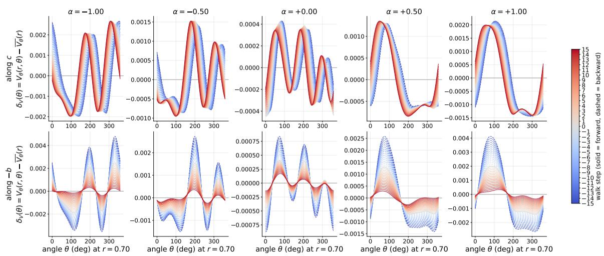  
Figure 3: Angular deviation profiles for the ASRNN trained to model the Mexican hat potential for various values of α unseen during training. Top: symmetry-directed flow along $c ^ { \star }$ . Bottom: equivariance-directed flow along $b ^ { \star }$ . Here the local direction is recomputed at every step, i.e. the Resolved trajectory.

## C.2. Annulus

We provide additional annulus results across initialisation and trained models, using either the $9 0 ^ { \circ }$ wedge or full 360◦ training data. Figures 5 and 6 compare fixed and resolved parameter-space flows for the symmetry-directed direction $c ^ { \star }$ and equivariance-directed direction $b ^ { \star }$

At initialisation, fixed and resolved trajectories behave similarly. After training, fixed directions can deviate substantially from their intended function-space evolution, whereas recomputing the local direction at each step more faithfully follows the symmetry orbit or reduces the equivariance defect. This further illustrates that the lifting directions are inherently local.

## Muriithi Thapar Berndt Extended Abstract Track

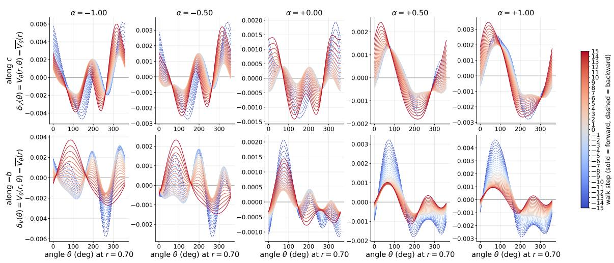  
Figure 4: Angular deviation profiles for the ASRNN trained to model the Mexican hat potential for various values of α unseen during training. Top: symmetry-directed flow along $c ^ { \star }$ . Bottom: equivariance-directed flow along $b ^ { \star }$ . Here the direction is computed once at $t = 0$ and kept fixed, i.e. the Fixed trajectory.

# Extended Abstract Track

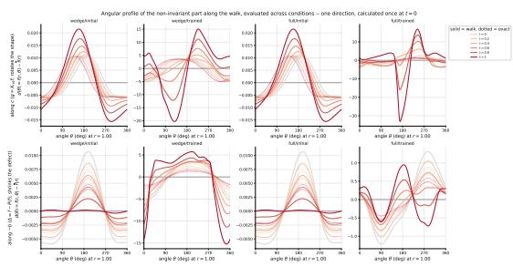  
(a) Angular deviation profiles

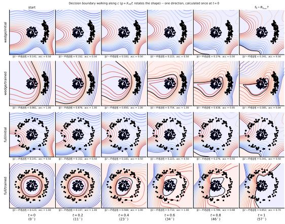  
(b) Symmetry-directed flow

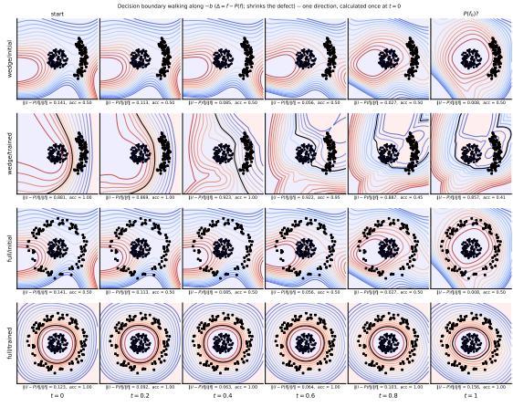  
(c) Invariance-directed flow.  
Figure 5: Fixed parameter-space flows across training conditions. (a) Angular deviation profiles along the symmetry- and equivariance-directed flows. (b) Decision boundaries along the symmetry-directed flow $c ^ { \star } .$ . (c) Decision boundaries along the equivariance-directed flow $b ^ { \star }$ . The parameter-space directions are computed once at t = 0 and kept fixed throughout the trajectory.

# Extended Abstract Track

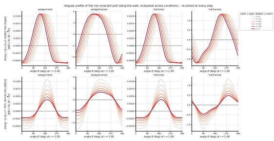  
(a) Angular deviation profiles

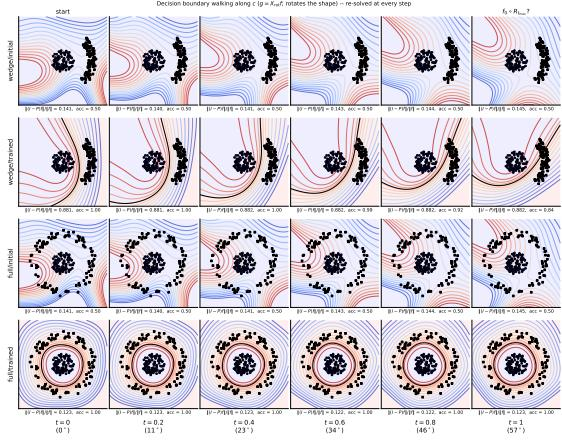  
(b) Symmetry-directed flow

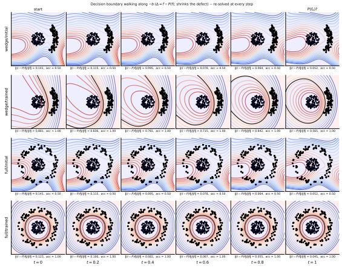  
(c) Invariance-directed flow  
Figure 6: Resolved parameter-space flows across training conditions. (a) Angular deviation profiles along the symmetry- and equivariance-directed flows. (b) Decision boundaries along the symmetry-directed flow $c ^ { \star }$ . (c) Decision boundaries along the equivariance-directed flow $b ^ { \star }$ . The Jacobian and corresponding parameterspace directions are recomputed at every step.

## Extended Abstract Track

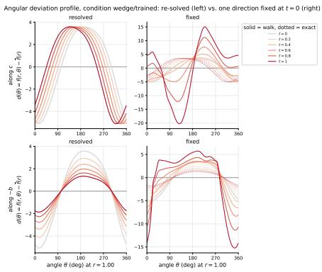  
Figure 7: Angular deviation profiles for the wedge-trained classifier. Top: symmetrydirected flow along $c ^ { \star } { : }$ ; bottom: equivariance-directed flow along $b ^ { \star } .$ . Left: the local direction is recomputed at every step; right: the initial direction is kept fixed. Solid curves denote the realised trajectory, dotted curves the ideal functionspace evolution.

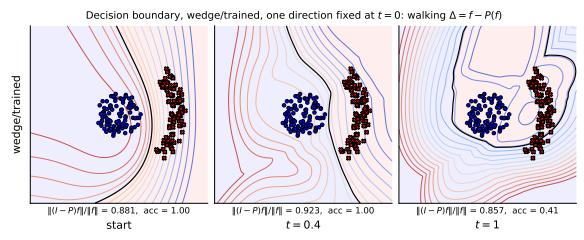  
(a) Invariance-directed flow

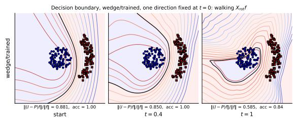  
(b) Symmetry-orbit flow  
Figure 8: Fixed parameter-space flows for the wedge-trained classifier. (a) The initial equivariance-directed direction $b ^ { \star }$ does not continue to move the realised function towards the equivariant subspace. (b) The initial symmetry-directed direction $c ^ { \star }$ deviates from the intended rotational symmetry orbit. In both cases, the direction is computed once at $t = 0$ and kept fixed throughout the trajectory.

Muriithi Thapar Berndt Extended Abstract Track