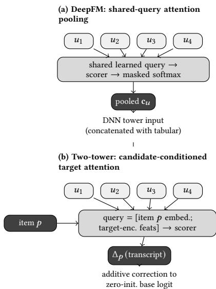

# From Gradient-Boosted Trees to Deep Recommenders: Practical Lessons from Migrating a Production Customer Support Recommender

Sonia Sharma   
Intuit   
USA

Jeyendran Balakrishnan Intuit USA

Swapnil Parekh   
Intuit   
USA

Nagaraj Janardhana Intuit USA

Shreya Rajpal   
Intuit   
USA

Andrew Mattarella-Micke Intuit USA

## Abstract

Product catalogs in fast-moving service businesses are shifting from static, independently priced SKUs toward dynamically bundled, discount-coupled oferings—a shift that strains the tree-based classifiers traditionally preferred for sparse and highly imbalanced data. These classifiers assume a fixed, slowly changing label space and struggle to incorporate multimodal signals such as tabular data and transcripts.

We present the migration of a live, production conversational recommendation system from a gradient-boosted multiclass model to a pairwise-binary deep recommender. Because this system is critical to ecosystem growth initiatives and downstream features like dynamic pitching — surfacing the most relevant pitch text to a support agent in real time during a live customer conversation — maintaining live recommendation quality was a non-negotiable constraint.

We detail the techniques that made this migration successful: reformulating recommendation as pairwise binary prediction to learn jointly from user and item features, and enhancing learned representations via negative sampling and noise injection. To eficiently incorporate long, live conversation context, we apply attention pooling over transcript chunks and benchmark it against TF-IDF and sentence-embedding baselines. Finally, we explore multiple architectures (including two-tower models, DeepFM, and their variants) and loss functions such as contrastive loss. Evaluating against a CatBoost baseline across all conversational stages, we demon strate that our approach achieves parity at conversation beginning and outperforms at later conversational stages.

## Keywords

recommender systems, deep learning for recommendation, production machine learning, contrastive learning, double descent, attention pooling, customer support

## 1 Introduction

## 1.1 The catalog is changing faster than the model can adapt

Service businesses are moving from independently-priced, SKUlevel oferings toward dynamically bundled products, often coupled with discounts assembled at serve-time: a shift in the shape of the recommendation problem, not just its scale, since a bundle’s identity is compositional (which SKUs, which discount) rather than atomic.

The system we are replacing — a per-product gradient-boosted multiclass classifier — was built for the slower-moving catalog. Three structural limitations motivate the migration:

(1) Problem formulation. Multiclass-over-products assumes a fixed label set; adding a bundle means adding a class and retraining the label space itself. A pairwise-binary formulation (contact, product) → match/no-match sidesteps this: a bundle or new SKU is just a new item-side feature vector, not a new output unit.

(2) Multimodal signal. The legacy model scores of tabular, aggregated features and cannot natively consume the live conversation transcript. Deep recommenders can condition directly on transcript representations via attention pooling, which learns a per-chunk relevance weight instead of pooling the conversation uniformly (Section 8).

(3) Architectural and objective flexibility. Once the problem is pairwise, contrastive objectives over a shared user/item embedding space become available (Section 6), as do architecture families (two-tower, DeepFM; Section 8.4) that trade of diferently on latency and expressivity.

## 1.2 Costs of the migration

Moving to a deep recommender introduces three concrete costs: a larger tuning surface (an order of magnitude more hyperparameters than a boosted-tree model, addressed in Section 5 and the double-descent scan in Section 7); a sparser, more imbalanced supervision signal (positive rate ≈ 4.5%, 154 categorical fields, ∼2k dense features, addressed by the same two sections); and a higher per-request inference cost, since every contact-product pair now needs a forward pass through embedding lookups and a DNN rather than one boosted-tree traversal (Section 9).

## 1.3 Contribution

This paper’s contribution is the set of concrete techniques required to carry out this migration without regressing recommendation quality, evaluated end-to-end on live customer-support recommendation data rather than benchmark data:

• A pairwise-binary problem reformulation (Section 2) that admits arbitrary item/context features without requiring a fixed label space.

• A negative-sampling study (Section 5) and why we settled on the mixture we did.

• A contrastive objective (Section 6) over the shared user/item embedding space.

• Attention pooling over conversation chunks (Section 8) to identify which part of a long call the model should condition on, compared against TF-IDF and dense sentence-embedding baselines.

• A double-descent characterization (Section 7) of DeepFM’s capacity/regularization regime — explaining why its overfitting training curve is not the dead end it looks like, and what capacity range actually helps.

• An architecture comparison (Section 8.4) between two-tower and DeepFM formulations.

• Inference-time optimizations (Section 9) required to serve the resulting model within the customer-support system’s real-time latency budget.

Throughout, we evaluate at three deployment-relevant points in a live conversation — Case-Load (CL), Early-Recommendation (ER), and Ground-Zero (GZ) — defined precisely in Section 2.4, because the production constraint is not “good average ranking quality” but “good enough recommendation quality at the specific moment the downstream system consumes it” (Section 1.4).

## 1.4 The constraint: recommendation quality cannot regress

This migration was undertaken under a hard non-regression constraint, not a green-field research question. Our customer support recommender feeds a downstream pitch/talk-track augmentation system, DynaPitch [1], whose own quality depends directly on the quality of the recommendations it augments. A regression here is not an isolated metric drop; it propagates into that system’s output.

More broadly, this recommender is the backbone several ecosystem growth and retention initiatives are built on, feeding upsell recommendations that support a revenue portfolio on the order of \$360 million, which is why quality preservation, not just improvement, is the constraint this paper is written against. Every experiment is therefore reported against the deployed CatBoost baseline on the same fixed positive-contact population, using the same metric definitions, so “did we regress” has an unambiguous answer at every step (Section 2.4).

## 2 Problem Setup and Evaluation Methodology

## 2.1 Real-time recommendation setup

A customer-support conversation is scored incrementally as it progresses; a recommendation is served at some point in the call. The production system chunks the transcript into chunk\_num-indexed segments of exactly 20 utterances, with one scoring pass per chunk — Case-Load and Early-Reco are chunks 0 and 1, the first and second 20-utterance blocks (“at call start” is intuition for chunk 0, not a wall-clock claim). 20 utterances balances having enough context to score against low per-chunk invocation cost at serving time.

## 2.2 Data and train/valid/test split

Throughout this paper, a customer-support conversation is referred to as a contact. The train/validation pool spans contacts from 2025- 01 through 2026-03; within that pool, contacts are randomly split

75/25 into train and validation at the contactid level (seed 42), so every chunk row of a given contact stays in the same partition. Test is a temporal, out-of-time holdout: contacts from 2026-04 through 2026-06, unseen at any point during training or validation. This yields 903,829 / 302,122 train/valid rows and 360,022 test rows after chunking and negative sampling.

## 2.3 Chunk-level and contact-level metrics

Two levels of evaluation, matching a shared evaluator so every architecture in this paper is scored identically:

• Chunk/pair level — flat (contact-chunk, product) rows: log-loss, ROC-AUC, PR-AUC (average precision), all fit on validation.

• Contact level — one decision per contact at a defined point in the call.

## 2.4 The three business metrics: CL / ER / GZ

Table 1: Contact-level business metrics.
<table><tr><td>Metric</td><td>Selection</td><td>What it answers</td></tr><tr><td>CL (Case- first Load)</td><td>(chunk_num= 0)</td><td>chunk Quality of the earliest possible rec- ommendation</td></tr><tr><td>ER (Early- second</td><td></td><td>chunk Quality shortly after, with a little</td></tr><tr><td>Reco) GZ</td><td>(chunk_num= 1)</td><td>more signal per-contact max- Quality at the point a recommen-</td></tr><tr><td>Zero)</td><td>(Ground- weight chunk</td><td>dation is most likely to fire</td></tr></table>

All three are micro-F1 computed over the same fixed positivecontact population used to evaluate the legacy CatBoost model (16,709 contacts in the current data snapshot), so every number in this paper is directly comparable to the deployed baseline with no population mismatch.

Baseline reference values used throughout this paper (the legacy model (CatBoost) — see Section 3.3 for the exact CatBoost configuration and negative-sampling scheme this is): CL 0.4985, ER 0.5310, GZ 0.5676.

## 3 Baseline Setup: Negative Sampling and the CatBoost/DeepFM Baseline

This section establishes the vocabulary and negative-sampling setup shared by every model in this paper — CatBoost and DeepFM alike — and reports both models’ baseline numbers under it. The deeper ablation study of negative-sampling variants is deferred to Section 5.

## 3.1 A taxonomy of negatives

The choice of negatives is the dominant modeling lever on this problem, consistent with the broader implicit-feedback recommendation literature [11]: severe pair-level imbalance and invisible non-converted candidates can otherwise distort the model’s percontact top pick toward over-represented products. We use one vocabulary for negative types throughout this paper, defined at two levels:

• Explicit vs. implicit (top-level split, by how we know a candidate is negative). Explicit — the customer gave an explicit answer: they said no to this specific product; this is the product\_explicit\_negative pipeline mechanism. Implicit — no explicit rejection was ever given; all we know is the contact did not convert on this candidate.

• Hard vs. soft (within each of explicit and implicit, by how strong the negative signal is). On the explicit side, hard = an unambiguous, immediate no; soft = a weaker or more ambiguous non-acceptance. On the implicit side, hard = the candidate came from a chunk where the contact converted on nothing at all — the strongest available "no signal" even without an explicit rejection, implemented as the overall\_negative and product\_random\_negative mechanisms; soft = the candidate co-occurred in the same chunk as a diferent product the contact did convert on, so its nonconversion is weaker evidence (it may simply not have been the one chosen, not actively rejected), implemented as the implicit\_negative mechanism.

A third, separate concept is the pure-negative contact: a contact where nothing converted at all, across the whole contact. This is a population-level property of a contact, distinct from the perrow explicit/implicit/hard/soft taxonomy above, which describes individual negative rows.

At the contact level, we start from an approximately 1/3–2/3 positive/negative sample (every positive contact kept, negative contacts sampled to roughly match, explicit-hard first then explicit-soft) — a deliberately balanced, not population-representative, sample. Training rows, however, are contact-chunk samples, not contacts: negative contacts run longer than positive ones (they keep generating chunks instead of ending on conversion), and we additionally construct implicit negatives for every positive contact-chunk, so a contact-level sample built to be roughly 1/3 positive becomes a chunk-level training population that is only ≈4.1% positive.

## 3.2 Chunk-level vs. contact-level sampling granularity

Implicit-hard negatives (overall\_negative and product\_ random\_negative) can be sampled at two granularities: once per contact (the same negative set stamped on every chunk) or independently per chunk. This finding applies identically to CatBoost and DeepFM, since it concerns how training rows are constructed, not which model consumes them. At matched �=2, sampling independently per chunk beats sampling once per contact on both reported cuts (CL 0.437 vs. 0.407, ER 0.530 vs. 0.525; GZ was not evaluated for the contact-level run) — the convention we adopt for the rest of this paper.

## 3.3 Establishing the baselines

Scope note — pairwise-binary formulation throughout. This paper does not compare against an earlier multiclass formulation. Both models under study here — the legacy model (CatBoost) and the DeepFM candidate — already run the same pairwise-binary formulation on the same data: each row is a (contact-chunk, candidate product) pair with a binary match/no-match label, and negative rows constructed per the taxonomy in Section 3.1. Section 1.1’s multiclass discussion is background motivation only, not a comparison this paper reports results against.

Text features. CatBoost represents transcript text with a single TF-IDF vectorizer over chunk text (max 3500 features, 1–3-grams, stopwords removed, terms in 10–75% of documents). DeepFM’s with-text configuration TF-IDF-vectorizes the same text, then compresses it via truncated SVD to ∼40 components concatenated into the tabular dense vector (1980→2020 features) rather than a separate learned text tower; richer text representations are explored later (Section 8).

Table 2: Baseline results (pairwise-binary F1).
<table><tr><td>Configuration</td><td>CL</td><td>ER</td><td>GZ</td></tr><tr><td>Legacy (CatBoost), with text</td><td>0.4985</td><td>0.5310</td><td>0.5676</td></tr><tr><td>DeepFM, no text</td><td>0.3426</td><td>0.4362</td><td>0.4293</td></tr><tr><td>DeepFM, with text</td><td>0.4678</td><td>0.5283</td><td>0.5158</td></tr></table>

DeepFM architecture. The DeepFM [5] backbone used throughout is a shared DNN tower (2048, 1024, 512, 256), learning rate $3 \times 1 0 ^ { - 4 }$ , weight decay $1 0 ^ { - 4 } ,$ , 10 warm-up epochs. Tabular features split across two paths feeding the factorization-machine (FM) layer [12]: a dense projection over ∼1980 continuous features, and a bin-and-embed sparse path (top-100 categorical features by mutual information [13], 50 quantile bins, embedding dim 32). The legacy model (CatBoost) baseline uses depth 10, 1000 iterations, learning rate 0.0406, ℓ2 leafregularization 8.51, and scale\_pos\_weight 1.003, selected via 25-evaluation Bayesian search. Both baselines in Table 2 share the same negative-sampling configuration — overall\_ negative\_n=1 and product\_random\_negative\_k=2, both at contact granularity, combined with a two-dimensional row-weighting scheme: each negative row’s final weight is the product of a weight keyed by negative type (overall\_negative, product\_explicit\_ negative, product\_random\_negative each get their own weight) and a separate weight keyed by product (each of the nine products has its own weight, since some are rarer than others and need more emphasis) — two independent lookup tables multiplied together, not one flat weight per row: the shared substrate every model in this paper is trained and evaluated on.

## 4 Architecture Comparison: DeepFM vs. Two-Tower

Before any additional feature engineering, attention pooling, or contrastive objective is layered on, we ask a narrower question: holding text handling to each architecture’s own standard mechanism, which base architecture is stronger? Two-tower architectures [6, 14] use separate user/context and item encoders with a dot-product or learned similarity at the top — well-suited to retrieval-style serving, weaker at modeling explicit feature interactions. DeepFM [5] uses a joint factorization-machine, DNN, and wide component over a shared feature space — richer interaction modeling, less naturally suited to nearest-neighbor-style serving at inference time.

Two-tower’s retrieval-style serving advantage is designed for item catalogs too large to score exhaustively — not a constraint we currently face (nine products today, likely low hundreds with planned expansion, well within DeepFM’s exhaustive-scoring range), so that advantage is latent, not yet load-bearing; the comparison below measures which architecture wins on our data and at our current scale, not which is better in general.

Table 3: DeepFM vs. two-tower, both with text.
<table><tr><td>Architecture</td><td>CL</td><td>ER</td><td>GZ</td><td>Top-1</td></tr><tr><td>DeepFM (with text)</td><td>0.4678</td><td>0.5283</td><td>0.5158</td><td></td></tr><tr><td>TT-base: residual (with text)</td><td>0.4575</td><td>0.5537</td><td>0.6152</td><td>0.5822</td></tr></table>

DeepFM wins at and near call start (CL), while the two-tower model is stronger once more of the conversation has been observed (ER, GZ). We take this as evidence that DeepFM is the better base architecture in the regime that matters most under this paper’s non-regression constraint — the earliest possible recommendation, before there is any transcript signal to lean into — and adopt it as the primary architecture for the rest of this paper, while returning to the two-tower line of work on its own terms in Section 8.2.

## 5 Negative Sampling: A Thorough Investigation

This section reports DeepFM’s own negative-sampling experiments, building on the shared substrate established in Section 3: a structured, rule-based alternative to random sampling, and a sweep over how many random implicit negatives to sample per positive contact-chunk.

## 5.1 Structured negative sampling

Beyond varying how many random implicit negatives are sampled, we also tested a structured, rule-based sampler that selects implicit negatives through interpretable patterns in the observed customer and product data, rather than drawing them uniformly at random — so the sampling decision can be inspected independently of the neural model. We compare it against random sampling at �=2 and �=4.

Structured sampling improves pairwise ranking behavior in several settings, but these gains do not translate uniformly to the contact-level metrics: at �=4, test PR-AUC rises substantially (0.5244→0.6293) while CL actually drops (0.4857→0.4495); at �=2, it improves validation PR-AUC with only modest ER/GZ movement and no CL or test-PR-AUC gain. PR-AUC measures pairwise discrimination between positive and negative candidates, while CL/ER/GZ measure whether the correct product actually rises to the top for a positive contact — more targeted negatives can sharpen pairwise separation without improving the final recommendation decision.

Table 5 isolates the number of implicit negatives sampled per positive contact-chunk, holding architecture and training objective fixed, to find the � that best trades of ranking quality against training-set size. To keep this sweep fast, each configuration was trained on a 50% subsample of the training data rather than the full set.

One takeaway from this sweep: the gap between validation and test PR-AUC shrinks monotonically as � increases (from 0.19 at �=0 to near zero by �=6–7), but this does not translate into a reliable improvement on the metrics we actually care about $- \mathrm { C L } ,$

Table 4: Random vs. structured negative sampling, two � values.
<table><tr><td>K</td><td>Sampling</td><td>CL</td><td>ER</td><td>GZ</td><td>Val PR-AUC</td><td>Test PR-AUC</td></tr><tr><td>2</td><td>Random</td><td>0.4649</td><td>0.4924</td><td>0.4797</td><td>0.6845</td><td>0.5669</td></tr><tr><td>2</td><td>Structured</td><td>0.4572</td><td>0.4987</td><td>0.4836</td><td>0.7137</td><td>0.5527</td></tr><tr><td>4</td><td>Random</td><td>0.4857</td><td>0.5084</td><td>0.4982</td><td>0.5904</td><td>0.5244</td></tr><tr><td>4</td><td>Structured</td><td>0.4495</td><td>0.5069</td><td>0.4900</td><td>0.6722</td><td>0.6293</td></tr></table>

Table 5: Implicit random negatives, $K { = } 0 , \ldots , 7 ,$ 50% training subsample. DNN (2048, 1024, 512, 256), dropout 0.50/0.60, LR $3 \times 1 0 ^ { - 4 } \ $ , weight decay 10−4, 10 warm-up epochs, batch 512.
<table><tr><td>K</td><td>CL</td><td>ER</td><td>GZ</td><td>Val PR-AUC</td><td>Test PR-AUC</td></tr><tr><td>0</td><td>0.4715</td><td>0.5072</td><td>0.4901</td><td>0.7727</td><td>0.5832</td></tr><tr><td>1</td><td>0.4706</td><td>0.5119</td><td>0.4932</td><td>0.7250</td><td>0.5810</td></tr><tr><td>2</td><td>0.4649</td><td>0.4924</td><td>0.4797</td><td>0.6845</td><td>0.5669</td></tr><tr><td>3</td><td>0.4680</td><td>0.5021</td><td>0.4906</td><td>0.6548</td><td>0.5614</td></tr><tr><td>4</td><td>0.4857</td><td>0.5084</td><td>0.4982</td><td>0.5904</td><td>0.5244</td></tr><tr><td>5</td><td>0.4405</td><td>0.5100</td><td>0.4994</td><td>0.6274</td><td>0.5832</td></tr><tr><td>6</td><td>0.4677</td><td>0.5132</td><td>0.4978</td><td>0.5834</td><td>0.5883</td></tr><tr><td>7</td><td>0.4629</td><td>0.5007</td><td>0.4897</td><td>0.5762</td><td>0.5805</td></tr></table>

ER, and GZ move non-monotonically with � and do not track the shrinking val-test gap. Given this, � in the range 2–4 is a reasonable choice to work with going forward, and is what we use throughout the rest of this paper.

## 6 Contrastive and Binary Cross Entropy Loss Training

Our data contains relatively few positive conversion signals, so we want the model to learn them explicitly and contrast them against meaningful negatives while still accounting for the much larger number of negative examples overall. We therefore use BCE and contrastive loss jointly: BCE captures the overall conversion distribution while contrastive learning sharpens the model’s ability to distinguish positive signals from competing negatives.

For each contact-chunk � containing a true positive product ${ \boldsymbol { \mathit { p } } } ,$ we construct a contrastive group

$$
G _ { u } = \{ p , n _ { 1 } , . . . , n _ { K } \} ,
$$

where � denotes the contact-chunk, � denotes a product associated with a true positive conversion, $n _ { j }$ denotes the �-th implicit negative product, and � denotes the number of implicit negatives sampled from valid non-positive products. In our best-performing configuration, we use $K = 2$ and sample the implicit negatives randomly.

All positive and negative samples in the constructed minibatch contribute to the BCE objective. The BCE loss is defined as

$$
\mathcal { L } _ { \mathrm { B C E } } = - \frac { 1 } { N } \sum _ { i = 1 } ^ { N } \left[ y _ { i } \log \hat { y } _ { i } + \left( 1 - y _ { i } \right) \log ( 1 - \hat { y } _ { i } ) \right] ,
$$

where � is the total number of samples in the minibatch, $y _ { i } \in$ {0, 1} denotes the ground-truth conversion label for sample �, and $\hat { y } _ { i }$ denotes the corresponding predicted probability. Positive products have $y _ { i } = 1$ , whereas implicit negatives and samples from purenegative contacts have $y _ { i } = 0$

In addition to BCE, we compute a user–item contrastive objective for groups containing at least one true positive product. Let $\mathbf { z } _ { u }$ denote the contact-chunk representation produced by the shared DNN after masking product-specific input features. This masking prevents the contact representation from directly observing which candidate product is currently being scored. Let $\mathbf { z } _ { p }$ denote the representation of product ${ \boldsymbol { \mathit { p } } } ,$ obtained from its product-text embedding and projected into the same latent space as $\mathbf { z } _ { u }$

The compatibility between a contact-chunk and a candidate product is measured using cosine similarity, $s ( u , p ) = \cos ( \mathbf { z } _ { u } , \mathbf { z } _ { p } )$

For a positive product � and its � implicit negatives $\{ n _ { 1 } , . . . , n _ { K } \}$ the user–item contrastive loss is an InfoNCE-style [9, 10] objective, defined as

$$
\mathcal { L } _ { \mathrm { C L } } = - \log \frac { \exp { \left( s ( u , p ) / \tau \right) } } { \exp { \left( s ( u , p ) / \tau \right) } + \sum _ { j = 1 } ^ { K } \exp { \left( s ( u , n _ { j } ) / \tau \right) } } ,
$$

where $s ( u , n _ { j } )$ denotes the cosine similarity between contactchunk � and implicit negative product $n _ { j } ,$ and � denotes the contrastive temperature controlling the sharpness of the relative simi larity distribution. In our experiments, the contrastive temperature is fixed to $\tau = 1 . 0$

Pure-negative contacts do not contain a positive anchor and therefore do not contribute to $\mathcal { L } _ { \mathrm { C L } }$ . They nevertheless remain part of training through the BCE objective. The contrastive-loss weight is fixed to 1.0, giving the combined training objective

$$
\begin{array} { r } { \mathcal { L } = \mathcal { L } _ { \mathrm { B C E } } + \mathcal { L } _ { \mathrm { C L } } . } \end{array}
$$

## 6.1 Batch Composition

Our training data naturally contains approximately one-third positive-containing examples and two-thirds negative examples. Under standard BCE training with random batching, minibatches approximately reflect this underlying $1 / 3 – 2 / 3$ distribution in expectation. In the mixed BCE–contrastive setting, we additionally control how positive contrastive groups and pure-negative units are composed within a minibatch.

Let � denote the target fraction of positive contrastive groups used during batch construction, so a sampling unit is a positive contrastive group with probability � and a pure-negative unit with probability $1 - r .$ We consider $\begin{array} { r } { r = { \frac { 1 } { 3 } } } \end{array}$ , approximately the natural positive-group to pure-negative composition of the data, and $\begin{array} { r } { r = \frac { 1 } { 2 } } \end{array}$ (50:50), which increases the representation of positive-containing groups during optimization.

This ratio refers to the composition of sampling units, not to the number of positive/negative BCE labels: when $K = 2 ,$ a positive group contributes one positive and two negative samples, all three to BCE and the group jointly to the contrastive objective; a purenegative unit contributes only to BCE.

To isolate how much of the eventual gain comes from batch composition alone, independent of adding a contrastive term at all, we compare $\begin{array} { r } { r = { \frac { 1 } { 3 } } } \end{array}$ (random batching) against $\begin{array} { r } { r = { \frac { 1 } { 2 } } } \end{array}$ (50:50 group batching) at $K = 3$ , training under BCE only in both cases:

Controlling minibatch composition alone — no contrastive term, no architecture change — already improves all metrics (ER 0.5021→0.5441, GZ 0.4906→0.5286): an independent, additive lever, not something the contrastive objective’s gains can be fully attributed to. It is not a substitute either: Table 6 compares contrastive learning alone against the combined BCE-batching and contrastivelearning objective, at two implicit-negative counts. Adding the contrastive term on top of 50:50 batching at $K { = } 4$ reaches CL 0.4981, ER 0.5510, GZ 0.5354 — better on every contact-level metric than batching alone. The strongest contact-level behavior comes from combining informative negatives, batch composition, and the contrastive objective together, not any one alone.

## 7 Double Descent: Characterizing the Capacity/Regularization Regime

## 7.1 Motivation

The DeepFM baseline text model (Section 8, 147.8M params) shows textbook interpolation-onset overfitting: monotone training loss, validation PR-AUC peaking early (epoch 5, 0.752) then decaying — the symptom that leads practitioners to distrust deep models on sparse tabular data and fall back to trees. Rather than accept this as a ceiling, we ask whether it is the left half of a double-descent risk curve [2, 3] whose right half outperforms both the DeepFM baseline and the legacy model (CatBoost) it is meant to replace. This section summarizes a subset of results from a parallel, more detailed study also under preparation for a separate venue [4].

## 7.2 Experimental design

Four condition arms isolating specific mechanisms, crossed with a 9-point DNN width/depth capacity ladder (648K to tens of millions of parameters), with architecture family (DeepFM) and data held fixed:

noisy matches Nakkiran et al.’s sharpest-interpolation-peak con figuration.

## 7.3 Results

Table 8 distills the 4-arm × 9-capacity-point grid to the migrationrelevant comparison.

†Same DNN tower shape as the DeepFM baseline model, but without the ∼130M-parameter dense-projection layer that the DeepFM baseline’s architecture routes tabular features through — so this is a genuinely smaller model, not just the same model trained differently; it is 72× smaller in total parameters than the DeepFM baseline.

Headline finding. Nearly every one of the 36 configurations in the full grid beats the DeepFM baseline model on test PR-AUC and CL F1, at a fraction of the parameter count — capacity alone was not the source of the DeepFM baseline’s ranking quality. Model size and regularization choice are two separate levers: holding the same 17.2M-parameter DNN shape fixed, switching from low regularization alone to noise injection moves CL from 0.4772 to 0.5003 — the only configuration across the full grid that beats CatBoost’s own CL (0.4985), and it also clears CatBoost’s ER (0.5528 vs. 0.5310). GZ falls short of CatBoost (0.5368 vs. 0.5676) in this configuration, so no configuration clears CatBoost on all three contact metrics simultaneously; we report this honestly rather than rounding up. The 200-epoch check answers a diferent question — whether training the same regularization recipe far longer at a larger capacity point recovers more than the model-size/noise injection search already found — and it does not (Section 7.4).

Table 6: Left: group-balanced batching at $K { = } 3 ,$ , BCE only, no contrastive term. Right: contrastive loss alone vs. combined BCE-batching + contrastive loss, at two implicit-negative counts.
<table><tr><td>Config.</td><td>CL</td><td>ER</td><td>GZ</td></tr><tr><td>Random  $\scriptstyle ( r = 1 / 3 )$ </td><td>0.4680</td><td>0.5021</td><td>0.4906</td></tr><tr><td>50:50  $\scriptstyle ( r = 1 / 2 )$ </td><td>0.4781</td><td>0.5441</td><td>0.5286</td></tr></table>

Table 7: Double-descent condition arms.
<table><tr><td>Arm</td><td>Regularization Early stop</td><td></td><td>Label noise</td></tr><tr><td>clean_prod</td><td>production</td><td>on (patience 15)</td><td>0%</td></tr><tr><td>nostop</td><td>production</td><td>off</td><td>0%</td></tr><tr><td>lowreg</td><td>none</td><td>off</td><td>0%</td></tr><tr><td>noisy</td><td>none</td><td>off</td><td>15%</td></tr></table>

Noise injection as a design lever, notjust a diagnostic. Label noise acting as an implicit regularizer that improves recall at small capacity, rather than hurting it, is a usable knob for this system’s regularization schedule, not purely a research diagnostic — we adopt it, alongside the smaller model size above, as a design lever for the next production iteration.

## 7.4 Does the recovery appear at longer training horizons? A null result

The capacity scan above varies model size at a fixed epoch budget. As an independent check, we asked whether the classical doubledescent epoch-wise recovery appears if we simply train longer at fixed capacity instead. We trained the noisy arm for 200 epochs at a (4096, 2048)-shape model (37.07M params) — an order ofmagnitude longer than any other run in this paper.

The run shows a single early peak in validation PR-AUC (epoch 16, 0.7428) followed by monotone decay through the full 200-epoch budget (epoch 199, 0.2902), with no dip→rise→dip recovery at any point (test PR-AUC 0.6504, CL 0.4800, ER 0.5544, GZ 0.5222). We report this as a genuine null result, not a caveat to explain away: at this capacity point, training longer is not itself a lever for recovering the interpolation-onset quality loss — the recovery this paper does observe (Table 8) comes from capacity and regularization choice, not from training duration.

## 8 Conditioning on Transcript Text: Attention Mechanisms Across Architectures

## 8.1 Motivation

As noted in Section 1, conversation chunks are not equally informative, so fixed, content-agnostic pooling dilutes or discards signal as length grows. Attention-based pooling [7] fixes this by learning a per-chunk relevance weight instead. Because a full DeepFM run is expensive to iterate on, we first ran a lightweight exploration on the smaller, cheaper two-tower architecture; once that identified attention over the chunk sequence as the highest-leverage lever, we carried it into DeepFM.

<table><tr><td>K</td><td>Setting</td><td>CL</td><td>ER</td><td>GZ</td></tr><tr><td rowspan="2">2</td><td>CL only</td><td>0.4636</td><td>0.4606</td><td>0.4635</td></tr><tr><td>BCE+CL</td><td>0.4963</td><td>0.5433</td><td>0.5279</td></tr><tr><td rowspan="2">4</td><td>CL only</td><td>0.4661</td><td>0.5455</td><td>0.5048</td></tr><tr><td>BCE+CL</td><td>0.4981</td><td>0.5510</td><td>0.5354</td></tr></table>

  
Figure 1: Both mechanisms replace fixed pooling with a learned, per-chunk relevance weight over the same perutterance embedding sequence $( u _ { 1 } , \ldots , u _ { 4 } ) \colon$ : (a) DeepFM uses one shared query, producing a single pooled vector fed only to the DNN tower; (b) two-tower’s query is conditioned on the specific candidate product ${ \boldsymbol { p } } ,$ so diferent candidates attend diferently to the same call, producing an additive correction to the cold-safe base logit.

## 8.2 Two-Tower: Residual Base Path plus Target-Attention Correction

This subsection reports the two-tower line of work: a cold-safe residual architecture and the ablation campaign that improved it (25 trained variants; we report the milestones). All numbers use the fixed-population CL/ER/GZ evaluator of Section 2.4, so they are directly comparable to the CatBoost baseline and to every DeepFM configuration in this paper. Alongside CL/ER/GZ we report Top-1, the argmax recommendation accuracy over the same population (the best configuration below, TT-full, trains on a 58% chunk-stride subsample rather than 100% of pair-rows).

8.2.1 Architecture: a cold-safe base path plus a zero-initialized correction path. The design constraint is the one that motivates this paper’s hard no-regression requirement (Section 2): the model must remain trustworthy at call start, when no transcript signal exists, while exploiting transcript signal aggressively once it arrives. We meet it structurally rather than by loss weighting alone:

Table 8: Double-descent capacity scan, distilled to the migration-relevant comparison (full 36-configuration grid in Section 7).
<table><tr><td>Configuration</td><td>DNN shape (params)</td><td>CL</td><td>ER</td><td>GZ</td><td>Test PR-AUC</td></tr><tr><td>Legacy (CatBoost)</td><td></td><td>0.4985</td><td>0.5310</td><td>0.5676</td><td></td></tr><tr><td>DeepFM baseline, 40ep</td><td>(2048,1024,512,256), 147.8M</td><td>0.4678</td><td>0.5283</td><td>0.5158</td><td>0.6561</td></tr><tr><td>Best size (1owreg), 40ep</td><td>(2048,1024,512,256), 17.2M†</td><td>0.4772</td><td>0.5508</td><td>0.5244</td><td>0.6921</td></tr><tr><td>Best noise (noisy), 40ep</td><td>(2048,1024,512,256), 17.2M†</td><td>0.5003</td><td>0.5528</td><td>0.5368</td><td>0.6365</td></tr><tr><td>200ep check (noisy)</td><td>(4096,2048), 37.1M, 200ep</td><td>0.4800</td><td>0.5544</td><td>0.5222</td><td>0.6504</td></tr></table>

• Base path (cold-safe). A standard two-tower scorer [6]: a user/context tower over tabular, behavioral, and targetencoded features, and an item tower over the candidateproduct representation, fused to a base logit. This path receives no transcript-sequence input, so its behavior is defined even at chunk\_num= 0.

• Correction path (transcript-aware, zero-initialized). A second head reads the conversation-chunk sequence and outputs an additive correction: logit = logit + Δ(transcript). The correction head’s final layer is zero-initialized, so at initialization the model is exactly its cold-safe base — the transcript path can only earn its influence during training. Every later architectural addition was required to preserve this contract (verified by a unit test: logit ≡ logitbase at init).

• Target attention in the correction path. The highestimpact addition (Section 8.2.2): DIN-style target attention [8], where the attention query over transcript chunks is the concatenation of the candidate product’s learned embedding and the row’s per-product target-encoded features. Each candidate product thus attends to diferent parts of the same call — the natural fit for pairwise-binary scoring, where the same context is scored once per candidate.

• Cold-focused loss shaping. Two levers applied together: (i) a cold sample-weight rebalance that upweights chunk\_num= 0 rows by 1 + � (� − 1), where � is the warm-to-cold row ratio and �=0.5, and (ii) an auxiliary loss on the base logit computed on cold rows only (�=0.5), which trains the base path directly rather than letting the correction path absorb all gradient.

8.2.2 Ablation campaign: what moved the metrics. Table 9 shows the milestone configurations; each successive row was adopted only after replication, since run-to-run seed noise on this data is ≈1pp on CL/Top-1. The two highest-impact experiments of the campaign:

(1) Target attention in the correction path: +3.3pp Top-1. Adding the DIN-style attention head lifted Top-1 from 0.5822 to 0.6152 — the largest single-lever gain of the campaign, replicated in two of three independent runs — while leaving ER intact. Pooling that is not conditioned on the candidate (uniform or recencyweighted, our v14 base) leaves this headroom because a support call typically discusses several needs and a single pooled summary blurs them.

(2) Cold loss levers: recovering call-start quality. Aggressive transcript modeling tends to erode call-start (CL) quality — gradient concentrates in the correction path. The two cold levers above restored CL to parity with the base architecture (0.4546 vs. 0.4575) while retaining the attention gains, producing the best-balance configuration (TT-full: best ER and GZ of the campaign). Global reweighting alone was not suficient.

TT-attn difers from TT-base by the target-attention head plus cold levers; TT-full additionally trains on the 58% chunk-stride subsample. The line beats the legacy model decisively once transcript signal exists (ER +2.8pp, GZ +5.2pp for TT-full) and trails only at call start (CL −4.4pp), where no transcript is available (see Table 9 below for the full comparison).

## 8.3 DeepFM: Attention Pooling

The two-tower exploration above identified attention over the chunk sequence as the highest-leverage lever for conditioning on transcript text. We carry that lever into DeepFM directly, implementing it as an attention-pooling layer over the same per-utterance embedding sequence, and compare it against the text-representation baselines already established for DeepFM.

Per-utterance embedding store. Dense text representations, using nomic-embed-text-v1.5 (768 dims), are computed once per utterance instead of once per chunk\_num, cached in a chronologically-ordered flat store per contact; a row for (contact, chunk\_num) reads a prefix slice of that store, removing the 6.19× redundant embedding calls naive re-embedding would incur on our data.

Pooling layer. Given the variable-length sequence of perutterance embeddings available at a given chunk, a single learnedquery attention head scores each utterance — a two-layer scorer (768 → 128, tanh, 128 → 1) shared across positions — and combines them via a masked softmax, with padding positions scored at −∞ before the softmax. Contacts with no utterances yet available (chunk\_num= 0, before any transcript exists) receive an explicit zero vector rather than a softmax over an empty/fully-masked sequence, which would otherwise produce undefined (NaN) attention weights. The resulting pooled vector is concatenated onto the DNN tower’s input only, alongside the tabular features; it does not enter the FM or linear components of the architecture.

Integration. The pooler is wrapped behind the same call interface already used by the TF-IDF text projector it replaces, so the surrounding training and evaluation code required no structural changes to accommodate it — only the text-representation module itself changed.

8.3.1 Results. The tabular-only vs. text-enabled comparison for DeepFM is strong evidence that text signal matters, closing most of the CL/ER/GZ gap to the CatBoost baseline (0.4985 / 0.5310 / 0.5676).

Table 9: Architecture and text-representation comparison, fixed-population CL/ER/GZ evaluator.
<table><tr><td>Configuration</td><td>CL</td><td>ER</td><td>GZ</td></tr><tr><td>Legacy model (CatBoost)</td><td>0.4985</td><td>0.5310</td><td>0.5676</td></tr><tr><td>TT-base: residual two-tower</td><td>0.4575</td><td>0.5537</td><td>0.6152</td></tr><tr><td>TT-attn: + target attention</td><td>0.4472</td><td>0.5537</td><td>0.6113</td></tr><tr><td>TT-full: + cold levers, stride</td><td>0.4546</td><td>0.5585</td><td>0.6195</td></tr><tr><td>Tabular-only (DeepFM)</td><td>0.3426</td><td>0.4362</td><td>0.4293</td></tr><tr><td>DeepFM + TF-IDF/SVD + dense embeddings</td><td>0.4678</td><td>0.5283</td><td>0.5158</td></tr><tr><td>DeepFM + Attention pooling (ours)</td><td>0.4867</td><td>0.5630</td><td>0.5943</td></tr></table>

Attention pooling goes further: it is the first configuration in this paper to beat CatBoost outright on ER and GZ (0.5630 vs. 0.5310, 0.5943 vs. 0.5676), within 1.2pp of it on CL. This is the strongest result in this paper and is consistent with the loss/regularization picture in Section 7.

## 8.4 Synthesis

Across both architectures, the deep model beats the legacy CatBoost model outright only at ER and GZ — the two evaluation points where a live transcript actually exists — and not at CL, where none does yet (closing that gap is a negative-sampling/regularization lever, not an architecture one; Section 7). Two-tower gains ER/GZ via candidate-conditioned attention over the chunk sequence but recovers only to near-parity with its own cold-safe base at call start (Section 8.2); DeepFM gains ER/GZ via the same underlying mechanism applied to a structurally diferent base architecture, and comes closer to CatBoost at CL (within 1.2pp). This ER/GZ efect appearing twice, via two diferent attention mechanisms on two diferent architectures, is why we treat conditioning on transcript text — not the choice between DeepFM and two-tower — as the factor that justifies this migration, even though the two otherwise trade of diferently (Table 9): neither architecture dominates the other, with two-tower’s TT-full ahead on GZ (0.6195 vs. 0.5943 for DeepFM’s attention-pooling configuration, +5.2pp over CatBoost) — the metric measured at the point a recommendation is most likely to fire — which we attribute to the two-tower model’s target-attention correction path (Section 8.2.1), which conditions transcript pooling on the candidate product and therefore benefits most exactly when the transcript is longest.

## 9 Inference-Time Challenges and Optimizations

Moving from a boosted-tree ensemble to a deep recommender changes where time is spent at serving time. We benchmarked both systems’ real inference paths end to end (base model only, no calibration) on the same machine, using the production CatBoost artifact and the attention-pooling checkpoint from Table 9. This section reports what we found and the one change — batching — that closed most of the gap.

Both systems pay a text featurization cost before the model ever runs — far larger for CatBoost. CatBoost’s model call itself is cheap (2.4ms); nearly all of its 641ms end-to-end cost is TF-IDF vectorization. DeepFM pays the same kind of cost at a much smaller scale, via a small transformer (nomic-embed) text embedding:

Table 10: DeepFM’s single-request cost by step (average, cold request).
<table><tr><td>Step</td><td>CPU</td><td>GPU</td><td>% of CPU total</td></tr><tr><td>Text embedding (nomic-embed)</td><td>59.8ms</td><td>34.3ms</td><td>48%</td></tr><tr><td>Tabular featurization</td><td>12.5ms</td><td>22.6ms</td><td>10%</td></tr><tr><td>DeepFM forward pass</td><td>52.3ms</td><td>56.4ms</td><td>42%</td></tr><tr><td>Total (end to end)</td><td>124.5ms</td><td>113.3ms</td><td>100%</td></tr></table>

On CPU, the text embedding is actually the larger of DeepFM’s two costs — text featurization is the single most expensive part of the request on both systems, more expensive than either model’s own scoring logic. On a single request with no batching, DeepFM is already faster end to end than CatBoost (124ms/113ms vs. 641ms), but that is the wrong comparison for a production system handling many requests at once — and that is where the picture reverses.

Batching is the lever that matters. A tree ensemble’s predict() call already scores many rows in one pass essentially for free, so CatBoost’s throughput scales almost linearly with batch size (9,954 req/s at batch 64). A neural network gets the same benefit only if the serving code actually batches requests together — naively handling each on its own thread makes things worse under load (throughput drops past 4 concurrent requests, as internal and thread parallelism fight for the same cores). Correctly batched, DeepFM’s throughput rises from 17 req/s (batch 1) to 323 on CPU and 575 on GPU (batch 64) — 19×/34× on the same weights. This closes most, not all, of the gap: CatBoost is intrinsically cheaper per row. Batching brings DeepFM from unusable to workable at production load; it does not make DeepFM cheaper than CatBoost outright.

Batching lowers cost per request, not the latency of any one request — larger batches make per-request latency worse, not better. A request has to wait for either enough others to fill a batch or a wait timer to expire before it is scored at all. We measured this with a request-coalescing server (holds requests up to 8ms, or until 64 arrive) under sustained, realistic (Poisson) arrival trafic. The throughput numbers below assume enough concurrent contacts to fill a batch; at low volume, real throughput falls back toward single-request numbers:

Table 11: Single-request and batch-64 serving cost by model (no coalescing). CL/ER/GZ/PR-AUC are properties of the model weights.
<table><tr><td>Model</td><td>Setup</td><td>P50</td><td> $\mathrm { T h p t . }$ </td><td>CL</td><td>ER</td><td>GZ</td><td>PR-AUC</td></tr><tr><td>CatBoost, fp32</td><td>batch 64</td><td></td><td>9954/s</td><td>0.4985</td><td>0.5310</td><td>0.5676</td><td></td></tr><tr><td>CatBoost, fp32</td><td>single req.</td><td>641ms</td><td></td><td>0.4985</td><td>0.5310</td><td>0.5676</td><td>aBatch-64</td></tr><tr><td>DeepFM, fp32</td><td>CPU, single req.</td><td>124ms</td><td>323/sa</td><td>0.4799</td><td>0.5550</td><td>0.5918</td><td>0.7431</td></tr><tr><td>DeepFM, fp32</td><td>GPU, single req.</td><td>113ms</td><td>575/sa</td><td>0.4799</td><td>0.5550</td><td>0.5918</td><td>0.7431</td></tr><tr><td>DeepFM, INT8</td><td>CPU, single req.</td><td>74ms</td><td>591/sa</td><td>0.4788</td><td>0.5342</td><td>0.5989</td><td>0.7217</td></tr></table>

throughput ceiling (req/s), not a coalescing-server measurement under real arrival trafic — see the coalesced-load table below.

At this moderate arrival rate, the CPU coalescing server’s typical latency (288–377ms) is worse than scoring each request immediately with no batching (124ms): not enough requests arrive within the wait window to fill a batch, so requests mostly sit near the timeout.

Table 12: DeepFM under a request-coalescing server (holds requests up to 8ms, or until 64 arrive), sustained Poisson arrival trafic.
<table><tr><td>Setup</td><td>P50</td><td>P95</td><td>Throughput</td></tr><tr><td>CPU, coalesced, 150 req/s</td><td>288-377ms</td><td>455-747ms</td><td>82-103 req/s</td></tr><tr><td>GPU, coalesced, 150 req/s</td><td>116-121ms</td><td>168-365ms</td><td>99 req/s</td></tr><tr><td>GPU, coalesced, 500 req/s</td><td>477ms</td><td>648ms</td><td>201 req/s</td></tr></table>

Batching only pays for itself once arrival volume is high enough to fill batches quickly — the maximum-wait tunable trades worst-case latency against batch size, and we have no default to recommend without production trafic data.

Quantization is a modest, metric-dependent lever, not a free win. INT8 dynamic quantization (32-bit → 8-bit weights, no retraining) shrinks the model file by 75% and raises batch-64 throughput by 11% (Table 11) — real but well short of batching’s 19– 34× — while shifting quality unevenly: CL and GZ are essentially unchanged or slightly better, but Early-Reco F1 and Test PR-AUC both drop ∼2 points. Given the modest gain and real cost, we do not adopt it by default; if used, it should be weighed against the metric a deployment cares about most.

What this means for production. DeepFM is servable at a cost and speed usable in a live system, but only with batching in place, which most inference frameworks do not do automatically; that cost is worth the recommendation gains in Table 9 (Section 8.3). A smaller or distilled text encoder is a promising untested lever, since text embedding is nearly half of DeepFM’s CPU cost (Table 10); a GPU is needed only for throughput, not to fit the model (1.4GB peak VRAM at batch 64).

## 10 Discussion and Conclusion

Across every architecture in this paper, deep models beat the legacy CatBoost model outright only at ER and GZ — the two evaluation points where a live transcript actually exists. At CL, before any transcript exists, CatBoost’s tabular-only strength still shows, though negative sampling and noise-injection regularization close most of that gap (below) rather than leaving it fixed. We take this as the paper’s central finding: it is conditioning on transcript text — not the choice between DeepFM and two-tower — that justifies this migration. Everything else in this paper (negative sampling, contrastive loss, double descent, architecture choice) is the practical work required to reach that text-conditioned regime without regressing call-start quality.

How the evidence connects. Each stage of this migration built on the one before it, and the results trace a single chain rather than a list of independent experiments. Capping and structuring implicit negatives (Section 3.1), rather than synthesizing all candidate neg atives per chunk, is what made the pairwise-binary formulation trainable at all; further variants on top of that substrate (Section 5) moved pairwise ranking but not reliably the contact-level metrics. Building on that improved negative population, batch composition and the contrastive objective proved additive rather than redundant with it (Section 6): 50:50 group batching alone recovered most of the ER/GZ gain, but adding the contrastive term on top still beat batching alone on every contact-level metric (CL 0.4981, ER 0.5510, GZ 0.5354 vs. batching alone). Double descent then asked whether the DeepFM baseline’s remaining shortfall was a matter of capacity or regularization: the scan (Section 7) showed nearly every smaller, better-regularized configuration beating the 147.8Mparameter baseline, and switching from low regularization to noise injection at a fixed 17.2M-parameter capacity moved CL from 0.4772 to 0.5003, the only grid configuration that beats CatBoost’s own CL. Finally, attention pooling over the conversation transcript (Section 8) is the one intervention in this paper, alongside two-tower’s target attention, that beats CatBoost outright rather than only narrowing the gap — and it is the piece that makes the earlier work legible: better negatives and a sharper objective matter more once the model can actually condition on where in a long call the relevant signal sits, rather than pooling it away uniformly.

What this unlocks. A pairwise-binary deep recommender that accepts arbitrary item-side features, rather than a fixed set ofoutput classes, is the structural precondition for scoring products never seen during training — new SKUs and fast-growing catalogs a multiclass label space cannot track without retraining. We have not measured that capability directly here; evaluating it is a natural next step, not a new architecture efort, given the techniques this paper validates.

What we hope this contributes beyond our own deployment. This is a production migration case study, not a benchmark result: the levers above held under a live, non-regressionconstrained system — the setting most practitioners migrating of tree-based models actually work in, not a benchmark-scale one. A practitioner facing the same migration will not find a universal winner here, and we think that is the honest, useful finding.

## Ethical Considerations

Privacy. Training data includes live customer-support conversation transcripts. PII and other sensitive information are redacted from these transcripts before they reach the featurization pipeline, both for the data used in training and at inference time.

Fairness. A recommender trained on historical agent/contact outcomes can encode and amplify historical bias in which products were pitched to which customers. We have not run a fairness audit across customer segments, nor applied any explicit bias-correction step, and we state this as an open limitation rather than a solved problem. Retraining on more recent data is a candidate partial mitigation — it lets the model track shifts in agent behavior over time — but it does not, on its own, remove bias already encoded in the historical outcomes the model learns from.

Safety and misuse. A model that recommends discount/bundle ofers in real time during a live conversation has a plausible misuse path (steering vulnerable customers toward unneeded purchases). Two guardrails bound this risk downstream of the model: a human agent remains in the loop and decides whether and how to raise a recommendation with the customer, and the DynaPitch augmentation system [1] constrains what is actually said — it turns a recommended product into real-time pitching text that is grounded in that product’s actual features and benefits, rather than allowing an arbitrary or unsubstantiated claim to reach the customer. A direction we intend to pursue is reframing the training objective around long-term customer lifetime value rather than short-horizon conversion, so that the model’s incentives are aligned with sustained customer benefit rather than with maximizing the immediate sale.

Societal impact of automation. This system is designed to augment, not replace, human agent judgment: the model recommends, and a human agent decides whether and how to raise it with the customer. We frame the system accordingly throughout this paper, consistent with its actual design.

## References

[1] Swapnil Parekh, Sonia Sharma, Pooja Voladoddi, Ramakrishnan Sathyavageeswaran, Andrew Mattarella-Micke, and Jiayao Liu. DynaPitch: A Two-Stage Framework for Dynamic Script Generation in Agent-Assisted Sales Conversations. In Proceedings ofthe Applied Data Science (ADS) Track, European Conference on Machine Learning and Principles and Practice ofKnowledge Discovery in Databases (ECML PKDD), 2026.

[2] Mikhail Belkin, Daniel Hsu, Siyuan Ma, and Soumik Mandal. Reconciling modern machine-learning practice and the classical bias–variance trade-of. Proceedings ofthe National Academy ofSciences, 116(32): 15849–15854, 2019.

[3] Preetum Nakkiran, Gal Kaplun, Yamini Bansal, Tristan Yang, Boaz Barak, and Ilya Sutskever. Deep double descent: Where bigger models and more data hurt. Journal ofStatistical Mechanics: Theory and Experiment, 2021(12):124003, 2021.

[4] Sonia Sharma, Jeyendran Balakrishnan, Swapnil Parekh, Shreya Rajpal, and Andrew Mattarella-Micke. Double Descent on Real World Usecase: Reclaiming Deep Recommenders from Tree-Based Models on Sparse Tabular Industry Data. Submitted to the BayLearn Machine Learning Symposium, 2026.

[5] Huifeng Guo, Ruiming Tang, Yunming Ye, Zhenguo Li, and Xiuqiang He. DeepFM: A Factorization-Machine based Neural Network for CTR Prediction. In Proceedings of the 26th International Joint Conference on Artificial Intelligence (IJCAI), 1725– 1731, 2017.

[6] Po-Sen Huang, Xiaodong He, Jianfeng Gao, Li Deng, Alex Acero, and Larry Heck. Learning Deep Structured Semantic Models for Web Search using Clickthrough Data. In Proceedings ofthe 22nd ACM International Conference on Information and Knowledge Management (CIKM), 2333–2338, 2013.

[7] Ashish Vaswani, Noam Shazeer, Niki Parmar, Jakob Uszkoreit, Llion Jones, Aidan N. Gomez, Lukasz Kaiser, and Illia Polosukhin. Attention Is All You Need. In Advances in Neural Information Processing Systems (NeurIPS), 5998–6008, 2017.

[8] Guorui Zhou, Xiaoqiang Zhu, Chenru Song, Ying Fan, Han Zhu, Xiao Ma, Yanghui Yan, Junqi Jin, Han Li, and Kun Gai. Deep Interest Network for Click-Through Rate Prediction. In Proceedings ofthe 24th ACM SIGKDD International Conference on Knowledge Discovery & Data Mining (KDD), 1059–1068, 2018

[9] Aaron van den Oord, Yazhe Li, and Oriol Vinyals. Representation Learning with Contrastive Predictive Coding. arXiv preprint arXiv:1807.03748, 2018.

[10] Ting Chen, Simon Kornblith, Mohammad Norouzi, and Geofrey Hinton. A Simple Framework for Contrastive Learning of Visual Representations. In Proceedings of the 37th International Conference on Machine Learning (ICML), 1597–1607, 2020.

[11] Stefen Rendle, Christoph Freudenthaler, Zeno Gantner, and Lars Schmidt-Thieme. BPR: Bayesian Personalized Ranking from Implicit Feedback. In Proceedings ofthe 25th Conference on Uncertainty in Artificial Intelligence (UAI), 452–461, 2009.

[12] Stefen Rendle. Factorization Machines. In Proceedings ofthe 2010 IEEE International Conference on Data Mining (ICDM), 995–1000, 2010.

[13] Roberto Battiti. Using mutual information for selecting features in supervised neural net learning. IEEE Transactions on Neural Networks, 5(4):537–550, 1994.

[14] Paul Covington,Jay Adams, and Emre Sargin. Deep Neural Networks for YouTube Recommendations. In Proceedings ofthe 10th ACM Conference on Recommender Systems (RecSys), 191–198, 2016.