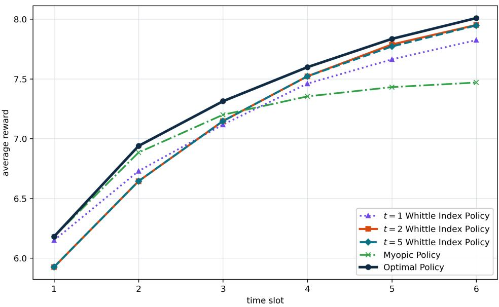
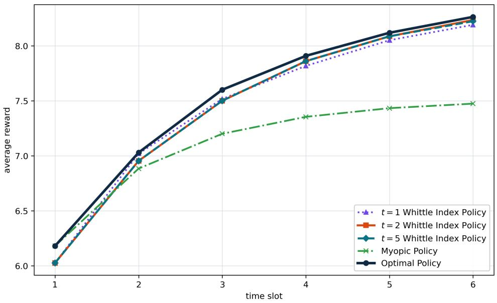
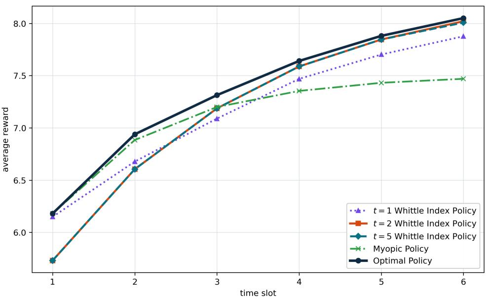

|Wc<sub>t</sub>(ω) − W(ω)| = O(β<sup>t</sup>).

# From Relaxed Indexability to Exact Indexability: A t-Step Approach for Partially Observable Restless Bandits

Qizhen Jia School of Mathematics and Physics Xi’an Jiaotong-Liverpool University Suzhou 215123, China Qizhen.Jia21@student.xjtlu.edu.cn

Keqin Liu<sup>∗</sup>   
School of Mathematics and Physics   
Xi’an Jiaotong-Liverpool University Suzhou 215123, China Keqin.Liu@xjtlu.edu.cn

## Abstract

Whittle index policies ofer a scalable method for restless multi-armed bandits, but under partial observability even determining the indiference subsidy at a single belief requires solving an infinite-horizon belief-state problem with no closed-form value function. Liu [10] addresses this dificulty by linearizing the unknown decision boundary, leading to a linear system and a closed-form approximate Whittle index. However, the resulting threshold uses only a one-step active–passive comparison and does not account for longer-horizon continuation values.

We extend this framework to a t-step lookahead threshold policy. For each subsidy m, the threshold is defined by the active-minus-passive advantage under t-step finite-horizon value iteration. At t = 1, the threshold is m-independent and recovers the linear threshold of Liu [10]; for t > 1, it becomes subsidy-dependent through the induced first-crossing structure and tracks the exact decision boundary more closely. The proposed algorithm does not require indexability as an input and includes an indexability verification. Under the original Whittle indexability, we prove that the t-step approximate Whittle index converges geometrically to the exact Whittle index,

Numerically, all 2,715 tested three-state instances are verified as indexable according to the proposed criterion. The P95 index error decreases from $2 . 1 8 \times 1 0 ^ { - 2 }$ at t = 1 to $8 . 9 3 \times 1 0 ^ { - 4 }$ at t = 8. In an exact-comparable instance with β = 0.9999, t = 2 already recovers the exact Whittle-index ordering. Moderate-depth threshold policies also outperform the one-step baseline and remain close to the optimal dynamic-programming benchmark, while runtime grows mildly with t.

## 1 Introduction

Whittle index policies ofer a scalable approach to restless bandits by decoupling the multi-armed problem into single-arm subsidy problems [22, 21, 2]. For a fully observable Markovian arm in state x, the Whittle index $W ( x )$ is the subsidy that makes the controller indiferent between activating the arm and leaving it passive. Ranking arms by these indices yields a policy that, under some large-system conditions, is asymptotically optimal [21].

Computation is simplest in the fully observable setting: the state space is finite, the dynamic programming objects are finite-dimensional, and statewise threshold structure facilitates index evaluation. Under partial observability, this finite-state structure is lost. The single-arm problem can still be formulated as a belief MDP, but the state becomes a belief vector ω on a continuous simplex [20, 18]. The Whittle indiference condition therefore involves the value function of an infinite-horizon belief-state POMDP rather than a finite-state value. For general POMDPs, standard computational methods resort to finite-horizon and finite-state approximations of the continuous belief MDP [20, 19]. In the partially observable restless bandit setting, recent Whittle index methods avoid solving the full belief-state POMDP by using boundary approximation [10].

Liu [10] obtains a computable approximate index for partially observable restless bandits with $K > 2$ hidden states by replacing the unknown decision boundary with a one-step linearized threshold $r ( \omega ) = \omega B ^ { \top }$ . Combined with first-crossing times under passive belief updates, this yields a finite linear system whose solution gives a closed-form approximate Whittle index. The construction is computationally attractive but uses only a one-step lookahead at the active-passive comparison: continuation values beyond the immediate reward $\omega B ^ { \top }$ are not represented in the threshold rule. Liu [10] notes that the threshold can in principle be sharpened by a t-step active-passive comparison, but neither constructs the resulting index nor analyzes its consistency.

This paper develops that extension and analyzes its convergence. We define a t-step lookahead threshold family $\{ r _ { t , m } \} _ { t \ge 1 }$ , where $r _ { t , m } ( x ) = \bar { Q } _ { t } ^ { A , \beta , m } ( x ) - { Q } _ { t } ^ { \bar { P , \beta } , m } ( x )$ is the active-minus-passive advantage under t-step finite-horizon value iteration. The centered comparison $r _ { t , m } ( x ) > r _ { t , m } ( \omega )$ replaces the one-step linear threshold. At t = 1, the threshold is independent of m and recovers the linearized threshold of Liu [10]; for $t > 1$ , the threshold shifts with m and tracks the exact decision boundary more closely. The main algorithm does not require indexability as an input: it computes the finite-t approximate index directly from the resulting threshold and first-crossing linear system. When multiple candidate subsidy solutions arise, the algorithm additionally performs a numerical indexability check by comparing these solutions and verifying whether their maximum pairwise diference is within a prescribed tolerance $\varepsilon _ { \mathrm { i n d } }$

Our main theoretical result concerns convergence to the exact Whittle index. Under the original Whittle indexability, we prove that, for all suficiently large t,

$$
\begin{array} { r } { \left| \widehat { W } _ { t } ( \omega ) - W ( \omega ) \right| = O ( \beta ^ { t } ) . } \end{array}
$$

Thus, the indexability assumption is used for the geometric convergence guarantee rather than for implementing the proposed algorithm. Numerical experiments on three-state instances complement this theoretical result. All 2,715 tested instances are numerically verified as indexable according to the proposed criterion. Moreover, $\widehat { W } _ { t }$ converges to the high-depth reference $\widehat { W } _ { 1 5 } .$ , with the P95 error decreasing from $2 . 1 8 \times 1 0 ^ { - 2 }$ at $t = 1$ to $8 . 9 3 \times 1 0 ^ { - 4 }$ at t = 8. In an exact-comparable three-arm instance with $\beta = 0 . 9 9 9 9 , t = 2$ already recovers the exact Whittle-index ordering. On a six-arm finite-horizon instance, the t = 2 and t = 5 threshold-index policies outperform the one-step threshold and the myopic baseline and remain close to the optimal dynamic-programming solution. Runtime grows mildly with t, indicating that moderate depths provide a practical accuracy–cost tradeof.

## 2 Related Work

Index policies for restless bandits. The classical index-policy literature begins with Gittins indices for rested bandits [5] and the Lagrangian relaxation for restless bandits [22]. Subsequent structural foundations include the LP relaxation and primal-dual heuristic of Bertsimas and Nino-Mora [2], the conservation-law and extended-polymatroid view of indexable systems [1], partialconservation-law methods [15, 16], and marginal-productivity indices [17]. These works characterize indexability through structured policy families, conservation laws, and marginal reward-resource measures.

PCL methods and high-dimensional belief models. The partial conservation law and marginal-productivity frameworks establish indexability and compute priority indices through reward and resource measures associated with structured families of single-arm policies [15–17]. In the PCL verification framework, threshold policies are defined with respect to an ordered state, and the corresponding discounted reward and resource metrics are used to establish indexability. The partially observable models in Liu and Jia [11] preserve a tractable belief-state structure that allows the required threshold and renewal calculations. In our model with $K > 2$ , however, the belief belongs to the high-dimensional simplex $\Delta _ { K - 1 }$ , and there is no known scalar ordering under which the optimal passive sets form a nested threshold family. Applying PCL would therefore first require identifying such an ordering and deriving the corresponding threshold-policy performance metrics. This is precisely the unknown boundary problem in our setting. Building on Liu [10], we instead use the t-step comparison

$$
r _ { t , m } ( x ) > r _ { t , m } ( \omega )
$$

to construct a computable approximation of the unknown decision boundary $C ( m )$ and then compute the approximate Whittle index. This construction provides a theoretical foundation for future applications of PCL methods to high-dimensional partially observable models.

Partially observable restless bandits. Partial observability replaces the finite state by a belief state, turning indexability into a statement about sets in a continuous simplex. Related models include dynamic multichannel access [12], reset processes [13], imperfect observation [14], and Kalman-filter restless bandits [3]. Most of these works either restrict to two hidden states or impose structural assumptions (threshold structure, collapsing observation, restart) that make the exact Whittle index analytically available. Our setting follows Liu [10] in the partial observability model, where the exact boundary is not available and approximation is necessary.

The closest work is Liu [10], who linearizes the unknown boundary $C ( m )$ to $r ( \omega ) = \omega B ^ { \top }$ computes first-crossing times $L ( \cdot , \omega )$ under passive dynamics, and obtains a closed-form approximate Whittle index from a system of linear equations. The same paper observes that a t-step active-passive comparison would sharpen the boundary approximation but leaves both the construction and the convergence analysis open. We close this gap by constructing the subsidy-dependent t-step threshold, deriving the corresponding indexability test and index formula, and establishing its geometric convergence to the exact Whittle index.

Recent learning and scalability work for RMABs. Recent NeurIPS work studies learning and scalable decision making for restless bandits, including Whittle-index learning [23], average-reward restless bandits without the global-attractor assumption [6], and regret analysis for restless-bandit learning [8]. Implementation-oriented work studies belief deduplication, factorization reuse, and vectorization for Whittle-index computation under partial observability [7].

## 3 Model and indexability

We study a single state-revealing partially observable restless bandit. The hidden state space is $\{ 0 , 1 , \ldots , K - 1 \}$ , the transition matrix is $\mathbf { \bar { { P } } } = \{ p _ { i , j } \} _ { i , j = 0 } ^ { K - 1 }$ , the discount factor is $\beta \in ( 0 , 1 )$ , and the reward vector is

$$
B = [ B _ { 0 } , B _ { 1 } , \ldots , B _ { K - 1 } ] , \qquad 0 = B _ { 0 } \leq B _ { 1 } \leq \cdots \leq B _ { K - 1 } \leq 1 .
$$

A belief state is a row vector $\omega \in \mathcal { X } = \Delta _ { K - 1 }$ . If the arm is passive, the belief evolves as $P ^ { k } ( \omega ) = \omega P ^ { k }$ If the arm is active, the hidden state is observed and the next belief resets to the corresponding transition row $p _ { i } = [ p _ { i , 0 } , \ldots , p _ { i , K - 1 } ]$

For a passivity subsidy m, let $V _ { \beta , m } ( \omega )$ be the exact infinite-horizon single-arm value:

$$
V _ { \beta , m } ( \omega ) = \operatorname* { m a x } \{ V _ { \beta , m } ( \omega ; u = 1 ) , V _ { \beta , m } ( \omega ; u = 0 ) \} ,\tag{1}
$$

$$
V _ { \beta , m } ( \omega ; u = 1 ) = \omega B ^ { \top } + \beta \omega \big ( V _ { \beta , m } ( p _ { 0 } ) , \dots , V _ { \beta , m } ( p _ { K - 1 } ) \big ) ^ { \prime } ,\tag{2}
$$

$$
V _ { \beta , m } ( \omega ; u = 0 ) = m + \beta V _ { \beta , m } ( P ^ { 1 } ( \omega ) ) .\tag{3}
$$

We write the exact active-passive gap as

$$
\Delta _ { \beta , m } ( \omega ) = V _ { \beta , m } ( \omega ; u = 1 ) - V _ { \beta , m } ( \omega ; u = 0 ) .\tag{4}
$$

Activation is optimal when $\Delta _ { \beta , m } ( \omega ) > 0$ and passivity is optimal when $\Delta _ { \beta , m } ( \omega ) < 0$

For a belief domain $D \subseteq { \mathcal { X } }$ and compact subsidy interval $M = [ 0 , 1 ]$ , define the exact passive set

$$
P ( m ) = \{ \omega \in D : \Delta _ { \beta , m } ( \omega ) \leq 0 \} .
$$

Define also the exact active set and indiference boundary,

$$
A ( m ) = \{ \omega \in D : \Delta _ { \beta , m } ( \omega ) > 0 \} , \qquad C ( m ) = \{ \omega \in D : \Delta _ { \beta , m } ( \omega ) = 0 \} .
$$

We say that the single-arm problem is exactly indexable on D if, for every $\omega \in D$ , there exists a unique subsidy $W ( \omega ) \in M$ such that

$$
\Delta _ { \beta , m } ( \omega ) > 0 \quad \mathrm { f o r } m < W ( \omega ) , \qquad \Delta _ { \beta , m } ( \omega ) < 0 \quad \mathrm { f o r } m > W ( \omega ) .
$$

## 4 t-step lookahead threshold policy and approximate Whittle index

Belief update. For a belief $\omega \in \mathcal { X }$ , the passive belief update is $P ^ { k } ( \omega ) = \omega P ^ { k }$ for $k \geq 0$

Finite-horizon value functions. For a lookahead depth $t \geq 1$ and passivity subsidy $m \in M$ define the finite-horizon value functions $\{ J _ { h } ^ { \beta , m } \} _ { h = 0 } ^ { t }$ by

$$
J _ { 0 } ^ { \beta , m } ( \omega ) = 0 ,\tag{5}
$$

$$
Q _ { h } ^ { A , \beta , m } ( \omega ) = \omega B ^ { \top } + \beta \sum _ { i = 0 } ^ { K - 1 } \omega _ { i } J _ { h - 1 } ^ { \beta , m } ( p _ { i } ) ,\tag{6}
$$

$$
\begin{array} { r } { Q _ { h } ^ { P , \beta , m } ( \omega ) = m + \beta J _ { h - 1 } ^ { \beta , m } ( P ^ { 1 } ( \omega ) ) , } \end{array}\tag{7}
$$

$$
J _ { h } ^ { \beta , m } ( \omega ) = \operatorname * { m a x } \{ Q _ { h } ^ { A , \beta , m } ( \omega ) , \ : Q _ { h } ^ { P , \beta , m } ( \omega ) \} , \qquad h = 1 , \ldots , t .\tag{8}
$$

The t-step active-minus-passive advantage function is

$$
r _ { t , m } ( \omega ) = Q _ { t } ^ { A , \beta , m } ( \omega ) - Q _ { t } ^ { P , \beta , m } ( \omega ) .
$$

When $t = 1 , J _ { 0 } \equiv 0$ gives $r _ { 1 , m } ( \omega ) = \omega B ^ { \top } - m$ . The threshold comparison $r _ { 1 , m } ( x ) > r _ { 1 , m } ( \omega )$ then reduces to $x B ^ { \top } > \omega B ^ { \top }$ , which is independent of m and recovers the linearized threshold of Liu [10].

t-step threshold policy. Fix a target belief $\omega \in \mathcal X$ and subsidy $m .$ . The t-step threshold policy $\pi _ { t } = \pi _ { t } ( \omega , m )$ activates at a belief x if and only if

$$
r _ { t , m } ( x ) > r _ { t , m } ( \omega ) ,
$$

and stays passive otherwise. That is, ω serves as a threshold belief : the arm is activated precisely when the current advantage exceeds its value at ω.

First-crossing times. Under $\pi _ { t } .$ , a passive arm starting from belief x evolves as $x , P ^ { 1 } ( x ) , P ^ { 2 } ( x ) , . . .$ until the threshold is first crossed. Define the first-crossing time

$$
L _ { t } ( x , \omega ; m ) = \operatorname* { m i n } \big \{ k \geq 0 : r _ { t , m } ( P ^ { k } ( x ) ) > r _ { t , m } ( \omega ) \big \} ,\tag{9}
$$

and set $L _ { t } ( x , \omega ; m ) = \infty$ if no such k exists. For compactness, we write ${ L ( x ) = L _ { t } ( x , \omega ; m ) }$ when $t ,$ $\omega ,$ and m are fixed. The dependence of $f ( x ) , g ( x ) , F _ { t } , G _ { t } , H _ { t }$ , and $\widehat { V } _ { t }$ on $( \omega , m )$ is suppressed below. For $t > 1$ , these quantities may change with m because the induced first-crossing structure may change.

The two quantities that summarize the passive sojourn from x are:

$$
f ( x ) = \left\{ \begin{array} { l l } { \displaystyle \frac { 1 - \beta ^ { L ( x ) } } { 1 - \beta } , } & { L ( x ) < \infty , } \\ { \displaystyle \frac { 1 } { 1 - \beta } , } & { L ( x ) = \infty , } \end{array} \right. \qquad g ( x ) = \left\{ \begin{array} { l l } { \displaystyle \beta ^ { L ( x ) } P ^ { L ( x ) } ( x ) , } & { L ( x ) < \infty , } \\ { \displaystyle 0 , } & { L ( x ) = \infty . } \end{array} \right.
$$

Here $f ( x ) \cdot m$ is the total discounted subsidy accumulated during the passive sojourn, and $g ( x )$ the discounted belief vector at the moment of first activation. Stack the first-crossing summaries over the K reset row beliefs $\{ p _ { 0 } , \dotsc , p _ { K - 1 } \}$ :

$$
F _ { t } = \big ( f ( p _ { 0 } ) , \dots , f ( p _ { K - 1 } ) \big ) ^ { \top } , \qquad G _ { t } = \left( \begin{array} { c } { { g ( p _ { 0 } ) } } \\ { { \vdots } } \\ { { g ( p _ { K - 1 } ) } } \end{array} \right) .
$$

$G _ { t }$ is substochastic because each row $g ( p _ { i } )$ is a discounted and possibly defective belief vector.

Conditional on the first-crossing structure induced by the fixed $( t , \omega , m )$ , let

$$
\widehat { V } _ { t } = \bigl ( \widehat { V } _ { \beta , m } ^ { t , \omega } ( p _ { 0 } ) , \ldots , \widehat { V } _ { \beta , m } ^ { t , \omega } ( p _ { K - 1 } ) \bigr ) ^ { \top }
$$

denote the value vector at the reset beliefs under $\pi _ { t }$ . By a standard regenerative argument, $\widehat { V } _ { t }$ satisfies the linear system

$$
\widehat { V _ { t } } = F _ { t } m + G _ { t } B ^ { \top } + \beta G _ { t } \widehat { V _ { t } } ,\tag{10}
$$

with closed-form solution

$$
\widehat { V } _ { t } = H _ { t } ( F _ { t } m + G _ { t } B ^ { \top } ) , \qquad H _ { t } = ( I _ { K } - \beta G _ { t } ) ^ { - 1 } .\tag{11}
$$

The inverse exists because $G _ { t }$ is substochastic and $\beta < 1$ , so $\rho ( \beta G _ { t } ) < 1$

For a general belief $x .$ , the value under $\pi _ { t }$ is

$$
\widehat { V } _ { \beta , m } ^ { t , \omega } ( x ) = f ( x ) m + g ( x ) B ^ { \top } + \beta g ( x ) \widehat { V } _ { t } .\tag{12}
$$

## 5 Geometric convergence of the approximate Whittle index

Lemma 1 (Lookahead error). For any fixed $m \in M$

$$
\operatorname* { s u p } _ { x \in \mathcal { X } } \left. r _ { t , m } ( x ) - \Delta _ { \beta , m } ( x ) \right. \leq \frac { 2 \beta ^ { t } } { 1 - \beta } = O ( \beta ^ { t } ) .
$$

Proof. See Appendix B.

Lemma 2 (Value-function gap). Let $V ^ { \star }$ and $V ^ { \pi _ { t } }$ denote the infinite-horizon values of $\pi ^ { \star }$ and $\pi _ { t }$ at subsidy $m ^ { \star }$ . Then

$$
\| V ^ { \star } - V ^ { \pi _ { t } } \| _ { \infty } \leq \frac { 4 \beta ^ { t } } { ( 1 - \beta ) ^ { 2 } } = O ( \beta ^ { t } ) .
$$

Proof. By the performance diference lemma [9, Lemma 6.1], for any starting belief $x _ { 0 }$

$$
V ^ { \pi _ { t } } ( x _ { 0 } ) - V ^ { \star } ( x _ { 0 } ) = \mathbb { E } _ { \tau \sim \pi _ { t } } \Big [ \sum _ { k = 0 } ^ { \infty } \beta ^ { k } A ^ { \pi ^ { \star } } ( x _ { k } , u _ { k } ) \Big ] ,
$$

where the trajectory $\tau = ( x _ { 0 } , u _ { 0 } , x _ { 1 } , u _ { 1 } , \dots )$ is generated by $\pi _ { t } .$ , and $A ^ { \pi ^ { \star } } ( x , u ) = Q ^ { \star } ( x , u ) - V ^ { \star } ( x )$ is the advantage under the optimal value function $V ^ { \star }$

Along any trajectory generated by $\pi _ { t } .$ , the action at $x _ { k }$ is $u _ { k } = \pi _ { t } ( x _ { k } )$ . There are two cases:

• If $\pi _ { t } ( x _ { k } ) = \pi ^ { \star } ( x _ { k } )$ , then $u _ { k }$ is optimal and $A ^ { \pi ^ { \star } } ( x _ { k } , u _ { k } ) = 0$

$\mathrm { I f } ~ \pi _ { t } ( x _ { k } ) \neq \pi ^ { \star } ( x _ { k } )$ , the magnitude of the advantage equals the regret at $x _ { k }$ . By Lemma 1, $\begin{array} { r } { | A ^ { \pi ^ { \star } } ( x _ { k } , u _ { k } ) | = | \Delta _ { \beta , m ^ { \star } } ( x _ { k } ) | \le \frac { 2 \beta ^ { t } } { 1 - \beta } } \end{array}$

In both cases $\begin{array} { r } { | A ^ { \pi ^ { \star } } ( x _ { k } , u _ { k } ) | \le \frac { 4 \beta ^ { t } } { 1 - \beta } } \end{array}$ . Therefore,

$$
\vert V ^ { \pi _ { t } } ( x _ { 0 } ) - V ^ { \star } ( x _ { 0 } ) \vert \le \mathbb { E } _ { \tau \sim \pi _ { t } } \Big [ \sum _ { k = 0 } ^ { \infty } \beta ^ { k } \cdot \frac { 4 \beta ^ { t } } { 1 - \beta } \Big ] = \frac { 4 \beta ^ { t } } { ( 1 - \beta ) ^ { 2 } } = O ( \beta ^ { t } ) .
$$

Taking the supremum over x<sub>0</sub> gives the claim.

Assumption 1 (Exact indexability). We assume the problem is exactly indexable, $i . e .$ , it satisfies the original Whittle indexability with a unique Whittle index function $I { \mathcal { Q } } { \mathcal { Q } } J .$

Lemma 3 (Lookahead gap consistency at $m ^ { \star } )$ . At the exact Whittle subsidy $m ^ { \star } = W ( \omega )$

$$
| \Phi _ { t } ( \omega , m ^ { \star } ) - \Delta _ { \beta , m ^ { \star } } ( \omega ) | = O ( \beta ^ { t } ) .
$$

Since $\Delta _ { \beta , m ^ { \star } } ( \omega ) = 0$ , this implies

$$
\Phi _ { t } ( \omega , m ^ { \star } ) = O ( \beta ^ { t } ) .
$$

Proof. Write

$$
V ^ { \star } : = V _ { \beta , m ^ { \star } }
$$

for the exact infinite-horizon optimal single-arm value function at subsidy $m ^ { \star }$ , and write $V ^ { \pi _ { t } }$ for the infinite-horizon value function obtained by following the t-step threshold policy $\pi _ { t }$

By definition, the exact active-passive advantage at $\omega$ is

$$
\Delta _ { \beta , m ^ { \star } } ( \omega ) = \left[ \omega B ^ { \top } + \beta \sum _ { i } \omega _ { i } V ^ { \star } ( p _ { i } ) \right] - \left[ m ^ { \star } + \beta V ^ { \star } ( P ^ { 1 } ( \omega ) ) \right] .
$$

The t-step lookahead relaxed indiference gap $\Phi _ { t }$ uses the same active-first and passive-first comparison, but evaluates the continuation values under $\pi _ { t }$ . Thus

$$
\Phi _ { t , \infty } ( \omega , m ^ { \star } ) = \left[ \omega B ^ { \top } + \beta \sum _ { i } \omega _ { i } V ^ { \pi _ { t } } ( p _ { i } ) \right] - \left[ m ^ { \star } + \beta V ^ { \pi _ { t } } ( P ^ { 1 } ( \omega ) ) \right] .
$$

Subtracting the two expressions gives

$$
\begin{array} { r l } {  { \Phi _ { t , \infty } ( \omega , m ^ { \star } ) - \Delta _ { \beta , m ^ { \star } } ( \omega ) } } \\ & { = \Bigg [ \omega \boldsymbol { B } ^ { \top } + \beta \sum _ { i } \omega _ { i } V ^ { \pi _ { t } } ( p _ { i } ) \Bigg ] - \big [ m ^ { \star } + \beta V ^ { \pi _ { t } } ( P ^ { 1 } ( \omega ) ) \big ] } \\ & { - \Bigg \{ \Bigg [ \omega \boldsymbol { B } ^ { \top } + \beta \sum _ { i } \omega _ { i } V ^ { \star } ( p _ { i } ) \Bigg ] - \big [ m ^ { \star } + \beta V ^ { \star } ( P ^ { 1 } ( \omega ) ) \big ] \Bigg \} . } \end{array}
$$

The immediate active reward $\omega B ^ { \top }$ cancels, and the passive subsidy $m ^ { \star }$ also cancels. Hence

$$
\begin{array} { r l } & { \Phi _ { t , \infty } ( \omega , m ^ { \star } ) - \Delta _ { \beta , m ^ { \star } } ( \omega ) } \\ & { \ = \beta \displaystyle \sum _ { i } \omega _ { i } \left[ V ^ { \pi _ { t } } ( p _ { i } ) - V ^ { \star } ( p _ { i } ) \right] - \beta \left[ V ^ { \pi _ { t } } ( P ^ { 1 } ( \omega ) ) - V ^ { \star } ( P ^ { 1 } ( \omega ) ) \right] . } \end{array}
$$

Taking absolute values and applying the triangle inequality,

$$
\begin{array} { r l } & { | \Phi _ { t , \infty } ( \omega , m ^ { \star } ) - \Delta _ { \beta , m ^ { \star } } ( \omega ) | } \\ & { \leq \beta \displaystyle \sum _ { i } \omega _ { i } | V ^ { \pi _ { t } } ( p _ { i } ) - V ^ { \star } ( p _ { i } ) | + \beta \left| V ^ { \pi _ { t } } ( P ^ { 1 } ( \omega ) ) - V ^ { \star } ( P ^ { 1 } ( \omega ) ) \right| . } \end{array}
$$

Since $\omega$ is a belief vector, $\omega _ { i } \geq 0$ and $\textstyle \sum _ { i } \omega _ { i } = 1$ . Therefore

$$
\sum _ { i } \omega _ { i } | V ^ { \pi _ { t } } ( p _ { i } ) - V ^ { \star } ( p _ { i } ) | \leq \| V ^ { \pi _ { t } } - V ^ { \star } \| _ { \infty } .
$$

Also,

$$
\big | V ^ { \pi _ { t } } \big ( P ^ { 1 } ( \omega ) \big ) - V ^ { \star } ( P ^ { 1 } ( \omega ) ) \big | \leq \| V ^ { \pi _ { t } } - V ^ { \star } \| _ { \infty } .
$$

Combining the two bounds gives

$$
| \Phi _ { t , \infty } ( \omega , m ^ { \star } ) - \Delta _ { \beta , m ^ { \star } } ( \omega ) | \leq 2 \beta \| V ^ { \pi _ { t } } - V ^ { \star } \| _ { \infty } .
$$

By Lemma 2,

$$
\| V ^ { \pi _ { t } } - V ^ { \star } \| _ { \infty } = O ( \beta ^ { t } ) .
$$

Hence

$$
| \Phi _ { t , \infty } ( \omega , m ^ { \star } ) - \Delta _ { \beta , m ^ { \star } } ( \omega ) | = O ( \beta ^ { t } ) .
$$

Finally, because $m ^ { \star } = W ( \omega )$ , active and passive are exactly indiferent at $\omega$ under the exact problem. Therefore

$$
\Delta _ { \beta , m ^ { \star } } ( \omega ) = 0 .
$$

Consequently,

$$
| \Phi _ { t , \infty } ( \omega , m ^ { \star } ) | = | \Phi _ { t , \infty } ( \omega , m ^ { \star } ) - \Delta _ { \beta , m ^ { \star } } ( \omega ) | = O ( \beta ^ { t } ) ,
$$

which proves the claim.

Theorem 1 (Geometric convergence). Under Assumption 1, for all suficiently large t,

$$
\begin{array} { r } { \left| \widehat { W } _ { t } ( \omega ) - W ( \omega ) \right| = O ( \beta ^ { t } ) . } \end{array}
$$

Proof. Fix a belief $\omega \in D$ and let

$$
m ^ { \star } : = W ( \omega ) .
$$

Under Assumption $1 , m ^ { \star }$ exists and is the unique subsidy that makes the active and passive actions indiferent at ω:

$$
\Delta _ { \beta , m ^ { \star } } ( \omega ) = 0 .
$$

For a fixed finite-t first-crossing structure, define

$$
f _ { P , t } : = f ( P ^ { 1 } ( \omega ) ) , \qquad g _ { P , t } : = g ( P ^ { 1 } ( \omega ) ) .
$$

On the corresponding afine piece, $F _ { t } , G _ { t } , H _ { t } , f _ { P , t }$ , and $g _ { P , t }$ are fixed. Substituting (11) and (12) into the relaxed indiference gap gives

$$
\Phi _ { t } ( \omega , m ) = N _ { t } ( \omega ) - D _ { t } ( \omega ) m ,\tag{13}
$$

where

$$
N _ { t } ( \omega ) = \omega B ^ { \top } - \beta g _ { P , t } \big ( I _ { K } + \beta H _ { t } G _ { t } \big ) B ^ { \top } + \beta \omega H _ { t } G _ { t } B ^ { \top } ,\tag{14}
$$

$$
D _ { t } ( \omega ) = 1 + \beta f _ { P , t } + \beta \big ( \beta g _ { P , t } - \omega \big ) H _ { t } F _ { t } .\tag{15}
$$

Thus, the $D _ { t } ( \omega )$ is precisely the coeficient of the subsidy in the finite-t indiference equation.

We next consider the corresponding exact infinite-horizon system. Let

$$
F _ { \infty } , \quad G _ { \infty } , \quad H _ { \infty } , \quad f _ { P , \infty } , \quad g _ { P , \infty }
$$

denote the parameters induced by the exact decision boundary at $m ^ { \star }$ , and define

$$
D _ { \infty } ( \omega ) = 1 + \beta f _ { P , \infty } + \beta \big ( \beta g _ { P , \infty } - \omega \big ) H _ { \infty } F _ { \infty } .\tag{16}
$$

The exact threshold-induced linear system and its indiference condition have the form

$$
N _ { \infty } ( \omega ) - D _ { \infty } ( \omega ) m = 0 .
$$

Under exact indexability, this exact indiference equation has the unique solution $m ^ { \star } = W ( \omega )$ Therefore,

$$
D _ { \infty } ( \omega ) \neq 0 .
$$

Indeed, if $D _ { \infty } ( \omega ) = 0$ and $N _ { \infty } ( \omega ) \neq 0$ , the exact indiference equation would have no solution, contradicting the existence of $W ( \omega )$ . If both $D _ { \infty } ( \omega ) = 0$ and $N _ { \infty } ( \omega ) = 0$ , the equation would not determine a unique subsidy, contradicting exact indexability.

By Lemma 1, the finite-t threshold converges to the exact infinite-horizon decision boundary as $t \to \infty$ . Consequently, the corresponding first-crossing linear system converges to the system induced by the exact threshold, and hence

$$
D _ { t } ( \omega ) \longrightarrow D _ { \infty } ( \omega ) .
$$

Since $D _ { \infty } ( \omega ) \neq 0$ , there exist a constant $d _ { \omega } > 0$ and an integer $t _ { 0 }$ such that

$$
| D _ { t } ( \omega ) | \geq d _ { \omega } , \qquad t \geq t _ { 0 } .\tag{17}
$$

For all suficiently large t, the relevant finite-t afine piece is the one converging to the exact first-crossing system at $m ^ { \star }$ . Since $\widehat { W } _ { t } ( \omega )$ is a root of the finite-t relaxed indiference equation,

$$
\begin{array} { r } { \Phi _ { t } \bigl ( \omega , \widehat { W } _ { t } ( \omega ) \bigr ) = 0 . } \end{array}
$$

Using the local afine representation (13), we obtain

$$
\begin{array} { r l } & { \Phi _ { t } ( \omega , m ^ { \star } ) - \Phi _ { t } \big ( \omega , \widehat { W } _ { t } ( \omega ) \big ) } \\ & { = - D _ { t } ( \omega ) \big ( m ^ { \star } - \widehat { W } _ { t } ( \omega ) \big ) . } \end{array}
$$

Therefore,

$$
\bigl | \widehat { W } _ { t } ( \omega ) - m ^ { \star } \bigr | = \frac { \bigl | \Phi _ { t } ( \omega , m ^ { \star } ) \bigr | } { \bigl | D _ { t } ( \omega ) \bigr | } .\tag{18}
$$

By Lemma $^ { 3 , }$

$$
\left| \Phi _ { t } ( \omega , m ^ { \star } ) \right| = O ( \beta ^ { t } ) .
$$

Combining this result with (17) and recalling that $m ^ { \star } = W ( \omega )$ yields

$$
\begin{array} { r } { \left| \widehat { W } _ { t } ( \omega ) - W ( \omega ) \right| = O ( \beta ^ { t } ) . } \end{array}
$$

This completes the proof.

Algorithmic approximate Whittle index. Define the t-step lookahead relaxed indiference gap (approximate active-passive gap at ω under $\pi _ { t } )$ as

$$
\Phi _ { t } ( \omega , m ) = \widehat { Q } _ { t } ^ { A } ( \omega , m ) - \widehat { Q } _ { t } ^ { P } ( \omega , m ) ,\tag{19}
$$

where

$$
\begin{array} { c } { \widehat { Q } _ { t } ^ { A } ( \omega , m ) = \omega B ^ { \top } + \beta \omega \widehat { V } _ { t } , } \\ { \widehat { Q } _ { t } ^ { P } ( \omega , m ) = m + \beta \big [ f _ { P } m + g _ { P } B ^ { \top } + \beta g _ { P } \widehat { V } _ { t } \big ] . } \end{array}
$$

Remark 1. The advantage $r _ { t , m } ( \omega )$ uses finite-horizon values $J _ { t }$ and serves only to define the crossing structure $( F _ { t } , G _ { t } )$ . The gap $\Phi _ { t } ( \omega , m )$ uses the infinite-horizon values $\widehat { V } _ { t }$ , and its admissible roots define the candidate approximate Whittle indices. Algorithm 1 does not require indexability as an input.

A t-step approximate Whittle index is a subsidy m that makes active and passive equally attractive at $\omega ,$ i.e., a root of

$$
\Phi _ { t } ( \omega , m ) = 0 .
$$

If multiple subsidies exist, Algorithm 1 return any one of them.

Substituting (11) and (12) into (19) and solving for m gives, whenever the denominator is nonzero,

$$
\widehat { W } _ { t } ( \omega ) = \frac { \omega B ^ { \top } - \beta g ( I _ { K } + \beta H _ { t } G _ { t } ) B ^ { \top } + \beta \omega H _ { t } G _ { t } B ^ { \top } } { 1 + \beta f + \beta ( \beta g - \omega ) H _ { t } F _ { t } } .\tag{20}
$$

The denominator does not tend to zero. For the original infinite-horizon problem, each belief state corresponds to at least one subsidy that makes the two actions indiferent. When the corresponding

linear equation systems converge to a unique limiting system as $t \to \infty$ , the limiting subsidy solution is unique, and hence the limiting denominator is nonzero.   
For $t = 1$ , the first-crossing times in (9) are m-independent, so $F _ { t } , G _ { t } , \widehat { V } _ { t }$ depend on m only through the explicit factor in (10), and (20) is a closed-form rational expression in m. For $t > 1$ 1 $r _ { t , m }$ depends on $m ,$ so the first-crossing times and hence $F _ { t } , G _ { t } , \widehat { V } _ { t }$ are m-dependent. Equation (20) is therefore not a closed-form expression in m globally; the corresponding indiference equation can be solved locally on each afine piece.

```latex
Algorithm 1 t-step approximate Whittle index and indexability verification
Require: primitives $( P , B , \beta )$ , belief $\omega ,$ subsidy interval M, lookahead depth t, first-crossing-time
search limit $\ell _ { \mathrm { m a x } } .$ and tolerance $\varepsilon _ { \mathrm { i n d } }$
1: function Residual(m)
2: Compute $\{ J _ { h } ^ { \beta , m } \} _ { h = 0 } ^ { t }$ by finite-horizon value iteration; set $r _ { t , m } ( x ) = Q _ { t } ^ { A , \beta , m } ( x ) - Q _ { t } ^ { P , \beta , m } ( x )$
3: for $x \in \{ p _ { 0 } , \ldots , p _ { K - 1 } , P ( \omega ) \}$ do
4: $L \gets \operatorname* { m i n } \{ 0 \leq k \leq \ell _ { \operatorname* { m a x } } : r _ { t , m } ( P ^ { k } x ) > r _ { t , m } ( \omega ) \}$ , or ∞ if none.
5: $f ( x ) \gets ( \dot { 1 } - \beta ^ { L } ) / ( 1 - \beta ) \ \mathrm { ( o r ~ 1 / ( 1 - \beta ) ~ i f ~ } L = \infty ) ; \quad g ( x ) \gets \beta ^ { L } P ^ { L } ( x )$ (or 0).
6: end for
7: Stack $F _ { t } \gets ( f ( p _ { i } ) ) _ { i } , G _ { t } \gets ( g ( p _ { \frac { i } { \delta } } ) ) _ { i } ; \mathrm { s o l v e } \widehat { V } _ { t } = ( I - \beta G _ { t } ) ^ { - 1 } ( F _ { t } m + G _ { t } B ^ { \top } ) .$
8: return $\Phi _ { t } ( \omega , m ) = \omega B ^ { \top } + \beta \omega \widehat { V } _ { t } - m - \beta [ f ( \omega P ) m + g ( \omega P ) B ^ { \top } + \beta g ( \omega P ) \widehat { V } _ { t } ]$
9: end function
10: Solve $\mathrm { R E S I D U A L } ( m ) = 0$ on M and obtain the admissible subsidy solution set $\boldsymbol { \mathcal { M } } _ { t } ( \boldsymbol { \omega } )$
11: Choose any $\widehat { W } _ { t } ( \omega ) \in \mathcal { M } _ { t } ( \omega )$
Indexability verification:
12: if $| \mathcal { M } _ { t } ( \omega ) | = 1$ then
13: status ← indexable.
14: else
15: $\delta _ { t } ( \omega ) \gets \operatorname* { m a x } _ { m , m ^ { \prime } \in \mathcal { M } _ { t } ( \omega ) } | m - m ^ { \prime } | .$
m̸=m<sup>′</sup>
16: if $\delta _ { t } ( \omega ) \leq \varepsilon _ { \mathrm { i n d } }$ then
17: status ← indexable.
18: else
19: status ← not indexable.
20: end if
21: end if
22: return $\widehat { W } _ { t } ( \omega )$ and status.
```

## 6 Numerical experiments

The experiments evaluate the accuracy, indexability, policy performance, and computational cost of the finite-lookahead approximate Whittle index in partially observable restless bandits. All 2, 715 tested instances were numerically verified as indexable according to the proposed indexability verification criterion.

## 6.1 Index convergence in t

Table 1: Errors between t-step approximate Whittle indices and the high-depth reference $W ^ { \mathrm { r e f } }$ on K = 3 samples. Errors are $\left| \widehat { W } _ { t } - W ^ { \mathrm { r e f } } \right|$
<table><tr><td>t</td><td>median</td><td>P90</td><td>P95</td><td>max</td></tr><tr><td>1</td><td> $3 . 4 4 \times 1 0 ^ { - 3 }$ </td><td> $1 . 3 7 \times 1 0 ^ { - 2 }$ </td><td> $2 . 1 8 \times 1 0 ^ { - 2 }$ </td><td> $6 . 2 7 \times 1 0 ^ { - 2 }$ </td></tr><tr><td>2</td><td> $1 . 7 2 \times 1 0 ^ { - 3 }$ </td><td> $7 . 9 8 \times 1 0 ^ { - 3 }$ </td><td> $1 . 1 2 \times 1 0 ^ { - 2 }$ </td><td> $2 . 1 3 \times 1 0 ^ { - 2 }$ </td></tr><tr><td>3</td><td> $6 . 1 6 \times 1 0 ^ { - 4 }$ </td><td> $5 . 8 7 \times 1 0 ^ { - 3 }$ </td><td> $9 . 1 3 \times 1 0 ^ { - 3 }$ </td><td> $1 . 1 8 \times 1 0 ^ { - 2 }$ </td></tr><tr><td>5</td><td> $7 . 9 9 \times 1 0 ^ { - 1 5 }$ </td><td> $2 . 8 9 \times 1 0 ^ { - 3 }$ </td><td> $4 . 1 5 { \times } 1 0 ^ { - 3 }$ </td><td> $1 . 1 7 \times 1 0 ^ { - 2 }$ </td></tr><tr><td>8</td><td>0</td><td> $5 . 0 1 \times 1 0 ^ { - 4 }$ </td><td> $8 . 9 3 \times 1 0 ^ { - 4 }$ </td><td> $2 . 7 9 \times 1 0 ^ { - 3 }$ </td></tr></table>

Table 1 shows that increasing the lookahead depth substantially reduces the error relative to a highdepth reference. Because the exact Whittle indices are not available for these randomly generated instances, we use

$$
W ^ { \mathrm { r e f } } ( \omega ) : = \widehat { W } _ { 1 5 } ( \omega ) .
$$

The P95 error decreases from $2 . 1 8 \times 1 0 ^ { - 2 }$ at $t = 1$ to $8 . 9 3 \times 1 0 ^ { - 4 }$ at $t = 8$ , while the maximum error decreases from $6 . 2 7 \times 1 0 ^ { - 2 }$ to $2 . 7 9 \times 1 0 ^ { - 3 }$

Ranking stability at a high discount factor. The lookahead-error bound becomes increasingly conservative as $\beta \uparrow 1$ , suggesting that a larger t may be required to obtain a highly precise index value. In an index policy, however, the indices are used to rank the arms, so t only needs to be large enough to stabilize the relevant ranking. We illustrate this point using a three-arm instance with

$$
\beta = 0 . 9 9 9 9 , \qquad B = \left( 0 , { \frac { 1 } { 2 } } , 1 \right) ,
$$

and initial beliefs

$$
\omega _ { 1 } = \omega _ { 2 } = ( 0 . 1 , 0 . 3 , 0 . 6 ) , \qquad \omega _ { 3 } = ( 0 . 2 , 0 . 6 , 0 . 2 ) .
$$

All transition probabilities are strictly positive, and each arm satisfies

$$
P _ { i } ^ { 2 } = \mathbf { 1 } \pi _ { i } ,
$$

where $\mathbf { 1 } = ( 1 , 1 , 1 ) ^ { \top }$ is the all-ones column vector and $\pi _ { i }$ is the stationary row distribution of arm i. Hence, for every initial belief $\omega ,$

$$
\omega P _ { i } ^ { 2 } = \pi _ { i } .
$$

Therefore, all passive belief trajectories merge after two transitions, and the corresponding belief MDPs have finite closures of only five or six states. We compute the exact Whittle indices using the finite-state method of Gast et al. [4]:

$$
( W _ { 1 } , W _ { 2 } , W _ { 3 } ) = \left( { \frac { 6 6 7 7 7 1 } { 8 7 5 5 4 8 } } , { \frac { 8 2 3 3 3 1 } { 1 0 8 5 9 2 4 } } , { \frac { 1 0 9 9 9 9 } { 2 1 5 5 5 4 } } \right) = ( 0 . 7 6 2 6 8 9 1 9 5 8 , \ 0 . 7 5 8 1 8 4 7 3 4 8 , \ 0 . 5 1 0 3 0 8 3 2 1 8 ) .
$$

The exact initial ordering is therefore $1 > 2 > 3 \quad$

Table 2: Exact and t-step approximate Whittle indices for the three-arm high-discount instance with $\beta = 0 . 9 9 9 9$
<table><tr><td>Method</td><td>Arm 1</td><td>Arm 2</td><td>Arm 3</td><td>Ordering</td></tr><tr><td>Exact</td><td>0.7626891958</td><td>0.7581847348</td><td>0.5103083218</td><td> $1 > 2 > 3$ </td></tr><tr><td>t = 1</td><td>0.7195963682</td><td>0.7500332014</td><td>0.5000105161</td><td> $2 > 1 > 3$ </td></tr><tr><td>t = 2</td><td>0.7536549707</td><td>0.7503561253</td><td>0.5030864197</td><td> $1 > 2 > 3$ </td></tr><tr><td>t = 3</td><td>0.7626891958</td><td>0.7565743293</td><td>0.5103083218</td><td> $1 > 2 > 3$ </td></tr><tr><td>t = 4</td><td>0.7626891958</td><td>0.7581745846</td><td>0.5103083218</td><td> $1 > 2 > 3$ </td></tr></table>

As shown in Table 2, the one-step approximation reverses the ordering of Arms 1 and 2. Nevertheless, t = 2 already recovers the exact ordering $1 > 2 > 3$ and therefore selects the same arm as the exact Whittle index policy. The ordering remains unchanged at t = 3 and t = 4. Thus, even when the discount factor is extremely close to one, a small lookahead depth can be suficient to stabilize the ranking of arms.

## 6.2 Exact-comparable on small-scale experiments

The previous experiment measures index-level convergence. We also check whether the high depth of lookahead approximate Whittle index has better performance in a small finite horizon problem where exact dynamic programming is still feasible. The instance has six arms, budget 1, discount factor $\beta = 0 . 9 9$ , and horizon up to $T = 6$ . We compare optimal, the one-step threshold index, the t = 2 and t = 5 threshold-index policies, and myopic allocation.

  
Figure 1: small-scale experiments

Figure 1 reports that the optimal policy provides the highest average reward throughout the horizon. The myopic policy is competitive in the early slots, but its reward curve flattens in the later slots, leaving a significant gap from the optimal benchmark. In contrast, the finite lookahead policies close most of this gap. The improvement from t = 1 to t = 2 is especially clear in the later slots, while the t = 2 and $t = 5$ curves are nearly the same on this instance but still perform better than t = 1 Whittle index policy.

## 6.3 Runtime of computing diferent lookahead approximate Whittle index

<table><tr><td>t samples</td><td>median sec/s /sample P90 sec/sample</td></tr><tr><td>1</td><td>80 0.0509 0.0727</td></tr><tr><td>2 80</td><td>0.0834 0.0879</td></tr><tr><td>3 80</td><td>0.0911 0.0957</td></tr><tr><td>5 80</td><td>0.1090 0.1140</td></tr><tr><td>8 80</td><td>0.1372 0.1431</td></tr><tr><td>15 80</td><td>0.2009 0.2052</td></tr></table>

The per-sample runtime increases predictably with the lookahead depth. The median cost rises from 0.0509 seconds at t = 1 to 0.2009 seconds at t = 15, while the P90 values remain close to the medians. This suggests that the computation is stable across samples and that deeper lookahead does not create heavy-tailed runtime behavior in this experiment. Combined with the depth results the table indicates that moderate depths such as $t = 5$ or $t = 8$ ofer a reasonable accuracy-cost tradeof.

## 7 Conclusion

We extended the one-step linearized threshold of Liu [10] to a t-step lookahead family and derived the corresponding finite-t approximate Whittle index through the induced first-crossing linear system. The computation itself does not require indexability as an input. When multiple candidate subsidy solutions arise, the proposed algorithm further provides anindexability verification. Under the original Whittle indexability, we prove that the finite-t approximate index converges geometrically to the exact Whittle index,

$$
| \widehat { W } _ { t } ( \omega ) - W ( \omega ) | = O ( \beta ^ { t } ) .
$$

Numerically, all 2,715 tested three-state instances are verified as indexable according to the proposed criterion. Increasing the lookahead depth substantially improves the index accuracy, while a small lookahead depth can already recover the correct index ranking even when $\beta$ is close to one. The resulting threshold-index policies improve upon the one-step and myopic baselines and remain close to the optimal dynamic-programming benchmark on small exact-comparable instances, with a moderate increase in computational cost. The t-step threshold and first-crossing construction also provides a computable approximation of the unknown decision boundary and lays a theoretical foundation for future applications of PCL methods to high-dimensional partially observable models.

## References

[1] Dimitris Bertsimas and Jose Nino-Mora. Conservation laws, extended polymatroids and multiarmed bandit problems; a polyhedral approach to indexable systems. Mathematics of Operations Research, 21(2):257–306, 1996.

[2] Dimitris Bertsimas and Jose Nino-Mora. Restless bandits, linear programming relaxations, and a primal-dual index heuristic. Operations Research, 48(1):80–90, 2000.

[3] Christopher Dance and Tomi Silander. When are kalman-filter restless bandits indexable? In Advances in Neural Information Processing Systems 28, 2015.

[4] Nicolas Gast, Bruno Gaujal, and Kimang Khun. Testing indexability and computing whittle and gittins index in subcubic time. Mathematical Methods of Operations Research, 97(3):391–436, 2023. doi: 10.1007/s00186-023-00821-4.

[5] John C. Gittins. Bandit processes and dynamic allocation indices. Journal of the Royal Statistical Society: Series B, 41(2):148–177, 1979.

[6] Yige Hong, Qiaomin Xie, Yudong Chen, and Weina Wang. Restless bandits with average reward: Breaking the uniform global attractor assumption. In Advances in Neural Information Processing Systems 36, 2023.

[7] Qizhen Jia and Keqin Liu. Eficient computation of whittle index for partially observable restless bandits. In Proceedings of the 2026 International Conference on Computing, Networking and Communications (ICNC), pages 232–236, 2026.

[8] Young Hun Jung and Ambuj Tewari. Regret bounds for thompson sampling in episodic restless bandit problems. In Advances in Neural Information Processing Systems 32, 2019.

[9] Sham Kakade and John Langford. Approximately optimal approximate reinforcement learning. In Proceedings of the Nineteenth International Conference on Machine Learning, ICML ’02, page 267–274, San Francisco, CA, USA, 2002. Morgan Kaufmann Publishers Inc. ISBN 1558608737.

[10] Keqin Liu. Relaxed indexability and index policy for partially observable restless bandits. Management Science, 2025.

[11] Keqin Liu and Qizhen Jia. General formulation and pcl-analysis for restless bandits with limited observability. arXiv:2307.03034, 2025.

[12] Keqin Liu and Qing Zhao. Indexability of restless bandit problems and optimality of whittle index for dynamic multichannel access. IEEE Transactions on Information Theory, 56(11): 5547–5567, 2010.

[13] Keqin Liu, Richard Weber, and Qing Zhao. Indexability and whittle index for restless bandit problems involving reset processes. In Proceedings of the 50th IEEE Conference on Decision and Control and European Control Conference, pages 7690–7696, 2011.

[14] Keqin Liu, Richard Weber, and Cheng Zhang. Low-complexity algorithm for restless bandits with imperfect observations. Mathematical Methods of Operations Research, 100(2):467–508, 2024.

[15] Jose Nino-Mora. Restless bandits, partial conservation laws and indexability. Advances in Applied Probability, 33(1):76–98, 2001.

[16] Jose Nino-Mora. Dynamic allocation indices for restless projects and queueing admission control: a polyhedral approach. Mathematical Programming, 93(3):361–413, 2002.

[17] Jose Nino-Mora. Dynamic priority allocation via restless bandit marginal productivity indices. TOP, 15(2):161–198, 2007.

[18] Martin L. Puterman. Markov Decision Processes: Discrete Stochastic Dynamic Programming. John Wiley & Sons, New York, 1994.

[19] Naci Saldi, Serdar Yüksel, and Tamás Linder. Asymptotic optimality of finite model approximations for partially observed markov decision processes with discounted cost. IEEE Transactions on Automatic Control, 65(1):130–142, 2020. doi: 10.1109/TAC.2019.2907172.

[20] Edward J. Sondik. The optimal control of partially observable markov processes over the infinite horizon: Discounted costs. Operations Research, 26(2):282–304, 1978. doi: 10.1287/opre.26.2.282.

[21] Richard R. Weber and Gideon Weiss. On an index policy for restless bandits. Journal of Applied Probability, 27(3):637–648, 1990.

[22] Peter Whittle. Restless bandits: Activity allocation in a changing world. Journal of Applied Probability, 25:287–298, 1988.

[23] Guojun Xiong and Jian Li. Finite-time analysis of whittle index based q-learning for restless multi-armed bandits with neural network function approximation. In Advances in Neural Information Processing Systems 36, 2023.

## A Notation

This appendix gives the full proofs for the results stated in the main paper. The belief space is $\mathcal { X } = \Delta _ { K - 1 }$ , the passive belief update is $P ^ { 1 } ( \omega ) = \omega P$ , and $p _ { i }$ denotes row i of the transition matrix. For subsidy $m , \Delta _ { \beta , m } ( \omega ) = V _ { \beta , m } ( \omega ; u = 1 ) - V _ { \beta , m } ( \omega ; u = 0 )$ is the exact active-minus-passive gap. The passive set, active set, and exact indiference boundary are

$$
\begin{array} { r } { P ( m ) = \{ \omega : \Delta _ { \beta , m } ( \omega ) \leq 0 \} , \quad A ( m ) = \{ \omega : \Delta _ { \beta , m } ( \omega ) > 0 \} , \quad C ( m ) = \{ \omega : \Delta _ { \beta , m } ( \omega ) = 0 \} . } \end{array}
$$

Notation used in the main paper and appendix.
<table><tr><td>Symbol</td><td>Meaning</td></tr><tr><td> $\mathcal { X } = \Delta _ { K - 1 }$ </td><td>belief simplex over K hidden states</td></tr><tr><td> $P , p _ { i }$ </td><td>transition matrix and its ith row</td></tr><tr><td> $B$ </td><td>reward vector for active selection</td></tr><tr><td> $\beta$ </td><td>discount factor</td></tr><tr><td> $m , M = \left[ m _ { - } , m _ { + } \right]$ </td><td>passivity subsidy and compact subsidy bracket</td></tr><tr><td> $\Delta _ { \beta , m } ( \omega )$ </td><td> $V _ { \beta , m } ( \omega ; u = 1 ) - V _ { \beta , m } ( \omega ; u = 0 )$ </td></tr><tr><td> $P ( m ) , A ( m ) , C ( m )$   $W ( \omega ) , m ^ { \star }$ </td><td>passive set, active set, and decision boundary</td></tr><tr><td> $J _ { h } ^ { \beta , m }$ </td><td>Whittle index / exact indifference subsidy h-horizon value function</td></tr><tr><td> $\boldsymbol { Q } _ { h } ^ { \prime ^ { \prime } A , \beta , m } , \boldsymbol { Q } _ { h } ^ { P , \beta , m }$ </td><td>h-horizon active and passive action values</td></tr><tr><td> $r _ { t , m }$ </td><td>t-lookahead active-passive action-value difference</td></tr><tr><td> $L _ { t } ( x , m , \omega )$ </td><td>first crossing time from seed belief x under consecutive passive</td></tr><tr><td></td><td>actions</td></tr><tr><td> $V ^ { t , m , \omega }$   $\Phi _ { t } ( \omega , m )$ </td><td>continuation value under the t-step threshold policy with belief ω</td></tr><tr><td></td><td>t-step lookahead relaxed indifference gap</td></tr><tr><td> $\widehat { W } _ { t } ( \omega )$ </td><td>t-step approximate Whittle index</td></tr></table>

## B Proofs for Lemma 1

Lemma 1 (Lookahead error). For any fixed $m \in M$ ，

$$
\operatorname* { s u p } _ { x \in \mathcal { X } } \left| r _ { t , m } ( x ) - \Delta _ { \beta , m } ( x ) \right| \leq \frac { 2 \beta ^ { t } } { 1 - \beta } = O ( \beta ^ { t } ) .
$$

Proof. Step 1: $\| J _ { t } ^ { \beta , m } - V _ { \beta , m } \| _ { \infty } = O ( \beta ^ { t } )$

Define the single-arm Bellman operator $\boldsymbol { B } _ { \beta , m }$ acting on a function $J : \mathcal { X }  \mathbb { R }$ by

$$
( \mathcal { B } _ { \beta , m } J ) ( \boldsymbol { x } ) = \operatorname* { m a x } \Big \{ \underbrace { \boldsymbol { x } \boldsymbol { B } ^ { \top } + \beta \sum _ { i = 0 } ^ { K - 1 } x _ { i } J ( p _ { i } ) } _ { \mathrm { a c t i v e ~ v a l u e } } , \underbrace { \boldsymbol { m } + \beta J ( \boldsymbol { P } ^ { 1 } ( \boldsymbol { x } ) ) } _ { \mathrm { p a s s i v e ~ v a l u e } } \Big \} .
$$

By construction, $J _ { t } ^ { \beta , m } = B _ { \beta , m } J _ { t - 1 } ^ { \beta , m }$ with $J _ { 0 } ^ { \beta , m } \equiv 0$ , and $V _ { \beta , m }$ is the unique fixed point of $\boldsymbol { B } _ { \beta , m }$ The operator $\boldsymbol { B } _ { \beta , m }$ is a $\beta \mathrm { . }$ -contraction on $\| \cdot \| _ { \infty }        .$ for any J, J<sup>′</sup>Puterman [18, Chapter 6],

$$
\begin{array} { r } { \| \boldsymbol { B } _ { \beta , m } \boldsymbol { J } - \boldsymbol { B } _ { \beta , m } \boldsymbol { J } ^ { \prime } \| _ { \infty } \leq \beta \| \boldsymbol { J } - \boldsymbol { J } ^ { \prime } \| _ { \infty } , } \end{array}
$$

because the only J-dependent terms are the discounted continuations and the operator max{·, ·} is non-expansive. Iterating t times,

$$
\begin{array} { r } { \| J _ { t } ^ { \beta , m } - V _ { \beta , m } \| _ { \infty } = \| \mathcal { B } _ { \beta , m } ^ { t } J _ { 0 } - \mathcal { B } _ { \beta , m } ^ { t } V _ { \beta , m } \| _ { \infty } \leq \beta ^ { t } \| J _ { 0 } - V _ { \beta , m } \| _ { \infty } . } \end{array}
$$

Since $B _ { i } ~ \in ~ [ 0 , 1 ]$ and $m \in M \ : = \ : [ 0 , 1 ]$ , the one period reward of any policy lies in [0, 1], so $\begin{array} { r } { \| V _ { \beta , m } \| _ { \infty } \leq \frac { 1 } { 1 - \beta } } \end{array}$ . With $J _ { 0 } \equiv 0$ this gives

$$
\| J _ { t } ^ { \beta , m } - V _ { \beta , m } \| _ { \infty } \leq \frac { \beta ^ { t } } { 1 - \beta } = O ( \beta ^ { t } ) .
$$

## Step 2: Transfer the value-function error to action values.

We now compare the finite-lookahead action values with the exact infinite-horizon action values. First consider the active branch. By definition,

$$
Q _ { t } ^ { A , \beta , m } ( x ) = x B ^ { \top } + \beta \sum _ { i } x _ { i } J _ { t - 1 } ^ { \beta , m } ( p _ { i } ) ,
$$

whereas

$$
V _ { \beta , m } ( x ; u = 1 ) = x B ^ { \top } + \beta \sum _ { i } x _ { i } V _ { \beta , m } ( p _ { i } ) .
$$

Subtracting the two expressions, the immediate reward $x B ^ { \top }$ cancels:

$$
Q _ { t } ^ { A , \beta , m } ( x ) - V _ { \beta , m } ( x ; u = 1 ) = \beta \sum _ { i } x _ { i } \left[ J _ { t - 1 } ^ { \beta , m } ( p _ { i } ) - V _ { \beta , m } ( p _ { i } ) \right] .
$$

Taking absolute values and using the triangle inequality,

$$
\begin{array} { r l r } & { } & { \Big | Q _ { t } ^ { A , \beta , m } ( x ) - V _ { \beta , m } ( x ; u = 1 ) \Big | = \beta \left| \displaystyle \sum _ { i } x _ { i } \left[ J _ { t - 1 } ^ { \beta , m } ( p _ { i } ) - V _ { \beta , m } ( p _ { i } ) \right] \right| } \\ & { } & { \leq \beta \displaystyle \sum _ { i } x _ { i } \left| J _ { t - 1 } ^ { \beta , m } ( p _ { i } ) - V _ { \beta , m } ( p _ { i } ) \right| . } \end{array}
$$

Since x is a belief vector, $x _ { i } \geq 0$ and $\textstyle \sum _ { i } x _ { i } = 1$ . Moreover, by the definition of the sup norm,

$$
\left| J _ { t - 1 } ^ { \beta , m } ( p _ { i } ) - V _ { \beta , m } ( p _ { i } ) \right| \leq \| J _ { t - 1 } ^ { \beta , m } - V _ { \beta , m } \| _ { \infty } .
$$

Therefore

$$
\begin{array} { r l r } {  { \Big | Q _ { t } ^ { A , \beta , m } ( x ) - V _ { \beta , m } ( x ; u = 1 ) \Big | \le \beta \sum _ { i } x _ { i } \| J _ { t - 1 } ^ { \beta , m } - V _ { \beta , m } \| _ { \infty } } } \\ & { } & \\ & { } & { = \beta \| J _ { t - 1 } ^ { \beta , m } - V _ { \beta , m } \| _ { \infty } . } \end{array}
$$

Applying Step 1 with t − 1 gives

$$
\| J _ { t - 1 } ^ { \beta , m } - V _ { \beta , m } \| _ { \infty } \leq \frac { \beta ^ { t - 1 } } { 1 - \beta } .
$$

Hence

$$
\left| Q _ { t } ^ { A , \beta , m } ( x ) - V _ { \beta , m } ( x ; u = 1 ) \right| \leq \frac { \beta ^ { t } } { 1 - \beta } .
$$

Taking the supremum over x,

$$
\operatorname* { s u p } _ { x \in \mathcal { X } } \left| Q _ { t } ^ { A , \beta , m } ( x ) - V _ { \beta , m } ( x ; u = 1 ) \right| \leq \frac { \beta ^ { t } } { 1 - \beta } .\tag{21}
$$

The passive branch is analogous. By definition,

$$
Q _ { t } ^ { P , \beta , m } ( x ) = m + \beta J _ { t - 1 } ^ { \beta , m } ( P ^ { 1 } ( x ) ) ,
$$

whereas

$$
V _ { \beta , m } ( x ; u = 0 ) = m + \beta V _ { \beta , m } ( P ^ { 1 } ( x ) ) .
$$

Subtracting cancels the subsidy m:

$$
Q _ { t } ^ { P , \beta , m } ( x ) - V _ { \beta , m } ( x ; u = 0 ) = \beta \left[ J _ { t - 1 } ^ { \beta , m } ( P ^ { 1 } ( x ) ) - V _ { \beta , m } ( P ^ { 1 } ( x ) ) \right] .
$$

Therefore

$$
\begin{array} { r l } & { \left| Q _ { t } ^ { P , \beta , m } ( x ) - V _ { \beta , m } ( x ; u = 0 ) \right| = \beta \left| J _ { t - 1 } ^ { \beta , m } ( P ^ { 1 } ( x ) ) - V _ { \beta , m } ( P ^ { 1 } ( x ) ) \right| } \\ & { \qquad \leq \beta \| J _ { t - 1 } ^ { \beta , m } - V _ { \beta , m } \| _ { \infty } } \\ & { \qquad \leq \displaystyle \frac { \beta ^ { t } } { 1 - \beta } . } \end{array}
$$

Taking the supremum over $x ,$

$$
\operatorname* { s u p } _ { x \in \mathcal { X } } \left| Q _ { t } ^ { P , \beta , m } ( x ) - V _ { \beta , m } ( x ; u = 0 ) \right| \leq \frac { \beta ^ { t } } { 1 - \beta } .\tag{22}
$$

Step 3: Combine the active and passive action-value errors.

By definition,

$$
r _ { t , m } ( x ) = Q _ { t } ^ { A , \beta , m } ( x ) - Q _ { t } ^ { P , \beta , m } ( x ) ,
$$

and

$$
\Delta _ { \beta , m } ( x ) = V _ { \beta , m } ( x ; u = 1 ) - V _ { \beta , m } ( x ; u = 0 ) .
$$

Therefore

$$
\begin{array} { r l r } & { } & { r _ { t , m } ( x ) - \Delta _ { \beta , m } ( x ) = \left[ Q _ { t } ^ { A , \beta , m } ( x ) - Q _ { t } ^ { P , \beta , m } ( x ) \right] - \left[ V _ { \beta , m } ( x ; u = 1 ) - V _ { \beta , m } ( x ; u = 0 ) \right] } \\ & { } & { = \left[ Q _ { t } ^ { A , \beta , m } ( x ) - V _ { \beta , m } ( x ; u = 1 ) \right] - \left[ Q _ { t } ^ { P , \beta , m } ( x ) - V _ { \beta , m } ( x ; u = 0 ) \right] . } \end{array}
$$

Define

$$
E _ { A } ( x ) : = Q _ { t } ^ { A , \beta , m } ( x ) - V _ { \beta , m } ( x ; u = 1 ) , \qquad E _ { P } ( x ) : = Q _ { t } ^ { P , \beta , m } ( x ) - V _ { \beta , m } ( x ; u = 0 ) .
$$

Then

$$
r _ { t , m } ( x ) - \Delta _ { \beta , m } ( x ) = E _ { A } ( x ) - E _ { P } ( x ) .
$$

By the triangle inequality,

$$
| r _ { t , m } ( x ) - \Delta _ { \beta , m } ( x ) | = | E _ { A } ( x ) - E _ { P } ( x ) | \leq | E _ { A } ( x ) | + | E _ { P } ( x ) | .
$$

Using (21) and (22),

$$
| E _ { A } ( x ) | \leq { \frac { \beta ^ { t } } { 1 - \beta } } , \qquad | E _ { P } ( x ) | \leq { \frac { \beta ^ { t } } { 1 - \beta } } .
$$

Hence, for every $x \in \mathcal { X }$

$$
| r _ { t , m } ( x ) - \Delta _ { \beta , m } ( x ) | \leq \frac { \beta ^ { t } } { 1 - \beta } + \frac { \beta ^ { t } } { 1 - \beta } = \frac { 2 \beta ^ { t } } { 1 - \beta } .
$$

Taking the supremum over x, we obtain

$$
\operatorname* { s u p } _ { x \in \mathcal { X } } \left| r _ { t , m } ( x ) - \Delta _ { \beta , m } ( x ) \right| \leq \frac { 2 \beta ^ { t } } { 1 - \beta } = O ( \beta ^ { t } ) .
$$

  
Figure 2: Experiment with larger $t = 2$ and t = 5 versus $t = 1$ separation. This instance highlights that the t-step threshold can repair a one-step threshold loss, while remaining close to optimal policy in the finite-horizon comparison.

## C Additional experiments

All reported experiments were run on a MacBook M4 Pro with 24GB RAM using CPU only; no GPU or external cluster was used.

## C.1 Additional small-scale experiments

  
Figure 3: Experiment with a large myopic gap. Both t = 2 and t = 5 threshold-index policies outperform myopic by about ten percent and remain close to optimal policy.

  
Figure 4: Additional one-step separation instance. The figure provides a same result with Figure 1: deeper threshold-index policies are close to optimal policy and above the one-step threshold at the final horizon.