# Lifted Model Construction under Approximate Commutativity

Malte Luttermann1∗, Jan Speller2∗, Tanya Braun2, Marcel Gehrke1, and Ralf M¨oller1

Institute for Humanities-Centered Artificial Intelligence, University of Hamburg {malte.luttermann,marcel.gehrke,ralf.moeller}@uni-hamburg.de 2 Data Science Group, University of M¨unster {jan.speller,tanya.braun}@uni-muenster.de

Abstract. Lifted inference algorithms enable scalable probabilistic inference even for large object domains by leveraging the indistinguishability of objects in a probability distribution. An essential prerequisite for constructing a lifted representation is to identify commutative factors, i.e., functions whose output values are invariant under permutations of a subset of their input values, in a potential-based factorisation. In practice, however, parameters learned from data inevitably deviate even if associated objects are indistinguishable, causing their corresponding factors to be only approximately commutative instead of being exactly commutative. We address this problem by introducing the concept of ε-commutativity, a relaxation of commutativity where output values are only approximately invariant under permutations of input values. Specifically, we show how ε-commutativity can be exploited for lifted model construction, downstream probabilistic inference, and prove strict bounds on the induced approximation error, thereby ensuring the practical applicability of lifted model construction while maintaining highly accurate query results. These theoretical guarantees are confirmed empirically, demonstrating comparable query accuracy at lower runtime.

## 1 Introduction

Uncertain reasoning is a fundamental task in artificial intelligence, where uncertainty is commonly represented through probability distributions over random variables. Probabilistic graphical models such as factor graphs (FGs) provide a compact way to encode joint distributions over a set of random variables (randvars) by decomposing a distribution into products of local functions, called factors. Even with a factorised representation, the problem of probabilistic inference (i.e., computing marginal or conditional distributions of randvars) is intractable in general as the computational cost grows exponentially with the number of randvars [3]. To allow for tractable probabilistic inference whose complexity grows polynomially in the number of objects in the underlying domains, lifted inference algorithms exploit the indistinguishability of objects by using a representative for computations [13]. Performing lifted inference, however, requires a lifted representation in which indistinguishable objects are grouped together. The construction of such a lifted representation includes identifying factors that exhibit symmetries and can therefore be grouped together. One important class are commutative factors (that is, factors whose output values are invariant under permutations of a subset of their input values). Whether a factor is commutative depends on the precise output values it maps its input values to, and herein lies a subtle but pervasive practical issue: When numbers are estimated from observational data, two values that should ideally coincide hardly ever do so up to the last digit. Even in simple cases such as counted data, learning can always yield a distribution of values, which makes an otherwise commutative factor fail the strict definition of commutativity, even though the commutativity is clearly present from a modelling perspective. Current state-ofthe-art algorithms for detecting commutative factors have no means to tolerate such discrepancies. In this paper, we address this problem by softening the underlying equality requirement, thereby enabling the detection of approximate commutativity and allowing for further compression of FGs.

Previous work. When dealing with noisy distributions, typical approximate techniques control the deviation on the level of the full (global) probability distribution based on classes of prior distributions [1], as done, e.g., by distortion models such as the constant odds ratio model, which bounds the multiplicative deviation from a nominal reference distribution [12]. In contrast, we consider a factorised distribution and bound individual potentials directly via a local constant-odds-ratio-type neighbourhood on the level of a single factor. Structurally, however, the overall global approximation follows the same guarantees as distortion models. There has also been research on robustness in graph learning against false measurements and outliers [6, 14], whereas our approach relaxes exact structural symmetry in factors for lifted inference. The line of work on lifted probabilistic inference goes back to Poole [15], who introduced parametric factor graphs (PFGs) as a representation that interleaves first-order logic with probabilistic modelling and lifted variable elimination (LVE) as an inference algorithm operating on PFGs. A substantial body of subsequent research has refined and extended LVE in various directions [18]. One of these refinements includes the introduction of so-called counting randvars (CRVs) [11], which count over the occurrences of range values in the input of a factor instead of explicitly listing possible combinations of input values, thereby exploiting the commutativity of factors. The current state-of-the-art to construct a lifted representation such as a PFG is the advanced colour passing (ACP) algorithm [7]. A core ingredient of ACP is to determine, for every factor, a maximum sized subset of commutative arguments such that factors can be compressed by using CRVs to count over the commutative arguments. To determine maximum sized subsets of commutative arguments, the detection of commutative factors (DECOR) algorithm [8, 9] is the state-of-the-art. Such lifted model construction techniques have so far focused on approximate factors rather than approximate commutativity [10, 16].

Our contributions. We introduce ε-commutativity, an approximate variant of commutativity in which output values are allowed to deviate depending on a hyperparameter ε. On the basis of ε-commutativity, we show how approximately commutative factors can be compressed by replacing groups of similar values with representative values, thereby simplifying the underlying distribution by giving events of a symmetry set the same value. We further establish a strict bound on the approximation error induced by such a compression, guaranteeing that subsequent inference on the resulting lifted representation remains accurate. Finally, we empirically demonstrate that the approximation error remains well below the theoretical bounds in practice, while the proposed algorithm substantially reduces runtime across a range of parameter settings.

Structure of this paper. The remainder of the paper is organised as follows. We first introduce the necessary background on FGs and commutative factors therein. We then formalise the concept of ε-commutativity, develop a compression scheme based on ε-commutative representatives, and prove important properties leading to a strict bound on the resulting approximation error. Afterwards, we embed the compression of ε-commutative factors into the ACP algorithm for lifted model construction and empirically show that downstream probabilistic inference still produces highly accurate results. Due to space constraints, detailed proofs are relegated to App. A and further experimental results to App. B.

## 2 Background

We briefly introduce the notion of an FG and then formally define what a commutative factor is. An FG compactly encodes a joint probability distribution over randvars as a product of factors [4, 5]. In the following, we write range(R) to denote the values a randvar R can take (called range) and $\mathcal { X } _ { R } : = \times _ { R \in R } \mathrm { r a n g e } ( R )$ to denote the Cartesian product over the ranges of a set of randvars R.

Definition 1 (Factor Graph). An FG is a tuple $M = ( R , F , E , \varPhi )$ where $\pmb { R } = \{ R _ { 1 } , \ldots , R _ { p } \}$ is a set of randvars, $F = \{ f _ { 1 } , \ldots , f _ { m } \}$ is a set of factor nodes, and $\pmb { \varPhi } = \{ \phi _ { 1 } , . . . , \phi _ { m } \}$ is a set of function definitions (called factors). Each $\phi _ { j } ( R _ { \phi _ { j } } ) ~ \in \partial \pmb { \mathcal { b } }$ defines a function $\phi _ { j } : \mathcal { X } _ { R _ { \phi _ { i } } } \ \to \ \mathbb { R } _ { \ge 0 }$ over the Cartesian product of the ranges of its argument sequence of randvars $R _ { \phi _ { j } } \subseteq R$ . The image of $\phi _ { j }$ consists of non-negative real numbers (potentials), and each factor is nontrivial in the sense that it attains at least one positive value. For each pair of variable node $R _ { i } \in R$ and factor node $f _ { j } \in F _ { \mathrm { ~ \tiny ~ . ~ } }$ , there is an edge $\{ R _ { i } , f _ { j } \} \in { \pmb { E } } \subseteq$ $\{ \{ R , f \} \mid R \in { \pmb R } \land f \in { \pmb F } \}$ if $R _ { i } \in { \pmb R } _ { \phi _ { i } }$ The full joint probability distribution encoded by M for an assignment $( R _ { 1 } = r _ { 1 } , \ldots , R _ { p } = r _ { p } )$ to the randvars in $R ,$ abbreviated as $R = r$ , is the normalised product over all factors in M:

$$
P _ { M } ( \pmb { R } = \pmb { r } ) = \frac { 1 } { Z } \psi ( \pmb { r } ) = \frac { 1 } { Z } \prod _ { j = 1 } ^ { m } \phi _ { j } ( \pmb { R } _ { \phi _ { j } } = \pmb { r } _ { j } ) ,
$$

where $\boldsymbol { r } _ { j }$ is a projection of r to the argument list of ϕ and $Z$ is the normalisation constant, defined as $\begin{array} { r } { Z = \sum _ { \pmb { r } \in \mathcal { X } _ { R } } \prod _ { j = 1 } ^ { m } \phi _ { j } ( \pmb { R } _ { \phi _ { j } } = \pmb { r } _ { j } ) } \end{array}$

Example 1. Fig. 1a shows an FG M modelling the interplay between the competences ComA and ComB of two employees Alice and Bob, respectively, and the revenue Rev of the company they work for. The ranges of the randvars are $\operatorname { r a n g e } ( C o m A ) = \operatorname { r a n g e } ( C o m B ) = \operatorname { r a n g e } ( R e v ) = \{ { \mathrm { h i g h } } , { \mathrm { l o w } } \}$ and Fig. 1b shows the function definition of the factor $\phi _ { 3 } ( C o m A , C o m B , R e v )$ , illustrated as a potential table, i.e., $\phi _ { 3 } ( C o m A = \mathrm { h i g h } , C o m B = \mathrm { h i g h } , R e v = \mathrm { h i g h } ) = \varphi _ { 1 }$ , and so on, such that $\varphi _ { 1 } , \ldots , \varphi _ { 6 } \in \mathbb { R } _ { \ge 0 }$ are non-negative real numbers with $\varphi _ { i } \neq \varphi _ { j }$ for all $i \neq j$ . We omit the potential tables of $\phi _ { 1 } ( C o m A )$ and $\phi _ { 2 } ( C o m B )$ for brevity.

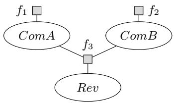  
(a)

<table><tr><td colspan="3">ComA ComB Rev φ3(ComA, ComB, Rev)</td></tr><tr><td>high</td><td>high</td><td>high 41</td></tr><tr><td>high</td><td>high low</td><td>42</td></tr><tr><td>high</td><td>low</td><td>high 43</td></tr><tr><td>high</td><td>low low</td><td>44</td></tr><tr><td>low</td><td>high</td><td>high 43</td></tr><tr><td>low</td><td>high</td><td>low 44</td></tr><tr><td>low</td><td>low high</td><td>45</td></tr><tr><td>low</td><td>low low</td><td>46</td></tr></table>

(b)  
Fig. 1: (a) An FG modelling the interplay between the competences of two employees and the revenue of the company they work for. (b) The function definition of ϕ3, where $\varphi _ { 1 } , \ldots , \varphi _ { 6 } \in \mathbb { R } _ { \ge 0 }$ with $\varphi _ { i } \neq \varphi _ { j }$ for all $i \neq j$

Ex. 1 illustrates that the output of $\phi _ { 3 } ( C o m A , C o m B , R e v )$ depends only on the number of highly competent employees, not on their identities. For instance, $\phi _ { 3 } ( C o m A = \mathrm { h i g h } , C o m B = \mathrm { l o w } , R e v = \mathrm { h i g h } ) = \phi _ { 3 } ( C o m A = \mathrm { l o w } , C o m B = \mathrm { i n i g h } )$ high, $R e v = \mathrm { h i g h } ) = \varphi _ { 3 }$ . Thus, permuting ComA and ComB leaves the output unchanged—only the count of competences set to high matters. This invariance under permutations is a key property exploited by lifted inference algorithms and motivates the following formal definition of commutativity.

Definition 2 (Commutative Factor [7]). Let $\phi ( R _ { 1 } , \ldots , R _ { n } )$ denote a factor and let $\pmb { C } _ { \phi } \subseteq \pmb { R } _ { \phi } : = \{ R _ { 1 } , \ldots , R _ { n } \}$ be a subset of ϕ’s arguments with $| C _ { \phi } | \ge 2$ Then, ϕ is commutative with respect to $C _ { \phi }$ if for all assignments $\pmb { r } = ( r _ { 1 } , \ldots ,$ $r _ { n } ) \in \mathcal { X } _ { R _ { \phi } }$ it holds that $\phi ( r _ { 1 } , \ldots , r _ { n } ) = \phi ( r _ { \pi ( 1 ) } , \ldots , r _ { \pi ( n ) } )$ for all permutations $\pi \ o f \left\{ 1 , \ldots , n \right\}$ with $\pi ( i ) = i$ for all $R _ { i } \notin C _ { \phi }$

We refer to the arguments in $C _ { \phi }$ as commutative arguments. Note that arguments can only be commutative if they have the same range because only arguments with identical ranges can be permuted. Thus, when searching for commutative arguments, only subsets with the same range need to be considered. Consider again $\phi _ { 3 } ( C o m A , C o m B , R e v )$ from Fig. 1b. According to Def. 2, ϕ is commutative with respect to {ComA, ComB}. The above definition relies on exact equality of potentials. In practice, however, small estimation errors often break this equality even when the underlying symmetry is still present. The next section therefore introduces approximate commutativity.

## 3 Approximate Commutativity

So far, the definition of a commutative factor requires strict equality among potentials, which we relax here, introducing the notion of ε-commutativity based on the idea of ε-equivalence [10], establish its fundamental properties, and derive the bounds needed for its practical application in lifted model construction.

We begin to introduce the more general notion of ε-equivalence between two potentials $\varphi _ { 1 } , \varphi _ { 2 } \in \mathbb { R } _ { \geq 0 }$ , written as $\varphi _ { 1 } = _ { \varepsilon } \varphi _ { 2 }$ , which holds if

$$
\varphi _ { 1 } \in [ \varphi _ { 2 } \cdot ( 1 - \varepsilon ) , \varphi _ { 2 } \cdot ( 1 + \varepsilon ) ] \mathrm { ~ a n d ~ } \varphi _ { 2 } \in [ \varphi _ { 1 } \cdot ( 1 - \varepsilon ) , \varphi _ { 1 } \cdot ( 1 + \varepsilon ) ] .\tag{1}
$$

Two factors are ε-equivalent if there exists a permutation of arguments such that Eq. (1) holds for all pairwise row comparisons of potentials. Combining $\varepsilon -$ equivalence and commutativity naturally leads to the notion of ε-commutativity.

Definition 3 (ε-Commutative Factor). Let $\phi ( R _ { 1 } , \ldots , R _ { n } )$ denote a factor, let $C _ { \phi } \subseteq R _ { \phi }$ be a subset of its arguments with $| C _ { \phi } | \geq 2 ,$ , and $l e t \varepsilon \in [ 0 , 1 ]$ . Then, $\phi$ is ε-commutative with respect to $C _ { \phi }$ if for all assignments $( r _ { 1 } , \ldots , r _ { n } ) \in \mathcal { X } _ { R _ { \phi } }$ and all permutations

$$
\pi \in \pi _ { C _ { \phi } } : = \{ \pi \in S _ { n } \mid \pi ( i ) = i ~ f o r ~ a l l ~ R _ { i } \not \in C _ { \phi } \}
$$

where $S _ { n }$ is the symmetric group over $\{ 1 , \ldots , n \}$ , the potentials $\phi ( r _ { 1 } , \ldots , r _ { n } )$ and $\phi ( r _ { \pi ( 1 ) } , \ldots , r _ { \pi ( n ) } )$ are ε-equivalent, i.e.,

$$
\overset { \cdot } { \phi } ( r _ { 1 } , \ldots , r _ { n } ) \in [ \phi ( r _ { \pi ( 1 ) } , \ldots , r _ { \pi ( n ) } ) \cdot ( 1 - \varepsilon ) , \phi ( r _ { \pi ( 1 ) } , \ldots , r _ { \pi ( n ) } ) \cdot ( 1 + \varepsilon ) ]
$$

$$
\phi ( r _ { \pi ( 1 ) } , \ldots , r _ { \pi ( n ) } ) \in [ \phi ( r _ { 1 } , \ldots , r _ { n } ) \qquad \cdot ( 1 - \varepsilon ) , \phi ( r _ { 1 } , \ldots , r _ { n } ) \qquad \cdot ( 1 + \varepsilon ) ] .
$$

We refer to the arguments in $C _ { \phi }$ as ε-commutative arguments. Note that, for the choice of $\varepsilon = 0 .$ , ε-commutativity reduces to strict commutativity.

As illustrated in Table 1b, the commutativity of a factor can be exploited to obtain a more compact representation of the factor by introducing a CRV that groups the commutative arguments such that the original potentials are replaced by aggregated potentials. Here, ComA and ComB are not listed individually but have been replaced by a CRV $\# _ { E } [ C o m ( E ) ]$ that counts the number of employees with a certain competence (i.e., [2, 0] stands for two employees with a high competence and none with a low competence, [1, 1] stands for one employee with a high competence and one with a low competence, and [0, 2] stands for two employees with a low competence and none with a high competence). Given a commutative factor such as $\phi _ { 3 }$ from Fig. 1b, all assignments that difer only by a permutation of the range values of the commutative arguments share the same potential, so choosing $\varphi _ { i } ^ { * } = \varphi _ { i }$ preserves the semantics exactly. However, for an ε-commutative factor such as $\phi$ from Table 1a, potentials corresponding to assignments only difer by a permutation on the commutative arguments may deviate by a factor of up to $( 1 \pm \varepsilon )$ , and hence collapsing them into a single potential $\boldsymbol { \varphi } _ { i } ^ { * }$ inevitably discards information $\left( \mathrm { e . g . , ~ } \varphi _ { 3 } ^ { \ast } \right.$ must be chosen to represent both $\varphi _ { 3 }$ and $\varphi _ { 3 } ^ { \prime }$ at the same time). We therefore seek to choose $\varphi _ { i } ^ { * }$ such that its deviation from the original potentials is minimised.

Example 2. Consider the factor ϕ(ComA, ComB, Rev) from Table 1a. Given that $\varphi _ { 3 }$ and $\varphi _ { 3 } ^ { \prime }$ as well as $\varphi _ { 4 }$ and $\varphi _ { 4 } ^ { \prime }$ are ε-equivalent for some $\varepsilon \in [ 0 , 1 ]$ , ϕ is ε-commutative with respect to $\{ C o m A , C o m B \}$

<table><tr><td colspan="3">ComA ComB Rev φ(ComA, ComB, Rev)</td></tr><tr><td>high</td><td>high</td><td>high 41</td></tr><tr><td>high</td><td>high low</td><td>42</td></tr><tr><td>high</td><td>low high</td><td>43</td></tr><tr><td>high</td><td>low low</td><td>44</td></tr><tr><td>low</td><td>high high</td><td>43</td></tr><tr><td>low</td><td>high low</td><td>44</td></tr><tr><td>low</td><td>low high</td><td>45</td></tr><tr><td>low</td><td>low low</td><td>46</td></tr></table>

(a)

<table><tr><td colspan="2">#E[Com(E)] Rev φ(#E[Com(E)], Rev)</td></tr><tr><td>[2,0]</td><td>high φ1</td></tr><tr><td>[2,0]</td><td>low 4φ 2</td></tr><tr><td>[1, 1]</td><td>high φ3</td></tr><tr><td>[1, 1]</td><td>low 44</td></tr><tr><td>[0,2]</td><td>high 45</td></tr><tr><td>[0, 2]</td><td>low φ6</td></tr></table>

(b)  
Table 1: (a) An exemplary factor ϕ(ComA, ComB, Rev) with ε-commutative arguments {ComA, ComB} provided that $\varphi _ { 3 }$ and $\varphi _ { 3 } ^ { \prime }$ as well as $\varphi _ { 4 }$ and $\varphi _ { 4 } ^ { \prime }$ are ε- equivalent. (b) A compressed representation of ϕ(ComA, ComB, Rev) from (a) using a CRV to represent the ε-commutative arguments {ComA, ComB}.

In the following, we aim to find an optimal representative factor to compress an ε-commutative factor such that the underlying semantics is preserved as much as possible. To do so, we need a few theoretical properties induced by the notion of ε-commutativity. The following lemma, which has been proven only across diferent factors [10, Lemma $6 ] ,$ , establishes a useful consequence of the symmetric definition of ε-commutativity and serves as a tool to derive subsequent bounds.

Lemma 1. Let ϕ denote a factor that is ε-commutative with respect to a subset of its arguments $C _ { \phi }$ . Then, for all permutations $\pi \in \pi _ { C _ { \phi } }$ , it holds that

$$
\begin{array} { l } { \displaystyle \phi ( \boldsymbol { r } _ { 1 } , \ldots , \boldsymbol { r } _ { n } ) \in [ \phi ( \boldsymbol { r } _ { \pi ( 1 ) } , \ldots , \boldsymbol { r } _ { \pi ( n ) } ) \cdot \frac { 1 } { 1 + \varepsilon } , \phi ( \boldsymbol { r } _ { \pi ( 1 ) } , \ldots , \boldsymbol { r } _ { \pi ( n ) } ) \cdot ( 1 + \varepsilon ) ] \ a n d } \\ { \displaystyle \phi ( \boldsymbol { r } _ { \pi ( 1 ) } , \ldots , \boldsymbol { r } _ { \pi ( n ) } ) \in [ \phi ( \boldsymbol { r } _ { 1 } , \ldots , \boldsymbol { r } _ { n } ) \qquad \cdot \frac { 1 } { 1 + \varepsilon } , \phi ( \boldsymbol { r } _ { 1 } , \ldots , \boldsymbol { r } _ { n } ) \qquad \cdot ( 1 + \varepsilon ) ] . } \end{array}
$$

The proof follows the same structural argument as [10, Lemma 6], using the symmetric definition of ε-commutativity. Details are given in App. A.

Before we turn our attention to the compression of an ε-commutative factor, we briefly state two important structural properties of ε-commutativity, which are algorithmically relevant when it comes to detecting ε-commutativity of a factor (which needs to be done before the compression can take place). A natural question is whether ε-commutativity with respect to a set is inherited by its subsets (as it is the case for the exact version of commutativity [9, Prop. 10]).

Proposition 1. Let ϕ be ε-commutative with respect to $C _ { \phi } .$ Then, ϕ is ε- commutative with respect to every subset $C _ { \phi } ^ { \prime } \subseteq C _ { \phi }$ satisfying $| C _ { \phi } ^ { \prime } | \geq 2$

Proof. Since, $C _ { \phi } ^ { \prime } \subseteq C _ { \phi }$ , we have $\pi _ { C _ { \phi } ^ { \prime } } \subseteq \pi _ { C _ { \phi } }$ . Hence, by Def. 3, for all $\pi \in \pi _ { C _ { \phi } }$ and assignments $\pmb { r } = ( r _ { 1 } , \ldots , r _ { n } )$ , it holds that

$$
\begin{array} { r l } & { \qquad \phi ( \pmb { r } ) \in [ \dot { \phi } ( r _ { \pi ( 1 ) } , \dots , r _ { \pi ( n ) } ) \cdot ( 1 - \varepsilon ) , \phi ( r _ { \pi ( 1 ) } , \dots , r _ { \pi ( n ) } ) \cdot ( 1 + \varepsilon ) ] \mathrm { ~ a n d ~ } } \\ & { \phi ( r _ { \pi ( 1 ) } , \dots , r _ { \pi ( n ) } ) \in [ \phi ( \pmb { r } ) } & { \cdot ( 1 - \varepsilon ) , \phi ( \pmb { r } ) } \end{array}
$$

Since $\pi _ { C _ { \phi } ^ { \prime } } \subseteq \pi _ { C _ { \phi } }$ , the same relations hold for all $\pi ^ { \prime } \in \varPi _ { C _ { \phi } ^ { \prime } }$

Prop. 1 shows that ε-commutativity is preserved when moving from a set of randvars to its subsets. Hence, a factor that is commutative with respect to $C _ { \phi } ^ { \prime }$ may be ε-commutative with respect to a strict superset $C _ { \phi } \supseteq C _ { \phi } ^ { \prime } ,$ , thereby enabling further compression of the original factor. An important follow-up question is whether local ε-commutativity of smaller subsets implies this also for their union, which is indeed the case for exact commutativity [9, Theorem 11] and gives rise to an eficient algorithm to compute subsets of commutative arguments [9, Algorithm 2]. The following theorem shows that the corresponding property does not hold for ε-commutativity, implying that computing subsets of ε-commutative arguments is more sophisticated than computing subsets of strictly commutative arguments.

Theorem 1. ε-commutativity is not closed under unions of sets with respect to which a factor ϕ is ε-commutative.

Proof. Let $( r _ { 1 } , r _ { 2 } , r _ { 3 } ) \in \times _ { i = 1 } ^ { 3 }$ {high, medium, low} denote any assignment to the randvars $R _ { 1 } , R _ { 2 } , R _ { 3 }$ . Let $\varepsilon$ be 0.1. The potentials of the factor $\phi$ are given by

<table><tr><td> $R _ { 1 }$ </td><td> $R _ { 2 }$ </td><td> $R _ { 3 }$ </td><td> $| \phi ( R _ { 1 } , R _ { 2 } , R _ { 3 } )$ </td></tr><tr><td>high</td><td>medium</td><td>low</td><td>1</td></tr><tr><td>high</td><td>low</td><td>medium</td><td>1.1</td></tr><tr><td>medium</td><td>high</td><td>low</td><td>1.1</td></tr><tr><td>medium</td><td>low</td><td>high</td><td>1.21</td></tr><tr><td>low</td><td>high</td><td>medium</td><td>1.21</td></tr><tr><td>low</td><td>medium</td><td>high</td><td>1.1</td></tr></table>

All non-listed assignments are mapped to the potential 1. ϕ is ε-commutative with respect to all individual pairs $\{ R _ { 1 } , R _ { 2 } \} , \{ R _ { 1 } , R _ { 3 } \}$ , and $\{ R _ { 2 } , R _ { 3 } \}$ , but not with respect to the set $\{ R _ { 1 } , R _ { 2 } , R _ { 3 } \}$ . Consider the assignment $( r _ { 1 } , r _ { 2 } , r _ { 3 } ) = ( \mathrm { h i g h }$ medium, low) and the permutation $\pi ( 1 ) = 3 , \pi ( 2 ) = 1 , \pi ( 3 ) = 2$ , (cycle of two transpositions), which maps (high, medium, low) to $( r _ { \pi ( 1 ) } , r _ { \pi ( 2 ) } , r _ { \pi ( 3 ) } ) = ( r _ { 3 } , r _ { 1 }$ $r _ { 2 } ) = ( \mathrm { l o w }$ , high, medium). However, ϕ(high, medium, low) = 1 is not an element of the interval [ϕ(low, high, medium)·(1−0.1), ϕ(low, high, medium) $\cdot ( 1 + 0 . 1 ) ] =$ [1.089, 1.331]. Thus, ϕ is not ε-commutative with respect to $\{ R _ { 1 } , R _ { 2 } , R _ { 3 } \}$ □

Theorem 1 implies that the algorithm presented in [9, Algorithm 2] to eficiently compute a maximum sized subset of commutative arguments cannot directly be transferred to compute a subset of ε-commutative arguments instead. We next turn our attention to the compression of an ε-commutative factor, which is performed by replacing it with a smaller representative factor.

## 3.1 Replacement of Potentials by Representative

The construction developed in this subsection formalises the aggregation of potentials over symmetry sets induced by permutations of ε-commutative arguments. We first introduce symmetrised representative factors as weighted representatives over symmetry sets and then study the algebraic structure induced by the permutation group $\scriptstyle { \mathit { \Pi } } \pi _ { C _ { \phi } }$ , which partitions the assignment space into equivalence classes of pairwise ε-equivalent potentials.

Definition 4 (Symmetrised Representative Factor). Let $\phi ( R _ { 1 } , \ldots , R _ { n } )$ be a factor, which is ε-commutative with respect to $\pmb { C } _ { \phi } \subseteq \pmb { R } _ { \phi } = \{ R _ { 1 } , \ldots , R _ { n } \}$ For an assignment $\pmb { r } = ( r _ { 1 } , \ldots , r _ { n } ) \in \mathcal { X } _ { \pmb { R } _ { \phi } }$ , the symmetrised representative factor $\phi ^ { * }$ associated with ϕ is defined by

$$
\phi ^ { * } ( \pmb { r } ) : = \sum _ { \pmb { r } ^ { \prime } \in \mathfrak { S } _ { \phi } ( \pmb { r } ) } \omega _ { \pmb { r } ^ { \prime } } \cdot \phi ( \pmb { r } ^ { \prime } ) ,
$$

where $\mathfrak { S } _ { \phi } ( r ) : = \left. \left\{ \left( r _ { \pi ( 1 ) } , \ldots , r _ { \pi ( n ) } \right) \ \middle | \ \pi \in \pi _ { C _ { \phi } } \right\} \right.$ denotes the symmetry set of r under permutations of the ε-commutative arguments, and where the weights satisfy $\omega _ { r ^ { \prime } } \geq 0$ and $\begin{array} { r } { \sum _ { r ^ { \prime } \in \mathfrak { S } _ { \phi } ( r ) } \omega _ { r ^ { \prime } } = 1 } \end{array}$

To better understand why such a construction is possible, we first investigate the structure underlying these symmetry classes. This leads us to examine $\Pi _ { C _ { \phi } } ,$ which is shown to be closed under composition and inversion in the following.

Lemma 2. For a set $\pmb { C } _ { \phi } \subseteq \pmb { R } _ { \phi } = \{ R _ { 1 } , \ldots , R _ { n } \} , \ : \pi _ { C _ { \phi } }$ is a subgroup of $S _ { n }$ .

Proof. By definition $\pi _ { \mathrm { i d } } \in \pi _ { C _ { \phi } } . \operatorname { I f } \pi _ { 1 } , \pi _ { 2 } \in \pi _ { C _ { \phi } }$ , then $\begin{array} { r l } { \big ( \pi _ { 1 } \circ \pi _ { 2 } \big ) ( i ) = \pi _ { 1 } ( \pi _ { 2 } ( i ) ) = } & { { } } \end{array}$ $\pi _ { 1 } ( i ) = i$ for all $R _ { i } \notin C _ { \phi }$ , resulting in closed group operations $\pi _ { 1 } \circ \pi _ { 2 } \in \pi _ { C _ { \phi } }$ . If $\pi \in \pi _ { C _ { \phi } } ,$ then $\pi \in S _ { n }$ due to ${ \cal { I } } I _ { C _ { \phi } } \subseteq S _ { n } . \ S _ { n }$ is a group and therefore $\pi ^ { - 1 } \in S _ { n }$ This means that for all i with $R _ { i } \not \in C _ { \phi }$ it holds that $i = \pi _ { \mathrm { i d } } ( i ) = ( \pi ^ { - 1 } \circ \pi ) ( i ) =$ $\pi ^ { - 1 } ( \pi ( i ) ) = \pi ^ { - 1 } ( i )$ , which means that the inverse $\pi ^ { - 1 }$ is also in $\bar { I } \bar { I } _ { C _ { \phi } . } \qquad \sqbigcup$

This subgroup naturally induces a group operation of $\Pi _ { C _ { \phi } }$ on the assignment space $\mathcal { X } _ { R _ { d } }$ via $( r _ { 1 } , \ldots , r _ { n } ) \mapsto ( r _ { \pi ( 1 ) } , \ldots , r _ { \pi ( n ) } )$ for $\pi \in \pi _ { C _ { \phi } }$ , whose properties are inherited by the corresponding symmetry sets ${ \mathfrak { S } } _ { \phi } ( { \pmb r } )$

Hence, symmetry sets are precisely the orbits of this group operation.

Corollary 1. Let $\phi ( R _ { 1 } , \ldots , R _ { n } )$ be a factor, which is ε-commutative with $r e \mathrm { - }$ spect to ${ \pmb { C } } _ { \phi } \subseteq { \pmb { R } } _ { \phi } = \{ R _ { 1 } , \ldots , R _ { n } \} . \mathrm { ~ } I f \pmb { r } ^ { \prime } \in \mathfrak { S } _ { \phi } ( \pmb { r } )$ , then ${ \mathfrak { S } } _ { \phi } ( { \pmb r } ^ { \prime } ) = { \mathfrak { S } } _ { \phi } ( { \pmb r } )$

Proof. As $\pmb { r } ^ { \prime } \in \mathfrak { S } _ { \phi } ( \pmb { r } )$ , there exists $\pi _ { 1 } \in \pi _ { C _ { \phi } }$ such that $\pmb { r } ^ { \prime } = \left( r _ { \pi _ { 1 } ( 1 ) } , \ldots , r _ { \pi _ { 1 } ( n ) } \right)$ Let $r ^ { \prime \prime } \in \mathfrak { S } _ { \phi } ( r ^ { \prime } )$ . Then, there is $\pi _ { 2 } \in \pi _ { C _ { \phi } }$ such that $r ^ { \prime \prime } = ( r _ { \pi _ { 2 } ( 1 ) } ^ { \prime } , \ldots , r _ { \pi _ { 2 } ( n ) } ^ { \prime } ) =$ $\left( r _ { \pi _ { 1 } \left( \pi _ { 2 } \left( 1 \right) \right) } , \ldots , r _ { \pi _ { 1 } \left( \pi _ { 2 } \left( n \right) \right) } \right)$ . Since $\scriptstyle { \mathit { \Pi } } \varPi _ { C _ { \phi } }$ is a subgroup of $S _ { n } ,$ it is closed under composition, hence $\pi _ { 1 } \circ \pi _ { 2 } \in \pi _ { C _ { \phi } }$ . Therefore $\pmb { r } ^ { \prime \prime } \in \mathfrak { S } _ { \phi } ( \pmb { r } )$ , which shows ${ \mathfrak { S } } _ { \phi } ( { \pmb r } ^ { \prime } ) \subseteq$ ${ \mathfrak { S } } _ { \phi } ( { \pmb r } )$ . The reverse inclusion follows analogously for $\pi _ { 1 } ^ { - 1 } , \pi _ { 2 } ^ { - 1 } \in \pi _ { C _ { \phi } }$ □

While the previous result describes how ε-commutativity behaves on the level of argument subsets, the following lemma establishes the induced equivalence on the level of potentials via ε-equivalence.

Lemma 3. Let $\phi ( R _ { 1 } , \ldots , R _ { n } )$ be ε-commutative with respect to $C _ { \phi }$ . Then, all potentials induced by assignments within the same symmetry set are pairwise ε-equivalent, $i . e . , \ i f \ r ^ { \prime } , r ^ { \prime \prime } \in \mathfrak { S } _ { \phi } ( r )$ , then $\phi ( { \pmb r } ^ { \prime } ) = _ { \varepsilon } \phi ( { \pmb r } ^ { \prime \prime } )$ .

Proof. Let $r ^ { \prime } , r ^ { \prime \prime } \in \mathfrak { S } _ { \phi } ( r )$ . Then there exist permutations $\pi _ { 1 } , \pi _ { 2 } \in \pi _ { C _ { \phi } }$ such that $\pmb { r } ^ { \prime } = \left( r _ { \pi _ { 1 } ( 1 ) } , \ldots , r _ { \pi _ { 1 } ( n ) } \right)$ and $\pmb { r } ^ { \prime \prime } = \left( r _ { \pi _ { 2 } ( 1 ) } , \ldots , r _ { \pi _ { 2 } ( n ) } \right)$ . Since $\scriptstyle { \mathit { \Pi } } \varPi _ { C _ { \phi } }$ is a subgroup of $S _ { n }$ (Lemma 2), it is closed under composition and taking inverses.

Hence, $\tau : = \pi _ { 2 } \circ \pi _ { 1 } ^ { - 1 } \in \pi _ { C _ { \phi } }$ . Therefore, $\boldsymbol { r } ^ { \prime \prime } = ( r _ { \tau ( 1 ) } ^ { \prime } , \dots , r _ { \tau ( n ) } ^ { \prime } )$ . Because $\phi$ is ε-commutative with respect to $C _ { \phi }$ , it follows from Def. 3 that $\phi ( { \pmb r } ^ { \prime } ) \in [ \phi ( { \pmb r } ^ { \prime \prime } )$ $( 1 - \varepsilon ) , \phi ( { \pmb r } ^ { \prime \prime } ) \cdot ( 1 + \varepsilon ) ]$ and $\phi ( \pmb { r } ^ { \prime \prime } ) \in [ \phi ( \pmb { r } ^ { \prime } ) \cdot ( 1 - \varepsilon ) , \phi ( \pmb { r } ^ { \prime } ) \cdot ( 1 + \varepsilon ) ]$ . Hence, it holds that $\phi ( r _ { 1 } ^ { \prime } , \ldots , r _ { n } ^ { \prime } ) = _ { \varepsilon } \phi ( r _ { 1 } ^ { \prime \prime } , \ldots , r _ { n } ^ { \prime \prime } )$ □

Thus, we can also view ${ \mathfrak { S } } _ { \phi } ( { \pmb r } ) = : [ { \pmb r } ] _ { \phi }$ as the equivalence class of the equivalence relation ∼ on $\mathcal { X } _ { R _ { \phi } }$ induced by the group operation of $\scriptstyle { \mathit { \Pi } } \varPi _ { C _ { \phi } }$

$$
r \sim r ^ { \prime } \quad : { \Longleftrightarrow } \quad \exists \pi \in \pi _ { C _ { \phi } } : ( r _ { 1 } ^ { \prime } , \ldots , r _ { n } ^ { \prime } ) = ( r _ { \pi ( 1 ) } , \ldots , r _ { \pi ( n ) } ) .
$$

Consequently, the quotient space ${ \mathit { X } } _ { R _ { \phi } } / \sim$ is well-defined and can be identified with the set of all symmetry sets. Hence, there exists a representative set $\mathcal { X } _ { \mathcal { R } _ { \phi } } \subset$ $\mathcal { X } _ { R _ { \phi } }$ containing exactly one element per equivalence class, inducing a bijection

$$
\mathcal { X } _ { R _ { \phi } } / \sim \cong \ \{ [ r ] _ { \phi } \ | \ r \in \mathcal { X } _ { \mathcal { R } _ { \phi } } \} = \{ \mathfrak { S } _ { \phi } ( r ) \ | \ r \in \mathcal { X } _ { \mathcal { R } _ { \phi } } \} .
$$

Diferent symmetry sets (equivalence classes) of the same factor may induce diferent weighting schemes. Within each equivalence class, however, the weights must be chosen consistently with the quotient structure ${ \mathit { X } } _ { R _ { \phi } } / \sim$ so that every class contributes exactly once to the representative potential (for the size of the symmetry set, see Section A.1). This raises the question whether replacing potentials by symmetrised representatives preserves ε-equivalence of factors.

Theorem 2. Let $\phi$ be ε-commutative with respect to $C _ { \phi }$ and let $\phi ^ { * }$ be its symmetrised representative factor for $\varepsilon \in [ 0 , 1 ]$ . Then, ϕ and $\phi ^ { * }$ are ε-equivalent.

Proof. By Lemma 3, all potentials $\phi ( { \pmb r } ^ { \prime } )$ with $\pmb { r } ^ { \prime } \in \mathfrak { S } _ { \phi } ( \pmb { r } )$ are pairwise ε-equivalent Hence, by [17, Theorem 15], any weighted mean $\sum _ { \pmb { r } ^ { \prime } \in \mathfrak { S } _ { \phi } ( \pmb { r } ) } \omega _ { \pmb { r } ^ { \prime } } \cdot \phi ( \pmb { r } ^ { \prime } )$ is also $\varepsilon -$ equivalent to $\phi ( { \pmb r } ^ { \prime } )$ . Applied row-wise to all assignments and potentials relative to their equivalence classes, this yields ε-equivalent factors. □

Choosing the arithmetic mean $\overline { { \phi } }$ as the symmetrised representative factor arises as a trivial special case of Thm. 2 by assigning uniform weights $\omega _ { r ^ { \prime } } : =$ $\frac { 1 } { | \mathfrak { S } _ { \phi } ( { \pmb r } ) | }$ on ${ \mathfrak { S } } _ { \phi } ( { \pmb r } )$ for which $\begin{array} { r } { \sum _ { r ^ { \prime } \in \mathfrak { S } _ { \phi } ( r ) } \omega _ { r ^ { \prime } } = 1 } \end{array}$ holds, yielding $\phi ^ { * } ( r ) = \overline { { \phi } } ( r )$ .

Corollary 2. Let ϕ be ε-commutative with respect to $C _ { \phi }$ and let the mean

$$
\phi ^ { * } ( \pmb { r } ) : = \overline { { \phi } } ( \pmb { r } ) : = \frac { 1 } { | \mathfrak { S } _ { \phi } ( \pmb { r } ) | } \sum _ { \pmb { r } ^ { \prime } \in \mathfrak { S } _ { \phi } ( \pmb { r } ) } \phi ( \pmb { r } ^ { \prime } ) ,\tag{2}
$$

be defined with weights $\begin{array} { r } { \omega _ { r ^ { \prime } } : = \frac { 1 } { | \mathfrak { S } _ { \phi } ( r ) | } } \end{array}$ for $\pmb { r } ^ { \prime } \in \mathfrak { S } _ { \phi } ( \pmb { r } )$ for a given $\varepsilon \in [ 0 , 1 ]$ . Then $\phi ^ { * }$ is a symmetrised representative factor of $\phi$ and is ε-equivalent to ϕ.

The mean is particularly attractive as it treats all symmetric assignments uniformly avoiding bias towards specific permutations and minimises the squared deviation [10]. It is also optimal with respect to the squared deviation in the sense that, when all values $\phi ( { \pmb r } ^ { \prime } )$ are replaced by the same representative within the group $\pmb { r } \in \mathfrak { S } _ { \phi } ( \pmb { r } )$ , the resulting deviation from the original factor is minimised. These properties make it a natural choice for the symmetrised representative factor in practical implementations (see Sec. 4 for experiments). However, when prior knowledge indicates a bias toward specific arguments in the underlying data, or when domain expertise is available, the weights assigned to individual arguments of the original factor can always be adapted accordingly.

## 3.2 Asymptotic Bounds

To quantify the approximation error induced by symmetrisation, we next analyse the resulting deviation between the original model and the model obtained by symmetrising ε-commutative factors. We make use of the following symmetric distance measure, which allows us to bound the change in query results [2, 10].

Definition 5 ([2]). The symmetric distance $D _ { C D } ( P _ { M } , P _ { M ^ { \prime } } )$ between two distributions $P _ { M }$ and $P _ { M ^ { \prime } }$ introduced in $[ \mathcal { Q } ]$ (see $[ 1 0 ]$ for details) is defined as

$$
D _ { C D } ( P _ { M } , P _ { M ^ { \prime } } ) : = \ln \operatorname* { m a x } _ { r } { \frac { P _ { M ^ { \prime } } ( { \pmb r } ) } { P _ { M } ( { \pmb r } ) } } - \ln \operatorname* { m i n } _ { { \pmb r } } { \frac { P _ { M ^ { \prime } } ( { \pmb r } ) } { P _ { M } ( { \pmb r } ) } }\tag{3}
$$

$$
= \ln \operatorname* { m a x } _ { \pmb { r } } \frac { \psi ^ { \prime } ( \pmb { r } ) } { \psi ( \pmb { r } ) } - \ln \operatorname* { m i n } _ { \pmb { r } } \frac { \psi ^ { \prime } ( \pmb { r } ) } { \psi ( \pmb { r } ) } .\tag{4}
$$

With this measure at hand, we first derive a general bound for arbitrary weighting schemes.

Theorem 3. Let M be an FG with factors $\phi _ { 1 } , \ldots , \phi _ { m } ,$ , of which $\phi _ { 1 } , \ldots , \phi _ { k }$ with $0 \leq k \leq m$ are ε-commutative with respect to $\boldsymbol { C } _ { \phi _ { 1 } } , \ldots , \boldsymbol { C } _ { \phi _ { k } }$ , respectively. Let $M ^ { \prime }$ be the FG with factors $\phi _ { 1 } ^ { * } , \ldots , \phi _ { k } ^ { * } , \phi _ { k + 1 } , \ldots , \phi _ { m }$ , where ε-commutative factors of M are replaced by their symmetrised representative factors. Further, let $P _ { M }$ and $P _ { M ^ { \prime } }$ denote the underlying full joint probability distributions encoded by M and $M ^ { \prime }$ , respectively. Then, it holds that

$$
D _ { C D } ( P _ { M } , P _ { M ^ { \prime } } ) \leq \ln { ( 1 + \varepsilon ) } ^ { 2 k } .
$$

Proof. According to Def. 3, every updated potential $\phi _ { i } ^ { * } ( \pmb { r } _ { i } )$ in M′ difers from its original potential $\phi _ { i } ( \pmb { r } _ { i } )$ in M by at most a factor $( 1 \pm \varepsilon )$ for $i = 1 , \ldots , k .$ while all remaining factors $i > k$ are left unchanged. Since $\begin{array} { r } { \psi ( \pmb { r } ) = \prod _ { j = 1 } ^ { m } \phi _ { j } ( \pmb { r } _ { j } ) } \end{array}$ for any assignment r, using Lemma 1 we obtain

$$
\psi ^ { \prime } ( { \pmb r } ) \geq \prod _ { j = 1 } ^ { k } \phi _ { j } ( { \pmb r } _ { j } ) \cdot \frac { 1 } { 1 + \varepsilon } \cdot \prod _ { j = k + 1 } ^ { m } \phi _ { j } ( { \pmb r } _ { j } ) = \frac { 1 } { ( 1 + \varepsilon ) ^ { k } } \cdot \prod _ { j = 1 } ^ { m } \phi _ { j } ( { \pmb r } _ { j } ) , \mathrm { ~ a n d ~ }
$$

$$
\psi ^ { \prime } ( \pmb { r } ) \leq \prod _ { j = 1 } ^ { k } \phi _ { j } ( \pmb { r } _ { j } ) \cdot ( 1 + \varepsilon ) \cdot \prod _ { j = k + 1 } ^ { m } \phi _ { j } ( \pmb { r } _ { j } ) = ( 1 + \varepsilon ) ^ { k } \cdot \prod _ { j = 1 } ^ { m } \phi _ { j } ( \pmb { r } _ { j } ) .
$$

Consequently,

$$
\displaystyle \operatorname* { m i n } _ { r } \frac { \psi ^ { \prime } ( { \pmb r } ) } { \psi ( { \pmb r } ) } \geq \frac { \frac { 1 } { ( 1 + \varepsilon ) ^ { k } } \cdot \prod _ { j = 1 } ^ { m } \phi _ { j } ( { \pmb r } _ { j } ) } { \displaystyle \prod _ { j = 1 } ^ { m } \phi _ { j } ( { \pmb r } _ { j } ) } = \frac { 1 } { ( 1 + \varepsilon ) ^ { k } } , \mathrm { ~ a n d }
$$

$$
\operatorname* { m a x } _ { r } \frac { \psi ^ { \prime } ( r ) } { \psi ( r ) } \leq \frac { ( 1 + \varepsilon ) ^ { k } \cdot \prod _ { j = 1 } ^ { m } \phi _ { j } ( r _ { j } ) } { \displaystyle \prod _ { j = 1 } ^ { m } \phi _ { j } ( r _ { j } ) } = ( 1 + \varepsilon ) ^ { k } ,
$$

where $\boldsymbol { r } _ { j } \in \mathcal { X } _ { \boldsymbol { R } _ { \phi _ { j } } }$ denotes the projection of $\boldsymbol { r } \in \mathcal { X } _ { R }$ . Substituting these bounds into Eq. (4) yields $D _ { C D } ( P _ { M } , P _ { M ^ { \prime } } ) \leq \ln ( 1 + \varepsilon ) ^ { k } - \ln { 1 } / ( 1 + \varepsilon ) ^ { k } = \ln ( 1 + \varepsilon ) ^ { 2 k }$ . □

For the special case of arithmetic averaging, we can sharpen this bound.

Lemma 4. Let $\phi$ be an ε-commutative factor with respect to $C _ { \phi }$ , let $\chi _ { \mathcal { R } _ { \phi } } =$ $\dot { \cup } _ { j = 1 } ^ { l } \{ r ^ { j } \}$ be a set of disjoint representatives rj for all disjoint equivalence classes $\dot { \cup } _ { j = 1 } ^ { l } [ { \pmb r } ^ { j } ] _ { \phi } = \dot { \cup } _ { j = 1 } ^ { l } \mathfrak { S } _ { \phi } ( { \pmb r } ^ { j } ) = \mathcal { X } _ { { \pmb R } _ { \phi } }$ ordered by size such that $m _ { 1 } : = | [ r ^ { 1 } ] _ { \phi } | \geq . . . \geq$ $m _ { l } : = | [ \pmb { r } ^ { l } ] _ { \phi } | \geq 1$ , and let $\phi ^ { * }$ be the symmetrised representative factor via the mean as in Eq. (2). Then,

$$
1 \ \leq \ \frac { \operatorname* { m a x } _ { r } \frac { \phi ^ { * } ( r ) } { \phi ( r ) } } { \operatorname* { m i n } _ { r } \frac { \phi ^ { * } ( r ) } { \phi ( r ) } } \ \leq \ \frac { \left( 1 + \frac { m _ { 2 } - 1 } { m _ { 2 } } \varepsilon \right) ( 1 + \varepsilon ) } { 1 + \frac { 1 } { m _ { 1 } } \varepsilon } .
$$

Condensed Proof (Longer Version inApp. A). The mean $\phi ^ { * } ( r )$ is uniquely determined within each equivalence class $\lbrack r ^ { j } \rbrack _ { \phi }$ . First, observe that for every equivalence class $\lbrack r ^ { j } \rbrack _ { \phi }$ and all $r ^ { \prime } , r ^ { \prime \prime } \in [ r ^ { j } ] _ { \phi }$ , Lemma 3 implies pairwise ε-equivalence, so the potentials $\phi ( { \pmb r } ^ { \prime \prime } )$ within one equivalence class $\big [ r ^ { j } \big ] _ { \phi }$ can be ordered

$$
0 \leq \frac { 1 } { 1 + \varepsilon } \phi ( r ^ { j , \operatorname* { m a x } } ) \leq \phi ( r ^ { j , \operatorname* { m i n } } ) \leq \phi ( r ^ { \prime \prime } ) \leq \phi ( r ^ { j , \operatorname* { m a x } } ) \leq \phi ( r ^ { j , \operatorname* { m i n } } ) ( 1 + \varepsilon ) ,
$$

where $\begin{array} { r } { \phi ( \pmb { r } ^ { j , \operatorname* { m a x } } ) : = \operatorname* { m a x } _ { \pmb { r } ^ { \prime } \in [ \pmb { r } ^ { j } ] _ { \phi } } \phi ( \pmb { r } ^ { \prime } ) } \end{array}$ and $\begin{array} { r } { \phi ( \pmb { r } ^ { j , \mathrm { m i n } } ) : = \operatorname* { m i n } _ { \pmb { r } ^ { \prime } \in [ \pmb { r } ^ { j } ] _ { \phi } } \phi ( \pmb { r } ^ { \prime } ) } \end{array}$ . When the maximum and minimum originate from two diferent equivalence classes $\left[ r ^ { i } \right] _ { \phi }$ and $\lbrack r ^ { j } \rbrack _ { \phi }$ with $i \neq j$ , the worst-case assignments are independent. For the maximum choose $\phi ( \pmb { r } ) = \phi ( \pmb { r } ^ { i , \operatorname* { m i n } } )$ , while all remaining potentials in the same equivalence class attain their maximal admissible value $\phi ( { \pmb r } ^ { \prime } ) : = \phi ( { \pmb r } ^ { i , \operatorname* { m a x } } ) =$ $( 1 + \varepsilon ) \phi ( r ^ { i , \mathrm { { m i n } } } )$ for all $r ^ { \prime } \in [ r ^ { i } ] _ { \phi } \setminus \{ r \}$ . This yields

$$
\operatorname* { m a x } _ { r \in [ r ^ { i } ] _ { \phi } } \frac { \phi ^ { \star } ( r ) } { \phi ( r ) } = \frac { ( \phi ( r ^ { i , \operatorname* { m i n } } ) + ( | [ r ^ { i } ] _ { \phi } | - 1 ) ( 1 + \varepsilon ) \phi ( r ^ { i , \operatorname* { m i n } } ) ) / | [ r ^ { i } ] _ { \phi } | } { \phi ( r ^ { i , \operatorname* { m i n } } ) } = 1 + \frac { ( m _ { i } - 1 ) \varepsilon } { m _ { i } }
$$

For the minimum choose $\phi ( \pmb { r } ) = \phi ( \pmb { r } ^ { j , \mathrm { m a x } } )$ , while all remaining values in the same equivalence class attain their minimal admissible value $\phi ( \pmb { r } ^ { \prime } ) : = \phi ( \pmb { r } ^ { j , \mathrm { m i n } } ) =$ $\textstyle { \frac { 1 } { 1 + \varepsilon } } \phi ( r ^ { i , \operatorname* { m a x } } )$ for all $r ^ { \prime } \in [ r ^ { j } ] _ { \phi } \setminus \{ r \}$ . Consequently,

$$
\operatorname* { m i n } _ { r \in [ r ^ { j } ] _ { \phi } } \frac { \phi ^ { * } ( r ) } { \phi ( r ) } = \frac { ( ( | [ r ^ { j } ] _ { \phi } | - 1 ) \frac { 1 } { 1 + \varepsilon } \phi ( r ^ { j , \operatorname* { m a x } } ) + \phi ( r ^ { j , \operatorname* { m a x } } ) ) / | [ r ^ { j } ] _ { \phi } | } { \phi ( r ^ { j , \operatorname* { m a x } } ) } = \frac { 1 + \frac { 1 } { m _ { j } } \varepsilon } { 1 + \varepsilon } .
$$

Observe, that $1 + { \frac { ( m _ { i } - 1 ) \varepsilon } { m _ { i } } }$ is monotonically increasing in $m _ { i } .$ , whereas $\frac { 1 + \frac { 1 } { m _ { j } } \varepsilon } { 1 + \varepsilon }$ is monotonically decreasing in $m _ { j }$ . Hence, the largest equivalence classes by size produce the extremal deviations. To determine which class size appear in the numerator and denominator, consider the monotonically decreasing $g ( x ) =$ $\begin{array} { r } { \left( 1 + \frac { x - 1 } { x } \ \varepsilon \right) \left( 1 + \frac { 1 } { x } \varepsilon \right) } \end{array}$ for $x \ge 2$ . Therefore, for $x _ { 1 } , x _ { 2 } \in \mathbb { N } _ { \ge 2 }$ it follows:

$$
g ( x _ { 1 } ) \geq g ( x _ { 2 } ) \Leftrightarrow { \frac { 1 + { \frac { x _ { 1 } - 1 } { x _ { 1 } } } \varepsilon } { 1 + { \frac { 1 } { x _ { 2 } } } \varepsilon } } \geq { \frac { 1 + { \frac { x _ { 2 } - 1 } { x _ { 2 } } } \varepsilon } { 1 + { \frac { 1 } { x _ { 1 } } } \varepsilon } } .
$$

Consequently, the sharpest bound is obtained by using $x _ { 1 } = m _ { 2 }$ and $x _ { 2 } = m _ { 1 }$ When both extrema originate from the same equivalence class, $\phi ^ { * } ( \pmb { r } ) = \phi ^ { * } ( \pmb { r } ^ { \prime } )$ for

all $\pmb { r } , \pmb { r } ^ { \prime } \in [ \pmb { r } ^ { j } ] _ { \phi } ,$ , the quotient is maximised via $\begin{array} { r } { \phi ( \pmb { r } ) = \phi ( \pmb { r } ^ { j , \operatorname* { m i n } } ) = \frac { 1 } { 1 + \varepsilon } \phi ( \pmb { r } ^ { j , \operatorname* { m a x } } ) } \end{array}$ and $\phi ( \pmb { r } ^ { \prime } ) = \phi ( \pmb { r } ^ { j , \operatorname* { m a x } } ) = ( 1 + \varepsilon ) \phi ( \pmb { r } ^ { j , \operatorname* { m i n } } )$ , leading to smaller values

$$
\begin{array} { r } { \frac { \operatorname* { m a x } _ { r \in [ r ^ { j } ] _ { \phi } } \frac { \phi ^ { * } ( r ) } { \phi ( r ) } } { \operatorname* { m i n } _ { r ^ { \prime } \in [ r ^ { j } ] _ { \phi } } \frac { \phi ^ { * } ( r ^ { \prime } ) } { \phi ( r ^ { \prime } ) } } = \frac { \operatorname* { m a x } _ { r \in [ r ^ { j } ] _ { \phi } } \frac { 1 } { \phi ( r ) } } { \operatorname* { m i n } _ { r ^ { \prime } \in [ r ^ { j } ] _ { \phi } } \frac { 1 } { \phi ( r ^ { \prime } ) } } \leq \frac { \frac { 1 } { \phi ( r ^ { j , \operatorname* { m i n } } ) } } { \frac { 1 } { ( 1 + \varepsilon ) \phi ( r ^ { j , \operatorname* { m i n } } ) } } = 1 + \varepsilon . } \end{array}
$$

Combining the class-wise extremal bounds yields the final global statement for the representative mean-construction, which we show next.

Theorem 4. Let M be an FG with factors $\phi _ { 1 } , \ldots , \phi _ { m } ,$ , of which $\phi _ { 1 } , \ldots , \phi _ { k }$ with $0 \leq k \leq$ m are ε-commutative with respect to $\boldsymbol { C } _ { \phi _ { 1 } } , \ldots , \boldsymbol { C } _ { \phi _ { k } }$ , respectively. Let $\chi _ { \mathcal { R } _ { \phi _ { i } } } = \dot { \cup } _ { j = 1 } ^ { l _ { i } } \{ r _ { i } ^ { j } \}$ be the set of disjoint representatives $\boldsymbol { r } _ { i } ^ { j }$ for all equivalence classes $\dot { \cup } _ { j = 1 } ^ { l _ { i } } [ r _ { i } ^ { j } ] _ { \phi _ { i } } = \mathcal { X } _ { R _ { \phi _ { i } } }$ ordered by size with $m _ { 1 _ { i } } : = | [ r _ { i } ^ { 1 } ] _ { \phi _ { i } } | \geq . . . \geq m _ { l _ { i } } : =$ $| [ r _ { i } ^ { l } ] _ { \phi _ { i } } | \geq 1$ . Let M′ be the FG obtained by M by replacing each factor $\phi _ { i }$ by its mean-based symmetrised representative factor $\phi _ { i } ^ { * }$ as in $E q . \ ( 2 )$ . Then, for the induced distributions $P _ { M }$ and $P _ { M ^ { \prime } }$ and $\varepsilon > 0$ , it holds that

$$
{ \cal D } _ { C D } ( P _ { M } , P _ { M ^ { \prime } } ) \leq \ln \prod _ { i = 1 } ^ { k } \frac { \left( 1 + \frac { m _ { 2 i } - 1 } { m _ { 2 i } } \varepsilon \right) ( 1 + \varepsilon ) } { 1 + \frac { 1 } { m _ { 1 i } } \varepsilon } < \ln \left( 1 + \varepsilon \right) ^ { 2 k } .
$$

Proof. The statement follows by factorisation of the joint potential, the determination of the extrema on a projected factor-level instead of a global assignmentlevel, and the class-wise bound from Lemma 4 for the monotonic logarithm.

$$
\begin{array} { r l } & { D _ { C D } ( P _ { M } , P _ { M ^ { \prime } } ) \overset { \mathtt { E q } _ { * } ( \xi ) } { = } \displaystyle \operatorname* { m m } _ { \tau } \operatorname* { m a x } _ { \tau } \frac { \psi ^ { ( \tau ) } } { \psi ( r ) } - \operatorname* { m } _ { \tau } \frac { \psi ^ { ( \tau ) } } { \psi ( r ) } } \\ & { \quad = \displaystyle \operatorname* { l n } _ { \tau } \operatorname* { m a x } _ { \tau } \frac { \prod _ { i = 1 } ^ { k } \phi _ { i } ^ { * } ( r _ { i } ) \prod _ { i = k + 1 } ^ { m _ { i } } \hat { \phi _ { i } } ( r _ { i } ) } { \prod _ { i = 1 } ^ { m _ { i } } \phi _ { i } ( r _ { i } ) } - \ln \operatorname* { m i n } _ { \tau } \frac { \prod _ { i = 1 } ^ { k } \phi _ { i } ^ { * } ( r _ { i } ) \prod _ { i = k + 1 } ^ { m _ { i } } \phi _ { i } ( r _ { i } ) } { \prod _ { i = 1 } ^ { m _ { i } } \hat { \phi _ { i } } ( r _ { i } ) } } \\ & { \quad = \ln \operatorname* { m a x } _ { \tau } \frac { k } { \prod _ { i = 1 } ^ { m _ { i } } \hat { \phi _ { i } } ( r _ { i } ) } - \ln \operatorname* { m i n } _ { \tau } \frac { k } { \prod _ { i = 1 } ^ { m _ { i } } \hat { \phi _ { i } } ( r _ { i } ) } } \\ &  \quad \le \ln \displaystyle \operatorname* { m a x } _ { \tau } \frac { k } { \prod _ { i = 1 } ^ { m _ { i } } \hat { \phi _ { i } } ( r _ { i } ) } - \ln \frac { k } { \prod _ { i = 1 } ^ { m _ { i } } } \frac { \phi _ { i } ^ { * } ( r _ { i } ) } { \phi _ { i } ( r _ { i } ) } = \ln \displaystyle \prod _ { i = 1 } ^ { k } \operatorname* { m a x } _ { \tau } \frac { \phi _ { i } ^ { * } ( r _ { i } ) }  \end{array}
$$

Even more precisely, the bound is sharp in the general non-trivial case.

## Theorem 5. The bound given in Thm. 4 is optimal.

Proof Sketch. Ex. 3 in App. A uses the construction from the proof of Lemma 4 per factor, hits the bound, and is therefore sharp. □

Note that the choice of a multiplicative relaxation in Def. 3 is what makes this bound attainable in the first place, as $D _ { C D }$ is based on quotients of potentials and only relies on relative sizes. An additive relaxation, requiring permuted potentials difer by at most a constant, would lead to arbitrary large deviations.

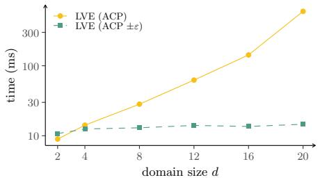

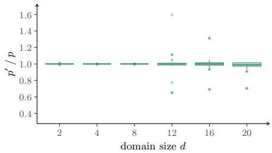  
(a) LVE run time (ms).  
(b) Query result quotient $p ^ { \prime } / p .$  
Fig. 2: Downstream lifted inference performance, averaged over all generated instances and queries. (a) Run time of LVE on the compressed model returned by ACP and its ε-relaxed variant $\left( \operatorname { A C P } \pm \varepsilon \right)$ . (b) Distribution of the per-query quotient $p ^ { \prime } / p$ between the approximate result $p ^ { \prime }$ and the exact result $p .$

## 4 Experiments

We complement our theoretical results with an empirical evaluation assessing to what extent ε-commutativity translates into practical benefits for lifted model construction and downstream inference. In particular, we answer the question of how the trade-of between higher compression and accuracy of query results behaves when compressing ε-commutative factors. Concretely, we compare the run time of LVE on the compressed model returned by the exact ACP algorithm (which is only able to compress strictly commutative factors) to the run time of LVE on the compressed model returned by its ε-relaxed variant using the mean as the symmetrised representative factor (denoted as $^ { 6 6 } \mathrm { A C P } \pm \varepsilon ^ { \mathfrak { N } }$ in the following) and measure the deviation of the query results, quantified by the per-query quotient $p ^ { \prime } \ / \ p$ between the query result $( { \mathrm { i . e . } }$ , marginal probability) $p ^ { \prime }$ obtained on the ACP ±ε-compressed model and the query result $p$ obtained on the exact ACP-compressed model. For our experiments, we use the same input FGs as in the original ACP paper [7] and add noise to the potentials of the (strictly) commutative factors to obtain ε-commutative factors. We only manipulate commutative factors and leave the remaining factors unchanged to investigate the efect of ε-commutativity on the compression-accuracy trade-of in isolation (the efect of grouping diferent factors that are approximately equal has been investigated in [10] and hence, we only consider indistinguishability within factors — characterised by ε-commutativity — and no indistinguishability between factors). Specifically, each input FG contains between $2 d + 1$ and $d$ $\lfloor \log _ { 2 } ( d ) \rfloor + 2 d + 2$ randvars with Boolean range and between $2 d + 1$ and $d$ $\lfloor \log _ { 2 } ( d ) \rfloor + d + 2$ factors, where d $\in \{ 2 , 4 , 8 , 1 2 , 1 6 , 2 0 \}$ controls the size of the FGs. Each input FG contains $k \in \{ 1 , 3 , 7 \}$ ε-commutative factors, where $\varepsilon \in \{ 0 . 0 0 1$ 0.01, 0.1}. The ε-commutative factors are obtained by multiplying the potentials of the (strictly) commutative factors by a uniform sample from $[ 1 , 1 + \varepsilon ]$

Fig. 2 reports the results averaged over all generated instances and queries. Fig. 2a shows that the compression of ε-commutative factors substantially accelerates downstream probabilistic inference, where the speedup increases exponentially with the domain size. At the same time, Fig. 2b confirms that the query results (i.e., marginal probabilities) remain extremely close to those obtained with exact ACP: The per-query quotient p′ / p concentrates tightly around the optimal value one across all evaluated configurations (except for very few outliers). In other words, ACP ±ε unlocks the speedup of lifted inference at almost no loss of accuracy. To give insights into the influence of k and ε, we provide further experimental results for individual choices in App. B.

## 5 Conclusion

We have introduced ε-commutativity, a principled relaxation of commutativity that tolerates the minute numerical deviations that inevitably arise in practice, e.g., when factor potentials are estimated from data. On this basis, we have developed a representative-based compression scheme that collapses ε-equivalent potentials into a shared value, integrated the relaxation into the state-of-the-art ACP algorithm, and proved a sharp (optimal) bound on the resulting approximation error of probabilistic queries. Our empirical evaluation confirms that the bound is loose in practice: Compressing ε-commutative factors unlocks substantial lifted inference speedups while the deviation of query results stays well within the theoretical guarantee. As factors are merely non-negative functions, all proposed concepts directly apply to the detection and compact storage of approximately symmetric functions in more general settings.

An interesting direction for future work is to investigate approximate indistinguishability for FGs with continuous variables. Currently, the usage of a CRV restricts the present work to the discrete case and a continuous counterpart of a CRV is required to handle ε-commutativity in models with continuous variables.

## Acknowledgments

This work was partially funded by the Ministry of Culture and Science of the German State of North Rhine-Westphalia.

## References

1. Berger, J.O.: Robust Bayesian Analysis: Sensitivity to the Prior. Journal of Statistical Planning and Inference 25, 303–328 (1990)

2. Chan, H., Darwiche, A.: A Distance Measure for Bounding Probabilistic Belief Change. International Journal of Approximate Reasoning 38, 149–174 (2005)

3. Cooper, G.F.: The Computational Complexity of Probabilistic Inference using Bayesian Belief Networks. Artificial Intelligence 42, 393–405 (1990)

4. Frey, B.J., Kschischang, F.R., Loeliger, H.A., Wiberg, N.: Factor Graphs and Algorithms. In: Proceedings of the Thirty-Fifth Annual Allerton Conference on Communication, Control, and Computing. pp. 666–680. Allerton House (1997)

5. Kschischang, F.R., Frey, B.J., Loeliger, H.A.: Factor Graphs and the Sum-Product Algorithm. IEEE Transactions on Information Theory 47, 498–519 (2001)

6. Li, Z., Junna, S., Liao, W.: A Robust Factor Graph Framework for Navigation on PDR/Magnetic Field Integration. Measurement 245, 116509 (2025)

7. Luttermann, M., Braun, T., M¨oller, R., Gehrke, M.: Colour Passing Revisited: Lifted Model Construction with Commutative Factors. In: Proceedings of the Thirty-Eighth AAAI Conference on Artificial Intelligence (AAAI-2024). pp. 20500– 20507. AAAI Press (2024)

8. Luttermann, M., Machemer, J., Gehrke, M.: Eficient Detection of Commutative Factors in Factor Graphs. In: Proceedings of the Twelfth International Conference on Probabilistic Graphical Models (PGM-2024). pp. 38–56. PMLR (2024)

9. Luttermann, M., M¨oller, R., Gehrke, M.: On the Detection of Commutative Factors in Factor Graphs: Necessary and Suficient Conditions. arXiv preprint, https://arxiv.org/abs/2605.26908 (2026)

10. Luttermann, M., Speller, J., Gehrke, M., Braun, T., M¨oller, R., Hartwig, M.: Approximate Lifted Model Construction. In: Proceedings of the Thirty-Fourth International Joint Conference on Artificial Intelligence (IJCAI-2025). pp. 9077–9085. IJCAI Organization (2025)

11. Milch, B., Zettlemoyer, L.S., Kersting, K., Haimes, M., Kaelbling, L.P.: Lifted Probabilistic Inference with Counting Formulas. In: Proceedings of the Twenty-Third AAAI Conference on Artificial Intelligence (AAAI-2008). pp. 1062–1068. AAAI Press (2008)

12. Miranda, E., Montes, I., Destercke, S.: A Unifying Frame for Neighbourhood and Distortion Models. In: Proceedings of the Eleventh International Symposium on Imprecise Probabilities: Theories and Applications. pp. 304–313. PMLR (2019)

13. Niepert, M., Van den Broeck, G.: Tractability through Exchangeability: A New Perspective on Eficient Probabilistic Inference. In: Proceedings of the Twenty-Eighth AAAI Conference on Artificial Intelligence (AAAI-2014). pp. 2467–2475. AAAI Press (2014)

14. Pfeifer, T., Weissig, P., Lange, S., Protzel, P.: Robust Factor Graph Optimization – A Comparison for Sensor Fusion Applications. In: Proceedings of the Twenty-First IEEE International Conference on Emerging Technologies and Factory Automation. pp. 1–4. IEEE (2016)

15. Poole, D.: First-Order Probabilistic Inference. In: Proceedings of the Eighteenth International Joint Conference on Artificial Intelligence (IJCAI-2003). pp. 985–991. Morgan Kaufmann Publishers Inc. (2003)

16. Speller, J., Luttermann, M., Gehrke, M., Braun, T.: Compression versus Accuracy: A Hierarchy of Lifted Models. In: Proceedings of the Twenty-Eighth European Conference on Artificial Intelligence (ECAI-2025). pp. 5051–5058. IOS Press (2025)

17. Speller, J., Luttermann, M., Gehrke, M., Braun, T.: Towards Explainability of Approximate Lifted Model Construction: A Geometric Perspective. In: Proceedings of the Eleventh Workshop on Formal and Cognitive Reasoning (FCR-2025). pp. 41–56. CEUR (2025)

18. Taghipour, N.: Lifted Probabilistic Inference by Variable Elimination. Ph.D. thesis, KU Leuven (2013)

## A Detailed Proofs

Lemma 1. Let ϕ denote a factor that is ε-commutative with respect to a subset of its arguments $C _ { \phi }$ . Then, for all permutations $\pi \in \pi _ { C _ { \phi } }$ , it holds that

$$
\begin{array} { l } { \displaystyle \phi ( \boldsymbol { r } _ { 1 } , \ldots , \boldsymbol { r } _ { n } ) \in [ \phi ( \boldsymbol { r } _ { \pi ( 1 ) } , \ldots , \boldsymbol { r } _ { \pi ( n ) } ) \cdot \frac { 1 } { 1 + \varepsilon } , \phi ( \boldsymbol { r } _ { \pi ( 1 ) } , \ldots , \boldsymbol { r } _ { \pi ( n ) } ) \cdot ( 1 + \varepsilon ) ] \ a n d } \\ { \displaystyle \phi ( \boldsymbol { r } _ { \pi ( 1 ) } , \ldots , \boldsymbol { r } _ { \pi ( n ) } ) \in [ \phi ( \boldsymbol { r } _ { 1 } , \ldots , \boldsymbol { r } _ { n } ) \qquad \cdot \frac { 1 } { 1 + \varepsilon } , \phi ( \boldsymbol { r } _ { 1 } , \ldots , \boldsymbol { r } _ { n } ) \qquad \cdot ( 1 + \varepsilon ) ] . } \end{array}
$$

Proof. The proof follows the same structural argument as [10, Lemma $6 ]$ . For any permutation $\pi \in \pi _ { C _ { \phi } }$ of a given assignment $\pmb { r } = ( r _ { 1 } , \ldots , r _ { n } )$ , by definition, the symmetric properties $\phi ( \boldsymbol { r } ) \le \phi ( \boldsymbol { r } _ { \pi ( 1 ) } , \ldots , \boldsymbol { r } _ { \pi ( n ) } ) \cdot ( 1 + \varepsilon )$ and $\phi ( r _ { \pi ( 1 ) } , \ldots , r _ { \pi ( n ) } ) \leq$ $\phi ( \pmb { r } ) \cdot ( 1 + \varepsilon )$ hold, and therefore also the rearranged inequalities $\phi ( r ) \cdot \frac { 1 } { 1 + \varepsilon } \leq$ $\phi ( r _ { \pi ( 1 ) } , \ldots , r _ { \pi ( n ) } )$ and $\begin{array} { r } { \phi ( r _ { \pi ( 1 ) } , \ldots , r _ { \pi ( n ) } ) \cdot \frac { 1 } { 1 + \varepsilon } \le \phi ( r ) } \end{array}$ □

Lemma 4. Let ϕ be an ε-commutative factor with respect to $C _ { \phi } ,$ , let $\mathcal { X } _ { \mathcal { R } _ { \phi } } \ =$ $\dot { \cup } _ { j = 1 } ^ { l } \{ r ^ { j } \}$ be a set of disjoint representatives rj for all disjoint equivalence classes $\dot { \cup } _ { j = 1 } ^ { l } [ { \pmb r } ^ { j } ] _ { \phi } = \dot { \cup } _ { j = 1 } ^ { l } \mathfrak { S } _ { \phi } ( { \pmb r } ^ { j } ) = \mathcal { X } _ { { \pmb R } _ { \phi } }$ ordered by size such that $m _ { 1 } : = | [ r ^ { 1 } ] _ { \phi } | \geq . . . \geq$ $m _ { l } : = | [ { \pmb r } ^ { l } ] _ { \phi } | \geq 1 _ { \phi }$ , and let $\phi ^ { * }$ be the symmetrised representative factor via the mean as in Eq. (2). Then,

$$
1 \ \leq \ \frac { \operatorname* { m a x } _ { r } \frac { \phi ^ { * } ( r ) } { \phi ( r ) } } { \operatorname* { m i n } _ { r } \frac { \phi ^ { * } ( r ) } { \phi ( r ) } } \ \leq \ \frac { \left( 1 + \frac { m _ { 2 } - 1 } { m _ { 2 } } \varepsilon \right) ( 1 + \varepsilon ) } { 1 + \frac { 1 } { m _ { 1 } } \varepsilon } .
$$

Proof. A direct worst-case analysis requires some care. Although the extrema $\begin{array} { r } { \operatorname* { m a x } _ { r } \frac { { \phi } ^ { * } ( r ) } { \phi ( r ) } } \end{array}$ and minr ϕ∗(r)ϕ(r) are taken independently over the entire assignment space, the mean value $\stackrel { \cdot } { \phi ^ { * } } ( \pmb { r } )$ is uniquely determined within each equivalence class $\big [ r ^ { j } \big ] _ { \phi }$ . Consequently, the extremal configurations cannot always be chosen independently, and we therefore distinguish several cases.

First observe that for every equivalence class $\lbrack r ^ { j } \rbrack _ { \phi }$ and all $r ^ { \prime } , r ^ { \prime \prime } \in [ r ^ { j } ] _ { \phi } .$ Lemma 3 guarantees pairwise ε-equivalence and Lemma 1 implies $\phi ( { \pmb r } ^ { \prime } ) \in [ \phi ( { \pmb r } ^ { \prime \prime } )$ $\begin{array} { r } { \frac { 1 } { 1 + \varepsilon } , \phi ( \pmb { r } ^ { \prime \prime } ) \cdot ( 1 + \varepsilon ) ] } \end{array}$ and $\phi ( { \pmb r } ^ { \prime \prime } ) \in [ \bar { \phi } ( { \pmb r } ^ { \prime } ) \cdot \frac { 1 } { 1 + \varepsilon } , \phi ( { \pmb r } ^ { \prime } ) \cdot ( 1 + \varepsilon ) ]$ ]. Hence, the potentials within one equivalence class can be ordered as

$$
0 < \frac { 1 } { 1 + \varepsilon } \cdot \phi ( r ^ { j , \mathrm { m a x } } ) \le \phi ( r ^ { j , \mathrm { m i n } } ) \le \phi ( r ^ { \prime \prime } ) \le \phi ( r ^ { j , \mathrm { m a x } } ) \le \phi ( r ^ { j , \mathrm { m i n } } ) \cdot ( 1 + \varepsilon ) ,
$$

where $\begin{array} { r } { \phi ( \pmb { r } ^ { j , \operatorname* { m a x } } ) : = \operatorname* { m a x } _ { \pmb { r } ^ { \prime } \in [ \pmb { r } ^ { j } ] _ { \phi } } \phi ( \pmb { r } ^ { \prime } ) } \end{array}$ and $\begin{array} { r } { \phi ( \pmb { r } ^ { j , \mathrm { m i n } } ) : = \operatorname* { m i n } _ { \pmb { r } ^ { \prime } \in [ \pmb { r } ^ { j } ] _ { \phi } } \phi ( \pmb { r } ^ { \prime } ) } \end{array}$ . This directly afects the class-wise mean

$$
\phi ^ { * } ( { \pmb r } ^ { \prime \prime } ) = \overline { { \phi } } ( { \pmb r } ^ { \prime \prime } ) = \frac { 1 } { | [ { \pmb r } ^ { j } ] _ { \phi } | } \sum _ { { \pmb r } ^ { \prime } \in [ { \pmb r } ^ { j } ] _ { \phi } } \phi ( { \pmb r } ^ { \prime } ) ,
$$

which is constrained to vary only within a restricted range of values. Consider first the case where the assignments attaining the maximum and minimum orignate from two diferent equivalence classes $[ r ^ { i } ] _ { \phi }$ and $[ r ^ { j } ] _ { \phi }$ with $i \neq j$ . In this situation, the worst-case deviations can be chosen independently.

For the maximum, the denominator should be as small as possible. Hence, choose $\phi ( \pmb { r } ) = \phi ( \pmb { r } ^ { i , \operatorname* { m i n } } )$ for the denominator, while all remaining potentials in the same equivalence class attain their maximimal admissible value $\phi ( { \pmb r } ^ { \prime } ) : = \qquad $ $\phi ( { \pmb r } ^ { i , \operatorname* { m a x } } ) = \bar { ( } 1 + \varepsilon ) \phi ( { \pmb r } ^ { i , \operatorname* { m i n } } )$ for all $r ^ { \prime } \in [ r ^ { i } ] _ { \phi } \setminus \{ r \}$ to maximise the numerator. This yields

$$
\begin{array} { r l } & { \displaystyle \operatorname* { m a x } _ { r \in [ r ^ { i } ] _ { \phi } } \frac { \phi ^ { * } ( r ) } { \phi ( r ) } = \frac { \left( \phi ( r ^ { i , \mathrm { m i n } } ) + ( \vert [ r ^ { i } ] _ { \phi } \vert - 1 ) \cdot ( 1 + \varepsilon ) \cdot \phi ( r ^ { i , \mathrm { m i n } } ) \right) / \vert [ r ^ { i } ] _ { \phi } \vert } { \phi ( r ^ { i , \mathrm { m i n } } ) } } \\ & { \quad \quad \quad = \frac { 1 + ( \vert [ r ^ { i } ] _ { \phi } \vert - 1 ) ( 1 + \varepsilon ) } { \vert [ r ^ { i } ] _ { \phi } \vert } = 1 + \frac { m _ { i } - 1 } { m _ { i } } \varepsilon . } \end{array}
$$

For the minimum, the denominator should instead be as large as possible. Thus, choose $\phi ( \pmb { r } ) = \phi ( \pmb { r } ^ { j , \operatorname* { m a x } } )$ , while all remaining values in the same equivalence class attain their minimal admissible value $\begin{array} { r } { \phi ( \pmb { r } ^ { \prime } ) : = \phi ( \pmb { r } ^ { j , \mathrm { m i n } } ) = \frac { 1 } { 1 + \varepsilon } \delta ( \pmb { r } ^ { j , \mathrm { m a x } } ) } \end{array}$ for all $r ^ { \prime } \in [ r ^ { j } ] _ { \phi } \setminus \{ r \}$ . Consequently,

$$
\begin{array} { r } { \displaystyle \operatorname* { m i n } _ { r \in [ r ^ { j } ] _ { \phi } } \frac { \phi ^ { * } ( r ) } { \phi ( r ) } = \frac { ( ( | [ r ^ { j } ] _ { \phi } | - 1 ) \cdot \frac { 1 } { 1 + \varepsilon } \cdot \phi ( r ^ { j , \operatorname* { m a x } } ) + \phi ( r ^ { j , \operatorname* { m a x } } ) ) / | [ r ^ { j } ] _ { \phi } | } { \phi ( r ^ { j , \operatorname* { m a x } } ) } } \\ { = \frac { ( | [ r ^ { j } ] _ { \phi } | - 1 ) \cdot \frac { 1 } { 1 + \varepsilon } + 1 } { | [ r ^ { j } ] _ { \phi } | } = \frac { | [ r ^ { j } ] _ { \phi } | + \varepsilon } { ( 1 + \varepsilon ) \cdot | [ r ^ { j } ] _ { \phi } | } = \frac { 1 + \frac { 1 } { m _ { j } } \varepsilon } { 1 + \varepsilon } . } \end{array}
$$

Observe, that $\begin{array} { r } { 1 + \frac { m _ { i } - 1 } { m _ { i } } \varepsilon } \end{array}$ is monotonically increasing in $m _ { i } ,$ whereas $\frac { 1 + \frac { 1 } { m _ { j } } \varepsilon } { 1 + \varepsilon }$ is monotonically decreasing in $m _ { j } .$ . Hence, the largest equivalence classes by group size produce the extremal deviations. To determine which class size appear in the outer quotient as the numerator and denominator, respectively, consider $\begin{array} { r } { g ( x ) \ : = \ \left( 1 + \frac { x - 1 } { x } \varepsilon \right) \left( 1 + \frac { 1 } { x } \varepsilon \right) } \end{array}$ . Its derivative equals $\begin{array} { r } { g ^ { \prime } ( x ) \ = \ \frac { \varepsilon ^ { 2 } ( 2 - x ) } { x ^ { 3 } } } \end{array}$ , which is non-positive for all $x \geq 2 .$ . Therefore, for $x _ { 1 } , x _ { 2 } \in  { \mathbb { N } } _ { \geq 2 }$ it follows:

$$
\begin{array} { c } { { \left( 1 + \displaystyle \frac { x _ { 1 } - 1 } { x _ { 1 } } \varepsilon \right) \left( 1 + \displaystyle \frac { 1 } { x _ { 1 } } \varepsilon \right) = g ( x _ { 1 } ) \geq g ( x _ { 2 } ) = \left( 1 + \displaystyle \frac { x _ { 2 } - 1 } { x _ { 2 } } \varepsilon \right) \left( 1 + \displaystyle \frac { 1 } { x _ { 2 } } \varepsilon \right) } } \\ { { \Leftrightarrow \quad \displaystyle \frac { 1 + \frac { x _ { 1 } - 1 } { x _ { 1 } } \varepsilon } { 1 + \frac { 1 } { x _ { 2 } } \varepsilon } \geq \displaystyle \frac { 1 + \frac { x _ { 2 } - 1 } { x _ { 2 } } \varepsilon } { 1 + \frac { 1 } { x _ { 1 } } \varepsilon } . } } \end{array}
$$

Consequently, the sharpest bound is obtained by using $m _ { 2 }$ for the maximum term and $m _ { 1 }$ for the minimum term. If several equivalence classes with maximal group size exist, then simply $m _ { 1 } = m _ { 2 }$

It remains to analyse the case where both extrema originate from the same equivalence class. Since $\phi ^ { * } ( \pmb { r } ) = \phi ^ { * } ( \pmb { r } ^ { \prime } )$ for all $r , r ^ { \prime } \in [ r ^ { j } ] _ { \phi }$ , we obtain

$$
{ \begin{array} { r l } & { { \frac { \operatorname* { m a x } _ { r \in [ r ^ { j } ] _ { \phi } } { \frac { \phi ^ { * } ( r ) } { \phi ( r ) } } } { \operatorname* { m i n } _ { r ^ { \prime } \in [ r ^ { j } ] _ { \phi } } { \frac { \phi ^ { * } ( r ^ { \prime } ) } { \phi ( r ^ { \prime } ) } } } } \ = { \frac { \operatorname* { m a x } _ { r \in [ r ^ { j } ] _ { \phi } } { \frac { 1 } { \phi ( r ) } } } { \operatorname* { m i n } _ { r ^ { \prime } \in [ r ^ { j } ] _ { \phi } } { \frac { 1 } { \phi ( r ^ { \prime } ) } } } } . } \end{array} }
$$

If the equivalence class contains only a single assignment, the quotient equals 1. Otherwise, $m _ { 1 } \geq m _ { 2 } \geq 2$ holds, and the quotient is maximised by choosing

ϕ(r) = ϕ(rj,min) = 1 ϕ(rj,max) and ϕ(r′) = ϕ(rj,max) = (1 + ε)ϕ(rj,min). Hence, for $m _ { 2 } \leq m _ { 1 }$ we get

$$
\frac { \operatorname* { m a x } _ { r \in [ r ^ { j } ] _ { \phi } } \frac { 1 } { \phi ( r ) } } { \operatorname* { m i n } _ { r ^ { \prime } \in [ r ^ { j } ] _ { \phi } } \frac { 1 } { \phi ( r ^ { \prime } ) } } \leq \frac { \frac { 1 } { \phi ( r ^ { j } , \operatorname* { m i n } ) } } { \frac { 1 } { ( 1 + \varepsilon ) \phi ( r ^ { j , \operatorname* { m i n } } ) } } = 1 + \varepsilon \leq \frac { \left( 1 + \frac { m _ { 2 } - 1 } { m _ { 2 } } \varepsilon \right) ( 1 + \varepsilon ) } { 1 + \frac { 1 } { m _ { 1 } } \varepsilon } ,
$$

which establishes the bound in all cases.

Theorem 5. The bound given in Thm. 4 is optimal.

For the proof, consider the following example.

Example 3. Let M be the FG with factors $\phi _ { 1 } , \ldots , \phi _ { m }$ , of which $\phi _ { 1 } , \ldots , \phi _ { k }$ with $0 \leq k \leq m$ are ε-commutative with respect to disjoint argument sets $C _ { \phi _ { 1 } } , \ldots ,$ $C _ { \phi _ { k } }$ with finite domains, respectively, each satisfying $| C _ { \phi _ { i } } | \geq 2$ . Let $\chi _ { \mathcal { R } _ { \phi _ { i } } } =$ $\dot { \cup } _ { j = 1 } ^ { l _ { i } } \{ r _ { i } ^ { j } \}$ be the set of disjoint representatives $\boldsymbol { r } _ { i } ^ { j }$ for all disjoint equivalence classes $[ \pmb { r } _ { i } ^ { j } ] _ { \phi _ { i } }$ united to $\dot { \cup } _ { j = 1 } ^ { l _ { i } } [ r _ { i } ^ { j } ] _ { \phi _ { i } } = \mathcal { X } _ { R _ { \phi _ { i } } }$ ordered by group size with $m _ { 1 _ { i } } : =$ $| [ r _ { i } ^ { 1 } ] _ { \phi _ { i } } | \ \ge \ . . . \ge m _ { l _ { i } } : = \ | [ r _ { i } ^ { l } ] _ { \phi _ { i } } | \ \ge \ 1$ for every ε-commutative factor $\phi _ { i }$ with $i = 1 , \ldots , k$ . Let ${ \mathcal { X } } _ { R _ { j } } = { \mathrm { r a n g e } } ( R _ { j } )$ have at least two deviating elements and within a group $C _ { \phi _ { i } }$ the same ranges. For $i = 1 , \ldots , k$ define

$$
\phi _ { i } ( \pmb { r } _ { i } ) : = \left\{ \begin{array} { l l } { ( 1 + \varepsilon ) \cdot 1 } & { \mathrm { i f ~ } \pmb { r } _ { i } = \pmb { r } _ { i } ^ { 1 } , } \\ { 1 } & { \mathrm { i f ~ } \pmb { r } _ { i } \in [ \pmb { r } _ { i } ^ { 1 } ] _ { \phi _ { i } } \ \backslash \ \{ \pmb { r } _ { i } ^ { 1 } \} , } \\ { 2 } & { \mathrm { i f ~ } \pmb { r } _ { i } = \pmb { r } _ { i } ^ { 2 } , } \\ { ( 1 + \varepsilon ) \cdot 2 } & { \mathrm { i f ~ } \pmb { r } _ { i } \in [ \pmb { r } _ { i } ^ { 2 } ] _ { \phi _ { i } } \ \backslash \ \{ \pmb { r } _ { i } ^ { 2 } \} , } \\ { j } & { \mathrm { f o r ~ } \pmb { r } _ { i } \in [ \pmb { r } _ { i } ^ { j } ] _ { \phi _ { i } } \ \mathrm { a n d } \ 2 < j \leq l _ { i } . } \end{array} \right.
$$

Thus, the first equivalence class contains exactly one maximal value and otherwise minimal values, whereas the second class contains exactly one minimal value and otherwise maximal ones, following the same construction as in the proof of Lemma 4. All remaining parts are constant and therefore contribute no approximation error.

Proof of Thm. 5. We show that the construction from Ex. 3 attains the bound. Let M′ denote the model obtained from M by replacing every ε-commutative factor $\phi _ { i }$ by the arithmetic mean as in Eq. (2). Notice that $\phi _ { i } ^ { * } ( \pmb { r } _ { i } ) = \phi _ { i } ( \pmb { r } _ { i } )$ for $i = k + 1 , \ldots , m$ and all $\boldsymbol { r } _ { i } \in \mathcal { X } _ { R _ { \phi _ { i } } }$ , but also $\phi _ { i } ^ { * } ( \pmb { r } _ { i } ) = \phi _ { i } ( \pmb { r } _ { i } )$ for $i = 1 , \ldots , k$ and $r _ { i } \in [ r _ { i } ^ { j } ] _ { \phi _ { i } }$ and $2 < j \le l _ { i }$ implying $\begin{array} { r } { \frac { \phi _ { i } ^ { * } ( { \pmb r } _ { i } ) } { \phi _ { i } ( { \pmb r } _ { i } ) } = 1 } \end{array}$ . Consequently, all extremal deviation are attained exclusively within the first two equivalence classes. For $r _ { i } \in [ r _ { i } ^ { 1 } ] _ { \phi _ { i } }$ , the definition results in

$$
\phi _ { i } ^ { * } ( r _ { i } ) = \frac { ( 1 + \varepsilon ) + ( m _ { 1 _ { i } } - 1 ) } { m _ { 1 _ { i } } } = 1 + \frac { 1 } { m _ { 1 _ { i } } } \varepsilon ,
$$

and for $r _ { i } ^ { \prime } \in [ r _ { i } ^ { 2 } ] _ { \phi _ { i } }$ in

$$
\phi _ { i } ^ { * } ( r _ { i } ^ { \prime } ) = \frac { ( 1 + \varepsilon ) \cdot 2 \cdot ( m _ { 2 _ { i } } - 1 ) + 2 } { m _ { 2 _ { i } } } = 2 \cdot \left( 1 + \frac { ( m _ { 2 _ { i } } - 1 ) } { m _ { 2 _ { i } } } \varepsilon \right) .
$$

For $r _ { i } \in [ r _ { i } ^ { 1 } ] _ { \phi } ,$ the maximum becomes

$$
\operatorname* { m a x } _ { r _ { i } \in [ r _ { i } ^ { 1 } ] _ { \phi _ { i } } } \frac { \phi _ { i } ^ { * } ( r _ { i } ) } { \phi _ { i } ( r _ { i } ) } = \frac { 1 + \frac { 1 } { m _ { 1 _ { i } } } \varepsilon } { 1 } = 1 + \frac { 1 } { m _ { 1 _ { i } } } \varepsilon > 1 ,
$$

and for $r _ { i } ^ { \prime } \in [ r _ { i } ^ { 2 } ] _ { \phi _ { i } }$ it becomes

$$
\operatorname* { m a x } _ { r _ { i } ^ { \prime } \in [ r _ { i } ^ { 2 } ] _ { \phi _ { i } } } \frac { \phi _ { i } ^ { * } ( r _ { i } ^ { \prime } ) } { \phi _ { i } ( r _ { i } ^ { \prime } ) } = \frac { 2 \cdot \left( 1 + \frac { ( m _ { 2 _ { i } } - 1 ) } { m _ { 2 _ { i } } } \varepsilon \right) } { 2 } = 1 + \frac { ( m _ { 2 _ { i } } - 1 ) } { m _ { 2 _ { i } } } \varepsilon > 1 ,
$$

which is larger than the first one due to $m _ { 2 _ { i } } \geq 2$

Analogously, for $r _ { i } \in [ r _ { i } ^ { 1 } ] _ { \phi _ { i } }$ the minimal quotient inside this class reaches

$$
\operatorname* { m i n } _ { \pmb { r } _ { i } \in [ \pmb { r } _ { i } ^ { 1 } ] _ { \phi _ { i } } } \frac { \phi _ { i } ^ { * } ( \pmb { r } _ { i } ) } { \phi _ { i } ( \pmb { r } _ { i } ) } = \frac { 1 + \frac { 1 } { m _ { 1 } } \varepsilon } { 1 + \varepsilon } < 1 ,
$$

which is as small as the following one for $r _ { i } ^ { \prime } \in [ r _ { i } ^ { 2 } ] _ { \phi } ,$ due to $m _ { 2 _ { i } } \geq 2$

$$
\operatorname* { m i n } _ { r _ { i } ^ { \prime } \in [ r _ { i } ^ { 2 } ] _ { \phi _ { i } } } \frac { \phi _ { i } ^ { * } ( r _ { i } ^ { \prime } ) } { \phi _ { i } ( r _ { i } ^ { \prime } ) } = \frac { 2 \cdot \left( 1 + \frac { ( m _ { 2 _ { i } } - 1 ) } { m _ { 2 _ { i } } } \varepsilon \right) } { 2 \cdot ( 1 + \varepsilon ) } = \frac { 1 + \frac { ( m _ { 2 _ { i } } - 1 ) } { m _ { 2 _ { i } } } \varepsilon } { 1 + \varepsilon } < 1 .
$$

Using Eq. (4) from the definition of the Chan-Darwiche distance leads to

$$
\begin{array} { r l } & { D _ { C D } ( P _ { M } , P _ { M ^ { \prime } } ) = \ln \underset { r } { \operatorname* { m a x } } \frac { \psi ^ { \prime } ( r ) } { \psi ( r ) } - \ln \underset { r } { \operatorname* { m i n } } \frac { \psi ^ { \prime } ( r ) } { \psi ( r ) } } \\ & { \quad = \ln \underset { r } { \operatorname* { m a x } } \frac { \prod _ { i = 1 } ^ { k } \phi _ { i } ^ { * } ( { \pmb r } _ { i } ) \prod _ { i = k + 1 } ^ { m } \phi _ { i } ( { \pmb r } _ { i } ) } { \prod _ { i = 1 } ^ { m } \phi _ { i } ( { \pmb r } _ { i } ) } - \ln \underset { r } { \operatorname* { m i n } } \frac { \prod _ { i = 1 } ^ { k } \phi _ { i } ^ { * } ( { \pmb r } _ { i } ) \prod _ { i = k + 1 } ^ { m } \phi _ { i } ( { \pmb r } _ { i } ) } { \prod _ { i = 1 } ^ { m } \phi _ { i } ( { \pmb r } _ { i } ) } } \\ & { \quad = \ln \underset { r } { \operatorname* { m a x } } \underset { i = 1 } { \overset { k } { \prod } } \frac { \phi _ { i } ^ { * } ( { \pmb r } _ { i } ) } { \phi _ { i } ( { \pmb r } _ { i } ) } - \ln \underset { r } { \operatorname* { m i n } } \underset { i = 1 } { \overset { k } { \prod } } \frac { \phi _ { i } ^ { * } ( { \pmb r } _ { i } ) } { \phi _ { i } ( { \pmb r } _ { i } ) } . } \end{array}
$$

Since the argument sets are pairwise disjoint, the extrema can be atteined independently for every factor. Hence,

$$
\begin{array} { l }  \displaystyle { { \cal D } _ { C D } ( P _ { M } , P _ { M ^ { \prime } } ) = \ln \prod _ { i = 1 } ^ { k } \frac { \displaystyle { \operatorname* { m a x } _ { i } \frac { \phi _ { i } ^ { * } ( r _ { i } ) } { \phi _ { i } ( r _ { i } ) } - \ln \prod _ { i = 1 } ^ { k } \frac { \displaystyle { \operatorname* { m i n } _ { i } \frac { \phi _ { i } ^ { * } ( r _ { i } ) } { r _ { i } } \phi _ { i } \left( r _ { i } \right) } } } } { \displaystyle { \operatorname* { m a x } _ { i } \prod _ { i = 1 } ^ { k } \frac { \displaystyle { \operatorname* { m a x } _ { i } \frac { \phi _ { i } ^ { * } ( r _ { i } ) } { \phi _ { i } \left( r _ { i } \right) } } } { \displaystyle { \operatorname* { m a x } _ { i } \frac { \displaystyle { \operatorname* { m a x } _ { i } \frac { \phi _ { i } ^ { * } ( r _ { i } ) } { \phi _ { i } \left( r _ { i } \right) } } } } } } } } \\  \displaystyle  = \ln \prod _ { i = 1 } ^ { k } \frac  \displaystyle { \operatorname* { m a x } _ { i } \frac { \phi _ { i } ^ { * } \left( r _ { i } ^ { \prime } \right) } { \phi _ { i } \left( r _ { i } ^ { \prime } \right) } - \ln \prod _ { i = 1 } ^ { k } \frac { \displaystyle { \operatorname* { m i n } _ { i } \frac { \phi _ { i } ^ { * } \left( r _ { i } ^ { \prime } \right) } { \phi _ { i } \left( r _ { i } ^ { \prime } \right) \phi _ { i } \left( r _ { i } \right) } } } { \displaystyle { \operatorname* { m a x } _ { i } \frac { \displaystyle { \operatorname* { m a x } _ { i } \frac { \phi _ { i } ^ { * } \left( r _ { i } ^ { \prime } \right) } { \phi _ { i } \left( r _ { i } ^ { \prime } \right) \phi _ { i } \left( r _ { i } ^ { \prime } \right) } } } } } }  \displaystyle  - \ln \prod _ { i = 1 } ^ { k } \frac  \displaystyle  \end{array}
$$

Thus, the bound of Thm. 4 is attained exactly and is therefore optimal. □

## A.1 Additional Result Symmetry Set

Proposition 2 (Cardinality of the Symmetry Set). Let $r = ( r _ { 1 } , \ldots , r _ { n } ) \in$ $\mathcal { X } _ { R _ { \phi } }$ and ${ \cal I } _ { C _ { \phi } } : = \{ i \ | \ R _ { i } \in C _ { \phi } \}$ denote the indices of the commutative arguments. Further, let $\{ a _ { 1 } , \dots , a _ { k } \} = \{ r _ { i } \mid i \in I _ { C _ { \phi } } \}$ be the set of distinct values occurring among the commutative arguments, and let $n _ { j } : = \left| \{ i \in I _ { C _ { \phi } } \mid r _ { i } = a _ { j } \} \right|$ denote the multiplicity of value $a _ { j }$ for a fixed assignment r. Then the cardinality of the symmetry set is

$$
| \mathfrak { S } _ { \phi } ( \pmb { r } ) | = \frac { | \pmb { C } _ { \phi } | ! } { \prod _ { j = 1 } ^ { k } n _ { j } ! }
$$

with $1 \leq \vert \mathfrak { S } _ { \phi } ( \pmb { r } ) \vert \leq \vert \pmb { C } _ { \phi } \vert !$ , where the upper bound is attained if and only if all commutative arguments have pairwise non-ε-equivalent values.

Proof. Since permutations in $\scriptstyle { \mathit { \Pi } } \pi _ { C _ { \phi } }$ act only on the positions corresponding to ε-commutative arguments, it holds that $| \pi _ { C _ { \phi } } | = | C _ { \phi } | !$

If all values among the commutative arguments are pairwise distinct, every permutation produces a distinct tuple, and thus $| \mathfrak { S } _ { \phi } ( \pmb { r } ) | = | C _ { \phi } | !$

Now assume that some values coincide. For each distinct value $a _ { j } .$ , there are exactly $m _ { j }$ positions among the commutative arguments whose assigned value equals $a _ { j }$ . Permuting these $m _ { j }$ positions among themselves does not change the resulting tuple. Hence, every distinct tuple in the symmetry set is generated exactly $\textstyle \prod _ { j = 1 } ^ { k } n _ { j } !$ times by permutations in $\Pi _ { C _ { \phi } }$ . Since there are $| C _ { \phi } | \colon$ permutations in total, the number of distinct tuples is

$$
| \mathfrak { S } _ { \phi } ( \pmb { r } ) | = \frac { | \pmb { C } _ { \phi } | ! } { \prod _ { j = 1 } ^ { k } n _ { j } ! } .
$$

## B Additional Experimental Results

In addition to the experimental results provided in Sec. 4, we provide further experimental results for individual scenarios in this section.

The averaged results in Fig. 2 aggregate over the number of ε-commutative factors k and the tolerance ε. To disentangle the influence of these two parameters, Figs. 3 to 11 report the LVE run time and the per-query quotient $p ^ { \prime } / p$ separately for each combination of $k \in \{ 1 , 3 , 7 \}$ and $\varepsilon \in \{ 0 . 0 0 1 , 0 . 0 1 , 0 . 1 \}$ . The run time behaviour is qualitatively consistent across all configurations: The run time of LVE on the ε-relaxed model stays almost constant in the domain size, whereas exact ACP—which must leave the ε-commutative factors uncompressed—slows down steeply, so the speedup grows exponentially with the domain size $d .$ The speedup is essentially independent of ε (given that the ε-deviation in the model is within the chosen ε-value used when running ACP, which is the case in our experiments), since the structure of the compressed model depends only on the commutativity pattern and not on the magnitude of $\varepsilon ,$ while it increases with the number of ε-commutative factors $k ,$ as each additional compressed factor widens the gap between the two models. At the same time, the per-query quotient remains tightly concentrated around the optimal value of one in every scenario. In line with the theoretical bound, increasing ε from 0.001 to 0.1 slightly widens the spread of the quotient, and increasing the number of ε-commutative factors k admits a few more outliers, since each compressed factor potentially contributes to the overall deviation. Even for the largest tested $k = 7$ and for the largest tested $\varepsilon = 0 . 1$ , however, the quotient stays well within the theoretical guarantee, confirming that the bound is loose in practice.

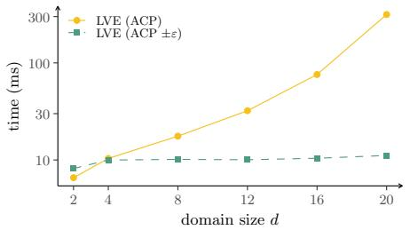  
(a) LVE run time (ms).

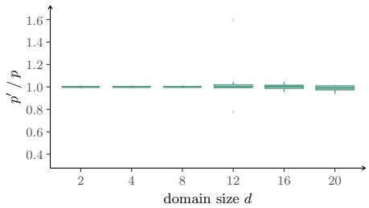  
(b) Query result quotient $p ^ { \prime } / p .$

Fig. 3: (a) Run time of LVE on the compressed model returned by ACP and its ε-relaxed variant $\left( \mathrm { A C P } \pm \varepsilon \right)$ , and (b) distribution of the per-query quotient $p ^ { \prime } \mathrm { ~ / ~ } p$ between the approximate result $p ^ { \prime }$ and the exact result $p$ for input FGs containing $k = 1$ ε-commutative factors with $\varepsilon = 0 . 0 0 1$  
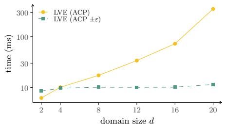  
(a) LVE run time (ms).

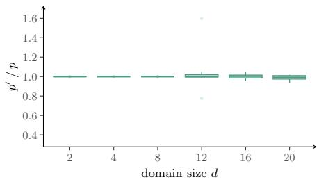  
(b) Query result quotient $p ^ { \prime } / p .$  
Fig. 4: (a) Run time of LVE on the compressed model returned by ACP and its ε-relaxed variant $\left( \mathrm { A C P } \pm \varepsilon \right)$ , and (b) distribution of the per-query quotient $p ^ { \prime } \mathrm { ~ / ~ } p$ between the approximate result $p ^ { \prime }$ and the exact result $p$ for input FGs containing $k = 1$ ε-commutative factors with $\varepsilon = 0 . 0 1$

A plot showcasing the resulting speedup of online inference (averaged over all choices of k and ε) is given in Fig. 12a. It becomes evident that the speedup grows exponentially with the domain size d and eventually reaches a factor of more than 30 for the choice of d = 20. Figure 12b further displays the ofline run times of ACP and its ε-relaxed variant (averaged over all choices of k and $\varepsilon )$ . As expected, the ofline run time of the ε-relaxed variant does not surpass the ofline run time of exact ACP, demonstrating that the relaxation does not introduce any overhead at all. In fact, ε-relaxed ACP even slightly reduces the run time compared to exact ACP, since ε-relaxed ACP is able to find ε-commutative factors and hence requires less iterations when searching for subsets of ε-commutative arguments (ACP needs more iterations as it checks all subsets of arguments until it is able to conclude that no subset of strictly commutative arguments exists).

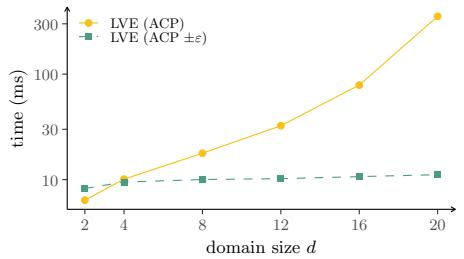  
(a) LVE run time (ms).

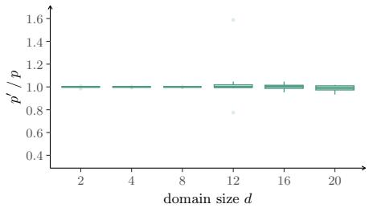  
(b) Query result quotient $p ^ { \prime } / p .$

Fig. 5: (a) Run time of LVE on the compressed model returned by ACP and its ε-relaxed variant $\left( \mathrm { A C P } \pm \varepsilon \right)$ , and (b) distribution of the per-query quotient $p ^ { \prime } \mathrm { ~ / ~ } p$ between the approximate result $p ^ { \prime }$ and the exact result $p$ for input FGs containing $k = 1$ ε-commutative factors with $\varepsilon = 0 . 1$  
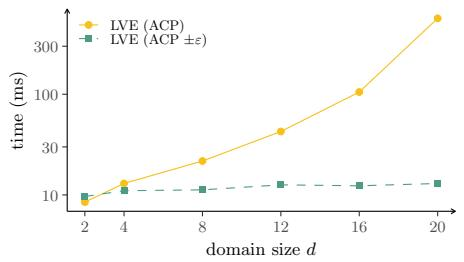

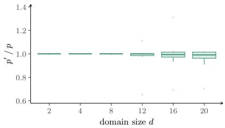  
(a) LVE run time (ms).  
(b) Query result quotient $p ^ { \prime } / p .$  
Fig. 6: (a) Run time of LVE on the compressed model returned by ACP and its ε-relaxed variant $\left( \mathrm { A C P } \pm \varepsilon \right)$ , and (b) distribution of the per-query quotient $p ^ { \prime } \mathrm { ~ / ~ } p$ between the approximate result $p ^ { \prime }$ and the exact result $p$ for input FGs containing $k = 3$ ε-commutative factors with $\varepsilon = 0 . 0 0 1$

Finally, we examine the structural reduction achieved by the compression stemming from exact ACP and its ε-relaxed variant. Figures 13 to 15 show the compression ratio $| M ^ { \prime } | / | M |$ between the compressed model $M ^ { \prime }$ and the original model M for $k \in \{ 1 , 3 , 7 \}$ at the smallest and largest tolerance $\varepsilon \in \{ 0 . 0 0 1 , 0 . 1 \}$ (that is, a compression ratio of one means that no compression is achieved at all, whereas a smaller ratio indicates more compression). The ε-relaxed variant attains a substantially smaller compression ratio than exact ACP, because it is able to compress the ε-commutative factors that exact ACP cannot compress. For both variants, the compression ratio decreases as the domain size grows, illustrating that larger models ofer more indistinguishability to be exploited.

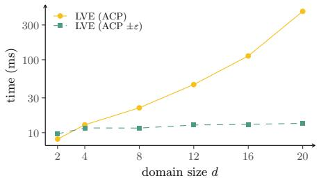  
(a) LVE run time (ms).

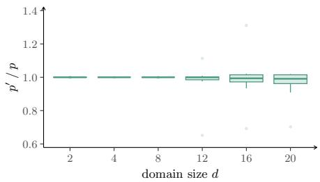  
(b) Query result quotient $p ^ { \prime } / p .$

Fig. 7: (a) Run time of LVE on the compressed model returned by ACP and its ε-relaxed variant $\left( \mathrm { A C P } \pm \varepsilon \right)$ , and (b) distribution of the per-query quotient $p ^ { \prime } \mathrm { ~ / ~ } p$ between the approximate result $p ^ { \prime }$ and the exact result $p$ for input FGs containing $k = 3$ ε-commutative factors with $\varepsilon = 0 . 0 1$  
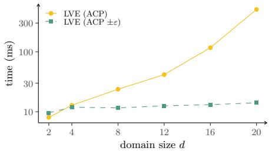

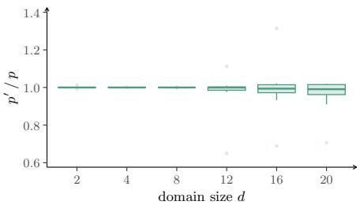  
(a) LVE run time (ms).  
(b) Query result quotient $p ^ { \prime } / p .$  
Fig. 8: (a) Run time of LVE on the compressed model returned by ACP and its ε-relaxed variant $\left( \mathrm { A C P } \pm \varepsilon \right)$ , and (b) distribution of the per-query quotient $p ^ { \prime } \mathrm { ~ / ~ } p$ between the approximate result $p ^ { \prime }$ and the exact result p for input FGs containing $k = 3$ ε-commutative factors with $\varepsilon = 0 . 1$

Interestingly, as shown in Fig. 16, ACP is not able to obtain any compression at all for some of the input FGs: The input instances are generated from two different classes of FGs—employee and epidemic—which have diferent structural properties, and exact ACP is only able to achieve compression for the employee instance class, while it fails to achieve any compression for the epidemic instance class. This particular behaviour highlights that even if there is just a single ε- commutative factor in a given FG, exact ACP may fail to find any compression at all (although there are other parts in the input FG that could be compressed and that do not involve commutativity), which is due to the propagation of information throughout $\mathrm { A C P } \mathrm { { ^ { \circ } s } }$ colour passing procedure.

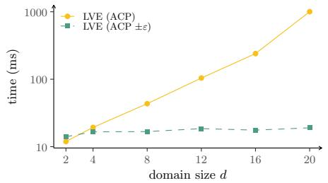  
(a) LVE run time (ms).

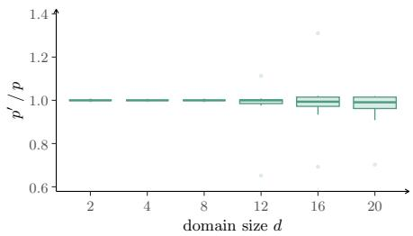  
(b) Query result quotient $p ^ { \prime } / p .$

Fig. 9: (a) Run time of LVE on the compressed model returned by ACP and its ε-relaxed variant $\left( \mathrm { A C P } \pm \varepsilon \right)$ , and (b) distribution of the per-query quotient $p ^ { \prime } \mathrm { ~ / ~ } p$ between the approximate result $p ^ { \prime }$ and the exact result $p$ for input FGs containing $k = 7$ ε-commutative factors with $\varepsilon = 0 . 0 0 1$  
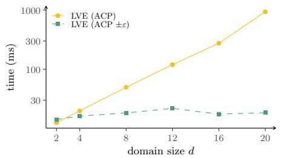  
(a) LVE run time (ms).

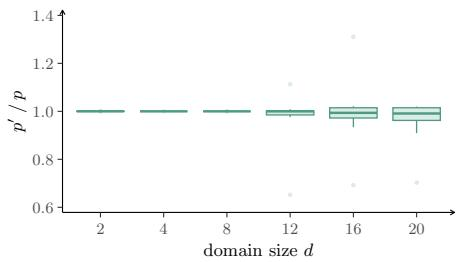  
(b) Query result quotient $p ^ { \prime } / p .$

Fig. 10: (a) Run time of LVE on the compressed model returned by ACP and its ε-relaxed variant $\left( \mathrm { A C P } \pm \varepsilon \right)$ , and (b) distribution of the per-query quotient $p ^ { \prime } \mathrm { ~ / ~ } p$ between the approximate result $p ^ { \prime }$ and the exact result $p$ for input FGs containing $k = 7$ ε-commutative factors with $\varepsilon = 0 . 0 1$

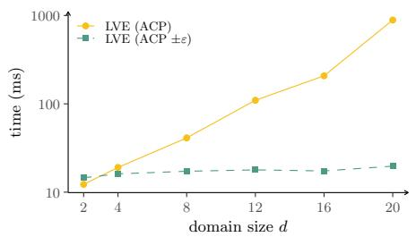  
(a) LVE run time (ms).

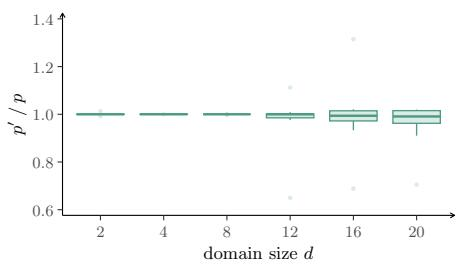  
(b) Query result quotient $p ^ { \prime } / p .$

Fig. 11: (a) Run time of LVE on the compressed model returned by ACP and its ε-relaxed variant $\left( \operatorname { A C P } \pm \varepsilon \right)$ , and (b) distribution of the per-query quotient $p ^ { \prime } \mathrm { ~ / ~ } p$ between the approximate result $p ^ { \prime }$ and the exact result $p$ for input FGs containing $k = 7$ ε-commutative factors with $\varepsilon = 0 . 1$

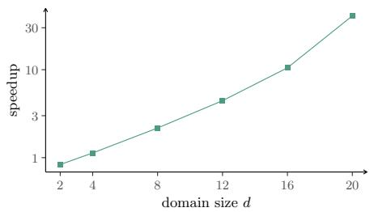  
(a) Speedup factor for LVE.

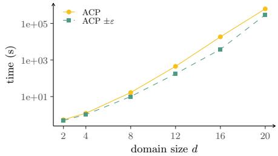  
(b) Color passing run times.

Fig. 12: (a) Speedup for online inference run times (i.e., ratio of the run time of LVE on the compressed model returned by ACP and the run time of LVE on the compressed model returned by the ε-relaxed variant of ACP). (b) Ofline run times of ACP and its ε-relaxed variant $\left( \operatorname { A C P } \pm \varepsilon \right)$  
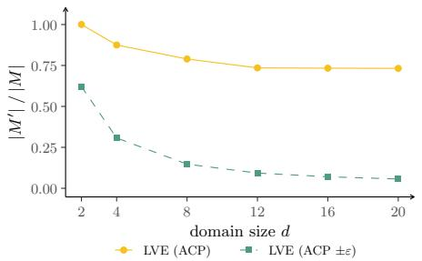  
(a) Compression ratio for $\varepsilon = 0 . 0 0 1$

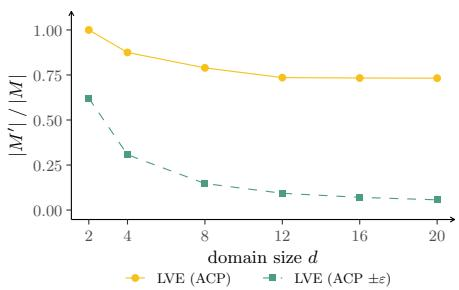  
(b) Compression ratio for $\varepsilon = 0 . 1$

Fig. 13: Compression ratio $| M ^ { \prime } | / | M |$ between the compressed model $M ^ { \prime }$ and the original model M for input FGs containing $k = 1$ ε-commutative factors with (a) $\varepsilon = 0 . 0 0 1$ and (b) $\varepsilon = 0 . 1$

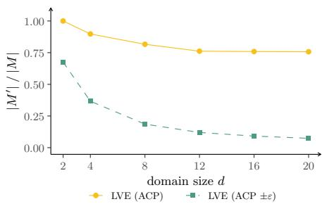  
(a) Compression ratio for $\varepsilon = 0 . 0 0 1$

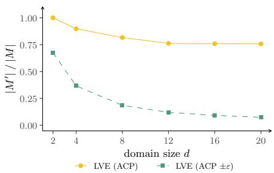  
(b) Compression ratio for $\varepsilon = 0 . 1$

Fig. 14: Compression ratio $| M ^ { \prime } | / | M |$ between the compressed model $M ^ { \prime }$ and the original model M for input FGs containing $k = 3$ ε-commutative factors with (a) $\varepsilon = 0 . 0 0 1$ and (b) $\varepsilon = 0 . 1$

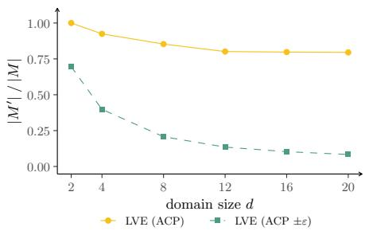  
(a) Compression ratio for $\varepsilon = 0 . 0 0 1$

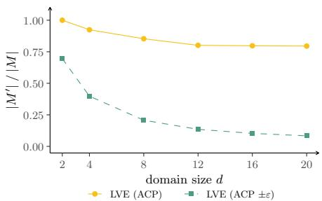  
(b) Compression ratio for $\varepsilon = 0 . 1$  
Fig. 15: Compression ratio $| M ^ { \prime } | / | M |$ between the compressed model $M ^ { \prime }$ and the original model M for input FGs containing $k = 7$ ε-commutative factors with (a) $\varepsilon = 0 . 0 0 1$ and (b) $\varepsilon = 0 . 1$

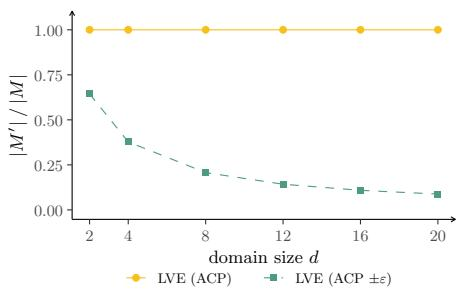  
(a) employee instance class.

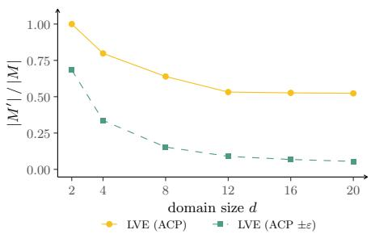  
(b) epidemic instance class.  
Fig. 16: Compression ratio $| M ^ { \prime } | / | M |$ between the compressed model M′ and the original model M broken down per instance class, averaged over the number of commutative factors k and the tolerance ε.