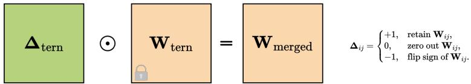
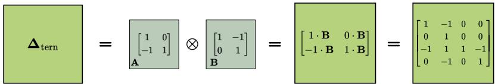
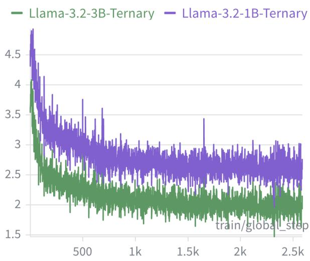
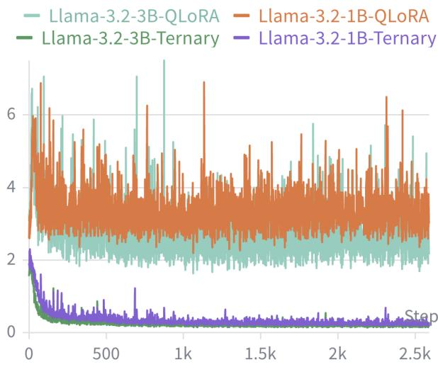

# Low-Rank Ternary Adaptation for Fine-Tuning Transformers

Alexandru-Dragos Manolache1\* , Yunqiang Li2\*, and Jan van Gemert1

1 Delft University of Technology, The Netherlands 2 Amazon Development Center

Abstract. Ternary transformers ofer extreme memory and compute efficiency, but existing low-bit LoRA-based methods cannot directly finetune ternary weights. Current approaches either require dequantization, restoring low-bit base weights to higher precision to merge with adaptation weight, or update only quantization parameters, preventing a merged model that remains ternary. We propose ternary multiplicative adaptation, which represents discrete updates of ternary weights such as sign flips or zeroing through a low-rank Kronecker factorization into two small ternary matrices applied element-wise to ternary weights. This design is parameter-eficient and expressive, preserves the ternary domain, and supports direct merging without dequantization. Experiments on six models across language and vision, including ternarized LLaMA-3 1B and 3B and a ternary ViT-B/16, demonstrate that our method recovers much of the performance lost to quantization and outperforms strong low-bit and ternary baselines. Code is available at https://github.com/alexmanoo/ternary\_adaptation.

Keywords: Parameter-Eficient Fine-Tuning (PEFT) · Low-Rank Adap tation (LoRA) · Ternary Transformers · 1.58-bit Quantization · Vision Transformers (ViTs) · Large Language Models (LLMs)

## 1 Introduction

Transformer models deliver strong performance across many tasks, including language and vision, but their memory and compute requirements make deployment expensive. Quantization ofers a solution to reduce these costs by compressing model weights from full-precision to a few bits while preserving most of the accuracy. In current LLMs, 2-bit weight quantization is a viable setting for aggressive compression [4, 18]. In this work, we investigate the next step in compression: ternary quantization which restricts weights to $\{ - 1 , 0 , 1 \}$ with the advantage of memory savings and throughput eficiency suitable for lower end hardware [27, 38, 49]. The memory budget of a ternary quantized model corresponds to $\log _ { 2 } 3 \approx 1$ .58 bits per weight, reducing the theoretical memory footprint of a 16-bit precision Llama 8B [15] model from 16GB to only 1.6GB.

Table 1: Comparison of QLoRA, QA-LoRA, and our ternary multiplicative adapter. Each column indicates whether a method satisfies key properties needed for adapting ternary models. Base weights ternary asks if the backbone can be stored in a ternary format during fine-tuning. Dequant-free merge asks whether the adaptation can be merged directly into the base-weights while keeping the low-bit quantization. Ternary merged model indicates whether the final weights remain ternary after merging. The bottom rows describe how the adaptation is applied: QLoRA adds a low-rank update to dequantized floating-point weights, QA-LoRA adds a low-rank update to quantization parameters, and our method applies a multiplicative ternary adaptation directly to ternary weights. Only our method both operates natively on ternary backbones and produces a merged model that stays ternary while avoiding any dequantization step.
<table><tr><td>Property</td><td></td><td>QLoRA QA-LoRA</td><td>Ours</td></tr><tr><td>Base weights ternary</td><td>√</td><td>X</td><td></td></tr><tr><td>Dequant-free merge</td><td>X</td><td>√</td><td></td></tr><tr><td>Ternary merged model</td><td>x</td><td>X</td><td>√</td></tr><tr><td>Update type</td><td>Additive</td><td></td><td>AdditiveMultiplicative</td></tr><tr><td>Applied on</td><td></td><td></td><td>FP weights Quantizer Ternary weights</td></tr></table>

Fine-tuning all weights of large pretrained models is often prohibitively expensive, motivating parameter eficient fine-tuning (PEFT) that adjusts a large network by updating a smaller set of parameters. The leading PEFT method is Low-Rank Adaptation (LoRA) [23]; it fine-tunes a low-dimensional weight decomposition which during inference can be added to the original base weight to obtain an adapted, merged model. Building on LoRA, recent work has explored PEFT for quantized base models. QLoRA [11] combines post-training quantization (PTQ) of pre-trained weights with low-rank adaptation. QA-LoRA [53] improves further by integrating the adaptation directly into the quantization parameters. These two methods make LoRA-style adaptation a compelling strategy for low-bit transformer backbones.

However, adapting low-bit quantized models introduces new challenges. QLoRA [11] requires dequantizing base weights back to full precision to add with adaptations, after which the merged model must be re-quantized for low-bit inference. QA-LoRA shows that such re-quantization leads to noticeable accuracy degradation at 2-bit widths and therefore proposes a direct merging strategy that integrates the adaptation into per-group quantization parameters, avoiding dequantization. While efective at 2 bits, QA-LoRA is incompatible with ternary quantization, where both the base weights and the merged weights are constrained to {−1, 0, 1}. This gap motivates an adaptation design that supports direct merging for ternary models.

In the ternary quantization setting, the update space is discrete. Weights cannot be adjusted by small continuous steps, because the main degrees of freedom are flipping signs or zeroing weights. Conventional LoRA-style approaches [11,23, 31,59], which use continuous additive updates in floating-point space, are there-

Ternary Multiplicative Update  

Kronecker-structured Ternary Adaptation  

Fig. 1: Visualization of our ternary multiplicative adapter. Ternary Multiplicative Update (top): a ternary mask $\Delta _ { \mathrm { t e r n } } ~ \in ~ \{ - 1 , 0 , 1 \} ^ { d _ { \mathrm { o u t } } \times d _ { \mathrm { i n } } }$ is applied element-wise (Hadamard product) to the pretrained ternary weights $\mathbf { W } _ { \mathrm { t e r n } }$ to obtain merged ternary weights $\mathbf { W } _ { \mathrm { m e r g e d } }$ , where each entry $\Delta _ { i j } \in \{ - 1 , 0 , 1 \}$ respectively keeps, zeros, or flips the sign of $\mathbf { W } _ { \mathrm { i j } }$ . Kronecker-structured Ternary Adaptation (bottom): the adaptation $\Delta _ { \mathrm { t e r n } }$ is constructed as a Kronecker product $\mathbf { A } \otimes \mathbf { B }$ of two small ternary factors; the toy example shows how each entry of A scales a copy of B to form a larger ternary matrix. Our adapter uses a compact Kronecker-structured mask to implement discrete keep/zero/flip operations directly on ternary weights, enabling a mergeable fine-tuned model that remains fully ternary.

fore not directly compatible with ternary weights for eficient inference [18,33,45]. Moreover, representing such discrete ternary updates via trainable low-rank decomposition matrices is non-trivial, as the update space is both discrete and non-linear. A possibility is to temporarily dequantize ternary weights to higher precision, apply a continuous adaptation, and then requantize. However, as observed in prior work at 2 bits [53], this dequantize-requantize process introduces additional quantization error, which becomes even more harmful for sub-2-bit quantization. We therefore seek a PEFT solution that (i) operates natively in the ternary domain by expressing flips and zeroing of weights via a low-rank representation, and (ii) can be merged into the base ternary weights without any dequantization or requantization.

We tackle two challenges: representing discrete ternary updates, and decomposing them with low-rank matrices in a compact yet expressive form. To this end, we introduce a ternary multiplicative adaptation that directly models ternary updates, as illustrated in Figure 1 and Table 1, where ternary weights are flipped or zeroed instead of updated continuously. The adaptation is constructed as the Kronecker product of two smaller ternary matrices and applied via element-wise Hadamard multiplication. This design achieves high rank using two trainable low-rank matrices, keeps the number of adaptation parameters small, preserves the ternary domain, and implements three operations per weight: keep, zeroing, or flip sign, without leaving the domain. As in prior LoRA-style methods, the adaptation can be fully merged into the base model post-tuning. In our case, the merged weights remain ternary, so no dequantization or requantization is required.

We make the following contributions: 1) A ternary multiplicative adaptation that directly models discrete ternary updates for ternary LLMs and vision transformers. 2) A low-rank Kronecker decomposition of the ternary updates, achieving high expressivity while remaining parameter-eficient. 3) The adapter can be fully merged into the base ternary model, enabling zero-overhead deployment. 4) We evaluate our method on six models across language and vision. On ternarized Llama-3.2 1B and 3B models, our method recovers much of the performance lost to quantization, outperforms stronger 2-bit baselines on most tasks, and outperforms requantized QLoRA baseline under the same 1.58-bit quantization level. We also validate on a ternary ViT-B/16 fine-tuned on ImageNet-100 [1], where our merged 1.58-bit model outperforms requantized QLoRA and narrows the gap to full ternary fine-tuning.

## 2 Related Work

Quantization in Transformers. Quantization compresses model weights and activations into low-bit formats, reducing memory and computation for eficient model deployment [13, 50]. Post-training quantization (PTQ) methods such as LLM.int8() [10], GPTQ [18], AWQ [33], and OmniQuant [45] minimize quantization error through calibration or activation-aware scaling, while SmoothQuant [52] and SpinQuant [36] rebalance weight–activation distributions. For vision transformers (ViTs) [12], PTQ4ViT [55] uses activation quantization with Hessianguided scale calibration, and I-ViT [30] targets integer-only ViT inference via approximations of non-linearities. However, precision below 2 bits still causes severe accuracy loss. Quantization-aware training (QAT) addresses this by simulating quantization with Straight-Through Estimators (STE), enabling models to adapt during training. LLM-QAT [35], BitDistiller [14], BitNet [49], and TernaryCLIP [60] achieve strong low-bit robustness but require full-model updates.

Ternary Neural Networks (TNNs). Ternary quantization restricts weights to {−1, 0, 1}, ofering large reductions in memory and compute by replacing multiplications with sign operations. Early work in CNNs, such as TWN [27] and TTQ [61], demonstrated that ternary weights with learned scaling factors are eficient and can retain accuracy, and later studies extended these ideas to transformers and LLMs [38]. Training ternary models is challenging due to the discrete nature of weights—updates must respect the quantization constraints of {−1, 0, 1} rather than continuous values. Most methods rely on straight-through estimators and normalization or scaling strategies to stabilize optimization [9]. Despite these advances, adapting ternary models to downstream tasks remains challenging. Approaches based on continuous, additive updates cause the merged weights to leave the ternary domain and miss out on the memory and compute benefits of ternary quantization. The need for ternary domain preservation motivates new designs that operate natively in the ternary space. Our adaptation applies low-rank updates to ternary base weights such that the result remains ternary.

PEFT Methods. Parameter-Eficient Fine-Tuning (PEFT) methods include adapters [22,43], prefix/prompt tuning [26,28], and bias/activation-scaling [34,56], which reduce trainable parameters but add extra modules or token overhead at inference. We focus on low-rank adaptation (LoRA) [23], which applies low-rank updates to weight matrices without altering model architecture or input tokens, making it naturally compatible with quantized models.

Low Rank Adaptation (LoRA). LoRA [23] decomposes weight updates into small low-rank matrices that are trained, while the base weights remain frozen. At inference, the low-rank matrices are merged with the base weights for adaptation without increasing inference cost. Most LoRA variants use additive updates, reducing trainable parameters while maintaining near full-model fine-tuning performance. Other additive approaches, like AdaLoRA [59] and ReLoRA [31], improve flexibility through adaptive budgets or periodic high-rank updates. Low-rank multiplicative adaptation (LoRMA) [2] replaces additive updates with a more expressive framework based on multiplicative matrix transformations to rotate the weight space rather than shift it, and element-wise multiplicative updates, as in Fast LoRA (FLoRA) [51], compute input-specific modifications via Hadamard products. An element-wise multiplicative operation between ternary base weights and a ternary adaptation matrix enables discrete ternary updates—flipping or zeroing weights—that preserve the ternary domain.

Low-rank Decomposition. LoRA-based fine-tuning methods can be categorized into diferent types based on how they decompose the weight-update matrix. Simple low-rank decomposition of LoRA [23] represents the update into two small matrices, reducing rank and parameters at the cost of expressivity. SVDbased decomposition dynamically allocates rank across layers by truncating or weighting singular values, as in AdaLoRA [59], SaLoRA [24], and IncreLoRA [58], improving flexibility while controlling parameter usage. Kronecker-product decomposition represents updates as block matrices via Kronecker products [19], preserving the efective rank of the original weight matrix with fewer parameters, as in LoKr [54], KAdaptation [20] and KronA [16]. Similarly, KnGPT2 [17] uses Kronecker decomposition to compress the original full-precision weights by representing them with smaller matrices. Inspired by previous Kronecker-product decompositions, our ternary multiplicative adapter represents discrete ternary updates using two small ternary matrices, enabling high-rank update while preserving the ternary domain for flips and zeroing operations.

PEFT with quantized backbone. Recent adaptation methods extend low-bit finetuning to quantized large models. QLoRA [11] combines LoRA with low-bit quantization by storing the base weights in a quantized format and dequantizing them to apply the full precision low-rank updates, which adds compute overhead but lowers memory usage. QA-LoRA [53] avoids dequantization for 2-bit quantized weights by merging the adaptation into per-group quantization parameters, but cannot enforce the merged weights to remain in the ternary domain. QAT-based methods such as LoftQ [29], L4Q [25], and ApiQ [32] integrate quantization into training for improved accuracy. Yet all these approaches rely on continuous additive updates, which are incompatible with discrete ternary weights. Our method keeps the ternary domain even after the adaptation is fused with the base weights.

Table 2: LoRA, QLoRA, QA-LoRA and Ours. Each column specifies the frozen base weights, the trainable low-rank adaptation, and the merged weights. LoRA keeps a fullprecision base matrix $\mathbf { W } _ { 0 }$ and adds a low-rank update $\textstyle \Delta \mathbf { W } = { \frac { \alpha } { r } } \mathbf { B } \mathbf { A }$ in floating point. QLoRa stores a per-tensor quantized weight $\mathbf { W } _ { \mathrm { q } } ,$ dequantizes it, then adds the same low-rank update in full precision. QA-LoRA assumes group-wise afine quantization ${ \bf W } _ { \mathrm { 0 , g } } = s _ { g } ( { \bf Q } _ { \mathrm { g } } - { \bf Z } _ { \mathrm { g } } )$ and applies the low-rank update to the zero points $\mathbf { Z } _ { \mathrm { g } } ;$ using group size 1 reduces to a per-tensor quantization. Our method starts from ternary base weights $\mathbf { W } _ { \mathrm { t e r n } } \in \{ - 1 , 0 , 1 \} ^ { d _ { \mathrm { o u t } } \times d _ { \mathrm { i n } } }$ , represents the adaptation as a Kronecker product, and merges it multiplicatively, so the final weights remain ternary. The first three methods rely on additive updates in a continuous space, whereas our method keeps the same weight space, such that the merged model stays ternary without needing any dequantization or requantization.
<table><tr><td rowspan=1 colspan=1>Method</td><td rowspan=1 colspan=1>Base Weight (frozen)</td><td rowspan=1 colspan=1>Trainable Update</td><td rowspan=1 colspan=1>Merged Weight</td></tr><tr><td rowspan=1 colspan=1>LoRA</td><td rowspan=1 colspan=1> $\mathbf { W } _ { 0 } \ \mathrm { ( F P ) }$ </td><td rowspan=1 colspan=1> $\textstyle \mathbf { \Delta } \mathbf { \Delta } \mathbf { W } = { \frac { \alpha } { r } } \mathbf { B } \mathbf { A }$ </td><td rowspan=1 colspan=1> $\mathbf { W } _ { \mathrm { m e r g e d } }$ = $\mathbf { W } _ { 0 } + \frac { \alpha } { r } \mathbf { B } \mathbf { A } ,$  FP</td></tr><tr><td rowspan=1 colspan=1>QLoRA</td><td rowspan=1 colspan=1>Per-tensor quantized $\mathbf { W } _ { \mathbb { q } }$ </td><td rowspan=1 colspan=1> $\textstyle \mathbf { \Delta } \mathbf { \Delta } \mathbf { W } = { \frac { \alpha } { r } } \mathbf { B } \mathbf { A }$ </td><td rowspan=1 colspan=1> $\mathbf { W } _ { \mathrm { m e r g e d } } = \mathrm { D e q u a n t } ( \mathbf { W } _ { \mathrm { q } } ) + \frac { \alpha } { r } \mathbf { B } \mathbf { A } ,$  FP</td></tr><tr><td rowspan=1 colspan=1>QA-LoRA</td><td rowspan=1 colspan=1>Group-wise quantized ${ \bf W } _ { 0 , \mathrm { g } } = s _ { g } ( { \bf Q } _ { \mathrm { g } } - { \bf Z } _ { \mathrm { g } } )$ </td><td rowspan=1 colspan=1>Low-rank update to zero-point matrix: $\pmb { \Delta } \mathbf { Z _ { g } } = \frac { \alpha } { r } \mathbf { B } \mathbf { A }$ </td><td rowspan=1 colspan=1> $\mathbf { W } _ { \mathrm { m e r g e d , g } } = s _ { g } \bigl ( \mathbf { Q } _ { \mathrm { g } } - ( \mathbf { Z } _ { \mathrm { g } } + \Delta \mathbf { Z } _ { \mathrm { g } } ) \bigr )$ INT4 $\mathbf { \Lambda } = \mathbf { W } _ { 0 , \mathrm { g } } - s _ { g } \Delta \mathbf { Z } _ { \mathrm { g } } ,$ </td></tr><tr><td rowspan=1 colspan=1>Ours</td><td rowspan=1 colspan=1>Ternary $\mathbf { W } _ { \mathrm { t e r n } } \in \{ - 1 , 0 , 1 \} ^ { d _ { \mathrm { o u t } } \times d _ { \mathrm { i n } } }$ </td><td rowspan=1 colspan=1> $\Delta \mathbf { W } _ { \mathrm { t e r n } } = \mathbf { A } \otimes \mathbf { B }$ </td><td rowspan=1 colspan=1> $\mathbf { W } _ { \mathrm { m e r g e d } } = \mathbf { W } _ { \mathrm { t e r n } } \odot ( \mathbf { A } \otimes \mathbf { B } ) ,$  Ternary</td></tr></table>

## 3 Method

Standard low-rank adaptation methods rely on additive updates, yet additive updates are incompatible with discrete ternary weights because adding real-valued updates drives the entries outside the ternary domain, see Table 2. We propose a ternary multiplicative adapter that i) models ternary updates multiplicatively so the adapted weights remain in \ifmode \lbrace \lse \txbracelft \i -1,0\} , and ii) decomposes updates as a Kronecker product of two ternary factors for compactness and high expressivity.

## 3.1 Ternary multiplicative adaptation

To preserve the ternary constraint of using only $\{ - 1 , 0 , 1 \}$ values throughout training and merging, we adopt an element-wise multiplicative formulation that can flip, zero, or retain base weights.

Formally, let $\mathbf { W } _ { \mathrm { t e r n } } \in \{ - 1 , 0 , 1 \} ^ { d _ { \mathrm { o u t } } \times d _ { \mathrm { i n } } }$ represent a pretrained ternary weight matrix of a linear layer, where $d _ { \mathrm { o u t } } , \ d _ { \mathrm { i n } }$ are the output and input dimensions, respectively. We define the adapted ternary weight matrix $\mathbf { W } _ { \mathrm { t e r n } } ^ { \prime }$ as

$$
\mathbf { W } _ { \mathrm { t e r n } } ^ { \prime } = \mathbf { W } _ { \mathrm { t e r n } } \odot \Delta _ { \mathrm { t e r n } } ,\tag{1}
$$

where ternary element $\Delta _ { i j }$ behaves as:

$$
\pmb { \Delta } _ { i j } = \left\{ \begin{array} { l l } { + 1 , } & { \mathrm { r e t a i n } \ \mathbf { W } _ { i j } , } \\ { 0 , } & { \mathrm { z e r o \ o u t } \ \mathbf { W } _ { i j } , } \\ { - 1 , } & { \mathrm { f i p \ s i g n \ o f } \ \mathbf { W } _ { i j } . } \end{array} \right.\tag{2}
$$

This multiplicative rule guarantees closure over $\{ - 1 , 0 , 1 \}$ , so $\mathbf { W } _ { \mathrm { t e r n } } ^ { \prime }$ remains ternary and can be deployed without any floating-point operation, with the remark that, if $\mathbf { W } _ { i j } = 0$ , then $\mathbf { W ^ { \prime } } _ { i j } = 0$ for any $\Delta _ { i j }$ , meaning that the multiplicative update cannot reactivate weights pruned to zero.

## 3.2 Low-rank Kronecker decomposition

Classical matrix decompositions—such as singular value decomposition (SVD), eigenvalue decomposition (EVD), QR factorization, CUR decomposition, and nonnegative matrix factorization (NMF)—cannot model discrete, sign-flipping ternary updates $\pmb { \Delta } _ { \mathrm { t e r n } }$ without breaking ternary domain constraints. Representing such discrete ternary updates in trainable low-rank matrices is dificult because the update space is both discrete and non-linear. Instead, we use a Kronecker factorization of $\pmb { \Delta } _ { \mathrm { t e r n } }$ into two smaller ternary matrices:

$$
\Delta _ { \mathrm { t e r n } } = \mathbf { A } \otimes \mathbf { B } ,\tag{3}
$$

where $\otimes$ denotes the Kronecker product between

$$
\mathbf { A } \in \{ - 1 , 0 , 1 \} ^ { p \times q } , \qquad \mathbf { B } \in \{ - 1 , 0 , 1 \} ^ { r \times s } ,\tag{4}
$$

which builds the matrix $\pmb { \Delta } _ { \mathrm { t e r n } }$ by replacing each entry of A with that entry multiplied by the entire matrix B, see Figure 1. The dimensions of A and B are defined by $p , q , r , s ,$ which are smaller than $d _ { \mathrm { o u t } } , d _ { \mathrm { i n } }$ dimensions of the full weight matrix $\mathbf { W } _ { \mathrm { t e r n } } ,$ such that their pair-wise product

$$
p \cdot r = d _ { \mathrm { o u t } } , \qquad q \cdot s = d _ { \mathrm { i n } }\tag{5}
$$

matches the base weight shape $( d _ { \mathrm { o u t } } , d _ { \mathrm { i n } } )$ . By construction, the Kronecker product produces a ternary matrix $\Delta _ { \mathrm { t e r n } } \in \{ - 1 , 0 , 1 \} ^ { d _ { \mathrm { o u t } } \times d _ { \mathrm { i n } } }$ , so the element-wise product $\mathbf { W } _ { \mathrm { t e r n } } \odot \Delta _ { \mathrm { t e r n } }$ remains strictly ternary and can be merged directly without dequantization.

At the same time, the Kronecker product creates a high-rank update from two smaller matrices:

$$
\mathrm { r a n k } ( \mathbf { A } \otimes \mathbf { B } ) = \mathrm { r a n k } ( \mathbf { A } ) \cdot \mathrm { r a n k } ( \mathbf { B } ) \leq \mathrm { m i n } ( p , q ) \mathrm { m i n } ( r , s ) \leq \mathrm { m i n } ( d _ { \mathrm { o u t } } , d _ { \mathrm { i n } } ) ,\tag{6}
$$

while keeping the number of trainable parameters smaller than a full weight update.

## 3.3 Training via real-valued proxies and STE

Directly optimizing discrete \protec \mathbf {A},\mathbf {B} is dificult; we therefore optimize real-valued proxies $\bar { \mathbf { A } } \in \mathbb { R } ^ { p \times q } , \bar { \mathbf { B } } \in \mathbb { R } ^ { r \times s }$ and obtain ternary factors by projection in the forward pass:

$$
{ \bf A } = \mathrm { T e r n } ( \bar { \bf A } ) , \qquad { \bf B } = \mathrm { T e r n } ( \bar { \bf B } ) ,\tag{7}
$$

where \protect \operatorname {Tern}(\cdot ) maps entries to $\{ - 1 , 0 , 1 \}$ , with thresholds calculated from the absolute mean of each matrix. Gradients are passed to the proxies using a straightthrough estimator.

Inference. After fine-tuning, we merge the base weights $\mathbf { W } _ { \mathrm { t e r n } }$ with the adaptation $\mathbf { A } \otimes \mathbf { B }$ by element-wise multiplication:

$$
\mathbf { W } _ { \mathrm { m e r g e d } } = \mathbf { W } _ { \mathrm { t e r n } } ^ { \prime } = \mathbf { W } _ { \mathrm { t e r n } } \odot ( \mathbf { A } \otimes \mathbf { B } ) .\tag{8}
$$

Since the final merged weights are ternary, $\mathbf { W } _ { \mathrm { m e r g e d } } \in \{ - 1 , 0 , 1 \}$ , the adaptation weights A¯ , B¯ can be discarded, and the deployed layer is identical to the original ternary layer in terms of shape, precision and activations.

## 3.4 Eficiency and expressivity

Trainable Parameters. The Kronecker adaptation $\Delta _ { \mathrm { t e r n } } = \mathbf { A } \otimes \mathbf { B }$ decomposes to shape $( p \cdot r ) \times ( q \cdot s )$ . The number of trainable parameters for a linear layer is

$$
n _ { \mathrm { p a r a m s } } = p \cdot q + r \cdot s ,\tag{9}
$$

which is typically much smaller than the $d _ { \mathrm { o u t } } \cdot d _ { \mathrm { i n } }$ parameters of a full update when $p , r , q ,$ s are chosen to be small factors of $d _ { \mathrm { o u t } }$ and $d _ { \mathrm { i n } }$

Shape match and factor choice. To match the shape constraints in $\operatorname { E q } .$ (5), we choose $p , r$ such that $p \cdot r = d _ { \mathrm { o u t } }$ and q, s such that $q \cdot s = d _ { \mathrm { i n } }$ . For square layers with $d _ { \mathrm { o u t } } = d _ { \mathrm { i n } } = d .$ , the dimensions simplify to:

$$
p = r = q = s = { \sqrt { d } } ,\tag{10}
$$

which totals

$$
n _ { \mathrm { p a r a m s } } = 2 \cdot { \sqrt { d } } \cdot { \sqrt { d } } = 2 d .\tag{11}
$$

In practice, transformer layer dimensions are large powers of $2 ,$ so our factor choices can keep the Kronecker factors balanced and avoid bottlenecks from small factors.

Memory. Table 3 reports per-layer fine-tuning memory. With FP32 real-valued proxies $\bar { \mathbf { A } } \in \mathbb { R } ^ { p \times q } , \bar { \mathbf { B } } \in \mathbb { R } ^ { r \times s }$ , each trainable parameter and its gradient occupy 4 Bytes and Adam contributes 8 Bytes per parameter. Consequently the adaptation for a square layer with $d _ { \mathrm { o u t } } = d _ { \mathrm { i n } } = d$ uses 8d Bytes (params), 8d Bytes (grads), and 16d Bytes (optimizer) per layer, whereas LoRA of rank r uses 8dr, 8dr, and 16dr Bytes, respectively. Matching our expressivity would require LoRA $r { = } d$ and therefore quadratic $O ( d ^ { 2 } )$ adaptation memory, while ours provides a similarly expressive update with only $O ( d )$ memory.

Table 3: Per-layer training memory, Bytes (B). Adapters are FP32: 4 B/param, 4 B/grad, 8 B/Adam. Quantized versions are recomputed during each forward pass, gradients are computed using a straight-through estimator. Activations are FP16 at 2 B/element. For a $\mathbf { W } \in \mathbb { R } ^ { d \times d }$ ; General: $\bar { \mathbf { A } } \in \mathbb { R } ^ { p \times q }$ $\bar { \mathbf { B } } \in \mathbb { R } ^ { r \times s }$ s.t. $p \cdot r = q \cdot s = d .$ . Square: $p = q = r = s = { \sqrt { d } } .$ Our adaptation scales as $O ( d )$ memory in the square case, versus $O ( d ^ { 2 } )$ for full fine-tuning and $O ( d r )$ for LoRA; matching our expressivity would require LoRA rank $r = d .$
<table><tr><td>Method</td><td>Train. params.</td><td>Grads.</td><td>Opt.</td><td>Acts.</td></tr><tr><td>Full-FT (FP32)</td><td> $4 d ^ { 2 }$ </td><td> $4 d ^ { 2 }$ </td><td> $8 d ^ { 2 }$ </td><td>2 bsd</td></tr><tr><td>LoRA (rank r)</td><td> $8 d r$ </td><td> $8 d r$ </td><td>16dr</td><td>2 bsd+2 bsr</td></tr><tr><td>Ours (general)</td><td> $4 ( p q + r s )$ </td><td>4(pq+rs)</td><td> $8 ( p q + r s )$ </td><td>2 bsd</td></tr><tr><td>Ours (square)</td><td>8d</td><td>8d</td><td>16d</td><td>2 bsd</td></tr></table>

$F L O P s .$ The forward pass for our method $\mathbf { W } _ { \mathrm { t e r n } } { \odot } \mathbf { ( A \otimes B ) }$ on a square layer with $d _ { \mathrm { o u t } } = d _ { \mathrm { i n } } = d$ costs $2 d ^ { 2 }$ operations, which matches the full weights update cost, while LoRA’s forward pass amounts to more, $d ^ { 2 } ( 2 r + 1 )$ . However, after training, at inference time, both methods incur zero extra FLOPs: LoRA parameters are merged via $\mathbf { W } + \mathbf { B A }$ , and ours via $\mathbf { W } _ { \mathrm { t e r n } } \odot ( \mathbf { A } \otimes \mathbf { B } )$ , both producing a single $\mathbf { W } _ { \mathrm { m e r g e d } }$ reused across all tokens. The inference-time adapter overhead is therefore zero. Our method has the important advantage of ternary domain preservation after merging.

## 4 Experiments

We empirically evaluate our ternary multiplicative adaptation on (i) two ternarized LLMs, (ii) three pre-trained ternary LLMs, and (iii) a ternary ViT.

## 4.1 Experimental Setup

Models and baselines. We consider three evaluation tracks.

(i) Ternary PTQ LLM backbones. We use Llama-3.2-1B [40] and Llama-3.2-3B [41] as base models. The weights are first quantized to ternary using SpinQuant [36], which creates the ternary backbones in which we insert our adaptation. The base ternary weights are stored in UINT8 packed format to reduce memory usage, with corresponding scales stored in BFloat16 precision. The baselines are: full precision (FP, 16-bit), 2-bit Round-To-Nearest (RTN), 2-bit GPTQ [18], 2-bit SpinQuant [36], and ternary SpinQuant [36]. We additionally compare against QLoRA [11], as a baseline for existing PEFT applied on ternary backbones.

(ii) Pre-trained ternary backbones. We fine-tune the following pre-trained, ternary models: Falcon-E-1B-Instruct [48], Falcon-E-3B-Instruct [48], and Bit-Net b1.58 2B4T [37]. We compare our fine-tuned adaptations against the corresponding non-fine-tuned version.

(iii) Ternary ViT backbone. We use our method to fine-tune a ternary ViT-$\mathrm { B } / 1 6$ (vision encoder from TernaryCLIP [60]) and compare against full ternary fine-tuning and QLoRA baselines.

Datasets and evaluation metrics. For the PTQ LLM backbones we fine-tune on Alpaca dataset [47] and evaluate on the following task set: ARC-Challenge (ARC-c) and ARC-Easy (ARC-e) [6], BoolQ [5], CommonsenseQA (ComQA) [46], HellaSwag [57], MMLU [21], OpenBookQA (OBQA) [42], PiQA [3], Winogrande (Wino.) [44], and WikiText-2 [39] token-level perplexity (PPL). All evaluations are zero-shot and use the default lm-evaluation-harness (v0.4.9.1) per-task configurations. For pre-trained ternary backbones we fine-tune on GSM8K [7] and report exact-match (EM) accuracy on the test split, using each model’s chat template, system instruction ("You are a helpful assistant"), and 4, 5- fewshots, where the fewshot examples are treated as a multi-turn conversation in lm-evaluation-harness (v0.4.9.1). For the ViT, we fine-tune on ImageNet-100 [1] and report Top-1 classification accuracy.

Adapter configuration and training details. We apply our ternary multiplicative adaptation to all self-attention and feed-forward blocks in the Transformer, excluding the task-specific output head (the language model head for LLMs and the classification head for ViTs). For a weight matrix $\mathbf { W _ { \mathrm { t e r n } } } \in \mathbb { R } ^ { m \times n }$ , we choose factor dimensions $( p , q )$ and (r, s) such that $m = p \cdot r$ and $n = q \cdot s .$ . We select $p , q , r , s$ to be as balanced as possible under the integer divisibility constraints. For square layers we use $p = q = r = s = { \sqrt { d } }$ . Table 5 lists the factorization for all Llama-3.2-1B layer shapes, yielding 0.06% trainable parameters. Spin-Quant [36] quantization uses per-channel absmax symmetric quantization on 800 WikiText-2 samples. Activations remain in the original precision, 16-bit for Llama and ViT, and 8-bit for BitNet and Falcon. We optimize the real-valued proxies of the ternary factors with a straight-through estimator as described in §3.1. We fine-tune the PTQ backbones for one epoch using AdamW with learning rate $1 . 5 \times 1 0 ^ { - 3 }$ , a linear decay schedule, warmup ratio 0.03, on-device batch size 16, on a single NVIDIA A40 GPU (48GB). Learning rate is $1 . 0 \times 1 0 ^ { - 4 }$ for the pre-trained ternary backbones. The supplementary material reports more details about the training dynamics of our method.

Initialization. We initialize real-valued proxies A¯ , B¯ so that, at the start of fine-tuning, the adapted ternary weight matrix $\mathbf { W } _ { \mathrm { t e r n } } ^ { \prime }$ from Eq. (1) used in the forward pass is identical to the pre-trained $\mathbf { W } _ { \mathrm { t e r n } } .$ We use three strategies: (i) All-ones: set every entry of A¯ and B¯ to +1, yielding a multiplicative identity update; (ii) Balanced: fill A¯ and B¯ with an equal number of +1 and −1 values, and compensate the base weights via $\mathbf { W } _ { \mathrm { t e r n } }  ( \mathrm { s i g n } \bar { \mathbf { A } }$ ⊗ sign $\bar { \mathbf { B } } ) \odot \mathbf { W } _ { \mathrm { t e r n } } ;$ (iii) Normalized: sample each entry in A¯ and B¯ from $u \sim \mathcal { U } ( 0 . 6 , 1 . 4 )$ with random signs, then normalize to have mean absolute value 1, and apply the same sign compensation as in (ii). We use Balanced for the PTQ LLM and ViT backbones and Normalized for the GSM8K experiments. All-ones is used only in the analysis of weight transformations. The supplementary material reports the corresponding ablation for the three strategies.

Table 4: Main results on Llama 3.2-1B and Llama 3.2-3B. Our 1.58-bit method is compared against full-precision (FP) and several post-training quantization $\left( \mathrm { P T Q } \right)$ baselines. All evaluations are zero-shot. Best results among 1.58-bit methods are in bold. Averages exclude WikiText-2 PPL (↓). Our ternary multiplicative adaptation consistently recovers much of the accuracy lost to ternarization and often matches or surpasses 2-bit baselines, while roughly halving the PPL of the ternary SpinQuant backbones.
<table><tr><td>Model</td><td>Method</td><td colspan="10">Precision ARC-c ARC-e BoolQ ComQA HellaSwag MMLU OBQA PiQA Wino. Avg. WikiText-2 PPL ↓</td></tr><tr><td rowspan="7">Llama 3.2-1B</td><td>Full Precision</td><td>16-bit</td><td>31.4</td><td>65.2</td><td>63.6 47.0</td><td>47.7</td><td>36.7</td><td>26.4</td><td>74.6</td><td>59.8</td><td>50.2</td><td></td></tr><tr><td>PTQ Baselines</td><td></td><td></td><td></td><td></td><td></td><td></td><td></td><td></td><td></td><td></td><td></td></tr><tr><td>RTN</td><td>2-bit</td><td>22.8</td><td>23.8</td><td>62.1 19.2</td><td>25.5</td><td>22.9</td><td>17.2</td><td>53.1</td><td>48.9</td><td>32.8</td><td>1.5e6</td></tr><tr><td>GPTQ</td><td>2-bit</td><td>20.2</td><td>31.6</td><td>43.1 19.3</td><td>26.3</td><td>24.1</td><td>13.4</td><td>55.2</td><td>50.0</td><td>31.4</td><td>1.7e2</td></tr><tr><td>SpinQuant</td><td>2-bit</td><td>18.3</td><td>37.6</td><td>62.0 19.5</td><td>28.7</td><td>22.9</td><td>13.4</td><td>57.4</td><td>53.2</td><td>34.7</td><td>43.3</td></tr><tr><td>SpinQuant</td><td>1.58-bit</td><td>20.3</td><td>29.7</td><td>61.3 20.1</td><td>27.0</td><td>22.9</td><td>13.8</td><td>54.5</td><td>49.2</td><td>33.2</td><td>86.5</td></tr><tr><td>Ours (Adapter)</td><td>1.58-bit</td><td>19.5</td><td>39.7</td><td>61.2 19.9</td><td>29.4</td><td>23.1</td><td>13.8</td><td>58.2</td><td>53.2</td><td>35.3</td><td>44.6</td></tr><tr><td rowspan="7">Llama 3.2-3B</td><td>Full Precision</td><td>16-bit</td><td>42.4</td><td>74.6</td><td>72.9 64.0</td><td>55.2</td><td>54.0</td><td>31.0</td><td>76.6</td><td>69.5</td><td>60.0</td><td>7.8</td></tr><tr><td>PTQ Baselines</td><td></td><td></td><td></td><td></td><td></td><td></td><td></td><td></td><td></td><td></td><td></td></tr><tr><td>RTN</td><td>2-bit</td><td>22.5</td><td>24.4</td><td>37.8 19.2</td><td>25.3</td><td>26.8</td><td>15.2</td><td>52.6</td><td>50.2</td><td>30.4</td><td>7.6e5</td></tr><tr><td>GPTQ</td><td>2-bit</td><td>21.5</td><td>25.2</td><td>40.8 19.2</td><td>26.0</td><td>22.9</td><td>13.2</td><td>53.1</td><td>48.4</td><td>30.0</td><td>1.9e2</td></tr><tr><td>SpinQuant</td><td>2-bit</td><td>19.3</td><td>29.3 33.3</td><td>53.6 19.7 45.6</td><td>28.2</td><td>22.9</td><td>15.4 11.6</td><td>57.0 57.2</td><td>48.7</td><td>32.6</td><td>41.7 45.6</td></tr><tr><td>SpinQuant</td><td>1.58-bit</td><td>18.4</td><td></td><td>19.5</td><td>27.9</td><td>22.9</td><td></td><td></td><td>51.2</td><td>31.9</td><td></td></tr><tr><td>Ours (Adapter)</td><td>1.58-bit</td><td>23.8</td><td>46.0</td><td>62.2 20.3</td><td>34.0</td><td>24.8</td><td>16.4</td><td>64.6</td><td>52.7</td><td>38.3</td><td>22.3</td></tr></table>

Table 5: Balanced factorization for self-attention and feed-forward Neural Network weights shapes (excluding the lm\_head) for Llama-3.2-1B layers. The factors $( p , q )$ and (r, s) satisfy m=p·r and $n { = } q \cdot s ,$ yielding balanced submatrices for all layer shapes. This factorization keeps the number of trainable adapter parameters tiny (about 0.06% of the model) while still allowing the multiplicative update to cover every weight in each layer, enabling expressive adaptations at small parameter cost.
<table><tr><td>Shape  $\mathbf { W _ { t e r n } }$   $( m \times n )$  → Adaptation dims  $\scriptstyle ( p \times q , \ r \times s )$ </td></tr><tr><td> $( 2 0 4 8 \times 2 0 4 8 )$   $( 3 2 \times 3 2 , ~ 6 4 \times 6 4 )$ </td></tr><tr><td>→</td></tr><tr><td> $( 2 0 4 8 \times 5 1 2 )$  →  $( 3 2 \times 1 6 , ~ 6 4 \times 3 2 )$   $( 2 0 4 8 \times 8 1 9 2 )$  →  $( 3 2 \times 6 4 , ~ 6 4 \times 1 2 8 )$ </td></tr></table>

## 4.2 Evaluations on LLM PTQ Backbones

Table 4 reports results for Llama-3.2-1B. Relative to the direct ternary Spin-Quant baseline, our adaptation improves performance on six out of nine benchmarks, while being equal or at most 0.8 percentage points worse on the other three, raising the average score from 33.2 to 35.3. The PPL is improved from 86.5 to 44.6. We surpass the 2-bit SpinQuant baseline on seven out of nine benchmarks and almost match its 43.3 PPL, while retaining the ternary domain.

Table 6: Llama-3.2-3B fine-tuning results on Alpaca dataset, compared to QLoRA requantization, showing average accuracy over 9 tasks and WikiText-2 perplexity. QLoRA (requantized) fine-tunes with full-precision adapters but then merges and requantizes the resulting weights back to ternary, incurring a drop in accuracy and PPL, whereas our method works natively in the ternary domain and achieves better performance.
<table><tr><td>Method</td><td>Bits (Base/Adapter)</td><td>Avg. ↑</td><td>PPL↓</td></tr><tr><td>QLoRA (requantized)</td><td>1.58 / 1.58</td><td>37.5</td><td>22.9</td></tr><tr><td>Ours (merged ternary)</td><td>1.58 / 1.58</td><td>38.3</td><td>22.3</td></tr></table>

Table 4 shows a stronger trend for Llama-3.2-3B: our method improves upon the ternary SpinQuant baseline on all nine benchmarks, raising the average accuracy from 31.9 to 38.3 and reducing PPL from 45.6 to 22.3. It also outperforms the 2-bit SpinQuant baseline on every benchmark while lowering PPL from 41.7 to 22.3.

Because our adaptation is merged into the base ternary weights and the result is a still ternary model, these accuracy gains are obtained without additional parameters or latency at inference time, unlike having a separate full-precision adaptation (e.g., in QLoRA), which adds runtime overhead.

## 4.3 Comparison to QLoRA baseline (LLM)

We fine-tune QLoRA on the same Llama-3.2-3B ternary backbone and Alpaca dataset. Table 6 compares our method to QLoRA merged and requantized to 1.58-bit, showing that requantization degrades accuracy (38.3 vs. 37.5) and PPL (22.3 vs 22.9), whereas our method works natively and achieves better performance.

## 4.4 Downstream Task Adaptation (LLM)

We evaluate whether our method can adapt pre-trained ternary models to a downstream task. We use Falcon-E-1B-Instruct, Falcon-E-3B-Instruct [48], and BitNet b1.58 2B4T [37] as pre-trained ternary backbones, and fine-tune only our adaptation’s parameters on GSM8K [7]. Table 7 summarizes the results. Our adaptation consistently improves over the corresponding ternary baselines, with gains of +2.9, +3.1, and +1.0 EM points, respectively. These improvements indicate that strongly quantized backbones can be specialized with a tiny number of trainable parameters while keeping the merged model strictly ternary and incurring no inference overhead.

## 4.5 Evaluations on ViT

Table 8 reports ImageNet-100 fine-tuning results for a ternary ViT-B/16 (from TernaryCLIP [60]). We compare our method against full ternary fine-tuning,

Table 7: GSM8K exact-match accuracy (EM, %) for pre-trained ternary models finetuned with our adaptation. All models use 1.58-bit weights and are fine-tuned on GSM8K with only the adaptation parameters updated. Overall, our method improves +1 to +3 EM points over the frozen ternary backbones, demonstrating that strongly quantized models can be adapted to downstream math reasoning tasks without increasing inference-time cost.
<table><tr><td colspan="5">Model #fewshot Baseline Ours Improvement</td></tr><tr><td>BitNet 2B 4T</td><td>4</td><td>60.1</td><td>63.0</td><td>+2.9</td></tr><tr><td>Falcon Edge 1B</td><td>5</td><td>52.0</td><td>55.1</td><td> $+ 3 . 1$ </td></tr><tr><td>Falcon Edge 3B</td><td>5</td><td>65.4</td><td>66.4</td><td> $+ 1 . 0$ </td></tr></table>

Table 8: Ternary ViT-B/16 (encoder from TernaryCLIP [60]) fine-tuned on ImageNet-100. Full-FT updates all ternary base weights with STE. QLoRA trains full-precision adapters on the ternary backbone, and QLoRA (requantized) additionally merges and requantizes to a single ternary ViT. While QLoRA can match full fine-tuning, merging and requantizing causes a large accuracy drop. Our method avoids this requantization performance drop by fine-tuning and merging natively in the ternary domain.
<table><tr><td>Method</td><td>Bits (Base/Adapter)</td><td>Top-1 acc. ↑</td></tr><tr><td>Full-FT</td><td>1.58</td><td>85.7</td></tr><tr><td>QLoRA</td><td>1.58 / 16</td><td>85.3</td></tr><tr><td>QLoRA (requantized)</td><td>1.58 / 1.58</td><td>78.9</td></tr><tr><td>Ours (merged ternary)</td><td>1.58 / 1.58</td><td>83.0</td></tr></table>

QLoRA with 16-bit adapters, and QLoRA requantized to 1.58-bit. Our method improves Top-1 accuracy over requantized QLoRA, while yielding a single merged 1.58-bit ViT model.

## 4.6 Weight Transformations (LLM)

To understand how our adaptation recovers accuracy for the PTQ LLM backbones, we compare the base ternary weights $\mathbf { W } _ { \mathrm { t e r n } }$ produced by SpinQuant with the merged weights $\mathbf { W } _ { \mathrm { m e r g e d } }$ after fine-tuning and merging our adaptation. For Llama-3.2-1B, we compute element-wise transitions between ternary states $\{ - 1 , 0 , 1 \}$ and report how many weights with a given initial value end up in each final state. We ablate the three initialization schemes from §4.1: All-ones, Balanced, and Normalized, while keeping the training setup fixed.

Table 9 shows the raw transition counts for all $N = 9 7 3 , 0 7 8 , 5 2 8$ weights and expressed in millions of weights for readability. Here N corresponds to all ternary weights in the self-attention and feed-forward projection matrices across the 16 Transformer layers of the model; the token embeddings, language model head, and normalization parameters remain in higher precision and are excluded from this analysis. In all cases, weights that are quantized to 0 remain exactly zero after adaptation: no element transitions out of 0. This reflects a structural property of our multiplicative update, which can only modulate the sign of nonzero ternary weights but cannot reactivate pruned connections. Consequently, any accuracy gains come from reassigning the signs of existing non-zero weights. The supplementary material provides additional analysis of these weight transformations.

Table 9: Element-wise ternary weight transitions from the SpinQuant Llama-3.2-1B backbone $\left( \mathbf { W } _ { \mathrm { t e r n } } \right)$ to the merged model $\left( \mathbf { W } _ { \mathrm { m e r g e d } } \right)$ after training, for diferent initialization schemes. Each row shows, in millions of weights, how many parameters with a given initial value $( f r o m )$ end up at each final ternary state. The 0 row is identical across all initializations because our multiplicative update cannot reactivate pruned (0) weights, so all accuracy gains come from redistributing signs among non-zero weights.
<table><tr><td rowspan="2">Init.</td><td rowspan="2">From</td><td colspan="3">Final value (millions of weights)</td></tr><tr><td>-1</td><td>0</td><td>+1</td></tr><tr><td rowspan="3">All-ones</td><td>-1</td><td>255.1</td><td>4.1</td><td>0.0</td></tr><tr><td>0</td><td>0.0</td><td>454.8</td><td>0.0</td></tr><tr><td>+1</td><td>0.0</td><td>4.1</td><td>255.0</td></tr><tr><td rowspan="3">Balanced</td><td>-1</td><td>127.5</td><td>4.1</td><td>127.5</td></tr><tr><td>0</td><td>0.0</td><td>454.8</td><td>0.0</td></tr><tr><td>+1</td><td>127.5</td><td>4.1</td><td>127.5</td></tr><tr><td rowspan="3">Normalized</td><td>-1</td><td>126.6</td><td>6.0</td><td>126.6</td></tr><tr><td>0</td><td>0.0</td><td>454.8</td><td>0.0</td></tr><tr><td>+1</td><td>126.6</td><td>6.0</td><td>126.6</td></tr></table>

## 5 Concluding Remarks

We addressed parameter-eficient fine-tuning of ternary transformer backbones under a constraint that is dificult to satisfy with existing LoRA-style methods: the merged model should remain strictly in {−1, 0, 1} without any dequantization or post-hoc requantization. To this end, we proposed a ternary multiplicative adapter that applies discrete keep/zero/flip updates directly to ternary weights, with the update parameterized by a low-rank Kronecker product of two small ternary factors. Across six models spanning language and vision, this design recovers a substantial portion of the performance lost to ternarization: it improves accuracy and perplexity over ternary PTQ baselines on ternarized LLaMA-3.2 1B/3B, outperforms requantized QLoRA under the same merged 1.58-bit constraint, and yields a single merged 1.58-bit ViT-B/16 that improves over requantized QLoRA on ImageNet-100 while narrowing the gap to full ternary fine-tuning. Finally, our weight-transition analysis shows that gains arise primarily from redistributing signs among non-zero weights. A limitation is that the multiplicative update cannot reactivate zero weights, since ternary weights have no zero-point to absorb the additive corrections. This zero-locking is the trade-of for strict ternary closure, and the Kronecker structure may constrain update patterns for poorly factorable layer shapes.

## Acknowledgements

This work is supported by the Dutch Research Council (NWO) through the Vici ENW project dAIta: Data Eficient AI Foundation Models, file number VI.C.242.088, grant DOI: https://doi.org/10.61686/KNPTR13127. Experimental research reported in this work was facilitated by computational resources of the Delft AI Cluster (DAIC) [8] at Delft University of Technology, The Netherlands.

## References

1. ambityga: Imagenet100. Kaggle dataset, https://www.kaggle.com/datasets/ ambityga/imagenet100, accessed: 2026-01-29

2. Bihany, H., Patel, S., Modi, A.: Lorma: Low-rank multiplicative adaptation for llms. arXiv preprint arXiv:2506.07621 (2025)

3. Bisk, Y., Zellers, R., Gao, J., Choi, Y., et al.: Piqa: Reasoning about physical commonsense in natural language. In: Proceedings of the AAAI conference on artificial intelligence. vol. 34, pp. 7432–7439 (2020)

4. Chee, J., Cai, Y., Kuleshov, V., De Sa, C.M.: Quip: 2-bit quantization of large language models with guarantees. Advances in Neural Information Processing Systems 36, 4396–4429 (2023)

5. Clark, C., Lee, K., Chang, M.W., Kwiatkowski, T., Collins, M., Toutanova, K.: Boolq: Exploring the surprising dificulty of natural yes/no questions. arXiv preprint arXiv:1905.10044 (2019)

6. Clark, P., Cowhey, I., Etzioni, O., Khot, T., Sabharwal, A., Schoenick, C., Tafjord, O.: Think you have solved question answering? try arc, the ai2 reasoning challenge. arXiv preprint arXiv:1803.05457 (2018)

7. Cobbe, K., Kosaraju, V., Bavarian, M., Chen, M., Jun, H., Kaiser, L., Plappert, M., Tworek, J., Hilton, J., Nakano, R., et al.: Training verifiers to solve math word problems. arXiv preprint arXiv:2110.14168 (2021)

8. Delft AI Cluster (DAIC): The delft ai cluster (daic) (2024). https://doi.org/10. 4233/rrid:scr\_025091, https://daic.tudelft.nl/

9. Deng, L., Jiao, P., Pei, J., Wu, Z., Li, G.: Gxnor-net: Training deep neural networks with ternary weights and activations without full-precision memory under a unified discretization framework. Neural Networks 100, 49–58 (2018)

10. Dettmers, T., Lewis, M., Belkada, Y., Zettlemoyer, L.: Gpt3. int8 (): 8-bit matrix multiplication for transformers at scale. Advances in neural information processing systems 35, 30318–30332 (2022)

11. Dettmers, T., Pagnoni, A., Holtzman, A., Zettlemoyer, L.: Qlora: Eficient finetuning of quantized llms, 2023. URL https://arxiv. org/abs/2305.14314 2 (2023)

12. Dosovitskiy, A., Beyer, L., Kolesnikov, A., Weissenborn, D., Zhai, X., Unterthiner, T., Dehghani, M., Minderer, M., Heigold, G., Gelly, S., et al.: An image is worth 16x16 words: Transformers for image recognition at scale. arXiv preprint arXiv:2010.11929 (2020)

13. Du, D., Gong, G., Chu, X.: Model quantization and hardware acceleration for vision transformers: A comprehensive survey. arXiv preprint arXiv:2405.00314 (2024)

14. Du, D., Zhang, Y., Cao, S., Guo, J., Cao, T., Chu, X., Xu, N.: Bitdistiller: Unleashing the potential of sub-4-bit llms via self-distillation. arXiv preprint arXiv:2402.10631 (2024)

15. Dubey, A., Jauhri, A., Pandey, A., Kadian, A., Al-Dahle, A., Letman, A., Mathur, A., Schelten, A., Yang, A., Fan, A., et al.: The llama 3 herd of models. arXiv e-prints pp. arXiv–2407 (2024)

16. Edalati, A., Tahaei, M., Kobyzev, I., Nia, V.P., Clark, J.J., Rezagholizadeh, M.: Krona: Parameter eficient tuning with kronecker adapter. arXiv preprint arXiv:2212.10650 (2022)

17. Edalati, A., Tahaei, M., Rashid, A., Nia, V., Clark, J., Rezagholizadeh, M.: Kronecker decomposition for gpt compression. In: Proceedings of the 60th Annual Meeting of the Association for Computational Linguistics (Volume 2: Short Papers). pp. 219–226 (2022)

18. Frantar, E., Ashkboos, S., Hoefler, T., Alistarh, D.: Gptq: Accurate posttraining quantization for generative pre-trained transformers. arXiv preprint arXiv:2210.17323 (2022)

19. Graham, A.: Kronecker products and matrix calculus with applications. Courier Dover Publications (2018)

20. He, X., Li, C., Zhang, P., Yang, J., Wang, X.E.: Parameter-eficient model adaptation for vision transformers. In: Proceedings of the AAAI Conference on Artificial Intelligence. vol. 37, pp. 817–825 (2023)

21. Hendrycks, D., Burns, C., Basart, S., Zou, A., Mazeika, M., Song, D., Steinhardt, J.: Measuring massive multitask language understanding. arXiv preprint arXiv:2009.03300 (2020)

22. Houlsby, N., Giurgiu, A., Jastrzebski, S., Morrone, B., De Laroussilhe, Q., Gesmundo, A., Attariyan, M., Gelly, S.: Parameter-eficient transfer learning for nlp. In: International conference on machine learning. pp. 2790–2799. PMLR (2019)

23. Hu, E.J., Shen, Y., Wallis, P., Allen-Zhu, Z., Li, Y., Wang, S., Wang, L., Chen, W., et al.: Lora: Low-rank adaptation of large language models. ICLR 1(2), 3 (2022)

24. Hu, Y., Xie, Y., Wang, T., Chen, M., Pan, Z.: Structure-aware low-rank adaptation for parameter-eficient fine-tuning. Mathematics 11(20), 4317 (2023)

25. Jeon, H., Kim, Y., Kim, J.j.: L4q: Parameter eficient quantization-aware training on large language models via lora-wise lsq. CoRR (2024)

26. Lester, B., Al-Rfou, R., Constant, N.: The power of scale for parameter-eficient prompt tuning. arXiv preprint arXiv:2104.08691 (2021)

27. Li, F., Liu, B., Wang, X., Zhang, B., Yan, J.: Ternary weight networks. arXiv preprint arXiv:1605.04711 (2016)

28. Li, X.L., Liang, P.: Prefix-tuning: Optimizing continuous prompts for generation. arXiv preprint arXiv:2101.00190 (2021)

29. Li, Y., Yu, Y., Liang, C., He, P., Karampatziakis, N., Chen, W., Zhao, T.: Loftq: Lora-fine-tuning-aware quantization for large language models. arXiv preprint arXiv:2310.08659 (2023)

30. Li, Z., Gu, Q.: I-vit: Integer-only quantization for eficient vision transformer inference. In: Proceedings of the IEEE/CVF International Conference on Computer Vision. pp. 17065–17075 (2023)

31. Lialin, V., Shivagunde, N., Muckatira, S., Rumshisky, A.: Relora: High-rank training through low-rank updates. arXiv preprint arXiv:2307.05695 (2023)

32. Liao, B., Herold, C., Khadivi, S., Monz, C.: Apiq: Finetuning of 2-bit quantized large language model. arXiv preprint arXiv:2402.05147 (2024)

33. Lin, J., Tang, J., Tang, H., Yang, S., Chen, W.M., Wang, W.C., Xiao, G., Dang, X., Gan, C., Han, S.: Awq: Activation-aware weight quantization for on-device llm compression and acceleration. Proceedings of machine learning and systems 6, 87–100 (2024)

34. Liu, H., Tam, D., Muqeeth, M., Mohta, J., Huang, T., Bansal, M., Rafel, C.A.: Few-shot parameter-eficient fine-tuning is better and cheaper than in-context learning. Advances in Neural Information Processing Systems 35, 1950–1965 (2022)

35. Liu, Z., Oguz, B., Zhao, C., Chang, E., Stock, P., Mehdad, Y., Shi, Y., Krishnamoorthi, R., Chandra, V.: Llm-qat: Data-free quantization aware training for large language models. arXiv preprint arXiv:2305.17888 (2023)

36. Liu, Z., Zhao, C., Fedorov, I., Soran, B., Choudhary, D., Krishnamoorthi, R., Chandra, V., Tian, Y., Blankevoort, T.: Spinquant: Llm quantization with learned rotations. arXiv preprint arXiv:2405.16406 (2024)

37. Ma, S., Wang, H., Huang, S., Zhang, X., Hu, Y., Song, T., Xia, Y., Wei, F.: Bitnet b1. 58 2b4t technical report. arXiv preprint arXiv:2504.12285 (2025)

38. Ma, S., Wang, H., Ma, L., Wang, L., Wang, W., Huang, S., Dong, L., Wang, R., Xue, J., Wei, F.: The era of 1-bit llms: All large language models are in 1.58 bits. arXiv preprint arXiv:2402.17764 1(4) (2024)

39. Merity, S., Xiong, C., Bradbury, J., Socher, R.: Pointer sentinel mixture models. arXiv preprint arXiv:1609.07843 (2016)

40. Meta AI: Llama 3.2 1b. https://huggingface.co/meta-llama/Llama-3.2-1B (2024), accessed: 2025-11-11

41. Meta AI: Llama 3.2 3b. https://huggingface.co/meta-llama/Llama-3.2-3B (2024), accessed: 2025-11-11

42. Mihaylov, T., Clark, P., Khot, T., Sabharwal, A.: Can a suit of armor conduct electricity? a new dataset for open book question answering. arXiv preprint arXiv:1809.02789 (2018)

43. Pfeifer, J., Kamath, A., Rücklé, A., Cho, K., Gurevych, I.: Adapterfusion: Nondestructive task composition for transfer learning. In: Proceedings of the 16th conference of the European chapter of the association for computational linguistics: main volume. pp. 487–503 (2021)

44. Sakaguchi, K., Bras, R.L., Bhagavatula, C., Choi, Y.: Winogrande: An adversarial winograd schema challenge at scale. Communications of the ACM 64(9), 99–106 (2021)

45. Shao, W., Chen, M., Zhang, Z., Xu, P., Zhao, L., Li, Z., Zhang, K., Gao, P., Qiao, Y., Luo, P.: Omniquant: Omnidirectionally calibrated quantization for large language models. arXiv preprint arXiv:2308.13137 (2023)

46. Talmor, A., Herzig, J., Lourie, N., Berant, J.: Commonsenseqa: A question answering challenge targeting commonsense knowledge. arXiv preprint arXiv:1811.00937 (2018)

47. Taori, R., Gulrajani, I., Zhang, T., Dubois, Y., Li, X., Guestrin, C., Liang, P., Hashimoto, T.B.: Stanford alpaca: An instruction-following llama model (2023)

48. Team, F.L.: Falcon-e, a series of powerful, universal and fine-tunable 1.58bit language models. (May 2025), https://falcon-lm.github.io/blog/falcon-edge

49. Wang, H., Ma, S., Dong, L., Huang, S., Wang, H., Ma, L., Yang, F., Wang, R., Wu, Y., Wei, F.: Bitnet: Scaling 1-bit transformers for large language models (2023), https://arxiv.org/abs/2310.11453

50. Wei, L., Ma, Z., Yang, C., Yao, Q.: Advances in the neural network quantization: A comprehensive review. Applied Sciences 14(17), 7445 (2024)

51. Wen, Y., Chaudhuri, S.: Batched low-rank adaptation of foundation models. arXiv preprint arXiv:2312.05677 (2023)

52. Xiao, G., Lin, J., Seznec, M., Wu, H., Demouth, J., Han, S.: SmoothQuant: Accurate and Eficient Post-Training Quantization for Large Language Models (Mar 2024). https://doi.org/10.48550/arXiv.2211.10438, http://arxiv.org/abs/ 2211.10438, arXiv:2211.10438

53. Xu, Y., Xie, L., Gu, X., Chen, X., Chang, H., Zhang, H., Chen, Z., Zhang, X., Tian, Q.: Qa-lora: Quantization-aware low-rank adaptation of large language models. arXiv preprint arXiv:2309.14717 (2023)

54. Yeh, S.Y., Hsieh, Y.G., Gao, Z., Yang, B.B., Oh, G., Gong, Y.: Navigating text-toimage customization: From lycoris fine-tuning to model evaluation. In: The Twelfth International Conference on Learning Representations (2023)

55. Yuan, Z., Xue, C., Chen, Y., Wu, Q., Sun, G.: Ptq4vit: Post-training quantization for vision transformers with twin uniform quantization. In: European conference on computer vision. pp. 191–207. Springer (2022)

56. Zaken, E.B., Goldberg, Y., Ravfogel, S.: Bitfit: Simple parameter-eficient finetuning for transformer-based masked language-models. In: Proceedings of the 60th Annual Meeting of the Association for Computational Linguistics (Volume 2: Short Papers). pp. 1–9 (2022)

57. Zellers, R., Holtzman, A., Bisk, Y., Farhadi, A., Choi, Y.: Hellaswag: Can a machine really finish your sentence? arXiv preprint arXiv:1905.07830 (2019)

58. Zhang, F., Li, L., Chen, J., Jiang, Z., Wang, B., Qian, Y.: Increlora: Incremental parameter allocation method for parameter-eficient fine-tuning. arXiv preprint arXiv:2308.12043 (2023)

59. Zhang, Q., Chen, M., Bukharin, A., Karampatziakis, N., He, P., Cheng, Y., Chen, W., Zhao, T.: Adalora: Adaptive budget allocation for parameter-eficient finetuning. arXiv preprint arXiv:2303.10512 (2023)

60. Zhang, S.H., Tang, W.C., Wu, C., Hu, P., Li, N., Zhang, L.J., Zhang, Q., Zhang, S.Q.: Ternaryclip: Eficiently compressing vision-language models with ternary weights and distilled knowledge. arXiv preprint arXiv:2510.21879 (2025)

61. Zhu, C., Han, S., Mao, H., Dally, W.J.: Trained ternary quantization. arXiv preprint arXiv:1612.01064 (2016)

## Supplementary Material

## S1 Additional analysis on weight transitions

Table 10: Summary of weight transformations for Llama-3.2-1B. Percentages are computed over all N=973,078,528 ternary weights. “Unchanged” counts entries whose initial and final values are identical. $^ { 6 6 } - 1  + 1 ^ { 5 }$ counts sign changes between the two non-zero states. $\mathrm { ^ { 6 6 } N Z } \mathrm {  0 ^ { 3 } }$ counts pruned non-zero weights. “Flip in NZ” reports the fraction of originally non-zero weights that flip sign after adaptation.
<table><tr><td>Init.</td><td>Unchanged (%)</td><td>-1↔+1 (%)</td><td>NZ→ 0 (%)</td><td>Flip in NZ (%)</td></tr><tr><td>All-ones</td><td>99.16</td><td>0.00</td><td>0.84</td><td>0.00</td></tr><tr><td>Balanced</td><td>72.95</td><td>26.21</td><td>0.85</td><td>49.21</td></tr><tr><td>Normalized</td><td>72.76</td><td>26.02</td><td>1.22</td><td>48.85</td></tr></table>

The three initialization strategies induce diferent patterns on the non-zero weights. With the all-ones initialization, the merged model is very close to the original backbone: 99.16% of all weights remain unchanged, see Table 10. The only modifications are a small fraction 0.84% of non-zero weights that are pruned to 0. In particular, there are no direct sign flips between −1 and +1.

In contrast, both Balanced and Normalized initializations lead to significant sign flipping. Approximately 26% of all weights flip between −1 and 1, while less than 1% of weights are pruned to zero. When restricted to non-zero weights, this corresponds to flipping about half of the active connections: 49.21% for Balanced, 48.85% for Normalized; see Table 10. The two schemes yield very similar global statistics, suggesting that they primarily difer in optimization dynamics rather than in the final types of transformations they enable.

Overall, these results indicate that our ternary multiplicative adaptations act mainly by reorganizing the sign pattern of non-zero ternary weights, not by changing sparsity. The large number of sign flips under Balanced and Normalized initialization explains why these configurations are able to recover most of the accuracy lost to aggressive ternarization while keeping the final model strictly ternary.

## S2 Initialization Ablation

We treat the initialization of the adaptation as a hyperparameter and evaluate the three initialization strategies described in the main paper on Llama-3.2- 1B. Table 11 shows that Balanced gives the best average accuracy and lowest perplexity.

Table 11: Initialization ablation on Llama-3.2-1B.
<table><tr><td>Initialization Avg. ↑ PPL ↓</td><td></td><td></td></tr><tr><td>Balanced</td><td>35.3</td><td>44.6</td></tr><tr><td>All-ones</td><td>35.1</td><td>45.7</td></tr><tr><td>Normalized</td><td>34.9</td><td>52.0</td></tr></table>

## S3 Training Dynamics

  
Fig. 2: Training loss on Llama-3.2-1B.

On Llama-3.2-1B, our method reaches 31.0GB peak VRAM and completes one epoch in 1.43h, compared with 31.2GB and 1.83h for QLoRA [11]. Figure 2 and Figure 3 show smooth loss convergence and stable gradient norms during training.

  
Fig. 3: Gradient norm on Llama-3.2-1B.