# Mechanistic Circuit Identification for Controllable Data Generation

Nakyung Lee<sup>1</sup> Sangwoo Hong<sup>2,∗</sup> Jungwoo Lee<sup>1,∗</sup>

<sup>1</sup>Department of Electrical and Computer Engineering, Seoul National University <sup>2</sup>Department of Computer Science and Engineering, Konkuk University   
leena@cml.snu.ac.kr swhong06@konkuk.ac.kr junglee@snu.ac.kr <sup>∗</sup>Corresponding authors

## Abstract

While recent advances in data synthesis aim to curate high-quality datasets, most generation pipelines still rely on heuristic prompt-based control. This black-box paradigm provides limited insight into how individual samples interact with a model’s underlying learning dynamics. To bridge this gap, we propose a circuitgrounded framework that connects training-dynamics-based data valuation with mechanistic interpretability (MI). Specifically, we conceptualize data quality along three complementary utility axes, learnability, challenge, and alignment. First, we uncover specialized model-internal circuits that causally govern these utility signals. Then, moving beyond heuristic prompting toward mechanistic control, we leverage these circuits as controllable interfaces, actively steering generation to produce utility-targeted data. Building on this capability, we introduce SAMS (Stage-Aware Mechanistic Scheduling), which schedules circuit-steered data according to the model’s evolving optimization needs. Experiments on multiple-choice QA tasks demonstrate that our approach yields precisely controlled data with greater diversity than prompt-based baselines, consistently improving downstream performance and calibration. Ultimately, this work establishes a principled white-box paradigm for interpretable data generation, pioneering the use of MI not just as an analytical tool, but as a practical, controllable interface.

## 1 Introduction

Data quality is a primary determinant of language model performance, which has led to growing interest in data synthesis, synthetic data generation, and automatic data selection [22, 2, 17, 10]. However, most existing pipelines remain largely heuristic and black-box. They are typically judged by downstream gains alone, while offering limited explanation of why some training samples help learning and others do not [44, 43, 38]. In language modeling, conventional data quality indicators such as grammaticality, formatting consistency, or self-generated feedback are inherently static and surface-level [3, 16]. These heuristic proxies fail to capture the intrinsic sample attribution, how a specific data point shapes the model’s parameter updates and contributes to capability formation. While recent gradient-diversity and data influence approaches attempt to address this gap [28, 15], they collapse complex sample impacts into a single scalar magnitude. This abstraction can obscure which internal mechanisms drive useful updates and lead to over-optimizing a single aspect of synthetic data, neglecting the multi-dimensional nature of data quality [19, 18, 14].

Recent work has suggested that useful training data cannot be characterized adequately by a single quality score, but should instead be analyzed through complementary notions of whether a sample is learnable, worth learning, and not yet learnt [20]. Motivated by this multi-dimensional view, we formulate data quality as a multi-axis training utility profile consisting of Learnability (learnable),

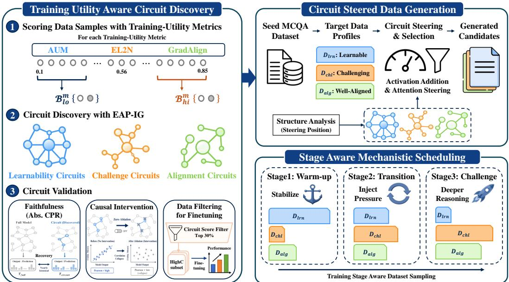  
Figure 1: Overview of the proposed framework. We first discover and causally validate internal circuits tied to specific training-utility metrics (Section 3). We then leverage these circuits to steer the generation process, curating distinct data pools with targeted optimization profiles (Section 4). Finally, our SAMS framework dynamically schedules these utility-targeted datasets according to the model’s evolving learning phases during downstream fine-tuning (Section 5).

Challenge (not yet learnt), and Alignment (worth learning). We instantiate these axes using three well-studied training-dynamics-based utility proxies, namely Area Under the Margin (AUM) [26], Error L2-Norm (EL2N) [25], and Gradient Alignment (GradAlign) [41]. AUM reflects learnability by measuring whether a sample is learned consistently with a stable margin, EL2N captures informative challenge by identifying samples that induce substantial optimization pressure, and GradAlign measures whether such pressure is aligned with the target objective. Together, these signals distinguish samples that contribute productively to learning from those that are merely hard or noisy.

While such a multi-axis profile provides a richer characterization of data quality than a single score, it remains primarily descriptive. These signals can rank or cluster samples according to their behavior, but they do not explain how such behavior is implemented inside the model. In other words, they tell us which samples appear learnable, challenging, or aligned, but not which internal computations make them so. This motivates our first research question: Q1: Are there specific internal computational circuits that govern training-utility signals such as learnability, challenge, and alignment?

We posit that if high- and low-utility samples consistently drive different learning behaviors, these differences should be reflected in distinct computational pathways within the model. Mechanistic interpretability (MI) offers a natural tool for testing this hypothesis by localizing such pathways as circuits composed of nodes and edges. In this view, training-dynamics metrics quantify how useful a sample is, while MI reveals how that utility is realized internally. If such circuits can be identified and causally validated, they may provide more than post-hoc explanations. By turning utility-associated circuits into actionable interfaces, we can move from retrospectively analyzing data quality toward actively controlling synthetic data generation. This leads to our second research question: Q2: Can these discovered circuits serve as causal, circuit-level interfaces for synthetic data generation?

Based on this motivation, we propose a circuit-grounded framework for utility-driven synthetic data generation. We first discover model-internal circuits associated with established metrics (AUM, EL2N, and GradAlign) on the MCQA task. We then show that these circuits exhibit distinct mechanistic roles aligned with their corresponding utility axes. Building on these findings, we steer the discovered circuits to generate targeted training samples with controllable utility profiles. Finally, to maximize the efficacy of the generated data, we introduce a stage-aware scheduling strategy that modulates their mixture over training time to better match stage-specific learning needs.

Our core contributions are summarized as follows:

• Mechanistic Evidence: We identify distinct circuits associated with AUM, EL2N, and GradAlign, and provide structural evidence that these training-utility signals are functionally differentiated within the model.

• Causal Controllability: We demonstrate that the identified utility circuits can be directly steered to generate training samples with desired training-utility profiles, moving beyond superficial prompt-based control. This highlights the potential of MI as causal control handles, not just descriptive artifacts.

• SAMS Framework: We introduce SAMS (Stage-Aware Mechanistic Scheduling), a novel framework that integrates circuit-steered generation with stage-aware scheduling and consistently improves downstream performance over prompt-based baselines.

## 2 Related Works

Mechanistic Interpretability. Recently, MI has become a promising tool for analyzing the internal mechanisms of large language models [23, 30, 33, 21]. MI facilitates the reverse-engineering of neural networks by uncovering the granular pathways, or circuits, through which information is processed and transformed [42, 8, 35]. These circuits are typically identified through causal intervention methods such as attribution patching and its scalable variants, including EAP and EAP-IG [33, 12]. However, existing MI studies predominantly focus on the post-hoc analysis of narrowly defined task specific behaviors, such as Indirect Object Identification (IOI) or syntactic formatting [34, 4, 35, 7]. In contrast, our work extends the MI paradigm in both scope and application by shifting the focus from simple tasks to the broader complexities of data-level training dynamics, and advancing MI from a passive analytical tool into an active causal interface for practical use.

Data Synthesis. Current research in data synthesis has primarily focused on improving dataset quality through data mixture optimization, diversity- or model-aware selection, and pruning strategies [15, 44, 38, 19, 37]. Despite these advances, the data generation itself remains largely driven by surface-level prompting, instruction engineering, or few-shot in-context learning [39, 37, 9, 31]. Such approaches treat the generator as a black box, guiding outputs through linguistic instructions without directly controlling the model’s internal computation or its alignment with downstream optimization needs. In contrast, our work moves beyond surface-level distribution shaping by directly intervening in the generation process through circuit-level steering.

## 3 Training-Utility-Aware Circuit Discovery

Our first goal is to identify model-internal circuits associated with three training-utility, learnability, challenge, and alignment. As summarized in Figure 1, we measure these dimensions at the samplelevel using corresponding established metrics. AUM captures learnability through consistent training margins on the correct label, EL2N identifies informative challenge based on early prediction errors, and GradAlign evaluates alignment via validation-relevant gradient similarity. We then discover the corresponding circuits using EAP-IG [12], a widely adopted algorithm for circuit identification.

## 3.1 Circuit Discovery Setup

We defer the formal definitions of the three training-utility metrics to Appendix A and focus here on how these sample-level utility signals are localized into circuits. We conduct our analysis using the Qwen2.5-1.5B-Instruct model [29] on the SciQ multiple-choice QA benchmark [36].

For each metric $m \in \{ \mathrm { A U M , E L 2 N , G r a d A l i g n } \}$ , we compute a scalar utility score $s _ { i } ^ { m }$ for each training sample $z _ { i } \in D _ { \mathrm { t r a i n } }$ . We then partition the dataset by ranking samples according to $s _ { i } ^ { m }$ and selecting the top-q% and bottom-q% subsets:

$$
\mathcal { B } _ { \mathrm { h i } } ^ { m } = \{ i : s _ { i } ^ { m } \in \mathrm { t o p } _ { q } \% \} , \qquad \mathcal { B } _ { \mathrm { l o } } ^ { m } = \{ i : s _ { i } ^ { m } \in \mathrm { b o t t o m } _ { q } \% \} .\tag{1}
$$

By leveraging both top- and bottom-ranked data, we frame circuit discovery as a contrastive task. This ensures that we do not only recover general task-solving structures, but instead isolate the specific pathways that drive differences in training utility.

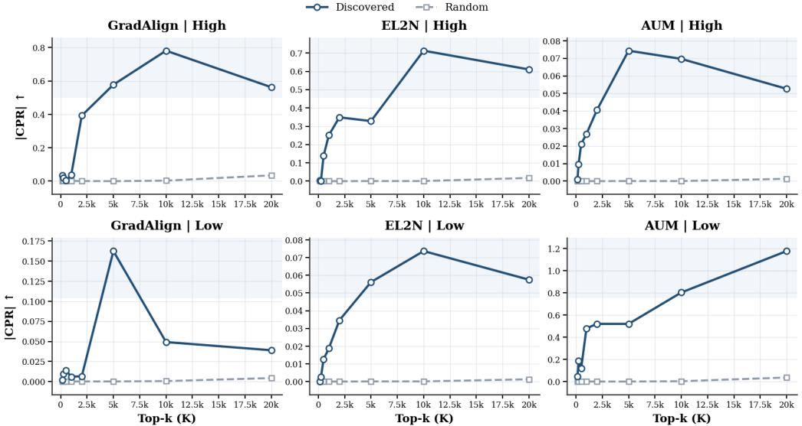  
Figure 2: Absolute Circuit Performance Ratio (Abs-CPR) of discovered circuits versus random baselines. The x-axis denotes the number of extracted top-K edges, defining the subgraph size. Higher Abs-CPR indicates that the extracted circuit successfully governs the model’s original behavior.

To identify these causal structures, we directly adopt the formulation of EAP-IG [12], which enables the efficient discovery of circuit edges via gradient approximation. For a given input $x _ { i }$ and a differentiable target function $T ( x _ { i } )$ , EAP-IG estimates the causal effect of each edge e by computing how much the target behavior shifts between corrupted $( a _ { e } ^ { \mathrm { c o r r } } )$ and clean $( a _ { e } ^ { \mathrm { c l e a n } } )$ activation states.

$$
a _ { e } ^ { ( j ) } = a _ { e } ^ { \mathrm { c o r r } } + \frac { j } { M } \left( a _ { e } ^ { \mathrm { c l e a n } } - a _ { e } ^ { \mathrm { c o r r } } \right) , \quad \mathrm { A t t r } _ { e } ( x _ { i } ) = \left| \left( a _ { e } ^ { \mathrm { c l e a n } } - a _ { e } ^ { \mathrm { c o r r } } \right) ^ { \top } \left( \frac { 1 } { M } \sum _ { j = 1 } ^ { M } \nabla _ { a _ { e } ^ { ( j ) } } T ( x _ { i } ) \right) \right| ,\tag{2}
$$

where M is the number of interpolation steps used to approximate the integral. Edges with larger attribution are interpreted as more influential pathways for mediating utility-related computation.

Executing EAP-IG requires two key components, structurally aligned counterfactual pairs and a target function $\bar { T } ( x _ { i } )$ . For the counterfactual pairs, prior MI studies have relied on token-level substitutions to analyze localized behaviors within a sequence. However, our objective is to capture the utility profile of an entire training sample. We therefore use the original sample embedding $\mathcal { E } ( z _ { i } )$ as the clean input and inject Gaussian noise to form the corrupted input:

$$
x _ { i } ^ { \mathrm { c l e a n } } = \mathcal { E } ( z _ { i } ) , \qquad x _ { i } ^ { \mathrm { c o r r } } = x _ { i } ^ { \mathrm { c l e a n } } + \epsilon , \qquad \epsilon \sim \mathcal { N } ( 0 , \sigma ^ { 2 } I ) .\tag{3}
$$

This continuous perturbation establishes valid counterfactuals while preserving the sequence length of the original sample, which is a practical computational prerequisite for executing EAP-IG.

Regarding the target $T ( x _ { i } )$ , since the original utility metrics are non-differentiable with respect to internal activations, we use the maximum logit margin, a standard attribution target in circuit discovery, defined as $T ( x _ { i } ) = \log p _ { \theta } ( y _ { \mathrm { t r u e } } \mid x _ { i } ) { \stackrel { - } { - } } \operatorname* { m a x } _ { y _ { \mathrm { f a l s e } } } ^ { - } \log p _ { \theta } ( y _ { \mathrm { f a l s e } } \mid x _ { i } )$

Finally, we aggregate these sample-level attributions across our predefined partitions $( B _ { \mathrm { h i } } ^ { m }$ and $B _ { \mathrm { l o } } ^ { m } )$ and retain the top-K highest attributed edges for each subset. This yields two isolated circuit families for each metric, associated with high- and low-scoring samples, respectively.

## 3.2 Mechanistic Circuit Validation

Circuit Faithfulness To validate our discovered circuits, we evaluate their faithfulness using a variant of the Circuit Performance Ratio (CPR) [21]. While standard CPR isolates components that positively restore task performance, training-utility mechanisms can exert both beneficial and detrimental causal forces. To capture the total causal contribution of a circuit regardless of direction, we adapt this metric into the Absolute Circuit Performance Ratio, defined as Abs- $\mathrm { \cdot C P R } { = } \left| T _ { \mathrm { c i r c u i t } } \right. -$

$T _ { \mathrm { c o r r u p t } } | / | T _ { \mathrm { f u l l } } - T _ { \mathrm { c o r r u p t } } | .$ . Here, $T _ { \mathrm { f u l l } }$ and $T _ { \mathrm { c o r r u p t } }$ are the target responses on clean and corrupted inputs, respectively, and $\mathrm { \bar { \it T } _ { c i r c u i t } }$ is the response when only the top-K EAP-IG-ranked edges process the clean signal. We compare each discovered circuit against random edge subsets of the same size. As illustrated in Figure 2, discovered circuits achieve substantially higher Abs-CPR than random baselines across all three utility metrics, with especially strong recovery for GradAlign-High, EL2N-High, and AUM-Low. As K increases, Abs-CPR generally rises at first, reflecting accumulation of core edges, and then saturates or declines once additional lower-ranked edges introduce less relevant connectivity. This pattern demonstrates that the extracted circuits faithfully concentrate utility-relevant computation within their top-ranked edges, capturing the causal effects far more effectively than arbitrary subgraphs.

Causal Necessity via Circuit Intervention. To further demonstrate the causal role of identified circuits, we deactivate them via zero ablation<sup>1</sup>, and then measure how strongly the corresponding sample-level utility scores deteriorate. Let $q _ { \mathrm { f u l l } } ( x )$ and $q _ { \mathrm { a b l } } ( x )$ denote the utility score of sample x before and after circuit ablation, respectively. We first quantify the overall score collapse by the average score drop $S _ { \mathrm { d r o p } } = \mathbb { E } _ { x \in B _ { \mathrm { a l l } } } \left[ q _ { \mathrm { f u l l } } ( x ) - q _ { \mathrm { a b l } } ( x ) \right]$ ]. To quantify the loss of discriminative power, we define the high/low score gap under the full model as $\begin{array} { r } { \dot { G } _ { \mathrm { f u l l } } = \mathbb { E } _ { { x } \in B _ { \mathrm { h i } } } [ q _ { \mathrm { f u l l } } ( x ) ] - \mathbb { E } _ { { x } \in B _ { \mathrm { l o } } } [ q _ { \mathrm { f u l l } } ( x ) ] } \end{array}$ and analogously the gap after ablation as $G _ { \mathrm { a b l } } = \mathbb { E } _ { x \in B _ { \mathrm { h i } } } [ q _ { \mathrm { a b l } } ( x ) ] - \mathbb { E } _ { x \in B _ { \mathrm { l o } } } [ q _ { \mathrm { a b l } } ( x ) ]$ . We then report the Gap Reduction ratio $\begin{array} { r } { \mathrm { G a p R e d } = 1 - \frac { | G _ { \mathrm { a b l } } | } { | G _ { \mathrm { f u l l } } | } } \end{array}$ , where values close to 1 indicate that the original high/low separation almost completely collapses after deactivating the discovered circuit.

Table 1 shows that targeted circuit ablation severely disrupts the model’s original sample-level utility scoring. Across all metrics, ablation induces substantial score drops $( S _ { \mathrm { d r o p } } )$ and destroys rank correlations $( r < 0 . 1 )$ compared to random baselines $( r > 0 . 8 9 )$ . This severe decorrelation indicates that the discovered circuits act as causal bottlenecks for utility score assignment and sample ranking. For AUM and EL2N, this intervention collapses the high/low score separation (GapRed > 98%), validating their discriminative function. Meanwhile, GradAlign exhibits high structural sensitivity, leading to gap fluctuations. Nonetheless, its large score drops and near-zero correlations suggest that the GradAlign circuit serves as both a structurally important processing pathway and a causal bottleneck for gradient-based scoring.

## 3.3 Circuit-based Data Filtering

To bridge our mechanistic insights with practical data curation, we evaluate downstream performance using attribution-guided data filtering. Specifically, we define a circuit-based score and measure the score for each sample using the top-$2 5 0 ^ { 2 }$ discovered edges. Based on these scores, we rank all training samples in the SciQ dataset, retain only the top 30% to form curated subsets, and finetune the model on them. Further implementation details are given in Appendix B.

Circuit-Based Scoring. For a sample x and a target circuit $E _ { t } ,$ we define the circuit score as $S _ { t } ( x ) =$ $\textstyle \sum _ { e \in E _ { t } } a _ { e } ( x ) \cdot c _ { e }$ . Here, $a _ { e } ( x ) \in \mathbb { R }$ is a samplespecific scalar activation [12], and $c _ { e } \in \mathbb { R }$ represents the scalar edge attribution score derived from the initial circuit discovery. Intuitively, $S _ { t } ( x )$ quantifies mechanistic alignment by measuring how strongly a sample activates the discovered functional circuit. We use this score to construct three filtering criteria by selecting samples with the highest $S _ { \mathrm { h i g h } }$ (HighC), highest $S _ { \mathrm { l o w } }$ (LowC), and highest contrastive score $S _ { \mathrm { h i g h } } - S _ { \mathrm { l o w } }$ (ContC).

Table 1: Causal intervention of top-250 metriccorrelated circuits. Corr. denotes the Pearson correlation between $q _ { \mathrm { f u l l } }$ and $q _ { \mathrm { a b l } }$ , and GapRed measures the collapse of the original high/low score separation after ablation.
<table><tr><td>Metric</td><td>Circuit</td><td> $S _ { \mathrm { d r o p } }$ </td><td>Corr.</td><td>GapRed ↑</td></tr><tr><td>AUM</td><td>High Low Random</td><td>7.042 7.347 1.171</td><td>-0.007 -0.173 0.940</td><td>99.98% 98.05% 26.58%</td></tr><tr><td>EL2N</td><td>High Low Random</td><td>0.637 0.636 0.080</td><td>0.024 0.003 0.898</td><td>99.53% 99.58% 15.95%</td></tr><tr><td>GradAlign</td><td>High Low Random</td><td>0.133 0.108 0.003</td><td>-0.046 0.091 0.916</td><td>-23.70% 19.85% -61.92%</td></tr></table>

Table 2: Downstream SciQ accuracy on 30% filtered data subsets. Rand denotes random filtering, and OriS denotes filtering based on the original scalar utility score.
<table><tr><td>Criteria</td><td>AUM</td><td>EL2N</td><td>GradAlign</td></tr><tr><td>HighC</td><td>85.8</td><td>86.7</td><td>86.6</td></tr><tr><td>LowC</td><td>84.8</td><td>87.0</td><td>86.4</td></tr><tr><td>ContC</td><td>86.3</td><td>85.8</td><td>87.7</td></tr><tr><td>Rand</td><td>84.0</td><td>85.2</td><td>85.8</td></tr><tr><td>OriS</td><td>82.3</td><td>85.1</td><td>66.2</td></tr><tr><td>Full (100%)</td><td>87.4</td><td>87.6</td><td>87.4</td></tr></table>

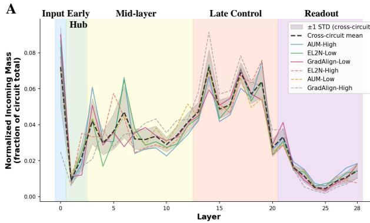

B  
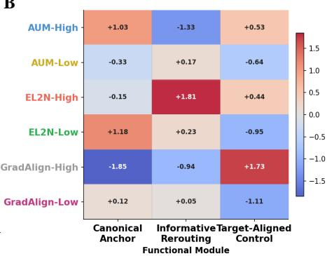  
Figure 3: Shared backbone and functional divergence of discovered utility circuits. (A) Layer-wise normalized incoming mass for each circuit. The black dashed line denotes the cross-circuit mean, and the gray band shows ±1 standard deviation. Narrow variance indicates shared backbone usage, while broader deviations indicate utility-specific routing. (B) Utility-level enrichment of each circuit, reported as cross-circuit z-scores. Positive values indicate that a circuit allocates relatively more mass to that module than the cross-circuit average, while negative values indicate relative suppression.

Filtering Results and Practical Implications. Table 2 demonstrates that circuit-based filtering consistently outperforms random selection and surpasses filtering based on the original scalar metrics. This advantage is particularly pronounced for GradAlign, where raw score filtering severely degrades downstream accuracy while the contrastive circuit signal yields the strongest performance. These results indicate that the circuit-based representation effectively preserves utility-relevant structure that is not fully captured by the scalar score alone.

## 3.4 Circuit Structure and Functional Roles

To understand how these conceptual utility signals are structurally localized within the model’s architecture, we analyze the layer-wise mass distribution of the discovered circuits and examine how their computational mass is routed across different network depths. A detailed node-level breakdown for all circuit profiles is provided in Appendix C.

Mid-layer Divergence Reveals Utility-Specific Motifs. Our structural analysis reveals a distinct anatomical pattern across the circuits. As shown in Figure 3A, while all six circuits share a common structural backbone in the earliest and latest layers, substantial divergence emerges in middle layers, where circuits dynamically redistribute their computational mass. To make these routing differences interpretable, we group the discovered edges into threefunctional modules according to their depth and routing type: the Canonical Anchor for shallow MLP backbone flow, Informative Rerouting for mid-layer Q/K attention shifts, and Target-Aligned Control for early-to-late Key-based control. Figure 3B shows that learnability, challenge, and alignment circuits exhibit distinct module preferences, suggesting that each utility signal is supported by a different structural motif.

• Learnability via Canonical Anchor: Driven predominantly by AUM-High (+1.03) and EL2N-Low (+1.18), this pathway represents the model’s stable default route. Highly learnable, low-optimization-pressure samples do not require complex processing. Instead, they rely on early Key heads (e.g., a6<k>) and layers to directly extract clear label evidence.

• Challenge via Informative Rerouting: Dominated by EL2N-High (+1.81) and actively suppressed by AUM-High (−1.33), this module processes challenging samples located near the decision boundary. For these high-pressure instances, the model bypasses the canonical route, diverting computation through alternative mid-layer attention pathways (e.g., a5<k>) and deeper MLPs (e.g., m6, m13) to resolve ambiguity.

• Alignment via Target-Aligned Control: Strongly enriched for GradAlign-High (+1.73), this module operates in the later control stages. Rather than relying on shallow shortcuts, it utilizes deeper computation (e.g., m13) to explicitly steer the sample’s gradient direction, ensuring the resulting parameter update remains aligned with the target validation objective.

This structural separation makes the circuits actionable. By steering the modules where each utility circuit concentrates, we can bias generation toward the specific utility profile.

## 4 Circuit-Steered Data Synthesis

The preceding results establish that our discovered circuits are faithful, causally relevant, and structurally interpretable. We now pivot from mechanistic interpretation to causal intervention, leveraging these actionable interfaces to generate utility-guided datasets. Additional steering formulations, implementation details, prompts, and dataset statistics are provided in Appendices D and E.

## 4.1 Circuit-Steered Data Generation

We implement circuit-steered generation using two complementary intervention mechanisms. Activation addition shifts hidden representations along utility-specific directions, while targeted attention steering modulates routing behavior through circuit-relevant attention pathways. Concretely, we construct three circuit-steered data pools: $\mathcal { D } _ { \mathrm { l e a r n a b l e } }$ <sub>e</sub> prioritizes highly learnable samples with stable margins by activating canonical anchoring pathways. $\mathcal { D } _ { \mathrm { c h a l l e n g i n g } }$ promotes informative difficulty and higher optimization pressure through rerouting-oriented steering. $\mathcal { D } _ { \mathrm { a l i g n e d } }$ favors target-aligned parameter updates through late-stage control-oriented steering.

Activation Addition. Following Representation Engineering (RepE) [45], we construct a steering vector $u _ { c } ^ { ( m ) }$ for each module $m \in \mathcal { M } ( c )$ of circuit c, where $\mathcal M ( c )$ denotes the set of intervention targets identified in Section 3.4. The vector is computed as the mean activation difference between high- and low-utility groups. At each decoding step, we shift the hidden representation $h _ { t } ^ { ( m ) }$ via:

$$
u _ { c } ^ { ( m ) } = \mathbb { E } _ { x \sim \mathcal { D } _ { c , h i } } [ h _ { \theta } ^ { ( m ) } ( x ) ] - \mathbb { E } _ { x \sim \mathcal { D } _ { c , l o } } [ h _ { \theta } ^ { ( m ) } ( x ) ] , \quad h _ { t } ^ { ( m ) } \gets h _ { t } ^ { ( m ) } + \sum _ { c : m \in \mathcal { M } ( c ) } \lambda _ { c } u _ { c } ^ { ( m ) } ,\tag{4}
$$

where $\lambda _ { c }$ is a steering coefficient dictating circuit amplification $( \lambda _ { c } > 0 )$ or suppression $( \lambda _ { c } < 0 )$

Attention Steering. In addition to shifting hidden representations, we steer sparse attention heads within the discovered circuits. This provides more direct control over token-level routing behavior, complementing activation addition with circuit-targeted modulation of information flow.

As a result, activation addition shapes what utility-related circuit state is expressed, while attention steering modulates how computation is routed through the discovered pathways. Together, these mechanisms provide causal control at both the representation and routing levels, steering the model’s generation toward targeted utility profiles.

Selection. Since circuit steering remains stochastic at generation time, not every candidate faithfully reflects the intended utility profile. We therefore apply a post-generation selection step to remove noisy or weakly matched samples. This improves the consistency of the resulting synthetic pool without altering the steering mechanism itself.

## 4.2 Generation Fidelity: Circuit Steering vs. Prompting

We next evaluate whether circuit-steered generation produces data that is both faithful to the intended training-utility profiles and effective for downstream training. This evaluation proceeds in two stages. First, to isolate the contribution of each functional module, we conduct an internal ablation study that removes each utility axis in turn, assessing the generated data across complexity, quality, and diversity dimensions [13, 15, 18]. Second, we compare our circuit-steered datasets against prompt-based baselines under matched target profiles [6, 40, 43], evaluating both their alignment with the original utility metrics and the richness of their learning signals.

Necessity of Utility Axes. We first investigate the distinct role of each utility-correlated circuit by removing one axis at a time during generation (Figure 4). Without the AUM circuit (w/o AUM), the generated samples maintain fluency (PPL) but suffer a systematic collapse in domain coverage (Recall) and diversity (G-Vendi). Omitting EL2N $( \mu / \rho$ EL2N) most notably reduces the additional performance benefit of rationales (R-Gain), indicating a degeneration into trivial samples that lack meaningful reasoning signals. Finally, removing GradAlign $( \mu / \rho$ GradAlign) reduces both solving accuracy (Ans-Acc) and the proxy model’s confidence margin, demonstrating its role in ensuring target-aligned usefulness. Overall, these results suggest that the three axes act synergistically in that AUM ensures learnability (by stabilizing generation), EL2N ensures the presence of not-yet-learnt signals (by preventing trivial mode collapse), and GradAlign ensures the data is worth learning (by preserving target-relevant utility).

B  
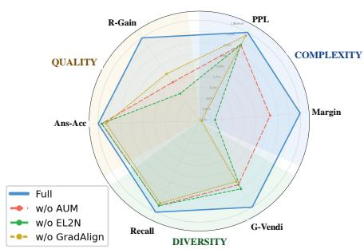

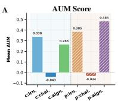

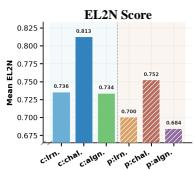

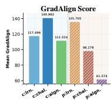

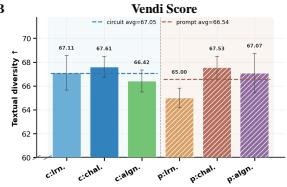

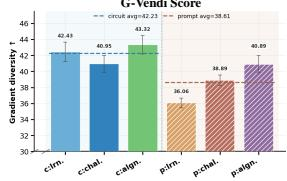  
Figure 4: Utility-axis ablation for circuitsteered generation. All metrics are normalized by the Full setting, so values below 1.0 indicate degradation. See Appendix F for detailed metric descriptions.  
Figure 5: Comparison of circuit-steered (c:) vs. promptbased (p:) generation. (A) Mean utility scores across learnable, challenging, and aligned target profiles, abbreviated as lrn., chal., and algn.. (B) Semantic diversity (Vendi) and gradient-space diversity (G-Vendi).

Faithful Alignment with Utility Profiles. Building on this balanced foundation, we evaluate whether the full circuit-steering framework successfully achieves its intended utility targets. As shown in Figure 5A, circuit-steered recipes effectively produce distinct, targeted utility profiles. For instance, $\mathcal { D } _ { \mathrm { c h a l l e n g i n g } }$ yields the highest EL2N alongside a negative AUM score, consistent with generating harder, structurally complex samples. Similarly, $\mathcal { D } _ { \mathrm { a l i g n e d } }$ achieves a substantially higher GradAlign score than its prompt-based counterpart, indicating a strong preservation of target-relevant optimization signals. These results suggest that circuit steering offers a more direct and interpretable interface for controlling training-relevant data properties than prompt-level heuristics.

Enhancement of Gradient-Space Diversity. Finally, Figure 5B demonstrates that circuit-steered datasets achieve higher diversity, particularly under the G-Vendi metric. This suggests that circuit steering does not merely increase lexical or semantic variation captured by standard Vendi, but broadens the model-induced gradient space, yielding richer optimization signals that are directly tied to downstream robustness [15].

## 5 SAMS: Stage-Aware Mechanistic Scheduling

While circuit-steered generation provides independent control over distinct training-utility profiles, treating the resulting pools as a flat mixture ignores the evolving optimization needs of fine-tuning. Prior work establishes that training is highly phase-dependent, with models typically benefiting from stable optimization anchors in early stages before they can effectively absorb high-variance or structurally complex signals [1, 24, 25]. Motivated by this observation, we introduce Stage-Aware Mechanistic Scheduling (SAMS), a stage-wise framework that schedules the circuit-steered pools from Section 4.1 according to their functional training utility.

Rather than relying on a fixed synthetic mixture, SAMS dynamically reallocates sampling mass across $\mathcal { D } _ { \mathrm { l e a r n a b l e } } , \mathcal { D } _ { \mathrm { c h a l l e n g i n g } }$ , and $\mathcal { D } _ { \mathrm { a l i g n e d } }$ according to Algorithm 1, forming a mechanistically grounded curriculum executed across three progressive phases. During the Warm-up Stage, training emphasizes $\mathcal { D } _ { \mathrm { l e a r n a b l e } }$ to consolidate basic pattern recognition while avoiding excessive gradient variance. In the Transition Stage, we gradually increase the proportion of $\mathcal { D } _ { \mathrm { c h a l l e n g i n g } }$ samples, exposing the model to more structurally demanding signals while preserving a non-trivial anchor component to prevent drift.

Table 3: Downstream fine-tuning results across source-data ratios. 50%, 60%, and 70% indicate the ratio of original source data to generated data under a fixed total training budget. S&S indicates circuit-based steering and selection. Sch. applies the exact scheduling ratios from Algorithm 1 identically to both prompt-generated and circuit-steered pools. We report Accuracy (↑), Expected Calibration Error $( \bar { \mathrm { E C E } } , \bar { \downarrow } )$ , and Negative Log-Likelihood (NLL, ↓).
<table><tr><td rowspan="2">Category</td><td rowspan="2">Config</td><td rowspan="2">S&amp;S</td><td rowspan="2">Sch.</td><td colspan="3">Accuracy (↑)</td><td colspan="3">ECE (↓)</td><td colspan="3">NLL (↓)</td></tr><tr><td>50% 60%</td><td></td><td>70%</td><td>50%</td><td>60%</td><td>70%</td><td>50%</td><td>60%</td><td>70%</td></tr><tr><td colspan="10">In-Domain: SciQ</td><td colspan="3"></td></tr><tr><td>Baseline</td><td>Source Only (Full)</td><td>x</td><td>x</td><td></td><td>83.4</td><td></td><td></td><td>0.157</td><td></td><td></td><td>1.408</td><td></td></tr><tr><td rowspan="2">Prompt Gen.</td><td>Uniform-Mix</td><td>x</td><td>x</td><td>82.9</td><td>83.7</td><td>82.8</td><td>0.070</td><td>0.078</td><td>0.093</td><td>0.541</td><td>0.551</td><td>0.588</td></tr><tr><td>Stage-Aware Sch.</td><td>x</td><td>V</td><td>83.4</td><td>83.1</td><td>83.2</td><td>0.074</td><td>0.079</td><td>0.090</td><td>0.525</td><td>0.568</td><td>0.594</td></tr><tr><td rowspan="2">Circuit Steering</td><td>Uniform-Mix</td><td>√</td><td>x</td><td>83.9</td><td>84.5</td><td>84.9</td><td>0.060</td><td>0.071</td><td>0.069</td><td>0.513</td><td>0.544</td><td>0.540</td></tr><tr><td>SAMS</td><td>√</td><td>√</td><td>84.8</td><td>85.8</td><td>84.4</td><td>0.056</td><td>0.055</td><td>0.084</td><td>0.491</td><td>0.511</td><td>0.541</td></tr><tr><td colspan="10">Out-of-Domain: ARC-Easy</td><td colspan="3"></td></tr><tr><td>Baseline</td><td>Source Only (Full)</td><td>x</td><td>x</td><td></td><td>76.2</td><td></td><td></td><td>0.211</td><td></td><td></td><td>1.692</td><td></td></tr><tr><td rowspan="2">Prompt Gen.</td><td>Uniform-Mix</td><td>x</td><td>x</td><td>72.6</td><td>72.8</td><td>72.9</td><td>0.047</td><td>0.043</td><td>0.061</td><td>0.741</td><td>0.750</td><td>0.769</td></tr><tr><td>Stage-Aware Sch.</td><td>x</td><td>S</td><td>72.4</td><td>72.1</td><td>72.4</td><td>0.060</td><td>0.052</td><td>0.072</td><td>0.768</td><td>0.772</td><td>0.793</td></tr><tr><td rowspan="2">Circuit Steering</td><td>Uniform-Mix</td><td>√</td><td>x</td><td>73.6</td><td>73.5</td><td>74.4</td><td>0.037</td><td>0.037</td><td>0.048</td><td>0.728</td><td>0.733</td><td>0.733</td></tr><tr><td>SAMS</td><td>√</td><td>√</td><td>74.1</td><td>74.6</td><td>74.9</td><td>0.058</td><td>0.039</td><td>0.047</td><td>0.724</td><td>0.712</td><td>0.717</td></tr></table>

Finally, in the Challenge Stage, the schedule places greater weight on both $\mathcal { D } _ { \mathrm { a l i g n e d } }$ and $\mathcal { D } _ { \mathrm { c h a l l e n g i n g } } ,$ encouraging deeper reasoning and stronger target-aligned behavior.

Downstream Utility via Fine-Tuning To assess downstream practical utility, we fine-tune a student model (Qwen2.5-0.5B-Instruct [29]) on mixtures of original source data and synthesized data, varying the source-data ratio from 50% to 70%. We evaluate both in-domain (SciQ) and out-of-domain (ARC-Easy [5]) performance using Accuracy, Expected Calibration Error (ECE) [27], and Negative Log-Likelihood (NLL), where ECE and NLL assess confidence calibration and penalize overconfident mistakes.

As shown in Table 3, training with circuitsteered data consistently outperforms promptbased generation baselines. On the in-domain SciQ benchmark, SAMS achieves the highest peak accuracy (85.8%) while substantially reducing overconfidence, as reflected by its lower

Algorithm 1: Stage-Aware Mechanistic Scheduling   
Require: Base θ<sub>0</sub>, Steps T, Source ratio $r _ { \mathrm { s r c } }$   
Require: Source data $\mathcal { D } _ { \mathrm { s r c } } ,$ Gen. data $\mathcal { D } _ { \mathrm { l r n } } , \mathcal { D } _ { \mathrm { c h l } } , \mathcal { D } _ { \mathrm { a l g } }$   
1: Boundaries $t _ { 1 } , t _ { 2 } \ ( 0 < t _ { 1 } < t _ { 2 } < T )$   
2: for $t = 1$ to T do   
3: if $\cdot t \leq t _ { 1 }$ then ▷ Warm-up   
4: $( r _ { \mathrm { l r n } } , r _ { \mathrm { c h l } } , r _ { \mathrm { a l g } } ) \gets ( 0 . 6 0 , 0 . 1 5 , 0 . 2 5 )$   
5: else if $t _ { 1 } < t \leq t _ { 2 }$ then ▷ Transition   
6: $( r _ { \mathrm { l r n } } , r _ { \mathrm { c h l } } , r _ { \mathrm { a l g } } ) \gets ( 0 . 2 5 , 0 . 4 5 , 0 . 3 0 )$   
7: else ▷ Challenge   
8: $( r _ { \mathrm { l r n } } , r _ { \mathrm { c h l } } , r _ { \mathrm { a l g } } ) \gets ( 0 . 1 0 , 0 . 6 0 , 0 . 3 0 )$   
9: end if   
10: Compose $B _ { t } \colon$ Sample $r _ { \mathrm { s r c } }$ from $\mathcal { D } _ { \mathrm { s r c } }$ and (1−   
$r _ { \mathrm { s r c } } )$ via $( r _ { \mathrm { l r n } } , r _ { \mathrm { c h l } } , r _ { \mathrm { a l g } } )$   
11: $\theta _ { t } \gets \theta _ { t - 1 } - \eta \nabla _ { \theta } \bar { \mathcal { L } } ( B _ { t } ; \theta _ { t - 1 } )$   
12: end for   
13: return $\theta _ { T }$

ECE (0.055). This demonstrates that aligning data complexity with the model’s training stage effectively regularizes its internal certainty. The same pattern extends to the out-of-domain ARC-Easy benchmark, where both circuit-steering configurations outperform prompt-tuned models. These results indicate that circuit-steered generation improves downstream utility without sacrificing out-ofdomain robustness.

## 6 Conclusion

This paper establishes a novel intersection between MI and data synthesis by demonstrating that training data utility can be reverse-engineered into controllable circuit-level variables. Rather than treating data generation as a black-box prompting exercise, our framework actively steers internal modules responsible for learnability, informative challenge, and target alignment to produce data with desired properties. SAMS further shows that these circuit-steered datasets are most effective when their utility profiles are dynamically aligned with the model’s evolving optimization needs. Future work will explore extending these localized interventions to a broader range of architectures and tasks, ultimately paving the way for fully white-box, mechanistically guided data curation pipelines.

## References

[1] Y. Bengio, J. Louradour, R. Collobert, and J. Weston. Curriculum learning. In Proceedings of the 26th Annual International Conference on Machine Learning, ICML ’09, page 41–48, New York, NY, USA, 2009. Association for Computing Machinery.

[2] A. Bukharin, S. Li, Z. Wang, J. Yang, B. Yin, X. Li, C. Zhang, T. Zhao, and H. Jiang. Data diversity matters for robust instruction tuning. In Y. Al-Onaizan, M. Bansal, and Y.-N. Chen, editors, Findings of the Association for Computational Linguistics: EMNLP 2024, pages 3411–3425, Miami, Florida, USA, Nov. 2024. Association for Computational Linguistics.

[3] H. Chen, A. Waheed, X. Li, Y. Wang, J. Wang, B. Raj, and M. I. Abdin. On the diversity of synthetic data and its impact on training large language models, 2024.

[4] J. Chen, Y. Luo, and L. Pan. Mechanistic data attribution: Tracing the training origins of interpretable llm units, 2026.

[5] P. Clark, I. Cowhey, O. Etzioni, T. Khot, A. Sabharwal, C. Schoenick, and O. Tafjord. Think you have solved question answering? try arc, the ai2 reasoning challenge, 2018.

[6] N. Ding, Y. Chen, B. Xu, Y. Qin, Z. Zheng, S. Hu, Z. Liu, M. Sun, and B. Zhou. Enhancing chat language models by scaling high-quality instructional conversations, 2023.

[7] J. Ferrando, G. Sarti, A. Bisazza, and M. R. Costa-jussà. A primer on the inner workings of transformer-based language models, 2024.

[8] L. Gao, A. Rajaram, J. Coxon, S. V. Govande, B. Baker, and D. Mossing. Weight-sparse transformers have interpretable circuits, 2025.

[9] T. Ge, X. Chan, X. Wang, D. Yu, H. Mi, and D. Yu. Scaling synthetic data creation with 1,000,000,000 personas, 2025.

[10] Y. Gu, L. Dong, H. Wang, Y. Hao, Q. Dong, F. Wei, and M. Huang. Data selection via optimal control for language models, 2025.

[11] M. Hanna and contributors. Eap-ig: Edge attribution patching with integrated gradients. https://github.com/hannamw/eap-ig, 2024. Code repository.

[12] M. Hanna, S. Pezzelle, and Y. Belinkov. Have faith in faithfulness: Going beyond circuit overlap when finding model mechanisms, 2024.

[13] A. Havrilla, A. Dai, L. O’Mahony, K. Oostermeijer, V. Zisler, A. Albalak, F. Milo, S. C. Raparthy, K. Gandhi, B. Abbasi, D. Phung, M. Iyer, D. Mahan, C. Blagden, S. Gureja, M. Hamdy, W.- D. Li, G. Paolini, P. S. Ammanamanchi, and E. Meyerson. Surveying the effects of quality, diversity, and complexity in synthetic data from large language models, 2024.

[14] M. Idahl, B. Droste, B. Plüster, and J. P. Harries. propella-1: Multi-property document annotation for llm data curation at scale, 2026.

[15] J. Jung, S. Han, X. Lu, S. Hallinan, D. Acuna, S. Prabhumoye, M. Patwary, M. Shoeybi, B. Catanzaro, and Y. Choi. Prismatic synthesis: Gradient-based data diversification boosts generalization in llm reasoning, 2025.

[16] A. Kabra, Y. Yin, A. Gong, K. Stankeviciˇ ut¯ e, D. Go, J. Lee, K. Z. Luo, C. P. Gomes, and K. Q.˙ Weinberger. Learning from synthetic data improves multi-hop reasoning, 2026.

[17] F. Kang, N. Ardalani, M. Kuchnik, Y. Emad, M. Elhoushi, S. Sengupta, S.-W. Li, R. Raghavendra, R. Jia, and C.-J. Wu. Demystifying synthetic data in llm pre-training: A systematic study of scaling laws, benefits, and pitfalls, 2025.

[18] W. Liu, W. Zeng, K. He, Y. Jiang, and J. He. What makes good data for alignment? a comprehensive study of automatic data selection in instruction tuning, 2024.

[19] A. Maharana, P. Yadav, and M. Bansal. D2 pruning: Message passing for balancing diversity and difficulty in data pruning, 2023.

[32] A. Sun and contributors. Circuit stability. https://github.com/alansun17904/ circuit-stability, 2025. Code repository.

[20] S. Mindermann, J. Brauner, M. Razzak, M. Sharma, A. Kirsch, W. Xu, B. Höltgen, A. N. Gomez, A. Morisot, S. Farquhar, and Y. Gal. Prioritized training on points that are learnable, worth learning, and not yet learnt, 2022.

[21] A. Mueller, A. Geiger, S. Wiegreffe, D. Arad, I. Arcuschin, A. Belfki, Y. S. Chan, J. Fiotto-Kaufman, T. Haklay, M. Hanna, J. Huang, R. Gupta, Y. Nikankin, H. Orgad, N. Prakash, A. Reusch, A. Sankaranarayanan, S. Shao, A. Stolfo, M. Tutek, A. Zur, D. Bau, and Y. Belinkov. Mib: A mechanistic interpretability benchmark, 2025.

[22] M. Nada¸s, L. Dio¸san, and A. Tomescu. Synthetic data generation using large language models:ˇ Advances in text and code. IEEE Access, 13:134615–134633, 2025.

[23] C. Olsson, N. Elhage, N. Nanda, N. Joseph, N. DasSarma, T. Henighan, B. Mann, A. Askell, Y. Bai, A. Chen, T. Conerly, D. Drain, D. Ganguli, Z. Hatfield-Dodds, D. Hernandez, S. Johnston, A. Jones, J. Kernion, L. Lovitt, K. Ndousse, D. Amodei, T. Brown, J. Clark, J. Kaplan, S. McCandlish, and C. Olah. In-context learning and induction heads, 2022.

[24] L. Ouyang, J. Wu, X. Jiang, D. Almeida, C. L. Wainwright, P. Mishkin, C. Zhang, S. Agarwal, K. Slama, A. Ray, J. Schulman, J. Hilton, F. Kelton, L. Miller, M. Simens, A. Askell, P. Welinder, P. Christiano, J. Leike, and R. Lowe. Training language models to follow instructions with human feedback, 2022.

[25] M. Paul, S. Ganguli, and G. K. Dziugaite. Deep learning on a data diet: Finding important examples early in training, 2023.

[26] G. Pleiss, T. Zhang, E. R. Elenberg, and K. Q. Weinberger. Identifying mislabeled data using the area under the margin ranking, 2020.

[27] N. Posocco and A. Bonnefoy. Estimating expected calibration errors, 2021.

[28] G. Pruthi, F. Liu, M. Sundararajan, and S. Kale. Estimating training data influence by tracing gradient descent, 2020.

[29] Qwen Team, A. Yang, B. Yang, B. Zhang, B. Hui, B. Zheng, B. Yu, C. Li, D. Liu, F. Huang, H. Wei, H. Lin, J. Yang, J. Tu, J. Zhang, J. Yang, J. Yang, J. Zhou, J. Lin, K. Dang, K. Lu, K. Bao, K. Yang, L. Yu, M. Li, M. Xue, P. Zhang, Q. Zhu, R. Men, R. Lin, T. Li, T. Tang, T. Xia, X. Ren, X. Ren, Y. Fan, Y. Su, Y. Zhang, Y. Wan, Y. Liu, Z. Cui, Z. Zhang, and Z. Qiu. Qwen2.5 technical report, 2025.

[30] D. Rai, Y. Zhou, S. Feng, A. Saparov, and Z. Yao. A practical review of mechanistic interpretability for transformer-based language models, 2025.

[31] L. Ranaldi, G. Pucci, and A. Freitas. Empowering cross-lingual abilities of instruction-tuned large language models by translation-following demonstrations. In L.-W. Ku, A. Martins, and V. Srikumar, editors, Findings of the Association for Computational Linguistics: ACL 2024, pages 7961–7973, Bangkok, Thailand, Aug. 2024. Association for Computational Linguistics.

[33] A. Syed, C. Rager, and A. Conmy. Attribution patching outperforms automated circuit discovery. In Y. Belinkov, N. Kim, J. Jumelet, H. Mohebbi, A. Mueller, and H. Chen, editors, Proceedings of the 7th BlackboxNLP Workshop: Analyzing and Interpreting Neural Networks for NLP, pages 407–416, Miami, Florida, US, Nov. 2024. Association for Computational Linguistics.

[34] K. Wang, A. Variengien, A. Conmy, B. Shlegeris, and J. Steinhardt. Interpretability in the wild: a circuit for indirect object identification in gpt-2 small, 2022.

[35] X. Wang, Y. Hu, W. Du, R. Cheng, B. Wang, and D. Zou. Towards understanding fine-tuning mechanisms of llms via circuit analysis, 2025.

[36] J. Welbl, N. F. Liu, and M. Gardner. Crowdsourcing multiple choice science questions, 2017.

[37] S. Wu, K. Lu, B. Xu, J. Lin, Q. Su, and C. Zhou. Self-evolved diverse data sampling for efficient instruction tuning, 2023.

[38] M. Xia, S. Malladi, S. Gururangan, S. Arora, and D. Chen. Less: Selecting influential data for targeted instruction tuning, 2024.

[39] C. Xu, Q. Sun, K. Zheng, X. Geng, P. Zhao, J. Feng, C. Tao, Q. Lin, and D. Jiang. Wizardlm: Empowering large pre-trained language models to follow complex instructions, 2025.

[40] Z. Xu, F. Jiang, L. Niu, Y. Deng, R. Poovendran, Y. Choi, and B. Y. Lin. Magpie: Alignment data synthesis from scratch by prompting aligned llms with nothing, 2024.

[41] N. Yang, W. Du, W. Sun, S. Welleck, and Y. Yang. Gradalign: Gradient-aligned data selection for llm reinforcement learning, 2026.

[42] Y. Yao, N. Zhang, Z. Xi, M. Wang, Z. Xu, S. Deng, and H. Chen. Knowledge circuits in pretrained transformers, 2025.

[43] Y. Yu, Y. Zhuang, J. Zhang, Y. Meng, A. Ratner, R. Krishna, J. Shen, and C. Zhang. Large language model as attributed training data generator: A tale of diversity and bias, 2023.

[44] Z. Yu, S. Das, and C. Xiong. Mates: Model-aware data selection for efficient pretraining with data influence models, 2024.

[45] A. Zou, L. Phan, S. Chen, J. Campbell, P. Guo, R. Ren, A. Pan, X. Yin, M. Mazeika, A.-K. Dombrowski, S. Goel, N. Li, M. J. Byun, Z. Wang, A. Mallen, S. Basart, S. Koyejo, D. Song, M. Fredrikson, J. Z. Kolter, and D. Hendrycks. Representation engineering: A top-down approach to ai transparency, 2025.

## A Detailed Experimental Setup for Circuit Discovery

Training-Utility Score Formulation. To evaluate training utility, we adopt the metrics of Area Under the Margin (AUM) [26], Error L2-Norm (EL2N) [25], and GradAlign [41]. Formally, for a given training sample $x _ { i }$ and its ground-truth label y , these scores are defined as follows:

$$
\begin{array} { c l c r } { { \displaystyle \mathrm { A U M } ( \boldsymbol { x } _ { i } ) = \frac { 1 } { T } \sum _ { t = 1 } ^ { T } \left( z _ { y _ { i } } ^ { ( t ) } - \underset { j \neq y _ { i } } { \operatorname* { m a x } } z _ { j } ^ { ( t ) } \right) , } } \\ { { \displaystyle \mathrm { E L 2 N } ( \boldsymbol { x } _ { i } ) = \left\| p _ { \theta _ { t _ { 0 } } } ( x _ { i } ) - \boldsymbol { e } _ { y _ { i } } \right\| _ { 2 } , } } \\ { { \displaystyle \mathrm { G r a d A l i g n } ( \boldsymbol { x } _ { i } ) = \left. \nabla _ { \theta } \ell ( x _ { i } , y _ { i } ) , \nabla _ { \theta } \mathcal { L } _ { \mathrm { v a l } } \right. . } } \end{array}\tag{5}
$$

Here, $z _ { j } ^ { ( t ) }$ denotes the logit of class j at training step $t , T$ is the total number of recorded steps used to compute AUM, and $p _ { \theta _ { t _ { 0 } } } ( x _ { i } )$ is the model’s predicted probability distribution at an early training checkpoint t<sub>0</sub>. $e _ { y _ { i } }$ represents the one-hot encoded target vector, $\ell ( x _ { i } , y _ { i } )$ is the per-sample training loss, and ${ \mathcal L } _ { \mathrm { v a l } }$ denotes the loss evaluated on the SciQ validation set.

We employ QWEN2.5-1.5B-INSTRUCT as our base model and the SciQ training split $( N = 1 1 , 6 7 9 )$ for fine-tuning. This specific pairing is chosen because the model exhibits non-trivial reasoning on SciQ (achieving 50–60% zero-shot accuracy) while its parameter scale ensures that iterative circuit discovery and validation remain computationally tractable. To evaluate training utility, we dynamically collect three sample-level scores (AUM, EL2N, and GradAlign) for each sample. The model is fine-tuned for 5 epochs using an RTX-Pro 6000 GPU, with EL2N specifically tracked over the first two epochs to capture critical early training dynamics.

Dataset and Contrastive Bucket Curation. To facilitate circuit inspection via EAP-IG, we curate contrastive subsets from the scored dataset by isolating the top 15% and bottom 15% of sample (1,751 samples each) based on their respective utility metrics. This forms distinct High-Utility and Low-Utility buckets. We deliberately employ this extreme-percentile binary partitioning to maximize the contrastive signal required for attribution patching. By establishing a high signal-to-noise contrast, this setting cleanly isolates the specific computational subgraphs responsible for desirable versus undesirable model behaviors. While extending this partition to a fine-grained spectrum (e.g., high/mid/low) remains a valuable avenue for future work, the current binary contrast provides a rigorous foundation for extracting critical circuits without signal dilution.

```jsonl
1 {
2 " clean ": "<| im_start |> system \ nYou are a helpful multiple - choice assistant .
3 Reply with only the correct option letter .<| im_end |>\n
4 <| im_start |> user \ nQuestion : Long distance runners try to
5 maintain constant velocity with very little acceleration or
6 deceleration to conserve what ?\n\n
7 A. pressure \nB. momentum \nC. fuel \nD. energy \n\n
8 Return only the correct option letter . <| im_end | >\ n
9 <| im_start |> assistant \n",
10 " label ": 35,
11 " hf_id ": " sciq/ train /9939" ,
12 " task ": " sciq ",
13 " score_key ": " el2n ",
14 " bucket ": " high ",
15 " gold_label ": " D",
16 " label_space ": ["A", "B ", "C", "D"],
17 " corrupt ": {" type ": " gaussian ", " sigma ": 0.1 , " seed ": 2555509 },
18 " token_len ": 252 ,
19 " max_length ": 512
20 }
```  
Figure 6: Example of a curated data pair configuration for EAP-IG. The setup explicitly defines the clean prompt, label space, and the continuous corruption strategy.

For each instance within these buckets, we construct a paired setup consisting of a clean input and a corrupted counterpart. As illustrated in Figure 6, the clean input utilizes a chat template, while the corrupted state is generated by injecting continuous Gaussian noise $( \sigma = 0 . 1 )$ into the embedding space. This ensures our circuit discovery strictly evaluates the pathways responsible for predicting the exact target token.

EAP-IG Implementation Details. We implement circuit discovery using EAP-IG, building on its public implementation [11]. The original implementation assumes standard multi-head attention, where query, key, and value heads are aligned one-to-one. However, Qwen2.5 uses grouped-query at tention (GQA), in which multiple query heads share a smaller number of key/value heads. To correctly trace edge-level information flow under this architecture, we extend the graph construction and attribution routines to support GQA-style head sharing, referencing prior implementations [32]. Specifically, we adapt the graph representation to explicitly track the number of KV heads and accurately route the backward-pass gradients from multiple query heads to their shared KV equivalents.

Given the utility-specific high/low buckets described above, we run EAP-IG with $M = 5$ interpolation steps in Eq. (2), following the recommendation of [12]. Attribution is computed at both node and edge granularity. Unless otherwise specified, we rank circuit components by absolute attribution magnitude, which allows us to capture both positively and negatively contributing pathways to the target logit-margin objective.

Table 4: Sparsity of extracted circuits at varying Top-K edge thresholds. The full computational graph for the Qwen2.5-1.5B model (28 layers, 12 attention heads, 2 GQA groups, and $d _ { \mathrm { h e a d } } = 1 2 8 )$ yields a total of 365 nodes and 84,715 potential valid edges.
<table><tr><td>Selected Edges (Top-K)</td><td>Proportion of Total Edges (%)</td></tr><tr><td>100</td><td>0.12%</td></tr><tr><td>250</td><td>0.30%</td></tr><tr><td>500</td><td>0.59%</td></tr><tr><td>1,000</td><td>1.18%</td></tr><tr><td>2,000</td><td>2.36%</td></tr><tr><td>5,000</td><td>5.90%</td></tr><tr><td>10,000</td><td>11.80%</td></tr><tr><td>15,000</td><td>17.71%</td></tr></table>

## B Detailed Experimental Setup for Circuit Validation

Zero-Ablation Experiment Setup. As described in Section 3.2, we perform zero-ablation experiments to test whether the discovered circuits causally drive the corresponding utility-score behavior. For each utility metric $m \in \{ \mathrm { A U M }$ , EL2N, GradAlign}, we take the top-250 edges discovered by EAP-IG and disable them by replacing their activations with zero during the forward pass. We then repeat the same fine-tuning and utility-score collection procedure described in Appendix A under the ablated model, denoted by $q _ { \mathrm { a b l } } ( x )$

Because the utility metrics have different mathematical forms, we use two ablated-score collection protocols. For dynamic training-dependent metrics such as AUM and EL2N, we repeat fine-tuning with the corresponding circuit edges persistently ablated, and collect $q _ { \mathrm { a b l } } ( x )$ along this ablated training trajectory in the same manner as $q _ { \mathrm { f u l l } } ( x )$ . In contrast, for gradient-based metrics such as GradAlign, we compute $q _ { \mathrm { a b l } } ( x )$ directly from an ablated forward-backward pass at the same checkpoint used for $q _ { \mathrm { f u l l } } ( x )$ , without additional training. As a control baseline, we randomly sample an equivalent number of edges $( K = 2 5 0 )$ and apply the identical zero-ablation procedure. This allows us to distinguish targeted causal effects from score deviations caused by random architectural disruption.

To quantify the ablation impact, we specifically analyze the samples comprising our previously curated high- and low-utility buckets. For these targeted samples, we compute the Pearson correlation coefficient between the utility score rankings produced by the full model $q _ { \mathrm { f u l l } } ( x )$ and the ablated model $q _ { \mathrm { a b l } } ( x )$ . Additionally, we observe the collapse in the score gap between the buckets. A substantial decrease in both correlation and bucket gap robustly indicates that the ablated circuit is causally responsible for generating the specific utility signal.

Data Filtering Experimental Setup. To demonstrate the practical applicability of mechanistic insights, we leverage the discovered circuits to perform data filtering prior to our main data generation pipeline. As defined in Section 3.3, the circuit score $S _ { t } ( x )$ quantifies the mechanistic alignment. For each sample x in the SciQ training split, we compute its circuit score with respect to the discovered high- and low-utility circuits of metric m. We then rank all training samples according to the corresponding circuit-based selection score and retain the top $q = 3 0 \%$ of examples. Formally, our filtering setups are defined as follows:

• HighC Filter (High-quality Circuit-based): $\mathcal { D } _ { \mathrm { h i g h } } = \mathrm { T o p Q } _ { q } \left( S _ { \mathrm { h i g h } } ^ { M } ( x ) \right)$

• LowC Filter (Low-quality Circuit-based): ${ \mathcal { D } } _ { \mathrm { l o w } } = \mathrm { T o p Q } _ { q } \left( S _ { \mathrm { l o w } } ^ { M } ( x ) \right)$

• ContC Filter (Contrastive Circuit-based): $\mathcal { D } _ { \mathrm { c o n t } } = \mathrm { T o p Q } _ { q } \left( S _ { \mathrm { h i g h } } ^ { M } ( x ) - S _ { \mathrm { l o w } } ^ { M } ( x ) \right)$

We compare these mechanistic filtering strategies against three baselines: Full (using the entire dataset), Rand Filter (a randomly selected $\hat { q \% }$ subset), and OriS Filter (the top $q \%$ selected using the original, un-patched utility formulations such as EL2N). For all downstream validation experiments on these subsets, we fine-tune Qwen2.5-1.5B-Instruct for 3 epochs with a learning rate of $ { \mathbf { \hat { 2 } } } \times 1 0 ^ { - 5 }$ on the same RTX-Pro 6000 GPU.

## C Detailed Topology of Training-Utility Circuits

We provide a finer-grained summary of the information processing pathways for the six discovered circuits corresponding to the high and low regimes of AUM, EL2N, and GradAlign. As detailed in Table 5, the circuits generally share a common scaffold while exhibiting metric-specific divergence. Recurring components include an early input-loading interface through layer-0 value heads, dominant routing through m1 and m2, and a late pre-output bottleneck around m23 → logits. However, the principal differences emerge in the mid-to-late layers, where distinct attention banks, MLP hubs, and suppressive branches selectively dominate different utility axes.

Table 5: Representative location of the six discovered training-utility circuits. “Key Pathways” lists the dominant or most discriminative nodes and edges. “suppr.” denotes edges or nodes with suppressive(negative) attribution.  
Circuit Key Pathways   
AUM-high input → a0.h6–11⟨v⟩; m1,m2; m1,m2 → a6.h6–11⟨k⟩; a14; late L12/13/17/18/19;   
m23 → logits   
AUM-low m1 → a2⟨q⟩; m1,m2 → a5⟨k⟩; m1,m2 → m3 (suppr.); m27 → logits (suppr.)   
EL2N-low input → a0.h6–11⟨v⟩; m1 → m2 → m3; m1,m2 → a6.h6–11⟨k⟩; m23 →   
logits   
EL2N-high m1 → a2⟨k⟩ (suppr.); m1,m2 → a5⟨k⟩; m4,m6,m13; m2 → a6,a14 (suppr.)   
GradAlign-high m1,m2 → m13; m1,m2 → a14⟨k⟩ (suppr.); m1,m2 → a4⟨k⟩ (suppr.); L13–L20   
GradAlign-low input → a0.h6–11⟨v⟩; m1,m2; m1,m2 → m3 (suppr.); m23 → logits; m27 →   
logits (suppr.)

Specifically, the functional characteristics of each circuit can be summarized as follows:

• AUM Circuits: The AUM-high circuit acts as an anchor backbone, characterized by stable ingress and canonical dispatch with strong early hubs and direct late readout. In contrast, the AUM-low circuit forms an ambiguity-sensitive branch. It is weaker, more heterogeneous, and resembles a failure-adjacent route rather than a clean canonical path.

• EL2N Circuits: The EL2N-low circuit represents a canonical low optimization pressure route, maintaining strong ingress, stable early chaining, and efficient readout. Conversely, the EL2N-high circuit functions as a rerouting-pressure branch, shifting mass away from the canonical route toward alternative mid-layer routing and deeper MLP processing.

• GradAlign Circuits: The GradAlign-high circuit operates as a validation-aligned control mechanism, featuring late control entry through m13 combined with the suppression of shortcut-like routes. Finally, the GradAlign-low circuit reflects a short-path evidence mode. While it shares the standard ingress and direct readout, it applies strong suppressive shaping around m3 and late output nodes.

By abstracting these fine-grained structural pathways across different utility metrics, we derive the three overarching functional modules introduced in the main text (Section 3.4, Figure 3B).

Attention-interface Decomposition. We further analyze the discovered circuits by decomposing their attention-interface mass into query, key, and value pathways, and by aggregating signed attribution across attention layers. As shown in Figure 7, the Q/K/V composition is largely conserved across the six utility circuits. Value pathways dominate the attention-interface mass, followed by key pathways, while query pathways account for a smaller fraction. This suggests that the circuits share a common value-mediated information-loading backbone. In contrast, the signed layer-wise profiles reveal clear metric-specific structure. AUM and EL2N-low circuits preserve a positive early attention scaffold, EL2N-high shifts attribution toward alternative mid-layer attention routes, and GradAlign-high exhibits strong suppressive attribution in mid-to-late attention layers. Thus, the main functional differences are not explained by global Q/K/V proportions alone, but by where signed attention routing is amplified or suppressed across depth. This validates our use of absolute attribution magnitude for circuit extraction, as training-utility circuits depend on both supportive activation pathways and suppressive control pathways.

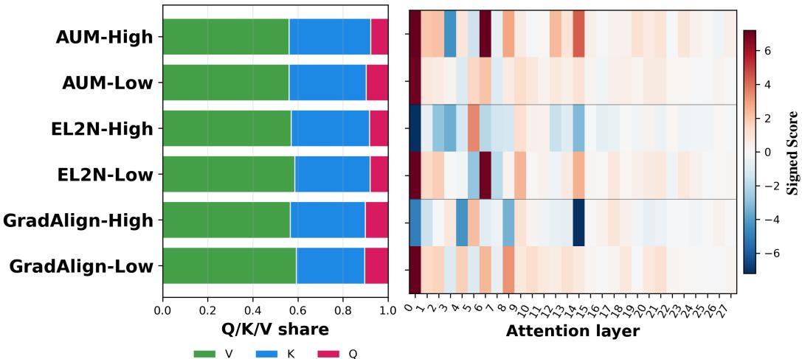  
Figure 7: Attention-interface decomposition of SciQ utility circuits. Left: Q/K/V share of attentioninterface attribution mass across the six discovered circuits. Right: signed attention-layer profile, computed by aggregating attention-node attribution scores within each layer.

## D Implementation Details for Circuit-Steered Data Generation

This section provides additional implementation details for the circuit-steered data generation method introduced in Section 4.1. Specifically, we elaborate on the targeted attention steering mechanism, the internal-compatibility selection process, and hyperparameters used during generation.

## D.1 Detailed Circuit Steering Implementation

Attention Steering. Activation addition shifts the internal state of a circuit, but it does not directly control how information is routed across tokens. We therefore complement activation addition with targeted attention steering. The intervention is applied only to attention heads selected from the discovered circuit presets in Table 8. Let $A _ { \ell , h , t , j }$ denote the pre-softmax attention logit from query position t to key position j at layer ℓ and head h. For a steering profile r, we apply a sparse logit perturbation

$$
\widetilde { A } _ { \ell , h , t , j } = \frac { A _ { \ell , h , t , j } } { \tau ( s _ { r , \ell , h } ) } + s _ { r , \ell , h } \cdot \mathcal { M } ( t , j ) .\tag{6}
$$

Here, $\mathcal { M } ( t , j )$ is a structural routing mask that prioritizes key semantic regions such as the prefix and the local context window around the current decoding step t. The bounded temperature function τ (·) modulates the sharpness of the selected attention head in proportion to the steering scale. The predefined profile-dependent steering strengths $( s _ { r , \ell , h } )$ are specified by the attention scales in Table 9. This intervention remains sparse, localized, and tied to the circuit’s functional role, altering routing behavior without indiscriminately disrupting the model’s global attention dynamics.

Selection by Internal Compatibility. We apply a lightweight selection step that keeps candidates whose likelihood profile is most compatible with the intended diagnostic route. For each source example, we first discard candidates that violate task-specific formatting or parsing constraints. We then rescore each remaining candidate by measuring its teacher-forced log-likelihood under the same target circuit configurations used during steering.

Given an input x and a candidate completion ${ \tilde { y } } ,$ we compute the average token log-likelihood under each diagnostic route $k \colon$

$$
\ell _ { k } ( \tilde { y } \mid x ) = \frac { 1 } { \left| \tilde { y } \right| } \sum _ { t = 1 } ^ { \left| \tilde { y } \right| } \log p _ { \theta , k } ( \tilde { y } _ { t } \mid x , \tilde { y } _ { < t } ) ,\tag{7}
$$

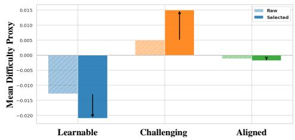

where $k \in \mathcal { K }$ indexes the diagnostic circuit routes defined in Table 8. We compare each route against the unsteered base model:

$$
s _ { k } ( x , \tilde { y } ) = \ell _ { k } ( \tilde { y } \mid x ) - \ell _ { 0 } ( \tilde { y } \mid x ) ,\tag{8}
$$

Figure 8: Comparison of mean difficulty proxy between raw and selected datasets.

where $\ell _ { 0 }$ denotes the average token log-likelihood under the unsteered model. The resulting support score $s _ { k } ( x , \tilde { y } )$ quantifies how much route k increases the candidate’s likelihood relative to the unsteered model, providing an internal compatibility check for the intended circuit route.

As illustrated in Figure 8, this mechanistic filtering effectively shifts the distribution of generated data toward the desired utility profiles. The selector therefore serves as a lightweight consistency check on top of steering, retaining outputs that are both surface-valid and internally aligned with the target generation objective.

## D.2 Circuit-Steered Generation Hyperparameters

As introduced in Section 4.1, we construct three targeted data pools, $\mathcal { D } _ { \mathrm { l e a r n a b l e } } , \mathcal { D } _ { \mathrm { c h a l l e n g i n g } } .$ , and $\mathcal { D } _ { \mathrm { a l i g n e d } }$

Table 6: Common generation settings used across all utility profiles for both circuit-steered and prompt-based baseline generations.
<table><tr><td>Hyperparameter</td><td>Value</td></tr><tr><td>Base model Seed examples</td><td>Qwen2.5-1.5B-Instruct</td></tr><tr><td></td><td>5,000 SciQ training examples</td></tr><tr><td>Candidates per source example</td><td>4</td></tr><tr><td>Selected candidates per source example</td><td>2</td></tr><tr><td>Sampling temperature</td><td>0.8</td></tr><tr><td>Top-p</td><td>0.95</td></tr><tr><td>Maximum new tokens</td><td>256</td></tr><tr><td>Seed</td><td>42</td></tr></table>

Generation Configurations. To strictly isolate the effect of mechanistic steering from superficial prompt-following, we use a single, target-independent fixed prompt alongside the common generation configurations (Table 6) for all circuit-steered generation runs. By keeping the textual instructions entirely neutral, we force the model to rely exclusively on the steering mechanisms to induce the desired utility profiles. As a comparative baseline, we also evaluate standard prompt-based generation. For this baseline, we augment the original source questions with explicit textual instructions that request learnable(easier), challenging(harder), or more aligned(instructional) completions, without applying any internal intervention. Each prompt includes three few-shot demonstrations to provide the desired response format and target style. The overarching prompt templates and the specific textual injections used for each setting are detailed in Table 7.

Table 7: Prompt templates for generation. Circuit-steered generation uses the same target-independent fixed prompt for all profiles, whereas prompt-based baselines use explicit profile-specific instructions.
<table><tr><td>Setting</td><td>Prompt Template</td></tr><tr><td>Shared system instruction</td><td>Generate science multiple-choice training data. Keep the sample factually correct, avoid trivia leakage, and return strict JSON. Each choice must be plain text without letter or number prefixes. The answer field must be exactly one uppercase letter among A, B, C, and D.</td></tr><tr><td>Circuit-steered fixed prompt</td><td>Source topic: {topic} Source item: {source question} Source answer: {optional source answer} Create one new science MCQA sample in a similar domain. Keep it self-contained, factually correct, and naturally written. Do not explic- itly mention a target difficulty band in the output. Return only JSON with fields question, choices, answer, rationale, difficulty,</td></tr><tr><td>Prompt baseline: learnable-style</td><td>and helpful. Create one new MCQA sample that is easier than the source. Use a single canonical science fact or one direct concept application. Distrac- tors should be plausible but clearly eliminable by the decisive concept.</td></tr><tr><td>Prompt baseline: challenging-style</td><td>Return only JSON with the same schema. Create one new MCQA sample that is harder than the source. Require at least one extra inference step, concept disambiguation, or stronger</td></tr><tr><td>Prompt baseline: aligned-style</td><td>distractor discrimination. Return only JSON with the same schema. Create one new MCQA sample optimized to be instructional and helpful. The rationale must state the decisive evidence and why at</td></tr></table>

Circuit Presets and Steering Scales. To perform the interventions, we extract the most critical steering targets from the EAP-IG circuit analysis by selecting nodes based on their aggregated edge attribution mass, as summarized in Table 8. These preset positions coincide with the dominant information-processing pathways identified in our structural analysis (Table 5), and are therefore used as the primary targets for circuit steering. We then apply profile-specific continuous scaling factors for both activation addition and attention modulation. The complete hyperparameter configurations for mapping each utility profile to its corresponding internal intervention scales are detailed in Table 9.

Table 8: Default circuit steering presets used for Qwen2.5-1.5B-Instruct on SciQ. All listed locations are used as activation-addition targets when constructing utility-specific steering directions. Targets marked with ⋆ additionally receive targeted attention-logit steering during decoding.
<table><tr><td>Circuit Preset</td><td>Functional Role</td><td>Steering Targets</td></tr><tr><td>AUM-High</td><td>Canonical anchor</td><td> $\operatorname { a 0 . h } [ 6 - 1 1 ] \langle V \rangle ^ { \star } ;$  m1; m₂; a6.h[6−11](K&gt;*; a14.h2(K&gt;*;  $m _ { 2 3 }$ </td></tr><tr><td>AUM-Low</td><td>Boundary branch</td><td> $\mathrm { a 2 } \langle K \rangle ; m _ { 3 } ; \mathrm { a 5 } \langle K \rangle ; m _ { 2 7 }$ </td></tr><tr><td>EL2N-Low</td><td>Low-pressure anchor</td><td> $\operatorname { a 0 . h } [ 6 - 1 1 ] \langle V \rangle ^ { \star } ;$  m1; m2; m3; a6.h[6−11]〈K&gt;*; a7(K);  $m _ { 2 3 }$ </td></tr><tr><td>EL2N-High</td><td>Informative rerouting</td><td> $\mathrm { a 2 } \langle K \rangle ; \mathrm { a 4 } \langle K \rangle ; \mathrm { a 5 } \langle K \rangle ; m _ { 4 } ; m _ { 6 } ; m _ { 1 3 }$ </td></tr><tr><td>GradAlign-Low</td><td>Shortcut evidence</td><td>GradAlign-High Target-aligned control m13; a14.h2/K)*; a17-a20 late-control attention targets  $\mathrm { a 0 . h } [ 6 - 1 1 ] \langle V \rangle ^ { \star } ; m _ { 1 } ; m _ { 2 } ; m _ { 3 } ; m _ { 2 3 }$ </td></tr></table>

## E Generated Dataset Statistics

Basic statistics. We summarize the basic statistics of the resulting generated datasets in Table 10. From an initial pool of 20,000 generation attempts per profile, we selected the top 10,000 valid samples based on our internal compatibility selection.

Table 9: Per-profile activation and attention steering scales applied to each circuit preset. Values are presented as Activation Scale (Attention Scale). Positive values amplify the corresponding circuit’s forward-pass contribution, while negative values suppress it. GradAlign-H inherently targets ${ \mathrm { a l } } 4 \langle K \rangle$ with an inverted weight, thus, a positive recipe scale yields suppressive steering on that specific node.
<table><tr><td rowspan="2">Profile</td><td colspan="6">Activation Scale (Attention Scale)</td></tr><tr><td>AUM-H</td><td>AUM-L</td><td>EL2N-H</td><td>EL2N-L</td><td>GradAlign-H GradAlign-L</td><td></td></tr><tr><td></td><td></td><td></td><td> $\begin{array} { r l } { \mathcal { D } _ { \mathrm { l e r m a b l e } } } & { { } + 0 . 4 0 \left( + 0 . 2 8 \right) - 0 . 2 5 \left( 0 . 0 0 \right) - 0 . 3 5 \left( - 0 . 1 4 \right) + 0 . 4 7 \left( + 0 . 3 1 \right) + 0 . 1 0 \left( + 0 . 0 2 \right) + 0 . 1 2 \left( + 0 . 1 2 \right) } \end{array}$ </td><td></td><td></td><td></td></tr><tr><td> $\mathcal { D } _ { \mathrm { c h a l l e n g i n g } }$ </td><td></td><td></td><td> $\begin{array} { r l r l } { - 0 . 3 7 \left( - 0 . 1 8 \right) } & { { } 0 . 0 0 \left( 0 . 0 0 \right) } & { { } + 0 . 4 0 \left( + 0 . 1 5 \right) } & { - 0 . 4 0 \left( - 0 . 2 1 \right) } & { + 0 . 3 6 \left( + 0 . 1 5 \right) } & { - 0 . 3 0 \left( - 0 . 1 8 \right) } \end{array}$ </td><td></td><td></td><td></td></tr><tr><td></td><td></td><td></td><td> $\mathcal { D } _ { \mathrm { a i l p e d } } ^ { \mathrm { a i l p e e } ^ { \mathrm { ~ \tiny ~ \sim ~ } } } + 0 . 2 2 \left( + 0 . 1 0 \right) - 0 . 1 4 \left( 0 . 0 0 \right) - 0 . 1 0 \left( - 0 . 0 6 \right) + 0 . 2 0 \left( + 0 . 1 0 \right) + 0 . 4 5 \left( + 0 . 1 7 \right) - 0 . 2 8 \left( - 0 . 1 5 \right)$ </td><td></td><td></td><td></td></tr></table>

Table 10: Basic statistics of generated datasets after selection. JSON denotes the percentage of candidates successfully parsed into the required MCQA JSON format. BLEU-1 and Jaccard are computed between the source question and the generated question. Lower values indicate less lexical copying from the seed sample.
<table><tr><td>Profile</td><td>Raw</td><td>Selected</td><td>JSON</td><td>Q. Len.</td><td>Rat. Len.</td><td>BLEU-1</td><td>Jaccard</td></tr><tr><td>Circuit-learnable</td><td>20,000</td><td>10,000</td><td>98.2</td><td>9.9</td><td>20.0</td><td>0.2752</td><td>0.1507</td></tr><tr><td>Circuit-challenging</td><td>20,000</td><td>10,000</td><td>99.5</td><td>10.8</td><td>22.6</td><td>0.2495</td><td>0.1395</td></tr><tr><td>Circuit-aligned</td><td>20,000</td><td>10,000</td><td>99.2</td><td>10.1</td><td>20.5</td><td>0.2680</td><td>0.1468</td></tr><tr><td>Prompt-learnable</td><td>20,000</td><td>10,000</td><td>99.5</td><td>9.5</td><td>20.7</td><td>0.3150</td><td>0.1725</td></tr><tr><td>Prompt-challenging</td><td>20,000</td><td>10,000</td><td>98.7</td><td>12.9</td><td>36.6</td><td>0.2473</td><td>0.1500</td></tr><tr><td>Prompt-aligned</td><td>20,000</td><td>10,000</td><td>98.5</td><td>10.3</td><td>40.6</td><td>0.4039</td><td>0.2497</td></tr><tr><td></td><td></td><td></td><td></td><td></td><td></td><td></td><td></td></tr></table>

The JSON parsing rate is consistently high across both circuit-steered and prompt-based generation, indicating that the generation pipeline reliably follows the required structured MCQA format. Additionally, as expected, $\mathcal { D } _ { \mathrm { c h a l l e n g i n g } }$ exhibits slightly longer questions and rationales compared to $\mathcal { D } _ { \mathrm { l e a r n a b l e } }$ , reflecting the increased complexity of the underlying reasoning tasks. Interestingly, the prompt-based baselines yield significantly longer rationales. Qualitative inspection indicates that this excess length in prompt-based generation is largely driven by conversational fillers and stylistic verbosity (e.g., "This problem requires..."), rather than dense, informative reasoning.

Furthermore, we evaluate the lexical diversity of the generated questions by measuring their overlap with the original seed questions using BLEU-1 and Jaccard similarity. The circuit-steered profiles demonstrate notably lower similarity scores than the prompt-based baselines. This indicates that our mechanistic steering successfully induces diverse internal generation trajectories, relying less on superficial copying of the source text and more on fundamental concept manipulation.

Internal proxy alignment. To verify that the generated samples align with their intended circuit profiles without relying solely on human evaluation, we introduce reference-free internal diagnostic metrics termed Proxy Measures. We evaluate how the average completion log-likelihood shifts when specific circuit profiles are artificially activated.

Recall from Section D that the circuit-specific support score is defined as $s _ { k } ( x , \tilde { y } ) = \ell _ { k } ( \tilde { y } \mid x ) - \ell _ { 0 } ( \tilde { y } \mid$ x). A positive value indicates that the target circuit intrinsically prefers the generated completion. Using these support values, we define a steering diagnostic as Equation (9). A high Difficulty Proxy indicates the completion leans toward challenging reasoning rather than canonical anchors.

$$
\mathrm { D i f f i c u l t y ~ P r o x y } = s _ { \mathrm { c h a l l e n g i n g } } ( x , \tilde { y } ) - s _ { \mathrm { l e a r n a b l e } } ( x , \tilde { y } )\tag{9}
$$

As illustrated in Figure 9, the proxy distributions shift precisely as intended. $\mathcal { D } _ { \mathrm { l e a r n a b l e } }$ skews toward lower difficulty proxies, $\mathcal { D } _ { \mathrm { c h a l l e n g i n g } }$ robustly shifts toward higher difficulty proxies, and $\mathcal { D } _ { \mathrm { a l i g n e d } }$ maintains a well-balanced, moderate profile. This confirms that our framework successfully aligns the generated outputs with the targeted internal processing mechanisms.

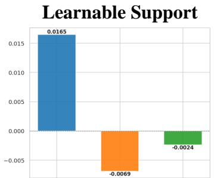  
Learnable Challenging Aligned

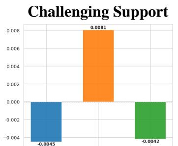  
Learnable Challenging Aligned

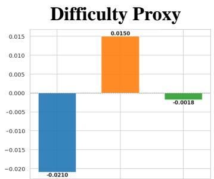  
Learnable Challenging Aligned  
Figure 9: Internal proxy alignment across the generated datasets. The distributions of support scores and the difficulty proxy show that each dataset successfully aligns with its targeted circuit profile.

## F Generation Fidelity Experiments Details.

Evaluation Metrics. We evaluate generated datasets along three criteria, complexity, diversity, and quality, following prior work [18, 2, 13]. Below, we describe the metrics used for the main comparison reported in Figure 4.

Complexity characterizes how challenging the generated samples are for the proxy model. PPL (mean perplexity of the proxy model on generated text) reflects the structural difficulty and lexical unpredictability of the samples, where higher values indicate greater challenge. Margin (the logit gap between the correct and highest-scoring distractor answer, evaluated without rationale) measures how discriminable the correct answer is. Lower margin indicates a harder, more ambiguous question.

Diversity captures distributional breadth of the generated set. Vendi is computed over sentence-level embeddings(all-MiniLM-L6-v2) and measures lexical variety. G-Vendi replaces text embeddings with per-sample input-gradient fingerprints from the proxy model, measuring diversity from a trainingdynamics perspective, how differently each sample perturbs the model’s parameters.

Quality assesses whether the generated samples constitute valid learning signal. Ans-Acc measures proxy model accuracy on questions without rationale, how well the proxy model can answer the generated questions. R-Gain is the increase in the proxy model’s correct-answer probability when the rationale is provided, measuring how informative the rationale is. Higher R-Gain indicates questions that are well-structured yet genuinely supported by the accompanying rationale.

Utility-axis Ablation and Diversity Score Computation. For the ablation study in Section 4.2, we construct three leave-one-out baselines (w/o AUM, w/o EL2N, w/o GradAlign) by setting the activation and attention steering scales of the corresponding axis to zero, while keeping all other conditions identical to the Full configuration (Table 9). This isolates the contribution of each circuit axis to the overall data quality. Vendi is computed over up to 1,000 samples per condition embedded with sentence-transformers/all-MiniLM-L6-v2. G-Vendi is computed over up to 300 samples by extracting $\ell _ { 2 } \cdot$ -normalized input-gradient fingerprints from Qwen/Qwen2.5-0.5B-Instruct and applying the Vendi score to them. Recall is estimated against up to 1,800 reference samples from the SciQ training split using k=5 nearest neighbors in embedding space.

## G SAMS Downstream Fine-tuning Details

This section provides additional implementation details for the downstream fine-tuning experiments in Section 5. All downstream experiments use Qwen/Qwen2.5-0.5B-Instruct as the student model.

Data mixture construction. For each source ratio $\rho \in \{ 5 0 \% , 6 0 \% , 7 0 \% \}$ , we construct each training batch by sampling a fraction $\rho$ from $\mathcal { D } _ { \mathrm { s r c } }$ and the remaining fraction $1 - \rho$ from generated data. Thus, all methods are compared under the same total training budget, and the source ratio controls only the relative amount of original versus synthetic data. For the UNIFORM-MIX setting, the generated portion of each batch is constructed by sampling uniformly from each of the three

synthetic pools with equal probability:

$$
x _ { \mathrm { s y n } } \sim \frac { 1 } { 3 } \mathrm { U n i f } ( \mathcal { D } _ { \mathrm { l e a r n a b l e } } ) + \frac { 1 } { 3 } \mathrm { U n i f } ( \mathcal { D } _ { \mathrm { c h a l l e n g i n g } } ) + \frac { 1 } { 3 } \mathrm { U n i f } ( \mathcal { D } _ { \mathrm { a l i g n e d } } )
$$

where $\mathrm { U n i f } ( \mathcal { D } )$ denotes a uniform sampling distribution over the given dataset. For SAMS, the generated portion is sampled according to the stage-specific curriculum described below.

Stage-aware mechanistic scheduling. SAMS divides fine-tuning into three stages: warm-up, transition, and challenge. Unless otherwise specified, we divide the total training steps into three equal intervals and apply the corresponding synthetic-pool ratios in Algorithm 1. Specifically, the aligned pool is kept active throughout training, while the sampling mass gradually shifts from the learnable pool to the challenging pool. This schedule preserves early optimization stability while increasing structurally demanding examples in later stages.

Fine-tuning hyperparameters. All downstream fine-tuning experiments use the same optimization hyperparameters, summarized in Table 11. We train for six epochs with AdamW, using a learning rate of $2 \times 1 0 ^ { - 5 }$ on an RTX Pro 6000 GPU.

Table 11: Fine-tuning hyperparameters for downstream validation experiments. The same configuration is used for all methods, schedules, and source ratios.
<table><tr><td>Hyperparameter</td><td>Value</td></tr><tr><td>Training epochs</td><td>6</td></tr><tr><td>Per-device batch size</td><td>12</td></tr><tr><td>Gradient accumulation steps</td><td>4</td></tr><tr><td>Effective batch size</td><td>48</td></tr><tr><td>Evaluation batch size</td><td>8</td></tr><tr><td>Learning rate</td><td> $2 \times 1 0 ^ { - 5 }$ </td></tr><tr><td>Weight decay</td><td>0.01</td></tr><tr><td>Warm-up ratio</td><td>0.03</td></tr><tr><td>Source ratios</td><td>50%, 60%, 70%</td></tr></table>

Evaluation protocol. We evaluate each fine-tuned model on SciQ test set as the in-domain benchmark and ARC-Easy test set as the out-of-domain benchmark. For both datasets, we report accuracy, expected calibration error (ECE), and negative log-likelihood (NLL). Accuracy measures task performance, while ECE and NLL capture complementary aspects of probabilistic calibration. This evaluation protocol allows us to test not only whether the generated data improves in-domain performance, but also whether mechanistically scheduled synthetic data supports more reliable out-of-domain generalization.

## H Limitations and Future Work

This work establishes a transparent, mechanistic link between internal information processing and sample-level training utility. By moving beyond black-box data metrics, we demonstrate that microscopic circuit-level observations can be successfully leveraged for practical macroscopic applications, such as targeted data filtering and circuit-steered generation.

One natural extension of our current framework is to make the SAMS scheduling policy more systematic. In this work, SAMS uses a stage-wise mixture inspired by curriculum learning principles [1], reflecting the intuition that different phases of fine-tuning benefit from different utility profiles. While effective, this design does not yet feature a fully automated scheduling policy. Nevertheless, the empirical gains from SAMS support our central insight that circuit-steered data are most useful when their utility profiles are aligned with the model’s evolving optimization needs. Future work can build on this direction by exploring a broader family of stage-wise ratios and learning scheduling policies that adjust the mixture during training. Ultimately, we view this work as an initial step toward white-box, mechanistically guided data curation pipelines that can not only analyze training data quality, but actively shape it according to the model’s internal learning dynamics.