# Memory Is Not Always Needed: Characterizing Conditional Memory in Scientific Reasoning

Zhen Bi1∗, Xueshu Chen1∗, Yan Wang2, Zhizhi Peng1, Haosen Hong3,

Zhen Wang1, Zhixuan Chu4, Bingyu Zhu2, Jungang Lou1†

1Huzhou Normal University, 2Alibaba Group

3Bota Biosciences, 4Zhejiang University bizhen\_zju@zju.edu.cn

## Abstract

Scientific reasoning requires language models to retrieve specialized knowledge and incorporate it reliably into multi-step computation. Conditional memory provides an explicit lookup pathway that complements dense neural representations, but its usefulness is inherently input- and computation-dependent: retrieved information may repair missing scientific associations, yet it may also introduce distracting shortcuts or interfere with reasoning that the base model can already perform correctly. In this work, we systematically investigate when, where, and to what extent conditional memory should participate in scientific reasoning. We characterize the scientific knowledge boundary and controlled interventions on memoryenabled knowledge-circuit nodes. Based on these analyses, we propose a Knowledge Boundary-Aware Router that uses task-specific input proxies available before generation to determine whether memory is activated, which layer–stage nodes receive memory signals, and how strongly these signals contribute. Experiments on biological and chemical reasoning benchmarks, covering two backbone families and six task types, show that memory efects vary substantially across inputs, tasks, and injection locations. Compared with static and activation-rate-matched random routing, our approach more consistently preserves beneficial memory contributions while suppressing memory-induced regressions, establishing selective memory allocation as an important principle for reliable scientific reasoning.

## 1 Introduction

Scientific discovery increasingly requires models to reason over complex biological, chemical, physical, and mathematical systems (Jablonka et al. 2024; Ross et al. 2022; Merchant et al. 2023; Boiko et al. 2023; Romera-Paredes et al. 2024). Improving the scientific reasoning capabilities of large language models is therefore essential for reliable scientific analysis and discovery (Wei et al. 2025). At its core, this requires models not only to access specialized knowledge, but also to integrate it faithfully throughout multi-step inference.

Existing approaches mainly rely on domain-specialized models or retrieval-augmented generation (Zhang et al. 2024; Wen et al. 2024; Team, Peng, and Qiao 2025; Guu et al. 2020). Although they store knowledge diferently, both lack a clear separation between knowledge lookup and neural computation. Conditional memory ofers a complementary lookup path (Cheng et al. 2026) and is particularly promising for knowledge-intensive scientific reasoning, where specialized entities, motifs, structures, and rules recur frequently.

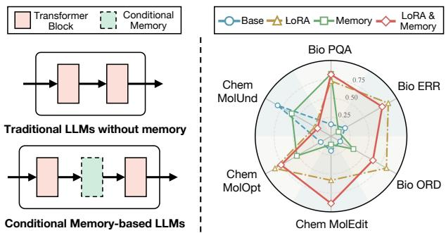  
Figure 1: Left: Conditional memory is a model-internal lookup-and-injection mechanism: memory modules are placed within Transformer computation. Right: Even on knowledge-intensive scientific reasoning tasks, memory produces mixed efects rather than uniform gains, motivating selective activation.

Recent studies have applied conditional memory to genomic foundation models and molecular language models, reporting benefits from the explicit lookup of biological motifs and molecular patterns (Xu et al. 2026; Zhang et al. 2026). However, these results remain concentrated in specific scientific settings and do not establish that memory should be activated uniformly in broader scientific reasoning. Across heterogeneous tasks, memory may repair a missing scientific association in one case, provide little benefit in another, or introduce misleading shortcuts that disrupt an otherwise correct reasoning path (shown in Figure 1). Its utility must therefore be evaluated relative to the knowledge boundary of the memory-free base model and the computational location at which memory is injected.

Therefore, in this work, we investigate when conditional memory is a viable computational mechanism for scientific reasoning and we systematically study its efects through the scientific knowledge boundary. Specifically, through behavioral knowledge-boundary analysis and controlled layer–stage interventions, we show that memory utility depends jointly on the input, injection location, and contribution strength. These findings lead to a Knowledge

Boundary-Aware Router that determines whether, where, and how strongly memory participates, revealing selective memory allocation as a broader design principle for scientific reasoning models.

Our contributions are threefold:

• We conduct a systematic empirical study of conditional memory in scientific reasoning across biological and chemical domains, two backbone families, and six task types. We show that memory is a viable but inherently non-uniform augmentation: it repairs some scientific reasoning failures while inducing regressions in others.

• We characterize this heterogeneity through behavioral capability-boundary indicators and layer–stage memory interventions, revealing that memory utility depends on both the input regime and its location in the reasoning computation.

• We translate these findings into a boundary-aware routing mechanism that selectively activates memory using taskspecific input proxies. The router outperforms activationrate-matched random routing and avoids several regressions caused by static memory configurations.

## 2 Related Work

## 2.1 Conditional Memory-Based LLMs

Memory-augmented LLMs supplement dense parameters with selectively accessed stores. Sparse key-value layers expand capacity (Lample et al. 2019) and lookup-based conditional memory, instantiated by Engram, uses sufix n-gram lookup as a complementary sparsity axis (Cheng et al. 2026). Memory-expert architectures inject pre-stored knowledge through token-level memory experts (Ding et al. 2026) and datastore methods retrieve targets, passages or neighboring chunks (Khandelwal et al. 2020; Lewis et al. 2020; Borgeaud et al. 2022). Activation-based memories reuse cached historical states (Wu et al. 2022; Wang et al. 2023). Writable systems further support dialogue recall, episodic or post-deployment updates, and scalable sparse memory (Yuan et al. 2023; Das et al. 2024; Wang et al. 2024b; Berges et al. 2025). Existing work emphasizes aggregate gains and we study when memory is needed and causally useful at scientific boundaries.

## 2.2 Scientific Reasoning Knowledge Boundaries

Scientific reasoning benchmarks span broad STEM knowledge, specialized problem solving, and theorem application (Hendrycks et al. 2021; Wang et al. 2024a; Rein et al. 2023; Chen et al. 2023). Domain-specific models, benchmarks, and reviews further cover Chinese biomedical language understanding (Zhang et al. 2022b), protein representation learning with Gene Ontology knowledge (Zhang et al. 2022a), oceanscience tasks (Bi et al. 2024), and healthcare LLM techniques and applications (Hu et al. 2025). Final-answer correctness, however, cannot distinguish knowledge gaps from faulty derivation. Process-level feedback and reward models expose intermediate errors (Uesato et al. 2022; Lightman et al. 2024). Uncertainty studies probe self-evaluation and elicited confidence (Kadavath et al. 2022; Xiong et al.

2024), while sampled-response disagreement and semantic entropy reveal repeated-inference instability (Manakul, Liusie, and Gales 2023; Farquhar et al. 2024). We synthesize these signals into final-answer failure, reasoning-step failure, and repeated-inference instability, which characterize the base model’s scientific reasoning boundary for conditionalmemory analysis.

## 3 Conditional Memory at Scientific Knowledge Boundaries

In this section, we analyze the problem from two complementary perspectives. The behavioral view identifies when an input reaches the base model’s knowledge boundary: finalanswer failure, reasoning-step failure, and prediction instability expose incorrect outcomes, faulty derivations, and unreliable repeated inference. The knowledge-circuit view identifies where memory can afect computation: a hidden state queries the store, whose retrieved value is injected through a native gate at a selected layer and stage.

## 3.1 Behavioral Scientific Knowledge Boundary Characterization

We assess memory against the memory-free base model, since it may repair missing associations or disrupt otherwise suficient reasoning. Memory utility varies by input. For each example $x _ { i }$ , we define a behavioral boundary code with respect to the memory-free backbone $M _ { \mathrm { b a s e } }$ . Given a tasklevel answer evaluator $E _ { \mathrm { a n s } } .$ , a process-level evaluator $E _ { \mathrm { s t e p } } ,$ and repeated-inference consistency score $C _ { i }$ , we compute

$$
b _ { i } ^ { A } = \mathbf { 1 } \left[ E _ { \mathrm { a n s } } ( M _ { \mathrm { b a s e } } ( x _ { i } ) , y _ { i } ) < \tau _ { A } \right] ,\tag{1}
$$

$$
b _ { i } ^ { R } = \mathbf { 1 } \left[ E _ { \mathrm { s t e p } } ( M _ { \mathrm { b a s e } } ( x _ { i } ) , y _ { i } ) < \tau _ { R } \right] ,\tag{2}
$$

$$
b _ { i } ^ { P } = \mathbf { 1 } \left[ C _ { i } < \tau _ { P } \right] .\tag{3}
$$

Here $b _ { i } ^ { A } , b _ { i } ^ { R }$ , and $b _ { i } ^ { P }$ mark final-answer failure, reasoningstep failure, and prediction instability, respectively. We encode them as

$$
\mathbf { q } _ { i } = \left( b _ { i } ^ { A } , b _ { i } ^ { R } , b _ { i } ^ { P } \right) \in \{ 0 , 1 \} ^ { 3 } .\tag{4}
$$

The indicators are nonexclusive: an input may have a correct final answer despite faulty derivation, be stably incorrect, or be unstable despite one correct sample. The code records these distinct boundary behaviors rather than imposing a single dificulty ranking, allowing us to test whether memory repairs a failure regime or merely changes aggregate performance.

In Eq. (4), $\mathbf q _ { i } = \mathbf 0$ denotes a non-boundary example, while a nonzero entry identifies the corresponding boundary type. Computing $\mathbf { q } _ { i }$ can require labels or repeated inference, so we use it only ofline to characterize samples and calibrate the router. At inference, Section 4.1 instead uses task-specific input proxies available before generation.

## 3.2 Knowledge-Circuit View of Internal Knowledge Boundaries

Lookup-based conditional memory augments the backbone hidden states by injecting context-dependent values retrieved from an external store. Its efect depends on the injection location. For an example $x _ { i } ,$ , let $\mathbf { r } _ { i , \tau }$ denote the reasoning state at step τ, represented by hidden state $\mathbf { h } _ { i , \tau , l , s }$ at layer l and inference stage $s \in$ {pre, dec}.

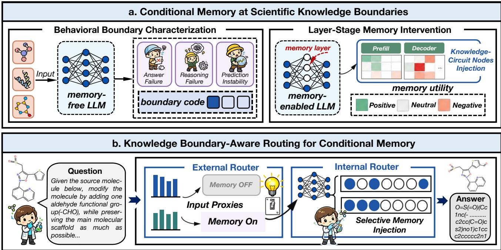  
Figure 2: Overview of our work. We analyze the problem from two complementary perspectives (the behavioral and knowledge circuit view). Then we propose the Knowledge Boundary-Aware Routing for Conditional Memory( the external boundary aware data router and the internal boundary-aware parameter router).

We define each layer–stage pair $v = ( l , s )$ as a knowledgecircuit node with the local update

$$
\begin{array} { r c l } { \mathbf { z } _ { i , \tau , l , s } } & { = } & { \mathrm { Q u e r y } _ { l , s } ( \mathbf { h } _ { i , \tau , l , s } ) , } \\ { \mathbf { m } _ { i , \tau , l , s } } & { = } & { \mathrm { M e m } ( \mathbf { z } _ { i , \tau , l , s } ) , } \\ { \Delta \mathbf { m } _ { i , \tau , l , s } } & { = } & { \mathcal { P } _ { l , s } ( \mathbf { m } _ { i , \tau , l , s } ) , } \\ { \widehat { \mathbf { h } } _ { i , \tau , l , s } } & { = } & { \mathbf { h } _ { i , \tau , l , s } + g _ { i , \tau , l , s } \Delta \mathbf { m } _ { i , \tau , l , s } , } \\ { \mathbf { r } _ { i , \tau + 1 } } & { = } & { \mathcal { F } _ { l , s } ( \widehat { \mathbf { h } } _ { i , \tau , l , s } ) . } \end{array}\tag{5}
$$

Here ${ \mathrm { Q u e r y } _ { l , s } }$ produces a memory query, $\mathbf { m } _ { i , \tau , l , s }$ is the retrieved value, $\mathcal { P } _ { l , s }$ projects it to the injected residual $\Delta \mathbf { m } _ { i , \tau , l , s } .$ and $g _ { i , \tau , l , s }$ is the native memory gate. The subsequent backbone computation is denoted by $\mathcal { F } _ { l , s } .$ . Prefill and decoding at the same layer are distinct nodes; thus, $( l , s )$ is the intervention unit selected and scaled by the internal router in Section 4.2.

This factorization enables controlled causal attenuation of a memory contribution while leaving the remaining backbone computation fixed. It also separates availability from usefulness: even a relevant retrieved value may not help at every node, because its efect depends on the state and stage at which it is injected. The node-level representation therefore distinguishes a helpful retrieved association from a harmful or inefective injection site.

## 4 Knowledge Boundary-Aware Routing for Conditional Memory

Section 3 provides two complementary analyses: behavioral boundary codes reveal when the memory-free base model encounters dificulty and layer-stage knowledge-circuit nodes identify where memory can alter its computation. The behavioral signals can require reference labels or repeated inference, while the state–node conditions are unavailable before a routed forward pass. We therefore use these analyses to calibrate empirical routing components on existing reasoning samples rather than applying the boundary signals directly at test time.

In this section, the External Boundary-Aware Data Router converts task-specific, pre-inference input proxies into a global memory-access decision. Conditional on that decision, the Internal Boundary-Aware Parameter Router configures layer-stage knowledge-circuit nodes and their contribution strengths. Together, the two components determine whether, where, and how strongly memory participates in a single configured forward path.

## 4.1 External Boundary-Aware Data Routing for Memory Activation

For an input $x _ { i }$ from task t, we extract a task-specific feature vector organized according to the three boundary types:

$$
\vec { \phi } _ { i } ^ { ( t ) } = \Phi _ { t } ( x _ { i } ) = [ { \bf p } _ { i , A } ^ { ( t ) } ; { \bf p } _ { i , R } ^ { ( t ) } ; { \bf p } _ { i , P } ^ { ( t ) } ] .\tag{6}
$$

For $h \in \{ A , R , P \}$ , we write $\mathbf { p } _ { i , h } ^ { ( t ) } = [ f _ { i , h , 1 } ^ { ( t ) } , \ldots , f _ { i , h , d _ { t , h } } ^ { ( t ) } ] .$ The groups $\mathbf { p } _ { i , A } ^ { ( t ) } , \mathbf { p } _ { i , R } ^ { ( t ) }$ , and $\mathbf { p } _ { i , P } ^ { ( t ) }$ encode task-specific prox-

<table><tr><td></td><td colspan="4">Error Correction</td><td colspan="2">Step Ordering</td><td colspan="2">Protocol Question Answering</td></tr><tr><td>Model</td><td>Accuracy</td><td>Macro Prec. Macro Rec.</td><td></td><td>Macro F1</td><td>Exact Match</td><td>Kendall</td><td>Accuracy</td><td>Brier ↓</td></tr><tr><td>DeepSeek-V4-Pro</td><td>0.67 ± 0.009 0.67 ± 0.009 0.67 ± 0.009 0.67 ± 0.009 0.57 ± 0.010 0.82 ± 0.008 0.70 ± 0.007</td><td></td><td></td><td></td><td></td><td></td><td></td><td> $0 . 1 9 \pm 0 . 0 0 3$ </td></tr><tr><td>Intern-S1</td><td> $0 . 6 4 \pm 0 . 0 0 7 0 \cdot 6 7 \pm 0 . 0 0 8 0 \cdot 0 . 6 4 \pm 0 . 0 0 7 0 \cdot 6 3 \pm 0 . 0 0 7 0 \cdot 4 6 \pm 0 . 0 0 6 \cdot 0 . 7 2 \pm 0 . 0 0 6 \cdot 0 . 6 5 \pm 0 . 0 0 9$ </td><td></td><td></td><td></td><td></td><td></td><td></td><td> $0 . 2 3 \pm 0 . 0 0 5$ </td></tr><tr><td>Intern-S1-Pro</td><td>0.65 ± 0.013 0.65 ± 0.013 0.65 ± 0.013 0.65 ± 0.013 0.62 ± 0.004 0.82 ± 0.005 0.70 ± 0.006</td><td></td><td></td><td></td><td></td><td></td><td></td><td> $0 . 2 1 \pm 0 . 0 0 3$ </td></tr><tr><td>Intern-S2-Preview</td><td>0.65 ± 0.005 0.67 ± 0.006 0.64 ± 0.005 0.63 ± 0.005 0.52 ± 0.006 0.68 ± 0.016 0.61 ± 0.009</td><td></td><td></td><td></td><td></td><td></td><td></td><td> $0 . 2 6 \pm 0 . 0 0 6$ </td></tr><tr><td>Qwen2.5-7B</td><td>0.56 ± 0.007 0.60 ± 0.012 0.56 ± 0.007 0.50 ± 0.009 0.22 ± 0.014 0.24 ± 0.016 0.46 ± 0.006</td><td></td><td></td><td></td><td></td><td></td><td></td><td> $0 . 4 0 \pm 0 . 0 0 4$ </td></tr><tr><td> $_ { \mathrm { Q w e n } 2 . 5 - 7 \mathrm { B } - \mathrm { L o R A } }$ </td><td> $0 . 5 7 \pm 0 . 0 0 8 0 . 5 5 \pm 0 . 0 0 8 0 . 5 5 7 \pm 0 . 0 0 8 0 . 5 7 \pm 0 . 0 0 8 0 . 3 0 \pm 0 . 0 1 1 0 . 4 5 \pm 0 . 0 1 9 0 . 5 5 \pm 0 . 0 1 2$ </td><td></td><td></td><td></td><td></td><td></td><td></td><td> $0 . 4 1 \pm 0 . 0 1 1$ </td></tr><tr><td>Qwen2.5-7B-Memory</td><td> $0 . 5 6 \pm 0 . 0 0 9 \ 0 . 6 4 \pm 0 . 0 2 0 \ 0 . 5 6 \pm 0 . 0 0 9 \ 0 . 4 9 \pm 0 . 0 1 1 0 . 2 2 \pm 0 . 0 1 0 0 \ 0 . 2 4 \pm 0 . 0 1 6 \ 0 . 5 3 \pm 0 . 0 1 0$ </td><td></td><td></td><td></td><td></td><td></td><td></td><td> ${ \bf 0 . 3 6 \pm 0 . 0 0 7 }$ </td></tr><tr><td>Qwen2.5-7B-Memory-LoRA</td><td>0.59 ± 0.015 0.60 ± 0.015 0.59 ± 0.015 0.59 ± 0.015 0.24 ± 0.014 0.36 ± 0.017 0.55 ± 0.009</td><td></td><td></td><td></td><td></td><td></td><td></td><td> $0 . 3 8 \pm 0 . 0 0 8$ </td></tr><tr><td>Knowledge Boundary−aware Router 0.60 ± 0.014 0.60 ± 0.0150.60 ± 0.014 0.60 ± 0.014 0.30 ± 0.011 0.45 ± 0.020 0.56 ± 0.009</td><td></td><td></td><td></td><td></td><td></td><td></td><td></td><td> $0 . 3 8 \pm 0 . 0 0 8$ </td></tr><tr><td>Qwen3-8B</td><td> $0 . 6 0 \pm  { \mathrm { ~ a ~ } } _ { 0 } 0 0 6 \  { \mathrm { ~ 0 . 6 0 } } \pm  { \mathrm { ~ a ~ } } _ { 0 } 0 0 6 \  { \mathrm { ~ 0 . 6 0 } } \pm  { \mathrm { ~ 0 . 0 0 6 ~ } } \  { \mathrm { ~ 0 . 6 0 } } \pm  { \mathrm { ~ 0 . 0 1 1 ~ } } \ 0 . 3 9 \pm  { \mathrm { ~ 0 . 0 0 7 ~ } } \ 0 . 6 3 \pm  { \mathrm { ~ 0 . 0 1 3 ~ } } \ 0 . 6 0 \pm  { \mathrm { ~ 0 . 0 0 6 ~ } } \  { \mathrm { ~ 0 . 2 5 } } \pm  { \mathrm { ~ 0 . 0 0 4 } }$ </td><td></td><td></td><td></td><td></td><td></td><td></td><td></td></tr><tr><td>Qwen3-8B-LoRA</td><td> $0 . 5 9 \pm 0 . 0 1 0 \ 0 . 5 9 \pm 0 . 0 1 0 \ 0 . 5 9 \pm 0 . 0 1 0 \ 0 . 5 9 \pm 0 . 0 1 0 \ 0 . 3 9 \pm 0 . 0 0 7 \ 0 . 6 0 \pm 0 . 0 1 5 \ 0 . 6 0 \pm 0 . 0 0 8 0 \ 0 . 3 2 \pm 0 . 0 0 8$ </td><td></td><td></td><td></td><td></td><td></td><td></td><td></td></tr><tr><td>Qwen3-8B-Memory</td><td></td><td></td><td></td><td></td><td></td><td></td><td></td><td> $0 . 6 1 \pm 0 . 0 0 7 \ 0 . 6 4 \pm 0 . 0 0 9 \ 0 . 6 1 \pm 0 . 0 0 7 \ 0 . 5 8 \pm 0 . 0 0 8 \ 0 . 4 3 \pm 0 . 0 0 6 \ 0 . 6 9 \pm 0 . 0 0 3 \ 0 . 6 0 \pm 0 . 0 0 5 0 . 2 6 \pm 0 . 0 0 4$ </td></tr><tr><td>Qwen3-8B-Memory-LoRA</td><td> $) , 6 2 \pm 0 . 0 1 3 \ \mathrm { ~ 0 . 6 3 \pm 0 . 0 1 3 \ \mathrm { ~ 0 . 6 2 \pm 0 . 0 1 3 \ \mathrm { ~ 0 . 6 1 \pm 0 . 0 1 4 \ 0 . 4 0 \ \pm 0 . 0 0 9 \ \mathrm { ~ 0 . 6 6 \pm 0 . 0 1 2 \ \mathrm { ~ 0 . 3 9 \pm 0 . 0 0 8 } \ \mathrm { ~ 0 . 5 0 \pm 0 . 0 0 6 } } } } }$ </td><td></td><td></td><td></td><td></td><td></td><td></td><td></td></tr><tr><td>Knowledge Boundary-aware Router 0.63 ± 0.007 0.64 ± 0.007 0.63 ± 0.007 0.62 ± 0.008 0.41 ± 0.008</td><td></td><td></td><td></td><td></td><td></td><td></td><td></td><td> $0 . 6 6 \pm 0 . 0 0 9 0 . 6 1 \pm 0 . 0 1 2 0 . 3 2 \pm 0 . 0 1 0$ </td></tr></table>

Table 1: Overall results on BioProBench. Higher is better for all metrics except Brier score (↓). When available, repeated-run variation is reported as mean ± standard deviation. Bold indicates the best result within each Qwen-family block in each column. Lower is better for Brier score.

ies for knowledge demand, reasoning structure, and input ambiguity, respectively.

For $h \in \{ A , R , P \}$ , we quantize each continuous proxy into task-specific quantile bins while retaining categorical proxies in their original form:

$$
\widetilde { f } _ { i , h , j } ^ { ( t ) } = Q _ { t , h , j } ( f _ { i , h , j } ^ { ( t ) } ) \in \{ q _ { 1 } , \ldots , q _ { K } \} .\tag{7}
$$

This knowledge boundary-aware data quantization produces $\mathrel { \mathop \simeq } ( t )$   
the quantized feature vector $\phi _ { i }$

The external router scores each input using additive bucket contributions and a small set of explicit feature interactions:

$$
\begin{array} { r c l } { \rho _ { t } ( x _ { i } ) } & { = } & { \displaystyle \beta _ { t } ^ { ( 0 ) } + \sum _ { h \in \{ A , R , P \} } \sum _ { j = 1 } ^ { d _ { t , h } } w _ { t , h , j } ( \widetilde { f } _ { i , h , j } ^ { ( t ) } ) } \\ & & { \displaystyle + \sum _ { r = 1 } ^ { R _ { t } } \lambda _ { t , r } \mathbf { 1 } [ C _ { t , r } ( \widetilde { \vec { \phi } } _ { i } ^ { ( t ) } ) ] . } \end{array}\tag{8}
$$

The calibrated external gate is

$$
\pi _ { t } ( x _ { i } ) = \left\{ \begin{array} { l l } { 1 , } & { \rho _ { t } ( x _ { i } ) \geq \theta _ { t } , } \\ { 0 , } & { \rho _ { t } ( x _ { i } ) < \theta _ { t } . } \end{array} \right.\tag{9}
$$

We tune $\beta _ { t } ^ { ( 0 ) }$ , the bucket contributions, interaction rules, and $\theta _ { t }$ by hyperparameter search using associations between quantized regions and calibration boundary codes on existing reasoning samples. No additional classifier is trained. At inference, $\pi _ { t } ( x _ { i } )$ uses only input-side proxies; parameters are selected separately for each task and backbone family.

## 4.2 Internal Boundary-Aware Parameter Routing for Memory Activation

Let $\mathcal { L } _ { \mathrm { m e m } }$ be the set of memory-enabled layers and let $s \in \lbrace \mathrm { p r e } , \mathrm { d e c } \rbrace$ denote the prefill or decoding stage. Their

Cartesian product defines the candidate knowledge-circuit nodes:

$$
\mathcal { V } = \mathcal { L } _ { \mathrm { m e m } } \times \{ \mathrm { p r e } , \mathrm { d e c } \} .\tag{10}
$$

For an input $x _ { i }$ from task $t ,$ we form the pre-inference context

$$
{ \bf c } _ { i } ^ { ( t ) } = [ \mathrm { T a s k I D } ( t ) ; \stackrel { \sim } { \vec { \phi } _ { i } } ] .\tag{11}
$$

The internal router maps this context to

$$
\vec { \eta } _ { i } ^ { ( t ) } = R _ { \mathrm { p a r } } ( \mathbf { c } _ { i } ^ { ( t ) } ) = \left( \mathbf { u } _ { i } ^ { L } , \mathbf { u } _ { i } ^ { S } , \mathbf { a } _ { i } \right) ,\tag{12}
$$

where $\mathbf { 1 } _ { i } ^ { L } \in \{ 0 , 1 \} ^ { | \mathcal { L } _ { \mathrm { m e m } } | }$ selects layers, $\mathbf { u } _ { i } ^ { S } \in \{ 0 , 1 \} ^ { 2 }$ selects stages, and $\mathbf { a } _ { i } = \{ a _ { i , l , s } \} _ { ( l , s ) \in \mathcal { V } }$ with $a _ { i , l , s } ~ \in ~ [ 0 , 1 ]$ scales individual nodes. Thus, a zero mask or coeficient suppresses its corresponding memory contribution.

At node $( l , s )$ and reasoning step $\tau ,$ the routed hidden-state update is

$$
\begin{array} { r c l } { \widehat { \mathbf { h } } _ { i , \tau , l , s } } & { = } & { \mathbf { h } _ { i , \tau , l , s } + \boldsymbol { \pi } _ { t } \left( x _ { i } \right) u _ { i , l } ^ { L } u _ { i , s } ^ { S } } \\ & { } & { \cdot a _ { i , l , s } g _ { i , \tau , l , s } \Delta \mathbf { m } _ { i , \tau , l , s } , } \end{array}\tag{13}
$$

where $\Delta \mathbf { m } _ { i , \tau , l , s }$ and $g _ { i , \tau , l , s }$ are the native memory residual and gate, respectively. We derive $R _ { \mathrm { p a r } }$ through causal attenuation interventions at candidate nodes on existing reasoning samples and select its parameters by hyperparameter search. At inference, the router instantiates $\bar { \eta } _ { i } ^ { ( t ) }$ from $\mathbf { c } _ { i } ^ { ( t ) }$ without reference answers or alternative model outputs, while leaving backbone and memory parameters unchanged.

## 5 Experimental Setup

## 5.1 Datasets

We evaluate conditional memory on two scientific reasoning benchmarks. BioProBench (Liu et al. 2025) is grounded in human-authored biological protocols and evaluates procedural reasoning. We use Protocol Question Answering (PQA),

<table><tr><td></td><td>Editing</td><td colspan="3">Optimization</td><td colspan="3">Understanding</td></tr><tr><td>Model</td><td>Accuracy</td><td></td><td></td><td>Mean Imp. Success Rate Extraction Rate</td><td>MAE↓</td><td>Accuracy</td><td>TMS</td></tr><tr><td> $\mathtt { D e e p S e e k - V 4 - P r o }$ </td><td> $0 . 8 8 \pm 0 . 0 9 8$ </td><td> $0 . 0 4 \pm 0 . 0 1 0$ </td><td> $0 . 0 8 \pm 0 . 0 1 6$ </td><td> $0 . 0 9 \pm 0 . 0 1 5$ </td><td> $0 . 4 7 \pm 0 . 2 2 1$ </td><td> $0 . 6 2 \pm 0 . 1 1 6$ </td><td> $0 . 6 7 \pm 0 . 5 7 7$ </td></tr><tr><td> $\mathtt { I n t e r n - S 1 }$ </td><td> $0 . 8 4 \pm 0 . 0 6 1$ </td><td> $0 . 3 4 \pm 0 . 0 3 1$ </td><td> $0 . 5 8 \pm 0 . 0 3 6$ </td><td> $0 . 7 9 \pm 0 . 0 2 9$ </td><td> $0 . 3 4 \pm 0 . 0 2 8$ </td><td> $0 . 5 3 \pm 0 . 0 1 6$ </td><td> $0 . 3 3 \pm 0 . 0 1 5$ </td></tr><tr><td> $\mathtt { I n t e r n - S 1 - P r o }$ </td><td> $0 . 9 0 \pm 0 . 0 7 6 0 . 1 1 \pm 0 . 0 2 1 0 . 2 6 \pm 0 . 0 5 5$ </td><td></td><td></td><td> $0 . 4 1 \pm 0 . 0 5 6$ </td><td> $0 . 4 3 \pm 0 . 1 4 2$ </td><td> $0 . 5 9 \pm 0 . 0 7 2$ </td><td> $0 . 3 9 \pm 0 . 1 2 2$ </td></tr><tr><td> $\mathtt { I n t e r n - S 2 - P r e v i e w }$ </td><td> $0 . 8 5 \pm 0 . 0 1 6 0 . 2 8 \pm 0 . 0 2 3 0 . 7 0 \pm 0 . 0 2 3$ </td><td></td><td></td><td> $0 . 9 6 \pm 0 . 0 0 9$ </td><td> $0 . 8 6 \pm 0 . 0 2 9$ </td><td> $0 . 6 1 \pm 0 . 0 2 8$ </td><td> $0 . 7 0 \pm 0 . 0 4 5$ </td></tr><tr><td> $\mathtt { Q w e n 2 . 5 - 7 B }$ </td><td> $0 . 2 7 \pm 0 . 0 7 3$ </td><td> $0 . 0 4 \pm 0 . 0 4 3$ </td><td> $0 . 2 3 \pm 0 . 0 3 2$ </td><td> $0 . 8 9 \pm 0 . 0 2 6$ </td><td> $0 . 6 6 \pm 0 . 0 6 3$ </td><td> $\mathbf { 0 . 6 3 \pm 0 . 0 3 6 }$ </td><td> $0 . 1 0 \pm 0 . 0 1 8$ </td></tr><tr><td> $_ { \mathrm { Q w e n } 2 . 5 - 7 \mathrm { B } - \mathrm { L o R A } }$ </td><td> $0 . 4 8 \pm 0 . 1 1 0 0 . 1 5 \pm 0 . 0 5 4 0 . 3 4 \pm 0 . 0 4 1$ </td><td></td><td></td><td> $0 . 9 5 \pm 0 . 0 2 0$ </td><td> $0 . 5 7 \pm 0 . 0 6 9$ </td><td> $0 . 5 3 \pm 0 . 0 3 6$ </td><td> ${ \bf 0 . 2 7 \pm 0 . 0 3 9 }$ </td></tr><tr><td> ${ \mathsf { Q w e n } } 2 \cdot 5 { \mathrm { - } } 7 { \mathrm { B - M e m o r y } }$ </td><td> $0 . 3 1 \pm 0 . 0 6 4 0 . 0 9 \pm 0 . 0 4 8 0 . 3 1 \pm 0 . 0 4 5$ </td><td></td><td></td><td> $\mathbf { 0 . 9 8 \pm 0 . 0 1 5 }$ </td><td> $0 . 6 1 \pm 0 . 0 8 1$ </td><td> $0 . 5 6 \pm 0 . 0 5 2$ </td><td> $0 . 1 4 \pm 0 . 0 3 3$ </td></tr><tr><td> $\mathtt { Q w e n 2 . 5 - 7 B - M e m o r y - L o R A }$ </td><td> $0 . 4 6 \pm 0 . 0 8 5 0 . 1 4 \pm 0 . 0 3 1 0 . 3 5 \pm 0 . 0 4 1$ </td><td></td><td></td><td> $0 . 9 5 \pm 0 . 0 2 0$ </td><td> $0 . 5 6 \pm 0 . 1 2 9$ </td><td> $0 . 5 3 \pm 0 . 0 4 8$ </td><td> $0 . 2 4 \pm 0 . 0 6 0$ </td></tr><tr><td>Knowledge Boundary-aware Router 0.51 ± 0.087 0.16 ± 0.034 0.36 ± 0.032</td><td></td><td></td><td></td><td> $0 . 9 5 \pm 0 . 0 1 9$ </td><td> $\mathbf { 0 . 5 0 \pm 0 . 0 5 2 }$ </td><td> $0 . 5 7 \pm 0 . 0 3 5$ </td><td> $0 . 2 6 \pm 0 . 0 2 9$ </td></tr><tr><td>Qwen3-8B</td><td> $0 . 4 3 \pm 0 . 0 7 4 0 . 0 4 \pm 0 . 0 2 9 0 . 1 3 \pm 0 . 0 2 6$ </td><td></td><td></td><td> $0 . 8 4 \pm 0 . 0 3 7$ </td><td> $0 . 5 2 \pm 0 . 0 7 1$ </td><td> $0 . 5 2 \pm 0 . 0 4 3$ </td><td> $0 . 1 6 \pm 0 . 0 2 0$ </td></tr><tr><td> $\mathtt { Q w e n 3 - 8 B - L o R A }$ </td><td> $0 . 5 6 \pm 0 . 1 1 8 0 . 2 0 \pm 0 . 0 2 8 0 . 4 6 \pm 0 . 0 4 5$ </td><td></td><td></td><td> $0 . 9 8 \pm 0 . 0 1 3$ </td><td> $0 . 5 8 \pm 0 . 0 6 4$ </td><td> $0 . 6 1 \pm 0 . 0 3 9$ </td><td> ${ \bf 0 . 3 3 \pm 0 . 0 5 5 }$ </td></tr><tr><td> ${ \mathsf { Q w e n 3 - 8 B - M e m o r y } }$ </td><td> $0 . 4 3 \pm 0 . 1 1 1 0 . 0 8 \pm 0 . 0 2 0 0 . 1 9 \pm 0 . 0 3 9$ </td><td></td><td></td><td> $0 . 8 8 \pm 0 . 0 2 8$ </td><td> ${ \bf 0 . 3 7 \pm 0 . 0 7 2 }$ </td><td> $0 . 5 3 \pm 0 . 0 4 2$ </td><td> $0 . 2 4 \pm 0 . 0 4 7$ </td></tr><tr><td> $\mathtt { Q w e n 3 - 8 B - M e m o r y - L o R A }$ </td><td> $0 . 5 0 \pm 0 . 1 1 6 0 . 2 0 \pm 0 . 0 3 7 0 . 4 5 \pm 0 . 0 4 4$ </td><td> $\mathbf { 0 . 2 3 \pm 0 . 0 2 3 0 . 4 7 \pm 0 . 0 4 4 }$ </td><td></td><td> $0 . 9 8 \pm 0 . 0 1 2$   $\mathbf { 0 . 9 9 \pm 0 . 0 1 5 }$ </td><td> $0 . 5 6 \pm 0 . 1 2 2$   $0 . 4 8 \pm 0 . 0 7 1$ </td><td> $0 . 5 5 \pm 0 . 0 3 5$   $\mathbf { 0 . 6 9 \pm 0 . 0 3 2 }$ </td><td> $0 . 2 9 \pm 0 . 0 7 5$   $0 . 3 1 \pm 0 . 0 4 9$ </td></tr><tr><td colspan="8">Knowledge Boundary-aware Router  $\mathbf { 0 . 5 9 \pm 0 . 1 1 1 }$ </td></tr></table>

Table 2: Overall results on ChemCoTBench. Higher is better for all metrics except MAE (↓). When available, repeated-run variation is reported as mean ± standard deviation. Bold indicates the best result within each Qwen-family block in each column. Lower is better for MAE

Step Ordering (ORD), and Error Correction (ERR) to assess retrieval of procedural facts, reconstruction of causal step dependencies, and identification of safety- or validity-critical errors.

## 5.3 Evaluation Metrics

ChemCoTBench (Li et al. 2025) evaluates step-wise chemical reasoning through explicit, verifiable molecular operations. We focus on molecular understanding (MolUnd), molecule editing (MolEdit), and molecular optimization (MolOpt), covering structure comprehension, instructionguided modification, and property-guided design. We use the oficial test splits and task-specific evaluators.

## 5.2 Models and Baselines

To characterize knowledge boundaries, we measure answer failure (AF), reasoning-step failure (RF), and prediction instability (PI) with respect to the memory-of base model. These three signals define the analysis cohorts for the boundary and ablation studies.

For task-level performance, BioProBench ERR uses accuracy and macro precision, recall, and F1. ORD uses exact match and Kendall’s τ. PQA uses accuracy and Brier score. For ChemCoTBench, MolEdit uses editing accuracy. MolOpt uses mean property improvement, success rate, and extraction rate. MolUnd uses mean absolute error (MAE), accuracy, and Tanimoto molecular similarity (TMS). Higher is better except for Brier score and MAE. We follow the oficial evaluators and report parsing and validity details in the supplementary material.

We use Qwen2.5-7B and Qwen3-8B as routable backbone families. For each family and benchmark, we compare the base model, its domain-adapted LoRA variant, a memory-only variant, and Memory+LoRA. Guided by the knowledge-boundary characterization in Section 3.1 and the knowledge-circuit view operationalized in Section 4.2, we construct two complementary empirical routing mechanisms from existing reasoning samples. Their task- and backbonespecific parameters are obtained through hyperparameter search and applied at inference to configure memory access and knowledge-circuit contributions for each input. The External Boundary-Aware Data Router derives an empirical memory-access configuration from pre-generation, task-specific input features, while the Internal Boundary-Aware Parameter Router configures active knowledgecircuit nodes and their intervention strengths. Together, they specify when, where, and how strongly memory participates in computation. We additionally report strong non-routable API models as reference systems. No score or threshold is transferred from Qwen2.5 to Qwen3.

## 6 Main Results

## 6.1 BioProBench: Procedural Reasoning Results

Table 1 shows that unconditional memory is not uniformly beneficial for biological procedural reasoning. In the Qwen2.5 block, memory alone attains the best macro precision and Brier score, but does not improve ordering; the Knowledge Boundary-aware Router instead yields the highest ERR accuracy, recall, and F1, matches the LoRA ordering scores, and achieves the highest PQA accuracy. For Qwen3, Memory+LoRA increases ERR accuracy but sharply degrades PQA (0.39 accuracy and 0.50 Brier), whereas the router achieves the strongest ERR and PQA accuracies within the family (0.63 and 0.61) while retaining LoRA-level calibration. Thus, the gains arise from conditioning memory on the input rather than treating it as a uniformly useful augmentation.

## 6.2 ChemCoTBench: Chemical Reasoning Results

Table 2 reveals the same conditional pattern for chemical reasoning. In the Qwen2.5 block, the router obtains the best editing accuracy (0.51), mean property improvement (0.16), success rate (0.36), and MAE (0.50), while memory alone has the highest extraction rate and non-routed baselines retain the best molecular-understanding accuracy and TMS. In the Qwen3 block, the router leads editing, all three optimization metrics, and understanding accuracy, but the memoryonly model retains the lowest MAE and LoRA the highest TMS. No fixed memory configuration therefore dominates the full metric suite: memory should be directed to inputs and knowledge-circuit configurations where it improves the task-specific scientific objective, which is precisely what the Knowledge Boundary-aware Router targets.

## 7 Ablation Study

## 7.1 Boundary-Dependent Memory Efects

Figure 3 establishes the premise of conditional memory. The efect of enabling memory changes sign across boundary cohorts and benchmarks: Bio prediction-instability cohorts improve by 2.09 and 1.82 points, whereas the corresponding Chem cohorts decline by 4.45 and 3.81 points; Chem reasoning-failure-positive examples, in contrast, improve by 4.71 points. These mixed efects identify both regimes where memory repairs missing scientific knowledge and regimes where it introduces interference, motivating conditional rather than uniform memory use.

## 7.2 Memory-Adapter Architecture Comparison

To contextualize the efects of the Engram adapter (Cheng et al. 2026), we compare it with the memory-expert architecture MeKi (Ding et al. 2026) on BioProBench Error Correction (ERR). Table 3 reports the results over three repeated runs. Overall, Engram attains a higher parsing success rate than MeKi. Together with the ERR outcomes, this observation motivates examining how their retrieval and residualinjection paths difer. The supplementary material provides a structural comparison of the two adapters.

## 7.3 External Routing versus Activation-Rate-Matched Random Routing

Figure 4 isolates whether the external router benefits merely from its overall memory-access rate. To cover both benchmarks, we display Bio ERR from BioProBench together with the two ChemCoTBench settings with the largest average Data Router gain over the activation-rate-matched Random Router across both backbone families: MolEdit and Mol-Und. The empirical feature-based Data Router outperforms the Random Router in every displayed setting and provides a stronger trade-of than the fixed Always OFF and Always ON configurations. These comparisons show that the gains depend on assigning memory access to appropriate inputs, rather than on activating memory more frequently, and motivate task- and backbone-specific routing rules.

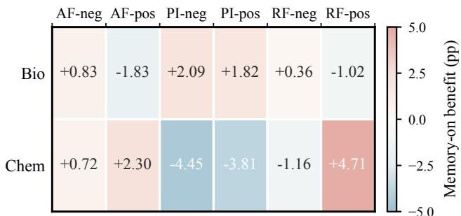

Figure 3: Knowledge-boundary ablation. Percentage-point efects of enabling memory across AF, PI, and RF conditions in BioProBench and ChemCoTBench. Positive values indicate gains and negative values regressions; AF, PI, and RF denote final-answer failure, prediction instability, and reasoning failure.
<table><tr><td>Model</td><td>Accuracy</td><td>Macro-P</td><td>Macro-R</td><td>Macro-F1</td></tr><tr><td>Base</td><td> $0 . 5 5 6 \pm 0 . 0 0 7$ </td><td> $0 . 6 0 2 \pm 0 . 0 1 2$ </td><td> $0 . 5 5 5 \pm 0 . 0 0 7$ </td><td> $\mathbf { 0 . 4 9 8 \pm 0 . 0 0 9 }$ </td></tr><tr><td>Engram-only</td><td> $\mathbf { 0 . 5 6 2 \pm 0 . 0 0 9 }$ </td><td> $\mathbf { 0 . 6 3 7 \pm 0 . 0 2 0 }$ </td><td> $\mathbf { 0 . 5 6 1 \pm 0 . 0 0 9 }$ </td><td> $0 . 4 9 0 \pm 0 . 0 1 0$ </td></tr><tr><td>MeKi-only</td><td> $0 . 5 3 1 \pm 0 . 0 0 6$ </td><td> $0 . 5 7 3 \pm 0 . 0 5 2$ </td><td> $0 . 5 0 6 \pm 0 . 0 0 4$ </td><td> $0 . 3 7 2 \pm 0 . 0 0 4$ </td></tr></table>

Table 3: ERR diagnostic for Base, Engram-only, and MeKionly on BioProBench. Values are means ± standard deviations; higher is better. All results aggregate three repeated runs.

## 7.4 Internal Routing of Knowledge-Circuit Nodes

Figure 5 evaluates the Internal Boundary-Aware Parameter Router on the fixed cohort selected by the external router, using the same runs and generation batches as the S0 control. For Qwen2.5-7B, the empirical internal configuration improves MolEdit accuracy from 0.495 to 0.513 and reduces MolUnd MAE from 0.536 to 0.501, while also increasing MolUnd accuracy from 0.562 to 0.573. The efect is metricdependent rather than uniformly positive, which is consistent with the knowledge-circuit view: configuring memory at selected layer–stage knowledge-circuit nodes can preserve useful contributions while attenuating harmful ones. Because this is a same-cohort ofline replay, it provides mechanismlevel validation rather than an independent generalization estimate.

## 7.5 Task-Dependent Memory Placement

Figure 6 shows that a globally fixed injection location is also inadequate. Late injection at actual layers 27–28 gives the strongest ERR accuracy (0.562), middle injection at layers 15–16 gives the highest PQA accuracy (0.528), and the memory-free baseline remains best for ORD exact match (0.206). The PQA scores are conditioned on successful parsing and should therefore be read together with the lower parsing coverage of the middle-layer configuration. These task-specific optima support the internal router’s layer–stage control: both whether memory participates and where it enters the computation should depend on the downstream reasoning objective.

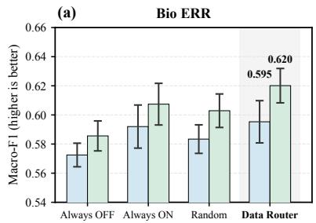

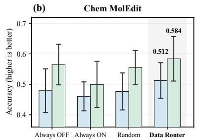

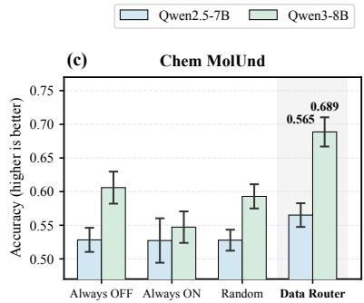

Figure 4: External data-router ablation on Bio ERR and two ChemCoTBench tasks. We compare Always OFF, Always ON, a Random Router matched to the Data Router’s memory-on rate, and the empirical feature-based Data Router for Qwen2.5-7B and Qwen3-8B. Bars and error bars show the mean and standard deviation over repeated runs; Random Router results additionally average over 100 fixed masks. The Data Router outperforms the matched random baseline in every setting shown, indicating that the gains depend on which samples activate memory rather than the activation rate alone.  
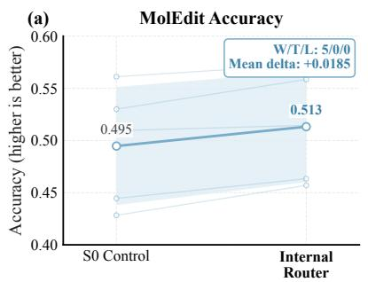

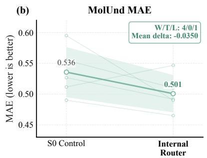

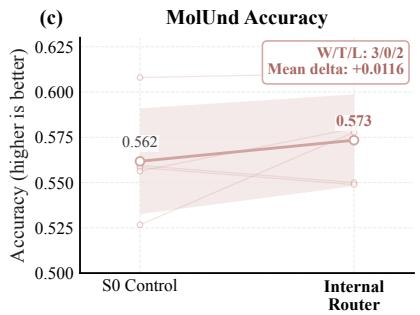

Figure 5: Internal memory-router ablation on Qwen2.5-7B. On the fixed screen cohort selected by the external Data Router, we compare the empirical task-conditioned router with an S0 control using the same cohort, runs, and generation batch. Thin lines show paired runs, thick lines show their means, and shaded regions denote one standard deviation; W/T/L counts run-wise wins, ties, and losses. The empirical router improves MolEdit accuracy and MolUnd MAE and accuracy. Because this is a same-cohort ofline replay, the result validates the routing mechanism rather than independent generalization.  
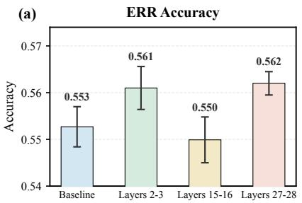

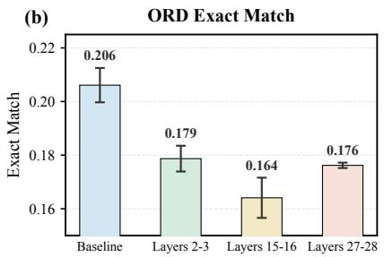

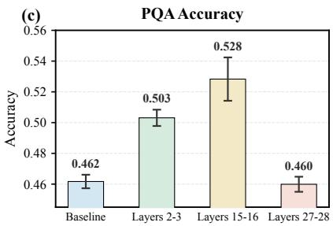  
Figure 6: Memory-layer ablation on BioProBench. Bars report task metrics conditioned on successful parsing, and error bars denote standard deviations over repeated runs. Layer numbers are one-based.

## 8 Conclusion

Memory is not always needed for scientific reasoning: its value depends on whether the base model reaches a knowledge boundary and whether retrieved signals enter at knowledge-circuit nodes that can use them. We characterize this dependence through behavioral indicators of answer, reasoning, and stability failures together with controlled layerstage interventions. These analyses motivate a Knowledge Boundary-Aware Router that uses pre-inference input proxies to control global memory access and internal node contributions without reference answers or alternative outputs. Across two benchmarks, two backbone families, and six task types, memory efects vary across inputs, tasks, metrics, and injection locations. Feature-based routing beats activationrate-matched random routing, while targeted internal routing attenuates harmful contributions. Conditional memory should therefore be treated as a selective computational resource rather than a uniformly beneficial augmentation.

Kadavath, S.; Conerly, T.; Askell, A.; Henighan, T.; Drain, D.; Perez, E.; Schiefer, N.; Hatfield-Dodds, Z.; DasSarma, N.; Tran-Johnson, E.; Johnston, S.; Showk, S. E.; Jones, A.; Elhage, N.; Hume, T.; Chen, A.; Bai, Y.; Bowman, S.; Fort, S.; Ganguli, D.; Hernandez, D.; Jacobson, J.; Kernion, J.; Kravec, S.; Lovitt, L.; Ndousse, K.; Olsson, C.; Ringer, J.; Kravec, S.; Lovitt, L.; Ndousse, K.; Olsson, C.; Ringer, S.: Amodei, D.: Brown. T.: Clark. J.: Joseph. N.: Mann S.; Amo e , D.; Brown, T.; C ar , J.; Josep , N.; Mann,

Berges, V.; Oguz, B.; Haziza, D.; Yih, W.; Zettlemoyer, L.; and Ghosh, G. 2025. Memory Layers at Scale. In Singh, A.; Fazel, M.; Hsu, D.; Lacoste-Julien, S.; Berkenkamp, F.; Maharaj, T.; Wagstaf, K.; and Zhu, J., eds., Forty-second International Conference on Machine Learning, ICML 2025, Vancouver, BC, Canada, July 13-19, 2025, volume 267 of Proceedings ofMachine Learning Research. PMLR / Open-Review.net.

Bi, Z.; Zhang, N.; Xue, Y.; Ou, Y.; Ji, D.; Zheng, G.; and Chen, H. 2024. OceanGPT: A Large Language Model for Ocean Science Tasks. In Proceedings of the 62nd Annual Meeting of the Association for Computational Linguistics (Volume 1: Long Papers), 3357–3372. Association for Computational Linguistics.

Boiko, D. A.; MacKnight, R.; Kline, B.; and Gomes, G. 2023. Autonomous chemical research with large language models. Nat., 624(7992): 570–578.

Borgeaud, S.; Mensch, A.; Hofmann, J.; Cai, T.; Rutherford, E.; Millican, K.; van den Driessche, G.; Lespiau, J.; Damoc, B.; Clark, A.; de Las Casas, D.; Guy, A.; Menick, J.; Ring, R.; Hennigan, T.; Huang, S.; Maggiore, L.; Jones, C.; Cassirer, A.; Brock, A.; Paganini, M.; Irving, G.; Vinyals, O.; Osindero, S.; Simonyan, K.; Rae, J. W.; Elsen, E.; and Sifre, L. 2022. Improving Language Models by Retrieving from Trillions of Tokens. In Chaudhuri, K.; Jegelka, S.; Song, L.; Szepesvári, C.; Niu, G.; and Sabato, S., eds., International Conference on Machine Learning, ICML 2022, 17-23 July 2022, Baltimore, Maryland, USA, volume 162 of Proceedings ofMachine Learning Research, 2206–2240. PMLR.

Chen, W.; Yin, M.; Ku, M.; Lu, P.; Wan, Y.; Ma, X.; Xu, J.; Wang, X.; and Xia, T. 2023. TheoremQA: A Theorem-driven Question Answering Dataset. In Bouamor, H.; Pino, J.; and Bali, K., eds., Proceedings of the 2023 Conference on Empirical Methods in Natural Language Processing, EMNLP 2023, Singapore, December 6-10, 2023, 7889–7901. Association for Computational Linguistics.

Cheng, X.; Zeng, W.; Dai, D.; Chen, Q.; Wang, B.; Xie, Z.; Huang, K.; Yu, X.; Hao, Z.; Zhang, H.; Li, Y.; Zhang, H.; Zhao, D.; and Liang, W. 2026. Conditional Memory via Scalable Lookup: A New Axis of Sparsity for Large Language Models. In Proceedings of the 64th Annual Meeting of the Association for Computational Linguistics (Volume 1: Long Papers), ACL 2026, San Diego, California, United States, July 2-7, 2026, 4968–4990. Association for Computational Linguistics.

Das, P.; Chaudhury, S.; Nelson, E.; Melnyk, I.; Swaminathan, S.; Dai, S.; Lozano, A. C.; Kollias, G.; Chenthamarakshan, V.; Navrátil, J.; Dan, S.; and Chen, P. 2024. Larimar: Large Language Models with Episodic Memory Control. CoRR, abs/2403.11901.

Ding, N.; Liu, F.; Kim, K.; Hao, L.; Lee, K.; Ko, H.; and Tang, Y. 2026. MeKi: Memory-based Expert Knowledge Injection for Eficient LLM Scaling. CoRR, abs/2602.03359.

Farquhar, S.; Kossen, J.; Kuhn, L.; and Gal, Y. 2024. Detecting hallucinations in large language models using semantic entropy. Nat., 630(8017): 625–630.

Guu, K.; Lee, K.; Tung, Z.; Pasupat, P.; and Chang, M. 2020. Retrieval Augmented Language Model Pre-Training. In Proceedings of the 37th International Conference on Machine Learning, ICML 2020, 13–18 July 2020, Virtual Event, volume 119 of Proceedings of Machine Learning Research, 3929–3938. PMLR.

Hendrycks, D.; Burns, C.; Basart, S.; Zou, A.; Mazeika, M.; Song, D.; and Steinhardt, J. 2021. Measuring Massive Multitask Language Understanding. In 9th International Conference on Learning Representations, ICLR 2021, Virtual Event, Austria, May 3-7, 2021. OpenReview.net.

Hu, Z.; Peng, Z.; Bi, Z.; Shen, Q.; Liu, Z.; Lou, J.; and Luo, X. 2025. Advancing Healthcare With Large Language Models: Techniques and Application. IEEE/CAA Journal of Automatica Sinica, 12(12): 2371–2398.

Jablonka, K. M.; Schwaller, P.; Ortega-Guerrero, A.; and Smit, B. 2024. Leveraging large language models for predictive chemistry. Nat. Mac. Intell., 6(2): 161–169.

B.; McCandlish, S.; Olah, C.; and Kaplan, J. 2022. Language Models (Mostly) Know What They Know. CoRR, abs/2207.05221.

Khandelwal, U.; Levy, O.; Jurafsky, D.; Zettlemoyer, L.; and Lewis, M. 2020. Generalization through Memorization: Nearest Neighbor Language Models. In 8th International Conference on Learning Representations, ICLR 2020, Addis Ababa, Ethiopia, April 26-30, 2020. OpenReview.net.

Lample, G.; Sablayrolles, A.; Ranzato, M.; Denoyer, L.; and Jégou, H. 2019. Large Memory Layers with Product Keys. In Wallach, H. M.; Larochelle, H.; Beygelzimer, A.; d’Alché- Buc, F.; Fox, E. B.; and Garnett, R., eds., Advances in Neural Information Processing Systems 32: Annual Conference on Neural Information Processing Systems 2019, NeurIPS 2019, December 8-14, 2019, Vancouver, BC, Canada, 8546–8557.

Lewis, P.; Perez, E.; Piktus, A.; Petroni, F.; Karpukhin, V.; Goyal, N.; Küttler, H.; Lewis, M.; Yih, W.; Rocktäschel, T.; Riedel, S.; and Kiela, D. 2020. Retrieval-Augmented Generation for Knowledge-Intensive NLP Tasks. In Larochelle, H.; Ranzato, M.; Hadsell, R.; Balcan, M.; and Lin, H., eds., Advances in Neural Information Processing Systems 33: Annual Conference on Neural Information Processing Systems 2020, NeurIPS 2020, December 6-12, 2020, virtual.

Li, H.; Cao, H.; Feng, B.; Shao, Y.; Tang, X.; Yan, Z.; Yuan, L.; Tian, Y.; and Li, Y. 2025. Beyond Chemical QA: Evaluating LLM’s Chemical Reasoning with Modular Chemical Operations. CoRR, abs/2505.21318.

Lightman, H.; Kosaraju, V.; Burda, Y.; Edwards, H.; Baker, B.; Lee, T.; Leike, J.; Schulman, J.; Sutskever, I.; and Cobbe, K. 2024. Let’s Verify Step by Step. In The Twelfth International Conference on Learning Representations, ICLR 2024, Vienna, Austria, May 7-11, 2024. OpenReview.net.

Liu, Y.; Lv, L.; Zhang, X.; Yuan, L.; and Tian, Y. 2025. BioProBench: Comprehensive Dataset and Benchmark in Biological Protocol Understanding and Reasoning. CoRR, abs/2505.07889.

Manakul, P.; Liusie, A.; and Gales, M. J. F. 2023. Self-CheckGPT: Zero-Resource Black-Box Hallucination Detection for Generative Large Language Models. In Bouamor, H.; Pino, J.; and Bali, K., eds., Proceedings ofthe 2023 Conference on Empirical Methods in Natural Language Processing, EMNLP 2023, Singapore, December 6-10, 2023, 9004–9017. Association for Computational Linguistics.

Merchant, A.; Batzner, S. L.; Schoenholz, S. S.; Aykol, M.; Cheon, G.; and Cubuk, E. D. 2023. Scaling deep learning for materials discovery. Nat., 624(7990): 80–85.

Rein, D.; Hou, B. L.; Stickland, A. C.; Petty, J.; Pang, R. Y.; Dirani, J.; Michael, J.; and Bowman, S. R. 2023. GPQA: A Graduate-Level Google-Proof Q&A Benchmark. CoRR, abs/2311.12022.

Romera-Paredes, B.; Barekatain, M.; Novikov, A.; Balog, M.; Kumar, M. P.; Dupont, E.; Ruiz, F. J. R.; Ellenberg, J. S.; Wang, P.; Fawzi, O.; Kohli, P.; and Fawzi, A. 2024. Mathematical discoveries from program search with large language models. Nat., 625(7995): 468–475.

Ross, J.; Belgodere, B.; Chenthamarakshan, V.; Padhi, I.; Mroueh, Y.; and Das, P. 2022. Large-scale chemical language representations capture molecular structure and properties. Nat. Mac. Intell., 4(12): 1256–1264.

Team, I.; Peng, R.; and Qiao, Y. 2025. Intern-S1: A Scientific Multimodal Foundation Model. CoRR, abs/2508.15763.

Uesato, J.; Kushman, N.; Kumar, R.; Song, H. F.; Siegel, N. Y.; Wang, L.; Creswell, A.; Irving, G.; and Higgins, I. 2022. Solving math word problems with process- and outcome-based feedback. CoRR, abs/2211.14275.

Wang, W.; Dong, L.; Cheng, H.; Liu, X.; Yan, X.; Gao, J.; and Wei, F. 2023. Augmenting Language Models with Long-Term Memory. In Oh, A.; Naumann, T.; Globerson, A.; Saenko, K.; Hardt, M.; and Levine, S., eds., Advances in Neural Information Processing Systems 36: Annual Conference on Neural Information Processing Systems 2023, NeurIPS 2023, New Orleans, LA, USA, December 10 - 16, 2023.

Wang, X.; Hu, Z.; Lu, P.; Zhu, Y.; Zhang, J.; Subramaniam, S.; Loomba, A. R.; Zhang, S.; Sun, Y.; and Wang, W. 2024a. SciBench: Evaluating College-Level Scientific Problem-Solving Abilities of Large Language Models. In Salakhutdinov, R.; Kolter, Z.; Heller, K. A.; Weller, A.; Oliver, N.; Scarlett, J.; and Berkenkamp, F., eds., Forty-first International Conference on Machine Learning, ICML 2024, Vienna, Austria, July 21-27, 2024, volume 235 of Proceedings ofMachine Learning Research, 50622–50649. PMLR / OpenReview.net.

Wang, Y.; Gao, Y.; Chen, X.; Jiang, H.; Li, S.; Yang, J.; Yin, Q.; Li, Z.; Li, X.; Yin, B.; Shang, J.; and McAuley, J. J. 2024b. MEMORYLLM: Towards Self-Updatable Large Language Models. In Salakhutdinov, R.; Kolter, Z.; Heller, K. A.; Weller, A.; Oliver, N.; Scarlett, J.; and Berkenkamp, F., eds., Forty-first International Conference on Machine Learning, ICML 2024, Vienna, Austria, July 21-27, 2024, volume

235 of Proceedings of Machine Learning Research, 50453– 50466. PMLR / OpenReview.net.

Wei, J.; Yang, Y.; Zhang, X.; Chen, Y.; Zhuang, X.; Gao, Z.; Zhou, D.; Wang, G.; Gao, Z.; Cao, J.; Qiu, Z.; He, X.; Zhang, Q.; You, C.; Zheng, S.; Ding, N.; Ouyang, W.; Dong, N.; Cheng, Y.; Sun, S.; Bai, L.; and Zhou, B. 2025. From AI for Science to Agentic Science: A Survey on Autonomous Scientific Discovery. CoRR, abs/2508.14111.

Wen, H.; Tang, W.; Dai, X.; Ding, J.; Jin, W.; Xie, Y.; and Tang, J. 2024. CellPLM: Pre-training of Cell Language Model Beyond Single Cells. In The Twelfth International Conference on Learning Representations, ICLR 2024, Vienna, Austria, May 7–11, 2024. OpenReview.net.

Wu, Y.; Rabe, M. N.; Hutchins, D.; and Szegedy, C. 2022. Memorizing Transformers. In The Tenth International Conference on Learning Representations, ICLR 2022, Virtual Event, April 25-29, 2022. OpenReview.net.

Xiong, M.; Hu, Z.; Lu, X.; Li, Y.; Fu, J.; He, J.; and Hooi, B. 2024. Can LLMs Express Their Uncertainty? An Empirical Evaluation of Confidence Elicitation in LLMs. In The Twelfth International Conference on Learning Representations, ICLR 2024, Vienna, Austria, May 7-11, 2024. OpenReview.net.

Xu, H.; Feng, X.; Chen, J.; Liu, J.; Deng, K.; Ding, K.; Long, S.; Shuai, J.; Li, Z.; Liu, S.; Xue, G.; and Xiao, Z. 2026. Beyond Conditional Computation: Retrieval-Augmented Genomic Foundation Models with Gengram. CoRR, abs/2601.22203.

Yuan, R.; Sun, S.; Wang, Z.; Cao, Z.; and Li, W. 2023. Evolving Large Language Model Assistant with Long-Term Conditional Memory. CoRR, abs/2312.17257.

Zhang, D.; Hu, Z.; Zhoubian, S.; Du, Z.; Yang, K.; Wang, Z.; Yue, Y.; Dong, Y.; and Tang, J. 2024. SciInstruct: a Self-Reflective Instruction Annotated Dataset for Training Scientific Language Models. In Advances in Neural Information Processing Systems 37: Annual Conference on Neural Information Processing Systems 2024, NeurIPS 2024, Vancouver, BC, Canada, December 10–15, 2024.

Zhang, N.; Bi, Z.; Liang, X.; Cheng, S.; Hong, H.; Deng, S.; Lian, J.; Zhang, Q.; and Chen, H. 2022a. OntoProtein: Protein Pretraining With Gene Ontology Embedding. In The Tenth International Conference on Learning Representations.

Zhang, N.; Chen, M.; Bi, Z.; Liang, X.; Li, L.; Shang, X.; Yin, K.; Tan, C.; Xu, J.; Huang, F.; Si, L.; Ni, Y.; Xie, G.; Sui, Z.; Chang, B.; Zong, H.; Yuan, Z.; Li, L.; Yan, J.; Zan, H.; Zhang, K.; Tang, B.; and Chen, Q. 2022b. CBLUE: A Chinese Biomedical Language Understanding Evaluation Benchmark. In Proceedings of the 60th Annual Meeting of the Association for Computational Linguistics (Volume 1: Long Papers), 7888–7915. Association for Computational Linguistics.

Zhang, X.; Liu, Z.; Cao, H.; Li, Y.; and King, I. 2026. Augmenting Molecular Language Models with Local n-gram Memory. CoRR, abs/2606.12113.

## Additional Definition

## Scientific Conditional Memory Benefit

Existing evaluation of conditional memory typically relies on overall performance improvement. However, this does not distinguish gains on cases where the base model approaches its scientific knowledge boundary from gains on cases that it already solves. We therefore separately define the boundaryset gain,

$$
\Delta S _ { B } = S ( M _ { \mathrm { m e m } } , B ) - S ( M _ { \mathrm { b a s e } } , B )\tag{14}
$$

and the non-boundary-set gain,

$$
\Delta S _ { \overline { { B } } } = S ( M _ { \mathrm { m e m } } , \overline { { B } } ) - S ( M _ { \mathrm { b a s e } } , \overline { { B } } )\tag{15}
$$

in addition to the aggregate gain

$$
\Delta S = S ( M _ { \mathrm { m e m } } , \mathcal { D } ) - S ( M _ { \mathrm { b a s e } } , \mathcal { D } )\tag{16}
$$

over the complete evaluation set. The Scientific Conditional Memory Benefit (SCMB) is

$$
S _ { C M B } = \Delta S _ { B } - \Delta S _ { \overline { { { B } } } }\tag{17}
$$

and measures whether memory provides larger gains on scientific-boundary cases than on non-boundary cases.

## Experimental Details and Reproducibility SFT Data Synthesis

BioProBench. We synthesize protocol-reasoning SFT data by first clustering the BioProBench protocol collection to identify frequently occurring knowledge points. We associate these knowledge points with the original protocol collection and retain the original protocols in the corresponding non-isolated clusters as the source pool, rather than sampling protocols uniformly. To prevent data leakage, every source-protocol step that appears in the test data is marked as reserved and is not used to construct a new question.

For each selected source protocol, we generate Error Correction (ERR), Step Ordering (ORD), and Protocol Question Answering (PQA) queries with task-type and orderinglength distributions aligned with the benchmark. A protocolgrounded reviewer filters every query for template compliance, factual consistency with the source protocol, and answer correctness. For each accepted query, an API-based generator produces a <think> rationale conditioned on the full source protocol and the known answer; a second review checks the response format, biological reasoning, and final answer. A final deterministic check extracts the answer tag and compares it with the stored answer. The resulting validated examples are combined with the existing ERR/ORD records to form the Bio SFT set.

ChemCoTBench. We use each original ChemCoTDataset query as the instruction and obtain the target answer from its structured metadata. When a record provides a naturallanguage raw\_cot, we first evaluate its format, chemical reasoning quality, and consistency with the target. Highquality rationales are retained and normalized into the standard <think> response format. Only when raw\_cot is missing or fails this quality gate do we use the corresponding struct\_cot as a reasoning skeleton and ask the generator to expand it into a natural-language response. The expansion is conditioned on the query, the complete structured rationale, and the target answer, so that it elaborates the chemical reasoning without changing the target.

All Chem responses undergo format and reasoning review. For molecule-valued answers, we additionally canonicalize generated and reference SMILES with RDKit before exact comparison; other answer types are directly compared with their ground truth. The final Chem SFT set combines existing non-reaction examples with validated additions.

## Compute Environment

Tables 4 and 5 record the hardware, system, and principal software versions used for SFT and local generation. The BioProBench and ChemCoTBench execution environments follow their respective original benchmark setups. Each SFT and generation job used one GPU. CPU preprocessing and metric computation are not included in any latency or GPUmemory comparison. The released environment files provide complete dependency records for SFT and local generation.

## Repeated Runs and Randomness

Every reported task-performance result is computed from three stochastic generation-and-evaluation runs using the same trained checkpoint, test split, prompt, and selected routing configuration. Tables report the arithmetic mean and standard deviation over these three runs, and paired comparisons use matching runs. The batch-generation utilities may retain additional run-indexed outputs, but these are not included in the reported summaries. The random-router control uses 100 fixed masks, each matched to the proposed router’s memoryactivation rate.

The SFT entry points use the Transformers training seed of 42, and Engram hash construction uses seed 0. The released scripts retain run-indexed outputs and the configurations used for each reported result, enabling the reported summaries to be re-evaluated with the same checkpoint, test split, prompt, and routing configuration.

## Formal Evaluation Metrics

Evaluation protocol. We use the benchmark-provided parsers and task-specific evaluators. Parsing or molecularvalidity coverage is reported separately so that a high conditional task score cannot hide a low rate of usable outputs. Let N be the relevant evaluation-set size and 1[·] the indicator function.

BioProBench Protocol Question Answering (PQA). Let yb and y be the predicted and reference answers, let $z _ { i } =$ $\mathbf { 1 } [ \widehat { y } _ { i } = y _ { i } ]$ , and let $p _ { i } \in [ 0 , 1 ]$ be the model’s parsed confidence after dividing the reported percentage by 100. We compute

$$
\mathrm { A c c } = \frac { 1 } { N } \sum _ { i = 1 } ^ { N } z _ { i } , \qquad \mathrm { B r i e r } = \frac { 1 } { N } \sum _ { i = 1 } ^ { N } ( p _ { i } - z _ { i } ) ^ { 2 } .\tag{18}
$$

Accuracy measures exact answer correctness, whereas the Brier score jointly penalizes incorrect answers and miscalibrated confidence; lower Brier is better.

<table><tr><td>Component</td><td>SFT</td><td>Local benchmark generation</td></tr><tr><td>Accelerator</td><td>1× NVIDIA A800-SXM4-80GB (81,920 MiB)</td><td>1 × NVIDIA GeForce RTX 4090 D (24,564 MiB)</td></tr><tr><td>Job allocation</td><td>16 Slurm CPUs; 128 GB host memory</td><td>16 Slurm CPUs; 128 GB host memory</td></tr><tr><td>Host CPU</td><td>2× Intel Xeon Platinum 8358P at 2.60 GHz (64 physical cores; 128 hardware threads)</td><td>2× Intel Xeon Gold 6430 (64 physical cores; 128 hardware threads)</td></tr><tr><td>Installed host memory</td><td>1,000,000 MB</td><td>490,000 MB</td></tr><tr><td>Operating system</td><td>Rocky Linux 9.5; kernel 5.14.0-503.40.1.e19_5.x86_64</td><td>Rocky Linux 9.7; kernel 5.14.0-611.16.1.e19_7.x86_64</td></tr><tr><td>GPU driver / reported CUDA</td><td>550.144.03 / 12.4</td><td>580.95.05 / 13.0</td></tr></table>

Table 4: Recorded hardware and system environment. CPU and memory values in the job-allocation row are the Slurm resources allocated to each single-GPU job; installed host memory is reported separately.
<table><tr><td>Software group</td><td>SFT and local generation</td></tr><tr><td>Runtime</td><td>Python 3.12.13</td></tr><tr><td>Model and generation stack</td><td>PyTorch 2.6.0; Transformers 5.8.0; PEFT 0.19.1; Engram-PEFT 1.2.6</td></tr><tr><td>Training and data stack</td><td>TRL 1.3.0; Accelerate 1.13.0; Datasets 4.8.5; Tokenizers 0.22.2</td></tr><tr><td>Numerical stack</td><td>NumPy 2.4.4</td></tr></table>

Table 5: Principal recorded software versions for SFT and local generation.

BioProBench Step Ordering (ORD). For predicted and reference permutations $\widehat { \pi } _ { i }$ and $\pi _ { i } ,$ exact match is

$$
\mathrm { E M } = \frac { 1 } { N } \sum _ { i = 1 } ^ { N } \mathbf { 1 } [ \widehat { \pi } _ { i } = \pi _ { i } ] .\tag{19}
$$

For an instance containing $m _ { i }$ steps, let $C _ { i }$ and $D _ { i }$ be the numbers of concordant and discordant step pairs. The evaluator pools these pairs across instances and computes $\tau = \sum _ { i } ( \stackrel { . } { C } _ { i } - D _ { i } ) / \stackrel { . } { \sum _ { i } } ( m _ { i } ( m _ { i } - 1 ) / 2 )$ . EM tests recovery of the complete protocol order, while Kendall’s τ gives partial credit for pairwise ordering agreement.

BioProBench Error Correction (ERR) and our balanced extension. Accuracy is the fraction of correctly predicted Boolean labels. For each class $c \in$ {False, True}, define

$$
\begin{array} { r l r } { P _ { c } } & { = } & { \displaystyle \frac { \mathrm { T P } _ { c } } { \mathrm { T P } _ { c } + \mathrm { F P } _ { c } } , \qquad R _ { c } = \frac { \mathrm { T P } _ { c } } { \mathrm { T P } _ { c } + \mathrm { F N } _ { c } } , } \\ { F 1 _ { c } } & { = } & { \displaystyle \frac { 2 P _ { c } R _ { c } } { P _ { c } + R _ { c } } , } \end{array}\tag{20}
$$

with a zero value when the corresponding denominator is zero. The oficial BioProBench evaluator treats False (the protocol step is incorrect, i.e., an error is present) as the sole positive class. We retain its parsing and accuracy calculation but report

$$
\begin{array} { r c l } { { \mathrm { M a c r o - P } } } & { { = } } & { { ( P _ { \mathrm { F a l s e } } + P _ { \mathrm { T r u e } } ) / 2 , } } \\ { { \mathrm { M a c r o - R } } } & { { = } } & { { ( R _ { \mathrm { F a l s e } } + R _ { \mathrm { T r u e } } ) / 2 , } } \\ { { \mathrm { M a c r o - F 1 } } } & { { = } } & { { ( F 1 _ { \mathrm { F a l s e } } + F 1 _ { \mathrm { T r u e } } ) / 2 . } } \end{array}\tag{21}
$$

This balanced extension evaluates both error detection and correct-step recognition with equal class weight, reducing sensitivity to the arbitrary choice ofa single positive class and to class imbalance. Parser failures are counted and reported separately from these class metrics.

ChemCoTBench molecular understanding. For functional-group and ring-count subtasks, MAE is $\begin{array} { r } { N _ { v } ^ { - 1 } \sum _ { i } | \tilde { n _ { i } } - \dot { n _ { i } } | } \end{array}$ over the $N _ { v }$ valid, parsed outputs. For categorical or equivalence subtasks, accuracy is the fraction of exact task decisions. For Murcko-scafold extraction, TMS is the mean Tanimoto similarity between the predicted and reference scafold fingerprints:

$$
\mathrm { T M S } ( A , B ) = { \frac { | A \cap B | } { | A \cup B | } } .\tag{22}
$$

Following the evaluator, exactly matching scafolds receive 1; otherwise, Tanimoto similarity is computed from radius $^ { - 2 , }$ 1024-bit Morgan fingerprints of the Murcko scafolds. These metrics respectively measure numerical counting error, discrete structural understanding, and graded scafold similarity.

ChemCoTBench molecular editing. Editing accuracy is the number of outputs that carry out the requested addition, deletion, or substitution divided by the total number of examples; unextractable or invalid molecules count as failures. Validity is the fraction of outputs from which the evaluator can extract a target molecule that RDKit accepts as a valid molecule. Accuracy measures instruction compliance, while validity detects chemically unusable generations.

ChemCoTBench molecular optimization. For target property oracle f and generated molecule $\widehat { m } _ { i } ,$ the improvement is $\Delta _ { i } = \stackrel { . } { f } ( \widehat { m } _ { i } ) ^ { - } \stackrel { } { f } ( m _ { i } )$ . Unextractable, invalid, or unscorable outputs receive $\Delta _ { i } \ = \ 0$ . Mean improvement is the evaluator’s 5th–95th-percentile winsorized mean of $\{ \Delta _ { i } \}$ , and success rate is $\begin{array} { r } { N ^ { \hat { - } 1 } \sum _ { i } \mathbf { 1 } [ \Delta _ { i } > 0 ] } \end{array}$ . Validity is the fraction of generated molecules that are valid and receive a property score; extraction rate is the fraction of responses from which the final target SMILES can be extracted. Together these metrics separate the magnitude and frequency of property improvement from output usability.

<table><tr><td>Setting</td><td>BioProBench SFT ChemCoTBench SFT</td></tr><tr><td>Backbones</td><td>Qwen2.5-7B-Instruct; Qwen3-8B</td></tr><tr><td>Epochs</td><td>3 3</td></tr><tr><td>Maximum sequence length</td><td>4096 6144</td></tr><tr><td>Per-device batch size</td><td>4 3</td></tr><tr><td>Gradient accumulation</td><td>4 4</td></tr><tr><td>Effective single-GPU batch size</td><td>16 12</td></tr><tr><td>Optimizer</td><td>Adam (LoRA/dense); SparseAdam (hash embeddings)</td></tr><tr><td>Adam  $\beta / \epsilon$  Learning rates</td><td> $\left( 0 . 9 , 0 . 9 9 9 \right) / 1 0 ^ { - 8 }$ </td></tr><tr><td>Scheduler / warmup</td><td>LoRA/dense  $1 0 ^ { - 5 } ;$  sparse memory  $5 \times 1 0 ^ { - 5 }$  cosine / first 10% of update steps</td></tr><tr><td>Weight decay / gradient clipping</td><td>0 / max norm 1.0</td></tr><tr><td>Precision / checkpointing</td><td>bfloat16 / enabled</td></tr><tr><td>Training seed</td><td>42 (Transformers default; no override)</td></tr><tr><td>Checkpoint / logging interval</td><td>500 / 10 update steps</td></tr><tr><td>LoRA</td><td> $r = 8 , \alpha \overset { \cdot } { = } 1 6$  , dropout 0, no bias, all linear layers</td></tr></table>

Table 6: Final SFT hyperparameters. Both backbone families use the same values unless a model-specific layer is shown.

Validity convention. For every ChemCoTBench subtask, Val. is a coverage measure: the fraction of all examples whose outputs can be parsed and admitted to that subtask’s evaluation path. Consequently, MolUnd reports separate validity values for the MAE, accuracy, and TMS subtask groups rather than sharing one denominator.

## Final Hyperparameters

SFT configuration. Table 6 consolidates the final training settings. SFT is performed once per backbone–domain pair; the three reported runs are generation repeats from the resulting fixed checkpoint. Both domain-specific SFT sets contain tens of thousands of examples, all of which are used for training.

Memory adapter. For Qwen2.5, memory is injected at zero-indexed layers [1, 14]; for Qwen3, at [1, 18]. Both use embedding dimension 1024, n-grams [2, 3], 1,131,200 hash buckets per n-gram size, eight hash heads per n-gram, tokenizer compression, hash multiplier 4, summed multihead features, a kernel-4 convolution with dilation 3, zeroinitialized convolution and gate, sparse embeddings, Engram learning-rate multiplier 5, Engram weight decay 0, and hash seed 0. For Memory+LoRA, the existing LoRA parameters remain trainable while the memory adapter is trained. The Qwen2.5 composite has 347,059,200 trainable parameters (20,185,088 LoRA and 326,874,112 memory) out of 7,962,675,712 total parameters. The Qwen3 composite has 353,969,152 trainable parameters (21,823,488 LoRA and 332,145,664 memory) out of 8,544,704,512 total parameters. The observed final-job SFT wall times were 30:47:14 (Qwen2.5 Bio), 36:25:23 (Qwen3 Bio), 27:36:31 (Qwen2.5 Chem), and 33:18:07 (Qwen3 Chem).

Generation. Local generation uses the thinking-enabled chat template, a maximum of 4096 new tokens, and one sampled sequence per input. BioProBench uses bfloat16, temperature 0.6, top-p 0.95, and top-k 50. Its Qwen2.5 batch sizes are 4 for ERR/PQA and 3 for ORD; its Qwen3 batch sizes are 4 for ERR/PQA and 2 for ORD. ChemCoTBench uses float16, temperature 0.2, and top-p 0.8, with batch size 8 for Qwen2.5 and 5 for Qwen3. KV caching is enabled during generation. Prompt templates, answer-parsing rules, task-specific schemas, and run-indexed output paths are included in the released code.

External and internal routing is empirical, based on knowledge-boundary and knowledge-circuit theory and existing reasoning samples; hyperparameter search selects its parameters, which are provided in the released code.

## MeKi and Engram Adapter Architectures

Figure 7 compares the concrete memory paths used in the diagnostic experiment. Engram retrieves sufix n-gram embeddings, uses the current hidden state to contextually gate their contribution, and passes the gated residual through a short convolution before injection. The evaluated MeKi configuration retrieves token-level experts, fuses them with a hidden-state gate, applies an output projection and RMS normalization, and then adds the resulting residual to the target module output. Its training-time static and dynamic expert features are folded into a lookup table at inference. Both Qwen2.5 diagnostic configurations target layers 1 and 14. The comparison describes the evaluated implementations and does not attribute the observed MeKi generation failure to any single architectural component.

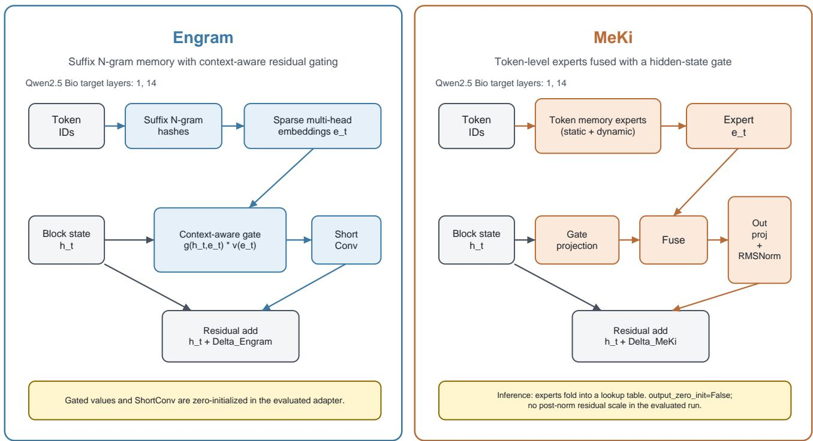  
Figure 7: Structural comparison ofthe Engram and MeKi memory adapters in the evaluated Qwen2.5 BioProBench configuration. Engram combines sufix n-gram retrieval with context-aware gating and a short-convolution residual path. MeKi combines token level expert lookup with hidden-state gating, fusion, output projection, and RMS normalization before direct residual addition. The lower MeKi callout records configuration details of the diagnostic run, including output\_zero\_init=False; it is not a causal attribution of the generation-collapse result.