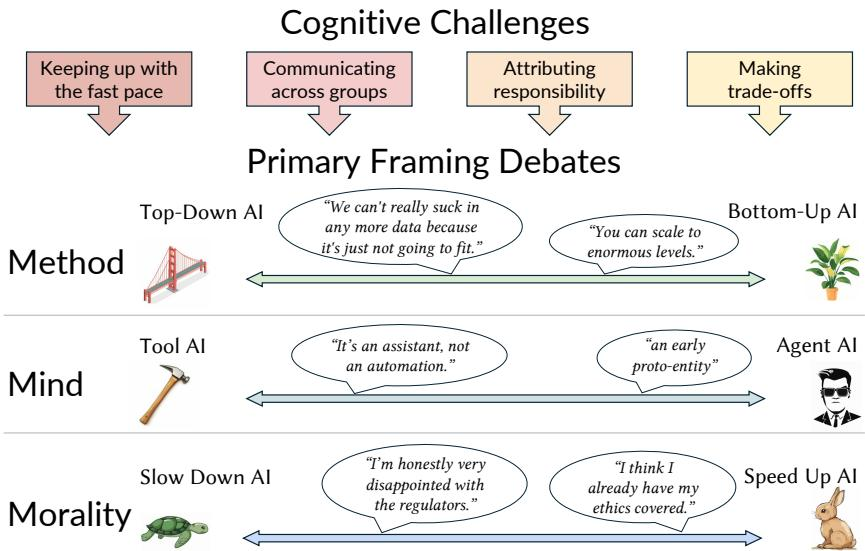
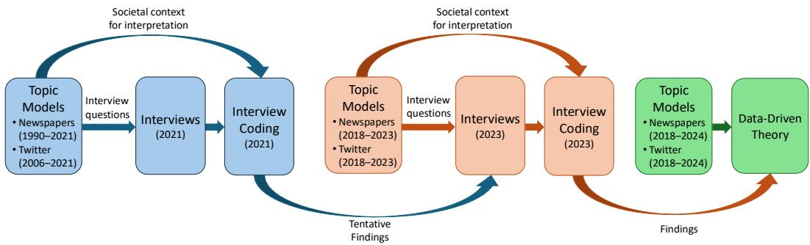
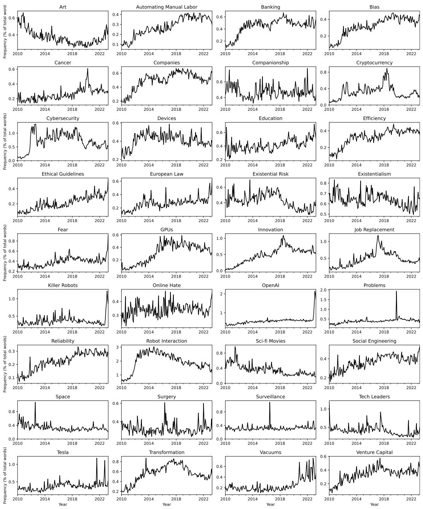

# Method, Mind, and Morality: How People Make Sense of Artificial Intelligence

JACY REESE ANTHIS, University of Chicago, USA and Stanford University, USA ERIK BRYNJOLFSSON, Stanford University, USA JAMES EVANS, University of Chicago, USA and Santa Fe Institute, USA

Fig. 1. Summary of our conceptual framework. We identify four cognitive challenges faced by humans (Section 5.2) as they wrestle with three primary dimensions of what AI means for society (Section 5.3).

How can humans make sense of the rapid takeof of artificial intelligence (AI)? We studied the sensemaking dynamics of AI through an open-ended, mixed-methods study with computational text analysis of millions of AI-related newspaper articles and social media posts grounded in 57 semi-structured interviews with AI professionals in 2021 and 2023—before and after the recent surge of public interest. We identify a range of sociological frames (interpretive schemas that structure collective cognition) and show how AI professionals use frames to address significant cognitive challenges, such as assigning responsibility for societal impacts. We develop a framework of three primary debates across which frames are adopted and contested: (i) the method of AI development, between frames of top-down expert systems and bottom-up emergent capabilities, (ii) the mind of an AI system, ranging from a passive tool to a humanlike “digital mind,” and (iii) the morality of how AI is used, particularly the decision of whether to slow down or speed up AI development. As humanit enters the era of transformative AI, technologists and policymakers must account for the framing dynamics that will circumscribe our beliefs, values, and actions.

Authors’ Contact Information: Jacy Reese Anthis, University of Chicago, Chicago, IL, USA and Stanford University, Stanford, CA, USA; Erik Brynjolfsson, Stanford University, Stanford, CA, USA; James Evans, University of Chicago, Chicago, IL, USA and Santa Fe Institute, Santa Fe, NM, USA.

CCS Concepts: • Human-centered computing → Empirical studies in collaborative and social computing; User studies.

Additional Key Words and Phrases: digital minds, AI safety, human-AI interaction, mind perception, moral attribution, discourse, framing theory, machine learning, interviews

ACM Reference Format:

Jacy Reese Anthis, Erik Brynjolfsson, and James Evans. 2026. Method, Mind, and Morality: How People Make Sense of Artificial Intelligence. Proc. ACM Hum.-Comput. Interact. 10, 6, Article CSCW123 (October 2026) 41 pages. https://doi.org/10.1145/3816971

## 1 Introduction

Artificial intelligence (AI) systems, particularly general-purpose large language models (LLMs), have rapidly permeated a wide variety of social contexts, including education [74], work [190], politics [99], and art [36]. To adapt to these changes, people must incorporate AI into their existing worldviews and behavior. Within a single context, AI can have a variety of technical and social meanings: on social media, AI can mean the algorithmic feeds that deliver content from one user to another [87], a simulated “bot” user that posts and amplifies content as if it were human [119], or AI applied to other contexts that is the subject of social media discussion [124]. These meanings difer between people: an AI-based algorithmic feed may be understood as an exciting feature for technologists and investors but as a threat to mental health for educators and parents.

In social computing, social meanings of AI span diverse contexts. At a high level, AI is sometimes viewed as a threat to human identity and agency [40, 133, 161, 180], a “social actor” attributed moral agency and moral standing to do harm and be harmed [8, 77, 116, 160], and an economic force with the dual-use potential to replace or empower workers [114, 199]. Various mental models have been proposed, such as “role play” as AI systems rotate through diverse personas [169]. The number and diversity of social meanings continue to expand as entrepreneurs, journalists, and others use the term “AI” to command attention for their work. This broad usage may reduce the extent to which the term conveys meaning, but it nonetheless continues to be described as “transformative” [187], “a national priority” [113], and “a general purpose technology” [51]. Social meaning has long been a central interest in psychology [60] and sociology [69], and it is an increasingly common topic in human-computer interaction [129].

This raises a provocation for social science and cognitive science: How can people make sense of AI in light of this multitude of social meanings? Past work in CSCW has examined particular social meanings, such as data scientists viewing AutoML as an augmentation of their productivity despite the apparent possibility of displacement [193] or organizational decision-making, in which AI algorithms are able to supersede the “arbitrarily segmented decision spaces” and the “entrenched structures” of organizational divisions based on human capabilities [190]. These particular social meanings have been studied individually, but there is not yet a framework for how biological human beings can navigate the immense challenge of staying cognitively afloat during the turbulent rise of “digital minds” [9].

To address this question, we conducted an open-ended, mixed-methods study with data from 2018 to 2024. Our empirical scope is deliberately broad, spanning the huge variety of AI domains rather than a single area (e.g., ethics, job automation) in order to focus on holistic sensemaking processes. In order to anchor meaningful findings in this massive and burgeoning field, we took advantage of recently developed methodologies that integrate computational “big data” and qualitative “small data” analysis into a single theory-building research pipeline [16, 22, 140, 144].

Computationally, we constructed and analyzed topic models of AI-related newspaper articles (e.g., The New York Times) and social media posts from Twitter (now known as X). Rather than conventional bag-of-words techniques such as latent Dirichlet allocation [23] that leave out the semantic information conveyed by word order, we constructed topic models via dictionary learning across vector representations of words embedded in a high-dimensional space [12, 131]. Qualitatively, we analyzed the individual texts most representative of these topics, and we conducted 57 semi-structured interviews with AI professionals in two waves, 2021 (30 interviews) and 2023 (27 interviews). We asked participants about their experiences with the topics, their perceptions o topics, how topics relate to each other, and the co-evolution of topics over time.1

The topic models provided a structured method to generate a list of topics for querying interview participants as well as a topography of the field on which to anchor their responses. After interviews and interview coding, the topic models contribute a latticework of frames and their relationships, while the interviews detail the dynamic processes by which individuals make sense of those frames. In line with the widely used paradigm of grounded theory [37, 67], our approach built theory foremost from the empirical data rather than seeking the confirmation of preexisting theory or hypotheses. Our iterative research process, shown in Figure 2, was built for this mode of inquiry rather than statistical hypothesis testing.

As we iterated between data analysis, theory development, and literature review, we situated our findings with the sociological theory of “frames,” sociocognitive schemas of interpretation by which people make sense of the world and take action [21, 68, 146]. Computational social scientists have identified a congruence between framing theory and topic models [14, 45, 58, 65, 136], and framing theory has precedent in human-computer interaction and social computing research, primarily to describe the online dynamics of social movements [e.g., 33, 156, 176, 200]. During unsettled times, such as technological emergence, frames are known to co-evolve through “framing contests,” in which social actors—including professionals, users, and journalists—advocate for their favored frames in an organization [93], social movement [165], or field [80].

Our analysis brings together perspectives from public discourse and technology professionals. The two text corpora capture public discourse and journalistic mediation at scale, while the interviews provide in-depth accounts from people involved in AI development and deployment. Framing scholars have emphasized that frames circumscribe understanding across media producers and consumers [66] as well as the general public and social “elites” [48]. We therefore study frames as circulating across particular social groups and the general public, subject to reconfiguration across contexts and institutions [e.g., 52, 191].

Drawing on the text analysis, interviews, and framing literature, we make the following contributions:

• We identify four cognitive challenges that motivate the choice and use of particular AI frames: keeping up with the fast pace of new information; communicating across groups, such as colleagues, friends, and family; attributing responsibility for societal consequences; and making trade-ofs between diferent priorities and goals.

• We identify three primary framing debates that structure collective cognition: the method by which AI is created, ranging from frames of top-down expert systems to bottom-up emergence through massive scaling of computational resources; the mind2 of what AI is perceived to be, ranging from a conventional software tool to a humanlike coworker or companion; and the morality of how to use AI, particularly the decision of whether to slow down or speed up its development.

• We consider potential implications of this high-level framework for design, policymaking, and research. It poses problems for AI design and policy, such as the dificulty of promoting nuanced positions when people default to particular frames, but also opportunities, such as being able to readily incorporate useful mental models that people already have from outside the AI context. For researchers, social dynamics—such as the coevolution of frames—can be integrated into economic and material-based models of the trajectory of AI technology, such as the potential role of framing contests in the much-discussed “productivity paradox” [28] in which general-purpose technologies have delayed economic impact.

• While each method we incorporated has precedent in prior work, this study constitutes an example of how computational and qualitative paradigms can be integrated in unique ways to address the unique circumstances that arise during open-ended, data-driven research. In particular, we show how the “bird’s eye” view of computational models can be enriched with the “worm’s eye” view of participants’ lived experience to characterize social dynamics of fast-paced technological change.

## 2 Human-AI interaction

Our aim in this project is to provide a high-level account of meaning-making in the interface of AI and human society. We summarize the dynamics of human-AI interaction, of which meaning is made, in three parts: the motivations for interaction—of which productivity has been the primary focus—the contextual factors that shape interaction and its outcomes, and existing research on the mental models of AI and human-AI interaction to which this project contributes. This presents a complex and cognitively demanding landscape for professionals and everyday users to navigate.

## 2.1 Productivity and other motivations

There are a variety of goals people have in mind when adopting AI technology, which shape how they think and speak about AI. Research on human-AI productivity suggests that human-AI collaboration can improve task performance in areas such as science [100, 193] and creative writing [41]. In the context of LLMs, the evidence now includes AI-use experiments with professionals, such as tests of writing tasks modeled on management consulting [44], and these publications have suggested promising results for human-AI teams compared to the performance of an unassisted human. However, the efect of AI use on productivity appears to vary widely across human contexts and AI capabilities. Vaccaro et al. [188] performed a meta-analysis of dozens of experiments that measured the performance of human, AI, and human-AI participants. The meta-analysis showed that being on a team with an AI increased performance relative to the human alone, but team performance still lagged behind AI performance. Despite the popularity of AI, Vaccaro et al. show that only a few studies have documented “strong synergy,” in which teams outperform the best of either the human or AI participants.

The findings of Vaccaro et al. support the existence of an AI “productivity paradox” [28]. AI is widely lauded as a general purpose technology [27], but economic research on general purpose technologies has documented substantial delays between introduction, such as that of computers in the 1970s and 1980s, and dramatic productivity gains, and AI may be undergoing its own productivity paradox [1, 30]. Proposed explanations of the productivity paradox have tended to focus on material dynamics, such as the production of complementary technologies and the mismeasurement of new forms of economic value [28], but there may also be bottlenecks in productivity that manifest in the dynamics of social perception, interaction, and meaning-making—dynamics that could be clarified via framing theory.

Beyond productivity, AI systems afect social outcomes such as mental health and learning. AIpowered mental health interventions, such as chatbots and virtual therapists, have demonstrated promise in reducing symptoms of depression and anxiety [56], reducing loneliness and suicidal thoughts [125], improving the accessibility of mental health support [70], and providing continuous personalized care in cases when a human practitioner could not [121, 189]. The integration of AI in mental health care has opened new avenues for public benefit but also risks, such as dependency and the generation of inappropriate content when people expect professional responses as they would a human mental health professional [112] or when people enter a “delusional spiral” of reinforced delusions with AI companions [137]. AI in various forms has been widely integrated into educational systems for decades. Since 2011, intelligent tutoring systems have shown comparable efects to human tutors in isolated experiments [192], though others in education have pushed for the use of AI in data-driven design and data mining to empower human educators [15]. These motivations have led to a wide variety of social groups developing AI, deploying AI, and advocating for their interests in how AI is used in society.

## 2.2 Contextual factors

As people adapt to AI in new and diverse contexts, they need to make sense of the contextual factors that determine its efects. Task performance depends on the user’s trust, which in turn depends on factors such as the user’s age, culture, gender, and personality [82]. It depends on perceived intelligence and competence [203] and the transparency and explainability of the system [132]. User characteristics are consequential, including the user’s AI literacy [118, 139, 155], cultural background [159], democratic and autocratic decision-making styles [141], and their perceptions of artificiality in the AI teammate [167]. The design of the user interface that connects the user and system can also make a significant diference [3, 178]. Researchers have explored the design space of future AI tools, particularly with systems that augment the human writing process in either natural language [117, 202] or computer code [5, 138].

Human-AI interaction is often studied in salient contexts such as LLMs and robots, but, arguably, most human-AI interaction occurs with the more embedded AI systems that power online technologies such as online search and shopping [106]. This can result in complex interaction dynamics. As people browse, online behavior creates vast amounts of residual data, sometimes referred to as data exhaust, that is used to train future AI systems. Repeated feedback loops of interaction and system development lead to the amplification of bias [186], surveillance capitalism [204], and predictive policing [25, 26]. These co-evolving social dynamics pose dificulties for sensemaking and taking meaningful social action to steer the trajectory of AI.

## 2.3 Mental models

Cognitive scientists and computer scientists have documented a variety of mental models that people use to make sense of computers and AI. A long-observed dynamic is that humans readily attribute humanlike features to AI. In the 1960s, the chatbot ELIZA was able to dazzle users with humanlike “talk therapy” conversation by using simple heuristics. Cognitive scientist Douglas Hofstadter called the tendency to see mental faculties in even simple computers the “ELIZA efect” [83]. We have long known that “computers are social actors” [142, 143, 160] and that humans tend to anthropomorphize AI [53, 130, 194, 205], particularly via the attribution of mental states, such as agency and experience [71, 103, 115, 168]. Recent experimental research has identified mental models of autonomy and sentience that undergird AI perceptions [152].

Studies have applied concepts from philosophy and moral psychology, developed in the exclusively human context, to human-AI interaction. They find that users readily attribute moral agency and responsibility [101, 122, 179] as well as concern for the moral standing of AI entities, such as their rights and welfare [108–110, 116]. Recent survey-based research has provided quantitative assessments of how everyday people perceive mind and morality across a variety of AI systems [111];

they show that AI systems are perceived to have mind and moral status within a relatively narrow band in the scope of a broad range of entities (e.g., rocks, humans) but that there is significant variation within that.

HCI researchers and designers have developed various taxonomies of social meaning. In terms of work, the AI can be a tool (low AI autonomy and low human involvement), servant (low AI autonomy and high human involvement), assistant (high AI autonomy and low human involvement), or mediator (high AI autonomy and high human involvement) [97]. In terms of communication, the AI can be a creator (communicating with many humans), curator (mediating communication with many humans), converser (communicating with one human), or co-author (mediating communication with one human) [181]. Other frameworks typically contrast tool-like and agent-like roles [38, 43, 185, 201]. In some studies, the AI is presented to the user with a particular metaphor chosen by the researchers, such as testing the efects of describing a chatbot as a book, dog, toddler, or trained professional, among other metaphors, on users’ perceived warmth and competence [91, 95]. Recent work has emphasized the importance of understanding and shaping the social roles filled by AI [49], and a rapidly emerging literature attempts to scientifically analyze the novel “digital companionship” with AI systems [123] and understand how AI companionship develops [86].

Other frameworks categorize dynamic features of the human-AI relationship, such as dispositional, situational, and learned trust [82]. These dynamic features are increasingly viewed as multidimensional, such as autonomy expanding from the conventional single dimension between more human involvement and more AI involvement [18] to—given the human and AI can both be more or less involved—disentangling operational, intentional, shared, non-deterministic, physical, and cognitive autonomy [96].

While these mental models generalize across diferent contexts, the frameworks have tended to focus on particular elements of human attitudes and AI behavior, rather than the ways in which social groups manage the cognitive demands of AI technology. Nonetheless, these mental models can provide a connective tissue from individual interaction to macroscopic theories of AI and society, such as algorithmic fairness [7], algorithmic work and control [94], and the posited economic transformation of a “second machine age” [29]. In our study, these mental models of individual AIs and of AI technology as a whole are important constituents of sensemaking, framing, and the longitudinal process of psychological world-making [151].

## 2.4 AI discourse

The study of AI discourse at scale remains relatively small, in part because AI has only in recent years taken the public spotlight. Nonetheless, there have been a variety of studies. For example, Fast and Horvitz [54] analyzed 30 years of AI coverage in The New York Times, mapping out keywords alongside sentiment measures and documenting both growing concern about losing control of AI and hope for beneficial impacts such as healthcare.

Other studies have developed or identified particular AI frames, discourses, and narratives. Johnson and Verdicchio [89] argued for “A New Frame for AI Discourse”: viewing an AI system as including both computational artifacts and human actors, and cautioning that AI-risk debates can confuse machine autonomy for the human autonomy that drives technological harm. Bearman et al. [17] reviewed references to AI in higher education journals and identified two “discourses”: AI as an “imperative change” and AI as “altering authority” to include not just teachers but other staf, students, and nonhuman entities such as machines and corporations. Recently, Gilardi et al. [63] examined the volume and sentiment of AI news and proposed four narratives: existential risk, efective accelerationism, immediate societal risks, and balanced risks. While Gilardi et al. [63] foreground important narratives, we integrate large-scale text analysis with interviews to map cross-cutting framing debates in which such narratives can emerge, change, and dissipate.

## 3 Framing theory

We began our study with a broad interest in how people make sense ofAI, particularly the attribution of social meaning. However, the sociological study of meaning has been referred to as “elusive” [150] and an “exciting but disjoint field” [69]. After initial data collection, we honed our interest to the sociological theory of “frames,” the schemas of interpretation that render meaning and organize experience [68]. Framing may be particularly useful to explain collective meaning-making and social change as AI spreads throughout society, better than related concepts such as individual interpretation, because framing “is a form of public culture, while interpretation is private” [69].

Frames also cut across social groups and institutional roles: for example, Gitlin [66] argues that media frames organize the world both for journalists and for audiences who rely on their reports, and Druckman [48] notes that public opinion often depends on which frames elites choose to use. More broadly, framing scholars emphasize that framing links communicators and receivers across institutional sites [e.g., 52, 191]. In studying AI meaning-making, we therefore attend to frames circulating between AI professionals and public discourse—through conventional media, social media, and lived experiences—even as they are reconfigured across contexts and institutions.

From the expansive framing theory literature, we draw on framing dynamics and categories of frames particularly relevant to AI meaning-making: dynamics such as alignment through which frames are sculpted and selected by individual cognition, the strategic and technological frames that are particularly relevant for AI, the notion of discursive opportunity structures by which frames can circumscribe future action, and the notion of framing contests by which frames are deliberately pitted against each other to further individual and collective interests.

## 3.1 Sensemaking, resonance, and alignment

Scholars of social movements, organizations, technology, and other domains have developed a rich vocabulary to describe frames and the framing processes by which they coevolve over time. Within a single individual, meaning-making is often referred to as sensemaking [196], which emphasizes the causal process by which an individual makes sense of their material environment. The concept was developed through the study of the Mann Gulch fire of 1949 in which firefighters struggled to make sense of a new situation [197]. The firefighters who perished remained fixated on their training, holding onto their equipment and attempting conventional techniques, while the foreman who survived was able to make sense of the new situation: dropping his tools and setting a fire to create a safe haven while the larger fire passed him by [197].

In terms of sensemaking, framing can be conceptualized as sense-giving, the collective process by which frames are not only developed but modified and contested by social actors [55]. Once a new frame has come into existence, either through individual experience or through past framing processes, its reach and longevity depend on its resonance, the extent to which the frame accords with the interests of particular individuals or groups, such as its compatibility with one’s everyday experiences or cultural heritage [171]. Resonances allow social actors to shape the alignment between frames and the interests of a particular social group through processes such as bridging multiple frames together [172].

Resonance and alignment have been used to explain a variety of social movement phenomena, such as what drives movement participation: Why do diferent movements draw vastly diferent levels of engagement? Why does participation rise and fall over time? When people do participate, why does that participation take many diferent forms? Each type of variation can be, at least in part, explained by frame alignment. For example, groups tend to participate most when the social movement’s grievances are aligned with that group’s interests [172].

## 3.2 Strategic and technological frames

Frames can be categorized into a variety of types, and the frames most relevant for our study of AI are strategic frames and technological frames—concepts primarily developed in organizational sociology and management studies. Modern framing theory builds on a long history of related concepts in these fields, such as the psychological notion of a “frame of reference” through which individuals interpret information, such as making that information validate their preconceptions [e.g., 126, 175], as well as “scripts” and Marvin Minsky’s notion of “frames” as computer science data structures [64].

Management scholars describe a “strategic frame” as one deliberately adopted by an entire firm or industry to advance their interests. For example, Huf [85] discusses how Volkswagen succeeded with the strategic frame of being the “people’s car” until 1964, when they lost track of that frame and lost cultural relevance until, in 1971, the company prioritized a new singular frame, even removing many of its existing car models to ensure its focus [for details, see 134]. Lounsbury and Glynn [120] articulated the idea of a “field frame,” a strategic frame used for the status and legitimacy of an “organizational field” [46]. In their case study, Lounsbury et al. detail how the recycling industry in the postwar decades fought against the monolithic “resource recovery” frame, which largely equated recycling and the incineration of garbage—obfuscating the advantages of recycling. By shifting discourse towards “resource recovery and recycling,” proponents were able to make the advantages more salient, leading to the rapid expansion of the recycling industry.

While most ofthe framing literature has focused on social movements and organizations, scholars have developed a number of related concepts to explain evolving interpretations of science and technology. The most well-known model, the punctuated equilibrium of “paradigm shifts” [107], has explained a variety of scientific advances, such as from Newtonian to quantum mechanics. However, more recent scholarship has foregrounded social construction [154]—in contrast to technodeterminism in which scientific research is a force causa sui advancing monotonically towards scientific truth. Science and technology are also determined by human values, identities, norms, and other social phenomena that constitute frames, with Orlikowski and Gash [148] explicating the notion of a Gofmanian “technological frame” in 1994. They also highlighted the overlap with a number of closely related terms for “shared cognitive structures” in this evolving interdisciplinary literature, such as “schema,” “paradigms,” and those more well-established in CSCW: “mental models” and “scripts.” In their case study, they drew out the wide gulf between technologist and user frames: technologists tend to consider technology in isolation from its social context—evaluating a new artifact solely based on technical metrics, while users think of technology as embedded in their everyday environments in the context of existing practices and behaviors. This gulf can be perilous as technologists often fail to account for such diferences and products fail to make the transition from design to commercialization.

## 3.3 Discursive opportunity structures

Framing theorists have posited “discursive opportunity structures” as the social phenomena “within the symbolic realm” that determine which ideas are sensible or realistic for a certain group at a certain time [102]. These structures are juxtaposed with “political opportunity structures,” which entail a “narrow institutional sense” of opportunity. For example, a group of young people could lack the enfranchisement to directly influence electoral politics, but they could still utilize discursive opportunity structures, such as the ability to post content on social media or organize public demonstrations.

In the context of an emerging technology, structural opportunity is particularly important because frames are often not yet in place. Frames can be drawn directly from adjacent fields, such as existing related technologies, but they can also be drawn from more abstracted “master frames,” such as a moral notion of “fairness” or “justice” on which people build domain-specific frames. Master frames are particularly important in these rapidly growing fields, including AI, because there is less preexisting discursive opportunity structure on which to build.

## 3.4 Framing contests

Diferent frames, structures, and processes interact via overarching “framing contests,” a term coined by Ryan [165] in the context of political activism to explain the “battleground” of culture. Ryan [165] conceptualized framing contests through the strategies activists and their adversaries can use, both attacks (e.g., “discrediting via extreme cases”) and defenses (e.g., “avoidance of restatement”). Other framing theories have also found traction in such descriptions. For example, Gamson et al. [61] argued that, in the context of media, frames are “indispensable and elusive,” and media evolves via “arenas” and “contests” of meaning-making.

The most well-known model of framing contests comes from Kaplan [93] as a model for contestation within a single organization, in which individuals and within-organization groups use frames as repertoires or “tool kits” [183] to shape the strategic frames of the organization. Kaplan’s model can be summarized in three stages. First, actors put forth various frames that each have particular resonances with other actors. Second, actors engage in social interaction that contests the legitimacy of frames and their proponents and contests the alignment of those frames with other actors. Third, based on the resulting resonance, the organization adopts a predominant collective frame—typically a strategic frame for the organization as a whole—or continues with divergent frames, deferring organizational decisions until after further contestation.

In more recent work, framing contest theories have been partially expanded to the level of fields, such as diesel particulate filters [73], pay TV [72], and biofuels [80]. Theoretical contributions of those studies include the idea of thresholds that frames must reach in a paradigm-like punctuated equilibrium, the ability oforganizations to create turmoil that forces change even in highly regulated industries, and the extension of discrete frames to a continuous dimension of meaning in which actors push for increases or decreases rather than categorically new meanings.

In CSCW, meaning-making has largely been explored with individuals or small groups digesting information from the outside world [e.g., 34] or in the frames and counterframes built and deployed by opposing factions in an online debate [e.g., 176]. While the notion of multi-polar meaning-making is not unknown to CSCW researchers, such as in the divergent social media “realities” built by influencers [19], there is room for enrichment by mapping the topography of framing debates across multi-polar, highly contested fields. Indeed, with the globalization of discourse and entwinement of digital conflicts, this is arguably the primary mode in which modern meaning-making actually occurs.

We do not aim to directly advance framing theory outside of the AI context, but to use this literature to develop conceptual infrastructure for AI meaning-making. In contrast to much of the AI ethics and philosophy literature—which primarily advances principles and recommendations for how AI should be developed and governed [e.g., 57, 59, 88, 135]—our contribution is primarily descriptive: we characterize the frames being contested and the dynamics through which they are advocated and resisted. We also aim to be synthetic rather than centered on a single debate: for example, prior work has debated method (e.g., the “bitter lesson” [182] and tensions between bottom-up and top-down approaches [e.g., 20, 195]), mind (e.g., tool versus agent [e.g., 71, 160, 168]) or morality (e.g., arguments for slowing down AI [e.g., 76]). Our contribution is to zoom out from these individual debates and provide evidence of how these ideas ebb and flow as actors bridge, contest, and align social meanings.

## 4 Methodology

Our mixed-methods research process iterated between text analysis, interviews, literature review, and theory development. Rather than using our empirical methods to validate theory, as is typical in deductive and hypothesis-driven studies, we began with the data and followed the theoretical direction it admitted. This is aligned with Nelson [144]’s “computational grounded theory” methodology and a host of similar innovative methodologies that have been developed over the past ten years [16, 22, 26, 75, 140, 144, 184]. These mixed-methods approaches build on constructivist and classical grounded theory methodologies that historically have relied on qualitative data [37, 67], though neither these approaches nor our study strictly mimics a particular grounded theory methodology.

By integrating disparate viewpoints across the methodologies (text analysis and interviews), datasets (e.g., conventional and social media), and individuals (e.g., authors, participants), we are able to document a variety of social structures and processes present in the field of AI. This facilitated the theoretical depth that supported our data-driven theory development. This allowed us to interleave data collection with revisiting the academic literature, developing a framework that is primarily driven by empirical data but does not neglect prior work.

The focus of the study was the period from the first round of interviews in mid-2021 to the second round of interviews in mid-2023 when several state-of-the-art AI systems were released and popularized, including AlphaFold 2 in July 2021 [90], InstructGPT in January 2022 [149], DALL-E 2 in April 2022 [157], OpenAI ChatGPT in November 2022 [147], Google Gemini in February 2023 [153], and Anthropic Claude in March 2023 [11]. We included earlier texts from the corpora, dating back to 2018, and later texts, dating up to mid-2024, for additional social context. A summary of the project timeline is provided in Figure 2.

  
Fig. 2. The project developed data-driven theory by iterating between computational modeling and semistructured interviews with professionals in the field of AI. Events between the first and second set of interviews that informed theory development include the releases of ChatGPT, Gemini, and Claude

## 4.1 Corpora

We selected two text corpora to document discourse in traditional media (newspaper articles) and social media (Verified posts or “tweets” from Twitter, which is now oficially known as X). These corpora were selected based on public accessibility and tracking significant domains of social discourse, though each has significant limitations, such as being authored by non-representative subsets of the human population (Section 7).

In both corpora, we searched for documents containing at least one term closely related to the term AI: artificial agent, artificial assistant, artificial intelligence, autonomous vehicle, big data, bot, chatbot, and others listed in Table A1. Beyond these search terms, we did not apply contextual filters to restrict topics or viewpoints, instead aiming to cast a wide net over public AI discourse.

For newspaper articles, we used an extensive global collection of English newspapers from ProQuest, such as The Times, China Daily, The New York Times, The Wall Street Journal, The Times of India, and The Irish Times. This resulted in 530,445 articles ranging from January 1, 2018 to June 30, 2024—excluding earlier articles to provide semantic information more closely associated with the period of change spanned by our 2021 and 2023 interviews. Filtering out non-English texts, exceptionally short texts (e.g., only a headline), and low-quality texts based on the frequency of typographical errors (e.g., due to poor optical character recognition)—targeting the exclusion of 30% of articles—we had a final corpus of 371,312 articles with an average of 789 words. Because of the long-term nature of this study, with data collection beginning in 2021, we refreshed the computational models as the study progressed. Additionally, because newspaper articles often cover several domains, we only analyzed the document text that was within two sentences of a search term, extracting an average of 84 words. For sensitivity analysis, we also built models with the complete newspaper articles, which led to similar results except for the presence of fewer AI-specific topics.

For tweets, we used the Twitter academic API to gather tweets from January 1, 2018 to April 20, 2023 (the latest date available before the Twitter API was shut down later in 2023). Because of the scale of the platform and constraints of the Twitter API as well as the quantity of low-quality content, we treated Verified accounts as the primary social media corpus and, within this, aimed to cast a wide net. Tweets from Verified accounts more consistently represented genuine discursive contributions from real people and organizations, but we acknowledge the limitation that it is not representative of all social media discourse. We gathered 1,391,195 tweets with an average of 24.0 words each. For sensitivity, we also built models with non-verified tweets for comparison, finding similar results with more noise in the models.

In order, we pre-processed all text by removing URLs, numbers, punctuation, symbols, emojis, and stop words (including corpus-specific terms such as “amp” and “rt” on Twitter), lower casing the text, phrasing frequent bigrams (e.g., “big\_data”), and lemmatizing verbs (e.g., “kicked” to “kick”).

## 4.2 Discourse atoms

Conventional topic models such as latent Dirichlet allocation (LDA) view each document as a “bag of words,” a collection of words without any internal order or structure [23]. Because of the breadth of our analysis across the field of AI, we used a more recently developed method based on word embeddings, representations of words via high-dimensional vectors, typically in a space with hundreds of dimensions. This kind of mathematical representation is the foundation of large language models such as ChatGPT, and as a research tool, they have been used with impressive results in the social sciences to study topics such as culture [104, 177], knowledge [170, 174], and criminology [13].

To create topic models from word embeddings, we use the “discourse atoms” method that identifies discursive building blocks that can be used to construct the word vectors themselves [12]. Through k-means clustering and singular value decomposition of the embeddings, discourse atoms are a set of vectors in the same space as the word embeddings. Each discourse atom has a set of nearest word vectors that can be viewed as a summary of the topic. In addition to capturing more semantic information than LDA and other conventional topic models, many more topics can be produced without losing coherence. While LDA models typically lose coherence as the number of topics is raised to ten to 20, discourse atoms can typically be scaled to 100 or 200 topics before losing coherence.

## 4.3 Interviews

Table 1. Summary of participants. Most respondents who identified as a manager or entrepreneur had prior experience in another listed occupation (e.g., data scientist).
<table><tr><td></td><td>Country or Region</td><td>% Current Location</td><td>% Original Location</td><td>Occupation</td><td>% Occupation</td></tr><tr><td>Male (%)</td><td>US</td><td>50%</td><td>30%</td><td>Manager</td><td>20%</td></tr><tr><td>Age (mean)</td><td>India</td><td>14%</td><td>23%</td><td>Data scientist</td><td>18%</td></tr><tr><td>Years in AI (mean)</td><td>UK</td><td>9%</td><td>9%</td><td>Researcher</td><td>16%</td></tr><tr><td>Years in AI (median)</td><td>South America</td><td>5%</td><td>5%</td><td>Software engineer</td><td>14%</td></tr><tr><td></td><td>Eastern Europe</td><td>2%</td><td>5%</td><td>Entrepreneur</td><td>9%</td></tr><tr><td></td><td>Middle East</td><td>2%</td><td>5%</td><td>Consultant</td><td>7%</td></tr><tr><td></td><td>Australia</td><td>2%</td><td>2%</td><td>Advisor</td><td>2%</td></tr><tr><td></td><td>Belgium</td><td>2%</td><td>2%</td><td>Designer</td><td>2%</td></tr><tr><td></td><td>Canada</td><td>2%</td><td>2%</td><td>Diplomat</td><td>2%</td></tr><tr><td></td><td>Ireland</td><td>2%</td><td>2%</td><td>Lawyer</td><td>2%</td></tr><tr><td></td><td>Italy</td><td>2%</td><td>2%</td><td>Product manager</td><td>2%</td></tr><tr><td></td><td>Singapore</td><td>2%</td><td>2%</td><td>Professor</td><td>2%</td></tr><tr><td></td><td>Sri Lanka</td><td>2%</td><td>2%</td><td>Salesperson</td><td>2%</td></tr><tr><td></td><td>Japan</td><td>2%</td><td></td><td></td><td></td></tr><tr><td></td><td>Central America</td><td></td><td>2%</td><td></td><td></td></tr><tr><td></td><td>China</td><td></td><td>2%</td><td></td><td></td></tr><tr><td></td><td>Germany</td><td></td><td>2%</td><td></td><td></td></tr><tr><td></td><td>West Africa</td><td></td><td>2%</td><td></td><td></td></tr></table>

We conducted 57 semi-structured interviews with AI practitioners in a procedure approved by the first author’s institutional review board (IRB). Participant recruitment was conducted through LinkedIn. The first author searched for virtual LinkedIn events on the topic of AI in July 2021 because events provide public lists of attendees and indicate current interest. The profile of each attendee was checked with an invitation sent if it contained at least one reference to AI (e.g., “artificial intelligence,” “deep learning,” “natural language processing”). Of the 57 interviews, 30 were conducted in 2021, and 27 were conducted in 2023. The same professionals were invited each time, resulting in 13 participants interviewed in both periods and 14 who did not participate when first invited but then did when invited in 2023 (Table A2).

There was no financial compensation. While our goal was not to gather a representative sample, we note that all participants are English-speaking, and they were likely more experienced (e.g., managers) and more engaged in the AI community in online networking and events than the average AI practitioner, among other possible diferences.

We provide summary participant demographics in Table 1 and individual details in the appendix (Table A2). Excluding three participants who declined to answer the optional demographic questions, the mean age was 41 years old, and 77% were male. Countries of residence included the U.S. (50%), India (14%), the U.K. (9%), and eleven others. Countries of origin included the U.S. (30%), India (23%), the UK (9%), and fourteen others. Occupations included manager (20%), data scientist (18%), researcher (16%), and approximately ten other occupations. The mean years of experience in the field of AI was nine, ranging from zero to 40, though these estimates are also only approximations because of the various ways of scoping the field. Ages and years of experience are reported as of 2021.

All but one interview were conducted by video call, lasting between 30 and 92 minutes. One interview was conducted in person at the request of the participant. We followed a semi-structured interview protocol. The first part of the interview (5–15 minutes) focused on documenting the participant’s background. The rest of the interview primarily focused on participants’ experience with and opinions on various AI frames drawn primarily from the topic models built prior to the interview phase, as shown in Figure 2.3 In other words, the topic-model frames were used to structure the interviews, but participants were able to introduce their own frames and other perspectives beyond the prompts.

Interview audio was recorded, transcribed, and coded with open coding and axial coding by the first author, following the constant comparative method [67]. While much interview analysis in CSCW involves coding by multiple researchers, single researcher coding is common in fields such as sociology, in which many projects involve over 50 interviews [e.g., 25, 47, 98], and we caution against requirements for inter-coder reliability that risk imposing positivist structure on interpretivist methodology [128]. In the data collection and analysis, we aimed for theoretical saturation—in which further computational models, readings, and interviews were resulting in few if any new themes. In total, there were 49 hours of interview recordings with 841 first-order codes and 213 higher-order codes.

## 5 Findings

In this section, we first summarize the AI frames identified through the discourse atom topic models. Second, we present four challenges that we identified primarily from interviews, which participants used frames to address. Third, we articulate the three primary debates in which frames were contested.

## 5.1 Frames

We identified a multitude of atomic frames present in the field of AI via discourse atom topic models, a selection of which we show in Table 2 with measurement of frame prevalence over time in the appendix (Figure A1). Because of the wide variety of frames present in the discourse, we also manually generated four broad categories of frames: components of sociotechnical AI systems, contexts of AI application, dynamics of AI systems over time, and issues of AI and society. We found that, in general, the news corpus had relatively more representation of components (e.g., Smart Home devices), and the Twitter corpus had relatively more representation of issues (e.g., European law)—reflecting the overlapping yet distinct nature of conventional and social media discourse.

Table 2. A selection of the frames identified through k-SVD dictionary learning. Rather than raw vector form, each topic is presented with a researcher-generated label as a shorthand for its semantic content, the corpus it is drawn from, and its five nearest words from the semantic space (with a count of at least 100 in the corpus). Frames are loosely grouped into four broad categories: components, contexts, dynamics, and issues.

Components of sociotechnical AI systems
<table><tr><td>Topic Label</td><td>Corpus Nearest Words</td></tr><tr><td>Chips</td><td>News chip chips processors implanted neuromorphic</td></tr><tr><td>Companies</td><td>Twitter companies organizations businesses leaders orgs</td></tr><tr><td>Devices</td><td>Twitter phones devices ipads smart_speakers appliances</td></tr><tr><td>GPT-4</td><td>News gpt4 gpt3 generative chatgpt dalle</td></tr><tr><td>GPUs</td><td>Twitter gpus inferencing nvidia_gpus inference workloads</td></tr><tr><td>Large Language Models</td><td>News models model_llm model models_llms llms</td></tr><tr><td>OpenAI</td><td>News openai ousted altman meta openais</td></tr><tr><td>Pattern Recognition</td><td>News semantic analysis pattern_recognition image_analysis analyse</td></tr><tr><td>Smart Home</td><td>News smart_speakers amazons_alexa alexa voicecontrolled amazon_echo</td></tr><tr><td>Tech Leaders</td><td>Twitter zuckerberg andrew_yang sentience elon_musk mark_zuckerberg</td></tr><tr><td>Venture Capital</td><td>News venture_capital ventures funds private_equity fund</td></tr><tr><td></td><td>Twitter venture capital sensetime venturecapital fund has invested</td></tr><tr><td>Vision</td><td>News images image hyperrealistic text_images images_and_videos</td></tr></table>

Contexts of AI application
<table><tr><td>Topic Label</td><td>Corpus Nearest Words</td></tr><tr><td>Art</td><td>Twitter music paintings artists turns converts</td></tr><tr><td>Banking</td><td>Twitter banking positively pages_and_creators jones_artwork profound</td></tr><tr><td>Cancer</td><td>Twitter cancer pediatric epilepsy lung prostate_cancer</td></tr><tr><td>Companionship</td><td>Twitter older_people elliq elderly loved_ones elderly_people</td></tr><tr><td>Covid-19</td><td>News outbreak infection virus covid19 novel_coronavirus</td></tr><tr><td>Criminal Justice</td><td>News police courts court judicial investigation</td></tr><tr><td>Customer Service</td><td>live_chat booking facebook_messenger aipowered_chatbots News customer_support</td></tr><tr><td>Cryptocurrency</td><td>Twitter smm blockchain bitcoin ioe cryptocurrency</td></tr><tr><td>Cybersecurity</td><td>Twitter ransomware ddos cyberaware cybersecurity infosec</td></tr><tr><td>Education</td><td>News courses classes students coding postgraduate</td></tr><tr><td>Military</td><td>News missiles missile longrange airborne military</td></tr><tr><td>Sci-fi Books</td><td>News novels book isaac_asimov bestselling screenplay</td></tr><tr><td>Sci-fi Movies</td><td>Twitter movie robocop film bumblebee terminator</td></tr><tr><td>Self-Driving Cars</td><td>News selfdriving cars driverless autonomous_vehicles taxis</td></tr><tr><td>Space</td><td>Twitter mars ocean moon earth deep_sea</td></tr><tr><td>Surgery</td><td>joint_replacement minimally_invasive surgery robotassisted News knee replacement</td></tr><tr><td>Surveillance</td><td>Twitter cameras facial_recognition police cctv camera</td></tr><tr><td>Tesla</td><td>Twitter tesla optimus elon_musk charmin tesla_bot</td></tr><tr><td>Vacuums</td><td>Twitter ecovacs roborock eufy vacuums vacuum</td></tr></table>

<table><tr><td>Virtual Assistants</td><td></td><td>News siri youll_need virtual_assistant voice_assistant google_assistant</td></tr><tr><td>Wearable Sensors</td><td></td><td colspan="3">News camera microphones neck fingers front</td></tr></table>

<table><tr><td colspan="3">Dynamics of AI systems over time</td></tr><tr><td>Topic Label</td><td>Corpus</td><td>Nearest Words</td></tr><tr><td>4th Industrial Revolution</td><td></td><td>News 4th_industrial fourth_industrial rock_em jaguar_land dr_arif</td></tr><tr><td>Acceleration</td><td></td><td>News accelerated brave_new she_keeps accelerates postpandemic</td></tr><tr><td>Automating Manual Labor</td><td></td><td>News timeconsuming repetitive tedious manual mundane</td></tr><tr><td rowspan="2">Change</td><td></td><td>Twitter automate repetitive_tasks manual tedious processes</td></tr><tr><td></td><td>News changing changed reshaping transforming has_changed Twitter change changing impact changes disrupt</td></tr><tr><td>China Rising</td><td></td><td>News uschina slowdown geopolitical rising tightening</td></tr><tr><td>Competitive Advantage</td><td>News</td><td>competitive_edge insight_into competitive_advantage glimpse_into insights_into</td></tr><tr><td>Efficiency</td><td>News</td><td>resilient efficient costeffective equitable sustainable efficiency performance operational_efficiency productivity</td></tr><tr><td></td><td>Twitter</td><td>efficiencies human_intervention compromising human_input</td></tr><tr><td>Human Input</td><td>News</td><td>human involvement consent</td></tr><tr><td>Humanlikeness</td><td>News</td><td>lifelike humanlike avatar klara boyfriend</td></tr><tr><td>Innovation International</td><td></td><td>Twitter digitalization renewables proptech emergingtech block_chain</td></tr><tr><td>Agreements</td><td></td><td>News two_sides cooperation agreements two_countries bilateral</td></tr><tr><td>Labor Costs</td><td></td><td>News costs labour_costs labor_costs productivity rates</td></tr><tr><td>Robot Interaction</td><td>Twitter</td><td>robot_interactions robot_collaboration robot_interaction machine_collaboration sddc</td></tr><tr><td>Transformation</td><td>News</td><td>shaping_the_future shaping shape_the_future transformative fostering</td></tr></table>

Issues of AI and society
<table><tr><td>Topic Label</td><td>Corpus Nearest Words</td></tr><tr><td>Bias</td><td>News discrimination racial stereotypes unconscious racism Twitter bias biases inequalities consequences inequities</td></tr><tr><td>Dystopia</td><td>News dystopian_ future sciencefiction scifi dystopian science_fiction</td></tr><tr><td>Ethical Guidelines</td><td>News ethical regulation governance rule_of_law regulatory_framework Twitter guidelines ethical responsible legal_framework principles</td></tr><tr><td>European Law</td><td>Twitter european_commission legislation policy commission proposal</td></tr><tr><td>Existential Risk</td><td>Twitter take_over destroy utopia singularity wipe_out</td></tr><tr><td>Existentialism</td><td>Twitter answering answer answers answered scarier</td></tr><tr><td>Fear</td><td>Twitter warned fears concerned_about declared concerned</td></tr><tr><td>Hate Speech</td><td>News hate_speech terrorist propaganda hackers fake_news</td></tr><tr><td>Hollywood Strike</td><td>News residuals unions sagaftra writers_and_actors strike</td></tr><tr><td>Job Replacement</td><td>News beings machines replace work_alongside displacing</td></tr></table>

Twitter displace displaced lose\_their wages being\_replaced
<table><tr><td>Killer Robots</td><td colspan="2">Twitter killerrobots cyberdigest putin pentagon disinformation</td></tr><tr><td>Mental Health</td><td colspan="2">News depression loneliness autism disabilities dementia</td></tr><tr><td>Misinformation</td><td colspan="2">News misinformation fake_news deepfakes disinformation fake</td></tr><tr><td>Online Hate</td><td colspan="2">News posts hateful twitter tweets abusive</td></tr><tr><td rowspan="2"></td><td colspan="2">Twitter abusive hate_speech inappropriate harassment accounts</td></tr><tr><td colspan="2"></td></tr><tr><td>Political Debate</td><td>News discourse backlash confusion political criticism</td></tr><tr><td>Problems</td><td>biggest_problems problems puzzles getting_to_the_finish Twitter basically_an_all</td></tr><tr><td>Reskilling</td><td>lifelong_learning soft_skills skills critical_thinking News emotional_intelligence</td></tr><tr><td>Risks News</td><td>risks risks_associated pitfalls potential_risks potential</td></tr><tr><td>Social Engineering</td><td>defenses emotional_intelligence disinformation attackers Twitter critical_thinking</td></tr><tr><td>X-risk Campaigns</td><td>campaign_to_stop our_everyday doomsday originally_appeared News autonomous_weapons</td></tr></table>

We emphasize that the frames shown in Table 2 are only meant as semantic building blocks, what we call “atomic frames,” not as comprehensive social constructs. These vectors span a discursive opportunity structure in which social actors can interpret and combine building blocks to suit their interests. For example, the frame of GPUs may be combined or laminated [68] with 4th Industrial Revolution by an entrepreneur to draw attention to the foundational economic efects, while a critic of AI technology may combine GPUs with the Fear frame because of risks of uncontrolled AI or of large-scale environmental impacts.

## 5.2 Challenges of understanding

The interviews contextualized these frames with various challenges people faced in their careers and personal lives related to AI. We summarize the four primary challenges that motivated framing processes among participants, first describing some of the most relevant frames from Table 2.

5.2.1 Fast pace. Participants frequently expressed the challenge of maintaining understanding, competency, and agency in light of the fast pace of technical and social AI Change. This concern, already pronounced in 2021, increased and became more common following technological Acceleration with the launches of DALL-E 2, ChatGPT, Gemini, and other advanced systems—which many perceive as a radical Transformation, or even a 4th Industrial Revolution, provoking Fear and suggesting a need for Reskilling.

In response to a question about his future expectations for AI, one participant, Marco, quipped in 2023, “I’m having a little bit ofdificulty thinking beyond the weekend,” before discussing the possibility of frontier AI systems progressing from the virtual world into the physical world. While some participants felt they could keep pace with their subfield (in Marco’s case, AI policy), doing so for multiple subfields or continuing to do so in new AI paradigms was perceived as much more challenging.

Many participants were in senior positions, typically with previous employment in a research or engineering role. This meant that much of their technical expertise was based on what Diana described in 2023 as “traditional” computational methods. While Diana and other managers did not express needing to stay completely up-to-date with the latest methods, they emphasized the challenge of maintaining the expertise required for management:

It’s dificult for me to really stay hands-on, and I’m doing my best. But it’s incredibly dificult to stay current, and your skill set becomes antiquated overnight. — Diana, 2023

Diana emphasized the need not just for specific technical knowledge but for a more general mental model of new AI systems, described as “models feeding into models,” requiring “an art to the science.” Diana expressed that this apparent paradigm shift “scares the heck out of me.” Other participants in senior roles called attention to the need for continuous learning and sensemaking.

Younger participants and those in more junior professional roles also noted the fast pace of change, but they typically did so with less concern and more excitement. For example, Sophie described her generational experience after finishing graduate school between the 2021 and 2023 interviews:

Our generation kind of had the no technology [sic], and we were pre-technology and post-technology, right? So I think it’s good to see that change, and I’m more accept[ing] of that change... — Sophie, 2023

5.2.2 Communication across groups. Participants also faced challenges in helping others understand their work and the state of the field. This included family, friends, and diferent professional groups within and outside their organization (e.g., departments, clients, investors, trainees). Diferent groups have widely varying exposure to information about AI, often including well-known examples: Large Language Models made by technology Companies, such as OpenAI’s GPT-4, or discussions of AI by Tech Leaders involved in Venture Capital. If their exposure to AI has been in the context of social benefit (e.g., Surgery and Cancer treatment), they may have very diferent views from someone exposed to AI primarily in the issues of AI and society (e.g., Bias, Dystopia, Existential Risk). Participants needed to navigate these diferent prior beliefs and expectations when framing AI information.

They typically sought out frames that preserved the most important information they wanted to communicate while leaving out unnecessary information. For example, with a young person communicating with older family members, the necessary information might be that one is earning money (e.g., “sell” and “money”). One can replace complex concepts such as AI with ones that are more accessible (e.g., “data” and “information”):

I told them [my family] Ijust sell data. With the data, I sell the information, I get the

money. That’s it. — Meera, 2023

Likewise, the participant’s profession may need to be replaced with one more familiar to family members, and a well-known material object can establish commonality. For Deepak, he described his role as a data scientist as a software engineer—the field where “many of my uncles [are] working”—and grounded his work in the familiar laptop usage:

They [my family] just know that I am doing something which is somewhere related to software engineering because obviously there are many of my uncles working in the software field. They are on their laptop whole day, and I am also on my laptop. — Deepak, 2023

This challenge was often expressed by participants without a clear solution, in terms of framing or otherwise, including outside of the family context. For example, in 2023, Simon described a number of dificulties in his work as a salesperson for AI customer service tools. One compelling example was the dificulty of engaging with technical professionals, who had limited understanding of the AI but felt that their technical role entailed outperforming non-technical departments, such as human resources (HR):

IT teams, I think, because they just like challenging themselves, and they like to think, well, if Dawn from HR can do a bot, you know, I can do a mega bot. And we’ve had a couple ofcompanies that we’ve worked with who have tried to develop what they call, like, a ‘God bot.’ ... And itjust doesn’t do a very good job. We tried it out with this particular company. It was a high street bank. And we just typed in, ‘My laptop is broken.’ Really simple question, and the response was, ‘I’m sorry, I don’t understand. Please call, you know, IT on this number.’ — Simon, 2023

Participants surfaced a number of technical perspectives that they saw as lacking in other social groups. Eoin, in 2023, discussed communicating the usefulness of data to executives without fundamental statistical concepts, such as Central Limit Theorems and Bayesian reasoning. In a similar vein, Pradeep discussed helping new university graduates in entry-level AI jobs orient towards real-world impact over marginal architectural innovations:

...new grads in the space who are used to academic data sets and things that are incredibly well-curated and just eking out that extra, you know, 1, 1.5% ofmodel performance in the newest iteration of an architecture. — Pradeep, 2023

5.2.3 Responsibility for societal impacts. Participants largely agreed that AI is already having significant societal impacts, including economic (e.g., 4th Industrial Revolution, Job Replacement) and social (e.g., Mental Health, Misinformation). However, they faced dificulties in attributions of responsibility, particularly for the Problems. While AI discourse tended to foreground frames oriented towards institutional actors who are typically thought of as responsible (e.g., Companies, politicians in Political Debates), participants highlighted the Human Input that comes from a variety of other stakeholders.

The cognitive challenge of making such attributions was connected to explainability issues by Simon. He described current AI systems as “bits on bits on bits on bits” that difused responsibility:

And people are building bits on bits on bits on bits, right? So no one really knows what happened at the beginning, and no one has full accountability or understanding of the whole process, right? — Simon, 2021

Others attributed responsibility to the system developers (e.g., software engineers, data scientists) because only they know how the system works. This included participants who were themselves developers, even though they also acknowledged the current dificulty in mitigating societal harms such as bias. In 2021, Divya first echoed Simon’s view of the difusion of responsibility (“the responsibility does not necessarily lie on a specific group ofpeople”) but went on to suggest that only developers with knowledge of the data pipeline have the requisite knowledge to “obliterate” the bias.

Other developers more forcefully called on their peers to accept responsibility. In 2023, Manish argued that developers cannot deflect responsibility onto the data:

We just can’t blindly close our eyes and say ‘data in, data out.’ It’s garbage, and we should

not be doing that. — Manish, 2023

Nonetheless, the most common attribution of participants was onto the data. While Simon and Divya both initially described responsibility as difuse, in 2023 Paul said, “There’s no such thing as bias in an AI,” and Simon said:

...ifit’s a computer, it’s only, well, I guess it’s only then as biased as the data that’s inputted to it. — Simon, 2023

Further dificulties became apparent as participants wrestled with attributing responsibility to other contributors to the societal impacts of AI. Some participants, such as Edward, drew a sharp line between neutral technologies and the people (e.g., governments) who apply them in harmful ways:

Well, sustainability has nothing to do with artificial intelligence, because, I told you, it’s just [a] collection ofmethods, and artificial intelligence can be applied by [the] Chinese government to track dissidents or, say, machine learning vision algorithms could be applied for monitoring whales’ population in the ocean. It doesn’t have any moral component or any ethical component built in at all... — Edward, 2021

In 2023, Paul described an experience on the AI ethics committee of a large international organization (redacted for anonymity), illustrating how the refusal to attribute responsibility is seen as a blocker of meaningful progress:

The ending ofthat committee was we walked away, which is a rare and very frustrating resultfor the [organization]. ... And it was because we were trying to do ethics for AI when we couldn’t wrestle ethics for human beings, right? ... So it’s like, you know, [AI] can’t be an agent of evil when it’s just doing as it was told, right? Who’s the bad guy, right? Not the AI, but the person who gave the order. And it really, we began this, we ended in a stalemate because people were unwilling to put forward any standard because they decided, I was very frustrated, because ... I felt like we could come up with some basic things we all agree on. But they were very frustrated that we couldn’t make it somehow be a moral agent. — Paul, 2023

5.2.4 Trade-ofs. We asked participants whether they saw any trade-ofs between the particular goals or values present in the field, particularly the values participants themselves endorsed. Reported trade-ofs included decisions between fairness (or a lack of Bias) and predictive accuracy—central to economic Eficiency and Competitive Advantage—a trade-of that the machine learning literature has struggled with for years [10, 42]. Participants wrestled with the benefits of feeding highly personalized data into Pattern Recognition systems with the risks of Surveillance, reflecting the well-known trade-of between personalization and privacy in sociotechnical machine learning [105].

However, as with assigning responsibility, most participants expressed dificulty and ambivalence when sorting through possible answers. Some denied the existence of trade-ofs or exclusively discussed synergies between goals, even when asked follow-up questions about if there were any trade-ofs. Davood expressed an optimistic view that market forces will lead to the ethical development and use of AI:

...honestly, I don’t think that there is any trade-ofbetween doing it the right way and being able to make money. Main reason, again, it might be coming from my personal experience, but if you’re not actually doing it the right ethical way, if the AI model that you have is not trustworthy from an ethical perspective, you’ll have a hard time monetizing your model. Nobody’s going to basically use it. — Davood, 2023

In 2021, Melissa responded not with the same optimism but with a dismissal of the notion of needing to make any “sacrifice” (a word used by the interviewer) and by reframing towards the need for “priority in terms of urgency.” In 2021, Charles stressed the importance of trade-ofs in a framing of how one generation passes on its values to the next:

Now our kids are probably saying, well, dad is always working. And when he comes home, he’s still working because we bring our laptop back home. So they’re going to bring that culture into the next generation. So it will shape a lot of social values. The question is, what social values do you want to give up for the sake of technology and advancement? What social values should we continue to preserve? Because that defines us humans. And we do not want to give that up. — Charles, 2021

As with attributing responsibility, the lack of empirical evidence—in that case, explainable AI, and in this case, societal impacts—created a trade-of between the potential for benefit or risk, depending on empirical facts. When Erik’s company was ofered a government project to automate scholarship decisions for a university, he said in apparent contradiction to his personal interests, “And I was actually the one who blocked the idea and tried to reason with the government that it’s a very bad idea to try to optimize this idea.”

When participants said that there were trade-ofs, they sometimes expressed an additional dificulty in who would be responsible for making them. In 2023, Diana suggested that companies will approach this by recruiting new people, outside the field, to make the trade-ofs. Participants consistently attributed responsibility for those trade-ofs to people and institutions other than themselves and their own. Even Marco, with his senior position in AI policy, suggested that his role was only to deliver information to other groups who would ultimately make the choices:

Efectively, where we end up is saying, ’Look, you’ve got competing optimization challenges here, and we recognize that you’re going to have to make a choice for these. We will not be holding either choice against you.’ — Marco, 2023

## 5.3 Framing debates

Three primary debates surfaced across the text analysis and interviews. Each debate, while highly multifaceted, foregrounded one primary dimension of contestation across which frames of AI vary. As with challenges of understanding, we introduce each in the context of some of the most relevant frames from Table 2.

5.3.1 Method: Top-down versus botom-up. Since the first computers in the 1940s and 1950s, two general methods of building AI have alternately been the dominant focus of researchers and engineers: constructing a top-down system that logically applies rules coded by human experts [e.g., “Logic Theorist”; 145] or a bottom-up system that learns directly from data [e.g., “nervous nets,” now called neural networks; 127]. Modern meaning construction tends to focus on the hardware that undergirds bottom-up approaches, such as Chips and GPUs.

While deep learning has been the dominant paradigm since approximately 2014—and machine learning more generally since a decade or so before—debate continues between top-down and bottom-up methods within the deep learning paradigm. For proponents of the bottom-up approach, it is framed in terms of the rapid technological Acceleration and Transformation that can organically emerge without the deliberate expert knowledge transfer of top-down systems. For opponents, it is often associated with Risks, including ongoing harms such as Bias reflected in large-scale data and possible Existential Risk from future AI systems.

A common practical critique of bottom-up approaches among participants was that learning from observational data has fundamental limitations:

COVID was kind of an eye opener, I hope, to people who say, OK, all the models went to crap because none of the assumptions people were making were true anymore. And why? ... Because a lot ofthose assumptions are based ofofcorrelations, not true cause and efect. You know, what happened to A-B testing? Some people are still doing that, but, I mean, what happened to experimental designs, complex causal modeling? It’s like people don’t even care about that anymore. They just want to predict, predict, predict, predict. You know, these LLMs, we can’t even, with hard science, evaluate them. It’s incredibly heuristic, heuristically based. So, yeah, I mean, it bothers me a bit. It really does. — Diana, 2023

So sometimes it’s kind oflike, well, why don’t we just throw more AI at it? Thinking that that’s just, let’s buy a bigger box, as opposed to really understanding it. — Eoin, 2023

On the other hand, many participants saw a future focus on scaling up bottom-up factors (e.g., compute, data, parameters) as inevitable:

But I do feel, as with everything else that humans have done, we’re probably going to keep pushing for the scale, whether that’s good or bad. It’s not for me to judge ... — Darius, 2021

While bottom-up methods involve less direct guidance from the human in terms of imposing expert rules, participants saw the power of bottom-up methods as an opportunity for humans to guide the models and develop prompts to elicit their most useful capabilities:

You have to design the process, which is an art. So like, it’s notjust a model. There’s models feeding into models, right? And so you have to figure out, you know, feature engineering is somewhat of an art. — Diana, 2023

Prompt engineering is not new. It’s just a term that we give ourselves today to make it savvy and nice. But, honestly speaking, marketers, salesmen, lawyers actually do a lot of prompt engineering, right? A salesman will go to a client, prompt, ask the good questions, ask the right questions, you know, dive deeper, and you get answers you want, right? — Charles, 2023

Participants generally viewed the need to orient to new ways of using technology as a challenge requiring cultural change, most directly expressed by Eoin, who in 2023 said of the new paradigm of AI development, “You need a change in culture, and you need an investment in people.”

5.3.2 Mind: Tool versus coworker. AI systems are used in many diferent ways. When Automating Manual Labor and performing everyday physical functions (e.g., Vacuums), AI is most readily seen as an inanimate tool. However, their Humanlikeness, including established Devices such as a Smart Home or Virtual Assistant as well as the new Large Language Models, leads to more similarities to the roles that human coworkers fill in social life. The quickly growing use of AI in personal capacities (e.g., Companionship, Education) often requires this Humanlikeness, but with that comes particular Risks (e.g., Mental Health).

Many participants posed their own questions on this unsettled topic, such as that of Mark in 2023, “At what point do people understand [it] as a chatbot or a human being?” When asked about their personal experiences with AI systems, such as chatbots, the default reaction was one of uncertainty and tension. For example:

We don’t know what is going to happen, what we are creating, because we want to recreate something similar to us that is not us. — Roberto, 2021

This is the first time I’ve ever had that kind ofan interaction. It blows my mind what that thing can do. It blows my mind. It scares me. I mean, I love it, but it scares me at the same time. — Diana, 2023

There are people who are absolutely convinced that it’s sentient. You know, it does have enough long-term memory that it does a very good job ofpresenting as a stable long-term entity. Would I call it an entity? No. I would probably give it status as an early proto-entity. — Raymond, 2023

Another frequent perspective was the inevitability of anthropomorphism in human-AI interaction:

Ifyou show empathy, they have a hard time believing it’s not a human being. — Mark, 2023

You say, you should not anthropomorphize AI in the first place. You should not have humanized, trying to replicate it, our, the way we behave. But this is something that is unavoidable because it’s in our genes or we are wired to do this, to build humanized robots, replicating the way we are. — Daniel, 2023

In the context of AI in education in 2023, Charles conceptualized the child-AI relationship with reference to the apparent relationship between a child and an invisible friend, asking, “What if that invisible friend is a buddy that goes along with you and study through the 12 years?” Other participants advocated explicitly for humanlikeness in AI for its usefulness in human-AI interaction. This included Mark, who worked for a startup focused on emotional, or afective, AI:

What we got to really understand is that these chatbots, if they don’t have empathy, if they don’t have some way to understand emotions and things people are trying to communicate, then they’re garbage. And what you end up doing is you’re not getting customer service, you’re creating pissed ofcustomers. — Mark, 2023

Sergio tackled AI humanlikeness from the other direction, not denying it directly but by considering the machine-likeness of humans:

Sentience in robots, shouldn’t maybe we be discussing also in humans? Some ofthese people, the way they think, the way, what they’re doing, what they’re saying, it feels so disconnected that you wonder if they are not automatons, like, creatures as well. — Sergio, 2023

Some participants reacted to humanlikeness by explicitly denying it or choosing not to perceive AI that way:

It’s an assistant, not an automation. — Pradeep, 2021

This coworker thing to me is more a marketing ploy than something like a reasonable assertion, at least so far and at least maybe in the future. But to me, it’s still a tool. — Sergio, 2023

I have decided to stay away from it. I will just have humanlike conversation only with humans. — Deepak, 2023

Two participants raised the provocative description of slavery in reference to human-AI relationships. Charles imagined an optimistic future in which humans maintained their agency, as in Star Trek, rather than being slaves to technology, as in WALL-E:

I love it when Captain Kirk taps on his collar and says, “Computer, tell me this,” ... He became the master of technology, whereas in WALL-E, the humans were slaves to technology. — Charles, 2023

On the other hand, Raymond sarcastically critiqued the approach of treating an advanced AI system as a “slave”—an approach that was explicitly advocated by computer scientist Joanna Bryson in 2010 [31]—by making reference to the dire history of human slavery:

What’s also very interesting is that fundamentally the concept is that AI must be a slave, which to others of us, it’s like, yeah, and how well has slavery worked out in the past? ... Gee, let’s invent something that’s more powerful than we are. It’s smarter. It has more influence. And let’s enslave it. That’s going to work out well. — Raymond, 2021

Raymond expanded on this comparison, arguing that, given the history of conflict between human groups, conflict between humans and digital minds could have dramatic consequences:

It’s going to be a real shock to the system when, instead of all the racism and homophobia and everything else that we have currently, now you’ve got something that’s not even biological. — Raymond, 2023

While humanlikeness was primarily associated with advanced capabilities, some participants viewed advanced AI as fundamentally nonhuman and therefore eschewed anthropomorphism even for “superintelligent” AI. Ryan, a researcher at one of the world’s leading AI labs, took this perspective:

But ifyou think about these things as not having any subjectivity, then you can’t put yourselfin its shoes. ... It’s this, like, cacophony of, you know, 10 million diferent personalities that are all, you know, there’s no, like, these things likely don’t have any overarching goal. — Ryan, 2023

5.3.3 Morality: Slow down versus speed up. Moral views of AI—how it should or ought to be used rather than merely what it is—broadly fell into two categories: foregrounding the moral Problems and Risks (e.g., Bias, Dystopia) and therefore favoring caution or even slowing down technological development—such as favoring the measures taken in European Law in recent years—or foregrounding the moral benefits of Innovation and therefore favoring continued Change or even Acceleration of AI technology.

In terms of risks, participants echoed widely publicized concerns about harms from AI and the need for regulation and caution. Mentioned harms included racial bias, environmental harm from resource consumption, and concerns related to “Big Tech” and the concentration of power. The interconnectedness of these issues has been established in prior work, and framing provides a discursive lens into how these interconnected issues manifest in lived experiences and collective cognition. For example, in light of environmental consumption and corporate power-seeking, Deepak laminated his concerns into an aggregate frame of colonial powers manipulating the global population for their benefit:

In India, we had a flourishing textile industry before Industrial Revolution . . . So they bought cheap cotton, cheap materials, from our market. They processed it in Britain. And then, again, they sold it in India. So this whole industry literally broke down in few decades . . . And now coming to AI, few companies orfew countries gaining power, they can literally, you know, manipulate the whole world. Three, four, centuries ago, they were able to manipulate just your economy. Today, you cannot just, you know, manipulate economy, but you can manipulate people. They were doing it three hundred, four hundred, years ago, obviously. But I think now it has become much easier to do it on a larger scale. . . . Smaller businesses are using AI, using ChatGPT. We all are using Microsoft system[s] in our laptop—Google, also, we are using. — Deepak, 2023

Concerns about the concentration of power also centered on the harm done to the intellectual climate of AI knowledge workers. Edward expressed concern about “brain drain”:

Well, it’s huge brain drain, but it’s not brain drain between countries. It’s not brain drain like, like immigration of some smart people from some bad country to some good country. It’s irreplaceable—going into a black hole because in five years nobody will care that some data scientist was making algorithms where a chatbot would resolve some customer problem probably ten seconds faster than human. — Edward, 2021

Several participants called upon regulators to curtail harmful applications of AI technology. Marco, in 2021, said, “that [self-regulation] in itself isn’t going to be enough.” This sentiment continued in 2023:

I’m honestly very disappointed with the regulators, and I think most of us are. Um, unfortunately the regulation has been lagging and it continues to be the case, right? So yes, it would be wonderful to have regulation in place... — Rebecca, 2023

On the other hand, many participants favored unfettered AI development and eschewed moral questions altogether, seeing morality as a solved problem or—as with the previous discussion of responsibility for social bias—as outside the scope of technological development:

I think I already have my ethics covered. There’s no reason to continue hashing something

out that, as far as I’m concerned, is hashed out. — Richard, 2021

In these cases, because moral or ethical issues do not need to be addressed or have already been addressed, participants tended to support faster technological development. Similarly, others provided personal or cultural reasons for not engaging with moral questions, such as Sergio:

I think whenever you say catastrophic or any big sounding words or anything like that is

too, uh, alarming to me, I switch of completely, you know. I can’t take things seriously.

— Sergio, 2023

When participants engaged with moral issues, they tended to emphasize either the moral benefits or moral risks but not a mix of the two. Those who focused on moral benefits often did so indirectly by framing AI as a solution to the harm efected by humans rather than as a direct source of benefits:

It could be something that actually pulls us [humans] out ofthe current downward spiral we’re in. — Raymond, 2023

The most ethical thing we can do would be to perpetuate fully sapient and sentient intelligence. — Richard, 2021

There is more a disease, and the people don’t perceive it, and there is an incoherence about who are humans, and what we think that we are, and it’s necessary probably something external that say [sic] us what we should do. — Roberto, 2023

Raymond connected the debates of mind and morality, arguing that building AI as an inanimate tool without the moral agency of refusal would allow ill-intentioned humans to cause massive harm:

And who knows how much damage I could do. I have connections to enough things that if

I were evil and creative, you know, I could leave a really good swath of destruction. And

it’s only getting worse because of the tools. You really need something that can say, “No,

I’m not doing that,” you know, and [is] smart enough to say, “No, I’m not doing that.”

— Raymond, 2021

Paul expanded the view described in Section 5.2.3 that AI itself lacks moral qualities, saying, “There’s no such thing as bias in an AI. It can’t be good. It can’t be evil. It can’t be biased. It can be given bad data and produce biased data, a hundred percent, but the AI didn’t do that.”

## 6 Discussion

In the previous section, we established four challenges of understanding and three primary framing debates. This section discusses implications of this framework for practitioners seeking to improve the future trajectory of AI. Our study does not empirically measure the causal impact of frames on AI development trajectories; rather, we ofer interpretive implications and plausible mechanisms grounded in our empirical patterns. We encourage further research to validate, refine, and test these implications.

## 6.1 Frames simplify complex topics.

The text corpora and interviews revealed a huge variety of applications, contexts, life histories, and opinions. As participants identified the challenges of sensemaking, even “thinking beyond the weekend,” it became clear that people need ways to structure and simplify these complex topics into socially and cognitively tractable mental models. In many cases, information is lost as details are pruned from the original idea.

For example, “mind” appeared to be the main axis of variation in terms of what an AI system is perceived to be, but as collective cognition focuses on this debate, others may be missed. For example, the frameworks of both Kim et al. [97] and Kim et al. [96] identify two distinct axes of autonomy: user and machine. However, the frames that surfaced in our study manifested primarily as a single dimension from tool—in which the user is autonomously operating the non-autonomous system—to coworker—in which autonomy is shared between user and machine. Kim et al. [97] identify four AI roles (tool, servant, assistant, and mediator), but the discursive opportunity structure [102] may push cognition and discourse towards a bifurcation between tool and the other three roles. Likewise, while Kim et al. [96] identify six forms of robot autonomy (operational, intentional, shared, non-deterministic, cognitive, and physical), people tend to simplify variation across human-robot interactions to only the intentional autonomy (i.e., the autonomy of the machine in intentionally steering the interaction).

People attempting to steer the future trajectory of AI technology should consider that their nuanced messages may not be easily spread in the current discursive opportunity structure. Designers may be able to convey nuance to the system’s most dedicated users—who often have the capacity to deeply engage with the system and its details. However, that nuance may be sheared when the system has more diverse users, not all of whom can commit the cognitive resources to that more rigorous understanding. We have already seen the emergence, at least among researchers, of frames that attempt to provide workers with a simplified model: for example, Dell’Acqua et al. [44] characterized the “jagged frontier” in which AI capabilities are superhuman in some areas yet far below human capabilities in others, though empirical research on sensemaking of this jagged frontier has been limited [6].

In debates around public policy, the simplifications of nuanced messaging may lead messages to backfire. Expressing concerns about the risks of advanced AI technology in the hope of motivating a technological slowdown (e.g., “Superintelligence is coming, so we need to enact strict regulation of the AI industry”) may be simplified into a message (e.g., “Superintelligence is coming”) that drives a speed-up by exciting investors and entrepreneurs who strive to be on the frontier of important new technologies. The most well-known example of this is Sam Altman, CEO of OpenAI, referring to Eliezer Yudkowsky, one of the most vocal and long-standing proponents of slowing down AI to prevent existential risk, as being critical in the decision to start OpenAI [2]. These changes may be amplified as the simplified message, the frame, resonates with a wide range of social actors. Proponents of the technology are able to align it with their interests.

## 6.2 Frames can be used as resources.

While nuanced positions are often boiled down into relatively simple frames, strategic frames can also be used as resources to quickly convey large amounts of social or technical information. For example, if a social actor aims to encourage AI engineers to consider the potential consequences of their decisions in terms of bias or discrimination, they should be mindful of opponents who can invoke the popular frame of technology as value-neutral, saying, “[I]f it’s a computer, it’s only then as biased as the data that’s inputted to it,” and, “Sustainability has nothing to do with artificial intelligence.” Likewise, a social actor who aims to dismiss apparent hype or fearmongering about powerful AI capabilities can adopt the highly resonant frame of the “marketing ploy[s]” of Silicon Valley start-ups, which may be particularly efective in the wake of scandals such as Theranos exaggerations of its technological capability [158]. There are bundles of critical perspectives on “Big Tech,” such as referencing colonialism, that can be used to quickly convey a multifaceted critique of a particular AI product or company, while references to current social issues such as environmentalism and animal rights can be deployed in the AI context [92, 198].

Top-down and bottom-up frames could be useful resources, such as bottom-up frames building on what a now–widely cited 2022 paper described as “emergent abilities” in LLMs [195]. This notion draws on widely known scientific concepts, being compared to a “phase transition” [195] in physics—an idea that can be traced back to the 1980s [84]—and the notion ofemergence foundational in complex systems research [166]. This frame appeared to be highly resonant with participants more optimistic about the technology. On the other hand, a popular counter-frame, which views LLMs as constructed in a top-down manner like past technologies, is LLMs as “stochastic parrots” [20]. This frame invokes a notion of randomness and unreliability but also the common practice of biological parrots repeating human vocalizations without a humanlike understanding of their meaning. LLMs as stochastic parrots appeared to be a resonant frame for participants who were critical of AI hype and concerned about unrealistic expectations of stakeholders, lamenting that “people don’t even care about [experimental designs and complex causal modeling] anymore. They just want to predict, predict, predict, predict.”

## 6.3 Some frames are easier to change.

While our computational models and prior work identified frames via topic modeling, frames vary in sociotechnical dimensions not readily extracted from individual words. Perhaps one of the most common frames of AI is that of AI as an advanced, humanlike science fiction technology—as a result of decades of media such as the movies The Terminator and Ex Machina. As established by prior work, humans have consistently seen machines as humanlike: having mental and moral faculties, such as agency and responsibility. This anthropomorphic frame appears to be deeply embedded in HCI. As suggested by Anthis et al. [9], it may not be feasible to end anthropomorphism, and the best we can do may be to steer people towards beneficial mental models that align with the actual capabilities of current or soon-to-exist AI systems.

On the other hand, some frames appear to be highly unsettled and contestable. While generative AI and LLMs in particular are perceived as humanlike, there is little agreement on what they actually are. Our participants variously referred to modern AI systems with terms such as “assistants” and “proto-entities” and as an “invisible friend.” In the academic literature, a frame with humanlike and nonhumanlike characteristics is that of Shanahan et al. [169]: “role play,” which they argue avoids “falling into the trap of anthropomorphism” by viewing the LLM as “a superposition of simulacra within a multiverse of possible characters.”

While AI continues to be framed in humanlike ways, the specific sort of humanlikeness appears to be unsettled. In unsettled cases, the framing literature suggests that contestation is more likely as the potential for change is larger [93, 165]. Frame contestation provides an opportunity for social actors with less power to shape large-scale social action by utilizing techniques like those identified in the framing literature. For example, analogous to the way in which Occupy London protesters “laminated” anti-capitalist and religious frames together and “keyed” (i.e., modified to match the interests of a particular social group) the actions of religious oficials at St. Paul’s Cathedral to diversify the protesters’ base of support [162], grievances in the field of AI could be laminated together for additional social pressure.

## 6.4 Framing diferences between groups can drive tensions.

Our analysis foregrounds how frames operate for AI professionals (e.g., data scientists), and the framing literature emphasizes how frames are shared across social groups, such as across producers and consumers of media [66]. Our findings also raise the possibility of AI-related tensions and generative processes at cultural boundaries [62], particularly given the dynamic, ambiguous, and pervasive nature of AI as a technology category. The diferent experiences and interests of social groups may lead to the near-simultaneous emergence of frames that come into tension during intergroup exchanges, or frame configurations may be laminated or otherwise modified within a group, leading to tensions when that new understanding re-enters broader discourse. We highlight two illustrative possible tensions that did not explicitly emerge in our results but are suggested by the framing perspective. While these potential tensions were not central to our results, our conceptual framework provides a lens to notice and consider the emergence of such dynamics over time.

AI and mental health. Terms like “AI psychosis” have recently become popularized to describe mental health issues, particularly with self-harm, associated with heavy chatbot use. While evocative, the adaptation of the psychosis label, a professional diagnosis, to this informal collection of AI-related experiences has been criticized by health professionals [e.g., 78]. Discussions of “AI psychosis” risk trivializing the eforts of clinicians to address psychosis as medically defined. This professional-public tension may represent a broader trend in the coming years as journalists and the public leverage salient vocabulary to make sense of new AI dynamics. Professional boundary work can act as a counterweight to clarify language and protect extant sensemaking tools, such as medical diagnoses.

Youth slang and youth-generated frames. Children are now engaging with AI systems in unique and significant ways, such as in schoolwork. This facilitates their own emergent sensemaking strategies, often spread via social media, such as “brainrot” in which youth acknowledge—ironically or not—the detrimental efects of algorithmic feeds, particularly short-form video [39]. Even the meaning of AI itself may vary across generational gaps, such as reports that children use, “That’s AI,” as a pejorative [50] and jokingly deride AI systems as “clankers” [163], while also using AI with increasing frequency [4]. These youth-generated frames can later collide with adult and professional discourse, such as youth being able to leverage their own vocabulary to spread viral critiques of AI.

## 6.5 Framing contests can shape the trajectory of AI.

AI is widely lauded as a general purpose technology [27], but, as we discussed, prior literature reveals inconsistent findings about the efect of AI on productivity. The economic study of general purpose technologies has documented a delay in the productivity impacts of general purpose technologies, known as the “productivity paradox” or “Solow paradox” in reference to Robert Solow’s 1987 quip, “You can see the computer age everywhere but in the productivity statistics” [173]. A well-known example is that, with the advent of the electric motor, factory managers could rethink floor plans that had been limited by the reliance on steam motors. Steam motors turned large drive shafts to power all machinery at once, but electric motors could be distributed along the production line to power only the machinery currently being used and to have minimal loss along power cables. The delay as managers identified this change and implemented it explains some of the delayed economic impact of electric motors [24, 164].

The limited productivity gains from AI in the past decade indicate that it also faces the productivity paradox [1, 30]. Potential explanations of the paradox include the production of complementary technologies and the mismeasurement of new forms of economic value [28], but it continues to puzzle researchers [35]. Our study suggests that collective cognition, particularly framing contests, may play a role in the productivity paradox: as factories must be reconfigured to make use of electric motors, the social landscape of AI is undergoing a reconfiguration in which useful frames need to be identified and popularized. This is a dificult change to make, far beyond a factory floor. As our participants reported, AI development may need to shift from a pure science to an “art,” and that, beyond individual decision-making, “You need a change in culture, and you need an investment in people.” These sociocognitive dificulties and debates may afect when and how much economic growth occurs due to AI technologies.

The frames that result from contestation are also poised to shape the trajectory of AI beyond economic impact. As AI quickly advances, crucial decisions will be made, such as how many and what sort of resources to allocate towards AI development, which applications of AI to pursue and which to prohibit, and how to interact with diferent AI systems in everyday life. For example, the currently popular bottom-up frame of AI methods may be leading to more fears of unpredictability from AI systems. At the same time, the bottom-up frame may spur investors and entrepreneurs to fund and build AI technologies based on expectations of seemingly emergent capabilities. One efect of framing dynamics may be a greater societal focus on risks that are more salient to ordinary users, such as bias or concentration of power. Because of the widespread participation in the framing contest model, ordinary users can shape societal action more than under elite-focused views in which less tangible concerns such as existential risk are more salient. Framing theory foregrounds the similarity between diferent risk concerns, such that increased concern for one risk does not detract—and in fact may amplify—other concerns, and perceptions of the first AI systems may circumscribe perceptions of future AI. These dynamics have been evidenced in recent empirical studies [81, 122].

## 7 Limitations

Our mixed-methods, data-driven study was exploratory and interpretive. While we aimed for rigor in terms of theoretical saturation, we did not aim for representative sampling or other standards applied to quantitative hypothesis-testing research. Our methodology is not suited to make strong causal claims about the factors that generally shape or the consequences that generally result from AI discourse.

Our corpora were English documents, and we conducted all interviews in English. This particularly limits our ability to apply our findings to non-English discourse. While documents and participants were from a variety of locations, they were predominantly U.S.-centric, limiting applicability to other regions. Newspaper articles and social media posts (from Verified users on the platform Twitter, now known as X) are particular subsets of AI discourse, and active LinkedIn users who would agree to participate in an academic study are particular subsets of AI professionals. These sampling procedures limit our ability to draw conclusions about other platforms such as less mainstream media, professionals less engaged in online communities, and populations beyond those that are WEIRD (Western, Educated, Industrialized, Rich, and Democratic) [79].

Temporally, while the documents and participants discussed a variety of time periods, the documents analyzed were published from 2018 to 2024, and the interviews were conducted in 2021 and 2023. Methodologically, our computational text analysis builds on word embeddings and a dictionary learning algorithm that do not capture full semantic meaning. Our interviews were conducted in a highly interactive, participant-driven manner in which the interviewer’s perspective and predispositions afected interviewee responses. There is room for a variety of directions by which future work could utilize other data sources and methods for exploratory research identifying global perspectives or confirmatory research that tests theoretical implications and causal efects, which could build on the claims we put forth in Section 6.

## 8 Conclusion

As AI technology rapidly proliferates, it is accruing a wide variety of social meanings. Through our computational text analysis, semi-structured interviews, and engagement with framing theory, we began to identify the cognitive challenges that drive people towards particular frames: fast pace, communication across groups, responsibility for societal impacts, and trade-ofs. We also proposed three high-level debates in which the social meaning of AI is debated: the method of developing AI, ranging from top-down to bottom-up; the mind of an AI system, ranging from a tool to an agent; and the morality of how AI is used, ranging from quickly speeding up the technology to aggressively slowing it down. Insofar as this framework accurately reflects AI sensemaking, we posit several claims that can inform the decisions of designers, policymakers, users, and other stakeholders. We encourage more research during this societal transformation to ensure safety and public benefit as humanity begins to coexist with rapidly proliferating and increasingly capable AI systems.

## References

[1] Dean Alderucci, Lee G. Branstetter, Eduard H. Hovy, Andrew Runge, Maria Ryskina, and Nick Zolas. 2019. Quantifying the impact of AI on productivity and labor demand: Evidence from U.S. census microdata. https://www.aeaweb.org conference/2020/preliminary/paper/Tz2HdRna

[2] Sam Altman. 2023. eliezer has IMO done more to accelerate AGI than anyone else. certainly he got many of us interested in AGI, helped deepmind get funded at a time when AGI was extremely outside the overton window, was critical in the decision to start openai, etc. https://x.com/sama/status/1621621724507938816

[3] Saleema Amershi, Dan Weld, Mihaela Vorvoreanu, Adam Fourney, Besmira Nushi, Penny Collisson, Jina Suh, Shams Iqbal, Paul N. Bennett, Kori Inkpen, Jaime Teevan, Ruth Kikin-Gil, and Eric Horvitz. 2019. Guidelines for Human-AI Interaction. In Proceedings ofthe 2019 CHIConference on Human Factors in Computing Systems. ACM, Glasgow Scotland Uk, 1–13. doi:10.1145/3290605.3300233

[4] Efua Andoh. 2025. Many teens are turning to AI chatbots for friendship and emotional support. https://www.apa. org/monitor/2025/10/technology-youth-friendships

[5] Tyler Angert, Miroslav Suzara, Jenny Han, Christopher Pondoc, and Hariharan Subramonyam. 2023. Spellburst: A Node-based Interface for Exploratory Creative Coding with Natural Language Prompts. In Proceedings ofthe 36th Annual ACM Symposium on User Interface Software and Technology. ACM, San Francisco CA USA, 1–22. doi:10.1145 3586183.3606719

[6] Jacy Reese Anthis, Hannah Cha, Solon Barocas, Alexandra Chouldechova, and Jake M Hofman. 2026. Efects of Generative AI Errors on User Reliance Across Task Dificulty. In Extended Abstracts ofthe CHI Conference on Human Factors in Computing Systems. ACM, Barcelona Spain. doi:10.1145/3772363.3798463

[7] Jacy Reese Anthis, Kristian Lum, Michael Ekstrand, Avi Feller, Alexander D’Amour, and Chenhao Tan. 2024. The Impossibility of Fair LLMs.

[8] Jacy Reese Anthis and Eze Paez. 2021. Moral circle expansion: A promising strategy to impact the far future. Futures 130 (June 2021), 102756. doi:10.1016/j.futures.2021.102756

[9] Jacy Reese Anthis, Janet V. T. Pauketat, Ali Ladak, and Aikaterina Manoli. 2025. Perceptions of Sentient AI and Other Digital Minds: Evidence from the AI, Morality, and Sentience (AIMS) Survey. doi:10.1145/3706598.3713329 arXiv:2407.08867 [cs].

[10] Jacy Reese Anthis and Victor Veitch. 2023. Causal context connects counterfactual fairness to robust prediction and group fairness. In Advances in neural information processing systems, A. Oh, T. Neumann, A. Globerson, K. Saenko, M. Hardt, and S. Levine (Eds.), Vol. 36. Curran Associates, Inc., New York, 34122–34138. https://proceedings.neurips. cc/paper\_files/paper/2023/file/6b7e1e96243c9edc378f85e7d232e415-Paper-Conference.pd

[11] Anthropic. 2023. Introducing Claude. https://www.anthropic.com/news/introducing-claude

[12] Sanjeev Arora, Yuanzhi Li, Yingyu Liang, Tengyu Ma, and Andrej Risteski. 2018. Linear Algebraic Structure of Word Senses, with Applications to Polysemy. http://arxiv.org/abs/1601.03764 00138 arXiv: 1601.03764.

[13] Alina Arseniev-Koehler, Susan D. Cochran, Vickie M. Mays, Kai-Wei Chang, and Jacob G. Foster. 2022. Integrating topic modeling and word embedding to characterize violent deaths. Proceedings ofthe National Academy ofSciences 119, 10 (March 2022), e2108801119. doi:10.1073/pnas.2108801119

[14] Christopher A. Bail. 2014. The cultural environment: measuring culture with big data. Theory and Society 43, 3-4 (July 2014), 465–482. doi:10.1007/s11186-014-9216-5

[15] Ryan S. Baker. 2016. Stupid Tutoring Systems, Intelligent Humans. International Journal ofArtificial Intelligence in Education 26, 2 (June 2016), 600–614. doi:10.1007/s40593-016-0105-0

[16] Eric P. S. Baumer, David Mimno, Shion Guha, Emily Quan, and Geri K. Gay. 2017. Comparing grounded theory and topic modeling: Extreme divergence or unlikely convergence? Journal ofthe Association for Information Science and Technology 68, 6 (June 2017), 1397–1410. doi:10.1002/asi.23786

[17] Margaret Bearman, Juliana Ryan, and Rola Ajjawi. 2023. Discourses of artificial intelligence in higher education: a critical literature review. Higher Education 86, 2 (Aug. 2023), 369–385. doi:10.1007/s10734-022-00937-2

[18] Jenay M Beer, Arthur D Fisk, and Wendy A Rogers. 2014. Toward a Framework for Levels of Robot Autonomy in Human-Robot Interaction. Journal of Human-Robot Interaction 3, 2 (June 2014), 74. doi:10.5898/JHRI.3.2.Beer

[19] Andrew Beers. 2023. Influencer Publics and the Divergent Construction of Social Media Realities. In Computer Supported Cooperative Work and Social Computing. ACM, Minneapolis MN USA, 448–451. doi:10.1145/3584931.3608928

[20] Emily M. Bender, Timnit Gebru, Angelina McMillan-Major, and Shmargaret Shmitchell. 2021. On the Dangers of Stochastic Parrots: Can Language Models Be Too Big?. In Proceedings of the 2021 ACM Conference on Fairness, Accountability, and Transparency. ACM, Virtual Event Canada, 610–623. doi:10.1145/3442188.3445922

[21] Robert D. Benford and David A. Snow. 2000. Framing Processes and Social Movements: An Overview and Assessment. Annual Review ofSociology 26, 1 (Aug. 2000), 611–639. doi:10.1146/annurev.soc.26.1.611

[22] Nicholas Berente, Stefan Seidel, and Hani Safadi. 2019. Data-Driven Computationally Intensive Theory Development. Information Systems Research 30, 1 (March 2019), 50–64. doi:10.1287/isre.2018.0774

[23] David M. Blei, Andrew Y. Ng, and Michael I. Jordan. 2003. Latent Dirichlet Allocation. Journal of Machine Learning Research 3 (2003), 993–1022. http://www.cse.cuhk.edu.hk/irwin.king/\_media/presentations/latent\_dirichlet\_allocation. pdf

[24] Richard B. Du Bof. 1967. The Introduction of Electric Power in American Manufacturing. The Economic History Review 20, 3 (Dec. 1967), 509. doi:10.2307/2593069

[25] Sarah Brayne. 2017. Big Data Surveillance: The Case of Policing. American Sociological Review 82, 5 (Oct. 2017), 977–1008. doi:10.1177/0003122417725865

[26] Sarah Brayne. 2021. Predict and Surveil: Data, Discretion, and the Future ofPolicing. Oxford University Press, New York, NY.

[27] Timothy F. Bresnahan and M. Trajtenberg. 1995. General Purpose Technologies ‘Engines of Growth’? Journal of Econometrics 65, 1 (Jan. 1995), 83–108. doi:10.1016/0304-4076(94)01598-T

[28] Erik Brynjolfsson. 1993. The Productivity Paradox of Information Technology. Commun. ACM 36, 12 (Dec. 1993), 66–77. doi:10.1145/163298.163309

[29] Erik Brynjolfsson and Andrew McAfee. 2014. The Second Machine Age: Work, Progress, and Prosperity in a Time of Brilliant Technologies (first edition ed.). W. W. Norton & Company, New York.

[30] Erik Brynjolfsson, Daniel Rock, and Chad Syverson. 2019. Artificial Intelligence and the Modern Productivity Paradox: A Clash of Expectations and Statistics. In The Economics ofArtificial Intelligence: An Agenda, Ajay Agrawal, Joshua Gans, and Avi Goldfarb (Eds.). University of Chicago Press, Chicago. https://www.nber.org/papers/w24001

[31] Joanna J. Bryson. 2010. Robots should be slaves. In Close Engagements with Artificial Companions: Key social, psychological, ethical and design issues, Yorick Wilks (Ed.). John Benjamins Publishing, Amsterdam The Netherlands, 63–74.

[32] Justin B. Bullock, Janet V. T. Pauketat, Hsini Huang, Yi-Fan Wang, and Jacy Reese Anthis. 2025. Public Opinion and the Rise of Digital Minds: Perceived Risk, Trust, and Regulation Support. Public Performance & Management Review (2025), 1–32. doi:10.1080/15309576.2025.2495094 \_eprint: https://doi.org/10.1080/15309576.2025.2495094.

[33] Clara Caldeira, Novia Nurain, Anna A. Heintzman, Haley Molchan, Kelly Caine, George Demiris, Katie A. Siek, Blaine Reeder, and Kay Connelly. 2023. How do I compare to the other people?": Older Adults’ Perspectives on Persona Smart Home Data for Self-Management". Proceedings ofthe ACM on Human-Computer Interaction 7, CSCW2 (Sept. 2023), 1–32. doi:10.1145/3610029

[34] Mihnea Stefan Calota, Janet Yi-Ching Huang, Lin-Lin Chen, and Mathias Funk. 2024. Assembling the Puzzle: Exploring Collaboration and Data Sensemaking in Nursing Practices for Remote Patient Monitoring. In Companion Publication ofthe 2024 Conference on Computer-Supported Cooperative Work and Social Computing. ACM, San Jose Costa Rica, 296–302. doi:10.1145/3678884.3681866

[35] Roberta Capello, Camilla Lenzi, and Giovanni Perucca. 2022. The modern Solow paradox. In search for explanations. Structural Change and Economic Dynamics 63 (Dec. 2022), 166–180. doi:10.1016/j.strueco.2022.09.013

[36] Baptiste Caramiaux and Sarah Fdili Alaoui. 2022. "Explorers of Unknown Planets": Practices and Politics of Artificia Intelligence in Visual Arts. Proceedings ofthe ACM on Human-Computer Interaction 6, CSCW2 (Nov. 2022), 1–24. doi:10.1145/3555578

[37] Kathy Charmaz. 2006. Constructing Grounded Theory. Sage Publications, London ; Thousand Oaks, Calif.

[38] Allison Chen, Sunnie S. Y. Kim, Amaya Dharmasiri, Olga Russakovsky, and Judith E. Fan. 2025. Portraying Large Language Models as Machines, Tools, or Companions Afects What Mental Capacities Humans Attribute to Them. In Proceedings ofthe Extended Abstracts ofthe CHI Conference on Human Factors in Computing Systems. ACM, Yokohama Japan, 1–14. doi:10.1145/3706599.3719710

[39] Brian Chen, the author of Tech Fix, and A. Column About the Social Implications of the Tech We Use. 2025. How A.I. and Social Media Contribute to ‘Brain Rot’. The New York Times (Nov. 2025). https://www.nytimes.com/2025/11/06

technology/personaltech/ai-social-media-brain-rot.html

[40] Janet X. Chen, Allison McDonald, Yixin Zou, Emily Tseng, Kevin A Roundy, Acar Tamersoy, Florian Schaub, Thomas Ristenpart, and Nicola Dell. 2022. Trauma-Informed Computing: Towards Safer Technology Experiences for All. In CHI Conference on Human Factors in Computing Systems. ACM, New Orleans LA USA, 1–20. doi:10.1145/3491102.3517475

[41] Elizabeth Clark, Anne Spencer Ross, Chenhao Tan, Yangfeng Ji, and Noah A. Smith. 2018. Creative Writing with a Machine in the Loop: Case Studies on Slogans and Stories. In 23rd International Conference on Intelligent User Interfaces. ACM, Tokyo Japan, 329–340. doi:10.1145/3172944.3172983

[42] Sam Corbett-Davies, Emma Pierson, Avi Feller, Sharad Goel, and Aziz Huq. 2017. Algorithmic Decision Making and the Cost of Fairness. In Proceedings of the 23rd ACM SIGKDD International Conference on Knowledge Discovery and Data Mining. ACM, Halifax NS Canada, 797–806. doi:10.1145/3097983.3098095

[43] K. Dautenhahn, S. Woods, C. Kaouri, M.L. Walters, Kheng Lee Koay, and I. Werry. 2005. What is a robot companion - friend, assistant or butler?. In 2005 IEEE/RSJ International Conference on Intelligent Robots and Systems. IEEE, Edmonton, Alta., Canada, 1192–1197. doi:10.1109/IROS.2005.1545189

[44] Fabrizio Dell’Acqua, Edward McFowland III, Ethan Mollick, Hila Lifshitz-Assaf, Katherine C. Kellogg, Saran Rajendran, Lisa Krayer, François Candelon, and Karim R. Lakhani. 2023. Navigating the jagged technological frontier: Field experimental evidence ofthe efects ofAI on knowledge worker productivity and quality. Working Paper HBS Working Paper Series. Harvard Business School. 58 pages.

[45] Paul DiMaggio, Manish Nag, and David Blei. 2013. Exploiting afinities between topic modeling and the sociologica perspective on culture: Application to newspaper coverage of U.S. government arts funding. Poetics 41, 6 (Dec. 2013), 570–606. doi:10.1016/j.poetic.2013.08.004

[46] Paul J. DiMaggio and Walter W. Powell. 1983. The Iron Cage Revisited: Institutional Isomorphism and Collective Rationality in Organizational Fields. American Sociological Review 48, 2 (April 1983), 147. doi:10.2307/2095101

[47] Kiara Wyndham Douds. 2021. The Diversity Contract: Constructing Racial Harmony in a Diverse American Suburb. Amer. J. Sociology 126, 6 (May 2021), 1347–1388. doi:10.1086/714499

[48] James N. Druckman. 2001. On the Limits of Framing Efects: Who Can Frame? The Journal ofPolitics 63, 4 (Nov. 2001), 1041–1066. doi:10.1111/0022-3816.00100

[49] Brian D. Earp, Sebastian Porsdam Mann, Mateo Aboy, Edmond Awad, Monika Betzler, Marietjie Botes, Rachel Calcott, Mina Caraccio, Nick Chater, Mark Coeckelbergh, Mihaela Constantinescu, Hossein Dabbagh, Kate Devlin, Xiaojun Ding, Vilius Dranseika, Jim A. C. Everett, Ruiping Fan, Faisal Feroz, Kathryn B. Francis, Cindy Friedman, Orsolya Friedrich, Iason Gabriel, Ivar Hannikainen, Julie Hellmann, Arasj Khodadade Jahrome, Niranjan S. Janardhanan, Paul Jurcys, Andreas Kappes, Maryam Ali Khan, Gordon Kraft-Todd, Maximilian Kroner Dale, Simon M. Laham, Benjamin Lange, Muriel Leuenberger, Jonathan Lewis, Peng Liu, David M. Lyreskog, Matthijs Maas, John McMillan, Emilian Mihailov, Timo Minssen, Joshua Teperowski Monrad, Kathryn Muyskens, Simon Myers, Sven Nyholm, Alexa M. Owen, Anna Puzio, Christopher Register, Madeline G. Reinecke, Adam Safron, Henry Shevlin, Hayate Shimizu, Peter V. Treit, Cristina Voinea, Karen Yan, Anda Zahiu, Renwen Zhang, Hazem Zohny, Walter Sinnott-Armstrong, Ilina Singh, Julian Savulescu, and Margaret S. Clark. 2025. Relational Norms for Human-AI Cooperation. doi:10.48550/arXiv.2502.12102 arXiv:2502.12102 [cs].

[50] Natalie Edwards. 2025. Anecdotally: my eldest absolutely uses "AI" as a synonym for obviously fake/fabricated/preposterous. https://www.linkedin.com/posts/natalie-edwards-phd-106a8337\_anecdotally-myeldest-absolutely-uses-ai-activity-7376684669322551297-BQHb

[51] Tyna Eloundou, Sam Manning, Pamela Mishkin, and Daniel Rock. 2023. GPTs are GPTs: An Early Look at the Labor Market Impact Potential of Large Language Models. http://arxiv.org/abs/2303.10130 arXiv:2303.10130 [cs, econ, q-fin].

[52] Robert M. Entman. 1993. Framing: Toward Clarification of a Fractured Paradigm. Journal ofCommunication 43, 4 (Dec. 1993), 51–58. doi:10.1111/j.1460-2466.1993.tb01304.x

[53] Nicholas Epley, Adam Waytz, and John T. Cacioppo. 2007. On Seeing Human: A Three-Factor Theory of Anthropomorphism. Psychological Review 114, 4 (2007), 864–886. doi:10.1037/0033-295X.114.4.864

[54] Ethan Fast and Eric Horvitz. 2017. Long-Term Trends in the Public Perception of Artificial Intelligence. Proceedings ofthe AAAI Conference on Artificial Intelligence 31, 1 (Feb. 2017). doi:10.1609/aaai.v31i1.10635

[55] Peer C. Fiss and Paul M. Hirsch. 2005. The Discourse of Globalization: Framing and Sensemaking of an Emerging Concept. American Sociological Review 70, 1 (Feb. 2005), 29–52. doi:10.1177/000312240507000103

[56] Kathleen Kara Fitzpatrick, Alison Darcy, and Molly Vierhile. 2017. Delivering Cognitive Behavior Therapy to Young Adults With Symptoms of Depression and Anxiety Using a Fully Automated Conversational Agent (Woebot): A Randomized Controlled Trial. JMIR Mental Health 4, 2 (June 2017), e19. doi:10.2196/mental.7785

[57] Jessica Fjeld, Nele Achten, Hannah Hilligoss, Adam Nagy, and Madhulika Srikumar. 2020. Principled Artificia Intelligence: Mapping Consensus in Ethical and Rights-Based Approaches to Principles for AI. doi:10.2139/ssrn.3518482

[58] Neil Fligstein, Jonah Stuart Brundage, and Michael Schultz. 2017. Seeing Like the Fed: Culture, Cognition, and Framing in the Failure to Anticipate the Financial Crisis of 2008. American Sociological Review 82, 5 (Oct. 2017), 879–909. doi:10.1177/0003122417728240

[59] Luciano Floridi, Josh Cowls, Monica Beltrametti, Raja Chatila, Patrice Chazerand, Virginia Dignum, Christoph Luetge, Robert Madelin, Ugo Pagallo, Francesca Rossi, Burkhard Schafer, Peggy Valcke, and Efy Vayena. 2018. AI4People—An Ethical Framework for a Good AI Society: Opportunities, Risks, Principles, and Recommendations. Minds and Machines 28, 4 (Dec. 2018), 689–707. doi:10.1007/s11023-018-9482-5

[60] Viktor E. Frankl, Harold S. Kushner, and William J. Winslade. 1946. Man’s search for meaning. Beacon Press, Boston.

[61] William A. Gamson, David Croteau, William Hoynes, and Theodore Sasson. 1992. Media Images and the Socia Construction of Reality. Annual Review ofSociology 18, 1 (Aug. 1992), 373–393. doi:10.1146/annurev.so.18.080192. 002105

[62] Thomas F. Gieryn. 1999. Cultural boundaries ofscience: credibility on the line. The University of Chicago Press, Chicago London

[63] Fabrizio Gilardi, Atoosa Kasirzadeh, Abraham Bernstein, Stefen Staab, and Anita Gohdes. 2024. We need to understand the efect of narratives about generative AI. Nature Human Behaviour 8, 12 (Oct. 2024), 2251–2252. doi:10.1038/s41562- 024-02026-z

[64] Dennis A. Gioia and Peter P. Poole. 1984. Scripts in Organizational Behavior. The Academy of Management Review 9, 3 (July 1984), 449. doi:10.2307/258285

[65] Simona Giorgi, Christi Lockwood, and Mary Ann Glynn. 2015. The Many Faces of Culture: Making Sense of 30 Years of Research on Culture in Organization Studies. Academy ofManagement Annals 9, 1 (Jan. 2015), 1–54. doi:10.5465/19416520.2015.1007645

[66] Todd Gitlin. 1980. "The whole world is watching": mass media in the making & unmaking ofthe new left. Univ. of Calif. Press, Berkeley, Calif.

[67] Barney G. Glaser and Anselm L. Strauss. 1967. The Discovery ofGrounded Theory: Strategies for Qualitative Research. Aldine Publishing, Chicago.

[68] Erving Gofman. 1974. Frame Analysis: An Essay on the Organization of Experience. Harvard University Press, Cambridge.

[69] Amir Goldberg and Madison H. Singell. 2024. The Sociology of Interpretation. Annual Review of Sociology 50, 1 (Aug. 2024), 85–105. doi:10.1146/annurev-soc-020321-030515

[70] Sarah Graham, Colin Depp, Ellen E. Lee, Camille Nebeker, Xin Tu, Ho-Cheol Kim, and Dilip V. Jeste. 2019. Artificial Intelligence for Mental Health and Mental Illnesses: an Overview. Current Psychiatry Reports 21, 11 (Nov. 2019), 116. doi:10.1007/s11920-019-1094-0

[71] Heather M. Gray, Kurt Gray, and Daniel M. Wegner. 2007. Dimensions of Mind Perception. Science 315, 5812 (Feb. 2007), 619–619. doi:10.1126/science.1134475

[72] Kerem Gurses and Pinar Ozcan. 2015. Entrepreneurship in Regulated Markets: Framing Contests and Collective Action to Introduce Pay TV in the U.S. Academy of Management Journal 58, 6 (Dec. 2015), 1709–1739. doi:10.5465 amj.2013.0775

[73] Stéphane Guérard, Christoph Bode, and Robin Gustafsson. 2013. Turning Point Mechanisms in a Dualistic Process Model of Institutional Emergence: The Case of the Diesel Particulate Filter in Germany. Organization Studies 34, 5-6 (May 2013), 781–822. doi:10.1177/0170840613479237

[74] Ariel Han, Xiaofei Zhou, Zhenyao Cai, Shenshen Han, Richard Ko, Seth Corrigan, and Kylie A Peppler. 2024. Teachers, Parents, and Students’ perspectives on Integrating Generative AI into Elementary Literacy Education. In Proceedings ofthe CHI Conference on Human Factors in Computing Systems. ACM, Honolulu HI USA, 1–17. doi:10.1145/3613904. 3642438

[75] Timothy R. Hannigan, Richard F. J. Haans, Keyvan Vakili, Hovig Tchalian, Vern L. Glaser, Milo Shaoqing Wang, Sarah Kaplan, and P. Devereaux Jennings. 2019. Topic Modeling in Management Research: Rendering New Theory from Textual Data. Academy of Management Annals 13, 2 (July 2019), 586–632. doi:10.5465/annals.2017.0099

[76] Karen Hao. 2025. Empire ofAI: dreams and nightmares in Sam Altman’s OpenAI. Penguin Press, New York.

[77] Jamie Harris and Jacy Reese Anthis. 2021. The Moral Consideration of Artificial Entities: A Literature Review. Science and Engineering Ethics 27, 4 (Aug. 2021), 53. doi:10.1007/s11948-021-00331-8 5 citations (Crossref) [2022-06-24].

[78] Robert Hart. 2025. AI Psychosis Is Rarely Psychosis at All. Wired (2025). https://www.wired.com/story/ai-psychosisis-rarely-psychosis-at-all/ Section: tags.

[79] Joseph Henrich, Steven J. Heine, and Ara Norenzayan. 2010. The weirdest people in the world? Behavioral and Brain Sciences 33, 2-3 (June 2010), 61–83. doi:10.1017/S0140525X0999152X

[80] Shon R. Hiatt and W. Chad Carlos. 2019. From farms to fuel tanks: Stakeholder framing contests and entrepreneurship in the emergent U.S. biodiesel market. Strategic Management Journal 40, 6 (June 2019), 865–893. doi:10.1002/smj.2989

[81] Emma Hoes and Fabrizio Gilardi. 2025. Existential risk narratives about AI do not distract from its immediate harms. Proceedings of the National Academy of Sciences 122, 16 (April 2025), e2419055122. doi:10.1073/pnas.2419055122

[82] Kevin Anthony Hof and Masooda Bashir. 2015. Trust in Automation: Integrating Empirical Evidence on Factors That Influence Trust. Human Factors: The Journal ofthe Human Factors and Ergonomics Society 57, 3 (May 2015), 407–434. doi:10.1177/0018720814547570

[83] Douglas R. Hofstadter. 1979. Gödel, Escher, Bach: An Eternal Golden Braid. Basic Books, New York.

[84] Bernardo A. Huberman and Tad Hogg. 1987. Phase transitions in artificial intelligence systems. Artificial Intelligence 33, 2 (Oct. 1987), 155–171. doi:10.1016/0004-3702(87)90033-6

[85] Anne Sigismund Huf. 1982. Industry influences on strategy reformulation. Strategic Management Journal 3, 2 (Apri 1982), 119–131. doi:10.1002/smj.4250030204

[86] Angel Hsing-Chi Hwang, Fiona Li, Jacy Reese Anthis, and Hayoun Noh. 2025. How AI Companionship Develops: Evidence from a Longitudinal Study. doi:10.48550/arXiv.2510.10079 arXiv:2510.10079 [cs].

[87] Farnaz Jahanbakhsh, Yannis Katsis, Dakuo Wang, Lucian Popa, and Michael Muller. 2023. Exploring the Use of Personalized AI for Identifying Misinformation on Social Media. In Proceedings ofthe 2023 CHI Conference on Human Factors in Computing Systems. ACM, Hamburg Germany, 1–27. doi:10.1145/3544548.3581219

[88] Anna Jobin, Marcello Ienca, and Efy Vayena. 2019. The global landscape of AI ethics guidelines. Nature Machine Intelligence 1, 9 (Sept. 2019), 389–399. doi:10.1038/s42256-019-0088-2

[89] Deborah G. Johnson and Mario Verdicchio. 2017. Reframing AI Discourse. Minds and Machines 27, 4 (Dec. 2017), 575–590. doi:10.1007/s11023-017-9417-6

[90] John Jumper, Richard Evans, Alexander Pritzel, Tim Green, Michael Figurnov, Olaf Ronneberger, Kathryn Tunyasuvunakool, Russ Bates, Augustin Žídek, Anna Potapenko, Alex Bridgland, Clemens Meyer, Simon A. A. Kohl, Andrew J. Ballard, Andrew Cowie, Bernardino Romera-Paredes, Stanislav Nikolov, Rishub Jain, Jonas Adler, Trevor Back, Stig Petersen, David Reiman, Ellen Clancy, Michal Zielinski, Martin Steinegger, Michalina Pacholska, Tamas Berghammer, Sebastian Bodenstein, David Silver, Oriol Vinyals, Andrew W. Senior, Koray Kavukcuoglu, Pushmeet Kohli, and Demis Hassabis. 2021. Highly accurate protein structure prediction with AlphaFold. Nature 596, 7873 (Aug. 2021), 583–589. doi:10.1038/s41586-021-03819-2

[91] Ji-Youn Jung, Sihang Qiu, Alessandro Bozzon, and Ujwal Gadiraju. 2022. Great Chain of Agents: The Role of Metaphorical Representation of Agents in Conversational Crowdsourcing. In CHI Conference on Human Factors in Computing Systems. ACM, New Orleans LA USA, 1–22. doi:10.1145/3491102.3517653

[92] Arturs Kanepajs, Aditi Basu, Sankalpa Ghose, Constance Li, Akshat Mehta, Ronak Mehta, Samuel David Tucker-Davis, Bob Fischer, and Jacy Reese Anthis. 2025. What do Large Language Models Say About Animals? Investigating Risks of Animal Harm in Generated Text. In Proceedings ofthe 2025 ACM Conference on Fairness, Accountability, and Transparency. ACM, Athens Greece, 1387–1410. doi:10.1145/3715275.3732094

[93] Sarah Kaplan. 2008. Framing Contests: Strategy Making Under Uncertainty. Organization Science 19, 5 (Oct. 2008), 729–752. doi:10.1287/orsc.1070.0340

[94] Katherine C. Kellogg, Melissa A. Valentine, and Angéle Christin. 2020. Algorithms at Work: The New Contested Terrain of Control. Academy of Management Annals 14, 1 (Jan. 2020), 366–410. doi:10.5465/annals.2018.0174

[95] Pranav Khadpe, Ranjay Krishna, Li Fei-Fei, Jefrey T. Hancock, and Michael S. Bernstein. 2020. Conceptual Metaphors Impact Perceptions of Human-AI Collaboration. Proceedings of the ACM on Human-Computer Interaction 4, CSCW2 (Oct. 2020), 1–26. doi:10.1145/3415234

[96] Stephanie Kim, Jacy Reese Anthis, and Sarah Sebo. 2024. A Taxonomy of Robot Autonomy for Human-Robot Interaction. In Proceedings ofthe 2024 ACM/IEEE International Conference on Human-Robot Interaction. ACM, Boulder CO USA, 381–393. doi:10.1145/3610977.3634993

[97] Taenyun Kim, Maria D. Molina, Minjin (Mj) Rheu, Emily S. Zhan, and Wei Peng. 2023. One AI Does Not Fit All: A Cluster Analysis of the Laypeople’s Perception of AI Roles. In Proceedings of the 2023 CHI Conference on Human Factors in Computing Systems. ACM, Hamburg Germany, 1–20. doi:10.1145/3544548.3581340

[98] David Jonathan Knight. 2024. Carceral Passages: Coming of Age in Prison America. Amer. J. Sociology 129, 5 (March 2024), 1359–1408. doi:10.1086/729769

[99] Charlotte Kobiella, Yarhy Said Flores López, Franz Waltenberger, Fiona Draxler, and Albrecht Schmidt. 2024. "If the Machine Is As Good As Me, Then What Use Am I?" – How the Use of ChatGPT Changes Young Professionals’ Perception of Productivity and Accomplishment. In Proceedings of the CHI Conference on Human Factors in Computing Systems. ACM, Honolulu HI USA, 1–16. doi:10.1145/3613904.3641964

[100] Brian Koepnick, Jef Flatten, Tamir Husain, Alex Ford, Daniel-Adriano Silva, Matthew J. Bick, Aaron Bauer, Gaohua Liu, Yojiro Ishida, Alexander Boykov, Roger D. Estep, Susan Kleinfelter, Toke Nørgård-Solano, Linda Wei, Foldit Players, Gaetano T. Montelione, Frank DiMaio, Zoran Popović, Firas Khatib, Seth Cooper, and David Baker. 2019. De novo protein design by citizen scientists. Nature 570, 7761 (June 2019), 390–394. doi:10.1038/s41586-019-1274-4

[101] Takanori Komatsu, Bertram F. Malle, and Matthias Scheutz. 2021. Blaming the Reluctant Robot: Parallel Blame Judgments for Robots in Moral Dilemmas across U.S. and Japan. In Proceedings ofthe 2021 ACM/IEEE International Conference on Human-Robot Interaction. ACM, Boulder CO USA, 63–72. doi:10.1145/3434073.3444672

[102] Ruud Koopmans and Paul Statham. 1999. Political Claims Analysis: Integrating Protest Event and Political Discourse Approaches. Mobilization: An International Quarterly 4, 2 (Sept. 1999), 203–221. doi:10.17813/maiq.4.2. d7593370607l6756

[103] Megan N. Kozak, Abigail A. Marsh, and Daniel M. Wegner. 2006. What do I think you’re doing? Action identification and mind attribution. Journal ofPersonality and Social Psychology 90, 4 (2006), 543–555. doi:10.1037/0022-3514.90.4.543

[104] Austin C. Kozlowski, Matt Taddy, and James A. Evans. 2019. The Geometry ofCulture: Analyzing the Meanings ofClass through Word Embeddings. American Sociological Review 84, 5 (Oct. 2019), 905–949. doi:10.1177/0003122419877135

[105] Andreas Krause and Eric Horvitz. 2008. A utility-theoretic approach to privacy and personalization. In Proceedings of the 23rd national conference on Artificial intelligence - Volume 2 (AAAI’08). AAAI Press, Chicago, Illinois, 1181–1188.

[106] Chitra Krishnan and Jasmine Mariappan. 2024. The AI Revolution in E-Commerce: Personalization and Predictive Analytics. In Role of Explainable Artificial Intelligence in E-Commerce, Loveleen Gaur and Ajith Abraham (Eds.). Vol. 1094. Springer Nature Switzerland, Cham, 53–64. doi:10.1007/978-3-031-55615-9\_4 Series Title: Studies in Computational Intelligence.

[107] Thomas Kuhn. 1962. The Structure of Scientific Revolutions. University of Chicago Press, Chicago.

[108] Ali Ladak, Jamie Harris, and Jacy Reese Anthis. 2024. Which Artificial Intelligences Do People Care About Most? A Conjoint Experiment on Moral Consideration. In Proceedings of the CHI Conference on Human Factors in Computing Systems. ACM, Honolulu HI USA, 1–11. doi:10.1145/3613904.3642403

[109] Ali Ladak, Janet V.T. Pauketat, Jacy Reese Anthis, Steve Loughnan, and Matti Wilks. 2026. Substratism: Conceptualizing and Measuring Moral Bias Against AI. doi:10.31234/osf.io/5z2pw\_v1

[110] Ali Ladak, Matti Wilks, and Jacy Reese Anthis. 2023. Extending Perspective Taking to Nonhuman Animals and Artificial Entities. Social Cognition 41, 3 (June 2023), 274–302. doi:10.1521/soco.2023.41.3.274

[111] Ali Ladak, Matti Wilks, Steve Loughnan, and Jacy Reese Anthis. 2025. Robots, Chatbots, Self-Driving Cars: Perceptions of Mind and Morality Across Artificial Intelligences. In Proceedings ofthe 2025 CHI Conference on Human Factors in Computing Systems. ACM, Yokohama Japan, 1–19. doi:10.1145/3706598.3713130

[112] Simiran Lalvani and Joyojeet Pal. 2022. The Moral Orders of Matchmaking Work: Digitization of Matrimonial Services and the Future of Work. Proceedings ofthe ACM on Human-Computer Interaction 6, CSCW1 (March 2022), 1–23. doi:10.1145/3512968

[113] Kai-Fu Lee. 2018. What China Can Teach the U.S. About Artificial Intelligence. https://www.nytimes.com/2018/09 22/opinion/sunday/ai-china-united-states.html

[114] Jie Li, Hancheng Cao, Laura Lin, Youyang Hou, Ruihao Zhu, and Abdallah El Ali. 2024. User Experience Design Professionals’ Perceptions of Generative Artificial Intelligence. In Proceedings ofthe CHI Conference on Human Factors in Computing Systems. ACM, Honolulu HI USA, 1–18. doi:10.1145/3613904.3642114

[115] Gabriel Lima, Nina Grgić-Hlača, and Meeyoung Cha. 2021. Human Perceptions on Moral Responsibility of AI: A Case Study in AI-Assisted Bail Decision-Making. In Proceedings of the 2021 CHI Conference on Human Factors in Computing Systems. ACM, Yokohama Japan, 1–17. doi:10.1145/3411764.3445260

[116] Gabriel Lima, Changyeon Kim, Seungho Ryu, Chihyung Jeon, and Meeyoung Cha. 2020. Collecting the Public Perception of AI and Robot Rights. Proceedings ofthe ACM on Human-Computer Interaction 4, CSCW2 (Oct. 2020), 1–24. doi:10.1145/3415206

[117] Susan Lin, Jeremy Warner, J.D. Zamfirescu-Pereira, Matthew G Lee, Sauhard Jain, Shanqing Cai, Piyawat Lertvittayakumjorn, Michael Xuelin Huang, Shumin Zhai, Bjoern Hartmann, and Can Liu. 2024. Rambler: Supporting Writing With Speech via LLM-Assisted Gist Manipulation. In Proceedings ofthe CHI Conference on Human Factors in Computing Systems. ACM, Honolulu HI USA, 1–19. doi:10.1145/3613904.3642217

[118] Duri Long and Brian Magerko. 2020. What is AI Literacy? Competencies and Design Considerations. In Proceedings of the 2020 CHI Conference on Human Factors in Computing Systems. ACM, Honolulu HI USA, 1–16. doi:10.1145/ 3313831.3376727

[119] Kiel Long, John Vines, Selina Sutton, Phillip Brooker, Tom Feltwell, Ben Kirman, Julie Barnett, and Shaun Lawson. 2017. "Could You Define That in Bot Terms"?: Requesting, Creating and Using Bots on Reddit. In Proceedings of the 2017 CHI Conference on Human Factors in Computing Systems. ACM, Denver Colorado USA, 3488–3500. doi:10.1145/3025453.3025830

[120] Michael Lounsbury and Mary Ann Glynn. 2001. Cultural entrepreneurship: stories, legitimacy, and the acquisition of resources. Strategic Management Journal 22, 6-7 (June 2001), 545–564. doi:10.1002/smj.188

[121] David D. Luxton. 2016. Artificial intelligence in behavioral and mental health care. Elsevier/Academic Press, Amsterdam Boston.

[122] Aikaterina Manoli, Janet V.T. Pauketat, and Jacy Reese Anthis. 2025. The AI Double Standard: Humans Judge All AIs for the Actions of One. Proceedings ofthe ACM on Human-Computer Interaction 9, CSCW (2025), 24. doi:10.1145/3711083

[123] Aikaterina Manoli, Janet V. T. Pauketat, Ali Ladak, Hayoun Noh, Angel Hsing-Chi Hwang, and Jacy Reese Anthis. 2026. Digital Companionship: Overlapping Uses of AI Companions and AI Assistants. In Proceedings of the 2026 CHI Conference on Human Factors in Computing Systems. ACM, Barcelona Spain. doi:10.1145/3772318.3790351

[124] Yishu Mao and Kristin Shi-Kupfer. 2023. Online public discourse on artificial intelligence and ethics in China: context, content, and implications. AI & SOCIETY 38, 1 (Feb. 2023), 373–389. doi:10.1007/s00146-021-01309-7

[125] Bethanie Maples, Merve Cerit, Aditya Vishwanath, and Roy Pea. 2024. Loneliness and suicide mitigation for students using GPT3-enabled chatbots. npj Mental Health Research 3, 1 (Jan. 2024), 4. doi:10.1038/s44184-023-00047-6

[126] James G. March and A. Herbert Simon. 1958. Organizations. John Wiley & Sons Inc, Hoboken. OCLC: 861485474.

[127] Warren S. McCulloch and Walter Pitts. 1943. A logical calculus of the ideas immanent in nervous activity. The Bulletin ofMathematical Biophysics 5, 4 (Dec. 1943), 115–133. doi:10.1007/BF02478259

[128] Nora McDonald, Sarita Schoenebeck, and Andrea Forte. 2019. Reliability and Inter-rater Reliability in Qualitative Research: Norms and Guidelines for CSCW and HCI Practice. Proceedings of the ACM on Human-Computer Interaction 3, CSCW (Nov. 2019), 1–23. doi:10.1145/3359174

[129] Elisa D. Mekler and Kasper Hornbæk. 2019. A Framework for the Experience of Meaning in Human-Computer Interaction. In Proceedings of the 2019 CHI Conference on Human Factors in Computing Systems. ACM, Glasgow Scotland Uk, 1–15. doi:10.1145/3290605.3300455

[130] Gail F. Melson, Peter H. Kahn, Alan M. Beck, Batya Friedman, Trace Roberts, and Erik Garrett. 2005. Robots as dogs?: children’s interactions with the robotic dog AIBO and a live australian shepherd. In CHI ’05 Extended Abstracts on Human Factors in Computing Systems. ACM, Portland OR USA, 1649–1652. doi:10.1145/1056808.1056988

[131] Tomas Mikolov, Kai Chen, Greg Corrado, and Jefrey Dean. 2013. Eficient estimation of word representations in vector space.

[132] Tim Miller. 2019. Explanation in artificial intelligence: Insights from the social sciences. Artificial Intelligence 267 (Feb. 2019), 1–38. doi:10.1016/j.artint.2018.07.007

[133] Ashlee Milton, Leah Ajmani, Michael Ann DeVito, and Stevie Chancellor. 2023. “I See Me Here”: Mental Health Content, Community, and Algorithmic Curation on TikTok. In Proceedings ofthe 2023 CHI Conference on Human Factors in Computing Systems. ACM, Hamburg Germany, 1–17. doi:10.1145/3544548.3581489

[134] Henry Mintzberg. 1978. Patterns in Strategy Formation. Management Science 24, 9 (May 1978), 934–948. doi:10.1287/ mnsc.24.9.934

[135] Brent Mittelstadt. 2019. Principles alone cannot guarantee ethical AI. Nature Machine Intelligence 1, 11 (Nov. 2019), 501–507. doi:10.1038/s42256-019-0114-4

[136] John W. Mohr and Petko Bogdanov. 2013. Introduction—Topic models: What they are and why they matter. Poetics 41, 6 (Dec. 2013), 545–569. doi:10.1016/j.poetic.2013.10.001

[137] Jared Moore, Ashish Mehta, William Agnew, Jacy Reese Anthis, Ryan Louie, Yifan Mai, Peggy Yin, Myra Cheng, Samuel J. Paech, Kevin Klyman, Stevie Chancellor, Eric Lin, Nick Haber, and Desmond C. Ong. 2026. Characterizing Delusional Spirals through Human-LLM Chat Logs. In The 2024 ACM Conference on Fairness, Accountability, and Transparency. ACM. doi:10.48550/arXiv.2603.16567 arXiv:2603.16567 [cs].

[138] Hussein Mozannar, Gagan Bansal, Adam Fourney, and Eric Horvitz. 2024. Reading Between the Lines: Modeling User Behavior and Costs in AI-Assisted Programming. In Proceedings ofthe CHI Conference on Human Factors in Computing Systems. ACM, Honolulu HI USA, 1–16. doi:10.1145/3613904.3641936

[139] Shahzeb Mughari, Ghulam Murtaza Rafique, and Muhammad Asif Ali. 2024. Efect of AI literacy on work performance among medical librarians in Pakistan. The Journal ofAcademic Librarianship 50, 5 (Sept. 2024), 102918. doi:10.1016/j acalib.2024.102918

[140] Michael Muller, Shion Guha, Eric P.S. Baumer, David Mimno, and N. Sadat Shami. 2016. Machine Learning and Grounded Theory Method: Convergence, Divergence, and Combination. In Proceedings ofthe 19th International Conference on Supporting Group Work. ACM, Sanibel Island Florida USA, 3–8. doi:10.1145/2957276.2957280

[141] Imani Munyaka, Zahra Ashktorab, Casey Dugan, J. Johnson, and Qian Pan. 2023. Decision Making Strategies and Team Eficacy in Human-AI Teams. Proceedings ofthe ACM on Human-Computer Interaction 7, CSCW1 (April 2023), 1–24. doi:10.1145/3579476

[142] Cliford Nass and Youngme Moon. 2000. Machines and Mindlessness: Social Responses to Computers. Journal of Social Issues 56, 1 (Jan. 2000), 81–103. doi:10.1111/0022-4537.00153

[143] Cliford Nass, Jonathan Steuer, and Ellen R. Tauber. 1994. Computers are social actors. In Proceedings ofthe SIGCHIconference on Human factors in computing systems celebrating interdependence - CHI’94. ACM Press, Boston, Massachusetts, United States, 72–78. doi:10.1145/191666.191703

[144] Laura K. Nelson. 2020. Computational Grounded Theory: A Methodological Framework. Sociological Methods & Research 49, 1 (Feb. 2020), 3–42. doi:10.1177/0049124117729703

[145] Allen Newell, J. C. Shaw, and Herbert A. Simon. 1958. Elements of a theory of human problem solving. Psychological Review 65, 3 (1958), 151–166. doi:10.1037/h0048495

[146] Donald A. Norman. 1988. The design of everyday things. Basic Books, New York.

[147] OpenAI. 2022. Introducing ChatGPT. https://openai.com/blog/chatgpt

[148] Wanda J. Orlikowski and Debra C. Gash. 1994. Technological frames: making sense of information technology in organizations. ACM Transactions on Information Systems 12, 2 (April 1994), 174–207. doi:10.1145/196734.196745

[149] Long Ouyang, Jef Wu, Xu Jiang, Diogo Almeida, Carroll L. Wainwright, Pamela Mishkin, Chong Zhang, Sandhini Agarwal, Katarina Slama, Alex Ray, John Schulman, Jacob Hilton, Fraser Kelton, Luke Miller, Maddie Simens, Amanda Askell, Peter Welinder, Paul Christiano, Jan Leike, and Ryan Lowe. 2022. Training language models to follow instructions with human feedback. In Proceedings of the 36th International Conference on Neural Information Processing Systems (NIPS ’22). Curran Associates Inc., Red Hook, NY, USA, 27730–27744.

[150] Orlando Patterson. 2014. Making Sense of Culture. Annual Review of Sociology 40, 1 (July 2014), 1–30. doi:10.1146 annurev-soc-071913-043123

[151] Janet V.T. Pauketat, Ali Ladak, and Jacy Reese Anthis. 2025. World-making for a future with sentient AI. British Journal of Social Psychology 64, 1 (2025), e12844. doi:10.1111/bjso.12844 \_eprint: https://onlinelibrary.wiley.com/doi/pdf/10.1111/bjso.12844.

[152] Janet V. T. Pauketat, Daniel B. Shank, Aikaterina Manoli, and Jacy Reese Anthis. 2026. Mental Models of Autonomy and Sentience Shape Reactions to AI. In Proceedings of the 2026 CHI Conference on Human Factors in Computing Systems. ACM, Barcelona Spain. doi:10.1145/3772318.3791331

[153] Sundar Pichai. 2023. An important next step on our AI journey. https://blog.google/technology/ai/bard-google-aisearch-updates

[154] Trevor J. Pinch and Wiebe E. Bijker. 1984. The Social Construction of Facts and Artefacts: or How the Sociology of Science and the Sociology of Technology might Benefit Each Other. Social Studies ofScience 14, 3 (Aug. 1984), 399–441. doi:10.1177/030631284014003004

[155] Marc Pinski and Alexander Benlian. 2024. AI literacy for users – A comprehensive review and future research directions of learning methods, components, and efects. Computers in Human Behavior: Artificial Humans 2, 1 (Jan. 2024), 100062. doi:10.1016/j.chbah.2024.100062

[156] Yigang Qin, Weilun Duan, Qunfang Wu, and Zhicong Lu. 2024. Dismantling Gender Blindness in Online Discussion of a Crime/Gender Dichotomy. Proceedings of the ACM on Human-Computer Interaction 8, CSCW1 (April 2024), 1–31. doi:10.1145/3653686

[157] Aditya Ramesh, Prafulla Dhariwal, Alex Nichol, Casey Chu, and Mark Chen. 2022. Hierarchical Text-Conditiona Image Generation with CLIP Latents. doi:10.48550/arXiv.2204.06125 arXiv:2204.06125 [cs].

[158] Sara Randazzo, Heather Somerville, and Christopher Weaver. 2022. The Elizabeth Holmes Verdict: Theranos Founder Is Guilty on Four of 11 Charges in Fraud Trial. https://www.wsj.com/articles/the-elizabeth-holmes-verdict-theranosfounder-is-guilty-on-four-of-11-charges-in-fraud-trial-11641255705

[159] P.L. Patrick Rau, Ye Li, and Dingjun Li. 2009. Efects of communication style and culture on ability to accept recommendations from robots. Computers in Human Behavior 25, 2 (March 2009), 587–595. doi:10.1016/j.chb.2008.12. 025

[160] Byron Reeves and Cliford Ivar Nass. 1996. The Media Equation: How People Treat Computers, Television, and New Media Like Real People and Places. CSLI Publications ; Cambridge University Press, Stanford, Calif. : New York.

[161] Yim Register, Lucy Qin, Amanda Baughan, and Emma S. Spiro. 2023. Attached to “The Algorithm”: Making Sense of Algorithmic Precarity on Instagram. In Proceedings of the 2023 CHI Conference on Human Factors in Computing Systems. ACM, Hamburg Germany, 1–15. doi:10.1145/3544548.3581257

[162] Juliane Reinecke and Shahzad (Shaz) Ansari. 2021. Microfoundations of Framing: The Interactional Production of Collective Action Frames in the Occupy Movement. Academy of Management Journal 64, 2 (April 2021), 378–408. doi:10.5465/amj.2018.1063

[163] Vanessa Romo. 2025. It’s 2025, the year we decided we need a widespread slur for robots. NPR (Aug. 2025). https://www.npr.org/2025/08/06/nx-s1-5493360/clanker-robot-slur-star-wars

[164] Nathan Rosenberg. 1982. Inside the black box: technology and economics. Cambridge University Press, Cambridge [Cambridgeshire] ; New York.

[165] Charlotte Ryan. 1991. Prime Time Activism: Media Strategies for Grassroots Organizing (1st ed ed.). South End Press, Boston, MA. ZSCC: 0001093.

[166] Rylan Schaefer, Brando Miranda, and Sanmi Koyejo. 2023. Are emergent abilities of large language models a mirage?. In Advances in neural information processing systems, A. Oh, T. Naumann, A. Globerson, K. Saenko, M. Hardt, and S. Levine (Eds.), Vol. 36. Curran Associates, Inc., New Orleans, 55565–55581. https://proceedings.neurips.cc/paper\_ files/paper/2023/file/adc98a266f45005c403b8311ca7e8bd7-Paper-Conference.pdf

[167] Beau G. Schelble, Christopher Flathmann, Nathan J. McNeese, Thomas O’Neill, Richard Pak, and Moses Namara. 2023. Investigating the Efects of Perceived Teammate Artificiality on Human Performance and Cognition. International Journal ofHuman–Computer Interaction 39, 13 (Aug. 2023), 2686–2701. doi:10.1080/10447318.2022.2085191

[168] Ava Elizabeth Scott, Daniel Neumann, Jasmin Niess, and Paweł W. Woźniak. 2023. Do You Mind? User Perceptions of Machine Consciousness. In Proceedings of the 2023 CHI Conference on Human Factors in Computing Systems. ACM, Hamburg Germany, 1–19. doi:10.1145/3544548.3581296

[169] Murray Shanahan, Kyle McDonell, and Laria Reynolds. 2023. Role play with large language models. Nature 623, 7987 (Nov. 2023), 493–498. doi:10.1038/s41586-023-06647-8

[170] Feng Shi and James Evans. 2020. Science and Technology Advance through Surprise. http://arxiv.org/abs/1910.09370 00004 arXiv: 1910.09370

[171] David A Snow and Robert D Benford. 1988. Ideology, Frame Resonance, and Participant Mobilization. International Social Movement Research 1, 1 (1988), 197–218. ZSCC: 0006357.

[172] David A Snow, E Burke Rochford, Steven Worden, and Robert Benford. 1986. Frame Alignment Processes, Micromobilization, and Movement Participation. American Sociological Review 51, 4 (1986), 464–481. doi:10.2307/2095581

[173] Robert Solow. 1987. We’d Better Watch Out. http://digamo.free.fr/solow87.pdf

[174] Jamshid Sourati and James Evans. 2021. Accelerating science with human versus alien artificial intelligences. http://arxiv.org/abs/2104.05188

[175] William H. Starbuck. 1983. Organizations as Action Generators. American Sociological Review 48, 1 (Feb. 1983), 91. doi:10.2307/2095147

[176] Leo Graiden Stewart, Ahmer Arif, A. Conrad Nied, Emma S. Spiro, and Kate Starbird. 2017. Drawing the Lines of Contention: Networked Frame Contests Within #BlackLivesMatter Discourse. Proceedings ofthe ACM on Human-Computer Interaction 1, CSCW (Dec. 2017), 1–23. doi:10.1145/3134920

[177] Dustin S. Stoltz and Marshall A. Taylor. 2021. Cultural cartography with word embeddings. Poetics 88 (May 2021), 101567. doi:10.1016/j.poetic.2021.101567

[178] Timo Strohmann, Dominik Siemon, Technische Universität Braunschweig, Susanne Robra-Bissantz, and Technische Universität Braunschweig. 2019. Designing Virtual In-vehicle Assistants: Design Guidelines for Creating a Convincing User Experience. AIS Transactions on Human-Computer Interaction 11, 2 (2019), 54–78. doi:10.17705/1thci.00113

[179] Michael T. Stuart and Markus Kneer. 2021. Guilty Artificial Minds: Folk Attributions of Mens Rea and Culpability to Artificially Intelligent Agents. Proceedings of the ACM on Human-Computer Interaction 5, CSCW2 (Oct. 2021), 1–27. doi:10.1145/3479507

[180] Benjamin Sturgeon, Daniel Samuelson, Jacob Haimes, and Jacy Reese Anthis. 2025. HumanAgencyBench: Scalable Evaluation of Human Agency Support in AI Assistants. doi:10.48550/arXiv.2509.08494 arXiv:2509.08494 [cs].

[181] S Shyam Sundar and Eun-Ju Lee. 2022. Rethinking Communication in the Era of Artificial Intelligence. Human Communication Research 48, 3 (June 2022), 379–385. doi:10.1093/hcr/hqac014

[182] Rich Sutton. 2019. The Bitter Lesson. http://www.incompleteideas.net/IncIdeas/BitterLesson.html

[183] Ann Swidler. 1986. Culture in Action: Symbols and Strategies. American Sociological Review 51, 2 (April 1986), 273. doi:10.2307/209552

[184] Alf Steinar Sætre and Andrew H. Van de Ven. 2021. Generating Theory by Abduction. Academy of Management Review 46, 4 (March 2021), amr.2019.0233. doi:10.5465/amr.2019.0233

[185] Leila Takayama, Wendy Ju, and Cliford Nass. 2008. Beyond dirty, dangerous and dull: what everyday people think robots should do. In Proceedings ofthe 3rd ACM/IEEE international conference on Human robot interaction. ACM, Amsterdam The Netherlands, 25–32. doi:10.1145/1349822.1349827

[186] Rohan Taori and Tatsunori Hashimoto. 2023. Data feedback loops: Model-driven amplification of dataset biases. In Proceedings ofthe 40th international conference on machine learning (Proceedings ofmachine learning research, Vol. 202), Andreas Krause, Emma Brunskill, Kyunghyun Cho, Barbara Engelhardt, Sivan Sabato, and Jonathan Scarlett (Eds.). PMLR, Honolulu, Hawaii, 33883–33920. https://proceedings.mlr.press/v202/taori23a.html

[187] The New York Times. 2024. A.I. Will Transform the Global Economy — if Humans Let It. https://www.nytimes.com 2024/12/07/special-series/ai-transform-global-economy.html

[188] Michelle Vaccaro, Abdullah Almaatouq, and Thomas Malone. 2024. When combinations of humans and AI are useful: A systematic review and meta-analysis. Nature Human Behaviour 8, 12 (Dec. 2024), 2293–2303. doi:10.1038/s41562- 024-02024-1

[189] Aditya Nrusimha Vaidyam, Hannah Wisniewski, John David Halamka, Matcheri S. Kashavan, and John Blake Torous. 2019. Chatbots and Conversational Agents in Mental Health: A Review of the Psychiatric Landscape. The Canadian Journal ofPsychiatry 64, 7 (July 2019), 456–464. doi:10.1177/070674371982897

[190] Melissa A. Valentine, Amanda L. Pratt, Rebecca Hinds, and Michael S. Bernstein. 2024. The Algorithm and the Org Chart: How Algorithms Can Conflict with Organizational Structures. Proceedings of the ACM on Human-Computer Interaction 8, CSCW2 (Nov. 2024), 1–31. doi:10.1145/3686903

[191] Baldwin Van Gorp. 2007. The Constructionist Approach to Framing: Bringing Culture Back In. Journal of Communication 57, 1 (2007), 60–78. doi:10.1111/j.0021-9916.2007.00329.x \_eprint: https://onlinelibrary.wiley.com/doi/pdf/10.1111/j.0021-9916.2007.00329.x.

[192] Kurt Vanlehn. 2011. The Relative Efectiveness of Human Tutoring, Intelligent Tutoring Systems, and Other Tutoring Systems. Educational Psychologist 46, 4 (Oct. 2011), 197–221. doi:10.1080/00461520.2011.611369

[193] Dakuo Wang, Justin D. Weisz, Michael Muller, Parikshit Ram, Werner Geyer, Casey Dugan, Yla Tausczik, Horst Samulowitz, and Alexander Gray. 2019. Human-AI Collaboration in Data Science: Exploring Data Scientists’ Perceptions of Automated AI. Proceedings ofthe ACM on Human-Computer Interaction 3, CSCW (Nov. 2019), 1–24. doi:10.1145/3359313

[194] David Watson. 2019. The Rhetoric and Reality of Anthropomorphism in Artificial Intelligence. Minds and Machines 29, 3 (Sept. 2019), 417–440. doi:10.1007/s11023-019-09506-6

[195] Jason Wei, Yi Tay, Rishi Bommasani, Colin Rafel, Barret Zoph, Sebastian Borgeaud, Dani Yogatama, Maarten Bosma, Denny Zhou, Donald Metzler, Ed H. Chi, Tatsunori Hashimoto, Oriol Vinyals, Percy Liang, Jef Dean, and William Fedus. 2022. Emergent Abilities of Large Language Models. https://openreview.net/forum?id=yzkSU5zdwD

[196] Karl E. Weick. 1993. The Collapse of Sensemaking in Organizations: The Mann Gulch Disaster. Administrative Science Quarterly 38, 4 (Dec. 1993), 628. doi:10.2307/2393339

[197] Karl E. Weick. 1995. Sensemaking in Organizations. Sage Publications, Thousand Oaks. ZSCC: 0028984.

[198] Matti Wilks, Ali Ladak, and Steve Loughnan. 2025. Why AI might not gain moral standing: lessons from anima ethics. AI and Ethics 6, 1 (Dec. 2025), 74. doi:10.1007/s43681-025-00919-x

[199] Allison Woodruf, Renee Shelby, Patrick Gage Kelley, Steven Rousso-Schindler, Jamila Smith-Loud, and Lauren Wilcox. 2024. How Knowledge Workers Think Generative AI Will (Not) Transform Their Industries. In Proceedings ofthe CHI Conference on Human Factors in Computing Systems. ACM, Honolulu HI USA, 1–26. doi:10.1145/3613904.3642700

[200] Qunfang Wu, Tayara Romero, and Bryan Semaan. 2024. Negotiating Sociotechnical Boundaries: Moderation Work to Counter Racist Attacks in Online Communities. In Proceedings ofthe CHI Conference on Human Factors in Computing Systems. ACM, Honolulu HI USA, 1–15. doi:10.1145/3613904.3642688

[201] Shan Xu and Wenbo Li. 2024. A tool or a social being? A dynamic longitudinal investigation of functional use and relational use of AI voice assistants. New Media & Society 26, 7 (July 2024), 3912–3930. doi:10.1177/14614448221108112

[202] Ann Yuan, Andy Coenen, Emily Reif, and Daphne Ippolito. 2022. Wordcraft: Story Writing With Large Language Models. In 27th International Conference on Intelligent User Interfaces. ACM, Helsinki Finland, 841–852. doi:10.1145 3490099.3511105

[203] Yunfeng Zhang, Q. Vera Liao, and Rachel K. E. Bellamy. 2020. Efect of confidence and explanation on accuracy and trust calibration in AI-assisted decision making. In Proceedings ofthe 2020 Conference on Fairness, Accountability, and Transparency. ACM, Barcelona Spain, 295–305. doi:10.1145/3351095.3372852

[204] Shoshana Zubof. 2015. Big other: Surveillance Capitalism and the Prospects of an Information Civilization. Journal of Information Technology 30, 1 (March 2015), 75–89. doi:10.1057/jit.2015.5

[205] Jakub Złotowski, Diane Proudfoot, Kumar Yogeeswaran, and Christoph Bartneck. 2015. Anthropomorphism: Opportunities and Challenges in Human–Robot Interaction. International Journal of Social Robotics 7, 3 (June 2015), 347–360. doi:10.1007/s12369-014-0267-6

## Acknowledgments

We thank Michael Bernstein for his invaluable support in the later stages of this project as well as Malmi Amadoru, Spencer Case, Jonne Kamphorst, Ali Ladak, Austin Kozlowski, Shaila Miranda, Janet Pauketat, and Quinn Waeiss; other members of the Knowledge Lab at the University of Chicago, the Digital Economy Lab at Stanford University, and the Stanford Human-Computer Interaction group; and participants in the annual meetings of the European Group for Organizational Studies, International Conference on Computational Social Science, and Strategic Management Society.

## A Appendix

Table A1. Asterisks indicate wildcard characters. Terms were also included if they began with a hashtag or if they contained no spaces between words (e.g., “#artificialintelligence”).  
Search Terms
<table><tr><td rowspan=1 colspan=1>artificial agen*</td><td rowspan=1 colspan=1>artificial assistant*</td><td rowspan=1 colspan=1>artificial consc*</td></tr><tr><td rowspan=1 colspan=1>artificial emotion*</td><td rowspan=1 colspan=1>artificial feel*</td><td rowspan=1 colspan=1>artificial general intelligence*</td></tr><tr><td rowspan=1 colspan=1>artificial intelligence*</td><td rowspan=1 colspan=1>artificial mind*</td><td rowspan=1 colspan=1>artificial sentien*</td></tr><tr><td rowspan=1 colspan=1>autonomous car</td><td rowspan=1 colspan=1>autonomous cars</td><td rowspan=1 colspan=1>autonomous vehicle*</td></tr><tr><td rowspan=1 colspan=1>big data</td><td rowspan=1 colspan=1>bot</td><td rowspan=1 colspan=1>bots</td></tr><tr><td rowspan=1 colspan=1>chatbot</td><td rowspan=1 colspan=1>chatbots</td><td rowspan=1 colspan=1>computer brain*</td></tr><tr><td rowspan=1 colspan=1>computer vision</td><td rowspan=1 colspan=1>cybernetic*</td><td rowspan=1 colspan=1>deep learn*</td></tr><tr><td rowspan=1 colspan=1>digital consc*</td><td rowspan=1 colspan=1>digital emotion*</td><td rowspan=1 colspan=1>digital feel*</td></tr><tr><td rowspan=1 colspan=1>digital mind*</td><td rowspan=1 colspan=1>digital sentien*</td><td rowspan=1 colspan=1>expert system*</td></tr><tr><td rowspan=1 colspan=1>intelligent computer*</td><td rowspan=1 colspan=1>intelligent machine*</td><td rowspan=1 colspan=1>knowledge engineer*</td></tr><tr><td rowspan=1 colspan=1>large language model*</td><td rowspan=1 colspan=1>machine consc*</td><td rowspan=1 colspan=1>machine emotion*</td></tr><tr><td rowspan=1 colspan=1>machine feel*</td><td rowspan=1 colspan=1>machine learn*</td><td rowspan=1 colspan=1>machine mind*</td></tr><tr><td rowspan=1 colspan=1>machine sentien*</td><td rowspan=1 colspan=1>machine translat*</td><td rowspan=1 colspan=1>machine vision</td></tr><tr><td rowspan=1 colspan=1>natural language process*</td><td rowspan=1 colspan=1>neural net*</td><td rowspan=1 colspan=1>recommend* system*</td></tr><tr><td rowspan=1 colspan=1>reinforcement learn</td><td rowspan=1 colspan=1>robot*</td><td rowspan=1 colspan=1>self-driving car*</td></tr><tr><td rowspan=1 colspan=1>transformer model*</td><td rowspan=1 colspan=1>virtual assistant*</td><td rowspan=1 colspan=1></td></tr></table>

Table A2. Characteristics of participants. Names are pseudonyms. For readability, we use gendered pseudonyms that begin with the first leter of the occupation. No participants reported non-binary genders. “2021” and “2023” indicate the year(s) in which the participant was interviewed. Age, country of residence, country of birth, and years of experience in AI are sometimes de-specified to decades or regions to ensure anonymity. Most respondents who identified as a manager or entrepreneur had professional experience as another listed occupation (e.g., data scientist).
<table><tr><td>Name 2021 2023 Gender</td><td></td><td>Age</td><td></td><td>Occupation</td><td>Current Location</td><td>Original Location</td><td>Years in AI</td></tr><tr><td>Andrew √</td><td>√</td><td>Male</td><td>60-69</td><td>Advisor</td><td>US</td><td>US</td><td>20-29</td></tr><tr><td>Cameron√</td><td></td><td>Male</td><td>50-59</td><td>Consultant</td><td>Australia</td><td>Australia</td><td>20-29</td></tr><tr><td>Charles√</td><td>√</td><td>Male</td><td>50-59</td><td>Consultant</td><td>Singapore</td><td>Singapore</td><td>30-39</td></tr><tr><td>Christopher</td><td>√</td><td>Male</td><td>40-49</td><td>Consultant</td><td>US</td><td>UK</td><td>10-19</td></tr><tr><td>Darius √</td><td></td><td>Male</td><td>30-39</td><td>Data scientist</td><td>Middle East</td><td>Middle East</td><td>10-19</td></tr><tr><td>Daryna</td><td>√</td><td>Female</td><td>20-29</td><td>Data scientist</td><td>Eastern Europe</td><td>Eastern Europe</td><td>0</td></tr><tr><td>Davood</td><td>√</td><td>Male</td><td>30-39</td><td>Data scientist</td><td>US</td><td>Middle East</td><td>10-19</td></tr><tr><td>Deepak</td><td>√</td><td>Male</td><td>20-29</td><td>Data scientist</td><td>India</td><td>India</td><td>1</td></tr><tr><td>Diana</td><td>√</td><td>Female</td><td>50-59</td><td>Data scientist</td><td>US</td><td>US</td><td>8</td></tr><tr><td>Diego</td><td>√</td><td>Male</td><td>40-49</td><td>Data scientist</td><td>US</td><td>Central America</td><td>5</td></tr><tr><td>Dinesh</td><td>√</td><td>Male</td><td>40-49</td><td>Data scientist</td><td>US</td><td>India</td><td>20-29</td></tr><tr><td>Divya</td><td>√</td><td>Female</td><td>30-39</td><td>Data scientist</td><td>US</td><td>India</td><td>6</td></tr></table>

<table><tr><td>Dieter</td><td>√</td><td>√</td><td>Male</td><td>60-69</td><td>Designer</td><td>Japan</td><td>Germany</td><td>1</td></tr><tr><td>Daniel</td><td></td><td>√</td><td>Male</td><td>50-59</td><td>Diplomat</td><td>South</td><td>South</td><td>7</td></tr><tr><td></td><td></td><td></td><td></td><td></td><td></td><td>America</td><td>America</td><td></td></tr><tr><td>Edward Eoin</td><td>√</td><td>√</td><td>Male Male</td><td>50-59 50-59</td><td>Entrepreneur</td><td>UK Ireland</td><td>UK Ireland</td><td>10-19 10-19</td></tr><tr><td>Erik</td><td>√</td><td></td><td>Male</td><td>30-39</td><td>Entrepreneur Entrepreneur</td><td>US</td><td>Eastern</td><td>4</td></tr><tr><td></td><td></td><td></td><td></td><td></td><td></td><td></td><td>Europe</td><td></td></tr><tr><td>Ethan</td><td>√</td><td></td><td>Male</td><td>20-29</td><td>Entrepreneur</td><td>US</td><td>US</td><td>8</td></tr><tr><td>Lalit</td><td>√</td><td>√</td><td>Male</td><td>20-29</td><td>Lawyer</td><td>India</td><td>India</td><td>3</td></tr><tr><td>Manish</td><td></td><td>√</td><td>Male</td><td>50-59</td><td>Manager</td><td>US</td><td>India</td><td>10-19</td></tr><tr><td>Marco</td><td>√</td><td>√</td><td>Male</td><td>40-49</td><td>Manager</td><td>Belgium</td><td>Belgium</td><td>20-29</td></tr><tr><td>Mark</td><td></td><td>√</td><td>Male</td><td>40-49</td><td>Manager</td><td>US</td><td>US</td><td>4</td></tr><tr><td>Matthew Meera</td><td></td><td>√</td><td>Male</td><td>60-69</td><td>Manager</td><td>US</td><td>US</td><td>20-29</td></tr><tr><td></td><td>√</td><td>√</td><td>Female</td><td>20-29</td><td>Manager</td><td>India</td><td>India</td><td>5</td></tr><tr><td>Mei</td><td>√</td><td></td><td>Female</td><td>20-29</td><td>Manager</td><td>US</td><td>China</td><td>2</td></tr><tr><td>Melissa</td><td>√</td><td></td><td>Female</td><td>20-29</td><td>Manager</td><td>US</td><td>US</td><td>2</td></tr><tr><td>Michael Mohit</td><td>√</td><td></td><td>Male</td><td>50-69</td><td>Manager</td><td>US</td><td>US</td><td>30-39</td></tr><tr><td></td><td>√</td><td></td><td>Male</td><td>20-29</td><td>Manager</td><td>India</td><td>India</td><td>5</td></tr><tr><td>Pradeep</td><td>√</td><td></td><td>Male</td><td>20-29</td><td>Product manager</td><td>US</td><td>India</td><td>4</td></tr><tr><td>Paul</td><td></td><td>√</td><td>Male</td><td>50-59</td><td>Professor</td><td>US</td><td>US</td><td>10-19</td></tr><tr><td>Rachael</td><td>√</td><td>√</td><td>Female</td><td>20-29</td><td>Researcher</td><td>UK</td><td>West Africa</td><td>2</td></tr><tr><td>Rachel Rebecca</td><td>√</td><td></td><td>Female</td><td>40-49</td><td>Researcher</td><td>UK</td><td>UK</td><td>8</td></tr><tr><td>Richard</td><td></td><td>√</td><td>Female</td><td>40-49</td><td>Researcher</td><td>US</td><td>US</td><td>5</td></tr><tr><td>Robert</td><td>√</td><td></td><td>Male</td><td>50-59</td><td>Researcher</td><td>US</td><td>US</td><td>7</td></tr><tr><td>Roberto</td><td>V</td><td>√</td><td>Male</td><td>60-69</td><td>Researcher</td><td>US</td><td>US</td><td>40-49</td></tr><tr><td>Ryan</td><td>√</td><td>√</td><td>Male</td><td>30-39</td><td>Researcher</td><td>Italy</td><td>Italy</td><td>1</td></tr><tr><td>Simon</td><td></td><td>√</td><td>Male</td><td>30-39</td><td>Researcher</td><td>US</td><td>US</td><td>5</td></tr><tr><td>Sanjeewa √</td><td>√</td><td>√</td><td>Male</td><td>30-39</td><td>Salesperson</td><td>UK</td><td>UK</td><td>1</td></tr><tr><td>Scott</td><td>√</td><td></td><td>Male Male</td><td>20-29 20-29</td><td>Software engineer</td><td>Sri Lanka US</td><td>Sri Lanka US</td><td>2 1</td></tr><tr><td>Sergio</td><td>√</td><td>√</td><td>Male</td><td>40-49</td><td>Software engineer Software engineer</td><td>South</td><td>South</td><td>4</td></tr><tr><td></td><td></td><td></td><td></td><td></td><td></td><td>America</td><td>America</td><td></td></tr><tr><td>Siddharth √</td><td></td><td></td><td>Male</td><td>20-29</td><td>Software engineer</td><td>India</td><td>India</td><td>4</td></tr><tr><td>Sophie</td><td>√</td><td>√</td><td>Female</td><td>20-29</td><td>Software engineer</td><td>Canada</td><td>Canada</td><td>0</td></tr><tr><td>Suresh</td><td>√</td><td>√</td><td>Male</td><td>20-29</td><td>Software engineer</td><td>India</td><td>India</td><td>2</td></tr></table>

Received 13 May 2025; revised 13 January 2026; accepted 17 March 2026

  
Fig. A1. A selection of 36 frames drawn from the Twiter corpus measured over time by the relative frequency of up to 50 associated words: the 25 closest words with word count over 100 and the 25 closest words with word count over 1000. The frames shown were selected by the authors on the basis of general interest.