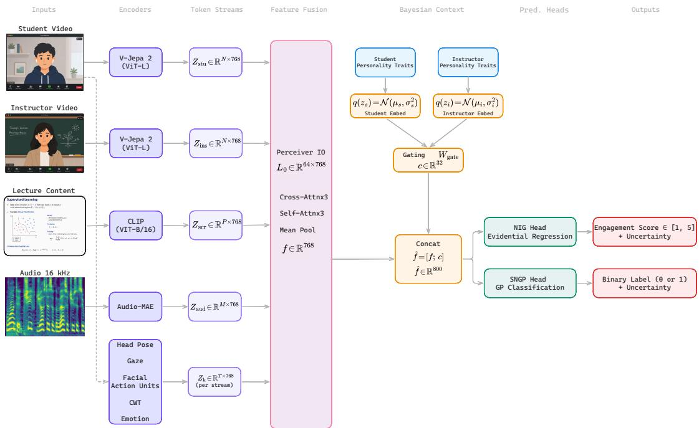

# Mind the Student: Behavioral and Contextual Cues for Automated Engagement Prediction in Online Learning

Alperen Kantarcı✉∗ Institute of Computer Science Goethe University Frankfurt Frankfurt am Main, Germany kantarci@em.uni-frankfurt.de

Visvanathan Ramesh Institute of Computer Science Goethe University Frankfurt   
The Hessian Center for Artificial Intelligence Frankfurt am Main, Germany   
vramesh@em.uni-frankfurt.de   
Gemma Roig   
Institute of Computer Science   
Goethe University Frankfurt   
The Hessian Center for Artificial   
Intelligence   
Frankfurt am Main, Germany   
roignoguera@em.uni-frankfurt.de

## Abstract

The prediction of student engagement from the online tutoring videos is dificult because engagement is a multidimensional construct comprising distinct behavioral, emotional, and cognitive states. A reliable prediction requires bringing together diferent types of behavioral signals as well as expressive cues. Through our analysis of the CASED dataset, it is clear that engagement prediction gets even harder due to the high inter-person variability as well as the subjectivity of the engagement annotation. To tackle these challenges, we develop a multimodal framework that integrates the implicit spatiotemporal features extracted from pretrained video, audio, and image encoders along with structured behavioral modalities like head pose, gaze, facial action units, emotion, and wavelet-based audio features. We integrate these modalities via a Perceiver IO latent bottleneck. Moreover, student and instructor personalities are modeled as variational posteriors over learnable embeddings to enable partial pooling across participants. We employ evidential regression and spectral-normalized Gaussian process classification heads for uncertainty-aware prediction to fur ther improve robustness and calibration. Benchmark on the CASED challenge test set shows that all participating methods converge near random-chance performance, revealing the dificulty of the dataset. In this highly ambiguous regime, our framework achieves competitive performance while uniquely ofering well-calibrated uncertainty metrics, demonstrating that reliable risk-quantification is an essential prerequisite for deploying engagement models in real-world educational tools.

## CCS Concepts

• Computing methodologies → Multi-task learning; Computer vision representations; • Applied computing → Interactive learning environments.

## ACM Reference Format:

Alperen Kantarcı, Visvanathan Ramesh, and Gemma Roig. 2026. Mind the Student: Behavioral and Contextual Cues for Automated Engagement Prediction in Online Learning. In INTERNATIONAL CONFERENCE ONMULTI-MODAL INTERACTION (ICMI ’26), October 05–09, 2026, Napoli, Italy. ACM, New York, NY, USA, 5 pages. https://doi.org/10.1145/3776574.3832485

## 1 Introduction and Background

Student engagement is widely recognized as a fundamental prerequisite for efective learning and academic success [4, 5]. From the perspective of educational psychology, engagement is a multidimensional construct with behavioral, emotional, cognitive, and social dimensions that collectively reflect a learner’s involvement in the educational process. High levels of engagement have been associated with improved learning outcomes, higher knowledge retention, enhanced motivation, and reduced dropout rates [6]. Therefore, understanding and analyzing student engagement is an important objective for educational researchers.

A significant challenge is that engagement indicators are distributed across diferent modalities. A student’s face and posture can reflect their attention, or an instructor’s behavior can influence responsiveness. The screen content can afect cognitive load and audio can convey speech-based information [3]. Moreover, these signals are not equally informative in every instance. For example, gaze direction may become unreliable when the face is partially obscured, or emotion predictions may become unstable at low resolutions. This necessitates the development of architectures capable of integrating diverse modalities while remaining robust against varying signal quality.

The CASED [16, 21] challenge reflects this dificulty. Predicting student engagement from short clips of online tutoring sessions is complicated by several factors: limited training data, substantial inter-person variability, the inherent subjective nature of engagement annotation [11, 12]. In these settings, predicting performance can be near-random or weakly above-baseline results. This can indicate not only model limitations but also dataset ambiguity, label noise, or insuficient signal in the available observations. Therefore, methods for this task should be evaluated not only by predictive accuracy, but also by how well they handle uncertainty, exploit multimodal structure, and generalize to unseen students.

To this end, we present a multimodal engagement prediction framework that combines behavioral cues using large pretrained encoders, eficient multimodal fusion, participant-level Bayesian context modeling, and uncertainty-aware prediction heads. Particulary, we extract explicit behavioral features including head pose, gaze, facial action units, emotion estimates and more generic representations from student video, instructor video, screen content and audio. These various features are fused using Perceiver IO [9] which is an modality-agnostic asymmetric attention mechanism. We also introduce a hierarchical Bayesian context layer over student and instructor embeddings with partial pooling toward a shared prior to model person-specific efects without encouraging identity memorization.

  
Figure 1: Overview of the proposed multimodal engagement framework. Multi-source inputs (student/instructor video, slides, audio, and behavioral cues) are encoded via specialized models and fused using a Perceiver IO block to form the core feature representation (d=768) This is combined with a personality-driven Bayesian Context embedding via a gating mechanism. The final concatenated representation (d=32) feeds into an Evidential Regression head and a GP Classification head to simultaneously predict engagement levels and explicit epistemic uncertainty.

## 1.1 Proposed method

Given a video clip � , we jointly predict a continuous engagement score $y \in \left[ 1 , 5 \right]$ and a binary label $\ell \in \{ 0 , 1 \}$ . Each clip is associated with a student identity �, an instructor identity �, and optional personality vectors $t _ { s } , t _ { i } \in \mathbb { R } ^ { 1 0 }$ . Evaluation uses a student-independent split which means training and testing sets have diferent students.

Each clip is decomposed into student video, instructor video, screen content, audio, and explicit behavioral features. For 1280 × 1280 composite videos, we crop fixed student, instructor, and screen regions, resize them to 224 × 224, and uniformly sample $T = 6 4$ frames for student and instructor streams. Audio is resampled to 16 kHz mono and converted to a Kaldi filterbank [19] spectrogram of shape (1024, 128).

We use pretrained encoders for the main modalities: V-JEPA 2 [2] for student and instructor video, CLIP [20] for the screen content, and AudioMAE [8] for the spectrogram. Overall architecture visualization can be seen in Figure 1. Their outputs are projected to a shared dimension, d=768. We utilize a single Linear Layer for each modality, followed by Layer Normalization to stabilize the inputs before they enter the Perceiver IO bottleneck. $Z _ { \mathrm { s t u d e n t } } , Z _ { \mathrm { i n s t r u c t o r } } \in \mathbb { R } ^ { N \times 7 6 8 } , \quad \dot { Z } _ { \mathrm { s c r e e n } } \in \mathbb { R } ^ { P \times 7 6 8 } , \quad Z _ { \mathrm { a u d i o } } \in \mathbb { R } ^ { M \times 7 6 8 } .$

We additionally extract five explicit feature streams at $T = 6 4 \cdot$ head pose, CWT head dynamics, facial action units, gaze/head angles, and emotion prediction probabilities. Each feature sequence $\boldsymbol { F _ { k } } ^ { \prime } \in \mathbb { R } ^ { T \times d _ { k } }$ is linearly projected as $Z _ { k } = F _ { k } W _ { k } \in \mathbb { R } ^ { T \times 7 6 8 }$

All token streams are fused with Perceiver IO [9]. Let M be the set of modalities and $e _ { c _ { k } }$ the learned embedding for modality �. The input token set is

$$
X = \mathrm { c o n c a t } \left[ Z _ { k } + e _ { c _ { k } } \mid k \in \mathcal { M } \right] \in \mathbb { R } ^ { T _ { \mathrm { t o t a l } } \times 7 6 8 } .\tag{1}
$$

A latent array $L _ { 0 } \in \mathbb { R } ^ { Q \times 7 6 8 }$ with $Q = 6 4$ queries is updated for $L = 3$ layers via cross-attention to � and latent self-attention. The fused representation is obtained by mean pooling:

$$
f = \mathrm { m e a n } ( \mathrm { L N } ( L _ { L } ) ) \in \mathbb { R } ^ { 7 6 8 } .\tag{2}
$$

Bayesian Participant Context: To model stable person-specific efects, we assign each student � and instructor � a variational embedding:

$$
q ( z _ { s } ) = N ( \mu _ { s } , \mathrm { d i a g } ( \exp ( \sigma _ { s } ^ { 2 } ) ) ) , \quad q ( z _ { i } ) = N ( \mu _ { i } , \mathrm { d i a g } ( \exp ( \sigma _ { i } ^ { 2 } ) ) ) .\tag{3}
$$

Embeddings are sampled using the reparameterization trick at the training time. Posterior means are used, and unseen students receive a learned prior mean $\mu _ { \mathrm { p r i o r } }$ during the inference.

When personality metadata are available, they are added through

$$
\tilde { z } _ { s } = z _ { s } + m \ \mathrm { t a n h } ( W _ { \mathrm { t r a i t } } t _ { s } ) ,\tag{4}
$$

where � is a binary mask dropped during training and set to zero at test time. Student and instructor context are combined by $c = \sigma ( W _ { \mathrm { g a t e } } [ \tilde { z } _ { s } ; \tilde { z } _ { i } ] ) \in \mathbb { R } ^ { 3 2 }$ , and concatenated with the fused representation: $\hat { f } = [ f ; c ] \in \mathbb { R } ^ { 8 0 0 }$

A KL penalty regularizes participant posteriors toward a shared prior:

$$
\mathcal { L } _ { \mathrm { K L } } = \frac { 1 } { N } \sum _ { s } D _ { \mathrm { K L } } \left( N ( \mu _ { s } , \sigma _ { s } ^ { 2 } ) \parallel N ( \mu _ { \mathrm { p r i o r } } , I ) \right) .\tag{5}
$$

Uncertainty-Aware Prediction Heads: For regression, we use an evidential Normal-Inverse-Gamma (NIG) head [1], which predicts $( \gamma , \nu , \alpha , \beta )$ , where $\gamma$ is the engagement estimate and the remaining parameters define predictive uncertainty. The corresponding aleatoric and epistemic uncertainties are $\beta / ( \alpha - 1 )$ and $\beta / ( \nu ( \alpha - 1 ) )$ .

For classification, we use a spectral-normalized neural Gaussian process (SNGP) head [17], with predictive probability

$$
p ( \ell = 1 \mid \hat { f } ) = \sigma \left( \frac { w ^ { \top } \hat { f } } { \sqrt { 1 + \pi \kappa ^ { 2 } / 8 } } \right) ,\tag{6}
$$

where $\kappa ^ { 2 }$ is the predictive variance.

Training Objective: The total loss is

$$
\mathcal { L } = \frac { \left( \lambda _ { \mathrm { N I G } } \mathcal { L } _ { \mathrm { N I G } } + \lambda _ { \mathrm { C C C } } \mathcal { L } _ { \mathrm { C C C } } \right) } { e ^ { \sigma _ { r } } } + \sigma _ { r } + \frac { \left( \lambda _ { \mathrm { c l s } } \mathcal { L } _ { \mathrm { c l s } } + \lambda _ { \mathrm { o r d } } \mathcal { L } _ { \mathrm { o r d } } \right) } { e ^ { \sigma _ { c } } } + \sigma _ { c } + \mathcal { L } _ { \mathrm { K L } } ,\tag{7}
$$

where $\sigma _ { r } , \sigma _ { c }$ are learnable task-uncertainty weights [10]. We use NIG loss and CCC loss for regression, weighted cross-entropy for classification, and an auxiliary ordinal consistency loss coupling regression and classification outputs.

Optimization and Ensemble: We train with AdamW [18], weight decay $5 \times 1 0 ^ { - 2 }$ , cosine decay, and 5% warmup. Backbone encoders use learning rate $1 0 ^ { - 5 }$ , while newly initialized layers use $5 \times 1 0 ^ { - 4 }$ Training is staged: encoders are frozen for epochs 1–20 and unfrozen until the convergance. We additionally use random temporal sampling, metadata dropout, and KL (Kullback-Leibler) annealing. For our final predictions we use four diferent training checkpoints of the same model as ensemble of networks and do a majority voting on the predictions.

## 2 Experiments and Dataset Analysis

We use DaiSEE [7] and Af-Wild2 [13–15] datasets for pretraining and CASED [16, 21] dataset for fine-tuning. We evaluate under a strict student-independent protocol. For our trainings and validation experiments, we use 5-fold cross-validation with student-level fold assignment. Final leaderboard performances are reported from CASED test set. We report F1 Macro, F1 Weighted, MCC, RMSE, MSE, MAE, �2, Pearson Correlation and Concordance Correlation Coeficient (CCC) depending on Classification and regression tasks.

## 2.1 Dataset analysis

The binary label distribution is highly skewed: approximately 69% of clips are labeled engaged (label 0) and 31% not-engaged (label 1). The continuous engagement scores are similarly compressed, with mean 3.7 and median 4.0, producing a long lower tail. A majorityclass classifier therefore achieves approximately 40–45% macro F1 without learning any discriminative features.

Student Analysis: Individual students difer substantially in their mean engagement level and within-session variability. Several students are labeled engaged in over 90% of their clips while others fall below 40%. This hints that a large fraction of the label variance is explained by between-student diferences rather than withinclip behavioral dynamics, which directly limits what any clip-level visual model can learn.

Instructor Analysis: Per-instructor engagement rates do not vary systematically. All three instructors have 3.37 mean engagement with similar standard deviation. Around 68% of clips are labeled as engaged for all instructors. Furthermore, all students are paired with exactly one instructor across all sessions, making student and instructor identity perfectly collinear.

## 3 Results

Table 1 and Table 2 summarize the oficial challenge leaderboard for the classification and regression tracks. Our method performs competitively among participating teams. However, the margin between the top methods is small. Best-performing method obtained a F1 Macro of 0.52, suggesting that all approaches face with similar limitations imposed by the dataset and the task. Other metrics also show very similar performances. In the regression task, our approach achieved a matching or closely matching the bestperforming methods. However, all submissions obtained near-zero or negative values for $R ^ { 2 } { } _ { ; }$ , Pearson correlation, and CCC, indicating that none of the evaluated methods was able to reliably capture the underlying engagement signal. Collectively, the leaderboard suggests that the proposed framework performs competitively while highlighting the intrinsic dificulty of automatic engagement prediction on this benchmark.

Table 1: Classification performance of participating methods on the CASED challenge test set.
<table><tr><td>Participant</td><td>F1 (Macro)</td><td>F1 (Weighted)</td><td>Precision</td><td>Recall</td><td>MCC</td></tr><tr><td>saurabhh</td><td>0.52</td><td>0.60</td><td>0.52</td><td>0.52</td><td>0.04</td></tr><tr><td>mohitvu</td><td>0.52</td><td>0.61</td><td>0.52</td><td>0.52</td><td>0.04</td></tr><tr><td>adim66</td><td>0.51</td><td>0.58</td><td>0.51</td><td>0.52</td><td>0.03</td></tr><tr><td>Ours</td><td>0.51</td><td>0.60</td><td>0.51</td><td>0.51</td><td>0.02</td></tr><tr><td>priscalab</td><td>0.51</td><td>0.60</td><td>0.51</td><td>0.51</td><td>0.01</td></tr><tr><td>caymann</td><td>0.50</td><td>0.58</td><td>0.50</td><td>0.50</td><td>0.01</td></tr><tr><td>KvochurHegel</td><td>0.42</td><td>0.59</td><td>0.35</td><td>0.50</td><td>0.00</td></tr></table>

Table 2: Regression performances on the CASED challenge test set.
<table><tr><td>Participant</td><td>RMSE</td><td>MSE</td><td>MAE</td><td> $R ^ { 2 }$ </td><td>Pearson</td><td>CCC</td></tr><tr><td>saurabhh</td><td>0.68</td><td>0.46</td><td>0.57</td><td>-0.01</td><td>-0.00</td><td>-0.00</td></tr><tr><td>mohitvu</td><td>0.78</td><td>0.61</td><td>0.63</td><td>-0.33</td><td>-0.00</td><td>-0.00</td></tr><tr><td>Ours</td><td>0.68</td><td>0.46</td><td>0.57</td><td>-0.00</td><td>-0.02</td><td>-0.00</td></tr><tr><td>priscalab</td><td>0.68</td><td>0.47</td><td>0.57</td><td>-0.02</td><td>0.01</td><td>0.00</td></tr><tr><td>caymann</td><td>0.68</td><td>0.47</td><td>0.57</td><td>-0.01</td><td>0.03</td><td>0.01</td></tr><tr><td>KvochurHegel</td><td>0.68</td><td>0.47</td><td>0.57</td><td>-0.01</td><td>-0.03</td><td>-0.00</td></tr></table>

Multimodal and Component Ablation. We evaluate the impact of diferent modality combinations and architectural components on engagement prediction. As shown in Table 3, the inclusion of all three modalities—Student, Instructor, and Content (S+I+C)—yields the highest performance, achieving a CCC of 0.018 and an F1-macro score of 0.498. This confirms that student engagement is heavily contextual and benefits from integrating student behavior alongside instructor and screen dynamics. In the component ablation Table 3, the Full Model outperforms or remains highly competitive with alternative configurations. The base transformer baseline achieves lower RMSE and MAE. The integration of the Bayesian Context layer, NIG and SNGP heads optimizes macro-level classification and alignment metrics, yielding the top F1-macro and a strong CCC scores.

Table 3: Ablation study. (a) Modality contribution using the full model (BayesianContext + NIG + SNGP). (b) Component contribution on the three-modality input (S=student video, I=instructor video, C=content). Metrics are averaged over 5 student-grouped cross-validation folds.
<table><tr><td>Model</td><td>Modalities</td><td>CCC↑</td><td>RMSE ↓</td><td>MAE↓</td><td>F1-macro ↑</td><td>MCC↑</td></tr><tr><td colspan="7">(a) Modality ablation — Full model</td></tr><tr><td>Full (S)</td><td>Student</td><td>-0.016 ±0.027</td><td>1.048 ±0.060</td><td>0.848 ±0.046</td><td>0.486 ±0.015</td><td>-0.002 ±0.029</td></tr><tr><td>Full (S+I)</td><td>Student + Instructor</td><td>-0.021 ±0.016</td><td>1.020 ±0.119</td><td>0.832 ±0.111</td><td>0.484 ±0.022</td><td>-0.011 ±0.016</td></tr><tr><td>Full (S+I+C)</td><td>Student + Instructor + Content</td><td>0.018 ±0.029</td><td>0.943 ±0.038</td><td>0.755 ±0.040</td><td>0.498 ±0.019</td><td>0.002 ±0.034</td></tr><tr><td colspan="7">(b) Component ablation — Full modality set (S+I+C)</td></tr><tr><td>Base Transformer</td><td>S+I+C</td><td>0.015 ±0.028</td><td>0.821 ±0.022</td><td>0.671 ±0.026</td><td>0.497 ±0.013</td><td>0.012 ±0.019</td></tr><tr><td>+ NIG + SNGP</td><td>S+I+C</td><td>0.008 ±0.018</td><td>0.935 ±0.098</td><td>0.759 ±0.093</td><td>0.491 ±0.017</td><td>0.002 ±0.016</td></tr><tr><td>+ Bayesian Context</td><td>S+I+C</td><td>0.019 ±0.021</td><td>0.848 ±0.047</td><td>0.691 ±0.041</td><td>0.492 ±0.018</td><td>0.017 ±0.007</td></tr><tr><td>Full Model (Ours)</td><td>S+I+C</td><td>0.018 ±0.029</td><td>0.943 ±0.038</td><td>0.755 ±0.040</td><td>0.498 ±0.019</td><td>0.002 ±0.034</td></tr></table>

Uncertainty Decomposition. Table 4 analyzes the uncertainty captured by the NIG regression head across diferent ground-truth engagement levels. Total uncertainty is heavily dominated by epistemic uncertainty across all bins. Pearson correlation coeficients show negligible linear relationships between raw engagement scores and both aleatoric and epistemic uncertainties, indicating that model confidence is driven by factors other than the absolute magnitude of the engagement score itself.

Bayesian Context Layer Personalization. We evaluate the behavioral shifts in the learned identity embeddings via the KL divergence from the population prior. Table 5 shows student identities experience a higher deviation from the population prior (mean KL=14.32) compared to instructor identities (mean KL=13.12), indi cating stronger personalization for individual learners. Moreover, statistical analysis reveals a strong, significant negative correlation between a student’s clip count and their KL divergence from the prior (r=-0.748, p=0.001). This suggests that the model applies aggressive, highly individualized posterior shifts to sparse data. Conversely, students with abundant training clips converge closer to a well-regularized population norm.

Table 4: NIG uncertainty decomposition by engagement level. Samples are grouped into five equal-width bins on the 1–5 continuous engagement scale.
<table><tr><td>Engagement Level</td><td>N</td><td>Mean Pred</td><td>Aleatoric ↓</td><td>Epistemic ↓</td><td>Total</td></tr><tr><td>1.0-1.8</td><td>41</td><td>3.45</td><td>42.0879</td><td>3323.3606</td><td>3365.4482</td></tr><tr><td>1.9-2.6</td><td>657</td><td>3.37</td><td>33.1598</td><td>2623.2993</td><td>2656.4590</td></tr><tr><td>2.7-3.4</td><td>1447</td><td>3.36</td><td>34.5978</td><td>2726.2368</td><td>2760.8345</td></tr><tr><td>3.5-4.2</td><td>2398</td><td>3.38</td><td>34.7966</td><td>2802.9478</td><td>2837.7444</td></tr><tr><td>4.3-5.0</td><td>435</td><td>3.42</td><td>36.4595</td><td>3008.4961</td><td>3044.9551</td></tr></table>

Pearson � (engagement vs aleatoric): 0.016; vs epistemic: 0.025.

Table 5: Bayesian context layer posterior statistics. The KL divergence from the population prior and the posterior mean norm are shown.
<table><tr><td>Entity</td><td>Name</td><td>KL from Prior ↓</td><td>l|μ||2</td><td>N Clips</td></tr><tr><td>All students (mean)</td><td></td><td>14.3253</td><td>0.0273</td><td>116</td></tr><tr><td>All instructors (mean)</td><td></td><td>13.1287</td><td>0.0167</td><td>1659</td></tr><tr><td colspan="5">Top-3 students by KL (most personalized)</td></tr><tr><td>Student</td><td>laurencedu</td><td>15.7200</td><td>0.0257</td><td>26</td></tr><tr><td>Student</td><td>pierreyoussef</td><td>15.4660</td><td>0.0795</td><td>50</td></tr><tr><td>Student</td><td>richard</td><td>15.2584</td><td>0.0311</td><td>55</td></tr><tr><td colspan="5">Bottom-3 students by KL (least personalized)</td></tr><tr><td>Student</td><td>administrator</td><td>13.4648</td><td>0.0191</td><td>116</td></tr><tr><td>Student</td><td>sophie</td><td>13.3617</td><td>0.0205</td><td>129</td></tr><tr><td>Student</td><td>akhat</td><td>12.6692</td><td>0.0165</td><td>246</td></tr><tr><td colspan="5">Instructors</td></tr><tr><td>Instructor</td><td>Nigel Lu</td><td>11.7067</td><td>0.0149</td><td>706</td></tr><tr><td>Instructor</td><td>Pierre</td><td>11.4088</td><td>0.0122</td><td>1454</td></tr><tr><td>Instructor</td><td>Catherine</td><td>11.2344</td><td>0.0111</td><td>2818</td></tr></table>

## 4 Limitations and Discussion

The proposed method has several limitations due to both data and architectural choices. Most of evaluated configurations on test set yield validation CCC below 0.02 and F1-macro not more than 0.52, indicating models do not consistently outperform a constant mean predictor. There are several possible reasons for this. First, the not-engaged class drives the dominant failure mode. Clips near the Likert midpoint occupy an annotation boundary where small annotator perturbations flip the binary label. Secondly, most of representations remain identity-discriminative, causing the model to fit student appearance rather than engagement dynamics. The population prior in the Bayesian context layer is too weakly constrained to compensate. Finally, each clip receive a single label while Perceiver IO mean-pools over 64 frames, suppressing within-clip fluctuations. Finer-grained temporal supervision would be helpful for detecting small engagement cues.

## 5 Conclusion

We presented a multimodal engagement prediction framework that jointly addresses regression and classification under uncertainty by combining Perceiver IO [9] fusion,a hierarchical Bayesian context layer, evidential NIG regression, SNGP classifier. Our ablation study reveals that combination of student, instructor, screen provides the lowest error across all metrics. The Bayesian context layer learns distinguishable per-student posteriors, with a strong negative correlation between clip count and KL divergence from the population prior, confirming that hierarchical regularisation correctly controls personalization as a function of data availability. On the CASED challenge leaderboard the system achieves competitive regression performance while producing calibrated epistemic uncertainty estimates at inference time. As a future work extending the Bayesian context layer with explicit personality-trait conditioning and cross-session identity tracking are promising directions for further improving personalised engagement modelling.

## Safe and Responsible Innovation Statement

This work processes video recordings of students in tutoring sessions, raising inherent privacy concerns. All data used in this study was collected under informed consent as part of the CASED [16, 21] challenge, DaiSEE [7] and Af-Wild2 [13–15] datasets. The model relies on face analysis and behavioral signal extraction, which may exhibit performance disparities across demographic groups not well-represented in the relatively small training cohort. The system is intended as a research tool for understanding engagement dy namics, not as a surveillance or performance evaluation instrument for deployed educational settings.

## References

[1] Alexander Amini, Wilko Schwarting, Ava Soleimany, and Daniela Rus. 2020. Deep evidential regression. Advances in neural information processing systems 33 (2020), 14927–14937.

[2] Mido Assran, Adrien Bardes, David Fan, Quentin Garrido, Russell Howes, Matthew Muckley, Ammar Rizvi, Claire Roberts, Koustuv Sinha, Artem Zholus, et al. 2025. V-jepa 2: Self-supervised video models enable understanding, prediction and planning. arXiv preprint arXiv:2506.09985 (2025).

[3] Cintia Bali, Buket Tasdelen, Szabolcs Bandi, and András Zsidó. 2026. Understand ing the cognitive cost of multimedia learning: efects of visual load and language proficiency. Cognitive Research: Principles and Implications 11, 1 (2026), 2.

[4] Nina Bergdahl, Melissa Bond, Jeanette Sjöberg, Mark Dougherty, and Emily Oxley. 2024. Unpacking student engagement in higher education learning analytics: a systematic review. International Journal ofEducational Technology in Higher Education 21, 1 (2024), 63.

[5] {Jeremy D.} Finn and {Kayla S.} Zimmer. 2012. Student engagement: What is it? Why does it matter? Springer US, United States, 97–131. Publisher Copyright: © Springer Science+Business Media, LLC 2012. All rights reserved.. doi:10.1007/978- 1-4614-2018-7\_5

[6] Jennifer A Fredricks, Phyllis C Blumenfeld, and Alison H Paris. 2004. School engagement: Potential of the concept, state of the evidence. Review ofeducational research 74, 1 (2004), 59–109.

[7] Abhay Gupta, Arjun D’Cunha, Kamal Awasthi, and Vineeth Balasubramanian. 2016. Daisee: Towards user engagement recognition in the wild. arXiv preprint arXiv:1609.01885 (2016).

[8] Po-Yao Huang, Hu Xu, Juncheng Li, Alexei Baevski, Michael Auli, Wojciech Galuba, Florian Metze, and Christoph Feichtenhofer. 2022. Masked autoencoders that listen. Advances in neural information processing systems 35 (2022), 28708– 28720.

[9] Andrew Jaegle, Sebastian Borgeaud, Jean-Baptiste Alayrac, Carl Doersch, Catalin Ionescu, David Ding, Skanda Koppula, Andrew Brock, Evan Shelhamer, Olivier J. H’enaf, Matthew M. Botvinick, Andrew Zisserman, Oriol Vinyals, and João Carreira. 2021. Perceiver IO: A General Architecture for Structured Inputs & Outputs. ArXiv abs/2107.14795 (2021). https://api.semanticscholar.org/CorpusID: 236635379

[10] Alex Kendall, Yarin Gal, and Roberto Cipolla. 2018. Multi-task learning using uncertainty to weigh losses for scene geometry and semantics. In Proceedings of the IEEE conference on computer vision and pattern recognition. 7482–7491.

[11] Shehroz Khan and Sadaf Safa. 2024. Revisiting Annotations in Online Student Engagement. In Proceedings of the 2024 10th International Conference on Computing and Data Engineering (Bangkok, Thailand) (ICCDE ’24). Association for Computing Machinery, New York, NY, USA, 111–117. doi:10.1145/3641181.3641186

[12] Shehroz S. Khan, Alireza Abedi, and Tracey J. F. Colella. 2022. Inconsistencies in Measuring Student Engagement in Virtual Learning - A Critical Review. ArXiv abs/2208.04548 (2022). https://api.semanticscholar.org/CorpusID:251442804

[13] Dimitrios Kollias. 2022. ABAW: Learning from Synthetic Data & Multi-Task Learning Challenges. arXiv preprint arXiv:2207.01138 (2022).

[14] Dimitrios Kollias. 2022. Abaw: Valence-arousal estimation, expression recognition, action unit detection & multi-task learning challenges. In Proceedings of the IEEE/CVF Conference on Computer Vision and Pattern Recognition. 2328–2336.

[15] Dimitrios Kollias and Stefanos Zafeiriou. 2021. Analysing afective behavior in the second abaw2 competition. In Proceedings ofthe IEEE/CVF International Conference on Computer Vision. 3652–3660.

[16] Jialin Li, Gulshan Sharma, and Hanan Salam. 2025. Personality-Aware Engagement Prediction in Online Learning. In Proceedings of the 3rd International Workshop on Multimodal and Responsible Afective Computing (Ireland) (MRAC ’25). Association for Computing Machinery, New York, NY, USA, 119–127. doi:10.1145/3746270.3760234

[17] Jeremiah Liu, Zi Lin, Shreyas Padhy, Dustin Tran, Tania Bedrax Weiss, and Balaji Lakshminarayanan. 2020. Simple and principled uncertainty estimation

with deterministic deep learning via distance awareness. Advances in neural information processing systems 33 (2020), 7498–7512.

[18] Ilya Loshchilov and Frank Hutter. 2019. Decoupled Weight Decay Regularization. In 7th International Conference on Learning Representations, ICLR 2019, New Orleans, LA, USA, May 6-9, 2019. OpenReview.net. https://openreview.net/forum? id=Bkg6RiCqY7

[19] Daniel Povey, Arnab Ghoshal, Gilles Boulianne, Lukas Burget, Ondrej Glembek, Nagendra Goel, Mirko Hannemann, Petr Motlicek, Yanmin Qian, Petr Schwarz, et al. 2011. The Kaldi speech recognition toolkit. In IEEE 2011 workshop on automatic speech recognition and understanding. IEEE Signal Processing Society.

[20] Alec Radford, Jong Wook Kim, Chris Hallacy, Aditya Ramesh, Gabriel Goh, Sandhini Agarwal, Girish Sastry, Amanda Askell, Pamela Mishkin, Jack Clark, et al. 2021. Learning transferable visual models from natural language supervision. In International conference on machine learning. PmLR, 8748–8763.

[21] Gulshan Sharma, Jialin Li, and Hanan Salam. 2026. SMART Challenge Series: Context-Aware Student Engagement Detection. doi:10.5281/zenodo.19322996