# NeuralParker: A Reinforcement Learning Planner for Irregular

Parking Environments

Zihan Wang , Bai Huang , Yang Guan , Xiao Li, Haoyu Xu, Naizheng Wang, and Shengbo Eben Li

Abstract—Automated parking commonly assumes marked slots and short approach maneuvers. Delivery and service vehicles, however, may need to reach an operator-specified pose in an irregular bounded environment from a distant start. Existing learning-based parking planners often rely on local observations, which can restrict long-range route reasoning. To address this problem, we present NeuralParker, a reinforcement learningbased hybrid planner for arbitrary-pose parking. NeuralParker encodes full-environment obstacle and boundary geometry in a target-relative vertex representation, allowing the policy to retain route-defining context throughout the approach. It further couples a learned curvature–length arc policy with an in-loop terminal ensemble that selects from diverse cubic Hermite connections using a curvature-regularized cost. We also establish factorial and long-range route-choice benchmarks to evaluate planning success and trajectory quality. Experiments on these benchmarks show that NeuralParker achieves higher planning success and better overall trajectory quality than the evaluated baselines, while ablation studies support the benefits of the targetrelative global representation and terminal ensemble. Finally, a real-vehicle evaluation confirms that the planner transfers efectively to real delivery-vehicle perception at a working parking site, planning successfully at low computational cost.

Index Terms—Automated parking, path planning, reinforcement learning.

## I. Introduction

UTOMATED parking is a representative low-speed motion-planning task for autonomous vehicles [1], [2]. Most formulations ask a nonholonomic vehicle to enter a marked parallel or perpendicular slot from a nearby aisle. Freight, delivery, and service vehicles face a broader requirement: an infrastructure map, task planner, or operator may specify an exact pose beside a pallet, loading point, or service entrance [3]. The vehicle may begin far from this target, and the drivable region may contain nonconvex boundaries, pockets, corridors, and irregularly placed obstacles. We refer to this setting as arbitrary-pose parking in an irregular environment:

the goal is task-defined rather than slot-defined, and planning must cover both the approach and the final maneuver.

Existing parking planners broadly fall into two groups: traditional model-based planners and planners with learned components. Within the latter, hybrid systems retain modelbased geometric stages. Traditional planners retain explicit vehicle kinematics and environment geometry throughout each query. Curvature-bounded connectors provide direct pose-topose connections [4], [5]; state-lattice and Hybrid $\mathbf { A } ^ { * }$ search extend geometric reasoning to obstacle-rich spaces [6], [7]; and constrained optimization enforces kinematic and collision constraints [8], [9]. Hierarchical systems further decompose long-horizon parking into route planning, local maneuvering, and trajectory repair [10]. These methods provide explicit map-based feasibility reasoning and remain strong geometric baselines. For distant starts in irregular environments, they solve a search, trajectory-repair, or nonlinear optimization problem at query time. Planners with learned components instead amortize maneuver selection over a training distribution.

Planners with learned components difer in both training paradigm and planning architecture. Direct reinforcementlearning (RL) policies learn maneuvers from compact states or local range observations [11]–[13], whereas imitation-learning systems predict waypoints or motion segments from camera or bird’s-eye-view features [14]–[16]. At the architectural level, hybrid planners retain geometric stages: HOPE and RL-OGM combine a learned local planner with analytic completion, whereas N3P predicts an intermediate pose for subsequent geometric planning [17]–[19]. Despite this progress, three design and evaluation issues are central to the setting considered here. First, compact, ego-centered, or finite-range observations omit target-side geometry before a long-range approach is chosen, so the policy needs full-environment context alongside nearfield clearance sensing. Second, expanding an analytic connector changes the approach states from which a terminal connection can be found and accepted, and its interaction with policy training calls for controlled evidence. Third, representative evaluations cover variations in slot type, clearance, obstacle layout, or spatial confinement [13], [17], [20], so long-range route choice calls for tests that separate full-set success rate from common-success trajectory quality. Together, these issues motivate a coordinated treatment of full-environment representation, terminal-connector design, and benchmark construction for distant-start arbitrary-pose parking.

We address these issues with NeuralParker. The target defines a common coordinate frame in which polygonal obstacles, circular obstacles, and environment boundaries are represented as vertices within a fixed object budget; a stream of footprint-rectified local LiDAR clearance rays computed from the same geometry provides near-field input. An attentionbased policy maps these observations to curvature–length arcs. After each collision-free, nonterminal learned arc that satisfies a target-frame heading gate, an in-loop cubic-Hermite ensemble varies terminal-pose hypotheses and both endpoint tangent scales, rejects candidates that violate the sampled geometry or curvature constraints, and selects a low-cost feasible connection. Training and evaluation use the same feasibility, selection, and terminal-cost rules.

The contributions are:

• We introduce a target-relative vertex representation that augments local clearance rays with full-environment obstacle and boundary geometry. Against a local-only observation and a pretrained bird’s-eye-view raster, it gives the best success rate and path quality under two diferent policy backbones, and needs no image rendering or autoencoder pretraining.

• We introduce a curvature-regularized Hermite terminal ensemble that replaces a fixed connector with a diverse candidate set under a shared curvature-aware cost. It improves success rate and path quality when substituted at evaluation time alone, and the gains persist when the policy is trained through the same rule.

• We establish factorial and long-range route-choice benchmarks that separate full-set success rate from commonsuccess trajectory quality, and report that NeuralParker attains the highest success rate on both benchmarks together with the shortest and smoothest trajectories among the compared planners.

The remainder of this article is organized as follows. Section II reviews traditional and learning-based parking planners. Section III presents the observation, arc policy, terminal ensemble, and training objective. Section IV describes the benchmarks, baselines, and metrics, and Section V reports the full-system comparison, the two ablations, and the real-vehicle experiment. Section VI concludes the article.

## II. Related Work

We review parking planners along the two axes that this work couples: how the environment is represented, and how the final pose is reached. Traditional planners are considered first, then learning-based and hybrid planners.

## A. Traditional Parking Planners

Traditional planners model vehicle kinematics and environment geometry explicitly. Dubins and Reeds–Shepp curves solve curvature-bounded pose connections, with reverse motion available in the latter; parking-specific arc–clothoid and parametric constructions adapt this idea to local maneuvers [4], [5], [21], [22]. These connectors are eficient when a direct boundary-value solution is feasible, but they require global planning when obstacles block it.

Global planners provide this reasoning through search, sampling, or optimization [1], [2]. State lattices and Hybrid $\mathbf { A } ^ { * }$ combine motion primitives with analytic expansion, and multiresolution or guided variants reduce search efort in constrained parking environments [6], [7], [23]–[25]. RRT-based planners explore continuous free space [26], [27], whereas optimization methods enforce kinematics and collision constraints through dynamic formulations, dual variables, or iteratively constructed corridors [8], [9], [28]. Hierarchical systems further select preparatory poses or couple long-horizon routing with local repair [10], [29]. These methods retain map-wide geometry and checked feasibility; NeuralParker keeps both properties in a learned policy that amortizes the repeated planning decisions.

## B. Learning-Based Parking Planners

Learning-based parking planners replace part of this geometric pipeline with a trained model. Deep-RL methods use compact target-relative states, local range or bird’s-eye-view (BEV) observations, and demonstrations to produce parking actions, including hierarchical, federated, and action-chunked variants [11]–[13], [32]–[36]. Imitation-learning systems instead predict waypoints or motion segments from surroundview or BEV features [14]–[16], [37]. These methods support direct maneuver generation but typically bind useful spatial context to a compact state, sensor horizon, local raster, or training trajectories. Structured vector encoders capture map elements for motion prediction and vectorized driving policies [38], [39]; NeuralParker applies related structured geometry to target-conditioned parking control.

Hybrid planners retain analytic stages. HOPE fuses finiterange obstacle distances, an ego-centered BEV crop, a relative target, and an action mask, and switches between learned increments and feasible Reeds–Shepp completion during training [17]. RL-OGM similarly combines a local LiDAR occupancy grid with Reeds–Shepp planning; DRIP difusion-refines an RL prior under spatial constraints; and N3P predicts a preparatory pose before Hybrid A\* and Reeds– Shepp stages [18]–[20]. These systems motivate learned– analytic coupling. We isolate the efect of expanding the analytic connector under both evaluation-only and matched train-and-evaluate interventions. HOPE, RL-OGM, and DRIP retain local obstacle context, whereas N3P makes the globalto-local handof an explicit staged decision. NeuralParker therefore studies full-environment target-relative geometry and connector–policy coupling as separate factors.

Beyond parking, RL also supports broader automateddriving decision and control. Integrated decision and control (IDC) trains an approximate constrained optimal-controlproblem (OCP) solver ofline for online path selection and tracking [30], and its enhanced formulation combines experience data with an analytic model, incorporates attentionbased road-user encoding, and was evaluated on an automated vehicle at a signalized intersection [31]. These systems share NeuralParker’s premise that a learned component can absorb repeated online optimization, applied there to structured onroad trafic and here to pose-defined parking in an irregular bounded region.

## III. Methodology

## A. Problem Definition and Evaluation Protocol

We model parking as a Markov decision process (MDP) $( S , { \mathcal { A } } , p , r )$ over a scenario distribution Ω. A scenario contains an ego pose, a target pose, static obstacles, and a bounded drivable region. The planner must produce a reference-point trace that passes the sampled obstacle and boundary checks and terminates within 0.1 m and $1 0 ^ { \circ }$ of the target. The policy is optimized with proximal policy optimization (PPO), a direct policy-gradient method based on a clipped surrogate objective [40], [41]:

$$
\arg \operatorname* { m a x } _ { \theta } \mathbb { E } [ \operatorname* { m i n } ( \rho _ { \theta } A , \operatorname { c l i p } ( \rho _ { \theta } , 1 - \epsilon , 1 + \epsilon ) A ) ] ,\tag{1}
$$

where $\rho _ { \theta } ~ = ~ \pi _ { \theta } ( a | o ) / \pi _ { \theta ^ { - } } ( a | o )$ . The policy observation � is specified below; the environment additionally retains the preceding action to evaluate curvature and gear-change costs.

We use one fixed full-range start protocol throughout. For each benchmark, initial poses are drawn once from the environment’s full-range sampler without distance rejection or banding, using sampling seed 0. We freeze 40 target-relative poses per test scene and replay exactly the same start sets for every method and policy-training seed: 1080 episodes for the 27-scene Factorial Parking Benchmark and 720 for the 18- scene Topology-Stress Benchmark. The sampling seed only identifies this frozen evaluation set and is independent of the policy-training seeds. Success is computed on every episode. In every comparative table, path length, full-trajectory reversals, and accumulated absolute curvature change are computed on one paired cohort: the episodes solved by all methods in that table. Method-specific own-success statistics are retained only as diagnostics and are not used as cross-method evidence.

## B. Target-Relative Full-Environment Observation

The policy receives

$$
o = ( s ^ { e } , s ^ { p } , s ^ { o } , s ^ { b } , s ^ { \ell } ) ,
$$

where $s ^ { e }$ is the ego state, $s ^ { p }$ polygonal-obstacle vertices, $s ^ { o }$ circular obstacles represented as octagons, $s ^ { b }$ boundary segments, and $s ^ { \ell }$ an optional local LiDAR stream. The reported experiments use 120 uniformly spaced ego-centric beams over $3 6 0 ^ { \circ }$ . Let $d _ { i }$ denote the reference-point distance to the first obstacle or boundary intersection, clipped at 10 m, and let $b _ { i }$ denote the direction-dependent distance from the reference point to the boundary of the rectangular vehicle footprint adopted from HOPE. The input to NeuralParker is the rectified clearance

$$
s _ { i } ^ { \ell } = \operatorname* { m a x } ( d _ { i } - b _ { i } , 0 ) .\tag{2}
$$

The ray-wise footprint correction in (2) is an observation convention; episode termination still uses the sampled referencepoint collision test defined above. Appendices A and B give the remaining NeuralParker and adapted-HOPE beam conventions, respectively. All other geometry is expressed in a targetrelative frame with the target at the origin and its heading aligned with the positive �-axis. Thus, unlike a range-limited crop, target-side geometry remains represented regardless of the ego–target separation.

Let the target pose in the world frame be $( p ^ { g } , \theta ^ { g } )$ . A point $q$ and heading � are transformed as

$$
\tilde { q } = R \left( \frac { \pi } { 2 } - \theta ^ { g } \right) ( q - p ^ { g } ) , \qquad \tilde { \theta } = \mathrm { w r a p } \left( \theta - \theta ^ { g } + \frac { \pi } { 2 } \right) ,\tag{3}
$$

so the same representation is invariant to translating or rotating the whole scene. Coordinates are not clipped by ego–target distance.

We apply (3) to every stored vertex and segment endpoint, so all geometry shares one metric frame. We store variablesize sets in fixed-capacity slots, fill unused slots with a sentinel value, and give every slot a learned positional embedding. The scene encoder applies self-attention to these fixed slots without passing an explicit padding mask to the attention layer. The object budget is 20 and overflow raises an error instead of silently discarding geometry.

## C. Arc Policy and Scene Encoder

The policy outputs one curvature–length arc,

$$
\boldsymbol { a } _ { t } = ( \kappa _ { t } , l _ { t } ) , \qquad \kappa _ { t } \in [ - 0 . 6 8 , 0 . 6 8 ] , \quad l _ { t } \in [ - 1 0 , 1 0 ] ,
$$

where the sign of $l _ { t }$ selects forward or reverse motion. For nonzero curvature, $r = 1 / \vert \kappa _ { t } \vert , \alpha = \vert l _ { t } \kappa _ { t } \vert$ , and the deterministic transition is

$$
\begin{array} { r l } & { x _ { t + 1 } ^ { e } = x _ { t } ^ { e } + \delta _ { l } \big [ r ( 1 - \cos \alpha ) \delta _ { \kappa } \sin \theta _ { t } ^ { e } + r \sin \alpha \cos \theta _ { t } ^ { e } \big ] , } \\ & { y _ { t + 1 } ^ { e } = y _ { t } ^ { e } + \delta _ { l } \big [ - r ( 1 - \cos \alpha ) \delta _ { \kappa } \cos \theta _ { t } ^ { e } + r \sin \alpha \sin \theta _ { t } ^ { e } \big ] , } \\ & { \theta _ { t + 1 } ^ { e } = \theta _ { t } ^ { e } - \delta _ { \kappa } \alpha , } \end{array}\tag{4}
$$

with $\delta _ { l } ~ = ~ \mathrm { s g n } ( l _ { t } )$ and $\delta _ { \kappa } ~ = ~ \mathrm { s g n } ( \kappa _ { t } )$ . Under this simulator convention, the signed length reverses the displacement, while the heading increment is independent of $\delta _ { l }$

The scene encoder shown in Fig. 1 embeds the ego, global-geometry, and optional local-range streams with streamspecific MLPs. Geometry tokens receive positional embeddings and are processed by self-attention [42]; the fused representation feeds actor and critic heads. For token matrix $Z ,$ one attention layer computes

$$
\mathrm { A t t n } ( Z ) = \mathrm { s o f t m a x } \left( \frac { ( Z W _ { Q } ) ( Z W _ { K } ) ^ { \top } } { \sqrt { d } } \right) Z W _ { V } ,
$$

followed by a feed-forward block and residual normalization. The actor parameterizes a diagonal Gaussian over the normalized two-dimensional action, while the critic estimates $V _ { \psi } ( o _ { t } )$

## D. In-Loop Hermite Terminal Ensemble

After a learned arc has been executed, collision checked, and tested for direct terminal success, the planner applies the Hermite connector only when the reached target-frame heading satisfies sin $\tilde { \theta } > 0$ . Within this gate, it tries a cubic Hermite connection

$$
\begin{array} { c } { { g ( t ) = ( 2 t ^ { 3 } - 3 t ^ { 2 } + 1 ) g ( 0 ) + ( 3 t ^ { 2 } - 2 t ^ { 3 } ) g ( 1 ) } } \\ { { + ( t ^ { 3 } - 2 t ^ { 2 } + t ) g ^ { \prime } ( 0 ) + ( t ^ { 3 } - t ^ { 2 } ) g ^ { \prime } ( 1 ) . } } \end{array}\tag{5}
$$

In $( 5 ) , g ( 0 )$ and $g ( 1 )$ are the reached and terminal positions and $g ^ { \prime } ( 0 )$ and $g ^ { \prime } ( 1 )$ the corresponding tangents. The unscaled tangent magnitude equals the Euclidean distance between the two endpoints; the scale factors below multiply this magnitude independently at the two endpoints. Within the gate, the connector uses forward tangents when the reached target-frame position satisfies $\tilde { y } \ < \ 0$ and reverse tangents otherwise. For the selected direction, the target endpoint is perturbed by three lateral ofsets and three heading ofsets, producing nine baseline candidates. Candidates are rejected if they collide or violate the curvature bound.

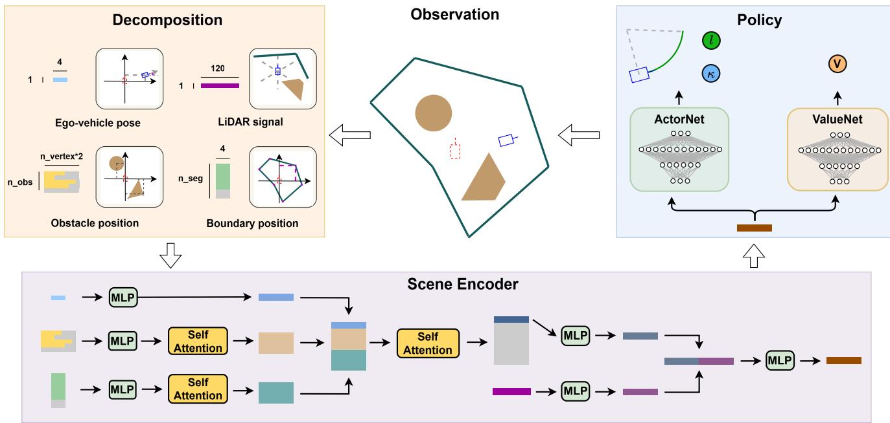  
Fig. 1. Overview of the NeuralParker architecture. The observation is decomposed into the ego pose, obstacle vertices, boundary segments, and local LiDAR signals. The scene encoder embeds the four streams, uses self-attention to aggregate the obstacle and boundary tokens, and fuses the resulting global geometry with the ego and LiDAR features. The shared representation is passed to the actor and critic networks, which output the curvature–length arc (�, �) and the state-value estimate, respectively.

The ensemble additionally varies start and target tangent scales. The default independent grid uses scales {0.8, 1.0, 1.2} at both endpoints, giving 9×3×3 = 81 candidates. The reported implementation evaluates � = 100 uniformly sampled points $g _ { j } = g ( t _ { j } )$ , with $\Delta t = 1 / ( N - 1 )$ , and computes

$$
\begin{array} { c } { { \displaystyle \nu _ { j } = ( g _ { j + 1 } - g _ { j } ) / \Delta t , \qquad \hat { \nu } _ { j } = \nu _ { j } / \| \nu _ { j } \| , } } \\ { { \displaystyle \bar { \kappa } _ { j } = \frac { \| \hat { \nu } _ { j + 1 } - \hat { \nu } _ { j } \| } { \Delta t \| \nu _ { j } \| } , } } \\ { { \displaystyle \Delta \kappa _ { H } = | \kappa _ { 0 } - \bar { \kappa } _ { 0 } | + \sum _ { j = 1 } ^ { N - 3 } | \bar { \kappa } _ { j } - \bar { \kappa } _ { j - 1 } | , } } \end{array}\tag{6}
$$

where $j ~ = ~ 0 , \dots , N - 3 , ~ \bar { \kappa } _ { j } ~ \geq ~ 0$ is the sampled curvature magnitude, and $\kappa _ { 0 }$ is the signed curvature of the preceding action arc. This discrete convention is used by all evaluated policies. A candidate is feasible only if all sampled points are inside the boundary, outside every obstacle, and max� $\bar { } \bar { } \kappa _ { j } \leq$ 0.68. Among feasible candidates, the implementation selects

$$
i ^ { * } = \arg \operatorname* { m i n } _ { i } \left( 1 0 \Delta \kappa _ { H , i } + 1 0 L _ { H , i } + 5 \right) .\tag{7}
$$

The terminal reward instead weights curvature by 0.05 and clips the ensemble score as defined below. The fixed ninecandidate connector accepts the first feasible curve and retains the corresponding unclipped score. Consequently, the evaluation-only configuration measures test-time connector replacement, whereas the train-and-evaluate configuration measures end-to-end coupling to the ensemble and its terminal-cost rule.

## E. Reward and Training

The reported experiments use the path-quality reward defined below. For each policy arc, before any terminal addend, the implemented reward is

$$
\begin{array} { r l } & { r _ { t } ^ { \mathrm { s t e p } } = \ - 0 . 0 5 | \kappa _ { t } - \kappa _ { t - 1 } | - 1 0 | l _ { t } | - 5 } \\ & { ~ - \ 1 0 0 \mathbb { I } [ l _ { t } l _ { t - 1 } < 0 ] - 2 \left[ \operatorname* { m a x } ( 0 , 0 . 5 - | l _ { t } | ) \right] ^ { 2 } . } \end{array}\tag{8}
$$

The last term in (8) discourages near-zero-length actions and the associated sign jitter. For the first arc, both historydependent terms are set to zero. Let $N _ { \mathrm { r e v } }$ be the number of sign changes among policy arcs and

$$
\Delta \kappa _ { \mathrm { e f f } } = \sum _ { t = 2 } ^ { T } | \mathrm { s g n } ( l _ { t } ) \kappa _ { t } - \mathrm { s g n } ( l _ { t - 1 } ) \kappa _ { t - 1 } | .\tag{9}
$$

On success, the environment adds

$$
\begin{array} { r l } & { r ^ { \mathrm { s u c c } } = 1 2 5 0 . 5 - 2 0 N _ { \mathrm { r e v } } - \Delta \kappa _ { \mathrm { e f f } } + 1 . 5 p _ { H } , } \\ & { ~ p _ { H } = \operatorname* { m a x } \{ - \left( 0 . 0 5 \Delta \kappa _ { H } + 1 0 L _ { H } + 5 \right) , - 5 0 0 \} , } \end{array}\tag{10}
$$

where $\Delta \kappa _ { \mathrm { e f f } }$ is given by (9), $p _ { H } = 0$ for a direct terminal state, and $( L _ { H } , \Delta \kappa _ { H } )$ are the selected Hermite segment’s length and discrete curvature variation. The fixed nine-candidate configuration uses the same expression without the −500 floor, which bounds the terminal penalty in the ensemble implementation. Collision or boundary failure adds −2501; timeout receives no success bonus. Equation (7) uses the larger curvature weight only for candidate ranking, whereas (10) defines the terminal learning signal.

NeuralParker uses an obstacle-aware reverse start curriculum. Initial states are ordered by a 1.5 m-grid geodesic distance, beginning at 5% of the available range and expanding during training [43], [44]; the matched control in Section V-D disables only this ordering. The adapted HOPE baseline in the main comparison is trained without a start-state curriculum.

Algorithm 1 NeuralParker training with an in-loop Hermite   
ensemble   
Require: scene distribution Ω, policy $\pi _ { \theta } ,$ value $V _ { \psi }$   
1: for each PPO collection iteration do   
2: sample a scene and curriculum start; observe $o _ { 0 }$   
3: while the episode is active do   
4: sample $( \kappa _ { t } , l _ { t } ) \sim \pi _ { \theta } ( \cdot \mid o _ { t } )$   
5: execute the arc; compute $\dot { \boldsymbol { r } } _ { t } ^ { \mathrm { s t e p } }$ and set $d _ { t } \gets 0$   
6: if the executed arc is invalid then   
7: add the failure penalty; set $d _ { t } \gets 1$   
8: else if the reached state is directly terminal then   
9: add (10) with $p _ { H } = 0 ;$ set $d _ { t } \gets 1$   
10: else if sin $\tilde { \theta } _ { t + 1 } > 0$ then   
11: form feasible set $\mathcal { F } _ { t }$ from the 81 candidates   
12: if $\mathcal { F } _ { t } \neq \emptyset$ then   
13: select �∗ by (7)   
14: add (10); set $d _ { t } \gets 1$   
15: end if   
16: end if   
17: store $\left( o _ { t } , a _ { t } , r _ { t } , o _ { t + 1 } , d _ { t } \right)$   
18: set $o _ { t } \gets o _ { t + 1 }$   
19: end while   
20: update $( \theta , \psi )$ with the clipped PPO objective in (1)   
21: end for

Algorithm 1 summarizes the coupled training loop. The important distinction from a post-processing spline is that the same Hermite feasibility test determines successful transitions in the rollout data used by PPO.

## IV. Experimental Setup

## A. Scenario Design

We construct two complementary procedurally generated benchmarks. The Factorial Parking Benchmark contains 81 training scenes and 27 structurally disjoint test scenes. Both splits follow the same $3 \times 3 \times 3$ factorial design: three startdistance regimes (near, medium, long), three parking types (reverse, lateral, random), and three dificulty levels (easy, medium, hard). The training split contains three structurally distinct scenes in every cell, while the test split contains one additional scene per cell. Each evaluation seed runs 40 starts per test scene, giving 1080 episodes.

The factorial design covers breadth, and many of its scenes are solvable from local clearance and analytic completion. The Topology-Stress Benchmark targets long-range approach decisions, where target-side structure initially lies beyond the 10 m local LiDAR view. It crosses three route-choice families. In Type 1, a roof over the target entrance and a wall on one side leave only the opposite-side swing feasible. In Type 2, a threesided pocket opens away from the nominal arrival direction, so a direct targetward approach reaches the closed back wall and must detour to the entrance. In Type 3, an outer barrier blocks the direct approach and leaves a laterally displaced passage. In each family, a range-limited policy can favor an unfavorable approach before the decisive opening becomes locally visible. The benchmark contains 48 training scenes and 18 structurally disjoint test scenes, crossing these three families with medium and hard dificulty. Each evaluation seed runs 40 shared starts per test scene, giving 720 episodes. Across both benchmarks, all scenes pass the same target-validity, objectcapacity, connected-start, and analytic-feasibility checks.

## B. Baselines

HOPE [17] is the principal learned baseline because it is among the strongest recent learning-based parking planners reported for diverse scenarios. It also provides direct counterparts to both components studied here: an ego-centered BEV raster augments its local range and target features, and a shortest-first Reeds–Shepp controller takes over near the target. We make three task-side changes for a fair comparison under a common task definition. Specifically, we replace HOPE’s native collision-and-retreat behavior with the hard referencepoint collision and boundary termination used by NeuralParker; we check its Reeds–Shepp candidates under the benchmark’s reference-point collision and boundary convention; and we attach the fixed nine-candidate Hermite terminator used by the controlled baselines. The complete adapted baseline retains HOPE’s action mask and RS controller. Appendix B records the retained components, task-side changes, and configurations used for the controlled HOPE-style variants.

The real-vehicle study in Section V-E adds two further baselines: Hybrid A\* [7] and NeuralParker-Guided A\*. The latter is a hybrid of the two, and keeps the Hybrid $\mathbf { A } ^ { * }$ search complete while using the learned policy to bias where that search looks. Concretely, the NeuralParker policy is rolled out once from the query state to obtain a reference path, and the distance from a lattice node to that path enters the node cost as an additional term, so expansions that follow the learned maneuver are explored first. Because the underlying search and its feasibility tests are unchanged, this coupling alters only the expansion order: it can reach goals that require an initially target-averse maneuver within the time budget, and it reduces the number of expanded nodes when both planners agree on the maneuver.

## C. Metrics and Training

We report full-set success rate, path length, full-trajectory reversals, and cumulative curvature change. Let $\{ ( \kappa _ { t } , l _ { t } ) \} _ { t = 1 } ^ { T }$ denote the executed non-Hermite action arcs, whether policyproduced or RS-controlled. When Hermite completion is used, let $L _ { H } , ~ \Delta \kappa _ { H }$ , and $q _ { H } \in \{ - 1 , 1 \}$ denote its sampled length, curvature variation from (6), and drive direction. The reported metrics are

$$
\begin{array} { l } { { \displaystyle { \cal L } = \sum _ { t = 1 } ^ { T } \left. l _ { t } \right. + { \cal L } _ { H } } , } \\ { { \displaystyle N _ { \mathrm { r e v } } = \sum _ { t = 2 } ^ { T } \mathbb { I } \left[ l _ { t } l _ { t - 1 } < 0 \right] + \mathbb { I } \left[ l _ { T } q _ { H } < 0 \right] } , } \\ { { \displaystyle \Delta \kappa = \sum _ { t = 2 } ^ { T } \left. \kappa _ { t } - \kappa _ { t - 1 } \right. + \Delta \kappa _ { H } } . } \end{array}\tag{11}
$$

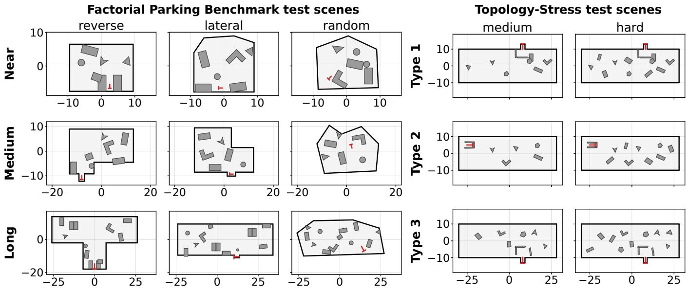  
Fig. 2. Representative held-out scenes from the Factorial Parking Benchmark (left) and the Topology-Stress Benchmark (right). The Factorial block arranges start-separation regimes by row and target-pose types by column; the Topology-Stress block arranges route-choice families by row and dificulty by column All panels preserve equal �–� metric scaling. Red T markers denote target poses and headings, and axes are in meters.

For direct terminal success, the Hermite terms and final direction indicator are omitted. Every controlled simulation path-quality comparison uses the intersection of successful episode identifiers across all methods in that table; success itself uses the full set. NeuralParker-backbone policies are trained with PPO for 240 epochs, whereas adapted-HOPE and HOPE-style policies use the HOPE PPO implementation for 10,000 episodes. Appendices A and B report the corresponding training configurations. Results are three-seed mean ± sample standard deviation. In the controlled simulation tables, boldface identifies the best mean within a comparison and does not denote a statistical-significance test. Quality values formed from diferent table-specific common-success intersections are not compared across tables.

## V. Results

We organize the evaluation from planner-level comparisons to controlled component ablations and finally to operation with real-world perception. In the controlled simulation comparisons, success is evaluated on the full test set, whereas trajectory metrics use the within-seed intersection of episodes solved by all methods in each comparison. Cohort sizes are given in the corresponding captions. This distinction prevents a lower-success method from appearing eficient by solving only easier queries.

## A. Comparison With Baseline

We first illustrate the two evaluation settings with representative held-out scenes from both benchmarks (Fig. 2). Their construction and splits are described in Section IV, and the frozen evaluation protocol is defined in Section III.

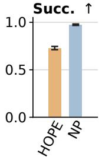

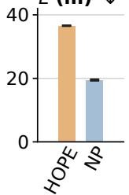

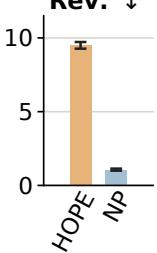

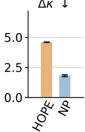  
Fig. 3. NeuralParker improves success rate and trajectory quality over the adapted HOPE planner on the Factorial Parking Benchmark. Success uses all 1080 episodes per seed; trajectory metrics use the pairwise common-success cohort $\dot { ( n = 7 7 3 / 7 4 8 / 7 9 0 ) }$ . Bars and error bars show the three-seed mean ± sample SD. NP denotes NeuralParker.

To assess complete-planner performance, we compare NeuralParker with the adapted HOPE planner on the Factorial Parking Benchmark (Fig. 3). NeuralParker achieves higher full-set success and lower path length, reversal count, and cumulative curvature change on the pairwise common-success cohort. The adapted HOPE baseline retains its native action parameterization, learned-action curvature envelope, action mask, and RS controller together with the attached fixed-Hermite terminal, so this comparison is at the planner level. Section V-C separately isolates NeuralParker’s terminal connector on the same benchmark.

We next test whether a classical long-range prefix can substitute for unified planning by comparing NeuralParker with two staged decompositions (Table I). A region-goal Hybrid $\mathbf { A } ^ { * }$ prefix drives the vehicle to the first state within 10 m of the target and then hands control to a learned planner. Both staged rows use the same prefix and continuous-curvature smoothing when feasible, with a frozen raw-path fallback, and neither downstream policy is retrained for the handof. Unified planning gives the lowest path costs. Handof to the same NeuralParker policy retains a comparable success rate but degrades all three trajectory metrics, whereas handof to the adapted HOPE planner also reduces success. Owning the whole approach lets the policy choose an approach side and arrive in a state its terminal connector can finish cleanly, whereas a geometrically reasonable prefix cut at a fixed radius can deliver the learned stage to a pose that costs reversals to repair. Figure 4 illustrates the two decompositions on one pinned case drawn from outside this benchmark, because a three-sided pocket whose entrance faces away from the arrival direction separates the two approach decisions more legibly than a factorial scene does. Since that geometry belongs to the route-choice families of Section V-B, both arms use the targetrelative vertices policy trained there, with one checkpoint driving the unified arm and the staged arm’s downstream stage.

TABLE I  
Unified Versus Staged Planning. Succ. uses all 1080 episodes per seed; path metrics use the all-method common-success cohort $( n = 7 0 0 / 7 1 9 / 7 2 6 ) .$ . For staged rows, Δ�sums the within-prefix and downstream variations and excludes the single handoff curvature jump.
<table><tr><td>Method</td><td>Succ. ↑</td><td> $L ~ ( \mathrm { m } ) ~ \downarrow$ </td><td> $\mathrm { \ R e v . ~ \downarrow ~ }$ </td><td> $\Delta \kappa \downarrow$ </td></tr><tr><td>Unified NP</td><td> $\mathbf { 0 . 9 7 4 \pm 0 . 0 0 7 }$ </td><td> ${ \bf 1 9 . 7 7 \pm 0 . 4 1 }$ </td><td> ${ \bf 1 . 0 2 \pm 0 . 1 0 }$ </td><td> ${ \bf 1 . 7 7 \pm 0 . 1 0 }$ </td></tr><tr><td>Hybrid  $\mathbf { A } ^ { * }  \mathbf { N P }$ </td><td> $0 . 9 6 9 \pm 0 . 0 0 2$ </td><td> $2 2 . 2 2 \pm 0 . 5 0$ </td><td> $1 . 4 2 \pm 0 . 0 5$ </td><td> $3 . 0 5 \pm 0 . 0 9$ </td></tr><tr><td>Hybrid  $\mathrm { A ^ { * }  H O P E }$ </td><td> $0 . 6 8 6 \pm 0 . 0 1 4$ </td><td> $3 6 . 3 6 \pm 0 . 3 8$ </td><td> $6 . 9 7 \pm 0 . 3 4$ </td><td> $5 . 1 6 \pm 0 . 1 0$ </td></tr></table>

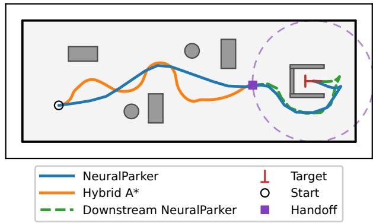  
Fig. 4. Unified planning keeps one approach decision where a staged handof splits it. Each planner is drawn as one line, so the staged arm’s arcs and terminal connector share the dashed green line. One checkpoint drives both learned arms on this pinned pocket case; the dashed circle is the 10 m handof boundary.

## B. Global Geometry Ablation

We next examine whether explicit global geometry helps when route selection depends on structures outside the local LiDAR view. The Factorial Parking Benchmark spans varied poses, distances, and clutter, and many of its queries are locally resolvable: compact scenes expose most relevant geometry to LiDAR, and many larger scenes permit a direct approach. We therefore conduct this ablation on the separately designed Topology-Stress Benchmark, where the target-side opening is initially outside the local view and the approach side must be selected earlier.

TABLE II  
Scene-Representation Ablation. Succ. uses all 720 episodes per seed; path metrics use the six-method common-success cohort $( n = 3 2 8 / 3 1 7 / 2 8 1 ) .$
<table><tr><td>Added representation</td><td>Succ. ↑</td><td>L (m) ↓</td><td>Rev. ↓</td><td>∆κ↓</td></tr><tr><td colspan="5">NeuralParker backbone</td></tr><tr><td>none</td><td> $0 . 8 9 7 \pm 0 . 0 1 0$ </td><td> $3 7 . 8 4 \pm 4 . 0 1 $ </td><td> $2 . 9 6 \pm 0 . 5 8$ </td><td> $5 . 7 4 \pm 0 . 6 9$ </td></tr><tr><td>BEV</td><td> $0 . 8 4 8 \pm 0 . 0 3 0$ </td><td> $3 8 . 7 2 \pm 1 . 0 7$ </td><td> $4 . 4 1 \pm 0 . 2 7$ </td><td> $6 . 2 5 \pm 0 . 3 5$ </td></tr><tr><td>vertices</td><td> $\mathbf { 0 . 9 1 6 \pm 0 . 0 2 3 }$ </td><td> ${ \bf 3 5 . 4 0 \pm 0 . 9 3 }$ </td><td> $\mathbf { 2 . 7 7 \pm 0 . 1 0 }$ </td><td> ${ \bf 5 . 0 6 \pm 0 . 5 5 }$ </td></tr><tr><td colspan="5">HOPE-style backbone</td></tr><tr><td>none</td><td> $0 . 6 9 0 \pm 0 . 0 1 8$ </td><td> $5 8 . 5 3 \pm 1 . 5 4$ </td><td> $2 1 . 7 0 \pm 1 . 0 3$ </td><td> $1 3 . 3 4 \pm 0 . 6 3$ </td></tr><tr><td>BEV</td><td> $0 . 7 6 3 \pm 0 . 1 0 0$ </td><td> $5 8 . 0 3 \pm 2 . 6 1 $ </td><td> $2 0 . 7 4 \pm 4 . 2 1$ </td><td> $1 3 . 4 8 \pm 1 . 5 4$ </td></tr><tr><td>vertices</td><td> $\mathbf { 0 . 8 0 8 \pm 0 . 1 0 3 }$ </td><td> $\mathbf { 4 9 . 7 9 \pm 4 . 7 1 }$ </td><td> $\mathbf { 1 6 . 9 5 \pm 3 . 5 9 }$ </td><td> ${ \bf 1 0 . 8 5 \pm 1 . 4 7 }$ </td></tr></table>

To isolate the representation efect within each policy backbone, we compare no added representation, BEV features, and target-relative vertices while retaining each backbone’s local state and 120-beam LiDAR input (Table II). All six configurations use the same geodesic start curriculum and fixed-Hermite terminal connector. The three HOPE-style variants additionally disable the 42-anchor action mask and the native Reeds– Shepp takeover: the former samples an executed action from 42 anchors using the policy density multiplied by LiDAR-derived safety weights, whereas the latter overrides policy actions near the target. These rows therefore isolate scene representation as controlled variants of the HOPE-style backbone, separately from the complete adapted planner evaluated in Section V-A. Target-relative vertices give the best aggregate result on every reported metric for both backbones, with a more pronounced advantage on the HOPE-style backbone. They also avoid the image rendering and autoencoder pretraining required by the BEV input. Both backbones retain their reported LiDAR preprocessing conventions, detailed in Appendices A and B.

We further disaggregate absolute success rates by routechoice family to test whether the added representations help uniformly across scene geometries (Fig. 5). With the Neural-Parker backbone, vertices produce small gains on Types 1 and 3 and little change on Type 2, whereas BEV remains below the local-only configuration in all three families. With the HOPEstyle backbone, both added representations improve Types 2 and 3 but not Type 1; several added-representation variants also show appreciable between-seed variation. This distinct response supports retaining Types 1 and 3 as separate families: the former constrains the target-entry side, whereas the latter blocks an earlier outer approach and exposes an ofset passage. Each backbone keeps its own reported LiDAR convention in this comparison: NeuralParker clips negative clearances to zero, whereas the HOPE-style backbone retains them. Withinbackbone contrasts therefore carry the representation efect.

## C. Terminal Connector Ablation

To separate the immediate efect of enlarging the terminal candidate set from the efect of training under the same rule, we compare three NeuralParker connector configurations on the Factorial Parking Benchmark (Table III). The first configuration is the reference, using the fixed nine-candidate Hermite connector. Substituting the ensemble only at evaluation improves the success rate and all three path-quality metrics without changing the policy. Training with the same ensemble retains these gains and gives the highest success rate, the shortest paths, and the lowest curvature variation, with a reversal count that matches the evaluation-only replacement to within one seed standard deviation.

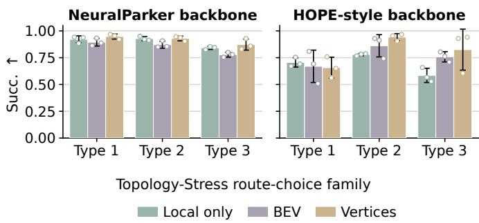  
Fig. 5. Absolute family-level success rates show that representation efects depend on route-choice family and policy backbone on the Topology-Stress Benchmark. Each family contains 240 episodes per seed. Every group compares local-only, BEV, and vertices; bars and error bars show the three-seed mean ± sample SD, and open circles show individual seeds.

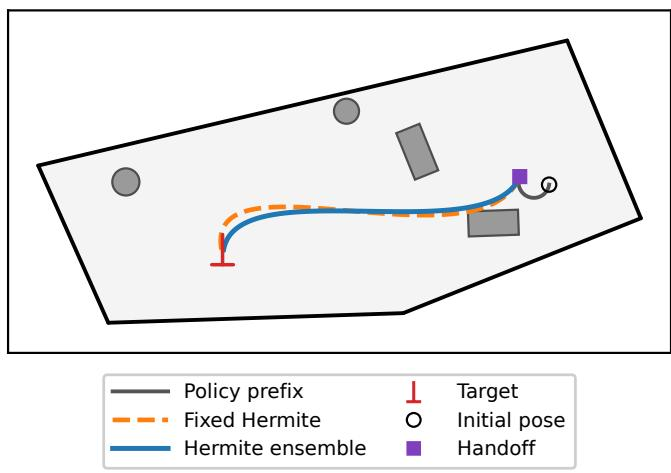  
Fig. 6. Both terminal rules are feasible from the marked handof pose, but the ensemble selects a diferent terminal shape. Replaying only the connector from a shared handof isolates candidate selection from the policy prefix, which is shown for context.

TABLE III  
Terminal-Connector Ablation on the Factorial Parking Benchmark. Succ. uses all 1080 episodes per seed; path metrics use the  
three-configuration common-success cohort (� = 1003/1000/1015).
<table><tr><td>Terminal rule</td><td>Succ. ↑</td><td>L (m) ↓</td><td>Rev. ↓</td><td> $\Delta \kappa \downarrow$ </td></tr><tr><td>Fixed Hermite</td><td> $0 . 9 6 5 \pm 0 . 0 0 7$ </td><td> $2 0 . 1 3 \pm 0 . 6 9$ </td><td> $1 . 3 7 \pm 0 . 0 9$ </td><td> $2 . 3 6 \pm 0 . 1 5$ </td></tr><tr><td>Ensemble, eval. only</td><td> $0 . 9 7 2 \pm 0 . 0 0 6$ </td><td> $1 8 . 7 6 \pm 0 . 2 3$ </td><td> ${ \bf 1 . 1 1 \pm 0 . 0 6 }$ </td><td> $1 . 9 1 \pm 0 . 0 7$ </td></tr><tr><td>Ensemble, train + eval.</td><td> $\mathbf { 0 . 9 7 4 } \pm \mathbf { 0 . 0 0 7 }$ </td><td> ${ \bf 1 8 . 6 9 \pm 0 . 1 1 }$ </td><td> $1 . 1 5 \pm 0 . 0 6$ </td><td> ${ \bf 1 . 8 6 \pm 0 . 0 8 }$ </td></tr></table>

To determine whether the ensemble improves terminal geometry even when the fixed connector is already feasible, we replay both connectors from the same policy handof (Fig. 6). Both connectors are feasible from that pose, so the diference comes from selecting a better terminal geometry.

TABLE IV  
Start-Curriculum Ablation. Succ. uses all 1080 episodes per seed; path metrics use the pairwise common-success cohort (� = 1043/1005/1028). Values are three-seed mean ± sample SD.
<table><tr><td>Start curriculum</td><td>Succ. ↑</td><td>L (m) ↓</td><td>Rev. ↓</td><td>∆κ↓</td></tr><tr><td>No curriculum</td><td> $0 . 9 6 9 \pm 0 . 0 1 5$ </td><td>19.90 ± 0.75</td><td> $1 . 4 3 \pm 0 . 1 0$ </td><td> $2 . 2 3 \pm 0 . 1 2$ </td></tr><tr><td>Geodesic curriculum</td><td> $\mathbf { 0 . 9 7 4 \pm 0 . 0 0 7 }$ </td><td> ${ \bf 1 8 . 7 6 \pm 0 . 1 6 }$ </td><td> ${ \bf 1 . 1 7 \pm 0 . 0 5 }$ </td><td> ${ \bf 1 . 9 0 \pm 0 . 0 6 }$ </td></tr></table>

## D. Start-Curriculum Ablation

We assess the role of start ordering by comparing geodesically ordered starts with training that samples the full start range without a curriculum (Table IV). The two configurations share the representation, reward, network, terminal connector, training budget, and frozen full-range evaluation starts, so the comparison isolates the ordering. Under the same fixed full-range evaluation, the two settings achieve similar success, while geodesic ordering improves all three common-success trajectory metrics. We therefore retain it as a training-recipe choice rather than a separate method contribution.

## E. Real-Vehicle Experiments

To assess planning under real-world perception, we evaluate a simpler NeuralParker configuration on a real vehicle. It shares the target-relative geometry representation and the arc policy, and uses the fixed nine-candidate Hermite connector without the local LiDAR stream. The site is a delivery-vehicle parking area in Hualikan, Beijing, shown in Fig. 7. The planner consumes perception recorded by operating delivery vehicles, the HD map, and an assigned parking pose, and replans from these inputs at each frame. Its planned paths are then executed and validated on the vehicle’s simulation platform.

To compare the three planners under this protocol, we evaluate them on 47 dificult held-out clips using the validation rules summarized in Table V. Succ. is evaluated on all clips using full-footprint validation, except for the parenthesized NeuralParker value obtained with reference-point validation. The reported � and Rev. values are descriptive statistics computed on each method’s own successful clips. NeuralParker-Guided A\* achieves the highest full-footprint success, whereas direct NeuralParker has the lowest planning time. Direct NeuralParker reaches 0.93 under the reference-point criterion it was trained with, and the two criteria difer because training does not model the full vehicle footprint. Appendix C reports how the learned guidance changes Hybrid $\mathbf { A } ^ { * }$ search time across these clips.

We further inspect two representative cases to clarify how learned guidance changes the search behavior (Fig. 7(e)–(h)). Learned guidance finds an indirect maneuver that first moves away from the target and reduces the number of expanded nodes when both planners agree on the maneuver. The site, operational data interface, and validation protocol are documented in Appendix C.

## VI. Conclusion

This work has presented NeuralParker, a reinforcement learning-based hybrid planner for arbitrary-pose parking in irregular environments. It combines target-relative full-environment vertices and local clearance rays with a learned curvature–length arc policy and an in-loop, curvature-regularized Hermite terminal ensemble. Factorial and topology-stress benchmarks separate full-set success from trajectory quality on common-success episodes.

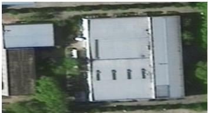  
(a)

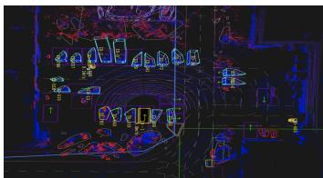  
(b)

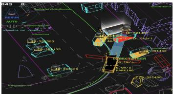

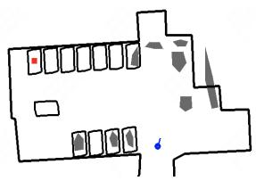

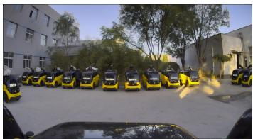

(e)  
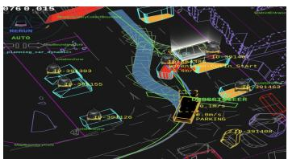  
(f)

(c)  
(d)  
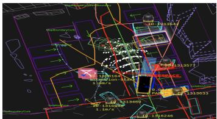  
(g)

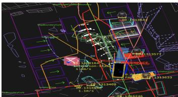  
(h)  
Fig. 7. Real-vehicle experiments with a simpler NeuralParker configuration. (a)–(d) operating site, perception visualization, camera view, and site-specific simulation reconstruction; (e)–(h) two simulation-validated cases comparing Hybrid A\* with NeuralParker-Guided A\*.

TABLE V  
Real-Vehicle Experiment on 47 Difficult Clips. Succ. uses all clips; � and Rev. are computed on each method’s own successful clips.
<table><tr><td>Method</td><td>Succ. ↑</td><td>L (m) ↓</td><td>Rev. ↓</td><td>Plan time (ms) ↓</td></tr><tr><td>NeuralParker</td><td>0.60 (0.93)</td><td>7.0</td><td>1.20</td><td>0.37</td></tr><tr><td>NP-Guided A*</td><td>0.72</td><td>7.7</td><td>1.17</td><td>4.24</td></tr><tr><td>Hybrid A*</td><td>0.67</td><td>7.2</td><td>1.13</td><td>5.26</td></tr></table>

Target-relative vertices provide the strongest aggregate success rate and trajectory quality under both evaluated policy backbones, without the rendering and pretraining required by the bird’s-eye-view alternative. Replacing the fixed Hermite connector with the ensemble improves the success rate and trajectory quality without policy retraining, and training under the same terminal rule retains these gains. At the planner level, NeuralParker achieves higher full-set success and lower common-success trajectory costs than the adapted HOPE planner, while unified planning gives better trajectory quality than the tested staged decomposition. The real-vehicle evaluation takes the planner to an operating delivery site, where it plans from perception recorded by real delivery vehicles and the HD map, and its paths are validated in simulation.

The reported results use collision checks on the vehicle reference point, static procedurally constructed 2-D benchmarks with fixed object budgets, and three policy-training seeds. Dynamic actors, perception uncertainty, broader object counts and topologies, and closed-loop validation of the vertices-plus-LiDAR planner remain for future work. Overall, the results show that retaining target-side geometry and coupling policy learning to a diverse terminal connector extends hybrid RL parking from local slot maneuvers to longer-range arbitrarypose planning.

## Appendix A

## NeuralParker Implementation Details

To support reproducibility of the reported NeuralParker results, we document the observation, network, planner, and training settings used in the main simulation experiments. These parameters describe the vertices-plus-LiDAR policy with the 81-candidate Hermite terminal ensemble.

## A. Policy and Planner Configuration

To specify the evaluated policy and planner, we summarize the observation, network, learned-action, and terminalconnector settings in Table VI.

To fully specify the observation and collision-checking pipeline, we record how unused slots, LiDAR clearances, and path samples are handled. Unused geometry slots contain the $- 1 0 ^ { 4 }$ sentinel and are not explicitly attention-masked. Neural-Parker uses the rectified clearance $s _ { i } ^ { \ell } = \operatorname* { m a x } ( d _ { i } - b _ { i } , 0 )$ without observation normalization; empty beams therefore retain the direction-dependent value $1 0 - b _ { i }$ , and circular obstacles use 16-segment rings for ray casting. For the reported simulation runs, $d _ { i }$ is produced by the benchmark ray caster using strict, zero-tolerance segment-bound tests; training and evaluation use the same caster. Learned arcs use 30 sampled reference points for the hard collision and boundary checks; Hermite candidates use the 100 samples listed in Table VI.

## B. Training Configuration

To make NeuralParker training and checkpoint selection reproducible, we report the complete training recipe in Table VII, where GAE denotes generalized advantage estimation. Snapshots are saved every 20 epochs, and the reported checkpoints are selected by per-epoch mean reward over 32 sampled full-range episodes from the training-scene distribution. The selected epochs are 227, 182, and 228 for curriculum-enabled seeds 0–2 and 234, 148, and 234 for their matched nocurriculum controls. No frozen evaluation episode is used for checkpoint selection.

TABLE VI  
NeuralParker Configuration  
Panel A: Observation and network
<table><tr><td>Parameter</td><td>Setting</td></tr><tr><td>Coordinate frame</td><td>Target at (0, 0) with heading +y</td></tr><tr><td>Obstacle capacity</td><td>20 slots × 16 values</td></tr><tr><td>Boundary capacity</td><td>10 slots × 4 values</td></tr><tr><td>Local LiDAR</td><td>120 rectified footprint-clearance beams, 360°, 10 m ray cap</td></tr><tr><td>Geometry tokens</td><td>16-D, one attention head</td></tr><tr><td>Global-local fusion</td><td>128-D, depth 1, four 32-D heads</td></tr><tr><td>Actor / critic MLP</td><td>Separate [64, 128, 256, 64] networks</td></tr></table>

TABLE VII  
NeuralParker Training Configuration
<table><tr><td>Parameter</td><td>Setting</td></tr><tr><td>Learning rate / schedule</td><td> $3 \times 1 0 ^ { - 4 }$  / linear decay</td></tr><tr><td>Discount γ / GAE λ</td><td>0.99 / 0.95</td></tr><tr><td>PPO clip / value coefficient</td><td>0.15 / 0.25</td></tr><tr><td>Entropy coefficient / gradient norm</td><td>0.005 / 0.5</td></tr><tr><td>Advantage / reward normalization</td><td>yes / yes</td></tr><tr><td>Epochs / steps per epoch</td><td>240 / 60,000</td></tr><tr><td>Steps per collect / repeats</td><td>16,384 /  10</td></tr><tr><td>Batch / replay-buffer size</td><td>8,192 /  131,072</td></tr><tr><td>Training / test environments</td><td>128  /  32</td></tr><tr><td>Curriculum start scale / distance</td><td>0.05 / geodesic</td></tr></table>

## Appendix B

## Adaptation of HOPE to the Evaluation Benchmarks

We adapt HOPE for two purposes: to obtain a complete planner baseline under the common task definition and to construct a HOPE-style backbone for the scene-representation ablation. We also reuse the complete baseline in the staged diagnostic. The following subsections separate the learning contract, benchmark interface, and controlled representation inputs.

## A. Policy and Training Contract

We preserve HOPE’s published actor–critic architecture, PPO implementation, reward, and action parameterization in the complete adapted baseline. Each seed is trained for 10,000 episodes from full-range starts without a start curriculum, and the checkpoint saved after 10,000 episodes is evaluated. The baseline retains the native 42-anchor LiDAR action mask and Reeds–Shepp (RS) controller and uses the attached fixed ninecandidate Hermite terminator. The staged diagnostic performs no retraining; it reuses the corresponding complete-baseline checkpoint and downstream configuration.

We retain HOPE’s attention-fusion architecture and optimization settings while changing only the active inputmodality branches required by the controlled representations. Each active modality is embedded in 128-D, and one attention block fuses the embeddings using eight 32-D heads and a 128- unit feed-forward sublayer; a 128-unit hidden layer follows the flattened output. The actor and critic learning rates are $5 \times 1 0 ^ { - 6 }$ and $2 . 5 \times 1 0 ^ { - 5 }$ , respectively, with $\gamma = 0 . 9 8$ , GAE $\lambda = 0 . 9 5$ , clip ratio 0.2, batch size 8192, mini-batch size 32, and ten update epochs. Advantages are normalized and rewards are not. Running mean-and-standard-deviation normalization is applied only to the LiDAR, target, and optional vertex branches, not to the image or action mask.

Panel B: Learned action and terminal connector
<table><tr><td>Parameter</td><td>Setting</td></tr><tr><td>Learned action</td><td> $\kappa \in [ - 0 . 6 8 , 0 . 6 8 ] , l \in [ - 1 0 , 1 0 ]$  m</td></tr><tr><td>Episode / tolerance</td><td> $2 0 0 \ \mathrm { a r c s } ; 0 . 1 \ \mathrm { m \ a n d \ } 1 0 ^ { \circ }$ </td></tr><tr><td>Endpoint grid</td><td>offsets  $\{ - 0 . 1 , 0 , 0 . 1 \}$  m; headings {80° , 90°, 100° }</td></tr><tr><td>Tangent scales</td><td>independent  $\{ 0 . 8 , 1 . 0 , 1 . 2 \} ^ { 2 }$ </td></tr><tr><td>Candidate count</td><td> $9 \times \dot { 3 } \times 3 = 8 \dot { 1 }$ </td></tr><tr><td>Heading gate</td><td>sin  $\tilde { \theta } > 0$  at the reached state</td></tr><tr><td>Feasibility samples</td><td>100 points;  $\bar { \kappa } \leq 0 . 6 8$ </td></tr><tr><td>Selection weight</td><td> $c _ { \mathrm { s e l } } = 1 0 \mathrm { ~ i n ~ } ( 7 )$ </td></tr><tr><td>Terminal-score floor</td><td> $p _ { H } \ge - 5 0 0$  for the ensemble</td></tr></table>

## B. Benchmark Interface and Analytic Control

We align HOPE with the common task definition by replacing its collision-and-retreat behavior with hard referencepoint collision and boundary termination. All adapted-HOPE policies use the benchmark ray distances $d _ { i } ,$ but retain signed footprint clearance $d _ { i } - b _ { i }$ followed by per-beam running meanand-standard-deviation normalization. The training statistics are stored with each checkpoint and restored for evaluation. Thus, negative clearances are retained, whereas NeuralParker rectifies them as described in Appendix A. The complete baseline still uses rectangular-footprint geometry in its action mask, shaping reward, and BEV rendering.

We preserve HOPE’s learned-action curvature bound of tan $( 0 . 7 5 ) / 2 . 8 \approx 0 . 3 3 3 ~ \mathrm { m } ^ { - 1 }$ and apply the common $0 . 6 8 \ \mathrm { m } ^ { - 1 }$ feasibility cap only to the attached fixed-Hermite terminator. RS candidates are generated and checked at 0.1 m spacing; learned arcs and accepted RS chunks use 30 sampled reference points for the hard checks, and Hermite candidates use 100. Accepted RS chunks override the policy output but still pass through the shared environment, so hard termination and the fixed-Hermite test remain active during RS takeover.

## C. Controlled Representation Inputs

We construct the HOPE-style representation configurations with a shared target-and-signed-LiDAR base and three choices for the added scene input: none, a BEV raster, and targetrelative vertices. Each configuration retains HOPE’s PPO, reward, and action parameterization, is trained for 10,000 episodes per seed with the geodesic start curriculum at scale 0.05, and uses the checkpoint saved after 10,000 episodes. All three configurations disable the action mask and RS controller but retain the fixed nine-candidate Hermite terminator, which keeps the added scene input as the only diference between them. The vertex configuration uses the attention-based vertex input branch and no image encoder.

We implement both policy backbones’ BEV controls with the published HOPE image-processing path and a frozen convolutional autoencoder. The HOPE-style control retains a trajectory tail of up to 20 poses, whereas the NeuralParkerbackbone control disables it. The renderer produces an egoaligned $6 4 \times 6 4$ RGB raster from target-frame geometry, the destination, and the ego footprint. Each autoencoder is pretrained on 50,000 tail-enabled images from random-policy rollouts, using 4- and 8-channel convolutional stages, a 256-D fully connected layer, a 128-D latent, Adam at $1 0 ^ { - 3 }$ , meansquared-error loss, batch size 256, and 50 epochs. Separate autoencoders are trained for the Factorial Parking and Topology-Stress training distributions, and their encoders remain frozen during PPO.

## Appendix C

## Real-Vehicle Experiments

We document the operational inputs, simulation-based validation, and planner configuration of the real-vehicle evaluation reported in Section V-E. The evaluation uses perception recorded during delivery-vehicle operation together with the HD map and an assigned parking pose, and planned paths are executed and validated in simulation. The simpler planner configuration uses processed polygon and map geometry without policy-level LiDAR and a fixed-tangent, nine-pose Hermite connector.

To reconstruct the operational site for training and heldout evaluation, we use records collected in a delivery-vehicle parking area in Hualikan, Beijing. Automated delivery vehicles return to a parking spot there after completing a delivery. Static boundaries were extracted from the HD map as 50 polylines, and a site-specific training simulator was reconstructed from 1,000 operational clips containing 95,000 obstacle-detection frames. At each training reset, one recorded obstacle state was sampled, the nearest ten detections were represented as five-vertex polygons, and valid ego and target poses were generated. The 47 dificult evaluation clips were excluded from this training set; dedicated validators then assessed task completion and collision with obstacles or boundaries.

The three planners run as compiled C++ binaries in the vehicle software system. Fig. 7 visualizes LiDAR detections, whereas the evaluated policy receives target-relative ego, obstacle-polygon, and map-boundary geometry. During evaluation, it replans once per recorded frame from this geometry, the HD map, and the assigned target. Each path is then executed in simulation and checked under both the referencepoint convention inherited from training and a full rectangular vehicle-footprint validator. Reversals follow (11).

To characterize how the learned guidance afects search efort, we rank the 47 clips by Hybrid A\* search time and plot both planners’ per-clip times in that order (Fig. 8). The ranking serves as a proxy for clip dificulty. The two planners are comparable on the easier clips, whereas NeuralParker-Guided $\mathbf { A } ^ { * }$ increasingly undercuts Hybrid $\mathbf { A } ^ { * }$ as the ranked search time grows, so the saving concentrates on the harder queries. Individual clips exceed the Hybrid $\mathbf { A } ^ { * }$ time when the learned reference path disagrees with the search’s preferred maneuver.

## References

[1] B. Paden, M. Čáp, S. Z. Yong, D. Yershov, and E. Frazzoli, “A survey of motion planning and control techniques for self-driving urban vehicles,” IEEE Trans. Intell. Veh., vol. 1, no. 1, pp. 33–55, 2016.

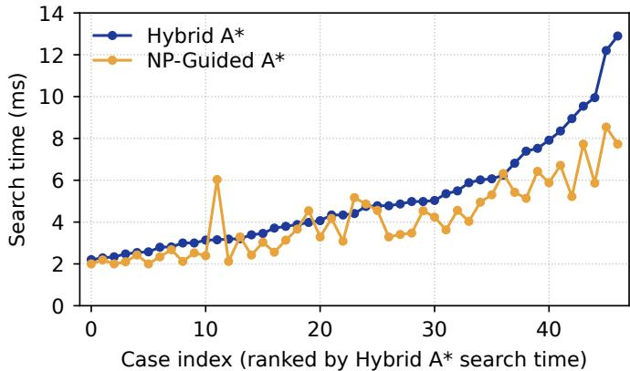  
Fig. 8. Learned guidance reduces Hybrid A\* search time mostly on the harder real-vehicle clips. The 47 held-out clips are ordered by Hybrid A\* search time, which serves as a dificulty proxy, and both planners’ times are shown in that order.

[2] H. Banzhaf, D. Nienhüser, S. Knoop, and J. M. Zöllner, “The future of parking: A survey on automated valet parking with an outlook on high density parking,” in Proc. IEEE Intell. Veh. Symp. (IV), 2017, pp. 1827–1834.

[3] K. Masood, D. P. Morales, V. Fremont, M. Zoppi, and R. Molfino, “Parking pose generation for autonomous freight collection by pallet handling car-like robot,” Energies, vol. 14, no. 15, art. no. 4677, 2021.

[4] L. E. Dubins, “On curves of minimal length with a constraint on average curvature, and with prescribed initial and terminal positions and tangents,” Amer. J. Math., vol. 79, no. 3, pp. 497–516, 1957.

[5] J. A. Reeds and L. A. Shepp, “Optimal paths for a car that goes both forwards and backwards,” Pacific J. Math., vol. 145, no. 2, pp. 367–393, 1990.

[6] M. Pivtoraiko, R. A. Knepper, and A. Kelly, “Diferentially constrained mobile robot motion planning in state lattices,” J. Field Robot., vol. 26, no. 3, pp. 308–333, 2009.

[7] D. Dolgov, S. Thrun, M. Montemerlo, and J. Diebel, “Path planning for autonomous vehicles in unknown semi-structured environments,” Int. J. Robot. Res., vol. 29, no. 5, pp. 485–501, 2010.

[8] X. Zhang, A. Liniger, A. Sakai, and F. Borrelli, “Autonomous parking using optimization-based collision avoidance,” in Proc. IEEE Conf. Decis. Control (CDC), 2018, pp. 4327–4332.

[9] B. Li et al., “Optimization-based trajectory planning for autonomous parking with irregularly placed obstacles: A lightweight iterative framework,” IEEE Trans. Intell. Transp. Syst., vol. 23, no. 8, pp. 11970–11981, 2022.

[10] S. Dai and Y. Wang, “Long-horizon motion planning for autonomous vehicle parking incorporating incomplete map information,” in Proc. IEEE Int. Conf. Robot. Autom. (ICRA), 2021, pp. 8135–8142.

[11] P. Zhang et al., “Reinforcement learning-based end-to-end parking for automatic parking system,” Sensors, vol. 19, no. 18, art. no. 3996, 2019.

[12] J. Zhang, H. Chen, S. Song, and F. Hu, “Reinforcement learning-based motion planning for automatic parking system,” IEEE Access, vol. 8, pp. 154485–154501, 2020.

[13] F. Tao et al., “Adapting reinforcement learning for path planning in constrained parking scenarios,” arXiv:2601.22545, 2026.

[14] C. Li, Z. Ji, Z. Chen, T. Qin, and M. Yang, “ParkingE2E: Camerabased end-to-end parking network, from images to planning,” in Proc. IEEE/RSJ Int. Conf. Intell. Robots Syst. (IROS), 2024, pp. 13206–13212.

[15] J. Fu, B. Tian, H. Chen, S. Meng, and T. Yao, “ParkFormer: A transformer-based parking policy with goal embedding and pedestrianaware control,” in Proc. IEEE Int. Intell. Transp. Syst. Conf. (ITSC), 2025, pp. 4317–4323.

[16] H. Zheng et al., “MultiPark: Multimodal parking transformer with nextsegment prediction,” arXiv:2508.11537, 2025.

[17] M. Jiang, Y. Li, S. Zhang, S. Chen, C. Wang, and M. Yang, “HOPE: A reinforcement learning-based hybrid policy path planner for diverse parking scenarios,” IEEE Trans. Intell. Transp. Syst., vol. 26, no. 5, pp. 6130–6141, 2025.

[18] Z. Wang, Z. Chen, M. Jiang, T. Qin, and M. Yang, “RL-OGM-Parking: LiDAR OGM-based hybrid reinforcement learning planner for autonomous parking,” in Proc. IEEE Int. Conf. Robot. Autom. (ICRA), 2025, pp. 8420–8426.

[19] Y. Xue et al., “N3P: Accelerated automated parking via a learning-based naturalistic three-stage scheme,” arXiv:2605.22722, 2026.

[20] M. Jiang, Y. Li, J. Zhang, S. Zhang, and M. Yang, “A difusion-refined planner with reinforcement learning priors for confined-space parking,” arXiv:2510.14000, 2025.

[21] H. Vorobieva, S. Glaser, N. Minoiu-Enache, and S. Mammar, “Automatic parallel parking in tiny spots: Path planning and control,” IEEE Trans. Intell. Transp. Syst., vol. 16, no. 1, pp. 396–410, 2015.

[22] S. Upadhyay and A. Ratnoo, “A point-to-ray framework for generating smooth parallel parking maneuvers,” IEEE Robot. Autom. Lett., vol. 3, no. 2, pp. 1268–1275, 2018.

[23] Y. Tazaki, H. Okuda, and T. Suzuki, “Parking trajectory planning using multiresolution state roadmaps,” IEEE Trans. Intell. Veh., vol. 2, no. 4, pp. 298–307, 2017.

[24] S. Sedighi, D.-V. Nguyen, and K.-D. Kuhnert, “Guided hybrid A-star path planning algorithm for valet parking applications,” in Proc. 5th Int. Conf. Control, Autom. Robot. (ICCAR), 2019, pp. 570–575.

[25] J. He and H. Li, “Fast A\* anchor point based path planning for narrow space parking,” in Proc. IEEE Int. Intell. Transp. Syst. Conf. (ITSC), 2021, pp. 1604–1609.

[26] K. Zheng and S. Liu, “RRT based path planning for autonomous parking of vehicle,” in Proc. IEEE 7th Data Driven Control Learn. Syst. Conf. (DDCLS), 2018, pp. 627–632.

[27] S. Solmaz, R. Muminovic, A. Civgin, and G. Stettinger, “Development, analysis, and real-life benchmarking of RRT-based path planning algorithms for automated valet parking,” in Proc. IEEE Int. Intell. Transp. Syst. Conf. (ITSC), 2021, pp. 621–628.

[28] B. Li and Z. Shao, “A unified motion planning method for parking an autonomous vehicle in the presence of irregularly placed obstacles,” Knowl.-Based Syst., vol. 86, pp. 11–20, 2015.

[29] I. H. Oh, J. W. Seo, J. S. Kim, and C. C. Chung, “Reachable set-based path planning for automated vertical parking system,” in Proc. IEEE 26th Int. Conf. Intell. Transp. Syst. (ITSC), 2023, pp. 1194–1200.

[30] Y. Guan et al., “Integrated decision and control: Toward interpretable and computationally eficient driving intelligence,” IEEE Trans. Cybern., vol. 53, no. 2, pp. 859–873, 2023.

[31] Y. Guan et al., “Enhanced integrated decision and control for high-level automated vehicles and its experiment verification,” IEEE Trans. Autom. Sci. Eng., vol. 23, pp. 11578–11595, 2026.

[32] Z. Du, Q. Miao, and C. Zong, “Trajectory planning for automated parking systems using deep reinforcement learning,” Int. J. Automot. Technol., vol. 21, no. 4, pp. 881–887, 2020.

[33] E. Bejar and A. Moran, “Reverse parking a car-like mobile robot with deep reinforcement learning and preview control,” in Proc. IEEE 9th Annu. Comput. Commun. Workshop Conf. (CCWC), 2019, pp. 377–383.

[34] Z. Yuan, Z. Wang, X. Li, L. Li, and L. Zhang, “Hierarchical trajectory planning for narrow-space automated parking with deep reinforcement learning: A federated learning scheme,” Sensors, vol. 23, no. 8, art. no. 4087, 2023.

[35] Y. Wu, L. Wang, X. Lu, Y. Wu, and H. Zhang, “Reinforcement learningbased autonomous parking with expert demonstrations,” in Proc. 7th CAA Int. Conf. Veh. Control Intell. (CVCI), 2023, pp. 1–6.

[36] Z. Qiu, S. Chen, J. Shi, F. Wang, and N. Zheng, “Human-like reverse parking using deep reinforcement learning with attention mechanism,” in Proc. IEEE Intell. Veh. Symp. (IV), 2024, pp. 2553–2560.

[37] H. Du and C.-M. Chew, “TransParking: A dual-decoder transformer framework with soft localization for end-to-end automatic parking,” arXiv:2503.06071, 2025.

[38] J. Gao et al., “VectorNet: Encoding HD maps and agent dynamics from vectorized representation,” in Proc. IEEE/CVF Conf. Comput. Vis. Pattern Recognit. (CVPR), 2020, pp. 11522–11530.

[39] B. Jiang et al., “VAD: Vectorized scene representation for eficient autonomous driving,” in Proc. IEEE/CVF Int. Conf. Comput. Vis. (ICCV), 2023, pp. 8340–8350.

[40] Y. Guan et al., “Direct and indirect reinforcement learning,” Int. J. Intell. Syst., vol. 36, no. 8, pp. 4439–4467, 2021.

[41] J. Schulman, F. Wolski, P. Dhariwal, A. Radford, and O. Klimov, “Proximal policy optimization algorithms,” arXiv:1707.06347, 2017.

[42] A. Vaswani et al., “Attention is all you need,” in Proc. Adv. Neural Inf. Process. Syst. (NeurIPS), vol. 30, 2017.

[43] C. Florensa, D. Held, M. Wulfmeier, M. Zhang, and P. Abbeel, “Reverse curriculum generation for reinforcement learning,” in Proc. Conf. Robot Learn. (CoRL), vol. 78, 2017, pp. 482–495.

[44] B. Ivanovic, J. Harrison, A. Sharma, M. Chen, and M. Pavone, “BaRC: Backward reachability curriculum for robotic reinforcement learning,” in Proc. IEEE Int. Conf. Robot. Autom. (ICRA), 2019, pp. 15–21.