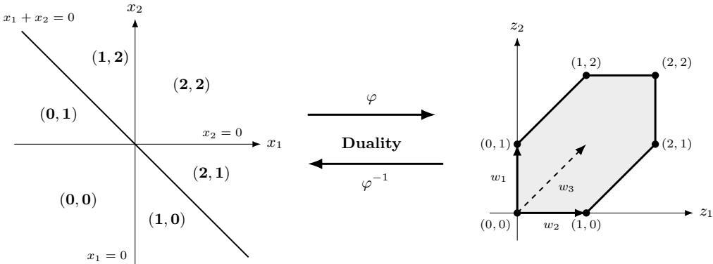
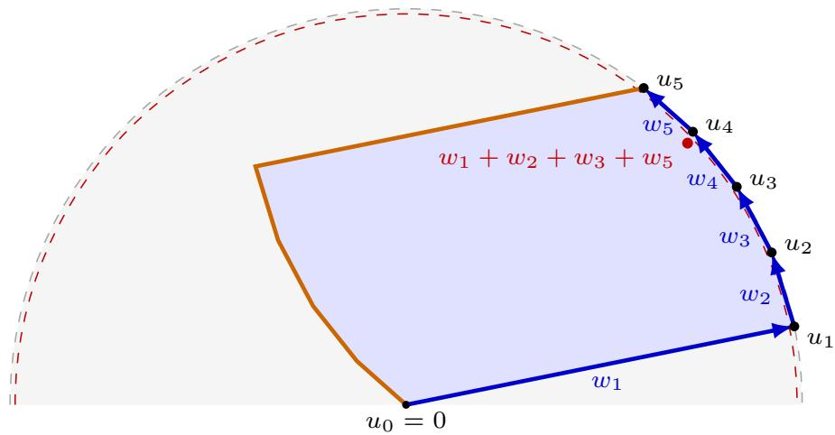

# Parameterized Complexity of $L _ { p ^ { - } }$ Lipschitz Constants for Input Convex Neural Networks and Lp-Norm Maximization over Zonotopes

Aritra Das1, Vincent Froese2, Moritz Grillo3, Debayan Gupta1, Christoph Hertrich4, Tharrshann Jayan Logarajah5, Georg Loho6, Mihir More1, and Moritz Stargalla4

1Ashoka University, Truth Audit Labs {aritra.das, debayan.gupta, mihir.more}@ashoka.edu.in

2Technische Universität Berlin, vincent.froese@tu-berlin.de 3Max Planck Institute for Mathematics in the Sciences, moritz.grillo@mis.mpg.de 4University of Technology Nuremberg, {christoph.hertrich, moritz.stargalla}@utn.de 5University College London, tjlogarajah@outlook.com 6Freie Universität Berlin, georg.loho@math.fu-berlin.de

## Abstract

Lipschitz constants are a standard way to quantify the sensitivity of neural networks to small input perturbations, but computing them is dificult even for shallow ReLU networks. We study this problem for two-layer input-convex neural networks (ICNNs), a restricted architecture where nonnegative output weights enforce convexity. Computing the Lp-Lipschitz constant for these networks is equivalent to maximizing the dual norm over a zonotope. While $L _ { 1 } -$ - and $L _ { \infty } .$ -norm maximization on zonotopes admit fixed-parameter and polynomial-time algorithms, respectively, the parameterized complexity of the remaining $L _ { p } .$ -norms was open. We prove that, for every fixed $p \in ( 1 , \infty ) \cap \mathbb { Q }$ , maximizing the $L _ { p } .$ -norm over a zonotope in $\mathbb { R } ^ { d }$ is W[1]-hard with respect to the dimension d. Moreover, our hardness results imply that brute-force enumeration algorithms are essentially optimal for this problem under the Exponential Time Hypothesis. By duality, the same hardness results hold for computing the $L _ { p } { \mathrm { - L i p s c h i t z } }$ constant of two-layer ReLU ICNNs. Our proof first establishes the result for the $L _ { 2 } \mathrm { - n o r m }$ and then transfers the construction to arbitrary fixed $p \in ( 1 , \infty ) \cap \mathbb { Q }$ using a suitable Taylor approximation. These results resolve the corresponding questions regarding the parameterized complexity status for zonotope norm maximization and two-layer ICNN Lipschitz constants.

Our paper resolves an open problem posted at COLT’25 [Froese et al., 2025a]. There are several independent concurrent papers resolving the same problem. Our paper prioritizes a clear exposition of the underlying mathematics and conceptual intuitions behind the proof. Additionally, we explicitly describe our research process including the use of LLMs.

## 1 Introduction

Neural networks with rectified linear unit (ReLU) activations play an important role in machine learning. In practice, such networks are trained on finite datasets and are expected to generalize reliably to unseen inputs. Nevertheless, even small input perturbations can lead to large changes in the output [Szegedy et al., 2014]. The $L _ { p }$ -Lipschitz constant of a neural network computing a function f is

$$
L _ { p } ( f ) : = \operatorname* { s u p } _ { x \neq y } { \frac { \| f ( x ) - f ( y ) \| _ { p } } { \| x - y \| _ { p } } } ,
$$

and gives a quantitative measure of how sensitive the network is to small input perturbations. Neural networks with small Lipschitz constants have been observed to be more robust to adversarial attacks and to have better generalization properties. The problem of approximating and computing the exact $L _ { p } .$ Lipschitz constant of neural networks has therefore received substantial attention [Virmaux and Scaman, 2018, Weng et al., 2018, Fazlyab et al., 2019, Jordan and Dimakis, 2020].

Computing the $L _ { p } .$ -Lipschitz constant exactly for $p \in ( 0 , \infty ]$ is NP-hard already for two-layer ReLU networks [Virmaux and Scaman, 2018, Froese et al., 2026], and approximation within any multiplicative factor is NP-hard for three-layer ReLU networks [Jordan and Dimakis, 2020, Froese et al., 2025b]. The hardness of this problem is closely connected to the curse of dimensionality which also aflicts many other problems in machine learning: the size of the search space of these problems grows exponentially with the input dimension d. In practice, however, high-dimensional data is often assumed to lie near some low-dimensional submanifold of the input space. Therefore, a natural follow-up question is whether these problems become tractable when the input dimension is small.

This viewpoint has motivated recent work on the parameterized complexity of neural network problems, including training [Arora et al., 2018, Froese et al., 2022, Brand et al., 2023, Froese and Hertrich, 2023, Ganian et al., 2026] and verification [Froese et al., 2025b, 2026]; see also the survey [Ganian, 2026]. When allowing arbitrary weights, computing the $L _ { p } { \mathrm { - L i p s c h i t z } }$ constant is W[1]-hard with respect to the input dimension d already for two-layer ReLU networks, approximation is $\mathrm { W } [ 1 ] .$ -hard for three-layer ReLU networks, and the problems are not solvable in time $n ^ { o ( d ) }$ poly(N) (where n is the width and N the encoding size) under the Exponential Time Hypothesis (ETH), matching the running times of brute-force enumeration algorithms Froese et al. [2026]. The known hardness reductions, however, use both positive and negative output weights and therefore do not imply hardness when putting additional restrictions on the network architecture.

One important such restricted architecture is input-convex neural networks (ICNNs) with ReLU activations, where the weights of all but the first layer are restricted to be nonnegative [Amos et al., 2017]. This restriction ensures that an ICNN computes a convex function. ICNNs provide a direct way to incorporate prior knowledge into the network architecture and have been used, for example, in optimal control, optimal transport, and convex optimization [Chen et al., 2019, Makkuva et al., 2020, Huang et al., 2021].

Another feature of ICNNs is that the architectural restriction can make computational problems easier. For example, minimizing the function represented by a ReLU ICNN is polynomial-time solvable, whereas the same problem is NP-hard and W[1]-hard with respect to the input dimension for general ReLU networks [Amos et al., 2017, Froese et al., 2026]. Further, the $L _ { \mathrm { 1 ^ { - } L i p s c h i t z } }$ constant of ReLU ICNNs can be computed in polynomial time, and the $L _ { \infty } { - } ]$ Lipschitz constant is fixed-parameter tractable with respect to the input dimension, while the same problems for general ReLU networks are NP-hard and $\mathrm { W } [ 1 ] .$ -hard with respect to the input dimension [Froese et al., 2026].

This raises the natural question whether the restriction to ICNNs also makes the problem tractable for the remaining $L _ { p } .$ -norms with $p \in ( 1 , \infty )$ . In particular, this range includes the $L _ { \mathrm { { 2 } } } \mathrm { { - n o r m } }$ , which, unlike the $L _ { 1 } .$ - and $L _ { \infty } \mathrm { - n o r m s }$ , is invariant under orthogonal transformations and has been studied extensively in the context of robustness of neural networks [Moosavi-Dezfooli et al., 2016, Cisse et al., 2017, Cohen et al., 2019]. Moreover, the question whether the $L _ { p } { \mathrm { - L i p s c h i t z } }$ constant of a (two-layer) ReLU ICNN is fixed-parameter tractable with respect to the input dimension d for $p \in ( 1 , \infty )$ has been posed as an open problem at COLT 2025 [Froese et al., 2025a], and, in the equivalent language of norm-maximization over zonotopes, in [Shenmaier, 2020].

## 1.1 Our Contributions

We resolve this question negatively by proving $\mathrm { W } [ 1 ]$ -hardness with respect to the parameter input dimension d, which excludes fixed-parameter tractability under standard complexity assumptions. Moreover, assuming the ETH, we show that solving these problems via brute-force enumeration algorithms that enumerate the vertices of zonotopes or the linear regions of a neural network is essentially optimal.

For two-layer ReLU ICNNs with input dimension $d ,$ computing the $L _ { p } .$ -Lipschitz constant is equivalent to maximizing the $L _ { q } .$ -norm over a zonotope in $\mathbb { R } ^ { d }$ , where p and q are conjugate exponents, that is, $1 / p + 1 / q = 1$ [Froese et al., 2025a]. We describe this equivalence in Section 3. The problem $L _ { p } .$ -norm maximization over zonotopes was studied long before this connection to ICNNs was known. Bodlaender et al. [1990] showed NP-hardness for every $p \in  { \mathbb { N } } _ { \geq 1 }$ . For the $L _ { 2 } .$ -norm, the problem is known as unconstrained binary quadratic maximization for positive-semidefinite matrices of rank d [Ferrez et al., 2005]. For $p \in [ 1 , \infty ]$ , the problem has been studied as the Longest Vector Sum problem, with applications in pattern recognition, clustering, signal processing, and political analysis [Pyatkin, 2010, Shenmaier, 2018, 2020]. Known results include NPhardness and inapproximability [Pyatkin, 2010, Shenmaier, 2020], fixed-parameter tractability with respect to d for $p = 1$ , polynomial time solvability for $p = \infty$ [Baburin and Pyatkin, 2007], and exact algorithms with running time $n ^ { d - 1 } \operatorname { p o l y } ( N )$ [Ferrez et al., 2005, Shenmaier, 2020]. For $p \in ( 1 , \infty )$ , fixed-parameter $( 1 - \varepsilon )$ -approximation algorithms are known for every fixed $\varepsilon > 0$ [Shenmaier, 2018, Froese et al., 2026]. A zonotope generated by n vectors in $\mathbb { R } ^ { d }$ has $\mathcal { O } ( n ^ { d - 1 } )$ vertices, and the best-known exact algorithms for $p \in ( 1 , \infty )$ essentially enumerate all vertices in $n ^ { d - 1 } \operatorname { p o l y } ( N )$ time (where N is the input bit-length)[Ferrez et al., 2005, Froese et al., 2026].

In Section 4, we give two reductions from Multicolored Clique to $L _ { \mathrm { 2 } } ^ { \mathrm { 2 } } \mathrm { - M A X }$ on Zonotopes (see Section 2 for a formal definition) in which the dimension d depends linearly on the requested clique size k. The two reductions give diferent insights: the first one is explicit and uses elementary techniques, whereas the second one is non-explicit but contains some interesting geometric insights. We believe that the underlying techniques used in the second reduction are of interest on their own and might be helpful for other problems. The two reductions prove W[1]-hardness and tight running time lower bounds based on the ETH. The main dificulty in the reductions is to keep the dimension linear in k, in contrast to classical NP-hardness reductions where the dimension can grow without restriction. In Section 5, we then transfer the construction for the $L _ { 2 } .$ -norm to $L _ { p } ^ { p } .$ -Max on Zonotopes for every fixed $p \in ( 1 , \infty ) \cap \mathbb { Q }$ . More precisely, we prove the following.

Theorem 1.1. For every $p \in ( 1 , \infty ) \cap \mathbb { Q }$ , Lpp-Max on Zonotopes is W[1]-hard with respect to d and not solvable in time $\rho ( d ) N ^ { o ( d ) }$ (where N is the input bit-length) for any computable function $\rho$ assuming the ETH.

Hardness of Lp-maximization does not directly imply hardness of $L _ { p ^ { - } } \mathrm { m a x i m i z a t i o n } ,$ since replacing the threshold L with $L ^ { 1 / p }$ might give an irrational threshold and therefore not a valid instance of $L _ { p ^ { - } } \mathrm { M A X }$ on Zonotopes. However, the reduction for $L _ { p } ^ { p } .$ -maximization produces a gap and approximating $L ^ { 1 / p }$ with suficiently precise rational numbers preserves this gap and gives the following as a corollary.

Corollary 1.2. For every $p \in ( 1 , \infty ) \cap \mathbb { Q } , L _ { p ^ { - } } M A X$ on Zonotopes is W[1]-hard with respect to d and not solvable in time $\rho ( d ) N ^ { o ( d ) }$ (where N is the input bit-length) for any computable function ρ assuming the ETH.

The equivalence between $L _ { p } .$ -maximization over zonotopes and computing the $L _ { q } \mathrm { - L i p s c h i t z }$ constant of two-layer ICNNs from Section 3 then gives the following as a corollary.

Corollary 1.3. For every $p \in ( 1 , \infty ) \cap \mathbb { Q }$ , Two-Layer ICNN $L _ { p } – L I P S C H I T Z$ Constant is $W [ 1 ]$ -hard with respect to the input dimension and not solvable in time $\rho ( d ) N ^ { o ( d ) }$ (where N is the input bit-length) for any computable function $\rho$ assuming the ETH.

We note that hardness for two-layer networks implies hardness for deeper networks with $\ell \geq 2$ layers by simply concatenating the two-layer network with additional layers computing the identity map.

Finally, we actively contribute to the discussion of the future of mathematics and theoretical research in the age of AI by describing our research process using LLMs in Section 7, advocating a focus on clear and intuitive exposition.

## 1.2 Concurrent Results

Independently of our work, a proof for W[1]-hardness of $L _ { \mathrm { { 2 } ^ { - } } } \mathrm { { M A X } }$ on Zonotopes was recently obtained by an agentic AI pipeline.1 The proof gives a reduction from Multicolored Clique with dimension $2 k + 1$ , and works with support functions of centrally symmetric zonotopes. We adopt a similar viewpoint in Section 4.2, but present a diferent reduction using theoretical insights from polyhedral geometry with 2k instead of $2 k + 1$ dimensions. We discuss our own usage of and experiences with AI in Section 7. A few days ago, again independently of our work, proofs showing W[1]-hardness of $L _ { \mathrm { 2 } } \mathrm { - M A X }$ on Zonotopes [Dewasurendra and Jayawardhana, 2026] and W[1]-hardness of $L _ { p } ^ { p } \mathrm { - M A X }$ on Zonotopes for every fixed rational $p \in ( 1 , \infty )$ [Cao et al., 2026] were published. Dewasurendra and Jayawardhana [2026] give a reduction from Partitioned

Subgraph Isomorphism with dimension $1 1 k + 1$ , which shows that under the ETH, no $\rho ( k ) n ^ { o ( k / \log k ) }$ time algorithm exists for $L _ { \mathrm { { 2 } ^ { - } } } \mathrm { { M A X } }$ on Zonotopes. Cao et al. [2026] give a reduction from binary CSP and then specialize it to a reduction from Multicolored Clique with dimension $2 k + 1$ , which shows that under the ETH, no $\rho ( k ) n ^ { o ( k ) }$ time algorithm exists for $L _ { p } ^ { p } \mathrm { - M A X }$ on Zonotopes. We obtain the same running time lower bound. Moreover, Cao et al. [2026] also present deterministic fixed-parameter $( 1 - \varepsilon )$ -approximation algorithms for every fixed $\varepsilon > 0$ running in time $f _ { p } ( d ) \varepsilon ^ { - ( d - 1 ) / 2 } \mathrm { p o l y } ( N , \mathrm { l o g } ( 1 / \varepsilon ) )$ , and rule out algorithms with $( 1 / \varepsilon ) ^ { o ( d ) }$ dependence under the ETH. It is worth noting that all proofs, including ours, construct points lying exactly or approximately on the two-dimensional $L _ { \mathrm { { 2 } } } \mathrm { { - u n i t } }$ circle (or $L _ { p } .$ -unit circle in Cao et al. [2026]) that define a zonotope and then use this zonotope to encode choices of nodes or variables, see Section 2.1 in the AI agentic pipeline proof (Footnote 1), Lemma 4 of Dewasurendra and Jayawardhana [2026], and Lemma 3.2 of Cao et al. [2026]. Despite these similarities, the details of the reductions are all quite diferent, as outlined above. In particular, we present a reduction from Multicolored Clique with dimension 2k instead of $1 1 k + 1$ or $2 k + 1$ for $p = 2$ in Section 4.2, and provide geometric intuition for all of our proofs.

## 1.3 Further Related Work

Computing Lipschitz constants of two-layer ReLU ICNNs is not the only neural network problem that can be formulated in terms of maximizing certain norms over zonotopes: for example, maximizing a zonotope-induced norm over a zonotope corresponds to the zonotope containment problem, which in turn is equivalent to deciding whether a two-layer ReLU network attains a positive output value [Kulmburg and Althof, 2021, Froese et al., 2026]. This problem is also known to be $\mathrm { W } [ 1 ]$ -hard with respect to the input dimension d.

$L _ { p } { \mathrm { - n o r m } }$ maximization on general polytopes in halfspace representation is W[1]-hard with respect to the dimension d fo $p \in \mathbb { N } _ { \geq 2 }$ and fixed-parameter tractable for $p = 1$ Knauer et al. [2015]. This result does not extend to zonotopes, since zonotopes are given in generator representation, and their halfspace representation can be exponentially larger than their generator representation. The parameter dimension d has also been considered for many other geometry problems. Several reductions in this area, as also ours, use specially constructed points on the two-dimensional $L _ { 2 } .$ -unit sphere that are sometimes also called “scafolding point sets”, and embed them into higher dimensions Giannopoulos et al. [2009], Cabello et al. [2011], Knauer et al. [2015], Froese et al. [2022].

## 2 Preliminaries

Notation. We write $\mathbb { N } = \{ 0 , 1 , \ldots \}$ and set $[ n ] : = \{ 1 , \dots , n \}$ for $n \in  { \mathbb { N } } _ { \geq 1 }$ . A function $f : \mathbb { R } ^ { d }  \dot { }$ R is positively homogeneous if $f ( \lambda x ) = \lambda f ( x )$ for all $x \in \mathbb { R } ^ { d }$ and $\lambda \geq 0$ . A vector $x \in \mathbb { R } ^ { d }$ is decreasing i $\mathrm { ~ f ~ } x _ { 1 } \geq \cdot \cdot \cdot \geq x _ { d }$

$L _ { p } { \bf - N o r m s }$ . For $p \in [ 1 , \infty )$ and a vector $x \in \mathbb { R } ^ { d }$ , the $L _ { p }$ -norm of x is $\begin{array} { r } { \| { \boldsymbol x } \| _ { p } : = \left( \sum _ { i = 1 } ^ { d } | x _ { i } | ^ { p } \right) ^ { 1 / p } } \end{array}$ . For $p = \infty$ , the $L _ { \infty } { - } n o r m$ of x is $\left\| x \right\| _ { \infty } : = { \mathrm { m a x } } _ { i \in [ d ] } \left| x _ { i } \right|$ . For $p \in [ 1 , \infty ]$ , the $L _ { p ^ { - } } L$ ipschitz constant of a function $f : \mathbb { R } ^ { d }  \mathbb { R } ^ { m }$ is $\begin{array} { r } { L _ { p } ( f ) : = \operatorname* { s u p } _ { x \neq y } { \frac { \Vert f ( x ) - f ( y ) \Vert _ { p } } { \Vert x - y \Vert _ { p } } } } \end{array}$

ReLU Neural Networks. A two-layer (one-hidden-layer) ReLU network with scalar output is given by input weights $W \in \mathbb { R } ^ { n \times d }$ with rows $w _ { 1 } , \ldots , w _ { n } \in \mathbb { R } ^ { d }$ , a bias vector $b \in \mathbb { R } ^ { n }$ , output weights $a \in \mathbb { R } ^ { n }$ and an output bias $B \in \mathbb { R }$ . It computes the continuous piecewise-linear function $f \colon  { \mathbb { R } ^ { d } } \to$ R given by $\textstyle f ( x ) = B + \sum _ { i = 1 } ^ { n } a _ { i }$ i max $\{ 0 , w _ { i } ^ { \top } x + b _ { i } \}$ , where max{0, x} is the ReLU activation function. After deleting zero output weights and rescaling the weights, that is, replacing $( w _ { i } , b _ { i } )$ with $| a _ { i } | ( w _ { i } , b _ { i } )$ and $a _ { i }$ with $\mathrm { s i g n } ( a _ { i } ) \in \{ - 1 , 1 \}$ , we can assume $a \in \{ - 1 , 1 \} ^ { n }$ without loss of generality. If the network is bias-free, that is, $b = 0$ and $B = 0$ , then f is positively homogeneous. If $a \geq 0$ , then $f$ is convex and the network is called a two-layer ReLU input-convex neural network (ICNN).

Polyhedra and Zonotopes. A polyhedron P is the intersection of finitely many closed halfspaces $P = \{ x \in$ $\mathbb { R } ^ { d } : A x \le b \}$ . A face of P is either the empty set or the set of maximizers arg max $\{ c ^ { \top } x : x \in P \}$ of a linear function over P. Faces of dimension zero are called vertices; faces of dimension dim $. ( P ) - 1$ are called facets. A polytope is a bounded polyhedron; equivalently, it is the convex hull of finitely many points. The inclusion-wise minimal set V satisfying $\operatorname { c o n v } ( V ) = P$ is the set of vertices $V ( P )$ of P. Given a matrix $G = ( g _ { 1 } , \dots , g _ { n } ) \in \mathbb { R } ^ { d \times n }$ the associated zonotope is the polytope $\begin{array} { r } { Z ( G ) : = \sum _ { i = 1 } ^ { n } \mathrm { c o n v } ( \{ 0 , g _ { i } \} ) = \{ \sum _ { i = 1 } ^ { n } \lambda _ { i } g _ { i } : \lambda \in [ 0 , 1 ] ^ { n } \} } \end{array}$ . The matrix G is the generator matrix of $Z ( G )$ , and its columns are the generators of $Z ( G )$

Parameterized Complexity. A parameterized problem consists of instances $( x , k )$ , where x is the classical problem instance and $k \in \mathbb N$ is a parameter. A parameterized problem is in the class XP if it is polynomial-time solvable for every constant parameter value, that ${ \mathrm { i s } } ,$ in $\mathcal { O } ( | x | ^ { \bar { f } ( k ) } )$ time for an arbitrary function f depending only on the parameter $k ,$ where $| x |$ denotes the encoding bit-length of the instance x. A parameterized problem is fixed-parameter tractable (that is, contained in the class $\mathrm { F P T } \subseteq \mathrm { X P } )$ if it is solvable in $f ( k ) \cdot | x | ^ { \mathcal { O } ( 1 ) }$ time for an arbitrary function $f$ solely depending on k. The class W[1] contains parameterized problems which are presumably not in FPT. Such W[1]-hard problems are defined via parameterized reductions: A parameterized reduction from L to $L ^ { \prime } \left( L \leq _ { \mathrm { f p t } } \bar { L } ^ { \prime } \right)$ is an algorithm that maps an instance $( x , k )$ in $f ( k ) \cdot | x | ^ { \mathcal { O } ( 1 ) }$ time to an instance $( \boldsymbol { x } ^ { \prime } , \boldsymbol { k } ^ { \prime } )$ such that $k ^ { \prime } \leq g ( k )$ for some function g and $( x , k ) \in L$ holds if and only if $( x ^ { \prime } , k ^ { \prime } ) \in L ^ { \prime }$ . We refer to Downey and Fellows [2013] for further details of parameterized complexity.

The Exponential Time Hypothesis (ETH) [Impagliazzo and Paturi, 2001] states that 3-SAT on n variables cannot be solved in $2 ^ { o ( n ) }$ time. The ETH implies $\mathrm { F P T } \neq \mathrm { W } [ 1 ]$ as well as running time lower bounds for various problems, such as that Clique cannot be solved in $\rho ( k ) n ^ { o \bar { ( } k ) }$ time, where k is the size of the requested clique and n is the number of nodes in the graph [Cygan et al., 2015b].

## 2.1 Problem Definition

For $p \in [ 1 , \infty ]$ , we consider the following two problems.

Two-Layer ICNN Lp-Lipschitz Constant

Input: A weight matrix $W = ( w _ { 1 } , \ldots , w _ { n } ) ^ { \top } \in \mathbb { Q } ^ { n \times d } .$ , biases $b \in \mathbb { Q } ^ { n } , B \in \mathbb { Q }$ , and $L \in \mathbb { Q }$

Question: Is $L _ { p } ( f ) \geq L$ with $\begin{array} { r } { f ( x ) = B + \sum _ { i = 1 } ^ { n } [ w _ { i } ^ { \top } x + b _ { i } ] _ { + } ? } \end{array}$

$L _ { p ^ { - } } \mathrm { M A X }$ on Zonotopes

Input: A rational generator matrix $G \in \mathbb { Q } ^ { d \times n }$ and $L \in \mathbb { Q }$

Question: Is ma $\operatorname { \hat { \rho } } _ { z \in Z ( G ) } \left\| z \right\| _ { p } \geq L ?$

For $p \in [ 1 , \infty ) , L _ { p } ^ { p } \mathrm { - M A X }$ on Zonotopes denotes the same problem with the question $\begin{array} { r } { \operatorname* { m a x } _ { z \in Z ( G ) } \| z \| _ { p } ^ { p } \geq L } \end{array}$ Assuming access to an oracle that determines in polynomial time whether $\| z \| _ { p } \geq L$ for $z \in \mathbb { R } ^ { d } , L \in \mathbb { R }$ $L _ { p } – \mathrm { M A X }$ on Zonotopes belongs to XP with respect to d (as mentioned earlier): one can simply enumerate all vertices of the zonotope and evaluate their $L _ { p } .$ -norm.

We use the following alternative formulation of $L _ { p } ^ { p } \mathrm { - M A X }$ on Zonotopes throughout the paper.

Lemma 2.1. For every generator matrix $G = ( g _ { 1 } , \dots , g _ { n } ) \in \mathbb { R } ^ { d \times n }$ and every $p \in [ 1 , \infty )$

$$
\operatorname* { m a x } _ { z \in Z ( G ) } \| z \| _ { p } ^ { p } = \operatorname* { m a x } _ { \sigma \in \{ 0 , 1 \} ^ { n } } \left\| \sum _ { i = 1 } ^ { n } \sigma _ { i } g _ { i } \right\| _ { p } ^ { p } .
$$

Proof. Since $\| \cdot \| _ { p } ^ { p }$ is convex, it attains its maximum over the polytope $Z ( G )$ at a vertex. By [Ziegler, 2012], the vertices are vectors of the form $\textstyle \sum _ { i = 1 } ^ { n } \sigma _ { i } g _ { i } \in Z ( G )$ for $\sigma \in \{ 0 , 1 \} ^ { n }$ , and each such vector is at least contained in $Z ( G )$ . For every vertex $v ,$ let $\sigma ( v ) \in \{ 0 , 1 \} ^ { n }$ be its corresponding binary vector. It follows that

$$
\operatorname* { m a x } _ { z \in Z ( G ) } \| z \| _ { p } ^ { p } = \operatorname* { m a x } _ { v \in V ( Z ( G ) ) } \left\| \sum _ { i = 1 } ^ { n } \sigma ( v ) _ { i } g _ { i } \right\| _ { p } ^ { p } = \operatorname* { m a x } _ { \sigma \in \{ 0 , 1 \} ^ { n } } \left\| \sum _ { i = 1 } ^ { n } \sigma _ { i } g _ { i } \right\| _ { p } ^ { p } .
$$

## 3 $L _ { p } { \bf - L }$ ipschitz-constant for Input-convex ReLU Networks

In this section, we discuss the equivalence between $L _ { p } { \mathrm { - } } \mathrm { M A X }$ on Zonotopes and Two-Layer ICNN $L _ { q } .$ -Lipschitz Constant, where $p , q \in [ 1 , \infty ]$ are conjugate exponents, that is, $1 / p + 1 / q = 1$ with the convention $1 / \infty = 0$ . This equivalence will allow us to later transfer the hardness for $L _ { p } – \mathrm { M A X }$ on Zonotopes to Two-Layer ICNN $L _ { q } .$ -Lipschitz Constant. The equivalence is a consequence of a well-known duality between convex continuous piecewise linear and positively homogeneous functions from $\mathbb { R } ^ { d }$ to R and polytopes in $\mathbb { R } ^ { d }$ from tropical geometry, which we now briefly sketch, see, e.g., [Zhang et al., 2018] for more details.

  
Figure 1: Illustration of the duality between zonotopes and bias-free two-layer ICNNs for $W = ( w _ { 1 } , w _ { 2 } , w _ { 3 } ) ^ { \top }$ with $w _ { 1 } = ( 0 , 1 )$ $w _ { 2 } = ( 1 , 0 )$ , and $w _ { 3 } = ( 1 , 1 )$ . The ICNN computes $f \colon \mathbb { R } ^ { 2 } \to \mathbb { R } , x \mapsto \textstyle \sum _ { i = 1 } ^ { 3 }$ max $\{ 0 , w _ { i } ^ { \top } x \}$ (left) and the corresponding zonotope is $\begin{array} { r } { Z ( W ^ { \top } ) = \sum _ { i = 1 } ^ { 3 } } \end{array}$ conv $( \{ 0 , w _ { i } ^ { \top } x \} )$ (right). The hyperplanes $w _ { i } ^ { \top } x = 0$ partition the input space into six linear regions. The gradient on a region is the sum of a subset of generators (bold vectors on the left) and is exactly one of the six vertices of $Z ( W ^ { \top } )$ .

Every ReLU ICNN computes a convex continuous piecewise linear function of the form $f : \mathbb { R } ^ { d }  \mathbb { R } , x \mapsto$ max $\{ a _ { 1 } ^ { \top } x + b _ { 1 } , \ldots , a _ { k } ^ { \top } x + b _ { k } \}$ . Such a function subdivides $\mathbb { R } ^ { d }$ into a set of disjoint polyhedral regions, also called linear regions, on which the function is afine linear. More precisely, there exists a finite set C of disjoint polyhedra with $\textstyle \mathbb { R } ^ { d } = \bigcup _ { C \in { \mathcal { C } } } C$ and $f ( x ) = a _ { C } ^ { \top } x + b _ { C }$ for all $x \in C$ and some $a _ { C } \in \mathbb { R } ^ { d } , b _ { C } \in \mathbb { R }$ . Let $p , q \in [ 1 , \infty ]$ be conjugate exponents, that is, $1 / p + \bar { 1 } / q = 1$ (with the convention $1 / \infty = 0 )$ . Then, using the well-known equality $L _ { p } ( g ) = \operatorname* { m a x } _ { x \in \mathbb { R } ^ { d } } \| \nabla g ( x ) \| _ { q }$ for smooth functions $g :  { \mathbb { R } ^ { d } } \to  { \mathbb { R } }$ [Jordan and Dimakis, 2020], we obtain that the Lp-Lipschitz constant of $f$ on the region C is equal to $\| a _ { C } \| _ { q } .$ , which implies

$$
L _ { p } ( f ) = \operatorname* { m a x } _ { C \in { \mathcal { C } } } \| a _ { C } \| _ { q } .
$$

Hence, computing the $L _ { p } .$ -Lipschitz constant amounts to maximizing the dual norm of the coeficients vectors of the linear regions of $f .$ . Observe that the function f of the ICNN has the same $L _ { p ^ { - } }$ Lipschitz constant as the positively homogeneous function max $\{ a _ { 1 } ^ { \top } x , \ldots , a _ { k } ^ { \top } x \}$ computed by the same ICNN with all biases set to zero. This allows us to restrict to bias-free ICNNs without loss of generality.

There is a bijection $\varphi$ between the set $\mathcal { F } _ { d }$ of convex continuous piecewise linear and positively homogeneous functions from $\mathbb { R } ^ { d }$ to R computed by bias-free ReLU ICNNs and the set $\mathcal { P } _ { d }$ of polytopes in $\mathbb { R } ^ { \bar { d } }$ , given by $\varphi \left( \operatorname* { m a x } \{ a _ { 1 } ^ { \top } x , \ldots , a _ { k } ^ { \top } x \} \right)$ = conv $\{ a _ { i } : i \in [ k ] \}$ . The inverse $\varphi ^ { - 1 } : { \mathcal { P } } _ { d } \to { \mathcal { F } } _ { d }$ gives the support function $\begin{array} { r } { \varphi ^ { - 1 } ( \dot { P } ) ( x ) = \operatorname* { m a x } _ { y \in P } y ^ { \top } x } \end{array}$ of a polytope $P \in \mathcal { P } _ { d }$ . Further, this bijection satisfies $\varphi ( f + g ) = \varphi ( f ) + \varphi ( g )$ (where the + becomes a Minkowski sum) and $\varphi ( \operatorname* { m a x } \{ f , g \} ) = \mathrm { c o n v } \{ \varphi ( f ) \cup \varphi ( g ) \}$ for all $f , g \in \mathcal { F } _ { d }$

Applying this bijection to a bias-free two-layer ReLU ICNN that computes $f : \mathbb { R } ^ { d }  \mathbb { R } , x \mapsto \textstyle \sum _ { i = 1 } ^ { n } \operatorname* { m a x } \{ 0 , w _ { i } ^ { \top } x \}$ with weight matrix $W = ( w _ { 1 } , \ldots , w _ { n } ) ^ { \top } \in \mathbb { R } ^ { n \times d }$ shows that the polytope corresponding to $f$ is

$$
\varphi ( f ) = \varphi \left( \sum _ { i = 1 } ^ { n } \operatorname* { m a x } \{ 0 , w _ { i } ^ { \top } x \} \right) = \sum _ { i = 1 } ^ { n } \varphi \left( \operatorname* { m a x } \{ 0 , w _ { i } ^ { \top } x \} \right) = \sum _ { i = 1 } ^ { n } \varphi \left( \operatorname* { m a x } \{ 0 , w _ { i } ^ { \top } x \} \right) = \sum _ { i = 1 } ^ { n } \operatorname { c o n v } ( \{ 0 , w _ { i } ^ { \top } x \} ) = \sum _ { i = 1 } ^ { n } \operatorname { c o n v } ( \{ 0 , w _ { i } \} ) = Z ( W ^ { \top } ) .
$$

a zonotope. It is a well-known fact that the vertices of $Z ( W ^ { \top } )$ are in bijection to the regions of the hyperplane arrangement $\mathcal { H } _ { W } = \left( \{ \boldsymbol { x } \in \mathbb { R } ^ { d } : w _ { i } ^ { \top } \boldsymbol { x } = 0 \} \right) _ { i \in [ n ] }$ defined by W [Ziegler, 2012], which are precisely the linear regions of $f .$ . Moreover, the coeficient vector $a _ { C }$ of a linear region $C \in { \mathcal { C } }$ is precisely the vertex v of $Z ( W ^ { \top } )$ that corresponds to the linear region (see Figure 1). Since every vertex v of $\bar { Z } ( W ^ { \top } )$ is of the form $\scriptstyle \sum _ { i = 1 } ^ { n } \sigma _ { i } w _ { i }$

for some $\sigma _ { i } \in \{ 0 , 1 \} ^ { n }$ [Ziegler, 2012], we obtain

$$
L _ { p } ( f ) = \operatorname* { m a x } _ { \sigma \in \{ 0 , 1 \} ^ { n } } \left\| \sum _ { i = 1 } ^ { n } \sigma _ { i } w _ { i } \right\| _ { q } = \operatorname* { m a x } _ { z \in Z ( W ^ { \top } ) } \| z \| _ { q } .
$$

This proves the equivalence between Two-Layer ICNN $L _ { p } { \mathrm { - } } \mathrm { L I P S C H I T Z }$ Constant and $L _ { q } { \mathrm { - } } \mathrm { M A X }$ on Zonotopes when p and q are conjugate exponents.

## 4 Two Hardness Reductions for $L _ { \mathrm { 2 } } ^ { \mathrm { 2 } } \mathbf { - M a x }$ on Zonotopes

In this section, we give two parameterized reductions for $L _ { \mathrm { 2 } } ^ { \mathrm { 2 } } \mathrm { - M A X }$ on Zonotopes, each giving diferent insights. The first reduction with $2 k + 1$ dimensions explicitly constructs the generators of the zonotope and relies only on elementary techniques, whereas the second reduction with 2k dimensions contains some interesting geometric insights and obtains the generators of the zonotope non-explicitly from the solution of linear programs. In Section 5, we use these reductions to prove hardness for $L _ { p } ^ { p } \mathrm { - } \mathrm { M A X }$ on Zonotopes for every fixed $p \in ( 1 , \infty ) \cap \mathbb { Q }$ . We reduce from the following problem.

Multicolored Clique

Input: A graph $G = ( V = V _ { 1 } \dot { \cup } \cdot \cdot \cdot \dot { \cup } V _ { k } , E )$ , where each node in $V _ { i }$ has color $i .$

Question: Does G have a k-colored clique (a clique with exactly one node of each color)?

Multicolored Clique is NP-hard, W[1]-hard with respect to $k ,$ and not solvable in time $\rho ( k ) | V | ^ { o ( k ) }$ for any computable function $\rho$ assuming the ETH [Cygan et al., 2015a].

## 4.1 Explicit Reduction with $2 k + 1$ Dimensions

In this subsection, we give an elementary explicit reduction with $2 k + 1$ dimensions. Given an instance $G = ( V = V _ { 1 } \dot { \cup } \cdot \cdot \cdot \dot { \cup } V _ { k } , E )$ , we will construct a generator matrix $A _ { G } \in \mathbb { Q } ^ { d \times ( | V | + | E | + 1 ) }$ of polynomial encoding size with $d \in { \mathcal { O } } ( k )$ and values $L , \Delta \in \mathbb { Q } _ { > 0 }$ such that m $\begin{array} { r } { \operatorname { 1 a x } _ { z \in Z ( A _ { G } ) } \left\| z \right\| _ { 2 } ^ { 2 } > L } \end{array}$ if G is a yes-instance and $\begin{array} { r } { \operatorname* { m a x } _ { z \in Z ( A _ { G } ) } \left\| z \right\| _ { 2 } ^ { 2 } < L - \Delta } \end{array}$ otherwise.

We first describe a gadget that we use in the reduction. It constructs rational vectors $u _ { 0 } , \ldots , u _ { m }$ on the $L _ { 2 } .$ -norm unit circle, except for $u _ { 0 } = 0 \nonumber$ , and diference vectors $w _ { i } = u _ { i } - u _ { i - 1 }$ such that for a binary vector $\sigma \in \{ 0 , 1 \} ^ { m }$ , the sum $\scriptstyle \sum _ { i = 1 } ^ { m } \sigma _ { i } w _ { i }$ lies on the unit circle if σ is nonzero and decreasing, and lies strictly inside the unit circle otherwise (see Figure 2 for an illustration).

Lemma 4.1. Let m $\in \mathbb { N } _ { > 1 }$ , let $u _ { 0 } = ( 0 , 0 )$ , and, for every $i \in [ m ]$ , define

$$
t _ { i } = \frac { i } { 2 m } , \qquad u _ { i } = \left( \frac { 1 - t _ { i } ^ { 2 } } { 1 + t _ { i } ^ { 2 } } , \frac { 2 t _ { i } } { 1 + t _ { i } ^ { 2 } } \right) , \qquad w _ { i } = u _ { i } - u _ { i - 1 } .
$$

For every nonzero decreasing $\sigma \in \{ 0 , 1 \} ^ { m }$ , we have $\begin{array} { r } { \left. \sum _ { i = 1 } ^ { m } \sigma _ { i } w _ { i } \right. _ { 2 } ^ { 2 } = 1 } \end{array}$ . For every $\sigma \in \{ 0 , 1 \} ^ { m }$ that is either zero or not decreasing, we have

$$
\left\| \sum _ { i = 1 } ^ { m } \sigma _ { i } w _ { i } \right\| _ { 2 } ^ { 2 } \leq 1 - \delta _ { m } , \qquad \delta _ { m } : = \frac { 1 6 } { 2 5 m ^ { 2 } } .
$$

Moreover, for m $\geq 2$

$$
\operatorname* { m i n } _ { i , j \in [ m ] , i \neq j } \| u _ { i } - u _ { j } \| _ { 2 } ^ { 2 } \geq \delta _ { m } .
$$

Proof. The statement is trivial for $m = 1$ , and the second claim is trivial for $\sigma = 0$ . Let $\sigma \in \{ 0 , 1 \} ^ { m }$ be nonzero and decreasing. Then there is ${ \mathrm { ~ a ~ } } k \in [ m ]$ such that $\sigma _ { i } = 1$ for all $i \leq k$ and $\sigma _ { i } = 0$ for all $i > k$ . The

  
Figure 2: The vectors from Lemma 4.1 for $m = 5$ . The point $w _ { 1 } + w _ { 2 } + w _ { 3 } + w _ { 5 }$ (red) corresponds to the not decreasing binary vector $\sigma = ( 1 , 1 , 1 , 0 , 1 )$ and lies in a circle with radius $\sqrt { 1 - \delta _ { m } } \ ( \mathrm { r e d } )$

sum telescopes, and hence

$$
\left\| \sum _ { i = 1 } ^ { m } \sigma _ { i } w _ { i } \right\| _ { 2 } ^ { 2 } = \left\| \sum _ { i = 1 } ^ { k } ( u _ { i } - u _ { i - 1 } ) \right\| _ { 2 } ^ { 2 } = \| u _ { k } \| _ { 2 } ^ { 2 } = 1 ,
$$

which proves the first statement. For all $i , j \in [ m ] , i \neq j .$ , a direct calculation gives

$$
u _ { j } - u _ { i } = \frac { 2 ( t _ { j } - t _ { i } ) } { ( 1 + t _ { j } ^ { 2 } ) ( 1 + t _ { i } ^ { 2 } ) } \left( - ( t _ { j } + t _ { i } ) , 1 - t _ { j } t _ { i } \right) \quad \mathrm { a n d } \quad \| u _ { j } - u _ { i } \| _ { 2 } ^ { 2 } = \frac { 4 ( t _ { j } - t _ { i } ) ^ { 2 } } { ( 1 + t _ { j } ^ { 2 } ) ( 1 + t _ { i } ^ { 2 } ) } .\tag{1}
$$

We have $\begin{array} { r } { 0 < t _ { i } \le \frac { 1 } { 2 } } \end{array}$ for all $i \in [ m ]$ . Thus, for all $2 \leq i < j \leq m$ , we have

$$
\begin{array} { r } { ( ( t _ { j } + t _ { j - 1 } ) ( t _ { i } + t _ { i - 1 } ) + ( 1 - t _ { j } t _ { j - 1 } ) ( 1 - t _ { i } t _ { i - 1 } ) ) > 0 \quad \implies \quad w _ { i } ^ { \top } w _ { j } > 0 . } \end{array}
$$

For all $i \in \{ 2 , \ldots , m - 1 \}$ , we have

$$
\begin{array} { r } { ( ( t _ { i + 1 } + t _ { i } ) ( t _ { i } + t _ { i - 1 } ) + ( 1 - t _ { i + 1 } t _ { i } ) ( 1 - t _ { i } t _ { i - 1 } ) ) = ( 1 + t _ { i } ^ { 2 } ) ( 1 + t _ { i + 1 } t _ { i - 1 } ) . } \end{array}
$$

Together with $t _ { i } - t _ { i - 1 } = 1 / ( 2 m )$ , we obtain

$$
w _ { i } ^ { \top } w _ { i + 1 } = \frac { 4 \frac { 1 } { 4 m ^ { 2 } } ( 1 + t _ { i + 1 } t _ { i - 1 } ) } { ( 1 + t _ { i + 1 } ^ { 2 } ) ( 1 + t _ { i } ^ { 2 } ) ( 1 + t _ { i - 1 } ^ { 2 } ) } \geq \frac { 1 } { m ^ { 2 } ( 5 / 4 ) ^ { 3 } } = \frac { 6 4 } { 1 2 5 m ^ { 2 } } .
$$

Now let $m \geq 2$ and let $\sigma \in \{ 0 , 1 \} ^ { m }$ be not decreasing. Set $\begin{array} { r } { x = \sum _ { i = 1 } ^ { m } \sigma _ { i } w _ { i } } \end{array}$ . First suppose that $\sigma _ { 1 } = 1$ . Then, there is an index $k \in \{ 2 , \ldots , m - 1 \}$ with $\sigma _ { k } = 0$ and $\sigma _ { k + 1 } = 1$ . For every $j \geq 2 ,$ , the identity $\| u _ { j } \| _ { 2 } ^ { 2 } = \| u _ { j - 1 } \| _ { 2 } ^ { 2 }$ gives

$$
0 = \| u _ { j } \| _ { 2 } ^ { 2 } - \| u _ { j - 1 } \| _ { 2 } ^ { 2 } = \left\| \sum _ { i = 1 } ^ { j } w _ { i } \right\| _ { 2 } ^ { 2 } - \left\| \sum _ { i = 1 } ^ { j - 1 } w _ { i } \right\| _ { 2 } ^ { 2 } = \| w _ { j } \| _ { 2 } ^ { 2 } + 2 w _ { 1 } ^ { \top } w _ { j } + 2 \sum _ { i = 2 } ^ { j - 1 } w _ { i } ^ { \top } w _ { j } .
$$

Inserting this equality and using $\| w _ { 1 } \| _ { 2 } ^ { 2 } = 1$ and $w _ { i } ^ { \top } w _ { j } > 0$ for all $2 \leq i < j \leq m$ , we $\mathrm { g e t }$

$$
\begin{array} { l } { | | x | | _ { 2 } ^ { 2 } = 1 + \displaystyle \sum _ { j = 2 } ^ { m } \sigma _ { j } \left( \| w _ { j } \| _ { 2 } ^ { 2 } + 2 w _ { 1 } ^ { \top } w _ { j } + 2 { \displaystyle \sum _ { i = 2 } ^ { j - 1 } } \sigma _ { i } w _ { i } ^ { \top } w _ { j } \right) } \\ { \displaystyle \quad = 1 + \displaystyle \sum _ { j = 2 } ^ { m } \sigma _ { j } \left( \| w _ { j } \| _ { 2 } ^ { 2 } + 2 w _ { 1 } ^ { \top } w _ { j } + 2 { \displaystyle \sum _ { i = 2 } ^ { j - 1 } } w _ { i } ^ { \top } w _ { j } - 2 { \displaystyle \sum _ { i = 2 } ^ { j - 1 } } ( 1 - \sigma _ { i } ) w _ { i } ^ { \top } w _ { j } \right) } \\ { \displaystyle \quad = 1 - 2 \displaystyle \sum _ { j = 2 } ^ { m } \sigma _ { j } \left( \displaystyle \sum _ { i = 2 } ^ { j - 1 } ( 1 - \sigma _ { i } ) w _ { i } ^ { \top } w _ { j } \right) } \\ { \displaystyle \quad \leq 1 - 2 w _ { k } ^ { \top } w _ { k + 1 } \leq 1 - \displaystyle \frac { 1 2 8 } { 1 2 5 m ^ { 2 } } \leq 1 - \displaystyle \frac { 1 6 } { 2 5 m ^ { 2 } } . } \end{array}
$$

Now suppose that $\sigma _ { 1 } = 0$ . Then, using that $w _ { i } ^ { \top } w _ { j } \ge 0$ holds for all $i , j \in \{ 2 , \dots , m \}$ , we have

$$
\| x \| _ { 2 } ^ { 2 } \leq \sum _ { \substack { i , j \in \{ 2 , \dots , m \} } } \sigma _ { i } \sigma _ { j } w _ { i } ^ { \top } w _ { j } \leq \sum _ { \substack { i , j \in \{ 2 , \dots , m \} } } w _ { i } ^ { \top } w _ { j } = \left\| \sum _ { i = 2 } ^ { m } w _ { i } \right\| _ { 2 } ^ { 2 } = \| u _ { m } - u _ { 1 } \| _ { 2 } ^ { 2 } .
$$

Using the second formula in (1) and $m \geq 2$ , we obtain

$$
\| u _ { m } - u _ { 1 } \| _ { 2 } ^ { 2 } = \frac { 4 ( t _ { m } - t _ { 1 } ) ^ { 2 } } { ( 1 + t _ { m } ^ { 2 } ) ( 1 + t _ { 1 } ^ { 2 } ) } \le \frac { 4 ( 1 / 2 ) ^ { 2 } } { 5 / 4 } = \frac { 4 } { 5 } \le 1 - \frac { 1 6 } { 2 5 m ^ { 2 } } ,
$$

since $m \geq 2$ . This proves the second claim.

Finally, for $i , j \in [ m ] , i \neq j$ , we have $| t _ { i } - t _ { j } | \geq 1 / ( 2 m )$ and $t _ { i } , t _ { j } \le 1 / 2$ . Thus, by (1),

$$
\| u _ { i } - u _ { j } \| _ { 2 } ^ { 2 } = \frac { 4 ( t _ { i } - t _ { j } ) ^ { 2 } } { ( 1 + t _ { i } ^ { 2 } ) ( 1 + t _ { j } ^ { 2 } ) } \geq \frac { 4 \frac { 1 } { 4 m ^ { 2 } } } { ( 5 / 4 ) ^ { 2 } } = \frac { 1 6 } { 2 5 m ^ { 2 } } = \delta _ { m } .
$$

Every binary vector $\sigma$ that leads to a point with high $L _ { \mathrm { 2 } } ^ { \mathrm { 2 } } \mathrm { - n o r m }$ is nonzero and decreasing and corresponds to a unique index $k \in [ m ]$ with $\sigma _ { i } = 1$ for $i \leq k$ and $\sigma _ { i } = 0$ for $i > k$ . Later in the reduction, we will use this property of the gadget to encode the choice of one of m objects into binary vectors.

Lemma 4.1 can also be interpreted as a statement about a zonotope with generators $w _ { 1 } , \ldots , w _ { m }$ (see Figure $2 )$ The corresponding statement is that precisely the nonzero decreasing binary vectors correspond to vertices of the zonotope that lie on the unit circle, and all other binary vectors yield points in the interior of the zonotope with $L _ { 2 } ^ { 2 } .$ -norm at most $1 - \delta _ { m }$

A similar gadget can be constructed for the $L _ { p } \mathrm { - n o r m s }$ with $p \in ( 1 , \infty )$ by choosing suitable points that lie (approximately) on the $L _ { p } .$ -unit circle. The curvature of the $L _ { p } .$ -unit circle for $p \in ( 1 , \infty )$ again implies that not decreasing binary vectors lead to points that lie some distance away from the $L _ { p } { \mathrm { - u n i t } }$ circle. This provides a geometric intuition why a gadget cannot be constructed for $p = 1$ and $p = \infty \colon$ in these cases, the unit circles consist of polyhedral faces and have no curvature. As discussed earlier, this property allows for algorithms for $L _ { p } ^ { p } \mathrm { - M A X }$ on Zonotopes that run in $\mathrm { F P T }$ time with respect to d for $p = 1$ and in polynomial time for $p = \infty$ While it is easy to choose suitable points that lie exactly on the $L _ { p } .$ -unit circle when allowing irrational points, the same is not always possible for rational points, since already for $p = 3$ , the only nonnegative rational solutions to $x ^ { 3 } + y ^ { 3 } = 1$ are $( 0 , 1 )$ and $( 1 , 0 )$ , as other points would contradict Fermat’s last theorem. One could instead construct an approximate version of the gadget by choosing vectors that lie only approximately on the $L _ { p } .$ -unit circle, similar to [Knauer et al., 2015], who first choose potentially irrational points on the $L _ { p } .$ -unit circle and then show that rounding these points to a suficiently fine grid preserves the relevant structure of their reduction. Instead, our transfer from $L _ { 2 } ^ { 2 } \mathrm { - }$ to $L _ { p } ^ { p } .$ -maximization for $p \in ( 1 , \infty )$ in Section 5 avoids explicitly adjusting the $L _ { \mathrm { { 2 } ^ { - } \mathrm { { g a d g e t } } } }$ using another approach.

Before we describe the reduction, we give a high-level overview of the construction.

Proof idea. For an instance $( G , k )$ of Multicolored Clique, we construct a generator matrix $A _ { G }$ with one generator per node, one generator per edge, and one extra generator. A binary vector $\sigma \in \{ 0 , 1 \} ^ { n + m + 1 }$ with $x _ { \sigma } = A _ { G } \sigma$ then “chooses” a subset of edges, where an edge is chosen if σ has a 1-entry in the corresponding entry. Similarly, using the gadget in Lemma 4.1, every σ with high $\| x _ { \sigma } \| _ { 2 } ^ { 2 }$ value “chooses” exactly one node for every color. Relative to the chosen nodes, choosing an edge whose endpoints are both chosen nodes then increases $\| x _ { \sigma } \| _ { 2 } ^ { 2 }$ , whereas choosing an edge where at least one endpoint is not a chosen node decreases $\| x _ { \sigma } \| _ { 2 } ^ { 2 }$ Thus, once the choice of nodes is fixed, the choice of edges that leads to a maximum $\| x _ { \sigma } \| _ { 2 } ^ { 2 }$ value corresponds to choosing exactly the edges whose endpoints are both chosen nodes. Hence, if the chosen nodes form a k-colored clique, then $\binom { k } { 2 }$ edges are chosen, which leads to $\| x _ { \sigma } \| _ { 2 } ^ { 2 }$ reaching a threshold value. If the chosen nodes do not form a k-colored clique, at most ${ \binom { k } { 2 } } - 1$ edges are chosen, which leads to $\| x _ { \sigma } \| _ { 2 } ^ { 2 }$ not reaching the threshold.

Theorem 4.2. $L _ { 2 } ^ { 2 } { - } M A X$ on Zonotopes is $W [ 1 ] { - } h a r d$ with respect to d and not solvable in $\rho ( d ) N ^ { o ( d ) }$ time (where N is the input bit-length) for any computable function $\rho$ assuming the ETH.

Proof. We reduce from Multicolored Clique. Let $( G = ( V = V _ { 1 } \dot { \cup } \dots \dot { \cup } V _ { k } , E ) , k )$ be an instance of Multicolored Clique with $k \geq 2$ . We write $V _ { i } = \{ v _ { i , 1 } , \ldots , v _ { i , n _ { i } } \} , n = | V |$ , and $m = | E |$ . We assume that $G$ has no edges within a color class and has at least one edge between every pair of color classes $\begin{array} { r } { ( m \geq \binom { k } { 2 } ) } \end{array}$ ); otherwise, the instance is a no-instance. We construct a matrix $A _ { G }$ and a threshold L such that $\mathrm { m a x } _ { z \in Z ( A _ { G } ) } \left\| z \right\| _ { 2 } ^ { 2 } > L$ if G is a yes-instance and ma $\operatorname { \bf { | } } X _ { z \in Z ( A _ { G } ) } \left\| z \right\| _ { 2 } ^ { 2 } < L - m ^ { 2 }$ otherwise.

Construction. For each color $i \in [ k ]$ , let $c _ { i , 0 } = u _ { 0 } ^ { ( i ) }$ and $c _ { i , p } = u _ { p } ^ { ( i ) } , p \in [ n _ { i } ]$ be the $n _ { i } + 1$ points from Lemma 4.1. For $p , q \in [ n _ { i } ] , p \neq q ,$

$$
\| c _ { i , p } - c _ { i , q } \| _ { 2 } ^ { 2 } \geq \frac { 1 6 } { 2 5 n _ { i } ^ { 2 } } \geq \frac { 1 6 } { 2 5 n ^ { 2 } } = : \delta .
$$

We write $\mathbb { R } ^ { 2 k + 1 }$ as a Cartesian product of two-dimensional spaces and a single one-dimensional space

$$
\mathbb { R } ^ { 2 k + 1 } = S _ { 0 } \times S _ { 1 } \times \dots \times S _ { k } , \quad S _ { 0 } \cong \mathbb { R } , S _ { i } \cong \mathbb { R } ^ { 2 } { \mathrm { ~ f o r ~ } } i \in [ k ] .
$$

Let $\pi _ { i }$ denote the projection to $S _ { i }$ and let $e _ { 0 }$ be the standard basis vector corresponding to $S _ { 0 }$

Let $\Lambda > 0$ and $T > 0$ be constants whose roles and values are specified below. For every node $v _ { i , p } \in V _ { i }$ , define a generator $a _ { i , p } \in \mathbb { Q } ^ { 2 k + 1 }$ with zero entries everywhere but

$$
\pi _ { i } ( a _ { i , p } ) = \Lambda ( c _ { i , p } - c _ { i , p - 1 } ) .
$$

For every edge $e = \{ v _ { i , p } , v _ { j , q } \} \in E , i < j$ , define $b _ { e } = b _ { i , p , j , q } \in \mathbb { Q } ^ { 2 k + 1 }$ with zero entries everywhere but

$$
\pi _ { i } ( b _ { i , p , j , q } ) = c _ { i , p } , \quad \pi _ { j } ( b _ { i , p , j , q } ) = c _ { j , q } ,
$$

and define the generator $a _ { e } = a _ { i , p , j , q } \in \mathbb { Q } ^ { 2 k + 1 }$ as $a _ { e } = b _ { e } - e _ { 0 }$ . Finally, define a generator $a _ { 0 } = T e _ { 0 }$ . The generator matrix $A _ { G } \in \mathbb { Q } ^ { ( 2 k + 1 ) \times ( \hat { 1 + n + m } ) }$ has as columns $a _ { 0 }$ , all node generators $a _ { i , p }$ , and all edge generators $a _ { i , p , j , q } .$

Value of a binary vector. Let $\sigma \in \{ 0 , 1 \} ^ { n + m + 1 }$ be a binary vector that selects a subset of columns of $A _ { G }$ Write $\sigma _ { 0 }$ for the entry of $a _ { 0 }$ and $\sigma ^ { ( i ) } \in \{ 0 , 1 \} ^ { n _ { i } }$ for the entries of the node generators of color i. Let $F \subseteq E$ be the set of edges with 1-entries in σ and set $r = | \boldsymbol { F } |$ . Define

$$
s : = \sum _ { i = 1 } ^ { k } \sum _ { p = 1 } ^ { n _ { i } } \sigma _ { p } ^ { ( i ) } a _ { i , p } , \qquad Q _ { F } : = \sum _ { e \in F } b _ { e } .
$$

Then

$$
x = A _ { G } \sigma = s + Q _ { F } + ( \sigma _ { 0 } T - r ) e _ { 0 }
$$

which implies, by the orthogonality of $S _ { 0 }$ and $S _ { 1 } \times \cdots \times S _ { k }$ , that

$$
\| x \| _ { 2 } ^ { 2 } = \| s + Q _ { F } \| _ { 2 } ^ { 2 } + ( \sigma _ { 0 } T - r ) ^ { 2 } = \| s \| _ { 2 } ^ { 2 } + \sigma _ { 0 } T ^ { 2 } + \Phi ( F ) ,\tag{2}
$$

where

$$
\Phi ( F ) : = \| Q _ { F } \| _ { 2 } ^ { 2 } + r ^ { 2 } + 2 s ^ { \top } Q _ { F } - 2 \sigma _ { 0 } T r
$$

is the contribution of the chosen edges to $\| { \boldsymbol { x } } \| _ { 2 } ^ { 2 }$ . For $\| \boldsymbol { x } \| _ { 2 } ^ { 2 } > L$ to hold, we will show that every individual component $\| s \| _ { 2 } ^ { 2 } , \sigma _ { 0 } T ^ { 2 }$ , and $\Phi ( F )$ must be large.

Choice of nodes. First, by Lemma 4.1, we have

$$
\| s \| _ { 2 } ^ { 2 } = \sum _ { i = 1 } ^ { k } \| \pi _ { i } ( s ) \| _ { 2 } ^ { 2 } = \sum _ { i = 1 } ^ { k } \Lambda ^ { 2 } \left\| \sum _ { p = 1 } ^ { n _ { i } } \sigma _ { p } ^ { ( i ) } ( c _ { i , p } - c _ { i , p - 1 } ) \right\| _ { 2 } ^ { 2 } \leq k \Lambda ^ { 2 } ,
$$

and equality holds exactly when every $\boldsymbol { \sigma } ^ { ( i ) }$ is nonzero and decreasing. In that case, there is a $p _ { i } \in [ n _ { i } ]$ with $\sigma _ { p } ^ { ( i ) } = 1$ exactly for $p \leq p _ { i }$ for every $i \in [ k ]$ and

$$
\pi _ { i } ( s ) = \sum _ { p = 1 } ^ { p _ { i } } \Lambda \left( c _ { i , p } - c _ { i , p - 1 } \right) = \Lambda c _ { i , p _ { i } } { \mathrm { ~ f o r ~ } } i \in [ k ] \quad \Longrightarrow \quad \| s \| _ { 2 } ^ { 2 } = k \Lambda ^ { 2 } .
$$

Thus, if equality holds, σ encodes the choice of exactly one node $v _ { i , p _ { i } }$ for every color $i \in [ k ]$

Choice of edges. Every edge vector $b _ { e }$ satisfies $\| b _ { e } \| _ { 2 } ^ { 2 } = 2$ . By the triangle inequality, $\begin{array} { r } { \| Q _ { F } \| _ { 2 } \leq \sum _ { e \in F } \| b _ { e } \| _ { 2 } = } \end{array}$ $r \sqrt { 2 }$ and

$$
\begin{array} { r } { \| Q _ { F } \| _ { 2 } ^ { 2 } \leq 2 r ^ { 2 } . } \end{array}
$$

Further, for every edge $e = \{ v _ { i , p } , v _ { j , q } \} \in F$ , we have, using $\| \pi _ { i } ( s ) \| _ { 2 } \leq \Lambda$ for every $i \in [ k ]$ ,

$$
\begin{array} { r l r l r } & { s ^ { \top } b _ { e } = \pi _ { i } ( s ) ^ { \top } c _ { i , p } + \pi _ { j } ( s ) ^ { \top } c _ { j , q } \leq \| \pi _ { i } ( s ) \| _ { 2 } \| c _ { i , p } \| _ { 2 } + \| \pi _ { j } ( s ) \| _ { 2 } \| c _ { j , q } \| _ { 2 } \leq 2 \Lambda } & { \implies } & { 2 s ^ { \top } Q _ { F } \leq 4 \Lambda r . } \end{array}
$$

Observe that if σ encodes the choice of exactly one node $v _ { i , p _ { i } }$ for every color $i \in [ k ]$ , then we have $\pi _ { i } ( s ) = \Lambda c _ { i , p _ { i } }$ and $\pi _ { j } ( s ) = \Lambda c _ { j , p _ { j } }$ . In this case, $s ^ { \top } b _ { e } = 2 \Lambda$ holds with equality exactly when both endpoints of the edge e are chosen nodes, that is, we have $p = p _ { i }$ and $q = p _ { j }$ where $e = \{ v _ { i , p } , v _ { j , q } \}$

How a clique maximizes the norm. We aim to choose L, T, and Λ in such a way that $\sigma _ { 0 } = 0$ implies $\| x \| _ { 2 } ^ { 2 } < L - m ^ { 2 }$ (due to $\sigma _ { 0 } T ^ { 2 } = 0 )$ , which then allows us to restrict to the case where $\sigma _ { 0 } = 1$ . We have already seen that $\| s \| _ { 2 } ^ { 2 }$ is maximal if and only if σ corresponds to selecting one node $v _ { i , p _ { i } }$ for every color $i \in [ k ]$ . On the other hand, if $\sigma$ does not correspond to a selection of nodes, then $\| x \| _ { 2 } ^ { 2 } < \dot { L } - m ^ { 2 }$ . If these criteria are met, then the norm $\| { \boldsymbol { x } } \| _ { 2 } ^ { 2 }$ is maximized by making $s ^ { \top } b _ { e }$ tight for all the selected edges, that is, by choosing all the edges between selected nodes. Only if the selected nodes form a clique, enough edges are chosen and $\| { \boldsymbol { x } } \| _ { 2 } ^ { 2 }$ exceeds L. Choosing an edge e influences the $\Phi ( F )$ part of $\| { \boldsymbol { x } } \| _ { 2 } ^ { 2 }$ as follows: every edge subtracts 1 from the $e _ { 0 }$ coordinate and therefore decreases $( T - r ) ^ { 2 }$ , which leads to a “cost” of selecting the edge; it also increases $\| Q _ { F } \| _ { 2 } ^ { 2 }$ and $2 s ^ { \top } Q _ { F }$ , which leads to a “gain” of selecting the edge. The additional contribution of the edge e to $2 s ^ { \top } Q _ { F }$ is $2 s ^ { \top } b _ { e }$ , which is maximal if the edge lies between selected nodes. We will therefore choose the constants $T$ and Λ such that the gain is larger than the cost of selecting an edge if and only if the edge lies between selected nodes. Now, we show that one can indeed choose the constants $L , T ,$ , and Λ in such a way to reproduce this behavior.

Case 1: $\sigma _ { 0 } = 0$ . We use (2) together with our derived bounds to obtain

$$
\| x \| _ { 2 } ^ { 2 } = \| s \| _ { 2 } ^ { 2 } + \| Q _ { F } \| _ { 2 } ^ { 2 } + r ^ { 2 } + 2 s ^ { \top } Q _ { F } \leq k \Lambda ^ { 2 } + 4 \Lambda m + 3 m ^ { 2 } .
$$

Thus, $\| x \| _ { 2 } ^ { 2 } < L - m ^ { 2 }$ is implied by

$$
L - k \Lambda ^ { 2 } - 4 \Lambda m - 4 m ^ { 2 } > 0 .\tag{3}
$$

Case 2: $\sigma _ { 0 } = 1$ and some $\boldsymbol { \sigma } ^ { ( i ) }$ is zero or not decreasing. In this case, Lemma 4.1 gives $\| s \| _ { 2 } ^ { 2 } \le k \Lambda ^ { 2 } - \delta \Lambda ^ { 2 }$ Using (2) together with our derived bounds, we obtain

$$
\begin{array} { r } { \| { \boldsymbol x } \| _ { 2 } ^ { 2 } \leq \| { \boldsymbol s } \| _ { 2 } ^ { 2 } + T ^ { 2 } + \| Q _ { F } \| _ { 2 } ^ { 2 } + r ^ { 2 } + 2 s ^ { \top } Q _ { F } \leq k \Lambda ^ { 2 } - \delta \Lambda ^ { 2 } + T ^ { 2 } + 3 m ^ { 2 } + 4 \Lambda m . } \end{array}
$$

Thus, $\| x \| _ { 2 } ^ { 2 } < L - m ^ { 2 }$ is implied by

$$
L - k \Lambda ^ { 2 } + \delta \Lambda ^ { 2 } - 4 \Lambda m - 4 m ^ { 2 } - T ^ { 2 } > 0 .\tag{4}
$$

Case 3: $\sigma _ { 0 } = 1$ and $\boldsymbol { \sigma } ^ { ( i ) }$ is nonzero and decreasing for all $i \in [ k ]$ . For every color $i \in [ k ]$ , let $v _ { i , p _ { i } }$ be the selected node. As discussed earlier, we then have $\pi _ { i } ( s ) = \Lambda c _ { i , p _ { i } }$ for all $i \in [ k ]$ and $\| s \| _ { 2 } ^ { 2 } = \bar { k \Lambda } ^ { 2 }$

We call an edge $e = \{ v _ { i , p } , v _ { j , q } \}$ matching if its endpoints are both selected nodes, that is, if $p = p _ { i }$ and $q = p _ { j }$ For every edge $e = \{ v _ { i , p } , v _ { j , q } \}$ , we have

$$
\begin{array} { r l } & { s ^ { \top } b _ { e } = \Lambda c _ { i , p _ { i } } ^ { \top } c _ { i , p } + \Lambda c _ { j , p _ { j } } ^ { \top } c _ { j , q } \left\{ \begin{array} { l l } { = 2 \Lambda } & { \mathrm { ~ i f ~ } e \mathrm { ~ i s ~ m a t c h i n g , } } \\ { \leq \Lambda ( 2 - \delta / 2 ) } & { \mathrm { ~ i f ~ } e \mathrm { ~ i s ~ n o t ~ m a t c h i n g , } } \end{array} \right. } \end{array}\tag{5}
$$

where the equality follows from $\| c _ { i , p _ { i } } \| _ { 2 } = \| c _ { j , p _ { j } } \| _ { 2 } = 1$ , and the inequality follows by Lemma 4.1, since we have mi $1 _ { p \neq q } \| c _ { i , p } - c _ { i , q } \| _ { 2 } ^ { 2 } \geq \delta$ for all $i \in [ k ]$ and thus, for $p \neq q$

$$
c _ { i , p } ^ { \top } c _ { i , q } = \frac { 1 } { 2 } \left( \| c _ { i , p } \| _ { 2 } ^ { 2 } + \| c _ { i , q } \| _ { 2 } ^ { 2 } - \| c _ { i , p } - c _ { i , q } \| _ { 2 } ^ { 2 } \right) = 1 - \frac { 1 } { 2 } \| c _ { i , p } - c _ { i , q } \| _ { 2 } ^ { 2 } \leq 1 - \frac { \delta } { 2 } .
$$

For every edge e, define $\ell _ { e } : = 2 s ^ { \top } b _ { e } - 2 T$ . Since $r = | \boldsymbol { F } |$ , we have $\begin{array} { r } { 2 s ^ { \top } Q _ { F } - 2 T r = \sum _ { e \in F } ( 2 s ^ { \top } b _ { e } - 2 T ) = \sum _ { e \in F } \ell _ { e } . } \end{array}$ Therefore, we can rewrite

$$
\| x \| _ { 2 } ^ { 2 } = k \Lambda ^ { 2 } + T ^ { 2 } + \sum _ { e \in F } \ell _ { e } + \| Q _ { F } \| _ { 2 } ^ { 2 } + r ^ { 2 } .
$$

For a fixed choice of nodes, $\| { \boldsymbol { x } } \| _ { 2 } ^ { 2 }$ has maximum value when $\begin{array} { r } { \Phi ( F ) = \sum _ { e \in F } \ell _ { e } + \| Q _ { F } \| _ { 2 } ^ { 2 } + r ^ { 2 } } \end{array}$ has maximum value for all subsets $F \subseteq E$ . We will now derive conditions on $T$ and Λ that imply, when satisfied, that $\Phi ( F )$ is maximized exactly when F is the set of all matching edges.

First, suppose that F contains a nonmatching edge e and set $F ^ { \prime } = F \setminus \{ e \}$ . Then, since $| F ^ { \prime } | = r - 1$ and $\boldsymbol { Q _ { F } = Q _ { F ^ { \prime } } + b _ { e } }$ , we have

$$
\Phi ( F ) - \Phi ( F ^ { \prime } ) = \ell _ { e } + ( \| Q _ { F ^ { \prime } } + b _ { e } \| _ { 2 } ^ { 2 } - \| Q _ { F ^ { \prime } } \| _ { 2 } ^ { 2 } ) + ( r ^ { 2 } - ( r - 1 ) ^ { 2 } ) = \ell _ { e } + 2 Q _ { F ^ { \prime } } ^ { \top } b _ { e } + \| b _ { e } \| _ { 2 } ^ { 2 } + 2 r - 1 .
$$

For any two edges $e , f \in E$ , we have $b _ { f } ^ { \top } b _ { e } \leq 2 \quad$ , since their support overlaps in at most two Si-blocks, and in each common block the inner product of the two unit vectors is at most one. Therefore, $Q _ { F ^ { \prime } } ^ { \top } b _ { e } =$ $\begin{array} { r } { \sum _ { f \in F ^ { \prime } } b _ { f } ^ { \top } b _ { e } \le 2 ( r - 1 ) } \end{array}$ ). Together with $\| b _ { e } \| _ { 2 } ^ { 2 } = 2$ and (5), we obtain

$$
\Phi ( F ) - \Phi ( F ^ { \prime } ) \le \ell _ { e } + 4 ( r - 1 ) + 2 + 2 r - 1 = 2 s ^ { \top } b _ { e } - 2 T + 6 r - 3 \le 4 \Lambda - \delta \Lambda - 2 T + 6 m - 3 .
$$

Thus, deleting a nonmatching edge from F strictly increases Φ if

$$
- 4 \Lambda + \delta \Lambda + 2 T - 6 m + 3 > 0 .\tag{6}
$$

In particular, if (6) is satisfied, then no maximizing set $F$ can contain a nonmatching edge.

Now suppose that F contains only matching edges, and let e be a matching edge not in F. Then

$$
\begin{array} { r } { \Phi ( F \cup \{ e \} ) - \Phi ( F ) = \ell _ { e } + ( \| Q _ { F } + b _ { e } \| _ { 2 } ^ { 2 } - \| Q _ { F } \| _ { 2 } ^ { 2 } ) + ( ( r + 1 ) ^ { 2 } - r ^ { 2 } ) = \ell _ { e } + 2 Q _ { F } ^ { \top } b _ { e } + \| b _ { e } \| _ { 2 } ^ { 2 } + 2 r + 1 . } \end{array}
$$

For any two edges $e , f \in E$ , we have $b _ { f } ^ { \top } b _ { e } \geq - 2$ and thus $\begin{array} { r } { Q _ { F } ^ { \top } b _ { e } = \sum _ { f \in F } b _ { f } ^ { \top } b _ { e } \geq - 2 r } \end{array}$ . Together with $\| b _ { e } \| _ { 2 } ^ { 2 } = 2$ and (5), we obtain

$$
\Phi ( F \cup \{ e \} ) - \Phi ( F ) \geq \ell _ { e } - 4 r + 2 + 2 r + 1 = 2 s ^ { \top } b _ { e } - 2 T - 2 r + 3 \geq 4 \Lambda - 2 T - 2 m + 3 .
$$

Thus, adding a missing matching edge to F strictly increases Φ if

$$
4 \Lambda - 2 T - 2 m + 3 > 0 .\tag{7}
$$

Thus, if (6) and (7) hold, then the unique maximizing set $F$ is exactly the set of all matching edges.

Choice of constants. We are now ready to define Λ, T, and L. We set

$$
\Lambda : = \frac { 1 0 0 ( m + 1 ) ^ { 2 } } { \delta ^ { 2 } } , \quad T : = 2 \Lambda - \frac { \delta \Lambda } { 4 } , \quad L : = k \Lambda ^ { 2 } + T ^ { 2 } + \binom { k } { 2 } \frac { \delta \Lambda } { 2 } .
$$

We have $0 < \delta < 1 , 1 < \Lambda < T , 4 m + 4 m ^ { 2 } < \Lambda$ , and $1 0 0 ( m + 1 ) ^ { 2 } \Lambda < \delta \Lambda ^ { 2 }$ . Next, we verify that Equations (3), (4), (6) and (7) are satisfied. Equation (3) is satisfied because

$$
L - k \Lambda ^ { 2 } - 4 \Lambda m - 4 m ^ { 2 } > \Lambda ^ { 2 } - 4 \Lambda m - 4 m ^ { 2 } > \Lambda ( 4 m + 4 m ^ { 2 } ) - 4 \Lambda m - 4 m ^ { 2 } > 4 m ^ { 2 } ( \Lambda - 1 ) > 0 .
$$

Equation (4) is satisfied since

$$
L - k \Lambda ^ { 2 } + \delta \Lambda ^ { 2 } - 4 \Lambda m - 4 m ^ { 2 } - T ^ { 2 } > \delta \Lambda ^ { 2 } - 4 \Lambda m - 4 m ^ { 2 } > 1 0 0 ( m + 1 ) ^ { 2 } \Lambda - 4 \Lambda m - 4 m ^ { 2 } > 0 .
$$

For Equations (6) and (7), we use $4 \Lambda - 2 T = \delta \Lambda / 2 > 5 0 ( m + 1 ) ^ { 2 }$ . Equation (6) is satisfied since

$$
- 4 \Lambda + \delta \Lambda + 2 T - 6 m + 3 = \delta \Lambda / 2 - 6 m + 3 > 5 0 ( m + 1 ) ^ { 2 } - 6 m > 0 .
$$

Equation (7) is satisfied since

$$
4 \Lambda - 2 T - 2 m + 3 = \delta \Lambda / 2 - 2 m + 3 > 5 0 ( m + 1 ) ^ { 2 } - 2 m > 0 .
$$

Correctness. Suppose that G contains a k-colored clique $\{ v _ { 1 , p _ { 1 } } , \dotsc , v _ { k , p _ { k } } \}$ . Then, we can set $\sigma _ { 0 } = 1$ , set $\boldsymbol { \sigma } ^ { ( i ) }$ such that the node $v _ { i , p _ { i } }$ is chosen for every $i \in [ k ]$ , and set the σ-entry for every edge of the clique to 1. Let $F \subseteq E$ be the set of these edges. We have $\textstyle | F | = r = { \binom { k } { 2 } }$ . For every $e \in F .$ , Equation (5) gives $s ^ { \top } b _ { e } = 2 \Lambda$ and thus $\begin{array} { r } { \ell _ { e } = 2 s ^ { \top } b _ { e } - 2 T = 4 \Lambda - 2 T = \frac { \delta \Lambda } { 2 } } \end{array}$ . Hence,

$$
\| x \| _ { 2 } ^ { 2 } = L + \| Q _ { F } \| _ { 2 } ^ { 2 } + \binom { k } { 2 } ^ { 2 } > L .
$$

Now suppose that G has no k-colored clique. By Cases 1 and 2, it sufices to consider $\sigma \in \{ 0 , 1 \} ^ { n + m + 1 }$ with $\sigma _ { 0 } = 1$ and where σ encodes the choice of one node per color. Let F be the set of all matching edges induced by the choice of nodes. Since G has no k-colored clique, we have $\begin{array} { r } { | F | = r \le { \binom { k } { 2 } } - 1 } \end{array}$ . Using $r \leq m$ and the inequalities $\| Q _ { F } \| _ { 2 } ^ { 2 } \leq 2 m ^ { 2 }$ and $\delta \Lambda / 2 > 5 0 ( m + 1 ) ^ { 2 }$ , we obtain

$$
\begin{array} { l } { | | x | | _ { 2 } ^ { 2 } = k \Lambda ^ { 2 } + T ^ { 2 } + r \delta \Lambda / 2 + | | Q _ { F } | | _ { 2 } ^ { 2 } + r ^ { 2 } } \\ { \leq L - \delta \Lambda / 2 + 3 m ^ { 2 } < L - 5 0 ( m + 1 ) ^ { 2 } + 3 m ^ { 2 } < L - m ^ { 2 } . } \end{array}
$$

By Lemma 2.1, (G, k) is a yes-instance if ma $\mathfrak { c } _ { z \in Z ( A _ { G } ) } \left\| z \right\| _ { 2 } ^ { 2 } > L$ and $\begin{array} { r } { \operatorname* { m a x } _ { z \in Z ( A _ { G } ) } \left\| z \right\| _ { 2 } ^ { 2 } < L - m ^ { 2 } } \end{array}$ otherwise. All involved rational numbers have bit-length ${ \mathcal { O } } ( \log n )$ , so the reduction is polynomial. The dimension is $d = 2 k + 1 \in \mathcal { O } ( k )$ , which proves W[1]-hardness. Consequently, an algorithm with running time $\rho ( d ) N ^ { o ( d ) }$ would solve Multicolored Clique in time $\rho ( 2 k + 1 ) n ^ { o ( k ) }$ (since $N \leq n ^ { \mathcal { O } ( 1 ) } )$ , contradicting the ETH.

## 4.2 Non-Explicit Reduction with 2k Dimensions

Here, we present a second reduction for $L _ { \mathrm { 2 } } ^ { \mathrm { 2 } } \mathrm { - M A X }$ on Zonotopes (in fact it is already a reduction for $L _ { \mathrm { { 2 } ^ { - } } } \mathrm { { M A X } }$ on Zonotopes). The previous reduction works directly with generators and uses one additional coordinate to control the choice of edges. The reduction below takes a diferent viewpoint and instead works with the support function of a centrally symmetric zonotope (in dimension 2k instead of $2 k + 1 )$ on a finite set of directions where every direction encodes the choice of one node per color. The generators encoding the edges are then non-explicitly constructed by solving a polynomial-size linear program.

Symmetric zonotopes. For a matrix $G = ( g _ { 1 } , \dots , g _ { n } ) \in \mathbb { R } ^ { d \times n }$ , we define the centrally symmetric zonotope $\begin{array} { r } { Z _ { \pm } ( G ) : = \sum _ { i = 1 } ^ { n } \mathrm { c o n v } \left( \{ - g _ { i } , g _ { i } \} \right) = \{ \sum _ { i = 1 } ^ { n } \lambda g _ { i } : \lambda \in [ - 1 , 1 ] ^ { n } \} } \end{array}$ . We have $Z _ { \pm } ( G ) = Z ( [ G , - G ] )$ . The support function of a symmetric zonotope $Z _ { \pm } ( G )$ is $h _ { Z \pm ( G ) } : \mathbb { R } ^ { d }  \mathbb { R }$ , x 7→ Pni=1 |g⊤i x| and

$$
\operatorname* { m a x } _ { z \in { \cal Z } _ { \pm } ( G ) } \| z \| _ { 2 } = \operatorname* { m a x } _ { z \in { \cal Z } _ { \pm } ( G ) } \operatorname* { m a x } _ { \| y \| _ { 2 } = 1 } | y ^ { \top } z | = \operatorname* { m a x } _ { \| y \| _ { 2 } = 1 } \operatorname* { m a x } _ { z \in { \cal Z } _ { \pm } ( G ) } | y ^ { \top } z | = \operatorname* { m a x } _ { \| y \| _ { 2 } = 1 } h _ { { \cal Z } _ { \pm } ( G ) } ( y ) .
$$

Throughout this subsection, let

$$
Y = Y _ { 1 } \times \cdots \times Y _ { k } , \qquad Y _ { i } \cong \mathbb { R } ^ { 2 } { \mathrm { ~ f o r ~ } } i \in [ k ] ,
$$

so $Y \cong \mathbb { R } ^ { 2 k }$ . Let $\rho _ { i } : \mathbb { R } ^ { 2 } \to Y$ denote the embedding into $Y _ { i }$ with $\rho _ { i } ( x ) \ : = \ : ( 0 _ { 2 i - 2 } , x , 0 _ { 2 k - 2 i } )$ . Similarly, for $1 \leq i < j \leq k$ , let $\rho _ { i j } : \mathbb { R } ^ { 2 } \times \mathbb { R } ^ { 2 } \to Y$ denote the embedding into $Y _ { i }$ and $Y _ { j }$ with $\rho _ { i j } ( x , y ) =$ $( \mathbf { 0 } _ { 2 i - 2 } , x , \mathbf { 0 } _ { 2 j - 2 i - 2 } , y , \mathbf { 0 } _ { 2 k - 2 j } )$ . For a nonempty finite set $T \subseteq Y$ , denote dist $\begin{array} { r } { ( y , T ) = \operatorname* { m i n } _ { t \in T } \| y - t \| _ { 2 } } \end{array}$

Proof idea. For an instance (G, k) of Multicolored Clique, we construct the support function $F : Y $ $\begin{array} { r } { \mathbb { R } , y \mapsto \sum _ { t = 1 } ^ { N } | g _ { t } ^ { \top } y | } \end{array}$ of a 2k-dimensional symmetric zonotope. In Lemma 4.5, we first construct a node term V whose maximum over the $L _ { \mathrm { { 2 } } } \mathrm { { - u n i t } }$ sphere is attained exactly at a finite set $\mathcal { T } \subseteq Y$ , where every point of $\tau$ encodes the choice of one node per color class. More precisely, $\begin{array} { r } { V ( y ) = 1 - \frac { 1 } { 2 } } \end{array}$ dis $; ( y , \mathcal { T } ) ^ { 2 }$ , so moving away from $\tau$ causes a quadratic loss. In Proposition 4.7, for every pair of colors, we then use an interpolation result (Proposition 4.4) to construct a zonotope support function that gives an additional gain exactly when the two selected nodes are adjacent. Summing over all pairs of colors gives an edge term $E$ that has maximal value $E ( t ) = E _ { \mathrm { c l } }$ if the selected nodes from $t \in \tau$ form a k-colored clique, and $E ( t ) \leq E _ { \mathrm { c l } } - \delta ,$ ∗ otherwise. Finally, we set $F = V + \eta E$ for a suficiently small $\eta > 0$ . Since $E$ is Λ-Lipschitz with respect to the $L _ { \mathrm { { 2 } } } \mathrm { { - n o r m } }$ for a $\Lambda > 0$ , moving a distance $D$ away from $\tau$ can improve the edge term only linearly in D by at most $\eta \Lambda D$ , whereas the node term decreases quadratically by $D ^ { 2 } / 2$ . Thus, for a suficiently small $\eta ,$ the maximum of $F$ over the $L _ { 2 } .$ -unit sphere distinguishes whether the selected nodes form a clique. Since $F$ is the support function of a symmetric zonotope, maximizing $F$ over the $L _ { 2 } .$ -unit sphere is equivalent to maximizing the $L _ { \mathrm { { 2 } } } \mathrm { { - n o r m } }$ over this zonotope.

## 4.2.1 Interpolation

Before proving our interpolation result, we first prove a structural result about a cone that we then use to prove the interpolation result. Let $r \geq 1$ be fixed and let $S = \{ s _ { 1 } , \ldots , s _ { M } \} \subset \mathbb { Q } ^ { r } \setminus \{ 0 \}$ be pairwise linearly independent. For a vector $w \in \mathbb { R } ^ { r }$ , denote by $\Phi _ { S } ( w ) : = ( | w ^ { \top } s _ { 1 } | , \ldots , | w ^ { \top } s _ { M } | ) \in \mathbb { R } ^ { M }$ the map that maps the set $S$ to their values of the support function of the zonotope conv $\cdot ( \{ - w , w \} )$ . The pointed cone

$$
C ( S ) : = \mathrm { c o n e } \{ \Phi _ { S } ( w ) : w \in \mathbb { R } ^ { r } \}
$$

then corresponds precisely to all values that a support function of a symmetric zonotope can attain on the vectors in S. We prove the following structural result about this cone.

Lemma 4.3. Fix $r \geq 1$ . Let $S = \{ s _ { 1 } , \ldots , s _ { M } \} \subset \mathbb { Q } ^ { r } \setminus \{ 0 \}$ be pairwise linearly independent, with all points having equal Euclidean norm. Then, the cone $C ( S )$ is finitely generated and contains the all-one vector in its interior, that is, $\mathbf { 1 \in }$ int $C ( S )$ . Moreover, we can compute the set of extreme rays of $C ( S )$ in polynomial time.

Proof. $C ( S )$ is finitely generated. Let $U = \operatorname { s p a n } ( S )$ and $r ^ { \prime } = \dim ( U )$ . Calculate a rational basis matrix $P \in \mathbb { Q } ^ { r \times r ^ { \prime } }$ for U and set $h _ { m } = P ^ { \top } s _ { m } \in \mathbb { Q } ^ { r ^ { \prime } }$ . The vectors $h _ { 1 } , \hdots h _ { M }$ span $\mathbb { R } ^ { r ^ { \prime } }$ , since $h _ { m } ^ { \top } z = 0$ for all $m \in [ M ]$ implies that $P z \in U$ is orthogonal to spa $\mathbf { \partial } _ { \mathbf { l } } ( S ) = U$ , and thus $P z = 0$ and $z = 0$

Consider the hyperplane arrangement $\mathcal { H } = \left( \{ w \in \mathbb { R } ^ { r } : s _ { m } ^ { \top } w = 0 \} \right) _ { m \in \left[ M \right] } .$ . On each cone $Q$ of $\mathcal { H } , \Phi _ { S }$ is linear since the signs of $s _ { m } ^ { \top }$ w are fixed for all $w \in Q$ . Projecting to $U$ using $P$ gives the hyperplane arrangement $\mathcal { H } _ { U } = \left( \left\{ z \in \mathbb { R } ^ { r ^ { \prime } } : h _ { m } ^ { \top } z = 0 \right\} \right) _ { m \in [ M ] }$ , and each cone $Q _ { U }$ of $\mathcal { H } _ { U }$ is pointed since $h _ { 1 } , \ldots , h _ { M }$ span $\mathbb { R } ^ { r ^ { \prime } }$

Thus, $Q _ { U }$ is generated by its extreme rays. Let $z _ { 1 } , \dots , z _ { q } \in \mathbb { Q } ^ { r ^ { \prime } }$ be the set of extreme rays of all cones of $\mathcal { H } _ { U }$ . We can enumerate them in polynomial time, using the fact that every extreme ray is the intersection of $r ^ { \prime } - 1$ linearly independent hyperplanes from $h _ { 1 } ^ { \top } z = 0 , \ldots , h _ { M } ^ { \top } z = 0$ . Thus, by enumerating all subsets $I \in [ M ]$ of $r ^ { \prime } - 1$ linearly independent hyperplanes, computing a nonzero rational vector $z _ { I }$ spanning $\{ z \in \mathbb { R } ^ { r ^ { \prime } } : h _ { i } ^ { \top } z = 0$ for $i \in I \}$ , and including both $z _ { I }$ and $- z _ { I }$ , we obtain all extreme rays. In particular, there are at most $q \leq M ^ { \mathcal { O } ( r ) }$ extreme rays.

Let $w _ { 1 } , \ldots , w _ { q } \in \mathbb { R } ^ { r }$ with $w _ { t } = P z _ { t }$ for all $t \in [ q ]$ be the extreme rays lifted back to $\mathbb { R } ^ { r }$ . Now, fix a $w \in \mathbb { R } ^ { r }$ Modulo $S ^ { \perp }$ , it lies in some pointed cone $Q _ { U }$ of $\mathcal { H } _ { U }$ and is a conic combination of extreme rays of $Q _ { U }$ , so

$$
w = z + \sum _ { t = 1 } ^ { q } \lambda _ { t } w _ { t } , \qquad { \mathrm { f o r ~ } } z \in S ^ { \perp } , \lambda _ { t } \geq 0 .
$$

Since $\Phi _ { S } ( z ) = 0$ and $\Phi _ { S }$ is linear on every cone $Q$ of $\mathcal { H } ,$ we have

$$
\Phi _ { S } ( w ) = \sum _ { t = 1 } ^ { q } \lambda _ { t } \Phi _ { S } ( w _ { t } ) ,
$$

which proves that $C ( S ) = \mathrm { c o n e } \{ \Phi _ { S } ( w _ { t } ) : t \in [ q ] \}$ is finitely generated and thus a polyhedral cone. Note that we can compute $w _ { 1 } , \ldots , w _ { q }$ and $\Phi _ { S } ( w _ { 1 } ) , \dots , \Phi _ { S } ( w _ { q } )$ in polynomial time. After removing scalar multiples, we can check in polynomial time whether $\Phi _ { S } ( w _ { t } )$ is an extreme ray of $C ( S )$ by solving a linear program. Since we only have polynomially many such vectors, the set of extreme rays of $C ( S )$ can be computed in polynomial time.

1 lies in the interior of $C ( S )$ . Suppose that 1 $\notin$ int $C ( S )$ . Then, a variant of Farkas’ lemma gives a nonzero $\alpha \in \mathbb { R } ^ { M }$ with

$$
\alpha ^ { \top } x \geq 0 \mathrm { f o r ~ a l l } \ x \in C ( S ) , \qquad \alpha ^ { \top } { \bf 1 } \leq 0 .
$$

Define the continuous function $\begin{array} { r } { f ( \boldsymbol { w } ) : = \alpha ^ { \top } \Phi _ { S } ( \boldsymbol { w } ) = \sum _ { m = 1 } ^ { M } \alpha _ { m } | \boldsymbol { w } ^ { \top } \boldsymbol { s } _ { m } | } \end{array}$ and observe that $f ( w ) \geq 0$ for all $w \in \mathbb { R } ^ { r }$ . Since $\alpha \neq 0$ , there is at least one $\alpha _ { m } \neq 0$ , and the nonzero summand $\alpha _ { m } | w ^ { \top } s _ { m } |$ in f implies that $f$ is not afine in an open set around any point lying on the hyperplane $H = \{ w \in \mathbb { R } ^ { r } : w ^ { \top } s _ { m } = 0 \}$ , since the vectors in $S$ are pairwise linearly independent and therefore induce diferent hyperplanes $\{ w \in \mathbb { R } ^ { \bar { r } } : w ^ { \top } s _ { i } = 0 \} \neq H$ for all $i \neq m$ , so other terms $\bar { \alpha _ { i } } | \boldsymbol { w ^ { \intercal } s _ { i } } |$ cannot cancel out the nonlinearity of $f$ along H. Hence, f is nonzero. Let $S _ { U } = \{ u \in U : \| u \| _ { 2 } = 1 \}$ . Further, let σ be the rotation-invariant probability measure with full support on $S _ { U }$ . Then there exists a $c \upsilon > 0$ such that for every $s \in U$ ,

$$
\int _ { S _ { U } } | w ^ { \top } s | \mathrm { d } \sigma ( w ) = \| s \| _ { 2 } \int _ { S _ { U } } | w ^ { \top } s | / \| s \| _ { 2 } \mathrm { d } \sigma ( w ) = c _ { U } \| s \| _ { 2 } .
$$

To see this, observe that $\begin{array} { r } { \int _ { S _ { t r } } | w ^ { \top } s | / \| s \| _ { 2 } \mathrm { d } \sigma ( w ) } \end{array}$ does not depend on the choice of the unit-vector $s / \| s \| _ { 2 }$ Identifying U with $\mathbb { R } ^ { r ^ { \prime } }$ and choosing e as the unit vector, it follows that the integral equals the expected $e _ { 1 }$ value $\mathbb { E } _ { x \sim \mathbb { S } ^ { r ^ { \prime } - 1 } } [ | x _ { 1 } | ] = c _ { U } > 0$ of the first coordinate of a point uniformly distributed on the unit sphere $\mathbb { S } ^ { r ^ { \prime } - 1 }$ Since all $s \in S$ have equal Euclidean norm $\gamma : = \| s _ { 1 } \| _ { 2 } > 0$ , we have

$$
\int _ { S _ { U } } f ( w ) \mathrm { d } \sigma ( w ) = \sum _ { m = 1 } ^ { M } \alpha _ { m } \int _ { S _ { U } } | w ^ { \top } s _ { m } | \mathrm { d } \sigma ( w ) = \alpha ^ { \top } ( c _ { U } \gamma , \dots , c _ { U } \gamma ) = c _ { U } \gamma \alpha ^ { \top } \mathbf { 1 } = 0
$$

which implies, since $f$ is continuous, nonnegative, and σ has full support, that $f$ is identically zero on $S _ { U }$ Since $f$ is positively homogeneous, f is identically zero on U. For every $w \in \mathbb { R } ^ { r }$ , if w denotes the projection of w onto $U ,$ we have $\boldsymbol { w } ^ { \top } \boldsymbol { s } _ { m } = \boldsymbol { w } _ { \boldsymbol { U } } ^ { \top } \boldsymbol { s } _ { m }$ for all $m \in [ M ]$ , so $f$ is identically zero on $\mathbb { R } ^ { r }$ , contradicting that $f$ is nonzero. Thus, there is no nonzero α satisfying the above equations and hence 1 ∈ int $C ( S )$ □

The only non-explicit part of the reduction is the following interpolation statement. It states that, in fixed dimension, one can prescribe to a certain extent which values a symmetric zonotope support function has to attain on finitely many and pairwise linearly independent directions of equal Euclidean norm and is the key result that allows us to give a polynomial-time reduction in 2k dimensions.

Proposition 4.4. Fix $r \geq 1$ . Let $S = \{ s _ { 1 } , \ldots , s _ { M } \} \subset \mathbb { Q } ^ { r } \setminus \{ 0 \}$ be pairwise linearly independent, with all points having equal Euclidean norm, and let $b \in \mathbb { Q } ^ { M }$ . Then one can compute, in time polynomial in the input bit-length, rational vectors $g _ { 1 } , \ldots , g _ { q } \in \mathbb { Q } ^ { r }$ and a rational number $\delta > 0$ of polynomial encoding size such that $q \leq \bar { M } ^ { \mathcal { O } ( r ) }$ and

$$
\sum _ { t = 1 } ^ { q } | g _ { t } ^ { \top } s _ { m } | = 1 + \delta b _ { m } ~ f o r ~ e v e r y ~ m \in [ M ] .
$$

Proof. Let $\Phi _ { S } ( w _ { 1 } ) , \dots , \Phi _ { S } ( w _ { q } )$ be the extreme rays of $C ( S )$ from Lemma 4.3. By Lemma 4.3, we can enumerate them in polynomial time, since the dimension r is fixed. Further, we have $\mathbf { 1 } \in \operatorname { i n t } C ( S )$ , so the linear program

$$
\operatorname* { m a x } \{ \delta : \sum _ { t = 1 } ^ { q } \lambda _ { t } \Phi _ { S } ( w _ { t } ) = \mathbf { 1 } + \delta b , \lambda _ { t } \geq 0 , \delta \in [ 0 , 1 ] \}
$$

has an optimal solution $( \lambda , \delta )$ of polynomial encoding size with $\delta > 0$ . Since the linear program is of polynomial size, it can be solved in polynomial time and its optimal solution has polynomial encoding size [Schrijver, 1986]. We can then read of $\delta > 0$ and $g _ { 1 } , \ldots , g _ { q } \in \mathbb { Q } ^ { r }$ as $g _ { t } = \lambda _ { t } w _ { t }$ from the optimal solution.

Later, we will apply this interpolation to a pair of colors $i < j$ , where $b _ { a _ { i } a _ { j } } = 1$ if the nodes $a _ { i }$ and $a _ { j }$ are adjacent, and $b _ { a _ { i } a _ { j } } = 0$ otherwise. Note that this general technique shows how to encode the structure of an arbitrary bipartite graph into the support function of a centrally symmetric zonotope.

## 4.2.2 Reduction

We now construct the zonotope whose support function is the node term $V ,$ which enforces the choice of one node per color class.

Lemma 4.5. Given an instance $( G , k )$ of Multicolored Clique, one can construct in polynomial time a zonotope $Z \subset Y$ and define a finite set $\mathcal { T } \subseteq Y$ of unit vectors, where each point encodes one node per color, with

$$
h _ { Z } ( y ) = 1 - \frac { 1 } { 2 } \mathrm { d i s t } ( y , { \mathcal T } ) ^ { 2 } \qquad f o r e v e r y y ~ y \in Y ~ w i t h ~ \| y \| _ { 2 } = 1 .
$$

Proof. We choose positive rational numbers $\omega _ { 1 } , \ldots , \omega _ { k }$ with $\textstyle \sum _ { i } \omega _ { i } ^ { 2 } = 1$ of polynomial bit-length. Specifically,

$$
\omega _ { i } = \frac { 4 k } { 4 k ^ { 2 } + k - 1 } \mathrm { f o r } i \in [ k - 1 ] , \qquad \omega _ { k } = \frac { 4 k ^ { 2 } - k + 1 } { 4 k ^ { 2 } + k - 1 } .
$$

For every node $v _ { i , a } \in V _ { i }$ with $a \in [ n _ { i } ]$ , we define the rational unit vector

$$
u _ { i , a } : = \frac { ( 1 - a ^ { 2 } , 2 a ) } { 1 + a ^ { 2 } } \in \mathbb { Q } ^ { 2 } .
$$

Let $P _ { i } : = \mathrm { c o n v } \{ \pm u _ { i , a } : a \in [ n _ { i } ] \} \subset \mathbb { R } ^ { 2 }$ . List the vertices of $P _ { i }$ in cyclic order as $v _ { i , 1 } , \ldots , v _ { i , 2 n _ { i } }$ with $v _ { i , r + n _ { i } } = - v _ { i , r }$ and define

$$
g _ { i , r } : = { \frac { v _ { i , r + 1 } - v _ { i , r } } { 2 } } \quad { \mathrm { f o r ~ } } r \in [ n _ { i } ] .
$$

Then we have that

$$
P _ { i } = \sum _ { r = 1 } ^ { n _ { i } } \mathrm { c o n v } \left( \left\{ - g _ { i , r } , g _ { i , r } \right\} \right) , \qquad h _ { P _ { i } } ( y ) = \sum _ { r = 1 } ^ { n _ { i } } \left| g _ { i , r } ^ { \top } y \right| .
$$

We now embed each zonotope $P _ { i }$ into $Y _ { i }$ and define

$$
Z = \sum _ { i = 1 } ^ { k } \rho _ { i } ( \omega _ { i } P _ { i } ) , \qquad V ( y ) : = h _ { Z } ( y ) = \sum _ { i = 1 } ^ { k } \omega _ { i } h _ { P _ { i } } ( y _ { i } ) .
$$

Finally, let

$$
\mathcal { T } : = \{ ( \sigma _ { 1 } \omega _ { 1 } u _ { 1 , a _ { 1 } } , \ldots , \sigma _ { k } \omega _ { k } u _ { k , a _ { k } } ) : a _ { i } \in [ n _ { i } ] , \sigma \in \{ \pm 1 \} ^ { k } \} .
$$

Every $t \in \mathcal T$ is a unit vector. For any unit vector $y = ( y _ { 1 } , \dots , y _ { k } ) \in Y$ , we have

$$
\begin{array} { l } { \displaystyle \mathrm { d i s t } ( y , \mathcal { T } ) ^ { 2 } = \sum _ { i = 1 } ^ { k } \underset { a , \sigma } { \mathrm { m i n } } \left\| y _ { i } - \sigma \omega _ { i } u _ { i , a } \right\| _ { 2 } ^ { 2 } } \\ { \displaystyle \quad = \sum _ { i = 1 } ^ { k } \left( \| y _ { i } \| _ { 2 } ^ { 2 } + \omega _ { i } ^ { 2 } - 2 \omega _ { i } \underset { a , \sigma } { \mathrm { m a x } } \big ( \sigma u _ { i , a } \big ) ^ { \top } y _ { i } \right) } \\ { \displaystyle \quad = 2 - 2 \sum _ { i = 1 } ^ { k } \omega _ { i } h _ { P _ { i } } \big ( y _ { i } \big ) = 2 - 2 V ( y ) , } \end{array}
$$

which is equivalent to $\begin{array} { r } { h _ { Z } ( y ) = 1 - \frac { 1 } { 2 } \operatorname { d i s t } ( y , \mathcal { T } ) ^ { 2 } } \end{array}$

Now, we construct the symmetric zonotope whose support function is the edge term E that encodes the edges between the nodes encoded by a point of T.

Lemma 4.6. Given an instance $( G , k )$ of Multicolored Clique, one can construct in polynomial time a zonotope $Z _ { E } \subset Y$ with support function $E \colon Y \mapsto \mathbb { R }$ and positive rational numbers $E _ { \mathrm { c l } } , \delta _ { * }$ such that, for every vector $t \in \mathcal T$ encoding nodes $\{ v _ { 1 , a _ { 1 } } , \ldots , v _ { k , a _ { k } } \}$ ,

$$
E ( t ) \left\{ \begin{array} { l l } { = E _ { \mathrm { c l } } } & { \mathrm { ~ i f ~ } t h e \ n o d e s \ \{ v _ { 1 , a 1 } , \ldots , v _ { k , a _ { k } } \} \ f o r m \ a \ k \mathrm { - } c o l o r e d \ c l i q u e , } \\ { \leq E _ { \mathrm { c l } } - \delta _ { * } } & { \ o t h e r w i s e . } \end{array} \right.
$$

Proof. Let Z and T be the sets from Lemma 4.5. Fix $1 \leq i < j \leq k$ . For $a \in [ n _ { i } ] , b \in [ n _ { j } ]$ , and $\tau \in \{ \pm 1 \}$ , set

$$
s _ { a , b , \tau } : = ( \omega _ { i } u _ { i , a } , \tau \omega _ { j } u _ { j , b } ) \in Y _ { i } \times Y _ { j } \cong \mathbb { R } ^ { 4 } .
$$

These $2 n _ { i } n _ { j }$ vectors are pairwise linearly independent and all have the same Euclidean norm. Define

$$
e _ { a , b } : = { \left\{ \begin{array} { l l } { 1 } & { { \mathrm { ~ i f ~ } } \{ v _ { i , a } , v _ { j , b } \} \in E , } \\ { 0 } & { { \mathrm { ~ o t h e r w i s e . ~ } } } \end{array} \right. }
$$

Applying Proposition 4.4 for $r = 4$ to $S = \{ s _ { a , b , \tau } : a \in [ n _ { i } ] , b \in [ n _ { j } ] , \tau \in \{ \pm 1 \} \}$ and the vector $e _ { a , b }$ yields rational vectors $g _ { i j , 1 } , \ldots , g _ { i j , q _ { i j } } \in Y _ { i } \times Y _ { j }$ with $q _ { i j } \leq ( 2 n _ { i } n _ { j } ) ^ { \mathcal { O } ( 4 ) }$ , and a rational number $\delta _ { i j } > 0$ . Define

$$
H _ { i j } ( x _ { i } , x _ { j } ) : = \sum _ { t = 1 } ^ { q _ { i j } } \left| g _ { i j , t } ^ { \top } ( x _ { i } , x _ { j } ) \right| .
$$

Then

$$
H _ { i j } ( s _ { a , b , \tau } ) = 1 + \delta _ { i j } e _ { a b } \qquad \mathrm { f o r } \ a \in [ n _ { i } ] , b \in [ n _ { j } ] , \tau \in \{ \pm 1 \} .
$$

We now embed every vector $g _ { i j , t }$ into $Y$ using $\rho _ { i j }$ and define

$$
E ( y ) : = \sum _ { 1 \leq i < j \leq k } H _ { i j } ( y _ { i } , y _ { j } ) .
$$

Thus E is the support function of a symmetric zonotope. Set

$$
\delta _ { * } = \operatorname* { m i n } _ { 1 \leq i < j \leq k } \delta _ { i j } > 0 , \qquad E _ { \mathrm { c l } } = \sum _ { 1 \leq i < j \leq k } ( 1 + \delta _ { i j } ) .
$$

Now, consider $\mathrm { ~ a ~ } t = ( \sigma _ { 1 } \omega _ { 1 } u _ { 1 , a _ { 1 } } , \hdots , \sigma _ { k } \omega _ { k } u _ { k , a _ { k } } ) \in \mathcal { T }$ . For a pair $i < j ,$ set $\tau _ { i j } = \sigma _ { i } \sigma _ { j }$ . Since $H _ { i j }$ is even,

$$
H _ { i j } ( t _ { i } , t _ { j } ) = H _ { i j } ( s _ { a _ { i } , a _ { j } , \tau _ { i j } } ) = 1 + \delta _ { i j } e _ { a _ { i } , a _ { j } }
$$

and thus

$$
E ( t ) \left\{ \begin{array} { l l } { { = E _ { \mathrm { c l } } } } & { { \mathrm { i f ~ t h e ~ c h o s e n ~ n o d e s ~ f o r m ~ a ~ c l i q u e } , } } \\ { { \leq E _ { \mathrm { c l } } - \delta _ { * } } } & { { \mathrm { o t h e r w i s e } . } } \end{array} \right.
$$

We are now ready to give the reduction that combines the node and edge terms.

Proposition 4.7. Given an instance $( G , k )$ of Multicolored Clique, one can construct in polynomial time a generator matrix $A _ { G } \in \mathbb { Q } ^ { 2 k \times q }$ and rational numbers $L > \Delta > 0$ of polynomial encoding size such that

$$
\operatorname* { m a x } _ { z \in Z ( A _ { G } ) } \| z \| _ { 2 } \left\{ \begin{array} { l l } { \ge L } & { i f \left( G , k \right) ~ i s ~ a ~ y e s - i n s t a n c e , } \\ { \le L - \Delta } & { o t h e r w i s e . } \end{array} \right.
$$

In particular, this gives a $W [ { 1 } ] .$ -hardness reduction for $L _ { 2 } { - } M A X$ on Zonotopes with dimension 2k.

Proof. We now combine the node and edge terms. We use the objects and notation from the proofs of Lemma 4.5 and Lemma 4.6. Note that $\begin{array} { r } { \Lambda : = \bar { 1 } + \sum _ { 1 \leq i < j \leq k } \sum _ { t = 1 } ^ { q _ { i j } } \| g _ { i j , t } \| . } \end{array}$ 1 is an upper bound on the $L _ { \mathrm { { 2 } } \mathrm { { - } L i p s c h i t z } }$ constant of $E ,$ since for $y , y ^ { \prime } \in Y$

$$
\begin{array} { r l } & { | E ( y ) - E ( y ^ { \prime } ) | \leq \displaystyle \sum _ { 1 \leq i < j \leq k } \displaystyle \sum _ { t = 1 } ^ { q _ { i j } } \left| \left| g _ { i j , t } ^ { \top } ( y _ { i } , y _ { j } ) \right| - \left| g _ { i j , t } ^ { \top } ( y _ { i } ^ { \prime } , y _ { j } ^ { \prime } ) \right| \right| } \\ & { \qquad \leq \displaystyle \sum _ { 1 \leq i < j \leq k } \displaystyle \sum _ { t = 1 } ^ { q _ { i j } } \left| g _ { i j , t } ^ { \top } ( y _ { i } - y _ { i } ^ { \prime } , y _ { j } - y _ { j } ^ { \prime } ) \right| } \\ & { \qquad \leq \left( \displaystyle \sum _ { 1 \leq i < j \leq k } \displaystyle \sum _ { t = 1 } ^ { q _ { i j } } \| g _ { i j , t } \| _ { 2 } \right) \| y - y ^ { \prime } \| _ { 2 } \leq \left( \displaystyle \sum _ { 1 \leq i < j \leq k } \displaystyle \sum _ { t = 1 } ^ { q _ { i j } } \| g _ { i j , t } \| _ { 1 } \right) \| y - y ^ { \prime } \| _ { 2 } < \Lambda \| y - y ^ { \prime } \| _ { 2 } , } \end{array}
$$

where the second inequality is the reverse triangle inequality, the third is Cauchy-Schwarz, and the fourth uses $\| g _ { i j , t } \| _ { 2 } \leq \| g _ { i j , t } \| _ { 1 }$ . We now set

$$
\eta : = \frac { \delta _ { * } } { 8 \Lambda ^ { 2 } } \quad \mathrm { a n d } \quad F ( y ) : = V ( y ) + \eta E ( y ) .
$$

If G has a k-colored clique $\{ v _ { 1 , a _ { 1 } } , \ldots , v _ { k , a _ { k } } \}$ , then setting $t = ( \omega _ { 1 } u _ { 1 , a _ { 1 } } , \ldots , \omega _ { k } u _ { k , a _ { k } } ) \in \mathcal { T }$ gives, by Lemma 4.6,

$$
\begin{array} { r } { F ( t ) = 1 + \eta E _ { \mathrm { c l } } . } \end{array}
$$

Now suppose that G has no k-colored clique. Let $y \in Y$ be a unit vector, choose $t \in \tau$ with $\| y - t \| _ { 2 } = \operatorname { d i s t } ( y , mathcal { T } )$ and write $D = \| y - t \| _ { 2 }$ . By Lemma 4.5, $V ( y ) = 1 - D ^ { 2 } / 2$ and the $L _ { \mathrm { { 2 } } } { \mathrm { { - L i p s c h i t z } } }$ constant bound for $E$ gives

$$
E ( y ) \leq E ( t ) + \Lambda D \leq E _ { \mathrm { c l } } - \delta _ { * } + \Lambda D .
$$

Therefore, using Lemma 4.6 and $\eta \Lambda ^ { 2 } = \delta _ { * } / 8$

$$
\begin{array} { r l } & { F ( y ) \le 1 - D ^ { 2 } / 2 + \eta ( E _ { \mathrm { c l } } - \delta _ { * } + \Lambda D ) } \\ & { \qquad = 1 + \eta ( E _ { \mathrm { c l } } - \delta _ { * } ) - ( D - \eta \Lambda ) ^ { 2 } / 2 + \eta ^ { 2 } \Lambda ^ { 2 } / 2 } \\ & { \qquad \le 1 + \eta ( E _ { \mathrm { c l } } - \delta _ { * } ) + \eta \delta _ { * } / 1 6 } \\ & { \qquad < 1 + \eta ( E _ { \mathrm { c l } } - \delta _ { * } / 2 ) . } \end{array}
$$

Conceptually, moving away from T causes a loss quadratic in D in the node term, while the edge term can increase only linearly with D. Choosing η small enough makes the quadratic loss dominate the linear gain. Now, with

$$
L : = 1 + \eta E _ { \mathrm { c l } } , \qquad \Delta : = \eta \delta _ { * } / 2 ,
$$

we have

$$
\operatorname* { m a x } _ { \| y \| _ { 2 } = 1 } F ( y ) \left\{ { \begin{array} { l l } { \geq L } & { { \mathrm { i f ~ } } ( G , k ) { \mathrm { ~ i s ~ a ~ y e s - i n s t a n c e , } } } \\ { \leq L - \Delta } & { { \mathrm { o t h e r w i s e . } } } \end{array} } \right.
$$

By construction, F is the support function of a symmetric zonotope with generators $\omega _ { i } \rho _ { i } ( g _ { i , r } )$ for $i \in [ k ] , r \in$ $[ n _ { i } ]$ and $\eta \rho _ { i j } ( g _ { i j , t } )$ for $1 \leq i < j \leq k , t \in [ q _ { i j } ]$ . Let A be the matrix with these vectors as columns and set $A _ { G } : = [ A , - A ]$ . Then, $Z _ { \pm } ( A ) = Z ( A _ { G } )$ and $F = h _ { Z _ { \pm } ( A ) } = h _ { Z ( A _ { G } ) }$ , which implies

$$
\operatorname* { m a x } _ { z \in Z ( A _ { G } ) } \| z \| _ { 2 } = \operatorname* { m a x } _ { \| y \| _ { 2 } = 1 } F ( y ) .
$$

Then

$$
\operatorname* { m a x } _ { z \in Z ( A _ { G } ) } \| z \| _ { 2 } \left\{ \begin{array} { l l } { \ge L } & { \mathrm { i f ~ } ( G , k ) \mathrm { ~ i s ~ a ~ y e s - i n s t a n c e , } } \\ { \le L - \Delta } & { \mathrm { o t h e r w i s e . } } \end{array} \right.
$$

Finally, observe that all numbers can be computed in polynomial time and have polynomial encoding size in the input. Thus, the whole construction is a polynomial-time parameterized reduction from Multicolored Clique to $L _ { \mathrm { { 2 } ^ { - } } } \mathrm { { M A X } }$ on Zonotopes with dimension 2k. □

## 5 Hardness for $L _ { p } .$ -norms with $p \in ( 1 , \infty )$

We first show how to generalize the $L _ { 2 } ^ { 2 }$ -case to $L _ { p } ^ { p }$ and then transform the $L _ { p } ^ { p } .$ -case to $L _ { p } { \mathrm { - n o r m } }$

## 5.1 From $L _ { 2 } ^ { 2 }$ to $L _ { p } ^ { p }$ for $p \in ( 1 , \infty )$

Although the gadget from Lemma 4.1 can be (approximately) transferred to the $p \in ( 1 , \infty )$ case as previously discussed, the construction from the proof of Theorem 4.2 does not directly transfer to the $L _ { p } ^ { p } \mathrm { - } \mathrm { M A X }$ on Zonotopes case using the same proof strategy as before, since $\| s + Q _ { F } \| _ { p } ^ { p }$ for $p \neq 2$ has no analogous decomposition as $\| s + Q _ { F } \| _ { 2 } ^ { 2 } = \| s \| _ { 2 } ^ { 2 } + \| Q _ { F } \| _ { 2 } ^ { 2 } + 2 s ^ { \top } Q _ { F }$

Thus, in the following, we present a reduction that lifts the generator matrix $A _ { G } \in \mathbb { Q } ^ { d \times ( n + m + 1 ) }$ with $x = A _ { G } \sigma$ for a binary vector $\sigma$ to a higher-dimensional generator matrix $B _ { G } \in \mathbb { Q } ^ { 2 d \times ( n + m + 2 ) }$ with $y =$ $( \mathbf { 1 } _ { d } + \varepsilon x , \mathbf { 1 } _ { d } - \varepsilon x ) ^ { \top } = B _ { G } \tau$ for suitable binary vectors τ and then approximates $\| y \| _ { p } ^ { p }$ by a constant plus a small multiple of $\| { \boldsymbol { x } } \| _ { 2 } ^ { 2 }$ , up to a small error term.

The geometric idea is to antisymmetrically embed the original zonotope by $x \mapsto \left( x , - x \right)$ into the tangent space of the $L _ { p } { \mathrm { - s p h e r e } }$ at the all-ones vector $b = \mathbf { 1 } _ { 2 d }$ . After scaling this copy by a suficiently small factor ε, we add b as an additional generator. The resulting zonotope is the prism $[ 0 , b ] + \varepsilon J Z ( A _ { G } )$ , where $J x : = ( x , - x )$ whose two parallel faces are $\varepsilon J Z ( A _ { G } )$ and $b + \varepsilon J Z ( A _ { G } )$ . The latter is a translated copy of the original zonotope lying in the afine tangent hyperplane at b. For suficiently small $\varepsilon ,$ this translated face dominates the $L _ { p } ^ { p } \mathrm { - o b j e c t i v e } ,$ whereas the untranslated face remains close to the origin.

Since the translated zonotope lies in the afine tangent hyperplane, the first-order term of the $L _ { p } ^ { p } .$ -objective vanishes along it. The leading variation is therefore of second order. Moreover, the Hessian of the $L _ { p } ^ { p } -$ objective at b is $p ( p - 1 )$ times the identity, so this second-order term is proportional to $\| { \boldsymbol { x } } \| _ { 2 } ^ { 2 }$ . By choosing ε suficiently small, the higher-order terms becomes smaller than the gap in the original $L _ { 2 } ^ { 2 } .$ -maximization instance. Consequently, $L _ { p } ^ { p } \mathrm { - m a x i m i z a t }$ ion over the new zonotope reproduces L2-maximization over the original one.

For $\varepsilon > 0$ , define the afine embedding $\Phi _ { \varepsilon } ( x ) : = b + \varepsilon J x = \left( \mathbf { 1 } _ { d } + \varepsilon x , \mathbf { 1 } _ { d } - \varepsilon x \right)$ . The following lemma formalizes the local Euclideanization and shows that it applies uniformly to any bounded compact set.

Lemma 5.1. Let $p \in ( 1 , \infty )$ . For every $x \in \mathbb { R } ^ { d }$ and every $\varepsilon > 0$ satisfying $\varepsilon \| x \| _ { \infty } \leq 1 / 2$ , we have

$$
\begin{array} { r } { | \| \Phi _ { \varepsilon } ( x ) \| _ { p } ^ { p } - 2 d - p ( p - 1 ) \varepsilon ^ { 2 } \| x \| _ { 2 } ^ { 2 } \big | \leq C _ { p } \varepsilon ^ { 4 } \| x \| _ { 4 } ^ { 4 } , \qquad C _ { p } : = p ^ { 4 } 2 ^ { \lceil p \rceil } . } \end{array}
$$

In particular, let $K \subseteq [ - R , R ] ^ { d }$ be a nonempty compact set and set $M _ { K } : = \operatorname* { m a x } _ { x \in K } \| x \| _ { 2 } ^ { 2 } . \ I f \varepsilon R \leq 1 / 2$ , then

$$
\left| \operatorname* { m a x } _ { x \in K } \| \Phi _ { \varepsilon } ( x ) \| _ { p } ^ { p } - 2 d - p ( p - 1 ) \varepsilon ^ { 2 } M _ { K } \right| \leq d C _ { p } \varepsilon ^ { 4 } R ^ { 4 } .
$$

Proof. This is a direct application of Taylor’s theorem with Lagrange remainder; see, for example, [Rudin, 1976, Theorem 5.15]. Define

$$
g _ { p } : [ - 1 / 2 , 1 / 2 ] \to \mathbb { R } _ { \geq 0 } , \qquad t \mapsto ( 1 + t ) ^ { p } + ( 1 - t ) ^ { p } .
$$

The function is even, so it sufices to consider $t \in [ 0 , 1 / 2 ]$ . Let $g _ { p } ^ { [ n ] }$ denote the n-th derivative of $g _ { p }$ . We have

$$
g _ { p } ( 0 ) = 2 , \qquad g _ { p } ^ { [ 1 ] } ( 0 ) = g _ { p } ^ { [ 3 ] } ( 0 ) = 0 , \qquad g _ { p } ^ { [ 2 ] } ( 0 ) = 2 p ( p - 1 ) ,
$$

and

$$
g _ { p } ^ { [ 4 ] } ( t ) = p ( p - 1 ) ( p - 2 ) ( p - 3 ) \left( ( 1 + t ) ^ { p - 4 } + ( 1 - t ) ^ { p - 4 } \right) .
$$

Taylor’s theorem gives a point $\xi \in [ 0 , t ]$ such that

$$
g _ { p } ( t ) - 2 - p ( p - 1 ) t ^ { 2 } = { \frac { g _ { p } ^ { [ 4 ] } ( \xi ) } { 2 4 } } t ^ { 4 } .
$$

Suppose first that $p \in ( 1 , 4 ]$ . Since $1 \pm \xi \in [ 1 / 2 , 3 / 2 ]$ , we have $( 1 \pm \xi ) ^ { p - 4 } \leq 2 ^ { 4 - p }$ and therefore

$$
( 1 + \xi ) ^ { p - 4 } + ( 1 - \xi ) ^ { p - 4 } \leq 2 ^ { 5 - p } .
$$

Combining this with $| p ( p - 1 ) ( p - 2 ) ( p - 3 ) | \leq 2 p ^ { 3 }$ yields

$$
\left| g _ { p } ( t ) - 2 - p ( p - 1 ) t ^ { 2 } \right| \leq { \frac { 2 p ^ { 3 } } { 2 4 } } 2 ^ { 5 - p } t ^ { 4 } = { \frac { p ^ { 3 } 2 ^ { 3 - p } } { 3 } } t ^ { 4 } \leq C _ { p } t ^ { 4 } .
$$

Now suppose that $p > 4$ . In this case, $( 1 \pm \xi ) ^ { p - 4 } \leq ( 3 / 2 ) ^ { p - 4 }$ , and hence

$$
\left| g _ { p } ( t ) - 2 - p ( p - 1 ) t ^ { 2 } \right| \leq { \frac { p ^ { 4 } } { 1 2 } } \left( { \frac { 3 } { 2 } } \right) ^ { p - 4 } t ^ { 4 } \leq C _ { p } t ^ { 4 } .
$$

We apply this estimate with $t = \varepsilon x _ { i }$ for every $i \in [ d ]$ . Since $\varepsilon \| x \| _ { \infty } \leq 1 / 2$ , all these values belong to $[ - 1 / 2 , 1 / 2 ]$ . Consequently,

$$
\begin{array} { r } { \| \Phi _ { \varepsilon } ( x ) \| _ { p } ^ { p } = \displaystyle \sum _ { i = 1 } ^ { d } ( ( 1 + \varepsilon x _ { i } ) ^ { p } + ( 1 - \varepsilon x _ { i } ) ^ { p } ) } \\ { = 2 d + p ( p - 1 ) \varepsilon ^ { 2 } \| x \| _ { 2 } ^ { 2 } + \mathcal { R } ( x ) , } \end{array}
$$

where $\begin{array} { r } { | \mathcal { R } ( x ) | \leq C _ { p } \varepsilon ^ { 4 } \sum _ { i = 1 } ^ { d } x _ { i } ^ { 4 } = C _ { p } \varepsilon ^ { 4 } \| x \| _ { 4 } ^ { 4 } } \end{array}$ . This proves the first statement.

Finally, let $K \subseteq [ - R , R ] ^ { d }$ . The first statement gives, uniformly for all $x \in K$

$$
\begin{array} { r } { \big | \| \Phi _ { \varepsilon } ( x ) \| _ { p } ^ { p } - 2 d - p ( p - 1 ) \varepsilon ^ { 2 } \| x \| _ { 2 } ^ { 2 } \big | \leq d C _ { p } \varepsilon ^ { 4 } R ^ { 4 } . } \end{array}
$$

Taking maxima over $x \in K$ preserves this error bound. To see this, let $\begin{array} { r } { g ( x ) = 2 d + p ( p - 1 ) \varepsilon ^ { 2 } \| x \| _ { 2 } ^ { 2 } } \end{array}$ and let $x ^ { * } \in \mathrm { a r g m a x } _ { x \in K } \| \Phi _ { \varepsilon } ( x ) \| _ { p } ^ { p }$ . Then,

$$
\| \Phi _ { \varepsilon } ( x ^ { * } ) \| _ { p } ^ { p } \leq g ( x ^ { * } ) + d C _ { p } \varepsilon ^ { 4 } R ^ { 4 } \leq \operatorname* { m a x } _ { x \in K } g ( x ) + d C _ { p } \varepsilon ^ { 4 } R ^ { 4 }
$$

and analogously ma $\begin{array} { r } { \mathrm { x } _ { x \in K } g ( x ) \leq \| \Phi _ { \varepsilon } ( x ^ { * } ) \| _ { p } ^ { p } + d C _ { p } \varepsilon ^ { 4 } R ^ { 4 } } \end{array}$ , implying the second statement.

The preceding lemma applies to any bounded compact set. We now specialize it to zonotopes, for which the transformed set has an explicit generator representation. This gives a general transfer from $L _ { 2 } ^ { 2 } .$ -maximization with a positive gap to $L _ { p } ^ { p } .$ -maximization.

Proposition 5.2. Fix $p \in ( 1 , \infty ) \cap \mathbb { Q }$ . Given a matrix $A \in \mathbb { Q } ^ { d \times q }$ and rational numbers $L > \Delta > 0$ , one can construct in polynomial time a matrix $B \in \mathbb { Q } ^ { 2 d \times ( q + 1 ) }$ and rational numbers $L ^ { * } , \Delta ^ { * } > 0$ of polynomial encoding size such that

$$
\operatorname* { m a x } _ { x \in Z ( A ) } \| x \| _ { 2 } ^ { 2 } \geq L \quad \Longrightarrow \quad \operatorname* { m a x } _ { y \in Z ( B ) } \| y \| _ { p } ^ { p } \geq L ^ { * }
$$

and

$$
\operatorname* { m a x } _ { x \in Z ( A ) } \| x \| _ { 2 } ^ { 2 } \leq L - \Delta \quad \Longrightarrow \quad \operatorname* { m a x } _ { y \in Z ( B ) } \| y \| _ { p } ^ { p } \leq L ^ { * } - \Delta ^ { * } .
$$

Proof. Write $A = ( a _ { 1 } , \dotsc , a _ { q } )$ and let $\varepsilon > 0$ be specified below. Using the notation $b = \mathbf { 1 } _ { 2 d }$ and $J x = \left( x , - x \right)$ introduced above, define

$$
B = \left( \mathbf { 1 } _ { d } \quad \begin{array} { c c c c } { \mathbf { \sigma } _ { d _ { } } } & { \varepsilon a _ { 1 } } & { \ldots } & { \varepsilon a _ { q } } \\ { \mathbf { 1 } _ { d } } & { - \varepsilon a _ { 1 } } & { \ldots } & { - \varepsilon a _ { q } } \end{array} \right) \in \mathbb { Q } ^ { 2 d \times ( q + 1 ) } .
$$

The resulting zonotope is $Z ( B ) = [ 0 , b ] + \varepsilon J Z ( A )$ . Since the maximum is attained at a vertex of the zonotope, we have that

$$
\operatorname* { m a x } _ { y \in { \cal Z } ( B ) } \| y \| _ { p } ^ { p } = \operatorname* { m a x } \left\{ \operatorname* { m a x } _ { x \in { \cal Z } ( A ) } \| \varepsilon J x \| _ { p } ^ { p } , \operatorname* { m a x } _ { x \in { \cal Z } ( A ) } \| \Phi _ { \varepsilon } ( x ) \| _ { p } ^ { p } \right\} .
$$

We refer to these two terms as the maxima over the lower and upper faces of the prism, respectively.

Fist, observe that $Z ( A ) \subseteq [ - R , R ] ^ { d }$ , where R := max $\{ 1 , q \operatorname* { m a x } _ { i \in [ q ] , j \in [ d ] } | ( a _ { i } ) _ { j } | \}$ . Set $M : = \operatorname* { m a x } _ { x \in Z ( A ) }$ ∥x∥22. For the uppper face, assuming that $\varepsilon R \leq 1 / 2$ , Lemma 5.1 gives

$$
\left. \operatorname* { m a x } _ { x \in { \cal Z } ( A ) } \| \Phi _ { \varepsilon } ( x ) \| _ { p } ^ { p } - 2 d - p ( p - 1 ) \varepsilon ^ { 2 } M \right. \leq d C _ { p } \varepsilon ^ { 4 } R ^ { 4 } .
$$

We set

$$
\Delta ^ { * } : = \frac { p ( p - 1 ) \varepsilon ^ { 2 } \Delta } { 2 } , \qquad L ^ { * } : = 2 d + p ( p - 1 ) \varepsilon ^ { 2 } L - \frac { \Delta ^ { * } } { 2 } .
$$

We choose ε suficiently small that

$$
d C _ { p } \varepsilon ^ { 4 } R ^ { 4 } \leq \frac { \Delta ^ { * } } { 2 } .\tag{8}
$$

Suppose first that $M \geq L$ . Then

$$
\operatorname* { m a x } _ { x \in Z ( A ) } \| \Phi _ { \varepsilon } ( x ) \| _ { p } ^ { p } \geq 2 d + p ( p - 1 ) \varepsilon ^ { 2 } L - \frac { \Delta ^ { * } } { 2 } = L ^ { * } .
$$

Now suppose that $M \leq L - \Delta$ . Then

$$
\begin{array} { l } { \displaystyle \operatorname* { m a x } _ { x \in Z ( A ) } \| \Phi _ { \varepsilon } ( x ) \| _ { p } ^ { p } \leq 2 d + p ( p - 1 ) \varepsilon ^ { 2 } ( L - \Delta ) + d C _ { p } \varepsilon ^ { 4 } R ^ { 4 } } \\ { \displaystyle \qquad \leq L ^ { * } - \frac { 3 \Delta ^ { * } } { 2 } + \frac { \Delta ^ { * } } { 2 } = L ^ { * } - \Delta ^ { * } . } \end{array}
$$

It remains to bound the lower face. For every $x \in Z ( A )$ , we have

$$
\| \varepsilon J x \| _ { p } ^ { p } = 2 \varepsilon ^ { p } \| x \| _ { p } ^ { p } \leq 2 d ( \varepsilon R ) ^ { p } < d ,
$$

where the last inequality follows from $\varepsilon R \leq 1 / 2$ and $p > 1$ . On the other hand,

$$
L ^ { * } - \Delta ^ { * } - d = d + p ( p - 1 ) \varepsilon ^ { 2 } \left( L - \frac { 3 \Delta } { 4 } \right) > 0 ,
$$

since $L > \Delta$ . Hence, the maximum over the lower face is strictly smaller than $L ^ { * } - \Delta ^ { * }$

We now choose a rational ε satisfying $\varepsilon R \leq 1 / 2$ and (8). Set

$$
\varepsilon : = \operatorname* { m i n } \left\{ \frac { 1 } { 2 R } , \frac { p ( p - 1 ) \Delta } { 2 d C _ { p } R ^ { 2 } ( 1 + p ( p - 1 ) \Delta ) } \right\} .
$$

The first term ensures that $\varepsilon R \leq 1 / 2$ . To verify (8), let $z = p ( p - 1 ) \Delta$ . Then

$$
\varepsilon ^ { 2 } \leq \frac { z ^ { 2 } } { 4 d ^ { 2 } C _ { p } ^ { 2 } R ^ { 4 } ( 1 + z ) ^ { 2 } } \leq \frac { z } { 4 d C _ { p } R ^ { 4 } } = \frac { p ( p - 1 ) \Delta } { 4 d C _ { p } R ^ { 4 } } ,
$$

where we used $( 1 + z ) ^ { 2 } \geq z$ and $d C _ { p } \geq 1$ . Multiplying by $d C _ { p } \varepsilon ^ { 2 } R ^ { 4 }$ gives (8).

The two face estimates now imply the claimed gap for $Z ( B )$ . Finally, since $p$ is fixed, all entries of B and the thresholds $L ^ { * } , \Delta ^ { * }$ are rational, can be computed in polynomial time, and have encoding size polynomial in that of A, L, and ∆. □

Applying Proposition 5.2 to the construction from Theorem 4.2 (or, equivalently, Proposition 4.7) yields our first main result.

Theorem 1.1. For every $p \in ( 1 , \infty ) \cap \mathbb { Q }$ , Lpp-Max on Zonotopes is $W [ { 1 } ] .$ -hard with respect to d and not solvable in time $\rho ( d ) N ^ { o ( d ) }$ (where N is the input bit-length) for any computable function ρ assuming the ETH.

Proof. We reduce from Multicolored Clique. Given an instance $( G , k )$ , let $A _ { G } \in \mathbb { Q } ^ { d \times q }$ be the generator matrix and let L be the threshold constructed in the proof of Theorem 4.2, where $q = n + m + 1$ and $d = 2 k + 1$ Recall that, with $\Delta = m ^ { 2 }$ , we have

$$
\operatorname* { m a x } _ { x \in Z ( A _ { G } ) } \| x \| _ { 2 } ^ { 2 } \left\{ \begin{array} { l l } { \ge L } & { \mathrm { i f ~ } ( G , k ) \mathrm { ~ i s ~ a ~ y e s - i n s t a n c e , } } \\ { \le L - \Delta } & { \mathrm { i f ~ } ( G , k ) \mathrm { ~ i s ~ a ~ n o - i n s t a n c e . } } \end{array} \right.
$$

Moreover, the construction satisfies $L > \Delta$ . We can therefore apply Proposition 5.2 to $A _ { G } , L .$ , and $\Delta$ . This gives a matrix $B _ { G } \in \mathbb { Q } ^ { 2 d \times ( q + 1 ) }$ and rational thresholds $L ^ { * } , \Delta ^ { * } > 0$ such that

$$
\operatorname* { m a x } _ { y \in Z ( B _ { G } ) } \| y \| _ { p } ^ { p } \left\{ \begin{array} { l l } { \ge L ^ { * } } & { \mathrm { i f ~ } ( G , k ) \mathrm { ~ i s ~ a ~ y e s - i n s t a n c e , } } \\ { \le L ^ { * } - \Delta ^ { * } } & { \mathrm { i f ~ } ( G , k ) \mathrm { ~ i s ~ a ~ n o - i n s t a n c e . } } \end{array} \right.
$$

For fixed $p ,$ all constructed rational numbers have encoding size polynomial in the encoding size of $( G , k )$ The dimension is $D = 4 k + 2 \in { \mathcal { O } } ( k )$ . Thus, the reduction is polynomial and proves $\mathrm { W } [ 1 ] .$ -hardness with respect to d. Finally, an algorithm with running time $\rho ( D ) N ^ { o ( D ) }$ would again contradict the ETH lower bound for Multicolored Clique. □

## 5.2 From $L _ { p } ^ { p }$ to $L _ { p }$

Since the threshold in $L _ { p ^ { - } } \mathrm { M A X }$ on Zonotopes must be rational, one cannot simply replace the threshold $L ^ { * }$ from the proof of Theorem 1.1 with $( L ^ { * } ) ^ { 1 / p }$ to transfer the hardness of $L _ { p } ^ { p } \mathrm { - M A X }$ on Zonotopes to hardness of $L _ { p ^ { - } } \mathrm { M A X }$ on Zonotopes. However, since the construction creates a positive gap in the norm between yesand no-instances, we can still transfer the hardness by computing a rational number between the $p \mathrm { - }$ th roots of the no- and yes-thresholds $L ^ { * } - \Delta ^ { * }$ and $L ^ { * }$

Lemma 5.3. Fix $p \in ( 1 , \infty ) \cap \mathbb { Q }$ . Given rational numbers $A > B > 0$ , it is possible to compute in polynomial time a rational number $T$ of polynomial encoding size with

$$
B ^ { 1 / p } < T \leq A ^ { 1 / p } .
$$

Proof. Let $\alpha = A ^ { 1 / p }$ and $\beta = B ^ { 1 / p }$ , and set $U = \operatorname* { m a x } \{ 1 , A \}$ . The mean value theorem applied to $x \mapsto x ^ { 1 / p }$ and the interval [B, A] gives a $\xi \in ( B , A )$ such that

$$
\alpha - \beta = \frac { A - B } { p \xi ^ { 1 - 1 / p } } \ge \frac { A - B } { p A ^ { 1 - 1 / p } } \ge \frac { A - B } { p U } = : \eta > 0 .
$$

The number η is rational and has encoding size polynomial in the encoding length of A and $B .$

Write $p = a / b$ as an irreducible fraction with $a , b \in  { \mathbb { N } } _ { \geq 1 }$ . We perform binary search for α on the interval $[ 0 , U ]$ . For every rational interval midpoint $q \geq 0$ , the comparison $q \leq \alpha = A ^ { b / a }$ can be decided exactly by comparing $q ^ { a }$ and $A ^ { b }$ . We stop when the interval has length less than $\eta / 2 .$ , and let $T$ be the lower endpoint. Then $T \leq \alpha$ and

$$
\begin{array} { r } { T > \alpha - \eta / 2 > \alpha - \eta > \beta . } \end{array}
$$

The binary search takes $k \in \mathcal { O } ( \log ( U / \eta ) )$ steps, so $k$ is linear in the encoding size of the input numbers $A$ and B. Hence, the encoding size of T is linear in the encoding size of the input. □

Corollary 1.2. For every $p \in ( 1 , \infty ) \cap \mathbb { Q } , L _ { p ^ { - } } M A X$ on Zonotopes is $W / 1 7 .$ -hard with respect to d and not solvable in time $\rho ( d ) N ^ { o ( d ) }$ (where N is the input bit-length) for any computable function $\rho$ assuming the ETH.

Proof. We apply Lemma 5.3 to the thresholds $A = L ^ { * }$ and $B = L ^ { * } - \Delta ^ { * }$ from the proof of Theorem 1.1 and compute in polynomial time a rational number of polynomial encoding size $T$ with $B ^ { 1 / p } < T \leq A ^ { 1 / p }$ . In a yes-instance, we have $\begin{array} { r } { \operatorname* { m a x } _ { z \in Z ( B _ { G } ) } \| z \| _ { p } \geq ( L ^ { * } ) ^ { 1 / p } \geq T } \end{array}$ and in a no-instance, we have m $\begin{array} { r } { \operatorname { 1 a x } _ { z \in Z ( B _ { G } ) } \left\| z \right\| _ { p } \le } \end{array}$ $( L ^ { * } - \Delta ^ { * } ) ^ { 1 / p } < T$ . Thus, the reduction from the proof of Theorem 1.1 applies analogously to $L _ { p } { \mathrm { - } } \mathrm { M A X }$ on Zonotopes, and we obtain the same hardness results. □

With the equivalence between $L _ { p }$ and described in Section 3, we obtain the following corollary.

Corollary 1.3. For every $p \in ( 1 , \infty ) \cap \mathbb { Q }$ , Two-Layer ICNN $L _ { p }$ -Lipschitz Constant is $W [ 1 ]$ -hard with respect to the input dimension and not solvable in time $\rho ( d ) N ^ { o ( d ) }$ (where N is the input bit-length) for any computable function ρ assuming the ETH.

## 6 Conclusion

We prove W[1]-hardness with respect to the dimension d of exact $L _ { p } .$ -norm maximization over generatorrepresented zonotopes in $\mathbb { R } ^ { d }$ for every fixed $p \in ( 1 , \infty ) \cap \mathbb { Q }$ . Assuming the ETH, the problem admits no algorithm with running time $\rho ( d ) N ^ { o ( { \dot { d } } ) }$ for any computable function $\rho .$ The same hardness result also holds for maximizing the p-th power of the $L _ { p } \mathrm { - n o r m s }$ for $p \in ( 1 , \infty ) \cap \mathbb { Q }$ . As a consequence of the duality between zonotopes and two-layer ReLU ICNNs, these results imply the same parameterized hardness and ETH lower bounds for computing the Lp-Lipschitz constants for $p \in ( 1 , \infty ) \cap \mathbb { Q }$ of two-layer ReLU ICNNs. Therefore, restricting a ReLU network to be input-convex does not make the problem tractable, in contrast to the $L _ { 1 } -$ and $L _ { \infty } \mathrm { - n o r m s }$ . Moreover, the running time lower bounds imply that simple brute-force enumeration algorithms based on enumerating zonotope vertices or linear regions of the neural network are essentially optimal under the ETH.

Since restricting to input-convex ReLU networks does not make Two-Layer ICNN $L _ { p } .$ -Lipschitz Constant tractable, it would be interesting to identify other special cases, additional restrictions on the network architecture or weights, or combined parameters that lead to tractability. Also, it would be interesting to understand whether the gadgets and techniques (in particular, Proposition 4.4) presented here are useful for other geometric problems (especially for hardness reductions involving zonotopes). Finally, it remains open whether the problems are also contained in $\mathrm { W } [ 1 ]$ , which would settle the parameterized complexity status completely.

We conclude with a description of our research process involving LLMs and some opinions on mathematical research in the age of AI in the next section.

## 7 Research Process with AI

As we pointed out in the introduction, the resolution of the open problem presented in this paper has also been achieved by others around the same time. The homepage with the agentic AI pipeline (Footnote 1) with the result from July 2026 is very explicit about AI use, and we also state clearly that our two reductions were independently found using LLMs: initial versions of the reductions in both, Section 4.1 and Section 4.2, were found independently in May 2026 by diferent subsets of the authors. Both groups spent significant efort on independent versions throughout June 2026, before all authors joined forces only in July 2026. While the advent of AI-generated results is pushing the race for fast publications to an extreme, we decided to invest the additional time of a ‘human layer’ aiming at a high-quality and easy-to-verify exposition before making the result public.

It may not be surprising that this result was found independently by diferent groups with the use of LLMs. Given a list of open problems, like the one from COLT 2025 [Froese et al., 2025a], no expertise on the respective subject is actually required to prompt an LLM for a solution of the problem. Furthermore, this is one of the problems where AI seems promising as finding reductions of this kind often involves only a few tricks that might have appeared scattered in the literature before and some tedious adaptations of actua symbolic expressions. This may be inherently easier for machines than for humans. Note that our reductions were found with rather basic prompts and no elaborate agentic pipeline.

Already in the process of prompting, one aspect of the human ingredient was to push for strengthenings of the reduction, like lowering the dimension of the geometric gadgets from quadratic to linear. Still, from a human point of view, the LLM proofs had gaps, flaws and were overly technical. Furthermore, the writing was full of pseudo-intuitive expressions, distracting from the actual argument. A mathematical proof should not only be correct but additionally convincing and conceptually clear. Despite significant attempts, further prompting of LLMs did neither lead to a gain of intuition or clarity, nor to identification of some crucial previous work. Using our human expertise, we identified that various ideas in the LLM-generated proofs had appeared before in the literature. Working through the LLM output led to an understanding of the geometric intuition and the extraction of conceptual insights as presented above. In particular, we identified Lemma 4.3 as an interesting geometric observation that was hidden in the elaborations leading to the desired result.

Summarizing, we made an efort to create digested mathematics instead of just producing proofs, in particular by providing intuition and extracting conceptual insights. There is a diference between merely correct proofs and actually understandable proofs. While the result is interesting in its own right, ingredients of proofs have always been a crucial contribution and this should not be hidden in the stream of machine-generated arguments. That was also a reason to include two reductions into this paper as they provide diferent conceptual insights. With this, we hope to contribute to the development of mathematics in the age of AI, focusing on high-quality exposition, and drawing inspiration from [Tao, 2026].

## References

Brandon Amos, Lei Xu, and J Zico Kolter. Input convex neural networks. In International conference on machine learning, pages 146–155. PMLR, 2017.

Raman Arora, Amitabh Basu, Poorya Mianjy, and Anirbit Mukherjee. Understanding deep neural networks with rectified linear units. In International Conference on Learning Representations, 2018.

A. E. Baburin and A. V. Pyatkin. Polynomial algorithms for solving the vector sum problem. Journal of Applied and Industrial Mathematics, 1(3):268–272, 2007.

Hans L. Bodlaender, Peter Gritzmann, Victor Klee, and Jan van Leeuwen. Computational complexity of norm-maximization. Combinatorica, 10(2):203–225, 1990.

Cornelius Brand, Robert Ganian, and Mathis Rocton. New complexity-theoretic frontiers of tractability for neural network training. Advances in Neural Information Processing Systems, 36, 2023.

Sergio Cabello, Panos Giannopoulos, Christian Knauer, Dániel Marx, and Günter Rote. Geometric clustering: Fixed-parameter tractability and lower bounds with respect to the dimension. ACM Trans. Algorithms, 7 (4):43:1–43:27, 2011.

Yang Cao, Haoran Qi, and Hanzhi Wang. ℓp-norm maximization over zonotopes is W[1]-hard. arXiv preprint arXiv:2608.15847, 2026.

Yize Chen, Yuanyuan Shi, and Baosen Zhang. Optimal control via neural networks: a convex approach. In International Conference on Learning Representations, 2019.

Moustapha Cisse, Piotr Bojanowski, Edouard Grave, Yann Dauphin, and Nicolas Usunier. Parseval networks: Improving robustness to adversarial examples. In International conference on machine learning, pages 854–863. PMLR, 2017.

Jeremy Cohen, Elan Rosenfeld, and Zico Kolter. Certified adversarial robustness via randomized smoothing. In international conference on machine learning, pages 1310–1320. PMLR, 2019.

Marek Cygan, Fedor V. Fomin, Lukasz Kowalik, Daniel Lokshtanov, Dániel Marx, Marcin Pilipczuk, Michal Pilipczuk, and Saket Saurabh. Parameterized Algorithms. Springer, 2015a.

Marek Cygan, Fedor V. Fomin, Łukasz Kowalik, Daniel Lokshtanov, Dániel Marx, Marcin Pilipczuk, Michał Pilipczuk, and Saket Saurabh. Parameterized Algorithms. Springer, 2015b. doi: 10.1007/978-3-319-21275-3.

Pahan Dewasurendra and Subhashini Jayawardhana. Convex networks remain hard to certify: Dimensionaccuracy barriers for lipschitz constants. arXiv preprint arXiv:2608.16150, 2026.

Rodney G. Downey and Michael R. Fellows. Fundamentals of Parameterized Complexity. Springer, 2013.

Mahyar Fazlyab, Alexander Robey, Hamed Hassani, Manfred Morari, and George Pappas. Eficient and accurate estimation of lipschitz constants for deep neural networks. Advances in Neural Information Processing Systems, 32, 2019.

J.-A. Ferrez, Komei Fukuda, and Thomas M. Liebling. Solving the fixed rank convex quadratic maximization in binary variables by a parallel zonotope construction algorithm. European Journal of Operations Research, 166(1):35–50, 2005.

Vincent Froese and Christoph Hertrich. Training neural networks is NP-hard in fixed dimension. Advances in Neural Information Processing Systems, 36, 2023.

Vincent Froese, Christoph Hertrich, and Rolf Niedermeier. The computational complexity of ReLU network training parameterized by data dimensionality. Journal of Artificial Intelligence Research, 74:1775–1790, 2022.

Vincent Froese, Moritz Grillo, Christoph Hertrich, and Martin Skutella. Open problem: Fixed-parameter tractability of zonotope problems. In Nika Haghtalab and Ankur Moitra, editors, Proceedings of Thirty Eighth Conference on Learning Theory, volume 291 of Proceedings of Machine Learning Research, pages 6210–6214. PMLR, 30 Jun–04 Jul 2025a.

Vincent Froese, Moritz Grillo, and Martin Skutella. Complexity of injectivity and verification of ReLU neural networks (extended abstract). In Proceedings of Thirty Eighth Conference on Learning Theory, volume 291 of Proceedings of Machine Learning Research, pages 2188–2189. PMLR, 2025b.

Vincent Froese, Moritz Grillo, Christoph Hertrich, and Moritz Stargalla. Parameterized hardness of zonotope containment and neural network verification, 2026.

Robert Ganian. Parameterized complexity in machine learning. Computer Science Review, 59:100836, 2026.

Robert Ganian, Frank Sommer, and Manuel Sorge. Tractability via low dimensionality: The parameterized complexity of training quantized neural networks. In International Conference on Learning Representations, volume 2026, 2026.

Panos Giannopoulos, Christian Knauer, and Günter Rote. The parameterized complexity of some geometric problems in unbounded dimension. In Parameterized and Exact Computation, 4th International Workshop, IWPEC 2009, Copenhagen, Denmark, September 10-11, 2009, Revised Selected Papers, volume 5917 of Lecture Notes in Computer Science, pages 198–209. Springer, 2009.

Chin-Wei Huang, Ricky TQ Chen, Christos Tsirigotis, and Aaron Courville. Convex potential flows: universal probability distributions with optimal transport and convex optimization. In International Conference on Learning Representations, 2021.

Russell Impagliazzo and Ramamohan Paturi. On the complexity of k-SAT. Journal of Computer and System Sciences, 62(2):367–375, 2001.

Matt Jordan and Alexandros G Dimakis. Exactly computing the local lipschitz constant of relu networks. Advances in Neural Information Processing Systems, 33, 2020.

Christian Knauer, Stefan König, and Daniel Werner. Fixed-parameter complexity and approximability of norm maximization. Discrete & Computational Geometry, 53(2):276–295, 2015.

Adrian Kulmburg and Matthias Althof. On the co-NP-completeness of the zonotope containment problem. European Journal of Control, 62:84–91, 2021.

Ashok Makkuva, Amirhossein Taghvaei, Sewoong Oh, and Jason Lee. Optimal transport mapping via input convex neural networks. In International Conference on Machine Learning, pages 6672–6681. PMLR, 2020.

Seyed-Mohsen Moosavi-Dezfooli, Alhussein Fawzi, and Pascal Frossard. Deepfool: a simple and accurate method to fool deep neural networks. In Proceedings of the IEEE conference on computer vision and pattern recognition, pages 2574–2582, 2016.

A. V. Pyatkin. On complexity of a choice problem of the vector subset with the maximum sum length. Journal of Applied and Industrial Mathematics, 4:549–552, 2010.

W. Rudin. Principles of Mathematical Analysis. International series in pure and applied mathematics. McGraw-Hill, 1976. ISBN 9780070856134.

Alexander Schrijver. Theory of Linear and Integer Programming. John Wiley & Sons, Chichester, 1986.

Vladimir Shenmaier. Complexity and approximation of finding the longest vector sum. Computational Mathematics and Mathematical Physics, 58(6):850–857, 2018.

Vladimir Shenmaier. Complexity and algorithms for finding a subset of vectors with the longest sum. Theoretical Computer Science, 818:60–73, 2020.

Christian Szegedy, Wojciech Zaremba, Ilya Sutskever, Joan Bruna, Dumitru Erhan, Ian Goodfellow, and Rob Fergus. Intriguing properties of neural networks. In International Conference on Learning Representations, 2014.

Terence Tao. Mathematics in the age of ai, 2026.

Aladin Virmaux and Kevin Scaman. Lipschitz regularity of deep neural networks: Analysis and eficient estimation. In Advances in Neural Information Processing Systems, volume 31, pages 3835–3844, 2018.

Lily Weng, Huan Zhang, Hongge Chen, Zhao Song, Cho-Jui Hsieh, Luca Daniel, Duane Boning, and Inderjit Dhillon. Towards fast computation of certified robustness for ReLU networks. In International Conference on Machine Learning, 2018.

Liwen Zhang, Gregory Naitzat, and Lek-Heng Lim. Tropical geometry of deep neural networks. In International Conference on Machine Learning, pages 5824–5832. PMLR, 2018.

Günter M. Ziegler. Lectures on Polytopes. Springer, 2012.