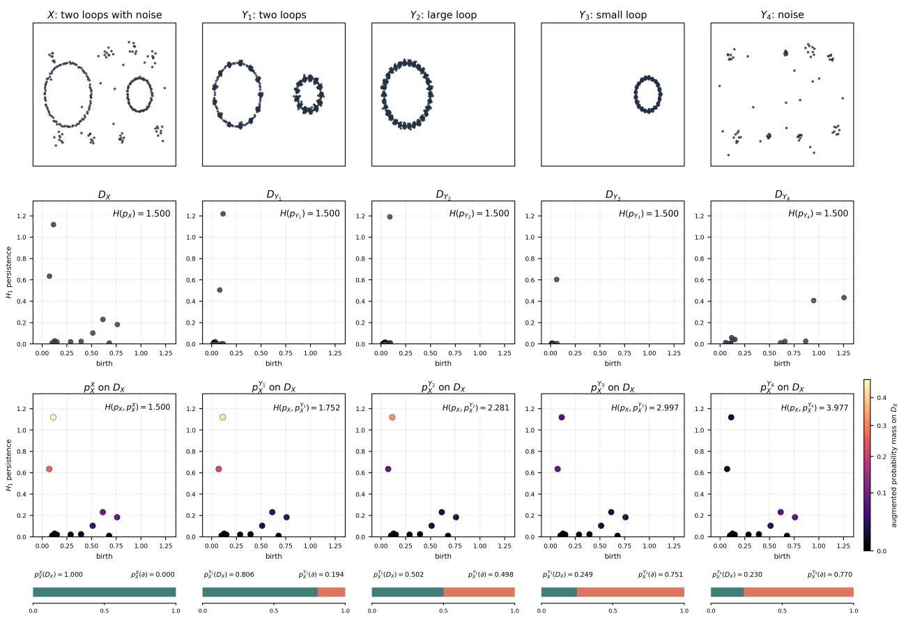
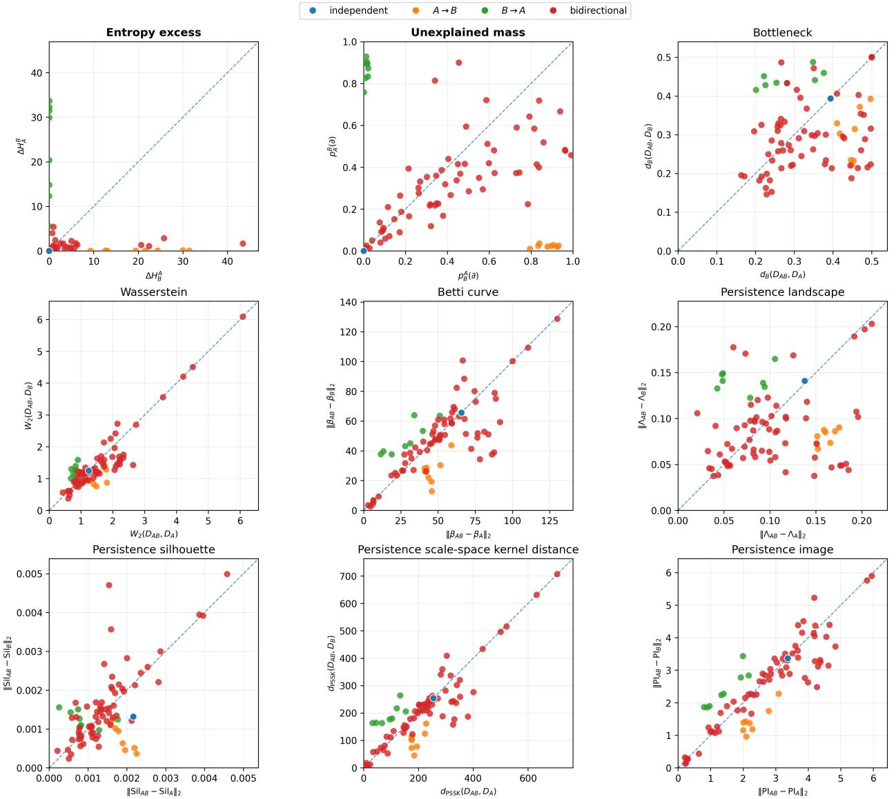

# Persistent Cross Entropy

Sijin Yeom1 and Jae-Hun Jung1,2

1Artificial Intelligence Graduate School, Pohang University of Science and Technology, Pohang, Korea

2Department of Mathematics, Pohang University of Science and Technology, Pohang, Korea

## Abstract

Persistent entropy is the Shannon entropy of a persistence-based probability measure defined on a persistence diagram. However, its cross-entropy version is not naturally defined because two persistence diagrams generally have diferent event spaces. To bridge these event spaces, we combine a similarity function with persistence weighting to define an induced probability. The induced probability reflects information from one diagram on the event space of the other diagram and assigns unexplained probability mass to the unexplained event. Using the induced probability, we extend cross entropy to persistence diagrams, called persistent cross entropy (PCE). We establish the main properties of both the induced probability and PCE and prove stability theorems for both. Through three numerical studies, we show that PCE distinguishes diagrams with the same persistent entropy, separates causal directions in dynamical systems without constructing a joint persistent diagram, and can be used as a directional topology loss for knowledge distillation.

## 1 Introduction

Persistent homology extracts multiscale topological features from data by tracking how connected components, cycles, and higher-dimensional holes appear and disappear across a filtration (Edelsbrunner et al., 2002). It represents their birth–death structure through persistence diagrams, which provide compact descriptors of the topological structure of complex and high-dimensional data (Carlsson, 2009). An early landmark application of TDA revealed three clinically distinct subgroups of type 2 diabetes (Li et al., 2015). More recently, representations of persistence diagrams have enabled the prediction of molecular interaction energies (Townsend et al., 2020) and the identification of spatial immune-cell patterns in tumor microenvironments (Vipond et al., 2021).

Persistence diagrams are multisets of birth–death pairs in R2 that may contain diferent numbers of points and whose points have no canonical ordering, making them dificult to use directly in standard statistical and machine-learning pipelines. Consequently, various representations have been developed to encode persistence information as functions or finite-dimensional vectors. These include functional summaries such as Betti curves (Johnson and Jung, 2021), persistence landscapes (Bubenik, 2015), and persistence silhouettes (Chazal et al., 2015), as well as image-based summaries such as persistence images (Adams et al., 2017).

Among scalar summaries of persistence diagrams, persistent entropy normalizes feature persistences to a probability mass function and summarizes it by Shannon entropy (Chintakunta et al., 2015). Its stability and related entropy-based methods have also been studied (Atienza et al., 2020). A recent preprint studies its use in phase-transition detection (Rucco, 2026).

Shannon cross entropy compares two probability measures on a common event space, but $p _ { X }$ and $p _ { Y }$ are defined on diferent persistent diagrams $D _ { X }$ and $D _ { Y }$ , respectively. Thus the naive expression

$$
H ( p _ { X } , p _ { Y } ) = - \sum _ { u \in D _ { X } } p _ { X } ( u ) \log p _ { Y } ( u )
$$

cannot be applied directly. To deal with this issue, we construct the induced probability $p _ { X } ^ { Y }$ on $D _ { X } \cup \{ \partial \}$ , where ∂ is the unexplained event. For $u \in D _ { X }$ , the mass retained at u depends on how similarly $D _ { X }$ and $D _ { Y }$ explain $u ;$ the remaining mass is assigned to $\partial .$ Viewing $p _ { X }$ on the same space with $p _ { X } ( \partial ) = 0$ , we define

$$
H ( p _ { X } , p _ { X } ^ { Y } ) = - \sum _ { u \in D _ { X } } p _ { X } ( u ) \log p _ { X } ^ { Y } ( u ) .
$$

We prove that $p _ { X } ^ { Y } = p _ { X }$ exactly when every local diference vanishes and that $p _ { X } ^ { Y } ( \partial )$ is the total variation distance between $p _ { X } ^ { Y }$ and $p _ { X }$ . The cross entropy excess is both $\mathrm { K L } ( p _ { X } \| p _ { X } ^ { Y } )$ and an expected squared diference under the chosen similarity function. We also show that the unexplained mass and the entropy excess vanish as $D _ { Y }$ approaches $D _ { X }$ . For the entropy excess, we further establish joint local stability when both diagrams vary. Section 2 provides the required background, Section 3 constructs the induced probability and proves its main properties, and Section 4 develops persistent cross entropy and its stability theory. Finally, Section 5 evaluates PCE through examples with equal persistent entropy, causality analysis in dynamical systems, and topology-aware knowledge distillation.

## 2 Background and Setup

## 2.1 Persistence Diagrams and Coordinates

Given a finite point cloud X in a metric space, persistent homology constructs a multiscale topological summary by building a filtration of simplicial complexes (Edelsbrunner et al., 2002; Carlsson, 2009)

$$
K _ { \varepsilon _ { 1 } } ( X ) \subseteq K _ { \varepsilon _ { 2 } } ( X ) \subseteq \cdots .
$$

In a fixed homological dimension, each feature is recorded by its birth scale b and death scale d. The resulting finite of-diagonal multiset of points $( b , d )$ records the persistence diagram, and $d - b$ is the persistence of the feature.

Throughout the paper, we use birth–persistence coordinates on the ambient space $\mathcal { Z } = \mathbb { R } ^ { 2 }$ and write

$$
z = ( b , \ell ) , \qquad \ell = d - b .
$$

For any persistence point v, we write $\boldsymbol { v } = \left( \boldsymbol { b } _ { v } , \boldsymbol { \ell _ { v } } \right)$ . The death coordinate is recovered as $d = b + \ell ,$ so this change of coordinates loses no information. Separating birth from persistence makes explicit both when a feature appears and how long it lasts, while mapping the diagonal to the horizontal axis $\ell = 0$ . This representation is also used in persistence images, template functions, and vectorized persistence blocks (Adams et al., 2017; Perea et al., 2023; Chan et al., 2022). It makes persistence weighting and matching to the diagonal simpler. We use $\| \cdot \|$ for the Euclidean norm in these coordinates.

For diagram distances, we follow the standard convention of adjoining the diagonal with infinite multiplicity (Cohen-Steiner et al., 2007). In our measure construction, however, D denotes only the finite of-diagonal multiset. The diagonal is used only for matching in Wasserstein or bottleneck distances. The precise definition of the 1-Wasserstein distance is given in Appendix A.4.

## 2.2 Persistence Probabilities and Entropy

We now assign a probability to the finite of-diagonal points of a persistence diagram. Let D be a nonempty finite persistence diagram, with all sums over $D$ understood with multiplicity. We associate each $z = ( b , \ell ) \in D$ with the persistence probability

$$
p _ { D } ( z ) = \frac { \ell } { \sum _ { v \in D } \ell _ { v } } .
$$

When a point is repeated, each occurrence is treated as a separate probability atom. We suppress occurrence labels in the main text and make them explicit in Appendix $\mathrm { A . 3 }$ . For $D _ { X }$ , we write $p _ { X } : = p _ { D _ { X } }$ . Every of-diagonal point has positive persistence, so $p _ { X } ( u ) > 0$ for all $u \in D _ { X }$ . This probability assigns more mass to long-lived features and less to short-lived features, which may represent topological noise (Atienza et al., 2019). Related constructions encode persistence through landscape heights and through explicit weights in silhouettes and persistence images (Bubenik, 2015; Chazal et al., 2015; Adams et al., 2017).

Persistent entropy is the Shannon entropy of $p _ { D }$ (Chintakunta et al., 2015):

$$
H ( p _ { D } ) = - \sum _ { z \in D } p _ { D } ( z ) \log p _ { D } ( z ) .
$$

Unlike an empirical distribution, $p _ { D }$ is determined by persistence rather than sampling frequency. Its entropy is small when persistence is concentrated on a few features and large when it is spread evenly; for n equal weights, the maximum is $H ( p _ { D } ) = \log n$

## 3 Induced Probabilities

Because $D _ { X }$ and $D _ { Y }$ generally have diferent event spaces, $p _ { X }$ and $p _ { Y }$ cannot be used directly in Shannon cross entropy. To connect the two event spaces, we combine a similarity function with persistence weighting to measure how well each diagram explains the points of $D _ { X }$ . We then add the unexplained event $\partial$ to carry the remaining mass, which gives the probability on $D _ { X } \cup \{ \partial \}$ induced by $D _ { Y }$ . Section 3.1 introduces the similarity function, Section 3.2 constructs the induced probability, and Section 3.3 establishes its main properties and stability.

## 3.1 Similarity Between Persistence Points

We first define how similarity is measured between two persistence points.

Definition 1. A map k : ${ \mathcal { Z } } \times { \mathcal { Z } }  ( 0 , 1 ]$ is called a similarity function if it satisfies:

(i) there exist a metric $\rho$ on $\mathcal { Z }$ and a strictly decreasing function $h : [ 0 , \infty )  ( 0 , 1 ]$ with $h ( 0 ) = 1$ and $\operatorname* { l i m } _ { r \to \infty } h ( r ) = 0$ such that

$$
k ( u , v ) = h ( \rho ( u , v ) ) ;
$$

(ii) k is Lipschitz in its second argument: there exists $L _ { 0 } > 0$ such that

$$
| k ( u , v ) - k ( u , v ^ { \prime } ) | \leq L _ { 0 } \| v - v ^ { \prime } \|
$$

for all $u , v , v ^ { \prime } \in { \mathcal { Z } }$

The birth and persistence coordinates can have diferent numerical ranges and roles. We therefore use fixed global scales $\sigma _ { b } , \sigma _ { \ell } > 0$ , shared by all points and diagrams. For $\boldsymbol { u } = \left( \boldsymbol { b } _ { u } , \boldsymbol { \ell } _ { u } \right)$ and $\boldsymbol { v } = \left( \boldsymbol { b } _ { v } , \boldsymbol { \ell _ { v } } \right)$ , a useful choice is the Gaussian similarity function

$$
\kappa ( u , v ) = e ^ { - \frac { 1 } { 2 } \left\{ \left( \frac { b _ { v } - b _ { u } } { \sigma _ { b } } \right) ^ { 2 } + \left( \frac { \ell _ { v } - \ell _ { u } } { \sigma _ { \ell } } \right) ^ { 2 } \right\} } .
$$

It satisfies Definition 1. Moreover, it can also be obtained from the maximum-entropy density with prescribed coordinate-wise variances (Jaynes, 1957; Cover and Thomas, 2006). The derivation and Lipschitz bound are given in Appendix A.2.

## 3.2 Probability Construction

The similarity function measures proximity, but persistence must also be weighted. Using ℓ directly allows points with very large persistence to contribute without bound, so a uniform stability bound is unavailable unless persistence is bounded in advance. Throughout the paper, we fix a bounded increasing function $g : [ 0 , \infty ) \to [ 0 , \infty )$ with $g ( 0 ) = 0$ , such as $\textstyle g ( t ) = { \frac { t } { 1 + t } }$ . This allows points with greater persistence to receive larger weights while keeping their contributions bounded. The regularity conditions on g and the definition of $L _ { \phi }$ are given in Appendix A.1.

Definition 2. Let $D _ { X } , D _ { Y }$ be nonempty finite persistence diagrams in Z, and let k be a similarity function. Fix a global response scale $\tau > 0$ . For $u \in D _ { X } , v \in D _ { X } \cup D _ { Y }$ , and $D \in \{ D _ { X } , D _ { Y } \}$ , we define the following:

(i) $\phi _ { u } ( v ) = k ( u , v ) g ( \ell _ { v } )$ , a score for how well v explains u.

(ii) $\alpha _ { u } ( D ) = \sum _ { v \in D } \phi _ { u } ( v )$ , a score for how well D explains u.

(iii) $\delta _ { X } ^ { Y } ( u ) = \alpha _ { u } ( D _ { Y } ) - \alpha _ { u } ( D _ { X } )$ , the diference in explanatory power at $u . ^ { \mathrm { ~ 1 ~ } }$

(iv) $w _ { X } ^ { Y } ( u ) = e ^ { - \frac { \delta _ { X } ^ { Y } ( u ) ^ { 2 } } { 2 \tau ^ { 2 } } }$ , a weight in (0, 1] that increases as $| \delta _ { X } ^ { Y } ( u ) |$ decreases.

After any stated preprocessing, the coordinate scales in k and the response scale τ are fixed across all comparisons rather than recalibrated for individual diagram pairs.

The product $w _ { X } ^ { Y } ( u ) p _ { X } ( u )$ is the mass at u explained by $D _ { Y }$ , but these masses generally sum to less than one. Equality holds only when $w _ { X } ^ { Y } ( u ) = 1$ for every $u \in D _ { X }$ . We therefore introduce an unexplained event to carry the remaining mass.

Definition 3. Let $\partial \notin \mathcal { D } _ { X }$ denote the unexplained event. The induced probability on $D _ { X } \cup \{ \partial \}$ is

$$
p _ { X } ^ { Y } ( u ) = \left\{ \begin{array} { l l } { \displaystyle w _ { X } ^ { Y } ( u ) p _ { X } ( u ) , } & { u \in D _ { X } , } \\ { \displaystyle \sum _ { v \in D _ { X } } ( 1 - w _ { X } ^ { Y } ( v ) ) p _ { X } ( v ) , } & { u = \partial . } \end{array} \right.
$$

One can regard $p _ { X }$ as a probability measure on the same space $D _ { X } \cup \{ \partial \}$ by setting $p _ { X } ( \partial ) = 0$ Appendix A.3 verifies that $p _ { X } ^ { Y }$ is indeed a probability measure.

For each $u \in D _ { X }$ , the quantity $1 - w _ { X } ^ { Y } ( u )$ determines the fraction of the mass at u assigned to the unexplained event. Consequently, $( 1 - w _ { X } ^ { Y } ( u ) ) p _ { X } ( u )$ is the amount of unexplained probability mass from u. The value $p _ { X } ^ { Y } ( \partial )$ , obtained by summing these amounts over $D _ { X }$ , is therefore the total unexplained mass.

## 3.3 Properties of Induced Probabilities

Since $p _ { \underline { { X } } } ^ { Y }$ encodes information from $D _ { Y }$ on the event space of $D _ { X } \cup \{ \partial \}$ , the self-induced proba bility $p _ { X } ^ { X }$ should be equal to $p _ { X }$ . We first verify this consistency and then study how the induced probability changes as the two diagrams become closer, using total variation and the 1-Wasserstein distance.

Proposition 1. The induced probability satisfies the following properties.

(i) Comparing $D _ { X }$ with itself recovers the original probability:

$$
p _ { X } ^ { X } = p _ { X } .
$$

(ii) The induced probability equals $p _ { X }$ exactly when the diference in explanatory power vanishes on $D _ { X }$ :

$$
p _ { X } ^ { Y } = p _ { X } \quad \iff \quad \delta _ { X } ^ { Y } = 0 \quad \mathrm { o n } \quad D _ { X } .
$$

(iii) The total variation distance from $p _ { X }$ is exactly the unexplained mass:

$$
d _ { \mathrm { T V } } ( p _ { X } ^ { Y } , p _ { X } ) = p _ { X } ^ { Y } ( \partial ) .
$$

The proof is given in Appendix $\mathrm { { A . 5 } }$

We next use the 1-Wasserstein distance to control the unexplained mass and changes in the induced probability.

Theorem 1. Let $D _ { X } , D _ { Y }$ be nonempty finite persistence diagrams. There exists $C _ { X } > 0$ so that the induced probability satisfies the following properties.

(i) The unexplained mass vanishes as $D _ { Y }$ approaches $D _ { X }$ :

$$
p _ { X } ^ { Y } ( \partial ) \leq C _ { X } W _ { 1 } ( D _ { X } , D _ { Y } ) ^ { 2 } .
$$

(ii) For fixed $D _ { X }$ , the induced probability is stable under changes in $D _ { Y } ;$ for any nonempty finite persistence diagram $D _ { Y ^ { \prime } }$ 2

$$
\begin{array} { r } { d _ { \mathrm { T V } } ( p _ { X } ^ { Y } , p _ { X } ^ { Y ^ { \prime } } ) \leq C _ { X } W _ { 1 } ( D _ { Y } , D _ { Y ^ { \prime } } ) . } \end{array}
$$

The proof is given in Appendix $\mathrm { A . 7 } .$

## 4 Persistent Cross Entropy

The probabilities $p _ { X }$ and $p _ { X } ^ { Y }$ are defined on the same space $D _ { X } \cup \{ \partial \}$ . Since $p _ { X } ( \partial ) = 0 .$ the unexplained event does not contribute to their cross entropy.

Definition 4. The persistent cross entropy of $D _ { X }$ relative to $D _ { Y }$ is

$$
H ( p _ { X } , p _ { X } ^ { Y } ) = - \sum _ { u \in D _ { X } } p _ { X } ( u ) \log p _ { X } ^ { Y } ( u ) .
$$

Its entropy excess is $\Delta { H } _ { X } ^ { Y } = H ( p _ { X } , p _ { X } ^ { Y } ) - H ( p _ { X } )$

The entropy excess measures diferences in how $D _ { X }$ and $D _ { Y }$ explain the points of $D _ { X }$ under the chosen similarity function and persistence weighting. It is directional because the reverse comparison uses $p _ { Y }$ on $D _ { Y } \cup \{ \partial \}$ ; hence $H ( p _ { X } , p _ { X } ^ { Y } ) \neq H ( p _ { Y } , p _ { Y } ^ { X } )$ in general.

Proposition 2. For every pair of nonempty finite persistence diagrams,

$$
\Delta H _ { X } ^ { Y } = H ( p _ { X } , p _ { X } ^ { Y } ) - H ( p _ { X } ) = \mathrm { K L } ( p _ { X } \| p _ { X } ^ { Y } ) = \frac { 1 } { 2 \tau ^ { 2 } } \mathbb { E } _ { u \sim p _ { X } } \left[ \delta _ { X } ^ { Y } ( u ) ^ { 2 } \right] \geq 0 .
$$

The proof is given in Appendix A.8.

Together with Proposition 1, this identity shows that the entropy excess vanishes exactly when $p _ { X } ^ { Y } = p _ { X } ;$ ; in particular, $H ( p _ { X } , p _ { X } ^ { X } ) = H ( p _ { X } )$

We next show that the entropy excess vanishes as $D _ { Y }$ approaches $D _ { X }$ in the 1-Wasserstein distance.

Theorem 2. There exists a single constant $C > 0$ such that, for all nonempty finite persistence diagrams $D _ { X } , D _ { Y }$

$$
0 \leq \Delta H _ { X } ^ { Y } \leq C W _ { 1 } ( D _ { X } , D _ { Y } ) ^ { 2 } .
$$

The constant C depends only on the similarity function k in Definition 1 and on g and τ fixed in Section 3.2.

The proof is given in Appendix A.9.

We finally establish joint local stability when both diagrams vary.

Theorem 3. Fix nonempty finite persistence diagrams $D _ { X } , D _ { Y }$ . The entropy excess is locally stable in both diagrams: there exists a finite constant $C _ { X , Y }$ such that, whenever $D _ { X ^ { \prime } }$ and $D _ { Y ^ { \prime } }$ ′ are suficiently close to $D _ { X }$ and $D _ { Y }$ , respectively,

$$
\vert \Delta H _ { X } ^ { Y } - \Delta H _ { X ^ { \prime } } ^ { Y ^ { \prime } } \vert \leq C _ { X , Y } \left( W _ { 1 } ( D _ { X } , D _ { X ^ { \prime } } ) + W _ { 1 } ( D _ { Y } , D _ { Y ^ { \prime } } ) \right) .
$$

The same constant $C _ { X , Y }$ applies throughout this neighborhood and does not depend on $D _ { X ^ { \prime } }$ or $D _ { Y ^ { \prime } }$ In particular, if $D _ { X ^ { \prime } } = D _ { X }$ , then

$$
| \Delta H _ { X } ^ { Y } - \Delta H _ { X } ^ { Y ^ { \prime } } | \leq C _ { X , Y } W _ { 1 } ( D _ { Y } , D _ { Y ^ { \prime } } ) .
$$

The complete proof, including an explicit neighborhood and a choice of $C _ { X , Y }$ , is given in $A p \ / -$ pendix A.10.

## 5 Experiments

We evaluate PCE through three experiments. Section 5.1 tests whether PCE can distinguish diagrams with the same persistent entropy. Section 5.2 studies causality in dynamical systems and compares PCE with symmetric persistence-diagram methods that require a joint reconstruction. Section 5.3 then applies PCE to knowledge distillation and tests whether its teacher-to-student direction is useful for transferring topological information. Full numerical settings are given in Appendix B.

## 5.1 Two loops with equal persistent entropy

Persistent entropy summarizes the probability distribution associated with a single persistence diagram by one scalar. Consequently, diagrams with clearly diferent feature compositions can have the same persistent entropy. To illustrate this limitation, we construct five point clouds. The point cloud X contains a large loop, a small loop, and several noise components. The point cloud $Y _ { 1 }$ contains the two loops without the surrounding noise, $Y _ { 2 }$ retains only the large loop, $Y _ { 3 }$ retains only the small loop, and $Y _ { 4 }$ contains only noise. Their parameters are adjusted so that the persistent entropies of their $H _ { 1 }$ persistence diagrams all equal 1.500 when rounded to three decimal places.

Although all five persistent entropies round to 1.500, PCE for $Y _ { 1 }$ through $Y _ { 4 }$ equals 1.752, 2.281, 2.997, and 3.977, respectively. Their unexplained masses are 0.194, 0.498, 0.751, and 0.770. Thus PCE separates feature compositions that persistent entropy cannot distinguish. Since $D _ { X }$ is fixed in all four comparisons, the PCE values share the same baseline $H ( p _ { X } )$ , and their diferences are exactly the diferences in entropy excess. The entropy excess measures the average severity of the diference, whereas $p _ { X } ^ { Y } ( \partial )$ is the fraction of the probability mass of $D _ { X }$ left unexplained. The $Y _ { 3 }$ comparison illustrates why both parts of the augmented probability are useful. Because $Y _ { 3 }$ contains a small loop, the corresponding point in $D _ { X }$ receives the largest probability among the points of $D _ { X }$ . Nevertheless, $Y _ { 3 }$ leaves 0.751 of the total mass at $\partial .$ Since the retained mass is not renormalized on $D _ { X }$ , the small-loop point is not assigned an artificially inflated probability: it remains the most strongly explained feature of $D _ { X }$ while the large amount of unexplained structure is preserved explicitly.

## 5.2 Spring–mass benchmark

We study causality between deterministic dynamical systems using the spring–mass benchmark of Bando et al. (2022),

$$
\ddot { x } = - x + 0 . 7 \alpha y , \qquad \ddot { y } = - 0 . 7 y + \beta x ,
$$

where α controls the influence $B  A$ and $\beta$ controls $A  B$ The coupling grid contains independent, one-way, and bidirectional regimes. Following Takens’ embedding theorem, we turn each scalar time series into a point cloud of delay vectors, such as $X _ { A } = \{ ( x _ { t } , x _ { t + q } , \ldots , x _ { t + ( E - 1 ) q } ) \} _ { t } ,$ which reconstructs the attractor of the observed dynamical system (Takens, 1981). Let $D _ { A }$ and $D _ { B }$ be the persistence diagrams of the two reconstructed attractors. A symmetric distance $d ( D _ { A } , D _ { B } )$ gives only one value and therefore cannot determine a direction. Such a distance requires an additional common object for directional comparison. Following the multivariate delay reconstruction of Cao et al. (1998), Bando et al. (2022) construct a joint attractor from both time series for this purpose. We follow their experimental setup and denote the persistence diagram of this joint attractor by $D _ { A B }$ . Direction is then assessed by comparing $d ( D _ { A B } , D _ { A } )$ and $d ( D _ { A B } , D _ { B } )$ . Under $A  B$ the reconstruction $X _ { B }$ is expected to represent the total attractor, so $D _ { B }$ should be closer to $D _ { A B }$ than $D _ { A }$ is; the roles are reversed under $B  A$ (Bando et al., 2022). The full reconstruction is described in Appendix B.2.

We compare PCE with three groups of methods, shown in the same order in Figure 2. First, bottleneck and Wasserstein distances compare diagrams through optimal matchings. The bottleneck distance records the largest matched displacement, whereas the Wasserstein distance aggregates the matched displacements (Cohen-Steiner et al., 2007; Mileyko et al., 2011). Second, Betti curves count the features alive across the filtration (Johnson and Jung, 2021); persistence landscapes organize the features into layers of piecewise-linear functions (Bubenik, 2015); and persistence silhouettes form a persistence-weighted average of these functions (Chazal et al., 2015). Finally, the persistence scale-space kernel and persistence images give smoothed representations on the diagram plane. The former uses heat difusion and a Hilbert-space distance (Reininghaus et al., 2015), while the latter places weighted Gaussian functions on the birth–persistence plane and discretizes the result (Adams et al., 2017).

  
Figure 1: Two-loop experiment with equal persistent entropy. The first row shows the point clouds $X , Y _ { 1 } , \ldots , Y _ { 4 }$ , and the second row shows $D _ { X } , D _ { Y _ { 1 } } , \ldots , D _ { Y _ { 4 } } ;$ the square and triangle in $D _ { X }$ mark the large- and small-loop features, respectively, and circles denote the remaining noise features. Each diagram is annotated with its persistent entropy. The third row shows the actual augmented probability masses $p _ { X } ^ { X } ( u ) , p _ { X } ^ { Y _ { 1 } } ( u ) , \dotsc , p _ { X } ^ { Y _ { 4 } } ( u )$ for $u \in D _ { X }$ on a common color scale and reports the corresponding PCE. These masses are not renormalized within $D _ { X }$ . The bar below each panel completes the probability by partitioning unit mass between $D _ { X }$ and the unexplained event ∂.

Unlike these baselines, PCE directly produces the directed pair $( \Delta H _ { B } ^ { A } , \Delta H _ { A } ^ { B } )$ from $D _ { A }$ and $D _ { B }$ without constructing $D _ { A B }$ . The entropy excess $\Delta H _ { X } ^ { Y }$ measures the cost of using DY to explain $D _ { X }$ Under $A  B$ , system B carries information from A together with its own response. Consequently, $D _ { B }$ explains $D _ { A }$ at low cost, whereas $D _ { A }$ does not fully explain $D _ { B } \colon \Delta H _ { A } ^ { B }$ is small and $\Delta H _ { B } ^ { A }$ is large. This places the $A  B$ cases in the lower-right half of the first panel. The interpretation is reversed for $B  A$ , whose points lie in the upper-left half. Figure 2 shows that all 16 one-way cases lie in the expected half-plane without constructing $D _ { A B }$

The unexplained mass gives a bounded and more direct view of the same asymmetry. Specifically, $p _ { X } ^ { Y } ( \partial )$ is the fraction of the persistence mass of $D _ { X }$ not explained by $D _ { Y }$ . For $A  B$ , the median pair $( p _ { B } ^ { A } ( \partial ) , p _ { A } ^ { B } ( \partial ) )$ is (0.888, 0.024). Thus, 88.8% of the persistence mass of $D _ { B }$ is not explained by $D _ { A }$ , while only 2.4% of the persistence mass of $D _ { A }$ is not explained by $D _ { B }$ . For $B  A$ the median pair is (0.014, 0.883), and the interpretation is reversed. The entropy excess measures the average severity of the diference, whereas the unexplained mass reports its share of the persistence probability mass. The independent case has almost equal values in both directions, so it shows no directional preference; their small size alone should not be read as evidence of coupling.

Table 1: Separation of the coupling regimes in the two-dimensional representations shown in Figure 2. Larger PERMANOVA $R ^ { 2 }$ indicates stronger separation. The best result in each evaluation is shown in bold.
<table><tr><td>Method</td><td>Four regimes  $R ^ { 2 }$ </td><td>Two directions  $R ^ { 2 }$ </td></tr><tr><td>Entropy excess</td><td>0.560</td><td>0.740</td></tr><tr><td>Unexplained mass</td><td>0.449</td><td>0.993</td></tr><tr><td>Bottleneck</td><td>0.180</td><td>0.733</td></tr><tr><td>Wasserstein</td><td>0.050</td><td>0.662</td></tr><tr><td>Betti curve</td><td>0.091</td><td>0.513</td></tr><tr><td>Persistence landscape</td><td>0.197</td><td>0.876</td></tr><tr><td>Persistence silhouette</td><td>0.082</td><td>0.616</td></tr><tr><td>Persistence scale-space kernel</td><td>0.082</td><td>0.678</td></tr><tr><td>Persistence image</td><td>0.107</td><td>0.508</td></tr></table>

To compare the nine panels numerically, we treat the two plotted coordinates of each method as a two-dimensional representation and measure regime separation by PERMANOVA $R ^ { 2 }$ with Euclidean distance (Anderson, 2001). The four-regime evaluation uses all 81 settings with the independent, $A \to B , B \to A$ , and bidirectional labels. The two-direction evaluation uses only the balanced set of 16 one-way cases. These scores measure between-group separation relative to total variation; they are not classification accuracies. In particular, the four-regime result is descriptive because the group sizes are 1, 8, 8, and 64.

Entropy excess gives the strongest four-regime separation, followed by unexplained mass. For the balanced one-way comparison, unexplained mass reaches $R ^ { 2 } = 0 . 9 9 3$ , followed by the persis tence landscape at 0.876. Entropy excess reaches 0.740, slightly above the bottleneck distance at 0.733. Thus the two PCE quantities provide the strongest overall four-regime separation, while unexplained mass also gives the clearest separation between the two one-way directions. Both are computed without the joint diagram $D _ { A B }$

The spring–mass experiment shows that PCE can identify causal direction in a linear dynamical system. Our preliminary tests on nonlinear and chaotic systems produced mixed results: PCE identified the causal direction in some systems but not in others. Methods based on a joint attractor showed similarly mixed performance, indicating that nonlinear and chaotic dynamics remain challenging for TDA-based causality analysis in general. Further study is needed to understand when PCE works well and how it can be improved for these systems.

  
Figure 2: Spring–mass directional comparison. Each point represents one coupling pair: blue denotes the independent case, orange denotes $A  B$ , green denotes $B  A$ , and red denotes bidirectional coupling. The dashed line is $y = x ;$ under the common plotting convention, the lowerright half favors $A  B$ , the upper-left half favors $B  A$ , and points near the diagonal show little directional preference. The two PCE-based panels are computed only from $D _ { A }$ and $D _ { B }$ . They plot $( \Delta H _ { B } ^ { A } , \Delta H _ { A } ^ { B } )$ and $( p _ { B } ^ { A } ( \partial ) , p _ { A } ^ { B } ( \partial ) )$ ), respectively. Each coordinate in the second panel is the fraction of persistence mass not explained in that direction. Every remaining panel uses the joint diagram and plots $( d ( D _ { A B } , D _ { A } ) , d ( D _ { A B } , D _ { B } ) )$ . In order, the panels use bottleneck distance, 2-Wasserstein distance, $L ^ { 2 }$ distances between Betti curves, persistence landscapes, and persistence silhouettes, the persistence scale-space kernel distance, and Euclidean distance between persistence images.

## 5.3 Topology-aware knowledge distillation

Topology-aware knowledge distillation transfers the global structure of intermediate features in addition to class probabilities. TopKD approximates the persistence images of teacher and student feature clouds with a frozen RipsNet (de Surrel et al., 2022) and minimizes the symmetric loss $\mathcal { L } _ { \mathrm { { T o p } } } = \Vert \widehat { \mathrm { P I } } _ { T } - \widehat { \mathrm { P I } } _ { S } \Vert _ { 2 } ^ { 2 }$ (Kim et al., 2024). In knowledge distillation, however, the two networks have diferent roles: the student should reproduce the teacher’s information. We therefore replace this symmetric topology loss with PCE-based objectives directed from the teacher to the student.

For each mini-batch, we $\ell _ { 2 } { \mathrm { - n o r m a l i z e } }$ the teacher and student features and compute their exact finite $H _ { 0 }$ Vietoris–Rips persistence diagrams, $D _ { T }$ and $D _ { S }$ . The student diagram $D _ { S }$ induces the probability $p _ { T } ^ { S }$ on the teacher diagram $D _ { T }$ . We compare two teacher-to-student topology terms. PCE uses the augmented probability and keeps the unexplained event. As an experimental variant, we also consider explained-mass PCE (EM-PCE), which removes the unexplained event and renormalizes only the mass explained on $D _ { T }$ . Thus, PCE measures both relative changes among teacher features and absolute unexplained mass, whereas EM-PCE focuses on the relative allocation among the explained teacher features. Their training objectives are

$$
\angle _ { \mathrm { P C E } } = \angle _ { \mathrm { C E } } + 2 \angle _ { \mathrm { K D } } + c _ { \mathrm { b a t c h } } \Delta H _ { T } ^ { S } , \qquad \angle _ { \mathrm { E M - P C E } } = \angle _ { \mathrm { C E } } + 2 \angle _ { \mathrm { K D } } + 5 \Delta H _ { T } ^ { S , \mathrm { E M } } .
$$

Both terms use the same direction because the student should reproduce the teacher topology: $D _ { S }$ is used to explain $D _ { T }$ , while the reverse quantity $H _ { S } ^ { T }$ would target the opposite transfer. For PCE, we separate the loss direction from its optimization scale by matching its feature-gradient norm to that of the TopKD topology term with a detached batch-wise coeficient $c _ { \mathrm { b a t c h } }$ . EM-PCE instead uses the fixed topology coeficient 5 from TopKD. PCE is defined in Section 4, while the EM-PCE probability and the remaining implementation details are given in Appendix B.3. The frozen RipsNet is still evaluated in these runs, so this experiment compares the topology objectives and is not intended as a comparison of computational cost.

We use CIFAR-100 (Krizhevsky, 2009) with a ResNet56 teacher and a ResNet20 student (He et al., 2016), following the TopKD training schedule. The three runs use seed 7, the same student initialization, mini-batch order, augmentation, optimizer, and CE and KD terms; only the topology objective difers. The final PCE configuration was fixed using a deterministic validation split made only from the CIFAR-100 training set. The oficial test set was evaluated after the configuration was fixed. We report the final accuracy and the mean over the last 10 epochs, without selecting a checkpoint by test accuracy. Full settings are given in Appendix B.3.

Table 2: Seed-7 CIFAR-100 Top-1 accuracy (%). Final is the accuracy at epoch 240, and Last-10 mean is the mean over epochs 231–240.
<table><tr><td>Method</td><td>Final</td><td>Last-10 mean</td></tr><tr><td>TopKD</td><td>70.99</td><td>71.000</td></tr><tr><td>PCE</td><td>71.25</td><td>71.223</td></tr><tr><td>EM-PCE</td><td>71.49</td><td>71.606</td></tr></table>

EM-PCE gives the highest final accuracy and last-10-epoch mean in this seed-7 experiment. Relative to TopKD, it improves these values by 0.50 and 0.606 percentage points, respectively. PCE also improves both values, but by smaller amounts. These results suggest that the relative allocation of the explained teacher mass can provide a useful optimization signal even without directly penalizing the unexplained mass. Because EM-PCE uses a fixed coeficient while PCE uses batch-wise gradient matching, the current experiment compares the implemented objectives rather than isolating the efect of explained-mass normalization alone. During PCE training, the epoch-averaged unexplained mass decreases overall from 0.2494 in the first epoch to 0.00756 in the final epoch. This indicates that the student diagram explains more of the teacher persistence mass by the end of training. We treat this overall decrease as a diagnostic of topology matching, not as evidence that it directly causes the accuracy gain.

## AI use statement

OpenAI Codex was used in preparing this work. In the theoretical development, it was used primarily to edit language, improve notation and mathematical typesetting, identify inconsistencies, and check derivations and proofs; the definitions, mathematical claims, and final arguments were determined and verified by the authors. It was used more extensively in the experimental work to inspect and modify code, implement the augmented probability construction, rerun experiments, generate figures, and verify numerical identities and test results. It also assisted with literature searches and manuscript editing. The authors reviewed all AI-assisted material and take full responsibility for the final content of the paper.

## References

Henry Adams, Tegan Emerson, Michael Kirby, Rachel Neville, Chris Peterson, Patrick Shipman, Sofya Chepushtanova, Eric Hanson, Francis Motta, and Lori Ziegelmeier. Persistence images: A stable vector representation of persistent homology. Journal of Machine Learning Research, 18 (8):1–35, 2017.

Marti J. Anderson. A new method for non-parametric multivariate analysis of variance. Austral Ecology, 26(1):32–46, 2001. doi: 10.1111/j.1442-9993.2001.01070.pp.x.

Nieves Atienza, Rocio Gonzalez-Diaz, and Matteo Rucco. Persistent entropy for separating topological features from noise in vietoris–rips complexes. Journal of Intelligent Information Systems, 52:637–655, 2019. doi: 10.1007/s10844-017-0473-4.

Nieves Atienza, Rocío González-Díaz, and Manuel Soriano-Trigueros. On the stability of persistent entropy and new summary functions for topological data analysis. Pattern Recognition, 107: 107509, 2020.

Hiroaki Bando, Shizuo Kaji, and Takaharu Yaguchi. Causal inference for empirical dynamical systems based on persistent homology. JSIAM Letters, 14:69–72, 2022.

Peter Bubenik. Statistical topological data analysis using persistence landscapes. Journal of Machine Learning Research, 16(3):77–102, 2015.

Liangyue Cao, Alistair Mees, and Kevin Judd. Dynamics from multivariate time series. Physica D: Nonlinear Phenomena, 121(1–2):75–88, 1998. doi: 10.1016/S0167-2789(98)00151-1.

Gunnar Carlsson. Topology and data. Bulletin of the American Mathematical Society, 46(2): 255–308, 2009.

Kit C. Chan, Umar Islambekov, Alexey Luchinsky, and Rebecca Sanders. A computationally eficient framework for vector representation of persistence diagrams. Journal of Machine Learning Research, 23(268):1–33, 2022.

Frédéric Chazal, Brittany Terese Fasy, Fabrizio Lecci, Alessandro Rinaldo, and Larry Wasserman. Stochastic convergence of persistence landscapes and silhouettes. Journal of Computational Geometry, 6(2):140–161, Mar 2015. doi: 10.20382/jocg.v6i2a8.

Harish Chintakunta, Theophilos Gentimis, Rocio Gonzalez-Diaz, Maria-Jose Jimenez, and Hamid Krim. An entropy-based persistence barcode. Pattern Recognition, 48(2):391–401, 2015.

David Cohen-Steiner, Herbert Edelsbrunner, and John Harer. Stability of persistence diagrams. Discrete & Computational Geometry, 37(1):103–120, 2007. doi: 10.1007/s00454-006-1276-5.

Thomas M. Cover and Joy A. Thomas. Elements of Information Theory. Wiley-Interscience, 2 edition, 2006.

Thibault de Surrel, Felix Hensel, Mathieu Carrière, Théo Lacombe, Yuichi Ike, Hiroaki Kurihara, Marc Glisse, and Frédéric Chazal. RipsNet: A general architecture for fast and robust estimation of the persistent homology of point clouds. In Proceedings of Topological, Algebraic, and Geometric Learning Workshops 2022, volume 196 of Proceedings of Machine Learning Research, pages 96–106. PMLR, 2022. URL https://proceedings.mlr.press/v196/surrel22a.html.

Herbert Edelsbrunner, David Letscher, and Afra Zomorodian. Topological persistence and simplification. Discrete & Computational Geometry, 28(4):511–533, 2002.

Kaiming He, Xiangyu Zhang, Shaoqing Ren, and Jian Sun. Deep residual learning for image recognition. In Proceedings of the IEEE Conference on Computer Vision and Pattern Recognition, pages 770–778, 2016. doi: 10.1109/CVPR.2016.90.

Edwin T. Jaynes. Information theory and statistical mechanics. Physical Review, 106(4):620–630, 1957.

Megan Johnson and Jae-Hun Jung. Instability of the betti sequence for persistent homology and a stabilized version of the betti sequence. Journal of the Korean Society for Industrial and Applied Mathematics, 25(4):296–311, 2021. doi: 10.12941/jksiam.2021.25.296.

Jungeun Kim, Junwon You, Dongjin Lee, Ha Young Kim, and Jae-Hun Jung. Do topological characteristics help in knowledge distillation? In Proceedings of the 41st International Conference on Machine Learning, volume 235 of Proceedings of Machine Learning Research, pages 24674– 24693. PMLR, 2024. URL https://proceedings.mlr.press/v235/kim24aj.html.

Alex Krizhevsky. Learning multiple layers of features from tiny images. Technical report, University of Toronto, 2009. URL https://www.cs.toronto.edu/\~kriz/learning-features-2009-TR. pdf.

Li Li, Wei-Yi Cheng, Benjamin S. Glicksberg, Omri Gottesman, Ronald Tamler, Rong Chen, Erwin P. Bottinger, and Joel T. Dudley. Identification of type 2 diabetes subgroups through topological analysis of patient similarity. Science Translational Medicine, 7(311):311ra174, Oct 2015. doi: 10.1126/scitranslmed.aaa9364.

Clément Maria, Jean-Daniel Boissonnat, Marc Glisse, and Mariette Yvinec. The GUDHI library: Simplicial complexes and persistent homology. In Mathematical Software – ICMS 2014, volume 8592 of Lecture Notes in Computer Science, pages 167–174. Springer, 2014. doi: 10.1007/978-3-662-44199-2\_28.

Yuriy Mileyko, Sayan Mukherjee, and John Harer. Probability measures on the space of persistence diagrams. Inverse Problems, 27(12):124007, 2011. doi: 10.1088/0266-5611/27/12/124007.

Jose A. Perea, Elizabeth Munch, and Firas A. Khasawneh. Approximating continuous functions on persistence diagrams using template functions. Foundations of Computational Mathematics, 23(4):1215–1272, 2023. doi: 10.1007/s10208-022-09567-7.

Jan Reininghaus, Stefan Huber, Ulrich Bauer, and Roland Kwitt. A stable multi-scale kernel for topological machine learning. In Proceedings of the IEEE Conference on Computer Vision and Pattern Recognition, pages 4741–4748, 2015. doi: 10.1109/CVPR.2015.7299106.

Matteo Rucco. Persistent entropy as a detector of phase transitions, 2026.

Floris Takens. Detecting strange attractors in turbulence. In David Rand and Lai-Sang Young, editors, Dynamical Systems and Turbulence, Warwick 1980, volume 898 of Lecture Notes in Mathematics, pages 366–381. Springer, Berlin, Heidelberg, 1981. doi: 10.1007/BFb0091924.

Joshua Townsend, Charles P. Micucci, John H. Hymel, Vasileios Maroulas, and Konstantinos D. Vogiatzis. Representation of molecular structures with persistent homology for machine learning applications in chemistry. Nature Communications, 11:3230, 2020. doi: 10.1038/ s41467-020-17035-5.

Oliver Vipond, Joseph A. Bull, Philip Macklin, Ulrike Tillmann, Christopher W. Pugh, Helen M. Byrne, and Heather A. Harrington. Multiparameter persistent homology landscapes identify immune cell spatial patterns in tumors. Proceedings of the National Academy of Sciences, 118 (41):e2102166118, 2021. doi: 10.1073/pnas.2102166118.

## A Proofs for Probabilities Induced on the Augmented Event Space

## A.1 Regularity assumptions on g

The uniform stability results use a function $g : [ 0 , \infty ) \to [ 0 , \infty )$ satisfying

$$
g ( 0 ) = 0 , \qquad 0 \leq g ( t ) \leq M _ { g } \quad \mathrm { f o r ~ e v e r y ~ } t \geq 0 ,
$$

for some finite constant $M _ { g }$ . We further assume that $g$ is monotonically increasing and globally Lipschitz: there exists $L _ { g } < \infty$ such that

$$
| g ( s ) - g ( t ) | \leq L _ { g } | s - t | \qquad { \mathrm { f o r ~ e v e r y ~ } } s , t \geq 0 .
$$

The condition $g ( 0 ) = 0$ makes a point contribute zero when it is matched to the diagonal. Boundedness and global Lipschitz continuity make the constants in the stability estimates independent of the diagrams and their maximum persistence. Together with the constant $L _ { 0 }$ from Definition 1, we define

$$
L _ { \phi } = L _ { g } + M _ { g } L _ { 0 } .
$$

The function used in the experiments satisfies these assumptions:

$$
g ( t ) = \frac { t } { 1 + t } .
$$

## A.2 Maximum-entropy derivation of the Gaussian similarity function

The Gaussian uniquely maximizes diferential entropy among densities with a fixed mean and covariance (Cover and Thomas, 2006). Set $\mathbb { E } _ { q } [ U ] = u$ and $\Sigma = \mathrm { d i a g } ( \sigma _ { b } ^ { 2 } , \sigma _ { \ell } ^ { 2 } )$ . The maximizer is

$$
q _ { u } ( v ) = { \frac { 1 } { 2 \pi \sigma _ { b } \sigma _ { \ell } } } e ^ { - { \frac { 1 } { 2 } } ( v - u ) ^ { \top } \Sigma ^ { - 1 } ( v - u ) } .
$$

For $\boldsymbol { u } = \left( \boldsymbol { b } _ { u } , \boldsymbol { \ell } _ { u } \right)$ and $\boldsymbol { v } = \left( \boldsymbol { b } _ { v } , \boldsymbol { \ell _ { v } } \right)$ , the quadratic form is

$$
( v - u ) ^ { \top } \Sigma ^ { - 1 } ( v - u ) = \left( \frac { b _ { v } - b _ { u } } { \sigma _ { b } } \right) ^ { 2 } + \left( \frac { \ell _ { v } - \ell _ { u } } { \sigma _ { \ell } } \right) ^ { 2 } .
$$

The density is largest at $v = u ,$ , where

$$
q _ { u } ( u ) = \frac { 1 } { 2 \pi \sigma _ { b } \sigma _ { \ell } } .
$$

Normalizing the density by this maximum removes the dimensional prefactor and gives

$$
\begin{array} { r l } & { \frac { q _ { u } ( v ) } { q _ { u } ( u ) } = e ^ { - \frac { 1 } { 2 } ( v - u ) ^ { \top } \Sigma ^ { - 1 } ( v - u ) } } \\ & { \qquad = e ^ { - \frac { 1 } { 2 } \left\{ \left( \frac { b v - b _ { u } } { \sigma _ { b } } \right) ^ { 2 } + \left( \frac { \ell v - \ell _ { u } } { \sigma _ { \ell } } \right) ^ { 2 } \right\} } } \\ & { \qquad = \kappa ( u , v ) . } \end{array}
$$

Let

$$
\rho ( u , v ) ^ { 2 } = \left( \frac { b _ { u } - b _ { v } } { \sigma _ { b } } \right) ^ { 2 } + \left( \frac { \ell _ { u } - \ell _ { v } } { \sigma _ { \ell } } \right) ^ { 2 } .
$$

This is the Euclidean metric after coordinate rescaling, and $\kappa ( u , v ) = h ( \rho ( u , v ) )$ for $h ( r ) = e ^ { - \frac { r ^ { 2 } } { 2 } }$ which has all properties required in Definition 1. In particular, $h ( 0 ) = 1$ , h is strictly decreasing on $( 0 , \infty )$ , and $h ( r )$ approaches zero as r approaches infinity.

It remains to verify the Lipschitz condition. Diferentiating with respect to the second argument gives

$$
\frac { \partial \kappa ( u , v ) } { \partial b _ { v } } = - \frac { b _ { v } - b _ { u } } { \sigma _ { b } ^ { 2 } } \kappa ( u , v ) , \qquad \frac { \partial \kappa ( u , v ) } { \partial \ell _ { v } } = - \frac { \ell _ { v } - \ell _ { u } } { \sigma _ { \ell } ^ { 2 } } \kappa ( u , v ) .
$$

Let $\sigma _ { \mathrm { m i n } } = \mathrm { m i n } \{ \sigma _ { b } , \sigma _ { \ell } \}$ . Then

$$
\Vert \nabla _ { v } \kappa ( u , v ) \Vert \leq \frac { \rho ( u , v ) e ^ { - \frac { \rho ( u , v ) ^ { 2 } } { 2 } } } { \sigma _ { \operatorname* { m i n } } } \leq \frac { 1 } { \sigma _ { \operatorname* { m i n } } } .
$$

The mean value theorem therefore gives $| \kappa ( u , v ) - \kappa ( u , v ^ { \prime } ) | \leq \sigma _ { \operatorname* { m i n } } ^ { - 1 } \| v - v ^ { \prime } \|$ , proving the Lipschitz condition.

## A.3 Verification of Definition 3

For any finite of-diagonal multiset D, let $\operatorname { s u p p } ( D )$ be the set of its distinct coordinates and let $m _ { D } ( z )$ be the multiplicity of $z \in \operatorname { s u p p } ( D )$ . Define the occurrence set

$$
\widehat { D } = \{ ( z , j ) : z \in \mathrm { s u p p } ( D ) , \quad j \in \{ 1 , \ldots , m _ { D } ( z ) \} \}
$$

and the coordinate projection $\pi _ { D } ( z , j ) = z$ . Thus two occurrences with the same coordinates remain distinct elements of $\widehat { D }$ . We write $\overleftrightarrow { D } _ { X }$ and $\pi _ { X }$ for the occurrence set and projection associated with $D _ { X }$ . For $\xi \in \widehat { D } _ { X }$ , the notation used below means

$$
p _ { X } ( \xi ) = \frac { \ell _ { \pi _ { X } ( \xi ) } } { \underset { \eta \in \widehat { D } _ { X } } { \sum } \ell _ { \pi _ { X } ( \eta ) } } , \qquad p _ { X } ^ { Y } ( \xi ) = w _ { X } ^ { Y } ( \pi _ { X } ( \xi ) ) p _ { X } ( \xi ) .
$$

The unexplained-event mass is correspondingly

$$
p _ { X } ^ { Y } ( \partial ) = \sum _ { \xi \in \widehat { D } _ { X } } \left( 1 - w _ { X } ^ { Y } \big ( \pi _ { X } ( \xi ) \big ) \right) p _ { X } ( \xi ) , \qquad p _ { X } ( \partial ) = 0 .
$$

Define the finite event space and its sigma-algebra by

$$
\Omega _ { X } = \widehat { D } _ { X } \cup \{ \partial \} , \qquad \mathcal { F } _ { X } = 2 ^ { \Omega _ { X } } .
$$

First, the occurrence-level persistence masses sum to one:

$$
\begin{array} { l } { { \displaystyle \sum _ { \xi \in \widehat { D } _ { X } } p _ { X } ( \xi ) = \frac { \displaystyle \sum _ { \xi \in \widehat { D } _ { X } } \ell _ { \pi _ { X } } ( \xi ) } { \displaystyle \sum _ { \eta \in \widehat { D } _ { X } } \ell _ { \pi _ { X } } ( \eta ) } } } \\ { { = 1 . } } \end{array}
$$

Every $p _ { X } ( \xi )$ is positive, and $0 < w _ { X } ^ { Y } ( \pi _ { X } ( \xi ) ) \leq 1$ . Therefore all masses assigned by $p _ { X } ^ { Y }$ are nonnegative. Their total is

$$
\begin{array} { r l } & { \displaystyle \sum _ { \xi \in \widehat { D } _ { X } } p _ { X } ^ { Y } ( \xi ) + p _ { X } ^ { Y } ( \partial ) } \\ & { = \displaystyle \sum _ { \xi \in \widehat { D } _ { X } } w _ { X } ^ { Y } ( \pi _ { X } ( \xi ) ) p _ { X } ( \xi ) + \displaystyle \sum _ { \xi \in \widehat { D } _ { X } } \left( 1 - w _ { X } ^ { Y } ( \pi _ { X } ( \xi ) ) \right) p _ { X } ( \xi ) } \\ & { = \displaystyle \sum _ { \xi \in \widehat { D } _ { X } } p _ { X } ( \xi ) } \\ & { = 1 . } \end{array}
$$

Thus the atom masses extend by finite sums to a probability measure $p _ { X } ^ { Y }$ on $\left( \Omega _ { X } , { \mathcal { F } } _ { X } \right)$ . The same argument, with $p _ { X } ( \partial ) = 0$ , makes $p _ { X }$ a probability measure on this space.

## A.4 1-Wasserstein distance

For finite persistence diagrams D and $D ^ { \prime } .$ , we use the diagram 1-Wasserstein distance with the Euclidean ground metric in the birth–persistence coordinates fixed in Section 2 (Mileyko et al., 2011). Following the standard convention, the diagonal $\Delta$ is included with infinite multiplicity. Let $\Gamma ( D , D ^ { \prime } )$ be the set of bijections between $D \cup \Delta$ and $D ^ { \prime } \cup \Delta$ that have only finitely many nonzero matching costs. Then

$$
W _ { 1 } ( D , D ^ { \prime } ) = \operatorname* { i n f } _ { \gamma \in \Gamma ( D , D ^ { \prime } ) } \sum _ { z \in D \cup \Delta } \| z - \gamma ( z ) \| .
$$

The bijections match occurrences, so repeated points remain distinct. Matching an of-diagonal point to $\Delta$ gives its distance to the diagonal and therefore includes unmatched points in the same sum. In birth–persistence coordinates, the diagonal is $\{ ( t , 0 ) : t \in \mathbb { R } \}$ . The linear change of coordinates $( b , d ) \mapsto ( b , d - b )$ is invertible, so this distance is equivalent to the usual birth–death version up to fixed multiplicative constants.

## A.5 Proof of Proposition 1

We prove the three claims in order. As in Appendix $\mathrm { { A . 3 } } .$ repeated points are treated as distinct atoms in the occurrence set ${ \widehat { D } } _ { X }$ , and $\pi _ { X } : { \widehat { D } } _ { X } \to D _ { X }$ returns the coordinate of each occurrence.

Proof of (i). For every $u \in D _ { X }$ , Definition 2 gives

$$
\begin{array} { c } { { \delta _ { X } ^ { X } ( u ) = \alpha _ { u } ( D _ { X } ) - \alpha _ { u } ( D _ { X } ) } } \\ { { { } } } \\ { { = 0 . } } \end{array}
$$

Consequently,

$$
w _ { X } ^ { X } ( u ) = e ^ { - \frac { \delta _ { X } ^ { X } ( u ) ^ { 2 } } { 2 \tau ^ { 2 } } } = 1 .
$$

It follows that every atom $\xi \in \widehat { D } _ { X }$ satisfies

$$
p _ { X } ^ { X } ( \xi ) = w _ { X } ^ { X } ( \pi _ { X } ( \xi ) ) p _ { X } ( \xi ) = p _ { X } ( \xi ) .
$$

The mass assigned to the unexplained event is

$$
\begin{array} { l } { \displaystyle p _ { X } ^ { X } ( \partial ) = \sum _ { \xi \in \widehat { D } _ { X } } \left( 1 - w _ { X } ^ { X } ( \pi _ { X } ( \xi ) ) \right) p _ { X } ( \xi ) } \\ { = 0 } \\ { = p _ { X } ( \partial ) . } \end{array}
$$

Thus $p _ { X } ^ { X } = p _ { X }$ on the entire event space ${ \hat { D } } _ { X } \cup \{ \partial \}$

Proof of (ii). Suppose first that $\delta _ { X } ^ { Y } = 0$ on $D _ { X }$ . Then

$$
w _ { X } ^ { Y } ( u ) = e ^ { - \frac { \delta _ { X } ^ { Y } ( u ) ^ { 2 } } { 2 \tau ^ { 2 } } } = 1
$$

for every $u \in D _ { X }$ . The same calculation as in part (i) gives $p _ { X } ^ { Y } ( \xi ) = p _ { X } ( \xi )$ for every $\xi \in \widehat { D } _ { X }$ and $p _ { X } ^ { Y } ( \partial ) = p _ { X } ( \partial ) = 0$ . Hence $p _ { X } ^ { Y } = p _ { X }$

Conversely, suppose that $p _ { X } ^ { Y } = p _ { X }$ . Every of-diagonal persistence point has positive persistence, so $p _ { X } ( \xi ) > 0$ for every $\xi \in \hat { D } _ { X }$ . Therefore,

$$
\begin{array} { l l l } { { p _ { X } ^ { Y } ( \xi ) = p _ { X } ( \xi ) } } & { { \Longrightarrow } } & { { w _ { X } ^ { Y } ( \pi _ { X } ( \xi ) ) p _ { X } ( \xi ) = p _ { X } ( \xi ) } } \\ { { } } & { { \Longrightarrow } } & { { w _ { X } ^ { Y } ( \pi _ { X } ( \xi ) ) = 1 . } } \end{array}
$$

By the definition of $w _ { X } ^ { Y }$

$$
e ^ { - \frac { \delta _ { X } ^ { Y } \left( \pi _ { X } \left( \xi \right) \right) ^ { 2 } } { 2 \tau ^ { 2 } } } = 1 .
$$

Since $\tau > 0$ and $e ^ { - a } = 1$ for $a \geq 0$ only when $a = 0$ , we obtain $\delta _ { X } ^ { Y } ( \pi _ { X } ( \xi ) ) = 0$ . Every point of $D _ { X }$ has an occurrence in $\widehat { D } _ { X }$ , so $\delta _ { X } ^ { Y } = 0$ on $D _ { X }$

Proof of (iii). For probability measures p and q on $\Omega _ { X } = \widehat { D } _ { X } \cup \{ \partial \}$ , the total variation distance is

$$
d _ { \mathrm { T V } } ( p , q ) = \operatorname* { s u p } _ { A \subseteq \Omega _ { X } } | p ( A ) - q ( A ) | .
$$

For $B \subseteq { \widehat { D } } _ { X }$ , define the mass removed from B by

$$
m ( B ) = \sum _ { \xi \in B } \left( 1 - w _ { X } ^ { Y } ( \pi _ { X } ( \xi ) ) \right) p _ { X } ( \xi ) .
$$

Every summand is nonnegative, and hence

$$
0 \leq m ( B ) \leq m ( \widehat { D } _ { X } ) = p _ { X } ^ { Y } ( \partial ) .
$$

If $\partial \notin A .$ , then $A \subseteq { \widehat { D } } _ { X }$ and

$$
\begin{array} { c } { { p _ { X } ^ { Y } ( A ) - p _ { X } ( A ) = \displaystyle \sum _ { \xi \in A } \left( w _ { X } ^ { Y } ( \pi _ { X } ( \xi ) ) - 1 \right) p _ { X } ( \xi ) } } \\ { { = - m ( A ) . } } \end{array}
$$

Therefore,

$$
| p _ { X } ^ { Y } ( A ) - p _ { X } ( A ) | = m ( A ) \leq p _ { X } ^ { Y } ( \partial ) .
$$

If $\partial \in A$ , write $A = B \cup \{ \partial \}$ with $B \subseteq { \widehat { D } } _ { X }$ . Since $p _ { X } ( \partial ) = 0$

$$
\begin{array} { c } { { p _ { X } ^ { Y } ( A ) - p _ { X } ( A ) = p _ { X } ^ { Y } ( \partial ) + p _ { X } ^ { Y } ( B ) - p _ { X } ( B ) } } \\ { { = p _ { X } ^ { Y } ( \partial ) - m ( B ) . } } \end{array}
$$

This value lies between 0 and $p _ { X } ^ { Y } ( \partial )$ , so the same upper bound holds for every $A \subseteq \Omega _ { X }$ . Taking $A = \{ \partial \}$ gives

$$
\begin{array} { r l } { | p _ { X } ^ { Y } ( \{ \partial \} ) - p _ { X } ( \{ \partial \} ) | = | p _ { X } ^ { Y } ( \partial ) - 0 | } & { { } } \\ { = p _ { X } ^ { Y } ( \partial ) , } \end{array}
$$

and therefore the upper bound is attained. Thus

$$
d _ { \mathrm { T V } } ( p _ { X } ^ { Y } , p _ { X } ) = p _ { X } ^ { Y } ( \partial ) .
$$

## A.6 Stability lemmas

For the stability proofs, let D be any finite persistence diagram and define

$$
\alpha _ { u } ( D ) = \sum _ { v \in D } \phi _ { u } ( v ) .
$$

In birth–persistence coordinates, every $v \in \Delta$ has $\ell _ { v } = 0$

Lemma 1. Let $D _ { X } , D _ { Y }$ be finite persistence diagrams. If

$$
{ \cal L } _ { \phi } = { \cal L } _ { g } + M _ { g } { \cal L } _ { 0 } ,
$$

then, for every u $\in { \mathcal { Z } } _ { \cdot }$

$$
| \alpha _ { u } ( D _ { X } ) - \alpha _ { u } ( D _ { Y } ) | \le L _ { \phi } W _ { 1 } ( D _ { X } , D _ { Y } ) .
$$

Proof. Fix $u \in { \mathcal { Z } }$ and a matching $\gamma \in \Gamma ( D _ { X } , D _ { Y } )$ . Because $g ( 0 ) = 0$ , every diagonal point $v \in \Delta$ satisfies

$$
\phi _ { u } ( v ) = k ( u , v ) g ( \ell _ { v } ) = 0 .
$$

We may therefore add the matched diagonal occurrences to the sums defining $\alpha _ { u } ( D _ { X } )$ and $\alpha _ { u } ( D _ { Y } )$ without changing either value. Pairs in which both points lie on the diagonal contribute zero and may be omitted.

Consider any remaining matched pair v and $v ^ { \prime } = \gamma ( v )$ . Adding and subtracting $k ( u , v ) g ( \ell _ { v ^ { \prime } } )$ gives

$$
\begin{array} { r l } & { | \phi _ { u } ( v ) - \phi _ { u } ( v ^ { \prime } ) | = | k ( u , v ) g ( \ell _ { v } ) - k ( u , v ^ { \prime } ) g ( \ell _ { v ^ { \prime } } ) | } \\ & { \qquad \leq k ( u , v ) | g ( \ell _ { v } ) - g ( \ell _ { v ^ { \prime } } ) | + g ( \ell _ { v ^ { \prime } } ) | k ( u , v ) - k ( u , v ^ { \prime } ) | . } \end{array}
$$

Since $0 < k \leq 1 , g \leq M _ { g } , g$ is $L _ { g } \mathrm { - L i p s c h i t z } ,$ and k is L0-Lipschitz in its second argument,

$$
\begin{array} { r l } & { | \phi _ { u } ( v ) - \phi _ { u } ( v ^ { \prime } ) | \leq L _ { g } | \ell _ { v } - \ell _ { v ^ { \prime } } | + M _ { g } L _ { 0 } \| v - v ^ { \prime } \| } \\ & { \qquad \leq ( L _ { g } + M _ { g } L _ { 0 } ) \| v - v ^ { \prime } \| } \\ & { \qquad = L _ { \phi } \| v - v ^ { \prime } \| . } \end{array}
$$

The second inequality uses $| \ell _ { v } - \ell _ { v ^ { \prime } } | \leq \| v - v ^ { \prime } \|$ in birth–persistence coordinates. Summing over the matching yields

$$
\begin{array} { l } { | \alpha _ { u } ( D _ { X } ) - \alpha _ { u } ( D _ { Y } ) | \le \displaystyle \sum _ { v \in D _ { X } \cup \Delta } | \phi _ { u } ( v ) - \phi _ { u } ( \gamma ( v ) ) | } \\ { \le L _ { \phi } \displaystyle \sum _ { v \in D _ { X } \cup \Delta } \| v - \gamma ( v ) \| . } \end{array}
$$

This bound holds for every admissible matching γ. Taking the infimum over $\Gamma ( D _ { X } , D _ { Y } )$ proves

$$
| \alpha _ { u } ( D _ { X } ) - \alpha _ { u } ( D _ { Y } ) | \le L _ { \phi } W _ { 1 } ( D _ { X } , D _ { Y } ) .
$$

## Lemma 2. We have

$$
\| \delta _ { X } ^ { Y } \| _ { \infty } \leq L _ { \phi } W _ { 1 } ( D _ { X } , D _ { Y } ) .
$$

Here the supremum is taken over $u \in D _ { X }$

Proof. For every $u \in D _ { X }$ , Definition 2 and Lemma 1 give

$$
\begin{array} { r l } & { | \delta _ { X } ^ { Y } ( u ) | = | \alpha _ { u } ( D _ { Y } ) - \alpha _ { u } ( D _ { X } ) | } \\ & { ~ \leq L _ { \phi } W _ { 1 } ( D _ { X } , D _ { Y } ) . } \end{array}
$$

The right-hand side does not depend on u. Taking the supremum over $u \in D _ { X }$ proves the claim.

## A.7 Proof of Theorem 1

For the first claim, Lemma 2 gives $R = L _ { \phi } W _ { 1 } ( D _ { X } , D _ { Y } )$ such that $| \delta _ { X } ^ { Y } ( \pi _ { X } ( \xi ) ) | ~ \le ~ R$ for every $\xi \in \widehat { D } _ { X }$ . By Proposition 1(iii) and Definition 3,

$$
\begin{array} { l } { \displaystyle d _ { \mathrm { T V } } \big ( p _ { X } ^ { Y } , p _ { X } \big ) = p _ { X } ^ { Y } ( \partial ) } \\ { = \displaystyle \sum _ { \xi \in \widehat { D } _ { X } } p _ { X } ( \xi ) \left( 1 - e ^ { - \frac { \delta _ { X } ^ { Y } ( \pi _ { X } ( \xi ) ) ^ { 2 } } { 2 \tau ^ { 2 } } } \right) . } \end{array}
$$

For each $\xi \in \widehat { D } _ { X }$ , the number

$$
t _ { \xi } = \frac { \delta _ { X } ^ { Y } ( \pi _ { X } ( \xi ) ) ^ { 2 } } { 2 \tau ^ { 2 } }
$$

is nonnegative. Applying $1 - e ^ { - t } \leq t$ to each $t _ { \xi }$ gives

$$
\begin{array} { r l } { d _ { \Gamma \setminus } ( p _ { X } ^ { Y } , p _ { X } ) \leq \displaystyle \sum _ { \xi \in \widehat { \mathcal { P } } _ { X } } p _ { X } ( \xi ) \frac { \partial _ { X } ^ { Y } ( \overline { { \eta } } _ { X } ( \xi ) ) ^ { 2 } } { 2 \tau ^ { 2 } } } \\ & { \leq \displaystyle \sum _ { \xi \in \widehat { \mathcal { P } } _ { X } } p _ { X } ( \xi ) \frac { R ^ { 2 } } { 2 \tau ^ { 2 } } } \\ & { = \displaystyle \frac { R ^ { 2 } } { 2 \tau ^ { 2 } } \ _ { \xi \in \widehat { \mathcal { P } } _ { X } } p _ { X } ( \xi ) } \\ & { = \displaystyle \frac { R ^ { 2 } } { 2 \tau ^ { 2 } } } \\ & { = \displaystyle \frac { R ^ { 2 } } { 2 \tau ^ { 2 } } } \\ & { = \displaystyle \frac { L _ { 0 } ^ { 2 } } { 2 \tau ^ { 2 } } } \end{array}
$$

For the second claim, fix $D _ { X }$ and define

$$
f ( a ) = e ^ { - \frac { a ^ { 2 } } { 2 \tau ^ { 2 } } } .
$$

Diferentiating gives

$$
f ^ { \prime } ( a ) = - \frac { a } { \tau ^ { 2 } } e ^ { - \frac { a ^ { 2 } } { 2 \tau ^ { 2 } } } .
$$

If $\begin{array} { r } { x = { \frac { | a | } { \tau } } } \end{array}$ , then

$$
| f ^ { \prime } ( a ) | = \frac { 1 } { \tau } x e ^ { - \frac { x ^ { 2 } } { 2 } } .
$$

The derivative of xe− $\cdot { \frac { x ^ { 2 } } { 2 } }$ on $[ 0 , \infty )$ is

$$
( 1 - x ^ { 2 } ) e ^ { - { \frac { x ^ { 2 } } { 2 } } } ,
$$

so the maximum occurs at $x = 1$ and equals e− $- \frac 1 2$ . Therefore,

$$
\operatorname* { s u p } _ { a \in \mathbb { R } } | f ^ { \prime } ( a ) | = { \frac { 1 } { \tau { \sqrt { e } } } } .
$$

Moreover, Lemma 1 gives, for every $u \in { \mathcal { Z } }$

$$
\begin{array} { r l } & { | \delta _ { X } ^ { Y } ( u ) - \delta _ { X } ^ { Y ^ { \prime } } ( u ) | = | \alpha _ { u } ( D _ { Y } ) - \alpha _ { u } ( D _ { X } ) - \alpha _ { u } ( D _ { Y ^ { \prime } } ) + \alpha _ { u } ( D _ { X } ) | } \\ & { \phantom { \alpha _ { u } ( D _ { Y } ) } = | \alpha _ { u } ( D _ { Y } ) - \alpha _ { u } ( D _ { Y ^ { \prime } } ) | } \\ & { \phantom { \alpha _ { u } ( D _ { Y } ) } \leq L _ { \phi } W _ { 1 } ( D _ { Y } , D _ { Y ^ { \prime } } ) . } \end{array}
$$

The mean value theorem applied to $f$ gives

$$
\begin{array} { l l } { | w _ { X } ^ { Y } ( u ) - w _ { X } ^ { Y ^ { \prime } } ( u ) | = | f ( \delta _ { X } ^ { Y } ( u ) ) - f ( \delta _ { X } ^ { Y ^ { \prime } } ( u ) ) | } \\ { \displaystyle \qquad \leq \frac { 1 } { \tau \sqrt { e } } | \delta _ { X } ^ { Y } ( u ) - \delta _ { X } ^ { Y ^ { \prime } } ( u ) | } \\ { \displaystyle \qquad \leq \frac { L _ { \phi } } { \tau \sqrt { e } } W _ { 1 } ( D _ { Y } , D _ { Y ^ { \prime } } ) . } \end{array}
$$

Therefore, for every $\xi \in \widehat { D } _ { X }$

$$
\begin{array} { r l } & { | p _ { X } ^ { Y } ( \xi ) - p _ { X } ^ { Y ^ { \prime } } ( \xi ) | = p _ { X } ( \xi ) | w _ { X } ^ { Y } ( \pi _ { X } ( \xi ) ) - w _ { X } ^ { Y ^ { \prime } } ( \pi _ { X } ( \xi ) ) | } \\ & { \qquad \le p _ { X } ( \xi ) \frac { L _ { \phi } } { \tau \sqrt { e } } W _ { 1 } ( D _ { Y } , D _ { Y ^ { \prime } } ) . } \end{array}
$$

Let

$$
S = \sum _ { \xi \in \widehat { D } _ { X } } | p _ { X } ^ { Y } ( \xi ) - p _ { X } ^ { Y ^ { \prime } } ( \xi ) | .
$$

Summing the preceding pointwise bound and using $\sum _ { \xi \in \widehat { D } _ { X } } p _ { X } ( \xi ) = 1$ gives

$$
S \leq { \frac { L _ { \phi } } { \tau { \sqrt { e } } } } W _ { 1 } ( D _ { Y } , D _ { Y ^ { \prime } } ) .
$$

The diference between the two boundary masses satisfies

$$
\begin{array} { r l } & { | p _ { X } ^ { Y } ( \partial ) - p _ { X } ^ { Y ^ { \prime } } ( \partial ) | = \left| \displaystyle \sum _ { \xi \in \widehat { D } _ { X } } p _ { X } ( \xi ) \left( w _ { X } ^ { Y ^ { \prime } } ( \pi _ { X } ( \xi ) ) - w _ { X } ^ { Y } ( \pi _ { X } ( \xi ) ) \right) \right| } \\ & { \qquad \le \displaystyle \sum _ { \xi \in \widehat { D } _ { X } } p _ { X } ( \xi ) | w _ { X } ^ { Y ^ { \prime } } ( \pi _ { X } ( \xi ) ) - w _ { X } ^ { Y } ( \pi _ { X } ( \xi ) ) | } \\ & { \qquad = S . } \end{array}
$$

For probability measures on a finite event space, total variation is one half of their $\ell ^ { 1 }$ diference. Since both measures are defined on $\Omega _ { X }$ , we obtain

$$
\begin{array} { r l } { \displaystyle d _ { \mathrm { T V } } ( p _ { X } ^ { Y } , p _ { X } ^ { Y ^ { \prime } } ) = \frac { 1 } { 2 } \left( S + | p _ { X } ^ { Y } ( \partial ) - p _ { X } ^ { Y ^ { \prime } } ( \partial ) | \right) } & { } \\ { \leq } & { } \\ { \leq \frac { L _ { \phi } } { \tau \sqrt { e } } W _ { 1 } ( D _ { Y } , D _ { Y ^ { \prime } } ) . } \end{array}
$$

Thus both claims hold with, for example,

$$
C _ { X } = \operatorname* { m a x } \left\{ \frac { L _ { \phi } ^ { 2 } } { 2 \tau ^ { 2 } } , \frac { L _ { \phi } } { \tau \sqrt { e } } \right\} .
$$

## A.8 Proof of Proposition 2

For every $\xi \in \widehat { D } _ { X }$ , Definition 3 and the positivity of $p _ { X } ( \xi )$ give

$$
\begin{array} { c } { \displaystyle \frac { p _ { X } ( \xi ) } { p _ { X } ^ { Y } ( \xi ) } = \frac { p _ { X } ( \xi ) } { w _ { X } ^ { Y } ( \pi _ { X } ( \xi ) ) p _ { X } ( \xi ) } } \\ { \displaystyle = \frac { 1 } { w _ { X } ^ { Y } ( \pi _ { X } ( \xi ) ) } } \\ { \displaystyle = e ^ { \frac { \delta _ { X } ^ { Y } ( \pi _ { X } ( \xi ) ) ^ { 2 } } { 2 \tau ^ { 2 } } } . } \end{array}
$$

Taking the logarithm gives

$$
\log \frac { p _ { X } ( \xi ) } { p _ { X } ^ { Y } ( \xi ) } = \frac { \delta _ { X } ^ { Y } ( \pi _ { X } ( \xi ) ) ^ { 2 } } { 2 \tau ^ { 2 } } .
$$

The KL divergence on $\Omega _ { X }$ is

$$
\mathrm { K L } ( p _ { X } \| p _ { X } ^ { Y } ) = \sum _ { \omega \in \Omega _ { X } } p _ { X } ( \omega ) \log { \frac { p _ { X } ( \omega ) } { p _ { X } ^ { Y } ( \omega ) } } .
$$

The boundary atom contributes zero because $p _ { X } ( \partial ) \ = \ 0$ , using the standard convention that $0 \log ( 0 / q ) = 0$ . Thus

$$
\begin{array} { r l r } {  { \mathrm { K L } ( p _ { X } \| p _ { X } ^ { Y } ) = \sum _ { \boldsymbol { \xi } \in \widehat { \mathcal { D } } _ { X } } p _ { X } ( \boldsymbol { \xi } ) \log \frac { p _ { X } ( \boldsymbol { \xi } ) } { p _ { X } ^ { Y } ( \boldsymbol { \xi } ) } } } \\ & { } & { = \sum _ { \boldsymbol { \xi } \in \widehat { \mathcal { D } } _ { X } } p _ { X } ( \boldsymbol { \xi } ) \frac { \delta _ { X } ^ { Y } ( \pi _ { X } ( \boldsymbol { \xi } ) ) ^ { 2 } } { 2 \tau ^ { 2 } } } \\ & { } & { = \frac { 1 } { 2 \tau ^ { 2 } } \mathbb { E } _ { \boldsymbol { \xi } \sim p _ { X } } [ \delta _ { X } ^ { Y } ( \pi _ { X } ( \boldsymbol { \xi } ) ) ^ { 2 } ] . } \end{array}
$$

On the other hand, expanding the logarithm of the ratio gives

$$
\begin{array} { l } { { \displaystyle \mathrm { K L } ( p _ { X } | | p _ { X } ^ { Y } ) = \sum _ { \xi \in \widehat { \mathcal D } _ { X } } p _ { X } ( \xi ) \log p _ { X } ( \xi ) - \sum _ { \xi \in \widehat { \mathcal D } _ { X } } p _ { X } ( \xi ) \log p _ { X } ^ { Y } ( \xi ) } } \\ { ~ } \\ { { = - H ( p _ { X } ) + H ( p _ { X } , p _ { X } ^ { Y } ) } } \\ { { ~ = H ( p _ { X } , p _ { X } ^ { Y } ) - H ( p _ { X } ) . } } \end{array}
$$

Combining the two calculations proves every equality in the proposition. The final quantity is nonnegative because it is a positive constant times an expectation of a square. Suppressing the occurrence labels recovers the expectation over $u \sim p _ { X }$ in Proposition 2.

## A.9 Proof of Theorem 2

Proposition 2 gives

$$
\begin{array} { r l } & { \displaystyle \Delta H _ { X } ^ { Y } = \frac { 1 } { 2 \tau ^ { 2 } } \mathbb { E } _ { \xi \sim p _ { X } } \left[ \delta _ { X } ^ { Y } ( \pi _ { X } ( \xi ) ) ^ { 2 } \right] } \\ & { \displaystyle \quad = \frac { 1 } { 2 \tau ^ { 2 } } \sum _ { \xi \in \widehat { D } _ { X } } p _ { X } ( \xi ) \delta _ { X } ^ { Y } ( \pi _ { X } ( \xi ) ) ^ { 2 } . } \end{array}
$$

Every summand is nonnegative, so $\Delta H _ { X } ^ { Y } \geq 0$ . Moreover,

$$
\delta _ { X } ^ { Y } ( \pi _ { X } ( \boldsymbol { \xi } ) ) ^ { 2 } \leq \| \delta _ { X } ^ { Y } \| _ { \infty } ^ { 2 }
$$

for every $\xi \in \widehat { D } _ { X }$ . Therefore,

$$
\begin{array} { l } { \displaystyle \Delta H _ { X } ^ { Y } \leq \frac { 1 } { 2 \tau ^ { 2 } } \sum _ { \xi \in \widehat { D } _ { X } } p _ { X } ( \xi ) \| \delta _ { X } ^ { Y } \| _ { \infty } ^ { 2 } } \\ { \displaystyle \quad = \frac { 1 } { 2 \tau ^ { 2 } } \| \delta _ { X } ^ { Y } \| _ { \infty } ^ { 2 } \sum _ { \xi \in \widehat { D } _ { X } } p _ { X } ( \xi ) } \\ { \displaystyle \quad = \frac { 1 } { 2 \tau ^ { 2 } } \| \delta _ { X } ^ { Y } \| _ { \infty } ^ { 2 } . } \end{array}
$$

Lemma 2 now gives

$$
\begin{array} { l } { \displaystyle \Delta H _ { X } ^ { Y } \leq \frac { 1 } { 2 \tau ^ { 2 } } \left( L _ { \phi } W _ { 1 } ( D _ { X } , D _ { Y } ) \right) ^ { 2 } } \\ { \displaystyle = \frac { L _ { \phi } ^ { 2 } } { 2 \tau ^ { 2 } } W _ { 1 } ( D _ { X } , D _ { Y } ) ^ { 2 } . } \end{array}
$$

Thus the theorem holds with

$$
C = \frac { L _ { \phi } ^ { 2 } } { 2 \tau ^ { 2 } } .
$$

The constants $L _ { \phi }$ and $\tau$ are fixed independently of $D _ { X }$ and $D _ { Y }$ , so the same C applies to every pair of diagrams.

## A.10 Proof of Theorem 3

For a finite persistence diagram D, define

$$
T ( D ) = \sum _ { z \in D } \ell _ { z } , \qquad G ( D ) = \sum _ { z \in D } g ( \ell _ { z } ) .
$$

Set

$$
\begin{array} { r } { T _ { * } = \operatorname* { m i n } \{ T ( D _ { X } ) , T ( D _ { X ^ { \prime } } ) \} , } \\ { B _ { * } = \operatorname* { m a x } \{ \| \delta _ { X } ^ { Y } \| _ { \infty } , \| \delta _ { X ^ { \prime } } ^ { Y ^ { \prime } } \| _ { \infty } \} , } \end{array}
$$

and

$$
G _ { * } = \operatorname* { m a x } \{ G ( D _ { X } ) + G ( D _ { Y } ) , G ( D _ { X ^ { \prime } } ) + G ( D _ { Y ^ { \prime } } ) \} .
$$

These quantities are finite, and $T _ { * } ~ > ~ 0$ because the diagrams are nonempty and contain only of-diagonal points.

We first control the change in $\delta$ when its evaluation point also moves. Definition 1 gives

$$
k ( u , v ) = h ( \rho ( u , v ) ) = h ( \rho ( v , u ) ) = k ( v , u ) ,
$$

so $k$ is symmetric. Its Lipschitz condition in the second argument therefore also gives

$$
| k ( u , v ) - k ( u ^ { \prime } , v ) | = | k ( v , u ) - k ( v , u ^ { \prime } ) | \leq L _ { 0 } \| u - u ^ { \prime } \| .
$$

For any point $z \in D$ , we consequently have

$$
\begin{array} { r l r } {  { | \phi _ { u } ( z ) - \phi _ { u ^ { \prime } } ( z ) | = g ( \ell _ { z } ) | k ( u , z ) - k ( u ^ { \prime } , z ) | } } \\ & { } & { \quad \le L _ { 0 } g ( \ell _ { z } ) \| u - u ^ { \prime } \| . } \end{array}
$$

Summing this inequality over $z \in D$ gives

$$
\begin{array} { r l } { | \alpha _ { u } ( D ) - \alpha _ { u ^ { \prime } } ( D ) | = \displaystyle \left| \sum _ { z \in D } \left( \phi _ { u } ( z ) - \phi _ { u ^ { \prime } } ( z ) \right) \right| } & { } \\ { \leq \displaystyle \sum _ { z \in D } | \phi _ { u } ( z ) - \phi _ { u ^ { \prime } } ( z ) | } & { } \\ { \leq L _ { 0 } G ( D ) \| u - u ^ { \prime } \| . } & { } \end{array}
$$

We use this pointwise bound together with Lemma 1. For the Y diagrams,

$$
\begin{array} { r l } & { | \alpha _ { u } ( D _ { Y } ) - \alpha _ { u ^ { \prime } } ( D _ { Y ^ { \prime } } ) | \leq | \alpha _ { u } ( D _ { Y } ) - \alpha _ { u } ( D _ { Y ^ { \prime } } ) | + | \alpha _ { u } ( D _ { Y ^ { \prime } } ) - \alpha _ { u ^ { \prime } } ( D _ { Y ^ { \prime } } ) | } \\ & { \qquad \leq L _ { \phi } W _ { 1 } ( D _ { Y } , D _ { Y ^ { \prime } } ) + L _ { 0 } G ( D _ { Y ^ { \prime } } ) \| u - u ^ { \prime } \| . } \end{array}
$$

The same argument $\mathrm { g i }$ ves

$$
| \alpha _ { u } ( D _ { X } ) - \alpha _ { u ^ { \prime } } ( D _ { X ^ { \prime } } ) | \leq L _ { \phi } W _ { 1 } ( D _ { X } , D _ { X ^ { \prime } } ) + L _ { 0 } G ( D _ { X ^ { \prime } } ) \| u - u ^ { \prime } \| .
$$

Since $\delta _ { X } ^ { Y } ( u ) = \alpha _ { u } ( D _ { Y } ) - \alpha _ { u } ( D _ { X } )$ , the triangle inequality now yields

$$
\begin{array} { r l } & { | \delta _ { X } ^ { Y } ( u ) - \delta _ { X ^ { \prime } } ^ { Y ^ { \prime } } ( u ^ { \prime } ) | \leq L _ { \phi } \left( W _ { 1 } ( D _ { X } , D _ { X ^ { \prime } } ) + W _ { 1 } ( D _ { Y } , D _ { Y ^ { \prime } } ) \right) } \\ & { \phantom { = \ } + L _ { 0 } \left( G ( D _ { X ^ { \prime } } ) + G ( D _ { Y ^ { \prime } } ) \right) \| u - u ^ { \prime } \| } \\ & { \phantom { = \ } \leq L _ { \phi } \left( W _ { 1 } ( D _ { X } , D _ { X ^ { \prime } } ) + W _ { 1 } ( D _ { Y } , D _ { Y ^ { \prime } } ) \right) + L _ { 0 } G _ { * } \| u - u ^ { \prime } \| . } \end{array}
$$

Take optimal matchings between $D _ { X }$ and $D _ { X ^ { \prime } }$ , and between $D _ { Y }$ and $D _ { Y ^ { \prime } }$ , allowing points to be matched to the diagonal. Write the coordinate pairs in the first matching as $( u _ { i } , u _ { i } ^ { \prime } )$ , and assign persistence zero to a diagonal point. Let

$$
R _ { X } = W _ { 1 } ( D _ { X } , D _ { X ^ { \prime } } ) , \qquad R _ { Y } = W _ { 1 } ( D _ { Y } , D _ { Y ^ { \prime } } ) ,
$$

and set

$$
a _ { i } = \frac { \ell _ { u _ { i } } } { T ( D _ { X } ) } , \qquad a _ { i } ^ { \prime } = \frac { \ell _ { u _ { i } ^ { \prime } } } { T ( D _ { X ^ { \prime } } ) } .
$$

Because persistence is the distance to the diagonal in the chosen birth–persistence coordinates, the second-coordinate diference satisfies

$$
| \ell _ { u _ { i } } - \ell _ { u _ { i } ^ { \prime } } | \leq \| u _ { i } - u _ { i } ^ { \prime } \|
$$

for every matched pair, including a pair with one point on the diagonal. Summing over the active matching pairs gives

$$
\sum _ { i } | \ell _ { u _ { i } } - \ell _ { u _ { i } ^ { \prime } } | \leq \sum _ { i } \| u _ { i } - u _ { i } ^ { \prime } \| = R _ { X } .
$$

The total persistences satisfy

$$
\begin{array} { l } { \displaystyle | T ( D _ { X } ) - T ( D _ { X ^ { \prime } } ) | = \left| \sum _ { i } \ell _ { u _ { i } } - \sum _ { i } \ell _ { u _ { i } ^ { \prime } } \right| } \\ { \displaystyle \le \sum _ { i } | \ell _ { u _ { i } } - \ell _ { u _ { i } ^ { \prime } } | } \\ { \displaystyle < R _ { X } . } \end{array}
$$

We next bound the change in the normalized persistence weights. For each pair,

$$
\begin{array} { r l r } {  { | a _ { i } - a _ { i } ^ { \prime } | = | \frac { \ell _ { u _ { i } } } { T ( D _ { X } ) } - \frac { \ell _ { u _ { i } ^ { \prime } } } { T ( D _ { X ^ { \prime } } ) } | } } \\ & { } & { \leq \frac { | \ell _ { u _ { i } } - \ell _ { u _ { i } ^ { \prime } } | } { T ( D _ { X } ) } + \ell _ { u _ { i } ^ { \prime } } | \frac { 1 } { T ( D _ { X } ) } - \frac { 1 } { T ( D _ { X ^ { \prime } } ) } | . } \end{array}
$$

Summing over i and using $\sum _ { i } \ell _ { u _ { i } ^ { \prime } } = T ( D _ { X ^ { \prime } } )$ gives

$$
\begin{array} { l } { \displaystyle \sum _ { i } | a _ { i } - a _ { i } ^ { \prime } | \leq \frac { 1 } { T ( D _ { X } ) } \displaystyle \sum _ { i } | \ell _ { u _ { i } } - \ell _ { u _ { i } ^ { \prime } } | + T ( D _ { X ^ { \prime } } ) \frac { | T ( D _ { X } ) - T ( D _ { X ^ { \prime } } ) | } { T ( D _ { X } ) T ( D _ { X ^ { \prime } } ) } } \\ { \displaystyle \quad \quad = \frac { 1 } { T ( D _ { X } ) } \displaystyle \sum _ { i } | \ell _ { u _ { i } } - \ell _ { u _ { i } ^ { \prime } } | + \frac { | T ( D _ { X } ) - T ( D _ { X ^ { \prime } } ) | } { T ( D _ { X } ) } } \\ { \displaystyle \quad \leq \frac { 2 R _ { X } } { T ( D _ { X } ) } } \\ { \displaystyle \quad \leq \frac { 2 R _ { X } } { T _ { * } } . } \end{array}
$$

In particular,

$$
\sum _ { i } a _ { i } = \sum _ { i } a _ { i } ^ { \prime } = 1 .
$$

If $u _ { i }$ is of the diagonal, set

$$
r _ { i } = \delta _ { X } ^ { Y } ( u _ { i } ) ^ { 2 } ;
$$

if $u _ { i }$ is on the diagonal, set $r _ { i } = 0$ . Define $r _ { i } ^ { \prime }$ in the same way for $u _ { i } ^ { \prime } .$ . These zero values do not change either expectation because the corresponding normalized persistence weight is also zero. We then have

$$
0 \leq r _ { i } \leq B _ { * } ^ { 2 } , \qquad 0 \leq r _ { i } ^ { \prime } \leq B _ { * } ^ { 2 } .
$$

Consider an index i for which both points are of the diagonal. Factoring the diference of squares gives

$$
\begin{array} { r l } & { | \boldsymbol { r } _ { i } - \boldsymbol { r } _ { i } ^ { \prime } | = \left| \delta _ { X } ^ { Y } ( \boldsymbol { u } _ { i } ) ^ { 2 } - \delta _ { X ^ { \prime } } ^ { Y ^ { \prime } } ( \boldsymbol { u } _ { i } ^ { \prime } ) ^ { 2 } \right| } \\ & { \qquad = \left| \delta _ { X } ^ { Y } ( \boldsymbol { u } _ { i } ) - \delta _ { X ^ { \prime } } ^ { Y ^ { \prime } } ( \boldsymbol { u } _ { i } ^ { \prime } ) \right| \left| \delta _ { X } ^ { Y } ( \boldsymbol { u } _ { i } ) + \delta _ { X ^ { \prime } } ^ { Y ^ { \prime } } ( \boldsymbol { u } _ { i } ^ { \prime } ) \right| } \\ & { \qquad \leq 2 B _ { * } \left| \delta _ { X } ^ { Y } ( \boldsymbol { u } _ { i } ) - \delta _ { X ^ { \prime } } ^ { Y ^ { \prime } } ( \boldsymbol { u } _ { i } ^ { \prime } ) \right| } \\ & { \qquad \leq 2 B _ { * } L _ { \phi } ( R _ { X } + R _ { Y } ) + 2 B _ { * } L _ { 0 } G _ { * } \| \boldsymbol { u } _ { i } - \boldsymbol { u } _ { i } ^ { \prime } \| . } \end{array}
$$

To compare the weighted terms, let $c _ { i } = \operatorname* { m i n } \{ a _ { i } , a _ { i } ^ { \prime } \}$ . Then

$$
a _ { i } r _ { i } - a _ { i } ^ { \prime } r _ { i } ^ { \prime } = ( a _ { i } - c _ { i } ) r _ { i } - ( a _ { i } ^ { \prime } - c _ { i } ) r _ { i } ^ { \prime } + c _ { i } ( r _ { i } - r _ { i } ^ { \prime } ) .
$$

At most one of $a _ { i } - c _ { i }$ and $a _ { i } ^ { \prime } - c _ { i }$ is nonzero. Consequently,

$$
\begin{array} { c } { { | a _ { i } r _ { i } - a _ { i } ^ { \prime } r _ { i } ^ { \prime } | \leq B _ { * } ^ { 2 } \left( | a _ { i } - c _ { i } | + | a _ { i } ^ { \prime } - c _ { i } | \right) + c _ { i } | r _ { i } - r _ { i } ^ { \prime } | } } \\ { { = B _ { * } ^ { 2 } | a _ { i } - a _ { i } ^ { \prime } | + c _ { i } | r _ { i } - r _ { i } ^ { \prime } | . } } \end{array}
$$

If one point is on the diagonal, then $c _ { i } = 0$ , so the same inequality holds without requiring a comparison between two r values.

Summing over all active matching pairs gives

$$
\begin{array} { r l r } {  {  \sum _ { i } a _ { i } r _ { i } - \sum _ { i } a _ { i } ^ { \prime } r _ { i } ^ { \prime }  \le \sum _ { i } \vert a _ { i } r _ { i } - a _ { i } ^ { \prime } r _ { i } ^ { \prime } \vert } } \\ & { } & { \le B _ { * } ^ { 2 } \sum _ { i } \vert a _ { i } - a _ { i } ^ { \prime } \vert + \sum _ { i } c _ { i } \vert r _ { i } - r _ { i } ^ { \prime } \vert . } \end{array}
$$

Since $0 \leq c _ { i } \leq a _ { i }$ and $\sum _ { i } a _ { i } = 1$

$$
\sum _ { i } c _ { i } \leq 1 .
$$

Also, $c _ { i } \leq 1$ for every $i ,$ so

$$
\sum _ { i } c _ { i } \| u _ { i } - u _ { i } ^ { \prime } \| \leq \sum _ { i } \| u _ { i } - u _ { i } ^ { \prime } \| = R _ { X } .
$$

Using these two bounds, the estimate for $| r _ { i } - r _ { i } ^ { \prime } |$ , and the normalization bound above, we obtain the following. The $| r _ { i } - r _ { i } ^ { \prime } |$ estimate is needed only when both points are of the diagonal; every other term has $c _ { i } = 0$

$$
\begin{array} { r } { \biggr | \displaystyle \sum _ { i } a _ { i } r _ { i } - \sum _ { i } a _ { i } ^ { \prime } r _ { i } ^ { \prime } \biggr | \leq B _ { * } ^ { 2 } \frac { 2 R _ { X } } { T _ { * } } + 2 B _ { * } L _ { \phi } ( R _ { X } + R _ { Y } ) + 2 B _ { * } L _ { 0 } G _ { * } R _ { X } } \\ { = \left( \frac { 2 B _ { * } ^ { 2 } } { T _ { * } } + 2 B _ { * } ( L _ { \phi } + L _ { 0 } G _ { * } ) \right) R _ { X } + 2 B _ { * } L _ { \phi } R _ { Y } . } \end{array}
$$

The matching includes each of-diagonal occurrence exactly once. Therefore,

$$
\begin{array} { r l } & { \displaystyle \sum _ { i } a _ { i } r _ { i } = \mathbb { E } _ { u \sim p _ { X } } \left[ \delta _ { X } ^ { Y } ( u ) ^ { 2 } \right] , } \\ & { \displaystyle \sum _ { i } a _ { i } ^ { \prime } r _ { i } ^ { \prime } = \mathbb { E } _ { u ^ { \prime } \sim p _ { X ^ { \prime } } } \left[ \delta _ { X ^ { \prime } } ^ { Y ^ { \prime } } ( u ^ { \prime } ) ^ { 2 } \right] . } \end{array}
$$

Proposition 2 consequently gives

$$
\begin{array} { c } { { | \Delta H _ { X } ^ { Y } - \Delta H _ { X ^ { \prime } } ^ { Y ^ { \prime } } | = \displaystyle \frac { 1 } { 2 \tau ^ { 2 } } \left| \sum _ { i } a _ { i } r _ { i } - \sum _ { i } a _ { i } ^ { \prime } r _ { i } ^ { \prime } \right| } } \\ { { \leq C _ { X } R _ { X } + C _ { Y } R _ { Y } , } } \end{array}
$$

where

$$
C _ { X } = \frac { 1 } { \tau ^ { 2 } } \left( \frac { B _ { * } ^ { 2 } } { T _ { * } } + B _ { * } ( L _ { \phi } + L _ { 0 } G _ { * } ) \right) , \qquad C _ { Y } = \frac { B _ { * } L _ { \phi } } { \tau ^ { 2 } } .
$$

To make the constant uniform on a neighborhood of $( D _ { X } , D _ { Y } )$ , first note that $g ( 0 ) = 0$ allows us to extend $g ( \ell )$ by zero to diagonal points. For any optimal matching $\gamma \in \Gamma ( D , D ^ { \prime } )$ , the Lipschitz condition on g gives

$$
\begin{array} { r l } { \displaystyle | G ( D ) - G ( D ^ { \prime } ) | = \biggr | \underset { z \in D \cup \Delta } { \sum } \left( g ( \ell _ { z } ) - g ( \ell _ { \gamma ( z ) } ) \right) } & { } \\ { \displaystyle \leq \underset { z \in D \cup \Delta } { \sum } | g ( \ell _ { z } ) - g ( \ell _ { \gamma ( z ) } ) | } & { } \\ { \displaystyle \leq L _ { g } \underset { z \in D \cup \Delta } { \sum } | \ell _ { z } - \ell _ { \gamma ( z ) } | } & { } \\ { \displaystyle \leq L _ { g } \underset { z \in D \cup \Delta } { \sum } \| z - \gamma ( z ) \| } & { } \\ { \displaystyle = L _ { g } \mathcal { W } _ { 1 } ( D , D ^ { \prime } ) . } \end{array}
$$

Choose

$$
r _ { X , Y } = { \frac { T ( D _ { X } ) } { 2 } }
$$

and suppose that $R _ { X } + R _ { Y } \leq r _ { X , Y }$ . Then

$$
R _ { X } \leq R _ { X } + R _ { Y } \leq \frac { T ( D _ { X } ) } { 2 } .
$$

Since $| T ( D _ { X } ) - T ( D _ { X ^ { \prime } } ) | \leq R _ { X }$ , it follows that

$$
\begin{array} { l } { \displaystyle T ( D _ { X ^ { \prime } } ) \geq T ( D _ { X } ) - R _ { X } } \\ { \geq \frac { T ( D _ { X } ) } { 2 } . } \end{array}
$$

The same lower bound is immediate for $T ( D _ { X } )$ itself. Hence

$$
T _ { * } = \operatorname* { m i n } \{ T ( D _ { X } ) , T ( D _ { X ^ { \prime } } ) \} \geq \frac { T ( D _ { X } ) } { 2 } .
$$

We next bound $G _ { * }$ . The Lipschitz estimate for G gives

$$
\begin{array} { r l } & { G ( D _ { X ^ { \prime } } ) + G ( D _ { Y ^ { \prime } } ) \leq G ( D _ { X } ) + L _ { g } R _ { X } + G ( D _ { Y } ) + L _ { g } R _ { Y } } \\ & { \qquad = G ( D _ { X } ) + G ( D _ { Y } ) + L _ { g } ( R _ { X } + R _ { Y } ) } \\ & { \qquad \leq G ( D _ { X } ) + G ( D _ { Y } ) + L _ { g } r _ { X , Y } . } \end{array}
$$

Define

$$
\overline { { { G } } } _ { X , Y } = G ( D _ { X } ) + G ( D _ { Y } ) + L _ { g } r _ { X , Y } .
$$

Since $\overline { { G } } _ { X , Y }$ also bounds the unprimed sum $G ( D _ { X } ) + G ( D _ { Y } )$ , we have

$$
G _ { * } \leq \overline { { G } } _ { X , Y } .
$$

Finally, $0 < k ( u , z ) \leq 1$ implies

$$
\begin{array} { r l } { \displaystyle 0 \leq \alpha _ { u } ( D ) = \sum _ { z \in D } k ( u , z ) g ( \ell _ { z } ) } \\ { \leq \displaystyle \sum _ { z \in D } g ( \ell _ { z } ) } \\ { = G ( D ) . } \end{array}
$$

Therefore,

$$
\begin{array} { r l } & { | \delta _ { X } ^ { Y } ( u ) | = | \alpha _ { u } ( D _ { Y } ) - \alpha _ { u } ( D _ { X } ) | } \\ & { ~ \leq G ( D _ { X } ) + G ( D _ { Y } ) , } \end{array}
$$

and the same argument applies to $\delta _ { X ^ { \prime } } ^ { Y ^ { \prime } }$ . Consequently,

$$
B _ { * } \leq G _ { * } \leq \overline { { G } } _ { X , Y } .
$$

Substituting the bounds for $T _ { * } , B _ { * }$ , and $G _ { * }$ into $C _ { X }$ gives

$$
\begin{array} { c } { { C _ { X } \leq \displaystyle \frac { 1 } { \tau ^ { 2 } } \left( \displaystyle \frac { \overline { { { G } } } _ { X , Y } ^ { 2 } } { T ( D _ { X } ) / 2 } + \overline { { { G } } } _ { X , Y } \left( L _ { \phi } + L _ { 0 } \overline { { { G } } } _ { X , Y } \right) \right) } } \\ { { = \displaystyle \frac { 1 } { \tau ^ { 2 } } \left( \displaystyle \frac { 2 \overline { { { G } } } _ { X , Y } ^ { 2 } } { T ( D _ { X } ) } + \overline { { { G } } } _ { X , Y } \left( L _ { \phi } + L _ { 0 } \overline { { { G } } } _ { X , Y } \right) \right) . } } \end{array}
$$

Similarly,

$$
C _ { Y } \leq \frac { \overline { { G } } _ { X , Y } L _ { \phi } } { \tau ^ { 2 } } .
$$

Both quantities are therefore bounded by the single finite constant

$$
C _ { X , Y } = \frac { 1 } { \tau ^ { 2 } } \left( \frac { 2 \overline { { { G } } } _ { X , Y } ^ { 2 } } { T ( D _ { X } ) } + \overline { { { G } } } _ { X , Y } \left( L _ { \phi } + L _ { 0 } \overline { { { G } } } _ { X , Y } \right) \right) .
$$

The constant $C _ { X , Y }$ depends only on the fixed center diagrams $D _ { X } , D _ { Y }$ and on the fixed functions and scales. It does not depend on $D _ { X ^ { \prime } }$ or $D _ { Y ^ { \prime } }$ as long as $R _ { X } + R _ { Y } \leq r _ { X , Y }$ . Hence

$$
\begin{array} { r l } & { | \Delta H _ { X } ^ { Y } - \Delta H _ { X ^ { \prime } } ^ { Y ^ { \prime } } | \leq C _ { X } R _ { X } + C _ { Y } R _ { Y } } \\ & { \qquad \leq C _ { X , Y } ( R _ { X } + R _ { Y } ) } \\ & { \qquad = C _ { X , Y } \left( W _ { 1 } ( D _ { X } , D _ { X ^ { \prime } } ) + W _ { 1 } ( D _ { Y } , D _ { Y ^ { \prime } } ) \right) , } \end{array}
$$

which proves the joint local stability claim. If $D _ { X ^ { \prime } } = D _ { X }$ , then $R _ { X } = 0$ , and the same estimate reduces to

$$
| \Delta H _ { X } ^ { Y } - \Delta H _ { X } ^ { Y ^ { \prime } } | \leq C _ { X , Y } W _ { 1 } ( D _ { Y } , D _ { Y ^ { \prime } } ) ,
$$

which proves the final claim.

## B Additional Experimental Details

For every $u \in D _ { X }$ , the numerical implementation evaluates

$$
\alpha _ { u } ( D _ { Y } ) = \sum _ { v \in D _ { Y } } k ( u , v ) g ( \ell _ { v } ) , \qquad \delta _ { X } ^ { Y } ( u ) = \alpha _ { u } ( D _ { Y } ) - \alpha _ { u } ( D _ { X } ) ,
$$

then sets $p _ { X } ^ { Y } ( u ) = e ^ { - \frac { \delta _ { X } ^ { Y } ( u ) ^ { 2 } } { 2 \tau ^ { 2 } } } p _ { X } ( u )$ and assigns the remaining mass to $\partial .$ . No further normalization is required. Every experiment below uses

$$
g ( t ) = \frac { t } { 1 + t } ,
$$

which satisfies the regularity assumptions in Appendix A.1. The reference probability itself remains the standard persistence probability $p _ { X } ( u ) = \ell _ { u } / \sum _ { v \in D _ { X } } \ell _ { v } .$

## B.1 Two-loop configuration

The point clouds in Figure 1 are generated with random seed 7. Their $H _ { 1 }$ diagrams are computed from Vietoris–Rips filtrations, and features with persistence below $1 0 ^ { - 3 }$ are discarded. The Gaus sian similarity is evaluated in birth–persistence coordinates with $\sigma _ { b } = \sigma _ { \ell } = 0 . 5 0$ . A single response scale is used for all four comparisons:

$$
\tau = 0 . 2 9 8 4 9 9 .
$$

It is the median of the positive values $| \delta _ { X } ^ { Y _ { i } } ( u ) |$ , pooled over every $u \in D _ { X }$ and $i \in \{ 1 , 2 , 3 , 4 \}$ . It is calibrated once and is not adjusted separately for individual pairs.

Table 3 lists the sizes of the point clouds and diagrams together with the persistent entropy values before rounding.

The augmented probabilities satisfy the numerical identities expected from the construction: the mass on $D _ { X }$ plus the mass at $\partial$ equals one, total variation equals the boundary mass, and entropy excess equals $\scriptstyle { \frac { 1 } { 2 \tau ^ { 2 } } } \mathbb { E } _ { u \sim p _ { X } } [ \delta _ { X } ^ { Y } ( u ) ^ { 2 } ]$ , up to floating-point precision.

Table 3: Two-loop data and persistence-diagram summary.
<table><tr><td>Data</td><td>Point-cloud size</td><td>Number of  $H _ { 1 }$  points</td><td>Persistent entropy</td></tr><tr><td>X</td><td>239</td><td>12</td><td>1.500261</td></tr><tr><td> $Y _ { 1 }$ </td><td>758</td><td>64</td><td>1.500305</td></tr><tr><td> $Y _ { 2 }$ </td><td>695</td><td>70</td><td>1.500447</td></tr><tr><td> $Y _ { 3 }$ </td><td>605</td><td>59</td><td>1.500307</td></tr><tr><td> $Y _ { 4 }$ </td><td>84</td><td>13</td><td>1.500474</td></tr></table>

## B.2 Spring–mass configuration

We use double-precision arithmetic and integrate the spring–mass equations by fixed-step fourthorder Runge–Kutta. The time step is 0.01, the initial state is $( x , \dot { x } , y , \dot { y } ) = ( 1 , 0 , 0 , 1 )$ , and the solver performs 10,000 updates. We retain every tenth post-update state, giving 1,000 observations at an efective sampling interval of 0.1. We discard no transient and add no observation noise. The coupling parameters range over the $9 \times 9$ grid $\alpha , \beta \in \{ 0 , 0 . 1 , \ldots , 0 . 8 \}$ . Here $\alpha$ controls $B  A$ and $\beta$ controls $A  B$ , giving one independent case, eight cases in each one-way direction, and 64 bidirectional cases.

Write the sampled observations as $x _ { t }$ and $y _ { t }$ , and let $q$ denote the delay lag, to distinguish it from the PCE response scale $\tau .$ . We use the raw observations without centering or rescaling. The individual reconstructions are

$$
X _ { A } = \left\{ ( x _ { t } , x _ { t + q } , \dotsc , x _ { t + ( E - 1 ) q } ) \right\} _ { t } , \qquad X _ { B } = \left\{ ( y _ { t } , y _ { t + q } , \dotsc , y _ { t + ( E - 1 ) q } ) \right\} _ { t } .
$$

For even $E ,$ the multivariate reconstruction of Cao et al. (1998) combines half of the coordinates from each series:

$$
X _ { A B } = \Big \{ \big ( x _ { t } , \ldots , x _ { t + ( E / 2 - 1 ) q } , y _ { t } , \ldots , y _ { t + ( E / 2 - 1 ) q } \big ) \Big \} _ { t } .
$$

We set $E = 4$ and $q = 1$ , where one lag is one sampled time step, or 0.1 in physical time. Thus the individual points have four delay coordinates and the joint points are $( x _ { t } , x _ { t + 1 } , y _ { t } , y _ { t + 1 } )$ . The individual reconstructions contain 997 valid points and the joint reconstruction initially contains 999. We retain the first 997 common time indices in all three clouds; no additional point subsampling is performed.

We construct alpha complexes in GUDHI 3.11.0 (Maria et al., 2014) and compute their finite $H _ { 1 }$ persistence intervals. GUDHI returns squared alpha-filtration radii, so we take their square roots before forming the diagrams. We then convert each birth–death point to $z = ( b , \ell )$ , where $\ell = d - b ,$ , and divide both coordinates in each diagram by that diagram’s maximum persistence. Thus max $_ { \cdot z \in D } \ell _ { z } \ = \ 1$ separately for $D _ { A } , D _ { B }$ , and $D _ { A B }$ . No minimum-persistence threshold is applied. These choices follow the procedure reported by Bando et al. (2022). Because their original implementation is not publicly available and some low-level numerical choices are not specified, we follow the published setup but do not claim an exact numerical reproduction of their Table 1.

PCE is computed directly from $D _ { A }$ and $D _ { B } ;$ it does not use $D _ { A B }$ . We use $\textstyle g ( t ) = { \frac { t } { 1 + t } }$ and the anisotropic Gaussian similarity

$$
\kappa ( u , v ) = e ^ { - \frac { 1 } { 2 } \left[ \left( \frac { b _ { u } - b _ { v } } { \sigma _ { b } } \right) ^ { 2 } + \left( \frac { \ell _ { u } - \ell _ { v } } { \sigma _ { \ell } } \right) ^ { 2 } \right] } ,
$$

with

$$
\sigma _ { b } = 0 . 4 0 , \qquad \sigma _ { \ell } = 0 . 1 5 , \qquad \tau = 2 . 0 0 1 7 7 9 .
$$

We first compute all local diferences, pool $| \delta _ { A } ^ { B } |$ and $| \delta _ { B } ^ { A } |$ over the 81 coupling settings, and set $\tau$ to their global median. The scale is therefore selected once for the complete experiment and is never recalibrated for an individual diagram pair. The entropy excess and unexplained mass are then computed from the same diferences using the augmented probability in Definition 3.

Every symmetric baseline compares $D _ { A B }$ separately with $D _ { A }$ and $D _ { B }$ . We compute the exact bottleneck distance and the 2-Wasserstein distance in GUDHI, using the $\ell _ { \infty }$ ground metric and allowing matching to the diagonal. Betti curves are sampled at 256 equally spaced points over [0, 1.8]. Persistence landscapes use their first five layers on the same grid. Persistence silhouettes use uniform weighting and are sampled at 100 points over [0, 1.8], following the default GUDHI settings for weighting and resolution. For these three functional representations, we report the Euclidean diference between sampled vectors divided by the square root of the vector length.

Persistence images are formed in birth–persistence coordinates on a $3 2 \times 3 2$ grid over $[ 0 , 1 . 4 ] ^ { 2 }$ Each point contributes an isotropic Gaussian with width 0.08, weighted by its persistence; image diferences use the same length-normalized Euclidean distance. For the persistence scale-space kernel, we use

$$
k _ { \sigma } ( D _ { 1 } , D _ { 2 } ) = \frac { 1 } { 8 \pi \sigma } \sum _ { u \in D _ { 1 } } \sum _ { v \in D _ { 2 } } \left( e ^ { - \frac { \| u - v \| _ { 2 } ^ { 2 } } { 8 \sigma } } - e ^ { - \frac { \| u - \bar { v } \| _ { 2 } ^ { 2 } } { 8 \sigma } } \right) ,
$$

where $u , v , \bar { v }$ are in birth–death coordinates and v¯ is the reflection of v across the diagonal. The corresponding distance is $\left( k _ { \sigma } ( D _ { 1 } , D _ { 1 } ) + k _ { \sigma } ( D _ { 2 } , D _ { 2 } ) - 2 k _ { \sigma } ( D _ { 1 } , D _ { 2 } ) \right) ^ { 1 / 2 }$ . We pool all finite diagram points from the 81 coupling settings and set $\begin{array} { r } { \sigma = \frac { 1 } { 8 } \operatorname { m e d i a n } _ { u \neq v } \| u - v \| _ { 2 } ^ { 2 } = 0 . 0 1 6 3 2 5 } \end{array}$ , using at most 250,000 pairs with seed 7.

In Figure 2, the horizontal coordinate is the comparison with $D _ { A }$ and the vertical coordinate is the comparison with $D _ { B }$ for every symmetric baseline. The PCE panels instead plot the two directed quantities computed from $D _ { A }$ and $D _ { B }$ , as stated in the figure caption. All parameters above are fixed over the complete $9 \times 9$ grid.

## B.3 Knowledge-distillation configuration

The knowledge-distillation experiment uses CIFAR-100 with 50,000 training images and 10,000 test images. We use the pretrained ResNet56 teacher and the ResNet20 student architecture from the TopKD implementation (Kim et al., 2024). All three reported runs start from the same student weights and use batch size 64, seed 7, and 240 epochs of SGD with initial learning rate 0.05, momentum 0.9, and weight decay $5 \times 1 0 ^ { - 4 }$ . The learning rate is multiplied by 0.1 after epochs 150, 180, and 210. Standard random cropping with four-pixel padding and random horizontal flipping are used during training. The KD temperature is 4, and its coeficient is 2. TopKD uses topology coeficient 5, so its complete objective is $\mathcal { L } _ { \mathrm { C E } } + 2 \mathcal { L } _ { \mathrm { K D } } + 5 \mathcal { L } _ { \mathrm { T o p } }$

For a mini-batch of 64 images, let $F _ { T }$ and $F _ { S }$ denote the final teacher and student feature clouds. Each feature vector is ℓ2-normalized. We compute exact finite $H _ { 0 }$ Vietoris–Rips persistence by a minimum spanning tree. Its 63 edge lengths are the finite persistence lifetimes; all births are zero. The teacher features and $D _ { T }$ are detached, while the student diagram remains diferentiable. The teacher persistence probability is

$$
p _ { T } ( t _ { i } ) = \frac { t _ { i } } { \sum _ { j } t _ { j } } .
$$

For lifetimes t and s, we use

$$
\kappa ( t , s ) = e ^ { - \frac { ( t - s ) ^ { 2 } } { 2 \eta ^ { 2 } } } , \qquad g ( t ) = \frac { t } { 1 + t } .
$$

For each of the first eight training mini-batches, we compute the median nonzero pairwise gap between teacher lifetimes. Their median defines η. After fixing $\eta , \tau$ is the median positive value of $| \delta _ { T } ^ { S } |$ pooled over the same diagram pairs. Calibration is performed once before training and gives

$$
\eta = 0 . 0 7 4 1 4 0 0 7 2 , \qquad \tau = 1 6 . 0 6 2 8 5 9 .
$$

For EM-PCE, define the total explained mass on the teacher diagram by

$$
r _ { T } ^ { S } = \sum _ { u \in D _ { T } } p _ { T } ( u ) w _ { T } ^ { S } ( u ) = 1 - p _ { T } ^ { S } ( \partial ) .
$$

EM-PCE removes the unexplained event and normalizes the explained masses on $D _ { T }$

$$
p _ { T } ^ { S , \mathrm { E M } } ( u ) = \frac { p _ { T } ( u ) w _ { T } ^ { S } ( u ) } { r _ { T } ^ { S } } , \qquad u \in D _ { T } .
$$

The corresponding entropy excess is

$$
\begin{array} { r l } & { \Delta H _ { T } ^ { S , \mathrm { E M } } = H ( p _ { T } , p _ { T } ^ { S , \mathrm { E M } } ) - H ( p _ { T } ) } \\ & { \qquad = \cfrac { 1 } { 2 \tau ^ { 2 } } \mathbb { E } _ { u \sim p _ { T } } \left[ \delta _ { T } ^ { S } ( u ) ^ { 2 } \right] + \log r _ { T } ^ { S } . } \end{array}
$$

This normalization compares the relative allocation of probability among the explained teacher atoms. It is used only as an experimental comparison and is not the augmented probability in Definition 3. The EM-PCE run uses the fixed coeficient 5 in its training objective.

At every training mini-batch, we compute the gradients of $5 \mathcal { L } _ { \mathrm { T o p } }$ and $\Delta H _ { T } ^ { S }$ with respect to $F _ { S }$ The batch-wise coeficient is

$$
c _ { \mathrm { b a t c h } } = \frac { \| \nabla _ { F _ { S } } \left( 5 \mathcal { L } _ { \mathrm { T o p } } \right) \| _ { 2 } } { \| \nabla _ { F _ { S } } \Delta H _ { T } ^ { S } \| _ { 2 } } .
$$

In the implementation, both norms are bounded below by 10−12 for numerical stability. We detach $c _ { \mathrm { b a t c h } }$ before diferentiating the training loss. Consequently,

$$
\left. \nabla _ { F _ { S } } \left( c _ { \mathrm { b a t c h } } \Delta H _ { T } ^ { S } \right) \right. _ { 2 } = \left. \nabla _ { F _ { S } } \left( 5 \mathcal { L } _ { \mathrm { T o p } } \right) \right. _ { 2 }
$$

up to numerical precision, without changing the PCE gradient direction. The TopKD topology term is removed from the PCE training objective, but its frozen RipsNet remains in the computation only to provide this reference norm.

Before oficial test evaluation, the PCE configuration was selected on a deterministic 45,000/5,000 split of the CIFAR-100 training data; the oficial test set was not loaded in this selection run. On this split, TopKD and PCE reached best validation accuracies of 69.62% and 70.64%, respectively, with last-10-epoch means of 69.318% and 70.336%. The configuration was then fixed for the full 50,000-image training run. The reported TopKD, PCE, and EM-PCE runs share the student initialization, data order, augmentation, optimizer, learning-rate schedule, CE loss, and KD loss.