# Physics-Integrated Operator Learning via Gaussian Splatting Representations

Jihao Zhang, Junyi Guo, Jian-Xun Wang∗

Sibley School of Mechanical and Aerospace Engineering, Cornell University, Ithaca, NY, USA

## Abstract

Neural operators provide eficient surrogates for spatiotemporal PDE systems, but purely data-driven formulations often accumulate substantial errors during long-horizon autoregressive prediction and may fail to exploit available governing-equation structure. Existing approaches incorporate physics primarily through residual-based training objectives or PDEspecific architectural constraints, which can introduce optimization dificulties or limit architectural generality. In this work, we introduce a representation-level approach to physics integration in which a feed-forward Gaussian splatting (FFGS) representation serves as a continuous interface between discretized solution fields and governing operators. The FFGS representation reconstructs the state as a continuous Gaussian field with closed-form spatial derivatives, allowing available physical PDE operators to be integrated directly within the learned evolution map without introducing a physics-residual loss. We evaluate the framework across two- and three-dimensional PDE systems, including advection, difusion, nonlinear self-advection, and reaction dynamics. Over long-horizon autoregressive rollouts, the proposed framework reduces relative $\ell _ { 2 }$ error by $1 . 5 { \times } { - } 2 . 2 { \times }$ compared with the strongest purely data-driven baseline across the benchmark suite, while consistently improving spectral fidelity. The framework also remains efective when the governing equations are partially known, demonstrating robustness to incomplete physics. These results demonstrate that continuous field representations can provide a practical interface for incorporating known physical structure into generic neural-operator surrogates.

## 1. Introduction

Spatiotemporal dynamics governed by partial diferential equations (PDEs) are ubiquitous in science and engineering, from convective and difusive transport to nonlinear wave steepening and moving reaction interfaces. Traditional numerical methods discretize the governing operator and advance the state by time integration; they resolve these dynamics accurately, but at a cost that becomes prohibitive in many-query settings such as design optimization, inverse problems, data assimilation, and uncertainty quantification, where the forward model must be evaluated repeatedly across diferent initial conditions and physical parameters. This has motivated a rapidly growing efort to build data-driven surrogates that learn a fast approximation of the solution operator from precomputed trajectories and, once trained, stand in for the numerical solver at a small fraction of its cost.

Neural operators (NOs) [1, 2], which use neural networks to parameterize mappings between infinite-dimensional function spaces, are currently the leading class of such surrogates. They have demonstrated strong predictive performance for a broad range of spatiotemporal systems, including weather dynamics [3, 4] and turbulent flows [5, 6]. However, standard NOs are primarily trained from trajectory data and infer the underlying dynamics implicitly from finite observations. This limitation becomes particularly evident in autoregressive prediction, where local approximation errors accumulate through repeated operator evaluations and progressively degrade long-horizon accuracy [7]. The degradation is further amplified when the deployed dynamics deviate from the training distribution [8, 9]. These failure modes motivate the integration of governing-equation knowledge into operator learning.

A direct strategy is to augment supervised operator learning with auxiliary loss terms derived from the governing equations [10, 11]. Such physics-informed formulations inherit several optimization dificulties of PINNs [12]: the data and physics objectives exhibit disparate scales and gradient dynamics, making their relative weighting delicate and problemdependent [13, 14]. Moreover, enforcing the governing equations through a residual requires repeated evaluation of spatial and temporal derivatives during training. For coordinate-based representations, these derivatives are commonly obtained through automatic diferentiation, whose computational and memory costs increase with the number of collocation points and derivative order, thereby limiting the scalability of residual-based physics integration.

An alternative direction incorporates physical knowledge directly into the construction of the operator. For example, conservation-preserving neural operators enforce prescribed invariants through diferential constructions [15], while invariant and equivariant operators encode symmetry properties of the governing system [16, 17]. Other approaches introduce local diferential interactions or physics-motivated feature transformations into neural-operator layers [18, 19]. These methods demonstrate that physical knowledge can improve learned dynamics when incorporated beyond the training objective. However, the corresponding constructions are often tailored to specific PDE systems, and incorporating a diferent governing equation may require redesigning the corresponding physics-aware components.

This PDE-specific design motivates introducing governing knowledge through the field representation rather than through the neural operator architecture. Such a representation must both reconstruct the physical field from its discretized state and provide direct access to the spatial diferential quantities required by the governing operator. Explicit continuous basis representations are well suited to this role because both the reconstructed field and its spatial derivatives can be evaluated analytically from the basis functions. The available governing terms can then be evaluated directly on this continuous representation while retaining a generic neural operator architecture.

The use of explicit continuous basis representations is well established in classical radial basis function (RBF) collocation methods, where the solution is represented by smooth basis functions and diferential operators are applied analytically to the basis to enforce the governing equations at collocation points [20, 21]. More recently, Gaussian primitives obtained by 3D Gaussian Splatting [22] have been explored for physical-field representation and modeling. Existing studies span Gaussian representations for compact field encoding [23], Gaussian-basis operator learning [24], and PDE-constrained Gaussian optimization [25].

The original Gaussian-splatting paradigm, however, relies on per-instance optimization of the primitive parameters. Applying such a procedure to every evolving PDE state would introduce substantial overhead in autoregressive time stepping. Feed-forward Gaussiansplatting (FFGS) methods developed in computer vision provide an eficient alternative by amortizing Gaussian construction into learned models that predict primitive parameters in a single forward pass [26, 27, 28]. Related amortized Gaussian representations have also begun to appear in scientific applications, for example for reconstructing physical fields from sparse observations [29]. However, the use of an amortized Gaussian representation as a continuous interface for evaluating governing operators within neural-operator time evolution remains largely unexplored.

To address this gap, we develop a physics-integrated neural-operator framework that employs FFGS as a continuous representation of physical fields. The analytic Gaussian representation provides direct access to the spatial derivatives required to evaluate available governing terms, allowing their contribution to be incorporated into the learned evolution map while retaining a generic neural-operator backbone. We further extend the framework to a partial-physics setting, where the governing form is known but its coeficients are identified from trajectory data. We evaluate the framework across two- and three-dimensional systems involving advection, difusion, nonlinear self-advection, and reaction dynamics. Across these settings, representation-level physics integration consistently improves long-horizon rollout accuracy and spectral fidelity over purely data-driven baselines, with substantial gains retained when only partial governing information is available. Component ablations further show that the embedded-physics and neural-operator components play complementary roles in the resulting dynamics. Overall, these results establish FFGS as a practical continuous interface for incorporating fully or partially known governing structure into generic neuraloperator surrogates.

The remainder of this paper is structured as follows. In Sec. 2, we introduce the physicsintegrated neural-operator framework and formulate the FFGS representation, embeddedphysics component, and rollout-training procedure. In Sec. 3, we describe the benchmark problems, training protocol, baseline models, and evaluation metrics. In Sec. 4, we report the numerical results and evaluate long-horizon rollout accuracy, spectral fidelity, partialphysics performance, and inference cost. Sec. 5 analyzes the contributions of the individual components and discusses the limitations and future directions of the framework, followed by conclusions in Sec. 6.

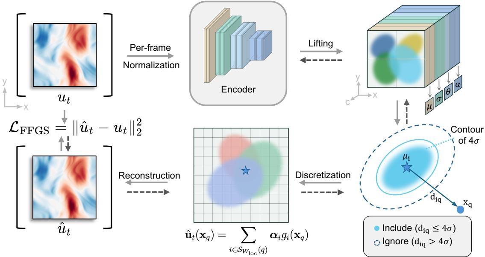

(a) Stage 1:FFGS representation and local Gaussian rendering.  
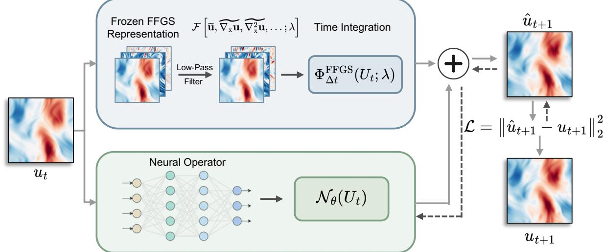  
(b) Stage 2:Overall physics-integrated surrogate.

Figure 1: Method overview. (a) The FFGS module encodes a normalized grid field into anisotropic Gaussian parameters and reconstructs a continuous field by local rendering. (b) The composite one-step surrogate combines an FFGS-based embedded-physics component with a neural-operator component. The embeddedphysics component supplies closed-form spatial derivatives, applies the low-pass filter, and evaluates the available governing terms inside the update map; gradients are stopped through this component during rollout training.

## 2. Methodology

## 2.1. Overview

We consider a general class of nonlinear, coupled PDE systems for a C-component field in a parametric setting,

$$
\begin{array} { c } { \displaystyle \frac { \partial \mathbf { u } } { \partial t } = \mathcal { F } \big [ \mathbf { u } , \nabla _ { \mathbf { x } } \mathbf { u } , \nabla _ { \mathbf { x } } ^ { 2 } \mathbf { u } , \dots ; \boldsymbol { \lambda } \big ] } \\ { \displaystyle \mathcal { T } [ \mathbf { u } , \mathbf { u } _ { 0 } ] = \mathbf { 0 } , \qquad t = 0 , \mathbf { \sigma } \mathbf { x } \in \Omega , } \\ { \displaystyle \mathcal { B } [ \mathbf { u } , \nabla _ { \mathbf { x } } \mathbf { u } , \dots ] = \mathbf { 0 } , \qquad \mathbf { x } \in \partial \Omega . } \end{array}\tag{1}
$$

where ${ \mathbf u } ( { \mathbf x } , t ) \in \mathbb { R } ^ { C }$ is the solution field over the spatial domain $\Omega \subset \mathbb { R } ^ { d }$ and temporal horizon $t \in [ 0 , T ] ; \mathcal { F } [ \cdot ; \lambda ]$ is a nonlinear operator acting on the field and its spatial derivatives, with λ denoting the physical parameters; and I and B encode the initial and boundary conditions, respectively. When the spatial argument is omitted, ${ \bf \delta u } ( t )$ denotes the full field $\mathbf { u } ( \cdot , t )$

The governing PDE induces a finite-time solution operator $\mathcal { G } _ { \Delta t }$ through the temporal evolution generated by F. In an explicit time-stepping manner, this gives

$$
\begin{array} { l } { { \displaystyle { \bf u } ( t + \Delta t ) = { \mathcal G } _ { \Delta t } ( { \bf u } ( t ) ; \lambda ) } \ ~ } \\ { { \displaystyle ~ = { \bf u } ( t ) + \int _ { t } ^ { t + \Delta t } { \mathcal F } \big [ { \bf u } ( \tau ) , \nabla _ { { \bf x } } { \bf u } ( \tau ) , \nabla _ { { \bf x } } ^ { 2 } { \bf u } ( \tau ) , . . . ; \lambda \big ] \ d \tau } . } \end{array}\tag{2}
$$

Numerical evaluation of this evolution generally requires a time step $\Delta t$ constrained by the stability and accuracy requirements of the underlying integration scheme. Neural operators instead approximate the finite-time solution operator $\mathcal { G } _ { \Delta t }$ with a parameterized operator $\mathcal { N } _ { \theta }$ allowing prediction over the larger temporal interval.

To integrate the available physics through representation, we construct a physics-based approximation of the finite-time solution operator $\mathcal { G } _ { \Delta t }$ . Specifically, an operator FFGS reconstructs ${ \bf \delta u } ( t )$ as a continuous field whose closed-form spatial derivatives provide the quantities required to evaluate the governing operator $\mathcal { F }$ . The resulting governing terms are then integrated over $\Delta t .$ defining the embedded-physics operator $\Phi _ { \Delta t } ^ { \mathrm { F F G S } } ( \mathbf { u } ( t ) ; \lambda )$ . We combine this embedded-physics operator with a neural operator to approximate $\mathcal { G } _ { \Delta t }$

$$
{ \bf u } ( t + \Delta t ) = { \mathcal G } _ { \Delta t } ( { \bf u } ( t ) ; \lambda ) \approx \underbrace { \mathcal N _ { \theta } ( { \bf u } ( t ) ; \lambda ) } _ { \mathrm { n e u r a l - o p e r a t o r ~ c o m p o n e n t } } + \underbrace { { \Phi } _ { \Delta t } ^ { \mathrm { F F G S } } ( { \bf u } ( t ) ; \lambda ) } _ { \mathrm { e m b e d d e d - p h y s i c s ~ c o m p o n e n t } } .\tag{3}
$$

The following sections construct $\Phi _ { \Delta t } ^ { \mathrm { F F G S } }$ from the Gaussian representation and its closedform spatial derivatives, and then describe the rollout training of the composite operator in Eq. (3).

## 2.2. FFGS diferentiable field representation

The embedded-physics component in Eq. (3) requires evaluating the spatial diferential quantities appearing in the governing operator F. FFGS provides these quantities by representing the current state u(t) with a continuous Gaussian expansion whose spatial derivatives are available in closed form. State-dependent algebraic quantities, by contrast, are evaluated directly from the current state rather than from its FFGS reconstruction. To construct the continuous representation, FFGS predicts a set of Gaussian primitives from u(t) and renders the corresponding basis expansion.

Given the current state ${ \bf \delta u } ( t )$ , a convolutional encoder $\mathcal { E } _ { \varphi }$ predicts G anisotropic Gaussian primitives,

$$
\{ ( \pmb { \mu } _ { i } , R _ { i } , \pmb { \sigma } _ { i } , \pmb { \alpha } _ { i } ) \} _ { i = 1 } ^ { G } = \mathcal { E } _ { \varphi } ( \mathbf { u } ( t ) ) .\tag{4}
$$

where $\pmb { \mu } _ { i } \in \Omega$ is the center of the i-th Gaussian, $R _ { i }$ specifies its orientation, $\sigma _ { i }$ contains its principal-axis scales, and ${ \pmb { \alpha } } _ { i } \in \mathbb { R } ^ { C }$ contains its channel-wise amplitudes. The orientation and scales define the symmetric positive-definite covariance matrix

$$
\begin{array} { r } { \Sigma _ { i } = R _ { i } \mathrm { d i a g } ( \pmb { \sigma } _ { i } ^ { 2 } ) R _ { i } ^ { \top } , } \end{array}\tag{5}
$$

which controls the anisotropic spatial extent of each primitive and allows the representation to adapt to directional variations in the field. Further parameterization details are provided in Appendix A.

The feed-forward encoder replaces the per-state optimization otherwise required to fit the Gaussian primitives. This amortization is important for autoregressive evolution, where a continuous representation must be reconstructed repeatedly as new states are encountered. A convolutional architecture is used to predict primitive parameters on a spatial anchor lattice with weights shared across locations; architectural details are deferred to Appendix A.

The predicted primitives define the Gaussian kernels and the corresponding continuous

field reconstruction,

$$
g _ { i } ( { \bf x } ) = \exp \left[ - \frac { 1 } { 2 } ( { \bf x } - { \pmb \mu } _ { i } ) ^ { \top } \Sigma _ { i } ^ { - 1 } ( { \bf x } - { \pmb \mu } _ { i } ) \right] , \qquad { \hat { \bf u } } ( { \bf x } _ { q } , t ) = \sum _ { i \in \cal S ( q ) } \alpha _ { i } g _ { i } ( { \bf x } _ { q } ) .\tag{6}
$$

where $S ( q )$ denotes the fixed local set of Gaussian primitives used to render the query point $\mathbf { x } _ { q } .$ . Restricting the rendering to this neighborhood avoids evaluating all G primitives at every query point while exploiting the spatial decay of the Gaussian kernels. The rendering window, periodic boundary treatment, and approximation error associated with the local truncation are detailed in Appendix A.

The analytic structure of the Gaussian basis in Eq. (6) allows its spatial derivatives to be evaluated in closed form. For each primitive,

$$
\begin{array} { r l } & { \nabla _ { \mathbf x } g _ { i } ( \mathbf x ) = - g _ { i } ( \mathbf x ) \Sigma _ { i } ^ { - 1 } ( \mathbf x - { \pmb \mu } _ { i } ) , } \\ & { \nabla _ { \mathbf x } ^ { 2 } g _ { i } ( \mathbf x ) = g _ { i } ( \mathbf x ) \left[ ( \mathbf x - { \pmb \mu } _ { i } ) ^ { \top } \Sigma _ { i } ^ { - 2 } ( \mathbf x - { \pmb \mu } _ { i } ) - \mathrm { t r } ( \Sigma _ { i } ^ { - 1 } ) \right] , } \end{array}\tag{7}
$$

where $\Sigma _ { i } ^ { - 2 } = \Sigma _ { i } ^ { - 1 } \Sigma _ { i } ^ { - 1 }$ . By linearity, the corresponding derivatives of the reconstructed field are

$$
\begin{array} { l l } { \nabla _ { \mathbf { x } } \hat { u } _ { c } ( \mathbf { x } _ { q } , t ) = \displaystyle \sum _ { i \in S ( q ) } \alpha _ { i , c } \nabla _ { \mathbf { x } } g _ { i } ( \mathbf { x } _ { q } ) , } \\ { \nabla _ { \mathbf { x } } ^ { 2 } \hat { u } _ { c } ( \mathbf { x } _ { q } , t ) = \displaystyle \sum _ { i \in S ( q ) } \alpha _ { i , c } \nabla _ { \mathbf { x } } ^ { 2 } g _ { i } ( \mathbf { x } _ { q } ) , \qquad c = 1 , \ldots , C . } \end{array}\tag{8}
$$

Thus, the closed-form spatial derivatives required by $\mathcal { F }$ are evaluated directly from the reconstructed continuous field, without finite-diference stencils or automatic diferentiation with respect to the spatial coordinates.

Spatial diferentiation can amplify high-wavenumber reconstruction errors. We therefore apply a low-pass spectral filter $\Pi _ { \kappa }$ to the diferential quantities obtained from the FFGS representation before they enter the governing operator,

$$
\widetilde { \nabla _ { \mathbf { x } } \mathbf { u } } ( t ) = \Pi _ { \kappa } \nabla _ { \mathbf { x } } \hat { \mathbf { u } } ( t ) , \qquad \widetilde { \nabla _ { \mathbf { x } } ^ { 2 } \mathbf { u } } ( t ) = \Pi _ { \kappa } \nabla _ { \mathbf { x } } ^ { 2 } \hat { \mathbf { u } } ( t ) .\tag{9}
$$

The filter is implemented in Fourier space using either a sharp spectral cutof or a smooth high-wavenumber roll-of, with benchmark-specific settings detailed in Appendix B. It is applied to the closed-form spatial derivatives obtained from the FFGS reconstruction, suppressing high-frequency reconstruction errors before the filtered derivatives are passed to ${ \mathcal F } .$ . The current grid-resolved state ${ \bf \delta u } ( t )$ , in contrast, is retained directly for state-dependent algebraic terms in the governing operator. Thus, FFGS serves as a continuous diferential interface, providing the required spatial derivatives without replacing the current state in purely algebraic terms.

The encoder is trained independently by reconstructing instantaneous field snapshots on the observation grid. The reconstruction objective is

$$
\mathcal { L } _ { \mathrm { F F G S } } ( \varphi ) = \frac { 1 } { \vert \mathcal { M } \vert } \sum _ { \mathbf { u } ( t ) \in \mathcal { M } } \frac { 1 } { N ^ { d } C } \sum _ { j = 1 } ^ { N ^ { d } } \Vert \hat { \mathbf { u } } ( \mathbf { x } _ { j } , t ) - \mathbf { u } ( \mathbf { x } _ { j } , t ) \Vert _ { 2 } ^ { 2 } ,\tag{10}
$$

where $\mathcal { M }$ denotes a mini-batch of field snapshots. After this reconstruction stage, the parameters $\varphi$ are frozen.

During the composite update, the frozen FFGS map constructs a continuous representation of the current state, from which the required closed-form spatial derivatives are evaluated through Eqs. (7)–(8). The resulting diferential quantities are then spectrally filtered according to Eq. (9). When assembling the available terms of the governing operator ${ \mathcal F } .$ state-dependent algebraic quantities are evaluated directly from the current state ${ \bf \delta u } ( t )$ , while spatial diferential quantities are supplied by the filtered FFGS derivatives. The resulting physics-based right-hand side is subsequently integrated over the interval $\Delta t$ to obtain the embedded-physics operator $\Phi _ { \Delta t } ^ { \mathrm { F F G S } } ( \mathbf { u } ( t ) ; \lambda )$ appearing in Eq. (3). The specific timeintegration scheme used in the implementation is detailed in Appendix B.

## 2.3. Neural-operator component and rollout training

The neural-operator component $\mathcal { N } _ { \theta }$ in Eq. (3) is implemented using a standard operatorlearning backbone, with the specific architecture deferred to Appendix C. When the physical parameters vary across trajectories, λ is additionally provided to $\mathcal { N } _ { \theta }$ as conditioning information; this dependence is omitted in fixed-parameter settings.

With the FFGS parameters $\varphi$ frozen, the physics-integrated surrogate is trained through multi-step autoregressive rollout. Starting from a ground-truth state ${ \bf \delta u } ( t )$ , we set ${ \bf u } ( t ) ^ { \mathrm { p r e d } } =$ ${ \bf \delta u } ( t )$ and recursively apply the one-step map in Eq. (3) for H steps,

$$
\begin{array} { r l } & { \mathbf { u } ^ { \mathrm { p r e d } } ( t + k \Delta t ) = \widehat { \mathcal { G } } _ { \Delta t , \theta } \big ( \mathbf { u } ^ { \mathrm { p r e d } } ( t + ( k - 1 ) \Delta t ) ; \lambda ) } \\ & { \qquad = \mathrm { s g } \big [ \Phi _ { \Delta t } ^ { \mathrm { F F G S } } \big ( \mathbf { u } ^ { \mathrm { p r e d } } ( t + ( k - 1 ) \Delta t ) ; \lambda ) \big ) + \mathcal { N } _ { \theta } \big ( \mathbf { u } ^ { \mathrm { p r e d } } ( t + ( k - 1 ) \Delta t ) ; \lambda ) , \qquad k = 1 , \dots , H . } \end{array}\tag{11}
$$

where sg[·] denotes the stop-gradient operator. Training on recursively predicted states exposes the neural operator to the states generated by the composite dynamics during autoregressive evolution, rather than restricting optimization to one-step transitions from ground-truth inputs.

The neural-operator parameters θ are optimized using the mean squared error accumulated over the rollout horizon,

$$
\mathcal { L } _ { \mathrm { r o l l o u t } } ( \theta ) = \frac { 1 } { H } \sum _ { k = 1 } ^ { H } \frac { 1 } { N ^ { d } C } \sum _ { j = 1 } ^ { N ^ { d } } \left\| \mathbf { u } ^ { \mathrm { p r e d } } ( \mathbf { x } _ { j } , t + k \Delta t ) - \mathbf { u } ( \mathbf { x } _ { j } , t + k \Delta t ) \right\| _ { 2 } ^ { 2 } .\tag{12}
$$

The governing dynamics therefore enter the training procedure through the embeddedphysics component $\Phi _ { \Delta t } ^ { \mathrm { F F G S } }$ in the rollout itself, rather than through an auxiliary physicsresidual term in the loss.

The stop-gradient in Eq. (11) excludes the embedded-physics component from the backward computational graph, avoiding backpropagation through the repeated FFGS evaluations and numerical integrations. Gradients are propagated through the neural-operator paths of the unrolled computation to optimize $\theta ,$ while the embedded-physics component is reevaluated at every forward step. At inference, the same composite map $\widehat { \mathcal { G } } _ { \Delta t , \theta }$ is applied autoregressively over the target horizon.

## 2.4. Extension to partially known physics

The formulation above assumes that the physical parameters λ entering the embeddedphysics component are known. We further consider a partially known setting in which the governing form is prescribed but some of its coeficients are unavailable. In this work, these unknown coeficients are identified from trajectory data before rollout training and subsequently used in the same physics-integrated surrogate.

We consider governing operators whose dependence on the unknown coeficients is linear. Specifically, the coeficient-dependent part of F can be written as

$$
\mathcal { F } \big [ { \bf u } , \nabla _ { \bf x } { \bf u } , \nabla _ { \bf x } ^ { 2 } { \bf u } , \ldots ; \lambda \big ] = \sum _ { m = 1 } ^ { P } \lambda _ { m } \mathcal { F } _ { m } \big [ { \bf u } , \nabla _ { \bf x } { \bf u } , \nabla _ { \bf x } ^ { 2 } { \bf u } , \ldots \big ] ,\tag{13}
$$

where $\mathcal { F } _ { m }$ denotes the prescribed form of the m-th governing term and $\lambda _ { m }$ is its unknown coeficient. The frozen FFGS representation provides the closed-form spatial derivatives

required to evaluate each $\mathcal { F } _ { m }$ , while the temporal derivative is estimated from neighboring trajectory frames. Evaluating Eq. (13) over the observed spatial grid therefore yields a linear regression system for λ.

Collecting the evaluated governing terms into a regression matrix A and the estimated temporal derivative into b, the coeficient estimate is obtained from

$$
{ \bf A } \lambda \approx { \bf b } , \qquad \hat { \lambda } = \underset { \lambda } { \arg \operatorname* { m i n } } \left\| { \bf A } \lambda - { \bf b } \right\| _ { 2 } ^ { 2 } .\tag{14}
$$

The construction of A follows directly from the prescribed governing terms and the FFGSevaluated spatial derivatives. The temporal-diference scheme, regression normalization, and trajectory-wise calibration procedure used to construct b and solve Eq. (14) are detailed in Appendix D.

After identification, $\hat { \lambda }$ is fixed for the corresponding trajectory and used in place of λ in the composite evolution. In particular, the embedded-physics component is evaluated as $\Phi _ { \Delta t } ^ { \mathrm { F F G S } } ( \mathbf { u } ( t ) ; \hat { \lambda } )$ , and the same coeficient estimate is supplied to $\mathcal { N } _ { \theta }$ when coeficient conditioning is used. No further modification of the FFGS representation or the composite update is required. The partially known setting therefore difers from the prescribed-coeficient setting only in how the physical parameters entering Eq. (3) are obtained; subsequent rollout training follows Eq. (11) with the identified coeficients.

## 3. Experimental setup

This section describes the benchmark suite and data generation, the model instantiation and training protocol, the baselines, and the evaluation metrics. Architecture-level implementation details are provided in the appendices.

## 3.1. Benchmark suite and data generation

We evaluate the proposed surrogate in two regimes. In the fixed-coeficient full-physics regime, both the governing form and coeficients are prescribed. We use five benchmarks in this regime to cover pure transport, transport–difusion, nonlinear self-advection, reactiondriven moving interfaces, and three-dimensional transport–difusion (Table 1). In the coeficientunknown regime, the governing form is provided but the coeficients are withheld and must be identified from trajectory data before rollout training.

<table><tr><td>Case</td><td>Governing equation</td><td>Coefficients</td><td>Grid</td><td> $\Delta t$ </td></tr><tr><td>2D Adv</td><td> $\partial _ { t } u = - { \bf v } \cdot \nabla u$ </td><td> $\mathbf { v } = 0 . 0 2 5 \mathbf { 1 }$ </td><td> $1 6 0 ^ { 2 }$ </td><td>1.0</td></tr><tr><td>2D Adv-Diff</td><td> $\begin{array} { r } { \partial _ { t } u = - \mathbf v \cdot \nabla u + D \nabla ^ { 2 } u } \end{array}$ </td><td> $\mathbf { v } = 0 . 0 2 5 \mathbf { 1 } , ~ D = 2 { \times } 1 0 ^ { - 6 }$ </td><td> $1 6 0 ^ { 2 }$ </td><td>1.0</td></tr><tr><td>2D Burgers</td><td> $\partial _ { t } \mathbf { u } = - c ( \mathbf { u } \cdot \nabla ) \mathbf { u } + \nu \nabla ^ { 2 } \mathbf { u }$ </td><td> $c = 4 . 6 9 { \times } 1 0 ^ { - 3 } , \ \nu = 1 0 ^ { - 4 }$ </td><td> $1 6 0 ^ { 2 }$ </td><td>1.0</td></tr><tr><td>2D Adv-Allen-Cahn</td><td> $\begin{array} { r } { \partial _ { t } u = - \mathbf v \cdot \nabla u + \nu \nabla ^ { 2 } u + r ( u - u ^ { 3 } ) } \end{array}$ </td><td> $\mathbf { v } = 0 . 0 5 \mathbf { 1 } , \ \nu = 1 0 ^ { - 3 } , \ r = 1$ </td><td> $1 6 0 ^ { 2 }$ </td><td>0.1</td></tr><tr><td>3D Adv-Diff</td><td> $\begin{array} { r } { \partial _ { t } u = - \mathbf v \cdot \nabla u + D \nabla ^ { 2 } u } \end{array}$ </td><td> $\mathbf { v } = 0 . 0 1 2 5 \mathbf { 1 } , \ D = 1 0 ^ { - 6 }$ </td><td> $6 4 ^ { 3 }$ </td><td>1.0</td></tr></table>

All quantities are nondimensional, and all fixed-coeficient problems are posed on the unit periodic domain $[ 0 , 1 ) ^ { d }$ . Initial conditions are sampled as random truncated Fourier series with modes restricted to $| k _ { i } | \leq k _ { \operatorname* { m a x } } = 5$ along each spatial axis. Each benchmark contains 256 training trajectories and 30 held out test trajectories. Models are trained on the first 50 steps and evaluated by 200-step autoregressive rollout. The velocity is prescribed as $\mathbf { v } = v \mathbf { 1 }$ , where 1 is the vector of ones. The symbols $c , D , \nu ,$ and r denote the convection scaling, difusivity, viscosity, and reaction rate, respectively.

Table 1: Fixed-coeficient full-physics benchmarks and data-generation parameters.

All fixed-coeficient trajectories are generated with the pseudo-spectral reference solver used in APEBench [30]. The coeficients, grids, and frame intervals follow the corresponding configurations of the APEBench scenario and are listed in Table 1. The train and test splits are fixed for each benchmark and shared by all compared methods. Models are trained on the first 50 steps of each training trajectory and evaluated by 200-step autoregressive rollout under held-out initial conditions. This protocol tests both generalization to unseen initial conditions and extrapolation beyond the temporal window used for training. The advection– Allen–Cahn benchmark uses a shorter frame interval, $\Delta t = 0 . 1$ , corresponding to roughly ten frames per reaction time $\mathcal { O } ( 1 / r )$

For the coeficient-unknown regime, we use a parameterized advection–difusion setting generated with the same pseudo-spectral reference solver, with governing form

$$
\begin{array} { r } { \partial _ { t } u = - \mathbf v \cdot \nabla u + D \nabla ^ { 2 } u . } \end{array}\tag{15}
$$

The coeficient vector $\lambda = ( \mathbf { v } , D )$ is withheld and estimated from training trajectories before rollout training. The identification procedure and its accuracy are presented together with the partial-physics results in Section 4.5. The identified coeficients are then fixed for the corresponding trajectory and used during rollout training and evaluation. The trajectory-dependent coeficients are also supplied to the neural-operator component through the coeficient-conditioning mechanism. The coeficient ranges, calibration window, and sampling details are reported in Appendix D.

## 3.2. Model instantiation and training protocol

The proposed surrogate is trained in two stages. In Stage 1, the FFGS encoder is trained on individual snapshots using the reconstruction objective in Eq. (10) and is then frozen. In Stage 2, the frozen representation is used inside the embedded-physics component, and only the neural-operator parameters are optimized using the composite rollout objective in Eq. (12). All experiments use a rollout length of $H = 5$

Unless otherwise stated, the FFGS representation uses a regular lattice with $A = 2 0$ sites per spatial dimension and local rendering with half-width $W _ { \mathrm { l o c } } =$ 4 anchor cells. Implementation details of the FFGS representation, including Gaussian parameterization, normalization, periodic boundary treatment, local rendering, and truncation, are specified in Appendix A. The spectral filter and time-integration details of the embedded-physics component are specified in Appendix B.

The neural-operator component is instantiated using the ClassicFNO implementation of pdequinox. Fixed-coeficient experiments use an unconditioned neural operator, while coeficient-varying or coeficient-unknown experiments use a coeficient-conditioned variant. The neural-operator architecture, conditioning mechanism, optimizer, learning-rate schedule, batch sizes, training lengths, and architecture-specific hyperparameters are listed in Appendix C.

The train and test splits are fixed within each benchmark and shared by all compared methods. Unless otherwise stated, reported standard deviations are computed across the 30 held-out test trajectories.

## 3.3. Baselines

The proposed model is evaluated as a data-driven next-step surrogate: it is trained from trajectory data, advances the state one frame at a time, and is deployed autoregressively. Its natural baselines are therefore purely data-driven neural time steppers with the same input–output signature and training protocol. We compare against FNO [31], U-Net [32], and ResNet [33] in their APEBench configurations [30].

Parameter budgets are matched at the level of the trainable dynamics map. The proposed model uses a neural-operator component with a trainable budget comparable to the purely data-driven baselines. The FFGS encoder is trained separately for representation reconstruction, frozen before rollout training, and accounted for separately.

## $\ 3 . 4 \cdot$ . Evaluation metrics

The primary field-level metric is the relative $\ell _ { 2 }$ error at lead time $k ,$

$$
\mathrm { r L 2 } ( k ) = \frac { \left\| \mathbf { u } ^ { \mathrm { p r e d } } ( t + k \Delta t ) - \mathbf { u } ( t + k \Delta t ) \right\| _ { 2 } } { \left\| \mathbf { u } ( t + k \Delta t ) \right\| _ { 2 } } .\tag{16}
$$

For rollout curves, $\mathrm { r L 2 } ( k )$ is averaged over the 30 held-out test trajectories at each lead time. For the summary tables, the error is first averaged over the 200-step rollout of each trajectory and is then reported as the mean ± one standard deviation across the 30 trajectory-level averages.

To assess spectral fidelity, we compute the radial energy spectrum of each rollout frame. For a field $u ( { \bf x } )$ with Fourier coeficients $\widehat { u } _ { c } ( \mathbf { q } )$ , the radial spectrum at integer wavenumber κ is defined as

$$
E ( \kappa ) = \sum _ { \kappa - \frac { 1 } { 2 } \leq | { \bf q } | < \kappa + \frac { 1 } { 2 } } \sum _ { c = 1 } ^ { C } | \widehat { u } _ { c } ( { \bf q } ) | ^ { 2 } ,\tag{17}
$$

where $\mathbf { q }$ denotes the spatial Fourier mode, and the channel sum is omitted for scalar fields.

The radial spectrum is then averaged over all rollout frames and held-out test trajectories,

$$
\overline { { E } } ( \kappa ) = \frac { 1 } { N _ { \mathrm { t e s t } } T _ { \mathrm { r o l l } } } \sum _ { n = 1 } ^ { N _ { \mathrm { t e s t } } } \sum _ { \tau = 1 } ^ { T _ { \mathrm { r o l l } } } E _ { n , \tau } ( \kappa ) , \qquad N _ { \mathrm { t e s t } } = 3 0 , \quad T _ { \mathrm { r o l l } } = 2 0 0 ,\tag{18}
$$

and the spectral error is defined as

$$
\mathrm { S p e c . } \mathrm { e r r } = \frac { \left. \overline { { E } } ^ { \mathrm { p r e d } } - \overline { { E } } ^ { \mathrm { G T } } \right. _ { 2 } } { \left. \overline { { E } } ^ { \mathrm { G T } } \right. _ { 2 } } .\tag{19}
$$

The $\kappa = 0$ mode represents the domain mean rather than nonzero-wavenumber spectral content. For the advection, advection–difusion, and Burgers benchmarks, the reference mean is identically zero and exactly conserved. Accordingly, Eq. (19) is evaluated over $\kappa \geq 1$ for these benchmarks. For the advection–Allen–Cahn benchmark, the order parameter has an evolving, non-conserved mean, and the $\kappa = 0$ mode is therefore retained.

Lower values indicate better performance for both rL2 and spectral error. For completeness, we also report the peak signal-to-noise ratio,

$$
\mathrm { P S N R } = 1 0 \log _ { 1 0 } \left( \frac { R ^ { 2 } } { \mathrm { M S E } } \right) ,\tag{20}
$$

where R is the global dynamic range of the reference data over the held-out test set. PSNR is aggregated in the same manner as rL2: it is first averaged over the 200-step rollout of each trajectory and is then reported as the mean ± one standard deviation across the 30 trajectory-level averages.

## 4. Results

## 4.1. Aggregate rollout accuracy

Table 2 summarizes aggregate test performance over 200-step autoregressive rollouts on the five fixed-coeficient benchmarks under the common protocol of Section 3. The proposed surrogate achieves the best performance on all benchmarks and all reported metrics. Compared with the strongest purely data-driven baseline in each benchmark, selected by mean relative $\ell _ { 2 }$ error, the proposed surrogate reduces rL2 by factors ranging from 1.5× on 3D advection–difusion to 2.2× on Burgers, with corresponding PSNR gains of 3.3 to 6.6 dB.

The strongest purely data-driven baseline varies across benchmarks. Specifically, FNO performs best on the 2D linear transport cases, ResNet on the nonlinear cases, and U-Net on 3D advection–difusion. In contrast, the proposed surrogate is the most accurate method on all five benchmarks. This improvement is not due to a larger learned model: its neural-operator component has the same input–output signature and a comparable trainable dynamics-map budget as the purely data-driven FNO stepper. Instead, the comparison points to the FFGS-based embedded-physics component as the source of the improvement. The spectral-energy metric supports the same overall conclusion, with the proposed surrogate achieving the lowest spectral error on all five benchmarks. Section 4.4 examines this metric in more detail.

## 4.2. Long-horizon autoregressive rollout

Figure 2 compares the long-horizon autoregressive rollout performance of the proposed surrogate with purely data-driven baselines on the Burgers benchmark. The 200-step rollout simultaneously evaluates extrapolation beyond the 50-step training horizon and generalization to unseen initial conditions.

Across both the training and held-out trajectories, the proposed surrogate consistently achieves the lowest relative $\ell _ { 2 }$ error throughout the rollout. While all methods perform simi-

<table><tr><td>Benchmark</td><td>Method</td><td>#Params</td><td>PSNR↑ (dB)</td><td>rL2↓</td><td>Spec. err↓</td></tr><tr><td rowspan="4">Advection (2D)</td><td>FNO</td><td>57.8k</td><td> $4 0 . 0 4 \pm 1 . 6 8$ </td><td> $0 . 0 8 9 \pm 0 . 0 1 1$ </td><td>0.0214</td></tr><tr><td>U-Net</td><td>55.7k</td><td> $3 6 . 2 0 \pm 1 . 1 4$ </td><td> $0 . 1 2 9 \pm 0 . 0 2 5$ </td><td>0.0403</td></tr><tr><td>ResNet</td><td>61.2k</td><td> $2 9 . 4 2 \pm 0 . 6 6$ </td><td> $0 . 3 9 4 \pm 0 . 0 2 8$ </td><td>0.2898</td></tr><tr><td>Ours</td><td>57.8k</td><td> ${ \bf 4 4 . 7 5 \pm 1 . 9 2 }$ </td><td> $\mathbf { 0 . 0 5 2 \pm 0 . 0 1 4 }$ </td><td>0.0031</td></tr><tr><td rowspan="4">Adv-Diffusion (2D)</td><td>FNO</td><td>57.8k</td><td> $4 1 . 4 1 \pm 1 . 7 5$ </td><td> $0 . 0 8 4 \pm 0 . 0 1 1$ </td><td>0.0276</td></tr><tr><td>U-Net</td><td>55.7k</td><td> $3 6 . 3 7 \pm 1 . 7 0$ </td><td> $0 . 1 4 6 \pm 0 . 0 3 7$ </td><td>0.0894</td></tr><tr><td>ResNet</td><td>61.2k</td><td> $3 3 . 8 9 \pm 0 . 8 5$ </td><td> $0 . 2 0 7 \pm 0 . 0 1 4$ </td><td>0.0990</td></tr><tr><td>Ours</td><td>57.8k</td><td> ${ \bf 4 6 . 0 2 \pm 1 . 8 3 }$ </td><td> $\mathbf { 0 . 0 5 0 \pm 0 . 0 1 1 }$ </td><td>0.0067</td></tr><tr><td rowspan="4">Burgers (2D)</td><td>FNO</td><td>57.8k</td><td> $4 3 . 0 3 \pm 1 . 8 6$ </td><td> $0 . 2 3 6 \pm 0 . 0 4 7$ </td><td>0.1102</td></tr><tr><td>U-Net</td><td>55.8k</td><td> $4 6 . 0 7 \pm 2 . 0 2$ </td><td> $0 . 2 2 5 \pm 0 . 0 9 6$ </td><td>0.1489</td></tr><tr><td>ResNet</td><td>61.2k</td><td> $4 9 . 8 3 \pm 0 . 8 2$ </td><td> $0 . 1 2 7 \pm 0 . 0 3 4$ </td><td>0.0259</td></tr><tr><td>Ours</td><td>57.8k</td><td> ${ \bf 5 6 . 4 0 \pm 1 . 7 7 }$ </td><td> $\mathbf { 0 . 0 5 7 \pm 0 . 0 2 3 }$ </td><td>0.0007</td></tr><tr><td rowspan="4">Adv-Allen-Cahn (2D)</td><td>FNO</td><td>57.8k</td><td> $2 0 . 7 4 \pm 3 . 2 3$ </td><td> $0 . 3 1 3 \pm 0 . 1 5 1$ </td><td>0.1086</td></tr><tr><td>U-Net</td><td>55.7k</td><td> $3 5 . 1 3 \pm 4 . 2 3$ </td><td> $0 . 0 6 2 \pm 0 . 0 4 8$ </td><td>0.0367</td></tr><tr><td>ResNet</td><td>61.2k</td><td> $4 6 . 7 7 \pm 2 . 0 1$ </td><td> $0 . 0 1 4 \pm 0 . 0 0 5$ </td><td>0.0033</td></tr><tr><td>Ours</td><td>57.8k</td><td> ${ \bf 5 1 . 3 6 \pm 2 . 9 7 }$ </td><td> $\mathbf { 0 . 0 0 8 \pm 0 . 0 0 4 }$ </td><td>0.0010</td></tr><tr><td rowspan="4">Adv-Diffusion (3D)</td><td>FNO</td><td>1.15M</td><td> $3 7 . 8 2 \pm 0 . 6 1$ </td><td> $0 . 1 5 7 \pm 0 . 0 0 9$ </td><td>0.0715</td></tr><tr><td>U-Net</td><td>1.12M</td><td> $4 1 . 4 0 \pm 0 . 9 7$ </td><td> $0 . 1 0 0 \pm 0 . 0 1 0$ </td><td>0.0173</td></tr><tr><td>ResNet</td><td>1.15M</td><td> $3 0 . 8 1 \pm 0 . 4 6$ </td><td> $0 . 3 4 3 \pm 0 . 0 2 7$ </td><td>0.2206</td></tr><tr><td>Ours</td><td>1.15M</td><td> ${ \bf 4 4 . 6 7 \pm 0 . 8 2 }$ </td><td> $\mathbf { 0 . 0 6 8 \pm 0 . 0 0 5 }$ </td><td>0.0021</td></tr></table>

Reporting conventions follow Section 3.4. #Params counts the trainable parameters of the learned dynamics map. The FFGS encoder is trained separately for representation reconstruction and frozen during rollout training. Bold entries mark the best value within each benchmark.

Table 2: Aggregate test-rollout performance on the five PDE benchmarks.

larly during the early rollout, the performance gap becomes increasingly pronounced beyond the training horizon, indicating substantially slower autoregressive error accumulation and improved long-term stability under repeated prediction. This behavior is retained for unseen initial conditions over the full 200-step horizon.

Since all methods employ comparable trainable dynamics-map budgets, the improved rollout performance cannot be attributed to increased learned-model capacity. Instead, the results indicate that embedding the FFGS-based embedded-physics component yields more stable autoregressive prediction and better generalization to unseen trajectories.

## 4.3. Field-level comparison

Figure 3 provides a qualitative comparison of the three-dimensional scalar-field evolution over a long autoregressive rollout. The paired isosurfaces expose both the spatial transport of the field and the deformation of its positive and negative structures, thereby revealing discrepancies that may not be apparent from domain-averaged error metrics alone. Since all models start from the same initial condition, the diferences observed at later times arise from the accumulation of rollout errors.

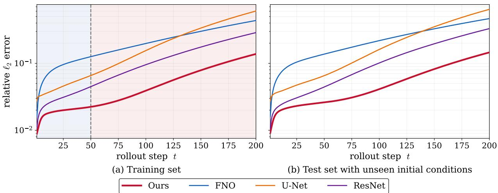  
Figure 2: Long-horizon autoregressive rollout on the Burgers benchmark. Relative $\ell _ { 2 }$ error is plotted on a logarithmic scale for the proposed surrogate and three purely data-driven baselines. Panel (a) shows rollouts on the training trajectories, whereas panel (b) reports rollouts on held-out trajectories with unseen initial conditions. The shaded region in panel (a) indicates extrapolation beyond the 50-step training horizon (t > 50).

At t = 50, all methods reproduce the dominant transported structures, although deviations in the geometry and placement of smaller isosurface components have already begun to emerge for the purely data-driven baselines. These discrepancies become more pronounced at $t ~ = ~ 1 0 0$ , where FNO, UNet, and particularly ResNet exhibit increasing deformation, merging, or disappearance of individual structures relative to the ground truth. The proposed method maintains closer agreement in the spatial organization, signed structure, and characteristic length scales of the evolving field.

By t = 200, the rollout has accumulated substantial temporal error for all surrogate models, as expected for this advection-dominated three-dimensional problem. Nevertheless, the proposed method retains the principal positive and negative structures more faithfully than the baselines and exhibits less severe distortion of their overall topology and spatial distribution. FNO and UNet preserve portions of the large-scale organization but show greater displacement and morphological deviation, whereas ResNet displays the strongest departure from the reference solution. This qualitative behavior is consistent with the quantitative performance reported in Table 2, supporting the conclusion that embedding the available governing dynamics improves the structural fidelity and long-horizon stability of the learned rollout.

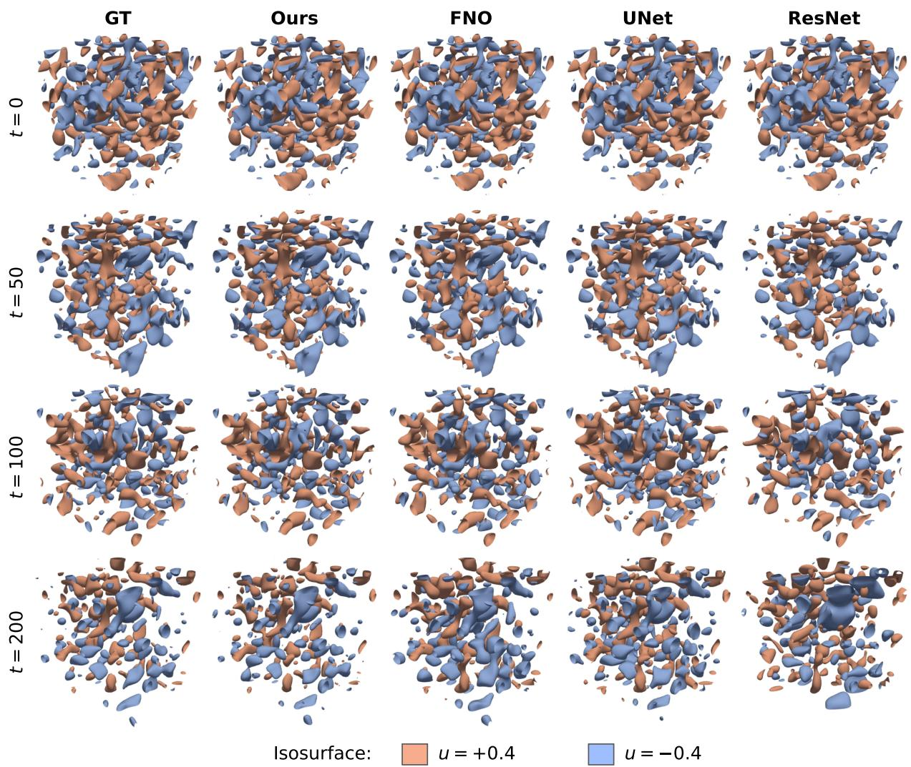  
Figure 3: Three-dimensional advection–difusion rollout for a representative held-out trajectory at large Péclet number. Positive and negative scalar structures are visualized using the isosurfaces $u = + 0 . 4$ and $u = - 0 . 4$ , respectively. Columns correspond to the ground truth, the proposed method, FNO, UNet, and $\mathrm { R e s N e t }$ , while rows show the initial condition and autoregressive predictions at t = 50, 100, and 200. All methods are initialized from the same ground-truth field at t = 0, and the viewing direction and isosurface levels are fixed across all panels.

## 4.4. Spectral fidelity

Figure 4 compares the time-averaged radial energy spectra of the 2D Burgers rollouts. As shown in Fig. 4(a), all methods reproduce the overall spectral decay, while the proposed surrogate provides the closest agreement with the reference spectrum over the resolved wavenumber range. The largest discrepancy occurs at the first nonzero wavenumber, where the purely data-driven baselines systematically overestimate the spectral energy, whereas the proposed surrogate remains nearly indistinguishable from the reference, as highlighted by the spectral ratio in Fig. 4(b). Consequently, the proposed surrogate achieves the smallest spectral error across the entire resolved spectrum, as summarized in Fig. 4(c).

GT Ours FNO U-Net ResNet  
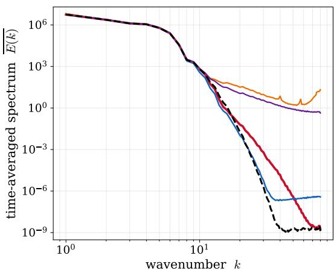  
(a) Time-averaged energy spectrum

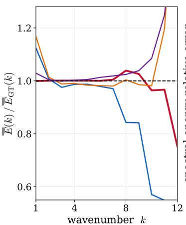  
(b) Ratio to the reference

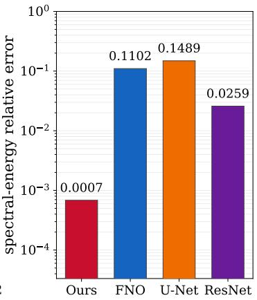  
(c) Relative spectral error  
Figure 4: Spectral fidelity on the 2D Burgers test set $( \nu = 1 0 ^ { - 4 } ;$ 30 held-out trajectories × 200 rollout steps). (a) Time-averaged radial energy spectrum $\overline { { E } } ( \kappa )$ for the reference solution and each predictor. (b) Ratio $\overline { { E } } ( \kappa ) / \overline { { E } } _ { \mathrm { G T } } ( \kappa )$ over the energy-containing range. (c) Relative error of the time-averaged spectrum, $\| \overline { { E } } - \overline { { E } } _ { \mathrm { G T } } \| _ { 2 } / \| \overline { { E } } _ { \mathrm { G T } } \| _ { 2 }$ , evaluated over $\kappa \geq 1$ (Section 3.4).

The improved spectral fidelity is consistent with the proposed physics-integrated formulation. By coupling the neural operator with the FFGS-based embedded-physics component, the model better preserves the evolution of resolved-scale spectral energy during long autoregressive rollouts, thereby suppressing the accumulation of spurious spectral errors.

## 4.5. Partial-physics regime

We now evaluate the coeficient-unknown regime, in which the governing operator form is available but the advection–difusion coeficients are withheld. We first identify the coeficients from trajectory data and then examine whether the resulting physics-integrated surrogate retains its long-horizon rollout accuracy and spectral fidelity.

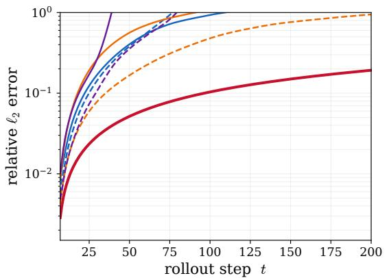  
+ \*+)'\$\$',+

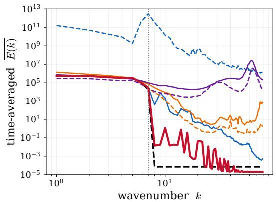  
 & )"/\*( +),%  
Figure 5: Partial-physics regime on the advection–difusion benchmark. (a) Test-rollout relative $\ell _ { 2 }$ error for the proposed surrogate and the purely data-driven baselines at matched and tenfold (10×) trainable dynamics-map budgets. (b) Time-averaged energy spectra; the dotted line marks the initial-condition band edge.

## 4.5.1. Coeficient identification

In the coeficient-unknown setting, the governing operator is available whereas its coefficients are withheld. Before rollout training, the unknown coeficients are identified from trajectory data using the frozen FFGS representation. The closed-form spatial derivatives supplied by FFGS enable the prescribed governing terms to be evaluated directly, yielding a linear regression system for the unknown coeficients. The coeficient vector is recovered using the least-squares formulation in Eq.(14). Before solving the regression system, the columns of the design matrix are normalized to improve numerical conditioning; the complete calibration procedure is detailed in Appendix D.

For the advection–difusion benchmark, the recovered coeficients are highly accurate, with relative errors of 0.34% for the velocity and 2.84% for the difusivity. The slightly larger difusivity error is expected in the large-Péclet-number regime, where advection dominates the dynamics and the difusive contribution provides a weaker regression signal. Nevertheless, both coeficients are recovered with suficient accuracy to instantiate the embedded-physics component for the subsequent rollout experiments.

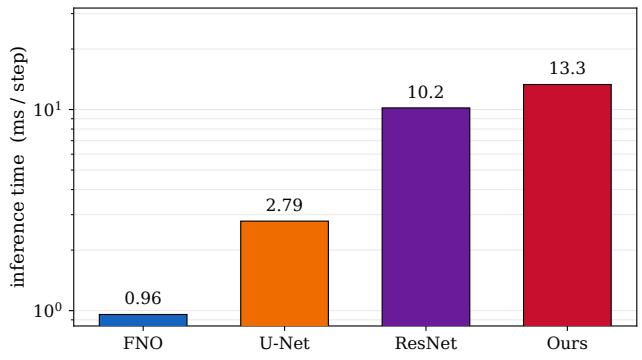  
(a) 2D Advection-Diffusion

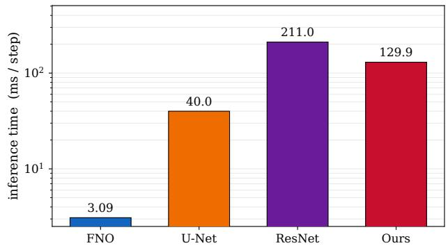  
(b) 3D Advection-Diffusion  
Figure 6: Per-step inference cost measured as wall-clock time per autoregressive update. Values are the minimum over five timed rollouts after warm-up and are shown on a logarithmic scale.

## 4.5.2. Rollout accuracy and spectral fidelity

Figures $\mathrm { 5 ( a , b ) }$ compare the proposed surrogate in the partial-physics regime with the purely data-driven steppers. The rollout error of each baseline grows toward O(1) within the 200-step horizon; the 10× variants delay this degradation but do not eliminate it. In contrast, the proposed surrogate maintains slower error growth throughout the rollout. The time-averaged spectra provide a consistent diagnosis: the baselines accumulate spurious highwavenumber energy beyond the reference band, most severely for the $1 0 \times \mathrm { F N O } .$ whereas the proposed surrogate follows the reference spectrum down to the numerical floor. Thus, even when the physical coeficients are estimated rather than prescribed, the embedded-physics component continues to improve long-horizon accuracy and spectral fidelity. The resulting surrogate remains data-driven end to end, including the coeficient identification step, while outperforming the purely data-driven baselines.

## 4.6. Inference cost

Figure 6 reports wall-clock inference time per autoregressive step for 2D and 3D advection– difusion. The proposed surrogate is slower than FNO and U-Net because it evaluates the FFGS-based embedded-physics component during each update. However, its cost remains comparable to the slower neural baselines: it is close to ResNet in 2D and faster than ResNet in 3D. Together with the accuracy results in Table 2, this shows an accuracy–cost trade-of. The additional computation comes from evaluating the physics-coupled Gaussian representation inside the update map, not from increasing the trainable neural-operator component.

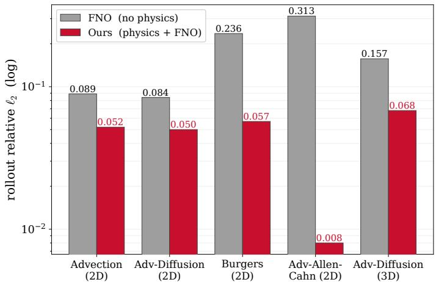  
(a) Removing the FFGS-physics module

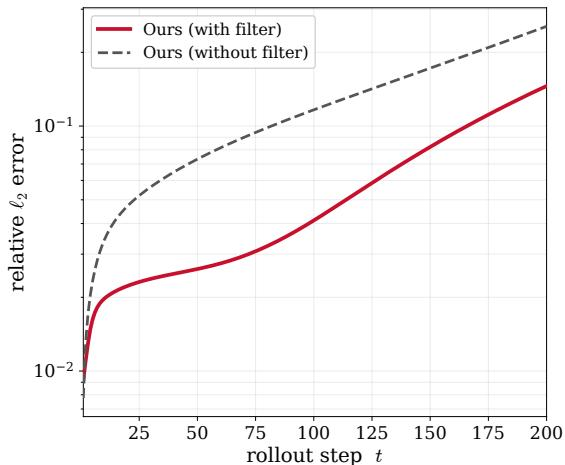  
(b) Removing the low-pass filter  
Figure 7: Ablation in the full-physics regime. (a) Removing the FFGS-based embedded-physics component leaves the neural-operator-only variant with the same trainable dynamics-map budget. (b) Removing the low-pass filter from the embedded-physics component on the Burgers benchmark. Both panels report rollout relative $\ell _ { 2 }$ error on a logarithmic scale.

## 5. Discussion

## 5.1. Component analysis

The results above show consistent gains over purely data-driven neural steppers. We now use ablation studies to identify which parts of the composite update are responsible for these gains. In the fixed-coeficient regime, we test the role of the FFGS-based embeddedphysics component and the low-pass filter (Fig. 7). In the partial-physics regime, after the coeficients have been identified, we compare an FFGS-only variant containing only the embedded-physics component, a coeficient-conditioned FNO without the embedded-physics component, and the proposed composite surrogate (Fig. 8). This comparison tests whether the embedded-physics component and the coeficient-conditioned neural-operator component are complementary.

Figure 7 shows that both the embedded-physics component and the low-pass filter contribute to rollout accuracy. Removing the FFGS-based embedded-physics component reduces the model to a neural-operator-only stepper and increases the rollout error on all five fixedcoeficient benchmarks. The efect is especially pronounced on the advection–Allen–Cahn benchmark, where the available governing terms carry substantial information about the reaction-interface dynamics. This indicates that the gains in Table 2 are not produced by the neural-operator component alone.

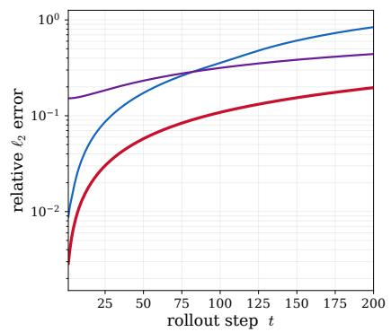  
(a) test rollout

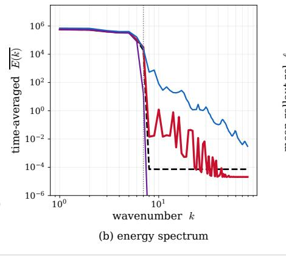

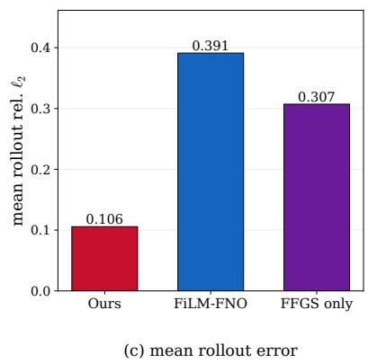  
Figure 8: Component ablation in the partial-physics regime. All variants use the same recovered coeficients. FFGS-only uses only the embedded-physics component; FiLM-FNO supplies the recovered coeficients to a coeficient-conditioned neural operator without the embedded-physics component; Ours combines the coeficient-conditioned neural-operator component with the FFGS-based embedded-physics component. (a) Test-rollout relative $\ell _ { 2 }$ error. (b) Time-averaged radial energy spectrum. (c) Mean rollout error over the 200-step horizon.

The low-pass filter has a diferent role. On Burgers, removing the filter from the embeddedphysics component leads to a growing error gap over the rollout horizon. This is consistent with the fact that spatial diferentiation amplifies high-wavenumber reconstruction errors in the Gaussian representation. The filter therefore acts as a stabilization device for physics evaluation: it suppresses unreliable high-wavenumber derivative content before the governing terms are evaluated. The filtered and unfiltered variants use the same neural-operator component, trainable budget, and rollout loss, so the diference isolates the efect of the filter.

The partial-physics ablation tests whether the embedded-physics component and the coeficient-conditioned neural-operator component are complementary after coeficient identification. The FFGS-only variant uses the recovered coeficients inside the governing operator but contains no neural-operator component. Its rollout error grows slowly, but it starts from a large error ofset because the available physics and the filtered Gaussian representation do not fully reproduce the reference dynamics. Its spectrum also shows excessive damping of highwavenumber content. The FiLM-FNO variant uses the same recovered coeficients only as neural-network conditioning. It improves short-time prediction, but without the embeddedphysics component, its rollout drifts over long horizons and accumulates high-wavenumber energy. The proposed surrogate combines the two components. The embedded-physics component uses the recovered coeficients structurally, while the coeficient-conditioned neuraloperator component accounts for the part of the update not captured by the available physics. This combination yields lower rollout error and better spectral fidelity than either component alone. The comparison shows that exposing the coeficient values to a neural operator is not equivalent to evaluating the corresponding governing terms on the diferentiable FFGS representation.

Taken together, the fixed-coeficient and partial-physics ablations show that the embeddedphysics component and the neural-operator component are complementary. The embeddedphysics component improves long-horizon behavior by injecting the available governing structure into the update map, while the neural-operator component compensates for representation error, filtering efects, and dynamics not fully captured by the available physics. Removing either component degrades performance. The recurrence of this pattern across prescribed-coeficient and coeficient-unknown settings suggests that the gain comes from the composite update itself, rather than from a benchmark-specific tuning or a particular coeficient choice.

## 5.2. Limitations and future directions

The results demonstrate the benefit of embedding available governing structure through a diferentiable Gaussian representation, but the present implementation has several limitations. These limitations concern the fixed capacity of the representation, its specialization to a given solution family, and the manual selection of the spectral cutof.

A first limitation is the fixed capacity of the Gaussian representation. The feed-forward encoder predicts a fixed number of anisotropic kernels on a regular anchor lattice. This design makes the representation eficient and amortized, but the spectral range over which it can support accurate physics evaluation is limited by the anchor density, kernel scales, and derivative accuracy. Sharp fronts or persistent high-wavenumber content may therefore be reconstructed only approximately, and derivative quantities in those spectral ranges can become unreliable. The limitation is therefore not only pointwise reconstruction error, but also the accuracy of the spatial derivatives used by the embedded operator. This motivates adaptive Gaussian representations, such as variable kernel budgets or anchor refinement in re gions of high local complexity. Such adaptivity could increase the usable spectral bandwidth of the representation and reduce the reliance on low-pass filtering during embedded-physics evaluation.

A second limitation is specialization to a given equation family. In the present experiments, the FFGS encoder is trained on trajectories from the same equation family used for evaluation. Its reconstruction quality, derivative accuracy, and filter choice are therefore tied to that solution family. Extending the method across multiple PDEs would require a shared representation whose rendered fields and closed-form derivatives remain reliable across diferent operators, parameter regimes, and solution morphologies. This requirement is stronger than interpolation accuracy alone, because the derivatives are evaluated inside the governing operator. A possible direction is to condition the encoder and the neural-operator component on the governing coeficients, nondimensional parameters, or an operator descriptor while retaining a common FFGS interface.

A third limitation is the manual selection of the spectral cutof. In this work, the cutof is chosen per benchmark to retain the spectral range in which the FFGS reconstruction and its derivatives are reliable, while suppressing high-wavenumber derivative errors. This choice is efective but remains external to the model. A more systematic strategy would estimate the reliable spectral range directly from diagnostics of the reconstructed field and its derivatives. Since the FFGS reconstruction is explicit, quantities such as spectral decay, reconstruction error, first-derivative error, and second-derivative error can be measured against reference fields ( Appendix F). These diagnostics could be used to select the cutof automatically and, in future extensions, to adapt it to the field, governing operator, and time step.

## 6. Conclusion

This work introduced a physics-integrated neural-operator framework that incorporates available governing-equation knowledge at the level of the field representation. Rather than imposing the physics through an auxiliary residual loss or redesigning the neural-operator architecture for a particular PDE, the proposed approach retains a generic neural-operator backbone and uses feed-forward Gaussian splatting (FFGS) as a continuous interface between sampled solution fields and governing operators. FFGS maps each discrete state to a compact continuous Gaussian representation in a single forward pass, whose analytic structure provides direct access to the spatial diferential quantities required by the governing equations. The resulting surrogate combines a neural-operator component with an embedded-physics component evaluated directly on this representation.

Across five two- and three-dimensional PDE benchmarks spanning transport, difusion, nonlinear self-advection, and reaction dynamics, the proposed framework consistently improves long-horizon autoregressive accuracy and spectral fidelity over purely data-driven neural steppers with comparable trainable dynamics-map budgets. The gains persist beyond the temporal window used for training and on held-out initial conditions, while the ablation studies show that both the embedded-physics component and the spectral filtering of reconstructed diferential quantities contribute to the improved rollout behavior. The same representation also extends naturally to the partial-physics setting: when the governing form is known but its coeficients are unavailable, the analytic derivatives supplied by FFGS enable the coeficients to be identified from trajectory data and subsequently used within the embedded-physics component. The resulting model retains most of the accuracy and spectral-fidelity gains observed when the coeficients are prescribed.

These results support representation-level physics integration as a practical route for coupling neural operators with fully or partially known PDE structure. More broadly, the role of the learned representation extends beyond reconstructing the state: it provides the continuous physical field on which governing operators can be evaluated before their contribution is incorporated into the learned time-evolution map. The present implementation remains limited by the fixed capacity of the Gaussian representation, its specialization to a given solution family, and the use of manually selected spectral cutofs. Addressing these limitations through adaptive representations, cross-equation conditioning, and data-driven selection of the reliable spectral range provides a natural path toward applying the framework to more complex multiscale and multiphysics systems.

## References

[1] L. Lu, P. Jin, G. Pang, Z. Zhang, G. E. Karniadakis, Learning nonlinear operators via DeepONet based on the universal approximation theorem of operators 3 (3) 218–229.

doi:10.1038/s42256-021-00302-5. URL https://www.nature.com/articles/s42256-021-00302-5

[2] N. Kovachki, Z. Li, B. Liu, K. Azizzadenesheli, K. Bhattacharya, A. Stuart, A. Anandkumar, Neural Operator: Learning Maps Between Function Spaces, arXiv:2108.08481 [cs.LG] (May 2024). doi:10.5555/3648699.3648788. URL http://arxiv.org/abs/2108.08481

[3] J. Pathak, S. Subramanian, P. Harrington, S. Raja, A. Chattopadhyay, M. Mardani, T. Kurth, D. Hall, Z. Li, K. Azizzadenesheli, et al., Fourcastnet: A global data-driven high-resolution weather model using adaptive fourier neural operators, arXiv preprint arXiv:2202.11214 (2022).

[4] K. Bi, L. Xie, H. Zhang, X. Chen, X. Gu, Q. Tian, Accurate medium-range global weather forecasting with 3d neural networks, Nature 619 (7970) (2023) 533–538.

[5] Z. Li, W. Peng, Z. Yuan, J. Wang, Fourier neural operator approach to large eddy simulation of three-dimensional turbulence 12 (6) 100389. doi:10.1016/j.taml.2022. 100389. URL https://www.sciencedirect.com/science/article/pii/S2095034922000691

[6] Y. Wang, Z. Li, Z. Yuan, W. Peng, T. Liu, J. Wang, Prediction of turbulent channel flow using Fourier neural operator-based machine-learning strategy 9 (8) 084604. doi: 10.1103/PhysRevFluids.9.084604. URL https://link.aps.org/doi/10.1103/PhysRevFluids.9.084604

[7] P. Lippe, B. Veeling, P. Perdikaris, R. Turner, J. Brandstetter, PDE-Refiner: Achieving Accurate Long Rollouts with Neural PDE Solvers, in: Advances in Neural Information Processing Systems, Vol. 36, Curran Associates, Inc., pp. 67398–67433. URL https://proceedings.neurips.cc/paper\_files/paper/2023/hash/ d529b943af3dba734f8a7d49efcb6d09-Abstract-Conference.html

[8] M. Takamoto, T. Praditia, R. Leiteritz, D. MacKinlay, F. Alesiani, D. Pflüger, M. Niepert, PDEBENCH: An Extensive Benchmark for Scientific Machine Learning.

arXiv:2210.07182, doi:10.48550/arXiv.2210.07182.

URL http://arxiv.org/abs/2210.07182

[9] J. A. L. Benitez, T. Furuya, F. Faucher, A. Kratsios, X. Tricoche, M. V. de Hoop, Outof-distributional risk bounds for neural operators with applications to the helmholtz equation, Journal of Computational Physics 513 (2024) 113168.

[10] S. Wang, H. Wang, P. Perdikaris, Learning the solution operator of parametric partial diferential equations with physics-informed DeepONets 7 (40) eabi8605. doi:10.1126/ sciadv.abi8605. URL https://www.science.org/doi/10.1126/sciadv.abi8605

[11] Z. Li, H. Zheng, N. Kovachki, D. Jin, H. Chen, B. Liu, K. Azizzadenesheli, A. Anandkumar, Physics-Informed Neural Operator for Learning Partial Diferential Equations, arXiv:2111.03794 [cs.LG] (Jul. 2023). doi:10.48550/arXiv.2111.03794. URL http://arxiv.org/abs/2111.03794

[12] M. Raissi, P. Perdikaris, G. E. Karniadakis, Physics-informed neural networks: A deep learning framework for solving forward and inverse problems involving nonlinear partial diferential equations 378 686–707. doi:10.1016/j.jcp.2018.10.045. URL https://www.sciencedirect.com/science/article/pii/S0021999118307125

[13] S. Wang, X. Yu, P. Perdikaris, When and why PINNs fail to train: A neural tangent kernel perspective 449 110768. doi:10.1016/j.jcp.2021.110768. URL https://www.sciencedirect.com/science/article/pii/S002199912100663X

[14] A. Krishnapriyan, A. Gholami, S. Zhe, R. Kirby, M. Mahoney, Characterizing possible failure modes in physics-informed neural networks, in: Advances in Neural Information Processing Systems, Vol. 34, Curran Associates, Inc., pp. 26548–26560. URL https://proceedings.neurips.cc/paper/2021/hash/ df438e5206f31600e6ae4af72f2725f1-Abstract.html

[15] N. Liu, Y. Fan, X. Zeng, M. Klöwer, L. Zhang, Y. Yu, Harnessing the power of neural operators with automatically encoded conservation laws, in: R. Salakhutdinov, Z. Kolter,

K. Heller, A. Weller, N. Oliver, J. Scarlett, F. Berkenkamp (Eds.), Proceedings of the 41st International Conference on Machine Learning, Vol. 235 of Proceedings of Machine Learning Research, PMLR, 2024, pp. 30965–30997.   
URL https /v235/1iu24p.html

[16] N. Liu, Y. Yu, H. You, N. Tatikola, INO: Invariant Neural Operators for Learning Complex Physical Systems with Momentum Conservation. arXiv:2212.14365, doi: 10.48550/arXiv.2212.14365. URL http://arxiv.org/abs/2212.14365

[17] J. Helwig, X. Zhang, C. Fu, J. Kurtin, S. Wojtowytsch, S. Ji, Group Equivariant Fourier Neural Operators for Partial Diferential Equations. arXiv:2306.05697, doi:10.48550/arXiv.2306.05697. URL http://arxiv.org/abs/2306.05697

[18] X. Hu, Q. Ma, P. Zhao, X. Wang, Physics-aware neural operator for high-fidelity fluid dynamics modeling with geometric and spectral priors, Physics of Fluids 37 (11) (2025).

[19] M. Liu-Schiafini, J. Berner, B. Bonev, T. Kurth, K. Azizzadenesheli, A. Anandkumar, Neural Operators with Localized Integral and Diferential Kernels. arXiv:2402.16845, doi:10.48550/arXiv.2402.16845. URL http://arxiv.org/abs/2402.16845

[20] E. J. Kansa, Multiquadrics—A scattered data approximation scheme with applications to computational fluid-dynamics—II solutions to parabolic, hyperbolic and elliptic partial diferential equations 19 (8) 147–161. doi:10.1016/0898-1221(90)90271-K. URL https://www.sciencedirect.com/science/article/pii/089812219090271K

[21] C. Franke, R. Schaback, Solving partial diferential equations by collocation using radial basis functions 93 (1) 73–82. doi:10.1016/S0096-3003(97)10104-7. URL https://www.sciencedirect.com/science/article/pii/S0096300397101047

[22] B. Kerbl, G. Kopanas, T. Leimkühler, G. Drettakis, 3d Gaussian Splatting for Real-Time Radiance Field Rendering, ACM Transactions on Graphics 42 (4) (2023) 139:1–

139:14. doi:10.1145/3592433.

URL https://dl.acm.org/doi/10.1145/3592433

[23] D. V. Shenoy, S. H. Frankel, Gaussian field representations for turbulent flow: Compression, scale separation, and physical fidelity, Computers & Fluids (2026) 107202.

[24] Z. Li, Y. Feng, Z. Lai, W. Wang, From basis to basis: Gaussian particle representation for interpretable pde operators, arXiv preprint arXiv:2602.21551 (2026).

[25] J. Xing, B. Wang, M. Chu, B. Chen, Gaussian Fluids: A Grid-Free Fluid Solver based on Gaussian Spatial Representation, arXiv:2405.18133 [cs.GR] (Jul. 2025). doi:10. 48550/arXiv.2405.18133.

URL http://arxiv.org/abs/2405.18133

[26] D. Charatan, S. Li, A. Tagliasacchi, V. Sitzmann, pixelSplat: 3D Gaussian Splats from Image Pairs for Scalable Generalizable 3D Reconstruction. arXiv:2312.12337, doi:10.48550/arXiv.2312.12337. URL http://arxiv.org/abs/2312.12337

[27] W. Wang, Y. Chen, Z. Zhang, H. Liu, H. Wang, Z. Feng, W. Qin, F. Chen, Z. Zhu, D. Y. Chen, B. Zhuang, VolSplat: Rethinking Feed-Forward 3D Gaussian Splatting with Voxel-Aligned Prediction. arXiv:2509.19297, doi:10.48550/arXiv.2509.19297. URL http://arxiv.org/abs/2509.19297

[28] Z. Zhang, X. Meng, K. Wu, W. Ding, Sparsesplat: Towards applicable feed-forward 3d gaussian splatting with pixel-unaligned prediction (2026). arXiv:2604.03069. URL https://arxiv.org/abs/2604.03069

[29] H. Huang, M. Li, Z. Gao, X. Zhou, X. Huang, X. Sun, Fluidsplat: Reconstructing physical fields from sparse sensors via gaussian primitives, arXiv preprint arXiv:2605.18866 (2026).

[30] F. Koehler, S. Niedermayr, R. Westermann, N. Thuerey, APEBench: A benchmark for autoregressive neural emulators of pdes, in: A. Globerson, L. Mackey,

D. Belgrave, A. Fan, U. Paquet, J. Tomczak, C. Zhang (Eds.), Advances in Neural Information Processing Systems, Vol. 37, Curran Associates, Inc., pp. 120252–120310. doi:10.52202/079017-3822.

URL https://proceedings.neurips.cc/paper\_files/paper/2024/file/ d9875ebcf74bccdc5076acab0dbee62c-Paper-Datasets\_and\_Benchmarks\_Track.pdf

[31] Z. Li, N. Kovachki, K. Azizzadenesheli, B. Liu, K. Bhattacharya, A. Stuart, A. Anandkumar, Fourier Neural Operator for Parametric Partial Diferential Equations, arXiv:2010.08895 [cs, math] (May 2021). URL http://arxiv.org/abs/2010.08895

[32] O. Ronneberger, P. Fischer, T. Brox, U-Net: Convolutional Networks for Biomedical Image Segmentation. URL https://arxiv.org/abs/1505.04597v1

[33] K. He, X. Zhang, S. Ren, J. Sun, Deep Residual Learning for Image Recognition. arXiv: 1512.03385, doi:10.48550/arXiv.1512.03385. URL http://arxiv.org/abs/1512.03385

## Appendix A. FFGS architecture and implementation

This appendix summarizes the implementation details of the feed-forward Gaussian splatting (FFGS) representation used throughout this work, including the encoder architecture, Gaussian parameterization, normalization, periodic rendering, and local rendering.

## Appendix A.1. Encoder architecture

The FFGS encoder maps an input field of size $N ^ { d } { \times } C$ to a Gaussian representation defined on an auxiliary anchor lattice containing $A ^ { d }$ cells. Unless otherwise stated, all experiments use A = 20 anchors per spatial dimension. The encoder is implemented as a four-level U-Net with periodic padding. A 1 × 1 prediction head produces one Gaussian primitive for each anchor cell by predicting the center ofset, logarithmic scales, orientation, and channel-wise amplitude. The covariance matrix is subsequently assembled from the predicted scales and orientation.

The encoder contains approximately 451k trainable parameters for the two-dimensional benchmarks and 1.33M parameters for the three-dimensional benchmark.

## Appendix A.2. Field normalization

Each input frame is normalized independently for every physical channel. For each physical channel, the spatial mean and standard deviation are

$$
m _ { t } = \langle u _ { t } \rangle _ { \Omega } , \qquad s _ { t } = \mathrm { s t d } _ { \Omega } ( u _ { t } ) ,\tag{A.1}
$$

and the normalized field is

$$
\bar { u } _ { t } = \frac { u _ { t } - m _ { t } } { s _ { t } + \varepsilon } ,\tag{A.2}
$$

where $\varepsilon = 1 0 ^ { - 6 }$

The encoder operates on the normalized field. After rendering, the reconstructed field is restored to the original physical scale,

$$
\hat { u } _ { t } = ( s _ { t } + \varepsilon ) \hat { \bar { u } } _ { t } + m _ { t } .\tag{A.3}
$$

The reconstructed derivatives are transformed accordingly,

$$
\nabla \widehat { u } _ { t } = ( s _ { t } + \varepsilon ) \nabla \widehat { \bar { u } } _ { t } , \qquad \nabla ^ { 2 } \widehat { u } _ { t } = ( s _ { t } + \varepsilon ) \nabla ^ { 2 } \widehat { \bar { u } } _ { t } .\tag{A.4}
$$

Appendix A.3. Gaussian parameterization

Each Gaussian primitive is associated with one anchor cell. Let $h = 1 / A$ denote the anchor spacing. The Gaussian center is represented as

$$
\Delta \pmb { \mu } _ { i } = \frac { h } { 2 } \operatorname { t a n h } ( \widetilde { \pmb { \mu } } _ { i } ) , \qquad \pmb { \mu } _ { i } = ( \mathbf { x } _ { c _ { i } } + \Delta \pmb { \mu } _ { i } ) \bmod 1 ,\tag{A.5}
$$

where $\mathbf { x } _ { c _ { i } }$ denotes the anchor position. The bounded ofset keeps every primitive associated with its anchor cell while allowing sub-cell positioning.

The covariance matrix is parameterized as

$$
\begin{array} { r } { \Sigma _ { i } = R _ { i } \mathrm { d i a g } ( \pmb { \sigma } _ { i } ^ { 2 } ) R _ { i } ^ { \top } , } \end{array}\tag{A.6}
$$

where the principal scales are obtained by exponentiating the predicted logarithmic scales and clipping them to the interval $[ \rho _ { \mathrm { m i n } } , \rho _ { \mathrm { m a x } } ]$ , with $\rho _ { \mathrm { m i n } } = 0 . 0 0 8$ and $\rho _ { \mathrm { m a x } } = 0 . 2 5$ . Rotations are represented by one angle in two dimensions and by normalized unit quaternions in three dimensions. Each primitive additionally predicts a channel-wise amplitude vector $\mathbf { \pmb { \alpha } } _ { i } \in \mathbb { R } ^ { C }$

<table><tr><td rowspan="2">Benchmark</td><td colspan="4">Relative  $L _ { 2 }$  discrepancy</td><td rowspan="2">Speedup</td></tr><tr><td> $\hat { u }$ </td><td> $\partial _ { x } { \hat { u } }$ </td><td> $\partial _ { y } \hat { u }$ </td><td> $\Delta \hat { u }$ </td></tr><tr><td>Advection 2D</td><td> $1 . 8 \times 1 0 ^ { - }$  -6</td><td> $5 . 7 \times 1 0 ^ { - 6 }$ </td><td> $1 . 0 \times 1 0 ^ { - 5 }$ </td><td> $2 . 8 \times 1 0 ^ { - 5 }$ </td><td> $1 3 . 9 \times$ </td></tr><tr><td>Adv-Diff 2D</td><td> $1 . 9 \times 1 0 ^ { - 6 }$ </td><td> $5 . 3 \times 1 0 ^ { - 6 }$ </td><td> $1 . 2 \times 1 0 ^ { - 5 }$ </td><td> $3 . 2 \times 1 0 ^ { - 5 }$ </td><td> $1 4 . 3 \times$ </td></tr><tr><td>Adv-AC 2D</td><td> $7 . 5 \times 1 0 ^ { - 8 }$ </td><td> $1 . 1 \times 1 0 ^ { - 7 }$ </td><td> $2 . 3 \times 1 0 ^ { - 7 }$ </td><td> $8 . 7 \times 1 0 ^ { - 7 }$ </td><td> $1 4 . 6 \times$ </td></tr><tr><td>Burgers 2D</td><td> $7 . 1 \times 1 0 ^ { - 8 }$ </td><td> $1 . 1 \times 1 0 ^ { - 7 }$ </td><td> $1 . 6 \times 1 0 ^ { - 7 }$ </td><td> $5 . 8 \times 1 0 ^ { - 7 }$ </td><td> $1 3 . 9 \times$ </td></tr></table>

Table A.3: Comparison of the $W _ { \mathrm { l o c } } ~ = ~ 4$ local rendering used in this work with dense summation over all Gaussian primitives. Relative $L _ { 2 }$ discrepancies are reported for the reconstructed field and its spatial derivatives, together with the rendering speedup.

## Appendix A.4. Periodic and local rendering

All experiments are performed on the periodic domain $[ 0 , 1 ) ^ { d }$ . Periodicity is enforced using the minimum-image convention,

$$
{ \bf r } _ { i } ( { \bf x } ) = { \bf x } - { \pmb \mu } _ { i } - \mathrm { r o u n d } \left( { \bf x } - { \pmb \mu } _ { i } \right) ,\tag{A.7}
$$

where the rounding operator is applied independently to each spatial coordinate. This periodic displacement is used consistently in Gaussian evaluation and analytical diferentiation.

To reduce computational cost, rendering is restricted to a fixed local candidate window containing $( 2 W _ { \mathrm { l o c } } + 1 ) ^ { d }$ neighboring anchor cells, with $W _ { \mathrm { l o c } } = 4$ in all experiments. Thus, each query uses a $9 ^ { d }$ local neighborhood. Every Gaussian primitive within this window is included in the rendering sum, with no additional distance-based culling. This fixed-window strategy exploits the rapid spatial decay of the Gaussian kernels and is applied consistently during both representation training and embedded-physics evaluation.

To quantify the approximation introduced by the finite rendering window, Table A.3 compares the $W _ { \mathrm { l o c } } = 4$ local rendering used in this work against dense summation over all Gaussian primitives.

Across the considered benchmarks, the $W _ { \mathrm { l o c } } = 4$ local rendering closely reproduces the dense evaluation for both the reconstructed field and its spatial derivatives, while providing $\textrm { a } 1 3 . 9 – 1 4 . 6 \times$ rendering speedup.

## Appendix B. Filtering and time integration

The frozen FFGS representation supplies the reconstructed quantities and analytical spatial derivatives required by the available governing operator. State-dependent algebraic terms are evaluated directly on the current intermediate state, whereas spatial diferential terms are evaluated from the closed-form FFGS derivatives. Before entering the embeddedphysics operator, the reconstructed derivative quantities are filtered onto a retained spectral band using the low-pass operator introduced in Section 2.2.

For a grid quantity $q ( \mathbf { x } )$ , the filter is applied in Fourier space as

$$
\widehat { \Pi _ { \kappa } q } ( \mathbf { k } ) = w _ { \kappa } ( \| \mathbf { k } \| _ { 2 } ) \hat { q } ( \mathbf { k } ) ,\tag{B.1}
$$

where $\hat { q }$ denotes the Fourier coeficients, $\lVert \mathbf { k } \rVert _ { 2 }$ is the radial wavenumber, and $w _ { \kappa }$ is the spectral filter. For sharp filtering,

$$
w _ { \kappa } ( k ) = \left\{ { \begin{array} { l } { 1 , ~ k \le \kappa , } \\ { 0 , ~ k > \kappa , } \end{array} } \right.\tag{B.2}
$$

whereas smooth filtering uses

$$
w _ { \kappa } ( k ) = \left\{ \begin{array} { l l } { 1 , } & { k \le \kappa , } \\ { \displaystyle \exp \left[ - \left( \frac { k - \kappa } { W _ { f } } \right) ^ { 2 } \right] , } & { k > \kappa . } \end{array} \right.\tag{B.3}
$$

The filter suppresses high-wavenumber derivative errors from the finite-capacity Gaussian representation, restricts the bandwidth entering the explicit time integrator, and removes out-of-band modes generated by nonlinear products. For the Burgers and advection–Allen– Cahn equations, the assembled right-hand side is therefore spectrally filtered again after the nonlinear terms have been evaluated. This additional filter is redundant for the linear benchmarks because the spectral filter commutes with the corresponding linear combinations.

The cutof parameters used in the fixed-coeficient benchmarks are summarized in Table B.4. The cutof is chosen to balance retention of the dynamically relevant modes, the reliability of the FFGS derivatives, and the stability of the explicit time integration. Since all initial conditions are generated from truncated Fourier series satisfying $| k _ { i } | ~ \le ~ 5$ , the linear transport cases use cutofs close to the initial-condition band, whereas the nonlinear benchmarks retain a wider range to accommodate dynamically generated harmonics.

The available governing operator is advanced using a classical fourth-order Runge–Kutta integrator. At every RK stage, the intermediate state is passed through the frozen FFGS encoder, the required spatial derivatives are rendered analytically and filtered, and the governing right-hand side is assembled. For the nonlinear benchmarks, the assembled right-hand side is additionally filtered as described above. The FFGS normalization statistics are recomputed for each intermediate state. One RK4 step is used per dataset interval, with no temporal substepping, so the integration step equals the frame spacing $\Delta t$ listed in Table B.4.

<table><tr><td>Benchmark</td><td> $k _ { \mathrm { N y q } }$ </td><td> $\Delta t$ </td><td>κ</td><td>Filter</td></tr><tr><td>2D Adv</td><td>80</td><td>1.0</td><td>6</td><td>Smooth,  $W _ { f } = 2 . 0$ </td></tr><tr><td>2D Adv-Diff</td><td>80</td><td>1.0</td><td>6</td><td>Smooth,  $W _ { f } = 2 . 0$ </td></tr><tr><td>2D Burgers</td><td>80</td><td>1.0</td><td>10</td><td>Sharp</td></tr><tr><td>2D Adv-Allen-Cahn</td><td>80</td><td>0.1</td><td>14</td><td>Sharp</td></tr><tr><td>3D Adv-Diff</td><td>32</td><td>1.0</td><td>8</td><td>Smooth,  $W _ { f } = 2 . 0$ </td></tr></table>

Table B.4: Spectral filtering and time-step parameters used by the embedded physics component. Here $k _ { \mathrm { N y q } } = N / 2$ denotes the maximum one-dimensional Fourier index.

After the four RK stages are combined, the updated state is filtered once more,

$$
\Phi _ { \Delta t } ^ { \mathrm { F F G S } } ( \mathbf { u } ( t ) ; \mathbf { \lambda } \mathbf { \lambda } ) = \Pi _ { \kappa } \left[ \mathbf { u } ( t ) + \frac { \Delta t } { 6 } \left( K _ { 1 } + 2 K _ { 2 } + 2 K _ { 3 } + K _ { 4 } \right) \right] .\tag{B.4}
$$

where $K _ { 1 } , \ldots , K _ { 4 }$ denote the standard RK4 stage evaluations of the FFGS-based governing right-hand side. This final filtering step restricts the output of the embedded-physics component to the retained spectral band and prevents unresolved high-wavenumber content from accumulating within the embedded-physics component over repeated updates. All spectral filters described in this section are confined to the embedded-physics component; the neural-operator component acts directly on the current grid state without spectral filter.

## Appendix C. Neural operator implementation and training protocol

For the five fixed-coeficient benchmarks, the neural-operator component is implemented using the ClassicFNO architecture provided by the pdequinox library. The network contains four Fourier blocks, ten retained Fourier modes per spatial dimension, six hidden channels, and GELU activations. This configuration contains 57,787 trainable parameters for the two-dimensional scalar benchmarks, 57,800 parameters for the two-component Burgers benchmark, and 1,152,187 parameters for the three-dimensional benchmark.

In both the fixed-coeficient and coeficient-conditioned implementations, the final output projection layer is initialized to zero. Consequently, before Stage 2 optimization, the neuraloperator contribution vanishes and the composite surrogate reduces exactly to the frozen embedded-physics operator.

## Appendix C.1. Coeficient conditioning

The coeficient-varying and coeficient-unknown experiments use a separate Flax implementation of a coeficient-conditioned FNO. Its retained Fourier modes, hidden width, number of Fourier blocks, and overall parameter budget are matched to the unconditioned FNO configuration, while Feature-wise Linear Modulation (FiLM) is introduced within every Fourier block.

The coeficient vector λ is standardized using statistics computed from the training coeficients. For each Fourier block $\ell ,$ an independent afine layer, with no hidden layer or activation, maps the standardized coeficient vector to a scale vector $\mathbf { s } ^ { ( \ell ) }$ and bias vector $\mathbf { b } ^ { ( \ell ) }$ , with one entry per hidden channel. The block features are modulated as

$$
\mathbf { z } ^ { ( \ell ) } \gets \mathbf { z } ^ { ( \ell ) } \odot \left( \mathbf { 1 } + \mathbf { s } ^ { ( \ell ) } \right) + \mathbf { b } ^ { ( \ell ) } ,\tag{C.1}
$$

where $\mathbf { z } ^ { ( \ell ) }$ denotes the hidden feature field of the ℓ-th Fourier block. The factor $\mathbf { 1 } + \mathbf { s } ^ { ( \ell ) }$ parameterizes the multiplicative modulation around the identity map.

## Appendix C.2. Training protocol

Training follows the two-stage procedure described in Section 2.3. During Stage 1, the FFGS encoder is optimized using the frame-reconstruction objective in Eq. (10). After the prescribed number of epochs, the final encoder checkpoint is frozen and used for the corresponding Stage 2 training and evaluation. During Stage 2, only the neural-operator parameters are optimized using the five-step rollout loss in Eq. (12). The complete embeddedphysics component, including the frozen FFGS evaluation and RK4 integration, is enclosed by the stop-gradient operation.

The principal optimization settings are summarized in Table C.5. Stage 1 uses cosine learning-rate decay from $1 . 5 \times 1 0 ^ { - 3 }$ to $1 0 ^ { - 6 }$ . Stage 2 uses a 2,000-step linear warmup to a peak learning rate of $1 0 ^ { - 3 }$ , followed by cosine decay to zero over 10,000 optimization steps.

<table><tr><td colspan="2">Stage 1: FFGS</td><td>Stage 2: neural operator</td></tr><tr><td>Optimizer</td><td>AdamW</td><td>Adam</td></tr><tr><td>Learning-rate schedule</td><td>Cosine decay</td><td>Warmup-cosine</td></tr><tr><td>Peak learning rate</td><td> $1 . 5 \times 1 0 ^ { - 3 }$ </td><td> $1 . 0 \times 1 0 ^ { - 3 }$ </td></tr><tr><td>Final learning rate</td><td> $1 . 0 \times 1 0 ^ { - 6 }$ </td><td>0</td></tr><tr><td>Epochs / steps</td><td>80 epochs</td><td>10,000 steps</td></tr><tr><td>Batch size</td><td>32</td><td>20</td></tr><tr><td>Rollout length</td><td></td><td>5 steps</td></tr><tr><td>Objective</td><td>Frame reconstruction</td><td>Multi-step rollout</td></tr><tr><td>Checkpoint</td><td>Final epoch</td><td>Final step</td></tr></table>

Table C.5: Training hyperparameters for the two-stage optimization procedure. No validation-based checkpoint selection or early stopping is used. For the three-dimensional benchmark, Stage 1 uses 40 epochs and batch size 8, while Stage 2 uses a global batch size of 12. The coeficient-conditioned experiments use 100 Stage 1 epochs and batch size 64.

## Appendix D. Coeficient identification and coeficient-conditioned implementation

This appendix describes the implementation of the coeficient-unknown advection–difusion experiments presented in Section 4.5, including coeficient sampling, trajectory-wise identification, coeficient conditioning, and the training and evaluation protocol.

## Appendix D.1. Coeficient-unknown dataset

The benchmark is governed by

$$
\begin{array} { r } { \partial _ { t } u = - v \left( \partial _ { x } u + \partial _ { y } u \right) + D \nabla ^ { 2 } u , } \end{array}\tag{D.1}
$$

where the advection speed v and difusivity D are unknown. The velocity is isotropic, with v = v1, so the trajectory-specific coeficient vector is

$$
\begin{array} { r } { \pmb { \lambda } = ( v , D ) \in \mathbb { R } ^ { 2 } . } \end{array}
$$

For each trajectory, log v and log D are sampled independently and uniformly over the logarithms of the intervals

$$
v \in [ 0 . 0 1 2 5 , 0 . 0 2 5 ] , \qquad D \in [ 1 0 ^ { - 6 } , 4 \times 1 0 ^ { - 6 } ] ,
$$

respectively. The sampled coeficients remain constant within one trajectory and vary across trajectories. Training and test trajectories are sampled independently from the same distributions. The training trajectories contain 50 evolution steps, while evaluation uses 200-step autoregressive rollouts.

## Appendix D.2. Coeficient identification

Coeficient identification is performed independently for every trajectory before Stage 2 rollout training or test-time rollout. Identification uses seven consecutive observed frames centered on one calibration time. The temporal derivative at the center frame is approximated using the sixth-order centered finite-diference scheme,

$$
\widehat { \partial _ { t } } u _ { k } = \frac { u _ { k + 3 } - 9 u _ { k + 2 } + 4 5 u _ { k + 1 } - 4 5 u _ { k - 1 } + 9 u _ { k - 2 } - u _ { k - 3 } } { 6 0 \Delta t } .\tag{D.2}
$$

The frozen FFGS map is applied to the center frame to obtain the required closedform spatial derivatives. For coeficient identification, these derivatives are used without the rollout low-pass filter. We introduce the auxiliary regression coeficient vector

$$
\beta = ( v _ { x } , v _ { y } , D ) ,\tag{D.3}
$$

where the directional advection coeficients $v _ { x }$ and $v _ { y }$ are estimated independently in the least-squares solve and subsequently combined to recover the isotropic coeficient v.

The regression system is then written as

$$
{ \bf A } \beta \approx { \bf b } , \qquad { \bf A } = [ - \partial _ { x } \hat { u } , - \partial _ { y } \hat { u } , \Delta \hat { u } ] , \qquad { \bf b } = \widehat { \partial _ { t } u } .\tag{D.4}
$$

where the spatial grid points are flattened into the rows of A and b.

Before solving, each column of A is normalized by its Euclidean norm,

$$
\widetilde { \mathbf { A } } = \mathbf { A } \mathbf { S } ^ { - 1 } , \qquad \mathbf { S } = \mathrm { d i a g } ( s _ { 1 } , s _ { 2 } , s _ { 3 } ) ,\tag{D.5}
$$

where $s _ { j } = \| \mathbf { A } _ { : , j } \| _ { 2 }$ denotes the Euclidean norm of the j-th column of A. The normalized system is then solved by ordinary least squares,

$$
{ \hat { \pmb { \beta } } } = \underset { \beta } { \arg \operatorname* { m i n } } \left\| { \widetilde { \bf A } } \beta - { \bf b } \right\| _ { 2 } ^ { 2 } .\tag{D.6}
$$

The solution is transformed back to the original physical scaling. Since the benchmark assumes an isotropic advection velocity, the two directional advection coeficients are averaged,

$$
\hat { \beta } _ { \mathrm { p h y s } } = \mathbf { S } ^ { - 1 } \hat { \boldsymbol { \beta } } , \qquad \hat { \boldsymbol { v } } = \frac { \hat { \beta } _ { \mathrm { p h y s , 1 } } + \hat { \beta } _ { \mathrm { p h y s , 2 } } } { 2 } , \qquad \hat { \boldsymbol { D } } = \hat { \beta } _ { \mathrm { p h y s , 3 } } .\tag{D.7}
$$

The final coeficient estimate is therefore $\hat { \pmb { \lambda } } = ( \hat { v } , \hat { D } )$ . No explicit regularization is used; numerical conditioning is provided by column normalization before solving the least-squares system.

## Appendix D.3. Coeficient-conditioned implementation

The same identified coeficient vector is used by both branches of the composite surrogate. The embedded-physics component substitutes $( \hat { v } , \hat { D } )$ directly into the advection–difusion operator, while the neural-operator component receives the same coeficient estimate through the FiLM-conditioned neural operator described in Appendix C.

The FiLM normalization statistics are computed from the identified coeficients of the training trajectories. During Stage 2 training and evaluation, both the embedded-physics component and the neural operator use only the identified coeficients; the ground-truth coeficient values are never supplied to either branch.

Coeficient identification uses the unfiltered FFGS derivatives, whereas rollout prediction employs the spectrally filtered embedded-physics component described in Appendix B. The coeficient-unknown experiments use a sharp spectral cutof of κ = 7.

Appendix D.4. Training and evaluation protocol

For each training trajectory, coeficient identification is performed once before Stage 2 optimization. The recovered coeficients remain fixed throughout rollout training and are never updated online.

For each held-out test trajectory, the same seven-frame calibration procedure is performed before autoregressive rollout. The recovered coeficients remain fixed throughout prediction, and no reference states beyond the calibration window are used during coeficient estimation.

Relative to the fixed-coeficient experiments, the coeficient-unknown experiments difer in three respects. First, the FFGS encoder is trained for 100 epochs with batch size 64. Second, the neural-operator component is replaced by the FiLM-conditioned FNO described in Appendix C. Third, the embedded-physics component uses a sharp spectral cutof of $\kappa = 7$ . Otherwise, the rollout horizon (50 training steps and 200 evaluation steps), rollout loss, optimizer settings, and checkpoint policy remain unchanged. All reported rollout and spectral metrics are computed using the identified coeficients rather than the ground-truth values.

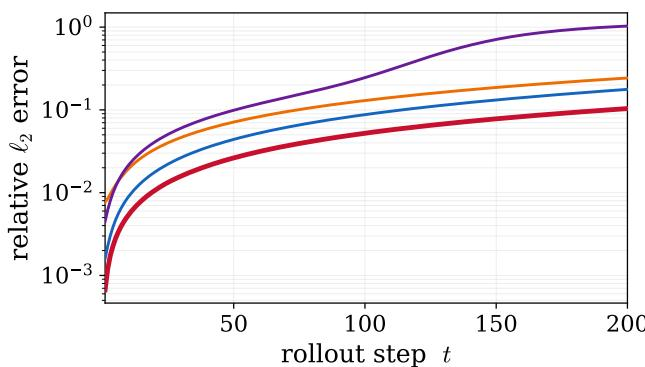  
(a) Advection (2D)

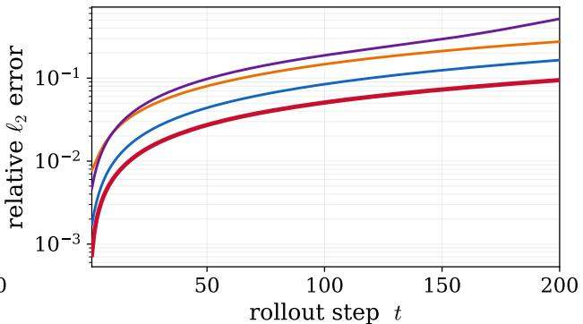  
(b) Adv Diffusion (2D)

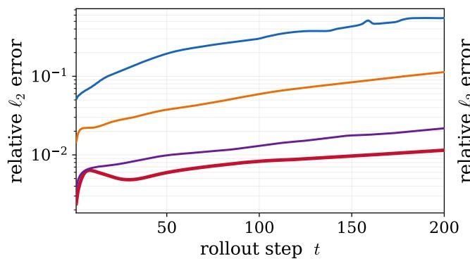  
(c) Adv Allen Cahn (2D)

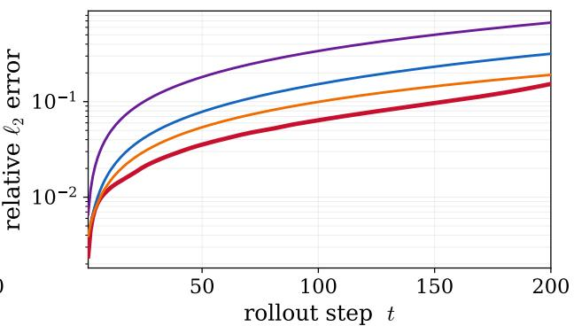  
(d) Adv Diffusion (3D)

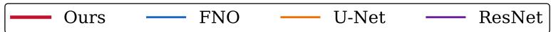  
Figure E.9: Long-horizon test-rollout accuracy on the remaining fixed-coeficient benchmarks. Relative $\ell _ { 2 }$ error is averaged over the 30 held-out trajectories and plotted as a function of autoregressive lead time on a logarithmic scale. (a) Two-dimensional advection, (b) two-dimensional advection–difusion, (c) twodimensional advection–Allen–Cahn, and (d) three-dimensional advection–difusion. All models are trained on 50-step trajectories and evaluated over 200-step autoregressive rollouts.

## Appendix E. Supplementary experimental results

This appendix provides additional experimental results that complement the quantitative comparisons presented in the main text. Unless otherwise stated, all experimental settings are identical to those described in Section 3.

## Appendix E.1. Additional long-horizon rollout results

Figure E.9 extends the long-horizon comparison in Fig. 2 to the remaining fixed-coeficient benchmarks. Across all four cases, the proposed surrogate maintains the lowest relative $\ell _ { 2 }$ error over the full 200-step rollout. The advantage persists across linear transport, transport– difusion, reaction-driven interface dynamics, and three-dimensional evolution, indicating that the improved rollout stability is not specific to the Burgers benchmark.

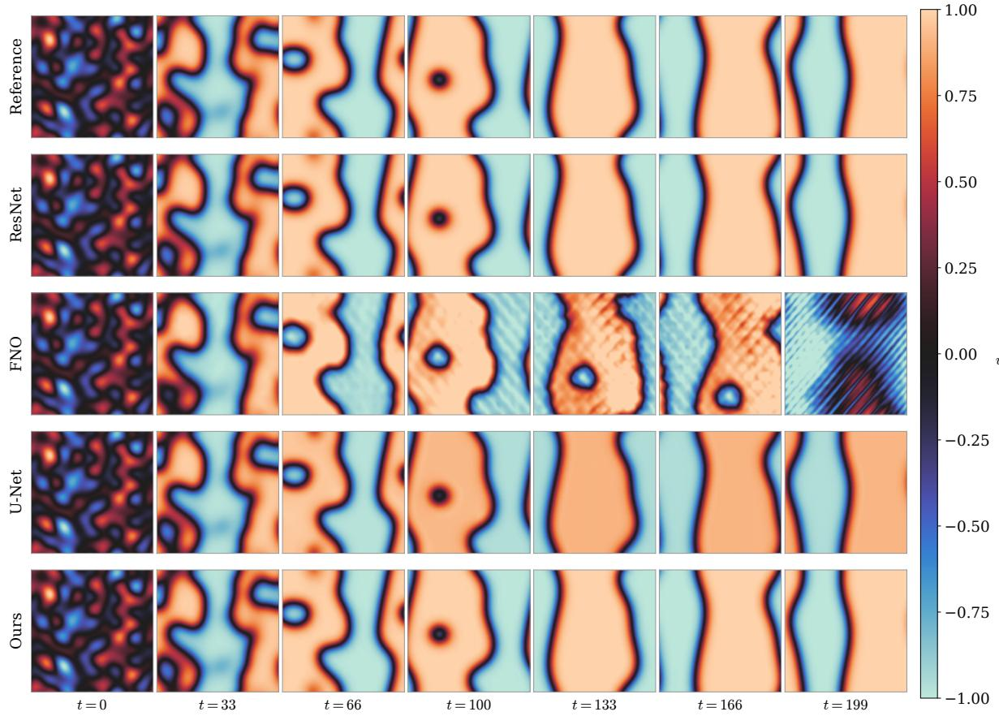  
Figure E.10: Representative long-horizon rollout of the two-dimensional advection–Allen–Cahn benchmark. Columns show the initial condition and autoregressive predictions at t = 33, 66, 100, 133, 166, and 199. Rows correspond to the reference solution, ResNet, FNO, U-Net, and the proposed surrogate. A common color scale is used for the scalar order parameter u across all methods and lead times.

For the two-dimensional advection and advection–difusion cases, the error gap between the proposed surrogate and the purely data-driven baselines increases progressively with lead time. A similar trend is observed for three-dimensional advection–difusion, where the proposed surrogate exhibits the slowest long-horizon error growth. On the advection–Allen– Cahn benchmark, the proposed surrogate and ResNet remain substantially more accurate than FNO and U-Net, with the proposed surrogate achieving the lowest error over most of the rollout horizon.These results are consistent with the aggregate trajectory-averaged metrics reported in Table 2.

Figure E.10 shows the evolution of the order parameter in the advection–Allen–Cahn benchmark. All methods reproduce the initial coarsening of the phase-field structures, but their long-horizon behavior difers substantially. FNO develops pronounced oscillatory artifacts after the intermediate rollout times and eventually departs qualitatively from the reference dynamics. ResNet and U-Net retain the dominant interfaces but exhibit increasing discrepancies in their positions and shapes. The proposed surrogate most closely preserves the reference interface geometry and large-scale phase organization throughout the rollout, consistent with its lower trajectory-averaged error in Fig. E.9(c).

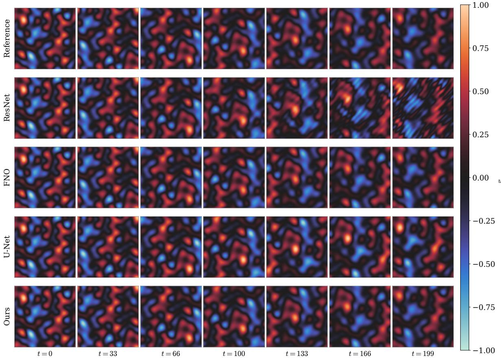  
Figure E.11: Representative long-horizon rollout of the two-dimensional advection–difusion benchmark. Columns show the initial condition and autoregressive predictions at t = 33, 66, 100, 133, 166, and 199. Rows correspond to the reference solution, ResNet, FNO, U-Net, and the proposed surrogate. The scalar field u is displayed using a common color scale across all methods and lead times.

Figure E.11 compares the transported and difused scalar structures in the two-dimensional advection–difusion benchmark. The methods remain visually similar at early lead times, but spatial and amplitude errors become increasingly apparent during the later rollout. ResNet exhibits the strongest long-time deformation, while U-Net shows noticeable changes in the morphology and intensity of individual structures. FNO preserves much of the reference organization but accumulates visible local discrepancies. The proposed surrogate maintains the closest agreement with the reference field over the full rollout, including the locations, signs, and characteristic scales of the dominant scalar structures.

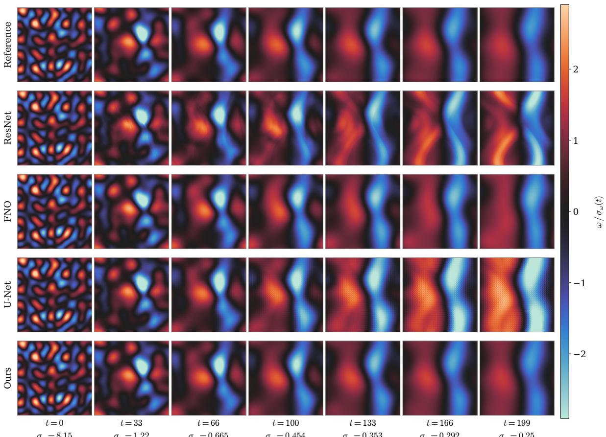  
¾! = 8:15  
¾! = 1:22  
¾ = 0:665  
¾! = 0:454  
¾! = 0:353  
¾! = 0:292  
¾! = 0:25  
Figure E.12: Representative long-horizon rollout of the two-dimensional Burgers benchmark. Columns show the initial condition and autoregressive predictions at t = 40, 80, 120, 160, and 200. Rows correspond to the reference solution, ResNet, FNO, U-Net, and the proposed surrogate. The displayed quantity is the vorticity normalized by the instantaneous reference standard deviation, $\omega / \sigma _ { \omega } ( t )$ ; the corresponding values of $\sigma _ { \omega } ( t )$ are reported below each column.

Figure E.12 provides a field-level view of the Burgers rollout through the normalized vorticity. As the flow evolves, the initial small-scale structures merge into progressively smoother and more elongated vortical regions. All surrogate models reproduce the dominant earlytime evolution, but the purely data-driven baselines accumulate increasing phase, amplitude, and morphological errors at longer lead times. ResNet exhibits substantial displacement and deformation of the principal structures, while U-Net increasingly overpredicts their spatial extent. FNO remains closer to the reference but still develops visible long-time discrepancies. The proposed surrogate most faithfully tracks the location, orientation, and width of the dominant vorticity structures through t = 200, in agreement with the rollout-error comparison in Fig. 2.

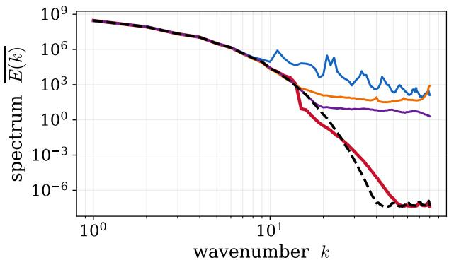  
(a) Adv Allen Cahn (2D)

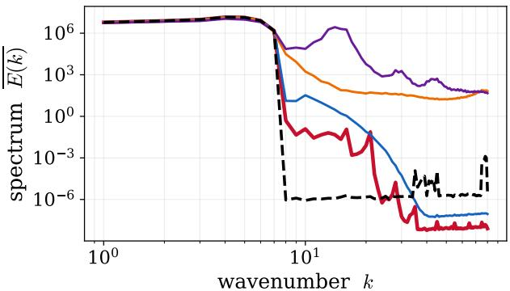  
(b) Advection (2D)

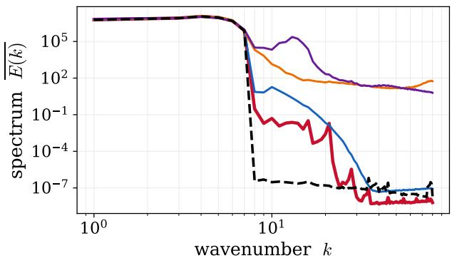  
(c) Adv Diffusion (2D)

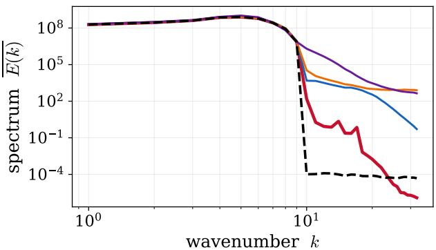  
(d) Adv Diffusion (3D)

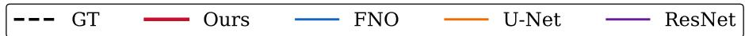  
Figure E.13: Time-averaged radial energy spectra for the remaining fixed-coeficient benchmarks. Panels show (a) advection–Allen–Cahn (2D), (b) advection (2D), (c) advection–difusion (2D), and (d) advection– difusion (3D). Spectra are averaged over the 30 held-out trajectories and 200-step autoregressive rollouts. The zero-wavenumber mode is retained only for the advection–Allen–Cahn benchmark, following the evaluation protocol in Section 3.4.

Taken together, the snapshot comparisons show that the lower aggregate rollout errors of the proposed surrogate correspond to improved preservation of physically relevant spatial structures rather than only smaller pointwise discrepancies. The advantage appears across transport–difusion, reaction-interface, and nonlinear self-advection dynamics, and becomes most visible at lead times well beyond the training horizon.

## Appendix E.2. Additional spectral comparisons

Figure E.13 extends the spectral comparison of Fig. 4 to the remaining fixed-coeficient benchmarks. Consistent with the Burgers results, the proposed surrogate provides the closest agreement with the reference time-averaged spectrum across all four cases. In particular, it maintains substantially lower high-wavenumber spectral distortion than the purely datadriven baselines throughout the 200-step autoregressive rollouts. These qualitative observations are consistent with the spectral errors summarized in Table 2.

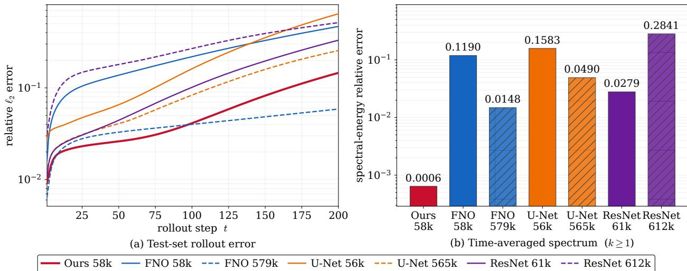  
Figure E.14: Model-capacity control on the Burgers benchmark. (a) Long-horizon test-rollout relative $\ell _ { 2 }$ error for the proposed surrogate and purely data-driven baselines with matched and tenfold trainable dynamicsmap budgets. Solid lines denote the matched-budget models, and dashed lines denote the enlarged baselines. (b) Relative error of the time-averaged radial spectrum, $\lVert \overline { { E } } - \overline { { E } } _ { \mathrm { G T } } \rVert _ { 2 } / \lVert \overline { { E } } _ { \mathrm { G T } } \rVert _ { 2 }$ , evaluated over $\kappa \geq 1$ following Section 3.4.

## Appendix E.3. Model-capacity control on the Burgers benchmark

Figure E.14 examines whether the performance gain of the proposed surrogate can be explained solely by increased model capacity. The trainable dynamics-map budgets of FNO, U-Net, and ResNet are increased by a factor of ten, whereas the proposed surrogate uses the same configuration as in the main experiments.

As shown in Fig. E.14(a), increasing the capacity of the purely data-driven baselines consistently improves long-horizon rollout accuracy. The enlarged FNO achieves the best rollout performance among the purely data-driven models and slightly outperforms the proposed surrogate over part of the rollout horizon. Nevertheless, the proposed surrogate remains more accurate than both the matched-budget baselines and the enlarged U-Net and ResNet models.

The time-averaged spectral error exhibits a diferent ordering, as shown in Fig. E.14(b). Despite using the same trainable dynamics-map budget as the matched FNO baseline, the proposed surrogate achieves the lowest spectral error among all compared models. Increasing the capacity of the purely data-driven baselines reduces, but does not eliminate, the spectral discrepancy. This observation suggests that the improved spectral fidelity cannot be explained solely by increased neural-model capacity.

Table F.6: Relative $L _ { 2 }$ reconstruction errors of the frozen FFGS representation for the field, gradient, and Laplacian. Reference spatial derivatives are obtained by pseudo-spectral diferentiation.
<table><tr><td>Benchmark  $e _ { u }$ </td><td> $e _ { \nabla u }$   $e _ { \Delta u }$ </td></tr><tr><td>Advection 2D  $1 . 4 1 \times 1 0 ^ { - 3 }$   $2 . 5 7 \times 1 0 ^ { - 3 }$  Adv-Diff 2D  $1 . 2 7 \times 1 0 ^ { - 3 }$   $2 . 4 8 \times 1 0 ^ { - 3 }$  Adv-AC 2D  $1 . 5 3 \times 1 0 ^ { - 3 }$   $1 . 1 7 \times 1 0 ^ { - 2 }$ </td><td> $6 . 5 1 \times 1 0 ^ { - 3 }$   $6 . 1 8 \times 1 0 ^ { - 3 }$   $5 . 3 8 \times 1 0 ^ { - 2 }$ </td></tr></table>

## Appendix F. Representation diagnostics

To assess the suitability of the frozen FFGS representation for physics evaluation, we evaluate field- and derivative-level reconstruction errors on the periodic test problems. Reference spatial derivatives are computed by pseudo-spectral diferentiation. For the FFGS reconstruction $\hat { u } ,$ we define

$$
e _ { u } = \frac { \| \hat { u } - u \| _ { 2 } } { \| u \| _ { 2 } } , \qquad e _ { \nabla u } = \frac { \| \nabla \hat { u } - \nabla u \| _ { 2 } } { \| \nabla u \| _ { 2 } } , \qquad e _ { \Delta u } = \frac { \| \Delta \hat { u } - \Delta u \| _ { 2 } } { \| \Delta u \| _ { 2 } } .\tag{F.1}
$$

Table F.6 reports the resulting errors for each benchmark.

The frozen FFGS representation maintains low field-level reconstruction errors across all benchmarks, while the errors increase under spatial diferentiation and are largest for the Laplacian. This increased sensitivity of higher-order derivatives to reconstruction error motivates the spectral filtering in Eq. (9) before the diferential quantities are used to evaluate the available governing terms.