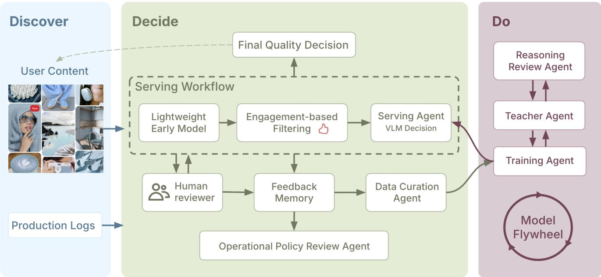

# PinSieve: Production Selective VLM Serving and a Governed Memory Flywheel for Enterprise Content-Quality Triage

Chuqing Gao cgao@pinterest.com Pinterest New York, NY, USA

Yifan Wu∗   
yw693@cornell.edu   
Pinterest   
Palo Alto, CA, USA

Yuanfang Song∗ ysong243@wisc.edu Pinterest Palo Alto, CA, USA

Vishwakarma Singh   
vsingh014@redifmail.com   
Pinterest   
Palo Alto, CA, USA

Jonathan Zhang jonathanzhang@pinterest.com Pinterest New York, NY, USA

Qinglong Zeng   
qzeng@pinterest.com   
Pinterest   
San Francisco, CA, USA

Andrey Gusev andreygusev@pinterest.com Pinterest San Francisco, CA, USA

## Abstract

Enterprise AI agents in production often need to be bounded, stateful, observable, and governable rather than fully autonomous. We present PinSieve, a production case study of this design pattern in a large-scale content-quality pipeline. Its deployed component is a selective vision-language-model (VLM) Serving Agent that op erates only on the grey-zone slice left unresolved by lightweight upstream models, exposes only a scalar routing score online, and preserves controlled human escalation. On this slice, the deployed system filters 2.05× more non-actionable items than the previous production module while slightly reducing estimated miss rate; after promotion, it improves review productivity by 25.7%, reduces normalized operating cost by 16.2%, and moves signal delivery from next-day to same-day.

We then study how to maintain such a selective model through a governed memory flywheel under selective feedback, where escalated items are reviewed by default but auto-passed items are labeled mainly through audit sampling. Feedback Memory records routing traces, observation paths, audit propensities, and replay metadata needed for evaluation and debugging. The Data Curation Agent operates as a bounded proposal-verifier loop over representative, uncertainty, recency, and fresh-review replay, with positive-rate and score-bin guardrails enforced before a batch can be accepted. In chained monthly refresh over six months of production data, this design reduces average FNR@50% from 17.73% under representative random replay to 13.29%. A separate Reasoning Review Agent audits teacher-generated rationales and supports keep/repair/drop decisions, showing that supervision quality should itself be treated as part of the enterprise-agent lifecycle. Production claims in this paper are attributed only to the deployed Serving Agent; replay and rationale-review results are reported as ofline or sampled governance evidence. Beyond the focal signal analyzed here, the same serving-agent recipe has since been adopted to several additional internal signals, suggesting that the proposed method is transferable rather than a single task-specific design.

Keywords   
enterprise AI agents, human-in-the-loop systems, vision-language   
models, data flywheels, production ML

## 1 Introduction

Large online platforms depend on early content-quality signals to route fresh content, protect downstream ranking quality, and make eficient use of expert review. In practice, however, the signals that matter most are often the ones that are hardest to obtain quickly. Lightweight front-end models and rules can handle easy cases at high throughput, but judgment-critical cases, those that depend on richer multimodal evidence or nuanced human interpretation, are often deferred to delayed features or manual review. This creates a familiar production bottleneck: the platform gets either fast but noisy decisions, or stronger decisions that arrive too late to be maximally useful.

That tradeof is especially costly for fresh content. Engagement with new items is front-loaded, so next-day signals miss the period in which ranking and intervention are most valuable. At the same time, grey-zone trafic that cannot be confidently resolved by lightweight screening accumulates recurring human-review cost. In our setting, the operational goal is therefore not to replace the full production pipeline with a monolithic model, but to improve the boundary-case decision point under strict constraints on cost, latency, auditability, and rollback.

Recent VLMs make this tempting because they can reason directly over image-text inputs, but universal VLM serving is still too expensive and operationally blunt for this regime. Our design starts from a narrower question: can a compact VLM be inserted only where it matters most, inside an existing production cascade, while preserving human escalation and explicit threshold control? PinSieve answers this with a selective Serving Agent deployed only on grey-zone trafic. The online interface is intentionally minimal: a scalar routing score that supports auto-pass versus escalate, so that the system remains easy to monitor, calibrate, and roll back.

But deploying a selective model introduces a second systems problem: the model changes what gets observed. Escalated items are reviewed by default, whereas auto-passed items are labeled mainly through audit sampling. Naively retraining on observed feedback can therefore amplify blind spots instead of fixing them. This is where the agentic aspect of PinSieve enters. We frame the post-deployment lifecycle as a bounded enterprise-agent workflow with persistent state, explicit proposal-verifier loops, structured observability, and human-controlled promotion. Feedback Memory records not only labels, but also routing traces, observation paths, audit propensities, and replay metadata. Lifecycle agents can propose replay batches, generate and review supervision, and train candidate refreshes, but they cannot directly change the online system without passing evaluation gates.

In summary, the paper supports four takeaways with separated evidence levels:

• Production. A deployed selective VLM Serving Agent improves the grey-zone operating point, increasing auto-pass from 20.48% to 41.99% while slightly lowering estimated miss rate, and improving review productivity, cost, and latency.

• Ofline replay. Under selective feedback, governed replay beats representative random replay in chained next-window evaluation, reducing average FNR@50% from 17.73% to 13.29%.

• Observability and governed supervision. Feedback Memory records routing traces, observation paths, audit propensities, and replay metadata so that replay, evaluation, debugging, and promotion are grounded in what the system actually observed. In the long-running flywheel, teacher-generated rationales are not recycled blindly and undergone review before re-entering supervision.

• Transfer evidence. The same serving-agent recipe has since been adopted to several additional internal signals, suggesting that the transferable artifact is the bounded serving contract rather than a single task-specific threshold.

## 2 Related Work and Positioning

Enterprise agentic systems and bounded automation. Recent agent work emphasizes reasoning, tool use, orchestration, and persistent state [25, 27, 28], while industrial human-in-the-loop systems emphasize bounded automation, escalation, and auditability in production review workflows [7, 16, 19, 24]. PinSieve is closest to the latter regime: unlike general assistant-style agents, the online actor here has a deliberately narrow action space and operates inside an existing production cascade. Our contribution is not open-ended online autonomy, but a governed lifecycle.

Multimodal serving, distillation, and rationale supervision. Prior multimodal work established strong image–text representation learning and instruction-following backbones for classification and understanding [13–15, 18, 26]. Separate lines of work study compact students and richer supervision through knowledge distillation, chain-of-thought distillation, and rationale-guided train ing [1, 4, 9–11, 21]. Our setting is narrower and more deploymentconstrained than these prior lines of work. While we use teachergenerated rationales for distillation, we treat them as a governed lifecycle artifact rather than a one-shot training signal. For these reasons, deployment-oriented industrial multimodal systems are more relevant to our setting than raw VLM capability comparisons [5, 23, 29]. In addition, we are not trying to maximize general multimodal capability; instead, we focus on grey-zone triage, where lightweight upstream components cannot confidently resolve.

Table 1: Bounded enterprise-agent contracts in PinSieve. The online agent is deployed; lifecycle agents are ofline or shadow-validated.
<table><tr><td>Agent</td><td>Reads / state</td><td>Action</td><td>Guardrail</td></tr><tr><td>Serving</td><td>Grey-zone item, threshold, model version</td><td>Emit routing score</td><td>Scalar-only interface</td></tr><tr><td>Teacher</td><td>Labeled item, sta- ble guidance</td><td>Generate ra- tionale target</td><td>Cannot over- write human label</td></tr><tr><td>Reasoning Review</td><td>Image, rationale, label</td><td>Keep / repair / drop verdict</td><td>Cannot redefine policy</td></tr><tr><td>Data Curation</td><td>Memory sum- maries, slice stats, replay budget</td><td>Propose replay plan</td><td>Verified against rate/divergence constraints</td></tr><tr><td>Training</td><td>Curated batch, pre- vious checkpoint</td><td>Train Candidate checkpoint</td><td>Shadow valida- tion needed</td></tr><tr><td>Operational Review</td><td>Audit false nega- tives</td><td>Root-cause summary</td><td>Diagnostic only</td></tr></table>

Selective feedback, replay, and continual adaptation. Active learning and continual-learning methods study informative querying, replay, and adaptation under evolving distributions [2, 3, 6, 8, 12, 17, 20, 22, 30, 31]. The key diference in PinSieve is selective observability: labels are not obtained by freely querying an unlabeled pool, but are revealed through escalation and limited audits after deployment.

## 3 System Design

## 3.1 Architecture Overview

Figure 1 summarizes PinSieve as a governed enterprise-agent lifecycle. The design separates online action from ofline improvement. The deployed Serving Agent performs selective triage. The Teacher Agent creates rationale-based supervision. The Reasoning Review Agent audits rationales and issues keep/repair/drop decisions. Feedback Memory stores versioned serving traces, labels, audit metadata, and replay metadata. The Data Curation Agent builds replay batches under guardrails. The Training Agent creates candidate checkpoints, and the Model Registry supports staged validation and rollback. Table 1 makes the workflow contract explicit: each agent reads a restricted slice of state, produces a narrow action, and is bounded by verification or human sign-of. In other words, the paper’s agentic claim is not that the system plans freely, but that it runs a stateful, instrumented, and governable loop over serving, memory, curation, review, and promotion.

## 3.2 Serving Agent: Selective VLM Triage

The Serving Agent is the only online actor in PinSieve. It is inserted after lightweight upstream components resolve easy cases, receives the item image and associated text context, and emits a score �� (�) for the target low-quality class. Given a threshold �, the online

  
Figure 1: PinSieve System Architecture

routing rule is

$$
a ( x ) = \left\{ \begin{array} { l l } { \mathrm { A U T O - P A S S } , } & { \ s _ { \theta } ( x ) < \tau , } \\ { \mathrm { E S C A L A T E } , } & { \ s _ { \theta } ( x ) \geq \tau . } \end{array} \right.\tag{1}
$$

The threshold is selected to satisfy a target operating constraint on false negative rate. Auto-passed items remain subject to audit sampling, and escalated items remain in the human-in-the-loop path. This preserves operational control while reducing unnecessary review load.

At inference time, the Serving Agent exposes only a scalar score. Although the model is trained with structured decision-rationale targets, rationale text is not used as an online explanation or decision artifact. Let $z _ { \mathrm { n o } }$ and $z _ { \mathrm { y e s } }$ be logits for negative and positive decision tokens at a fixed position. The deployed score is

$$
s _ { \theta } ( x ) = \frac { \exp ( z _ { \mathrm { y e s } } ) } { \exp ( z _ { \mathrm { n o } } ) + \exp ( z _ { \mathrm { y e s } } ) } .\tag{2}
$$

This interface keeps the production action legible, cheap, auditable, and easy to monitor. The deliberately narrow action space is a deployment choice: the system gains stronger multimodal judgment while preserving threshold control, rollback, and human escalation.

## 3.3 Teacher and Reasoning Review Agents

The Teacher Agent is used ofline to generate structured supervision for the compact student. Its purpose is not to update quality guidance. Instead, it converts stable signal definitions, reviewer-aligned outcomes, and item context into reusable decision-rationale targets. For a labeled item $( x _ { i } , y _ { i } )$ , the supervision target is serialized as

{decision}, {routing outcome}. {grounded rationale} where the rationale must be consistent with the reviewer outcome, reference only observable evidence, and avoid exposing internal guidance. This allows the student to learn a compact approximation of the decision process without prompt-time access to long guidelines.This allows the student to learn a compact approximation of the decision process without prompt-time access to long guidelines.

The Reasoning Review Agent audits this supervision before it enters future training. Given image/context �, teacher rationale �, and human decision �, it assigns a review verdict such as faithful, faithful-but-wrong-conclusion, confabulation, forced rationalization, spurious feature focus, or over-interpretation. These categories are mapped to keep, repair, or drop. Repair cases are returned to the Teacher Agent with reviewer feedback; drop cases are excluded from rationale-supervised training.

## 3.4 Feedback Memory

Feedback Memory is the observability layer of the lifecycle. Each item records four groups of fields: serving trace (model version, score, threshold, route, time bucket), observation path (reviewer or audit outcome, label source, audit probability), lightweight context summaries, and replay metadata such as score bin or uncertainty flag.

The observation path is essential because escalated items and audited auto-passed items are not exchangeable samples. Recording whether a label came from escalation or audit supports inversepropensity-weighted evaluation, lets the Data Curation Agent reason about under-observed regions, and gives operators enough traceability to debug the flywheel.

## 3.5 Data Curation Agent: Governed Replay

At refresh step �, the Data Curation Agent observes cumulative memory $\textstyle { \mathcal { M } } _ { t }$ , previous checkpoint $\theta _ { t - 1 } ,$ , estimated natural positive rate $\pi _ { \mathrm { n a t } , t }$ , and reference score-bin distribution $\boldsymbol { \mathcal { P } } \mathrm { r e f } , t$ . It does not directly choose a new model; instead, it proposes a replay plan against persistent state and verifier feedback, then refines that proposal until it satisfies deployment-facing constraints. Concretely, it proposes a fixed-size replay batch

$$
B _ { t } = B _ { t } ^ { \mathrm { r e p } } \cup B _ { t } ^ { \mathrm { u n c } } \cup B _ { t } ^ { \mathrm { r e c e n t } } ,\tag{3}
$$

where representative replay anchors the natural mixture, uncertainty replay emphasizes boundary cases, recent replay tracks newer trafic.

The proposal is accepted only if it satisfies deployment-facing guardrails:

$$
| \pi ( B _ { t } ) - \pi _ { \mathrm { n a t } , t } | \leq \delta _ { \pi } , \quad \mathrm { J S } \big ( p _ { \mathrm { b i n } } ( B _ { t } ) \| p _ { \mathrm { r e f } , t } \big ) \leq \delta _ { \mathrm { J S } } .\tag{4}
$$

If a batch violates these constraints, the agent increases the representative fraction and shrinks targeted sources proportionally. In this sense, DC-Replay is adaptive but bounded: it can pursue targeted adaptation only when the resulting batch remains close to the serving-facing distribution.

## 3.6 Training Agent and Refresh Protocol

The Training Agent fine-tunes candidate Serving Agents on curated batches with a composite supervised objective that combines sequence targets, explicit decision-token classification, and an optional separation term to widen the score gap between positives and negatives. For chained refresh, candidate $\theta _ { t }$ is trained from $\theta _ { t - 1 }$ on $B _ { t }$ and evaluated on the next unseen monthly window. Promotion is blocked unless the candidate improves target metrics under fixed safety guardrails and passes shadow testing. Operationally, refresh follows a bounded loop: candidates are trained on curated supervision, evaluated on reviewed and audited slices, shadow-tested without live action, and promoted only if they improve target metrics under fixed safety guardrails.

## 3.7 Operational Review

The Operational Review module analyzes audit-sampled false negatives after serving. Rather than changing online decisions directly, it assigns structured root-cause summaries such as score calibration error, model perception error, or policy ambiguity. These summaries are used as diagnostic evidence for later debugging, policy review, and future curation.

Design constraints and operational controls. PinSieve is shaped by both operating constraints (e.g., selective feedback and the cost of universal VLM serving) and lifecycle risks (e.g., replay distortion and silent refresh regression). Table 2 summarizes the corresponding design responses and controls.

## 4 Evaluation

For a quick read, Tables 4 and 7 contain the two main empirical messages of the paper. Table 4 reports the only production results and shows that the deployed Serving Agent improves auto-pass capacity, review productivity, operating cost, and signal latency on the grey-zone slice. Table 7 reports the main ofline replay result and shows that governed replay improves next-window serving facing risk relative to representative random replay under the same selective-feedback protocol. The remaining experiments explain how the deployed model was trained, why selective-feedback evalu ation needs explicit observability over audit paths and propensities, and why the replay and governance claims should be interpreted separately from production impact.

Table 2: Design constraints and operational controls in Pin-Sieve.
<table><tr><td>Constraint or risk</td><td>Design response / control</td></tr><tr><td>Universal VLM serving is too costly Labels are observed selec-</td><td>Invoke the VLM only on grey-zone traf- fic.</td></tr><tr><td>tively Teacher rationales can be flu-</td><td>Record escalation vs. audit path and au- dit probability in Feedback Memory.</td></tr><tr><td>ent but unsupported</td><td>Apply keep/repair/drop review before re- play into supervision.</td></tr><tr><td>Candidate refresh can regress silently</td><td>Requirenext-window evaluation,</td></tr><tr><td>Drift may remain hidden in aggregate metrics</td><td>shadow testing, and rollback gates. Summarize audit failures into root-cause</td></tr></table>

Table 3: Evaluation plan. Production, ofline replay, and sampled-governance claims are separated to avoid over- attribution.
<table><tr><td>Q</td><td>Component</td><td>Evidence</td></tr><tr><td>Q1</td><td>Serving Agent</td><td>Shadow test and production met- rics: FNR, auto-pass, cost, ETA</td></tr><tr><td>Q2</td><td>Training recipe</td><td>Static ablations over 2B open- source VLM with/without KD and</td></tr><tr><td>Q3</td><td>Data Curation Agent</td><td>rationale response Chained monthly refresh with next-window evaluation and IPW</td></tr><tr><td>Q4</td><td>Review agents</td><td>metrics Sampled rationale audit and audit- failure root-cause summaries</td></tr></table>

## 4.1 Setup and Metrics

We evaluate one representative binary content-quality signal with consistent expert labels and direct production relevance. The main ofline experiments use six months of production data. Each item contains an image and associated text context, and the positive class denotes the target low-quality condition for the signal.

Because PinSieve is a selective triage layer, we emphasize operatingpoint metrics. FNR@�% is the false negative rate when the bottom �% of examples by score are auto-passed. Unless stated otherwise, we use inverse propensity weighting (IPW) to correct for audit sampling in the auto-pass region. We also report PR-AUC for ranking quality, review productivity, normalized operating cost, and signal delivery latency.

## 4.2 Evaluation Questions

We organize the empirical study around four questions that match the lifecycle decomposition. Q1: Does the deployed Serving Agent improve the production operating point in the grey-zone slice? Q2: Which supervised recipe produces the static model used online? Q3: Can feedback memory refresh improve future windows without destabilizing selective serving? Q4: Are rationale review and operational failure review useful governance mechanisms, even before they are credited with online gains? Table 3 maps these questions to evidence.

Table 4: [Production] Impact of the deployed selective VLM serving layer. The key takeaway is 2.05× higher auto-pass capacity on the grey-zone workload with lower normalized cost and same-day delivery.
<table><tr><td>Model</td><td>False negative rate</td><td></td><td>Auto-pass rate</td></tr><tr><td>Previous production module PINSIEVE</td><td>13.62% 13.18%</td><td></td><td>20.48%</td></tr><tr><td></td><td></td><td></td><td>41.99%</td></tr><tr><td>Model</td><td>Review productivity</td><td>Cost</td><td>ETA</td></tr><tr><td>Previous pipeline</td><td>1.205</td><td>1.000</td><td>Next-day</td></tr><tr><td>PINSIEVE</td><td>1.515</td><td>0.838</td><td>Same-day</td></tr></table>

## 4.3 Attribution and Observation Paths

We separate results into Production, Ofline replay, and Sampled governance to avoid over-attribution: only production results support direct online claims. Under selective feedback, escalated items are usually labeled, auto-passed items are only partially observed through audit, and many auto-passed items remain unlabeled; this distinction matters for both IPW-based evaluation and replay design.

## 4.4 Selective-Feedback Estimation

Because labels in the auto-pass region are only partially observed through audit, we report miss rate with inverse-propensity weight ing rather than treating observed labels as representative of all served trafic. For the bottom-�% auto-pass set $A _ { X }$ , with audit probability $q _ { i }$ and weight $w _ { i } = 1 / q _ { i }$ , we estimate

$$
\widehat { \mathrm { F N R } } _ { \mathrm { I P W } } ( X ) = \frac { \sum _ { i \in A _ { X } \cap O } w _ { i } \mathbf { 1 } \left[ y _ { i } = 1 \right] } { \sum _ { i \in O } w _ { i } \mathbf { 1 } \left[ y _ { i } = 1 \right] } ,\tag{5}
$$

where � denotes examples whose labels are observed through review or audit. In practice, we use logged audit probabilities, clip extreme weights, and report unweighted observed-population metrics as a secondary sanity check. For refresh experiments, thresholds are selected on the current window and then frozen for the next unseen monthly window.

## 4.5 Production Impact of the Deployed Serving Agent

The selective VLM layer was first shadow-deployed for three weeks alongside the previous production module. After dry-run validation, it was promoted to production. Table 4 shows the observed impact. On the grey-zone slice, PinSieve filters 2.05× more non-actionable items while slightly reducing estimated miss rate. At the operational level, it improves review productivity by 25.7%, lowers normalized cost from 1.000 to 0.838, and moves final signal delivery from nextday to same-day. These are the only metrics in the paper that support direct online-impact claims, because they are measured from the deployed serving path rather than from ofline replay or governance analysis.

## 4.6 Static Model Training

Table 5 summarizes the ofline static-training ablations that determine the deployed recipe. All fine-tuned models use the same 2B open-source VLM backbone and 200K training samples. Thresholds are selected so that FNR is closest to but does not exceed 10%.

Table 5: [Ofline static training] Model ablations used to choose the deployed Serving Agent recipe.
<table><tr><td>Model</td><td>FNR</td><td>Auto-pass rate</td></tr><tr><td>Base model</td><td>9.74%</td><td>10.77%</td></tr><tr><td>Best fine-tune without KD</td><td>9.78%</td><td>38.85%</td></tr><tr><td>KD + sequence loss</td><td>9.30%</td><td>40.32%</td></tr><tr><td>KD + composite loss</td><td>9.59%</td><td>42.93%</td></tr><tr><td>KD + composite loss + rationale response</td><td>8.71%</td><td>46.90%</td></tr></table>

Table 6: [Ofline replay] Stress test on the final monthly window. Aggressive hard-error replay is unstable under selective feedback.
<table><tr><td>Replay strategy</td><td>PR-AUC</td><td>FNR@30%</td><td>FNR@50%</td></tr><tr><td>Uncertainty</td><td>0.589</td><td>6.99</td><td>16.00</td></tr><tr><td>Random</td><td>0.585</td><td>7.57</td><td>15.56</td></tr><tr><td>Hybrid</td><td>0.533</td><td>6.24</td><td>21.35</td></tr><tr><td>Model-error</td><td>0.072</td><td>60.72</td><td>71.92</td></tr></table>

Fine-tuning is already highly efective: the strongest non-distilled model increases auto-pass rate from 10.77% to 38.85% at similar FNR. Knowledge distillation and rationale-conditioned responses further improve the operating frontier. The final recipe reaches 46.90% autopass at 8.71% FNR. Rationale distillation also moves long guidance from prompt-time injection to training-time supervision, reducing prompt overhead during both training and inference.

We also evaluated preference-style optimization, including many DPO-style variants, on top of supervised fine-tuning. In our setting, these methods provided negligible gains and were sometimes unstable, likely because the deployed routing interface depends on a single decision-token score, whereas preference objectives opti mize relative response likelihood at the sequence level. We therefore retain supervised training as the main optimization recipe.

## 4.7 Refresh from Feedback Memory

We simulate chained monthly refresh over six consecutive production windows. At each step, the Data Curation Agent selects a 50K-example refresh batch from Feedback Memory, trains a candidate model, and evaluates it on the next unseen monthly window. This forward evaluation matches the enterprise maintenance problem: the goal is not to improve on already observed feedback, but to keep the deployed model stable as trafic changes.

A stress test shows why governance is necessary. Representative random replay is competitive with uncertainty replay and safer than aggressive hard-error replay. Model-error replay collapses under the selective-feedback setting, indicating that naive mining can overfit distorted observed labels rather than improving servingfacing behavior.

Table 7 compares the main ofline replay choices averaged across cycles. Random replay is a strong operational baseline, improving PR-AUC and reducing FNR@50% relative to no refresh. DC-Replay further improves the metrics most aligned with selective triage, reducing average FNR@50% from 17.73% to 13.29%.

Table 7: [Ofline replay, IPW] Chained monthly refresh under serving-distribution evaluation. The key takeaway is a reduction in average IPW-FNR@50% from 17.73% under rep- resentative random replay to 13.29% under DC-Replay.
<table><tr><td>Method</td><td>PR-AUC</td><td>FNR@30%</td><td>FNR@40%</td><td>FNR@50%</td></tr><tr><td>Static Serving Agent</td><td>0.4784</td><td>13.00%</td><td>17.06%</td><td>21.69%</td></tr><tr><td>Random replay</td><td>0.5310</td><td>8.59%</td><td>13.03%</td><td>17.73%</td></tr><tr><td>DC-REPLAY</td><td>0.5542</td><td>5.95%</td><td>9.54%</td><td>13.29%</td></tr></table>

## 4.8 Supervision and Operational Review

The Reasoning Review Agent is evaluated through sampled spot checks of teacher-generated rationales. In the sample set, 92.2% were judged faithful and 7.8% were flagged as low-faithfulness. Among the flagged cases, 44.4% appeared to be annotation noise and were marked for removal from future supervision, while 38.8% were generation errors that could be repaired by regenerating the rationale with reviewer feedback. We report this as a sampled governance study rather than an accuracy gain: it shows that supervision quality is observable and governable.

The operational review module analyzes false negatives from the audit stream. It assigns root-cause categories such as score calibration error, model perception error, and policy ambiguity. This module does not change online decisions. Its value is to transform dificult audit failures into structured evidence for future curation, debugging, and policy review. In an enterprise setting, this type of structured post-hoc analysis is often more actionable than a single aggregate miss-rate number because it distinguishes whether the next intervention should target thresholding, model capacity, replay coverage, or policy clarification.

## 5 Discussion and Lessons

Selective deployment can be more valuable than universal autonomy. The production gain comes from applying stronger VLM reasoning to a narrow high-value slice, not from replacing the whole cascade. Observability is part of the agent design. Feedback memory, audit propensities, and root-cause summaries are what make selective replay and staged promotion governable. Feedback memory must record how labels are observed. Without escalation/audit provenance and audit probabilities, both evaluation and replay can become biased.

Representative random replay is a strong baseline because it preserves the serving-facing mixture; targeted replay should be added only under explicit guardrails. Rationale supervision is useful but must be governed: fluent rationales are not always faithful, so keep/repair/drop review reduces the risk of amplifying supervision noise. More broadly, agentic control should match decision complexity. In simple single-signal refresh loops, deterministic policies can be dificult to beat; LLM control is more useful when decisions are multi-objective and semantically coupled.

The detailed experiments in this paper focus on one representative signal because that is the only setting for which we currently have a fully aligned production, replay, and governance analysis. However, the Serving Agent recipe has since been adopted to several additional internal signals. We therefore view the deployment pattern for judgment-critical triage rather as transferable. This pattern is most useful when a lightweight front-end already resolves easy cases, the target signal is judgment-critical, at least some audit or delayed-feedback channel exists, and operators are willing to enforce explicit rollout gates.

## 6 Scope and Next Steps

This workshop paper focuses on one representative content-quality signal and uses it to study a bounded enterprise-agent workflow for selective serving and governed post-deployment adaptation. The same serving-agent recipe has since been adopted to several additional internal signals, suggesting that the serving contract is transferable beyond the focal signal studied here. The current Data Curation Agent uses bounded proposal-and-verification logic, and richer orchestration is a natural extension as the control problem broadens. The supervision review study likewise motivates larger-scale measurement of downstream efects from rationale filtering. Some implementation details, internal guidelines, and example cases are intentionally abstracted to satisfy compliance requirements.

## 7 Conclusion

PinSieve pairs a deployed selective VLM Serving Agent with a governed lifecycle for post-deployment maintenance. In production, the Serving Agent improves the grey-zone operating point by increasing auto-pass from 20.48% to 41.99%, improving review productivity from 1.205 to 1.515, reducing normalized operating cost from 1.000 to 0.838, and moving signal delivery from next-day to same-day. Ofline, we show that safe refresh under selective feedback requires governed replay rather than naive retraining: average FNR@50% drops from 17.73% with representative random replay to 13.29% with DC-Replay. Finally, sampled review shows that teacher-generated rationales should not be recycled blindly in a long-running fly wheel, but should undergo explicit keep/repair/drop review before re-entering supervision. Taken together, these results support a bounded deployment recipe: online gains come from selective serving, while replay, supervision reuse, and refresh remain governed ofline.

## Acknowledgments

We would like to thank the GenAI serving team for help with the online deployment, thank the Ops team for their cooperation, and Manisha Srivastava,Siddhartha Reddy Jonnalagadda, Faisal Farooq and Balaji Krishnapuram for their feedback and support throughout the project.

## References

[1] Sanjay Agrawal, Faizan Ahemad, and Vivek Varadarajan Sembium. 2025. Rationale-Guided Distillation for E-Commerce Relevance Classification: Bridging Large Language Models and Lightweight Cross-Encoders. In Proceedings of the 31st International Conference on Computational Linguistics: Industry Track. Association for Computational Linguistics, Abu Dhabi, UAE, 136–148. https: //aclanthology.org/2025.coling-industry.12

[2] Jordan T. Ash, Chicheng Zhang, Akshay Krishnamurthy, John Langford, and Alekh Agarwal. 2020. Deep Batch Active Learning by Diverse, Uncertain Gradient Lower Bounds. In International Conference on Learning Representations. https: //openreview.net/forum?id=ryghZJBKPS

[3] Davide Cacciarelli and Murat Kulahci. 2024. Active Learning for Data Streams: A Survey. Machine Learning 113 (2024), 185–239. doi:10.1007/s10994-023-06454-2

[4] Flavio Di Palo, Prateek Singhi, and Bilal H. Fadlallah. 2024. Performance-Guided LLM Knowledge Distillation for Eficient Text Classification at Scale. In Proceedings of the 2024 Conference on Empirical Methods in Natural Language Processing. Association for Computational Linguistics, Miami, Florida, USA, 3675–3687. doi:10.18653/v1/2024.emnlp-main.215

[5] Xin Dong, Sen Jia, Ming Rui Wang, Yan Li, Zhenheng Yang, Bingfeng Deng, and Hongyu Xiong. 2024. COEF-VQ: Cost-Eficient Video Quality Understanding through a Cascaded Multimodal LLM Framework. arXiv preprint arXiv:2412.10435 (2024). doi:10.48550/arXiv.2412.10435

[6] João Gama, Indre Žliobait ˙ e, Albert Bifet, Mykola Pechenizkiy, and Abdelhamid˙ Bouchachia. 2014. A Survey on Concept Drift Adaptation. Comput. Surveys 46, 4 (2014), 44:1–44:37. doi:10.1145/2523813

[7] Mihajlo Grbovic, Ying Xiao, Pratiksha Kadam, Aaron Yin, Pei Xiong, Dillon Davis, Aditya Mukherji, Kedar Bellare, Haowei Zhang, Shukun Yang, Chen Qian, Sebastien Dubois, Nate Ney, James Furnary, Mark Giangreco, Nate Rosenthal, Cole Baker, Bill Ulammandakh, Sid Reddy, and Egor Pakhomov. 2022. Build ing Airbnb Categories with ML and Human-in-the-Loop. Airbnb Engineering Blog. https://medium.com/airbnb-engineering/building-airbnb-categorieswith-ml-and-human-in-the-loop-e97988e70ebb

[8] Fabian Hinder, Valerie Vaquet, and Barbara Hammer. 2024. One or Two Things We Know about Concept Drift—A Survey on Monitoring in Evolving Environments. Part A: Detecting Concept Drift. Frontiers in Artificial Intelligence 7 (2024), 1330257. doi:10.3389/frai.2024.1330257

[9] Geofrey Hinton, Oriol Vinyals, and Jef Dean. 2015. Distilling the Knowledge in a Neural Network. arXiv preprint arXiv:1503.02531 (2015). https://arxiv.org/abs/ 1503.02531

[10] Cheng-Yu Hsieh, Chun-Liang Li, Chih-kuan Yeh, Hootan Nakhost, Yasuhisa Fujii, Alex Ratner, Ranjay Krishna, Chen-Yu Lee, and Tomas Pfister. 2023. Distilling Step-by-Step! Outperforming Larger Language Models with Less Training Data and Smaller Model Sizes. In Findings ofthe Association for Computational Linguistics: ACL 2023. Association for Computational Linguistics, Toronto, Canada, 8003–8017. doi:10.18653/v1/2023.findings-acl.507

[11] Xiaoqi Jiao, Yichun Yin, Lifeng Shang, Xin Jiang, Xiao Chen, Linlin Li, Fang Wang, and Qun Liu. 2020. TinyBERT: Distilling BERT for Natural Language Understanding. In Findings of the Association for Computational Linguistics: EMNLP 2020. Association for Computational Linguistics, Online, 4163–4174. doi:10.18653/v1/2020.findings-emnlp.372

[12] Dongyuan Li, Zhen Wang, Yankai Chen, Renhe Jiang, Weiping Ding, and Manabu Okumura. 2025. A Survey on Deep Active Learning: Recent Advances and New Frontiers. IEEE Transactions on Neural Networks and Learning Systems 36, 4 (2025), 5879–5899. doi:10.1109/TNNLS.2024.3396463

[13] Liunian Harold Li, Mark Yatskar, Da Yin, Cho-Jui Hsieh, and Kai-Wei Chang. 2019. VisualBERT: A Simple and Performant Baseline for Vision and Language. arXiv preprint arXiv:1908.03557 (2019). https://arxiv.org/abs/1908.03557

[14] Haotian Liu, Chunyuan Li, Qingyang Wu, and Yong Jae Lee. 2023. Visual Instruction Tuning. In Advances in Neural Information Processing Systems, Vol. 36. https://papers.nips.cc/paper\_files/paper/2023/hash/ 6dcf277ea32ce3288914faf369fe6de0-Abstract-Conference.html

[15] Jiasen Lu, Dhruv Batra, Devi Parikh, and Stefan Lee. 2019. ViLBERT: Pretraining Task-Agnostic Visiolinguistic Representations for Vision-and-Language Tasks. In Advances in Neural Information Processing Systems, Vol. 32. 13–23. https: //arxiv.org/abs/1908.02265

[16] Todor Markov, Chong Zhang, Sandhini Agarwal, Florentine Eloundou Nekoul, Theodore Lee, Steven Adler, Angela Jiang, and Lilian Weng. 2023. A Holistic Approach to Undesired Content Detection in the Real World. Proceedings ofthe AAAI Conference on Artificial Intelligence 37, 12 (2023), 15009–15018. doi:10.1609/ aaai.v37i12.26752

[17] German I. Parisi, Ronald Kemker, Jose L. Part, Christopher Kanan, and Stefan Wermter. 2019. Continual Lifelong Learning with Neural Networks: A Review. Neural Networks 113 (2019), 54–71. doi:10.1016/j.neunet.2019.01.012

[18] Alec Radford, Jong Wook Kim, Chris Hallacy, Aditya Ramesh, Gabriel Goh, Sandhini Agarwal, Girish Sastry, Amanda Askell, Pamela Mishkin, Jack Clark, Gretchen Krueger, and Ilya Sutskever. 2021. Learning Transferable Visual Models from Natural Language Supervision. In Proceedings ofthe 38th International Conference on Machine Learning (Proceedings ofMachine Learning Research, Vol. 139). PMLR, 8748–8763. https://proceedings.mlr.press/v139/radford21a.html

[19] Abhi Ramachandran. 2020. Using a Human-in-the-Loop to Overcome the Cold Start Problem in Menu Item Tagging. DoorDash Engineering Blog. https://careersatdoordash.com/blog/overcome-the-cold-start-problem-inmenu-item-tagging/

[20] David Rolnick, Arun Ahuja, Jonathan Schwarz, Timothy P. Lillicrap, and Gregory Wayne. 2019. Experience Replay for Continual Learning. In Advances in Neural Information Processing Systems, Vol. 32. 348–358. https://papers.nips.cc/paper/ 8327-experience-replay-for-continual-learning

[21] Victor Sanh, Lysandre Debut, Julien Chaumond, and Thomas Wolf. 2019. Distil-BERT, a Distilled Version of BERT: Smaller, Faster, Cheaper and Lighter. arXiv preprint arXiv:1910.01108 (2019). https://arxiv.org/abs/1910.01108

[22] Burr Settles. 2009. Active Learning Literature Survey. Computer Sciences Technical Report 1648. University of Wisconsin–Madison. https://burrsettles.com/ pub/settles.activelearning.pdf

[23] Jinghao Shi, Xiang Shen, Kaili Zhao, Xuedong Wang, Vera Wen, Zixuan Wang, Yifan Wu, and Zhixin Zhang. 2024. CPFD: Confidence-Aware Privileged Feature Distillation for Short Video Classification. In Proceedings ofthe 33rd ACM International Conference on Information and Knowledge Management. Association for Computing Machinery, 4866–4873. doi:10.1145/3627673.3680045

[24] Paulo Tanaka, Sameet Sapra, and Nikolay Laptev. 2020. Scalable Data Classification for Security and Privacy. arXiv preprint arXiv:2006.14109 (2020). https://arxiv.org/abs/2006.14109

[25] Lei Wang, Chen Ma, Xueyang Feng, Zeyu Zhang, Hao Yang, Jingsen Zhang, Zhiyuan Chen, Jiakai Tang, Xu Chen, Yankai Lin, Wayne Xin Zhao, Zhewei Wei, and Ji-Rong Wen. 2024. A Survey on Large Language Model Based Autonomous Agents. Frontiers ofComputer Science 18 (2024), 186345. doi:10.1007/s11704-024- 40231-1

[26] Peng Wang, Shuai Bai, Sinan Tan, Shijie Wang, Zhihao Fan, Jinze Bai, Keqin Chen, Xuejing Liu, Jialin Wang, Wenbin Ge, Yang Fan, Kai Dang, Mengfei Du, Xuancheng Ren, Rui Men, Dayiheng Liu, Chang Zhou,Jingren Zhou, andJunyang Lin. 2024. Qwen2-VL: Enhancing Vision-Language Model’s Perception of the World at Any Resolution. arXiv preprint arXiv:2409.12191 (2024). https://arxiv. org/abs/2409.12191

[27] Qingyun Wu, Gagan Bansal, Jieyu Zhang, Yiran Wu, Beibin Li, Erkang Zhu, Li Jiang, Xiaoyun Zhang, Shaokun Zhang, Jiale Liu, Ahmed Hassan Awadallah, Ryen W. White, Doug Burger, and Chi Wang. 2024. AutoGen: Enabling Next Gen LLM Applications via Multi-Agent Conversations. In First Conference on Language Modeling. https://openreview.net/forum?id=BAakY1hNKS

[28] Shunyu Yao, Jefrey Zhao, Dian Yu, Nan Du, Izhak Shafran, Karthik Narasimhan, and Yuan Cao. 2023. ReAct: Synergizing Reasoning and Acting in Language Models. In International Conference on Learning Representations. https://arxiv. org/abs/2210.03629

[29] Jiang Zhang, Qiong Wu, Yiming Xu, Cheng Cao, Zheng Du, and Konstantinos Psounis. 2024. Eficient Toxic Content Detection by Bootstrapping and Distilling Large Language Models. Proceedings ofthe AAAI Conference on Artificial Intelligence 38, 19 (2024), 21779–21787. doi:10.1609/aaai.v38i19.30178

[30] Da-Wei Zhou, Hai-Long Sun, Jingyi Ning, Han-Jia Ye, and De-Chuan Zhan. 2024. Continual Learning with Pre-Trained Models: A Survey. In Proceedings ofthe Thirty-Third International Joint Conference on Artificial Intelligence, IJCAI-24. International Joint Conferences on Artificial Intelligence Organization, 8363– 8371. doi:10.24963/ijcai.2024/924 Survey Track.

[31] Indre Žliobait˙ e, Albert Bifet, Bernhard Pfahringer, and Geofrey Holmes. 2014.˙ Active Learning with Drifting Streaming Data. IEEE Transactions on Neural Networks and Learning Systems 25, 1 (2014), 27–39. doi:10.1109/TNNLS.2012. 2236570