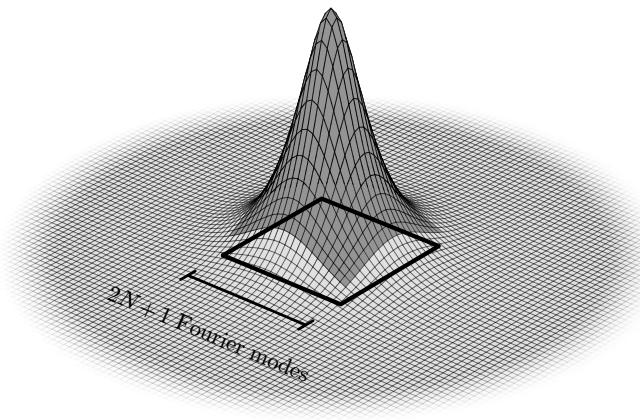
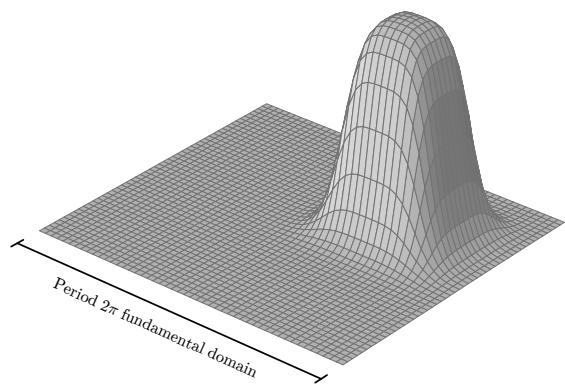
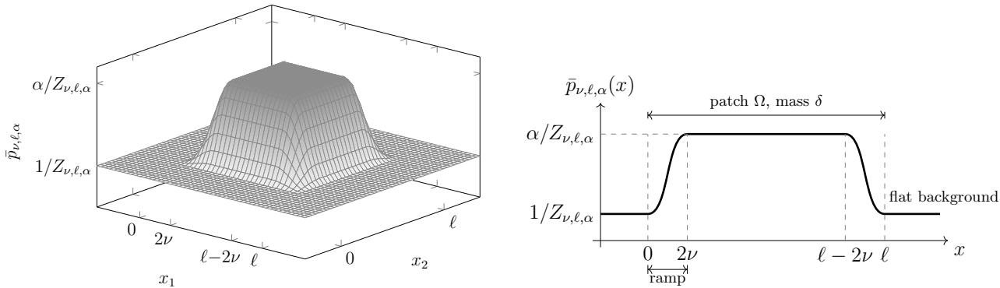

# Provable Quantum–Classical Separation for Continuous Gibbs Sampling

Enrico Olivucci,<sup>1,</sup> <sup>∗</sup> Mariia Sobchuk,<sup>2,</sup> <sup>3,</sup> <sup>∗</sup> Sehmimul Hoque,<sup>2,</sup> <sup>3,</sup> <sup>4,</sup> <sup>∗</sup> Jefrey Hnybida,<sup>1</sup>

Kyungho W. Kim,<sup>2,</sup> <sup>3</sup> Ala Shayeghi,<sup>2,</sup> <sup>5</sup> and Pooya Ronagh<sup>2,</sup> <sup>3,</sup> <sup>4,</sup> <sup>6,</sup> <sup>†</sup>

<sup>1</sup>Irr´eversible Inc., Sherbrooke, Qu´ebec, Canada

<sup>2</sup>Institute for Quantum Computing, University of Waterloo, Waterloo, Ontario N2L 3G1, Canada <sup>3</sup>Department of Physics and Astronomy, University of Waterloo, Waterloo, Ontario N2L 3G1, Canada <sup>4</sup>Perimeter Institute for Theoretical Physics, Waterloo, Ontario N2L 2Y5, Canada <sup>5</sup>National Research Council Canada, Waterloo, Ontario, N2L 3G1, Canada <sup>6</sup>Microsoft, Redmond, WA 98052, USA

We prove the first quantum–classical separation for a sampling problem over a continuous domain. For a class of Gibbs states $p \propto e ^ { - \bar { \beta } E }$ on the torus $\mathbb { T } ^ { \bar { d } }$ with smooth (s-Gevrey) potential and barrier amplitude $\alpha = e ^ { \beta \Delta }$ , where $\Delta = \operatorname* { m a x } E - \operatorname* { m i n } E .$ every classical algorithm— querying the value, gradient, or any higher-order derivatives of the log-density—requires $\Omega ( \alpha )$ queries to sample at constant accuracy in total variation distance, while a quantum algorithm based on quantum singular value thresholding and temperature annealing samples with $\widetilde { O } \left( \sqrt { \alpha } \right)$ queries to an oracle for the gradient. The advantage is quadratic in the barrier amplitude, which becomes exponential in the dimension, $e ^ { \Omega ( d ) }$ , at low temperature. The classical bound is information-theoretic, holding for every classical algorithm with query access to the Gibbs potential and its derivatives at any order.

## CONTENTS

## I. Introduction

II. Statement of the Main Result 4

III. Lower Bound for Classical Gibbs Sampling on a Torus 7   
A. The adversarial hide-and-seek argument 8   
B. The hard instances: Gevrey bumps 9   
IV. Upper Bound for Quantum Gibbs Sampling on a Torus 10   
A. Gibbs state preparation from a warm start 12   
B. End-to-end Gibbs sampling without a warm start 13   
V. Quantum–Classical Separation 15   
A. The classical lower bound at the separation regime 15   
B. Proof of the classical lower bound Theorem V.1 16   
C. The separation theorem 17

Acknowledgement 17

References

A. Details of the Lower Bound Results 20   
1. Formal query model and proofs of the lower bound 20   
2. Gevrey estimates for the bump potential 23   
a. Construction of the bump family 23   
b. Gevrey constants of the bump potential 26   
c. Density regularity from class data 32   
B. Details of the Upper Bound Results 34   
1. Preliminaries 35   
a. Fourier series 35   
b. Discretized Fourier diferentiation 36   
c. Fourier interpolation 37   
2. Quantum algorithm for Gibbs sampling from a warm start 37   
a. Review of Gevrey regularity 37   
b. Definitions of $\mathbb { H } _ { N }$ and $\mathbb { A } _ { N }$ 38   
c. Properties of $\mathbb { A } _ { N }$ 38   
d. Proximity of $\mathbb { H } _ { N }$ and $\mathbb { A } _ { N }$ and its implications 40   
e. Quantum algorithm of [LDCL26] revamped 47   
3. Annealed quantum Gibbs sampling—removing the warm start 52

## I. INTRODUCTION

Provable separations between quantum and classical computation are rare, and the canonical examples concern discrete (and often contrived) tasks: Grover’s unstructured search [Gro96], the hidden-structure problems of Bernstein–Vazirani and Simon [BV97, Sim97], promise problems such as Deutsch–Jozsa and the collision problem [DJ92, BHT98, Shi02], the quantum-walk speedups for welded trees and element distinctness [CCD<sup>+</sup>03, Amb07], and the forrelation problem [AA15, RT18]. No analogous separation has been proven for problems over the continuous domain. Several recent papers have proposed quantum Gibbs samplers for continuous potentials [MR24, LDCL26, OLMW24, CLL<sup>+</sup>22] (also see [TD00, PW09, CS17] for Gibbs samplers on discrete domains). However, each result has been benchmarked against the best classical competitors known, and such comparisons cannot rule out faster algorithms. A guaranteed separation requires a lower bound against all possible classical algorithms.

We prove such a separation. Sampling from a Gibbs distribution $\textit { p } \propto \textit { e } ^ { - \beta E }$ of a potential $E$ at inverse temperature $\beta$ is a recurring primitive of computational science: it underlies Bayesian inference and generative modeling [DM19, HJA20, SK21], thermal averages in statistical physics [Rue99], and the elementary step of annealing-type optimization. On a continuous domain, its dificulty is governed less by the dimension alone than by the landscape of the potential: wells separated by barriers concentrate probability mass in regions that local exploration struggles to find. The natural metric for that dificulty is therefore the barrier amplitude $\alpha = e ^ { \beta \Delta }$ , with ∆ := max E min E, i.e., the worst-case ratio between density values, which, by the Holley–Stroock theorem [HS87, Sch12], upper-bounds the Poincar´e constant of the Gibbs measure. Kramerstype metastability analysis shows that classical algorithms such as Langevin dynamics and related Markov chain Monte Carlo methods, while fast in the log-concave setting [DCWY18], take time exponential in $\Delta$ to move between wells [BEGK04, Ber13].

This paper asks whether quantum computation provably reduces the price of Gibbs sampling and answers in the afirmative: for Gibbs distributions of controlled smoothness on the torus $\mathbb { T } ^ { d } = \mathbb { R } ^ { d } / ( 2 \pi \mathbb { Z } ) ^ { d }$ , quantum sampling is quadratically cheaper in $\alpha ,$ backed by an unconditional, information-theoretic classical lower bound. The controlled-smoothness criterion requires the gradient of the Gibbs potential $\beta \nabla E$ to be s-Gevrey for some $s > 1$ . The Gevrey parameter s quantifies the amount of smoothness, ranging from real-analytic $( s = 1 )$ to merely smooth $( s = \infty )$ [Rod93].

See Fig. 1 for an intuitive explanation of the critical role of Gevrey smoothness for the separation result proven in this paper. We focus on the subclass of s-Gevrey functions for which $s \neq 1$ <sup>,</sup> ∞ and whose barrier amplitude is at most $\alpha \mathrm { : }$ the class $\mathcal { W } ^ { s } ( \alpha , \xi , \rho )$ as defined in Section II.

On this class, at constant total-variation accuracy, every classical algorithm querying any local oracle of the potential E that returns the value and derivatives of E of any order at the query point x must pay $N _ { \mathrm { c l } } = \Omega ( \alpha )$ queries. In comparison, a quantum algorithm with coherent access to the first-order oracle samples with $N _ { \mathrm { q } } = \widetilde { O } ( \sqrt { \alpha } ) ^ { 1 }$ queries, up to factors polynomial in the dimension and the inverse Gevrey radius, and logarithmic in precision. The query complexity ratio is $N _ { \mathrm { c l } } / N _ { \mathrm { q } } = \widetilde \Omega ( \alpha ^ { 1 / 2 - s / d } )$ up to such factors (Theorem II.4), that is a quadratic quantum advantage in the barrier amplitude, which becomes $e ^ { \dot { \Omega } ( d ) }$ once the barrier amplitude is exponential in the dimension, log $\alpha = \Theta ( d )$ . This regime is reached by a fixed multi-well potential at low temperature $\beta = \Omega ( d )$ , and for any accuracy that is not hyper-exponentially small, log log $\begin{array} { r } { \frac { 1 } { \varepsilon } = o ( d ) } \end{array}$ . To our knowledge, this is the first provable quantum–classical separation for a sampling problem over a continuous domain.

The lower bound is an adversarial argument of the hide-and-seek $\mathrm { t y p e , }$ in the tradition of the local-oracle lower bounds of information-based complexity and convex optimization [NY83, TWW88]: the adversary hides a small patch of anomalous probability mass behind a perfectly flat landscape, at a uniformly random position, and locality forces every oracle to return the same instance-independent answer until a query lands on the patch. Efectively, each query probes only one out of $M \in O ( \alpha )$ patches. The argument developed in Section III holds for every local oracle and identifies exactly where regularity matters: hiding probability mass in a flat landscape is impossible in the analytic classes $s \leq 1$ but possible for every $s > 1$ . Query lower bounds for the sampling task itself are scarce: prior results concern log-concave targets [CGL<sup>+</sup>22, CdDPL<sup>+</sup>24] or, in the non-log-concave regime, accuracy measured in Fisher information [CGLL23] (cf. [Tal19] for computational separations between sampling and optimization). To our knowledge, the bounds proven here are the first for total variation with exponential-in-d hardness, and the first stated uniformly over arbitrary local oracles.

  
(a)

  
(b)  
FIG. 1. The role of Gevrey smoothness in our separation result. (a) The schematic of the decay of the Fourier modes of a periodic smooth function. The QSVT-based quantum algorithm requires truncating the Fourier transform of the Gibbs density to a threshold N. Mere smoothness $( { \mathrm { i . e . } }$ , the $( s = \infty ) – \mathrm { G e v r e y }$ class) is too weak to guarantee $N = \mathrm { p o l y l o g } ( 1 / \varepsilon )$ , required for our quantum upper bound result. (b) The schematic of a bump function defined on a torus. Such functions hide their center of mass in a small area (patch) on the torus, and queries of any order to points outside the patch provide no information to help the search for the patch. These functions are not analytic (because any analytic function that is constant on an open interval, is constant everywhere on the domain). Therefore analyticity (i.e., the $( s = 1 ) – \mathrm { G e v r e y }$ class) is too strong to guarantee existence of hard instances required for our classical lower bound result.

The upper bound builds on our revamped version of the original quantum singular value thresholding (QSVTh) Gibbs sampler of [LDCL26], which itself builds on [MR24]’s analysis of the discretized Fokker–Planck operator. The former samples from the Gibbs distribution $\propto e ^ { - \beta E }$ by preparing the discretized Gibbs state via projection onto the kernel (assumed to exist and be unique) of a discretized Witten Laplacian, followed by continuous upsampling, but makes several simplifying assumptions that leave it short of an end-to-end, quadratic-speedup Gibbs sampler; we remove or prove each of them (see Section IV for the complete list). In particular, the assumptions that the ground state of the discretized Witten Laplacian is close to the discretized Gibbs state and that its spectral gap tracks that of the continuous operator [LDCL26, Assumption 11] are proven here: comparing the discretized operator with the discretized modified Fokker–Planck generator of [MR24] through pseudo-spectral error bounds that are exponentially convergent for Gevrey densities $[ \mathrm { R S L ^ { + } 2 6 } ]$ , transfers the kernel and the spectral gap between the two by Weyl and Davis–Kahan perturbation estimates. This allows the discretized Gibbs state to be prepared by projecting onto the ground state of the Witten Laplacian, followed by Fourier upsampling with a discretization size that remains exponentially small in the precision, where the last step again uses the Gevrey property of the distribution, following [RSL<sup>+</sup>26]. The warm start required by the filtering step is dispensed with by temperature annealing [SBB07, OLMW24]: a schedule of inverse temperatures with increments small enough that consecutive Gibbs states overlap, so that each filtered state warm-starts the next, thus running the algorithm end to end on a maximally mixed state as input with gradient queries only (Section IV).

The paper is organized as follows. Section II states the main theorem together with the two bounds it combines. Section III proves the classical lower bound: the hide-and-seek argument (Subsection III A) and the Gevrey bump construction (Subsection III B), leaving the formal query model and the Gevrey estimates in Appendices A 1 and A 2. Section IV presents the quantum algorithm and its end-to-end cost, with the discretization (Appendix B 2) and annealing (Appendix B 3) analysis in the appendix. Finally, Section V works out the choice of class parameters (Subsection V B) and evaluates the quantum cost at the class constants of the lower bound, proving the separation.

## II. STATEMENT OF THE MAIN RESULT

Setting. We consider classical and quantum sampling algorithms for the Gibbs state of $d -$ dimensional 2π-periodic potentials $E : \mathbb { R } ^ { d }  \mathbb { R }$ with density $p = e ^ { - \beta E } / Z$ . To be precise, these are distributions on the flat torus $\mathbb { T } ^ { d } = \mathbb { R } ^ { d } / ( 2 \pi \mathbb { Z } ) ^ { d }$ , i.e. the cube $[ 0 , 2 \pi ] ^ { d }$ with opposite faces identified,

$$
Z = \int _ { \mathbb { T } ^ { d } } e ^ { - \beta E ( x ) } d x : = \int _ { [ 0 , 2 \pi ) ^ { d } } e ^ { - \beta E ( x ) } d x ,\tag{1}
$$

and $\textstyle p ( A ) = \int _ { A } p ( x ) d x$ for every (measurable) set $A \subseteq [ 0 , 2 \pi ) ^ { d }$ . We blur the distinction between periodic functions on the Euclidean domain and their quotient counterparts on the compact torus, and likewise between sets $A \subseteq [ 0 , 2 \pi ) ^ { d }$ and their counterparts in $\mathbb { T } ^ { d } ;$ a more formal account is given in Appendix A for the interested reader. Throughout, the diference of two distributions $p$ and $q$ is measured in total variation distance,

$$
\mathrm { T V } ( p , q ) = \operatorname* { s u p } _ { A \subseteq \mathbb { T } ^ { d } } \left| p ( A ) - q ( A ) \right| .\tag{2}
$$

A classical randomized algorithm for sampling accesses the potential through an oracle of order $k , k \in \mathbb { N } \cup \{ \infty \}$ : queried at a point $\boldsymbol { x } \in \mathbb { T } ^ { d }$ , it answers with the value and the derivatives, up to order k, of the log-density at $x _ { i }$

$$
\phi _ { k } ( p , x ) = \bigl ( \log p ( x ) , \nabla \log p ( x ) , \dots , \nabla ^ { \otimes k } \log p ( x ) \bigr ) ,\tag{3}
$$

that is with the value of the scaled potential βE up to an additive constant, and its derivatives (Theorem A.2, Appendix A 1). The case $k = 0$ is the evaluation (zeroth-order) query and $k = 1$ the gradient (first-order) query of the sampling literature [CGLL23]; the first-order entry log p is the score driving Langevin and difusion samplers. A randomized algorithm adaptively chooses queries and obtains oracle answers, using a random seed ω drawn independently of the instance, and after n queries outputs a point $\widehat { X } _ { n } \in \mathbb { T } ^ { d }$ , whose distribution over the seed is the output law ${ \widehat { p } } _ { n }$ (Theorem A.3, Appendix A 1). The first query depends on the seed alone: instance-dependent initialization, such as a warm start, is excluded. We use the number N of queries to an oracle for the target such algorithm requires to guarantee an output law $X \sim \widehat { p } _ { N }$ that is ε-accurate in total variation as the cost of the algorithm.

Definition II.1 (Classical query complexity). The query cost of a classical randomized algorithm on an instance class $\mathcal { P }$ at accuracy ε is

$$
\begin{array} { r } { N _ { \cal A } ( { \mathcal P } , \varepsilon ) = \operatorname* { i n f } \left\{ { \cal N } \in { \mathbb N } \big | \displaystyle \operatorname* { s u p } _ { p \in { \mathcal P } } \mathrm { T V } ( \widehat { p } _ { N } , p ) < \varepsilon \right\} , } \end{array}\tag{4}
$$

and the classical query complexity of sampling  is

$$
N _ { \mathrm { c l } } ( { \mathcal P } , \varepsilon ) = \operatorname* { i n f } _ { \mathcal A } N _ { { \cal A } } ( { \mathcal P } , \varepsilon ) , \qquad \operatorname* { i n f } _ { } { \mathcal Q } = + \infty .\tag{5}
$$

The cost (4) is a worst-case guarantee for any classical algorithm to provide ε-accurate samples on every instance in the class . This definition matches [CGLL23, Definition 5] with total variation distance in place of the Fisher information.

Instance class. A lower bound is formulated relative to a class of instances with certain features of smoothness, for the later sake of separation. We require such smoothness to be strong enough for the quantum algorithm to succeed and weak enough for hiding probability mass that fuel the lower bounds (see Fig. 1). The currency of the tradeof is the potential’s derivative growth. For a multi-index $\boldsymbol { a } \in \mathbb { N } ^ { d }$ write a! $\begin{array} { r } { \equiv \prod _ { j } a _ { j } ! , \partial ^ { a } \equiv \prod _ { j } ( \partial / \partial x _ { j } ) ^ { a _ { j } } , \| a \| _ { 1 } = \sum _ { j } a _ { j } } \end{array}$

Definition II.2 (Nonzero-order Gevrey class). For $s > 0 , \rho > 0$ and a 2π-periodic smooth function $f \in { \mathcal { C } } ^ { \infty } ( \mathbb { R } ^ { d } )$ , define

$$
[ f ] _ { s , \rho } : = \operatorname* { s u p } _ { a \in \mathbb { N } ^ { d } \backslash \{ 0 \} } \operatorname* { s u p } _ { x \in [ 0 , 2 \pi ) ^ { d } } \frac { | \partial ^ { a } f ( x ) | \rho ^ { \| a \| _ { 1 } } } { ( a ! ) ^ { s } } ,\tag{6}
$$

and write $f \in \dot { \mathcal { G } } ^ { s } ( \xi , \rho , \mathbb { T } ^ { d } ) \ i f \left[ f \right] _ { s , \rho } \leq \xi$ , that is every derivative obeys $| \partial ^ { a } f | \leq \xi \left( a ! \right) ^ { s } \rho \mathrm { ~ }$ <sup>−∥a∥1</sup>.

At $s \leq 1$ this derivative growth is that of real-analytic functions, i.e. smooth functions globally determined by their derivatives at a single point via the Taylor series. The regime $s > 1$ relaxes the regularity of the function and crucially allows in compactly supported functions, such as the classical mollifier $e ^ { - 1 / ( 1 - x ^ { 2 } ) ^ { t } }$ , for which $s = 1 + 1 / t$ . In this case, a function constant on an open set is constant everywhere: no probability mass can be hidden in an otherwise flat landscape, and one order- query reveals the density globally. So, for $s > 1$ hiding probability density in a small area becomes possible, at a price in the radius paramter ρ as we will tune.

Unlike the conventional definition of the Gevrey criteria, this variant ignores the order-zero term, matching the gauge freedom of a Gibbs potentials, $E \mapsto E + \mathrm { c o n s t } .$ , due to the invariance of the Gibbs state $E \mapsto e ^ { - \beta E } / Z$ . The companion full Gevrey class $\mathcal { G } ^ { s } ( C , r )$ , which constrains the value as well, is recalled in Theorem $\mathrm { A . 7 }$ (Appendix A 2). In Theorem A.20 we show that Theorem II.2 is equivalent to Gevrey regularity of the gradient $\nabla f$ with slightly diferent Gevrey parameters.

The other parameter defining the instance class is the range of the potential over the energy landscape: for a potential E write $\Delta : = \operatorname* { m a x } E - \operatorname* { m i n } E$ and call

$$
\alpha : = e ^ { \beta \Delta } ,\tag{7}
$$

the barrier amplitude, namely the worst-case ratio of density values seen by any sampler.

Definition II.3 (s-Gevrey potential class). For $s > 0 , \alpha \geq 1$ and $\xi , \rho > 0$ , the s-Gevrey potential class is the family of Gibbs states

$$
\mathcal { W } ^ { s } ( \alpha , \xi , \rho ) : = \left\{ p = e ^ { - \beta E } / Z \ \big \vert \ [ \beta E ] _ { s , \rho } \leq \xi \ a n d \beta \Delta = \log \alpha \leq \frac { \pi d \xi } { \rho } \right\} .\tag{8}
$$

The class grows with α and ξ and shrinks with $\rho \colon \mathcal { W } ^ { s } ( \alpha ^ { \prime } , \xi ^ { \prime } , \rho ^ { \prime } ) \subseteq \mathcal { W } ^ { s } ( \alpha , \xi , \rho )$ for $\alpha \geq \alpha ^ { \prime } , \xi \geq \xi ^ { \prime } .$ $\rho \le \rho ^ { \prime }$ . The ceiling on α in (8) is a consistency requirement: taking $\boldsymbol { a } = \boldsymbol { e } _ { j }$ in (6) bounds the gradient, $\begin{array} { r } { \operatorname* { s u p } _ { j } \| \partial _ { j } ( \beta E ) \| _ { \infty } \leq \xi / \rho } \end{array}$ , and since two points of $\mathbb { T } ^ { d }$ are at ℓ<sup>1</sup>-distance at most πd, the fundamental theorem of calculus forces for every member:

$$
\beta \Delta = \log \alpha \leq \pi d \xi / \rho .\tag{9}
$$

Upper and Lower bounds. Each side of the separation consumes one feature of the class (8): the quantum cost is governed by the smoothness data $( \xi , \rho )$ , through the resolution at which the potential must be discretized and loaded in a quantum circuit; the classical cost by the barrier amplitude α, which measures how much probability mass can be hidden from a classical search.

Quantum upper bound. In Section IV we show that QSVTh with temperature annealing applied to a square root of the Witten Laplacian, with access to the coherent gradient oracle,

$$
O _ { \nabla E } : \left| x \right. \left| b \right. \mapsto \left| x \right. \left| b \oplus \nabla E \left( x \right) \right. ,\tag{10}
$$

and its inverse, requires

$$
N _ { \mathrm { q } } \in \widetilde { \mathcal { O } } \left( \sqrt { \alpha } d ^ { \frac { 1 } { 2 } } \left( \frac { d + \xi } { \rho } \right) ^ { s } \log ^ { s } \left( \frac { \alpha ^ { 2 } d \left( d + \xi \right) } { \rho \varepsilon } \right) \log \frac { 1 } { \varepsilon } \right) ,\tag{11}
$$

queries to the gradient oracle (10) to sample from any Gibbs state $p \in \mathcal { W } ^ { s } ( \alpha , \xi , \rho )$ at accuracy $\varepsilon < 1 / 2$ in total variation distance. We call such a quantum algorithm a first-order quantum algorithm (for its access to first-order derivatives). The hidden factors in this complexity order are independent of $d , \alpha , \xi , \rho$ and s.

The bound combines the cost of QSVTh per annealing step (Theorem B.23) with the length and success probability of the annealing schedule of Algorithm 2 (Theorem B.26), consolidated into the total cost (11) in Theorem IV.3. Membership in the s-Gevrey potential class $\mathcal { W } ^ { s } ( \alpha , \xi , \rho )$ guarantees that the density function satisfies $p \in \mathcal { G } ^ { s } ( \alpha , \rho / ( d + \xi + 1 ) )$ and $\sqrt { p } \in \mathcal { G } ^ { s } ( \sqrt { \alpha } , \rho / ( d + \xi / 2 + 1 ) )$ (Theorem A.19, Appendix A 2), both necessary for the filtering step of the quantum sampler.

Classical lower bound. Theorem V.1, whose information-theoretic core is proved in Section III, shows that on a suitably chosen subclass of (8) every classical algorithm pays a number of queries linear in the barrier amplitude $\alpha .$ The bound derived in Theorem III.1 below is informationtheoretic and valid for any adaptive sampler and for queries of every order, such as value, gradient, even the full tower of derivatives. In fact, it holds for any oracle whose answer is local, i.e. at query point x it is determined by the density on an arbitrarily small neighbourhood of x (see Remark, Appendix A 1).

Our main theorem is the statement that these two prices meet at $\sqrt { \alpha }$ versus $\alpha .$

Theorem II.4 (Main Result). Let $s > 1 , d > 2 s$ , fix an accuracy cap $\begin{array} { r } { \varepsilon _ { 0 } < \frac { 1 } { 2 } } \end{array}$ , and let the barrier amplitude satisfy $\alpha \ge 1 + 4 / ( \textstyle { \frac { 1 } { 2 } } - \varepsilon _ { 0 } )$ . On the class of Gibbs states $\mathcal { W } _ { \alpha , d } ^ { s } : = \mathcal { W } ^ { s } ( \alpha , \xi _ { \alpha , d } , \rho _ { \alpha , d } )$ of (8), with

$$
\xi _ { \alpha , d } = \frac { 1 } { 2 } , \qquad \frac { 1 } { \rho _ { \alpha , d } } = \Theta \bigl ( d ^ { 1 + s } \alpha ^ { 1 / d } \log ^ { s } \alpha \bigr ) ,\tag{12}
$$

and with implicit constants depending only on $s ,$ the following holds for every accuracy $0 < \varepsilon \le \varepsilon _ { 0 }$ The classical query complexity of sampling from $\mathcal { P } = \mathcal { W } _ { \alpha , d } ^ { s } ;$ with an oracle of any order $k \in \mathbb { N } \cup \{ \infty \}$ obeys

$$
N _ { \mathrm { c l } } \geq \frac { 1 - 2 \varepsilon _ { 0 } } { 1 6 } \left( \alpha - 1 \right) ,\tag{13}
$$

while there exists a first-order quantum algorithm with query complexity (11) at $\xi = \xi _ { \alpha , d } , \rho = \rho _ { \alpha , d } .$ The ratio of the query complexities is

$$
\frac { N _ { \mathrm { c l } } } { N _ { \mathrm { q } } } = \widetilde \Omega \left( \frac { \alpha ^ { c ( d ) } } { d ^ { \frac { 1 } { 2 } + ( 2 + s ) s } \log ^ { s + 1 } \frac { 1 } { \varepsilon } } \right) , \qquad c ( d ) = \frac 1 2 - \frac { s } { d } ,\tag{14}
$$

with implicit constants depending only on s and $\varepsilon _ { 0 }$ . In particular, in the regime log $\alpha = \Omega ( d )$ log log $\begin{array} { r } { \frac { 1 } { \varepsilon } = o ( d ) } \end{array}$ , reached at low temperature, say $\beta = \Omega ( d )$ , we have

$$
N _ { \mathrm { c l } } = e ^ { \Omega ( d ) } N _ { \mathrm { q } } .\tag{15}
$$

## III. LOWER BOUND FOR CLASSICAL GIBBS SAMPLING ON A TORUS

This section proves query-complexity lower bounds for sampling smooth Gibbs distributions on the torus $\mathbb { T } ^ { d }$ : any classical algorithm sampling a natural class of targets $p \propto e ^ { - \beta E }$ must pay a number of queries growing linearly in the barrier amplitude $\alpha = e ^ { \beta \Delta }$ of the class (Theorem III.4). The algorithm knows the target only through queries that, at a point of its choice, return the value of the potential and its derivatives, such as evaluation (zeroth-order) queries, gradient (firstorder) queries, or higher derivatives, as in (3). Its cost, according to Theorem II.1, is the number of queries needed to produce one sample ε-close to $p$ in total variation, on every instance of the class (Theorem II.3).

The classical lower bound is an adversarial argument of hide-and-seek type, the sampling analogue of the query bound for unstructured search: the adversary hides a small patch carrying a constant fraction of the probability mass inside an otherwise flat landscape, and queries that miss the patch all return the same flat answer, so each query probes at most a bounded fraction of the possible patches. The technical content of the section is to make this robust for derivative queries of every order (Subsection III A), and to work out the quantitative bound within class membership Theorem II.3, in Subsection III B. Smoothness is measured by a Gevrey exponent s: at $s \leq 1$ hiding is impossible, at $s > 1$ it is possible at an explicitly quantified price in the potential’s derivative growth, and the price is computed exactly. Proofs not given in the main text are in Appendices A 1 and A 2.

## A. The adversarial hide-and-seek argument

The hard instances are bumps: distributions that are flat outside a small patch and concentrate an anomalous probability mass on it. Let the patch $\Omega _ { 0 } \subset \mathbb { T } ^ { d }$ be closed. A bump on $\Omega _ { 0 }$ with concentration $\delta \in ( 0 , 1 )$ is a distribution with density p such that

$$
p ( \Omega _ { 0 } ) = \delta > \frac { \mathrm { v o l } ( \Omega _ { 0 } ) } { ( 2 \pi ) ^ { d } } \mathrm { a n d } p ( x ) = \kappa , \forall x \in \mathbb { T } ^ { d } \setminus \Omega _ { 0 } ,\tag{16}
$$

with $\kappa = ( 1 - \delta ) / \big ( ( 2 \pi ) ^ { d } - \mathrm { v o l } ( \Omega _ { 0 } ) \big )$ (Theorem A.4, Appendix A 1). The reason behind this definition is what the oracle sees: for a query point $\boldsymbol { x } \in \mathbb { T } ^ { d } \setminus \Omega _ { 0 }$ , the log-density is constant log $p = \log \kappa$ on an open neighbourhood of $x ,$ hence all its derivatives in x vanish. Then, the oracle (3) returns the flat answer

$$
\phi _ { \mathrm { n u l l } } = ( \log \kappa , 0 , 0 , \ldots ) ,\tag{17}
$$

the same for every bump with background value κ, for query points outside the patch.

Consider the null run of an algorithm , that is the run obtained by feeding the flat answer (17) for each query, a random process depending on the algorithm’s randomness seed ω but independent of the instance. On any bump instance, any algorithm with access model (3) gets exactly such answers until one of its queries lands in the patch, revealing its position. Accordingly, a run of coincides with the null run up until the first hit (Theorem A.5, Appendix A 1). The requirement of accurate sampling forces an algorithm to place mass $\approx \delta$ on the patch, which essentially requires to find the patch, mapping accurate sampling to a search problem [CGLL23]. Adopting the adversarial strategy to hide the patch at a uniformly random position provides a quantitative lower bound on the query cost:

Theorem III.1 (Hide-and-seek lower bound on $\mathbb { T } ^ { d } )$ . Let $p _ { 0 }$ be a bump (16) on a closed patch $\Omega _ { 0 } \subset \mathbb { T } ^ { d }$ of volume $v _ { 0 } \in ( 0 , ( 2 \pi ) ^ { d } )$ and with concentration δ. Let $\mathcal { P }$ be any instance class accessed by the oracle and containing all translates $p _ { g } ( A ) : = p _ { 0 } ( A - g ) , g \in \mathbb { T } ^ { d }$ . For every oracle order $k \in \mathbb { N } \cup \{ \infty \}$ and every accuracy $\varepsilon < \delta$ , the query complexity Theorem II.1 satisfies the lower bound inequality

$$
N _ { \mathrm { c l } } ( \mathcal { P } , \varepsilon ) \geq ( 2 \pi ) ^ { d } \frac { \delta - \varepsilon } { v _ { 0 } } - 1 .\tag{18}
$$

Read $M : = ( 2 \pi ) ^ { d } / v _ { 0 }$ as the number of hiding places: the bound is $N \ge M ( \delta - \varepsilon ) - 1$ , the classical sampling analogue of the search bound familiar from Grover’s problem, corresponding to the case $\varepsilon = 0 , \delta = 1$ . In the following we outline the proof, leaving its detailed presentation for Appendix A 1. For each shift $g \in  { \mathbb { T } } ^ { d }$ , with patch $\Omega _ { g } = g + \Omega _ { 0 }$ and $\tau _ { g }$ the first time the null run queries inside $\Omega _ { g }$ , accuracy requirements give

$$
\varepsilon \ge \delta - \widehat { p } _ { g , N } ( \Omega _ { g } ) \ge \delta - \sum _ { n = 1 } ^ { N } \mathbb { P } \big ( X _ { n } ^ { \mathrm { n u l l } } \in \Omega _ { g } \big ) - \mathbb { P } \big ( \widehat { X } _ { N } ^ { \mathrm { n u l l } } \in \Omega _ { g } \big ) .\tag{19}
$$

The two terms in rhs are a proxy on the probability $\widehat { p } _ { g , N } ( \Omega _ { g } )$ of the output sitting on the hidden patch: either some query found it (the sum term: the null run hits the patch), or by blind luck (the

  
FIG. 2. The bump density $\bar { p } _ { \nu , \ell , \alpha }$ (21). Left: the two-dimensional case $( d = 2 )$ , a mesa of height $\alpha / Z _ { \nu , \ell , \alpha }$ over the inner plateau $[ 2 \nu , \ell - 2 \nu ] ^ { 2 }$ , falling to the flat background across ramps of width 2ν. Right: one-dimensional section. The barrier amplitude α is the plateau-to-background ratio, and the patch carries probability mass $\delta ( \nu , \ell , \alpha ) \ ( 2 3 )$

second term: the entire run is null, yet the output hits the patch). Now, average over a random shift $g \sim \operatorname { U n i f } ( \mathbb { T } ^ { d } )$ , i.e. on translations on $[ 0 , 2 \pi ) ^ { d }$ with periodic boundary conditions. Since the null run does not depend on $g ,$ and any $\boldsymbol { x } \in \mathbb { T } ^ { d }$ is covered by a fraction $v _ { 0 } / ( 2 \pi ) ^ { d }$ of the patches, by

$$
\mathrm { v o l } \big ( \{ g | x \in g + \Omega _ { 0 } \} \big ) = \mathrm { v o l } ( x - \Omega _ { 0 } ) = v _ { 0 } ,\tag{20}
$$

each of the $N + 1$ points $X _ { 1 } ^ { \mathrm { n u l l } } , \ldots , X _ { N } ^ { \mathrm { n u l l } } , \widehat { X } _ { N } ^ { \mathrm { n u l l } }$ is covered with probability $v _ { 0 } / ( 2 \pi ) ^ { d }$ . Accordingly the average of (19) evaluates to $\varepsilon \geq \delta - ( N + 1 ) v _ { 0 } / ( 2 \pi ) ^ { d }$ , which is (18).

We note that our construction difers from arguments based on packing $\mathbb { T } ^ { d }$ with patches in the style of $\mathrm { \Delta [ C d D P L ^ { + } 2 4 }$ , CGLL23]. Consider a grid of cubic cells of side ℓ that tile the torus, hence in number $M = ( 2 \pi / \ell ) ^ { d } \in \mathbb { N } \colon$ a finite average over the M disjoint bumps located each on a cell gives the same bound as (18). Our choice of a uniformly random shift removes the integrality constraint on $2 \pi / \ell$ allowing to choose this knob continuously. It is also the best the adversary can do: however a patch of volume v<sub>0</sub> is placed at random, the average over x of the probability that x is covered equals $v _ { 0 } / ( 2 \pi ) ^ { d }$ , so some point is covered with probability at least $v _ { 0 } / ( 2 \pi ) ^ { d }$ , and the choice of uniform random g attains this bound.

## B. The hard instances: Gevrey bumps

It remains to show how to construct bump distributions within the class $\mathcal { W } ^ { s } ( \alpha , \xi , \rho )$ . Here the choice $s > 1$ is crucial, and the price of hiding probability mass is quantified via the class parameters. We propose a construction in three steps which uses as a building block the mollifier $\psi _ { t } ( x ) =$ $e ^ { - 1 / ( 1 - \hat { x } ^ { 2 } ) ^ { t } }$ , supported on [ 1, 1], whose derivatives obey the s-Gevrey bound with $s = 1 + 1 / t$ and an explicit radius (Theorem A.8, Appendix A 2). First, $\psi _ { t }$ is integrated to give a smoothened step-function. Second, products of steps give a smooth indicator function $\chi _ { \nu , \ell } : \mathbb { R } ^ { d } \to [ 0 , 1 ]$ of the cell $[ 0 , \ell ] ^ { d } \mathrm { { : } }$ : equal to 1 on the inner plateau $[ 2 \nu , \ell - 2 \nu ] ^ { d }$ , zero outside $[ 0 , \ell ] ^ { d }$ , monotone across ramps of width $2 \nu \leq \ell / 2$ (Theorem A.6 and Theorem A.9, Appendix A 2). Third and final, the indicator is shifted by 1 and normalized, and the resulting density is a two-level profile built on $\chi _ { \nu , \ell } .$ , shown in Fig. 2: a mesa of height ratio α over a flat background. The ramp width $\nu$ is the price knob: as $\nu \to 0 ^ { + }$ the ramp steepens, hiding the mesa in a smaller cell costs larger derivatives and pushes towards a small Gevrey radius $\rho .$

Definition III.2 (Bump distribution $p _ { \nu , \ell , \alpha }$ on $\mathbb { T } ^ { d } )$ . For $\alpha > 1 , 0 < \ell < 2 \pi , 0 < \nu \leq \ell / 4$ , the bump

distribution $p _ { \nu , \ell , \alpha }$ is defined via the periodic lift of its density

$$
\bar { p } _ { \nu , \ell , \alpha } ( x ) = \frac { 1 + \left( \alpha - 1 \right) \chi _ { \nu , \ell } ( x ) } { Z _ { \nu , \ell , \alpha } } , x \in [ 0 , 2 \pi ) ^ { d } , \qquad Z _ { \nu , \ell , \alpha } = ( 2 \pi ) ^ { d } + ( \alpha - 1 ) \ell ^ { d } \left( 1 - 2 \varrho \right) ^ { d } \mathstrut \mathrm { , }\tag{21}
$$

where $\varrho : = \nu / \ell$ and the normalization uses $\begin{array} { r } { \int _ { [ 0 , 2 \pi ) ^ { d } } \chi _ { \nu , \ell } = \ell ^ { d } ( 1 - 2 \varrho ) ^ { d } } \end{array}$ (Theorem A.10, Appendix A 2). In what follows we use two reduced variables: the number of hiding places M and the relative strength of the mesa S,

$$
M : = \left( \frac { 2 \pi } { \ell } \right) ^ { d } , \qquad S : = ( \alpha - 1 ) ( 1 - 2 \varrho ) ^ { d } .\tag{22}
$$

Proposition III.3 (s-Gevrey bump family on $\mathbb { T } ^ { d } )$ . Let $s > 1 , t = 1 / ( s - 1 ) , \alpha > 1 , 0 < \ell < 2 \pi$ $0 < \nu \leq \ell / 4$ . The distribution $p _ { \nu , \ell , \alpha }$ satisfies:

1. it is a bump (16) on the closed cell $\Omega _ { 0 } = [ 0 , \ell ] ^ { d } \subset \mathbb { T } ^ { d }$ , with $\kappa = 1 / Z _ { \nu , \ell , \alpha }$ and

$$
Z _ { \nu , \ell , \alpha } / ( 2 \pi ) ^ { d } = \left( 1 + \frac { S } { M } \right) \in [ 1 , \alpha ] , \qquad \delta ( \nu , \ell , \alpha ) = p _ { \nu , \ell , \alpha } ( \Omega _ { 0 } ) = \frac { 1 + S } { M + S } > \frac { \mathrm { v o l } ( \Omega _ { 0 } ) } { ( 2 \pi ) ^ { d } } ;\tag{23}
$$

2. its translates $p _ { g } \ = \ p _ { \nu , \ell , \alpha } ( \cdot - g ) , \ g \ \in \ \mathbb { T } ^ { d }$ , are Gibbs states with ${ \mathcal { C } } ^ { \infty }$ potentials satisfying $\beta \Delta = \log \alpha .$

The proof is in Appendix A 2. Tracking the Gevrey property of $\psi _ { t }$ through the construction of the profile $\bar { p } _ { \nu , \ell , \alpha }$ , via composition with the logarithm that defines the scaled potential, $\beta \bar { E } _ { \nu , \ell , \alpha } =$ $- \log \bar { p } _ { \nu , \ell , \alpha }$ up to an additive constant, one gets the class membership $\beta E _ { \nu , \ell , \alpha } \in \dot { \mathcal { G } } ^ { s } ( \xi _ { E } , \rho _ { E } , \mathbb { T } ^ { d } )$ for

$$
\xi _ { E } = \frac { 1 } { 2 } , \qquad \rho _ { E } ( \nu , \ell , \alpha ) = \frac { \mathfrak { r } _ { t } \nu } { 2 d ^ { s } ( \log { \alpha } ) ^ { s } } ,\tag{24}
$$

where $\mathfrak { r } _ { t } \in ( 0 , \frac { 1 } { 3 2 } ]$ depends only on t (A39) (Theorem A.16 and Remark, Appendix $\textrm { A 2 } )$ . Note that the radius is linear in the ramp width ν. Combining (24) with Theorem III.1 at $v _ { 0 } = \ell ^ { d }$ yields classical lower bounds for the Gibbs class (8) with the constant $\xi \ge \xi _ { E } , \rho \le \rho _ { E }$

Corollary III.4 (Classical sampling lower bounds over $\mathcal { W } ^ { s } ( \alpha , \xi , \rho ) )$ . Let $s = 1 + 1 / t > 1 , \ell < 2 \pi$ $0 < \nu \leq \ell / 4$ , and $\alpha > e$ . The query complexity of sampling the class $\mathcal { W } ^ { s } ( \alpha , \xi , \rho )$ , for any $\xi \ge \xi _ { E }$ and $\rho \le \rho _ { E } ( \nu , \ell , \alpha )$ , through queries of any order $k \in \mathbb { N } \cup \{ \infty \}$ and at any accuracy $\varepsilon < \delta ( \nu , \ell , \alpha )$ obeys

$$
\begin{array} { r } { N _ { \mathrm { c l } } ( \mathcal { W } ^ { s } ( \alpha , \xi , \rho ) , \varepsilon ) \geq \left( \frac { 2 \pi } { \ell } \right) ^ { d } \big ( \delta ( \nu , \ell , \alpha ) - \varepsilon \big ) - 1 . } \end{array}\tag{25}
$$

The proof is in Appendix A 2. The hide-and-seek argument never used smoothness, so the classical lower bound (18) is regularity-agnostic; membership (8) with data $\alpha , \xi , \rho$ only certifies that the hard family is regular enough for the quantum algorithm of Section IV. Section V chooses the free geometry $( \nu , \ell )$ against the quantum cost, turning Theorem III.4 into the classical lower bound at explicit class constants (Theorem V.1) and deriving the quantum–classical gap.

## IV. UPPER BOUND FOR QUANTUM GIBBS SAMPLING ON A TORUS

In this section we develop an end-to-end quantum algorithm for Gibbs sampling on the class of potentials $\mathcal { W } ^ { s } ( \alpha , \xi , \rho )$ defined in Theorem II.3. Sampling from $p ( x )$ can be recast as finding a

steady-state solution of the time-dependent, parabolic Fokker–Planck equation

$$
\begin{array} { r } { \partial _ { t } f ( x , t ) = \mathcal { L } ( f ( x , t ) ) , } \end{array}\tag{26}
$$

where the Fokker–Planck operator  is defined by

$$
{ \mathcal { L } } ( f ( x ) ) : = \beta ^ { - 1 } \nabla \cdot \left( e ^ { - \beta E } \nabla \left( e ^ { \beta E } f ( x ) \right) \right) = \nabla \cdot \left( \nabla E ( x ) f ( x ) \right) + \beta ^ { - 1 } \nabla ^ { 2 } f ( x ) .\tag{27}
$$

equivalently, this steady state is the solution of the time-independent, elliptic Fokker–Planck equation

$$
\mathcal { L } ( f ( x ) ) = 0 .\tag{28}
$$

It is a classical fact that $p ( x )$ is the unique steady state of the Fokker–Planck operator [Pav14]; [MR24] establishes the analogous statement for periodic potentials on a torus, the setting relevant here, while [LDCL26] uses the same fact in the Euclidean setting.

We rely on [MR24]’s analysis of the discretized Fokker–Planck operator and [LDCL26]’s quantum singular value thresholding (QSVTh) method for solving the time-independent equation (28) directly to achieve a rigorous quadratic speedup in Gibbs sampling. [MR24] faces two obstructions to solving (28) directly, and instead solves the time-dependent equation (26) directly, by simulating its time evolution until convergence to the Gibbs state. First, (28) is homogeneous: one seeks a vector in the kernel of the discretized operator rather than the solution to a linear system with a nonzero right-hand side, and quantum linear system algorithms (QLSA) are not designed for this kernel-finding task. Second, even setting this aside, the discretized Fokker–Planck operator has an exponentially large condition number, on the order of the Poincar´e constant $C _ { \mathrm { P I } }$ (the inverse spectral gap of the generator) itself. For these reasons [MR24] does not achieve a general, operator-level quadratic speedup, i.e., a complexity scaling as $\sqrt { C _ { \mathrm { P I } } }$ ; such a speedup is obtained there only for Morse potentials, for which a favorable Poincar´e constant is available.

[LDCL26] overcomes both obstructions in solving (28) directly. First, it introduces the QSVTh method, which targets the kernel directly via singular value thresholding rather than solving a linear system. Second, rather than discretizing ${ \mathcal { L } } ,$ it exploits the square-root decomposition of the Witten Laplacian $\mathcal { H } : = - e ^ { \beta E / 2 } \mathcal { L } e ^ { - \beta E / 2 }$ as $\begin{array} { r } { \mathcal { H } = \bar { \sum _ { j = 1 } ^ { d } } L _ { j } ^ { \dag } L _ { j } } \end{array}$ , where $L _ { j } e ^ { - \beta E / 2 } = 0$ for all $j \in [ 1 , \ldots , d ] . ^ { 2 }$ Discretizing each $L _ { j }$ on the grid gives the operator<sup>3</sup>

$$
\mathbb { W } _ { N } = [ \mathbb { L } _ { 1 , N } ^ { \top } , \ldots , \mathbb { L } _ { d , N } ^ { \top } ] ^ { \top } ,\tag{29}
$$

such that the kernel of $\mathbb { W } _ { N }$ encodes the discretized state $\mid \sqrt { p } _ { N } \rangle$ . QSVTh is then used to prepare a state approximating this vector [LDCL26]. Applying QSVTh to these components rather than to the Witten Laplacian directly reduces the condition number from $C _ { \mathrm { P I } }$ to $\sqrt { C _ { \mathrm { P I } } }$ , yielding the desired operator-level quadratic speedup.

However, [LDCL26] makes several simplifying assumptions that leave it short of an end-to-end, quadratic-speedup Gibbs sampler. We enumerate these assumptions together with how we remove or prove each of them.

1. Warm start. The algorithm requires access to an initial state with constant overlap with the target Gibbs state. We remove this requirement using a temperature-annealing procedure (Subsection $\operatorname { I V B } ;$ full statements and proofs are given in Appendix B 3).

2. Dissipativity. [LDCL26] works on Euclidean space and assumes the potential is dissipative, $\mathrm { e . g . }$ , grows at least quadratically away from the origin, so as to truncate the domain to a hypercube of side length $O ( \log ( d / \varepsilon ) )$ around the origin at target precision $\varepsilon \ ( [ \mathrm { L D C L 2 6 }$ Section D.1, footnote 7]). We instead work on the torus $\mathbb { T } ^ { d }$ with periodic boundary conditions and impose s-Gevrey smoothness on the potential (Theorem II.3), which controls the discretization error without any dissipativity assumption.

3. Ground-state proximity. [LDCL26] assumes, rather than proves (their Assumption 11, item 1), that the ground state of the discretized Witten Laplacian is close to the discretized square-root Gibbs state. We prove this via the Davis–Kahan theorem (Theorem B.12); see Theorem B.15.

4. Spectral-gap tracking. [LDCL26] similarly assumes (their Assumption 11, item 2) that the spectral gap of the discretized Witten Laplacian tracks that of the continuous operator. We prove this in Theorem B.14, building on the operator-norm proximity established in Theorem B.11.

In the rest of this section we present the components that fill the gaps identified above.

## A. Gibbs state preparation from a warm start

We use QSVTh to project onto the ground states of $\mathbb { W } _ { N }$ (its smallest-singular-value subspace) and prove that this subspace approximates the target state $\mid _ { \sqrt { p } _ { N } } \rangle$ , without assuming in advance that $\mathbb { W } _ { N }$ has a one-dimensional kernel. Applying QSVTh to $\mathbb { W } _ { N }$ requires a threshold lying strictly between the least and second-least singular value of $\mathbb { W } _ { N }$ , so that the filter amplifies the ground states and damps everything above it.

For convenience we work with the spectrum of $\mathbb { H } _ { N } : = \mathbb { W } _ { N } ^ { \dagger } \mathbb { W } _ { N }$ , whose eigenvalues are the squared singular values of $\mathbb { W } _ { N } { : }$ the ground states of H<sub>N</sub> are exactly the right singular vectors of $\mathbb { W } _ { N }$ associated with its smallest singular value. Then, we demonstrate that the mixture of ground states of H<sub>N</sub> approximates the discretized Gibbs state within total-variation error ε when N  polylog $( 1 / \varepsilon )$ . This demonstration relies, as an intermediate step, on showing the proximity of H $\mathbf { \sigma } _ { \cdot N }$ to the operator

$$
\mathbb { A } _ { N } : = \frac 1 \beta [ e ^ { \beta E / 2 } ] _ { N } \mathbb { L } _ { N } [ e ^ { - \beta E / 2 } ] _ { N } ,\tag{30}
$$

introduced in $\mathrm { [ M R 2 4 ] } , { } ^ { 4 }$ where $\mathbb { L } _ { N }$ is the direct discretization of $\mathcal { L }$ and $[ f ] _ { N }$ stands for the function f evaluated on the grid.

The operator $\mathbb { A } _ { N }$ is in fact yet another discretization of  featuring a kernel spanned by the discretized Gibbs state $\lvert \sqrt { \sigma } _ { N } \rangle$ ([MR24, Lemma $\mathrm { B . 7 ( b ) } ] )$ . Assuming the potential satisfies Theorem II.3 guarantees that we can choose N  polylog $( 1 / \varepsilon )$ such that the discretized operators $\beta \mathbb { A } _ { N }$ and H<sub>N</sub> are suficiently close in the operator norm.

In order to apply QSVTh, we must determine a lower bound on the spectral gap of $\mathbb { H } _ { N }$ . For this purpose, we first lower bound the spectral gap of $\mathbb { A } _ { N }$ (Theorem B.10), then exploit the proximity of operators $\mathbb { A } _ { N }$ and $\mathbb { H } _ { N }$ (see Appendix B 2 d for details) to bound the spectral gap of the latter. This way provides us with an algorithm that projects a vector onto the ground eigenspace of H $\mathbf { \sigma } _ { \cdot N }$ . Moreover, by the Davis–Kahan theorem (Theorem B.12) we are able to conclude that any mixture of ground states of H $N$ is approximately equal to the ground state of $\mathbb { A } _ { N }$ , i.e. the discretized Gibbs state. The following corollary shows how to obtain an approximate Gibbs state using queries to the block encoding of $\mathbb { W } _ { N }$

```latex
Algorithm1 GbGS(β) (Grid-based Gibbs sampling)
Input: Inverse temperature $\beta \geq 0 ,$ target precision $\widetilde { \varepsilon } > 0$
Warm start state $| \psi \rangle , ( \gamma , 3 )$ block encodings of $\mathbb { W } _ { N }$ for all N
Require: $\langle \psi | \sqrt { p } \rangle \in \Omega ( 1 )$ where p is a Gibbs distribution as per Theorem II.3,
$\gamma > 0$ satisfying $\pi N \sqrt { d / \beta } \leq \gamma \leq \sqrt { d / \beta } ( \pi N + \xi / 2 \rho )$
Output: $| \widetilde { \sqrt { p } } \rangle$ such that $\left\| | { \widetilde { \sqrt { p } } } \rangle - | { \sqrt { p } } _ { N } \rangle \right\| _ { 2 } \leq { \widetilde { \varepsilon } }$
Choose N according to Theorem IV.1.
Apply QSVT (Theorem B.16) approximating the following filter function:
<sup></sup>1, x h q 1 1
2 , q 2αγ2β
$\begin{array} { r } { f ( x ) = \left\{ { 0 , \atop x \in \left[ - 1 , - \sqrt { \frac { 3 } { 4 \alpha \gamma ^ { 2 } \beta } } \right] \cup \left[ \sqrt { \frac { 1 } { 4 \alpha \gamma ^ { 2 } \beta } } , 1 \right] } \right. } \end{array}$ (32)
```

Corollary IV.1. (Theorem B.17) Suppose $0 < \widetilde { \varepsilon } < 0 . 5$ is given. Provided p belongs to the class $\mathcal { W } ^ { s } ( \alpha , \xi , \rho )$ as defined in Theorem II.3 and

$$
N \in \operatorname* { m a x } \left\{ \widetilde \Omega \left( \frac { d + \xi } { \rho } \log \frac { d ( d + \xi ) \alpha ^ { 2 } } { \rho \widetilde { \varepsilon } } \right) ^ { s } , \widetilde \Omega \left( \frac { ( d + 2 ) s } { \rho } \right) ^ { s } \right\} ,\tag{31}
$$

there is an algorithm preparing a state $| \widetilde { \sqrt { p } } \rangle$ satisfying $\left\| | \widetilde { \sqrt { p } } \rangle - | \sqrt { p } _ { N } \rangle \right\| _ { 2 } < \widetilde { \varepsilon }$ with $\begin{array} { r } { O \left( \sqrt { \alpha d } ( \pi N + \xi / 2 \rho ) \log \left( \frac { 1 } { \tilde { \varepsilon } } \right) \right) } \end{array}$ queries to the (γ, 3)-block encoding of $\mathbb { W } _ { N }$

We denote the algorithm which prepares the approximate Gibbs state in Theorem IV.1 as Gridbased Gibbs sampling (GbGS). This algorithm thus produces an approximate discretized Gibbs state. For Gibbs distributions in Theorem II.3, using $[ \mathrm { R S L ^ { + } 2 6 } ]$ , we only require that the prepared quantum state approximate the discretized Gibbs state well for successful sampling. We use the fact that the Gibbs distribution belongs to the s-Gevrey class to ensure that N is polylogarithmic in inverse precision [RSL<sup>+</sup>26]. The pseudocode for GbGS is provided in Algorithm 1.

Lemma IV.2 (Theorem B.22). Suppose the output $| \widetilde { \sqrt { p } } \rangle$ of GbGS (Algorithm 1) is such that $\left\| | \widetilde { \sqrt { p } } \rangle - | \sqrt { p } _ { M } \rangle \right\| _ { 2 } \leq \widetilde { \varepsilon } / 2$ for some $0 < \widetilde { \varepsilon } < 0 . 5$ . Then, provided

$$
N \in \operatorname* { m a x } \left\{ M , \widetilde { \Omega } \left( \frac { d + \xi / 2 + 1 } { 2 \rho } \log \frac { ( d + \xi / 2 + 1 ) 2 ^ { d / 2 } \alpha d s } { \rho \sqrt { \widetilde { \varepsilon } } } \right) ^ { s } \right\} ,\tag{33}
$$

there is a quantum algorithm that outputs a random variable $X \sim \eta$ such that $\mathrm { T V } ( \eta , \sigma ) \leq \widetilde { \varepsilon }$ with 1 copy of the state $| \widetilde { \sqrt { p } } \rangle$ , and an additional $d \cdot \mathrm { p o l y l o g } ( 1 / \widetilde { \varepsilon } )$ elementary gates.

## B. End-to-end Gibbs sampling without a warm start

In Subsection IV A we introduced a discrete Gibbs state preparation algorithm (GbGS, Algorithm 1) that prepares the Gibbs state from an initial state satisfying a warm-start condition. In this section we remove this requirement using a temperature annealing process, applying the filtering subroutine at each step of annealing. This construction builds on the temperature-annealing strategies of [SBB07, OLMW24]; full statements and proofs are given in Appendix B 3. In the annealing, we first fix a target inverse temperature $\beta > 0$ and error tolerance $\varepsilon > 0$ . We start from the uniform superposition of basis states corresponding to inverse temperature $\beta _ { 0 } = 0$ , and increase $\beta$ in steps of size $\delta : = 4 / ( \beta \Delta ^ { 2 } )$ . At each step the filtering subroutine of Algorithm 1 is applied to the current state $| \widetilde { \psi _ { k } } \rangle$ , targeting the Gibbs state at the next inverse temperature $\beta _ { k + 1 } = \beta _ { k } + \delta$ until $\beta ^ { 2 } \Delta ^ { 2 } / 4$ steps have been taken. This schedule is chosen such that the success probability converges. For this annealing process to be well defined, every intermediate approximate Gibbs state must be a warm start for the next filtering step. In Theorem B.25 we demonstrate that our choice of the annealing schedule satisfies this requirement. The full algorithm is given in Algorithm 2.

```latex
Algorithm2 Gibbs state preparation
Input: Inverse temperature $\beta \geq 0 ,$ parameter $\Delta =$ max $E -$ min $E ,$ , target precision $\varepsilon > 0$
Require: Access to subroutine $\operatorname { G b G S } ( \beta ) [ | \psi \rangle ]$ applying Algorithm 1 on initial state $| \psi \rangle$ to obtain
a $\frac { 4 \varepsilon } { \beta ^ { 2 } \Delta ^ { 2 } } -$ precise Gibbs state in TVD at target temperature $\beta$
Target: $\begin{array} { r } { \left| \sqrt { p } \right. = \sum _ { x } \sqrt { p ( x ) } \left| x \right. } \end{array}$ where $p ( x ) \propto e ^ { - \beta E ( x ) }$
Output: $| \widetilde { \sqrt { p } } \rangle$ such that $\left\| I _ { N } \left| \widetilde { \sqrt { p } } \right. - \sqrt { p } \right\| _ { T V } \leq \varepsilon$
$\begin{array} { r } { \left| \sqrt { p _ { 0 } } \right. = \frac { 1 } { \sqrt { 2 N + 1 } ^ { d } } \sum _ { x } \left| x \right. } \end{array}$ ▷ Initial state of the annealing process
$\begin{array} { r } { k  1 , \quad \dot { \beta } _ { 1 }  \frac { 4 } { \beta \Delta ^ { 2 } } } \end{array}$
$\widetilde { | \sqrt { p _ { 1 } } \rangle } \gets \mathrm { G b G S } ( \beta _ { 1 } ) [ | \sqrt { p _ { 0 } } \rangle ]$
for $k \leq \beta ^ { 2 } \Delta ^ { 2 } / 4$ do
$\begin{array} { r } { \beta _ { k + 1 } = \beta _ { k } + \frac { 4 } { \beta \Delta ^ { 2 } } } \end{array}$
$| \widetilde { \sqrt { p _ { k + 1 } } } \rangle \gets \mathrm { G b G S } ( \beta _ { k + 1 } ) [ | \widetilde { \sqrt { p _ { k } } } \rangle ]$
$k \gets k + 1$
end for
Measure $| \widetilde { \sqrt { p } } \rangle$ in computational basis ▷ Final output of the annealing process
Upsample using Fourier interpolation according to Theorem B.22
```

Theorem IV.1 determines the choice of N guaranteeing desired precision at each annealing step, and choosing N according to Theorem IV.2 ensures that continuous sampling after the last step approximates the final distribution well. Combining Theorem IV.1 and Theorem IV.2, we have the overall complexity for the annealing protocol defined in Algorithm 2:

Theorem IV.3. Let $E :  { \mathbb { T } } ^ { d } \to  { \mathbb { R } }$ be a Gibbs potential in $\mathcal { W } ^ { s } ( \alpha , \xi , \rho )$ as defined in Theorem II.3 and $p ( x ) ~ = ~ e ^ { - \beta E ( x ) } / Z$ the corresponding Gibbs state. There exists a quantum algorithm that outputs a random variable $X \sim \eta$ after $N _ { q }$ queries to the quantum gradient oracle $O _ { \nabla E }$ , such that $\mathrm { T V } ( \eta , p ) \leq \varepsilon$ , where

$$
N _ { q } = \widetilde { O } \left( \sqrt { \alpha } \frac { d ^ { 1 / 2 } ( d + \xi ) ^ { s } } { \rho ^ { s } } \left( \log \frac { d ( d + \xi ) \alpha ^ { 2 } } { \rho \varepsilon } \right) ^ { s } \log \left( \frac { 1 } { \varepsilon } \right) \right) .\tag{34}
$$

The proof is given in Theorem B.29. This theorem delivers an end-to-end quantum Gibbs sampler at the query complexity of (34), closing the gaps identified earlier. This complexity is stated purely in terms of queries to the quantum oracle $O _ { \nabla E }$ and its inverse ${ O } _ { \nabla E } ^ { \dagger }$ . Note that the query complexity scales as $\sqrt { \alpha }$ , which is crucial for establishing the quantum-classical separation in the next section.

## V. QUANTUM–CLASSICAL SEPARATION

The hide-and-seek bound of Section III was stated with the geometry $( \nu , \ell )$ of the hidden mesa left free (Theorem III.4). A separation is a matter of choosing this geometry against the quantum cost. This section first fixes the geometry, turning the flexible bound into one linear in the barrier amplitude α at explicit class constants (Theorem V.1). It then evaluates the quantum upper bound (11) at those constants, takes the ratio, and proves Theorem II.4 as stated in Section II.

The two inputs of the ratio are stated in Section II; we recall what makes each available on the class. On the quantum side, the cost (11) of the algorithm of Section IV applies to $\mathcal { W } ^ { s } ( \alpha , \xi , \rho )$ because class membership (8) hands the algorithm full Gevrey control of $p$ and ${ \sqrt { p } } ;$ , with radius of order $\rho / d$ (Theorem A.19, Appendix A 2), which its filtering step consumes. In contrast, the classical bound is expressed below on the subclass $\mathcal { W } _ { \alpha , d } ^ { s }$ at the same constants. Both costs are worst-case query complexities in the sense of Theorem II.1, each in its own access model, evaluated on the same instance class.

## A. The classical lower bound at the separation regime

The first input is that no classical algorithm can beat a query count linear in $\alpha$ on the s-Gevrey class of Theorem II.3 at a specific choice of constants.

Theorem V.1 (Classical lower bound). Let $s > 1 , d > 2 s$ , and $\mathit { f i x }$ a constant accuracy level $\varepsilon _ { 0 } < 1 / 2$ . For every barrier amplitude

$$
\alpha \geq 1 + { \frac { 4 } { 1 / 2 - \varepsilon _ { 0 } } } ,\tag{35}
$$

there are class constants

$$
\xi _ { \alpha , d } = \frac 1 2 , \qquad \frac 1 { \rho _ { \alpha , d } } = \Theta \left( d ^ { 1 + s } \alpha ^ { 1 / d } \log ^ { s } \alpha \right) ,\tag{36}
$$

such that, for every $0 < \varepsilon \le \varepsilon _ { 0 }$ , the query complexity (Theorem II.1) of sampling the class of Gibbs states $\mathcal { W } _ { \alpha , d } ^ { s } : = \mathcal { W } ^ { s } ( \alpha , \xi _ { \alpha , d } , \rho _ { \alpha , d } )$ , using any classical algorithm with queries of any order $k \in \mathbb { N } \cup \{ \infty \}$ , obeys

$$
N _ { \mathrm { c l } } : = N _ { \mathrm { c l } } ( \mathcal { W } _ { \alpha , d } ^ { s } , \varepsilon ) \geq \frac { 1 - 2 \varepsilon _ { 0 } } { 1 6 } ( \alpha - 1 ) .\tag{37}
$$

The implicit constants in (36) depend only on s.

We now provide two remarks before presenting the proof:

Accuracy regime. The theorem is stated at constant accuracy $\varepsilon \le \varepsilon _ { 0 } < \frac { 1 } { 2 }$ , the standard regime for query separations; within the family of hard instances of Subsection III B the α-dependence of (37) is the best possible, i.e. the largest one (see the discussion at the end of Subsection V B).

Class strength. A lower bound over a smaller class is a stronger statement; therefore, we stated the theorem at the largest radius the construction certifies, $1 / \rho _ { \alpha , d } \asymp d ^ { 1 + s } \alpha ^ { 1 / d } \log ^ { s } \alpha$ . For any larger class $\mathcal { W } ^ { s } ( \alpha , \xi , \rho )$ with $\xi \ge \frac { 1 } { 2 } , \rho \le \rho _ { \alpha , d } .$ , the same bound holds by monotonicity of the complexity with respect to inclusions.

## B. Proof of the classical lower bound Theorem V.1

The bound (25) leaves freedom in the geometry of the bump: $( \nu , \ell )$ , and equivalently $( M , \varrho )$ are not specified by a choice of $( d , \alpha )$ alone. As the quantum cost (11) inflates with the inverse of radius $\rho _ { E } \propto \nu \ ( 2 4 )$ , the choice of geometry is meant to maximize lower bounds for a fixed $\rho _ { E }$ . In the reduced variables (22) the concentration is $\delta = ( 1 + S ) / ( M + S )$ , and two observations about monotonicity settle the choice.

First, fix ϱ: the product $M \delta = M ( 1 + S ) / ( M + S )$ is increasing in M but capped at $1 + S .$ and equals $( 1 + S ) / 2$ already at M = S. Any $M > S$ gains at most a factor 2, while the radius $\rho \propto \varrho M ^ { - 1 / d }$ trades a strict increase in the upper bound for a bounded gain in the lower bound. Moreover, at constant accuracy the bound (25) is vacuous for any $M \geq ( 1 + S ) / \varepsilon$

Second, fix M: the strength $S = ( \alpha - 1 ) ( 1 - 2 \varrho ) ^ { d }$ is capped at $\alpha - 1$ for every ϱ. The choice $\varrho = 1 / 2 d$ attains $S \geq ( \alpha - 1 ) / 4 ( 3 9 )$ ; shrinking $\varrho$ further gains at most a factor 4 in $S ,$ while the radius $\rho \propto \varrho M ^ { - 1 / d }$ falls linearly in $\varrho .$ The balanced choice attains both caps up to absolute factors: as many hiding places as the order of mesa strength, $M = \Theta ( S )$ , and ramps occupying a fraction $\varrho = \Theta ( 1 / d )$ of each cell, just enough to prevent the decay of S with d without wasting radius:

$$
\varrho _ { * } = \frac { 1 } { 2 d } , \qquad M _ { * } = S _ { * } : = ( \alpha - 1 ) \Big ( 1 - \frac { 1 } { d } \Big ) ^ { d } , \qquad \ell _ { * } = 2 \pi M _ { * } ^ { - 1 / d } , \quad \nu _ { * } = \varrho _ { * } \ell _ { * } .\tag{38}
$$

Proof of Theorem V.1. The proof proceeds in three steps.

Step 0 (admissibility). Since d > 2s > 2, $\varrho _ { * } < \frac { 1 } { 4 }$ , so $\nu _ { * } \leq \ell _ { * } / 4$ . From $\log ( 1 - x ) \geq - ( 2 \log 2 ) x$ on $x \in [ 0 , \frac { 1 } { 2 } ]$ ，

$$
\begin{array} { r } { \frac { 1 } { 4 } ( \alpha - 1 ) \le S _ { * } = e ^ { d \log ( 1 - 1 / d ) } ( \alpha - 1 ) \le \alpha - 1 , } \end{array}\tag{39}
$$

and the hypothesis (35) gives $\begin{array} { r } { S _ { * } \geq \frac { 1 } { 4 } ( \alpha - 1 ) \geq \frac { 2 } { 1 - 2 \varepsilon _ { 0 } } > 1 } \end{array}$ , hence $\ell _ { * } = 2 \pi S _ { * } ^ { - 1 / d } < 2 \pi$ Step 1 (classical lower bound). By (23) at $M _ { * } = S _ { * }$ , the concentration is

$$
\delta _ { * } \ = \ \frac { 1 + S _ { * } } { 2 S _ { * } } \ = \ \frac { 1 } { 2 } + \frac { 1 } { 2 S _ { * } } \ > \ \frac { 1 } { 2 } \ > \ \varepsilon _ { 0 } \ \geq \ \varepsilon ,\tag{40}
$$

so Theorem III.4 applies with $\begin{array} { r } { \xi = \xi _ { E } = \frac { 1 } { 2 } } \end{array}$ and $\rho = \rho _ { \alpha , d } : = \rho _ { E } ( \nu _ { * } , \ell _ { * } , \alpha )$ , and a lower bound linear in α holds:

$$
N _ { \mathrm { c l } } \ge M _ { * } ( \delta _ { * } - \varepsilon ) - 1 = S _ { * } \Big ( \frac 1 2 - \varepsilon \Big ) - \frac 1 2 \ge \frac { 1 - 2 \varepsilon _ { 0 } } { 2 } S _ { * } - \frac 1 2 \ge \frac { 1 - 2 \varepsilon _ { 0 } } { 4 } S _ { * } \ge \frac { 1 - 2 \varepsilon _ { 0 } } { 1 6 } ( \alpha - 1 )\tag{41}
$$

The second-to-last inequality follows by $S _ { * } \geq 2 / ( 1 - 2 \varepsilon _ { 0 } )$ , the last by (39). This is claim (37), and $\varepsilon < \delta _ { * }$ satisfies the accuracy hypothesis of Theorem III.4.

Step 2 (class constants). From (24) and $\begin{array} { r } { \nu _ { * } = \frac { \pi } { d } S _ { * } ^ { - 1 / d } } \end{array}$ 2

$$
\frac { 1 } { \rho _ { \alpha , d } } = \frac { 2 d ^ { s } ( \log \alpha ) ^ { s } } { \mathfrak { r } _ { t } \nu _ { * } } = \frac { 2 } { \pi \mathfrak { r } _ { t } } d ^ { 1 + s } S _ { * } ^ { 1 / d } \log ^ { s } \alpha = \Theta ( d ^ { 1 + s } \alpha ^ { 1 / d } \log ^ { s } \alpha ) ,\tag{42}
$$

since $\begin{array} { r } { S _ { * } ^ { 1 / d } = ( \alpha - 1 ) ^ { 1 / d } ( 1 - \frac { 1 } { d } ) = \Theta ( \alpha ^ { 1 / d } ) } \end{array}$ by (39). This specifies the class constants (36). □

We note that within the family of bumps (21) the choice (38) guarantees a lower bound of optimal strength: combining the two caps above, $M \delta \leq 1 + S \leq \alpha$ for every admissible $( \nu , \ell )$ , so the hide-and-seek bound $M ( \delta - \varepsilon ) - 1$ through Gevrey bumps of barrier amplitude α never exceeds $\alpha ,$ and (38) attains it up to the absolute constant $( 1 - 2 \varepsilon _ { 0 } ) / 1 6$

## C. The separation theorem

Proof of Theorem $I I . 4 .$ . The classical bound (13) at the constants (12) is Theorem V.1 verbatim, with (36) and (37); the quantum hypothesis is met by the sampler of Section IV, through Theorem IV.3 and the class regularity of Theorem A.19. It remains to derive (14) and (15).

Step 1 (quantum cost). Substitute $\xi = \textstyle { \frac { 1 } { 2 } } , \rho = \rho _ { \alpha , d }$ into (11). By (42), log $\begin{array} { r } { \frac { 1 } { \rho _ { \alpha , d } } \leq \frac { 1 } { d } \log \alpha + ( 1 + } \end{array}$ s) log $d + s \log \log \alpha + O ( 1 ) = O ( \log \alpha + \log d )$ , hence

$$
\log \left( \frac { \alpha ^ { 2 } d \left( d + \frac { 1 } { 2 } \right) } { \rho _ { \alpha , d } \varepsilon } \right) = O \left( \log \alpha + \log \frac { 1 } { \varepsilon } + \log d \right) .\tag{43}
$$

Now, using (42) again, $\begin{array} { r } { ( d + \frac { 1 } { 2 } ) / \rho _ { \alpha , d } = \Theta ( d ^ { 2 + s } \alpha ^ { 1 / d } \log ^ { s } \alpha ) } \end{array}$

$$
N _ { \mathrm { q } } = \widetilde { \cal O } \left( \alpha ^ { \frac 1 2 + \frac s d } d ^ { \frac 1 2 + s ( s + 2 ) } \left( \log \alpha \right) ^ { s ^ { 2 } } \left( \log \alpha + \log \frac 1 { \varepsilon } + \log d \right) ^ { s + 1 } \right) .\tag{44}
$$

Step 2 (cost ratio and separation regime). Dividing the classical bound (37) by (44) gives (14) with $\begin{array} { r } { c ( d ) = \frac { 1 } { 2 } - \frac { s } { d } } \end{array}$ . In the regime log $\alpha = \Omega ( d )$ the logarithm of the numerator is $c ( d )$ log $\alpha = \Omega ( d )$ , with implicit constants depending only on the choice of s. In the same regime, the logarithm of the denominator of (14) is $\begin{array} { r } { O ( \log d ) + O ( \log \log \alpha ) + O ( \log \log \frac { 1 } { \varepsilon } ) } \end{array}$ . The first two terms are $O ( \log d ) +$ $o ( \log \alpha )$ , and assuming additionally log log $\textstyle { \frac { 1 } { \varepsilon } } = o ( d )$ , the logarithm of the ratio obeys

$$
\Omega ( d ) - o ( \log \alpha ) - o ( d ) - O ( \log d ) = \Omega ( d ) .\tag{45}
$$

The Gevrey dial s appears twice on the quantum side of the ratio (14), both times through the price of hiding: the certified radius carries a factor $\alpha ^ { 1 / d }$ (36), which (11) raises to the power s, costing $s / d$ in the exponent $c ( d )$ , and the polylog overhead carries powers of s. Both efects fade for $d \gg s$ . A barrier amplitude α exponential in the dimension, say log $\alpha = \Theta ( d )$ , turns the quadratic gap into an exponential quantum advantage (15), corresponding to class data $\begin{array} { r } { \xi _ { \alpha , d } = \frac { 1 } { 2 } } \end{array}$ and $\rho _ { \alpha , d } = \Theta ( d ^ { - ( 1 + 2 s ) } )$ ).

## ACKNOWLEDGEMENT

Authors thank Jiaqi Leng and Zhiyan Ding for useful technical conversations. This work is supported by NSERC Discovery grant RGPIN-2022-03339, and the Quantum Computing Challenge Program AQC-206 at the National Research Council of Canada (NRC). Authors further acknowledge the support of Perimeter Institute for Theoretical Physics, supported in part by the Government of Canada through the Department of Innovation, Science and Economic Development Canada (ISED), and by the Province of Ontario through the Ministry of Economic Development, Job Creation, and Trade.

[BEGK04] Anton Bovier, Michael Eckhof, V´eronique Gayrard, and Markus Klein. Metastability in reversible difusion processes I: Sharp asymptotics for capacities and exit times. Journal of the European Mathematical Society, 6:399–424, 2004.

[Ber13] Nils Berglund. Kramers’ law: validity, derivations and generalisations. Markov Processes and Related Fields, 19(3):459–490, 2013. arXiv:1106.5799.

[BHT98] Gilles Brassard, Peter Høyer, and Alain Tapp. Quantum cryptanalysis of hash and claw-free functions. In LATIN’98: Theoretical Informatics, volume 1380 of Lecture Notes in Computer Science, pages 163–169. Springer, 1998.

[BV97] Ethan Bernstein and Umesh Vazirani. Quantum complexity theory. SIAM Journal on Computing, 26(5):1411–1473, 1997.

[CCD<sup>+</sup>03] Andrew M. Childs, Richard Cleve, Enrico Deotto, Edward Farhi, Sam Gutmann, and Daniel A. Spielman. Exponential algorithmic speedup by a quantum walk. In Proceedings of the 35th Annual ACM Symposium on Theory of Computing (STOC), pages 59–68, 2003.

[CdDPL<sup>+</sup>24] Sinho Chewi, Jaume de Dios Pont, Jerry Li, Chen Lu, and Shyam Narayanan. Query lower bounds for log-concave sampling. Journal of the ACM, 71(4):29, 2024. Conference version in FOCS 2023.

[CGL<sup>+</sup>22] Sinho Chewi, Patrik R. Gerber, Chen Lu, Thibaut Le Gouic, and Philippe Rigollet. The query complexity of sampling from strongly log-concave distributions in one dimension. In Conference on Learning Theory (COLT), volume 178 of Proceedings of Machine Learning Research, pages 2041–2059, 2022.

[CGLL23] Sinho Chewi, Patrik Gerber, Holden Lee, and Chen Lu. Fisher information lower bounds for sampling. In Proc. 34th Int. Conf. Algorithmic Learning Theory (ALT), volume 201 of Proceedings of Machine Learning Research, 2023. arXiv:2210.02482.

[CLL<sup>+</sup>22] Andrew M. Childs, Tongyang Li, Jin-Peng Liu, Chunhao Wang, and Ruizhe Zhang. Quantum algorithms for sampling log-concave distributions and estimating normalizing constants. In Advances in Neural Information Processing Systems, volume 35, 2022

[CS17] Anirban N. Chowdhury and Rolando D. Somma. Quantum algorithms for Gibbs sampling and hitting-time estimation. Quantum Information and Computation, 17(1–2):41–64, 2017.

[DBR21] Ramkrishna Dhaigude, Yogesh J. Bagul, and Vinay Raut. Generalized bounds for hyperbolic sine and hyperbolic cosine functions. Tbilisi Mathematical Journal, 14:41–47, 01 2021.

[DCWY18] Raaz Dwivedi, Yuansi Chen, Martin J. Wainwright, and Bin Yu. Log-concave sampling: Metropolis–Hastings algorithms are fast! In Conference on Learning Theory (COLT), volume 75 of Proceedings of Machine Learning Research, pages 793–797, 2018.

[DJ92] David Deutsch and Richard Jozsa. Rapid solution of problems by quantum computation. Proceedings of the Royal Society of London A, 439(1907):553–558, 1992.

[DM19] Yilun Du and Igor Mordatch. Implicit generation and modeling with energy-based models. In Advances in Neural Information Processing Systems, volume 32, 2019. arXiv:1903.08689.

[Gro96] Lov K. Grover. A fast quantum mechanical algorithm for database search. In Proceedings of the 28th Annual ACM Symposium on Theory of Computing (STOC), pages 212–219, 1996.

[HJA20] Jonathan Ho, Ajay Jain, and Pieter Abbeel. Denoising difusion probabilistic models. In Advances in Neural Information Processing Systems, volume 33, pages 6840–6851, 2020.

[HS87] Richard Holley and Daniel Stroock. Logarithmic Sobolev inequalities and stochastic Ising models. Journal of Statistical Physics, 46:1159–1194, 1987.

[Kaz08] Jerry L. Kazdan. Partial Diferential Equations, 2008.

[LDCL26] Jiaqi Leng, Zhiyan Ding, Zherui Chen, and Lin Lin. Operator-level quantum acceleration of non-logconcave sampling. Proceedings of the National Academy of Sciences, 2026. arXiv:2505.05301.

[Meˇs18] Romeo Meˇstrovi´c. Several generalizations and variations of Chu–Vandermonde identity, 2018.

[MR24] Arsalan Motamedi and Pooya Ronagh. Gibbs sampling of continuous potentials on a quantum computer. Proceedings of Machine Learning Research, 235:36322–36371, 2024.

[NY83] Arkadi S. Nemirovsky and David B. Yudin. Problem Complexity and Method Eficiency in Optimization. Wiley, 1983.

[OLMW24] Guneykan Ozgul, Xiantao Li, Mehrdad Mahdavi, and Chunhao Wang. Stochastic quantum sampling for non-logconcave distributions and estimating partition functions. In Proceedings of the 41st International Conference on Machine Learning, volume 235 of Proceedings of Machine Learning Research, pages 38953–38982, 2024.

[Pav14] Grigorios A Pavliotis. Stochastic Processes and Applications. Springer Nature, 2014.

[Pre15] John Preskill. Course information for physics 219/computer science 219 quantum computation (formerly physics 229), 2015.

[PW09] David Poulin and Pawel Wocjan. Sampling from the thermal quantum Gibbs state and evaluating partition functions with a quantum computer. Phys. Rev. Lett., 103:220502, Nov 2009.

[Rod93] Luigi Rodino. Linear Partial Diferential Operators in Gevrey Spaces. World Scientific, Singapore, 1993.

[RSL<sup>+</sup>26] Pooya Ronagh, Mariia Sobchuk, Xiaoran Li, Grecia Castelazo, and Ala Shayeghi. Breaking the curse of dimensionality in quantum PDE solvers via Gevrey regularity, 2026.

[RT18] Ran Raz and Avishay Tal. Oracle separation of BQP and PH. In Proceedings of the 50th Annual ACM SIGACT Symposium on Theory of Computing (STOC), pages 13–23, 2018.

[Rue99] David Ruelle. Statistical Mechanics: Rigorous Results. World Scientific, 1999.

[SBB07] R. Somma, S. Boixo, and H. Barnum. Quantum simulated annealing, 2007.

[Sch12] Andr´e Schlichting. The Eyring-Kramers formula for Poincar´e and logarithmic Sobolev inequalities. PhD thesis, Universit¨at Leipzig, 2012.

[Shi02] Yaoyun Shi. Quantum lower bounds for the collision and the element distinctness problems. In Proceedings of the 43rd Annual IEEE Symposium on Foundations of Computer Science (FOCS), pages 513–519, 2002.

[Sim97] Daniel R. Simon. On the power of quantum computation. SIAM Journal on Computing, 26(5):1474– 1483, 1997.

[SK21] Yang Song and Diederik P. Kingma. How to train your energy-based models, 2021. arXiv:2101.03288.

[Tal19] Kunal Talwar. Computational separations between sampling and optimization. In Advances in Neural Information Processing Systems, volume 32, 2019.

[TD00] Barbara M. Terhal and David P. DiVincenzo. Problem of equilibration and the computation of correlation functions on a quantum computer. Physical Review A, 61:022301, 2000.

[Tro21] Joel A. Tropp. ACM 217: Probability in high dimensions. Caltech lecture notes, 2021.

[TWW88] Joseph F. Traub, Grzegorz W. Wasilkowski, and Henryk Wo´zniakowski. Information-Based Complexity. Academic Press, 1988.

[YWS14] Yi Yu, Tengyao Wang, and Richard J. Samworth. A useful variant of the Davis–Kahan theorem for statisticians. Biometrika, 102:315–323, 2014.

## Appendix A: Details of the Lower Bound Results

## 1. Formal query model and proofs of the lower bound

This appendix collects the formal definitions summarized in Subsection III A: the oracle and algorithm model (Theorems A.2 and A.3), bump distributions (Theorem A.4), and the null-run coupling (Theorem A.5). Furthermore, it contains the proof of Theorem III.1 and a remark on its validity for general local oracles, beyond derivative queries.

A function f on the d-dimensional torus $\mathbb { T } ^ { d } = \mathbb { R } ^ { d } / ( 2 \pi \mathbb { Z } ) ^ { d }$ is the same object as a 2π-periodic function $\bar { f }$ on $\mathbb { R } ^ { d }$ (its periodic $l i f t )$ , and integration over $\mathbb { T } ^ { d }$ is Lebesgue integration over the cube, therefore vo $. (  { \mathbb { T } } ^ { d } ) = ( 2 \pi ) ^ { d }$ and $\textstyle p ( A ) = \int _ { A } { \bar { p } } ( x )$ dx for $A \subseteq [ 0 , 2 \pi ) ^ { d }$

Definition A.1 (Gibbs state on $\mathbb { T } ^ { d } )$ . A Gibbs state on $\mathbb { T } ^ { d }$ with potential $E :  { \mathbb { T } } ^ { d } \to  { \mathbb { R } }$ and inverse temperature $\beta > 0$ is the probability distribution with density

$$
p \ = \ \frac { e ^ { - \beta E } } Z , \qquad Z = \int _ { [ 0 , 2 \pi ) ^ { d } } e ^ { - \beta \bar { E } ( x ) } d x .\tag{A1}
$$

A sampling algorithm accesses the instance through an oracle of order k, $k \in \mathbb { N } \cup \{ \infty \}$ : queried at a point $\boldsymbol { x } \in \mathbb { T } ^ { d }$ , it answers with the value and the derivatives, up to order k, of the log-density at x.

Definition A.2 (Oracle of order k). Let $k \in \mathbb { N } \cup \{ \infty \}$ and let be a class of probability distributions on $\mathbb { T } ^ { d }$ whose densities have positive periodic lifts $\bar { p } \in \mathcal { C } ^ { k } ( \mathbb { R } ^ { d } , ( 0 , \infty ) )$ . The oracle of order k is the map assigning to an instance $p \in \mathcal P$ and a query point $\boldsymbol { x } \in \mathbb { T } ^ { d }$ the answer

$$
\phi _ { k } ( p , x ) = \left( \nabla ^ { \otimes j } \log \bar { p } ( x ) \right) _ { j = 0 } ^ { k } ,\tag{A2}
$$

the value and all derivatives up to order k of the log-density, evaluated at any representative of x.

The answer (A2) is well defined, since derivatives of 2π-periodic functions are 2π-periodic. Equivalently, up to the additive gauge constant, the oracle reports the scaled potential $\beta E = - \log p - \log Z$ and its derivatives. Lower bounds consume the property of (A2) that on a locally flat landscape the answer degenerates to the flat answer (17),

$$
p = \kappa \mathrm { ~ o n ~ a n ~ o p e n ~ n e i g h b o u r h o o d ~ o f ~ } x \quad \Longrightarrow \quad \phi _ { k } ( p , x ) = ( \log \kappa , 0 , \ldots , 0 ) = \phi _ { \mathrm { n u l l } } ,\tag{A3}
$$

because log ¯p log κ on a neighbourhood of every representative of x.

Definition A.3 (Sampling algorithm). A sampling algorithm with access to an oracle ϕ consists of a random seed $\omega \sim \mathbb { P }$ , drawn independently of the instance of sampling, together with query maps $Q _ { n }$ and output maps $\Psi _ { n } , n \geq 1$ . A run of on the instance $p \in \mathcal P$ interleaves queries and oracle answers,

$$
X _ { 1 } = Q _ { 1 } ( \omega ) , \qquad O _ { n } = \phi ( p , X _ { n } ) , \qquad X _ { n + 1 } = Q _ { n + 1 } ( \omega , O _ { 1 } , . . . , O _ { n } ) .\tag{A4}
$$

The output after n queries is the point $\widehat { X } _ { n } : = \Psi _ { n } ( \omega , O _ { 1 } , \ldots , O _ { n } ) \in \mathbb { T } ^ { d }$ ; its distribution over the seed ω is the output law ${ \widehat { p } } _ { n }$

Note that in Theorem A.3 the initialization $X _ { 1 } = Q _ { 1 } ( \omega )$ depends only on the seed $\omega \sim \mathbb { P }$ . Importantly, any initialization which depends on $p \in \mathcal P$ , such as a warm start, is excluded.

Definition A.4 (Bump distribution). Let $\Omega _ { 0 } \subset \mathbb { T } ^ { d }$ be closed with $v _ { 0 } : = \mathrm { v o l } ( \Omega _ { 0 } ) \in ( 0 , ( 2 \pi ) ^ { d } )$ A bump on the patch $\Omega _ { 0 }$ with concentration $\delta \in ( 0 , 1 )$ and background $\kappa > 0$ is a probability distribution p with density satisfying (16): $p ( \Omega _ { 0 } ) = \delta > v _ { 0 } / ( 2 \pi ) ^ { d }$ and $p ( x ) = \kappa$ for every $x \notin \Omega _ { 0 }$ Necessarily $\kappa = ( 1 - \delta ) / \big ( ( 2 \pi ) ^ { d } - v _ { 0 } \big )$

Fix a bump $p _ { 0 }$ on $\Omega _ { 0 }$ and its translates $p _ { g } ( A ) = p _ { 0 } ( A - g )$ with patches $\Omega _ { g } = g + \Omega _ { 0 } , g \in \mathbb { T } ^ { d } ;$ all are bumps with the same concentration δ and background $\kappa ,$ by translation invariance of the volume. Given an algorithm and the flat answer $\phi _ { \mathrm { n u l l } }$ of (17), define the null run and null outputs of by feeding it $\phi _ { \mathrm { n u l l } }$ in place of every oracle answer:

$$
X _ { n } ^ { \mathrm { n u l l } } = Q _ { n } \bigl ( \omega , \phi _ { \mathrm { n u l l } } , \ldots , \phi _ { \mathrm { n u l l } } \bigr ) , \qquad \widehat { X } _ { n } ^ { \mathrm { n u l l } } = \Psi _ { n } \bigl ( \omega , \phi _ { \mathrm { n u l l } } , \ldots , \phi _ { \mathrm { n u l l } } \bigr ) ,\tag{A5}
$$

a single instance-independent random process, determined by the seed ω alone.

Lemma A.5 (Null coupling). Fix $g \in \mathbb { T } ^ { d }$ , let $X _ { n } , { \widehat { X } } _ { n }$ be the run and outputs of  on the instance $p _ { g } \ ( { \mathrm { A 4 } } )$ , and let

$$
\tau _ { g } ( \omega ) : = \operatorname* { i n f } \left\{ n \geq 1 | X _ { n } ^ { \mathrm { n u l l } } ( \omega ) \in \Omega _ { g } \right\} , \qquad \operatorname* { i n f } \varnothing = \infty ,\tag{A6}
$$

be the first time the null run hits the patch $\Omega _ { g }$ . Then, for every seed $\omega _ { \parallel }$

$$
X _ { n } ( \omega ) = X _ { n } ^ { \mathrm { n u l l } } ( \omega ) , \forall n \leq \tau _ { g } ( \omega ) ; \qquad \widehat X _ { n } ( \omega ) = \widehat X _ { n } ^ { \mathrm { n u l l } } ( \omega ) , \forall n < \tau _ { g } ( \omega ) .\tag{A7}
$$

Proof. If $\boldsymbol { v } \not \in \Omega _ { g }$ then, the patch being closed, $p _ { g } = \kappa$ on a neighbourhood of x, hence $\phi _ { k } ( p _ { g } , x ) =$ $\phi _ { \mathrm { n u l l } }$ by (A3). Fix ω and induct on n: $X _ { 1 } \ = \ Q _ { 1 } ( \omega ) \ = \ X _ { 1 } ^ { \mathrm { n u l l } }$ . If $X _ { j } ~ = ~ X _ { j } ^ { \mathrm { n u l l } }$ for all $j \ \leq \ n$ and $n \ < \ \tau _ { g } ( \omega )$ , then $X _ { j } ~ \notin ~ \Omega _ { g }$ for $j \ \leq \ n$ , so the answers received by the two runs coincide, $O _ { j } = \phi _ { k } ( p _ { g } , X _ { j } ) = \phi _ { \mathrm { n u l l } }$ for $j \leq n ;$ ; hence $X _ { n + 1 } = X _ { n + 1 } ^ { \mathrm { n u l l } }$ , proving the first identity in (A7). For $n < \tau _ { g } ( \omega )$ the same answer gives $\widehat { X } _ { n } = \Psi _ { n } ( \omega , O _ { 1 } , \ldots , O _ { n } ) = \widehat { X } _ { n } ^ { \mathrm { n u l l } }$ , the second identity in (A7).

Proof of Theorem III.1. Fix an algorithm  with seed $\omega \sim \mathbb { P }$ and query count N, and suppose its output law satisfies $\mathrm { T V } ( \widehat { p } _ { g , N } , p _ { g } ) \leq \varepsilon$ for every $g \in \mathbb { T } ^ { d } ;$ ; we show $N \ge ( 2 \pi ) ^ { d } ( \delta - \varepsilon ) / v _ { 0 } - 1$ . Write $\widehat { X } _ { N } ^ { g }$ for the output of the run on $p _ { g }$ and $\tau _ { g }$ for the hitting time of the coupling Theorem A.5.

Step 1 (accuracy proxy: mass on the patch). By the definition of total variation, evaluated on the set $\Omega _ { g } .$

$$
\varepsilon \ge { \mathrm { T V } } ( \widehat { p } _ { g , N } , p _ { g } ) \ge p _ { g } ( \Omega _ { g } ) - \widehat { p } _ { g , N } ( \Omega _ { g } ) = \delta - { \mathbb { P } } \big ( \widehat { X } _ { N } ^ { g } \in \Omega _ { g } \big ) .\tag{A8}
$$

Step 2 (null coupling). Split the event $\{ \widehat { X } _ { N } ^ { g } \in \Omega _ { g } \}$ according to whether the null run has hit the patch by time N,

$$
\{ \widehat { X } _ { N } ^ { g } \in \Omega _ { g } \} \ = \ \{ \widehat { X } _ { N } ^ { g } \in \Omega _ { g } , \tau _ { g } > N \} \cup \ \{ \widehat { X } _ { N } ^ { g } \in \Omega _ { g } , \tau _ { g } \leq N \} .\tag{A9}
$$

On $\{ \tau _ { g } > N \}$ , Theorem A.5 gives $\widehat { X } _ { N } ^ { g } = \widehat { X } _ { N } ^ { \mathrm { n u l l } }$ , hence

$$
\{ \widehat { X } _ { N } ^ { g } \in \Omega _ { g } \} \ = \ \{ \widehat { X } _ { N } ^ { \mathrm { n u l l } } \in \Omega _ { g } , \tau _ { g } > N \} \cup \{ \widehat { X } _ { N } ^ { g } \in \Omega _ { g } , \tau _ { g } \leq N \} \ \subseteq \ \{ \widehat { X } _ { N } ^ { \mathrm { n u l l } } \in \Omega _ { g } \} \cup \ \{ \tau _ { g } \leq N \} ,\tag{A10}
$$

and it follows that

$$
\begin{array} { r } { \mathbb { P } \big ( \widehat { X } _ { N } ^ { g } \in \Omega _ { g } \big ) \ \leq \ \mathbb { P } \big ( \tau _ { g } \leq N \big ) + \mathbb { P } \big ( \widehat { X } _ { N } ^ { \mathrm { n u l l } } \in \Omega _ { g } \big ) , } \end{array}\tag{A11}
$$

and by the union bound over $\{ \tau _ { g } \le N \} = \cup _ { n \le N } \{ X _ { n } ^ { \mathrm { n u l l } } \in \Omega _ { g } \}$

$$
\varepsilon \ge \delta - \sum _ { n = 1 } ^ { N } \mathbb { P } \big ( X _ { n } ^ { \mathrm { n u l l } } \in \Omega _ { g } \big ) - \mathbb { P } \big ( \widehat { X } _ { N } ^ { \mathrm { n u l l } } \in \Omega _ { g } \big ) .\tag{A12}
$$

Step 3 (average over a uniform $g )$ . Inequality (A12) holds for every g; averaging it over a uniform draw g from $\mathbb { T } ^ { d }$ eliminates this dependence. For any fixed point $\boldsymbol { x } \in  { \mathbb { T } } ^ { d }$ , the probability that $x \in \Omega _ { g }$ follows from identity (20), that is: vol $( x - \Omega _ { 0 } ) = v _ { 0 }$ , hence $\mathbb { P } _ { g } ( x \in \Omega _ { g } ) = v _ { 0 } / ( 2 \pi ) ^ { d }$ for g uniform on the torus of volume $( 2 \pi ) ^ { d }$ . We denote $\mathbb { P } _ { g } , \mathbb { E } _ { g }$ the probability and expectation value over $g \sim \operatorname { u n i f } (  { \mathbb { T } } ^ { d } )$ , to distinguish from the algorithm’s randomness $\omega \sim \mathbb { P }$ and the corresponding expectation E. Apply $\mathbb { P } _ { g } ( x \in \Omega _ { g } ) = v _ { 0 } / ( 2 \pi ) ^ { d }$ at the random, g-independent points $x = X _ { n } ^ { \mathrm { n u l l } } ( \omega )$ and $x = \widehat { X } _ { N } ^ { \mathrm { n u l l } } ( \omega )$

$$
\begin{array} { r l } & { \displaystyle \mathbb { E } _ { g } \Big [ \sum _ { n = 1 } ^ { N } \mathbb { P } \big ( X _ { n } ^ { \mathrm { n u l l } } \in \Omega _ { g } \big ) \Big ] = \sum _ { n = 1 } ^ { N } \mathbb { E } \big [ \mathbb { P } _ { g } \big ( X _ { n } ^ { \mathrm { n u l l } } \in \Omega _ { g } \big ) \big ] = \frac { N v _ { 0 } } { ( 2 \pi ) ^ { d } } , } \\ & { \displaystyle \mathbb { E } _ { g } \big [ \mathbb { P } \big ( \widehat { X } _ { N } ^ { \mathrm { n u l l } } \in \Omega _ { g } \big ) \big ] = \mathbb { E } \big [ \mathbb { P } _ { g } \big ( \widehat { X } _ { N } ^ { \mathrm { n u l l } } \in \Omega _ { g } \big ) \big ] = \frac { v _ { 0 } } { ( 2 \pi ) ^ { d } } . } \end{array}\tag{A13}
$$

Averaging (A12) therefore yields $\varepsilon \geq \delta - ( N + 1 ) v _ { 0 } / ( 2 \pi ) ^ { d } .$ , i.e.

$$
N \ge \frac { ( 2 \pi ) ^ { d } ( \delta - \varepsilon ) } { v _ { 0 } } - 1 .\tag{A14}
$$

Step 4 (monotonicity transfers bounds). The argument shows that any algorithm that is ε-accurate on every translate after N queries obeys the bound; even more so this holds for any algorithm meeting the worst-case guarantee su $\mathrm { ) } _ { g } \mathrm { T V } ( \widehat { p } _ { g , N } , p _ { g } ) < \varepsilon$ of (4), hence $N _ { A } ( \{ p _ { g } \} , \varepsilon ) \ge ( 2 \pi ) ^ { d } ( \delta - \varepsilon ) / v _ { 0 } - 1$ for every ${ \mathcal { A } } ,$ and $N _ { \mathrm { c l } } ( \{ p _ { g } \} , \varepsilon ) \ge ( 2 \pi ) ^ { d } ( \delta - \varepsilon ) / v _ { 0 } - 1$ by Theorem II.1. Finally, the monotonicity of query complexity with respect to inclusions transfers the bound to every $\mathcal { P } \supseteq \{ p _ { g } \} _ { g \in \mathbb { T } ^ { d } }$ . This proves the theorem for the order- oracle. The case of finite k follows a fortiori, since an order-k algorithm is an order- algorithm ignoring the higher entries of each answer. □

We remark that the property (A3) consumed by the coupling Theorem A.5, and the lower bound that follows, holds for a wider class of oracles than order-k, i.e. (A2). Indeed, it holds for any answers $\phi ( p , x )$ to instances and query points which are local, i.e. that depend only on the density near that point: for all $p , p ^ { \prime } \in \mathcal { P }$ and all $\boldsymbol { x } \in \mathbb { T } ^ { d }$ ,

$$
p = p ^ { \prime } \ { \mathrm { o n ~ s o m e ~ n e i g h b o u r h o o d ~ } } B ( x , r ) , \ r > 0 \quad \Longrightarrow \quad \phi ( p , x ) = \phi ( p ^ { \prime } , x ) .\tag{A15}
$$

Every derivative oracle (A2) is local. Examples that go beyond derivative oracles feature answers containing locally-determined functionals of $p ,$ such as convolutions against kernels supported on neighbourhoods of vanishing radius around x. For a local oracle, the flat answer at x as $\phi _ { \mathrm { n u l l } } ( x ) : =$ $\phi ( p _ { g } , x )$ occurs for every translate $g$ such that $x \notin \Omega _ { g }$ . Every x admits such $^ { g , }$ because $v _ { 0 } < ( 2 \pi ) ^ { d }$ leaves points $y \notin \Omega _ { 0 }$ and $g = x - y$ is such a translate. The value of the null answer does not depend on g: since for $x \notin \Omega _ { g }$ and $x \notin \Omega _ { h }$ both densities equal κ on a common neighbourhood of $x ,$ then $\phi ( p _ { g } , x ) = \phi ( p _ { h } , x )$ by (A15). With $\phi _ { \mathrm { n u l l } } ( X _ { n } ^ { \mathrm { n u l l } } )$ in place of $\phi _ { \mathrm { n u l l } }$ in (A5), Theorem A.5 and the proof of Theorem III.1 hold verbatim: the lower bound (18) applies to every local oracle.

Finally, a sanity check: the bound is tight for the search. Pick a tiling of $\mathbb { T } ^ { d }$ by M disjoint cells with $\varepsilon = 0$ and $\delta = 1$ ; the oracle answer at an interior point of a patch difers from the flat answer, so one probe decides patch membership. An algorithm probing cells in a fixed order finds the bump after at most $N = M - 1$ queries, matching $N \ge M ( \delta - \varepsilon ) - 1$

## 2. Gevrey estimates for the bump potential

This appendix contains the constructions and the analysis behind Subsection III B. First, the mollified profile entering Theorem III.2, given in Theorem A.6, and the Gevrey property of the mollifier $\psi _ { t }$ with explicit constants (Theorem A.8). Then, the elementary properties of the profile $\chi _ { \nu , \ell }$ (Theorems A.9 and A.10) and the proof of Theorem III.3. Next, $\mathcal { W } ^ { s } .$ -class membership of the bump’s potential is worked out in Theorem A.16, exploiting Theorem A.11 and related technical lemmas. In conclusion, we give the proof of Theorem III.4, which consumes $\mathcal { W } ^ { s } .$ -class constants, and prove the exponentiation results Theorem A.17, Theorem A.18 and Theorem A.19, transferring Gevrey-class data of the potential to the density.

## a. Construction of the bump family

Definition A.6 (Mollified step and two-level profile). $F o r t > 0$ , let $\psi _ { t } ( x ) = e ^ { - 1 / ( 1 - x ^ { 2 } ) ^ { t } } f o r | x | < 1$ and $\psi _ { t } ( x ) = 0$ otherwise. The mollified step of width $\nu > 0$ is

$$
\theta _ { \nu } ( x ) : = \theta _ { 1 } ( x / \nu ) , \theta _ { 1 } ( x ) : = \frac { \int _ { - 1 } ^ { x } d y \psi _ { t } ( y ) } { Z _ { t } } , Z _ { t } = \int _ { - 1 } ^ { 1 } d y \psi _ { t } ( y ) ,\tag{A16}
$$

and its translate $H _ { \nu } ( x ) : = \theta _ { \nu } ( x - \nu ) = \theta _ { 1 } ( x / \nu - 1 )$ . For $0 < \nu \leq \ell / 4$ the mollified two-level profile concentrated inside $[ 0 , \ell ] ^ { d }$ is

$$
\chi _ { \nu , \ell } ( x ) : = \prod _ { k = 1 } ^ { d } H _ { \nu } ( x _ { k } ) H _ { \nu } ( \ell - x _ { k } ) : \mathbb { R } ^ { d } \to [ 0 , 1 ] .\tag{A17}
$$

The step $\theta _ { 1 }$ rises smoothly from 0 to 1 across $[ - 1 , 1 ]$ , so each factor $H _ { \nu } ( y ) H _ { \nu } ( \ell - y )$ vanishes of $[ 0 , \ell ]$ , equals 1 on the plateau $[ 2 \nu , \ell - 2 \nu ]$ , and ramps monotonically in between (Theorem A.9 below). The construction is based on ψ<sub>t</sub> in order to exploit its s-Gevrey regularity, $s = 1 + 1 / t$ (Theorem A.8). We first recall the definition of Gevrey class functions on $\mathbb { T } ^ { d }$ [Rod93]:

Definition A.7 (s-Gevrey function). For $s , r , C > 0$ , write $f \in \mathcal { G } ^ { s } ( C , r , \mathbb { T } ^ { d } )$ if the periodic lift $\bar { f }$ satisfies

$$
\begin{array} { r } { \bar { f } \in \mathcal { C } ^ { \infty } ( \mathbb { R } ^ { d } ) , | \partial ^ { a } \bar { f } ( x ) | \leq ( a ! ) ^ { s } C r ^ { - \| a \| _ { 1 } } , } \end{array}\tag{A18}
$$

for all $a \in \mathbb { N } ^ { d }$ and $\forall x \in [ 0 , 2 \pi ) ^ { d }$

Proposition A.8 (s-Gevrey property of $\psi _ { t } )$ . For any $t > 0$ , the function $\psi _ { t } : \mathbb { R }  \mathbb { R }$

$$
\psi _ { t } ( x ) = \left\{ \begin{array} { l l } { \exp \left( - 1 / ( 1 - x ^ { 2 } ) ^ { t } \right) , } & { | x | < 1 , } \\ { 0 , } & { | x | \geq 1 , } \end{array} \right.\tag{A19}
$$

belongs to $\mathcal { G } ^ { s } ( C , r , \mathbb { R } )$ with $s = 1 + 1 / t$ , and uniform constants in R: amplitude $C = 1$ and radius

$$
r = { \frac { \lambda ( t \cos ( 2 t \arcsin \lambda ) ) ^ { \frac { 1 } { t } } } { 2 ( \lambda + 1 ) ^ { 2 } } } ,\tag{A20}
$$

for any choice $0 < \lambda <$ sin min $\left\{ { \frac { \pi } { 2 } } , { \frac { \pi } { 4 t } } \right\} )$ .

Proof. $\psi _ { t } \in { \mathcal { C } } ^ { \infty } ( \mathbb { R } )$ : smooth on $( - 1 , 1 )$ by composition, with vanishing one-sided derivatives at $\pm 1 \colon$

$$
\operatorname* { l i m } _ { y \to \pm 1 ^ { \mp } } \psi _ { t } { } ^ { ( k ) } ( y ) = \operatorname* { l i m } _ { y \to \pm 1 ^ { \mp } } e ^ { - \frac { 1 } { ( 1 - y ^ { 2 } ) ^ { t } } } \frac { \mathrm { P o l y } ( y ) } { ( 1 - y ^ { 2 } ) ^ { k ( t + 1 ) } } = 0 ,
$$

matching $\psi _ { t } ^ { \left( k \right) } \equiv 0$ of $( - 1 , 1 )$ . Since $\{ \psi _ { t } \neq 0 \} = ( - 1 , 1 )$ and $\psi _ { t } ( y ) = \psi _ { t } ( - y )$ , it is suficient to prove the Gevrey property for $y \in [ 0 , 1 )$ . The complex continuation $\psi _ { t } ( z )$ is holomorphic on $\mathbb { C } \setminus \{ ( - \infty , - 1 ] \cup [ 1 , + \infty ) \}$ (branch points $z = \pm 1 )$ ; the Cauchy formula applies on the contour $\gamma = \{ y + \eta e ^ { i \theta } , ~ \theta \in [ 0 , 2 \pi ) \}$ and for a contour radius $0 < \eta < 1 - y \colon$

$$
\begin{array} { r l r } {  { | \psi _ { t } ^ { ( k ) } ( y ) | \leq | k ! \oint _ { \gamma } \frac { d z } { 2 \pi i } \frac { e ^ { - \frac { 1 } { ( 1 - z ^ { 2 } ) ^ { t } } } } { ( z - y ) ^ { k + 1 } } | = \frac { k ! } { 2 \pi \eta ^ { k } } | \int _ { 0 } ^ { 2 \pi } d \theta \frac { e ^ { - \frac { 1 } { ( 1 - ( y + \eta e ^ { i \theta } ) ^ { 2 } ) ^ { t } } } } { e ^ { i \theta k } } | } } \\ & { } & { \leq \frac { k ! } { 2 \pi \eta ^ { k } } \int _ { 0 } ^ { 2 \pi } d \theta | e ^ { - \frac { 1 } { ( 1 - ( y + \eta e ^ { i \theta } ) ^ { 2 } ) ^ { t } } } | \leq \frac { k ! } { \eta ^ { k } } e ^ { - \operatorname* { i n f } _ { \theta } \Re ( \frac { 1 } { [ 1 - ( y + \eta e ^ { i \theta } ) ^ { 2 } ] ^ { t } } ) } . } \end{array}\tag{A21}
$$

We lower-bound inf $\begin{array} { r } { \Re \biggl ( \frac { 1 } { [ 1 - ( y + \eta e ^ { i \theta } ) ^ { 2 } ] ^ { t } } \biggr ) } \end{array}$ , then maximize over $y \in [ 0 , 1 )$ . Parameterize $\eta = \lambda ( 1 - y )$ $0 < \lambda < 1$ , and $w = y + \lambda ( 1 - y ) e ^ { i \theta }$

$$
\begin{array} { r l r } & { } & { \Re { \left( \frac { 1 } { \left[ 1 - ( y + \eta e ^ { i \theta } ) ^ { 2 } \right] ^ { t } } \right) } = \Re { \left[ \frac { 1 } { \left( 1 - w ^ { 2 } \right) ^ { t } } \right] } = \frac { \cos \left( \arg [ 1 / ( 1 - w ^ { 2 } ) ^ { t } ] \right) } { | ( 1 - w ) ^ { t } ( 1 + w ) ^ { t } | } \qquad } \\ & { } & { = \frac { \cos \left( - t \arg ( 1 - w ^ { 2 } ) \right) } { | ( 1 - w ) ^ { t } | | ( 1 + w ) ^ { t } | } = \frac { \cos \left( t \arg ( 1 - w ^ { 2 } ) \right) } { | 1 - w | ^ { t } | 1 + w | ^ { t } } . } \end{array}\tag{A22}
$$

We bound numerator and denominator of (A22) separately. The point $1 \mp w$ moves on a circle of radius $\lambda ( 1 - y )$ centered at $1 \mp y ;$ the law of sines in the triangles $\{ 0 , 1 - w , 1 - y \}$ and $\{ 0 , 1 + w , 1 + y \}$ maximized at a right angle at $1 \mp w$ , gives sin $| \mathrm { a r g } ( 1 - w ) | \le \lambda$ and sin arg $\begin{array} { r } { | 1 + w ) | \leq \lambda \frac { 1 - y } { 1 + y } < \lambda } \end{array}$ Since $\Re ( 1 \pm w ) > 0$ , with the branch arg $\in ( - \pi , \pi ]$ , arg(1 w) < arcsin $\begin{array} { r } { \lambda < \frac { \pi } { 2 } } \end{array}$ , and $| \mathrm { a r g } ( 1 - \dot { w } ^ { 2 } ) | \leq$ $| \mathrm { a r g } ( 1 - w ) | + | \mathrm { a r g } ( 1 + w ) |$ yields

$$
| \mathrm { a r g } ( 1 - w ^ { 2 } ) | \leq 2 \mathrm { a r c s i n } \lambda .\tag{A23}
$$

Recall that $0 < \lambda < 1$ ; imposing the additional condition $\lambda <$ < sin $\frac { \pi } { 2 t }$ guarantees, for any $t > 0$ , that $t | \arg ( 1 - w ^ { 2 } ) | < \pi$ , so that applying cos to both sides of (A23) yields

$$
\cos ( t | \mathrm { a r g } ( 1 - w ^ { 2 } ) | ) = \cos ( t \mathrm { a r g } ( 1 - w ^ { 2 } ) ) \geq \cos ( 2 t \arcsin \lambda ) .\tag{A24}
$$

For the denominator, $( 1 - \lambda ) ( 1 - y ) \leq | 1 - w | \leq ( 1 + \lambda ) ( 1 - y )$ and $( 1 - \lambda ) ( 1 + y ) \leq | 1 + w | \leq$ $( 1 + \lambda ) ( 1 + y )$ , by the triangle inequality and $\lambda ( 1 - y ) \leq \lambda ( 1 + y )$ ; hence

$$
( 1 - \lambda ) ^ { 2 } ( 1 - y ^ { 2 } ) \leq | 1 - w ^ { 2 } | \leq ( 1 + \lambda ) ^ { 2 } ( 1 - y ^ { 2 } ) .\tag{A25}
$$

Combining (A24), (A25) in (A22):

$$
\operatorname* { i n f } _ { w = y + \lambda ( 1 - y ) e ^ { i \theta } } \Re \Bigg [ \frac { 1 } { ( 1 - w ^ { 2 } ) ^ { t } } \Bigg ] \geq \frac { \cos ( 2 t \arcsin \lambda ) } { ( 1 + \lambda ) ^ { 2 t } ( 1 - y ^ { 2 } ) ^ { t } } .\tag{A26}
$$

Substituting into (A21):

$$
| { \psi _ { t } } ^ { ( k ) } ( y ) | \leq \frac { k ! } { \lambda ^ { k } ( 1 - y ) ^ { k } } e ^ { - \frac { \cos ( 2 t \arcsin \lambda ) } { ( 1 + \lambda ) ^ { 2 t } ( 1 - y ^ { 2 } ) ^ { t } } } .\tag{A27}
$$

To uniformize over $y \in [ 0 , 1 )$ , use $1 - y ^ { 2 } < 2 ( 1 - y )$

$$
\vert { \psi _ { t } } ^ { ( k ) } ( y ) \vert \le { \frac { k ! } { \lambda ^ { k } ( 1 - y ) ^ { k } } } e ^ { - { \frac { \cos ( 2 t \arcsin \lambda ) } { 2 ^ { t } ( 1 + \lambda ) ^ { 2 t } ( 1 - y ) ^ { t } } } } ,\tag{A28}
$$

whose right-hand side is maximized over $y \in [ 0 , 1 )$ at

$$
( 1 - y _ { * } ) ^ { t } = \frac { t \cos ( 2 t \arcsin \lambda ) } { 2 ^ { t } k ( 1 + \lambda ) ^ { 2 t } } .\tag{A29}
$$

The condition $\lambda < \sin \bigl ( \operatorname* { m i n } \left\{ \frac { \pi } { 2 } , \frac { \pi } { 4 t } \right\} \bigr )$ makes the right-hand side of (A29) positive, so $y _ { * } \in [ 0 , 1 )$ . The uniform bound following from substitution of $y _ { * }$ in (A28) is

$$
| { \psi _ { t } } ^ { ( k ) } ( y ) | \leq k ! \left[ 2 \frac { ( 1 + \lambda ) ^ { 2 } } { \lambda } \left( \frac { k } { t \cos ( 2 t \arcsin { \lambda } ) } \right) ^ { 1 / t } \right] ^ { k } e ^ { - \frac { k } { t } } .\tag{A30}
$$

By the symmetry $y  - y$ it holds for any $| y | < 1$ , and since all derivatives vanish of $( - 1 , 1 )$ , it holds in fact for all $y \in \mathbb { R }$ . Finally, using $k ! = \Gamma ( 1 + k ) \geq ( k / e ) ^ { k }$ , the inequality takes the form of a s-Gevrey bound on derivatives

$$
\vert \psi _ { t } ^ { ( k ) } ( y ) \vert \leq ( k ! ) ^ { 1 + \frac { 1 } { t } } \left( 2 \frac { ( 1 + \lambda ) ^ { 2 } } { \lambda } \left( \frac { 1 } { t \cos ( 2 t \arcsin \lambda ) } \right) ^ { \frac { 1 } { t } } \right) ^ { k } = ( k ! ) ^ { s } r ^ { - k } ,\tag{A31}
$$

with r as in (A20) and amplitude 1, the case $k = 0$ being covered by $0 \leq \psi _ { t } \leq 1$

Lemma A.9 (Bump profile). $\chi _ { \nu , \ell } \in \mathcal { C } ^ { \infty } ( \mathbb { R } ^ { d } , [ 0 , 1 ] )$ , and its per-axis factor takes the values

$$
H _ { \nu } ( y ) H _ { \nu } ( \ell - y ) = { \left\{ \begin{array} { l l } { 0 , } & { y \in \mathbb { R } \setminus [ 0 , \ell ] } \\ { \in ( 0 , 1 ) , } & { y \in ( 0 , 2 \nu ) \cup ( \ell - 2 \nu , \ell ) } \\ { 1 , } & { y \in [ 2 \nu , \ell - 2 \nu ] } \end{array} \right. }\tag{A32}
$$

Proof. $\theta _ { 1 } \in \mathcal { C } ^ { \infty } ( \mathbb { R } )$ by the fundamental theorem of calculus and $\psi _ { t } \in { \mathcal { C } } ^ { \infty } ( \mathbb { R } )$ (Theorem A.8). Since ψ<sub>t</sub> is supported and positive on exactly $( - 1 , 1 )$ , it follows that $\theta _ { 1 } ( x ) = 0$ for $x \in ( - \infty , - 1 ]$ $\theta _ { 1 } ( x ) = 1$ for $x \in [ 1 , \infty )$ , and $0 < \theta _ { 1 } ( x ) < 1$ is strictly increasing on $x \in ( - 1 , 1 )$ . Accordingly, $H _ { \nu } ( x ) = 0$ on $x \in ( - \infty , 0 ] , H _ { \nu } ( x ) = 1$ on $x \in [ 2 \nu , \infty )$ and $H _ { \nu } ( x ) \in ( 0 , 1 )$ for $x \in ( 0 , 2 \nu )$ . The condition $\nu \leq \ell / 4$ guarantees that the two ramps of $H _ { \nu } ( y ) H _ { \nu } ( \ell - y )$ are disjoint, giving (A32). Finally $\chi _ { \nu , \ell } \in \mathcal { C } ^ { \infty }$ follows as a finite product of ${ \mathcal { C } } ^ { \infty }$ factors. □

Lemma A.10 (Filling fraction). For $\varrho = \nu / \ell \in \left( 0 , \frac { 1 } { 4 } \right]$ ，

$$
q _ { 1 } ( \varrho ) = \int _ { 0 } ^ { 1 } d u H _ { 1 } ( u / \varrho ) H _ { 1 } \left( ( 1 - u ) / \varrho \right) = 1 - 2 \varrho .\tag{A33}
$$

Proof. $H _ { 1 } ( u / \varrho ) = 1$ for $u \geq 2 \varrho$ and $H _ { 1 } ( ( 1 - u ) / \varrho ) = 1$ for $u \leq 1 - 2 \varrho$ . For $\varrho \le \frac { 1 } { 4 }$ the ramps [0, 2ϱ],

$[ 1 - 2 \varrho , 1 ]$ are disjoint and, by the substitution $u \mapsto 1 - u$ , contribute equally:

$$
\int _ { 0 } ^ { 2 \varrho } H _ { 1 } ( u / \varrho ) d u = \varrho \int _ { - 1 } ^ { 1 } d v \theta _ { 1 } ( v ) = \varrho \int _ { 0 } ^ { 1 } d u ( \theta _ { 1 } ( v ) + \theta _ { 1 } ( - v ) ) = \varrho ,\tag{A34}
$$

since by construction $\theta _ { 1 } ( v ) + \theta _ { 1 } ( - v ) = 1$ . The contribution to $q _ { 1 } ( \varrho )$ of the plateau u $\in [ 2 \varrho , 1 - 2 \varrho ]$ where both factors $H _ { 1 } = 1$ , is trivially $1 - 4 \varrho .$ All together, $q _ { 1 } ( \varrho ) = \varrho + ( 1 - 4 \varrho ) + \varrho = 1 - 2 \varrho .$ □

Proof of Theorem III.3. By (A32), $\chi _ { \nu , \ell }$ vanishes identically on a neighborhood of the boundary of $[ 0 , 2 \pi ) ^ { d }$ for $\ell < 2 \pi$ , so the periodic lift of $p _ { \nu , \ell , \alpha }$ is ${ \mathcal { C } } ^ { \infty } ( \mathbb { R } ^ { d } )$ (Theorem $\mathrm { A } . 9 )$ and positive; hence each $p _ { g }$ is a Gibbs state with ${ \mathcal { C } } ^ { \infty }$ potential $\begin{array} { r } { E = - \frac { 1 } { \beta } \log p - \frac { 1 } { \beta } } \end{array}$ log Z. For property (1) (23): $\chi _ { \nu , \ell }$ is supported on $[ 0 , \ell ] ^ { d }$ , which gives of-patch density $p _ { \nu , \ell , \alpha } = 1 / Z _ { \nu , \ell , \alpha }$ at every point outside the cell. Thus, $p _ { \nu , \ell , \alpha }$ is a bump (Theorem A.4) on $\Omega _ { 0 } = [ 0 , \ell ] ^ { d }$ , with concentration

$$
\delta = p _ { \nu , \ell , \alpha } ( \Omega _ { 0 } ) = \frac { \ell ^ { d } \big ( 1 + ( \alpha - 1 ) ( 1 - 2 \varrho ) ^ { d } \big ) } { Z _ { \nu , \ell , \alpha } } ,\tag{A35}
$$

by $q _ { 1 } ( \varrho ) = 1 - 2 \varrho$ (Theorem A.10); with $M = ( 2 \pi / \ell ) ^ { d }$ and $S = ( \alpha - 1 ) ( 1 - 2 \varrho ) ^ { d }$ , this is (23). Note that $Z _ { \nu , \ell , \alpha } = ( 2 \pi ) ^ { d } + \ell ^ { d } ( \alpha - 1 ) ( 1 - 2 \varrho ) ^ { d }$ , hence from $0 < y = ( \ell / 2 \pi ) ^ { d } < 1$ and $x = ( \alpha - 1 ) ( 1 - 2 \varrho ) ^ { d } > 0$ it follows

$$
\delta = y \frac { 1 + x } { 1 + x y } > y = \frac { \ell ^ { d } } { ( 2 \pi ) ^ { d } } = \frac { \mathrm { v o l } ( \Omega _ { 0 } ) } { ( 2 \pi ) ^ { d } } .\tag{A36}
$$

Concerning property $\left( 2 \right) : ~ { \bar { p } } _ { \nu , \ell , \alpha }$ ranges over $[ 1 / Z _ { \nu , \ell , \alpha } , \alpha / Z _ { \nu , \ell , \alpha } ]$ , so $\beta \Delta = \log \alpha$ . Any g-translate shares both properties by translation invariance of the volume. □

## b. Gevrey constants of the bump potential

Certifying the membership of the bump family in the class $\mathcal { W } ^ { s } ( \alpha , \xi , \rho )$ requires the seminorm constants $( \xi _ { E } , \rho _ { E } )$ of the scaled Gibbs potential $\beta E$ , computed in Theorem A.11–Theorem A.16 below; the proof of Theorem III.4 follows Theorem A.16. The potential of the bump density (21) has periodic lift

$$
\begin{array} { r l } & { \beta \bar { E } _ { \nu , \ell , \alpha } ( x ) = - F ( x ) + \log Z _ { \nu , \ell , \alpha } , \qquad F : = \log \bigl ( 1 + ( \alpha - 1 ) \chi _ { \nu , \ell } \bigr ) . } \end{array}\tag{A37}
$$

Since $[ \cdot ] _ { s , \rho }$ annihilates constants, it sufices to bound the derivatives of F.

Theorem A.11 (Gevrey constants of $F )$ . Let $\alpha \geq e , t > 0$ and $s = 1 + 1 / t$ . Then $\forall a \ =$ $( a _ { 1 } , \ldots , a _ { d } ) \in \mathbb { N } ^ { d } \setminus \{ 0 \}$ and $\forall x \in \mathbb { R } ^ { d }$

$$
\left| \partial ^ { a } F ( x ) \right| \le \frac { 1 } { 2 } \left( \| a \| _ { 1 } ! \right) ^ { s } \left( \frac { 2 \log ^ { s } \alpha } { \mathfrak { r } _ { t } \nu } \right) ^ { \| a \| _ { 1 } } ,\tag{A38}
$$

with $\begin{array} { r } { \mathfrak { r } _ { t } : = \operatorname* { m i n } \Bigl \{ { r } _ { 1 } , \ \frac { Z _ { t } } { e ^ { 2 } q _ { t } } \Bigr \} } \end{array}$ depending on $t > 0$ via

$$
r _ { 1 } : = \operatorname* { m i n } \left\{ \frac { 1 } { 8 ( t + 1 ) 4 ^ { s } } , \frac { \left( t 2 ^ { - ( t + 1 ) } \right) ^ { 1 / t } } { 1 6 ( t + 1 ) } \right\} , q _ { t } : = \operatorname* { m a x } \left\{ 4 , 2 ^ { t + 2 } t \right\} .\tag{A39}
$$

Remark. For every $t > 0$ one has $\begin{array} { r } { \mathfrak { r } _ { t } \le r _ { 1 } \le \frac { 1 } { 8 ( t + 1 ) 4 ^ { s } } \le \frac { 1 } { 3 2 } } \end{array}$ , since $t > 0$ and $s > 1$ give $8 ( t + 1 ) 4 ^ { s } \geq 3 2$ The proof of Theorem A.11 follows assembling the series of technical Theorems A.12 to A.14: derivative bounds for $\psi _ { t }$ (Theorem A.12) and for $\chi _ { \nu , \ell }$ (Theorems A.13 to A.14) with the Lemma about Gevrey bounds under composition with log (Theorem A.15). Throughout we denote $\varphi ( u ) : =$ $ ( 1 - u ^ { 2 } ) ^ { - t }$ and $\psi _ { t } ( u ) = e ^ { - \varphi ( u ) }$

Lemma A.12 (Derivative bound on $\psi _ { t } )$ . For every $\Lambda \geq 1 , k \in \mathbb { N } , y \in \mathbb { R }$ , with $r _ { 1 }$ as in (A39),

$$
\left| \psi _ { t } ^ { ( k ) } ( y ) \right| \ \leq \ e ( k ! ) ^ { s } \left( { \frac { \Lambda ^ { s } } { r _ { 1 } } } \right) ^ { k } \operatorname* { m a x } \{ \psi _ { t } ( y ) , e ^ { - \Lambda } \} .\tag{A40}
$$

Proof. For $k = 0$ the claim is trivial. Since $\psi _ { t }$ vanishes on $| y | \geq 1$ and is even, it sufices to treat $y \in [ 0 , 1 )$ . By (A27), for all $k \in \mathbb { N } , y \in [ 0 , 1 )$ and $0 < \lambda < \sin \left( \operatorname* { m i n } \{ { \frac { \pi } { 2 } } , { \frac { \pi } { 4 t } } \} \right)$

$$
\left| \psi _ { t } { } ^ { ( k ) } ( y ) \right| \leq { \frac { k ! } { \lambda ^ { k } ( 1 - y ) ^ { k } } } \exp \bigl ( - c ( \lambda ) \varphi ( y ) \bigr ) , \qquad c ( \lambda ) : = { \frac { \cos \bigl ( 2 t \arcsin \lambda \bigr ) } { ( 1 + \lambda ) ^ { 2 t } } } .\tag{A41}
$$

Fix $\lambda : = 1 / ( 1 6 t \Lambda + 2 )$ , admissible since $\begin{array} { r } { \lambda \le \frac { 1 } { 2 } < \sin \frac { \pi } { 2 } } \end{array}$ for $\begin{array} { r } { t < \frac { 1 } { 2 } } \end{array}$ , and $\begin{array} { r } { \lambda < \frac { 1 } { 2 t } \le \sin \frac { \pi } { 4 t } } \end{array}$ for $\begin{array} { r } { t \geq \frac { 1 } { 2 } } \end{array}$ . The inequalities arcsin $\begin{array} { r } { x \le \frac { \pi } { 2 } x } \end{array}$ , cos $\textstyle x \geq 1 - { \frac { x ^ { 2 } } { 2 } }$ and $( 1 + x ) ^ { - 2 t } \geq 1$ 2tx give

$$
\begin{array} { r } { c ( \lambda ) \ge \Big ( 1 - \frac { \pi ^ { 2 } } { 2 } t ^ { 2 } \lambda ^ { 2 } \Big ) ( 1 - 2 t \lambda ) \ge 1 - 2 t \lambda - \frac { \pi ^ { 2 } } { 2 } t ^ { 2 } \lambda ^ { 2 } \ge 1 - 4 t \lambda , } \end{array}\tag{A42}
$$

the last step by $\lambda = 1 / ( 1 6 t \Lambda + 2 )$ ; hence

$$
c ( \lambda ) \geq 1 - 4 t \lambda \geq 1 - \frac { 1 } { 4 \Lambda } \geq \frac { 3 } { 4 } .\tag{A43}
$$

An upper bound for the rhs of (A41) splits into two cases. On $\{ y \in [ 0 , 1 ) \mid \varphi ( y ) \leq 4 \Lambda \}$ , one has $\begin{array} { r } { ( 1 - c ( \lambda ) ) \varphi ( y ) \le \frac { \varphi ( y ) } { 4 \Lambda } \le 1 } \end{array}$ , hence

$$
e ^ { - c ( \lambda ) \varphi ( y ) } \leq e ^ { 1 - \varphi ( y ) } = e \psi _ { t } ( y ) .\tag{A44}
$$

For the denominator in (A41), $( 1 - y ) ^ { t } \ge ( 1 - y ^ { 2 } ) ^ { t } / 2 ^ { t } = 1 / ( 2 ^ { t } \varphi ( y ) )$ , which together with the hypothesis $\varphi ( y ) \leq 4 \Lambda$ give $1 - y \geq { \frac { 1 } { 2 } } ( 4 \Lambda ) ^ { - 1 / t }$ . Therefore,

$$
\lambda ( 1 - y ) = { \frac { 1 - y } { 1 6 t \Lambda + 2 } } \ \geq \ { \frac { ( 4 \Lambda ) ^ { - 1 / t } } { 3 2 ( t + 1 ) \Lambda } } = { \frac { 1 } { 8 ( t + 1 ) 4 ^ { s } \Lambda ^ { s } } } \geq { \frac { r _ { 1 } } { \Lambda ^ { s } } } ,\tag{A45}
$$

where the last step uses $r _ { 1 } \le 1 / \bigl ( 8 ( t + 1 ) 4 ^ { s } \bigr )$ from (A39). Hence (A41) and $k ! \leq ( k ! ) ^ { s }$ yield $\left| \psi _ { t } ^ { ( k ) } ( y ) \right| \ \leq \ e ( k ! ) ^ { s } \left( \Lambda ^ { s } / r _ { 1 } \right) ^ { k } \psi _ { t } ( y )$ . On $\{ y \in [ 0 , 1 ) | \varphi ( y ) \geq 4 \Lambda \}$ , with $w : = 1 - y$ , one has $\varphi ( y ) \geq ( 2 w ) ^ { - t }$ , hence $\begin{array} { r } { c ( \lambda ) \varphi ( y ) \geq \frac { 3 \varphi ( y ) } { 4 } \geq \frac { w ^ { - t } } { 2 ^ { t + 1 } } + \Lambda } \end{array}$ , and (A41) yields

$$
\left. \psi _ { t } ^ { ( k ) } ( y ) \right. \le \operatorname* { s u p } _ { w > 0 } \Bigl [ \frac { k ! e ^ { - w ^ { - t } / 2 ^ { t + 1 } } } { ( \lambda w ) ^ { k } } \Bigr ] e ^ { - \Lambda } = k ! \lambda ^ { - k } \Bigl ( \frac { k 2 ^ { t + 1 } } { e t } \Bigr ) ^ { k / t } e ^ { - \Lambda } ,\tag{A46}
$$

the supremum attained at the unique critical point $w ^ { t } = t 2 ^ { - ( t + 1 ) } / k$ . Moreover, since $\Lambda \geq 1$

$$
\lambda ^ { - 1 } \big ( t 2 ^ { - ( t + 1 ) } \big ) ^ { - 1 / t } \ \le \ 1 6 ( t + 1 ) \big ( t 2 ^ { - ( t + 1 ) } \big ) ^ { - 1 / t } \Lambda \ = \ 3 2 ( t + 1 ) ( 2 / t ) ^ { 1 / t } \Lambda \ \le \ \Lambda ^ { s } / r _ { 1 } ,\tag{A47}
$$

the last step by $r _ { 1 } \le \bigl ( t 2 ^ { - ( t + 1 ) } \bigr ) ^ { 1 / t } / \bigl ( 1 6 ( t + 1 ) \bigr )$ from (A39). Finally, using $k ! \geq ( k / e ) ^ { k }$ one gets

$$
\big | \psi _ { t } ^ { ( k ) } ( y ) \big | \leq ( k ! ) ^ { s } \Big ( \frac { \Lambda ^ { s } } { r _ { 1 } } \Big ) ^ { k } e ^ { - \Lambda } .\tag{A48}
$$

Lemma A.13 (Lower bound for $\theta _ { 1 } ( u ) )$ . For $\theta _ { 1 } ( u ) , Z _ { t }$ in (A16) and with $q _ { t }$ in (A39), it holds:

$$
Z _ { t } \theta _ { 1 } ( u ) \geq \frac { \psi _ { t } ( u ) } { e q _ { t } \varphi ( u ) ^ { s } } , \forall u \in ( - 1 , 1 ) .\tag{A49}
$$

Proof. Set $\eta : = \operatorname* { m i n } \bigr \{ ( 1 + u ) / 2 , \ : \bigl ( 2 ^ { t + 2 } t \varphi ( u ) ^ { s } \bigr ) ^ { - 1 } \bigl \}$ . In particular, this guarantees

$$
\begin{array} { r } { u - \eta \ge \frac { u - 1 } { 2 } > - 1 \Longrightarrow \left[ u - \eta , u \right] \subset ( - 1 , 1 ) . } \end{array}\tag{A50}
$$

Moreover, $\eta \ge \left( q _ { t } \varphi ( u ) ^ { s } \right) ^ { - 1 }$ follows from the definition of $\eta \colon$ for the second entry of min because $q _ { t } \geq 2 ^ { t + 2 } t .$ , for the first because

$$
\begin{array} { r } { \frac { 1 + u } { 2 } \geq \frac { ( 1 - u ) ( 1 + u ) } { 4 } = \frac { 1 } { 4 } \varphi ( u ) ^ { - 1 / t } \geq \frac { 1 } { 4 } \varphi ( u ) ^ { - s } \geq \left( q _ { t } \varphi ( u ) ^ { s } \right) ^ { - 1 } , } \end{array}\tag{A51}
$$

using $s \geq 1 / t$ and $q _ { t } \geq 4$ . Furthermore, $\forall v \in [ u - \eta , u ] , 1 - v \geq 1 - u$ and $\textstyle 1 + v \geq { \frac { 1 + u } { 2 } }$ give $1 - v ^ { 2 } \geq \frac { 1 } { 2 } ( 1 - u ^ { 2 } )$ , and accordingly

$$
| \varphi ^ { \prime } ( v ) | = \frac { 2 t | v | } { ( 1 - v ^ { 2 } ) ^ { t + 1 } } \ \leq \ 2 t \Big ( \frac { 2 } { 1 - u ^ { 2 } } \Big ) ^ { t + 1 } = 2 ^ { t + 2 } t \varphi ( u ) ^ { s } \leq \frac { 1 } { \eta } ,\tag{A52}
$$

so by the mean value theorem $\varphi ( v ) \leq \varphi ( u ) + 1$ , for any $v \in [ u - \eta , u ]$ . All together,

$$
Z _ { t } \theta _ { 1 } ( u ) \geq \int _ { u - \eta } ^ { u } e ^ { - \varphi ( v ) } d v \geq \eta e ^ { - \varphi ( u ) - 1 } \geq \frac { \psi _ { t } ( u ) } { e q _ { t } \varphi ( u ) ^ { s } } .\tag{A53}
$$

Lemma A.14 (Pointwise bound on derivatives of $\chi _ { \nu , \ell } )$ . Let $\Lambda : = \log \alpha \geq 1$ . The following pointwise bounds hold for $0 < \nu \leq \ell / 4$

$$
\left| \partial ^ { a } \chi ( x ) \right| \leq ( a ! ) ^ { s } ( \Lambda ^ { s } / \mathfrak { r } _ { t } \nu ) ^ { \| a \| _ { 1 } } \operatorname* { m a x } \{ \chi ( x ) , e ^ { - \Lambda } \} , \forall a \in \mathbb { N } ^ { d } , x \in \mathbb { R } ^ { d } .\tag{A54}
$$

Proof. By the fundamental theorem of calculus, $\theta _ { 1 } ^ { ( k ) } ( u ) = \psi _ { t } ^ { ( k - 1 ) } ( u ) / Z _ { t }$ for $k \geq 1 ;$ it sufices to treat $u \in ( - 1 , 1 )$ , since $\psi _ { t } ^ { \ ( k - 1 ) }$ vanishes elsewhere. Theorem A.13 gives $\psi _ { t } ( u ) \leq e q _ { t } \varphi ( u ) ^ { s } Z _ { t } \theta _ { 1 } ( u )$ For $\varphi ( u ) \leq \Lambda$ , it guarantees $\psi _ { t } ( u ) \leq e q _ { t } \Lambda ^ { s } Z _ { t } \theta _ { 1 } ( u )$ , while for $\varphi ( u ) > \Lambda$ instead $\psi _ { t } ( u ) = e ^ { - \varphi ( u ) } <$ $e ^ { - \Lambda }$ , and $e q _ { t } \Lambda ^ { s } \geq 1$ . In either case

$$
\operatorname* { m a x } \{ \psi _ { t } ( u ) , e ^ { - \Lambda } \} \ \leq \ e q _ { t } \Lambda ^ { s } \operatorname* { m a x } \{ Z _ { t } \theta _ { 1 } ( u ) , e ^ { - \Lambda } \} \leq e q _ { t } \Lambda ^ { s } \operatorname* { m a x } \{ \theta _ { 1 } ( u ) , e ^ { - \Lambda } \} ,\tag{A55}
$$

the last inequality by $Z _ { t } \leq 2 e ^ { - 1 } < 1$ . Define $\mathfrak { r } _ { t } : = \operatorname* { m i n } \{ r _ { 1 } , Z _ { t } / ( e ^ { 2 } q _ { t } ) \}$ ; it satisfies $\begin{array} { r } { \frac { e ^ { 2 } q _ { t } r _ { 1 } } { Z _ { t } } ( \Lambda ^ { s } / r _ { 1 } ) ^ { k } \le } \end{array}$

$( \Lambda ^ { s } / \mathfrak { r } _ { t } ) ^ { k }$ for $k \geq 1$ , hence Theorem A.12 and (A55) give

$$
\begin{array} { r l r } {  { \big \vert \theta _ { 1 } ^ { ( k ) } ( u ) \big \vert = \frac { \big \vert \psi _ { t } ( ^ { k - 1 } ) ( u ) \big \vert } { Z _ { t } } \leq \frac { e \big ( ( k - 1 ) ! \big ) ^ { s } } { Z _ { t } } \big ( \frac { \Lambda ^ { s } } { r _ { 1 } } \big ) ^ { k - 1 } \operatorname* { m a x } \{ \psi _ { t } ( u ) , e ^ { - \Lambda } \} } } \\ & { } & { \leq \frac { e ^ { 2 } q _ { t } r _ { 1 } } { Z _ { t } } ( k ! ) ^ { s } \Big ( \frac { \Lambda ^ { s } } { r _ { 1 } } \Big ) ^ { k } \operatorname* { m a x } \{ \theta _ { 1 } ( u ) , e ^ { - \Lambda } \} } \\ & { } & { \leq ( k ! ) ^ { s } \Big ( \frac { \Lambda ^ { s } } { \mathfrak { r } _ { t } } \Big ) ^ { k } \operatorname* { m a x } \{ \theta _ { 1 } ( u ) , e ^ { - \Lambda } \} . } \end{array}
$$

The same bound is now transferred to $g ( u ) : = H _ { \nu } ( u ) H _ { \nu } ( \ell - u )$ and then to $\begin{array} { r } { \chi _ { \nu , \ell } = \prod _ { k } g ( x _ { k } ) } \end{array}$ By the chain rule $H _ { \nu } ^ { ( k ) } ( u ) = \nu ^ { - k } \theta _ { 1 } ^ { ( k ) } ( u / \nu - 1 )$ , supported in (0, 2ν) and likewise $\begin{array} { r l r } {  { \frac { d ^ { k } } { d u ^ { k } } H _ { \nu } ( \ell - u ) = } } \end{array}$ $( - 1 ) ^ { k } \nu ^ { - k } \theta _ { 1 } ^ { ( k ) } ( ( \ell - u ) / \nu - 1 ) = ( - 1 ) ^ { k } H _ { \nu } ^ { ( k ) } ( \ell - u )$ , supported in $( \ell - 2 \nu , \ell )$ . For $\nu \leq \ell / 4$ the two supports are disjoint, therefore

$$
g ^ { ( k ) } ( u ) = \left\{ \begin{array} { l l } { H _ { \nu } ^ { ( k ) } ( u ) H _ { \nu } ( \ell - u ) , } & { u \in ( 0 , 2 \nu ) } \\ { ( - 1 ) ^ { k } H _ { \nu } ^ { ( k ) } ( \ell - u ) H _ { \nu } ( u ) , } & { u \in ( \ell - 2 \nu , \ell ) } \\ { 0 , } & { \mathrm { o t h e r w i s e } . } \end{array} \right.\tag{A56}
$$

From the bound on $| \theta _ { 1 } ^ { ( k ) } ( u ) |$ it follows that:

$$
\bigl | H _ { \nu } ^ { ( k ) } ( u ) \bigr | \leq ( k ! ) ^ { s } \Bigl ( \frac { \Lambda ^ { s } } { \nu \mathfrak { r } _ { t } } \Bigr ) ^ { k } \operatorname* { m a x } \{ H _ { \nu } ( u ) , e ^ { - \Lambda } \} ,\tag{A57}
$$

and therefore, for any u and since $H _ { \nu } ( u ) \leq 1$

$$
\left. g ^ { ( k ) } ( u ) \right. \leq ( k ! ) ^ { s } \left( \frac { \Lambda ^ { s } } { \nu \mathfrak { r } _ { t } } \right) ^ { k } \operatorname* { m a x } \{ g ( u ) , e ^ { - \Lambda } \} .\tag{A58}
$$

Finally $\begin{array} { r } { \partial ^ { a } \chi ( x ) = \prod _ { j = 1 } ^ { d } g ^ { ( a _ { j } ) } ( x _ { j } ) } \end{array}$ , so that

$$
\left| \partial ^ { a } \chi ( x ) \right| \leq ( a ! ) ^ { s } \left( { \frac { \Lambda ^ { s } } { \mathfrak { r } _ { t } \nu } } \right) ^ { \| a \| _ { 1 } } \prod _ { j = 1 } ^ { d } \operatorname* { m a x } \{ g ( x _ { j } ) , e ^ { - \Lambda } \} \leq ( a ! ) ^ { s } \left( { \frac { \Lambda ^ { s } } { \mathfrak { r } _ { t } \nu } } \right) ^ { \| a \| _ { 1 } } \operatorname* { m a x } \{ \chi ( x ) , e ^ { - \Lambda } \} ,\tag{A59}
$$

the last step by $g \leq 1$ and $e ^ { - \Lambda } \leq 1$

Lemma A.15 (Gevrey-like bound for composition with log). Let $\Omega \subseteq \mathbb { R } ^ { d }$ be open, $h \in \mathcal { C } ^ { \infty } ( \Omega , \mathbb { R } ^ { + } )$ such that for $s \geq 1 , K > 0 , R > 0$ , it satisfies

$$
\big | \partial ^ { a } h ( x ) \big | \le K \big ( \| a \| _ { 1 } ! \big ) ^ { s } R ^ { \| a \| _ { 1 } } h ( x ) \qquad \forall a \in  { \mathbb { N } } ^ { d } \setminus \{ 0 \} , \ x \in  { \Omega } .\tag{A60}
$$

Then $F : =$ log h satisfies

$$
\left| \partial ^ { a } F ( x ) \right| \leq { \frac { K } { 1 + K } } { \bigl ( } \| a \| _ { 1 } ! { \bigr ) } ^ { s } \left( ( 1 + K ) R \right) ^ { \| a \| _ { 1 } } \qquad \forall a \in \mathbb { N } ^ { d } \setminus \{ 0 \} , \forall x \in \Omega .\tag{A61}
$$

Proof. For $n = 1 , | \partial _ { j } F | = | \partial _ { j } h | / h \le K R$ . For $n \geq 2 ,$ , one assumes the inductive hypothesis $\left( \mathrm { A 6 1 } \right)$ at $n - 1$ and proves it at n. For that, first use the Leibniz formula applied to $h ( x ) = e ^ { F ( x ) }$ , that is

$$
\partial _ { j } ^ { n } h ( x ) = \partial _ { j } ^ { n - 1 } \left( \partial _ { j } F ( x ) e ^ { F ( x ) } \right) = \sum _ { m = 0 } ^ { n - 1 } { \binom { n - 1 } { m } } \partial _ { j } ^ { m + 1 } F ( x ) \partial ^ { n - m - 1 } h ( x ) ,\tag{A62}
$$

and isolate the top term $m = n - m - 1$ to get

$$
\partial _ { j } ^ { n } F ( x ) = \frac { \partial _ { j } ^ { n } h ( x ) } { h ( x ) } - \sum _ { m = 0 } ^ { n - 2 } { \binom { n - 1 } { m } } \frac { \partial _ { j } ^ { n - m - 1 } h ( x ) } { h ( x ) } \partial _ { j } ^ { m + 1 } F ( x ) .\tag{A63}
$$

Now in general dimension, let $a \in \mathbb { N } ^ { d }$ such that $\| a \| _ { 1 } \geq 2$ and let $a _ { j } \geq 1$ . Define the multi-index $a ^ { \prime } = a - e _ { j }$ , i.e. in components, $a _ { i \neq j } ^ { \prime } = a _ { i } , a _ { j } ^ { \prime } = a _ { j } - 1$ . As for the derivation of (A63), isolate the top term $\partial ^ { a } F ( x )$ to get

$$
\partial ^ { a } F = \frac { \partial ^ { a } h } { h } - \sum _ { 0 \leq b \leq a ^ { \prime } } { \binom { a ^ { \prime } } { b } } \frac { \partial ^ { a ^ { \prime } - b } h } { h } \partial ^ { b + e _ { j } } F , \qquad { \binom { a ^ { \prime } } { b } } : = \prod _ { i = 1 } ^ { d } { \binom { a _ { i } ^ { \prime } } { b _ { i } } } ,\tag{A64}
$$

where $b \leq a ^ { \prime }$ means that $i , 0 \le b _ { i } \le a _ { i } ^ { \prime }$ and $b \neq a ^ { \prime }$ . Denote $m : = \| b \| _ { 1 } \leq n - 2 ;$ since $\| a ^ { \prime } - b \| _ { 1 } =$ $n - 1 - m \ge 1$ the hypothesis (A60) applies:

$$
\left| \partial ^ { a ^ { \prime } - b } h ( x ) \right| \leq K ( ( n - 1 - m ) ! ) ^ { s } R ^ { n - 1 - m } h ( x ) .\tag{A65}
$$

Use now the inductive hypothesis (A61) for a<sup>′</sup> and proceed to verify the case $a = a ^ { \prime } + e _ { j }$ . Grouping the summations on b by m in (A64), using (A65) and then the multivariate identity (see e.g. [Meˇs18, Identity 2.5])

$$
\sum _ { 0 \leq b \leq a ^ { \prime } } { \binom { a ^ { \prime } } { b } } = \sum _ { m = 0 } ^ { n - 2 } \sum _ { \| b \| _ { 1 } = m , b \leq a ^ { \prime } } { \binom { a ^ { \prime } } { b } } = \sum _ { m = 0 } ^ { n - 2 } { \binom { n - 1 } { m } } ,\tag{A66}
$$

one gets

$$
\begin{array} { l } { \displaystyle \left. \partial ^ { a } F \right. \leq K ( n ! ) ^ { s } R ^ { n } + \sum _ { m = 0 } ^ { n - 2 } \left( { n - 1 } \right) K \left( ( n - 1 - m ) ! \right) ^ { s } R ^ { n - 1 - m } \times \frac { K } { 1 + K } \left( ( m + 1 ) ! \right) ^ { s } \left( ( 1 + K ) R \right) ^ { m + 1 } } \\ { \displaystyle \qquad = K ( n ! ) ^ { s } R ^ { n } + \frac { K ^ { 2 } R ^ { n } } { 1 + K } \sum _ { m = 0 } ^ { n - 2 } \left( { n - 1 } \right) \left( ( n - 1 - m ) ! \left( m + 1 \right) ! \right) ^ { s } ( 1 + K ) ^ { m + 1 } . } \end{array}
$$

Finally $( n - 1 - m ) ! ( m + 1 ) ! \leq$ n! and $s \geq 1$ imply

$$
{ \binom { n - 1 } { m } } \left( ( n - 1 - m ) ! ( m + 1 ) ! \right) ^ { s } \leq ( n ! ) ^ { s - 1 } ( n - 1 ) ! ( m + 1 ) \leq ( n ! ) ^ { s } ,\tag{A67}
$$

and accordingly the summation in the previous formula is bounded by

$$
\sum _ { m = 0 } ^ { n - 2 } { \binom { n - 1 } { m } } ( ( n - 1 - m ) ! ( m + 1 ) ! ) ^ { s } ( 1 + K ) ^ { m + 1 } \leq ( n ! ) ^ { s } \sum _ { m = 0 } ^ { n - 2 } ( 1 + K ) ^ { m } = ( n ! ) ^ { s } { \frac { ( 1 + K ) ^ { n } - ( 1 + K ) } { K } }\tag{A68}
$$

Substitution concludes the proof of (A61) by induction,

$$
\left| \partial ^ { a } F \right| \leq { \frac { K } { K + 1 } } \left( n ! \right) ^ { s } { \big ( } ( 1 + K ) R { \big ) } ^ { n } .\tag{A69}
$$

Proof of Theorem A.11. Set $h ( x ) : = 1 + ( \alpha - 1 ) \chi _ { \nu , \ell } ( x )$ , so F = log h, $h \in \mathcal { C } ^ { \infty } ( \mathbb { R } ^ { d } , [ 1 , \infty ) )$ . Let

$a \neq 0 ;$ by Theorem A.14 with $\Lambda = \log \alpha \geq 1$ , and using $a ! \leq \left\| a \right\| _ { 1 } !$ 2

$$
\left| \partial ^ { a } h ( x ) \right| = ( \alpha - 1 ) \left| \partial ^ { a } \chi ( x ) \right| \leq ( \| a \| _ { 1 } ! ) ^ { s } \left( { \frac { \Lambda ^ { s } } { \mathfrak { r } _ { t } \nu } } \right) ^ { \| a \| _ { 1 } } ( \alpha - 1 ) \operatorname* { m a x } \{ \chi ( x ) , e ^ { - \Lambda } \} ,\tag{A70}
$$

and, since $e ^ { - \Lambda } = 1 / \alpha$

$$
\begin{array} { r } { ( \alpha - 1 ) \operatorname* { m a x } \{ \chi ( x ) , e ^ { - \Lambda } \} = \operatorname* { m a x } \Bigl \{ ( \alpha - 1 ) \chi ( x ) , \frac { \alpha - 1 } { \alpha } \Bigr \} \ \le \ 1 + ( \alpha - 1 ) \chi ( x ) \ = \ h ( x ) . } \end{array}\tag{A71}
$$

Thus h satisfies (A60) with $K = 1 , R = \Lambda ^ { s } / ( \mathfrak { r } _ { t } \nu )$ , and Theorem A.15 yields (A38).

Theorem A.16 (Gevrey seminorm of the bump potential). Let $s = 1 + 1 / t , \alpha \geq e$ , and set $\Lambda : = \log \alpha \geq 1$ , with $\mathfrak { r } _ { t }$ the constant of (A39). The Gibbs potential of the bump,

$$
\begin{array} { r } { E _ { \nu , \ell , \alpha } = - \frac { 1 } { \beta } \log \bar { p } _ { \nu , \ell , \alpha } = - \frac { 1 } { \beta } F + \frac { 1 } { \beta } \log Z _ { \nu , \ell , \alpha } , } \end{array}\tag{A72}
$$

has scaled potential $\beta E _ { \nu , \ell , \alpha } \in \dot { \mathcal { G } } ^ { s } ( \xi _ { E } , \rho _ { E } , \mathbb { T } ^ { d } )$ (Theorem II.2) with

$$
\xi _ { E } = \frac { 1 } { 2 } , \qquad \rho _ { E } = \frac { \mathfrak { r } _ { t } \nu } { 2 d ^ { s } ( \log \alpha ) ^ { s } } ,\tag{A73}
$$

and barrier amplitude $\alpha = e ^ { \beta \Delta }$

Proof of Theorem A.16. Radius. For $a \neq 0 .$ , Theorem A.11 gives

$$
\begin{array} { r } { \left| \partial ^ { a } F ( x ) \right| \ \le \ \frac { 1 } { 2 } \left( \left\| a \right\| _ { 1 } ! \right) ^ { s } \left( \frac { 2 \Lambda ^ { s } } { { \mathfrak { r } } _ { t } \nu } \right) ^ { \| a \| _ { 1 } } . } \end{array}\tag{A74}
$$

The additive constant log $Z _ { \nu , \ell , \alpha }$ in the afine relation $\beta \bar { E } _ { \nu , \ell , \alpha } = - F + \log Z _ { \nu , \ell , \alpha }$ leaves all $a \neq 0$ derivatives unchanged, so $\partial ^ { a } ( \beta { \cal E } ) = - \partial ^ { a } { \cal F }$ and

$$
\begin{array} { r } { \left| \partial ^ { a } ( \beta E ) ( x ) \right| \ \le \ \frac { 1 } { 2 } \left( \left\| a \right\| _ { 1 } ! \right) ^ { s } \left( \frac { 2 \Lambda ^ { s } } { \mathfrak { r } _ { t } \nu } \right) ^ { \| a \| _ { 1 } } . } \end{array}\tag{A75}
$$

Converting from the sum-convention $\| a \| _ { 1 } !$ to the product-convention a! of Theorem A.7 through $\| a \| _ { 1 } ! \leq d ^ { \| a \| _ { 1 } } a !$ multiplies the inverse radius by $d ^ { s }$

$$
\bigl | \partial ^ { a } ( \beta E ) ( x ) \bigr | \le \frac { 1 } { 2 } ( a ! ) ^ { s } \biggl ( \frac { 2 d ^ { s } \Lambda ^ { s } } { \mathfrak { r } _ { t } \nu } \biggr ) ^ { \| a \| _ { 1 } } , \qquad \rho _ { E } ^ { - 1 } = \frac { 2 d ^ { s } ( \log \alpha ) ^ { s } } { \mathfrak { r } _ { t } \nu } .\tag{A76}
$$

The prefactor $\frac { 1 } { 2 }$ bounds the nonzero-order seminorm, $[ \beta E ] _ { s , \rho _ { E } } \leq \xi _ { E }$ , read of the display above; the additive constant log $Z _ { \nu , \ell , \alpha }$ afects only the order-zero term, which is gauge and enters solely through $\beta \Delta = \csc { F } = \log \alpha .$ , i.e. the invariant $\alpha = e ^ { \beta \Delta }$ □

Proof of Theorem III.4. By Theorem A.16 the potentials of the translates $\{ p _ { g } \} _ { g \in \mathbb { T } ^ { d } }$ of Theorem III.3 satisfy $[ \beta E _ { p _ { g } } ] _ { s , \rho _ { E } } \leq \frac { 1 } { 2 }$ and $e ^ { \beta \Delta } = \alpha \mathrm { : }$ ; from $\xi \ge \frac 1 2$ and $\rho \leq \rho _ { E } , [ \beta E _ { p _ { g } } ] _ { s , \rho } \leq [ \beta \dot { E } _ { p _ { g } } ] _ { s , \rho _ { E } } \leq \frac { 1 } { 2 } \leq$ ξ. The ceiling condition of (8) holds: indeed $\mathfrak { r } _ { t } \le \frac { 1 } { 3 2 }$ (see remark below (A39)) and $\nu \leq \ell / 4 < \pi / 2$ Therefore one has $\begin{array} { r } { \mathfrak { r } _ { t } \nu \le \frac { \pi } { 6 4 } \le \pi \le \pi d ^ { 1 + s } \log ^ { s - 1 } } \end{array}$ α for $\alpha \geq e .$ , that guarantees the ceiling condition log $\alpha \leq \pi d \xi _ { E } / \rho _ { E }$ . Hence $\bar { \{ p _ { g } \} } \subset \mathcal { W } ^ { s } ( \alpha , \xi , \rho )$ (Theorem II.3). Theorem III.1 with $v _ { 0 } = \mathrm { v o l } ( \Omega _ { 0 } ) = \ell ^ { d }$ bounds the query complexity of the subfamily by $M ( \delta - \varepsilon ) - 1$ , where $M = ( 2 \pi / \ell ) ^ { d }$ . Finally, the bound transfers by monotonicity wrt inclusions to the family $\mathcal { W } ^ { s } ( \alpha , \xi , \rho ) \supset \{ p _ { g } \}$ □

## c. Density regularity from class data

The remaining results serve the quantum upper bound, as they derive s-Gevrey membership of the density p and of ${ \sqrt { p } } ,$ consumed by the quantum algorithm, as a consequence of class membership (8), i.e. the seminorm bound on the potential.

Lemma A.17 (Exponential of a Gevrey function). Let $\Omega \subseteq \mathbb { R } ^ { d }$ be open, $f \in \mathcal { C } ^ { \infty } ( \Omega ; \mathbb { R } ) , \ s \geq 1$ $K , R > 0$ , and

$$
| \partial ^ { b } f | \leq K ( b ! ) ^ { s } R ^ { \| b \| _ { 1 } } , \quad \forall x \in \Omega , \forall b \in \mathbb { N } ^ { d } \setminus \{ 0 \} .\tag{A77}
$$

Then on Ω and for $K ^ { \prime } : = d + K + 1$

$$
| \partial ^ { a } e ^ { f } | \le ( a ! ) ^ { s } ( K ^ { \prime } R ) ^ { \| a \| _ { 1 } } e ^ { f } , \quad a \in \mathbb { N } ^ { d } .\tag{A78}
$$

Proof. Set the shorthand notation $g = e ^ { f } > 0$ . (A78) follows from the inequality

$$
| \partial ^ { a } g | \leq ( a ! ) ^ { s } ( K ^ { \prime } R ) ^ { n } g \quad \forall x \in \Omega , \forall a \in \mathbb { N } ^ { d } , \| a \| _ { 1 } = n ,\tag{A79}
$$

which we prove by induction on $n \geq 0$ . Since $d \geq 1$ 2

$$
K ^ { \prime } - 1 = d + K , \qquad K ^ { \prime } \geq K + 2 > 1 + K .\tag{A80}
$$

The case $n = 0$ is verified by equality in (A79). For n = 1, a = e<sub>j</sub>: by (A77) at $b = e _ { j }$ and using (A80), it follows

$$
| \partial _ { j } g | = | \partial _ { j } f | g \le K R g \le \frac { K } { 1 + K } ( e _ { j } ! ) ^ { s } ( K ^ { \prime } R ) g ,\tag{A81}
$$

hence (A79). Now, for $n \geq 2$ assume the validity of (A79) up to the case n 1. Let a with $\| a \| _ { 1 } = n$ such that for index $j , a _ { j } \geq 1$ . Set $a ^ { \prime } : = a - e _ { j }$ and apply (A79) at order $\| a ^ { \prime } \| _ { 1 } = n - 1 \geq 1$ . By the Leibniz rule:

$$
\partial ^ { a } g = \partial ^ { a ^ { \prime } } \bigl ( ( \partial _ { j } f ) g \bigr ) = ( \partial ^ { a } f ) g + \sum _ { b < a ^ { \prime } } { \binom { a ^ { \prime } } { b } } \bigl ( \partial ^ { b + e _ { j } } f \bigr ) \bigl ( \partial ^ { a ^ { \prime } - b } g \bigr ) .\tag{A82}
$$

For $b < a ^ { \prime } { : }$

$$
{ \binom { a ^ { \prime } } { b } } \left( ( b + e _ { j } ) ! ( a ^ { \prime } - b ) ! \right) ^ { s } = { \binom { a ^ { \prime } } { b } } ^ { 1 - s } \left( ( b _ { j } + 1 ) a ^ { \prime } ! \right) ^ { s } < ( a ! ) ^ { s } .\tag{A83}
$$

Accordingly, the inductive hypothesis and (A77) give

$$
\begin{array} { r l r } {  { \binom { a ^ { \prime } } { b } \big | \big ( \partial ^ { b + e _ { j } } f \big ) \big ( \partial ^ { a ^ { \prime } - b } g \big ) \big | \le K \binom { a ^ { \prime } } { b } \big ( ( b + e _ { j } ) ! ( a ^ { \prime } - b ) ! \big ) ^ { s } ( K ^ { \prime } R ) ^ { \| a ^ { \prime } - b \| _ { 1 } } R ^ { \| b \| _ { 1 } + 1 } g } } \\ & { } & { \le K \big ( a ! \big ) ^ { s } ( K ^ { \prime } R ) ^ { \| a \| _ { 1 } } K ^ { \prime - \| b \| _ { 1 } - 1 } g . } \end{array}\tag{A84}
$$

Enlarging the range to $b \leq a ^ { \prime }$ , factorizing over coordinates, and using $\log ( 1 - x ) \geq { \frac { x } { x - 1 } }$ on $x \in [ 0 , 1 )$ ， at $x = K ^ { \prime - 1 }$ 2

$$
\sum _ { b < a ^ { \prime } } K ^ { \prime - \| b \| _ { 1 } - 1 } \le \sum _ { b \le a ^ { \prime } } K ^ { \prime - \| b \| _ { 1 } - 1 } = \frac { 1 } { K } ^ { \prime } \prod _ { i = 1 } ^ { d } \sum _ { k = 0 } ^ { a _ { i } ^ { \prime } } K ^ { \prime - k } \le \frac { \left( 1 - K ^ { \prime - 1 } \right) ^ { - d ^ { \prime } } } { K } \le \frac { e ^ { d / ( d + K ) ^ { \prime } } } { K } .\tag{A85}
$$

From (A82),

$$
| \partial ^ { a } g | \leq ( a ! ) ^ { s } ( K ^ { \prime } R ) ^ { n } g \left[ \frac { K } { K ^ { \prime n } } + K \frac { e ^ { d / ( d + K ) } } { K } \right] ,\tag{A86}
$$

and finally using that $K / K ^ { \prime n } \le 1 / K ^ { \prime }$ for $n \geq 2$ , and that

$$
\log ( 1 + x ) \geq \frac { x } { x + 1 } \Longrightarrow e ^ { d / ( d + K ) } \leq ( K + d ) / K \Longrightarrow K e ^ { d / ( d + K ) } / K ^ { \prime } \leq 1 - 1 / K ^ { \prime } ,\tag{A87}
$$

the induction is proven:

$$
| \partial ^ { a } g | \leq ( a ! ) ^ { s } ( K ^ { \prime } R ) ^ { n } g \left[ \frac { 1 } { K } ^ { \prime } + 1 - \frac { 1 } { K } ^ { \prime } \right] = ( a ! ) ^ { s } ( K ^ { \prime } R ) ^ { n } g .\tag{A88}
$$

Corollary A.18. Let $\Omega \subseteq \mathbb { R } ^ { d }$ be open, $f \in \mathcal { C } ^ { \infty } ( \Omega ; \mathbb { R } )$ , and assume hypothesis (A77). If in addition $\operatorname* { s u p } _ { x \in \Omega } f ( x ) \leq F < \infty$ then,

$$
| \partial ^ { a } e ^ { f } | \leq e ^ { F } ( a ! ) ^ { s } ( K ^ { \prime } R ) ^ { \| a \| _ { 1 } } , \qquad \forall x \in \Omega , a \in \mathbb { N } ^ { d } .\tag{A89}
$$

If moreover $| f | \le K$ , i.e. (A77) holds also at $b = 0$ , then one may take $F = K$ and the exponential maps the Gevrey-class data (K, R) to $\left( e ^ { K } , \left( d + K + 1 \right) R \right)$

Proof. (A89) follows from (A78) in Theorem A.17 supplied with $e ^ { f } \leq e ^ { F }$ . The case $b = 0$ of (A77) reads $| f | \le K$ , under which $F = K$ is admissible in (A89). □

Corollary A.19 (Density regularity from class data). Let $p = e ^ { - \beta E } / Z \in \mathcal { W } ^ { s } ( \alpha , \xi , \rho , \mathbb { T } ^ { d } )$ . Then

$$
p \in \mathcal { G } ^ { s } \Big ( \alpha , \frac { \rho } { d + \xi + 1 } , \mathbb { T } ^ { d } \Big ) , \qquad \sqrt { p } \in \mathcal { G } ^ { s } \Big ( \alpha ^ { 1 / 2 } , \frac { \rho } { d + \xi / 2 + 1 } , \mathbb { T } ^ { d } \Big ) .\tag{A90}
$$

Proof. $[ \beta E ] _ { s , \rho } \leq \xi$ is (A77) for $f = - \beta E$ with $K = \xi , R = 1 / \rho$ , and for $f = - \beta E / 2$ with $K = \xi / 2$ $R = 1 / \rho$ . Theorem A.18 with $F = \operatorname* { s u p } f \ \mathrm { g i v e s }$ , for all $\boldsymbol { a } \in \mathbb { N } ^ { d }$

$$
| \partial ^ { a } p | = \frac { | \partial ^ { a } e ^ { - \beta E } | } { Z } \leq ( a ! ) ^ { s } \Big ( \frac { d + \xi + 1 } { \rho } \Big ) ^ { \| a \| _ { 1 } } \operatorname* { s u p } p ,\tag{A91}
$$

and likewise for $\sqrt { p }$ with $d + \xi / 2 + 1$ and sup ${ \sqrt { p } } .$ . Since p integrates to 1 over $[ 0 , 2 \pi ) ^ { d }$ , which has volume $( 2 \pi ) ^ { d } .$ its minimum is at most $( 2 \pi ) ^ { - d } \colon$ : inf $p \leq ( 2 \pi ) ^ { - d } \leq 1$ , so sup $p \leq e ^ { \beta \Delta }$ inf $p \leq \alpha$ and sup $\sqrt { p } \leq \alpha ^ { 1 / 2 }$ □

The full Gevrey class property $\mathcal G ^ { s }$ of Theorem A.19 enters only through the quantum upper bound, which consumes the regularity of the Gibbs density: the seminorm controls all derivatives by exponentiation, the oscillation only the barrier amplitude, and the radius is independent of α.

Corollary A.20 (Equivalence of regularity classes). The following implications hold for any $s > 0 \colon$

$$
\beta E ( x ) \in \dot { \mathcal { G } } ^ { s } ( \xi , \rho , \mathbb { T } ^ { d } ) \Longrightarrow \beta \nabla E ( x ) \in \mathcal { G } ^ { s } ( \xi / \rho , \rho / e ^ { s } , \mathbb { T } ^ { d } ) ,\tag{A92}
$$

and vice versa

$$
\beta \nabla E ( x ) \in \mathcal { G } ^ { s } ( \xi , \rho ,  { \mathbb { T } } ^ { d } ) \Longrightarrow \beta E \in \dot { \mathcal { G } } ^ { s } ( \xi \rho , \rho ,  { \mathbb { T } } ^ { d } ) .\tag{A93}
$$

Proof. Take $\beta E ( x ) \in \dot { \mathcal { G } } ^ { s } ( \xi , \rho , \mathbb { T } ^ { d } )$ , that is

$$
| \beta \partial ^ { a } E ( x ) | \le \xi ( a ! ) ^ { s } \rho ^ { - \| a \| _ { 1 } } , \quad \forall a \in \mathbb { N } ^ { d } \setminus \{ 0 \} ,\tag{A94}
$$

and for $a _ { i } > 0 , i \in \{ 1 , \ldots , d \}$ , write $a ^ { \prime } = a - e _ { i }$ . The previous inequality gets rewritten as

$$
| \beta \partial ^ { a ^ { \prime } } \partial _ { i } E ( x ) | \leq \xi ( a ! ) ^ { s } \rho ^ { - \| a \| _ { 1 } } = ( ( a ^ { \prime } + e _ { i } ) ! ) ^ { s } \xi \rho ^ { - \| a ^ { \prime } \| _ { 1 } - 1 } = ( a ^ { \prime } ! ) ^ { s } ( a _ { i } ^ { \prime } + 1 ) ^ { s } \frac { \xi } \rho ^ { - \| a ^ { \prime } \| _ { 1 } } .\tag{A95}
$$

Use that $\log ( 1 + x ) \leq x$ to bound $( a _ { i } ^ { \prime } + 1 ) ^ { s } \leq e ^ { s a _ { i } ^ { \prime } } \leq e ^ { s \| a ^ { \prime } \| _ { 1 } }$ , therefore the first implication is verified

$$
| \beta \partial ^ { a ^ { \prime } } \partial _ { i } E ( x ) | \leq ( a ^ { \prime } ! ) ^ { s } \frac { \xi } { \rho } \left( \frac { \rho } { e ^ { s } } \right) ^ { - \| a ^ { \prime } \| _ { 1 } } .\tag{A96}
$$

Vice versa, for the second implication, pick $\beta \nabla E \in \mathcal { G } ^ { s } ( \xi , \rho , \mathbb { T } ^ { d } )$ , i.e. for any $i , \beta \partial _ { i } E \in \mathcal { G } ^ { s } ( \xi , \rho , \mathbb { T } ^ { d } )$

$$
| \beta \partial ^ { a } \partial _ { i } E ( x ) | \leq ( a ! ) ^ { s } \xi \rho ^ { - \| a \| _ { 1 } } , \forall a \in \mathbb { N } ^ { d } .\tag{A97}
$$

Given $a ^ { \prime } \in \mathbb { N } ^ { d } \setminus \{ 0 \}$ , pick i with $a _ { i } ^ { \prime } \geq 1$ and set $a : = a ^ { \prime } - e _ { i } ;$ the previous formula reads

$$
\begin{array} { r } { | \beta \partial ^ { a ^ { \prime } } E ( x ) | \le ( ( a ^ { \prime } - e _ { i } ) ! ) ^ { s } \xi \rho ^ { - \| a ^ { \prime } \| _ { 1 } + 1 } = ( ( a ^ { \prime } ) ! ) ^ { s } ( a _ { i } ^ { \prime } ) ^ { - s } \xi \rho \rho ^ { - \| a ^ { \prime } \| _ { 1 } } , } \end{array}\tag{A98}
$$

and finally, using that $a _ { i } ^ { \prime } \geq 1$ and $s > 0 .$ , the second implication is verified:

$$
\begin{array} { r } { \vert \beta \partial ^ { a ^ { \prime } } E ( x ) \vert \le ( a ^ { \prime } ! ) ^ { s } ( \xi \rho ) \rho ^ { - \\\\\\\\\parallel a ^ { \prime } \parallel _ { 1 } } , \quad \forall a ^ { \prime } \in \mathbb { N } ^ { d } \setminus \{ 0 \} . } \end{array}\tag{A99}
$$

A consequence of Theorem A.20 is that membership of the Gibbs state $p \in \mathcal { W } ^ { s } ( \alpha , \xi , \rho )$ in (8) implies the s-Gevrey property of the log-gradient,

$$
\nabla \log p \in \mathcal { G } ^ { s } ( \xi ^ { \prime } , \rho ^ { \prime } ,  { \mathbb { T } } ^ { d } ) , \qquad \xi ^ { \prime } = \xi / \rho , \quad \rho ^ { \prime } = \rho / e ^ { s } ,\tag{A100}
$$

supplied with the ceiling in the form $\beta \Delta = \log \alpha \leq \pi d \xi ^ { \prime }$

## Appendix B: Details of the Upper Bound Results

First, we introduce notation and background used throughout the section. $\xi , s , \rho$ denote the constants arising from the assumption on the class, and are as defined in (8).

For any matrix $M \in \mathbb { R } ^ { n ^ { 2 } }$ , we assume singular values

$$
\sigma _ { m i n } ( M ) : = \sigma _ { 1 } ( M ) , \sigma _ { - 1 } ( M ) : = \sigma _ { 2 } ( M ) , \sigma _ { 3 } ( M ) , \ldots , \sigma _ { m a x } ( M )\tag{B1}
$$

are ordered in increasing order. Similar ordering and notation is used for the eigenvalues $\lambda _ { m i n } ( M ) , \ldots , \lambda _ { m a x } ( M )$

For any function $f : \mathbb { R } ^ { d }  \mathbb { R }$ , we define $f _ { N } \in \mathbb { R } ^ { ( 2 N + 1 ) }$ to be the vector of values of $f$ on the grid $\frac { 2 \pi } { ( 2 N + 1 ) } [ - N , \ldots , N ] ^ { d }$ , and the state notation implies normalization $\begin{array} { r } { | f _ { N } \rangle = \frac { f _ { N } } { \left. f _ { N } \right. } } \end{array}$ . When we construct diagonal matrix of values of a vector $f _ { N }$ , we denote it by $[ f _ { N } ] _ { N }$

without further specifications denotes Euclidean norm for vectors and the largest singular value norm for operators.

In general, we use Mathematical calligraphic font to denote continuous operators (such as Fokker-Planck operator , (27)), and reserve Mathematical balckboard bold with the subindex

indication the grid size for the discretized operators, where discretization method follows from the context (such as $\mathbb { L } _ { N }$ denoting discretization of ).

## 1. Preliminaries

## a. Fourier series

The Fourier transform of f is given by

$$
f ( x ) = \sum _ { \omega \in \mathbb { Z } ^ { d } } { \widehat { f } } _ { \omega } e ^ { i \langle \omega , x \rangle }\tag{B2}
$$

with Fourier coeficients

$$
\widehat { f } _ { \omega } = \frac { 1 } { ( 2 \pi ) ^ { d } } \int _ { \mathbb { T } ^ { d } } f ( x ) e ^ { - i \langle \omega , x \rangle } d x .\tag{B3}
$$

The Fourier expansion of its derivative is

$$
\partial _ { j } f ( \boldsymbol { x } ) = \sum _ { \omega \in \mathbb { Z } ^ { d } } i 2 \pi k _ { j } \widehat { u } [ k ] e ^ { i 2 \pi \langle \omega , \boldsymbol { x } \rangle } .\tag{B4}
$$

In contrast, the discrete Fourier transform coeficients are

$$
\begin{array} { r } { \widetilde { f } _ { \omega } = \sum _ { x \in \frac { 2 \pi } { ( 2 N + 1 ) } [ - N , \dots , N ] ^ { d } } f ( x ) e ^ { - i \langle \omega , x \rangle } , \quad \forall \omega \in [ - N , \dots , N ] ^ { d } . } \end{array}\tag{B5}
$$

We define the approximate Fourier derivative operator on the lattice $\frac { 2 \pi } { ( 2 N + 1 ) } [ - N , \ldots , N ] ^ { d }$ as:

$$
\widetilde { \partial } _ { j } u ( x ) = \sum _ { k \in [ - N , \ldots , N ] ^ { d } } \frac { i 2 \pi k _ { j } } { 2 N + 1 } \widetilde { u } [ k ] e ^ { i 2 \pi \langle k , x \rangle } \mathrm { ~ f o r ~ a l l ~ } x \in \frac { 2 \pi } { ( 2 N + 1 ) } [ - N , \ldots , N ] ^ { d }\tag{B6}
$$

This means that diferentiation is a diagonal operator in the Fourier domain:

$$
D ^ { \alpha } f = { \mathcal { F } } ^ { - 1 } \operatorname { d i a g } \left\{ ( i \omega ) ^ { \alpha } : \omega \in \mathbb { Z } ^ { d } \right\} { \mathcal { F } } ( f )\tag{B7}
$$

where $\mathcal { F }$ denotes the Fourier transform as an operator. It is therefore natural to ask whether the truncation of $\mathcal { F }$ and the diagonal operator up to a cutof mode N approximates $D ^ { \alpha }$ well. Therefore, we define the approximate derivative operator

$$
\widetilde { D } _ { N } ^ { \alpha } = F _ { N } ^ { \dagger \otimes d } \mathrm { d i a g } \left\{ ( i \omega ) ^ { \alpha } : \omega \in [ - N , \ldots , N ] ^ { d } \right\} F _ { N } ^ { \otimes d }\tag{B8}
$$

Let $\widehat { f } _ { N } = ( \widehat { f } _ { \omega } ) _ { \omega \in [ - N , \ldots , N ] ^ { d } } \in \mathbb { R } ^ { ( 2 N + 1 ) ^ { d } }$ and consider the inclusion $\iota : \mathbb { R } ^ { ( 2 N + 1 ) ^ { d } } \hookrightarrow \ell _ { 2 } ( \mathbb { R } )$ induced by $[ - N , \dots , N ] ^ { d } \hookrightarrow  { \mathbb { Z } ^ { d } }$ . We will reuse the notation $\widehat { f } _ { N }$ for $\iota \widehat { f } _ { N }$ . By the tail of the Fourier series we mean the truncation error

$$
E _ { N } = \Big | \Big | \widehat { f } - \widehat { f } _ { N } \Big | \Big | _ { 2 } = \sum _ { \omega \notin [ - N , . . . , N ] ^ { d } } | \widehat { f } _ { \omega } | ^ { 2 } .\tag{B9}
$$

Proposition B.1 (Paraphrased from $[ \mathrm { R S L ^ { + } 2 6 }$ , Proposition 3]). Let u be a 2π-periodic s-Gevrey

function and $\begin{array} { r } { E _ { N } : = \xi \sqrt { \frac { d s } { \rho } N ^ { d - 1 / s } } e ^ { - \rho N ^ { 1 / s } } } \end{array}$ . Then we have

$$
\Vert \widetilde { u } _ { N } - \widehat { u } \Vert _ { 2 } \lesssim \sqrt { 2 ^ { d } } E _ { N } .\tag{B10}
$$

## b. Discretized Fourier diferentiation

This section contains all the properties of the discretized Fourier derivatives that one needs in subsequent proofs.

Lemma B.2. [MR24, Lemma A17.a] Let u and v be two ℓ-periodic functions in all dimensions. Product rule holds for the Fourier derivatives

$$
\widetilde { \partial } _ { j } ( \boldsymbol { u } \cdot \boldsymbol { v } ) = ( \widetilde { \partial _ { j } } \boldsymbol { u } ) \cdot \boldsymbol { v } + \boldsymbol { u } \cdot ( \widetilde { \partial _ { j } } \boldsymbol { v } ) .\tag{B11}
$$

Theorem B.3 $( [ \mathrm { R S L ^ { + } 2 6 } ] )$ . Let f be an $\ s { - } G e v r e y$ , 2π-periodic, and d-variate real-valued function. For any multi-index $\alpha \in \mathbb { Z } _ { > 0 } ^ { d }$ we have

$$
\begin{array} { r } { \left\| \widetilde D _ { N } ^ { \alpha } f _ { N } - ( D ^ { \alpha } f ) _ { N } \right\| _ { 2 } \leq \xi e ^ { - \frac { \rho } { 2 } N ^ { 1 / s } } , } \end{array}\tag{B12}
$$

provided that

$$
N \geq \left( \frac { 3 2 ( d + | \alpha | ) s } { \rho } \log \left( e + \frac { 3 2 ( d + | \alpha | ) s } { \rho } \right) \right) ^ { s } ,\tag{B13}
$$

that $i s ,$ in asymptotic notation, for $\begin{array} { r } { N \in \widetilde \Omega \left( \frac { ( d + | \alpha | ) s } { \rho } \right) ^ { s } } \end{array}$

Corollary B.4 (Error in the chain rule for discrete Fourier derivatives). Let $u , v : \mathbb { R } ^ { d } $ R be s-Gevrey, 2π-periodic functions in all dimensions. Then provided $N \in \widetilde \Omega ( ( d + 1 ) s / \rho ) ^ { s }$

$$
{ \widetilde { \partial } } _ { j } { \overline { { ( u ( v ( x ) ) ) } } } _ { N } = [ ( \partial _ { j } v ( x ) ) ( ( \partial _ { j } u ) ( v ( x ) ) ) ] _ { N } + { \vec { g } } ~ ,\tag{B14}
$$

where $\| { \vec { g } } \| \leq \xi e ^ { - { \frac { \rho } { 2 } } N ^ { 1 / s } }$

Corollary B.5 (Error in the chain rule for discrete Fourier derivatives for Gibbs state). Let $e ^ { - k \beta E / 2 }$ be s-Gevrey and 2π-periodic in all dimensions and $k \in \mathbb { R }$ . Then, provided $N \in \widetilde \Omega ( ( d + 1 ) s / \rho ) ^ { s }$ 2

$$
\widetilde { \partial } _ { j } \overrightarrow { ( e ^ { - k \beta E / 2 } ) } _ { N } = - \frac { k \beta } { 2 } [ e ^ { - k \beta E / 2 } ] _ { N } ( \overrightarrow { \partial _ { j } E } ) _ { N } + \overrightarrow { \mathcal { G } } ,\tag{B15}
$$

where $\| { \vec { g } } \| \leq \xi e ^ { - { \frac { \rho } { 2 } } N ^ { 1 / s } }$

Corollary B.6 (Error in the chain rule for discrete Fourier derivatives for Gibbs state). Let $e ^ { - k \beta E / 2 }$ be s-Gevrey and 2π-periodic in all dimensions and $k \in \mathbb { R }$ . Then, provided $N \in \widetilde \Omega ( ( d + 2 ) s / \rho ) ^ { s }$ ，

$$
\widetilde { \partial } _ { j } ^ { 2 } \overrightarrow { ( e ^ { \beta E / 2 } ) } _ { N } = \frac { \beta } { 2 } [ \partial _ { j } ^ { 2 } E ] _ { N } \overrightarrow { ( e ^ { \beta E / 2 } ) } _ { N } + \frac { \beta ^ { 2 } } { 4 } [ e ^ { \beta E / 2 } ] _ { N } \overrightarrow { ( \partial _ { j } E ) _ { N } ^ { 2 } } + \overrightarrow { g } .\tag{B16}
$$

where $\| { \vec { g } } \| \leq \xi e ^ { - { \frac { \rho } { 2 } } N ^ { 1 / s } }$

## c. Fourier interpolation

Here, we borrow a description of trigonometric interpolation from [LDCL26]. We define the following function:

$$
\psi _ { k } ( x ) = { \frac { 1 } { \sqrt { 2 N + 1 } } } \sum _ { j = - N } ^ { N } e ^ { 2 \pi i j \left( x - { \frac { k } { ( 2 N + 1 ) } } \right) } , \quad x \in [ 0 , 1 ] , \quad { \mathrm { f o r ~ a l l ~ } } k = - N , \dots , N .\tag{B17}
$$

For a quantum state $\begin{array} { r } { | u \rangle = \sum _ { k _ { 1 } , \dots , k _ { d } = 0 } ^ { N - 1 } u ( k _ { 1 } , \dots , k _ { d } ) | k _ { 1 } , \dots , k _ { d } \rangle } \end{array}$ , we define the following interpolation map, which can be regarded as an isometry that embeds $\mathbb { C } ^ { N ^ { d } }$ into $L ^ { 2 } ( \Omega )$

$$
I _ { N } \left| u \right. = \sum _ { k _ { 1 } , \ldots , k _ { d } = - N } ^ { N } u ( k _ { 1 } , \ldots , k _ { d } ) \psi _ { k _ { 1 } } ( x _ { 1 } ) \ldots \psi _ { k _ { d } } ( x _ { d } ) .\tag{B18}
$$

Observe that

$$
I _ { N } \left| u \right. = \sum _ { k , j \in [ - N , \ldots , N ] ^ { d } } u ( k _ { 1 } , \ldots , k _ { d } ) e ^ { 2 \pi i \langle j , k \rangle } e ^ { - 2 \pi i j { \frac { \langle k , x \rangle } { 2 N + 1 } } } .\tag{B19}
$$

## 2. Quantum algorithm for Gibbs sampling from a warm start

## a. Review of Gevrey regularity

Throughout this section we denote $\sigma ( x ) = e ^ { - \beta E ( x ) }$ , related to the Gibbs density by $p ( x ) =$ $\sigma ( x ) / Z$ . The discretized and normalized version of $\sigma ( x )$ is therefore $\left| { \sigma _ { N } } \right.$ . Also observe that $\left| \sigma _ { N } \right. \ = \ \left| p _ { N } \right.$ , as the normalization constant $Z$ is absorbed in the resulting unit vector. The results of this section rely crucially on the following assumption on the analytic properties of $\beta E ( x ) = - \log \sigma ( x )$ as given in Theorem II.3:

$$
\begin{array} { r } { \| \beta \partial ^ { a } E \| _ { \infty } \leq ( a ! ) ^ { s } \xi \rho ^ { - \| a \| _ { 1 } } , \forall a \in \mathbb { N } ^ { d } , a \neq 0 , } \end{array}\tag{B20}
$$

where $\| f \| _ { \infty } : = \operatorname* { s u p } _ { x } | f ( x ) |$ . Observe that $\xi , \rho$ are invariant with respect to shifts $E  E + \delta$ or simultaneous rescaling $\beta \to \kappa \beta$ and $E \to E / \kappa$ . In particular, formula (B20) implies the Gevrey property for $\beta E ( x ) \in \mathcal { G } ^ { s } ( K , \rho ,  { \mathbb { T } } ^ { d } )$ , that is

$$
\begin{array} { r } { \| \beta \partial ^ { a } E ( x ) \| _ { \infty } \leq ( a ! ) ^ { s } K \rho ^ { - \| a \| _ { 1 } } , \forall a \in \mathbb { N } ^ { d } , K = \operatorname* { m a x } \{ \| \beta E \| _ { \infty } , \xi \} . } \end{array}\tag{B21}
$$

Importantly, the consequence of Lemma A.15 under assumption (B20) and for $s > 1$ , is that

$$
\left| \partial ^ { a } e ^ { \pm \beta E ( x ) } \right| \leq \frac { \xi } { \xi + 1 } ( a ! ) ^ { s } \left( \frac { \rho } { d + \xi + 1 } \right) ^ { - \| a \| _ { 1 } } e ^ { \pm \beta E ( x ) } , \forall a \in \mathbb { N } ^ { d } , a \neq 0 ,\tag{B22}
$$

which in turn guarantees the Gevrey property

$$
\left\| \partial ^ { a } e ^ { \pm \beta E ( x ) } \right\| _ { \infty } \le \left\| e ^ { \pm \beta E ( x ) } \right\| _ { \infty } ( a ! ) ^ { s } \left( \frac { \rho } { d + \xi + 1 } \right) ^ { - \| a \| _ { 1 } } , ~ \forall a \in \mathbb { N } ^ { d } .\tag{B23}
$$

Similarly, for $e ^ { \pm \beta E / 2 }$ 2

$$
\left\| \partial ^ { a } e ^ { \pm \frac { \beta } { 2 } E ( x ) } \right\| _ { \infty } \le \sqrt { \left\| e ^ { \pm \beta E ( x ) } \right\| _ { \infty } } ( a ! ) ^ { s } \left( \frac { \rho } { d + \xi / 2 + 1 } \right) ^ { - \| a \| _ { 1 } } , \forall a \in \mathbb { N } ^ { d } .\tag{B24}
$$

In fact, (B20) can be regarded as the a Gevrey condition on the functions $\beta \partial _ { j } E ( x )$

$$
\| \beta \partial ^ { a } \partial _ { j } E ( x ) \| _ { \infty } \leq ( a ! ) ^ { s } \frac { \xi } { \rho } \left( \frac { \rho } { e ^ { s } } \right) ^ { - \| a \| _ { 1 } } , \forall a \in \mathbb { N } ^ { d } , \forall j \in \{ 1 , \ldots , d \} .\tag{B25}
$$

## b. Definitions of H<sub>N</sub> and $\mathbb { A } _ { N }$

This section covers diferent discretizations of the Fokker-Planck operators and their properties. The Fokker-Planck operator $\mathcal { L }$ is defined by its action on twice-diferentiable functions $f :  { \mathbb { R } ^ { d } } \to  { \mathbb { R } }$

$$
\mathcal { L } ( f ) ( x ) = \beta ^ { - 1 } \nabla \cdot \left( e ^ { - \beta E } \nabla ( e ^ { \beta E } f ( x ) \right) ,\tag{B26}
$$

also

$$
\mathcal { L } ( f ) ( \boldsymbol { x } ) = \boldsymbol { \nabla } \cdot ( \boldsymbol { \nabla } V ( \boldsymbol { x } ) f ( \boldsymbol { x } ) ) + \beta ^ { - 1 } \nabla ^ { 2 } f ( \boldsymbol { x } ) ,\tag{B27}
$$

it is named after the celebrated Fokker-Planck equation

$$
\partial _ { t } \varphi ( t , x ) = \nabla \cdot ( \nabla V ( x ) \varphi ( t , x ) ) + \beta ^ { - 1 } \nabla ^ { 2 } \varphi ( t , x ) = \mathcal { L } ( \varphi ) ( t , x ) ,\tag{B28}
$$

This section is based on a discretization of the Fokker-Planck equation, defined by the replacement of functions $f ( x )$ with the vector of their values on a finite set of points $\{ x _ { k } \} _ { k = 1 } ^ { n } \subset \mathbb { R } ^ { d }$ , and by the construction of corresponding discretizations for $\mathcal { L }$ as a linear operator (matrix) on $\mathbb { R } ^ { n }$

Lemma B.7 (Equivalence of Fokker-Planck operators in [LDCL26] and [MR24]). The operators from [LDCL26] and $\mathbb { A } _ { N }$ from [MR24], defined below, are both discretizations of the Fokker-Planck operator $\mathcal { L } .$ . Up to the normalization convention ([MR24] fixes $\beta = 1 )$ , A<sub>N</sub> coincides with the operator denoted L<sup>′</sup> in the proof of Lemma B.7 (and in Remark B.2) of [MR24].

$\mathcal { H } = - e ^ { \beta E / 2 } \mathcal { L } e ^ { - \beta E / 2 }$ is the continuous operator from [LDCL26, Eqn 4]

• H $\begin{array} { r } { { \bf \chi } _ { N } = \sum _ { j } \mathbb { L } _ { j , N } ^ { * } \mathbb { L } _ { j , N } } \end{array}$ is the discretized operator obtained by discretizing each $L _ { j }$ , arising from the continuous decomposition of $\begin{array} { r } { \mathcal { H } = \sum _ { j } L _ { j } ^ { * } L _ { j } } \end{array}$ and summing, where $\begin{array} { r } { L _ { j } = \frac { - i } { \sqrt { \beta } } \partial _ { j } - \frac { i \sqrt { \beta } } { 2 } \partial _ { j } E } \end{array}$ and $\begin{array} { r } { \mathbb { L } _ { j , N } = \frac { - i } { \sqrt { \beta } } \widetilde { \partial } _ { j } - \frac { i \sqrt { \beta } } { 2 } [ \partial _ { j } E ] _ { N } } \end{array}$ , where, as everywhere in text, $\widetilde { \partial } _ { j }$ denotes the partial Fourier derivative operator (B8).

$\mathbb { W } _ { N } = [ \mathbb { L } _ { 1 , N } ^ { T } , \dots , \mathbb { L } _ { d , N } ^ { T } ] ^ { T }$ , from [LDCL26, Eqn. 44], where it is denoted $\mathbb { L } _ { N } ;$ we rename it here to avoid a clash with our own notation $\mathbb { L } _ { N }$ for the discretization of $\mathcal { L }$

$\begin{array} { r } { \mathbb { A } _ { N } = \frac { 1 } { \beta } [ e ^ { \beta E / 2 } ] _ { N } \mathbb { L } _ { N } [ e ^ { - \beta E / 2 } ] _ { N } } \end{array}$ is the discretized operator from [MR24, Eqn. 149]. Here $\mathbb { L } _ { N }$ is obtained from (B26) by discretizing derivatives in Fourier manner (B8).

## c. Properties of A<sub>N</sub>

Our results are made possible by the fact that we are able to approximate spectrum of $\mathbb { H } _ { N }$ via its proximity to $\mathbb { A } _ { N }$ . Therefore, we first investigate the properties of $\mathbb { A } _ { N }$

Lemma B.8 (Ground state of $\mathbb { A } _ { N }$ , [MR24, Lemma $\mathrm { B . 7 ( b ) ] } )$ ). The linear operator $\mathbb { A } _ { N } : \mathbb { R } ^ { N _ { d } }  \mathbb { R } ^ { N _ { d } }$ has non-degenerate ground state, i.e. dim $( \ker \mathbb { A } _ { N } ) = 1$ , with eigenvalue $\lambda _ { \operatorname* { m i n } } ( \mathbb { A } _ { N } ) = 0$ and spanned by the discretization of $\sigma ( x ) = e ^ { - \beta E ( x ) }$ :

$$
( \sigma _ { N } ) _ { j } : = \sigma ( x _ { j } ) , x _ { j } \in \frac { 2 \pi } { ( 2 N + 1 ) } [ - N , . . . , N ] ^ { d } , .\tag{B29}
$$

Lemma B.9 (Folklore). Suppose A, B are symmetric positive-semidefinite matrices of the same dimension. Assume eigenvalues are ordered in increasing order, so $\lambda _ { 1 } ( A )$ is the least eigenvalue of A. Then $\lambda _ { 2 } ( A B ) \geq \lambda _ { 1 } ( A ) \lambda _ { 2 } ( B )$

Lemma B.10 (Spectral gap of $\beta \mathbb { A } _ { N } )$ . The smallest non-zero singular value of $\mathbb { A } _ { N }$ is bounded below $\ b y \ e ^ { - \Delta \beta }$ :

$$
\sigma _ { - 1 } ( \beta \mathbb { A } _ { N } ) = - \lambda _ { - 1 } ( \beta \mathbb { A } _ { N } ) \ge e ^ { - \beta \Delta } .\tag{B30}
$$

Proof. For convenience, we are going to bound the least nonzero eigenvalue of $\mathbb { A } _ { N } ^ { \prime } = - \mathbb { A } _ { N }$ which is positive semidefinite. From Theorem B.8, we know that the kernel of $\mathbb { A } _ { N } ^ { \prime }$ is non-degenerate and is spanned by $\vert \sqrt { \sigma } _ { N } \rangle$ . Moreover, $\mathbb { A } _ { N } ^ { \prime }$ is symmetric, so its second least eigenvalue is the minimum of the following quadratic form taken over all the unit vectors in the subspace orthogonal to the kernel. In other words, letting $\lambda _ { z } \geq 0$ denote the least nonzero eigenvalue of $\mathbb { A } _ { N }$ , we have:

$$
\sigma _ { z } ( \mathbb { A } _ { N } ) = \lambda _ { z } ( \mathbb { A } _ { N } ^ { \prime } ) = \operatorname* { m i n } _ { \| x \| = 1 , \langle x , \sqrt { \sigma } _ { N } \rangle = 0 } \langle x , \mathbb { A } _ { N } ^ { \prime } x \rangle .\tag{B31}
$$

From [MR24, Eqn 152],

$$
\left. x , \mathsf { A } _ { N } ^ { \prime } x \right. = \frac { 1 } { \beta } \sum _ { \substack { n \in [ - N . . N ] ^ { d } } } e ^ { - \beta E [ n ] } \left( \left\| \widetilde { \nabla } e ^ { \beta E / 2 } x \right\| ^ { 2 } \right) _ { [ n ] }\tag{B32}
$$

By taking adjoint of $[ e ^ { - \beta E / 2 } ] _ { N }$ , we observe that the input vector x to $\mathbb { A } _ { N } ^ { \prime }$ is orthogonal to the kernel of $\mathbb { A } _ { N } ^ { \prime }$ , which is $\vert \sqrt { \sigma } _ { N } \rangle$ , if and only if the input to $[ e ^ { - \beta E / 2 } ] _ { N }$ has entries that sum to zero:

$$
0 = \langle x , \sqrt { \sigma } _ { N } \rangle = \langle x , [ e ^ { - \beta E / 2 } ] _ { N } { \bf 1 } \rangle \Longleftrightarrow \langle [ e ^ { - \beta E / 2 } ] _ { N } x , { \bf 1 } \rangle = 0 .\tag{B33}
$$

Now,

$$
\operatorname* { m i n } _ { \| x \| = 1 , \langle x , \sqrt { \sigma } _ { N } \rangle = 0 } \langle x , \beta \mathbb { A } _ { N } ^ { \prime } x \rangle = \operatorname* { m i n } _ { \| x \| = 1 , \langle x , \sqrt { \sigma } _ { N } \rangle = 0 } \sum _ { n \in [ - N _ { \cdot } N ] ^ { d } } e ^ { - \beta E [ n ] } \left( \left\| \widetilde { \nabla } [ e ^ { \beta E / 2 } ] _ { N } x \right\| ^ { 2 } \right) _ { [ n ] }\tag{B34}
$$

$$
\ge e ^ { - \beta \operatorname* { m a x } E } \operatorname* { m i n } _ { \| x \| = 1 , \langle x , \sqrt { \sigma } _ { N } \rangle = 0 } \sum _ { j } \langle \widetilde { \partial } _ { j } [ e ^ { \beta E / 2 } ] _ { N } x , \widetilde { \partial } _ { j } [ e ^ { \beta E / 2 } ] _ { N } x \rangle\tag{B35}
$$

$$
\geq e ^ { - \beta \operatorname* { m a x } E } \operatorname* { m i n } _ { \| x \| = 1 , \langle x , \sqrt { \sigma } _ { N } \rangle = 0 } \sum _ { j } \left\| \widetilde { \partial } _ { j } [ e ^ { \beta E / 2 } ] _ { N } x \right\| ^ { 2 }\tag{B36}
$$

$$
\geq e ^ { - \beta \operatorname* { m a x } E } \operatorname* { m i n } _ { \| x \| = 1 , \langle x , \sqrt { \sigma } _ { N } \rangle = 0 } x ^ { T } [ e ^ { \beta E / 2 } ] _ { N } \sum _ { j } \left( \widetilde { \partial } _ { j } ^ { * } \widetilde { \partial } _ { j } \right) [ e ^ { \beta E / 2 } ] _ { N } x .\tag{B37}
$$

Note that the rank of $\begin{array} { r } { [ e ^ { \beta E / 2 } ] _ { N } \sum _ { j } \left( \widetilde { \partial } _ { j } ^ { * } \widetilde { \partial } _ { j } \right) [ e ^ { \beta E / 2 } ] _ { N } } \end{array}$ is the same as the rank of $\textstyle \sum _ { j } \left( \widetilde { \partial } _ { j } ^ { * } \widetilde { \partial } _ { j } \right)$ In particular, kernel of $\begin{array} { r } { [ e ^ { \beta E / 2 } ] _ { N } \sum _ { j } \left( \widetilde { \partial } _ { j } ^ { * } \widetilde { \partial } _ { j } \right) [ e ^ { \beta E / 2 } ] _ { N } } \end{array}$ remains one-dimensional. Since ker $( \widetilde { \nabla } ^ { 2 } )$ is

spanned by the all-ones vector, we have that

$$
\operatorname { s p a n } \left\{ [ e ^ { - \beta E / 2 } ] _ { N } { \bf 1 } \right\} = \ker \left( [ e ^ { \beta E / 2 } ] _ { N } \sum _ { j } \left( \widetilde { \partial } _ { j } ^ { * } \widetilde { \partial } _ { j } \right) [ e ^ { \beta E / 2 } ] _ { N } \right) .\tag{B38}
$$

Moreover, the least nonzero eigenvalue of the discretized Laplacian operator is one, and so by Theorem B.9, the least nonzero eigenvalue (singular value) of the product of operators, which is also the second largest, can be bounded below:

$$
\sigma _ { z } \left( [ e ^ { \beta E / 2 } ] _ { N } \sum _ { j } \left( \widetilde { \partial } _ { j } ^ { * } \widetilde { \partial } _ { j } \right) [ e ^ { \beta E / 2 } ] _ { N } \right) \geq \big ( \sigma _ { m i n } [ e ^ { \beta E / 2 } ] _ { N } \big ) ^ { 2 } \sigma _ { z } \left( \sum _ { j } \widetilde { \partial } _ { j } ^ { * } \widetilde { \partial } _ { j } \right) \geq e ^ { \beta \operatorname* { m i n } E } \cdot 1 .\tag{B39}
$$

In other words, continuing from (B37), by virtue of $\langle x , \sqrt { \sigma } _ { N } \rangle = 0$ , i.e. x being orthogonal to the kernel of $\begin{array} { r } { [ e ^ { \beta E / 2 } ] _ { N } \sum _ { j } \left( \widetilde { \partial } _ { j } ^ { * } \widetilde { \partial } _ { j } \right) [ e ^ { \beta E / 2 } ] _ { N } } \end{array}$ , relying on (B31) and the above bound we have:

$$
e ^ { - \beta \operatorname* { m a x } E } \operatorname* { m i n } _ { \| x \| = 1 , \langle x , \sqrt { \sigma } _ { N } \rangle = 0 } x ^ { T } [ e ^ { \beta E / 2 } ] _ { N } \sum _ { j } \left( \widetilde { \partial } _ { j } ^ { * } \widetilde { \partial } _ { j } \right) [ e ^ { \beta E / 2 } ] _ { N } x\tag{B40}
$$

$$
\geq e ^ { - \beta \operatorname * { m a x } E } \sigma _ { z } \left( [ e ^ { \beta E / 2 } ] _ { N } \sum _ { j } \left( \widetilde { \partial } _ { j } ^ { * } \widetilde { \partial } _ { j } \right) [ e ^ { \beta E / 2 } ] _ { N } \right)\tag{B41}
$$

$$
\begin{array} { l } { \ge e ^ { - \beta \operatorname* { m a x } E } e ^ { \beta \operatorname* { m i n } E } } \\ { = e ^ { - \beta \Delta } , } \end{array}\tag{B42}
$$

(B43)

which yields the result.

## d. Proximity of $\mathbb { H } _ { N }$ and $\mathbb { A } _ { N }$ and its implications

In this section we determine the size of discretization that ensures that the operators $\mathbb { H } _ { N }$ and $\mathbb { A } _ { N }$ are suficiently close in the operator norm to deduce meaningful bounds on the spectral gap of $\mathbb { H } _ { N }$ as well as to establish bounds on the first two singular values. Crucial ingredient for choosing the size of discretization for proximity of $\mathbb { H } _ { N }$ and $\mathbb { A } _ { N }$ is the quality of approximations of the Fourier derivatives. This is exactly where s-Gevreyness is used and allows to keep the discretization size low as studied in the previous paper $[ \mathrm { R S L ^ { + } 2 6 } ]$

Lemma B.11 (Operator distance between $- \mathbb { H } _ { N }$ and $\mathbb { A } _ { N } )$ . We have

$$
\lVert \beta ( - \mathbb { H } _ { N } ) - \beta \mathbb { A } _ { N } \rVert \le \varepsilon ,\tag{B44}
$$

when

$$
N \in \operatorname* { m a x } \left\{ \widetilde \Omega \left( \frac { d + \xi } { \rho } \log \frac { d ( d + 2 \xi ) \alpha } { \rho \varepsilon } \right) ^ { s } , \widetilde \Omega \left( \frac { ( d + 2 ) ( d + \xi / 2 + 1 ) s } { \rho } \right) ^ { s } \right\} ,\tag{B45}
$$

where as in the rest of the paper, $\alpha = e ^ { \beta \Delta }$

Proof. We simplify expressions for each operator $\mathbb { H } _ { N }$ and $\mathbb { A } _ { N }$ using product rule Theorem B.2 and versions of the chain rule Theorem B.4, keeping track of the errors. Since in the continuous version of these operators, they are equal, we are able to find discretization size $N$ that keeps the

errors tame. Tilde above the diferential operators indicates that the Fourier approximation for derivatives was applied from (B6). From [MR24, Eqn. 151]), we have

$$
\begin{array} { r l r } { \beta \mathbb { A } _ { N } \stackrel {  } { f } = e ^ { \beta E / 2 } \widetilde \nabla \cdot ( e ^ { - \beta E } \widetilde \nabla ( e ^ { \beta E / 2 } \stackrel {  } { f } ) ) } & { } & { \mathrm { ( B ) } } \\ { \beta \mathbb { A } _ { N } = e ^ { \beta E / 2 } \widetilde \nabla \cdot ( e ^ { - \beta E } \widetilde \nabla e ^ { \beta E / 2 } ) \stackrel {  } { f } + ( e ^ { - \beta E / 2 } \widetilde \nabla e ^ { \beta E / 2 } + e ^ { \beta E / 2 } \widetilde \nabla e ^ { - \beta E / 2 } ) \cdot ( \widetilde \nabla \stackrel {  } { f } ) + \widetilde \nabla ^ { 2 } \stackrel {  } { f } } & { } & \\ { = e ^ { \beta E / 2 } \widetilde \nabla \cdot ( e ^ { - \beta E } \widetilde \nabla e ^ { \beta E / 2 } ) \stackrel {  } { f } + ( e ^ { - \beta E / 2 } \widetilde \nabla e ^ { \beta E / 2 } + e ^ { \beta E / 2 } \widetilde \nabla e ^ { - \beta E / 2 } ) \cdot ( \widetilde \nabla \stackrel {  } { f } ) + \widetilde \nabla ^ { 2 } \stackrel {  } { f } } & { } & \end{array}\tag{46}
$$

(B47)

$$
= e ^ { \beta E / 2 } \widetilde { \nabla } \cdot \left( e ^ { - \beta E } \widetilde { \nabla } e ^ { \beta E / 2 } \right) \ \overrightarrow { f } + \widetilde { \nabla } ^ { 2 } \overrightarrow { f }\tag{B48}
$$

In other words,

$$
\beta \mathbb { A } _ { N } = [ e ^ { \beta E / 2 } ] _ { N } \widetilde \nabla \cdot \left( e ^ { - \beta E } \widetilde \nabla e ^ { \beta E / 2 } \right) + \widetilde \nabla ^ { 2 }\tag{B49}
$$

At the same time, we can derive an expression for $\mathbb { H } _ { N }$ . Redefine $L _ { j } ^ { \prime } : = - i \sqrt { \beta } L _ { j }$

We make repeated use of the product rule for Fourier derivatives from Theorem B.2. We also use notation for entrywise vector multiplication, corresponding to discretization of a product of two functions.

$$
\mathbb { H } _ { N } \vec { f } = \frac { 1 } { \beta } \sum _ { j } ( \mathbb { L } _ { j , N } ^ { \prime } ) ^ { * } \mathbb { L } _ { j , N } ^ { \prime } \vec { f }\tag{B50}
$$

$$
= \frac { 1 } { \beta } \sum _ { j } \left( - { \widetilde { \partial } } _ { j } + \frac { \beta } { 2 } [ \partial _ { j } E ] _ { N } \right) \left( { \widetilde { \partial } } _ { j } { \overrightarrow { f } } + \frac { \beta } { 2 } [ \partial _ { j } E ] _ { N } { \overrightarrow { f } } \right)\tag{B51}
$$

$$
\stackrel { ( a ) } { = } - \frac { 1 } { \beta } \sum _ { j } \widetilde { \partial } _ { j } ^ { 2 } \overrightarrow { f } + \frac { 1 } { 2 } \left( \sum _ { j } - ( \widetilde { \partial } _ { j } \overrightarrow { ( \partial _ { j } E ) _ { N } } ) \circ \overrightarrow { f } - [ \partial _ { j } E ] _ { N } \widetilde { \partial } _ { j } \overrightarrow { f } \right)\tag{B52}
$$

$$
+ \frac { \beta } { 4 } \sum _ { j } ( [ \partial _ { j } E ] _ { N } ) ^ { 2 } \vec { f } + \frac { 1 } { 2 } \sum _ { j } [ \partial _ { j } E ] _ { N } \widetilde { \partial } _ { j } \vec { f }\tag{B53}
$$

$$
= \left( - \frac { 1 } { \beta } \sum _ { j } \widetilde { \partial } _ { j } ^ { 2 } - \frac { 1 } { 2 } \sum _ { j } [ \widetilde { \partial } _ { j } ( \overrightarrow { \partial _ { j } E ) _ { N } } ] _ { N } + \frac { \beta } { 4 } \sum _ { j } ( [ \partial _ { j } E ] _ { N } ) ^ { 2 } \right) \overrightarrow { f } ,\tag{B54}
$$

where in the second term of (a) we have expanded $\widetilde { \partial _ { j } } ( \overrightarrow { ( \partial _ { j } E ) } _ { N } \circ \overrightarrow { f } )$ with the product rule Theorem B.2. We are going to calculate the operator norm between $\mathbb { A } _ { N }$ , and

$$
- \mathbb { H } _ { N } = \frac { 1 } { \beta } \sum _ { j } \widetilde { \partial } _ { j } ^ { 2 } + \frac { 1 } { 2 } \sum _ { j } [ \widetilde { \partial } _ { j } \overrightarrow { ( \partial _ { j } E ) _ { N } } ] _ { N } - \frac { \beta } { 4 } \sum _ { j } ( [ \partial _ { j } E ] _ { N } ) ^ { 2 } .\tag{B55}
$$

First, observe that discretized Laplacians cancel out and we are left with estimating

$$
\| \beta \mathbb { A } _ { N } - \beta ( - \mathbb { H } _ { N } ) \| = \left\| [ e ^ { \beta E / 2 } ] _ { N } \widetilde { \nabla } \cdot \left( e ^ { - \beta E } \widetilde { \nabla } e ^ { \beta E / 2 } \right) - \frac { \beta } { 2 } \sum _ { j } [ \widetilde { \partial } _ { j } \overrightarrow { ( \partial _ { j } E ) _ { N } } ] _ { N } + \frac { \beta ^ { 2 } } { 4 } \sum _ { j } ( [ \partial _ { j } E ] _ { N } ) ^ { 2 } \right\| .\tag{B56}
$$

Then we expand the leftmost expression under the norm in the right hand side of the equation to make it resemble the second and third terms arising from H<sub>N</sub>. We repetitively make use of the

product rule for discretized Fourier derivatives from Theorem B.2.

$$
\begin{array} { r l } {  { \bigl [ e ^ { \beta E / 2 } \bigr ] _ { N } \widetilde { \nabla } \cdot ( [ e ^ { - \beta E } ] _ { N } \widetilde { \nabla } ( [ e ^ { \beta E / 2 } ] _ { N } ) ) } \quad } & { } \\ & { = [ e ^ { \beta E / 2 } ] _ { N } \sum _ { j } \widetilde { \partial } _ { j } ( ( \overrightarrow { e ^ { - \beta E } } ) _ { N } \circ ( \widetilde { \partial } _ { j } ( \overrightarrow { e _ { N } ^ { \beta E / 2 } } ) ) } \end{array}\tag{B57}
$$

(B58)

$$
\stackrel { ( a ) } { = } [ e ^ { \beta E / 2 } ] _ { N } \left( \sum _ { j } \widetilde { \partial } _ { j } ( \overrightarrow { e ^ { - \beta E } } ) _ { N } \circ \widetilde { \partial } _ { j } ( \overrightarrow { e _ { N } ^ { \beta E / 2 } } ) + \sum _ { j } [ e ^ { - \beta E } ] _ { N } \widetilde { \partial } _ { j } ^ { 2 } ( \overrightarrow { e ^ { \beta E / 2 } } ) _ { N } \right)\tag{B59}
$$

$$
\stackrel { ( b ) } { = } [ e ^ { \beta E / 2 } ] _ { N } \sum _ { j } \widetilde { \partial } _ { j } ( \overrightarrow { e ^ { - \beta E } } ) _ { N } \circ \widetilde { \partial } _ { j } ( \overrightarrow { e _ { N } ^ { \beta E / 2 } } ) + [ e ^ { - \beta E / 2 } ] _ { N } \sum _ { j } \widetilde { \partial } _ { j } ^ { 2 } ( \overrightarrow { e ^ { \beta E / 2 } } ) _ { N }\tag{B60}
$$

$$
{ \stackrel { ( c ) } { = } } - [ e ^ { \beta E / 2 } ] _ { N } \sum _ { i } ( \beta [ e ^ { - \beta E } ] _ { N } ( { \overrightarrow { \partial _ { j } E } } ) _ { N } + r _ { 1 } ) \circ \left( { \frac { \beta } { 2 } } [ e ^ { \beta E / 2 } ] _ { N } ( { \overrightarrow { \partial _ { j } E } } ) _ { N } + r _ { 2 } \right)\tag{B61}
$$

$$
+ [ e ^ { - \beta E / 2 } ] _ { N } \sum _ { j } \widetilde { \partial } _ { j } ^ { 2 } ( \overrightarrow { e ^ { \beta E / 2 } } ) _ { N }\tag{B62}
$$

$$
\stackrel { ( d ) } { = } - \left( \frac { \beta ^ { 2 } } { 2 } \sum _ { j } [ \partial _ { j } E ] _ { N } ^ { 2 } \right) + [ e ^ { - \beta E / 2 } ] _ { N } \sum _ { j } \widetilde { \partial } _ { j } ^ { 2 } ( \overrightarrow { e ^ { \beta E / 2 } } ) _ { N } + \mathfrak { r } d\tag{B63}
$$

$$
\underline { { { ( f ) } } } \left( - \frac { \beta ^ { 2 } } { 4 } \sum _ { j } [ \partial _ { j } E ] _ { N } ^ { 2 } \right) + \frac { \beta } { 2 } \sum _ { j } \overrightarrow { ( \partial _ { j } ^ { 2 } E ) _ { N } } + d \mathbf { t } + d r _ { 3 }\tag{B64}
$$

$$
\underline { { \underline { { \left( k \right) } } } } - \underline { { \underline { { \beta ^ { 2 } } } } } \left\| [ \boldsymbol { \nabla } E ] _ { N } \right\| ^ { 2 } + \frac { \beta } { 2 } [ \nabla ^ { 2 } E ] _ { N } + d \mathbf { t } + d \boldsymbol { r } _ { 3 } .\tag{B65}
$$

Above (a) follows from the distributivity of Fourier derivatives, as per Theorem B.2. In (c) we expand each of the partials under the first sum with approximate chain rule Theorem B.5. In (f) r and $r _ { 3 }$ captures the error incurred by the discretization of derivatives, that is with the notation $\left\| v \right\| _ { \infty } : = \operatorname* { m a x } _ { k \in { \frac { 2 \pi } { ( 2 N + 1 ) } } [ - N , \ldots , N ] ^ { d } } \left| v _ { k } \right|$ ，

$$
\mathfrak { r } = - [ e ^ { - \beta E / 2 } ] _ { N } ( \overrightarrow { \beta \partial _ { j } E } ) _ { N } \circ \overrightarrow { r _ { 2 } } + \frac { 1 } { 2 } [ e ^ { \beta E } ] _ { N } ( \overrightarrow { \beta \partial _ { j } E } ) _ { N } \circ \overrightarrow { r _ { 1 } } + [ e ^ { \beta E / 2 } ] _ { N } \overrightarrow { r _ { 1 } } \circ \overrightarrow { r _ { 2 } } .\tag{B66}
$$

Under the assumption (B20) on the potential and its consequences, the error $\| \mathbf { r } \| _ { \infty }$ can be bounded, by exploiting the Gevrey properties of $e ^ { \pm \beta E }$ and $e ^ { \pm \beta E / 2 }$ to bound $\left\| \boldsymbol { r } _ { 1 } \right\| _ { \infty } , \left\| \boldsymbol { r } _ { 2 } \right\| _ { \infty }$ according

to Theorem B.5. The corollary also provides the size of discretization at which the bounds hold:

$$
\begin{array} { r l } & { \left\| { \bf c } \right\| _ { \infty } \leq \left\| \left. \overline { { c ^ { - \beta } t \phi ^ { 2 } } } \right. _ { w } \right\| _ { \infty } \left\| \left. \overline { { \beta } } \overline { { \beta } } \overline { { \partial } } \overline { { \rho } } \overline { { \mathcal { L } } } \right. _ { w } \right\| _ { \infty } \left\| \overline { { r } } \right\| _ { \infty } \left\| \overline { { r } } \right\| _ { \infty } } \\ & { \qquad + \frac { 1 } { 2 } \left\| \left. \overline { { c ^ { \beta } r } } \right. _ { w } \right\| _ { \infty } \left\| \left. \overline { { \beta } } \overline { { \partial } } \overline { { \rho } } \overline { { \mathcal { L } } } \right. _ { w } \right\| _ { \infty } \left\| \overline { { r } } \right\| _ { 1 } \left\| _ { \infty } + \left\| \overline { { \alpha } } ^ { \beta , r } \right\| _ { w } \right\| _ { \infty } \left\| r \right\| _ { \infty } \left\| \overline { { r } } \right\| _ { 1 } \left\| _ { \infty } \left\| \overline { { r } } \right\| _ { 1 } \right\| _ { \infty } } \\ & { \qquad - \left\| r ^ { - \beta } t ^ { 2 } \right\| _ { \infty } \left\| \beta \partial _ { \beta } r \right\| _ { \infty } \left\| r \right\| _ { \infty } \left\| r ^ { 2 } \right\| _ { \infty } + \frac { 1 } { 2 } \left\| r ^ { \beta , r } \right\| _ { \infty } \left\| \beta \partial _ { \beta } E \right\| _ { \infty } \left\| \overline { { \rho } } \overline { { \eta } } \right\| _ { \infty } + \left\| e ^ { \beta E / 2 } \right\| _ { \infty } \left\| \overline { { r } } \right\| _ { 1 } \left\| \overline { { r } } \right\| _ { \infty } \left\| \overline { { \eta } } \right\| _ { \infty } } \\ &  \leq \frac { \xi ^ { \beta } \operatorname* { m i n } \cal E } / 2 \left\| \overline { { r } } \right\| _ \end{array}\tag{B67}
$$

Note that the application of Theorem B.5 puts requirements on the discretization size $N ,$ with $\rho$ replaced by the Gevrey radius $\rho / ( d + \xi / 2 + 1 )$ of $\sqrt { \sigma }$ from (B24), and therefore

$$
N \in \widetilde \Omega \left( \frac { ( d + 2 ) ( d + \xi / 2 ) s } { \rho } \right) ^ { s } .\tag{B68}
$$

Last line in the derivation features the Gevrey constants for the functions $e ^ { \pm \beta E }$ and $e ^ { \pm \beta E / 2 }$ , stated explicitly in (B23) and (B24). Define

$$
\alpha : = e ^ { \beta \Delta } .\tag{B69}
$$

We can thus re-write (B67) in a manifestly gauge-invariant fashion:

$$
\begin{array} { r l } & { \left\| { \mathbf { r } } \right\| _ { \infty } \leq \sqrt { \alpha } \frac { 2 d + \xi + 2 } { \rho } e ^ { - \frac { 2 \rho } { 2 d + \xi + 2 } N ^ { 1 / s } } + \alpha \frac { d + 2 \xi + 1 } { 2 \rho } e ^ { - \frac { \rho } { 2 ( d + \xi / 2 + 1 ) } N ^ { 1 / s } } + \alpha e ^ { - \frac { 1 } { 2 } \left( \frac { \rho } { d + \xi / 2 + 1 } + \frac { \rho } { d + \xi + 1 } \right) N ^ { 1 / s } } } \\ & { \qquad \leq 4 \alpha \left( \frac { d + \xi + 1 } { 2 \rho } + 1 \right) e ^ { - \frac { \rho } { 2 ( d + \xi + 1 ) } N ^ { 1 / s } } \leq 4 \alpha \left( \frac { d + \xi } { \rho } + 1 \right) e ^ { - \frac { \rho } { 2 ( d + \xi ) } N ^ { 1 / s } } } \end{array}\tag{B70}
$$

where since $\alpha > 1$ , we used $\sqrt { \alpha } < \alpha$ . From Theorem B.6 (using $g$ represent the error introduced by Theorem B.6):

$$
\begin{array} { r } { \| r _ { 3 } \| _ { \infty } \leq \left\| [ e ^ { - \beta E / 2 } ] _ { N } g \right\| _ { \infty } \leq \left\| e ^ { - \beta E / 2 } \right\| _ { \infty } \| g \| _ { 2 } \leq \left\| e ^ { - \beta E / 2 } \right\| _ { \infty } \xi _ { e ^ { \beta E / 2 } } e ^ { - \frac { \rho _ { e ^ { \beta E / 2 } } } { 2 } N ^ { 1 / s } } . } \end{array}\tag{B71}
$$

Also this last term is gauge-invariant, indeed $\left\| e ^ { - \beta E / 2 } \right\| _ { \infty } \xi _ { e ^ { \beta E / 2 } } = \left\| e ^ { - \beta E / 2 } \right\| _ { \infty } \left\| e ^ { \beta E / 2 } \right\| _ { \infty } = \sqrt { e ^ { \beta \Delta } } =$ $\sqrt { \alpha }$ . Let $\mathfrak { r } ^ { \prime } = \mathfrak { r } + [ e ^ { - \beta E / 2 } ] _ { N } g$ , then the following bound holds by means of Corollary B.6 for N as in (B68):

$$
\left\| \mathbf { r } ^ { \prime } \right\| _ { \infty } \leq \left\| \mathbf { r } \right\| _ { \infty } + \left\| e ^ { - \beta E / 2 } \right\| _ { \infty } \xi _ { e ^ { \beta E / 2 } } e ^ { - \frac { \rho _ { e ^ { \beta E / 2 } } } { 2 } N ^ { 1 / s } } \leq \left\| \mathbf { r } \right\| _ { \infty } + \sqrt { \alpha } e ^ { - \frac { \rho } { 2 d + \xi + 2 } N ^ { 1 / s } } .\tag{B72}
$$

A slightly looser yet simpler bound reads

$$
\left\| \mathbf { r } ^ { \prime } \right\| _ { \infty } \leq \alpha \left( 4 \frac { d + \xi } { \rho } + 5 \right) e ^ { - \frac { \rho } { 2 ( d + \xi ) } N ^ { 1 / s } } .\tag{B73}
$$

Putting these inequalities together results in a simple upper bound for (B56):

$$
\begin{array} { r l } { \| \beta \mathbb { A } _ { N } - \beta ( - \mathbb H ) ) _ { N } \| _ { \mathrm { o p } } \leq } & { \left\| \displaystyle \frac \beta 2 \sum _ { j } [ \partial _ { j } ^ { 2 } E ] _ { N } - \frac \beta 2 \sum _ { j } [ \widetilde { \partial } _ { j } ( \overline { { \partial _ { j } E } } ) _ { N } ] _ { \infty } \right\| _ { \mathrm { o p } } + d \left\| \mathbf r ^ { \prime } \right\| _ { \infty } } \\ & { \quad \quad \quad = \frac \beta 2 \left\| \displaystyle \sum _ { j } ( \overline { { ( \partial _ { j } ^ { 2 } E ) _ { N } } } - \sum _ { j } \overline { { ( \widetilde { \partial } _ { j } ( \overline { { \partial _ { j } E } } ) _ { N } ^ { * } ) } } ) \right\| _ { \infty } + d \left\| \mathbf r ^ { \prime } \right\| _ { \infty } } \\ & { \quad \quad \quad = \frac 1 2 \left\| \displaystyle \sum _ { j } \left[ \partial _ { j } ( \beta \partial _ { j } E ) _ { N } - \widetilde { \partial } _ { j } ( \beta \partial _ { j } E ) _ { N } \right] \right\| _ { \infty } + d \left\| \mathbf r ^ { \prime } \right\| _ { \infty } } \\ & { \quad \quad \quad \leq d \left( \operatorname* { m a x } \left\{ \frac { \xi \beta \partial _ { j } E } { 2 } e - \frac { p \wedge \rho _ { j } E _ { N } ( \mathbf \nu ) } { 2 } \right\} + \left\| \mathbf r ^ { \prime } \right\| _ { \infty } \right) . } \end{array}
$$

Notice that from (B25),

$$
\xi _ { \beta \partial _ { j } E } = { \frac { \xi } { \rho } } , { \mathrm { a n d } } \rho _ { \beta \partial _ { j } E } = { \frac { \rho } { e ^ { s } } } , \forall j \in \{ 1 , \ldots , d \} .\tag{B74}
$$

Therefore,

$$
\left\| \beta \mathbb { A } _ { N } - \beta ( - \mathbb { H } ) _ { N } \right\| \leq d \left( \frac { \xi } { 2 \rho } e ^ { - \frac { \rho } { 2 e ^ { s } } N ^ { 1 / s } } + \left\| \mathfrak { r } ^ { \prime } \right\| _ { \infty } \right)\tag{B75}
$$

$$
\leq d \left( \frac { \xi } { 2 \rho } e ^ { - \frac { \rho } { 2 e ^ { s } } N ^ { 1 / s } } + \alpha \left( 4 \frac { d + \xi } { \rho } + 5 \right) e ^ { - \frac { \rho } { 2 ( d + \xi ) } N ^ { 1 / s } } \right) ,\tag{B76}
$$

and for $d \geq 1$ ，

$$
\beta \left\| \mathbb { A } _ { N } - ( - \mathbb { H } ) _ { N } \right\| \leq d \alpha \left( 4 \frac { d + 2 \xi } { \rho } + 5 \right) e ^ { - \frac { \rho } { 2 ( d + \xi ) e ^ { s } } N ^ { 1 / s } } .\tag{B77}
$$

We require that the two operators $\beta \mathbb { A } _ { N }$ and $- \beta \mathbb { H } _ { N }$ are ε-close in operator norm, which is guaranteed when

$$
e ^ { \frac { \rho } { 2 e ^ { s } ( d + \xi ) } N ^ { 1 / s } } > \frac { d \alpha } { \varepsilon } \left( 4 \frac { d + 2 \xi } { \rho } + 5 \right) ,\tag{B78}
$$

that is for a grid-size:

$$
N \in \Omega \left( \frac { d + \xi } { \rho } \log \frac { d ( d + 2 \xi + 2 \rho ) \alpha } { \rho \varepsilon } \right) ^ { s } .\tag{B79}
$$

Finally, in asymptotic notation

$$
N \in \widetilde \Omega \left( \frac { d + \xi } { \rho } \log \frac { d ( d + \xi ) \alpha } { \rho \varepsilon } \right) ^ { s } .\tag{B80}
$$

This completes the proof.

Theorem B.12 (Davis-Kahan, [YWS14, Corollary 3]). Let $\Sigma , \widehat { \Sigma } \in \mathbb { R } ^ { p \times p }$ be symmetric, with eigenvalues $\lambda _ { 1 } \ \geq \ . . . \ \geq \ \lambda _ { p }$ and $\widehat { \lambda } _ { 1 } \geq \ldots \geq \widehat { \lambda } _ { p }$ respectively. Fix $j ~ \in ~ \{ 1 , \dotsc , p \}$ , and assume that min $( \lambda _ { j - 1 } - \lambda _ { j } , \lambda _ { j } - \lambda _ { j + 1 } ) > 0$ , where $\lambda _ { 0 } : = \infty$ and $\lambda _ { p + 1 } : = - \infty$ $I f v , \widehat { v } \in \mathbb R ^ { p }$ satisfy $\Sigma v = \lambda _ { j } v$ and $\widehat { \Sigma } \widehat { v } = \widehat { \lambda } _ { j } \widehat { v }$ , then

$$
\sin \Theta ( \widehat { v } , v ) \leq \frac { 2 \| \widehat { \Sigma } - \Sigma \| _ { \mathrm { o p } } } { \operatorname* { m i n } ( \lambda _ { j - 1 } - \lambda _ { j } , \lambda _ { j } - \lambda _ { j + 1 } ) } .\tag{B81}
$$

Moreover, $i f \stackrel {  } { v } ^ { T } v \geq 0$ , then

$$
\Vert \widehat { v } - v \Vert \leq \frac { 2 ^ { 3 / 2 } \Vert \widehat { \Sigma } - \Sigma \Vert _ { \mathrm { o p } } } { \operatorname* { m i n } ( \lambda _ { j - 1 } - \lambda _ { j } , \lambda _ { j } - \lambda _ { j + 1 } ) } .\tag{B82}
$$

Lemma B.13 (Weyl’s inequality for singular values). Let M and D be matrices of the same dimension. Then

$$
| \sigma _ { k } ( M + D ) - \sigma _ { k } ( M ) | \leq \sigma _ { 1 } ( D ) .\tag{B83}
$$

Lemma B.14 (The smallest two singular values of $\mathbb { H } _ { N } )$ . Let $\mathbb { A } _ { N } , \mathbb { H } _ { N }$ be as before. Provided that $\lVert - \mathbb { H } _ { N } - \mathbb { A } _ { N } \rVert < \varepsilon$

$$
\sigma _ { m i n } ( \mathbb { H } _ { N } ) < \varepsilon\tag{B84}
$$

$$
- \varepsilon + \frac { e ^ { - \beta \Delta } } { \beta } < \sigma _ { - 1 } ( \mathbb { H } _ { N } )\tag{B85}
$$

and denoting by $\sigma _ { - 1 }$ and $\lambda _ { - 1 }$ the next-to-minimal singular value and eigenvalue, the following bounds on the spectral gap hold:

$$
\left| \frac { e ^ { - \beta \Delta } } { \beta } - 2 \varepsilon \right| < \sigma _ { - 1 } ( \mathbb { H } _ { N } ) - \sigma _ { m i n } ( \mathbb { H } _ { N } ) = \lambda _ { - 1 } ( \mathbb { H } _ { N } ) - \lambda _ { m i n } ( \mathbb { H } _ { N } ) < \frac { e ^ { - \beta \Delta } } { \beta } + 2 \varepsilon .\tag{B86}
$$

Proof. The matrices $\mathbb { H } _ { N }$ and $- \mathbb { A } _ { N }$ have the same size and are positive semi-definite. By hypothesis, $\| - \mathbb { H } _ { N } - \mathbb { A } _ { N } \| _ { \mathrm { o p } } < \varepsilon .$ , and the smallest eigenvalue of $- \mathbb { A } _ { N }$ , corresponding to the Gibbs state, is $\lambda _ { \operatorname* { m i n } } ( - \mathbb { A } _ { N } ) = \mathrm { \dot { 0 } }$ . Then, $\sigma _ { \mathrm { m i n } } ( \mathbb { A } _ { N } ) = \sigma _ { \mathrm { m i n } } ( - \mathbb { A } _ { N } ) = 0$ . From Weyl’s inequality for singular values Theorem B.13,

$$
| \sigma _ { i } ( \mathbb { A } _ { N } ) - \sigma _ { i } ( - \mathbb { H } _ { N } ) | \le \| { \mathrm { - } } \mathbb { H } _ { N } - \mathbb { A } _ { N } \| < \varepsilon ,\tag{B87}
$$

we have that

$$
0 \leq \sigma _ { m i n } ( \pm \mathbb { H } _ { N } ) = | \sigma _ { m i n } ( \mathbb { A } _ { N } ) - \sigma _ { m i n } ( - \mathbb { H } _ { N } ) | \leq \| - \mathbb { H } _ { N } - \mathbb { A } _ { N } \| < \varepsilon .\tag{B88}
$$

Using Weyl’s inequality for the second least singular values, we have:

$$
| \sigma _ { - 1 } ( \mathbb { H } _ { N } ) - \sigma _ { - 1 } ( \mathbb { A } _ { N } ) | = | \sigma _ { - 1 } ( \mathbb { H } _ { N } ) - \sigma _ { - 1 } ( \mathbb { A } _ { N } ) | \le \| - \mathbb { H } _ { N } - \mathbb { A } _ { N } \| < \varepsilon\tag{B89}
$$

$$
- \varepsilon + \sigma _ { - 1 } \big ( \mathbb { A } _ { N } \big ) \leq \sigma _ { - 1 } \big ( \mathbb { H } _ { N } \big ) < \varepsilon + \sigma _ { - 1 } \big ( \mathbb { A } _ { N } \big )\tag{B90}
$$

$$
- \varepsilon + \frac { e ^ { - \beta \Delta } } { \beta } \leq \sigma _ { - 1 } ( \mathbb { H } _ { N } ) ,\tag{B91}
$$

where the last inequality follows from the fact that the least singular value of $\mathbb { A } _ { N }$ is zero and Theorem B.10. Since H $\boldsymbol { \mathbf { \mathit { N } } } , - \boldsymbol { \mathbb { A } } _ { N } \succeq 0$ and Hermitian, we have

$$
\lambda _ { i } ( \mathbb H _ { N } ) = \sigma _ { i } ( \mathbb H _ { N } ) \ge 0 , - \lambda _ { i } ( \mathbb A _ { N } ) = \sigma _ { i } ( \mathbb A _ { N } ) \ge 0 .\tag{B92}
$$

Therefore using $\sigma _ { \mathrm { m i n } } ( \mathbb { A } _ { N } ) = 0$ and $| | x | - | y | | \leq | x - y | \leq | x | + | y |$ , we have

$$
\begin{array} { r l } & { | \sigma _ { \operatorname* { m i n } } ( \mathbb H _ { N } ) - \sigma _ { - 1 } ( \mathbb H _ { N } ) | = | \sigma _ { \operatorname* { m i n } } ( \mathbb H _ { N } ) - \sigma _ { - 1 } ( \mathbb H _ { N } ) + \sigma _ { - 1 } ( \mathbb A _ { N } ) + \sigma _ { - 1 } ( \mathbb A _ { N } ) | } \\ & { \qquad \leq \sigma _ { \operatorname* { m i n } } ( \mathbb H _ { N } ) + \sigma _ { - 1 } ( \mathbb A _ { N } ) + | \sigma _ { - 1 } ( \mathbb A _ { N } ) - \sigma _ { - 1 } ( \mathbb H _ { N } ) | } \\ & { \qquad < \varepsilon + | \sigma _ { - 1 } ( \mathbb A _ { N } ) - \sigma _ { \operatorname* { m i n } } ( \mathbb A _ { N } ) | + \varepsilon , } \end{array}\tag{B93}
$$

and consequently,

$$
\begin{array} { r l } & { | \sigma _ { \operatorname* { m i n } } ( \mathbb H _ { N } ) - \sigma _ { - 1 } ( \mathbb H _ { N } ) | \geq \left| \sigma _ { - 1 } ( \mathbb A _ { N } ) - | \sigma _ { - 1 } ( \mathbb A _ { N } ) - \sigma _ { - 1 } ( - \mathbb H _ { N } ) | - \sigma _ { \operatorname* { m i n } } ( \mathbb H _ { N } ) \right| } \\ & { ~ \quad ~ > \left| | \sigma _ { - 1 } ( \mathbb A _ { N } ) - \sigma _ { \operatorname* { m i n } } ( \mathbb A _ { N } ) | - 2 \varepsilon \right| . } \end{array}\tag{B94}
$$

Recalling Theorem B.10 on the spectral gap of $\beta \mathbb { A } _ { N }$ :

$$
\begin{array} { r } { \beta | \sigma _ { - 1 } ( \mathbb { A } _ { N } ) - \sigma _ { \operatorname* { m i n } } ( \mathbb { A } _ { N } ) | \ge e ^ { - \beta \Delta } , } \end{array}\tag{B95}
$$

and using (B93) and (B94) we $\mathrm { g e t }$

$$
\left| \frac { e ^ { - \beta \Delta } } { \beta } - 2 \varepsilon \right| < \sigma _ { - 1 } ( \mathbb { H } _ { N } ) - \sigma _ { \operatorname* { m i n } } ( \mathbb { H } _ { N } ) = \lambda _ { - 1 } ( \mathbb { H } _ { N } ) - \lambda _ { \operatorname* { m i n } } ( \mathbb { H } _ { N } ) < \frac { e ^ { - \beta \Delta } } { \beta } + 2 \varepsilon ,\tag{B96}
$$

completing the proof.

Theorem B.15. Given $\widetilde { \varepsilon } < \sqrt { 2 }$ for $\alpha = e ^ { \beta \Delta }$ , the choice

$$
N = \operatorname* { m a x } \left\{ \widetilde \Omega \left( \frac { d + \xi } { \rho } \log \frac { d ( d + 2 \xi ) \alpha ^ { 2 } } { \rho \widetilde \varepsilon } \right) ^ { s } , \widetilde \Omega \left( \frac { ( d + 2 ) s } \rho \right) ^ { s } \right\} .\tag{B97}
$$

guarantees that $\| - \beta \mathbb { H } _ { N } - \beta \mathbb { A } _ { N } \| _ { \mathrm { o p } } < \frac { \widetilde \varepsilon } { 2 \alpha }$ , and that any (possibly degenerate) ground state $| g \rangle$ of H<sub>N</sub> has eigenvalue

$$
0 \leq \lambda _ { \operatorname* { m i n } } ( - \mathbb { H } _ { N } ) = \sigma _ { \operatorname* { m i n } } ( - \mathbb { H } _ { N } ) \leq \frac { \widetilde { \varepsilon } e ^ { - \beta \Delta } } { 2 } ,\tag{B98}
$$

and the distance between the ground-state eigenvectors is bounded $\| | { \sqrt { \sigma } } _ { N } \rangle - | g \rangle \| \leq { \widetilde { \varepsilon } } .$

Proof. We apply Davis-Kahan Theorem (Theorem B.12) with $v = | \sqrt { \sigma } _ { N } \rangle$ and with $\widehat { v } = | g \rangle$ being any normalized ground state of H<sub>N</sub>. Impose that

$$
\begin{array} { r } { \tilde { \varepsilon } ^ { 2 } \geq \left\| | { \sqrt { \sigma } } _ { N } \rangle - | g \rangle \right\| ^ { 2 } = 2 - 2 | \langle g | { \sqrt { \sigma } } _ { N } \rangle | , } \end{array}\tag{B99}
$$

and therefore,

$$
\mid \langle g | \sqrt { \sigma } _ { N } \rangle \mid \geq 1 - \frac { \widetilde { \varepsilon } ^ { 2 } } { 2 } .\tag{B100}
$$

In terms of the normal vectors v and $\widehat { v }$ the Euclidean inner product reads

$$
|  g | \sqrt { \sigma } _ { N }  | = \| v \| \| \widehat { v } \| \cos ( \theta ( v , \widehat { v } ) ) = \cos ( \theta ( v , \widehat { v } ) ) .\tag{B101}
$$

Switching to sin $x = { \sqrt { 1 - \cos ^ { 2 } x } }$ , the required bound is

$$
\sin ( \theta ( v , \widehat { v } ) ) = \sqrt { 1 - | \langle g | \sqrt { \sigma } _ { N } \rangle | ^ { 2 } } \leq \sqrt { 1 - ( 1 - \widetilde { \varepsilon } ^ { 2 } / 2 ) ^ { 2 } ) } = \widetilde { \varepsilon } \sqrt { 1 - \widetilde { \varepsilon } ^ { 2 } / 4 } \leq \widetilde { \varepsilon } .\tag{B102}
$$

From Davis-Kahan theorem a bound on sin $( \theta ( v , \widehat { v } ) )$ follows:

$$
\sin ( \theta ( v , \hat { v } ) ) \leq \frac { 2 \beta \left\| - \mathbb { H } _ { N } - \mathbb { A } _ { N } \right\| _ { \mathrm { o p } } } { \beta \operatorname* { m i n } \{ - \lambda _ { \operatorname* { m i n } } ( \mathbb { A } _ { N } ) + \infty , \lambda _ { - 1 } ( \mathbb { A } _ { N } ) - \lambda _ { \operatorname* { m i n } } ( \mathbb { A } _ { N } ) \} } = \frac { 2 \beta \left\| - \mathbb { H } _ { N } - \mathbb { A } _ { N } \right\| _ { \mathrm { o p } } } { \beta \left( \lambda _ { - 1 } ( \mathbb { A } _ { N } ) - \lambda _ { \operatorname* { m i n } } ( \mathbb { A } _ { N } ) \right) } ,\tag{B103}
$$

In order to guarantee (B102), we use the lower bound for the spectral gap of $\beta \mathbb { A } _ { N }$ from Theorem B.10 in terms of $\alpha = e ^ { \beta \Delta }$ :

$$
\frac { 2 \beta \left\| - \mathbb H _ { N } - \mathbb A _ { N } \right\| _ { \mathrm { o p } } } { \beta \left( \lambda _ { - 1 } ( \mathbb A _ { N } ) - \lambda _ { \operatorname* { m i n } } ( \mathbb A _ { N } ) \right) } \le 2 \alpha \left\| - \beta \mathbb H _ { N } - \beta \mathbb A _ { N } \right\| _ { \mathrm { o p } } ,\tag{B104}
$$

and find the condition

$$
\lVert - \beta \mathbb { H } _ { N } - \beta \mathbb { A } _ { N } \rVert _ { \mathrm { o p } } < \frac { \widetilde { \varepsilon } } { 2 \alpha } ,\tag{B105}
$$

which is guaranteed by the hypothesis (B97) via Theorem B.11:

$$
N \in \Omega \left( \frac { d + \xi } { \rho } \log \frac { d ( d + \xi ) \alpha ^ { 2 } } { \rho \widetilde { \varepsilon } } \right) ^ { s } .\tag{B106}
$$

From sin $( \theta ( v , \widehat { v } ) ) \leq \widetilde { \varepsilon } / \sqrt { 2 }$ it follows a lower bound on $| \widehat { v } ^ { T } v | = \cos ( \theta ( v , \widehat { v } ) ) \geq \sqrt { 1 - \widetilde { \varepsilon } ^ { 2 } / 2 } > 0$ for $\widetilde { \varepsilon } < \sqrt { 2 }$ . Finally, using Theorem B.14 we obtain

$$
\sigma _ { \operatorname* { m i n } } ( - \mathbb { H } _ { N } ) = \lambda _ { \operatorname* { m i n } } ( - \mathbb { H } _ { N } ) \leq \frac { \widetilde { \varepsilon } } { 2 \alpha } ,\tag{B107}
$$

which completes the proof.

## e. Quantum algorithm of [LDCL26] revamped

In this section we provide an update of the quantum algorithm for the potential class (8) that performs sampling from the Gibbs distribution, given a warm start, and is based on the QSVTh idea and the Witten Laplacian decomposition, as described in [LDCL26]. Unlike this paper, we do not have any assumptions. We use results from the previous section to determine precise value for the threshold in QSVTh and provide the choice of the discretization size that guarantees desired accuracy. Here the choice of N

Authors of [LDCL26] show that the Gibbs state $| \sqrt { \sigma } \rangle = \left| \overline { { ( e ^ { \frac { \beta E } { 2 } } ) } } _ { N } \right.$ is the unique vector spanning the kernel of the following Hamiltonian, which admits the following square root decomposition:

$$
\mathcal { H } = \sum _ { j = 1 } ^ { d } L _ { j } ^ { \dag } L _ { j } , \quad L _ { j } : = - i \frac { 1 } { \sqrt { \beta } } \partial _ { x _ { j } } - i \frac { \sqrt { \beta } } { 2 } \partial _ { x _ { j } } E \quad \forall j \in [ d ] = \{ 1 , 2 , \dotsc , d \} .\tag{B108}
$$

Thus, the problem of sampling from Gibbs distribution reduces to the problem of finding the kernel of . The authors discretize by discretizing each $L _ { j }$ , denoted by $\mathbb { L } _ { j , N }$ with Fourier

derivatives

$$
\mathbb { L } _ { j , N } : = - i \frac { 1 } { \sqrt { \beta } } \widetilde { \partial } _ { j } - i \frac { \sqrt { \beta } } { 2 } [ \partial _ { j } E ] _ { N } \quad \forall j \in [ d ] = \{ 1 , 2 , \ldots , d \} ,\tag{B109}
$$

and letting $\begin{array} { r } { \mathbb { H } _ { N } = \sum _ { j } \mathbb { L } _ { j , N } ^ { * } \mathbb { L } _ { j , N } } \end{array}$ . They define $\mathbb { W } _ { N } : = [ \mathbb { L } _ { 1 , N } ^ { \top } , \mathbb { L } _ { 2 , N } ^ { \top } , \ldots , \mathbb { L } _ { d , N } ^ { \top } ] ^ { \top }$ , so that $\mathbb { H } _ { N } = \mathbb { W } _ { N } ^ { \dagger } \mathbb { W } _ { N }$ Intuitively, with proper discretization, the ground state of H<sub>N</sub> should be close to the ground state of $\mathcal { H }$ evaluated on the grid $[ - N , \dots , N ] ^ { d }$ . Moreover, ground states of $\mathbb { W } _ { N }$ and $\mathbb { H } _ { N }$ coincide in the singular value decompositions. Then authors apply QSVTh to $\mathbb { W } _ { N }$ , summarized in the theorem below.

Proposition B.16 (Singular value thresholding, [LDCL26, Proposition $7 ] )$ . Let $A \in \mathbb { C } ^ { 2 ^ { n } \times 2 ^ { p } }$ be encoded by its $( \gamma , m )$ -block-encoding $U _ { A }$ . Let $\sigma _ { 1 } , \sigma _ { 2 }$ be the first two singular values of A and $0 \leq$ $\sigma _ { 1 } \leq \mathfrak { s } _ { 1 } < \mathfrak { s } _ { 2 } \leq \sigma _ { 2 }$ . We denote $\mathfrak { s } = \mathfrak { s } _ { 2 } - \mathfrak { s } _ { 1 }$ . Let $f ( x )$ be the rectangular filter function

$$
f ( x ) = { \left\{ \begin{array} { l l } { 1 , } & { x \in [ - \mathfrak { s } _ { 1 } , \mathfrak { s } _ { 1 } ] , } \\ { 0 , } & { x \in [ - \infty , - \mathfrak { s } _ { 2 } ] \cup [ \mathfrak { s } _ { 2 } , \infty ] . } \end{array} \right. }\tag{B110}
$$

We can implement a $( 1 , m + 1 , \varepsilon )$ -block-encoding of the matrix function $f ^ { \triangleright } ( A )$ using $U _ { A } , U _ { A } ^ { \dagger } , m \cdot$ qubit controlled NOT, and single-qubit rotation gates for $\mathcal { O } \left( \gamma \mathfrak { s } ^ { - 1 } \log ( \varepsilon ^ { - 1 } ) \right)$ times.

Since singular values of $\mathbb { W } _ { N }$ are square roots of those of $\mathbb { H } _ { N } .$ , having an explicit expression for square root of $\mathbb { H } _ { N }$ results in the quadratic speedup in the QSVTh algorithm Theorem B.16 in terms of the spectral gap.

For this approach to be efective, one has to know that the ground state of $\mathbb { W } _ { N }$ , equivalently, the ground state of $\mathbb { H } _ { N }$ can be made εe-close to the discretized Gibbs state $\vert \sqrt { \sigma } _ { N } \rangle$ with relatively small lattice size. Additionally, the spectral gap of the discretized operator $\mathbb { H } _ { N }$ should be bounded below by a constant independent of $N ,$ so that the runtime remains well-controlled.

Corollary B.17. Provided potential $V : \mathbb { R } ^ { d }  \mathbb { R }$ is a 2π-periodic and satisfies Theorem $I I . { \mathcal { B } } ,$ one can achieve sampling accuracy with precision $\widetilde { \varepsilon } < 0 . 5$ via QSVTh (Theorem B.16) applied to $\mathbb { W } _ { N }$ with $\begin{array} { r } { \mathfrak { s } = \left( { \frac { \sqrt { 3 } } { 2 } } - { \frac { 1 } { \sqrt { 2 } } } \right) { \sqrt { \frac { e ^ { - \beta \Delta } } { \beta } } } } \end{array}$ when

$$
N = \operatorname* { m a x } \left\{ \widetilde \Omega \left( \frac { d + \xi } { \rho } \log \frac { d ( d + 2 \xi ) \alpha ^ { 2 } } { \rho \widetilde \varepsilon } \right) ^ { s } , \widetilde \Omega \left( \frac { ( d + 2 ) s } \rho \right) ^ { s } \right\} .\tag{B111}
$$

Proof. We first solve the threshold-finding problem for QSVTh for $\mathbb { H } _ { N }$ . Then, taking square roots of the values, we obtain the thresholds for $\mathbb { W } _ { N }$ . By Theorem B.16, we have to find values ${ \mathfrak { s } } _ { 1 }$ and ${ \mathfrak { s } } _ { 2 }$ such that

$$
\sigma _ { m i n } ( \mathbb { H } _ { N } ) \leq { \mathfrak { s } } _ { 1 } < { \mathfrak { s } } _ { 2 } \leq \sigma _ { - 1 } ( \mathbb { H } _ { N } ) .\tag{B112}
$$

From Theorem B.15 we get an upper bound on the distance $\begin{array} { r } { \left\| \mathbb { H } _ { N } - \mathbb { A } _ { N } \right\| < \frac { \widetilde \varepsilon { \mathfrak { a } } } { 2 \beta } } \end{array}$ which guarantees that the ground state of H $N$ is ε-away from $\vert \sqrt { \sigma } _ { N } \rangle$ . It also forces the upper bound $\begin{array} { r } { \sigma _ { m i n } ( \mathbb { H } _ { N } ) < \frac { \widetilde { \varepsilon } { \mathfrak a } } { 2 \beta } } \end{array}$ With the help of Theorem B.14, we also find a lower bound on $\begin{array} { r } { \sigma _ { - 1 } ( \mathbb { H } _ { N } ) > \frac { \widetilde \varepsilon { \mathfrak a } } { 2 \beta } + \frac { \mathfrak a } { \beta } } \end{array}$ which hold because $\begin{array} { r } { \left\| \mathbb { H } _ { N } - \mathbb { A } _ { N } \right\| < \frac { \widetilde \varepsilon { \mathfrak { a } } } { 2 \beta } } \end{array}$ . Let ${ \mathfrak { a } } : = e ^ { - \beta \Delta }$ . Therefore we can choose $\mathrm { t _ { 1 } }$ and $\mathrm { t _ { 2 } }$ between the following values:

$$
\sigma _ { m i n } ( \mathbb { H } _ { N } ) \le \frac { \widetilde { \varepsilon } \mathfrak { a } } { 2 \gamma ^ { 2 } \beta } \le \mathfrak { t } _ { 1 } < \mathfrak { t } _ { 2 } \le - \frac { \widetilde { \varepsilon } \mathfrak { a } } { 2 \beta } + \frac { \mathfrak { a } } { \beta } \le \sigma _ { - 1 } ( \mathbb { H } _ { N } )\tag{B113}
$$

With the assumption that $\widetilde { \varepsilon } < 0 . 5$ , we can instead find $\mathrm { t _ { 1 } }$ and $\mathrm { t _ { 2 } }$ such that:

$$
\sigma _ { m i n } ( \mathbb { H } _ { N } ) \le \frac { \widetilde { \varepsilon } \mathfrak { a } } { 2 \beta } \overset { ( a ) } < \frac { \mathfrak { a } } { 2 \beta } \le \mathfrak { t } _ { 1 } < \mathfrak { t } _ { 2 } \le \frac { \mathfrak { a } } { 2 \beta } ( 1 - \frac { 1 } { 4 } ) \overset { ( b ) } < \frac { \mathfrak { a } } { 2 \beta } ( 1 - \frac { \widetilde { \varepsilon } } { 2 } ) \le \sigma _ { - 1 } ( \mathbb { H } _ { N } ) .\tag{B114}
$$

where to obtain inequality $( a )$ we used the fact that $\widetilde { \varepsilon } < 0 . 5 < 1$ , and for inequality (b), we only used that $\widetilde { \varepsilon } < 0 . 5$ . Rewriting it more shortly, we can have

$$
\sigma _ { m i n } ( \mathbb H _ { N } ) \le \frac { \mathfrak a } { 2 \beta } \le \mathfrak t _ { 1 } < \mathfrak t _ { 2 } \le \frac { \mathfrak a } { 2 \beta } ( 1 - \frac { 1 } { 4 } ) \le \sigma _ { - 1 } ( \mathbb H _ { N } ) .\tag{B115}
$$

Since for the square root of the operator each singular value is square root of the original one, and square root function is increasing, we get the chain of inequalities by letting $\mathfrak { s } _ { i } = \sqrt { \mathfrak { t } _ { i } }$ for $i = 1 , 2$

$$
\sigma _ { m i n } ( \mathbb { W } _ { N } ) \leq \sqrt { \frac { \mathfrak { a } } { 2 \beta } } \leq \mathfrak { s } _ { 1 } < \mathfrak { s } _ { 2 } \leq \sqrt { \frac { 3 \mathfrak { a } } { 4 \beta } } \leq \sigma _ { - 1 } ( \mathbb { W } _ { N } ) .\tag{B116}
$$

By Theorem B.16, we obtain the result.

Theorem B.18 (Block-encoding of $\mathbb { W } _ { N }$ , [LDCL26, Theorem $1 7 ]$ . Let N and $R : = \operatorname* { m a x } _ { x } \| \nabla E ( x ) \|$ are the same as above, and $\gamma = \pi N \sqrt { d / \beta } + \sqrt { \beta } R / 2$ . We can implement an $( \gamma , 3 )$ -block-encoding of the matrix $\mathbb { W } _ { N }$ with 2 queries to the gradient oracle $O _ { \nabla V }$ (or its inverse) and an additional $\widetilde { \mathcal { O } } ( d ^ { 2 } )$ elementary gates. Here, the $\widetilde { \mathcal { O } } ( \cdot )$ notation suppresses poly-logarithmic factors in d and N.

Using the block-encoding from Theorem B.18 and Theorem B.17, we can update the runtime for the Gibbs preparation in the next theorem.

Lemma B.19 (Resolution booster, [LDCL26, Lemma 9]). For a fixed $\varepsilon > 0$ , suppose there is an N such that we have access to a state $| g \rangle \in \mathbb { C } ^ { N ^ { d } }$ where

$$
\| I _ { N } \left| g \right. - \sqrt { p } \| _ { L ^ { 2 } } \leq \varepsilon / 2 ,\tag{B117}
$$

with $\sqrt { p } \in L ^ { 2 } ( \mathbb { R } ^ { d } ) \propto e ^ { - \beta E / 2 }$ being the normalized distribution. Then, there is a quantum algorithm that outputs a random variable X following the distribution η such that $\mathrm { T V } ( \eta , \mathrm { p } ) \leq \varepsilon$ with one copy of the state $| g \rangle$ , and an additional d  polylog(1/ε) elementary gates. □

Lemma B.20. Suppose, $\sqrt { \sigma } :  { \mathbb { T } ^ { d } } \to  { \mathbb { R } }$ is a Gibbs measure with potential from the class Theorem II.3. Provided, $\begin{array} { r } { N = \widetilde \Omega \left( \frac { d + \xi / 2 + 1 } { 2 \rho } \log \frac { ( d + \xi / 2 + 1 ) 2 ^ { d / 2 } \alpha d s } { \rho \sqrt { \varepsilon } } \right) ^ { s } } \end{array}$ , it holds that

$$
\left\| I _ { N } \left| \sqrt { \sigma } _ { N } \right. - \sqrt { p } \right\| < \varepsilon / 2 .\tag{B118}
$$

Proof. For simplicity of notation, let $u : = \sqrt { p } ,$ and as usual $u _ { N }$ denotes the discretized function on the grid $\frac { 2 \pi } { 2 N + 1 } [ - N , \ldots , N ] ^ { d }$ . First, we have the Fourier decomposition:

$$
u ( x ) = \sum _ { k \in \mathbb { Z } ^ { d } } \widehat { u } [ k ] e ^ { i 2 \pi \langle k , x \rangle } .\tag{B119}
$$

Define an approximation $u _ { F }$ to u as

$$
u _ { F } ( x ) : = \sum _ { k \in [ - N , . . . , N ] ^ { d } } \widetilde { u } [ k ] e ^ { i 2 \pi \langle k , x \rangle } .\tag{B120}
$$

We will show that this approximation is equal to the Fourier interpolation of $u _ { N }$ . Expanding approximate Fourier coeficients in the discrete Fourier basis:

$$
\widetilde { u } [ k ] = \frac { 1 } { ( 2 N + 1 ) ^ { d / 2 } } \sum _ { j \in [ - N , \ldots , N ] ^ { d } } u _ { N } [ j ] e ^ { - i 2 \pi \frac { \langle k , j \rangle } { 2 N + 1 } } ,\tag{B121}
$$

we have that

$$
u _ { F } ( x ) = { \frac { 1 } { ( 2 N + 1 ) ^ { d / 2 } } } \sum _ { k , j \in [ - N , \ldots , N ] ^ { d } } u _ { N } [ j ] e ^ { i 2 \pi \langle k , x - { \frac { j } { 2 N + 1 } } \rangle }\tag{B122}
$$

$$
\begin{array} { l } { { \displaystyle = \frac 1 { ( 2 N + 1 ) ^ { d / 2 } } \sum _ { j , k \in [ - N , \ldots , N ] ^ { d } } u _ { N } [ j ] e ^ { - \frac { i 2 \pi \langle k , j \rangle } { 2 N + 1 } } e ^ { 2 \pi i \langle k , x \rangle } } } \\ { { \displaystyle = I _ { N } | \widetilde u \rangle . } } \end{array}\tag{B123}
$$

(B124)

Now, Fourier series of the diference of two functions is

$$
u ( x ) - I _ { N } \left| u _ { N } \right. = u ( x ) - u _ { F } ( x ) = \sum _ { k \in \mathbb { Z } ^ { d } \backslash [ - N , . . . , N ] ^ { d } } { \widehat { u } } [ k ] e ^ { i 2 \pi \langle k , x \rangle } + \sum _ { k \in [ - N , . . . , N ] ^ { d } } ( { \widehat { u } } [ k ] - { \widetilde { u } } [ k ] ) e ^ { i 2 \pi \langle k , x \rangle }\tag{B125}
$$

By Parseval’s theorem and Theorem B.1:

$$
\int _ { [ 0 , 2 \pi ] } | u ( x ) - u _ { F } ( x ) | ^ { 2 } d x = \sum _ { k \in \mathbb { Z } ^ { d } \setminus [ - N , \ldots , N ] ^ { d } } | \widehat { u } [ k ] | ^ { 2 } + \sum _ { k \in [ - N , \ldots , N ] ^ { d } } | \widehat { u } [ k ] - \widetilde { u } [ k ] | ^ { 2 }\tag{B126}
$$

$$
= \| \widetilde { u } _ { N } - \widehat { u } \| _ { 2 } ^ { 2 }\tag{B127}
$$

$$
\leq 2 ^ { d } E _ { N } ^ { 2 } ,\tag{B128}
$$

where the last inequality follows from Theorem B.1. For this quantity to be upper bounded by $\varepsilon _ { i }$ it sufices to choose $\textstyle E _ { N } ^ { 2 } < { \frac { \varepsilon } { 2 ^ { d } } }$ . Which is the case when N is chosen to be $\begin{array} { r } { \widetilde \Omega \big ( \frac { 1 } { 2 \rho _ { \sqrt { p } } } \log \frac { 2 ^ { d / 2 } \xi _ { \sqrt { p } } ^ { 2 } d s } { \rho _ { \sqrt { p } } \sqrt { \varepsilon } } \big ) ^ { \varepsilon } } \end{array}$ according to $[ \mathrm { R S L ^ { + } 2 6 }$ , Table $2 ]$ . Via Theorem A.19, we can express the constants as

$$
\xi _ { \sqrt { p } } = \sqrt { \alpha } , \ \rho _ { \sqrt { p } } = \frac { \rho } { d + \xi / 2 + 1 } ,\tag{B129}
$$

so the overall expression for N becomes:

$$
\widetilde \Omega \left( \frac { d + \xi / 2 + 1 } { 2 \rho } \log \frac { ( d + \xi / 2 + 1 ) 2 ^ { d / 2 } \alpha d s } { \rho \sqrt { \varepsilon } } \right) ^ { s }\tag{B130}
$$

Lemma B.21. Suppose, M  N and $| \widetilde { \sqrt { p } } \rangle$ is such that $\left\| | \widetilde { \sqrt { \sigma } } \rangle - | \sqrt { \sigma } _ { M } \rangle \right\| _ { 2 } \leq \varepsilon / 2$ . Then

$$
\left\| I _ { N } \left| \widetilde { \sqrt { \sigma } } \right. - \sqrt { p } \right\| _ { L ^ { 2 } } \leq \varepsilon / 2 ,\tag{B131}
$$

provided $\begin{array} { r } { N \in \operatorname* { m a x } \left. M , \widetilde \Omega \left( \frac { d + \xi / 2 + 1 } { 2 \rho } \log \frac { ( d + \xi / 2 + 1 ) 2 ^ { d / 2 } \alpha d s } { \rho \sqrt { \varepsilon } } \right) ^ { s } \right. } \end{array}$

Proof. By virtue of $I _ { N }$ being an isometry, the hypothesis implies that

$$
\left\| I _ { N } \left| \widetilde { \sqrt { \sigma } } \right. - I _ { N } \left| \sqrt { p } _ { N } \right. \right\| _ { L ^ { 2 } } \leq \varepsilon / 2 .\tag{B132}
$$

Note that by triangle inequality we have

$$
\left\| I _ { N } | \widetilde { \sqrt { \sigma } } \rangle - \sqrt { p } \right\| _ { L ^ { 2 } } \leq \left\| I _ { N } | \widetilde { \sqrt { \sigma } } \rangle - I _ { N } | \sqrt { p } _ { N } \rangle \right\| _ { L ^ { 2 } } + \left\| I _ { N } | \sqrt { p } _ { N } \rangle - \sqrt { p } \right\| _ { L ^ { 2 } } .\tag{B133}
$$

By Theorem B.20, the second term is

$$
\begin{array} { r } { \left\| I _ { N } \left| \sqrt { \sigma } _ { N } \right. - \sqrt { p } \right\| < \varepsilon / 2 , } \end{array}\tag{B134}
$$

whenever N is as stated in the theorem.

Corollary B.22. Suppose, $| \widetilde { \sqrt { \sigma } } \rangle$ is such that $\left. | \widetilde { \sqrt { \sigma } } \rangle - | \sqrt { \sigma } _ { M } \rangle \right. _ { 2 } \leq \varepsilon / 2$ . Then, provided

$$
N \in \operatorname* { m a x } \left\{ M , \widetilde { \Omega } \left( \frac { d + \xi / 2 + 1 } { 2 \rho } \log \frac { ( d + \xi / 2 + 1 ) 2 ^ { d / 2 } \alpha d s } { \rho \sqrt { \varepsilon } } \right) ^ { s } \right\} ,\tag{B135}
$$

there is a quantum algorithm that outputs a random variable X following the distribution η such that $\mathrm { T V } ( \eta , \mathrm { p } ) \leq \varepsilon$ with 1 copy of the state $| \sqrt { \sigma } \rangle$ , and an additional $d \cdot \mathrm { p o l y l o g } ( 1 / \varepsilon )$ elementary gates.

Proof. Follows from Theorem B.21 and Theorem B.19.

Theorem B.23. Consider a Gibbs state $p ( x ) = e ^ { - \beta E ( x ) } / Z$ with potential $E ( x )$ satisfying (8). Let $R : = \operatorname* { m a x } _ { x } \| \nabla E ( x ) \|$ . There exists a quantum algorithm with access to a warm start state ϕ

$$
| \langle \phi | \sqrt { p } \rangle | = \Omega ( 1 ) ,\tag{B136}
$$

that outputs a random variable $X \sim \eta$ such that $\mathrm { T V } ( \eta , p ) \leq \widetilde { \varepsilon } ,$ after  quantum queries to the quantum gradient oracle $O _ { \nabla E }$ or its inverse, where

$$
\mathcal { M } \in O \left( \sqrt { \alpha } \left( \pi N \sqrt { d } + \beta R \right) \log \left( \frac { 1 } { \widetilde { \varepsilon } } \right) \right) ,\tag{B137}
$$

and

$$
N \in \operatorname* { m a x } \left\{ \widetilde \Omega \left( \frac { d + \xi } { \rho } \log \frac { d ( d + \xi ) \alpha ^ { 2 } } { \rho \widetilde \varepsilon } \right) ^ { s } , \widetilde \Omega \left( \frac { ( d + 2 ) s } { \rho } \right) ^ { s } , \widetilde \Omega \left( \frac { d + \xi } { \rho } \log \frac { d s ( d + \xi ) \alpha } { \rho \sqrt { \widetilde \varepsilon } } \right) ^ { s } \right\} .\tag{B138}
$$

Proof. By Theorem B.16 and Theorem B.17, with warm start $| \phi \rangle$ , after $\begin{array} { r } { O \left( \sqrt { \beta } e ^ { \beta \Delta / 2 } \log \left( \frac { 1 } { \widetilde { \varepsilon } } \right) \right) } \end{array}$ queries to the $( \gamma , 3 )$ -block encoding of $\mathbb { W } _ { N }$ , the QSVTh algorithm outputs an εe-approximation $| \widetilde { \sqrt { \sigma } } _ { N } \rangle$ to $\vert \sqrt { \sigma } _ { N } \rangle$ , where the normalization factor is $\gamma = \pi N \sqrt { d / \beta } + \sqrt { \beta } R$

By Theorem B.18, this block-encoding can be prepared with 2 queries to the gradient oracle $O _ { \nabla V }$ (or its inverse) and an additional ${ \widetilde { \cal O } } ( d ^ { 2 } )$ elementary gates. By Theorem B.15, we are guaranteed to obtain a state $\widetilde { \sqrt { \sigma } }$ that is ε-close to the desired Gibbs state $\sqrt { \sigma } _ { N }$

$$
\left\| | { \widetilde { \sqrt { \sigma } } } \rangle - | { \sqrt { \sigma } } _ { N } \rangle \right\| _ { 2 } \leq { \widetilde { \varepsilon } } ,\tag{B139}
$$

whith

$$
N = \operatorname* { m a x } \left\{ \widetilde \Omega \left( \frac { d + \xi } { \rho } \log \frac { d ( d + 2 \xi ) \alpha ^ { 2 } } { \rho \widetilde \varepsilon } \right) ^ { s } , \widetilde \Omega \left( \frac { ( d + 2 ) s } \rho \right) ^ { s } \right\} ,\tag{B140}
$$

which by virtue of $I _ { N }$ being an isometry, implies that

$$
\left\| I _ { N } \left| \widetilde { \sqrt { \sigma } } \right. - I _ { N } \left| \sqrt { \sigma } _ { N } \right. \right\| _ { L ^ { 2 } } \leq \widetilde { \varepsilon } .\tag{B141}
$$

Note that by triangle inequality we have

$$
\left\| I _ { N } | \widetilde { \sqrt { \sigma } } \rangle - \sqrt { p } \right\| _ { L ^ { 2 } } \leq \left\| I _ { N } | \widetilde { \sqrt { \sigma } } \rangle - I _ { N } | \sqrt { \sigma } _ { N } \rangle \right\| _ { L ^ { 2 } } + \left\| I _ { N } | \sqrt { \sigma } _ { N } \rangle - \sqrt { p } \right\| _ { L ^ { 2 } } .\tag{B142}
$$

By Theorem B.20, the second term is

$$
\left\| I _ { N } \left| \sqrt { \sigma } _ { N } \right. - \sqrt { p } \right\| < \varepsilon / 2 ,\tag{B143}
$$

whenever N is $\begin{array} { r } { N = \widetilde \Omega \left( \frac { d + \xi / 2 + 1 } { 2 \rho } \log \frac { ( d + \xi / 2 + 1 ) 2 ^ { d / 2 } \alpha d s } { \rho \sqrt { \varepsilon } } \right) ^ { s } } \end{array}$ . Choosing $N$ as stated in the theorem, we could apply Theorem B.19 to conclude the result. □

## 3. Annealed quantum Gibbs sampling—removing the warm start

Lemma B.24 (Overlap of $| \psi _ { i } \rangle$ and $| \psi _ { i + 1 } \rangle )$ . Suppose, $E :  { \mathbb { T } } ^ { d } \to  { \mathbb { R } }$ is a function such that min $E \leq$ $E \ \leq$ max E and define ∆ := max $E -$ min E. Let $\left| { \psi _ { i } } \right. , \left| { \psi _ { i + 1 } } \right.$ be the Gibbs state at inverse temperature $\beta _ { i }$ and $\beta _ { i + 1 }$ respectively where $\beta _ { i + 1 } = \beta _ { i } + \delta$ for some $\delta > 0$ and $\begin{array} { r } { | \psi _ { i } \rangle = \sum _ { x } \frac { e ^ { - \frac { \beta _ { i } E ( x ) } { 2 } } } { \sqrt { Z _ { i } } } | x \rangle } \end{array}$ Then

$$
| \langle \psi _ { i } | \psi _ { i + 1 } \rangle | \geq 1 / { \cosh \left( \frac { \delta \Delta } { 4 } \right) } .\tag{B144}
$$

Proof. From the definition of $| \psi _ { i } \rangle$ we know the overlap between two successive states is

$$
\langle \psi _ { i + 1 } | \psi _ { i } \rangle = \sum _ { x } { \frac { e ^ { - { \frac { ( \beta _ { i } + \beta _ { i + 1 } ) E ( x ) } { 2 } } } } { \sqrt { Z _ { i } Z _ { i + 1 } } } } = \sum _ { x } { \frac { e ^ { - \beta _ { i } E ( x ) } e ^ { - { \frac { \delta E ( x ) } { 2 } } } } { \sqrt { Z _ { i } Z _ { i + 1 } } } }\tag{B145}
$$

Now by dividing and multiplying by $Z _ { i }$ we obtain:

$$
\langle \psi _ { i + 1 } \vert \psi _ { i } \rangle = \frac { Z _ { i } \mathbb { E } _ { \pi _ { i } } \left[ e ^ { - \frac { \delta E ( x ) } { 2 } } \right] } { \sqrt { Z _ { i } Z _ { i + 1 } } }\tag{B146}
$$

Now note that:

$$
Z _ { i + 1 } = \sum _ { x } e ^ { - \beta _ { i + 1 } E ( x ) } = \sum _ { x } e ^ { - ( \beta _ { i } + \delta ) E ( x ) } = \sum _ { x } e ^ { - \beta _ { i } E ( x ) } e ^ { - \delta E ( x ) }\tag{B147}
$$

Now again by dividing and multiplying by $Z _ { i }$ we obtain:

$$
Z _ { i + 1 } = Z _ { i } \mathbb { E } _ { \pi _ { i } } \left[ e ^ { - \delta E ( x ) } \right]\tag{B148}
$$

Hence,

$$
\langle \psi _ { i + 1 } \vert \psi _ { i } \rangle = { \frac { \mathbb { E } _ { \pi _ { i } } \left[ e ^ { - { \frac { \delta E ( x ) } { 2 } } } \right] } { \sqrt { \mathbb { E } _ { \pi _ { i } } \left[ e ^ { - \delta E ( x ) } \right] } } }\tag{B149}
$$

Squaring both sides,

$$
\langle \psi _ { i + 1 } \vert \psi _ { i } \rangle ^ { 2 } = \frac { \left( \mathbb { E } _ { \pi _ { i } } \left[ e ^ { - \frac { \delta E ( x ) } { 2 } } \right] \right) ^ { 2 } } { \mathbb { E } _ { \pi _ { i } } \left[ e ^ { - \delta E ( x ) } \right] }\tag{B150}
$$

Now using min $E \le E \le$ max $E { : }$

$$
e ^ { - \frac { \delta \operatorname* { m a x } { E } } { 2 } } \leq e ^ { - \frac { \delta E ( x ) } { 2 } } \leq e ^ { - \frac { \delta \operatorname* { m i n } { E } } { 2 } }\tag{B151}
$$

Without loss of generality we can scale all elements in the equality by $e ^ { \delta \frac { \operatorname* { m a x } E + \operatorname* { m i n } E } { 4 } }$ to obtain:

$$
\begin{array} { r } { e ^ { \delta \left( - \frac { \operatorname* { m a x } E } { 2 } + \frac { \operatorname* { m a x } E + \operatorname* { m i n } E } { 4 } \right) } \leq e ^ { \delta \left( - \frac { E ( x ) } { 2 } + \frac { \operatorname* { m a x } E + \operatorname* { m i n } E } { 4 } \right) } \leq e ^ { \delta \left( - \frac { \operatorname* { m i n } E } { 2 } + \frac { \operatorname* { m a x } E + \operatorname* { m i n } E } { 4 } \right) } } \end{array}\tag{B152}
$$

Define the energy function $E ( x )$ centered at 0 as $\begin{array} { r } { E ^ { c } ( x ) : = E ( x ) - \frac { \operatorname* { m i n } E + \operatorname* { m a x } E } { 2 } } \end{array}$ . Using this we obtain:

$$
e ^ { \delta \left( - \frac { \Delta } { 4 } \right) } \leq e ^ { - \frac { \delta E ^ { c } ( x ) } { 2 } } \leq e ^ { \delta \left( \frac { \Delta } { 4 } \right) }\tag{B153}
$$

Furthermore, $\textstyle { \frac { \Delta } { 2 } }$ represents half the range (or height) of the energy function. Since $\begin{array} { r } { \| E ^ { c } ( x ) \| \le \frac { \Delta } { 2 } } \end{array}$ by construction, it follows that:

$$
\left( e ^ { - \frac { \delta E ^ { c } ( x ) } { 2 } } - e ^ { - \frac { \delta \Delta } { 4 } } \right) \left( e ^ { - \frac { \delta E ^ { c } ( x ) } { 2 } } - e ^ { \frac { \delta \Delta } { 4 } } \right) \leq 0\tag{B154}
$$

$$
e ^ { - \delta E ^ { c } ( x ) } - e ^ { - \frac { \delta E ^ { c } ( x ) } { 2 } } \left( e ^ { \frac { \delta \Delta } { 4 } } + e ^ { - \frac { \delta \Delta } { 4 } } \right) + 1 \le 0\tag{B155}
$$

Now taking expectations we have:

$$
\begin{array} { r } { \mathbb { E } _ { \pi _ { i } } \left[ e ^ { - \delta E ^ { c } ( x ) } \right] - \mathbb { E } _ { \pi _ { i } } \left[ e ^ { - \frac { \delta E ^ { c } ( x ) } { 2 } } \right] \left( e ^ { \frac { \delta \Delta } { 4 } } + e ^ { - \frac { \delta \Delta } { 4 } } \right) + 1 \leq 0 . } \end{array}\tag{B156}
$$

This implies:

$$
\mathbb { E } _ { \pi _ { i } } \left[ e ^ { - \delta E ^ { c } ( x ) } \right] \le \mathbb { E } _ { \pi _ { i } } \left[ e ^ { - \frac { \delta E ^ { c } ( x ) } { 2 } } \right] \left( e ^ { \frac { \delta \Delta } { 4 } } + e ^ { - \frac { \delta \Delta } { 4 } } \right) - 1 .\tag{B157}
$$

Now putting everything together we have:

$$
\langle \psi _ { i + 1 } | \psi _ { i } \rangle ^ { 2 } = \frac { \left( \mathbb { E } _ { \pi _ { i } } \left[ e ^ { - \frac { \delta E ^ { c } ( x ) } { 2 } } \right] \right) ^ { 2 } } { \mathbb { E } _ { \pi _ { i } } \left[ e ^ { - \delta E ^ { c } ( x ) } \right] } \geq \frac { \left( \mathbb { E } _ { \pi _ { i } } \left[ e ^ { - \frac { \delta E ^ { c } ( x ) } { 2 } } \right] \right) ^ { 2 } } { \mathbb { E } _ { \pi _ { i } } \left[ e ^ { - \frac { \delta E ^ { c } ( x ) } { 2 } } \right] \left( e ^ { \frac { \delta \Delta } { 4 } } + e ^ { - \frac { \delta \Delta } { 4 } } \right) - 1 } .\tag{B158}
$$

We denote $s : = \mathbb { E } _ { \pi _ { i } } \left[ e ^ { - \frac { \delta E ^ { c } ( x ) } { 2 } } \right]$ where e $^ { - \frac { \delta \Delta } { 4 } } \leq s \leq e ^ { \frac { \delta \Delta } { 4 } }$ from (B153) for simplification. To lower

bound the RHS, we solve the following minimization problem:

$$
f ( s ) = { \frac { s ^ { 2 } } { s \left( e ^ { \frac { \delta \Delta } { 4 } } + e ^ { - { \frac { \delta \Delta } { 4 } } } \right) - 1 } }\tag{B159}
$$

Now taking $f ^ { ' } ( s ) = 0$ we find:

$$
s _ { m i n } = \frac { 2 } { e ^ { - \frac { \delta \Delta } { 4 } } + e ^ { \frac { \delta \Delta } { 4 } } }\tag{B160}
$$

hence we have:

$$
\operatorname* { m i n } _ { s \in \bigg [ e ^ { - \frac { \delta \Delta } { 4 } } , e ^ { \frac { \delta \Delta } { 4 } } \bigg ] } f ( s ) = \bigg ( \frac { 2 } { e ^ { - \frac { \delta \Delta } { 4 } } + e ^ { \frac { \delta \Delta } { 4 } } } \bigg ) ^ { 2 }\tag{B161}
$$

This produces:

$$
\langle \psi _ { i + 1 } | \psi _ { i } \rangle ^ { 2 } \geq \left( \frac { 2 } { e ^ { - \frac { \delta \Delta } { 4 } } + e ^ { \frac { \delta \Delta } { 4 } } } \right) ^ { 2 }\tag{B162}
$$

and therefore:

$$
\langle \psi _ { i + 1 } | \psi _ { i } \rangle \ge \frac { 2 } { e ^ { - \frac { \delta \Delta } { 4 } } + e ^ { \frac { \delta \Delta } { 4 } } } = \frac { 1 } { \cosh \left( \frac { \delta \Delta } { 4 } \right) }\tag{B163}
$$

This proves that $\langle \psi _ { i + 1 } | \psi _ { i } \rangle$ is indeed lower bounded by 1/cosh $\left( \frac { \delta \Delta } { 4 } \right)$

Lemma B.25 (Overlap under approximation error). Suppose, $E :  { \mathbb { T } } ^ { d } \to  { \mathbb { R } }$ is a function and let the target inverse temperature be $\beta > 0$ where $\beta \Delta > 1$ . Consider the annealing schedule of Algorithm 2 with $\ell = \beta \Delta / 2$ , step size $\delta = 2 / ( \ell \Delta )$ . Let the exact Gibbs state at annealing step k be denoted by $| \psi _ { k } \rangle$ and let the approximate Gibbs state produced by Algorithm 1 with target precision $\widetilde { \varepsilon } > 0$ be $| \bar { \psi _ { k } } \rangle$ . Further define the ground state of the discretized H $\mathbf { \sigma } _ { \cdot N }$ operator in Theorem B.15 for inverse temperature $\beta _ { k }$ as $g _ { k }$ . Then, for $\kappa = 1 . 8$ , the overlap between the approximate and the next ideal state satisfies

$$
\left| \langle g _ { k + 1 } | \widetilde { \psi _ { k } } \rangle \right| \geq 1 - \frac { 1 } { 4 \ell ^ { 2 } \kappa } - 2 \widetilde { \varepsilon } ^ { 2 } - \frac { \widetilde { \varepsilon } } { \ell } \sqrt { \frac { 2 } { \kappa } } - \widetilde { \varepsilon }\tag{B164}
$$

Proof. We know that Algorithm 1 (before the upsampling) produces the approximate Gibbs state [LDCL26], $| | \widetilde { \psi _ { k } } \rangle - | g _ { k } \rangle | | _ { 2 } \leq \widetilde { \varepsilon }$ and Theorem B.15 that $| | | g _ { k } \rangle - | \psi _ { k } \rangle | | _ { 2 } \leq \widetilde { \varepsilon } .$ Hence by triangle inequality we obtain:

$$
| | | \psi _ { k } \rangle - | \widetilde { \psi _ { k } } \rangle | | _ { 2 } \leq 2 \widetilde { \varepsilon }\tag{B165}
$$

This implies:

$$
| | \left| \psi _ { k } \right. - \widetilde { | \psi _ { k } \rangle } \ | | _ { 2 } = \sqrt { \left( \left. \psi _ { k } \right| - \left. \widetilde { \psi _ { k } } \right| \right) \left( \left| \psi _ { k } \right. - \widetilde { | \psi _ { k } \rangle } \right) } = \sqrt { 2 - 2 \mathrm { R e } ( \left. \psi _ { k } \right| \widetilde { \psi _ { k } } ) ) } \le 2 \widetilde { \varepsilon }\tag{B166}
$$

where $\operatorname { R e } ( z )$ represents the real component of complex number $z .$ Now using $| \left. \psi _ { k } | \widetilde { \psi _ { k } } \right. | \geq$

Re $( \langle \psi _ { k } | \widetilde { \psi _ { k } } \rangle )$ we obtain:

$$
| \left. \psi _ { k } \middle | \widetilde { \psi _ { k } } \right. | \geq \mathrm { R e } ( \left. \psi _ { k } \middle | \widetilde { \psi _ { k } } \right. ) \geq 1 - 2 \widetilde { \varepsilon } ^ { 2 }\tag{B167}
$$

Let $\theta _ { 1 }$ denote the angle between $| \psi _ { k } \rangle$ and $| \psi _ { k + 1 } \rangle$ , and $\theta _ { 2 }$ the angle between $| \widetilde { \psi _ { k } } \rangle$ and $| \psi _ { k } \rangle$ . We know that $| \left. \psi _ { k + 1 } | \psi _ { k } \right. | = \cos \theta _ { 1 }$ and $| \left. \psi _ { k } | \widetilde { \psi _ { k } } \right. | = \cos \theta _ { 2 }$ [Pre15]. Using (B167) we obtain:

$$
| \left. \psi _ { k } | \widetilde { \psi _ { k } } \right. | = \cos \theta _ { 2 } \geq 1 - 2 \widetilde { \varepsilon } ^ { 2 }\tag{B168}
$$

Furthermore, $| \left. \psi _ { k + 1 } | \widetilde { \psi _ { k } } \right. | \geq \cos \left( \theta _ { 1 } + \theta _ { 2 } \right)$ and hence we compute cos $\left( \theta _ { 1 } + \theta _ { 2 } \right)$ in the following.

$$
\cos \left( \theta _ { 1 } + \theta _ { 2 } \right) = \cos \theta _ { 1 } \cos \theta _ { 2 } - \sin \theta _ { 1 } \sin \theta _ { 2 }\tag{B169}
$$

From Theorem B.24 and using $\delta = 4 / \beta \Delta ^ { 2 }$ we know $\begin{array} { r } { | \langle \psi _ { k } | \psi _ { k + 1 } \rangle | \geq \frac { 1 } { \cosh \left( \frac { \delta \Delta } { 4 } \right) } = \frac { 1 } { \cosh \left( \frac { 1 } { \beta \Delta } \right) } = \frac { 1 } { \cosh \left( \frac { 1 } { 2 \ell } \right) } . } \end{array}$ For simplicity, we denote $\begin{array} { r } { x : = \frac { 1 } { 2 \ell } } \end{array}$ to get $| \langle \psi _ { k } | \psi _ { k + 1 } \rangle | \geq \frac { 1 } { \cosh ( x ) }$ . We know cosh $( a ) \leq ( 1 + a ^ { 2 } / \kappa )$ for $a < 1$ and $\kappa = 1 . 8 \ [ \mathrm { D B R 2 1 } ]$ . Hence, using $\beta \Delta > 1$ we have cosh $\iota ( x ) \leq ( 1 + x ^ { 2 } / \kappa )$ which implies:

$$
\frac { 1 } { \cosh ( x ) } \geq \frac { 1 } { 1 + x ^ { 2 } / \kappa } \geq 1 - x ^ { 2 } / \kappa\tag{B170}
$$

Thus from (B170) we have $\begin{array} { r } { | \langle \psi _ { k } | \psi _ { k + 1 } \rangle | = \cos ( \theta _ { 1 } ) \geq 1 - \frac { x ^ { 2 } } { \kappa } } \end{array}$ , we obtain:

$$
\cos \left( \theta _ { 1 } + \theta _ { 2 } \right) \geq \left( 1 - \frac { x ^ { 2 } } { \kappa } \right) \left( 1 - 2 \widetilde { \varepsilon } ^ { 2 } \right) - \sin \theta _ { 1 } \sin \theta _ { 2 }\tag{B171}
$$

$$
\left( 1 - { \frac { x ^ { 2 } } { \kappa } } \right) \left( 1 - 2 \hat { \varepsilon } ^ { 2 } \right) - \sin \theta _ { 1 } \sin \theta _ { 2 } \geq 1 - { \frac { x ^ { 2 } } { \kappa } } - 2 \hat { \varepsilon } ^ { 2 } - \sin \theta _ { 1 } \sin \theta _ { 2 }\tag{B172}
$$

We also compute the sin now:

$$
| \sin \theta _ { 2 } | = \sqrt { 1 - \cos ^ { 2 } \theta _ { 2 } } \leq 2 \widetilde { \varepsilon }\tag{B173}
$$

$$
| \sin \theta _ { 1 } | = { \sqrt { 1 - \cos ^ { 2 } \theta _ { 1 } } } \leq { \sqrt { 1 - \left( 1 - { \frac { x ^ { 2 } } { \kappa } } \right) ^ { 2 } } } = { \sqrt { \frac { 2 x ^ { 2 } } { \kappa } - { \frac { x ^ { 4 } } { \kappa ^ { 2 } } } } } \leq { \sqrt { \frac { 2 x ^ { 2 } } { \kappa } } }\tag{B174}
$$

hence we have:

$$
| \sin { ( \theta _ { 1 } ) } \sin ( \theta _ { 2 } ) | \leq x \widetilde { \varepsilon } \sqrt { \frac { 8 } { \kappa } }\tag{B175}
$$

Substituting (B175), (B172) in (B171):

$$
\cos { ( \theta _ { 1 } + \theta _ { 2 } ) } \geq 1 - \frac { x ^ { 2 } } { \kappa } - 2 \widetilde { \varepsilon } ^ { 2 } - x \widetilde { \varepsilon } \sqrt { \frac { 8 } { \kappa } }\tag{B176}
$$

Therefore we have:

$$
| \langle \psi _ { k + 1 } \widetilde { | \psi _ { k } } \rangle | \ge 1 - \frac { x ^ { 2 } } { \kappa } - 2 \widetilde { \varepsilon } ^ { 2 } - x \widetilde { \varepsilon } \sqrt { \frac { 8 } { \kappa } }\tag{B177}
$$

Lastly, by replacing x with $\frac { 1 } { 2 \ell }$ , we obtain:

$$
| \left. \psi _ { k + 1 } \middle | \widetilde { \psi _ { k } } \right. | \geq 1 - \frac { 1 } { 4 \ell ^ { 2 } \kappa } - 2 \widetilde { \varepsilon } ^ { 2 } - \frac { \widetilde { \varepsilon } } { \ell } \sqrt { \frac { 2 } { \kappa } }\tag{B178}
$$

Now observe that from reverse triangle inequality applied on $\left| \left. g _ { k + 1 } | \widetilde { \psi _ { k } } \right. - \left. \psi _ { k + 1 } | \widetilde { \psi _ { k } } \right. \right|$ , we obtain $\begin{array} { r l r } { \left| \langle g _ { k + 1 } | \widetilde { \psi _ { k } } \rangle \right| } & { \ge } & { \left| \langle \psi _ { k + 1 } | \widetilde { \psi _ { k } } \rangle \right| - \ \left| \langle g _ { k + 1 } - \psi _ { k + 1 } | \widetilde { \psi _ { k } } \rangle \right| } \end{array}$ , where the last term can be bound by Cauchy–Schwarz to get $\begin{array} { r l r } { \left| \left. g _ { k + 1 } \middle | \dot { \widetilde { \psi } } _ { k } \right. \right| } & { \geq } & { \left| \left. \psi _ { k + 1 } \middle | \widetilde { \psi } _ { k } \right. \right| - \left. g _ { k + 1 } - \psi _ { k + 1 } \right. \left. \left. \widetilde { \psi } _ { k } \right. \right. } \end{array}$ . Now using that $\| | g _ { k + 1 } \rangle - | \psi _ { k + 1 } \rangle \| \leq \widetilde { \varepsilon }$ from Theorem B.15, we obtain $\begin{array} { r } { \left| \langle g _ { k + 1 } | \widetilde { \psi } _ { k } \rangle \right| \ \ge \ \left| \langle \psi _ { k + 1 } | \widetilde { \psi } _ { k } \rangle \right| \ - \ \widetilde { \varepsilon } . } \end{array}$ . Hence we have:

$$
\left| \langle g _ { k + 1 } | \widetilde { \psi _ { k } } \rangle \right| \geq 1 - \frac { 1 } { 4 \ell ^ { 2 } \kappa } - 2 \widetilde { \varepsilon } ^ { 2 } - \frac { \widetilde { \varepsilon } } { \ell } \sqrt { \frac { 2 } { \kappa } } - \widetilde { \varepsilon }\tag{B179}
$$

Lemma B.26 (Success probability of the annealed Gibbs sampler). Let $E :  { \mathbb { T } } ^ { d } \to  { \mathbb { R } }$ . Let the target inverse temperature be $\beta .$ . Consider the annealing schedule of Algorithm 2 with $\ell = \beta \Delta / 2$ step size $\delta \ = \ 2 / ( \ell \Delta )$ , and total number of annealing steps $T = \ell \beta \Delta / 2 = \beta ^ { 2 } \Delta ^ { 2 } / 4$ . Suppose that at every step k the QSVTh algorithm given in Algorithm 1 is applied with target precision $\begin{array} { r } { \widetilde { \varepsilon } = \frac { \delta } { \beta } \varepsilon = \frac { 4 \varepsilon } { \beta ^ { 2 } \Delta ^ { 2 } } } \end{array}$ . Further define the ground state of the discretized H $\mathbf { \Delta } _ { \cdot N }$ in Theorem B.15 operator for inverse temperature $\beta _ { k }$ as $g _ { k }$ . Then the probability of all the annealing steps succeeding for $\kappa = 1 . 8$ and in the limit $\beta \Delta  \infty$ is:

$$
p _ { s u c c e s s } \longrightarrow e ^ { - 4 \varepsilon - { \frac { 1 } { 2 \kappa } } } .\tag{B180}
$$

Proof. Denote the exact Gibbs state at annealing step k by $| \psi _ { k } \rangle$ and further denote the approximate Gibbs state produced using Algorithm 1 with target precision $\widetilde { \varepsilon } > 0 \mathrm { ~ b y ~ } | \widetilde { \psi _ { k } } \rangle$ . Then from Theorem B.25 we know:

$$
\left| \langle g _ { k + 1 } | \widetilde { \psi _ { k } } \rangle \right| \geq 1 - \frac { 1 } { 4 s ^ { 2 } \kappa } - 2 \hat { \varepsilon } ^ { 2 } - \frac { \widetilde { \varepsilon } } { s } \sqrt { \frac { 2 } { \kappa } } - \widetilde { \varepsilon }\tag{B181}
$$

The success probability of Algorithm 1 is the product of $( 1 - \widetilde { \varepsilon } ) ^ { 2 }$ (from the polynomial approximation error in Algorithm 1) and $\mid \langle \psi _ { k + 1 } \widetilde { \psi _ { k } } \rangle \mid ^ { 2 }$ of Theorem B.25 (from the warm start provided by the Gibbs state at annealing step $k )$ [LDCL26]. To see why this is the case, we first denote $L =$ $[ L _ { 1 } , \ldots , L _ { d } ]$ for $L _ { j }$ defined in (B108). Consider the Singular Value decomposition of $L$ to get $L = W \Sigma V ^ { \dagger }$ . The warm start state $\widetilde { | \psi _ { k } \rangle }$ can be written as $| \widetilde { \psi _ { k } } \rangle = V c$ where without loss of generality, say that the target Gibbs state is given by the first column of V and $c _ { 0 } = \left| \langle g _ { k + 1 } | \widetilde { \psi _ { k } } \rangle \right.$ [LDCL26]. Hence after applying Algorithm 1 with P representing the thresholding polynomial from Theorem B.17 where target precision is $\widetilde { \varepsilon } ,$ we get the new state $\widetilde { | \psi _ { k + 1 } \rangle } = { V P } ( \Sigma ) { V } ^ { \dagger } { V } \Sigma = { V P } ( \Sigma ) c$ This provides the success probability $| \widetilde { \langle \psi _ { k + 1 } | \psi _ { k + 1 } \rangle } | ^ { 2 } \ge ( 1 - \widetilde { \varepsilon } ) ^ { 2 } c _ { 0 } ^ { 2 }$ [LDCL26]. Hence we have the

following success probaility of Algorithm 1:

$$
( 1 - \widetilde { \varepsilon } ) ^ { 2 } \left( 1 - \frac { 1 } { 4 \ell ^ { 2 } \kappa } - 2 \widetilde { \varepsilon } ^ { 2 } - \frac { \widetilde { \varepsilon } } { \ell } \sqrt { \frac { 2 } { \kappa } } - \widetilde { \varepsilon } \right) ^ { 2 }\tag{B182}
$$

Since the annealing steps are applied sequentially, the probability that all $\ell \beta \Delta / 2$ steps succeed is the product of the per-step probabilities:

$$
p _ { s u c c e s s } = ( 1 - \widetilde { \varepsilon } ) ^ { \ell \beta \Delta } \left( 1 - \frac { 1 } { 4 \ell ^ { 2 } \kappa } - 2 \widetilde { \varepsilon } ^ { 2 } - \frac { \widetilde { \varepsilon } } { \ell } \sqrt { \frac { 2 } { \kappa } } - \widetilde { \varepsilon } \right) ^ { \ell \beta \Delta } .\tag{B183}
$$

For this quantity to converge as the number of steps grows, we set

$$
\widetilde { \varepsilon } = \frac { \delta } { \beta } \varepsilon = \frac { 4 \varepsilon } { \beta ^ { 2 } \Delta ^ { 2 } } .\tag{B184}
$$

Substituting this choice together with $\ell = \beta \Delta / 2$ yields

$$
p _ { s u c c e s s } = \left( 1 - \frac { 4 \varepsilon } { \beta ^ { 2 } \Delta ^ { 2 } } \right) ^ { \beta ^ { 2 } \Delta ^ { 2 } / 2 } \left( 1 - \frac { 4 } { 4 \beta ^ { 2 } \Delta ^ { 2 } \kappa } - \frac { 2 \cdot 1 6 \varepsilon ^ { 2 } } { \beta ^ { 4 } \Delta ^ { 4 } } - \frac { 8 \varepsilon } { \beta ^ { 3 } \Delta ^ { 3 } } \sqrt { \frac { 2 } { \kappa } } - \frac { 4 \varepsilon } { \beta ^ { 2 } \Delta ^ { 2 } } \right) ^ { \beta ^ { 2 } \Delta ^ { 2 } / 2 } ,\tag{B185}
$$

It remains to check the limit $\beta ^ { 2 } \Delta ^ { 2 } / 2  \infty$ . Using $\left( 1 - \frac { x } { n } \right) ^ { n } \to e ^ { - x }$ we have:

$$
\left( 1 - \frac { 4 \varepsilon } { \beta ^ { 2 } \Delta ^ { 2 } } \right) ^ { \beta ^ { 2 } \Delta ^ { 2 } / 2 } \longrightarrow e ^ { - 2 \varepsilon } .\tag{B186}
$$

and

$$
\left( 1 - \frac { 1 } { \beta ^ { 2 } \Delta ^ { 2 } \kappa } - \frac { 3 2 \varepsilon ^ { 2 } } { \beta ^ { 4 } \Delta ^ { 4 } } - \frac { 8 \varepsilon } { \beta ^ { 3 } \Delta ^ { 3 } } \sqrt { \frac { 2 } { \kappa } } - \frac { 4 \varepsilon } { \beta ^ { 2 } \Delta ^ { 2 } } \right) ^ { \beta ^ { 2 } \Delta ^ { 2 } / 2 } \longrightarrow e ^ { - \frac { 1 } { 2 \kappa } - 2 \varepsilon }\tag{B187}
$$

Hence for $\kappa = 1 . 8$ we obtain:

$$
p _ { s u c c e s s } \longrightarrow e ^ { - 4 \varepsilon - \frac { 1 } { 2 \kappa } }\tag{B188}
$$

which is bounded away from 0.

Lemma B.27 (Lower bound on $\operatorname { G a p } \left( \mathcal { L } ^ { \dagger } \right) )$ . Let $E :  { \mathbb { T } } ^ { d } \to  { \mathbb { R } }$ . Let $\mathcal { L } ^ { \dagger } = - \nabla E \cdot \nabla + \beta ^ { - 1 } \Delta$ for inverse temperature $\beta$ according to $\left[ L D C L 2 6 \right]$ . Then the spectral gap $o f - { \mathcal { L } } ^ { \dagger }$ , denoted as Gap $( \mathcal { L } ^ { \dagger } )$ is lower bounded as:

$$
G a p \left( \mathcal { L } ^ { \dagger } \right) \geq \beta ^ { - 1 } e ^ { - \beta \Delta }\tag{B189}
$$

Proof. First we define for $f :  { \mathbb { T } } ^ { d } \to  { \mathbb { R } } , g :  { \mathbb { T } } ^ { d } \to$ R and Gibbs distribution $\sigma \propto e ^ { - \beta E ( x ) }$ that:

$$
\langle f , g \rangle _ { \sigma } = \int _ { \mathbb { T } ^ { d } } f g \sigma d x , \qquad | | f | | _ { g } = \langle f , f \rangle _ { \sigma }\tag{B190}
$$

The $\mathrm { G a p } \left( \mathcal { L } ^ { \dagger } \right)$ is defined in [LDCL26] as:

$$
\operatorname { G a p } \left( { \mathcal { L } } ^ { \dagger } \right) : = \operatorname* { i n f } _ { f \notin \ker ( { \mathcal { L } } ^ { \dagger } ) } { \frac { \langle f , - { \mathcal { L } } ^ { \dagger } f \rangle _ { \sigma } } { \operatorname { V a r } _ { \sigma } ( f ) } }\tag{B191}
$$

where $\begin{array} { r } { \mathrm { V a r } _ { \sigma } ( f ) : = | | f - \int _ { \mathbb { T } ^ { d } } f \sigma d x | | _ { \sigma } ^ { 2 } } \end{array}$ . Now we first simplify $\langle f , - \mathcal { L } ^ { \dagger } f \rangle _ { \sigma }$ from (B191).

$$
\langle f , - \mathcal { L } ^ { \dagger } f \rangle _ { \sigma } = \int _ { \mathbb { T } ^ { d } } f \nabla E \cdot \nabla f \sigma d x - \beta ^ { - 1 } \int _ { \mathbb { T } ^ { d } } ( \Delta f ) f \sigma d x\tag{B192}
$$

Using integration by parts of $\Delta$ and using the fact that $\mathbb { T } ^ { d }$ does not have a boundary, we obtain [Pav14, Kaz08]:

$$
\langle f , - \mathcal { L } ^ { \dagger } f \rangle _ { \sigma } = \int _ { \mathbb { T } ^ { d } } f \nabla E \cdot \nabla f \sigma d x + \beta ^ { - 1 } \int _ { \mathbb { T } ^ { d } } \nabla f \cdot \nabla ( f \sigma ) d x\tag{B193}
$$

$$
\langle f , - \mathcal { L } ^ { \dagger } f \rangle _ { \sigma } = \int _ { \mathbb { T } ^ { d } } f \nabla E \cdot \nabla f \sigma d x + \beta ^ { - 1 } \left[ \int _ { \mathbb { T } ^ { d } } \nabla f \cdot \nabla f \sigma d x - \int _ { \mathbb { T } ^ { d } } \beta f \nabla E \cdot \nabla f \sigma d x \right]\tag{B194}
$$

$$
\langle f , - \mathcal { L } ^ { \dagger } f \rangle _ { \sigma } = \beta ^ { - 1 } \int _ { \mathbb { T } ^ { d } } \nabla f \cdot \nabla f \sigma d x\tag{B195}
$$

Hence from (B191) and (B195)

$$
\operatorname { G a p } \left( { \mathcal { L } } ^ { \dagger } \right) = \beta ^ { - 1 } \operatorname* { i n f } _ { f \notin \ker ( { \mathcal { L } } ^ { \dagger } ) } { \frac { \int _ { \mathbb { T } ^ { d } } \nabla f \cdot \nabla f \sigma d x } { \operatorname { V a r } _ { \sigma } ( f ) } }\tag{B196}
$$

Then applying Holley-Stroock perturbation principle [Sch12] using the uniform distribution on the torus (which satisfies a Poincare inequality with Poincare constant 1 [Tro21]) as the reference distribution and using min $E \leq E \leq$ max E we obtain:

$$
\mathrm { G a p } \left( \mathcal { L } ^ { \dagger } \right) = \beta ^ { - 1 } \operatorname* { i n f } _ { f \notin \ker ( \mathcal { L } ^ { \dagger } ) } \frac { \int _ { \mathbb { T } ^ { d } } \nabla f \cdot \nabla f \sigma d x } { \mathrm { V a r } _ { \sigma } ( f ) } \ge \beta ^ { - 1 } e ^ { - \beta \Delta }\tag{B197}
$$

which completes the proof.

Theorem B.28 (Query complexity of annealed Gibbs sampler). Let $E :  { \mathbb { T } } ^ { d } \to  { \mathbb { R } }$ . Let the annealing schedule of Algorithm 2 be defined by the sequence of inverse temperatures $\{ \beta _ { 1 } , \dotsc , \beta _ { \beta / \delta } \}$ with

$$
\beta _ { k } = k \delta , \qquad k = 0 , \ldots , \beta / \delta , \qquad \delta = { \frac { 4 } { \beta \Delta ^ { 2 } } } ,\tag{B198}
$$

The total number of queries of Algorithm $\mathcal { Q }$ to the block-encoding of each $\mathbb { W } _ { N \beta _ { k } }$ is

$$
O \left( \left( e ^ { \beta \Delta / 2 } \beta ^ { 2 } \Delta ^ { 2 } \left( N \sqrt { d } + \beta R \right) \right) \log \frac { 1 } { \widetilde { \varepsilon } } \right)
$$

where N is the number of discretization points, $R : = \operatorname* { m a x } _ { x } \| \nabla E ( x ) \|$ and $\widetilde { \varepsilon }$ is the target precision.

Proof. For every $\beta _ { k }$ the QSVTh Gibbs sampling subroutine of [LDCL26] prepares a state within

$$
\begin{array} { r } { | 0 \rangle \underbrace { - | - | \mathcal { X } | | 0 \rangle - | \big [ \mathcal { X } | 0 \rangle - | 0 \rangle - | \big [ \mathcal { X } | 0 \rangle - | 0 \rangle \big ] } _ { | 0 \rangle } = \underbrace { \left[ - \frac { | \mathcal { X } | } { \mathcal { X } } | 0 \rangle - | 0 \rangle \right] } _ { | \mathcal { X } | | 0 \rangle - | \mathcal { X } | | 0 \rangle - | \mathcal { X } | } \underbrace { | 0 \rangle - | \big [ \mathcal { X } | | 0 \rangle - | \mathcal { X } \rangle \big ] } _ { | 0 \rangle - | \mathcal { X } | } \underbrace { - | \mathcal { X } | | \mathcal { X } \rangle } _ { | \mathcal { X } | \mathcal { X } | \mathcal { X } | \mathcal { X } | \mathcal { Y } | \mathcal { H } \rangle } } \\ { | \psi \rangle \underbrace { \left[ - \left[ \mathcal { X } | \mathcal { X } | \frac { | \mathcal { X } | } { \mathcal { X } } \right] \right] } _ { | \mathcal { X } | } \underbrace { - | \mathcal { X } | | \mathcal { X } \rangle - | \mathcal { X } | \mathcal { X } | \mathcal { X } | \mathcal { X } | \mathcal { X } | \mathcal { Y } | \mathcal { H } \rangle } _ { | \mathcal { X } | \mathcal { X } | \mathcal { X } | \mathcal { X } | \mathcal { H } | \mathcal { H } \rangle - | \mathcal { X } | \mathcal { X } | \mathcal { X } \rangle } \underbrace { | - | \mathcal { X } \rangle } _ { | \mathcal { X } | \mathcal { X } | \mathcal { X } | \mathcal { X } | \mathcal { Y } | \mathcal { H } \rangle } \underbrace { | - | \mathcal { X } | \mathcal { X } \rangle } _ { | \mathcal { X } | \mathcal { X } | \mathcal { X } | \mathcal { X } | \mathcal { Y } | \mathcal { H } \rangle } } \end{array}
$$

FIG. 3. Annealing schedule consisting of repeated applications of the QSVTh protocol [LDCL26] with the decreasing target inverse temperatures. Each block $F ( \beta )$ represents application of the algorithm in Algorithm 1 with target temperature $\beta$ and $\beta _ { f }$ represents the target inverse temperature.

precision $\widetilde { \varepsilon }$ using

$$
O \left( \left( N \sqrt { \frac { d C _ { \mathrm { P I } } } { \beta _ { k } } } + R \sqrt { \beta _ { k } C _ { \mathrm { P I } } } \right) \log \frac { 1 } { \widetilde { \varepsilon } } \right)\tag{B199}
$$

queries to the block-encoding of $\mathbb { W } _ { N \beta _ { k } }$ where $C _ { \mathrm { P I } }$ is inverse of the spectral gap of $- \mathcal { L } ^ { \dagger }$ . First define $C _ { \mathrm { P I } } ^ { m a x } : = \mathrm { m a x } _ { i } ( C _ { \mathrm { P I } } ( \beta _ { i } ) )$ . Then the total query complexity after $\beta / \delta$ steps is in the order of

$$
{ \cal O } \left( \left( N \sqrt { d C _ { \mathrm { P I } } ^ { m a x } } \sum _ { k = 1 } ^ { \beta / ~ \delta } ( k \delta ) ^ { - 1 / 2 } + R \sqrt { C _ { \mathrm { P I } } ^ { m a x } } \sum _ { k = 1 } ^ { \beta / ~ \delta } ( k \delta ) ^ { 1 / 2 } \right) \log \frac { 1 } { \widetilde { \varepsilon } } \right) .
$$

This is in turn in the order of $\begin{array} { r } { O \left( \left( N \sqrt { d C _ { \mathrm { P I } } ^ { m a x } } \frac { \sqrt { \beta } } { \delta } + R \sqrt { C _ { \mathrm { P I } } ^ { m a x } } \frac { \beta ^ { 3 / 2 } } { \delta } \right) \log \frac { 1 } { \tilde { \varepsilon } } \right) } \end{array}$ which by choosing $\delta =$ $2 / \ell \Delta$ turns into:

$$
O \left( \left( N \sqrt { d C _ { \mathrm { P I } } ^ { m a x } } \sqrt { \beta } \ell \Delta + R \sqrt { C _ { \mathrm { P I } } ^ { m a x } } \beta ^ { 3 / 2 } \ell \Delta \right) \log \frac { 1 } { \widetilde { \varepsilon } } \right)
$$

where $\ell$ is the dimensionless parameter used to control used to control the success probability. By choosing $\ell = \beta \Delta / 2$ we obtain the final query complexity of

$$
O \left( \left( N \sqrt { d C _ { \mathrm { P I } } ^ { m a x } } \beta ^ { 1 . 5 } \Delta ^ { 2 } + R \sqrt { C _ { \mathrm { P I } } ^ { m a x } } \beta ^ { 2 . 5 } \Delta ^ { 2 } \right) \log \frac { 1 } { \widetilde \varepsilon } \right)
$$

which simplifies to

$$
O \left( \sqrt { C _ { \mathrm { P I } } ^ { m a x } } \beta ^ { 1 . 5 } \Delta ^ { 2 } \left( N \sqrt { d } + \beta R \right) \log \frac { 1 } { \widetilde { \varepsilon } } \right) .
$$

Additionally, the increasing sequence of $\{ \beta _ { i } \} _ { i = 0 } ^ { \beta / \delta }$ implies that the $C _ { \mathrm { P I } } ^ { m a x } \le \beta e ^ { \beta \Delta }$ from Theorem B.27 as $C _ { \mathrm { P I } }$ is the inverse of the spectral gap of the Fokker-Planck generator. This completes the proof. □

Theorem B.29. Let $E :  { \mathbb { T } } ^ { d } \to  { \mathbb { R } }$ be a Gibbs potential in $\mathcal { W } ^ { s } ( \alpha , \xi , \rho )$ as defined in Theorem II.3 and $p ( x ) = e ^ { - \beta E ( x ) } / Z$ the corresponding Gibbs state. There exists a quantum algorithm that outputs a random variable $X \sim \eta$ after $N _ { q }$ queries to the quantum gradient oracle $O _ { \nabla E }$ (or its inverse), such that $\mathrm { T V } ( \eta , p ) \leq \varepsilon$ , where

$$
{ \cal M } = \widetilde { \cal O } \left( \sqrt { \alpha } { \frac { d ^ { 1 / 2 } ( d + \xi ) ^ { s } } { \rho ^ { s } } } \log ^ { 2 } \alpha \times \left( \log { \frac { d ( d + \xi ) \alpha ^ { 2 } } { \rho \varepsilon } } \right) ^ { s } \log { \frac { 1 } { \varepsilon } } \right) \ .\tag{B200}
$$

Proof. From Theorem B.28 we have the runtime in terms of queries to the block encoding $\mathbb { W } _ { N N }$ According to Theorem B.18, only two queries to the oracle $O _ { \nabla E }$ are used in the block-encoding. Moreover, we can choose N according to Theorem B.26 and Fig. 3 demonstrates the full annealing protocol. Note that log $; ( 1 / \widetilde { \varepsilon } ) = \log ( \beta ^ { 2 } \Delta ^ { 2 } / \varepsilon ) = \log ( \log ^ { 2 } \alpha / \varepsilon )$ where $\log ^ { 2 }$ α can be dropped in the $\widetilde O$ notation. Additionally using Theorem B.23 we can choose $N$ such that the final complexity is (where $R : = \operatorname* { m a x } _ { x } \| \nabla E ( x ) \|$ and $\alpha = e ^ { \beta \Delta } )$

$$
N _ { q } = \widetilde { O } \left( \sqrt { \alpha } \left( \beta ^ { 2 } \Delta ^ { 2 } \left( N \sqrt { d } + \beta R \right) \right) \log ( 1 / \varepsilon ) \right) ,\tag{B201}
$$

for

$$
N \in \operatorname* { m a x } \left\{ \widetilde { \Omega } \left( \frac { d + \xi } { \rho } \log \frac { d ( d + \xi ) \alpha ^ { 2 } \beta ^ { 2 } \Delta ^ { 2 } } { \rho \varepsilon } \right) ^ { s } , \widetilde { \Omega } \left( \frac { ( d + 2 ) s } { \rho } \right) ^ { s } , \widetilde { \Omega } \left( \frac { d + \xi } { \rho } \log \frac { d s ( d + \xi ) \alpha \beta \Delta } { \rho \sqrt { \varepsilon } } \right) ^ { s } \right\} .\tag{B202}
$$

The first term of $N$ grows fastest due to $\alpha ^ { 2 } \beta ^ { 2 } \Delta ^ { 2 }$ for $s < \alpha \beta \Delta$ and thus, the total number of queries required is:

$$
N _ { q } = \widetilde { \cal O } \left( \sqrt { \alpha } \left( \beta ^ { 2 } \Delta ^ { 2 } \left( \left( \frac { d + \xi } { \rho } \log \frac { d ( d + \xi ) \alpha ^ { 2 } \beta ^ { 2 } \Delta ^ { 2 } } { \rho \varepsilon } \right) ^ { s } \sqrt { d } + \beta R \right) \right) \log ( 1 / \varepsilon ) \right)\tag{B203}
$$

Using class membership (8),

$$
R = \operatorname* { m a x } _ { x \in \mathbb { T } ^ { d } } \| \nabla E ( x ) \| \le \sqrt { d } \xi / \beta \rho , \quad \beta \Delta = \log \alpha ,\tag{B204}
$$

the upper bound (B203) becomes

$$
\begin{array} { l } { { N _ { q } = \widetilde O \left( \sqrt { d \alpha } \log ^ { 2 } \alpha \left( \left( \frac { d + \xi } { \rho } \right) ^ { s } \log ^ { s } \frac { d ( d + \xi ) \alpha ^ { 2 } \log ^ { 2 } \alpha } { \rho \varepsilon } + \frac { \xi } { \rho } \right) \log ( 1 / \varepsilon ) \right) } } \\ { { \quad = \widetilde O \left( \sqrt { d \alpha } \log ^ { 2 } \alpha \left( \left( \frac { d + \xi } { \rho } \right) ^ { s } \log ^ { s } \frac { d ( d + \xi ) \alpha ^ { 2 } } { \rho \varepsilon } + \frac { \xi } { \rho } \right) \log ( 1 / \varepsilon ) \right) } } \\ { { \quad = \widetilde O \left( \sqrt { d \alpha } \log ^ { 2 } \alpha \left( \frac { d + \xi } { \rho } \right) ^ { s } \log ^ { s } \frac { d ( d + \xi ) \alpha ^ { 2 } } { \rho \varepsilon } \log ( 1 / \varepsilon ) \right) } } \end{array}\tag{B205}
$$

Hence we get:

$$
N _ { q } = \widetilde O \left( \sqrt \alpha \frac { d ^ { 1 / 2 } ( d + \xi ) ^ { s } } { \rho ^ { s } } \log ^ { 2 } \alpha \times \left( \log \frac { d ( d + \xi ) \alpha ^ { 2 } } { \rho \varepsilon } \right) ^ { s } \log ( 1 / \varepsilon ) \right) \ .\tag{B206}
$$