# Revenge of Monosemanticity: Specialized Neurons Improve Data Eficiency in MLPs

Amirhesam Abedsoltan1 Enric Boix-Adsera2 Fivos Kalogiannis1 Mikhail Belkin3,1

1Department of Computer Science and Engineering, UC San Diego

2Department of Statistics and Data Science, The Wharton School, University of Pennsylvania

3Halıcıo˘glu Data Science Institute, UC San Diego

## Abstract

Understanding how neural networks learn and organize features is central to understanding their behavior. Much existing theory of feature learning has focused on the emergence of a global low-dimensional predictive geometry. We show that this picture is incomplete. In regression problems with clustered data, we demonstrate that multilayer perceptrons (MLPs) naturally develop monosemantic specialized neurons: individual neurons become strongly aligned with a specific predictive feature relevant to a particular region of the input space. Rather than learning a single global low-dimensional representation, MLPs learn a collection of local low-dimensional representations that can collectively span a high-dimensional space. This specialization provably gives MLPs a dataeficiency advantage over feature-learning methods based on a global lowdimensional representation.

## 1 Revisiting Feature Learning

The empirical success of neural networks has motivated substantial work aimed at understanding what enables neural networks to outperform classical learning methods [Allen-Zhu and Li, 2019, Ghorbani et al., 2019, 2020a]. One prominent explanation is their ability to perform feature learning: rather than optimizing a predictor over a representation fixed before training, neural networks can use supervision to adapt their internal representations to the structure of the prediction task [Bengio et al., 2013].

The distinction between fixed representations and feature learning can be formalized through the neural tangent kernel (NTK). Under a particular initialization scaling and in the infinite-width limit, neural-network training converges to kernel gradient descent with an NTK that remains fixed throughout training [Jacot et al., 2018, Lee et al., 2019]. In this regime, the neural network is efectively equivalent to a classical kernel method operating over a fixed representation. Away from this regime, however, the NTK can evolve substantially during training, and the resulting dynamics can no longer be described by a kernel fixed at initialization [Chizat et al., 2019, Woodworth et al., 2020, Geiger et al., 2020, Yang and Hu, 2021].

This raises a fundamental question:

## When does such kernel evolution provide an advantage over methods based on fixed kernels?

A major advance in understanding neural networks was the recognition that neural networks can exploit low-dimensional structure in the target, where prediction depends on only a small number of directions in the input space. In such settings, neural networks can adapt their representations to identify these predictive directions, whereas fixed-feature like kernel methods cannot [Bach, 2017, Soltanolkotabi, 2017, Yehudai and Shamir, 2019, Wei et al., 2019, Ghorbani et al., 2019, 2020b, Malach et al., 2021, Abbe et al., 2022, 2023, Ba et al., 2022, Damian et al., 2022, Dandi et al., 2024, Bruna and Hsu, 2025]. In this setting, the target takes the form

$$
\begin{array} { r } { f ( \boldsymbol { x } ) = g \big ( \boldsymbol { U } ^ { \top } \boldsymbol { x } \big ) , \qquad \boldsymbol { U } \in \mathbb { R } ^ { d \times r } , \qquad r \ll d . } \end{array}
$$

Although $x \in \mathbb { R } ^ { d }$ , the response depends only on the r-dimensional predictive subspace spanned by the columns of U.

A feature-learning method can use the responses of the model to learn the representations corresponding to the predictive subspace, efectively reducing the problem from the ambient dimension d to the intrinsic dimension r. By contrast, a representation fixed independently of the labels would still be dependent on d dimensions.

Taken together, this line of work views feature learning primarily as a mechanism for discovering low-dimensional predictive structure: supervision reshapes the representation so that learning is governed by the intrinsic dimension of the task rather than the ambient dimension of the input.

In our work, we identify a qualitatively diferent mechanism of feature learning in multilayer perceptrons (MLPs) that is not fundamentally tied to recovering a single global low-dimensional predictive subspace.

In this setting, the data are drawn from multiple clusters, and each cluster can have its own predictive directions and its own link function.

Thus, while the prediction problem could be low-dimensional locally within each cluster, there may be no lowdimensional structure globally.

We show that MLPs can simultaneously discover the cluster structure and learn the predictive functions relevant to each cluster. This uncovers a new form of feature learning that goes beyond the standard paradigm of recovering a single global low-dimensional predictive subspace.

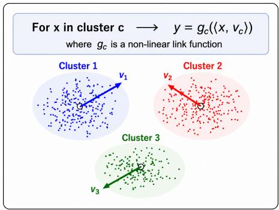

## Our main contributions are as follows.

We show that in trained MLPs, a substantial fraction of individual neurons become monosemantic, specializing by aligning predominantly with a single cluster-specific predictive direction. This specialization allows the MLP to learn both the relevant local low-dimensional features and an implicit clustering that determines where each feature is useful. The resulting behavior resembles mixture-of-experts routing, but emerges within a standard MLP without an explicit routing module or expert decomposition.

While this specialization happens for standard ReLU and GeLU [Hendrycks and Gimpel, 2016], modern architectures with multiplicative gating, such as ReGLU and SwiGLU [Shazeer, 2020], can substantially improve sample eficiency in this setting.

Furthermore, we show that this specialization leads to increasingly favorable sample-complexity scaling as the number of clusters grows, allowing MLPs to maintain strong performance even when the cluster-specific predictive directions collectively span the ambient space and no useful global low-dimensional structure exists.

## 1.1 Discussion

The form of feature learning identified in this work difers from the classical feature learning, where the main goal is to recover a single global lowdimensional predictive subspace. In such settings, methods designed for learning low-dimensional features can perform as well or better than MLPs. A prominent example is the Recursive Feature Machine (RFM), a supervised kernelbased method that uses input-response pairs to learn a global low-dimensional predictive subspace [Radhakrishnan et al., 2024, 2025]. RFM is therefore a particularly informative comparison: like an MLP, it learns features from the data rather than operating with a fixed representation.

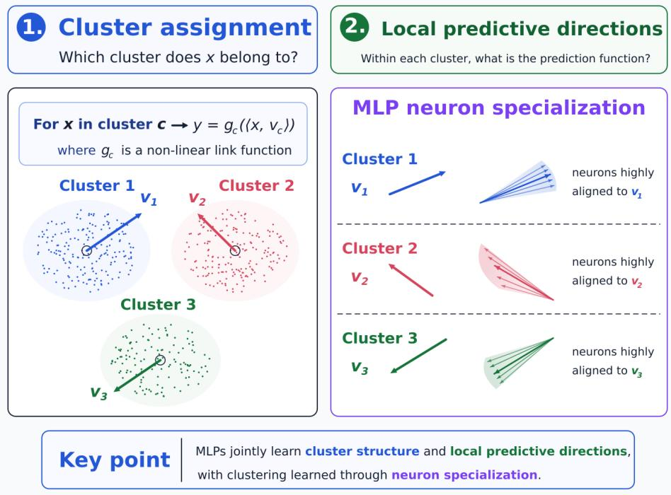

However, as the number of clusters increases, the span of cluster-specific predictive directions grows until it equals the ambient space, so they no longer lie in a single low-dimensional global subspace. This demonstrates a key advantage of MLPs – they can use neuron specialization to preserve the association between each predictive direction and the cluster in which it is relevant, allowing MLPs to remain efective as the number of clusters grows, while RFM feature learning ability diminishes with the number of clusters.

To study this phenomenon systematically, we consider a mixture of single-index models. Suppose the data are drawn from K clusters. For an input $x \in \mathbb { R } ^ { d }$ belonging to cluster $c \in [ K ]$ , the target is

$$
f ( \boldsymbol { x } ) = g _ { c } \big ( \boldsymbol { v } _ { c } ^ { \top } \boldsymbol { x } \big ) , \qquad \boldsymbol { v } _ { c } \in \mathbb { R } ^ { d } .
$$

Thus, prediction is one-dimensional within each cluster, but both the relevant direction $v _ { c }$ and the link function $g _ { c }$ may vary across clusters.

The classical single-index model corresponds to $K = 1$ . When $K > 1$ , however, the predictive directions of diferent clusters may collectively span the entire ambient space:

$$
\operatorname { r a n k } \left( \left[ v _ { 1 } \quad \cdot \cdot \cdot \quad v _ { K } \right] \right) = d .
$$

Hence, prediction can be low-dimensional within every cluster even though there is no useful global low-dimensional predictive subspace to recover.

## 1.2 Prior Work

Feature learning of global low-dimensional structure. A large body of work studies feature learning for multi-index targets. These works have shown that neural-network models can adapt to an unknown low-dimensional subspace of the inputs, succeeding where fixed-kernel methods are sample-ineficient [Bach, 2017, Soltanolkotabi, 2017, Yehudai and Shamir, 2019, Ghorbani et al., 2020b]. Recently, the literature has characterized how gradient-based training succeeds in recovering this subspace for isotropic data [Abbe et al., 2022, 2023, Damian et al., 2022, Ba et al., 2022, Dandi et al., 2024, Damian et al., 2025, Bruna and Hsu, 2025], and in the related setting of classifying Gaussian-mixture data with a constant number of clusters [Refinetti et al., 2021, Ben Arous et al., 2024].

However, in our work, we prove that neuron specialization is a diferent form of feature learning, allowing MLPs to eficiently tackle settings where a single global low-dimensional representation is insuficient.

Neuron specialization. Emergence of specialized neurons has been observed in several settings. For instance, training neural networks to do modular arithmetic leads to specialized neurons each representing diferent Fourier components [Nanda et al., 2023, Gromov, 2023, Morwani et al., 2024, He et al., 2026]. When learning XOR-type targets, it has also been shown that neurons specialize to four clusters rather than being distributed evenly across a predictive low-dimensional subspace [Frei et al., 2023, Glasgow, 2024]. And in teacherstudent settings the student’s neurons have been shown to often align to the teacher’s neurons [Tian, 2020, Oostwal et al., 2021, Zhu et al., 2025], although this depends on initialization [Jarvis et al., 2025].

These works mainly study specialization to globally relevant features or to cluster directions that themselves determine the target. In our work, neurons specialize to locally predictive features. Thus, an MLP must not only learn the predictive directions, but also preserve their association with the clusters in which they are relevant. Moreover, these works do not isolate a sample-complexity advantage of specialization over an adaptive feature-learning method based on a single global representation, such as the Recursive Feature Machine [Radhakrishnan et al., 2024]. We establish such an advantage: when cluster-specific predictive directions collectively span a high-dimensional space, neuron specialization allows an MLP to preserve these local feature-cluster associations and achieve better sample complexity.

Monosemanticity. Interpretability works on language models have found that some individual neurons are monosemantic, responding primarily to a single interpretable concept or pattern, while others are polysemantic, responding to multiple distinct concepts or patterns [Bills et al., 2023, Elhage et al., 2022]. More recent work has argued that monosemantic features need not align with individual neurons, and has used sparse dictionary learning to recover more monosemantic feature directions from neural representations [Bricken et al., 2023, Templeton et al., 2024]. Our work shows that, at least in simple MLPs, monosemantic features can emerge directly at the level of individual neurons and that this neuron-level specialization can improve sample eficiency compared with methods that are limited to global feature discovery.

Mixture of Experts models. A complementary line of work studies specialization and latent-cluster recovery in mixture-of-experts (MoE) architectures. Chen et al. [2022] analyze a clustered classification problem and show that an MoE router can learn cluster-center features that partition the problem into simpler subproblems handled by diferent experts. Dikkala et al. [2023] likewise show, theoretically and empirically, that a learned router can route inputs according to latent clusters. Particularly close to our statistical setting, Kawata et al. [2025] study nonlinear regression with an underlying cluster structure of single-index models and show that an MoE trained by SGD can detect the latent organization and divide the task into cluster-specific subproblems; under their assumptions, a vanilla neural network does not detect this organization within their polynomial complexity regime.

These works build specialization into the architecture through an explicit router and separate experts. In contrast, we study a standard MLP with no explicit routing or expert decomposition, and show that both the implicit clustering and the corresponding local predictive-feature specialization can emerge through the specialization of individual neurons.

## 1.3 Paper Structure

The remainder of the paper develops the view that MLPs learn cluster-dependent predictive structure through neuron specialization, both empirically and theoretically. In Section 2, we introduce the setting used throughout the paper. In Section 3, we present our empirical results, showing that MLPs learn this cluster structure and achieve better sample-complexity over RFM as the number of clusters grows. We also show that gated activations such as ReGLU and SwiGLU can further improve sample complexity compared with standard activations such as ReLU and GeLU. Finally, in Section 4, we theoretically analyze the emergence of neuron specialization in simplified settings.

## 2 Preliminary

Throughout our synthetic experiments and theoretical analysis, we consider data drawn from a Gaussian mixture model with K clusters. The cluster index c is drawn uniformly from $\{ 1 , \ldots , K \}$ . For each cluster $^ { c , }$ let $\mu _ { c } \in \mathbb { R } ^ { d }$ denote its mean and $\Sigma _ { c } \in \mathbb { R } ^ { d \times d }$ its covariance matrix. Conditioned on cluster $c ,$ the covariates $x \in \mathbb { R } ^ { d }$ are distributed as

$$
x \mid c \sim { \mathcal { N } } ( \mu _ { c } , \Sigma _ { c } ) .
$$

In all settings considered in this paper, we choose the cluster means so that distinct clusters are well separated. The response follows a cluster-specific singleindex model with additive Gaussian noise,

$$
y = g _ { c } ( \langle x , v _ { c } \rangle ) + \varepsilon , \qquad \varepsilon \sim \mathcal { N } ( 0 , \sigma ^ { 2 } ) ,
$$

where $\varepsilon$ is independent of $x$ and $c , \ v _ { c } \ \in \ \mathbb { R } ^ { d }$ , with $\| v _ { c } \| _ { 2 } = 1$ , is the clusterspecific predictive direction, and $g _ { c } : \mathbb { R } $ R is a nonlinear “link function” that may vary across clusters. Throughout, we use mean squared error (MSE) as the regression loss,

$$
\begin{array} { r } { \mathcal { L } ( f ) = \mathbb { E } \left[ ( f ( x ) - y ) ^ { 2 } \right] , } \end{array}
$$

where $f : \mathbb { R } ^ { d } $ R denotes the learned predictor.

## 3 Experiments

In this section, we empirically show that MLPs can learn both the cluster structure and the predictive function within each cluster. This gives rise to a form of feature learning that goes beyond recovering a single low-dimensional predictive subspace. We demonstrate these phenomena through three complementary experiments, each presented in a separate subsection.

## 3.1 MLPs Develop Specialized First-layer Neurons

Main finding. Figure 1 shows that a significant number of first-layer neurons in trained MLPs become monosemantic, specializing to individual clusterspecific predictive directions. We measure specialization among the active neurons that contribute most strongly to the output, as defined in Appendix A.1. The bottom panel illustrates this directly for selected GELU neurons, whose weights concentrate on a single predictive coordinate.

Data setting. Following the notation introduced in Section 2, in Figure 1 we use $K = 1 0$ clusters in $d = 4 0$ . We choose the cluster centers and predictive directions to lie along separate coordinate axes:

<table><tr><td rowspan="2">Model/weight</td><td rowspan="2">Active neurons (out of 2048)</td><td colspan="4">Specialization measures (% of active neurons that are specialized )</td></tr><tr><td>Cos ≥ .71 ↑</td><td>Cos ≥ .90 ↑</td><td>Max is target-aligned↑</td><td>Target-aligned max &gt; 2× second max ↑</td></tr><tr><td>ReLU</td><td>613</td><td>45.5%</td><td>33.4%</td><td>71.1%</td><td>49.1%</td></tr><tr><td>GELU</td><td>1,710</td><td>49.9%</td><td>28.2%</td><td>68.2%</td><td>43.1%</td></tr><tr><td>ReGLU gate</td><td>453</td><td>73.1%</td><td>56.1%</td><td>96.7%</td><td>73.5%</td></tr><tr><td>ReGLU value</td><td>453</td><td>28.5%</td><td>3.8%</td><td>69.1%</td><td>24.7%</td></tr><tr><td>SwiGLU gate</td><td>551</td><td>43.6%</td><td>19.1%</td><td>91.7%</td><td>38.1%</td></tr><tr><td>SwiGLU value</td><td>551</td><td>46.3%</td><td>14.9%</td><td>87.5%</td><td>41.4%</td></tr></table>

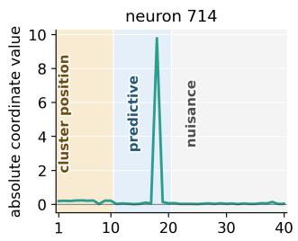

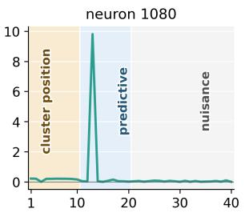  
coordinate index

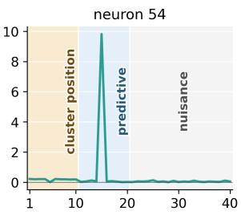  
Figure 1: First-layer neurons become monosemantic along clusterspecific predictive directions. Top: percentage of specialized neurons among active neurons. Across standard and gated activations, many neurons become monosemantic, aligning strongly with a single cluster-specific predictive direction. For gated architectures, gate and value weights are evaluated separately. Higher values indicate stronger specialization. Bottom: absolute first-layer weights of selected GELU neurons. Each neuron concentrates strongly on one predictive coordinate, with comparatively little weight on cluster-position and nuisance coordinates. See Appendix A.1 for definitions and further details.

$$
[ \mu _ { c } ] _ { j } = \{ { 2 0 } , \quad j = c , \qquad [ v _ { c } ] _ { j } = \{ 1 , \quad j = K + c , \qquad j \in \{ 1 , \ldots , d \} \} .
$$

We further set

$$
\Sigma _ { c } = I _ { d } / d , \qquad \varepsilon \sim \mathcal { N } ( 0 , 0 . 0 0 5 ^ { 2 } ) .
$$

Thus, the cluster centers occupy the first K coordinates, while the predictive directions occupy the next K coordinates.

The cluster centers and predictive directions lie along separate coordinate axes. Since each $v _ { c }$ is a standard basis vector, specialization is directly visible as a large weight on the corresponding coordinate in Fig. 1. We use a second-Hermite nonlinearity $g _ { c }$ with small Gaussian response noise.

Specialization measures. For a neuron’s first-layer weight $w _ { j }$ , we measure specialization using the maximum absolute cosine similarity with the clusterspecific predictive directions:

$$
\operatorname* { m a x } _ { 1 \leq c \leq K } \frac { \vert \langle w _ { j } , v _ { c } \rangle \vert } { \Vert w _ { j } \Vert _ { 2 } \Vert v _ { c } \Vert _ { 2 } } .
$$

Figure 1 reports the fraction of active neurons for which this cosine similarity is at least $\textstyle { \frac { \bar { 1 } } { \sqrt { 2 } } }$ or 0.90. We use $1 / \sqrt { 2 } \approx 0 . 7 1$ as a moderate-alignment threshold, corresponding to at least half of the squared weight norm lying along a single predictive direction, and 0.90 as a stricter measure of strong alignment. The table also reports two additional measures of specialization, since cosine similarity can underestimate specialization when one predictive coordinate is dominant but many small coeficients contribute to the overall weight norm.

Full experimental details, including the definitions and motivation for the additional specialization measures, are given in Appendix A.1.

## 3.2 MLPs Jointly Learn Cluster Structure and Clusterspecific Predictive Functions

Following the clustered single-index model introduced in Section 2, we consider regression problems in $d = 2 0$ in which both the predictive direction $v _ { c }$ and nonlinear response function gc may difer across clusters. We vary the number of clusters over $K \in \{ 1 , 2 , 1 0 , 5 0 \}$ . The MLPs and global kernel baselines, Laplace and RFM, are trained only on input–response pairs and are never given the cluster identities. As a reference, we also consider oracle baselines that are given the true cluster identities and fit a separate Laplace or RFM predictor within each cluster. These oracles therefore measure the performance achievable when the cluster structure is known in advance.

Main findings. Figure 2 highlights two main conclusions,

1. Sample complexity as the number of clusters grows. MLPs outperform other methods as the number of clusters increases. Remarkably, MLPs achieve performance close to that of “oracle” baselines that are given the true cluster identities and fit a separate RFM or Laplace predictor within each cluster. Thus, MLPs recover much of the benefit of knowing the cluster structure without ever observing the cluster identities.

2. Gated activations enhance cluster-dependent feature learning. ReLU already learns useful cluster-dependent structure and substantially outperforms global RFM when many clusters are present. ReGLU improves further in this regime. Its separate gate and value branches allow the network to select cluster-specific predictive features more directly than an ordinary ReLU hidden layer.

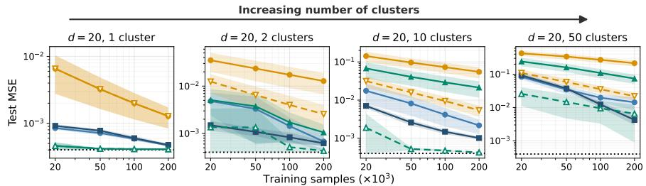  
MLP (ReLU) MLP (ReGLU) Laplace (global) Laplace (oracle) RFM (global) RFM (oracle) Bayes MSE  
Figure 2: MLPs jointly learn clustering and local predictive functions. Each cluster has its own predictive direction and nonlinear prediction rule, while cluster identities are hidden from the models. Three trends emerge: (i) as the number of clusters increases and the predictive directions span more of the ambient space, the advantage of global RFM over the isotropic Laplace kernel diminishes; (ii) ReLU and ReGLU remain efective and approach clusteraware oracle methods, showing that MLPs can jointly infer cluster structure and learn the corresponding local predictive functions; and (iii) ReGLU further improves over ReLU, demonstrating the benefit of explicit multiplicative gating for cluster-dependent feature learning.

Data setting. Following Section 2, we consider $K \in \{ 1 , 2 , 1 0 , 5 0 \}$ clusters in $d = 2 0$ . We divide the input into ten cluster-identifying coordinates and ten predictive coordinates. The cluster centers are chosen as well-separated unit vectors $s _ { c } \in \mathbb { S } ^ { 9 } : = \{ s \in \mathbb { R } ^ { 1 0 } : \| s \| _ { 2 } = 1 \}$ , selected sequentially from a large random candidate set so as to maximize separation from the previously selected centers. They are embedded as

$$
\mu _ { c } = { \binom { s _ { c } } { 0 } } .
$$

The cluster-specific predictive directions are sampled independently and uniformly from the unit sphere in the predictive subspace, with

$$
\begin{array} { r } { \widetilde v _ { c } \sim \mathrm { U n i f } ( \mathbb { S } ^ { 9 } ) , \qquad v _ { c } = \left[ \begin{array} { l } { 0 } \\ { \widetilde v _ { c } } \end{array} \right] , \qquad \Sigma _ { c } = \left( \begin{array} { l l } { \sigma _ { K } ^ { 2 } I _ { 1 0 } } & { 0 } \\ { 0 } & { I _ { 1 0 } } \end{array} \right) , \qquad \varepsilon \sim \mathcal { N } ( 0 , 0 . 0 2 ^ { 2 } ) . } \end{array}
$$

Here, $\sigma _ { K }$ is adjusted with $K$ so that the clusters remain well separated. Full details of the center construction and the choice of $\sigma _ { K }$ are provided in $\mathrm { A p \mathrm { - } }$ pendix A.2.

Each cluster is also assigned a nonlinear response function $g _ { c }$ , sampled from the normalized second-order Hermite polynomial, sin, and tanh. Thus, both the predictive direction $v _ { c }$ and nonlinear prediction rule $g _ { c }$ may vary across clusters. The models observe only $( x , y )$ , and the cluster identities are not used as predictive inputs or to fit cluster-specific predictors, except for the oracle baselines.

Additional activations. To test whether the observed behavior extends beyond ReLU and ReGLU, we evaluate GELU and SwiGLU on the same mixedlink data model and the same $K \in \{ 1 , 2 , 1 0 , 5 0 \}$ settings. Across five seeds, GELU behaves similarly to ReLU, and SwiGLU exhibits the same advantage as ReGLU as the number of clusters grows. Complete results are provided in Appendix A.2 and Fig. 6.

## 3.3 Trained MLPs Encode Cluster Structure

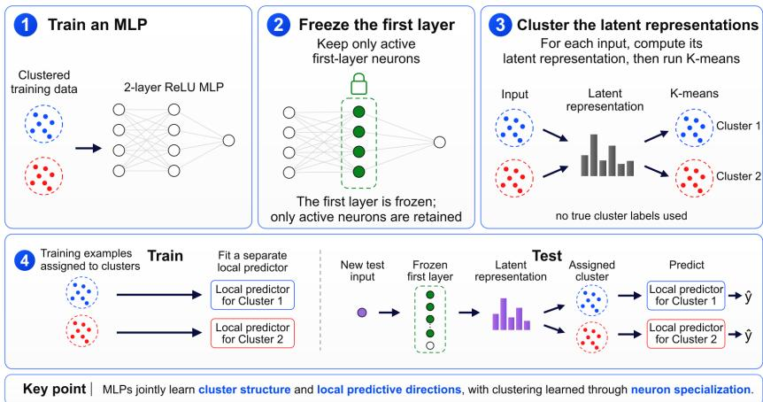  
Figure 3: Overview of the MLP-gated local-prediction procedure. A ReLU MLP is trained on the clustered data, K-means is applied to its firstlayer representations, and an independent local predictor is fit for each learned cluster. At test time, each input is routed to the local predictor associated with its nearest learned centroid.

We use the mixed-link functions clustered model from Section 3.2 and vary the number of clusters over $K \in \{ 2 , 5 , 1 0 , 5 0 \}$ . Figure 3 summarizes the complete procedure. We train a ReLU MLP on the clustered data and extract its firstlayer representations. We then apply K-means to these representations to obtain learned clusters. For each learned cluster, we use the corresponding first-layer weights to construct features for an independent local Laplace or RFM predictor. At test time, each input is assigned to its nearest learned centroid and evaluated using the corresponding local predictor.

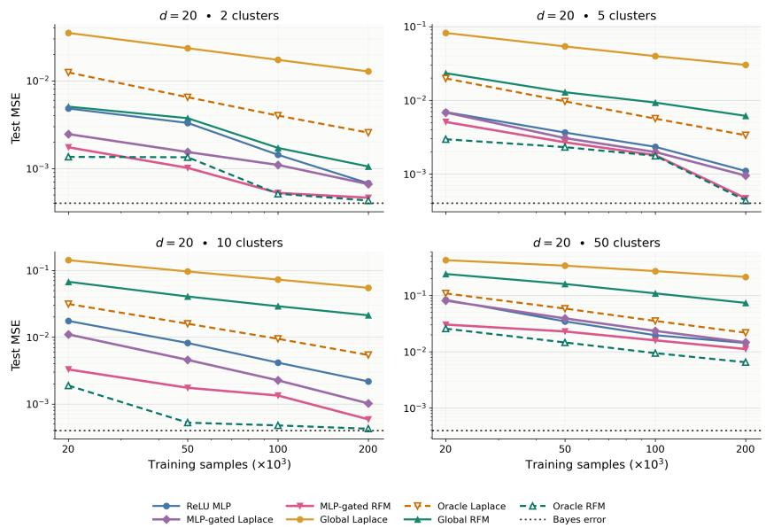  
Figure 4: Trained MLP first-layer representations encode cluster structure. Clustering the first-layer representations of a trained ReLU MLP and using the resulting clusters to fit local predictors substantially improves both Laplace and RFM across diferent numbers of clusters. MLP-gated RFM approaches the cluster-aware oracle and consistently outperforms global RFM, showing that the cluster structure learned by the MLP can be extracted from its first-layer representation and transferred to a separate predictor. Curves show means over five independent runs, each with a newly sampled dataset from the same distribution and an independent model initialization.

Across all numbers of clusters, using the clusters extracted from the MLP firstlayer representation substantially improves both Laplace and RFM over their global counterparts (Figure 4). In particular, the resulting local RFM consistently outperforms global RFM and approaches the cluster-aware oracle. These results show that the first-layer representation contains information that both separates the clusters and identifies cluster-specific predictive features, which can be extracted and reused by a separate predictor.

## 4 Theory

In this section, we prove two main results describing how MLPs learn data with cluster structure. In Theorem 1, we prove that neurons in the MLP specialize during training. In Theorem 2, we prove that, as the number of clusters tends to infinity, MLPs outperform standard kernel methods and Recursive Feature Machines (RFM) in terms of sample complexity. This comes as a consequence of the fact that the latter two methods cannot compute specialized features for each cluster.

## 4.1 MLP Neurons Specialize When Learning on Gaussian Mixture Model Data

In this subsection, we show that, under small initialization, neurons trained on well-separated Gaussian mixture data specialize to cluster-specific predictive directions.

We consider K-cluster Gaussian mixture data in $d = 2 K$ dimensions. Let $e _ { 1 } , \ldots , e _ { K }$ denote the standard basis of $\mathbb { R } ^ { K }$ . We use the first K coordinates to separate the cluster means and the last K coordinates for the cluster-specific predictive directions.1

## Data Setting 1 — Symmetric Gaussian mixture

Let $R > 0$ be a cluster separation parameter and, for $c \in [ K ]$ , let

$$
\mu _ { c } = \left[ \begin{array} { c } { { R e _ { c } } } \\ { { 0 } } \end{array} \right] , \qquad v _ { c } = \left[ \begin{array} { c } { { 0 } } \\ { { e _ { c } } } \end{array} \right] .
$$

Set each cluster to be isotropic with $\Sigma _ { c } ~ = ~ I _ { d }$ and use the common link function $g _ { c } = h _ { 3 }$ where $h _ { 3 } ( t ) = ( t ^ { 3 } - 3 t ) / \sqrt { 6 }$ is the third Hermite polynomial.

In the notation of Section 2, the data distribution is

$$
c \sim \mathrm { U n i f } ( [ K ] ) , \qquad x \mid c \sim \mathcal { N } ( \mu _ { c } , \Sigma _ { c } ) , \qquad y = g _ { c } ( \langle x , v _ { c } \rangle ) = h _ { 3 } ( \langle x , v _ { c } \rangle ) .
$$

Thus the routing coordinates encode cluster identity through the means $R e _ { c } ,$ where R should be thought of as a large cluster-separation parameter, so that the clusters are well separated, while within cluster c the response depends only on the cluster-specific predictive direction $v _ { c } .$ . The cubic Hermite target is chosen because there is an explicit expression for the expected product $\mathbb { E } [ y \phi ( \omega ^ { \top } x ) ]$ between the target response and the ReLU neuron’s activation, allowing us to characterize the directions to which neurons converge. Next, we consider training a neural network to learn this data distribution.

## Training Setup 1 — Two-layer ReLU population gradient flow

We train the two-layer ReLU network

$$
f _ { \theta } ( x ) = \sum _ { j = 1 } ^ { m } a _ { j } \phi ( w _ { j } ^ { \top } x ) , \qquad \phi ( t ) = t _ { + } ,
$$

by population gradient flow on the squared loss

$$
\mathcal { L } ( \theta ) = \frac { 1 } { 2 } \mathbb { E } \left[ \left( f _ { \theta } ( x ) - y \right) ^ { 2 } \right] .
$$

## Initialization 1 — Small random hidden weights and zero output layer

The hidden directions are initialized independently and uniformly at random, scaled by a parameter $\varepsilon > 0$ , while the output layer is initialized at zero:

$$
\omega _ { j } ^ { 0 } \overset { \mathrm { i i d } } { \sim } \mathrm { U n i f } ( \mathbb { S } ^ { d - 1 } ) , \qquad w _ { j } ( 0 ) = \varepsilon \omega _ { j } ^ { 0 } , \qquad a _ { j } ( 0 ) = 0 .
$$

Under this initialization and data distribution, we are able to prove that the neurons in the MLP specialize to the clusters of the Gaussian mixture. This result is consistent with, and provides theoretical support for, our empirical observations of neuron specialization in Section 3.1.

Theorem 1 (Randomly initialized neurons specialize). Under Data Setting 1, Training Setup 1 and Initialization 1 there are universal constants $R _ { 0 } , C < \infty$ such that the following holds for every $R \ \geq \ R _ { 0 }$ . For almost every draw of $\omega _ { 1 } ^ { 0 } , \ldots , \omega _ { m } ^ { 0 }$ , there are cluster labels $J _ { 1 } , \ldots , J _ { m } \in [ K ]$ and orientations $\tau _ { 1 } , \ldots , \tau _ { m } \in$ {±1} such that, for every $\delta > 0 _ { : }$ , there exist a finite time $T _ { \delta }$ and $\varepsilon _ { 0 } > 0 ~ f o r$ which

$$
0 < \varepsilon \leq \varepsilon _ { 0 } \quad \Longrightarrow \quad \left\| \frac { w _ { j } ( T _ { \delta } ) } { \| w _ { j } ( T _ { \delta } ) \| _ { 2 } } - \tau _ { j } v _ { J _ { j } } \right\| _ { 2 } \leq \delta + \frac { C } { R } \qquad f o r \ e v e r y \ j \in [ m ] .
$$

Thus every neuron specializes, up to orientation and a vanishing $O ( R ^ { - 1 } )$ routing component, to the predictive direction of one cluster.

The selected labels $J _ { 1 } , \ldots , J _ { m }$ are independent and uniformly distributed on $[ K ]$ Consequently,

P (every cluster is covered by a specialized neuron) $\ge 1 - K e ^ { - m / K }$

In particular, if

$$
m \geq K \log \left( { \frac { K } { \eta } } \right) ,
$$

then all K clusters are covered with probability at least $1 - \eta$

Proof sketch. We employ a proof strategy of studying feature learning through efectively independent neuron dynamics, which has been used in prior work on early-time and small-initialization regimes [Abbe et al., 2022, Min et al., 2024, Glasgow, 2024]. At initialization, the network output is zero and the hidden weights are stationary. The initial derivative of each output weight is proportional to the population correlation

$$
\Phi ( \omega ) = \mathbb { E } \left[ y \phi ( \omega ^ { \top } x ) \right]
$$

of its own randomly initialized hidden direction. Except on a measure-zero set, this correlation is nonzero, so the output weight immediately acquires the appropriate sign. ReLU homogeneity then turns the neuron’s subsequent directional dynamics into a positive time reparameterization of gradient ascent on the corresponding signed correlation objective.

For the cubic target, the Hermite calculation makes this objective a sum of clusterwise cubic terms. Its positive local maxima are one-cluster solutions: a neuron aligns with $\pm v _ { c }$ and uses only an $O ( R ^ { - 1 } )$ component in the associated routing direction to place its ReLU threshold within cluster $c .$ Indeed, we prove that any positive mixed-cluster critical point has an unstable direction. Analytic-gradient-flow convergence and strict-saddle avoidance therefore imply that a random neuron specializes almost surely.

Permutation symmetry makes the selected cluster uniform on $[ K ]$ , and independence of the initial hidden directions makes the selected labels independent. The coverage estimate is then the usual coupon-collector union bound. Finally, on every fixed early-time interval the full network output is $O ( m \varepsilon ^ { 2 } )$ , so the coupled network dynamics are a vanishing perturbation of the isolated-neuron dynamics. $\mathrm { A }$ Gr¨onwall argument transfers the specialization result to population gradient flow. The complete proof is given in Appendix B.1.

## 4.2 A Sample-complexity Gap Between MLPs, Kernel Methods, and RFM

In this subsection, we establish a sample-complexity separation between twolayer MLPs and both standard kernel methods and Recursive Feature Machines (RFM). We use a data distribution similar to that in the previous subsection, but with full separation between clusters for ease of analysis.

## Data Setting 2 — Gaussian mixture with noiseless routing

We set the means $\mu _ { c } = [ e _ { c } ; 0 ]$ and predictive directions $v _ { c } = [ 0 ; e _ { c } ]$ in $d = 2 K$ dimensions, but make the first K coordinates noiseless by setting

$$
{ \mit \Sigma } _ { c } = \left[ \begin{array} { c c } { { 0 _ { K \times K } } } & { { 0 } } \\ { { 0 } } & { { I _ { K } } } \end{array} \right] .
$$

We use the common clipped-ramp link $g _ { c } = g ,$ where

$$
g ( t ) = t _ { + } - ( t - 1 ) _ { + } .
$$

Thus, in the notation of Section 2,

$$
c \sim \mathrm { U n i f } ( [ K ] ) , \qquad x \mid c \sim \mathcal { N } ( \mu _ { c } , \Sigma _ { c } ) , \qquad y = g _ { c } ( \langle x , v _ { c } \rangle ) = g ( \langle x , v _ { c } \rangle ) .
$$

The routing block now reveals the cluster exactly, while the response within cluster c depends only on its cluster-specific predictive direction.

Instead of studying a network trained through gradient-based updates, we study a two-layer MLP fit by empirical risk minimization subject to a Frobenius-norm constraint on its weights.

## Training Setup 2 — Frobenius-constrained MLP ERM

We fit the two-layer ReLU network

$$
f _ { \theta } ( x ) = \sum _ { j = 1 } ^ { m } a _ { j } \phi ( w _ { j } ^ { \top } x ) , \qquad \phi ( t ) = t _ { + } ,
$$

using empirical risk minimization (ERM). For a budget $B > 0 ,$ , consider the set of functions representable by Frobenius-constrained networks,

$$
\mathcal { F } _ { B } : = \left\{ f _ { \theta } : \| \theta \| _ { \mathrm { F } } ^ { 2 } = \frac { 1 } { 2 } \sum _ { j = 1 } ^ { m } \left( a _ { j } ^ { 2 } + \| w _ { j } \| _ { 2 } ^ { 2 } \right) \leq B \right\} .
$$

Given n samples, we consider the clipped-ERM estimator

$$
\widehat { f } _ { \mathrm { M L P } } \in \arg \operatorname* { m i n } _ { f \in \mathrm { c l i p } \circ \mathcal { F } _ { B } } \frac { 1 } { n } \sum _ { i = 1 } ^ { n } \bigl ( f ( x _ { i } ) - y _ { i } \bigr ) ^ { 2 } , \qquad \mathrm { c l i p } ( t ) = \operatorname* { m i n } \{ 1 , \operatorname* { m a x } \{ 0 , t \} \} .
$$

We compare this MLP ERM with standard rotationally invariant kernel ridge regression and with RFM, a supervised kernel method [Radhakrishnan et al., 2024, 2025]. We give RFM the ground-truth population average gradient outer product (AGOP), thereby removing metric-estimation error and isolating the limitation of using one global feature metric.2

Training Setup 3 — Kernel methods and RFM with ground-truth   
AGOP   
Let K be a rotationally invariant kernel. Given n samples, $\widehat { f } _ { \mathrm { K e r n e l } }$ is ker  
nel ridge regression with kernel $\kappa ( \boldsymbol { x } , \boldsymbol { x } ^ { \prime } )$ . We give RFM the ground-truth   
population $\mathrm { A G O P ^ { 3 } }$   
$M : = \mathbb { E } \left[ \nabla _ { x } f ^ { \star } ( x ) \nabla _ { x } f ^ { \star } ( x ) ^ { \top } \right] .$   
For $\rho \geq 0 ,$ , define the regularized AGOP and corresponding kernel   
$M _ { \rho } : = M + \rho I _ { d } , \qquad K _ { M _ { \rho } } ( x , x ^ { \prime } ) : = K \bigl ( \sqrt { M _ { \rho } } x , \sqrt { M _ { \rho } } x ^ { \prime } \bigr ) .$   
$\widehat { f } _ { \mathrm { R F M } }$ is kernel ridge regression with kernel $\kappa _ { M _ { \rho } }$ . Both estimators may use   
any kernel ridge parameter $\lambda _ { n } \geq 0$

In the theorem below, we show that a two-layer MLP learns the cluster-structured data with polynomial sample complexity. In contrast, standard kernel methods and RFM provably fail under every polynomial sample-size scaling because they cannot compute a distinct specialized direction for each cluster. In particular, RFM is constrained to learn a single global feature geometry, which cannot capture the cluster-dependent specialization required by the target.

Theorem 2 (The MLP succeeds while kernel methods and RFM fail). Under Data Setting 2 and Training Setup 2, the $M L P$ estimator with $B = 3 K$ satisfies

$$
\mathbb { E } \left[ \Vert \widehat { f } _ { \mathrm { M L P } } - f ^ { \star } \Vert _ { L ^ { 2 } ( P _ { x } ) } ^ { 2 } \right] \leq C \frac { K ^ { 3 / 2 } } { \sqrt { n } }
$$

for a universal constant C.

Under Data Setting 2 and Training Setup 3, for every fixed $A \ < \ \infty$ , every sequence $n _ { K } = { \cal O } ( K ^ { A } )$ , and every sequence $\rho _ { K } \geq 0$

$$
\operatorname* { l i m i n f } _ { K \to \infty } \mathbb { E } \left[ \| \widehat f _ { \mathrm { K e r n e l } } - f ^ { \star } \| _ { L ^ { 2 } ( P _ { x } ) } ^ { 2 } \right] > 0 , \qquad \operatorname* { l i m i n f } _ { K \to \infty } \mathbb { E } \left[ \| \widehat f _ { \mathrm { R F M } } - f ^ { \star } \| _ { L ^ { 2 } ( P _ { x } ) } ^ { 2 } \right] > 0 .
$$

Proof sketch. We construct an MLP solution that assigns two ReLU neurons to each cluster. On every other cluster, the pair’s outputs cancel exactly, while on the selected cluster their diference equals the clipped ramp. This construction has zero approximation error and satisfies the Frobenius budget $B = 3 K$ Since the MLP class has bounded Frobenius budget, it is contained in a corresponding path-norm ball. Norm-based capacity and Rademacher-complexity bounds for neural networks [Neyshabur et al., 2015, Bach, 2017, Golowich et al., 2018], together with standard Rademacher-complexity risk bounds [Bartlett and Mendelson, 2002], then yield the MLP risk estimate.

The kernel lower bound exploits the same rotational-invariance obstruction identified in prior work on the limitations of kernel methods in high dimensions [Ghorbani et al., 2020a]. In our setting, the ground-truth AGOP is a scaled projector onto the predictive subspace. Hence both the standard kernel metric and the regularized RFM metric $M _ { \rho }$ act by scalars on the routing and predictive subspaces, so their kernels remain rotationally invariant within the predictive coordinates. The representer theorem restricts the predictor to the span of n kernel sections. At Hermite order $r ,$ the clusterwise target contains a component in an irreducible harmonic subspace of dimension $\Theta _ { r } ( K ^ { r } )$ . The span of the projected kernel sections is an invariant random subspace of dimension at most n, so for $n = O ( K ^ { A } )$ every order $r > A$ leaves asymptotically all of its target energy unrecovered. This argument is uniform over $\rho$ and therefore covers standard kernels and ridge-regularized RFM simultaneously. The complete proof is given in Appendix B.2.

## Acknowledgements

We gratefully acknowledge support from the National Science Foundation (NSF) under grants CCF-2112665 and MFAI 2502258, the Ofice of Naval Research (ONR N000142412631), and the Defense Advanced Research Projects Agency (DARPA) under Contract No. HR001125CE020. This work used the Delta system at the National Center for Supercomputing Applications through allocation TG-CIS220009 from the Advanced Cyberinfrastructure Coordination Ecosystem: Services & Support (ACCESS) program, which is supported by National Science Foundation grants #2138259, #2138286, #2138307, #2137603, and #2138296.

AI tools were used to assist with aspects of the experiments and theoretical analysis.

## References

Emmanuel Abbe, Enric Boix Adsera, and Theodor Misiakiewicz. The mergedstaircase property: a necessary and nearly suficient condition for SGD learning of sparse functions on two-layer neural networks. In Proceedings of the 35th Conference on Learning Theory, volume 178 of Proceedings of Machine Learning Research, pages 4782–4887. PMLR, 2022.

Emmanuel Abbe, Enric Boix-Adser\`a, and Theodor Misiakiewicz. SGD learning on neural networks: Leap complexity and saddle-to-saddle dynamics. In Proceedings of the 36th Conference on Learning Theory, volume 195 of Proceedings of Machine Learning Research, pages 2552–2623. PMLR, 2023.

Amirhesam Abedsoltan, Mikhail Belkin, and Parthe Pandit. Toward large kernel models. In Proceedings of the 40th International Conference on Machine Learning, volume 202 of Proceedings of Machine Learning Research, pages 61–78. PMLR, 2023.

Amirhesam Abedsoltan, Siyuan Ma, Parthe Pandit, and Misha Belkin. Fast training of large kernel models with delayed projections. In Advances in Neural Information Processing Systems, volume 38, 2025.

Zeyuan Allen-Zhu and Yuanzhi Li. What can ResNet learn eficiently, going beyond kernels? In Advances in Neural Information Processing Systems, volume 32, 2019.

Jimmy Ba, Murat A. Erdogdu, Taiji Suzuki, Zhichao Wang, Denny Wu, and Greg Yang. High-dimensional asymptotics of feature learning: How one gradient step improves the representation. In Advances in Neural Information Processing Systems, volume 35, pages 37932–37946, 2022.

Francis Bach. Breaking the curse of dimensionality with convex neural networks. Journal of Machine Learning Research, 18(19):1–53, 2017.

Peter L. Bartlett and Shahar Mendelson. Rademacher and gaussian complexities: Risk bounds and structural results. Journal of Machine Learning Research, 3:463–482, 2002.

G´erard Ben Arous, Reza Gheissari, Jiaoyang Huang, and Aukosh Jagannath. High-dimensional SGD aligns with emerging outlier eigenspaces. In International Conference on Learning Representations, 2024. URL https://proceedings.iclr.cc/paper\_files/paper/2024/ hash/d10d6b28d74c4f0fcab588feeb6fe7d6-Abstract-Conference.html.

Yoshua Bengio, Aaron Courville, and Pascal Vincent. Representation learning: A review and new perspectives. IEEE Transactions on Pattern Analysis and Machine Intelligence, 35(8):1798–1828, 2013. doi: 10.1109/TPAMI.2013.50.

Steven Bills, Nick Cammarata, Dan Mossing, Henk Tillman, Leo Gao, Gabriel Goh, Ilya Sutskever, Jan Leike, Jef Wu, and William Saunders. Language models can explain neurons in language models. https://openaipublic. blob.core.windows.net/neuron-explainer/paper/index.html, 2023.

Trenton Bricken, Adly Templeton, Joshua Batson, Brian Chen, Adam Jermyn, Tom Conerly, Nicholas L. Turner, Cem Anil, Carson Denison, Amanda Askell, Robert Lasenby, Yifan Wu, Shauna Kravec, Nicholas Schiefer, Tim Maxwell, Nicholas Joseph, Zac Hatfield-Dodds, Alex Tamkin, Karina Nguyen, Brayden McLean, Josiah E. Burke, Tristan Hume, Shan Carter, Tom Henighan, and Christopher Olah. Towards monosemanticity: Decomposing language models with dictionary learning. Transformer Circuits Thread, 2023. URL https:// transformer-circuits.pub/2023/monosemantic-features/index.html.

Joan Bruna and Daniel Hsu. Survey on algorithms for multi-index models. Statistical Science, 40(3):378–391, 2025.

Zixiang Chen, Yihe Deng, Yue Wu, Quanquan Gu, and Yuanzhi Li. Towards understanding the mixture-of-experts layer in deep learning. In Advances in Neural Information Processing Systems, volume 35, pages 23049–23062, 2022. URL https://proceedings.neurips.cc/paper\_files/paper/2022/hash/ 91edff07232fb1b55a505a9e9f6c0ff3-Abstract-Conference.html.

L´ena¨ıc Chizat, Edouard Oyallon, and Francis Bach. On lazy training in diferentiable programming. In Advances in Neural Information Processing Systems, volume 32, pages 2937–2947. Curran Associates, Inc., 2019. URL https://proceedings.neurips.cc/paper/2019/hash/ ae614c557843b1df326cb29c57225459-Abstract.html.

Alex Damian, Jason D Lee, and Joan Bruna. The generative leap: Sharp sample complexity for eficiently learning gaussian multi-index models. arXiv preprint arXiv:2506.05500, 2025.

Alexandru Damian, Jason Lee, and Mahdi Soltanolkotabi. Neural networks can learn representations with gradient descent. In Conference on learning theory, pages 5413–5452. PMLR, 2022.

Yatin Dandi, Florent Krzakala, Bruno Loureiro, Luca Pesce, and Ludovic Stephan. How two-layer neural networks learn, one (giant) step at a time. Journal of Machine Learning Research, 25(349):1–65, 2024.

Nishanth Dikkala, Nikhil Ghosh, Raghu Meka, Rina Panigrahy, Nikhil Vyas, and Xin Wang. On the benefits of learning to route in mixture-of-experts models. In Houda Bouamor, Juan Pino, and Kalika Bali, editors, Proceedings of the 2023 Conference on Empirical Methods in Natural Language Processing, pages 9376–9396, Singapore, December 2023. Association for Computational Linguistics. doi: 10.18653/v1/2023.emnlp-main.583. URL https://aclanthology.org/2023.emnlp-main.583/.

Nelson Elhage, Tristan Hume, Catherine Olsson, Neel Nanda, Tom Henighan, Scott Johnston, Sheer ElShowk, Nicholas Joseph, Nova DasSarma, Ben Mann, Danny Hernandez, Amanda Askell, Kamal Ndousse, Andy Jones, Dawn Drain, Anna Chen, Yuntao Bai, Deep Ganguli, Liane Lovitt, Zac Hatfield-Dodds, Jackson Kernion, Tom Conerly, Shauna Kravec, Stanislav Fort, Saurav Kadavath, Josh Jacobson, Eli Tran-Johnson, Jared Kaplan, Jack Clark, Tom Brown, Sam McCandlish, Dario Amodei, and Christopher Olah. Softmax linear units. Transformer Circuits Thread, 2022. https://transformer-circuits.pub/2022/solu/index.html.

Spencer Frei, Niladri S. Chatterji, and Peter L. Bartlett. Random feature amplification: Feature learning and generalization in neural networks. Journal of Machine Learning Research, 24(303):1–49, 2023.

Mario Geiger, Stefano Spigler, Arthur Jacot, and Matthieu Wyart. Disentangling feature and lazy training in deep neural networks. Journal of Statistical Mechanics: Theory and Experiment, 2020(11):113301, 2020. doi: 10.1088/1742-5468/abc4de.

Behrooz Ghorbani, Song Mei, Theodor Misiakiewicz, and Andrea Montanari. Limitations of lazy training of two-layers neural network. In Advances in Neural Information Processing Systems, volume 32, 2019.

Behrooz Ghorbani, Song Mei, Theodor Misiakiewicz, and Andrea Montanari. When do neural networks outperform kernel methods? In Advances in Neural Information Processing Systems, volume 33, pages 14820–14830. Curran Associates, Inc., 2020a. URL https://proceedings.neurips.cc/paper/ 2020/hash/a9df2255ad642b923d95503b9a7958d8-Abstract.html.

Behrooz Ghorbani, Song Mei, Theodor Misiakiewicz, and Andrea Montanari. When do neural networks outperform kernel methods? In Advances in Neural Information Processing Systems, volume 33, pages 14820–14830, 2020b.

Margalit Glasgow. SGD finds then tunes features in two-layer neural networks with near-optimal sample complexity: A case study in the XOR problem. In The Twelfth International Conference on Learning Representations, 2024. URL https://openreview.net/forum?id=HgOJlxzB16.

Noah Golowich, Alexander Rakhlin, and Ohad Shamir. Size-independent sample complexity of neural networks. In Proceedings of the 31st Conference on Learning Theory, volume 75 of Proceedings of Machine Learning Research, pages 297–299. PMLR, 2018.

Andrey Gromov. Grokking modular arithmetic. arXiv preprint arXiv:2301.02679, 2023.

Jianliang He, Leda Wang, Siyu Chen, and Zhuoran Yang. On the mechanism and dynamics of modular addition: Fourier features, lottery ticket, and grokking. arXiv preprint arXiv:2602.16849, 2026.

Dan Hendrycks and Kevin Gimpel. Gaussian error linear units (gelus). arXiv preprint arXiv:1606.08415, 2016.

Arthur Jacot, Franck Gabriel, and Cl´ement Hongler. Neural tangent kernel: Convergence and generalization in neural networks. In Advances in Neural Information Processing Systems, volume 31, 2018.

Devon Jarvis, Sebastian Lee, Cl´ementine Carla Juliette Domin´e, Andrew M. Saxe, and Stefano Sarao Mannelli. A theory of initialisation’s impact on specialisation. In The Thirteenth International Conference on Learning Representations, 2025.

Ziwei Ji and Matus Telgarsky. The implicit bias of gradient descent on nonseparable data. In Conference on learning theory, pages 1772–1798. PMLR, 2019.

Ziwei Ji and Matus Telgarsky. Directional convergence and alignment in deep learning. Advances in Neural Information Processing Systems, 33:17176– 17186, 2020.

Ryotaro Kawata, Kohsei Matsutani, Yuri Kinoshita, Naoki Nishikawa, and Taiji Suzuki. Mixture of experts provably detect and learn the latent cluster structure in gradient-based learning. In Aarti Singh, Maryam Fazel, Daniel Hsu, Simon Lacoste-Julien, Felix Berkenkamp, Tegan Maharaj, Kiri Wagstaf, and Jerry Zhu, editors, Proceedings of the 42nd International Conference on Machine Learning, volume 267 of Proceedings of Machine Learning Research, pages 29390–29448. PMLR, 13–19 Jul 2025. URL https: //proceedings.mlr.press/v267/kawata25a.html.

Jaehoon Lee, Lechao Xiao, Samuel S. Schoenholz, Yasaman Bahri, Roman Novak, Jascha Sohl-Dickstein, and Jefrey Pennington. Wide neural networks of any depth evolve as linear models under gradient descent. In Advances in Neural Information Processing Systems, volume 32, 2019.

Kaifeng Lyu and Jian Li. Gradient descent maximizes the margin of homogeneous neural networks. In International Conference on Learning Representations, 2020.

Siyuan Ma and Mikhail Belkin. Kernel machines that adapt to GPUs for efective large batch training. Proceedings of Machine Learning and Systems, 1: 360–373, 2019.

Siyuan Ma, Raef Bassily, and Mikhail Belkin. The power of interpolation: Understanding the efectiveness of SGD in modern over-parametrized learning. In Proceedings of the 35th International Conference on Machine Learning, volume 80 of Proceedings of Machine Learning Research, pages 3325–3334. PMLR, 2018.

Eran Malach, Pritish Kamath, Emmanuel Abbe, and Nathan Srebro. Quantifying the benefit of using diferentiable learning over tangent kernels. In Proceedings of the 38th International Conference on Machine Learning, volume 139 of Proceedings of Machine Learning Research, pages 7379–7389. PMLR, 2021.

Hancheng Min, Enrique Mallada, and Ren´e Vidal. Early neuron alignment in two-layer ReLU networks with small initialization. In The Twelfth International Conference on Learning Representations, 2024.

Depen Morwani, Benjamin Edelman, Costin-Andrei Oncescu, Rosie Zhao, and Sham Kakade. Feature emergence via margin maximization: case studies in algebraic tasks. In International Conference on Learning Representations, volume 2024, pages 29077–29114, 2024.

Neel Nanda, Lawrence Chan, Tom Lieberum, Jess Smith, and Jacob Steinhardt. Progress measures for grokking via mechanistic interpretability. arXiv preprint arXiv:2301.05217, 2023.

Behnam Neyshabur, Ryota Tomioka, and Nathan Srebro. Norm-based capacity control in neural networks. In Proceedings of the 28th Conference on Learning Theory, volume 40 of Proceedings of Machine Learning Research, pages 1376– 1401. PMLR, 2015.

Elisa Oostwal, Michiel Straat, and Michael Biehl. Hidden unit specialization in layered neural networks: ReLU vs. sigmoidal activation. Physica A: Statistical Mechanics and its Applications, 564:125517, 2021. doi: 10.1016/j.physa.2020. 125517.

Adityanarayanan Radhakrishnan, Daniel Beaglehole, Parthe Pandit, and Mikhail Belkin. Mechanism for feature learning in neural networks and backpropagation-free machine learning models. Science, 383(6690):1461– 1467, 2024. doi: 10.1126/science.adi5639.

Adityanarayanan Radhakrishnan, Mikhail Belkin, and Dmitriy Drusvyatskiy. Linear recursive feature machines provably recover low-rank matrices. Proceedings of the National Academy of Sciences, 122(13):e2411325122, 2025. doi: 10.1073/pnas.2411325122. URL https://doi.org/10.1073/pnas. 2411325122.

Maria Refinetti, Sebastian Goldt, Florent Krzakala, and Lenka Zdeborova. Classifying high-dimensional gaussian mixtures: Where kernel methods fail and neural networks succeed. In Marina Meila and Tong Zhang, editors, Proceedings of the 38th International Conference on Machine Learning, volume 139 of Proceedings of Machine Learning Research, pages 8936–8947. PMLR, 18– 24 Jul 2021. URL https://proceedings.mlr.press/v139/refinetti21b. html.

Noam Shazeer. Glu variants improve transformer. arXiv preprint arXiv:2002.05202, 2020.

Mahdi Soltanolkotabi. Learning ReLUs via gradient descent. In Advances in Neural Information Processing Systems, volume 30, 2017.

Daniel Soudry, Elad Hofer, Mor Shpigel Nacson, Suriya Gunasekar, and Nathan Srebro. The implicit bias of gradient descent on separable data. Journal of Machine Learning Research, 19(70):1–57, 2018.

Adly Templeton, Tom Conerly, Jonathan Marcus, Jack Lindsey, Trenton Bricken, Brian Chen, Adam Pearce, Craig Citro, Emmanuel Ameisen, Andy Jones, Hoagy Cunningham, Nicholas L. Turner, Callum McDougall, Monte MacDiarmid, C. Daniel Freeman, Theodore R. Sumers, Edward Rees, Joshua Batson, Adam Jermyn, Shan Carter, Chris Olah, and Tom Henighan. Scaling monosemanticity: Extracting interpretable features from claude 3 sonnet. Transformer Circuits Thread, 2024. URL https://transformer-circuits. pub/2024/scaling-monosemanticity/index.html.

Yuandong Tian. Student specialization in deep rectified networks with finite width and input dimension. In Proceedings of the 37th International Conference on Machine Learning, volume 119 of Proceedings of Machine Learning Research, pages 9470–9480. PMLR, 2020.

Colin Wei, Jason D. Lee, Qiang Liu, and Tengyu Ma. Regularization matters: Generalization and optimization of neural nets v.s. their induced kernel. In Advances in Neural Information Processing Systems, volume 32, 2019.

Blake Woodworth, Suriya Gunasekar, Jason D. Lee, Edward Moroshko, Pedro Savarese, Itay Golan, Daniel Soudry, and Nathan Srebro. Kernel and rich regimes in overparametrized models. In Proceedings of Thirty Third Conference on Learning Theory, volume 125 of Proceedings of Machine Learning Research, pages 3635–3673. PMLR, 2020.

Greg Yang and Edward J. Hu. Tensor programs IV: Feature learning in infinitewidth neural networks. In Proceedings of the 38th International Conference on Machine Learning, volume 139 of Proceedings of Machine Learning Research, pages 11727–11737. PMLR, 2021.

Gilad Yehudai and Ohad Shamir. On the power and limitations of random features for understanding neural networks. In Advances in Neural Information Processing Systems, volume 32, 2019.

Zhenyu Zhu, Fanghui Liu, and Volkan Cevher. How gradient descent balances features: A dynamical analysis for two-layer neural networks. In International Conference on Learning Representations, 2025. URL https://openreview. net/forum?id=25j2ZEgwTj.

## A Additional experimental details

## A.1 Additional Details for MLPs Develop Specialized Firstlayer Neurons Experiments

Data generation. We use $K = 1 0$ clusters in $d = 4 0$ dimensions, with the cluster index c sampled uniformly from $\{ 1 , \ldots , K \}$ . We choose the cluster centers and predictive directions to lie along separate coordinate axes:

$$
[ \mu _ { c } ] _ { j } = \{ { 2 0 } , \quad j = c , \qquad [ v _ { c } ] _ { j } = \{ 1 , \quad j = K + c , \qquad j \in \{ 1 , \ldots , d \} . 
$$

For each cluster c, we sample

$$
x = \mu _ { c } + z , \qquad z \sim \mathcal { N } ( 0 , I _ { d } / d ) .
$$

Thus, coordinates 1:10 encode cluster position, coordinates 11:20 contain the cluster-specific predictive directions $\{ v _ { c } \} _ { c = 1 } ^ { K }$ , and coordinates 21:40 are nuisance coordinates.

We use the same normalized second-Hermite link in every cluster and add Gaussian observation noise:

$$
y = \frac { \mathrm { H e } _ { 2 } \Big ( \sqrt { d } \langle v _ { c } , x \rangle \Big ) } { \sqrt { 2 ! } } + \varepsilon , \qquad \mathrm { H e } _ { 2 } ( t ) = t ^ { 2 } - 1 , \qquad \varepsilon \sim \mathcal { N } ( 0 , 0 . 0 0 5 ^ { 2 } ) .
$$

Training, validation, and test sets are generated independently and contain 100,000, 4,096, and 2,048 examples, respectively.

Models and optimization. We train one-hidden-layer ReLU, GELU, ReGLU, and SwiGLU networks of width 2,048, with trainable hidden and output biases and balanced feature-learning initialization. For example, the hidden representation of a ReGLU network is

$$
\mathrm { R e L U } ( W _ { g } x + b _ { g } ) \odot ( W _ { v } x + b _ { v } ) .
$$

All models are trained with Adam under the corresponding width-aware parameterization, using a batch size of 2,048, cosine learning-rate decay, and zero weight decay.

For ReLU, we search initial learning rates

$$
\{ 0 . 0 0 4 , 0 . 0 0 8 , 0 . 0 1 2 , 0 . 0 1 6 , 0 . 0 2 4 , 0 . 0 3 2 \} ,
$$

with each schedule decaying to one tenth of its initial value. Model selection uses validation MSE only. The selected ReLU schedule is $0 . 0 0 4  0 . 0 0 0 4$ , with

the validation-selected checkpoint at step 37,000. The schedules used for the remaining architectures are

$$
\begin{array} { r } { \begin{array} { r c l } { { \mathrm { G E L U : ~ 0 . 0 1 6 } \to 0 . 0 0 1 6 , } } \\ { { \mathrm { R e G L U : ~ 0 . 0 0 1 6 } \to 0 . 0 0 0 1 6 , } } \\ { { \mathrm { S w i G L U : ~ 0 . 0 2 5 6 } \to 0 . 0 0 2 5 6 . } } \end{array} } \end{array}
$$

GELU, ReGLU, and SwiGLU are trained for at most 20,000 steps, while the ReLU candidates are trained for at most 40,000 steps. For every model, we select the checkpoint with the smallest validation MSE before evaluating on the test set.

Active-neuron criterion. We restrict the specialization analysis to neurons that contribute materially to the network output. For an ordinary ReLU or GELU neuron, we define its importance as

$$
I _ { j } = | a _ { j } | \| w _ { j } \| _ { 2 } ,
$$

where $a _ { j }$ is its output weight and $w _ { j }$ is its incoming weight. For a gated ReGLU or SwiGLU neuron, we use

$$
I _ { j } = | a _ { j } | \| w _ { g , j } \| _ { 2 } \| w _ { v , j } \| _ { 2 } ,
$$

where $w _ { g , j }$ and $w _ { v , j }$ denote its gate and value weights.

We sort neurons by $I _ { j }$ and retain the smallest leading set accounting for at least 99.9% of the total importance. We refer to these retained neurons as active. For gated architectures, the same active-neuron set is used when analyzing the gate and value weights separately.

The 99.9% threshold is a descriptive sparsification rule rather than a statistical significance threshold. Its purpose is to prevent the specialization statistics from being dominated by neurons with negligible influence on the network output.

Specialization measures. For an incoming weight vector $w _ { j } .$ , we define its maximum absolute cosine similarity with the cluster-specific predictive directions as

$$
A _ { j } = \operatorname* { m a x } _ { 1 \leq c \leq K } \frac { | \langle w _ { j } , v _ { c } \rangle | } { \| w _ { j } \| _ { 2 } } .\tag{1}
$$

Because each $v _ { c }$ is a unit vector, $A _ { j }$ is the largest absolute cosine similarity between $w _ { j }$ and any cluster-specific predictive direction. A large value therefore indicates that a substantial fraction of the weight norm is concentrated along a single predictive direction.

Cosine alignment can be conservative when one predictive coordinate is much larger than every individual competing coordinate but the weight vector also contains many small coeficients. To capture this behavior, define

$$
\widehat { c } _ { j } \in \arg \operatorname* { m a x } _ { 1 \leq c \leq K } | \langle w _ { j } , v _ { c } \rangle |
$$

and the predictive-coordinate dominance score

$$
D _ { j } = \frac { \vert [ w _ { j } ] _ { K + \widehat { c } _ { j } } \vert } { \underset { \underset { \ell \neq K \overline { { + } } \ell \leq d } { \operatorname* { m a x } } } { \operatorname* { m a x } } \vert [ w _ { j } ] _ { \ell } \vert } .\tag{2}
$$

Since the predictive direction $v _ { c }$ is supported on coordinate $K + c , \ D _ { j } \ > \ 1$ means that the largest-magnitude coordinate of $w _ { j }$ is a predictive coordinate, while $D _ { j } > 2$ means that this predictive coordinate is more than twice as large as every other coordinate.

For ReGLU and SwiGLU, both $A _ { j }$ and $D _ { j }$ are computed separately for the gate weights $w _ { g , j }$ and value weights $w _ { v , j }$ . Absolute inner products are used throughout because alignment with $v _ { c }$ and $- v _ { c }$ represents the same predictive direction.

Reported specialization statistics. The summary table in Fig. 1 reports the fractions of active neurons satisfying

$$
A _ { j } \geq 0 . 7 1 , \qquad A _ { j } \geq 0 . 9 0 , \qquad D _ { j } > 1 , \qquad D _ { j } > 2 .
$$

These correspond, respectively, to the two cosine-threshold columns, “Max is target-aligned,” and “Target-aligned max $> 2 \times$ second max” in the table. For gated architectures, all statistics are reported separately for gate and value weights.

The individual neurons displayed in the bottom panel of Fig. 1 are the highestimportance active GELU neurons satisfying $A _ { j } \geq 0 . 9 0$ . Their coordinate-wise absolute incoming weights are shown so that specialization is visible independently of sign.

Appendix Fig. 5 illustrates why the dominance score complements cosine align ment. In these examples, a neuron has only moderate cosine alignment because its norm contains many small coeficients, yet one cluster-specific predictive coordinate remains clearly dominant.

## A.2 Additional Details for MLPs Jointly Learn Cluster Structure and Cluster-specific Predictive Functions

Cluster and predictive geometry. We choose $d = 2 0$ and divide the input into two ten-dimensional subspaces:

$$
\mathbb { R } ^ { 2 0 } = S _ { \mathrm { c l u s t e r } } \oplus S _ { \mathrm { p r e d } } .
$$

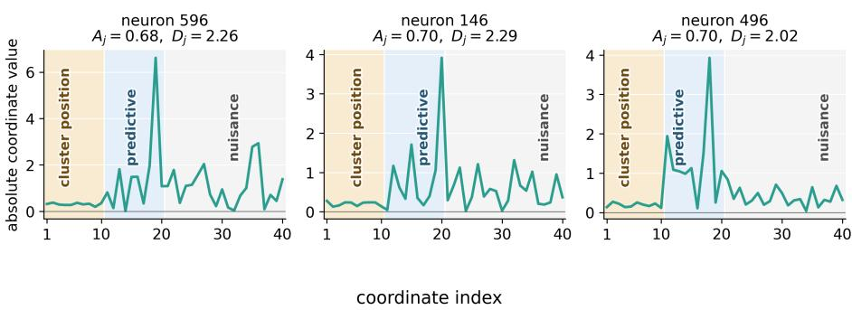  
Figure 5: Predictive-coordinate dominance complements cosine alignment. Coordinate-wise absolute weights of three active neurons. Each neuron has only moderate cosine alignment because its norm includes many smaller coeficients, but nevertheless exhibits a pronounced spike along one cluster-specific predictive direction $v _ { c }$ . These examples illustrate why predictive-coordinate dominance captures specialization that can be missed by a strict cosine threshold.

The first contains information identifying the cluster, while the second contains the cluster-specific predictive signal. We consider $K \in \{ 1 , 2 , 1 0 , 5 0 \}$ equally likely clusters.

For each $K ,$ , we construct well-separated cluster-center directions in $\mathbb { R } ^ { 1 0 }$ . We first draw

$$
L _ { K } = \operatorname* { m a x } \{ 2 0 , 0 0 0 , 5 0 0 K \}
$$

independent Gaussian vectors and normalize them to unit norm. We select the first direction uniformly from this collection and choose each subsequent direction to minimize its largest inner product with the directions already selected. This farthest-point procedure produces unit vectors

$$
\begin{array} { r l r l } & { s _ { 1 } , \ldots , s _ { K } \in \mathbb { S } ^ { 9 } , } & & { \mathbb { S } ^ { 9 } = \big \{ s \in \mathbb { R } ^ { 1 0 } : \| s \| _ { 2 } = 1 \big \} , } \end{array}
$$

with large pairwise separation. The candidate collection and selected directions are generated separately for each value of $K$

For $K > 1$ , define the largest pairwise similarity

$$
\rho _ { K } = \operatorname* { m a x } _ { c \neq c ^ { \prime } } s _ { c } ^ { \top } s _ { c ^ { \prime } } .
$$

We set $\rho _ { 1 } = 0$ . The center of cluster $c$ in the full ambient space is

$$
\mu _ { c } = \binom { s _ { c } } { 0 } \in \mathbb { R } ^ { 2 0 } , \qquad K > 1 .
$$

For $K = 1$ , we set $\mu _ { 1 } = 0$ , since no cluster identification is required.

The standard deviation of the noise in the cluster-identifying coordinates is

$$
\sigma _ { K } = \frac { 1 - \rho _ { K } } { 2 \gamma } , \qquad \gamma = 4 .\tag{3}
$$

Thus, the noise level is adjusted using the least-separated pair of cluster centers, maintaining clear cluster separation as K changes.

Each cluster also receives an independently and uniformly sampled unit direction in the predictive subspace,

$$
\widetilde { v } _ { c } \sim \mathrm { U n i f } ( \mathbb { S } ^ { 9 } ) .
$$

We embed this direction into the full ambient space by zero-padding the clusteridentifying coordinates:

$$
v _ { c } = \left[ \frac { 0 } { \widetilde { v } _ { c } } \right] \in \mathbb { R } ^ { 2 0 } .
$$

Thus, $v _ { c }$ lies entirely in $ { S _ { \mathrm { p r e d } } }$ , whereas $\mu _ { c }$ lies entirely in $S _ { \mathrm { c l u s t e r } } .$ . Consequently, the coordinates identifying the cluster are disjoint from those determining its response.

Input distribution. The cluster identity C is sampled uniformly:

$$
C \sim \operatorname { U n i f } \{ 1 , \ldots , K \} .
$$

Conditional on $C = c ,$ the input is

$$
x = \mu _ { c } + \left[ \begin{array} { c } { \sigma _ { K } z _ { \mathrm { c l u s t e r } } } \\ { z _ { \mathrm { p r e d } } } \end{array} \right] , \qquad z _ { \mathrm { c l u s t e r } } , z _ { \mathrm { p r e d } } \overset { \mathrm { i i d } } { \sim } \mathcal { N } ( 0 , I _ { 1 0 } ) .\tag{4}
$$

Equivalently, in the notation of Section 2,

$$
\begin{array} { r } { x \mid C = c \sim \mathcal { N } ( \mu _ { c } , \Sigma _ { c } ) , \qquad \Sigma _ { c } = \left( { \sigma } _ { K } ^ { 2 } I _ { 1 0 } \quad \begin{array} { c } { 0 } \\ { 0 } \end{array} \right) . } \end{array}
$$

In the finite datasets, the number of examples assigned to each cluster is equal whenever the sample size is divisible by K and otherwise difers by at most one.

Mixed local prediction rules. Each cluster receives a nonlinear link function independently and uniformly, with replacement, from

$$
\mathcal { G } = \left\{ t \mapsto \frac { t ^ { 2 } - 1 } { \sqrt { 2 } } , \quad t \mapsto \sin ( t ) , \quad t \mapsto \operatorname { t a n h } ( t ) \right\} .\tag{5}
$$

Sampling with replacement means that two clusters may receive the same link. For a sample from cluster $c ,$ the response is

$$
y = g _ { c } ( \langle x , v _ { c } \rangle ) + \varepsilon , \qquad \varepsilon \sim \mathcal { N } ( 0 , 0 . 0 2 ^ { 2 } ) .\tag{6}
$$

Since $v _ { c }$ is supported only on the predictive coordinates,

$$
\langle x , v _ { c } \rangle = \widetilde { v } _ { c } ^ { \top } z _ { \mathrm { p r e d } } .
$$

Thus, both the relevant predictive direction $v _ { c }$ and the nonlinear response function $g _ { c }$ may change across clusters.

Training and test sets. For each K and seed, we generate a training pool containing 200,000 examples. We use the nested training sizes

$$
n \in \{ 2 0 , 0 0 0 , \ 5 0 , 0 0 0 , \ 1 0 0 , 0 0 0 , \ 2 0 0 , 0 0 0 \} ,
$$

so that the dataset at a smaller value of n is contained in every larger training set. Each run uses a separate test set of 4,096 examples. All methods evaluated for the same $K , n ,$ and seed use exactly the same training and test examples.

We use five seeds indexed by $r \in \{ 0 , \ldots , 4 \}$ . For a fixed K, the cluster centers and predictive directions are shared across the five runs. The link assignments, training and test samples, label noise, and model initialization vary across runs. Specifically, the model and mixed-link seed is $1 0 0 0 + r ,$ , the training-pool seed is $1 2 3 4 5 + r .$ , and the test-set seed is $5 4 3 2 1 + r$ . We report the mean over these five runs, with shaded regions showing one empirical standard deviation.

MLP architectures and optimization. We evaluate one-hidden-layer ReLU, GELU, ReGLU, and SwiGLU networks, all with width 4,096. For ReLU and GELU, the hidden representation has the form

$$
h ( x ) = \phi ( W x + b ) .
$$

For the gated architectures, it has the form

$$
h ( x ) = \phi ( W _ { g } x + b _ { g } ) \odot ( W _ { v } x + b _ { v } ) ,
$$

where ϕ is ReLU for ReGLU and SiLU for SwiGLU. All hidden weights, readout weights, and biases are trainable.

We optimize the networks using Adam with batch size 4,096, cosine learningrate decay, and zero weight decay. The activation-specific schedules are

<table><tr><td>Activation</td><td>Learning-rate schedule</td></tr><tr><td>ReLU</td><td> $\overline { { 1 0 ^ { - 2 }  1 0 ^ { - 4 } } }$ </td></tr><tr><td>GELU</td><td> $3 \times 1 0 ^ { - 2 }  3 \times 1 0 ^ { - 4 }$ </td></tr><tr><td>ReGLU</td><td> $3 \times 1 0 ^ { - 3 } \to 3 \times 1 0 ^ { - 5 }$ </td></tr><tr><td>SwiGLU</td><td> $1 0 ^ { - 2 }  1 0 ^ { - 4 } .$ </td></tr></table>

Training continues for at least 20,000 updates and for at most 200,000 updates. After the minimum number of updates, optimization stops when either the training MSE reaches

$$
4 \times 1 0 ^ { - 4 } ,
$$

which equals the label-noise variance, or the training loss plateaus. The plateau rule stops after 60 consecutive evaluations, performed every 500 updates, without a relative training-MSE improvement of at least $5 \times 1 0 ^ { - 4 }$ . We restore the checkpoint attaining the lowest training MSE. Stopping and checkpoint selection use training MSE only and never use test performance.

Global Laplace and RFM. RFM uses the metric-dependent Laplace kernel

$$
k _ { t } ( x , x ^ { \prime } ) = \exp \left( - \frac { \| M _ { t } ^ { 1 / 2 } ( x - x ^ { \prime } ) \| _ { 2 } } { h _ { t } } \right) ,\tag{7}
$$

where $M _ { t }$ is the metric at RFM iteration t and $h _ { t }$ is the kernel bandwidth. The initial metric is

$$
M _ { 0 } = I _ { 2 0 } ,
$$

so iteration zero is the isotropic Laplace-kernel baseline.

For numerical stability across diferent values of K, the bandwidth is computed from within-cluster distances in the transformed space. We estimate a median pairwise distance separately within each cluster and take the median of these cluster-level values. The bandwidth is recomputed after every metric update.

This bandwidth calibration uses the cluster identities, but only to select one scalar bandwidth shared by the entire global kernel. The global Laplace and RFM predictors are still fit jointly to all training examples, do not use the cluster identities in their regression objective, and do not use them when making test predictions. Thus, they do not fit separate cluster-specific predictors.

After each kernel fit, RFM estimates the average gradient outer product

$$
\widehat { G } _ { t } = \frac { 1 } { m } \sum _ { i = 1 } ^ { m } \nabla \widehat { f } _ { t } ( x _ { i } ) \nabla \widehat { f } _ { t } ( x _ { i } ) ^ { \top }
$$

using at most $m \ : = \ : 2 0 , 0 0 0$ training examples. A normalized version of $\widehat { G } _ { t }$ becomes the metric for the next iteration. We perform three metric updates, producing iterations 0, 1, 2, 3.

Exact kernel solves are used for fewer than 11,000 training examples and include a ridge parameter of $1 0 ^ { - 6 }$ . Larger problems are solved using EigenPro [Ma et al., 2018, Ma and Belkin, 2019, Abedsoltan et al., 2023, 2025] without an explicit ridge penalty. EigenPro optimization stops upon reaching training $\mathrm { M S E } 4 \times 1 0 ^ { - 4 }$ or its optimization limit. Its efective regularization therefore arises primarily from early stopping.

The displayed global RFM curve reports the smallest test MSE among iterations 0:3. It is therefore an optimistic diagnostic envelope rather than a deployable iteration-selection procedure.

Per-cluster oracle methods. The per-cluster Laplace and RFM oracle meth ods are given the true cluster identity during both training and testing. They partition the training data by cluster, fit one independent predictor within each partition, and evaluate each test example using the predictor associated with its true cluster. The reported MSE is pooled across all test examples.

MLP (ReLU)MLP (ReGLU)Laplace (global)RFM (global)Bayes MSE MLP (GELU)MLP (SwiGLU) Laplace (oracle)- RFM (oracle)  
Increasing number of clusters  
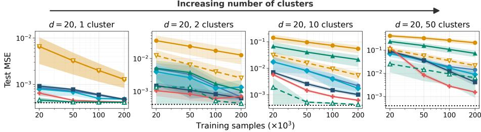  
Figure 6: MLPs jointly learn clustering and local predictive functions. Each cluster has its own predictive direction and independently receives, with replacement, the normalized quadratic, sine, or hyperbolic-tangent response function. Curves show the mean over five runs, with shaded regions indicating one standard deviation. At larger training sizes, ReGLU and especially SwiGLU generally improve over their corresponding standard activations for $K = 1 0$ and $K = 5 0$ . Dashed oracle methods are given the true cluster identity and fit an independent predictor within each cluster.

Iteration zero of each local RFM is the per-cluster Laplace oracle. Each local RFM subsequently performs three AGOP metric updates. For $K = 1$ , the global and per-cluster methods coincide.

These oracle methods are not fair predictive baselines because they receive the true cluster identities. Their purpose is to measure how easily the local prediction problems can be solved once cluster identification is provided. The ability of an MLP to approach these oracle methods without receiving the cluster identities provides evidence that it learns cluster identification and the corresponding local prediction rules jointly.

Bayes reference. The dotted reference line reports the test MSE of the Bayes predictor under the known data-generating distribution. It computes the posterior probability of each cluster given the input and averages the corresponding noiseless local predictions. Because the clusters have small but nonzero overlap, its realized test MSE can be slightly larger than the label-noise variance $0 . 0 2 ^ { 2 } = 4 \times 1 0 ^ { - 4 }$

Additional activations. Figure 6 compares all four MLP architectures on the same mixed-link datasets. The training and test examples, cluster geometry, link assignments, and random seeds are shared across activations for every K and n.

The advantage of multiplicative gating is most pronounced when many clusterdependent prediction rules must be learned. The improvement is not uniform in the smallest-data regime, but with suficient samples the gated architectures, particularly SwiGLU, obtain the lowest MLP errors for $K = 1 0$ and $K = 5 0$

## A.3 Additional Details for Trained MLPs Encode Cluster Structures

This appendix describes how we extract cluster gates from a trained ReLU MLP and reuse them to construct independent local Laplace and RFM predictors. The experiment uses the same mixed-link clustered distribution as Section 3.2.

Mixed-link clustered data. We decompose the ambient space into ten clusterposition coordinates and ten predictive coordinates,

$$
\mathbb { R } ^ { 2 0 } = S _ { \mathrm { g a t e } } \oplus S _ { \mathrm { p r e d } } .
$$

We consider $K \in \{ 2 , 5 , 1 0 , 5 0 \}$ equally represented clusters. Each cluster c has a unit cluster-position direction $s _ { c } \in \mathbb { S } ^ { 9 }$ and an independently generated unit predictive direction $v _ { c } \in \mathbb { S } ^ { 9 }$

The directions $s _ { c }$ are selected by farthest-point sampling from a large set of random unit vectors. Let

$$
\rho _ { K } = \operatorname* { m a x } _ { c \neq c ^ { \prime } } s _ { c } ^ { \top } s _ { c ^ { \prime } }
$$

be the largest pairwise inner product. We set the cluster-center radius to $R = 1$ and choose the standard deviation in the cluster-position coordinates as

$$
\sigma _ { K } = \frac { R ( 1 - \rho _ { K } ) } { 2 \gamma } , \qquad \gamma = 4 .
$$

Thus, the noise level adapts to the closest pair of cluster centers, keeping the clusters well separated as K changes.

For an example from cluster c, we sample

$$
z _ { \mathrm { g a t e } } , z _ { \mathrm { p r e d } } \overset { \mathrm { i i d } } { \sim } \mathcal { N } ( 0 , I _ { 1 0 } )
$$

and construct

$$
x = \left( R s _ { c } + \sigma _ { K } z _ { \mathrm { g a t e } } , z _ { \mathrm { p r e d } } \right) .\tag{8}
$$

The first ten coordinates therefore identify the cluster, while the last ten coordinates contain the variables used for prediction.

Each cluster independently receives a nonlinear response function $g _ { c } .$ , drawn uniformly from

$$
\mathcal { G } = \left\{ t \mapsto \frac { t ^ { 2 } - 1 } { \sqrt { 2 } } , \quad t \mapsto \sin ( t ) , \quad t \mapsto \operatorname { t a n h } ( t ) \right\} .\tag{9}
$$

The response is

$$
y = g _ { c } ( v _ { c } ^ { \top } z _ { \mathrm { p r e d } } ) + \varepsilon , \qquad \varepsilon \sim \mathcal { N } ( 0 , 0 . 0 2 ^ { 2 } ) .\tag{10}
$$

Consequently, both the predictive direction $v _ { c }$ and the nonlinear response function $g _ { c }$ may difer across clusters. The link functions are sampled independently, so a particular realization need not contain all three functions, especially when K is small.

Datasets and repetitions. For every K, we generate a balanced training pool containing 200,000 examples and use nested prefixes of sizes

$$
n \in \{ 2 0 , 0 0 0 , 5 0 , 0 0 0 , 1 0 0 , 0 0 0 , 2 0 0 , 0 0 0 \} .
$$

Evaluation uses an independently generated test set containing 4,096 examples. Within each run, exactly the same serialized training and test tensors are used by the MLP, global kernel methods, oracle methods, and MLP-gated methods.

Results are averaged over five seeds. For a fixed K, the cluster-position and predictive directions are held fixed, while each seed independently resamples the cluster-specific link assignments, training and test examples, label noise, and MLP initialization. No test labels are used to construct the gates.

Source ReLU MLP. For each K, sample size, and seed, we train a onehidden-layer ReLU network of width 4,096,

$$
\widehat { f } ( x ) = \sum _ { j = 1 } ^ { 4 0 9 6 } a _ { j } \operatorname { R e L U } ( w _ { j } ^ { \top } x + b _ { j } ) + b _ { \mathrm { o u t } } .
$$

All weights and biases are trainable. Optimization uses Adam with minibatches of size 4,096, zero weight decay, and cosine learning-rate decay from $1 0 ^ { - 2 }$ to $1 0 ^ { - 4 }$ Training runs for at least 20,000 steps and at most 200,000 steps. It terminates when the full training MSE reaches $4 \times 1 0 ^ { - 4 }$ , or when the training loss plateaus. We restore the checkpoint with the smallest full training MSE. Neither test MSE nor cluster identity is used for checkpoint selection.

Selecting active neurons. After training, we freeze the MLP. For neuron $j ,$ define its average output-weighted activation on the training set as

$$
m _ { j } = \frac { 1 } { n } \sum _ { i = 1 } ^ { n } | a _ { j } | \mathrm { \mathrm { ~ R e L U } } ( w _ { j } ^ { \top } x _ { i } + b _ { j } ) .\tag{11}
$$

We apply two-means clustering to $\{ \log _ { 1 0 } m _ { j } \} _ { j = 1 } ^ { 4 0 9 6 }$ and retain the group with the larger average contribution. The resulting active-neuron set is denoted by $\mathcal { T } .$ If fewer than K neurons are retained, we instead keep the K neurons with the largest $m _ { j }$

Contribution profiles and learned gates. For every training input $x ,$ we compute its normalized contribution profile over the active neurons:

$$
p _ { j } ( x ) = \frac { \vert a _ { j } \vert \mathrm { R e L U } ( w _ { j } ^ { \top } x + b _ { j } ) } { \displaystyle \sum _ { \ell \in \mathcal { I } } \vert a _ { \ell } \vert \mathrm { R e L U } ( w _ { \ell } ^ { \top } x + b _ { \ell } ) } , \qquad j \in \mathcal { I } .\tag{12}
$$

Thus $p ( x )$ describes which active first-layer neurons contribute to the MLP prediction on input $x ,$ independent of the overall magnitude of the prediction.

We apply K-means++ to the training contribution profiles and use $M = K$ learned gates. Knowledge of the number of clusters is therefore provided, but the true cluster assignments are never observed. We use eight initializations and at most 30 Lloyd iterations, retaining the solution with the smallest training inertia. Every training example is assigned to exactly one gate through its nearest centroid.

Let $q _ { c }$ denote the centroid of learned gate $c ,$ with coordinate $q _ { c j }$ corresponding to active neuron $j .$ Although examples receive hard gate assignments, the centroid coordinates provide a soft association between neurons and gates: the same neuron may contribute to several gates.

Constructing gate-specific features. For each learned gate $c ,$ we form the positive-semidefinite metric

$$
G _ { c } = \frac { \displaystyle \sum _ { j \in \mathcal { I } } q _ { c j } w _ { j } w _ { j } ^ { \top } } { \displaystyle \sum _ { j \in \mathcal { I } } q _ { c j } } .\tag{13}
$$

The corresponding gate-specific representation is

$$
z _ { c } ( x ) = G _ { c } ^ { 1 / 2 } x .\tag{14}
$$

The MLP biases afect the contribution profiles and hence the gate assignments, while $G _ { c }$ itself is constructed from the incoming first-layer weight directions.

For every learned gate, we project only the training examples assigned to that gate and fit an independent local Laplace or RFM predictor in the resulting representation.

## Test-time prediction. For a new test input $x ,$ we:

1. pass x through the frozen MLP and compute its contribution profile $p ( x )$ ;

2. assign x to the nearest fixed training centroid;

3. transform it using the corresponding representation $z _ { c } ( x ) = G _ { c } ^ { 1 / 2 } x ;$ and

4. evaluate the local predictor fitted for that learned gate.

The test input is therefore assigned using only its MLP contribution profile.   
Neither its response nor its true cluster identity is used.

Local Laplace and RFM predictors. The local Laplace predictor for gate c uses

$$
k _ { c } ( x , x ^ { \prime } ) = \exp \left( - \frac { \| G _ { c } ^ { 1 / 2 } ( x - x ^ { \prime } ) \| _ { 2 } } { h _ { c } } \right) ,
$$

where $h _ { c }$ is initialized using the median pairwise distance within that gate. We use ridge parameter $1 0 ^ { - 6 }$

The local RFM begins from this Laplace kernel and performs three metric updates, producing iterations 0, 1, 2, 3, where iteration 0 is the local Laplace predictor. After each update, the bandwidth is recomputed using distances under the updated metric. Kernel systems with fewer than 11,000 local training examples are solved directly; larger systems use EigenPro. The same procedure is used for the global and oracle RFM baselines.

## Compared methods. Figure 4 compares:

• the source ReLU MLP;

• one global Laplace predictor fitted to all training examples;

• one global RFM fitted to all training examples;

• MLP-gated local Laplace, using the gates and projections extracted from the ReLU MLP;

• MLP-gated local RFM, using the same extracted gates and projections;

• per-cluster Laplace (oracle), which is given the true cluster identities at training and test time;

• per-cluster RFM (oracle), defined analogously; and

• the irreducible noise level, whose expected MSE is $0 . 0 2 ^ { 2 } = 4 \times 1 0 ^ { - 4 }$

The oracle methods are diagnostic references rather than fair deployable predictors because they receive the true cluster identity. By contrast, the MLP-gated methods receive only the training input–response pairs and the known number K of gates.

Aggregation. Every curve in Figure 4 is the arithmetic mean over five independent runs. Each run uses a newly sampled dataset from the same generative model and an independently initialized MLP.

## B Proofs for Section 4

## B.1 Proof of Theorem 1

We first prove Theorem 1 invoking Lemmas 3 to 9, whose statements and proofs are provided after the main proof. A roadmap of their dependencies is shown in fig. 7.

Throughout this subsection, the normalized means and predictive directions

$$
{ \frac { \mu _ { 1 } } { R } } , \ldots , { \frac { \mu _ { K } } { R } } , v _ { 1 } , \ldots , v _ { K }
$$

form an orthonormal basis of $\mathbb { R } ^ { d }$ , where $d = 2 K$ . In the notation of Section $^ { 2 , }$ we may write

$$
c \sim \mathrm { U n i f } ( [ K ] ) , \qquad x = \mu _ { c } + z , \qquad z \sim \mathcal { N } ( 0 , I _ { d } ) ,
$$

and

$$
y = h _ { 3 } \big ( v _ { c } ^ { \top } z \big ) , \qquad h _ { 3 } ( t ) = \frac { t ^ { 3 } - 3 t } { \sqrt { 6 } } .
$$

For $\omega \in \mathbb { S } ^ { d - 1 }$ , define the weights’ correlations to the cluster means and predictive directions

$$
b _ { c } ( \omega ) = \langle \omega , \mu _ { c } \rangle , \qquad \rho _ { c } ( \omega ) = \langle \omega , v _ { c } \rangle .
$$

Write the ReLU activation function and the Gaussian p.d.f. as

$$
\phi ( t ) = t _ { + } , \qquad \varphi ( t ) = \frac { 1 } { \sqrt { 2 \pi } } e ^ { - t ^ { 2 } / 2 } ,
$$

and define the unsigned and signed population-correlation objectives, respectively, by

$$
\begin{array} { r } { \Phi ( \omega ) = \mathbb { E } \left[ y \phi ( \omega ^ { \top } x ) \right] , \qquad \Psi _ { \zeta } ( \omega ) = \zeta \Phi ( \omega ) , \qquad \zeta \in \{ \pm 1 \} . } \end{array}
$$

Proof of Theorem 1. For each initial direction $\omega _ { j } ^ { 0 }$ , let $( \bar { u } _ { j } , \bar { \omega } _ { j } )$ be the corresponding self-selected teacher-only trajectory from Lemma 7.

By Lemmas 7 and 5, almost surely there are a cluster label $J _ { j } \in [ K ]$ and an orientation $\tau _ { j } \in \{ \pm 1 \}$ such that

$$
\operatorname* { l i m } _ { t \to \infty } \| \bar { \omega } _ { j } ( t ) - \tau _ { j } v _ { J _ { j } } \| _ { 2 } \leq \frac { C } { R }
$$

for a universal constant $C .$

Since $m < \infty$ and every teacher-only direction converges, for every $\delta > 0$ there is a finite time $T _ { \delta }$ such that, simultaneously for all $j \in [ m ]$ 2

$$
\left\| \bar { \omega } _ { j } ( T _ { \delta } ) - \tau _ { j } v _ { J _ { j } } \right\| _ { 2 } \leq \frac { \delta } { 2 } + \frac { C } { R } .
$$

Apply Lemma 9 on $[ 0 , T _ { \delta } ]$ . For suficiently small $\varepsilon _ { i }$

$$
\left\| \frac { w _ { j } ( T _ { \delta } ) } { \| w _ { j } ( T _ { \delta } ) \| _ { 2 } } - \bar { \omega } _ { j } ( T _ { \delta } ) \right\| _ { 2 } \leq L _ { T _ { \delta } } m \varepsilon ^ { 2 } \leq \frac { \delta } { 2 }
$$

for every $j \in [ m ]$ ]. The triangle inequality therefore gives

$$
\left\| \frac { w _ { j } ( T _ { \delta } ) } { \| w _ { j } ( T _ { \delta } ) \| _ { 2 } } - \tau _ { j } v _ { J _ { j } } \right\| _ { 2 } \leq \delta + \frac { C } { R } .
$$

The independence and uniformity of the labels $J _ { 1 } , \ldots , J _ { m }$ , together with the cluster-coverage probability, follow from Lemma 8. □

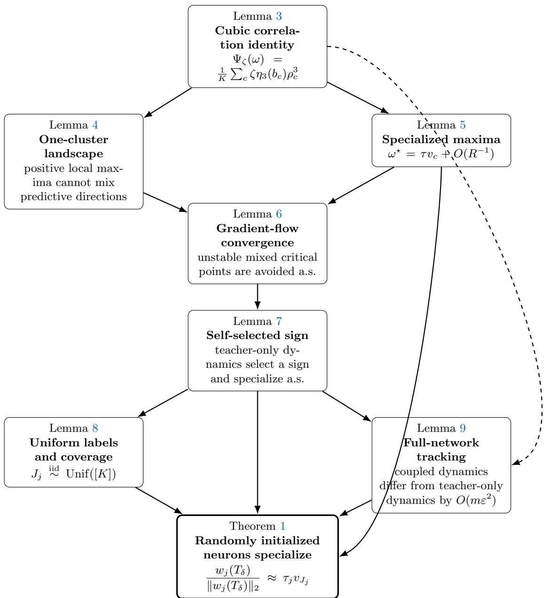  
Figure 7: Dependency graph for the proof of Theorem 1. Solid arrows indicate the main logical dependencies. The dashed arrow records that Lemma 3 is also used to establish smoothness of the teacher-only vector field in the tracking argument.

## B.1.1 The Population-correlation Landscape

In this subsection, we study the critical points of the optimization problem

$$
\operatorname* { m a x } _ { \omega \in \mathbb { S } ^ { d - 1 } } \Phi _ { \zeta } ( \omega ) .\tag{15}
$$

The use of homogeneity to characterize parameter directions is part of a broader literature on the implicit bias of gradient methods, beginning with homogeneous linear predictors and extending to homogeneous neural networks [Soudry et al., 2018, Ji and Telgarsky, 2019, Lyu and Li, 2020, Ji and Telgarsky, 2020]. These results motivate the directional viewpoint used here, but do not directly yield the squared-loss, small-initialization approximation in our setting; we establish the required approximation directly in Lemma 9. (In the subsequent section of the appendix, we will show how the sign ζ is determined for each neuron at very early times of training.) We show that the critical points of equation 15 are specialized to clusters of the data distribution.

First, we provide an explicit formula for the signed population-correlation objective in terms of a weight’s correlations with the cluster means and predictive directions. This lemma is stated for weights ω on the unit sphere, but is later applied to small weights ω because of the homogeneity of ReLU networks.

Lemma 3 (Cubic correlation identity). For every $\omega \in \mathbb { S } ^ { d - 1 }$ and $\zeta \in \{ \pm 1 \}$ ，

$$
\Psi _ { \zeta } ( \omega ) = - \frac { \zeta } { K \sqrt { 6 } } \sum _ { c = 1 } ^ { K } b _ { c } ( \omega ) \varphi \big ( b _ { c } ( \omega ) \big ) \rho _ { c } ( \omega ) ^ { 3 } .
$$

Proof. Fix $\omega \in \mathbb { S } ^ { d - 1 }$ . Conditional on $^ { c , }$

$$
\begin{array} { r } { \omega ^ { \top } x = b _ { c } ( \omega ) + \omega ^ { \top } z , \qquad y = h _ { 3 } \big ( v _ { c } ^ { \top } z \big ) . } \end{array}
$$

Hence the contribution of cluster c to $\Phi ( \omega ) = \mathbb { E } \left[ y \phi ( \omega ^ { \top } x ) \right]$ is

$$
\mathbb { E } \left[ h _ { 3 } \big ( v _ { c } ^ { \top } z \big ) \big ( b _ { c } ( \omega ) + \omega ^ { \top } z \big ) _ { + } \right] .
$$

Set

$$
U = v _ { c } ^ { \top } z , \qquad V = \omega ^ { \top } z , \qquad \rho = \rho _ { c } ( \omega ) = \langle v _ { c } , \omega \rangle .
$$

Since $z \sim \mathcal { N } ( 0 , I _ { d } )$ and $v _ { c } , \omega$ are unit vectors, U and V are standard Gaussian, and

$$
\mathbb { E } [ U V ] = v _ { c } ^ { \top } \mathbb { E } [ z z ^ { \top } ] \omega = \langle v _ { c } , \omega \rangle = \rho .
$$

Thus $( U , V )$ is a jointly standard Gaussian pair with correlation $\rho .$

For $| \rho | < 1$ , define

$$
Z : = \frac { U - \rho V } { \sqrt { 1 - \rho ^ { 2 } } } .
$$

Because $( U , V )$ is jointly Gaussian, $( Z , V )$ is also jointly Gaussian. Moreover,

$$
\mathbb { E } [ Z ] = 0 , \qquad \mathbb { E } [ Z ^ { 2 } ] = 1 ,
$$

and

$$
\mathbb { E } [ Z V ] = \frac { \mathbb { E } [ U V ] - \rho \mathbb { E } [ V ^ { 2 } ] } { \sqrt { 1 - \rho ^ { 2 } } } = 0 .
$$

Jointly Gaussian random variables with zero covariance are independent, so $Z \sim { \mathcal { N } } ( 0 , 1 )$ is independent of V. Therefore

$$
U = \rho V + \sqrt { 1 - \rho ^ { 2 } } Z .
$$

When $| \rho | = 1$ , the same representation holds with the second term equal to zero.

Conditioning on $V$ and using the independence of $Z$ gives

$$
\mathbb { E } [ U \mid V ] = \rho V
$$

and

$$
\begin{array} { r l } & { \mathbb { E } [ U ^ { 3 } \mid V ] = \mathbb { E } \left[ \left( \rho V + \sqrt { 1 - \rho ^ { 2 } } Z \right) ^ { 3 } \bigg | V \right] } \\ & { \qquad = \rho ^ { 3 } V ^ { 3 } + 3 \rho ( 1 - \rho ^ { 2 } ) V , } \end{array}
$$

since $\mathbb { E } [ Z ] = \mathbb { E } [ Z ^ { 3 } ] = 0$ and $\mathbb { E } [ Z ^ { 2 } ] = 1$ . Recalling that

$$
h _ { 3 } ( x ) = \frac { x ^ { 3 } - 3 x } { \sqrt { 6 } } ,
$$

we obtain

$$
\begin{array} { c l c r } { { \mathbb { E } [ h _ { 3 } ( U ) \mid V ] = \displaystyle \frac { 1 } { \sqrt { 6 } } \left( \mathbb { E } [ U ^ { 3 } \mid V ] - 3 \mathbb { E } [ U \mid V ] \right) } } \\ { { = \rho ^ { 3 } h _ { 3 } ( V ) . } } \end{array}
$$

Since $( b _ { c } ( \omega ) + V ) _ { \scriptscriptstyle + }$ + depends only on $V ,$ the tower property now gives

$$
\begin{array} { r l } & { \mathbb { E } \left[ h _ { 3 } ( U ) \big ( b _ { c } ( \omega ) + V \big ) _ { + } \right] } \\ & { \qquad = \mathbb { E } \left[ \big ( b _ { c } ( \omega ) + V \big ) _ { + } \mathbb { E } [ h _ { 3 } ( U ) \mid V ] \right] } \\ & { \qquad = \rho _ { c } ( \omega ) ^ { 3 } \mathbb { E } _ { G \sim \mathcal { N } ( 0 , 1 ) } \left[ h _ { 3 } ( G ) \big ( b _ { c } ( \omega ) + G \big ) _ { + } \right] . } \end{array}
$$

It remains to compute the one-dimensional expectation. For any $b \in \mathbb { R }$ ,

$$
\mathbb { E } \left[ h _ { 3 } ( G ) ( b + G ) _ { + } \right] = \frac { 1 } { \sqrt { 6 } } \int _ { - b } ^ { \infty } ( x ^ { 3 } - 3 x ) ( b + x ) \varphi ( x ) d x .
$$

Using

$$
\frac { d } { d x } \left[ ( x ^ { 2 } - 1 ) \varphi ( x ) \right] = - ( x ^ { 3 } - 3 x ) \varphi ( x ) ,
$$

integration by parts yields

$$
\int _ { - b } ^ { \infty } ( x ^ { 3 } - 3 x ) ( b + x ) \varphi ( x ) d x = \int _ { - b } ^ { \infty } ( x ^ { 2 } - 1 ) \varphi ( x ) d x ,
$$

where the boundary term vanishes because $b + x = 0$ at $x = - b$ and $\varphi ( { \boldsymbol { x } } ) \to 0$ as $x \to \infty$ . Since

$$
{ \frac { d } { d x } } { \big ( } x \varphi ( x ) { \big ) } = ( 1 - x ^ { 2 } ) \varphi ( x ) ,
$$

we further obtain

$$
\int _ { - b } ^ { \infty } ( x ^ { 2 } - 1 ) \varphi ( x ) d x = - b \varphi ( b ) .
$$

Therefore

$$
\mathbb { E } \left[ h _ { 3 } ( G ) ( b + G ) _ { + } \right] = - \frac { b \varphi ( b ) } { \sqrt { 6 } } .
$$

Applying this with $b = b _ { c } ( \omega )$ , the contribution of cluster c to $\Phi ( \omega )$ is

$$
- \frac { 1 } { \sqrt { 6 } } b _ { c } ( \omega ) \varphi \big ( b _ { c } ( \omega ) \big ) \rho _ { c } ( \omega ) ^ { 3 } .
$$

Since c is uniform on $[ K ]$

$$
\Phi ( \omega ) = - \frac { 1 } { K \sqrt { 6 } } \sum _ { c = 1 } ^ { K } b _ { c } ( \omega ) \varphi \big ( b _ { c } ( \omega ) \big ) \rho _ { c } ( \omega ) ^ { 3 } .
$$

Finally, $\Psi _ { \zeta } ( \omega ) = \zeta \Phi ( \omega )$ , and hence

$$
\Psi _ { \zeta } ( \omega ) = - \frac { \zeta } { K \sqrt { 6 } } \sum _ { c = 1 } ^ { K } b _ { c } ( \omega ) \varphi \big ( b _ { c } ( \omega ) \big ) \rho _ { c } ( \omega ) ^ { 3 } ,
$$

as claimed.

Because the $\mu _ { c } / R$ and $v _ { c }$ vectors form an orthonormal basis, the sphere constraint is

$$
\sum _ { c = 1 } ^ { K } \frac { b _ { c } ^ { 2 } } { R ^ { 2 } } + \sum _ { c = 1 } ^ { K } \rho _ { c } ^ { 2 } = 1 .
$$

Next, we consider the optimization problem of signed population-correlation maximization between the value of the neuron and the ground truth: $\operatorname* { m a x } _ { \omega \in \mathbb { S } ^ { d - 1 } } \Psi _ { \zeta } ( \omega )$ This is written and analyzed below under the linear change of coordinates

$$
b _ { c } = \langle \omega , \mu _ { c } \rangle , \qquad \rho _ { c } = \langle \omega , v _ { c } \rangle ,
$$

where we show that the neuron maximizes correlation with the target by specializing to one cluster. Here, we use the fact that the target is the cubic Hermite polynomial. (A similar argument would hold for all higher-degree Hermite polynomials as well.)

Lemma 4 (Positive local maxima use one cluster). Consider the constrained maximization problem

$$
\operatorname* { m a x } _ { \substack { b _ { 1 } , \ldots , b _ { K } , \rho _ { 1 } , \ldots , \rho _ { K } } } F ( b _ { 1 } , \ldots , b _ { K } , \rho _ { 1 } , \ldots , \rho _ { K } ) ,
$$

where

$$
F ( b _ { 1 } , \dots , b _ { K } , \rho _ { 1 } , \dots , \rho _ { K } ) : = - \frac { \zeta } { K \sqrt { 6 } } \sum _ { c = 1 } ^ { K } b _ { c } \varphi ( b _ { c } ) \rho _ { c } ^ { 3 } ,
$$

subject to

$$
\sum _ { c = 1 } ^ { K } \frac { b _ { c } ^ { 2 } } { R ^ { 2 } } + \sum _ { c = 1 } ^ { K } \rho _ { c } ^ { 2 } = 1 .
$$

Every constrained local maximum of F with positive objective value has exactly one nonzero predictive coordinate $\rho _ { c } .$ Moreover, if $\rho _ { c } = 0$ , then the corresponding routing coordinate $b _ { c }$ also vanishes.

Proof. At a constrained local maximum, first-order stationarity of the Lagrangian

$$
F ( b _ { 1 } , \dots , b _ { K } , \rho _ { 1 } , \dots , \rho _ { K } ) - \lambda \left( \sum _ { c = 1 } ^ { K } \frac { b _ { c } ^ { 2 } } { R ^ { 2 } } + \sum _ { c = 1 } ^ { K } \rho _ { c } ^ { 2 } - 1 \right)
$$

with respect to $b _ { c }$ and $\rho _ { c }$ gives, for every $c \in [ K ]$

$$
- \frac { \zeta } { K \sqrt { 6 } } ( 1 - b _ { c } ^ { 2 } ) \varphi ( b _ { c } ) \rho _ { c } ^ { 3 } = \frac { 2 \lambda } { R ^ { 2 } } b _ { c } ,\tag{B.1}
$$

$$
- \frac { 3 \zeta } { K \sqrt { 6 } } b _ { c } \varphi ( b _ { c } ) \rho _ { c } ^ { 2 } = 2 \lambda \rho _ { c } .\tag{B.2}
$$

Here we used

$$
{ \frac { d } { d b } } { \big ( } b \varphi ( b ) { \big ) } = ( 1 - b ^ { 2 } ) \varphi ( b ) .
$$

Multiplying equation B.2 by $\rho _ { c }$ and summing over c gives

$$
3 F ( b _ { 1 } , \dots , b _ { K } , \rho _ { 1 } , \dots , \rho _ { K } ) = 2 \lambda \sum _ { c = 1 } ^ { K } \rho _ { c } ^ { 2 } .
$$

Since the objective value is positive, at least one predictive coordinate is nonzero. Hence both the left-hand side and $\textstyle \sum _ { c } \rho _ { c } ^ { 2 }$ are positive, so

$$
\lambda > 0 .
$$

If $\rho _ { c } = 0$ , then equation B.1 reduces to

$$
0 = \frac { 2 \lambda } { R ^ { 2 } } b _ { c } .
$$

Since $\lambda > 0$ , this implies $b _ { c } = 0$

It remains to rule out two nonzero predictive coordinates. Suppose that $\rho _ { c } \neq 0$ and $\rho _ { r } \neq 0$ for two distinct clusters $c \neq r$ . Keep all routing coordinates and all other predictive coordinates fixed, and consider

$$
\rho _ { c } ( t ) = \mathrm { s i g n } ( \rho _ { c } ) \sqrt { \rho _ { c } ^ { 2 } + t } , \qquad \rho _ { r } ( t ) = \mathrm { s i g n } ( \rho _ { r } ) \sqrt { \rho _ { r } ^ { 2 } - t } .
$$

For suficiently small |t|, this perturbation is well defined, preserves the signs of the two coordinates, and satisfies

$$
\rho _ { c } ( t ) ^ { 2 } + \rho _ { r } ( t ) ^ { 2 } = \rho _ { c } ^ { 2 } + \rho _ { r } ^ { 2 } .
$$

Thus it preserves the constraint exactly.

Diferentiating F along this feasible curve at $t = 0$ gives

$$
F ^ { \prime } ( 0 ) = - \frac { 3 \zeta } { 2 K \sqrt { 6 } } \left( b _ { c } \varphi ( b _ { c } ) \rho _ { c } - b _ { r } \varphi ( b _ { r } ) \rho _ { r } \right) .
$$

Since $\rho _ { c } , \rho _ { r } \neq 0$ , dividing equation B.2 by the corresponding predictive coordinate gives

$$
- \frac { 3 \zeta } { K \sqrt { 6 } } b _ { c } \varphi ( b _ { c } ) \rho _ { c } = 2 \lambda , \qquad - \frac { 3 \zeta } { K \sqrt { 6 } } b _ { r } \varphi ( b _ { r } ) \rho _ { r } = 2 \lambda .
$$

Therefore

$$
F ^ { \prime } ( 0 ) = 0 .
$$

The second derivative along the same feasible curve is

$$
F ^ { \prime \prime } ( 0 ) = - \frac { 3 \zeta } { 4 K \sqrt { 6 } } \left( \frac { b _ { c } \varphi ( b _ { c } ) } { \rho _ { c } } + \frac { b _ { r } \varphi ( b _ { r } ) } { \rho _ { r } } \right) .
$$

Using the same KKT identities gives

$$
F ^ { \prime \prime } ( 0 ) = \frac { \lambda } { 2 } \left( \frac { 1 } { \rho _ { c } ^ { 2 } } + \frac { 1 } { \rho _ { r } ^ { 2 } } \right) > 0 .
$$

Thus a critical point with two nonzero predictive coordinates has a feasible direction of positive curvature and cannot be a constrained local maximum.

Hence at most one predictive coordinate is nonzero. Since the objective value is positive, at least one is nonzero, so exactly one is active. As shown above, every routing coordinate corresponding to an inactive predictive coordinate also vanishes. □

Returning to our objective ma $\mathbf { \Delta } _ { \mathrm { X } _ { \omega \in \mathbb { S } ^ { d - 1 } } } \Psi _ { \zeta } ( \omega )$ , let c denote the unique active cluster and let

$$
\tau = \mathrm { s i g n } ( \rho _ { c } ) \in \{ \pm 1 \} .
$$

Then

$$
b _ { j } = \rho _ { j } = 0 \qquad { \mathrm { f o r ~ e v e r y ~ } } j \neq c ,
$$

and the constraint becomes

$$
\frac { b _ { c } ^ { 2 } } { R ^ { 2 } } + \rho _ { c } ^ { 2 } = 1 .
$$

Hence

$$
\rho _ { c } = \tau \sqrt { 1 - \frac { b _ { c } ^ { 2 } } { R ^ { 2 } } } .
$$

Substituting this into $F ,$ , and writing $b = b _ { c } .$ , reduces the problem to the onedimensional objective

$$
- \frac { \tau \zeta } { K \sqrt { 6 } } b \varphi ( b ) \left( 1 - \frac { b ^ { 2 } } { R ^ { 2 } } \right) ^ { 3 / 2 } , \qquad | b | < R .
$$

Let c be the unique active cluster and let

$$
\tau = \mathrm { s i g n } ( \rho _ { c } ) \in \{ \pm 1 \} .
$$

Then

$$
b _ { j } = \rho _ { j } = 0 \qquad { \mathrm { f o r ~ e v e r y ~ } } j \neq c ,
$$

and

$$
\rho _ { c } = \tau \sqrt { 1 - \frac { b _ { c } ^ { 2 } } { R ^ { 2 } } } .
$$

Writing $b = b _ { c } .$ , the remaining one-dimensional objective is

$$
- \frac { \tau \zeta } { K \sqrt { 6 } } b \varphi ( b ) \left( 1 - \frac { b ^ { 2 } } { R ^ { 2 } } \right) ^ { 3 / 2 } , \qquad | b | < R .
$$

Lemma 5 (Specialized maxima). Fix $c \in [ K ]$ and $\zeta , \tau \in \{ \pm 1 \}$ . On the onecluster feasible branch, write

$$
f ( b ) : = - \frac { \tau \zeta } { K \sqrt { 6 } } b \varphi ( b ) \left( 1 - \frac { b ^ { 2 } } { R ^ { 2 } } \right) ^ { 3 / 2 } , \qquad | b | < R ,
$$

and let

$$
I : = \{ b \in ( - R , R ) : f ( b ) > 0 \} .
$$

Then I is a connected open interval. For all suficiently large $R , f$ has a unique critical point $b ^ { \star } \in I$ , which is a strict local maximum and satisfies

$$
b ^ { \star } = - \tau \zeta + O ( R ^ { - 2 } ) .
$$

The corresponding direction

$$
\omega ^ { \star } = \tau \sqrt { 1 - \frac { ( b ^ { \star } ) ^ { 2 } } { R ^ { 2 } } } v _ { c } + \frac { b ^ { \star } } { R ^ { 2 } } \mu _ { c }
$$

is a strict local maximum of $\Psi _ { \zeta }$ and obeys

$$
\omega ^ { \star } = \tau v _ { c } - \frac { \tau \zeta } { R ^ { 2 } } \mu _ { c } + O ( R ^ { - 2 } ) .
$$

Proof. For every $b \in ( - R , R )$

$$
\frac { 1 } { K \sqrt { 6 } } > 0 , \qquad \varphi ( b ) > 0 , \qquad \left( 1 - \frac { b ^ { 2 } } { R ^ { 2 } } \right) ^ { 3 / 2 } > 0 .
$$

Hence the sign of $f ( b )$ is determined entirely by $- \tau \zeta b \colon$

$$
f ( b ) > 0 \quad \Longleftrightarrow \quad - \tau \zeta b > 0 .
$$

Since $\tau \zeta \in \{ \pm 1 \}$ , it follows that

$$
I = \left\{ \begin{array} { l l } { { ( - R , 0 ) , } } & { { \tau \zeta = 1 , } } \\ { { ( 0 , R ) , } } & { { \tau \zeta = - 1 . } } \end{array} \right.
$$

Thus I is connected.

For $b \in I .$ , set

$$
t = - \tau \zeta b .
$$

The preceding characterization of I shows that this is a bijective linear change of variable from I onto $( 0 , R )$ . Since $\varphi$ is even and $( \tau \zeta ) ^ { 2 } = 1$ , we obtain

$$
f ( b ) = \frac { 1 } { K \sqrt { 6 } } t \varphi ( t ) \left( 1 - \frac { t ^ { 2 } } { R ^ { 2 } } \right) ^ { 3 / 2 } .
$$

Therefore the critical points of $f$ on I correspond exactly to the critical points on $( 0 , R )$ of

$$
t \longmapsto t \varphi ( t ) \left( 1 - \frac { t ^ { 2 } } { R ^ { 2 } } \right) ^ { 3 / 2 } .
$$

This function is strictly positive on $( 0 , R )$ , so its critical points can be found from its logarithmic derivative:

$$
{ \frac { d } { d t } } \log \left[ t \varphi ( t ) \left( 1 - { \frac { t ^ { 2 } } { R ^ { 2 } } } \right) ^ { 3 / 2 } \right] = { \frac { 1 } { t } } - t - { \frac { 3 t } { R ^ { 2 } - t ^ { 2 } } } .
$$

Thus a critical point satisfies

$$
{ \frac { 1 } { t } } - t - { \frac { 3 t } { R ^ { 2 } - t ^ { 2 } } } = 0 .
$$

Multiplying by $t ( R ^ { 2 } - t ^ { 2 } )$ gives

$$
t ^ { 4 } - ( R ^ { 2 } + 4 ) t ^ { 2 } + R ^ { 2 } = 0 .
$$

Solving this quadratic equation in $t ^ { 2 }$ gives

$$
t ^ { 2 } = \frac { R ^ { 2 } + 4 \pm \sqrt { R ^ { 4 } + 4 R ^ { 2 } + 1 6 } } { 2 } .
$$

The root with the plus sign is larger than $R ^ { 2 }$ , whereas the root with the minus sign lies in $( 0 , R ^ { 2 } )$ . Hence there is exactly one critical point in $( 0 , R )$ , and it satisfies

$$
t ^ { 2 } = \frac { R ^ { 2 } + 4 - \sqrt { R ^ { 4 } + 4 R ^ { 2 } + 1 6 } } { 2 } = 1 + O ( R ^ { - 2 } ) .
$$

Since $t > 0$

$$
t = 1 + O ( R ^ { - 2 } ) .
$$

Returning to $b = - \tau \zeta t$ gives

$$
b ^ { \star } = - \tau \zeta + O ( R ^ { - 2 } ) .
$$

The function

$$
t \varphi ( t ) \left( 1 - \frac { t ^ { 2 } } { R ^ { 2 } } \right) ^ { 3 / 2 }
$$

is positive on $( 0 , R )$ and tends to zero as $t  0$ or $t  R$ . Since it has exactly one critical point in $( 0 , R )$ , this point is its unique strict maximum. Hence $b ^ { \star }$ is the unique maximizer of $f$ on $I .$

It remains to show that the corresponding point is a local maximum of the full constrained objective F. Since the feasible set is compact, $F$ attains a global maximum. The point constructed above has positive objective value, so the global maximum is positive. By Lemma 4, every global maximizer must have exactly one nonzero predictive coordinate and therefore lies on one of the one-cluster feasible branches.

For every choice of the active cluster c and orientation $\tau ,$ the change of variable

$$
t = - \tau \zeta b
$$

reduces the positive part of the corresponding one-cluster objective to

$$
\frac { 1 } { K \sqrt { 6 } } t \varphi ( t ) \left( 1 - \frac { t ^ { 2 } } { R ^ { 2 } } \right) ^ { 3 / 2 } .
$$

Thus all one-cluster branches have the same maximal value, attained uniquely at the point identified above. Consequently, every corresponding $\omega ^ { \star }$ is a global maximizer of $\Psi _ { \zeta }$

There are only finitely many such maximizers, one for each $c \in [ K ]$ and $\tau \in$ $\{ \pm 1 \}$ . Hence each is isolated, and therefore each $\omega ^ { \star }$ is a strict local maximum of $\Psi _ { \zeta }$

## B.1.2 Random Initialization, Self-selected Signs, and Cluster Coverage

In the previous section, we considered the signed population-correlation objective $\Phi _ { \zeta }$ for each neuron. In this section, we note that the sign $\zeta$ for each neuron is learned at very early times of training, and does not need to be fixed. Consider the teacher-only joint dynamics

$$
\dot { u } = \Phi ( \omega ) , \qquad \dot { \omega } = \operatorname { t a n h } ( u ) \nabla _ { \mathbb { S } ^ { d - 1 } } \Phi ( \omega ) .\tag{16}
$$

These equations arise from the two-layer parameterization when the second-layer weight is initially zero. Crucially, they neglect interactions between neurons, which we will later show is a fine approximation because the network is small at initialization.

Lemma 6 (Positive signed-correlation flows specialize). Let $\omega ^ { 0 }$ have an absolutely continuous distribution on $\mathbb { S } ^ { d - 1 } , \mathrm { ~ } f x \mathrm { ~ } \zeta \in \{ \pm 1 \}$ , and assume $\Psi _ { \zeta } ( \omega ^ { 0 } ) > 0$ For all suficiently large $R ,$ spherical gradient ascent

$$
\begin{array} { r } { \dot { \boldsymbol \omega } = \nabla _ { \mathbb S ^ { d - 1 } } \Psi _ { \zeta } ( \boldsymbol \omega ) , ~ \boldsymbol \omega ( 0 ) = \boldsymbol \omega ^ { 0 } , } \end{array}
$$

converges almost surely to one of the specialized maxima in Lemma ${ 5 . }$

Proof. Along spherical gradient ascent,

$$
\frac { d } { d t } \Psi _ { \zeta } ( \omega ( t ) ) = \| \nabla _ { \mathbb { S } ^ { d - 1 } } \Psi _ { \zeta } ( \omega ( t ) ) \| _ { 2 } ^ { 2 } \geq 0 .
$$

Since the sphere is compact, $\Psi _ { \zeta }$ is bounded above. Hence

$$
\int _ { 0 } ^ { \infty } \left\| \nabla _ { \mathbb { S } ^ { d - 1 } } \Psi _ { \zeta } ( \omega ( t ) ) \right\| _ { 2 } ^ { 2 } d t < \infty .
$$

Moreover, $\Psi _ { \zeta }$ is smooth on the sphere, so its gradient and Hessian are bounded. It follows that $\lVert \nabla _ { \mathbb { S } ^ { d - 1 } } \Psi _ { \zeta } ( \omega ( t ) ) \rVert _ { 2 } ^ { 2 }$ has bounded derivative. A nonnegative integrable function with bounded derivative must converge to zero, and therefore

$$
\begin{array} { r } { \| \nabla _ { \mathbb { S } ^ { d - 1 } } \Psi _ { \zeta } ( \omega ( t ) ) \| _ { 2 } \longrightarrow 0 . } \end{array}
$$

We next note that $\Psi _ { \zeta }$ has only finitely many positive critical points. Indeed, at any positive critical point, the stationarity conditions equation B.1–equation B.2 imply that $\lambda > 0$ , and hence $b _ { c } = 0$ whenever $\rho _ { c } = 0$ . For every active coordinate $\rho _ { c } \neq 0$ , eliminating λ from the two stationarity equations gives

$$
( 1 - b _ { c } ^ { 2 } ) \rho _ { c } ^ { 2 } = \frac { 3 b _ { c } ^ { 2 } } { R ^ { 2 } } .
$$

Thus $0 < | b _ { c } | < 1$ and

$$
\rho _ { c } ^ { 2 } = \frac { 3 b _ { c } ^ { 2 } } { R ^ { 2 } ( 1 - b _ { c } ^ { 2 } ) } .
$$

Equation B.2 further shows that

$$
| b _ { c } | \varphi ( b _ { c } ) | \rho _ { c } |
$$

has the same value for every active coordinate. Substituting the preceding expression for $\rho _ { c } ^ { 2 }$ , this quantity is proportional to

$$
\frac { | b _ { c } | ^ { 2 } \varphi ( | b _ { c } | ) } { \sqrt { 1 - | b _ { c } | ^ { 2 } } } ,
$$

which is strictly increasing for $0 < | b _ { c } | < 1$ , since

$$
{ \frac { d } { d t } } \log \left( { \frac { t ^ { 2 } \varphi ( t ) } { \sqrt { 1 - t ^ { 2 } } } } \right) = { \frac { 2 } { t } } + { \frac { t ^ { 3 } } { 1 - t ^ { 2 } } } > 0 .
$$

Hence all active $\left| b _ { c } \right|$ are equal. If there are s active coordinates, the sphere constraint then gives

$$
s \ : \frac { b _ { c } ^ { 2 } ( 4 - b _ { c } ^ { 2 } ) } { R ^ { 2 } ( 1 - b _ { c } ^ { 2 } ) } = 1 ,
$$

which has a unique solution for $b _ { c } ^ { 2 } \in ( 0 , 1 )$ . Thus, for each choice of the active coordinates and their signs, there is at most one positive critical point. Since there are only finitely many such choices, the set of positive critical points is finite.

Because $\Psi _ { \zeta } ( \omega ( 0 ) ) > 0$ and the objective is nondecreasing, every accumulation point of the trajectory has positive objective value. By compactness, accumulation points exist, and the convergence of the gradient to zero implies that every accumulation point is a positive critical point. Since there are only finitely many such points, the trajectory must converge to one of them.

Finally, the argument in Lemma 4 gives an unstable tangent direction at every positive critical point with more than one active predictive coordinate. Since there are only finitely many such critical points, the center-stable manifold theorem implies that the set of initial conditions converging to any of them has measure zero. Lemma 5 shows that the remaining positive critical points are precisely the specialized maxima. Hence an absolutely continuous initialization converges almost surely to a specialized maximum. □

For a single neuron, write

$$
\omega ( t ) = \frac { w ( t ) } { \| w ( t ) \| _ { 2 } } .
$$

ReLU homogeneity implies that gradient flow preserves

$$
\| w ( t ) \| _ { 2 } ^ { 2 } - a ( t ) ^ { 2 } = \| w ( 0 ) \| _ { 2 } ^ { 2 } - a ( 0 ) ^ { 2 } = \varepsilon ^ { 2 } .
$$

We therefore define the scalar amplitude coordinate

$$
u ( t ) : = \mathrm { a r s i n h } \bigg ( \frac { a ( t ) } { \varepsilon } \bigg ) ,
$$

so that, equivalently,

$$
a ( t ) = \varepsilon \sinh u ( t ) , \qquad \| w ( t ) \| _ { 2 } = \varepsilon \cosh u ( t ) .
$$

Under this parametrization, the target-only part of the directional dynamics is

$$
\dot { u } = \Phi ( \omega ) , \qquad \dot { \omega } = \operatorname { t a n h } ( u ) \nabla _ { \mathbb { S } ^ { d - 1 } } \Phi ( \omega ) .\tag{17}
$$

Lemma 7 (Self-selected sign and almost-sure specialization). Let $\omega ^ { 0 }$ have an absolutely continuous distribution on $\mathbb { S } ^ { d - 1 }$ , and let $( u ( t ) , \omega ( t ) )$ ) solve equation 17 with

$$
u ( 0 ) = 0 , \qquad \omega ( 0 ) = \omega ^ { 0 } .
$$

For almost every $\omega ^ { 0 }$ , define

$$
\zeta = \operatorname { s i g n } ( \Phi ( \omega ^ { 0 } ) ) \in \{ \pm 1 \} .
$$

Then, for every $t > 0$

$$
\zeta u ( t ) > 0 , \qquad \zeta \Phi ( \omega ( t ) ) \geq | \Phi ( \omega ^ { 0 } ) | .
$$

Moreover, $\omega ( t )$ is a positive time reparameterization of spherical gradient ascent on $\Psi _ { \zeta } = \zeta \Phi$ , and, for all suficiently large R, it converges almost surely to one of the specialized maxima in Lemma 5.

Proof. Since Φ is real analytic and not identically zero, its zero set has spherical measure zero. Thus, for almost every $\omega ^ { 0 } , \Phi ( \omega ^ { 0 } ) \neq 0$ . Fix such a $\omega ^ { 0 }$ and let

$$
\zeta = \mathrm { s i g n } ( \Phi ( \omega ^ { 0 } ) ) .
$$

$$
\mathrm { A t                      t } = 0 ,
$$

$$
\frac { d } { d t } \big ( \zeta u ( t ) \big ) \bigg | _ { t = 0 } = \zeta \Phi ( \omega ^ { 0 } ) = | \Phi ( \omega ^ { 0 } ) | > 0 ,
$$

so $\zeta u ( t ) > 0$ for all suficiently small $t > 0$

As long as $\zeta u ( t ) > 0$ , tanh(u(t)) has sign $\zeta ,$ and hence

$$
\zeta \operatorname { t a n h } ( u ( t ) ) = | \operatorname { t a n h } ( u ( t ) ) | .
$$

Therefore

$$
\frac { d } { d t } \big ( \zeta \Phi ( \omega ( t ) ) \big ) = | \operatorname { t a n h } ( u ( t ) ) | \| \nabla _ { \mathbb { S } ^ { d - 1 } } \Phi ( \omega ( t ) ) \| _ { 2 } ^ { 2 } \geq 0 .
$$

It follows that

$$
\zeta \Phi ( \omega ( t ) ) \geq \zeta \Phi ( \omega ^ { 0 } ) = | \Phi ( \omega ^ { 0 } ) | .
$$

Consequently,

$$
\frac { d } { d t } \big ( \zeta u ( t ) \big ) = \zeta \Phi ( \omega ( t ) ) \geq | \Phi ( \omega ^ { 0 } ) | ,
$$

and therefore

$$
\zeta u ( t ) \geq | \Phi ( \omega ^ { 0 } ) | t .
$$

In particular, $\zeta u ( t )$ cannot return to zero, so the preceding inequalities hold for every $t > 0$ . This proves

$$
\zeta u ( t ) > 0 , \qquad \zeta \Phi ( \omega ( t ) ) \geq | \Phi ( \omega ^ { 0 } ) | .
$$

Since $\Psi _ { \zeta } = \zeta \Phi$ and tanh(u(t)) has sign ζ, the directional dynamics satisfy

$$
\begin{array} { r } { \dot { \omega } ( t ) = | \operatorname { t a n h } ( u ( t ) ) | \nabla _ { \mathbb { S } ^ { d - 1 } } \Psi _ { \zeta } ( \omega ( t ) ) . } \end{array}
$$

Thus $\omega ( t )$ follows the same orbit as spherical gradient ascent on $\Psi _ { \zeta } ,$ up to a positive reparameterization of time. Moreover, $\zeta u ( t ) \geq | \Phi ( \omega ^ { 0 } ) |$ t implies $| u ( t ) | \to$ $\infty$ , and hence $\vert \operatorname { t a n h } ( u ( t ) ) \vert  1$ . In particular,

$$
\int _ { 0 } ^ { \infty } | \operatorname { t a n h } ( u ( t ) ) | d t = \infty ,
$$

so this reparameterization covers the entire forward gradient-ascent trajectory. Finally,

$$
\begin{array} { r } { \Psi _ { \zeta } ( \omega ^ { 0 } ) = \zeta \Phi ( \omega ^ { 0 } ) = | \Phi ( \omega ^ { 0 } ) | > 0 . } \end{array}
$$

Lemma 6 therefore implies that $\omega ( t )$ converges almost surely to one of the specialized maxima in Lemma 5. □

Lemma 8 (Uniform selected labels and coverage). Let $\omega _ { 1 } ^ { 0 } , \ldots , \omega _ { m } ^ { 0 }$ be independent and uniform on $\mathbb { S } ^ { d - 1 }$ , and let $J _ { j }$ be the cluster selected by the self-selected flow in Lemma 7. Then $J _ { 1 } , \ldots , J _ { m }$ are independent and uniform on $[ K ]$ . Consequently,

$$
\mathbb { P } \big ( \{ J _ { 1 } , \dots , J _ { m } \} \neq [ K ] \big ) \le K \left( 1 - \frac { 1 } { K } \right) ^ { m } \le K e ^ { - m / K } .
$$

Proof. For a permutation π of [K], let $P _ { \pi }$ be the orthogonal map satisfying

$$
P _ { \pi } \frac { \mu _ { c } } { R } = \frac { \mu _ { \pi ( c ) } } { R } , \qquad P _ { \pi } v _ { c } = v _ { \pi ( c ) } .
$$

The data distribution, target, and self-selected vector field are equivariant under $P _ { \pi }$ Hence, if $\omega ^ { 0 }$ selects cluster $c ,$ then $P _ { \pi } \omega ^ { 0 }$ selects cluster $\pi ( c )$ . Uniform spherical measure is invariant under $P _ { \pi } { \mathrm { : } }$ , so all selection probabilities are equal. By Lemma 7, they sum to one, and each is therefore $1 / K$ . Independence follows because each teacher-only label is a deterministic function of an independent initial direction.

A fixed cluster is missed with probability $( 1 - 1 / K ) ^ { m }$ . A union bound yields the coverage estimate. □

## B.1.3 Tracking by the Full Small-initialization Dynamics

Finally, we put the above ingredients analyzing the trajectories of individual neurons together, and show that they describe the trajectory of the neurons in a neural network (up to rescaling) when the network is initialized small. The proof strategy of studying feature learning through efectively independent neuron dynamics in early-time or small-initialization regimes has been put forward in prior work [Abbe et al., 2022, Min et al., 2024, Glasgow, 2024]. The population loss is

$$
\mathcal { L } ( \theta ) = \frac { 1 } { 2 } \mathbb { E } \left[ \left( f _ { \theta } ( x ) - y \right) ^ { 2 } \right] ,
$$

and its gradient-flow equations are

$$
\begin{array} { r l } & { \dot { a } _ { j } = \mathbb E \left[ ( y - f _ { \theta } ( x ) ) \phi ( w _ { j } ^ { \top } x ) \right] , } \\ & { \dot { w } _ { j } = a _ { j } \mathbb E \left[ ( y - f _ { \theta } ( x ) ) \mathbf { 1 } _ { \{ w _ { j } ^ { \top } x > 0 \} } x \right] . } \end{array}
$$

Lemma 9 (Early-time tracking from a zero output layer). Initialize

$$
a _ { j } ( 0 ) = 0 , \qquad w _ { j } ( 0 ) = \varepsilon \omega _ { j } ^ { 0 } , \qquad \omega _ { j } ^ { 0 } \in \mathbb { S } ^ { d - 1 } .
$$

Let $( \bar { u } _ { j } , \bar { \omega } _ { j } )$ solve the self-selected teacher-only system

$$
\dot { \bar { u } } _ { j } = \Phi ( \bar { \omega } _ { j } ) , \qquad \dot { \bar { \omega } } _ { j } = \operatorname { t a n h } ( \bar { u } _ { j } ) \nabla _ { \mathbb { S } ^ { d - 1 } } \Phi ( \bar { \omega } _ { j } ) ,
$$

with

$$
( \bar { u } _ { j } ( 0 ) , \bar { \omega } _ { j } ( 0 ) ) = ( 0 , \omega _ { j } ^ { 0 } ) .
$$

For every fixed $T < \infty$ , there are constants $L _ { T } < \infty$ and $\varepsilon _ { T } > 0$ such that, for $0 < \varepsilon \le \varepsilon _ { T }$

$$
\operatorname* { s u p } _ { 0 \leq t \leq T } \left( | u _ { j } ( t ) - \bar { u } _ { j } ( t ) | + \| \omega _ { j } ( t ) - \bar { \omega } _ { j } ( t ) \| _ { 2 } \right) \leq L _ { T } m \varepsilon ^ { 2 } ,
$$

where

$$
a _ { j } ( t ) = \varepsilon \sinh ( u _ { j } ( t ) ) , \qquad \omega _ { j } ( t ) = \frac { w _ { j } ( t ) } { \| w _ { j } ( t ) \| _ { 2 } } .
$$

Proof. ReLU homogeneity gives the invariant

$$
\frac { d } { d t } \left( \| w _ { j } \| _ { 2 } ^ { 2 } - a _ { j } ^ { 2 } \right) = 0 .
$$

Under the stated initialization,

$$
\| w _ { j } ( t ) \| _ { 2 } ^ { 2 } - a _ { j } ( t ) ^ { 2 } = \varepsilon ^ { 2 } .
$$

Since $a _ { j } = \varepsilon$ sinh $u _ { j }$ , it follows that

$$
\| w _ { j } \| _ { 2 } = \varepsilon \cosh u _ { j } .
$$

Substituting

$$
w _ { j } = \varepsilon \cosh ( u _ { j } ) \omega _ { j }
$$

into the gradient-flow equations and using ReLU homogeneity gives

$$
\begin{array} { r l } & { \dot { u } _ { j } = \Phi ( \omega _ { j } ) - \mathbb { E } \left[ f _ { \theta } ( x ) \phi ( \omega _ { j } ^ { \top } x ) \right] , } \\ & { \dot { \omega } _ { j } = \operatorname { t a n h } ( u _ { j } ) \Bigg ( \nabla _ { \mathbb { S } ^ { d - 1 } } \Phi ( \omega _ { j } ) } \\ & { \qquad - \left( I - \omega _ { j } \omega _ { j } ^ { \top } \right) \mathbb { E } \left[ f _ { \theta } ( x ) \mathbf { 1 } _ { \{ \omega _ { j } ^ { \top } x > 0 \} } x \right] \Bigg ) . } \end{array}
$$

Lemma 3 shows that the teacher-only vector field is smooth on bounded uintervals and on the sphere. On every fixed interval $[ 0 , T ]$ , the quantities $u _ { j } ( t )$ remain uniformly bounded for suficiently small ε. Consequently, there is a constant $C _ { T } < \infty$ such that

$$
| a _ { j } ( t ) | + \| w _ { j } ( t ) \| _ { 2 } \leq C _ { T } \varepsilon , \qquad 0 \leq t \leq T .
$$

Since x has finite moments of every order,

$$
\| f _ { \theta } ( t ) \| _ { L ^ { 2 } ( P _ { x } ) } \leq C _ { T } \sum _ { j = 1 } ^ { m } | a _ { j } ( t ) | \| w _ { j } ( t ) \| _ { 2 } \leq C _ { T } m \varepsilon ^ { 2 } .
$$

Cauchy–Schwarz therefore bounds both interaction terms in the $( u _ { j } , \omega _ { j } )$ equations by $C _ { T } m \varepsilon ^ { 2 }$

The full and teacher-only systems have the same initial conditions, and their vector fields are Lipschitz on the relevant compact set. Gr¨onwall’s inequality yields

$$
\operatorname* { s u p } _ { 0 \leq t \leq T } \left( | u _ { j } ( t ) - \bar { u } _ { j } ( t ) | + \| \omega _ { j } ( t ) - \bar { \omega } _ { j } ( t ) \| _ { 2 } \right) \leq L _ { T } m \varepsilon ^ { 2 } .
$$

Perturbations of the pure cubic target. The pure Hermite target isolates the specialization mechanism and makes the population-correlation landscape exact. However, we could consider perturbations of this objective and expect similar specialization results. Indeed, specialized maxima and their attraction basins should persist under perturbations whose induced population-correlation objective is suficiently small near the specialized maxima and the strict-saddle regions induced by the cubic Hermite part of the target.

## B.2 Proof of Theorem 2

We prove a slightly stronger, parameterized version of the main-text result. Throughout this subsection, $d = 2 K$ and $R \geq 1$ is fixed. We use the means $\mu _ { c } =$

$[ R e _ { c } ; 0 ]$ , predictive directions $v _ { c } = [ 0 ; e _ { c } ]$ , and covariance $\Sigma _ { c } = \mathrm { d i a g } ( 0 _ { K \times K } , I _ { K } )$ The setting in Theorem 2 is the special case $R = 1$ . Equivalently,

$$
c \sim \operatorname { U n i f } ( [ K ] ) , \qquad x = \mu _ { c } + \left[ \begin{array} { l l l } { 0 } \\ { z } \end{array} \right] , \qquad z \sim \mathcal { N } ( 0 , I _ { K } ) ,
$$

and the regression function is

$$
f ^ { \star } ( x ) : = \mathbb { E } [ y \mid x ] = g { \big ( } \langle x , v _ { c } \rangle { \big ) } , \qquad g ( t ) = t _ { + } - ( t - 1 ) _ { + } .
$$

## B.2.1 Exact MLP Representation and Generalization

For a two-layer $\mathrm { R e L U }$ network, define the path norm

$$
\| f \| _ { \mathcal { P } } = \operatorname* { i n f } \left\{ \sum _ { j } | a _ { j } | \| w _ { j } \| _ { 2 } : f ( x ) = \sum _ { j } a _ { j } \phi ( w _ { j } ^ { \top } x ) \right\} .
$$

For the parameterization $\theta = ( ( a _ { j } , w _ { j } ) ) _ { j = 1 } ^ { m }$ , define

$$
\| \theta \| _ { \mathrm { F } } ^ { 2 } : = \frac { 1 } { 2 } \sum _ { j = 1 } ^ { m } \left( a _ { j } ^ { 2 } + \| w _ { j } \| _ { 2 } ^ { 2 } \right) ,
$$

and, for $B > 0$ , let $\mathcal { F } _ { B }$ be the class of two-layer ReLU networks admitting a parameterization with $\begin{array} { r } { \| \theta \| _ { \mathrm { F } } ^ { 2 } \le B } \end{array}$ . Define clip(t) = min{1, max{0, t}}.

Lemma 10 (Exact specialized MLP). On the support of the data distribution,

$$
F ( x ) = \sum _ { c = 1 } ^ { K } \left[ \phi { \left( v _ { c } ^ { \top } x \right) } - \phi \left( { \left( v _ { c } - \frac { \mu _ { c } } { R ^ { 2 } } \right) } ^ { \top } x \right) \right]
$$

equals $f ^ { \star } ( x )$ exactly. Moreover,

$$
\| F \| _ { \mathcal { P } } \leq B _ { R } : = K \left( 1 + \sqrt { 1 + R ^ { - 2 } } \right) .
$$

It also admits a parameterization satisfying $\| \theta \| _ { \mathrm { F } } ^ { 2 } \le B _ { R }$

Proof. Suppose x belongs to cluster r. Orthogonality gives

$$
v _ { c } ^ { \top } x = e _ { c } ^ { \top } z , \qquad { \frac { \mu _ { c } ^ { \top } x } { R ^ { 2 } } } = { \bf 1 } _ { \{ c = r \} } .
$$

For $c \neq r ,$ the two ReLUs in the cth pair therefore cancel. The pair with $c = r$ equals

$$
\phi ( e _ { r } ^ { \top } z ) - \phi ( e _ { r } ^ { \top } z - 1 ) = g ( e _ { r } ^ { \top } z ) .
$$

Thus $F = f ^ { \star }$

The two hidden weights for cluster c are $v _ { c }$ and $v _ { c } - R ^ { - 2 } \mu _ { c }$ , with output weights +1 and −1. Their norms are 1 and $\sqrt { 1 + R ^ { - 2 } }$ , respectively. Summing over clusters gives the path-norm bound.

Finally, positive homogeneity allows each neuron to be rescaled without changing its realized function so that $| a _ { j } | = \| w _ { j } \| _ { 2 }$ . For this balanced parameterization,

$$
\frac { 1 } { 2 } \sum _ { j } \left( a _ { j } ^ { 2 } + \| w _ { j } \| _ { 2 } ^ { 2 } \right) = \sum _ { j } | a _ { j } | \| w _ { j } \| _ { 2 } \leq B _ { R } .
$$

The following bound is the two-layer path-norm specialization of norm-based capacity and Rademacher-complexity results for neural networks [Neyshabur et al., 2015, Bach, 2017, Golowich et al., 2018]; the conversion from Rademacher complexity to a risk bound follows the standard framework of Bartlett and Mendelson [2002].

Lemma 11 (Path-norm Rademacher bound). For any deterministic sample $x _ { 1 } , \ldots , x _ { n } \in \mathbb { R } ^ { d }$

$$
\widehat { \mathfrak { R } } _ { n } ( \mathcal { F } _ { B } ) \leq \frac { 2 B } { n } \left( \sum _ { i = 1 } ^ { n } \| x _ { i } \| _ { 2 } ^ { 2 } \right) ^ { 1 / 2 } .
$$

Consequently, for any $B \geq B _ { R } , \ i f \ \widehat { f } _ { \mathrm { M L P } }$ is an empirical squared-loss minimizer over clip $\circ { \mathcal { F } } _ { B }$ , then

$$
\mathbb { E } \left[ \Vert \widehat { f } _ { \mathrm { M L P } } - f ^ { \star } \Vert _ { L ^ { 2 } ( P _ { x } ) } ^ { 2 } \right] \leq 1 6 B \sqrt { \frac { K + R ^ { 2 } } { n } } .
$$

Proof. By the arithmetic–geometric mean inequality, every $f \in \mathcal { F } _ { B }$ has path norm at most B. By positive homogeneity, every $f \in \mathcal { F } _ { B }$ can therefore be represented as

$$
f ( \boldsymbol { x } ) = \sum _ { j } c _ { j } \phi ( \boldsymbol { \omega } _ { j } ^ { \top } \boldsymbol { x } ) , \qquad \| \boldsymbol { \omega } _ { j } \| _ { 2 } = 1 , \qquad \sum _ { j } | c _ { j } | \leq B .
$$

The class $\mathcal { F } _ { B }$ is therefore contained in B times the absolutely convex hull of unit-norm ReLU atoms. The contraction inequality and Cauchy–Schwarz give

$$
\begin{array} { r l } & { \widehat { \mathfrak { N } } _ { n } ( { \mathcal F } _ { B } ) \leq \displaystyle \frac { B } { n } \mathbb E _ { \epsilon } \ \displaystyle \operatorname* { s u p } _ { \| | \omega | | _ { 2 } \leq 1 } \left| \sum _ { i = 1 } ^ { n } \epsilon _ { i } \phi ( \omega ^ { \top } x _ { i } ) \right| } \\ & { \qquad \leq \displaystyle \frac { 2 B } { n } \mathbb E _ { \epsilon } \left\| \sum _ { i = 1 } ^ { n } \epsilon _ { i } x _ { i } \right\| _ { 2 } } \\ & { \qquad \leq \displaystyle \frac { 2 B } { n } \left( \sum _ { i = 1 } ^ { n } \| x _ { i } \| _ { 2 } ^ { 2 } \right) ^ { 1 / 2 } . } \end{array}
$$

Clipping does not increase Rademacher complexity. Since both the target and clipped predictions lie in $[ 0 , 1 ]$ , squared loss is 2-Lipschitz in the prediction. Because $f ^ { \star } \in$ clip $\circ \mathcal { F } _ { B }$ whenever $B \geq B _ { R } .$ standard ERM symmetrization and contraction applied to the class used by the estimator imply

$$
\mathbb { E } \left[ \Vert \widehat { f } _ { \mathrm { M L P } } - f ^ { \star } \Vert _ { L ^ { 2 } ( P _ { x } ) } ^ { 2 } \right] \leq 8 \mathfrak { R } _ { n } ( \mathcal { F } _ { B } ) .
$$

Finally, $\mathbb { E } \| x \| _ { 2 } ^ { 2 } = R ^ { 2 } + K$ , and Jensen’s inequality yields the stated result.

## B.2.2 The Ground-truth AGOP Removes the Routing Block

Define the ground-truth population AGOP across all input coordinates by

$$
M : = \mathbb { E } \left[ \nabla _ { x } f ^ { \star } ( x ) \nabla _ { x } f ^ { \star } ( x ) ^ { \top } \right] .
$$

Lemma 12 (The AGOP kernel loses the cluster identity). Let $\begin{array} { r } { P _ { V } : = \sum _ { c = 1 } ^ { K } v _ { c } v _ { c } ^ { \top } } \end{array}$ be the orthogonal projector onto the predictive subspace, let $G \sim \mathcal { N } ( 0 , 1 )$ , and set $\alpha : = \mathbb { E } [ g ^ { \prime } ( G ) ^ { 2 } ] = \mathbb { P } ( 0 < G < 1 ) > 0$ . Then

$$
M = { \frac { \alpha } { K } } P _ { V } .
$$

Moreover, every measurable function h of Mx satisfies

$$
\mathbb { E } \left[ \left( h ( { \sqrt { M } } x ) - f ^ { \star } ( x ) \right) ^ { 2 } \right] \geq \left( 1 - { \frac { 1 } { K } } \right) { \mathrm { V a r } } ( g ( G ) ) .
$$

Proof. On the support of cluster $c ,$ the regression function is $f ^ { \star } ( x ) = g ( \langle x , v _ { c } \rangle )$ and hence, almost everywhere,

$$
\nabla _ { x } f ^ { \star } ( x ) = g ^ { \prime } ( \langle x , v _ { c } \rangle ) v _ { c } .
$$

Averaging the corresponding outer product over the input and the uniform cluster index gives

$$
M = \frac { 1 } { K } \sum _ { c = 1 } ^ { K } \mathbb { E } \left[ g ^ { \prime } ( \langle x , v _ { c } \rangle ) ^ { 2 } \mid c \right] v _ { c } v _ { c } ^ { \top } = \frac { \alpha } { K } \sum _ { c = 1 } ^ { K } v _ { c } v _ { c } ^ { \top } = \frac { \alpha } { K } P _ { V } .
$$

Therefore $\sqrt { M } = \sqrt { \alpha / K } P _ { V }$ . In particular, $\sqrt { M } x$ contains the predictive coordinates $S _ { j } : = \langle \dot { x , } v _ { j } \rangle , j \in [ K ]$ , but none of the routing coordinates. Under the data distribution, $S = ( { \bar { S } } _ { 1 } , \bar { \ } . \ . \ , S _ { K } ) \sim { \mathcal N } ( 0 , I _ { K } )$ and is independent of the uniform cluster index $c ,$ while $f ^ { \star } ( x ) = g ( S _ { c } )$ . Thus, conditional on $\sqrt { M } x$

$$
\mathbb { E } [ f ^ { \star } ( x ) \mid \sqrt { M } x ] = \frac { 1 } { K } \sum _ { j = 1 } ^ { K } g ( S _ { j } ) .
$$

The conditional-expectation characterization of squared-loss regression implies that every $h ( \sqrt { M } x )$ has risk at least

$$
\begin{array} { r l } { \mathbb { E } \Big [ \mathrm { V a r } \big ( f ^ { \star } ( x ) \mid \sqrt { M } x \big ) \Big ] } & { = \mathbb { E } \left[ \displaystyle \frac { 1 } { K } \sum _ { j = 1 } ^ { K } g ( S _ { j } ) ^ { 2 } - \left( \displaystyle \frac { 1 } { K } \sum _ { j = 1 } ^ { K } g ( S _ { j } ) \right) ^ { 2 } \right] } \\ & { \quad \quad \quad = \left( 1 - \displaystyle \frac { 1 } { K } \right) \mathrm { V a r } ( g ( G ) ) . } \end{array}
$$

## B.2.3 An All-orders Lower Bound for Kernel Methods and Regularized RFM

We next study the full family in Training Setup 3. Let $P _ { R } : = I _ { d } - P _ { V }$ denote the projector onto the routing subspace. By Lemma 12,

$$
M _ { \rho } = \rho P _ { R } + \left( \rho + \frac { \alpha } { K } \right) P _ { V } .
$$

Thus both the standard metric $I _ { d }$ and the regularized RFM metric $M _ { \rho }$ commute with every rotation of the predictive subspace. The lower bound below is uniform over $\rho \geq 0$ , applies to any rotationally invariant base kernel $\kappa .$ , and is independent of the empirical ridge parameter. This rotational-invariance obstruction is closely related to prior lower bounds for kernel methods in high dimensions [Ghorbani et al., 2020a].

Let $\mathrm { H e } _ { r }$ denote the probabilists’ Hermite polynomial and $h _ { r } = \mathrm { H e } _ { r } / \sqrt { r ! }$ its normalized version. Write

$$
g ( t ) = \sum _ { r = 0 } ^ { \infty } \widehat { g } _ { r } h _ { r } ( t ) , \qquad \widehat { g } _ { r } = \mathbb { E } [ g ( G ) h _ { r } ( G ) ] .
$$

Lemma 13 (Hermite coeficients of the clipped ramp). For every $r \geq 2$

$$
\widehat { g } _ { r } = \frac { \varphi ( 0 ) \mathrm { H e } _ { r - 2 } ( 0 ) - \varphi ( 1 ) \mathrm { H e } _ { r - 2 } ( 1 ) } { \sqrt { r ! } } .
$$

In particular, the sequence $( \widehat { g } _ { r } ) _ { r \geq 2 }$ is not eventually zero, and therefore

$$
\sum _ { r > r _ { 0 } } \widehat { g } _ { r } ^ { 2 } > 0 \qquad f o r \ e v e r y \ f i n i t e \ r _ { 0 } .
$$

Proof. For $a \in \mathbb { R }$ and $r \geq 2$ , the identity

$$
{ \frac { d } { d x } } { \big ( } \mathrm { H e } _ { r - 1 } ( x ) \varphi ( x ) { \big ) } = - \mathrm { H e } _ { r } ( x ) \varphi ( x )
$$

gives, by integration by parts,

$$
\begin{array} { r l } { \mathbb { E } \left[ \mathrm { H e } _ { r } ( G ) ( G - a ) _ { + } \right] = \displaystyle \int _ { a } ^ { \infty } \mathrm { H e } _ { r } ( x ) ( x - a ) \varphi ( x ) d x } & { } \\ { = \displaystyle \int _ { a } ^ { \infty } \mathrm { H e } _ { r - 1 } ( x ) \varphi ( x ) d x } & { } \\ { = \varphi ( a ) \mathrm { H e } _ { r - 2 } ( a ) . } \end{array}
$$

Apply this identity at $a = 0$ and $a = 1$ and divide by $\sqrt { r ! }$

To show that the coeficients are not eventually zero, define

$$
a _ { m } = \varphi ( 0 ) \mathrm { H e } _ { m } ( 0 ) - \varphi ( 1 ) \mathrm { H e } _ { m } ( 1 ) .
$$

The Hermite generating function gives

$$
\sum _ { m = 0 } ^ { \infty } a _ { m } \frac { t ^ { m } } { m ! } = e ^ { - t ^ { 2 } / 2 } ( \varphi ( 0 ) - \varphi ( 1 ) e ^ { t } ) .
$$

The right-hand side is not a polynomial, so $\left( a _ { m } \right)$ is not eventually zero. The same is true of $( \widehat { g } _ { r } ) _ { r \geq 2 }$ . Parseval’s identity then shows that every finite Hermite tail has strictly positive squared mass. □

For $r \geq 2$ , let $\mathcal { V } _ { r , K }$ be the traceless order-r Gaussian-chaos space. Equivalently, under the standard isometry between the rth Gaussian chaos and symmetric order-r tensors, $\mathcal { V } _ { r , K }$ corresponds to the kernel of the tensor trace map. It is the irreducible $O ( K )$ representation of harmonic degree-r polynomials.

Lemma 14 (Harmonic dimension and directional energy). The dimension of $\mathcal { V } _ { r , K }$ is

$$
H _ { r , K } = \binom { K + r - 1 } { r } - \binom { K + r - 3 } { r - 2 } .
$$

Let $P _ { r , K }$ be orthogonal projection onto $\mathcal { V } _ { r , K }$ . For every unit vector $q \in \mathbb { R } ^ { K }$

$$
\begin{array} { r } { \left\| P _ { r , K } h _ { r } ( \boldsymbol { q } ^ { \top } \boldsymbol { z } ) \right\| _ { L ^ { 2 } } ^ { 2 } = \alpha _ { r , K } , } \end{array}
$$

where, writing $r = 2 n$ m or $r = 2 m + 1$ ，

$$
\alpha _ { 2 m , K } = \prod _ { j = 0 } ^ { m - 1 } \frac { K + 2 j - 1 } { K + 2 m + 2 j - 2 } ,
$$

and

$$
\alpha _ { 2 m + 1 , K } = \prod _ { j = 0 } ^ { m - 1 } \frac { K + 2 j - 1 } { K + 2 m + 2 j } .
$$

For every fixed r, $H _ { r , K } = \Theta _ { r } ( K ^ { r } )$ and $\alpha _ { r , K }  1$ as $K  \infty$

Proof. The dimension of symmetric order-r tensors is $\binom { K + r - 1 } { r }$ . The trace map onto symmetric order- $( r - 2 )$ tensors is surjective, and its kernel is the traceless subspace. This gives the stated dimension.

Under the Gaussian-chaos/tensor isometry, $h _ { r } ( q ^ { \top } z )$ corresponds to $q ^ { \otimes r }$ . By rotational invariance, take $q = e _ { 1 }$ . The orthogonal projection of the homogeneous polynomial $\boldsymbol { x } _ { 1 } ^ { r }$ onto harmonic degree $r$ is

$$
\mathcal { H } _ { r } [ x _ { 1 } ^ { r } ] = \sum _ { j = 0 } ^ { \lfloor r / 2 \rfloor } \frac { ( - 1 ) ^ { j } \Gamma ( r - j + K / 2 - 1 ) } { 4 ^ { j } j ! \Gamma ( r + K / 2 - 1 ) } \| x \| ^ { 2 j } \Delta ^ { j } x _ { 1 } ^ { r } .
$$

Since

$$
\Delta ^ { j } x _ { 1 } ^ { r } = \frac { r ! } { ( r - 2 j ) ! } x _ { 1 } ^ { r - 2 j } ,
$$

the coeficient of $\boldsymbol { x } _ { 1 } ^ { r }$ in this harmonic projection is

$$
\sum _ { j = 0 } ^ { \lfloor r / 2 \rfloor } \frac { ( - 1 ) ^ { j } r ! \Gamma ( r - j + K / 2 - 1 ) } { 4 ^ { j } j ! ( r - 2 j ) ! \Gamma ( r + K / 2 - 1 ) } .
$$

In the symmetric-tensor inner product, this coeficient equals $\langle e _ { 1 } ^ { \otimes r } , P _ { r , K } e _ { 1 } ^ { \otimes r } \rangle$ , which equals the squared norm of the projection. Simplifying the finite sum gives the two product formulas displayed above. The asymptotic statements follow immediately from those formulas and the dimension expression. □

Lemma 15 (Invariant random-subspace bound). Let V be a D-dimensional $i r \mathrm { - }$ reducible orthogonal representation $o f$ a compact group. Let $S \subseteq V$ be a random subspace with invariant law and dim $S \leq N$ almost surely. Then, for every fixed $v \in V$ 2

$$
\mathbb { E } \operatorname { d i s t } ( v , S ) ^ { 2 } \geq \left( 1 - \frac { N } { D } \right) _ { + } \Vert v \Vert _ { 2 } ^ { 2 } .
$$

Proof. Let $\Pi _ { S }$ be orthogonal projection onto $S .$ . Invariance implies that $\mathbb { E } \Pi _ { S }$ commutes with the group action. Schur’s lemma gives $\mathbb { E } \Pi _ { S } = \beta I _ { V }$ . Taking traces yields $\beta D = \mathbb { E }$ dim $S \leq N$ . Therefore

$$
\mathbb { E } \mathrm { d i s t } ( v , S ) ^ { 2 } = \| v \| _ { 2 } ^ { 2 } - \mathbb { E } \| \Pi _ { S } v \| _ { 2 } ^ { 2 } = ( 1 - \beta ) \| v \| _ { 2 } ^ { 2 } \geq \left( 1 - \frac { N } { D } \right) _ { + } \| v \| _ { 2 } ^ { 2 } .
$$

Lemma 16 (All-orders lower bound for regularized AGOP kernels). For every rotationally invariant kernel $\kappa _ { \mathrm { { s } } }$ , every sample size $n _ { \colon }$ , every $\rho \geq 0$ , and every empirical ridge parameter $\lambda _ { n } \geq 0$ , both estimators from Training Setup 3 satisfy

$$
\mathbb { E } \left[ \Vert \widehat { f } - f ^ { \star } \Vert _ { L ^ { 2 } ( P _ { x } ) } ^ { 2 } \right] \geq \sum _ { r = 2 } ^ { \infty } \widehat { g } _ { r } ^ { 2 } \alpha _ { r , K } \left( 1 - \frac { n } { H _ { r , K } } \right) _ { + } , \qquad \widehat { f } \in \left\{ \widehat { f } _ { \mathrm { K e r n e l } } , \widehat { f } _ { \mathrm { R F M } } \right\} .
$$

Proof. Let $A \ = \ I _ { d }$ for $\widehat { f } _ { \mathrm { K e r n e l } }$ and $A \ = \ M _ { \rho }$ for $\widehat { f } _ { \mathrm { R F M } }$ . By the representer theorem, for a fixed training sample the predictor belongs to the span of the n transformed-kernel sections centered at the training inputs. For a test point in cluster $^ { c , }$ restrict these sections to that cluster’s support and write them as functions of its predictive argument $\xi \in \mathbb { R } ^ { K }$ :

$$
\psi _ { c , i } ^ { A } ( \xi ) : = \mathcal { K } \bigg ( \sqrt { A } x _ { i } , \sqrt { A } \left( \mu _ { c } + \left[ \begin{array} { l } { 0 } \\ { \xi } \end{array} \right] \right) \bigg ) , \qquad 1 \leq i \leq n .
$$

At Hermite order $r \geq 2$ , define

$$
S _ { c , r } : = \mathrm { s p a n } \left\{ P _ { r , K } \psi _ { c , i } ^ { A } : 1 \leq i \leq n \right\} \subseteq \mathcal { V } _ { r , K } .
$$

Then dim $S _ { c , r } \leq n$ . The predictive coordinates of the training inputs are standard Gaussian, A commutes with predictive rotations, and K is rotationally invariant. Hence the law of $S _ { c , r }$ is invariant under the $O ( K )$ action on $\mathcal { V } _ { r , K }$ for both estimators and every $\rho \geq 0$

The order-r target component in cluster c is

$$
\gamma _ { c , r } = \widehat { g } _ { r } P _ { r , K } h _ { r } ( e _ { c } ^ { \top } \xi ) ,
$$

whose squared norm is $\widehat { g } _ { r } ^ { 2 } \alpha _ { r , K }$ by Lemma 14. The projected predictor lies in $S _ { c , r }$ . Since distinct Gaussian-chaos orders are orthogonal, for every finite $L _ { : }$

$$
\| \widehat { f } _ { c } - g ( e _ { c } ^ { \top } ) \| _ { L ^ { 2 } } ^ { 2 } \geq \sum _ { r = 2 } ^ { L } \mathrm { d i s t } ( \gamma _ { c , r } , S _ { c , r } ) ^ { 2 } .
$$

Apply Lemma 15 and then let $L  \infty$ by monotone convergence. This gives, for every cluster $c ,$

$$
\mathbb { E } \left[ \Vert \widehat { f } _ { c } - g ( e _ { c } ^ { \top } ) \Vert _ { L ^ { 2 } } ^ { 2 } \right] \geq \sum _ { r = 2 } ^ { \infty } \widehat { g } _ { r } ^ { 2 } \alpha _ { r , K } \left( 1 - \frac { n } { H _ { r , K } } \right) _ { + } .
$$

Averaging over the uniform test cluster proves the result.

Lemma 17 (Polynomial sample budgets leave a nonzero kernel/RFM error). Fix $A < \infty$ , let $n _ { K } = O ( K ^ { A } )$ , and let $\rho _ { K } \geq 0$ be any sequence. Then, for each $\widehat { f } \in \{ \widehat { f } _ { \mathrm { K e r n e l } } , \widehat { f } _ { \mathrm { R F M } } \}$

$$
\operatorname* { l i m } _ { K \to \infty } \operatorname* { i n f } _ { \mathbf { \ell } } \mathbb { E } \left[ \| \widehat { f } - f ^ { \star } \| _ { L ^ { 2 } ( P _ { x } ) } ^ { 2 } \right] \geq \sum _ { \stackrel { r \geq 2 } { r > A } } \widehat { g } _ { r } ^ { 2 } > 0 .
$$

Proof. Fix an order $r > A$ . By Lemma 14, $H _ { r , K } = \Theta _ { r } ( K ^ { r } )$ and $\alpha _ { r , K }  1$ , so

$$
\frac { n _ { K } } { H _ { r , K } } \longrightarrow 0 .
$$

Apply Lemma 16. For any finite collection of orders satisfying $r > A$ , each corresponding summand converges to $\widehat { g } _ { r } ^ { 2 }$ . Taking the lower limit and then increasing the finite collection gives, by monotone convergence,

$$
\operatorname* { l i m } _ { K \to \infty } \mathbb { E } \left[ \big \| \widehat { f } - f ^ { \star } \big \| _ { L ^ { 2 } ( P _ { x } ) } ^ { 2 } \right] \geq \sum _ { \stackrel { r \geq 2 } { r > A } } \widehat { g } _ { r } ^ { 2 } .
$$

The right-hand side is strictly positive by Lemma 13.

Proof of Theorem 2. Under Data Setting 2, the parameterized construction above specializes to $R = 1$ . Lemma 10 then represents $f ^ { \star }$ exactly with width $2 K$ and Frobenius budget

$$
B _ { 1 } = K ( 1 + \sqrt { 2 } ) \le 3 K .
$$

Thus $f ^ { \star } \in$ clip $\circ { \mathcal { F } } _ { 3 K }$ , so Lemma 11, applied with the same budget $B = 3 K$ used by $\widehat { f } _ { \mathrm { M L P } }$ in Training Setup 2, gives

$$
\begin{array} { r } { \mathbb { E } \left[ \| \widehat { f } _ { \mathrm { M L P } } - f ^ { \star } \| _ { L ^ { 2 } ( P _ { x } ) } ^ { 2 } \right] \leq 4 8 K \sqrt { \frac { K + 1 } { n } } } \\ { \leq 4 8 \sqrt { 2 } \frac { K ^ { 3 / 2 } } { \sqrt { n } } . } \end{array}
$$

This is the first claim of the theorem with the universal constant $C = 4 8 { \sqrt { 2 } } .$

For the second claim, fix any $A < \infty$ , any sequence $n _ { K } = O ( K ^ { A } )$ , and any sequence $\rho _ { K } \geq 0$ . Applying Lemma 17 separately to $\widehat { f } _ { \mathrm { K e r n e l } }$ and fbRFM yields

$$
\operatorname* { l i m i n f } _ { K \to \infty } \mathbb { E } \left[ \Vert \widehat { f } - f ^ { \star } \Vert _ { L ^ { 2 } ( P _ { x } ) } ^ { 2 } \right] \geq \sum _ { r \geq 2 } \widehat { g } _ { r } ^ { 2 } > 0 , \qquad \widehat { f } \in \left\{ \widehat { f } _ { \mathrm { K e r n e l } } , \widehat { f } _ { \mathrm { R F M } } \right\} .
$$

The lower bound is uniform over $\rho _ { K }$ and over the empirical ridge parameters allowed in Training Setup 3. This is exactly the pair of kernel and RFM conclusions in the main-text statement. □