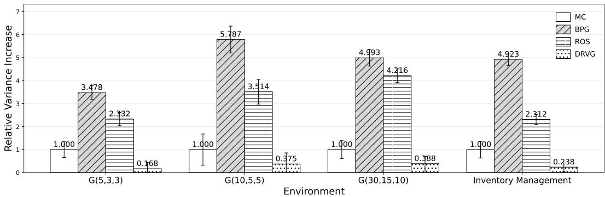
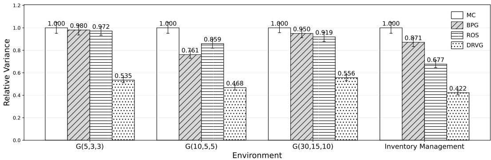
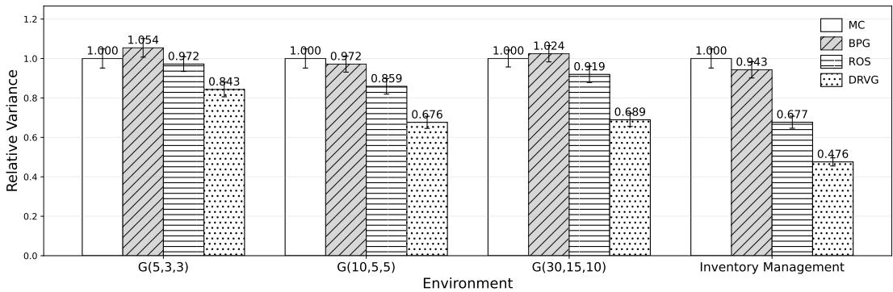

# Robust Data-Collection Policy Learning for Low-Variance Online Policy Evaluation

Claire Chen California Institute of Technology clairechen@caltech.edu

Licheng Luo University of California, Riverside lichengl@ucr.edu

Nan Jiang University of Illinois Urbana-Champaign nanjiang@illinois.edu

Shuze Daniel Liu Massachusetts Institute of Technology shuzel@mit.edu Purdue University daniel.liu@purdue.edu

Rohan Chandra University of Virginia rohanchandra@virginia.edu

Shangtong Zhang University of Virginia shangtong@virginia.edu

## Abstract

In reinforcement learning policy evaluation, classic on-policy methods often suffer from high variance when estimating policy performance. To mitigate this issue, behavior policy search has been proposed to learn data-collecting policies tailored to reduce online evaluation variance. However, these approaches do not account for uncertainties in the transition functions. In practice, simulator transitions often differ from the real world due to modeling errors or approximation limitations. As a result, behavior policies trained in simulation may still yield high variance when deployed in real environments, leading to costly reliance on real-world evaluation samples. In this work, we propose a double-loop gradient-based algorithm for learning behavior policies that are both efficient and robust to transition uncertainty. Theoretically, we derive novel transition-variance gradient expressions and establish global convergence guarantees for the algorithm. Numerically, we demonstrate that our method is less sensitive to transition perturbations than existing approaches, providing supportive evidence for its practical utility.

## 1 Introduction

Reinforcement learning (RL) has achieved remarkable success in recent years across domains such as robotics, healthcare, recommendation systems, and natural language processing (Mnih et al., 2015; Silver et al., 2017; Jumper et al., 2021; Xie et al., 2026; Liu et al., 2026c,d). A central component in these advances is policy evaluation, the task of estimating the performance of a policy. The most direct approach is the on-policy Monte Carlo method, which collects trajectories from the target policy and estimates its value by averaging the observed returns. Although conceptually simple and widely used, this method often suffers from high evaluation variance, limiting the reliability of the resulting estimates.

To improve efficiency, a growing body of work has investigated learning a separate data-collecting behavior policy to reduce evaluation variance via off-policy evaluation (Hanna et al., 2017; Zhong et al., 2022; Liu and Zhang, 2024; Liu et al., 2025a; Liu, 2025). This line of research, known as behavior policy search (BPS), optimizes a variance-reducing behavior policy so that the collected trajectories yield more informative evaluations. With an appropriately chosen behavior policy, BPS has been shown to achieve lower variance than naive on-policy evaluation. By contrast, in the standard formulation of off-policy evaluation (OPE), the data are assumed to be pre-logged by a fixed behavior policy and the focus is on designing improved estimators. In comparison, BPS explicitly optimizes the behavior policy itself to reduce variance and is broadly applicable across different OPE estimators.

Despite this progress, existing BPS methods generally optimize behavior policies under prespecified transition functions, without accounting for underlying uncertainties. In practice, the true transition functions often deviate from the assumed model due to approximation errors, adversarial perturbations, or partial observability. Such discrepancies can compromise evaluation reliability: a behavior policy optimized under simulator transition may still yield high variance when deployed in the real environment. Consequently, prior methods may continue to require a large number of costly real-world samples to achieve accurate evaluation.

To address these two challenges—variance reduction and transition mismatch—we propose an efficient and robust policy evaluation framework that explicitly accounts for transition uncertainty. Our method formulates BPS as a minimax optimization problem, where an adversarial transition model seeks to maximize the evaluation variance while the behavior policy is optimized to minimize it. Our contributions are summarized as follows: (1) We introduce a novel adversarial framework for robust behavior policy search in policy evaluation (Section 3.3); (2) We derive analytical transitiongradient expressions for both on-transition and off-transition settings, and provide convergence guarantees for the inner-loop adversarial optimization (Section 4); (3) We propose a double-loop robust gradient algorithm and provide global convergence guarantee for variance-minimizing behavior policy search (Section 5); (4) We numerically show that our method is less sensitive to transition perturbations than existing approaches (Section 6), verifying the utility of our theoretical results.

## 2 Related Work

Behavior Policy Search. Behavior policy search (BPS) reduces evaluation variance by optimizing the data-collecting policy. Hanna et al. (2017) formulate this as an optimization problem, using stochastic gradient descent to outperform standard Monte Carlo methods. Zhong et al. (2022) extend this via adaptive behavior policies that prioritize under-sampled regions. However, these approaches overlook transition uncertainty; consequently, behavior policies optimized in simulation may still induce high variance under real-world dynamics. In contrast, our method explicitly models transition uncertainty to ensure the learned behavior policy remains effective even under perturbed dynamics.

Liu and Zhang (2024) also study the variance reducing problem, deriving a closed-form, offlinelearnable behavior policy with theoretical guarantees. However, their formulation relies on pre-logged data with prespecified and fixed transition probabilities, and cannot adapt when these probabilities shift at deployment, leaving it vulnerable to modeling errors and sim-to-real mismatches. Our method fills this gap by integrating adversarial transition modeling into behavior policy search, combining efficiency with robustness to transition shifts. Similarly, while Russo and Pacchiano (2025) optimize adaptive exploration for multi-policy evaluation, they assume fixed dynamics; in contrast, our framework proactively targets robustness to adversarial transition shifts.

Robust Policy Evaluation. Recent work has begun addressing robustness in reinforcement learning policy evaluation. For example, Katdare et al. (2023) and Voloshin et al. (2021) propose techniques to improve robustness under simulator mismatch via estimator modification or robust model learning. However, these methods either rely on access to real-world data or focus on minimizing worst-case prediction errors, and do not directly address the high-variance issue central to policy evaluation. In contrast, our work proactively reduces variance by designing behavior policies that are robust to adversarial transition shifts, without requiring target-environment data.

While robust MDP (RMDP) frameworks (Iyengar, 2005; Nilim and El Ghaoui, 2005) also consider robustness under transition uncertainty, they are typically designed for reward maximization and rely on linear programming techniques. These approaches (e.g., Wang et al. (2023a, 2024)) do not apply to our setting, where the goal is to minimize the variance of policy value estimators, a fundamentally non-linear objective. We fill this gap by proposing a novel adversarial transition variance gradient method that explicitly targets variance reduction under transition uncertainty.

## 3 Background

## 3.1 Markov Decision Process

We study a finite-horizon Markov Decision Process (MDP, Puterman (2014)) with finite state space $s$ and finite action space $\mathcal { A }$ . For a finite set $x ,$ we denote the probability simplex over X by $\Delta ( \mathcal { X } ) \doteq \{ p : \mathcal { X } \to [ \hat { 0 _ { , } } 1 ] | \sum _ { x \in \mathcal { X } } p ( x ) = 1 \}$ . The MDP consists of a transition probability function $p : { \mathcal { S } } \times { \mathcal { A } }  { \Delta ( { \mathcal { S } } ) }$ , a reward function $r : S \times A  [ 0 , 1 ]$ , an initial state distribution $p _ { 0 } \in \Delta ( \mathcal { S } )$ and a fixed horizon length $T$ . To simplify notation, we consider the undiscounted setting without loss of generality. Our method naturally applies to the discounted setting as long as the horizon is fixed and finite (Puterman, 2014).

A policy $\pi : S  \Delta ( { \mathcal { A } } )$ maps each state to a probability distribution over actions. We consider the parameterized policies πθ, where the parameters $\theta \in \Theta$ is a vector with $\boldsymbol \Theta \subseteq \mathbb { R } ^ { n }$ for some constant $n .$ . Likewise, we parameterize the transition function $p _ { \omega } : \mathcal { S } \times \mathcal { A }  \Delta ( \mathcal { S } )$ by a parameter $\omega \in \Omega$ where $\Omega \subseteq \mathbb { R } ^ { m }$ and is compact. Unless stated otherwise, all norms used in this work are Euclidean $( \mathrm  i . e . , \} | x \| = \| x \| _ { 2 } )$

The MDP process begins at time step 0, where an initial state $S _ { 0 }$ is sampled from p . At each time step $t \in [ \bar { T } - 1 ]$ , an action $A _ { t }$ is sampled based on $\pi ( \cdot \mid S _ { t } )$ . Then, a finite reward $\bar { R } _ { t + 1 } \doteq r ( S _ { t } , A _ { t } )$ is given by the environment and a successor state $S _ { t + 1 }$ is obtained based on $p ( \cdot \mid S _ { t } , A _ { t } )$ ). After $T$ steps, the agent’s interaction with the environment terminates. If the agent reaches any terminal state before time step T, it stays there and receives zero reward.

We use $h \doteq \{ S _ { 0 } , A _ { 0 } , R _ { 1 } , S _ { 1 } , A _ { 1 } , . . . S _ { T - 1 } , A _ { T - 1 } , R _ { T } \}$ to denote the trajectory of this MDP. We then define the return of h as $\begin{array} { r } { g ( h ) \doteq \sum _ { t = 0 } ^ { T - 1 } R _ { t + 1 } } \end{array}$ . For any policy, we have a distribution over the trajectory as $\operatorname* { P r } ( H = h | \pi )$ , where H is a random variable used to denote the trajectory. Lastly, we define the value of a policy as $v ( \pi ) \doteq \mathbb { E } _ { H \sim \pi } [ g ( H ) ]$ ]. To simplify notations, we also define $\begin{array} { r } { \ell _ { p _ { \omega } } \doteq \sum _ { t = 0 } ^ { T - 1 } \log ( p _ { \omega } ( S _ { t + 1 } | S _ { t } , A _ { t } ) ) } \end{array}$

## 3.2 Variance Reduction in Policy Evaluation

We consider the task of reinforcement learning policy evaluation, where the goal is to estimate the value of an interested policy $\pi _ { e } ,$ , called the target policy. The traditional on-policy Monte Carlo (MC) method estimates $v ( \pi _ { e } )$ by repeatedly executing the target policy $\pi _ { e }$ online and averaging the observed returns. That is, $\begin{array} { r } { \mathrm { M C } ( \pi _ { e } , H ) \dot { = } \frac { 1 } { n } \sum _ { i = 0 } ^ { n - 1 } g ( H _ { i } ) } \end{array}$ for all $H _ { i } \sim \pi _ { e }$ . However, in practice, this straightforward method can induce high evaluation variance, leading to less reliable results (Liu and Zhang, 2024; Liu et al., 2025b,a; Chen et al., 2025).

To mitigate this challenge, recent work has proposed to use off-policy evaluation method to reduce variance, where we execute a different policy $\pi _ { \theta }$ (the behavior policy), to collect data. For wide applicability, we consider a general off-policy estimator $\mathrm { O P E } ( \pi _ { e } , \pi _ { \theta } , H )$ , which estimates the value of $\pi _ { e }$ using trajectories H from $\pi _ { \boldsymbol { \theta } } . \mathbf { A }$ standard example is importance sampling, $\operatorname { I S } ( \pi _ { e } , \pi _ { \theta } , H ) \doteq$ $\begin{array} { r } { g ( H ) \prod _ { t = 0 } ^ { T - 1 } \frac { \pi _ { e } ^ { - } ( A _ { t } | S _ { t } ) } { \pi _ { \theta } ( A _ { t } | S _ { t } ) } } \end{array}$ . Prior work has shown that with a properly designed behavior policy πθ, one can achieve lower evaluation variance with an off-policy estimator than the traditional on-policy MC method (Hanna et al., 2017; Zhong et al., 2022). This is known as the Behavior Policy Search (BPS) problem, where we aim to solve minθ∈Θ $\mathbb { V } _ { H \sim \pi _ { \theta } } \left[ \operatorname { O P E } ( \pi _ { e } , \pi _ { \theta } , H ) \right]$

## 3.3 Robust Behavior Policy Search

Standard behavior policy search methods typically assume fixed transition probabilities, but in practice there are often discrepancies between simulators and real environments. After learning a variance-reducing behavior policy in simulation, practitioners typically deploy it to evaluate the target policy in the real system. However, because robustness to dynamics $s h i f t s$ is not considered during the behavior policy search phase, the resulting policy may still induce high variance when collecting real-world data. Consequently, achieving reliable evaluation often requires a large amount of costly real-world samples, motivating a robustness-aware formulation.

To address this, we formulate the robust behavior policy search problem as a minimax optimization:

$$
\operatorname* { m i n } _ { \theta \in \Theta } \operatorname* { m a x } _ { \omega \in \Omega } \mathbb { V } _ { H \sim p _ { \omega } , \pi _ { \theta } } \left[ \mathrm { O P E } ( \pi _ { e } , \pi _ { \theta } , H ) \right] ,\tag{1}
$$

where the inner maximization identifies worst-case transition perturbations, and the outer minimization seeks a behavior policy that mitigates this adversarial effect. Such min–max formulations are standard in the robust RL literature for modeling adversarial dynamics (Katdare et al., 2023; Voloshin et al., 2021). Following standard practice in robust RL (Iyengar, 2005; Nilim and El Ghaoui, 2005; Ho et al., 2021; Wang et al., 2023a), our robustness guarantees are defined with respect to a user-specified transition uncertainty set, enabling practitioners to encode transition uncertainties appropriate to their application.

To further analyze the min-max problem in (1), we can write it as the following equivalent problem

$$
\operatorname* { m i n } _ { \theta \in \Theta } \{ \Phi ( \theta ) \doteq \operatorname* { m a x } _ { \omega \in \Omega } \mathbb { V } _ { H \sim p _ { \omega } , \pi _ { \theta } } [ \mathrm { O P E } ( \pi _ { e } , \pi _ { \theta } , H ) ] \} ,\tag{2}
$$

which minimizes the worst-case evaluation variance (Jin et al., 2020). Notably, the function Φ is not differentiable, and is neither convex nor concave. Thus, we are unable to solve the problem through direct gradient descent on the function Φ, which motivates our double-loop approach (Algorithm 2) in Section 5 with global convergence guarantee.

## 4 Solving the Inner Loop

In this section, we study the inner loop of the optimization problem (1), which identifies adversarial dynamics that maximize evaluation variance. We derive analytical gradient expressions of the variance with respect to the transition probability, considering both on-transition and $o f f$ -transition cases, in analogy to on-policy and off-policy settings. In the on-transition case, the simulator transition can be modified, so trajectories are sampled directly from the evolving $p _ { \omega }$ at each iteration. In the off-transition case, the simulator transition is fixed at $p _ { \omega _ { 0 } } ,$ , and trajectories are collected under this fixed transition probability while reweighted toward the target $p _ { \omega } .$ . We introduce Algorithm 1, which adapts $p _ { \omega }$ to maximize evaluation variance, serving as the adversarial player against the robust behavior policy $\pi _ { \theta }$ (Section 5). We provide theoretical convergence guarantees for this algorithm. To the best of our knowledge, this is the first work to develop adversarial transition-gradient methods for variance objectives in reinforcement learning.

## 4.1 On-Transition Gradient of the Variance

We begin with the on-transition case, analogous to the on-policy setting, where the simulator transition can be directly modified to follow the target transition $p _ { \omega }$ at each iteration. Given a fixed behavior policy $\pi _ { \theta }$ , we look for the variance-maximizing adversarial transition $p _ { \omega }$ . Formally, we need to solve

$$
\begin{array} { r } { \operatorname* { m a x } _ { \omega \in \Omega } \mathbb { V } _ { H \sim p _ { \omega } , \pi _ { \theta } } \left[ \mathrm { O P E } ( \pi _ { e } , \pi _ { \theta } , H ) \right] . } \end{array}
$$

In the following theorem, we give a gradient expression of the evaluation variance. Importantly, this analytical form is general and applies to any off-policy evaluation estimator, forming the foundation of our transition-gradient method.

Theorem 4.1 (Transition Gradient of the Variance). For a fixed behavior policy $\pi _ { \theta }$

$$
\begin{array} { r l } & { \frac { \partial } { \partial \omega } \mathbb { V } _ { H \sim p _ { \omega } , \pi _ { \theta } } [ \mathrm { O P E } ( \pi _ { e } , \pi _ { \theta } , H ) ] = \mathbb { E } _ { H \sim p _ { \omega } , \pi _ { \theta } } [ \mathrm { O P E } ( \pi _ { e } , \pi _ { \theta } , H ) ^ { 2 } \frac { \partial } { \partial \omega } \ell _ { p _ { \omega } } ] } \\ & { \phantom { \frac { \partial } { \partial \omega } \mathbb { V } } - 2 \mathbb { E } _ { H \sim p _ { \omega } , \pi _ { \theta } } [ \mathrm { O P E } ( \pi _ { e } , \pi _ { \theta } , H ) ] \mathbb { E } _ { H \sim p _ { \omega } , \pi _ { \theta } } [ \mathrm { O P E } ( \pi _ { e } , \pi _ { \theta } , H ) \frac { \partial } { \partial \omega } \ell _ { p _ { \omega } } ] . } \end{array}
$$

Its proof is in Appendix A.2. This gradient expression is in expectation forms and can be estimated unbiasedly from sampled trajectories without additional structural assumptions on the OPE estimator. Building on Theorem 4.1, we now present the On-transition Variance Gradient method in Algorithm 1. We instantiate our algorithm with the importance sampling estimator (IS), but our framework is ready to accommodate any off-policy evaluation estimator.

To discuss the convergence property of Algorithm 1, we impose the standard Robbins-Monro stepsize condition $\textstyle \sum _ { i = 0 } ^ { \infty } { \bar { \alpha } } _ { i } = { \bar { \infty } }$ and $\textstyle \sum _ { i = 0 } ^ { \infty } { \bar { \alpha } } _ { i } ^ { 2 } < \infty$ (Robbins and Monro, 1951; Liu et al., 2025c; Mahadevan et al., 2026). We assume the importance sampling ratio $\frac { \pi _ { e } ( a | s ) } { \pi _ { \theta } ( a | s ) }$ exists and is bounded above for all $s , a ,$ , and θ (Hanna et al., 2024). Besides, we require the transition $p _ { \omega }$ to be twicedifferentiable with respect to ω with uniformly bounded first- and second-order derivatives. These conditions for $p _ { \omega }$ hold, for example, when it is parameterized by a neural network with smooth activations and a softmax output layer, and are commonly adopted in policy gradient literature (e.g., Hanna et al. (2017, 2024)). Then, we have the following lemma for the convergence of Algorithm 1, whose proof is in Appendix ${ \mathrm { A } } . 3$

Algorithm 1 On-Transition Variance Gradient.   
1: Input: an initial transition parameter $\omega _ { 0 } .$ , a target policy $\pi _ { e } .$ , a fixed behavior policy $\pi _ { \theta } .$ a number   
of iteration $n ,$ a batch size $k ,$ a step-size $\alpha _ { i }$ for each i   
2: Output: a final adversarial transition parameter $\omega _ { n }$   
3: For all $i \in { 0 , . . . , n - 1 }$ do   
4: Sample k trajectories $H \sim \pi _ { \theta } , p _ { \omega _ { i } }$   
5: $\begin{array} { r } { \omega _ { i + 1 } = \omega _ { i } + \frac { \alpha _ { i } } { k } \sum _ { j = 1 } ^ { k } \left( \mathrm { I S } ( \pi _ { e } , \pi _ { \theta } , H ^ { j } ) ^ { 2 } \sum _ { t = 0 } ^ { T - 1 } \frac { \partial } { \partial \omega } \log \big ( p _ { \omega _ { i } } ^ { j } ( S _ { t + 1 } | S _ { t } , A _ { t } ) \big ) \right) } \end{array}$   
$\begin{array} { r } { - \frac { 8 \alpha _ { i } } { k ^ { 2 } } \sum _ { j = 1 } ^ { \frac { k } { 2 } } \mathrm { I S } ( \pi _ { e } , \pi _ { \theta } , H ^ { j } ) \sum _ { j = \frac { k } { 2 } + 1 } ^ { k } \Big ( \mathrm { I S } ( \pi _ { e } , \pi _ { \theta } , H ^ { j } ) \sum _ { t = 0 } ^ { T - 1 } \frac { \partial } { \partial \omega } \log \big ( p _ { \omega _ { i } } ^ { j } ( S _ { t + 1 } | S _ { t } , A _ { t } ) \big ) \Big ) . } \end{array}$   
6: End for   
7: Return: $\omega _ { n }$

Lemma 4.2 (Transition Gradient Convergence). For a fixed behavior policy πθ, Algorithm 1 converges. That is, $\mathbb { V } _ { H _ { i } \sim p _ { \omega _ { i } } , \pi _ { \theta } } [ \mathrm { I S } ( \pi _ { e } , \pi _ { \theta } , H _ { i } ) ]$ converges to afinite value and $\begin{array} { r } { \operatorname* { l i m } _ { i  \infty } \frac { \partial } { \partial \omega } \mathbb { V } _ { H _ { i } \sim p _ { \omega _ { i } } , \pi _ { \theta } } [ \mathrm { I S } ( \pi _ { e } , \pi _ { \theta } , H _ { i } ) ] = 0 . } \end{array}$

In practice, although discrepancies often exist between the transition probability in the deployment environment and the original simulator, the simulator typically remains a reasonable approximation. Thus, to ensure the learned adversarial transition remains realistic rather than overly pessimistic, we also offer an optional Kullback–Leibler (KL) divergence penalty that discourages large deviations between $p _ { \omega }$ and the initial simulator transition $p _ { \omega _ { 0 } }$ (Tang et al., 2025; Zhang et al., 2026; Chen et al., 2026b; Chen and Zhang, 2026a,b). Given a behavior policy $\pi _ { \theta } .$ , we consider the following inner-loop optimization problem under KL regularization:

$$
\operatorname* { m a x } _ { \omega \in \Omega } \mathbb { V } _ { H \sim p _ { \omega } , \pi _ { \theta } } [ \mathrm { O P E } ( \pi _ { e } , \pi _ { \theta } , H ) ] - \eta \mathbf { K L } ( \mathrm { P r } ( H | p _ { \omega } ) \| \operatorname* { P r } ( H | p _ { \omega _ { 0 } } ) ) ,
$$

where $\eta \mathrm { ~  ~ { ~ > ~ } ~ } 0$ is the regularization coefficient and the KL-divergence term is defined as $\begin{array} { r } { { \bf K L } ( \mathrm { P r } ( H | p _ { \omega } ) \| \mathrm { P r } ( H | p _ { \omega _ { 0 } } ) ) \doteq \mathbb { E } _ { H \sim p _ { \omega } , \pi _ { \theta } } \left[ \log \frac { \mathrm { P r } ( H | p _ { \omega } ) } { \mathrm { P r } \left( H | p _ { \omega _ { 0 } } \right) } \right] } \end{array}$ . We provide the gradient expression of this regularized optimization problem in the following theorem.

Theorem 4.3 (Transition Gradient of Variance with KL). For a fixed behavior policy $\pi _ { \theta }$ and a regularization coefficient $\eta > 0$

$$
\frac { \partial } { \partial \omega } \mathbb { V } _ { H \sim p _ { \omega } \pi _ { \theta } } [ \mathrm { O P E } ( \pi _ { e } , \pi _ { \theta } , H ) ] - \eta \mathrm { K L } ( \mathrm { P r } ( H | p _ { \omega } ) | | \mathrm { P r } ( H | p _ { \omega _ { 0 } } ) ) = \mathbb { E } _ { H \sim p _ { \omega } , \pi _ { \theta } } \big [ \mathrm { O P E } ( \pi _ { e } , \pi _ { \theta } , H ) ^ { 2 } \frac { \partial } { \partial \omega } \ell _ { p _ { \omega } } \big ]
$$

$$
\begin{array} { r } { - 2 \mathbb { E } _ { H \sim p _ { \infty } , \pi _ { \mu } } [ \mathrm { O P E } ( \pi _ { e } , \pi _ { \theta } , H ) ] \mathbb { E } _ { H \sim p _ { \infty } , \pi _ { \theta } } \bigl [ \mathrm { O P E } ( \pi _ { e } , \pi _ { \theta } , H ) { \frac { \partial } { \partial \omega } } \ell _ { p _ { \infty } } \bigr ] - \eta \mathbb { E } _ { H \sim p _ { \infty } , \pi _ { \theta } } \left[ \bigl ( { \frac { \partial } { \partial \omega } } \ell _ { p _ { \infty } } \bigr ) \bigl ( 1 + \ell _ { p _ { \infty } } - \ell _ { p _ { \infty } } \bigr ) \right] . } \end{array}
$$

Its proof is in Appendix A.4. This regularization balances robustness with realism, ensuring that the learned adversary remains close to plausible dynamics.

## 4.2 Off-Transition Gradient of the Variance

In the off-transition case, analogous to the off-policy setting, simulator transitions are fixed at $p _ { \omega _ { 0 } }$ and may differ from the target transition $p _ { \omega }$ . This situation arises naturally when using blackbox simulators that permit data collection but do not allow modifying transition probabilities (e.g., Komorowski et al. (2018)). In this case, we introduce a transition importance sampling ratio to reweight the collected trajectories, mirroring the familiar correction used in off-policy evaluation for policies. For a general off-policy estimator OPE, we overload the notation as

$$
\begin{array} { r } { \mathrm { O P E } ( \pi _ { e } , \pi _ { \theta } , p _ { \omega } , H ) \doteq \frac { \prod _ { t = 0 } ^ { T - 1 } p _ { \omega } ( S _ { t + 1 } | S _ { t } , A _ { t } ) } { \prod _ { t = 0 } ^ { T - 1 } p _ { \omega _ { 0 } } ( S _ { t + 1 } | S _ { t } , A _ { t } ) } \mathrm { O P E } ( \pi _ { e } , \pi _ { \theta } , H ) . } \end{array}
$$

We omit the input $p _ { \omega _ { 0 } }$ in $\mathrm { O P E } ( \pi _ { e } , \pi _ { \theta } , p _ { \omega } , H )$ to simplify notations. Similar to Theorem 4.1, we first give an analytical gradient expression of the evaluation variance.

Theorem 4.4 (Off-Transition Gradient of Variance). When $p _ { \omega } \neq p _ { \omega _ { 0 } } , f o r a j$ xed behavior policy $\pi _ { \theta } ,$

$$
\begin{array} { r l } & { \displaystyle \frac { \partial } { \partial \omega } \Psi _ { H \sim p _ { \omega _ { 0 } } , \pi _ { \theta } } [ \mathrm { O P E } ( \pi _ { e } , \pi _ { \theta } , p _ { \omega } , H ) ] = 2 \mathbb { E } _ { H \sim p _ { \omega _ { 0 } } , \pi _ { \theta } } \big [ \mathrm { O P E } ^ { 2 } ( \pi _ { e } , \pi _ { \theta } , p _ { \omega } , H ) \frac { \partial } { \partial \omega } \ell _ { p _ { \omega } } \big ] } \\ & { \displaystyle - 2 \mathbb { E } _ { H \sim p _ { \omega _ { 0 } } , \pi _ { \theta } } [ \mathrm { O P E } ( \pi _ { e } , \pi _ { \theta } , p _ { \omega } , H ) ] \mathbb { E } _ { H \sim p _ { \omega _ { 0 } } , \pi _ { \theta } } \big [ \mathrm { O P E } ( \pi _ { e } , \pi _ { \theta } , p _ { \omega } , H ) \frac { \partial } { \partial \omega } \ell _ { p _ { \omega } } \big ] . } \end{array}
$$

Its proof is in Appendix ${ \mathrm { A . 5 . } }$ In the next theorem, we incorporate a KL-divergence term to penalize large deviations of $p _ { \omega }$ from the simulator’s transition $p _ { \omega _ { 0 } }$ , with the KL direction chosen so that the expectation aligns with the available sampling distribution $p _ { \omega _ { 0 } }$ . This design ensures the realism of the learned adversarial transition.

Theorem 4.5 (Off-transition Gradient of Variance with KL). For afixed behavior policy πθ and a regularization coefficient $\eta > 0 _ { ; }$

$$
\begin{array} { r l } & { \quad \frac { \partial } { \partial \omega } \mathbb { V } _ { H \sim p _ { \omega _ { 0 } } , \pi _ { \theta } } [ \mathrm { O P E } ( \pi _ { e } , \pi _ { \theta } , p _ { \omega } , H ) ] - \eta \mathbf { K L } ( \mathrm { P r } ( H | p _ { \omega _ { 0 } } ) | | \mathrm { P r } ( H | p _ { \omega } ) ) } \\ & { = 2 \mathbb { E } _ { H \sim p _ { \omega _ { 0 } } , \pi _ { \theta } } \big [ \mathrm { O P E } ^ { 2 } ( \pi _ { e } , \pi _ { \theta } , p _ { \omega } , H ) \frac { \partial } { \partial \omega } \ell _ { p _ { \omega } } \big ] - 2 \mathbb { E } _ { H \sim p _ { \omega _ { 0 } } , \pi _ { \theta } } [ \mathrm { O P E } ( \pi _ { e } , \pi _ { \theta } , p _ { \omega } , H ) ] } \\ & { \quad \cdot \mathbb { E } _ { H \sim p _ { \omega _ { 0 } } , \pi _ { \theta } } \big [ \mathrm { O P E } ( \pi _ { e } , \pi _ { \theta } , p _ { \omega } , H ) \frac { \partial } { \partial \omega } \ell _ { p _ { \omega } } \big ] - \eta \mathbb { E } _ { H \sim p _ { \omega _ { 0 } } , \pi _ { \theta } } \big [ - \frac { \partial } { \partial \omega } \ell _ { p _ { \omega } } \big ] . } \end{array}
$$

Its proof is in Appendix A.6. Note that the gradient expression in the off-transition setting (Theorem 4.5) differs from that in the on-transition case (Theorem 4.3), reflecting the distinct data sampling mechanisms.

## 5 Solving the Outer Loop

In this section, we propose a behavior policy search (BPS) method that is robust to potential discrepancies in the environment. Specifically, we adopt a policy gradient approach to search for a variance-reducing behavior policy under an adversarial transition probability. We first introduce this algorithm, theoretically analyzing its global convergence guarantee. Then, in Section 6, we demonstrate its empirical robustness under perturbed transition probabilities.

## 5.1 Double-Loop Robust Variance Gradient

To begin with, recall that in (1), our goal is to solve the min-max objective

$$
\operatorname* { m i n } _ { \theta \in \Theta } \operatorname* { m a x } _ { \omega \in \Omega } \mathbb { V } _ { H \sim p _ { \omega } , \pi _ { \theta } } \left[ \mathrm { O P E } ( \pi _ { e } , \pi _ { \theta } , H ) \right] .
$$

In Section 4 and Algorithm 1, we present methods to solve the inner maximization problem by performing gradient ascent on the transition parameter $\omega .$ In this section, we focus on performing gradient descent for the variance objective on the policy parameter θ. This is also known as the behavior policy search problem in off-policy evaluation (OPE) community (Hanna et al., 2017, 2024), which aims at finding a variance minimizing behavior policy to collect data through gradient based methods. In Lemma 5.1, we present the gradient expression for variance with respect to the behavior policy adopted from Hanna et al. (2017).

Lemma 5.1 (Variance Gradient Expression). With a fixed transition probability $p _ { \omega } , \forall \theta ,$

$$
\begin{array} { r } { \frac { \partial } { \partial \theta } \mathbb { V } _ { H \sim p _ { \omega } , \pi _ { \theta } } [ \mathrm { I S } ( \pi _ { e } , \pi _ { \theta } , H ) ] = \mathbb { E } _ { H \sim p _ { \omega } , \pi _ { \theta } } [ - \mathrm { I S } ( \pi _ { e } , \pi _ { \theta } , H ) ^ { 2 } \sum _ { t = 0 } ^ { T - 1 } \frac { \partial } { \partial \theta } \log \pi _ { \theta } ( A _ { t } | S _ { t } ) ] . } \end{array}
$$

Importantly, this lemma shows that we can estimate the gradient with trajectories sampled from the behavior policy $\pi _ { \theta }$ . With this analytical expression, we are now ready to present our double loop algorithm, named Double-Loop Robust Variance Gradient (DRVG).

Algorithm 2 Double-Loop Robust Variance Gradient (DRVG)   
1: Input: a target policy parameter $\theta _ { e } ,$ a number of iteration $n ,$ a batch size k, a step-size $\alpha ,$   
tolerance sequence $\left\{ \epsilon _ { i } \right\}$   
2: Output: a final robust behavior policy parameter $\theta ^ { * }$   
3: For all $i = 0 , . . . , n - 1$ do   
4: Find $\begin{array} { r l } { p _ { \omega _ { i } } \mathrm { ~ s . t . ~ } \mathring { \Psi } _ { H \sim p _ { \omega _ { i } } , \pi _ { \theta _ { i } } } \left[ \mathrm { I S } ( \pi _ { e } , \pi _ { \theta _ { i } } , H ) \right] \geq } & { \underset { p _ { \omega \cdot } } { \operatorname* { m a x } } \Psi _ { H \sim p _ { \omega } , \pi _ { \theta _ { i } } } \big [ \mathrm { I S } ( \pi _ { e } , \pi _ { \theta _ { i } } , H ) \big ] - \epsilon _ { i } } \end{array}$   
5: $\begin{array} { r } { \mathcal { G } _ { i } = \frac { \partial } { \partial \theta } \mathbb { V } _ { H \sim p _ { \omega _ { i } } , \pi _ { \theta _ { i } } } [ \mathrm { I S } ( \pi _ { e } , \pi _ { \theta _ { i } } , H ) ] ; \quad \theta _ { i + 1 } = \mathrm { P r o j } _ { \Theta } [ \theta _ { i } - \alpha \mathcal { G } _ { i } ] } \end{array}$   
6: End for   
7: Return: $\begin{array} { r } { \bar { \theta } \doteq \frac { 1 } { n } \sum _ { i = 0 } ^ { n - 1 } \theta _ { i } . } \end{array}$

The double loop algorithm DRVG iteratively takes gradient steps on the evaluation variance objective to solve the min-max problem in (1). Specifically, the inner loop of DRVG returns a worst-case transition probability $p _ { \omega _ { i } }$ up to a precision $\epsilon _ { i } ,$ which can be obtained through Algorithm 1. Such a sequence $\left\{ \epsilon _ { i } \right\}$ introduces more flexibility to this double-loop algorithm, allowing for quick policy updates without hurting the global convergence property. This choice is also adopted by some prior work in the robust MDP community (Ho et al., 2021; Wang et al., 2023a).

In the outer loop, DRVG takes a projected gradient step to minimize evaluation variance within the feasible parameter set Θ. A well-known proximal representation of projected gradient in Bertsekas (1995) is $\begin{array} { r } { \theta _ { i + 1 } \in \mathrm { a r g m i n } _ { \theta \in \Theta } \langle \mathcal { G } _ { i } , \theta - \theta _ { i } \rangle + \frac { 1 } { 2 \alpha _ { i } } \| \theta - \theta _ { i } \| ^ { 2 } = \mathrm { P r o j } _ { \Theta } [ \theta _ { i } - \alpha \mathcal { G } _ { i } ] } \end{array}$ , where $\mathrm { P r o j } _ { \Theta }$ is the projection operator onto Θ. In other words, it is identical to taking a plain gradient step, and then using the closest feasible point in Euclidean distance within the feasible set. Notably, when the feasible set Θ is convex, this projected gradient step can be implemented by a convex optimization solver with a quadratic objective (Wang et al., 2023a). Together, this double-loop algorithm yields a robust behavior policy for off-policy evaluation under environment uncertainty.

## 5.2 Global Convergence Analysis

In this subsection, we present the global convergence analysis for Algorithm 2. For the widely-studied policy gradient methods in reinforcement learning policy improvement, the objective function is the performance of a given target policy. In our policy evaluation setting, however, in order to minimize the ultimate online samples needed in the real-world evaluation, the objective function is the performance’s variance,

$$
\mathbb { V } _ { H \sim p _ { \omega } , \pi _ { \theta } } [ \mathrm { O P E } ( \pi _ { e } , \pi _ { \theta } , H ) ] = \mathbb { E } _ { H \sim p _ { \omega } , \pi _ { \theta } } [ \mathrm { O P E } ( \pi _ { e } , \pi _ { \theta } , H ) ^ { 2 } ] - \mathbb { E } _ { H \sim p _ { \omega } , \pi _ { \theta } } [ \mathrm { O P E } ( \pi _ { e } , \pi _ { \theta } , H ) ] ^ { 2 } .
$$

The non-linear nature of this variance objective introduces additional difficulties, making the min-max optimization problem (1) nonconvex-nonconcave, which is widely known to be challenging (Jin et al., 2020; Nouiehed et al., 2019; Lin et al., 2020). Besides, the objective function $\Phi ( \theta )$ in the equivalent expression (2) is generally non-differentiable and nonconvex, making the theoretical analysis to our Algorithm 2 even more challenging. In fact, even without the inner minimization problem, finding the global optima of such nonconvex objectives is already NP-hard in the worst case (Jin et al., 2020).

In policy improvement regime without robustness consideration (i.e., a single-loop performance maximization problem), recent work has shown that some algorithms are guaranteed to converge to a globally-optimal policy with a non-convex objective function in tabular MDPs (Agarwal et al., 2021; Bhandari and Russo, 2021). When robustness is introduced via a min–max formalization, only recently was the first generic algorithm with global convergence proposed (Wang et al., 2023a). However, since their inner maximization objective (policy performance) reduces to a linear program in each update, the setting is considerably simpler than our variance-based objective.

In Section 6, we demonstrate the empirical performance of our Algorithm 2 under a neural network policy parameterization. While in this section, for the theoretical analysis of Algorithm 2, we adopt a linear-softmax parameterization for the behavior policy πθ, $\begin{array} { r } { \pi _ { \theta } ( a | s ) \doteq \frac { \exp \bigl ( \theta _ { a } ^ { \top } \phi ( s ) \bigr ) } { \sum _ { a ^ { \prime } \in \mathcal { A } } \exp \bigl ( \theta _ { a ^ { \prime } } ^ { \top } \phi ( s ) \bigr ) } } \end{array}$ , where $\phi : s  \mathbb { R } ^ { d }$ is a state feature function, and $\theta _ { a } \in \mathbb { R } ^ { d }$ is the parameter associated with action $a \in A .$ . In this section, we assume that the parameters’ feasible set Θ to be closed and convex with a diameter D $( \mathrm { i . e . , } \forall \theta , \theta ^ { \prime } \in \Theta , \| \theta - \theta ^ { \prime } \| \le D )$ , and assume the linear feature to be bounded $( \mathrm { i . e . , } \forall s , \| \phi ( s ) \| \le B$ for $B \in \mathbb { R } )$ . This choice enables generalization across states through shared features, and makes the variance objective convex in θ. This assumption has been widely adopted in recent theoretical work on policy gradient (Agarwal et al., 2021; Yuan et al., 2022; Cayci et al., 2024).

With the smoothness of this linear-softmax parameterization, we first establish Lemma 5.2, which characterizes the behavior of the objective function V with respect to the policy parameter θ. This lemma then helps to derive the Lipschitz continuity and convexity of the otherwise non-convex and non-differentiable objective function Φ in (2).

Lemma 5.2. Under linear-softmax policy parameterization, the objective function $\mathbb { V } _ { H \sim p _ { \omega } , \pi _ { \theta } } [ \mathrm { I S } ( \pi _ { e } , \pi _ { \theta } , H ) ]$ ] is LΘ-Lipschitz, ℓΘ-smooth, and convex in θ with $L _ { \Theta } = \sqrt { 2 } B C ^ { 2 T } T ^ { 3 }$ and $\ell _ { \Theta } = B ^ { 2 } C ^ { 2 T } T ^ { 3 } ( 5 + 8 T )$ , where C denotes an upper bound on the importance sampling ratio with $\begin{array} { r } { \frac { \pi _ { e } ( a | s ) } { \pi _ { \theta } ( a | s ) } \leq C , \forall ( s , a ) , \forall \theta \in \Theta } \end{array}$

Its proof is in Appendix A.7. We assume bounded importance-sampling ratios, as is standard in off-policy evaluation to ensure finite variance (Hanna et al., 2017, 2024), which can be simply satisfied by bounding the behavior policy away from zero. While the theoretical constants scale with horizon $\dot { T _ { * } }$ this dependence is intrinsic to importance sampling–based approaches and has also appeared in prior OPE analyses (Liu et al., 2018, 2020). Our result shows that global convergence still holds with finite-sample guarantees despite this scaling. With Lemma 5.2, we further obtain the desired properties of Φ, which serve as key building blocks for the global convergence of Algorithm 2.

  
Figure 1: Relative variance increase of each method under its tailored adversarial transition, compared to the variance under the original simulator transition. All values are normalized by the variance increase of the on-policy Monte Carlo (MC) method in the same environment. More details are provided in Appendix B. Error bars denote the standard error.

Lemma 5.3. The function Φ(θ) (2) is LΘ-Lipschitz and convex in θ.

Its proof is in Appendix A.8. Equipped with Lemma 5.2 and Lemma 5.3, we are now ready to establish the convergence analysis despite the inherent nondifferentiability. The following theorem provides a finite-sample convergence guarantee for our double-loop algorithm.

Theorem 5.4 (Double loop global convergence). With a constant step size $\begin{array} { r } { \alpha \doteq \frac { D } { L _ { \Theta } \sqrt { n } } } \end{array}$ , we have

$$
\begin{array} { r } { \Phi ( \bar { \theta } ) - \operatorname* { m i n } _ { \theta \in \Theta } \Phi ( \theta ) \leq \frac { D L _ { \Theta } } { \sqrt { n } } + \frac { 1 } { n } \sum _ { i = 0 } ^ { n - 1 } \epsilon _ { i } . } \end{array}
$$

Its proof is in Appendix A.9. This result shows that Algorithm 2 converges to an ϵ−optimal solution at a rate of $\scriptstyle { \mathcal { O } } ( { \frac { 1 } { \sqrt { n } } } )$ , where n is the number of iterations. This rate matches the optimal rate of projected gradient descent in convex optimization, although our min–max variance objective is more challenging than the performance-based objectives studied in prior work (Agarwal et al., 2021; Bhandari and Russo, 2021; Wang et al., 2023a). The error bound consists of two parts: the first term $\scriptstyle { \frac { D L _ { \Theta } } { \sqrt { n } } }$ reflects the convergence rate of projected gradient descent, while the second term $\textstyle { \frac { 1 } { n } } \sum _ { i = 0 } ^ { n - 1 } \epsilon _ { i }$ accounts for the chosen precision in the inner maximization. To our knowledge, this is thefirst global convergence guarantee for variance-minimizing behavior policy search under adversarial transitions, filling an important gap between classical off-policy evaluation and robust reinforcement learning. Finally, we note that double-loop adversarial optimization is standard in robust reinforcement learning (e.g., Wang et al. (2023a); Ho et al. (2021); Wang et al. (2024)). As in prior work, our method trades additional, low-cost simulator computation for improved robustness and reliability under transition uncertainty.

## 6 Numerical Results

In this section, we provide numerical results to validate the utility of our efficient and robust evaluation framework. Our primary goal is to examine two key questions: (1) Is our method robust to adversarial transition perturbations? (2) Does it give lower evaluation variance under perturbed transitions compared with standard on-policy Monte Carlo?

We evaluate these questions on two environments. Garnet MDPs (Archibald et al., 1995) provide a class of randomly generated abstract MDPs that allow controlled investigation of robustness properties. A Garnet instance $\mathbf { \bar { \theta } } _ { G ( | S | , | A | , b ) }$ is parameterized by the number of states $| { \cal S } |$ , number of actions |A|, and a branching factor b that controls the connectivity of transitions. Owing to this flexibility, Garnets are a standard setting for analyzing robustness in controlled MDP studies (Tarbouriech and Lazaric, 2019; Wang et al., 2023a,b). Inventory management (Porteus, 2002; Ho et al., 2018) is a classical stochastic control problem where a retailer makes ordering decisions under uncertain demand. It provides a natural testbed for evaluating policy performance under transition uncertainties. Notably, compared with recent related work in robust reinforcement learning, our experimental environments operate at comparable or higher complexity (see Table 1).

To contextualize the results, we compare our approach with several representative methods: the on-policy Monte Carlo estimator (MC), the behavior policy gradient estimator (BPG, Hanna et al.

<table><tr><td>Method</td><td>Garnet</td><td>Inventory</td></tr><tr><td>Ours</td><td>G(30,15)</td><td>√</td></tr><tr><td>(Wang et al., 2023a) ICML&#x27;23</td><td>G(15, 8)</td><td>√</td></tr><tr><td>(Sun et al., 2024) NeurIPS’24</td><td>G(10, 5)</td><td>x</td></tr></table>

Table 1: Environments used in recent robust-RL works. Larger $G ( \cdot , \cdot )$ settings indicate more challenging Garnet tasks. Branching factors are omitted as they are not specified in the related work.  
  
Figure 2: Relative variance of each method under the same perturbed transition. Values are normalized by the variance of the on-policy Monte Carlo (MC) method in the same environment. Error bars denote the standard error.

(2017)), and the robust on-policy sampling estimator (ROS, Zhong et al. (2022)). All methods are trained with the same initial transition function to obtain their behavior policies. We parameterize our behavior policy with a neural network and use the final iterate behavior policy from Algorithm 2 to collect evaluation data. Further experimental details are provided in Appendix B.

We note that several related works consider settings that are not directly comparable to our online behavior-policy search framework. In particular, Liu and Zhang (2024) study a fully offline setting with fixed transitions, where the behavior policy is computed from pre-logged data and cannot adapt to transition shifts at deployment. Other robust evaluation approaches (Katdare et al., 2023; Voloshin et al., 2021) focus on estimator robustness or model learning under transition uncertainty, rather than learning variance-minimizing behavior policies for data collection. We therefore include baselines (BPG and ROS) that explicitly target the same behavior-policy optimization objective as our method.

## 6.1 Variance Increase under Tailored Adversarial Transitions

To answer the first question, we examine the robustness of each behavior policy when exposed to its own most adversarial transition. For each method, we run Algorithm 1 to obtain the transition that maximizes its evaluation variance. Then, we use each behavior policy to collect data under its method-specific adversarial transition. We report the relative variance increase compared to the original simulator transition, highlighting each method’s vulnerability to adversarial perturbations. As shown in Figure 1, our method exhibits the smallest variance increase, illustrating its robustness to adversarial transitions. Notably, although designed for variance reduction, BPG and ROS incur larger variance increases than the on-policy Monte Carlo baseline when the deployment transition is perturbed, underscoring the necessity of our robustness-aware behavior policy search framework.

## 6.2 Variance Comparison under Shared and Perturbed Transition

To address the second question, we evaluate all methods under a shared adversarial target transition identified by Algorithm 1 for the on-policy baseline. We compare the variance of all four methods under this same perturbed transition. This setup contrasts with Section 6.1, where each method faced its own tailored adversary. As shown in Figure 2, our method (DRVG) indeed achieves lower evaluation variance. This demonstrates that explicitly accounting for transition uncertainty enables more reliable policy evaluation under perturbed environments.

## 7 Conclusion

In this work, we present an efficient and robust behavior policy search framework that tackles two central challenges in real-world policy evaluation: variance reduction and transition mismatch. Our method learns variance-reducing behavior policies while explicitly accounting for transition uncertainty through a minimax formulation over adversarial dynamics. Theoretically, we derive novel transition-variance gradient expressions, establish convergence guarantees for the adversarial inner loop, and prove global convergence of our proposed double-loop algorithm. Numerically, our method demonstrates increased robustness under transition perturbations. Taken together, these results unify variance reduction with robustness to transition shifts, offering a promising step toward reliable policy evaluation under uncertainty.

## Acknowledgments and Disclosure of Funding

Shangtong Zhang acknowledges funding support from the US National Science Foundation under awards III-2128019, SLES-2331904, and CAREER-2442098, the Commonwealth Cyber Initiative’s Central Virginia Node under award VV-1Q26-001, and a Cisco Faculty Research Award. Nan Jiang acknowledges funding support from NSF CNS-2112471, NSF CAREER IIS-2141781, and Sloan Fellowship.

## References

Agarwal, A., Kakade, S. M., Lee, J. D., and Mahajan, G. (2021). On the theory of policy gradient methods: Optimality, approximation, and distribution shift. Journal of Machine Learning Research, 22(98):1–76. 7, 8, 14

Archibald, T. W., McKinnon, K., and Thomas, L. C. (1995). On the generation of markov decision processes. Journal ofthe Operational Research Society, 46(3):354–361. 8, 31

Bertsekas, D. (1995). Nonlinear Programming. Athena Scientific. 7

Bertsekas, D. P. and Tsitsiklis, J. N. (2000). Gradient convergence in gradient methods with errors. SIAM Journal on Optimization, 10(3):627–642. 16, 19

Bhandari, J. and Russo, D. (2021). On the linear convergence of policy gradient methods for finite mdps. In Banerjee, A. and Fukumizu, K., editors, Proceedings ofThe 24th International Conference on Artificial Intelligence and Statistics, volume 130 of Proceedings of Machine Learning Research, pages 2386–2394. PMLR. 7, 8, 14

Cayci, S., He, N., and Srikant, R. (2024). Convergence of entropy-regularized natural policy gradient with linear function approximation. SIAM Journal on Optimization, 34(3):2729–2755. 7

Chen, C., Liu, S., and Zhang, S. (2025). Efficient policy evaluation with safety constraint for reinforcement learning. In Proceedings of the International Conference on Learning Representations. 3

Chen, C., Xiao, J. S., Liu, S. D., Paolino, F. P., Handley, L., Laz, T. J. d., Nilsson, R., Zou, A., Graham, M., and Mahabal, A. (2026a). AstroAlertBench: Evaluating the accuracy, reasoning, and honesty of multimodal LLMs in astronomical classification. arXiv preprint arXiv:2605.05573. 31

Chen, C. and Zhang, Y. (2026a). Fast rates in α-potential games via regularized mirror descent. ArXiv Preprint arXiv:2605.00268. 5

Chen, C. and Zhang, Y. (2026b). Pessimism-free offline learning in general-sum games via KL regularization. ArXiv Preprint arXiv:2605.00264. 5

Chen, C., Zhang, Y., Liu, X., Xie, Z., Liu, S. D., and Jiang, N. (2026b). Offline two-player zerosum markov games with KL regularization. In Forty-third International Conference on Machine Learning. 5

Hanna, J. P., Chandak, Y., Thomas, P. S., White, M., Stone, P., and Niekum, S. (2024). Dataefficient policy evaluation through behavior policy search. Journal of Machine Learning Research, 25(313):1–58. 4, 6, 7, 14, 24, 25, 27, 30

Hanna, J. P., Thomas, P. S., Stone, P., and Niekum, S. (2017). Data-efficient policy evaluation through behavior policy search. In Proceedings of the International Conference on Machine Learning. 1, 2, 3, 4, 6, 7, 8, 14, 30

Ho, C. P., Petrik, M., and Wiesemann, W. (2018). Fast bellman updates for robust mdps. In International Conference on Machine Learning, pages 1979–1988. PMLR. 8, 31

Ho, C. P., Petrik, M., and Wiesemann, W. (2021). Partial policy iteration for l1-robust markov decision processes. Journal ofMachine Learning Research, 22(275):1–46. 4, 6, 8

Iyengar, G. N. (2005). Robust dynamic programming. Mathematics of Operations Research, 30(2):257–280. 2, 4

Jin, C., Netrapalli, P., and Jordan, M. (2020). What is local optimality in nonconvex-nonconcave minimax optimization? In International conference on machine learning, pages 4880–4889. PMLR. 4, 7

Jumper, J., Evans, R., Pritzel, A., Green, T., Figurnov, M., Ronneberger, O., Tunyasuvunakool, K., Bates, R., Žídek, A., Potapenko, A., et al. (2021). Highly accurate protein structure prediction with alphafold. Nature. 1

Katdare, P., Jiang, N., and Driggs-Campbell, K. R. (2023). Marginalized importance sampling for off-environment policy evaluation. In Conference on Robot Learning, pages 3778–3788. PMLR. 2, 4, 9

Kingma, D. P. and Ba, J. (2015). Adam: A method for stochastic optimization. In Proceedings of the International Conference on Learning Representations. 30

Komorowski, M., Celi, L. A., Badawi, O., Gordon, A. C., and Faisal, A. A. (2018). The artificial intelligence clinician learns optimal treatment strategies for sepsis in intensive care. Nature medicine, 24(11):1716–1720. 5

Lin, T., Jin, C., and Jordan, M. (2020). On gradient descent ascent for nonconvex-concave minimax problems. In III, H. D. and Singh, A., editors, Proceedings ofthe 37th International Conference on Machine Learning, volume 119 of Proceedings ofMachine Learning Research, pages 6083–6093. PMLR. 7

Liu, Q., Li, L., Tang, Z., and Zhou, D. (2018). Breaking the curse of horizon: Infinite-horizon off-policy estimation. In Advances in Neural Information Processing Systems. 7

Liu, S., Chen, C., and Zhang, S. (2025a). Doubly optimal policy evaluation for reinforcement learning. In Proceedings ofthe International Conference on Learning Representations. 1, 3

Liu, S., Chen, Y., and Zhang, S. (2025b). Efficient multi-policy evaluation for reinforcement learning. In Proceedings ofthe AAAI Conference on Artificial Intelligence. 3

Liu, S. and Zhang, S. (2024). Efficient policy evaluation with offline data informed behavior policy design. In Proceedings ofthe International Conference on Machine Learning. 1, 2, 3, 9

Liu, S. D. (2025). Efficient and Robust Policy Evaluation for Reinforcement Learning. PhD thesis, University of Virginia. 1

Liu, S. D., Chen, C., Gao, C., and Simchi-Levi, D. (2026a). OR-Transformer: Scaling real-time decision-making to 1,000 items. Manuscript. 31

Liu, S. D., Chen, C., Wang, J., and Simchi-Levi, D. (2026b). Pessimistic minimax learning for public-private information games under unilateral coverage. Manuscript. 14

Liu, S. D., Chen, C., Xiao, J. S., Chen, X., and Simchi-Levi, D. (2026c). Strategic bargaining in multi-buyer markets: Reinforcement learning from verifiable rewards for LLM negotiations. arXiv preprint arXiv:2607.05863. 1

Liu, S. D., Chen, C., Xiao, J. S., Lei, L., Zhang, Y., Yue, Y., and Simchi-Levi, D. (2026d). Instructing LLMs to negotiate using reinforcement learning with verifiable rewards. arXiv preprint arXiv:2604.09855. 1

Liu, S. D., Chen, S., and Zhang, S. (2025c). The ode method for stochastic approximation and reinforcement learning with markovian noise. Journal of Machine Learning Research, 26(24):1–76. 4

Liu, X., Xie, Z., Moeini, A., Chen, C., Liu, S. D., Meng, Y., Zhang, A., and Zhang, S. (2026e). Mathliblemma: Folklore lemma generation and benchmark for formal mathematics. arXiv preprint arXiv:2602.02561. 31

Liu, Y., Bacon, P.-L., and Brunskill, E. (2020). Understanding the curse of horizon in off-policy evaluation via conditional importance sampling. In International Conference on Machine Learning, pages 6184–6193. PMLR. 7

Mahadevan, V., Chen, C., Liu, S. D., and Zhang, S. (2026). Convergence of two-timescale Markovian stochastic approximations with applications in reinforcement learning. In Proceedings of the 43rd International Conference on Machine Learning. 4

Mnih, V., Kavukcuoglu, K., Silver, D., Rusu, A. A., Veness, J., Bellemare, M. G., Graves, A., Riedmiller, M. A., Fidjeland, A., Ostrovski, G., Petersen, S., Beattie, C., Sadik, A., Antonoglou, I., King, H., Kumaran, D., Wierstra, D., Legg, S., and Hassabis, D. (2015). Human-level control through deep reinforcement learning. Nature. 1

Nilim, A. and El Ghaoui, L. (2005). Robust control of markov decision processes with uncertain transition matrices. Operations Research, 53(5):780–798. 2, 4

Nouiehed, M., Sanjabi, M., Huang, T., Lee, J. D., and Razaviyayn, M. (2019). Solving a class of non-convex min-max games using iterative first order methods. In Wallach, H., Larochelle, H., Beygelzimer, A., d'Alché-Buc, F., Fox, E., and Garnett, R., editors, Advances in Neural Information Processing Systems, volume 32. Curran Associates, Inc. 7

Porteus, E. L. (2002). Foundations of stochastic inventory theory. Stanford University Press. 8, 31

Puterman, M. L. (2014). Markov decision processes: discrete stochastic dynamic programming. John Wiley & Sons. 3

Robbins, H. and Monro, S. (1951). A stochastic approximation method. The Annals of Mathematical Statistics. 4

Russo, A. and Pacchiano, A. (2025). Adaptive exploration for multi-reward multi-policy evaluation. arXiv preprint arXiv:2502.02516. 2

Silver, D., Schrittwieser, J., Simonyan, K., Antonoglou, I., Huang, A., Guez, A., Hubert, T., Baker, L., Lai, M., Bolton, A., et al. (2017). Mastering the game of go without human knowledge. nature, 550(7676):354–359. 1

Sun, Z., He, S., Miao, F., and Zou, S. (2024). Policy optimization for robust average reward mdps. Advances in Neural Information Processing Systems, 37:17348–17372. 9

Sutton, R. S. and Barto, A. G. (2018). Reinforcement Learning: An Introduction (2nd Edition). MIT press. 31

Tang, C., Liu, Z., and Xu, P. (2025). Robust offline reinforcement learning with linearly structured f-divergence regularization. In Proceedings of the 42nd International Conference on Machine Learning, pages 58842–58882. 5

Tarbouriech, J. and Lazaric, A. (2019). Active exploration in markov decision processes. In The 22nd International Conference on Artificial Intelligence and Statistics, pages 974–982. PMLR. 8, 31

Voloshin, C., Jiang, N., and Yue, Y. (2021). Minimax model learning. In International Conference on Artificial Intelligence and Statistics, pages 1612–1620. PMLR. 2, 4, 9

Wang, J., Srinivasa, J., Chen, C., Liu, S. D., Payani, A., and Zhang, S. (2026). Predicting plasticity in deep continual learning: A theoretical perspective. arXiv preprint arXiv:2605.09044. 30

Wang, Q., Ho, C. P., and Petrik, M. (2023a). Policy gradient in robust mdps with global convergence guarantee. In International Conference on Machine Learning, pages 35763–35797. PMLR. 2, 4, 6, 7, 8, 9, 14, 24, 31

Wang, Q., Xu, S., Ho, C. P., and Petrik, M. (2024). Policy gradient for robust markov decision processes. arXiv preprint arXiv:2410.22114. 2, 8

Wang, Y., Velasquez, A., Atia, G., Prater-Bennette, A., and Zou, S. (2023b). Robust average-reward markov decision processes. In Proceedings of the AAAI Conference on Artificial Intelligence, pages 15215–15223. 8, 31

Xie, Z., Liu, X., Chen, C., Liu, S. D., Chandra, R., and Zhang, S. (2026). Beyond linear attention: Softmax transformers implement in-context reinforcement learning. arXiv preprint arXiv:2605.07333. 1

Yuan, R., Du, S. S., Gower, R. M., Lazaric, A., and Xiao, L. (2022). Linear convergence of natural policy gradient methods with log-linear policies. arXiv preprint arXiv:2210.01400. 7

Zhang, Y., Chen, C., and Jiang, N. (2026). Beyond pessimism: Offline learning in kl-regularized games. arXiv preprint arXiv:2604.06738. 5

Zhong, R., Zhang, D., Schäfer, L., Albrecht, S. V., and Hanna, J. P. (2022). Robust on-policy sampling for data-efficient policy evaluation in reinforcement learning. In Advances in Neural Information Processing Systems. 1, 2, 3, 9, 30

## A Proof

## A.1 Definitions

In this section, we show the standard optimization definitions used in our work. Consider an optimization problem

$$
\operatorname* { m i n } _ { x \in \mathcal { X } } f ( x )
$$

where $\boldsymbol { \mathcal { X } } \subseteq \mathbb { R } ^ { d }$ is nonempty and closed, and $f : \mathbb { R } ^ { d }  \mathbb { R }$ . We have the following definitions for Lipschitz continuity and smoothness.

Definition A.1 (Lipschitz Continuity). The function f : X → R is L−Lipschitz if $\forall x _ { 1 } , x _ { 2 } \in \mathcal { X }$

$$
\| f ( x _ { 1 } ) - f ( x _ { 2 } ) \| \leq L \| x _ { 1 } - x _ { 2 } \| .
$$

Definition A.2 (Smoothness). The function $f : \mathcal { X } $ R is ℓ−smooth if $\forall x _ { 1 } , x _ { 2 } \in { \mathcal { X } }$

$$
\| \nabla f ( x _ { 1 } ) - \nabla f ( x _ { 2 } ) \| \leq \ell \| x _ { 1 } - x _ { 2 } \| .
$$

Our theoretical results are established within a standard analytical framework consistent with prior work in behavior-policy search, robust reinforcement learning, and minimax learning (Hanna et al., 2017; Agarwal et al., 2021; Wang et al., 2023a; Hanna et al., 2024; Liu et al., 2026b). To ensure the existence of well-defined gradients and the validity of our global convergence analysis, we consider environments and parameterizations that satisfy the following standard regularity conditions:

Smoothness of the Transition Model We consider a class of transition functions $p _ { \omega } ( s ^ { \prime } | s , a )$ that are twice-differentiable with respect to their parameters ω. This is a standard property naturally satisfied by typical softmax or neural-network parameterizations with smooth activation functions (Agarwal et al., 2021; Wang et al., 2023a).

Compactness of the Parameter Spaces Consistent with established results in minimax optimization and projected gradient descent, the transition uncertainty set Ω and the behavior policy parameter space Θ are assumed to be compact and convex sets (Agarwal et al., 2021).

Finite Evaluation Variance To ensure the stability of the behavior-policy search, we assume the importance sampling ratios are uniformly bounded by a constant C. This is the standard condition for ensuring finite evaluation variance in off-policy evaluation (Hanna et al., 2017, 2024). In practice, this is satisfied by choosing a behavior policy parameter space Θ that keeps the data-collection policy bounded away from zero.

Bounded Feature Representations For the global convergence guarantees established in Section 5.2, we assume that the state features $\phi ( s )$ are bounded (Agarwal et al., 2021; Bhandari and Russo, 2021).

With these definitions in hand, we are now ready to present the proofs.

## A.2 Proof of Theorem 4.1

Theorem 4.1 (Transition Gradient of the Variance). For a fixed behavior policy $\pi _ { \theta }$

$$
\begin{array} { r l } & { \frac { \partial } { \partial \omega } \mathbb { V } _ { H \sim p _ { \omega } , \pi _ { \theta } } [ \mathrm { O P E } ( \pi _ { e } , \pi _ { \theta } , H ) ] = \mathbb { E } _ { H \sim p _ { \omega } , \pi _ { \theta } } [ \mathrm { O P E } ( \pi _ { e } , \pi _ { \theta } , H ) ^ { 2 } \frac { \partial } { \partial \omega } \ell _ { p _ { \omega } } ] } \\ & { \phantom { \frac { \partial } { \partial \omega } \mathbb { V } \pi _ { H \sim p _ { \omega } , \pi _ { \theta } } [ \mathrm { O P E } ( \pi _ { e } , \pi _ { \theta } , H ) ] } - 2 \mathbb { E } _ { H \sim p _ { \omega } , \pi _ { \theta } } [ \mathrm { O P E } ( \pi _ { e } , \pi _ { \theta } , H ) \frac { \partial } { \partial \omega } \ell _ { p _ { \omega } } ] . } \end{array}
$$

Proof. To prove Theorem 4.1, we aim at decomposing the term $\operatorname* { P r } ( H = h \mid p _ { \omega } )$ into two parts: one that depends on $p _ { \omega }$ and one that does not. By the standard trajectory factorization for a fixed initial-state distribution $p _ { 0 }$ and behavior policy $\pi _ { \theta }$

$$
\mathrm { P r } ( H = h \mid p _ { \omega } ) = p _ { 0 } ( S _ { 0 } ) \prod _ { t = 0 } ^ { T - 1 } \pi _ { \theta } ( A _ { t } | S _ { t } ) \prod _ { t = 0 } ^ { T - 1 } p _ { \omega } ( S _ { t + 1 } | S _ { t } , A _ { t } ) .
$$

We separate the ω-dependent transition factor from the ω-independent factors by defining

$$
m _ { p _ { \omega } } ( h ) \doteq \prod _ { t = 0 } ^ { T - 1 } p _ { \omega } ( S _ { t + 1 } | S _ { t } , A _ { t } )\tag{3}
$$

and

$$
p ( h ) \doteq \displaystyle p _ { 0 } ( S _ { 0 } ) \prod _ { t = 0 } ^ { T - 1 } \pi _ { \theta } ( A _ { t } | S _ { t } ) .\tag{4}
$$

Note that $p ( h )$ is independent of $\omega$ since $p _ { 0 }$ is the fixed initial-state distribution and $\pi _ { \theta }$ does not depend on ω. We thus obtain the decomposition

$$
\operatorname* { P r } ( H = h \mid p _ { \omega } ) = p ( h ) m _ { p _ { \omega } } ( h ) .\tag{5}
$$

Next, we manipulate the term $\begin{array} { r } { { \frac { \partial } { \partial \omega } } m _ { p _ { \omega } } ( h ) } \end{array}$

$$
\begin{array} { r l } { \frac { \partial } { \partial \tau } \varphi _ { \tau , \tau } \varphi _ { \tau , \tau } \varphi _ { \tau , \tau } \varphi _ { \tau , \tau } \varphi _ { \tau , \tau } \varphi _ { \tau , \tau } } & { \frac { \partial } { \partial \tau } \varphi _ { \tau , \tau } \varphi _ { \tau , \tau } \varphi _ { \tau , \tau } } \\ & { - \frac { 1 } { \sqrt { \pi } \varphi _ { \tau } } [ ( \frac { 1 } { \lambda _ { \tau } } \lambda _ { \tau } \lambda _ { \tau } \lambda _ { \tau } \lambda _ { \tau } \lambda _ { \tau } ) \frac { \lambda _ { \tau } } { \sqrt { \lambda _ { \tau } \lambda _ { \tau } \lambda _ { \tau } } } ] } \\ & { - \frac { 1 } { \sqrt { \pi } \varphi _ { \tau } } ( \frac { \sqrt { \lambda _ { \tau } } } { \lambda _ { \tau } } \frac { \lambda _ { \tau } } { \sqrt { \lambda _ { \tau } \lambda _ { \tau } } } \lambda _ { \tau } \lambda _ { \tau } \lambda _ { \tau } \lambda _ { \tau } \frac { \lambda _ { \tau } } { \sqrt { \lambda _ { \tau } \lambda _ { \tau } } } ) } \\ & { - \frac { 1 } { \sqrt { \pi } \varphi _ { \tau } } ( \frac { \sqrt { \lambda _ { \tau } } } { \lambda _ { \tau } } \frac { \lambda _ { \tau } } { \sqrt { \lambda _ { \tau } \lambda _ { \tau } } } \lambda _ { \tau } \lambda _ { \tau } \lambda _ { \tau } \lambda _ { \tau } \lambda _ { \tau }  } \\ &   - \frac { 1 } { \sqrt { \pi } \varphi _ { \tau } } ( \frac { 1 } { \lambda _ { \tau } } \lambda _ { \tau } \lambda _ { \tau } \lambda _ { \tau } \lambda _ { \tau } \lambda _ { \tau } ) \frac { \lambda _ { \tau } } { \sqrt { \lambda _ { \tau } \lambda _ { \tau } } } \frac { \lambda _ { \tau } } { \sqrt { \lambda _ { \tau } \lambda _ { \tau } } } \lambda _ { \tau } \lambda _  \ \end{array}
$$

Here, (a) follows from the fact that

$$
{ \begin{array} { r l } { ~ } & { { \frac { \partial } { \partial x } } \log f ( x ) = { \frac { 1 } { f ( x ) } } { \frac { \partial f ( x ) } { \partial x } } } \\ { \implies { \frac { \partial f ( x ) } { \partial x } } = f ( x ) \cdot { \frac { \partial \log f ( x ) } { \partial x } } . } \end{array} }
$$

Then, we decompose the variance objective

$$
\begin{array} { r l } & { \begin{array} { r l } & { \displaystyle \frac { \partial } { \partial \omega } \mathcal { Y } _ { H \sim \mathcal { P } _ { - } , \pi _ { \theta } , h } [ \mathrm { O P F E } ( \pi _ { e } , \pi _ { \theta } , H ) ] } \\ & { = \displaystyle \frac { \partial } { \partial \omega } \Big ( \mathbb { E } _ { H \sim \mathcal { P } _ { - } , \pi _ { \theta } , h } [ \mathrm { O P F E } ( \pi _ { e } , \pi _ { \theta } , H ) ^ { 2 } ] - \mathbb { E } _ { H \sim \mathcal { P } _ { - } , \pi _ { \theta } , h } [ \mathrm { O P F E } ( \pi _ { e } , \pi _ { \theta } , h ) ] ^ { 2 } \Big ) } \\ & { = \displaystyle \frac { \partial } { \partial \omega } \sum _ { h } \mathrm { P r } ( H = h | \pi _ { e } ) \mathrm { O P E } ( \pi _ { e } , \pi _ { \theta } , h ) ^ { 2 } } \\ & { \displaystyle - 2 \mathbb { E } _ { H \sim \mathcal { P } _ { - } \pi _ { \theta } , h } [ \mathrm { O P E } ( \pi _ { e } , \pi _ { \theta } , H ) ] \frac { \partial } { \partial \omega } \sum _ { h } \mathrm { P r } ( H = h | \mathcal { P } _ { u } ) \mathrm { O P E } ( \pi _ { e } , \pi _ { \theta } , h ) } \end{array} } \\ & { \begin{array} { r l } & { = \displaystyle \sum _ { h } p ( h ) \mathrm { O P E } ( \pi _ { e } , \pi _ { \theta } , h ) ^ { 2 } \frac { \partial } { \partial \omega } m _ { m _ { h e } } ( h ) } \\ & { \displaystyle - 2 \mathbb { E } _ { H \sim \mathcal { P } _ { - } , \pi _ { \theta } } [ \mathrm { O P E } ( \pi _ { e } , \pi _ { \theta } , H ) ] \sum _ { h } p ( h ) \mathrm { O P E } ( \pi _ { e } , \pi _ { \theta } , h ) \frac { \partial } { \partial \omega } m _ { m _ { o } } ( h ) } \end{array} } \end{array}\tag{By (5)}
$$

$$
\begin{array} { r l } & { \displaystyle = \sum _ { h } p ( h ) \mathrm { O P E } ( \pi _ { e } , \pi _ { \theta } , h ) ^ { 2 } m _ { p _ { \omega } } ( h ) \sum _ { t = 0 } ^ { T - 1 } \frac { \partial } { \partial \omega } \log ( p _ { \omega } ( S _ { t + 1 } | S _ { t } , A _ { t } ) ) } \\ & { \displaystyle \quad - 2 \mathbb { E } _ { H \sim p _ { \omega } , \pi _ { \theta } } \big [ \mathrm { O P E } ( \pi _ { e } , \pi _ { \theta } , H ) \big ] \sum _ { h } p ( h ) \mathrm { O P E } ( \pi _ { e } , \pi _ { \theta } , h ) m _ { p _ { \omega } } ( h ) \sum _ { t = 0 } ^ { T - 1 } \frac { \partial } { \partial \omega } \log ( p _ { \omega } ( S _ { t + 1 } | S _ { t } , A _ { t } ) ) } \end{array}\tag{By (6)}
$$

$$
\begin{array} { r l } & { \displaystyle = \mathbb { E } _ { H \sim p _ { \omega } , \pi _ { \theta } } [ \mathrm { O P E } ( \pi _ { e } , \pi _ { \theta } , H ) ^ { 2 } \sum _ { t = 0 } ^ { T - 1 } \frac { \partial } { \partial \omega } \log ( p _ { \omega } ( S _ { t + 1 } | S _ { t } , A _ { t } ) ) ] } \\ & { \displaystyle \quad - 2 \mathbb { E } _ { H \sim p _ { \omega } , \pi _ { \theta } } [ \mathrm { O P E } ( \pi _ { e } , \pi _ { \theta } , H ) ] \mathbb { E } _ { H \sim p _ { \omega } , \pi _ { \theta } } \Bigg [ \mathrm { O P E } ( \pi _ { e } , \pi _ { \theta } , H ) \sum _ { t = 0 } ^ { T - 1 } \frac { \partial } { \partial \omega } \log ( p _ { \omega } ( S _ { t + 1 } | S _ { t } , A _ { t } ) ) \Bigg ] . } \end{array}
$$

## A.3 Proof of Lemma 4.2

Lemma 4.2 (Transition Gradient Convergence). For a fixed behavior policy $\pi _ { \theta } ,$ , Algorithm 1 converges. That is, $\mathbb { V } _ { H _ { i } \sim p _ { \omega _ { i } } , \pi _ { \theta } } [ \mathrm { I S } ( \pi _ { e } , \pi _ { \theta } , H _ { i } ) ]$ converges to afinite value and

$$
\mathsf { l } _ { i \to \infty } \frac { \partial } { \partial \omega } \mathbb { V } _ { H _ { i } \sim p _ { \omega _ { i } } , \pi _ { \theta } } [ \mathrm { I S } ( \pi _ { e } , \pi _ { \theta } , H _ { i } ) ] = 0 .
$$

Proof. The proof leverages Proposition 3 in Bertsekas and Tsitsiklis (2000), for which we have to show that Algorithm 1 satisfies the following conditions:

1. $\mathbb { V } [ \mathrm { I S } ( \pi _ { \theta } , p _ { \omega _ { i } } , H _ { i } ) ]$ is continuously differentiable w.r.t. ω.

2. The gradient of the variance objectives, $\begin{array} { r } { \frac { \partial } { \partial \omega } \mathbb { V } [ \mathrm { I S } ( \pi _ { \theta } , p _ { \omega _ { i } } , H _ { i } ) ] } \end{array}$ ], is Lipschitz continuous w.r.t. ω.

3. The variance of the gradient estimate used by Algorithm 1 is bounded.

The other conditions of Proposition 3 in Bertsekas and Tsitsiklis (2000) are satisfied because of the unbiasedness of the gradient estimates in Algorithm 1. Additionally, since the gradient objective, as a variance, is bounded below by zero, we can avoid the case of converging to −∞ according to Proposition 3 (Bertsekas and Tsitsiklis, 2000).

By assumptions, we have $p _ { \omega }$ is twice-differentiable, and quotient $\frac { w _ { \pi _ { e } } } { w _ { \pi _ { \theta } } }$ and the estimator $\mathrm { I S } ( \pi _ { \theta } , p _ { \omega } , H )$ always exist. Therefore, by the gradient expression in Lemma 4.1, we conclude that $\begin{array} { r } { \frac { \partial } { \partial \omega } V _ { H \sim p _ { \omega } , \pi _ { \theta } } \big [ \mathrm { I S } ( \pi _ { \theta } , p _ { \omega } , H ) \big ] } \end{array}$ is continuously differentiable, verifying condition 1.

Next, we show the Lipschitz continuity of $\begin{array} { r } { \frac { \partial } { \partial \omega } V _ { H \sim p _ { \omega } , \pi _ { \theta } } \left[ \mathrm { I S } ( \pi _ { \theta } , p _ { \omega } , H ) \right] } \end{array}$ by verifying the boundedness of its second derivative.

$$
\begin{array} { r l } & { \quad \frac { \partial ^ { 2 } } { \partial \omega ^ { 2 } } \mathbb { V } _ { H \sim p _ { \omega } , \pi _ { \theta } } [ \mathrm { L S } ( \pi _ { \theta } , p _ { \omega } , H ) ] } \\ & { = \frac { \partial } { \partial \omega } \mathbb { E } _ { H \sim p _ { \omega } , \pi _ { \theta } } \Big [ \mathrm { L S } ( \pi _ { e } , \pi _ { \theta } , H ) ^ { 2 } \sum _ { t = 0 } ^ { T - 1 } \log ( p _ { \omega } ( S _ { t + 1 } | S _ { t } , A _ { t } ) ) \Big ] } \\ & { \quad - 2 \mathbb { E } _ { H \sim p _ { \omega } , \pi _ { \theta } } [ \mathrm { L S } ( \pi _ { e } , \pi _ { \theta } , H ) ] \mathbb { E } _ { H \sim p _ { \omega } , \pi _ { \theta } } \Big [ \mathrm { L S } ( \pi _ { e } , \pi _ { \theta } , H ) \sum _ { t = 0 } ^ { T - 1 } \log ( p _ { \omega } ( S _ { t + 1 } | S _ { t } , A _ { t } ) ) \Big ] } \\ & { = \frac { \partial } { \partial \omega } \left( \sum _ { h } \Big ( p ( h ) m _ { p _ { \omega } } ( h ) \mathrm { I S } ( \pi _ { e } , \pi _ { \theta } , H ) ^ { 2 } \sum _ { t = 0 } ^ { T - 1 } \frac { \partial } { \partial \omega } \log ( p _ { \omega } ( S _ { t + 1 } | S _ { t } , A _ { t } ) ) \Big ) \right) } \\ & { \quad - 2 \sum _ { h } \big ( p ( h ) m _ { p _ { \omega } } ( h ) \mathrm { I S } ( \pi _ { e } , \pi _ { \theta } , H ) \big ) } \\ &  \quad \cdot \sum _ { h } \Big ( p ( h ) m _ { p _ { \omega } } ( h ) \mathrm { I S } ( \pi _ { e } , \pi _ { \theta } , H ) \sum _ { t = 0 } ^ { T - 1 } \frac { \partial } { \partial \omega } \log ( p _ { \omega } ( S _ { t + 1 } | S _ { t } , A _ { t } ) ) \ \end{array}
$$

$$
\begin{array} { r l } & { \quad = \frac { \partial } { \partial \varphi } ( \sum _ { k } ( p ( k ) m _ { m _ { k } } ( k ) | \mathrm { S } ( \pi _ { \mathrm { e } } , \pi _ { 0 } , H ) ) ^ { 2 } \frac { \partial } { \partial \varphi m _ { k } } \mathrm { t } p _ { \mathrm { s r } } ( k ) ) } \\ & { \quad - 2 \sum _ { k } ( p ( k ) m _ { m _ { k } } ( k ) | \mathrm { S } ( \pi _ { \mathrm { e } } , \pi _ { 0 } , H ) ) \cdot \sum _ { k } ( p ( k ) m _ { m _ { k } } ( k ) | \mathrm { S } ( \pi _ { \mathrm { e } } , \pi _ { 0 } , H ) ) \frac { \partial } { \partial \omega } \log m _ { p _ { \infty } } ( k ) ) \rangle } \\ & { \quad = \frac { \partial } { \partial \varphi } ( \sum _ { k } ( p ( k ) m _ { m _ { k } } ( k ) | \mathrm { S } ( \pi _ { \mathrm { e } } , \pi _ { 0 } , H ) ) ^ { 2 } \frac { 1 } { m _ { k } \omega ( k ) } \frac { \partial } { \partial \omega } m _ { \mathrm { p } _ { k } } ( k ) ) } \\ & { \quad \quad - 2 \sum _ { k } ( p ( k ) m _ { p _ { k } } ( k ) | \mathrm { S } ( \pi _ { \mathrm { e } } , \pi _ { 0 } , H ) ) \cdot \sum _ { k } ( p ( k ) m _ { m _ { k } } ( k ) | \mathrm { S } ( \pi _ { \mathrm { e } } , \pi _ { 0 } , H ) \frac { \partial } { m _ { k } \omega } m _ { \mathrm { p } _ { k } } ( k ) ) ) } \\ & { \quad = \frac { \partial } { \partial \varphi } ( \sum _ { k } ( p ( k ) | \mathrm { S } ( \pi _ { \mathrm { e } } , \pi _ { 0 } , H ) ) ^ { 2 } \frac { \partial } { \partial \omega } m _ { m _ { k } } ( k ) ) } \\ &  \quad \quad - 2 \sum _ { k } ( p ( k ) m _ { p _ { k } } ( k ) | \end{array}
$$

We further decompose the term in the square brackets.

$$
\begin{array} { r l } &  \begin{array} { r l } & { \displaystyle \frac { \partial } { \partial \alpha } [ \sum _ { k } ( p ( k ) m _ { \alpha } ( k ) ) \mathbb { S } ( \pi _ { \alpha } , \pi _ { \alpha } , H ) ) \cdot \sum _ { k } ( p ( k ) \mathbb { S } ( \pi _ { \alpha } , \pi _ { \alpha } , H ) \frac { \partial } { \partial \alpha } m _ { \alpha } ( k ) ) ] } \\ & { = \sum _ { k } p ( k ) \frac { \partial } { \partial \alpha } ( m _ { \alpha } ( k ) ) \mathbb { S } ( \pi _ { \alpha } , \pi _ { \alpha } , H ) \cdot \sum _ { k } ( p ( k ) \mathbb { S } ( \pi _ { \alpha } , \pi _ { \alpha } , H ) \frac { \partial } { \partial \alpha } m _ { \alpha } ( k ) ) } \\ & { \quad + \displaystyle \sum _ { k } ( p ( k ) m _ { \alpha } , ( k ) \mathbb { S } ( \pi _ { \alpha } , \pi _ { \alpha } , H ) ) \cdot \sum _ { k } p ( k ) \frac { \partial } { \partial \alpha } ( \mathbb { S } ( \pi _ { \alpha } , \pi _ { \alpha } , H ) \frac { \partial } { \partial \alpha } m _ { \alpha } ( k ) ) } \\ & { = \sum _ { k } p ( k ) ( \underbrace { \mathbb { S } ( \pi _ { \alpha } , \pi _ { \alpha } , H ) } _ { ( \bar { \alpha } ) } \underbrace { \frac { \partial } { \partial \alpha } m _ { \alpha } ( k ) } _ { ( \bar { \alpha } ) } ) \cdot \sum _ { k } p ( k ) ( \mathbb { S } ( \pi _ { \alpha } , \pi _ { \alpha } , H ) \frac { \partial } { \partial \alpha } m _ { \alpha } ( k ) ) } \\ &  \quad + \displaystyle \sum _ { k } p ( k ) ( \underbrace { m _ { \alpha } ( k ) } _ { ( \bar { \alpha } ) } \mathbb { S } ( \pi _ { \alpha } , \pi _ { \alpha } , H ) ) \cdot \sum _ { k } p ( k ) ( \mathbb { S } ( \pi _ { \alpha } , \pi _ { \alpha } , H ) \frac { \partial }  \partial \alpha ^ \end{array} \end{array}
$$

Notice that since $\begin{array} { r } { p ( h ) = p _ { 0 } ( S _ { 0 } ) \prod _ { t = 0 } ^ { T - 1 } \pi _ { \theta } ( A _ { t } | S _ { t } ) \leq 1 } \end{array}$ by $( 4 ) , p ( h )$ is bounded above. We then analyze the boundedness of $\begin{array} { r } { \frac { \partial ^ { 2 } } { \partial \omega ^ { 2 } } V _ { H \sim p _ { \omega } , \pi _ { \theta } } [ \mathrm { I S } ( \pi _ { \theta } , p _ { \omega } , H ) ] } \end{array}$ through the above 5 terms.

For (1) and (3), the quotient $\frac { \pi _ { e } ( a | s ) } { \pi _ { \theta } ( a | s ) }$ is bounded above by assumption. Besides, since the reward is bounded, so is $g ( h )$ . Therefore, both (1), I $\mathrm { S } ( \pi _ { e } , \pi _ { \theta } , H ) ^ { 2 }$ and $( 3 ) \mathrm { I S } ( \pi _ { e } , \pi _ { \theta } , H )$ are bounded.

For (5), it is bounded because $\begin{array} { r } { m _ { p _ { \omega } } ( h ) = \prod _ { t = 0 } ^ { T - 1 } p _ { \omega } ( S _ { t + 1 } | S _ { t } , A _ { t } ) \leq 1 } \end{array}$ . Then, for (4),

$$
\begin{array} { r l } & { \displaystyle \frac { \partial } { \partial \omega } m _ { p _ { \omega } } ( h ) = \frac { \partial } { \partial \omega } \prod _ { t = 0 } ^ { T - 1 } p _ { \omega } ( S _ { t + 1 } | S _ { t } , A _ { t } ) } \\ & { \displaystyle \qquad = \sum _ { t = 0 } ^ { T - 1 } \frac { \partial } { \partial \omega } p _ { \omega } ( S _ { t + 1 } | S _ { t } , A _ { t } ) \frac { \prod _ { i = 0 } ^ { T - 1 } p _ { \omega } ( S _ { i + 1 } | S _ { i } , A _ { i } ) } { p _ { \omega } ( S _ { t + 1 } | S _ { t } , A _ { t } ) } . } \end{array}
$$

Here, $\begin{array} { r } { \frac { \partial } { \partial \omega } p _ { \omega } ( S _ { t + 1 } | S _ { t } , A _ { t } ) } \end{array}$ is bounded by construction and $\begin{array} { r } { \frac { \prod _ { i = 0 } ^ { T - 1 } p _ { \omega } ( S _ { i + 1 } \mid S _ { i } , A _ { i } ) } { p _ { \omega } ( S _ { t + 1 } \mid S _ { t } , A _ { t } ) } \ \leq \ 1 } \end{array}$ . Thus, (4) is bounded. Lastly, for (2)

$$
\begin{array} { r l } & { \frac { \partial ^ { 2 } } { \partial \omega } ^ { 2 } m _ { p \omega } ( h ) } \\ & { - \cfrac { \partial } { \partial \omega } \underset { \underset { t = 0 } { \overset { p - 1 } { \sum } } } { \overset { p - 1 } { \partial } } \frac { \partial } { \partial \omega } p _ { \omega } ( S _ { t + 1 } | S _ { t } , A _ { t } ) \underset { \underset { t = 0 } { \overset { p - 1 } { \sum } } } { \overset { p - 1 } { p } } p _ { \omega } ( S _ { t + 1 } | S _ { t } , A _ { t } ) } \\ & { - \cfrac { \partial } { \partial \omega } \underset { \underset { t = 0 } { \overset { p - 1 } { \sum } } } { \overset { p - 1 } { \partial } } \frac { \partial } { \partial \omega } p _ { \omega } ( S _ { t + 1 } | S _ { t } , A _ { t } ) \underset { \underset { t \neq t } { \overset { p - 1 } { \prod } } } { \overset { p - 1 } { \operatorname* { m } } } ( S _ { t + 1 } | S _ { t } , A _ { t } ) } \\ & { \underset { \underset { t = 0 } { \overset { p - 1 } { \sum } } } { \overset { \partial } { \partial } } ^ { 2 } p _ { \omega } ( S _ { t + 1 } | S _ { t } , A _ { t } ) \underset { \underset { t \neq t } { \overset { p - 1 } { \prod } } } { \overset { p - 1 } { \operatorname* { m } } } ( S _ { t + 1 } | S _ { t } , A _ { t } ) + \frac { \partial } { \partial \omega } p _ { \omega } ( S _ { t + 1 } | S _ { t } , A _ { t } ) } \\ & { \underset { t = 0 } { \overset { p - 1 } { \sum } } \frac { \partial } { \partial \omega ^ { 2 } } p _ { \omega } ( S _ { t + 1 } | S _ { t } , A _ { t } ) \underset { \underset { t = t } { \overset { p - 1 } { \sum } } } { \overset { p - 1 } { \operatorname* { m } } } ( S _ { j + 1 } | S _ { t } , A _ { t } ) , } \end{array}
$$

which is bounded because $p _ { \omega }$ is constructed to be twice differentiable with bounded first and second derivatives.

Therefore, we conclude that the gradient objective $\begin{array} { r } { \frac { \partial } { \partial \omega } V _ { H \sim p _ { \omega } , \pi _ { \theta } } [ \mathrm { I S } ( \pi _ { \theta } , p _ { \omega } , H ) ] } \end{array}$ is Lipschitz continuous w.r.t. ω, verifying condition 1.

Finally, we show that the variance of the gradient estimate used by Algorithm 1 is bounded. According to Algorithm 1, we use the unbiased estimate as

$$
\begin{array} { r l } & { \frac { \partial } { \partial \omega } V _ { H \sim p _ { \omega } , \pi _ { \theta } } [ \mathrm { I S } ( \pi _ { \theta } , p _ { \omega } , H ) ] \approx \underbrace { \mathrm { I S } ( \pi _ { \theta } , p _ { \omega } , H ) ^ { 2 } \sum _ { t = 0 } ^ { T - 1 } \frac { \partial } { \partial \omega } \log ( p _ { \omega } ( S _ { t + 1 } | S _ { t } , A _ { t } ) ) } _ { A } } \\ & { \qquad - \underbrace { 2 \mathrm { I S } ( \pi _ { \theta } , p _ { \omega } , H ) \mathrm { I S } ( \pi _ { \theta } , p _ { \omega } , H ) \displaystyle \sum _ { t = 0 } ^ { T - 1 } \frac { \partial } { \partial \omega } \log ( p _ { \omega } ( S _ { t + 1 } | S _ { t } , A _ { t } ) ) } _ { B } . } \end{array}
$$

Then, the variance of the estimate is decomposed into

$$
\mathbb { V } [ A ] + \mathbb { V } [ B ] + 2 \mathrm { C o v } [ A , B ] ,
$$

where $\operatorname { C o v } [ A , B ] \ \leq \ \sqrt { \mathbb { V } [ A ] } \cdot \sqrt { \mathbb { V } [ B ] }$ by the Cauchy-Schwarz inequality. Thus, it is sufficient to show the boundedness of ${ \dot { \mathbb { V } } } [ A ]$ and $\mathbb { V } [ B ]$ For $\mathbb { V } [ A ]$ , since the variance of a bounded random variable is bounded, we aim to demonstrate that for any trajectory $h ,$ the term

$\begin{array} { r } { \mathrm { I S } ( \pi _ { \theta } , p _ { \omega } , H ) ^ { 2 } \sum _ { t = 0 } ^ { T - 1 } \log ( p _ { \omega } ( S _ { t + 1 } | S _ { t } , A _ { t } ) ) } \end{array}$ is bounded.

$$
\begin{array} { r l } & { \quad \mathrm { I S } ( \pi _ { \theta } , p _ { \omega } , H ) ^ { 2 } { \displaystyle \sum _ { t = 0 } ^ { T - 1 } } \frac { \partial } { \partial \omega } \log ( p _ { \omega } ( S _ { t + 1 } | S _ { t } , A _ { t } ) ) } \\ & { = \mathrm { I S } ( \pi _ { \theta } , p _ { \omega } , H ) ^ { 2 } { \displaystyle \sum _ { t = 0 } ^ { T - 1 } } \frac { \partial } { \partial \omega } \log ( p _ { \omega } ( S _ { t + 1 } | S _ { t } , A _ { t } ) ) } \\ & { = \mathrm { I S } ( \pi _ { \theta } , p _ { \omega } , H ) ^ { 2 } \frac { \partial } { \partial \omega } \log m _ { p _ { \omega } ( h ) } } \\ & { = \mathrm { I S } ( \pi _ { \theta } , p _ { \omega } , H ) ^ { 2 } \frac { \partial } { \partial m _ { p _ { \omega } } ( h ) } . } \end{array}\tag{7}
$$

The boundedness of $\mathrm { I S } ( \pi _ { \theta } , p _ { \omega } , H ) ^ { 2 }$ and $\begin{array} { r } { \frac { \partial } { \partial \omega } m _ { p _ { \omega } } ( h ) } \end{array}$ is shown by the argument above for terms (3) and (4). For the boundedness of $\begin{array} { r } { \frac { 1 } { m _ { p _ { \omega } } ( h ) } = \frac { 1 } { \prod _ { t = 0 } ^ { T - 1 } p _ { \omega } ( S _ { t + 1 } | S _ { t } , A _ { t } ) } } \end{array}$ , we invoke the Extreme Value Theorem. Since $p _ { \omega } ( s ^ { \prime } | s , a )$ is strictly positive (under softmax parameterization) and continuous on the finite state-action space $s \times \mathcal { \bar { A } } \times \mathcal { S }$ and the compact parameter space Ω (compactness of Ω is assumed in our background), the Extreme Value Theorem ensures that $p _ { \omega }$ attains a strictly positive minimum $\begin{array} { r } { c \doteq \operatorname* { m i n } _ { s , a , s ^ { \prime } , \omega } p _ { \omega } ( s ^ { \prime } | s , a ) > 0 } \end{array}$ . Since the trajectory length $\bar { T }$ is finite, we have $\begin{array} { r } { \boxed { 1 } \boxed { m _ { p _ { \omega } } ( h ) } \le ( 1 / c ) ^ { T } < } \end{array}$ ∞ uniformly in h and ω. Thus, we conclude that $\mathbb { V } [ A ]$ is bounded.

Next, we decompose term B into two parts because of the different samples used to estimate them:

$$
\underbrace { \mathrm { I S } ( \pi _ { \theta } , p _ { \omega } , { H } ) } _ { C } \underbrace { \mathrm { I S } ( \pi _ { \theta } , p _ { \omega } , { H } ) \sum _ { t = 0 } ^ { T - 1 } \frac { \partial } { \partial \omega } \log \bigl ( p _ { \omega } ( S _ { t + 1 } | S _ { t } , A _ { t } ) \bigr ) } _ { D } .
$$

Since in Algorithm 1 the cross-product estimator is computed by sample splitting (the first $k / 2$ trajectories estimate $C$ and the second $k / 2$ trajectories estimate $D ) , { \bar { C } }$ and D are independent. Consequently, by the standard variance identity for products of independent random variables,

$$
\mathbb { V } [ B ] = \mathbb { V } [ C D ] = \mathbb { E } [ C ^ { 2 } ] \mathbb { V } [ D ] + \mathbb { E } [ D ] ^ { 2 } \mathbb { V } [ C ] .
$$

We show their boundedness term by term.

$$
\mathbb { E } [ C ^ { 2 } ] = \mathbb { E } _ { H \sim p _ { \omega } , \pi _ { \theta } } [ \mathrm { I S } ( \pi _ { \theta } , p _ { \omega } , H ) ^ { 2 } ] = \sum _ { h } p ( h ) m _ { p _ { \omega } } ( h ) \mathrm { I S } ( \pi _ { e } , \pi _ { \theta } , H ) ^ { 2 } ,\tag{8}
$$

where each term is shown to be bounded above. Next, by Jensen’s inequality and the derivation from (7),

$$
\mathbb { E } [ D ] ^ { 2 } \leq \mathbb { E } [ D ^ { 2 } ] = \sum _ { h } p ( h ) m _ { p _ { \omega } } ( h ) \mathrm { I S } ( \pi _ { e } , \pi _ { \theta } , H ) ^ { 2 } \Bigg ( \frac { \frac { \partial } { \partial \omega } m _ { p _ { \omega } } ( h ) } { m _ { p _ { \omega } } ( h ) } \Bigg ) ^ { 2 } ,
$$

where the boundedness of the right-hand side follows from the analysis of (8) and $( 7 )$ , and hence $\mathbb { E } [ D ] ^ { 2 }$ is bounded as well.

As for the two variance terms, $\mathbb { V } [ C ]$ and $\mathbb { V } [ D ]$ , we show the boundedness of the random variable C and D for each trajectory h, where $\mathrm { \bar { I S } } ( \pi _ { \theta } , \bar { p _ { \omega } } , \mathrm { \bar { \it H } } )$ is shown to be bounded in term (3) above, and the boundedness of $\begin{array} { r } { \sum _ { t = 0 } ^ { T - 1 } \frac { \partial } { \partial \omega } \log ( p _ { \omega } ( S _ { t + 1 } | S _ { t } , A _ { t } ) ) } \end{array}$ is incorporated in (7).

Therefore, we conclude that the variance of our estimate is bounded. By far, we show that the three conditions of Proposition 3 in Bertsekas and Tsitsiklis (2000) are satisfied, demonstrating the convergence of Algorithm 1.

## A.4 Proof of Theorem 4.3

Proof.

Theorem 4.3 (Transition Gradient of Variance with KL). For a fixed behavior policy $\pi _ { \theta }$ and a regularization coefficient $\eta > 0$

$$
\begin{array} { r l } & { \frac { \partial } { \partial \omega } \Psi _ { H \sim p _ { \omega } , \pi _ { \theta } } [ \mathrm { O P E } ( \pi _ { e } , \pi _ { \theta } , H ) ] - \eta \mathrm { K L } ( \mathrm { P r } ( H | p _ { \omega } ) | | \mathrm { P r } ( H | p _ { \omega _ { 0 } } ) ) = \mathbb { E } _ { H \sim p _ { \omega } , \pi _ { \theta } } [ \mathrm { O P E } ( \pi _ { e } , \pi _ { \theta } , H ) ^ { 2 } \frac { \partial } { \partial \omega } \ell _ { p _ { \omega } } ] } \\ & { - 2 \mathbb { E } _ { H \sim p _ { \omega } , \pi _ { \theta } } [ \mathrm { O P E } ( \pi _ { e } , \pi _ { \theta } , H ) ] \mathbb { E } _ { H \sim p _ { \omega } , \pi _ { \theta } } [ \mathrm { O P E } ( \pi _ { e } , \pi _ { \theta } , H ) \frac { \partial } { \partial \omega } \ell _ { p _ { \omega } } ] - \eta \mathbb { E } _ { H \sim p _ { \omega } , \pi _ { \theta } } \left[ \left( \frac { \partial } { \partial \omega } \ell _ { p _ { \omega } } \right) \left( 1 + \ell _ { p _ { \omega } } - \ell _ { p _ { \omega _ { 0 } } } \right) \right] . } \end{array}
$$

We begin by manipulating the KL-divergence term.

$$
\begin{array} { r l } { \displaystyle \mathrm { K L } \big ( \mathrm { P r } ( H | p _ { \omega } ) \big | \big | \mathrm { P r } ( H | p _ { \omega _ { 0 } } ) \big ) = \mathbb { E } _ { H \sim p _ { \omega } , \pi _ { \theta } } \bigg [ \log \frac { \mathrm { P r } ( H | p _ { \omega } ) } { \mathrm { P r } \big ( H | p _ { \omega _ { 0 } } \big ) } \bigg ] } & { } \\ { = \mathbb { E } _ { H \sim p _ { \omega } , \pi _ { \theta } } \Bigg [ \log \frac { m _ { p _ { \omega } } ( H ) } { m _ { p _ { \omega _ { 0 } } } ( H ) } \Bigg ] } & { } \\ { = \mathbb { E } _ { H \sim p _ { \omega } , \pi _ { \theta } } \big [ \log m _ { p _ { \omega } } ( H ) - \log m _ { p _ { \omega _ { 0 } } } ( H ) \big ] . } \end{array}\tag{By (5)}
$$

Next, we decompose the following gradient:

$$
\begin{array} { r l } & { \quad \displaystyle \frac { \partial } { \partial \omega } \log m _ { p _ { \omega } } ( H ) } \\ & { = \sum _ { t = 0 } ^ { T - 1 } \frac { \partial } { \partial \omega } \log p _ { \omega } ( S _ { t + 1 } | S _ { t } , A _ { t } ) } \\ & { = \displaystyle \sum _ { t = 0 } ^ { T - 1 } \frac { \partial } { \partial \omega } \log ( p _ { \omega } ( S _ { t + 1 } | S _ { t } , A _ { t } ) ) . } \end{array}\tag{9}
$$

(By definition)

Then, we take the gradient of the KL-divergence with respect to ω:

(10)

$$
\begin{array} { r l } & { \frac { \partial } { \partial \alpha } \mathrm { K L } [ \Gamma _ { i } ( \hat { H } | \rho _ { i s } ) ] \Gamma _ { i } ( \hat { H } | \rho _ { i s } ) ] } \\ & { = \frac { \partial } { \partial \alpha } \mathrm { K L } [ \Gamma _ { i } ( \hat { H } | \rho _ { i s } ) , | \mathrm { R e } \hat { H } | \rho _ { i s } ) } \\ & { = \frac { \partial } { \partial \alpha } \sum _ { \alpha \in \mathcal { P } _ { i } \setminus \mathcal { P } _ { i } } [ \mathrm { R e } \hat { H } | \rho _ { i s } ] \big [ \mathrm { i g } \mathrm { R e } \hat { H } _ { \rho \rho _ { i s } } ( \hat { H } ) - \mathrm { i } \mathrm { B g } \mathrm { r } _ { \alpha \in \mathcal { P } _ { i } \setminus \mathcal { P } _ { i } } ( \hat { H } ) \big ] } \\ & { = \frac { \partial } { \partial \alpha } \sum _ { \beta \in \mathcal { P } _ { i } } [ \mathrm { i } \mathrm { R e } \hat { H } | \rho _ { i s } ] \big [ \mathrm { i g } \mathrm { e } \alpha \mathrm { m } _ { \rho _ { i s } } ( \hat { H } ) - \mathrm { i } \mathrm { B g } \mathrm { r } _ { \alpha \in \mathcal { P } _ { i } \setminus \mathcal { P } _ { i } } ( \hat { H } ) \big ] } \\ & { = \frac { \partial } { \partial \alpha } \sum _ { \beta } p ( \hat { H } | \mathrm { h e } \hat { H } | \mathrm { o p } _ { i s } , | \mathrm { i } ) [ \mathrm { i g } \mathrm { e } \mathrm { m } _ { \rho _ { i s } } ( \hat { H } ) - \mathrm { i } \mathrm { B g } \mathrm { r } _ { \alpha \in \mathcal { P } _ { i } \setminus \mathcal { P } _ { i } } ( \hat { H } ) } \\ &  = \sum _ { \gamma } p ( \hat { H } | \int _ { \partial \alpha } ^ { \partial } m _ { \rho _ { i s } } ( \hat { H } ) \mathrm { i g } \mathrm { m } _ { \rho _ { i s } } ( \hat { H } ) - \mathrm { i } \mathrm { B g } \mathrm \end{array}\tag{By (5)}
$$

(By (6))

$$
\begin{array} { l l } { { } } & { { \displaystyle = \sum _ { h } p ( h ) \left[ \log m _ { p , n _ { o } } ( h ) m _ { p , n _ { o } } ( h ) \sum _ { t = 0 } ^ { T - 1 } \frac { \partial } { \partial \omega } \log ( p _ { \omega } ( S _ { t + 1 } | S _ { t } , A _ { t } ) ) + m _ { p , n _ { o } } ( h ) \sum _ { t = 0 } ^ { T - 1 } \frac { \partial } { \partial \omega } \log ( \log ( \delta _ { t + 1 } | S _ { t } , A _ { t } ) ) \right] } } \\ { { } } & { { \displaystyle = - \log m _ { p , n _ { o } } ( h ) m _ { p , n _ { o } } ( h ) \sum _ { t = 0 } ^ { T - 1 } \frac { \partial } { \partial \omega } \log ( p _ { \omega } ( S _ { t + 1 } | S _ { t } , A _ { t } ) ) \Bigg ] } } \\ { { } } & { { \displaystyle = \sum _ { h } p ( h ) m _ { p , n _ { o } } ( h ) \sum _ { t = 0 } ^ { T - 1 } \frac { \partial } { \partial \omega } \log ( p _ { \omega } ( S _ { t + 1 } | S _ { t } , A _ { t } ) ) \left[ \log m _ { p , n _ { o } } ( h ) + 1 - \log m _ { p , n _ { o } } ( h ) \right] } } \\ { { } } & { { \displaystyle = \sum _ { h } \mathrm { P r } ( H - h ) p _ { o , n } ( h ) \sum _ { t = 0 } ^ { T - 1 } \left[ \frac { \partial } { \partial \omega } \log ( p _ { \omega } ( S _ { t + 1 } | S _ { t } , A _ { t } ) ) \right] \left[ \log m _ { p , n _ { o } } ( h ) + 1 - \log m _ { p , n _ { o } } ( h ) \right] \mathbb { G } y ( S ) ) } } \\ { { } } &   \displaystyle = \sum _ { h } \mathrm { P r } ( H - h ) p _ { o , n } \left[ \left( \frac { \partial } { \partial \omega } \log ( p _ { \omega } ( S _ { t + 1 } | S _ { t } , A _ { t } ) ) \right) \right] \log m _  p , n _  o \end{array}
$$

Thus,

$$
\begin{array} { r l r } {  { \frac { \partial } { \partial \omega } \mathbb { V } _ { H \sim p _ { \omega } , \pi _ { \theta } } [ \mathrm { O P E } ( \pi _ { e } , \pi _ { \theta } , H ) ] - \eta \mathrm { K L } ( \mathrm { P r } ( H | p _ { \omega } ) \| \\\\mathrm { P r } ( H | p _ { \omega _ { 0 } } ) ) } } \\ & { } & { = \mathbb { E } _ { H \sim p _ { \omega } , \pi _ { \theta } } \Big [ \mathrm { O P E } ( \pi _ { e } , \pi _ { \theta } , H ) ^ { 2 } \sum _ { t = 0 } ^ { T - 1 } \log ( p _ { \omega } ( S _ { t + 1 } | S _ { t } , A _ { t } ) ) \Big ] - 2 \mathbb { E } _ { H \sim p _ { \omega } , \pi _ { \theta } } [ \mathrm { O P E } ( \pi _ { e } , \pi _ { \theta } , H ) ] } \\ & { } & { \cdot \mathbb { E } _ { H \sim p _ { \omega } , \pi _ { \theta } } \Big [ \mathrm { O P E } ( \pi _ { e } , \pi _ { \theta } , H ) \sum _ { t = 0 } ^ { T - 1 } \log ( p _ { \omega } ( S _ { t + 1 } | S _ { t } , A _ { t } ) ) \Big ] - \eta \frac { \partial } { \partial \omega } \mathrm { K L } ( \mathrm { P r } ( H | p _ { \omega } ) \| \mathrm { P r } ( H | p _ { \omega _ { 0 } } ) ) } \\ & { } & { \mathrm { ( B y ~ L c m m a ~ 4 . 1 ) } } \\ & { } &  = \mathbb { E } _ { H \sim p _ { \omega } , \pi _ { \theta } } \big [ \mathrm { O P E } ( \pi _ { e } , \pi _ { \theta } , H ) ^ { 2 } \frac { \partial } { \partial \omega } \ell _ { p _ { \omega } } \big ] - 2 \mathbb { E } _ { H \sim p _ { \omega } , \pi _ { \theta } } [ \mathrm { O P E } ( \pi _ { e } , \pi _ { \theta } , H ) ] \mathbb { E } _ { H \sim p _ { \omega } , \pi _ { \theta } } \big [ \mathrm { O P E } ( \pi _ { e } ,  \end{array}
$$

## A.5 Proof of Theorem 4.4

Theorem 4.4 (Off-Transition Gradient of Variance). When $p _ { \omega } \neq p _ { \omega _ { 0 } } ,$ , for a fixed behavior policy $\pi _ { \theta } ,$

$$
\begin{array} { r l } & { \displaystyle \frac { \partial } { \partial \omega } \Psi _ { H \sim p _ { \omega _ { 0 } } , \pi _ { \theta } } [ \mathrm { O P E } ( \pi _ { e } , \pi _ { \theta } , p _ { \omega } , H ) ] = 2 \mathbb { E } _ { H \sim p _ { \omega _ { 0 } } , \pi _ { \theta } } \big [ \mathrm { O P E } ^ { 2 } ( \pi _ { e } , \pi _ { \theta } , p _ { \omega } , H ) \frac { \partial } { \partial \omega } \ell _ { p _ { \omega } } \big ] } \\ & { \displaystyle - 2 \mathbb { E } _ { H \sim p _ { \omega _ { 0 } } , \pi _ { \theta } } [ \mathrm { O P E } ( \pi _ { e } , \pi _ { \theta } , p _ { \omega } , H ) ] \mathbb { E } _ { H \sim p _ { \omega _ { 0 } } , \pi _ { \theta } } \big [ \mathrm { O P E } ( \pi _ { e } , \pi _ { \theta } , p _ { \omega } , H ) \frac { \partial } { \partial \omega } \ell _ { p _ { \omega } } \big ] . } \end{array}
$$

Proof. For simplification, we define $\begin{array} { r } { w _ { \pi } ( h ) \doteq \prod _ { t = 0 } ^ { T - 1 } \pi ( A _ { t } | S _ { t } ) } \end{array}$ under trajectory h. Then,

$$
\begin{array} { r l }  \sum _ { k = 0 } ^ { n } \sum _ { i = 1 } ^ { n } \sum _ { j = 1 } ^ { n } \sum _ { k = 0 } ^ { n - 1 } \sum _ { i = 1 } ^ { n } \sum _ { j = 1 } ^ { n } \sum _ { k = 0 } ^ { n - 1 } \sum _ { l = 1 } ^ { n } \sum _ { l = 1 } ^ { n } \sum _ { l = 1 } ^ { n } \sum _ { l = 1 } ^ { n } \sum _ { l = 1 } ^ { n } \sum _ { l = 1 } ^ { n } \sum _ { l = 1 } ^ { n } \sum _ { l = 1 } ^ { n } \sum _ { l = 1 } ^ { n } \sum _ { l = 1 } ^ { n } \sum _ { l = 1 } ^ { n } \sum _ { l = 1 } ^ { n } \sum _ { l = 1 } ^ { n } \sum _ { l = 1 } ^ { n } \sum _ { l = 1 } ^ { n } \sum _ { l = 1 } ^ { n } \sum _ { l = 1 } ^ { n } \sum _ { l = 1 } ^ { n } \sum _ { l = 1 } ^ { n } \sum _ { l = 1 } ^ { n } \sum _ { l = 1 } ^ { n } \sum _ { l = 1 } ^ { n } \sum _ { l = 1 } ^ { n } \sum _ { l = 1 } ^ { n } \sum _ { l = 1 } ^ { n } \sum _ { l = 1 } ^ { n } \sum _ { l = 1 } ^ { n } \sum _ { l = 1 } ^ { n } \sum _ { l = 1 } ^ { n } \sum _ { l = 1 } ^ { n } \sum _ { l = 1 } ^ { n } \sum _ { l = 1 } ^ { n } \sum _ { l = 1 } ^ { n } \sum _ { l = 1 } ^ { n } \sum _ { l = 1 } ^ { n } \sum _ { l = 1 } ^ { n } \sum _ { l = 1 } ^ { n } \sum _ { l = 1 } ^ { n } \sum _ { l = 1 } ^ { n } \sum _ { l = 1 } ^ { n } \sum _ { l = 1 } ^ { n } \sum _ { l = 1 } ^ { n } \sum _ { l = 1 } ^ { n } \sum _ { l = 1 } ^ { n } \sum _ { l = 1 } ^ { n } \sum _ { l = 1 } ^ { n } \sum _ { l = 1 } ^  \end{array}\tag{y (5)}
$$

y (5))

y (6))

y (6))

y (5))

## A.6 Proof of Theorem 4.5

Theorem 4.5 (Off-transition Gradient of Variance with KL). For a fixed behavior policy $\pi _ { \theta }$ and a regularization coefficient $\eta > 0 ,$

$$
\begin{array} { r l } & { \quad \frac { \partial } { \partial \omega } \mathbb { V } _ { H \sim p _ { \omega _ { 0 } } , \pi _ { \theta } } ^ { \sim } [ \dot { \mathrm { O P E } } ( \pi _ { e } , \pi _ { \theta } , p _ { \omega } , H ) ] - \eta \mathbf { K L } ( \operatorname* { P r } ( H | p _ { \omega _ { 0 } } ) | | \operatorname* { P r } ( H | p _ { \omega } ) ) } \\ & { = 2 \mathbb { E } _ { H \sim p _ { \omega _ { 0 } } , \pi _ { \theta } } [ { \mathrm { O P E } } ^ { 2 } ( \pi _ { e } , \pi _ { \theta } , p _ { \omega } , H ) \frac { \partial } { \partial \omega } \ell _ { p _ { \omega } } ] - 2 \mathbb { E } _ { H \sim p _ { \omega _ { 0 } } , \pi _ { \theta } } [ { \mathrm { O P E } } ( \pi _ { e } , \pi _ { \theta } , p _ { \omega } , H ) ] } \\ & { \quad \cdot \mathbb { E } _ { H \sim p _ { \omega _ { 0 } } , \pi _ { \theta } } [ { \mathrm { O P E } } ( \pi _ { e } , \pi _ { \theta } , p _ { \omega } , H ) \frac { \partial } { \partial \omega } \ell _ { p _ { \omega } } ] - \eta \mathbb { E } _ { H \sim p _ { \omega _ { 0 } } , \pi _ { \theta } } \left[ - \frac { \partial } { \partial \omega } \ell _ { p _ { \omega } } \right] . } \end{array}
$$

The KL-divergence between two probability distribution $p$ and $q$ is defined as ${ \mathrm { K L } } ( p \Vert q ) \ { \stackrel { . } { = } } \quad$ $\mathbb { E } _ { X \sim p } \left[ \log \frac { p ( X ) } { q ( X ) } \right]$ . Therefore, the KL-divergence between the trajectory distribution of the target transition $p _ { \omega }$ and the simulator’s transition $p _ { \omega _ { 0 } }$ is given by

$$
\begin{array} { r l } { \mathrm { K L } ( \operatorname* { P r } ( H | p _ { \omega _ { 0 } } ) \| \operatorname* { P r } ( H | p _ { \omega } ) ) } & { { = } \mathbb { E } _ { H \sim p _ { \omega _ { 0 } } , \pi _ { \theta } } \bigg [ \log \frac { \operatorname* { P r } ( H | p _ { \omega _ { 0 } } ) } { \operatorname* { P r } ( H | p _ { \omega } ) } \bigg ] } \\ & { { = } \mathbb { E } _ { H \sim p _ { \omega _ { 0 } } , \pi _ { \theta } } \bigg [ \log \frac { m _ { p _ { \omega _ { 0 } } } ( H ) } { m _ { p _ { \omega } } ( H ) } \bigg ] } \\ & { { = } \mathbb { E } _ { H \sim p _ { \omega _ { 0 } } , \pi _ { \theta } } \left[ \log m _ { p _ { \omega _ { 0 } } } ( H ) - \log m _ { p _ { \omega } } ( H ) \right] . } \end{array}\tag{By (5)}
$$

We take the gradient of the KL-divergence with respect to ω:

$$
\begin{array} { r l } & { \displaystyle \frac { \partial } { \partial \omega } \mathrm { K L } ( \mathrm { P r } ( H | p _ { \omega _ { 0 } } ) | | \mathrm { P r } ( H | p _ { \omega } ) ) = \displaystyle \frac { \partial } { \partial \omega } \mathbb { E } _ { H \sim p _ { \omega _ { 0 } } , \pi _ { \theta } } \big [ \log m _ { p _ { \omega _ { 0 } } } ( H ) - \log m _ { p _ { \omega } } ( H ) \big ] } \\ & { \quad \quad \quad = \mathbb { E } _ { H \sim p _ { \omega _ { 0 } } , \pi _ { \theta } } \Big [ - \frac { \partial } { \partial \omega } \log m _ { p _ { \omega } } ( H ) \Big ] } \\ & { \quad \quad \quad = \mathbb { E } _ { H \sim p _ { \omega _ { 0 } } , \pi _ { \theta } } \Bigg [ - \displaystyle \sum _ { t = 0 } ^ { T - 1 } \frac { \partial } { \partial \omega } \log p _ { \omega } ( S _ { t + 1 } | S _ { t } , A _ { t } ) \Bigg ] } \\ & { \quad \quad \quad = \mathbb { E } _ { H \sim p _ { \omega _ { 0 } } , \pi _ { \theta } } \Bigg [ - \displaystyle \sum _ { t = 0 } ^ { T - 1 } \frac { \partial } { \partial \omega } \log ( p _ { \omega } ( S _ { t + 1 } | S _ { t } , A _ { t } ) ) \Bigg ] . } \end{array}\tag{11}
$$

Thus,

$$
\begin{array} { r l } & { \quad \frac { \partial } { \partial \omega } \Psi _ { H \sim p _ { \omega _ { 0 } } , \pi _ { \theta } } [ \mathrm { O P E } ( \pi _ { e } , \pi _ { \theta } , p _ { \omega } , H ) ] - \eta \mathrm { K L } ( \mathrm { P r } ( H | p _ { \omega _ { 0 } } ) | | \mathrm { P r } ( H | p _ { \omega } ) ) } \\ & { = 2 \mathbb { E } _ { H \sim p _ { \omega _ { 0 } } } [ \mathrm { O P E } ^ { 2 } ( \pi _ { e } , \pi _ { \theta } , p _ { \omega } , H ) \frac { \partial } { \partial \omega } \ell _ { p _ { \omega } } ] } \\ & { \quad - 2 \mathbb { E } _ { H \sim p _ { \omega } , \pi _ { \theta } } [ \mathrm { O P E } ( \pi _ { e } , \pi _ { \theta } , p _ { \omega } , H ) ] \mathbb { E } _ { H \sim p _ { \omega ^ { \prime } } } [ \mathrm { O P E } ( \pi _ { e } , \pi _ { \theta } , p _ { \omega } , H ) \frac { \partial } { \partial \omega } \ell _ { p _ { \omega } } ] } \\ & { \quad - \frac { \partial } { \partial \omega } \eta \mathrm { K L } ( \mathrm { P r } ( H | p _ { \omega _ { 0 } } ) | | \mathrm { P r } ( H | p _ { \omega } ) ) } \\ & { = 2 \mathbb { E } _ { H \sim p _ { \omega } , \pi } [ \mathrm { O P E } ^ { 2 } ( \pi _ { e } , \pi _ { \theta } , p _ { \omega } , H ) \frac { \partial } { \partial \omega } \ell _ { p _ { \omega } } ] } \\ & { \quad - 2 \mathbb { E } _ { H \sim p _ { \omega } , \pi _ { \theta } } [ \mathrm { O P E } ( \pi _ { e } , \pi _ { \theta } , p _ { \omega } , H ) ] \mathbb { E } _ { H \sim p _ { \omega ^ { \prime } } } [ \mathrm { O P E } ( \pi _ { e } , \pi _ { \theta } , p _ { \omega } , H ) \frac { \partial } { \partial \omega } \ell _ { p _ { \omega } } ] } \\ &  \quad - \eta \mathbb  \end{array}\tag{By (11)}
$$

## A.7 Proof of Lemma 5.2

Proof. By Lemma 5.1,

$$
\frac { \partial } { \partial \theta } \mathbb { V } _ { H \sim p _ { \omega } , \pi _ { \theta } } [ \mathrm { I S } ( \pi _ { e } , \pi _ { \theta } , H ) ] = \mathbb { E } _ { H \sim p _ { \omega } , \pi _ { \theta } } \left[ - \mathrm { I S } ( \pi _ { e } , \pi _ { \theta } , H ) ^ { 2 } \sum _ { t = 0 } ^ { T - 1 } \frac { \partial } { \partial \theta } \log \pi _ { \theta } ( A _ { t } | S _ { t } ) \right] .\tag{12}
$$

To prove the Lipschitz property, we bound each term in the RHS. First, we aim to bound $\begin{array} { r l } {  { \big \| \frac { \partial } { \partial \theta } \log \pi _ { \theta } ( A _ { t } | S _ { t } ) \big \| } } \end{array}$ . Remember that we define

$$
\pi _ { \boldsymbol { \theta } } ( a | s ) \doteq \frac { \exp \bigl ( \theta _ { a } ^ { \top } \phi ( s ) \bigr ) } { \sum _ { a ^ { \prime } \in \mathcal { A } } \exp \bigl ( \theta _ { a ^ { \prime } } ^ { \top } \phi ( s ) \bigr ) } ,
$$

where we assumed the linear features $\| \phi ( s ) \|$ to be bounded by a constant B. Here, $\theta = \{ \theta _ { a } \} _ { a \in \mathcal { A } }$ is the whole parameter matrix, and $\theta _ { a }$ is the column for action a specifically. From Wang et al. (2023a), we know that

$$
\bigg \| \frac { \partial } { \partial \theta } \log \pi _ { \theta } ( a | s ) \bigg \| ^ { 2 } = \sum _ { a ^ { \prime } \in \mathcal { A } } \bigg \| \frac { \partial } { \partial \theta _ { a ^ { \prime } } } \log \pi _ { \theta } ( a | s ) \bigg \| ^ { 2 } .
$$

Further decomposing, we get

$$
\begin{array} { r } { \left\| \displaystyle \frac { \partial } { \partial \theta } \log \pi _ { \theta } ( a | s ) \right\| = \left[ \| \phi ( s ) \| _ { 2 } ^ { 2 } \Biggl ( 1 - 2 \pi _ { \theta } ( a | s ) + \sum _ { a ^ { \prime } \in \mathcal A } \pi _ { \theta } ( a ^ { \prime } | s ) ^ { 2 } \Biggr ) \right] ^ { \frac 1 2 } } \\ { \le \sqrt { 2 } B . \qquad \le \sqrt { 2 } B . } \end{array}
$$

Thus, we have

$$
\left\| \sum _ { t = 0 } ^ { T - 1 } \frac { \partial } { \partial \theta } \log \pi _ { \theta } ( A _ { t } | S _ { t } ) \right\| \leq \sqrt { 2 } B T .\tag{13}
$$

We also make the standard assumption that the quotient $\frac { \pi _ { e } ( a | s ) } { \pi _ { \theta } ( a | s ) }$ is bounded above by a constant $C$ for all s, a, and θ.

$$
\biggl \| \mathrm { I S } ( \pi _ { e } , \pi _ { \theta } , H ) ^ { 2 } \biggr \| = \left\| \left( \frac { \prod _ { t = 0 } ^ { T - 1 } \pi _ { e } ( A _ { t } | S _ { t } ) } { \prod _ { t = 0 } ^ { T - 1 } \pi _ { \theta } ( A _ { t } | S _ { t } ) } g ( H ) \right) ^ { 2 } \right\| \leq C ^ { 2 T } T ^ { 2 } ,\tag{14}
$$

since we assume the reward is bounded above by 1.

Then,

$$
\left\| \frac { \partial } { \partial \theta } V _ { H \sim p _ { \omega } , \pi _ { \theta } } [ \mathrm { I S } ( \pi _ { e } , \pi _ { \theta } , H ) ] \right\| \leq \sqrt { 2 } B C ^ { 2 T } T ^ { 3 } .
$$

Thus, the objective function $\mathbb { V } _ { H \sim p _ { \omega } , \pi _ { \theta } } [ \mathrm { I S } ( \pi _ { e } , \pi _ { \theta } , H ) ]$ is L -Lipschitz in θ with $L _ { \Theta } = \sqrt { 2 } B C ^ { 2 T } T ^ { 3 }$ Next, we aim to show that the objective function $\mathbb { V } _ { H \sim p _ { \omega } , \pi _ { \theta } } [ \mathrm { I S } ( \pi _ { e } , \pi _ { \theta } , H ) ]$ ] is $\ell _ { \Theta }$ -smooth in $\theta .$

Under trajectory $h ,$ define $\begin{array} { r } { w _ { \pi _ { \theta } } ( h ) \doteq \prod _ { t = 0 } ^ { T - 1 } \pi _ { \theta } ( A _ { t } , S _ { t } ) } \end{array}$ , and $\begin{array} { r } { \tilde { p } ( h ) \ = \ \frac { \mathrm { P r } ( H = h | \pi _ { \theta } ) } { w _ { \pi _ { \theta } } ( h ) } } \end{array}$ . For a fixed transition $p _ { \omega }$ , we have the following decomposition as also shown in Hanna et al. (2024):

$$
\begin{array} { r l } & { \displaystyle \frac { \partial ^ { 2 } } { \partial \theta ^ { 2 } } \nabla _ { H \sim p _ { \omega } , \pi _ { \theta } } [ \mathrm { B } ( \pi _ { \theta } , p _ { \omega } , H ) ] } \\ & { \displaystyle - \frac { \partial } { \partial \theta } \mathbb { E } _ { H \sim p _ { \omega } , \pi _ { \theta } } [ - 1 \mathrm { S } ( \pi _ { \epsilon } , \pi _ { \theta } , H ) ^ { 2 } \sum _ { t = 0 } ^ { T - 1 } \frac { \partial } { \partial \theta } \log \pi _ { \theta } ( A _ { t } | S _ { t } ) ] } \\ & { \displaystyle = \frac { \partial } { \partial \theta } \sum _ { h } \hat { p } ( h ) w _ { \pi _ { \theta } } ( h ) \biggl ( - \mathrm { I S } ( \pi _ { \epsilon } , \pi _ { \theta } , H ) ^ { 2 } \frac { \partial } { \partial \theta } w _ { \pi _ { \theta } ( h ) } \frac { 1 } { w _ { \pi _ { \theta } } ( h ) } \biggr ) } \\ & { \displaystyle - \frac { \partial } { \partial \theta } \sum _ { h } - \bar { p } ( h ) \mathrm { I S } ( \pi _ { \epsilon } , \pi _ { \theta } , H ) ^ { 2 } \frac { \partial } { \partial \theta } w _ { \pi _ { \theta } } ( h ) } \\ & { \displaystyle - \sum _ { h } - \bar { p } ( h ) \biggl [ \frac { \partial } { \partial \theta } \mathrm { I S } ( \pi _ { \epsilon } , \pi _ { \theta } , H ) ^ { 2 } \frac { \partial } { \partial \theta } w _ { \pi _ { \theta } } ( h ) + \mathrm { I S } ( \pi _ { \epsilon } , \pi _ { \theta } , H ) ^ { 2 } \frac { \partial ^ { 2 } } { \partial \theta ^ { 2 } } w _ { \pi _ { \theta } } ( h ) \biggr ] . } \end{array}\tag{By (12)}
$$

(15)

For the terms here, we have

$$
\frac { \partial } { \partial \theta } \mathrm { I S } ( \pi _ { e } , \pi _ { \theta } , H ) ^ { 2 } = \frac { - 2 g ( h ) ^ { 2 } w _ { \pi _ { e } } ( h ) ^ { 2 } } { w _ { \pi _ { \theta } } ( h ) ^ { 3 } } \frac { \partial } { \partial \theta } w _ { \pi _ { \theta } } ( h ) ,
$$

$$
\frac { \partial } { \partial \theta } w _ { \pi _ { \theta } } ( h ) = \sum _ { t = 0 } ^ { T - 1 } \frac { \partial } { \partial \theta } \pi _ { \theta } ( A _ { t } | S _ { t } ) \prod _ { t ^ { \prime } = 0 , t ^ { \prime } \neq t } ^ { T - 1 } \pi _ { \theta } ( A _ { t ^ { \prime } } | S _ { t ^ { \prime } } ) ,
$$

and

$$
\begin{array} { r l } & { \displaystyle \frac { \partial ^ { 2 } } { \partial \theta ^ { 2 } } w _ { \pi _ { \theta } } ( h ) = \frac { \partial } { \partial \theta } \sum _ { t = 0 } ^ { T - 1 } \left( \frac { \partial } { \partial \theta } \pi _ { \theta } ( A _ { t } | S _ { t } ) \prod _ { t ^ { \prime } = 0 , t ^ { \prime } \neq t } ^ { T - 1 } \pi _ { \theta } ( A _ { t ^ { \prime } } | S _ { t ^ { \prime } } ) \right) } \\ & { \displaystyle \ = \sum _ { t = 0 } ^ { T - 1 } \left( \frac { \partial ^ { 2 } } { \partial \theta ^ { 2 } } \pi _ { \theta } ( A _ { t } | S _ { t } ) \prod _ { t \neq t ^ { \prime } } \pi _ { \theta } ( A _ { t ^ { \prime } } | S _ { t ^ { \prime } } ) + \frac { \partial } { \partial \theta } \pi _ { \theta } ( A _ { t } | S _ { t } ) \sum _ { t \neq t ^ { \prime } } \frac { \partial } { \partial \theta } \pi _ { \theta } ( A _ { t ^ { \prime } } | S _ { t ^ { \prime } } ) \prod _ { t ^ { \prime \prime } \neq t , t ^ { \prime } } \pi _ { \theta } ( A _ { t ^ { \prime \prime } } | S _ { t ^ { \prime \prime } } ) \right) . } \end{array}\tag{16}
$$

Denote $\theta _ { \alpha } = \theta + \alpha u$ , where $\alpha \in \mathbb { R } , u \in \mathbb { R } ^ { d | \mathcal { A } | }$ , with d being the linear feature dimension.

By chain rule, we have, for a fixed transition $p _ { \omega }$

$$
\begin{array} { r l r } {  {  \frac { \partial ^ { 2 } } { \partial \alpha ^ { 2 } } \mathbb { V } _ { H \sim \pi _ { \theta _ { \alpha } , } , p _ { \omega } } [ \mathrm { I S } ( \pi _ { e } , \pi _ { \theta _ { \alpha } } , H ) ] | _ { \alpha = 0 } } } \\ & { = u ^ { \top } \frac { \partial ^ { 2 } } { \partial \theta ^ { 2 } } \mathbb { V } _ { H \sim \pi _ { \theta } , p _ { \omega } } [ \mathrm { I S } ( \pi _ { e } , \pi _ { \theta } , H ) ] u } \\ & { = u ^ { \top } \sum _ { h } - \widetilde { p } ( h ) \bigg [ \frac { \partial } { \partial \theta } \mathrm { I S } ( \pi _ { e } , \pi _ { \theta } , H ) ^ { 2 } \frac { \partial } { \partial \theta } w _ { \pi _ { \theta } } ( h ) ^ { \top } + \mathrm { I S } ( \pi _ { e } , \pi _ { \theta } , H ) ^ { 2 } \frac { \partial ^ { 2 } } { \partial \theta ^ { 2 } } w _ { \pi _ { \theta } } ( h ) \bigg ] u } & { \quad { \scriptstyle ( \mathrm { B y ~ } ( 1 5 ) ) } } \\ & { = \sum _ { h } - \widetilde { p } ( h ) \bigg [ \bigg \langle \frac { \partial } { \partial \theta } \mathrm { I S } ( \pi _ { e } , \pi _ { \theta } , H ) ^ { 2 } , u \bigg \rangle \bigg \langle \frac { \partial } { \partial \theta } w _ { \pi _ { \theta } } ( h ) , u \bigg \rangle + \mathrm { I S } ( \pi _ { e } , \pi _ { \theta } , H ) ^ { 2 } u ^ { \top } \frac { \partial ^ { 2 } } { \partial \theta ^ { 2 } } w _ { \pi _ { \theta } } ( h ) u \bigg ] . ( 1 7 ) } \end{array}
$$

We analyze the bound term by term. First, for $\begin{array} { r } { \left. \frac { \partial } { \partial \theta } \mathrm { I S } ( \pi _ { e } , \pi _ { \theta } , H ) ^ { 2 } , u \right. } \end{array}$ , note that

$$
\begin{array} { r l r } & { \displaystyle \left\| \frac { \partial } { \partial \theta } \mathbf { I } \mathbf { S } ( \pi _ { e } , \pi _ { \theta } , H ) ^ { 2 } \right\| } \\ & { = \displaystyle \left\| \frac { 2 g ( h ) ^ { 2 } w _ { \pi _ { e } } ( h ) ^ { 2 } } { w _ { \pi _ { e } } ( h ) ^ { 3 } } \frac { \partial } { \partial \theta } w _ { \pi _ { e } ( h ) } \right\| } \\ & { \leq 2 T ^ { 2 } \left\| \frac { \overline { { w } } _ { \pi _ { e } } ( h ) ^ { 2 } } { w _ { \pi _ { e } } ( h ) ^ { 3 } } w _ { \pi _ { e } ( h ) } \sum _ { t = 0 } ^ { T - 1 } \frac { \partial } { \partial \theta } \log ( \pi _ { \theta } ( A _ { t } | S _ { t } ) ) \right\| \qquad } & { \scriptstyle ( \mathbf { B } \lor ( 2 1 ) \mathrm { o f ~ H a n n a ~ e t a l . ~ } ( 2 0 2 4 ) } \\ & { \leq 2 T ^ { 2 } C ^ { 2 T } \left\| \sum _ { t = 0 } ^ { T - 1 } \frac { \partial } { \partial \theta } \log ( \pi _ { \theta } ( A _ { t } | S _ { t } ) ) \right\| } \\ & { \leq 2 \sqrt { 2 } B T ^ { 3 } C ^ { 2 T } . } \end{array}
$$

Thus,

$$
\left| \left. \frac { \partial } { \partial \theta } \mathrm { I S } ( \pi _ { e } , \pi _ { \theta } , H ) ^ { 2 } , u \right. \right| \leq 2 \sqrt { 2 } B T ^ { 3 } C ^ { 2 T } \| u \| _ { 2 } .\tag{18}
$$

Next, for $\left. \frac { \partial } { \partial \theta } w _ { \pi _ { \theta } } ( h ) , u \right.$ , recall that

$$
\begin{array} { r l } & { \quad \left\| \displaystyle \frac { \partial } { \partial \theta } w _ { \pi _ { \theta } } ( h ) \right\| } \\ & { = \left\| w _ { \pi _ { \theta } } ( h ) \sum _ { t = 0 } ^ { T - 1 } \frac { \partial } { \partial \theta } \log ( \pi _ { \theta } ( A _ { t } | S _ { t } ) ) \right\| } \\ & { \leq 1 \cdot \sqrt { 2 } B T . } \end{array}
$$

Thus,

$$
\left| \left. \frac { \partial } { \partial \theta } w _ { \pi _ { \theta } } ( h ) , u \right. \right| \leq \sqrt { 2 } B T \| u \| _ { 2 } .\tag{19}
$$

As for the second term $\begin{array} { r } { \mathrm { I S } ( \pi _ { e } , \pi _ { \theta } , H ) ^ { 2 } u ^ { \top } \frac { \partial ^ { 2 } } { \partial \theta ^ { 2 } } w _ { \pi _ { \theta } } ( h ) u . } \end{array}$ , remember that by (14),

$$
\begin{array} { r } { \mathopen { } \mathclose \bgroup \left\| \mathrm { I S } ( \pi _ { e } , \pi _ { \theta } , H ) ^ { 2 } \aftergroup \egroup \right\| \leq C ^ { 2 T } T ^ { 2 } . } \end{array}
$$

Besides, by (16),

$$
\begin{array} { r l } & { u ^ { \top } \frac { \partial ^ { 2 } } { \partial \theta ^ { 2 } } w _ { \pi _ { \theta } } ( h ) u = \underbrace { \overset { T - 1 } { \sum _ { t = 0 } } u ^ { \top } \frac { \partial ^ { 2 } } { \partial \theta ^ { 2 } } \pi _ { \theta } ( A _ { t } | S _ { t } ) u } _ { ( a ) } \underbrace { \prod _ { t \neq t ^ { \prime } } \pi _ { \theta } ( A _ { t ^ { \prime } } | S _ { t ^ { \prime } } ) } _ { \displaystyle t \neq t ^ { \prime } } } \\ & { \qquad + \underbrace { \overset { T - 1 } { \underset { t = 0 } { \sum _ { t = 0 } ^ { T - 1 } } } \left. \frac { \partial } { \partial \theta } \pi _ { \theta } ( A _ { t } | S _ { t } ) , u \right. \cdot \overset { \sum } { \underset { t \neq t ^ { \prime } } { \sum _ { t \neq t ^ { \prime } } } } \left. \frac { \partial } { \partial \theta } \pi _ { \theta } ( A _ { t ^ { \prime } } | S _ { t ^ { \prime } } ) , u \right. \prod _ { t ^ { \prime \prime } \neq t , t ^ { \prime } } \pi _ { \theta } ( A _ { t ^ { \prime \prime } } | S _ { t ^ { \prime \prime } } ) ( 2 0 ) } _ { \displaystyle t ^ { \prime \prime } \neq t , t ^ { \prime } } } \end{array}
$$

To bound term (a) and (b), notice that

$$
\frac { \partial \pi _ { \theta } ( a | s ) } { \partial \theta _ { a } ^ { \prime } } = \pi _ { \theta } ( a | s ) ( { \bf 1 } \{ a ^ { \prime } = a \} - \pi _ { \theta } ( a ^ { \prime } | s ) ) \phi ( s ) ,
$$

where 1 is the indicator function. Now we also define a state-wise logit direction $v _ { s } \in \mathbb { R } ^ { | \mathcal { A } | }$ with each component $v _ { s } ( a ^ { \prime } ) \doteq \langle u _ { a ^ { \prime } } , \phi ( s ) \rangle$ ⟩.   
Then. for the first derivative

Then, for the first derivative,

$$
\begin{array} { r l r } { \left. \frac { \partial \pi _ { \theta _ { \alpha } } ( a | s ) } { \partial \alpha } \right| _ { \alpha = 0 } \Bigg | = \Bigg | \Bigg \langle \frac { \partial \pi _ { \theta } ( a | s ) } { \partial \theta } , u \Bigg \rangle \Bigg | } & \\ & { \quad = \Bigg | \pi _ { \theta } ( a | s ) \cdot \left( v _ { s } ( a ) - \sum _ { a ^ { \prime } } \pi _ { \theta } ( a ^ { \prime } | s ) v _ { s } ( a ^ { \prime } ) \right) \Bigg | } & \\ & { \quad \le \pi _ { \theta } ( a | s ) \left( | v _ { s } ( a ) | + \left| \sum _ { a ^ { \prime } } \pi _ { \theta } ( a ^ { \prime } | s ) v _ { s } ( a ^ { \prime } ) \right| \right) } & { \quad \mathrm { ( T r i a n g u l a r ~ I n e q u a l i t y ) } } \\ & { \quad \le 2 \pi _ { \theta } ( a | s ) \| v _ { s } \| _ { 2 } } & \\ & { \quad \le 2 \| v _ { s } \| _ { 2 } } & \\ & { \quad \le 2 \| \phi ( s ) \| _ { 2 } } & \\ & { \quad \le 2 \| \phi ( s ) \| _ { 2 } } & \\ & { \quad \le 2 B \| u \| _ { 2 } . } & { \quad \mathrm { ( 2 1 ) } } \end{array}
$$

where we identify u with its vectorization, so $\begin{array} { r } { \| u \| _ { 2 } ^ { 2 } = \sum _ { a \in \mathcal { A } } \left\| u _ { a } \right\| _ { 2 } ^ { 2 } } \end{array}$ . Similarly, for the second derivative,

$$
\begin{array} { r l r } {  { \frac { | \partial ^ { 2 } \pi _ { \theta _ { \alpha } } ( a | s ) | } { \partial \alpha ^ { 2 } } \Big | _ { \alpha = 0 } \Bigg | =   \frac { \partial ^ { 2 } \pi _ { \theta } ( a | s ) } { \partial \theta ^ { 2 } } v _ { s } , v _ { s }  | } } \\ & { } & { = | \pi _ { \theta } ( a \mid s ) [ ( 1 - \pi _ { \theta } ( a \mid s ) ) v _ { s } ( a ) ^ { 2 } - \sum _ { \alpha ^ { \prime } \neq \alpha } \pi _ { \theta } ( a ^ { \prime } \mid s ) \big ( v _ { s } ( a ) - v _ { s } ( a ^ { \prime } ) \big ) ^ { 2 } + \sum _ { \alpha ^ { \prime } } \pi _ { \theta } ( a ^ { \prime } \mid s ) ^ { 2 } v _ { s } ( a ^ { \prime } ) ^ { 2 } ] | } \end{array}
$$

$$
\begin{array} { l } { \leq 5 \| v _ { s } \| _ { 2 } ^ { 2 } } \\ { \leq 5 B ^ { 2 } \| u \| _ { 2 } ^ { 2 } } \end{array}\tag{22}
$$

Now, getting back to (a) in (20), we have

$$
\begin{array} { r l } & { | ( a ) | = \displaystyle \left| \sum _ { t = 0 } ^ { T - 1 } u ^ { \top } \frac { \partial ^ { 2 } } { \partial \theta ^ { 2 } } \pi _ { \theta } ( A _ { t } | S _ { t } ) u \prod _ { t \neq t ^ { \prime } } \pi _ { \theta } ( A _ { t ^ { \prime } } | S _ { t ^ { \prime } } ) \right| } \\ & { \quad \leq \displaystyle \left| \sum _ { t = 0 } ^ { T - 1 } u ^ { \top } \frac { \partial ^ { 2 } } { \partial \theta ^ { 2 } } \pi _ { \theta } ( A _ { t } | S _ { t } ) u \right| } \\ & { \quad \leq 5 T B ^ { 2 } \| u \| _ { 2 } ^ { 2 } . } \end{array}\tag{By (22)}
$$

As for (b) in (20),

$$
\begin{array} { r l } & { | ( b ) | = \displaystyle  \sum _ { t = 0 } ^ { T - 1 }  \frac { \partial } { \partial \theta } \pi _ { \theta } ( A _ { t } | S _ { t } ) , u  \cdot \displaystyle \sum _ { t \neq t ^ { \prime } }  \frac { \partial } { \partial \theta } \pi _ { \theta } ( A _ { t ^ { \prime } } | S _ { t ^ { \prime } } ) , u  \displaystyle \prod _ { t ^ { \prime \prime } \neq t , t ^ { \prime } } \pi _ { \theta } ( A _ { t ^ { \prime \prime } } | S _ { t ^ { \prime \prime } } ) } \\ & { \quad \le \displaystyle \sum _ { t = 0 } ^ { T - 1 }   \frac { \partial } { \partial \theta } \pi _ { \theta } ( A _ { t } | S _ { t } ) , u   \cdot \displaystyle \sum _ { t \neq t ^ { \prime } }   \frac { \partial } { \partial \theta } \pi _ { \theta } ( A _ { t ^ { \prime } } | S _ { t ^ { \prime } } ) , u   \cdot 1 } \\ & { \quad \le 2 T B \lVert u \rVert _ { 2 } \cdot 2 T B \lVert u \rVert _ { 2 } } \\ & { \quad = 4 T ^ { 2 } B ^ { 2 } \lVert u \rVert _ { 2 } ^ { 2 } . } \end{array}\tag{By (21)}
$$

Thus, looking back at the (20), we have

$$
\begin{array} { r l r } {  {  u ^ { \top } \displaystyle \frac { \partial ^ { 2 } } { \partial \theta ^ { 2 } } w _ { \pi _ { \theta } } ( h ) u  } } \\ & { } & { \leq \vert ( a ) \vert + \vert ( b ) \vert } \\ & { } & { \leq 5 T B ^ { 2 } \vert \vert u \vert \vert _ { 2 } ^ { 2 } + 4 T ^ { 2 } B ^ { 2 } \Vert u \Vert _ { 2 } ^ { 2 } . } \end{array}
$$

Therefore,

$$
\begin{array} { r l } & { \boxed { \mathrm { I S } ( \pi _ { e } , \pi _ { \theta } , H ) ^ { 2 } u ^ { \top } \frac { \partial ^ { 2 } } { \partial \theta ^ { 2 } } w _ { \pi _ { \theta } } ( h ) u } } \\ & { \le \boxed { \mathrm { I S } ( \pi _ { e } , \pi _ { \theta } , H ) ^ { 2 } \vert \cdot \left| u ^ { \top } \frac { \partial ^ { 2 } } { \partial \theta ^ { 2 } } w _ { \pi _ { \theta } } ( h ) u \right| } } \\ & { \le C ^ { 2 T } T ^ { 3 } B ^ { 2 } \\\\\\\| u \| _ { 2 } ^ { 2 } ( 5 + 4 T ) . } \end{array}\tag{23}
$$

Putting these all together,

$$
\begin{array} { r l } & { \bigg \vert \displaystyle \frac { \partial ^ { 2 } } { \partial \theta ^ { 2 } } \mathbb { Y } _ { H \sim \pi ; \pi _ { \theta } , \pi _ { \theta } } \big [ \mathbb { S } ( \pi _ { e } , \pi _ { \theta _ { \theta } } , H ) \big ] \bigg \vert _ { \alpha = 0 } \bigg \vert } \\ & { - \bigg \vert \displaystyle \sum _ { h } - \widetilde { p } ( h ) \bigg [ \bigg \langle \displaystyle \frac { \partial } { \partial \theta } \mathbb { S } ( \pi _ { e } , \pi _ { \theta } , H ) ^ { 2 } , \boldsymbol { u } \bigg \rangle \bigg \langle \displaystyle \frac { \partial } { \partial \theta } w _ { \pi _ { e } \alpha } ( h ) , \boldsymbol { u } \bigg \rangle + 1 \mathbb { S } ( \pi _ { e } , \pi _ { \theta } , H ) ^ { 2 } u ^ { \top } \frac { \partial ^ { 2 } } { \partial \theta ^ { 2 } } w _ { \pi _ { \theta } } ( h ) u \bigg \rangle \bigg \vert } \\ & { \leq \bigg \vert \Big \langle \displaystyle \frac { \partial } { \partial \theta } \mathbb { S } ( \pi _ { e } , \pi _ { \theta } , H ) ^ { 2 } , \boldsymbol { u } \Big \rangle \bigg \langle \displaystyle \frac { \partial } { \partial \theta } w _ { \pi _ { \theta } \pi } ( h ) , \boldsymbol { u } \bigg \rangle \bigg \vert + \bigg \vert \mathbb { S } ( \pi _ { e } , \pi _ { \theta } , H ) ^ { 2 } u ^ { \top } \frac { \partial ^ { 2 } } { \partial \theta ^ { 2 } } w _ { \pi _ { \theta } } ( h ) u \bigg \vert } \\ & { \leq \bigg ( 2 \sqrt { 2 } B T ^ { 3 } C ^ { 2 T } \| u \| _ { 2 } \bigg ) \cdot \bigg ( \sqrt { 2 } B T \| u \| _ { 2 } \bigg ) + C ^ { 2 T } T ^ { 3 } B ^ { 2 } \| u \| _ { 2 } ^ { 2 } ( 5 + 4 T ) \qquad ( \mathbb { B y } \left( 1 8 \right) ( 1 9 ) ( 2 3 ) ) } \\ &  - 4 B ^ { 2 } C ^ { 2 T } T ^ { 1 } \| u \| _ { 2 } ^ { 2 } + C ^ { 2 T } T ^  3 \end{array}
$$

Thus,

$$
\begin{array} { r l r } & { } & { \left\| \frac { \partial ^ { 2 } } { \partial \theta ^ { 2 } } \mathbb { V } _ { H \sim p _ { \omega } , \pi _ { \theta } } [ \mathrm { I S } ( \pi _ { e } , \pi _ { \theta } , H ) ] \right\| _ { \mathrm { o p } } = \underset { \| u \| _ { 2 } = 1 } { \operatorname* { s u p } } B ^ { 2 } C ^ { 2 T } T ^ { 3 } \| u \| _ { 2 } ^ { 2 } ( 5 + 8 T ) } \\ & { } & { = B ^ { 2 } C ^ { 2 T } T ^ { 3 } ( 5 + 8 T ) , \quad } \end{array}
$$

where $\left\| \cdot \right\| _ { \mathrm { o p } }$ denotes the operator norm. Therefore, we conclude that the objective function $\mathbb { V } _ { H \sim p _ { \omega } , \pi _ { \theta } } [ \bar { \mathrm { I S } } ( \pi _ { e } , \pi _ { \theta } , H ) ]$ is $\ell _ { \Theta }$ -smooth in θ with $\ell _ { \Theta } = B ^ { 2 } C ^ { 2 T } T ^ { 3 } ( 5 + 8 T )$

Lastly, the convexity of the objective function follows directly from Lemma 2 of Hanna et al. (2024). □

## A.8 Proof of Lemma 5.3

Proof. We first show that $\Phi ( \theta )$ is $L _ { \Theta } .$ -Lipschitz in θ. By Lemma 5.2, we know that $\mathbb { V } _ { H \sim p _ { \omega } , \pi _ { \theta } } [ \mathrm { I S } ( \pi _ { e } , \pi _ { \theta } , H ) ] \mathrm { i s } L _ { \Theta } \mathrm { - } \mathrm { I }$ Lipschitz.   
$\forall \theta _ { 1 } , \quad \theta _ { 2 } \in \quad \Theta .$ , define $\begin{array} { r l r } { \dot { p _ { \omega _ { 1 } } } } & { { } \doteq } & { \arg \operatorname* { m a x } _ { p _ { \omega } } \mathbb { V } _ { H \sim p _ { \omega } , \pi _ { \theta _ { 1 } } } \left[ \mathrm { I S } ( \pi _ { e } , \pi _ { \theta _ { 1 } } , H ) \right] \quad , \quad p _ { \omega _ { 2 } } \quad \dot { = } } \end{array}$ argma $\mathrm { x } _ { p _ { \omega } } \mathbb { V } _ { H \sim p _ { \omega } , \pi _ { \theta _ { 2 } } } [ \mathrm { I S } ( \pi _ { e } , \pi _ { \theta _ { 2 } } , H ) ]$ ]. Then,

$$
\begin{array} { r l r } {  { \Phi ( \theta _ { 1 } ) - \Phi ( \theta _ { 2 } ) = \operatorname* { m a x } _ { p _ { \omega } } \mathbb { V } _ { H \sim p _ { \omega } , \pi _ { \theta _ { 1 } } } [ \mathrm { I S } ( \pi _ { e } , \pi _ { \theta _ { 1 } } , H ) ] - \operatorname* { m a x } _ { p _ { \omega } } \mathbb { V } _ { H \sim p _ { \omega } , \pi _ { \theta _ { 2 } } } [ \mathrm { I S } ( \pi _ { e } , \pi _ { \theta _ { 2 } } , H ) ] } } \\ & { } & { = \mathbb { V } _ { H \sim p _ { \omega _ { 1 } } , \pi _ { \theta _ { 1 } } } [ \mathrm { I S } ( \pi _ { e } , \pi _ { \theta _ { 1 } } , H ) ] - \mathbb { V } _ { H \sim p _ { \omega _ { 2 } } , \pi _ { \theta _ { 2 } } } [ \mathrm { I S } ( \pi _ { e } , \pi _ { \theta _ { 2 } } , H ) ] } \\ & { } & { \leq \mathbb { V } _ { H \sim p _ { \omega _ { 1 } } , \pi _ { \theta _ { 1 } } } [ \mathrm { I S } ( \pi _ { e } , \pi _ { \theta _ { 1 } } , H ) ] - \mathbb { V } _ { H \sim p _ { \omega _ { 1 } } , \pi _ { \theta _ { 2 } } } [ \mathrm { I S } ( \pi _ { e } , \pi _ { \theta _ { 2 } } , H ) ] } \\ & { } & { \leq L _ { \Theta } \| \theta _ { 1 } - \theta _ { 2 } \| . } \end{array}\tag{a 5.2}
$$

By symmetry, with also have

$$
\Phi ( \theta _ { 2 } ) - \Phi ( \theta _ { 1 } ) \leq L _ { \Theta } \lVert \theta _ { 1 } - \theta _ { 2 } \rVert .
$$

Thus,

$$
| \Phi ( \theta _ { 1 } ) - \Phi ( \theta _ { 2 } ) | \leq L _ { \Theta } \lVert \theta _ { 1 } - \theta _ { 2 } \rVert ,
$$

which shows the Lipschitz property.

Next, from Lemma 5.2, we also know that $\mathbb { V } _ { H \sim p _ { \omega } , \pi _ { \theta } } [ \mathrm { I S } ( \pi _ { e } , \pi _ { \theta } , H ) ]$ is convex in θ under the linear softmax parameterization of the behavior policy πθ. Thus, $\forall \theta _ { 1 } , \theta _ { 2 } \in \Theta$ and $t \in [ 0 , 1 ]$

$$
\begin{array} { r l } & { { \Phi } ( t \theta _ { 1 } + ( 1 - t ) \theta _ { 2 } ) = \underset { p _ { \omega } } { \operatorname* { m a x } } \Psi _ { H \sim p _ { \omega } , \pi _ { ( \theta _ { 1 } + ( 1 - t ) \theta _ { 2 } ) } } [ \mathrm { I S } ( \pi _ { e } , \pi _ { ( t \theta _ { 1 } + ( 1 - t ) \theta _ { 2 } ) } , H ) ] } \\ & { \qquad \le \underset { p _ { \omega } } { \operatorname* { m a x } } [ t \Psi _ { H \sim p _ { \omega } , \pi _ { \theta _ { 1 } } } [ \mathrm { I S } ( \pi _ { e } , \pi _ { \theta _ { 1 } } , H ) ] + ( 1 - t ) \Psi _ { H \sim p _ { \omega } , \pi _ { \theta _ { 2 } } } [ \mathrm { I S } ( \pi _ { e } , \pi _ { \theta _ { 2 } } , H ) ] ] } \\ & { \qquad \quad \quad \quad \quad \quad \quad \quad \quad \quad \quad \quad \quad \quad \quad \quad \quad ( \mathrm { B y ~ L e m m a ~ 5 . 2 } ) } \\ & { \qquad \quad \underset { p _ { \omega } } { \le } t \underset { p _ { \omega } } { \operatorname* { m a x } } [ \Psi _ { H \sim p _ { \omega } , \pi _ { \theta _ { 1 } } } [ \mathrm { I S } ( \pi _ { e } , \pi _ { \theta _ { 1 } } , H ) ] + ( 1 - t ) \underset { p _ { \omega ^ { \prime } } } { \operatorname* { m a x } } \Psi _ { H \sim p _ { \omega ^ { \prime } } , \pi _ { \theta _ { 2 } } } [ \mathrm { I S } ( \pi _ { e } , \pi _ { \theta _ { 2 } } , H ) ] } \\ & { \qquad \quad \quad \quad \quad \quad \quad \quad \quad \quad \quad \quad \quad \quad \quad \quad \quad \quad \quad \quad } \\ & { \qquad = t \Phi ( \theta _ { 1 } ) + ( 1 - t ) \Phi ( \theta _ { 2 } ) . } \end{array}
$$

Therefore, we show that Φ(θ) is convex in $\theta .$

## A.9 Proof of Theorem 5.4

Proof. To begin with, we define $\theta ^ { * } \doteq \mathrm { a r g m i n } _ { \theta \in \Theta } \Phi ( \theta )$ . Since the set Θ is closed and convex, the Euclidean projection is nonexpensive. That is, $\forall u \in \mathbb { R } ^ { d } , z \in \Theta$

$$
\left\| \operatorname* { P r o j } _ { \Theta } ( u ) - z \right\| ^ { 2 } \leq \left\| u - z \right\| ^ { 2 } .
$$

With $u \doteq \theta _ { i } - \alpha \mathcal { G } _ { i } , z \doteq \theta ^ { * }$ , we have

$$
\mathrm { P r o j } _ { \Theta } ( u ) = \theta _ { i + 1 } .
$$

Thus,

$$
\begin{array} { r l } & { \left\| { \theta } _ { i + 1 } - { \theta } ^ { * } \right\| ^ { 2 } \leq \left\| { \theta } _ { i } - { \alpha } { \mathcal G } _ { i } - { \theta } ^ { * } \right\| ^ { 2 } } \\ & { \qquad = \left\| { \theta } _ { i } - { \theta } ^ { * } \right\| ^ { 2 } - 2 \alpha \langle { \mathcal G } _ { i } , { \theta } _ { i } - { \theta } ^ { * } \rangle + \alpha ^ { 2 } \| { \mathcal G } _ { i } \| ^ { 2 } . } \end{array}\tag{24}
$$

From here, we first bound the last term, $\left\| \mathcal { G } _ { i } \right\| ^ { 2 }$ . By Lemma 5.2 we know that the objective function $\mathbb { V } _ { H \sim p _ { \omega } , \pi _ { \theta } } [ \mathrm { I S } ( \pi _ { e } , \pi _ { \theta } , H ) ]$ is $L _ { \Theta ^ { - 1 } }$ Lipschitz and convex in θ. Thus we have

$$
\left\| \mathcal { G } _ { i } \right\| \leq L _ { \Theta } \implies \left\| \mathcal { G } _ { i } \right\| ^ { 2 } \leq L _ { \Theta } ^ { 2 } .\tag{25}
$$

Next, since the gradient objective $\mathbb { V } _ { H \sim p _ { \omega } , \pi _ { \theta } } [ \mathrm { I S } ( \pi _ { e } , \pi _ { \theta } , H ) ]$ is differentiable and convex in θ, we have the subgradient inequality that

$$
\begin{array} { r } { \Big \langle \mathscr { G } _ { i } , \theta _ { i } - \theta ^ { * } \Big \rangle \geq \mathbb { V } _ { H \sim p _ { \omega _ { i } } , \pi _ { \theta _ { i } } } [ \mathrm { I S } ( \pi _ { e } , \pi _ { \theta _ { i } } , H ) ] - \mathbb { V } _ { H \sim p _ { \omega _ { i } } , \pi _ { \theta ^ { * } } } [ \mathrm { I S } ( \pi _ { e } , \pi _ { \theta ^ { * } } , H ) ] . } \end{array}
$$

Remember that we defined

$$
\Phi ( \theta ) \doteq \operatorname* { m a x } _ { p _ { \omega } } \mathbb { V } _ { H \sim p _ { \omega } , \pi _ { \theta } } [ \mathrm { I S } ( \pi _ { e } , \pi _ { \theta } , H ) ] .
$$

Thus,

$$
\mathbb { V } _ { H \sim p _ { \omega _ { i } } , \pi _ { \theta ^ { * } } } [ \mathrm { I S } ( \pi _ { e } , \pi _ { \theta ^ { * } } , H ) ] \le \Phi ( \theta ^ { * } ) ,
$$

and by Algorithm 2,

$$
\operatorname* { m a x } _ { p } \mathbb { V } _ { H \sim p , \pi _ { \theta _ { i } } } [ \mathrm { I S } ( \pi _ { e } , \pi _ { \theta _ { i } } , p , H ) ] = \Phi ( \theta _ { i } ) \le \mathbb { V } _ { H \sim p _ { \omega _ { i } } , \pi _ { \theta _ { i } } } [ \mathrm { I S } ( \pi _ { e } , \pi _ { \theta _ { i } } , H ) ] + \epsilon _ { i } .
$$

Therefore,

$$
\left. \mathcal { G } _ { i } , \theta _ { i } - \theta ^ { * } \right. \geq \Phi ( \theta _ { i } ) - \epsilon _ { i } - \Phi ( \theta ^ { * } ) .\tag{26}
$$

Putting it all together, by (24), (25), and (26), we have

$$
\begin{array} { r } { \left\| \theta _ { i + 1 } - \theta ^ { * } \right\| ^ { 2 } \leq \left\| \theta _ { i } - \theta ^ { * } \right\| ^ { 2 } - 2 \alpha ( \Phi ( \theta _ { i } ) - \epsilon _ { i } - \Phi ( \theta ^ { * } ) ) + \alpha ^ { 2 } L _ { \Theta } ^ { 2 } . } \end{array}
$$

Rearranging the terms, we get

$$
2 \alpha [ \Phi ( \theta _ { i } ) - \Phi ( \theta ^ { * } ) ] \leq \| \theta _ { i } - \theta ^ { * } \| ^ { 2 } - \| \theta _ { i + 1 } - \theta ^ { * } \| ^ { 2 } + 2 \alpha \epsilon _ { i } + \alpha ^ { 2 } L _ { \Theta } ^ { 2 } .
$$

Taking the summation over i,

$$
2 \alpha \sum _ { i = 0 } ^ { n - 1 } \Phi ( \theta _ { i } ) - \Phi ( \theta ^ { * } ) \leq \left. \theta _ { 0 } - \theta ^ { * } \right. ^ { 2 } + 2 \alpha \sum _ { i = 0 } ^ { n - 1 } \epsilon _ { i } + n \alpha ^ { 2 } L _ { \Theta } ^ { 2 } .
$$

Since $\theta _ { 0 } , \theta ^ { \ast } \in \Theta$ , and we defined $\mathrm { d i a m } ( \Theta ) \le D$ where

$$
\dim ( \Theta ) \doteq \operatorname* { m a x } _ { \theta , \theta ^ { \prime } \in \Theta } \| \theta - \theta ^ { \prime } \| ,
$$

we have

$$
\begin{array} { r } { \left\| \theta _ { 0 } - \theta ^ { * } \right\| ^ { 2 } \leq D ^ { 2 } . } \end{array}
$$

Thus,

$$
\frac { 1 } { n } \sum _ { i = 0 } ^ { n - 1 } \Phi ( \theta _ { i } ) - \Phi ( \theta ^ { * } ) \leq \frac { D ^ { 2 } } { 2 \alpha n } + \frac { \alpha L _ { \Theta } ^ { 2 } } { 2 } + \frac { 1 } { n } \sum _ { i = 0 } ^ { n - 1 } \epsilon _ { i } .\tag{27}
$$

According to Algorithm 2,

$$
\bar { \theta } \doteq \frac { 1 } { n } \sum _ { i = 0 } ^ { n - 1 } \theta _ { i } .
$$

By Lemma $5 . 3 , \Phi ( \pi _ { \theta } )$ is convex in $\theta .$ Thus, by induction with the basic convex property, with the nonnegative weight $\textstyle { \frac { 1 } { n } }$ and the fact that $\textstyle \sum _ { i = 0 } ^ { n - 1 } = 1$ , we obtain

$$
\Phi ( { \bar { \theta } } ) = \Phi \left( { \frac { 1 } { n } } \sum _ { i = 0 } ^ { n - 1 } \theta _ { i } \right) \leq { \frac { 1 } { n } } \sum _ { i = 0 } ^ { n - 1 } \Phi ( \theta _ { i } ) .
$$

Subtracting $\Phi ( \theta ^ { * } )$ form both sides, we get

$$
\Phi ( \bar { \theta } ) - \Phi ( \theta ^ { * } ) \leq \frac { 1 } { n } \sum _ { i = 0 } ^ { n - 1 } \Phi ( \theta _ { i } ) - \Phi ( \theta ^ { * } ) .
$$

Plugging it into (27),

$$
\Phi ( { \bar { \theta } } ) - \Phi ( \theta ^ { * } ) \leq { \frac { D ^ { 2 } } { 2 \alpha n } } + { \frac { \alpha L _ { \Theta } ^ { 2 } } { 2 } } + { \frac { 1 } { n } } \sum _ { i = 0 } ^ { n - 1 } \epsilon _ { i } .
$$

With the definition $\theta ^ { * } \doteq \mathrm { a r g m i n } _ { \theta \in \Theta } \Phi ( \theta )$ and $\begin{array} { r } { \alpha \doteq \frac { D } { L \Theta \sqrt { n } } } \end{array}$ , we then have

$$
\Phi ( { \bar { \theta } } ) - \operatorname* { m i n } _ { \theta \in \Theta } \Phi ( \theta ) \leq \frac { D L _ { \Theta } } { \sqrt { n } } + \frac { 1 } { n } \sum _ { i = 0 } ^ { n - 1 } \epsilon _ { i } .
$$

## B Numerical Studies

  
Figure 3: Supplementary figure for Section 6.1. Relative variance of each method under its tailored adversarial transition. All values are normalized by the variance of the on-policy Monte Carlo (MC) method (under its tailored adversarial transition) in the same environment. Error bars denote the standard error over 900 total runs per environment (30 target policies with 30 independent runs each).

In our numerical studies, we leverage a wide range of target policies ranging from completely random to highly deterministic. Specifically, a policy πtrain is computed as the optimal policy of the MDP model, and $\pi _ { \mathrm { r a n d o m } }$ is randomly generated. Then, the target policies $\pi _ { e }$ are set to be $( 1 - \beta ) \pi _ { \mathrm { t r a i n } } + \beta \pi _ { \mathrm { r a n d o m } }$ with $\beta \in \{ \textstyle { \frac { 1 } { 3 0 } } , \frac { 2 } { 3 0 } , . . . , 1 \}$ . For each of the 30 target policies, we have 30 independent runs, resulting in a total of 900 runs for each value.

In Section 6.1, we generate method-specific adversarial transitions by running Algorithm 1 separately for each method, yielding one adversarial transition per behavior policy. For ROS (Zhong et al., 2022), which adapts its behavior policy, we generate the adversarial transition by treating the target policy as the nominal behavior policy in Algorithm 1. We first measure each method’s variance under the original simulator transition $p _ { 0 }$ , and then under its method-specific adversarial transition $p _ { \mathrm { a d v } }$ Note that $p _ { \mathrm { a d s } }$ differs across methods. We report the relative variance of each method under its own $p _ { \mathrm { a d v } }$ in Figure 3, where each value is normalized by the variance of MC (also under its $p _ { \mathrm { a d v } } )$ . Finally, we report the variance increase for each method in Figure 1, defined as the difference between its variance under $p _ { \mathrm { a d v } }$ and under $p _ { 0 }$ . In Section 6.2, we evaluate all methods under a shared adversarial target transition. This transition is constructed by applying Algorithm 1 to the on-policy Monte Carlo baseline. We then report each method’s variance under this transition in Figure 2.

## B.1 Experimental Setup

To ensure reproducibility and to isolate the source of variance reduction across methods, we adopt a uniform experimental protocol across all four environments. Our setup follows the standard conventions established in the behavior policy search literature (Hanna et al., 2017, 2024; Zhong et al., 2022). We parameterize the behavior policy π as a two-layer multilayer perceptron (MLP) with 64 hidden units per layer and tanh activations, followed by a softmax output head over the discrete action space. We adopt the same architecture for the adversarial transition model $p _ { \omega } ,$ , with its softmax head defined over the discrete next-state space. This shared architecture, deployed identically across environments and across all four methods, removes parameterization choices as a source of confounding variance in our comparisons.

We optimize all network parameters with the Adam optimizer (Kingma and Ba, 2015), using a learning rate of $1 0 ^ { - 3 }$ and the default momentum coefficients $\beta _ { 1 } = 0 . 9$ and $\beta _ { 2 } = 0 . 9 9 9$ , with related work studying deep-network trainability under continued learning (Wang et al., 2026). For BPG (Hanna et al., 2017) and ROS (Zhong et al., 2022), we adopt the hyperparameters reported in their original publications, ensuring that each baseline is evaluated under conditions favorable to its own design. All four methods (MC, BPG, ROS, and DRVG) are trained on the same initial simulator transition and evaluated against the same set of target policies, so any performance differences are attributable to the variance-reduction strategy itself rather than to environment configuration.

To establish the statistical reliability of our reported numbers, we evaluate each method across 30 target policies generated by the mixing scheme $\pi _ { e } = ( 1 - \beta ) \pi _ { \mathrm { t r a i n } } + \beta \pi _ { \mathrm { r a n d o m } }$ described in Appendix B, with 30 independent runs per target policy. This yields 900 total runs per reported value. Error bars in Figures 1, 2, and 3 denote the standard error of the mean computed across these 900 runs. This protocol provides sufficient resolution to detect consistent variance differences between methods, which is essential given the high baseline variance of policy evaluation under transition perturbations. Recent work also studies evaluation in scientific and formal reasoning settings (Liu et al., 2026e; Chen et al., 2026a).

All experiments were conducted on a single shared compute node equipped with two AMD EPYC 7663 processors (56 cores per socket, two sockets, two threads per core, yielding 224 logical CPUs of which 222 are allocatable to jobs) and 1024 GB of system memory (1000 GB allocatable).

## B.2 Garnet Examples

A Garnet environment (Archibald et al., 1995) is represented by three integers $( | S | , | A | , b )$ , denoting the number of states, actions, and the branching factor, respectively. By varying b, one controls the degree of stochasticity: small b yields sparse transitions, while large b approaches fully connected transitions. This flexibility makes Garnets particularly suitable for stress-testing reinforcement learning algorithms across a wide spectrum of transition structures (Tarbouriech and Lazaric, 2019; Wang et al., 2023a,b). We evaluate the four methods on three Garnet instances—G(5, 3, 3), G(10, 5, 5), and G(30, 15, 10)—which span increasing environment sizes and connectivity levels.

## B.3 Inventory Management

Inventory management (Porteus, 2002; Ho et al., 2018; Liu et al., 2026a) is a classical stochastic control problem under transition uncertainty. The state corresponds to inventory levels, actions represent order quantities, and stochastic demand drives the state transitions. In our inventory management example, we adopt radial-type basis functions as introduced in Sutton and Barto (2018), defined for state s and feature index i as $\begin{array} { r } { \phi _ { i } ( s ) = \exp \left( - \frac { \| s - c _ { i } \| ^ { 2 } } { 2 \sigma _ { i } ^ { 2 } } \right) } \end{array}$ , where $c _ { i }$ and $\sigma _ { i }$ denote the deterministic center and scaling parameter of the i-th feature, respectively. This nonlinear parameterization captures variations in state representation while controlling the expressive capacity of the model under uncertainty.