# STEERING RECURRENT REASONERS AT INFERENCE TIME WITH READOUT FEEDBACK

PREPRINT

Shunsuke Kamiya∗1 Masanori Koyama1 Seongcheol Jeong1 Fumiya Uchiyama1

Kenji Kubo1 Kohei Hayashi1 Masahiro Suzuki1 Yutaka Matsuo1

1Graduate School of Engineering, The University of Tokyo

shunsuke.kamiya@weblab.t.u-tokyo.ac.jp

## ABSTRACT

Recurrent models, which repeatedly update latent states with shared computation blocks, have emerged as powerful architectures for solving complex reasoning tasks. Existing inference-time methods scale computation by running more steps or sampling more trajectories, but ignore information revealed within each trajectory. Here we show that recurrent models can be improved at inference time by using their own readout probabilities to steer latent dynamics without retraining. We introduce Readout Feedback (RoFB), a test-time intervention that converts intermediate predictions into token-wise pairwise coupling forces injected into the latent dynamics. Across three recurrent models (AKOrN, ItrSA++, TRM) on Sudoku and Maze, RoFB yields clear gains in four of six model-task pairs, achieving performance unattainable by merely running more steps or selecting from multiple trajectories, at comparable or lower computational cost. These results suggest that closed-loop steering of latent dynamics can serve as a complementary inference-time control mechanism for recurrent reasoning models.

## 1 Introduction

Human experts often solve difficult problems by thinking longer: mathematicians refine intermediate structures, and chess players search and revise candidate lines before committing to a move. Modern reasoning systems increasingly exploit an analogous principle —additional computation at inference time can improve performance. In large language models, this idea appears in chain-of-thought prompting [Wei et al., 2022], self-consistency [Wang et al., 2022], and search-based reasoning [Yao et al., 2023], where inference-time computation is used to generate, evaluate, or aggregate candidate reasoning paths. These developments have motivated inference-time computation as an additional scaling axis beyond model size and training data.

A complementary line of work studies recurrent reasoning models, which solve problems by repeatedly updating latent states with shared computation blocks. Unlike feedforward models with a fixed computational depth, recurrent reasoners expose inference-time computation explicitly through the number of recurrent updates. This principle has appeared both in algorithmic and language-model settings: recurrent networks can extrapolate learned algorithms by iterating their computation [Bansal et al., 2022], while looped or recurrent-depth Transformers use repeated latent computation to increase effective depth and improve reasoning performance [Yang et al., 2023, Saunshi et al., 2025, Geiping et al., 2025]. In parallel, compact recurrent reasoners designed for structured reasoning, such as HRM [Wang et al., 2025], TRM [Jolicoeur-Martineau, 2025], URM [Gao et al., 2025], AKOrN [Miyato et al., 2024], and related iterative transformer and self-attention models [Kubo et al., 2026] have shown strong performance on puzzle-style reasoning benchmarks including Sudoku, Maze, and ARC-AGI 1 & 2 [Chollet, 2019, Chollet et al., 2026].

Despite this progress, current inference-time improvements for recurrent reasoners mostly exploit their iterative structure in passive ways: running the dynamics for more steps [Wang et al., 2025, Geiping et al., 2025], or sampling multiple trajectories and selecting one according to a criterion, such as one with the lowest potential defined on the dynamics [Miyato et al., 2024], or the most confident one [Kubo et al., 2026]. Although being effective, these strategies come with inherent limitations: longer trajectories may saturate or remain trapped in unsuccessful dynamical regimes, while multi-trajectory voting increases compute roughly linearly with the number of candidates. This raises a natural question: can we improve a frozen recurrent reasoner by actively steering each latent trajectory during inference, rather than merely running longer or sampling more trajectories?

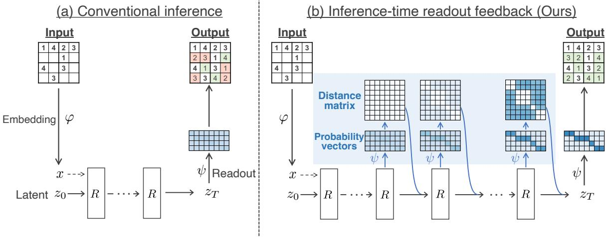  
Figure 1: Conventional inference vs. our method. (a) Conventional inference without feedback for a recurrent model. (b) Inference with RoFB. RoFB injects a feedback coupling into the latent dynamics based on the distance between readout probabilities, leaving all model weights unchanged.

In this work, we propose Readout Feedback (RoFB), a closed-loop inference-time intervention for recurrent reasoning models (Fig. 1). RoFB is motivated by a simple observation about successful recurrent inference: as a trajectory approaches a correct solution, tokens develop a class-dependent cluster structure in latent space. Tokens predicted to belong to the same class become aligned, while tokens assigned to different classes become separated. RoFB uses the model’s own readout probabilities to turn this observation into a feedback signal. At each selected inference step, it injects a coupling term into the latent dynamics that encourages token clustering based on the distance between tokens readout probabilities, while leaving all model weights unchanged.

We evaluate RoFB on Sudoku and Maze using three complementary recurrent reasoners with distinct architectural designs: AKOrN, a single-level oscillator-inspired model [Miyato et al., 2024]; ItrSA++ [Kubo et al., 2026], a strong iterative self-attention model for these benchmarks; and TRM [Jolicoeur-Martineau, 2025], a compact hierarchical recursive model. Across these models and tasks, RoFB improves inference performance without retraining, and its gains are complementary to confidence-based voting when voting is applicable. We further analyze performance as a function of inference steps, trajectory count, and normalized inference compute, showing that RoFB improves not only final accuracy but also the compute-accuracy trade-off of recurrent reasoning. These results suggest that frozen recurrent reasoners contain underutilized inference-time capability that can be unlocked by closed-loop control of their latent dynamics.

## 2 Preliminaries

## 2.1 Recurrent Models for Reasoning

We first give the general setups for the recurrent models considered in this paper (Fig. 1 (a)). In a nutshell, these models consist of three main components: (I) an input embedding map φ, (II) a recurrent module $R ,$ and (III) a readout head ψ.

More specifically, the input embedding φ maps the raw input tokens $\mathbf { x } _ { \mathrm { r a w } } = \{ \mathbf { x } _ { \mathrm { r a w } } ^ { ( i ) } \} _ { i = 1 } ^ { N } \in \{ 1 , \dots , V \} ^ { N }$ to a fixed embedding $\mathbf { x } = \{ \mathbf { x } ^ { ( i ) } = \varphi ( \mathbf { x } _ { \mathrm { r a w } } ^ { ( i ) } ) \} _ { i = 1 } ^ { N } \in \mathbb { R } ^ { N \times D }$ , where V is the vocabulary size, N is the number of tokens, and D is the embedding dimension. The recurrent module R iteratively applies an update to the latent state $\mathbf { z } _ { t } = \{ \mathbf { z } _ { t } ^ { ( i ) } \} _ { i = 1 } ^ { N } \in ( \mathbb { R } ^ { D } ) ^ { N }$ over T steps:

$$
\begin{array} { r } { \mathbf { z } _ { t + 1 } ^ { ( i ) } = R ^ { ( i ) } ( \mathbf { z } _ { t } ; \mathbf { x } ) , \quad t = 0 , 1 , \ldots , T - 1 . } \end{array}\tag{1}
$$

This stepwise update can be a discretization of a continuous-time update: $\dot { \mathbf { z } } _ { t } ^ { ( i ) } = f ^ { ( i ) } ( \mathbf { z } _ { t } ; \mathbf { x } ) , \ t \in [ 0 , T ]$ . Each latent token $\mathbf { z } _ { t } ^ { ( i ) }$ is typically confined to a compact manifold $\mathcal { M } \subset \mathbb { R } ^ { D }$ (e.g., the D-dimensional hypersphere). The initial value $\mathbf { z } _ { 0 } \in \mathcal { M }$ is either randomly sampled from a certain distribution, or learned as a fixed parameter. After $T$ steps, the readout head $\psi : \mathcal { M }  \mathbb { R } ^ { C }$ , usually a multi-layer perceptron (MLP) of a few layers, produces a per-token probability vector $\mathbf { p } ^ { ( i ) } = \mathrm { s o f t m a x } ( \psi ( \mathbf { z } _ { T } ^ { ( i ) } ) )$ , where $C$ is the number of output classes.

As specific models, we selected three representative recurrent models for reasoning tasks in the present study: AKOrN [Miyato et al., 2024], ItrSA++ [Kubo et al., 2026], and TRM [Jolicoeur-Martineau, 2025]. We made this choice based on their strong performance in reasoning tasks and their diverse architectural designs including hierarchical structure and latent state geometry. The key architectural differences are summarized in Table 1. In what follows, we describe the specific architectures of the three recurrent models in detail.

## 2.2 AKOrN

Artificial Kuramoto Oscillatory Neurons (AKOrN) [Miyato et al., 2024] is a recurrent model with strong performance in reasoning tasks, such as Sudoku, Maze, and object recognition. In AKOrN, each latent token $\mathbf { z } _ { t } ^ { ( i ) }$ resides on the manifold $( \bar { \mathbb { S } ^ { m - 1 } } ) ^ { D / m }$ , where m is the oscillator dimension, and follows a Kuramoto oscillator [Kuramoto, 1984]-like dynamics;

$$
\Delta \mathbf { z } _ { t } ^ { ( i ) } = \mathrm { P r o j } _ { \mathbf { z } _ { t } ^ { ( i ) } } \left( \mathbf { x } ^ { ( i ) } + \sum _ { j } \mathbf { M } _ { t } ^ { ( i j ) } ( \mathbf { z } _ { t } ) \mathbf { z } _ { t } ^ { ( j ) } \right) , \quad \mathbf { z } _ { t + 1 } ^ { ( i ) } = \Pi \left[ \mathbf { z } _ { t } ^ { ( i ) } + \gamma \Delta \mathbf { z } _ { t } ^ { ( i ) } \right] .\tag{2}
$$

Here, $\mathbf { M } _ { t } ^ { ( i j ) }$ is a learnable coupling matrix, $\operatorname { P r o j } _ { \mathbf { z } } ( \mathbf { f } ) = \mathbf { f } - \langle \mathbf { f } , \mathbf { z } \rangle \mathbf { z }$ projects f onto the tangent space of $( \mathbb { S } ^ { m - 1 } ) ^ { D / r }$ m at $\mathbf { z } , \Pi ( \cdot ) = \cdot / \Vert \cdot \Vert$ is the token-wise normalization operator that projects each token back to the product sphere, $\mathbf { z } _ { t } = \{ \mathbf { z } _ { t } ^ { ( i ) } \} _ { i = 1 } ^ { N }$ is the collection of all latent states, and $\gamma$ is a learnable step size. The coupling matrix $\mathbf { M } _ { t } ^ { ( i j ) }$ is implemented as the self-attention output of the current latent state, allowing learnable all-to-all coupling among tokens. We deliberately drop the natural-frequency term $\Omega _ { i }$ present in the original formulation, for simplicity.

In this work, after a brief exploration of several design choices, we implement AKOrN in a slightly modified form using a normalization-free transformer:

$$
\Delta \mathbf { z } _ { t } ^ { ( i ) } = \mathrm { P r o j } _ { \mathbf { z } _ { t } ^ { ( i ) } } \left( \mathrm { m l p } \left[ \left( \mathbf { z } _ { t } + \mathbf { x } + \mathrm { S e l f A t t n } ( \mathbf { z } _ { t } + \mathbf { x } ) \right) ^ { ( i ) } \right] \right) ,\tag{3}
$$

where mlp is a two-layer feed-forward network with a GELU activation, and SelfAttn is a multi-head self-attention block with a positional encoding.

## 2.3 ItrSA++

ItrSA++ is another recurrent model proposed in [Kubo et al., 2026], which shows even stronger reasoning capabilities in Sudoku and Maze. Unlike AKOrN, ItrSA++ is designed to have a two-level hierarchy, where the low-level process z is designed to capture fast-changing finer details, while the high-level process $\mathbf { y }$ is expected to capture more slower-changing global structure. In the low-level process $\mathbf { z } ,$ the dynamics is updated as follows:

$$
\mathbf { z } _ { t + 1 } ^ { ( i ) } = \left\{ \begin{array} { l l } { \mathrm { R N } \left( \mathbf { z } _ { t } ^ { ( i ) } + \mathrm { S e l f A t t n } ( \mathbf { z } _ { t } ) \right) } & { \mathrm { i f } t \not \equiv 0 \pmod { L } , } \\ { \mathrm { R N } \left( \mathbf { z } _ { t } ^ { ( i ) } + \mathrm { C r o s s A t t n } \left( \mathrm { R N } ( \mathbf { y } _ { t } ) , \mathrm { R N } ( \mathbf { x } ) \right) \right) } & { \mathrm { i f } t \equiv 0 \pmod { L } , } \end{array} \right.\tag{4}
$$

where RN denotes the RMS normalization. The high-level process $\mathbf { y }$ is updated every $L$ steps:

$$
\mathbf { y } _ { t + 1 } ^ { ( i ) } = { \left\{ \begin{array} { l l } { \operatorname { R N } \left( \mathbf { z } _ { t } ^ { ( i ) } + \operatorname { S w i G L U } ( \mathbf { z } _ { t } ^ { ( i ) } ) \right) } & { { \mathrm { i f ~ } } t \equiv 0 { \pmod { L } } , } \\ { \mathbf { y } _ { t } ^ { ( i ) } } & { { \mathrm { o t h e r w i s e } } . } \end{array} \right. }\tag{5}
$$

The latent state space of ItrSA++ can be identified with $\mathbb { S } ^ { D - 1 } ( { \sqrt { D } } )$ thanks to the RMS normalization.

Table 1: Architectural differences of the models used in this work. The table summarizes the key architectural features of the three recurrent models (AKOrN, ItrS $\mathrm { { . A } } { + } { + }$ , and TRM) analyzed in this paper, including their latent state geometry, coupling mechanism, and readout strategy.
<table><tr><td>Model</td><td>Hierarchy</td><td>Latent Space</td><td>Initial Value</td><td>Input Injection</td></tr><tr><td>AKOrN</td><td>single-level</td><td> $( \mathbb { S } ^ { m - 1 } ) ^ { D / m }$ </td><td>Random, unlearned</td><td>Every step</td></tr><tr><td>ItrSA++</td><td>two-level</td><td> $\dot { \mathbb { S } } ^ { D - 1 } ( \sqrt { D } )$ </td><td>Random, unlearned</td><td>Every L steps</td></tr><tr><td>TRM</td><td>two-level</td><td> $\mathbb { S } ^ { D - 1 } ( \sqrt { D } )$ </td><td>Fixed, learned</td><td>Every step</td></tr></table>

## 2.4 Tiny Recursive Model (TRM)

TRM [Jolicoeur-Martineau, 2025] is another recurrent model with strong performance in reasoning benchmark tasks, such as Sudoku, Maze, and ARC-AGI [Chollet, 2019, Chollet et al., 2026]. Proposed as a simplified version of the groundbreaking Hierarchical Reasoning Model (HRM) [Wang et al., 2025], TRM shows even more powerful reasoning capabilities while reducing model size and computational complexity. TRM has a two-level hidden-state hierarchy, which is designed to capture both global structure and local details in the reasoning process. The low-level process z, designed to capture local details, is updated as follows:

$$
\begin{array} { r } { \mathbf { z } _ { t + 1 } ^ { ( i ) } = \left[ \mathrm { T F } _ { n } \big ( \mathbf { z } _ { t } + \mathbf { y } _ { t } + \mathbf { x } \big ) \right] ^ { ( i ) } . } \end{array}\tag{6}
$$

Here, $\mathrm { T F } _ { n }$ is an n-layer transformer block. The high-level process y, on the other hand, is updated only every L steps to capture the global structure of the problem:

$$
\begin{array} { r } { \mathbf { y } _ { t + 1 } ^ { ( i ) } = \left\{ \begin{array} { l l } { \mathrm { T F } _ { n } \big ( \mathbf { z } _ { t } ^ { ( i ) } + \mathbf { y } _ { t } ^ { ( i ) } \big ) } & { \mathrm { i f } t \equiv 0 \pmod { L } , } \\ { \mathbf { y } _ { t } ^ { ( i ) } } & { \mathrm { o t h e r w i s e } . } \end{array} \right. } \end{array}\tag{7}
$$

Each $\mathbf { z } _ { t } ^ { ( i ) }$ lies on $\mathbb { S } ^ { D - 1 } ( { \sqrt { D } } )$ thanks to an RMS normalization [Zhang and Sennrich, 2019] at the end of each update. The readout is applied to the high-level state $\mathbf { y } _ { t }$ after a certain number of recursions, producing the final output of the model.

## 3 Readout Feedback (RoFB)

## 3.1 Inter-token Clusterization

Before explaining our method RoFB, we first inspect how tokens in the latent space behave during the inference dynamics, taking inference trajectories of AKOrN on a Sudoku task as examples.

We observe that the inference dynamics typically has three qualitatively different phases: (i) a “wandering” phase where the prediction stays only partially correct and unconfident (i.e., large total cell entropy, $t = 0$ to t ≈ 120 in Fig. 2), (ii) an “Aha” phase where the entropy suddenly plummets and the prediction becomes very certain $( t \approx 1 2 0 )$ , and (iii) a solution phase where the prediction is correct and confident (t ≈ 120 to t = 256).

We observe that this sudden plummet in entropy corresponds to the point where the prediction becomes correct. That is, if the model is run for $T = 2 5 6$ inference steps, then a trajectory that can solve a puzzle has its $\ddot { \bf \Phi } ^ { 6 6 } { \bf h } \dot { \bf { q } } ^ { , 9 }$ phase before $t = 2 5 6$ , while a trajectory that cannot solve the puzzle does not exhibit such a phase within $t = 2 5 6$ . The “Aha” timing depends on the initial value even when the input puzzle is identical. This can be explained by the dynamics first being trapped at a local minima, after which it escapes the local minima and converges to a global minimum [Li et al., 2023]

Although the above picture provides an overview of the inference behaviors, what has been overlooked is the token-wise behavior during these phases, specifically, how tokens are positioned relative to each other in the latent space. The lower half of Fig. 2 demonstrates the token pair-wise cosine similarity along the inference dynamics. Note that the token indices are rearranged so that blank tokens classified into 1, 2, · · · , 9 are followed by input tokens classified into $1 , 2 , \cdots , 9$ in this order. We can see that, initially during the wandering phase, almost every blank token pair has a large similarity value ≈ 1.0, indicating that the tokens are aligned regardless of the classes to which they truly belong. But once the puzzle has been solved, the tokens make cluster representation; tokens of the same class are well aligned, having large cosine similarity around 1.0, while those representing different classes have lower with cosine similarity (Fig. 2, Bottom, Solved sample, t = 200). On the other hand, in an unsolved sample, the tokens do not make such a cluster representation, and the cosine similarity values stay larger regardless of the targets and are less structured (Fig. 2, Bottom, Unsolved sample, t = 200).

From these observations, we hypothesize that for the recurrent models to solve a problem, the tokens need to be clustered according to the classes they represent. That is, the tokens representing the same class need to be aligned, while those representing different classes need to be separated. Based on this hypothesis, we propose RoFB, which is described in the following section.

## 3.2 RoFB

RoFB realizes the above idea by inserting a feedback coupling term that depends on the distance between readout probability vectors. If two tokens have similar readout probability vectors, we encourage the alignment of the two. Conversely, if two tokens have different readout probability vectors, we discourage the alignment of the two.

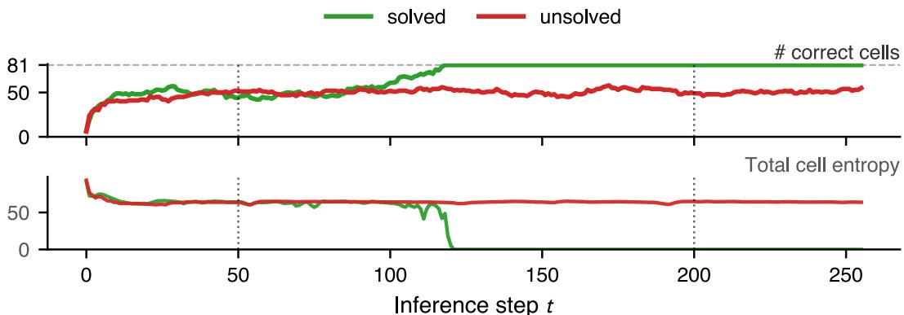

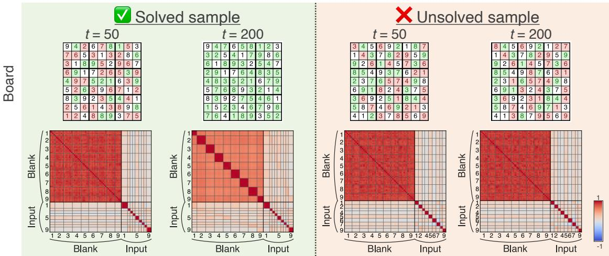  
Figure 2: (Top) Correct cell count and total cell entropy $\begin{array} { r } { ( \mathbf { i . e . , } \sum _ { i j } H ( \mathbf { p } ^ { i j } ) ) } \end{array}$ in two inference trajectories of the same Sudoku puzzle. The inference steps unroll until $t = 2 5 6$ . (Bottom) Cosine similarity matrices at each timestep. The token indices are rearranged so that blank tokens classified into $1 , 2 , \cdots , 9$ are followed by input tokens classified into $1 , 2 , \cdots { } , 9$ in this order.

We designed RoFB so that the dynamics retains the original forward information along with the feedback of the readout probability vectors. We implement this by a simple addition, that is,

$$
\mathbf { z } _ { t + 1 } ^ { ( i ) } = \Pi _ { \mathcal { M } } \left( R ^ { ( i ) } ( \mathbf { z } _ { t } , \mathbf { x } ) + \mathbf { \nabla } \lambda \cdot g ( \mathbf { z } _ { t } ) \cdot \mathrm { P r o j } _ { \mathbf { z } _ { t } ^ { ( i ) } } \left( \sum _ { j \neq i } \tilde { J } _ { t } ^ { ( i j ) } \Big ( \mathbf { p } _ { t } ^ { ( i ) } , \mathbf { p } _ { t } ^ { ( j ) } \Big ) \mathbf { z } _ { t } ^ { ( j ) } \right) \right) .\tag{8}
$$

Here, $\tilde { J } _ { t } ^ { ( i j ) }$ is the normalized coupling term that reflects the distance between the readout probability vectors $\mathbf { p } _ { t } ^ { ( i ) }$ and $\mathbf { p } _ { t } ^ { ( j ) }$ , g a gate function, and λ a scaling hyperparameter. The Proj operator projects the feedback term to the tangent space of the manifold M at $\mathbf { z } _ { t } ^ { ( i ) }$ , which ensures that the dynamics stays on the manifold, and $\Pi _ { \mathcal { M } }$ is a projection to the manifold M. We provide more detailed explanation on the coupling term $\tilde { J } _ { t } ^ { ( i j ) }$ and the gate function g in the following.

Coupling J˜. The coupling term $\tilde { J } _ { t } ^ { ( i j ) }$ is a scalar defined as

$$
\tilde { J } _ { t } ^ { ( i j ) } = J _ { t } ^ { ( i j ) } / \nu ^ { ( i ) } , \quad J _ { t } ^ { ( i j ) } \left( \mathbf { p } _ { t } ^ { ( i ) } , \mathbf { p } _ { t } ^ { ( j ) } \right) = h \left( d \left( \mathbf { p } _ { t } ^ { ( i ) } , \mathbf { p } _ { t } ^ { ( j ) } \right) \right) ,\tag{9}
$$

where h is a non-increasing function, $\nu ^ { ( i ) }$ is a certain normalization term $\begin{array} { r } { ( \mathrm { e . g . , } \nu ^ { ( i ) } = \sum _ { k \neq i } | J _ { t } ^ { ( i k ) } | } \end{array}$ : signed sum), d a bounded distance function such as $d ( x , y ) = 1 - x ^ { \top } y \in [ 0 , 1 ] , \mathbf { p } _ { t } ^ { ( i ) }$ the readout probability vector of the i-th token, $\mathbf { p } _ { t } ^ { ( i ) } = \mathrm { s o f t m a x } \Big ( \psi \Big ( \mathbf { z } _ { t } ^ { ( i ) } \Big ) \Big ) \in \Delta ^ { C - 1 } : = \{ \mathbf { p } \in [ 0 , 1 ] ^ { C } \mid p _ { 1 } + \cdot \cdot \cdot + p _ { C } = 1 \}$ , We typically set h as $h ( 0 ) \geqslant 0 \geqslant h ( 1 )$ so that the coupling is attractive for tokens with similar readout distributions $( d \to 0 )$ and repulsive for dissimilar ones (d → 1).

Although Eq. (9) permits an attractive-repulsive coupling, all experiments in this paper use the repulsive instantiation $h ( d ) = - d$ . Therefore, the implemented RoFB should be interpreted as discouraging collapse among tokens with dissimilar readout distributions, rather than explicitly attracting tokens with similar readouts.

For tasks with pre-given clue tokens (Sudoku, Maze), RoFB is applied only to blank-cell tokens: the update in Eq. (8) is restricted to $\bar { i } \in \bar { \boldsymbol { B } }$ and the inner sum to $\textstyle \sum _ { j \in B , j \neq i }$ , where $B \subset \{ 1 , \ldots , \dot { N } \}$ is the set of blank-cell indices. We retain the unrestricted form in Eq. (8) for notational simplicity.

Gate g. The gate function $g ( \mathbf { z } _ { t } )$ is designed to turn on the feedback term only when the model is considered to be in the wandering phase. One way to implement this is, after running the original inference dynamics for a certain number of steps, using a confidence check function that turns on when the entropy is higher than a certain threshold. That is, we can set

$$
g ( \mathbf { z } _ { t } ) : = \underbrace { 1 [ t \geqslant t _ { \operatorname* { m i n } } ] } _ { \mathrm { W a r m u p } } \underbrace { \sigma \Big ( \frac { \operatorname* { m a x } _ { i } H _ { t } ^ { ( i ) } - \alpha H _ { \mathrm { u n i f } } } { \tau } \Big ) } _ { \mathrm { C o n f i d e n c e c h e c k } } ,\tag{10}
$$

where $1 [ \cdot ]$ is the indicator function, σ is the sigmoid function with temperature τ, $H _ { t } ^ { ( i ) }$ is the entropy of the readout probability vector of token i at time $t , H \mathrm { { _ { u n i f } } }$ is the entropy of the uniform distribution, and α is a preset threshold.

Hyperparameter Setups. RoFB typically requires only a small number of hyperparameters. For example, in the above gate function design, we have four hyperparameters: $\lambda , t _ { \operatorname* { m i n } } , \alpha .$ , and τ. The selection of these hyperparameters can be done by grid search or by using automated hyperparameter tuning tools such as Optuna [Akiba et al., 2019].

## 4 Related Work

Iterative Reasoning Models. Dating back to early works such as Universal Transformer [Dehghani et al., 2018] and Deep Equilibrium Models [Bai et al., 2019], the concept of using shared computation blocks multiple times has demonstrated the enormous potential in solving complex tasks such as learning various algorithms [Yang et al., 2023] and end-to-end algorithm synthesis with recurrent networks [Bansal et al., 2022]. Such recurrent architectures have been also applied to language models and have been shown to be effective in logical reasoning such as math problems [Geiping et al., 2025, Bae et al., 2024, Zhu et al., 2025]. More recently, a series of compact recurrent/looped models explicitly targeting reasoning benchmarks, AKOrN [Miyato et al., 2024], HRM [Wang et al., 2025], TRM [Jolicoeur-Martineau, 2025], URM [Gao et al., 2025] and ItrSA++ [Kubo et al., 2026] have been proposed, showing that recursive latent updates themselves provide a strong inductive bias for combinatorial reasoning tasks like Sudoku, Maze, and ARC-AGI.

Internal Dynamics of Recurrent Reasoners. While the internal mechanisms of recurrent models in LLMs are gradually being analyzed [Geiping et al., 2025, Lu et al., 2025, Blayney et al., 2026], the internal mechanisms of distilled compact models (HRM, TRM, etc.) are less well understood. Ren and Liu [2026] propose a learning rule that scales resolution in time from the dynamic characteristics of HRM, but RoFB is designed to leverage these characteristics to steer inference, which has been an open question. Theoretical analyses of the internal dynamics of recurrent Transformers include Geshkovski et al. [2023, 2024], which show the cluster-forming dynamics of recurrent self attention dynamics.

Test-time Intervention. Inference-time improvement has been studied broadly in large language models through prompting, sampling, and compute-allocation techniques [Wei et al., 2022, Wang et al., 2022, Yao et al., 2023, Zhou et al., 2022, Zhai et al., 2026], all of which compare or aggregate candidate outputs rather than intervening in the latent computation. The nearest neighbor specialised for recurrent reasoners is C-voting [Kubo et al., 2026], which selects among multiple latent trajectories using a confidence signal; RoFB differs in two respects—it operates on a single trajectory rather than a set, and uses the readout signal to deform the latent dynamics during inference rather than to score completed candidates.

Output-space Refinement. A broad line of work refines predictions or representations by exploiting relationships in output space, such as confidence, neighborhood structure, or similarity between predicted probability vectors. In structured prediction, dense CRFs and CRF-RNN refine unary neural predictions through pairwise inference, encouraging mutually compatible labels for related variables [Krähenbühl and Koltun, 2012, Zheng et al., 2015]. In source-free adaptation and clustering, methods such as NRC [Yang et al., 2021], AaD [Yang et al., 2022], and related batch-wise similarity objectives [Pathak and Balasubramanian, 2026] use prediction consistency, attraction, dispersion, or anti-collapse terms to improve target-domain predictions without source labels. Deep clustering methods similarly refine soft assignments by sharpening confident predictions or enforcing consistency among neighboring samples [Xie et al., 2015, Ji et al., 2018, Van Gansbeke et al., 2020]. RoFB shares the principle that output distributions contain useful relational structure, but rather than optimizing a training or adaptation loss, RoFB uses the intermediate readout probabilities of a frozen recurrent reasoning model at inference time.

## 5 Experiments

We evaluate RoFB on two benchmarks, Sudoku and Maze, with the three models described earlier.

Sudoku is a logic-based combinatorial number-placement puzzle. The objective is to fill $\mathbf { a \ 9 \times 9 }$ grid with digits so that each column, each row, and each of the nine $3 \times 3$ subgrids contains all of the digits from 1 to 9. Following the prior works [Wang et al., 2025, Kubo et al., 2026], we used Sudoku Extreme dataset, and applied the same preprocessing and augmentation techniques. We tested with 20,000 puzzle boards randomly sampled from all test boards.

Maze is a pathfinding problem where the goal is to find a shortest path from a starting point to a target point in a $3 0 \times 3 0$ grid environment with obstacles. Following the prior works [Wang et al., 2025, Kubo et al., 2026], we used Maze Hard dataset, and applied the same preprocessing techniques. We tested with all 1,000 puzzle boards.

Training. For each task, we trained the models on each task using truncated backpropagation through time [Aicher et al., 2019] following the prior works [Wang et al., 2025, Kubo et al., 2026]; see Appendix A.

Evaluation. For AKOrN and ItrSA++, we evaluated the performance of a model based on the readout after $T _ { \mathrm { e v a l } } \in$ {64, 128, 256} recurrence steps. We also evaluated model performances using confidence-based voting [Kubo et al., 2026] with $\dot { K _ { \mathrm { v o t e } } } \in \{ 1 , 2 , \cdots \operatorname { , } 6 4 \}$ , where trajectories are sampled with random initial values and the one minimizing the sum of entropy over all cells is selected as the final output.

For TRM, we evaluated the performance based on the readout after $T _ { \mathrm { e v a l } } = 1 6$ recurrence steps following the original evaluation protocol of this model [Wang et al., 2025]. We did not apply voting for TRM, as TRM learns a fixed initial value of the latent dynamics, rather than sampling it from a distribution, and thus the voting procedure is not applicable.

For Sudoku, we report board-level exact accuracy, where a prediction is correct only if all cells match the ground-truth board. For Maze, we report two metrics: shortest-path accuracy and valid-path accuracy. The task is to find a shortest path from the start to the goal, and the training label is given as one such shortest path. Since the labeled path is not necessarily the only path to the goal, shortest-path accuracy measures whether the model finds an optimal path, while valid-path accuracy measures whether the model reaches the goal with any valid path, regardless of optimality.

Hyperparameters are tuned on a validation set; see Appendix B.

Additional Computational Cost of RoFB. Since RoFB increases the computational cost per inference step, we evaluate performance based on FLOPs at each $K _ { \mathrm { v o t e } }$ and $T _ { \mathrm { e v a l } }$ value for a fair comparison. The increase in compute per trajectory and per step due to RoFB was kept small, within +20% (see Appendix Table 5). We also provide results based on wall time, including hyperparameter search, in the Appendix B, C. Since hyperparameter search is performed only once, the computational efficiency of RoFB improves as $K _ { \mathrm { v o t e } }$ and $T _ { \mathrm { e v a l } }$ increase.

## 5.1 Performance

Fig. 3 shows the compute-accuracy comparison of the baseline and RoFB across all model-task pairs. Blue and red colors represent the baseline and RoFB models, respectively, with darker shades representing larger $K _ { \mathrm { v o t e } }$ values. The shape of the marker represents the inference time steps. Since TRM does not use voting, only one shade is shown for TRM.

For every model-task pair except TRM on Maze, we observe that the performance generally improves with increasing $K _ { \mathrm { v o t e } }$ and $T _ { \mathrm { e v a l } }$ values in both baseline and RoFB models. The performance of TRM on Maze both at baseline and with RoFB shows a plateau, only a 0.1% decrease in performance with increasing inference time steps with RoFB.

Performance Gain of RoFB. We observe a clear performance boost with RoFB in four of the six model-task pairs (AKOrN on both tasks, ItrSA++ on Maze, and TRM on Sudoku) at the same or lower computational cost, while the performance was largely unchanged in the remaining two pairs (ItrSA++ on Sudoku, TRM on Maze) (Fig. 3). Crucially, in the four positive cells, RoFB reaches operating points that are unattainable by either prolonging $T _ { \mathrm { e v a l } }$ or increasing $K _ { \mathrm { v o t e } }$ in the baseline. For instance, for ItrSA++ on Maze, RoFB at $( K _ { \mathrm { v o t e } } { = } 1 , T _ { \mathrm { e v a l } } { = } 1 2 8 )$ achieves 83.6% shortest-path accuracy, exceeding the baseline at $( K _ { \mathrm { v o t e } } { = } 6 4 , T _ { \mathrm { e v a l } } { = } 2 5 6 )$ , 81.7%, at roughly 100× less inference compute. For AKOrN on Sudoku, RoFB at $( K _ { \mathrm { v o t e } } { = } 4 , T _ { \mathrm { e v a l } } { = } 2 5 6 )$ reaches 91.5% board accuracy, 6.4% above the baseline at the same operating point and not attained even by the baseline at $K _ { \mathrm { v o t e } } { = } 6 4$ . For TRM on Sudoku, where confidence-based voting is unavailable, RoFB lifts board accuracy from 68.4% to 74.2% (+5.8%) at $N _ { \mathrm { b l o c k } } { = } 1 6$ , demonstrating that the gain does not depend on the availability of a voting mechanism.

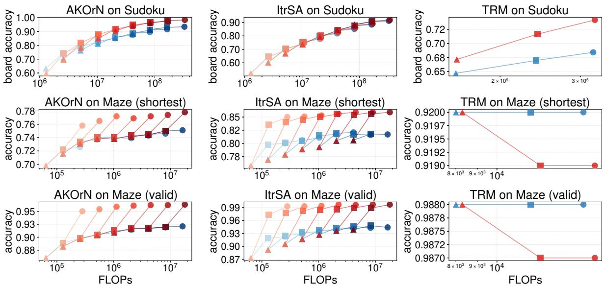  
Figure 3: Compute-accuracy comparison of baseline vs. RoFB on (model, task) pairs. Color encodes $K _ { \mathrm { v o t e } }$ count (Baseline blue / RoFB red, shade darkens with $K _ { \mathrm { v o t e } }$ from 1/1 to 64/64). Shape encodes the inference time steps T (▲, ■, • for $T = 6 4$ , 128, 256; $N _ { \mathrm { b l o c k } } \in \{ 8$ , 12, 16} for TRM). TRM on Maze panels use a compressed y-axis due to baseline saturation.

Although the performance boost with RoFB was small in ItrSA++ on Sudoku at the standard horizon, extending the inference steps further improved the RoFB performance, with about 1 pp gain at ${ T _ { \mathrm { e v a l } } } \mathrm { { = } } 1 0 2 4$ (Appendix D).

## 5.2 Mechanistic Analysis of Coupling

Sign-flipped RoFB. To better understand the mechanism of how RoFB works, we performed an intervention study by flipping the sign of the feedback signal. We did this to see whether the direction of the feedback signal drives the trajectory towards the correct attractor or cluster, which we suppose to be a key mechanism of RoFB. If this is the case, flipping the sign of the feedback should deteriorate the performance, as it would push the trajectory away from the correct cluster.

We find that the four model-task pairs with a performance boost from RoFB exhibit a large performance deterioration when the sign of the feedback

<table><tr><td>Model on Task</td><td>Baseline</td><td>RoFB</td><td>Sign-flipped RoFB</td></tr><tr><td>AKOrN on Sudoku</td><td>85.1%</td><td>91.5% (+6.4%)</td><td>69.8% (-15.3%)</td></tr><tr><td>AKOrN on Maze</td><td>74.1%</td><td>77.2% (+3.1%)</td><td>38.4% (-35.7%)</td></tr><tr><td>ItrSA++ on Sudoku</td><td>77.7%</td><td>78.3% (+0.6%)</td><td>76.9% (-0.8%)</td></tr><tr><td>ItrSA++ on Maze</td><td>81.1%</td><td>85.3% (+4.2%)</td><td>40.8% (-40.3%)</td></tr><tr><td>TRM on Sudoku</td><td>68.4%</td><td>74.2% (+5.8%)</td><td>59.0% (-9.4%)</td></tr><tr><td>TRM on Maze</td><td>92.0%</td><td>91.9% (-0.1%)</td><td>92.0% (± 0.0%)</td></tr></table>

Table 2: Performance deterioration with sign-flipped coupling. Evaluated at $K _ { \mathrm { v o t e } } = 4$ and $T _ { \mathrm { e v a l } } = 2 5 6$ for AKOrN and ItrSA++, and at $N _ { \mathrm { b l o c k } } = 1 6$ for TRM. Maze is evaluated with shortest-path accuracy.

is flipped, while the other two pairs show little to no change. This indicates that pushing the latent state along the clustering direction, which guides the trajectory toward the correct cluster when that cluster is not yet well formed, is crucial for RoFB’s effectiveness.

## 6 Limitations and Discussion

Our evidence is confined to two puzzle benchmarks (Sudoku Extreme, Maze Hard) and three small-scale recurrent reasoning architectures, and does not cover language models, to which a direct transfer is non-trivial. If RoFB is applied directly to LLMs, the large vocabulary size may dilute the inter-token coupling on which RoFB relies. Whether RoFB or such a variant provides additional gains to LLMs is left to future work.

Two of the six model-task pairs in our suite show no meaningful improvement under RoFB: ItrSA++ on Sudoku and TRM on Maze (Section 5). Notably, neither RoFB nor its sign-flipped counterpart shifts the accuracy of these two pairs by more than 1% (Table 2), in stark contrast to the four positive pairs, where sign-flipping degrades accuracy by 9 to 40% — suggesting that in these two pairs the coupling, in either sign, finds no direction in the latent dynamics on which to act. We currently lack an a priori diagnostic that would predict from the model and task alone whether RoFB will help; designing such a diagnostic is an important direction for future work.

Of the two null model-task pairs, TRM on Maze deserves a separate caveat: the baseline already attains 92.0% shortest-path and 98.8% valid-path accuracy, leaving little room for the validation-based hyperparameter search to discriminate RoFB configurations from the baseline. The flat objective surface during hyperparameter selection may itself contribute to the null result, independently of whether the underlying dynamics admits a useful coupling direction.

## 7 Conclusions

We proposed RoFB to enhance the inference performance of recurrent reasoning models. RoFB utilizes the readout probabilities during inference to provide feedback to the latent states. Our results showed that RoFB improves the inference performance in four model × task pairs out of six examined without requiring any retraining and with lower computational cost. Our results provide evidence that readout-based steering can complement existing inference-time strategies such as longer rollouts and multi-trajectory voting. While the present evidence is limited to puzzle-style benchmarks and compact recurrent reasoners, it suggests a promising direction for using intermediate predictions to control frozen recurrent dynamics at test time.

## Acknowledgments

Authors SK, MK, SJ, FU, KK, and KH are supported by computational resources of the TSUBAME4.0 supercomputer provided by Institute of Science Tokyo through the HPCI System Research Project (Project ID: hp260232).

## References

Christopher Aicher, N Foti, and E Fox. Adaptively truncating backpropagation through time to control gradient bias. Uncertainty in Artificial Intelligence, abs/1905.07473:799–808, May 2019.

Takuya Akiba, Shotaro Sano, Toshihiko Yanase, Takeru Ohta, and Masanori Koyama. Optuna: A next-generation hyperparameter optimization framework. arXiv [cs.LG], July 2019.

Sangmin Bae, Adam Fisch, Hrayr Harutyunyan, Ziwei Ji, Seungyeon Kim, and Tal Schuster. Relaxed recursive transformers: Effective parameter sharing with layer-wise LoRA. arXiv [cs.CL], October 2024.

Shaojie Bai, J Zico Kolter, and Vladlen Koltun. Deep equilibrium models. arXiv [cs.LG], September 2019.

Arpit Bansal, Avi Schwarzschild, Eitan Borgnia, Zeyad Emam, Furong Huang, Micah Goldblum, and Tom Goldstein. End-to-end algorithm synthesis with recurrent networks: Extrapolation without overthinking. In Advances in Neural Information Processing Systems, October 2022.

Hugh Blayney, Álvaro Arroyo, Johan Obando-Ceron, Pablo Samuel Castro, Aaron Courville, Michael M Bronstein, and Xiaowen Dong. A mechanistic analysis of looped reasoning language models. arXiv [cs.LG], April 2026.

Francois Chollet, Mike Knoop, Gregory Kamradt, Bryan Landers, and Henry Pinkard. ARC-AGI-2: A new challenge for frontier AI reasoning systems. arXiv [cs.AI], January 2026.

François Chollet. On the measure of intelligence. arXiv [cs.AI], November 2019.

Mostafa Dehghani, Stephan Gouws, Oriol Vinyals, Jakob Uszkoreit, and Lukasz Kaiser. Universal transformers. September 2018.

Zitian Gao, Lynx Chen, Yihao Xiao, He Xing, Ran Tao, Haoming Luo, Joey Zhou, and Bryan Dai. Universal reasoning model. arXiv [cs.AI], December 2025.

Jonas Geiping, Sean McLeish, Neel Jain, John Kirchenbauer, Siddharth Singh, Brian R Bartoldson, Bhavya Kailkhura, Abhinav Bhatele, and Tom Goldstein. Scaling up test-time compute with latent reasoning: A recurrent depth approach. arXiv [cs.LG], February 2025.

Borjan Geshkovski, Cyril Letrouit, Yury Polyanskiy, and Philippe Rigollet. A mathematical perspective on transformers. arXiv [cs.LG], December 2023.

Borjan Geshkovski, Hugo Koubbi, Yury Polyanskiy, and Philippe Rigollet. Dynamic metastability in the self-attention model. arXiv [cs.LG], October 2024.

Xu Ji, João F Henriques, and Andrea Vedaldi. Invariant information clustering for unsupervised image classification and segmentation. arXiv [cs.CV], July 2018.

Alexia Jolicoeur-Martineau. Less is more: Recursive reasoning with tiny networks. arXiv [cs.LG], October 2025.

Philipp Krähenbühl and Vladlen Koltun. Efficient inference in fully connected CRFs with gaussian edge potentials. arXiv [cs.CV], October 2012.

Kenji Kubo, Shunsuke Kamiya, Masanori Koyama, Kohei Hayashi, Yusuke Iwasawa, and Yutaka Matsuo. C-voting: Confidence-based test-time voting without explicit energy functions. arXiv [cs.LG], April 2026.

Y Kuramoto. Chemical oscillations, waves, and turbulence. Springer Series in Synergetics. Springer, Berlin, Germany, 1984 edition, September 1984.

Liam Li, Kevin Jamieson, Afshin Rostamizadeh, Ekaterina Gonina, Moritz Hardt, Benjamin Recht, and Ameet Talwalkar. A system for massively parallel hyperparameter tuning. arXiv [cs.LG], October 2018.

Xianming Li, Zongxi Li, Xiaotian Luo, Haoran Xie, Xing Lee, Yingbin Zhao, Fu Lee Wang, and Qing Li. Recurrent attention networks for long-text modeling. arXiv [cs.CL], June 2023.

Ilya Loshchilov and Frank Hutter. Decoupled weight decay regularization. arXiv [cs.LG], November 2017.

Wenquan Lu, Yuechuan Yang, Kyle Lee, Yanshu Li, and Enqi Liu. Latent chain-of-thought? decoding the depthrecurrent transformer. arXiv [cs.CL], September 2025.

Takeru Miyato, Bernhard Jaeger, Max Welling, and Andreas Geiger. GTA: A geometry-aware attention mechanism for multi-view transformers. arXiv [cs.CV], October 2023.

Takeru Miyato, Sindy Löwe, Andreas Geiger, and Max Welling. Artificial kuramoto oscillatory neurons. arXiv [cs.LG], October 2024.

Harsharaj Pathak and Vineeth N Balasubramanian. Source-free domain adaptation by optimizing batch-wise cosine similarity. arXiv [cs.CV], January 2026.

Zirui Ren and Ziming Liu. Are your reasoning models reasoning or guessing? a mechanistic analysis of hierarchical reasoning models. arXiv [cs.AI], March 2026.

Nikunj Saunshi, Nishanth Dikkala, Zhiyuan Li, Sanjiv Kumar, and Sashank J Reddi. Reasoning with latent thoughts: On the power of looped transformers. arXiv [cs.CL], February 2025.

Wouter Van Gansbeke, Simon Vandenhende, Stamatios Georgoulis, Marc Proesmans, and Luc Van Gool. SCAN: Learning to classify images without labels. arXiv [cs.CV], May 2020.

Guan Wang, Jin Li, Yuhao Sun, Xing Chen, Changling Liu, Yue Wu, Meng Lu, Sen Song, and Yasin Abbasi Yadkori. Hierarchical reasoning model. arXiv [cs.AI], June 2025.

Xuezhi Wang, Jason Wei, Dale Schuurmans, Quoc Le, Ed Chi, Sharan Narang, Aakanksha Chowdhery, and Denny Zhou. Self-consistency improves chain of thought reasoning in language models. arXiv [cs.CL], March 2022.

Jason Wei, Xuezhi Wang, Dale Schuurmans, Maarten Bosma, Brian Ichter, Fei Xia, Ed Chi, Quoc Le, and Denny Zhou. Chain-of-thought prompting elicits reasoning in large language models. arXiv [cs.CL], January 2022.

Junyuan Xie, Ross Girshick, and Ali Farhadi. Unsupervised deep embedding for clustering analysis. arXiv [cs.LG], November 2015.

Liu Yang, Kangwook Lee, Robert Nowak, and Dimitris Papailiopoulos. Looped transformers are better at learning learning algorithms. arXiv [cs.LG], November 2023.

Shiqi Yang, Yaxing Wang, Joost van de Weijer, Luis Herranz, and Shangling Jui. Exploiting the intrinsic neighborhood structure for source-free domain adaptation. arXiv [cs.CV], October 2021.

Shiqi Yang, Yaxing Wang, Kai Wang, Shangling Jui, and Joost van de Weijer. Attracting and dispersing: A simple approach for source-free domain adaptation. arXiv [cs.CV], May 2022.

Shunyu Yao, Dian Yu, Jeffrey Zhao, Izhak Shafran, Thomas L Griffiths, Yuan Cao, and Karthik Narasimhan. Tree of thoughts: Deliberate problem solving with large language models. arXiv [cs.CL], May 2023.

Zhiyuan Zhai, Bingcong Li, Bingnan Xiao, Ming Li, and Xin Wang. Adaptive test-time compute allocation for reasoning LLMs via constrained policy optimization. arXiv [cs.LG], April 2026.

Biao Zhang and Rico Sennrich. Root mean square layer normalization. arXiv [cs.LG], October 2019.

Shuai Zheng, Sadeep Jayasumana, Bernardino Romera-Paredes, Vibhav Vineet, Zhizhong Su, Dalong Du, Chang Huang, and Philip H S Torr. Conditional random fields as recurrent neural networks. arXiv [cs.CV], February 2015.

Denny Zhou, Nathanael Schärli, Le Hou, Jason Wei, Nathan Scales, Xuezhi Wang, Dale Schuurmans, Claire Cui, Olivier Bousquet, Quoc Le, and Ed Chi. Least-to-most prompting enables complex reasoning in large language models. arXiv [cs.AI], May 2022.

Rui-Jie Zhu, Zixuan Wang, Kai Hua, Tianyu Zhang, Ziniu Li, Haoran Que, Boyi Wei, Zixin Wen, Fan Yin, He Xing, Lu Li, Jiajun Shi, Kaijing Ma, Shanda Li, Taylor Kergan, Andrew Smith, Xingwei Qu, Mude Hui, Bohong Wu, Qiyang Min, Hongzhi Huang, Xun Zhou, Wei Ye, Jiaheng Liu, Jian Yang, Yunfeng Shi, Chenghua Lin, Enduo Zhao, Tianle Cai, Ge Zhang, Wenhao Huang, Yoshua Bengio, and Jason Eshraghian. Scaling latent reasoning via looped language models. arXiv [cs.CL], November 2025.

## A Experimental setup

Tasks and datasets. We evaluate three iterative reasoners — AKOrN [Miyato et al., 2024], ItrSA++ [Kubo et al., 2026], and TRM [Jolicoeur-Martineau, 2025] — on two combinatorial reasoning tasks: Sudoku Extreme (9×9 grid, 1,000 base puzzles augmented to ∼1,001,000 training samples; 422,786 test puzzles) and Maze Hard (30×30 grid, 1,000 train / 1,000 test). Both datasets are shared across all three models — same training split, same test split, same vocabulary — so that any across-model gap reflects architecture and training choices, not data.

Training protocol. All three models are trained from scratch with AdamW [Loshchilov and Hutter, 2017], truncated backpropagation through time (TBPTT) [Aicher et al., 2019, Kubo et al., 2026], where the backpropagation gradients are computed only on the last fixed number of steps. The parameters were renewed with an exponential moving average (EMA). We follow each model’s published recipe for the model-specific hyperparameters. Full hyperparameters are in Appendix E (Tables 6–8).

## B Hyperparameter Search for RoFB

For each model-task pair, we perform a single hyperparameter sweep over a scaling parameter λ and three RoFB gate parameters $\alpha , t _ { \mathrm { m i n } } , \tau$ defined in Eqs. (8) and (10). Beyond these four parameters, we fixed the coupling function to $\dot { h } ( d ) = - d ,$ , representing repulsive feedback, which is held constant across the tasks and models.

We used Optuna [Akiba et al., 2019] with the TPE sampler and additionally enable the Successive Halving Pruner [Li et al., 2018] (an ASHA-style pruner with reduction factor $\eta = 3$ and $\mathrm { m i n } _ { \mathrm { r e s o u r c e } } = 1 )$ for all model-task pairs, running $n _ { \mathrm { t r i a l } } = 3 0$ trials per pair. The pruner reports intermediate validation accuracy after each of $n _ { \mathrm { c h u n k s } }$ disjoint chunks of the validation set: $n _ { \mathrm { c h u n k s } } = 4$ for Sudoku tasks $( N _ { \mathrm { v a l } } = 5 0 0 , \mathrm { i . e . }$ . 125 boards per chunk) and $n _ { \mathrm { c h u n k s } } = 2$ for Maze tasks $( N _ { \mathrm { v a l } } = 1 0 0 , \mathrm { i . e . } 5 0$ boards per chunk). Each trial evaluates a single $( \lambda , \alpha , t _ { \mathrm { m i n } } , \tau )$ tuple by running inference with RoFB on the full validation set at a single operating point $( K _ { \mathrm { v o t e } } = 1$ and $T _ { \mathrm { e v a l } }$ matching the canonical training-time inference budget per model: 256 Kuramoto steps for AKOrN, 256 self-attention steps (= 64 outer blocks) for ItrSA++, 16 outer steps for TRM), and computes the aggregated accuracy over all validation boards (board accuracy for Sudoku; shortest path accuracy for Maze). The validation set $\mathcal { V } _ { \mathrm { a u g } }$ consists of the first $N _ { \mathrm { v a l } }$ boards of the training set, with one task-specific symmetry-group augmentation applied per board. The best tuple is selected by the aggregated validation accuracy and is then reused at every $( K , T )$ operating point in Fig. 3, treating the sweep as a one-time per-cell compute cost that we account for separately in Section C.

Table 3: Search space and Optuna configuration of the four-axis RoFB hyperparameter sweep. λ and τ are sampled log-uniformly; α uniformly; $t _ { \mathrm { m i n } }$ as integers in steps of 8. The Successive Halving Pruner uses $\eta = 3 , \mathrm { { m i n } _ { r e s o u r c e } = 1 }$ for both tasks.
<table><tr><td>Task</td><td>λ</td><td>α</td><td> $t _ { \mathrm { m i n } }$ </td><td>T</td><td> $N _ { \mathrm { v a l } }$ </td><td> $n _ { \mathrm { t r i a l } }$ </td><td> $n _ { \mathrm { c h u n k s } }$ </td></tr><tr><td>Sudoku</td><td>[0.01, 2.0]</td><td>[0.01, 0.50]</td><td> $\{ 0 , 8 , \dots , 1 2 8 \}$ </td><td>[0.005, 2.0]</td><td>500</td><td>30</td><td>4</td></tr><tr><td>Maze</td><td>[0.005, 0.5]</td><td>[0.01, 0.50]</td><td> $\{ 0 , 8 , \dots , 1 2 8 \}$ </td><td>[0.005, 2.0]</td><td>100</td><td>30</td><td>2</td></tr></table>

## C Computational cost of RoFB

Here we explain the additional compute introduced by RoFB at test time, relative to a baseline forward pass. The two sources of overhead are (i) the one-time hyperparameter sweep and the (ii) the per-step RoFB block inserted into every test forward pass. The former is a fixed cost across all $( K , T )$ operating points, while the latter scales with the baseline compute and shifts the RoFB curve to the right by a constant factor on a log-compute axis.

Table 4: Best hyperparameter values selected by the sweep and the achieved aggregated validation accuracy. $t _ { \mathrm { m i n } }$ is reported in the sweep-internal time unit (Kuramoto steps for AKOrN; self-attention steps for ItrSA++; L-level steps for TRM, where one TRM outer step = 18 L-level steps on Sudoku and 12 on Maze).
<table><tr><td>Task × Model</td><td>λ</td><td> $\alpha$ </td><td> $t _ { \mathrm { m i n } }$ </td><td> $\tau$ </td><td>best val acc</td><td>metric</td></tr><tr><td>AKOrN × Sudoku</td><td>1.949</td><td>0.281</td><td>16</td><td>1.552</td><td>1.000</td><td>board accuracy</td></tr><tr><td> $\mathbf { A K O r N } \times \mathbf { M a z e }$ </td><td>0.394</td><td>0.195</td><td>128</td><td>0.141</td><td>0.750</td><td>shortest path accuracy</td></tr><tr><td> $\mathrm { I t r } \mathrm { S A } { + } + \times \mathrm { S u d o k u }$ </td><td>0.028</td><td>0.012</td><td>64</td><td>0.461</td><td>0.706</td><td>board accuracy</td></tr><tr><td> $\mathrm { I t r } \mathrm { S A } \mathrm { + + } \times \mathrm { M a z e }$ </td><td>0.165</td><td>0.327</td><td>104</td><td>0.028</td><td>0.850</td><td>shortest path accuracy</td></tr><tr><td> $\mathrm { T R M } \times \mathrm { S u d o k u }$ </td><td>0.829</td><td>0.182</td><td>88</td><td>1.462</td><td>0.748</td><td>board accuracy</td></tr><tr><td> $\mathrm { T R M } \times \mathrm { M a z e }$ </td><td>0.167</td><td>0.216</td><td>88</td><td>0.939</td><td>0.910</td><td>shortest path accuracy</td></tr></table>

We measure the test-time cost of one $( K _ { \mathrm { v o t e } } , T )$ operating point as the total number of forward steps, (boards) × (trajectories per board) × (steps per trajectory), normalized so that the baseline operating point $( K _ { \mathrm { v o t e } } { = } 1 , T { = } T _ { \mathrm { m a x } } )$ without RoFB equals 1. Under this normalization, the cost decomposes into a per-inference forward term and a one-time-per-cell hyperparameter-sweep term:

$$
{ \widetilde { \mathcal { C } } } ^ { \mathrm { b a s e } } ( K , T ) = K \cdot { \frac { T } { T _ { \operatorname* { m a x } } } } ,\tag{11}
$$

$$
\widetilde { \mathcal { C } } ^ { \mathrm { R o F B - f w d } } ( K , T ) = K \cdot \frac { T } { T _ { \mathrm { m a x } } } \cdot r _ { \mathrm { t o t } } ( T ) ,\tag{12}
$$

$$
\widetilde { \mathcal { C } } ^ { \mathrm { R o F B - t o t } } ( K , T ) = \widetilde { \mathcal { C } } ^ { \mathrm { R o F B - f w d } } ( K , T ) + \widetilde { \mathcal { C } } _ { \mathrm { s w e e p } } ,\tag{13}
$$

where K is the vote count, T is the inference horizon (in each model’s canonical step unit, see Table $5 ) , T _ { \mathrm { m a x } }$ is the training-time canonical horizon, $r _ { \mathrm { t o t } } ( T ) \geq 1$ is the per-step overhead of an RoFB-augmented forward pass over the baseline (defined in Per-step RoFB block cost), and $\mathcal { \widetilde { C } } _ { \mathrm { s w e e p } }$ is the hyperparameter-sweep cost amortized over a single test evaluation (defined in Hyperparameter-sweep cost).

The main result figure (Fig. 3) plots the per-inference forward cost only — baseline against $\widetilde { \mathcal { C } } ^ { \mathrm { R o F B - f w d } }$ — because the sweep cost is incurred once per cell and is small relative to the K-curve test evaluation suite reported in the figure $( < 2 \%$ for the four AKOrN/ItrSA++ cells; see Hyperparameter-sweep cost). For completeness, the appendix figure Fig. 4 re-plots the same operating points with $\widetilde { \mathcal { C } } ^ { \mathrm { { R o F B - t o t } } }$ on the x-axis, confirming that the Pareto improvement is preserved when the sweep cost is included. We additionally report the same comparison on a wall-clock axis in Fig. 6.

Hyperparameter-sweep cost. We pay the sweep cost once per cell, regardless of $( K , T )$ . With the lighter sweep protocol of Appendix B $( n _ { \mathrm { t r i a l } } { = } 3 0$ Optuna TPE trials with a SuccessiveHalving pruner, each evaluated on $N _ { \mathrm { v a l } }$ validation puzzles for $\bar { T _ { \mathrm { s w e e p } } }$ inference steps with $K _ { \mathrm { v o t e } } { = } 1 )$ ), the FLOP cost of one sweep, expressed in baseline forward steps, is ${ \mathcal { C } } _ { \mathrm { s w e e p } } ^ { \mathrm { b o a r d } \cdot \mathrm { s t e p } } = n _ { \mathrm { t r i a l } } \cdot T _ { \mathrm { s w e e p } } \cdot N _ { \mathrm { v a l } } \cdot r _ { \mathrm { t o t } } ( T _ { \mathrm { s w e e p } } )$ , which we divide by the baseline cost $T _ { \mathrm { m a x } } \cdot N _ { \mathrm { t e s t } } \mathrm { a t } ( K _ { \mathrm { v o t e } } { = } 1 , T { = } T _ { \mathrm { m a x } } )$ to obtain the dimensionless $\widetilde { \mathcal { C } } _ { \mathrm { s w e e p } }$ shown in Eq. (13). The numerical values in Table 5 additionally include a factor $\eta _ { \mathrm { A S H A } } { = } 0 . 5$ to reflect that the SuccessiveHalving pruner removes, on average, half of the trials before they reach $T _ { \mathrm { s w e e p } }$ depth.

Across the four AKOrN/ItrSA++ cells, $\widetilde { \mathcal { C } } _ { \mathrm { s w e e p } }$ ranges from 0.38 to 1.65 (in units of one baseline test evaluation at $K _ { \mathrm { v o t e } } { = } 1 , T { = } T _ { \mathrm { m a x } } )$ , which $\mathrm { i s } < 1 . 7 \%$ of the K-curve test evaluation suite $\textstyle ( \sum _ { K \in \{ 1 , 2 , 4 , 8 , 1 6 , 3 2 , 6 4 \} } K = 1 2 7$ baseline test evaluations) — the reason the main figure omits this term. For the two TRM cells the same ratio is larger (TRM cells use $K _ { \mathrm { v o t e } } { = } 1$ only, so $\textstyle \sum K = 1$ , inflating the ratio to 6.8× on Sudoku and 28.7× on Maze), but the absolute sweep cost is in fact the smallest of any cell (2.18M and 0.30M board · step respectively, see Table 5); the inflated ratio reflects only the cheap denominator (TRM uses bf16 forward and a single trajectory).

Per-step RoFB block cost. At each inference step where the gate $g ( \mathbf { z } _ { t } )$ is non-zero $( \mathrm { i } . \mathrm { e } . , t \geq t _ { \mathrm { m i n } } ,$ controlled by the warm-up parameter selected by the sweep), the RoFB block adds one $( B , N , N ) \times ( B , N , D )$ batched matrix multiplication on top of the baseline forward step — the dominant additional FL ${ \cal O } \dot { \cal P } \left( \approx \dot { N } ^ { 2 } \cdot D \right.$ MACs per board, where N is the number of cells and D the latent dimension; the readout, similarity, and normalization steps account for less than 15%). Writing the active fraction as active $( T ) = \mathrm { m a x } \big ( 0 , ( T - t _ { \mathrm { m i n } } ) / \dot { T } \big )$ and the per-step overhead ratio as $r _ { \mathrm { s t e p } } .$ , the per-step total is $r _ { \mathrm { t o t } } ( T ) = 1 + r _ { \mathrm { s t e p } } \cdot \mathsf { a c t i v e } ( T )$ . Because $r _ { \mathrm { s t e p } }$ scales as $N ^ { 2 }$ per cell and the baseline forward step scales sub-quadratically in $N , r _ { \mathrm { { s t e p } } }$ ranges from 1.2% on TRM × Sudoku (N=81) to 19.5% on AKOrN × Maze $( N { \bar { = } } 9 0 0 )$ , as shown in Table 5.

Per-model-task-pair numerical values. Table 5 lists the model-task-pair-specific values needed to evaluate Eq. (13). At the $K _ { \mathrm { v o t e } } { = } 1 , T { = } T _ { \mathrm { m a x } }$ operating point, the per-inference forward overhead CeRoFB-fwd $/ \widetilde { \mathcal { C } } ^ { \mathrm { b a s e } } = r _ { \mathrm { t o t } } ( T _ { \mathrm { m a x } } )$ ranges from 1.008 on TRM × Sudoku to 1.098 on AKOrN × Maze. At the largest operating point reported in the main figure (K=64 for AKOrN/ItrSA++, K=1 for TRM), the same ratio is essentially unchanged because $r _ { \mathrm { t o t } }$ does not depend on $K .$

Table 5: Per-cell parameters for the RoFB compute model of Eq. (13). $T _ { \mathrm { m a x } }$ is each model’s canonical inference horizon (Kuramoto step for AKOrN, self-attention step for ItrSA++, outer block for TRM); $T _ { \mathrm { s w e e p } }$ is the same horizon expressed in the unit used internally for the $t _ { \mathrm { m i n } }$ search (TRM: one outer bloc $\mathbf { \Psi } : = H _ { \mathrm { c y c l e s } } \cdot L _ { \mathrm { c y c l e s } }$ L-level steps = 18 on Sudoku and 12 on Maze, hence $1 6 \times 1 8 = 2 8 8$ and $1 6 \times 1 2 = 1 9 2 )$ $r _ { \mathrm { s t e p } }$ is the FLOP fraction of the batched matrix multiplication (torch.bmm) of shape $( B , N , N ) \times ( B , N , D )$ relative to one baseline forward step. $r _ { \mathrm { t o t } } ^ { ( T _ { \mathrm { m a x } } ) }$ is $r _ { \mathrm { t o t } } ( T _ { \mathrm { m a x } } )$ evaluated at the cell’s $t _ { \mathrm { m i n } } . ~ \widetilde { \mathcal { C } } _ { \mathrm { s w e e p } }$ is the amortized sweep cost of Eq. (13), computed with $n _ { \mathrm { t r i a l } } { = } 3 0$ $\eta _ { \mathrm { A S H A } } { = } 0 . 5$ , and the $( N _ { \mathrm { v a l } } , N _ { \mathrm { t e s t } } )$ shown. The $\widetilde { \mathcal { C } } _ { \mathrm { s w e e p } }$ column is plotted only on the appendix figures (Figs. 4, 6); the main figure (Fig. 3) shows only the per-inference forward overhead.
<table><tr><td>Model-task pair</td><td> $T _ { \mathrm { m a x } }$ </td><td> $T _ { \mathrm { s w e e p } }$ </td><td> $r _ { \mathrm { s t e p } }$ </td><td> $t _ { \mathrm { m i n } }$ </td><td> $r _ { \mathrm { t o t } } ^ { ( T _ { \mathrm { m a x } } ) }$ </td><td> $N _ { \mathrm { v a l } }$ </td><td> $N _ { \mathrm { t e s t } }$ </td><td> $\widetilde { \mathcal { C } } _ { \mathrm { s w e e p } }$ </td></tr><tr><td>AKOrN × Sudoku</td><td>256</td><td>256</td><td>0.018</td><td>16</td><td>1.017</td><td>500</td><td>20,000</td><td>0.381</td></tr><tr><td>AKOrN × Maze</td><td>256</td><td>256</td><td>0.195</td><td>128</td><td>1.098</td><td>100</td><td>1,000</td><td>1.646</td></tr><tr><td>ItrSA++ × Sudoku</td><td>256</td><td>256</td><td>0.052</td><td>64</td><td>1.039</td><td>500</td><td>20,000</td><td>0.390</td></tr><tr><td> $\mathrm { I t r { S A + + } \times \mathrm { M a z e } }$ </td><td>256</td><td>256</td><td>0.160</td><td>104</td><td>1.095</td><td>100</td><td>1,000</td><td>1.643</td></tr><tr><td>TRM × Sudoku</td><td>16</td><td>288</td><td>0.012</td><td>88</td><td>1.008</td><td>500</td><td>20,000</td><td>6.806</td></tr><tr><td>TRM × Maze</td><td>16</td><td>192</td><td>0.092</td><td>88</td><td>1.050</td><td>100</td><td>1,000</td><td>18.879</td></tr></table>

Including the sweep cost (appendix figure). Fig. 4 re-plots the operating points of Fig. 3 after adding $\widetilde { \mathcal { C } } _ { \mathrm { s w e e p } }$ to the RoFB x-coordinate (Eq. (13), third term). The RoFB curve shifts to the right by a constant offset per cell (the values listed in the last column of Table 5) and the Pareto improvement of RoFB over baseline is preserved on all six cells.

Wall-clock axis (appendix figure). Figs. 5–6 report the same operating points on a wall-clock x-axis instead of FLOPs. Wall and FLOPs are not interchangeable across cells: AKOrN and ItrSA++ run their forward in fp32, while TRM uses bf16, yielding a per-step wall ratio of approximately one order of magnitude between the two dtype families. Within each cell, however, baseline and RoFB share the same forward dtype (Tables 6–8), so the within-cell baseline-vs-RoFB comparison shown in each panel is dtype-matched and therefore fair.

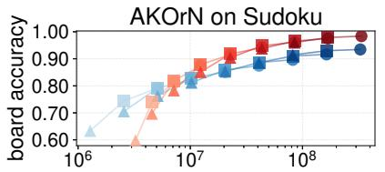

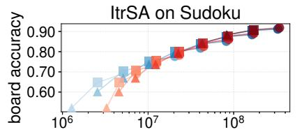

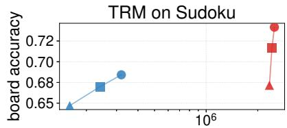

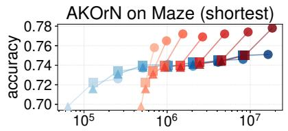

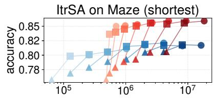

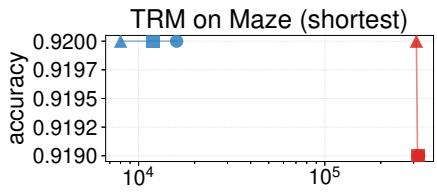

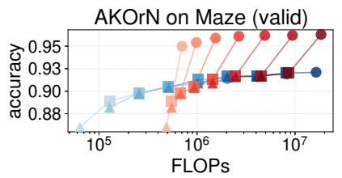

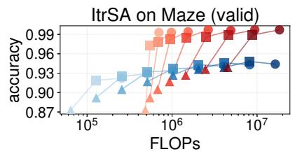

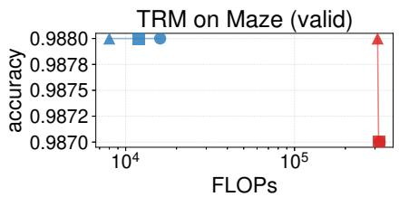  
Figure 4: Same operating points as Fig. 3, with the per-cell hyperparameter-sweep cost $( \widetilde { \mathcal { C } } _ { \mathrm { s w e e p } }$ in Table 5) added to the RoFB x-coordinate. Sweep cost shifts the RoFB scatter rigidly to the right by a constant per cell; the Pareto improvement is preserved across all six cells.

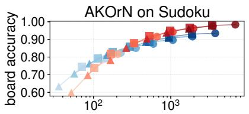

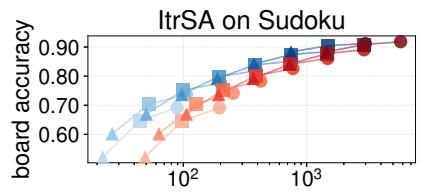

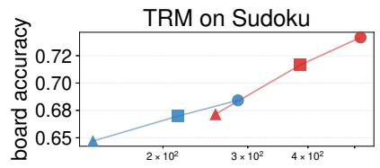

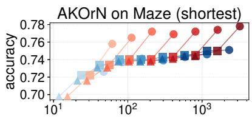

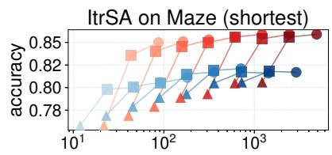

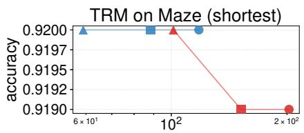

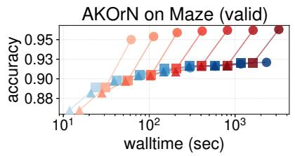

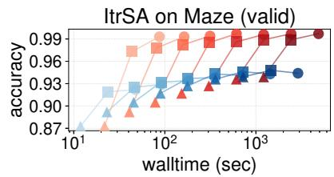

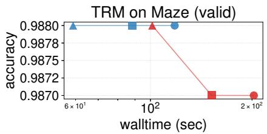  
Figure 5: Same operating points as Fig. 3, with the x-axis replaced by measured wall-clock time on a single NVIDIA GH200 (forward only, no sweep cost). Within-cell baseline-vs-RoFB comparisons are dtype-matched (fp32 for AKOrN/ItrSA++; bf16 for TRM); cross-cell wall comparisons should be read together with this dtype split.

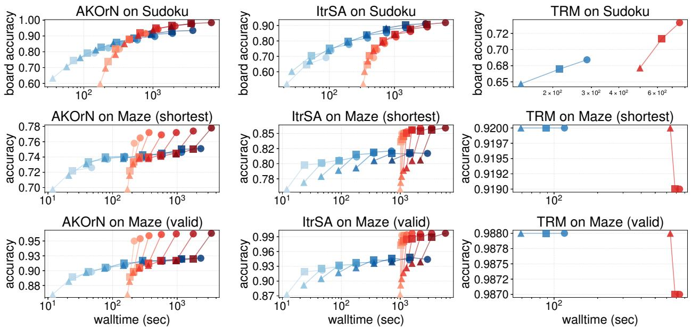  
Figure 6: Same as Fig. 5 but with the hyperparameter-sweep wall added to the RoFB x-coordinate (RoFB only).

## D ItrSA++ on Sudoku with Longer Inference Steps

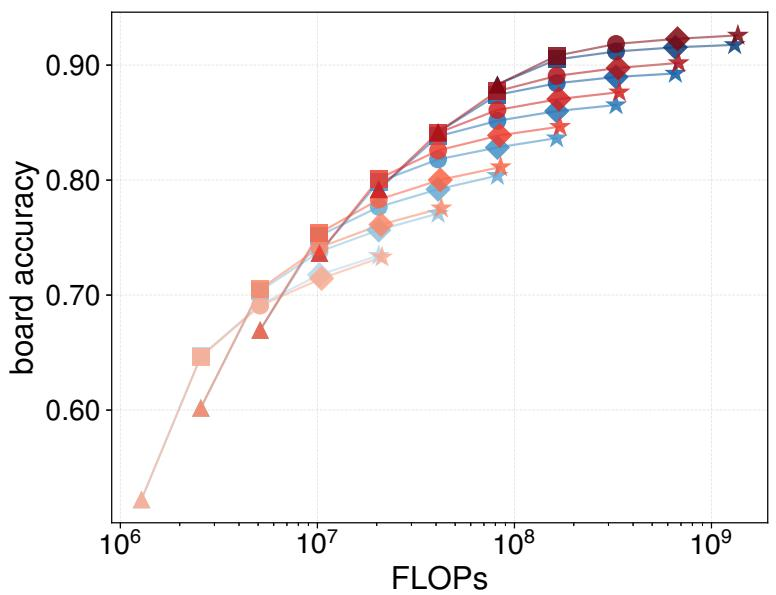  
Figure 7: ItrSA++ on Sudoku Extreme, with inference horizons extended to $T = 1 0 2 4$ steps. The same RoFB hyperparameters selected at $T = 2 5 6$ are reused at all horizons. Color encodes $K _ { \mathrm { v o t e } }$ count (Baseline blue / RoFB red, shade darkens with $K _ { \mathrm { v o t e } }$ from 1 to 64). Shape encodes the inference time steps $T \left( \mathbf { 4 } , \mathbf { \overline { { n } } } , \mathbf { \bullet } , \mathbf { \bullet } , \mathbf { \bullet } , \right.$ ⋆ for $T =$ 64, 128, 256, 512, 1024).

## E Detailed Training Setups

Table 6: AKOrN: full architecture and training hyperparameters.
<table><tr><td></td><td>Sudoku Extreme</td><td>Maze Hard</td></tr><tr><td>Architecture</td><td></td><td></td></tr><tr><td>oscillator dim m</td><td>4</td><td>4</td></tr><tr><td>embed width D</td><td>512</td><td>512</td></tr><tr><td># blocks L</td><td>1</td><td>1</td></tr><tr><td># heads</td><td>8</td><td>8</td></tr><tr><td>γ (step size)</td><td>1.0</td><td>1.0</td></tr><tr><td>coupling J</td><td>self-attn</td><td>self-attn</td></tr><tr><td>positional enc.</td><td>GTA [Miyato et al., 2023]</td><td>GTA</td></tr><tr><td>input injection</td><td>add</td><td>add</td></tr><tr><td>Training</td><td></td><td></td></tr><tr><td> $T _ { \mathrm { t r a i n } }$ </td><td>64</td><td>64</td></tr><tr><td> $T _ { \mathrm { g r a d } }$  (TBPTT)</td><td>8</td><td>8</td></tr><tr><td>optimizer</td><td>AdamW</td><td>AdamW</td></tr><tr><td>learning rate</td><td> $1 \times 1 0 ^ { - 3 }$ </td><td> $3 \times 1 0 ^ { - 4 }$ </td></tr><tr><td>weight decay</td><td> $^ { 1 \times 1 0 ^ { - 2 } } _ { 1 0 0 }$ </td><td> $1 \times 1 0 ^ { - 4 }$ </td></tr><tr><td>batch size (per GPU)</td><td></td><td>32</td></tr><tr><td>epochs</td><td>5</td><td>200</td></tr><tr><td>clip grad norm</td><td>1.0</td><td>1.0</td></tr><tr><td>EMAβ</td><td>0.995</td><td>0.995</td></tr><tr><td>EMA update_every</td><td>10</td><td>1</td></tr><tr><td>loss</td><td>token-wise CE</td><td>masked CE on cells</td></tr></table>

Table 7: ItrSA++: full architecture and training hyperparameters. We use the affine-free variant (rmsnorm\_affine=False) as the canonical baseline. Inference horizons follow the convention $T = R \cdot n _ { \mathrm { b l o c k } }$ with R=num\_rep\_attn=4.
<table><tr><td></td><td>Sudoku Extreme</td><td>Maze Hard</td></tr><tr><td colspan="3">Architecture</td></tr><tr><td>embed_dim</td><td>384</td><td>384</td></tr><tr><td>num_heads</td><td>12</td><td>12</td></tr><tr><td>num_layers</td><td>1</td><td>1</td></tr><tr><td>num_iter (= nblock) train</td><td>16</td><td>32</td></tr><tr><td>num_rep_attn (R)</td><td>4</td><td>4</td></tr><tr><td>ffn_dim_multiplier</td><td>4</td><td>4</td></tr><tr><td>use_cross_attn</td><td>True</td><td>True</td></tr><tr><td>rmsnorm_affine</td><td>False</td><td>False</td></tr><tr><td>positional enc.</td><td>GTA</td><td>GTA</td></tr><tr><td>confidence_type</td><td>log-prob</td><td>log-prob</td></tr><tr><td>Lsqrt / vocab / classes</td><td>9/10/9</td><td>30/4/5</td></tr><tr><td colspan="3">Training</td></tr><tr><td>optimizer</td><td>AdamW</td><td>AdamW</td></tr><tr><td>β1, β2</td><td>0.9,0.95</td><td>0.9, 0.95</td></tr><tr><td>learning rate</td><td>5×10−4</td><td>5×10−4</td></tr><tr><td>weight decay</td><td>0.01</td><td>0.01</td></tr><tr><td>batch size (per device)</td><td>64</td><td>64</td></tr><tr><td>accumulate_grad_batches</td><td>1</td><td>1</td></tr><tr><td>num_nodes</td><td>8</td><td>8</td></tr><tr><td>global batch size</td><td>512</td><td>512</td></tr><tr><td>gradient_clip_val</td><td>1.0</td><td>1.0</td></tr><tr><td>precision</td><td>bf16-mixed</td><td>bf16-mixed</td></tr><tr><td>max_epochs</td><td>10</td><td>6000</td></tr><tr><td>num_remain_grad (TBPTT)</td><td>2</td><td>4</td></tr><tr><td>EMAβ</td><td>0.995</td><td>0.995</td></tr><tr><td>update_after_step</td><td>100</td><td>10</td></tr><tr><td>update_every</td><td>10</td><td>1</td></tr><tr><td>use_compile</td><td>True</td><td>True</td></tr></table>

Table 8: TRM: full architecture and training hyperparameters.
<table><tr><td></td><td>Sudoku-Extreme</td><td>Maze-30x30-Hard</td></tr><tr><td>Architecture</td><td></td><td></td></tr><tr><td>Hcycles</td><td>3</td><td>3</td></tr><tr><td> $L _ { \mathrm { c y c l e s } }$ </td><td>6</td><td>4</td></tr><tr><td> $H _ { \mathrm { l a y e r s } }$ </td><td>0 (shared with L)</td><td>0 (shared with L)</td></tr><tr><td> $L _ { \mathrm { l a y e r s } }$ </td><td>2</td><td>2</td></tr><tr><td>hidden_size</td><td>512</td><td>512</td></tr><tr><td>num_heads</td><td>8</td><td>8</td></tr><tr><td>expansion (SwiGLU)</td><td>4</td><td>4</td></tr><tr><td>positional enc.</td><td>RoPE</td><td>RoPE</td></tr><tr><td>halt_max_steps</td><td>16</td><td>16</td></tr><tr><td>halt_exploration_prob</td><td>0.1</td><td>0.1</td></tr><tr><td>no_ACT_continue</td><td>True</td><td>True</td></tr><tr><td>mlp_t</td><td>False</td><td>False</td></tr><tr><td>puzzle_emb_len</td><td>16</td><td>16</td></tr><tr><td>puzzle_emb_ndim</td><td>512</td><td>512</td></tr><tr><td>forward dtype</td><td>bfloat16</td><td>bfloat16</td></tr><tr><td>Training</td><td></td><td></td></tr><tr><td>optimizer</td><td>AdamW</td><td>AdamW</td></tr><tr><td> $\hat { \beta _ { 1 } } , \beta _ { 2 }$ </td><td>0.9,0.95</td><td>0.9, 0.95</td></tr><tr><td>learning rate</td><td> $\stackrel { 1 \times 1 0 ^ { - 4 } } { 2 0 0 0 }$ </td><td> $1 \times 1 0 ^ { - 4 }$ </td></tr><tr><td>lr_warmup_steps</td><td></td><td>2000</td></tr><tr><td>lr_min_ratio</td><td>1.0 (constant after warmup)</td><td>1.0 (constant after warmup)</td></tr><tr><td>weight_decay</td><td> $\begin{array} { c } { 1 . 0 } \\ { 1 { \times } 1 0 ^ { - 4 } } \\ { 1 . 0 } \end{array}$ </td><td> $\begin{array} { c } { 1 . 0 } \\ { 1 { \times } 1 0 ^ { - 3 } \ S } \\ { 1 . 0 } \end{array}$ </td></tr><tr><td>puzzle_emb_lr</td><td></td><td></td></tr><tr><td>puzzle_emb_weight_decay</td><td></td><td></td></tr><tr><td>global batch size</td><td>768 (8 GPU)</td><td>768 (4 GPU)</td></tr><tr><td>epochs</td><td>5×10⁴</td><td>5×10⁴</td></tr><tr><td>eval_interval</td><td>5000</td><td>5000</td></tr><tr><td>loss</td><td>stablemax CE + ACT BCE</td><td>stablemax CE + ACT BCE</td></tr><tr><td>EMA</td><td>on, rate 0.999</td><td>on, rate 0.999</td></tr><tr><td>seed</td><td>0</td><td>0</td></tr></table>

§The Maze launcher scripts/run\_miyabi.sh contains a double assignment puzzle\_emb\_lr=1e-4 puzzle\_emb\_lr=1e-3; the Hydra later-wins rule yields $1 \times \dot { 1 } 0 ^ { - 3 }$

## F Compute Resources

All training and evaluation runs were performed on NVIDIA GH200 GPUs. ItrSA++ cells and TRM × Sudoku were trained on 8-GPU nodes; TRM × Maze on a 4-GPU node; AKOrN cells on a single GPU. The total compute used for training across all six cells is approximately 100 GPU-days. The hyperparameter sweeps for RoFB were run on the same hardware (∼ 10 GPU-days total, amortized over the K-curve test evaluation suite as discussed in Sec. C).