# SatDL: Jointly Optimizing Data Redistribution and Training for Satellite-Based Distributed Learning

Hao Wu\*, Kin Whye Chew\*, Yizhan Han, Han Li, Jingxian Wang

School of Computing

National University of Singapore

Singapore

hao wu@nus.edu.sg, chewkinwhye@u.nus.edu, hanyizhan@u.nus.edu, e1143336@u.nus.edu, wang@nus.edu.sg

Abstract—Satellite-based distributed learning promises to train machine-learning models directly in orbit using massive, globally dispersed sensor data, thereby avoiding large-scale data downloads to ground servers. However, training convergence is significantly slowed by severe non-IID data, specifically label imbalance, as each satellite observes different geographic regions with distinct labels. This imbalance extends training duration and increases energy consumption for solar-powered satellites. Existing approaches either fully redistribute data to enforce IID conditions—accelerating convergence but incurring substantial communication delays—or avoid redistribution entirely by modifying local learning algorithms to mitigate the impact of label imbalance, which, however, still prolong training and increase energy use. Both extremes result in excessive total end-to-end learning time (data-transfer delay plus training time) and thus elevated onboard energy consumption.

We present SatDL, a data-redistribution framework designed to minimize total end-to-end learning time. At its core, SatDL develops a Distributor–Critic framework that jointly models and optimizes data-transfer delay and training time. Evaluations through trace-driven simulations of a 1,584-satellite Starlink constellation and hardware emulations using NVIDIA Jetson and A100 GPUs across five datasets show SatDL reduces total endto-end learning time by up to 18.6% and onboard energy consumption by 12.23–88.00%, while maintaining inference accuracy within a few percentage points of state-of-the-art baselines.

Index Terms—distributed learning, satellite networks, non-IID data, edge computing.

## I. INTRODUCTION

Low-earth orbit (LEO) satellite constellations now provide global Internet coverage, enabling sensors in even the most remote regions to stream data to the cloud for analysis. Machine learning models can then convert these worldwide data feeds into insights for precision agriculture [1], climate monitoring [2], and disaster response [3]. For example, models trained on land cover data [4] have been used to support applications such as deforestation monitoring [5].

Training these models is challenging when the raw training data are not available at terrestrial datacenters: they are either produced onboard satellites (e.g., satellite imagery) or collected in remote regions whose data can only be reliably collected via the satellite network. Under the traditional pipeline, the raw dataset must be sent through the satellite’s bandwidthstarved downlink to a ground datacenter; high-resolution imagery can take hours to arrive, and studies report that barely 2% of the captured data ever reach Earth, the rest being discarded [6]. Recently launched satellites, however, carry NVIDIA GPU boards [7], [8], enabling in-orbit distributed learning [9]: each satellite 1) trains locally on its own data, 2) periodically exchanges model updates (gradients) with its peers, and 3) receives an improved global model in return. This collaborative in-orbit learning keeps GB-TB of data off the constrained Mbps downlink, slashing downlink overhead and freeing downlink bandwidth for other mission traffic. This shift in the training pipeline is illustrated in Figure 1.

  
(a) Centralized Training

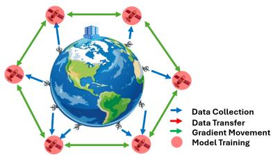  
(b) Distributed Learning  
Fig. 1. Raw data are collected by satellites, either generated onboard (e.g., satellite imagery) or collected from remote regions via satellite links. In centralized training, this raw data must be transferred to terrestrial datacenters for model training, incurring substantial transmission cost. In satellite distributed learning, raw data remains within each satellite for local model training, while satellites collaborate by exchanging gradient updates to jointly learn a shared global model.

Yet distributed training across satellites struggles with highly non-independent and identically distributed (non-IID) data, particularly due to label distribution imbalance. Because each satellite observes only the geographic swath beneath its fixed orbital path, the labels in its collected data can differ substantially from other satellites [10]—for example, urbanarea satellites primarily observe images labeled as “buildings”, while rural-area satellites mainly observe “forests”. This heterogeneity pulls local optimizers in different directions, weakening global aggregation and forcing many additional rounds of gradient exchange and local updates before the model converges [11]. Those extra iterations lengthen the wallclock training time—the elapsed time from the start of training until the model converges—and, for solar-powered satellites with limited energy reserves, directly translate into higher onboard energy consumption.

Existing remedies for non-IID data sit at two extremes. A common and effective practice in distributed learning, widely adopted in distributed and private cloud infrastructures (e.g., Google’s datacenters), is to randomly partition the dataset across training nodes (clients) to achieve an IID distribution [12], which minimizes training time. However, directly applying this practice to satellites requires extensive intersatellite data transfers to achieve IID partitions. This leads to significant overall energy consumption for satellites because communication transmitters on satellites can draw tens of Watts [13], [14], comparable to the power consumed by the onboard GPU during training [15]. At the opposite end, federated learning algorithms such as FedProx [16] modify each client’s local objective function to temper data heterogeneity. While they avoid cross-satellite data transfers, under severe non-IID conditions, they still require many more training rounds, inflating training time and, in turn, energy use. Thus, a gap remains for a middle-ground approach that jointly optimizes data transfer delay and wall-clock training time, explicitly minimizing their sum—while also saving onboard energy use.

We present SatDL, a data-redistribution framework for in-orbit distributed learning that jointly models data-transfer delay and wall-clock training time and minimizes their sum, which determines the model delivery time to applications. SatDL recognizes the coupling between the two: moving more data lowers non-IID skew and speeds convergence, but at the cost of extra data transfer delay; moving less data has the opposite effect. We cast this trade-off as an optimization problem whose decision variables are which samples to move and to which satellites. By selecting only transfers that yield the largest drop in gradient diversity per transmitted bit, SatDL performs a selective, partial redistribution that shortens the end-to-end learning time1. Experiments show that SatDL cuts end-to-end time by up to 18.6% and energy by 12.23–88.00% compared to both commonly used data movement strategies and state-of-the-art methods [16], [17].

Specifically, SatDL introduces a Distributor-Critic Framework that jointly formulates data transfer and distributed training as a single optimization problem. Typically, these two components are treated separately: data transfer as an explicit optimization task, and model training as a hyperparameter tuning process. In contrast, SatDL integrates them through joint optimization by passing gradients between a Distributor and a Critic. The Distributor models data-transfer delays given network topology, bandwidth constraints, and the candidate data distribution across satellite training nodes.

The Critic complements this by estimating the wall-clock training time for each candidate data distribution. Instead of performing time-consuming training runs, the Critic adapts the theoretical convergence bounds in distributed learning [18]. Task-specific constants (e.g., smoothness constant, bounded local variance, gradient diversity) and the hardware-dependent parameter are calibrated through a one-time experiment using satellite emulation platforms. With actual measurements of these constants and parameters grounded in theoretical analysis, the Critic reliably estimates the gradient of training time for any given data distribution.

A key technical challenge is that the convergence bounds in [18] define the gradient-diversity term using client gradients computed on each client’s local dataset. While this formulation suffices for estimating convergence under a fixed, observed client partition, our Critic must efficiently produce an optimizable convergence estimate for the many simulated client–data assignments proposed by the Distributor. A naive application of the theoretical bounds is prohibitively expensive, as it requires evaluating the dataset-dependent gradient diversity for each simulated redistribution, incurring a computational cost that scales linearly with the dataset size (O(N) per evaluation). Moreover, the redistribution plan involves the discrete assignments of N samples to K clients, inducing an exponentially large search space $O ( K ^ { N } )$ . To resolve this, we reformulate the gradient-diversity term as a function of each client’s class distribution, replacing dataset-dependent gradients with classconditional gradient prototypes. This reduces the computational cost of each evaluation that is proportional to the number of classes (O(|M|)), while yielding a redistribution plan that is polynomial O(K|M|) while being efficiently optimizable via gradient descent.

Through iterative refinement between Distributor and Critic, SatDL converges to a redistribution strategy that minimizes the total end-to-end learning time and thus reduces energy consumption by shortening data transmission and GPU runtime.

We evaluate SatDL using a simulated Starlink constellation with over 1,500 satellites collecting data from users and redistributing it onto up to 10 satellite nodes for distributed training, emulated using NVIDIA A100 and NVIDIA Jetson GPUs. We test robustness across various degrees of data non-IIDness and hardware configurations, using five synthetic and real-world datasets: CIFAR-10, CIFAR-100 [19], Flickr Mammals [11], Satellite Land Cover [4], and Traffic Signs [20] datasets. Results show that SatDL reduces total end-to-end learning time by 14.3% on CIFAR-10, 18.6% on CIFAR-100, 16.7% on Flickr Mammals, 3.2% on Satellite, and 5.7% on Traffic Signs compared with the best baselines. A case study using NVIDIA Jetson GPUs shows that SatDL’s reduced learning time translates into 12.23% (1.54 kJ) lower onboard energy consumption compared to the best baseline.

Contributions: SatDL’s core contributions include:

• A Distributor–Critic framework that jointly optimizes datatransfer delay and wall-clock training time for satellitebased distributed learning.

• A selective, partial data redistribution strategy to minimize total end-to-end learning time under non-IID data conditions, substantially reducing energy consumption through shorter radio transmissions and GPU runtime.

• Extensive experimental validation using a popular distributed learning platform [21], combined with satellite hardware emulation on NVIDIA GPUs.

## II. RELATED WORK

Learning on non-IID data is a well-known challenge in distributed learning [22]–[25], where each client holds a distinct local dataset that does not reflect the global distribution. This challenge is also presented in satellite distributed learning due to factors like non-stationary and temporal or spatial correlations in the data [10], i.e., the distribution of the data collected by satellites significantly depends on where and when the data was collected. This non-IID nature of data leads to model divergence, as local updates vary according to the extent of differences in data distributions [26]. Consequently, model convergence slows [18], and overall performance degrades [26]. Prior works addressing this challenge can be broadly categorized into two classes: federated learning algorithms that mitigate this by modifying the learning algorithm to operate effectively without requiring any data movement, and methods that do so through explicit data movement.

Federated Learning Algorithms: These methods address the non-IID problem not through explicit data movement, but by relying on adaptations to the training process to mitigate model divergence arising from data heterogeneity across clients. Notable algorithms include FedProx [16], SCAFFOLD [27], and MOON [28], which introduce explicit regularization to constrain local model updates and adjust their direction or magnitude, thereby preventing significant divergence from the global model. However, because these methods rely purely on algorithmic adjustments without addressing the underlying non-IID nature of the data itself, their ability to substantially improve robustness remains limited, particularly in scenarios with extreme distribution differences [23].

Data Movement Strategies: These approaches seek to mitigate statistical divergence by directly manipulating the data distribution across clients. In general distributed learning [12], the default strategy is to randomly partition the global dataset across compute nodes. Another line of work reduces divergence by sharing a balanced reference dataset among clients, enabling each client to calibrate its local distribution against the shared reference [17], [26]. However, these methods require extensive inter-satellite data transfers. Given the high cost of such transfers, in terms of time and energy, it is important to model how data movement affects downstream training to optimize the trade-off between communication cost and training benefit. However, existing methods do not incorporate this modeling, which represents a key limitation. SatDL distinguishes itself from prior data movement approaches by recognizing this trade-off: data heterogeneity increases the model training cost, whereas alleviating heterogeneity via data re-balancing incurs significant communication costs. SatDL addresses this by jointly modeling both factors within a unified optimization framework, enabling it to determine redistribution strategies that minimize the overall cost, accounting for both communication and training.

## III. MOTIVATING EXPERIMENTS

## A. Overview and Rationale for Motivating Experiments

Satellite-based distributed learning leverages geographically dispersed data collected by satellites to train machine-learning models. A significant challenge in these environments is the inherently non-IID nature of the data, specifically, label distribution imbalance, a common issue in satellite applications due to fixed satellite orbits.

To quantify the impact of label imbalance, we perform two experiments comparing IID and non-IID data movement strategies. Under IID conditions, data labels are evenly partitioned across training clients, while in the non-IID case, each client primarily holds data from a specific geographic region. First, we compare the training time required under each condition. Second, we measure the data-transfer delays incurred when enforcing an IID distribution. Together, these experiments reveal a fundamental trade-off between reducing training time and transfer delays, motivating SatDL’s framework that optimizes data redistribution to minimize the end-to-end learning time.

## B. Experimental Setup of the Motivating Experiments

Simulated Constellation: We simulate a satellite-based distributed learning scenario consisting of 1,584 satellites uniformly distributed across 72 orbits, matching the scale and topology of an orbital shell of Starlink [29]. Ground users upload geographically dispersed data (training dataset: CIFAR-100 [19]) to their nearest overhead satellite. To model regional heterogeneity, we use a Dirichlet distribution with α = 0.1 to partition the training dataset into 10 subsets, each with a label to represent a distinct geographic region. Each regional subset is further subdivided among 50 ground users.

Emulated Distributed Learning: Within this simulated Starlink constellation, we randomly select up to 10 satellites as training nodes (clients) participating in distributed learning. Each selected node is emulated using NVIDIA Jetson GPUs representative of real-world satellite deployments [7], [8]. These emulated training nodes receive redistributed data from other satellites within the simulated constellation. We perform distributed learning experiments using Flower [21], a stateof-the-art distributed learning framework, training a ResNet-18 [30] model via the FedAvg algorithm [31].

Data Movement Strategies: 1) The non-IID method delivers data to client satellites as quickly as possible, without addressing the non-IID nature of the distribution at the user-level, which would persist at the client level. 2) The IID strategy, which additionally enforces an IID distribution across clients.

## C. Impact of Non-IID Data on Wall-clock Training Time

Fig. 2 (Left) shows how data movement strategies affect wall-clock training time (represented as iterations to converge, as iteration duration is typically fixed) as the number of clients varies. Under the IID strategy, the data partition remains IID regardless of the number of clients. Increasing the number of clients significantly reduces the training time due to enhanced parallelism from additional computational resources.

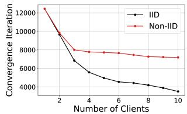

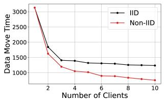  
Fig. 2. Model training time (left) and data move time in seconds (right) vs. the number of clients for the IID and non-IID data movement strategies.

In contrast, the non-IID method amplifies data heterogeneity as the number of clients increases, since each client holds data from a smaller and more localized subset of users. This results in conflicting local updates, which hinder the convergence of the global model, offsetting the expected benefits of increased parallelism, even as more computational resources are added. For example, with 10 clients, the non-IID method requires over 2× as many iterations as the IID method.

## D. Impact of Data Balancing on Data-Transfer Delay

Fig. 2 (Right) shows how the data movement strategy affects the data-transfer time—which includes the user-toclient uploads and any subsequent client-to-client data redistribution—as the number of clients varies. Under the non-IID strategy, increasing the number of clients reduces the datatransfer time, because the average distance between users and their assigned clients becomes smaller.

Under the IID strategy, data must be redistributed across clients to balance label distributions, transferring samples of certain classes from clients where those classes are overrepresented to clients where they are underrepresented. Unlike terrestrial networks with high-capacity fiber (tens of Gbps), inter-satellite links (ISLs) typically operate at much lower speeds (∼ 1 Gbps), causing prolonged multi-hop transfers and thus significantly delaying the start of training. For example, with 10 clients, the IID method causes nearly a 2× increase in data-transfer delays compared to the Non-IID method.

Training Time and Data-Transfer Delays Translate to Energy Use: For solar-powered satellites with limited energy reserves, total end-to-end learning time directly determines onboard energy use. For data transfers, typical ISL laser transmitters consume about 5–40 Watts [14], whereas for model training, onboard computing platforms (e.g., NVIDIA Jetson GPUs) draw about 5–10 Watts [15]. Thus, minimizing total end-to-end learning time naturally translates to lower energy consumption—an important practical benefit for satellites.

## E. Key Insight: Balancing Communication and Convergence

The two motivating experiments demonstrate a clear tradeoff: enforcing an IID data distribution reduces wall-clock training time but introduces significant data-transfer delays, while maintaining non-IID distributions minimizes data movement but prolongs training. Motivated by this trade-off, our key insight is that an optimal solution lies between the two extremes.

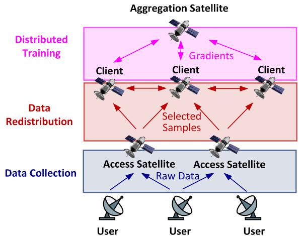  
Fig. 3. Workflow of SatDL. (a) The access satellites collect raw data from end users. Each user can send data to one or multiple visible access satellites. (b) Data withheld by access satellites are sent to clients for training. Clients rebalance the data by sending selected samples between each other. Some access satellites can also serve as clients. (c) The clients train local models, which are aggregated into a global model by a designated aggregation satellite.

Instead of fully enforcing an IID distribution or accepting slow convergence from non-IID training, a satellite-based distributed learning framework needs to minimize total endto-end learning time by selectively redistributing data. This selective redistribution rebalances clients’ data sufficiently to accelerate convergence without excessive communication overhead, naturally saving onboard energy use. The rest of the paper presents our framework for identifying such an optimal redistribution strategy.

## IV. TECHNICAL OVERVIEW

Workflow: Fig. 3 shows the workflow of SatDL: users upload raw data to their visible access satellites via Time Division Multiple Access (TDMA). Next, data is redistributed from access satellites to designated client satellites with computational resources, using SatDL’s Distributor–Critic framework to optimally allocate data samples. Finally, the satellites collaboratively train the model using FedAvg [31] or similar aggregation strategies until convergence.

## A. SatDL’s Design

SatDL performs data redistribution prior to training to minimize the total end-to-end learning time required for both data transfer and model convergence. This framework consists of two components as shown in Fig. 4: a Task & Data Distributor and a Strategy Critic. The Task & Data Distributor (Section V-A) is responsible for generating the data movement strategy, which determines how the data should be collected from ground users and uploaded to access satellites, and then redistributed among satellite clients participating in training. The Strategy Critic supports this process by predicting how the proposed data distribution will affect the wall-clock training time required for the model to reach convergence (Section V-B). Through iterative interaction between the Distributor and Critic, SatDL converges to a data movement strategy that jointly optimizes data redistribution and training convergence to minimize the total end-to-end learning time.

1) Task & Data Distributor: This component is responsible for proposing efficient data movement strategies by leveraging a communication model of the satellite network. The model captures the network topology and bandwidth constraints, including the capacity and connectivity of ISLs. By computing the cost of transferring raw data from end users to access satellites and from access satellites to satellite clients, it determines how data should be routed across the network. Using feedback from the Strategy Critic—specifically, the estimated impact of the resulting data distribution on training time—the distributor iteratively refines its data transfer strategy to minimize the total time required for both communication and training.

2) Strategy Critic: Given each client’s data quantity and distribution after data transfer, this component estimates the wall-clock training time required to achieve a converged model. The critic leverages a theoretical bound of the convergence rate of a general distributed learning process [18] to make an a priori estimation. The task-specific and hardwaredependent parameters required to obtain a pratical task & device-specific estimation are obtained through a one-time calibration experiment. By incorporating these real-world measurements, the critic produces an accurately estimated training time gradient.

## B. Adaptation to Satellite Dynamics

Satellite orbital motion continuously changes both userto-satellite and ISL connectivity, requiring periodic reoptimization. To adapt SatDL to these dynamics without repeated optimization from scratch, we pre-process two key inputs: (1) each user’s access satellite schedule, and (2) the available ISLs.

1) User’s Access Satellite Schedules: As satellites orbit, users may lose connectivity to their initially connected satellites before data uploads finish. To address this, SatDL precomputes each user’s access schedule based on predictable satellite trajectories (e.g., Starlink trajectories can be predicted according to its FCC report [32]), identifying satellites that become visible within each user’s expected data-upload period (based on dataset size and uplink speed). This schedule is directly fed into the optimization process described in Section V-A.

2) Pre-Processing of Satellite Network Topology: ISLs can form or break as satellites move relative to each other, resulting in a time-varying topology. To avoid allocating data transfers to unavailable links, we precompute a static topology snapshot for the estimated data transfer interval (e.g., 30 mins), retaining only those ISLs continuously available during that interval.

## C. Optimization under Orchestrator-Allocated Resource

SatDL minimizes the end-to-end learning time for a particular distributed learning task, subject to resource constraints allocated by a centralized, ground-based satellite service orchestrator [33], [34]. Satellite-based distributed learning shares limited communication and computational resources with other services (e.g., voice communication, video streaming). While the orchestration mechanism itself is beyond the scope of this work, the allocated resource—such as client satellite selection, ISL bandwidth, and compute capacity—serve as explicit constraints to SatDL’s optimization. Fig. 4 shows how SatDL integrates within this broader system architecture.

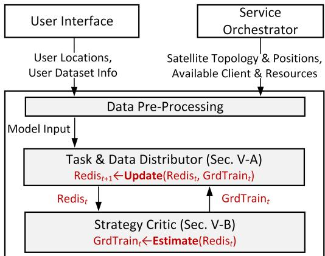  
SatDL  
Fig. 4. SatDL takes 1) user locations and dataset info; 2) satellite topology and positions, available clients, and resource allocations from the service orchestrator as input of optimization. The Task & Data Distributor updates its redistribution strategy $\operatorname { R e d i s } _ { t + 1 }$ based on the training time gradient GrdTraint, which is estimated by the Strategy Critic from the current strategy Redist.

## V. JOINT OPTIMIZATION FRAMEWORK

## A. Task & Data Distributor

Satellite-distributed learning requires user data to first be uploaded to access satellites and subsequently redistributed to client satellites prior to training. This section models this process as an optimization problem, enabling SatDL to minimize the total end-to-end learning time.

1) Optimization Variables: SatDL parameterizes the data transfer strategy as the following variables:

• Data upload variable $x _ { u s } ^ { m }$ : This variable denotes the number of samples with label $m \in \mathcal { M }$ that are transmitted from user $u \in \mathcal { U }$ to access satellite $s \in S$

• Data redistribution variable $y _ { s k } ^ { m }$ : This variable denotes the number of samples with label m that are transmitted from access satellite $s \in S$ to client satellite $k \in \mathcal { K }$

Due to the non-IID nature of the data, characterized by label shifts across clients, SatDL distinguishes the data samples by their labels m.

2) Data Uploading: During data collection, the data upload variable $x _ { u s } ^ { m }$ is subject to two constraints:

$$
| \mathcal { D } _ { u , m } | = \sum _ { s = 1 } ^ { \mathcal { S } _ { u } } x _ { u s } ^ { m } , \quad \forall u \in \mathcal { U } , m \in \mathcal { M }\tag{1}
$$

$$
\psi _ { u , s } = 0 \implies \sum _ { m = 1 } ^ { \mathcal { M } } x _ { u , s } ^ { m } = 0 , \quad \forall u \in \mathcal { U } , s \in \mathcal { S }\tag{2}
$$

Here, $\mathcal { D } _ { u , m }$ represents the initial data distribution across the users, and $\psi _ { u , s }$ is the binary indicator that equals 1 if satellite s is visible to user u, and 0 otherwise. The symbol |·| denotes the size of a set. Specifically, constraint (1) ensures that each user uploads their entire dataset to the access satellites. Constraint (2) ensures that each user only uploads their dataset to their visible satellites.

After the data uploading, the resulting distribution across the satellites $\mathcal { D } _ { s , m }$ is obtained by summing all uploads from users connected:

$$
| \mathcal { D } _ { s , m } | = \sum _ { u = 1 } ^ { \mathcal { U } } x _ { u s } ^ { m } , \quad \forall s \in \mathcal { S } , \ m \in \mathcal { M }\tag{3}
$$

Finally, the time taken for this data upload process $t _ { \mathrm { c o l l e c t } }$ is given by:

$$
t _ { \mathrm { c o l l e c t } } = \operatorname* { m a x } _ { u } \sum _ { s , m \in \mathcal { S } \times \mathcal { M } } x _ { u s } ^ { m } \delta / \mathcal { C } _ { u } ,\tag{4}
$$

where $\delta$ is the size of each datapoint and $C _ { u }$ refers to the upload bandwidth of user u. Essentially, the collection time is determined by the slowest user: the upload time for each user is obtained by dividing the total volume of data by their upload bandwidth.

3) Data Redistribution: During data redistribution, the data transfer variable $y _ { s k } ^ { m }$ : must satisfy the following constraint:

$$
\sum _ { k = 1 } ^ { \kappa } y _ { s k } ^ { m } = | { \mathcal { D } } _ { s , m } | , \quad \forall s \in { \mathcal { S } } \setminus { \mathcal { K } } , m \in { \mathcal { M } }\tag{5}
$$

This means that all access satellites, except for the client satellites, have to transfer all of their dataset to the client satellites.

After the data redistribution, the final distribution across the client satellites $\mathcal { D } _ { k , m } ^ { * }$ is given by:

$$
| \mathcal { D } _ { k , m } ^ { * } | = | \mathcal { D } _ { k , m } | - \sum _ { k ^ { \prime } = 1 } ^ { K } y _ { k k ^ { \prime } } ^ { m } + \sum _ { s = 1 } ^ { S } y _ { s k } ^ { m } , \ \forall k \in \mathcal { K } , m \in \mathcal { M }\tag{6}
$$

Specifically, this means that the number of samples with label m at client satellite k, denoted by $| \mathcal { D } _ { k , m } ^ { * } |$ , equals the original number of samples $| \mathcal { D } _ { k , m } |$ minus the number of samples transmitted to other clients, plus the number of samples received from other satellites.

Finally, the time taken for this redistribution process $t _ { \mathrm { r d i s } }$ is given by:

$$
t _ { \mathrm { r d i s } } = \operatorname* { m a x } _ { e } \frac { \sum _ { s , k \in \mathcal { S } \times \mathcal { K } } \phi _ { s k , e } \sum _ { m = 1 } ^ { \mathcal { M } } y _ { s k } ^ { m } \delta } { \mathcal { C } _ { e } } ,\tag{7}
$$

where $\mathcal { C } _ { e }$ is the bandwidth of each ISL, and $\phi _ { s k , e }$ is an indicator variable that is equal to 1 if the transmission path from satellite s to client k passes through link $e ,$ and 0 otherwise. Essentially, the data redistribution time is determined by the slowest ISL: the data move time for each ISL is obtained by dividing the total volume of data that passes through that ISL by its bandwidth.

4) Objective Function: SatDL minimizes the total end-toend learning time:

$$
\begin{array} { r l } { \mathrm { m i n i m i z e : ~ } } & { { } t _ { \mathrm { t o t a l } } = t _ { \mathrm { c o l l e c t } } + t _ { \mathrm { r d i s } } + t _ { \mathrm { t r a i n } } } \\ { \mathrm { s u b j e c t ~ t o : ~ } } & { { } \mathrm { c o n s t r a i n t s ~ } ( 1 ) , ( 2 ) , \mathrm { ~ a n d ~ } ( 5 ) . } \end{array}\tag{8}
$$

where $t _ { \mathrm { c o l l e c t } }$ and $t _ { \mathrm { r d i s } }$ are given by equations (4) and (7) respectively, which represent the time taken for all data movement.

This optimization problem is solved using gradient descent, where the optimizer iteratively updates the data movement variables x and y based on the gradient of the objective function $t _ { \mathrm { t o t a l } }$ . The resulting data distribution across clients is given by equations (3) and (6). This distribution also determines the training time $t _ { \mathrm { t r a i n } }$ for the model to converge, which we detail in Sec. V-B.

## B. Strategy Critic

The Strategy Critic estimates the training time $t _ { \mathrm { t r a i n } }$ under a particular data distribution. It computes both the value and gradient of $t _ { \mathrm { t r a i n } }$ , enabling the Task & Data Distributor to optimize the data redistribution $| \mathcal { D } _ { k , m } ^ { * } |$ among clients, for minimized total learning time. The estimation combines the theoretical analysis from [18] with an empirical measurement of the parameters required including device-specific computational capabilities.

1) Convergence Bound: We adopt the theoretical convergence bound of distributed learning from [18]. Specifically, Gradient Diversity λ quantifies data heterogeneity among satellite clients:

$$
\lambda \triangleq \frac { \sum _ { k = 1 } ^ { K } q _ { k } \| \nabla f _ { k } ( \mathbf { w } ) \| _ { 2 } ^ { 2 } } { \left\| \sum _ { k = 1 } ^ { K } q _ { k } \nabla f _ { k } ( \mathbf { w } ) \right\| _ { 2 } ^ { 2 } } .\tag{9}
$$

where $\textbf { w } \in \ \mathbb { R } ^ { d }$ are model parameters, qk represents the weight of the k-th client $( q _ { k } \ge 0$ and $\textstyle \sum _ { k = 1 } ^ { K } q _ { k } = 1 )$ , and $f _ { k }$ is the local objective function.

Higher gradient diversity λ indicates more pronounced non-IID conditions. More importantly, λ bounds the learning rate of the model optimization. Formally, under assumptions detailed in Appendix A, distributed learning using FedAvg with stochastic gradient descent has the following convergence guarantee: if the learning rate η satisfies:

$$
\begin{array} { l } { \displaystyle \frac { 2 L ^ { 2 } p \eta ^ { 2 } C _ { 1 } E } { 1 - \zeta ^ { 2 } } + \frac { L ^ { 2 } \eta ^ { 2 } E ^ { 2 } } { 1 - \zeta ^ { 2 } } \left( \frac { 2 \zeta ^ { 2 } } { 1 + \zeta } + \frac { 2 \zeta } { 1 - \zeta } + \frac { E - 1 } { E } \right) } \\ { \displaystyle + \eta L \left( \frac { C _ { 1 } } { p } + 1 \right) \leq \frac { 1 } { \lambda } , } \end{array}\tag{10}
$$

where $L , C _ { 1 } , \zeta$ are environment-determined constants, E is the number of local iterations, $p$ is the number of clients. Then, the average-squared gradient is bounded by:

$$
\frac { 1 } { T } \sum _ { t = 0 } ^ { T - 1 } \mathbb { E } \left[ \| \nabla f ( \bar { w } ^ { ( t ) } ) \| ^ { 2 } \right] \leq \frac { 2 \left[ f ( \bar { w } ^ { ( 0 ) } ) - f ^ { * } \right] } { \eta T } + G ,\tag{11}
$$

where f is the global objective function (typically the loss function) and $f *$ is its lower bound, T is the number of the distributed learning rounds, and G is the minimum achievable average-squared gradient.

2) Modifications ofTheoretical Bounds: In Definition 9, the gradient diversity λ is defined in terms of the client-specific gradients $\{ \nabla f _ { k } ( \mathbf { w } ) \} _ { k = 1 } ^ { K } \colon$

$$
\begin{array} { l } { \displaystyle \nabla f _ { k } ( \mathbf { w } ) = \nabla \Big ( \frac { 1 } { n _ { k } } \sum _ { ( x _ { i } , y _ { i } ) \in \mathcal { D } _ { k } } f \big ( \mathbf { w } ; ( x _ { i } , y _ { i } ) \big ) \Big ) } \\ { \displaystyle = \frac { 1 } { n _ { k } } \sum _ { ( x _ { i } , y _ { i } ) \in \mathcal { D } _ { k } } \nabla f \big ( \mathbf { w } ; ( x _ { i } , y _ { i } ) \big ) . } \end{array}\tag{12}
$$

This defines each client gradient $\nabla f _ { k } ( \mathbf { w } )$ as the empirical risk gradient over its local dataset $\mathcal { D } _ { k }$ . This is well-suited for static evaluation: given the current client data partition $\{ \mathcal { D } _ { k } \}$ , each client can compute $\nabla f _ { k } ( \mathbf { w } )$ locally, which is used to compute the gradient diversity to estimate the training time.

However, SatDL requires the Critic to evaluate simulated client datasets arising from candidate redistribution plans proposed by the Data Distributor. This dataset-based formulation is prohibitive for the following reasons.

1) The Critic would need per-sample gradients $\nabla f ( \mathbf { w } ; ( x _ { i } , y _ { i } ) )$ for all N data points to compute each client gradient under the assignment plan. This would require every client to transmit per-sample gradients (dimension $d )$ for all of its local data, incurring a communication cost of $\mathcal { O } ( N d )$ . Additionally, the exact evaluation of gradient diversity for each candidate plan is costly, scaling linearly with the dataset size $O ( N )$ .

2) The search space of the redistributional plans is combinatorial: each of the N datapoints can be assigned to one of K clients, yielding $\dot { K ^ { N } }$ possible plans, which makes exhaustive search intractable. Additionally, since the assignment variables in π are discrete, the resulting $t _ { t r a i n }$ objective is not optimizable by gradient descent.

We reformulate each client gradient in terms of the client’s class probability distribution. Let M denote the label set. For each class $c \in { \mathcal { M } } ,$ define the (global) class subset $\mathcal { D } _ { c } \triangleq \mathbb { \frac { \Delta } { \pi } }$ $\{ ( x _ { i } , y _ { i } ) \in \mathcal { D } : y _ { i } = c \}$ and define the class-conditional mean gradient (“class gradient prototype”)

$$
\nabla f _ { c } ( \mathbf { w } ) \triangleq \frac { 1 } { | \mathscr { D } _ { c } | } \sum _ { ( x _ { i } , y _ { i } ) \in \mathscr { D } _ { c } } \nabla f ( \mathbf { w } ; ( x _ { i } , y _ { i } ) ) .\tag{13}
$$

We then approximate the per-sample gradient by the prototype of its class,

$$
\nabla f ( \mathbf { w } ; ( x _ { i } , y _ { i } ) ) \approx \nabla f _ { y _ { i } } ( \mathbf { w } ) ,\tag{14}
$$

which is motivated by the assumption that the dominant source of heterogeneity arises from class-imbalance (label shift) across clients. Finally, this is used to approximate Equation 12:

$$
\begin{array} { l } { \displaystyle \nabla f _ { k } ( \mathbf { w } ) = \frac { 1 } { n _ { k } } \sum _ { ( x _ { i } , y _ { i } ) \in \mathcal { D } _ { k } } \nabla f ( \mathbf { w } ; ( x _ { i } , y _ { i } ) ) } \\ { \displaystyle \approx \sum _ { c \in \mathcal { M } } p _ { k } ( c ) \nabla f _ { c } ( \mathbf { w } ) . } \end{array}\tag{15}
$$

which expresses the client gradient as a function of the client’s class distribution $\textstyle p _ { k } ( c ) \triangleq { \frac { n _ { k , c } } { n _ { k } } }$ , where $n _ { k , c }$ is the number of samples of class c assigned to client k and $\begin{array} { r } { n _ { k } = \sum _ { c \in \mathcal { M } } n _ { k , c } } \end{array}$ is the total number of samples held by client k. This class distribution-based reformulation addresses the key limitations of the original dataset-based formulation:

1) The Critic only requires the class gradient prototypes $\{ \nabla f _ { c } ( \mathbf { w } ) \} _ { c \in \mathcal { M } }$ to compute each client gradient under the assignment plan. This only requires each client to transmit its local class gradient prototypes, incurring a communication cost of ${ \mathcal { O } } ( | { \mathcal { M } } | d )$ . Finally, the evaluation of gradient diversity for each candidate plan scales linearly with the number of classes $\mathcal { O } ( | \mathcal { M } | )$

2) The redistributional plan can be parameterized by a matrix of $\mathcal { R } ^ { \kappa , | \mathcal { M } | }$ , which indicates the distribution across classes for each client. This continuous variable can be easily optimized using gradient descent.

3) Convergence Time Estimation: Using the convergence bound (Equation 11), we estimate the training time required for model convergence. First, we set a convergence threshold as a fraction $\epsilon _ { g }$ of the maximum decreasable gradient reduction: $\epsilon _ { g } \left( 2 \left[ f ( \stackrel { \sim } { w } ^ { ( 0 ) } ) - f ^ { * } \right] \right) + G$ . Substituting this threshold in Equation 11, we obtain an upper bound on the required number of distributed learning rounds $T _ { \mathrm { c o n v } }$ for convergence: $\begin{array} { r } { T _ { \mathrm { c o n v } } \ \ge \ \frac { 1 } { \epsilon _ { q } \eta } } \end{array}$ . Intuitively, the number of iterations required for convergence is influenced by how strict the convergence criterion is, as measured by $\epsilon _ { g } .$ and the learning rate $\eta ,$ which depends on the degree of non-IIDness. Second, to translate the number of rounds into actual training time $t _ { \mathrm { t r a i n } } .$ , we multiply $T _ { c o n v }$ by the computation time per round of the slowest device:

$$
t _ { \mathrm { t r a i n } } = T _ { c o n v } \cdot \operatorname* { m a x } _ { k \in \{ 1 , . . . , K \} } \frac { F } { \mathrm { F L O P S } _ { k } } ,
$$

where $\mathrm { F L O P S } _ { k }$ is the floating-point operations per second (FLOPS) of device $k , F$ is the number of operations required per local iteration.

4) One-time Calibration: Parameters L and $C _ { 1 }$ required by the theoretical bounds are empirically estimated through a one-time calibration (detailed in Appendix B)

5) Validation: To validate our convergence estimations, we conduct experiments on the MNIST dataset by varying the Dirichlet non-IID parameter $\alpha \in [ 0 . 1 , 0 . 2 , . . . , 1 . 0 ]$ , which controls the level of data heterogeneity. For each α, we measure the actual number of training iterations required to reach convergence (defined by the loss threshold $\epsilon _ { \ell } )$ and compare it with the predicted number of training iterations (defined by the gradient threshold $\epsilon _ { g } )$ . As shown in Fig. 5, the predicted convergence closely aligns with the observed results across all levels of α, validating the accuracy of the theoretical bound when combined with experimental measurements of the parameters.

## VI. IMPLEMENTATION, EVALUATION, RESULTS

## A. Implementation and Evaluation

Satellite Constellation: We simulate the same Starlink constellation [29] described previously in Sec. III-B, comprising 1,584 satellites. Each satellite connects to two neighboring satellites on the same orbit and two neighboring satellites on the adjacent orbits. We set the maximum user-to-satellite uplink speed to 500 Mbps, matching Starlink’s business-tier speed [35], and allocate 1 Gbps ISL bandwidth for each distributed learning task. Within the constellation, we randomly select 10 satellites as training nodes and an additional one as the aggregation satellite.

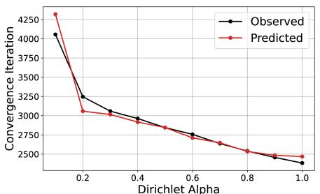  
Fig. 5. Convergence across different Dirichlet α values.

Hardware Emulation and Code Implementation: We emulate satellite training nodes using two hardware setups: (1) NVIDIA A100 GPUs [36] to benchmark total learning time, and (2) NVIDIA Jetson GPUs (6.6 Watts [15]), representing hardware currently deployed on satellites [7], [8]. The distributed learning process, which involves the local training and the global aggregation, is emulated using the Flower framework [21], and SatDL’s optimization is implemented via PyTorch. Computing an optimal data redistribution takes around 90 seconds for CIFAR-100.

Datasets: We evaluate performance on the CIFAR-10, CIFAR-100 [19], Flickr Mammals [11], Traffic Signs [20], and Satellite land cover [4] datasets—commonly used for studying non-IID distributed learning. The datasets are partitioned into 10 subsets representing different geographical regions using a Dirichlet distribution $( \alpha = 0 . 1 )$ to create highly non-IID label distributions (see Sec. III-B), and each region is further randomly split into $\mathcal { N } = 5 0$ user datasets.

Training Setup: The model, a pretrained ResNet-18, is trained on 10 randomly selected clients using the FedAvg algorithm. Each client performs 10 local iterations on a batch size of 32 before aggregation, with a weight decay of $1 0 ^ { - 4 }$ . The training is conducted over 1000 distributed learning rounds, i.e. 10000 local iterations. We record the time (in seconds) till model convergence as the training time $( t _ { \mathrm { t r a i n } } )$

Baselines: We compare SatDL against four baselines. (1) Non-IID, that minimizes only $t _ { \mathrm { c o l l e c t } } + t _ { \mathrm { r d i s } }$ by delivering data to client satellites as quickly as possible, without addressing the non-IID nature of the distribution at the user-level, which would persist at the client level. (2) IID, which also minimizes $t _ { \mathrm { c o l l e c t } } + t _ { \mathrm { r d i s } }$ but additionally enforces an IID distribution across clients. (3) FedProx [16], a learning algorithm that modifies FedAvg by constraining the local updates, which prevents excessive divergence from the global model, and (4) Hybrid-FL [17], merges data from half of the clients onto one client, and performs distributed training.

TABLE I  
TIME (SECONDS) TAKEN BREAKDOWN.
<table><tr><td>Dataset</td><td>Method</td><td>tcollect</td><td> $t _ { \mathrm { r d i s } }$ </td><td> $\underline { { t _ { \mathrm { t r a i n } } } }$ </td><td> $t _ { \mathrm { t o t a l } }$ </td></tr><tr><td rowspan="5">CIFAR-10</td><td>IID</td><td>1453.6</td><td>690.6</td><td>699.3</td><td>2843.5</td></tr><tr><td>Non-IID</td><td>1453.6</td><td>237.3</td><td>2282.3</td><td>3973.2</td></tr><tr><td>FedProx</td><td>1453.6</td><td>237.3</td><td>2276.4</td><td>3967.3</td></tr><tr><td>Hybrid-FL</td><td>1453.6</td><td>4358.6</td><td>2053.2</td><td>7865.4</td></tr><tr><td>SatDL</td><td>1453.6</td><td>258.0</td><td>724.5</td><td>2436.1</td></tr><tr><td rowspan="5">CIFAR-100</td><td>IID</td><td>581.6</td><td>655.5</td><td>883.5</td><td>2120.6</td></tr><tr><td>Non-IID</td><td>581.6</td><td>173.5</td><td>1515.3</td><td>2270.4</td></tr><tr><td>FedProx</td><td>581.6</td><td>176.1</td><td>1488.7</td><td>2246.4</td></tr><tr><td>Hybrid-FL</td><td>581.6</td><td>3286.3</td><td>1862.1</td><td>5730.0</td></tr><tr><td>SatDL</td><td>581.6</td><td>216.8</td><td>926.8</td><td>1725.2</td></tr><tr><td rowspan="5">Flickr Mammals</td><td>IID</td><td>349.0</td><td>324.7</td><td>384.5</td><td>1058.2</td></tr><tr><td>Non-IID</td><td>349.0</td><td>109.9</td><td>717.6</td><td>1176.5</td></tr><tr><td>FedProx</td><td>349.0</td><td>109.9</td><td>673.1</td><td>1132.0</td></tr><tr><td>Hybrid-FL</td><td>349.0</td><td>3190.2</td><td>701.0</td><td>4240.2</td></tr><tr><td>SatDL</td><td>349.0</td><td>126.9</td><td>406.5</td><td>882.4</td></tr><tr><td rowspan="5">Satellite</td><td>IID</td><td>1748.4</td><td>1015.9</td><td>370.5</td><td>3134.7</td></tr><tr><td>Non-IID</td><td>1748.4</td><td>250.0</td><td>483.3</td><td>2481.7</td></tr><tr><td>FedProx</td><td>1758.4</td><td>250.0</td><td>484.0</td><td>2492.4</td></tr><tr><td>Hybrid-FL</td><td>1758.4</td><td>5206.7</td><td>584.6</td><td>7549.7</td></tr><tr><td>SatDL</td><td>1748.4</td><td>280.8</td><td>393.3</td><td>2422.5</td></tr><tr><td rowspan="5">MTSD-Sign</td><td>IID</td><td>741.6</td><td>147.3</td><td>520.3</td><td>1409.2</td></tr><tr><td>Non-IID</td><td>741.6</td><td>64.7</td><td>611.8</td><td>1418.1</td></tr><tr><td>FedProx</td><td>741.6</td><td>64.7</td><td>614.1</td><td>1420.4</td></tr><tr><td>Hybrid-FL</td><td>741.6</td><td>1405.7</td><td>611.9</td><td>2759.2</td></tr><tr><td>SatDL</td><td>741.6</td><td>68.1</td><td>519.3</td><td>1329.0</td></tr></table>

TABLE II

TEST PERFORMANCE (AVERAGE CLASS ACCURACY).
<table><tr><td>Method</td><td>CIFAR-10</td><td>CIFAR-100</td><td>Flickr Mammals</td><td>Satellite</td><td>MTSD-Sign</td></tr><tr><td>IID</td><td>68.4%</td><td>37.7%</td><td>45.5%</td><td>96.8%</td><td>81.9%</td></tr><tr><td>Non-IID</td><td>62.9%</td><td>36.7%</td><td>43.3%</td><td>96.1%</td><td>81.5%</td></tr><tr><td>FedProx</td><td>62.8%</td><td>36.0%</td><td>42.1%</td><td>96.2%</td><td>81.7%</td></tr><tr><td>Hybrid-FL</td><td>71.5%</td><td>38.7%</td><td>45.2%</td><td>95.6%</td><td>82.7%</td></tr><tr><td>SatDL</td><td>69.1%</td><td>37.6%</td><td>45.7%</td><td>96.6%</td><td>81.3%</td></tr></table>

## B. Main Results

Table I summarizes data-upload, redistribution, training, total end-to-end learning times for all five methods. Table II compares final test (mean) accuracy of the trained model; Fig. 6 shows the training convergence and test performance across iterations. Both results in this section and Sec. VI-C are obtained using NVIDIA A100 GPUs; results using NVIDIA Jetson are presented in Sec. VI-D.

1) IID Method: This baseline enforces an IID distribution across clients through careful data redistribution. While this results in the shortest training time, the upfront redistribution significantly increases the total runtime.

2) Non-IID and FedProx: These methods minimize data movement time by directly sending data from users to clients without redistribution, resulting in the fastest data movement. However, the resulting non-IID distribution substantially slows training, causing the longest training times. FedProx, which modifies the learning algorithm to mitigate non-IID effects, also fails to significantly accelerate convergence. Thus, despite rapid data movement, the total runtime remains high due to prolonged training.

3) Hybrid-FL: This baseline incurs the longest total time t , as aggregating datasets from multiple clients significantly increases data movement time, and the resulting workload imbalance across clients slows down training.

SatDL’s results: SatDL jointly optimizes data redistribution and training duration to explicitly minimize the total learning time. This approach achieves data-transfer time close to the Non-IID baseline (61.8% lower than IID) and training time close to the IID (35.3% lower than non-IID). Overall, SatDL reduces total end-to-end learning time by 14.3% on CIFAR-10, 18.6% on CIFAR-100, 16.7% on Flickr Mammals, 3.2% on Satellite, and 5.7% on Traffic Signs compared with the best baselines, achieving the shortest total time taken across all datasets. As shown in Table II, SatDL maintains comparable or slightly superior test accuracy compared to the baselines.

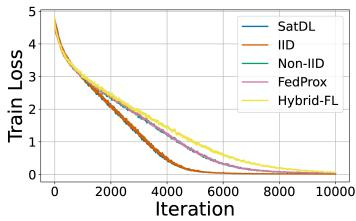  
(a) CIFAR-100

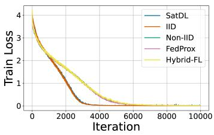  
(b) Flickr Mammals

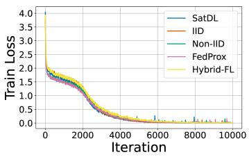  
(c) Satellite

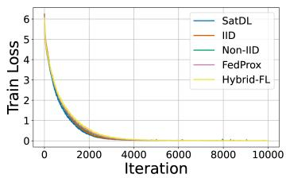  
(d) MTSD-Sign

Fig. 6. Training loss curves for different datasets under various data-movement strategies.  
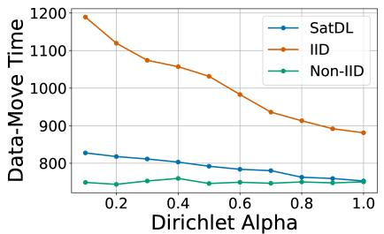

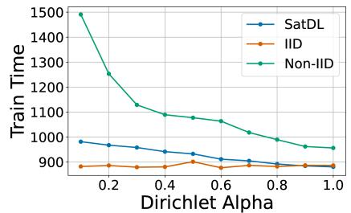

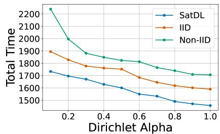  
Fig. 7. Data-move, Train, and Total Time (seconds) for the different methods on the CIFAR-100 dataset while varying the Dirichlet Alpha parameter.

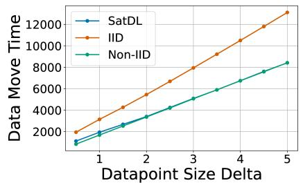

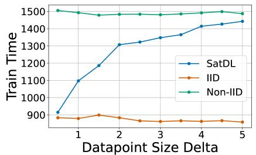

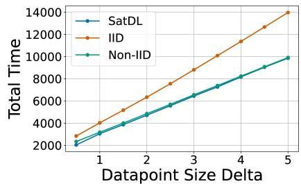  
Fig. 8. Data-move, Train, and Total Time (seconds) for the different methods on the CIFAR-100 dataset while varying the Delta parameter.

## C. Ablation Results

We conduct an ablation study on the CIFAR-100 dataset to evaluate how SatDL behaves under varying configurations. Unlike the IID and Non-IID baselines, whose data movement strategies remain fixed regardless of the configuration, SatDL dynamically adapts its redistribution policy to the input conditions. Across all configurations, this adaptive behavior consistently yields the lowest end-to-end learning time.

1) Alpha (Fig. 7): As the Dirichlet Alpha parameter decreases, the data distribution across users becomes increasingly non-IID. The Non-IID strategy does not perform any data redistribution, resulting in a constant data move time, but suffers from a significant increase in model training time due to the data distribution skew. In contrast, the IID strategy enforces a fully IID distribution by redistributing data extensively among clients, yielding fixed training time but significantly increased data move time as skew worsens. Our proposed SatDL strategy adapts its redistribution based on the Alpha value: as the Alpha value decreases, it moves more data points while tolerating a less IID distribution.

2) Size of Datapoint (Fig. 8): As the datapoint size increases, the cost of moving and redistributing data grows proportionally. The Non-IID baseline avoids redistribution, resulting in constant data move time but incurring higher training time due to unmitigated heterogeneity. Conversely, the IID strategy fully redistributes data regardless of datapoint size, maintaining fixed training time but suffering a steep rise in data move time as datapoint size increases. SatDL adapts its redistribution based on datapoint size: as datapoint size grows larger, it tolerates more heterogeneity to save on communication cost.

Ablation Study Summary: Across all ablation studies, we observe that our proposed SatDL method can adapt to various parameters of the distributed learning setup, achieving the lowest end-to-end training time across all parameter settings.

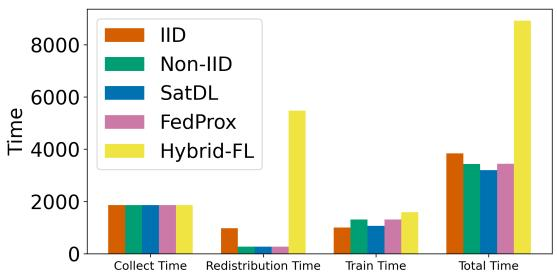  
Fig. 9. Time (seconds) taken by NVIDIA Jetson emulated satellites.

## D. Energy Use – Case Study

To examine the onboard energy benefits of SatDL, we run distributed learning experiments with 10 satellite clients, each emulated by a Jetson GPU—hardware already deployed in satellite platforms. The specific training task is land cover type classification using satellite imagery (Satellite dataset [4]).

Onboard energy use for a satellite client participating in training is primarily dominated by transmission power during data redistribution and GPU runtime power. Thus, we calculate energy consumption on a satellite client as: $E = P _ { \mathrm { r d i s } } \times t _ { \mathrm { r d i s } } +$ $P _ { \mathrm { t r a i n } } \times t _ { \mathrm { t r a i n } } .$ , where $P _ { \mathrm { r d i s } }$ is the power for transmitting data via ISLs (15 Watts [14], [37]) and $P _ { \mathrm { t r a i n } }$ (6.6 Watts) is the measured Jetson GPU average power draw. Fig. 9 compares the learning time breakdown across methods. Results show that SatDL achieves the shortest total learning time, reducing it by 16.7% vs. IID, 6.98% vs. Non-IID, 7.04% vs. FedProx, and 64.1% vs. Hybrid-FL, corresponding to energy reductions of 47.75%, 12.23%, 12.31%, and 88.00%, respectively.

## VII. CONCLUSION

We present SatDL, a selective data-redistribution framework designed to minimize total end-to-end learning time for satellite-based distributed learning. By jointly optimizing data-transfer delay and model training time under non-IID data conditions, SatDL effectively balances communication overhead and convergence speed. Evaluations through satellite simulations and hardware emulations demonstrate significant reductions in learning time and onboard energy consumption compared to state-of-the-art baselines.

## APPENDIX

## A. Convergence Theoretical Results

The following assumptions are adopted to establish convergence bounds:

Assumption 1 (Smoothness and Lower Boundedness): Each local objective function $f _ { k } ( \cdot )$ is differentiable and $L _ { - }$ smooth, i.e.,

$$
\| \nabla f _ { k } ( \mathbf { w _ { u } } ) - \nabla f _ { k } ( \mathbf { w _ { v } } ) \| \leq L \| \mathbf { w _ { u } } - \mathbf { w _ { v } } \| , \quad \forall \mathbf { w _ { u } } , \mathbf { w _ { v } } \in \mathbb { R } ^ { d } .
$$

Additionally, the global objective function $f ( \cdot )$ is assumed to have a lower bound $f ^ { * }$

Assumption 2 (Bounded Local Variance): For every local data shard $\mathcal { D } _ { k }$ , we can sample an independent mini-batch

$\xi \subset \mathcal { D } _ { k }$ with batch size $| \xi | = B$ and compute an unbiased stochastic gradient:

$$
\tilde { \mathbf { g } } _ { k } = \frac { 1 } { B } \nabla f _ { k } ( \mathbf { w } ; \boldsymbol { \xi } ) , \quad \mathbb { E } _ { \boldsymbol { \xi } } [ \tilde { \mathbf { g } } _ { k } ] = \mathbf { g } _ { k } = \frac { 1 } { | \mathcal { D } _ { k } | } \nabla f _ { k } ( \mathbf { w } ; \mathcal { D } _ { k } ) ,
$$

with the variance bounded as

$$
\mathbb { E } _ { \xi } \left[ \| \tilde { \mathbf { g } } _ { k } - \mathbf { g } _ { k } \| ^ { 2 } \right] \leq C _ { 1 } \| \mathbf { g } _ { k } \| ^ { 2 } + \frac { \sigma ^ { 2 } } { B } ,
$$

where $C _ { 1 }$ is a non-negative constant inversely proportional to the mini-batch size and σ is another constant controlling the variance bound.

Assumption 3: The adjacency matrix $\mathbf { M } \in [ 0 , 1 ] ^ { \kappa , \kappa }$ characterizing communication links among clients has eigenvalues with magnitudes strictly less than one, except for the largest eigenvalue, which equals one. i.e.,

$$
\zeta = \operatorname* { m a x } \{ | \tau _ { 2 } ( \mathbf { M } ) | , | \tau _ { K } ( \mathbf { M } ) | \} < \tau _ { 1 } ( \mathbf { M } ) = 1 ,
$$

where $\tau ( \mathbf { M } )$ is the i-th eigenvalue of M and ζ being the second largest eigenvalue.

## B. Estimation of parameters in pre-experiment

1) Estimation of L: To estimate the smoothness constant $L ,$ we randomly initialize two models $( \mathbf { w _ { u } } , \mathbf { w _ { v } } )$ , calculate the Euclidean distance between their parameter vectors $\left\| \mathbf { w _ { u } } - \mathbf { w _ { v } } \right\|$ and their gradient vectors $\| \nabla f _ { k } ( \mathbf { w _ { u } } ) - \nabla f _ { k } ( \mathbf { w _ { v } } ) \|$ ∥. We repeat this over multiple random samples and use the maximum ratio as our worst-case estimate per Assumption 1.

2) Estimation of $C _ { 1 }$ : To estimate the Bounded Local Variance parameters $C _ { 1 }$ and $\sigma$ as defined by Assumption 2, we randomly initialize a model $w ,$ compute the unbiased stochastic gradient $\mathbf { g } _ { k }$ and the variance of each mini-batch $\mathbb { E } _ { \xi } \left[ \left\| \tilde { \mathbf { g } } _ { k } - \mathbf { g } _ { k } \right\| ^ { 2 } \right]$ . This is repeated over multiple samples. Finally, we plot the gradient variances with respect to the magnitude of the unbiased stochastic gradient and fit a line that upper bounds these values to obtain $C _ { 1 }$ and $\sigma$ such that Assumption 2 is satisfied for all samples.

3) Estimation of λ: In the original definition of the gradient diversity (Equation $9 ) .$ , the gradient for each client k was a function of its dataset $\mathcal { D } _ { k }$ :

$$
\nabla f _ { k } ( \mathbf { w } ) = \frac { 1 } { n _ { k } } \sum _ { ( x _ { i } , y _ { i } ) \in \mathcal { D } _ { k } } \nabla f ( \mathbf { w } ; ( x _ { i } , y _ { i } ) ) ,\tag{16}
$$

This allows us to compute the gradient diversity only for the current distribution. We reformulate this to be a function of the class probability distribution $p _ { k } \mathrm { . }$

$$
\nabla f _ { c } ( \mathbf { w } ) = \frac { 1 } { n _ { c } } \sum _ { ( x _ { i } , y _ { i } ) \in \mathcal { D } _ { c } } \nabla f ( \mathbf { w } ; ( x _ { i } , y _ { i } ) ) ,\tag{17}
$$

$$
\nabla f ( \mathbf { w } ; ( x _ { i } , y _ { i } ) ) \approx \nabla f _ { c } ( \mathbf { w } ) ,\tag{18}
$$

$$
\nabla f _ { k } ( \mathbf { w } ) \approx \sum _ { c } p _ { k } ( c ) \nabla f _ { c } ( \mathbf { w } ) ,\tag{19}
$$

where $\mathcal { D } _ { c }$ represents the set of all data points in class $c ,$ $\nabla f _ { c } ( \mathbf { w } )$ , represents the gradient direction for a particular class, and $\begin{array} { r } { p _ { k } ( c ) \stackrel { - } { = } \frac { n _ { k , c } } { n _ { k } } } \end{array}$ represents the class probability distribution.

In Eqn 17, we compute the average gradient for each class. In Eqn 18, we approximate the gradient for each data point with the gradient of the class that the data point belongs to. Finally, in Eqn 19, the gradient of each client is approximated using the class probability distribution $p _ { k }$ These approximations are based on the assumption that the leading cause of gradient diversity stems from the non-IID nature of class imbalance. Using these approximations allows us to compute the gradient diversity for any data distribution proposed by the Data Distributor.

## REFERENCES

[1] A. Chlingaryan, S. Sukkarieh, and B. Whelan, “Machine learning approaches for crop yield prediction and nitrogen status estimation in precision agriculture: A review,” Computers and Electronics in Agriculture, vol. 151, pp. 61–69, 2018. [Online]. Available: https://www.sciencedirect.com/science/article/pii/S0168169917314710

[2] C. Liu, G. Kirchengast, S. Syndergaard, E. Kursinski, Y. Sun, W. Bai, and Q. Du, “A review of low earth orbit occultation using microwave and infrared-laser signals for monitoring the atmosphere and climate,” Advances in Space Research, vol. 60, no. 12, pp. 2776–2811, 2017, bDS/GNSS+: Recent Progress and New Applications - Part 2. [Online]. Available: https://www.sciencedirect.com/science/ article/pii/S027311771730340X

[3] S. Voigt, F. Giulio-Tonolo, J. Lyons, J. Kucera, B. Jones,ˇ T. Schneiderhan, G. Platzeck, K. Kaku, M. K. Hazarika, L. Czaran, S. Li, W. Pedersen, G. K. James, C. Proy, D. M. Muthike, J. Bequignon, and D. Guha-Sapir, “Global trends in satellite-based emergency mapping,” Science, vol. 353, no. 6296, pp. 247–252, 2016. [Online]. Available: https://www.science.org/doi/abs/10.1126/science.aad8728

[4] M. A. Friedl, D. Sulla-Menashe, B. Tan, A. Schneider, N. Ramankutty, A. Sibley, and X. Huang, “Modis collection 5 global land cover: Algorithm refinements and characterization of new datasets,” Remote Sensing of Environment, vol. 114, no. 1, pp. 168–182, 2010. [Online]. Available: https://www.sciencedirect.com/science/article/pii/ S0034425709002673

[5] C. E. Adams and L. Garcia-Carreras, “Detection of land-use change and rapid recovery of vegetation after deforestation in the congo basin,” Earth Interactions, vol. 27, no. 1, p. 220020, 2023. [Online]. Available: https://journals.ametsoc.org/view/journals/eint/27/1/ EI-D-22-0020.1.xml

[6] B. Denby, K. Chintalapudi, R. Chandra, B. Lucia, and S. Noghabi, “Kodan: Addressing the computational bottleneck in space,” in Proceedings of the 28th ACM International Conference on Architectural Support for Programming Languages and Operating Systems, Volume 3, 2023, pp. 392–403.

[7] Planet Labs PBC, “Pelican-2 & 36 superdoves arrived in vandenberg, california for launch,” 2024, accessed: 2024-12-31. [Online]. Available: https://www.planet.com/pulse/ pelican-2-36-superdoves-arrived-in-vandenberg-california-for-launch

[8] Lockheed Martin and NVIDIA, “Lockheed martin and usc to launch jetson-based nanosatellite for scientific research into orbit,” 2024, accessed: 2024-12-31. [Online]. Available: https://developer.nvidia.com/ blog/lockheed-martin-usc-jetson-nanosatellite

[9] H. Chen, M. Xiao, and Z. Pang, “Satellite-based computing networks with federated learning,” IEEE Wireless Communications, vol. 29, no. 1, pp. 78–84, 2022.

[10] D. M. Jimenez-Gutierrez, M. Hassanzadeh, A. Anagnostopoulos, I. Chatzigiannakis, and A. Vitaletti, “A thorough assessment of the non-iid data impact in federated learning,” 2025. [Online]. Available: https://arxiv.org/abs/2503.17070

[11] K. Hsieh, A. Phanishayee, O. Mutlu, and P. B. Gibbons, “The non-iid data quagmire of decentralized machine learning,” 2020. [Online]. Available: https://arxiv.org/abs/1910.00189

[12] J. Dean, G. Corrado, R. Monga, K. Chen, M. Devin, M. Mao, A. Senior, P. Tucker, K. Yang, Q. Le et al., “Large scale distributed deep networks,” in Advances in neural information processing systems, vol. 25, 2012, pp. 1223–1231.

[13] M. Motzigemba, H. Zech, and P. Biller, “Optical Inter Satellite Links for Broadband Networks,” in International Conference on Recent Advances in Space Technologies, 2019, pp. 509–512.

[14] NASA SmallSat Institute, “State-of-the-art small spacecraft technology: Communications,” https://www.nasa.gov/smallsat-institute/sst-soa/ soa-communications/, 2025, accessed on July 24, 2025.

[15] N. Patel and L. S. Karumbunathan, “Power optimization with nvidia jetson,” https://developer.nvidia.com/blog/ power-optimization-with-nvidia-jetson/, Oct. 2023, accessed on July 24, 2025.

[16] T. Li, A. K. Sahu, M. Zaheer, M. Sanjabi, A. Talwalkar, and V. Smith, “Federated optimization in heterogeneous networks,” 2020. [Online]. Available: https://arxiv.org/abs/1812.06127

[17] N. Yoshida, T. Nishio, M. Morikura, K. Yamamoto, and R. Yonetani, “Hybrid-fl for wireless networks: Cooperative learning mechanism

using non-iid data,” 2020. [Online]. Available: https://arxiv.org/abs/ 1905.07210

[18] F. Haddadpour and M. Mahdavi, “On the convergence of local descent methods in federated learning,” 2019. [Online]. Available: https://arxiv.org/abs/1910.14425

[19] A. Krizhevsky, “Learning multiple layers of features from tiny images,” University of Toronto, Tech. Rep. Technical Report, 2009. [Online]. Available: https://www.cs.toronto.edu/∼kriz/learning-features-2009-TR. pdf

[20] C. Ertler, J. Mislej, T. Ollmann, L. Porzi, G. Neuhold, and Y. Kuang, “The mapillary traffic sign dataset for detection and classification on a global scale,” 2020. [Online]. Available: https://arxiv.org/abs/1909.04422

[21] D. J. Beutel, T. Topal, A. Mathur, X. Qiu, J. Fernandez-Marques, Y. Gao, L. Sani, H. L. Kwing, T. Parcollet, P. P. d. Gusmao, and N. D.˜ Lane, “Flower: A friendly federated learning research framework,” arXiv preprint arXiv:2007.14390, 2020.

[22] H. Zhu, J. Xu, S. Liu, and Y. Jin, “Federated learning on non-iid data: A survey,” 2021. [Online]. Available: https://arxiv.org/abs/2106.06843

[23] X. Ma, J. Zhu, Z. Lin, S. Chen, and Y. Qin, “A state-of-the-art survey on solving non-iid data in federated learning,” Future Generation Computer Systems, vol. 135, pp. 244–258, 2022. [Online]. Available: https://www.sciencedirect.com/science/article/pii/S0167739X22001686

[24] Q. Li, Y. Diao, Q. Chen, and B. He, “Federated learning on non-iid data silos: An experimental study,” in 2022 IEEE 38th International Conference on Data Engineering (ICDE), 2022, pp. 965–978.

[25] M. Luo, F. Chen, D. Hu, Y. Zhang, J. Liang, and J. Feng, “No fear of heterogeneity: Classifier calibration for federated learning with non-iid data,” in Advances in Neural Information Processing Systems, M. Ranzato, A. Beygelzimer, Y. Dauphin, P. Liang, and J. W. Vaughan, Eds., vol. 34. Curran Associates, Inc., 2021, pp. 5972–5984. [Online]. Available: https://proceedings.neurips.cc/paper files/paper/2021/file/2f2b265625d76a6704b08093c652fd79-Paper.pdf

[26] Y. Zhao, M. Li, L. Lai, N. Suda, D. Civin, and V. Chandra, “Federated learning with non-iid data,” arXiv preprint arXiv:1806.00582, 2018. [Online]. Available: https://arxiv.org/abs/1806.00582

[27] S. P. Karimireddy, S. Kale, M. Mohri, S. J. Reddi, S. U. Stich, and A. T. Suresh, “Scaffold: Stochastic controlled averaging for federated learning,” 2021. [Online]. Available: https://arxiv.org/abs/1910.06378

[28] Q. Li, B. He, and D. Song, “Model-contrastive federated learning,” in Proceedings of the IEEE/CVF Conference on Computer Vision and Pattern Recognition, 2021, pp. 10 713–10 722.

[29] SpaceX, “Starlink,” https://www.starlink.com/, 2024, https://www. starlink.com/.

[30] K. He, X. Zhang, S. Ren, and J. Sun, “Deep residual learning for image recognition,” 2015. [Online]. Available: https://arxiv.org/abs/1512.03385

[31] H. B. McMahan, E. Moore, D. Ramage, S. Hampson, and B. A. y Arcas, “Communication-efficient learning of deep networks from decentralized data,” 2023. [Online]. Available: https://arxiv.org/abs/1602.05629

[32] Federal Communications Commission, “Spacex non-geostationary satellite system,” FCC Report, April 2022. [Online]. Available: https://fcc.report/IBFS/SAT-MOD-20200417-00037/2274316.pdf

[33] X. Gao, R. Liu, and A. Kaushik, “Service chaining placement based on satellite mission planning in ground station networks,” IEEE Transactions on Network and Service Management, vol. 18, no. 3, pp. 3049– 3063, 2021.

[34] Q. Xia, G. Wang, Z. Xu, W. Liang, and Z. Xu, “Efficient algorithms for service chaining in nfv-enabled satellite edge networks,” IEEE Transactions on Mobile Computing, vol. 23, no. 5, pp. 5677–5694, 2024.

[35] J. Porter. (2022) Spacex’s new starlink business tier promises up to 500mbps for 500 dollars a month. [Online]. Available: https://www.theverge.com/2022/2/2/22913921/ spacex-starlink-premium-satellite-internet-faster-speed-expensive

[36] NVIDIA Corporation, “Nvidia a100 tensor core gpu datasheet,” 2020, accessed: 2025-07-29. [Online]. Available: https://www.nvidia.com/content/dam/en-zz/Solutions/Data-Center/ a100/pdf/nvidia-a100-datasheet.pdf

[37] K. Riesing, C. Schieler, B. Bilyeu, J. Chang, A. Garg, N. Gilbert, A. Horvath, R. Reeves, B. Robinson, J. Wang et al., “Operations and results from the 200 gbps tbird laser communication mission,” in 37th Annual Small Satellite Conference, no. SSC23-I-03, 2023.