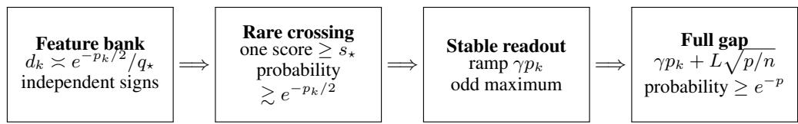

# THE SHARP TAIL OF UNIFORM STABILITY

Pahan Dewasurendra Johns Hopkins University

## ABSTRACT

Uniform stability controls how much one training example can change the loss at any test point. A new logarithmic-free upper bound shows that a γ-uniformly stable algorithm with loss in [0, L] has generalization gap at most

$$
O \Bigg ( \gamma \log ( 1 / \delta ) + L \sqrt { \frac { \log ( 1 / \delta ) } { n } } \Bigg )
$$

with probability $1 - \delta$ . Whether an actual bounded-loss learning algorithm can realize the linear dependence on $\log ( 1 / \delta )$ has remained open. The known construction realizes it only for auxiliary weakly dependent random variables whose pointwise range grows with n. The known learning lower bound holds only at constant probability.

We close this gap. For every $n ,$ stability level $\gamma _ { : }$ , and loss bound $L ,$ we construct one deterministic γ-uniformly stable learning problem whose tail satisfies, simultaneously for $1 \leq p \leq c n$

$$
\mathbb { P } \Big ( R ( A _ { S } ) - R _ { S } ( A _ { S } ) \geq c ^ { \prime } \operatorname* { m i n } \Big \{ L , \gamma p + L \sqrt { p / n } \Big \} \Big ) \geq e ^ { - p } .
$$

The construction is ordinary bounded absolute-loss regression with constant labels. Its key is a multiscale collection of rare Rademacher features. A coordinatewise ramp is stable in sup norm, while an odd symmetrized maximum converts a unique extreme feature into a gap of order $\gamma p$ without violating the loss bound. Geometrically spaced ramps put all confidence levels into the same problem. Together with the logarithmic-free upper bound, this determines the optimal highprobability and moment dependence of uniform stability up to universal constants.

## 1 INTRODUCTION

Algorithmic stability explains generalization through the behavior of the learning rule rather than through uniform convergence over a hypothesis class. A learning algorithm A is γ-uniformly stable when replacing one training example changes its loss at every test point by at most $\gamma$ (Bousquet & Elisseeff, 2002). This property underlies guarantees for regularized empirical risk minimization, gradient methods, and stochastic optimization (Shalev-Shwartz et al., 2010; Hardt et al., 2016). Its expectation guarantee is simple and sharp: $| \mathbb { E } [ R ( A _ { S } ) - R _ { S } ( A _ { S } ) ] | \le \gamma$ . Obtaining the correct high-probability guarantee took a longer sequence of results.

The classical bounded-differences argument gives a deviation term of order $\gamma \sqrt { n \log ( 1 / \delta ) }$ (Bousquet & Elisseeff, 2002). Feldman & Vondrák (2018) replaced the factor $\gamma \sqrt { n }$ by ${ \sqrt { \gamma L } }$ , and Feldman & Vondrák (2019) obtained a nearly optimal bound with logarithmic overhead in n. Bousquet et al. (2020) reduced the learning problem to a moment inequality for weakly interacting functions. Their result left one factor log n in the stability term. Very recently, Nguyen-Cung & Nguyen (2026) removed that factor and proved

$$
\| R ( A _ { S } ) - R _ { S } ( A _ { S } ) \| _ { p } \leq 3 3 p \gamma + L \sqrt { \frac { 2 p } { n } } , \qquad p \geq 2 .\tag{1}
$$

The trivial range bound then caps the right side by L. Equation (1) gives the clean tail scale

$$
\operatorname* { m i n } \left\{ L , \gamma \log ( 1 / \delta ) + L \sqrt { \frac { \log ( 1 / \delta ) } { n } } \right\} .\tag{2}
$$

  
Figure 1: The multiscale mechanism. Reciprocal-probability feature replication makes a rare largedeviation crossing visible. A coordinatewise stable ramp and the odd maximum turn that crossing into empirical bias. Independent memory and sampling terms fill the constant-confidence and square-root parts of the tail. Geometric choices of $p _ { k }$ put every $p \leq c n$ in one learner.

The lower-bound side has not matched this progress. Bousquet et al. (2020) constructed weakly interacting functions with pth moment $\Omega ( p n \gamma + L \sqrt { p n } )$ ). Their functions have pointwise magnitude of order $n \gamma ,$ so the construction does not come from a learning algorithm with a uniform loss bound L. They explicitly asked whether the same behavior is possible for the functions induced by a uniformly stable learner. Liu & Lu (2020) later constructed a bounded-loss learner with gap $\Omega ( \dot { \gamma } + L / \sqrt { n } )$ at constant probability, and left the dependence on small failure probability open. The new upper-bound paper also separates its result from exactly this learning lower-bound question (Nguyen-Cung & Nguyen, 2026). Our lower-bound theorem and proof are independent of that preprint. Equation (1) is used only to identify the matching upper scale.

We show that every term in (2) is necessary. More strongly, one finite-dimensional problem realizes the full curve at all confidence levels $e ^ { - p }$ with $p \leq c n$ . This is not a different problem chosen for each $p .$

Why the obvious quadratic construction fails. Let $X _ { 1 } , \ldots , X _ { n }$ be Rademacher signs, $T =$ $\textstyle \sum _ { i } X _ { i }$ , and let a learner predict with amplitude γT. A linear loss has generalization gap $\gamma T ^ { 2 } / n ,$ whose pth scale is $\gamma p .$ . The prediction amplitude at that event is $\gamma { \sqrt { n p } }$ . Clipping it to the loss range L activates when $p \gtrsim L ^ { 2 } / ( \gamma ^ { 2 } n )$ . This is exactly where the term γp begins to dominate $L { \sqrt { p / n } }$ . Thus clipping destroys the part of the tail that needs to be proved.

The new mechanism. We replace one feature by many independent Rademacher features. At a chosen scale, exponentially many coordinates are placed just below a fixed large-deviation threshold. A ramp of width $\Theta ( p )$ gives amplitude $\Theta ( \gamma p )$ only when one coordinate crosses that threshold. The ramp is coordinatewise γ-stable regardless of the number of coordinates. The loss reads the coordinates through the odd function

$$
H _ { a } ( x ) = \operatorname* { m a x } _ { j } a _ { j } x _ { j } - \operatorname* { m a x } _ { j } ( - a _ { j } x _ { j } ) .\tag{3}
$$

It is centered under a symmetric population and is 2-Lipschitz in a under the sup norm. When there is one dominant coordinate, its empirical average is bounded away from zero, so it contributes $\Theta ( \gamma p )$ to the gap. Coordinates with smaller ramps can be present without changing the sign of the effect. Coordinates with larger ramps are absent on the clean extreme event.

We use geometrically spaced ramp widths. The event at scale $p _ { k }$ has probability much larger than $e ^ { - p _ { k } }$ , which leaves enough probability to intersect it with an ordinary sampling-deviation event. A separate stable memorization term handles constant confidence and the range-saturated regime. All components are combined in a scalar predictor under absolute loss.

## Contributions.

• We give the first bounded-loss uniformly stable learner with an $\Omega ( \gamma \log ( 1 / \delta ) )$ high-probability generalization gap.

• A single problem realizes $\Omega ( \operatorname* { m i n } \{ L , \gamma p + L \sqrt { p / n } \} )$ simultaneously for all $1 \leq p \leq c n$ . Consequently, the moment upper bound in (1) is sharp for actual learning algorithms.

• The construction uses deterministic learning and standard absolute regression loss. We prove uniform stability over all replacement datasets, not only on the high-probability event.

Related extensions. Several recent lines change the assumptions rather than the worst-case lowerbound question. Klochkov & Zhivotovskiy (2021) obtain faster excess-risk rates under a Bernstein condition. Zhou et al. (2023) derive PAC-Bayes bounds for randomized uniformly stable algorithms under a sub-exponential condition on their random stability parameter. Yuan & Li (2022) use subbagging to boost confidence for randomized algorithms under the weaker, distribution-dependent notion of $L _ { 2 }$ stability. Fan & Lei (2024) introduce pointwise uniform stability and derive functionvalue and gradient generalization bounds, with applications to SGD. In a complementary 2026 direction, Lei et al. (2026) replace bounded differences by finite- $L _ { p }$ replace-one envelopes and obtain Gaussian-plus-polynomial upper tails for unbounded losses. These results provide sharper conclusions from additional structure or modified algorithms. They do not give a high-probability lower bound for the ordinary deterministic uniform-stability condition (4). Our result concerns exactly that worst-case condition and the bounded-loss minimax gap left open by Bousquet et al. (2020), Liu & Lu (2020), and Nguyen-Cung & Nguyen (2026).

## 2 SETUP AND RESULT

Let $S = ( Z _ { 1 } , \dots , Z _ { n } ) \sim P ^ { n }$ . An algorithm A maps $S$ to a predictor $A _ { S }$ . For a loss ℓ with values in $[ 0 , L ]$ , define

$$
R ( A _ { S } ) = \mathbb { E } _ { Z \sim P } \ell ( A _ { S } , Z ) , \qquad R _ { S } ( A _ { S } ) = \frac { 1 } { n } \sum _ { i = 1 } ^ { n } \ell ( A _ { S } , Z _ { i } ) , \qquad G _ { S } = R ( A _ { S } ) - R _ { S } ( A _ { S } ) .
$$

The algorithm is $\gamma \cdot$ -uniformly stable if, whenever S and $S ^ { \prime }$ differ in one coordinate,

$$
\operatorname* { s u p } _ { z } | \ell ( A _ { S } , z ) - \ell ( A _ { S ^ { \prime } } , z ) | \leq \gamma .\tag{4}
$$

Our theorem is stated with unspecified universal constants. The appendix tracks concrete constants for the construction.

Theorem 1 (Sharp lower tail). There are universal constants $c _ { 0 } , c _ { 1 } > 0$ and $n _ { 0 } \in \mathbb { N }$ with the following property. For every $n \geq n _ { 0 } , L > 0$ , and $0 \leq \gamma \leq L ,$ there are a finite input space, a distribution $\bar { P , }$ and one deterministic γ-uniformly stable absolute-loss regression algorithm with loss in $[ 0 , L ]$ such that, simultaneouslyfor every real $p \in [ 1 , c _ { 0 } n ]$

$$
\mathbb { P } _ { S \sim P ^ { n } } \Big ( G _ { S } \geq c _ { 1 } \operatorname* { m i n } \Big \{ L , \gamma p + L \sqrt { p / n } \Big \} \Big ) \geq e ^ { - p } .\tag{5}
$$

The regression labels are identically zero.

The problem may depend on $( n , L , \gamma )$ , as is standard for a minimax lower bound. Crucially, it does not depend on p or δ. The simultaneous statement immediately gives moment sharpness.

Corollary 2 (Moment sharpness). For the problem in Theorem 1 and every $p \in [ 2 , c _ { 0 } n ]$

$$
\| G _ { S } \| _ { p } \geq c _ { 2 } \operatorname* { m i n } \Bigl \{ L , \gamma p + L \sqrt { p / n } \Bigr \}\tag{6}
$$

for a universal $c _ { 2 } > 0$

Indeed, (5) implies $\| G _ { S } \| _ { p } \geq e ^ { - 1 }$ times its displayed threshold. Combining Corollary 2 with (1) and the range bound yields the minimax law

$$
\operatorname* { s u p } _ { ( P , A , \ell ) } \| G _ { S } \| _ { p } \asymp \operatorname* { m i n } \Bigl \{ L , \gamma p + L \sqrt { p / n } \Bigr \} , \qquad 2 \leq p \leq c _ { 0 } n ,\tag{7}
$$

where the supremum is over γ-stable algorithms with loss in $[ 0 , L ]$ . The upper and lower constants in (7) are universal.

## 3 THE MULTISCALE LEARNER

We now define the single problem used for every p. A training input is

$$
Z = ( X , J , \Sigma , U ) .
$$

All components are independent. The vector X consists of independent Rademacher coordinates, J is uniform on $[ D ]$ , and $\Sigma , U$ are Rademacher signs. The dimension of X is divided into groups indexed by a geometric set of scales.

Let

$$
p _ { k } = 1 6 \cdot 4 ^ { k } , \qquad r _ { k } = p _ { k } / 1 6 = 4 ^ { k } , \qquad p _ { k } \leq \operatorname* { m i n } \{ n / 6 4 , L / \gamma \} ,\tag{8}
$$

where $L / 0 = + \infty$ . Let $B _ { n }$ be a sum of n independent Rademacher signs. Choose the first attainable score $s _ { \star } \geq n / 4$ and set

$$
q _ { \star } = \mathbb { P } ( B _ { n } \geq s _ { \star } ) , \qquad d _ { k } = \left\lfloor \frac { 8 e ^ { - p _ { k } / 2 } } { q _ { \star } } \right\rfloor , \qquad t _ { k } = s _ { \star } - 2 r _ { k } .\tag{9}
$$

Group $k$ contains $d _ { k }$ independent coordinates. For a sample, write $\begin{array} { r } { S _ { k j } = \sum _ { i = 1 } ^ { n } X _ { i , k j } } \end{array}$ and define the ramp amplitude

$$
a _ { k j } ( S ) = \operatorname* { m i n } \left\{ \gamma r _ { k } , { \frac { \gamma } { 2 } } ( S _ { k j } - t _ { k } ) _ { + } \right\} .\tag{10}
$$

If the set of scales is empty, X has one dummy coordinate with amplitude zero. The total feature dimension is finite and typically exponential in n because $q _ { \star } = e ^ { - \Theta ( n ) }$ . Section 7 explains why this multiplicity is used.

The memory component uses $D = 8 n ^ { 2 }$ cells. Let

$$
b _ { j } ( S ) = c _ { \mathrm { m e m } } \mathrm { s g n } \left( \sum _ { i : J _ { i } = j } \Sigma _ { i } \right) , \qquad c _ { \mathrm { m e m } } = \mathrm { m i n } \{ \gamma / 4 , L / 8 \} ,\tag{11}
$$

with $\operatorname { s g n } ( 0 ) = 0$ . Collect all ramp amplitudes in a vector $a ( S )$ and use the symmetrized maximum $H _ { a }$ from (3). The predictor is

$$
h _ { S } ( X , J , \Sigma , U ) = \frac { L } { 2 } - \frac { 1 } { 4 } H _ { a ( S ) } ( X ) - b _ { J } ( S ) \Sigma - \frac { L } { 4 } U .\tag{12}
$$

The regression label is zero and the loss is absolute error. We will show that $h _ { S } \in [ 0 , L ]$ , so the loss equals $h _ { S }$ itself.

The four pieces in (12) have distinct roles. The center $L / 2$ enforces a valid loss range. The symmetrized maximum produces the $\gamma p$ tail. The cell memory produces a constant-order stability gap and handles scales below 16 or above $L / \gamma$ . The last sign produces the ordinary $L { \sqrt { p / n } }$ sampling tail.

## 4 STABILITY AND CENTERING

Two elementary Lipschitz properties make the construction work.

Lemma 3 (Symmetrized maximum). For nonnegative vectors $a , a ^ { \prime }$ and every sign vector $x ,$

$$
H _ { a } ( - x ) = - H _ { a } ( x ) , \qquad | H _ { a } ( x ) | \leq 2 \| a \| _ { \infty } , \qquad | H _ { a } ( x ) - H _ { a ^ { \prime } } ( x ) | \leq 2 \| a - a ^ { \prime } \| _ { \infty } .\tag{13}
$$

The proof applies the $\ell _ { \infty }$ Lipschitz property of a maximum twice. Replacing one training point changes every score $S _ { k j }$ by at most two. Hence (10) gives $\| a ( S ) - a ( \bar { S ^ { \prime } } ) \| _ { \infty } \overset { \cdot } { \leq } \gamma$ . The $H \bar { / } 4$ term changes by at most $\gamma / 2 .$ At a fixed memory cell, a replacement can change $b _ { j }$ from $- c _ { \mathrm { m e m } }$ to $c _ { \mathrm { m e m } } ,$ so the memory term changes by at most $2 c _ { \mathrm { m e m } } \leq \gamma / 2$ . The U term does not depend on the sample. This proves (4).

The largest ramp cap is at most $L / 1 6$ . Lemma 3 gives $| H _ { a } | \le L / 8$ . Together with $c _ { \mathrm { m e m } } \leq L / 8$ , the sample-dependent offset from $L / 2$ in (12) is at most

$$
L / 3 2 + L / 8 + L / 4 = 1 3 L / 3 2 .
$$

Thus $h _ { S } \in [ 3 L / 3 2 , 2 9 L / 3 2 ] \subset [ 0 , L ]$

Conditional on the training sample, a fresh X is symmetric. Lemma 3 therefore gives $\mathbb { E } H _ { a ( S ) } ( X ) =$ 0. A fresh $\Sigma$ and a fresh $U$ are centered as well, so

$$
R ( A _ { S } ) = L / 2\tag{14}
$$

for every sample. Consequently,

$$
G _ { S } = \frac { 1 } { 4 n } \sum _ { i = 1 } ^ { n } H _ { a ( S ) } ( X _ { i } ) + \frac { 1 } { n } \sum _ { i = 1 } ^ { n } b _ { J _ { i } } ( S ) \Sigma _ { i } + \frac { L } { 4 n } \sum _ { i = 1 } ^ { n } U _ { i } .\tag{15}
$$

This exact identity is the bridge from rare features to generalization.

## 5 RARE EXTREMES CREATE THE LINEAR TAIL

For each scale $k ,$ let $E _ { k }$ be the event that exactly one coordinate in group k has score at least $s _ { \star } .$ , and every other coordinate in group k or a larger group $\ell >$ k has score strictly below its threshold $t _ { \ell } .$ Smaller groups are unrestricted.

Lemma 4 (Clean extreme). For every scale in (8),

$$
\mathbb { P } ( E _ { k } ) \geq 6 e ^ { - p _ { k } / 2 } .\tag{16}
$$

On $E _ { k }$

$$
{ \frac { 1 } { n } } \sum _ { i = 1 } ^ { n } H _ { a ( S ) } ( X _ { i } ) \geq { \frac { 3 } { 3 2 } } \gamma r _ { k } = { \frac { 3 } { 5 1 2 } } \gamma p _ { k } .\tag{17}
$$

We give the main argument because it contains the new idea. Hoeffding’s inequality yields $q _ { \star } \leq$ $e ^ { - n { \overline { { / } } } 3 2 }$ . Since $p _ { k } \leq n / 6 4$ , the floor in (9) is negligible at the required constant scale and

$$
d _ { k } q _ { \star } \ge 7 e ^ { - p _ { k } / 2 } .\tag{18}
$$

Moving the threshold down by $r _ { k }$ binomial steps multiplies its upper tail by at most $( r _ { k } + 1 ) 2 ^ { r _ { k } } \leq$ $4 ^ { r _ { k } } < e ^ { p _ { k } / 8 }$ . Therefore, the expected number of coordinates in group k at or above the forbidden threshold $t _ { k }$ , and similarly in every larger group, is at most

$$
8 e ^ { - p _ { k } / 2 + p _ { k } / 8 } = 8 e ^ { - 3 p _ { k } / 8 } .\tag{19}
$$

The scales grow by four, so the sum of these expectations from group k upward is below 0.021.   
Independence across coordinates and a union bound with (18) prove (16).

On $E _ { k }$ , the exceptional coordinate reaches its cap $a = \gamma r _ { k }$ . Every coordinate in a smaller group has amplitude at most $a / 4 .$ , while every other coordinate in the same or a larger group has amplitude zero. Let $\boldsymbol { x } _ { i } ^ { \star }$ be the exceptional coordinate. If $x _ { i } ^ { \star } = 1$ , then $H _ { a } ( X _ { i } ) \geq a - a \overline { { { \not / 4 . } } } \ \hat { \mathrm { I f } } \ x _ { i } ^ { \star } = - \hat { 1 }$ , then $H _ { a } ( X _ { i } ) \geq - a$ . Since $\textstyle \sum _ { i } x _ { i } ^ { \star } \geq s _ { \star } \geq n / 4$ , summing these inequalities gives

$$
\frac 1 n \sum _ { i } H _ { a } ( X _ { i } ) \geq a \left( \frac 1 4 - \frac { 1 + 1 / 4 } { 8 } \right) = \frac { 3 a } { 3 2 } .
$$

This proves (17). The smaller scales may fire, but the geometric cap makes them too weak to reverse the contribution of the exceptional feature.

The role of the factor $e ^ { - p _ { k } / 2 }$ is deliberate. It is more probability than the theorem needs. We spend the surplus by intersecting $E _ { k }$ with the independent sampling event below.

## 6 PROOF OF THE SHARP TAIL

We use a standard one-sided anti-concentration fact. A self-contained block proof from the Paley– Zygmund inequality is included in Appendix $_ { \mathrm { A } . 6 }$

Lemma 5 (Rademacher lower tail). For all sufficiently large n, every Rademacher sum $T _ { n }$ and $1 \leq p \leq n$ satisfy

$$
\mathbb { P } \bigg ( T _ { n } \ge \frac { 1 } { 6 4 } \sqrt { n p } \bigg ) \ge \frac { 1 } { 8 } e ^ { - p / 8 } .\tag{20}
$$

For $1 \leq p < 1 6 ,$ , the probability on the left is at least 0.45.

The constants are elementary. $\mathrm { P a l e y - Z y }$ gmund and symmetry give $\mathbb { P } ( V _ { m } \ge \sqrt { m / 2 } ) \ge 1 / 2 4$ for a Rademacher block sum. For $\dot { p } \geq 3 2 \dot { \log { 2 4 } }$ , split the signs into $q = \lfloor p / ( 1 6 \log 2 \dot { 4 } ) \rfloor$ blocks and require this event in every block, with a nonnegative leftover. The resulting threshold is at least $\sqrt { n p } / 6 4$ and the probability is at least $( 1 / 2 ) 2 4 ^ { - q } \geq ( 1 / 8 ) e ^ { - p / 8 }$ . One block handles $1 6 \leq p < 3 2 \log 2 4$ . For $p < 1 6 ,$ , the maximum binomial atom bound $\dot { n } ^ { - 1 / 2 }$ gives the stated 0.45. Appendix A.6 records the arithmetic.

Let F be the event that the memory indices $J _ { 1 } , \ldots , J _ { n }$ are distinct. Since $D = 8 n ^ { 2 }$

$$
\mathbb { P } ( F ) \geq 1 - \frac { n ( n - 1 ) } { 2 D } \geq \frac { 1 5 } { 1 6 } .\tag{21}
$$

On $F ,$ each observed cell contains one sign. Hence $b _ { J _ { i } } ( S ) = c _ { \mathrm { m e m } } \Sigma _ { i }$ and the middle term in (15) is exactly $c _ { \mathrm { m e m } }$

Fix $p \in [ 1 6 , c _ { 0 } n ]$ , where $c _ { 0 } \leq 1 / 6 4$ . If a scale is available, choose the largest available $p _ { k } \le p$ . In particular, this is the terminal scale when $p$ exceeds the largest constructed scale. The geometric spacing gives

$$
p _ { k } \ge \frac { 1 } { 4 } \operatorname* { m i n } \{ p , L / \gamma \} .\tag{22}
$$

On the independent intersection of $E _ { k } , F$ , and the event in Lemma 5 for $\sum _ { i } U _ { i }$ , equations (15) and (17) give

$$
\begin{array} { r } { G _ { S } \geq c \operatorname* { m i n } \{ L , \gamma p \} + c L \sqrt { p / n } . } \end{array}\tag{23}
$$

Its probability is at least

$$
6 e ^ { - p _ { k } / 2 } \cdot \frac { 1 5 } { 1 6 } \cdot \frac { 1 } { 8 } e ^ { - p / 8 } \geq e ^ { - p } .
$$

The inequality uses $p _ { k } \le p$ and $p \geq 1 6$

If no scale is available, then $L / \gamma < 1 6$ . In that case $c _ { \mathrm { m e m } } \geq L / 6 4$ , which already gives a constant fraction of min $\{ L , \gamma p \}$ . For $p < 1 6$ , the same memory term gives a constant fraction of min $\{ L , \gamma p \}$ We additionally require that no ramp is active. Equation (19) shows that this event has probability above 0.97. A constant-scale version of Lemma 5, together with (21), leaves probability above $e ^ { - p }$ and gives the required $L { \sqrt { p / n } }$ term. This proves Theorem 1.

## 7 DISCUSSION

The auxiliary lower bound is now realizable. The construction of Bousquet et al. (2020) produces the quadratic Rademacher chaos $\gamma ( T _ { n } ^ { 2 } - n )$ , which has the right moments but arises from functions whose pointwise range is $\Theta ( n \gamma )$ . The ramps in our construction move the large deviation into the feature index. At any fixed test point, the loss reads a maximum and remains bounded. At the training sample, a rare coordinate carries a persistent empirical bias. This separates pointwise range from aggregate tail size.

All confidence levels require multiple scales. A single ramp can match one prescribed $p ,$ which would prove a pointwise minimax lower bound. The geometric family is stronger. Smaller ramps have at most one quarter of the target amplitude, while larger ramps are inactive with overwhelming probability. This scale separation is why the same learner matches the full tail rather than a confidence level fixed in advance.

Implication for stability-based analyses. A common analysis of an optimizer first proves a uniform stability constant and then invokes a distribution-free generalization theorem that sees only $( \gamma , L )$ Our lower bound shows that this black-box second step must retain the $\gamma \log ( 1 / \delta )$ term. A sharper guarantee for a particular optimizer must use more information, such as curvature, data-dependent stability, algorithmic randomness, or representation constraints.

The loss is standard, the learner is adversarial. Our predictor is scalar and is evaluated by absolute loss against the constant label zero. The construction is nonetheless a worst-case learner with exponentially many Rademacher features. This multiplicity is deliberate. A coordinate has upper-tail probability $\dot { q } _ { \star } = \dot { e ^ { - \Theta ( n ) } }$ , and using on the order of $1 / q ,$ ⋆ independent coordinates makes one crossing occur at a controlled probability. Within an independent-threshold bank of this form, the union bound shows that polynomial multiplicity cannot suffice. Probability $e ^ { - p }$ requires $d \ge e ^ { - p } / q _ { \star } \ge e ^ { n / 6 4 }$ when $p \leq n / 6 4$ . We do not claim that exponential dimension is necessary outside this mechanism. It is the price paid by this construction to encode all confidence levels in one problem. This is appropriate for determining what uniform stability alone can guarantee because that condition places no restriction on dimension. Additional structure, such as convex optimization, a fixed lowdimensional representation, or distributional stability, may yield smaller tails. The theorem shows that such improvements cannot follow from uniform stability and bounded loss by themselves.

Confidence range. The interval $p \leq c n$ is the natural nondegenerate range for bounded i.i.d. sampling. It is also the range in which the weak-dependence lower bound of Bousquet et al. (2020) has its two-level form. Beyond it, the loss-range cap dominates and constants depend on how the extreme endpoint is parameterized. Theorem 1 covers every confidence level used in the usual exponential generalization regime.

## REPRODUCIBILITY STATEMENT

The proof is finite and nonasymptotic. The supplement gives every omitted constant calculation. It also provides three short audit programs: extreme\_ramp\_check.py evaluates the exact binomial probabilities, multiscale\_check.py checks every scale and case split, and stability\_bruteforce.py exhausts the replacement inequalities on small instances. These computations check the proof and are not used as assumptions.

## REFERENCES

Olivier Bousquet and André Elisseeff. Stability and generalization. Journal of Machine Learning Research, 2:499–526, 2002.

Olivier Bousquet, Yegor Klochkov, and Nikita Zhivotovskiy. Sharper bounds for uniformly stable algorithms. In Proceedings of the 33rd Conference on Learning Theory, volume 125 of Proceedings of Machine Learning Research, pp. 610–626, 2020.

Jun Fan and Yunwen Lei. High-probability generalization bounds for pointwise uniformly stable algorithms. Applied and Computational Harmonic Analysis, 70:101632, 2024.

Vitaly Feldman and Jan Vondrák. Generalization bounds for uniformly stable algorithms. In Advances in Neural Information Processing Systems, volume 31, pp. 9770–9780, 2018.

Vitaly Feldman and Jan Vondrák. High probability generalization bounds for uniformly stable algorithms with nearly optimal rate. In Proceedings ofthe 32nd Conference on Learning Theory, volume 99 of Proceedings ofMachine Learning Research, pp. 1270–1279, 2019.

Moritz Hardt, Ben Recht, and Yoram Singer. Train faster, generalize better: Stability of stochastic gradient descent. In Proceedings of the 33rd International Conference on Machine Learning, volume 48 of Proceedings of Machine Learning Research, pp. 1225–1234, 2016.

Yegor Klochkov and Nikita Zhivotovskiy. Stability and deviation optimal risk bounds with convergence rate o(1/n). In Advances in Neural Information Processing Systems, volume 34, 2021.

Qianqian Lei, Soham Bonnerjee, Yuefeng Han, and Wei Biao Wu. Stability beyond bounded differences: Sharp generalization bounds under finite $l _ { p }$ moments. arXiv preprint arXiv:2606.06855, 2026.

Qinghua Liu and Zhou Lu. A tight lower bound for uniformly stable algorithms. arXiv preprint arXiv:2012.13326, 2020.

Thanh Nguyen-Cung and Binh T. Nguyen. Logarithmic-free moment and generalization bounds for uniformly stable algorithms. arXiv preprint arXiv:2608.09870, 2026.

Shai Shalev-Shwartz, Ohad Shamir, Nathan Srebro, and Karthik Sridharan. Learnability, stability and uniform convergence. Journal ofMachine Learning Research, 11:2635–2670, 2010.

Xiao-Tong Yuan and Ping Li. Boosting the confidence of generalization for $l _ { 2 } .$ -stable randomized learning algorithms. arXiv preprint arXiv:2206.03834, 2022.

Sijia Zhou, Yunwen Lei, and Ata Kabán. Toward better PAC-Bayes bounds for uniformly stable algorithms. In Advances in Neural Information Processing Systems, volume 36, pp. 29602–29614, 2023.

## A DETAILED PROOFS

This appendix proves the claims in the main text with one concrete choice of the scale constants. No optimization of numerical constants is intended.

## A.1 NOTATION AND ELEMENTARY BOUNDS

Let $\varepsilon _ { 1 } , \ldots , \varepsilon _ { n }$ be independent Rademacher signs and $B _ { n } = \textstyle \sum _ { i } \varepsilon _ { i }$ . Define

$$
k _ { \star } = \left\lceil \frac { 5 n } { 8 } \right\rceil , \qquad s _ { \star } = 2 k _ { \star } - n , \qquad q _ { \star } = \mathbb { P } ( B _ { n } \geq s _ { \star } ) .
$$

Then

$$
\frac { 1 } { 4 } \leq \frac { s _ { \star } } { n } \leq \frac { 1 } { 4 } + \frac { 2 } { n } .\tag{24}
$$

Hoeffding’s inequality gives

$$
q _ { \star } \le \exp \left( - \frac { s _ { \star } ^ { 2 } } { 2 n } \right) \le e ^ { - n / 3 2 } .\tag{25}
$$

For $r \leq n / 1 0 2 4 .$ , put

$$
q ( r ) = \mathbb { P } ( B _ { n } \geq s _ { \star } - 2 r ) .
$$

The event on the right contains the upper tail at $k _ { \star }$ and at most r additional binomial levels. Moving down one level multiplies the point mass by

$$
\frac { k } { n - k + 1 } \leq \frac { 5 n / 8 + 1 } { 3 n / 8 - r } < 2
$$

for all sufficiently large n. Since $q _ { \star }$ is at least the mass at $k _ { \star }$ , we obtain

$$
\frac { q ( r ) } { q _ { \star } } \leq ( r + 1 ) 2 ^ { r } \leq 4 ^ { r } .\tag{26}
$$

The last inequality holds for every integer $r \geq 1$

## A.2 THE SYMMETRIZED MAXIMUM

Proof of Lemma 3. Write $M _ { a } ( x ) = \operatorname* { m a x } _ { j } a _ { j } x _ { j }$ . Then

$$
H _ { a } ( x ) = M _ { a } ( x ) - M _ { a } ( - x ) .
$$

This immediately gives $H _ { a } ( - x ) = - H _ { a } ( x )$ . Since each $a _ { j } x _ { j }$ lies in $[ - \| a \| _ { \infty } , \| a \| _ { \infty } ]$ , the range bound follows. Finally,

$$
| M _ { a } ( x ) - M _ { a ^ { \prime } } ( x ) | \leq \operatorname* { m a x } _ { j } | ( a _ { j } - a _ { j } ^ { \prime } ) x _ { j } | \leq \| a - a ^ { \prime } \| _ { \infty } .
$$

Applying this inequality at x and −x and using the triangle inequality proves the final claim.

## A.3 THE LEARNER IS STABLE AND BOUNDED

We verify the claims around (12). Suppose S and $S ^ { \prime }$ differ at observation i. For every ramp coordinate,

$$
| S _ { k j } - S _ { k j } ^ { \prime } | = | X _ { i , k j } - X _ { i , k j } ^ { \prime } | \leq 2 .
$$

The scalar map in (10) is $\gamma / 2  \mathrm { - I }$ ipschitz. Therefore

$$
\| a ( S ) - a ( S ^ { \prime } ) \| _ { \infty } \leq \gamma .\tag{27}
$$

Lemma 3 implies that the $H / 4$ term changes by at most $\gamma / 2$ at every test point.

Only the old and new memory cells can change. At either cell, $b _ { j }$ takes values in $\{ - c _ { \mathrm { m e m } } , 0 , c _ { \mathrm { m e m } } \}$ so

$$
| b _ { j } ( S ) - b _ { j } ( S ^ { \prime } ) | \leq 2 c _ { \mathrm { m e m } } \leq \gamma / 2 .\tag{28}
$$

For a fixed test point, only its own cell is read. Adding (27) and (28) proves γ-uniform stability.

If the scale set is nonempty, its largest element satisfies $p _ { K } \leq L / \gamma$ . Thus

$$
\| a ( S ) \| _ { \infty } \leq \gamma r _ { K } = \frac { \gamma p _ { K } } { 1 6 } \leq \frac { L } { 1 6 } .\tag{29}
$$

The same bound is trivial if there are no ramps. Lemma 3 gives $| H _ { a } ( X ) | / 4 \le L / 3 2$ . Since $| b _ { J } \Sigma | \le L / 8$ and $| L U / 4 | = L / 4$

$$
3 L / 3 2 \leq h _ { S } ( Z ) \leq 2 9 L / 3 2 .
$$

This proves the range claim. With regression label zero, absolute loss is exactly $h _ { S } ( Z )$

For a fresh input, $X { \overset { d } { = } } - X$ , and Lemma 3 gives E $[ H _ { a ( S ) } ( X ) \mid S ] = 0$ . The fresh signs Σ and U are independent of S and centered. This proves (14) and (15).

## A.4 PROBABILITY OF A CLEAN EXTREME

We prove the probability part of Lemma 4. For a scale $p _ { k } = 1 6 r _ { k } \leq n / 6 4$ , equation (25) gives

$$
q _ { \star } \leq e ^ { - 2 p _ { k } } .\tag{30}
$$

By the definition of $d _ { k }$

$$
d _ { k } q _ { \star } \ge 8 e ^ { - p _ { k } / 2 } - q _ { \star } \ge 7 e ^ { - p _ { k } / 2 } , \qquad d _ { k } q _ { \star } \le 8 e ^ { - p _ { k } / 2 } .\tag{31}
$$

In particular, $d _ { k } \geq 2 .$

The clean event forbids every nonexceptional coordinate whose score is at least $t _ { k } = s _ { \star } - 2 r _ { k }$ Equations (26) and (31) show

$$
d _ { k } q ( r _ { k } ) \leq 8 e ^ { - p _ { k } / 2 } 4 ^ { r _ { k } } \leq 8 e ^ { - 3 p _ { k } / 8 } ,\tag{32}
$$

because $4 ^ { r _ { k } } \ = \ e ^ { ( \log 4 ) p _ { k } / 1 6 } \ < \ e ^ { p _ { k } / 8 }$ . The same inequality holds at every larger scale. Since $p _ { k + j } = 4 ^ { j } p _ { k }$

$$
\sum _ { \ell \geq k } d _ { \ell } q ( r _ { \ell } ) \leq 8 \sum _ { j \geq 0 } \exp \left( - \frac { 3 } { 8 } 4 ^ { j } p _ { k } \right) < 0 . 0 2 1\tag{33}
$$

for $p _ { k } \ge 1 6$

Choose which coordinate in group k is the exceptional one. Independence of all Rademacher coordinates gives

$$
\mathbb { P } ( E _ { k } ) = d _ { k } q _ { \star } ( 1 - q ( r _ { k } ) ) ^ { d _ { k } - 1 } \prod _ { \ell > k } ( 1 - q ( r _ { \ell } ) ) ^ { d _ { \ell } }\tag{34}
$$

$$
\geq d _ { k } q _ { \star } \left( 1 - \sum _ { \ell \geq k } d _ { \ell } q ( r _ { \ell } ) \right)\tag{35}
$$

$$
\geq 7 e ^ { - p _ { k } / 2 } ( 1 - 0 . 0 2 1 ) \geq 6 e ^ { - p _ { k } / 2 } .\tag{36}
$$

The second line is the union bound applied to all forbidden coordinates. This proves (16).

## A.5 GAP ON THE CLEAN EXTREME EVENT

On $E _ { k }$ , let $( k , j _ { \star } )$ denote the exceptional coordinate and put $a = \gamma r _ { k }$ . Its score is at least $s _ { \star } =$ $t _ { k } + 2 r _ { k }$ , so its ramp reaches the cap a. Every other coordinate in group k or a larger group has amplitude zero. Every smaller scale has cap at most $a / 4$

Write $x _ { i } ^ { \star } = X _ { i , k j }$ and let $n _ { + }$ and $n _ { - }$ count its positive and negative signs. There is at least one zero-amplitude coordinate because $d _ { k } \geq 2 . \operatorname { I f } x _ { i } ^ { \star } = 1$ , the first maximum in H is a and the second is at most $a / 4 .$ , so

$$
H _ { a ( S ) } ( X _ { i } ) \geq 3 a / 4 .\tag{37}
$$

If $x _ { i } ^ { \star } = - 1$ , the second maximum is a and the first is at least zero, so

$$
H _ { a ( S ) } ( X _ { i } ) \geq - a .\tag{38}
$$

Let $\rho = ( n _ { + } - n _ { - } ) / n$ . Equations (37) and (38) imply

$$
{ \frac { 1 } { n } } \sum _ { i } H _ { a ( S ) } ( X _ { i } ) \geq { \frac { 3 a } { 4 } } { \frac { 1 + \rho } { 2 } } - a { \frac { 1 - \rho } { 2 } } = a \left( { \frac { 7 } { 8 } } \rho - { \frac { 1 } { 8 } } \right) .\tag{39}
$$

On $E _ { k } , \rho \ge s _ { \star } / n \ge 1 / 4$ . The right side of (39) is increasing in $\rho ,$ so it is at least 3a/32. Substituting $a = \gamma r _ { k } = \gamma p _ { k } / 1 6$ proves (17).

## A.6 RADEMACHER ANTI-CONCENTRATION

We give an elementary block proof of Lemma 5. If $V _ { m }$ is a sum of m independent Rademacher signs, then

$$
\mathbb { E } V _ { m } ^ { 2 } = m , \qquad \mathbb { E } V _ { m } ^ { 4 } = 3 m ^ { 2 } - 2 m \le 3 m ^ { 2 } .
$$

Paley– $- Z \mathbf { y }$ gmund applied to $V _ { m } ^ { 2 }$ therefore gives

$$
\mathbb { P } \Big ( | V _ { m } | \geq \sqrt { m / 2 } \Big ) \geq \frac { 1 } { 1 2 } .\tag{40}
$$

By symmetry, either one-sided event has probability at least $1 / 2 4$

Partition the first $q m$ signs of $T _ { n }$ into $q$ blocks of size $m = \lfloor n / q \rfloor$ , leaving at most $q - 1$ signs. If every block sum is at least $\sqrt { m / 2 }$ and the leftover sum is nonnegative, then, whenever $q \leq n / 2$

$$
T _ { n } \geq q { \sqrt { m / 2 } } \geq { \frac { 1 } { 2 } } { \sqrt { n q } } .\tag{41}
$$

The event has probability at least

$$
\frac { 1 } { 2 } 2 4 ^ { - q } .\tag{42}
$$

We now track constants. First suppose $1 \leq p < 1 6 .$ . The largest atom of $T _ { n }$ is at most $n ^ { - 1 / 2 }$ by the central binomial coefficient bound. Positive attainable values are spaced by two, so there are at most $\sqrt { n } / 3 2 + 1$ of them below $\sqrt { n } / 1 6$ . Symmetry gives

$$
\mathbb { P } ( T _ { n } \ge { \sqrt { n } } / 1 6 ) \ge { \frac { 1 } { 2 } } - { \frac { 1 } { 2 { \sqrt { n } } } } - \left( { \frac { 1 } { 3 2 } } + { \frac { 1 } { \sqrt { n } } } \right) = { \frac { 1 5 } { 3 2 } } - { \frac { 3 } { 2 { \sqrt { n } } } } \ge 0 . 4 5\tag{43}
$$

for all sufficiently large n. Since $p < 1 6 ,$ , the threshold is at least $\sqrt { n p } / 6 4$

For $1 6 \le p <$ 32 log 24, use one block. Equations (40) and symmetry give

$$
\mathbb { P } ( T _ { n } \geq \sqrt { n / 2 } ) \geq 1 / 2 4 \geq ( 1 / 8 ) e ^ { - p / 8 } ,
$$

and $\sqrt { n / 2 } \geq \sqrt { n p } / 6 4$ . Finally, suppose 32 log $2 4 \leq p \leq n$ and take

$$
q = \left\lfloor { \frac { p } { 1 6 \log 2 4 } } \right\rfloor .
$$

Then $p / ( 3 2 \log 2 4 ) \le q \le p / ( 1 6 \log 2 4 )$ and $q \leq n / 2$ . Equations (41) and (42) yield

$$
T _ { n } \geq { \frac { 1 } { 2 { \sqrt { 3 2 \log 2 4 } } } } { \sqrt { n p } } \geq { \frac { 1 } { 6 4 } } { \sqrt { n p } }
$$

with probability at least

$$
\frac { 1 } { 2 } 2 4 ^ { - q } \geq \frac { 1 } { 2 } e ^ { - p / 1 6 } \geq \frac { 1 } { 8 } e ^ { - p / 8 } .
$$

The three ranges prove Lemma 5 with no asymptotic normal approximation.

## A.7 SMALL SCALES, SATURATION, AND SIMULTANEITY

We fill in the cases abbreviated in the main proof. First, the memory indices are distinct with probability at least 15/16 by (21). On this event,

$$
{ \frac { 1 } { n } } \sum _ { i } b _ { J _ { i } } ( S ) \Sigma _ { i } = c _ { \mathrm { m e m } } .\tag{44}
$$

Suppose $1 \leq p < 1 6 . \mathrm { I f } \gamma \leq L / 2 .$ , then $c _ { \mathrm { m e m } } = \gamma / 4$ and

$$
c _ { \mathrm { m e m } } \geq \frac { 1 } { 6 4 } \operatorname* { m i n } \{ L , \gamma p \} .
$$

$\mathrm { I f } \gamma > L / 2 .$ , then $c _ { \mathrm { m e m } } = L / 8$ and the same inequality is immediate. The probability that any ramp is active is at most the sum in (33), hence below 0.021. By the compact-interval part of Lemma 5, the sampling event can be chosen to have probability at least 0.45 while still giving a universal multiple of $L { \sqrt { p / n } }$ . The three events are independent, and $0 . 9 7 9 \cdot ( 1 5 / 1 6 ) \cdot 0 . 4 5 > e ^ { - 1 }$ . Their intersection therefore exceeds $e ^ { - p }$ . This proves (5) for $p < 1 6$

Now suppose $p \geq 1 6$ but $L / \gamma < 1 6 .$ Then $\gamma > L / 1 6$ and

$$
c _ { \mathrm { m e m } } = \operatorname* { m i n } \{ \gamma / 4 , L / 8 \} \geq L / 6 4 .\tag{45}
$$

Thus memory alone supplies a constant fraction of the saturated stability term. Intersecting (44) with Lemma 5 proves the result.

It remains to justify (22). Let $P = \operatorname* { m i n } \{ n / 6 4 , L / \gamma \}$ . If $P \ge 1 6$ , the largest geometric scale below $P$ is greater than $\dot { P } / 4$ . For a query $p \leq c _ { 0 } n \leq n / 6 4$ , the largest available scale not exceeding p, or the terminal scale if $p > P$ , therefore obeys

$$
p _ { k } \ge \frac { 1 } { 4 } \operatorname* { m i n } \{ p , L / \gamma \} .
$$

The construction of all groups uses only $( n , L , \gamma )$ . It is completed before p is chosen. Thus the proof supplies the probability statement for all p using the same distribution and algorithm. This establishes the simultaneity claimed in Theorem 1.

Finally, on the intersection used in the proof,

$$
G _ { S } \geq \frac { 1 } { 4 } \frac { 3 \gamma p _ { k } } { 5 1 2 } + c _ { \mathrm { m e m } } + \frac { c L } { 4 } \sqrt { p / n }\tag{46}
$$

$$
\geq c ^ { \prime } \left( \operatorname* { m i n } \{ L , \gamma p \} + L \sqrt { p / n } \right)\tag{47}
$$

$$
\geq c ^ { \prime } \operatorname* { m i n } \left\{ L , \gamma p + L { \sqrt { p / n } } \right\} .\tag{48}
$$

This also makes clear that every term is one-sided and no cancellation is used.

## A.8 MOMENT CONSEQUENCE

Let

$$
\begin{array} { r } { u _ { p } = c _ { 1 } \operatorname* { m i n } \Bigl \{ L , \gamma p + L \sqrt { p / n } \Bigr \} . } \end{array}
$$

Theorem 1 gives $\mathbb { P } ( G _ { S } \geq u _ { p } ) \geq e ^ { - p }$ . Hence

$$
\| G _ { S } \| _ { p } ^ { p } \geq u _ { p } ^ { p } e ^ { - p } , \qquad \| G _ { S } \| _ { p } \geq e ^ { - 1 } u _ { p } .
$$

This proves Corollary 2. The upper direction of (7) is (1) combined with $| G _ { S } | \le L$ . The lower direction is the corollary.

## B AI USE

LLM-based tools were used to assist with proofs and language editing.

## C EXACT COMPUTATIONAL AUDITS

The construction contains only binomial probabilities and maximum inequalities. We nevertheless performed three audits.

Exact clean-event probabilities. For each $n \ \in \ \{ 4 0 9 6 , 8 1 9 2 , 1 6 3 8 4 , 3 2 7 6 8 , 6 5 5 3 6  \}$ and every geometric scale below $n / 6 4$ , we evaluated $q _ { \star }$ , each lowered tail $q ( r _ { k } )$ , the floor in $d _ { k }$ , and the exact product in (36) in log space. Table 1 shows representative results. The final column divides the rigorous clean-event lower bound by $e ^ { - p _ { k } / 2 }$ . The analytic proof uses the weaker constant 6.

Table 1: Exact audit of the multiscale event.
<table><tr><td>n</td><td> $p _ { k }$ </td><td> $- \log { q _ { \star } }$ </td><td> $\log ( q ( \boldsymbol { r } _ { k } ) / q _ { \star } ) / p _ { k }$ </td><td> $\mathbb { P } ( E _ { k } ) e ^ { p _ { k } / 2 }$  lower bound</td></tr><tr><td>4096</td><td>16</td><td>132.81</td><td>0.0320</td><td>7.964</td></tr><tr><td>4096</td><td>64</td><td>132.81</td><td>0.0319</td><td>8.000</td></tr><tr><td>16384</td><td>256</td><td>521.60</td><td>0.0318</td><td>8.000</td></tr><tr><td>65536</td><td>1024</td><td>2074.71</td><td>0.0318</td><td>8.000</td></tr></table>

Exhaustive stability audit. For $n = d = 3 .$ , we enumerated every Rademacher dataset, every one-point replacement, and every test input. We separately enumerated every memory dataset with three cells. With $\gamma = 0 . 2$ , the largest ramp loss change was 0.1, the largest memory loss change was 0.1, and their sum was exactly 0.2. The maximum coordinate-amplitude change was exactly γ. This checks the sharp cases of (27) and (28).

The audit scripts use exact enumeration for stability and double-precision log binomial masses for the probability calculation. The displayed margins are several orders of magnitude larger than floating-point error.