(a) Real-World Unitree G1 Locomotion

# WarpSAC<sup>1</sup>: Towards the Pinnacle of Scalable Off-policy RL by Rethinking Exploration and Exploitation

Zihao Wu<sup>1</sup> Hongyao Tang<sup>1,#</sup> Yi Ma<sup>2,#</sup> Huizhong Song<sup>2</sup> Pengyi Li<sup>1</sup> Yifu Yuan<sup>1</sup> Fei Ni<sup>3</sup> Jinyi Liu<sup>1</sup> Wei Wei<sup>2</sup> Jianrong Wang<sup>1</sup> Yan Zheng<sup>1</sup> Jianye Hao<sup>1,#</sup>

<sup>1</sup>Tianjin University, <sup>2</sup>Shanxi University, <sup>3</sup>Imperial College London <sup>#</sup> Corresponding Author(s)

Abstract. Scaling of-policy reinforcement learning (RL) through massively parallel simulation changes the data regime assumptions, under which RL algorithms are designed. Canonical stabilizers are motivated by data-limited training, where replay bufers provide narrow state–action coverage. By contrast, massively parallel simulation ofers diverse experience at high throughput, naturally challenging the canonical roles of the stabilizers in this new data regime. Through comprehensive and controlled empirical study across eight benchmark families spanning CPU-scale locomotion, GPU-parallel robotic simulation, dexterous manipulation, humanoid whole-body control and we find that these stabilizers are strongly data-regime-dependent: parameter normalization helps under narrow replay coverage but restricts value fitting when data are abundant, clipped double-Q can be safely relaxed in high throughput manipulation, and age-biased replay weighting is broadly useful for improving learning eficiency, especially under limited network capacity. Turning this analysis into a prescription, we build WarpSAC, a regime-aware family of of-policy RL algorithms. WarpSAC uses Sample Weight Decay as a regime-agnostic component for eficient exploitation and matches each regime with a prescribed variant: WarpSAC-L (Norm ON, clipped double-Q) for data-limited CPU-scale training, and WarpSAC-A (Norm OFF, single-Q) for data-abundant GPU-parallel training. WarpSAC improves normalized score–step AUC over FlashSAC by 4.5% across nine CPU-scale environments and 23.1% across fourteen GPU-parallel environments; lifts UnitreeG1TransportBox-v1 success rate from 19.8% to 96.4%, and gains 19.1% in mean normalized wall-time AUC on MuJoCo Playground; achieves faster sim-to-real deployment on Unitree G1 than FlashSAC by 36.4% in terms of wall time. These results argue that scalable of-policy RL should adapt its stabilizers to the available data regime. Under this principle, WarpSAC advances the state of the art of scalable of-policy RL, delivering consistent gains over FlashSAC across diferent data regimes.

Contact: wzhhasadream@gmail.com Code: https://github.com/wzhhasadream/warprl Project Page: https://wzhhasadream.github.io/WarpSAC/

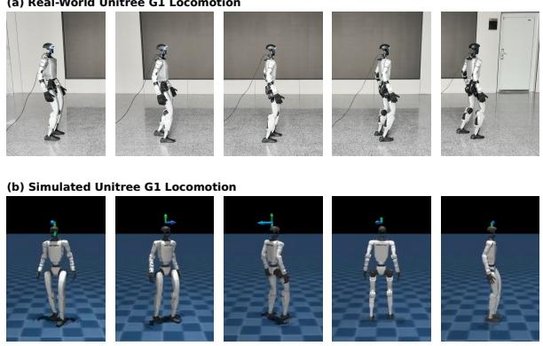

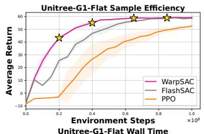

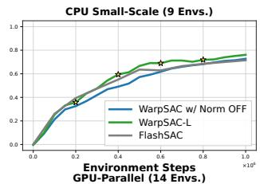

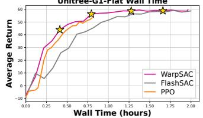

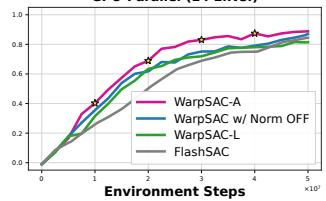  
Figure 1 Benchmark-scale and sim-to-real overview. The left strips show real-world and simulated Unitree G1 locomotion, the middle panels report Unitree-G1-Flat sample eficiency and training wall time measured on a single NVIDIA A800 GPU, and the right panels summarize normalized CPU-scale and GPU-parallel learning curves. Across the benchmark curves, WarpSAC improves over FlashSAC, while the preferred stabilizing configuration depends on the data-collection regime.

## 1 Introduction

Scaling has become a central force in modern reinforcement learning (RL) for robot control. GPU-accelerated simulators and massively parallel environments now let agents collect diverse experience at rates that were unattainable in conventional single-environment training (Mittal et al., 2025; Tao et al., 2024; Zakka et al., 2025, 2026). This shift makes of-policy actor–critic methods increasingly attractive: replay bufers can reuse large volumes of interaction data, while scalable implementations such as Soft Actor-Critic (SAC) (Haarnoja et al., 2018a,b) and FlashSAC (Kim et al., 2026) have shown that of-policy learning can be efective in high-dimensional robotic domains.

However, most classical of-policy stabilizers were designed under the opposite assumption: that replay coverage is narrow, and the learner must protect itself against extrapolation. In this limited data regime, exploration and conservative value estimation are essential. Entropy regularization pushes the policy toward unseen actions, clipped double-Q targets suppress overestimation on poorly covered transitions, and parameter normalization or norm control constrains the function class so that value fitting remains stable outside the replay distribution (Fujimoto et al., 2018; Haarnoja et al., 2018a; Lee et al., 2025). When massively parallel simulation replaces this scarcity with abundance, the same mechanisms may no longer be uniformly beneficial, as the bottleneck shifts from exploration and conservatism to exploiting abundant data eficiently. Strong parameter normalization can restrict expressive freedom; clipped double-Q can be overly pessimistic; and every extra conservative component adds wall-clock cost. Yet almost all scalable of-policy pipelines still inherit these stabilizers unchanged. The central question we ask in this paper is — not whether these stabilizers are good in isolation, but when their benefits outweigh their restrictions.

We answer this question through a controlled component-wise analysis based on FlashSAC (Kim et al., 2026). We isolate three axes that scalable of-policy learners usually bundle together: (i) replay-side data utilization, instantiated by Sample Weight Decay (SWD) (Wu et al., 2026), an age-biased sampler that concentrates updates on policy-relevant transitions; (ii) parameter-projection normalization, which controls the efective function class of the actor and critic; and (iii) critic multiplicity, embodied by clipped double-Q versus single-Q targets. Holding the training backbone, optimizer, environment interface, and network fixed, we vary each axis independently and measure its efect under data-limited (CPU-scale) versus data-abundant (GPU-parallel) regimes across eight benchmark families, 67 environments/tasks in total: DeepMind Control Suite hard tasks (Tassa et al., 2018), HumanoidBench (Sferrazza et al., 2024), Gym–MuJoCo (Todorov et al., 2012), MyoSuite (Caggiano et al., 2022), MuJoCo Playground (Zakka et al., 2025), MJLab (Zakka et al., 2026), IsaacLab (Mittal et al., 2025), and ManiSkill (Tao et al., 2024). The analysis yields a consistent message: these stabilizers are data-regime-dependent, not universal. Normalization helps when replay is narrow but restricts value fitting when replay is broad; clipped double-Q can be relaxed in high-throughput manipulation without degrading performance; SWD, in contrast, remains useful across both regimes.

Turning this analysis into a prescription, we build WarpSAC, a regime-aware family of of-policy RL algorithm. WarpSAC uses SWD as a consistent component and matches each stabilizer choice to the target data regime: WarpSAC-L (Norm ON, double-Q) for data-limited CPU-scale training, and WarpSAC-A (Norm OFF, Single-Q) for GPU-parallel training. Across nine CPU-scale environments, WarpSAC improves mean normalized score–step AUC over FlashSAC by 4.5%; across fourteen GPU-parallel environments, it improves the corresponding AUC by 23.1%. On UnitreeG1TransportBox-v1, WarpSAC-A lifts success rate from 19.8% to 96.4%, and on MuJoCo Playground it gains 19.1% in mean normalized wall-time AUC. Moreover, we show that WarpSAC delivers a sim-to-real training-deployment closed-loop for Unitree G1 in 35 minutes on a single A800 GPU, showing a 36.4% wall-clock time reduction compared to FlashSAC. This points toward a in-minutes deployment with WarpSAC when a high-end GPU (e.g., B200) is available. These gains are obtained without changing the training backbone, without adding auxiliary networks, and often while removing components, showing that a regime-matched selection of stabilizers strictly outperforms uniform inheritance.

## Our contributions are threefold:

• A regime-aware design principle for scalable of-policy RL. Through controlled component-wise ablations, we show that parameter normalization and clipped double-Q are data-regime-dependent stabilizers, whereas age-biased replay weighting is broadly beneficial. This reframes scalable of-policy RL as a data-regime-matching problem rather than a stabilizer-stacking problem.

• WarpSAC, a regime-aware refinement of FlashSAC that wins across regimes. WarpSAC makes better exploitation of data with SWD and pairs each regime with the stabilizer configuration based on our empirical analysis: WarpSAC-L for CPU-scale training and WarpSAC-A for GPU-parallel training, all under a shared training backbone.

• State-of-the-art results across eight benchmark families. WarpSAC improves normalized score–step AUC over FlashSAC by 4.5% across nine CPU-scale environments and 23.1% across fourteen GPU-parallel environments, lifts UnitreeG1TransportBox-v1 success rate from 19.8% to 96.4%, and gains 19.1% in mean normalized wall-time AUC on MuJoCo Playground.

## 2 Related Work

Scalable of-policy reinforcement learning. Of-policy reinforcement learning is attractive for continuous control because it can reuse past experience through replay, improving data eficiency compared with purely onpolicy methods. Soft Actor-Critic (SAC) combines of-policy actor–critic learning with entropy regularization and has become a standard baseline for continuous control (Haarnoja et al., 2018a,b). Subsequent methods improve stability or sample eficiency by reducing value-estimation error, increasing update-to-data ratios, using critic ensembles, or learning latent dynamics models (Chen et al., 2021; Fujimoto et al., 2018; Hansen et al., 2024). Recent scalable robot-learning systems further show that of-policy RL can benefit from high-throughput simulation, large replay bufers, and larger neural networks (Kim et al., 2026; Lee et al., 2025). Our work follows this scalable of-policy direction, but studies a diferent question: which classical stabilizers remain useful when replay coverage is broadened by massively parallel data collection.

Replay weighting, data reuse, and exploitation. Replay bufers are commonly sampled uniformly, but non-uniform replay has long been used to improve data reuse. Prioritized experience replay samples transitions according to temporal-diference error, emphasizing transitions with larger learning signals (Schaul et al., 2016). More recent work studies replay through the lens of non-stationarity and plasticity loss. Deep RL agents can lose adaptability during training due to primacy bias, dormant neurons, rank collapse, weakened gradient signals, or severe value and policy churn (Nikishin et al., 2022; Sokar et al., 2023; Tang and Berseth, 2024; Tang et al., 2025; Wu et al., 2026). Sample Weight Decay (SWD) addresses this issue by reweighting samples according to age (Wu et al., 2026). While SWD was originally motivated by plasticity preservation, we interpret it as an exploitation-oriented replay mechanism: it changes how collected data are reused, rather than adding additional exploration or stronger conservatism.

Critic conservatism and clipped double-Q learning. A central challenge in of-policy actor–critic learning is value-estimation error. TD3 and SAC use clipped double-Q targets to reduce overestimation by taking the minimum over two target critics (Fujimoto et al., 2018; Haarnoja et al., 2018a). This conservative target is especially useful when the critic must evaluate actions that are poorly covered by the replay bufer, where extrapolation error can otherwise produce spuriously high values. Such kind of extrapolation errors are addressed from diferent perspectives, e.g., reining the representation-level generalization (Ma et al., 2023), reducing out-of-batch churn (Tang and Berseth, 2024). However, this conservatism also introduces bias: when data coverage is broad and value fitting becomes the dominant bottleneck, clipped double-Q targets may become overly pessimistic or computationally redundant. Our single-Q experiments examine this trade-of in scalable robotic manipulation settings, asking whether critic-side conservatism can be relaxed when massively parallel simulation already provides diverse replay data.

Normalization and function-class control. Normalization and norm control are widely used to stabilize deep networks. Batch normalization, layer normalization, weight normalization, spectral normalization, and RMS normalization control diferent aspects of optimization, activation statistics, or parameter geometry (Ba et al., 2016; Iofe and Szegedy, 2015; Miyato et al., 2018; Salimans and Kingma, 2016; Zhang and Sennrich, 2019). In reinforcement learning, norm control is particularly relevant because bootstrapped targets and non-stationary replay can amplify value-function instability. Recent architectures such as SimbaV2 use hyperspherical normalization to improve scalable RL, while XQC studies how critic conditioning afects optimization geometry (Lee et al., 2025; Palenicek et al., 2026). Our work is complementary: rather than proposing a new normalization layer, we study when parameter projection normalization should be retained or relaxed. We find that norm control is useful in data-limited regimes, but can restrict exploitation in large-parallel regimes where replay coverage is already broad.

Exploration complexity and data coverage. Theoretical analyses of exploration often relate sample complexity to uncertainty over the value-function class. Eluder dimension measures sequential dependence within a function class and appears in optimistic exploration analyses under function approximation (Osband and Van Roy, 2014; Russo and Van Roy, 2013). Norm and Lipschitz constraints provide one way to control the efective complexity of neural function classes, and spectral-norm-based measures have been used to analyze neural-network generalization (Bartlett et al., 2017; Miyato et al., 2018). This perspective motivates parameter projection normalization as an exploration- and stability-oriented mechanism: by controlling the Lipschitz constant, it can reduce harmful extrapolation on under-covered regions. Our empirical results suggest that the value of this control depends on the data regime. When parallel simulation provides broad coverage, the same constraint can reduce expressive freedom and weaken exploitation.

## 3 Preliminaries

Markov decision process. We consider continuous-control reinforcement learning in a discounted Markov decision process (MDP) $\mathcal { M } = ( S , \mathcal { A } , P , r , \gamma )$ , where $s$ and A denote the state and action spaces, $P ( s ^ { \prime } | s , a )$ is the transition kernel, $r ( s , a )$ is the reward function, and $\gamma \in [ 0 , 1 )$ is the discount factor. At each timestep, the agent observes $s _ { t } ,$ samples an action $a _ { t } \sim \pi ( \cdot | s _ { t } )$ , receives reward $r _ { t } ,$ and transitions to $s _ { t + 1 }$ . We use $\rho _ { \pi } ( s , a )$ to denote the discounted state-action visitation distribution induced by policy π. The standard objective is to learn a policy maximizing the expected discounted return,

$$
J ( \pi ) = \mathbb { E } _ { ( s _ { t } , a _ { t } ) \sim \rho _ { \pi } } \left[ \sum _ { { t = 0 } } ^ { \infty } \gamma ^ { t } r ( s _ { t } , a _ { t } ) \right] .
$$

Soft actor-critic. Our study builds on Soft Actor-Critic (SAC), an of-policy actor-critic algorithm under the maximum-entropy RL framework (Haarnoja et al., 2018a,b). SAC augments the return objective with an entropy term,

$$
J _ { \mathrm { S A C } } ( \pi ) = \mathbb { E } _ { ( s _ { t } , a _ { t } ) \sim \rho _ { \pi } } \left[ \sum _ { t = 0 } ^ { \infty } \gamma ^ { t } \left( r ( s _ { t } , a _ { t } ) + \alpha \mathcal { H } ( \pi ( \cdot | s _ { t } ) ) \right) \right] ,
$$

where α controls the relative weight of entropy. In practice, SAC maintains a replay bufer D, a stochastic policy π<sub>θ</sub>, and two critics $Q _ { \phi _ { 1 } } , Q _ { \phi _ { 2 } }$ to counter overestimation bias via the clipped double-Q target (Fujimoto et al., 2018): given transitions $( s , a , r , s ^ { \prime } ) \sim \mathcal { D }$ and $a ^ { \prime } \sim \pi _ { \theta } ( \cdot | s ^ { \prime } )$ 2

$$
y = r + \gamma \left( \operatorname* { m i n } _ { i = 1 , 2 } Q _ { \bar { \phi } _ { i } } ( s ^ { \prime } , a ^ { \prime } ) - \alpha \log \pi _ { \theta } ( a ^ { \prime } | s ^ { \prime } ) \right) ,
$$

and each critic is trained by minimizing the Bellman error

$$
\mathcal { L } _ { Q _ { i } } ( \phi _ { i } ) = \mathbb { E } _ { ( s , a , r , s ^ { \prime } ) \sim \mathcal { D } } \left[ \left( Q _ { \phi _ { i } } ( s , a ) - y \right) ^ { 2 } \right] .
$$

The clipped double-Q operator suppresses spuriously high Q estimates on poorly covered actions but adds a second critic and a pessimism bias; a single-Q variant simply removes the minimization and uses one critic.

FlashSAC extends this SAC foundation to large-scale robotic control by combining high-throughput data collection, larger models, reduced update frequency, and norm-control mechanisms for stable critic learning (Kim et al., 2026). Concretely, high-throughput parallel simulation together with a low gradient-update-toenvironment-step ratio shifts wall-clock cost from gradient computation to environment interaction, making larger actor–critic networks afordable at scale; parameter projection normalization then keeps such large critics stable by column-wise renormalizing linear weights after each optimizer step, which constrains the efective function class and controls value extrapolation on poorly covered actions.

Together, these design choices make FlashSAC a strong scalable of-policy backbone on continuous control, on which we build WarpSAC in the remainder of the paper.

Parameter projection normalization. FlashSAC includes norm-control components to stabilize largescale of-policy learning (Kim et al., 2026). We focus on parameter projection normalization as a controllable factor. Consider a neural network $f _ { \theta }$ with weight matrices $\{ W _ { \ell } \} _ { \ell = 1 } ^ { L }$ . Parameter projection constrains each layer after optimization, for example by projecting $W _ { \ell }$ into a Frobenius-norm ball,

$$
W _ { \ell }  \Pi _ { \| W \| _ { F } \leq c _ { \ell } } ( W _ { \ell } ) .
$$

Since $\| W _ { \ell } \| _ { 2 } \le \| W _ { \ell } \| _ { F } .$ , bounding the Frobenius norm also bounds the spectral norm. For networks with 1-Lipschitz activations, this yields the standard Lipschitz upper bound

$$
\operatorname { L i p } ( f _ { \theta } ) \leq \prod _ { \ell = 1 } ^ { L } \| W _ { \ell } \| _ { 2 } \leq \prod _ { \ell = 1 } ^ { L } c _ { \ell } .
$$

This connects parameter projection normalization to spectral-norm-based complexity control in neural networks (Bartlett et al., 2017; Miyato et al., 2018). In our analysis, this normalization is treated as an exploration- and stability-oriented constraint: it controls the efective function class, but may also restrict expressive freedom when the replay distribution already provides suficient data coverage.

Weighted replay. Uniform replay samples each stored transition with equal probability. More generally, let $\mathcal { D } _ { t } = \{ \tau _ { i } \} _ { i = 1 } ^ { N _ { t } }$ be the replay bufer at training step t, where ${ \boldsymbol \tau _ { i } } = ( s _ { i } , a _ { i } , r _ { i } , s _ { i } ^ { \prime } )$ denotes a transition. A weighted-replay scheme samples $\tau _ { i }$ with probability

$$
p _ { t } ( i ) = \frac { w _ { t } ( i ) } { \sum _ { j = 1 } ^ { N _ { t } } w _ { t } ( j ) } ,
$$

where $w _ { t } ( i ) \geq 0$ is a sample weight. Under weighted replay, the critic objective becomes

$$
\mathcal { L } _ { Q _ { i } } ^ { w } ( \phi _ { i } ) = \mathbb { E } _ { \tau _ { i } \sim p _ { t } } \left[ \left( Q _ { \phi _ { i } } ( s _ { i } , a _ { i } ) - y _ { i } \right) ^ { 2 } \right] .
$$

Diferent choices of $w _ { t } ( i )$ recover prior schemes such as uniform sampling and prioritized replay (Schaul et al., 2016). Sample Weight Decay (SWD) instantiates this idea by assigning age-aware weights to replay samples, and was proposed as a lightweight replay-side method for mitigating plasticity loss in deep RL (Wu et al., 2026). In this paper, we study SWD not only as a plasticity-preserving method, but also as a mechanism that facilitates data exploitation during of-policy learning.

Eluder dimension and exploration complexity. Eluder dimension measures the degree of sequential dependence within a function class and is commonly used to characterize exploration complexity under function approximation (Osband and Van Roy, 2014; Russo and Van Roy, 2013). Intuitively, a function class with lower eluder dimension requires fewer informative observations to resolve uncertainty about future predictions. Norm and Lipschitz constraints can reduce the efective complexity of the value-function class, providing a theoretical lens for understanding why parameter projection normalization may support exploration and stable generalization. We use this connection as a conceptual interpretation rather than a formal sample-complexity guarantee for the neural networks studied empirically.

## 4 WarpSAC

The preceding sections show that classical of-policy stabilizers carry implicit data-regime assumptions: their benefits depend on whether replay coverage is narrow or broad. Rather than applying them uniformly, we propose WarpSAC, a regime-aware family built on FlashSAC that explicitly matches each stabilizer choice to the available data coverage. Concretely, WarpSAC varies three axes: replay weighting $w _ { t } ( i )$ , parameter projection normalization, and critic multiplicity, and pairs diferent settings of these axes with diferent data regimes. The rest of this section states the underlying hypothesis (Section 4.1), identifies the three axes (Section 4.2), defines the regime-agnostic component SWD (Section 4.3), and combines them into the concrete WarpSAC prescription (Section 4.4).

## 4.1 Data-Regime Hypothesis

Of-policy RL stabilizers such as clipped double-Q, parameter projection normalization, and uniform replay were developed under CPU-scale assumptions, where replay coverage is narrow and value extrapolation is fragile. GPU-parallel simulation changes the data regime: thousands of actors populate the bufer with diverse trajectories at high throughput, so the bottleneck shifts from obtaining suficient coverage to fitting and exploiting high-value behavior from abundant data. We hypothesize that this shift changes the relative value of the classical stabilizers. In the data-limited regime, parameter normalization and clipped double-Q help by constraining the efective function class and suppressing spuriously high Q values on poorly covered actions, while any replay-side mechanism should make better use of the narrow bufer. In the data-abundant regime, the same conservative mechanisms can restrict value fitting or add unnecessary pessimism, while replay-side gains persist because targeting policy-relevant transitions is orthogonal to coverage.

## 4.2 The Three Axes

Given this hypothesis, which design knobs most directly encode regime assumptions? We isolate three, all on top of the FlashSAC (Kim et al., 2026). WarpSAC varies only these axes:

(A) Replay weighting $w _ { t } ( i )$ . Whether transitions in the bufer are sampled uniformly or with an age-dependent weight (Section 4.3).

(B) Parameter projection normalization. Whether the FlashSAC column-wise weight renormalization is applied after each optimizer step (Norm ON) or disabled (Norm OFF).

(C) Critic multiplicity. Whether the clipped double-Q target is used (two critics, the FlashSAC default) or replaced by a single critic (Single-Q).

We fix data-collection throughput and optimizer schedule to compare regimes cleanly, and vary network capacity only in the separate scale ablation (Section 5). Varying (A) – (C) independently is what enables regime-aware pairing rather than collapsing WarpSAC into a single “strong” or “weak” SAC recipe.

## 4.3 Sample Weight Decay

Among the three axes, replay weighting is the only one we apply regardless of data regime. SWD instantiates (A) : it biases minibatch sampling toward recent transitions using a linear age decay. Concretely, let $\tau _ { i } = ( s _ { i } , a _ { i } , r _ { i } , s _ { i } ^ { \prime } )$ be a transition inserted into the replay bufer at time $t _ { i }$ , and let $A _ { t } ( i ) = t - t _ { i }$ be its age at training step t. SWD assigns each transition the age-dependent weight

$$
\begin{array} { r } { w _ { t } ( i ) = \operatorname* { m a x } \biggl ( w _ { \mathrm { m i n } } , ~ 1 - \frac { A _ { t } ( i ) } { T _ { \mathrm { d e c a y } } } \biggr ) , \qquad p _ { t } ( i ) = \frac { w _ { t } ( i ) } { \sum _ { j } w _ { t } ( j ) } , } \end{array}\tag{1}
$$

where $T _ { \mathrm { d e c a y } }$ is the decay horizon and $w _ { \mathrm { m i n } } > 0$ is a floor that prevents old transitions from being fully discarded. Setting $T _ { \mathrm { d e c a y } } = 0$ recovers uniform replay. SWD is implemented inside the replay bufer with no auxiliary networks, additional Bellman targets, or loss changes.

Policy performance is dominated by Bellman errors on state–action regions visited by the current policy and on regions along high-value trajectories (Wu et al., 2026). Uniform replay ignores this structure and spends equal update probability on transitions from much older policies. SWD redirects a fixed update budget toward more policy-relevant transitions by changing only the minibatch distribution, without touching the nominal UTD or the update rule; a nonzero floor $w _ { \mathrm { m i n } }$ preserves coverage. Because this argument depends on policy age, not on data volume, we retain SWD in both regimes, which serves as a consistent design choice confirmed empirically in Section 5.

Policy performance is dominated by Bellman errors on state–action regions visited by the current policy and on regions along high-value trajectories (Wu et al., 2026). Uniform replay ignores this structure and spends equal update probability on transitions from much older policies. SWD redirects a fixed update budget toward more policy-relevant transitions by changing only the minibatch distribution, without touching the nominal

UTD or the update rule; a nonzero floor $w _ { \mathrm { m i n } }$ preserves coverage. Because this argument depends on policy age, not on data volume, we retain SWD in both regimes—a design choice confirmed empirically in Section 5.

## 4.4 Regime-Aware Variants and Prescription

With SWD established as the regime-agnostic replay component, the remaining design question is how to set the other two axes, i.e., normalization and critic multiplicity, for each data regime. Table 1 summarizes the resulting variants. WarpSAC-L and WarpSAC-A are the two prescribed variants for their respective regimes; WarpSAC w Norm OFF serves as an intermediate ablation point. FlashSAC (no SWD, Norm ON, clipped double-Q) is the shared baseline.

These variants form a conservatism spectrum—from full (Norm ON, double-Q) to minimal (Norm OFF, single-Q)—with SWD applied throughout, enabling controlled comparison across data regimes. A key feature of WarpSAC is that the GPU-parallel recipe achieves gains by removing components rather than adding them: dropping normalization frees the critic to fit abundant data, and dropping the second critic halves critic-side computation. The result is an algorithm that is both simpler and stronger than the fully stabilized baseline. This stands in contrast to the common pattern of stacking mechanisms for robustness; WarpSAC shows that matching stabilizers to the data regime is more efective than uniform inheritance.

Table 1 WarpSAC regime-aware prescription. SWD is applied in all variants. Normalization and critic multiplicity are set according to the data regime. FlashSAC (no SWD, Norm ON, double-Q) serves as the shared baseline.
<table><tr><td>Data Regime</td><td>Variant Name</td><td>Replay(A)</td><td>Normalization (B)</td><td>Critic (C)</td></tr><tr><td>Data-limited (CPU-scale)</td><td>WarpSAC-L</td><td>SWD</td><td>Norm ON</td><td>Clipped Double-Q</td></tr><tr><td>Data-abundant (GPU-parallel)</td><td>WarpSAC-A</td><td>SWD</td><td>Norm OFF</td><td>Single-Q</td></tr><tr><td>Ablation</td><td>WarpSAC w Norm OFF</td><td>SWD</td><td>Norm OFF</td><td>Clipped Double-Q</td></tr></table>

In short, WarpSAC is not a single algorithm but a design principle: the same three-axis framework produces diferent concrete recipes for diferent data regimes, and the experiments in Section 5 confirm that this regime-aware selection consistently outperforms uniform stabilizer inheritance.

## Practitioner’s Guide: Choosing a WarpSAC Variant

• Use WarpSAC-L for Data-limited (CPU-scale) Regime: Normalization and conservatism stabilizes value extrapolation under narrow replay coverage.

• Use WarpSAC-A for Data-abundant (GPU-parallel) Regime: Removing normalization and conservatism frees the critic to exploit broad, rapidly refreshed replay data.

• Use SWD in Both Regimes: Always enable SWD. Age-aware replay improves update eficiency regardless of data volume.

## 5 Experiments

Earlier sections introduced the data-regime hypothesis and the WarpSAC family, which studies how canonical of-policy RL configurations should adapt to a shift in data regime: components that help under limited replay may become restrictive when data are abundant. In the experiments, we evaluate this hypothesis across eight benchmark families spanning CPU-scale and massively parallel GPU training, organizing the experiments around five questions. Sections 5.2 and 5.3 address Q1–Q3 in the two regimes. Further, we move on from simulation to real-world evaluation of WarpSAC for Unitree-G1 to address Q4 in Section 5.4. Finally, we delve into the mechanism analysis to address Q5 in Sections 5.5 and 5.6.

The research questions to answer by our experiments are listed below.

Q1. Do the WarpSAC variants excel in their intended regimes, with WarpSAC-L targeting datalimited settings and WarpSAC-A targeting data-abundant settings?

Q2. Does SWD remain beneficial as the regime-agnostic component across both regimes?

Q3. Do conservative stabilizers, namely normalization and clipped double-Q, shift from beneficial to restrictive as data scale increases?

Q4. Can WarpSAC achieve faster sim-to-real training than FlashSAC under the same setup?

Q5. How does replay weighting interact with network capacity across the two regimes?

## 5.1 Experimental Setup

We evaluate WarpSAC across eight benchmark families under two operational data-collection regimes:

• Data-limited (CPU-scale): MuJoCo (Todorov et al., 2012), DeepMind Control Suite hard tasks (Tassa et al., 2018), HumanoidBench (Sferrazza et al., 2024), and MyoSuite (Caggiano et al., 2022).

• Data-abundant (GPU-parallel): MuJoCo Playground (Zakka et al., 2025), IsaacLab (Mittal et al., 2025), MJLab (Zakka et al., 2026), and ManiSkill (Tao et al., 2024).

These domains cover standard locomotion, humanoid control, dexterous manipulation, and massively parallel GPU simulation. For return-based domains, we report episodic return; for manipulation domains with sparse success signals (ManiSkill), we report average success metrics following the benchmark convention.

We compare four variants. FlashSAC is the uniform-replay baseline (no SWD, Norm ON, clipped double-Q). WarpSAC-L adds SWD while keeping normalization and clipped double-Q enabled. WarpSAC w Norm OFF adds SWD and disables parameter projection normalization, retaining clipped double-Q. For GPUparallel domains, we additionally evaluate WarpSAC-A, which further removes clipped double-Q and uses a single critic. All variants share the same training backbone, optimizer, environment interface, and logging pipeline; only the three axes (A) – (C) are varied. Full hyperparameters, network architecture, and training details are provided in Appendix D.

## 5.2 Data-Limited Regime: CPU-Scale Environments

We first examine representative CPU-scale environments where replay coverage is relatively limited and value extrapolation is more likely to afect learning stability. Figure 2 compares FlashSAC with WarpSAC variants on MuJoCo, DMC hard tasks, HumanoidBench, and MyoSuite tasks. These environments cover standard locomotion, humanoid control, whole-body control, and dexterous manipulation, while avoiding massively parallel GPU data collection.

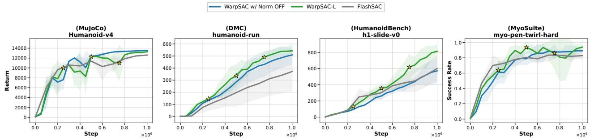  
Figure 2 Learning curves of WarpSAC and FlashSAC in the data-limited regime (CPU-scale). Return (mean ± std over five seeds) versus environment steps for FlashSAC, WarpSAC-L, and WarpSAC w/ Norm OFF on representative tasks from MuJoCo, DMC, HumanoidBench, and MyoSuite. Both WarpSAC variants clearly surpass FlashSAC on all four tasks, and WarpSAC-L attains the strongest final return on humanoid-run, h1-slide-v0, and myo-pen-twirl-hard.

Across these tasks, SWD consistently improves over FlashSAC or reaches stronger final performance, suggesting that age-aware replay weighting improves the efective use of collected data. On humanoid-run, h1-slide-v0, and myo-pen-twirl-hard, the normalized WarpSAC variant achieves the strongest final performance and often learns more stably. This supports our hypothesis that parameter projection normalization is useful when replay coverage is narrower: by constraining the efective function class, normalization helps control value extrapolation and stabilizes actor–critic updates. On Humanoid-v4, the norm-of variant reaches a slightly higher final return, but both WarpSAC variants remain clearly above FlashSAC, indicating that the replay-side benefit of SWD is robust even when the best normalization choice is task-dependent.

Overall, the CPU-scale results show that WarpSAC-L, i.e., the prescribed data-limited variant, is the strongest configuration (Q1), driven by SWD’s broad benefit across all tasks (Q2) and normalization’s role in constraining value extrapolation under limited replay (Q3). Rather than treating normalization as universally beneficial, these results suggest that its role is tied to the amount and diversity of replay data available to the learner.

Takeaway 1 — In the data-limited regime, WarpSAC-L excels by pairing SWD with normalization

WarpSAC-L, i.e., the prescribed data-limited variant, achieves the strongest or most stable performance, confirming the efectiveness of pairing SWD with normalization suits the limited-replay regime.

## 5.3 Data-Abundant Regime: GPU-Parallel Environments

We turn to GPU-parallel environments, where many actors collect data simultaneously and the replay bufer is refreshed with broad state–action coverage. Figure 3 compares FlashSAC, WarpSAC with and without parameter normalization, and a single-Q norm-of variant on IsaacLab, MuJoCo Playground, MJLab, and ManiSkill. This comparison tests whether conservative SAC components remain necessary when scalable simulation already provides diverse replay data.

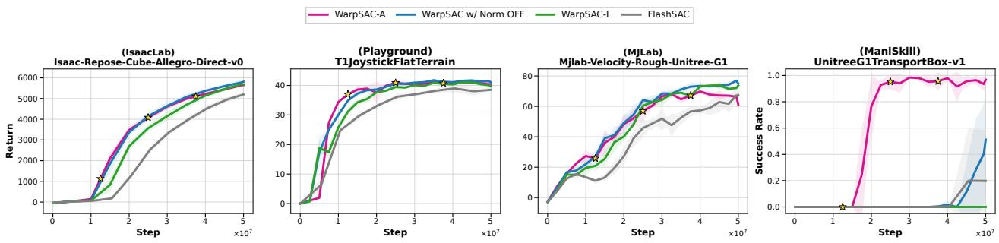  
Figure 3 Learning curves of WarpSAC and FlashSAC in the data-abundant regime (GPU-parallel). Return (mean ± std over five seeds) versus environment steps for FlashSAC, WarpSAC-L, WarpSAC w/ Norm OFF, and WarpSAC-A on representative tasks from IsaacLab, MuJoCo Playground, MJLab, and ManiSkill. WarpSAC w/ Norm OFF matches or outperforms WarpSAC-L on IsaacLab, MuJoCo Playground, and MJLab, and WarpSAC-A attains the strongest final return on ManiSkill.

The results show a diferent pattern from the CPU-scale setting. In IsaacLab, MuJoCo Playground, and MJLab, the norm-of variant is competitive with or stronger than the normalized variant, indicating that parameter projection normalization can become restrictive when the replay bufer already provides suficient coverage. On the MJLab rough-terrain Unitree G1 task, the two-critic WarpSAC variants outperform the uniform-replay FlashSAC baseline, while WarpSAC-A is less consistent. This shows that critic-side conservatism remains task-dependent even within GPU-parallel training. In ManiSkill, the single-Q norm-of variant achieves the strongest performance, suggesting that clipped double-Q conservatism can be relaxed in some high-throughput manipulation settings without degrading learning. This supports the interpretation that, in GPU-parallel regimes, the bottleneck shifts from conservative generalization under scarce data to eficient exploitation of abundant data.

These results confirm that WarpSAC-A, i.e., the prescribed data-abundant variant, is a viable and often stronger choice at scale (Q1), because normalization and clipped double-Q shift from beneficial to restrictive as data volume increases (Q3). When parallel simulation supplies broad replay coverage, strong conservative biases may reduce the flexibility of the value function or add unnecessary computation. SWD remains useful across both regimes because it reallocates updates toward policy-relevant samples without changing the actor–critic objective.

Takeaway 2 — In the data-abundant regime, WarpSAC-A excels by lifting conservatism burdens

Conservative stabilizers (i.e., normalization, clipped double-Q) shift from beneficial to restrictive as data scale increases. WarpSAC-A validates that relaxing both is viable in data-abundant settings, while SWD remains useful across regimes.

## 5.4 Sim-to-Real Evaluation: Training Unitree G1 to Walk in Real World

Of-policy RL is often viewed as brittle for sim-to-real transfer, especially on high-dimensional humanoid systems where unstable value learning can quickly produce unsafe locomotion. We therefore include a sim-toreal case study on Unitree-G1-Flat, a 29-DoF Unitree G1 locomotion task with proprioceptive policy inputs from Unitree Robotics’ unitree\_rl\_mjlab pipeline. The task uses an asymmetric actor–critic formulation: the deployed policy receives a 98-dimensional actor observation, while the critic is trained with a 211-dimensional privileged observation. We keep the environment, reward design, observation interface, and sim-to-real adaptation pipeline fixed across methods, and compare WarpSAC, FlashSAC, and PPO under the same Unitree-G1-Flat training profile.

For PPO, we start from the rsl\_rl-style on-policy pipeline commonly used in Unitree sim-to-real locomotion. The unmodified rsl\_rl implementation does not include the mixed-precision and compilation path used by our scalable of-policy learners. To make the wall-clock comparison less dependent on an avoidably slow baseline implementation, we add bfloat16 autocasting and torch.compile to the PPO training path. Thus, PPO is a strengthened baseline rather than the vanilla rsl\_rl code path.

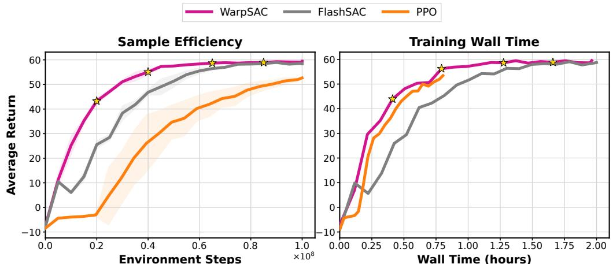  
Figure 4 Unitree G1 Sim-to-Real learning curves. The left panel compares sample eficiency with standard-deviation shading. The right panel compares training wall time.

Figure 4 reports both sample-eficiency and wall-time learning curves, and Figure 1 also shows the screenshots of the gaits. The video of our real-world deployment can be found on the project page. On an end-to-end A800 run that includes simulation, replay, learner updates, logging, and evaluation, WarpSAC reaches the target performance in roughly 35 minutes, whereas FlashSAC takes about 55 minutes under the same simto-real setup. These results suggest that the replay-side exploitation benefits of WarpSAC transfer beyond simulator-only benchmarks, making scalable of-policy learning practical for high-dimensional humanoid sim-to-real locomotion when paired with a stable adaptation pipeline.

## Takeaway 3 — WarpSAC enables faster sim-to-real deployment than FlashSAC

WarpSAC delivers a sim-to-real training-deployment closed-loop for Unitree G1 in 35 minutes on a single A800 GPU, showing a 36.4% wall-clock time reduction compared to FlashSAC. This points toward a in-minutes deployment when a high-end GPU (e.g., B200) is available.

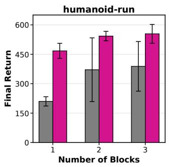

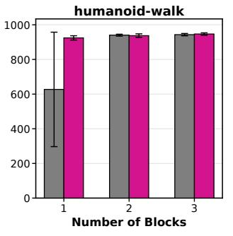

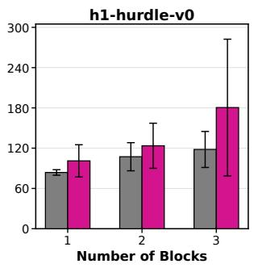

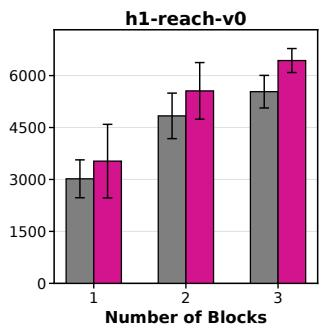  
Figure 5 Network-capacity comparison of WarpSAC-L and FlashSAC in CPU-scale training. Final return of WarpSAC-L and FlashSAC as the number of residual blocks is varied on humanoid-run, humanoid-walk, h1-hurdle-v0, and h1-reach-v0. Both methods use Norm ON and clipped double-Q and difer only in replay weighting, isolating how the WarpSAC replay mechanism interacts with network capacity. With a single block, WarpSAC-L improves final return over FlashSAC across all the four tasks; as blocks increase, the gap narrows on saturated tasks but remains visible on harder HumanoidBench tasks.

## 5.5 Mechanism Analysis: SWD × Network Capacity in CPU-Scale

To isolate how replay weighting interacts with model capacity (Q4), Figure 5 varies the number of FlashSAC blocks on four CPU-scale locomotion tasks: humanoid-run, humanoid-walk, h1-hurdle-v0, and h1-reach-v0. SWD is most beneficial in the low-capacity regime: with a single block the relative gain over uniform replay exceeds 2× on humanoid-run (from 209.93 to 467.39) and reaches ∼47% on humanoid-walk (from 627.07 to 924.39), ∼21% on h1-hurdle-v0 (from 83.80 to 101.09), and ∼17% on h1-reach-v0 (from 3018.97 to 3529.44). These gains suggest that age-biased replay can improve update eficiency by emphasizing more policy-relevant samples when the function approximator is capacity constrained.

As capacity increases, the gap narrows on saturated tasks such as humanoid-walk, while remaining visible on harder HumanoidBench tasks (h1-hurdle-v0, h1-reach-v0). This trend shows that SWD is not merely a substitute for additional parameters; it changes how available capacity is used. When the network is small, prioritizing recent samples provides a clear optimization advantage; when the network is large enough to fit broader replay distributions, the marginal benefit becomes task-dependent, though SWD remains competitive or better across all tested capacities.

Takeaway 4 — In CPU-scale training, SWD boosts learning under limited capacity and remains beneficial as networks grow

SWD compensates for limited network capacity by focusing updates on policy-relevant data. The benefit is largest for small models and narrows (but does not vanish) as capacity grows.

## 5.6 Mechanism Analysis: Normalization × Network Capacity in GPU-Parallel

We study the interaction between SWD, parameter projection normalization, and model capacity in MuJoCo Playground (Figure 6), a massively parallel setting where replay data are generated rapidly and the bottleneck is fitting high-value behavior rather than obtaining suficient exploration.

The results show that parameter projection normalization can sharply reduce performance when capacity is limited. With one FlashSAC block, disabling normalization improves performance markedly on G1 Flat and T1 Rough. With two blocks, the gap becomes smaller, but Norm OFF remains competitive or better across the Playground tasks. This supports our hypothesis that normalization is useful when data are scarce, but can restrict expressive freedom in large-parallel environments where state–action coverage is already broad.

Importantly, SWD alone is not always suficient when normalization strongly constrains the function class: the best-performing configurations combine SWD with reduced normalization, confirming that replay-side exploitation and network expressivity must be balanced jointly in GPU-scale RL (Q4).

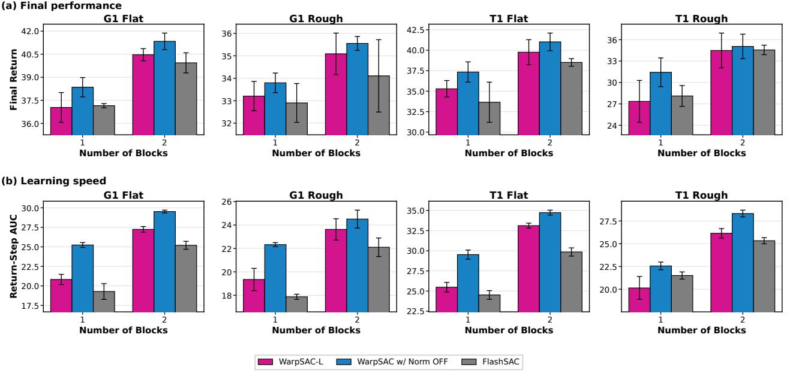  
Figure 6 Network-capacity comparison of WarpSAC variants and FlashSAC in GPU-parallel training. Final return and return–step AUC (normalized by the common training horizon, reflecting average return throughout training) of WarpSAC-L, WarpSAC w/ Norm OFF, and FlashSAC as the number of residual blocks is varied on MuJoCo Playground tasks. At one block, WarpSAC w/ Norm OFF improves both final return and AUC markedly over WarpSAC-L and FlashSAC on G1 Flat and T1 Rough; with two blocks the gap narrows, but WarpSAC w/ Norm OFF remains competitive or better across all four tasks.

Takeaway 5 — In GPU-parallel training, normalization restricts learning at low capacity; pairing SWD with reduced normalization yields the best results

Disabling normalization improves performance sharply at low capacity (e.g., on G1 Flat and T1 Rough) and remains competitive as capacity grows, indicating that the constraint on the function class outweighs its stabilization benefit when replay coverage is already broad. Pairing SWD with reduced normalization yields the strongest configurations.

## 6 Conclusion

Scaling data collection changes the fundamental assumption underlying canonical of-policy RL. We focus on the data-regime shift and formalized this observation as a data-regime hypothesis: the utility of an of-policy stabilizer is not a fixed property of the algorithm, but a function of how well replay coverage matches the class it is designed to protect. Building on this hypothesis, we proposed WarpSAC, a regime-aware family of of-policy RL algorithms that treats SWD as a regime-agnostic component and matches conservative stabilizers to the target data regime. WarpSAC-L (SWD, Norm ON, double-Q) targets data-limited CPU-scale training, while WarpSAC-A (SWD, Norm OFF, single-Q) targets data-abundant GPU-parallel training. Across eight benchmark families spanning both regimes, this prescription is validated by controlled ablations and consistent aggregate gains over FlashSAC. Among the three studied axes, SWD is the only component that remains consistently beneficial across all eight benchmark families and network capacities, justifying its role as the regime-agnostic core of WarpSAC. Notably, the aggregate gains are often obtained by removing conservative components rather than adding new ones, reframing scalable of-policy RL as a regime-matching problem rather than a stabilizer-stacking one.

Limitations and Future Work. Our current prescription selects between WarpSAC-L and WarpSAC-A ofline based on the target regime; deployments that span regimes—for example, pretraining under narrow data followed by parallel fine-tuning—would benefit from an online regime-adaptive variant that monitors replay coverage or value-extrapolation signals and continuously modulates normalization strength and critic multiplicity. More broadly, our analysis is grounded in the FlashSAC backbone and focuses on three axes; a natural next step is to examine whether other canonical stabilizers, e.g., entropy weighting, target-network delay, gradient clipping, or replay-ratio schedules, share the same regime-dependent behavior.

These findings suggest that scalable RL requires data-regime-aware algorithm design. Classical stabilizers such as normalization and double-Q targets are valuable when data are scarce, but may impose unnecessary bias or computation when parallel simulation already provides broad replay coverage. A promising direction is to adapt these mechanisms online, retaining conservative constraints when uncertainty or coverage is poor and relaxing them when exploitation of abundant replay data becomes the main bottleneck.

## References

Jimmy Lei Ba, Jamie Ryan Kiros, and Geofrey E. Hinton. Layer normalization. arXiv preprint arXiv:1607.06450, 2016.

Peter L. Bartlett, Dylan J. Foster, and Matus J. Telgarsky. Spectrally-normalized margin bounds for neural networks. In Advances in Neural Information Processing Systems, volume 30, 2017.

Vittorio Caggiano, Huawei Wang, Guillaume Durandau, Massimo Sartori, and Vikash Kumar. MyoSuite: A contact-rich simulation suite for musculoskeletal motor control. In Proceedings of The 4th Annual Learning for Dynamics and Control Conference, volume 168 of Proceedings of Machine Learning Research, pages 492–507. PMLR, 2022.

Xinyue Chen, Che Wang, Zijian Zhou, and Keith W. Ross. Randomized ensembled double q-learning: Learning fast without a model. In International Conference on Learning Representations, 2021.

Scott Fujimoto and Shixiang Shane Gu. TD7: A high-performance algorithm for continuous control, 2023. https: //arxiv.org/abs/2306.02451.

Scott Fujimoto, Herke van Hoof, and David Meger. Addressing function approximation error in actor-critic methods. In Proceedings of the 35th International Conference on Machine Learning, volume 80 of Proceedings of Machine Learning Research, pages 1587–1596. PMLR, 2018.

Tuomas Haarnoja, Aurick Zhou, Pieter Abbeel, and Sergey Levine. Soft actor-critic: Of-policy maximum entropy deep reinforcement learning with a stochastic actor. In Proceedings of the 35th International Conference on Machine Learning, volume 80 of Proceedings of Machine Learning Research, pages 1861–1870. PMLR, 2018a.

Tuomas Haarnoja, Aurick Zhou, Kristian Hartikainen, George Tucker, Sehoon Ha, Jie Tan, Vikash Kumar, Henry Zhu, Abhishek Gupta, Pieter Abbeel, and Sergey Levine. Soft actor-critic algorithms and applications. arXiv preprint arXiv:1812.05905, 2018b.

Nicklas Hansen, Hao Su, and Xiaolong Wang. TD-MPC2: Scalable, robust world models for continuous control. arXiv preprint arXiv:2310.16828, 2024.

Sergey Iofe and Christian Szegedy. Batch normalization: Accelerating deep network training by reducing internal covariate shift. In Proceedings of the 32nd International Conference on Machine Learning, volume 37 of Proceedings of Machine Learning Research, pages 448–456. PMLR, 2015.

Donghu Kim, Youngdo Lee, Minho Park, Kinam Kim, I Made Aswin Nahendra, Takuma Seno, Sehee Min, Daniel Palenicek, Florian Vogt, Danica Kragic, Jan Peters, Jaegul Choo, and Hojoon Lee. FlashSAC: Fast and stable of-policy reinforcement learning for high-dimensional robot control. In Robotics: Science and Systems, 2026. https://arxiv.org/abs/2604.04539.

Hojoon Lee, Youngdo Lee, Takuma Seno, Donghu Kim, Peter Stone, and Jaegul Choo. Hyperspherical normalization for scalable deep reinforcement learning. In International Conference on Machine Learning, 2025. https://arxiv. org/abs/2502.15280.

Yi Ma, Hongyao Tang, Dong Li, and Zhaopeng Meng. Reining generalization in ofline reinforcement learning via representation distinction. In Advances in Neural Information Processing Systems, volume 36, pages 40773–40785, 2023.

Mayank Mittal, Pascal Roth, James Tigue, Antoine Richard, Octi Zhang, Peter Du, Antonio Serrano-Muñoz, Xinjie Yao, René Zurbrügg, Nikita Rudin, Lukasz Wawrzyniak, Milad Rakhsha, Alain Denzler, Eric Heiden, Ales Borovicka, Ossama Ahmed, Iretiayo Akinola, Abrar Anwar, Mark T. Carlson, Ji Yuan Feng, Animesh Garg, Renato Gasoto, Lionel Gulich, Yijie Guo, M. Gussert, Alex Hansen, Mihir Kulkarni, Chenran Li, Wei Liu, Viktor Makoviychuk, Grzegorz Malczyk, Hammad Mazhar, Masoud Moghani, Adithyavairavan Murali, Michael Noseworthy, Alexander

Poddubny, Nathan Ratlif, Welf Rehberg, Clemens Schwarke, Ritvik Singh, James Latham Smith, Bingjie Tang, Ruchik Thaker, Matthew Trepte, Karl Van Wyk, Fangzhou Yu, Alex Millane, Vikram Ramasamy, Remo Steiner, Sangeeta Subramanian, Clemens Volk, CY Chen, Neel Jawale, Ashwin Varghese Kuruttukulam, Michael A. Lin, Ajay Mandlekar, Karsten Patzwaldt, John Welsh, Huihua Zhao, Fatima Anes, Jean-Francois Lafleche, Nicolas Moënne-Loccoz, Soowan Park, Rob Stepinski, Dirk Van Gelder, Chris Amevor, Jan Carius, Jumyung Chang, Anka He Chen, Pablo de Heras Ciechomski, Gilles Daviet, Mohammad Mohajerani, Julia von Muralt, Viktor Reutskyy, Michael Sauter, Simon Schirm, Eric L. Shi, Pierre Terdiman, Kenny Vilella, Tobias Widmer, Gordon Yeoman, Tifany Chen, Sergey Grizan, Cathy Li, Lotus Li, Connor Smith, Rafael Wiltz, Kostas Alexis, Yan Chang, David Chu, Linxi Jim Fan, Farbod Farshidian, Ankur Handa, Spencer Huang, Marco Hutter, Yashraj Narang, Soha Pouya, Shiwei Sheng, Yuke Zhu, Miles Macklin, Adam Moravanszky, Philipp Reist, Yunrong Guo, David Hoeller, and Gavriel State. Isaac lab: A gpu-accelerated simulation framework for multi-modal robot learning. arXiv preprint arXiv:2511.04831, 2025. https://arxiv.org/abs/2511.04831.

Takeru Miyato, Toshiki Kataoka, Masanori Koyama, and Yuichi Yoshida. Spectral normalization for generative adversarial networks. In International Conference on Learning Representations, 2018.

Evgenii Nikishin, Max Schwarzer, Pierluca D’Oro, Pierre-Luc Bacon, and Aaron Courville. The primacy bias in deep reinforcement learning. In Proceedings of the 39th International Conference on Machine Learning, Proceedings of Machine Learning Research. PMLR, 2022.

Ian Osband and Benjamin Van Roy. Model-based reinforcement learning and the eluder dimension. In Advances in Neural Information Processing Systems, volume 27, 2014.

Daniel Palenicek, Florian Vogt, Joe Watson, Ingmar Posner, and Jan Peters. XQC: Well-conditioned optimization accelerates deep reinforcement learning. In International Conference on Learning Representations, 2026. https: //arxiv.org/abs/2509.25174.

Daniel Russo and Benjamin Van Roy. Eluder dimension and the sample complexity of optimistic exploration. In Advances in Neural Information Processing Systems, volume 26, 2013.

Tim Salimans and Diederik P. Kingma. Weight normalization: A simple reparameterization to accelerate training of deep neural networks. In Advances in Neural Information Processing Systems, volume 29, 2016.

Tom Schaul, John Quan, Ioannis Antonoglou, and David Silver. Prioritized experience replay. In International Conference on Learning Representations, 2016.

Carmelo Sferrazza, Dun-Ming Huang, Xingyu Lin, Youngwoon Lee, and Pieter Abbeel. HumanoidBench: Simulated humanoid benchmark for whole-body locomotion and manipulation. arXiv preprint arXiv:2403.10506, 2024.

Ghada Sokar, Rishabh Agarwal, Pablo Samuel Castro, and Utku Evci. The dormant neuron phenomenon in deep reinforcement learning. In Proceedings of the 40th International Conference on Machine Learning, Proceedings of Machine Learning Research. PMLR, 2023.

Hongyao Tang and Glen Berseth. Improving deep reinforcement learning by reducing the chain efect of value and policy churn. In Advances in Neural Information Processing Systems, volume 37, 2024.

Hongyao Tang, Johan S. Obando-Ceron, Pablo Samuel Castro, Aaron C. Courville, and Glen Berseth. Mitigating plasticity loss in continual reinforcement learning by reducing churn. In ICML, 2025.

Stone Tao, Fanbo Xiang, Arth Shukla, Yuzhe Qin, Xander Hinrichsen, Xiaodi Yuan, Chen Bao, Xinsong Lin, Yulin Liu, Tse kai Chan, Yuan Gao, Xuanlin Li, Tongzhou Mu, Nan Xiao, Arnav Gurha, Zhiao Huang, Roberto Calandra, Rui Chen, Shan Luo, and Hao Su. Maniskill3: Gpu parallelized robotics simulation and rendering for generalizable embodied ai. arXiv preprint arXiv:2410.00425, 2024.

Yuval Tassa, Yotam Doron, Alistair Muldal, Tom Erez, Yazhe Li, Diego de Las Casas, David Budden, Abbas Abdolmaleki, Josh Merel, Andrew Lefrancq, Timothy Lillicrap, and Martin Riedmiller. Deepmind control suite. arXiv preprint arXiv:1801.00690, 2018.

Emanuel Todorov, Tom Erez, and Yuval Tassa. MuJoCo: A physics engine for model-based control. In 2012 IEEE/RSJ International Conference on Intelligent Robots and Systems, pages 5026–5033. IEEE, 2012.

Zihao Wu, Hongyao Tang, Yi Ma, Jiashun Liu, Yan Zheng, and Jianye Hao. The rank and gradient lost in nonstationarity: Sample weight decay for mitigating plasticity loss in reinforcement learning. In International Conference on Learning Representations, 2026. https://openreview.net/forum?id=5DpzzTPnJZ.

Kevin Zakka, Baruch Tabanpour, Qiayuan Liao, Mustafa Haiderbhai, Samuel Holt, Jing Yuan Luo, Arthur Allshire, Erik Frey, Koushil Sreenath, Lueder A. Kahrs, Carmelo Sferrazza, Yuval Tassa, and Pieter Abbeel. MuJoCo Playground, 2025. https://arxiv.org/abs/2502.08844.

Kevin Zakka, Qiayuan Liao, Brent Yi, Louis Le Lay, Koushil Sreenath, and Pieter Abbeel. mjlab: A lightweight framework for gpu-accelerated robot learning, 2026. https://arxiv.org/abs/2601.22074.

Biao Zhang and Rico Sennrich. Root mean square layer normalization. In Advances in Neural Information Processing Systems, volume 32, 2019.

## Appendix Contents

A The Use of Large Language Models 17   
B Impact Statement 17   
C Wall-Clock Time 17   
C.1 Update 17   
C.2 SWD Sampling 17   
C.3 A800 End-to-End Wall Time 18   
C.4 GPU-Parallel Learning Curves by Wall Time 19   
D Experimental Details 23   
D.1 SWD Implementations 23   
D.2 Hyperparameters 25   
D.3 Network Architecture 27   
E Environment Details 28   
F Full Results 32   
F.1 Gym–MuJoCo 32   
F.2 DMC 33   
F.3 MyoSuite 34   
F.4 HumanoidBench 35   
F.5 MuJoCo Playground 36   
F.6 IsaacLab 37   
F.7 MJLab 38   
F.8 ManiSkill 39   
F.9 Ablation Learning Curves 40

## Appendix

## A The Use of Large Language Models

LLMs were used only for language polishing and grammar correction. All ideas, method design, analysis, figures, and experimental results were produced by the authors.

## B Impact Statement

This work studies reinforcement-learning algorithms for simulated control. It does not introduce new deployment systems or human-subject data. Potential societal efects are therefore indirect and mainly relate to future uses of improved control algorithms.

## C Wall-Clock Time

## C.1 Update

We measure the wall-clock cost of one complete SAC update after reimplementing the FlashSAC backbone in JAX with Flax NNX. This benchmark isolates learner computation from environment stepping, replay-bufer sampling, logging, and evaluation. We use synthetic batches on an NVIDIA GeForce RTX 5060 Ti with observation dimension 128, action dimension 12, and batch size 2048. Each result is measured after JIT or torch.compile warmup, using 20 warmup repetitions and 80 measured repetitions per round over three alternating rounds. We report the median over the three round-level means. For PyTorch AMP, we use the FlashSAC implementation with CUDA autocast to float16 and GradScaler.

Table 2 SAC update micro-benchmark. Lower is better.
<table><tr><td>Implementation</td><td>Full Update</td></tr><tr><td>JAX/NNX bfloat16</td><td>7.895 ms</td></tr><tr><td>JAX/NNX float32</td><td>13.244 ms</td></tr><tr><td>PyTorch FlashSAC, torch.compile, AMP on</td><td>13.922 ms</td></tr><tr><td>PyTorch FlashSAC, torch.compile, AMP off</td><td>12.293 ms</td></tr></table>

The JAX/NNX bfloat16 update takes 7.895 ms, which is 1.68× faster than JAX/NNX float32, 1.76× faster than compiled PyTorch FlashSAC with AMP, and 1.56× faster than compiled PyTorch FlashSAC without AMP under the same synthetic-batch setting. In the compiled PyTorch implementation, AMP accelerates the critic update in isolation, but the complete update is slightly faster without AMP because the full step also includes the actor update, temperature update, normalization, and scaler/autocast overhead. These measurements suggest that the main computational benefit of the JAX/NNX implementation comes from the compiled update path, while bfloat16 further improves update throughput.

## C.2 SWD Sampling

We also measure the wall-clock overhead introduced by SWD replay sampling. The benchmark uses the same NVIDIA GeForce RTX 5060 Ti and the same synthetic transition shape as above, with a replay capacity of $1 0 ^ { 6 }$ , batch size 2048, observation dimension 128, and action dimension 12. We compare uniform replay, exact SWD sampling, and the bucketed approximate SWD sampler with 2000 buckets. The SWD decay horizon is 80,000 and $w _ { \mathrm { m i n } } = 0 . 1$ . Each result measures only JaxBuffer.sample after JIT warmup, using 80 warmup repetitions and 300 measured repetitions per round over nine alternating rounds. We report the median over the nine round-level means.

Table 3 Replay sampling micro-benchmark. Lower is better.
<table><tr><td>Sampler</td><td>CPU Sample</td><td>GPU Sample</td></tr><tr><td>Uniform replay</td><td>0.710 ms</td><td>0.267 ms</td></tr><tr><td>Exact SWD</td><td>3.263 ms</td><td>1.751 ms</td></tr><tr><td>Approximate SWD, 2000 buckets</td><td>0.959 ms</td><td>1.187 ms</td></tr></table>

On CPU, exact SWD is 4.59× slower than uniform replay because it constructs and normalizes a probability vector over the full million-transition bufer at each sample call. The bucketed approximation avoids this full scan and reduces sampling time from 3.263 ms to 0.959 ms, although it remains 1.35× slower than uniform replay. On GPU, exact SWD costs 1.751 ms per sample and is 6.56× slower than uniform replay, while the bucketed approximation reduces this cost to 1.187 ms. In absolute terms, however, the exact GPU sampling overhead is still small relative to learner computation: exact SWD sampling plus a full JAX/NNX bfloat16 update takes about 9.646 ms, which remains faster than compiled PyTorch FlashSAC with AMP (13.922 ms) and without AMP (12.293 ms). These results support using the approximate sampler for CPU-scale replay bufers and exact SWD for GPU-parallel experiments, where preserving the exact sampling distribution is afordable and does not erase the throughput advantage of the JAX/NNX bfloat16 implementation.

## C.3 A800 End-to-End Wall Time

We measure end-to-end wall-clock learning on NVIDIA A800 GPUs. This includes environment stepping, replay sampling, learner updates, logging, and evaluation. We report four completed IsaacLab environments and average WarpSAC w Norm OFF over five seeds.

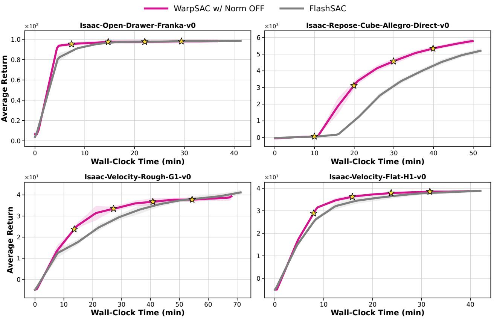  
Figure 7 Actual A800 return–wall-time curves on four completed IsaacLab environments. Curves report average return versus elapsed wall-clock time.

Figure 7 shows that WarpSAC w Norm OFF reaches the 50.0M-step endpoint at a similar or slightly faster wall-clock speed than FlashSAC on all four selected environments. The final wall-clock speedups are 1.11× on

Isaac-Open-Drawer-Franka-v0, 1.03× on Isaac-Repose-Cube-Allegro-Direct-v0, 1.04× on Isaac-Velocity-Rough G1-v0, and 1.05× on Isaac-Velocity-Flat-H1-v0. Final returns are comparable on Isaac-Open-Drawer-Franka-v0, Isaac-Velocity-Rough-G1-v0, and Isaac-Velocity-Flat-H1-v0, while WarpSAC w Norm OFF obtains a higher final return on Isaac-Repose-Cube-Allegro-Direct-v0.

These real-machine measurements indicate that the JAX/NNX implementation does not introduce a meaningful end-to-end slowdown relative to FlashSAC in GPU-parallel IsaacLab training. We therefore use the measured WarpSAC wall-time traces as a practical speed proxy only for domains whose FlashSAC logs contain sample-eficiency curves but not full wall-clock traces. In those cases, the compute-eficiency figures below plot FlashSAC on the wall-time axis of the corresponding WarpSAC Norm ON, num-Q = 2 run, which keeps the speed assumption matched to the closest two-critic baseline and avoids attributing additional speed diferences to FlashSAC.

## C.4 GPU-Parallel Learning Curves by Wall Time

Figures 8–11 report GPU-parallel learning curves against wall-clock time for MuJoCo Playground, IsaacLab, MJLab, and ManiSkill. For MJLab, every method is plotted against its own logged wall-clock trace, including FlashSAC. For the other three domains, the FlashSAC sample-eficiency curves use the wall-time axis of the corresponding WarpSAC Norm ON, num-Q = 2 run, following the speed-proxy convention motivated above.

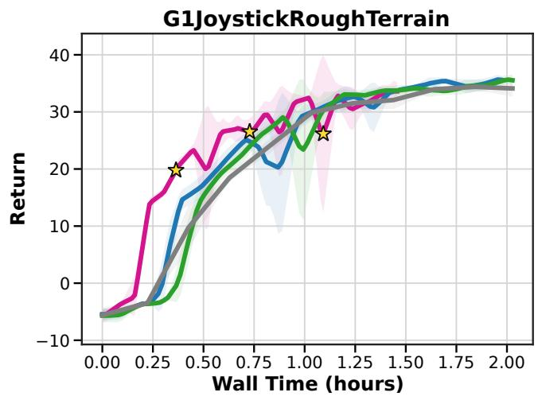

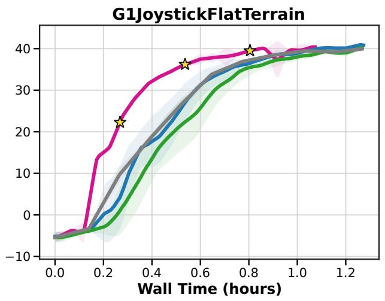

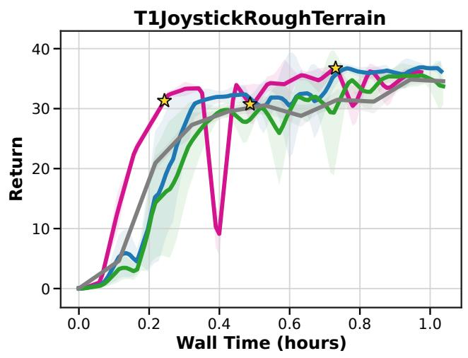

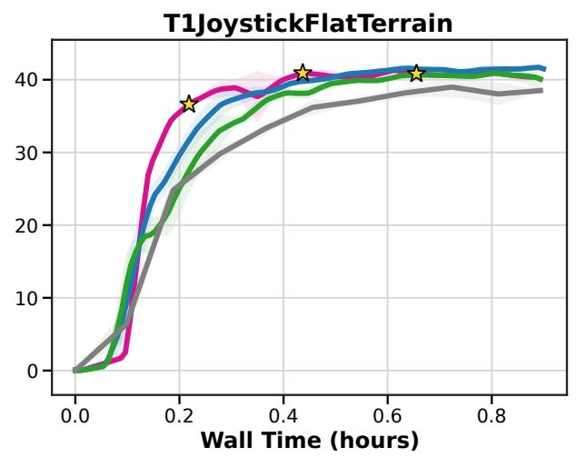  
Figure 8 MuJoCo Playground learning curves by wall-clock time. Curves report mean return with standard deviation across five seeds. FlashSAC is plotted using the same wall-time axis as the corresponding WarpSAC Norm ON, num-Q = 2 run.

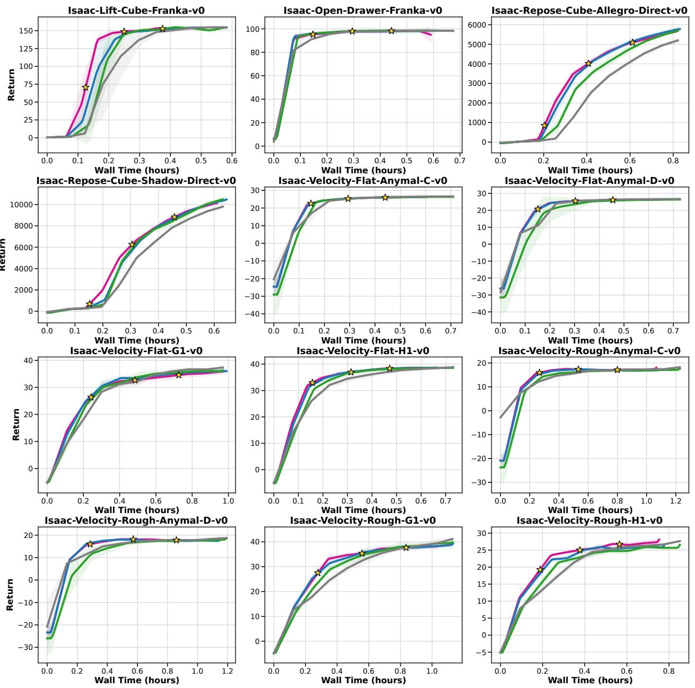  
Figure 9 IsaacLab learning curves by wall-clock time. Curves report mean return with standard deviation across five seeds for the evaluated GPU-parallel IsaacLab tasks. FlashSAC is plotted using the same wall-time axis as the corresponding WarpSAC Norm ON, num-Q = 2 run.

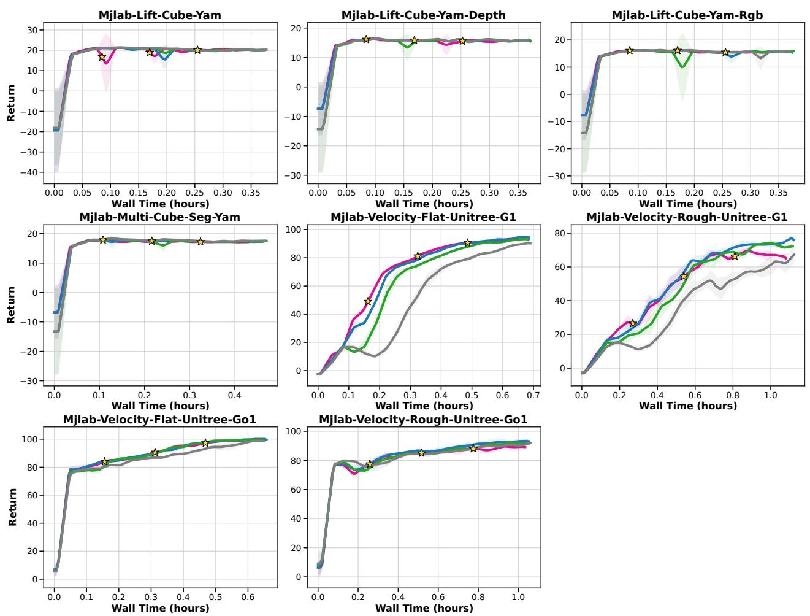  
Figure 10 MJLab learning curves by wall-clock time. Curves report mean return with standard deviation across five seeds for Unitree locomotion and Yam manipulation tasks. All methods, including FlashSAC, use their own logged wall-clock traces.

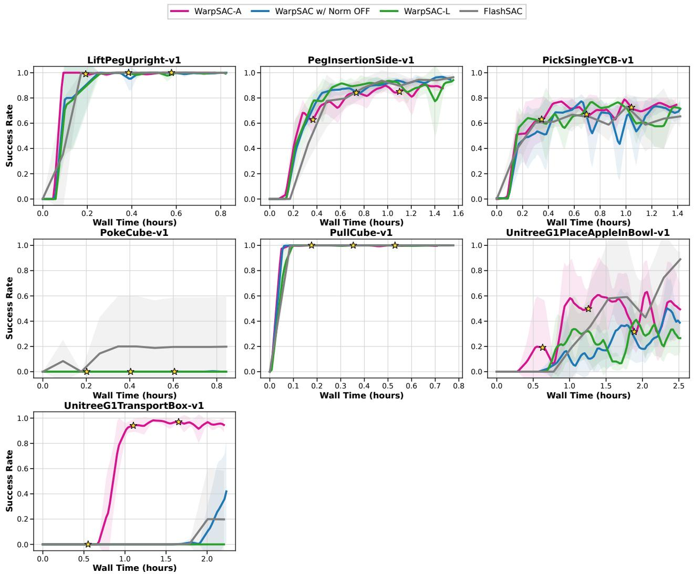  
Figure 11 ManiSkill learning curves by wall-clock time. Curves report mean success-once rate with standard deviation across five seeds. FlashSAC is plotted using the same wall-time axis as the corresponding WarpSAC Norm ON, num-Q = 2 run.

## D Experimental Details

## D.1 SWD Implementations

SWD is implemented in the replay bufer. Each transition receives an insertion timestamp, and sampling weights are computed from transition age. Setting the decay horizon to zero recovers uniform replay, so FlashSAC and SWD variants share the same bufer implementation.

We use bucketed approximate sampling only for CPU-scale replay bufers: DMC hard tasks, MuJoCo, MyoSuite, and HumanoidBench. These runs store replay on the host with capacity $1 0 ^ { 6 }$ . GPU-parallel domains, including MuJoCo Playground, MJLab, ManiSkill, and IsaacLab, use exact SWD because replay tensors are stored on GPU and categorical sampling is CUDA-accelerated through JAX.

The wall-clock micro-benchmark in Appendix C.2 supports this choice. With a $1 0 ^ { 6 } .$ -transition replay bufer and batch size 2048, bucketed CPU sampling reduces exact SWD sampling from 3.263 ms to 0.959 ms. On GPU, exact SWD sampling costs 1.751 ms, and exact SWD sampling plus a full JAX/NNX bfloat16 update remains faster than compiled PyTorch FlashSAC under the same synthetic-batch setting.

For a transition inserted at time $t _ { i }$ and sampled at replay time $t ,$ the age is $\begin{array} { r } { A _ { t } ( i ) = t - t _ { i } } \end{array}$ . In the main

experiments we use a recent-sample bias,

wt(i) = max wmin, 1 − <sup>At(i)</sup><sub>Tdecay</sub>

where $w _ { \mathrm { m i n } } = 0 . 1$ in all reported runs. The resulting sampling probability is

$$
p _ { t } ( i ) = \frac { w _ { t } ( i ) } { \sum _ { j } w _ { t } ( j ) } .
$$

The implementation also supports the opposite bias direction through a negative decay horizon, but this option is not used in the reported experiments.

Exact Numpy implementation. The following code is the core Numpy implementation used for exact age-biased sampling. It first constructs a probability distribution over all valid replay entries and then samples minibatch indices with np.random.choice.

Listing 1 Exact Numpy implementation of Sample Weight Decay.

```python
def _sample_indices(self, batch_size: int) -> np.ndarray:
if self.linear_decay_step == 0:
return np.random.randint(0, self.size, size=batch_size)
if self.use_approximate_sampling:
return self._sample_indices_with_approximate_bias(batch_size)
return self._sample_indices_with_bias(batch_size)
def _sample_indices_with_bias(self, batch_size: int) -> np.ndarray:
valid_timestamps = self.timestamps[:self.size]
age = self.current_time - valid_timestamps
if self.linear_decay_step > 0:
weights = np.maximum(
self.min_weight,
1.0 - age / self.abs_linear_decay_step,
)
else:
weights = np.minimum(
1.0,
self.min_weight + age / self.abs_linear_decay_step,
)
if weights.sum() <= 0:
weights = np.ones_like(weights, dtype=np.float32)
probabilities = weights / weights.sum()
return np.random.choice(self.size, size=batch_size, p=probabilities)
```

This exact sampler is faithful to the SWD definition, but it normalizes over all valid replay entries at each sampling call.

Approximate bucketed sampling. For CPU replay, we approximate SWD with fixed logical buckets. The sampler computes one midpoint weight per bucket, samples a bucket from the bucket-level distribution, and then samples uniformly within that bucket. GPU-parallel runs do not use this approximation.

Listing 2 Approximate bucketed SWD sampling used to reduce wall-clock overhead.

```python
def _sample_indices_with_approximate_bias(self, batch_size: int) -> np.ndarray:
bucket_size = max(
(self.size + self.num_buckets - 1) // self.num_buckets,
1,
)
logical_starts = np.arange(0, self.size, bucket_size)
logical_ends = np.minimum(logical_starts + bucket_size, self.size)
logical_midpoints = (logical_starts + logical_ends - 1) // 2
if self.full:
bucket_midpoints = (self.ptr + logical_midpoints) % self.max_size
else:
bucket_midpoints = logical_midpoints
```

```python
bucket_timestamps = self.timestamps[bucket_midpoints]
bucket_ages = self.current_time - bucket_timestamps
if self.linear_decay_step > 0:
bucket_weights = np.maximum(
self.min_weight,
1.0 - bucket_ages / self.abs_linear_decay_step,
)
else:
bucket_weights = np.minimum(
1.0,
self.min_weight + bucket_ages / self.abs_linear_decay_step,
)
if bucket_weights.sum() <= 0:
bucket_weights = np.ones_like(bucket_weights, dtype=np.float32)
bucket_probabilities = bucket_weights / bucket_weights.sum()
sampled_buckets = np.random.choice(
len(logical_starts),
size=batch_size,
p=bucket_probabilities,
)
sampled_starts = logical_starts[sampled_buckets]
sampled_ends = logical_ends[sampled_buckets]
offsets = (
np.random.random(size=batch_size)
* (sampled_ends - sampled_starts)
).astype(np.int64)
logical_indices = sampled_starts + offsets
if self.full:
return (self.ptr + logical_indices) % self.max_size
return logical_indices
```

The approximation is piecewise constant in replay age. We use 2000 buckets by default, making sampling cost depend mainly on the number of buckets and the minibatch size rather than replay capacity.

For circular bufers, logical indices are mapped through the current write pointer before indexing physical storage.

## D.2 Hyperparameters

Tables 4 and 5 list the shared training settings. Unless stated otherwise, all variants within a benchmark family use the same environment interface, optimizer, replay bufer, evaluation protocol, and network size. The controlled changes are replay decay horizon, parameter projection normalization, and critic ensemble size. We use five seeds, {1, 2, 3, 4, 5}.

Table 4 Training profiles used across benchmark families. CPU-scale domains use a single environment and CPU replay, while GPU-parallel domains use 1024 vectorized environments and GPU replay. Sim2Rea retains the MJLab profile while doubling the training horizon to 100,001,792 environment steps.
<table><tr><td>Hyperparameter</td><td>CPU-scale</td><td>Playground</td><td>MJLab</td><td>ManiSkill</td><td>IsaacLab</td><td>Sim2Real</td></tr><tr><td>Benchmark families</td><td>DMC hard tasks,  $\mathrm { M u J o C o } ,$ </td><td>MuJoCo Playground</td><td>MJLab</td><td>ManiSkill</td><td>IsaacLab</td><td>Unitree-G1- Flat</td></tr><tr><td>Number of environments</td><td>manoidBench 1</td><td>1024</td><td>1024</td><td>1024</td><td>1024</td><td>1024</td></tr><tr><td>Total env. steps</td><td> $1 . 0 \times 1 0 ^ { 6 }$ </td><td>50,000,896</td><td>50,000,896</td><td>50,000,896</td><td>50,000,896</td><td>100,001,792</td></tr><tr><td>Learning starts</td><td> $1 0 { , } 0 0 0$ </td><td>100,000</td><td>100,000</td><td>100,000</td><td>100,000</td><td>100,000</td></tr><tr><td>Replay buffer size</td><td> $1 . 0 \times 1 0 ^ { 6 }$ </td><td> $1 . 0 \times 1 0 ^ { 7 }$ </td><td> $1 . 0 \times 1 0 ^ { 7 }$ </td><td> $1 . 0 \times 1 0 ^ { 7 }$ </td><td> $1 . 0 \times 1 0 ^ { 7 }$ </td><td> $1 . 0 \times 1 0 ^ { 7 }$ </td></tr><tr><td>Replay device</td><td>CPU</td><td>GPU</td><td>GPU</td><td>GPU</td><td>GPU</td><td>GPU</td></tr><tr><td>Batch size</td><td>512</td><td>2048</td><td>2048</td><td>2048</td><td>2048</td><td>2048</td></tr><tr><td>Grad. steps per interaction step</td><td>1</td><td>2</td><td>2</td><td>2</td><td>2</td><td>2</td></tr><tr><td>Discount factor γ</td><td>0.99</td><td>0.97</td><td>0.99</td><td>0.90</td><td>0.99</td><td>0.99</td></tr><tr><td>n-step return</td><td>1</td><td>1</td><td>3</td><td>1</td><td>3</td><td>3</td></tr><tr><td>SWD decay horizon</td><td>80,000</td><td>2,000</td><td>2,000</td><td>2,000</td><td>2,000</td><td>2,000</td></tr><tr><td>Compute type</td><td>float32</td><td>bfloat16</td><td>bfloat16</td><td>bfloat16</td><td>bfloat16</td><td>bfloat16</td></tr><tr><td>Evaluation episodes</td><td>50</td><td>50</td><td>50</td><td>50</td><td>1024</td><td>50</td></tr><tr><td>Evaluation</td><td>1</td><td>50</td><td>50</td><td>50</td><td>1024</td><td>50</td></tr></table>

Table 5 Shared optimization and SAC hyperparameters. These values are fixed unless a controlled ablation explicitly changes the corresponding component.
<table><tr><td></td><td>Hyperparameter</td><td>Value</td></tr><tr><td rowspan="3">Optimization</td><td>Actor learning rate</td><td> $3 \times 1 0 ^ { - 4 }$  with cosine decay to  $1 . 5 { \times } 1 0 ^ { - 4 }$ </td></tr><tr><td>Critic learning rate</td><td> $3 \times 1 0 ^ { - 4 }$  with cosine decay to  $1 . 5 { \times } 1 0 ^ { - 4 }$ </td></tr><tr><td>Temperature learning rate</td><td> $3 \times 1 0 ^ { - 4 }$  with cosine decay to  $1 . 5 { \times } 1 0 ^ { - 4 }$ </td></tr><tr><td>Entropy</td><td>Initial entropy temperature Target entropy</td><td>0.01  $\scriptstyle { \frac { 1 } { 2 } } | { \mathcal { A } } | \log ( 2 \pi e \cdot 0 . 1 5 ^ { 2 } )$ </td></tr><tr><td rowspan="2">Updates</td><td>Target network update rate τ</td><td>0.01</td></tr><tr><td>Target update frequency</td><td>Every critic update</td></tr><tr><td rowspan="3">Common</td><td>Policy update frequency</td><td>Every 2 critic updates</td></tr><tr><td>Reward normalization</td><td>Enabled for all experiments</td></tr><tr><td>Action repeat Linear-layer bias</td><td>1 Disabled</td></tr><tr><td rowspan="3">Critic</td><td>Critic ensemble size</td><td>2 for FlashSAC, WarpSAC Norm</td></tr><tr><td>Critic output heads</td><td>ON, and WarpSAC Norm OFF; 1 for Single-Q variants</td></tr><tr><td>SWD minimum sampling weight</td><td>101 categorical heads with cross-entropy distributional critic loss 0.1</td></tr></table>

For the normalization ablations, Norm ON applies parameter projection to both actor and critic after initialization and after each gradient update. Norm OFF disables this projection while keeping all other training settings fixed. The scale ablations in Section 5 vary only the number of FlashSAC blocks in the actor and critic; the hidden dimensions, optimizer settings, replay settings, and environment budgets remain unchanged.

## D.3 Network Architecture

All experiments use the same FlashSAC-style actor–critic backbone. The actor predicts a tanh-squashed Gaussian policy. The critic encodes the observation–action pair and predicts a distributional value head. Standard variants use two critics; Single-Q variants use one critic with the same per-critic architecture.

Table 6 Actor and critic architecture. The number of residual blocks is 2 in the main experiments and is varied in the capacity ablations.
<table><tr><td></td><td>Component</td><td>Architecture</td></tr><tr><td rowspan="3">Actor</td><td>Input</td><td>Flattened actor observation; asymmetric environments use the actor observation stream for the policy.</td></tr><tr><td>Encoder</td><td>Batch-normalized input projection to 128 hidden units, followed by  $B _ { \pi }$  FlashSAC residual blocks and final RMSNorm.</td></tr><tr><td>Residual block Output</td><td>Linear 128 →512, BatchNorm, ReI  $\therefore \mathrm { U } ,$  Linear 512 → 128, BatchNorm, ReLU, residual connection. Two orthogonally initialized linear heads</td></tr><tr><td rowspan="3">Critic</td><td></td><td>predict action mean and log standard deviation. The policy samples from a tanh-squashed diagonal Gaussian and rescales actions to [−1, 1].</td></tr><tr><td>Log-standard-deviation range Input</td><td>[-10, 2] after tanh-based squashing. Concatenated critic observation and action; asymmetric environments use the</td></tr><tr><td>Encoder</td><td>critic observation stream for value learning. Batch-normalized input projection to 256</td></tr><tr><td rowspan="3"></td><td>Residual block</td><td>hidden units, followed by  $B _ { Q }$  FlashSAC residual blocks and final RMSNorm. Linear 256 → 1024, BatchNorm, ReLU,</td></tr><tr><td>Output</td><td>Linear 1024→ 256, BatchNorm, ReLU, residual connection. Orthogonally initialized linear projection</td></tr><tr><td></td><td>from 256 hidden units to 101 categorical value logits.</td></tr><tr><td rowspan="4">Variants</td><td>Main setting</td><td> $B _ { \pi } = B _ { Q } = 2 .$  with two critics for clipped double-Q learning.  $B _ { \pi } = B _ { Q } \in \{ 1 , 2 , 3 \}$ </td></tr><tr><td>Capacity ablation</td><td>depending on the experiment. Same actor and per-critic network, but</td></tr><tr><td>Single-Q variant</td><td>with one critic ensemble member and no clipped minimum over two critics.</td></tr><tr><td>Parameter projection normalization</td><td>When enabled, all linear kernels are projected by column-wise norm normalization. BatchNorm affine scale and bias are jointly normalized, and RMSNorm scales are normalized.</td></tr></table>

## E Environment Details

This section lists the environments used in the experiments. The benchmark suite contains IsaacLab, MuJoCo Playground, MJLab, ManiSkill, Gym–MuJoCo, DMC hard tasks, HumanoidBench, and MyoSuite. It does not include Genesis environments.

## E.1 IsaacLab

We use IsaacLab v2.1.0 (Mittal et al., 2025). The suite includes 12 gripper manipulation, dexterous manipulation, quadruped locomotion, and humanoid locomotion tasks. Scores are normalized using near-asymptotic FlashSAC references.

Table 7 IsaacLab environments. Normalized scores correspond to near-asymptotic performance after extended training.
<table><tr><td>Task</td><td>Observation dim</td><td>Action dim</td><td>Normalize Score</td></tr><tr><td>Isaac-Repose-Cube-Shadow-Direct-v0</td><td>157</td><td>20</td><td>10000</td></tr><tr><td>Isaac-Repose-Cube-Allegro-Direct-v0</td><td>124</td><td>16</td><td>6000</td></tr><tr><td>Isaac-Velocity-Flat-G1-v0</td><td>123</td><td>37</td><td>40</td></tr><tr><td>Isaac-Velocity-Rough-G1-v0</td><td>310</td><td>37</td><td>40</td></tr><tr><td>Isaac-Velocity-Flat-H1-v0</td><td>69</td><td>19</td><td>40</td></tr><tr><td>Isaac-Velocity-Rough-H1-v0</td><td>256</td><td>19</td><td>40</td></tr><tr><td>Isaac-Lift-Cube-Franka-v0</td><td>36</td><td>8</td><td>160</td></tr><tr><td>Isaac-Open-Drawer-Franka-v0</td><td>31</td><td>8</td><td>100</td></tr><tr><td>Isaac-Velocity-Flat-Anymal-C-v0</td><td>48</td><td>12</td><td>30</td></tr><tr><td>Isaac-Velocity-Rough-Anymal-C-v0</td><td>235</td><td>12</td><td>30</td></tr><tr><td>Isaac-Velocity-Flat-Anymal-D-v0</td><td>48</td><td>12</td><td>30</td></tr><tr><td>Isaac-Velocity-Rough-Anymal-D-v0</td><td>235</td><td>12</td><td>30</td></tr></table>

## E.2 MuJoCo Playground

We evaluate four humanoid locomotion tasks from MuJoCo Playground v0.0.5 (Zakka et al., 2025). Normalized scores are scaled to 40. Privileged critic observation dimensions are shown in parentheses when available.

Table 8 MuJoCo Playground environments. We evaluate four humanoid locomotion tasks from MuJoCo Playground. Normalized scores are scaled to 40, corresponding to asymptotic performance achieved after extended training. If the environment supports asymmetric observation, the privileged observation size is given in parentheses.
<table><tr><td>Task</td><td>Observation dim</td><td>Action dim</td><td>Normalize Score</td></tr><tr><td>G1JoystickRoughTerrain</td><td>103 (216)</td><td>29</td><td>40</td></tr><tr><td>G1JoystickFlatTerrain</td><td>103 (216)</td><td>29</td><td>40</td></tr><tr><td>T1JoystickRoughTerrain</td><td>85 (180)</td><td>23</td><td>40</td></tr><tr><td>T1JoystickFlatTerrain</td><td>85 (180)</td><td>23</td><td>40</td></tr></table>

## E.3 MJLab

We use MJLab v1.2.0 (Zakka et al., 2026), an Isaac Lab-style robot-learning framework powered by the MuJoCo-Warp GPU simulator. We evaluate eight GPU-parallel tasks: four Unitree velocity-tracking locomotion tasks and four Yam manipulation tasks. Normalized scores are scaled to 100 for the locomotion tasks and 20 for the Yam manipulation tasks. Privileged critic observation dimensions are shown in parentheses when available.

Table 9 MJLab environments. We evaluate Unitree velocity-tracking and Yam manipulation tasks from MJLab. Observation dimensions report the actor input, with the efective critic input shown in parentheses. Normalized scores are scaled to 100 for locomotion tasks and 20 for manipulation tasks.
<table><tr><td>Task</td><td>Observation dim</td><td>Action dim</td><td>Normalize Score</td></tr><tr><td>Mjlab-Velocity-Flat-Unitree-G1</td><td>99 (210)</td><td>29</td><td>100</td></tr><tr><td>Mjlab-Velocity-Rough-Unitree-G1</td><td>286 (584)</td><td>29</td><td>100</td></tr><tr><td>Mjlab-Velocity-Flat-Unitree-Go1</td><td>48 (120)</td><td>12</td><td>100</td></tr><tr><td>Mjlab-Velocity-Rough-Unitree-Go1</td><td>235 (494)</td><td>12</td><td>100</td></tr><tr><td>Mjlab-Lift-Cube-Yam</td><td>29 (58)</td><td>7</td><td>20</td></tr><tr><td>Mjlab-Lift-Cube-Yam-Depth</td><td>26 (55)</td><td>7</td><td>20</td></tr><tr><td>Mjlab-Lift-Cube-Yam-Rgb</td><td>26 (55)</td><td>7</td><td>20</td></tr><tr><td>Mjlab-Multi-Cube-Seg-Yam</td><td>26 (52)</td><td>7</td><td>20</td></tr></table>

## E.4 ManiSkill

We use ManiSkill (Tao et al., 2024), a large-scale benchmark built on the SAPIEN physics engine. We evaluate six rigid-body manipulation tasks with a gripper-based robotic arm. For reproducibility, we use the environment snapshot corresponding to commit hash aad75f2. Normalized scores correspond to the maximum success rate, where 100 denotes 100% success.

Table 10 ManiSkill environments. We evaluate 6 ManiSkill gripper-based manipulation environments. Normalized scores correspond to the maximum success rate, where 100 denotes a 100% success rate.
<table><tr><td>Task</td><td>Observation dim</td><td>Action dim</td><td>Normalize Score</td></tr><tr><td>PickSingleYCB-v1</td><td>45</td><td>8</td><td>100</td></tr><tr><td>PegInsertionSide-v1</td><td>43</td><td>8</td><td>100</td></tr><tr><td>LiftPegUpright-v1</td><td>32</td><td>8</td><td>100</td></tr><tr><td>PokeCube-v1</td><td>54</td><td>8</td><td>100</td></tr><tr><td>Pul1Cube-v1</td><td>35</td><td>8</td><td>100</td></tr><tr><td>RollBall-v1</td><td>44</td><td>8</td><td>100</td></tr></table>

## E.5 Gym–MuJoCo

We evaluate five Gym–MuJoCo v4 locomotion tasks (Todorov et al., 2012). Scores are normalized using random-policy lower references and TD7 5M-step upper references (Fujimoto and Gu, 2023).

Table 11 Gym–MuJoCo environments. Normalized scores are computed relative to random-policy and TD7 5M-step reference scores.
<table><tr><td>Task</td><td>Observation dim</td><td>Action dim</td><td>Random Score</td><td>Normalize Score</td></tr><tr><td>HalfCheetah-v4</td><td>17</td><td>6</td><td>-289.415</td><td>18165</td></tr><tr><td>Hopper-v4</td><td>11</td><td>3</td><td>18.791</td><td>4075</td></tr><tr><td>Walker2d-v4</td><td>17</td><td>6</td><td>2.791</td><td>7397</td></tr><tr><td>Ant-v4</td><td>27</td><td>8</td><td>-70.288</td><td>10133</td></tr><tr><td>Humanoid-v4</td><td>376</td><td>17</td><td>104.361</td><td>8584</td></tr></table>

## E.6 DeepMind Control Suite Hard Tasks

We report only DMC hard tasks: humanoid and dog domains from the DeepMind Control Suite (Tassa et al., 2018). Low-dimensional tasks such as Cartpole and Pendulum are not included. Normalized scores use the DMC maximum of 1000.

Table 12 DMC hard environments. We report only humanoid and dog tasks, with normalized scores set to the DMC maximum.
<table><tr><td>Task</td><td>Observation dim</td><td>Action dim</td><td>Normalize Score</td></tr><tr><td>humanoid-stand</td><td>67</td><td>21</td><td>1000</td></tr><tr><td>humanoid-walk</td><td>67</td><td>21</td><td>1000</td></tr><tr><td>humanoid-run</td><td>67</td><td>21</td><td>1000</td></tr><tr><td>dog-stand</td><td>223</td><td>38</td><td>1000</td></tr><tr><td>dog-walk</td><td>223</td><td>38</td><td>1000</td></tr><tr><td>dog-run</td><td>223</td><td>38</td><td>1000</td></tr><tr><td>dog-trot</td><td>223</td><td>38</td><td>1000</td></tr></table>

## E.7 HumanoidBench

We evaluate HumanoidBench (Sferrazza et al., 2024), a high-dimensional whole-body-control benchmark based on the Unitree H1 humanoid robot. In our experiments, HumanoidBench is installed from the compatibility fork https://github.com/wzhhasadream/humanoid-bench-compatible.git. We evaluate 14 locomotion and whole-body-control tasks without hand control. Normalized scores follow the benchmark success thresholds.

Table 13 HumanoidBench environments. Scores are normalized using benchmark task-success thresholds.
<table><tr><td>Task</td><td>Observation dim</td><td>Action dim</td><td>Random Score</td><td>Normalize Score</td></tr><tr><td>h1-walk-v0</td><td>51</td><td>19</td><td>2.38</td><td>700</td></tr><tr><td>h1-stand-v0</td><td>51</td><td>19</td><td>10.55</td><td>800</td></tr><tr><td>h1-run-v0</td><td>51</td><td>19</td><td>2.02</td><td>700</td></tr><tr><td>h1-reach-v0</td><td>57</td><td>19</td><td>260.30</td><td>12000</td></tr><tr><td>h1-maze-v0</td><td>51</td><td>19</td><td>106.44</td><td>1200</td></tr><tr><td>h1-hurdle-v0</td><td>51</td><td>19</td><td>2.21</td><td>700</td></tr><tr><td>h1-crawl-v0</td><td>51</td><td>19</td><td>272.66</td><td>700</td></tr><tr><td>h1-sit_- simple-v0</td><td>51</td><td>19</td><td>9.40</td><td>750</td></tr><tr><td>h1-sit_hard-v0</td><td>64</td><td>19</td><td>2.45</td><td>750</td></tr><tr><td>h1-balance_- simple-v0</td><td>64</td><td>19</td><td>9.40</td><td>800</td></tr><tr><td>h1-balance_- hard-v0</td><td>77</td><td>19</td><td>9.04</td><td>800</td></tr><tr><td>h1-stair-v0</td><td>51</td><td>19</td><td>3.11</td><td>700</td></tr><tr><td>h1-slide-v0</td><td>51</td><td>19</td><td>3.19</td><td>700</td></tr><tr><td>h1-pole-v0</td><td>51</td><td>19</td><td>20.09</td><td>700</td></tr></table>

## E.8 MyoSuite

We evaluate 10 MyoSuite dexterous manipulation tasks (Caggiano et al., 2022). Tasks marked hard use randomized goals. Normalized scores correspond to success rate, with 100 denoting 100% success.

Table 14 MyoSuite environments. Normalized scores correspond to 100% success.
<table><tr><td>Task</td><td>Observation dim</td><td>Action dim</td><td>Normalize Score</td></tr><tr><td>myo-reach</td><td>115</td><td>39</td><td>100</td></tr><tr><td>myo-reach-hard</td><td>115</td><td>39</td><td>100</td></tr><tr><td>myo-pose</td><td>108</td><td>39</td><td>100</td></tr><tr><td>myo-pose-hard</td><td>108</td><td>39</td><td>100</td></tr><tr><td>myo-obj-hold</td><td>91</td><td>39</td><td>100</td></tr><tr><td>myo-obj-hold-hard</td><td>91</td><td>39</td><td>100</td></tr><tr><td>myo-key-turn</td><td>93</td><td>39</td><td>100</td></tr><tr><td>myo-key-turn-hard</td><td>93</td><td>39</td><td>100</td></tr><tr><td>myo-pen-twirl</td><td>83</td><td>39</td><td>100</td></tr><tr><td>myo-pen-twirl-hard</td><td>83</td><td>39</td><td>100</td></tr></table>

## E.9 Sim2Real

For sim-to-real locomotion, we use Unitree-G1-Flat from Unitree Robotics’ unitree\_rl\_mjlab implementation. The task exposes asymmetric observations: the policy receives a 98-dimensional actor observation, while the critic receives a 211-dimensional privileged observation. The 29-dimensional action controls the Unitree G1 joints.

Table 15 Sim2Real environment. The Unitree-G1-Flat locomotion task uses asymmetric actor and critic observations for sim-to-real policy training.
<table><tr><td>Task</td><td>Actor obs. dim</td><td>Critic obs. dim</td><td>Action dim</td></tr><tr><td>Unitree-G1-Flat</td><td>98</td><td>211</td><td>29</td></tr></table>

## F Full Results

## F.1 Gym–MuJoCo

Figure 12 reports the complete Gym–MuJoCo learning curves. These tasks provide a standard CPU-scale locomotion benchmark for comparing final performance and sample eficiency under single-environment replay.

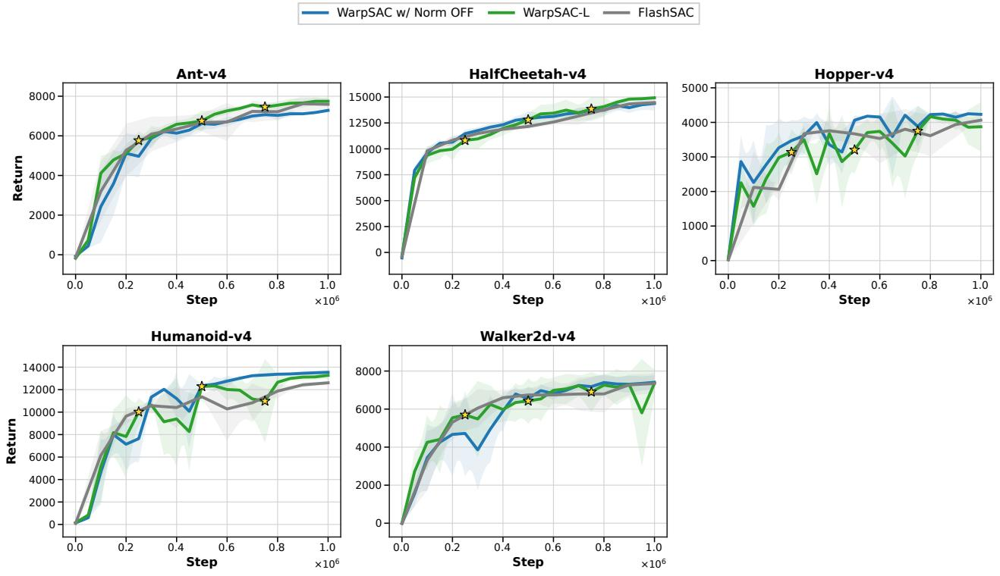  
Figure 12 Full Gym–MuJoCo learning curves. Curves report mean performance with standard deviation across five seeds for all evaluated Gym–MuJoCo tasks.

## F.2 DMC

Figure 13 reports the full DMC hard-task results on humanoid and dog domains. These tasks test whether replay weighting remains useful in CPU-scale control settings with diverse dynamics and reward scales.

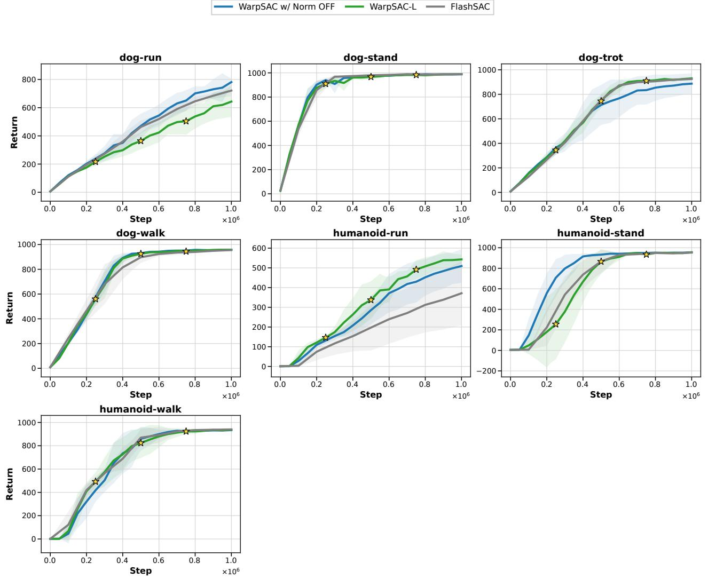  
Figure 13 Full DMC hard-task learning curves. Curves report mean performance with standard deviation across seeds on humanoid and dog tasks from the DeepMind Control Suite.

## F.3 MyoSuite

Figure 14 reports the dexterous manipulation results on MyoSuite. These environments use success-rate-style returns, so the curves emphasize how quickly each method reaches reliable task completion.

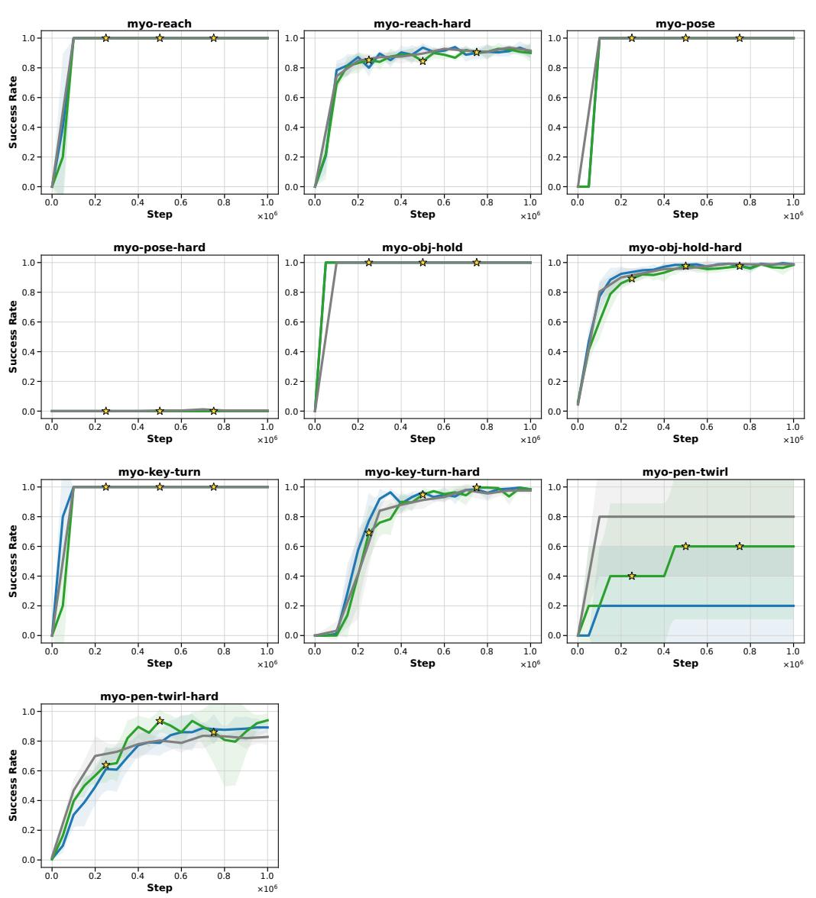  
Figure 14 Full MyoSuite learning curves. Curves report mean success-oriented performance with standard deviation across five seeds for the evaluated MyoSuite manipulation tasks.

## F.4 HumanoidBench

Figure 15 gives the full HumanoidBench results. These tasks are high-dimensional whole-body-control problems and provide a stress test for stability under sparse or delayed progress.

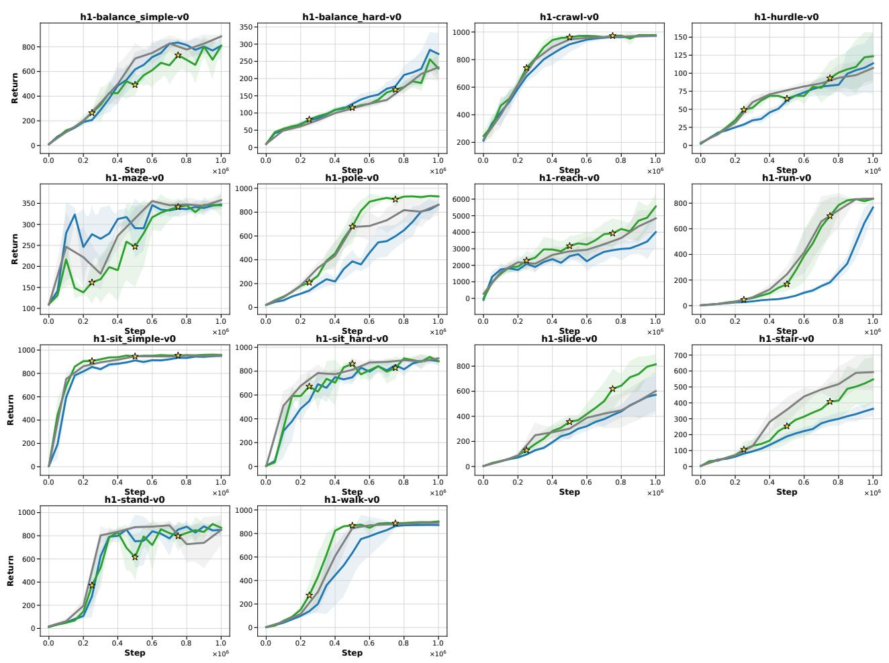  
Figure 15 Full HumanoidBench learning curves. Curves report mean performance with standard deviation across five seeds for the evaluated H1 whole-body-control tasks.

## F.5 MuJoCo Playground

Figure 16 reports the GPU-parallel MuJoCo Playground results. The large number of vectorized environments shifts the comparison toward how efectively each method exploits broad replay coverage.

WarpSAC-A WarpSAC w/ Norm OFF WarpSAC-L FlashSAC

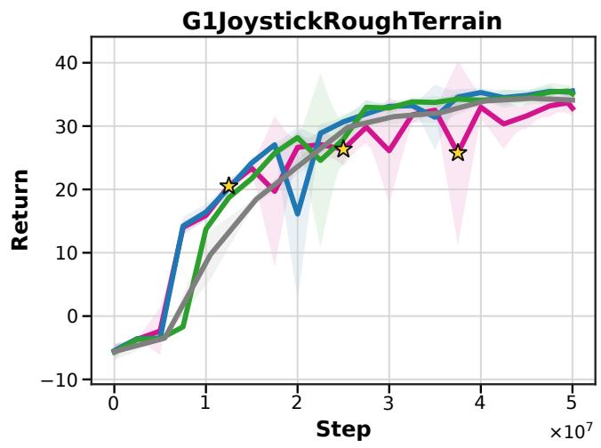

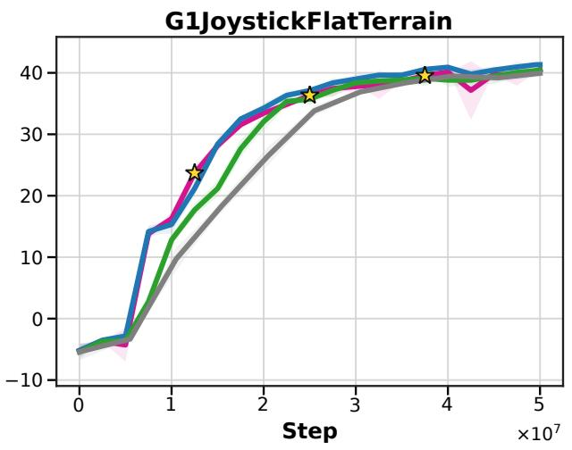

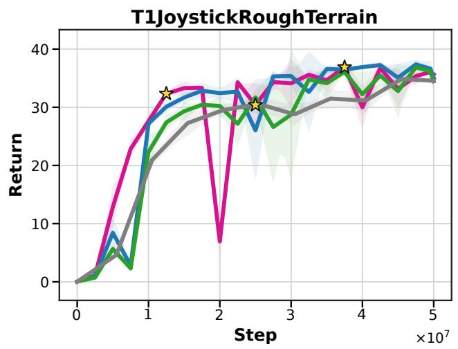

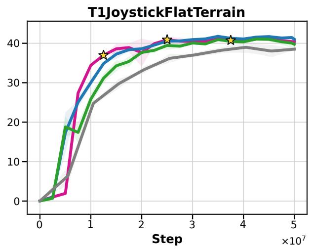  
Figure 16 Full MuJoCo Playground learning curves. Curves report mean performance with standard deviation across five seeds for the evaluated GPU-parallel humanoid locomotion tasks.

## F.6 IsaacLab

Figure 17 reports the full IsaacLab results across manipulation and locomotion tasks. This domain evaluates performance under highly parallel simulation with diverse robot embodiments and reward scales.

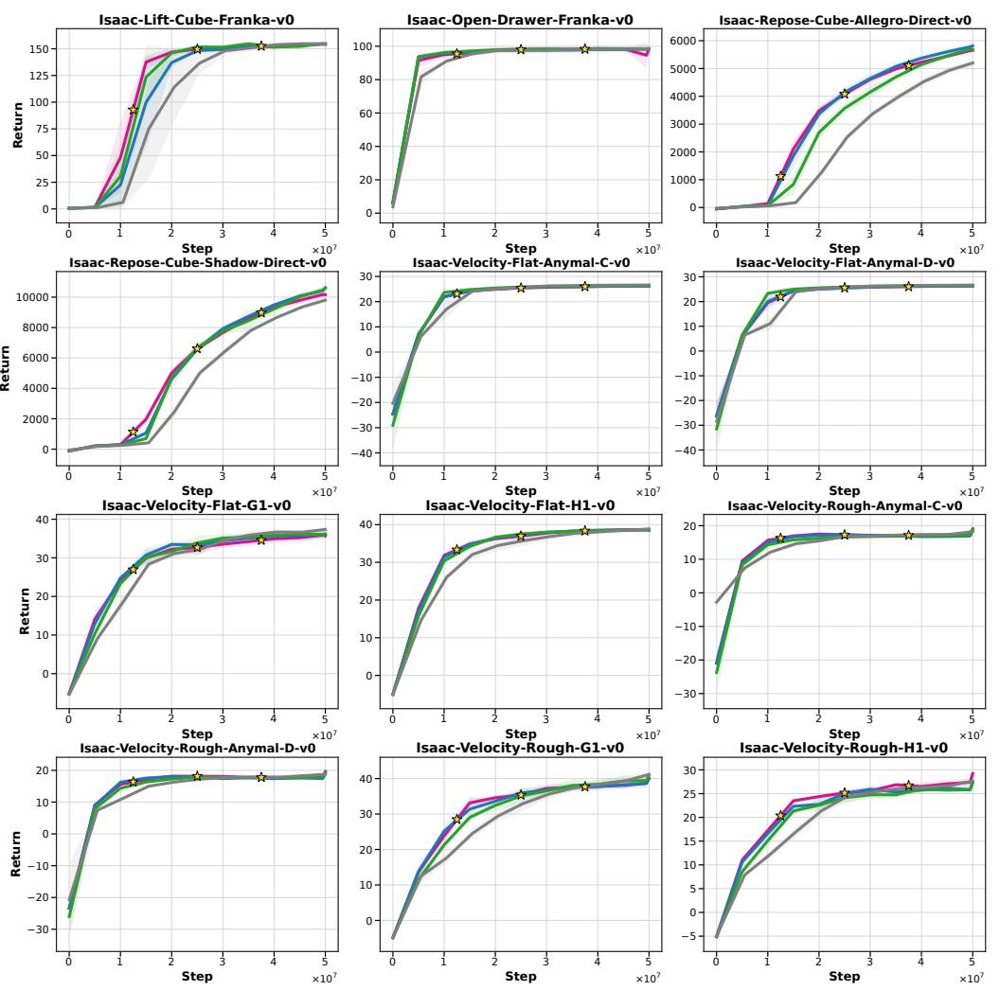  
Figure 17 Full IsaacLab learning curves. Curves report mean performance with standard deviation across five seeds for the evaluated IsaacLab manipulation and locomotion tasks.

## F.7 MJLab

Figure 18 reports the complete MJLab results, covering Unitree G1 and Go1 velocity-tracking tasks on flat and rough terrain as well as Yam manipulation tasks with state, depth, RGB, and segmentation observations. These tasks provide an additional GPU-parallel backend spanning locomotion and manipulation, allowing us to test whether the observed data-regime efects extend beyond IsaacLab and MuJoCo Playground.

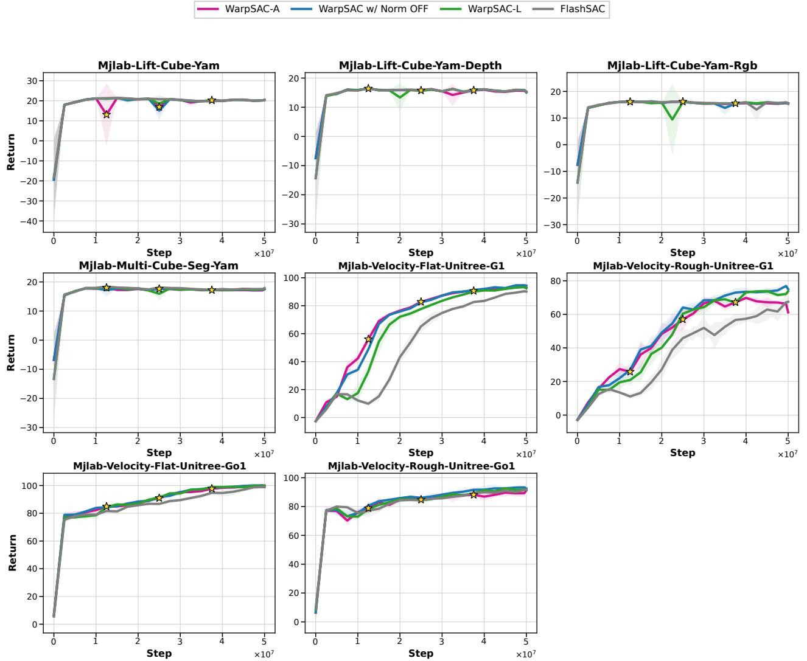  
Figure 18 Full MJLab learning curves. Curves report mean episodic return with standard deviation across five seeds for Unitree locomotion and Yam manipulation tasks.

## F.8 ManiSkill

Figure 19 reports the full ManiSkill results. These GPU-parallel manipulation tasks test whether the methods remain efective when success-rate objectives are collected from many simultaneous environments.

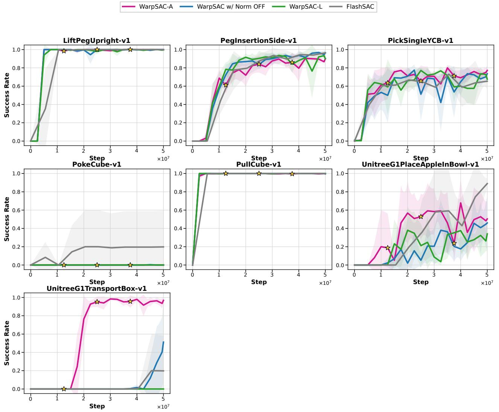  
Figure 19 Full ManiSkill learning curves. Curves report mean success-oriented performance with standard deviation across five seeds for the evaluated ManiSkill manipulation tasks.

## F.9 Ablation Learning Curves

The endpoint and AUC bar charts in the main paper summarize the controlled ablations. Figures 20 and 21 provide the corresponding learning curves, exposing how the capacity, replay-weighting, and normalization choices afect learning speed throughout training.

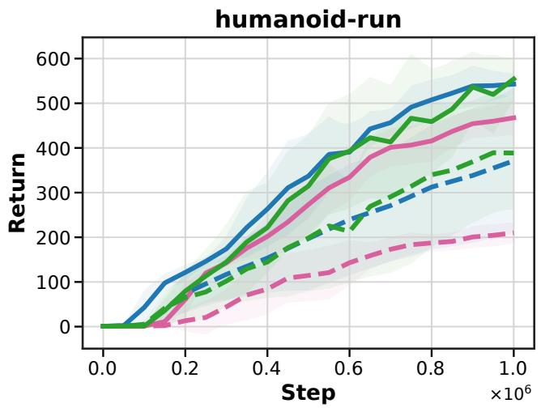

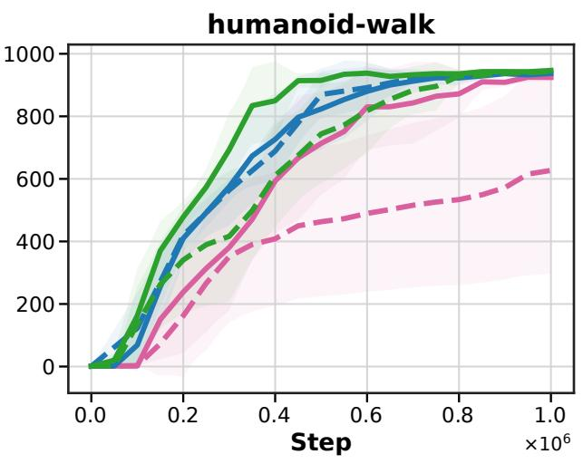

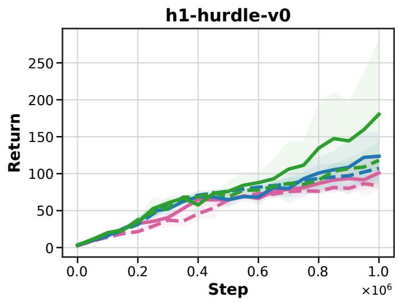

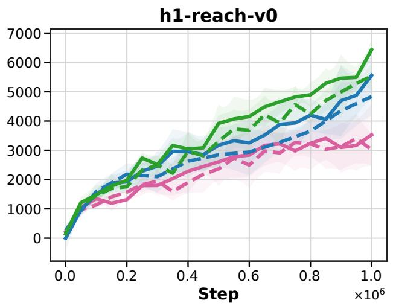  
Figure 20 Capacity and SWD ablation learning curves. Curves compare SWD and uniform replay using one, two, and three residual blocks on humanoid-run, humanoid-walk, h1-hurdle-v0, and h1-reach-v0. Shaded regions show standard deviation across five seeds.

<table><tr><td>B=1, WarpSAC-L B=1, WarpSAC w/ Norm OFF</td><td></td><td>B=1, FlashSAC B=2, WarpSAC-L</td><td>B=2, WarpSAC w/ Norm OFF B=2, FlashSAC</td></tr></table>

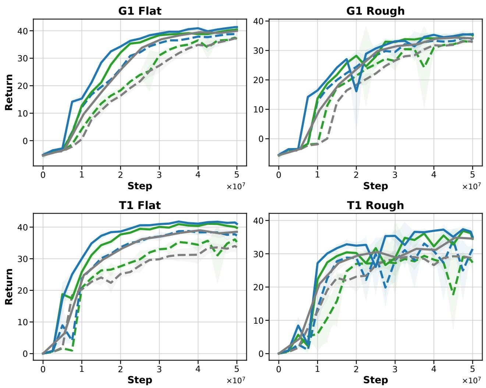  
Figure 21 MuJoCo Playground normalization and capacity ablation learning curves. Curves compare Norm ON, Norm OFF, and No SWD using one and two residual blocks on the four evaluated Playground tasks. Shaded regions show standard deviation across five seeds.