# When Do Supervised UQ Ensembles Improve LLM Hallucination Detection? A Robustness Study

Mohit Singh Chauhan\* Vipin Gyanchandani Dylan Bouchard CVS Health®, Wellesley, MA, USA

## Abstract

Uncertainty quantification (UQ) methods are widely used for hallucination detection in large language models (LLMs) in closed-book settings where ground-truth evidence is unavailable at inference time. Prior work has proposed combining UQ signals via learned ensembles, but empirical investigations into the robustness of these ensembles are limited. We study a supervised ensembling framework that trains a classifier over heterogeneous UQ-based scorer outputs on a small, domain-specific dataset of labeled LLM responses, then applies it to outof-sample hallucination classification without retrieval, tools, or reference documents. Across four LLMs, nine datasets, and three generation regimes (short-form QA, long-form generation, and code generation), we provide a systematic robustness analysis along three axes: sample efficiency, in-domain dataset transfer, and generation regime dependence. We find that supervised ensembles outperform the best individual scorer in 30 of 32 settings, with gains realized from as few as 100 labeled instances. Ensembles retain most of their advantage in cases of in-domain transfer under distribution shift, outperforming the best non-ensemble scorer in 23 of 28 transfer settings. Sampling-based blackbox ensembles are nearly as effective as full ensembles, while single-generation white-box ensembles offer limited benefit.

## 1 Introduction

Large language models (LLMs) are increasingly used as closed-book generators in settings where retrieval is unavailable, including internal knowledge assistants, clinical and policy summarization workflows, customer support composition, and code generation in proprietary repositories. In these deployments, hallucinations are a primary failure mode: the model produces fluent but incorrect statements, fabricated citations, or incorrect code behaviors.

Detecting hallucinations at inference time is difficult because the system often lacks a trusted external reference and because hallucination rates vary sharply by domain, prompt distribution, and base LLM, making reliable closed-book detection a practical bottleneck for safe deployment.

Uncertainty quantification (UQ) provides a rich set of signals for hallucination detection, and prior work has proposed black-box methods (e.g., self-consistency across samples or perturbations), white-box methods (e.g., likelihood- or tokenprobability-derived measures), and reflexive or selfjudge methods (e.g., model-generated assessments of its own correctness). These signals are attractive because they can be computed without retrieval, often using only model outputs and, when available, token-level probabilities. In practice, however, no single signal is uniformly superior across generation regimes (e.g. natural language vs. code), and the same scorer can behave differently across domains (e.g. math vs. factual QA) and LLMs, making zero-shot thresholds brittle.

A natural response is to combine multiple UQ scorers via supervised ensembling. Prior work has demonstrated that even simple weighted-average ensembles of black-box, white-box, and judgebased scorers consistently outperform individual components in controlled, in-domain shortform question-answering settings (Bouchard and Chauhan, 2025). However, that work evaluated ensembles only with a fixed combination strategy (linear weighting), only in-distribution, and only on short-form outputs. The robustness of supervised UQ ensembles across realistic deployment conditions, where labeled data may be scarce, test distributions may drift from training, and generation formats vary widely, remains an open question.

In this work, we study a supervised ensembling framework that trains a classifier over a heterogeneous collection of black-box, white-box, and reflexive UQ scorer outputs on a domain-specific dataset of labeled LLM responses, applied to outof-sample hallucination classification in a closedbook setting. Our primary contribution is a systematic robustness study along three deploymentcritical axes: (1) sample efficiency, (2) in-domain transfer under distribution shift, and (3) generation regime dependence across short-form QA, longform generation, and code generation. Across four LLMs, nine datasets, and three generation regimes, we find that supervised ensembles outperform the best individual scorer in 30 of 32 settings by AU-ROC and 29 of 32 by calibration (ECE), with gains realized from as few as 100 labeled instances. In cases of in-domain distributional shift, ensembles retain most of their in-distribution advantage, outperforming the best individual scorer in 23 of 28 transfer settings. Black-box-only ensembles are nearly as effective as full ensembles, while whitebox-only ensembles offer limited benefit. Among combination strategies, logistic regression offers the best overall balance of performance and stability across regimes.

## 2 Related Work

Uncertainty Quantification for LLMs. A variety of UQ methods have been proposed for hallucination detection in LLM outputs (Huang et al., 2025; Shorinwa et al., 2025). These methods vary along two dimensions: access requirements (black-box, requiring only text outputs, vs. whitebox, requiring token probabilities) and mechanism. Sampling-based consistency methods generate multiple responses to the same prompt and measure consistency via exact match (Cole et al., 2023), lexical similarity (Kuhn et al., 2023), embedding similarity (Manakul et al., 2023; Zhang\* et al., 2020; Shorinwa et al., 2025), or NLI-based semantic equivalence (Chen and Mueller, 2024; Lin et al., 2024; Farquhar et al., 2024). These are typically black-box but can incorporate token probabilities as well (Qiu and Miikkulainen, 2024; Kuhn et al., 2023). White-box methods aggregate token probabilities into response-level scores through measures such as sequence probability, perplexity, entropy, and probability margins (Malinin and Gales, 2021; Manakul et al., 2023; Fadeeva et al., 2024; Farr et al., 2025). Reflexive methods prompt the generating LLM or an external judge to self-evaluate correctness (Kadavath et al., 2022; Chen and Mueller, 2024; Xiong et al., 2024; Tian et al., 2023). These scorer families form the individual components of

the ensembles we study.

UQ Beyond Short-Form Question Answering. Most UQ methods have been developed and evaluated on short-form question answering, and shortform UQ has been shown to generalize poorly to long-form outputs (Bakman et al., 2025; Vashurin et al., 2025c). Fine-grained methods address this by decomposing responses into sentences or claims and scoring each unit via entailment against sampled responses (Zhang et al., 2024), graph centrality over claim-response entailment graphs (Jiang et al., 2024), or question-generation pipelines (Farquhar et al., 2024). For code generation, early studies have investigated token-probability calibration for generated code (Spiess et al., 2025), symbolic clustering methods (Sharma and David, 2025), and functional equivalence variants of semantic entropy (Bouchard et al., 2026a). However, no prior work has evaluated the effectiveness of supervised ensembles over these regime-specific scorer families.

Ensemble Approaches. For unsupervised ensembles, Chen and Mueller (2024) propose BSDetector, a two-component ensemble that computes a weighted average of observed consistency (combining exact match and NLI scores) and self-reflection certainty, and Verga et al. (2024) propose a Panel of LLM evaluators that aggregates judgments from multiple smaller LLMs rather than a single large judge. For supervised ensembles, Bouchard and Chauhan (2025) tune a weighted average over combinations of black-box, white-box, and judge-based scorers and demonstrate consistent gains over individual components on short-form benchmarks. Bakman et al. (2025) ensemble short-form UQ scorers and find ensembles consistently outperform the best individual short-form method, even with small training datasets. Our work extends supervised ensemble UQ with a dedicated robustness analysis: we compare combination strategies beyond weighted averaging, evaluate generalization under distribution shift, and study ensemble effectiveness across short-form, long-form, and code generation regimes, the latter two requiring materially different scorer families.

## 3 Methods

## 3.1 Problem Formulation

We frame hallucination detection as binary classification over UQ scorer outputs. Given a prompt x and a generated response y, let $\mathbf { s } ( y ) =$ $( s _ { 1 } ( y ) , \ldots , s _ { K } ( y ) ) \in [ 0 , 1 ] ^ { K }$ denote a vector of K confidence scores produced by a collection of UQ-based scorers, where each $s _ { k }$ maps a response to a scalar confidence in [0, 1] with higher values indicating greater confidence in correctness. The ground-truth label $h ( y ) \in \{ 0 , 1 \}$ indicates whether y contains a hallucination $( h = 1 )$ or not $( h = 0 )$ determined by comparison to a reference available only offline. Our goal is to learn a function $f : [ 0 , 1 ] ^ { K } \to [ 0 , 1 ]$ that maps the scorer vector to a single confidence score that separates hallucinated from correct responses.

<table><tr><td>Family</td><td>Access</td><td>Short</td><td>Long</td><td>Code</td></tr><tr><td>Single-generation white-box</td><td></td><td></td><td></td><td></td></tr><tr><td>Sequence probability</td><td>White-box</td><td></td><td></td><td>V</td></tr><tr><td>Norm. sequence probability</td><td>White-box</td><td>V</td><td></td><td>√</td></tr><tr><td>Min token probability</td><td>White-box</td><td>√</td><td></td><td>√</td></tr><tr><td>Probability margin</td><td>White-box</td><td>√</td><td></td><td>√</td></tr><tr><td>Mean token entropy</td><td>White-box</td><td>√</td><td></td><td>√</td></tr><tr><td>Max token entropy</td><td>White-box</td><td>V</td><td></td><td>√</td></tr><tr><td>Consistency-based black-box</td><td></td><td></td><td></td><td></td></tr><tr><td>Exact match rate</td><td>Black-box</td><td>V</td><td></td><td></td></tr><tr><td>Non-contradiction probability</td><td>Black-box</td><td>了</td><td></td><td></td></tr><tr><td>BERTScore consistency</td><td>Black-box</td><td>√</td><td></td><td></td></tr><tr><td>Semantic entropy</td><td>Black-box</td><td>√</td><td></td><td></td></tr><tr><td>Cosine similarity</td><td>Black-box</td><td>√</td><td></td><td>√</td></tr><tr><td>Functional entropy</td><td>Black-box</td><td></td><td></td><td>√</td></tr><tr><td>Equivalence rate</td><td>Black-box</td><td></td><td></td><td>√</td></tr><tr><td>CodeBLEU consistency</td><td>Black-box</td><td></td><td></td><td>√</td></tr><tr><td>Consistency-based white-box</td><td></td><td></td><td></td><td></td></tr><tr><td>CoCoA</td><td>White-box</td><td></td><td></td><td>√</td></tr><tr><td>Monte Carlo probability</td><td>White-box</td><td>√</td><td></td><td>√</td></tr><tr><td>WB semantic entropy</td><td>White-box</td><td>√</td><td></td><td>√</td></tr><tr><td>Semantic density</td><td>White-box</td><td>√</td><td></td><td></td></tr><tr><td>Reflexive</td><td></td><td></td><td></td><td></td></tr><tr><td>Verbalized confidence</td><td>Black-box</td><td></td><td></td><td></td></tr><tr><td>P(True)</td><td>White-box</td><td>√</td><td></td><td>√</td></tr><tr><td>Graph-based (claim-level)</td><td></td><td></td><td></td><td></td></tr><tr><td>Degree Centrality</td><td>Black-box</td><td></td><td>√</td><td></td></tr><tr><td>Betweenness Centrality</td><td>Black-box</td><td></td><td>√</td><td></td></tr><tr><td>Closeness Centrality</td><td>Black-box</td><td></td><td>√</td><td></td></tr><tr><td>Harmonic Centrality</td><td>Black-box</td><td></td><td>√</td><td></td></tr><tr><td>Laplacian Centrality</td><td>Black-box</td><td></td><td>√</td><td></td></tr><tr><td>PageRank</td><td>Black-box</td><td></td><td>√</td><td></td></tr></table>

Table 1: Summary of UQ scorers used as ensemble inputs by access and generation regime. “Access” indicates whether token probability access is required. Formal definitions are in Appendix A.

For long-form generation, we operate at the claim level rather than the response level. Each claim c extracted from a response receives its own scorer vector $\mathbf { s } ( c ) \in [ 0 , 1 ] ^ { K }$ , and the ensemble classifies claims individually, where $h ( c ) \in \{ 0 , 1 \}$ indicates whether the claim is supported by a reference text available only offline.

## 3.2 UQ Scorer Families

The ensemble operates over confidence scores drawn from four families of UQ methods. Table 1 summarizes all scorers by family, access requirements, and applicable generation regimes, with formal definitions and implementation details provided in Appendix A. We describe each family below.

Black-box consistency scorers generate m candidate responses from the same prompt using stochastic decoding and measure agreement between the original response and candidates. Methods differ in their consistency function: exact match (Cole et al., 2023), NLI-based noncontradiction or entailment (Chen and Mueller, 2024; Lin et al., 2024), embedding cosine similarity (Shorinwa et al., 2025), BERTScore (Zhang\* et al., 2020), and semantic entropy via NLI-based clustering (Kuhn et al., 2023; Farquhar et al., 2024). For code generation, we additionally employ code-specific consistency functions including CodeBLEU (Ren et al., 2020) and LLM-based functional equivalence assessment, replacing NLIbased semantic comparison with judgments of whether two code snippets produce identical outputs for all valid inputs.

White-box token-probability scorers derive confidence from the token-level probabilities produced during generation. We consider lengthnormalized sequence probability (Malinin and Gales, 2021), minimum token probability (Manakul et al., 2023), probability margin (Farr et al., 2025), and token-level entropy (Scalena et al., 2025). We also consider hybrid methods that combine token probabilities with sampling-based consistency (e.g., white-box semantic entropy (Kuhn et al., 2023)).

Reflexive (judge-based) scorers prompt the generating LLM or an external LLM to evaluate correctness of a question-response pair. We consider verbalized confidence (Tian et al., 2023; Xiong et al., 2024) and P(True) (Kadavath et al., 2022). For short-form and code generation, these scorers evaluate the full response. For long-form generation, they are applied at the claim level, scoring each extracted claim individually.

Claim-level scorers (long-form only) decompose responses into claims and score each claim individually, producing the claim-level confidence scores over which the ensemble operates. Following Jiang et al. (2024), we employ graph-based scorers, which construct claim-response entailment graphs and use graph centrality metrics to measure uncertainty at the claim level.

## 3.3 Ensembling Strategies

Given the scorer vector $\mathbf { s } \in [ 0 , 1 ] ^ { K }$ and binary labels $h \in \{ 0 , 1 \}$ for a training set of n labeled instances, we train a classifier $f$ to predict hallucinations from scorer outputs. We compare four combination strategies of varying complexity: (1) logistic regression with $\ell _ { 2 }$ regularization, (2) random forest, (3) gradient boosted trees, and constrained weighted average (Bouchard and Chauhan, 2025). For all strategies, hyperparameters are selected via 5-fold cross-validation on the tuning set. See Appendix E for hyperparameter details.

## 4 Experiments

## 4.1 Setup

We evaluate four LLMs spanning two providers and two capability tiers: Gemini-2.5-Flash, Gemini-2.5-Pro (Google), GPT-4o, and GPT-4o-mini (OpenAI). Experiments are organized across four core domains (Math, Factual QA, Code, and Long-form) and one standalone reading comprehension task. For short-form evaluation, we consider: (1) Math reasoning, consisting of OpenR1-Math (The Hugging Face team (past and future), 2026) and Big-Math (Albalak et al., 2025) (1,000 questions each); (2) Factual QA, consisting of HotpotQA (Yang et al., 2018) and SimpleQA (Wei et al., 2024) (1,000 questions each); and (3) Reading Comprehension, using the DROP dataset (Dua et al., 2019) (1,000 questions). For code generation, we use two subsets of LiveCodeBench (Jain et al., 2025): a Leetcode-derived callable subset (442 problems) and an AtCoder/CodeForces I/O subset (610 problems), both requiring Python generation. For long-form QA, we construct two datasets following the FactScore (Min et al., 2023) protocol: world’s largest rivers (500 questions) and edible mushrooms (84 questions), with responses averaging approximately 32 claims each, yielding roughly 16,000 and 2,700 claim-level instances per LLM, respectively (see Appendix C for more details).

For short-form questions, hallucination labels are obtained by comparing LLM responses to reference answers using an LLM-based grading procedure. For code generation, labels are determined by execution against test cases (pass@1). For longform QA, responses are decomposed into claims and each claim is graded against the corresponding Wikipedia article using the FactScore protocol. Gemini-2.5-Flash is used as the grading model for short-form and long-form questions, as well as for claim decomposition in the long-form setting, chosen for its strong performance at low cost. For all sampling-based scorers, we generate 10 sampled responses per prompt across all regimes.

To assess the reliability of LLM-based grading, two human annotators independently labeled a stratified sample of 400 short-form responses (20 correct and 20 incorrect per dataset per generator LLM, spanning all five short-form datasets and two generators: GPT-4o and Gemini-2.5-Flash). Annotators compared each generated answer against the reference answer without access to the grader’s label. Human-human agreement was 97.5% (Cohen’s $\kappa = 0 . 9 5 )$ , and LLM-human agreement was 98.8% $( \kappa = 0 . 9 7 )$ and 96.2% $( \kappa = 0 . 9 3 )$ for the two annotators, confirming that grading noise is no larger than inherent human disagreement. Agreement rates were comparable across both generator LLMs $( \kappa = 0 . 9 5$ for both), providing no evidence that the grader favors its own responses. Full results broken down by dataset and generator are provided in Appendix D.

All experiments share a common splitting procedure: for each domain with paired datasets, we generate 25 random stratified 70/30 splits applied simultaneously to both datasets, yielding a 70% training fold and 30% test fold for each.1 The three analyses described below (in-distribution performance, in-domain transfer, and access-constrained ablations) all operate over these same 25 splits. Table 4 reports LLM accuracy rates for each dataset. Complete AUROC and ECE results, broken down by scorer and ensemble for all LLM-dataset combinations, are provided in Tables 8–15.

## 4.2 In-Distribution Performance

For each of the 25 splits, we train ensembles on subsamples of the training fold at sizes 0.1N, 0.2N, . . . , 0.7N, where N is the dataset size and 0.7N corresponds to the full training fold. For each split and sample size, we draw a single subsample, train the ensemble, and evaluate on the test fold, reporting mean AUROC and 95% confidence intervals across the 25 splits. For code generation, the two LiveCodeBench subsets are combined into a single pool. The best individual scorer, defined as the scorer achieving the highest AUROC on the test set, serves as a fixed reference baseline. Note that this baseline is optimistic: it requires test-set access and is unavailable in practice, so ensemble gains relative to a realistic validation-selected scorer would be at least as large.

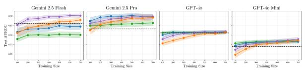  
(a) OpenR1-Math

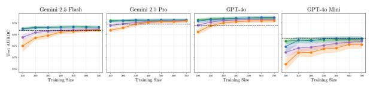

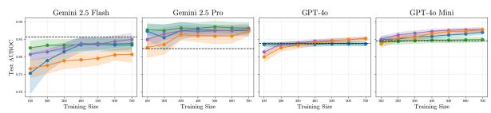  
(b) Big-Math

(c) SimpleQA  
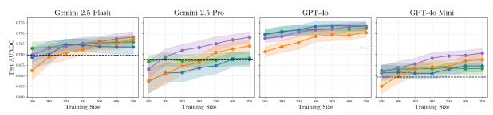

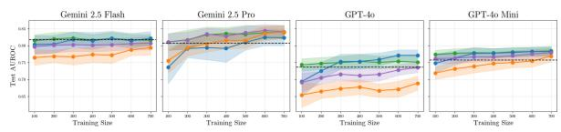  
(d) HotPotQA

(e) DROP  
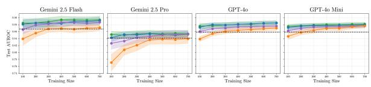

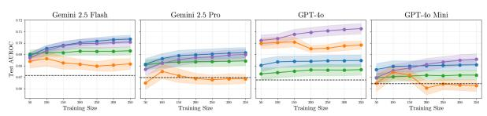  
(g) FactScore-Rivers

(f) LiveCodeBench (Python)  
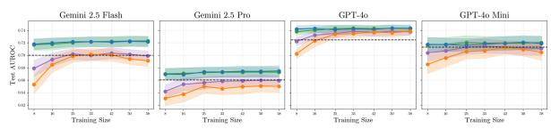  
(h) FactScore-Mushrooms  
Figure 1: Ensemble AUROC as a function of training sample size across domains. Lines show the four combination strategies with 95% CIs over 25 splits. The dashed line is the best individual scorer, selected on the test set and therefore an optimistic baseline unavailable in practice. Training sizes (in number of responses) range from 0.1N to 0.7N, where N is the dataset size. Code generation combines both LiveCodeBench subsets.

When using the full training sample (0.7N), the best ensemble outperforms the best individual scorer in 30 of 32 LLM-dataset settings by AU-ROC, including every code generation and longform setting. The two exceptions are BigMath for Gemini-2.5-Flash (best ensemble 0.85 vs. scorer 0.86) and SimpleQA for GPT-4o-mini (both 0.78). We next examine how quickly these gains emerge as a function of training set size. Figures 1a–1h show ensemble AUROC as a function of training sample size across all domains. Each panel displays the four combination strategies and the best individual scorer baseline.

Short-form (Figures 1a–1e). At 700 training samples, random forest and logistic regression are the strongest combination strategies in most settings, though neither dominates uniformly. Random forest achieves the highest AUROC in settings with clear ensemble gains (e.g., 0.90 on OpenR1- Math for both Gemini models, 0.74 on DROP for Gemini-2.5-Flash and GPT-4o), while logistic regression leads or ties on datasets where the best individual scorer is already strong (e.g., HotpotQA for Gemini-2.5-Flash, SimpleQA for GPT-4o-mini). Gradient boosting is competitive at 700 samples in some settings but lags at small sample sizes. Weighted average is competitive on datasets with strong baselines (e.g., SimpleQA, HotpotQA) but falls substantially behind on OpenR1-Math, where it plateaus around 0.80–0.86 compared to 0.90 for random forest.

Convergence speed varies by strategy. The weighted average stabilizes early, often by 100-200 samples. Logistic regression converges by 200-300 samples in most settings, though it continues improving through 400-500 on some datasets (e.g., OpenR1-Math). Random forest and gradient boosting continue improving with larger samples, with random forest typically reaching its peak earlier.

Code generation (Figure 1f). The combined LiveCodeBench dataset yields consistent ensemble gains across all four LLMs: Gemini-2.5-Flash (0.89 vs. 0.87), Gemini-2.5-Pro (0.85 vs. 0.84), GPT-4o (0.88 vs. 0.86), and GPT-4o-mini (0.88 vs. 0.86). The weighted average, logistic regression, and random forest converge to similar AUROC in all four settings, with gradient boosting trailing by

0.01–0.02 for three of the four LLMs and matching the others for GPT-4o-mini. Convergence is fast, with weighted average stabilizing by 100–200 samples and logistic regression and random forest by 200–400.

Long-form QA (Figures 1g–1h). The long-form setting operates at the claim level, with responses averaging approximately 32 claims each. The best ensemble outperforms the best individual scorer in all 8 settings. On the Mushrooms dataset, logistic regression and the weighted average lead for Gemini models and GPT-4o-mini, while all four strategies perform similarly for GPT-4o. On the Rivers dataset, random forest is competitive with or outperforms logistic regression for all LLMs, and substantially outperforms the weighted average for GPT-4o (0.713 vs. 0.677) and GPT-4o-mini (0.686 vs. 0.672). Gradient boosting underperforms in the long-form setting, degrading with increasing training data for Gemini-2.5-Pro on Rivers (dropping from 0.675 at 0.2N to 0.669 at 0.7N) and GPT-4o-mini (dropping from 0.674 to 0.663). The simpler strategies converge rapidly, typically by 0.1N–0.2N.

Calibration. Ensembling also improves calibration considerably: across all 32 LLM-dataset settings, the best ensemble achieves the lowest ECE among all individual scorers and ensemble variants in 29 of 32 cases, with ECE never exceeding 0.06.

## 4.3 In-Domain Transfer

For each domain, we use the same 25 splits to evaluate in-domain transfer. Within each split, we train the ensemble on the training fold of one dataset and evaluate on the test folds of both datasets in the domain: the same dataset (in-distribution) and its companion (transfer). For example, in the math domain, an ensemble trained on OpenR1-Math is evaluated on both OpenR1-Math and BigMath test folds, and vice versa. For each evaluation dataset, we compare the best individual scorer, the best in-distribution ensemble, and the best transfer ensemble, with the combination strategy selected independently for the latter two.

In 13 of 28 settings, the transfer ensemble shows no degradation relative to the in-distribution ensemble, and the maximum degradation across all settings is 0.03 AUROC. Across all 28 settings, the transfer ensemble outperforms the best individual scorer in 23 cases, ties in 2, and underperforms in 3. The 3 underperforming cases are BigMath for

Gemini-2.5-Flash (transfer 0.85 vs. scorer 0.86), SimpleQA for GPT-4o-mini (0.77 vs. 0.78), and code generation for Gemini-2.5-Pro (0.79 vs. 0.81), all within confidence intervals. Transfer is consistently strong across domains, with degradation of 0.00–0.03 AUROC and the transfer ensemble matching or exceeding the best scorer in the large majority of settings. Long-form QA shows particularly robust transfer, with no degradation on Mushrooms for any LLM and degradation of at most 0.03 on Rivers.

## 4.4 Access-Constrained Ablations

Using the same 25 splits and the full training fold, we train ensembles under two restricted access conditions on the five short-form datasets: black-box scorers only (no token probabilities) and singlegeneration white-box scorers only (no sampling). Table 2 reports AUROC for the best individual scorer and best ensemble under each condition, alongside the full scorer set.

Full ensemble. The full ensemble outperforms the best individual scorer in 18 of 20 LLM-dataset combinations. The two exceptions (BigMath for Gemini-2.5-Flash and SimpleQA for GPT-4o-mini) are within confidence intervals. The largest gains appear for Gemini-2.5-Pro (0.04–0.07 AUROC on math datasets).

Black-box only. The black-box ensemble outperforms the best black-box scorer in 19 of 20 settings. On HotpotQA for Gemini-2.5-Flash, the black-box ensemble (0.857) exceeds even the best full ensemble (0.822).

White-box only. The white-box ensemble outperforms the best white-box scorer in just 11 of 20 settings. For GPT-4o and GPT-4o-mini, white-box scorers are competitive with or exceed black-box scorers on several datasets (e.g., BigMath, OpenR1 for GPT-4o).

## 5 Discussion

Ensembling as a default strategy. Supervised ensembles that combine black-box and white-box scorers outperform the best individual scorer in 30 of 32 settings by AUROC and 29 of 32 by ECE. This consistency across four LLMs, nine datasets, and three generation regimes suggests that ensembling makes a strong default approach whenever labeled data is available. Crucially, since individual scorers require no training, the labeling effort needed to identify the best single scorer already suffices to train an ensemble, making the additional cost of ensembling negligible. This supervised approach also consistently outperforms training-free, fixed-weight combinations of token probabilities and consistency signals such as CoCoA (Vashurin et al., 2025b), which is never the top-performing scorer in our framework.

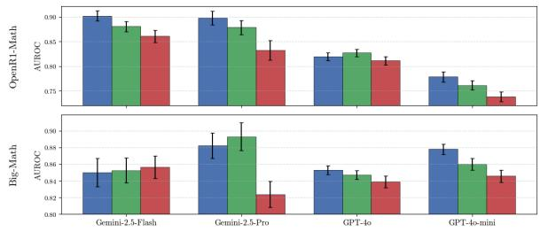  
(a) Short-Form Math

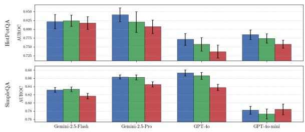  
(b) Short-Form Factual QA

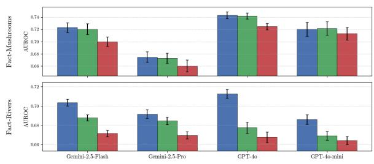  
(c) Long-Form QA

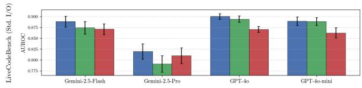  
(d) Python Code Generation  
Figure 2: In-domain transfer AUROC across domains. Bars compare the best individual scorer (selected on the test set; an optimistic baseline), best in-distribution ensemble, and best out-of-distribution (OOD) ensemble (trained on the companion dataset within the same domain). Combination strategy is selected independently per condition. Bars show mean AUROC with 95% CIs over 25 splits. Code generation evaluates transfer in one direction only (I/O → Callable) due to small sample size of Callable subset.

Calibration. Beyond discrimination, ensembling yields well-calibrated confidence scores, with the best ensemble achieving ECE below 0.06 in every setting and below 0.05 in most. Individual scorers, by contrast, are often poorly calibrated despite reasonable AUROC. This is practically significant: well-calibrated scores enable threshold-based deployment decisions (e.g., flagging responses below a confidence threshold for human review) without requiring extensive per-dataset threshold tuning.

Combination strategy selection. The optimal combination strategy varies by generation regime. For short-form and code generation, random forest and logistic regression are the strongest strategies, with random forest offering marginally higher AUROC at the cost of slower convergence. For long-form claim-level detection, logistic regression and the weighted average dominate, while gradient boosting is prone to overfitting and can degrade with increasing training data. In practice, logistic regression offers arguably the best balance: it is competitive across all regimes, converges quickly (often by 100–200 responses), and avoids the overfitting risks of tree-based methods in low-feature settings.

Sample efficiency. Ensemble gains are realized at modest sample sizes. Simpler strategies (logistic regression, weighted average) often reach their plateau with as few as 100–200 labeled instances. Tree-based strategies require 300–500 to converge but can achieve higher final AUROC. For practitioners with limited labeling budgets, logistic regression provides strong performance; with larger budgets, random forest may offer incremental improvement.

In-domain transfer. Transfer ensembles retain most of their in-distribution advantage, with mean degradation of only 0.02 AUROC points and transfer ensembles outperforming the best individual scorer in 23 of 28 settings. This suggests crossdataset deployment viability, as a practitioner can train an ensemble on a labeled source dataset and deploy it to a related target dataset with reasonable confidence. The few underperforming cases are within confidence intervals rather than being clearly attributable to a systematic failure mode.

<table><tr><td>LLM</td><td>Type</td><td>Big-Math</td><td>OpenR1</td><td>DROP</td><td>HotpotQA</td><td>SimpleQA</td></tr><tr><td rowspan="6">Gemini 2.5 Flash</td><td>Top WB Scorer</td><td> $0 . 7 4 4 \pm 0 . 0 2$ </td><td> $0 . 6 9 7 \pm 0 . 0 1$ </td><td> $0 . 6 8 6 \pm 0 . 0 1$ </td><td> $0 . 7 6 9 \pm 0 . 0 2$ </td><td> $0 . 6 1 1 \pm 0 . 0 1$ </td></tr><tr><td>Top WB Ensemble</td><td> $0 . 7 3 7 \pm 0 . 0 2$ </td><td> $0 . 7 4 4 \pm 0 . 0 1$ </td><td> $0 . 6 8 6 \pm 0 . 0 1$ </td><td> $0 . 7 6 7 \pm 0 . 0 2$ </td><td> $0 . 6 1 1 \pm 0 . 0 1$ </td></tr><tr><td>Top BB Scorer</td><td> $0 . 7 9 6 \pm 0 . 0 2$ </td><td> $0 . 6 8 8 \pm 0 . 0 1$ </td><td> $0 . 6 7 3 \pm 0 . 0 1$ </td><td> $0 . 8 2 8 \pm 0 . 0 1$ </td><td> $0 . 8 1 6 \pm 0 . 0 1$ </td></tr><tr><td>Top BB Ensemble</td><td> $0 . 8 3 6 \pm 0 . 0 2$ </td><td> $0 . 7 8 5 \pm 0 . 0 1$ </td><td> $0 . 6 8 9 \pm 0 . 0 1$ </td><td> $\mathbf { 0 . 8 5 7 \pm 0 . 0 1 }$ </td><td> $0 . 8 2 3 \pm 0 . 0 1$ </td></tr><tr><td>Top Overall Scorer</td><td> $\mathbf { 0 . 8 5 7 \pm 0 . 0 1 }$ </td><td> $0 . 8 6 1 \pm 0 . 0 1$ </td><td> $0 . 6 9 9 \pm 0 . 0 1$ </td><td> $0 . 8 1 8 \pm 0 . 0 2$ </td><td> $0 . 8 1 7 \pm 0 . 0 1$ </td></tr><tr><td>Top Overall Ensemble</td><td> $0 . 8 5 0 \pm 0 . 0 2$ </td><td> $\mathbf { 0 . 9 0 2 \pm 0 . 0 1 }$ </td><td> $\mathbf { 0 . 7 4 1 \pm 0 . 0 1 }$ </td><td> $0 . 8 2 2 \pm 0 . 0 2$ </td><td> $\mathbf { 0 . 8 3 2 \pm 0 . 0 1 }$ </td></tr><tr><td rowspan="6">Gemini 2.5 Pro</td><td>Top WB Scorer</td><td> $0 . 7 2 2 \pm 0 . 0 2$ </td><td> $0 . 6 1 7 \pm 0 . 0 2$ </td><td> $0 . 6 8 7 \pm 0 . 0 2$ </td><td> $0 . 7 3 6 \pm 0 . 0 2$ </td><td> $0 . 5 4 2 \pm 0 . 0 1$ </td></tr><tr><td>Top WB Ensemble</td><td> $0 . 7 1 7 \pm 0 . 0 2$ </td><td> $0 . 6 3 4 \pm 0 . 0 2$ </td><td> $0 . 6 8 9 \pm 0 . 0 2$ </td><td> $0 . 7 3 3 \pm 0 . 0 2$ </td><td> $0 . 5 3 9 \pm 0 . 0 1$ </td></tr><tr><td>Top BB Scorer</td><td> $0 . 7 7 5 \pm 0 . 0 2$ </td><td> $0 . 8 3 2 \pm 0 . 0 2$ </td><td> $0 . 6 5 1 \pm 0 . 0 2$ </td><td> $0 . 7 6 6 \pm 0 . 0 3$ </td><td> $0 . 8 4 5 \pm 0 . 0 1$ </td></tr><tr><td>Top BB Ensemble</td><td>0.822 ± 0.02</td><td> $0 . 8 4 3 \pm 0 . 0 2$ </td><td> $0 . 6 8 7 \pm 0 . 0 1$ </td><td> $0 . 7 8 6 \pm 0 . 0 2$ </td><td>0.851 ± 0.01</td></tr><tr><td>Top Overall Scorer</td><td> $0 . 8 2 4 \pm 0 . 0 2$ </td><td> $0 . 8 3 2 \pm 0 . 0 2$ </td><td> $0 . 6 8 7 \pm 0 . 0 2$ </td><td> $0 . 8 0 7 \pm 0 . 0 2$ </td><td> $0 . 8 4 5 \pm 0 . 0 1$ </td></tr><tr><td>Top Overall Ensemble</td><td> $\mathbf { 0 . 8 8 2 \pm 0 . 0 2 }$ </td><td> $\mathbf { 0 . 8 9 8 \pm 0 . 0 1 }$ </td><td> ${ \bf 0 . 7 4 0 \pm 0 . 0 1 }$ </td><td> $\mathbf { 0 . 8 4 1 \pm 0 . 0 2 }$ </td><td> $\mathbf { 0 . 8 6 3 \pm 0 . 0 1 }$ </td></tr><tr><td rowspan="6">GPT-40</td><td>Top WB Scorer</td><td> $0 . 8 3 9 \pm 0 . 0 1$ </td><td> $0 . 8 0 6 \pm 0 . 0 1$ </td><td> $0 . 6 9 6 \pm 0 . 0 1$ </td><td> $0 . 7 3 2 \pm 0 . 0 2$ </td><td> $0 . 8 4 2 \pm 0 . 0 1$ </td></tr><tr><td>Top WB Ensemble</td><td> $0 . 8 4 8 \pm 0 . 0 1$ </td><td> $0 . 8 1 0 \pm 0 . 0 1$ </td><td> $0 . 6 9 6 \pm 0 . 0 1$ </td><td> $0 . 7 3 0 \pm 0 . 0 2$ </td><td> $0 . 8 5 2 \pm 0 . 0 1$ </td></tr><tr><td>Top BB Scorer</td><td> $0 . 7 9 8 \pm 0 . 0 1$ </td><td> $0 . 7 8 3 \pm 0 . 0 1$ </td><td> $0 . 7 1 5 \pm 0 . 0 1$ </td><td> $0 . 7 0 4 \pm 0 . 0 2$ </td><td> $0 . 8 4 0 \pm 0 . 0 1$ </td></tr><tr><td>Top BB Ensemble</td><td> $0 . 8 1 0 \pm 0 . 0 0$ </td><td> $0 . 7 8 8 \pm 0 . 0 1$ </td><td> $0 . 7 5 8 \pm 0 . 0 1$ </td><td> $0 . 7 6 3 \pm 0 . 0 2$ </td><td> $0 . 8 5 6 \pm 0 . 0 1$ </td></tr><tr><td>Top Overall Scorer</td><td> $0 . 8 3 9 \pm 0 . 0 1$ </td><td> $0 . 8 1 1 \pm 0 . 0 1$ </td><td> $0 . 7 1 5 \pm 0 . 0 1$ </td><td> $0 . 7 3 7 \pm 0 . 0 2$ </td><td> $0 . 8 3 8 \pm 0 . 0 1$ </td></tr><tr><td>Top Overall Ensemble</td><td> $\mathbf { 0 . 8 5 3 \pm 0 . 0 1 }$ </td><td> $\mathbf { 0 . 8 1 9 \pm 0 . 0 1 }$ </td><td> $\mathbf { 0 . 7 6 7 \pm 0 . 0 1 }$ </td><td> $\mathbf { 0 . 7 7 1 \pm 0 . 0 2 }$ </td><td> $\mathbf { 0 . 8 7 4 \pm 0 . 0 1 }$ </td></tr><tr><td rowspan="6">GPT-4o Mini</td><td>Top WB Scorer</td><td> $0 . 8 4 7 \pm 0 . 0 1$ </td><td> $0 . 7 1 3 \pm 0 . 0 1$ </td><td> $0 . 6 2 5 \pm 0 . 0 1$ </td><td> $0 . 7 4 8 \pm 0 . 0 1$ </td><td> $0 . 7 8 1 \pm 0 . 0 1$ </td></tr><tr><td>Top WB Ensemble</td><td> $0 . 8 5 8 \pm 0 . 0 1$ </td><td> $0 . 7 5 4 \pm 0 . 0 1$ </td><td> $0 . 6 3 2 \pm 0 . 0 1$ </td><td> $0 . 7 5 4 \pm 0 . 0 1$ </td><td> $0 . 7 8 3 \pm 0 . 0 1$ </td></tr><tr><td>Top BB Scorer</td><td> $0 . 7 4 8 \pm 0 . 0 1$ </td><td> $0 . 7 3 9 \pm 0 . 0 1$ </td><td> $0 . 6 4 4 \pm 0 . 0 2$ </td><td> $0 . 7 4 7 \pm 0 . 0 2$ </td><td> $0 . 7 7 8 \pm 0 . 0 1$ </td></tr><tr><td>Top BB Ensemble</td><td> $0 . 8 0 0 \pm 0 . 0 1$ </td><td> $0 . 7 4 6 \pm 0 . 0 1$ </td><td> $0 . 6 7 8 \pm 0 . 0 1$ </td><td> $0 . 7 7 5 \pm 0 . 0 1$ </td><td> $0 . 7 7 8 \pm 0 . 0 1$ </td></tr><tr><td>Top Overall Scorer</td><td> $0 . 8 4 6 \pm 0 . 0 1$ </td><td> $0 . 7 3 8 \pm 0 . 0 1$ </td><td> $0 . 6 4 7 \pm 0 . 0 1$ </td><td> $0 . 7 5 8 \pm 0 . 0 1$ </td><td> $\mathbf { 0 . 7 8 4 \pm 0 . 0 1 }$ </td></tr><tr><td>Top Overall Ensemble</td><td> $\mathbf { 0 . 8 7 8 \pm 0 . 0 1 }$ </td><td> $\mathbf { 0 . 7 7 8 \pm 0 . 0 1 }$ </td><td> $\mathbf { 0 . 7 0 3 \pm 0 . 0 1 }$ </td><td> $\mathbf { 0 . 7 8 5 \ : \pm 0 . 0 1 }$ </td><td> $0 . 7 8 2 \pm 0 . 0 1$ </td></tr></table>

Table 2: Comparison of white-box (WB), black-box (BB), and overall uncertainty quantification methods across five short-form datasets and four LLMs. Each row reports the best individual scorer and best ensemble within that access category. AUROC values with 95% confidence intervals over 25 random train/test splits. Bold indicates the highest AUROC per LLM-dataset pair.

Access constraints. Black-box ensembles provide nearly the same benefit as full ensembles (19 of 20 short-form settings), making them a useful default when logprobs are unavailable. The diversity of black-box consistency signals spanning exact match, NLI, embedding similarity, and semantic clustering provides sufficient complementarity for a classifier to exploit. White-box-only ensembles, by contrast, offer limited gains (11 of 20), as these six token-probability features seem to lack the diversity needed for effective combination. The informativeness of white-box scorers also varies across model families: GPT models produce consistently useful token-probability signals, while Gemini models show cases where white-box scorers are uninformative or misleading (e.g. Gemini-2.5-Pro on SimpleQA).

our tree-based strategies (random forest, gradient boosting) are competitive in most settings. A plausible explanation is that bagging and boosting with cross-validated depth reduce the variance that makes individual trees unreliable. Our study complements theirs by providing a dedicated robustness analysis investigating cross-dataset transfer, access constraints, and two additional generation regimes (code generation and claim-level scoring).

## 6 Conclusion

We presented a systematic robustness study of supervised UQ ensembles for LLM hallucination detection across sample efficiency, in-domain distribution shift, and generation regime. Ensembles outperform the best individual scorer in 30 of 32 settings by AUROC and 29 of 32 by calibration, with gains realized at sample sizes as small as 100 labeled instances. Cross-dataset transfer is effective in most settings (23 of 28), with the primary failure mode being scorer signals that shift across distributions. Black-box-only ensembles are nearly as effective as full ensembles, while white-box-only ensembles offer limited benefit. These findings provide actionable guidance: supervised ensembling is a reliable, low-cost default for hallucination detection when even a small labeled dataset is available, and black-box ensembles are a robust fallback when token probabilities are unavailable.

Comparison with prior ensembling studies. Our findings are consistent with Bakman et al. (2025), who evaluate ensembling of short-form UQbased scorers and find that linear ensembles outperform the best individual method with as few as 100 calibration samples. Our sample efficiency results align: simpler strategies plateau by 100–200 labeled instances. One divergence is that their single decision tree is generally uncompetitive, whereas

## Limitations

Closed-weight model scope. Our study evaluates four LLMs from two providers (Google and OpenAI), all of which are closed-source. Results may not generalize to open-weight models (e.g., LLaMA, Mistral), which may exhibit different token-probability characteristics, or to models with substantially different architectures. The observed differences between Gemini and GPT models (particularly in white-box scorer informativeness) suggest that model family is an important factor, but we cannot characterize this dimension fully with only two providers. Moreover, open-weight models enable internal-state methods based on hidden representations or attention maps (Azaria and Mitchell, 2023; Chen et al., 2024; Chuang et al., 2024; Vazhentsev et al., 2025) that are infeasible with closed-weight APIs. Whether ensembles over these internal-state scorers can match the performance of sampling-based ensembles at lower inference cost is an open question for the open-weight setting.

Evaluation scope. Our evaluation covers specific slices of each generation regime and transfer condition. The long-form evaluation is limited to two narrow factoid-recall domains (rivers and mushrooms) with a shared question template; broader tasks such as open-ended summarization, document drafting, or multi-turn dialogue may exhibit different ensemble behavior, particularly if claim decomposition is less straightforward. Code generation experiments use Python exclusively on competitive programming problems from LiveCodeBench, whereas real-world code generation spans multiple languages, longer codebases, and tasks beyond self-contained function synthesis. Our crossdataset transfer evaluation considers transfer between dataset pairs within the same domain (e.g., math to math); cross-domain transfer (e.g., training on math and deploying to factual QA) and cross-LLM transfer (e.g., training on GPT-4o outputs and deploying to Gemini) remain unexplored and may exhibit substantially larger degradation.

## Ethical Considerations.

This work aims to improve the reliability of LLM outputs by detecting hallucinations, which we view as a net positive for safe deployment. However, high-performing hallucination detectors could create a false sense of security if practitioners treat ensemble confidence scores as guarantees of correctness rather than probabilistic estimates. We emphasize that our methods reduce but do not eliminate hallucination risk, and that human oversight remains essential in high-stakes settings such as clinical or legal applications. We use publicly available research benchmarks and cite their original sources; users should obtain the datasets from the official sources and comply with the corresponding licenses and terms of use. We do not redistribute the full benchmark-derived data, and release only synthetic schema-compatible files for code smoke testing. No personally identifiable information was collected or generated. The human annotation study was conducted by the authors; no crowdworkers were employed.

## Conflict of Interest

MSC is employed by CVS Health® Corporation and holds stock and/or equity. VG and DB were formerly employed by CVS Health® Corporation and hold stock and/or equity. No conflicts germane to this work.

## Disclaimer

Prompts are included solely for reproducibility and do not imply endorsement or affiliation. Gemini is a trademark of Google and GPT is a trademark of OpenAI. This is an independent publication and has not been authorized, endorsed, or sponsored by Google or OpenAI.

## References

Takuya Akiba, Shotaro Sano, Toshihiko Yanase, Takeru Ohta, and Masanori Koyama. 2019. Optuna: A nextgeneration hyperparameter optimization framework. In Proceedings of the 25th ACM SIGKDD international conference on knowledge discovery & data mining, pages 2623–2631.

Alon Albalak, Duy Phung, Nathan Lile, Rafael Rafailov, Kanishk Gandhi, Louis Castricato, Anikait Singh, Chase Blagden, Violet Xiang, Dakota Mahan, and Nick Haber. 2025. Big-math: A large-scale, highquality math dataset for reinforcement learning in language models. Preprint, arXiv:2502.17387.

Amos Azaria and Tom Mitchell. 2023. The internal state of an LLM knows when it’s lying. In Findings of the Association for Computational Linguistics: EMNLP 2023, pages 967–976, Singapore. Association for Computational Linguistics.

Yavuz Bakman, Duygu Nur Yaldiz, Sungmin Kang, Tuo Zhang, Baturalp Buyukates, Salman Avestimehr, and

Sai Praneeth Karimireddy. 2025. Reconsidering llm uncertainty estimation methods in the wild. Preprint, arXiv:2506.01114.

Dylan Bouchard and Mohit Singh Chauhan. 2025. Uncertainty quantification for language models: A suite of black-box, white-box, LLM judge, and ensemble scorers. Transactions on Machine Learning Research.

Dylan Bouchard, Mohit Singh Chauhan, Zeya Ahmad, and Ho-Kyeong Ra. 2026a. Functional entropy: Predicting functional correctness in llm-generated code with uncertainty quantification. Preprint, arXiv:2605.28500.

Dylan Bouchard, Mohit Singh Chauhan, Viren Bajaj, and David Skarbrevik. 2026b. Fine-grained uncertainty quantification for long-form language model outputs: A comparative study. Transactions on Machine Learning Research.

Dylan Bouchard, Mohit Singh Chauhan, David Skarbrevik, Ho-Kyeong Ra, Viren Bajaj, and Zeya Ahmad. 2026c. Uqlm: A python package for uncertainty quantification in large language models. Journal of Machine Learning Research, 27(13):1–10.

Chao Chen, Kai Liu, Ze Chen, Yi Gu, Yue Wu, Mingyuan Tao, Zhihang Fu, and Jieping Ye. 2024. INSIDE: LLMs’ internal states retain the power of hallucination detection. In The Twelfth International Conference on Learning Representations.

Jiuhai Chen and Jonas Mueller. 2024. Quantifying uncertainty in answers from any language model and enhancing their trustworthiness. In Proceedings of the 62nd Annual Meeting of the Association for Computational Linguistics (Volume 1: Long Papers), pages 5186–5200, Bangkok, Thailand. Association for Computational Linguistics.

Yung-Sung Chuang, Linlu Qiu, Cheng-Yu Hsieh, Ranjay Krishna, Yoon Kim, and James R. Glass. 2024. Lookback lens: Detecting and mitigating contextual hallucinations in large language models using only attention maps. In Proceedings of the 2024 Conference on Empirical Methods in Natural Language Processing, pages 1419–1436, Miami, Florida, USA. Association for Computational Linguistics.

Jeremy R. Cole, Michael JQ Zhang, Daniel Gillick, Julian Martin Eisenschlos, Bhuwan Dhingra, and Jacob Eisenstein. 2023. Selectively answering ambiguous questions. In The 2023 Conference on Empirical Methods in Natural Language Processing.

Dheeru Dua, Yizhong Wang, Pradeep Dasigi, Gabriel Stanovsky, Sameer Singh, and Matt Gardner. 2019. DROP: A reading comprehension benchmark requiring discrete reasoning over paragraphs. In Proceedings of the 2019 Conference of the North American Chapter of the Association for Computational Linguistics: Human Language Technologies, Volume 1 (Long and Short Papers), pages 2368–2378, Minneapolis, Minnesota. Association for Computational Linguistics.

Ekaterina Fadeeva, Aleksandr Rubashevskii, Artem Shelmanov, Sergey Petrakov, Haonan Li, Hamdy Mubarak, Evgenii Tsymbalov, Gleb Kuzmin, Alexander Panchenko, Timothy Baldwin, Preslav Nakov, and Maxim Panov. 2024. Fact-checking the output of large language models via token-level uncertainty quantification. In Findings of the Association for Computational Linguistics: ACL 2024, pages 9367– 9385, Bangkok, Thailand. Association for Computational Linguistics.

Sebastian Farquhar, Jannik Kossen, Lorenz Kuhn, and Yarin Gal. 2024. Detecting hallucinations in large language models using semantic entropy. Nature, 630(8017):625–630.

David Farr, Nico Manzonelli, Iain Cruickshank, and Jevin West. 2025. RED-CT: A systems design methodology for using LLM-labeled data to train and deploy edge linguistic classifiers. In Proceedings of the 31st International Conference on Computational Linguistics: Industry Track, pages 58–67, Abu Dhabi, UAE. Association for Computational Linguistics.

Google. [link].

Lei Huang, Weijiang Yu, Weitao Ma, Weihong Zhong, Zhangyin Feng, Haotian Wang, Qianglong Chen, Weihua Peng, Xiaocheng Feng, Bing Qin, and Ting Liu. 2025. A survey on hallucination in large language models: Principles, taxonomy, challenges, and open questions. ACM Trans. Inf. Syst., 43(2).

Naman Jain, King Han, Alex Gu, Wen-Ding Li, Fanjia Yan, Tianjun Zhang, Sida Wang, Armando Solar-Lezama, Koushik Sen, and Ion Stoica. 2025. Livecodebench: Holistic and contamination free evaluation of large language models for code. In The Thirteenth International Conference on Learning Representations.

Mingjian Jiang, Yangjun Ruan, Prasanna Sattigeri, Salim Roukos, and Tatsunori Hashimoto. 2024. Graph-based uncertainty metrics for long-form language model generations. In The Thirty-eighth Annual Conference on Neural Information Processing Systems.

Saurav Kadavath, Tom Conerly, Amanda Askell, Tom Henighan, Dawn Drain, Ethan Perez, Nicholas Schiefer, Zac Hatfield-Dodds, Nova DasSarma, Eli Tran-Johnson, Scott Johnston, Sheer El-Showk, Andy Jones, Nelson Elhage, Tristan Hume, Anna Chen, Yuntao Bai, Sam Bowman, Stanislav Fort, and 17 others. 2022. Language models (mostly) know what they know. Preprint, arXiv:2207.05221.

Lorenz Kuhn, Yarin Gal, and Sebastian Farquhar. 2023. Semantic uncertainty: Linguistic invariances for uncertainty estimation in natural language generation. In The Eleventh International Conference on Learning Representations.

Zhen Lin, Shubhendu Trivedi, and Jimeng Sun. 2024. Generating with confidence: Uncertainty quantification for black-box large language models. Transactions on Machine Learning Research.

Andrey Malinin and Mark Gales. 2021. Uncertainty estimation in autoregressive structured prediction. In International Conference on Learning Representations.

Potsawee Manakul, Adian Liusie, and Mark Gales. 2023. SelfCheckGPT: Zero-resource black-box hallucination detection for generative large language models. In Proceedings of the 2023 Conference on Empirical Methods in Natural Language Processing, pages 9004–9017, Singapore. Association for Computational Linguistics.

Sewon Min, Kalpesh Krishna, Xinxi Lyu, Mike Lewis, Wen-tau Yih, Pang Koh, Mohit Iyyer, Luke Zettlemoyer, and Hannaneh Hajishirzi. 2023. FActScore: Fine-grained atomic evaluation of factual precision in long form text generation. In Proceedings ofthe 2023 Conference on Empirical Methods in Natural Language Processing, pages 12076–12100, Singapore. Association for Computational Linguistics.

OpenAI. [link].

Fabian Pedregosa, Gaël Varoquaux, Alexandre Gramfort, Vincent Michel, Bertrand Thirion, Olivier Grisel, Mathieu Blondel, Peter Prettenhofer, Ron Weiss, Vincent Dubourg, Jake Vanderplas, Alexandre Passos, David Cournapeau, Matthieu Brucher, Matthieu Perrot, and Édouard Duchesnay. 2011. Scikit-learn: Machine learning in python. Journal ofMachine Learning Research, 12(85):2825–2830.

Xin Qiu and Risto Miikkulainen. 2024. Semantic density: Uncertainty quantification for large language models through confidence measurement in semantic space. In The Thirty-eighth Annual Conference on Neural Information Processing Systems.

Shuo Ren, Daya Guo, Shuai Lu, Long Zhou, Shujie Liu, Duyu Tang, Neel Sundaresan, Ming Zhou, Ambrosio Blanco, and Shuai Ma. 2020. Codebleu: a method for automatic evaluation of code synthesis. Preprint, arXiv:2009.10297.

Daniel Scalena, Leonidas Zotos, Elisabetta Fersini, Malvina Nissim, and Ahmet Üstün. 2025. Eager: Entropy-aware generation for adaptive inferencetime scaling. Preprint, arXiv:2510.11170.

Arindam Sharma and Cristina David. 2025. Assessing correctness in llm-based code generation via uncertainty estimation. Preprint, arXiv:2502.11620.

Ola Shorinwa, Zhiting Mei, Justin Lidard, Allen Z. Ren, and Anirudha Majumdar. 2025. A survey on uncertainty quantification of large language models: Taxonomy, open research challenges, and future directions. ACM Comput. Surv., 58(3).

Claudio Spiess, David Gros, Kunal Suresh Pai, Michael Pradel, Md Rafiqul Islam Rabin, Amin Alipour, Susmit Jha, Prem Devanbu, and Toufique Ahmed. 2025. Calibration and correctness of language models for code. In Proceedings of the IEEE/ACM 47th International Conference on Software Engineering, ICSE ’25, page 540–552. IEEE Press.

The Hugging Face team (past and future). 2026. Open r1. GitHub repository.

Katherine Tian, Eric Mitchell, Allan Zhou, Archit Sharma, Rafael Rafailov, Huaxiu Yao, Chelsea Finn, and Christopher D. Manning. 2023. Just ask for calibration: Strategies for eliciting calibrated confidence scores from language models fine-tuned with human feedback. Preprint, arXiv:2305.14975.

Roman Vashurin, Ekaterina Fadeeva, Artem Vazhentsev, Lyudmila Rvanova, Daniil Vasilev, Akim Tsvigun, Sergey Petrakov, Rui Xing, Abdelrahman Sadallah, Kirill Grishchenkov, Alexander Panchenko, Timothy Baldwin, Preslav Nakov, Maxim Panov, and Artem Shelmanov. 2025a. Benchmarking uncertainty quantification methods for large language models with lm-polygraph. Transactions of the Association for Computational Linguistics, 13:220–248.

Roman Vashurin, Maiya Goloburda, Albina Ilina, Aleksandr Rubashevskii, Preslav Nakov, Artem Shelmanov, and Maxim Panov. 2025b. Cocoa: A minimum bayes risk framework bridging confidence and consistency for uncertainty quantification in LLMs. In The Thirty-ninth Annual Conference on Neural Information Processing Systems.

Roman Vashurin, Maiya Goloburda, Preslav Nakov, and Maxim Panov. 2025c. UNCERTAINTY-LINE: Length-invariant estimation of uncertainty for large language models. In Proceedings ofthe 2025 Conference on Empirical Methods in Natural Language Processing, pages 7881–7908, Suzhou, China. Association for Computational Linguistics.

Artem Vazhentsev, Ekaterina Fadeeva, Rui Xing, Gleb Kuzmin, Ivan Lazichny, Alexander Panchenko, Preslav Nakov, Timothy Baldwin, Maxim Panov, and Artem Shelmanov. 2025. Unconditional truthfulness: Learning unconditional uncertainty of large language models. In Proceedings ofthe 2025 Conference on Empirical Methods in Natural Language Processing, pages 35673–35694, Suzhou, China. Association for Computational Linguistics.

Pat Verga, Sebastian Hofstatter, Sophia Althammer, Yixuan Su, Aleksandra Piktus, Arkady Arkhangorodsky, Minjie Xu, Naomi White, and Patrick Lewis. 2024. Replacing judges with juries: Evaluating llm generations with a panel of diverse models. Preprint, arXiv:2404.18796.

Jason Wei, Nguyen Karina, Hyung Won Chung, Yunxin Joy Jiao, Spencer Papay, Amelia Glaese, John Schulman, and William Fedus. 2024. Measuring short-form factuality in large language models. Preprint, arXiv:2411.04368.

Miao Xiong, Zhiyuan Hu, Xinyang Lu, YIFEI LI, Jie Fu, Junxian He, and Bryan Hooi. 2024. Can LLMs express their uncertainty? an empirical evaluation of confidence elicitation in LLMs. In The Twelfth International Conference on Learning Representations.

Zhilin Yang, Peng Qi, Saizheng Zhang, Yoshua Bengio, William Cohen, Ruslan Salakhutdinov, and Christopher D. Manning. 2018. HotpotQA: A dataset for diverse, explainable multi-hop question answering. In Proceedings of the 2018 Conference on Empirical Methods in Natural Language Processing, pages 2369–2380, Brussels, Belgium. Association for Computational Linguistics.

Caiqi Zhang, Fangyu Liu, Marco Basaldella, and Nigel Collier. 2024. LUQ: Long-text uncertainty quantification for LLMs. In Proceedings of the 2024 Conference on Empirical Methods in Natural Language Processing, pages 5244–5262, Miami, Florida, USA. Association for Computational Linguistics.

Caiqi Zhang, Ruihan Yang, Zhisong Zhang, Xinting Huang, Sen Yang, Dong Yu, and Nigel Collier. 2025. Atomic calibration of LLMs in long-form generations. In Proceedings ofthe 14th International Joint Conference on Natural Language Processing and the 4th Conference of the Asia-Pacific Chapter of the Association for Computational Linguistics, pages 148–169, Mumbai, India. The Asian Federation of Natural Language Processing and The Association for Computational Linguistics.

Tianyi Zhang\*, Varsha Kishore\*, Felix Wu\*, Kilian Q. Weinberger, and Yoav Artzi. 2020. Bertscore: Evaluating text generation with bert. In International Conference on Learning Representations.

## A Scorer Definitions

We provide formal definitions of all UQ scorers used as ensemble inputs. All scorers are constructed to output values in [0, 1] by design, so no additional preprocessing or calibration is applied before combination. Let $y$ denote the original response to prompt x, with tokenization $\{ t _ { 1 } , \dots , t _ { L } \}$ where L is the number of tokens and $p _ { j }$ is the probability assigned to token $t _ { j }$ . For sampling-based methods, $\tilde { \mathbf { y } } = \{ \tilde { y } _ { 1 } , . . . , \tilde { y } _ { m } \}$ denotes m candidate responses generated from the same prompt using stochastic decoding.

## A.1 White-Box Single-Generation Scorers

These scorers derive confidence from token-level probabilities of a single generation.

Sequence Probability (SP). The joint probability of all tokens (Vashurin et al., 2025a):

$$
\mathrm { S P } ( y ) = \prod _ { j = 1 } ^ { L } p _ { j }
$$

Length-Normalized Sequence Probability (LNSP). The geometric mean of token probabilities, correcting for sequence length (Malinin and

Gales, 2021):

$$
\mathrm { L N S P } ( y ) = \left( \prod _ { j = 1 } ^ { L } p _ { j } \right) ^ { 1 / L }
$$

Minimum Token Probability (MTP). The minimum token probability across the response (Manakul et al., 2023):

$$
\begin{array} { r } { \mathbf { M T P } ( y ) = \underset { j \in \{ 1 , \dots , L \} } { \operatorname* { m i n } } p _ { j } } \end{array}
$$

The following scorers require access to the top-K logprobs per token. Let $\{ p _ { j , 1 } , \hdots , p _ { j , K } \}$ denote the top-K token probabilities at position j, ordered by decreasing probability.

Probability Margin (PM). The average gap between the top two token probabilities (Farr et al., 2025):

$$
\mathrm { P M } ( y ) = \frac { 1 } { L } \sum _ { j = 1 } ^ { L } ( p _ { j , 1 } - p _ { j , 2 } )
$$

Average Token Negentropy (ATN@K). The mean normalized negentropy across token positions (Scalena et al., 2025; Manakul et al., 2023). Top-K token entropy at position $j$ is TE@ $K ( t _ { j } ) =$ $\textstyle - \sum _ { k = 1 } ^ { K } p _ { j , k } \log p _ { j , k }$ . The negentropy transformation normalizes to [0, 1]:

$$
\mathrm { T N } @ K ( t _ { j } ) = 1 - \frac { \mathrm { T E @ } K ( t _ { j } ) } { \log K }
$$

$$
\mathrm { A T N } @ K ( y ) = \frac { 1 } { L } \sum _ { j = 1 } ^ { L } \mathrm { T N } @ K ( t _ { j } )
$$

Minimum Token Negentropy (MTN@K). The minimum token negentropy across positions (Scalena et al., 2025; Manakul et al., 2023):

$$
\mathbf { M T N } @ K ( y ) = \operatorname* { m i n } _ { j \in \{ 1 , . . . , L \} } \mathrm { T N } @ K ( t _ { j } )
$$

## A.2 Black-Box Sampling-Based Scorers

These scorers generate m candidate responses and measure consistency with the original response. All scorers in this subsection require only text outputs (no token probabilities).

Exact Match Rate (EMR). The proportion of candidates identical to the original (Cole et al., 2023):

$$
\mathrm { E M R } ( y ; \tilde { \mathbf { y } } ) = \frac { 1 } { m } \sum _ { j = 1 } ^ { m } \mathbb { I } ( y = \tilde { y } _ { j } )
$$

Non-Contradiction Probability (NCP). The mean bidirectional non-contradiction probability from an NLI model (Chen and Mueller, 2024):

$$
\mathrm { N C P } ( y ; \tilde { { \bf y } } ) = 1 - \frac { 1 } { m } \sum _ { j = 1 } ^ { m } \frac { p _ { c } ( y , \tilde { y } _ { j } ) + p _ { c } ( \tilde { y } _ { j } , y ) } { 2 }
$$

where $p _ { c } ( \cdot , \cdot )$ denotes the NLI contradiction probability. We use microsoft/deberta-large-mnli for all NLI-based scorers.

Entailment Probability (EP). The mean bidirectional entailment probability (Chen and Mueller, 2024; Lin et al., 2024):

$$
\mathrm { E P } ( y ; \tilde { \mathbf { y } } ) = \frac { 1 } { m } \sum _ { j = 1 } ^ { m } \frac { p _ { e } ( y , \tilde { y } _ { j } ) + p _ { e } ( \tilde { y } _ { j } , y ) } { 2 }
$$

where $p _ { e } ( \cdot , \cdot )$ denotes the NLI entailment probability.

BERTScore Consistency (BSC). The average F1 BERTScore between the original and each candidate (Zhang\* et al., 2020; Manakul et al., 2023):

$$
\operatorname { B S C } ( y ; \tilde { \mathbf { y } } ) = \frac { 1 } { m } \sum _ { j = 1 } ^ { m } \operatorname { B e r t F } 1 ( y , \tilde { y } _ { j } )
$$

Normalized Cosine Similarity (NCS). The average cosine similarity using a sentence embedding model $V : \mathcal { y }  \mathbb { R } ^ { d }$ , normalized to [0, 1] (Bouchard and Chauhan, 2025):

$$
\mathrm { N C S } ( y ; \tilde { \mathbf { y } } ) = \frac { 1 } { 2 } + \frac { 1 } { 2 m } \sum _ { j = 1 } ^ { m } \frac { V ( y ) \cdot V ( \tilde { y } _ { j } ) } { \| V ( y ) \| \cdot \| V ( \tilde { y } _ { j } ) \| } .
$$

We use sentence-transformers/all-MiniLM-L6-v for natural language embeddings and jinaai/jina-embeddings-v2-base-code for code embeddings.

Normalized Semantic Negentropy (NSN). Responses are clustered by mutual entailment via an NLI model. Semantic entropy is computed over the cluster distribution and normalized to a confidence score in [0, 1] (Kuhn et al., 2023; Farquhar et al., 2024; Bouchard and Chauhan, 2025):

$$
\mathrm { S E } ( y ; \tilde { \mathbf { y } } ) = - \sum _ { C \in \mathcal { C } } P ( C ) \log P ( C )
$$

$$
\mathbf { N S N } ( y ; \tilde { \mathbf { y } } ) = 1 - \frac { \mathrm { S E } ( y ; \tilde { \mathbf { y } } ) } { \log ( m + 1 ) }
$$

where C is the set of clusters over $\{ y \} \cup \tilde { \mathbf { y } }$ and $P ( C )$ is the proportion of responses in cluster C.

Semantic Sets Confidence (SSC). The number of unique semantic clusters |C|, normalized to [0, 1] (Lin et al., 2024):

$$
\mathrm { S S C } ( y ; \tilde { \mathbf { y } } ) = \frac { m + 1 - | \mathcal { C } | } { m }
$$

## A.3 Hybrid Scorers

These scorers combine token probabilities with sampling-based consistency signals.

Monte Carlo Sequence Probability (MCSP). The average length-normalized sequence probability across all sampled responses (Kuhn et al., 2023):

$$
\mathrm { M C S P } ( \tilde { \mathbf { y } } ) = \frac { 1 } { m + 1 } \sum _ { i = 0 } ^ { m } \mathrm { L N S P } ( y _ { i } )
$$

where $y _ { 0 } = y$ is the original response.

Consistency and Confidence Approach (CoCoA). The product of the original response’s lengthnormalized sequence probability and its normalized cosine similarity with sampled responses (Vashurin et al., 2025b):

$$
\mathrm { C o C o A } ( y ; \tilde { \mathbf { y } } ) = \mathbf { L N S P } ( y ) \cdot \mathrm { N C S } ( y ; \tilde { \mathbf { y } } )
$$

## A.4 Reflexive Scorers

These scorers prompt the LLM to evaluate its own output. Both are applicable across all generation regimes (short-form, long-form, and code generation).

P(True). The model is presented with a questionresponse concatenation and asked to classify it as “True” or “False.” Confidence is the token probabil-2ity assigned to “True” (Kadavath et al., 2022):

$$
\mathrm { P } ( \mathrm { T r u e } ) ( y ; x ) = p ( \tilde { \mathbf { \Sigma } } \mathrm { T r u e } ^ { , * } \mid x , y )
$$

Verbalized Confidence (VC). The model is prompted to express its confidence as a numerical score on a scale from 0 to 1, without requiring access to token probabilities (Tian et al., 2023). We implement a six-level likert scale that maps to numerical values {0, 0.2, ..., 1.0} (Xiong et al., 2024).

## A.5 Code-Specific Scorers

For code generation, we adapt several samplingbased scorers by replacing NLI-based semantic equivalence with LLM-based functional equivalence assessment, which judges whether two code snippets produce identical outputs for all valid inputs.

Functional Equivalence Rate (FER). The proportion of sampled responses judged functionally equivalent to the original (Bouchard et al., 2026a):

$$
\mathrm { F E R } ( y ; \tilde { \mathbf { y } } ) = \frac { 1 } { m } \sum _ { j = 1 } ^ { m } \mathbb { I } [ y \equiv \tilde { y } _ { j } ]
$$

Functional Entropy (FE). A code-specific analogue of semantic entropy, using functional equivalence for clustering. Normalized to [0, 1] (Bouchard et al., 2026a):

$$
\mathrm { F E } ( y ; \tilde { \mathbf { y } } ) = - \sum _ { C \in \mathcal { C } } P ( C ) \log P ( C )
$$

$$
{ \cal \mathrm { N F N } } ( y ; \tilde { \bf y } ) = 1 - \frac { \mathrm { F E } ( y ; \tilde { \bf y } ) } { \log ( m + 1 ) }
$$

Functional Sets Confidence (FSC). The normalized count of unique functional clusters (Bouchard et al., 2026a):

$$
\mathrm { F S C } ( y ; { \tilde { \mathbf { y } } } ) = { \frac { m + 1 - | { \mathcal { C } } | } { m } }
$$

CodeBLEU Consistency (CBC). The average CodeBLEU score between the original and each candidate, capturing structural and syntactic similarity via n-gram match, syntax trees, and dataflow analysis (Ren et al., 2020; Sharma and David, 2025):

$$
\mathrm { C B C } ( y ; \tilde { \mathbf { y } } ) = \frac { 1 } { m } \sum _ { j = 1 } ^ { m } \mathrm { C o d e B L E U } ( y , \tilde { y } _ { j } )
$$

## A.6 Long-Form Claim-Level Scorers

For long-form generation, scorers operate at the claim level following a three-stage pipeline: (1) decompose the response into claims, (2) score each claim, and (3) aggregate to a response-level confidence. In this work, the ensemble operates at the claim level (stage 2), so we describe the claim-level scoring below. We employ graph-based scorers proposed by Jiang et al. (2024) and extended by Bouchard et al. (2026b), which decompose both original and sampled responses into claims, obtain the union of unique claims s across all responses, and construct a bipartite graph G with node set $V = \mathbf { s } \cup \mathbf { y }$ , where an edge exists between claim s and response $y$ if and only if s is entailed in $y .$

Degree Centrality. The average entailment probability across responses:

$$
\mathrm { { D C } } ( s ) = { \frac { 1 } { m } } \sum _ { j = 1 } ^ { m } P ( \mathrm { { e n t a i l } } \mid y _ { j } , s )
$$

Betweenness Centrality. The proportion of shortest paths between node pairs passing through s, normalized by the maximum possible value $B _ { \mathrm { m a x } } i$

$$
\mathbf { B C } ( s ) = \frac { 1 } { B _ { \mathrm { m a x } } } \sum _ { u \neq v \neq s } \frac { \sigma _ { u v } ( s ) } { \sigma _ { u v } }
$$

where $\sigma _ { u v }$ is the number of shortest paths between u and $v ,$ and $\sigma _ { u v } ( s )$ is the number passing through $s .$

Closeness Centrality. The inverse sum of distances to all other nodes, normalized by the minimum possible distance:

$$
\mathrm { C C } ( s ) = \frac { m + 2 ( | \mathbf { s } | - 1 ) } { \sum _ { v \neq s } \operatorname { d i s t } ( s , v ) }
$$

Harmonic Centrality. The sum of inverse distances, normalized by the maximum possible value $\begin{array} { r } { H _ { \mathrm { m a x } } = m + \frac { | { \bf s } | - 1 } { 2 } } \end{array}$

$$
\mathrm { H C } ( s ) = \frac { 1 } { H _ { \mathrm { m a x } } } \sum _ { v \neq s } \frac { 1 } { \mathrm { d i s t } ( s , v ) }
$$

Laplacian Centrality. The proportional drop in Laplacian energy from removing s:

$$
\operatorname { L C } ( s ) = { \frac { E _ { L } ( G ) - E _ { L } ( G _ { - s } ) } { E _ { L } ( G ) } }
$$

where $\begin{array} { r } { E _ { L } ( G ) = \sum _ { i } \lambda _ { i } ^ { 2 } } \end{array}$ and $\lambda _ { i }$ are the eigenvalues of $G " s$ Laplacian matrix.

PageRank. The stationary distribution probability of a random walk with restart probability $( 1 - d )$

$$
\mathrm { P R } ( s ) = { \frac { 1 - d } { | V | } } + d \sum _ { v \in N ( s ) } { \frac { \mathrm { P R } ( v ) } { | N ( v ) | } }
$$

where $N ( s )$ is the set of neighbors of s.

## B Computational Cost

Table 3 summarizes the per-instance computational cost of each scorer family beyond the initial response generation. Costs are expressed in terms of additional generations from the original LLM, auxiliary generations from a separate model (e.g., for claim decomposition or entailment grading), and semantic comparisons (e.g., NLI inference, embedding similarity, CodeBLEU, or LLM-based equivalence checks).

<table><tr><td>Scorer Family</td><td>Regime</td><td>Orig. LLM</td><td>Aux. LLM</td><td>Sem. Comp.</td></tr><tr><td>Single-gen. white-box</td><td>SF, CG</td><td>0</td><td>0</td><td>0</td></tr><tr><td>Sampling-based</td><td>SF, CG</td><td>m</td><td>0</td><td> $m - \binom { m + 1 } { 0 }$ </td></tr><tr><td>Reflexive</td><td>All</td><td>1</td><td>0</td><td></td></tr><tr><td>Graph-based</td><td>LF</td><td>m</td><td> $2 m + 1$ </td><td> $m \cdot N _ { \mathrm { c l a i m s } }$ </td></tr></table>

Table 3: Per-instance computational cost by scorer family. SF = short-form, CG = code generation, LF = long-form. “Orig. LLM” = additional generations from the model under evaluation. “Aux. LLM” = generations from a separate model. “Sem. Comp.” = pairwise semantic comparisons. m = number of sampled responses; $N _ { \mathrm { c l a i m s } } = \mathrm { n u m b e r \ o f }$ unique claims across sampled responses.

Single-generation white-box scorers incur no cost beyond extracting token probabilities from the original forward pass. Sampling-based scorers require m additional generations and between m (for pairwise comparison against the original only) and $\mathbf { \bar { \rho } } _ { 2 } ^ { m + 1 } )$ (for all-pairs clustering, as in semantic entropy) semantic comparisons. Reflexive scorers require one additional generation from the same LLM in which the model evaluates its own output. Graph-based scorers, used only in the long-form setting, are the most expensive: they require m sampled responses, $2 m + 1$ auxiliary LLM calls for claim decomposition (m + 1 responses decomposed into claims) and claim merging (m merge operations), and $m \cdot N _ { \mathrm { c l a i m s } }$ entailment checks to construct the claim-response bipartite graph, where $N _ { \mathrm { c l a i m s } }$ denotes the number of unique claims across sampled responses.

The total cost of the ensemble for a given regime is the sum of costs across the applicable scorer families. For short-form and code generation, this is the combined cost of single-generation whitebox, sampling-based, and reflexive scorers. For long-form, this is the combined cost of graph-based and reflexive scorers.

## C Long-Form Scoring and Grading

Dataset Construction. We construct two longform QA datasets following the FactScore (Min et al., 2023) protocol. For each dataset, entities are drawn from Wikipedia: 84 edible mushroom species and 500 rivers. Each entity is paired with the prompt “Write a paragraph detailing some facts about {entity},” where {entity} is the mushroom species or river name. Wikipedia articles are retrieved via the Wikipedia API to serve as reference texts. The full entity lists and reproducibility code are provided in the supplemental materials.

Long-Form Scoring Pipeline. Long-form scoring operates as follows. First, each response is decomposed into atomic claims using the prompt template from Zhang et al. (2025). Second, the union of unique claims across all responses is obtained via sequential claim merging, following Jiang et al. (2024): each new claim is compared against the existing set and merged with a matching claim if one exists, or appended as a new entry otherwise. This produces a deduplicated claim set s over which the graph-based scorers (Section 3.2) operate. Graphbased scorers measure how consistently each claim is entailed across sampled responses via centrality metrics on the claim-response bipartite graph rather than scoring claims against the original query. Reflexive scorers, by contrast, are conditioned on the original question and evaluate each claim in that context. The ensemble operates at the claim level: classification and evaluation both use claim-level labels $h ( c )$ , and no response-level aggregation is required.

Long-Form (Claim-Level) Grading. Each claim is classified as objective or subjective following Zhang et al. (2024); only objective claims are retained for evaluation, as subjective claims cannot be definitively verified against a reference. Each retained objective claim is then graded against the entity’s complete Wikipedia article using the FactScore protocol (Min et al., 2023; Zhang et al., 2025, 2024; Jiang et al., 2024), producing the binary labels $h ( c ) \in \{ 0 , 1 \}$ used for both training and evaluation. Gemini-2.5-Flash is used for claim decomposition, claim merging, objectivity classification, and grading, chosen for its strong performance at low cost.

## D Grading Validation

To assess the reliability of LLM-based grading, two human annotators independently labeled a stratified sample of 400 short-form responses. For each of the five short-form datasets, we sampled 20 responses marked correct and 20 marked incorrect by the Gemini-2.5-Flash grader, across two generator LLMs (GPT-4o and Gemini-2.5-Flash), yielding 80 responses per dataset. Annotators compared each generated answer against the reference answer provided in the original dataset, without access to the grader’s label.

<table><tr><td></td><td colspan="5">Short-Form</td><td>Code</td><td colspan="2">Long-Form</td></tr><tr><td>LLM</td><td>BigMath</td><td> $\mathrm { O p e n R 1 }$ </td><td>DROP</td><td>Hotpot</td><td> $\mathrm { S i m p l e Q A }$ </td><td> $\operatorname { P y t h o n }$ </td><td>Rivers</td><td>Mushrooms</td></tr><tr><td>Gemini-2.5-Flash</td><td>0.94</td><td>0.89</td><td>0.84</td><td>0.93</td><td>0.31</td><td>0.87</td><td>0.50</td><td>0.55</td></tr><tr><td>Gemini-2.5-Pro</td><td>0.93</td><td>0.92</td><td>0.84</td><td>0.94</td><td>0.54</td><td>0.91</td><td>0.48</td><td>0.56</td></tr><tr><td>GPT-40</td><td>0.40</td><td>0.25</td><td>0.78</td><td>0.93</td><td>0.27</td><td>0.56</td><td>0.54</td><td>0.61</td></tr><tr><td>GPT-4o-mini</td><td>0.45</td><td>0.24</td><td>0.75</td><td>0.89</td><td>0.08</td><td>0.52</td><td>0.47</td><td>0.52</td></tr></table>

Table 4: LLM accuracy across evaluation datasets. Accuracy is computed as the average over binary correctness labels, which serve as ground truth for evaluating uncertainty quantification methods.

<table><tr><td>Comparison</td><td>% Agreement</td><td>Cohen&#x27;s κ</td></tr><tr><td>Annotator 1 vs. Annotator 2</td><td>97.5%</td><td>0.95</td></tr><tr><td>LLM Grader vs. Annotator 1</td><td>98.8%</td><td>0.97</td></tr><tr><td>LLM Grader vs. Annotator 2</td><td>96.2%</td><td>0.93</td></tr></table>

Table 5: Overall pairwise agreement for grading validation (n = 400).

Table 5 reports overall pairwise agreement. All three comparisons yield Cohen’s $\kappa ~ \geq ~ 0 . 9 3$ , indicating near-perfect agreement. Notably, the LLM grader agrees with each annotator at least as strongly as the annotators agree with each other (κ = 0.97 and 0.93 vs. 0.95), confirming that grading noise introduced by the LLM is no larger than inherent human disagreement.

Table 6 reports agreement broken down by dataset. Agreement is highest on math datasets $( \kappa \ge 0 . 9 5 )$ , where correctness is unambiguous, and lowest on HotpotQA (human κ = 0.85). Even on HotpotQA, the LLM grader agrees with Annotator 1 more than the annotators agree with each other $( \kappa = 0 . 9 7 \mathrm { v s . 0 . 8 5 ) }$ , suggesting that disagreements stem from reference answer ambiguity rather than grader error.

Table 7 reports agreement broken down by generator LLM to test whether the Gemini-2.5-Flash grader favors its own responses. Human-human agreement is identical across generators (κ = 0.95), and LLM-human agreement is comparable (LLM vs. Annotator 1: κ = 0.97 for Gemini-2.5- Flash vs. 0.98 for GPT-4o; LLM vs. Annotator $2 \colon \kappa = 0 . 9 2 { \mathrm { ~ v s . ~ } } 0 . 9 3 )$ . These results provide no evidence of self-grading bias.

## E Hyperparameters

All combination strategies use 5-fold crossvalidation on the training fold for hyperparameter selection, optimizing AUROC. We use uqlm (Bouchard et al., 2026c) for the weighted average method and scikit-learn (Pedregosa et al., 2011) for the other three classifiers.

<table><tr><td></td><td></td><td colspan="2">Human-Human</td><td colspan="2">LLM vs. Ann. 1</td><td colspan="2">LLM vs. Ann. 2</td></tr><tr><td>Dataset</td><td>n</td><td>%</td><td>κ</td><td>%</td><td>κ</td><td>%</td><td>κ</td></tr><tr><td>BigMath</td><td>80</td><td>98.8%</td><td>0.97</td><td>98.8%</td><td>0.97</td><td>97.5%</td><td>0.95</td></tr><tr><td>DROP</td><td>80</td><td>97.5%</td><td>0.95</td><td>98.8%</td><td>0.97</td><td>96.2%</td><td>0.93</td></tr><tr><td>HotpotQA</td><td>80</td><td>92.5%</td><td>0.85</td><td>98.8%</td><td>0.97</td><td>91.2%</td><td>0.82</td></tr><tr><td>OpenR1</td><td>80</td><td>98.8%</td><td>0.97</td><td>100.0%</td><td>1.00</td><td>98.8%</td><td>0.97</td></tr><tr><td>SimpleQA</td><td>80</td><td>100.0%</td><td>1.00</td><td>97.5%</td><td>0.95</td><td>97.5%</td><td>0.95</td></tr></table>

Table 6: Agreement by dataset.

<table><tr><td></td><td></td><td colspan="2">Human-Human</td><td colspan="2">LLM vs. A1</td><td colspan="2">LLM vs. A2</td></tr><tr><td>Orig. LLM</td><td>n</td><td>%</td><td>κ</td><td>%</td><td>κ</td><td>%</td><td>κ</td></tr><tr><td>Gem-Flash</td><td>200</td><td>97.5%</td><td>0.95</td><td>98.5%</td><td>0.97</td><td>96.0%</td><td>0.92</td></tr><tr><td>GPT-40</td><td>200</td><td>97.5%</td><td>0.95</td><td>99.0%</td><td>0.98</td><td>96.5%</td><td>0.93</td></tr></table>

Table 7: Agreement by generator LLM, testing for selfgrading bias. A1 and A2 respectively refer to the two annotators.

Weighted average. Weights are constrained to [0, 1] and sum to 1. We optimize AUROC using Optuna (Akiba et al., 2019) with 1,000 trials per configuration.

Logistic regression. We use elastic net regularization (penalty=’elasticnet’, solver=’saga’) with the following grid: regularization strength $C \in \{ 0 . 0 0 1 , 0 . 0 1 , 0 . 1 , 1 , 1 0 , 1 0 0 \}$ and $\ell _ { 1 } { \mathrm { ~ r a t i o ~ } } \in \{ 0 , 0 . 5 , 1 \}$ , yielding 18 configurations.

Random forest. We search over: n\_estimators $\in \quad \{ 2 0 0 , 5 0 0 \}$ , max\_features ∈ {sqrt, log2}, max\_depth ∈ {4, 6, 8}, min\_samples\_split ∈ {2, 5}, and min\_samples\_leaf ∈ {1, 2}, yielding 96 configurations.

Gradient boosted trees. We search over: n\_estimators ∈ {50, 100, 200}, learning\_rate ∈ {0.01, 0.1, 0.2}, max\_depth ∈ {3, 4, 5}, min\_samples\_split ∈ {2, 4}, and subsample $\in \{ 0 . 8 , 1 . 0 \}$ , yielding 108 configurations.

## F Supplemental Tables

<table><tr><td></td><td colspan="5">Short-form QA</td><td>Code</td><td colspan="2">Long-form</td></tr><tr><td>Scorer</td><td>BigMath</td><td>OpenR1</td><td>DROP</td><td>Hotpot</td><td>SimpleQA</td><td>LiveCodeBench</td><td>Mushroom-Fact</td><td>River-Fact</td></tr><tr><td>Single-generation white-box</td><td></td><td></td><td></td><td></td><td></td><td></td><td></td><td></td></tr><tr><td>Sequence prob.</td><td>0.74</td><td>0.68</td><td>0.69</td><td>0.76</td><td>0.61</td><td>0.69</td><td></td><td></td></tr><tr><td>Norm. sequence prob.</td><td>0.74</td><td>0.70</td><td>0.66</td><td>0.76</td><td>0.60</td><td></td><td></td><td></td></tr><tr><td>Min. token prob.</td><td>0.74</td><td>0.67</td><td>0.68</td><td>0.77</td><td>0.60</td><td>0.77</td><td></td><td></td></tr><tr><td>Probability margin</td><td>0.74</td><td>0.70</td><td>0.66</td><td>0.75</td><td>0.60</td><td>0.66</td><td></td><td></td></tr><tr><td>Mean token entropy</td><td>0.74</td><td>0.70</td><td>0.66</td><td>0.75</td><td>0.60</td><td>0.69</td><td></td><td></td></tr><tr><td>Min. token entropy</td><td>0.74</td><td>0.68</td><td>0.68</td><td>0.76</td><td>0.60</td><td>0.77</td><td></td><td></td></tr><tr><td>Consistency-based black-box</td><td></td><td></td><td></td><td></td><td></td><td></td><td></td><td></td></tr><tr><td>Exact match rate</td><td>0.77</td><td>0.61</td><td>0.67</td><td>0.80</td><td>0.79</td><td></td><td></td><td></td></tr><tr><td>Non-contradiction prob.</td><td>0.77</td><td>0.67</td><td>0.66</td><td>0.80</td><td>0.81</td><td></td><td></td><td></td></tr><tr><td>Entailment prob.</td><td>0.80</td><td>0.70</td><td>0.67</td><td>0.81</td><td>0.82</td><td></td><td></td><td></td></tr><tr><td>BERTScore consistency</td><td>0.74</td><td>0.64</td><td>0.66</td><td>0.78</td><td>0.75</td><td></td><td></td><td></td></tr><tr><td>Semantic entropy</td><td>0.72</td><td>0.58</td><td>0.61</td><td>0.69</td><td>0.82</td><td>0.85</td><td></td><td></td></tr><tr><td>Semantic sets conf.</td><td>0.72</td><td>0.59</td><td>0.61</td><td>0.69</td><td>0.81</td><td>0.85</td><td></td><td></td></tr><tr><td>Cosine similarity</td><td>0.74</td><td>0.61</td><td>0.66</td><td>0.82</td><td>0.79</td><td>0.76</td><td></td><td></td></tr><tr><td>Equivalence rate</td><td></td><td></td><td></td><td></td><td></td><td>0.87</td><td></td><td></td></tr><tr><td>CodeBLEU consistency</td><td></td><td></td><td></td><td></td><td></td><td>0.80</td><td></td><td></td></tr><tr><td>Consistency-based white-box</td><td></td><td></td><td></td><td></td><td></td><td></td><td></td><td></td></tr><tr><td>CoCoA</td><td>0.77</td><td>0.68</td><td>0.70</td><td>0.81</td><td>0.80</td><td>0.79</td><td></td><td></td></tr><tr><td>Monte Carlo prob.</td><td>0.77</td><td>0.75</td><td>0.66</td><td>0.77</td><td>0.68</td><td>0.71</td><td></td><td></td></tr><tr><td>WB semantic entropy</td><td>0.53</td><td>0.51</td><td>0.50</td><td>0.50</td><td>0.75</td><td>0.85</td><td></td><td></td></tr><tr><td>Semantic density</td><td>0.81</td><td>0.61</td><td>0.49</td><td>0.48</td><td>0.79</td><td></td><td></td><td></td></tr><tr><td>Reflexive</td><td></td><td></td><td></td><td></td><td></td><td></td><td></td><td></td></tr><tr><td>Verbalized confidence</td><td>0.73</td><td>0.68</td><td>0.54</td><td>0.55</td><td>0.59</td><td>0.80</td><td>0.61</td><td>0.57</td></tr><tr><td>P(True)</td><td>0.86</td><td>0.86</td><td>0.69</td><td>0.71</td><td>0.64</td><td>0.84</td><td>0.60</td><td>0.56</td></tr><tr><td>Graph-based</td><td></td><td></td><td></td><td></td><td></td><td></td><td></td><td></td></tr><tr><td>Degree centrality</td><td></td><td></td><td></td><td></td><td></td><td></td><td>0.70</td><td>0.67</td></tr><tr><td>Betweenness centrality</td><td></td><td></td><td></td><td></td><td></td><td></td><td>0.67</td><td>0.64</td></tr><tr><td>Closeness centrality</td><td></td><td></td><td></td><td></td><td></td><td></td><td>0.68</td><td>0.67</td></tr><tr><td>Harmonic centrality</td><td></td><td></td><td></td><td></td><td></td><td></td><td>0.68</td><td>0.66</td></tr><tr><td>Laplacian centrality</td><td></td><td></td><td></td><td></td><td></td><td></td><td>0.69</td><td>0.66</td></tr><tr><td>PageRank</td><td></td><td></td><td></td><td></td><td></td><td></td><td>0.69</td><td>0.67</td></tr><tr><td>Ensembles</td><td></td><td></td><td></td><td></td><td></td><td></td><td></td><td></td></tr><tr><td>Ensemble (avg)</td><td>0.84</td><td>0.80</td><td>0.73</td><td>0.82</td><td>0.83</td><td>0.89</td><td>0.72</td><td>0.69</td></tr><tr><td>Logistic regression</td><td>0.83</td><td>0.85</td><td>0.72</td><td>0.82</td><td>0.83</td><td>0.89</td><td>0.72</td><td>0.70</td></tr><tr><td>Random forest</td><td>0.85</td><td>0.90</td><td>0.74</td><td>0.81</td><td>0.82</td><td>0.89</td><td>0.70</td><td>0.70</td></tr><tr><td>Gradient boosting</td><td>0.81</td><td>0.88</td><td>0.74</td><td>0.79</td><td>0.82</td><td>0.87</td><td>0.69</td><td>0.68</td></tr></table>

Table 8: Gemini-2.5-Flash AUROC performance of uncertainty quantification methods across nine benchmarks spanning short-form QA, code generation, and long-form generation domains.

<table><tr><td></td><td colspan="5">Short-form QA</td><td>Code</td><td colspan="2">Long-form</td></tr><tr><td>Scorer</td><td>BigMath</td><td>OpenR1</td><td>DROP</td><td>Hotpot</td><td>SimpleQA</td><td>LiveCodeBench</td><td>Mushroom-Fact</td><td>River-Fact</td></tr><tr><td>Single-generation white-box</td><td></td><td></td><td></td><td></td><td></td><td></td><td></td><td></td></tr><tr><td>Sequence prob.</td><td>0.72</td><td>0.62</td><td>0.69</td><td>0.73</td><td>0.54</td><td>0.58</td><td></td><td></td></tr><tr><td>Norm. sequence prob.</td><td>0.71</td><td>0.59</td><td>0.66</td><td>0.73</td><td>0.54</td><td></td><td></td><td></td></tr><tr><td>Min. token prob.</td><td>0.72</td><td>0.61</td><td>0.69</td><td>0.73</td><td>0.54</td><td>0.76</td><td></td><td></td></tr><tr><td>Probability margin</td><td>0.71</td><td>0.59</td><td>0.66</td><td>0.72</td><td>0.54</td><td>0.55</td><td></td><td></td></tr><tr><td>Mean token entropy</td><td>0.71</td><td>0.59</td><td>0.65</td><td>0.73</td><td>0.54</td><td>0.58</td><td></td><td></td></tr><tr><td>Min. token entropy</td><td>0.72</td><td>0.61</td><td>0.69</td><td>0.74</td><td>0.54</td><td>0.77</td><td></td><td></td></tr><tr><td>Consistency-based black-box</td><td></td><td></td><td></td><td></td><td></td><td></td><td></td><td></td></tr><tr><td>Exact match rate</td><td>0.77</td><td>0.77</td><td>0.65</td><td>0.76</td><td>0.81</td><td></td><td></td><td></td></tr><tr><td>Non-contradiction prob.</td><td>0.77</td><td>0.83</td><td>0.63</td><td>0.75</td><td>0.84</td><td></td><td></td><td></td></tr><tr><td>Entailment prob.</td><td>0.77</td><td>0.81</td><td>0.64</td><td>0.76</td><td>0.85</td><td></td><td></td><td></td></tr><tr><td>BERTScore consistency</td><td>0.78</td><td>0.72</td><td>0.65</td><td>0.77</td><td>0.76</td><td></td><td></td><td></td></tr><tr><td>Semantic entropy</td><td>0.74</td><td>0.78</td><td>0.57</td><td>0.66</td><td>0.83</td><td>0.82</td><td></td><td></td></tr><tr><td>Semantic sets conf.</td><td>0.74</td><td>0.78</td><td>0.57</td><td>0.66</td><td>0.83</td><td>0.82</td><td></td><td></td></tr><tr><td>Cosine similarity</td><td>0.76</td><td>0.73</td><td>0.64</td><td>0.76</td><td>0.81</td><td>0.80</td><td></td><td></td></tr><tr><td>Equivalence rate</td><td></td><td></td><td></td><td></td><td></td><td>0.82</td><td></td><td></td></tr><tr><td>CodeBLEU consistency</td><td></td><td></td><td></td><td></td><td></td><td>0.80</td><td></td><td></td></tr><tr><td>Consistency-based white-box</td><td></td><td></td><td></td><td></td><td></td><td></td><td></td><td></td></tr><tr><td>CoCoA</td><td>0.82</td><td>0.72</td><td>0.66</td><td>0.81</td><td>0.82</td><td>0.79</td><td></td><td></td></tr><tr><td>Monte Carlo prob.</td><td>0.75</td><td>0.66</td><td>0.68</td><td>0.77</td><td>0.55</td><td>0.60</td><td></td><td></td></tr><tr><td>WB semantic entropy</td><td>0.52</td><td>0.50</td><td>0.50</td><td>0.50</td><td>0.76</td><td>0.82</td><td></td><td></td></tr><tr><td>Semantic density</td><td>0.79</td><td>0.73</td><td>0.51</td><td>0.48</td><td>0.84</td><td></td><td></td><td></td></tr><tr><td>Reflexive</td><td></td><td></td><td></td><td></td><td></td><td></td><td></td><td></td></tr><tr><td>Verbalized confidence</td><td>0.72</td><td>0.68</td><td>0.51</td><td>0.58</td><td>0.59</td><td>0.72</td><td>0.55</td><td>0.54</td></tr><tr><td>P(True)</td><td>0.81</td><td>0.79</td><td>0.57</td><td>0.69</td><td>0.74</td><td>0.84</td><td>0.59</td><td>0.56</td></tr><tr><td>Graph-based</td><td></td><td></td><td></td><td></td><td></td><td></td><td></td><td></td></tr><tr><td>Degree centrality</td><td></td><td></td><td></td><td></td><td></td><td></td><td>0.66</td><td>0.67</td></tr><tr><td>Betweenness centrality</td><td></td><td></td><td></td><td></td><td></td><td></td><td>0.63</td><td>0.63</td></tr><tr><td>Closeness centrality</td><td></td><td></td><td></td><td></td><td></td><td></td><td>0.63</td><td>0.66</td></tr><tr><td>Harmonic centrality</td><td></td><td></td><td></td><td></td><td></td><td></td><td>0.63</td><td>0.65</td></tr><tr><td>Laplacian centrality</td><td></td><td></td><td></td><td></td><td></td><td></td><td>0.64</td><td>0.66</td></tr><tr><td>PageRank</td><td></td><td></td><td></td><td></td><td></td><td></td><td>0.64</td><td>0.66</td></tr><tr><td>Ensembles</td><td></td><td></td><td></td><td></td><td></td><td></td><td></td><td></td></tr><tr><td>Ensemble (avg)</td><td>0.88</td><td>0.86</td><td>0.69</td><td>0.84</td><td>0.86</td><td>0.85</td><td>0.67</td><td>0.68</td></tr><tr><td>Logistic regression</td><td>0.87</td><td>0.90</td><td>0.69</td><td>0.82</td><td>0.86</td><td>0.85</td><td>0.67</td><td>0.69</td></tr><tr><td>Random forest</td><td>0.88</td><td>0.90</td><td>0.74</td><td>0.84</td><td>0.86</td><td>0.85</td><td>0.66</td><td>0.69</td></tr><tr><td>Gradient boosting</td><td>0.87</td><td>0.89</td><td>0.72</td><td>0.84</td><td>0.86</td><td>0.84</td><td>0.65</td><td>0.67</td></tr><tr><td>Sequence prob.</td><td>0.82</td><td>0.81</td><td>0.69</td><td>0.71</td><td>0.81</td><td>0.73</td><td></td><td></td></tr><tr><td>Norm. sequence prob.</td><td>0.84</td><td>0.81</td><td>0.62</td><td>0.71</td><td>0.83</td><td></td><td></td><td></td></tr><tr><td>Min. token prob.</td><td>0.82</td><td>0.81</td><td>0.67</td><td>0.70</td><td>0.80</td><td>0.71</td><td></td><td></td></tr><tr><td>Probability margin</td><td>0.82</td><td>0.76</td><td>0.59</td><td>0.71</td><td>0.81</td><td>0.75</td><td></td><td></td></tr><tr><td>Mean token entropy</td><td>0.84</td><td>0.80</td><td>0.61</td><td>0.73</td><td>0.84</td><td>0.75</td><td></td><td></td></tr><tr><td>Min. token entropy</td><td>0.82</td><td>0.80</td><td>0.70</td><td>0.73</td><td>0.82</td><td>0.76</td><td></td><td></td></tr><tr><td>Consistency-based black-box</td><td></td><td></td><td></td><td></td><td></td><td></td><td></td><td></td></tr><tr><td>Exact match rate</td><td>0.78</td><td>0.78</td><td>0.69</td><td>0.67</td><td>0.78</td><td></td><td></td><td></td></tr><tr><td>Non-contradiction prob.</td><td>0.79</td><td>0.78</td><td>0.71</td><td>0.70</td><td>0.83</td><td></td><td></td><td></td></tr><tr><td>Entailment prob.</td><td>0.79</td><td>0.78</td><td>0.71</td><td>0.70</td><td>0.83</td><td></td><td></td><td></td></tr><tr><td>BERTScore consistency</td><td>0.78</td><td>0.73</td><td>0.63</td><td>0.68</td><td>0.72</td><td></td><td></td><td></td></tr><tr><td>Semantic entropy</td><td>0.80</td><td>0.78</td><td>0.67</td><td>0.67</td><td>0.84</td><td>0.85</td><td></td><td></td></tr><tr><td>Semantic sets conf.</td><td>0.80</td><td>0.78</td><td>0.67</td><td>0.67</td><td>0.84</td><td>0.85</td><td></td><td></td></tr><tr><td>Cosine similarity</td><td>0.78</td><td>0.77</td><td>0.59</td><td>0.69</td><td>0.78</td><td>0.72</td><td></td><td></td></tr><tr><td>Equivalence rate</td><td></td><td></td><td></td><td></td><td></td><td>0.86</td><td></td><td></td></tr><tr><td>CodeBLEU consistency</td><td></td><td></td><td></td><td></td><td></td><td>0.74</td><td></td><td></td></tr><tr><td>Consistency-based white-box</td><td></td><td></td><td></td><td></td><td></td><td></td><td></td><td></td></tr><tr><td>CoCoA</td><td>0.84</td><td>0.81</td><td>0.61</td><td>0.72</td><td>0.83</td><td>0.74</td><td></td><td></td></tr><tr><td>Monte Carlo prob.</td><td>0.83</td><td>0.81</td><td>0.64</td><td>0.74</td><td>0.83</td><td>0.82</td><td></td><td></td></tr><tr><td>WB semantic entropy</td><td>0.50</td><td>0.51</td><td>0.50</td><td>0.50</td><td>0.79</td><td>0.78</td><td></td><td></td></tr><tr><td>Semantic density</td><td>0.74</td><td>0.73</td><td>0.61</td><td>0.52</td><td>0.83</td><td></td><td></td><td></td></tr><tr><td>Reflexive</td><td></td><td></td><td></td><td></td><td></td><td></td><td></td><td></td></tr><tr><td>Verbalized confidence</td><td>0.59</td><td>0.58</td><td>0.58</td><td>0.61</td><td>0.69</td><td>0.68</td><td>0.61</td><td>0.56</td></tr><tr><td>P(True)</td><td>0.68</td><td>0.64</td><td>0.70</td><td>0.70</td><td>0.78</td><td>0.82</td><td>0.70</td><td>0.65</td></tr><tr><td>Graph-based</td><td></td><td></td><td></td><td></td><td></td><td></td><td></td><td></td></tr><tr><td>Degree centrality</td><td></td><td></td><td></td><td></td><td></td><td></td><td>0.72</td><td>0.67</td></tr><tr><td>Betweenness centrality</td><td></td><td></td><td></td><td></td><td></td><td></td><td>0.70</td><td>0.64</td></tr><tr><td>Closeness centrality</td><td></td><td></td><td></td><td></td><td></td><td></td><td>0.72</td><td>0.67</td></tr><tr><td>Harmonic centrality</td><td></td><td></td><td></td><td></td><td></td><td></td><td>0.72</td><td>0.66</td></tr><tr><td>Laplacian centrality</td><td></td><td></td><td></td><td></td><td></td><td></td><td>0.72</td><td>0.64</td></tr><tr><td>PageRank</td><td></td><td></td><td></td><td></td><td></td><td></td><td>0.71</td><td>0.64</td></tr><tr><td>Ensembles</td><td></td><td></td><td></td><td></td><td></td><td></td><td></td><td></td></tr><tr><td>Ensemble (avg)</td><td>0.84</td><td>0.81</td><td>0.76</td><td>0.75</td><td>0.87</td><td>0.88</td><td>0.74</td><td>0.68</td></tr><tr><td>Logistic regression</td><td>0.84</td><td>0.81</td><td>0.77</td><td>0.77</td><td>0.87</td><td>0.88</td><td>0.74</td><td>0.68</td></tr><tr><td>Random forest</td><td>0.85</td><td>0.82</td><td>0.77</td><td>0.74</td><td>0.87</td><td>0.88</td><td>0.74</td><td>0.71</td></tr><tr><td>Gradient boosting</td><td>0.85</td><td>0.81</td><td>0.75</td><td>0.69</td><td>0.86</td><td>0.87</td><td>0.74</td><td>0.70</td></tr></table>

Table 9: Gemini-2.5-Pro AUROC performance of uncertainty quantification methods across nine benchmarks spanning short-form QA, code generation, and long-form generation domains.

Table 10: GPT-4o AUROC performance of uncertainty quantification methods across nine benchmarks spanning short-form QA, code generation, and long-form generation domains.

<table><tr><td></td><td colspan="5">Short-form QA</td><td>Code</td><td colspan="2">Long-form</td></tr><tr><td>Scorer</td><td>BigMath</td><td>OpenR1</td><td>DROP</td><td>Hotpot</td><td>SimpleQA</td><td>LiveCodeBench</td><td>Mushroom-Fact</td><td>River-Fact</td></tr><tr><td>Single-generation white-box</td><td></td><td></td><td></td><td></td><td></td><td></td><td></td><td></td></tr><tr><td>Sequence prob.</td><td>0.53</td><td>0.66</td><td>0.63</td><td>0.74</td><td>0.74</td><td>0.76</td><td></td><td></td></tr><tr><td>Norm. sequence prob.</td><td>0.79</td><td>0.71</td><td>0.60</td><td>0.73</td><td>0.69</td><td></td><td></td><td></td></tr><tr><td>Min. token prob.</td><td>0.55</td><td>0.67</td><td>0.62</td><td>0.73</td><td>0.71</td><td>0.74</td><td></td><td></td></tr><tr><td>Probability margin</td><td>0.82</td><td>0.68</td><td>0.59</td><td>0.74</td><td>0.66</td><td>0.75</td><td></td><td></td></tr><tr><td>Mean token entropy</td><td>0.85</td><td>0.71</td><td>0.60</td><td>0.75</td><td>0.72</td><td>0.78</td><td></td><td></td></tr><tr><td>Min. token entropy</td><td>0.59</td><td>0.69</td><td>0.63</td><td>0.74</td><td>0.78</td><td>0.78</td><td></td><td></td></tr><tr><td>Consistency-based black-box</td><td></td><td></td><td></td><td></td><td></td><td></td><td></td><td></td></tr><tr><td>Exact match rate</td><td>0.53</td><td>0.65</td><td>0.60</td><td>0.74</td><td>0.73</td><td></td><td></td><td></td></tr><tr><td>Non-contradiction prob.</td><td>0.74</td><td>0.72</td><td>0.64</td><td>0.73</td><td>0.75</td><td></td><td></td><td></td></tr><tr><td>Entailment prob.</td><td>0.72</td><td>0.72</td><td>0.64</td><td>0.75</td><td>0.76</td><td></td><td></td><td></td></tr><tr><td>BERTScore consistency</td><td>0.52</td><td>0.63</td><td>0.57</td><td>0.71</td><td>0.66</td><td></td><td></td><td></td></tr><tr><td>Semantic entropy</td><td>0.74</td><td>0.74</td><td>0.64</td><td>0.65</td><td>0.77</td><td>0.86</td><td></td><td></td></tr><tr><td>Semantic sets conf.</td><td>0.74</td><td>0.74</td><td>0.64</td><td>0.65</td><td>0.78</td><td>0.85</td><td></td><td></td></tr><tr><td>Cosine similarity</td><td>0.62</td><td>0.69</td><td>0.55</td><td>0.70</td><td>0.69</td><td>0.74</td><td></td><td></td></tr><tr><td>Equivalence rate</td><td></td><td></td><td></td><td></td><td></td><td>0.86</td><td></td><td></td></tr><tr><td>CodeBLEU consistency</td><td></td><td></td><td></td><td></td><td></td><td>0.76</td><td></td><td></td></tr><tr><td>Consistency-based white-box</td><td></td><td></td><td></td><td></td><td></td><td></td><td></td><td></td></tr><tr><td>CoCoA</td><td>0.77</td><td>0.72</td><td>0.58</td><td>0.73</td><td>0.70</td><td>0.77</td><td></td><td></td></tr><tr><td>Monte Carlo prob.</td><td>0.76</td><td>0.73</td><td>0.58</td><td>0.76</td><td>0.74</td><td>0.81</td><td></td><td></td></tr><tr><td>WB semantic entropy</td><td>0.54</td><td>0.54</td><td>0.50</td><td>0.50</td><td>0.71</td><td>0.85</td><td></td><td></td></tr><tr><td>Semantic density</td><td>0.60</td><td>0.64</td><td>0.59</td><td>0.50</td><td>0.71</td><td></td><td></td><td></td></tr><tr><td>Reflexive</td><td></td><td></td><td></td><td></td><td></td><td></td><td></td><td></td></tr><tr><td>Verbalized confidence</td><td>0.70</td><td>0.61</td><td>0.59</td><td>0.63</td><td>0.57</td><td>0.72</td><td>0.60</td><td>0.57</td></tr><tr><td>P(True)</td><td>0.78</td><td>0.69</td><td>0.65</td><td>0.69</td><td>0.65</td><td>0.76</td><td>0.66</td><td>0.59</td></tr><tr><td>Graph-based</td><td></td><td></td><td></td><td></td><td></td><td></td><td></td><td></td></tr><tr><td>Degree centrality</td><td></td><td></td><td></td><td></td><td></td><td></td><td>0.71</td><td>0.66</td></tr><tr><td>Betweenness centrality</td><td></td><td></td><td></td><td></td><td></td><td></td><td>0.68</td><td>0.64</td></tr><tr><td>Closeness centrality</td><td></td><td></td><td></td><td></td><td></td><td></td><td>0.71</td><td>0.66</td></tr><tr><td>Harmonic centrality</td><td></td><td></td><td></td><td></td><td></td><td></td><td>0.71</td><td>0.65</td></tr><tr><td>Laplacian centrality</td><td></td><td></td><td></td><td></td><td></td><td></td><td>0.70</td><td>0.64</td></tr><tr><td>PageRank</td><td></td><td></td><td></td><td></td><td></td><td></td><td>0.71</td><td>0.64</td></tr><tr><td>Ensembles</td><td></td><td></td><td></td><td></td><td></td><td></td><td></td><td></td></tr><tr><td>Ensemble (avg)</td><td>0.85</td><td>0.77</td><td>0.67</td><td>0.78</td><td>0.78</td><td>0.88</td><td>0.72</td><td>0.67</td></tr><tr><td>Logistic regression</td><td>0.87</td><td>0.77</td><td>0.67</td><td>0.78</td><td>0.78</td><td>0.88</td><td>0.72</td><td>0.68</td></tr><tr><td>Random forest</td><td>0.88</td><td>0.78</td><td>0.70</td><td>0.78</td><td>0.77</td><td>0.88</td><td>0.71</td><td>0.69</td></tr><tr><td>Gradient boosting</td><td>0.88</td><td>0.77</td><td>0.69</td><td>0.77</td><td>0.76</td><td>0.88</td><td>0.70</td><td>0.66</td></tr><tr><td>Sequence prob.</td><td>0.21</td><td>0.58</td><td>0.14</td><td>0.07</td><td>0.55</td><td>0.05</td><td></td><td></td></tr><tr><td>Norm. sequence prob.</td><td>0.04</td><td>0.04</td><td>0.15</td><td>0.07</td><td>0.62</td><td></td><td></td><td></td></tr><tr><td>Min. token prob.</td><td>0.21</td><td>0.56</td><td>0.14</td><td>0.07</td><td>0.56</td><td>0.73</td><td></td><td></td></tr><tr><td>Probability margin</td><td>0.05</td><td>0.05</td><td>0.15</td><td>0.07</td><td>0.62</td><td>0.06</td><td></td><td></td></tr><tr><td>Mean token entropy</td><td>0.05</td><td>0.07</td><td>0.15</td><td>0.06</td><td>0.64</td><td>0.09</td><td></td><td></td></tr><tr><td>Min. token entropy</td><td>0.15</td><td>0.44</td><td>0.13</td><td>0.05</td><td>0.58</td><td>0.53</td><td></td><td></td></tr><tr><td>Consistency-based black-box</td><td></td><td></td><td></td><td></td><td></td><td></td><td></td><td></td></tr><tr><td>Exact match rate</td><td>0.22</td><td>0.58</td><td>0.12</td><td>0.07</td><td>0.14</td><td></td><td></td><td></td></tr><tr><td>Non-contradiction prob.</td><td>0.03</td><td>0.04</td><td>0.14</td><td>0.06</td><td>0.23</td><td></td><td></td><td></td></tr><tr><td>Entailment prob.</td><td>0.07</td><td>0.14</td><td>0.11</td><td>0.04</td><td>0.18</td><td></td><td></td><td></td></tr><tr><td>BERTScore consistency</td><td>0.02</td><td>0.02</td><td>0.14</td><td>0.05</td><td>0.63</td><td></td><td></td><td></td></tr><tr><td>Semantic entropy</td><td>0.08</td><td>0.13</td><td>0.13</td><td>0.05</td><td>0.19</td><td>0.08</td><td></td><td></td></tr><tr><td>Semantic sets conf.</td><td>0.06</td><td>0.11</td><td>0.14</td><td>0.05</td><td>0.21</td><td>0.04</td><td></td><td></td></tr><tr><td>Cosine similarity</td><td>0.03</td><td>0.05</td><td>0.13</td><td>0.05</td><td>0.56</td><td>0.05</td><td></td><td></td></tr><tr><td>Equivalence rate</td><td></td><td></td><td></td><td></td><td></td><td>0.11</td><td></td><td></td></tr><tr><td>CodeBLEU consistency</td><td></td><td></td><td></td><td></td><td></td><td>0.43</td><td></td><td></td></tr><tr><td>Consistency-based white-box</td><td></td><td></td><td></td><td></td><td></td><td></td><td></td><td></td></tr><tr><td>CoCoA</td><td>0.05</td><td>0.07</td><td>0.12</td><td>0.05</td><td>0.49</td><td>0.07</td><td></td><td></td></tr><tr><td>Monte Carlo prob.</td><td>0.03</td><td>0.04</td><td>0.14</td><td>0.05</td><td>0.62</td><td>0.05</td><td></td><td></td></tr><tr><td>WB semantic entropy</td><td>0.06</td><td>0.10</td><td>0.16</td><td>0.07</td><td>0.32</td><td>0.08</td><td></td><td></td></tr><tr><td>Semantic density</td><td>0.03</td><td>0.04</td><td>0.14</td><td>0.04</td><td>0.29</td><td></td><td></td><td></td></tr><tr><td>Reflexive</td><td></td><td></td><td></td><td></td><td></td><td></td><td></td><td></td></tr><tr><td>Verbalized confidence</td><td>0.04</td><td>0.06</td><td>0.16</td><td>0.08</td><td>0.54</td><td>0.07</td><td>0.37</td><td>0.45</td></tr><tr><td>P(True)</td><td>0.05</td><td>0.07</td><td>0.17</td><td>0.07</td><td>0.52</td><td>0.11</td><td>0.42</td><td>0.47</td></tr><tr><td>Graph-based</td><td></td><td></td><td></td><td></td><td></td><td></td><td></td><td></td></tr><tr><td>Degree centrality</td><td></td><td></td><td></td><td></td><td></td><td></td><td>0.14</td><td>0.18</td></tr><tr><td>Betweenness centrality</td><td></td><td></td><td></td><td></td><td></td><td></td><td>0.54</td><td>0.49</td></tr><tr><td>Closeness centrality</td><td></td><td></td><td></td><td></td><td></td><td></td><td>0.34</td><td>0.36</td></tr><tr><td>Harmonic centrality</td><td></td><td></td><td></td><td></td><td></td><td></td><td>0.35</td><td>0.38</td></tr><tr><td>Laplacian centrality</td><td></td><td></td><td></td><td></td><td></td><td></td><td>0.52</td><td>0.46</td></tr><tr><td>PageRank</td><td></td><td></td><td></td><td></td><td></td><td></td><td>0.54</td><td>0.49</td></tr><tr><td>Ensembles</td><td></td><td></td><td></td><td></td><td></td><td></td><td></td><td></td></tr><tr><td>Ensemble (avg)</td><td>0.03</td><td>0.10</td><td>0.12</td><td>0.04</td><td>0.42</td><td>0.11</td><td>0.13</td><td>0.27</td></tr><tr><td>Logistic regression</td><td>0.02</td><td>0.03</td><td>0.04</td><td>0.02</td><td>0.08</td><td>0.04</td><td>0.05</td><td>0.03</td></tr><tr><td>Random forest</td><td>0.02</td><td>0.03</td><td>0.04</td><td>0.02</td><td>0.05</td><td>0.03</td><td>0.06</td><td>0.03</td></tr><tr><td>Gradient boosting</td><td>0.03</td><td>0.06</td><td>0.04</td><td>0.04</td><td>0.08</td><td>0.06</td><td>0.07</td><td>0.07</td></tr></table>

Table 11: GPT-4o-mini AUROC performance of uncertainty quantification methods across nine benchmarks spanning short-form QA, code generation, and long-form generation domains.

Table 12: Gemini-2.5-Flash ECE of uncertainty quantification methods across nine benchmarks spanning short-form QA, code generation, and long-form generation domains.

<table><tr><td></td><td colspan="5">Short-form QA</td><td>Code</td><td colspan="2">Long-form</td></tr><tr><td>Scorer</td><td>BigMath</td><td>OpenR1</td><td>DROP</td><td>Hotpot</td><td>SimpleQA</td><td>LiveCodeBench</td><td>Mushroom-Fact</td><td>River-Fact</td></tr><tr><td>Single-generation white-box</td><td></td><td></td><td></td><td></td><td></td><td></td><td></td><td></td></tr><tr><td>Sequence prob.</td><td>0.08</td><td>0.16</td><td>0.15</td><td>0.07</td><td>0.46</td><td>0.02</td><td></td><td></td></tr><tr><td>Norm. sequence prob.</td><td>0.07</td><td>0.07</td><td>0.15</td><td>0.06</td><td>0.46</td><td></td><td></td><td></td></tr><tr><td>Min. token prob.</td><td>0.08</td><td>0.16</td><td>0.15</td><td>0.06</td><td>0.46</td><td>0.82</td><td></td><td></td></tr><tr><td>Probability margin</td><td>0.07</td><td>0.08</td><td>0.15</td><td>0.06</td><td>0.46</td><td>0.02</td><td></td><td></td></tr><tr><td>Mean token entropy</td><td>0.07</td><td>0.07</td><td>0.15</td><td>0.06</td><td>0.46</td><td>0.05</td><td></td><td></td></tr><tr><td>Min. token entropy</td><td>0.07</td><td>0.13</td><td>0.14</td><td>0.05</td><td>0.46</td><td>0.54</td><td></td><td></td></tr><tr><td>Consistency-based black-box</td><td></td><td></td><td></td><td></td><td></td><td></td><td></td><td></td></tr><tr><td>Exact match rate</td><td>0.05</td><td>0.12</td><td>0.12</td><td>0.08</td><td>0.11</td><td></td><td></td><td></td></tr><tr><td>Non-contradiction prob.</td><td>0.04</td><td>0.04</td><td>0.15</td><td>0.05</td><td>0.20</td><td></td><td></td><td></td></tr><tr><td>Entailment prob.</td><td>0.04</td><td>0.06</td><td>0.13</td><td>0.04</td><td>0.16</td><td></td><td></td><td></td></tr><tr><td>BERTScore consistency</td><td>0.06</td><td>0.07</td><td>0.14</td><td>0.04</td><td>0.42</td><td></td><td></td><td></td></tr><tr><td>Semantic entropy</td><td>0.04</td><td>0.06</td><td>0.14</td><td>0.05</td><td>0.17</td><td>0.15</td><td></td><td></td></tr><tr><td>Semantic sets conf.</td><td>0.04</td><td>0.04</td><td>0.14</td><td>0.05</td><td>0.17</td><td>0.08</td><td></td><td></td></tr><tr><td>Cosine similarity</td><td>0.05</td><td>0.05</td><td>0.13</td><td>0.04</td><td>0.37</td><td>0.04</td><td></td><td></td></tr><tr><td>Equivalence rate</td><td></td><td></td><td></td><td></td><td></td><td>0.20</td><td></td><td></td></tr><tr><td>CodeBLEU consistency</td><td></td><td></td><td></td><td></td><td></td><td>0.47</td><td></td><td></td></tr><tr><td>Consistency-based white-box</td><td></td><td></td><td></td><td></td><td></td><td></td><td></td><td></td></tr><tr><td>CoCoA</td><td>0.05</td><td>0.07</td><td>0.13</td><td>0.05</td><td>0.37</td><td>0.08</td><td></td><td></td></tr><tr><td>Monte Carlo prob.</td><td>0.06</td><td>0.06</td><td>0.15</td><td>0.05</td><td>0.46</td><td>0.02</td><td></td><td></td></tr><tr><td>WB semantic entropy</td><td>0.07</td><td>0.08</td><td>0.16</td><td>0.06</td><td>0.25</td><td>0.15</td><td></td><td></td></tr><tr><td>Semantic density</td><td>0.05</td><td>0.06</td><td>0.13</td><td>0.03</td><td>0.22</td><td></td><td></td><td></td></tr><tr><td>Reflexive</td><td></td><td></td><td></td><td></td><td></td><td></td><td></td><td></td></tr><tr><td>Verbalized confidence</td><td>0.05</td><td>0.07</td><td>0.16</td><td>0.07</td><td>0.38</td><td>0.06</td><td>0.41</td><td>0.48</td></tr><tr><td>P(True)</td><td>0.04</td><td>0.06</td><td>0.17</td><td>0.07</td><td>0.34</td><td>0.08</td><td>0.41</td><td>0.49</td></tr><tr><td>Graph-based</td><td></td><td></td><td></td><td></td><td></td><td></td><td></td><td></td></tr><tr><td>Degree centrality</td><td></td><td></td><td></td><td></td><td></td><td></td><td>0.19</td><td>0.20</td></tr><tr><td>Betweenness centrality</td><td></td><td></td><td></td><td></td><td></td><td></td><td>0.56</td><td>0.47</td></tr><tr><td>Closeness centrality</td><td></td><td></td><td></td><td></td><td></td><td></td><td>0.34</td><td>0.39</td></tr><tr><td>Harmonic centrality</td><td></td><td></td><td></td><td></td><td></td><td></td><td>0.35</td><td>0.40</td></tr><tr><td>Laplacian centrality</td><td></td><td></td><td></td><td></td><td></td><td></td><td>0.53</td><td>0.44</td></tr><tr><td>PageRank</td><td></td><td></td><td></td><td></td><td></td><td></td><td>0.55</td><td>0.47</td></tr><tr><td>Ensembles</td><td></td><td></td><td></td><td></td><td></td><td></td><td></td><td></td></tr><tr><td>Ensemble (avg)</td><td>0.04</td><td>0.04</td><td>0.13</td><td>0.04</td><td>0.31</td><td>0.19</td><td>0.16</td><td>0.18</td></tr><tr><td>Logistic regression</td><td>0.03</td><td>0.03</td><td>0.03</td><td>0.01</td><td>0.05</td><td>0.03</td><td>0.06</td><td>0.03</td></tr><tr><td>Random forest</td><td>0.02</td><td>0.03</td><td>0.04</td><td>0.02</td><td>0.06</td><td>0.03</td><td>0.06</td><td>0.03</td></tr><tr><td>Gradient boosting</td><td>0.04</td><td>0.05</td><td>0.05</td><td>0.03</td><td>0.13</td><td>0.04</td><td>0.08</td><td>0.06</td></tr><tr><td>Sequence prob.</td><td>0.19</td><td>0.17</td><td>0.34</td><td>0.21</td><td>0.14</td><td>0.22</td><td></td><td></td></tr><tr><td>Norm. sequence prob.</td><td>0.20</td><td>0.19</td><td>0.13</td><td>0.05</td><td>0.34</td><td></td><td></td><td></td></tr><tr><td>Min. token prob.</td><td>0.19</td><td>0.17</td><td>0.29</td><td>0.19</td><td>0.14</td><td>0.50</td><td></td><td></td></tr><tr><td>Probability margin</td><td>0.18</td><td>0.19</td><td>0.13</td><td>0.04</td><td>0.43</td><td>0.32</td><td></td><td></td></tr><tr><td>Mean token entropy</td><td>0.26</td><td>0.30</td><td>0.15</td><td>0.03</td><td>0.50</td><td>0.36</td><td></td><td></td></tr><tr><td>Min. token entropy</td><td>0.25</td><td>0.26</td><td>0.08</td><td>0.09</td><td>0.25</td><td>0.25</td><td></td><td></td></tr><tr><td>Consistency-based black-box</td><td></td><td></td><td></td><td></td><td></td><td></td><td></td><td></td></tr><tr><td>Exact match rate</td><td>0.24</td><td>0.25</td><td>0.33</td><td>0.22</td><td>0.13</td><td></td><td></td><td></td></tr><tr><td>Non-contradiction prob.</td><td>0.26</td><td>0.29</td><td>0.17</td><td>0.06</td><td>0.29</td><td></td><td></td><td></td></tr><tr><td>Entailment prob.</td><td>0.24</td><td>0.26</td><td>0.07</td><td>0.08</td><td>0.23</td><td></td><td></td><td></td></tr><tr><td>BERTScore consistency</td><td>0.58</td><td>0.72</td><td>0.17</td><td>0.04</td><td>0.66</td><td></td><td></td><td></td></tr><tr><td>Semantic entropy</td><td>0.24</td><td>0.26</td><td>0.16</td><td>0.05</td><td>0.24</td><td>0.06</td><td></td><td></td></tr><tr><td>Semantic sets conf.</td><td>0.26</td><td>0.28</td><td>0.17</td><td>0.05</td><td>0.24</td><td>0.10</td><td></td><td></td></tr><tr><td>Cosine similarity</td><td>0.52</td><td>0.65</td><td>0.15</td><td>0.04</td><td>0.58</td><td>0.36</td><td></td><td></td></tr><tr><td>Equivalence rate</td><td></td><td></td><td></td><td></td><td></td><td>0.13</td><td></td><td></td></tr><tr><td>CodeBLEU consistency</td><td></td><td></td><td></td><td></td><td></td><td>0.11</td><td></td><td></td></tr><tr><td>Consistency-based white-box</td><td></td><td></td><td></td><td></td><td></td><td></td><td></td><td></td></tr><tr><td>CoCoA</td><td>0.17</td><td>0.17</td><td>0.12</td><td>0.08</td><td>0.27</td><td>0.17</td><td></td><td></td></tr><tr><td>Monte Carlo prob.</td><td>0.18</td><td>0.19</td><td>0.08</td><td>0.03</td><td>0.35</td><td>0.11</td><td></td><td></td></tr><tr><td>WB semantic entropy</td><td>0.60</td><td>0.73</td><td>0.22</td><td>0.07</td><td>0.41</td><td>0.11</td><td></td><td></td></tr><tr><td>Semantic density</td><td>0.56</td><td>0.68</td><td>0.18</td><td>0.04</td><td>0.29</td><td></td><td></td><td></td></tr><tr><td>Reflexive</td><td></td><td></td><td></td><td></td><td></td><td></td><td></td><td></td></tr><tr><td>Verbalized confidence</td><td>0.52</td><td>0.58</td><td>0.19</td><td>0.06</td><td>0.49</td><td>0.30</td><td>0.31</td><td>0.40</td></tr><tr><td>P(True)</td><td>0.20</td><td>0.18</td><td>0.17</td><td>0.16</td><td>0.18</td><td>0.30</td><td>0.26</td><td>0.37</td></tr><tr><td>Graph-based</td><td></td><td></td><td></td><td></td><td></td><td></td><td></td><td></td></tr><tr><td>Degree centrality</td><td></td><td></td><td></td><td></td><td></td><td></td><td>0.13</td><td>0.16</td></tr><tr><td>Betweenness centrality</td><td></td><td></td><td></td><td></td><td></td><td></td><td>0.60</td><td>0.53</td></tr><tr><td>Closeness centrality</td><td></td><td></td><td></td><td></td><td></td><td></td><td>0.23</td><td>0.31</td></tr><tr><td>Harmonic centrality</td><td></td><td></td><td></td><td></td><td></td><td></td><td>0.24</td><td>0.32</td></tr><tr><td>Laplacian centrality</td><td></td><td></td><td></td><td></td><td></td><td></td><td>0.57</td><td>0.50</td></tr><tr><td>PageRank</td><td></td><td></td><td></td><td></td><td></td><td></td><td>0.60</td><td>0.53</td></tr><tr><td>Ensembles</td><td></td><td></td><td></td><td></td><td></td><td></td><td></td><td></td></tr><tr><td>Ensemble (avg)</td><td>0.30</td><td>0.31</td><td>0.08</td><td>0.03</td><td>0.32</td><td>0.17</td><td>0.11</td><td>0.17</td></tr><tr><td>Logistic regression</td><td>0.10</td><td>0.08</td><td>0.04</td><td>0.02</td><td>0.05</td><td>0.05</td><td>0.07</td><td>0.03</td></tr><tr><td>Random forest</td><td>0.06</td><td>0.05</td><td>0.04</td><td>0.02</td><td>0.05</td><td>0.05</td><td>0.05</td><td>0.03</td></tr><tr><td>Gradient boosting</td><td>0.07</td><td>0.08</td><td>0.07</td><td>0.04</td><td>0.08</td><td>0.08</td><td>0.06</td><td>0.05</td></tr></table>

Table 13: Gemini-2.5-Pro ECE of uncertainty quantification methods across nine benchmarks spanning short-form QA, code generation, and long-form generation domains.

Table 14: GPT-4o ECE of uncertainty quantification methods across nine benchmarks spanning short-form QA, code generation, and long-form generation domains.

<table><tr><td></td><td colspan="5">Short-form QA</td><td>Code</td><td colspan="2">Long-form</td></tr><tr><td>Scorer</td><td>BigMath</td><td>OpenR1</td><td>DROP</td><td>Hotpot</td><td>SimpleQA</td><td>LiveCodeBench</td><td>Mushroom-Fact</td><td>River-Fact</td></tr><tr><td>Single-generation white-box</td><td></td><td></td><td></td><td></td><td></td><td></td><td></td><td></td></tr><tr><td>Sequence prob.</td><td>0.35</td><td>0.21</td><td>0.30</td><td>0.24</td><td>0.15</td><td>0.35</td><td></td><td></td></tr><tr><td>Norm. sequence prob.</td><td>0.23</td><td>0.27</td><td>0.17</td><td>0.06</td><td>0.45</td><td></td><td></td><td></td></tr><tr><td>Min. token prob.</td><td>0.35</td><td>0.21</td><td>0.25</td><td>0.20</td><td>0.19</td><td>0.39</td><td></td><td></td></tr><tr><td>Probability margin</td><td>0.25</td><td>0.33</td><td>0.17</td><td>0.06</td><td>0.59</td><td>0.41</td><td></td><td></td></tr><tr><td>Mean token entropy</td><td>0.31</td><td>0.42</td><td>0.19</td><td>0.08</td><td>0.67</td><td>0.44</td><td></td><td></td></tr><tr><td>Min. token entropy</td><td>0.26</td><td>0.26</td><td>0.07</td><td>0.08</td><td>0.31</td><td>0.09</td><td></td><td></td></tr><tr><td>Consistency-based black-box</td><td></td><td></td><td></td><td></td><td></td><td></td><td></td><td></td></tr><tr><td>Exact match rate</td><td>0.36</td><td>0.26</td><td>0.28</td><td>0.22</td><td>0.19</td><td></td><td></td><td></td></tr><tr><td>Non-contradiction prob.</td><td>0.33</td><td>0.39</td><td>0.21</td><td>0.09</td><td>0.34</td><td></td><td></td><td></td></tr><tr><td>Entailment prob.</td><td>0.24</td><td>0.30</td><td>0.11</td><td>0.07</td><td>0.27</td><td></td><td></td><td></td></tr><tr><td>BERTScore consistency</td><td>0.49</td><td>0.69</td><td>0.21</td><td>0.09</td><td>0.85</td><td></td><td></td><td></td></tr><tr><td>Semantic entropy</td><td>0.27</td><td>0.32</td><td>0.20</td><td>0.09</td><td>0.29</td><td>0.07</td><td></td><td></td></tr><tr><td>Semantic sets conf.</td><td>0.29</td><td>0.33</td><td>0.20</td><td>0.09</td><td>0.28</td><td>0.12</td><td></td><td></td></tr><tr><td>Cosine similarity</td><td>0.44</td><td>0.62</td><td>0.20</td><td>0.07</td><td>0.77</td><td>0.43</td><td></td><td></td></tr><tr><td>Equivalence rate</td><td></td><td></td><td></td><td></td><td></td><td>0.11</td><td></td><td></td></tr><tr><td>CodeBLEU consistency</td><td></td><td></td><td></td><td></td><td></td><td>0.09</td><td></td><td></td></tr><tr><td>Consistency-based white-box</td><td></td><td></td><td></td><td></td><td></td><td></td><td></td><td></td></tr><tr><td>CoCoA</td><td>0.18</td><td>0.23</td><td>0.15</td><td>0.05</td><td>0.39</td><td>0.31</td><td></td><td></td></tr><tr><td>Monte Carlo prob.</td><td>0.19</td><td>0.23</td><td>0.14</td><td>0.03</td><td>0.45</td><td>0.32</td><td></td><td></td></tr><tr><td>WB semantic entropy</td><td>0.51</td><td>0.70</td><td>0.25</td><td>0.11</td><td>0.48</td><td>0.07</td><td></td><td></td></tr><tr><td>Semantic density</td><td>0.46</td><td>0.63</td><td>0.21</td><td>0.08</td><td>0.36</td><td></td><td></td><td></td></tr><tr><td>Reflexive</td><td></td><td></td><td></td><td></td><td></td><td></td><td></td><td></td></tr><tr><td>Verbalized confidence</td><td>0.23</td><td>0.35</td><td>0.12</td><td>0.10</td><td>0.59</td><td>0.28</td><td>0.26</td><td>0.33</td></tr><tr><td>P(True)</td><td>0.25</td><td>0.27</td><td>0.25</td><td>0.15</td><td>0.26</td><td>0.35</td><td>0.43</td><td>0.48</td></tr><tr><td>Graph-based</td><td></td><td></td><td></td><td></td><td></td><td></td><td></td><td></td></tr><tr><td>Degree centrality</td><td></td><td></td><td></td><td></td><td></td><td></td><td>0.12</td><td>0.18</td></tr><tr><td>Betweenness centrality</td><td></td><td></td><td></td><td></td><td></td><td></td><td>0.50</td><td>0.46</td></tr><tr><td>Closeness centrality</td><td></td><td></td><td></td><td></td><td></td><td></td><td>0.32</td><td>0.38</td></tr><tr><td>Harmonic centrality</td><td></td><td></td><td></td><td></td><td></td><td></td><td>0.35</td><td>0.40</td></tr><tr><td>Laplacian centrality</td><td></td><td></td><td></td><td></td><td></td><td></td><td>0.47</td><td>0.43</td></tr><tr><td>PageRank</td><td></td><td></td><td></td><td></td><td></td><td></td><td>0.50</td><td>0.46</td></tr><tr><td>Ensembles</td><td></td><td></td><td></td><td></td><td></td><td></td><td></td><td></td></tr><tr><td>Ensemble (avg)</td><td>0.25</td><td>0.33</td><td>0.13</td><td>0.04</td><td>0.41</td><td>0.21</td><td>0.17</td><td>0.23</td></tr><tr><td>Logistic regression</td><td>0.08</td><td>0.05</td><td>0.05</td><td>0.04</td><td>0.03</td><td>0.07</td><td>0.06</td><td>0.03</td></tr><tr><td>Random forest</td><td>0.06</td><td>0.05</td><td>0.05</td><td>0.03</td><td>0.02</td><td>0.06</td><td>0.06</td><td>0.03</td></tr><tr><td>Gradient boosting</td><td>0.10</td><td>0.06</td><td>0.11</td><td>0.04</td><td>0.03</td><td>0.10</td><td>0.06</td><td>0.07</td></tr></table>

Table 15: GPT-4o-mini ECE of uncertainty quantification methods across nine benchmarks spanning short-form QA, code generation, and long-form generation domains.