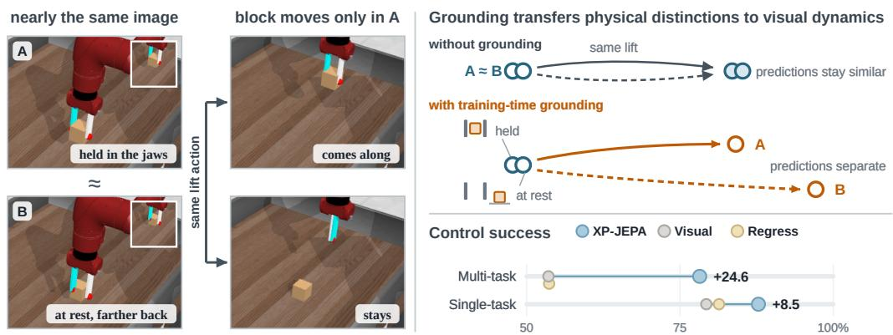
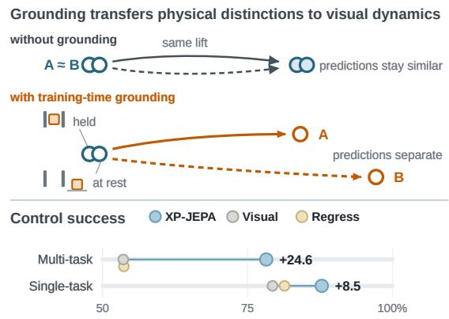
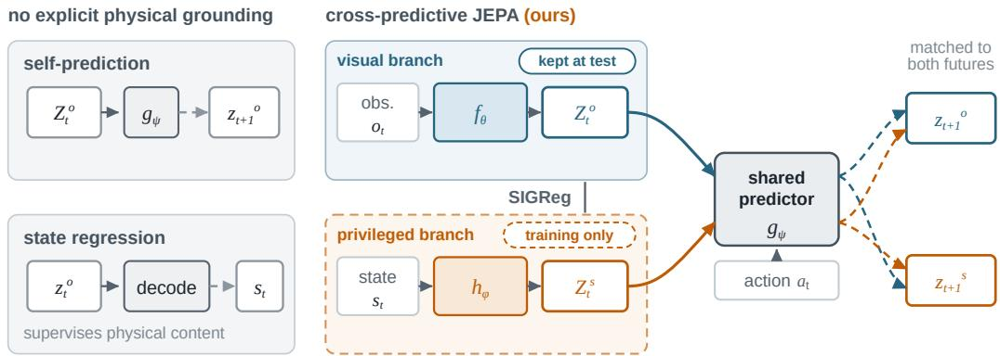
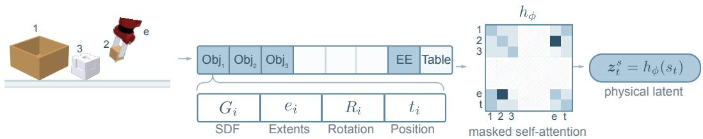
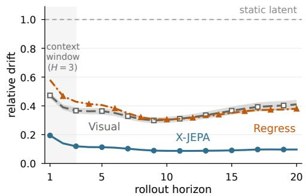
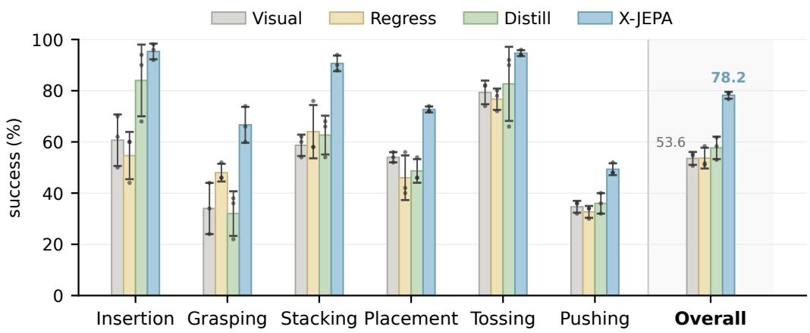
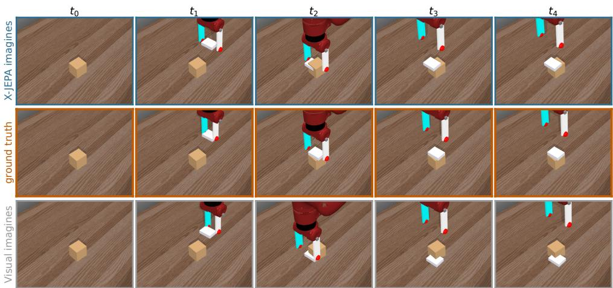
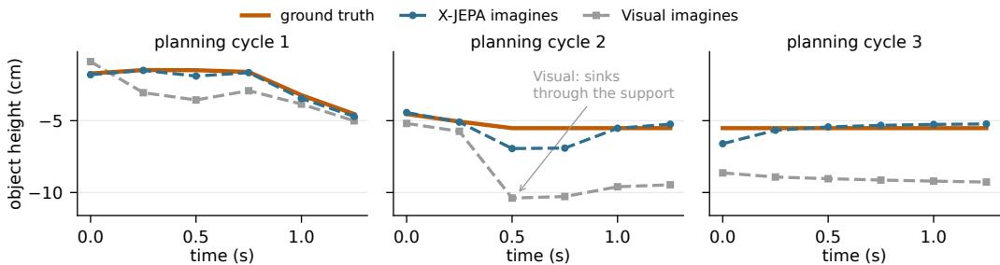
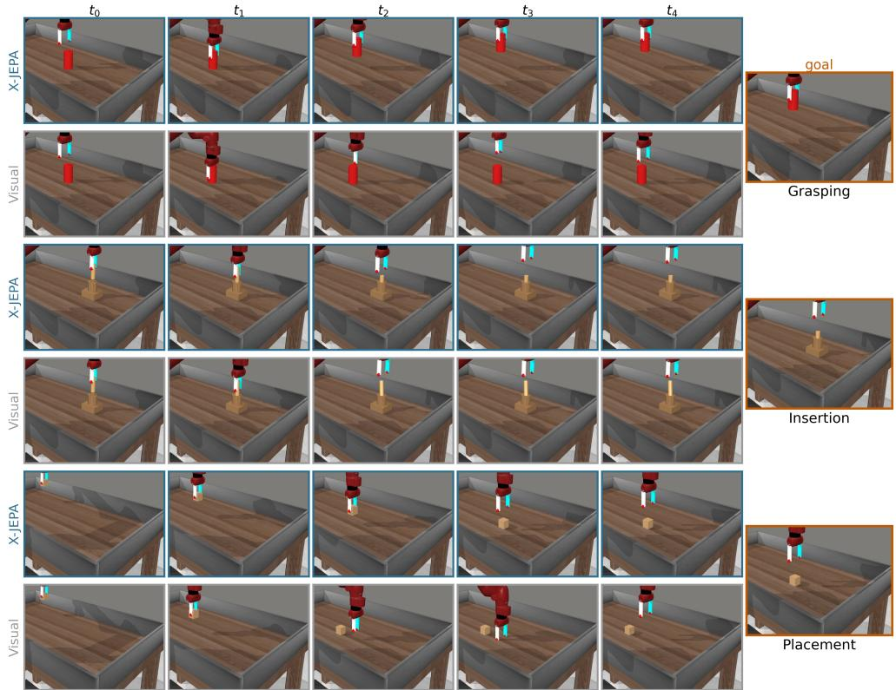
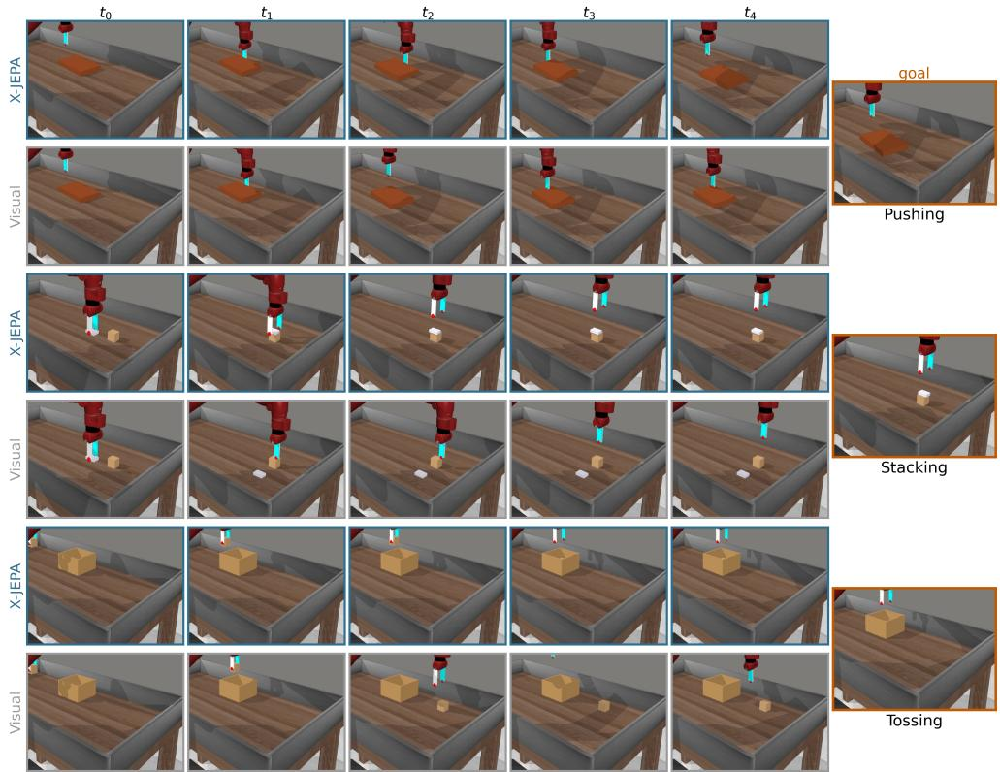

# XP-JEPA: CROSS-PREDICTIVE PHYSICS GROUNDING FOR FORECASTABLE LATENT DYNAMICS

Kehan Wen 1, Ziming Li 1, Siyuan Luo 1, Fan Shi 1 1Department of Electrical and Computer Engineering, NUS

## ABSTRACT

Latent world models plan by predicting how candidate actions transform learned representations. In self-predictive models, however, the encoder and predictor are optimized jointly and can co-adapt to latent transitions that are easy to predict but only weakly constrained by the physical evolution of the scene. We introduce the cross-predictive JEPA (XP-JEPA), which grounds visual latent dynamics in privileged physical trajectories. XP-JEPA separately encodes visual observations and physical states, advances both through a shared action-conditioned predictor, and matches each prediction to both future representations. This objective encourages unified latent dynamics across the two modalities, grounded in the underlying physical transitions. The physical branch is discarded after training, leaving a visual-only model at deployment. On a multi-task suite spanning six evaluation subfamilies, XP-JEPA reduces rollout drift of a newly fitted predictor from 0.361 to 0.104 and increases mean control success from 53.6% to 78.2%. Direct physical-state regression raises position decodability but leaves forecastability and control near the visual-only baseline. Cross-predictive physical grounding can therefore produce more forecastable latent dynamics for rollout-based control without privileged inputs at test time.

## 1 INTRODUCTION

Planning with a latent world model casts control as search in representation space (Ha & Schmid huber, 2018; Hafner et al., 2019; 2025; Hansen et al., 2024): the agent encodes the current scene, rolls candidate actions forward through learned dynamics, and selects actions whose predicted outcomes approach the goal. This requires representations with reliable action-conditioned dynamics. In self-predictive world models (LeCun, 2022; Assran et al., 2023; Zhou et al., 2024; Sobal et al., 2025), however, the representation and predictor are optimized jointly and may co-adapt to latent transitions that are internally predictable but only weakly constrained by the underlying physical evolution. Figure 1 shows the failure mode this permits: two states that project to nearly the same image can evolve in opposite ways under the same action, and a self-predictive objective does not require their latent transitions to separate.

Privileged physical state provides an external reference for reducing this ambiguity. Physical trajectories describe how the scene evolves under action in a common coordinate system, allowing supervision to constrain both the information a representation preserves and how that information evolves. We use this training-time signal to encourage visual latent dynamics that are compatible with the corresponding physical trajectory.

Existing approaches commonly use privileged information to supervise representation content or downstream behavior through distillation, state regression, cross-modal alignment, or training-time critics (Chen et al., 2020; Gupta et al., 2016; Tian et al., 2020; Kumar et al., 2021; Pinto et al., 2018). For latent planning, however, making physical state decodable from individual latent snapshots does not necessarily constrain how those latents evolve under action. We instead ask how privileged physical trajectories can supervise the predictive transition itself.

We distinguish three properties that are relevant to latent planning. Decodability asks whether physical variables can be recovered from an individual latent state. Forecastability asks whether the representation admits reliable action-conditioned prediction over time. Planning utility further depends on whether predicted latent outcomes preserve the distinctions needed to rank candidate actions. These properties need not coincide: making physical state accessible from a snapshot does not necessarily simplify its predictive evolution, and predictable latent dynamics need not by themselves provide a useful geometry for control. Our goal is therefore not simply to encode more physical information, but to constrain predictive evolution using the corresponding physical trajectory.

  
Figure 1: Physical grounding distinguishes interactions that look alike but evolve differently. Left: in A the block is held; in B it rests farther along the same camera ray, so the same lift moves it only in A (insets magnify the same object window). Top right (schematic): the two observations encode almost identically, and a self predictive objective is satisfied whether or not their predicted futures separate; matching each predicted visual transition to the corresponding physical future pulls them apart, with holding inferred from geometry rather than given as a contact label. The physical branch is used only in training. Bottom right: three-seed mean control success, the single-task value averaging the four environments of Table 2, where gains vary by task. REGRESS matches VISUAL on the suite (53.7 against 53.6) despite the highest object-position decodability (R2 = 0.991 against 0.978); a position probe does not capture the gripper–object relation.

We introduce the cross-predictive JEPA (XP-JEPA), which treats visual observations and privileged physical states as two views of the same trajectory. A shared action-conditioned predictor advances histories from either view and matches each prediction to the corresponding visual and physical futures. Within-modality terms retain self-prediction, while cross-modal terms ground each predicted transition in the other modality’s future. The physical branch is discarded after training, leaving the same visual encoder–predictor architecture and planner as the visual-only baseline at deployment.

Our experiments separate the decodability of physical variables from the forecastability of latent dynamics, and both from planning utility. A single model trained across multiple object–interaction pairs has lower rollout drift and higher control success across all six evaluation subfamilies. Regressing a comprehensive pose-based state target improves position decodability but leaves forecastability and control near the visual-only baseline. This contrast separates snapshot content from transition structure: making physical variables accessible from individual latents does not by itself produce the forecastable dynamics observed with XP-JEPA. More forecastable latent dynamics can benefit rollout-based control, but the ablations show that forecastability alone does not guarantee planning utility.

Our contributions are:

• Cross-predictive JEPA: physical grounding of latent transitions. XP-JEPA grounds latent transitions in privileged physical trajectories by advancing visual and physical histories through a shared action-conditioned predictor and matching each prediction to both modalities’ futures, while retaining a visual-only architecture at deployment.

• A unified privileged-state interface. We design a unified privileged-state interface that allows a single physical encoder to operate across diverse rigid-body manipulation scenes without task-specific labels.

• Forecastable dynamics and improved control. XP-JEPA produces more forecastable visual dynamics across the multi-task suite and all four matched single-task environments, while increasing mean multi-task control success from 53.6% to 78.2%.

## 2 RELATED WORK

Predictive latent world models. World models differ in the structure that their learned representations preserve. Reconstruction-based approaches learn dynamics through pixels or generative latent variables (Ha & Schmidhuber, 2018; Hafner et al., 2019; 2020; 2025), whereas value-centric methods shape representations around reward and control objectives (Schrittwieser et al., 2020; Hansen et al., 2024). Representation-predictive methods instead model future features directly: DINO-WM plans in pretrained visual features (Zhou et al., 2024), PLDM learns latent dynamics from rewardfree offline data (Sobal et al., 2025), and LeWM jointly learns visual representations and predictive dynamics (Maes et al., 2026). More broadly, joint-embedding objectives learn representations by predicting feature-space targets rather than reconstructing observations (LeCun, 2022; Assran et al., 2023; Bardes et al., 2023; 2024). Our work builds on this predictive paradigm and asks how corresponding physical trajectories can constrain the transition structure learned by a jointly optimized visual encoder and predictor.

Privileged supervision across heterogeneous tasks. Learning with privileged information uses signals available during training but unavailable at deployment (Vapnik & Izmailov, 2015). Prior work transfers such information through distillation, cross-modal alignment, state regression, privileged sensing, or asymmetric actor–critic training (Chen et al., 2020; Lee et al., 2020; Gupta et al., 2016; Tian et al., 2020; Kumar et al., 2021; Pinto et al., 2018). These approaches establish several ways to exploit additional physical information during training, but our multi-task setting introduces a further requirement: the privileged representation must retain a consistent meaning across heterogeneous object–interaction configurations. We therefore represent scenes through a shared rigidbody schema based on object geometry, extent, pose, and effector state, allowing a single physical encoder to provide the privileged stream across all configurations without task-specific labels.

Physical grounding of predictive dynamics. Several recent world-model approaches bring privileged physical information closer to the learned dynamics. TWIST transfers state-based dynamics to an image-based student (Yamada et al., 2024), Scaffolder uses privileged sensors during policy learning (Hu et al., 2024), PIGDreamer aligns world-model representations with privileged information (Huang et al., 2025), and Pri4R introduces privileged 4D prediction during vision–language– action training (Kim et al., 2026). Closest to our setting, the concurrent Phys-JEPA imposes physical consistency on latent states and transitions for multivariate time-series forecasting (Nie et al., 2026), while PhyLatent adds training-only physical grounding and future-alignment objectives to the LeWM backbone (Zeng et al., 2026). XP-JEPA instead treats privileged state as a second online predictive view: histories from either modality predict the corresponding future representations in both modalities, directly coupling visual–physical correspondence with action-conditioned evolution. Unlike one-way distillation toward a fixed physical target, both representations remain online, and the privileged branch is removed entirely at deployment. We further study this coupling in the multi-task setting, where one model and one unified privileged-state interface span many object– interaction configurations.

## 3 CROSS-PREDICTIVE JEPA

XP-JEPA augments a JEPA-style visual world model with privileged physical state during training. It treats physical state as a second predictive view of the same trajectory, using physical transitions to constrain visual latent dynamics rather than merely making state decodable. An overview of XP-JEPA is shown in Figure 2.

Core objective We build on LeWM (Maes et al., 2026), which jointly learns a visual encoder $f _ { \theta }$ and an action-conditioned predictor $g _ { \psi }$ . An observation $o _ { t }$ is encoded as $z _ { t } ^ { o } = f _ { \theta } ( o _ { t } )$ . Given a history of visual latents $Z _ { t } ^ { o }$ and an action chunk $a _ { t }$ , the predictor estimates the representation of the future observation. LeWM trains $f _ { \theta }$ and $g _ { \psi }$ jointly with the self-prediction term $\parallel g _ { \psi } ( Z _ { t } ^ { o } , a _ { t } ) -$ $z _ { t + 1 } ^ { o } \| _ { 2 } ^ { 2 }$ and the isotropy regularizer $\beta \Omega ( z ^ { o } )$ defined below. XP-JEPA retains this term and augments it with a physical branch—a second encoder $h _ { \phi }$ over privileged state—together with physical selfprediction and two cross-modal prediction terms. At deployment, candidate action sequences are rolled forward through these latent dynamics, and their predicted outcomes are compared with an encoded goal.

  
Figure 2: Physical supervision can constrain representation content or predictive dynamics. Visual selfprediction jointly trains a visual representation and predictor, while state regression makes physical information decodable from individual visual latents. Neither objective directly constrains a predicted visual transition using the corresponding physical future. XP-JEPA advances visual and privileged histories through a shared predictor and matches each prediction to the corresponding future representations in both modalities. The physical branch is removed after training, leaving a visual-only model at deployment.

We introduce privileged state $s _ { t }$ as a second training-time description of the same scene. A physical encoder $h _ { \phi }$ maps it to $z _ { t } ^ { s } = h _ { \phi } ( s _ { t } )$ using the unified privileged-state interface described below. The privileged input contains only the instantaneous scene configuration; it excludes velocities, contact forces, wrenches, and goal-relative quantities. Both modalities must infer motion from temporal context and action.

Let $Z _ { t } ^ { m }$ denote a latent history from modality m $\in \ \{ o , s \}$ . Histories from both modalities are advanced by the same action-conditioned predictor.

We optimize

$$
{ \mathcal { L } } _ { \mathrm { X P - J E P A } } = \sum _ { m , n \in \{ o , s \} } \left. g _ { \psi } ( Z _ { t } ^ { m } , a _ { t } ) - z _ { t + 1 } ^ { n } \right. _ { 2 } ^ { 2 } + \beta \left[ \Omega ( z ^ { o } ) + \Omega ( z ^ { s } ) \right] ,\tag{1}
$$

where Ω is a per-branch isotropy regularizer (SIGReg; Balestriero & LeCun, 2025), and the action modulates the predictor through AdaLN (Peebles & Xie, 2023).

Equation 1 contains four source–target prediction terms. The two within-modality terms, obtained when $m \ = \ n$ , retain ordinary visual and physical self-prediction. The two cross-modal terms, obtained when m $\neq n ,$ , train a history from either modality to predict the corresponding future representation in the other modality. Each source history is matched to both future representations of the same trajectory; we call this corresponding cross-prediction. In particular, the predicted visual transition is constrained by the corresponding physical future, not only by the visual future.

Equation 1 also implies predictor sharing. The predictor $g _ { \psi }$ receives no explicit modality indicator, so a single action-conditioned transition model must operate on histories produced by either encoder. Predictor sharing does not impose correspondence between the two latent spaces, so we ablate it separately from corresponding cross-prediction in Section 4.

The visual and physical encoders are optimized jointly throughout training, with collapse controlled independently in each branch by the isotropy regularizer. The physical latent therefore adapts to the predictive objective rather than serving as a fixed target for the visual branch.

A unified privileged-state interface across tasks Applying cross-modal grounding across heterogeneous tasks requires a consistent way to represent privileged physical state. We therefore describe every scene using a unified rigid-body schema, as shown in Figure 3.

Each object contributes a token

$$
\tau _ { i } = [ G _ { i } \parallel e _ { i } \parallel R _ { i } \parallel t _ { i } ] ,
$$

  
Figure 3: Each scene is represented by object, end-effector, and table tokens under a shared schema. The physical encoder $( h _ { \phi } )$ first applies masked self-attention over the valid scene tokens, then uses a learned query to attend to and pool the token set into a single physical latent $( z _ { t } ^ { s } )$ . Unused object slots are masked in both stages, allowing the same encoder to process scenes with different numbers of objects.

where $G _ { i }$ is a fixed-width descriptor of its canonical geometry (a pooled signed-distance field, Park et al., 2019), $e _ { i }$ contains its half-extents, and $( R _ { i } , t _ { i } )$ specifies its pose. An effector token contains the end-effector rotation, position, and finger opening, while a learned table token completes the set. Scenes are padded to six object slots, with unused slots masked from both self-attention and pooling.

Because objects are represented by their geometry rather than their identity, the schema requires nei ther category labels nor task-specific state fields. A single physical encoder $h _ { \phi }$ can therefore process every configuration in the suite. Appendix D provides the complete dimensions and normalization procedure.

The unified rigid-body schema provides a consistent physical description across configurations. This consistency enables cross-predictive coupling between visual and physical trajectories across tasks, allowing the shared predictor to learn common rigid-body and interaction dynamics without adapting to task-specific state formats.

What physical grounding provides The privileged state captures object geometry and pose together with the end-effector pose and gripper aperture, exposing spatial relations that camera projection can obscure. As illustrated in Figure 1, the privileged state distinguishes a block held between the gripper’s fingers from one resting farther along the same camera ray. Although no contact label is provided, the physical trajectory reveals both the current configuration and its consequence under action: the held block follows the lift, whereas the separated block remains on the table.

Corresponding cross-prediction transfers this relational information to the visual model by predict ing each modality’s future from the other modality’s history. Unlike state regression or pointwise alignment, it connects interaction-relevant configuration with action-conditioned evolution. The physical stream is removed after training, leaving this structure in the deployed visual representation and predictor.

Objective decomposition The interaction between representation correspondence and predictive evolution becomes explicit under uniform weighting of the four prediction terms. Define

$$
\begin{array} { r } { p ^ { m } = g _ { \psi } ( Z _ { t } ^ { m } , a _ { t } ) , \qquad \mu _ { t + 1 } = \frac { 1 } { 2 } \left( z _ { t + 1 } ^ { o } + z _ { t + 1 } ^ { s } \right) . } \end{array}
$$

By the parallelogram identity,

$$
\sum _ { m , n \in \{ o , s \} } \left\| p ^ { m } - z _ { t + 1 } ^ { n } \right\| _ { 2 } ^ { 2 } = 2 \left\| p ^ { o } - \mu _ { t + 1 } \right\| _ { 2 } ^ { 2 } + 2 \left\| p ^ { s } - \mu _ { t + 1 } \right\| _ { 2 } ^ { 2 } + \left\| z _ { t + 1 } ^ { o } - z _ { t + 1 } ^ { s } \right\| _ { 2 } ^ { 2 } .\tag{2}
$$

Equation 2 separates representation correspondence from predictive evolution. The final term aligns the two representations of the future scene; the first two train each modality’s history to predict that shared future under action. Because both targets are online encoder outputs, the coupling is symmetric rather than a one-way distillation toward a fixed physical target. XP-JEPA thus couples pointwise correspondence to action-conditioned prediction instead of relying on alignment alone.

Deployment Privileged state is used only during training. At deployment, the physical encoder $h _ { \phi }$ is discarded, leaving the visual encoder and predictor $\left( f _ { \theta } , g _ { \psi } \right)$ . The deployed model therefore receives the same observations and has the same inference architecture and computational cost as the visual-only baseline.

Candidate action sequences are rolled forward in the learned latent dynamics and scored by the distance between their predicted terminal latent and the encoded goal:

$$
J ( a _ { 1 : T } ) = \| \widehat { z } _ { T } ( a _ { 1 : T } ) - f _ { \theta } ( o _ { g } ) \| _ { 2 } ^ { 2 } , \qquad \widehat { z } _ { i + 1 } = g _ { \psi } ( \widehat { Z } _ { i } , a _ { i } ) .\tag{3}
$$

The selected sequence is executed and planning repeats from the resulting state. At test time, the effect of privileged state is carried entirely by the visual representation and predictive dynamics learned during training; it is neither observed nor reconstructed during planning. More forecastable dynamics reduce one source of error in this rollout-based score, although successful control also requires latent distance to remain aligned with physical outcomes.

On the multi-task suite, candidates are drawn with z-CEM: a small unconditional variational autoencoder is trained on action chunks from the same corpus, CEM searches its latent space, and each candidate decodes to a temporally coherent action chunk. Searching this space avoids direct search over raw action sequences, which yields incoherent candidates far from the action distribution seen in training. The autoencoder observes neither the task nor the scene, so the same action prior serves every method. The single-task experiments retain LeWM’s released action-space CEM planner. The autoencoder specification and full planner hyperparameters are given in Appendix E.

## 4 EXPERIMENTS

Setup We evaluate on four single-task LeWM environments—Push-T (Chi et al., 2025), OGBench-Block (Park et al., 2025), Two-Room, and Reacher (Tassa et al., 2018)—using the released datasets, planners, and success predicates (Maes et al., 2026). We additionally evaluate on a multi-task tabletop suite built on Meta-World (Yu et al., 2020; Todorov et al., 2012), where a single model is trained jointly across 22 object–task configurations spanning 13 distinct assets. Control is evaluated on six evaluation subfamilies; some configurations contribute training transitions but no evaluated scenario. Forecastability and decodability are measured on held-out episodes spanning every configuration. Appendix A gives the exact configuration counts and the mapping between configurations and evaluated families. Core comparisons share the training data, visual encoder, optimization schedule, and deployment planner; each ablation changes only the stated objective or architectural component. Unless stated otherwise, all results are reported over three training seeds.

We evaluate three properties. Control is closed-loop task success. Forecastability measures how readily the learned representation supports action-conditioned prediction independently of its co-trained predictor. For each method, we freeze the visual encoder, discard the co-trained predictor, and fit the same lightweight action-conditioned predictor from scratch. Refitting the predictor separates representation forecastability from encoder–predictor co-adaptation during training. Because the same predictor family and fitting protocol are used for every frozen representation, differences in rollout error more directly reflect how read ily each latent space supports action-conditioned prediction. We report rollout drift relative to a temporal-persistence baseline, with lower values indicating more forecastable dynamics.

Decodability is measured by the $R ^ { 2 }$ of physical variables predicted from the frozen visual latent; we report the position of the manipulated object, and Appendix C specifies the full decoding target and the remaining groups. Appendices A and C provide the complete evaluation protocols.

XP-JEPA improves forecastability A fresh predictor models XP-JEPA’s action-conditioned dynamics more accurately than the baselines throughout the rollout.

On the multi-task suite, relative rollout drift falls from 0.361 for VISUAL to 0.104 for XP-JEPA. Figure 4 shows that the separation persists at every horizon, including beyond $h = 3 .$ , when the rollout

  
Figure 4: XP-JEPA produces more forecastable latent dynamics throughout the rollout. Multitask suite, three training seeds.

Table 1: XP-JEPA produces the most forecastable visual dynamics across all four matched single-task environments. Forecastability is measured using a predictor fitted from scratch to each frozen representation. Object-position $R ^ { 2 }$ measures how well the environment’s object position is decoded from the frozen visual latent. Values are means ± sample SD over three training seeds. Bold marks the best mean in each comparison; exact ties are all bold.
<table><tr><td></td><td colspan="3">Relative drift ↓</td><td colspan="3">Object-position  $R ^ { 2 } \uparrow$ </td></tr><tr><td>Environment</td><td>XP-JEPA</td><td>VISUAL</td><td>REGRESS</td><td>XP-JEPA</td><td>VISUAL</td><td>REGRESS</td></tr><tr><td>Two-Room</td><td> $\mathbf { 0 . 2 2 1 { \scriptstyle \pm 0 . 0 2 1 } }$ </td><td> $0 . 5 0 3 { \scriptstyle \pm 0 . 0 1 0 }$ </td><td> $0 . 4 8 0 { \scriptstyle \pm 0 . 0 0 8 }$ </td><td> $\mathbf { 0 . 9 9 8 { \scriptstyle \pm 0 . 0 0 0 } }$ </td><td> $0 . 9 2 1 _ { \pm 0 . 0 1 1 }$ </td><td> $0 . 9 3 6 _ { \pm 0 . 0 0 7 }$ </td></tr><tr><td>OGBench-Block</td><td> $\mathbf { 0 . 2 6 9 _ { \pm 0 . 0 0 7 } }$ </td><td> $0 . 5 0 7 { \scriptstyle \pm 0 . 0 2 6 }$ </td><td> $0 . 3 9 3 { \scriptstyle \pm 0 . 0 1 8 }$ </td><td> $0 . 9 8 2 _ { \pm 0 . 0 0 3 }$ </td><td> $0 . 8 7 9 { \scriptstyle \pm 0 . 0 0 9 }$ </td><td> $\mathbf { 0 . 9 8 3 { \scriptstyle \pm 0 . 0 0 1 } }$ </td></tr><tr><td>Push-T</td><td> $\mathbf { 0 . 2 5 8 _ { \pm 0 . 0 0 7 } }$ </td><td> $0 . 3 9 9 { \scriptstyle \pm 0 . 1 1 8 }$ </td><td> $0 . 3 4 3 { \scriptstyle \pm 0 . 0 3 9 }$ </td><td> $\mathbf { 0 . 9 9 1 { \scriptstyle \pm 0 . 0 0 1 } }$ </td><td> $0 . 9 4 4 _ { \pm 0 . 0 0 9 }$ </td><td> $0 . 9 6 8 _ { \pm 0 . 0 0 7 }$ </td></tr><tr><td>Reacher</td><td> $\mathbf { 0 . 2 3 3 { \scriptstyle \pm 0 . 0 0 9 } }$ </td><td> $0 . 3 1 3 { \scriptstyle \pm 0 . 0 0 9 }$ </td><td> $0 . 3 0 9 { \scriptstyle \pm 0 . 0 0 3 }$ </td><td> $\mathbf { 0 . 9 9 9 { \scriptstyle \pm 0 . 0 0 0 } }$ </td><td> $\mathbf { 0 . 9 9 9 _ { \pm 0 . 0 0 0 } }$ </td><td> $\mathbf { 0 . 9 9 9 _ { \pm 0 . 0 0 0 } }$ </td></tr></table>

becomes fully autoregressive. Similar temporal-persistence errors and rank-matched PCA show that neither reduced temporal variation nor effective rank alone explains the gap (Appendix C).

  
Figure 5: Grounding improves multi-task control. XP-JEPA raises overall success from 53.6% to 78.2%, with improvements across all six interaction families. Regressing a comprehensive pose-based physical-state target from the visual latent does not recover the gain. Bars show means ± sample SD over three training seeds; dots show individual seeds.

The improvement is consistent across all four matched single-task environments (Table 1). Relative drift decreases from 0.503 to 0.221 on Two-Room, from 0.507 to 0.269 on OGBench-Block, from 0.399 to 0.258 on Push-T, and from 0.313 to 0.233 on Reacher.

Grounding improves multi-task control On the multi-task suite, XP-JEPA raises mean task success from 53.6% to 78.2%, a gain of 24.6 percentage points under the same planner, action prior, and candidate budget (Figure 5). The improvement holds across all six interaction families.

Figure 6 compares the two models’ predictions under identical action sequences. Because both models predict in latent space, we fit a separate state decoder, decode the manipulated-object and end-effector positions, and render the resulting rollouts alongside the ground truth. XP-JEPA imagines the eraser arriving on top of the block, whereas VISUAL places it on the table beside the block. Across the three planning cycles of this episode, the decoded terminal position error averages 1.4 cm for XP-JEPA and 3.1 cm for VISUAL (Appendix C). The decoded rollouts make the drift difference concrete: the same actions lead the two models to different imagined terminal configurations.

State regression does not recover these forecastability or control gains. REGRESS directly predicts a comprehensive pose-based target from the visual latent and raises manipulated-object position decodability to $R ^ { 2 } = 0 . 9 9 1$ , from 0.978 for both XP-JEPA and VISUAL. Its control success remains at 53.7% and its relative rollout drift at 0.373. Position can therefore be readily available to a probe even when the latent transition remains difficult to forecast. On the matched single-task environments, XP-JEPA significantly improves control on Two-Room and OGBench-Block, while its mean success is within one percentage point of VISUAL on Push-T and Reacher (Table 2). Forecastability improves across all four environments, whereas the control gains are task dependent. This separation helps clarify the role of forecastability in planning. XP-JEPA makes the latent dynamics easier to predict in all four environments, but the downstream control benefit depends on whether rollout error is consequential for action selection in the task. The single-task results therefore support a more limited claim: forecastable dynamics improve one component required by rollout-based planning, rather than guaranteeing higher control success on every task.

  
Figure 6: Rolled over identical expert actions, XP-JEPA imagines the eraser reaching the block; VISUAL imagines it beside the block. Middle row: ground truth. Top and bottom: each model’s own rollout over the same action chunks from the same observation, with the decoded object and end-effector positions written back into the simulator and rendered.

Table 2: Matched single-task control success. Values are mean success rates (%) ± sample SD over three training seeds. Bold marks the best mean in each row; exact ties are all bold.
<table><tr><td>Environment</td><td>XP-JEPA</td><td>VISUAL</td><td>REGRESS</td></tr><tr><td>Two-Room</td><td> $\mathbf { 9 4 . 8 { \scriptstyle \pm 1 . 0 } }$ </td><td> $7 4 . 7 _ { \pm 4 . 1 }$ </td><td> $7 5 . 8 { \scriptstyle \pm 3 . 8 }$ </td></tr><tr><td>OGBench-Block</td><td> ${ \bf 7 8 . 7 \pm 2 . 7 }$ </td><td> $6 4 . 9 { \scriptstyle \pm 1 . 4 }$ </td><td> $7 0 . 2 { \scriptstyle \pm 0 . 8 }$ </td></tr><tr><td>Push-T</td><td> $9 4 . 1 _ { \pm 0 . 4 }$ </td><td> $9 4 . 9 { \scriptstyle \pm 1 . 1 }$ </td><td> $\mathbf { 9 6 . 9 2 . } 2 . 7$ </td></tr><tr><td>Reacher</td><td> ${ \bf 8 3 . 6 { \scriptstyle \pm 1 . 4 } }$ </td><td> $8 2 . 7 _ { \pm 2 . 1 }$ </td><td> $8 2 . 6 { \scriptstyle \pm 0 . 4 }$ </td></tr></table>

Correspondence and cross-prediction play distinct roles We next separate the effects of crossmodal correspondence, predictor sharing, and exposure to physical trajectories. CROSS-ONLY retains corresponding cross-prediction but uses separate predictors for the visual and physical streams. SHARE-ONLY retains the shared predictor but removes the cross-modal prediction terms. ALIGN ONLY replaces cross-modal prediction with symmetric frame-level alignment while retaining withinmodality prediction. DISTILL replaces predictive coupling with pointwise regression onto a stopgradient physical latent. Finally, SHUFFLE retains the complete XP-JEPA architecture but uses a fixed corpus-wide derangement to pair each visual trajectory with an intact, incorrect privileged trajectory.

Table 3 shows that corresponding cross-prediction contributes more to control than predictor sharing alone. CROSS-ONLY reaches 73.0% control, recovering roughly four fifths of the gain from VISUAL to XP-JEPA, with comparable rollout drift to XP-JEPA. SHARE-ONLY reaches 56.7% control, close to the VISUAL baseline. Most of the control gain therefore survives without a common predictor, whereas sharing a transition model without cross-modal coupling adds little.

ALIGN-ONLY recovers most of the control gain (72.6% against 78.2%) but has higher drift than XP-JEPA (0.158 against 0.104), indicating that direct cross-modal prediction improves forecastability beyond pointwise alignment. Its aligned states are also trained with within-modality prediction, so it still carries cross-modal information forward indirectly. Together, these comparisons separate two effects: correspondence accounts for much of the control improvement, while direct prediction across modalities further reduces rollout drift.

Pointwise distillation does not reproduce XP-JEPA’s gains: DISTILL reaches 57.7% control and increases relative rollout drift to 0.516, compared with 0.361 for VISUAL. Together with REGRESS, this shows that making physical state decodable or matching it pointwise is not a substitute for grounding the transition itself.

Table 3: Correspondence supports control, while direct cross-modal prediction improves forecastability beyond alignment. The design columns indicate cross-modal prediction, predictor sharing, and correct visual– physical correspondence (✓ present, × present but mispaired, – absent). Drift and control are means ± sample SD over three training seeds; bold marks the best mean in each column.
<table><tr><td>Variant</td><td>Cross-pred.</td><td>Shared</td><td>Corresp.</td><td> $\mathrm { D r i f t } \downarrow$ </td><td>Control ↑</td></tr><tr><td>XP-JEPA</td><td>√</td><td>√</td><td>√</td><td> $0 . 1 0 4 { \scriptstyle \pm 0 . 0 0 3 }$ </td><td> ${ \bf 7 8 . 2 \pm 1 . 3 }$ </td></tr><tr><td>CROSS-ONLY</td><td>√</td><td>一</td><td>√</td><td> $\mathbf { 0 . 1 0 1 { \scriptstyle \pm 0 . 0 0 1 } }$ </td><td> $7 3 . 0 { \scriptstyle \pm 0 . 9 }$ </td></tr><tr><td>SHARE-ONLY</td><td>一</td><td>√</td><td>一</td><td> $0 . 3 0 9 { \scriptstyle \pm 0 . 0 2 0 }$ </td><td> $5 6 . 7 _ { \pm 3 . 5 }$ </td></tr><tr><td>ALIGN-ONLY</td><td>一</td><td>√</td><td>√</td><td> $0 . 1 5 8 { \scriptstyle \pm 0 . 0 0 1 }$ </td><td> $7 2 . 6 { \scriptstyle \pm 3 . 6 }$ </td></tr><tr><td>DISTILL</td><td></td><td>一</td><td>√</td><td> $0 . 5 1 6 { \scriptstyle \pm 0 . 0 0 4 }$ </td><td> $5 7 . 7 { \scriptstyle \pm 4 . 4 }$ </td></tr><tr><td>SHUFFLE</td><td>√</td><td>√</td><td>X</td><td> $0 . 1 6 7 _ { \pm 0 . 0 0 9 }$ </td><td> $1 6 . 6 { \scriptstyle \pm 3 . 3 }$ </td></tr><tr><td>VISUAL</td><td>一</td><td>一</td><td>一</td><td> $0 . 3 6 1 { \scriptstyle \pm 0 . 0 2 4 }$ </td><td> $5 3 . 6 { \scriptstyle \pm 2 . 5 }$ </td></tr></table>

SHUFFLE isolates pairing quality: despite retaining the predictive architecture and intact physical trajectories, the fixed incorrect pairing reduces control to 16.6% while drift remains below the visual baseline at 0.167. This combination of low drift and poor control shows that predictable dynamics can still organize outcomes in a way the planner cannot use.

These ablations suggest two partly separable roles for physical grounding. Correct visual–physical correspondence makes the learned transition geometry relevant to physical outcomes and therefore useful for control, whereas direct cross-modal prediction more strongly constrains how that geometry evolves under action. Neither property is sufficient by itself: alignment recovers much of the control gain without matching XP-JEPA’s forecastability, while SHUFFLE retains relatively low rollout drift under incorrect correspondence but fails at control.

## 5 DISCUSSION AND CONCLUSION

Across the multi-task suite, XP-JEPA reduces relative rollout drift from 0.361 to 0.104 and raises mean control success from 53.6% to 78.2%. Direct state regression improves position decodability without comparable gains in forecastability or control, suggesting that snapshot content alone does not determine whether a representation supports reliable rollout prediction. XP-JEPA instead grounds visual latent evolution in corresponding physical trajectories. Because both encoders are learned jointly, this does not impose a canonical physical representation; privileged state serves as a second structured view that constrains predictive dynamics.

The ablations separate two roles of this grounding. Correct visual–physical correspondence supports control, while direct cross-modal prediction most clearly improves forecastability beyond alignment. Predictor sharing alone contributes little, and SHUFFLE retains relatively low drift but collapses to 16.6% control. Forecastability is therefore useful but not sufficient: predicted trajectories must also preserve distinctions relevant to action selection.

This matters for rollout-based planning, where candidate actions are ranked by distances between predicted terminal latents and the goal. XP-JEPA retains its lower drift after replacing the co-trained predictor, indicating that the gain is reflected in the learned representation. At the same time, the task-dependent control gains show that improved forecastability does not guarantee higher success in every environment.

Our results are limited to simulation, paired privileged trajectories during training, and a fixed rigidbody state schema. Extending this approach to real-world observations and broader physical interactions remains future work.

## REFERENCES

Mahmoud Assran, Quentin Duval, Ishan Misra, Piotr Bojanowski, Pascal Vincent, Michael Rabbat, Yann LeCun, and Nicolas Ballas. Self-supervised learning from images with a joint-embedding predictive architecture. In 2023 IEEE/CVF Conference on Computer Vision and Pattern Recognition (CVPR), pp. 15619–15629. IEEE, 2023.

Randall Balestriero and Yann LeCun. LeJEPA: Provable and scalable self-supervised learning without the heuristics. arXiv preprint arXiv:2511.08544, 2025.

Adrien Bardes, Jean Ponce, and Yann LeCun. MC-JEPA: A joint-embedding predictive architecture for self-supervised learning of motion and content features. arXiv preprint arXiv:2307.12698, 2023.

Adrien Bardes, Quentin Garrido, Jean Ponce, Xinlei Chen, Michael Rabbat, Yann LeCun, Mahmoud Assran, and Nicolas Ballas. Revisiting feature prediction for learning visual representations from video. arXiv preprint arXiv:2404.08471, 2024.

Dian Chen, Brady Zhou, Vladlen Koltun, and Philipp Krahenb ¨ uhl. Learning by cheating. In ¨ Proceedings ofthe Conference on Robot Learning, volume 100, pp. 66–75. PMLR, 2020.

Cheng Chi, Zhenjia Xu, Siyuan Feng, Eric Cousineau, Yilun Du, Benjamin Burchfiel, Russ Tedrake, and Shuran Song. Diffusion policy: Visuomotor policy learning via action diffusion. The International Journal ofRobotics Research, 44(10-11):1684–1704, 2025.

Alexey Dosovitskiy, Lucas Beyer, Alexander Kolesnikov, Dirk Weissenborn, Xiaohua Zhai, Thomas Unterthiner, Mostafa Dehghani, Matthias Minderer, Georg Heigold, Sylvain Gelly, et al. An image is worth 16x16 words: Transformers for image recognition at scale. In International Confer ence on Learning Representations, 2021.

Saurabh Gupta, Judy Hoffman, and Jitendra Malik. Cross modal distillation for supervision transfer. In Proceedings of the IEEE Conference on Computer Vision and Pattern Recognition, pp. 2827– 2836, 2016.

David Ha and Jurgen Schmidhuber. Recurrent world models facilitate policy evolution. In¨ Advances in Neural Information Processing Systems, volume 31, 2018.

Danijar Hafner, Timothy Lillicrap, Ian Fischer, Ruben Villegas, David Ha, Honglak Lee, and James Davidson. Learning latent dynamics for planning from pixels. In International Conference on Machine Learning, pp. 2555–2565. PMLR, 2019.

Danijar Hafner, Timothy Lillicrap, Jimmy Ba, and Mohammad Norouzi. Dream to control: Learning behaviors by latent imagination. In International Conference on Learning Representations, 2020.

Danijar Hafner, Jurgis Pasukonis, Jimmy Ba, and Timothy Lillicrap. Mastering diverse control tasks through world models. Nature, 640:647–653, 2025. doi: 10.1038/s41586-025-08744-2.

Nicklas Hansen, Hao Su, and Xiaolong Wang. TD-MPC2: Scalable, robust world models for continuous control. In International Conference on Learning Representations, 2024.

Edward Hu, James Springer, Oleh Rybkin, and Dinesh Jayaraman. Privileged sensing scaffolds reinforcement learning. In International Conference on Learning Representations, 2024.

Dongchi Huang, Jiaqi Wang, Yang Li, Chunhe Xia, Tianle Zhang, and Kaige Zhang. PIGDreamer: Privileged information guided world models for safe partially observable reinforcement learning. arXiv preprint arXiv:2508.02159, 2025.

Jisoo Kim, Jungbin Cho, Sanghyeok Chu, Ananya Bal, Jinhyung Kim, Gunhee Lee, Sihaeng Lee, Seung Hwan Kim, Bohyung Han, Hyunmin Lee, et al. Pri4R: Learning world dynamics for vision-language-action models with privileged 4D representation. arXiv preprint arXiv:2603.01549, 2026.

Ashish Kumar, Zipeng Fu, Deepak Pathak, and Jitendra Malik. RMA: Rapid motor adaptation for legged robots. In Proceedings ofRobotics: Science and Systems, 2021. doi: 10.15607/RSS.2021. XVII.011.

Yann LeCun. A path towards autonomous machine intelligence. OpenReview, 2022. Version 0.9.2.

Joonho Lee, Jemin Hwangbo, Lorenz Wellhausen, Vladlen Koltun, and Marco Hutter. Learning quadrupedal locomotion over challenging terrain. Science Robotics, 5(47):eabc5986, 2020.

Lucas Maes, Quentin Le Lidec, Damien Scieur, Yann LeCun, and Randall Balestriero. LeWorld-Model: Stable end-to-end joint-embedding predictive architecture from pixels. arXiv preprint arXiv:2603.19312, 2026.

Weizhi Nie, Weichao Liu, Honglin Guo, and Yuting Su. Phys-JEPA: Physics-informed latent world models for multivariate time-series forecasting. arXiv preprint arXiv:2606.16076, 2026.

Jeong Joon Park, Peter Florence, Julian Straub, Richard Newcombe, and Steven Lovegrove. DeepSDF: Learning continuous signed distance functions for shape representation. In 2019 IEEE/CVF Conference on Computer Vision and Pattern Recognition (CVPR), pp. 165–174. IEEE, 2019.

Seohong Park, Kevin Frans, Benjamin Eysenbach, and Sergey Levine. OGBench: Benchmarking offline goal-conditioned RL. In International Conference on Learning Representations, 2025.

William Peebles and Saining Xie. Scalable diffusion models with transformers. In 2023 IEEE/CVF International Conference on Computer Vision (ICCV), pp. 4172–4182. IEEE, 2023.

Lerrel Pinto, Marcin Andrychowicz, Peter Welinder, Wojciech Zaremba, and Pieter Abbeel. Asymmetric actor critic for image-based robot learning. In Proceedings of Robotics: Science and Systems, 2018. doi: 10.15607/RSS.2018.XIV.008.

Julian Schrittwieser, Ioannis Antonoglou, Thomas Hubert, Karen Simonyan, Laurent Sifre, Simon Schmitt, Arthur Guez, Edward Lockhart, Demis Hassabis, Thore Graepel, et al. Mastering Atari, Go, chess and shogi by planning with a learned model. Nature, 588(7839):604–609, 2020.

Uladzislau Sobal, Wancong Zhang, Kyunghyun Cho, Randall Balestriero, Tim G. J. Rudner, and Yann LeCun. Learning from reward-free offline data: A case for planning with latent dynamics models. Advances in Neural Information Processing Systems, 38:43905–43941, 2025.

Yuval Tassa, Yotam Doron, Alistair Muldal, Tom Erez, Yazhe Li, Diego de Las Casas, David Budden, Abbas Abdolmaleki, Josh Merel, Andrew Lefrancq, et al. DeepMind control suite. arXiv preprint arXiv:1801.00690, 2018.

Yonglong Tian, Dilip Krishnan, and Phillip Isola. Contrastive multiview coding. In European Conference on Computer Vision, pp. 776–794. Springer, 2020.

Emanuel Todorov, Tom Erez, and Yuval Tassa. MuJoCo: A physics engine for model-based control. In 2012 IEEE/RSJ International Conference on Intelligent Robots and Systems, pp. 5026–5033. IEEE, 2012.

Vladimir Vapnik and Rauf Izmailov. Learning using privileged information: similarity control and knowledge transfer. The Journal ofMachine Learning Research, 16(1):2023–2049, 2015.

Jun Yamada, Marc Rigter, Jack Collins, and Ingmar Posner. TWIST: Teacher-student world model distillation for efficient sim-to-real transfer. In 2024 IEEE International Conference on Robotics and Automation (ICRA), pp. 9190–9196. IEEE, 2024.

Tianhe Yu, Deirdre Quillen, Zhanpeng He, Ryan Julian, Karol Hausman, Chelsea Finn, and Sergey Levine. Meta-World: A benchmark and evaluation for multi-task and meta reinforcement learning. In Proceedings of the Conference on Robot Learning, volume 100, pp. 1094–1100. PMLR, 2020.

Xi Zeng, Haojie Ren, and Ziying Song. PhyLatent: Learning dynamics-relevant representations for JEPA world models. arXiv preprint arXiv:2608.05720, 2026.

Gaoyue Zhou, Hengkai Pan, Yann LeCun, and Lerrel Pinto. DINO-WM: World models on pretrained visual features enable zero-shot planning. arXiv preprint arXiv:2411.04983, 2024.

## A SUITE AND EVALUATION DETAILS

Suite composition. Our Meta-World-based corpus contains 22 object–task configurations over 13 distinct assets, with 450 clean episodes per configuration before noise augmentation. A single model is trained jointly across all configurations.

Table 4: The 22 configurations in the multi-task suite.
<table><tr><td>Interaction group</td><td>Configurations</td></tr><tr><td>Grasp-move-place battery, block, can, tennis ball</td><td></td></tr><tr><td></td><td>Peg / plug insertion peg-align-insert, peg-insert-pull, plug-insert</td></tr><tr><td>Planar pushing</td><td>block, book, eraser</td></tr><tr><td>Stacking</td><td>battery-on-phone, block-on-book, eraser-on-block</td></tr><tr><td>Righting / toppling Tossing</td><td>stand-up-can, stand-up-thermos, topple-battery, topple-can, topple-thermos battery, block, eraser, tennis ball</td></tr></table>

Success predicates. Success is determined from the executed physical trajectory rather than latent distance to the goal. Positional tolerances are asset-specific, and orientation is evaluated modulo each asset’s declared symmetry.

Table 5: Success predicates for the six evaluated interaction families.
<table><tr><td>Family</td><td>Success condition</td></tr><tr><td>Grasping</td><td>Object at least 5 cm above its initial table height over the final 1 s, with in-grasp slip at most 1 cm.</td></tr><tr><td>Stacking</td><td>Support contact between the stacked object and its base after a 2 s settle window, with the base orientation preserved.</td></tr><tr><td>Insertion</td><td>Insertion depth at least 90% of the target cavity depth, axis tilt at most 3°, and gripper open at termination.</td></tr><tr><td>Placement</td><td>Object at rest within the asset-specific positional tolerance of the target, with orientation compared modulo symmetry.</td></tr><tr><td>Pushing</td><td>Object within the asset-specific tolerance of the planar goal, with orientation compared to the initial pose modulo symmetry.</td></tr><tr><td>Tossing</td><td>Object inside the container interior at the end of the trajectory.</td></tr></table>

Scenario sampling. Each evaluated interaction family contains 50 held-out scenarios per training seed, giving 300 scenarios per model. Scenarios are stratified across configuration–subtask pairs and sampled with a fixed seed, so all methods are evaluated from the same initial states. The 300 scenarios are drawn from 266 source episodes; statistical tests therefore cluster segments originating from the same episode.

The interaction groups in Table 4 label corpus configurations, whereas the six evaluated families are subtask labels annotated within each episode. Scenarios are keyed by configuration–subtask pair, and each family’s quota is filled round-robin across every configuration containing that subtask. A grasp–move–place configuration therefore contributes segments to the grasping and placement families, the peg configurations to insertion, and the pushing, stacking and tossing configurations to their like-named families.

For the four LeWM environments, we use the benchmark’s released success predicates and evalua tion loop unchanged. Each controller is evaluated on the same N = 150 paired scenarios.

## B FULL CONTROL RESULTS

Per-family results. Table 6 reports the per-family results underlying Figure 5.

Statistical tests. For each training seed, suite comparisons use an episode-clustered paired sign-flip test with 105 Monte Carlo assignments. Scenarios originating from the same source episode share a sign. The per-seed XP-JEPA–VISUAL differences are +28.3, +22.0, and +23.7 percentage points, while the corresponding XP-JEPA–DISTILL differences are +17.3, +18.3, and $+ 2 6 . 0$ percentage points. All six seed-level comparisons yield $p _ { \mathrm { M C } } \leq 1 0 ^ { - 5 }$ , the smallest value $1 0 ^ { 5 }$ assignments can

Table 6: Per-family control success (%), mean ± sample SD over three training seeds. Families are ordered by the XP-JEPA–VISUAL gap, matching Figure 5.
<table><tr><td>Family</td><td>XP-JEPA</td><td> $\mathrm { V } _ { \mathrm { I S U A L } }$ </td><td>REGRESS</td><td>DISTILL</td><td>SHUFFLE</td></tr><tr><td>Insertion</td><td> $9 5 . 3 { \scriptstyle \pm 3 . 1 }$ </td><td> $6 0 . 7 _ { \pm 1 0 . 1 }$ </td><td> $5 4 . 7 _ { \pm 9 . 2 }$ </td><td> $8 4 . 0 _ { \pm 1 4 . 0 }$ </td><td> $7 6 . 0 { \scriptstyle \pm 1 4 . 4 }$ </td></tr><tr><td>Grasping</td><td> $6 6 . 7 \pm 7 . 0$ </td><td> $3 4 . 0 _ { \pm 1 0 . 0 }$ </td><td> $4 8 . 0 { \scriptstyle \pm 3 . 5 }$ </td><td> $3 2 . 0 { \scriptstyle \pm 8 . 7 }$ </td><td> $2 . 0 { \scriptstyle \pm 0 . 0 }$ </td></tr><tr><td>Stacking</td><td> $9 0 . 7 _ { \pm 3 . 1 }$ </td><td> $5 8 . 7 _ { \pm 4 . 2 }$ </td><td> $6 4 . 0 _ { \pm 1 0 . 4 }$ </td><td> $6 2 . 7 { \scriptstyle \pm 7 . 6 }$ </td><td> $2 . 7 _ { \pm 1 . 2 }$ </td></tr><tr><td>Placement</td><td> $7 2 . 7 _ { \pm 1 . 2 }$ </td><td> $5 4 . 0 { \scriptstyle \pm 2 . 0 }$ </td><td> $4 6 . 0 { \scriptstyle \pm 8 . 7 }$ </td><td> $4 8 . 7 _ { \pm 4 . 6 }$ </td><td> $2 . 7 _ { \pm 1 . 2 }$ </td></tr><tr><td>Tossing</td><td> $9 4 . 7 _ { \pm 1 . 2 }$ </td><td> $7 9 . 3 { \scriptstyle \pm 4 . 6 }$ </td><td> $7 6 . 7 _ { \pm 4 . 2 }$ </td><td> $8 2 . 7 _ { \pm 1 4 . 5 }$ </td><td> $1 4 . 7 _ { \pm 5 . 0 }$ </td></tr><tr><td>Pushing</td><td> $4 9 . 3 { \scriptstyle \pm 2 . 3 }$ </td><td> $3 4 . 7 _ { \pm 2 . 3 }$ </td><td> $3 2 . 7 _ { \pm 2 . 3 }$ </td><td> $3 6 . 0 { \scriptstyle \pm 4 . 0 }$ </td><td> $1 . 3 { \scriptstyle \pm 1 . 2 }$ </td></tr><tr><td>All six</td><td> ${ \bf 7 8 . 2 \pm 1 . 3 }$ </td><td> $5 3 . 6 { \scriptstyle \pm 2 . 5 }$ </td><td> $5 3 . 7 _ { \pm 4 . 1 }$ </td><td> $5 7 . 7 _ { \pm 4 . 4 }$ </td><td> $1 6 . 6 { \scriptstyle \pm 3 . 3 }$ </td></tr></table>

resolve. These tests quantify paired scenario-level differences for each trained model; consistency across training seeds is reported separately.

Single-task comparisons use exact McNemar tests on the same $N = 1 5 0$ paired scenarios. XP-JEPA exceeds VISUAL in every seed on both Two-Room and OGBench-Block, with the largest p-value equal to 0.023.

For the comparison between XP-JEPA and CROSS-ONLY, the training run is the unit of analysis.   
Mean suite control is $7 2 . 3 / 7 4 . 0 / 7 2 . 7$ for CROSS-ONLY and $7 9 . 0 / 7 6 . 7 \mathrm { \bar { / } 7 9 . 0 }$ for XP-JEPA.

## C FORECASTABILITY PROTOCOL AND ADDITIONAL RESULTS

Fresh-predictor probe. To measure representation forecastability independently of the transition model used during representation learning, we freeze each encoder, cache its latents, discard the original predictor, and train a new predictor from scratch. We use the same lightweight probe family across methods, equalizing predictor capacity so that differences primarily reflect predictive structure in the learned representation rather than the co-trained transition model.

For the single-task experiments, the probe is action-conditioned. Its input concatenates the $H = 3$ most recent latent frames with the corresponding $H = 3$ action chunks. A three-layer MLP of width 512 with GELU activations predicts the next latent as a residual update to the most recent frame. Latents are standardized per dimension using statistics from the fitting episodes; actions are used a stored. We train with AdamW at learning rate $1 0 ^ { - 3 }$ and weight decay $\mathrm { i 0 ^ { - 5 } }$ for 30,000 steps, with batch size 256 on 1000 episodes and a randomized fit/evaluation episode split.

At evaluation, the probe is rolled out autoregressively for 20 steps, feeding back its own predictions while consuming the recorded action sequence. The resulting error therefore measures prediction under actions rather than latent smoothness alone. Normalization by a constant-latent baseline further removes credit for temporal persistence.

The multi-task results in Table 7 and Figure 4 use the same probe family with a direct rather than residual output head, 20,000 training steps, batch size 512, cosine learning-rate decay, and an episode-level fit/evaluation split.

Probe fitting and evaluation always use disjoint episodes. Relative drift is computed independently at each rollout horizon and normalized by a constant-latent predictor:

$$
\mathrm { d r i f t } ( h ) = \frac { \mathbb { E } \| \hat { z } _ { t + h } - z _ { t + h } \| _ { 2 } } { \mathbb { E } \| z _ { t } - z _ { t + h } \| _ { 2 } } .\tag{4}
$$

The reported aggregate is the mean of these per-horizon ratios over $h = 1 , \ldots , 2 0$

Manipulated-object decoding probe. Decodability is measured using the same frozen encoder checkpoints and episode-level split as the dynamics probe, so both columns of Table 7 evaluate the same representations under matched data partitions. A single three-layer MLP of width 512 with GELU activations maps one frozen latent frame to physical variables; it is trained with AdamW at learning rate $1 0 ^ { - 3 }$ and weight decay $1 0 ^ { - 5 }$ for 6000 steps at batch size 1024, and evaluated on the held-out episodes. The decoding target is a 15-dimensional vector comprising the manipulated object’s normalized position, its orientation as a flattened $3 \times 3$ rotation matrix, and the normalized end-effector position. We compute $R ^ { 2 } = 1 - \mathrm { S S E } / \mathrm { S S T }$ separately for each target group over all held-out frames, with the total sum of squares taken about the held-out mean. The tables report $R ^ { 2 }$ for the object-position group. Canonical geometry, bounding-box extents, and masked object slots are not included in the decoding target.

  
Figure 7: Under the same actions, XP-JEPA imagines the object coming to rest on its support. Decoded height of the manipulated object during a stacking episode: ground truth against each model’s own rollout over the identical expert action chunks, one panel per planning cycle. VISUAL’s imagined object passes through the support and stays there; XP-JEPA has a mean terminal error of 1.4 cm across the three cycles.

Multi-task forecastability. Table 7 reports the quantities underlying the multi-task comparison. Under the controlled fresh-predictor protocol, XP-JEPA has lower raw rollout error and normalized drift than the visual-only and state-regression baselines. REGRESS and DISTILL make the manipulated object’s position the most decodable of any method, while XP-JEPA and VISUAL have the same mean at the reported precision. Relative to VISUAL, neither REGRESS nor DISTILL substantially reduces rollout drift, whereas XP-JEPA does. SHUFFLE also yields low drift despite poor control, showing that forecastability alone is insufficient. Decodability of the physical variable and forecastability of the latent dynamics are therefore separate properties, and the ordering of one does not predict the ordering of the other.

Table 7: Forecastability and manipulated-object position decodability on the multi-task suite. Both metrics use the same frozen encoders and held-out split, with a separately fitted probe for each metric. Drift and $R ^ { 2 }$ are means ± sample SD over three training seeds; bold marks the best reported mean. Raw and Copy are averaged over horizons and seeds; Drift is the mean of the per-horizon ratios and therefore differs from their ratio.
<table><tr><td>Arm</td><td>Raw↓</td><td>Copy</td><td>Drift ↓</td><td>Manip.-object pos.  $R ^ { 2 } \uparrow$ </td></tr><tr><td>XP-JEPA</td><td>1.18</td><td>12.17</td><td> $\mathbf { 0 . 1 0 4 { \scriptstyle \pm 0 . 0 0 3 } }$ </td><td> $0 . 9 7 8 { \scriptstyle \pm 0 . 0 0 2 }$ </td></tr><tr><td>VISUAL</td><td>4.43</td><td>12.42</td><td> $0 . 3 6 1 { \scriptstyle \pm 0 . 0 2 4 }$ </td><td> $0 . 9 7 8 { \scriptstyle \pm 0 . 0 0 0 }$ </td></tr><tr><td>REGRESS</td><td>4.28</td><td>12.07</td><td> $0 . 3 7 3 { \scriptstyle \pm 0 . 0 0 5 }$ </td><td> $\mathbf { 0 . 9 9 1 { \scriptstyle \pm 0 . 0 0 0 } }$ </td></tr><tr><td>DISTILL</td><td>6.11</td><td>12.50</td><td> $0 . 5 1 6 _ { \pm 0 . 0 0 4 }$ </td><td> $\mathbf { 0 . 9 9 1 { \scriptstyle \pm 0 . 0 0 1 } }$ </td></tr><tr><td>SHUFFLE</td><td>2.09</td><td>15.11</td><td> $0 . 1 6 7 { \scriptstyle \pm 0 . 0 0 9 }$ </td><td> $0 . 9 7 3 { \scriptstyle \pm 0 . 0 0 1 }$ </td></tr></table>

The larger Copy denominator for SHUFFLE (15.11, compared with approximately 12 for the other methods) contributes to its lower normalized drift, but its raw rollout error is also lower than VI-SUAL’s (2.09 versus 4.43). The mispaired objective therefore remains relatively predictable while control fails, confirming that forecastability alone is insufficient under incorrect visual–physical supervision.

Imagined trajectories under a fixed action sequence. Relative drift summarizes forecastability as a scalar; Figure 7 shows what it looks like on one trajectory in physical units. We take a stacking episode and, at the start of each planning cycle, roll each model’s predictor from the same observation over the same recorded expert action chunks. The manipulated object’s position is decoded from the predicted latents by a probe fitted on training episodes only $( \check { R ^ { 2 } } = \dot { 0 . 9 8 4 }$ and 0.988 for the two models); first-step decoding error remains below 2 cm in every cycle. With identical actions and starting observations, the plots compare decoded rollout behavior; residual state-decoder error remains. Mean terminal error across the three cycles is 1.4 cm for XP-JEPA and 3.1 cm for VISUAL.

Rank-controlled forecastability. Relative drift compares a fitted predictor against a temporalpersistence baseline, so a representation of lower intrinsic dimension could in principle be easier for a fixed-capacity probe to fit. XP-JEPA does produce a lower-dimensional latent: measured as the participation ratio of the eigenspectrum, its effective rank is $5 6 . 5 { \scriptstyle \pm 0 . 2 }$ against $9 5 . 7 _ { \pm 2 . 4 }$ for

VISUAL, out of 192 dimensions, and this holds for every training seed. To separate dimensionality from content we project each representation onto its leading k principal components and refit the identical probe. The basis is fitted on the training episodes only and then applied to all episodes, so the held-out split does not enter the projection. Everything else is held fixed: the same episodes, split, actions, probe architecture, and optimization budget, with three probe seeds per condition.

Table 8: Matching effective rank does not close the forecastability gap. Relative drift after projection onto the leading k principal components, reported as mean ± sample SD over three training seeds.
<table><tr><td></td><td colspan="2">Effective rank</td><td colspan="2">Relative drift ↓</td></tr><tr><td>Projection</td><td>XP-JEPA</td><td>VISUAL</td><td>XP-JEPA</td><td>VISUAL</td></tr><tr><td>None (native)</td><td>56.5</td><td>95.7</td><td> $\mathbf { 0 . 1 0 4 { \scriptstyle \pm 0 . 0 0 4 } }$ </td><td> $0 . 3 5 9 { \scriptstyle \pm 0 . 0 1 8 }$ </td></tr><tr><td> $k = 5 7$ </td><td>51.7</td><td>52.8</td><td> $0 . 1 2 1 { \scriptstyle \pm 0 . 0 0 8 }$ </td><td> $0 . 4 5 3 { \scriptstyle \pm 0 . 0 2 2 }$ </td></tr><tr><td> $k = 3 2$ </td><td>30.7</td><td>30.4</td><td> $0 . 1 7 5 { \scriptstyle \pm 0 . 0 1 1 }$ </td><td> $0 . 4 0 2 { \scriptstyle \pm 0 . 0 3 1 }$ </td></tr><tr><td> $k = 1 6$ </td><td>15.7</td><td>15.6</td><td> $0 . 1 9 3 { \scriptstyle \pm 0 . 0 1 1 }$ </td><td> $0 . 3 7 9 { \scriptstyle \pm 0 . 0 2 5 }$ </td></tr><tr><td> $k = 8$ </td><td>7.9</td><td>7.9</td><td> $0 . 2 1 4 { \scriptstyle \pm 0 . 0 1 6 }$ </td><td> $0 . 4 0 7 _ { \pm 0 . 0 3 3 }$ </td></tr></table>

At $k = 5 7 ,$ chosen to approximate XP-JEPA’s native effective rank, VISUAL and XP-JEPA reach measured ranks of 52.8 and 51.7, with drift of 0.453 and 0.121, respectively. Under more aggressive projection both arms degrade and the ratio narrows, from 3.5× at native width to 1.9× at rank 7.9, but the gap never closes. The retained variance shows why the two arms respond differently: at $k = 5 7$ , XP-JEPA retains 95.1% of its variance while VISUAL retains 67.9%, so the same nominal width discards far more of the visual-only representation. Compression never improves the visual baseline, and XP-JEPA at $k = 8$ remains more forecastable than VISUAL at any tested width. The forecastability gap is therefore not explained by effective rank alone.

## D PRIVILEGED-STATE INTERFACE

This section gives the exact dimensions and normalization of the privileged-state interface introduced in Section 3. Each object token concatenates a fixed-width canonical-geometry descriptor, bounding-box half-extents, a flattened $3 \times 3$ rotation matrix, and position. Our experiments use an $8 ^ { 3 }$ average-pooled signed-distance field as the geometry descriptor. The effector token carries endeffector rotation, position, and finger opening, while a learned table token completes the set. Scenes are padded to six object slots with unused slots masked from both self-attention and pooling, giving eight tokens in total. All physical quantities are normalized using training-set statistics.

The privileged input describes only the instantaneous physical configuration and excludes velocities, wrenches, contact forces, and goal-relative quantities. Both branches receive length-H histories, so they infer motion from temporal context and action.

## E IMPLEMENTATION DETAILS

Encoders. The visual encoder is a ViT-Tiny (Dosovitskiy et al., 2021) with 192-dimensional features, patch size 14, and $2 2 4 \times 2 2 4$ input resolution (5.50M parameters). The physical encoder is a three-layer, four-head Transformer of width 192 with hidden width 256 (1.55M parameters), consuming the token set defined in Appendix D.

Predictor and objective. The action-conditioned predictor is a six-layer, 16-head Transformer operating on $H = 3$ latent frames, with head dimension 64, feed-forward width 2048, and dropout 0.1. Actions enter through zero-initialized AdaLN. Each action chunk spans five environment steps with a one-step prediction offset. The four source–target terms in Equation 1 receive equal weight. SIGReg is applied separately to the two branches with weight $\beta = 0 . 0 9$ , 17 knots, and 1024 projections.

Both future latents are online encoder outputs; the XP-JEPA prediction path contains no stopgradient, exponential-moving-average encoder, or separate target network.

Optimization. Core matched methods use AdamW with learning rate $7 \times 1 0 ^ { - 5 }$ and weight decay $1 \bar { 0 ^ { - 3 } }$ , batch size 256, bfloat16 precision, gradient clipping at 1.0, and a linear-warmup cosineannealing learning-rate schedule. All multi-task models are trained for 40 epochs over the augmented corpus. No image augmentation is applied at training time; input diversity comes from the corpus-level action-noise augmentation described under Data below. Training-time auxiliary components differ only where required by the corresponding objective or ablation.

Planning. The multi-task experiments use a horizon of five macro-steps, each containing five environment actions, with 300 candidates, 30 CEM refinement iterations, and 30 elites (10%). The search distribution is initialized at zero mean and unit variance in the latent action space and refitted to the elites at each iteration, with the current mean always evaluated as one candidate. The planner executes the entire five-macro-step sequence, that is 25 environment actions, before replan ning from the resulting state; the executed segment is therefore open-loop and planning is repeated once per segment rather than at every macro-step. The unconditional action autoencoder used by z-CEM is a variational autoencoder with a 32-dimensional latent whose encoder and decoder are two-hidden-layer MLPs of width 512, mapping a flattened 125-dimensional action chunk to and from the latent. It is trained on the same corpus for 20,000 steps with AdamW at learning rate $1 0 ^ { - 3 }$ weight decay $1 0 ^ { - 5 }$ , and cosine decay, under a reconstruction plus KL objective with KL weight $\beta \stackrel { - } { = } 0 . 1$ . It receives neither observations nor goals, and the same action prior is used for every method.

Directly sampling raw action sequences can produce temporally incoherent candidates far from the action distribution seen during training. Searching in the autoencoder latent space instead provides temporal structure: each latent candidate decodes to a coherent action chunk, and CEM refines a distribution over latent codes without conditioning candidates on the current task or scene.

Single-task experiments use the released LeWM action-space CEM planner and its original evaluation budget.

Data. The multi-task corpus is the union of one clean shard and four action-noise shards, giving 29,260 episodes and approximately 1.44M transitions across the 22 configurations. The clean shard contributes 9,900 episodes (450 per configuration) collected with noise disabled. The four noise shards contribute 5,104, 4,752, 4,752 and 4,752 episodes and differ only in noise scale.

Noise is injected into the expert controller during collection rather than added to a recorded trajectory, so every noisy episode is a physically consistent rollout of a perturbed policy. It acts at two levels. At each replanning tick the target waypoint is displaced by $\bar { \mathcal { N } } ( 0 , \sigma _ { p } ^ { 2 } I _ { 3 } ^ { \bar { . } } )$ and the target yaw by $\mathcal { N } ( 0 , \sigma _ { \mathrm { y a w } } ^ { 2 } ) ;$ the displacement is held fixed for the whole replan segment, so replanning cannot average it away, and the perturbed target is then clipped into the reachable workspace. At every control step an Ornstein–Uhlenbeck process perturbs the action itself,

$$
x  ( 1 - \theta ) x + \varepsilon , \quad \quad \varepsilon \sim \mathcal { N } \big ( 0 , \sigma _ { \mathrm { s t e p } } ^ { 2 } s ^ { 2 } \big ) , \quad \quad \sigma _ { \mathrm { s t e p } } = \sigma _ { a } \sqrt { 2 \theta - \theta ^ { 2 } } ,\tag{5}
$$

with $\theta \ : = \ : 0 . 1 5$ and per-dimension scale $s = [ 1 , 1 , 1 , 1 , 0 . 2 5 ]$ , so the gripper channel receives a quarter of the amplitude. The step variance is chosen so the stationary per-dimension standard deviation equals $\sigma _ { a }$ . The sample is added to the controller’s output and the sum is clipped to [−1, 1].

The σ values carry a per-family calibration factor k, fitted by bisection so the expert’s failure rate on that family lands in a target band. The four shards are the resulting tiers: the band shard targets a 20– 30% failure rate, and the s50, s20 and s0 shards target 45–55%, 75–85% and at least 98%, giving $k =$ 0.0625, 0.0859, 0.1094 and 0.325 with $( \sigma _ { p } , \sigma _ { a } ) { \mathsf { o f } } ( 2 . 4 { \times } 1 0 ^ { - 4 } , 6 . 3 { \times } 1 0 ^ { - 3 } ) , ( 3 . 3 { \times } 1 0 ^ { - 4 } , \bar { 8 . } 6 { \times } 1 \bar { 0 } ^ { - 3 } )$ $( 4 . 2 \times 1 0 ^ { - 4 } , 1 . 1 \times 1 0 ^ { - 2 } )$ and $( 1 . 2 \times 1 0 ^ { - 3 } , 3 . 3 \times 1 0 ^ { - 2 } )$ . Yaw waypoint noise is disabled throughout $( \sigma _ { \mathrm { y a w } } = 0 )$ . Noise is therefore graded by how much it degrades the expert, not by a fixed magnitude, and the corpus spans from a lightly perturbed expert to one that essentially never succeeds.

The LeWM datasets are used as released. Code, the corpus-generation pipeline, and evaluation harnesses will be released.

## F ABLATION DETAILS

All ablations use the same training data, visual backbone, latent dimensionality, optimization hyperparameters, and training schedule as XP-JEPA. Predictor parameterization and cross-modal prediction terms are changed only where required by the intervention being tested.

CROSS-ONLY. CROSS-ONLY retains all four source–target prediction terms from XP-JEPA and therefore preserves corresponding cross-prediction, but replaces the shared predictor with separate visual and physical predictors. This isolates the effect of corresponding cross-prediction without requiring a common transition model across modalities.

SHARE-ONLY. SHARE-ONLY retains the shared action-conditioned predictor but removes the two cross-modal prediction terms. Each modality is therefore trained only to predict its own future representation through the common predictor. This isolates predictor sharing without directly grounding either prediction in the corresponding future of the other modality.

REGRESS. REGRESS keeps the visual branch and its self-prediction term unchanged and adds a per-frame state-regression head. A two-layer MLP of width 512 maps each visual latent to an 85- dimensional target formed by six object slots, each contributing a flattened $3 \times 3$ rotation matrix and a position, followed by the effector’s rotation, position, and finger opening:

$$
\mathcal { L } _ { \mathrm { { r e g } } } = \frac { \sum _ { d } m _ { d } \left( \left[ r _ { \omega } ( z _ { t } ^ { o } ) \right] _ { d } - s _ { t , d } \right) ^ { 2 } } { \sum _ { d } m _ { d } } ,\tag{6}
$$

where $r _ { \omega }$ is the regression head and $m _ { d }$ masks the dimensions of unoccupied object slots; the effector dimensions are always included. Targets use the same training-set normalization as the privileged branch. The term is added to the visual self-prediction and isotropy losses with weight 1.0. No physical encoder or cross-modal prediction is present, and the regression head is unused at deployment.

DISTILL. DISTILL replaces predictive cross-modal coupling with pointwise regression. Each branch retains its own within-modality prediction term and is advanced by its own predictor, each followed by its own output projection that maps the predictor’s hidden state back to the embedding dimension. These projections belong to the prediction path only: they are applied to predictor outputs and play no part in the cross-branch coupling. Both within-modality prediction terms $( m = n$ in Equation 1) therefore remain active, and the physical encoder is still trained, by its own prediction term together with the isotropy regularizer. The two modalities are coupled only by aligning the raw encoder outputs, with no projection applied on either side, the visual latent being regressed onto a stop-gradient physical latent:

$$
\left\| z _ { t } ^ { o } - \mathrm { s g } \big ( z _ { t } ^ { s } \big ) \right\| _ { 2 } ^ { 2 } .\tag{7}
$$

The physical target remains paired with its corresponding observation, so this baseline preserves sample-level correspondence while supervising representation content rather than corresponding predictive transitions.

ALIGN-ONLY. ALIGN-ONLY keeps the shared predictor and both branches’ within-modality prediction terms but excludes the two cross-modal terms from the loss, and adds an explicit symmetric alignment

$$
\lambda _ { \mathrm { a l i g n } } \left\| z ^ { o } - z ^ { s } \right\| _ { 2 } ^ { 2 } ,\tag{8}
$$

with $\lambda _ { \mathrm { a l i g n } } = 1$ . The term is applied to the full encoded window rather than only to the prediction targets, and neither branch is detached.

SHUFFLE. SHUFFLE retains all four XP-JEPA source–target terms and the shared predictor, but reads the privileged stream from a fixed partner episode:

$$
Z _ { t } ^ { s } \gets Z _ { t } ^ { s , \pi ( e ) } , \qquad z _ { t + 1 } ^ { s } \gets z _ { t + 1 } ^ { s , \pi ( e ) } ,\tag{9}
$$

where e is the current episode and π is a derangement of the training episodes, drawn once before training and held fixed. No episode is paired with itself, and each visual trajectory sees the same incorrect partner throughout training, so the mis-pairing is a consistent alternative correspondence rather than a fresh random pairing at every step. Partners are drawn across the whole corpus, so a visual trajectory may be paired with a privileged trajectory from a different configuration; the privileged geometry, slot occupancy, and pair-validity masks follow the partner, and the partner window is taken at the same relative position within the partner episode. Because context and future are read from the same partner, each privileged sequence remains an intact trajectory that obeys the environment dynamics, and the isotropy regularizer operates on these intact trajectories as the privileged branch’s own task. Pixels and actions stay on the true episode. The intervention therefore preserves the physical trajectories themselves while replacing their correspondence with the visual stream by a fixed, incorrect one.

## G QUALITATIVE ROLLOUTS

Figures 8 and 9 show paired qualitative comparisons between XP-JEPA and VISUAL across all six evaluated interaction families. For each family, both methods are executed from the same initial state using the same planner. We show a representative scenario on which the methods disagree, with XP-JEPA succeeding and VISUAL failing. Frames are cropped to the working volume because the manipulated object occupies only a small fraction of the uncropped camera view, making criteria such as a 5 cm lift difficult to inspect at print scale. Quantitative comparisons are reported in Figure 5 and Table 6.

  
Figure 8: XP-JEPA against VISUAL on the same scenario: grasping, insertion, and placement. Each family contributes a pair of rows executed from the same initial state using the same planner, XP-JEPA above and VISUAL below, cropped to the working volume. The goal is shared by both arms and is therefore shown once per comparison, spanning the family’s two rows. Scenarios are the representative episodes in which the two arms disagree, so each pair is a case XP-JEPA completes and VISUAL does not; per-family success rates are in Table 6.

  
Figure 9: XP-JEPA against VISUAL on the same scenario: pushing, stacking, and tossing. Same protocol as Figure 8: paired rows from one initial state, XP-JEPA above and VISUAL below, with the shared goal shown once per comparison. In stacking, VISUAL leaves the eraser beside the block; in tossing, it leaves the object outside the carton.