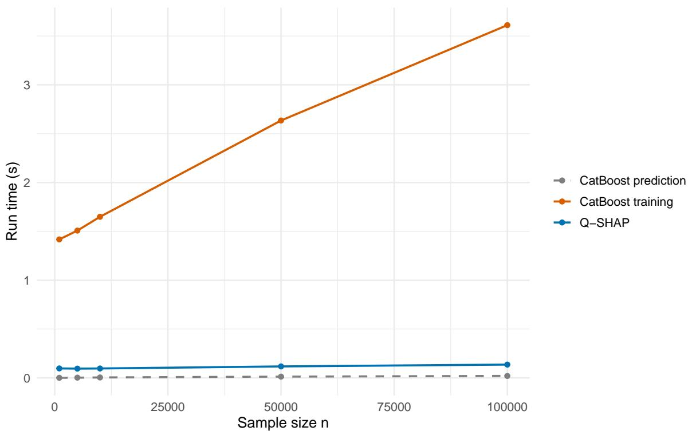
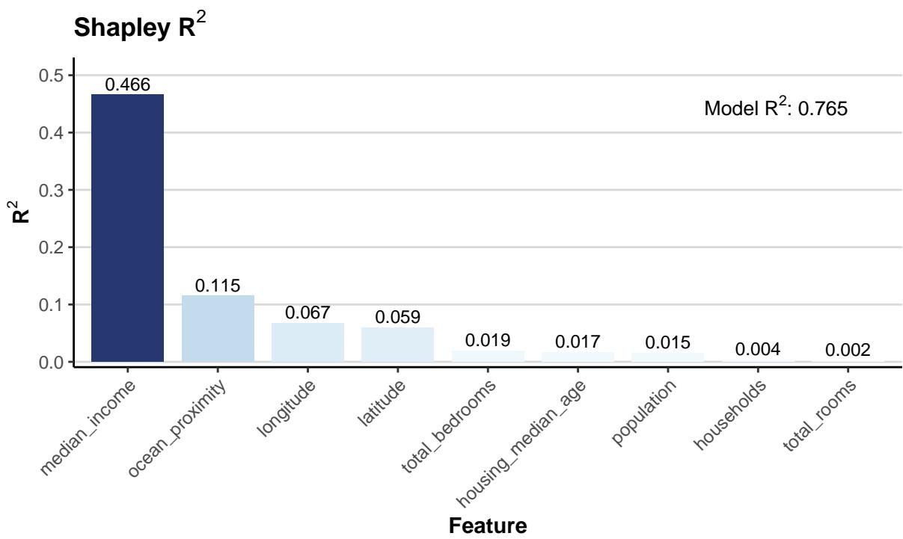
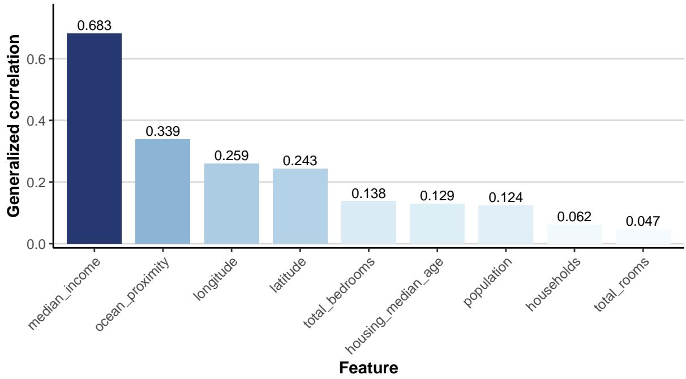
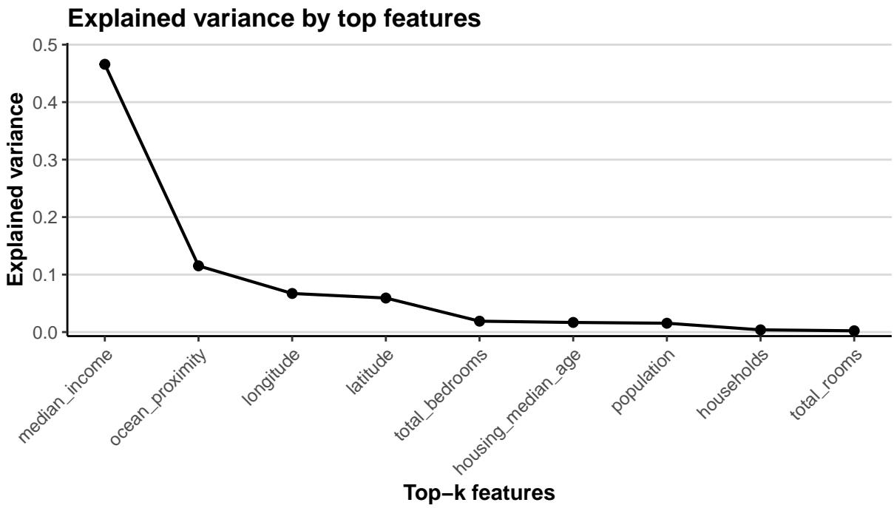
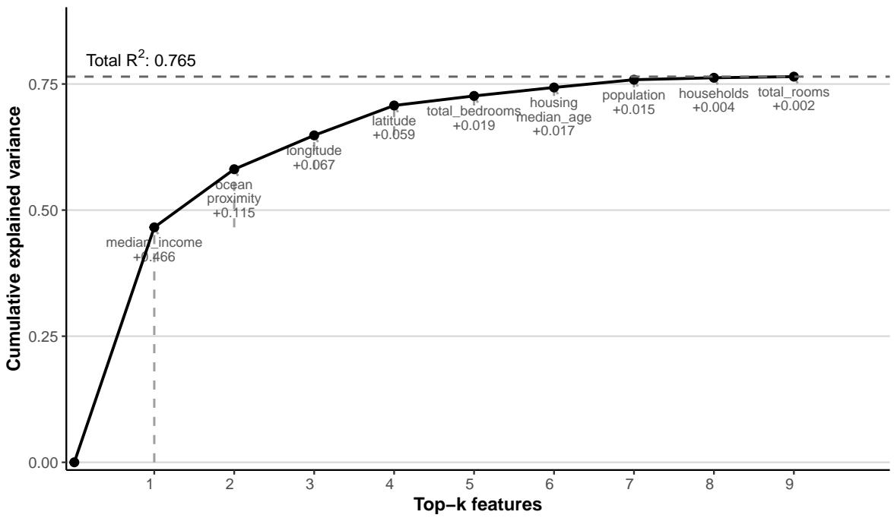
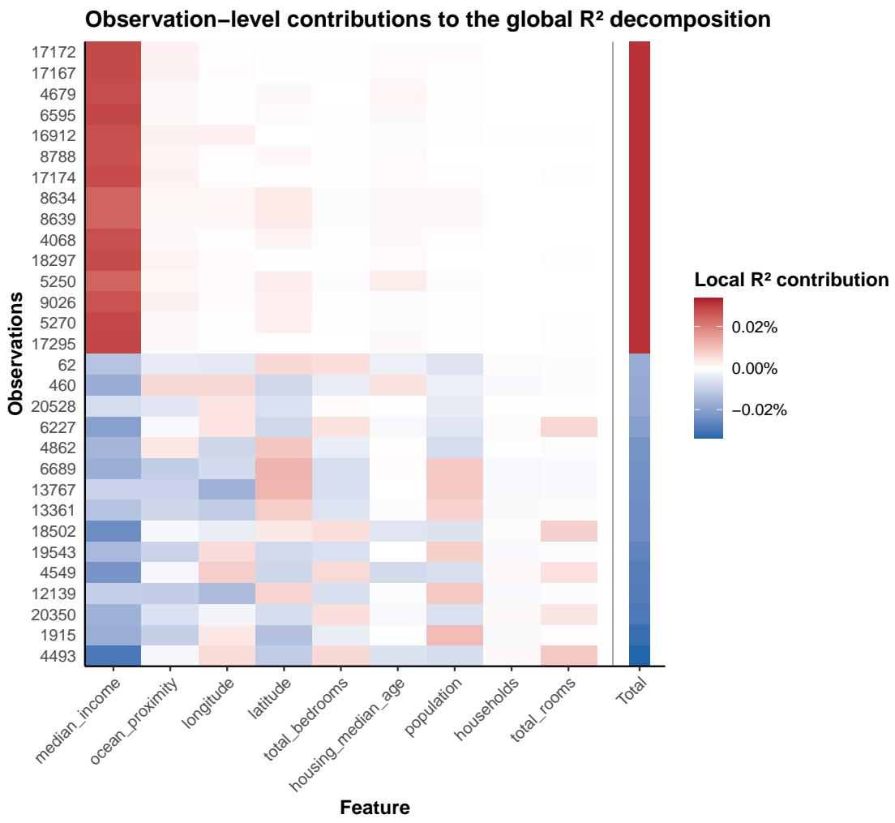

# qshap: Fast Shapley Decomposition of $R ^ { 2 }$ for Gradient-Boosted Trees

Zhongli Jiang

Min Zhang University of California, Irvine

Dabao Zhang

## Abstract

Numerous methods have been developed to quantify feature attributions in individual predictions for tree ensembles. However, many applications require global measures of feature contributions to overall model performance. Although local attribution scores can be aggregated to characterize feature importance, such summaries do not directly decompose measures of predictive performance, such as R<sup>2</sup>. This article introduces qshap, available in both R and Python, which provides Shapley decomposition of R<sup>2</sup> values for gradientboosted decision trees (GBDTs) to quantify feature-specific contributions to model performance. By decomposing the quadratic loss of individual observations, qshap provides flexible tools to explore the importance of individual features and observations. qshap currently supports widely used GBDT implementations, including xgboost, lightgbm, and catboost, through a unified tree representation and eficient C++ backends. Its modular design can accommodate other GBDT implementations built from binary decision trees. In addition, we introduce a specialized backend for oblivious trees that exploits their symmetric structure to substantially accelerate computation.

Keywords: Shapley values, feature-specific $R ^ { 2 }$ , gradient-boosted decision trees, explainable artificial intelligence, interpretable machine learning.

## 1. Introduction

Gradient-boosted decision trees (GBDTs) (Friedman 2001), including XGBoost (Chen and Guestrin 2016), LightGBM (Ke, Meng, Finley, Wang, Chen, Ma, Ye, and Liu 2017), and CatBoost (Prokhorenkova, Gusev, Vorobev, Dorogush, and Gulin 2018), are widely used for tabular data because of their predictive performance and scalability. However, interpreting the contributions of individual features remains challenging, particularly as tree depth and ensemble size increase.

Several notions of feature importance are available for fitted tree ensembles, but they answer diferent questions. Built-in summaries such as split counts and gain importance describe how variables are used by the fitted trees, whereas permutation importance measures the deterioration of a chosen performance criterion after perturbing a variable (Breiman 2001; Fisher, Rudin, and Dominici 2019). To address these limitations, Shapley additive explanations (SHAP; Lundberg and Lee 2017) leverage Shapley values (Shapley 1953) to provide robust feature attributions. Its specialized implementation TreeSHAP (Lundberg, Erion, Chen, DeGrave, Prutkin, Nair, Katz, Himmelfarb, Bansal, and Lee 2020) further introduces a fast and exact polynomial-time algorithm for tree ensembles. The Python package shap provides a widely used implementation of SHAP and TreeSHAP. Related software includes the R package treeshap, which provides a unified TreeSHAP interface for several tree ensemble implementations (Mayer, Komisarczyk, Kozminski, Maksymiuk, and Biecek 2026), and the packages shapr and shaprpy, which emphasize conditional coalition values that account for dependency among the input variables (Jullum, Olsen, Lachmann, and Redelmeier 2025). Nonetheless, these methods are designed to explain individual predictions, whereas many applications require a global measure of feature contribution, especially in the fields of biomedical science and finance. Although local SHAP values are often aggregated over observations, for example, by aggregating absolute values (Lundberg et al. 2020), they typically measure average attribution across local quantities, rather than an exact decomposition of model-level goodness of fit.

To characterize global model behavior, several methods apply the Shapley value allocation to measures of predictive performance. In linear regression, Lipovetsky and Conklin (2001) decompose the model $R ^ { 2 }$ and quantify the relative importance of predictors in the presence of multicollinearity. A closely related formulation is the LMG measure implemented in the R package relaimpo, which averages the incremental $R ^ { 2 }$ attributed to each predictor over all possible predictor orderings (Grömping 2006). Although these methods provide fair allocations of explained variance, the evaluation generally requires considering permutations that grow exponentially with the feature dimensions, and relaimpo is only available for linear models.

Beyond linear regression, sage-importance implements the SAGE algorithm, which utilizes Shapley allocation based on expected loss reduction and estimates Shapley value feature importance by Monte Carlo sampling over feature subset permutations (Covert, Lundberg, and Lee 2020). Similarly, the Python package vimpy and the R package vimp implement SPVIM, a resampling-based framework for estimating Shapley global variable importance that also supports statistical inference (Williamson and Feng 2020). Shapley efects provide a closely related population-level, variance-based formulation (Song, Nelson, and Staum 2016; Owen and Prieur 2017). While these methods provide general, model-agnostic measures of global feature importance, their computation may require feature-subset sampling, nuisance function estimation, cross-fitting, or repeated model fitting. Their computational cost can therefore become substantial, particularly in high-dimensional settings. The SHAFF method proposed by Bénard, Biau, Da Veiga, and Scornet (2022) uses random forests to guide featuresubset sampling and estimate the explained-variance quantities required for Shapley efects. However, SHAFF relies on sampling and is specifically designed for random forests, and thus does not directly provide an $R ^ { 2 }$ decomposition for boosted tree ensembles.

In this article, we present a deterministic framework, Q-SHAP (Jiang, Zhang, and Zhang 2025), for computing feature-specific Shapley values of explained variance $( \mathrm { i . e . , } R ^ { 2 } )$ for fitted GBDT models. By exploiting the internal tree structure, Q-SHAP enables fast and exact decomposition of $R ^ { 2 }$ in polynomial time without any sampling or model refitting. In addition, we introduce a specialized algorithm for oblivious trees, in complexity $O ( n D + \operatorname* { m i n } ( n , L ) L D )$ for n samples, where L is the maximum number of leaves and D denotes the maximum depth, matching the asymptotic complexity of Linear TreeSHAP (Bifet, Read, Xu et al. 2022). We further introduce the qshap software, implemented in both R and Python, with an eficient backend in C++, supporting large-scale feature attribution with parallel computation, and providing rich visualization tools through a simple, user-friendly interface.

The rest of the paper is organized as follows. Section 2 introduces the theoretical background of Shapley value and details of the Q-SHAP methods. Section 3 describes the design and usage of the R package. Section 4 discusses the Python version of our package. We further discuss the internals and extensibility in Section 5, and we conclude the paper in Section 6.

## 2. Methodological foundations

The package qshap implements and extends the Q-SHAP methodology introduced by Jiang et al. (2025). The original method establishes three main results. First, feature-specific $R ^ { 2 }$ can be formulated as a Shapley allocation of explained variation, or equivalently of reductions in squared error. Second, after expanding the squared-error loss, each feature contribution separates into a linear combination of a conventional SHAP term for the prediction and a quadratic SHAP term for the squared prediction. Third, for decision trees, the quadratic term can be evaluated exactly in polynomial time by aggregating over pairs of leaves rather than enumerating all feature coalitions.

In this article, we summarize the identities and algorithms required to understand the software and focus on their computational realization. In addition, qshap introduces a specialized eficient algorithm for oblivious trees. Complete theoretical derivations and proofs of the original Q-SHAP representation are given in Jiang et al. (2025).

## 2.1. Feature-specific decomposition of model fits

At the population level, let $X = ( X _ { 1 } , \ldots , X _ { p } )$ and $\mathcal { P } = \{ 1 , \ldots , p \}$ be the full set of features. Following Jiang et al. (2025), for any coalition $S \subseteq { \mathcal { P } }$ , define the oracle predictor

$$
m _ { S } ( x ) = \mathbb { E } ( Y \mid X _ { S } = x _ { S } ) .
$$

The corresponding population coeficient of determination is

$$
R _ { S } ^ { 2 } = \frac { \mathrm { V a r } \{ m _ { S } ( X _ { S } ) \} } { \mathrm { V a r } ( Y ) } .
$$

For feature $j$ and coalition $S \subseteq { \mathcal { P } } \setminus \{ j \}$ , let

$$
\omega _ { p } ( S ) = \frac { | S | ! ( p - | S | - 1 ) ! } { p ! } = \frac { 1 } { p } { \binom { p - 1 } { | S | } } ^ { - 1 }
$$

be the Shapley weight. The oracle feature-specific contribution to $R ^ { 2 }$ is then

$$
\phi _ { j } ^ { R ^ { 2 } } = \sum _ { S \subseteq \mathcal { P } \setminus \{ j \} } \omega _ { p } ( S ) \left( R _ { S \cup \{ j \} } ^ { 2 } - R _ { S } ^ { 2 } \right) .
$$

Let $\mathcal { D } = \{ ( y _ { i } , x _ { i \cdot } ) \} _ { i = 1 } ^ { n }$ denote the data to be explained. Under the squared-error loss, define

$$
Q _ { S } = \sum _ { i = 1 } ^ { n } \left\{ y _ { i } - { \widehat { m } } _ { S } ( x _ { i \cdot } ) \right\} ^ { 2 } ,
$$

where $\widehat { m } _ { S } ( \boldsymbol { x } _ { i \cdot } )$ is the prediction of $m _ { S } ( x _ { i \cdot } )$ with features in $S ,$ and the no-feature prediction is the sample mean, $\widehat { m } _ { \emptyset } ( x _ { i \cdot } ) = \bar { y }$ , where ${ \bar { y } } = n ^ { - 1 } \sum _ { i } y _ { i }$ . Therefore,

$$
Q _ { \emptyset } = \sum _ { i = 1 } ^ { n } ( y _ { i } - { \bar { y } } ) ^ { 2 }
$$

is the total sum of squares, and the fitted model has the coeficient of determination

$$
\widehat { R } ^ { 2 } = 1 - \frac { Q _ { \mathcal { P } } } { Q _ { \emptyset } } .
$$

The feature-specific contribution to model $R ^ { 2 }$ can be estimated by

$$
\widehat { \phi } _ { j } ^ { R ^ { 2 } } = - \frac { 1 } { Q _ { \emptyset } } \sum _ { S \subseteq \mathcal { P } \setminus \{ j \} } \omega _ { p } ( S ) \left( Q _ { S \cup \{ j \} } - Q _ { S } \right) .\tag{1}
$$

By the Shapley eficiency axiom,

$$
\sum _ { j = 1 } ^ { p } \widehat { \phi } _ { j } ^ { R ^ { 2 } } = 1 - \frac { Q _ { \mathcal { P } } } { Q _ { \emptyset } } = \widehat { R } ^ { 2 } .
$$

Thus, the model $R ^ { 2 }$ is decomposed additively across the input features.

## 2.2. Linear and quadratic Shapley values for trees

Consider a regression tree with L leaves and maximum depth $D$ . Let $\widehat { m } ^ { \ell }$ denote the prediction associated with leaf $\ell ,$ and let $\mathcal { F } ^ { \ell }$ be the set of features appearing along its root-to-leaf path. The full tree prediction can be written as

$$
\widehat { m } _ { \mathcal { P } } ( x _ { i \cdot } ) = \sum _ { \ell = 1 } ^ { L } \widehat { m } ^ { \ell } \times { \bf 1 } \{ x _ { i \cdot } \mathrm { ~ r e a c h e s ~ l e a f ~ } \ell \} .
$$

For a subset $S ,$ , the path-dependent prediction follows the observed split decisions for features in $S$ and averages over the branches associated with features outside $S ,$ , using the trainingsample proportions stored in the tree. Let $n _ { \ell }$ be the number of training observations reaching leaf $\ell ,$ and define

$$
\widehat { m } _ { \emptyset } ^ { \ell } = \widehat { m } ^ { \ell } \times \frac { n _ { \ell } } { n } .
$$

For feature $j \in \mathcal { F } ^ { \ell }$ , let $w _ { j } ^ { \ell } ( x _ { i \cdot } )$ denote the multiplicative change in the weight of leaf ℓ when feature $j$ is added to the coalition. If a feature appears multiple times along the path, $w _ { j } ^ { \ell } ( x _ { i \cdot } )$ combines the corresponding factors from all of its appearances. If an observation disagrees with any split on feature $j$ along the path, then $w _ { j } ^ { \ell } ( x _ { i \cdot } ) = 0$ . The subset prediction can then be expressed as

$$
\widehat { m } _ { S } ( x _ { i \cdot } ) = \sum _ { \ell = 1 } ^ { L } \widehat { m } _ { \emptyset } ^ { \ell } \times \prod _ { j \in S \cap \mathcal { F } _ { \ell } } w _ { j } ^ { \ell } ( x _ { i \cdot } ) .\tag{2}
$$

Equation (1) can be evaluated by expanding its observation-level loss diferences. Define

$$
T _ { 1 , i j } = \sum _ { S \subseteq \mathcal { P } \setminus \{ j \} } \omega _ { p } ( S ) \times \left\{ \widehat { m } _ { S \cup \{ j \} } ( x _ { i \cdot } ) - \widehat { m } _ { S } ( x _ { i \cdot } ) \right\} ,\tag{3}
$$

$$
T _ { 2 , i j } = \sum _ { S \subseteq \mathcal { P } \backslash \{ j \} } \omega _ { p } ( S ) \times \left\{ \left[ \widehat { m } _ { S \cup \{ j \} } ( x _ { i \cdot } ) \right] ^ { 2 } - [ \widehat { m } _ { S } ( x _ { i \cdot } ) ] ^ { 2 } \right\} .\tag{4}
$$

Here, $T _ { 1 , i j }$ is the ordinary path-dependent TreeSHAP contribution, whereas $T _ { 2 , i j }$ is the Shapley contribution of feature $j$ to the squared subset prediction. Expanding the squared loss gives

$$
\hat { \phi } _ { j } ^ { R ^ { 2 } } = \frac { 1 } { Q _ { \emptyset } } \sum _ { i = 1 } ^ { n } \left( 2 y _ { i } T _ { 1 , i j } - T _ { 2 , i j } \right) .\tag{5}
$$

Consequently, once $T _ { 1 , i j }$ and $T _ { 2 , i j }$ are available, the feature-specific $R ^ { 2 }$ values follow by simple aggregation over observations.

The linear contribution $T _ { 1 , i j }$ can be calculated using TreeSHAP. Several faster algorithms have subsequently been proposed (Yang 2021; Karczmarz, Michalak, Mukherjee, Sankowski, and Wygocki 2022; Bifet et al. 2022; Mohammadi, Reznikov, Sinitcyn, Muandet, and Chau 2026; Wettenstein, Mitchell, and Yu 2026). The main computational problem is therefore the quadratic contribution $T _ { 2 , i j }$ . Squaring Equation (2) yields

$$
[ \widehat { m } _ { S } ( x _ { i \cdot } ) ] ^ { 2 } = \sum _ { \ell _ { 1 } = 1 } ^ { L } \sum _ { \ell _ { 2 } = 1 } ^ { L } \widehat { m } _ { \emptyset } ^ { \ell _ { 1 } } \widehat { m } _ { \emptyset } ^ { \ell _ { 2 } } \prod _ { k \in S } w _ { k } ^ { \ell _ { 1 } } ( x _ { i \cdot } ) w _ { k } ^ { \ell _ { 2 } } ( x _ { i \cdot } ) ,\tag{6}
$$

where weights associated with features absent from a path are defined as one. This expansion shows that the quadratic game can be represented through interactions between pairs of leaves. For arbitrary binary trees, the general Q-SHAP algorithm aggregates these leaf-pair terms in $O ( L ^ { 2 } D ^ { 2 } )$ time per tree and observation. Before stating the general tree algorithm, we first introduce necessary polynomial annotations. For a fixed observation $x _ { i } .$ , leaf pair $( \ell _ { 1 } , \ell _ { 2 } )$ , and feature $j ,$ , let

$$
n _ { 1 2 } = \left| F ^ { \ell _ { 1 } } \cup F ^ { \ell _ { 2 } } \right|
$$

and define

$$
P _ { i j } ^ { \ell _ { 1 } \ell _ { 2 } } ( z ) = \prod _ { k \in ( F ^ { \ell _ { 1 } } \cup F ^ { \ell _ { 2 } } ) \backslash \{ j \} } \left\{ 1 + w _ { k } ^ { \ell _ { 1 } } ( x _ { i \cdot } ) w _ { k } ^ { \ell _ { 2 } } ( x _ { i \cdot } ) z \right\} .
$$

The Shapley weights associated with the coalition sizes are encoded by

$$
C _ { n _ { 1 2 } } ( z ) = \sum _ { s = 0 } ^ { n _ { 1 2 } - 1 } { \binom { n _ { 1 2 } - 1 } { s } } ^ { - 1 } z ^ { s } .
$$

For two polynomials of the same degree, $C ( z ) \cdot P ( z )$ denotes the inner product of their coeficient vectors.

## 2.3. The algorithm for general trees

For general trees, Q-SHAP uses the stable leaf-pair formulation. This is the default implementation for arbitrary binary trees.

Algorithm 1 computes the Shapley value of the quadratic game $S \mapsto \{ \widehat { m } _ { S } ( x _ { i \cdot } ) \} ^ { 2 }$ by explicitly expanding the square into leaf-pair interactions. The dot product $C _ { n _ { 1 2 } } ( z ) { \cdot } P ^ { \ell _ { 1 } \ell _ { 2 } } ( z )$ is evaluated by the numerically stable complex-root implementation via inverse fast Fourier transformation described in the general-tree Q-SHAP derivation.

Algorithm 1 Q-SHAP   
Q-SH $\mathbf { A P } ( \mathbf { x } _ { i } . )$   
Initialize $T [ j ] = 0$ for $j = 1 , \cdots , p$   
for $\ell _ { 1 } \in$ index set $0 , . . . . , L - 1$ do   
for $\ell _ { 2 } \in$ index set $\ell _ { 1 } , \ldots , L - 1$ do   
Let $n _ { 1 2 } = | F ^ { \ell _ { 1 } } \cup F ^ { \ell _ { 2 } } |$   
for $j \in F ^ { \ell _ { 1 } } \cup F ^ { \ell _ { 2 } }$ do   
Let $\begin{array} { r } { t [ j ] = \frac { 1 } { n _ { 1 2 } } [ w _ { j } ^ { \ell _ { 1 } } ( \mathbf { x } _ { i \cdot } ) w _ { j } ^ { \ell _ { 2 } } ( \mathbf { x } _ { i \cdot } ) - 1 ] \times \hat { m } _ { \varnothing } ^ { \ell _ { 1 } } \hat { m } _ { \varnothing } ^ { \ell _ { 2 } } [ C _ { n _ { 1 2 } } ( z ) \cdot P ^ { \ell _ { 1 } \ell _ { 2 } } ( z ) ] } \end{array}$   
if $\ell _ { 1 } \neq \ell _ { 2 }$ then   
$T [ j ] = T [ j ] + 2 t [ j ]$   
else   
$T [ j ] = T [ j ] + t [ j ]$   
end if   
end for   
end for   
end for   
return $T = ( T [ 1 ] , T [ 2 ] , \cdot \cdot \cdot , T [ p ] )$

## 2.4. Stagewise decomposition of gradient-boosted tree ensembles

The preceding sections establish the decomposition for a single tree. At first sight, extending it to a boosted-tree ensemble appears to require considering the interactions among all pairs of trees. However, by exploiting the sequential nature of gradient boosting, we bridge the squared loss for boosted trees with residuals and avoid this exhaustive expansion.

Consider an ensemble containing K trees. Let $\hat { m } _ { \mathcal { P } } ^ { ( k ) } ( x _ { i \cdot } )$ be the output of tree $k ,$ and let α denote its learning rate. The fitted values are updated recursively as

$$
{ \widehat { y } } _ { i } ^ { ( k ) } = { \widehat { y } } _ { i } ^ { ( k - 1 ) } + \alpha { \widehat { m } } _ { \mathcal { P } } ^ { ( k ) } ( x _ { i \cdot } ) , \qquad { \widehat { y } } _ { i } ^ { ( 0 ) } = { \bar { y } } .
$$

Writing

$$
r _ { i } ^ { ( k - 1 ) } = y _ { i } - \widehat { y } _ { i } ^ { ( k - 1 ) }
$$

for the residual before the construction of tree $k ,$ the change in squared loss for tree k is

$$
\left( r _ { i } ^ { ( k ) } \right) ^ { 2 } - \left( r _ { i } ^ { ( k - 1 ) } \right) ^ { 2 } = \alpha ^ { 2 } \left[ \widehat { m } _ { \mathcal { P } } ^ { ( k ) } ( x _ { i \cdot } ) \right] ^ { 2 } - 2 \alpha r _ { i } ^ { ( k - 1 ) } \widehat { m } _ { \mathcal { P } } ^ { ( k ) } ( x _ { i \cdot } ) .\tag{7}
$$

Equation (7) breaks the ensemble-wide problem down into a sequence of single-tree problems. Applying Shapley additivity, the observation-level loss contribution of feature j at boosting stage k is

$$
\alpha ^ { 2 } T _ { 2 , i j } ^ { ( k ) } - 2 \alpha r _ { i } ^ { ( k - 1 ) } T _ { 1 , i j } ^ { ( k ) } .
$$

Summing these contributions over observations and boosting stages gives

$$
\hat { \phi } _ { j } ^ { R ^ { 2 } } = - \frac { 1 } { Q _ { \emptyset } } \sum _ { k = 1 } ^ { K } \sum _ { i = 1 } ^ { n } \left\{ \alpha ^ { 2 } T _ { 2 , i j } ^ { ( k ) } - 2 \alpha r _ { i } ^ { ( k - 1 ) } T _ { 1 , i j } ^ { ( k ) } \right\} .\tag{8}
$$

The residual $r _ { i } ^ { ( k - 1 ) }$ depends on the predictions of all previous trees. Consequently, the interactions between tree k and the preceding ensemble are incorporated implicitly without explicitly expanding all pairs of trees. Summing Equation (7) over the boosting stages yields a telescoping sum where the intermediate losses cancel, leaving only the overall loss diference of the ensembles and the baseline. Algorithm 2 summarizes the stagewise procedure:

Algorithm 2 RSQ-SHAP for boosted trees   
RSQ-SHAP   
Initialize $\Delta _ { Q } = \mathbf { 0 } _ { p }$ and $\widehat { y } _ { i } ^ { ( 0 ) } = \bar { y }$ for $i = 1 , \ldots , n$   
for $k = 1 , \ldots , K$ do   
for $i = 1 , \ldots , n$ do   
$r _ { i } ^ { ( k - 1 ) } = y _ { i } - \widehat { y } _ { i } ^ { ( k - 1 ) }$   
$\begin{array} { r } { \dot { \mathbf { T } } _ { 1 , i } ^ { ( k ) } = \mathbf { S H A P } ^ { ( k ) } ( x _ { i \cdot } ) } \end{array}$   
$\mathbf { T } _ { 2 , i } ^ { ( k ) } = \mathbf { Q } \mathbf { - } \mathbf { S } \mathbf { H } \mathbf { A } \mathbf { P } ^ { ( k ) } ( x _ { i \cdot } )$ by Algorithm 1   
$\Delta _ { Q } = \Delta _ { Q } + \alpha ^ { 2 } \mathbf { T } _ { 2 , i } ^ { ( k ) } - 2 \alpha r _ { i } ^ { ( k - 1 ) } \mathbf { T } _ { 1 , i } ^ { ( k ) }$   
end for   
end for   
return RSQ-SHAP = − ${ \bf \Delta } \cdot { \bf \Delta } \Delta / Q _ { \emptyset }$

Although the current software focuses on tree-based learners, the stagewise decomposition developed in this section is not specific to trees. It applies to any additive boosting model under squared-error loss, provided that the ordinary and quadratic Shapley terms can be evaluated for each weak learner.

## 2.5. Accelerated algorithm for oblivious trees

Oblivious trees have symmetric structures with all nodes at the same depth splitting on the same feature. This symmetry allows $T _ { 1 }$ and $T _ { 2 }$ to be calculated even more eficiently. We will exploit these properties here to further accelerate Algorithm 1.

Consider an oblivious tree of depth D. At depth $d = 0 , \dotsc , D - 1$ , all nodes split using the same feature, denoted by $F [ d ]$ . Thus, we define $F [ d ; ]$ as the set of features used from depth d to the leaves, that is

$$
F [ d ; ] = \bigcup _ { s = d } ^ { D - 1 } F [ s ] .
$$

For a non-terminal node $v ,$ let $v _ { L }$ and $v _ { R }$ denote the left and right children. Let $n _ { v }$ be the number of samples reaching node $v ;$ hence $n _ { v _ { L } }$ and $n _ { v _ { R } }$ are the number of samples reaching the two children. For observation $x _ { i } .$ <sub>·</sub>, let

$$
c _ { d } ( x _ { i \cdot } ) \in \{ L , R \}
$$

denote the child selected by $x _ { i } .$ <sub>·</sub> under the split rule at depth d. For a subset $F _ { d } \subseteq F [ d ; ]$ define

$$
F _ { d + 1 } = F _ { d } \cap F [ d + 1 ; ] .
$$

For a node v at depth $d ,$ we calculate $\hat { m } _ { F _ { d } } ( x _ { i \cdot } , v )$ recursively by

$$
\hat { m } _ { F _ { d } } ( x _ { i \cdot } , v ) = \left\{ \begin{array} { l l } { \hat { m } ^ { v } , } & { v \mathrm { ~ i s ~ a ~ l e a f ; } } \\ { \hat { m } _ { F _ { d + 1 } } ( x _ { i \cdot } , v _ { c _ { d } ( x _ { i \cdot } ) } ) , } & { F [ d ] \in F _ { d } ; } \\ { \frac { n _ { v _ { L } } } { n _ { v } } \hat { m } _ { F _ { d + 1 } } ( x _ { i \cdot } , v _ { L } ) + \frac { n _ { v _ { R } } } { n _ { v } } \hat { m } _ { F _ { d + 1 } } ( x _ { i \cdot } , v _ { R } ) , } & { F [ d ] \notin F _ { d } . } \end{array} \right.\tag{9}
$$

Then, at the root node v, we have

$$
\begin{array} { r } { \hat { m } _ { F _ { d } } ( x _ { i \cdot } ) = \hat { m } _ { F _ { d } } ( x _ { i \cdot } , v ) . } \end{array}
$$

The recursion is evaluated with memoization over pairs $( v , F )$ . Let $F _ { T }$ be the feature set used by a tree $\tau$ , then we have the following accelerated algorithm.

Algorithm 3 Q-SHAP for oblivious trees   
Q-SHAP-OBL $( x _ { i \cdot } )$   
Compute mˆ $\mathbf { \Psi } _ { F } ( x _ { i } . )$ for all $F \subseteq F _ { \mathcal { T } }$ using recursion (9).   
for $j \in F _ { T }$ do   
$\hat { m } _ { F \cup \{ j \} } ( x _ { i \cdot } ) - \hat { m } _ { F } ( x _ { i \cdot } )$   
T<sub>1</sub>[j] = X   
F ⊆F<sub>T</sub>\{j} $\overline { { | F _ { T } | ( { ^ { | F _ { T } | - 1 } _ { | F | } } ) } }$   
$\hat { m } _ { F \cup \{ j \} } ^ { 2 } ( x _ { i \cdot } ) - \hat { m } _ { F } ^ { 2 } ( x _ { i \cdot } )$   
$\begin{array} { r l } { T _ { 2 } [ j ] = { } } & { { } \sum } \end{array}$   
F ⊆F<sub>T</sub>\{j} $\overline { { | F _ { T } | ( { ^ { | F _ { T } | - 1 } _ { | F | } } ) } }$   
end for   
return $T _ { 1 } = \mathbf { S H A P } ( x _ { i \cdot } )$ and ${ \cal T } _ { 2 } = { \bf Q { - } S H A P } ( x _ { i \cdot } )$

Algorithm 3 first computes the exact path-dependent subset prediction $\hat { m } _ { F } ( x _ { i \cdot } )$ , and then applies the Shapley weights to both $\hat { m } _ { F } ( x _ { i \cdot } )$ and $\hat { m } _ { F } ^ { 2 } ( x _ { i \cdot } )$ The leaf-pair interactions used by the general $\mathrm { Q - S H A P }$ algorithm are not ignored and are included implicitly in $\hat { m } _ { F } ^ { 2 } ( x _ { i \cdot } )$ An oblivious tree has $2 ^ { d }$ nodes at depth d and at most $2 ^ { D - d }$ unique subsets of $F [ d ; ]$ . Thus, Algorithm 3 has at most $2 ^ { d } 2 ^ { D - d } = \bar { 2 } ^ { D } = L$ memoized states at each depth. The recursion over all depths costs $O ( L D )$ in total, and the final Shapley sums also cost $O ( L D )$

Further substantial speedups are possible by grouping observations according to the leaves they reach. We formalize the idea in the following theorem.

Theorem 1 (Leaf Invariance of Q-SHAP for Oblivious Trees). Consider a fixed oblivious tree $\tau .$ . Suppose two observations $x _ { i } .$ <sub>·</sub> and $x _ { i ^ { \prime } }$ <sub>·</sub> reach the same leaf. Equivalently,

$$
c _ { d } ( x _ { i \cdot } ) = c _ { d } ( x _ { i ^ { \prime } \cdot } ) \qquad f o r \ a l l \ d = 0 , \ldots , D - 1 .
$$

Then, for every feature subset $F \subseteq F _ { \mathcal { T } }$ ,

$$
\hat { m } _ { F } ( x _ { i \cdot } ) = \hat { m } _ { F } ( x _ { i ^ { \prime } \cdot } ) .
$$

Consequently, the two observations have identical $T _ { 1 }$ and $T _ { 2 }$ values in Algorithm 3:

$$
T _ { 1 , i } [ j ] = T _ { 1 , i ^ { \prime } } [ j ] , \qquad T _ { 2 , i } [ j ] = T _ { 2 , i ^ { \prime } } [ j ] , \qquad j = 1 , \ldots , p .
$$

Proof. The recursion in Equation (9) depends on the observation only through the child index $c _ { d } ( \boldsymbol { x } _ { i \cdot } )$ at each depth d. If two observations reach the same leaf, then $c _ { d } ( x _ { i \cdot } ) = c _ { d } ( x _ { i ^ { \prime } \cdot } )$ for all depths. Hence, for any fixed subset $F _ { ; }$ , the two observations choose the same child whenever $F [ d ] \in F$ and use the same weighted average whenever $F [ d ] \not \in F$

Since the leaf values and the training proportions $n _ { v _ { L } } / n _ { v }$ and $n _ { v _ { R } } / n _ { v }$ are properties of the tree and do not depend on the observation, the recursive calculation of $\hat { m } _ { F } ^ { v }$ is identical at every node. In particular,

$$
\hat { m } _ { F } ( x _ { i \cdot } ) = \hat { m } _ { F } ( x _ { i ^ { \prime } \cdot } )
$$

for all $F \subseteq F _ { \mathcal { T } }$

The quantities $T _ { 1 }$ and $T _ { 2 }$ are Shapley sums of $\hat { m } _ { F }$ and $\hat { m } _ { F } ^ { 2 }$ , respectively. Since all subset predictions are identical for the two observations, every summand in both Shapley sums is identical. Therefore,

$$
T _ { 1 , i } = T _ { 1 , i ^ { \prime } } \qquad \mathrm { a n d } \qquad T _ { 2 , i } = T _ { 2 , i ^ { \prime } } .
$$

Note that for general trees, a subset of features can produce distinct paths along partial (hypothetical) trees, even for observations reaching the same final leaf, thereby yielding diferent conditional expectations. For an oblivious tree, however, the symmetric structure guarantees identical paths for any feature subset as long as two observations reach the same final leaf, significantly simplifying the computation.

By grouping the observations by leaf, we need at most min $( n , L )$ evaluations of Algorithm 3. Therefore, for K trees, the computational complexity is

$$
\left| O \left( K \{ n D + \operatorname* { m i n } ( n , L ) L D \} \right) \right|
$$

where the first term is of the same order as prediction. More importantly, once the sample size exceeds the number of leaves, the second term no longer increases with n. Compared with the complexity for general trees, $O ( K n L ^ { 2 } D ^ { 2 } )$ , Algorithm 3 provides a substantial computational improvement.

To illustrate this behavior, we generated synthetic regression data from

$$
Y _ { i } = 4 X _ { i _ { 1 } } - 5 X _ { i _ { 2 } } + 6 X _ { i _ { 3 } } + 3 X _ { i _ { 4 } } - X _ { i _ { 5 } } + \varepsilon _ { i } , \qquad \varepsilon _ { i } \sim N ( 0 , 0 . 5 ^ { 2 } ) ,
$$

with all features independently generated from standard normal distributions. We fix the feature dimension at $p = 1 0 0$ and vary the sample size $n \in \{ 1 , 0 0 0 , 5 , 0 0 0 , 1 0 , 0 0 0 , 5 0 , 0 0 0 , 1 0 0 , 0 0 0 \}$ to evaluate the scalability of the oblivious tree implementation. For each setting, we train a CatBoost model with $K = 1 0 0$ trees and otherwise use the default CatBoost parameters. All experiments were performed on a single core of an Apple M1 MacBook Pro with 16 GB of memory. Reported results are averaged over 10 replications.

Figure 1 shows that qshap is substantially faster than CatBoost model fitting across all the sample sizes considered. As the sample size increases from 1,000 to 100,000, the average qshap runtime increases only from approximately 0.09 seconds to 0.14 seconds. This weak dependence on n is consistent with the complexity analysis above. In comparison, modelfitting time increases steadily with sample size, while prediction time remains low.

  
Figure 1: Runtime scaling of CatBoost fitting, prediction, and qshap as the number of explained samples increases, averaged over 10 replications. The feature dimension is fixed at $p = 1 0 0$ , and CatBoost is trained with $K = 1 0 0 \ \mathrm { t r e e s }$ . Prediction time is included for reference.

## 2.6. Generalized correlation coeficients

For a subset of features $S ,$ its population coeficient of determination is

$$
R _ { S } ^ { 2 } = \frac { \mathrm { V a r } \{ \mathbb { E } ( Y \mid X _ { S } ) \} } { \mathrm { V a r } ( Y ) } = \mathrm { C o r } ^ { 2 } \{ Y , m _ { S } ( X _ { S } ) \} ,
$$

following the fact that Cov $\{ Y , m _ { S } ( X _ { S } ) \} = \operatorname { V a r } \{ m _ { S } ( X _ { S } ) \}$ . For a single feature $X _ { S } , \ \sqrt { R _ { S } ^ { 2 } }$ corresponds to the scale of the correlation coeficient between $Y$ and $m _ { S } ( X _ { S } )$ , as shown in simple linear regressions.

The oracle $R ^ { 2 }$ is monotone with respect to the available feature set. Specifically, if $S \subseteq T$ then

$$
{  { \mathbb E } } \left[ \{ Y - m _ { T } ( X _ { T } ) \} ^ { 2 } \right] \le {  { \mathbb E } } \left[ \{ Y - m _ { S } ( X _ { S } ) \} ^ { 2 } \right] ,
$$

and hence $R _ { T } ^ { 2 } \ge R _ { S } ^ { 2 }$ . Consequently, every marginal contribution in the corresponding Shapley game is nonnegative, implying

$$
\phi _ { j } ^ { R ^ { 2 } } \geq 0 .
$$

This motivates the definition of generalized correlation coeficient for each feature $j$ as

$$
\rho _ { j } ^ { \mathrm { Q } } = \sqrt { \phi _ { j } ^ { R ^ { 2 } } } .
$$

R> model <- xgboost(x, y)   
R> g <- gazer(model)   
R> out <- rsq(g, x, y)   
R> plot(out)

The resulting quantities satisfy

$$
0 \leq \rho _ { j } ^ { \mathrm { Q } } \leq 1 , \qquad \sum _ { j \in \mathcal { P } } \left( \rho _ { j } ^ { \mathrm { Q } } \right) ^ { 2 } = R _ { \mathcal { P } } ^ { 2 } .
$$

Hence, $\rho _ { j } ^ { \mathrm { Q } }$ quantifies the association between feature $j$ and the response, expressed on the familiar correlation scale. For any $S \subseteq \mathcal { P } , \sum _ { j \in S } ( \rho _ { j } ^ { Q } ) ^ { 2 }$ represents the portion of the full-model $R ^ { 2 }$ allocated to the features in S.

## 3. The R package qshap

The qshap package provides a user-friendly interface for fast calculation of feature-specific $R ^ { 2 }$ for gradient-boosted trees in R. The main workflow consists of two steps. The user first passes a supported fitted model to gazer(), which constructs a model-specific explainer, and then calls rsq() to compute the global feature-specific $R ^ { 2 }$ decomposition. The package currently supports models fitted with xgboost, lightgbm, and catboost. The package qshap is available on GitHub at https://github.com/catstats/Q-SHAP\_R and can be directly installed from the Comprehensive R Archive Network (CRAN) for use.

R> install.packages("qshap")

R> library("qshap")

The remainder of this section describes the package interface and illustrates its use with the California housing data.

## 3.1. Package overview

Table 1 summarizes the main user-facing functions. The gazer() function parses a fitted tree model and returns a qshap\_tree\_explainer object containing the model type, parsed trees, and cached tree summaries used by the C++ backend. The rsq() function computes feature-specific $R ^ { 2 }$ values and returns a qshap\_result object. The loss() function returns an individual-level local Shapley decomposition of loss contributions, while the standard plot() method provides several visual summaries of the resulting global importance scores. We present the basic workflow below:

Although the object returned by gazer() is model-specific, all supported explainers share a common class structure. For example, an xgboost model produces an object with classes qshap\_tree\_explainer and xgboost\_explainer. lightgbm and catboost models use their own backend-specific subclasses. This design allows rsq() and loss() to dispatch to the correct backend while exposing the same interface to users.

The object returned by rsq() has class qshap\_result. It stores the feature-specific $R ^ { 2 }$ values, feature names, total $R ^ { 2 }$ , number of features, as well as an optional local squared

loss decomposition. The default print method reports the total $R ^ { 2 }$ and the top contributing features.
<table><tr><td>Goal</td><td>Function</td><td>Return value</td></tr><tr><td>Build explainer</td><td>gazer()</td><td>qshap_tree_explainer</td></tr><tr><td>Feature-specific  $R ^ { 2 }$ </td><td>rsq()</td><td>qshap_result</td></tr><tr><td>Local loss and  $R ^ { 2 } .$  -scale contributions</td><td>loss()</td><td>loss matrix</td></tr><tr><td>Visualization</td><td>plot()</td><td>S3 plot for qshap_result</td></tr></table>

Table 1: Main user-facing functions in the qshap package.

## 3.2. A case study with California housing data

The California housing data, originally derived from the 1990 U.S. Census, are widely used for regression benchmarks. The dataset contains 20,640 observations describing demographic and housing characteristics of California census block groups. Each observation includes nine predictor variables: longitude, latitude, median housing age, total number of rooms and bedrooms, block-group population, number of households, median income, and ocean proximity. We fit an xgboost model to predict the median house price, and use Q-SHAP to decompose the $R ^ { 2 }$ for feature-specific interpretation.

## 3.3. Data loading and processing

We download the data directly from OpenML (Bischl, Casalicchio, Das, Feurer, Fischer, Gijsbers, Mukherjee, Müller, Németh, Oala et al. 2025), and convert it to a data frame for subsequent analysis. We use median\_house\_value as the response and the remaining variables as predictors. The categorical variable ocean\_proximity is converted to numeric codes before model fitting for ease of interpretation.

```r
R> library("OpenML")
R> oml_data <- getOMLDataSet(data.id = 43939)
R> cal <- oml_data[["data"]]
R> cal <- as.data.frame(cal)
R> cal[["ocean_proximity"]] <- as.numeric(cal[["ocean_proximity"]],
levels = sort(unique(cal[["ocean_proximity"]])))
R> target_col <- "median_house_value"
R> y <- cal[[target_col]]
R> X <- as.data.frame(cal[, setdiff(colnames(cal), target_col), drop = FALSE])
R> feature_names <- colnames(X)
```

## 3.4. Model fitting

To keep the example focused on the Q-SHAP workflow, we deliberately fit a simple xgboost model with 50 boosting rounds and a maximum tree depth of two. All other parameters retain their default values. We set the random seed to ensure reproducibility.

```r
R> set.seed(42)
R> library("xgboost")
R> model <- xgboost(x = X, y = y, nrounds = 50, max_depth = 2)
```

## 3.5. Constructing the explainer

After fitting the model, we can directly pass the fitted model to the gazer() function of qshap, which will extract the essential tree structure to compute Q-SHAP. The gazer() function converts backend-specific models from xgboost, lightgbm, and catboost into a unified structure for subsequent computations.

R> g <- gazer(model)

To illustrate this representation, we return the first tree through get\_tree(). The returned list contains 10 fields: children\_left and children\_right encode the left and right childnode indices; feature and threshold define the features and threshold split at each internal node; max\_depth records the maximum tree depth; n\_node\_samples stores the number of samples at each node of the tree; value contains the node values; node\_count records the total number of nodes in the tree; the fields default\_left and xgboost\_split preserve backend-specific routing conventions. Any binary decision tree represented in this format can be processed by qshap for the downstream calculation of feature-specific R<sup>2</sup>; this structure is also similar to scikit-learn, providing a basis for adding further model backends.

```perl
R> get_tree(g, 1)
$children_left
[1] 1 3 5 -1 -1 -1 -1
$children_right
[1] 2 4 6 -1 -1 -1 -1
$feature
[1] 7 7 7 0 0 0 0
$threshold
[1] 5.0329 3.1076 6.8220 -21061.1480 840.2939
[6] 25087.2460 64406.3800
$max_depth
[1] 2
$n_node_samples
[1] 20640 16249 4391 8053 8196 3056 1335
$value
[1] 4.408701e-03 -3.338228e+04 1.235114e+05 -2.106115e+04
```

[5] 8.402939e+02 2.508725e+04 6.440638e+04   
\$node\_count   
[1] 7   
\$default\_left   
[1] FALSE FALSE FALSE FALSE FALSE FALSE FALSE   
\$xgboost\_split   
[1] TRUE

## 3.6. Calculation of feature-specific $R ^ { 2 }$ values

Once the explainer has been constructed using gazer(), we use the rsq() function to compute the feature-specific $R ^ { 2 }$ decomposition. The returned qshap\_result object contains the empirical $R ^ { 2 }$ of the fitted model and the contribution assigned to each feature. Its print method reports the feature contributions in decreasing order.

R> phi\_rsq\_R <- rsq(g, X, y, feature\_names = feature\_names, local = TRUE)   
R> print(phi\_rsq\_R)   
<qshap\_result>   
Total R^2: 0.7646   
Number of features: 9   
Number of samples: 20640   
Top 9 features by R^2:   
Feature R\_squared   
median\_income 0.465827   
ocean\_proximity 0.115210   
longitude 0.067137   
latitude 0.059218   
total\_bedrooms 0.018957   
housing\_median\_age 0.016743   
population 0.015394   
households 0.003868   
total\_rooms 0.002241

Q-SHAP computes the decomposition exactly from the fitted tree structure, without Monte Carlo sampling. By the Shapley eficiency property, the feature-specific contributions sum to the empirical $R ^ { 2 }$ of the fitted model. The following calculation verifies this identity:

R> model\_rsq <- 1 - sum((y - predict(model, X))^2) / sum((y - mean(y))^2)   
R> print(c(sum\_feature\_rsq = sum(phi\_rsq\_R[["rsq"]]),   
+ fitted\_model\_rsq = model\_rsq))

```csv
sum_feature_rsq fitted_model_rsq
0.7645957 0.7645957
```

## 3.7. Local decomposition of the squared loss

Besides the global decomposition, qshap can return observation-level squared loss contributions from which the feature-specific $R ^ { 2 }$ values are obtained. For each observation, summing the contributions recovers the change in squared loss after fitting the model. Users interested only in the local decomposition can obtain it directly with loss(), and it can be simply returned by setting local = TRUE when calling rsq() as well. We also introduce local\_rsq, which standardizes the change of loss decomposition by $- 1 / Q _ { \emptyset }$ to express them in the $R ^ { 2 }$ scale. Contributions in column $j$ then sum up to the corresponding global feature-specific $R ^ { 2 }$ contribution $\hat { \phi } _ { j } ^ { R ^ { 2 } }$ . In the local decomposition, a positive value indicates that a feature contributes positively to the model fit for a given observation, whereas a negative value indicates a contribution in the opposite direction.

```r
R> local_rsq_R <- phi_rsq_R[["local_rsq"]]
R> colnames(local_rsq_R) <- feature_names
R> head(local_rsq_R)
```

```csv
longitude latitude housing_median_age total_rooms
[1,] 2.313650e-06 -2.104842e-06 4.155820e-06 -3.214032e-08
[2,] -1.080987e-05 1.426728e-05 1.177522e-06 -1.055277e-06
[3,] -1.198699e-05 1.633523e-05 -9.178597e-06 6.009082e-07
[4,] 6.762917e-08 5.414373e-07 5.342529e-06 1.659817e-08
[5,] 1.439236e-05 -1.806204e-05 1.939579e-05 -8.407056e-07
[6,] 2.970003e-06 -3.652318e-06 6.376952e-06 -1.313026e-07
total_bedrooms population households median_income
[1,] -1.903035e-06 2.062535e-06 -2.926779e-07 2.039209e-04
[2,] -7.934363e-06 4.557886e-06 -5.312390e-06 7.687019e-05
[3,] 1.398375e-05 -1.375490e-05 2.249859e-06 6.815944e-05
[4,] -1.475455e-07 3.974378e-08 3.493709e-08 5.078222e-05
[5,] -7.238168e-06 2.120278e-05 -2.484070e-06 -4.423180e-06
[6,] -3.233182e-06 3.556497e-06 -5.012750e-07 -2.587918e-06
ocean_proximity
[1,] 1.032448e-05
[2,] -4.260958e-06
[3,] -2.708453e-06
[4,] 9.010335e-06
[5,] 2.305173e-05
[6,] 9.185553e-06
```

## 3.8. Parallel computing

The Q-SHAP decomposition is additive across observations, allowing individual observations to be processed independently. The R implementation therefore adopts a divide-and-combine strategy that partitions the dataset into disjoint subsets, processes them in parallel on separate workers, and aggregates the results to obtain the global feature-specific estimates.

In the R implementation, rsq() supports multicore execution through the parallel package using a PSOCK cluster (parallel::makeCluster()), which is compatible with CRAN environments. The ncore argument controls the number of workers, with ncore = 1 (the default) for serial execution and ncore = -1 for using all available cores. Parallel computing is most beneficial for large datasets, large ensembles, or deep trees, where the computational workload outweighs the overhead associated with worker startup and communication.

For example, the previous example can be evaluated using eight cores as follows:

```r
R> phi_rsq_R_parallel <- rsq(g, X, y, feature_names = feature_names, ncore = 8)
```

## 3.9. Visualization

Visualization is seamlessly integrated into the qshap workflow through a unified S3 method plot(), implemented with ggplot2 (Wickham 2016). The method supports a variety of visualization techniques for global and local feature-specific $R ^ { 2 }$ , including bar plots, elbow plots, cumulative contribution plots, and heatmaps. The bar plot is the default, while setting type = "gcorr" displays the bar plot for feature-specific generalized correlation coeficients. When save\_name is supplied, the resulting plot is saved as a PDF file. Whereas the package shapviz (Mayer 2024) provides visualization tools for local SHAP and their aggregations, the plotting functionality in qshap is designed specifically for global and observation-level $R ^ { 2 }$ decomposition.

The following code produces the bar plots for feature-specific $R ^ { 2 }$ and corresponding generalized correlation coeficients for the California housing data:

```python
R> library("ggplot2")
R> plot(phi_rsq_R, label = feature_names, rotation = 45,
+ save_name = "california_housing_bar")
R> plot(phi_rsq_R, type = "gcorr", label = feature_names, rotation = 45,
+ save_name = "california_housing_gcorr")
```

Figures 2 and 3 show that median income has the largest contribution, followed by ocean proximity, longitude, and latitude. The generalized correlation coeficient plot preserves the feature rankings while expressing the contributions on a correlation-like scale.

Beyond the individual feature displays, qshap provides elbow and cumulative contribution plots that summarize the ranked feature contributions. The elbow plot (Figure 4) highlights changes in contribution and can be used to identify a core set of leading features, whereas the cumulative plot (Figure 5) shows how the contributions accumulate toward the fitted model’s total $R ^ { 2 }$

```python
R> plot(phi_rsq_R, type = "elbow", label = feature_names, rotation = 45,
+ save_name = "california_housing_elbow")
R> plot(phi_rsq_R, type = "cumu", max_comp = 9, label = feature_names,
+ save_name = "california_housing_cumu")
```

  
Figure 2: Feature-specific $R ^ { 2 }$ values for the California housing data.

## Generalized correlation of features to the outcome

  
Figure 3: Feature-specific generalized correlation coeficients for the California housing data.

  
Figure 4: Elbow plot of feature-specific $R ^ { 2 }$ values for the California housing data.

Cumulative explained variance by top features  
  
Figure 5: Cumulative feature-specific $R ^ { 2 }$ values of the top-ranked features for the California housing data.

We also provide a heatmap for inspecting observation-level contributions on the $R ^ { 2 }$ scale. Users may specify the observations to display in the heatmap. The heatmap (Figure 6) highlights observations with the most extreme total contributions by default, with rows ordered by their signed row totals. The argument n\_show controls the number of observations displayed, reporting observations with the largest positive and most negative total contributions to the global $R ^ { 2 }$ decomposition.

$$
\begin{array} { r l } & { R ^ { s }  { P l o t } ( p h i \_ r s q \_ R ,  { t y p e } =  { ^ n h e a t m a p } ^ { n } ,  { f e a t u r e } \_ { - } n a m e s  { \alpha } =  { f e a t u r e } \_ n a m e s ,  { n \_ s h o y } =  { 3 0 } , } \\ { * } & {  { s a v e \_ n a m e } =  { ^ n c a l i f o r n i a \_ h o u s i n g \_ h e a t m a p } ^ { n } ) } \end{array}
$$

  
Figure 6: Observation-level contributions to the global $R ^ { 2 }$ decomposition for selected observations.

## 4. The Python package qshap

The Python implementation of qshap follows the same conceptual workflow as the R package through a Python interface to the same C++ backend. A fitted model is first passed to gazer(), which converts the structure to a unified internal format; the resulting structure is then supplied to rsq() to compute the feature-specific $R ^ { 2 }$ values. The Python interface accepts and returns NumPy-based numerical objects and provides Matplotlib-based functions for visualization (Harris, Millman, Van Der Walt, Gommers, Virtanen, Cournapeau, Wieser, Taylor, Berg, Smith et al. 2020; Hunter 2007).

The package currently supports decision-tree and gradient-boosting estimators from scikitlearn (Pedregosa, Varoquaux, Gramfort, Michel, Thirion, Grisel, Blondel, Prettenhofer, Weiss, Dubourg et al. 2011), as well as xgboost, lightgbm, and catboost. It is publicly available via GitHub and Python Package Index (PyPI).

Since Section 3 provides a complete workflow using the R package, this section focuses on the Python-specific interface and demonstrates its usage via xgboost on the California housing data.

## 4.1. A case study with California housing data

We revisit the California housing example from Section 3 to demonstrate model fitting with xgboost, computation of Q-SHAP contributions, and visualization of the results in Python.

```python
>>> import os
>>> import numpy as np
>>> import pandas as pd
>>> import xgboost as xgb
>>> from qshap import gazer, vis
>>> out_dir = "qshap_california_artifacts"
>>> X = pd.read_csv(os.path.join(out_dir, "X.csv"))
>>> y = pd.read_csv(os.path.join(out_dir, "y.csv"))["y"]
>>> feature_names = X.columns.to_numpy()
>>> X_np = X.to_numpy()
>>> y_np = y.to_numpy()
>>> model = xgb.XGBRegressor(max_depth = 2, n_estimators = 50)
>>> model.fit(X_np, y_np)
>>> g = gazer(model)
>>> local_result = g.rsq(X_np, y_np, local = True, ncore = 8)
>>> phi_rsq = local_result.rsq
>>> local_loss = local_result.loss
>>> order = np.argsort(phi_rsq)[::-1]
>>> results = pd.DataFrame({
```

```python
"Feature": feature_names[order],
"R_squared": phi_rsq[order]
})
>>> results
>>> vis.rsq(
phi_rsq,
label = np.array(feature_names),
rotation = 30,
save_name = "california_housing_python",
color_map_name = "Pastel2"
... )
median_income 0.465827
ocean_proximity 0.115210
longitude 0.067137
latitude 0.059218
total_bedrooms 0.018957
housing_median_age 0.016743
population 0.015394
households 0.003868
total_rooms 0.002241
```

Using the model fitted under the same parameters and the same data, the R and Python implementations return consistent feature-specific $R ^ { 2 }$ values at the reported precision.

## 5. Internal design of the R package

## 5.1. Model support and dispatch

The package interface of qshap consists of three main functions. gazer() constructs an explainer from a fitted model; rsq() computes the feature-specific $R ^ { 2 }$ values; and plot() visualizes the results. Internally, gazer() is an S3 generic with separate methods for xgboost, lightgbm, and catboost. Each method parses the native model representation and converts it into the common tree objects used by the numerical backend. This separation keeps modelspecific prediction, split-routing, node-cover, and initialization conventions within the parser, while the downstream Q-SHAP calculation operates on a common representation. The main classes are summarized in Table 2.

## 5.2. Class design

The R implementation uses lightweight S3 classes. Each object is implemented as a list with a class attribute, created through a dedicated constructor, and checked by a validation function. User-facing classes add print, summary, and plotting methods when applicable.

A simple\_tree stores the structure of a single binary tree in a model-independent format. Its fields include left and right child indices, split feature indices, split thresholds, maximum depth, node sample counts or weights, node values, and total node count. When required, the object also records learned missing-value directions and backend-specific split conventions. Leaf nodes are represented by child index −1. This object is close to the representation used by common tree libraries and serves as the main interchange format inside the package. A tree\_summary is a computation-ready version of a simple\_tree. In addition to the child, feature, threshold, and depth information, it stores the set of unique split features used by the tree, node-specific sample weights, and initial prediction values used by the Q-SHAP backend. These derived quantities are reused during the calculation of $T _ { 1 }$ , T<sub>2</sub>, and featurespecific loss contributions. The tree\_summary object keeps numerical preparation separate from simple\_tree’s model-parsing handling. The former caches quantities needed by the Q-SHAP algorithm that may not be directly available from the native model object.

The object returned by gazer() has class qshap\_tree\_explainer. It stores the original model object, the model type, the parsed list of trees, the maximum depth, the base score when applicable, cached tree summaries, and precomputed numerical arrays used by the C++ backend. The explainer therefore connects a fitted model and the Q-SHAP computation.

The main user-facing class is qshap\_result. It stores the feature-specific $R ^ { 2 }$ vector, feature names, total $R ^ { 2 }$ , sample size, number of features, and optionally the local loss contribution matrix. Its methods allow users to print, summarize, plot, or convert the result to a data frame.

<table><tr><td>Class</td><td>Role</td></tr><tr><td>simple_tree</td><td>Model-independent representation of one parsed tree.</td></tr><tr><td>tree_summary</td><td>Computation-ready tree summary used by the backend.</td></tr><tr><td>qshap_tree_explainer</td><td>Parsed model object returned by gazer().</td></tr><tr><td>qshap_result</td><td>User-facing feature-specific  $R ^ { 2 }$  result.</td></tr></table>

Table 2: Main S3 classes used by qshap.

## 5.3. Backend architecture

A fitted model is first passed to gazer(), which dispatches on the model class. The corresponding formatter converts the model-specific representation into a list of simple\_tree objects. Each simple\_tree is then converted to a tree\_summary. This separation keeps model-library conventions outside the numerical qshap backends.

For each tree, backend-specific routines obtain the ordinary per-tree TreeSHAP term $T _ { 1 } .$ either from the native model library or from a compatible TreeSHAP implementation. The compiled numerical kernels use the cached tree summaries to compute the quadratic term T by Q-SHAP and combine T , T , and the stagewise residuals to obtain the local loss contributions and feature-specific $R ^ { 2 }$ values.

The internal function qshap\_loss() dispatches on the stored model type and selects the corresponding general or specialized computational routine without changing the user-facing interface. The main numerical operations are implemented in compiled C++ code through Rcpp. Complex roots and inverse coeficients required by the general-tree algorithm are precomputed once and stored in the explainer, so that repeated calls to rsq() do not recalculate

them.

## 5.4. Model-specific formatters

The formatter layer translates a fitted model from its native representation into the common simple\_tree objects used by the numerical backend. It is responsible for preserving all library-specific information that afects prediction, including tree topology, split thresholds, missing-value routing, node weights, initial predictions, and output scaling.

For xgboost, the formatter reads the JSON representation of the fitted booster, extracts the base score, and parses the tree topology, split conditions, learned missing-value directions, node cover, and leaf outputs. For lightgbm, the formatter extracts the corresponding information from the fitted model representation and constructs the same internal tree objects.

For catboost, the formatter reads the JSON representation and extracts the model scale and bias. Non-symmetric trees are handled through the general-tree representation, whereas symmetric, or oblivious, trees can be represented as complete binary trees and passed to the specialized oblivious-tree implementation. For a symmetric tree of depth $D _ { : }$ , the complete representation contains $2 ^ { D + 1 } - 1$ nodes; internal node weights and values are reconstructed from the leaf weights and outputs.

## 5.5. Extending to new tree models

The Q-SHAP algorithm applies to arbitrary boosted ensembles of binary decision trees; extending the qshap software to a new model class additionally requires recovery of the fitted tree structure and the ordinary per-tree TreeSHAP quantities. At the package-development level, support for a new model class requires an S3 method for gazer(), a model-specific formatter, and corresponding updates in the validation and loss-dispatch layers. The formatter converts the native model representation into validated simple\_tree objects.

The common tree representation supplies the quantities required by the general qshap backend to compute the quadratic term $T _ { 2 }$ . The adapter must additionally provide the ordinary per-tree TreeSHAP term $T _ { 1 }$ , either through the native model library, through an existing TreeSHAP implementation that accepts the parsed trees, or through a model-specific routine. Once $T _ { 1 }$ and the corresponding tree\_summary objects are available, the existing loss decomposition and feature-specific $R ^ { \bar { 2 } }$ calculation can be reused without modifying the userfacing workflow.

For a general binary-tree boosting ensemble, the existing qshap backend can be reused. If a model has additional structure, its adapter may instead use a specialized computational routine. The oblivious-tree implementation provides one example to reuse computations for observations assigned to the same leaf without changing the user-facing interface.

## 6. Conclusion

Gradient-boosted tree ensembles are widely used because of their efectiveness in tabular prediction tasks, but their increasing structural complexity and large number of trees make them dificult to interpret. Local methods based on Shapley values have been widely used to explain individual predictions, yet it remains challenging to understand how individual features contribute to the overall model fit. In this paper, we introduced qshap, software for computing feature-specific $R ^ { 2 }$ values for boosted tree models in both R and Python. The package implements Q-SHAP, an exact algorithm for computing Shapley-value decomposition of $R ^ { 2 }$ . It provides a compact workflow for constructing model explainers, extracting observation-level loss contributions, calculating global contributions, and visualizing feature importance.

The package supports widely used GBDT implementations, including xgboost, lightgbm, and catboost, through a shared internal tree representation and eficient compiled backends in C++. For arbitrary binary trees, qshap uses the stable general-tree Q-SHAP algorithm. For oblivious trees, with CatBoost as the main example, we introduced a specialized backend that exploits the symmetric tree structure, groups observations by leaf, and reuses the corresponding computations, substantially reducing computation time.

The current work focuses on the decomposition of a well-defined $R ^ { 2 }$ under squared-error loss.   
It also provides a foundation for extending the framework to more general loss functions.

## Acknowledgments

We thank Steven He for his help with the initial development of the C++ code and its integration with R. This research was partially supported by NIH grants R01GM131491, R01AG080917, and R01AG080917-02S1, NCI grants R03 CA235363 and P30CA062203, and UCI Anti-Cancer Challenge funds from the UC Irvine Comprehensive Cancer Center. The content is solely the responsibility of the authors and does not necessarily represent the oficial views of the National Institutes of Health or the Chao Family Comprehensive Cancer Center.

## References

Bénard C, Biau G, Da Veiga S, Scornet E (2022). “SHAFF: Fast and Consistent SHApley eFfect Estimates via Random Forests.” In International Conference on Artificial Intelligence and Statistics, pp. 5563–5582. PMLR.

Bifet A, Read J, Xu C, et al. (2022). “Linear TreeShap.” Advances in Neural Information Processing Systems, 35, 25818–25828.

Bischl B, Casalicchio G, Das T, Feurer M, Fischer S, Gijsbers P, Mukherjee S, Müller AC, Németh L, Oala L, et al. (2025). “OpenML: Insights from 10 Years and More Than a Thousand Papers.” Patterns, 6(7).

Breiman L (2001). “Random Forests.” Machine Learning, 45, 5–32.

Chen T, Guestrin C (2016). “XGBoost: A Scalable Tree Boosting System.” In Proceedings of the 22nd ACM SIGKDD International Conference on Knowledge Discovery and Data Mining, pp. 785–794.

Covert I, Lundberg SM, Lee SI (2020). “Understanding Global Feature Contributions with Additive Importance Measures.” Advances in Neural Information Processing Systems, 33, 17212–17223.

Fisher A, Rudin C, Dominici F (2019). “All Models Are Wrong, but Many Are Useful: Learning a Variable’s Importance by Studying an Entire Class of Prediction Models Simultaneously.” Journal of Machine Learning Research, 20(177), 1–81.

Friedman JH (2001). “Greedy Function Approximation: A Gradient Boosting Machine.” The Annals of Statistics, 29(5), 1189–1232. doi:10.1214/aos/1013203451.

Grömping U (2006). “Relative Importance for Linear Regression in R: The Package relaimpo.” Journal of Statistical Software, 17(1), 1–27. doi:10.18637/jss.v017.i01.

Harris CR, Millman KJ, Van Der Walt SJ, Gommers R, Virtanen P, Cournapeau D, Wieser E, Taylor J, Berg S, Smith NJ, et al. (2020). “Array Programming with NumPy.” Nature, 585(7825), 357–362.

Hunter JD (2007). “Matplotlib: A 2D Graphics Environment.” Computing in Science & Engineering, 9(3), 90–95. doi:10.1109/MCSE.2007.55.

Jiang Z, Zhang M, Zhang D (2025). “Fast Calculation of Feature Contributions in Boosting Trees.” In S Chiappa, S Magliacane (eds.), Proceedings of the Forty-first Conference on Uncertainty in Artificial Intelligence, volume 286 of Proceedings ofMachine Learning Research, pp. 1859–1875. PMLR. URL https://proceedings.mlr.press/v286/jiang25a.html.

Jullum M, Olsen LHB, Lachmann J, Redelmeier A (2025). “shapr: Explaining Machine Learning Models with Conditional Shapley Values in R and Python.” arXiv preprint arXiv:2504.01842. doi:10.48550/arXiv.2504.01842. URL https://arxiv.org/abs/ 2504.01842.

Karczmarz A, Michalak T, Mukherjee A, Sankowski P, Wygocki P (2022). “Improved Feature Importance Computation for Tree Models based on the Banzhaf Value.” In Proceedings of the Thirty-Eight Conference on Uncertainty in Artificial Intelligence, pp. 969–979.

Ke G, Meng Q, Finley T, Wang T, Chen W, Ma W, Ye Q, Liu TY (2017). “LightGBM: A Highly Eficient Gradient Boosting Decision Tree.” Advances in Neural Information Processing Systems, 30.

Lipovetsky S, Conklin M (2001). “Analysis of Regression in Game Theory Approach.” Applied Stochastic Models in Business and Industry, 17(4), 319–330.

Lundberg SM, Erion G, Chen H, DeGrave A, Prutkin JM, Nair B, Katz R, Himmelfarb J, Bansal N, Lee SI (2020). “From Local Explanations to Global Understanding with Explainable AI for Trees.” Nature Machine Intelligence, 2(1), 56–67.

Lundberg SM, Lee SI (2017). “A Unified Approach to Interpreting Model Predictions.” Advances in Neural Information Processing Systems, 30.

Mayer M (2024). shapviz: SHAP Visualizations. R package version 0.9.6, URL https: //CRAN.R-project.org/package=shapviz.

Mayer M, Komisarczyk K, Kozminski P, Maksymiuk S, Biecek P (2026). treeshap: Compute SHAP Values for Your Tree-Based Models Using the TreeSHAP Algorithm. doi:10.32614/ CRAN.package.treeshap. R package version 0.4.0, URL https://CRAN.R-project.org/ package=treeshap.

Mohammadi M, Reznikov G, Sinitcyn P, Muandet K, Chau SL (2026). “QuadraSHAP: Stable and Scalable Shapley Values for Product Games via Gauss-Legendre Quadrature.” arXiv preprint arXiv:2605.05870.

Owen AB, Prieur C (2017). “On Shapley Value for Measuring Importance of Dependent Inputs.” SIAM/ASA Journal on Uncertainty Quantification, 5(1), 986–1002. doi:10. 1137/16M1097717.

Pedregosa F, Varoquaux G, Gramfort A, Michel V, Thirion B, Grisel O, Blondel M, Prettenhofer P, Weiss R, Dubourg V, et al. (2011). “Scikit-learn: Machine Learning in Python.” Journal of Machine Learning Research, 12, 2825–2830.

Prokhorenkova L, Gusev G, Vorobev A, Dorogush AV, Gulin A (2018). “CatBoost: Unbiased Boosting with Categorical Features.” Advances in Neural Information Processing Systems, 31.

Shapley LS (1953). “A Value for N-person Games.” Contributions to the Theory of Games, 2(28), 307–317.

Song E, Nelson BL, Staum J (2016). “Shapley Efects for Global Sensitivity Analysis: Theory and Computation.” SIAM/ASA Journal on Uncertainty Quantification, 4(1), 1060–1083.

Wettenstein R, Mitchell R, Yu P (2026). “Quadrature-TreeSHAP: Depth-Independent Tree-SHAP and Shapley Interactions.” arXiv preprint arXiv:2605.04497.

Wickham H (2016). ggplot2: Elegant Graphics for Data Analysis. Springer-Verlag New York. ISBN 978-3-319-24277-4. URL https://ggplot2.tidyverse.org.

Williamson B, Feng J (2020). “Eficient Nonparametric Statistical Inference on Population Feature Importance using Shapley Values.” In International Conference on Machine Learning, pp. 10282–10291. PMLR.

Yang J (2021). “Fast Treeshap: Accelerating SHAP Value Computation for Trees.” Advances in Neural Information Processing Systems, 34.