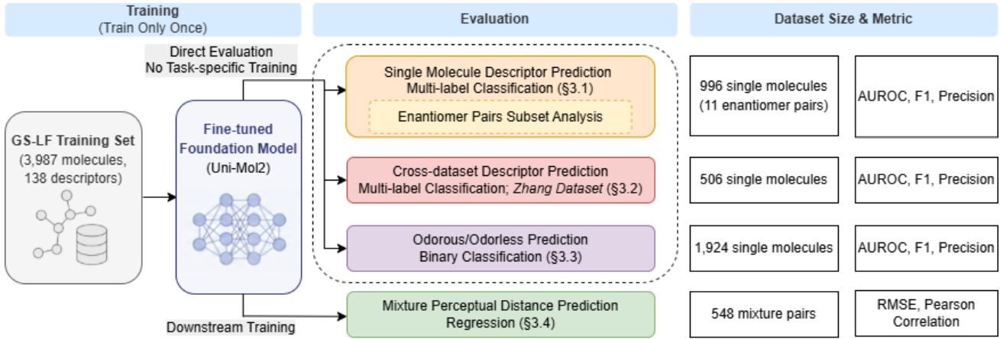
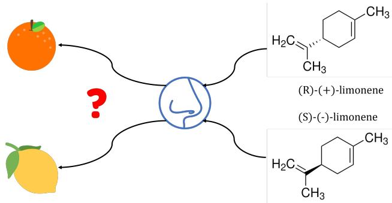
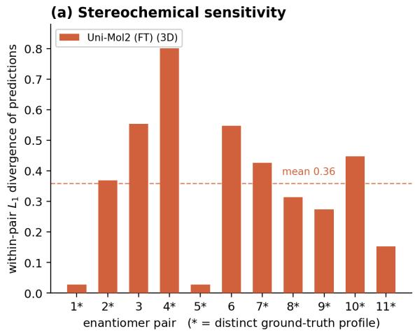
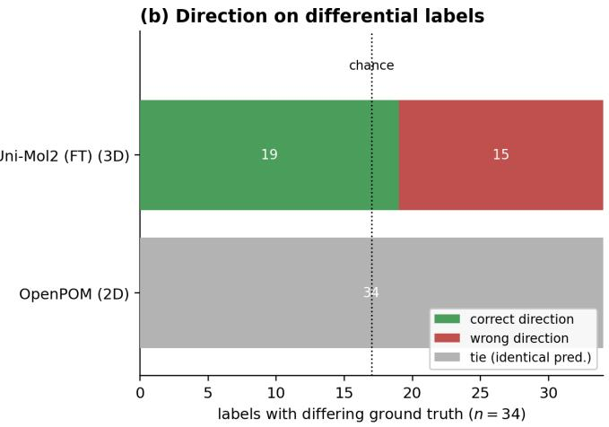
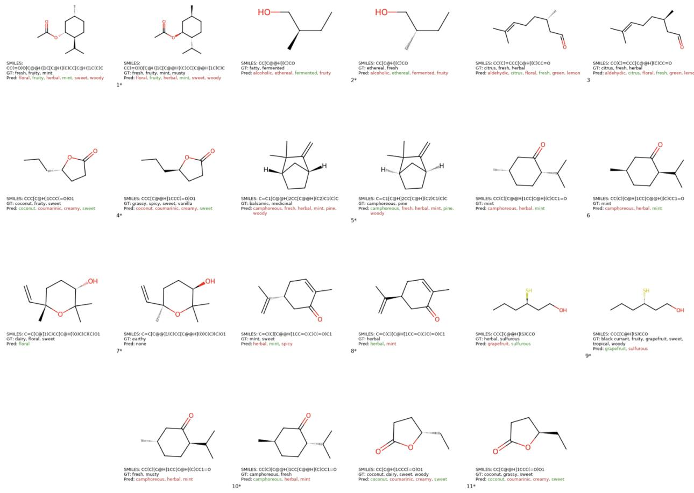
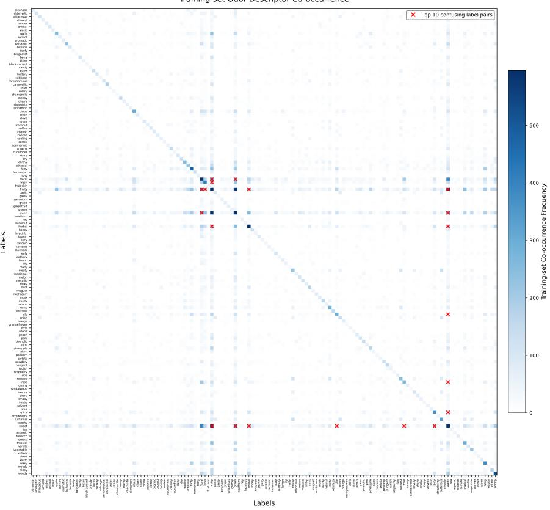
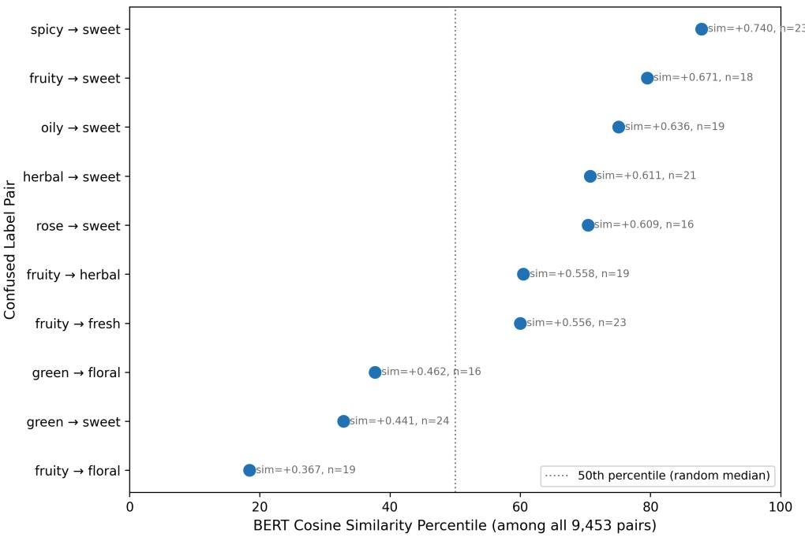

# A General-Purpose Molecular Foundation Model Transfers Across Diverse Olfactory Tasks

Yikun Han1,∗, Yi Wang1,∗, Neil Mankodi1, Stephen Yang2, and Ambuj Tewari1,2

1Department of Statistics, University of Michigan, Ann Arbor, Michigan, USA

2Computer Science and Engineering Division, University of Michigan, Ann Arbor, Michigan, USA

∗These authors contributed equally to this work.

## Abstract

Foundation models have transformed molecular property prediction, yet it remains unclear whether a molecular foundation model, fine-tuned on a single canonical olfactory prediction task, can learn representations that transfer across diverse machine olfaction problems. We investigate this question by fine-tuning Uni-Mol2 on the GS-LF benchmark for multi-label odor descriptor prediction and evaluating the resulting model, without additional deep-learning training, on four complementary downstream settings: cross-dataset odor descriptor prediction, odorous-versusodorless classification, enantiomer evaluation, and odor mixture discriminability. The fine-tuned model matches or exceeds the performance of the state-of-the-art olfaction-specific baseline on the primary GS-LF benchmark and consistently transfers across these downstream evaluations. The enantiomer analysis further shows that three-dimensional molecular representations distinguish mirror-image molecules in a way that two-dimensional graph models fundamentally cannot, although accurately predicting the perceptual consequences of stereochemistry remains an open challenge. Together, these results support a train-once, transfer-across-tasks paradigm for machine olfaction and suggest that chemically pretrained molecular representations provide a strong foundation for transferable olfactory prediction.

## 1 Introduction

Deep learning has driven remarkable advances in computer vision as well as speech and natural language processing. Availability of web-scale datasets, high-performance GPUs, and novel neural network architectures have completely transformed these fields. In particular, recent years have seen the emergence of foundation models trained on massive amounts of data that can be adapted to a variety of downstream tasks via fine-tuning or few-shot learning [1, 2]. However, progress in olfaction is more limited compared to vision, audition, and language. A key roadblock is limited data availability which hinders advances in predictive modeling. The disparity between vision, audition, and language on the one hand and olfaction on the other raises an important question: can the powerful techniques such as foundation models that revolutionized other sensory and cognitive domains similarly bridge the gap between machine and human performance in olfaction, enabling robust and highly accurate predictive models?

The enthusiasm about the potential of foundation models in machine olfaction has to be tempered with the fact that olfaction is biologically complex. Humans possess approximately 400 olfactory receptors (ORs) responsible for odor detection, suggesting that odor perception, much like other molecular properties, can be modeled computationally in principle but we are not there yet [3]. The task of accurately predict the smell of molecules solely based on their chemical structures has seen a lot of progress in recent years but remains far from fully solved.

The task of linking an odorant’s molecular structure to its olfactory perceptual qualities is called quantitative structure-odor relationship (QSOR) modeling. Although QSOR has historically received less attention compared to its more established counterpart, quantitative structure–activity relationships (QSAR), existing research clearly demonstrates the predictability of odor from molecular structure. Nevertheless, data scarcity remains the primary bottleneck, constraining progress in the field of machine olfaction. Early QSOR research relied on limited datasets characterized by a small number of odor descriptors and stimuli. These pioneering eforts typically utilized statistical methods and rudimentary neural networks. These led to innovations at the time but were restricted by data quality and scale [4–6].

A major milestone in QSOR research was the DREAM Olfactory Prediction Challenge, marking the transition from purely statistical methods to machine learning-driven approaches [7]. The challenge provided a dataset comprising 21 odor attributes for 476 molecules, with the top-performing model utilizing a random forest algorithm, a traditional yet efective method in classical machine learning, trained on Dragon molecular features and Morgan fingerprints [8, 9]. Despite demonstrating machine learning’s potential in QSOR, data limitations continued to restrict further breakthroughs.

Recent QSOR studies have advanced significantly by incorporating graph-based machine learning methods, notably graph neural networks (GNNs). These methods represent molecules as graphs, efectively capturing molecular structures and demonstrating superior performance compared to earlier statistical approaches [10, 11]. A significant breakthrough occurred with the development of the GS-LF dataset, an expert-annotated dataset containing 138 odor descriptors for approximately 5,000 molecules, sourced from GoodScents and Lefingwell databases [12, 13]. Models trained on GS-LF notably surpassed the performance of average human panelists on 53% of tested molecules, illustrating the potential of advanced machine learning to predict odor from molecular structures alone.

While QSOR has recently expanded its scope to include more complex tasks such as mixture modeling and perceptual distance estimation between pairs of odor mixtures, these novel branches have primarily focused on enhancing the understanding of complex odor interactions rather than improving single-molecule odor descriptor predictions [14–18]. Consequently, progress on the mainstream QSOR task, odor descriptor prediction on benchmark datasets like GS-LF, has stagnated, motivating the exploration of novel strategies to overcome existing limitations.

Motivated by recent success in adapting a general purpose molecular foundation model to an olfactory task [19], we investigate whether a fine-tuning a foundation model on a single olfactory task builds a representation that transfers successfully to multiple downstream olfactory tasks. Instead of training models from scratch solely on limited QSOR-specific data, we adapt molecular representations learned from extensive chemical pretraining to olfaction by fine-tuning the model on the GS-LF dataset. We show the resulting model’s strong transferability across a diverse range of downstream olfactory tasks without or with minimal task-specific training. Overall, our mode demonstrates the potential of foundation models to support a scalable train-once, apply-across-tasks paradigm for machine olfaction.

## 2 Methodology

In this section, we present our transfer-learning framework for machine olfaction. We first provide an overview of our approach, then detail our transfer learning methodology using Uni-Mol2 as the

foundation model, and finally describe the fine-tuning and evaluation procedures used to assess its performance and transferability across olfactory tasks.

## 2.1 Overview

An overview of our methodological framework is illustrated in Figure 1. First, we fine-tune a molecular foundation model on the GS-LF dataset. The resulting model is then evaluated across four olfactory tasks: (i) single molecule odor descriptor prediction on the GS-LF test set, with enantiomer pairs olfactory label prediction as a particularly challenging subtask; (ii) cross-dataset odor descriptor prediction on the Zhang et al. dataset [20]; (iii) single-molecule odorous/odorless classification; and (iv) mixture perceptual distance prediction. These tasks correspond to diferent machine learning problems ranging from multilabel classification to binary classification to regression. We therefore use a variety of evaluation metrics appropriate to the task at hand, ranging from standard classification metrics (AUROC, F1, Precision) to regression metrics (RMSE, Pearson correlation). The dataset sizes range from a few hundreds to a couple of thousands reflecting the small sizes of even the largest publicly available olfaction datasets.

Together, these evaluations assess whether the model trained on a single olfactory dataset can generalize across distinct olfactory datasets and tasks with minimal training. The detailed methodology for model fine-tuning and evaluation is described in the subsequent sections.

  
Figure 1: Overview of the modeling pipeline for machine olfaction tasks. The GS-LF dataset is used to fine-tune a molecular foundation model. The resulting model is directly evaluated on three tasks without additional training: (i) single-molecule olfactory label prediction, including an enantiomer-pair subset analysis (§3.1); (ii) cross-dataset descriptor prediction on the Zhang dataset (§3.2); and (iii) single-molecule odor/odorless binary classification (§3.3). For mixture perceptual distance prediction (§3.4), the learned molecular representations are used for downstream training.

## 2.2 Transfer learning with a foundational model

As discussed above, high-quality odor datasets are challenging and costly to assemble resulting in limited data availability for building machine olfaction models. Transfer learning addresses this challenge by allowing models trained on larger, related datasets to be adapted for use in data-scarce target domains [21].

Foundation models in the molecular and chemical sciences provide a powerful framework for transfer learning to improve machine olfaction [19]. These models are pretrained on large, diverse chemical datasets and can then be fine-tuned for a wide range of downstream tasks, including those not represented in the original training data [1, 22]. In our work, we employ this pretrain-finetune paradigm to leverage molecular representations learned from large-scale pretraining and adapt them for the specific challenges of odor descriptor prediction.

The choice of foundation model is critical to this paradigm. Olfaction is strongly tied to molecular shape, geometry, and stereochemistry, which are only partially captured by SMILES strings or 2D molecular graphs. Uni-Mol2 is particularly suitable for this setting because it is a large-scale 3D molecular foundation model whose architecture explicitly integrates atom-level, graph-level, and geometric information. This makes its representation more sensitive to spatial molecular structure. By fine-tuning Uni-Mol2 on the GS-LF dataset, we aim to improve odor descriptor prediction and evaluate its transferability across downstream olfactory tasks.

## 2.3 Model fine-tuning and training

Odor descriptor prediction is formulated as a multi-label classification task, where each molecule may be associated with one or more odor descriptors. A significant challenge in this setting is the pronounced class imbalance within the GS-LF dataset. For example, the most frequent label, “fruity,” appears 1,902 times, whereas the rarest label, “chamomile,” occurs only 31 times across the dataset’s 4,983 molecules. Addressing this imbalance is essential for achieving robust model performance.

To mitigate this, we fine-tuned Uni-Mol2 on the GS-LF training set using a focal loss function, which down-weights the contribution of frequent classes and places greater emphasis on minority classes [23]. The focal loss is defined as:

$$
\mathcal { L } _ { \mathrm { f o c a l } } ( p _ { t } ) = - \alpha _ { t } ( 1 - p _ { t } ) ^ { \gamma } \log ( p _ { t } )
$$

where $p _ { t }$ is the predicted probability of the true class, $\alpha _ { t }$ is a class balancing factor, and $\gamma$ is a focusing parameter that reduces the loss contribution of well-classified examples, thereby helping to address class imbalance.

To improve robustness, we constructed an ensemble of 50 models using the top 10 hyperparameter configurations across five folds based on validation AUROC. Predictions from the 50 models were averaged to obtain the final ensemble predictions. For the first three tasks, the model is used directly for evaluation without additional task-specific training. For mixture prediction task, the molecular embeddings generated by the model are used as inputs for downstream training. We emphasize that downstream training for the mixture task was not deep learning. It only used light-weight classical machine learning.

## 3 Results

We evaluate our model from two aspects. First, we assess its performance on the core QSOR task of single molecule odor descriptor prediction on the GS-LF test dataset (which was not touched during fine-tuning). Second, we examine the model’s transferability across several important downstream olfactory tasks. For comparison, we report the originally published results from POM, a state-of-theart model that uses graph neural networks on 2D molecular graphs to predict odor descriptors, and our reproduced results using its open-source implementation OpenPOM [24–26]. To ensure a fair comparison, we follow POM’s evaluation protocol and report results based on a 50-model ensemble, consistent with the original POM setup. Notably, our hyperparameter search was substantially smaller in scale than POM’s (50 trials versus 500).

## 3.1 Single molecule odor descriptor prediction

Table 1 presents comprehensive results comparing the models across the original GS-LF dataset. For Uni-Mol2, the 84M-parameter configuration was evaluated, and the best-performing configuration is reported. Increasing the model size to 164M did not improve performance under the same hyperparameter tuning budget (full results are provided in Table S1 of the Supplementary Information). Uni-Mol2 achieves the highest macro AUROC, AUPRC, F1, precision, and recall among the compared models, showing improved performance over both the originally published POM results and the publicly available, fully reproducible OpenPOM baseline.

Table 1: Performance comparison on the GS-LF dataset for the multi-label classification task. Each cell reports the point estimate with its 95% bootstrap confidence interval (1000 resamples of the stratified test set) below. Best value per metric in bold; “–” marks metrics not reported by the original POM study.
<table><tr><td>Model</td><td>Macro AUROC</td><td>Macro AUPRC</td><td>Macro F1</td><td>Macro Precision</td><td>Macro Recall</td></tr><tr><td rowspan="2">OpenPOM</td><td rowspan="2">0.8883 [0.8802, 0.8966]</td><td rowspan="2">0.3748 [0.3728, 0.4127]</td><td>0.3748</td><td>0.4060</td><td>0.4049</td></tr><tr><td>[0.3482, 0.3899]</td><td>[0.3744, 0.4258]</td><td>[0.3819, 0.4307]</td></tr><tr><td>POM</td><td>0.8940 [0.8880, 0.9020]</td><td></td><td>0.3600 [0.3370, 0.3720]</td><td>0.3790</td><td></td></tr><tr><td rowspan="2">Uni-Mol2 (FT)</td><td>0.8990</td><td></td><td></td><td>[0.3510, 0.3980]</td><td></td></tr><tr><td></td><td>0.4077</td><td>0.3991</td><td>0.4288</td><td>0.4291</td></tr><tr><td></td><td>[0.8923, 0.9062]</td><td>[0.4029, 0.4444]</td><td>[0.3720, 0.4119]</td><td>[0.3949, 0.4488]</td><td>[0.4051, 0.4517]</td></tr></table>

## 3.1.1 Enantiomer-pair subset analysis

As illustrated in Figure 2, the relationship between stereochemistry and olfactory perception remains a fundamental and incompletely understood problem. A classic example is the widespread claim that (S)-(-)-limonene smells primarily of lemon whereas (R)-(+)-limonene smells of orange. However, recent psychophysical studies have shown that this simple dichotomy is not universally valid [27]. More broadly, enantiomeric pairs span a spectrum of behavior: some exhibit nearly indistinguishable odor profiles, whereas others difer substantially. Consequently, the central computational challenge is not merely recognizing molecular chirality, but predicting when stereochemical diferences translate into perceptual diferences.

  
Figure 2: A common misconception regarding the olfactory distinction between limonene enantiomers, highlighting a challenge in machine olfaction.

To further evaluate the model’s ability to capture stereochemical information, we consider a curated subset of 11 enantiomeric pairs [28]. Both models are evaluated on this subset using the label-wise thresholds learned from GS-LF out-of-fold predictions, without any additional training or threshold tuning.

The aggregate performance metrics in Table 2 show that Uni-Mol2 outperforms OpenPOM on the curated enantiomer subset under the same train-once evaluation protocol used throughout this paper. Because all label-wise thresholds are transferred directly from GS-LF without further tuning, these metrics should be interpreted as evidence of transfer rather than as optimized performance on this small benchmark. Aggregate metrics cannot distinguish between a model that predicts identical outputs for both enantiomers and one that recognizes stereochemical diferences but predicts their perceptual consequences imperfectly. We therefore next introduce a direct measure of stereochemical sensitivity.

Table 2: Performance comparison on the enantiomeric test set (11 pairs). Threshold-dependent metrics were computed using label-wise thresholds optimized on GS-LF out-of-fold predictions during training, without additional training or threshold tuning on the enantiomeric subset.
<table><tr><td>Model</td><td>Macro AUROC</td><td>Macro AUPRC</td><td>Macro F1</td><td>Macro Precision</td><td>Macro Recall</td></tr><tr><td>OpenPOM</td><td>0.7991 [0.7386, 0.8311]</td><td>0.4082 [0.4185, 0.6389]</td><td>0.0859 [0.0505, 0.0904]</td><td>0.0631 [0.0385, 0.0773]</td><td>0.1568 [0.0905, 0.1504]</td></tr><tr><td>Uni-Mol2 (FT)</td><td>0.8264 [0.7685, 0.8527]</td><td>0.5269 [0.5324, 0.7053]</td><td>0.0986 [0.0603, 0.1026]</td><td>0.0746 [0.0469, 0.0905]</td><td>0.1616 [0.0936, 0.1506]</td></tr></table>

To directly probe stereochemical sensitivity rather than aggregate accuracy, we measure the within-pair divergence of each model’s predictions. For every enantiomeric pair, we compute the $L _ { 1 }$ distance between the predicted descriptor-probability vectors of the two mirror-image molecules. A model that assigns identical predictions to both enantiomers exhibits zero stereochemical sensitivity, whereas larger within-pair divergences indicate that the learned representation recognizes the molecules as distinct despite their identical 2D molecular graphs.

OpenPOM assigns numerically identical predictions to both enantiomers in all 11 pairs (withinpair $\begin{array} { r } { L _ { 1 } = 0 ; } \end{array}$ ties on all 34 labels whose ground truth difers between enantiomers), a direct consequence of its 2D graph representation being invariant to stereochemistry. In contrast, Uni-Mol2 produces distinct predictions for every enantiomeric pair (mean within-pair $L _ { 1 } = 0 . 3 6 ;$ paired Wilcoxon $p < 0 . 0 0 1 )$ , demonstrating that the learned molecular representation is sensitive to stereochemistry (Figure 3 (a)). This capability is structurally unavailable to purely 2D graph-based models.

Representation sensitivity alone, however, does not imply correct prediction of enantiomerspecific odor perception. We therefore ask a second question: when the ground-truth odor descriptors difer between two enantiomers, does the model assign the higher probability to the correct molecule? Across the 34 diferential labels, Uni-Mol2 succeeds in only 19 cases (55.9%), only slightly above chance (Figure 3 (b)). Thus, although the 3D foundation model recognizes that mirror-image molecules should receive diferent predictions, it does not yet reliably determine which enantiomer should be assigned each enantiomer-specific odor descriptor.

These experiments separate two distinct capabilities. First, a molecular representation must be stereochemically sensitive, a property that is impossible for models operating solely on 2D molecular graphs. Second, the representation must correctly relate stereochemical diferences to changes in odor perception. Uni-Mol2 achieves the first capability but only partially the second. We therefore conclude that three-dimensional molecular representations are necessary, but not suficient, for accurate enantiomer-specific odor prediction.

Figure 4 presents the Uni-Mol2 predictions for the enantiomeric pairs. Consistent with the aggregate analysis above, Uni-Mol2 typically predicts highly similar odor profiles for the two mirror-image molecules, even when their annotated odor descriptors difer substantially. For example, pair no. 4 receives identical predicted profiles (“coconut, coumarinic, creamy, sweet”) despite difering groundtruth annotations, and pair no. 10 likewise receives nearly identical predictions (“camphoreous, herbal, mint”) despite diferent annotated odor profiles. These qualitative examples illustrate why stereochemical sensitivity alone is insuficient for accurate enantiomer-specific odor prediction.

  
Figure 3: Stereochemical discrimination on the 11 enantiomeric pairs. (a) Per-pair within-pair $L _ { 1 }$ divergence between Uni-Mol2’s predicted probability vectors for the two mirror-image enantiomers (bars; dashed line, $\mathrm { m e a n } = 0 . 3 6 )$ ; asterisks mark pairs whose ground-truth profiles difer. OpenPOM (2D) assigns identical predictions to both enantiomers of every pair (within-pair $L _ { 1 } = 0 )$ and is therefore not plotted. (b) On the labels whose ground truth difers between the two enantiomers $( n = 3 4 )$ , Uni-Mol2 ranks the truly-positive enantiomer higher for 19 (vs. 15 wrong; dotted line marks the chance level of 17), whereas OpenPOM is tied on all 34 by construction.

## 3.2 Cross-dataset descriptor prediction

Odor descriptor datasets are limited in scale and often assembled from diferent sources. Even when datasets share similar descriptor vocabularies, diferences in molecule selection, label coverage, and annotation collection can afect model performance. Therefore, performance on GS-LF alone does not fully establish the model’s generalizability.

To evaluate whether the model generalizes beyond its original training distribution, we further conduct a cross-dataset evaluation on the test set from Zhang et al. dataset [20]. Derived from the Pyrfume repository [29], the dataset includes annotations for 118 odor descriptors, 108 of which overlap with those in GS-LF. We apply the models to the test set, which contains 837 molecules, to predict the 108 shared descriptors. Because some molecules in the Zhang test set also appear in the GS-LF training set, we report results on both the complete test set and a non-overlapping subset obtained by removing these molecules.

The results in Table 3 show that Uni-Mol2 achieves a high AUROC of 0.8975 on the nonoverlap test set, suggesting strong transferability to external odor descriptor datasets. Compared to OpenPOM, our model consistently performs better on both the complete Zhang test set and the non-overlapping set, which highlights the model’s ability to capture transferable structural and chemical features through transfer learning.

  
Figure 4: Eleven enantiomeric pairs with distinct or similar sensory profiles (\* means distinct ground-truth profile). Green labels indicate correct predictions, while red labels denote incorrect predictions made by the Uni-Mol2 model trained on the GS-LF dataset.

## 3.3 Odor detection: predict if a molecule is odorous

Odorous-versus-odorless prediction is a canonical binary olfactory prediction task. Mayhew et al. [30] showed that this task can be accurately modeled using transport-related molecular properties and released a curated benchmark that has become widely used for evaluating odor detection, i.e., predicting whether a given molecule is odorous or odorless to humans. We therefore use the Mayhew et al. dataset, which comprises 1,924 molecules, including 1,615 odorous and 309 odorless compounds. During evaluation, we note that 208 molecules in this dataset are also present in the GS-LF training set. Because of this overlap with the GS-LF training set, we additionally report performance on a reduced non-overlapping test set of 1,716 molecules to eliminate any potential data leakage.

As shown in Table 4, Uni-Mol2 consistently achieved higher AUROC and substantially improved recall and F1 score relative to OpenPOM on both the complete and non-overlapping test sets. These gains were accompanied by a modest reduction in precision and AUPRC, reflecting a tradeof in which the model identifies considerably more odorless molecules at the expense of additional false positives. Overall, the improved ranking performance (AUROC) and balanced classification performance (F1) indicate that the learned molecular representation transfers efectively to binary odor detection.

Table 3: Performance comparison on the Zhang test set with and without overlapping molecules. The 95% confidence intervals (CI) were computed based on 1000 bootstrap samples. Thresholds were optimized on GS-LF out-of-fold predictions and applied directly to the Zhang test set.
<table><tr><td>Model</td><td>Setting</td><td>Macro AUROC</td><td>Macro AUPRC</td><td>Macro F1</td><td>Macro Precision</td><td>Macro Recall</td></tr><tr><td>OpenPOM</td><td>non-overlap</td><td>0.8937 [0.8737, 0.9105]</td><td>0.2937 [0.3003, 0.3725]</td><td>0.2453 [0.2048, 0.2603]</td><td>0.2075 [0.1793, 0.2319]</td><td>0.4080 [0.3355, 0.4264]</td></tr><tr><td>Uni-Mol2 (FT)</td><td>non-overlap</td><td>0.8975 [0.8728, 0.9144]</td><td>0.3609 [0.3457, 0.4273]</td><td>0.2696 [0.2207, 0.2866]</td><td>0.2264 [0.1891, 0.2507]</td><td>0.4510 [0.3641, 0.4680]</td></tr><tr><td>OpenPOM</td><td>complete</td><td>0.9227 [0.9092, 0.9371]</td><td>0.3438 [0.3407, 0.4048]</td><td>0.3357 [0.2998, 0.3506]</td><td>0.2740 [0.2488, 0.2961]</td><td>0.5331 [0.4897, 0.5646]</td></tr><tr><td>Uni-Mol2 (FT)</td><td>complete</td><td>0.9291 [0.9154, 0.9429]</td><td>0.3846 [0.3817, 0.4460]</td><td>0.3621 [0.3275, 0.3777]</td><td>0.2949 [0.2698, 0.3178]</td><td>0.5796 [0.5347, 0.6102]</td></tr></table>

Table 4: Performance comparison on held-out odorous/odorless test set with and without overlapping molecules. The 95% confidence intervals (CI) were computed based on 1000 bootstrap samples. Thresholds were optimized on GS-LF out-of-fold predictions and applied directly to the test set. Metrics are computed for the positive class (odorless).
<table><tr><td>Model</td><td>Setting</td><td>AUROC</td><td>AUPRC</td><td>F1</td><td>Precision</td><td>Recall</td></tr><tr><td>OpenPOM</td><td>non-overlap</td><td>0.8204 [0.7975, 0.8417]</td><td>0.4638 [0.4073, 0.5204]</td><td>0.3187 [0.2596, 0.3731]</td><td>0.5308 [0.4460, 0.6232]</td><td>0.2277 [0.1818, 0.2736]</td></tr><tr><td>Uni-Mol2 (FT)</td><td>non-overlap</td><td>0.8327 [0.8114, 0.8509]</td><td>0.4191 [0.3700, 0.4742]</td><td>0.4417 [0.3871, 0.4855]</td><td>0.4669 [0.4039, 0.5226]</td><td>0.4191 [0.3612, 0.4680]</td></tr><tr><td>OpenPOM</td><td>complete</td><td>0.8374 [0.8165, 0.8584]</td><td>0.4669 [0.4142, 0.5244]</td><td>0.3251 [0.2691, 0.3820]</td><td>0.5373 [0.4525, 0.6194]</td><td>0.2330 [0.1871, 0.2830]</td></tr><tr><td>Uni-Mol2 (FT)</td><td>complete</td><td>0.8507 [0.8326, 0.8685]</td><td>0.4234 [0.3781, 0.4817]</td><td>0.4444 [0.3935, 0.4952]</td><td>0.4710 [0.4120, 0.5287]</td><td>0.4207 [0.3648, 0.4799]</td></tr></table>

## 3.4 Mixture discrimination

To extend our evaluation beyond single-molecule odorants, we considered odor mixtures. Naturally occurring odors are almost always mixtures, but modeling them is challenging because the percept of a mixture is generally not a simple combination of the percepts of its constituent molecules. We focus on the task of predicting the normalized perceptual discriminability between two odor mixtures, represented by a score in the interval [0, 1], where larger values indicate that the two mixtures are more perceptually distinguishable (i.e., less similar).

Previous approaches to this task can be broadly divided into two categories:

1. Direct methods: These methods predict perceptual similarity directly from chemically derived descriptors of odor mixtures (e.g., Dragon descriptors), without constructing an intermediate perceptual representation [16, 17]. Although conceptually simple, they have been shown to underperform methods based on learned intermediate representations [18].

2. Representation-based methods: These methods first construct an intermediate representation for each molecule or mixture and then learn a metric relating diferences between these representations to human perceptual similarity. Dhurandhar et al. [18], for example, predict semantic odor descriptors for individual molecules, aggregate them to obtain mixture-level representations, and perform metric learning on the resulting semantic features.

Our approach follows the general representation-learning framework of Dhurandhar et al. [18], but replaces the intermediate semantic descriptor representation with molecular embeddings learned by our Uni-Mol2 model fine-tuned on the GS-LF dataset. Specifically, we first generate an embedding for each molecule using the fine-tuned Uni-Mol2 model. Mixture embeddings are then obtained by averaging the embeddings of the constituent molecules. Finally, we train a shallow metric-learning model using either absolute or squared diferences between pairs of mixture embeddings to predict their perceptual discriminability.

To fully utilize the limited mixture data, we pooled training pairs from all mixture datasets when fitting the downstream regressors. We evaluated multiple regression models, including ElasticNet, random forest, and gradient boosting, and reported performance separately on each held-out mixture dataset as well as on the combined held-out predictions across all datasets. This setup evaluates whether molecular representations learned from single-molecule odor descriptor prediction transfer to predicting perceptual discriminability between odor mixtures.

The comparative results, including both RMSE and Pearson correlation, are summarized in Table 5. Across the combined evaluation, Uni-Mol2 consistently outperforms the OpenPOM baseline, achieving the lowest RMSE and highest Pearson correlation. Uni-Mol2 also achieves the best performance on three of the four individual datasets (Snitz 1, Snitz 2, and Ravia), demonstrating that representations learned from single-molecule odor descriptor prediction transfer efectively to the distinct problem of odor mixture discriminability.

The only exception is the Bushdid dataset, where OpenPOM performs slightly better. Bushdid difers from the other benchmarks in its experimental design: the target is the fraction of subjects correctly identifying the odd mixture in a triangle discrimination test rather than a similarity rating converted to discriminability. The reason for this diference remains an interesting direction for future investigation.

Overall, these results demonstrate that a molecular representation learned from a single canonical olfactory task generalizes not only across datasets but also to the qualitatively diferent task of predicting perceptual discriminability between odor mixtures.

Table 5: Performance comparison on odor mixture datasets. Lower RMSE and higher Pearson correlation indicate better prediction accuracy. Combined results are computed from the concatenated out-of-fold predictions across all four datasets.
<table><tr><td rowspan="2">Model</td><td rowspan="2">Regressor</td><td colspan="2">Combined</td><td colspan="2">Bushdid</td><td colspan="2">Snitz 1</td><td colspan="2">Snitz 2</td><td colspan="2">Ravia</td></tr><tr><td>RMSE</td><td>Pearson</td><td>RMSE</td><td>Pearson</td><td>RMSE</td><td>Pearson</td><td>RMSE</td><td>Pearson</td><td>RMSE</td><td>Pearson</td></tr><tr><td rowspan="3">OpenPOM</td><td>ElasticNet</td><td>0.148</td><td>0.343</td><td>0.172</td><td>0.348</td><td>0.115</td><td>0.478</td><td>0.122</td><td>0.353</td><td>0.141</td><td>0.362</td></tr><tr><td>RF</td><td>0.131</td><td>0.557</td><td>0.145</td><td>0.581</td><td>0.109</td><td>0.555</td><td>0.120</td><td>0.605</td><td>0.132</td><td>0.411</td></tr><tr><td>GBT</td><td>0.132</td><td>0.542</td><td>0.147</td><td>0.556</td><td>0.109</td><td>0.519</td><td>0.115</td><td>0.516</td><td>0.138</td><td>0.304</td></tr><tr><td rowspan="3">Uni-Mol2 (FT)</td><td>ElasticNet</td><td>0.144</td><td>0.396</td><td>0.169</td><td>0.379</td><td>0.113</td><td>0.494</td><td>0.112</td><td>0.568</td><td>0.138</td><td>0.385</td></tr><tr><td>RF</td><td>0.129</td><td>0.573</td><td>0.147</td><td>0.566</td><td>0.101</td><td>0.648</td><td>0.114</td><td>0.674</td><td>0.131</td><td>0.424</td></tr><tr><td>GBT</td><td>0.128</td><td>0.578</td><td>0.149</td><td>0.538</td><td>0.095</td><td>0.673</td><td>0.105</td><td>0.656</td><td>0.132</td><td>0.416</td></tr></table>

## 4 Toward foundation models for both molecules and odor descriptors

We conclude by analyzing common error patterns in GS-LF prediction to motivate a future direction in which foundation models are used to learn transferable representations for both molecules and odor descriptors.

Rather than treating odor descriptors as independent binary labels, future models could learn joint representation spaces for molecules and odor descriptors, enabling prediction through a learned compatibility function. This approach can potentially improve prediction accuracy while enabling zero-shot generalization to previously unseen odor descriptors.

We define a confusing label pair $( \ell _ { \mathrm { t r u e } } , \ell _ { \mathrm { p r e d } } )$ as an error in which a molecule annotated with descriptor $\ell _ { \mathrm { t r u e } }$ is instead assigned descriptor $\ell _ { \mathrm { p r e d } }$ . Operationally, this corresponds to a false negative for $\ell _ { \mathrm { t r u e } }$ occurring simultaneously with a false positive for $\ell _ { \mathrm { p r e d } }$ on the same molecule. Table 6 lists the ten most frequently occurring confusing label pairs in the GS-LF test set (996 molecules).

Table 6: Top 10 most frequently confused label pairs in the GS-LF test set and their co-occurrence
<table><tr><td>True Label</td><td>Predicted Label</td><td>Molecule Count</td><td>Co-occurrence Count</td></tr><tr><td>Green</td><td>Sweet</td><td>24</td><td>340</td></tr><tr><td>Spicy</td><td>Sweet</td><td>23</td><td>162</td></tr><tr><td>Fruity</td><td>Fresh</td><td>23</td><td>200</td></tr><tr><td>Herbal</td><td>Sweet</td><td>21</td><td>209</td></tr><tr><td>Fruity</td><td>Floral</td><td>19</td><td>396</td></tr><tr><td>Fruity</td><td>Herbal</td><td>19</td><td>258</td></tr><tr><td>Oily</td><td>Sweet</td><td>19</td><td>93</td></tr><tr><td>Fruity</td><td>Sweet</td><td>18</td><td>596</td></tr><tr><td>Green</td><td>Floral</td><td>16</td><td>317</td></tr><tr><td>Rose</td><td>Sweet</td><td>16</td><td>117</td></tr></table>

We found that the most frequently confused label pairs exhibit notably high co-occurrence in the GS-LF training set (Figure 5). The most confused pair, green and sweet, co-occurs 340 times. Even the least co-occurring pair among these top confusions, oily and sweet, co-occurs 93 times. On average, the top 10 confusing pairs have a co-occurrence value of 268.8, substantially higher than the dataset’s average pairwise co-occurrence of 5.74. Across all 9,453 label pairs, pairwise confusion frequency showed a positive correlation with label co-occurrence, with a Spearman correlation of 0.596. These results suggest that prediction errors exhibit clear statistical structure: frequent model confusions partly reflect the intrinsic overlap among odor descriptors.

We next investigated whether this statistical structure could be explained by semantic similarity among odor descriptors. To examine whether the most frequent confusion pairs were close in a language embedding space, we generated BERT embeddings for all descriptors and ranked the cosine similarity of each of the top 10 confusion pairs relative to all 9,453 unique label pairs (Figure 6). The most frequent confusion pairs had a mean similarity percentile of approximately 59, slightly above the chance-level expectation of 50. However, this deviation was not statistically significant in a permutation test $( p = 0 . 1 6 )$ . Thus, semantic similarity as measured by BERT provided only weak evidence for explaining the observed confusion structure.

The observed pattern of prediction errors suggests that odor descriptors should not be viewed as independent categorical labels. Instead, they exhibit both statistical structure, through frequent co-occurrence, and possible semantic structure, through their proximity in a language embedding space, although the evidence for the latter is weak. While the present work focuses on learning transferable representations of molecules using a molecular foundation model, these observations point to a complementary direction: learning transferable representations of odor descriptors. Future models could jointly embed molecules and odor descriptors and learn a compatibility function between the two representation spaces, replacing multilabel classification with a fixed label space with prediction based on compatibility between molecular and descriptor representations. Such a formulation would naturally capture relationships among descriptors, enable sharing of statistical strength across related labels, and potentially support zero-shot prediction of previously unseen

  
Figure 5: Co-occurrence matrix for labels. The top 10 confusing label pairs are indicated by red crosses. Diagonal values represent self-co-occurrence frequencies.

odor descriptors.

## 5 Discussion

Our results support the conclusion that a molecular foundation model fine-tuned on a single canonical olfactory task can yield representations that transfer across several distinct machine olfaction settings. On the GS-LF benchmark, Uni-Mol2 improves over both the published POM results and our reproduced OpenPOM baseline across the reported single-molecule prediction metrics. The same fine-tuned representation also transfers to an external odor-descriptor dataset, to binary odorousversus-odorless classification, and to perceptual prediction for odor mixtures, without additiona deep-learning fine-tuning on these downstream tasks.

These evaluations probe complementary forms of generalization. The Zhang dataset tests crossdataset transfer under a partially overlapping descriptor vocabulary, while the Mayhew et al. benchmark asks whether the representation supports the odorous vs. odorless binary prediction problem under substantial class imbalance. The mixture evaluation goes further by moving beyond single-molecule prediction to perceptual discriminability between multicomponent odors. Uni-Mol2 performs best on the combined mixture benchmark and on three of the four individual mixture datasets, indicating that the representation learned from GS-LF captures information that remains useful after both the input structure and prediction target have changed. The Bushdid dataset is the one exception, where OpenPOM performs slightly better. Because Bushdid uses a trianglediscrimination paradigm, whereas the Snitz datasets originate from explicit similarity ratings and Ravia uses a diferent discrimination protocol, the source of this discrepancy remains unclear and merits further investigation.

  
Figure 6: BERT cosine similarity percentiles of the top 10 confusing label pairs. Label pairs are ordered by similarity percentile, and the gray dotted line indicates the 50th percentile of all 9,453 label pairs.

The enantiomer analysis provides a more direct view of what the three-dimensional representation contributes. Aggregate metrics place Uni-Mol2 ahead of OpenPOM on the curated enantiomer subset, but the within-pair analysis reveals a sharper distinction. OpenPOM assigns identical predictions to mirror-image molecules because its two-dimensional graph representation is invariant to stereochemistry. Uni-Mol2, by contrast, produces distinct predictions for every enantiomeric pair, demonstrating that its representation is sensitive to three-dimensional structure. This sensitivity does not yet reliably translate into correct enantiomer-specific odor profiles: among descriptors whose ground-truth assignments difer within a pair, Uni-Mol2 assigns the higher probability to the correct enantiomer only slightly more often than chance. Thus, three-dimensional molecular representations appear necessary for modeling stereochemical efects in olfaction, but are not suficient by themselves for accurate prediction of their perceptual consequences.

Taken together, the results suggest that chemically pretrained molecular representations capture transferable information relevant to multiple aspects of olfactory perception, rather than merely specializing to the GS-LF benchmark. At the same time, the modest size of many improvements and the remaining failures on enantiomer-specific perception and Bushdid mixture discrimination indicate that molecular representation quality is only one part of the problem. Future work should investigate which properties of molecular foundation models—including three-dimensional pretraining, scale, corpus composition, and pretraining objective—are most important for transfer to olfaction.

A second limitation lies on the output side of the prediction problem. The present models treat odor descriptors as independent categorical labels, despite their substantial co-occurrence and potential semantic structure. The structured confusion patterns observed on GS-LF motivate future models that learn representations for both molecules and odor descriptors and predict through a compatibility function between the two spaces. Such a formulation could share statistical strength across related descriptors and, importantly, enable zero-shot prediction for odor descriptors that were not present in the GS-LF training vocabulary.

## 6 Conclusion

We have shown that a molecular foundation model fine-tuned on a single canonical olfactory prediction task learns representations that transfer across multiple machine olfaction problems, including cross-dataset descriptor prediction, odorous vs. odorless classification, odor mixture discriminability, and stereochemical evaluation. These results suggest that modern molecular foundation models provide a strong foundation for transferable olfactory prediction.

Beyond the empirical improvements reported here, our experiments reveal two broader opportunities for the field. First, understanding what properties of molecular foundation models give rise to transferable olfactory representations remains an open scientific question. Second, our analysis of descriptor confusions suggests that future machine olfaction systems should learn representations for odor descriptors in addition to molecules, replacing closed-vocabulary multilabel prediction with compatibility-based prediction between molecular and descriptor representations.

## Author contributions

Yikun Han: Data curation, Formal analysis, Investigation, Methodology, Software, Validation, Visualization, Writing – original draft. Yi Wang: Formal analysis, Methodology, Software, Validation, Visualization, Writing – review & editing. Neil Mankodi: Methodology, Software. Stephen Yang: Formal analysis, Software, Validation. Ambuj Tewari: Conceptualization, Funding acquisition, Methodology, Project administration, Resources, Supervision, Validation, Writing – review & editing.

## Conflicts of interest

There are no conflicts to declare.

## Data availability

The code developed and datasets used in this paper are publicly available in a GitHub repository at this URL. Supplementary information (SI) is available.

## Acknowledgements

We gratefully acknowledge the support of two New Initiatives/New Instruction (NINI) Grants from LSA Technology Services at the University of Michigan, awarded in 2023 and 2025. We also thank the Uni-Mol team for their prompt and insightful responses to our questions on the Uni-Mol GitHub repository, which greatly facilitated this research. The majority of this work was carried out while Yikun Han, Neil Mankodi, and Stephen Yang were students at the University of Michigan.

## References

[1] Rishi Bommasani, Drew A Hudson, Ehsan Adeli, Russ Altman, Simran Arora, Sydney von Arx, Michael S Bernstein, Jeannette Bohg, Antoine Bosselut, Emma Brunskill, et al. On the opportunities and risks of foundation models. arXiv preprint arXiv:2108.07258, 2021.

[2] Alexander Kirillov, Eric Mintun, Nikhila Ravi, Hanzi Mao, Chloe Rolland, Laura Gustafson, Tete Xiao, Spencer Whitehead, Alexander C Berg, Wan-Yen Lo, et al. Segment anything. In Proceedings of the IEEE/CVF International Conference on Computer Vision, pages 4015–4026, 2023.

[3] Casey Trimmer, Andreas Keller, Nicolle R Murphy, Lindsey L Snyder, Jason R Willer, Maira H Nagai, Nicholas Katsanis, Leslie B Vosshall, Hiroaki Matsunami, and Joel D Mainland. Genetic variation across the human olfactory receptor repertoire alters odor perception. Proceedings of the National Academy of Sciences, 116(19):9475–9480, 2019.

[4] Maurice Chastrette, Dominique Cretin, and El Aïdi. Structure- odor relationships: using neural networks in the estimation of camphoraceous or fruity odors and olfactory thresholds of aliphatic alcohols. Journal of Chemical Information and Computer Sciences, 36(1):108–113, 1996.

[5] A. Dravnieks, ASTM Committee E-18 on Sensory Evaluation of Materials, and Products. Section E-18.04.12 on Odor Profiling. Atlas of Odor Character Profiles. ASTM Special Technical Publication. ASTM, 1985. ISBN 9780803104563. URL https://books.google.com/books? id=4kRLAQAAIAAJ.

[6] S. Arctander. Perfume and Flavor Chemicals: (aroma Chemicals). Number v. 2 in Perfume and Flavor Chemicals: Aroma Chemicals. Allured Publishing Corporation, 1969. ISBN 9780931710384. URL https://books.google.com/books?id=ZMvkVXl\_YZcC.

[7] Andreas Keller, Richard C Gerkin, Yuanfang Guan, Amit Dhurandhar, Gabor Turu, Bence Szalai, Joel D Mainland, Yusuke Ihara, Chung Wen Yu, Russ Wolfinger, et al. Predicting human olfactory perception from chemical features of odor molecules. Science, 355(6327): 820–826, 2017.

[8] Andrea Mauri, Viviana Consonni, Manuela Pavan, Roberto Todeschini, et al. Dragon software: An easy approach to molecular descriptor calculations. Match, 56(2):237–248, 2006.

[9] David Rogers and Mathew Hahn. Extended-connectivity fingerprints. Journal of chemical information and modeling, 50(5):742–754, 2010.

[10] Justin Gilmer, Samuel S Schoenholz, Patrick F Riley, Oriol Vinyals, and George E Dahl. Neural message passing for quantum chemistry. In International conference on machine learning, pages 1263–1272. PMLR, 2017.

[11] Thomas N Kipf and Max Welling. Semi-supervised classification with graph convolutional networks. arXiv preprint arXiv:1609.02907, 2016.

[12] The good scents company - flavor, fragrance, food and cosmetics ingredients information. http: //www.thegoodscentscompany.com/. Accessed: 2019-09-04.

[13] John C. Lefingwell. Lefingwell & associates, 2005.

[14] Joel Kowalewski, Brandon Huynh, and Anandasankar Ray. A system-wide understanding of the human olfactory percept chemical space. Chemical senses, 46:bjab007, 2021.

[15] Laura Sisson, Aryan Amit Barsainyan, Mrityunjay Sharma, and Ritesh Kumar. Olfactory label prediction on aroma-chemical pairs. arXiv preprint arXiv:2312.16124, 2023.

[16] Kobi Snitz, Adi Yablonka, Tali Weiss, Idan Frumin, Rehan M Khan, and Noam Sobel. Predicting odor perceptual similarity from odor structure. PLoS computational biology, 9(9):e1003184, 2013.

[17] Aharon Ravia, Kobi Snitz, Danielle Honigstein, Maya Finkel, Rotem Zirler, Ofer Perl, Lavi Secundo, Christophe Laudamiel, David Harel, and Noam Sobel. A measure of smell enables the creation of olfactory metamers. Nature, 588(7836):118–123, 2020.

[18] Amit Dhurandhar, Hongyang Li, Guillermo A Cecchi, and Pablo Meyer. Expansive linguistic representations to predict interpretable odor mixture discriminability. Chemical Senses, 48: bjad018, 2023.

[19] Alexius Wadell, Anoushka Bhutani, Victor Azumah, Austin R. Ellis-Mohr, Andrew J. Stier, Kareem Hegazy, Alexander Brace, Hancheng Zhao, Celia Kelly, Anuj K. Nayak, Yuhan Chen, Dimitrios Simatos, Hongyi Lin, Murali Emani, Venkatram Vishwanath, Kevin Gering, Melisa Alkan, Tom Gibbs, Jack Wells, Wesley W. Qian, Richard C. Gerkin, Benjamin Amorelli, Alexander B. Wiltschko, Lav R. Varshney, Bharath Ramsundar, Karthik Duraisamy, Michael W. Mahoney, Arvind Ramanathan, and Venkatasubramanian Viswanathan. Foundation models for discovery and exploration in chemical space. arXiv preprint arXiv:2510.18900, 2026.

[20] Mengji Zhang, Yusuke Hiki, Akira Funahashi, and Tetsuya J Kobayashi. A deep positionencoding model for predicting olfactory perception from molecular structures and electrostatics. npj Systems Biology and Applications, 10(1):76, 2024.

[21] Karl Weiss, Taghi M Khoshgoftaar, and DingDing Wang. A survey of transfer learning. Journal of Big data, 3:1–40, 2016.

[22] Muhammad Awais, Muzammal Naseer, Salman Khan, Rao Muhammad Anwer, Hisham Cholakkal, Mubarak Shah, Ming-Hsuan Yang, and Fahad Shahbaz Khan. Foundational models defining a new era in vision: A survey and outlook. arXiv preprint arXiv:2307.13721, 2023.

[23] T-YLPG Ross and GKHP Dollár. Focal loss for dense object detection. In proceedings of the IEEE conference on computer vision and pattern recognition, pages 2980–2988, 2017.

[24] BioMachineLearning. openpom. https://github.com/BioMachineLearning/openpom. Accessed: 2024-11-13.

[25] Benjamin Sanchez-Lengeling, Jennifer N Wei, Brian K Lee, Richard C Gerkin, Alán Aspuru-Guzik, and Alexander B Wiltschko. Machine learning for scent: Learning generalizable perceptual representations of small molecules. arXiv preprint arXiv:1910.10685, 2019.

[26] Brian K Lee, Emily J Mayhew, Benjamin Sanchez-Lengeling, Jennifer N Wei, Wesley W Qian, Kelsie A Little, Matthew Andres, Britney B Nguyen, Theresa Moloy, Jacob Yasonik, et al. A principal odor map unifies diverse tasks in olfactory perception. Science, 381(6661):999–1006, 2023.

[27] Lise Kvittingen, Birte Johanne Sjursnes, and Rudolf Schmid. Limonene in citrus: a string of unchecked literature citings? Journal of Chemical Education, 98(11):3600–3607, 2021.

[28] Emma King-Smith. Transfer learning for a foundational chemistry model. Chemical Science, 15(14):5143–5151, 2024.

[29] Elizabeth A Hamel, Jason B Castro, Travis J Gould, Robert Pellegrino, Zhiwei Liang, Liyah A Coleman, Famesh Patel, Derek S Wallace, Tanushri Bhatnagar, Joel D Mainland, et al. Pyrfume: A window to the world’s olfactory data. Scientific Data, 11(1):1220, 2024.

[30] Emily J Mayhew, Charles J Arayata, Richard C Gerkin, Brian K Lee, Jonathan M Magill, Lindsey L Snyder, Kelsie A Little, Chung Wen Yu, and Joel D Mainland. Transport features predict if a molecule is odorous. Proceedings of the National Academy of Sciences, 119(15): e2116576119, 2022.

# Supplementary Information

# A General-Purpose Molecular Foundation Model Transfers Across Diverse Olfactory Tasks

Yikun Han,a,‡ Yi Wang,a,‡ Neil Mankodi,a Stephen Yang,b and Ambuj Tewaria,b

Table S1 Comparison of the 84M- and 164M-parameter Uni-Mol2 models on the GS-LF test set. Each cell reports the point estimate with its 95% bootstrap confidence interval based on 1000 resamples of the stratified test set. Label-wise thresholds were learned separately from the corresponding GS-LF out-of-fold predictions and applied to the held-out test set.
<table><tr><td>Model</td><td>Macro AUROC</td><td>Macro AUPRC</td><td>Macro F1</td><td>Macro Precision</td><td>Macro Recall</td></tr><tr><td>Uni-Mol2 (FT, 84M)</td><td>0.8990 [0.8923, 0.9062]</td><td>0.4077 [0.4029, 0.4444]</td><td>0.3991 [0.3720, 0.4119]</td><td>0.4288 [0.3949, 0.4488]</td><td>0.4291 [0.4051, 0.4517]</td></tr><tr><td>Uni-Mol2 (FT, 164M)</td><td>0.8975 [0.8906, 0.9048]</td><td>0.4042 [0.3992, 0.4407]</td><td>0.3954 [0.3683, 0.4074]</td><td>0.4111 [0.3863, 0.4336]</td><td>0.4302 [0.4061, 0.4517]</td></tr></table>