# A Token-Level Analysis of Sampled-Token Reverse-KL On-Policy Distillation

Bing Shao1\* Jiazheng Zhang1\* Long Ma1 Yujiong Shen1 Senjie Jin1 Xin Guo1 Yuming Yang1 Mingxu Chai1 Zhiheng Xi1 Tao Gui1† Qi Zhang1 Xuanjing Huang1

1College of Computer Science and Artificial Intelligence, Fudan University bshao25@m.fudan.edu.cn, tgui@fudan.edu.cn

## Abstract

On-policy distillation (OPD) supervises a student on its own trajectories with token-level signals from a frozen teacher, yet how a sampled loss allocates updates across tokens remains poorly understood. We analyze the gradient of the per-token K2 estimator of reverse KL with respect to the student logits. The $\ell _ { 1 }$ norm of this gradient factorizes into the absolute teacher–student log-probability gap and a student-side softmax factor that grows as the sampled token becomes less likely under the student. In our math-distillation runs, these per-token norms are highly non-uniform: lowstudent-probability tokens account for a disproportionate share of their sum and are also enriched in large teacher–student gaps. As a lightweight intervention suggested by this analysis, we study Surprise-aware Reweighting (SuRe), a detached, bounded weighting rule that further amplifies this existing allocation. Across two Qwen3 student scales, SuRe improves several math metrics over vanilla OPD and shows no clear degradation on the selected out-of-domain benchmarks. Our primary contribution is therefore a gradient-level characterization of reverse-KL OPD trained with the K2 estimator, with SuRe as one empirical instantiation.

## 1 Introduction

Open language model families increasingly share a multi-stage post-training recipe: supervised finetuning (SFT) initializes a general policy, reinforcement learning (RL) develops one or more specialized policies, and a final on-policy distillation stage either transfers capabilities from a large teacher to a lightweight student or consolidates capabilities from multiple policies into a unified model. Qwen3 (Team, 2025), MiMo (Xiaomi, 2026), DeepSeek-V4 (DeepSeek-AI, 2026), Kimi K3 (Team, 2026), and GLM-5 (GLM, 2026) are representative examples of this broader pipeline. On-policy distillation (OPD) keeps training on-policy to reduce distribution shift while providing dense token-level feedback (Lu and Thinking Machines Lab, 2025; Gu et al., 2024b; Agarwal et al., 2024; Yang et al., 2026). Throughout this paper, we study the gradient of the per-token K2 estimator of reverse KL with respect to the student logits. At the level of the immediate per-token distillation signal, the gradient-descent update induced by K2 has the same direction as the unclipped policy-gradient update induced by Kimi K3’s detached sampledtoken log-ratio OPD reward; Kimi K3 clips that reward for stability (Team, 2026, Sec. 4.1.3). Understanding which tokens receive large gradients, and why they receive them, is the question we take up in this paper.

Many token-level studies use quantities such as entropy or sampled-token probability to analyze, select, or reweight token positions (Wang et al., 2025; Jin et al., 2026; Huang et al., 2026; Ko et al., 2026; Li et al., 2026). These quantities provide useful views of token uncertainty and disagreement. Our focus is complementary: we directly characterize the realized per-token gradient of the sampled OPD loss with respect to the student logits and study how the resulting gradient norms are allocated across sampled trajectories.

For the K2 estimator, a closed-form expansion of this gradient shows that its $\ell _ { 1 }$ norm factorizes into an absolute teacher–student gap and the studentside term $1 - \pi _ { S } ( y _ { t } | c _ { t } )$ . In our runs, low-studentprobability positions account for a disproportionate share of the summed per-token norms, and large teacher–student gaps are enriched in the same region. Thus the observed concentration is a joint empirical pattern, rather than a consequence of the student-side factor alone.

To test whether this allocation can guide optimization, we use SuRe (Surprise-aware Reweighting) as a lightweight analysis-inspired intervention. It attaches a detached, bounded per-token weight that mildly up-weights surprise tokens and approaches one for confident tokens, with a single coefficient α that recovers vanilla OPD at $\alpha = 0$ SuRe requires no additional reference model, extra forward pass, learned selector, or hard threshold. Distilling Qwen3-8B into Qwen3-1.7B-Base and Qwen3-4B-Base on DeepMath, SuRe improves vanilla OPD by up to +6.7pp on AIME24 and +7.5pp on AMC23 (pass@8) on the 1.7B student and improves several metrics on the 4B student, while showing no clear degradation on the selected OOD benchmarks.

## Contributions.

• Gradient identity for the K2 estimator. We derive its gradient with respect to the student logits and show that its $\ell _ { 1 }$ norm factorizes into the absolute teacher–student gap and 1 − $\pi _ { S } ( y _ { t } | c _ { t } )$

• Empirical token-level allocation. In the evaluated Qwen3 math setup, low-studentprobability tokens account for a disproportionate share of the sum of these gradient norms and are enriched in large teacher–student gaps.

• An analysis-inspired intervention. We study SuRe as one bounded amplification rule. It improves several metrics, while the controls do not fully separate exact surprise assignment from a broader benefit of non-uniform weighting.

## 2 Preliminaries

## 2.1 On-policy Distillation

Unlike OPD formulations that place KL in a reward signal and optimize it through policy gradient (Lu and Thinking Machines Lab, 2025), we study a loss-based formulation in which the per-token K2 estimator is backpropagated directly, with no separate policy-gradient term, following prior lossbased work (Agarwal et al., 2024). Student rollouts are treated as fixed samples within each update.

Notation. Let $\pi _ { T }$ be a frozen teacher model and $\pi _ { \theta }$ the student model being trained. For a problem prompt x, the student generates a response $y ~ = ~ ( y _ { 1 } , \ldots , y _ { L } )$ token by token. We write $c _ { t } \ \triangleq \ ( x , y _ { < t } )$ for the context at decoding position t and write $\pi _ { S }$ for the student policy πθ when no ambiguity arises. Let V be the vocabulary; the student’s next-token distribution at position t is

$$
\pi _ { S } ( v \mid c _ { t } ) = \frac { \exp ( z _ { v } ) } { \sum _ { u \in \mathcal { V } } \exp ( z _ { u } ) } , v \in \mathcal { V } ,\tag{1}
$$

where $z \in \mathbb { R } ^ { | \nu | }$ are the student logits at position t. Training prompts are drawn from a fixed prompt set $\mathcal { D } _ { x } \ \triangleq \{ x ^ { ( i ) } \} _ { i = 1 } ^ { N }$ , and student responses $y \sim$ $\pi _ { \boldsymbol { \theta } } ( \cdot \vert \boldsymbol { x } )$ are sampled on-policy.

Kullback–Leibler divergence. For two distributions $p ,$ q over V,

$$
D _ { \mathrm { K L } } ( p \Vert q ) = \sum _ { v \in \mathcal { V } } p ( v ) \log \frac { p ( v ) } { q ( v ) } .\tag{2}
$$

We instantiate it on next-token distributions and use the reverse KL $D _ { \mathrm { K L } } ( \pi _ { S } ( \cdot \vert c _ { t } ) \Vert \pi _ { T } ( \cdot \vert c _ { t } ) )$ as the distillation objective.

Sampled token-level reverse-KL objective. We optimize the K2 estimator of reverse KL at each token on student rollouts. For each sampled token $y _ { t }$ , define the teacher–student log-probability gap

$$
\Delta \log p _ { t } \triangleq \log \pi _ { T } ( y _ { t } \mid c _ { t } ) - \log \pi _ { S } ( y _ { t } \mid c _ { t } ) .\tag{3}
$$

We use the $\mathrm { K } 2$ estimator (Schulman, 2020) at each token,

$$
\begin{array} { r } { L _ { t } ^ { \mathrm { R K L } } \triangleq \frac { 1 } { 2 } \big ( \Delta \log p _ { t } \big ) ^ { 2 } , } \end{array}\tag{4}
$$

and aggregate over valid response tokens with a token-mean denominator,

$$
\begin{array} { r l } & { \mathcal { L } _ { \mathrm { R K L } } \triangleq \mathbb { E } _ { \boldsymbol { x } \sim \mathcal { D } _ { \boldsymbol { x } } , \boldsymbol { y } \sim \pi _ { \boldsymbol { \theta } } ( \cdot \cdot \boldsymbol { | x } ) } } \\ & { \qquad \left[ \frac { 1 } { N _ { \mathrm { v a l i d } } } \sum _ { t } m _ { t } L _ { t } ^ { \mathrm { R K L } } \right] , } \end{array}\tag{5}
$$

where $m _ { t } ~ \in ~ \{ 0 , 1 \}$ is the response mask and $\begin{array} { r } { N _ { \mathrm { v a l i d } } \ = \ \sum _ { t } m _ { t } } \end{array}$ . Equation (4) is evaluated on one token sampled from the current student distribution. Although K2 is a biased estimator of the reverse-KL value, its realized-loss logit gradient is unbiased in expectation under current-student sampling at a fixed context $c _ { t } \colon$

$$
\begin{array} { r l } & { \mathbb { E } _ { y _ { t } \sim \pi _ { S } ( \cdot \mid c _ { t } ) } \left[ \nabla _ { z } L _ { t } ^ { \mathrm { R K L } } \right] } \\ & { \quad = \nabla _ { z } D _ { \mathrm { K L } } ( \pi _ { S } ( \cdot \mid c _ { t } ) \parallel \pi _ { T } ( \cdot \mid c _ { t } ) ) . } \end{array}\tag{6}
$$

Here $y _ { t }$ is sampled from the current student and then held fixed during backpropagation. This identity does not differentiate through the sampled trajectory or the distribution of prefixes. The training objective is $\mathcal { L } _ { \mathrm { R K L } }$ alone, with no separate policygradient term, and the teacher outputs are treated as fixed.

Softmax gradient identity. The analysis in Sec. 3 works with the gradient of $L _ { t } ^ { \mathrm { R K L } }$ with respect to the position-t logit vector $z \in \mathbb { R } ^ { | \nu | }$ defined in (1). Let $\boldsymbol { \mathbf { \bar { \rho } } } _ { e _ { y _ { t } } } \in \mathbb { R } ^ { | \nu | }$ be the one-hot indicator for the sampled token $y _ { t }$ . The standard softmax Jacobian gives

$$
\nabla _ { z } \log \pi _ { S } ( y _ { t } \mid c _ { t } ) = e _ { y _ { t } } - \pi _ { S } ( \cdot \mid c _ { t } ) .\tag{7}
$$

The analysis in Sec. 3.2 chains this identity with $\nabla _ { \log \pi _ { S } ( y _ { t } \mid c _ { t } ) } L _ { t } ^ { \mathrm { R K L } } ~ = ~ - \Delta$ log $p _ { t }$ to obtain the closed form for $\nabla _ { z } L _ { t } ^ { \mathrm { R K L } }$

## 2.2 Diagnostic Quantities

We also use entropy and Jensen–Shannon divergence as diagnostics on next-token distributions.

Entropy. For a distribution p over $\nu ,$ the Shannon entropy is

$$
H ( p ) = - \sum _ { v \in \mathcal { V } } p ( v ) \log p ( v ) ,\tag{8}
$$

which quantifies the uncertainty of $p .$

Jensen–Shannon divergence. With $M \triangleq { \frac { 1 } { 2 } } ( p +$ $q )$

$$
\mathrm { J S D } ( p , q ) = \textstyle { \frac { 1 } { 2 } } D _ { \mathrm { K L } } ( p \| M ) + \frac { 1 } { 2 } D _ { \mathrm { K L } } ( q \| M ) ,\tag{9}
$$

which lies in [0, log 2]. At position t we write

$$
\mathrm { J S D } _ { t } \triangleq \mathrm { J S D } \big ( \pi _ { S } ( \cdot \vert c _ { t } ) , \pi _ { T } ( \cdot \vert c _ { t } ) \big ) .\tag{10}
$$

Unlike the signed sampled-token gap ∆ log pt, $\mathrm { J S D } _ { t }$ summarizes full distributions and discards direction.

## 3 Token-Level Gradient Analysis

Using the vanilla reverse-KL OPD setup in Sec. 5.1 (Qwen3-1.7B-Base student, Qwen3-8B teacher, DeepMath-hard), we present two analyses with different purposes and data sources. We first use the untouched initialization and the final vanilla-OPD checkpoint to describe how token probabilities differ after training (Sec. 3.1). We then turn to the per-token K2 estimator and analyze its gradient with respect to the student logits on OPD rollouts and a separate mid-training diagnostic dump. The checkpoint-shift statistic and the teacher–student residual are distinct and should not be conflated. In this Qwen3 math setting, low-student-probability tokens account for a disproportionate share of the sum of these gradient norms.

## 3.1 Post-training checkpoint-shift diagnostic

Here, Base denotes the untouched Qwen3-1.7B-Base initialization, whereas OPD denotes the final vanilla-OPD checkpoint at step 222. Each checkpoint independently generates responses on the same DeepMath-hard mixture using temperature 1.0, top-p 1.0, and seed 42; we call the resulting sets Base rollouts and OPD rollouts. For every realized token $y _ { t }$ and prefix $c _ { t }$ in either set, we hold both fixed and score the token under the two frozen checkpoints. The pooled analysis covers 1.84M response tokens. We define the signed endpoint shift as

$$
\begin{array} { r } { \Delta _ { \mathrm { O P D - B a s e } , t } = \log \pi _ { \mathrm { O P D } } ( y _ { t } \mid c _ { t } ) } \\ { - \log \pi _ { \mathrm { B a s e } } ( y _ { t } \mid c _ { t } ) , } \end{array}\tag{11}
$$

where positive values mean that the OPD checkpoint favors the sampled token more than the Base checkpoint. This endpoint statistic contains no teacher term and is not the teacher–student residual $\Delta$ log $p _ { t }$ used by the per-token K2 estimator.

Checkpoint shift. Figure 1 shows that most positions barely move: only 8.5% of OPD-rollout tokens and 7.1% of Base-rollout tokens satisfy $| \Delta _ { \mathrm { O P D - B a s e } } | ~ > ~ 1$ The active tail nevertheless depends on the rollout source. On Base rollouts, negative values mean that the final OPD checkpoint assigns lower probability than the initialization to many Base-sampled tokens. On OPD rollouts, the positive tail contains tokens to which the final OPD checkpoint assigns higher probability. This is a descriptive view of endpoint model change, not a measurement of teacher endorsement or gradient concentration. We analyze the loss-level quantities directly next.

## 3.2 An exact identity for the gradient norm of the K2 estimator

Unlike the endpoint shift above, ∆ log $p _ { t }$ compares the frozen Qwen3-8B teacher with the student at the same sampled token and prefix and enters the per-token K2 estimator directly. We work with $\bar { L } _ { t } ^ { \mathrm { R K L } }$ from (4) and the softmax-derivative identity from (7), treating the sampled token and teacher output as fixed. The chain rule gives

$$
\nabla _ { z } L _ { t } ^ { \mathrm { R K L } } = - \Delta \log p _ { t } \big ( e _ { y _ { t } } - \pi _ { S } ( \cdot \mid c _ { t } ) \big ) .\tag{12}
$$

Taking the $\ell _ { 1 }$ norm gives the diagnostic identity used below.

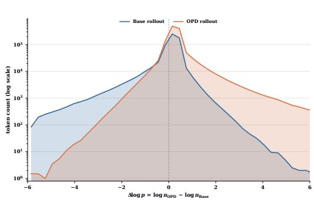  
(a) Long-tail overlay (log-count).

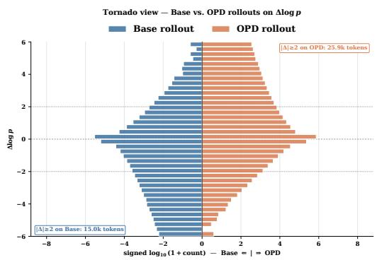  
(b) Tornado view (signed log-count).  
Figure 1: Signed post-training checkpoint shift. Curves are grouped by the checkpoint that generated each rollout; every realized token and prefix is rescored under both checkpoints. Base rollouts lean negative, whereas OPD rollouts exhibit a positive tail. Panels show a log-count overlay (a) and a signed tornado view (b).

Lemma 1 (Gradient norm of the per-token K2 estimator). For the per-token estimator in (4),

$$
\begin{array} { r l } { \left\| \nabla _ { z } L _ { t } ^ { \mathrm { R K L } } \right\| _ { 1 } = 2 \left| \Delta \log p _ { t } \right| } & { } \\ { \qquad \cdot \left( 1 - \pi _ { S } ( y _ { t } \mid c _ { t } ) \right) . } \end{array}\tag{13}
$$

The proof, including the justification for using the $\ell _ { 1 }$ norm, is given in Appendix $\mathbf { A }$

Direction and magnitude. The sign of $\Delta$ log $p _ { t }$ determines whether the sampled token is raised or suppressed, while the magnitude factorizes into a teacher–student gap and the student-side geometry term $( 1 - \pi _ { S } )$ . Thus, in OPD, the low-probability effect should be interpreted on the student side: holding $| \Delta \log p _ { t } |$ fixed, tokens assigned smaller $\pi _ { S } ( y _ { t } | c _ { t } )$ receive larger gradient coefficients.

Diagnostic rationale. On rollouts from the final OPD checkpoint, entropy and JSD are non-directional and mostly small. Ranking by $| \Delta \log p _ { t } |$ captures a much larger share of the sum of these gradient norms: 54.1%/74.6% in the top 5%/10% tokens, versus 28.4%/47.3% for JSD and 23.7%/42.4% for entropy (Fig. 2). The signed residual retains update direction, and its absolute value is the stronger scalar ranker in this comparison. The next subsection examines how this norm varies with student probability.

## 3.3 Student probability and concentration of gradient norms

Equation (13) predicts that, at fixed $| \Delta \log p _ { t } |$ , the gradient coefficient scales with $1 - \pi _ { S } ( y _ { t } | c _ { t } )$ For this concentration analysis, we use a separate 1.18M-token diagnostic dump from step 55 of vanilla OPD training, rather than either endpoint checkpoint used in Sec. 3.1. We compute

$$
g _ { t } = 2 \left| \Delta \log p _ { t } \right| \left( 1 - \pi _ { S } ( y _ { t } \mid c _ { t } ) \right) ,\tag{14}
$$

and sum $g _ { t }$ within $\pi _ { S }$ deciles (Figure 3).

Observed concentration. In this snapshot, lower-πS bins account for a larger share of the sum of these gradient norms, and large absolute gaps are enriched in the same bins (Figure 3). This is an empirical association: the factor $1 - \pi _ { S }$ alone does not imply the observed concentration. A probabilityonly weight therefore amplifies all low-πS samples, regardless of the sign of the teacher–student gap.

## 4 An Analysis-Inspired Reweighting

SuRe (Surprise-aware Reweighting). To probe whether the observed allocation is useful for optimization, we study SuRe as a simple intervention. The gradient identity motivates using student probability, but it does not uniquely imply the affine rule below.

## 4.1 Why a Student-side Reweighting

We act on $1 - \pi _ { S }$ because it is the softmax-geometry factor in the gradient of the K2 estimator with respect to the student logits. Unlike low-πS masking, this keeps the surprised tokens and avoids hard thresholds; unlike teacher-side reweighting by $1 - \pi _ { T }$ , it targets the student gradient geometry rather than teacher uncertainty. For a minimal intervention, we choose a smooth, monotone, bounded weight that recovers vanilla OPD with one dial. The analysis itself does not determine whether the observed concentration should be amplified, attenuated, normalized, or clipped. SuRe tests bounded amplification, $w _ { t } \in [ 1 , 1 + \alpha ]$

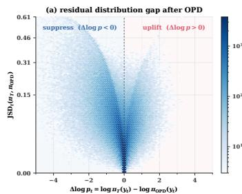

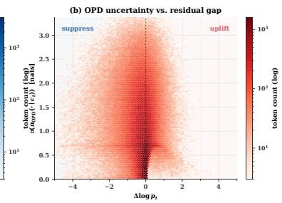

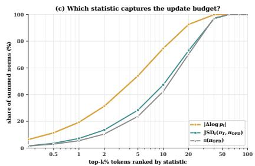

Figure 2: Why signed residuals rather than entropy/JSD. Panels (a,b) compare the teacher–OPD residual gap with JSD and OPD entropy; most tokens sit in a low-gap, low-uncertainty bulk. Panel (c) ranks tokens by each statistic and measures the share of the sum of gradient norms covered by each ranking. JSD and entropy use a top-50 approximation, computed by restricting each position’s full-distribution diagnostic to its 50 highest-probability candidate tokens.  
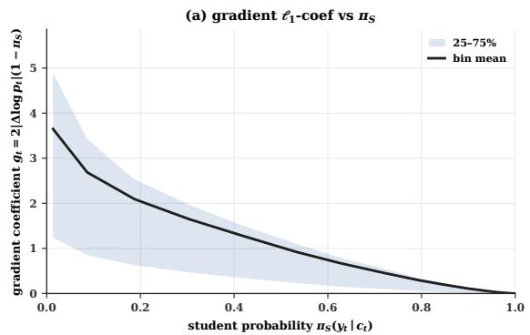

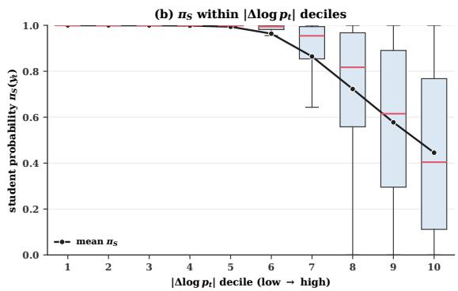  
Figure 3: Large gradient norms concentrate among student-surprised tokens. Panel (a) relates the gradient coefficient to sampled-token probability; panel (b) shows that large residual gaps are also enriched in low-probability positions.

## 4.2 A Factor-Targeted Instantiation

We make this concentration controllable through a multiplicative weight on the per-token loss. Define the detached student probability of the sampled token,

$$
\pi _ { S , t } = \operatorname { s g } { \big ( } \pi _ { S } ( y _ { t } | c _ { t } ) { \big ) } ,\tag{15}
$$

and the SuRe weight

$$
w _ { t } = 1 + \alpha \big ( 1 - \bar { \pi } _ { S , t } \big ) , \alpha \geq 0 .\tag{16}
$$

Because $\bar { \pi } _ { S , t }$ is detached, $w _ { t }$ simply rescales the baseline per-token gradient. Substituting it into equation (14) yields

$$
\begin{array} { r } { w _ { t } g _ { t } = 2 \big | \Delta \log p _ { t } \big | } \\ { \cdot \left[ ( 1 - \pi _ { S } ) + \alpha ( 1 - \pi _ { S } ) ^ { 2 } \right] . } \end{array}\tag{17}
$$

Thus SuRe leaves the gap factor unchanged inside the baseline gradient and increases relative emphasis as sampled-token probability decreases. Because the denominator is not renormalized and $w _ { t } \geq 1$ , it can also increase the overall loss scale.

## 4.3 The SuRe Objective

Let T denote the set of valid response tokens after the response mask. We apply $w _ { t }$ to the pertoken reverse-KL loss in (5) while keeping the unweighted token-mean denominator:

$$
\mathcal { L } _ { \mathrm { R K L - r w } } = \frac { 1 } { | \mathcal { T } | } \sum _ { t \in \mathcal { T } } w _ { t } L _ { t } ^ { \mathrm { R K L } } .\tag{18}
$$

Appendix B.1 gives the pseudocode, isolating the only implementation change: the detached scalar $w _ { t }$ .

## 5 Experiments

## 5.1 Setup

Models and data. We distill from Qwen3-8B (Team, 2025) into Qwen3-1.7B-Base and Qwen3- 4B-Base students. Training uses the 57K hard split (difficulty $\geq 6 )$ of DeepMath (He et al., 2025).

Training. The main experiments use seed 42. The second-seed check uses seed 43; all other settings are held fixed, and the corresponding OPD and SuRe checkpoints are evaluated at step 222.

Table 1: In-domain performance (%). For AIME24, AIME25, and AMC23 we report avg@8 and pass@8; for MATH-500 we report avg@4 and pass@4. Cells with deeper background color correspond to better performance within each model group.
<table><tr><td rowspan="3">Methods</td><td colspan="2">AIME24</td><td colspan="2">AIME25</td><td colspan="2">AMC23</td><td colspan="2">MATH-500</td></tr><tr><td> $\operatorname { a v g } ( \varnothing 8$ </td><td>pass@8</td><td> $\operatorname { a v g } ( \varnothing 8$ </td><td>pass@8</td><td>avg@8</td><td>pass@8</td><td>avg@4</td><td>pass@4</td></tr><tr><td colspan="9">Qwen3-1.7B-Base</td></tr><tr><td>- Base</td><td>4.17</td><td>16.67</td><td>4.17</td><td>16.67</td><td>30.00</td><td>65.00</td><td>56.35</td><td>76.80</td></tr><tr><td>- KD</td><td>7.08</td><td>20.00</td><td>3.33</td><td>13.33</td><td>30.94</td><td>67.50</td><td>56.45</td><td>75.60</td></tr><tr><td>- SeqKD</td><td>5.83</td><td>20.00</td><td>4.17</td><td>20.00</td><td>32.19</td><td>72.50</td><td>56.25</td><td>74.80</td></tr><tr><td>- Vanilla OPD</td><td>9.17</td><td>16.67</td><td>5.83</td><td>16.67</td><td>39.38</td><td>67.50</td><td>66.55</td><td>80.80</td></tr><tr><td>- SuRe</td><td>9.58</td><td>23.33</td><td>7.08</td><td>16.67</td><td>43.12</td><td>75.00</td><td>67.65</td><td>80.80</td></tr><tr><td colspan="9">Qwen3-4B-Base</td></tr><tr><td>- Base</td><td>12.08</td><td>26.67</td><td>7.08</td><td>23.33</td><td>39.06</td><td>75.00</td><td>57.65</td><td>81.60</td></tr><tr><td>- KD</td><td>10.00</td><td>20.00</td><td>11.67</td><td>33.33</td><td>32.50</td><td>75.00</td><td>47.35</td><td>76.00</td></tr><tr><td>- SeqKD</td><td>8.33</td><td>30.00</td><td>5.83</td><td>20.00</td><td>32.81</td><td>70.00</td><td>55.40</td><td>82.60</td></tr><tr><td>- Vanilla OPD</td><td>18.75</td><td>30.00</td><td>17.08</td><td>40.00</td><td>56.56</td><td>85.00</td><td>79.05</td><td>87.20</td></tr><tr><td>- SuRe</td><td>19.58</td><td>36.67</td><td>14.17</td><td>36.67</td><td>58.44</td><td>90.00</td><td>79.15</td><td>88.40</td></tr></table>

We train for two epochs on 32×H20 with learning rate $1 0 ^ { - 6 }$ and batch size 512. Full configs are in Appendix B. The second seed is limited to the MATH-500 controls.

Evaluation. Math reasoning benchmarks include AIME2024 (Zhang and Math-AI, 2024), AIME2025 (Zhang and Math-AI, 2025), AMC23 (Li et al., 2024), and MATH-500 (Lightman et al., 2024). Out-of-domain (OOD) benchmarks include code generation (CRUX, Gu et al., 2024a), instruction following (IFEval, Zhou et al., 2023), and general ability (MMLU-Pro, Wang et al., 2024). For competition benchmarks (AIME24, AIME25, AMC23) we report both avg@8 and pass@8 with temperature 0.7 and top-p 0.9; for MATH-500 we report avg@4 and pass@4; for OOD benchmarks we report pass@1.

Questions. We ask: Q1 Does SuRe improve OPD across scales and sampling budgets? (§5.2) Q2 How does surprise reweighting affect the selected OOD tasks? (Figure 5) Q3 Do controls separate surprise-oriented assignment from loss-scale and generic non-uniform-weighting effects? (§5.3)

## 5.2 Main Results

Table 1 compares each base student, vanilla reverse-KL OPD, and SuRe at α=1.0 on both Qwen3-1.7B-Base and Qwen3-4B-Base.

OPD generally outperforms offline distillation; SuRe is often, but not uniformly, beneficial. Across both scales in Table 1, vanilla OPD achieves higher avg@k than Base, KD (Hinton et al., 2015), and SeqKD (Kim and Rush, 2016) on every evaluated math benchmark. KD and SeqKD sometimes fall below the base in this pipeline, including on AMC23 at the 4B scale. This shows that teacher access alone does not guarantee an improvement under the evaluated pipeline, although these experiments do not isolate the cause of the offline degradation.

SuRe (α=1.0) improves many, but not all, reported metrics over vanilla OPD. The clearest gains occur on AMC23: SuRe raises avg@8 by 3.7pp and pass@8 by 7.5pp at 1.7B, and pass@8 by 5.0pp at 4B. Changes on MATH-500 are small, and both AIME25 metrics decrease at 4B. We therefore treat the results as a scoped test of an analysisinspired intervention rather than evidence of uniform superiority. Appendix C.5 reports a supplementary comparison with GRPO; the methods use different training signals and the comparison is not a matched test of equivalent objectives.

Selected out-of-domain results are mixed. Although training data is restricted to hard math (DeepMath, difficulty ≥ 6), Figure 5 shows that OPD and SuRe are broadly comparable on CRUX, IFEval, and MMLU-Pro. On 1.7B MMLU-Pro, both are slightly below the base. We therefore observe neither uniform OOD improvement nor clear evidence of a broad transfer effect on these selected tasks.

Training dynamics show direct amplification. Figure 4 shows that SuRe increases the early gradient norm while actor entropy remains similar. Since the unnormalized weights have mean above one, the larger norm is expected and cannot by itself distinguish surprise alignment from a larger

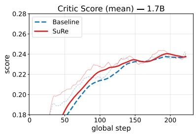  
(a) Mean rollout score

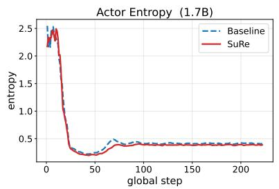  
(b) Actor entropy

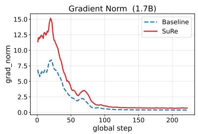  
(c) Gradient norm  
Figure 4: Training dynamics on Qwen3-1.7B-Base. Vanilla OPD (blue dashed) vs. SuRe at $\alpha { = } 1 . 0$ (red). SuRe improves mean rollout score and increases early gradient norm while tracking OPD’s actor entropy.

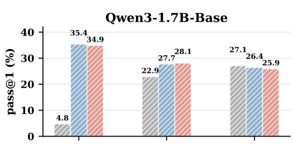

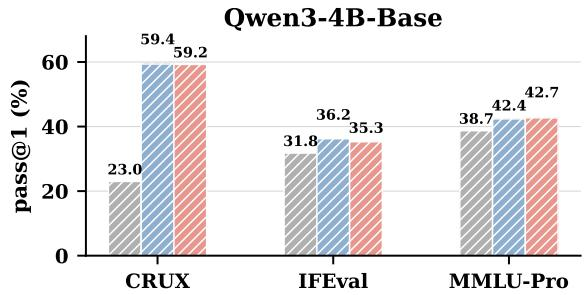  
Figure 5: Out-of-domain performance (pass@1, %). Bars compare Base, Vanilla OPD, and SuRe on CRUX, IFEval, and MMLU-Pro for both student scales. On the evaluated OOD tasks, OPD and SuRe are broadly comparable, but neither uniformly improves over the base; both are slightly below the base on 1.7B MMLU-Pro.

effective update scale.

## 5.3 Ablations and Controls

We conduct two groups of controlled experiments on Qwen3-1.7B-Base to probe the design choices behind SuRe. Figure 6 reports pass@k for $k { \in } \{ 1 , 2 , 4 , 8 \}$ on AMC23, which exhibits more stable and discriminative pass@k curves than AIME24/25 at small k.

Strength of reweighting (α sweep). Figure 6(a) sweeps $\alpha ~ \in ~ \{ 0 . 2 , 0 . 5 , 1 . 0 , 2 . 0 \}$ against vanilla OPD $( \alpha { = } 0 )$ . The pass@k curve shifts upward monotonically from α=0 to $\alpha { = } 1 . 0$ at small k, with $\alpha { = } 1 . 0$ being uniformly best at $k { \in } \{ 1 , 2 , 4 \}$ A milder reweighting (α=0.5) recovers part, but not all, of the gain, indicating that the effect is not a knife-edge behaviour around a single setting but a smooth function of how strongly student-surprised tokens are amplified. Increasing to $\alpha { = } 2 . 0$ weakens the small-k gain and approaches vanilla OPD on pass@2. Thus larger amplification is not uniformly better; the sweep does not identify a mechanism beyond this empirical non-monotonicity.

Direction matters. Figure 6(b) replaces the surprise weighting with two controls at the same α=1.0: High-reweight, which reweights lowsurprise (high student likelihood) tokens instead, and Random-reweight, which permutes the pertoken weights within each rollout. The aligned assignment outperforms the opposite assignment in this setting. A separate unit-mean control on MATH-500 preserves the gain, showing that a larger mean token weight is not necessary for the observed gain in this run. However, the alignedversus-exact-shuffled comparison remains statistically unresolved. The controls therefore support a role for orientation while leaving open how much of the gain comes from exact surprise alignment versus a more generic benefit of non-uniform weighting.

Table 2: Additional controls on MATH-500 (%). Qwen3-1.7B, seed 42, step 222. Mean-normalized, exact-shuffled, rank-reversed, and uplift-only variants use unit-mean weights over valid response tokens within each micro-batch; Original SuRe does not.
<table><tr><td>Training objective</td><td>avg@4</td><td>pass@4</td></tr><tr><td>Vanilla OPD</td><td>66.55</td><td>80.80</td></tr><tr><td>Original SuRe</td><td>67.65</td><td>80.80</td></tr><tr><td>Mean-normalized SuRe</td><td>69.20</td><td>82.20</td></tr><tr><td>Exact-shufled</td><td>67.95</td><td>81.00</td></tr><tr><td>Exact rank-reversed</td><td>67.00</td><td>81.40</td></tr><tr><td>Mean-normalized uplift-only</td><td>68.40</td><td>81.40</td></tr></table>

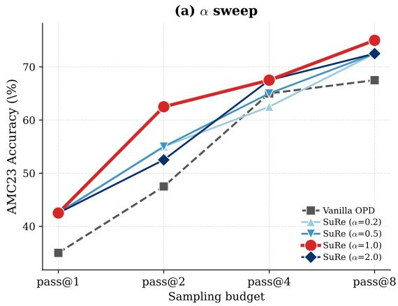

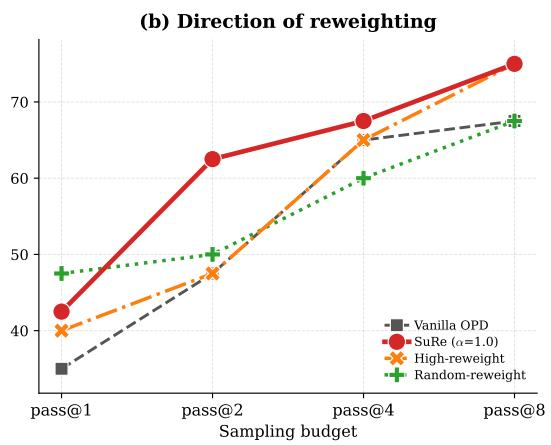  
Figure 6: Ablations on AMC23 (Qwen3-1.7B-Base). (a) α sweep for SuRe against vanilla OPD. (b) Orientation controls comparing SuRe, High-reweight, and Random-reweight. The plotted run favors SuRe at small k and the aligned assignment over the opposite assignment; the shuffled comparison is not statistically resolved.

Matched controls. Mean-normalized SuRe preserves the MATH-500 improvement, while the exact-shuffled and rank-reversed assignments are numerically lower than the aligned normalized variant. Because exact-shuffled still exceeds vanilla OPD, the comparison does not attribute the entire gain to exact surprise assignment. Meannormalized uplift-only also improves over OPD but remains below mean-normalized SuRe on avg@4. Full results and the second-seed check are in Appendix C.6.

## 6 Related Work

Distillation. Knowledge distillation (KD) trains smaller students to approximate larger teachers, with sequence-level KD extending this idea to teacher-generated outputs (Hinton et al., 2015; Kim and Rush, 2016). However, such off-policy training suffers from train-inference mismatch because students learn from teacher sequences but decode from their own distributions. OPD addresses this by training on student rollouts with dense teacher supervision (Lu and Thinking Machines Lab, 2025). MiniLLM motivates reverse-KL OPD by its modeseeking behavior, while GKD broadens the view to mixtures of student- and teacher-generated data (Gu et al., 2024b; Agarwal et al., 2024). Recent work further connects teacher log-ratios to dense KL-constrained RL, making the reward interpretation of token-level distillation explicit (Yang et al., 2026). Our work is complementary: instead of changing the rollout source or divergence, we study how reverse-KL OPD distributes update magnitudes across tokens.

Reasoning Analysis and Optimization. Reasoning has advanced through prompting and RL with verifiable rewards (RLVR) (Wei et al., 2022; Shao et al., 2024; Yu et al., 2025). Recent analyses show that RLVR gradients concentrate on high-entropy minority tokens and depend strongly on update direction (Wang et al., 2025; Huang et al., 2026). These findings suggest that not all token positions contribute equally, motivating methods that select or reweight informative tokens rather than matching every position uniformly. For OPD, prior work studies entropy-aware token selection, probabilitybased failure filtering, and reward/entropy controls for stabilizing reasoning transfer (Jin et al., 2026; Li et al., 2026; Ko et al., 2026).

## 7 Conclusion

We analyzed how the per-token K2 estimator of reverse KL distributes gradient norms across token positions in on-policy distillation, with the gradients taken with respect to the student logits. The exact factorization and Qwen3 math diagnostics show a highly non-uniform distribution, with the largest norms concentrated among low-student-probability samples that are also enriched in large teacher– student gaps. SuRe provides one lightweight test of amplifying this allocation and improves several metrics in the evaluated setting. Together, these results suggest that token-level gradient allocation is a useful lens for understanding sampled-token reverse-KL OPD. We hope these analyses and the resulting method offer useful insights for improving OPD.

## 8 Limitations

First, our current study focuses on sampled tokenlevel reverse-KL OPD, while alternative design choices, such as full-vocabulary distillation or using Jensen–Shannon divergence as the optimization objective, have not yet been systematically investigated. Second, our experiments are primarily conducted on mathematical reasoning datasets, and the generated reasoning traces have limited length, which may restrict the generality of our findings to broader domains or substantially longer reasoning processes. Third, due to computational budget constraints, we only explore a limited set of model and OPD configurations and do not evaluate our approach on models with larger parameter scales.

## References

Rishabh Agarwal, Nino Vieillard, Yongchao Zhou, Piotr Stanczyk, Sabela Ramos Garea, Matthieu Geist, and Olivier Bachem. 2024. On-policy distillation of language models: Learning from self-generated mistakes. In The Twelfth International Conference on Learning Representations, ICLR 2024, Vienna, Austria, May 7-11, 2024. OpenReview.net.

DeepSeek-AI. 2026. DeepSeek-V4 technical report. https://huggingface.co/deepseek-ai/ DeepSeek-V4-Pro/blob/main/DeepSeek\_V4.pdf. Accessed: 2026-05-14.

GLM. 2026. GLM-5: from vibe coding to agentic engineering. CoRR, abs/2602.15763.

Alex Gu, Baptiste Rozière, Hugh Leather, Armando Solar-Lezama, Gabriel Synnaeve, and Sida I Wang. 2024a. Cruxeval: a benchmark for code reasoning, understanding and execution. In Proceedings ofthe 41st International Conference on Machine Learning, pages 16568–16621.

Yuxian Gu, Li Dong, Furu Wei, and Minlie Huang. 2024b. Minillm: Knowledge distillation of large language models. In The Twelfth International Conference on Learning Representations, ICLR 2024, Vienna, Austria, May 7-11, 2024. OpenReview.net.

Zhiwei He, Tian Liang, Jiahao Xu, Qiuzhi Liu, Xingyu Chen, Yue Wang, Linfeng Song, Dian Yu, Zhenwen Liang, Wenxuan Wang, and 1 others. 2025. Deepmath-103k: A large-scale, challenging, decontaminated, and verifiable mathematical dataset for advancing reasoning. arXiv preprint arXiv:2504.11456.

Geoffrey E. Hinton, Oriol Vinyals, and Jeffrey Dean. 2015. Distilling the knowledge in a neural network. CoRR, abs/1503.02531.

Kexin Huang, Haoming Meng, Junkang Wu, Jinda Lu, Chiyu Ma, Ziqian Chen, Xue Wang, Bolin Ding, Jiancan Wu, Xiang Wang, Xiangnan He, Guoyin Wang,

and Jingren Zhou. 2026. On the direction of RLVR updates for LLM reasoning: Identification and exploitation. CoRR, abs/2603.22117.

Jonas Hübotter, Frederike Lübeck, Lejs Behric, Anton Baumann, Marco Bagatella, Daniel Marta, Ido Hakimi, Idan Shenfeld, Thomas Kleine Buening, Carlos Guestrin, and Andreas Krause. 2026. Reinforcement learning via self-distillation. CoRR, abs/2601.20802.

Woogyeol Jin, Taywon Min, Yongjin Yang, Swanand Ravindra Kadhe, Yi Zhou, Dennis Wei, Nathalie Baracaldo, and Kimin Lee. 2026. Entropy-aware on-policy distillation of language models. CoRR, abs/2603.07079.

Yoon Kim and Alexander M. Rush. 2016. Sequencelevel knowledge distillation. In Proceedings of the 2016 Conference on Empirical Methods in Natural Language Processing, EMNLP 2016, Austin, Texas, USA, November 1-4, 2016, pages 1317–1327. The Association for Computational Linguistics.

Jongwoo Ko, Sara Abdali, Young Jin Kim, Tianyi Chen, and Pashmina Cameron. 2026. Scaling reasoning efficiently via relaxed on-policy distillation. CoRR, abs/2603.11137.

Jia Li, Edward Beeching, Lewis Tunstall, Ben Lipkin, Roman Soletskyi, Shengyi Huang, Kashif Rasul, Longhui Yu, Albert Q Jiang, Ziju Shen, and 1 others. 2024. Numinamath: The largest public dataset in ai4maths with 860k pairs of competition math problems and solutions. Hugging Face repository, 13(9):9.

Yaxuan Li, Yuxin Zuo, Bingxiang He, Jinqian Zhang, Chaojun Xiao, Cheng Qian, Tianyu Yu, Huan-ang Gao, Wenkai Yang, Zhiyuan Liu, and 1 others. 2026. Rethinking On-Policy distillation of large language models: Phenomenology, mechanism, and recipe. arXiv preprint arXiv:2604.13016.

Hunter Lightman, Vineet Kosaraju, Yuri Burda, Harrison Edwards, Bowen Baker, Teddy Lee, Jan Leike, John Schulman, Ilya Sutskever, and Karl Cobbe. 2024. Let’s verify step by step. In The Twelfth International Conference on Learning Representations, ICLR 2024, Vienna, Austria, May 7-11, 2024. Open-Review.net.

Kevin Lu and Thinking Machines Lab. 2025. On-policy distillation. Thinking Machines Lab: Connectionism.

John Schulman. 2020. Approximating KL divergence. http://joschu.net/blog/kl-approx. html. Blog post.

Zhihong Shao, Peiyi Wang, Qihao Zhu, Runxin Xu, Junxiao Song, Xiao Bi, Haowei Zhang, Mingchuan Zhang, YK Li, Yang Wu, and 1 others. 2024. Deepseekmath: Pushing the limits of mathematical reasoning in open language models. arXiv preprint arXiv:2402.03300.

Kimi Team. 2026. Kimi K3: open frontier intelligence. CoRR, abs/2607.24653.

Qwen Team. 2025. Qwen3 technical report. CoRR, abs/2505.09388.

Shenzhi Wang, Le Yu, Chang Gao, Chujie Zheng, Shixuan Liu, Rui Lu, Kai Dang, Xionghui Chen, Jianxin Yang, Zhenru Zhang, Yuqiong Liu, An Yang, Andrew Zhao, Yang Yue, Shiji Song, Bowen Yu, Gao Huang, and Junyang Lin. 2025. Beyond the 80/20 rule: High-entropy minority tokens drive effective reinforcement learning for LLM reasoning. CoRR, abs/2506.01939.

Yubo Wang, Xueguang Ma, Ge Zhang, Yuansheng Ni, Abhranil Chandra, Shiguang Guo, Weiming Ren, Aaran Arulraj, Xuan He, Ziyan Jiang, and 1 others. 2024. Mmlu-pro: A more robust and challenging multi-task language understanding benchmark. Advances in Neural Information Processing Systems, 37:95266–95290.

Jason Wei, Xuezhi Wang, Dale Schuurmans, Maarten Bosma, Brian Ichter, Fei Xia, Ed H. Chi, Quoc V. Le, and Denny Zhou. 2022. Chain-of-thought prompting elicits reasoning in large language models. In Advances in Neural Information Processing Systems 35: Annual Conference on Neural Information Processing Systems 2022, NeurIPS 2022, New Orleans, LA, USA, November 28 - December 9, 2022.

LLM-Core Xiaomi. 2026. Mimo-v2-flash technical report. CoRR, abs/2601.02780.

Wenkai Yang, Weijie Liu, Ruobing Xie, Kai Yang, Saiyong Yang, and Yankai Lin. 2026. Learning beyond teacher: Generalized on-policy distillation with reward extrapolation. CoRR, abs/2602.12125.

Qiying Yu, Zheng Zhang, Ruofei Zhu, Yufeng Yuan, Xiaochen Zuo, Yu Yue, Tiantian Fan, Gaohong Liu, Lingjun Liu, Xin Liu, Haibin Lin, Zhiqi Lin, Bole Ma, Guangming Sheng, Yuxuan Tong, Chi Zhang, Mofan Zhang, Wang Zhang, Hang Zhu, and 16 others. 2025. DAPO: an open-source LLM reinforcement learning system at scale. CoRR, abs/2503.14476.

Yifan Zhang and Team Math-AI. 2024. American invitational mathematics examination (aime) 2024. Contest problem collection.

Yifan Zhang and Team Math-AI. 2025. American invitational mathematics examination (aime) 2025. Contest problem collection.

Jeffrey Zhou, Tianjian Lu, Swaroop Mishra, Siddhartha Brahma, Sujoy Basu, Yi Luan, Denny Zhou, and Le Hou. 2023. Instruction-following evaluation for large language models. arXiv preprint arXiv:2311.07911.

## A Detailed Gradient Derivation

This appendix gives the full derivation that supports Lemma 1, including the choice of the $\ell _ { 1 }$ norm and a few sanity checks. Throughout, the object of analysis is the K2 estimator of reverse KL applied at each sampled token: for each fixed on-policy sampled response token $y _ { t } .$ , we differentiate the scalar loss attached to that sampled token and treat the sampled trajectory itself as fixed during the update. We fix a decoding context $c _ { t } = ( x , y _ { < t } )$ and write $z \in \mathbb { R } ^ { V }$ for the student logits at position $t , p _ { v } \triangleq$ $\pi _ { S } ( v | c _ { t } )$ for the next-token probability, $p _ { t } ^ { S } \triangleq$ $\pi _ { S } ( y _ { t } | c _ { t } ) = p _ { y _ { t } }$ for the sampled-token probability, and $\Delta \log p _ { t } = \log \pi _ { T } ( y _ { t } \mid c _ { t } ) - \log \pi _ { S } ( y _ { t } \mid c _ { t } )$ for the teacher–student gap of (3). The teacher log-probability log $\pi _ { T } ( y _ { t } | c _ { t } )$ is treated as a stopgradient constant. All quantities are evaluated at the pre-update student policy. This appendix does not claim to characterize the full-vocabulary reverse-KL gradient or the score-function gradient of the sampling distribution.

## A.1 Per-token softmax derivative

Restatement. Let $z \in \mathbb { R } ^ { V }$ be the student logits and $\pi _ { \boldsymbol { S } } ( v \vert c _ { t } ) = \exp ( z _ { v } ) / \sum _ { u } \exp ( z _ { u } )$ as in (1). For any sampled token $y _ { t } \in \mathcal { V } ,$

$$
\nabla _ { z } \log \pi _ { S } ( y _ { t } \mid c _ { t } ) = e _ { y _ { t } } - \pi _ { S } ( \cdot \mid c _ { t } ) ,\tag{19}
$$

where $e _ { y _ { t } } \in \mathbb { R } ^ { V }$ is the one-hot indicator at coordinate $y _ { t }$ . This restates (7).

Proof. Writing the log-probability as

$$
\log \pi _ { S } ( y _ { t } | c _ { t } ) = z _ { y _ { t } } - \log \left( \sum _ { u \in \mathcal { V } } \exp ( z _ { u } ) \right) ,
$$

we differentiate both terms coordinate-wise. For any $v \in \mathcal V$

$$
\begin{array} { c } { { \displaystyle \frac { \partial z _ { y _ { t } } } { \partial z _ { v } } = { \bf 1 } \{ v = y _ { t } \} , } } \\ { { \displaystyle \frac { \partial } { \partial z _ { v } } \log \left( \sum _ { u } \exp ( z _ { u } ) \right) = \frac { \exp ( z _ { v } ) } { \sum _ { u } \exp ( z _ { u } ) } } } \\ { { = \pi _ { S } ( v \mid c _ { t } ) . } } \end{array}
$$

Subtracting these two expressions gives

$$
\begin{array} { r } { \displaystyle \frac { \partial } { \partial z _ { v } } \log \pi _ { S } ( y _ { t } | c _ { t } ) = \mathbf { 1 } \{ v = y _ { t } \} } \\ { \displaystyle - \pi _ { S } ( v | c _ { t } ) , } \end{array}\tag{20}
$$

which is (19) stated coordinate-wise.

A.2 Chain rule for the per-token K2 estimator Restatement. For the per-token K2 estimator $\begin{array} { r } { L _ { t } ^ { \mathrm { R K L } } = \frac { 1 } { 2 } ( \Delta \log p _ { t } ) ^ { 2 } } \end{array}$ from (4), its gradient with respect to the student logits satisfies

$$
\nabla _ { z } L _ { t } ^ { ^ { \mathrm { R K L } } } = - \Delta \log p _ { t } \big ( e _ { y _ { t } } - \pi _ { S } ( \cdot \vert c _ { t } ) \big ) ,\tag{21}
$$

which reproduces (12).

Proof. Define

$$
\Delta \log p _ { t } = \log \pi _ { T } ( y _ { t } \mid c _ { t } ) - \log \pi _ { S } ( y _ { t } \mid c _ { t } ) .
$$

Because log $\pi _ { T } ( y _ { t } | c _ { t } )$ does not depend on z, only the second term contributes to the gradient, so

$$
\nabla _ { z } ( \Delta \log p _ { t } ) = - \nabla _ { z } \log \pi _ { S } ( y _ { t } \mid c _ { t } ) .\tag{22}
$$

Applying the chain rule to $\begin{array} { r } { L _ { t } ^ { \mathrm { R K L } } = \frac { 1 } { 2 } ( \Delta \log p _ { t } ) ^ { 2 } } \end{array}$

$$
\begin{array} { r l } { \nabla _ { z } L _ { t } ^ { \mathrm { R K L } } = \Delta \log p _ { t } \cdot \nabla _ { z } ( \Delta \log p _ { t } ) } & { } \\ { = - \Delta \log p _ { t } \cdot \nabla _ { z } \log \pi _ { S } ( y _ { t } | c _ { t } ) . } \end{array}
$$

Substituting (19) for $\nabla _ { z } \log \pi _ { S } ( y _ { t } \mid c _ { t } )$ yields (21).

Coordinate form. The vector identity in (21) expands into

$$
\frac { \partial L _ { t } ^ { \mathrm { R K L } } } { \partial z _ { v } } = \left\{ { \begin{array} { l l } { - \Delta \log p _ { t } ( 1 - p _ { t } ^ { S } ) , } & { v = y _ { t } , } \\ { \Delta \log p _ { t } \pi _ { S } ( v \mid c _ { t } ) , } & { v \neq y _ { t } . } \end{array} } \right.\tag{23}
$$

The two branches confirm the descent direction: when $\Delta \log p _ { t } > 0$ (teacher endorses the sampled token more than the student), the yt-coordinate of $\nabla _ { z } L _ { t } ^ { \mathrm { R K L } }$ is positive, i.e. the update raises the sampled-token logit and lowers all competitor logits in proportion to $\pi _ { S } ( v | c _ { t } )$ ; the signs flip when $\Delta \log p _ { t } < 0$

## A.3 The $\ell _ { 1 }$ Norm Calculation

Restatement. Under the same sampled tokenlevel reverse-KL setup, the per-token gradient $\ell _ { 1 }$ norm satisfies

$$
\left\| \nabla _ { z } L _ { t } ^ { \mathrm { R K L } } \right\| _ { 1 } = 2 \left| \Delta \log p _ { t } \right| ( 1 - p _ { t } ^ { S } ) ,\tag{24}
$$

which is (13).

Proof. Using the coordinate form (23), split the sum into the sampled-token term $v = y _ { t }$ and the remaining vocabulary $v \neq y _ { t } ;$

$$
\begin{array} { r l } {  { \big \| \nabla _ { z } L _ { t } ^ { \mathrm { R K L } } \big \| _ { 1 } = \displaystyle \sum _ { v \in \mathcal { V } } | \frac { \partial L _ { t } ^ { \mathrm { R K L } } } { \partial z _ { v } } | } } \\ & { = \big | \Delta \log p _ { t } \big | ( 1 - p _ { t } ^ { S } ) } \\ & { + \sum _ { v \ne y _ { t } } \big | \Delta \log p _ { t } \big | \pi _ { S } \big ( v \big | c _ { t } \big ) . } \end{array}\tag{25}
$$

The remaining-coordinate sum simplifies via the simplex identity $\begin{array} { r } { \sum _ { v } \pi _ { S } ( v \mid c _ { t } ) = 1 } \end{array}$

$$
\sum _ { v \neq y _ { t } } \pi _ { S } ( v \mid c _ { t } ) = 1 - p _ { t } ^ { S } .\tag{26}
$$

Substituting (26) into (25) gives

$$
\begin{array} { r l } & { \left\| \nabla _ { z } L _ { t } ^ { \mathrm { R K L } } \right\| _ { 1 } = | \Delta \log p _ { t } | ( 1 - p _ { t } ^ { S } ) } \\ & { ~ + | \Delta \log p _ { t } | ( 1 - p _ { t } ^ { S } ) } \\ & { ~ = 2 | \Delta \log p _ { t } | ( 1 - p _ { t } ^ { S } ) , } \end{array}
$$

which is (24).

Geometric reading. The two equal halves of (24) have a clean geometric meaning. The first half is the absolute magnitude of coordinate $y _ { t }$ in the gradient with respect to the student logits, and equals $| \Delta \log p _ { t } | ( 1 - p _ { t } ^ { S } )$ . The second half is the summed absolute magnitude across all competitor coordinates, and also equals $| \Delta$ log $p _ { t } | ( 1 - p _ { t } ^ { S } )$ . The two channels point in opposite directions in logit space but contribute equally to the $\ell _ { 1 }$ norm, yielding the factor of 2 in (24).

## A.4 Why We Report the $\ell _ { 1 }$ Norm

We measure the per-token update by $\Vert \nabla _ { z } L _ { t } \Vert _ { 1 }$ rather than $\Vert \nabla _ { z } L _ { t } \Vert _ { 2 }$ for two reasons. (i) The logit-gradient $\ell _ { 1 }$ norm is the dual sensitivity to $\ell _ { \infty } .$ bounded logit perturbations:

$$
\operatorname* { s u p } _ { \| \delta z \| _ { \infty } \leq \epsilon } \big | \langle \nabla _ { z } L _ { t } , \delta z \rangle \big | = \epsilon \| \nabla _ { z } L _ { t } \| _ { 1 } .
$$

It therefore provides a local logit-space sensitivity measure. For the first-order softmax response, the total-variation change is bounded by $\bar { \frac { 1 } { 4 } } \| \delta z \| _ { 1 } + O ( \| \delta z \| _ { 1 } ^ { 2 } )$ . Under the hypothetical logitspace step $\delta z = - \eta \nabla _ { z } L _ { t }$ , this is a local upperbound proxy for probability movement, not a characterization of the model’s parameter-space update. (ii) The $\ell _ { 1 }$ norm produces a clean multiplicative factor in $1 - \pi _ { S } ( y _ { t } | c _ { t } )$ , which is exactly the quantity SuRe acts on; the $\ell _ { 2 }$ norm gives an analogous but more algebraically opaque expression, with $\textstyle { \sqrt { ( 1 - p _ { t } ^ { S } ) ^ { 2 } + \sum _ { v \neq y _ { t } } \pi _ { S } ( v \mid c _ { t } ) ^ { 2 } } }$ replacing the simple $2 ( 1 - p _ { t } ^ { S } )$ factor.

## A.5 Sanity Check: Confident vs. Surprised Tokens

For a confident token at the correct support, $p _ { t } ^ { S } $ 1, the gradient norm approaches 0 regardless of $| \Delta \log p _ { t } | .$ , because the sampled-token softmax gradient vanishes near saturation. Quantitatively, both the yt-coordinate magnitude $| \Delta \log p _ { t } | ( 1 -$ $p _ { t } ^ { S } )$ and the summed off-coordinate magnitude $| \Delta \log p _ { t } | ( 1 - p _ { t } ^ { S } )$ vanish jointly. For a surprised token, $p _ { t } ^ { S } \  \ 0$ , the gradient norm approaches $2 | \Delta \log p _ { t } | .$ , doubling the naive $| \Delta \log p _ { t } |$ estimate one would get from the $y _ { t } .$ -coordinate alone; the second factor of $| \Delta \log p _ { t } |$ is the summed offcoordinate contribution across the rest of the vocabulary. This is the limit in which the studentprobability factor is most visible.

Algorithm 1 SuRe: Surprise-aware Reweighted   
On-Policy Distillation   
Require: Student $\pi _ { S }$ (parameters θ); frozen   
teacher $\pi _ { T } ;$ surprise coefficient $\alpha \geq 0 ;$ learn  
ing rate η   
Ensure: Updated student parameters $\theta$   
1: for step $k = 1 , 2 , \ldots$ . do   
2: Sample on-policy responses; collect valid   
token set T   
3: for all $t \in \tau$ do   
4: $\Delta$ log $p _ { t } : =$ log   πS (yt | ct) $\frac { \pi _ { T } ( y _ { t } \mid c _ { t } ) } { \mid }$   
5: $\begin{array} { r } { L _ { t } : = \frac { 1 } { 2 } ( \Delta \log p _ { t } ) ^ { 2 } } \end{array}$   
6: $w _ { t } : = \bar { 1 } + \alpha \big ( 1 - \mathrm { s g } ( \pi _ { S } ( y _ { t } | c _ { t } ) ) \big )$   
7: end for   
8: $\mathcal { L } : = \frac { 1 } { | \mathcal { T } | } \sum _ { t \in \mathcal { T } } w _ { t } L _ { t }$ ▷ (18)   
9: $\theta : = \dot { \theta } - \dot { \eta } \nabla _ { \theta } \mathcal { L }$   
10: end for

## B Experimental Details

## B.1 Pseudo Code of SuRe

To present the SuRe pipeline clearly, we summarize the pseudo code of SuRe in Algorithm 1. Our implementation is partially informed by a prior self-distillation training setup, with modifications to implement the SuRe objective (Hübotter et al., 2026).

Setup. Unless otherwise noted, all OPD and SuRe runs use Qwen3-8B as the frozen teacher, train on the 57K hard split of DeepMath (He et al., 2025), and share the default hyperparameters listed in Table 3. The student is Qwen3-1.7B-Base for the main experiments and analysis, and Qwen3- 4B-Base for the cross-scale comparison in Sec. 5.2. The main runs use seed 42. The second-seed check in Table 10 uses seed 43 with all other settings fixed; the corresponding OPD and SuRe checkpoints are evaluated at step 222. Each run uses $4 { \times } 8 = 3 2 \mathrm { { H } } 2 0 \mathrm { { G P U s } }$ and is trained for two epochs.

## B.2 Prompt Templates

Training-time math prompt. All math experiments load the 57K hard split of DeepMath through the VeRL data pipeline, where every record stores the user message in the OpenAI chat format. We append a fixed instruction \nPlease reason step by step, and put your final answer within \boxed{}. to every user message that does not already contain \boxed{}, then let the tokenizer apply the Qwen3 chat template with enable\_thinking=false. The resulting trainingtime prompt is therefore:

<|im\_start|>user   
{problem}   
Please reason step by step, and   
put your final answer within   
\boxed{}.<|im\_end|>   
<|im\_start|>assistant   
<think>   
</think>

where {problem} is the original Deep-Math problem statement. The empty <think>. . . </think> block is the form that the Qwen3 chat template emits when enable\_thinking=false; it is part of the prompt and is not generated by the student. Both the student rollout and the frozen teacher receive exactly the same prompt, so the teacher–student gap $\Delta \log p _ { t }$ used in (3) is computed under aligned contexts.

Evaluation-time math prompt. Evaluation prompts use the same instruction text appended to the problem statement, so that DeepMath-trained students see a prompt distribution at test time that matches the training distribution:

{problem}   
Please reason step by step, and put your   
final answer within \boxed{}.

For the in-domain math benchmarks (AIME2024, AIME2025, AMC23, and MATH-500), responses are parsed by extracting the last \boxed{. . . } expression and compared against ground-truth answers via exact match or the corresponding benchmark verifier.

## C Additional Experimental Results

## C.1 Full Out-of-Domain Results

Table 4 reports the full pass@k results on all OOD benchmarks used in the main text. The main paper reports pass@1 for compactness, while this appendix includes pass@1, pass@5, and pass@10 to expose the best-of-k behavior of each method. For IFEval we use prompt-level strict accuracy; for MMLU-Pro we use exact match.

Table 3: Training hyperparameters across student scales for Vanilla OPD and SuRe. The only difference between the two methods is the per-token weight $w _ { t }$ in (16); the entries below are shared by the corresponding model-scale runs except for the memory-related knobs required by the larger student. Rows prefixed by “Framework” denote batching limits inherited from the training implementation. The extra reference-policy KL coefficient is separate from the K2 distillation objective.
<table><tr><td>Hyper-parameter</td><td>Qwen3 (8B→1.7B)</td><td>Qwen3 (8B→4B)</td></tr><tr><td>Student model</td><td>Qwen3-1.7B-Base</td><td>Qwen3-4B-Base</td></tr><tr><td>Teacher model</td><td> $\mathrm { Q w e n } 3 { - } 8 \mathrm { B }$ </td><td> $\mathbf { Q } \mathrm { w e n } 3 { - } 8 \mathbf { B }$ </td></tr><tr><td>Optimizer</td><td>AdamW</td><td> $\mathrm { \bar { A } d a m W }$ </td></tr><tr><td>Learning rate</td><td> $1 \times 1 0 ^ { - 6 }$ </td><td> $1 \times 1 0 ^ { - 6 }$ </td></tr><tr><td>LR warmup steps</td><td>10</td><td>10</td></tr><tr><td>Training epochs</td><td>2</td><td>2</td></tr><tr><td>Global batch size</td><td>512</td><td>512</td></tr><tr><td>Framework mini-batch size</td><td>512</td><td>512</td></tr><tr><td>Rollouts per prompt</td><td>1</td><td>1</td></tr><tr><td>Maximum prompt length</td><td>2,048</td><td>2,048</td></tr><tr><td>Maximum response length</td><td>8,192</td><td>8,192</td></tr><tr><td>Maximum model length</td><td>12,288</td><td>12,288</td></tr><tr><td>Framework max token length/GPU</td><td>24,576</td><td>16,384</td></tr><tr><td>Tensor parallel size</td><td>1</td><td>1</td></tr><tr><td>Generation temperature</td><td>1.0</td><td>1.0</td></tr><tr><td>Top-p (generation)</td><td>1.0</td><td>1.0</td></tr><tr><td>Chunked prefill</td><td>enabled</td><td>enabled</td></tr><tr><td>Rollout max batched tokens</td><td>24,576</td><td>16,384</td></tr><tr><td>Rollout max sequences</td><td>2,048</td><td>512</td></tr><tr><td>Rollout GPU memory utilization</td><td>0.92</td><td>0.80</td></tr><tr><td>Actor FSDP size</td><td>8</td><td>8</td></tr><tr><td>Reference FSDP size</td><td>32</td><td>32</td></tr><tr><td>Actor micro-batch/GPU</td><td>2</td><td>1</td></tr><tr><td>Reference log-prob micro-batch/GPU</td><td>4</td><td>2</td></tr><tr><td>Rollout log-prob micro-batch/GPU</td><td>4</td><td>2</td></tr><tr><td>Extra reference-policy KL coefficient</td><td>0.0</td><td>0.0</td></tr><tr><td>Loss aggregation</td><td>token-mean</td><td>token-mean</td></tr><tr><td>GPUs</td><td>4×8H20</td><td>4×8H20</td></tr></table>

## C.2 Training Dynamics on Qwen3-4B-Base

Figure 7 provides the same training-dynamics view as Figure 4, but for Qwen3-4B-Base. The curves complement the 1.7B analysis by showing that the qualitative optimization behavior remains similar at the larger student scale.

## C.3 Token-level Case Study

Takeaway. This case study is intended to answer a narrow descriptive question: where do the final OPD checkpoint and the Base initialization differ on a concrete sampled solution? In this correct MATH-500 rollout, most response tokens remain close across the two checkpoints, while a small number of local decision points differ sharply.

Token highlights. Table 6 gives the same example in the most compact token-level form: the token location, the log-probability difference between the final OPD checkpoint and the Base initialization, and the plain-language reading. Positive ∆ log p means the final OPD checkpoint assigns higher probability to the sampled token than Base; negative ∆ log p means it assigns lower probability.

In short, this case provides a qualitative endpoint comparison: the final OPD checkpoint differs from the Base initialization most strongly at a small number of local token positions rather than uniformly across the response.

## C.4 Evaluation

Evaluation. We evaluate math reasoning with a standalone evaluation pipeline. Generation uses temperature 0.7, top-p 0.9, maximum generation length 31,744, bfloat16 inference, and the prompt template in Sec. B.2. Consistent with the main text, the appendix math results only include AIME24 (30 problems), AIME25 (30 problems), AMC23 (40 problems), and MATH-500 (500 problems). For each benchmark we sample N rollouts per problem and report pass@k and avg@k for all k ≤ N: N=4 for MATH-500 and N=32 for AIME24, AIME25, and AMC23. All reported results are computed using a heuristic grader.

Table 4: Full OOD pass@k results (%). CRUX, IFEval, and MMLU-Pro are the OOD benchmarks reported in the main text. IFEval uses prompt-level strict accuracy and MMLU-Pro uses exact match.
<table><tr><td></td><td colspan="3">CRUX</td><td colspan="3">IFEval</td><td colspan="3">MMLU-Pro</td></tr><tr><td>Method</td><td>@1</td><td>@5</td><td>@10</td><td>@1</td><td>@5</td><td>@10</td><td>@1</td><td>@5</td><td>@10</td></tr><tr><td colspan="10">Qwen3-1.7B-Base</td></tr><tr><td>Base</td><td>4.75</td><td>21.75</td><td>33.12</td><td>22.92</td><td>47.50</td><td>57.86</td><td>27.07</td><td>62.94</td><td>78.17</td></tr><tr><td>Vanilla OPD SuRe (α=0.2)</td><td>35.38 34.62</td><td>63.00 63.25</td><td>70.62 71.12</td><td>27.73 26.80</td><td>44.18 44.92</td><td>53.97 53.05</td><td>26.44 26.52</td><td>57.32 57.37</td><td>69.91 69.98</td></tr><tr><td>SuRe (α=0.5)</td><td>34.75</td><td>60.88</td><td>68.50</td><td>27.17</td><td>44.92</td><td>52.68</td><td>26.86</td><td>57.31</td><td>69.56</td></tr><tr><td>SuRe (α=1.0)</td><td>34.88</td><td>63.62</td><td>70.25</td><td>28.10</td><td>43.25</td><td>52.31</td><td>25.90</td><td>57.67</td><td>69.92</td></tr><tr><td>SuRe (α=2.0)</td><td>34.00</td><td>62.25</td><td>69.38</td><td>29.57</td><td>45.47</td><td>51.76</td><td>28.09</td><td>58.30</td><td>70.35</td></tr><tr><td>High-reweight</td><td>32.00</td><td>61.88</td><td>69.62</td><td>29.21</td><td>46.03</td><td>51.57</td><td>27.29</td><td>57.55</td><td>69.92</td></tr><tr><td>Random-reweight</td><td>33.75</td><td>60.50</td><td>69.50</td><td>29.76</td><td>45.10</td><td>51.57</td><td>27.34</td><td>57.80</td><td>70.00</td></tr><tr><td></td><td></td><td></td><td></td><td>Qwen3-4B-Base</td><td></td><td></td><td></td><td></td><td></td></tr><tr><td colspan="10"></td></tr><tr><td>Base</td><td>23.00</td><td>56.50</td><td>67.25</td><td>31.79</td><td>56.56</td><td>66.17</td><td>38.71</td><td>72.31</td><td>83.02</td></tr><tr><td>Vanilla OPD</td><td>59.38</td><td>80.38</td><td>84.88</td><td>36.23</td><td>56.93</td><td>63.22</td><td>42.39</td><td>73.51</td><td>82.01</td></tr><tr><td>SuRe  $( \alpha { = } 1 . 0 )$ </td><td>59.25</td><td>80.12</td><td>84.75</td><td>35.30</td><td>55.82</td><td>64.33</td><td>42.70</td><td>72.37</td><td>81.75</td></tr></table>

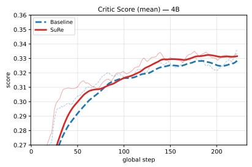  
(a) Mean rollout score

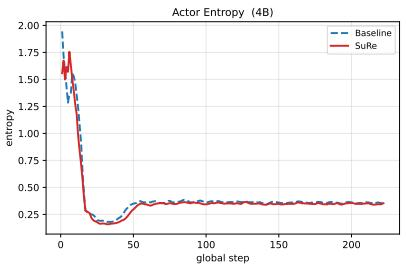  
(b) Actor entropy

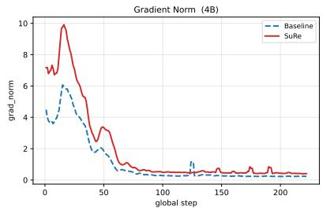  
(c) Gradient norm  
Figure 7: Training dynamics on Qwen3-4B-Base. Vanilla OPD vs. SuRe at α=1.0. SuRe maintains comparable actor entropy while changing the score and gradient-norm dynamics, providing an additional cross-scale view of the optimization behavior.

Table 5: A compact view of the case. The example is a correct OPD rollout. We keep only the information needed to interpret the subsequent token table, rather than listing every logged field.
<table><tr><td>Item</td><td>Content</td></tr><tr><td>Task</td><td>MATH-500 example asking for primes p such that  $8 x \equiv 1$  (mod p) has no solution.</td></tr><tr><td>Config</td><td>Qwen3-1.7B OPD student at step 222; Qwen3-1.7B-Base as base; Qwen3-8B as teacher; temper- ature 1.0, top-p = 1.0, max length 8192.</td></tr><tr><td>Prompt</td><td>“Determine the sum of all such p. Please reason step by step, and put your final answer within \boxed{}.&quot;</td></tr><tr><td>Response sketch</td><td>The student argues that the congruence is solvable iff  $\operatorname* { g c d } ( 8 , p ) = 1 ;$  only the prime p = 2 divides 8; therefore the answer is [2].</td></tr><tr><td>Global pattern</td><td>376 response tokens; mean  $\mathbf { \overline { { J } } S } ( \pi _ { \mathrm { O P D } } , \pi _ { \mathrm { b a s e } } )$  = 0.052; only 16.8% of tokens have JS&gt; 0.10.</td></tr></table>

## C.5 Comparison with On-Policy RL (GRPO)

The main paper analyzes OPD trained with the per-token K2 estimator and uses SuRe as an intervention, with KD, SeqKD, and Vanilla OPD as baselines. For completeness, we additionally compare SuRe against GRPO (Shao et al., 2024), a reward-based on-policy RL method, on Qwen3- 1.7B-Base. We adopt this scale because the ablations and orientation controls in Sec. 5.3 are also conducted on Qwen3-1.7B-Base. We stress that onpolicy RL methods such as GRPO and on-policy distillation are complementary rather than mutually exclusive: GRPO learns from a verifiable reward signal, whereas SuRe learns from a stronger teacher’s token-level distribution, so the two signals can in principle be combined. We therefore did not place the GRPO comparison in the main table, and instead report it here as an additional reference point.

Table 6: Four readable token-level changes from the case. The point is not that every large change is a mathematical token, but that the endpoint difference is localized: a few reasoning, formatting, and transition positions differ strongly instead of the whole response moving uniformly.
<table><tr><td>Where</td><td>Sampled token</td><td>OPD vs. base</td><td>Interpretation</td></tr><tr><td>After “analyze the newline after“:&quot; given congruence&quot;</td><td></td><td>rank 5 → ∆ log p = +2.95</td><td>1, The final OPD checkpoint ranks the transi- tion into displayed-equation format more highly than Base.</td></tr><tr><td>vertible modulo p”</td><td>At the key concept “in- emphasis marker before rank 6 “invertible”</td><td>→ ∆ log p = +6.82</td><td>1, The largest endpoint difference occurs where the solution introduces the modular-inverse idea.</td></tr><tr><td>&quot;which primes p ...&quot;</td><td>At the restatement the transition token “the&quot; rank 5</td><td>→ ∆ log p = +2.90</td><td>1, Some large endpoint differences occur on dis- course or fluency tokens, not only mathematical symbols.</td></tr><tr><td>At an intermediate token “2&quot; mention of the answer</td><td></td><td>rank 2 → ∆ log p = −2.70</td><td>2, The final OPD checkpoint assigns this token lower probability than Base; the final answer remains correct, but the local confidence profile differs.</td></tr></table>

Setup. GRPO is trained with a verifiable answermatching reward on the same DeepMath hard split, using the same teacher prompt template, the same 32×H20 setup, and the same evaluation protocol as our SuRe runs (Sec. C.4). During evaluation, both methods are decoded with the same temperature (0.7), top-p (0.9), and number of sampled solutions per problem (N=32 for AIME24/AIME25/AMC23, N=4 for MATH-500), so the numbers below are directly comparable.

Baseline configurations. For reproducibility, Table 7 lists the training hyperparameters used for the KD, SeqKD, and GRPO baselines on Qwen3-1.7B-Base. KD and SeqKD are run on 8 H20 GPUs. Entries that match the OPD/SuRe defaults in Table 3 (optimizer, learning rate, warmup, epochs, batch sizes, sequence lengths, and FSDP/parallelism) are omitted to avoid duplication; only the methodspecific knobs are shown.

Findings. Table 8 shows that SuRe matches or exceeds GRPO on every benchmark in avg@k, with consistent improvements of roughly 1–3pp across AIME24, AIME25, AMC23, and MATH-500. The pass@k picture is mixed: SuRe ties or wins on three of four benchmarks but trails GRPO on AIME25. Because the methods use different supervision and we do not report a significance test for this comparison, Table 8 is an additional reference point rather than evidence that the objectives are equivalent.

## C.6 Matched Weighting Controls

Mean normalization divides the detached weights by their mean over valid response tokens within each micro-batch. Exact-shuffled permutes those normalized weights within the same token set. Exact rank reversal preserves the realized weight multiset but reverses its surprise-rank assignment. Mean-normalized uplift-only applies the surprise increment only when the signed teacher–student log-probability gap is positive and then uses the same normalization.

Table 7: Baseline-specific hyperparameters for KD, SeqKD, and GRPO on Qwen3-1.7B-Base. Entries shared with OPD/SuRe (see Table 3) are omitted.
<table><tr><td>Hyper-parameter</td><td>KD</td><td>SeqKD</td><td>GRPO</td></tr><tr><td>Data source</td><td>DeepMath hard</td><td>Teacher rollouts</td><td>DeepMath hard</td></tr><tr><td>Teacher model</td><td>Qwen3-8B</td><td>Qwen3-8B</td><td></td></tr><tr><td>Supervision</td><td>Token-level πT</td><td>Sequence sampled from πT</td><td>Verifiable answer reward</td></tr><tr><td>Loss</td><td></td><td>Forward KL on teacher tokens SFT cross-entropy on teacher seq.</td><td>GRPO clipped policy gradient</td></tr><tr><td>Rollout sampling</td><td>off-policy (teacher)</td><td>off-policy (teacher)</td><td>on-policy (student)</td></tr><tr><td>Generation temperature</td><td></td><td>1.0</td><td>1.0</td></tr><tr><td>Top-p (generation)</td><td></td><td>1.0</td><td>1.0</td></tr><tr><td>Rollouts per prompt</td><td></td><td>1</td><td>8</td></tr><tr><td>Group size G</td><td></td><td></td><td>8</td></tr><tr><td>Extra reference-policy KL coefficient</td><td>0.0</td><td>0.0</td><td>0.001 0.2</td></tr><tr><td>Clip ratio €</td><td></td><td></td><td></td></tr><tr><td>Reward</td><td></td><td></td><td>{0, 1} exact match on\boxed{}</td></tr><tr><td>Loss aggregation</td><td>token-mean</td><td>token-mean</td><td>token-mean</td></tr></table>

Table 8: Comparison with on-policy RL on Qwen3-1.7B-Base (%). GRPO is a reward-based RL baseline trained with verifiable answer matching; SuRe is purely a distillation objective with no reward signal. AIME24, AIME25, and AMC23 use avg@8 and pass@8 over 32 rollouts; MATH-500 uses avg@4 and pass@4 over 4 rollouts. Bold marks the better entry within each column.
<table><tr><td rowspan="2">Method</td><td colspan="2">AIME24</td><td colspan="2">AIME25</td><td colspan="2">AMC23</td><td colspan="2">MATH-500</td></tr><tr><td>avg@8</td><td>pass@8</td><td>avg@8</td><td>pass@8</td><td>avg@8</td><td>pass@8</td><td>avg@4</td><td>pass@4</td></tr><tr><td>GRPO</td><td>8.33</td><td>23.33</td><td>4.17</td><td>20.00</td><td>41.56</td><td>70.00</td><td>65.80</td><td>79.00</td></tr><tr><td>SuRe (α=1.0)</td><td>9.58</td><td>23.33</td><td>7.08</td><td>16.67</td><td>43.12</td><td>75.00</td><td>67.65</td><td>80.80</td></tr></table>

Table 9: Matched weighting controls on Qwen3-1.7B-Base (%). AIME24, AIME25, and AMC23 report avg@8/pass@8; MATH-500 reports avg@4/pass@4. Rank-reversed was evaluated only on MATH-500.
<table><tr><td rowspan="2">Training objective</td><td colspan="2">AIME24</td><td colspan="2">AIME25</td><td colspan="2">AMC23</td><td colspan="2">MATH-500</td></tr><tr><td>avg@8</td><td>pass@8</td><td>avg@8</td><td>pass@8</td><td>avg@8</td><td>pass@8</td><td>avg@4</td><td>pass@4</td></tr><tr><td>Vanilla OPD</td><td>9.17</td><td>16.67</td><td>5.83</td><td>16.67</td><td>39.38</td><td>67.50</td><td>66.55</td><td>80.80</td></tr><tr><td>Mean-normalized SuRe</td><td>10.00</td><td>20.00</td><td>4.58</td><td>10.00</td><td>41.88</td><td>72.50</td><td>69.20</td><td>82.20</td></tr><tr><td>Exact-shuffled</td><td>10.00</td><td>23.33</td><td>5.83</td><td>23.33</td><td>38.44</td><td>70.00</td><td>67.95</td><td>81.00</td></tr><tr><td>Exact rank-reversed</td><td></td><td></td><td></td><td></td><td></td><td></td><td>67.00</td><td>81.40</td></tr><tr><td>Mean-normalized uplift-only</td><td>9.58</td><td>26.67</td><td>4.17</td><td>13.33</td><td>39.38</td><td>72.50</td><td>68.40</td><td>81.40</td></tr></table>

Table 10: Second-seed check on MATH-500 avg@4 (%). Original SuRe uses the submitted, unnormalized weighting rule.
<table><tr><td>Seed</td><td>Vanilla OPD</td><td>Original SuRe</td></tr><tr><td>42</td><td>66.55</td><td>67.65</td></tr><tr><td>43</td><td>66.40</td><td>67.50</td></tr></table>