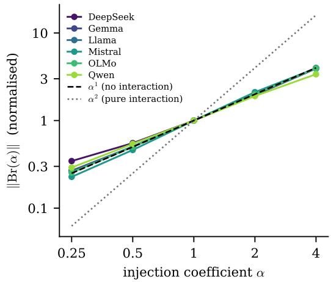
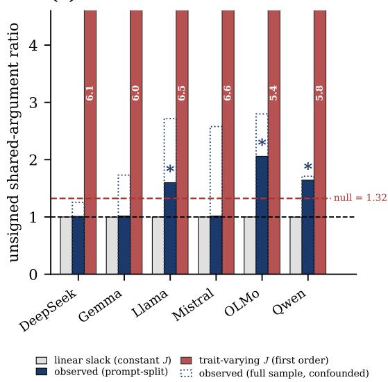
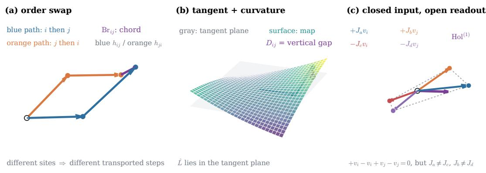

# Activation-Space Order-Swap Geometry: A Site-Asymmetry Audit

Anqi Peter Li Substrate Labs

peterli@substrate-labs.org

## Abstract

Order-dependent activation statistics are often interpreted as evidence of interaction, but that interpretation can be confounded by where interventions enter the network. We introduce a no-fit site-asymmetry audit. For a twice-diferentiable readout, the open-path order swap decomposes into a canonical additive response measured by single interventions and an antisymmetrized second diference free of first-order and pure self-curvature terms to second order. Across six open-weight language-model families, the single-intervention baseline explains 84.3-97.7 percent of the bracket norm (mean 93.7 percent), while the no-interaction self-curvature term is 1.8-5.2 times larger than the corrected residual in the two families with the plus/minus injection split. The corrected residual clears a generic-interaction null in three of six families under a confound-free prompt split and two of six after configuration robustness. A known-positive surrogate recovers planted mixed interaction, while a matched site-separation test changes the baseline share and a random architecture reproduces the first-order regime. The same estimator transfers to released non-language references: trained residual fractions fall below a fixed Gaussian-direction null in 11/12 contrasts (5/6 ViT-B/16, 6/6 ResNet-50), a portability check rather than pooled evidence. The contribution is a reusable measurement criterion: run the single-intervention baseline before reading an order-swap vector as interaction or geometric structure; if it explains the vector, form the second diference instead. All claims are scoped to activation-space interventions at distinct sites; we do not claim that representation geometry is globally Abelian.

## 1. Introduction

Steering vectors added to a transformer’s residual stream compose, and the composition is order-dependent: injecting direction $v _ { i }$ before $v _ { j }$ does not give the same result as the reverse. The algebraic reading of that order-dependence is available and inviting. The measured quantity looks like a bracket: it is antisymmetric, it vanishes when the two directions coincide, and it is non-zero in practice. In weight space the reading is already established, with the commutator of two fine-tuning updates treated as the governing orderdependent quantity (Sweeney, 2026); in activation space the analogous closed-loop statistic is being computed and read geometrically (Richards, 2026; Sevetlidis and Pavlidis, 2026). Composable-intervention and task-arithmetic pipelines provide related composition settings rather than this bracket statistic (Kolbeinsson et al., 2025; Ilharco et al., 2023; van der Weij et al., 2024). Closest to our statistic, Mudarisov et al. (2026) do form an activationspace Lie bracket and describe it as “measuring whether their order matters”; our criterion returns exempt there on the merits rather than by failing to apply. We are not aware of a published paper that computes the open-path activation-space order-swap statistic across diferent injection depths and reads it as evidence of non-Abelian structure, and we do not attribute that error to anyone. What we supply is a null model for that statistic and a cheap test of it: a reusable site-asymmetry audit that separates what the construction forces from what the model contributes. The nearest published statistic of our own form is in weight space and outside what our activation-space criterion tests (Schessl, 2026; discussed with our own failed attempt to use it in Appendix D). The criterion is also not binary underneath: contamination is driven by $J _ { 1 } - J _ { 2 }$ , so it predicts a gradient, and widening site separation with the readout held fixed raises the first-order term’s share of the bracket in 6 of 6 families and 91.7% of 720 matched pairs, where raw depth does not and an untrained network of the same shape reaches only 54–58% (Appendix D; we report this as a count, not a p-value, because the six families share one trait inventory and are not six independent draws). A loop through four distinct depths is first-order dominated while the degenerate loop is inert (Figure 2) — a mechanism-specific test rather than another binary verdict. The audit is organized by a single principle: order-swap geometry has a canonical site-asymmetry baseline that must be measured before it is interpreted. Define a quantity by subtracting two orderings and you get antisymmetry for free, vanishing on repeated arguments for free, and — when the site mismatch acts nontrivially — a measurable baseline for free. The Taylor identity is elementary; the positive claim is that this is the correct audit object for the class: it is measured by four singleintervention passes, falsifiable by a matched site-separation perturbation, and validated by known-positive controls. The six-family result then shows that the baseline accounts for most of the measured bracket in this setting.

Concretely, the diference expands to first order as $( J _ { 1 } - J _ { 2 } ) ( v _ { i } - v _ { j } )$ , linear in each direction separately, carrying no interaction, and generically non-zero when the site mismatch acts on the direction diference. The same pattern recurs at every level we look: the second-order term contains a self-curvature piece that is also interaction-free and is 1.8– 5.2× larger than the zero-parameter residual at the primary configuration; closed transport loops, widely assumed exempt, carry the same first-order term; and the natural diagnostic for conjunctive structure returns near-zero for any antisymmetric form at any rank, so its collapse in real data is entailed rather than observed. Four apparent findings, one cause.

Contribution. The central contribution is a site-asymmetry audit for orderdependent activation statistics, demonstrable without fitting anything. The zeroparameter prediction $\widehat { \mathcal { L } } _ { i j } = [ s _ { 1 } ( v _ { i } ) + s _ { 2 } ( v _ { j } ) ] - [ s _ { 1 } ( v _ { j } ) + s _ { 2 } ( v _ { i } ) ]$ ], built from four single-injection forward passes and never shown the bracket it predicts, leaves 5–8% of the bracket’s norm unexplained at the primary configuration in all six families, and 2–16% across all eighteen family-by-configuration cells (mean cosine 0.9973, never below 0.9869). The cosine and the residual fraction are one measurement in two units, not two agreeing measurements (Appendix C).

The consequence for practice is a partition, and it is what carries past our own models. Two statistics are in circulation for “do these two interventions interact”: the order-swap bracket $\mathrm { B r } _ { i j } = h _ { i j } - h _ { j i }$ , and the second diference $D _ { i j } = h _ { i j } - s _ { 1 } ( v _ { i } ) - s _ { 2 } ( v _ { j } )$ . They difer by exactly the artifact above, $\mathrm { B r } _ { i j } = ( D _ { i j } - D _ { j i } ) + \widehat { \mathcal { L } } _ { i j }$ . The identity is a tautology; the magnitude is not. Across our eighteen cells the first-order term accounts for 84.3– 97.7% of the bracket (mean 93.7%), against 0% of the second diference. Neither half of that contrast is an independent measurement: the first is 1 minus the residual reported in Section 4, the same quantity in complementary units, and the second is exact by the definition of D, surviving even a constant map. This gives a practical stop condition: run the single-injection prediction before interpreting Br geometrically; if it explains the bracket, the statistic has not identified interaction. A reader who wants the interaction should form D rather than correct a bracket to recover it. This also fixes the status of our own residue, which is the antisymmetrized second diference (Section 2).

(a) the bracket scales as $\alpha ^ { 1 }$  

(b) confound-free: 3 of 6 clear the null  
  
Figure 1: The two central results. (a) Norm of the order-swap bracket against injection coeficient $\alpha ,$ normalised at $\alpha = 1$ . All six families track $\alpha ^ { 1 }$ (dashed), the scaling of a term with no interaction, rather than $\alpha ^ { 2 }$ (dotted); fitted exponents $\gamma \in \ [ 0 . 8 8 6 , 1 . 0 4 3 ]$ . (b) The unsigned shared-argument ratio for the corrected residual under the confound-free prompt-split design (solid), against the genericinteraction null (dashed red), a calibrated trait-varying first-order arm, and an uncalibrated constant-Jacobian floor (the linear slack, which has no free parameter to calibrate; Appendix D). Stars mark the 3 of 6 families that clear the null — Llama 1.599, OLMo 2.059, Qwen 1.642 against the 1.324 bar; DeepSeek, Gemma and Mistral fall to linear-slack level. The dotted outline is the same statistic on the full sample, where all pairs share one prompt set: the gap is what the shared-prompt confound was worth. We plot the number we claim, not the more favourable full-sample one. The trait-varying arm is clipped at the axis top and annotated with its true value.

  
Figure 2: Three-dimensional schematic of the measurement, not model data. (a) Opposite site orders give diferent Jacobian-weighted paths and an endpoint chord $\operatorname { B r } _ { i j }$ . (b) The tangent-plane prediction $\widehat { \mathcal { L } }$ is separated from the second-diference curvature $D _ { i j }$ . (c) Four legs can have zero net injected vector but a nonzero first-order readout residual when site Jacobians difer. Endpoint order and loop closure are diagnostics to measure, not evidence of interaction by themselves.

Second, the correction people would apply does not isolate an interaction either. Expanding one order further splits the $\alpha ^ { 2 }$ coeficient in two: a genuinely mixed term M, and a self-curvature term S that is quadratic in each direction separately and carries no coupling. We measure S with no fit. It is 1.8–5.2× larger than the zero-parameter residual at the primary configuration, so $\| Q \| / \| \mathcal { L } \|$ from a two-term fit is not an interaction share: the same artifact recurring one order up. Piontkovskaia and Nikolenko (2026) separate these second-order objects at a shared base point; what is new is that when the sites difer, self-curvature contaminates the order-swap coeficient itself through $H _ { 1 1 } - H _ { 2 2 }$

Supporting measurements. Two further routes agree by diferent apparatus that the statistic is first-order dominated (Appendix C), and a randomly initialised network reproduces the same agreement, fixing what the six-family measurement establishes: not that trained models have a property, but that they do not escape a generic one. What survives correction clears a generic-interaction null in 3 of 6 families under the confound-free design, which we report as a negative result.

## 2. Related Work

Vaidyanathan et al. (2026) prove the second-diference interaction equals the Hessian bilinear form, vanishing for locally afine maps; that object is our Q, and we take the theory as given. Note what it entails: a bilinear form applies to argument pairs it was never fitted on, so transfer to unseen arguments is a property of the model class, not a discovery. Skifstad et al. (2026) and Piontkovskaia and Nikolenko (2026) both support the premise that a firstorder term dominates here, the first finding layer-wise LLM dynamics well approximated by locally-linear models, the second finding single perturbations first-order predictable across nine transformers while pairwise composition has no stable radius. Wu et al. (2026) make the same move for a diferent statistic: apparent scale-dependent steerability across 17 models turns out to be produced by an uncalibrated pipeline; Heap et al. (2026) do the same for SAE auto-interpretability with a randomised baseline, the closest neighbour to our untrained null (Appendix D). The closest methodological neighbour is Zhang and Wang (2026), who find attribution patching’s first-order approximation unreliable, trace the error to downstream non-linearity, and supply a correction: the template is ours; the object is not. VanderWeele (2014) provides a causal-inference analogue of the $\mathcal { L } + Q$ split, and Dooms et al. (2026) independently find low-rank quadratic structure prevalent in LLM activations — which would be the natural home for the interaction we are looking for, though we do not find it there: the operator we recover is not low-rank once the estimator’s own rank compression is accounted for (the full operator comparison is in the artifact).

Weight-space and neighbouring statistics. Piontkovskaia and Nikolenko (2026) measure the analogous Lie bracket for sequential task-gradient steps, while Sweeney (2026) use a weight-space bracket as an ordering statistic; both are outside our activation-space criterion. The two spaces admit a first-order correspondence under the conditions analyzed by Adila et al. (2026), so agreement across them is closer to entailment than to an independent replication. Our untrained null and self-term split are the additional controls. Among activation-space neighbours, Richards (2026) use one fixed layer window, Sevetlidis and Pavlidis (2026) prove an input-space afine null, and Mudarisov et al. (2026) use a same-site bracket where the first-order term cancels (the full comparison is in the artifact). Vaidyanathan et al. (2026) and Khemais (2026) instead form the second diference, which is first-order-free. Composable interventions expose order efects without forming this statistic (Kolbeinsson et al. (2025); task arithmetic (Ilharco et al., 2023)); Ortiz-Jimenez et al. (2023) study the closest weight-space first-order question. Exemption is conditional. The second diference cancels first-order content by construction; a raw bracket at a nominally shared site requires exact $J _ { 1 } = J _ { 2 }$ , which is not stable. Because contamination is first order in the edit while interaction is second order, even a 1% Jacobian mismatch leaves the former at 99.6% of the bracket at $\alpha = 0 . 0 1$ . Closure is not the criterion; site structure is (Section 3), and the artifact records the neighbouring statistics treated outside its scope.

## 3. Method: the estimator and its first-order term

Where the artifact bites. A measurement is afected when the two interventions enter at sites with diferent downstream maps: order-swap brackets, sequential-edit diferences, and any $A  B$ versus $B  A$ comparison at distinct depths. Closure is not itself a defence: the first-order terms cancel pairwise only when each return leg re-enters at its outgoing site, and that composition is the identity map.

Let $A _ { i } ^ { ( \ell ) }$ add direction $v _ { i }$ to the residual stream at layer $\ell ,$ and let $h ^ { ( \ell _ { \mathrm { o u t } } ) }$ read out at a later layer. For $\ell _ { 1 } < \ell _ { 2 }$ the order-swap bracket is $\mathrm { B r } _ { i j } = \mathbb { E } _ { p } [ h ^ { ( \ell _ { \mathrm { o u t } } ) } ( A _ { j } ^ { ( \ell _ { 2 } ) } A _ { i } ^ { ( \ell _ { 1 } ) } p ) -$ $h ^ { ( \ell _ { \mathrm { o u t } } ) } ( A _ { i } ^ { ( \ell _ { 2 } ) } A _ { j } ^ { ( \ell _ { 1 } ) } p ) ]$ . Expanding about the unsteered activations and carrying the second

order out in full,

$$
\begin{array} { r l } { \mathrm { B r } _ { i j } ~ = ~ } & { \underbrace { ( J _ { 1 } - J _ { 2 } ) ( v _ { i } - v _ { j } ) } _ { \mathcal { L } , \mathrm { ~ f r s t ~ o r d e r } , \mathrm { ~ n o ~ i n t e r a c t i o n } } + \underbrace { \frac { 1 } { 2 } \big [ H _ { 1 1 } ( v _ { i } , v _ { i } ) - H _ { 1 1 } ( v _ { j } , v _ { j } ) + H _ { 2 2 } ( v _ { j } , v _ { j } ) - H _ { 2 2 } ( v _ { i } , v _ { i } ) \big ] } _ { \mathcal { S } , \mathrm { ~ s e c o n d ~ o r d e r } , \textit { n o } \ i n t e r a c t i o n } } \\ & { + ~ \underbrace { H _ { 1 2 } ( v _ { i } , v _ { j } ) - H _ { 1 2 } ( v _ { j } , v _ { i } ) } _ { \mathcal { M } , \mathrm { ~ t h e ~ i n t e r a c t i o n } } + O ( \alpha ^ { 3 } ) , } \end{array}\tag{1}
$$

where $H _ { k k }$ is the curvature of the readout in the perturbation entering at site k and $H _ { 1 2 }$ the mixed second derivative.

Observation 1 (site-asymmetry audit identity):

For matched single-site responses, the canonical additive baseline is $\widehat { \mathcal { L } } _ { i j } = [ s _ { 1 } ( v _ { i } ) + s _ { 2 } ( v _ { j } ) ] -$ $[ s _ { 1 } ( v _ { j } ) + s _ { 2 } ( v _ { i } ) ]$ , and $\mathrm { B r } _ { i j } - \widehat { \mathcal { L } } _ { i j } = D _ { i j } - D _ { j i }$ . Consequently, to second order the residual removes both the site-Jacobian and pure self-curvature terms; what remains is the antisymmetrized mixed derivative plus $O ( \alpha ^ { 3 } )$

For $C ^ { 3 }$ readouts, Appendix C gives an explicit third-derivative norm certificate for the $O ( \alpha ^ { 3 } )$ remainder. We do not claim empirical bounds on those derivatives for the six LLMs, so their residuals remain finite-scale mixtures unless such bounds are supplied.

The second-order term is not all interaction. S is antisymmetric under exchange, vanishes when $v _ { i } = v _ { j }$ , and is non-zero exactly when the two sites have diferent curvature — every surface property that makes the statistic look like a bracket. But it is quadratic in each argument separately, with no interaction between them: the first-order artifact one order up. Only M couples the two directions. Writing the $\alpha ^ { 2 }$ coeficient as a single “bilinear” object $\mathcal { Q } ( v _ { i } , v _ { j } )$ , which is the natural thing to write, silently merges S into the interaction and repeats at second order the exact conflation the paper exists to correct. Two consequences: a two-term fit $\alpha \mathcal { L } + \alpha ^ { 2 } \mathcal { Q }$ estimates $S + { \mathcal { M } }$ together, so $\| \mathcal { Q } \| / \| \mathcal { L } \|$ in the injection-scale fit is not an interaction share; and Observation 2 guarantees only that the fitted $W ( v _ { i } - v _ { j } )$ removes linear structure, which is weaker, because $\boldsymbol { \mathcal { S } }$ is nonlinear too.

Observation 2 (elementary):

$\mathrm { B r } _ { i j } = - \mathrm { B r } _ { j i }$ by construction. Any linear model $M _ { 1 } \boldsymbol { v } _ { i } + M _ { 2 } \boldsymbol { v } _ { j }$ that is antisymmetric under exchange requires $M _ { 1 } = - M _ { 2 }$ , hence has the form $W ( v _ { i } - v _ { j } )$

Fitting and subtracting the best $W ( v _ { i } - v _ { j } )$ therefore removes all linear structure in the model class. This is the elementary symmetric/antisymmetric splitting of the $S _ { 2 }$ action on $\tau \oplus \tau$ , stated because it dictates the correct control rather than as a result. It is not exact for the estimate: with $\widehat { W }$ fitted from finite data the residual retains $( W - { \widehat { W } } ) ( v _ { i } - v _ { j } )$ , and Section 4 tests that this slack does not manufacture our result.

Three natural controls do not remove L. (C1) Projecting of $\operatorname { s p a n } ( v _ { i } , v _ { j } )$ : L lands outside that span at the readout. (C2) L is antisymmetric, so brackets sharing a direction in swapped argument slots are anti-correlated; a statistic that pools argument positions averages + against −. (C3) L alone reproduces which pair a bracket came from, so pairidentifiability is no evidence of interaction either.

Measuring the first-order term instead of fitting it. Both arguments above are indirect, and the fitted correction of Observation 2 carries $1 6 \times D _ { \mathrm { o u t } }$ free parameters, so a high explained variance is partly a statement about capacity. We therefore measure $J _ { 1 }$ and $J _ { 2 }$ rather than fitting them. The single-injection response $s _ { k } ( v ) = \mathbb { E } _ { p } [ h ^ { ( \ell _ { \mathrm { o u t } } ) } ( A _ { v } ^ { ( \ell _ { k } ) } p ) - h ^ { ( \ell _ { \mathrm { o u t } } ) } ( p ) ] =$ $J _ { k } v + { \textstyle { \frac { 1 } { 2 } } } H _ { k k } ( v , v ) + { \cal O } ( \alpha ^ { 3 } )$ costs one forward pass, and $\widehat { \mathcal { L } } _ { i j } = [ s _ { 1 } ( v _ { i } ) + s _ { 2 } ( v _ { j } ) ] - [ s _ { 1 } ( v _ { j } ) + s _ { 2 } ( v _ { i } ) ]$ predicts the bracket with no fitted parameters; it never sees $\operatorname { B r } _ { i j }$ . Expanding to second order, every Jacobian and every pure self-term cancels, leaving B ${ \mathrm { \Delta } } \mathfrak { c } _ { i j } - \widehat { \mathcal { L } } _ { i j } = H _ { 1 2 } ( v _ { i } , v _ { j } ) -$ $H _ { 1 2 } ( v _ { j } , v _ { i } ) + O ( \alpha ^ { 3 } )$ : the antisymmetrized mixed second derivative at second order, plus an uncontrolled higher-order remainder at finite injection scale. Thus this route targets the same interaction term as the fitted correction, but its finite-scale residual is not an exact interaction estimate. The estimator is falsifiable: the symmetric combination should not predict an antisymmetric object, and a bracket paired with a diferent pair’s responses should not be predicted at all. (Exchanging the two site labels negates $\hat { \mathcal { L } }$ identically, so that check tests our arithmetic, not the model.) Appendix C validates it on surrogates with known $J _ { 1 } , J _ { 2 } , H _ { 1 1 } , H _ { 2 2 } , H _ { 1 2 }$

Known-positive control. On known-Hessian surrogates, the no-interaction arm recovers the bracket exactly; a pure mixed arm with $J _ { 1 } = J _ { 2 }$ gives $\widehat { \mathcal { L } } = 0$ and residual fraction 1; and mixed arms with self-curvature recover the planted interaction share to machine precision at three strengths (Appendix C). The model-side residual remains a finite-scale mixture, not an interaction estimate.

Closed loops: site structure, not closure. A holonomy statistic is often assumed exempt because its net injection is zero. That argument is wrong: it uses two Jacobians for four injections, so the loop is the identity map and the statistic is identically zero, leaving nothing to exempt. A genuine loop through four distinct depths gives $( J _ { 1 } - J _ { 3 } ) v _ { i } + ( J _ { 2 } - J _ { 4 } ) v _ { j }$ which does not vanish and carries no interaction (the loop checks are in the artifact). Exemption is earned from site structure, not assumed from closure.

Models, directions, and protocol. Six open-weight base families at 7–9B: DeepSeek-LLM-7B, Gemma-2-9B, Llama-3.1-8B, Mistral-7B-v0.3, OLMo-7B-0724 and Qwen2.5-7B. Steering directions are contrastive activation additions (Rimsky et al., 2024; Turner et al., 2023) over 16 trait contrasts, giving 120 unordered pairs per family, with two extraction seeds from disjoint prompt samples so that cross-seed agreement is a replication rather than a re-read of one fit. Since steering-vector reliability is itself contested (Tan et al., 2024), we measured it: the same trait’s direction reproduces across seeds at mean cosine 0.784 (0.667–0.833), which bounds any cross-seed statistic here; within-run comparisons such as cos(Lb, Br) use the same directions on both sides, so direction noise is common-mode and is not bounded by it. Unless stated otherwise we report the primary layer pair at fractional depths (0.25, 0.50), read out three layers downstream, over 48 held-out prompts, identically across families with no per-family tuning of the layer pairs (Appendix A). The accompanying reviewer artifact is available at the anonymous repository and contains the source, figures, per-experiment records, validation scripts, and an independent CPU reference with raw held-out outputs; every numeric claim is bound to a named record field by a checking script that fails on any value it cannot trace, is itself decoy-tested, and the single-injection responses behind Appendix C are released as scalar summaries rather than tensors $( \mathrm { A p - }$ pendix A).

## 4. Results: validating the audit

Validating the additive baseline. Building $\widehat { \mathcal { L } } _ { i j }$ from single-injection responses (Section 3) and comparing it against the measured bracket gives cos $( \widehat { \mathcal { L } } , \mathrm { B r } ) \in [ 0 . 9 9 5 5 , 0 . 9 9 8 6 ]$ at the primary layer pair in all six families, leaving a residual of 5.2–7.6% of the bracket’s norm; over all eighteen family-by-configuration cells the cosine never falls below 0.9869. The informative control behaves as Section 3 requires: the symmetric combination does not predict the bracket, signed per-cell mean $| \cos _ { \mathrm { s y m } } | = 0 . 1 2 4$ (per-pair magnitudes are larger and we do not claim otherwise, Appendix C). A second control answers the circularity objection: since $\widehat { \mathcal { L } }$ is built from the same four responses as the bracket, a high cosine might be entailed. It is not, and the strongest form of the objection — drawing the bracket inside the span of those same four responses — reaches the observed agreement in 0.06% of 20,000 draws (Appendix D). This separates capacity from mechanism, because the fitted correction leaves 2.9–9.9% of the bracket while the zero-parameter route leaves the 5.2–7.6% above. Those are not the same statistic — the first is pooled over pairs, the second a mean of per-pair ratios — so we do not present their overlap as agreement. On the matched pooled statistic the two routes bracket the first-order share from opposite directions and land within 15% of each other (Appendix C), which is not the same as agreeing.

Measuring the no-interaction second-order term. S is measurable with no fit, from the same apparatus: injecting −v as well as +v separates the two orders by parity. The split is exact on surrogates with known $H _ { 1 1 } , H _ { 2 2 }$ , and the closure of $\widehat { \mathcal { L } } = \mathcal { L } + \mathcal { S }$ is algebra rather than evidence (Appendix C).

The result is unfavourable to the operator claim. Measured on Llama and OLMo across three injection configurations, $\| S \| / \| \operatorname { B r } \|$ runs 0.092–0.338. Against the zeroparameter residual on the same cells, the same statistic on both sides of the ratio, the nointeraction second-order term is 1.8–5.2× larger than the operator extracted from underneath it at the primary configuration, and 1.8–11.2× across all three (Table 1). A quantity carrying no coupling between the two directions is the larger part of what a two-term fit reports as “bilinear”. We do not divide it by the fitted-correction range 2.9–9.9%, which is pooled over pairs rather than a mean of per-pair ratios: the caution above applies to our own second result too.

This does not invalidate the operator analysis, because S cancels identically in Br $- \widehat { \mathcal { L } } \colon$ the zero-parameter prediction is built from single-injection responses that carry the selfcurvature at both sites. It does invalidate reading the $\alpha ^ { 2 }$ coeficient of a two-term fit as an interaction share: the fitted $W ( v _ { i } - v _ { j } )$ removes linear structure only, so a residual that is “purely nonlinear” can be mostly a term with no interaction in it.

The untrained null, and what the measurement is evidence for. A random-init, untrained residual network with 16 layers and $d = 7 6 8 { \mathrm { ~ g i v e s ~ c o s } } ( { \widehat { \mathcal { L } } } , \mathrm { B r } ) \in [ 0 . 9 9 5 6 , 0 . 9 9 8 8 ]$ as the injection-to-stream ratio sweeps $\varepsilon = 0 . 0 1 \mathrm { - } 4 ~ ( \mathrm { w o r s t } ~ \mathrm { a t } ~ \varepsilon = 1 )$ , and passes the symmetric control $( | \cos _ { \mathrm { s y m } } | = 0 . 0 3 3 )$ . This validates the architecture-level baseline: first-order dominance follows from difering downstream Jacobians, not training. The trained norm ratio was not recorded, so this is a range, not a matched comparison.

An independent CPU residual MLP, ViT-B/16, and ResNet-50 reference is released with raw held-out outputs; the vision residual falls below a fixed Gaussian-direction null in 11/12 contrasts (5/6 ViT, 6/6 ResNet). Unlike the random-init network null above, this keeps the trained network fixed and randomises directions; it is portability evidence, not pooled evidence (Appendix A; experiments/external/vision summary.json).

Mechanism-specific generalization. The audit predicts a graded efect, not merely a yes/no verdict: widening one site while holding the other site and readout fixed should increase the site-asymmetry share. In the strictly matched contrast, the residual fraction falls in 6 of 6 families, and 91.7% of 720 matched trait pairs move in the predicted direction; matched random residual networks reach only 54–58%. Depth alone and the confounded contrast do not reproduce this pattern (Appendix D). This is a positive mechanism test, not another restatement of the cosine. A separate injection sweep gives $\gamma \in [ 0 . 8 8 6 , 1 . 0 4 3 ]$ for $\mathrm { B r } ( \alpha ) = \alpha \mathcal { L } + \alpha ^ { 2 } Q$ , excluding the $\gamma = 2$ scaling of a pure bilinear term; the random architecture also gives $\gamma \approx 1$ , so this route validates the audit rather than learned composition (Figure 1a; the full sweep is in the artifact).

Delimiting the claim. The test asks whether the corrected residual behaves like a pairspecific interaction or like leftover first-order structure. We score it by the shared-argument ratio: the mean | cos | between residuals of pairs sharing one trait, over the same quantity for pairs sharing none. If the residual couples its two arguments, pairs sharing one should resemble each other more. The generic-interaction null sets the bar: an antisymmetric bilinear form with no model in it, on the family’s own empirical directions, gives 1.324 (Table 3; Appendices B and D). Under a prompt-split design that removes the shared-prompt confound, the corrected residual clears that null in 3 of 6 families — Llama, OLMo and Qwen — while DeepSeek, Gemma and Mistral fall to 1.010 (DeepSeek) to 1.017 (Gemma), within 0.02 of pure linear slack. The weaker cross-seed design gives 5/6, but it does not break the confound, because seeds difer in direction extraction and not in prompts. We claim the $3 / 6$ . One diagnostic must be discounted outright: the signed shared-argument statistic collapses to near zero after correction, and that collapse is entailed by antisymmetry rather than observed, since a maximally overlap-dependent rank-one form reproduces it. Appendix B gives the stratification and the seed construction, the artifact per-family records, and Appendix D the three nulls and the interval estimates.

What the audit leaves. The audit returns a residual rather than forcing a verdict: it retains 2.9–9.9% of the raw bracket’s norm, smaller than the no-interaction second-order term measured beside it (1.8–5.2× at the primary configuration, Appendix C). It is an estimable bilinear form and not an echo of trait geometry; against a behavioural readout that cancels additive contributions it beats the raw bracket in 4 of 6 families. The behavioural direction survives multiplicity correction in 2 of 6, so the audit identifies a candidate interaction without overstating its stability (Appendix D; per-family behavioural records are in the artifact). We scope it to distinct-site activation interventions, not a universal theory of representation geometry.

Appendix A. Protocol details

Exact checkpoints. All are base (non-instruct) checkpoints, one per line:   
deepseek-ai/deepseek-llm-7b-base   
google/gemma-2-9b   
meta-llama/Llama-3.1-8B   
mistralai/Mistral-7B-v0.3   
allenai/OLMo-7B-0724-hf   
Qwen/Qwen2.5-7B

What is and is not reproducible from the release. Most of the analysis is CPUonly and runs from the committed per-pair tensors. The single-injection responses behind Appendix C are released as scalar summaries and not as tensors, so Table 2 is reproducible only by re-running the forward passes. The independent CPU reference is fully rerunnable from its released raw held-out outputs with scripts/check external audit.py; it is a portability and artifact check, not an additional pooled LLM result.

The three-family extension is fully specified in the external protocol nonlm protocol.md. It uses the CPU residual MLP, torchvision ViT-B/16 and torchvision ResNet-50 with fixed public checkpoints, class-balanced direction extraction, disjoint held-out readout images, all 45 unordered direction pairs, and a fixed Gaussian direction null. ViT sites are postblock residual streams (including direction site 0); ResNet sites are the five post-block stage-3 residual streams. The vision records include the complete raw bracket, linearestimator and residual arrays, model URLs, data provenance, and GPU telemetry. Exact aggregate values are recomputed by scripts/summarize external references.py, while scripts/check external vit audit.py verifies each vision record against its raw arrays.

Residual width is $D _ { \mathrm { o u t } } \in \{ 3 5 8 4 , 4 0 9 6 \}$ across the six families. The 16 trait contrasts give $\binom { 1 6 } { 2 } = 1 2 0$ unordered pairs per family. Extraction seeds are drawn from disjoint prompt samples: seed agreement therefore reflects a re-extraction of the direction, not a re-read of a single fit, which is what makes the cross-seed comparison a replication. The measured across-seed direction reliability (mean cosine 0.784, range 0.667–0.833) is a baseline for downstream agreement, not a formal upper bound, since downstream statistics can transform or normalize direction errors. Layer pairs are specified as fractional depths so that they are comparable across families of diferent depth; the primary pair is (0.25, 0.50) with readout three layers below the deeper injection site, and the two secondary configurations are (0.25, 0.75) and (0.50, 0.75). All statistics use 48 held-out prompts, disjoint from the prompts used for direction extraction.

Numeric provenance. Every number printed in this paper is checked against the committed result records by a script that binds each printed value to a named record field, and fails on any value it cannot trace. The script also runs a decoy test on itself each time it is invoked: it perturbs every number in the paper and confirms the perturbed versions are rejected. This matters because an earlier version matched on value proximity alone and certified roughly half of all deliberately corrupted numbers. The current false-certification rate is under 10%. We report the counts of traced, unbound and untraced numbers in the released log rather than summarizing them as a pass. We also verified that the injection-scale exponents recompute from the raw sweeps to four decimals.

## Appendix B. Delimiting the claim: full treatment

We form a cross-seed cosine matrix stratified by overlap and argument position: same, sh1-same, sh1-crossed, and share0. Leave-one-pair-out residuals are positive scalar multiples of in-sample residuals, so this procedure is not an out-of-sample safeguard. The signed corrected statistic is near zero (−0.0100 mean; coherence 0.070), but that collapse is entailed by antisymmetry and is not evidence.

The discriminating statistic is $R _ { \mathrm { s h } } = \mathrm { m e a n }$ | cos |(sh1-same)/ mean | cos |(share0). The observed value is 2.132, versus 0.999 for constant-Jacobian slack, 1.324 for a calibrated generic antisymmetric interaction, and 6.058 for a trait-varying first-order Jacobian. Trait bootstrap and delete-one-trait jackknife intervals exclude the generic null in five of six families; the disjoint-trait and third-seed checks are conditional on the three families they cover.

The shared-prompt confound is addressed by recomputing brackets on disjoint prompt halves. The mean falls $2 . 1 3 2  1 . 6 0 2  1 . 3 9 1$ as prompts are halved and then disjointed; only Llama, ${ \mathrm { O L M o } } ,$ , and Qwen clear the recalibrated null (1.325). We therefore claim the efect in $3 / 6$ families under the confound-free design, with $5 / 6$ retained only as the weaker cross-seed result. Intersecting configuration, prompt, trait, and seed controls leaves Llama and OLMo. The full records and per-family strata are in the reviewer artifact.

## Appendix C. The zero-parameter first-order measurement

Proposition 1 (finite-scale remainder certificate) Let $F ( a , b )$ be the averaged twosite readout and let $f _ { k } ( \boldsymbol { a } )$ be its single-site restriction. $I f F , f _ { 1 } , f _ { 2 }$ are $\dot { C } ^ { 3 }$ on the line segments used by the injections, with third-derivative operator-norm bounds $M , M _ { 1 } , M _ { 2 }$ , then

$$
\begin{array} { r l r } {  { \mathrm { B r } _ { i j } ( \alpha ) - \widehat { \mathcal { L } } _ { i j } ( \alpha ) = \alpha ^ { 2 } \mathcal { M } _ { i j } + \mathcal { R } _ { i j } ( \alpha ) , } } \\ & { } & { \| \mathcal { R } _ { i j } ( \alpha ) \| \le \displaystyle \frac { \alpha ^ { 3 } } { 6 } \Big [ 2 M ( \| v _ { i } \| ^ { 2 } + \| v _ { j } \| ^ { 2 } ) ^ { 3 / 2 } + ( M _ { 1 } + M _ { 2 } ) ( \| v _ { i } \| ^ { 3 } + \| v _ { j } \| ^ { 3 } ) \Big ] . } \end{array}\tag{2}
$$

The certificate follows by applying the third-order Taylor remainder to the two orderings and the four single-site paths, then using the triangle inequality. It makes the finite-scale caveat quantitative; without empirical upper bounds on $M , M _ { 1 } , M _ { 2 }$ , the model-side residual is a mixture rather than a certified interaction estimate.

The second-order split on models. Table 1 gives the ±-split decomposition for the two families where we ran it. The identity $\widehat { \mathcal { L } } = \mathcal { L } + \mathcal { S }$ is exact by construction — substituting the parity definitions $\mathcal { L } _ { k } = [ s _ { k } ( v ) - s _ { k } ( - v ) ] / 2$ and $S _ { k } = [ s _ { k } ( v ) + s _ { k } ( - v ) ] / 2$ gives $\mathcal { L } _ { k } + \boldsymbol { S } _ { k } = s _ { k } ( \boldsymbol { v } )$ termwise — so it holds for any numbers whatsoever and is not evidence that the split is clean. We record the closure only as an arithmetic self-check on the implementation: it sits at $1 . 9 \times 1 0 ^ { - 7 }$ relative, which is float32 rounding and nothing more (the same computation on random float32 input gives $6 \times 1 0 ^ { - 8 } )$ . The no-interaction self term is 9.2–33.8% of the bracket’s norm, against a corrected residual of 2.9–9.9%: it is the larger object. Removing only the first-order part leaves 10–34% of the bracket (column resid, ${ \mathcal { L } } \ o n l y )$ , and it is the additional subtraction of S that takes the residual down to a few percent. Reading the $\alpha ^ { 2 }$ coeficient as an interaction share would therefore attribute a quantity with no coupling in it to the operator.

Table 1: Second-order split from the ± injection design, two families, 120 pairs, three injection configurations. $\| S \| / \| \operatorname { B r } \|$ is the no-interaction second-order term $\overset { 1 } { 2 } ( H _ { 1 1 } -$ $H _ { 2 2 } ) [ ( v _ { i } , v _ { i } ) - ( v _ { j } , v _ { j } ) ]$ as a fraction of the bracket. resid, L only removes the firstorder term alone; resid, full removes $\widehat { \mathcal { L } } = \mathcal { L } + \mathcal { S }$ . The gap between them is what S contributes.
<table><tr><td>family</td><td>sites</td><td> $\| \mathcal { L } \| / \| \mathrm { B r } \|$ </td><td> $\| S \| / \| \operatorname { B r } \|$ </td><td>resid (L)</td><td>resid (full)</td><td>ident. err</td></tr><tr><td rowspan="3">Llama</td><td>(0.25,0.50)</td><td>0.898</td><td>0.320</td><td>0.325</td><td>0.061</td><td>1.3e-7</td></tr><tr><td>(0.50, 0.75)</td><td>0.990</td><td>0.130</td><td>0.134</td><td>0.041</td><td>5.7e-8</td></tr><tr><td>(0.25,0.75)</td><td>0.910</td><td>0.338</td><td>0.339</td><td>0.030</td><td>1.9e-7</td></tr><tr><td rowspan="3">OLMo</td><td>(0.25,0.50)</td><td>0.999</td><td>0.092</td><td>0.105</td><td>0.052</td><td>5.6e-8</td></tr><tr><td>(0.50,0.75)</td><td>0.991</td><td>0.122</td><td>0.136</td><td>0.063</td><td>6.3e-8</td></tr><tr><td>(0.25,0.75)</td><td>0.998</td><td>0.109</td><td>0.120</td><td>0.055</td><td>5.2e-8</td></tr></table>

Results. Table 2 gives the per-family values. The prediction tracks the bracket in every family and every injection configuration, and the two controls behave as the theory requires throughout. The symmetric combination does not predict the bracket: the signed per-cell mean $\mathrm { c o s } _ { \mathrm { s y m } }$ averages 0.124 in absolute value, so there is no consistent alignment, though we note the per-pair mean $| \cos _ { \mathrm { s y m } } |$ is 0.302 with 27% of pairs above 0.456, so the control works at the aggregate and we do not claim individual pairs are uninformative. Pairing a bracket with a diferent pair’s response destroys the agreement: under a fixed derangement the relative norm error rises from 0.3% to 53%, a factor of 167 across all eighteen cells; the prediction is pair-specific, not a generic property of any antisymmetric object of the right size. We no longer count the site-swap check among these: $\mathrm { c o s } _ { \mathrm { s w a p p e d } } = - \mathrm { c o s }$ is an algebraic identity of $\widehat { \mathcal { L } } \mathrm { s }$ definition rather than a property of the network (Appendix C). The residual left by this zero-parameter route, 5.2–7.6% at the primary configuration, is a mean of per-pair ratios and is not comparable to the 2.9–9.9% the fitted correction leaves, which is pooled over pairs. Matched pooled against pooled, the two routes difer by 13–14% in the families where both exist (Appendix C), with the zero-parameter figure the larger, as its noise accumulation and the fitted route’s in-sample bias both predict.

The one weaker cell is DeepSeek at (0.5, 0.75), where the cosine falls to 0.9869 and the residual rises to 15.7% — the largest in the table. DeepSeek is also the family whose traitclustered interval fails to exclude the generic null. We note the co-location without claiming the two are the same efect.

Table 2: Zero-parameter first-order prediction against the measured bracket, per family and injection configuration. cos is the agreement between $\widehat { \mathcal { L } }$ (Section 3, no fitted parameters) and the measured bracket; resid is the fraction of the bracket’s norm it leaves, which by that section’s expansion is the antisymmetrized mixed second derivative plus an unbounded $O ( \alpha ^ { 3 } )$ remainder. We do not measure the cubic share on models, so resid is a finite-scale mixture, not an interaction estimate or a one-sided bound without explicit remainder control. $\mathrm { c o s } _ { \mathrm { s y m } }$ is the symmetriccombination control, which should carry no bracket signal; $\cos _ { \mathrm { s w a p } }$ is the site-swap control, which should equal − cos exactly. Both hold in every cell.
<table><tr><td>family</td><td>layers</td><td>COS</td><td>resid</td><td> $\mathrm { c o s } _ { \mathrm { s y m } }$ </td><td> $\mathrm { c o s } _ { \mathrm { s w a p } }$ </td></tr><tr><td>DeepSeek-7B</td><td>(0.25, 0.50)</td><td>0.9978</td><td>0.064</td><td>-0.048</td><td>-0.9978</td></tr><tr><td rowspan="4">Gemma-2-9B</td><td>(0.50, 0.75)</td><td>0.9869</td><td>0.157</td><td>-0.008</td><td>-0.9869</td></tr><tr><td>(0.25, 0.75)</td><td>0.9959</td><td>0.086</td><td>-0.049</td><td>-0.9959</td></tr><tr><td>(0.25,0.50)</td><td>0.9986</td><td>0.052</td><td>-0.057</td><td>-0.9986</td></tr><tr><td>(0.50, 0.75)</td><td>0.9980</td><td>0.060</td><td>-0.166</td><td>-0.9980</td></tr><tr><td rowspan="3">Llama-3.1-8B</td><td>(0.25, 0.75)</td><td>0.9989</td><td>0.042</td><td>0.016</td><td>-0.9989</td></tr><tr><td>(0.25,0.50)</td><td>0.9968</td><td>0.061</td><td>-0.264</td><td>-0.9968</td></tr><tr><td>(0.50, 0.75)</td><td>0.9991</td><td>0.041</td><td>-0.174</td><td>-0.9991</td></tr><tr><td rowspan="3">Mistral-7B-v0.3</td><td>(0.25,0.75)</td><td>0.9991</td><td>0.030</td><td>-0.333</td><td>-0.9991</td></tr><tr><td>(0.25, 0.50)</td><td>0.9955</td><td>0.076</td><td>-0.273</td><td>-0.9955</td></tr><tr><td>(0.50,0.75)</td><td>0.9987</td><td>0.045</td><td>-0.223</td><td>-0.9987</td></tr><tr><td rowspan="3">OLMo-7B</td><td>(0.25,0.75)</td><td>0.9997</td><td>0.023</td><td>-0.377</td><td>-0.9997</td></tr><tr><td>(0.25,0.50)</td><td>0.9986</td><td>0.052</td><td>0.027</td><td>-0.9986</td></tr><tr><td>(0.50,0.75)</td><td>0.9979</td><td>0.063</td><td>-0.070</td><td>-0.9979</td></tr><tr><td rowspan="3">Qwen2.5-7B</td><td>(0.25,0.75)</td><td>0.9985</td><td>0.055</td><td>0.003</td><td>-0.9985</td></tr><tr><td>(0.25, 0.50)</td><td>0.9977</td><td>0.067</td><td>-0.045</td><td>-0.9977</td></tr><tr><td>(0.50,0.75) (0.25,0.75)</td><td>0.9962 0.9975</td><td>0.086 0.069</td><td>-0.019 -0.079</td><td>-0.9962 -0.9975</td></tr></table>

## Appendix D. Nulls, robustness, and residual geometry

Two statistics, one exact identity. The identity $\mathrm { B r } _ { i j } = ( D _ { i j } - D _ { j i } ) + \widehat { \mathcal { L } } _ { i j }$ is a tautology: the single-intervention terms cancel by definition. Its empirical content is the separation of objects: the raw bracket retains the first-order site-asymmetry term, whereas the second diference removes it. The full scale sweep, constant-map check, and comparison with published second-diference statistics are released in the artifact; they are not additiona model evidence. The corrected residual is precisely the antisymmetrized second diference, so readers seeking an interaction should measure D directly rather than interpret the raw bracket.

The three nulls. Each is generated on the family’s own empirical directions. Linear slack: $\mathrm { B r } = W \delta _ { i j }$ with a constant Jacobian. Trait-varying Jacobian: $\mathrm { B r } = ( W _ { 0 } + \Delta W _ { i } +$ $\Delta W _ { j } ) \delta _ { i j }$ , still purely first order and still exactly linear in the injection coeficient, but with the Jacobian depending on which traits are injected — this is the alternative a first-order account of the residual must invoke. Generic interaction: a rank-8 antisymmetric form on top of a linear term. All three generate brackets from the true directions while the fit sees independently estimated ones, so first-order slack is present wherever it can be.

The two interaction-bearing arms carry a free parameter set to the family’s observed residual fraction. The linear-slack arm does not and cannot: under a constant Jacobian the residual is annihilated exactly at any estimation error (Appendix D), so that arm reports only its own measurement noise, 0.007–0.023 of the bracket against an observed 0.029–0.099. It is a floor, not a matched competitor, and we do not present it as one.

Table 3: Unsigned shared-argument ratio against three nulls, 40 draws per family. The generic-interaction and trait-varying-Jacobian arms are calibrated so their residual is the same fraction of the bracket as the observed residual; the linear slack arm is not calibrated, and cannot be — its residual is 0.007–0.023 of the bracket against an observed 0.029–0.099, because a constant-Jacobian bracket is annihilated exactly (Appendix D). It is a floor, not a matched competitor. Brackets are generated from the true directions and fitted on independently estimated ones. The observation is bracketed on both sides: above a generic interaction in 5 of 6 families (its own 95th percentile, in parentheses), and far below a first-order model whose Jacobian varies with the injected traits, in 6 of 6.
<table><tr><td>family</td><td>observed</td><td>linear slack</td><td>generic interaction (p95)</td><td>trait-varying Jacobian</td></tr><tr><td>DeepSeek</td><td>1.256</td><td>1.000</td><td>1.313 (1.400)</td><td>6.082</td></tr><tr><td>Gemma</td><td>1.730</td><td>0.998</td><td>1.310 (1.408)</td><td>5.983</td></tr><tr><td>Llama</td><td>2.718</td><td>1.000</td><td>1.345 (1.420)</td><td>6.497</td></tr><tr><td>Mistral</td><td>2.578</td><td>1.000</td><td>1.382 (1.502)</td><td>6.632</td></tr><tr><td>OLMo</td><td>2.798</td><td>1.000</td><td>1.291 (1.386)</td><td>5.351</td></tr><tr><td>Qwen</td><td>1.710</td><td>0.998</td><td>1.303 (1.422)</td><td>5.802</td></tr><tr><td>mean</td><td>2.132</td><td>0.999</td><td>1.324</td><td>6.058</td></tr></table>

Null construction. Each null generates brackets from the true directions v and fits on independently perturbed estimates $\hat { v } ;$ additive noise is scaled by total norm, not per component. The trait-varying and generic arms each have one free parameter — the Jacobianvariation scale $\Delta W$ , and the interaction scale — set so that the null’s residual is the same fraction of its bracket as the family’s observed residual (0.029–0.099). Without that calibration the arms sit at diferent signal-to-noise and the comparison is not meaningful.

The constant-Jacobian arm is an exact floor, not a competitor. It has no free parameter. Write the stack of pair diferences as PD. For invertible D and Db, $\mathrm { c o l } ( P \mathsf { D } ) =$ $\mathrm { c o l } ( P ) = \mathrm { c o l } ( P \widehat { \mathsf { D } } )$ , so the least-squares projector is unchanged by direction perturbation and a constant-Jacobian bracket is annihilated exactly. The arm therefore reports only additive measurement noise, not a matched null. The invariance is entailed by the shared column space, not a stuck knob: at $\sigma \le 2$ the maximum principal angle is $1 . 9 \times 1 0 ^ { - 6 }$ degrees and the relative residual is at most $1 . 9 \times 1 0 ^ { - 1 5 }$ . The trait-varying arm is the discriminating firstorder account (6.058 versus the observed 2.132); 400-draw reruns move each 95th percentile by at most 0.048 and change no verdict.

Prompt-split replication. Cross-seed replication does not break prompt-level fluctuations because the prompts are shared. Table 4 separates the cost of halving the sample (within-half mean 1.602 versus full-sample 2.132) from the cost of disjointness (a further 0.211). The cross-half mean is 1.391: Llama, OLMo and Qwen clear the recalibrated null 1.325, while DeepSeek, Gemma and Mistral remain within 0.02 of linear slack; Mistral falls 2.578 → 1.087 already from halving prompts.

Table 4: Prompt-split replication on disjoint prompt halves, all six families, layer pair (0.25, 0.50), 48 prompts split into two disjoint halves of 24. Cross-half is the confound-free statistic: brackets computed on half A are compared against brackets computed on half B, so no prompt-level fluctuation is shared between the two sides. Three of six clear the generic antisymmetric null of 1.324. The three that do not sit within 0.02 of the 1.00 of pure linear slack. The null is recomputed under the design it gates. The 1.324 bar is calibrated on the full 48-prompt sample, while the cross-half statistic it gates is computed on 24-prompt halves. Because each null arm’s knob is chosen so its residual fraction matches the observed one, and halving the prompts raises that observed fraction, the bar is not automatically transportable across the two designs. We therefore recomputed it: the halved-sample observed residual fractions (0.035 to 0.337, against 0.029 to 0.099 at full sample) give a recalibrated bar of 1.325, and the same three families clear it. The bar is close to unmoved because the generic-interaction arm’s shared-argument ratio is insensitive to the noise level over this range, not because the recomputation was skipped. Llama 1.599, OLMo 2.059 and Qwen 1.642 therefore clear a bar calibrated on their own design. scripts/halved null.py; record experiments/controls/halved null.json. The script reproduces the committed full-sample null bit-for-bit (1.3239312925407296, to 2 × 10−16) before computing anything new, so it is answering with the same instrument that produced the published bar. This does not touch the paper’s central negative claim, which never uses this null.

<table><tr><td>family</td><td>raw cross-half</td><td>within-half</td><td>cross-half</td><td>clears 1.324</td></tr><tr><td>DeepSeek-7B</td><td>2.803</td><td>1.061</td><td>1.010</td><td>no</td></tr><tr><td>Gemma-2-9B</td><td>2.513</td><td>1.265</td><td>1.017</td><td>no</td></tr><tr><td>Llama-3.1-8B</td><td>3.250</td><td>1.960</td><td>1.599</td><td>yes</td></tr><tr><td>Mistral-7B-v0.3</td><td>3.550</td><td>1.087</td><td>1.016</td><td>no</td></tr><tr><td>OLMo-7B</td><td>5.838</td><td>2.434</td><td>2.059</td><td>yes</td></tr><tr><td>Qwen2.5-7B</td><td>2.026</td><td>1.806</td><td>1.642</td><td>yes</td></tr><tr><td>mean</td><td>3.330</td><td>1.602</td><td>1.391</td><td>3 of 6</td></tr></table>

A disjoint trait inventory. Because the six families share one 16-trait inventory, we repeated the three configuration-robust families on 14 disjoint traits (91 pairs, two extraction

seeds). Ratios were Llama 2.560 vs 2.718, Mistral 2.581 vs 2.578, and OLMo 3.298 vs 2.798 (mean retention 1.04±0.07). Size-matched subsampling slightly deflates rather than inflates the result (design efect 0.969); the disjoint-inventory null is 1.284 and all three families clear it. This is evidence for those three families, not all six.

Scope: the operator is layer-specific. With $\mathrm { l p } _ { 0 } = ( . 2 5 , . 5 0 ) , \mathrm { l p } _ { 1 } = ( . 5 0 , . 7 5 )$ , and $\mathrm { l p } _ { 2 } = ( . 2 5 , . 7 5 )$ , the efect collapses to ≈ 1 when the compared pairs do not share a site, while the shared deeper-site comparison retains 2.733, 2.101, and 1.946 for Llama, Mistral, and OLMo. Within-pair analysis finds the efect in only three families at all configurations; Mistral then fails the prompt split, leaving Llama and OLMo as the families surviving every control. The opposite-slot ratio is 2.140 versus 2.132, so the elevation follows argument overlap, not slot choice. This layer-specific scope is consistent with independent evidence that single-layer steering does not sustain efects across layers (Saadatinia et al., 2026).

Adjacent literature and reusable checklist. Continuous causal and low-rank or multibehaviour diagnostics (Mahadevan, 2026; Sharma et al., 2026; van der Weij et al., 2024), contrastive steering (Rimsky et al., 2024; Turner et al., 2023; Tan et al., 2024), and classical bilinear or tabular interaction methods (Tenenbaum and Freeman, 2000; Rendle, 2010; Smolensky, 1990; Memisevic and Hinton, 2010; Friedman and Popescu, 2008; Tsang et al., 2018; Janizek et al., 2021; Sundararajan et al., 2020; Tsai et al., 2023) address adjacent additive-versus-coupling questions but do not instantiate this distinct-site activation-space order swap. For reuse: (i) sweep injection scale and state truncation order; (ii) subtract both the linear and self-curvature terms; (iii) preserve argument slots and use true directions with independently fitted estimates; (iv) calibrate each null to the observed residual; (v) test site separation with the readout fixed; and (vi) replicate on disjoint prompt halves, reporting within-half and cross-half values separately.

## References

Dyah Adila, John Cooper, Alexander Yun, Avi Trost, and Frederic Sala. Weight updates as activation shifts: A principled framework for steering. arXiv preprint arXiv:2603.00425, 2026.

Thomas Dooms, Ward Gauderis, Geraint Wiggins, and Jose Oramas. Bilinear autoencoders find interpretable manifolds. arXiv preprint arXiv:2605.08891, 2026.

Jerome H. Friedman and Bogdan E. Popescu. Predictive learning via rule ensembles. The Annals of Applied Statistics, 2(3):916–954, 2008. doi: 10.1214/07-AOAS148.

Thomas Heap, Tim Lawson, Lucy Farnik, and Laurence Aitchison. Automated interpretability metrics do not distinguish trained and random transformers. In International Conference on Learning Representations (ICLR), 2026. arXiv:2501.17727.

Gabriel Ilharco, Marco Tulio Ribeiro, Mitchell Wortsman, Suchin Gururangan, Ludwig Schmidt, Hannaneh Hajishirzi, and Ali Farhadi. Editing models with task arithmetic. arXiv preprint arXiv:2212.04089, 2023.

Joseph D. Janizek, Pascal Sturmfels, and Su-In Lee. Explaining explanations: Axiomatic feature interactions for deep networks. Journal of Machine Learning Research, 22(104): 1–54, 2021.

Abdallah Khemais. Cross-layer interaction under weight-space ablation: A closed-form attention jacobian bound and a test on a real pretrained model. arXiv preprint arXiv:2608.03629, 2026.

Arinbj¨orn Kolbeinsson, Kyle O’Brien, Tianjin Huang, Shanghua Gao, Shiwei Liu, Jonathan Richard Schwarz, Anurag Vaidya, Faisal Mahmood, Marinka Zitnik, Tian-ˇ long Chen, and Thomas Hartvigsen. Composable interventions for language models. In International Conference on Learning Representations (ICLR), 2025.

Sridhar Mahadevan. Infinitesimal causality. arXiv preprint arXiv:2606.24621, 2026.

Roland Memisevic and Geofrey E. Hinton. Learning to represent spatial transformations with factored higher-order Boltzmann machines. Neural Computation, 22(6):1473–1492, 2010. doi: 10.1162/neco.2010.01-09-953.

Timur Mudarisov, Mikhail Burtsev, and Radu State. Feed-forward steering in transformer residual dynamics. arXiv preprint arXiv:2608.02071, 2026.

Guillermo Ortiz-Jimenez, Alessandro Favero, and Pascal Frossard. Task arithmetic in the tangent space: Improved editing of pre-trained models. In Advances in Neural Information Processing Systems, volume 36, 2023. doi: 10.52202/075280-2913. arXiv:2305.12827.

Irina Piontkovskaia and Sergey Nikolenko. First-order predictable but pairwise fragile: Local task adaptation in trained transformers. arXiv preprint arXiv:2607.16821, 2026.

Stefen Rendle. Factorization machines. In 2010 IEEE International Conference on Data Mining, pages 995–1000, 2010.

Larry Richards. Do active SAE feature planes carry more holonomy? a preregistered reversal in gemma. arXiv preprint arXiv:2607.20522, 2026.

Nina Rimsky, Nick Gabrieli, Julian Schulz, Meg Tong, Evan Hubinger, and Alexander Turner. Steering llama 2 via contrastive activation addition. In Proceedings of the 62nd Annual Meeting of the Association for Computational Linguistics (Volume 1: Long Papers), pages 15504–15522, 2024. doi: 10.18653/v1/2024.acl-long.828.

Mehrshad Saadatinia, Parsa Razmara, Ardalan Aryashad, Ali Abbasi, and Seyedarmin Azizi. CircuitSteer: Geometrically aligned multi-layer steering via sparse autoencoder circuits. arXiv preprint arXiv:2608.05732, 2026.

Ferdinand M. Schessl. Forgetting is not a fix: Path dependence in sequential engram editing. arXiv preprint arXiv:2607.24805, 2026.

Vasileios Sevetlidis and George Pavlidis. Gauge-invariant representation holonomy. arXiv preprint arXiv:2601.21653, 2026.

Angira Sharma, Christian Schroeder de Witt, Philip Torr, Anisoara Calinescu, and Jialin Yu. A low-rank subspace analysis of LLM interventions. arXiv preprint arXiv:2606.14388, 2026.

Julian Skifstad, Xinyue Annie Yang, and Glen Chou. Local linearity of LLMs enables activation steering via model-based linear optimal control. arXiv preprint arXiv:2604.19018, 2026.

Paul Smolensky. Tensor product variable binding and the representation of symbolic structures in connectionist systems. Artificial Intelligence, 46(1–2):159–216, 1990. doi: 10.1016/0004-3702(90)90007-M.

Mukund Sundararajan, Kedar Dhamdhere, and Ashish Agarwal. The Shapley Taylor interaction index. In Proceedings of the 37th International Conference on Machine Learning, volume 119, pages 9259–9268. PMLR, 2020.

John Sweeney. The geometry of sequential learning: Lie-bracket prediction of transfer order. arXiv preprint arXiv:2606.24993, 2026.

Daniel Tan, David Chanin, Aengus Lynch, Brooks Paige, Dimitrios Kanoulas, Adri\`a Garriga-Alonso, and Robert Kirk. Analysing the generalisation and reliability of steering vectors. In Advances in Neural Information Processing Systems, volume 37, 2024.

Joshua B. Tenenbaum and William T. Freeman. Separating style and content with bilinear models. Neural Computation, 12(6):1247–1283, 2000. doi: 10.1162/089976600300015349.

Che-Ping Tsai, Chih-Kuan Yeh, and Pradeep Ravikumar. Faith-shap: The faithful Shapley interaction index. Journal of Machine Learning Research, 24(94):1–42, 2023.

Michael Tsang, Dehua Cheng, and Yan Liu. Detecting statistical interactions from neural network weights. In International Conference on Learning Representations, 2018. arXiv:1705.04977.

Alexander Matt Turner, Lisa Thiergart, Gavin Leech, David Udell, Juan J. Vazquez, Ulisse Mini, and Monte MacDiarmid. Steering language models with activation engineering. arXiv preprint arXiv:2308.10248, 2023.

Sankaran Vaidyanathan, David Arbour, Aaron Mueller, Scott Niekum, and David Jensen. The curse of multiple mediators: Hidden interaction efects in activation patching. arXiv preprint arXiv:2606.27510, 2026.

Teun van der Weij, Massimo Poesio, and Nandi Schoots. Extending activation steering to broad skills and multiple behaviours. arXiv preprint arXiv:2403.05767, 2024.

Tyler J. VanderWeele. A unification of mediation and interaction: A 4-way decomposition. Epidemiology, 25(5):749–761, 2014. doi: 10.1097/EDE.0000000000000121.

Yuqi Wu, Shengming Zhao, and Jie Chen. When is a steerable concept representation real? measurement confounds in a cross-family audit of neuroscience parallels in LLMs. arXiv preprint arXiv:2608.08159, 2026.

Luyang Zhang and Jialu Wang. When attribution patching lies: Diagnosis and a secondorder correction. arXiv preprint arXiv:2606.09899, 2026.