# Adaptive Regularization for Random Features: A Neighboring Early-Stopping Rule with Oracle-Rate Guarantees

Caixing Wanga, Zhibo Chena and Yue Wangb

aSchool of Statistics and Data Science, Southeast University

bFaculty of Business for Science and Technology, School of Management, University of Science and Technology of China

## Abstract

Random feature methods provide a scalable approximation to kernel ridge regression (KRR), but the regularization parameter that yields the oracle learning rate depends on unknown smoothness and capacity parameters. In this work, we propose a neighboring early-stopping rule for adaptive regularization in KRR with random features (KRR-RF). The method uses a grid that is uniform in inverse regularization and compares only adjacent estimators, reducing the number of discrepancy comparisons relative to standard all-pairs Lepskii-type procedures. Both the neighboring discrepancy and its empirical complexity term can be computed directly in the random feature space, without constructing the exact kernel Gram matrix.

We establish a high-probability comparison bound for neighboring KRR-RF estimators and show that, under standard source and capacity conditions together with suitable grid and random feature budget conditions, the selected estimator attains the oracle polynomial learning rate up to logarithmic factors. The result allows the regularization parameter to be selected without prior knowledge of the source and capacity exponents and covers both well-specified and partially misspecified regimes. Our analysis is based on an empirical random feature efective dimension that connects the observable stopping threshold with the population complexity of the random feature model. Simulation and real-data experiments illustrate the prediction performance and computational behavior of the proposed method in comparison with standard tuning procedures.

Keywords: kernel ridge regression; Lepskii principle; empirical RF efective dimension; oracle rates; learning theory

## 1 Introduction

Kernel methods are a fundamental class of nonparametric learning techniques that have played a central role in statistical learning theory and machine learning [50, 22, 46]. By embedding data into a reproducing kernel Hilbert space (RKHS), they enable flexible nonlinear modeling while preserving a tractable linear structure in the feature space. Specifically, let $\pmb { x } , \pmb { x } ^ { \prime } \in \mathcal { X }$ be two input samples, and ψ(·) : X → H be a nonlinear feature map that transforms the input space X to the RKHS H. The associated kernel function is defined by $K ( \pmb { x } , \pmb { x } ^ { \prime } ) = \langle \psi ( \pmb { x } ) , \psi ( \pmb { x } ^ { \prime } ) \rangle _ { \mathcal { H } }$ , which implicitly characterizes the inner product in H. This allows one to perform linear operations in a potentially high- or infinite-dimensional feature space without explicitly evaluating the feature map. Kernel methods have been successfully applied to a wide range of problems, including regression [47, 13], classification [49, 12], and clustering [11, 59]. Despite their theoretical elegance and practical success, kernel methods often sufer from computational challenges when applied to large-scale datasets [48]. The computational complexity of kernel methods typically scales quadratically or cubically with the number of samples, making them infeasible for large datasets [58, 41, 42].

Random feature methods address this challenge by replacing the implicit kernel representation with an explicit low-dimensional randomized feature map, leading to scalable approximations of kernel algorithms [38, 44]. A large body of work has been devoted to understanding the statistical properties of random feature methods, including their approximation capabilities [38, 3], generalization performance [43, 24, 52], and fast computation [2, 35]. In the context of kernel ridge regression with random features (KRR-RF), it has been shown that under suitable source conditions on the target function and capacity conditions on the RKHS, KRR-RF can achieve minimax optimal rates of convergence [43, 24]. However, these optimal results typically require careful tuning of the regularization parameter, which depends on unknown smoothness parameters of the target function and capacity parameters of the RKHS. In practice, the regularization parameter is often selected by cross-validation (CV) or grid search methods, where the regularization parameter is chosen by minimizing a validation criterion over a prespecified grid [10, 21, 14]. However, such approaches face several limitations: first, they are computationally expensive, as they require refitting the model multiple times for diferent regularization parameters; second, they can be sensitive to the choice of the search grid and may not guarantee optimal performance if the grid is not suficiently fine or does not cover the optimal parameter; third, the data-splitting inherent in cross-validation can lead to a loss of statistical eficiency, especially in small-sample regimes. Moreover, from a theoretical perspective, cross-validation and grid search methods often lack sharp finite-sample guarantees in the random feature setting, making it dificult to understand their performance in practice. In Figure 1, we empirically compare the performance of cross-validation with an oracle tuning strategy that selects the regularization parameter based on the true test error. The results show that cross-validation can be significantly more expensive than oracle tuning and may still yield worse performance.

Related literature on adaptive parameter selection. Adaptive regularization has been studied extensively in inverse problems, nonparametric regression, and kernel learning. One line of work treats regularized learning as a statistical inverse problem and analyzes spectral regularization methods, including Tikhonov regularization, gradient methods, spectral cut-of, and conjugategradient-type procedures [17, 4, 19, 9, 27]. These results describe the bias–variance trade-of and establish optimal rates for appropriately chosen regularization parameters, but the theoretically optimal choice generally depends on unknown smoothness and capacity parameters.

A second line of work uses data-dependent criteria to select the regularization level. Classical examples include hold-out, cross-validation, leave-one-out, generalized cross-validation, and related predictive-risk criteria [20, 10, 21, 1, 14]. Another family of methods relies on residual, discrepancy, or stability information along the regularization path. Discrepancy principles originate in inverse problems [18] and have been extended to statistical inverse problems and kernelized spectral algorithms [6, 15]. Related stopping rules for gradient descent, boosting, and inverse problems select an iteration number rather than an explicit ridge parameter [57, 40, 5, 8, 55].

A particularly relevant approach is the Lepskii or balancing principle, which selects a scale by comparing estimators at diferent levels of regularization. The original Lepskii principle was introduced for adaptive estimation in Gaussian white noise models [23]. In kernel learning, [16] developed a balancing principle for KRR, [34] incorporated efective-dimension information for more general regularization schemes, and [7] studied adaptation to source smoothness, eigenvalue decay, and diferent error norms. The Goldenshluger–Lepski method has also been considered for constrained least-squares estimation over RKHSs [37].

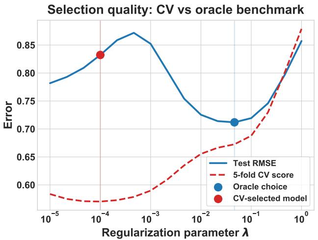

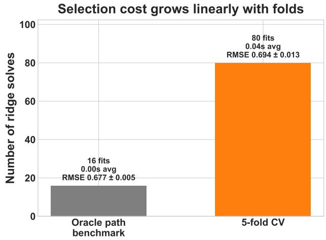  
Figure 1: Left: The results for KRR-RF over 16 candidate values of λ. The blue curve is the test RMSE on an independent test set after training on the full sample and its minimizer is the oracle choice. The red dashed curve is the 5-fold cross-validation score, obtained by refitting the model on training folds and evaluating it on validation folds. Cross-validation selects a smaller λ and incurs a larger test error than the oracle choice. Right: averaged over 12 trials, the oracle path benchmark requires 16 solves, while 5-fold cross-validation requires 80 solves. Despite this 5× higher cost, cross-validation still gives a worse average test RMSE $( 0 . 6 9 4 \pm 0 . 0 1 3$ vs. $0 . 6 7 7 \pm 0 . 0 0 5 )$

More recent work has adapted these ideas to particular kernel algorithms. For exact KRR, [28] introduced a uniformly subdivided regularization grid that reduces repeated cross-scale comparisons while retaining optimal learning rates. Distributed versions have been developed in [29, 31], and related ideas have been used to select the stopping time of kernel gradient methods [26, 25, 33]. These results show that the structure of a specific regularization path can be used to design sharper adaptive procedures.

The random feature setting, however, introduces an additional approximation layer. The estimators are determined by finite-dimensional random feature covariance operators, and the analysis must control the sampling error, regularization bias, and random feature approximation error simultaneously. Moreover, a practically useful stopping rule should be computable directly from the random feature representation rather than from the exact kernel matrix. These considerations motivate a neighboring comparison rule tailored specifically to KRR-RF.

Our Contribution. In this paper, we propose a novel early-stopping rule for KRR-RF that compares only neighboring RF estimators along a uniformly subdivided grid of regularization parameters. Compared with classical Lepskii-type methods, which require all-pairs comparisons, our approach substantially reduces the computational burden. Moreover, thanks to the random feature approximation, the stopping quantity can be computed directly from empirical prediction diferences and coeficient norms, making the proposed procedure fully implementable in practice. In contrast to the exact KRR setting, our method exploits the structure of random features to achieve a more eficient and adaptive regularization strategy.

On the theoretical side, we first establish a high-probability comparison bound for two neighboring KRR-RF estimators. We then show that, under standard source and capacity assumptions together with suitable grid and random feature budget conditions, the estimator selected by the proposed rule attains the oracle polynomial learning rate up to logarithmic factors. The regularization rule itself does not require prior knowledge of the source and capacity exponents, and the result covers both the well-specified regime and part of the misspecified regime. The proof combines a fixed-scale KRR-RF error bound with a pathwise comparison argument and a concentration bound for the empirical random feature efective dimension. Finally, simulation and real-data experiments compare the proposed method with cross-validation and Lepskii-type parameter selection. The numerical results illustrate that neighboring comparisons can provide prediction performance comparable to the benchmark methods while reducing the number of discrepancy comparisons along the regularization path.

## 2 Preliminaries

We begin by introducing the necessary notations and background on kernel ridge regression and its variant with random features.

## 2.1 Reproducing Kernel and Kernel Ridge Regression

Consider a compact input space $\mathcal { X } \subset \mathbb { R } ^ { d }$ and a continuous, symmetric, positive-definite kernel function $K : \mathcal { X } \times \mathcal { X }  \mathbb { R }$ . The kernel K induces a reproducing kernel Hilbert space (RKHS) $\mathcal { H } _ { K }$ of functions on $x ,$ equipped with the inner product $\langle \cdot , \cdot \rangle _ { \mathscr { H } _ { K } }$ and the associated norm $\parallel$ $\| \varkappa _ { K }$ . The RKHS has the reproducing property: for any $f \in \mathcal { H } _ { K }$ and $\textbf { \em x } \in ~ \mathcal { X }$ , we have $f ( { \pmb x } ) =$ $\langle f , K ( \cdot , \pmb { x } ) \rangle _ { \mathcal { H } _ { K } }$ . For a standard supervised learning setting, we are given a sample $\boldsymbol { D } = \{ ( \boldsymbol { x } _ { i } , y _ { i } ) \} _ { i = 1 } ^ { | D | }$ drawn independently from an unknown distribution $\rho$ on $\mathcal { X } \times \mathbb { R }$ , where $| D |$ denotes the sample size. The goal is to learn a function $f : \mathcal { X } \to \mathbb { R }$ that can predict the output y given the input x.

Kernel ridge regression (KRR), which is also known as the Tikhonov regularization in RKHS, is a widely used method for this problem [50, 36]. The KRR estimator is defined as the minimizer of the regularized empirical risk:

$$
f _ { D , \lambda } = \underset { f \in \mathcal { H } _ { K } } { \mathrm { a r g m i n } } \left. \frac { 1 } { | D | } \sum _ { i = 1 } ^ { | D | } ( f ( \pmb { x } _ { i } ) - y _ { i } ) ^ { 2 } + \lambda \| f \| _ { \mathcal { H } _ { K } } ^ { 2 } \right. ,\tag{1}
$$

where $\lambda > 0$ is the regularization parameter that controls the bias-variance trade-of. Thanks to the celebrated representer theorem [45, 51], the KRR estimator can be expressed in closed form as

$$
f _ { D , \lambda } ( \cdot ) = \sum _ { i = 1 } ^ { | D | } \alpha _ { i } K ( \cdot , { \pmb x } _ { i } ) ,\tag{2}
$$

where $\alpha = ( \alpha _ { 1 } , \dots , \alpha _ { | D | } ) ^ { T }$ is the coeficient vector given by $\alpha = ( \mathbf { K } + \lambda | D | I ) ^ { - 1 } \mathbf { y }$ , with K being the kernel matrix defined by ${ \bf K } _ { i j } = { \cal K } ( { \pmb x } _ { i } , { \pmb x } _ { j } )$ and $\mathbf { y } = ( y _ { 1 } , \dots , y _ { | D | } ) ^ { T }$

Despite its simple implementation and strong theoretical properties [47, 13], KRR sufers from computational challenges when the sample size $| D |$ is large, as it requires inverting ${ \mathrm { ~ a ~ } } | D | \times | D |$ kernel matrix. The computational cost and memory requirements of KRR scale as $O ( | D | ^ { 3 } )$ and $O ( | D | ^ { 2 } )$ respectively, which can be prohibitive for large datasets. To address this issue, scalable variants of KRR have been developed, including distributed learning [58, 30, 32, 54], Nystr¨om sub-sampling [56, 41], random features [38, 39, 44, 43], stochastic gradient methods [26, 25].

## 2.2 Kernel Ridge Regression with Random Features

Among these scalable approaches, random features (RF) has gained significant attention due to its simplicity and efectiveness in approximating the exact KRR solution [38, 44, 43]. Assuming the kernel K has an integral representation

$$
K ( { \pmb x } , { \pmb x } ^ { \prime } ) = \int _ { \Omega } \phi ( { \pmb x } , \omega ) \phi ( { \pmb x } ^ { \prime } , \omega ) d \pi ( \omega ) ,\tag{3}
$$

where $\phi : \mathcal { X } \times \Omega  \mathbb { R }$ is a feature map and $\pi$ is a probability measure on Ω. The random feature method constructs an explicit feature map by sampling M random features $\{ \omega _ { j } \} _ { j = 1 } ^ { M }$ independently from $\pi$ and defining the random feature map $\begin{array} { r } { \phi _ { M } ( \pmb { x } ) = \frac { 1 } { \sqrt { M } } ( \phi ( \pmb { x } , \pmb { \omega } _ { 1 } ) , \dots , \phi ( \pmb { x } , \pmb { \dot { \omega } } _ { M } ) ) ^ { T } } \end{array}$ . The associated random feature kernel is given by $K _ { M } ( { \pmb x } , { \pmb x } ^ { \prime } ) = \Phi _ { M } ( { \pmb x } ) ^ { T } \Phi _ { M } ( { \pmb x } ^ { \prime } )$ , which approximates the original kernel $K$

Substituting the random feature kernel into the KRR formulation, we obtain the KRR with random features (KRR-RF) estimator defined as $f _ { M , D , \lambda } ( \cdot ) = \pmb { u } _ { M , D , \lambda } ^ { T } \phi _ { M } ( \cdot )$ , where ${ \pmb u } _ { M , D , \lambda }$ is the solution to the following regularized least squares problem:

$$
\pmb { u } _ { M , D , \lambda } = \underset { \pmb { u } \in \mathbb { R } ^ { M } } { \mathrm { a r g m i n } } \frac { 1 } { | D | } \sum _ { i = 1 } ^ { | D | } \left( y _ { i } - \pmb { u } ^ { T } \phi _ { M } ( \pmb { x } _ { i } ) \right) ^ { 2 } + \lambda \pmb { u } ^ { T } \pmb { u } .\tag{4}
$$

It is easy to derive the closed-form solution $\mathbf { \delta u } _ { M , D , \lambda } = ( \Phi _ { M , D } \Phi _ { M , D } ^ { T } + \lambda I ) ^ { - 1 } \Phi _ { M , D } \mathbf { y } _ { D }$ , where $\Phi _ { M , D } =$ $\begin{array} { r } { \frac { 1 } { \sqrt { | D | } } \big ( \phi _ { M } ( \pmb { x } _ { 1 } ) , \dots , \phi _ { M } ( \pmb { x } _ { | D | } ) \big ) } \end{array}$ and $\begin{array} { r } { \mathbf y _ { D } = \frac { 1 } { \sqrt { | D | } } ( y _ { 1 } , . . . , y _ { | D | } ) ^ { T } } \end{array}$ . Compared with exact KRR, KRR-RF significantly reduces the computational cost to $O ( | D | M ^ { 2 } + M ^ { 3 } )$ and memory requirement to $O ( | D | M + M ^ { 2 } )$ , making it feasible for large-scale learning.

In statistical learning theory, it has been shown that KRR-RF can achieve minimax optima rates of convergence under mild assumptions, provided that the regularization parameter λ is properly tuned and the number of random features M is suficiently large [43, 24]. However, the optimal choice of λ typically depends on unknown smoothness parameters of the target function and capacity parameters of the RKHS, which motivates the need for adaptive regularization strategies that can select λ in a data-driven manner without prior knowledge of these parameters.

## 2.3 Optimal Learning Rates for KRR-RF with Oracle Tuning

In this section, we briefly review the optimal learning rates for KRR-RF when the regularization parameter λ is chosen at the theoretically optimal scale. These results serve as the benchmark for evaluating the performance of our proposed adaptive procedure. The goal of KRR-RF is to learn a function $f _ { M , D , \lambda }$ that approximates the regression function $f _ { \rho } ( \pmb { x } ) = \mathbb { E } [ y | \pmb { x } ]$ based on the observed data $D$ and the random features. The performance of the estimator is typically measured by the excess risk

$$
\mathcal { E } ( f _ { M , D , \lambda } ) - \mathcal { E } ( f _ { \rho } ) = \| f _ { M , D , \lambda } - f _ { \rho } \| _ { \rho } ^ { 2 } ,\tag{5}
$$

where $\mathcal { E } ( f ) = \mathbb { E } [ ( f ( \pmb { x } ) - y ) ^ { 2 } ]$ is the expected risk and $\begin{array} { r } { \| f \| _ { \rho } = \sqrt { \int _ { \mathcal { X } } f ( \pmb { x } ) ^ { 2 } d \rho _ { \mathcal { X } } ( \pmb { x } ) } } \end{array}$ is the $L _ { \mathcal { X } } ^ { 2 }$ -norm with respect to the marginal distribution of x. To derive the sharp bounds for the excess risk, we need to impose some standard notations and assumptions.

Assumption 1. Assume the kernel K admits the integral representation in (3) with $\phi$ being bounded and continuous in both variables. Specifically, there exists a constant $\kappa \geq 1$ such that $| \phi ( \pmb { x } , \omega ) | \leq \kappa$ for all $\mathbf { \boldsymbol { x } } \in \mathcal { X }$ and $\omega \in \Omega$ . The associated RKHS $\mathcal { H } _ { K }$ is separable.

Assumption 2. For any $\mathbf { \boldsymbol { x } } \in \mathcal { X }$ and $p \geq 2$ , there holds that $\mathbb { E } [ | y | ^ { p } | x ] \le \frac { 1 } { 2 } p ! B ^ { p - 2 } \sigma ^ { 2 }$

Assumption 1 ensures that the kernel is well-defined and the associated random features are uniformly bounded. Assumption 2 is a standard Bernstein-type moment condition on the response distribution, which allows for sub-Gaussian tails and is commonly used in the analysis of kernel methods [13, 43]. To characterize the smoothness of the target function and the capacity of the RKHS, we introduce the integral operators

$$
L _ { K } f = \int _ { \mathcal { X } } K ( \pmb { x } , \cdot ) f ( \pmb { x } ) d \rho _ { \mathcal { X } } .\tag{6}
$$

The operator $L _ { K }$ is a positive, self-adjoint, compact operator on $L _ { \rho _ { \mathcal { X } } } ^ { 2 }$ , and its spectral properties play a crucial role in determining the learning rates of KRR-RF. We denote by $\{ \mu _ { j } \} _ { j = 1 } ^ { \infty }$ the eigenvalues of $L _ { K }$ in non-increasing order, and define the efective dimension as

$$
\mathcal N ( \lambda ) = \mathrm { T r } ( ( L _ { K } + \lambda I ) ^ { - 1 } L _ { K } ) = \sum _ { j = 1 } ^ { \infty } \frac { \mu _ { j } } { \mu _ { j } + \lambda } .\tag{7}
$$

Assumption 3. Suppose there exists constants $R > 0 , r \in ( 0 , 1 ]$ and $h _ { \rho } \in L _ { \rho _ { \mathcal { X } } } ^ { 2 }$ such tha $t f _ { \rho } = L _ { K } ^ { r } h _ { \rho }$ where $\| h _ { \rho } \| _ { \rho } \leq R$ and $L _ { K } ^ { r }$ denotes the r-th power of the integral operator $L _ { K }$

Assumption 4. For any $\lambda > 0$ , there exists constants $Q > 0$ and $\gamma \in [ 0 , 1 ]$ such that $\mathcal { N } ( \lambda ) \leq$ $Q ^ { 2 } \lambda ^ { - \gamma }$

Assumption 5. For any $\lambda > 0$ , define the maximum dimension of random features as $\mathcal { N } _ { \infty } ( \lambda ) =$ $\begin{array} { r } { \operatorname* { s u p } _ { \omega \in \Omega } \left. ( L _ { K } + \lambda I ) ^ { - 1 / 2 } \phi ( \cdot , \omega ) \right. _ { \rho } ^ { 2 } } \end{array}$ . Assume there exists constants $\alpha \in [ 0 , 1 ]$ and $F > 0$ , such that $\mathcal { N } _ { \infty } ( \lambda ) \leq F \lambda ^ { - \alpha }$

Assumptions 3 and 4 are standard source and capacity conditions in the analysis of kernel methods [13, 43, 53]. The source condition in Assumption 3 characterizes the smoothness of the target function $f _ { \rho }$ in terms of the integral operator $L _ { K }$ . The parameter $r$ quantifies the degree of smoothness, with larger values of r corresponding to smoother functions. The capacity condition in Assumption 4 controls the complexity of the RKHS through the growth rate of the efective dimension $\mathcal { N } ( \lambda )$ . The parameter $\gamma$ captures the decay rate of the eigenvalues, with smaller values of $\gamma$ indicating faster decay and thus lower complexity. Assumption 5 captures the interaction between the random features and the data-generating distribution via the integral operator $L _ { K }$ It is used to derive refined bounds on the number of random features required to achieve optimal rates, see details in [43]. Under these assumptions, we have the following optimal learning rates for KRR-RF with oracle tuning of the regularization parameter.

Theorem 1. Suppose Assumptions 1-5 hold and $2 r + \gamma > 1$ . Let $\lambda _ { \mathrm { o p t } } = | D | ^ { - { \frac { 1 } { 2 r + \gamma } } }$ , for $\delta \in ( 0 , 1 )$ assume the sample size satisfying that $| D | \ge 1 6 ( \kappa ^ { 2 } \lambda _ { \mathrm { o p t } } ^ { - 1 } + 1 ) \log ( 8 / \acute { \delta } )$ . If the number of random features M satisfies

$$
\begin{array} { r } { M \geq \left\{ \begin{array} { l l } { c _ { 1 } \lambda _ { \mathrm { o p t } } ^ { - \alpha } \log \frac { 9 6 \kappa ^ { 2 } | D | } { \delta } , } & { r \in ( 0 , \frac { 1 } { 2 } ) ; } \\ { c _ { 1 } \lambda _ { \mathrm { o p t } } ^ { - ( 2 r - 1 ) ( 1 + \gamma - \alpha ) - \alpha } \log \frac { 9 6 \kappa ^ { 2 } | D | } { \delta } , } & { r \in [ \frac { 1 } { 2 } , 1 ] , } \end{array} \right. } \end{array}
$$

then with probability at least $1 - \delta$ , there holds that

$$
\| f _ { M , D , \lambda _ { \mathrm { o p t } } } - f _ { \rho } \| _ { \rho } \leq C _ { 1 } | D | ^ { - { \frac { r } { 2 r + \gamma } } } \log { \frac { 1 6 } { \delta } } ,
$$

where $c _ { 1 } , C _ { 1 }$ are some positive constants independent $o f \left| D \right| , \lambda _ { \mathrm { o p t } } , M$ , and $\delta .$

Theorem 1 states that if the regularization parameter λ is chosen at the optimal scale $\lambda _ { \mathrm { o p t } } =$ $| D | ^ { - \frac { 1 } { 2 r + \gamma } }$ and the number of random features M is suficiently large, then the KRR-RF estimator achieves the minimax optimal learning rate of $| D | ^ { - \frac { r } { 2 r + \gamma } }$ up to logarithmic factors. Diferent from the results in [43] and [24], the optimality in Theorem 1 allows for $r \in ( 0 , 1 )$ , which covers part of the misspecified case where the regression function does not belong to the RKHS. However, it is worth noting that the optimal choice of λ depends on the unknown parameters r and γ, which motivates the need for adaptive regularization strategies that can select λ in a data-driven manner without prior knowledge of these parameters.

## 3 Method

In this Section, we present our main method for adaptive regularization in KRR-RF. We first state a key comparison estimate that bounds the diference between two KRR-RF estimators with diferent regularization parameters. This comparison estimate is crucial for the analysis of adaptive procedures based on comparisons of estimators. We then introduce our neighboring early-stopping rule, which is the main contribution of this paper. The neighboring early-stopping rule is designed to be computationally eficient and fully implementable in practice, while still achieving optimal adaptive guarantees.

## 3.1 Motivation and Key Comparison Estimate

In the literature of random feature methods [38, 39, 43, 24], the most common approach for selecting the regularization parameter is cross-validation or grid search. The basic idea is to evaluate the performance of the KRR-RF estimator on a validation set for diferent values of λ and select the one that minimizes the validation error. However, this approach can be computationally expensive, as it requires refitting the model multiple times for diferent λ values. Moreover, it may not guarantee optimal performance if the search grid is not suficiently fine or does not cover the optimal parameter.

To address these issues, we seek a more eficient and adaptive strategy for selecting λ that does not require data splitting or exhaustive grid search. Inspired by the principle in [23] and [28], which selects the regularization parameter by comparing estimators across diferent scales, we aim to design a comparison-based adaptive rule for KRR-RF. The key idea is to compare the estimators corresponding to diferent regularization parameters and select the one that balances the bias, variance and random feature approximation error. Before introducing our methods, we present a key proposition that provides a comparison estimate between two KRR-RF estimators with diferent regularization parameters. This comparison estimate is crucial for the analysis of the proposed neighboring early-stopping rule.

We first introduce some notations, let $C _ { M , D } = \Phi _ { M , D } \Phi _ { M , D } ^ { T } \in \mathbb { R } ^ { M \times M }$ be the empirical covariance operator associated with the random features, and define the empirical random feature efective dimension as

$$
\mathcal { N } _ { M , D } ( \lambda ) = \mathrm { T r } \big [ C _ { M , D } ( C _ { M , D } + \lambda I _ { M } ) ^ { - 1 } \big ] , \quad \mathrm { f o r ~ a n y ~ } \lambda > 0 .\tag{8}
$$

Equivalently, if $\mathbf { K } _ { M , D } = ( K _ { M } ( \pmb { x } _ { i } , \pmb { x } _ { j } ) ) _ { i , j = 1 } ^ { | D | }$ is the random feature Gram matrix, the shared nonzero eigenvalues of $C _ { M , D }$ and ${ \bf K } _ { M , D } / | D |$ give

$$
\mathcal { N } _ { M , D } ( \lambda ) = \mathrm { T r } \big [ \mathbf { K } _ { M , D } ( \mathbf { K } _ { M , D } + \lambda | D | I ) ^ { - 1 } \big ] .
$$

The first representation in (8) is used computationally and does not form either an exact-kernel or random feature $| D | \times | D |$ Gram matrix. We also define the following two quantities that will appear in our proposition and stopping thresholds:

$$
\mathcal { W } _ { M , D , \lambda } = \frac { 1 } { \sqrt { \lambda } | D | } + \left( 1 + \frac { 1 } { \sqrt { \lambda | D | } } \right) \sqrt { \frac { \operatorname* { m a x } \{ \mathcal { N } _ { M , D } ( \lambda ) , 1 \} } { | D | } } ,\tag{9}
$$

and for any $\delta \in ( 0 , 1 )$ ),

$$
\mathcal { U } _ { D , \lambda , \delta } = \frac { 2 ( \kappa ^ { 2 } \lambda ^ { - 1 } + 1 ) \log ( 8 / \delta ) } { | D | } + \sqrt { \frac { 2 \kappa ^ { 2 } \log ( 8 / \delta ) } { \lambda | D | } } .\tag{10}
$$

Proposition 1. Suppose Assumptions 1–5 hold. Let $0 < \widetilde { \lambda } \leq \lambda \leq 1$ satisfy

$$
\tilde { \lambda } \geq 4 \kappa ^ { 2 } / | D | \ a n d \ \operatorname* { m a x } \{ \mathcal { U } _ { D , \lambda , \delta } , \mathcal { U } _ { D , \tilde { \lambda } , \delta } \} \leq 1 / 2 ,\tag{11}
$$

If the number of random features M satisfies

$$
\begin{array} { r } { M \gtrsim \left\{ \begin{array} { l l } { c _ { \mathrm { { R F } } } \widetilde \lambda ^ { - \alpha } \log \frac { 3 8 4 \kappa ^ { 3 } | D | } { \delta } , } & { 0 < r < \frac { 1 } { 2 } , } \\ { c _ { \mathrm { { R F } } } \widetilde \lambda ^ { - [ ( 2 r - 1 ) ( 1 + \gamma - \alpha ) + \alpha ] } \log \frac { 3 8 4 \kappa ^ { 3 } | D | } { \delta } , } & { \frac 1 2 \leq r \leq 1 , } \end{array} \right. } \end{array}\tag{12}
$$

then with probability at least $1 - \delta$ , there holds that

$$
\| { ( C _ { M , D } + \lambda I ) ^ { 1 / 2 } ( { \pmb u } _ { M , D , \lambda } - { \pmb u } _ { M , D , \widetilde \lambda } ) } \| _ { 2 } \le C _ { 2 } \frac { \lambda - \widetilde \lambda } { \widetilde \lambda } \left( { \mathcal { W } _ { M , D , \lambda } + \widetilde \lambda ^ { r } } \right) \log ^ { 2 } \frac { 1 6 } { \delta } ,\tag{13}
$$

where $c _ { \mathrm { R F } } , C _ { 2 }$ are some positive constants independent of $M , \lambda , { \tilde { \lambda } } , | D |$ and δ.

Proposition 1 provides a high-probability bound on the diference between two KRR-RF estimators with diferent regularization parameters λ and λ˜. The bound depends on the diference between the regularization parameters, the empirical RF efective dimension, and the smoothness of the target function. This comparison estimate is crucial for analyzing the performance of adaptive procedures that select λ based on comparisons of estimators. In particular, it allows us to control the bias-variance trade-of and the random feature approximation error when comparing diferent estimators, which is essential for establishing optimal adaptive rates. The conditions in (11) and (12) ensure that the regularization parameters are not too small and that the number of random features is suficiently large to guarantee the stability of the estimators and the validity of the comparison bound.

## 3.2 Adaptive Early-Stopping Rule for KRR-RF

In this section, we propose a neighboring early-stopping rule for selecting the regularization parameter in KRR-RF. In Proposition 1, a key quantity is $\frac { \lambda - \widetilde { \lambda } } { \widetilde { \lambda } }$ , which is the relative diference between the two regularization parameters. This suggests that when comparing two estimators, it is more eficient to compare those corresponding to neighboring and subdivided regularization parameters, as this can lead to a tighter bound and a more eficient adaptive procedure. Specifically, let $\begin{array} { r } { \lambda _ { k } = \frac { 1 } { h k } } \end{array}$ for some $h > 0$ and $k \in \mathbb N$ , then we have

$$
{ \frac { | \lambda _ { k + 1 } - \lambda _ { k } | } { \lambda _ { k + 1 } } } = { \frac { 1 } { k } } = h \lambda _ { k } ,
$$

which is proportional to $\lambda _ { k }$ . We set $\lambda = \lambda _ { k - 1 }$ and $\tilde { \lambda } = \lambda _ { k }$ in Proposition 1, then the bound in (13) can be rewritten as

$$
\| { ( C _ { M , D } + \lambda _ { k - 1 } I ) ^ { 1 / 2 } } { ( \mu _ { M , D , \lambda _ { k - 1 } } - \mu _ { M , D , \lambda _ { k } } ) } \| \leq C _ { 2 } h \lambda _ { k - 1 } \left( \mathcal { W } _ { M , D , \lambda _ { k - 1 } } + \lambda _ { k } ^ { r } \right) \log ^ { 2 } \frac { 1 6 } { \delta } .\tag{14}
$$

Now we are ready to introduce our neighboring early-stopping rule for KRR-RF. For any $\delta > 0$ , we set $\begin{array} { r } { K _ { \mathrm { m a x } } = \left| \frac { | D | } { 4 \kappa ^ { 2 } h } \right| } \end{array}$ and $\begin{array} { r } { \delta _ { D } = \frac { \delta } { 5 K _ { \operatorname* { m a x } } } } \end{array}$ , and assume that $K _ { \operatorname* { m a x } } \ge 2$ . Denote by $K _ { E S }$ the largest index such that $\lambda _ { k }$ satisfies the conditions in (11), i.e.,

$$
K _ { E S } = \operatorname* { m a x } \left\{ k \in \left\{ 1 , \dots , K _ { \operatorname* { m a x } } \right\} : \mathcal { U } _ { D , \lambda _ { k } , \delta _ { D } } \leq \frac { 1 } { 2 } \right\} .\tag{15}
$$

and we define the candidate set of regularization parameters as

$$
\Lambda _ { E S } = \left\{ \lambda _ { k } = \frac { 1 } { h k } : k = K _ { E S } , \ldots , 1 \right\} .\tag{16}
$$

We then select the regularization parameter $\lambda _ { E S }$ by comparing neighboring estimators along the grid $\Lambda _ { E S }$ . Let $C _ { E S } = 2 h C _ { 2 }$ , we define

$$
\begin{array} { r l } & { \mathcal { T } = \Big \{ k \in \{ 2 , \dotsc , K _ { E S } \} : \| ( C _ { M , D } + \lambda _ { k - 1 } I ) ^ { 1 / 2 } ( { \pmb u } _ { M , D , \lambda _ { k - 1 } } - { \pmb u } _ { M , D , \lambda _ { k } } ) \| _ { 2 } } \\ & { \qquad \quad \geq C _ { E S } \lambda _ { k - 1 } \mathcal { W } _ { M , D , \lambda _ { k - 1 } } \log ^ { 2 } \frac { 1 6 } { \delta _ { D } } \Big \} } \end{array}\tag{17}
$$

and

$$
\widehat { k } = \left\{ \begin{array} { l l } { \operatorname* { m a x } \mathcal { T } , } & { \mathcal { T } \neq \emptyset , } \\ { 1 , } & { \mathcal { T } = \emptyset , } \end{array} \right. \quad \lambda _ { E S } = \lambda _ { \widehat { k } } .\tag{18}
$$

Thus the scan is from $k = K _ { E S }$ down to 2. If there is no $\lambda _ { k }$ satisfying the above conditions, we set $\lambda _ { E S } = \lambda _ { 1 }$ . We define $\hat { k }$ as the index of $\lambda _ { E S }$ in $\Lambda _ { E S } , \mathrm { i . e . , } \lambda _ { E S } = \lambda _ { \hat { k } }$ . Consequently, it implies that

$$
\| { ( C _ { M , D } + \lambda _ { k } I ) ^ { 1 / 2 } ( u _ { M , D , \lambda _ { k } } - u _ { M , D , \lambda _ { k + 1 } } ) } \| \le C _ { E S } \lambda _ { k } \mathcal { W } _ { M , D , \lambda _ { k } } \log ^ { 2 } \frac { 1 6 } { \delta _ { D } } , \ \mathrm { f o r ~ a n y } \ k = \hat { k } , \ldots , K _ { E S } - 1 .\tag{19}
$$

The next proposition shows that the stopping quantity can be evaluated directly from empirical prediction diferences and coeficient norms, so the proposed rule is fully implementable in the random feature coordinates.

Proposition 2. For two KRR-RF estimators $f _ { M , D , \lambda } ( \pmb { x } ) = \pmb { u } _ { M , D , \lambda } ^ { T } \phi _ { M } ( \pmb { x } )$ and $f _ { M , D , { \tilde { \lambda } } } ( { \pmb x } ) = { \pmb u } _ { M , D , { \tilde { \lambda } } } ^ { T } \phi _ { M } ( { \pmb x } )$ with $\lambda , \tilde { \lambda } > 0$ , there holds the following explicit equality:

$$
\| ( C _ { M , D } + \lambda I ) ^ { 1 / 2 } ( { \pmb u } _ { M , D , \lambda } - { \pmb u } _ { M , D , \tilde { \lambda } } ) \| _ { 2 } ^ { 2 } = \| f _ { M , D , \lambda } - f _ { M , D , \tilde { \lambda } } \| _ { D } ^ { 2 } + \lambda \| { \pmb u } _ { M , D , \lambda } - { \pmb u } _ { M , D , \tilde { \lambda } } \| _ { 2 } ^ { 2 } ,
$$

where we denote the empirical norm of f as $\textstyle \| f \| _ { D } ^ { 2 } = { \frac { 1 } { | D | } } \sum _ { i = 1 } ^ { | D | } f ( { \boldsymbol { \mathbf { x } } } _ { i } ) ^ { 2 }$

We summarize the complete procedure for the proposed neighboring early-stopping rule in Algorithm 1.

Algorithm 1 Neighboring Early-Stopping Rule for KRR-RF (NESR-KRR-RF)   
Require: Sample D, number of random features $M ,$ , confidence level $\delta \in ( 0 , 1 )$ , step size $h > 0 ,$   
kernel bound $\kappa ,$ and threshold constant $C _ { E S }$   
1: Set   
$K _ { \mathrm { m a x } } = \left\lfloor \frac { | D | } { 4 \kappa ^ { 2 } h } \right\rfloor , \qquad \delta _ { D } = \frac { \delta } { 5 K _ { \mathrm { m a x } } } , \qquad \lambda _ { k } = \frac { 1 } { h k } .$   
2: Determine the admissible endpoint   
$K _ { E S } = \operatorname* { m a x } \left\{ k \in \{ 1 , \dots , K _ { \operatorname* { m a x } } \} : \mathcal { U } _ { D , \lambda _ { k } , \delta _ { D } } \leq \frac { 1 } { 2 } \right\}$   
If the above set is empty, set $K _ { E S } = 1 .$   
3: Construct   
$\Lambda _ { E S } = \{ \lambda _ { k } : k = 1 , \ldots , K _ { E S } \} .$   
4: Generate random features $\{ \omega _ { j } \} _ { j = 1 } ^ { M }$ , construct the random feature map $\phi _ { M }$ , and compute   
$\begin{array} { r } { C _ { M , D } = \Phi _ { M , D } \Phi _ { M , D } ^ { \top } . } \end{array}$   
5: Compute the KRR-RF estimator ${ \pmb u } _ { M , D , \lambda _ { K _ { E S } } } .$   
6: if $K _ { E S } = 1$ then   
7: return $f _ { M , D , \lambda _ { 1 } } = S _ { M } \boldsymbol { u } _ { M , D , \lambda _ { 1 } }$   
8: end if   
9: for $k = K _ { E S } , K _ { E S } - 1 , . . . , 2$ do   
10: Compute ${ \pmb u } _ { M , D , \lambda _ { k - 1 } }$ and $\mathcal { N } _ { M , D } ( \lambda _ { k - 1 } )$ , and then evaluate ${ \mathcal W } _ { M , D , \lambda _ { k - 1 } }$ according to (9).   
11: Compute the neighboring discrepancy   
$\begin{array} { r } { \Delta _ { k } = \left\| ( C _ { M , D } + \lambda _ { k - 1 } I ) ^ { 1 / 2 } \left( { \pmb u } _ { M , D , \lambda _ { k - 1 } } - { \pmb u } _ { M , D , \lambda _ { k } } \right) \right\| _ { 2 } . } \end{array}$   
12: if $\Delta _ { k } \geq C _ { E S } \lambda _ { k - 1 } \mathcal { W } _ { M , D , \lambda _ { k - 1 } } \log ^ { 2 } { \frac { 1 6 } { \delta _ { D } } }$ then   
13: Set $\widehat { k } = k$ and $\lambda _ { E S } = \lambda _ { \widehat { k } } .$   
14: return $f _ { M , D , \lambda _ { E S } } = S _ { M } \pmb { u } _ { M , D , \lambda _ { E S } } .$   
15: end if   
16: end for   
17: No threshold crossing occurs. Set $\widehat { k } = 1$ and $\lambda _ { E S } = \lambda _ { 1 }$   
18: return $f _ { M , D , \lambda _ { E S } } = S _ { M } \pmb { u } _ { M , D , \lambda _ { E S } } .$

## 3.3 Comparison with Lepskii-Type Parameter Selection

The proposed neighboring early-stopping rule is closely related to the Lepskii principle, which selects a regularization scale by comparing estimators computed at diferent levels of regularization. In this subsection, we first compare NESR with a standard Lepskii-type rule implemented in the random feature space, and then discuss its relation to the adaptive selection with uniform subdivision proposed by [28] for exact KRR.

Comparison with the standard Lepskii-type rule. A standard Lepskii-type procedure considers a geometric grid of regularization parameters and selects the largest regularization level for which the corresponding estimator remains suficiently close to all estimators at finer scales. For $q \in ( 0 , 1 )$ , define the geometric grid

$$
\lambda _ { k } = q ^ { k } , \qquad k = 0 , 1 , 2 , \ldots ,
$$

and let

$$
K _ { L P } = \operatorname* { m a x } \left\{ k \in { \mathbb { N } } _ { 0 } : \ \mathcal { U } _ { D , \lambda _ { k } , \delta _ { D } } \leq \frac { 1 } { 2 } , \ 0 \leq k \leq \left\lfloor \log _ { q } \frac { 4 \kappa ^ { 2 } } { | D | } \right\rfloor \right\} .\tag{20}
$$

The candidate set is then given by

$$
\Lambda _ { L P } = \{ \lambda _ { k } = q ^ { k } : ~ k = 0 , 1 , \ldots , K _ { L P } \} .\tag{21}
$$

Based on this grid, the standard Lepskii-type rule selects

$$
\begin{array} { r } { \lambda _ { L P } = \operatorname* { m a x } \Bigg \{ \lambda _ { k } \in \Lambda _ { L P } : \| ( C _ { M , D } + \lambda _ { k } I ) ^ { 1 / 2 } ( { \pmb u } _ { M , D , \lambda _ { k ^ { \prime } } } - { \pmb u } _ { M , D , \lambda _ { k } } ) \| _ { 2 } } \\ { \qquad \le C _ { L P } \mathcal { W } _ { M , D , \lambda _ { k } } \log ^ { 2 } \frac { 1 6 } { \delta _ { D } } , \quad k ^ { \prime } = k + 1 , \ldots , K _ { L P } \Bigg \} . } \end{array}\tag{22}
$$

In other words, $\lambda _ { L P }$ is chosen as the largest regularization level such that the estimator at scale $\lambda _ { k }$ remains stable when compared with all estimators on the candidate grid.

The main drawback of (22) is that it requires all-pairs comparisons over $\Lambda _ { L P }$ , which leads to a substantially higher computational cost than the proposed neighboring rule. More importantly, the geometric grid does not fully exploit the local behavior of the regularization path. Indeed, if $\lambda _ { k } = q ^ { k }$ , then

$$
{ \frac { | \lambda _ { k + 1 } - \lambda _ { k } | } { \lambda _ { k + 1 } } } = { \frac { 1 - q } { q } } .
$$

Applying Proposition 1 with $\lambda = \lambda _ { k }$ and $\tilde { \lambda } = \lambda _ { k + 1 }$ yields

$$
\| { ( C _ { M , D } + \lambda _ { k } I ) ^ { 1 / 2 } ( { \boldsymbol u } _ { M , D , \lambda _ { k } } - { \boldsymbol u } _ { M , D , \lambda _ { k + 1 } } ) } \| _ { 2 } \le C _ { 2 } ( 1 - q ) q ^ { - 1 } \left( \mathcal { W } _ { M , D , \lambda _ { k } } + \lambda _ { k + 1 } ^ { r } \right) \log ^ { 2 } \frac { 1 6 } { \delta _ { D } } .\tag{23}
$$

The factor $( 1 - q ) q ^ { - 1 }$ is determined solely by the geometric spacing of the grid and does not decrease with k. Consequently, the comparison bound in the standard Lepskii rule cannot capture the finer scale variation of neighboring estimators when the regularization path is locally smooth.

By contrast, our neighboring early-stopping rule is constructed on a uniformly subdivided grid, so that adjacent parameters are much closer and the corresponding comparison quantity is more sensitive to local changes of the estimator. This refined construction not only reduces the computational burden by replacing all-pairs comparisons with neighboring comparisons, but also provides a sharper characterization of the regularization path in the random feature setting. In this sense, the proposed rule can be viewed as a localized and computationally more eficient alternative to the standard Lepskii-type method.

Comparison with the adaptive rule of [28]. The adaptive selection with uniform subdivision (ASUS) developed by [28] is more closely related to NESR than the classical Lepskii rule. For exact KRR, [28] exploits the special spectral structure of the KRR estimator to relate the diference between successive estimators to an empirical complexity quantity. This leads to an early-stoppingtype implementation of the Lepskii principle that avoids the recurrent pairwise comparisons required by classical LP. In this respect, both the method of [28] and NESR use local comparisons along a suitably subdivided regularization path.

The main distinction lies in the statistical and computational representation in which the comparison is carried out. The procedure of [28] is developed for exact KRR and is formulated through quantities associated with the exact kernel estimator. In the random feature setting, replacing the kernel by a finite-dimensional randomized approximation introduces an additional source of error. Consequently, an adaptive rule for KRR-RF must simultaneously account for sample fluctuations, regularization bias, and random feature approximation. To address this issue, Proposition 1 establishes a comparison bound directly between two KRR-RF estimators. The stochastic part of the bound is measured by ${ \mathcal { W } } _ { M , D , \lambda }$ , which depends on the empirical random feature efective dimension $\mathcal { N } _ { M , D } ( \lambda ) = \mathrm { T r } \left[ C _ { M , D } ( C _ { M , D } + \lambda I ) ^ { - 1 } \right]$ . This quantity is computed entirely from the empirical random feature covariance matrix $C _ { M , D } \in \mathbb { R } ^ { M \times M }$ and therefore does not require the exact kernel Gram matrix. Moreover, Proposition 2 shows that the neighboring discrepancy admits an explicit representation. Thus, once the two KRR-RF estimators have been computed, their discrepancy can be evaluated directly from their fitted values and coeficient vectors, without explicitly computing a matrix square root or forming the exact kernel Gram matrix.

Remark 1 (Computational Comparison). Suppose that the candidate regularization path contains K values. We compare the computational costs of the proposed NESR method with the classical Lepskii principle (LP), the adaptive selection with uniform subdivision for exact KRR proposed by [28], and the direct random feature implementation of LP (LP-RF). We consider a direct implementation in which the linear system corresponding to each candidate regularization parameter is solved separately.

For exact KRR, both LP and the method of [28] require the $| D | \times | D |$ kernel Gram matrix. For each regularization parameter, computing the corresponding KRR estimator by a standard dense linear solver requires $\mathcal { O } ( | D | ^ { 3 } )$ operations. Hence, computing the estimators along a path containing K candidate values requires $\mathcal { O } ( K | D | ^ { 3 } )$ operations. Once the candidate estimators have been obtained, a discrepancy between two estimators can be evaluated using the kernel Gram matrix in $\mathcal { O } ( | D | ^ { 2 } )$ operations. Therefore, the all-pairs comparisons in LP require $\mathcal { O } ( K ^ { 2 } | D | ^ { 2 } )$ additional operations, whereas the neighboring comparisons in [28] require only $\mathcal { O } ( K | D | ^ { 2 } )$ operations.

For KRR-RF, let $C _ { M , D } \in \mathbb { R } ^ { M \times M }$ be the empirical random feature covariance matrix. Constructing $C _ { M , D }$ requires $\mathcal { O } ( | D | M ^ { 2 } )$ operations. For each regularization parameter λ, the coeficient vector $u _ { M , D , \lambda }$ is obtained by solving $( C _ { M , D } + \lambda I ) u _ { M , D , \lambda } = \Phi _ { M , D } y _ { D }$ , which requires $\mathcal { O } ( M ^ { 3 } )$ operations using a standard dense linear solver. Thus, computing the KRR-RF estimators over K candidate values requires $\mathcal { O } ( | D | M ^ { 2 } + K M ^ { 3 } )$ operations. The main diference between LP-RF and NESR lies in the comparison stage. For two KRR-RF estimators, let $\Delta u = u _ { M , D , \lambda } - u _ { M , D , \widetilde { \lambda } } .$ By Proposition $\begin{array} { r } { 2 , \left\| ( C _ { M , D } + \lambda I ) ^ { 1 / 2 } \Delta \boldsymbol { u } \right\| _ { 2 } ^ { 2 } = \Delta \boldsymbol { u } ^ { \top } C _ { M , D } \Delta \boldsymbol { u } + \lambda \| \Delta \boldsymbol { u } \| _ { 2 } ^ { 2 } } \end{array}$ . Since $C _ { M , D }$ has already been constructed, each discrepancy can be evaluated in $\mathcal { O } ( M ^ { 2 } )$ operations. Consequently, the all-pairs comparisons in LP-RF require $\mathcal { O } ( K ^ { 2 } M ^ { 2 } )$ operations, whereas NESR requires only $\mathcal { O } ( K M ^ { 2 } )$ operations for the neighboring comparisons. The corresponding overall costs are summarized in Table 1.

Here the cost of generating the random features is not included, since it is common to LP-RF and NESR-KRR-RF. The estimator computation along the regularization path has the same order for LP-RF and NESR-KRR-RF. Their computational diference arises from the comparison stage: LP-RF performs a quadratic number of cross-scale comparisons, whereas NESR uses only a linear number of neighboring comparisons. Compared with the exact-KRR method of [28], NESR performs the entire adaptive selection in the M-dimensional random feature space rather than the |D|-dimensional sample space. When $M \ll | D |$ , this leads to a substantially lower computational and memory cost.

Table 1: Computational complexity of diferent adaptive regularization methods.
<table><tr><td>Method</td><td>Main computational cost</td><td>Memory cost</td></tr><tr><td>LP</td><td> $\overline { { \mathcal { O } ( K | D | ^ { 3 } + K ^ { 2 } | D | ^ { 2 } ) } }$ </td><td> $\overline { { \mathcal { O } ( | D | ^ { 2 } ) } }$ </td></tr><tr><td>ASUS</td><td> $\mathcal { O } ( K | D | ^ { 3 } + K | D | ^ { 2 } )$ </td><td> $\mathcal { O } ( | D | ^ { 2 } )$ </td></tr><tr><td>LP-RF</td><td> $\mathcal { O } ( | D | M ^ { 2 } + K M ^ { 3 } + K ^ { 2 } M ^ { 2 } )$ </td><td> $\mathcal { O } ( | D | M + M ^ { 2 } )$ </td></tr><tr><td>NESR-KRR-RF</td><td> $\mathcal { O } ( | D | M ^ { 2 } + K M ^ { 3 } + K M ^ { 2 } )$ </td><td> $\mathcal { O } ( | D | M + M ^ { 2 } )$ </td></tr></table>

## 4 Theory

In this section, we present the main theoretical result of this paper, which establishes that the KRR-RF estimator with the regularization parameter selected by the neighboring early-stopping rule achieves the optimal adaptive learning rate up to logarithmic factors.

Theorem 2. Suppose Assumptions 1-5 hold, $h \geq 1 , 2 r + \gamma > 1$ , and $K _ { E S } \geq 2$ . We also assume the candidate path covers the oracle parameter

$$
\lambda _ { K _ { E S } } \leq \lambda _ { \mathrm { o p t } } \leq \lambda _ { 1 } .
$$

If the number of random features M satisfies

$$
\begin{array} { r } { M \geq \left\{ \begin{array} { l l } { c _ { \mathrm { R F } } \lambda _ { K _ { E S } } ^ { - \alpha } \log \frac { \kappa ^ { 2 } | D | K _ { \operatorname* { m a x } } } { \delta } , } & { r \in ( 0 , \frac { 1 } { 2 } ) , } \\ { c _ { \mathrm { R F } } \lambda _ { K _ { E S } } ^ { - ( 2 r - 1 ) ( 1 + \gamma - \alpha ) - \alpha } \log \frac { \kappa ^ { 2 } | D | K _ { \operatorname* { m a x } } } { \delta } , } & { r \in [ \frac { 1 } { 2 } , 1 ] , } \end{array} \right. } \end{array}
$$

then the estimator selected with $\lambda _ { E S } = \lambda _ { \hat { k } }$ defined in (18) satisfies, with probability at least $1 - \delta$

$$
\| f _ { M , D , \lambda _ { E S } } - f _ { \rho } \| _ { \rho } \leq C _ { 3 } | D | ^ { - \frac { r } { 2 r + \gamma } } \log ^ { 4 } \frac { 1 6 } { \delta _ { D } } ,
$$

where $c _ { \mathrm { R F } } , C _ { 3 }$ are some positive constants independent of |D|, λ, M, and δ.

Theorem 2 states that the KRR-RF estimator with the regularization parameter selected by the neighboring early-stopping rule achieves the same convergence rate as the oracle choice, up to logarithmic factors. This result demonstrates that the proposed adaptive procedure can efectively select the regularization parameter without prior knowledge of the smoothness and capacity parameters, while still attaining optimal statistical performance.

Remark 2. The lower bound on the number of random features M in Theorem 2 depends on the unknown parameters r, α, and $\gamma .$ The role of M, however, is diferent from that of the regularization parameter λ. While λ determines the bias–variance trade-of and is selected adaptively by NESR, M controls the accuracy of the random feature approximation. Accordingly, we treat M as a prespecified computational budget rather than an additional tuning parameter of the proposed procedure. Theorem 2 requires this budget to be suficiently large for the stated oracle-rate guarantee. In the numerical experiments, we either fix M or vary it over a prescribed range to examine the sensitivity of the method to the number of random features. Adaptive selection of M is not considered in this work. A parameter-uniform suficient feature bound is given in the following corollary.

The following corollary provides a conservative feature bound that is uniform over the unknown exponents $r , \alpha ,$ and $\gamma .$

Corollary 1. Under the conditions of Theorem 2, Define

$$
\beta : = \alpha + ( 2 r - 1 ) _ { + } ( 1 + \gamma - \alpha ) ,
$$

where $( x ) _ { + } : = \operatorname* { m a x } \{ x , 0 \}$ , then we have $0 \leq \beta \leq 2$ . Hence, a suficient condition for the number of random features is

$$
M \geq \bar { c } _ { \mathrm { R F } } \lambda _ { K _ { \mathrm { E S } } } ^ { - 2 } \log \left( \frac { \kappa ^ { 2 } | D | K _ { \mathrm { m a x } } } { \delta } \right) ,
$$

where c¯ is a suficiently large constant. This bound is valid for all $r \in ( 0 , 1 ]$ and $\alpha , \gamma \in [ 0 , 1 ]$ covered by Theorem 2.

Proof sketch of Theorem 2. Let $k ^ { * } : = \operatorname* { m a x } \{ k \in \{ 1 , \dots , K _ { E S } \} : \lambda _ { k } \geq \lambda _ { o p t } \}$ . Under the gridcoverage condition and the inverse-regularization grid, $\lambda _ { k ^ { * } }$ is within a constant factor of the oracle scale, $\lambda _ { o p t } \le \lambda _ { k ^ { * } } \le 2 \lambda _ { o p t }$ . We first construct a single high-probability event on which the fixed-scale error bound, the empirical RF efective-dimension estimates, the covariance stability bounds, and Proposition 1 hold simultaneously for all candidate scales and all neighboring pairs. This is obtained by applying the corresponding results with failure probability $\delta _ { D }$ and taking a union bound over the candidate path. The feature condition imposed at $\lambda _ { K _ { E S } }$ is suficient for all larger grid values. We then distinguish two cases according to the position of the selected scale relative to $\lambda _ { k ^ { * } }$

Case $1 \colon \lambda _ { E S } \leq \lambda _ { k ^ { * } }$ . Except for the boundary case $\hat { k } = k ^ { * } = 1$ , the selected index is generated by a threshold crossing. Combining this crossing inequality with Proposition 1 shows that the empirical stochastic scale at the selected point is controlled by the bias scale, $\mathcal { W } _ { M , D , \lambda _ { E S } } \lesssim \lambda _ { E S } ^ { r }$ The fixed-scale oracle inequality then gives $\| f _ { M , D , \lambda _ { E S } } - f _ { \rho } \| _ { \rho } \lesssim \lambda _ { E S } ^ { r }$ up to logarithmic factors. Since $\lambda _ { E S } \leq \lambda _ { k ^ { * } } \leq 2 \lambda _ { o p t }$ , this yields the desired oracle rate.

Case 2: $\lambda _ { E S } > \lambda _ { k ^ { * } }$ . In this case, $\hat { k } < k ^ { * }$ , and the neighboring discrepancies from $\hat { k }$ to $k ^ { * } - 1$ are all below their stopping thresholds. This remains true in the no-crossing case, where the fallback index is $\hat { k } = 1$ . By summing the diferences between consecutive estimators along the regularization path, we obtain a bound for $\| f _ { M , D , \lambda _ { E S } } - f _ { M , D , \lambda _ { k ^ { * } } } \| _ { \rho }$ . The empirical RF efective-dimension bounds and the capacity condition control this sum $\mathrm { b y } \stackrel { \sim } { | \boldsymbol D | } ^ { - r / ( 2 r + \gamma ) }$ up to logarithmic factors. Combining this estimate with the fixed-scale bound at $\lambda _ { k ^ { * } }$ gives the same rate for the selected estimator.

## 5 Simulation

## 5.1 Simulation Setup

In this section, we present simulation results to evaluate the performance of the proposed neighboring early-stopping rule (NESR) for KRR-RF. Following the simulation setting in [43], we consider the periodic spline kernel on the unit interval $\mathcal { X } = [ 0 , 1 ]$ . For $q > 1$ , define

$$
\Lambda _ { q } ( x , x ^ { \prime } ) = 1 + 2 \sum _ { k = 1 } ^ { \infty } k ^ { - q } \cos \bigl ( 2 \pi k ( x - x ^ { \prime } ) \bigr ) .
$$

The periodic spline kernels satisfy the convolution identity

$$
\int _ { 0 } ^ { 1 } \Lambda _ { q } ( x , z ) \Lambda _ { q ^ { \prime } } ( x ^ { \prime } , z ) d z = \Lambda _ { q + q ^ { \prime } } ( x , x ^ { \prime } ) ,
$$

whenever the corresponding series are well defined. This identity provides a convenient way to construct kernels and regression functions with diferent smoothness levels. For $r \in \mathsf { \Gamma } ( 0 , 1 ]$ and $\gamma \in \mathsf { \Gamma } ( 0 , 1 ]$ , we set $K ( x , x ^ { \prime } ) = \Lambda _ { 1 / \gamma } ( x , x ^ { \prime } )$ . Motivated by the convolution identity above, we use the random feature representation $\phi ( x , w ) = \Lambda _ { 1 / ( 2 \gamma ) } ( x , w )$ , where $w \sim U ( 0 , 1 )$ , so that formally $\begin{array} { r } { K ( x , x ^ { \prime } ) = \int _ { 0 } ^ { 1 } \phi ( x , w ) \phi ( x ^ { \prime } , w ) } \end{array}$ dw. The samples are generated according to

$$
y = f _ { \rho } ( x ) + \epsilon ,
$$

where

$$
f _ { \rho } ( x ) = 0 . 1 \Lambda _ { r / \gamma + 1 / 2 } ( x , 0 ) , \qquad x \sim U ( 0 , 1 ) , \qquad \epsilon \sim N ( 0 , 0 . 1 ^ { 2 } ) .
$$

For this construction, the random feature complexity exponent is given by $\alpha = \gamma \ [ 4 3 ]$ . We consider four parameter configurations,

$$
( r , \gamma ) \in \{ ( 0 . 8 , 0 . 2 ) , ( 0 . 6 , 0 . 2 ) , ( 0 . 5 , 0 . 4 5 ) , ( 0 . 4 , 0 . 1 ) \} ,
$$

which represent diferent combinations of target smoothness and kernel capacity. The first three settings satisfy $2 r + \gamma > 1$ and therefore fall within the regime covered by Theorem 2. For the last setting, $( r , \gamma ) = ( 0 . 4 , 0 . 1 )$ , we have $2 r + \gamma < 1$ . This case is included as an additional numerical experiment outside the theoretical regime of Theorem 2.

To assess the performance of NESR, we compare it with three benchmark parameter-selection strategies for KRR-RF: the standard Lepskii-type rule (LP), five-fold cross-validation (CV), and an oracle selector. In the synthetic experiments, the regularization parameter is parameterized as $\lambda = C | D | ^ { - 1 / ( 2 r + \gamma ) }$ , where r and $\gamma$ are known from the data-generating mechanism. The oracle selector chooses $C$ by minimizing the test error over a logarithmically spaced grid of 100 values between $1 0 ^ { - 2 }$ and $1 0 ^ { 1 }$ . For cross-validation, we use standard five-fold CV over $\mathcal { C } _ { \mathrm { c v } } ~ =$ $\{ 0 . 0 1 , 0 . 0 5 , 0 . 1 , 0 . 5 , 1 , 2 , 4 , 8 , 1 0 \}$ , and select the value of C that minimizes the average validation error across the five folds. The final KRR-RF estimator is then refitted on the full training sample using the selected regularization parameter. We note that the parameterization $\lambda = C | D | ^ { - 1 / ( 2 r \bar { + } \gamma ) }$ uses the known values of $r$ and $\gamma$ in the simulation design and is therefore used here only for controlled numerical comparison.

The values used in each experiment are reported in Table 2. For LP, we use the geometric sequence $\lambda _ { k } = q ^ { k }$ with $q = 0 . 5$ . The range of indices is specified separately for each experiment. For the prediction experiments, LP is evaluated over the full candidate grid $\Lambda _ { L P } ^ { \mathrm { p r e d } } = \bar  \{ q ^ { k } : q ^ { k } \geq $ $1 0 ^ { - 1 0 } , k = 0 , 1 , . . . \}$ . For the runtime experiments, we use restricted subgrids of the same Geometric sequence, as specified below. The confidence level is denoted by $\delta ,$ while $C _ { E S }$ and $C _ { L P }$ are the threshold constants defined in (19) and (22). For NESR, h determines the spacing of the inverseregularization grid and $K _ { E S }$ specifies the endpoint of the candidate set $\Lambda _ { E S }$ . The quantities $| D |$ and $| D ^ { \prime } |$ denote the numbers of training and test samples, respectively. Prediction performance is evaluated on the independent test set using either mean squared error (MSE) or root mean squared error (RMSE), depending on the experiment

$$
\mathrm { M S E } = \frac { 1 } { n _ { t e } } \sum _ { i = 1 } ^ { n _ { t e } } \left( \widehat { f } ( x _ { i } ) - f _ { \rho } ( x _ { i } ) \right) ^ { 2 } , \quad \mathrm { R M S E } = \sqrt { \frac { 1 } { n _ { t e } } \sum _ { i = 1 } ^ { n _ { t e } } \left( \widehat { f } ( x _ { i } ) - f _ { \rho } ( x _ { i } ) \right) ^ { 2 } }
$$

All simulation results are averaged over 50 independent repetitions.

Table 2: Parameter settings for NESR and LP.
<table><tr><td></td><td>q</td><td>δ</td><td> $C _ { L P }$ </td><td> $C _ { E S }$ </td><td>h</td><td> $K _ { E S }$ </td><td>M</td><td>|D|</td><td> $| D ^ { \prime } |$ </td></tr><tr><td>Fig. 2:(a)</td><td>0.5</td><td>0.01</td><td>0.1</td><td>0.005</td><td>50</td><td>20</td><td>100</td><td>5000</td><td>1000</td></tr><tr><td>Fig. 2:(b)</td><td>0.5</td><td>0.01</td><td>0.05</td><td>0.003</td><td>50</td><td>20</td><td>100</td><td>5000</td><td>1000</td></tr><tr><td>Fig. 2:(c)</td><td>0.5</td><td>0.01</td><td>0.0007</td><td>0.01</td><td>50</td><td>20</td><td>100</td><td>5000</td><td>1000</td></tr><tr><td>Fig. 2:(d)</td><td>0.5</td><td>0.01</td><td>0.002</td><td>0.002</td><td>200</td><td>100</td><td>100</td><td>5000</td><td>1000</td></tr><tr><td>Fig. 3:(a)</td><td>0.5</td><td>0.01</td><td>0.1</td><td>0.005</td><td>50</td><td>20</td><td>100</td><td></td><td>1000</td></tr><tr><td>Fig. 3:(b)</td><td>0.5</td><td>0.01</td><td>0.05</td><td>0.003</td><td>50</td><td>20</td><td>100</td><td></td><td>1000</td></tr><tr><td>Fig. 3:(c)</td><td>0.5</td><td>0.01</td><td>0.0007</td><td>0.01</td><td>50</td><td>20</td><td>100</td><td></td><td>1000</td></tr><tr><td>Fig. 3:(d)</td><td>0.5</td><td>0.01</td><td>0.002</td><td>0.002</td><td>200</td><td>100</td><td>100</td><td></td><td>1000</td></tr><tr><td>Fig. 4:(a)</td><td>0.5</td><td>0.01</td><td>0.0001</td><td>0.0025</td><td>50</td><td>20</td><td>100</td><td></td><td>1000</td></tr><tr><td>Fig. 4:(b)</td><td>0.5</td><td>0.01</td><td>0.0001</td><td>0.002</td><td>50</td><td>20</td><td>100</td><td></td><td>1000</td></tr><tr><td>Fig. 4:(c)</td><td>0.5</td><td>0.01</td><td>0.0002</td><td>0.006</td><td>50</td><td>20</td><td>100</td><td></td><td>1000</td></tr><tr><td>Fig. 4:(d)</td><td>0.5</td><td>0.01</td><td>0.0001</td><td>0.0005</td><td>200</td><td>100</td><td>100</td><td></td><td>1000</td></tr><tr><td>Fig. 5:(a)</td><td>0.5</td><td>0.01</td><td>0.1</td><td>0.005</td><td>50</td><td>20</td><td></td><td>5000</td><td>1000</td></tr><tr><td>Fig. 5:(b)</td><td>0.5</td><td>0.01</td><td>0.05</td><td>0.003</td><td>50</td><td>20</td><td></td><td>5000</td><td>1000</td></tr><tr><td>Fig. 5:(c)</td><td>0.5</td><td>0.01</td><td>0.0007</td><td>0.01</td><td>50</td><td>20</td><td></td><td>5000</td><td>1000</td></tr><tr><td>Fig. 5:(d)</td><td>0.5</td><td>0.01</td><td>0.002</td><td>0.002</td><td>200</td><td>100</td><td></td><td>5000</td><td>1000</td></tr><tr><td>Fig. 6:(a)</td><td>0.5</td><td>0.01</td><td>0.0001</td><td>0.0025</td><td>50</td><td>20</td><td></td><td>5000</td><td>1000</td></tr><tr><td>Fig. 6:(b)</td><td>0.5</td><td>0.01</td><td>0.0001</td><td>0.002</td><td>50</td><td>20</td><td></td><td>5000</td><td>1000</td></tr><tr><td>Fig. 6:(c)</td><td>0.5</td><td>0.01</td><td>0.0002</td><td>0.006</td><td>50</td><td>20</td><td></td><td>5000</td><td>1000</td></tr><tr><td>Fig. 6:(d)</td><td>0.5</td><td>0.01</td><td>0.0001</td><td>0.0005</td><td>200</td><td>100</td><td></td><td>5000</td><td>1000</td></tr><tr><td>Fig. 7:(a)</td><td>0.5</td><td>0.01</td><td>一</td><td>0.0045</td><td></td><td>20</td><td></td><td>5000</td><td>1000</td></tr><tr><td>Fig. 7:(b)</td><td>0.5</td><td>0.01</td><td>一</td><td>0.003</td><td></td><td>20</td><td></td><td>5000</td><td>1000</td></tr><tr><td>Fig. 7:(c)</td><td>0.5</td><td>0.01</td><td>一</td><td>0.01</td><td></td><td>20</td><td></td><td>5000</td><td>1000</td></tr><tr><td>Fig. 7:(d)</td><td>0.5</td><td>0.01</td><td>一</td><td>0.002</td><td>一</td><td>100</td><td></td><td>5000</td><td>1000</td></tr></table>

## 5.2 Curve Fitting Results

To provide a visual comparison, we generate one dataset under each of the four $( r , \gamma )$ configurations and plot the fitted curves obtained by NESR, LP, CV, and the Oracle method. As shown in Figure 2, the four methods produce broadly similar fits to the underlying regression function in most settings. In particular, the curves obtained by NESR and LP closely track the true function over most of the input domain. For the setting $( r , \gamma ) = ( 0 . 5 , 0 . 4 5 )$ , larger discrepancies are observed near the boundaries of the interval, although the overall fitting patterns of the four methods remain similar.

## 5.3 Efect of Training Sample Size

To examine the efect of the training sample size on prediction performance, we compare NESR, LP, and CV with the Oracle benchmark. In this experiment, the test sample size is fixed at $| D ^ { \prime } | = 1 0 0 0$ and the number of random features is fixed at $M = 1 0 0$ , while the training sample size varies over $| D | \in \{ 1 0 0 0 , 1 5 0 0 , \ldots , 5 0 0 0 \}$ . Figure 3 reports the average RMSE and the corresponding error bars for the four methods. Overall, the RMSE tends to decrease as the training sample size increases across the four $( r , \gamma )$ configurations.

  
(a) $r = 0 . 8 , \gamma = 0 . 2$

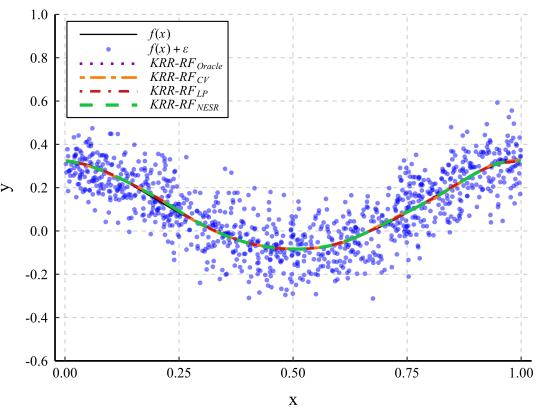  
(b) $r = 0 . 6 , \gamma = 0 . 2$

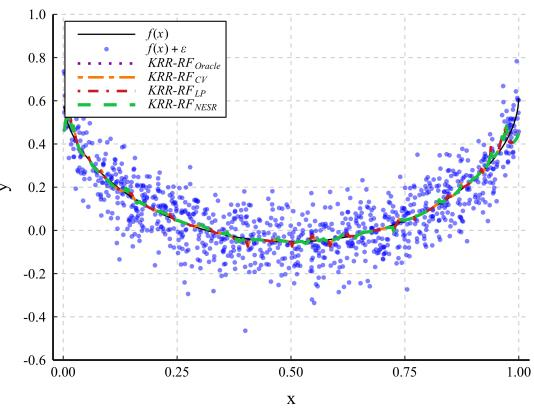  
(c) r = 0.5, γ = 0.45

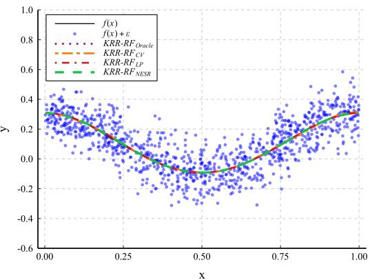  
(d) $r = 0 . 4 , \gamma = 0 . 1$  
Figure 2: Curve fitting performance with diferent r and $\gamma$ . In each panel, the solid black line represents the true function f(x), and the blue scatter points show the noisy observations $f ( x ) + \varepsilon .$ Among the four compared estimators, the purple dotted line indicates the Oracle benchmark, and the orange two-dash line corresponds to Cross-Validation (CV). Additionally, the red dot-dash line denotes Lepskii Principle (LP), while the green dashed line illustrates our proposed NESR.

For $( r , \gamma ) = ( 0 . 8 , 0 . 2 )$ and (0.6, 0.2), NESR, LP, and CV achieve broadly comparable RMSE values over the range of sample sizes considered. The error bars of NESR and LP are generally narrower than those of $\mathrm { C V } ,$ and the diference between NESR or LP and the Oracle benchmark decreases as |D| increases. NESR also gives slightly smaller average RMSE than LP at several sample sizes. For $( r , \gamma ) = ( 0 . 4 , 0 . 1 )$ , both NESR and LP attain lower RMSE than CV over most of the sample-size range, with NESR and LP showing similar overall behavior. In the setting $( r , \gamma ) = ( 0 . 5 , 0 . 4 5 )$ , NESR gives the lowest RMSE among the three feasible selection methods for most of the reported sample sizes and remains close to the Oracle benchmark. The error bars of the four methods are of similar magnitude in this setting.

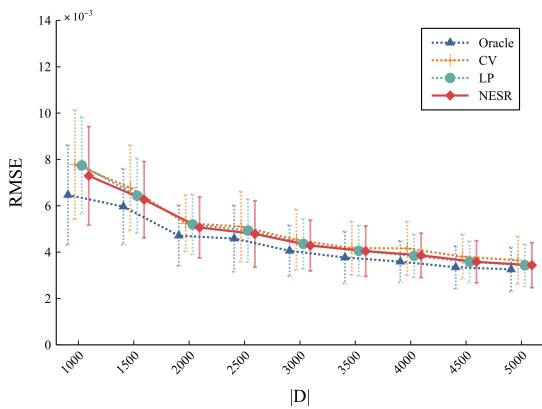  
(a) r = 0.8, γ = 0.2

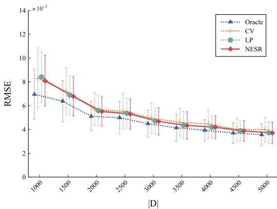  
(b) $r = 0 . 6 , \gamma = 0 . 2$

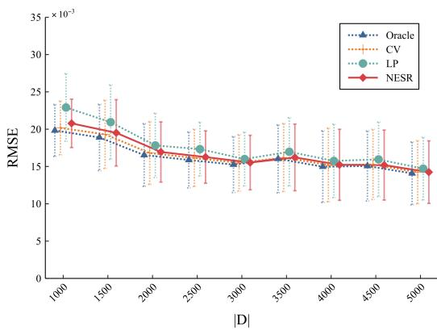  
(c) $r = 0 . 5 , \gamma = 0 . 4 5$

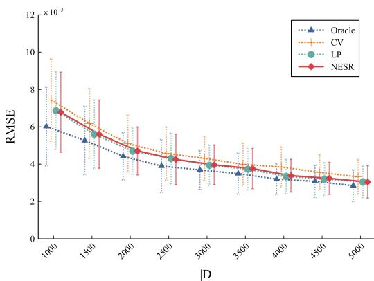  
(d) $r = 0 . 4 , \gamma = 0 . 1$  
Figure 3: RMSE vs number of training data $| D |$ for four approaches with diferent r and $\gamma$

Beyond prediction accuracy, we also examine the computational cost of NESR and LP as the training sample size increases. Figure 4 reports the total running time over 50 independent trials. For this experiment, we use restricted candidate ranges centered around the regions in which the Oracle solutions are observed. Specifically, for $( r , \gamma ) \in \{ ( 0 . 8 , 0 . 2 ) , ( 0 . 6 , 0 . 2 ) , ( 0 . 5 , 0 . 4 5 ) \}$ , we set $\Lambda _ { L P } : = \{ q ^ { k } : k = 4 , 5 , \ldots , 1 2 \}$ for LP, and $\Lambda _ { E S } \ \subseteq \ [ 1 0 ^ { - 3 } , 1 0 ^ { - 2 } ]$ with $h = 5 0$ and $K _ { E S } = 2 0$ for NESR. For the case $( r , \gamma ) = \{ 0 . 4 , 0 . 1 \}$ , we set $\Lambda _ { L P } : = \{ q ^ { k } : k = 8 , 9 , \ldots , 1 6 \}$ for LP, and $\Lambda _ { E S } \subseteq [ 5 \times 1 0 ^ { - 5 } , 2 . 5 \times 1 0 ^ { - }$ −3] with $h = 2 0 0$ and $K _ { E S } = 1 0 0$ for NESR.

The settings used in Figure 4 difer from those used in Figure 3. In Figure 3, the candidate ranges are chosen to compare the prediction performance of the diferent selection rules over a broader regularization path. In Figure 4, narrower candidate ranges are used to focus on the computational cost of the parameter-selection procedures in regions relevant to the fitted models. Consequently, the prediction errors reported in the two figures are not directly comparable. In particular, restricting the LP candidate set may exclude some values considered in Figure 3 and can therefore lead to a larger RMSE.

Under these restricted candidate ranges, NESR generally requires less running time than LP in the experiments shown in Figure 4, while maintaining comparable prediction accuracy. These results illustrate the computational benefit of replacing all-pairs comparisons with neighboring comparisons along the regularization path. Since the candidate ranges in this experiment are informed by the Oracle solutions, the timing results should be interpreted as a comparison under the specified candidate paths rather than as a fully data-driven end-to-end benchmark.

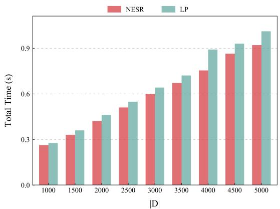  
(a) r = 0.8, γ = 0.2

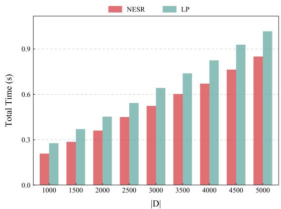  
(b) $r = 0 . 6 , \gamma = 0 . 2$

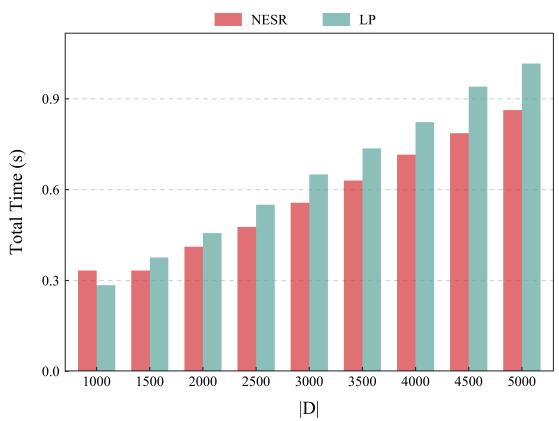  
(c) r = 0.5, γ = 0.45

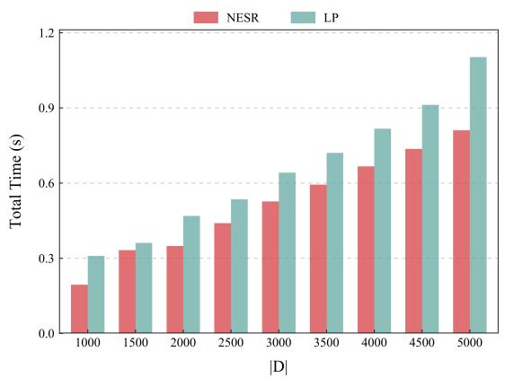  
(d) r = 0.4, γ = 0.1  
Figure 4: Run time vs number of training data |D| for NESR and LP with diferent r and γ.

## 5.4 Efect of Random Features

In addition to varying the training sample size, we examine the efect of the number of random features M on prediction performance. We fix the training sample size at $| D | = 5 0 0 0$ and the test sample size at $| D ^ { \prime } | = 1 0 0 0 .$ , and vary $M \in \{ 2 0 , 4 0 , 8 0 , 1 0 0 , 1 5 0 , 2 0 0 , \dots , 5 0 0 \}$ . Figure 5 reports the corresponding RMSE results. Overall, the prediction errors tend to decrease or level of as M increases, with relatively small changes observed for moderate to large values of M in most settings.

For $( r , \gamma ) = ( 0 . 8 , 0 . 2 )$ and (0.6, 0.2), LP gives a larger RMSE than NESR and CV when the number of random features is small. As M increases, the diference becomes smaller, while NESR generally maintains a slightly lower RMSE over the range considered. For $( r , \gamma ) = ( 0 . 4 , 0 . 1 )$ , NESR and LP both give lower RMSE than CV for most values of M. In the setting $( r , \gamma ) = ( 0 . 5 , 0 . 4 5 )$ , LP shows a noticeably larger RMSE for small and moderate values of M, and the diference gradually decreases as more random features are used. Across the four settings, the error bars of the three selection methods are generally of comparable magnitude.

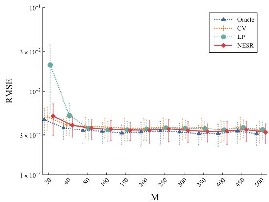  
(a) r = 0.8, γ = 0.2

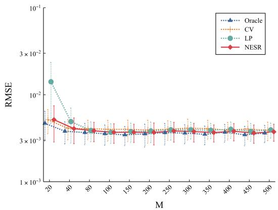  
(b) $r = 0 . 6 , \gamma = 0 . 2$

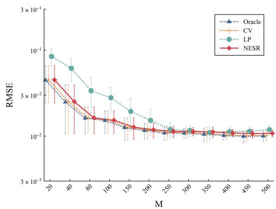  
(c) $r = 0 . 5 , \gamma = 0 . 4 5$

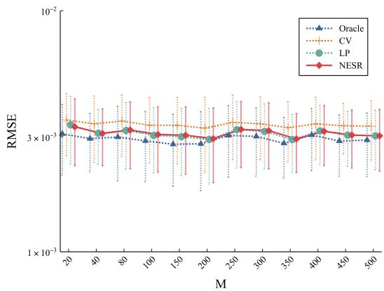  
(d) $r = 0 . 4 , \gamma = 0 . 1$  
Figure 5: RMSE vs number of random features M for four approaches with diferent r and γ.

Furthermore, we compare the computational cost of NESR and LP as the number of random features M varies. Using the same candidate-range settings as in the preceding runtime experiment, Figure 6 reports the total running time over 50 independent trials. In the reported experiments, NESR requires less running time than LP across most values of M, while the corresponding RMSE remains comparable to that of LP. The observed runtime diference is consistent with the smaller number of discrepancy comparisons required by the neighboring rule.

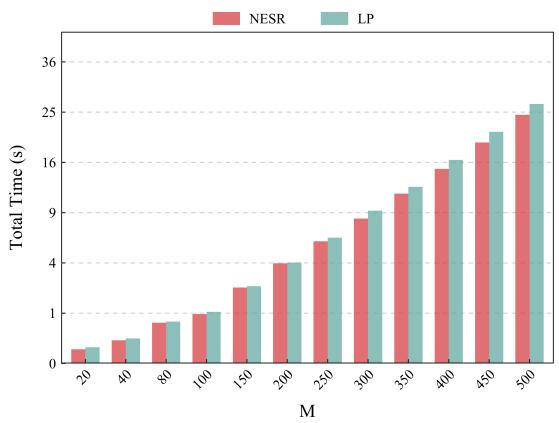  
(a) $r = 0 . 8 , \gamma = 0 . 2$

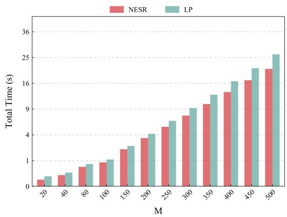  
(b) $r = 0 . 6 , \gamma = 0 . 2$

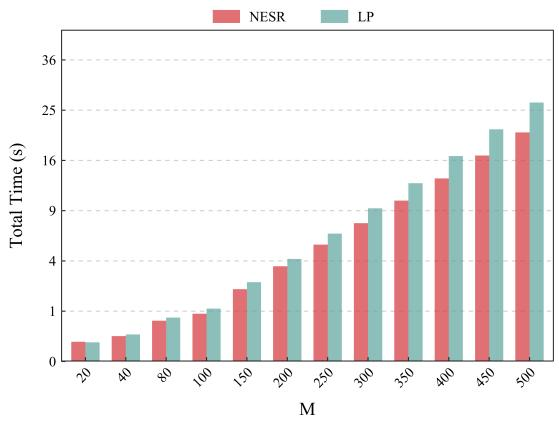  
(c) $r = 0 . 5 , \gamma = 0 . 4 5$

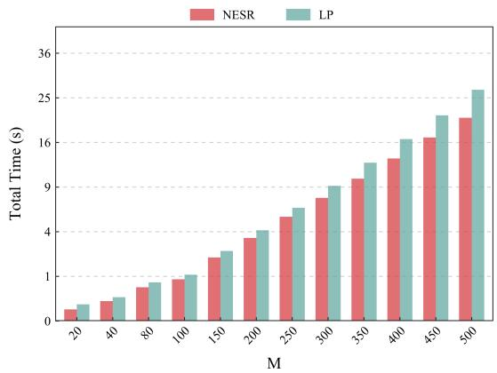  
(d) $r = 0 . 4 , \gamma = 0 . 1$  
Figure 6: Run time vs number of random features M for NESR and LP with diferent r and γ.

## 5.5 Efect of Subdivision Factor

Here, the subdivision factor h determines the spacing of the inverse-regularization grid. Since $\begin{array} { r } { \lambda _ { k } = \frac { 1 } { h k } , \frac { 1 } { \lambda _ { k + 1 } } - \frac { 1 } { \lambda _ { k } } = h } \end{array}$ , the candidate values are equally spaced on the $1 / \lambda$ scale. For a fixed $K _ { E S }$ , the candidate set ranges from $\begin{array} { r } { \lambda _ { K _ { E S } } = \frac { 1 } { h K _ { E S } } } \end{array}$ to $\begin{array} { r } { \lambda _ { 1 } = \frac { 1 } { h } } \end{array}$ . Thus, h controls both the location and the spacing of the regularization path. A smaller h shifts the candidate values toward larger regularization parameters, whereas a larger h shifts the entire path toward smaller regularization parameters. Consequently, if h is chosen too small or too large, the candidate set may fail to cover a region that gives good prediction performance.

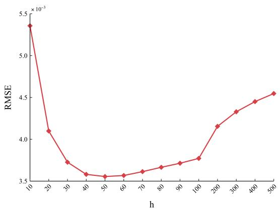  
(a) $\lbrace r = 0 . 8 , \gamma = 0 . 2 \rbrace$

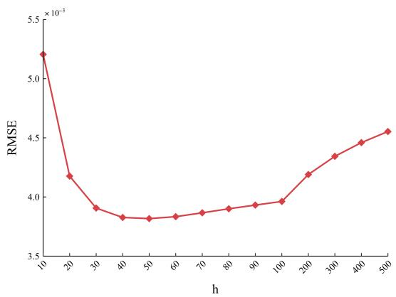  
(b) $\lbrace r = 0 . 6 , \gamma = 0 . 2 \rbrace$

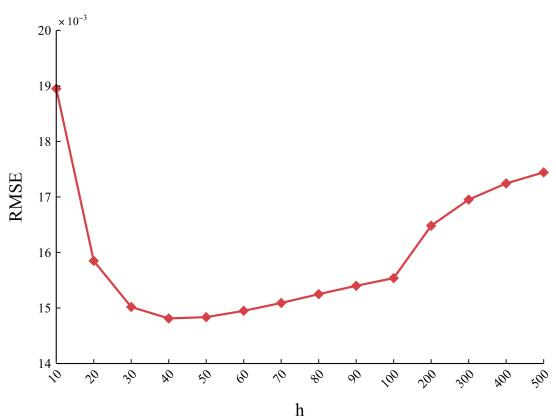  
(c) {r = 0.5, γ = 0.45}

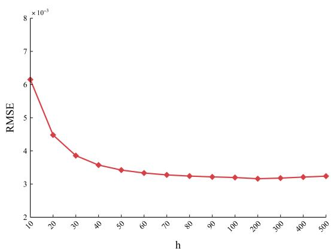  
(d) $\lbrace r = 0 . 4 , \gamma = 0 . 1 \rbrace$  
Figure 7: RMSE vs subdivision factor h for NESR with diferent r and $\gamma .$

Figure 7 shows the RMSE of NESR for diferent choices of h under the four $( r , \gamma )$ configurations. We fix $| D | = 5 0 0 0$ and $| D ^ { \prime } | = 1 0 0 0$ in all experiments. For $( r , \gamma ) \in \{ ( 0 . 8 , 0 . 2 ) , ( 0 . 6 , 0 . 2 ) , ( 0 . 5 , 0 . 4 5 ) \}$ we set $K _ { E S } = 2 0$ , while for $( r , \gamma ) = ( 0 . 4 , 0 . 1 )$ we set $K _ { E S } = 1 0 0$ . For the first three settings, the smallest observed RMSE values are obtained for h roughly between 30 and 60. For $( r , \gamma ) = ( 0 . 4 , 0 . 1 )$ the RMSE becomes relatively stable for $h > 1 0 0$ , with a small value observed around $h = 2 0 0$ Based on these results, we use $h = 5 0$ for the first three settings and $h = 2 0 0$ for the last setting in the remaining simulation experiments. The corresponding parameter choices are reported in Table 2.

## 5.6 Validation of the Learning Rates

To empirically validate the theoretical learning rates established in Theorem 2, we plot the logarithm of the MSE against the logarithm of the training sample size, for $| D | \in \{ 1 0 0 0 , 1 5 0 0 , \ldots , 5 0 0 0 \}$ Figure 8 presents these plots for NESR under the four distinct parameter configurations.

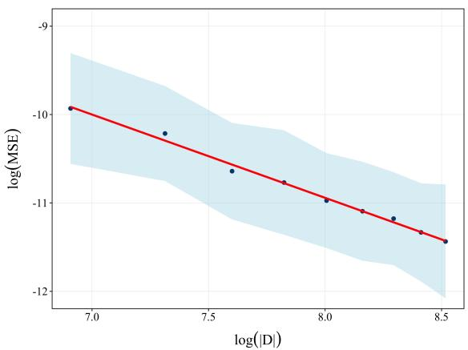  
(a) $\lbrace r = 0 . 8 , \gamma = 0 . 2 \rbrace$

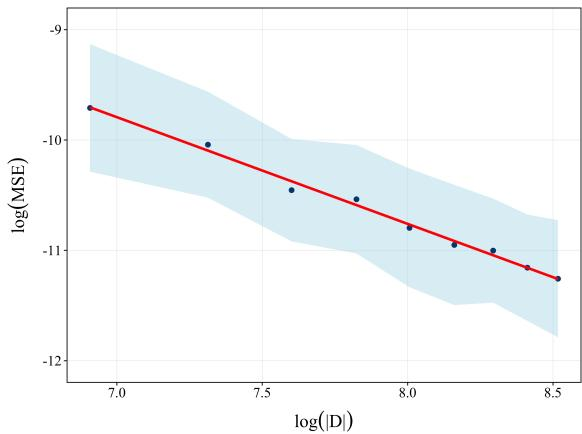  
(b) $\lbrace r = 0 . 6 , \gamma = 0 . 2 \rbrace$

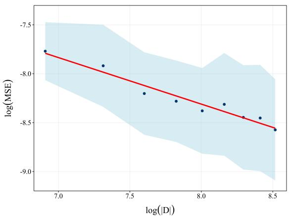  
(c) $\{ r = 0 . 5 , \gamma = 0 . 4 5 \}$

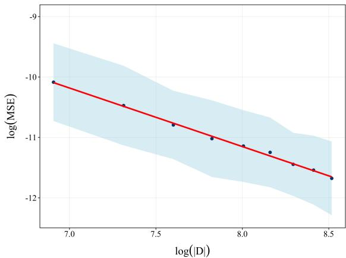  
(d) $\lbrace r = 0 . 4 , \gamma = 0 . 1 \rbrace$  
Figure 8: log MSE vs log number of training data |D| for NESR with diferent r and $\gamma$

According to our theoretical analysis, the expected MSE decays at a polynomial rate of $\mathcal { O } ( | D | ^ { - \frac { 2 r } { 2 r + \gamma } } )$ As illustrated in Figure 8, For the settings $( r , \gamma ) \in \{ ( 0 . 8 , 0 . 2 ) , ( 0 . 6 , 0 . 2 ) , ( 0 . 5 , 0 . 4 5 ) \}$ , which satisfy $2 r + \gamma > 1$ , the log–log plots show an approximately linear decreasing trend with slope $- \frac { 2 r } { 2 r + \gamma }$ as the training sample size increases. This behavior is consistent with a polynomial decay of the prediction error. The setting $( r , \gamma ) = ( 0 . 4 , 0 . 1 )$ satisfies $2 r + \gamma = 0 . 9 < 1$ and therefore lies outside the regime covered by Theorem 2, we include it only as an additional numerical comparison.

Table 3: Parameter settings and dataset characteristics.
<table><tr><td></td><td>datasets</td><td>d</td><td> $| D ^ { \prime } |$ </td><td> $| D |$ </td><td>T</td><td>M</td><td> $C _ { E S }$ </td><td> $C _ { L P }$ </td></tr><tr><td>Fig. 9:(a)</td><td>KIN8NM</td><td>8</td><td>1192</td><td>一</td><td>2</td><td>1000</td><td>0.0250</td><td>0.0001</td></tr><tr><td>Fig. 9:(b)</td><td>SPCD</td><td>81</td><td>3263</td><td></td><td>8</td><td>1000</td><td>0.0400</td><td>0.0003</td></tr><tr><td>Fig. 9:(c)</td><td>PPOPTS</td><td>9</td><td>5730</td><td></td><td>1</td><td>1000</td><td>0.0800</td><td>0.0010</td></tr><tr><td>Fig. 9:(d)</td><td>SUSY</td><td>18</td><td>2000</td><td></td><td> $2 ^ { 2 . 5 }$ </td><td>1000</td><td>0.0750</td><td>0.0001</td></tr><tr><td>Fig. 9:(e)</td><td>HTRU2</td><td>8</td><td>3808</td><td></td><td>2</td><td>1000</td><td>0.0200</td><td>0.0010</td></tr><tr><td>Fig. 9:(f)</td><td>MGT</td><td>10</td><td>3020</td><td></td><td> $2 ^ { 1 . 5 }$ </td><td>1000</td><td>0.0500</td><td>0.0030</td></tr><tr><td>Fig. 10:(a)</td><td>KIN8NM</td><td>8</td><td>1192</td><td>7000</td><td>2</td><td></td><td>0.0008</td><td>0.0001</td></tr><tr><td>Fig. 10:(b)</td><td>SPCD</td><td>81</td><td>3263</td><td>18000</td><td>8</td><td></td><td>0.0009</td><td>0.0002</td></tr><tr><td>Fig. 10:(c)</td><td>PPOPTS</td><td>9</td><td>5730</td><td>40000</td><td>1</td><td></td><td>0.0015</td><td>0.0012</td></tr><tr><td>Fig. 10:(d)</td><td>SUSY</td><td>18</td><td>2000</td><td>14000</td><td>22.5</td><td>一</td><td>0.0040</td><td>0.0003</td></tr><tr><td>Fig. 10:(e)</td><td>HTRU2</td><td>8</td><td>3808</td><td>14000</td><td>2</td><td></td><td>0.0100</td><td>0.0002</td></tr><tr><td>Fig. 10:(f)</td><td>MGT</td><td>10</td><td>3020</td><td>12000</td><td>21.5</td><td>一</td><td>0.0030</td><td>0.0100</td></tr></table>

## 6 Real Data Analysis

To examine the empirical performance of NESR on real data, we consider six benchmark datasets from the UCI Machine Learning Repository1 and OpenML2. Among them, KIN8NM, SPCD, and PPOPTS are regression datasets with continuous responses, whereas SUSY, HTRU2, and MGT are binary classification datasets. We use prediction error for the regression tasks and classification error for the classification tasks. The input variables in all six datasets are continuous. We compare NESR with LP in terms of both prediction performance and computational cost. In this section, we use the Gaussian kernel $K ( x , x ^ { \prime } ) = \exp ( - \| x - x ^ { \prime } \| ^ { 2 } / 2 \tau ^ { 2 } )$ . The corresponding random Fourier is $\sqrt { 2 } \cos ( w ^ { T } \mathbf { x } + b )$ where w and b are sampled from w $\sim \mathcal { N } \left( 0 , \tau ^ { - 2 } I _ { d } \right)$ and $b \sim U ( 0 , 2 \pi )$ .where d denotes the input dimension. For each dataset, the bandwidth parameter τ is selected by five-fold cross-validation over the grid $\{ 2 ^ { - 5 } , 2 ^ { - 4 . 5 } , \hdots , 2 ^ { 5 } \}$

We consider two experimental settings. In the first, the number of random features M is fixed while the training sample size |D| is varied. In the second, |D| is fixed while M is varied. Preliminary experiments indicated that restricting the candidate ranges to the regions used in the runtime comparison produced prediction errors close to those obtained from the broader search ranges. We therefore use the same runtime-oriented settings when reporting both prediction error and computational cost in this section. More specifically, for LP we take $\Lambda _ { L P } : = \{ q ^ { k } : k = $ 10, 11, . . . , 20}, and $\Lambda _ { E S } \subset [ 1 0 ^ { - 6 } , 5 \times 1 0 ^ { - 4 } ]$ with $h = 1 0 0 0$ and $K _ { E S } = 1 0 0 0$ for NESR. The main characteristics of the datasets and the parameter settings used in the experiments are summarized in Table 3, including the input dimension d, the test sample size |D′|, the selected bandwidth σ, and the fixed value of either M or |D|. Because SUSY contains substantially more observations than the other datasets, we use a random subsample for this dataset. The remaining five datasets are used without additional subsampling.

Figures 9 and 10 summarize the empirical performance of NESR and LP on the six real-world datasets, with all results averaged over 10 independent trials. Figure 9 reports the results obtained by varying the training sample size |D|. For most datasets, the prediction error of both methods decreases as the training sample size increases. NESR generally achieves prediction accuracy comparable to or better than LP over the range of sample sizes considered. Its recorded running time is also lower than that of LP in most of the reported experiments. The error bars of the two methods are of similar magnitude across the datasets.

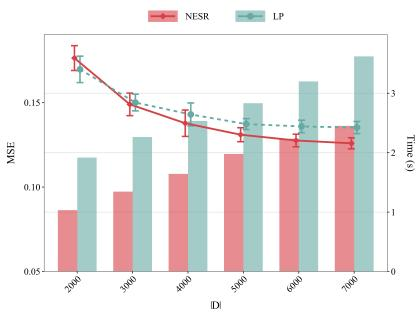  
(a) KIN8NM

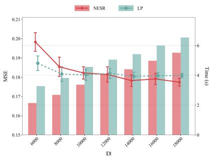  
(b) SPCD

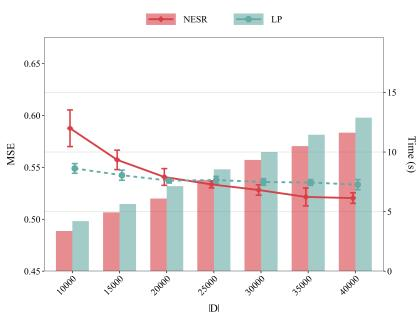  
(c) PPOPTS

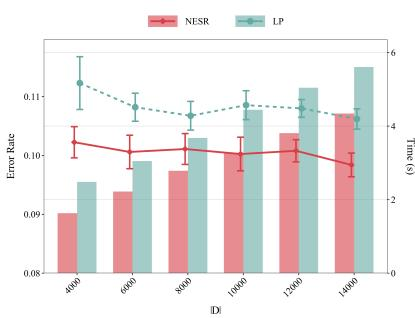  
(d) SUSY

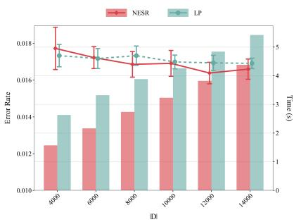  
(e) HTRU2

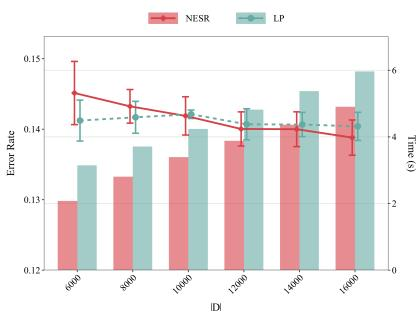  
(f) MGT  
Figure 9: Prediction accuracy and runtime vs the training sample size |D| on real datasets. Top panel: Regression tasks, where the line plots represent the MSE and the bar plots represent the average runtime over 10 independent trials. Bottom panel: Classification tasks, where the line plots represent the classification error rate and the bar plots represent the average runtime over 10 independent trials.

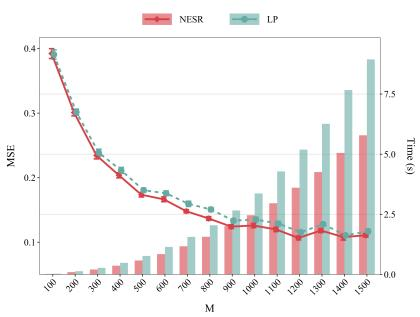  
(a) KIN8NM

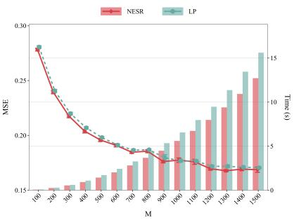  
(b) SPCD

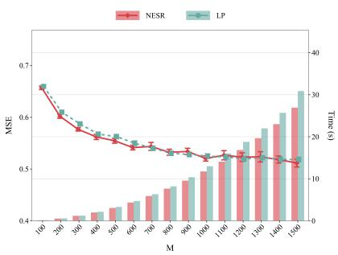  
(c) PPOPTS

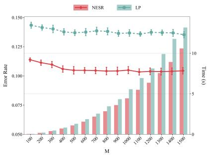  
(d) SUSY

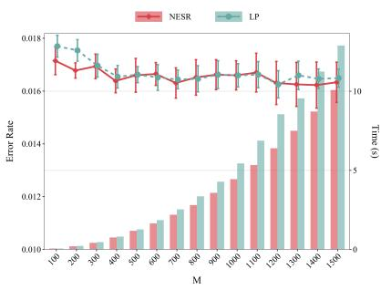  
(e) HTRU2

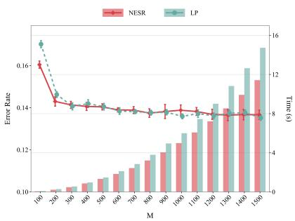  
(f) MGT  
Figure 10: Prediction accuracy and runtime vs the number of random features M on real datasets. Top panel: Regression tasks, where the line plots represent the MSE and the bar plots represent the average runtime over 10 independent trials. Bottom panel: Classification tasks, where the line plots represent the classification error rate and the bar plots represent the average runtime over 10 independent trials.

Figure 10 shows the corresponding results as the number of random features M varies. For the three regression datasets, the prediction error changes relatively little once M becomes moderately large, with the curves largely stabilizing around M = 1000. A similar pattern is observed for the classification datasets, where the performance tends to level of at somewhat smaller values of M. Across the values of M considered, NESR generally achieves prediction performance comparable to or better than LP, while requiring less running time in the reported implementations. Overall, these experiments suggest that the neighboring comparison rule can provide a favorable balance between prediction accuracy and computational cost on the datasets considered.

## 7 Conclusion

This paper develops a neighboring early-stopping rule for adaptive regularization in kernel ridge regression with random features. The proposed NESR-KRR-RF method compares only adjacent estimators along a grid that is uniform in inverse regularization, reducing the number of discrepancy comparisons relative to standard all-pairs Lepskii-type procedures. Both the neighboring discrepancy and its empirical complexity term can be computed in the random feature space without constructing the exact kernel Gram matrix. We establish a high-probability comparison bound for neighboring KRR-RF estimators and show that, under source, capacity, grid-coverage, and random feature budget conditions, the selected estimator attains the oracle polynomial learning rate up to logarithmic factors. The result covers both well-specified and partially misspecified regimes and allows the regularization parameter to be selected without prior knowledge of the source and capacity exponents. The numerical experiments illustrate that NESR can achieve prediction performance comparable to the benchmark methods while requiring fewer discrepancy comparisons and, in the reported implementations, less computation. Several questions remain open. In particular, it would be useful to develop fully data-driven calibration of the stopping threshold and the random feature budget, and to extend the neighboring comparison principle to other loss functions and scalable random feature constructions.

## References

[1] S. Arlot and A. Celisse. A survey of cross-validation procedures for model selection. Statistics Surveys, 4:40–79, 2010.

[2] H. Avron, K. L. Clarkson, and D. P. Woodruf. Faster kernel ridge regression using sketching and preconditioning. SIAM Journal on Matrix Analysis and Applications, 38(4):1116–1138, 2017.

[3] F. Bach. On the equivalence between kernel quadrature rules and random feature expansions. The Journal of Machine Learning Research, 18(1):714–751, 2017.

[4] F. Bauer, S. V. Pereverzev, and L. Rosasco. Regularization for ill-posed problems and learning algorithms. Journal of Complexity, 23(1):52–72, 2007.

[5] G. Blanchard, M. Hofmann, and M. Reiss. Early stopping for statistical inverse problems via truncated svd estimation and concentration inequalities. Electronic Journal of Statistics, 12(1):3204–3235, 2018.

[6] G. Blanchard, N. Kr¨amer, and N. M¨ucke. The discrepancy principle for statistical inverse problems with application to kernel methods. Journal of Machine Learning Research, 13:1705– 1744, 2012.

[7] G. Blanchard, P. Math´e, and N. M¨ucke. Lepskii principle in supervised learning. arXiv preprint arXiv:1905.10764, 2019.

[8] G. Blanchard and N. M¨ucke. Optimal adaptation for early stopping in statistical inverse problems. SIAM/ASA Journal on Uncertainty Quantification, 6(3):1040–1063, 2018.

[9] G. Blanchard and N. M¨ucke. Optimal rates for regularization of statistical inverse learning problems. Foundations of Computational Mathematics, 18(4):971–1013, 2018.

[10] M. W. Browne. Cross-validation methods. Journal of Mathematical Psychology, 44(1):108–132, 2000.

[11] F. Camastra and A. Verri. A novel kernel method for clustering. IEEE Transactions on Pattern Analysis and Machine Intelligence, 27(5):801–805, 2005.

[12] G. Camps-Valls and L. Bruzzone. Kernel-based methods for hyperspectral image classification. IEEE Transactions on Geoscience and Remote Sensing, 43(6):1351–1362, 2005.

[13] A. Caponnetto and E. De Vito. Optimal rates for the regularized least-squares algorithm. Foundations of Computational Mathematics, 7:331–368, 2007.

[14] A. Caponnetto and Y. Yao. Cross-validation based adaptation for regularization operators in learning theory. Analysis and Applications, 8(02):161–183, 2010.

[15] A. Celisse and M. Wahl. Analyzing the discrepancy principle for kernelized spectral filter learning algorithms. Journal of Machine Learning Research, 22(76):1–59, 2021.

[16] E. De Vito, S. Pereverzyev, and L. Rosasco. Adaptive kernel methods using the balancing principle. Foundations of Computational Mathematics, 10(4):455–479, 2010.

[17] E. De Vito, L. Rosasco, A. Caponnetto, U. De Giovannini, and F. Odone. Learning from examples as an inverse problem. Journal of Machine Learning Research, 6:883–904, 2005.

[18] H. W. Engl, M. Hanke, and A. Neubauer. Regularization of inverse problems, volume 375. Springer Science & Business Media, 1996.

[19] L. L. Gerfo, L. Rosasco, F. Odone, E. D. Vito, and A. Verri. Spectral algorithms for supervised learning. Neural Computation, 20(7):1873–1897, 2008.

[20] G. H. Golub, M. Heath, and G. Wahba. Generalized cross-validation as a method for choosing a good ridge parameter. Technometrics, 21(2):215–223, 1979.

[21] L. Gy¨orfi, M. Kohler, A. Krzy˙zak, and H. Walk. A distribution-free theory of nonparametric regression. Springer, 2002.

[22] T. Hofmann, B. Sch¨olkopf, and A. J. Smola. Kernel methods in machine learning. The Annals of Statistics, 36(3):1171–1220, 2008.

[23] O. Lepskii. On a problem of adaptive estimation in gaussian white noise. Theory of Probability & Its Applications, 35(3):454–466, 1991.

[24] Z. Li, J.-F. Ton, D. Oglic, and D. Sejdinovic. Towards a unified analysis of random Fourier features. The Journal of Machine Learning Research, 22(1):4887–4937, 2021.

[25] J. Lin and V. Cevher. Optimal convergence for distributed learning with stochastic gradient methods and spectral algorithms. The Journal of Machine Learning Research, 21(1):5852– 5914, 2020.

[26] J. Lin and L. Rosasco. Optimal learning for multi-pass stochastic gradient methods. Advances in Neural Information Processing Systems, 29:4563–4571, 2016.

[27] J. Lin, A. Rudi, L. Rosasco, and V. Cevher. Optimal rates for spectral algorithms with least-squares regression over hilbert spaces. Applied and Computational Harmonic Analysis, 48(3):868–890, 2020.

[28] S.-B. Lin. Adaptive parameter selection for kernel ridge regression. Applied and Computational Harmonic Analysis, 73:101671, 2024.

[29] S.-B. Lin. Lepskii principle for distributed kernel ridge regression. arXiv preprint arXiv:2409.05070, 2024.

[30] S.-B. Lin, X. Guo, and D.-X. Zhou. Distributed learning with regularized least squares. The Journal of Machine Learning Research, 18(1):3202–3232, 2017.

[31] S.-B. Lin, X. Liu, D. Wang, H. Zhang, and D.-X. Zhou. Adaptive distributed kernel ridge regression: A feasible distributed learning scheme for data silos. Journal of Machine Learning Research, 26(108):1–54, 2025.

[32] S.-B. Lin, D. Wang, and D.-X. Zhou. Distributed kernel ridge regression with communications. The Journal of Machine Learning Research, 21:3718–3755, 2020.

[33] X. Liu, Y. Lei, X. Chang, and S.-B. Lin. Beyond cross-validation: Adaptive parameter selection for kernel-based gradient descents. arXiv preprint arXiv:2603.03401, 2026.

[34] S. Lu, P. Math´e, and S. V. Pereverzev. Balancing principle in supervised learning for a general regularization scheme. Applied and Computational Harmonic Analysis, 48(1):123–148, 2020.

[35] Z. Ma, J. Yang, and Y. Yang. On the generalization properties of learning the random feature models with learnable activation functions. arXiv preprint arXiv:2510.15327, 2025.

[36] K. P. Murphy. Machine learning: a probabilistic perspective. MIT Press, 2012.

[37] S. Page and S. Gr¨unew¨alder. The goldenshluger–lepski method for constrained least-squares estimators over RKHSs. Bernoulli, 27(4):2241–2266, 2021.

[38] A. Rahimi and B. Recht. Random features for large-scale kernel machines. Advances in Neural Information Processing Systems, 20:1177–1184, 2007.

[39] A. Rahimi and B. Recht. Weighted sums of random kitchen sinks: Replacing minimization with randomization in learning. Advances in Neural Information Processing Systems, 21:1313–1320, 2008.

[40] G. Raskutti, M. J. Wainwright, and B. Yu. Early stopping and non-parametric regression: An optimal data-dependent stopping rule. Journal of Machine Learning Research, 15(1):335–366, 2014.

[41] A. Rudi, R. Camoriano, and L. Rosasco. Less is more: Nystr¨om computational regularization. Advances in Neural Information Processing Systems, 28:1657–1665, 2015.

[42] A. Rudi, L. Carratino, and L. Rosasco. Falkon: An optimal large-scale kernel method. Advances in Neural Information Processing Systems, 30:3891–3901, 2017.

[43] A. Rudi and L. Rosasco. Generalization properties of learning with random features. Advances in Neural Information Processing Systems, 30:3215–3225, 2017.

[44] W. Rudin. Fourier analysis on groups. Courier Dover Publications, 2017.

[45] B. Sch¨olkopf, R. Herbrich, and A. J. Smola. A generalized representer theorem. In International Conference on Computational Learning Theory, pages 416–426. Springer, 2001.

[46] B. Sch¨olkopf and A. J. Smola. Learning with kernels: support vector machines, regularization, optimization, and beyond. MIT Press, 2002.

[47] S. Smale and D.-X. Zhou. Learning theory estimates via integral operators and their approximations. Constructive Approximation, 26(2):153–172, 2007.

[48] S. Sonnenburg, G. R¨atsch, C. Sch¨afer, and B. Sch¨olkopf. Large-scale multiple kernel learning. The Journal of Machine Learning Research, 7:1531–1565, 2006.

[49] I. Steinwart and A. Christmann. Support vector machines. Springer Science & Business Media, 2008.

[50] G. Wahba. Spline models for observational data. SIAM, 1990.

[51] G. Wahba and Y. Wang. Representer theorem. Wiley StatsRef: Statistics Reference Online, 1155:1178, 2019.

[52] C. Wang. Generalization properties of robust learning with random features. IEEE Transactions on Pattern Analysis and Machine Intelligence, 48(7):8199–8215, 2026.

[53] C. Wang and X. Feng. Optimal kernel quantile learning with random features. In International Conference on Machine Learning, pages 50419–50452. PMLR, 2024.

[54] C. Wang, T. Li, X. Zhang, X. Feng, and X. He. Communication-eficient nonparametric quantile regression via random features. Journal of Computational and Graphical Statistics, 33(4):1175–1184, 2024.

[55] Y. Wei, F. Yang, M. J. Wainwright, and B. Yu. Early stopping for kernel boosting algorithms: A general analysis with localized complexities. Advances in Neural Information Processing Systems, 32:6065–6075, 2019.

[56] C. Williams and M. Seeger. Using the nystroem method to speed up kernel machines. Advances in Neural Information Processing Systems, pages 682–688, 2001.

[57] Y. Yao, L. Rosasco, and A. Caponnetto. On early stopping in gradient descent learning. Constructive Approximation, 26(2):289–315, 2007.

[58] Y. Zhang, J. Duchi, and M. Wainwright. Divide and conquer kernel ridge regression: A distributed algorithm with minimax optimal rates. The Journal of Machine Learning Research, 16(1):3299–3340, 2015.

[59] B. Zhao, J. T. Kwok, and C. Zhang. Multiple kernel clustering. In Proceedings of the 2009 SIAM International Conference on Data Mining, pages 638–649. SIAM, 2009.