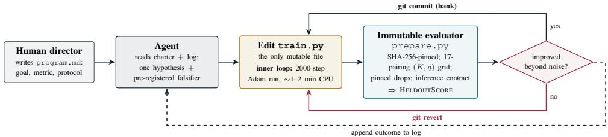
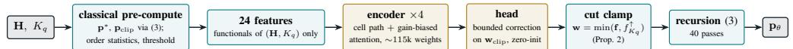
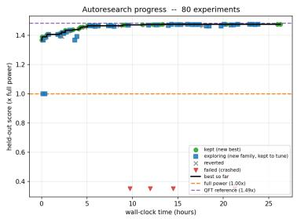
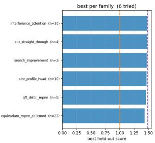

# Agentic Autoresearch for Cell-Edge Power Control: Radically Redefining the Researcher’s Role

Ahmad Khan† Akram Bin Sediq† Sara Azadegi Naeini†‡ Raviraj S. Adve‡

† Ericsson R&D, Ottawa, 349 Terry Fox Drive, ON K2K 2V6, Canada

‡ ECE Dept., University of Toronto,

10 King’s College Road, Toronto, ON M5S 3G4, Canada

Abstract—Designing machine learning algorithms for wireless resource management is labour-intensive: the architecture, the loss function and the training recipe are all specified by hand. We demonstrate that this design layer can be surrendered to an autonomous agent in its entirety. We adopt the autoresearch protocol, in which an AI coding agent edits a training script, runs a fixed-budget experiment, and retains or discards the change according to a single immutable metric. We grant the agent authority over the architecture family, the input representation, the output parameterization, the loss function and the tasksampling law, and set it a target chosen for its difficulty: sumleast-percentile-rate power control across a multicell network. The formulation targets cell-edge throughput and is non-convex, non-smooth and strongly NP-hard away from its max-min vertex. Safeguards render the results trustworthy: a hash-pinned evaluator, an enforced inference contract and a pre-registered falsifier per experiment. In eighty-one unattended experiments over twenty-six hours, the agent reached 99.5% of a converged minorization-maximization reference in one fixed-cost inference pass, at roughly 600× lower inference cost, closing 94% of the gap from its first working architecture, with one parameter set serving every network size and percentile target. It recovered provable structure rather than tuned constants: the output parameterization it discovered reproduces the exact max-minoptimal allocation at the minimum percentile, for every value of the trained weights.

Index Terms—Autoresearch, AI agents, percentile optimization, power control, cell-edge, max-min fairness, learning to optimize.

## I. INTRODUCTION

## A. Background and Overview

Automating the loop of hypothesis, modification, measurement and retention is not new: robot scientists [1] and, within machine learning, AutoML and neural architecture search [2] predate large language models, though they search a space fixed in advance by the designer. The qualitative shift came once LLMs could propose code rather than parameters [3]–[5]. Karpathy [6] distilled the pattern into the minimal form we adopt: three files suffice, an immutable evaluator, a single mutable training script, and a natural-language research charter. An agent edits the script, runs a fixed-budget experiment, reads a single scalar metric, and commits or reverts through version control, unattended. The human contracts to a research director, who specifies the problem, the metric and the protocol, and thereafter audits the log.

Agentic algorithm design has reached wireless at both link level, where [7] evolves channel estimators and link adaptation against an immutable evaluation tool, and network level, where [21] synthesizes MAC schedulers from the literature for over-the-air deployment, [22] drives the RAN engineering life-cycle end to end, and [23] generates beamforming formulations. In each, the artifact under autonomous design is conventional code, or a policy trained inside a pipeline a human specified.

Here the agent redesigns the learned system itself, holding authority over the architecture family, the input representation, the output parameterization, the loss function and the tasksampling law. It exercised all five over six architecture families; Table I records the result. To the best of our knowledge no prior work in wireless grants more than one or two. Our target, moreover, is optimizing an entire multicell network, and the problem a provably NP-hard resource allocation coupled through interference [15]. Others employ LLMs at run time, as solvers [8], [9] or workflow designers [10], [11], not as algorithm designers.

Radio resource management (RRM) is a natural setting for autoresearch, supplying the three ingredients the loop requires: a scalar figure of merit, a fast simulator to serve as judge, and a mutable algorithmic artifact. Learning to optimize resource allocation is well studied [12]–[14], including a handdesigned learner for the same sum-least-qth-percentile (SLqP) objective [20], which trains a separate model per network size and percentile on networks without cellular wraparound; here one parameter set spans both, across seven wrapped cells. In every such work, however, the architecture, the loss function and the training recipe remain products of human judgement. Autoresearch automates exactly this design layer, yielding two nested loops: an inner loop in which gradient descent fits the weights of the current model, and an outer loop in which an agent redesigns the model, its features and its objective.

To stress test this thesis we select a deliberately difficult target, percentile optimization. Part I of [15] formulates SLqP rate maximization, directly optimizing the throughput of the weakest percentile of users; this is the cell-edge metric for which 3GPP and other industrial bodies have set explicit nextgeneration targets, and which prior physical-layer techniques have addressed only indirectly. It is further established in [15] that, away from its polynomial-time max-min vertex, the SLqP program is non-convex, non-smooth and strongly NPhard, with the state of the art being iterative minorizationmaximization. An amortized solution is accordingly of practical interest, per-instance solvers being far too slow for real scheduling timescales, and of theoretical interest, the objective coupling users through an order statistic that defeats conventional pooling.

## B. Contributions of This Paper

The contributions of this paper may be summarized as follows.

• Protocol: We harden the autoresearch loop for scientific use in a physical-layer setting (Section III). Where prior agentic work in wireless designs symbolic code or tunes a human-specified pipeline, here every layer of a learned system is under autonomous design, so the agent’s mandate extends to the inductive bias itself.

• Campaign: Eighty-one unattended experiments over twenty-six hours closed 94% of the gap between the agent’s first working architecture and a converged reference solver, at roughly 600× lower inference cost, with a single controller serving every K and in-band percentile (Section V).

• Discovered structure: The campaign recovers interpretable structure and not merely tuned hyperparameters: the output parameterization it discovers pins the model to the exact max-min optimum at the minimum percentile, for every value of the trained weights (Proposition 2), a property the agent itself identified and exploited.

• Reproducibility and public release: We release the relevant files, the complete experiment log, and weights as well as scripts needed to reproduce the champion.1

Section II states the problem, Section III the protocol, Section IV the discovered solution, Section V the results, and Section VI the lessons learned for others adopting the protocol.

## II. PERCENTILE POWER CONTROL

We consider the downlink of a network of B mutually interfering cells, each containing K single-antenna users, so that the network serves KB users in total. We denote by $h _ { k , b , b ^ { \prime } }$ the channel from the transmitter of cell $b ^ { \prime }$ to user k of cell b, collected in the tensor H, and by $p _ { k , b } \in [ 0 , P _ { \operatorname* { m a x } } ]$ the power allocated to user (k, b), collected in p. With $\begin{array} { r } { P _ { b ^ { \prime } } ( \mathbf { p } ) = \sum _ { k } p _ { k , b ^ { \prime } } } \end{array}$ denoting the total power emitted by cell b′, the SINR achieved by user (k, b) is

$$
\gamma _ { k , b } ( \mathbf { p } ) = \frac { p _ { k , b } \left| h _ { k , b , b } \right| ^ { 2 } } { \sum _ { b ^ { \prime } } \left| h _ { k , b , b ^ { \prime } } \right| ^ { 2 } P _ { b ^ { \prime } } ( \mathbf { p } ) - p _ { k , b } \left| h _ { k , b , b } \right| ^ { 2 } + \sigma ^ { 2 } } ,\tag{1}
$$

and the corresponding rate is $r _ { k , b } ( \mathbf { p } ) = \log _ { 2 } ( 1 + \gamma _ { k , b } ( \mathbf { p } ) )$ where $\sigma ^ { 2 }$ is the receiver noise power. The subtraction removes the user’s own signal from its cell total, while the intra-cell interference of its K−1 cell-mates is retained. Following [15], $x _ { i } ^ { \uparrow }$ denotes the ith smallest entry of x, so the SLqP utility is $\begin{array} { r } { \dot { f _ { K _ { q } } } ( x ) = \sum _ { i = 1 } ^ { K _ { q } } x _ { i } ^ { \uparrow } } \end{array}$ and the power-control problem is

$$
\underset { 0 \leq p _ { k , b } \leq P _ { \operatorname* { m a x } } } { \mathrm { m a x i m i z e } } f _ { K _ { q } } \big ( r _ { 1 , 1 } ( \mathbf { p } ) , \dots , r _ { K , B } ( \mathbf { p } ) \big ) ,\tag{2}
$$

in which the percentile number $K _ { q } = \lceil q K B \rceil$ , for a percentile target q expressed as a fraction, counts the weakest rates the objective sums. This work addresses the cell-edge band $K _ { q } / ( K B ) \in ( 0 , 0 . 2 5 ]$ . At $K _ { q } = 1$ , (2) reduces to max-minrate power control, which may be solved to global optimality in polynomial time [15]; for every $K _ { q } > 1$ it is non-convex and strongly NP-hard [15], [16], and for $1 < K _ { q } < K B$ the objective is, in addition, non-smooth. Rather than solve each instance iteratively, we seek a single amortized map $\mathbf { p } _ { \theta } : ( \mathbf { H } , K _ { q } ) \mapsto \mathbf { p }$ , one fixed-cost inference pass serving every K and in-band percentile, and task an agent with its discovery.

## III. THE AUTORESEARCH CAMPAIGN

## A. Protocol

Following [6], the campaign is built from three files with strictly separated roles, as illustrated in Fig. 1.

• prepare.py, the immutable evaluator, implementing the channel model of [15] – seven wrapped hexagonal cells, COST231 path loss and Rayleigh fading, certified against that work’s reference implementation – and scoring any candidate on a fixed, pinned held-out set. Its SHA-256 hash is verified at every iteration; the agent cannot edit this judge.

• train.py, the sole file the agent may edit, containing the model, the loss and the training loop, and accumulating an append-only changelog within its own docstring.

• program.md, the research charter, stating the goal, the metric, the reference bars, the inference contract and the exploration protocol.

The metric is designed for comparability across settings. The held-out benchmark is a grid of seventeen (K, percentile) pairings, with $K ~ \in ~ \{ 1 , 2 , 4 , 6 , 8 , 1 0 \}$ and targets {min, $p _ { 1 0 } , p _ { 2 5 } \}$ . Since raw SLqP values differ by orders of magnitude depending on the values of K and $K _ { q } ,$ each pairing is scored as the ratio of the model’s mean $\mathrm { S L q P }$ to the full-power mean SLqP on the same pinned realizations, and HELDOUTSCORE is the mean of these ratios. A score of 1.000 therefore denotes the trivial full-power floor, while the converged minorization-maximization algorithm (based on the iterative quadratic fractional transform (QFT)) reference of [15], measured sample-matched on identical realizations, sets the bar at 1.485. Because the agent commits or reverts against it, this score is a selection set; the champion was re-scored once on a disjoint, independently seeded set of realizations, on which the reported figures stand. The evaluator additionally enforces an inference contract: a ten-second budget for inference over the entire grid, precluding disguised perinstance optimization at test time, together with a no-test-timefitting tripwire and output-shape guards. A violation raises an exception rather than a score, and so cannot be banked.

The outer loop thereafter proceeds unattended. In each cycle the agent reads the charter and the accumulated log, states a single hypothesis with a pre-registered falsifier, the observation that would disprove it, edits train.py, and launches the inner loop: a complete training run over 2000 Adam steps, requiring one to two minutes on the same CPU, followed by evaluation on the pinned grid. If HELDOUTSCORE improves beyond a noise band of ±0.0005, calibrated by repeated identical runs, the change is committed; otherwise it is rejected. Either way the outcome, including whether the falsifier fired, is appended to the log before the next cycle.

  
Fig. 1. The two nested loops of the campaign.

Exploration breadth is governed by the charter specified in $_ { \mathrm { p r o g r a m } }$ .md rather than left to chance: by deliberate choice, at most six architecture families may be opened, and a newly opened family is protected from reversion for a fixed number of experiments, so that a new idea is not discarded on a single untuned attempt. A family that has not overtaken the incumbent by the end of that window is abandoned, and the remaining budget is directed to depth on the most promising family. This protocol was itself learned from an earlier fullrange campaign, whose two failure modes, seventeen families opened with one experiment each and none tuned, and a single model straddling the policy shift near the sum-rate end, motivated the breadth cap and the restriction to the cell-edge band.

## B. On the Necessity of the Safeguards

Each element earns its place. The hash pin removes, by construction, the characteristic failure of self-improving systems, that of making the test easier rather than the model better; other agentic-search systems arrived at the same principle independently [5]. The inference contract keeps the search aligned with the engineering objective: since an amortized model exists to improve upon solver latency, a candidate that covertly optimizes per instance must fail rather than score. Pre-registered falsifiers convert the log into a sequence of interpretable findings, negative results included. Samplematching eliminates realization-to-realization variance; a midcampaign audit at experiment 63 corrected a violation of that discipline, altering the interpretation of several earlier results.

## IV. THE DISCOVERED SOLUTION

We now summarize the champion model to which the campaign converged, whose pipeline is set out in Fig. 2; full architectural detail is in the released repository. The design that emerged is notable for the quantity of exact classical structure it contains: only the encoder and a scalar output head are trained, and the remainder is closed-form algebra that the agent progressively moved out of the learned components.

1) Classical scaffolding: The scaffolding is not the agent’s invention. SINR balancing by fixed-point iteration is classical [17]–[19], and we restate it here only because what the campaign discovered was where to put it. Define the balancing recursion

$$
\begin{array} { r } { \mathbf { p }  P _ { \mathrm { m a x } } \frac { \mathbf { w } \odot \mathbf { F } ( \mathbf { p } ) } { \mathrm { m a x } ( \mathbf { w } \odot \mathbf { F } ( \mathbf { p } ) ) } , \qquad F _ { k , b } ( \mathbf { p } ) = \frac { \mathcal { B } _ { k , b } ( \mathbf { p } ) } { | h _ { k , b , b } | ^ { 2 } } , } \end{array}\tag{3}
$$

in which $\odot$ is the elementwise (Hadamard) product, $B _ { k , b }$ is the interference-plus-noise power appearing in (1), and $\mathbf { w } > 0$ is a target SINR profile, one entry per user.

Proposition 1. (i) p is a fixed point of (3) if and only if $\gamma ( \mathbf { p } ) = c \mathbf { w }$ for some $c > 0 ,$ with peak power $P _ { \mathrm { m a x } } ,$ where $\gamma ( \mathbf { p } )$ collects the SINRs (1); (ii) for $\bf { w } \equiv 1$ , the all-ones vector, this fixed point is the max-min-rate optimum $\mathbf { p } ^ { * } ( \mathbf { H } )$ ; (iii) the iteration converges to thisfixed pointfrom any positive initialization.

Proof sketch: Part (i) follows by algebra on (1). For part (iii), fix the target ${ \boldsymbol { \tau } } = c \mathbf { w }$ and read $\pmb { \tau } \odot \mathbf { F } ( \mathbf { p } )$ as the power each user would need in order to meet its target given everyone else’s current powers. That map is a standard interference function in the sense of [17]: it is positive, it increases when interference increases, and scaling all powers up by a factor raises the requirement by less than that factor, because the noise term does not scale. Any such map has a unique fixed point, reached from any positive start [17], [18]. The recursion in (3) differs in that it renormalizes the target at every step rather than holding it fixed; convergence of this variant to the SINR-balanced point follows from the nonlinear Perron– Frobenius results of [19]. Part (ii) is then the observation that balancing a uniform target equalizes all SINRs, which is what max-min-rate optimality requires.

Let $\gamma _ { \mathrm { f p } } ~ = ~ \gamma ( P _ { \mathrm { m a x } } \mathbf { 1 } )$ denote the full-power SINRs and th $\mathrm { r } _ { \mathrm { f p } }$ their $K _ { q } 1$ th smallest value. The campaign’s second family constructed from these the $K _ { q } - c l i p p e d$ anchor, namely the allocation $\mathbf { p } _ { \mathrm { c l i p } }$ obtained by driving (3) with

$$
w _ { \mathrm { c l i p } } [ k , b ] = \operatorname* { m i n } \big ( \gamma _ { \mathrm { f p } } [ k , b ] / \mathrm { t h r _ { f p } , 1 } \big ) .\tag{4}
$$

This anchor balances all above-threshold users against one another, while declining to equalize the network down to those the full-power geometry has already stranded; it reduces exactly to $\mathbf { p } ^ { * }$ at $K _ { q } = 1$

What the campaign contributed here was placement rather than mathematics. Having found at experiments 27–29 that the classical solution serves better as an input feature than as a distillation target, the agent had to compute it inside the inference budget, and the obvious routes do not fit. The reference algorithm of [15] attains its accuracy by solving an exponential conic program at every iteration, a solve intrinsic to the transform rather than an artifact of implementation;

  
Fig. 2. The champion discovered by the campaign. Teal stages are exact algebra with no trainable parameters; amber stages carry all trained weights.

max-min power control on its own is usually obtained by bisection, which is likewise per-instance and iterative. The fixed-point form in (3) is the route that survives: forty passes of elementwise algebra, cheap enough to run per instance and differentiable, so the same recursion serves both as a feature generator and, later, as the map from emitted profile to powers.

2) Learned components: One parameter set serves every K in the trained range. The 24 per-user input features, defined in full in the repository, span eight blocks: base gains, SINR probes at fixed allocations, the max-min operating point, global order statistics, the $K _ { q }$ -clipped balance, set-restricted interference couplings, within-cell context and $( K , K _ { q } )$ conditioning. Every one is a closed-form functional of $( \mathbf { H } , K _ { q } )$ alone: none evaluates a rate or the $\mathrm { S L q P }$ objective, and the order statistics they use are taken over fixed, input-only SINR probes rather than over the model’s own allocation, so the features are fixed functions of the problem instance rather than a partial solution of (2) for any $K _ { q } > 1$ . Two blocks address encoder limitations that are structural rather than a matter of capacity: the $\mathrm { S L q P }$ utility depends upon the rate vector only through the identity of its $K _ { q }$ smallest entries, an ordinal property normalized pooling cannot locate, which the order-statistic and set-coupling blocks supply directly.

The encoder is permutation-equivariant, each round combining a cell-mediated message-passing path, motivated by the fact that powers enter (1) only through per-cell totals, with a global attention path whose logits are biased, per head and per round, by both the aggressor-to-victim and victimto-aggressor log-gains. Both directions are supplied explicitly, being distinct entries of H: how strongly cell $\bar { b ^ { \prime } }$ interferes with user (k, b) says nothing about how strongly cell b interferes with the users of $b ^ { \prime }$ , so neither is recoverable from the other. We emphasize that the head does not emit powers; it emits a bounded multiplicative correction upon the anchor profile $\mathbf { w } _ { \mathrm { c l i p } } .$ , zero-initialized in the sense that its weights begin at values for which the correction is unity, so that training starts at the classical policy and learns only departures from it.

3) The clamp and an exactness guarantee: The emitted profile f subsequently passes through the cut clamp, which pins every above-threshold user to the threshold, and finally through (3) to yield powers. The clamp was introduced at experiment $^ { 4 9 , }$ at which point the agent observed, and the following proposition confirms, that it resolves the entire minimum-percentile column of the evaluation grid exactly: at $K _ { q } = 1$ the model returns the max-min-optimal allocation, and does so for every value of the trained weights, so that column cannot regress.

Proposition 2. For $K _ { q } = 1$ , the output of the model satisfies $\mathbf { p } _ { \theta } ( \mathbf { H } , 1 ) = \mathbf { p } ^ { * } ( \mathbf { H } )$ for every value of the trained parameters θ.

Proof: At $K _ { q } = 1$ the clamp threshold $f _ { 1 } ^ { \uparrow }$ is the smallest entry of f, whence the clamped profile is uniform, $\mathbf { w } \equiv f _ { 1 } ^ { \uparrow } \mathbf { 1 }$ Since (3) is invariant to a positive rescaling of $\mathbf { w } ,$ , driving it with this profile is equivalent to driving it with $\mathbf { w } \equiv \mathbf { 1 }$ , which yields $\mathbf { p } ^ { * } ( \mathbf { H } )$ by Proposition 1(ii). The resulting allocation is therefore independent of f, and hence of $\theta .$

Proposition 2 concerns the fixed point of (3); the implementation runs a fixed forty passes, reproducing $\mathbf { p } ^ { * }$ to a relative error of $3 . 2 \times 1 0 ^ { - 7 }$ on held-out data. The reparameterization is also lossless, since any feasible allocation with one user at $P _ { \mathrm { m a x } }$ is the fixed point of its own SINR profile. The network thus selects only the shape of the allocation, and the two failure modes that afflict direct power outputs, all-off collapse and full-power saturation, are rendered structurally unreachable.

4) Training objective: The loss used by the champion solution is

$$
\mathcal { L } = - \frac { f _ { K _ { q } } \left( \mathbf { r } \left( \mathbf { p } _ { \theta } ( \mathbf { H } ) \right) \right) } { f _ { K _ { q } } \left( \mathbf { r } \left( P _ { \operatorname* { m a x } } \mathbf { 1 } \right) \right) } + \alpha _ { T } \mathcal { L } _ { \mathrm { d i s t i l l } } ,\tag{5}
$$

in which $\mathbf { r } ( \mathbf { p } )$ denotes the vector of rates. The first term is the true SLqP objective, normalized per task by that batch’s own full-power ${ \mathrm { S L q P } } .$ The agent’s stated rationale, recorded in the log, is that the gradient magnitude of the raw objective scales with $K _ { q } ,$ , thereby starving precisely those $\operatorname { s m a l l } { - K _ { q } }$ settings at which the headroom over full power is largest. This normalization, introduced at experiment 2, proved to be the single largest gain of the entire campaign. The second term distills, at constant weight $\alpha _ { T } ~ = ~ 1 . 0$ , against cached teacher profiles from short local searches initialized at the anchor $\mathbf { w } _ { \mathrm { c l i p } } .$ , compared one-sidedly in gauge-fixed log-profile coordinates.

5) Task sampling and optimization: At each of 2000 optimizer steps, eight independent $( K , K _ { q } )$ tasks are drawn and their gradients averaged prior to a single Adam update. The size K is drawn uniformly on $\{ 1 , \ldots , 1 0 \}$ , including the values $\{ 3 , 5 , 7 , 9 \}$ never present on the evaluation grid, and the percentile continuously across the band, rather than being restricted to the three graded targets. Furthermore, $K _ { q } = 1$ is excluded, since by Proposition 2 its output is optimal for any parameters. The optimizer is Adam at a peak rate of $2 \times 1 0 ^ { - 3 }$ , cosine-annealed over the budget. The recursion (3) is differentiated through, so the encoder observes the true sensitivity of the powers to the emitted profile.

## V. CAMPAIGN RESULTS

Fig. 3 traces the campaign, and Table I records its milestones. The champion scores 1.4775 against the reference 1.4850 on the pinned grid: 99.5% of the strongest known benchmark for this strongly NP-hard problem, attained by one forward pass of the network followed by a fixed number of algebraic iterations, with no per-instance optimization. Measured against its own first working architecture at 92.2%, the agent closed 94% of the remaining gap over eightyone unattended cycles. On an Apple M2 Pro, inference over the entire grid takes 2.52 s against 1583 s for the reference solver on the same machine, a speedup of roughly 600× and well inside the evaluator’s ten-second contract. At $K _ { q } = 1$ the emitted allocation is $\mathbf { p } ^ { * }$ exactly, on every pairing of the minimum-percentile row, as Proposition 2 requires.

  
Fig. 3. Evolution of the campaign. Left: held-out score against wallclock time, one marker per experiment; the staircase traces the incumbent. Right: best score within each of the six families opened, with the number of experiments each received; the budget concentrates upon the two most productive, as the breadth-then-depth protocol mandates.

TABLE I  
MILESTONE EXPERIMENTS (BANKED CHAMPIONS AND NOTABLE REVERTS).
<table><tr><td>Exp</td><td>Change</td><td>Score</td></tr><tr><td></td><td>full-power floor</td><td>1.0000</td></tr><tr><td>1</td><td>equivariant cell-coordinated MPNN</td><td>1.3687</td></tr><tr><td> $^ 2$ </td><td>ratio-normalized loss (largest single gain)</td><td>1.3906</td></tr><tr><td>27-29</td><td>closed-form  $K _ { q } = 1$  teacher → input features</td><td>1.4570</td></tr><tr><td>31</td><td>SINR-profile output reparameterization</td><td>1.4656</td></tr><tr><td>41-42</td><td>gain-biased bidirectional attention</td><td>1.4725</td></tr><tr><td>49</td><td>cut clamp (Prop. 2); min column exact</td><td>1.4740</td></tr><tr><td>52</td><td> $K _ { q } \geq 2$  training law</td><td>1.4756</td></tr><tr><td>65</td><td>QFT itself as distillation teacher (reverted)</td><td>1.4634</td></tr><tr><td>81</td><td>output-map resolution fix  $( W _ { \mathrm { s c a l e } } )$ </td><td>1.4775</td></tr><tr><td></td><td>QFT reference (converged, sample-matched)</td><td>1.4850</td></tr></table>

Three features of the trajectory distinguish autonomous research from autonomous tuning. First, the largest gains were diagnoses rather than sweeps: experiment 2 followed from recognizing that the gradient magnitude of the raw objective scales with $K _ { q } ,$ and experiment 81 from identifying the resolution of the head’s output map, rather than descent noise, as the binding constraint.

Second, the negative results are informative, each closed with at least two independent probes: added capacity failed four times, objective softening three, percentile re-weighting twice, distillation six. Notably, the last includes distillation from the certified reference solver itself, at experiment 65, which scored appreciably below the self-trained student: training across many realizations beats imitating a per-instance optimizer, the campaign’s most interesting negative finding.

Third, each family was opened by a diagnostic finding of its predecessor rather than by enumeration. The founding message-passing family established that pointwise models cannot represent the objective’s coupling through per-cell totals. The second found the closed-form max-min solution serves better as an input feature than as a distillation target. The third reparameterized the output from powers to a target SINR profile, making the classical policy the zero point of the search space; its plateau, and the argument that the function class could not represent the required all-pairs comparison, motivated the fourth, attention-based family, within which the remaining gains were found. Fig. 3 shows the budget split.

## A. The Strongest Known Benchmark, and What the Plateau Means

The bar the campaign approached is not one method among several. Part I of [15] develops a second transform, mathematically distinct from the quadratic one and carrying no guarantee of reaching the same stationary point; the two nonetheless converge to closely matched values, and [15] concludes that improving upon them may require a radically different approach. A hand-designed self-supervised learner for the same objective likewise fails to exceed it across the cell-edge band, trailing on six of seven reported settings [20]. Neither an independent classical route nor an independent learned one has beaten QFT here, which makes it the strongest known benchmark for this problem rather than a convenient reference.

That settles what the campaign’s final phase means. In its last dozen experiments every attempt at a qualitatively new mechanism reverted, leaving only parameter-level refinements to pay. This is a diagnosis, not a shortfall: the search saturated at the strongest performance anyone has reached on this problem, at roughly 600× lower inference cost than any method of comparable quality.

The literature supports this reading. [7] reports convergence toward classical variants on one of three tasks, channel estimation with known covariance, where LMMSE is the optimal linear estimator and hence itself the best available; on the other two, where no such solution exists, that framework produced markedly different algorithms and beat a fine-tuned baseline outright. The two campaigns together support a sharper statement than either alone: agentic search recovers the classical solution precisely where the classical solution is already the best available, and produces novel structure where it is not. Convergence onto a classical form is therefore diagnostic of the problem, not a limitation of the method.

One qualification belongs on the record: the hybrid that emerged is shaped by a problem supplying a closed-form solution at one vertex, by a charter placing Part I [15] in the agent’s context, and by an inference contract penalizing perinstance iteration; a problem without such an anchor should be expected to yield something else.

## B. Scope and Limitations

Several qualifications belong on the record. All scores are simulator scores: the evaluator implements the model of [15], certified against its reference implementation, but no measured data is used, and probes within the ±0.0005 noise band are not claimed as gains. The findings are empirical and budgetdependent: other limits on training and inference time would favour other designs, and the campaign is one draw from a stochastic search, as Section VI-A records. Our target was the cell-edge band (0, 0.25]; other metrics, sum-rate among them, require their own investigation. The agent’s log is selfreported; what renders it trustworthy is the version history and the pinned evaluator, not the prose.

## VI. CONCLUSIONS

The learning-to-optimize literature has established that trained networks can replace iterative solvers for interference management [12]–[14]. In every case the architecture, the objective and the training recipe were the product of months of human judgement. That layer constrains not only how quickly the field takes on a new problem but how reliably: a poorly specified reward makes a sound formulation look like a dead end, such false negatives are seldom published, and method choice tracks the designer’s training as much as the problem’s structure. This paper removes it. On a networklevel problem that is non-convex, non-smooth and strongly NP-hard, an agent given only an immutable evaluator and a research charter designed a system reaching within half a percent of the strongest known benchmark at roughly 600× lower inference cost, with one parameter set for every network size and percentile target, together with a provable exactness guarantee and a log that is itself a result: six design families carried to a fixed budget under a metric no participant could edit is a survey of the space, not a record of one path through it. The human contribution reduced to stating the problem and building an honest judge. We expect the pattern to hold across most RRM problems: wherever a fixed simulator can serve as an impartial judge and a scalar metric captures the engineering objective, the design of learned wireless algorithms becomes an unattended and auditable process.

## A. Lessons Learned

Three observations may assist others. The first concerns the division of labour among models: Claude Opus 5 built the evaluator, seed script and charter, Claude Code served as the harness, and Claude Sonnet 5 drove the outer loop. The initial design demands the stronger model; the iterative loop, once the protocol is fixed, is well served by a faster one.

The second concerns randomness, which plays a larger role than the final artifact suggests. Which hypothesis the agent states next is sampled, and one early divergence redirects the rest of the search. A colleague running a comparable charter and prompts did not arrive at the same architecture and achieved a lower score; a single campaign should not be read as identifying a unique or globally best design.

The third concerns the charter, which we wrote in firm, authoritative and unambiguous language, stating not merely what the agent should attempt but what it must not do. This proved decisive: an agent running unattended for tens of hours acts upon whatever latitude the charter leaves it, and hedged phrasing invites reinterpretation precisely when no human is present to correct it. The family cap, the falsifier requirement and the prohibition upon editing the evaluator were expressed as obligations.

## REFERENCES

[1] R. D. King et al., “The automation of science,” Science, vol. 324, no. 5923, pp. 85–89, Apr. 2009.

[2] B. Zoph and Q. V. Le, “Neural architecture search with reinforcement learning,” in Proc. Int. Conf. Learn. Representations (ICLR), 2017.

[3] B. Romera-Paredes et al., “Mathematical discoveries from program search with large language models,” Nature, vol. 625, pp. 468–475, Jan. 2024.

[4] C. Lu, C. Lu, R. T. Lange, J. Foerster, J. Clune, and D. Ha, “The AI Scientist: Towards fully automated open-ended scientific discovery,” 2024, arXiv:2408.06292.

[5] A. Novikov et al., “AlphaEvolve: A coding agent for scientific and algorithmic discovery,” 2025, arXiv:2506.13131.

[6] A. Karpathy, “autoresearch,” GitHub repository, Mar. 2026. [Online]. Available: https://github.com/karpathy/autoresearch

[7] F. A¨ıt Aoudia, J. Hoydis, S. Cammerer, L. Maggi, G. Marti, and A. Keller, “The AI Telco Engineer: Toward autonomous discovery of wireless communications algorithms,” 2026, arXiv:2604.19803.

[8] X. Peng, Y. Liu, Y. Cang, C. Cao, and M. Chen, “LLM-OptiRA: LLMdriven optimization of resource allocation for non-convex problems in wireless communications,” 2025, arXiv:2505.02091.

[9] H. Noh, B. Shim, and H. J. Yang, “Adaptive resource allocation optimization using large language models in dynamic wireless environments,” IEEE Trans. Veh. Technol., 2025.

[10] J. Tong, Z. Li, F. Liu, W. Guo, and J. Zhang, “WirelessAgent++: Automated agentic workflow design and benchmarking for wireless networks,” 2026, arXiv:2603.00501.

[11] D. Yuan, J. Peng, J. Fan, B. Ren, L. Yang, and P. Liu, “AutoMAS: A generic multi-agent system for algorithm self-adaptation in wireless networks,” 2025, arXiv:2511.18414.

[12] H. Sun, X. Chen, Q. Shi, M. Hong, X. Fu, and N. D. Sidiropoulos, “Learning to optimize: Training deep neural networks for interference management,” IEEE Trans. Signal Process., vol. 66, no. 20, pp. 5438– 5453, Oct. 2018.

[13] M. Eisen, C. Zhang, L. F. O. Chamon, D. D. Lee, and A. Ribeiro, “Learning optimal resource allocations in wireless systems,” IEEE Trans. Signal Process., vol. 67, no. 10, pp. 2775–2790, May 2019.

[14] Y. Shen, Y. Shi, J. Zhang, and K. B. Letaief, “Graph neural networks for scalable radio resource management: Architecture design and theoretical analysis,” IEEE J. Sel. Areas Commun., vol. 39, no. 1, pp. 101–115, Jan. 2021.

[15] A. A. Khan and R. S. Adve, “Percentile optimization in wireless networks—Part I: Power control for max-min-rate to sum-rate maximization (and everything in between),” 2024, arXiv:2403.16344.

[16] Z.-Q. Luo and S. Zhang, “Dynamic spectrum management: Complexity and duality,” IEEE J. Sel. Topics Signal Process., vol. 2, no. 1, pp. 57– 73, Feb. 2008.

[17] R. D. Yates, “A framework for uplink power control in cellular radio systems,” IEEE J. Sel. Areas Commun., vol. 13, no. 7, pp. 1341–1347, Sep. 1995.

[18] G. J. Foschini and Z. Miljanic, “A simple distributed autonomous power control algorithm and its convergence,” IEEE Trans. Veh. Technol., vol. 42, no. 4, pp. 641–646, Nov. 1993.

[19] M. Schubert and H. Boche, “Solution of the multiuser downlink beamforming problem with individual SINR constraints,” IEEE Trans. Veh. Technol., vol. 53, no. 1, pp. 18–28, 2004.

[20] S. Azadegi Naeini, R. S. Adve, A. A. Khan, A. Bin Sediq, and D. Sandberg, “Percentile-based power control: A self-supervised learning approach,” in Proc. IEEE GLOBECOM, 2026.

[21] M. Elkael, M. Polese, R. Prasad, S. Maxenti, and T. Melodia, “ALL-STaR: Automated LLM-driven scheduler generation for intent-based RAN,” 2025, arXiv:2505.18389.

[22] T. Aghayev et al., “GENESIS: AI agents for autonomous 6G RAN synthesis, research, and testing,” 2026, arXiv:2605.27360.

[23] H. Li, M. Xiao, K. Wang, R. Schober, D. I. Kim, and Y. L. Guan, “ComAgent: Multi-LLM based agentic AI empowered intelligent wireless networks,” 2026, arXiv:2601.19607.