# Are LLM-Enhanced GNNs Privacy-Safe?

Longzhu He, Zelang Wen, Chaozhuo Li, Sen Su Beijing University of Posts and Telecommunications {helongzhu,wenzelang2023,lichaozhuo,susen}@bupt.edu.cn

## Abstract

Large language models (LLMs) have recently advanced graph neural networks (GNNs) by enriching node representations with semantic information, giving rise to LLM-enhanced GNNs that achieve substantial performance gains. However, their vulnerability to privacy attacks, in which adversaries infer sensitive information from model outputs, remains largely underexplored. To bridge this gap, we present a systematic evaluation of privacy risks in LLM-enhanced GNNs through a unified framework consisting of five stages: ① dataset preparation, ② victim model training, ③ privacy attack, ④ risk assessment, and ⑤ defense analysis. Specifically, we conduct experiments on six real-world text-attributed graph datasets covering diverse domains. We consider six representative privacy attack methods targeting three fundamental threats, namely link, label, and membership inference, and construct 42 victim model configurations by combining multiple LLM-based feature enhancers with representative GNN backbones. Extensive experiments show that, despite their utility improvements, LLM-enhanced GNNs consistently exhibit increased vulnerability to privacy attacks compared to shallow text representation baselines. Further analysis reveals that semantic enrichment amplifies link-, label-, and membership-related signals in the embedding space, making them more exploitable by inference attacks. Finally, we evaluate differential privacy as a defense strategy and show that, while it can partially mitigate privacy risks, it introduces significant utility degradation, highlighting a fundamental privacy-utility trade-off in LLM-enhanced graph learning. Overall, this work provides a comprehensive understanding of privacy risks in LLM-enhanced GNNs and offers practical insights for developing more secure and trustworthy graph learning systems.

## 1 Introduction

In recent years, graph neural networks (GNNs) [55, 24, 46, 14] have achieved remarkable success in graph representation learning and have become the dominant paradigm for modeling graph-structured data. In many real-world applications, graphs are not only characterized by their topology but also associated with rich textual attributes, such as user profiles, paper abstracts, or semantic descriptions of entities, forming so-called text-attributed graphs [58, 60]. Traditional approaches typically rely on shallow text encoding techniques, such as Bag-of-Words (BoW) [15], Word2Vec [6], or skip-gram models [36], to obtain initial node representations, which are then integrated into GNN-based message passing frameworks. However, these methods are limited in their ability to capture rich contextual and semantic information in node texts. Consequently, effectively modeling textual semantics while preserving structural dependencies remains a key challenge in graph representation learning.

Recently, large language models (LLMs) have demonstrated strong capabilities in natural language understanding [26, 61], contextual reasoning [56, 3], and instruction following [32, 41], and have been increasingly introduced into graph learning to enhance the semantic modeling of textual attributes. Compared with traditional text encoders, LLMs can generate more expressive and context-aware representations by capturing deep semantic relationships beyond surface-level word co-occurrence patterns. This has led to the emergence of LLM-enhanced GNNs [18, 2, 68, 4, 64], a new paradigm that integrates LLMs into graph learning to enrich node representations. As illustrated in Fig. 1(II), existing approaches can be broadly categorized into explanation-based and embedding-based approaches. These approaches typically utilize LLMs or smaller pretrained language models (LMs) to perform semantic augmentation, such as contextual enrichment or representation refinement of node texts, and seamlessly integrate the resulting embeddings into GNN pipelines. By jointly modeling structural dependencies and enriched semantic representations, LLM-enhanced GNNs have achieved substantial performance improvements across various graph learning tasks, such as node classification [18].

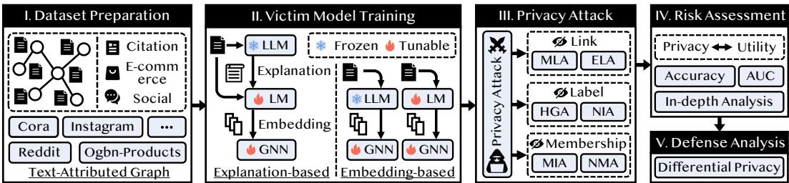  
Figure 1: Overview of the proposed privacy risk evaluation framework. It consists of five stages: dataset preparation, victim model training, privacy attack, risk assessment, and defense analysis.

Despite their strong empirical performance, the privacy risks of LLM-enhanced GNNs remain largely underexplored. Existing studies [35, 63, 52, 19, 49, 62] have shown that GNNs are highly vulnerable to privacy attacks, where adversaries can infer sensitive information from model outputs, even when only limited access is available. In LLM-enhanced GNNs, such risks may be further exacerbated, as node representations integrate structural dependencies with rich semantic features encoded by LLMs or LMs, potentially increasing the information content exposed through model outputs. This paradigm shift may introduce new and more powerful avenues for privacy leakage beyond those observed in conventional GNNs. Therefore, how privacy vulnerabilities evolve under LLM-enhanced architectures remains poorly understood, calling for a systematic investigation of their privacy risks.

To fill this gap, we conduct a systematic study of privacy risks in LLM-enhanced GNNs. As illustrated in Fig. 1, we develop a unified evaluation framework encompassing five stages, including ① dataset preparation, ② victim model training, ③ privacy attack, ④ risk assessment, and ⑤ defense analysis, enabling an end-to-end analysis of privacy risks and potential mitigation strategies.

Specifically, we collect and curate six real-world text-attributed graph datasets that span various domains, including social networks, citation networks, and e-commerce platforms. We construct 42 LLM-enhanced GNN victim models by combining multiple LLM-based feature enhancers with widely used GNN backbones, enabling a comprehensive evaluation under diverse model settings. We then consider six representative privacy attack methods targeting three fundamental objectives, namely link, label, and membership inference. These attack objectives have been extensively studied in prior work [37, 35, 63, 19, 13, 62] on traditional GNNs and are widely recognized as the most prevalent forms of privacy leakage, as they respectively capture the exposure of graph structure, node semantics, and training participation. In the risk assessment stage, we conduct a quantitative evaluation of privacy risks and further investigate how semantic enhancement affects model vulnerability. The results show that LLM-induced semantics can significantly amplify privacy leakage by strengthening structural-, label-, and membership-related signals in learned representations. Finally, we evaluate differential privacy (DP) [42, 29, 67, 16, 10] as a defense strategy and find that, while it can partially mitigate privacy risks, it incurs substantial utility degradation. These findings highlight the urgent need to revisit and redesign privacy protection mechanisms for LLM-enhanced GNNs.

Contributions. ① Important But Underexplored Problem. We identify and systematically study an important yet underexplored problem of privacy risks in LLM-enhanced GNNs, which has been largely overlooked in existing graph learning literature. ② Systematic Evaluation Framework. We propose a unified evaluation framework consisting of five stages to evaluate privacy risks in LLMenhanced GNNs, covering multiple datasets, diverse privacy attacks, and defense analysis, enabling a holistic understanding of both privacy vulnerabilities and mitigation effectiveness. ③ Comprehensive Empirical Study. We conduct extensive experiments on six real-world text-attributed graph datasets,

42 victim model configurations, and six privacy attack methods targeting membership, link, and label inference, providing a thorough and systematic evaluation under diverse settings.

## 2 Preliminaries

In this section, we first present the problem definition (▷ Sec. 2.1), and then introduce the necessary background on graph neural networks (▷ Sec. 2.2) and LLM-enhanced GNNs (▷ Sec. 2.3).

## 2.1 Problem Definition

Consider a text-attributed graph (TAG) $\mathcal { G } = ( \mathcal { V } , \mathcal { E } , \mathcal { T } , \mathbf { A } )$ , where $\mathcal { V } = \{ v _ { 1 } , \cdots , v _ { N } \}$ denotes the set of nodes, $\mathcal { E }$ represents the set of edges, $\mathcal { T } = \{ t _ { v } \} _ { v \in \mathcal { V } }$ contains the textual attributes of the nodes, and $\mathbf { A } \in \mathbb { R } ^ { N \times N }$ is the adjacency matrix with $\mathbf { A } _ { i j } \in \{ 0 , 1 \}$ indicating the presence of an edge between nodes $v _ { i }$ and $v _ { j }$ . TAGs seamlessly integrate structured topological information with unstructured textual semantics, providing a versatile representation for a wide range of real-world networks, including social networks, citation networks, and e-commerce networks. Consistent with prior work $[ 1 \bar { 8 , 2 } , 6 8 , 4 , 6 4 ]$ , we focus on the node classification task. The node set $\nu = \nu _ { L } \cup \nu _ { U }$ consists of labeled nodes $\mathcal { V } _ { L }$ and unlabeled nodes $\nu _ { U }$ , where each labeled node $v \in \mathcal { V } _ { L }$ is associated with a class label $y _ { v } \in { \mathcal { V } } = \{ 1 , \ldots , C \}$ . The objective is to learn a mapping $f _ { \theta } : ( \mathbf { A } , \mathcal { T } )  \mathcal { Y }$ that predicts labels for unlabeled nodes by jointly exploiting graph structure and textual node attributes. Building on this formulation, we investigate how an adversary can exploit the outputs of LLM-enhanced GNNs, together with their prior knowledge and capabilities, to infer sensitive information about target nodes, including link existence, node labels, and training membership (see Sec. 3 for the threat model).

## 2.2 Graph Neural Networks

Graph Neural Networks (GNNs) are a class of deep learning models designed for graph-structured data, whose core idea is to learn node representations $( i . e .$ , embeddings) by aggregating information from neighboring nodes [55]. Taking advantage of this message passing mechanism, GNNs have achieved strong performance across a wide range of real-world applications, including social network analysis [24], knowledge graph completion [30], fraud detection [59, 31], and recommender systems [54]. Representative architectures include GCN [24], GAT [46], and SAGE [14]. Formally, let $\mathcal { N } ( v )$ denote the set of neighbors of node v. At the k-th layer, node representations are computed via a two-step procedure consisting of neighborhood aggregation and representation update:

$$
\mathbf { h } _ { \mathcal { N } ( v ) } ^ { k } = \mathrm { A G G R E G A T E } _ { k } ( \left\{ \mathbf { h } _ { u } ^ { k - 1 } ~ \middle | ~ u \in \mathcal { N } ( v ) \right\} ) , \quad \mathbf { h } _ { v } ^ { k } = \mathrm { U P D A T E } _ { k } ( \mathbf { h } _ { \mathcal { N } ( v ) } ^ { k } ) ,\tag{1}
$$

where $\mathbf { h } _ { u } ^ { k - 1 }$ represents the representation of neighbor u at layer $k - 1$ . The operator AGGREGATE $ _ { \cdot k } ( \cdot )$ performs permutation-invariant aggregation over neighbors, such as mean, sum, or max pooling, while $\mathrm { U P D A T E } _ { k } ( \cdot )$ denotes a learnable non-linear transformation, typically parameterized by a neural network. At the input layer, ${ \bf h } _ { v } ^ { 0 }$ is initialized with the original feature vector $\mathbf { x } _ { v }$ of node v.

## 2.3 LLM-Enhanced GNNs

With the rapid advancement of LLMs, recent studies [18, 2, 68, 4] have explored integrating them with GNNs, giving rise to LLM-enhanced GNNs1. These approaches leverage LLMs to encode textual node attributes, introducing rich semantic information that complements the limited expressiveness of traditional GNNs on unstructured text. As a result, they can significantly improve node representations and downstream task performance. Depending on whether additional textual information is generated by LLMs, as illustrated in Fig. 1(II), existing methods can be broadly categorized into two groups:

⋄ Explanation-based methods exploit the reasoning and knowledge capabilities of LLMs to derive high-level semantic information (e.g., explanations) from raw textual attributes, which is then encoded into node embeddings by an LM (e.g., DeBERTa-base [17]). Formally, this process can be written as $\mathbf { x } _ { v } = f _ { \mathrm { L M } } ( f _ { \mathrm { L L M } } ( p , i _ { v } ) , t _ { v } )$ , where $f _ { \mathrm { L L M } }$ generates augmented text conditioned on a prompt $p ,$ and $f _ { \mathrm { L } ] }$ M encodes both original and augmented text into embeddings.

⋄ Embedding-based methods do not explicitly generate additional text but instead directly encode textual attributes into embeddings. These methods can be further divided into two variants: ① directly using LLMs to obtain embeddings, $i . e . , \mathbf { x } _ { v } = f _ { \mathrm { L L M } } ( t _ { v } )$ , and ② fine-tuning conventional LMs to produce task-specific embeddings, i.e., $\mathbf { x } _ { v } = f _ { \mathrm { L M } } ( t _ { i } )$ . Such approaches typically rely on embedding-accessible LLMs or fine-tunable pretrained models to adapt to downstream tasks.

## 3 Threat Model

We characterize the threat model in terms of the knowledge, capability, and objective of the adversary.

Adversary’s Knowledge and Capability. We consider an adversary with black-box access to the target GNN model. Specifically, the adversary has no access to the model’s internal parameters or architecture and can only obtain node posteriors through query access. This setting is consistent with prior attack literature [35, 63, 19, 11, 44] and aligns with real-world deployments of machinelearning-as-a-service (MLaaS) platforms, where models are exposed via query interfaces, as exemplified by Google Cloud’s Vertex AI [12], Meta Platforms’ ParlAI [38], and

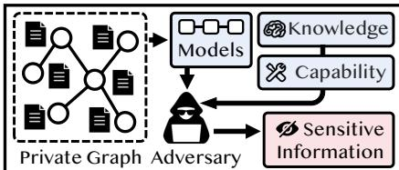  
Figure 2: Adversary–model interaction illustration under black-box access.

IBM’s InfoSphere Virtual Data Pipeline [22]. Beyond query access, the adversary may possess auxiliary prior knowledge K and additional capabilities to facilitate the attack. As illustrated in Fig. 2, the adversary interacts with the model to collect posterior predictions, which are then exploited to infer sensitive information about the underlying graph data.

Adversary’s Objective. We focus on three fundamental types of privacy risks in graph learning, namely link, label, and membership inference. These attack objectives are widely studied in prior work [37, 13, 35, 63, 52, 19, 62] on traditional GNNs and are considered the most representative and prevalent forms of privacy leakage, as they respectively target the exposure of graph structure, node semantics, and training participation. By adopting this taxonomy, our evaluation remains consistent with established attack paradigms while enabling a systematic assessment of privacy risks in LLM-enhanced GNNs. Formally, given a target node v and its corresponding model posterior $\mathcal { R } _ { v } ,$ the adversary’s objectives are defined as follows:

⋄ Link Inference. The adversary attempts to infer whether a link exists between node v and another node u. This reveals structural relationships in the graph, which may correspond to sensitive interactions (e.g., social ties). The objective is: $\hat { e } _ { v u } = \mathrm { a r g }$ max $\mathrm { P r } ( ( v , \bar { u } ) \in \mathcal { E } \mid \mathcal { R } _ { v } , \mathcal { R } _ { u } )$ .

⋄ Label Inference. The adversary aims to infer the true class label $y _ { v }$ of node v. The label $y _ { v }$ can expose sensitive information about node $v , e . g .$ ., personalized recommendations that reveal their private interests. The formal objective is defined as: ${ \hat { y } } _ { v } = \mathrm { a r g }$ max $\mathrm { P r } ( y _ { v } \mid \mathcal { R } _ { v } )$

⋄ Membership Inference. The adversary aims to determine whether node v was included in the training set of the target model. Such information can reveal participation in sensitive datasets (e.g., medical or user-specific records). The objective is formulated as: $\hat { m } _ { v } = \mathrm { a r g }$ max $\mathrm { P r } ( m _ { v } \mid \mathcal { R } _ { v } )$ where $m _ { v } \in \{ 0 , \bar { 1 } \}$ indicates whether v is a member of the training data.

## 4 Evaluation Framework

In this section, we present the five stages of our evaluation framework in sequence: dataset preparation (▷ Sec. 4.1), victim model training (▷ Sec. 4.2), privacy attack (▷ Sec. 4.3), risk assessment (▷ Sec. 4.4), and defense analysis (▷ Sec. 4.5). Fig. 1 illustrates the overall workflow of the evaluation framework.

## 4.1 Dataset Preparation

We consider six TAG datasets, whose statistics are summarized in Table 1. Specifically, these datasets span three representative real-world scenarios, including social networks, citation networks, and e-commerce platforms. The social networks include Instagram [21]

Table 1: Statistics of datasets.
<table><tr><td>Dataset</td><td>#Nodes</td><td>#Edges</td><td>#Classes</td><td>#Domain</td></tr><tr><td>Cora</td><td>2,708</td><td>5,429</td><td>7</td><td>Citation</td></tr><tr><td>CiteSeer</td><td>3,327</td><td>4,552</td><td>6</td><td>Citation</td></tr><tr><td>Ogbn-Products</td><td>12,011</td><td>21,987</td><td>47</td><td>E-commerce</td></tr><tr><td>Tape-Arxiv23</td><td>13,167</td><td>23,735</td><td>40</td><td>Citation</td></tr><tr><td>Instagram</td><td>11,339</td><td>144,010</td><td>2</td><td>Social</td></tr><tr><td>Reddit</td><td>33,434</td><td>198,448</td><td>2</td><td>Social</td></tr></table>

and Reddit [21], where nodes represent users and textual attributes correspond to user-generated content or profile information. The citation networks include Cora [34], Pubmed [43], and Tape-Arxiv23 [18], where nodes denote academic papers and textual attributes are derived from titles or abstracts. For the e-commerce scenario, we adopt Ogbn-Products [18], where nodes correspond to products and textual attributes are derived from product descriptions or reviews. Overall, these datasets exhibit diverse structural properties and textual characteristics, enabling a comprehensive evaluation of privacy risks across different domains. Further details are provided in Appendix.

## 4.2 Victim Model Training

In this stage, we consider 42 victim model configurations for training. Each configuration consists of two key components: an LM/LLM-based feature enhancer and a GNN backbone. To systematically cover different integration paradigms, we select a representative set of feature enhancement methods:

⋄ Explanation-based methods. We consider TAPE [18] and KEA [2], two representative approaches that leverage LLMs (e.g., GPT-3.5 Turbo) to generate complementary semantic information, such as explanations or keyphrases. The generated text is then jointly encoded with the original textual attributes using LMs (e.g., DeBERTa-base [17] or E5-Large [47]) to produce node embeddings.

⋄ Embedding-based methods. As described in Sec. 2.3, these methods follow two implementation paradigms. The first directly leverages LLMs to generate text embeddings, for which we consider LLaMA-2-7b-hf (LLaMA) [45] and Linq-Embed-Mistral (Linq) [5]. The second fine-tunes the LMs to obtain task-specific embeddings; in this category, we include SimTeG [9] and E5-Large [50].

Based on these feature enhancers, we further combine them with seven GNN backbones, including GCN [24], SAGE [14], GAT [46], GIN [57], APPNP [25], SGC [53], and SSGC [65]. In total, this results in 42 victim model configurations. Rather than pursuing more advanced architectures, we focus on widely adopted and well-established combinations to ensure reproducibility and provide representative coverage of mainstream LLM-enhanced GNNs. See Appendix for more details.

## 4.3 Privacy Attack

In this stage, we evaluate privacy risks across three fundamental attack surfaces, namely link, label, and membership inference, covering six representative attack methods in total. These three categories represent prevalent and well-studied privacy attack threats, targeting the exposure of graph structure, node semantics, and training participation, respectively. To ensure a rigorous and comprehensive assessment, the selected attacks span a range of threat model assumptions, from label-aware to fully black-box settings. Brief descriptions are provided below, with full details deferred to Appendix.

⋄ Link Inference. We adopt posterior-based link inference attacks [19] that predict edge existence by measuring pairwise distances between node posteriors, using Manhattan distance (MLA) and Euclidean distance (ELA), capturing structural leakage from model outputs.

⋄ Label Inference. We consider two label inference attacks of different adversarial strength. Homophily Guessing Attack (HGA) [35] exploits graph homophily [66] by inferring the victim’s label via majority vote over neighbor labels. Node Infiltration Attack (NIA) [35] injects a crafted node connected to the victim and infers its label purely from the resulting model posteriors, requiring no access to any label information and thus posing a strictly stronger threat.

⋄ Membership Inference. Two attacks are examined. MIA [37] trains a shadow GNN to mimic the target model, then trains a binary MLP using output posteriors of member and non-member nodes to infer training membership. NMA [20] extracts top-2 posterior probabilities under 0-hop and 2-hop queries as features, fuses them via linear layers, and feeds them into a binary MLP classifier.

## 4.4 Risk Assessment

In this stage, we adopt standard evaluation metrics to assess the effectiveness of the three types of attacks introduced in Sec. 4.3. Specifically, for membership inference attacks, we use attack accuracy and AUC as the primary metrics. For link inference attacks, we adopt AUC to measure the ability to distinguish existing and non-existing edges. For label inference attacks, we use attack accuracy to evaluate the recovery of node labels. These metrics capture the extent of privacy leakage from different perspectives at the representation level. In addition, we incorporate model utility into the evaluation by using node classification accuracy as the utility metric. We also consider distributional measures such as cumulative distribution functions (CDFs) of embeddings for more fine-grained analysis. By jointly analyzing privacy risk and utility, we aim to systematically characterize the trade-off between performance improvement and privacy leakage in LLM-enhanced GNNs.

## 4.5 Defense Analysis

In this stage, we focus on evaluating the effectiveness of differential privacy (DP) [10, 7] methods in LLM-enhanced GNNs. DP is a representative privacy-preserving paradigm that provides formal guarantees via random noise injection and has been widely adopted in machine learning. In graph learning [29, 42, 67, 16, 40], it offers a general and model-agnostic defense against various privacy attacks, including membership, link, and label inference. Motivated by this, we systematically study

Table 2: Node classification accuracy (%) across different datasets based on the GCN backbone. The highest results are highlighted with bold , while the second-best results are marked with underline
<table><tr><td>Dataset</td><td>Shallow</td><td>TAPE</td><td>KEA</td><td>LLaMA</td><td>Linq</td><td>SimTeg</td><td>E5-Large</td></tr><tr><td>Cora</td><td> $8 0 . 8 \pm 1 . 1$ </td><td> $8 2 . 1 \pm 1 . 1$ </td><td> $8 3 . 2 \pm 0 . 8$ </td><td> $8 2 . 2 \pm 0 . 6$ </td><td> ${ \bf 8 4 . 8 \pm 0 . 4 }$ </td><td> $8 3 . 3 \pm 0 . 9$ </td><td>_  $\underline { { 8 4 . 5 \pm 0 . 9 } }$ </td></tr><tr><td>Tape-Arxiv23</td><td> $5 5 . 4 \pm 0 . 7$ </td><td> ${ \bf 7 2 . 3 \pm 0 . 6 }$  </td><td> $6 5 . 6 \pm 0 . 5$ </td><td> $7 0 . 3 \pm 0 . 7$ </td><td> $7 1 . 4 \pm 0 . 4$ </td><td> $7 0 . 7 \pm 0 . 6$ </td><td> $\overline { { 7 1 . 3 \pm 0 . 5 } }$ </td></tr><tr><td>CiteSeer</td><td> $7 2 . 3 \pm 1 . 2$ </td><td> $7 3 . 6 \pm 1 . 6$ </td><td> $7 5 . 2 \pm 1 . 5$ </td><td> $7 5 . 3 \pm 1 . 6$ </td><td> $\overline { { 7 6 . 6 \pm 0 . 6 } }$ </td><td> $7 4 . 9 \pm 0 . 8$ </td><td> $7 6 . 2 \pm 2 . 1$ </td></tr><tr><td>Ogbn-Products</td><td> $6 5 . 6 \pm 0 . 5$ </td><td> ${ \bf 8 3 . 1 \pm 0 . 2 }$  一</td><td> $8 0 . 9 \pm 0 . 3$ </td><td> $8 1 . 2 \pm 0 . 3$ </td><td> $8 1 . 7 \pm 0 . 8$ </td><td> $8 1 . 4 \pm 0 . 2$ </td><td>_  $\overline { { 8 2 . 2 \pm 0 . 1 } }$ </td></tr><tr><td>Instagram</td><td> $6 3 . 7 \pm 0 . 7$ </td><td> $6 5 . 6 \pm 0 . 8$ </td><td> $6 6 . 1 \pm 0 . 6$ </td><td> $6 7 . 3 \pm 0 . 4$ </td><td> ${ \bf 6 7 . 7 \pm 0 . 7 }$ </td><td> $6 4 . 5 \pm 0 . 7$ </td><td> $\overline { { 6 5 . 6 \pm 0 . 9 } }$ </td></tr><tr><td>Reddit</td><td> $6 0 . 0 \pm 0 . 9$ </td><td> $6 1 . 5 \pm { 1 . 0 }$ </td><td> $6 1 . 2 \pm { 1 . 0 }$ </td><td> $\overline { { 6 2 . 8 \pm 0 . 3 } }$ </td><td> $\underline { { 6 2 . 5 \pm 1 . 1 } }$ </td><td> $6 2 . 3 \pm { 0 . 4 }$ </td><td> $6 1 . 1 \pm 0 . 5$ </td></tr></table>

how DP performs in LLM-enhanced GNNs. Specifically, we consider several classical local DP mechanisms, including 1B [8], LP [39], AG [1], SW [28], MB [42], PM [48] and RR [23]. Details of these mechanisms are provided in Appendix. These methods perturb node representations or related information with randomness, thereby limiting privacy leakage at the source. Based on these mechanisms, we evaluate LDP-based defenses from three perspectives: embedding-level, link-level, and label-level privacy, and further analyze the trade-off between privacy protection and model utility.

## 5 Evaluation

In this section, we conduct a comprehensive experimental study to evaluate the privacy risks in LLM-enhanced GNNs. We begin by introducing the experimental setup (▷ Sec. 5.1), followed by detailed results and analyses (▷ Sec. 5.2–Sec. 5.6), structured around the following key questions:

⋄ RQ1: How much do LLM-enhanced GNNs improve utility? (▷ Sec. 5.2)

⋄ RQ2: How vulnerable are LLM-enhanced GNNs to membership inference attacks? (▷ Sec. 5.3)

⋄ RQ3: How vulnerable are LLM-enhanced GNNs to link inference attacks? (▷ Sec. 5.4)

⋄ RQ4: How vulnerable are LLM-enhanced GNNs to label inference attacks? (▷ Sec. 5.5)

⋄ RQ5: How effective are defense mechanisms in mitigating these privacy risks? (▷ Sec. 5.6)

## 5.1 Experimental Settings

Implementation Details. All experiments are conducted on a machine running Ubuntu 20.04 LTS, equipped with dual Intel® Xeon® Gold 6348 CPUs, 100GB RAM, and an NVIDIA® A800 80GB GPU. GNN models are implemented using PyTorch-Geometric (PyG)2, while LLMs and text encoders are accessed via official APIs or Hugging Face Transformers [51]. Following standard practice [11, 33], each dataset is split into training, validation, and test sets with a ratio of 10%/10%/80%. Hyperparameters for GNN models [24, 46, 14] are selected via grid search to ensure competitive node classification performance. Unless otherwise specified, all models adopt a two-layer architecture with a hidden dimension of 256, a dropout rate of 0.5, and a learning rate of 0.001. For GAT, the first layer employs eight attention heads, while the second layer uses a single head. Please refer to Appendix for further details on GNNs. To reduce randomness, each experiment is repeated five times with different random seeds, and the reported results correspond to the averaged performance.

Baseline. To assess whether LLM/LM-augmented node embeddings introduce additional privacy risks, we adopt shallow embeddings as a baseline for comparison. These embeddings are constructed using traditional text representation methods, including Bag-of-Words (BoW) [15] and Word2Vec [6] (collectively referred to as Shallow). The specific embedding choice is detailed in Appendix.

## 5.2 Utility Evaluation

Before evaluating privacy risks, we first assess whether LLM-enhanced GNNs indeed yield utility gains over shallow text representations. We conduct node classification experiments across all datasets, with results reported in Table 2 and full details provided in Appendix. The results show that LLM-enhanced GNNs consistently outperform the Shallow baseline in node classification accuracy (%), confirming that semantic enrichment from LLMs/LMs effectively improves node representation quality. These utility gains motivate a deeper investigation into their privacy implications, as stronger representations may simultaneously expose more sensitive information.

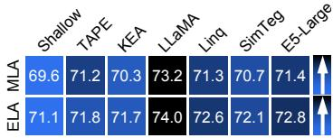  
(a) Cora

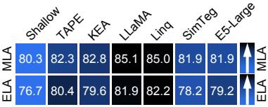  
(b) Tape-Arxiv23

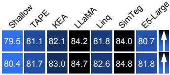  
(c) Citeseer

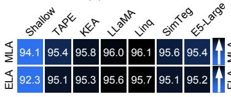  
(d) Ogbn-Products

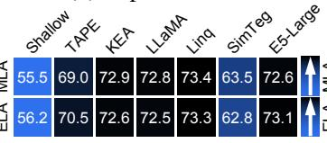  
(e) Instagram

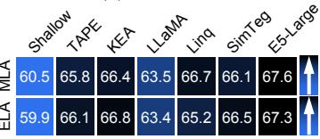  
(f) Reddit

Figure 3: Link inference attack (MLA and ELA) results measured by attack AUC (%) across six datasets under GCN, comparing different LLM-based feature enhancers against the Shallow baseline.  
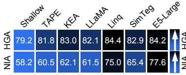  
(a) Cora

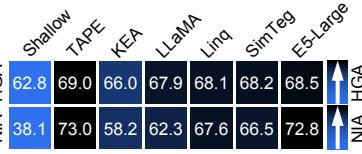  
(b) Tape-Arxiv23

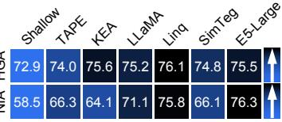

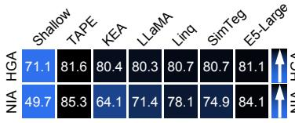  
(d) Ogbn-Products

(c) Citeseer  
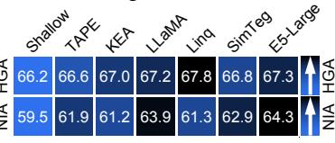  
(e) Instagram

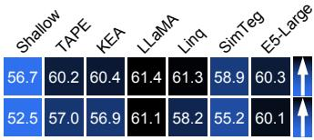  
(f) Reddit  
Figure 4: Label inference attack (HGA and NIA) results measured by attack accuracy (%) across six datasets under GCN, comparing different LLM-based feature enhancers against the Shallow baseline.

## 5.3 Vulnerability to Link Inference

We conduct experiments using two link inference attacks (MLA and ELA), with results reported in Fig. 3 and additional results and analyses provided in Appendix. The results reveal two key observations: ① Compared to the Shallow baseline, LLM-enhanced GNNs generally exhibit higher attack AUC (%), indicating that semantic enrichment increases the vulnerability of node representations to link inference attacks. ② Across different LLM-enhanced GNN variants, the attack AUC values remain relatively close to one another, suggesting that the increased privacy vulnerability is a general effect of semantic enrichment rather than being driven by any particular model.

In-depth Analysis. We further analyze the distribution of embedding distances between connected and unconnected node pairs on the Tape-Arxiv23 dataset using GCN. As shown in Fig. 6(a), compared to Shallow, Linq exhibits a more pronounced inter-class separation: distances between connected pairs decrease while those between unconnected pairs increase, resulting in a larger margin in the embedding space. This geometric separability, while beneficial for representation quality, makes link relations more distinguishable to an attacker, directly amplifying the risk of link inference attacks.

## 5.4 Vulnerability to Label Inference

We evaluate vulnerability to label privacy inference using two representative attacks (HGA and NIA), with results shown in Fig. 4 and additional details provided in Appendix. The results reveal two key observations: ① LLM-enhanced GNNs consistently exhibit stronger label leakage (measured by attack accuracy (%)) compared to the Shallow baseline, suggesting that incorporating semantic knowledge enables label-related signals to be encoded more explicitly in node representations. ② Performance differences across LLM-enhanced GNN variants remain relatively moderate, indicating that the elevated vulnerability is not driven by any specific model architecture, but rather reflects a common consequence of leveraging semantically enriched features.

In-depth Analysis. We analyze the distribution of embedding distances between intra-class (samelabel) and inter-class (different-label) node pairs on the Tape-Arxiv23 dataset using GCN model. The results, presented as cumulative distribution functions (CDFs) in Fig. 6(b), show that compared to Shallow, Linq exhibits a more pronounced distributional gap between intra-class and inter-class distances, indicating a clearer class-wise separation in the embedding space. This suggests that LLMenhanced GNNs learn a more structured, label-aware representation, whose enhanced discriminability, while improving classification utility, simultaneously makes label inference attacks more effective.

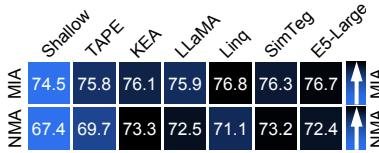  
(a) Cora

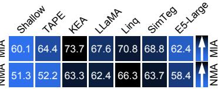  
(b) Tape-Arxiv23

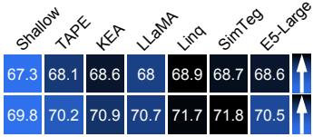  
(c) Citeseer

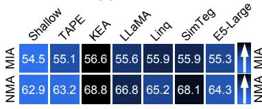  
(d) Ogbn-Products

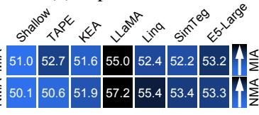  
(e) Instagram

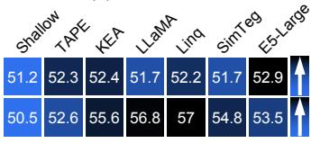  
(f) Reddit

Figure 5: Membership inference attack (MIA and NMA) results measured by AUC (%) or Accuracy (%) under GCN, comparing different LLM-based feature enhancers against the Shallow baseline.  
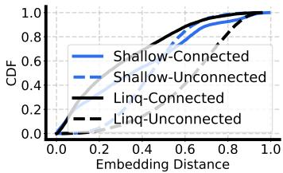  
(a) Link Inference

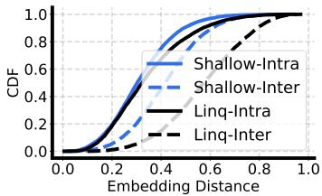  
(b) Label Inference

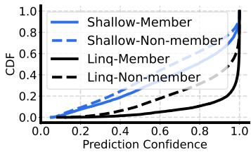  
(c) Membership Inference  
Figure 6: In-depth analysis of privacy vulnerability on Tape-Arxiv23 with GCN, comparing Linq against the Shallow baseline. (a) Embedding distance distributions of connected vs. unconnected pairs (link inference). (b) CDF of embedding distances of intra-class vs. inter-class pairs (label inference). (c) Prediction confidence distributions of member vs. non-member nodes (membership inference).

## 5.5 Vulnerability to Membership Inference

We evaluate membership privacy vulnerability using two representative attacks, namely MIA (measured by AUC (%)) and NMA (measured by attack accuracy (%)). Results are reported in Fig. 5, with additional analyses provided in Appendix. The results show: ① LLM-enhanced GNNs consistently exhibit higher membership leakage than the Shallow baseline across datasets, suggesting that semantic enrichment amplifies the model’s tendency to memorize training-specific patterns and leaves stronger membership signals in the learned representations. ② Among different LLM-enhanced GNN variants, the degree of membership leakage above the Shallow baseline varies across methods, reflecting that different feature enhancers encode training membership signals to different extents.

In-depth Analysis. Membership inference attacks fundamentally exploit the behavioral discrepancy between member and non-member samples. To investigate this, we compare the prediction confidence distributions of member and non-member nodes on Tape-Arxiv23 using GCN, as shown in Fig. 6(c). Compared to Shallow, Linq exhibits a more pronounced distributional gap between member and non-member confidence scores, indicating that LLM-enhanced representations encode stronger training-specific signals. This makes the behavioral discrepancy between member and non-member nodes more distinguishable, thereby amplifying the risk of membership inference attacks.

## 5.6 Effectiveness of Defenses

In this section, we evaluate the effectiveness of three types of DP mechanism, including embeddinglevel, link-level, and label-level DP, as defense strategies on the Cora dataset with the GCN model.

Embedding DP. We consider six local DP mechanisms for node embedding perturbation (1B, LP, AG, SW, MB, PM), and evaluate their effectiveness against MLA, NIA, and MIA for link, label, and membership inference, respectively, on Tape-Arxiv23 using GCN with Linq as the feature enhancer. The results are shown in Fig. 7. Under a moderate privacy budget $( \epsilon _ { e } = 5 . 0 )$ , Fig. 7(a)-(c) show that embedding perturbation can mitigate all three types of attacks to varying degrees. However, Fig. 7(d) reveals a significant drop in model utility, indicating a clear privacy-utility trade-off. We further examine the effect of varying the privacy budget $\epsilon _ { e } \in \{ 0 . 1 , 0 . 5 , 1 . 0 , 5 . 0 , 1 0 . 0 \}$ (under the MB) on MLA (Fig. 8(a)). As $\epsilon _ { e }$ decreases, both attack AUC and model utility consistently decline, confirming that stronger perturbation reduces privacy leakage at the cost of notable utility degradation.

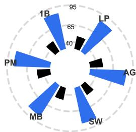  
(a) Link Attack

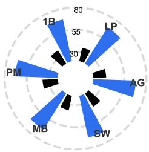  
(b) Label Attack

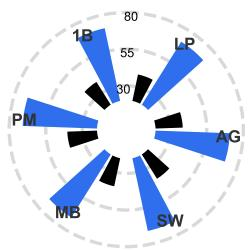  
(c) Membership Attack

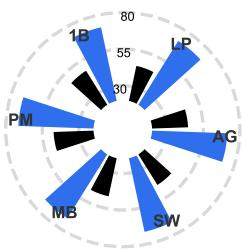  
(d) Utility Accuracy

Figure 7: Effectiveness of six local embedding DP mechanisms under a fixed privacy budget $\epsilon _ { e } = 5 . 0 $ on the Tape-Arxiv23 with GCN and Linq; blue bars denote results before perturbation. (a)-(c) show attack performance for MLA, NIA, and MIA, respectively. (d) reports the corresponding model utility.  
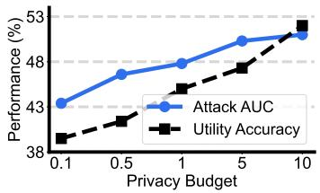  
(a) Embedding-level DP

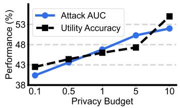  
(b) Link-level DP

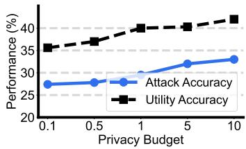  
(c) Label-level DP  
Figure 8: Attack and utility performance under varying privacy budgets on Tape-Arxiv23 with GCN and Linq. (a) Embedding-level DP $( \epsilon _ { e } )$ vs. MLA (AUC %) and utility (Accuracy %). (b) Link-level DP (RR) vs. MLA (AUC %) and utility. (c) Label-level DP (k-RR) vs. HGA (Accuracy %) and utility.

Link DP. We further study link-level local DP using the RR. As shown in Fig. 8(b), applying RR to the graph structure reduces the effectiveness of MLA. Nevertheless, it simultaneously incurs noticeable utility degradation, indicating a poor privacy-utility trade-off for structure-level protection.

Label DP. We examine label-level DP using the k-RR mechanism against HGA-based label inference. As shown in Fig. 8(c), while label perturbation partially reduces attack performance, it inevitably weakens the learning of true label distributions, leading to degraded classification accuracy. This highlights the inherent tension between protecting label privacy and maintaining model utility.

## 6 Related Work

In this section, we provide a brief overview of LLM-enhanced GNNs and privacy attacks on GNNs.   
A more comprehensive discussion and additional references are provided in Appendix.

LLM-Enhanced GNNs. Recent studies have explored integrating LLMs with GNNs to encode rich textual attributes, giving rise to LLM-enhanced GNNs [18, 2, 68, 4, 64], which significantly improve node representations and model utility. Existing methods fall into two categories: explanation-based methods, which use LLMs to generate semantic descriptions that are subsequently encoded by a language model [18]; and embedding-based methods, which directly encode textual attributes via LLMs or fine-tuned language models [9, 47]. While these approaches have demonstrated significant utility gains, the privacy implications of incorporating semantically enriched representations into graph learning remain largely unexplored, motivating our systematic investigation.

Privacy Attacks on GNNs. Privacy risks in graph learning [62] have been studied under three main threat scenarios. Membership inference attacks [37, 13, 20] aim to determine whether a given node was included in training by exploiting behavioral discrepancies between member and non-member samples. Link inference attacks [52, 19] seek to recover sensitive graph structure from learned node embeddings. Label inference attacks [35] attempt to infer private node labels by leveraging the classdiscriminative structure of the representation space. While prior work has examined these threats in conventional GNNs with shallow features, their interplay with semantically enriched LLM-based representations remains an open and important question that this work aims to address.

## 7 Conclusion

In this work, we systematically evaluate the privacy risks of LLM-enhanced GNNs across three fundamental privacy threats (link, label, and membership inference) through a unified framework, encompassing six real-world text-attribute graph datasets and 42 victim model configurations. Our experiments demonstrate that LLM-enhanced GNNs consistently exhibit greater vulnerability than shallow baselines, as semantic enrichment amplifies privacy-sensitive signals in the embedding space. While differential privacy can partially mitigate these risks, it introduces significant utility degradation, revealing a fundamental privacy-utility trade-off. We hope our findings offer practica insights toward building more secure and trustworthy graph learning systems.

## References

[1] Borja Balle and Yu-Xiang Wang. Improving the gaussian mechanism for differential privacy: Analytical calibration and optimal denoising. In International Conference on Machine Learning (ICML), pages 394–403, 2018.

[2] Zhikai Chen, Haitao Mao, Hang Li, Wei Jin, Hongzhi Wen, Xiaochi Wei, Shuaiqiang Wang, Dawei Yin, Wenqi Fan, Hui Liu, et al. Exploring the potential of large language models (llms) in learning on graphs. ACM SIGKDD Explorations Newsletter (SIGKDD Explorations), 25(2): 42–61, 2024.

[3] Haoang Chi, He Li, Wenjing Yang, Feng Liu, Long Lan, Xiaoguang Ren, Tongliang Liu, and Bo Han. Unveiling causal reasoning in large language models: Reality or mirage? Advances in Neural Information Processing Systems (NeurIPS), 37:96640–96670, 2024.

[4] Eli Chien, Wei-Cheng Chang, Cho-Jui Hsieh, Hsiang-Fu Yu, Jiong Zhang, Olgica Milenkovic, and Inderjit S. Dhillon. Node feature extraction by self-supervised multi-scale neighborhood prediction. In The Tenth International Conference on Learning Representations (ICLR), 2022.

[5] Chanyeol Choi, Junseong Kim, Seolhwa Lee, Jihoon Kwon, Sangmo Gu, Yejin Kim, Minkyung Cho, and Jy-yong Sohn. Linq-embed-mistral technical report. arXiv preprint arXiv:2412.03223, 2024.

[6] Kenneth Ward Church. Word2vec. Natural Language Engineering (NLEJ), 23(1):155–162, 2017.

[7] Graham Cormode, Somesh Jha, Tejas Kulkarni, Ninghui Li, Divesh Srivastava, and Tianhao Wang. Privacy at scale: Local differential privacy in practice. In Proceedings of the 2018 International Conference on Management ofData (SIGMOD), pages 1655–1658, 2018.

[8] Bolin Ding, Janardhan Kulkarni, and Sergey Yekhanin. Collecting telemetry data privately. Advances in Neural Information Processing Systems (NeurIPS), 30:3571–3580, 2017.

[9] Keyu Duan, Qian Liu, Tat-Seng Chua, Shuicheng Yan, Wei Tsang Ooi, Qizhe Xie, and Junxian He. Simteg: A frustratingly simple approach improves textual graph learning. arXiv preprint arXiv:2308.02565, 2023.

[10] Cynthia Dwork. Differential privacy: A survey of results. In International Conference on Theory and Applications of Models of Computation (TAMC), pages 1–19, 2008.

[11] Jie Fu, Yuan Hong, Zhili Chen, and Wendy Hui Wang. Safeguarding graph neural networks against topology inference attacks. In Proceedings ofthe 2025 ACM SIGSAC Conference on Computer and Communications Security (CCS), pages 2144–2158, 2025.

[12] Google. Vertex ai - google cloud. https://cloud.google.com/vertex-ai, 2021.

[13] Faqian Guan, Tianqing Zhu, Hanjin Tong, and Wanlei Zhou. Attention-based membership inference attacks on graph neural network through topological features. IEEE Transactions on Dependable and Secure Computing (TDSC), 22(6):6469–6486, 2025.

[14] Will Hamilton, Zhitao Ying, and Jure Leskovec. Inductive representation learning on large graphs. Advances in Neural Information Processing Systems (NeurIPS), 30:1024–1034, 2017.

[15] Zellig S Harris. Distributional structure. Word, 10(2-3):146–162, 1954.

[16] Longzhu He, Chaozhuo Li, Peng Tang, and Sen Su. Going deeper into locally differentially private graph neural networks. In Forty-second International Conference on Machine Learning (ICML), pages 22548–22565, 2025.

[17] Pengcheng He, Xiaodong Liu, Jianfeng Gao, and Weizhu Chen. Deberta: decoding-enhanced bert with disentangled attention. In 9th International Conference on Learning Representations (ICLR), 2021.

[18] Xiaoxin He, Xavier Bresson, Thomas Laurent, Adam Perold, Yann LeCun, and Bryan Hooi. Harnessing explanations: Llm-to-lm interpreter for enhanced text-attributed graph representation learning. In The Twelfth International Conference on Learning Representations (ICLR), 2024.

[19] Xinlei He, Jinyuan Jia, Michael Backes, Neil Zhenqiang Gong, and Yang Zhang. Stealing links from graph neural networks. In 30th USENIX Security Symposium (USENIX Security), pages 2669–2686, 2021.

[20] Xinlei He, Rui Wen, Yixin Wu, Michael Backes, Yun Shen, and Yang Zhang. Node-level membership inference attacks against graph neural networks. arXiv preprint arXiv:2102.05429, 2021.

[21] Xuanwen Huang, Kaiqiao Han, Yang Yang, Dezheng Bao, Quanjin Tao, Ziwei Chai, and Qi Zhu. Can gnn be good adapter for llms? In Proceedings ofthe ACM Web Conference (WWW), pages 893–904, 2024.

[22] IBM. Infosphere virtual data pipeline — ibm. https://www.ibm.com/products/ibm-infospherevirtual-data-pipeline, 2018.

[23] Peter Kairouz, Keith Bonawitz, and Daniel Ramage. Discrete distribution estimation under local privacy. In International Conference on Machine Learning (ICML), pages 2436–2444, 2016.

[24] Thomas N. Kipf and Max Welling. Semi-supervised classification with graph convolutional networks. In 5th International Conference on Learning Representations (ICLR), pages 1–15, 2017.

[25] Johannes Klicpera, Aleksandar Bojchevski, and Stephan Günnemann. Predict then propagate: Graph neural networks meet personalized pagerank. In 7th International Conference on Learning Representations (ICLR), pages 1–15, 2019.

[26] Jiayi Kuang, Ying Shen, Jingyou Xie, Haohao Luo, Zhe Xu, Ronghao Li, Yinghui Li, Xianfeng Cheng, Xika Lin, and Yu Han. Natural language understanding and inference with mllm in visual question answering: A survey. ACM Computing Surveys (CSUR), 57(8):1–36, 2025.

[27] Yuhan Li, Zhixun Li, Peisong Wang, Jia Li, Xiangguo Sun, Hong Cheng, and Jeffrey Xu Yu. A survey of graph meets large language model: Progress and future directions. In Proceedings of the Thirty-Third International Joint Conference on Artificial Intelligence (IJCAI), pages 8123–8131, 2024.

[28] Zitao Li, Tianhao Wang, Milan Lopuhaä-Zwakenberg, Ninghui Li, and Boris Škoric. Estimating numerical distributions under local differential privacy. In Proceedings of the 2020 ACM SIGMOD International Conference on Management of Data (SIGMOD), pages 621–635, 2020.

[29] Wanyu Lin, Baochun Li, and Cong Wang. Towards private learning on decentralized graphs with local differential privacy. IEEE Transactions on Information Forensics and Security (TIFS), 17:2936–2946, 2022.

[30] Shuwen Liu, Bernardo Grau, Ian Horrocks, and Egor Kostylev. Indigo: Gnn-based inductive knowledge graph completion using pair-wise encoding. Advances in Neural Information Processing Systems (NeurIPS), 34:2034–2045, 2021.

[31] Yang Liu, Xiang Ao, Zidi Qin, Jianfeng Chi, Jinghua Feng, Hao Yang, and Qing He. Pick and choose: a gnn-based imbalanced learning approach for fraud detection. In Proceedings of the Web Conference 2021 (WWW), pages 3168–3177, 2021.

[32] Renze Lou, Kai Zhang, and Wenpeng Yin. Large language model instruction following: A survey of progresses and challenges. Computational Linguistics, 50(3):1053–1095, 2024.

[33] Yuhang Ma, Jie Wang, and Zheng Yan. Are llm-enhanced graph neural networks robust against poisoning attacks? arXiv preprint arXiv:2603.26105, 2026.

[34] Andrew Kachites McCallum, Kamal Nigam, Jason Rennie, and Kristie Seymore. Automating the construction of internet portals with machine learning. Information Retrieval, 3(2):127–163, 2000.

[35] Lingshuo Meng, Yijie Bai, Yanjiao Chen, Yutong Hu, Wenyuan Xu, and Haiqin Weng. Devil in disguise: Breaching graph neural networks privacy through infiltration. In Proceedings of the 2023 ACM SIGSAC Conference on Computer and Communications Security (CCS), pages 1153–1167, 2023.

[36] Tomas Mikolov, Ilya Sutskever, Kai Chen, Greg S Corrado, and Jeff Dean. Distributed representations of words and phrases and their compositionality. Advances in Neural Information Processing Systems (NeurIPS), 26:3111–3119, 2013.

[37] Iyiola E Olatunji, Wolfgang Nejdl, and Megha Khosla. Membership inference attack on graph neural networks. In 2021 Third IEEE International Conference on Trust, Privacy and Security in Intelligent Systems and Applications (TPS-ISA), pages 11–20, 2021.

[38] Parlai. Parlai. https://ai.facebook.com/tools/parlai, 2017.

[39] NhatHai Phan, Xintao Wu, Han Hu, and Dejing Dou. Adaptive laplace mechanism: Differential privacy preservation in deep learning. In 2017 IEEE International Conference on Data Mining (ICDM), pages 385–394, 2017.

[40] Yuxin Qi, Xi Lin, Ziyao Liu, Gaolei Li, Jingyu Wang, and Jianhua Li. Linkguard: Link locally privacy-preserving graph neural networks with integrated denoising and private learning. In Companion Proceedings ofthe ACM Web Conference 2024 (WWW), pages 593–596, 2024.

[41] Yiwei Qin, Kaiqiang Song, Yebowen Hu, Wenlin Yao, Sangwoo Cho, Xiaoyang Wang, Xuansheng Wu, Fei Liu, Pengfei Liu, and Dong Yu. Infobench: Evaluating instruction following ability in large language models. In Findings ofthe Associationfor Computational Linguistics: ACL 2024 (ACL Findings), pages 13025–13048, 2024.

[42] Sina Sajadmanesh and Daniel Gatica-Perez. Locally private graph neural networks. In Proceedings of the 2021 ACM SIGSAC Conference on Computer and Communications Security (CCS), pages 2130–2145, 2021.

[43] Prithviraj Sen, Galileo Namata, Mustafa Bilgic, Lise Getoor, Brian Galligher, and Tina Eliassi-Rad. Collective classification in network data. AI magazine, 29(3):93–93, 2008.

[44] Yun Shen, Xinlei He, Yufei Han, and Yang Zhang. Model stealing attacks against inductive graph neural networks. In 2022 IEEE Symposium on Security and Privacy (S&P), pages 1175–1192, 2022.

[45] Hugo Touvron, Thibaut Lavril, Gautier Izacard, Xavier Martinet, Marie-Anne Lachaux, Timothée Lacroix, Baptiste Rozière, Naman Goyal, Eric Hambro, Faisal Azhar, et al. Llama: Open and efficient foundation language models. arXiv preprint arXiv:2302.13971, 2023.

[46] Petar Velickovic, Guillem Cucurull, Arantxa Casanova, Adriana Romero, Pietro Liò, and Yoshua Bengio. Graph attention networks. In 6th International Conference on Learning Representations (ICLR), pages 1–15, 2018.

[47] Liang Wang, Nan Yang, Xiaolong Huang, Binxing Jiao, Linjun Yang, Daxin Jiang, Rangan Majumder, and Furu Wei. Text embeddings by weakly-supervised contrastive pre-training. arXiv preprint arXiv:2212.03533, 2022.

[48] Ning Wang, Xiaokui Xiao, Yin Yang, Jun Zhao, Siu Cheung Hui, Hyejin Shin, Junbum Shin, and Ge Yu. Collecting and analyzing multidimensional data with local differential privacy. In 2019 IEEE 35th International Conference on Data Engineering (ICDE), pages 638–649, 2019.

[49] Xiuling Wang and Wendy Hui Wang. Group property inference attacks against graph neural networks. In Proceedings of the 2022 ACM SIGSAC Conference on Computer and Communications Security (CCS), pages 2871–2884, 2022.

[50] Benjamin Warner, Antoine Chaffin, Benjamin Clavié, Orion Weller, Oskar Hallström, Said Taghadouini, Alexis Gallagher, Raja Biswas, Faisal Ladhak, Tom Aarsen, et al. Smarter, better, faster, longer: A modern bidirectional encoder for fast, memory efficient, and long context finetuning and inference. In Proceedings of the 63rd Annual Meeting of the Association for Computational Linguistics (Volume 1: Long Papers) (ACL), pages 2526–2547, 2025.

[51] Thomas Wolf, Lysandre Debut, Victor Sanh, Julien Chaumond, Clement Delangue, Anthony Moi, Pierric Cistac, Tim Rault, Rémi Louf, Morgan Funtowicz, et al. Transformers: Stateof-the-art natural language processing. In Proceedings ofthe 2020 Conference on Empirical Methods in Natural Language Processing: System Demonstrations (EMNLP), pages 38–45, 2020.

[52] Fan Wu, Yunhui Long, Ce Zhang, and Bo Li. Linkteller: Recovering private edges from graph neural networks via influence analysis. In 2022 IEEE Symposium on Security and Privacy (S&P), pages 2005–2024, 2022.

[53] Felix Wu, Amauri Souza, Tianyi Zhang, Christopher Fifty, Tao Yu, and Kilian Weinberger. Simplifying graph convolutional networks. In International conference on machine learning (ICML), pages 6861–6871, 2019.

[54] Shiwen Wu, Fei Sun, Wentao Zhang, Xu Xie, and Bin Cui. Graph neural networks in recommender systems: a survey. ACM Computing Surveys (CSUR), 55(5):1–37, 2022.

[55] Zonghan Wu, Shirui Pan, Fengwen Chen, Guodong Long, Chengqi Zhang, and Philip S Yu. A comprehensive survey on graph neural networks. IEEE Transactions on Neural Networks and Learning Systems (TNNLS), 32(1):4–24, 2020.

[56] Zhen Xiong, Yujun Cai, Zhecheng Li, and Yiwei Wang. Mapping the minds of llms: A graphbased analysis of reasoning llms. In Proceedings of the 2025 Conference on Empirical Methods in Natural Language Processing (EMNLP), pages 17762–17774, 2025.

[57] Keyulu Xu, Weihua Hu, Jure Leskovec, and Stefanie Jegelka. How powerful are graph neural networks? In 7th International Conference on Learning Representations (ICLR), pages 1–15, 2019.

[58] Hao Yan, Chaozhuo Li, Ruosong Long, Chao Yan, Jianan Zhao, Wenwen Zhuang, Jun Yin, Peiyan Zhang, Weihao Han, Hao Sun, et al. A comprehensive study on text-attributed graphs: Benchmarking and rethinking. Advances in Neural Information Processing Systems (NeurIPS), 36:17238–17264, 2023.

[59] Chengdong Yang, Hongrui Liu, Daixin Wang, Zhiqiang Zhang, Cheng Yang, and Chuan Shi. Flag: Fraud detection with llm-enhanced graph neural network. In Proceedings of the 31st ACM SIGKDD Conference on Knowledge Discovery and Data Mining V. 2 (SIGKDD), pages 5150–5160, 2025.

[60] Liang Yao, Chengsheng Mao, and Yuan Luo. Graph convolutional networks for text classification. In Proceedings ofthe AAAI Conference on Artificial Intelligence (AAAI), pages 7370–7377, 2019.

[61] Zihao Yi, Jiarui Ouyang, Zhe Xu, Yuwen Liu, Tianhao Liao, Haohao Luo, and Ying Shen. A survey on recent advances in llm-based multi-turn dialogue systems. ACM Computing Surveys (CSUR), 58(6):1–38, 2025.

[62] Yi Zhang, Yuying Zhao, Zhaoqing Li, Xueqi Cheng, Yu Wang, Olivera Kotevska, Philip S Yu, and Tyler Derr. A survey on privacy in graph neural networks: Attacks, preservation, and applications. IEEE Transactions on Knowledge and Data Engineering (TKDE), 36(12): 7497–7515, 2024.

[63] Zhikun Zhang, Min Chen, Michael Backes, Yun Shen, and Yang Zhang. Inference attacks against graph neural networks. In 31st USENIX Security Symposium (USENIX Security), pages 4543–4560, 2022.

[64] Zihao Zhang, Xunkai Li, Rong-Hua Li, Bing Zhou, Zhenjun Li, and Guoren Wang. Toward general and robust llm-enhanced text-attributed graph learning. arXiv preprint arXiv:2504.02343, 2025.

[65] Hao Zhu and Piotr Koniusz. Simple spectral graph convolution. In 9th International Conference on Learning Representations (ICLR), pages 1–15, 2021.

[66] Jiong Zhu, Yujun Yan, Lingxiao Zhao, Mark Heimann, Leman Akoglu, and Danai Koutra. Beyond homophily in graph neural networks: Current limitations and effective designs. Advances in Neural Information Processing Systems (NeurIPS), 33:7793–7804, 2020.

[67] Xiaochen Zhu, Vincent YF Tan, and Xiaokui Xiao. Blink: Link local differential privacy in graph neural networks via bayesian estimation. In Proceedings of the 2023 ACM SIGSAC Conference on Computer and Communications Security (CCS), pages 2651–2664, 2023.

[68] Yun Zhu, Yaoke Wang, Haizhou Shi, and Siliang Tang. Efficient tuning and inference for large language models on textual graphs. In Proceedings of the Thirty-Third International Joint Conference on Artificial Intelligence (IJCAI), pages 5734–5742, 2024.