# Beyond Pairwise Feedback: Listwise Vision-Language Supervision for Preference-Based Reward Learning

Srivalli Katkuri\*

School of Mechanical Engineering

Juan Wachs

Purdue University

West Lafayette, USA

Maxwell Kawada

skatkur@purdue.edu

Weldon School of

Biomedical Engineering

Purdue University

West Lafayette, USA

Edwardson School of

mkawada@purdue.edu

Industrial Engineering

Purdue University

West Lafayette, USA

jpwachs@purdue.edu

Abstract—Vision-language models (VLMs) have emerged as a powerful source of supervision for reinforcement learning, enabling agents to leverage rich semantic knowledge during training. Inspired by the success of preference-based reward learning (PbRL) in reinforcement learning from human feedback (RLHF), vision-language model generated image-based preferences provide an effective source for learning reward functions. This can be done by visually comparing two outcomes through the Bradley-Terry (BT) model. However, this pairwise formulation utilizes only two observations at a time, despite VLMs being capable of ranking multiple candidates. The Plackett-Luce (PL) formulation can shape a reward model with listwise rankings as opposed to pairwise preferences, allowing for a more suited use of a VLM based ranking. In this work, to our knowledge, we introduce the first framework that combines VLM-generated preferences with the Plackett-Luce model for reward learning. We evaluate our approach on Meta-World manipulation tasks and show that Plackett-Luce (PL) reward models can train robotic policies from VLM-generated rankings as effectively as pairwise Bradley-Terry, K-wise Bradley-Terry, and RL-VLM-F baselines. Across all environments, at least one PL ranking size $( \mathbf { K } \in \{ \mathbf { 3 } , \mathbf { 4 } , \mathbf { 5 } \} )$ consistently performs with or outperforms other methods in mean success rate. Unlike pairwise methods, which are restricted to K = 2, PL supports different ranking sizes and can therefore be adapted to the environment and desired feedback format. Our best PL configuration achieves an 86% mean final success rate and matches the Oracle baseline on Drawer Open. Moreover, either PL or K-wise Bradley-Terry achieves the highest mean success rate among preferencebased methods in two of the three environments. Overall, these results demonstrate that listwise VLM preference supervision is a competitive and flexible approach to reward learning for reinforcement learning.

Index Terms—Reinforcement Learning, Preference-Based Reward Learning, Vision-Language Models, Bradley-Terry, Plackett-Luce, Robotics

## I. INTRODUCTION

Preference-based reinforcement learning (PbRL) emerged largely as a way to reduce human effort [1]. Writing reward functions by hand is often difficult, as many goals resist formalization, and approximate rewards tend to be optimized in ways the designer never intended [2], [3]. PbRL addresses this by asking less of the human. Instead of specifying good behavior, one only needs to recognize it by picking the better of two potential options. A common model for such pairwise preferences is the Bradley-Terry (BT) model [4], [5], and it has been implemented in robotics, healthcare, competitive sports, and more [6]–[8]. The field has since grown beyond pairs, with reward functions learned directly from a complete listwise ranking using the Plackett-Luce (PL) model [9], [10].

Nevertheless, labeling still requires human involvement, and gathering it can be both time-consuming and expensive [1], [11]. This naturally raises the question of whether humans must be in the loop at all, and whether quality supervision could instead be provided on demand, in real time during training, and at scale. Vision-language models (VLMs) have recently been explored as one such alternative. Demonstrating capability to provide task-conditioned reward signals for reinforcement learning [12]–[14], a VLM can inspect and contextually reason about a visual outcome, leveraging the broad knowledge encoded in its LLM backbone. Earlier work used CLIP-style similarity as an online reward signal, but provided limited context beyond image-text or image-image similarity [15]–[17].

During PbRL, those supplying preferences may struggle to provide a full ranking when differences among multiple candidates are subtle. This is a contributing reason for the popularity of pairwise judgments and the Bradley-Terry model [4] in human-based PbRL, even though theory suggests that listwise Plackett-Luce reward learning is asymptotically more efficient than its pairwise decomposition [10] and may offer sample-efficiency gains that grow with ranking size [18]. Existing VLM-preference architectures have continued using this pairwise convention similar to the human-feedback setting [6], [19]. However, the cost structure has changed, as VLMs can rank K outcomes in a single query, and they can do so repeatedly without the fatigue that would limit sustained human annotation. At scale, each query covers multiple outcomes rather than a single pair, and this difference may compound

across thousands of queries.

To challenge the conventional pairwise methods, we introduce a VLM preference-based reinforcement learning framework that uses VLM-generated listwise rankings to train a Plackett-Luce reward model. Using a series of Meta-World [20] robotic environments, we provide the PL model with uniformly sampled observations for GPT-5.6 Luna [21] to provide preference rankings for $K \in 3 , 4 , 5$ observations at a time. Comparative experiments are performed with pairwise Bradley-Terry and a variant listwise Bradley-Terry model [18], along with the popular RL-VLM-F [6]. Results show that Plackett–Luce ranking is a consistently competitive approach for VLM based PbRL, because in each environment, at least one ranking size $( K \in 3 , 4 , 5 )$ performs in strong contention or the best compared to other baselines. In contrast, the pairwise RL-VLM-F and Bradley–Terry methods have no flexibility to edit their ranking sizes due to the enforced $K = 2$ restriction. PL allows users to vary the number of samples ranked jointly, providing the flexibility to adapt the feedback format to each environment.

In summary, we make the following contributions:

• To our knowledge, we present the first methodology that uses VLM generated listwise rankings to train a Plackett-Luce reward model for reinforcement learning.

• We evaluate and validate the Plackett-Luce framework across multiple ranking group sizes against pairwise Bradley-Terry, K-wise Bradley-Terry, and RL-VLM-F.

• We demonstrate the Plackett-Luce framework’s ability to solve a series of robotic rigid object manipulation tasks.

• We perform an ablation which evaluates the effect of number of feedback groups M per iteration for both Plackett-Luce and K-wise Bradley-Terry.

## II. RELATED WORK

## A. VLMs for Preference-Based Reward Learning in Robotics

RL-VLM-F showed that pretrained vision-language models (VLMs) can substitute human annotators by generating pairwise preferences from singular frame observations, conditioned on a natural language task description, which are then used to train a Bradley-Terry reward model. This method outperformed direct VLM raw-score prompting, as well as CLIP- and BLIP-2-based rewards, which compute the reward as the embedding similarity between an image observation and the task description, across all evaluated tasks [6]. Later work then provided VLMs with richer temporal context to compare, such as visually providing the path taken on final observations [19]. However, these comparisons remained pairwise, leaving the richer information from comparing multiple trajectories simultaneously unavailable. [6], [19].

## B. Plackett-Luce Reward Learning

Zhu et al. [10] demonstrated that reward models can be learned directly from Plackett-Luce rankings, and showed theoretically that preserving listwise preference information improves statistical efficiency compared to decomposing rankings into independent pairwise comparisons. Subsequent work focused on extending Plackett-Luce preference learning to active preference elicitation and RLHF-motivated ranking settings, while continuing to rely on human preferences [22], [23]. HALO is an early example of PL-style reward learning applied to vision-based robotics beyond language models, learning a reward over ranked action sets from egocentric views and outperforming both hand-engineered rewards and vision-based navigation baselines in real-world trials [24]. Nevertheless, existing PL results largely assume human-provided preferences. It remains underexplored whether the benefits of PL persist when preferences are generated by a VLM.

## C. Comparison of Bradley-Terry and Plackett-Luce

Lee, Yi, and Oh demonstrate that, under the PL model, ranking feedback can theoretically yield better sample efficiency as the ranking length increases, provided that suitably informative observations are selected for the analysis. Previous listwise analyses did not manage to obtain this improvement. At the same time, they also show that a rank-breaking method based on the Bradley-Terry model can deliver better computational efficiency and empirical performance compared to the PL method when using the same listwise feedback [18]. On the other hand, Xu and Kankanhalli find that both Bradley-Terry and Plackett-Luce become fragile under nearly deterministic preferences, where small perturbations can cause disproportionate changes in other comparisons. However, they prove the listwise PL model is strictly more robust to this sensitivity than Bradley-Terry [25]. Taken together, these results still indicate certain theoretical advantages of PL.

## III. BACKGROUND

We consider the standard Markov decision process and reinforcement learning setup [26]. At every timestep $t ,$ the agent receives a state $s _ { t }$ from the environment and chooses an action $a _ { t }$ according to a policy $\pi ( \boldsymbol { a } _ { t } \mid \boldsymbol { s } _ { t } )$ . The environment returns a reward $r _ { t }$ and transitions to $s _ { t + 1 }$ . The goal of the agent is to maximize the return, the discounted sum of rewards $\begin{array} { r } { \bar { R } = \sum _ { k = 0 } ^ { \infty } \gamma ^ { k } r ( s _ { k } , a _ { k } ) } \end{array}$ with discount factor $\gamma$

## A. Preference-based reinforcement learning

In preference-based reinforcement learning (PbRL), the reward function is not given. Instead, it is learned from preference labels over the agent’s own behaviors [1], [11]. A segment σ is a sequence of states and actions produced by the agent, stored in a buffer B as training proceeds. Since a buffer of N segments means $\binom { N } { 2 }$ possible pairs, and an even greater amount of possible groups, labeling every comparison is infeasible. So, PbRL methods instead budget M comparisons per preference iteration [6], [11]. Given a pair of segments $( \sigma ^ { 0 } , \sigma ^ { 1 } )$ , the labeler indicates which segment is preferred, recorded as a label $y \in \{ 0 , 1 \}$ where $y = 1$ denotes $\bar { \sigma } ^ { 1 } \succ \sigma ^ { 0 }$ . Labelers also may have the option to assign $y = 1$ indicating that there is no discernible preference among the pair of segments [6]. The Bradley-Terry (BT) model [1], [4] fits preferences to a parameterized reward function ${ \hat { r } } _ { \psi } :$

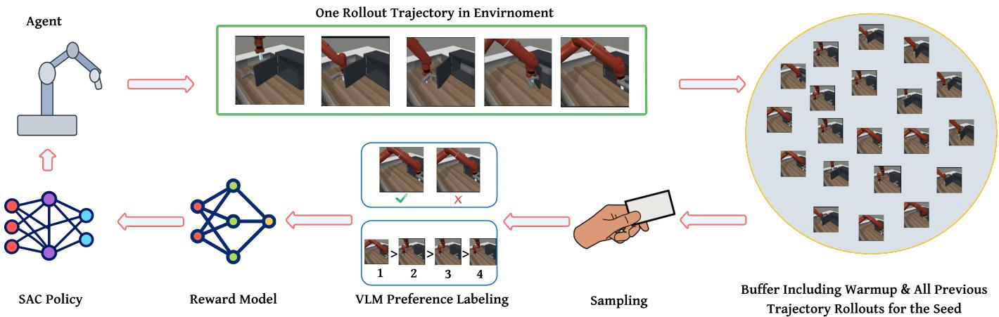  
Fig. 1. System overview for each iteration. Our framework for testing different reward models for VLM preference-based reward learning starts with a simulated robotic arm attempting a task. Scenes from these task attempts are saved into a large buffer, which are then sampled in pairs or groups (pairwise or listwise) for the VLM to generate preference labels. After preference labels are generated, the reward model is updated using either the Plackett-Luce or Bradley-Terry formulation. This reward model is then used to update a Soft Actor-Critic (SAC) policy which dictates how the robotic arm agent acts in the next iteration

$$
P _ { \psi } [ \sigma ^ { 1 } \succ \sigma ^ { 0 } ] = \frac { \exp \sum _ { t } \hat { r } _ { \psi } ( s _ { t } ^ { 1 } , a _ { t } ^ { 1 } ) } { \sum _ { i \in \{ 0 , 1 \} } \exp \sum _ { t } \hat { r } _ { \psi } ( s _ { t } ^ { i } , a _ { t } ^ { i } ) } ,\tag{1}
$$

and $\hat { r } _ { \psi }$ is trained by minimizing the negative log-likelihood of the labels in the preference dataset:

$$
\begin{array} { r l } & { \mathcal { L } _ { \mathrm { B T } } = - \mathbb { E } _ { ( \sigma ^ { 0 } , \sigma ^ { 1 } , y ) \sim \mathcal { D } _ { \mathrm { p r e f } } } \left[ \mathbb { I } \{ y = 1 \} \log P _ { \psi } [ \sigma ^ { 1 } \succ \sigma ^ { 0 } ] \right. } \\ & { \qquad \left. + \mathbb { I } \{ y = 0 \} \log P _ { \psi } [ \sigma ^ { 0 } \succ \sigma ^ { 1 } ] \right] . } \end{array}\tag{2}
$$

The reward function and policy are updated alternately. $\hat { r } _ { \psi }$ is fit to the growing preference dataset, and the policy is optimized against $\hat { r } _ { \psi }$ using a standard RL algorithm.

## B. Plackett-Luce ranking model

The Plackett-Luce (PL) model [9], [10] generalizes Bradley-Terry from pairs to rankings. Given K segments ranked $\sigma ^ { ( 1 ) } \succ$ $\cdots \dot { \succ } \sigma ^ { ( K ) }$ , the ranking is modeled as repeatedly choosing the best remaining segment, giving the likelihood

$$
P _ { \psi } \big [ \sigma ^ { ( 1 ) } \succ \cdots \succ \sigma ^ { ( K ) } \big ] = \prod _ { k = 1 } ^ { K } \frac { \exp \hat { r } _ { \psi } ( \sigma ^ { ( k ) } ) } { \sum _ { j = k } ^ { K } \exp \hat { r } _ { \psi } \big ( \sigma ^ { ( j ) } \big ) } ,\tag{3}
$$

where $\begin{array} { r } { \hat { r } _ { \psi } ( \sigma ) = \sum _ { t } \hat { r } _ { \psi } ( s _ { t } , a _ { t } ) } \end{array}$ , and training again minimizes the negative log-likelihood. For $K = 2$ , PL reduces exactly to BT. A K-wise ranking can also be rank-broken, decomposed into its $\binom { K } { 2 }$ implied pairwise comparisons and fit with the BT loss, which keeps the data but discards the joint structure of the ranking [10].

## IV. METHODS

## A. Data collection

Our experiments follow the standard preference-based RL loop. As an agent interacts with the environment, which in our case is simulated, a reward model is trained from preferences over its collected observations, and the policy is optimized against the rewards that this model assigns. We use SAC [27] as the policy-learning algorithm throughout. As an off-policy method, it trains on transitions drawn from a replay buffer rather than only on freshly collected experience. We adopt SAC because it is widely used for continuous-control robotic manipulation, making our results directly comparable to prior preference-based RL work in this setting [6], [11].

At each training iteration, we reset the environment and collect a single trajectory from the resulting initial configuration, with each trajectory containing at most 500 environment steps. We do not exploit the simulator’s ability to restore an identical state and generate multiple counterfactual trajectories from the same starting point. Each interaction round therefore contributes exactly one newly executed trajectory.

This choice is motivated by the longer-term goal of making preference-based reward learning more applicable to physical robot learning. In simulation, restoring the same state and collecting several alternative trajectories is relatively inexpensive. In a physical environment, however, reproducing an identical starting state can be difficult, and repeatedly executing exploratory trajectories can require substantial time and physical intervention. Such interactions may also be dangerous early in training when the policy is unreliable. We therefore investigate whether a reward model and policy can improve while collecting only one new trajectory during each interaction round.

Before VLM preference learning begins, we perform iterations where SAC produces rollouts with a state-entropy exploration objective rather than rewards [11]. The warm up provides an initial pool of behavior for the first preference query. Otherwise, the first query to the VLM would be restricted to observations from approximately one trajectory and would contain little behavioral coverage.

We recognize that this initialization is in tension with our real-world motivation because during warm up, the policy may execute undesirable exploratory behavior because feedback is not yet received for training. We retain the warm up in the present experiments because they are conducted in simulation, and it allows us to study the one-trajectory-per-iteration protocol without simultaneously introducing the additional coldstart problem of learning from a nearly empty buffer.

Algorithm 1 Unsupervised warm-up   
Require: environment E, policy $\pi _ { \phi } ,$ empty replay buffer ${ \overline { { B , } } }$   
warm-up iterations $N _ { \mathrm { w a r m } } ,$ horizon $T$   
1: for $i = 1$ to $N _ { \mathrm { w a r m } }$ do   
2: reset E and collect one trajectory   
$\tau = \{ ( s _ { t } , a _ { t } , s _ { t + 1 } , o _ { t } ) \} _ { t = 1 } ^ { T }$ with $\pi _ { \phi } ,$ where $o _ { t }$ is the   
rendered frame at step t   
3: $B  B \cup \tau$   
4: compute intrinsic state-entropy rewards $\boldsymbol { r } _ { t } ^ { \mathrm { e n t } }$ from   
k-nearest-neighbor distances between states in a   
minibatch sampled from B   
update $\pi _ { \phi }$ with SAC using $r ^ { \mathrm { e n t } }$ , with no reward   
model queried or trained   
6: end for   
7: return $B , \pi _ { \phi }$

Every transition and its associated rendered observation are stored in a replay buffer with a fixed capacity of frames. Fixing the capacity prevents memory, storage, and reward-processing costs from growing without bound while retaining a large pool of experience for SAC training. For preference acquisition, the buffer is treated as a mixed pool rather than being organized by trajectory identity or timestep. Observations are sampled uniformly, meaning that every stored observation has an equal chance of being selected, without using a predetermined strategy to identify especially informative examples. Therefore, observations appearing in the same query for evaluation by the VLM for the reward model may originate from the same trajectory or from different trajectories. Additionally, when the VLM compares observations from different trajectories for the reward model, those observations do not need to correspond to the same timestep or the same level of task progress, and observations drawn from a single trajectory can be separated by any length of time. The buffer grows by one trajectory per training iteration. The preference-learning methods begin with the experience accumulated during warm-up and progressively gain access to a broader distribution of policy behavior, and this steadily growing dataset is continually reused by SAC’s off-policy updates.

## B. Listwise comparison protocol

Our primary research question is whether an effective visual reward model can be trained from listwise VLM preferences using the Plackett-Luce objective. We evaluate $K \in \{ 3 , 4 , 5 \}$ , where each active preference-learning iteration issues M independently sampled listwise ranking queries. For every query, K distinct observations are uniformly sampled from the replay buffer, presented together to the VLM, and ranked according to their visual task progress. Each stored observation in the buffer has an equal chance of being selected, and no acquisition strategy is used to identify especially informative groups. The resulting complete rankings are then used to train the Plackett-Luce reward model.

Algorithm 2 KWISEFEEDBACK   
Require: buffer B, preference dataset D, queries per   
iteration M, ranking size $K \in \{ 3 , 4 , 5 \}$ , method m   
1: for each of the M queries do   
2: draw K distinct frames $\{ o ^ { 1 } , \ldots , o ^ { K } \}$ uniformly from   
B, independently across queries   
3: complete ranking: $\sigma \dot {  } \nabla \mathrm { L M } _ { \mathrm { r a n k } } \big ( o ^ { 1 } , \dots , o ^ { K } \big )$   
4: if σ is not a valid ranking of the K frames then   
5: discard the query   
6: else if $m = \mathrm { P L }$ then   
7: store the full ranking:   
$\mathcal { D }  \mathcal { D } \cup \{ ( \{ o ^ { 1 } , . . . , o ^ { K } \} , \bar { \sigma } ) \}$   
8: else if m = BT-Kwise then   
9: decompose σ into all $\binom { K } { 2 }$ implied pairwise   
relations   
10: $\mathcal { D }  \mathcal { D } \cup \{ ( o ^ { p } , o ^ { q } , y ^ { p q } ) : p < q \}$   
11: end if   
12: end for   
13: return D   
Cost: M VLM calls for both methods   
Objective: PL fits $\hat { r } _ { \psi }$ with the Plackett–Luce likelihood   
over full rankings, BT-Kwise fits $\hat { r } _ { \psi }$ with the   
Bradley–Terry loss over the decomposed pairs

We vary K because increasing the ranking size introduces a potential tradeoff. A longer ranking communicates relationships among more observations and contains more implied comparisons. At the same time, a request containing more observations may include visually similar states whose relative progress is difficult to distinguish, because the VLM must reason jointly over a larger visual context. We therefore do not presume that a larger K is necessarily better and instead evaluate which ranking sizes produce the strongest learned rewards and downstream policies.

For every value of $K ,$ we evaluate a corresponding BT-Kwise condition. PL and BT-Kwise use the same ranking size, number of VLM calls per iteration, uniform sampling procedure, and complete-ranking VLM requests. However, following the ranking, PL trains from its joint likelihood, whereas BT-Kwise decomposes it into all $\binom { \check { K } } { 2 }$ implied pairwise relations and trains using the BT objective. Rankings of three, four, and five observations therefore produce three, six, and ten implied pairwise relations, respectively.

Building on this, we also report preliminary findings where PL operates with M = 1, issuing a single K-wise ranking query per active iteration, evaluated against the same pairwise baselines at their full budgets. Under this protocol, PL uses one VLM request per iteration, BT-Pairwise uses four, and RL-VLM-F uses eight. This comparison examines whether one structured ranking can substitute for multiple pairwise queries.

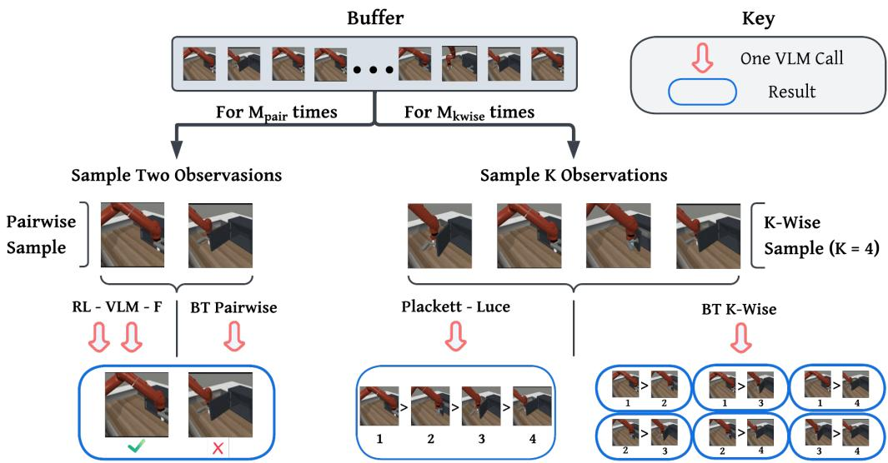  
Fig. 2. Visual description of each sampling method to obtain preference labels. From the buffer of images collected throughout iterations, either two observations or K observations are sampled at the same time. K refers to the number of observations that the VLM is simultaneously queried with for listwise methods. Pairwise samples are evaluated by the VLM using either the RL-VLM-F or BT-Pairwise method. The RL-VLM-F method uses two VLM queries, whereas BT-Pairwise does the same comparison with one VLM query. Listwise samples are evaluated by the VLM using either the Plackett-Luce or BT-Kwise method. Both of these methods require a single VLM query to obtain preference labels.

## C. Pairwise baselines

We additionally compare PL against two pairwise-feedback baselines. The first is RL-VLM-F [6], the original framework for pairwise preference labeling with VLMs. For each pair of candidates, it issues two VLM calls: one to produce a freeform analysis and another to assign the final preference label. The second baseline is a BT-Pairwise configuration, modeled after the standard pairwise-feedback protocol in preferencebased reinforcement learning. This method uses a single VLM query to evaluate one pair, directly choosing the better of the two options in a manner analogous to a human or automated teacher.

## D. Uniform query sampling

We use uniform replay-buffer sampling for all preferencelearning configurations: PL, BT-Kwise, BT-Pairwise, and RL-VLM-F. This ensures that no method receives an advantage from uncertainty, disagreement, or diversity-based acquisition, while allowing us to test whether listwise ranking feedback remains effective without a query-optimization stage. This protocol departs from common BT-based practice, in which reward learning often benefits from obtaining informative pairs rather than arbitrary ones [11], [28].

## V. EXPERIMENTS

## A. Environments and Tasks

To test our framework, we utilized the Meta-World simulation environment to benchmark each method’s ability to train a robotic action policy with VLM PbRL [20]. Within Meta-World, we are able to train a Sawyer robotic arm to perform various object manipulation tasks. In particular, there are 50 tasks available that span a range of object interaction and motor control objectives. Furthermore, Meta-World is a widely used benchmark in both traditional and preferencebased reinforcement learning for single- and multi-task policy training [6], [29].

Algorithm 3 PAIRWISEFEEDBACK   
Require: buffer B, preference dataset D, queries per   
iteration M, method m   
1: for each of the M queries do   
2: draw two distinct frames $( o ^ { 1 } , o ^ { 2 } )$ uniformly at   
random from B, independently across queries   
3: if m = BT-Pairwise then   
4: $y \gets \mathrm { V L M } _ { \mathrm { l a b e l } } ( o ^ { 1 } , o ^ { 2 } )$   
5: else if $m = \mathrm { R L - V L M - F }$ then   
6: free-form analysis: $a \gets \boldsymbol { \mathrm { V L M } } _ { \mathrm { a n a l y z e } } ( o ^ { 1 } , o ^ { 2 } )$   
7: preference label: $y \gets \boldsymbol { \nabla } \mathrm { L } \mathbf { M } _ { \mathrm { l a b e l } } ( o ^ { 1 } , o ^ { 2 } , a )$   
8: else   
9: y ← null   
10: end if   
11: if y indicates a preference for $o ^ { 1 }$ or $o ^ { 2 }$ then   
12: $\mathcal { D }  \mathcal { D } \cup \{ ( o ^ { 1 } , o ^ { 2 } , y ) \}$   
13: end if   
14: end for   
15: return D   
Cost: M VLM calls for BT-Pairwise, 2M for   
RL-VLM-F   
Objective: both methods fit $\hat { r } _ { \psi }$ with the Bradley–Terry   
loss over D

Because rewards do not originate from the simulated environment, but rather come from visual abstraction, we must select tasks where completion can be interpreted from the scene itself. Furthermore, task completion should ideally be easily interpreted by an external viewer, making tasks which have minute visual changes after completion undesirable. With this in mind, we selected the following three tasks:

Algorithm 4 Preference-Based Reward Learning Loop   
Require: $B , \pi _ { \phi }$ from Alg. 1, reward model $\hat { r } _ { \psi }$ , empty   
preference dataset D   
Require: feedback method m ∈ {RL-VLM-F, BT-Pairwise,   
BT-Kwise, PL}   
Require: queries per iteration M, group size K, iterations   
$N$   
1: for i = 1 to N do   
2: reset E and collect one trajectory τ with $\pi _ { \phi }$   
3: $B  B \cup \tau$   
4: if m ∈ {RL-VLM-F, BT-Pairwise} then   
5: D ← PAIRWISEFEEDBACK(B, D, M, m)   
6: else   
7: D ← KWISEFEEDBACK(B, D, M, K, m)   
8: end if   
9: update $\hat { r } _ { \psi }$ on all accumulated labels in D   
10: relabel rewards of transitions in B with $\hat { r } _ { \psi }$   
11: update $\pi _ { \phi }$ with SAC using $\hat { r } _ { \psi }$   
12: end for   
13: return $\pi _ { \phi } , \hat { r } _ { \psi }$

1) Drawer Open: The robot end-effector must insert into the handle and pull the drawer open

2) Door Close: The robot must push the initially open door shut

3) Button Press: The robot must move horizontally to press a button

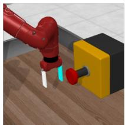  
Button Press

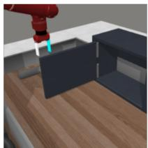  
Door Close

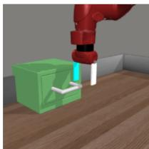  
Drawer Open  
Fig. 3. Initial position of Sawyer robot arm for each Meta-World task.

These tasks were selected to observe a range of diverse movements and completion markers. This prevents us from testing the same skills across different, but similar, environments. For each of the tasks we use a custom camera position that provides a more object-focused view which can be seen in 3. To keep the VLM focused on task completion and to avoid the robot obstructing the view, the robot model is transparent during training.

## B. Primary Setup

To evaluate each method with equal number of independently sampled feedback groups, we limit the number of feedback groups to M = 4 following the warm-up phase. For PL and BT-Kwise, each feedback group is provided K images and requires only one VLM request to return a full ranking. On the other hand, the pairwise methods are fundamentally limited to $K = 2$ images, with BT-Pairwise using one VLM request per image pair and RL-VLM-F using 2M = 8 VLM requests due to its two-stage analysis and labeling procedure. We also evaluate the effect of ranking size, K, by evaluating both PL and BT-Kwise with $K \in \{ 3 , 4 , 5 \}$ . Thus, every task and method configuration is evaluated using five independent seeds numbered 0-4.

Each run consists of 100,000 environment steps which is divided into 200 training iterations of 500 steps. The first 18 iterations are used for warm-up, using a PEBBLE-style entropy exploration reward [11]. During warm-up, no VLM queries or ground truth rewards are used and the SAC critics are reset following the warm-up. The next 182 iterations sample images uniformly from a persistent replay buffer with a capacity of 100,000 images.

We use GPT-5.6 Luna as our VLM, configured with original image detail, and reasoning effort set to none [21]. GPT-5.6 Luna was selected for its balance of high performance and cost-effectiveness. For each task, a goal-specific description is provided to the VLM which is consistent across all methods. These descriptions direct the VLM to give preferences to images which are more indicative of task progress, such as drawer displacement, door angle, and button depression. Prompt and hyperparameter details will be provided in the appendix.

## C. Ablation Setup

We also investigated how changing the number of feedback groups from M = 4 to M = 1 impacts the performance of the listwise methods, with all other hyperparameters kept consistent. With a smaller number of feedback groups, each run would be querying the VLM a quarter of the time, showcasing a more cost-effective alternative to the main setup. This experiment is only performed on the ’drawer open’ task with the number of sampled images fixed at K = 3.

## D. Evaluation Protocol

Policies are evaluated every 10,000 environment steps, including at the final 100,000 step checkpoint, using 20 deterministic Meta-World episodes. Task success is measured using Meta-World’s ground-truth success criterion, and the success rate is defined as the number of successful episodes out of 20.

Because all methods were evaluated using the same five matched random seeds, comparisons between PL and BT-Kwise at the same ranking size K were performed using twosided paired t-tests, with seed as the statistical unit. A Holm correction was applied following the comparisons.

## E. Implementation and Reproducibility

To run experiments, we used the following configuration:

TABLE I  
HARDWARE AND SOFTWARE VERSIONS
<table><tr><td rowspan=1 colspan=1>OS</td><td rowspan=1 colspan=1>Ubuntu 24.04.3 LTS</td></tr><tr><td rowspan=1 colspan=1>GPU</td><td rowspan=1 colspan=1>NVIDIA GeForce RTX 3090 (24 GB)</td></tr><tr><td rowspan=1 colspan=1>NVIDIA Driver</td><td rowspan=1 colspan=1>580.95.05</td></tr><tr><td rowspan=1 colspan=1>NVCC Version</td><td rowspan=1 colspan=1>V12.0.140</td></tr><tr><td rowspan=1 colspan=1>CPU</td><td rowspan=1 colspan=1>AMD Ryzen 9 7950X</td></tr><tr><td rowspan=1 colspan=1>Python</td><td rowspan=1 colspan=1>3.12.13</td></tr></table>

Alternative run configurations will be provided in the appendix. All code related to this project will be uploaded to a publicly accessible GitHub repository.

## VI. RESULTS

## A. Primary Method Comparison at $M = 4$

TABLE II  
PRIMARY SUCCESS RATES (%, MEAN ± SEM ACROSS FIVE SEEDS)
<table><tr><td>Method</td><td>Drawer Open</td><td>Door Close</td><td>Button Press</td></tr><tr><td>PL  $\overline { { ( K = 3 ) } }$ </td><td> $7 4 \pm 1 0 . 7$ </td><td> $\overline { { 4 0 \pm 1 6 . 4 } }$ </td><td> $\overline { { 2 2 \pm 5 . 6 } }$ </td></tr><tr><td>PL (K = 4)</td><td> $8 6 \pm 3 . 7$ </td><td> $4 8 \pm 1 9 . 3$ </td><td> $4 1 \pm 1 8 . 4$ </td></tr><tr><td>PL (K = 5)</td><td> $8 1 \pm 1 0 . 2 $ </td><td> ${ \bf 5 4 } \pm { \bf 1 3 . 2 }$ </td><td> $2 6 \pm 6 . 2$ </td></tr><tr><td>BT-Kwise  $\overline { { ( K = 3 ) } }$ </td><td> $8 3 \pm 3 . 4$ </td><td> $4 4 \pm 1 8 . 7$ </td><td> $\overline { { 3 6 \pm 1 3 . 2 } }$ </td></tr><tr><td>BT-Kwise  $( K = 4 )$ </td><td> $8 4 \pm 9 . 1$ </td><td> $5 2 \pm 1 6 . 0$ </td><td> ${ \bf 4 5 \pm 8 . 2 }$ </td></tr><tr><td>BT-Kwise  $( K = 5 )$ </td><td> $8 9 \pm 7 . 1$ </td><td> $4 7 \pm 2 2 . 0$ </td><td> $7 \pm 4 . 4$ </td></tr><tr><td>BT-Pairwise</td><td> $\overline { { 8 9 \pm 5 . 1 } }$ </td><td> $\overline { { 3 9 \pm 2 0 . 5 } }$ </td><td> $\overline { { 3 8 \pm 1 5 . 9 } }$ </td></tr><tr><td>RL-VLM-F</td><td> ${ \bf 9 2 \pm 4 . 9 }$ </td><td> $3 9 \pm 1 6 . 2$ </td><td> $2 8 \pm 1 2 . 3$ </td></tr><tr><td>Oracle</td><td> $8 6 \pm 1 0 . 4$ </td><td> $\overline { { 1 0 0 \pm 0 . 0 } }$ </td><td> $\overline { { 8 8 \pm 8 . 0 } }$ </td></tr></table>

A full success rate table for each seed and method is provided in the Appendix.

1) Drawer Open: For the Drawer Open environment under uniform sampling with $M = 4 ,$ , the Plackett-Luce estimator performed best with $K = 4 ,$ achieving an average success rate of 86%, compared with 74% for $K = 3$ and 81% for $K = 5$ . The K = 4 configuration was also the most consistent across seeds, with success rates of 85%, 85%, 80%, 80%, and 100%. At the same ranking size of $K = 4 ,$ , PL slightly outperformed the BT-Kwise estimator, which achieved 84% success. However, RL-VLM-F achieved a higher mean success rate of 92% under its corresponding $M = 4$ setting, whereas the standard single-stage BT-Pairwise baseline achieved 89%.

2) Door Close: Among the PL configurations evaluated with uniform sampling and M = 4, K = 5 achieved the highest mean success rate, reaching 54%, compared with 48% for $K \ = \ 4$ and 40% for $K \ = \ 3$ . PL with $K \ = \ 5$ also outperformed RL-VLM-F under the corresponding M = 4 feedback budget, achieving 54% versus 39% mean success. For reference, the standard single-stage BT-Pairwise baseline also achieved 39% success. At the same ranking size of $K = 5 ,$ , PL exceeded BT-Kwise by 7 percentage points (54% versus 47%). Overall, the results indicate that jointly ranking five candidates provided the strongest average performance and stability for PL in the door-close environment, while also substantially outperforming the RL-VLM-F baseline under the tested $M = 4$ setting.

3) Button Press: Across the five Button Press seeds with $M = 4$ and uniform sampling, PL performed best at $K = 4$ with a final mean success rate of 41%. PL averaged 22% at $K = 3$ and 26% at $K = 5$ . BT-Kwise performed best at $K = 4$ with 45%, followed by 36% at $K = 3 ,$ but fell to 7% at $K = 5$ . Therefore, PL substantially outperformed BT-Kwise at $K = 5 .$ , achieving 26% compared with 7%. PL at $K = 4$ also exceeded the five-seed averages of RL-VLM-F at 28% and BT-Pairwise at 38%.

4) Statistical Significance of Results: To isolate the effect of the reward-learning objective, we compared PL and BT-Kwise at each matched ranking size using two-sided paired t-tests across the five corresponding seeds. No statistically significant difference was observed at any ranking size for Drawer Open (K = 3, p = 0.436; K = 4, p = 0.883; K = 5, p = 0.607) or Door Close (K = 3, p = 0.836; K = 4, p = 0.839; $K = 5 , p = 0 . 8 3 0 )$ . For Button Press, no significant difference was observed at $K = 3 ( p = 0 . 3 0 7 )$ or K = 4 (p = 0.845). However, PL at $K = 5$ , achieved a higher mean final success rate than BT-Kwise, reaching 26% compared with 7%, and this paired difference was nominally significant $( t ( 4 ) =$ 2.881, $p \ = \ 0 . 0 4 5 )$ prior to a Holm correction $( p \ : = \ : 0 . 4 0 5$ with correction). Thus, within the present five-seed evaluation, preserving the complete PL ranking likelihood did not yield a detectable final-success advantage for Drawer Open or Door Close, but it produced a nominally significant advantage over rank-breaking for Button Press at $K = 5$ under the uncorrected test.

## B. Effects of Feedback Budget

TABLE III  
ABLATION FINAL SUCCESS RATES PER RUN
<table><tr><td rowspan=1 colspan=1>Seed</td><td rowspan=1 colspan=1>PL Success-Rate</td><td rowspan=1 colspan=1>BT-Kwise Success-Rate</td></tr><tr><td rowspan=1 colspan=1>0</td><td rowspan=1 colspan=1>0%</td><td rowspan=1 colspan=1>0%</td></tr><tr><td rowspan=1 colspan=1>1</td><td rowspan=1 colspan=1>65%</td><td rowspan=1 colspan=1>95%</td></tr><tr><td rowspan=1 colspan=1>2</td><td rowspan=1 colspan=1>15%</td><td rowspan=1 colspan=1>100%</td></tr><tr><td rowspan=1 colspan=1>3</td><td rowspan=1 colspan=1>85%</td><td rowspan=1 colspan=1>0%</td></tr><tr><td rowspan=1 colspan=1>4</td><td rowspan=1 colspan=1>80%</td><td rowspan=1 colspan=1>80%</td></tr><tr><td rowspan=1 colspan=1>Mean</td><td rowspan=1 colspan=1>49%</td><td rowspan=1 colspan=1>55%</td></tr></table>

Having established that Plackett-Luce can learn an effective reward when four groups are sampled from the replay buffer per iteration $( M = 4 )$ , we next asked whether it could still learn a useful reward from only a single sampled group $( M = 1 )$ . On Drawer Open, reducing the feedback budget to $M \ = \ 1$ resulted in final success rates of $0 . 4 9 \pm 0 . 1 7$ for PL and $0 . 5 5 \pm 0 . 2 3$ for BT-Kwise $( \mathrm { m e a n } \pm \mathrm { S E M }$ across five seeds). Performance was highly seed-dependent as both methods failed completely on at least one seed while attaining high or near-perfect success on others.

To contextualize these results, PL with $M = 1$ achieved a lower mean success rate than the M = 4 BT-Pairwise and RL-VLM-F baselines (49% versus 89% and 92%, respectively).

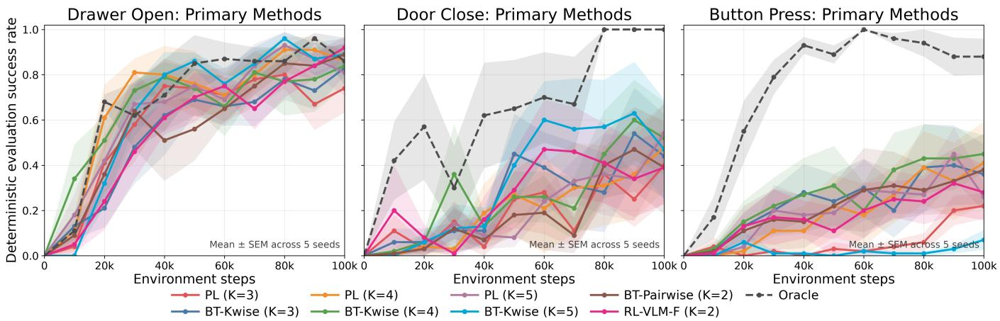  
Fig. 4. Deterministic evaluation success rates for all primary methods and oracle baseline. For the Drawer Open task, RL-VLM-F was able to score the highest final success rate at 92%, with BT-Pairwise and BT-Kwise $( K = 5 )$ tied for 2nd best at 89%. Both of these methods outperformed the oracle baseline, which tied with PL $( K = 4 )$ at 86%. For the Door Close task, PL $( K = 5 )$ was the best performing method, followed by BT-Kwise $( K = 4 )$ at 52%. However, the oracle method for door close outperformed all methods with 100% success rate. In the Button Press task, BT-Kwise $K = 4$ performed the best with a mean 45% success rate, followed by PL $K = 4$ with a mean of 41%. Once again, the oracle baseline outperformed all methods in this environment.

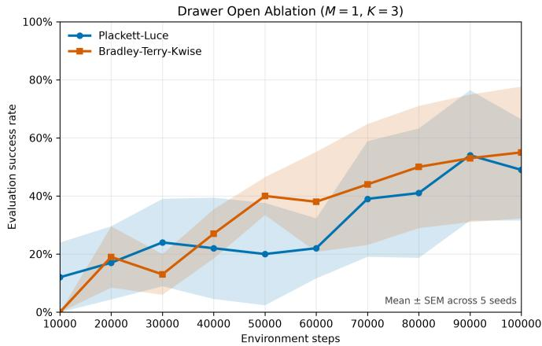  
Fig. 5. Ablation aggregate success rate across five seeds ± standard error of the mean (SEM). Overall, Bradley-Terry had a higher average success rate after 100,000 environment steps, with a final success rate of 55% compared to 49% with Plackett-Luce.

However, paired comparisons across five matched seeds did not meet the conventional threshold for statistical significance (BT-Pairwise versus PL: paired t-test, $p = 0 . 0 9 3$ ; RL-VLM-F versus PL: $p = 0 . 1 1 6 )$ . Therefore, although the observed mean differences were large, the present experiment did not statistically establish a performance advantage for either $M =$ 4 method.

Moreover, PL with $M = 1$ remained competitive with the highest-performing baseline on individual seeds. It outperformed RL-VLM-F on seed 3 (85% versus 80%) and matched it on seed 4 (80%), thereby matching or exceeding RL-VLM-F on two of the five seeds. Notably, to achieve this, PL with $M = 1$ required only 182 VLM calls, compared with 728 for BT-Pairwise and 1,456 for RL-VLM-F. VLM query details are listed in the appendix.

## VII. DISCUSSION

## A. Key Findings and Implications

1) Primary: The results are also encouraging because PL produced successful policies under the relatively conservative $M \ = \ 4$ feedback budget and 100,000 environment steps as compared to other VLM PbRL experiments [6]. This demonstrates that useful listwise reward learning is possible without requiring a large number of groups to compare at every iteration. The ability to vary K gives practitioners direct control over the amount of information presented to the VLM to be jointly compared, thereby having control over the complexity of each ranking decision as well. For researchers and practitioners working on VLMs, this Plackett-Luce framework may offer a method to evaluate whether their model can, like humans, discern fine-grained differences among multiple candidate outputs based on the implications for the downstream policy outcome.

The matched comparison with BT-Kwise provides evidence that retaining the full listwise likelihood can be beneficial. The clearest result occurred for Button Press at $K = 5$ , where PL achieved a mean final success rate of 26% compared with 7% for BT-Kwise. This was the only matched comparison to produce a nominally significant difference across the five seeds under the uncorrected test, with $t ( 4 ) = 2 . 8 8 1$ and $p = 0 . 0 4 5$ Although this result should be interpreted cautiously because of the small sample size and multiple comparisons, it suggests that preserving the complete ranking structure can outperform rank-breaking when the ranking contains more candidates.

PL also compared competitively with the pairwise baselines across all environments. For Door Close, PL with $K = 5$ achieved 54% mean final success, compared with 39% for both RL-VLM-F and single-stage BT-Pairwise. For Button Press, PL with K = 4 achieved 41%, compared with 28% for RL-VLM-F and 38% for BT-Pairwise. RL-VLM-F primarily distinguishes itself from the single-stage pairwise baseline through its two-stage prompting procedure and additional VLM refinement calls while retaining uniform sampling [6]. The fact that PL can already match or exceed these pairwise methods without that additional prompting machinery suggests a natural direction for future work. A stronger system could combine PL’s listwise objective with the multi-stage prompting and refinement strategy used by RL-VLM-F. This would preserve the efficiency and flexibility of listwise feedback while potentially improving the quality of the VLM-generated supervision.

2) Feedback Group Ablation: Our ablation results suggest that selecting multiple informative listwise groups may not always be necessary for effective reward learning. Prior active preference-learning methods search a large candidate buffer for informative comparisons using criteria such as rewardensemble disagreement or preference entropy [11]. Active subset selection has also been studied for Plackett-Luce models [23], [30]. In contrast, PL with M = 1 obtains only a single uniformly sampled ranking of K = 3 observations. Despite this restricted feedback budget, it matched or exceeded RL-VLM-F on two of five seeds, outperforming it on one seed and matching it on another, while using one-eighth as many VLM calls. This suggests that the breadth of a single Kwise comparison can sometimes provide sufficient supervision without extensive query curation.

This result also motivates studying whether the warmup period used to populate a large candidate buffer can be reduced. Since the ablation experiment does not search for multiple informative candidate groups, its results indicate maintaining a large buffer solely for query selection may be less critical. A shorter warm-up could reduce the amount of unguided exploratory behavior required before reward-guided policy training begins, which may make preference-based reward learning more practical and safer for real-world robotic systems. These findings motivate treating active acquisition as a potential enhancement rather than a strict prerequisite. Nevertheless, the lower mean performance and greater seed sensitivity observed under M = 1 prevent it from serving as a robust replacement for higher-feedback configurations.

## B. Limitations

First, identifying successful environments required multiple trials and various camera settings as the VLMs tested were sensitive to changes in the visual field and struggled with more complex scenarios, particularly grasping scenarios. This resulted in a relatively small number of evaluated tasks. Second, preliminary experiments indicated that Qwen3-VL-8B-Instruct [31] did not yield any successful policies under our evaluation protocol, resulting in 0% success in the tested Meta-World Reach task. As a result, reproducing our configuration requires inference costs associated with proprietary hosted VLMs. Lastly, we only simulated environments containing rigid-body tasks.

## C. Future Work

Future work can expand the diversity of tasks evaluated by exploring alternative benchmarks, soft-body simulations, and potentially dual-armed tasks. This could also include longer training runs beyond 100,000 environment steps and increase the number of feedback groups M. Furthermore, future work could explore larger listwise comparisons and examine the trade-off between sample efficiency and computational cost. Another interesting analysis would be to take the presented sampling methods to test on various reinforcement learning algorithms beyond SAC. Moreover, one could also explore how active selection of desirable pairs or sets of images to provide preference labels changes our presented results. To our knowledge, VLM-generated listwise PL reward learning has not yet been evaluated on a real-world robotic system. For this, it might be worth testing a reduced warm-up buffer and how that balances with active selection.

## VIII. CONCLUSIONS

In this paper, to our knowledge, we present the first listwise VLM preference-based reinforcement learning framework using the Plackett-Luce reward model. Across three simulated robotic environments, PL successfully learned rewards from VLM generated K-wise rankings, achieving performance competitive with both BT-Kwise and the pairwise baselines of BT-Pairwise and RL-VLM-F. Results indicate that neither ranking size nor reward-model formulation provides a universal advantage, although preserving the full PL likelihood produced a nominally significant improvement over BT-Kwise for Button Press at K = 5. Overall these findings establish listwise VLM supervision as a viable alternative to conventional pairwise preference feedback while providing flexibility over the amount and structure of supervision through both K and M. Future work should explore adaptive ranking sizes, improved query selection, and evaluation on real-world robotic tasks.

## AI DISCLOSURE

We used GPT-5.6, Claude Opus 5, and Claude Fable 5 to assist with code development and implementation. The tool materially affected algorithms in methods, experimental setup, and plot design in results. Reported data in results have been cross-checked and verified as correct.

## ACKNOWLEDGMENTS

This material is based upon work supported by the National Science Foundation under Grant No. 2521982 and the NSF CISE REU Student Funding Program. We would also like to acknowledge Md Masudur Rahman for his assistance in reviewing this work.

## REFERENCES

[1] P. F. Christiano, J. Leike, T. B. Brown, M. Martic, S. Legg, and D. Amodei, “Deep reinforcement learning from human preferences,” in Advances in Neural Information Processing Systems, vol. 30, 2017.

[2] D. Amodei, C. Olah, J. Steinhardt, P. Christiano, J. Schulman, and D. Mane, “Concrete problems in ai safety,” 2016. [Online]. Available:´ https://arxiv.org/abs/1606.06565

[3] A. Pan, K. Bhatia, and J. Steinhardt, “The effects of reward misspecification: Mapping and mitigating misaligned models,” in International Conference on Learning Representations, 2022. [Online]. Available: https://arxiv.org/abs/2201.03544

[4] R. A. Bradley and M. E. Terry, “Rank analysis of incomplete block designs: I. the method of paired comparisons,” Biometrika, vol. 39, no. 3/4, pp. 324–345, 1952.

[5] I. Hamilton, N. Tawn, and D. Firth, “The many routes to the ubiquitous bradley-terry model,” 2025. [Online]. Available: https://arxiv.org/abs/2312.13619

[6] Y. Wang, Z. Sun, J. Zhang, Z. Xian, E. Biyik, D. Held, and Z. Erickson, “RL-VLM-f: Reinforcement learning from vision language foundation model feedback,” in Proceedings of the 41st International Conference on Machine Learning, ser. Proceedings of Machine Learning Research, R. Salakhutdinov, Z. Kolter, K. Heller, A. Weller, N. Oliver, J. Scarlett, and F. Berkenkamp, Eds., vol. 235. PMLR, 21–27 Jul 2024, pp. 51 484–51 501. [Online]. Available: https://proceedings.mlr.press/v235/wang24bn.html

[7] C.-H. Hsu, J.-E. Ding, H.-L. Hsu, C.-H. Hsu, S. Yang, L.-H. Yao, C.- C. Liao, F. Liu, and F.-M. Hung, “Rgpo: Ranking-guided preference optimization for reliable clinical reasoning,” IEEE Transactions on Artificial Intelligence, pp. 1–15, 2026.

[8] M. Cattelan, C. Varin, and D. Firth, “Dynamic bradley–terry modelling of sports tournaments,” Journal of the Royal Statistical Society: Series C (Applied Statistics), vol. 62, no. 1, pp. 135–150, 2013. [Online]. Available: https://rss.onlinelibrary.wiley.com/doi/abs/10.1111/j.1467- 9876.2012.01046.x

[9] R. L. Plackett, “The analysis of permutations,” Journal of the Royal Statistical Society: Series C (Applied Statistics), vol. 24, no. 2, pp. 193– 202, 1975.

[10] B. Zhu, M. Jordan, and J. Jiao, “Principled reinforcement learning with human feedback from pairwise or k-wise comparisons,” in International Conference on Machine Learning. PMLR, 2023, pp. 43 037–43 067.

[11] K. Lee, L. M. Smith, and P. Abbeel, “Pebble: Feedback-efficient interactive reinforcement learning via relabeling experience and unsupervised pre-training,” in Proceedings of the 38th International Conference on Machine Learning, ser. Proceedings of Machine Learning Research, M. Meila and T. Zhang, Eds., vol. 139. PMLR, 18–24 Jul 2021, pp. 6152–6163. [Online]. Available: https://proceedings.mlr.press/v139/lee21i.html

[12] Z. Huang, Z. Sheng, Y. Qu, J. You, and S. Chen, “Vlmrl: A unified vision language models and reinforcement learning framework for safe autonomous driving,” 2024. [Online]. Available: https://arxiv.org/abs/2412.15544

[13] P. Mahmoudieh, D. Pathak, and T. Darrell, “Zero-shot reward specification via grounded natural language,” in Proceedings of the 39th International Conference on Machine Learning, ser. PMLR, vol. 162, 2022, pp. 14 743–14 752.

[14] Y. J. Ma, V. Kumar, A. Zhang, O. Bastani, and D. Jayaraman, “Liv: Language-image representations and rewards for robotic control,” in International Conference on Machine Learning. PMLR, 2023, pp. 23 301–23 320.

[15] K. Baumli, S. Baveja, F. Behbahani, H. Chan, G. Comanici, S. Flennerhag, M. Gazeau, K. Holsheimer, D. Horgan, M. Laskin, C. Lyle, H. Masoom, K. McKinney, V. Mnih, A. Neitz, D. Nikulin, F. Pardo, J. Parker-Holder, J. Quan, T. Rocktaschel, H. Sahni, T. Schaul,¨ Y. Schroecker, S. Spencer, R. Steigerwald, L. Wang, and L. Zhang, “Vision-language models as a source of rewards,” 2024. [Online]. Available: https://arxiv.org/abs/2312.09187

[16] J. Rocamonde, V. Montesinos, E. Nava, E. Perez, and D. Lindner, “Vision-language models are zero-shot reward models for reinforcement learning,” in International Conference on Learning Representations, 2024.

[17] S. A. Sontakke, J. Zhang, S. M. R. Arnold, K. Pertsch, E. Bıyık, D. Sadigh, C. Finn, and L. Itti, “Roboclip: One demonstration is enough to learn robot policies,” in Advances in Neural Information Processing Systems, vol. 36, 2023. [Online]. Available: https://arxiv.org/abs/2310.07899

[18] J. Lee, S. won Yi, and M. hwan Oh, “Preference-based reinforcement learning beyond pairwise comparisons: Benefits of multiple options,” 2025. [Online]. Available: https://arxiv.org/abs/2510.18713

[19] A. Singh, A. Bhaskar, P. Yu, S. Chakraborty, R. Dasyam, A. Bedi, and P. Tokekar, “Varp: Reinforcement learning from vision-language

model feedback with agent regularized preferences,” 2025. [Online]. Available: https://arxiv.org/abs/2503.13817

[20] T. Yu, D. Quillen, Z. He, R. Julian, K. Hausman, C. Finn, and S. Levine, “Meta-world: A benchmark and evaluation for multi-task and meta reinforcement learning,” in Conference on robot learning. PMLR, 2020, pp. 1094–1100.

[21] OpenAI, “GPT-5.6 Luna,” 2026. [Online]. Available: https://developers.openai.com/api/docs/models/gpt-5.6-luna

[22] S. Mukherjee, A. Lalitha, K. Kalantari, A. Deshmukh, G. Liu, Y. Ma, and B. Kveton, “Optimal design for human preference elicitation,” Advances in Neural Information Processing Systems, vol. 37, pp. 90 132–90 159, 2024.

[23] K. K. Thekumparampil, G. Hiranandani, K. Kalantari, S. Sabach, and B. Kveton, “Comparing few to rank many: Active human preference learning using randomized frank-wolfe method.” in ICML, 2025.

[24] G. Seneviratne, J. An, S. Ellahy, K. Weerakoon, M. B. Elnoor, J. D. Kannan, A. T. Sunil, and D. Manocha, “Halo: Human preference aligned offline reward learning for robot navigation,” 2025. [Online]. Available: https://arxiv.org/abs/2508.01539

[25] Z. Xu and M. Kankanhalli, “Strong preferences affect the robustness of preference models and value alignment,” in The Thirteenth International Conference on Learning Representations, 2025. [Online]. Available: https://openreview.net/forum?id=Upoxh7wvmJ

[26] R. S. Sutton and A. G. Barto, Reinforcement learning: An introduction. MIT press Cambridge, 1998, vol. 1, no. 1.

[27] T. Haarnoja, A. Zhou, P. Abbeel, and S. Levine, “Soft actor-critic: Offpolicy maximum entropy deep reinforcement learning with a stochastic actor,” in International conference on machine learning. Pmlr, 2018, pp. 1861–1870.

[28] K. Metcalf, M. Sarabia, N. Mackraz, and B.-J. Theobald, “Sampleefficient preference-based reinforcement learning with dynamics aware rewards,” in Proceedings of The 7th Conference on Robot Learning, ser. Proceedings of Machine Learning Research, J. Tan, M. Toussaint, and K. Darvish, Eds., vol. 229. PMLR, 06–09 Nov 2023, pp. 1484–1532. [Online]. Available: https://proceedings.mlr.press/v229/metcalf23a.html

[29] R. McLean, E. Chatzaroulas, L. McCutcheon, F. Roder, T. Yu, Z. He,¨ K. Zentner, R. Julian, J. Terry, I. Woungang et al., “Meta-world+: An improved, standardized, rl benchmark,” Advances in Neural Information Processing Systems, vol. 38, 2025.

[30] A. Saha and A. Gopalan, “Active ranking with subset-wise preferences,” in Proceedings of the Twenty-Second International Conference on Artificial Intelligence and Statistics, ser. Proceedings of Machine Learning Research, K. Chaudhuri and M. Sugiyama, Eds., vol. 89. PMLR, 16–18 Apr 2019, pp. 3312–3321. [Online]. Available: https://proceedings.mlr.press/v89/saha19a.html

[31] S. Bai, Y. Cai, R. Chen, K. Chen, X. Chen, Z. Cheng, L. Deng, W. Ding, C. Gao, C. Ge et al., “Qwen3-vl technical report,” arXiv preprint arXiv:2511.21631, 2025.

[32] G. Brockman, V. Cheung, L. Pettersson, J. Schneider, J. Schulman, J. Tang, and W. Zaremba, “Openai gym,” arXiv preprint arXiv:1606.01540, 2016.

[33] Anthropic, “Claude sonnet 5,” 2026, large language model released June 30, 2026. [Online]. Available: https://www.anthropic.com/news/claudesonnet-5

VLM API Calls per 100k-Step Run  
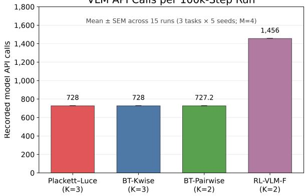  
Fig. 6. Number of OpenAI API queries per run method

VLM Input Tokens per 100k-Step Run  
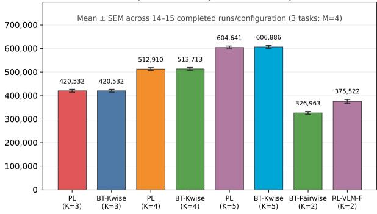  
Fig. 7. Number of input tokens used per run method

Estimated GPT-5.6 Luna Cost per 100k-Step Run  
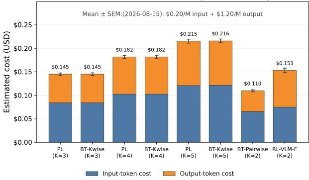  
Fig. 8. Estimated cost of each run method with M = 4. Estimations come directly from OpenAI’s GPT-5.6 Luna pricing [21].

## A. Primary Results: Per Seed Success Rate

TABLE IV  
DRAWER OPEN FINAL SUCCESS RATES BY SEED (%).
<table><tr><td>Method</td><td>Seed 0</td><td>Seed 1</td><td>Seed 2</td><td>Seed 3</td><td>Seed 4</td><td>Mean ± SEM</td></tr><tr><td>PL (K = 3)</td><td>100</td><td>75</td><td>80</td><td>35</td><td>80</td><td>74.0 ± 10.7</td></tr><tr><td>PL (K = 4)</td><td>85</td><td>85</td><td>80</td><td>80</td><td>100</td><td>86.0 ± 3.7</td></tr><tr><td>PL (K = 5)</td><td>85</td><td>75</td><td>45</td><td>100</td><td>100</td><td>81.0 ± 10.2</td></tr><tr><td>BT-Kwise (K = 3)</td><td>75</td><td>90</td><td>85</td><td>75</td><td>90</td><td>83.0 ± 3.4</td></tr><tr><td>BT-Kwise (K = 4)</td><td>85</td><td>85</td><td>100</td><td>100</td><td>50</td><td>84.0 ± 9.1</td></tr><tr><td>BT-Kwise (K = 5)</td><td>65</td><td>100</td><td>100</td><td>80</td><td>100</td><td>89.0 ± 7.1</td></tr><tr><td>BT-Pairwise</td><td>100</td><td>90</td><td>75</td><td>80</td><td>100</td><td>89.0 ± 5.1</td></tr><tr><td>RL-VLM-F</td><td>100</td><td>100</td><td>100</td><td>80</td><td>80</td><td>92.0 ± 4.9</td></tr><tr><td>Oracle</td><td>100</td><td>90</td><td>95</td><td>100</td><td>45</td><td>86.0 ± 10.4</td></tr></table>

TABLE V  
DOOR CLOSE FINAL SUCCESS RATES BY SEED (%).
<table><tr><td>Method</td><td>Seed 0</td><td>Seed 1</td><td>Seed 2</td><td>Seed 3</td><td>Seed 4</td><td>Mean ± SEM</td></tr><tr><td>PL (K = 3)</td><td>90</td><td>5</td><td>40</td><td>60</td><td>5</td><td>40.0 ± 16.4</td></tr><tr><td>PL (K = 4)</td><td>50</td><td>10</td><td>100</td><td>80</td><td>0</td><td>48.0 ± 19.3</td></tr><tr><td>PL (K = 5)</td><td>60</td><td>35</td><td>15</td><td>70</td><td>90</td><td>54.0 ± 13.2</td></tr><tr><td>BT-Kwise (K = 3)</td><td>60</td><td>55</td><td>0</td><td>100</td><td>5</td><td>44.0 ± 18.7</td></tr><tr><td>BT-Kwise (K = 4)</td><td>45</td><td>75</td><td>100</td><td>30</td><td>10</td><td>52.0 ± 16.0</td></tr><tr><td>BT-Kwise (K = 5)</td><td>10</td><td>25</td><td>100</td><td>100</td><td>0</td><td>47.0 ± 22.0</td></tr><tr><td>BT-Pairwise</td><td>0</td><td>0</td><td>75</td><td>20</td><td>100</td><td>39.0 ± 20.5</td></tr><tr><td>RL-VLM-F</td><td>45</td><td>40</td><td>0</td><td>15</td><td>95</td><td>39.0 ± 16.2</td></tr><tr><td>Oracle</td><td>100</td><td>100</td><td>100</td><td>100</td><td>100</td><td>100.0 ± 0.0</td></tr></table>

TABLE VI  
BUTTON PRESS FINAL SUCCESS RATES BY SEED (%).
<table><tr><td>Method</td><td>Seed 0</td><td>Seed 1</td><td>Seed 2</td><td>Seed 3</td><td>Seed 4</td><td>Mean ± SEM</td></tr><tr><td>PL (K = 3)</td><td>30</td><td>25</td><td>25</td><td>30</td><td>0</td><td>22.0 ± 5.6</td></tr><tr><td>PL (K = 4)</td><td>35</td><td>95</td><td>0</td><td>5</td><td>70</td><td>41.0 ± 18.4</td></tr><tr><td>PL (K = 5)</td><td>15</td><td>45</td><td>30</td><td>10</td><td>30</td><td>26.0 ± 6.2</td></tr><tr><td>BT-Kwise (K = 3)</td><td>40</td><td>85</td><td>20</td><td>25</td><td>10</td><td>36.0 ± 13.2</td></tr><tr><td>BT-Kwise (K = 4)</td><td>60</td><td>45</td><td>60</td><td>15</td><td>45</td><td>45.0 ± 8.2</td></tr><tr><td>BT-Kwise (K = 5)</td><td>0</td><td>0</td><td>20</td><td>0</td><td>15</td><td>7.0 ± 4.4</td></tr><tr><td>BT-Pairwise</td><td>0</td><td>70</td><td>50</td><td>0</td><td>70</td><td>38.0 ± 15.9</td></tr><tr><td>RL-VLM-F</td><td>60</td><td>55</td><td>15</td><td>0</td><td>10</td><td> $2 8 . 0 \pm 1 2 . 3$ </td></tr><tr><td>Oracle</td><td>60</td><td>100</td><td>100</td><td>100</td><td>80</td><td> ${ \bf 8 8 . 0 \pm 8 . 0 }$ </td></tr></table>

## B. Effect of State-Diverse Sampling

Our primary experiments use uniform sampling from the replay buffer. This is a deliberately conservative setting intended to test whether Plackett-Luce reward learning can succeed without active or diversity-aware query selection. Therefore, we aimed to obtain some initial insights into what may occur when using a form of active selection, state-diverse sampling, which builds ranked groups from observations that capture different stages of task progression.

TABLE VII  
EFFECT OF STATE-DIVERSE SAMPLING ON DRAWER OPEN
<table><tr><td>Seed</td><td>Uniform</td><td>State-Diverse</td></tr><tr><td>0</td><td>0%</td><td>80%</td></tr><tr><td>1</td><td>65%</td><td>100%</td></tr><tr><td>2</td><td>15%</td><td>100%</td></tr><tr><td>Mean ± SEM</td><td>27% ± 20%</td><td>93% ± 7%</td></tr></table>

On Drawer Open, the potential benefit is stark under the restricted M = 1, K = 3 feedback budget. Across three matched seeds, uniform sampling achieves 27%±20% success, whereas state-diverse sampling achieves $9 3 \% \pm 7 \%$ . This suggests that selecting a behaviorally diverse ranking group can make a single VLM query substantially more informative.

## C. Effect of Increasing the Number of Feedback Groups

Increasing M provides the reward model with additional independent rankings at each feedback iteration. Door Close provides the clearest example of the benefit of increasing this feedback budget. Holding K = 3 and state-diverse sampling fixed, increasing M from one to five raises the mean success rate from 25% to 62% across the three matched seeds available in both settings. The number of rankings collected during training correspondingly increases from 182 to 910, providing substantially broader coverage of task progress and reducing the influence of any individual noisy VLM judgment.

TABLE VIII  
EFFECT OF INCREASING FEEDBACK GROUPS ON DOOR CLOSE
<table><tr><td rowspan=1 colspan=1>Setting</td><td rowspan=1 colspan=1>M = 1</td><td rowspan=1 colspan=1>M = 5</td></tr><tr><td rowspan=1 colspan=1>Ranking size, KSampling strategyTotal rankings</td><td rowspan=1 colspan=1>3State-diverse182</td><td rowspan=1 colspan=1>3State-diverse910</td></tr><tr><td rowspan=1 colspan=1>Seed 0 successSeed 1 successSeed 2 success</td><td rowspan=1 colspan=1>65%0%10%</td><td rowspan=1 colspan=1>75%100%10%</td></tr><tr><td rowspan=1 colspan=1>Mean ± SEM</td><td rowspan=1 colspan=1>25% ± 20%</td><td rowspan=1 colspan=1> $6 2 \% \pm 2 7 \%$ </td></tr><tr><td rowspan=1 colspan=1>Mean improvement</td><td rowspan=1 colspan=2>+37 percentage points</td></tr></table>

This result suggests that increasing M can improve performance, but at the cost of requiring more feedback queries. Our primary $M = 4$ experiments are therefore conservative relative to methods that use much larger preference budgets. For example, the original RL-VLM-F formulation samples 20 pairs per iteration [6], illustrating that strong pairwise rewardlearning methods may rely on considerably more preference supervision. PL can similarly benefit from increasing M, while retaining the ability to order K observations jointly within each ranking query.

## APPENDIX C

## ALTERNATIVE RUN CONFIGURATION

TABLE IX  
ALTERNATE CONFIGURATION
<table><tr><td rowspan=1 colspan=1>OS</td><td rowspan=1 colspan=1>Ubuntu 24.04.3 LTS</td></tr><tr><td rowspan=1 colspan=1>GPU</td><td rowspan=1 colspan=1>NVIDIA GeForce RTX 3090 (24 GB)</td></tr><tr><td rowspan=1 colspan=1>NVIDIA Driver</td><td rowspan=1 colspan=1>580.173.02</td></tr><tr><td rowspan=1 colspan=1>NVCC Version</td><td rowspan=1 colspan=1>V12.0.140</td></tr><tr><td rowspan=1 colspan=1>CPU</td><td rowspan=1 colspan=1>11th Gen Intel(R) Core(TM) i9-11900KF</td></tr><tr><td rowspan=1 colspan=1>Python</td><td rowspan=1 colspan=1>3.12.13</td></tr></table>

With this configuration, reward inference batch size was decreased from 512 to 128.

## APPENDIX D

## CARTPOLE VALIDATION

Prior to testing the Meta-World environments, we tested with OpenAI Gym’s CartPole environment [32] with an older version of our setup which utilized Claude Sonnet 5 [33]. Two test runs were performed with K = 4 and $M = 3$ on both the PL and BT-Kwise reward models. Similar to our presented configuration, the training begins with a warm-up phase for the first 7,500 environment steps and then performs VLM PbRL for a remaining 42,500 steps. Both tests resulted in a final success rate of 100%, acting as an initial sanity test of the testing setup.

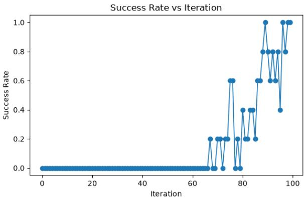  
Fig. 9. Plackett-Luce CartPole success rate

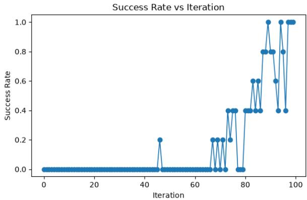  
Fig. 10. Bradley-Terry-Kwise CartPole success rate

## APPENDIX E

## FULL HYPERPARAMETER LIST

Table X summarizes the hyperparameters used in the primary experiments. Unless otherwise specified, these settings were held constant across methods.

“Paper configuration” refers to the following CNN design: RGB → Conv(16, 5×5, s=3) → Conv(32, 3×3, s=2) → Conv(64, 3×3, s=2) → Conv(128, 3×3, s=2) → Flatten → Linear(1) → tanh, with LeakyReLU after each convolution.

## APPENDIX F

## TASK PROMPTS

The below task prompts are injected into the overall goal prompt in the next section for PL, BT-Kwise, and BT-Pairwise.

TABLE X  
PRIMARY TRAINING AND EVALUATION HYPERPARAMETERS
<table><tr><td>Parameter</td><td>Value</td></tr><tr><td>Vision-Language Model</td><td></td></tr><tr><td>VLM backend</td><td>OpenAI</td></tr><tr><td>VLM model</td><td>GPT-5.6 Luna</td></tr><tr><td></td><td></td></tr><tr><td>Image detail</td><td>Original</td></tr><tr><td>Reasoning effort</td><td>None</td></tr><tr><td>VLM timeout</td><td>180 s</td></tr><tr><td>Query workers</td><td>5</td></tr><tr><td>Request limit</td><td>80 requests/min</td></tr><tr><td>Candidate pool size</td><td>1024</td></tr><tr><td>Query sampling VLM label auditing</td><td>Uniform</td></tr><tr><td>Reward Model</td><td>Enabled</td></tr><tr><td>Reward input</td><td></td></tr><tr><td>Vision encoder</td><td>Image</td></tr><tr><td>CNN architecture</td><td>CNN</td></tr><tr><td>Reward image size</td><td>Paper configuration</td></tr><tr><td>Reward learning rate</td><td>300 × 300</td></tr><tr><td>Reward ensemble size</td><td>3 × 10−4</td></tr><tr><td>Reward training epochs</td><td>3</td></tr><tr><td>Reward batch size</td><td>25</td></tr><tr><td>Early-stopping patience</td><td>40</td></tr><tr><td>Preference validation fraction</td><td>5 epochs</td></tr><tr><td>Reward clipping</td><td>0.20</td></tr><tr><td>Reward inference batch size</td><td>5</td></tr><tr><td>Precompute iteration rewards</td><td>512</td></tr><tr><td>Reward-frame caching</td><td>Enabled</td></tr><tr><td>Warm-up and Replay Buffer</td><td>Disabled</td></tr><tr><td>Warm-up iterations</td><td>18</td></tr><tr><td>Warm-up objective</td><td>State entropy</td></tr><tr><td>Ground-truth training reward</td><td>Disabled</td></tr><tr><td>Critic reset after warm-up</td><td>Enabled</td></tr><tr><td>Replay-buffer capacity</td><td></td></tr><tr><td>Frame storage</td><td>100,000</td></tr><tr><td>JPEG quality</td><td>JPEG</td></tr><tr><td>Soft Actor-Critic</td><td>95</td></tr><tr><td>SAC batch size</td><td>512</td></tr><tr><td>Updates per environment step</td><td>1.0</td></tr><tr><td>Policy learning rate</td><td>3 × 10−4</td></tr><tr><td>Critic learning rate</td><td>3 × 10−4</td></tr><tr><td>Temperature learning rate</td><td>1× 10−4</td></tr><tr><td>Initial temperature (α)</td><td></td></tr><tr><td>Critic loss</td><td>0.1 Huber</td></tr><tr><td>Target Q clipping</td><td>200</td></tr><tr><td>Gradient clipping norm</td><td>10</td></tr><tr><td>Maximum critic loss</td><td></td></tr><tr><td>Policy hidden architecture</td><td>1000</td></tr><tr><td>Critic hidden architecture</td><td>3 layers, 256 units each</td></tr><tr><td>Target-update frequency Environment and Training</td><td>3 layers, 256 units each 2</td></tr><tr><td>Environment</td><td></td></tr><tr><td>Tasks Drawer Open, Door Close, Button</td><td>Meta-World</td></tr><tr><td>Maximum episode length</td><td>Press</td></tr><tr><td>Training iterations</td><td>500 steps</td></tr><tr><td>Rollouts per iteration</td><td>200</td></tr><tr><td>Total environment steps</td><td>1</td></tr><tr><td>Random seeds</td><td>100,000</td></tr><tr><td>Render resolution</td><td>0-4</td></tr><tr><td></td><td>300 × 300</td></tr><tr><td>Render rotation</td><td>180°</td></tr><tr><td>Evaluation and Logging</td><td></td></tr><tr><td>Evaluation interval</td><td>20 iterations (10,000 steps)</td></tr><tr><td>Evaluation episodes</td><td>20</td></tr><tr><td>Checkpoint interval</td><td>20 iterations</td></tr><tr><td></td><td></td></tr><tr><td>Video interval</td><td>20 iterations 5</td></tr></table>

## A. Drawer Open

Open the drawer by pulling it outward; prefer the image in which the drawer is visibly farther open.

## B. Door Close

Close the dark hinged door against its cabinet frame. Prefer the image with a smaller door opening and the door more nearly flush with the cabinet. Judge the door angle, not gripper position.

## C. Button Press

Press the red circular button fully into the yellow box. Rank primarily by the length of the exposed dark gray shaft between the red button cap and the yellow box: a shorter exposed shaft means the button is farther pressed and is always better; a red cap flush against the yellow face is best. Ignore fingertip position whenever shaft lengths differ. Only when shaft lengths are visually tied, prefer the white-and-cyan fingertips closer to, aligned with, and pushing the red cap.

## APPENDIX G

## GOAL PROMPT

The goal is to [task description]. Rank the images from best to worst by how well they achieve the goal. You must choose a complete best-to-worst ranking even if differences are subtle.

## APPENDIX H

## RL-VLM-F PROMPT

RL-VLM-F uses the same task descriptions but has its own prompts for its two stage process.

## A. Visual Analysis

Consider the following two robot end-effector observations. [Image 1]

[Image 2]

1) Describe what is happening in Image 1.

2) Describe what is happening in Image 2.

3) The goal is to {TASK DESCRIPTION}. Is there a difference between them in terms of how well the goal is being achieved?

## B. Preference Selection

Based on the text below answering the questions:

{STAGE 1 RESPONSE}

Is the goal better achieved by Image 1 or Image 2, all things considered? Reply with a single line containing only 0 if Image 1 is better, or 1 if Image 2 is better. Reply -1 if you are unsure or there is no meaningful difference.