# CANALIZATION BEFORE GENERALIZATION: GROKKING AS A DYNAMICAL PROBE

Yiming Lin

School of Artificial Intelligence, University of Chinese Academy of Sciences linyiming25@mails.ucas.ac.cn

August 27, 2026

## ABSTRACT

For overparameterized neural networks, many solutions can fit the training data equally well while behaving very differently on unseen samples. Grokking separates training fit from visible generalization, providing a window for studying how this selection develops during training. We sweep short, fixed-duration weight-decay (WD) pulses across this plateau and measure how they shift later generalization time. Across three grokking tasks, these shifts are unordered early in the plateau but later form a stable dose ordering, with stronger WD increases leading to earlier generalization and stronger WD decreases leading to later generalization. This ordering emerges before visible generalization in all three tasks. Meanwhile, test-loss barriers between perturbed and baseline generalization checkpoints collapse toward zero while the ordered timing effects persist. We call this combination of increasingly constrained solution selection and persistent dose-ordered timing sensitivity the canalization of function selection.

## 1 Introduction

How neural networks learn generalizable patterns from limited training samples is a central question in understanding deep learning [1, 2]. For overparameterized neural networks, the training data typically admit many solutions that fit the training set equally well but behave very differently on unseen samples. Since the training objective alone does not uniquely determine the final solution, the implicit bias of the optimization process becomes central to understanding generalization [3]. In standard supervised learning, this process usually happens alongside fitting the training set and improving test performance, which makes it hard to study on its own. Grokking describes a form of delayed generalization. A model can first fit the training set, then remain on a long plateau of low test performance, and only generalize rapidly after further training [4, 5]. This temporal separation between training fit and visible generalization provides a clear window for observing and perturbing the optimization process before generalization appears.

Previous work has repeatedly found that neural network training proceeds through distinct dynamical stages. Studie of loss geometry and neural tangent kernel evolution suggest that training begins with a short, highly sensitive phase and later enters a more stable and constrained regime [6, 7]. Perturbation studies have similarly found that very small parameter changes early in training can send trajectories in very different directions, while the same perturbations have much smaller effects later in training [8–10].

These results suggest that the downstream effects of local perturbations can reveal how training dynamics change over time. Weight decay (WD) provides a natural intervention target for this purpose. Its effect depends strongly on when it is applied [11], and WD is also known to strongly influence whether and when generalization occurs in grokking [4, 12–14].

Building on this, we introduce an intervention-based framework that uses the timing of generalization in grokking as a dynamical probe. We slide a fixed-duration intervention window across the entire pre-generalization plateau (after the training set has been fit, while test performance remains at chance level), temporarily increasing or decreasing WD before restoring it to its baseline value and continuing training. We call this short local intervention a WD pulse. By scanning the entire pre-generalization plateau, we examine how short WD pulses applied at different stages of training affect outcomes much later in training. After the pulse ends, the model returns to the original training conditions, but the effect of the pulse can persist and later appear as earlier or later generalization, together with differences in the functions selected later in training. Recent work has intervened on grokking by persistently modifying training conditions or applying one-shot state edits [15–18]. In contrast, our WD pulses are temporary and are swept across the pre-generalization plateau to probe how the training state responds to a transient local perturbation.

We apply this framework to three algorithmic grokking tasks with clear chance-level plateaus. By scanning both when the WD pulse is applied and how strong it is, we record the resulting shift in generalization time. These measurements form a WD-response map, which reveals a dynamical reorganization before any visible generalization. Early in the plateau, generalization-time shifts show no stable ordering across pulse magnitudes. Later, the responses reorganize into a stable dose-dependent structure. Within the range we study, stronger positive WD pulses lead to earlier generalization, whereas stronger negative WD pulses lead to later generalization. This structure emerges while test accuracy is still near chance level and is reproduced across random initializations and tasks. Linear mode connectivity analysis [8, 19] further shows that, as the pulse is applied later in training, test-loss barriers between the perturbed branches and the baseline at their matched generalization checkpoints collapse toward zero, while the ordered shifts in generalization time persist. In these grokking tasks, local WD perturbations can still systematically speed up or delay generalization during the pre-generalization plateau, but steering the model toward solutions that are linearly separated from the baseline generalization checkpoint becomes increasingly harder. Borrowing Waddington’s concept of canalization [20], we refer to this reorganization—increasing constraint on function selection across solution space together with increasingly ordered responses along the time axis—as the canalization of function selection.

## 2 Grokking as a Dynamical Probe

## 2.1 Experimental Tasks

We use a simple parity-matching task as our main experimental setting, and adopt the sparse-parity setup of Merrill et al. [21] and the modular-addition setup of Google PAIR [14] to test whether the same intervention pattern appears across different rule-learning tasks. In parity matching, each example consists of two integer indices, and the label indicates whether they have the same parity. The training and test sets contain different index pairs, so the model must learn the parity-matching rule to correctly predict unseen combinations. Related sparse-parity and modular-addition settings have been shown to exhibit measurable internal progress before visible generalization [5, 21, 22]. Task 1 provides a useful contrast: when we adapt these progress measures to parity matching, restricted loss begins to decrease only slightly before test loss (about 50 epochs), parameter movement levels off early in training, and feature amplification changes only around the same time as test loss (see Appendix E). Our analysis focuses on runs that exhibit the canonical grokking pattern: a clear chance-level plateau after the training set is fit, followed by a relatively sharp rise in test performance. Full task definitions, model architectures, training configurations, and seed-selection criteria are provided in Appendix A.1.

## 2.2 Sliding-Window WD Interventions

All models are trained with AdamW. In AdamW, weight decay is decoupled from the loss-gradient update [23], which allows us to temporarily change the weight-decay coefficient without changing the loss function or gradient computation.

For each baseline training trajectory, we slide a fixed-duration intervention window along the pre-generalization plateau. Let the baseline weight decay be $\lambda _ { 0 }$ , the window start be $t _ { 0 } .$ , the window length be τ, and the sliding-window stride be δt. The intervention starts are

$$
t _ { 0 } ^ { ( k ) } = t _ { \mathrm { m i n } } + k \delta t .
$$

Here, $t _ { \mathrm { m i n } }$ is the first time the baseline reaches 100% training accuracy, and the intervention window is then moved forward along the pre-generalization plateau. For each $t _ { 0 } ,$ we branch from the full training state $\boldsymbol { S } _ { t _ { 0 } }$ saved at that time, including the model parameters, AdamW optimizer state, random-number-generator state, and data-sampling state (see Figure 1(b); implementation details are given in Appendix C). The weight decay of each branch is

$$
\lambda ( t ) = { \left\{ \begin{array} { l l } { \lambda _ { 0 } + \Delta \lambda , } & { t _ { 0 } < t \leq t _ { 0 } + \tau , } \\ { \lambda _ { 0 } , } & { t > t _ { 0 } + \tau . } \end{array} \right. }
$$

Here, $\Delta \lambda > 0$ increases weight decay and $\Delta \lambda < 0$ decreases it. All other training conditions remain unchanged. Thus, each $( t _ { 0 } , \Delta \lambda )$ pair defines one short WD intervention. Across the three tasks, the main analysis includes 70 baseline runs with 23,926 pulse starts and 239,260 intervention branches in total (Table 1).

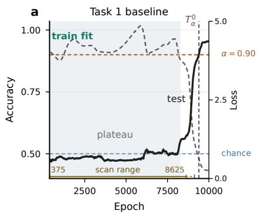

b  
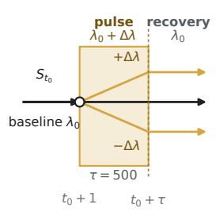

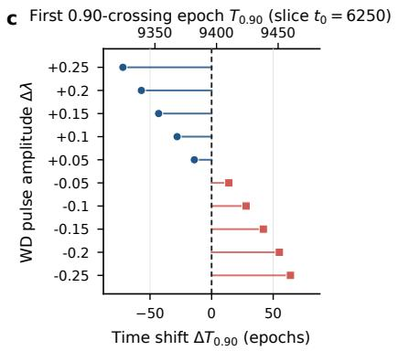

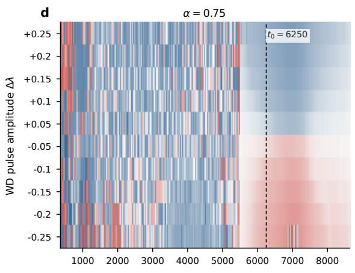

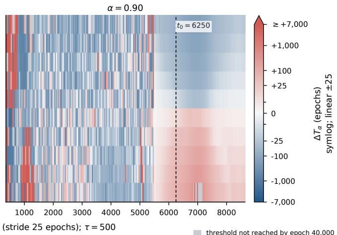  
Figure 1: Weight-decay pulse interventions and construction of the WD-response map. An example run from the Task 1 parity-matching task is shown. (a) Baseline training and test accuracy. The horizontal bar at the bottom marks the scan range of pulse start times, beginning at full training fit (epoch 375) and ending 1,000 epochs before the baseline first reaches $9 5 \%$ test accuracy (epoch 8625). (b) For each $t _ { 0 } ,$ all perturbed branches start from the same full training state $S _ { t _ { 0 } } .$ Weight decay is changed for $\tau$ epochs and then restored to its baseline value. (c) Generalization-time responses to different WD perturbation magnitudes at a fixed pulse start $t _ { 0 }$ . (d) WD-response maps for $\alpha = 0 . 7 5$ and $\alpha = 0 . 9 0$ . This run contains 331 pulse start times and 3,310 perturbed branches. Early in the plateau, the responses show no stable ordering; around $t _ { 0 } \approx 5 0 0 0 { - } 5 5 0 0$ , they begin to form a persistent dose-dependent structure, while the baseline is still on the chance-level plateau shown in panel (a), before any visible generalization. Intervention and scan settings are given in Appendix C.

## 2.3 Generalization-Time Response

We use the first time a model reaches a predefined test-accuracy threshold to track its progress toward generalization. Let this threshold be $\alpha .$ . We denote by $\mathrm { ~ \bar { ~ } { ~ T _ { \alpha } ^ { 0 } } ~ }$ the first time the baseline reaches $\alpha ,$ and by $\overline { { T } } _ { \alpha } ( t _ { 0 } , \Delta \lambda )$ the first time a perturbed branch reaches the same threshold after a WD pulse of magnitude $\Delta \lambda$ is applied at time $t _ { 0 }$ . We define

$$
\Delta T _ { \alpha } ( t _ { 0 } , \Delta \lambda ) = T _ { \alpha } ( t _ { 0 } , \Delta \lambda ) - T _ { \alpha } ^ { 0 } .
$$

Thus, $\Delta T _ { \alpha }$ measures the change in generalization time caused by the WD pulse: negative values mean earlier generalization, while positive values mean later generalization.

By scanning both the pulse start $t _ { 0 }$ and perturbation magnitude $\Delta \lambda .$ , we obtain the WD-response map shown in Figure 1(d). Each location in the map corresponds to one WD intervention, and its response value shows how much that intervention advances or delays generalization.

Task 1 · multiseed WD responses

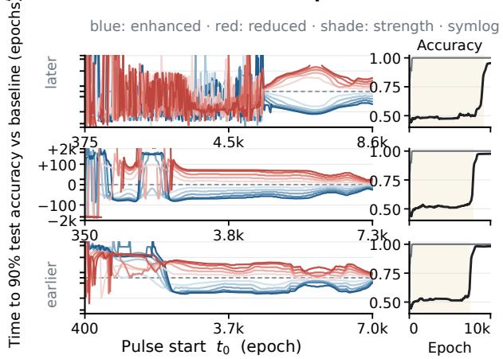

b Task 1 · cross-run structure  
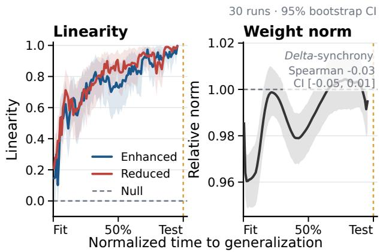

c  
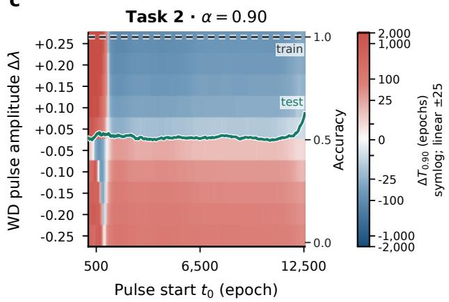

d  
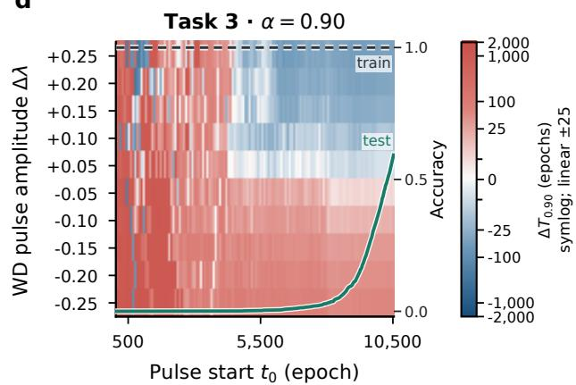  
Figure 2: WD responses develop a stable dose-dependent structure before visible generalization, and this pattern is reproduced across initializations and tasks. (a) WD-response curves $( \alpha = 0 . 9 0 )$ for three example Task 1 runs; insets show the corresponding baseline training and test accuracy. (b) Mean dose–response linearity $\mathrm { \bar { \it R } _ { c o r r } ^ { 2 } }$ across 30 Task 1 runs (left) and baseline relative weight norm (right). (c,d) WD-response maps $( \alpha = 0 . 9 0 )$ for example runs from Task 2 and Task 3. Task and training settings are given in Appendix A.1; dose–response and weight-norm analyses in Appendix B; and intervention settings in Appendix C.

## 3 Results

## 3.1 WD Responses Become Ordered Before Visible Generalization

Figure 1(d) shows that the effect of WD perturbations changes over the course of training. Early in the plateau $\overline { { ( t _ { 0 } } } \lesssim 5 0 0 0 )$ , there is no stable relationship between $\Delta T _ { \alpha }$ and the direction or magnitude of ∆λ. By the middle of the plateau $( t _ { 0 } \approx 5 0 0 0 { - } 5 5 0 0 )$ , the responses begin to form a clear and persistent dose-dependent structure: within the range we study, stronger positive WD perturbations lead to earlier generalization, whereas stronger negative WD perturbations lead to later generalization. Figure 2(a) shows the same transition from another perspective. Each curve corresponds to a fixed WD perturbation. The response curves cross frequently early in the plateau, but later become stably ordered by |∆λ|. When this stable ordering emerges, the baseline test accuracy is still at chance level, indicating that this dynamical reorganization occurs before visible generalization.

Figure 2(b) summarizes this process across 30 Task 1 runs. On a common phase axis, we separately compute the chance-corrected dose–response linearity $R _ { \mathrm { c o r r } } ^ { 2 }$ for positive and negative WD perturbations (see Appendix B.1 for the definition). Both mean curves increase over training and approach 1 near the end of the interval, indicating that the WD responses gradually develop an approximately linear dose relationship as training proceeds, and that this pattern is reproduced across different initializations.

In AdamW, weight decay contributes a term −ηλθ to the parameter update independently of the loss gradient. Its most direct effect is therefore to change the rate of parameter shrinkage and, in turn, the weight norm. If the dose-dependent structure we observe were simply a consequence of WD pulses altering weight-norm trajectories, its emergence should be synchronized with changes in the baseline weight norm. As a control, we find that the baseline relative weight norm remains nearly constant throughout the plateau in the same set of runs, staying within about ±4% of its value at training fit. Moreover, changes in relative weight norm and $R _ { \mathrm { c o r r } } ^ { 2 }$ across phase bins show almost no synchrony. Computing the Spearman correlation between these two sets of changes for each run gives a median of $\rho _ { \Delta } = - 0 . 0 3$ , with a 95% CI of $[ - 0 . 0 5 , 0 . 0 1 ]$ (see Appendix B.3 for the definition; Figure 2(b), right). These results indicate that the emergence of the dose-dependent structure cannot be explained by the slow drift of the baseline weight norm. Figure $2 ( \mathrm { c } , \bar { \mathrm { d } } )$ shows the results for Task 2 and Task 3. Despite differences in their time scales and detailed response patterns, both tasks show the same qualitative behavior as Task 1: the dose-dependent structure of the WD response emerges before any clear rise in baseline test accuracy. Across initializations and tasks, the generalization-time response to WD perturbations changes over training from an unordered pattern early in the plateau to a stable dose ordering later on. More importantly, thi response becomes ordered before visible generalization.

## 3.2 Loss Barriers Collapse While Ordered WD Responses Persist

The WD-response curves show that, after a stable dose ordering has formed, local WD interventions can still systemati cally advance or delay generalization. To further probe whether these perturbations still lead to distinct generalization solutions, we take the generalization checkpoints at which the perturbed branch and the baseline first reach the same test accuracy, and measure the test-loss barrier along the straight line in parameter space between them [8]. Following Entezari et al. [19], the barrier measures the additional test loss encountered between the two generalization checkpoints, defined as the maximum excess above the linear interpolation of the endpoint losses along the path. The full definition and computation are given in Appendix C. Figure 3(a) shows that, as the intervention is applied later in training,

## Linear mode connectivity and WD-response timing across tasks

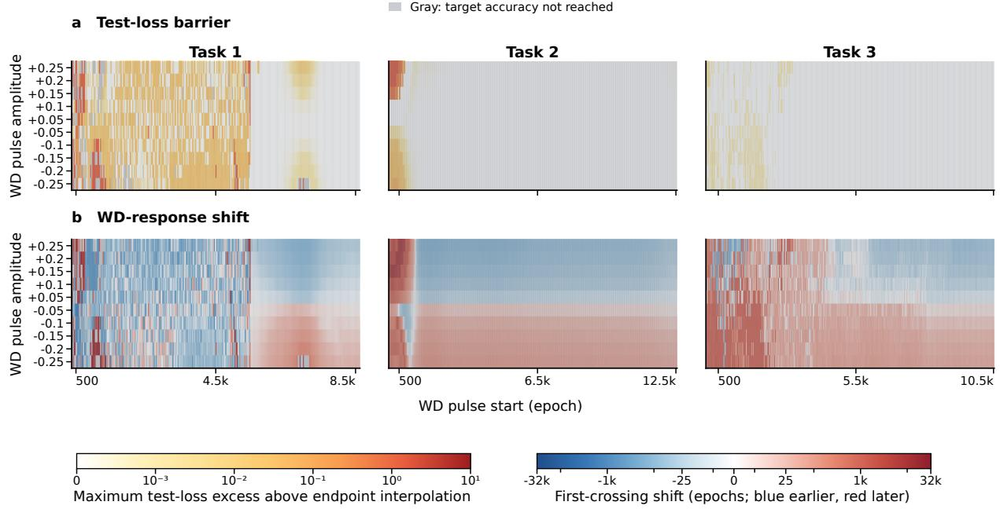  
Figure 3: Test-loss barriers collapse while ordered WD timing responses persist. Each row shows one example run from a task (the Task 1 run is the same as in Figure 1), and the two columns share the same $( t _ { 0 } , \Delta \lambda )$ intervention grid. For both the baseline and each perturbed branch, the generalization checkpoint is defined as the first time test accuracy reaches $\alpha = 0 . 9 5$ . (a) Test-loss barrier between the perturbed and baseline generalization checkpoints. We evaluate test loss at 51 equally spaced interpolation points along the straight line in parameter space connecting the two checkpoints, and define the barrier as the maximum excess above the linear interpolation of the endpoint losses (see Appendix C for the definition). Gray cells indicate perturbed branches that do not reach the target accuracy within the training limit. (b) Generalization-time shift $\Delta T _ { 0 . 9 5 }$ of each perturbed branch relative to the baseline. Negative values indicate earlier generalization, and positive values indicate later generalization.

the test-loss barrier between the perturbed and baseline generalization checkpoints gradually decreases toward zero. This pattern is very clear in Task 1: the barrier drops rapidly around the onset of stable dose ordering, with stronger perturbations retaining larger barriers. Task 2 and Task 3 show the same late-stage trend, although their barrier structure is weaker early in training. Overall, as the intervention is moved later, the perturbed and baseline generalization checkpoints become increasingly linearly connected by low-test-loss paths.

The WD timing responses in Figure 3(b), however, retain a clear directional and dose-dependent structure. Increasing WD systematically makes the model reach the target test accuracy earlier, decreasing WD makes it reach the target later, and the timing shift remains ordered by pulse magnitude. This ordered effect on generalization time persists even when the test-loss barrier is already close to zero.

Together, these results suggest that, before visible generalization, WD perturbations become increasingly less able to push the model toward generalization solutions that are linearly separated from the baseline. Later interventions mainly affect the timing of generalization rather than driving the model toward linearly separated generalization checkpoints. The collapse of the test-loss barrier and the persistence of ordered WD responses are both reproduced across random initializations (30 Task 1 runs, 24 Task 2 runs, and 16 Task 3 runs; see Appendix F).

A similar pattern appears in PCA projections of the parameter-update directions. After the ordering emerges, the projected direction trajectories of the perturbed branches and the baseline are already approximately overlapping, with their main difference being timing along the trajectories (see Appendix D and Figure 6).

## 4 Discussion

Generalization in overparameterized models can be viewed as a function-selection problem. Finite training data are compatible with many different functions, and the optimization process determines which one is ultimately selected [1, 3]. Gradient-based optimization can favor particular solutions even when many solutions fit the training data equally well, reflecting its implicit bias [3, 24]. More broadly, prior work suggests that neural network training can pass through distinct dynamical regimes, with changes in loss geometry and sensitivity to perturbations over the course of training [6–10]. In grokking, this stage dependence can extend to both the solution favored by training and the learning dynamics themselves, for example from a kernel predictor to a minimum-norm solution [13], or from lazy to feature-learning dynamics [25].

Grokking provides a clear temporal window for observing this function-selection process because training fit and visible generalization are clearly separated in time, allowing the optimization process before generalization to be observed and perturbed in isolation [4]. Using this separation, we treat short local WD perturbations during the plateau (after the training set has been fit while test performance remains at chance level), together with the resulting shifts in generalization time, as a dynamical probe of how function selection changes over training.

Our results show that, across several small algorithmic grokking tasks, the WD-response map reveals a clear dynamical transition before any visible sign of generalization. Early in the plateau, short WD perturbations have no stable effect on generalization time. Later, the responses develop a clear and stable dose ordering: stronger positive WD perturbations lead to earlier generalization, stronger negative perturbations lead to later generalization, and the timing shift becomes approximately linear in perturbation magnitude. For interventions in this ordered regime, the test-loss barriers between the perturbed and baseline generalization checkpoints also collapse toward zero.

Taken together, these results suggest that, as optimization proceeds, local perturbations become increasingly less able to steer training toward linearly separated families of generalization solutions , while the timing of generalization remains adjustable under different perturbation strengths. As shown in Figure 4, Conrad Waddington, who introduced the concept of epigenetics, used the epigenetic landscape to describe development. In 1942, Waddington introduced the term canalization to describe how developmental outcomes become increasingly robust to perturbations as development proceeds; the stability of the developmental trajectory itself was later described as homeorhesis [20, 27]. In this landscape, a developing cell is represented as a ball rolling down a valley. As the valley becomes deeper and narrower, perturbations become increasingly less able to change the ball’s lateral direction. This provides an intuitive analogy for our results. Early perturbations can still change where the ball goes, whereas later perturbations have less effect on its lateral direction but can still speed up or slow down its motion along the valley, causing it to reach the endpoint earlier or later. A checkpoint can be characterized by its current parameters, representations, or output function, but also by how controlled perturbations applied from that state affect subsequent training; the latter captures information about the local future dynamics [8, 9, 11]. In our Task 1 setting, standard progress measures—including restricted loss [5], parameter movement, and feature amplification [22]—show little signal during the plateau well before generalization, whereas the WD perturbation response already develops a stable structure before visible generalization (see Appendix E). In Task 1, perturbation responses therefore reveal a change in training dynamics well before it becomes visible in these standard progress measures.

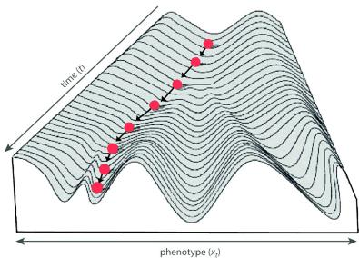  
Figure 4: Waddington’s epigenetic landscape. Reproduced from Fig. 1 of Mitteroecker and Stansfield [26] under CC BY 4.0. Developing cells are depicted as balls rolling down valleys that become deeper and narrower over time, making perturbations increasingly less able to change their eventual direction. This landscape provides an intuitive analogy for the canalization of function selection observed in our experiments.

Recent work characterizes finite-step training as a thermodynamically irreversible process [28]. In this framework, finite-step optimization acquires an intrinsic arrow of time, and the resulting irreversible dynamics can bias learning toward trajectories with lower update fluctuations and lower entropy-production rates. The emergence of a stable dose ordering later in training is qualitatively compatible with this broader picture of trajectory selection. This raises the possibility that the progressive organization of perturbation responses is related to the preference for low-fluctuation, low-dissipation trajectories predicted by this framework.

Our experiments are limited to three small algorithmic tasks, so it remains unclear whether similar changes in perturbation response can be observed in broader optimization settings. In more complex tasks, grokking curves may rise in multiple stages or show substantial fluctuations, making it difficult to define a single generalization time. The long and clearly defined pre-generalization plateau required by our intervention may also be absent. The three tasks studied here all exhibit a single, relatively sharp generalization transition, providing a clear temporal reference for the pulse phase, the onset of ordering, and the collapse of the barrier. Extending this intervention framework to more complex tasks will therefore require a more general way to define the generalization transition.

We use exactly the same pulse parameters across all three tasks, including the same window length $\tau = 5 0 0$ , ten perturbation doses, and scan stride, without tuning the intervention for individual tasks. Although the baseline weight decay ranges from 1.5 to 5.0 and the model architecture ranges from an MLP to an embedding model with a factorized head, the same intervention produces broadly similar response structures across the three tasks. This suggests that, within the settings studied here, the observed dynamical structure does not depend on task-specific tuning of the intervention.

Overall, by combining the temporal separation provided by grokking with WD-pulse interventions, we study function selection dynamically by asking how sensitive the eventual generalization outcome is to local perturbations at different stages of training. In the grokking tasks studied here, these perturbations become increasingly less able to steer training toward a linearly separated generalization checkpoint, while their effects on generalization time remain ordered and adjustable. We refer to this pre-generalization reorganization as the canalization of function selection.

## LLM Usage Claim

We used LLMs for language polishing and a reproducibility sanity check—where an AI agent tried to replicate our experiments from the paper description alone to see if our methods were written clearly enough. The agent’s output was checked by us; it did not replace our own verification. All ideas, experiments, and conclusions are ours.

## References

[1] Chiyuan Zhang, Samy Bengio, Moritz Hardt, Benjamin Recht, and Oriol Vinyals. Understanding deep learning requires rethinking generalization. In International Conference on Learning Representations, 2017.

[2] Yiding Jiang, Dilip Krishnan, Hossein Mobahi, and Samy Bengio. Predicting the generalization gap in deep networks with margin distributions. In International Conference on Learning Representations, 2019.

[3] Suriya Gunasekar, Jason Lee, Daniel Soudry, and Nathan Srebro. Characterizing implicit bias in terms of optimization geometry. In Proceedings ofthe 35th International Conference on Machine Learning, volume 80 of Proceedings ofMachine Learning Research, pages 1832–1841, 2018.

[4] Alethea Power, Yuri Burda, Harri Edwards, Igor Babuschkin, and Vedant Misra. Grokking: Generalization beyond overfitting on small algorithmic datasets. arXiv preprint arXiv:2201.02177, 2022.

[5] Neel Nanda, Lawrence Chan, Tom Lieberum, Jess Smith, and Jacob Steinhardt. Progress measures for grokking via mechanistic interpretability. In International Conference on Learning Representations, 2023.

[6] Stanislav Fort, Gintare Karolina Dziugaite, Mansheej Paul, Sepideh Kharaghani, Daniel M. Roy, and Surya Ganguli. Deep learning versus kernel learning: An empirical study of loss landscape geometry and the time evolution of the neural tangent kernel. In Advances in Neural Information Processing Systems, volume 33, pages 5850–5861, 2020.

[7] Zhanpeng Zhou, Yongyi Yang, Jie Ren, Mahito Sugiyama, and Junchi Yan. On the cone effect in the learning dynamics. In ICLR 2025 Workshop on Deep Generative Models in Machine Learning: Theory, Principle and Efficacy, 2025.

[8] Jonathan Frankle, Gintare Karolina Dziugaite, Daniel Roy, and Michael Carbin. Linear mode connectivity and the lottery ticket hypothesis. In Hal Daumé III and Aarti Singh, editors, Proceedings ofthe 37th International Conference on Machine Learning, volume 119 of Proceedings ofMachine Learning Research, pages 3259–3269. PMLR, 2020.

[9] Gül Sena Altınta¸s, Devin Kwok, Colin Raffel, and David Rolnick. The butterfly effect: Neural network training trajectories are highly sensitive to initial conditions. In Proceedings of the 42nd International Conference on Machine Learning, volume 267 of Proceedings ofMachine Learning Research, pages 1314–1342, 2025.

[10] Zhanpeng Zhou, Yongyi Yang, Mahito Sugiyama, and Junchi Yan. New evidence of the two-phase learning dynamics of neural networks. In ICML 2025 Workshop on High-Dimensional Learning Dynamics, 2025.

[11] Aditya Golatkar, Alessandro Achille, and Stefano Soatto. Time matters in regularizing deep networks: Weight decay and data augmentation affect early learning dynamics, matter little near convergence. In Advances in Neural Information Processing Systems, volume 32, pages 10677–10687, 2019.

[12] Ziming Liu, Ouail Kitouni, Niklas S. Nolte, Eric J. Michaud, Max Tegmark, and Mike Williams. Towards understanding grokking: An effective theory of representation learning. In Advances in Neural Information Processing Systems, volume 35, pages 34651–34663, 2022.

[13] Kaifeng Lyu, Jikai Jin, Zhiyuan Li, Simon Shaolei Du, Jason D. Lee, and Wei Hu. Dichotomy of early and late phase implicit biases can provably induce grokking. In International Conference on Learning Representations, 2024. URL https://openreview.net/forum?id=XsHqr9dEGH.

[14] Adam Pearce, Asma Ghandeharioun, Nada Hussein, Nithum Thain, Martin Wattenberg, and Lucas Dixon. Do machine learning models memorize or generalize? Google PAIR Explorable, 2023. URL https://pair. withgoogle.com/explorables/grokking/.

[15] Achyuthan Sivasankar. Circuit synchronization precedes generalization: Causal evidence from fourier structure in grokking transformers. arXiv preprint arXiv:2606.12966, 2026.

[16] Chitraansh Pandey. Thermodynamic weight decay: Exploring grokking acceleration via attention specific heat. arXiv preprint arXiv:2607.20552, 2026.

[17] Clare Lyle, Ghada Sokar, András György, and Razvan Pascanu. What can grokking teach us about learning under non-stationarity? In Proceedings of The 4th Conference on Lifelong Learning Agents, volume 330 of Proceedings ofMachine Learning Research, pages 635–656. PMLR, 2026. URL https://proceedings.mlr. press/v330/lyle26a.html.

[18] Truong Xuan Khanh, Doan Hoang Viet, Luu Duc Trung, and Phan Thanh Duc. The weight norm sets the grokking timescale: A causal delay law. arXiv preprint arXiv:2606.13753, 2026.

[19] Rahim Entezari, Hanie Sedghi, Olga Saukh, and Behnam Neyshabur. The role of permutation invariance in linear mode connectivity of neural networks. In International Conference on Learning Representations, 2022. URL https://openreview.net/forum?id=dNigytemkL.

[20] Conrad Hal Waddington. Canalization of development and the inheritance of acquired characters. Nature, 150: 563–565, 1942. doi: 10.1038/150563a0.

[21] William Merrill, Nikolaos Tsilivis, and Aman Shukla. A tale of two circuits: Grokking as competition of sparse and dense subnetworks. In ICLR 2023 Workshop on Mathematical and Empirical Understanding ofFoundation Models, 2023.

[22] Boaz Barak, Benjamin L. Edelman, Surbhi Goel, Sham M. Kakade, Eran Malach, and Cyril Zhang. Hidden progress in deep learning: SGD learns parities near the computational limit. In Advances in Neural Information Processing Systems, volume 35, pages 21750–21764, 2022. URL https://proceedings.neurips.cc/paper\_ files/paper/2022/hash/884baf65392170763b27c914087bde01-Abstract-Conference.html.

[23] Ilya Loshchilov and Frank Hutter. Decoupled weight decay regularization. In International Conference on Learning Representations, 2019. URL https://openreview.net/forum?id=Bkg6RiCqY7.

[24] Daniel Soudry, Elad Hoffer, Mor Shpigel Nacson, Suriya Gunasekar, and Nathan Srebro. The implicit bias of gradient descent on separable data. Journal of Machine Learning Research, 19(70):1–57, 2018. URL https://jmlr.org/papers/v19/18-188.html.

[25] Tanishq Kumar, Blake Bordelon, Samuel J. Gershman, and Cengiz Pehlevan. Grokking as the transition from lazy to rich training dynamics. In International Conference on Learning Representations, 2024. URL https://proceedings.iclr.cc/paper\_files/paper/2024/hash/ 63ed15a46a143ff57484b38cd6b85d91-Abstract-Conference.html.

[26] Philipp Mitteroecker and Ekaterina Stansfield. A model of developmental canalization, applied to human cranial form. PLoS Computational Biology, 17(2):e1008381, 2021. doi: 10.1371/journal.pcbi.1008381. URL https://doi.org/10.1371/journal.pcbi.1008381.

[27] Conrad Hal Waddington. The Strategy ofthe Genes: A Discussion ofSome Aspects ofTheoretical Biology. George Allen & Unwin, London, 1957. URL https://wellcomecollection.org/works/nzwm3z65.

[28] Yuanjie Ren, Ziyin Liu, Adam Levine, and Isaac Chuang. Thermodynamic irreversibility of training algorithms. arXiv preprint arXiv:2605.21933, 2026.

## Appendix

## A Tasks and Baseline Training

## A.1 Three Tasks

We use three algorithmic tasks that exhibit delayed generalization. All models are trained with full-batch updates, with one parameter update per epoch and no learning-rate scheduler. AdamW is used for all tasks; except for Task 3, the momentum parameters are set to $( \beta _ { 1 } , \beta _ { 2 } ) = ( 0 . 5 , 0 . 9 9 9 )$ ). Training and test metrics are evaluated every 25 epochs until test accuracy reaches 0.60, and every epoch thereafter.

Table 1: Scale of the WD-pulse intervention analysis across tasks. Each pulse start is evaluated with 10 WD perturbation magnitudes, giving 10 intervention branches per pulse start.
<table><tr><td>Task</td><td>Runs</td><td>Pulse starts</td><td>Avg. per run</td><td>Branches</td></tr><tr><td>Task 1 (parity match)</td><td>30</td><td>8,119</td><td>271</td><td>81,190</td></tr><tr><td>Task 2 (sparse parity)</td><td>24</td><td>8,975</td><td>374</td><td>89,750</td></tr><tr><td>Task 3 (factored modular addition)</td><td>16</td><td>6,832</td><td>427</td><td>68,320</td></tr><tr><td>Total</td><td>70</td><td>23,926</td><td></td><td>239,260</td></tr></table>

Task 1: Parity match. Each example consists of two integer indices $( i , j )$ , where $i , j \in \{ 0 , \dots , 4 7 \}$ . The two indices are separately encoded as 48-dimensional one-hot vectors and concatenated into a 96-dimensional input. The label indicates whether the two indices have the same parity:

$$
y = \mathbf { 1 } [ ( i \mathrm { m o d } 2 ) = ( j \mathrm { m o d } 2 ) ] .
$$

The full input space contains $4 8 \times 4 8 = 2 3 0 4$ ordered pairs. Using the fixed data seed data\_seed=21, we first randomly select 75% of the inputs as the candidate training pool, and then draw 304 samples with replacement from this pool to construct the training set. Because sampling is performed with replacement, these 304 training entrie correspond to 267 distinct input pairs; repeated pairs contribute to the full-batch loss according to their multiplicity. The test set contains 1024 samples drawn from input pairs that do not appear in the training set, with balanced binary labels.

The model is a 4-hidden-layer MLP with 128 units per layer and tanh activations. The output layer produces a single binary-classification logit. The training loss is binary cross-entropy with logits. The learning rate is $\mathrm { 1 0 ^ { - 3 } }$ , the baseline weight decay is 5.0, and the model is trained for 10,000 epochs.

Task 2: Sparse parity. This task is based on the sparse-parity grokking setup of Merrill et al. [21]. Each example begins with a binary vector

$$
b = ( b _ { 0 } , \dotsc , b _ { 4 9 } ) \in \{ 0 , 1 \} ^ { 5 0 } ,
$$

which is then transformed into $- 1 / + 1$ features by

$$
\tilde { b } = 2 b - 1
$$

before being passed to the model. The label depends only on three fixed relevant coordinates:

$$
y = \left( \sum _ { k \in \mathcal { R } } b _ { k } \right) { \bmod { 2 } } , \qquad \mathcal { R } = \{ 1 0 , 2 6 , 4 4 \} .
$$

Indices are zero-based, corresponding to the 11th, 27th, and 45th coordinates of the input vector. The remaining 47 coordinates are distractor features that do not contribute to the label. The relevant coordinates are selected using the fixed relevant\_bit\_seed=21, and the training and test sets are generated using the fixed data\_seed=21. The training and test sets contain 550 and 1000 non-overlapping input vectors, respectively, with balanced binary labels in the training set. The model is a 4-hidden-layer MLP with 128 units per layer and tanh activations. The output layer produces a single binary-classification logit. The training loss is binary cross-entropy with logits. The learning rate is $\mathrm { { 1 0 ^ { - 3 } } }$ , the baseline weight decay is 1.5, and the model is trained for 20,000 epochs.

Task 3: Factored modular addition. This task is based on the factored modular-addition setup of Google PAIR [14]. Each input is a pair $( x , y )$ of integers modulo 67, with target class

$$
z = ( x + y ) { \bmod { 6 7 } } .
$$

Using the commutativity of addition, we retain only pairs satisfying $0 \leq x \leq y \leq 6 6$ , giving a full sample space of

$$
{ \frac { 6 7 \times 6 8 } { 2 } } = 2 2 7 8
$$

examples. Using the fixed data seed data\_seed=165, we randomly shuffle the full sample space and use 570 examples for training, approximately 25% of the full space, with the remaining 1708 examples used for testing.

The model uses a shared integer embedding matrix

$$
E \in \mathbb { R } ^ { 6 7 \times 5 0 0 } .
$$

Let $e _ { x } , e _ { y } \in \mathbb { R } ^ { 5 0 0 }$ denote the embeddings corresponding to integers x and $y .$ Both inputs are mapped into the hidden space through the shared projection matrix

$$
P _ { \mathrm { i n } } \in \mathbb { R } ^ { 5 0 0 \times 1 2 8 } ,
$$

summed, and passed through a ReLU activation:

$$
h = \mathrm { R e L U } \left( e _ { x } P _ { \mathrm { i n } } + e _ { y } P _ { \mathrm { i n } } \right) .
$$

The hidden representation is then mapped back to the embedding space through

$$
P _ { \mathrm { o u t } } \in \mathbb { R } ^ { 1 2 8 \times 5 0 0 } ,
$$

and tied unembedding is used to produce 67-dimensional output logits:

$$
\ell = h P _ { \mathrm { o u t } } E ^ { \top } .
$$

Thus, the input integer representations and output class weights share the same embedding matrix E. No bias terms are used in the hidden or output layers.

The training objective is multiclass cross-entropy scaled by a factor of $1 / 6 7 .$ . The model is trained with AdamW using a learning rate of $1 0 ^ { - 3 }$ , a baseline weight decay of 2.0, and momentum parameters $( \beta _ { 1 } , \beta _ { 2 } ) = ( 0 . 9 , 0 . 9 8 )$ , for a total of 14,000 epochs.

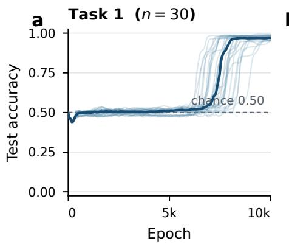

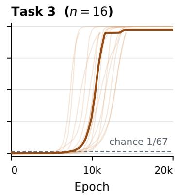  
Figure 5: All baseline generalization trajectories included in the main analysis. We show 30 runs for Task 1, 24 runs for Task 2, and 16 runs for Task 3. Thin lines show baseline test accuracy for individual initializations, thick lines show the median across runs, and dashed lines indicate chance level.

## A.2 Baseline Run Selection

The initial screening pool for Task 1 contains 1,000 baseline runs. Let $T _ { q , d } ^ { ( 3 ) }$ denote the first time the accuracy on split $d \in \{ \mathrm { t r a i n } , \mathrm { t e s t } \}$ reaches $q ,$ with the following three evaluation points also remaining at or above q. A run is included in the main analysis only if

$$
\begin{array} { r } { T _ { 0 . 6 0 , \mathrm { t e s t } } ^ { ( 3 ) } - T _ { 0 . 9 9 , \mathrm { t r a i n } } ^ { ( 3 ) } \geq 5 0 0 0 , } \\ { T _ { 0 . 7 5 , \mathrm { t e s t } } ^ { ( 3 ) } - T _ { 0 . 5 5 , \mathrm { t e s t } } ^ { ( 3 ) } \leq 1 0 0 0 } \end{array}
$$

and its test accuracy at the end of training is at least 0.95. These three criteria require, respectively, a sufficiently long pre-generalization plateau, a concentrated and clearly defined generalization transition, and high test accuracy within the training limit.

Among the 1,000 runs, 177 reach a final test accuracy of at least 0.95, and 105 satisfy all criteria. Because a full intervention scan requires thousands of perturbed branches per run, we use the first 30 qualifying runs in increasing seed order for the main analysis. The intervention scale across all three tasks is summarized in Table 1. Figure 2(a) shows the first three runs satisfying the criteria (seeds 2, 4, and 9). The example runs for Task 2 and Task 3 shown in Figure 2(c,d) and Figure 3 use seed 9 and seed 1, respectively. For Task 2, baseline screening adds a monotonicity requirement to the three Task 1 criteria. Starting from the first time test accuracy reaches 0.60, every subsequent evaluation point must have accuracy no lower than the previous point, excluding trajectories with reversals or multi-stage fluctuations during generalization. The screening pool contains 500 baseline runs (seeds 1–500), of which 24 satisfy all criteria and are included in subsequent analyses.

Task 3 consistently exhibits clear grokking across different initializations, so no additional screening is applied. We directly use seeds 1–16 for the cross-initialization analysis.

Figure 5 summarizes all baseline generalization trajectories included in the main analysis.

## B Dose–Response Linearity and Weight-Norm Analysis

## B.1 Dose–Response Linearity Analysis

To quantify when the WD response changes from an unordered pattern to a stable dose relationship, we examine whether the generalization-time shift $\Delta T _ { 0 . 9 0 }$ varies approximately linearly with WD perturbation magnitude at each pulse start. Because the generalization time scale varies substantially across initializations, we first align the pre-generalization plateau of each run using a common training-phase coordinate.

Let $t _ { \mathrm { { f i t } } }$ denote the first checkpoint at which training accuracy reaches 1.0, and let $T _ { 0 . 6 0 } ^ { 0 }$ denote the first time the baseline test accuracy reaches 0.60. The phase of pulse start $t _ { 0 }$ is defined as

$$
\phi ( t _ { 0 } ) = \frac { t _ { 0 } - t _ { \mathrm { f i t } } } { T _ { 0 . 6 0 } ^ { 0 } - t _ { \mathrm { f i t } } } .
$$

Thus, $\phi = 0$ corresponds to the first time training accuracy reaches 1.0, and $\phi = 1$ corresponds to the first time baseline test accuracy reaches 0.60. We divide the phase coordinate into bins of width 0.01 so that runs can be compared at similar stages of training.

Positive and negative WD perturbations are analyzed separately at each pulse start. Each perturbation direction includes five magnitudes,

$$
| \Delta \lambda | \in \{ 0 . 0 5 , 0 . 1 0 , 0 . 1 5 , 0 . 2 0 , 0 . 2 5 \} .
$$

We fit

$$
\Delta T _ { 0 . 9 0 } = \beta _ { 0 } + \beta _ { 1 } | \Delta \lambda | + \varepsilon ,
$$

and use the squared Pearson correlation coefficient, $R ^ { 2 }$ , to measure how closely the five responses follow a linear dose–response relationship. Because each fit contains only five dose points, random assignments of responses to doses can produce nonzero $R ^ { 2 }$ values even when no true dose relationship exists. For five fixed doses, averaging $R ^ { 2 }$ over all permutations of the response values gives

$$
{ \overline { { R ^ { 2 } } } } _ { \mathrm { p e r m } } = { \frac { 1 } { 4 } } .
$$

We therefore define the chance-corrected linearity as

$$
R _ { \mathrm { c o r r } } ^ { 2 } = \frac { R ^ { 2 } - 1 / 4 } { 1 - 1 / 4 } .
$$

On this scale, $R _ { \mathrm { c o r r } } ^ { 2 } = 0$ corresponds to the mean value under random permutations, while $R _ { \mathrm { c o r r } } ^ { 2 } = 1$ corresponds to a perfectly linear dose–response.

We compute $R _ { \mathrm { c o r r } } ^ { 2 }$ for a pulse start only when all five doses in the corresponding perturbation direction yield valid $\Delta T _ { 0 . 9 0 }$ values and the responses have nonzero variance. If any branch fails to reach 0.90 test accuracy within the continuation limit, that pulse start is treated as missing for the corresponding perturbation direction.

To summarize results across runs, each pulse start is first assigned to its corresponding phase bin. If multiple pulse starts from the same run fall into the same bin, we take the median $R _ { \mathrm { c o r r } } ^ { 2 }$ within that bin without temporal interpolation, and then average across runs. For each phase bin, different random initializations are treated as independent samples, and valid runs are resampled with replacement 4,000 times. For each resampled set of runs, we recompute the mean $R _ { \mathrm { c o r r } } ^ { 2 }$ across runs. The 2.5% and 97.5% percentiles of these means are reported as the 95% confidence interval. The final four phase bins $( \phi \ge 0 . 9 6 5 )$ contain fewer than 15 valid runs and are therefore not shown; the plotted curves end at $\phi = 0 . 9 5 5$

## B.2 Baseline Weight Norm

To compare the evolution of the WD dose–response with changes in parameter scale, we compute the weight norm from baseline checkpoints. Let $\{ W _ { \ell } \}$ denote all non-bias weight tensors in the model. The overall weight norm is defined as

$$
\| W \| _ { 2 } = \left( \sum _ { \ell } \| W _ { \ell } \| _ { F } ^ { 2 } \right) ^ { 1 / 2 } .
$$

For each run, we use the weight norm at the first checkpoint at which training accuracy reaches 1.0 as the reference value, and divide the weight norm at each checkpoint by this reference to obtain the relative weight norm.

We aggregate the weight-norm measurements across runs using the same procedure as in the dose–response linearity analysis. We use the same phase coordinate and phase bins of width 0.01. If multiple checkpoints from the same run fall into the same bin, we first take their median and then average across runs. For each phase bin, different random initializations are treated as independent samples, and valid runs are resampled with replacement 4,000 times. For each resampled set of runs, we recompute the mean relative weight norm across runs. The 2.5% and 97.5% percentiles of these means are reported as the 95% confidence interval. As in the dose–response linearity analysis, the final four phase bins $( \phi \ge 0 . 9 6 5 )$ contain fewer than 15 valid runs and are not shown, so the plotted curve ends at $\phi = 0 . 9 5 5$

## B.3 Linearity–Weight-Norm Synchrony

To test whether the emergence of dose–response linearity is synchronized with changes in the baseline weight norm, we compare how the two quantities change across training phase within each run. The synchrony analysis is restricted to $\phi \in \ [ 0 , 1 ]$ , from the first time training accuracy reaches 1.0 to the first time baseline test accuracy reaches 0.60.

For each phase bin, we average the $R _ { \mathrm { c o r r } } ^ { 2 }$ values for positive and negative WD perturbations and denote the result by $\bar { R } _ { \mathrm { c o r r } } ^ { 2 }$ ; this quantity is defined only when both perturbation directions are valid. Let r denote the baseline relative weight norm in the same bin. For each pair of consecutive valid phase bins, we compute the changes in $\bar { R } _ { \mathrm { c o r r } } ^ { 2 }$ and ln r, and then calculate the Spearman correlation between these two sets of changes within each run.

All 30 runs contain sufficient valid consecutive-bin differences and are therefore included in the synchrony analysis, with 24–99 difference pairs per run. We summarize the resulting run-level Spearman correlations by their median. Treating different random initializations as independent samples, we resample the 30 runs with replacement 4,000 times. For each resampled set of runs, we recompute the median Spearman correlation across runs and report the 2.5% and 97.5% percentiles of these medians as the 95% confidence interval.

## C WD Pulse Implementation and Test-Loss Barriers

## C.1 Implementation of WD Pulse Interventions

We implement the sliding-window protocol defined in Section 2 as follows. For each pulse start $t _ { 0 } .$ , we resume training from the complete training state $\boldsymbol { S } _ { t _ { 0 } }$ saved at that time. This state includes all model parameters, the AdamW optimizer state (first- and second-moment estimates), the random-number-generator state, and the data-sampling state. All perturbed branches at the same $t _ { 0 }$ start from exactly the same state and differ only in the weight-decay coefficient. During the pulse window $( t _ { 0 } < t \leq t _ { 0 } + \tau )$ , the AdamW weight decay is set to $\lambda _ { 0 } + \Delta \lambda ;$ after the window ends, it is restored to $\lambda _ { 0 }$ . The learning rate, momentum parameters, and batch configuration remain unchanged throughout. In AdamW, weight decay enters the parameter update through the decoupled term $- \eta \lambda \theta ,$ , so the WD pulse directly changes this parameter-shrinkage term without changing the loss function or gradient computation.

Pulse starts $t _ { 0 }$ begin at the checkpoint where training accuracy first reaches 1.0 and are scanned along the plateau every 25 epochs. The upper scan limit is $T _ { 0 . 9 5 } ^ { 0 } - 1 , 0 0 0$ , where $T _ { 0 . 9 5 } ^ { 0 \phantom { 0 } }$ is the first time baseline test accuracy reaches 0.95. The pulse duration is fixed at $\tau = 5 0 0$ epochs, with perturbation magnitudes

$$
\Delta \lambda \in \{ \pm 0 . 0 5 , \pm 0 . 1 0 , \pm 0 . 1 5 , \pm 0 . 2 0 , \pm 0 . 2 5 \} .
$$

The baseline weight-decay values are 5.0 for Task 1, 1.5 for Task 2, and 2.0 for Task 3 (see Appendix A.1).

After the pulse ends, each perturbed branch returns to the baseline training conditions and continues training until epoch 40,000. We evaluate test accuracy every 25 epochs while it is below 0.60, and every epoch after it reaches 0.60 to increase temporal resolution around the generalization transition. $T _ { \alpha } ( t _ { 0 } , \Delta \lambda )$ is defined as the first evaluation time at which the perturbed branch reaches the test-accuracy threshold α. If a branch does not reach the threshold before the training limit, it is marked as not reaching the threshold. The corresponding response and barrier are not computed, and the location is shown in gray in the figures.

## C.2 Test-Loss Barrier Computation

For each perturbed branch, we compare two corresponding generalization checkpoints. Endpoint A is the baseline parameter checkpoint at the first time test accuracy reaches 95%, and endpoint B is the perturbed branch checkpoint at the first time it reaches the same accuracy. All perturbed branches within a run are compared against the same baseline endpoint A. Following the linear mode connectivity setup of Frankle et al. [8], we linearly interpolate between the two endpoints in parameter space:

$$
\theta ( s ) = ( 1 - s ) \theta _ { A } + s \theta _ { B } ,
$$

using the interpolation grid

$$
\mathcal { G } = \left\{ 0 , \frac { 1 } { 5 0 } , \ldots , \frac { 4 9 } { 5 0 } , 1 \right\} ,
$$

which contains 51 equally spaced points including the endpoints. For each interpolated model, we compute the test loss $L _ { \mathrm { p a t h } } ( s )$ on the full test set.

Following Entezari et al. [19], we define the test-loss barrier as

$$
B ( A , B ) = \operatorname* { m a x } _ { s \in \mathcal { G } } \Big [ L _ { \mathrm { p a t h } } ( s ) - \big ( ( 1 - s ) L _ { A } + s L _ { B } \big ) \Big ] .
$$

This quantity is the maximum increase in test loss along the interpolation path relative to the linear interpolation of the two endpoint losses. Unlike the endpoint-mean baseline used by Frankle et al. [8], this definition does not count the linear loss difference between unequal endpoints as part of the barrier.

The two endpoints share the same training trajectory before the WD pulse, so we directly interpolate their parameters without permutation alignment. None of the models contain BatchNorm or other components that depend on running statistics, so the interpolated models can be evaluated directly. If a perturbed branch does not reach 95% test accuracy within the observation limit, the corresponding generalization checkpoint does not exist. That $( t _ { 0 } , \Delta \lambda )$ location is treated as missing and shown in gray in the figures.

## D Update-Direction Analysis

This appendix complements the results of Section 3.2 by examining parameter-update directions. From the ordering onset onward, the update-direction trajectories of the perturbed branches and the baseline are approximately overlapping in the PCA projection, with their main difference being the time at which they pass through corresponding parts of the trajectory. We analyze three clear-grokking Task 1 runs (seeds 2, 4, and 9, the same runs shown in Figure 2(a)).

Ordering onset. To select the pre-ordering, ordering-onset, and post-ordering pulse starts shown in the figure, we define an ordering onset for each run. For every candidate pulse start, we examine four test-accuracy thresholds, $\alpha \in \{ 0 . 6 0 , 0 . 7 5 , 0 . 9 0 , 0 . 9 5 \}$ }, for both positive and negative WD perturbations. This gives eight dose–response sequences in total, each containing five perturbation magnitudes.

A checkpoint is classified as ordered only if all eight sequences have complete responses, the adjacent nonzero response changes have a consistent direction, and the absolute Spearman correlation between dose and $\bar { \Delta { T _ { \alpha } } }$ is at least 0.8 for all eight sequences. The first checkpoint along the scan axis that satisfies these conditions is defined as the ordering onset.

Update directions. For each run, we use the baseline together with all perturbed branches from the pre-ordering, ordering-onset, and post-ordering pulse starts. Each pulse start contains 10 WD doses, giving 30 perturbed trajectories per run.

For each trajectory, we estimate the update direction in the full parameter space at target epoch t using a centered difference and normalize it:

$$
u _ { t } = \frac { \theta _ { t + 2 5 } - \theta _ { t - 2 5 } } { \lVert \theta _ { t + 2 5 } - \theta _ { t - 2 5 } \rVert _ { 2 } } .\tag{1}
$$

Thus, $u _ { t }$ represents the direction of parameter movement between t − 25 and t + 25 and contains no information about update magnitude or parameter position.

Joint PCA. To compare the update directions of the baseline and different pulse branches in the same low-dimensional coordinate system, we jointly fit PCA to all direction vectors from the same run. For seed 2, for example, we collect unit update directions from the baseline and all 30 pulse branches every 50 epochs between epochs 7,900 and 9,950. All direction vectors are jointly centered before fitting a common PCA basis, and PC1 and PC2 are used for visualization. They explain 44.5% and 18.9% of the directional variance, respectively, for a cumulative explained variance of 63.4%. All panels within the same run use the same PCA basis, coordinate range, axis aspect ratio, and sampling procedure, so the projected trajectories from different pulse starts and doses can be compared directly.

Results. The three runs show a consistent pattern in the PCA projections of update directions (Figure 6). Pre-ordering pulse branches clearly deviate from the baseline. From the ordering onset onward, the projected trajectories of different doses and the baseline are already approximately overlapping, with the main difference being the time at which they pass through corresponding locations along the trajectory. This result suggests that, after ordering emerges, WD pulses mainly change the timing with which different branches move along a shared projected trajectory rather than producing clearly distinct directional paths.

## Task 1 update-direction geometry across initialization seeds

Lower weight decay: change from baseline -0.05 -0.10 -0.15 -0.20 -0.25

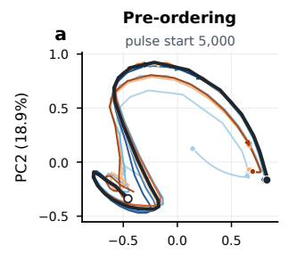

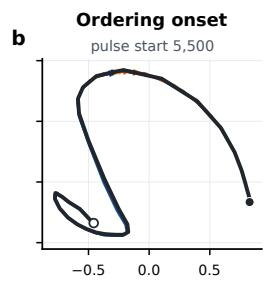  
Higher weight decay: change from baseline +0.05 +0.10 +0.15 +0.20 +0.25

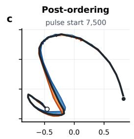

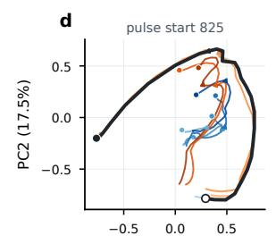

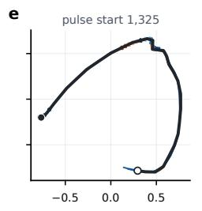

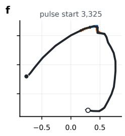

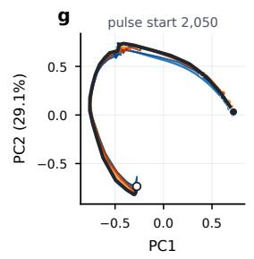

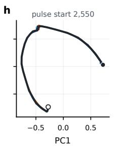

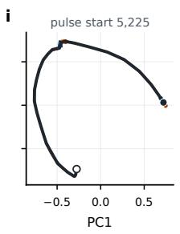  
Figure 6: After ordering emerges, the update-direction trajectories of WD pulse branches and the baseline approximately overlap in the PCA projection. Task 1, seeds 2, 4, and 9 (the same runs shown in Figure 2(a)). Black curves show the baseline and colored curves show different WD pulse branches. For each run, the top row corresponds to decreased WD and the bottom row to increased WD; the three columns correspond to pre-ordering, ordering onset, and post-ordering pulse starts. Update directions are computed using the centered difference $( \theta _ { t + 2 5 } - \theta _ { t - 2 5 } ) / \lVert \theta _ { t + 2 5 } -$ $\theta _ { t - 2 5 } \lVert _ { 2 }$ and sampled every 50 epochs. PCA is fit separately for each run, with all panels within a run sharing the same PCA basis, coordinate range, and axis aspect ratio. All three runs show the same trend: pre-ordering branches clearly deviate from the baseline; from the ordering onset onward, the projected trajectories of different branches and the baseline are already approximately overlapping, with the main difference being the time at which they pass through corresponding parts of the trajectory.

## E Comparison with Existing Progress Measures

Progress measures in the grokking literature ask whether observable changes related to generalization appear inside the model before test performance improves. If such signals emerge early during the plateau, hidden progress toward generalization can be tracked through static measurements of checkpoints. We test whether two representative classes of progress measures provide such an advance signal in Task 1 using four clear-grokking runs (seeds 2, 4, 9, and 21). Both classes of measures are computed directly from checkpoints saved during training. Results are shown in Figure 7.

Restricted/excluded decomposition. Nanda et al. [5] decompose model outputs into a component aligned with the correct rule and a remaining component. The restricted model retains only the rule-aligned component, so a decrease in its test loss indicates that this component has begun to support generalization. The excluded model removes the rule-aligned component from the original output, and its train loss is used to characterize the remaining memorization component. For Task 1, the correct rule corresponds to a fixed parity checkerboard pattern over the 48 × 48 input grid, allowing this decomposition to be performed directly in output-function space.

We first arrange the model logits over all 2304 inputs $( i , j )$ into a matrix $L _ { t } \ \in \ \mathbb { R } ^ { 4 8 \times 4 8 }$ , where matrix entry $( i , j )$ corresponds to the output on input pair (i, j). We then remove the mean logit shared across all inputs to obtain the centered matrix

$$
C _ { t } = L _ { t } - \bar { L } _ { t } .
$$

This removes the global bias while preserving variation in the output across input combinations.

The correct rule in Task 1 depends only on whether the two indices have the same parity, producing a fixed checkerboard pattern over the full input grid. We refer to this pattern as the joint-parity direction, corresponding to the interaction between the parity of the two inputs, and write it as a matrix with unit Frobenius norm:

$$
R [ i , j ] = \frac { ( - 1 ) ^ { i } ( - 1 ) ^ { j } } { 4 8 } .
$$

The projection coefficient of the model output onto this rule direction is

$$
a _ { t } = \langle C _ { t } , R \rangle .
$$

The corresponding rule-aligned component of the model output is therefore

$$
\begin{array} { r } { P _ { t } = a _ { t } R . } \end{array}
$$

Restricted logits are defined as $\bar { L } _ { t } + P _ { t }$ , retaining only the global bias of the original model and the joint-parity rule component, and restricted BCE is computed on the test set. Excluded logits are defined as $L _ { t } - P _ { t }$ , removing the joint-parity rule component from the original output, and excluded BCE is computed on the training set. Restricted BCE therefore tracks when the rule component begins to support predictions on unseen samples, while excluded BCE tracks changes in the remaining training-fit component after the rule component has been removed.

Barak-style amplification. Barak et al. [22] study whether parameters and features associated with the target rule are gradually amplified before generalization appears. If similar hidden progress occurs in Task 1, corresponding signal should accumulate during the plateau. We record two quantities.

First, we measure parameter movement relative to initialization:

$$
{ \frac { \lVert { \boldsymbol { \theta } } _ { t } - { \boldsymbol { \theta } } _ { 0 } \rVert _ { 2 } } { \lVert { \boldsymbol { \theta } } _ { 0 } \rVert _ { 2 } } } ,
$$

which measures the overall displacement of the model parameters from initialization.

Second, we examine whether the complete joint-parity rule gradually appears in the hidden-layer representations. We perform a two-dimensional Fourier decomposition of hidden-layer activations over the full 48 × 48 input grid. The modes (24, 0) and (0, 24) correspond to the parity patterns of the two individual inputs, while (24, 24) corresponds to the joint-parity rule formed by their interaction. Figure 7 reports the Fourier energy fraction of the joint-parity mode in the fourth hidden layer, defined as the sum of squared amplitudes at the (24, 24) mode across all hidden units divided by the total Fourier energy after excluding the constant (0, 0) mode.

Results. In Task 1, these standard progress measures do not show a clear signal of generalization substantially before it becomes visible. Restricted test BCE remains near chance level throughout almost the entire plateau and begins to decrease only about 50 epochs before the held-out test BCE begins to decrease. Excluded train BCE continues to decrease during training and rises again around generalization. The Barak-style measures show a similar pattern. Parameter movement saturates early in training and changes little thereafter, while the Fourier energy fraction of the joint-parity mode in the fourth hidden layer remains near zero throughout the plateau and rises only around generalization. Thus, in Task 1, these static progress measures do not reveal clear hidden progress substantially before visible generalization. In contrast, the dose-dependent structure of the WD response is already established roughly 4,000 epochs before the baseline crosses α = 0.90 (see Section 3.1).

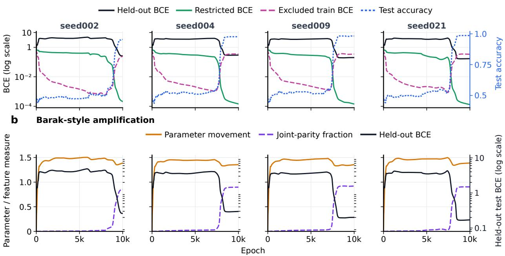  
Task 1: two classic progressive-measure analyses a Nanda-style decomposition  
Figure 7: Existing grokking progress measures provide little advance signal during the Task 1 plateau. Each row corresponds to one clear-grokking run (seeds 2, 4, 9, and 21). (a) Nanda-style restricted/excluded decomposition. Restricted test BCE remains near chance level throughout the plateau and begins to decrease only about 50 epochs before the held-out test BCE begins to decrease (black curve); excluded train BCE continues to decrease and rises again near the generalization transition. The blue curve shows test accuracy (right axis). (b) Barak-style parameter and feature amplification. Parameter movement reaches a stable level early in training and changes little thereafter; the Fourier energy fraction of the joint-parity mode in the fourth hidden layer remains near zero during the plateau and rises near the generalization transition as held-out test BCE decreases.

## F Additional Runs Across Random Initializations

We repeat the analysis from Section 3.2 across 30 Task 1 runs, 24 Task 2 runs, and 16 Task 3 runs. Endpoint selection, the number of interpolation points, and the definition of the test-loss barrier are the same as in Figure 3 (see Appendix C).

Figures 8–10 show that the relationship reported in the main text is broadly reproduced across random initializations. As the pulse start moves later in training, the test-loss barrier between the perturbed and baseline generalization checkpoints decreases, while the directional and dose-dependent structure of $\Delta T _ { 0 . 9 5 }$ persists. Task 1 shows substantial variation in perturbation sensitivity across initializations, and some runs contain many perturbed branches that do not reach 0.95 test accuracy within the observation limit.

The three tasks differ in the degree of trajectory heterogeneity across initializations. Task 1 and Task 2 runs are selected using predefined baseline-screening criteria, whereas Task 3 uses seeds 1–16 without any seed screening. Despite this, Task 3 shows particularly consistent structure across initializations: the changes in both the WD timing responses and the test-loss barriers are highly consistent across seeds. This indicates that, at least in Task 3, the observed phenomenon does not depend on seed screening based on baseline trajectories.

Left: signed WD-response shift (blue earlier; red later); right: test-loss barrier

Task 1: WD-response timing and test-loss barriers across 30 seeds  
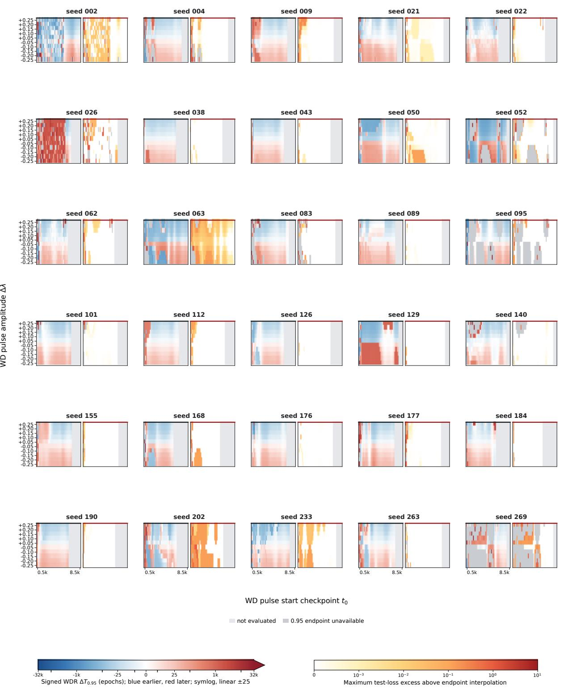  
Figure 8: WD responses and test-loss barriers across 30 independent Task 1 initializations. Run-selection criteria are described in Appendix A.1.

## Task 2: paired WD-response timing and test-loss barriers across 24 seeds

Left: signed WD-response shift (blue earlier; red later); right: test-loss barrie

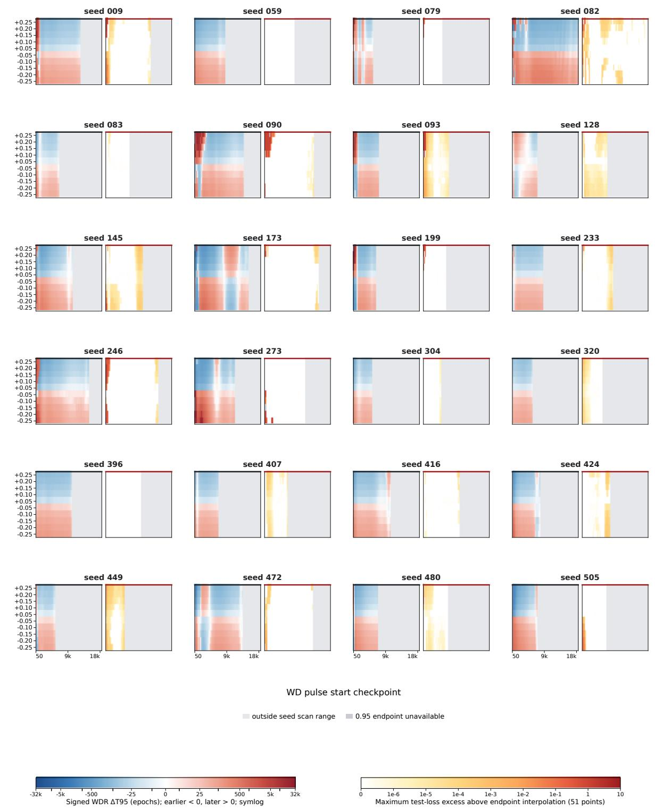  
Figure 9: WD responses and test-loss barriers across 24 independent Task 2 initializations. Run-selection criteria are described in Appendix A.1.

Task 3: paired WD-response timing and test-loss barriers across 16 seeds Left: signed WD-response shift (blue earlier; red later); right: test-loss barrie  
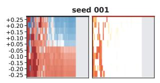

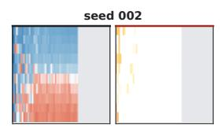

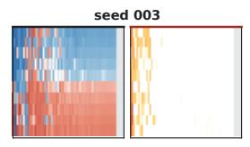

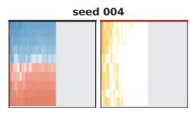

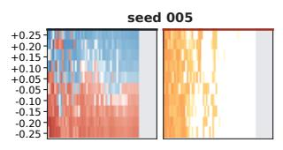

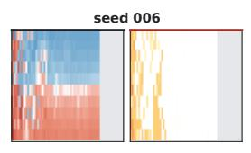

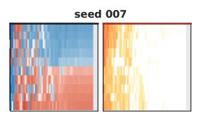

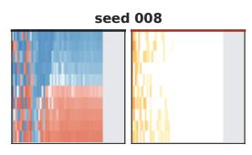

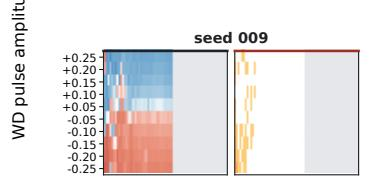

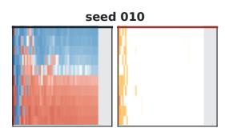

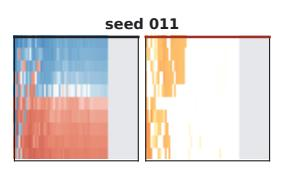

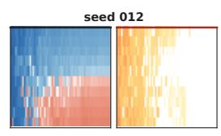

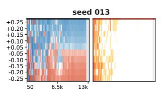

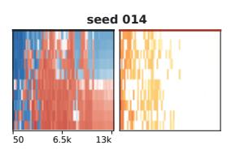

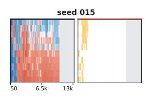

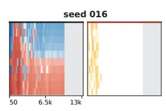

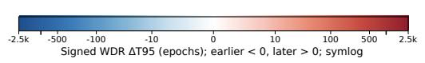

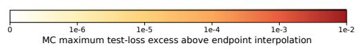  
Figure 10: WD responses and test-loss barriers across 16 independent Task 3 initializations, corresponding to seeds 1–16.