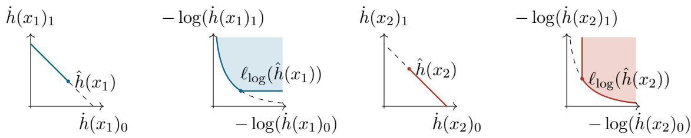
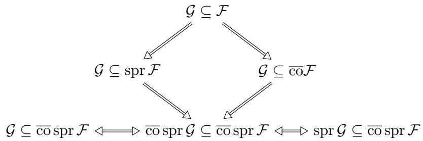
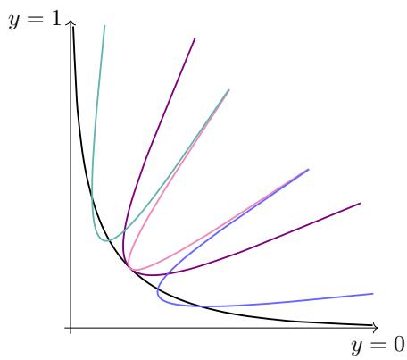
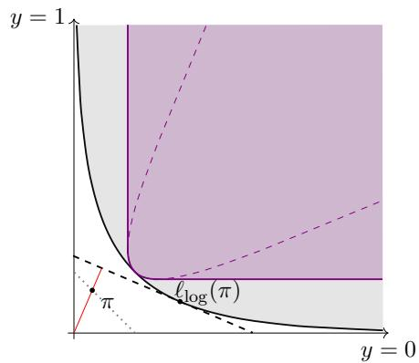
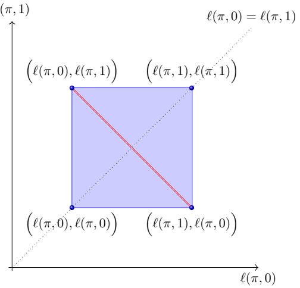
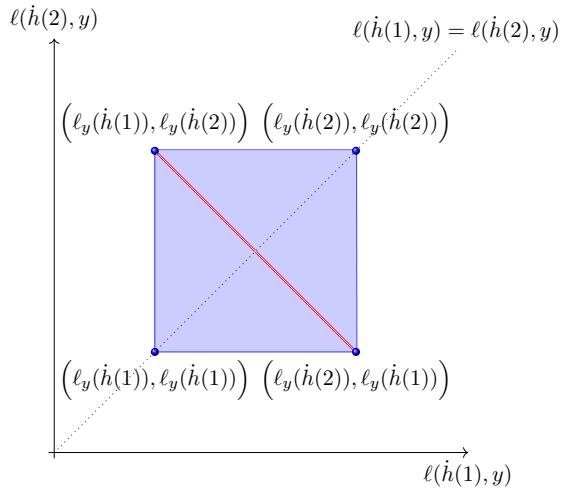
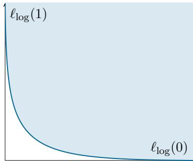
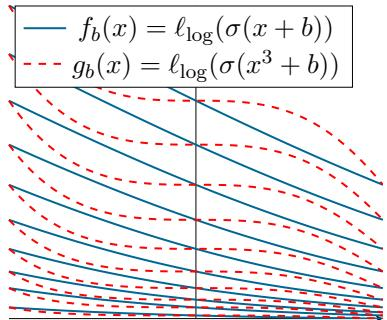

# Comparing Corrupted Constrained Learning Problems

Laura Iacovissi T¨ubingen AI Center, University of T¨ubingen

Rabanus Derr T¨ubingen AI Center, University of T¨ubingen

Robert C. Williamson T¨ubingen AI Center, University of T¨ubingen

laura.iacovissi@uni-tuebingen.de

rabanus.derr@uni-tuebingen.de

bob.williamson@uni-tuebingen.de

## Abstract

A key result in statistics is the data processing inequality, originally proved by Blackwell (1951) and later refined by DeGroot (1962) in terms of statistical uncertainty. It states that the Bayes risk of a statistical experiment obtained by stochastically modifying another experiment cannot be lower than the Bayes risk of the original experiment, regardless of the loss function or prior chosen. In machine learning, this result underlies applications such as the information bottleneck principle and some feature learning techniques. However, machine learning problems are constrained learning problems: the model class used does not include all measurable functions. We present a simple counterexample showing that the classical data processing inequality fails to hold in such a setting. Hence, we formulate a generalized data processing inequality, requiring the constrained Bayes risk of a joint distribution (with respect to a loss function and a constrained hypothesis class) to lower bound the constrained Bayes risk on the stochastically modified distribution, regardless of the choice of distribution. We show this inequality to be equivalent to a set containment condition on a specific function set induced by the loss and model class, called the superprediction set. Finally, we derive suficient conditions for this containment.

Keywords: constrained risk minimization, Markov kernels, data processing inequality, Blackwell order

## 1 Introduction

David Blackwell (1951) introduced a novel method for comparing statistical experiments, modeled as Markov kernels from some set of target variables Y to a set of observables X. He proposed the comparison to be made in terms of the expected losses of the statistical learning problem associated with the statistical experiment, i.e., the decision-theoretic (dis)utility of (mis)identifying the targets from the observables.1 The result was later expanded by himself as well as other authors (e.g., Blackwell, 1953; DeGroot, 1962; Le Cam, 1964), and it gave rise to the field of “comparison of statistical experiments” (Torgersen, 1991; Shiryaev and Spokoiny, 2000).

The most notorious outcome of this line of work is the Blackwell-Sherman-Stein (BSS) theorem (for full statement see, e.g., Le Cam, 1964), which gives an answer to the question of when an experiment is more informative than another, i.e., more “useful” according to the decision-theoretic metric. Roughly stated, the theorem proves that the experiment E is more informative than the experiment $E ^ { \prime }$ w.r.t. any decision problem if and only if $E ^ { \prime }$ can be simulated by performing E and then applying some stochastic noise to its outcome.2 Such an alteration process of an experiment is called randomization.

One half implication of the BSS theorem is known as the data processing inequality (DPI) for Bayes risk, i.e., the minimally achieved expected loss when identifying the latents from the observables. The DPI result states that the Bayes risk of a statistical experiment obtained as a randomization of another can not be lower than the originally achieved Bayes risk (DeGroot, 1962). The same result has been also proved in the context of information theory (Kullback and Leibler, 1951) and the theory of divergences (Ali and Silvey, 1966), and has found applications for instance in economics (e.g., see Khan et al., 2024) and machine learning.

## 1.1 Data Processing Inequality in Machine Learning

As the popularity of machine learning increased diferent flavors of the DPI regained new attention, for instance in the context of feature learning (van Rooyen and Williamson, 2015), or when understanding the relationship between predictive capabilities and information, both formally (Reid and Williamson, 2011; Williamson and Cranko, 2024) and empirically (Zhao et al., 2022), as well as to explain observed behaviors of learning schemes, e.g., using the information bottleneck principle (Tishby et al., 1999; Tishby and Zaslavsky, 2015). However, the modern modes, or cultures, of statistics (cf. Breiman, 2001) are high-dimensional, non-parametric, and less focused on the data-generating process (cf. page 7, Shalev-Shwartz and Ben-David, 2014). They have features distinct from Blackwell (1951)’s setting, which instead aligns with the classical statistical approach to learning and modeling that focuses on the data-generating distribution (Breiman, 2001).

This discrepancy may in principle lead to incorrect conclusions. For instance, consider the case of pre-trained large models, now a standard tool in machine learning: they provide representations, i.e., non-bijective transformations of data, which are learned from large, general purpose datasets and then plugged into simple task-adapted predictive models, sometimes called “head”. If we assume that it is legitimate to apply the data processing inequality for Bayes risk to this setting, the theorem prescribes that the use of pre-trained representations should not improve predictive performance over a non pre-trained representation when the ad-hoc “head” is perfectly optimized for a fixed loss function and data distribution. Yet, empirical evidence seemingly contradicts this. How can this observation be reconciled with the existing literature?

Diferent scholars have already noticed this discrepancy and started approaching it in diferent ways, either seeing it as a feature for the machine learning setting (e.g., Xu et al., 2020; Ethayarajh et al., 2022) or a bug (e.g., Finzi et al., 2026; Turgeman and Tirer, 2026). We aim to face this problem in a more fundamental way, as we notice that the modern “machine learning” mode of statistics shifts the importance from the underlying data-generating distribution to model classes of predictors, from experiments to joint data distributions, and from general decision problems to specific loss functions. The BSS theorem and the DPI result are only partially equipped to shed light on the new modes, and therefore they require re-investigation with a shift towards the new elements of importance.

## 1.2 A Generalized DPI Tailored to Machine Learning Practices

To address the limitations of comparing statistical learning problems in machine learning using the DPI, we aim to generalize the inequality studied in DeGroot (1962)’s Theorem 6.21, i.e.,3

$$
\begin{array} { r } { \mathrm { B R } _ { \ell } ( \pi _ { \mathcal V } \times E ) \le \mathrm { B R } _ { \ell } ( \pi _ { \mathcal V } \times E ^ { \prime } ) \quad \forall \mathrm { ~ m a r g i n a l ~ p r o b a b i l i t y ~ } \pi _ { \mathcal V } , \forall \mathrm { ~ l o s s ~ } \ell . } \end{array}\tag{1}
$$

In words, the Bayes risk BR with respect to all loss functions ℓ and under all fixed prior distribution $\pi _ { \mathcal { V } }$ over some finite set of target variables Y is larger for the randomized experiment $E ^ { \prime }$ derived from experiment $E ,$ than for the “pure” experiment E. Instead, in this paper, we contribute the definition and analysis of a more general formulation of the DPI (GDPI),

$$
\mathrm { B R } _ { \ell \circ \mathcal { H } } ( \phi ) \leq \mathrm { B R } _ { \ell \circ \mathcal { H } } ( \phi ^ { \prime } ) \quad \forall \mathrm { ~ p r o b a b i l i t y ~ } \phi , \mathrm { a ~ f i x e d ~ l o s s ~ } \ell , \mathrm { a n d ~ m o d e l ~ c l a s s ~ } \mathcal { H } ,\tag{2}
$$

which is motivated by the observations made for the pre-trained representation examples as well as the identified features of the “machine learning” culture of statistics described above. While at this stage keeping the definition of the generalized DPI informal, we want to bring to the reader’s attention the key changes we introduce in our proposed formulation.

(a) From prior $\pi _ { \mathcal { V } }$ and experiment E to joint distribution $\phi = \pi _ { \mathcal { V } } \times E$

(b) From loss function ℓ to loss function and constrained model class $\ell \circ \mathcal { H }$

(c) From $\forall$ marginal probability $\pi _ { \mathcal { V } }$ to $\forall$ probability $\phi .$

(d) From ∀ loss ℓ to a fixed loss ℓ and model class $\mathcal { H } .$

The transition from unconstrained (no H) to constrained statistical problems (with H) is a central aspect in our shift from the classical statistical approach towards a more modern approach to learning.4 Even in the case of large models that may look like no constraint is imposed, the efective model class, i.e., models which are actually considered during training, is limited by the learning algorithm influencing the convergence dynamic, the loss landscape, the initialization conditions, how data are fed into the model at training time, etc.

This transition introduces substantial complications, discussed in detail in the next sections. In particular, the result of DeGroot (1962) does not extend to constrained Bayes risk, as we show in Section 3 with a simple counterexample. Moreover, the class of admissible corruptions, i.e., modifications of problems, is much broader than experiment randomization only, and diferent corruptions have diferent consequences depending on their type (Iacovissi et al., 2026).

Consequently, in Section 4 we characterize a generalized DPI from Eq. (2), for a fixed loss and model class while allowing $\phi$ to vary. This perspective is not only novel,5 but also deliberately removes the least accessible component of a learning problem—the datagenerating distribution—and centers the analysis on the loss and model class, which are specified by the practitioner and encode their domain knowledge and needs. As a tool, we leverage the concept of the superprediction set, which is introduced and generalized to constrained statistical problems in Section 2.3. Such a characterization using superprediction sets allows us to prove a set of generalized DPI results, i.e., suficient conditions for the inequality in Eq. (2) to hold (Section 5).6

## 2 Statistical Learning Problems with Markov Kernels

We now introduce all the notation and formal setup to state and prove our contributions.

A topological vector space is a vector space $\mathcal { Z }$ over R, equipped with a topology T that makes the vector addition and scalar multiplication maps continuous. In the remainder, we simply refer to it as a vector space and specify the topology when not apparent.

A subset $\mathcal { X } \subseteq \mathcal { Z }$ is called convex if for every pair of points $y , w \in { \mathcal { X } }$ and every $\lambda \in [ 0 , 1 ]$ the point $\lambda y + ( 1 - \lambda ) w$ also belongs to X. The convex hull of $\mathcal { Z } ,$ , denoted $\operatorname { c o } ( { \mathcal { Z } } )$ , is the smallest convex set containing Z. Finally, a point $z \in { \mathcal { Z } }$ is called an extreme point of $\mathcal { Z } \operatorname { i f }$ it cannot be expressed as a nontrivial convex combination of other points in Z. Formally, z is extreme if for any $y , w \in { \mathcal { Z } }$ and any $\lambda \in ( 0 , 1 ) , z = \lambda y + ( 1 - \lambda ) w \implies y = w = z .$ The set of all extreme points of Z is denoted $\mathrm { e x t } ( \mathcal { Z } ) : = \{ z \in \mathcal { Z } : z$ is an extreme point of $\mathcal { Z } \}$ .

An ordered pair $( \mathcal { Z } , \Sigma )$ , consisting of a set $\mathcal { Z }$ and a σ-algebra Σ on it, is called a measurable space. When Z is a separable, completely metrizable topological space, it is said to be a Polish space; if Z is a Polish space and $\Sigma ( { \mathcal { Z } } )$ the associated Borel σ-algebra generated by its topology, the measurable space $( { \mathcal { Z } } , { \mathcal { Z } } ( { \mathcal { Z } } ) )$ is said to be a standard Borel measurable space. In the following, we will only us the notation $\Sigma ( { \mathcal { Z } } )$ for the Borel $\sigma -$ algebra, as we will mostly use them in our setting.

The set of functions $f \colon { \mathcal { Z } }  \mathbb { R }$ that are bounded, i.e., $\exists C \in \mathbb { R } _ { \geq 0 } \mid \left| f ( z ) \right| \leq C , \forall z \in { \mathcal { Z } }$ and $\Sigma ( { \mathcal { Z } } )$ -measurable is denoted as $B _ { b } ( \mathcal { Z } )$

The set of all continuous, linear functionals on $B _ { b } ( \mathcal { Z } )$ coincides with ba(Z), the space of all finitely additive, signed measures µ: $( \mathcal { Z } , \mathcal { Z } ( \mathcal { Z } ) )  \mathbb { R }$ with bounded total variation $\| \mu \| _ { \infty }$ (Aliprantis and Border, 2006, Theorem 14.4). Its subset $\mathrm { c a } ( { \mathcal { Z } } ) \subset \mathrm { b a } ( { \mathcal { Z } } )$ instead indicates the set of all countably additive, signed measures with bounded total variation.

We denote by $\varDelta ( \mathcal { Z } )$ the set of finitely additive probability measures on $( \mathcal { Z } , \Sigma )$ , while its subset of all countably additive probability measures (or simply “probability distribution”) is denoted $\varDelta _ { \mathrm { { c a } } } ( \mathcal { Z } )$

Let $( \mathcal { Z } , \Sigma )$ and $( \mathcal { Z } ^ { \prime } , \Sigma ^ { \prime } )$ be measurable spaces. A function $f \colon { \mathcal { Z } }  { \mathcal { Z } } ^ { \prime }$ is said to be measurable if for every $A \in \Sigma ^ { \prime }$ the pre-image of A under f is in $\Sigma ;$ that is, for all $\mathcal { A } \in \Sigma ^ { \prime }$ $f ^ { - 1 } ( A ) : = \{ z \in \mathcal { Z } | f ( x ) \in \mathcal { A } \} \in \Sigma$

We define $\sigma ( B _ { b } , \mathrm { b a } )$ as the topology on $B _ { b } ( \mathcal { Z } )$ which makes every functional $f \mapsto \langle f , \mu \rangle$ (for any $\mu \in \mathrm { b a } ( \mathcal { Z } ) )$ continuous. Analogously, $\sigma ( \mathrm { b a } , B _ { b } )$ is the topology on ba(Z) which makes every functional $\mu \mapsto \langle f , \mu \rangle$ (for any $f \in B _ { b } ( \mathcal { Z } ) )$ continuous. We refer to these topologies as weak for the respective spaces. For further details see Appendix A.

## 2.1 Markov Kernels

Markov kernels provide a formal and general framework for statistical learning problems. They extend the notion of stochastic maps beyond finite or discrete settings, enabling a consistent and rigorous treatment of conditional probability in continuous or uncountable spaces. In our standard Borel framework, they coincide with regular conditional distributions, providing the standard measure-theoretic framework for conditional probability (C¸ inlar, 2011). We formally introduce them in the following.

Definition 1 (Kernels and Markov Kernels) Let $\left( \mathcal { Z } _ { 1 } , \Sigma _ { 1 } \right)$ and $\left( \mathcal { Z } _ { 2 } , \Sigma _ { 2 } \right)$ be standard Borel. Let $\kappa \colon \mathcal { Z } _ { 1 } \times \Sigma _ { 2 } \to [ 0 , + \infty )$ . Then, κ is called a kernel from $( \mathcal { Z } _ { 1 } , \Sigma _ { 1 } )$ to $( \mathcal { Z } _ { 2 } , \Sigma _ { 2 } )$ if

1. the mapping z1 $\mapsto \kappa ( z _ { 1 } , B )$ is Σ1-measurable for every set $B \in \Sigma _ { 2 } ,$

2. the mapping $B \mapsto \kappa ( z _ { 1 } , B )$ is a countably additive measure on $\left( \mathcal { Z } _ { 2 } , \Sigma _ { 2 } \right)$ for every $z _ { 1 } \in { \mathcal { Z } } _ { 1 }$

When the second mapping induces a countably additive probability distribution, then κ is a Markov kernel. We refer to the set of such Markov kernels as $\mathcal { M } ( \mathcal { Z } _ { 1 } , \mathcal { Z } _ { 2 } )$

Example 1 Consider a set ${ \mathcal Z } = \{ 0 , 1 \}$ , a kernel $\kappa \in \mathcal { M } ( \mathcal { Z } , \mathcal { Z } )$ , and random variables $Z , { \tilde { Z } }$ on the probability space $( \mathcal { Z } , \Sigma ( \mathcal { Z } ) , \phi )$ . We can conveniently represent the kernel with a matrix whose entries are the values of the associated conditional density p:

$$
\kappa = \left[ \begin{array} { l l } { p ( \tilde { Z } = 1 | Z = 1 ) } & { p ( \tilde { Z } = 1 | Z = 0 ) } \\ { p ( \tilde { Z } = 0 | Z = 1 ) } & { p ( \tilde { Z } = 0 | Z = 0 ) } \end{array} \right] .\tag{3}
$$

Associated with a Markov kernel are the functionals called Markov transition, Markov operator and Markov operator adjoint. We define them and provide basic properties in the following.

Proposition 2 (Markov Transition, Theorem 19.13, Aliprantis and Border (2006)) Let κ be a Markov kernel from $\left( \mathcal { Z } _ { 1 } , \Sigma _ { 1 } \right)$ to $\left( \mathcal { Z } _ { 2 } , \Sigma _ { 2 } \right)$ . The function

$$
\dot { \kappa } \colon \mathcal { Z } _ { 1 } \to { \varDelta } _ { \mathrm { c a } } ( \mathcal { Z } _ { 2 } ) , \qquad z _ { 1 } \mapsto \dot { \kappa } ( z _ { 1 } ) : = \kappa ( z _ { 1 } , \cdot ) ,\tag{4}
$$

is know as Markov transition, and it is measurable with respect to $\Sigma ( \varDelta _ { \mathrm { c a } } ( \mathcal { Z } _ { 2 } ) )$ , the Borelσ-algebra induced by the σ(ba, B )-topology on $\varDelta _ { \mathrm { { c a } } } ( \mathcal { Z } _ { 2 } )$ .

Once we establish the concept of Markov transition, we can define the related operator and adjoint operator. These functionals are sometimes also referred to as Markov kernel actions, as they allow the object to be combined with functions and probabilities.

Proposition 3 (Markov Kernel Actions) Let $\kappa \in \mathcal { M } ( \mathcal { Z } _ { 1 } , \mathcal { Z } _ { 2 } )$ be a Markov kernel.

1. The Markov operator ˆκ: $B _ { b } ( { \mathcal { Z } } _ { 2 } )  B _ { b } ( { \mathcal { Z } } _ { 1 } )$ is the mapping

$$
f \mapsto { \hat { \kappa } } f \quad s . t . \quad z _ { 1 } \in { \mathcal { Z } } _ { 1 } \mapsto ( { \hat { \kappa } } f ) ( z _ { 1 } ) : = \int _ { { \mathcal { Z } } _ { 2 } } f ( z _ { 2 } ) \kappa ( z _ { 1 } , d z _ { 2 } ) ;\tag{5}
$$

2. The Markov operator adjoint, denoted κˇ : ba $( \mathcal { Z } _ { 1 } )  \mathrm { b a } ( \mathcal { Z } _ { 2 } )$

$$
\mu \mapsto \check { \kappa } \mu \quad s . t . \quad B \in \Sigma _ { 2 } \mapsto ( \check { \kappa } \mu ) ( B ) : = \int _ { \mathcal { Z } _ { 1 } } \kappa ( z _ { 1 } , B ) d \mu .\tag{6}
$$

In particular, $i f \mu \in \mathrm { c a } ( \mathcal { Z } _ { 1 } )$ , then $\check { \kappa } \mu \in \mathrm { c a } ( \mathcal { Z } _ { 2 } )$ $I f \mu \in { \varDelta } _ { \mathrm { c a } } ( \mathcal { Z } _ { 1 } )$ , then $\check { \kappa } \mu \in { \varDelta _ { \mathrm { c a } } } ( \mathcal { Z } _ { 2 } )$

Proof The first statement is proved in Theorem 19.7 in (Aliprantis and Border, 2006).   
The second statement is proved in Theorem 19.9, point 2 in (Aliprantis and Border, 2006).

Definition 4 (Markov Kernel Action on a Set of Functions) Let κˆ be a Markov operator associated to the Markov kernel $\kappa \in \mathcal { M } ( \mathcal { Z } _ { 1 } , \mathcal { Z } _ { 2 } )$ . We define the action of the kernel on a set as,

$$
{ \hat { \kappa } } { \mathcal { F } } : = \{ { \hat { \kappa } } f , ~ f \in { \mathcal { F } } \} .\tag{7}
$$

Definition 5 (Deterministic, Identity and Degenerate Markov Kernels) A deterministic Markov kernel $\kappa _ { f } \in \mathcal { M } ( \mathcal { Z } _ { 1 } , \mathcal { Z } _ { 2 } )$ induced by some measurable function $f \colon { \mathcal { Z } } _ { 1 } \to { \mathcal { Z } } _ { 2 }$ is defined as

$$
( z _ { 1 } , \mathcal { A } ) \mapsto \kappa _ { f } ( z _ { 1 } , \mathcal { A } ) : = \mathbb { 1 } _ { \mathcal { A } } ( f ( z _ { 1 } ) ) ,\tag{8}
$$

where $\mathbb { 1 } _ { \boldsymbol { \mathcal { A } } } ( \boldsymbol { x } )$ denotes the indicator function for A at x. The identity Markov kernel for a set Z is the deterministic Markov kernel in $\kappa _ { i d } \in \mathcal { M } ( \mathcal { Z } , \mathcal { Z } )$ induced by the identity function on Z. A degenerate or non-informative kernel $\kappa _ { \nu } \in \mathcal { M } ( \mathcal { Z } _ { 1 } , \mathcal { Z } _ { 2 } )$ induced by the probability distribution $\nu \in \varDelta _ { \mathrm { c a } } ( \mathcal { Z } _ { 2 } )$ is the one with associated operator

$$
\dot { \kappa } _ { \nu } \colon \mathcal { Z } _ { 1 }  { \varDelta } _ { \mathrm { c a } } ( \mathcal { Z } _ { 2 } ) , \quad \dot { \kappa } _ { \nu } ( z _ { 1 } ) = \nu , \quad \forall z _ { 1 } \in \mathcal { Z } _ { 1 } .\tag{9}
$$

As a consequence, every measurable function $f \colon { \mathcal { Z } } _ { 1 } \to { \mathcal { Z } } _ { 2 }$ and probability $\nu \in \varDelta _ { \mathrm { c a } } ( \mathcal { Z } _ { 2 } )$ can be represented by a kernel.

Proposition 6 The set of extreme points of all Markov kernels is the set of deterministic kernels induced by all measurable functions, i.e.,

$$
\mathrm { e x t } \mathcal { M } ( \mathcal { Z } _ { 1 } , \mathcal { Z } _ { 2 } ) = \{ \kappa _ { f } \in \mathcal { M } ( \mathcal { Z } _ { 1 } , \mathcal { Z } _ { 2 } ) \mid f \colon \mathcal { Z } _ { 1 } \to \mathcal { Z } _ { 2 } \mathit { m e a s u r a b l e } \} .\tag{10}
$$

Proof The statement is a direct consequence of (Gonz´alez Hern´andez and Hern´andez Lerma, 2005, Lemma 3.3) considering their unconstrained setting.

Following (Iacovissi et al., 2026), we will use Markov kernels for modeling changes in statistical learning problems, and talk of corruption kernels or more generally corruptions.

## 2.2 Decision-theoretic setup

An experiment $E \in \mathcal { M } ( \mathcal { V } , \mathcal { X } )$ is a Markov kernel from the finite label space $( \mathcal { V } , \Sigma ( \mathcal { V } ) )$ to the standard Borel attribute space $( \mathcal { X } , \Sigma ( \mathcal { X } ) )$ , with $\mathcal { X } \subseteq \mathbb { R } ^ { d } , d \geq 1$ . Given $\pi _ { \mathcal { Y } } \in \varDelta _ { \mathrm { c a } } ( \mathcal { Y } )$ and $E \in ( \mathcal { V } , \mathcal { X } )$ , their product composition $\pi _ { \mathcal { Y } } \times E$ identifies a joint probability distribution $\phi \in \varDelta _ { \mathrm { c a } } ( \mathcal { X } \times \mathcal { Y } )$ . We call $\pi _ { \mathcal { Y } } \times E$ its Bayes decomposition.

Let $\mathcal { H } \subseteq \mathcal { M } ( \mathcal { X } , \mathcal { Y } )$ be a model class and ℓ: $\mathcal { \Delta } _ { \mathrm { c a } } ( \mathcal { V } ) \times \mathcal { V }  \mathbb { R } _ { > 0 }$ a bounded, measurable loss function.7 Notice that, as $\dot { h }$ is a measurable function for $h \in { \mathcal { H } }$ (Proposition 2), the function $( x , y ) \mapsto \ell ( { \dot { h } } ( x ) , y )$ is also measurable and bounded. Then, for all $h \in \mathcal H$ $\ell \circ h \colon ( x , y ) \mapsto \ell ( \dot { h } ( x ) , y ) \in \mathcal { B } _ { b } ( \mathcal { X } \times \mathcal { Y } )$ . The set of functions obtained through a composition of a loss and a model is written as $\ell \circ \mathcal { H } : = \{ \ell \circ \dot { h } : h \in \mathcal { H } \}$ , and called the set of attainable prediction losses.

Definition 7 (Risk and Bayes Risk) Consider a loss $\ell \colon \varDelta _ { \mathrm { c a } } ( y ) \times y  \mathbb { R } _ { > 0 }$ , a model class $\mathcal { H } \subseteq \mathcal { M } ( \mathcal { X } , \mathcal { Y } )$ and a joint probability distribution $\phi : = \pi y \times E \in \varDelta _ { \mathrm { c a } } ( \mathcal { X } \times \mathcal { Y } )$ , with $\pi _ { \mathcal { Y } } \in \varDelta _ { \mathrm { c a } } ( \mathcal { Y } )$ and $E \in \mathcal { M } ( \mathcal { V } , \mathcal { X } )$ Then, the Bayes risk (BR) induced by the attainable prediction losses ℓ ◦ H is defined as

$$
{ \mathrm { B R } } _ { \ell \circ \mathcal { H } } ( \pi _ { \mathcal { V } } \times E ) : = \operatorname* { i n f } _ { h \in \mathcal { H } } { \mathrm { R } } _ { \pi _ { \mathcal { V } } \times E } ( \ell \circ h ) ,\tag{11}
$$

$$
\mathrm { R } _ { \pi _ { \mathcal { V } } \times E } ( \ell \circ h ) : = \mathbb { E } _ { Y \sim \pi _ { \mathcal { V } } } \mathbb { E } _ { X \sim \dot { E } ( Y ) } \ell ( h ( X ) , Y ) .\tag{12}
$$

Here, R is known as the risk associated to ℓ◦h with respect to the joint probability distribution $\pi _ { \mathcal { Y } } \times E . ^ { 8 }$

Definition 8 (Statistical Learning Problem) Let $( { \mathcal { X } } \times { \mathcal { Y } } , { \Sigma } ( { \mathcal { X } } \times { \mathcal { Y } } ) )$ be a standard Borel space, with a finite set of labels Y and a set of attributes $\mathcal { X } \subseteq \mathbb { R } ^ { d }$ . A statistical learning problem consists of:

(a) a loss $\ell \colon \varDelta _ { \mathrm { c a } } ( y ) \times y  \mathbb { R } _ { \geq 0 }$ , measurable and bounded,

(b) a model class $\mathcal { H } \subseteq \mathcal { M } ( \mathcal { X } , \mathcal { Y } )$

(c) a the data-generating distribution $\phi \in \varDelta _ { \mathrm { c a } } ( \mathcal { X } \times \mathcal { Y } )$ , which can be obtained by combining a marginal $\pi _ { \mathcal { Y } } \in \varDelta _ { \mathrm { c a } } ( \mathcal { Y } )$ and an experiment $E \in \mathcal { M } ( \mathcal { Y } , \mathcal { X } )$ as $\phi : = \pi y \times E$ 2

paired with the risk minimization learning objective, i.e., to find the optimal model $h \in \mathcal H$ that achieves the associated Bayes risk.

In the following, we will refer to the set of measurable and bounded losses of the form $\ell \colon \varDelta _ { \mathrm { c a } } ( y ) \times y  \mathbb { R } _ { \geq 0 }$ as the set $\mathcal { L } ( \mathcal { y } )$

Lemma 9 Let $( { \mathcal { X } } \times { \mathcal { Y } } , { \mathcal { D } } ( { \mathcal { X } } ) \times { \mathcal { D } } ( { \mathcal { Y } } )$ be standard Borel. Consider a loss $\ell \in \mathcal L ( \mathcal { Y } )$ , a model $h \in \mathcal { M } ( \mathcal { X } , \mathcal { Y } )$ , and a probability distribution $\phi \in \varDelta _ { \mathrm { c a } } ( \mathcal { X } \times \mathcal { Y } )$ . Let $\kappa \in \mathcal M ( \mathcal X \times \mathcal y , \mathcal X \times \mathcal y )$ Then,

$$
\mathrm { R } _ { \phi } [ \hat { \kappa } ( \ell \circ h ) ] = \mathrm { R } _ { \check { \kappa } \phi } [ \ell \circ h ] .\tag{13}
$$

  
(a) $\mathcal { H } _ { x _ { 1 } } \subset \varDelta _ { \mathrm { c a } } ( \mathcal { V } )$  
(b) spr(ℓlog ◦ Hx1 )  
(c) $\mathcal { H } _ { x _ { 2 } } \subset \varDelta _ { \mathrm { c a } } ( \mathcal { V } )$  
(d) spr(ℓlog ◦ Hx2 )  
Figure 1: Visualization of the set $\mathrm { s p r } ( \ell _ { \log } \circ \mathcal { H } _ { x } ) , \ell _ { \log } ( \phi , y ) : = - \log ( \phi _ { y } ) , \phi \in \varDelta _ { \mathrm { c a } } ( \mathcal { V } )$ , for a model class that does not cover the whole simplex. We assume $\hat { h } ( x _ { i } ) = ( \hat { h } ( x _ { i } ) _ { 0 } , \hat { h } ( x _ { i } ) _ { 1 } ) : =$ $( \eta _ { i } , 1 - \eta _ { i } )$ for $\eta _ { 1 } = 0 . 6$ and $\eta _ { 2 } = 0 . 4$

## 2.3 Constrained Superprediction Set

A central tool for the characterization of our generalized data processing inequality is the superprediction set. We borrow this concept from the context of algorithmic learning theory (Vovk, 1990, 1995; Kalnishkan and Vyugin, 2002a; Cabrera Pacheco et al., 2025)9 and the geometry of loss functions (Williamson et al., 2016; Williamson and Cranko, 2023; Cabrera Pacheco and Williamson, 2023). Originally, the superprediction set consisted of all values bigger than (“super”) the loss values of any possible class probability prediction (see Appendix D). In particular, the optimality properties of a (proper) loss function are exhaustively described by its corresponding superprediction set. The key insight we leverage is that the conditional Bayes risk can be written as a support function of the superprediction set (Williamson and Cranko, 2023, Theorem 15). As former definitions, e.g., Cranko (2021), neglected constraints to hypotheses we introduce them here and thereby generalize the theory of superprediction sets.

Definition 10 (Constrained Superprediction Set with Respect to Model Class) Let $\mathcal { H } \subseteq \mathcal { M } ( \mathcal { X } , \mathcal { Y } )$ be a model class and $\ell \in \mathcal L ( \mathcal I )$ be a loss function. We define the constrained superprediction set of ℓ ◦ H as

$$
\operatorname { s p r } ( \ell \circ \mathcal { H } ) : = \bigcup _ { h \in \mathcal { H } } \left\{ f \in \mathcal { B } _ { b } ( \mathcal { X } \times \mathcal { Y } ) \mid ( \ell \circ h ) ( x , y ) \leq f ( x , y ) \ \forall ( x , y ) \in \mathcal { X } \times \mathcal { Y } \right\} .\tag{14}
$$

For an illustration of the definition consider Figure 1. We shortly discuss a naive, alternative construction and the relationship of our definition with the classical definition of superprediction sets in Appendix D.

We can also define the superprediction set in a more general fashion, not necessarily assuming a loss and model class but functions in $B _ { b } ( { \mathcal { X } } \times { \mathcal { Y } } ) _ { \geq 0 }$ . This definition will be useful later, when studying how the superprediction set is modified by the action of a Markov kernel.

Definition 11 (Superprediction Set Operator) Let ${ \mathcal F } \subseteq B _ { b } ( { \mathcal Z } ) _ { \geq 0 }$ non-empty. The superprediction set of $\mathcal { F }$ is defined as,

$$
\operatorname { s p r } ( { \mathcal { F } } ) : = \bigcup _ { a \in { \mathcal { F } } } \left\{ f \in { \mathcal { B } } _ { b } ( { \mathcal { Z } } ) | a ( z ) \leq f ( z ) \ \forall z \in { \mathcal { Z } } \right\} .\tag{15}
$$

The key feature of superprediction sets is its relationship to the Bayes risk. For this purpose, we introduce support functions, a standard tool in convex analysis. However, diferent to most works we consider concave instead of convex support functions, i.e., instead of a supremum we consider an infimum.

Definition 12 (Support Functions) Let $\mathcal { Z }$ be a Polish space. Let $\mathcal { A } \subseteq B _ { b } ( \mathcal { Z } )$ and $\boldsymbol { B } \subseteq$ ba(Z) be non-empty, the functions

$$
\rho _ { \cal A } ( \mu ) : = \operatorname* { i n f } _ { f \in { \cal A } } \langle f , \mu \rangle , \qquad \rho _ { \cal B } ( f ) : = \operatorname* { i n f } _ { \mu \in { \cal B } } \langle f , \mu \rangle ,\tag{16}
$$

are called concave support functions.

When $\mathcal { Z }$ is a Polish space and $\mathcal { F } \subseteq B _ { b } ( \mathcal { Z } )$ a non-empty set of functions, we notice that the support function is invariant to the convex and topological closure (denoted co) of the set (Lemma 43), hence in particular,

$$
\begin{array} { r } { \rho _ { \mathcal { F } } ( \mu ) = \rho _ { \overline { { \mathrm { c o } } } ( \mathcal { F } ) } ( \mu ) , \ \mu \in \mathrm { b a } ( \mathcal { Z } ) . } \end{array}\tag{17}
$$

Proposition 13 (Support Function of Superprediction Set is Bayes Risk) Let $\ell \in$ $\mathcal { L } ( \mathcal { y } )$ be a loss function and $\mathcal { H } \in \mathcal { M } ( \mathcal { X } , \mathcal { Y } )$ a model class. Then,

$$
\begin{array} { r } { \rho _ { \mathrm { s p r } ( \ell \circ \mathcal { H } ) } ( \phi ) = \mathrm { B R } _ { \ell \circ \mathcal { H } } ( \phi ) , \phi \in \varDelta ( \mathcal { X } \times \mathcal { Y } ) . } \end{array}\tag{18}
$$

Proposition 13, proved in Appendix E, generalizes the correspondence of the unconstrained superprediction set with the conditional Bayes risk stated in (Williamson and Cranko, 2024, Remark 18) and (Williamson and Cranko, 2023, Theorem 15).10

Remark 14 The reader might have noticed the use of $\varDelta ( \mathcal { X } \times \mathcal { Y } )$ in Proposition 13, which is the set of all finitely additive probability measures. Still, the Bayes risk is well-defined (Appendix C). Note that this is an artifact of our choice to use the dual pairing between bounded measurable functions and finitely additive measures (Section 2). In principle, other pairings would as well drive our main results Corollary 17 and Corollary 19. However, those pairings would come with other restrictions such as continuity of the functions and/or the measures. Hence, our setup is rather general and encompasses as well arbitrary countably additive probability measures. To reduce further confusion, we assume, as standard, that a hypothesis in the model class or a corruption defined through Markov kernels push to countably additive probability measures (Definition 1).

## 3 A Counterexample to the DPI Holding in the Constrained Case

With Markov kernels, support functions and superprediction sets at our hands, let us get back to the data processing inequality. A straightforward way to generalize the DPI (1) to the constrained setting is to consider the inequality

$$
{ \mathrm { B R } } _ { \ell \circ \mathcal { H } } [ \pi _ { \mathcal { V } } \times E ] \leq { \mathrm { B R } } _ { \ell \circ \mathcal { H } } [ \pi _ { \mathcal { V } } \times \tilde { E } ] ,\tag{19}
$$

where $\tilde { E }$ is a randomization of $E .$ The randomization process is carried out via some Markov kernel $\kappa \in \mathcal { M } ( \mathcal { X } , \mathcal { X } )$ as

$$
\tilde { E } ( A , y ) : = \int _ { \tilde { x } \in \mathcal { A } } \tilde { E } ( d \tilde { x } , y ) : = \int _ { \tilde { x } \in \mathcal { A } } \int _ { x \in \mathcal { X } } \kappa ( d x , \tilde { x } ) E ( d x , y ) , \quad A \subseteq \mathcal { X } .\tag{20}
$$

A natural question is whether the classical DPI result extends to this setting, which formally is equivalent to asking does $E q .$ (19) hold?

When the model is well-specified, i.e., the optimal hypothesis in the unconstrained setting is contained in $\mathcal { H } ,$ for both data distributions, the answer is yes, for all $\pi _ { \mathcal { V } }$ and $\ell ,$ as both constrained and unconstrained Bayes’ risks assume the same value. The situation changes when the model class is constrained and not necessarily well-specified: in this case the swapping of integration and infimum (see Rockafellar and Wets, 1998, Theorem 16.40) which drives the proof of (DeGroot, 1962, Theorem 4.3) breaks, and Eq. (1) cannot be shown this way. Upon further investigation, we discover that in this setting we are less fortunate than in DeGroot (1962)’s framework: the inequality in Eq. (19) can fail to hold, and a simple counterexample can be constructed.

Example 2 (Counterexample for Constrained DPI) Let $\mathcal { X } : = \{ 0 , 1 \}$ and $\mathcal { V } : = \{ 0 , 1 \}$ We consider the experiment E and the joint data distribution $\phi$ in their matrix representation, with columns being the Y-values and rows being the X-values:

$$
E : = { \binom { 1 } { 0 } } \ \begin{array} { l } { { 0 } } \\ { { 1 } } \end{array} , \quad \phi : = \pi y \times E = { \binom { 1 - p } { 0 } } \ \begin{array} { l } { { 0 } } \\ { { p } } \end{array} ,\tag{21}
$$

where $\pi _ { \mathcal { Y } } = [ 1 - p , p ] , p \in ( 0 , 1 )$ is some general label prior with full support.

Let $h \in \mathcal H$ be a model, written as $\dot { h } ( x ) = ( \dot { h } ( x ) _ { 0 } , \dot { h } ( x ) _ { 1 } ) \in \varDelta _ { \mathrm { c a } } ( \mathcal { V } )$ , and $\ell \in \mathcal L ( \mathcal { V } )$ be a loss function such that $\ell ( y , \dot { h } ( x ) _ { y } ) = 0$ if and only if $\dot { h } ( x ) _ { y } ( x ) = 1$ , i.e., the model assigns probability one to the correct label. This implies that for $\dot { h } ( x ) _ { y } ( x ) < 1$ the loss function will be strictly greater than zero. Let $\mathcal { H } : = \{ \dot { h } : \mathcal { X }  \Delta ( \mathcal { V } ) | \dot { h } ( x ) _ { y } = 1 - \mathbb { 1 } _ { \{ y \} } ( x ) \}$ , where $\mathbb { 1 } _ { \boldsymbol { \mathcal { A } } } ( \boldsymbol { x } )$ is the indicator function of the set $\mathcal { A }$ , be a model class with only one element in it. Written in matrix form, that element is equal to:

$$
h : = { \binom { 0 } { 1 } } \ 1 \Big ) \ .\tag{22}
$$

Evaluating the Bayes risk gives

$$
\operatorname* { m i n } _ { h \in \mathcal { H } } \mathbb { E } _ { \phi } [ ( \ell \circ h ) ( X , Y ) ] = \ell ( \dot { h } ( 0 ) _ { 0 } , 0 ) * ( 1 - p ) + \ell ( \dot { h } ( 1 ) _ { 1 } , 1 ) * p > 0 .\tag{23}
$$

$I f$ we consider the Markov kernel which puts full corruption on $x ,$ , we obtain the corrupted distributions,

$$
\tilde { E } : = \binom { 0 . 5 } { 0 . 5 } 0 . 5 ) , \quad \tilde { \phi } : = ( \begin{array} { l l } { { \frac { ( 1 - p ) } { 2 } } } & { { \frac { p } { 2 } } } \\ { { \frac { ( 1 - p ) } { 2 } } } & { { \frac { p } { 2 } } } \end{array} ) .\tag{24}
$$

This gives the Bayes risk,

$$
\operatorname* { m i n } _ { h \in \mathcal { H } } \mathbb { E } _ { \tilde { \phi } } [ \ell ( \dot { h } ( X ) , Y ) ] = 0 . 5 * \Big [ \ell ( \dot { h } ( 0 ) _ { 0 } , 0 ) * ( 1 - p ) + \ell ( \dot { h } ( 1 ) _ { 1 } , 1 ) * p \Big ]\tag{25}
$$

which is half of the Bayes risk of the original task.

The example makes use of an extremely restrictive model class, which is constructed for this given scenario such that it will mispredict before corruption. The randomization over the space X helped to increase the likelihood that an x is sampled which is “by accident” labeled correctly. The example shows that the data processing inequality stated in Eq. (19) does not generally hold. Although the construction uses extreme cases involving singleton model classes, the same reasoning can be extended to settings with larger H.

## 4 Generalized Data Processing Inequality

We have discussed above why the classical data processing inequality result does not hold in the constrained case, and now turn our attention to how to generalize it to our new setting. In the introduction, we already stated our goal of finding a diferent data processing inequality of the form of $\operatorname { E q . }$ (2), which by design can be studied with tools diferent from Blackwell (1951)’s and DeGroot (1962)’s. In addition we also want to be able to encompass all cases of problem modifications that can occur at the probability distribution level. We therefore adopt the corruption taxonomy introduced by Iacovissi et al. (2026), which has been proved to satisfy this requirement if we strictly consider “one-step corruptions”, i.e., corruptions that do not happen in multiple time steps. By their analysis, we can always select a joint kernel $\kappa \in \mathcal M ( \mathcal { X } \times \mathcal y , \mathcal X \times \mathcal y )$ and be ensured that its one-step formula is either irreducible to a combination of further simpler corruptions, or equal to the combination of an attribute (i.e., only corrupting $\mathcal { X } _ { : }$ , which includes randomization kernels used for classical DPI) or label corruption (i.e., only corrupting Y). We will formally define these two notions of corruptions later in the paper, and for now only make use of joint corruptions $\kappa \in \mathcal M ( \mathcal X \times \mathcal y , \mathcal X \times \mathcal y )$

Definition 15 (GDPI for Bayes Risk) Given a loss function $\ell \in \mathcal { L } ( \mathcal { Y } )$ and a model class $\mathcal { H } \subseteq \mathcal { M } ( \mathcal { X } , \mathcal { Y } )$ , we write the generalized data processing inequality for Bayes risk as

$$
\begin{array} { r } { \mathrm { B R } _ { \ell \circ \mathcal H } ( \phi ) \leq \mathrm { B R } _ { \ell \circ \mathcal H } ( \tilde { \kappa } \phi ) , \quad \phi \in \varDelta ( \mathcal X \times \mathcal y ) , \quad \kappa \in \mathcal M ( \mathcal X \times \mathcal y , \mathcal X \times \mathcal y ) . } \end{array}\tag{26}
$$

In words, we are asking the joint corruption κ to be bad for a fixed whole statistical learning problem with $\phi = \pi y \times E$ instead of solely for the experiment $E ,$ as κ can also modify the marginal $\pi _ { \mathcal { V } }$ . Note that this version of the data processing inequality is clearly more general than the one used in the statement of Eq. (1), as choosing $\mathcal { H } = \mathcal { M } ( \mathcal { X } , \mathcal { Y } )$ and $\kappa \in \mathcal { M } ( \mathcal { X } , \mathcal { X } )$ we obtain the classical data processing inequality formula.11

  
Figure 2: Hierarchy of set containment conditions, where the condition in Theorem 16 (bottom) and its equivalents are the weakest and the the inclusion of the simple sets is the strongest (top). The bottom level equivalences hold by definition of convex hull and superprediction set.

Given the nature of the more general inequality, following Blackwell’s path is not feasible: a notion of suficiency for joint probability distributions is not meaningful, as two distributions are always related by at least a degenerate kernel constantly equal to one of the two. We therefore turn our attention to studying the validity of Definition 15 for a fixed set of attainable prediction losses while varying the probability distribution $\phi .$ As we have seen in Proposition 13, one can relate the Bayes risk associated to a probability distribution $\phi ,$ a loss $\ell ,$ and a model class H to the support function of the set spr $( \ell \circ \mathcal { H } )$ evaluated on $\phi .$ Therefore, we can characterize the GDPI for Bayes risk by means of geometrical properties. This is similar in spirit but not equivalent to the work from Blackwell (1951) and DeGroot (1962).

Theorem 16 (Equivalence between Sets’ and Support Functions’ Orderings) Consider $\mathcal { F } , \mathcal { G } \subseteq B _ { b } ( \mathcal { X } \times \mathcal { Y } ) _ { \geq 0 }$ non-empty. Then,

$$
{ \overline { { \operatorname { c o } } } } \operatorname { s p r } { \mathcal { F } } \supseteq { \overline { { \operatorname { c o } } } } \operatorname { s p r } { \mathcal { G } } \quad \Leftrightarrow \quad \rho _ { { \mathcal { F } } } ( \phi ) \leq \rho _ { { \mathcal { G } } } ( \phi ) \quad \forall \phi \in { \mathcal { \Delta } } ( { \mathcal { X } } \times { \mathcal { Y } } ) .
$$

Proof That set containment implies the inequality follows directly from that $\rho$ is the concave support function defined in Definition 12 as an infimum, and that is is immune to convexification and closure of the set. The reverse direction is proved in Appendix G.

It immediately follows one of our main results.

Corollary 17 Let $\ell , \ell ^ { \prime } \in \mathcal L ( \mathcal y )$ be loss functions and H, $\mathcal { H } ^ { \prime } \subseteq \mathcal { M } ( \mathcal { X } , \mathcal { Y } )$ model classes. Then,

$$
\begin{array} { r } { \overline { \operatorname { c o } } \operatorname { s p r } \left( \ell \circ \mathcal { H } \right) \supseteq \overline { \operatorname { c o } } \operatorname { s p r } ( \ell ^ { \prime } \circ \mathcal { H } ^ { \prime } ) \quad \Leftrightarrow \quad \mathrm { B R } _ { \ell \circ \mathcal { H } } ( \phi ) \leq \mathrm { B R } _ { \ell ^ { \prime } \circ \mathcal { H } ^ { \prime } } ( \phi ) \quad \forall \phi \in \varDelta ( \mathcal { X } \times \mathcal { Y } ) . } \end{array}\tag{27}
$$

Proof The statement follows directly from Proposition 13 and Theorem 16.

We can rephrase the above statement as: An ordering for attainable prediction losses, $\ell \circ \mathcal { H } \preceq _ { \mathrm { B R } } \ell ^ { \prime } \circ \mathcal { H } ^ { \prime }$ , induced by the data processing inequality, is equivalent to the inverse inclusion order on the convex hull of the associated superprediction sets, co spr $( \ell \circ \mathcal { H } ) \supseteq$ $\overline { { \mathrm { c o } } } \operatorname { s p r } ( \ell ^ { \prime } \circ \mathcal { H } ^ { \prime } )$

Observe that this property is similar to the equivalence of the Bayesian-better-than and informativeness orderings, as illustrated in Khan et al. (2024). However, our “informativeness” is not Blackwell’s analogous for the $\ell \circ \mathcal { H }$ comparison, as it does not make use of the attainable average losses.

For a fixed loss function ℓ, Corollary 17 implies that two hypothesis classes H and H′ are equally powerful, i.e., achieve same Bayes risk on every distribution, if and only if the superprediction sets of $\ell \circ \mathcal { H }$ and $\ell \circ \mathcal { H } ^ { \prime }$ are equal.

Remark 18 (Regularization) The subsethood condition characterizing the GDPIfor Bayes risk above can be achieved by $\mathcal { H ^ { \prime } } \subset \mathcal { H }$ and $\ell = \ell ^ { \prime }$ . In other words, the Bayes risk of a smaller model class evaluated with the same loss cannot decrease, and therefore we observe a bestcase performance degradation. This means that the benefits of regularizing the model class cannot be seen at the Bayes risk level.

## 4.1 GDPI under Corruption

We provide another interpretation of Theorem 16 by stating a corollary focusing on the comparison of Bayes risk computed for the same loss function and model class, but on a corrupted distribution. In fact, thanks to Lemma 9, we know that this is equivalent to comparing $\ell \circ \mathcal { H }$ and $\hat { \kappa } ( \ell \circ \mathcal { H } )$ through the Bayes risk ordering. A visualization of this property is given in Figure 3.

Corollary 19 (GDPI under Corruption) Let $\ell \in \mathcal { L } ( \mathcal { Y } )$ be a loss function and $\mathcal { H } \subseteq$ $\mathcal { M } ( \mathcal { X } , \mathcal { Y } )$ a model class. Consider a Markov kernel $\kappa \in \mathcal M ( \mathcal X \times \mathcal y , \mathcal X \times \mathcal y )$ . Then,

$$
\begin{array} { r } { \overline { \mathrm { c o } } \operatorname { s p r } ( \ell \circ \mathcal { H } ) \supseteq \overline { \mathrm { c o } } \operatorname { s p r } ( \hat { \kappa } ( \ell \circ \mathcal { H } ) ) \quad \Leftrightarrow \quad \mathrm { B R } _ { \ell \circ \mathcal { H } } ( \phi ) \leq \mathrm { B R } _ { \ell \circ \mathcal { H } } ( \tilde { \kappa } \phi ) , \quad \forall \phi \in \varDelta ( \mathcal { X } \times \mathcal { Y } ) } \end{array}\tag{28}
$$

Proof Define $\mathcal { F } : = \ell \circ \mathcal { H }$ and $\mathcal { G } : = \hat { \kappa } ( \ell \circ \mathcal { H } )$ The statement follows directly from Theorem 16 together with Proposition 13 and Lemma 9. ■

Definition 20 Let $\ell \in \mathcal L ( \mathcal { V } )$ be a loss function and $\mathcal { H } \subseteq \mathcal { M } ( \mathcal { X } , \mathcal { Y } )$ a model class, we define the set of Markov kernels for which the GDPI for Bayes risk holds as

$$
\mathbf { K } ( \boldsymbol { \ell } \circ \mathcal { H } ) : = \{ \kappa \in \mathcal { M } ( \mathcal { X } \times \mathcal { Y } , \mathcal { X } \times \mathcal { Y } ) \mid \mathrm { B R } _ { \ell \circ \mathcal { H } } ( \boldsymbol { \phi } ) \leq \mathrm { B R } _ { \ell \circ \mathcal { H } } ( \tilde { \kappa } \boldsymbol { \phi } ) \quad \forall \boldsymbol { \phi } \in \varDelta ( \mathcal { X } \times \mathcal { Y } ) \} .\tag{29}
$$

In words, the set ${ \bf K } ( \ell \circ \mathcal { H } )$ consists of all joint corruptions which deteriorate the performance of H with respect to ℓ on all base distributions. Note that the joint identity kernel $\kappa _ { \mathrm { i d } } ~ \in$ $\mathcal { M } ( \mathcal { X } \times \mathcal { Y } , \mathcal { X } \times \mathcal { Y } )$ always belongs to this set, hence it is ensured to be non-empty. Using Corollary 19, we can alternatively write,

$$
\mathbf { K } ( \ell \circ \mathcal { H } ) = \{ \kappa \in \mathcal { M } ( \mathcal { X } \times \mathcal { Y } , \mathcal { X } \times \mathcal { Y } ) \mid \overline { { \cos \operatorname { s p r } ( \hat { \kappa } ( \ell \circ \mathcal { H } ) ) \subseteq \overline { { \cos \operatorname { s p r } ( \ell \circ \mathcal { H } ) } } } } \} .\tag{30}
$$

$\ell _ { \mathrm { l o g } }$ symmetric, low symmetric, high asymmetric, λ asymmetric, 1 − λ

  
(a) Efects of diferent label corruption kernels on $\ell _ { \mathrm { l o g } } .$ Symmetric noise is s.t. the matrix representation’s diagonal values are α, the anti-diagonal $1 - \alpha$ $\mathrm { \bar { \Psi } L o w } ^ { 5 5 }$ and $\mathrm { \ddot { \hbar } h i g h } ^ { \mathrm { \prime \prime } }$ refer to α being respectively lower or higher than $1 - \alpha$  
(b) Two constrained superprediction sets spr $( \ell \circ \mathcal { H } )$ , projected on the Y axes, for $\ell _ { \mathrm { l o g } }$ (gray area) and $\hat { \lambda } \ell _ { \mathrm { l o g } }$ (violet area). The black dashed line is the supporting hyperplane at $\ell _ { \mathrm { l o g } } ( \pi )$ , π in the simplex $\varDelta _ { \mathrm { { c a } } } ( y )$ (gray, dotted).

Figure 3: We consider a statistical learning problem composed by: a model class H including all Markov kernels whose transitions $\dot { h }$ are all measurable functions mapping to the relative interior of $\varDelta _ { \mathrm { { c a } } } ( \mathcal { V } )$ ; the logarithmic loss $\ell _ { \log } ; | \mathcal { X } | = 1 ; \mathcal { V } = \{ 0 , 1 \}$ . The corruption applied is a label corruption, i.e., $\kappa = \tau _ { \mathrm { i d } } \otimes \lambda .$ , only acting in the loss as depicted in panel (a). In the asymmetric cases depicted here, we can graphically see that the generalized data processing inequality does not hold, as the set containment condition is not fulfilled. Panel (b) represents the clean superprediction set and a corrupted superprediction set. The latter set it such that some parts of the loss function lie inside the set (drawn as a violet dashed curve). Here we instead show that, for this statistical learning problem and associated symmetric corruption, the generalized data processing inequality holds because of Corollary 19, since co spr $( \hat { \lambda } \ell _ { \mathrm { l o g } } \circ \mathcal { H } ) \subset \overline { { \mathrm { c o } } } \mathrm { s p r } ( \ell _ { \mathrm { l o g } } \circ \mathcal { H } )$ . In the next section (Proposition 27), we will formally prove that this holds for a generalization of symmetric losses. To better understand visually why set containment implies the GDPI , notice that the Bayes risk associated to the clean problem and $\pi = ( 0 . 3 , 0 . 7 )$ is the length of the red line, connecting the origin to the hyperplane (dashed line) and perpendicular to it; a similar observation holds for the corrupted superprediction set.

Proposition 21 (K is a Convex Set) Let $\ell \in \mathcal L ( \mathcal { V } )$ be a loss function and $\mathcal { H } \in \mathcal { M } ( \mathcal { X } , \mathcal { Y } )$ a model class. The associated set $\mathbf { K } ( { \boldsymbol { \ell } } \circ { \mathcal { H } } )$ is convex.

The proof of Proposition 21 is given in Appendix F.

## 4.2 Some Corruption Kernels of Interest

To give the reader some intuition for possible corruptions, we list diferent types of corruption kernels which have a relevant structure for our data processing results. They are subcases of the taxonomy presented in (Iacovissi et al., 2026).

Definition 22 (Label Corruption) Let X be an input space and Y be an output space.

1. A Markov kernel $\lambda \in \mathcal { M } ( \mathcal { X } \times \mathcal { Y } , \mathcal { Y } )$ is called label corruption.

2. A Markov kernel $\lambda \in \mathcal { M } ( \mathcal { V } , \mathcal { V } )$ is called simple label corruption.

3. A Markov kernel $\lambda \in \mathcal { M } ( \mathcal { X } \times \mathcal { Y } , \mathcal { Y } )$ is called F-label corruption, if for every $x \in \mathcal { X }$ there exists a finite tuple $( \alpha _ { i } ^ { x } ) _ { i \in I } \in [ 0 , 1 ] ^ { | I | }$ such that $\textstyle \sum _ { i \in I } \alpha _ { i } ^ { x } = 1$ and a finite set of measurable mappings ${ \mathcal { F } } \subseteq \{ \mathcal { y } \to \mathcal { y } \}$ for every $i \in I ,$ such that, for $f _ { i } ^ { x } \in \mathcal { F }$

$$
\lambda _ { x } \in \mathcal { M } ( \mathcal { V } , \mathcal { V } ) : ( y , \mathcal { B } ) \mapsto \sum _ { i \in I } \alpha _ { i } ^ { x } \kappa _ { f _ { i } ^ { x } } ( y , \mathcal { B } ) , \quad \forall y \in \mathcal { V } , \mathcal { B } \in \Sigma ( \mathcal { V } ) ,\tag{31}
$$

where the deterministic kernels $\kappa _ { f _ { i } ^ { x } }$ are defined as in $E q . \ ( 8 )$

$\it 4 .$ A Markov kernel $\lambda \in \mathcal { M } ( \mathcal { X } \times \mathcal { Y } , \mathcal { Y } )$ is called bistochastic label corruption, $i f i t$ is a F-label corruption with F being the set of all measurable, bijective mappings.

Analogously, we can also define the attribute corruption counterpart to the previous definition.

Definition 23 (Attribute Corruption) Let X be an input space and $\mathcal { V }$ be an output space.

1. A Markov kernel $\tau \in \mathcal { M } ( \mathcal { X } \times \mathcal { Y } , \mathcal { X } )$ is called attribute corruption.

2. A Markov kernel $\tau \in \mathcal { M } ( \mathcal { X } , \mathcal { X } )$ is called simple attribute corruption.

3. A Markov kernel $\tau \in \mathcal { M } ( \mathcal { X } \times \mathcal { Y } , \mathcal { Y } )$ is called G-attribute corruption, if for every $y \in \mathcal { V }$ there exists a finite tuple $( \alpha _ { i } ^ { y } ) _ { i \in I } \in [ 0 , 1 ] ^ { | I | }$ such that $\textstyle \sum _ { i \in I } \alpha _ { i } ^ { y } = 1$ and a finite set of measurable mappings ${ \mathcal { G } } \subseteq \{ { \mathcal { X } } \to { \mathcal { X } } \}$ for every $i \in I$ , such that, for $g _ { i } ^ { y } \in \mathcal { G }$

$$
\tau _ { y } \in \mathcal { M } ( \mathcal { X } , \mathcal { X } ) : ( x , \mathcal { A } ) \mapsto \sum _ { i \in I } \alpha _ { i } ^ { y } \kappa _ { g _ { i } ^ { y } } ( y , \mathcal { B } ) , \quad \forall x \in \mathcal { X } , \mathcal { A } \in \Sigma ( \mathcal { X } ) ,\tag{32}
$$

where the deterministic kernels $\kappa _ { g _ { i } ^ { y } }$ are defined as in Eq. (8).

$\it 4 .$ A Markov kernel $\tau \in \mathcal { M } ( \mathcal { X } \times \mathcal { Y } , \mathcal { Y } )$ is called bistochastic attribute corruption, $i f$ it is a G-label corruption with $\mathcal { G }$ being the set of all measurable, bijective mappings.

The illustrations in Figure 4 show how finite bistochastic kernels acts on a point of the superprediction set, and how it difers from a general corruption kernel. It suggest that the GDPI may hold under assumptions on the superprediction set determined by the corruption kernel structure.

ℓ(π, 1)  
  
(a) Visualization of the efect of label corruption $\lambda \in \mathcal { M } ( \mathcal { X } \times \mathcal { Y } , \mathcal { Y } )$ on a loss function ℓ evaluated on a prediction $\pi : = \dot { h } ( x ) \in \Delta ( \mathcal { V } )$ for some fixed $x \in \mathcal { X }$ , assuming $\mathcal { V } = \{ 0 , 1 \}$

  
(b) Visualization of the efect of attribute corruption $\tau \in \mathcal { M } ( \mathcal { X } , \mathcal { X } )$ on a loss function $\ell \in$ $\mathcal { L } ( \mathcal { y } )$ , evaluated on a fixed model $h \in \mathcal H$ and some fixed $y \in \mathcal { V }$ , assuming $\mathcal { X } : = \{ 1 , 2 \}$  
Figure 4: Visualization of a point $\hat { \kappa } ( \ell \circ h )$ given a point $\ell \circ h \in \operatorname { s p r } ( \ell \circ \mathcal { H } )$ , by corruption type and properties. Blue area : corruption outcome for all possible kernels; Red line: bistochastic corruption; Blue marks: points generated by a degenerate binary kernel that, in its matrix form, has ones only in one row and zeros otherwise.

Remark 24 On finite spaces, bistochastic corruptions are represented by doubly stochastic matrices, as we know that the Birkhof-von Neumann theorem holds (Birkhof, $\begin{array} { r l } {  { 1 9 4 6 } ) } \end{array}$ . The same statement does not hold for general continuous spaces, which is a relevant observation to quantum mechanics. We do not investigate here possible generalizations of the theorem, as it is an open problem outside the scope of this paper, but we point the interested reader to some recent developments in this direction, e.g., (Safarov, 2005; P˘aunescu and R˘adulescu, 2017).

## 4.3 Convex Combination of Kernels and Superprediction Set

Corollary 19 tells us that, in order to show a GDPI for Bayes risk for a general $\phi \in \varDelta ( \mathcal { X } \times \mathcal { Y } )$ it is equivalent to understand the set relationship between the superprediction set of $\ell \circ \mathcal { H }$ and the superprediction set of $\hat { \kappa } ( \ell \circ \mathcal { H } )$ . Understanding what is the efect of the kernel κ on $\ell \circ \mathcal { H }$ , however, is non-trivial.

A first observation comes from the following: because of its normalization property $( \kappa ( \mathcal { A } , z ) = 1 \forall z \in \mathcal { Z }$ , for some $\mathcal { A } \in \mathcal { Z } ^ { \prime } )$ , and because a kernel $\kappa \in \mathcal M ( \mathcal X \times \mathcal y , \mathcal X \times \mathcal y )$ action on a function is defined as,

$$
\hat { \kappa } ( \ell ( \dot { h } ( x ) , y ) ) : = \int _ { \mathcal { X } \times \mathcal { Y } } \kappa ( x , y , d ( \tilde { x } , \tilde { y } ) ) \ell ( \dot { h } ( \tilde { x } ) , \tilde { y } ) , \qquad \forall ( x , y ) \in \mathcal { X } \times \mathcal { Y } ,\tag{33}
$$

we know that the kernel convexly combines the values of a mapping $( x , y ) \mapsto \ell ( { \dot { h } } ( x ) , y )$ for diferent $( x , y ) – \mathrm { p a i r s }$ . For illustration, fix $x \in \mathcal { X }$ and suppose that $\mathcal { V } = \{ 0 , 1 \}$ is binary.

Choose a loss $\ell \in \mathcal L ( \mathcal { Y } )$ , a model $h \in \mathcal H$ with $\dot { h } ( x ) = \pi \in \mathcal { \Delta } _ { \mathrm { c a } } ( \mathcal { y } )$ and a label corruption $\lambda \in \mathcal { M } ( \mathcal { X } \times \mathcal { Y } , \mathcal { Y } )$ . We are interested in the point $q _ { 1 } = \smash { \bigl ( \ell ( \pi , 0 ) , \ell ( \pi , 1 ) \bigr ) }$ and its element-wise convex combinations $( \lambda \ell ) _ { x } ( \pi , \tilde { y } ) \in \mathrm { c o } ( \{ \ell ( \pi , y ) \} _ { y \in \mathcal { V } } )$ for a fixed x. The efect of the kernel is the point $q _ { \lambda } = \bigl ( \lambda \ell ( \pi , 0 ) , \lambda \ell ( \pi , 1 ) \bigr )$ . Note that because λ is label corruption it does not have an efect on the $x \in \mathcal { X }$ , but it only depends on it. An illustration of all the possible outcomes for all possible λ kernels is given by Subfigure 4a, i.e., the blue area. We will use the intuition gained through this example to build conditions for the data processing inequality to hold.

Additional insights on possible strategies to prove a data processing result can come from Proposition 21. The proposition shows also that the subset of kernels fulfilling the data processing inequality for a given choice of loss and model class is convex. In general, this gives us no knowledge of the extreme points of such a set knowing the extreme points of the whole set of Markov kernels. Nevertheless, if we assume we know which extreme points generate such a subset of kernels, we may get interesting results. We prove a first preliminary result needed to proceed in this direction.

Proposition 25 (GDPI with Convex Combination of Kernels) Let $\kappa _ { 1 } , \kappa _ { 2 } \in \mathcal { M } ( \mathcal { X } \times$ $\boldsymbol { \mathcal { V } } , \boldsymbol { \mathcal { X } } \times \boldsymbol { \mathcal { V } } )$ . Let $\ell \in \mathcal { L } ( \mathcal { Y } )$ be a loss function and $\mathcal { H } \subseteq \mathcal { M } ( \mathcal { X } , \mathcal { Y } )$ a model class such that $\hat { \kappa } _ { i } ( \ell \circ h ) \in \overline { { \mathrm { c o } } } \operatorname { s p r } ( \ell \circ \mathcal { H } )$ for all $h \in \mathcal H$ and $\kappa _ { i } \in \{ \kappa _ { 1 } , \kappa _ { 2 } \}$ . Then, for all $\kappa : = \alpha \kappa _ { 1 } + ( 1 - \alpha ) \kappa _ { 2 }$ with $\alpha \in [ 0 , 1 ]$ 2

$$
\begin{array} { r } { \mathrm { B R } _ { \ell \circ \mathcal { H } } ( \phi ) \leq \mathrm { B R } _ { \ell \circ \mathcal { H } } ( \check { \kappa } \phi ) , \quad \forall \phi \in \varDelta ( \mathcal { X } \times \mathcal { Y } ) . } \end{array}\tag{34}
$$

Proof The statement follows immediately from Proposition 21 and Corollary 19. We will now take a closer look at the label and attribute corruption, for which this result will have diferent consequences.

## 5 Suficient Conditions for the GDPI

In the following, we leverage our characterization result (Corollary 19) to derive suficient conditions for the GDPI for Bayes risk in the case of dependent corruptions, while we find a new characterization for certain types of simple corruptions. These conditions apply to specific families of learning problems and corruptions, where learning problems are specified through assumptions on the loss function and the model class, but not on the underlying probability distribution. Such distributional generality is required to obtain a data processing result in the sense of Definition 15. Our objective is to identify learning problems for which certain classes of Markov kernels are included in $\mathbf { K } ( { \boldsymbol { \ell } } \circ { \mathcal { H } } )$ . Since $\mathbf { K } ( { \boldsymbol { \ell } } \circ { \mathcal { H } } )$ is convex, it sufices to study its extreme points, which considerably simplifies the analysis.

In the binary setting depicted in Figure 4, all relevant kernel actions can be expressed as convex combinations of deterministic kernels induced by constant functions (degenerate binary kernels) or certain bijective functions (symmetric bistochastic kernels). Applying Proposition 25, it is therefore suficient to impose conditions on $\ell \circ \mathcal { H }$ that guarantee a decrease in Bayes risk under both degenerate and bistochastic kernels: under such conditions, the generalized data processing inequality holds for all kernels. For larger domains, the class of relevant kernels is substantially richer. Nevertheless, we keep in mind these two fundamental cases as examples, while we establish suficient conditions for the generalized

DPI with families of kernels that are generated by certain deterministic kernels. As the extreme points of the set of Markov kernels are deterministic kernels (Proposition 6), these sets will share a portion of their boundary with the set of all Markov kernels with the same signature. We imagine that showing results for diferently constructed sets of kernels may require more sophisticated arguments; investigating the GDPI for such cases is left as future work.

In the next section, we begin by showing that when the loss function and the model class satisfy a suitable closure property with respect to label transformations, then optimal performance as measured by the Bayes risk can only deteriorate under label corruptions induced by such transformations, and vice versa. By strengthening this invariance assumption, we extend the result to label corruptions that depend on the attribute $x \in \mathcal { X }$ as a suficient condition. An important special case is that of bistochastic label corruption, for which we derive suficient conditions on ℓ and H ensuring that the GDPI for Bayes risk holds.

We then establish analogous results for attribute corruption and illustrate the corresponding statements using commonly encountered and practically relevant transformations. Finally, we present examples demonstrating that all conditions introduced in this section are suficient but not necessary for the GDPI for Bayes risk to hold.

## 5.1 Label Corruption

We start from the simplest form of label corruption in our considered taxonomy (Iacovissi et al., 2026): simple label corruption generated by deterministic kernels, i.e., the labels are “smoothly” and “randomly” permuted.

Proposition 26 Let F be a class of measurable functions $f \colon \mathcal { V }  \mathcal { V }$ . Let us define the following set of simple label corruptions induced by F,

$$
\boldsymbol { \varLambda } _ { \mathcal { F } } : = \cos \bigl \{ \lambda _ { f } \in \mathcal { M } ( \mathcal { V } , \mathcal { V } ) \mid f \in \mathcal { F } \bigr \} ,\tag{35}
$$

where $\lambda _ { f }$ is a deterministic kernel. Let $\ell \in \mathcal { L } ( \mathcal { Y } )$ be a bounded loss function and $\mathcal { H } \subseteq$ $\mathcal { M } ( \mathcal { X } , \mathcal { Y } )$ a model class. The set containment condition

$$
\bigcup _ { f \in \mathcal { F } } \left\{ \hat { \lambda } _ { f } \ell \circ h \vert h \in \mathcal { H } \right\} \subseteq \overline { { \mathrm { c o } } } \mathrm { s p r } ( \ell \circ \mathcal { H } ) ,\tag{36}
$$

holds if and only if the generalized data processing inequality $\mathrm { B R } _ { \ell \circ \mathcal { H } } ( \phi ) \leq \mathrm { B R } _ { \ell \circ \mathcal { H } } ( \check { \lambda } \phi )$ holds for all $\phi \in \varDelta ( \mathcal { X } \times \mathcal { Y } ) , \lambda \in \varLambda _ { \mathcal { F } }$

Proof By definition of the superprediction set (Definition 10), co spr $\mathcal { G } \subseteq \overline { { \mathrm { c o } } } \operatorname { s p r } \mathcal { G } ^ { \prime }$ holds if and only if $\mathcal { G } \subseteq \overline { { \mathrm { c o } } } \operatorname { s p r } \mathcal { G } ^ { \prime }$ . Let $\begin{array} { r } { \mathcal { G } = \mathrm { c o } \left( \bigcup _ { f \in \mathcal { F } } \left\{ \hat { \lambda } _ { f } \ell \circ h \vert h \in \mathcal { H } \right\} \right) } \end{array}$ and $\mathcal { G } ^ { \prime } = \ell \circ \mathcal { H }$ . We know that $\mathcal { G } = \bigcup _ { \lambda \in \varLambda _ { \mathcal { F } } } \left\{ \hat { \lambda } \ell \circ h \vert h \in \mathcal { H } \right\}$ , with only the loss being corrupted $( \hat { \lambda } ( \ell \circ h ) = ( \hat { \lambda } \ell \circ h ) )$ , as

$$
\left( \lambda \ell \circ h \right) ( x , y ) : = \left[ \left( \sum _ { i = 1 } ^ { n } \alpha _ { i } \lambda _ { f _ { i } } \ell \right) \circ h \right] ( x , y ) = \left[ \sum _ { i = 1 } ^ { n } \alpha _ { i } ( \lambda _ { f _ { i } } \ell \circ h ) \right] ( x , y ) .\tag{37}
$$

Now noticing that $\rho _ { \mathcal { A } \cup \mathcal { B } } ( \phi ) ~ = ~ \mathrm { m i n } \{ \rho _ { \mathcal { A } } ( \phi ) , \rho _ { \mathcal { B } } ( \phi ) \} ~ \le ~ \rho _ { * } ( \phi )$ for $( * ) \ \in \ \{ \mathcal { A } , \mathcal { B } \}$ because of properties of the infimum, we can apply the support function characterization result from Theorem 16 and the equality between Bayes risk and support function from Proposition 13 to obtain the thesis.

Example 3 (Degenerate Simple Label Corruption) Let $\mathcal { F }$ be the class of constant functions, $i . e . , f \in \mathcal { F }$ is such that $f ( y ) = y _ { c }$ for some $y _ { c } \in \mathcal { D }$ and all $y \in \mathcal { V }$ . Because of the behavior of the constant functions ignoring the input, we name the kernels in the induced $\varLambda _ { \mathcal { F } }$ as “degenerate corruptions”, in line with the caption in Figure 4. For these kernels, the condition in Eq. (36) translates to requiring a specific set of constant functions to be included in the superprediction set, namely,

$$
\{ ( x , y ) \mapsto \widetilde \ell ( \dot { h } ( x ) , y ) : = \operatorname* { m i n } _ { y ^ { \prime } \in \mathcal { V } } \ell ( \dot { h } ( x ) , y ^ { \prime } ) | h \in \mathcal { H } \} \subseteq \overline { { \mathrm { c o } } } \mathrm { s p r } ( \ell \circ \mathcal { H } ) .\tag{38}
$$

In other words, it is suficient to take a loss function ℓ constant in y for the condition to be met. However, the condition is not particularly relevant when studying learning problems. A more constructive condition is found noticing that the condition in Eq. (38) can be further rewritten as

$$
\{ ( x , y ) \mapsto \operatorname* { i n f } _ { h \in \mathcal { H } } \operatorname* { m i n } _ { y ^ { \prime } \in \mathcal { V } } \ell ( \dot { h } ( x ) , y ^ { \prime } ) = \operatorname* { m i n } _ { y ^ { \prime } \in \mathcal { V } } \operatorname* { i n f } _ { h \in \mathcal { H } } \ell ( \dot { h } ( x ) , y ^ { \prime } ) | h \in \mathcal { H } \} \subseteq \overline { { \mathrm { c o } } } \mathrm { s p r } ( \ell \circ \mathcal { H } ) ,\tag{39}
$$

which is asking for the vector of label-wise minimum losses to be included in the superprediction set. To build sets of functions with such a property, we first pick the best performing $h ^ { * }$ for each attribute $x ,$ which is possibly not in $\mathcal { H } ;$ then, we select the $y ^ { \ast }$ for which such model achieves the lowest loss; lastly, we impose that the loss function is constant only on certain probability values, i.e.,

$$
\ell ( \pi , y ) : = \left\{ \begin{array} { l l } { \ell ( \pi , y ^ { * } ) } & { i f \exists x \in \mathcal { X } | \pi = \dot { h } ^ { * } ( x ) \in \varDelta _ { \mathrm { c a } } ( \mathcal { V } ) } \\ { \ell ( \pi , y ) } & { i f \pi \in \varDelta _ { \mathrm { c a } } ( \mathcal { V } ) , \pi \neq \dot { h } ^ { * } ( x ) \forall x \in \mathcal { X } } \end{array} \right.\tag{40}
$$

and additionally impose $h ^ { \ast } \in \mathcal { H }$ . However, if the model $h ^ { * }$ covers the whole simplex, we will be forced to require the loss to be always constant.

We now show that we can go beyond simple label corruption when strengthening the assumptions on the ℓ and H combination. In this case the corruption λ depends on $x ,$ i.e., conditioned on $x ,$ the label y is randomly flipped.

Proposition 27 (Generalized Data Processing Inequality with F-Label Corruption) Let Y be finite and F a class of functions $\mathcal { V }  \mathcal { V }$ . Let $\ell \in \mathcal L ( \mathcal { Y } )$ be a loss function and $\mathcal { H } \subseteq \mathcal { M } ( \mathcal { X } , \mathcal { Y } )$ a model class. Consider the following conditions:

1. The loss function ℓ is F-symmetric, i.e., $\ell ( \pi , y ) = \ell ( [ \pi _ { f ( y ) } ] y , f ( y ) )$ , for all $f \in { \mathcal { F } }$ where $[ \pi _ { f ( y ) } ] _ { y }$ denotes the corresponding coordinate-wise rearrangement of the probability vector $\pi \in \varDelta ( \mathcal { Y } )$ induced by $f ;$

2. The model class is F-label-invariant, i.e., for every $h \in \mathcal H$ , and every $f \in { \mathcal { F } }$ , there exists $h _ { f } \in \mathcal { H }$ such that $\dot { h } _ { f } ( x ) = [ \dot { h } ( x ) _ { f ( y ) } ] _ { y } ,$ for all $x \in \mathcal { X }$

3. The kernel is a F-label corruption $\lambda \in \mathcal { M } ( \mathcal { X } \times \mathcal { Y } , \mathcal { Y } )$

If all of these conditions are fulfilled, then $\mathrm { B R } _ { \ell \circ \mathcal { H } } ( \phi ) \leq \mathrm { B R } _ { \ell \circ \mathcal { H } } ( \check { \lambda } \phi )$ for all $\phi \in \varDelta ( \mathcal { X } \times \mathcal { Y } )$

Proof We show that the application of the kernel λ on the attainable prediction losses $\ell \circ \mathcal { H }$ leads to the subsethood condition ${ \overline { { \operatorname { c o } } } } \operatorname { s p r } ( \hat { \lambda } ( \ell \circ \mathcal { H } ) ) \subseteq { \overline { { \operatorname { c o } } } } \operatorname { s p r } ( \ell \circ \mathcal { H } )$ . Then, we apply Corollary 19. We can write a generic element of $\hat { \lambda } \ell \circ \mathcal { H }$ as

$$
\hat { \lambda } ( \ell \circ h ) ( x , y ) = ( \hat { \lambda } \ell \circ h ) ( x , y ) = \int _ { \mathcal { Y } } \ell ( \dot { h } ( x ) , \tilde { y } ) \lambda ( x , y , d \tilde { y } ) = \sum _ { i \in I } \alpha _ { i } ^ { x } \int _ { \mathcal { Y } } \ell ( \dot { h } ( x ) , \tilde { y } ) \kappa _ { f _ { i } ^ { x } } ( y , d \tilde { y } )\tag{41}
$$

$$
= \sum _ { i \in I } \alpha _ { i } ^ { x } \ell ( \dot { h } ( x ) , f _ { i } ^ { x } ( y ) ) = \sum _ { i \in I } \alpha _ { i } ^ { x } \ell ( [ \dot { h } ( x ) _ { f _ { i } ^ { x } ( y ) } ] y , y ) .\tag{42}
$$

By F-label invariance, there exists $\dot { h } _ { f _ { i } ^ { x } } ( x ) = [ \dot { h } ( x ) _ { f _ { i } ^ { x } ( y ) } ] _ { y } \mathrm { s . t . } h _ { f _ { i } ^ { x } } \in \mathcal { H }$ . Hence, we know that $( x , y ) \mapsto \ell ( [ \dot { h } ( x ) _ { f _ { i } ^ { x } ( y ) } ] y , y )$ is in $\ell \circ \mathcal { H }$ by definition. It follows that

$$
\sum _ { i \in I } \alpha _ { i } ^ { x } \ell ( [ \dot { h } ( x ) _ { f _ { i } ^ { x } ( y ) } ] _ { y } , y ) \in \mathrm { c o } ( \ell \circ \mathcal { H } ) \subseteq \overline { { \mathrm { c o } } } \mathrm { s p r } ( \ell \circ \mathcal { H } ) .\tag{43}
$$

Corollary 28 (Generalized Data Processing Inequality with Bistochastic Label Corruption) Let Y be finite, $\ell \in \mathcal L ( \mathcal { V } )$ be a loss function and $\mathcal { H } \subseteq \mathcal { M } ( \mathcal { X } , \mathcal { Y } )$ a model class. Consider the following conditions:

1. The loss function ℓ is symmetric, i.e., $\ell ( \pi , y ) = \ell ( [ \pi _ { \sigma ( y ) } ] _ { y } , \sigma ( y ) )$ , for all bijective $\sigma \colon \mathcal { V }  \mathcal { V }$ , where $[ \pi _ { \sigma ( y ) } ] _ { y }$ denotes the corresponding coordinate-wise rearrangement of the probability vector $\ddot { \pi } \in \varDelta ( \mathcal { Y } )$ induced by σ;

2. The model class is Y-permutation invariant, i.e., for every $h \in \mathcal H$ , and every bijective $\sigma \colon \mathcal { V }  \mathcal { V }$ , there exists $h _ { \sigma } \in { \mathcal { H } }$ such that $\dot { h } _ { \sigma } ( x ) = [ \dot { h } ( x ) _ { \sigma ( y ) } ] _ { y } ,$ for all $x \in \mathcal X$ ;

3. The kernel is a bistochastic label corruption $\lambda \in \mathcal { M } ( \mathcal { X } \times \mathcal { Y } , \mathcal { Y } )$

If all of them are fulfilled, then $\mathrm { B R } _ { \ell \circ \mathcal { H } } ( \phi ) \leq \mathrm { B R } _ { \ell \circ \mathcal { H } } ( \check { \lambda } \phi )$ holds for all $\phi \in \varDelta ( \mathcal { X } \times \mathcal { Y } )$

Proof We apply Proposition 27 with its $\mathcal { F }$ the set of all bijective functions from Y to Y.

Remark 29 The conditions in Corollary 28 agree with previous findings regarding robust losses. In particular, Ghosh et al. (2017, Theorem 1) prove that symmetric losses are robust to low-rate symmetric label corruption, as well other non-symmetric and attribute-dependent forms of labels corruption (Theorems 2 and 3). Both cases are subsumed by our result, which includes all noise rates, but in the form of an inequality.

Example 4 Let $\mathcal { X } = \mathbb { R } ^ { d }$ for some d $\in \mathbb { N } , \mathcal { V } = \{ 0 , 1 \}$ . The loss function $\ell ( \pi , y ) = ( y - \pi ) ^ { 2 }$ is symmetric. Any model class $\mathcal { H } \subseteq \mathcal { M } ( \mathcal { X } , \mathcal { Y } )$ such that for all $x \in \mathcal { X }$ and $h \in \mathcal H$ , there is $h ^ { \prime } \in \mathcal { H }$ such that $1 - \dot { h } ( x ) = \dot { h } ^ { \prime } ( x )$ , is Y-permutation invariant. Hence, by Corollary 28, label corruption does not degrade the performance of this statistical learning problem.

## 5.2 Attribute Corruption

Analogously to Proposition 26, we can provide a suficient condition for the GDPI for Bayes risk under simple attribute corruption.

Proposition 30 Let F be a class of measurable functions $f \colon \mathcal X \to \mathcal X$ . Let us define the following set of simple attribute corruptions induced by $\mathcal { F }$

$$
T _ { \mathcal { F } } : = \mathrm { c o } \left\{ \tau _ { f } \in \mathcal { M } ( \mathcal { X } , \mathcal { X } ) \vert f \in \mathcal { F } \right\} .\tag{44}
$$

where $\tau _ { f }$ is a deterministic kernel. Let $\ell \in \mathcal L ( \mathcal { V } )$ and $\mathcal { H } \subseteq \mathcal { M } ( \mathcal { X } , \mathcal { Y } )$ . The set containment condition

$$
\bigcup _ { f \in \mathcal { F } } \left\{ \widehat { \tau } _ { f } ( \ell \circ h ) \vert h \in \mathcal { H } \right\} \subseteq \overline { { \cos } } \operatorname { s p r } ( \ell \circ \mathcal { H } ) ,\tag{45}
$$

holds if and only if the generalized data processing inequality $\mathrm { B R } _ { \ell \circ \mathcal { H } } ( \phi ) \leq \mathrm { B R } _ { \ell \circ \mathcal { H } } ( \check { \tau } \phi )$ holds for all $\phi \in \varDelta ( \mathcal { X } \times \mathcal { Y } ) , \tau \in T _ { \mathcal { F } }$

Proof Let ${ \mathcal { G } } = \cos ( \bigcup _ { f \in { \mathcal { F } } } \{ ( x , y )  { \hat { \tau } } _ { f } ( \ell \circ h ) ( x , y ) = \ell ( ( { \dot { h } } \circ f ) ( x ) , y ) | h \in { \mathcal { H } } \} )$ . We know that $\begin{array} { r } { \mathcal G = \bigcup _ { \tau \in T _ { \mathcal F } } \left\{ \hat { \tau } ( \dot { \ell _ { \mathcal { 0 } } } h ) \vert h \in \mathcal H \right\} } \end{array}$ , because

$$
\left[ \tau ( \ell \circ h ) \right] ( x , y ) : = \left[ \left( \sum _ { i = 1 } ^ { n } \alpha _ { i } \tau _ { f _ { i } } \right) ( \ell \circ h ) \right] ( x , y ) = \left[ \sum _ { i = 1 } ^ { n } \alpha _ { i } \tau _ { f _ { i } } ( \ell \circ h ) \right] ( x , y ) ,\tag{46}
$$

as we can exchange the finite sum with the action of a kernel on some functions, as it is defined of an integral of integrable functions. The rest of the proof is analogous to the one of Proposition 26.

Remark 31 (Recovery of Classical Data Processing Inequality for Bayes Risk) The standard data processing result for unconstrained settings can be easily proved using a technique similar to the proposition above. Let $\ell \in \mathcal L ( \mathcal { Y } )$ be a loss function, $\mathcal { H } = \mathcal { M } ( \mathcal { X } , \mathcal { Y } )$ and $\tau \in \mathcal { M } ( \mathcal { X } , \mathcal { X } )$ . Then, for all $h \in \mathcal H$

$$
\hat { \tau } ( \ell \circ h ) ( x , y ) : = \int _ { \tilde { x } \in \mathcal { X } } \ell ( \dot { h } ( \tilde { x } ) , y ) \tau ( x , d \tilde { x } ) , \quad \forall ( x , y ) \in \mathcal { X } \times \mathcal { Y } .\tag{47}
$$

We know that Proposition 6 holds. It follows that we can write τ as the convex combination of some deterministic Markov kernels. Hence, by definition of extreme points of a set there exists a finite set of measurable functions ${ \mathcal { F } } \subseteq \{ f \colon \mathcal { X } \to \mathcal { X } \}$ and $\alpha _ { f } \in [ 0 , 1 ]$ with $\textstyle \sum _ { f \in { \mathcal { G } } } \alpha _ { f } =$ 1, such that τ = Pf∈G αfτf where τf denotes the deterministic kernel corresponding to the function $f \in { \mathcal { F } }$ . Using the notation $\tau _ { f } ( \tilde { x } , x )$ for the matrix entry corresponding to row $\tilde { x }$ , column x, we can write

$$
\hat { \tau } ( \ell \circ h ) ( x , y ) = \int _ { \tilde { x } \in \mathcal { X } } \ell ( \dot { h } ( \tilde { x } ) , y ) \sum _ { f \in \mathcal { G } } \alpha _ { f } \tau _ { f } ( x , d \tilde { x } ) ,\tag{48}
$$

$$
= \sum _ { f \in \mathcal { G } } \alpha _ { f } \int _ { \tilde { x } \in \mathcal { X } } \tau _ { f } ( x , d \tilde { x } ) \ell ( \dot { h } ( \tilde { x } ) , y ) = \sum _ { f \in \mathcal { G } } \alpha _ { f } \ell ( \dot { h } _ { f } ( x ) , y ) ,\tag{49}
$$

for all $( x , y ) \in { \mathcal { X } } { \times } { \mathcal { Y } }$ , and where $\dot { h } _ { f } : = \dot { h } \circ f$ is a transition ofsome kernel $h _ { f }$ in $\mathcal { M } ( \mathcal { X } , \mathcal { Y } )$ . By definition of all sets involved, we have that $\begin{array} { r } { \sum _ { f \in \mathcal { G } } \alpha _ { f } \ell ( \dot { h } _ { f } ( x ) , y ) \in \mathrm { c o } ( \ell \circ \dot { \mathcal { H } } ) \subseteq \overline { { \mathrm { c o } } } \mathrm { s p r } ( \ell \circ \mathcal { H } ) } \end{array}$ The GDPI for Bayes risk follows by Corollary 19. Since the statements are true for a general loss ℓ and joint probability ϕ, we can pick $\phi = \pi y \times E$ and obtain that the inequality holds for all $\ell , \pi _ { \mathcal { Y } }$ . We therefore recover the classical DPI, as stated in $E q . \ ( 1 )$

As done for the label corruption case, we can go beyond the simple F-attribute corruption.

Proposition 32 (Generalized Data Processing Inequality with F-Attribute Corruption) Let F be a class of functions $\mathcal { X }  \mathcal { X }$ . Let $\ell \in \mathcal L ( \mathcal { Y } )$ be a loss function and $\mathcal { H } \subseteq \mathcal { M } ( \mathcal { X } , \mathcal { Y } )$ a model class. Consider the following conditions:

1. The model class is F-attribute-invariant, i.e., for every $h \in \mathcal H$ , and every $f \in { \mathcal { F } }$ there exists $\dot { h } _ { f } \in \mathcal { H }$ such that $\dot { h } _ { f } ( x ) = \dot { h } ( f ( x ) )$ , for all $x \in \mathcal { X } _ { : }$

2. The kernel is a F-attribute corruption $\tau \in \mathcal { M } ( \mathcal { X } \times \mathcal { Y } , \mathcal { X } )$

If both these conditions are fulfilled, then $\mathrm { B R } _ { \ell \circ \mathcal { H } } ( \phi ) \leq \mathrm { B R } _ { \ell \circ \mathcal { H } } ( \check { \tau } \phi )$ holds for all $\phi \in \varDelta ( \mathcal { X } \times \mathcal { Y } )$ .

Proof We show that the application of the kernel τ on the set $\ell \circ \mathcal { H }$ leads to the subsethood condition co spr $( { \hat { \tau } } ( \ell \circ \operatorname { \mathcal { H } } ) ) \subseteq { \overline { { \operatorname { c o } } } } \operatorname { s p r } ( \ell \circ { \mathcal { H } } )$ . Then, we apply Corollary 19. Observe that we can write

$$
\hat { \tau } ( \ell \circ h ) ( x , y ) = \int _ { \chi } \ell ( \dot { h } ( \tilde { x } ) , y ) \tau ( x , y , d ( \tilde { x } ) )\tag{50}
$$

$$
= \sum _ { i \in I } \alpha _ { i } ^ { y } \int _ { \mathcal { X } } \ell ( \dot { h } ( \tilde { x } ) , y ) \kappa _ { f _ { i } ^ { y } } ( x , d ( \tilde { x } ) ) = \sum _ { i \in I } \alpha _ { i } ^ { y } \ell ( \dot { h } ( f _ { i } ^ { y } ( x ) ) , y ) .\tag{51}
$$

By G-attribute invariance, there exists $\dot { h } _ { f _ { i } ^ { y } } ( x ) = \dot { h } ( f _ { i } ^ { y } ( x ) ) \in \mathcal { H }$ . It follows that

$$
\sum _ { i \in I } \alpha _ { i } ^ { y } \ell ( \dot { h } ( f _ { i } ^ { y } ( x ) ) , y ) \in \mathrm { c o } ( \ell \circ \mathcal { H } ) \subseteq \overline { { \mathrm { c o } } } \mathrm { s p r } ( \ell \circ \mathcal { H } ) .\tag{52}
$$

Corollary 33 (GDPI with Bistochastic Attribute Corruption) Let $\ell \in \mathcal { L } ( \mathcal { Y } )$ be a loss function and $\mathcal { H } \subseteq \mathcal { M } ( \mathcal { X } , \mathcal { Y } )$ a model class. Consider the following conditions:

1. The model class is X -permutation invariant, i.e., given h ∈ H, for every $\sigma \colon \mathcal { X }  \mathcal { X }$ bijective and measurable, there exists $h _ { \sigma }$ such that $\dot { h } ( \sigma ( x ) ) = h _ { \sigma } ( x )$ ;

2. The kernel is a bistochastic attribute corruption $\tau \in \mathcal { M } ( \mathcal { X } \times \mathcal { Y } , \mathcal { X } )$

If both these conditions are fulfilled, then $\mathrm { B R } _ { \ell \circ \mathcal { H } } ( \phi ) \leq \mathrm { B R } _ { \ell \circ \mathcal { H } } ( \check { \tau } \phi )$ holds for all $\phi \in \varDelta ( \mathcal { X } \times \mathcal { Y } )$ .

Proof Proposition 32 with F the set of all bijective functions from X to X .

## 5.3 Suficient but not Necessary Conditions

In order to obtain some BSS-like theorems for our GDPI, we would need the results to hold as characterizations. Indeed, the set containment condition in Eq. (36) (respectively Eq. (45)) is necessary and suficient for all simple label corruption in $\lambda \in { \varLambda } _ { \mathcal { F } }$ (respectively, all simple attribute corruptions in $\tau \in T _ { \mathcal { F } } )$ given some function set $\mathcal { F }$ . Corollary 19 used in the proof is fulfilled only when we impose the set containment condition for the closed and convexified superprediction set. Instead, using the simple superprediction set as done in Proposition 27, 32 leads to the results being only suficient for the GDPI to hold, as it can be deduced from Figure 2. We can construct a simple example to better understand this phenomenon.

Example 5 Let $\mathcal { X } ~ = ~ \{ \boldsymbol { x } \}$ and $\mathcal { V } ~ = ~ \{ 0 , 1 \}$ . A predictor is a distribution on Y which is defined through the probability on $y = 1$ , for which we simply write $p \in \ [ 0 , 1 ]$ . Let $\mathcal { H } = [ 0 , \gamma ]$ for some $\gamma \in \mathsf { \Gamma } ( 0 , 0 . 5 )$ . Let ℓ be a cost-weighted loss function, i.e., $\ell ( p , y ) =$ $\begin{array} { r } { \mathbb { 1 } _ { p < \gamma , y = 1 } ( p , y ) + \mathbb { 1 } _ { p > \gamma , y = 0 } ( p , y ) + \gamma \mathbb { 1 } _ { p = \gamma } ( p ) . \ I f \gamma = 0 . 5 } \end{array}$ , and neglecting the last tie-breaking summand, then ℓ is the 0-1-loss. The restrictions put to ℓ and H lead to,

$$
\ell \circ \mathcal { H } = \left\{ \big ( ( x , 0 ) \mapsto 0 , ( x , 1 ) \mapsto 1 \big ) , \big ( ( x , 0 ) \mapsto \gamma , ( x , 1 ) \mapsto \gamma \big ) \right\} .\tag{53}
$$

Let λ be uniform bistochastic simple label corruption. Hence, it is the convex combination of bistochastic simple label noises which are defined through the two permutations on Y by Birkhof-von Neumann theorem (Birkhof, 1946). It is now a matter of simple computations to show that the GDPI for Bayes risk is preserved for the uniform bistochastic simple label corruption, but not for both simple permutation label noises.

As we mentioned earlier, Proposition 27 (respectively Proposition 32) are both built upon verifying the condition $\kappa ( \ell \circ \mathcal { H } ) \subseteq \ell \circ \mathcal { H } \mathrm { ~ ( i . e . }$ ., the top node in Figure 2). The suficiency of this condition can be illustrated in multiple ways. A first example is given by constructing an open model class that violates X -permutation invariance without invalidating the GDPI for Bayes risk for bistochastic attribute corruption. An analogous construction applies to bistochastic label corruption.

Example 6 Let $\mathcal { X } = \{ a , b \}$ and $\mathcal { V } = \{ 0 , 1 \}$ We consider binary probabilistic predictors which are defined through points in $\varDelta _ { \mathrm { c a } } ( y ) ^ { \chi }$ . The model class $\mathcal { H } _ { ( 0 , 1 ] } : = \{ a \ \mapsto \ ( p , 1 -$ $p ) , b \mapsto ( 1 - p , p ) \colon p \in ( 0 , 1 ] \} \subseteq \varDelta ( \mathcal { V } ) ^ { \mathcal { X } }$ is not X -permutation invariant. However, for any bistochastic attribute corruption $\tau \in \mathcal { M } ( \mathcal { X } , \mathcal { X } )$

$$
\mathrm { B R } _ { \ell \circ \mathcal { H } _ { ( 0 , 1 ] } } ( \phi ) \leq \mathrm { B R } _ { \ell \circ \mathcal { H } _ { ( 0 , 1 ] } } ( \check { \tau } \phi ) ,\tag{54}
$$

for all $\phi \in \varDelta ( \mathcal { X } \times \mathcal { Y } )$ and all ℓ. The reasoning is simple,

$$
\mathrm { B R } _ { \ell \circ \mathcal { H } _ { ( 0 , 1 ] } } ( \check { \tau } \phi ) = \mathrm { B R } _ { \hat { \tau } ( \ell \circ \mathcal { H } _ { ( 0 , 1 ] } ) } ( \phi ) = \operatorname* { i n f } _ { f \in \hat { \tau } ( \ell \circ \mathcal { H } _ { ( 0 , 1 ] } ) } \langle f , \phi \rangle\tag{55}
$$

$$
= \operatorname* { i n f } _ { f \in \ell \circ \mathcal { H } _ { [ 0 , 1 ] } } \langle f , \phi \rangle \geq \operatorname* { i n f } _ { f \in \ell \circ \mathcal { H } _ { ( 0 , 1 ] } } \langle f , \phi \rangle = \mathrm { B R } _ { \ell \circ \mathcal { H } _ { ( 0 , 1 ] } } ( \phi ) .\tag{56}
$$

Even without invoking closure conditions, which are irrelevant for infimum operators appearing in the Bayes risk, we can show that X-permutation invariance is not a necessary condition for the GDPI for Bayes risk under attribute corruption.

Table 1: Statements equivalent to the Generalized Data Processing Inequality.
<table><tr><td>Object</td><td>Formula</td><td>Reference</td></tr><tr><td>Superprediction Set</td><td> ${ \overline { { \operatorname { c o } } } } \operatorname { s p r } ( \ell ^ { \prime } \circ { \mathcal { H } } ^ { \prime } ) \subseteq { \overline { { \operatorname { c o } } } } \operatorname { s p r } ( \ell \circ { \mathcal { H } } )$ </td><td></td></tr><tr><td>Support Function</td><td> $\rho _ { \mathrm { s p r } ( \ell ^ { \prime } \circ \mathcal { H } ^ { \prime } ) } ( \mu ) \geq \rho _ { \mathrm { s p r } ( \ell \circ \mathcal { H } ) } ( \mu )$   $\forall \mu \in \mathrm { b a } ( { \mathcal { X } } \times { \mathcal { Y } } )$ </td><td>Theorem 16</td></tr><tr><td>Bayes Risk (change of set)</td><td> $\mathrm { B R } _ { \ell ^ { \prime } \circ \mathcal H ^ { \prime } } ( \phi ) \geq \mathrm { B R } _ { \ell \circ \mathcal H } ( \phi )$   $\forall \phi \in \varDelta ( \mathcal { X } \times \mathcal { Y } )$ </td><td>Corollary 17</td></tr><tr><td>Bayes Risk (probability corruption) when  $\ell ^ { \prime } \circ \mathcal { H } ^ { \prime } = \hat { \kappa } ( \ell \circ \mathcal { H } )$ </td><td> $\mathrm { B R } _ { \ell \circ \mathcal { H } } ( \check { \kappa } \phi ) \geq \mathrm { B R } _ { \ell \circ \mathcal { H } } ( \phi )$   $\forall \phi \in \varDelta ( \mathcal { X } \times \mathcal { Y } )$ </td><td>Corollary 19</td></tr></table>

Example 7 Let $\mathcal { X } = \{ a , b \}$ and $\mathcal { V } = \{ 0 , 1 \}$ . Let $\ell \colon \varDelta _ { \mathrm { c a } } ( y ) \times y  \mathbb { R } _ { \geq 0 }$ be the 0-1-loss function. We consider binary probabilistic predictors which are uniquely identified through points in $[ 0 , 1 ] ^ { | \mathcal { X } | }$ because of the finiteness of all sets involved. The model class

$$
\mathcal { M } ( \mathcal { X } , \mathcal { Y } ) \supset \mathcal { H } : = \{ ( a \mapsto ( 0 , 1 ) , b \mapsto ( 0 . 9 , 0 . 1 ) ) ,\tag{57}
$$

$$
( a \mapsto ( 1 , 0 ) , b \mapsto ( 0 . 2 5 , 0 . 7 5 ) ) ,\tag{58}
$$

$$
( a \mapsto ( 0 . 2 , 0 . 8 ) , b \mapsto ( 0 . 1 5 , 0 . 8 5 ) ) ,\tag{59}
$$

$$
( a \mapsto ( 0 . 6 , 0 . 4 ) , b \mapsto ( 0 . 7 , 0 . 3 ) ) \} ,\tag{60}
$$

here expressed in its Markov transition form for convenience, is not X-permutation invariant. However, for any (including bistochastic) attribute corruption $\tau \in \mathcal { M } ( \mathcal { X } , \mathcal { X } )$

$$
\mathrm { B R } _ { \ell \circ \mathcal { H } } ( \phi ) \leq \mathrm { B R } _ { \ell \circ \mathcal { H } } ( \check { \tau } \phi ) ,\tag{61}
$$

for all $\phi \in \varDelta ( \mathcal { X } \times \mathcal { Y } )$ , as $\hat { \tau } ( \ell \circ \mathcal { H } ) = \ell \circ \mathcal { H }$ . This is true because the loss function only distinguishes between predictors using the threshold value 0.5. In other words, the class H is, through the lens of ℓ, as powerful as $\mathcal { M } ( \mathcal { X } , \mathcal { Y } )$ .

## 6 Conclusion

We used the constrained superprediction set to characterize the GDPI for Bayes risk in the constrained setting. This framework described in Section 4 provides a systematic method to compare diferent choices of loss and model class through using their average optimal performance for data distributions and considering certain corruptions, i.e., Markov kernels acting on the distribution. This complements existing literature on comparing experiments or joint probabilities. Table 1 summarizes the equivalent formulations of the GDPI we obtained. In fact, a list of further equivalent formulations is possible when alluding to antipolar sets, see Proposition 60 in Appendix H. In particular, this formulation leads to a strong generalized data processing inequality which, for the sake of brevity, we omitted in the main text (Proposition 67).

## Acknowledgments and Disclosure of Funding

The corresponding author is Laura Iacovissi. Laura Iacovissi and Rabanus Derr share first authorship. This work was partially funded by the Deutsche Forschungsgemeinschaft (DFG, German Research Foundation) under Germany’s Excellence Strategy — EXC number 2064/1 — Project number 390727645, as well as by the German Federal Ministry of Education and Research (BMBF): T¨ubingen AI Center, FKZ: 01IS18039A. The authors thank the International Max Planck Research School for Intelligent Systems (IMPRS-IS) for supporting Laura Iacovissi and Rabanus Derr.

## References

S. M. Ali and S. D. Silvey. A General Class of Coeficients of Divergence of One Distribution from Another. Journal of the Royal Statistical Society: Series B (Methodological), 28(1): 131–142, 1966.

Charalambos D. Aliprantis and Kim C. Border. Infinite Dimensional Analysis: a Hitchhiker’s Guide. Springer, 3rd edition, 2006.

Garrett Birkhof. Tres observaciones sobre el algebra lineal. Univ. Nac. Tucuman, Ser. A, 5:147–154, 1946.

David Blackwell. Comparison of experiments. Second Berkeley Symposium on Mathematical Statistics and Probability, pages 93–102, 1951.

David Blackwell. Equivalent comparisons of experiments. The Annals of Mathematical Statistics, 24(2):265–272, 1953.

H. Frederic Bohnenblust, Lloyd S. Shapley, and Seymour Sherman. Reconnaissance in Game Theory. Santa Monica, CA: RAND Corporation, pages 1–18, 1949.

Leo Breiman. Statistical Modeling: The Two Cultures (with comments and a rejoinder by the author). Statistical Science, 16(3):199 – 231, 2001.

Minh N B\`ui and Patrick L Combettes. Interchange rules for integral functions. arXiv preprint arXiv:2305.04872, 2024.

Armando J Cabrera Pacheco and Robert C Williamson. The Geometry of Mixability. Transactions on Machine Learning Research, 2023.

Armando J Cabrera Pacheco, Rabanus Derr, and Robert C Williamson. Aggregating algorithm and axiomatic loss aggregation. Transactions on Machine Learning Research, 2025.

Erhan C¸ inlar. Probability and Stochastics. Springer, 2011.

Jean-Philippe Chancelier and Michel De Lara. A unified view of polarity for functions. Journal of Convex Analysis, 32(1):227–262, 2025.

Jean-Philippe Chancelier, Michel De Lara, and Benoˆıt Tran. Minimization interchange theorem on posets. Journal of Mathematical Analysis and Applications, 509(1):125927, 2022.

Zac Cranko. An analytic approach to the structure and composition of General Learning Problems. PhD thesis, The Australian National University, 2021.

Morris H. DeGroot. Uncertainty, information, and sequential experiments. The Annals of Mathematical Statistics, 33(2):404–419, 1962.

Haosui Duanmu and William Weiss. Finitely-additive, countably-additive and internal probability measures. Comment. Math. Univ. Carolin, 59(4):467–485, 2018.

Kawin Ethayarajh, Yejin Choi, and Swabha Swayamdipta. Understanding Dataset Dificulty with V–Usable Information. In International conference on machine learning (ICML), 2022.

Thomas Fel, Louis B´ethune, Andrew Kyle Lampinen, Thomas Serre, and Katherine Hermann. Understanding visual feature reliance through the lens of complexity. In Advances in neural information processing systems (NeurIPS), pages 69888–69924, 2024.

D. Feldman. Some Properties of Bayesian Orderings of Experiments. The Annals of Mathematical Statistics, 43(5):1428 – 1440, 1972.

Marc Finzi, Shikai Qiu, Yiding Jiang, Pavel Izmailov, J Zico Kolter, and Andrew Gordon Wilson. From entropy to epiplexity: Rethinking information for computationally bounded intelligence. arXiv preprint arXiv:2601.03220, 2026.

Dario Garc´ıa Garc´ıa and Robert C Williamson. Divergences and risks for multiclass experiments. In Conference on Computational Learning Theory (COLT), pages 28.1–28.20. JMLR Workshop and Conference Proceedings, 2012.

Aritra Ghosh, Himanshu Kumar, and P Shanti Sastry. Robust loss functions under label noise for deep neural networks. In AAAI Conference on Artificial Intelligence, 2017.

Emmanuel Giner. Necessary and suficient conditions for the interchange between infimum and the symbol of integration. Set-Valued and Variational Analysis, 17(4):321–357, 2009.

Prem K. Goel and Morris H. DeGroot. Comparison of Experiments and Information Measures. The Annals of Statistics, 7(5):1066 – 1077, 1979.

Juan Gonz´alez Hern´andez and On´esimo Hern´andez Lerma. Extreme points of sets of randomized strategies in constrained optimization and control problems. SIAM Journal on Optimization, 15(4):1085–1104, 2005.

Peter D. Gr¨unwald and A. Philip Dawid. Game theory, maximum entropy, minimum discrepancy and robust Bayesian decision theory. Annals of Statistics, 32(4):1367–1433, 2004.

Jean-Baptiste Hiriart-Urruty and Claude Lemar´echal. Fundamentals of convex analysis. Springer Science & Business Media, 2004.

Laura Iacovissi, Nan Lu, and Robert C Williamson. Corruptions of Supervised Learning Problems: Typology and Mitigations. Journal of machine learning research, 27:1–73, 2026.

Yuri Kalnishkan and Michael V. Vyugin. On the absence of predictive complexity for some games. In Nicol\`o Cesa-Bianchi, Masayuki Numao, and R¨udiger Reischuk, editors, Algorithmic Learning Theory, pages 164–172. Springer Berlin Heidelberg, 2002a.

Yuri Kalnishkan and Michael V. Vyugin. Mixability and the existence of weak complexities. In Jyrki Kivinen and Robert H. Sloan, editors, Computational Learning Theory, pages 105–120. Springer Berlin Heidelberg, 2002b.

M. Ali Khan, Haomiao Yu, and Zhixiang Zhang. On comparisons of information structures with infinite states. Journal of Economic Theory, 218, 2024.

Solomon Kullback and Richard A. Leibler. On information and suficiency. The Annals of Mathematical Statistics, 22(1):79–86, 1951.

Lucien Le Cam. Suficiency and approximate suficiency. The Annals of Mathematical Statistics, 35(4):1419–1455, 1964.

Dongmin Lee and Anuran Makur. Contraction coeficients of product symmetric channels. In Annual Allerton Conference on Communication, Control, and Computing, pages 1–8, 2024.

Sheng Lu, Shan Chen, Yingya Li, Danielle Bitterman, Guergana K Savova, and Iryna Gurevych. Measuring Pointwise V-Usable Information In-Context-ly. In Conference on Empirical Methods in Natural Language Processing, 2023.

A. Makur and L. Zheng. Comparison of contraction coeficients for f-divergences. Problems of Information Transmission, 56(2):103–156, 2020.

Liviu P˘aunescu and Florin R˘adulescu. A generalisation to Birkhof–von Neumann theorem. Advances in Mathematics, 308:836–858, 2017.

Jean-Paul Penot and Constantin Zalinescu. Harmonic sum and duality. Journal of Convex Analysis, 7(1):95–114, 2000.

Yury Polyanskiy and Yihong Wu. Information theory: From coding to learning. Cambridge university press, 2025.

KPS Bhaskara Rao and M Bhaskara Rao. Theory of charges: A study of finitely additive measures. Academic Press, 1983.

Mark Reid and Robert Williamson. Information, divergence and risk for binary experiments. Journal of machine learning research, 12:731 – 817, 2011.

R. Tyrrell Rockafellar. Convex analysis. Princeton University Press, 1970.

R. Tyrrell Rockafellar and Roger J-B Wets. Variational analysis. Springer, 1998.

Yu Safarov. Birkhof’s theorem and multidimensional numerical range. Journal of Functional Analysis, 222(1):61–97, 2005.

Eugene Schechter. Handbook of Analysis and Its Foundations. Academic Press, San Diego, 1997.

Shai Shalev-Shwartz and Shai Ben-David. Understanding machine learning: From theory to algorithms. Cambridge university press, 2014.

Albert N Shiryaev and Vladimir G Spokoiny. Statistical Experiments And Decision, Asymptotic Theory. World Scientific, 2000.

Naftali Tishby and Noga Zaslavsky. Deep learning and the information bottleneck principle. In 2015 IEEE Information Theory Workshop (ITW), pages 1–5. IEEE, 2015.

Naftali Tishby, Fernando C. Pereira, and William Bialek. The information bottleneck method. In Proceedings of the 37th Annual Allerton Conference on Communications, Control and Computing, pages 368–377, 1999.

Erik Torgersen. Comparison of statistical experiments. Cambridge University Press, 1991.

Roy Turgeman and Tom Tirer. Does the data processing inequality reflect practice? on the utility of low-level tasks. In International Conference on Learning Representations (ICLR), 2026.

Brendan van Rooyen and Robert C. Williamson. A theory of feature learning. arXiv preprint arXiv:1504.00083, 2015.

Vladimir Vovk. Aggregating strategies. In Conference on Computational Learning Theory (COLT), pages 371–383, 1990.

Vladimir G. Vovk. A game of prediction with expert advice. In Proceedings of the eighth annual conference on Computational learning theory, pages 51–60, 1995.

Peter Walley. Statistical Reasoning with Imprecise Probabilities. Chapman and Hall, London, 1991.

Robert Williamson, Elodie Vernet, and Mark Reid. Composite multiclass losses. Journal of machine learning research, 17(222):1–52, 2016.

Robert C. Williamson and Zac Cranko. The geometry and calculus of losses. Journal of machine learning research, 24(342):1–72, 2023.

Robert C. Williamson and Zac Cranko. Information processing equalities and the information–risk bridge. Journal of machine learning research, 25(103):1–53, 2024.

Yilun Xu, Shengjia Zhao, Jiaming Song, Russell Stewart, and Stefano Ermon. A theory of usable information under computational constraints. arXiv preprint arXiv:2002.10689, 2020.

Han Zhao, Chen Dan, Bryon Aragam, Tommi S. Jaakkola, Geofrey J. Gordon, and Pradeep Ravikumar. Fundamental Limits and Tradeofs in Invariant Representation Learning. Journal of Machine Learning Research, 23(340):1–49, 2022.

Constantin Z˘alinescu. Convex Analysis in General Vector Spaces. World Scientific, Singapore, 2002.

## Appendix A. Duality Between Functions and Measures

Definition 34 (Dual pair, Definition 5.90 in Aliprantis and Border (2006)) A dual pair is a pair of vector spaces $\mathcal { Z } , \mathcal { Z } ^ { \prime }$ together with a bilinear functional $( z , z ^ { \prime } )  \langle { z , z ^ { \prime } } \rangle$ from $\mathcal { Z } \times \mathcal { Z } ^ { \prime }$ to R such that:

1. $z  \langle z , z ^ { \prime } \rangle$ is linear for each $z ^ { \prime } \in { \mathcal { Z } } ^ { \prime } ,$

2. $z ^ { \prime } \to \langle z , z ^ { \prime } \rangle$ is linear for each $z \in { \mathcal { Z } }$ ;

3. $I f \left. z , z ^ { \prime } \right. = 0 \forall z ^ { \prime } \in \mathcal { Z } ^ { \prime } , t h e n \ z = 0 ;$

4. $I f \left. z , z ^ { \prime } \right. = 0 \forall z \in \mathcal { Z }$ , then $z ^ { \prime } = 0$

Each component space involved in a dual pair can be interpreted as a set of linear functionals on the other. Conditions 1 and 2 are the ones required for the definition of a bilinear functional. The bilinear functional $( z , z ^ { \prime } ) \mapsto \langle z , z ^ { \prime } \rangle$ is also called the duality of the dual pair.

An example of dual pair in a finite dimensional setting is a vector space X and its algebraic dual $\mathcal { X } ^ { \ast }$ , and $\langle x , x ^ { * } \rangle = x ^ { * } ( x )$ . In the infinite dimensional setting, the algebraic dual and the topological dual (the one we call here simply as dual) do not generally coincide.

The set of functions $f \colon { \mathcal { Z } } \to \mathbb { R }$ that are bounded, i.e., $\exists C \in \mathbb { R } _ { \geq 0 }$ s.t. $| f ( z ) | \leq C , \forall z \in \mathcal { Z }$ ， and $\Sigma ( { \mathcal { Z } } )$ -measurable is denoted as $B _ { b } ( \mathcal { Z } )$ . This set together with the supremum norm,

$$
\| f \| _ { \infty } = \operatorname* { s u p } _ { z \in { \mathcal { Z } } } | f ( z ) |
$$

for $f \in B _ { b } ( \mathcal { Z } )$ forms a Banach space (Schechter, 1997, page 804).

The norm dual, i.e., the set of all continuous, linear functionals on $B _ { b } ( \mathcal { Z } )$ coincides with ba(Z), the space of all finitely additive, signed measures $\mu \colon ( \mathcal { Z } , \Sigma ( \mathcal { Z } ) )  \mathbb { R }$ with bounded total variation $\| \mu \| _ { \infty }$ (Aliprantis and Border, 2006, Theorem 14.4). That is defined as

$$
\| \mu \| _ { \infty } : = \operatorname* { s u p } _ { \mathcal { A } \in \Sigma ( \mathcal { Z } ) } | \mu ( \mathcal { A } ) | ,\tag{62}
$$

analogously to the supremum norm. The space ba(Z) normed with $\| \mu \| _ { \infty }$ forms a Banach space (Schechter, 1997, 29.6.c & 29.29.f).

Proposition 35 (Theorem 14.4 in Aliprantis and Border (2006)) Every continuous linear functional on $F : B _ { b } ( \mathcal { Z } )  \mathbb { R }$ can be written as $\textstyle F : f \mapsto \int f d \mu$ for a unique $\mu \in$ ba(Z).

Proposition 36 (Theorem 11.8, Aliprantis and Border (2006) & page 804, Schechter (1997)) The integral $\int f d \mu$ is well-defined, furthermore, it defines a continuous bilinear functional of the sets $B _ { b } ( \mathcal { Z } ) \times \mathrm { b a } ( \mathcal { Z } )  \mathbb { R }$ , as

$$
\langle f , \mu \rangle : = \int f d \mu .\tag{63}
$$

It follows that $\langle B _ { b } ( \mathcal { Z } ) , \mathrm { b a } ( \mathcal { Z } ) \rangle$ forms a dual pair by (Schechter, 1997, 28.4 HB22), which applies here as the two spaces $B _ { b } ( \mathcal { Z } ) , \mathrm { b a } ( \mathcal { Z } )$ are Banach spaces and therefore fulfill the hypothesis by (Schechter, 1997, 16.1 & 26.1).

## A.1 Relevant Topologies and Sets

When working with dual pairs, it is standard and helpful to consider a weak re-topologization of the sets $B _ { b }$ and ba (Aliprantis and Border, 2006, Chapter 15). We define $\sigma ( B _ { b } , \mathrm { b a } )$ as the topology on $B _ { b } ( \mathcal { Z } )$ which makes every functional $f \mapsto \langle f , \mu \rangle$ (for some $\mu \in \mathrm { { b a } } ( \mathcal { Z } ) )$ continuous. Analogously, $\sigma ( \mathrm { b a } , B _ { b } )$ is the topology on ba(Z) which makes every functional $\mu \mapsto \langle f , \mu \rangle$ (for some $f \in B _ { b } ( \mathcal { Z } ) )$ continuous. The topologies are called weak as they are contained within the norm-topologies of the respective spaces (Schechter, 1997, 28.13.b & 28.22.a).

Every closed convex subset of $B _ { b }$ in the norm topology is $\sigma ( B _ { b } , \mathrm { b a } )$ -closed, and vice-versa (Schechter, 1997, 28.14 HB24).

We introduce the notation ca $( { \mathcal { Z } } )$ to denote the set of all countably additive, signed measures with bounded total variation. Notice that we can give an alternative definition of the set of probability measures as,

$$
\begin{array} { r } { \mathcal { \Delta } _ { \mathrm { c a } } ( \mathcal { Z } ) : = \{ \phi \in \mathrm { c a } ( \mathcal { Z } ) : \phi \geq 0 , | \phi ( \mathcal { Z } ) | = 1 \} , } \end{array}\tag{64}
$$

and similarly for finitely additive probability measures,

$$
\begin{array} { r } { \Delta ( \mathcal { Z } ) : = \{ \phi \in \mathrm { b a } ( \mathcal { Z } ) : \phi \geq 0 , | \phi ( \mathcal { Z } ) | = 1 \} . } \end{array}\tag{65}
$$

For $\phi \in \varDelta ( \mathcal { Z } )$ we denote the expectation of a function $f \in B _ { b } ( \mathcal { Z } )$ as,

$$
\mathbb { E } _ { \phi } [ f ] : = \langle f , \phi \rangle .\tag{66}
$$

The following property seems to be a known fact, as it is referenced, without proof, in Walley (1991, Appendix D) and Duanmu and Weiss (2018). As we have not found any proof, we provide one here.

Lemma 37 Let $\mathcal { Z }$ be a Polish space. Then, with respect to the $\tau ( B _ { b } , \mathrm { b a } ) \ – t o p o l o g y , \overline { { \varDelta _ { \mathrm { c a } } ( \mathcal { Z } ) } } =$ $\varDelta ( \mathcal { Z } )$

Proof Let ext $\mathcal { Z }$ be the set of extreme points of a set. The set $\varDelta ( \mathcal { Z } )$ is compact as it is a closed subset (Walley, 1991, Appendix D4) of the compact norm-ball. The norm is the supremum norm and the ball is compact by Banach-Alaoglu-Bourbaki-Theorem (Schechter, 1997, 28.29.UF28). $\mathrm { B y }$ the Krein-Milman-Theorem (Aliprantis and Border, 2006, 7.68) and (Schechter, 1997, 16.1 & 26.1) we know that $\varDelta ( \mathcal { Z } ) = \overline { { \mathrm { c o } } } \mathrm { e x t } \varDelta ( \mathcal { Z } )$ . The extreme points of the $\varDelta ( \mathcal { Z } )$ , i.e., ext $\varDelta ( \mathcal { Z } )$ , is equal to the set of all Dirac-measures (Aliprantis and Border, 2006, Theorem 15.9). The convex closure of those extreme points co ext $\varDelta ( \mathcal { Z } )$ is a subset of the countably additive probability measures $\varDelta _ { \mathrm { { c a } } } ( \mathcal { Z } )$ , as all Dirac measures are countably additive, and the set $\varDelta _ { \mathrm { { c a } } } ( \mathcal { Z } )$ is convex. Thus, $\overline { { \varDelta _ { \mathrm { c a } } ( \mathcal { Z } ) } } = \varDelta ( \mathcal { Z } )$

## Appendix B. Remarks on Constrained Conditional Risk

Definition 38 (Conditional Bayes Risk) Given a measurable loss ℓ : $\varDelta _ { \mathrm { c a } } ( y ) \times y  \mathbb { R } _ { \geq 0 }$ and a label distribution $\phi \in \varDelta _ { \mathrm { c a } } ( \mathcal { Y } )$ , the conditional Bayes risk is the quantity

$$
\mathrm { C B R } _ { \ell } ( \phi ) : = \operatorname* { i n f } _ { \psi \in \varDelta _ { \mathrm { c a } } ( \mathcal { y } ) } \mathbb { E } _ { Y \sim \phi } [ \ell ( \psi , Y ) ] .\tag{67}
$$

In the literature, this function is called “conditional” or “prior” risk depending on which probability it takes in input – a conditional or a prior one. Here we abuse the conditional Bayes risk notation to indicate both functionals, as they are clearly distinguishable when the domain is specified.

Remark 39 (Relation between unconstrained BR and CBR) Let Y be finite and $\mathcal { H } =$ $\mathcal { M } ( \mathcal { X } , \mathcal { Y } )$ . Consider a loss function $\ell \in \mathcal L ( \mathcal { y } )$ and a Markov kernel $F \in \mathcal { M } ( \mathcal { X } , \mathcal { Y } )$ . We have,

$$
\mathrm { B R } _ { \ell } ( \phi ) = \operatorname* { i n f } _ { h \in \mathcal { M } ( \mathcal { X } , \mathcal { Y } ) } \mathbb { E } _ { ( X , Y ) \sim \phi } [ \ell \circ h ]\tag{68}
$$

$$
= \operatorname* { i n f } _ { h \in { \mathcal { M } } ( { \mathcal { X } } , { \mathcal { Y } } ) } \mathbb { E } _ { X \sim \pi _ { \mathcal { X } } } [ \mathbb { E } _ { Y \sim { \dot { F } } ( X ) } [ \ell \circ h ] ]\tag{69}
$$

$$
\stackrel { \left( \star \right) } { = } \mathbb { E } _ { X \sim \pi _ { X } } [ \operatorname* { i n f } _ { \psi \in \varDelta _ { \mathrm { c a } } ( \mathcal { V } ) } \mathbb { E } _ { \dot { F } ( X ) } [ \ell ( \psi , Y ) ] ]\tag{70}
$$

$$
\stackrel { D 3 8 } { = } \mathbb { E } _ { X \sim \pi _ { \mathcal { X } } } [ \mathrm { C B R } ( \dot { F } ( X ) ) ] ,\tag{71}
$$

where $\pi _ { \mathcal { X } } \in \varDelta _ { \mathrm { c a } } ( \mathcal { X } )$ and s.t. the data-generating distribution fulfills the condition $\phi = \pi _ { \mathcal { X } } \times$ F. The equality (⋆) holds by (Rockafellar and Wets, 1998, Theorem $\it { 1 4 . 6 0 ) }$ . For constrained model classes, the theorem—and therefore this remark—may not hold; they should satisfy a specific property called decomposability (Rockafellar and Wets, 1998, Definition 14.59).12

## Appendix C. Remarks on Finitely Additive Probability Measures and Risk

For a complete treatment of finitely additive measures, we refer the reader to (Rao and Rao, 1983). In general, many nice results that hold for countably additive measures are not proved (at least, not in their exact form) for the finitely additive counterpart. Notable examples are the Radon-Nikodym theorem (Rao and Rao, 1983, Chapter 6) and the disintegration theorem. We report here some properties useful in the context of learning problems.

Definition 40 (Risk and Bayes Risk Operators for Finitely Additive Measures) Consider a function class $\mathcal { F } \in B _ { b } ( \mathcal { Z } ) _ { \geq 0 }$ , a function $f \in { \mathcal { F } } _ { 1 }$ , and a probability distribution $\phi \in \varDelta ( \mathcal { Z } )$ . Then, the Bayes risk and risk operators are defined as

$$
\mathrm { B R } _ { \mathcal { F } } ( \phi ) : = \operatorname* { i n f } _ { f \in \mathcal { F } } \mathrm { R } _ { \phi } ( f ) ,\tag{72}
$$

$$
\mathrm { R } _ { \phi } ( f ) : = \int f d \phi = \langle f , \phi \rangle \ .\tag{73}
$$

Proposition 41 Definition 40 is well-defined and extends Definition 7.

Proof The well-posedness of risk and its infimum directly follows from the well-posedness of the integral w.r.t. a finitely additive signed measure, proved by Proposition 36. In particular, as $\boldsymbol { \ell } \circ \mathcal { H } \subseteq B _ { b } ( \mathcal { X } \times \mathcal { Y } ) _ { \geq 0 }$ and $\varDelta _ { \mathrm { c a } } ( \chi \times \mathcal { Y } ) \subset \varDelta ( \chi \times \mathcal { Y } )$ , the extension also follows.

In this extended definition of risk, we allow the generating probability measure to be a finitely additive one. However, we keep the standard definition of loss, and therefore only admit a model class that is a set of Markov kernels, by definition countably additive. In this way, we can make use of the dual pairing described in Appendix A, while still being allowed to use a standard Bayesian framework for inference.

Remark 42 Consider a Markov kernel $\kappa \in \mathcal { M } ( \mathcal { Z } _ { 1 } , \mathcal { Z } _ { 2 } )$ and its associated operator as per Proposition 3. The operator κˇ is defined via the dual pairing relating $B _ { b }$ and ba. For this reason, we have

$$
\check { \kappa } \colon \mathrm { b a } ( \mathcal { Z } _ { 1 } )  \mathrm { b a } ( \mathcal { Z } _ { 2 } )
$$

and that κˇ ba $( \mathcal { Z } _ { 1 } ) \subset \mathrm { b a } ( \mathcal { Z } _ { 2 } )$ . It follows that $\check { \kappa } \varDelta ( \mathcal { Z } _ { 1 } ) \subset \varDelta ( \mathcal { Z } _ { 2 } )$ . This is a weaker statement than the one holding for countably additive probabilities, which enjoy the disintegration theorem and for which it can therefore be proved that $\check { \kappa } \varDelta _ { \mathrm { c a } } ( \mathcal { Z } _ { 1 } ) = \varDelta _ { \mathrm { c a } } ( \mathcal { Z } _ { 2 } )$ . This property is formally proved in (Iacovissi et al., 2026) when presenting properties of their taxonomy.

## Appendix D. From Unconstrained Superprediction Set to Constrained Superprediction Set

Classically, the (unconstrained) superprediction set is defined with respect to the loss function alone (cf. (Kalnishkan and Vyugin, 2002b,a)), i.e.,

$$
\operatorname { s p r } ( \ell ) = \operatorname { s p r } ( \ell \circ \varDelta _ { \mathrm { c a } } ( \mathcal { Y } ) ) : = \bigcup _ { \phi \in \varDelta _ { \mathrm { c a } } ( \mathcal { Y } ) } \big \{ u \in \mathcal { B } _ { b } ( \mathcal { Y } ) | \ell ( \phi ) \leq u \big \} ,\tag{74}
$$

as illustrated in Figure $\mathrm { 5 ~ ( a ) }$ . One could imagine a diferent construction for a superprediction set for a loss function ℓ and a model class H which goes as follows. First, note that we can define for every $x \in \mathcal { X } , | \mathcal { X } | < \infty , \mathcal { H } _ { x } : = \{ \dot { h } ( x ) \in \Delta _ { \mathrm { c a } } ( \mathcal { V } ) | h \in \mathcal { H } _ { x } \}$ . We essentially restrict the unconstrained superprediction set (74) to,

$$
\operatorname { s p r } ( \ell \circ \mathcal { H } _ { x } ) : = \bigcup _ { \phi \in \mathcal { H } _ { x } } \left\{ u \in \mathcal { B } _ { b } ( \mathcal { V } ) | \ell ( \phi ) \leq u \right\} \subseteq \operatorname { s p r } ( \ell ) .\tag{75}
$$

  
(a) Set spr $\ell _ { \mathrm { l o g } } ( \varDelta _ { \mathrm { c a } } ( \mathcal { Y } ) )$ for the log loss, with curve {(− log(p), − log(1 − p)) , $\boldsymbol { \mathbf { \rho } } _ { p } \in { \varDelta } _ { \mathrm { c a } } ( \mathcal { V } ) \}$

  
(b) Values for $x \in [ - 1 , 1 ] \mapsto \ell _ { \log } ( \dot { h } ( x ) _ { 0 } , 0 )$ for linear and cubic models, varying $b \in [ - 2 , 3 ]$

Figure 5: The left panel shows that, no matter what is the model class, the superprediction set of the loss (in this case for logarithmic loss $\ell _ { \mathrm { l o g } } )$ will look the same as long as the model class covers the whole simplex, i.e., $\textstyle \mathcal { D } _ { \mathrm { c a } } ( \mathcal { V } ) = \bigcup _ { x \in \mathcal { X } } \{ \dot { h } ( x ) , h \in \mathcal { H } \}$ . However, in the right panel we see that the single components of the elements of the constrained superprediction set, i.e., $\left[ \ell _ { \mathrm { l o g } } ( \dot { h } ( x ) _ { y } , y ) \right] _ { x , y } ,$ take diferent values for diferent models. For linear model $\dot { h } _ { \mathrm { l i n } } ( x ) _ { 0 } : = \sigma ( x + b )$ , with sigmoid function $\sigma _ { \mathrm { { ; } } }$ , the induced losses are $( \ell _ { \log } \circ h _ { \mathrm { l i n } } ) ( x , y ) =$ $\big [ - \log \big ( \sigma ( x + b ) \big ) , - \log \big ( 1 - \sigma ( x + b ) \big ) \big ]$ ; for cubic models, i.e., ${ \dot { h } } _ { \mathrm { c u b } } ( x ) _ { 0 } : = \sigma ( x ^ { 3 } + b )$ , the induced losses are $\begin{array} { r } { ( \ell _ { \mathrm { l o g } } \circ h _ { \mathrm { c u b } } ) ( x , y ) \stackrel { } { = } \big [ - \log \big ( \sigma ( x ^ { 3 } + b ) \big ) , - \log \big ( 1 - \sigma ( x ^ { 3 } + b ) \big ) \big ] } \end{array}$ . Hence, the corresponding constrained superprediction set will look diferent for each of these model classes.

Naively, one might then take the cartesian product over $x \in \mathcal { X }$ . However, in general,

$$
\operatorname { s p r } ( \ell \circ \mathcal { H } ) \subset \bigtimes \operatorname { s p r } ( \ell \circ \mathcal { H } _ { x } ) ,\tag{76}
$$

where the subsethood can be strict $( \subsetneq )$ . This is the case whenever the model class is not expressive enough to independently assign predictions to diferent $x \in \mathcal { X }$ . For instance, when a model class is such that $\dot { h } ( x _ { 1 } ) = \phi \in \mathcal { \Delta } _ { \mathrm { c a } } ( \mathcal { V } )$ implies that $\dot { h } ( x _ { 2 } ) = \psi ( \mathcal { V } )$ for every $h \in \mathcal H$ and $\phi \neq \psi$ , then the prediction assignment to $x _ { 1 }$ interacts with the prediction assignment to $x _ { 2 }$ . Figure 5 illustrates the diference.

## Appendix E. Properties of Support Functions and Superprediction Sets

We denote the Minkowski-sum as ⊕, defined as: let $\mathcal { Z } , \mathcal { Z } ^ { \prime }$ be subsets of a vector space, then $\mathcal { Z } \oplus \mathcal { Z } ^ { \prime } : = \{ z + z ^ { \prime } | z \in \mathcal { Z } , z ^ { \prime } \in \mathcal { Z } ^ { \prime } \}$ . We use the notation $\alpha \cdot { \mathcal { Z } }$ or $\alpha \mathcal { Z }$ to indicate the scaled set $\{ \alpha z \mid z \in { \mathcal { Z } } \}$ . When $\alpha = - 1$ , we simply write $- z$

Lemma 43 (Properties of Concave Support Functions) Let $\mathcal { Z }$ be a Polish space and $\mathcal { A } , \mathcal { B } \subseteq B _ { b } ( \mathcal { Z } )$ be non-empty. The following statements hold.

$$
\left( P 1 \right) \ \sigma _ { \mathcal { A } } = - \rho _ { - \mathcal { A } } .
$$

(P2) $\rho _ { \mathcal { A } }$ is upper semi-continuous with respect to the $\sigma ( B _ { b } , \mathrm { b a } ) – t o p o l o g y$

(P3) $\rho _ { \mathcal { A } }$ is sublinear: that is, $\rho _ { \mathcal { A } } ( \alpha \mu ) = \rho _ { \mathcal { A } } ( \mu ) ~ \forall \alpha > 0$ (positive homogeneity), and $\rho _ { \ r { A } } ( \mu ^ {  } )$ $\nu ) \geq \rho _ { \mathcal { A } } ( \mu ) + \rho _ { \mathcal { A } } ( \nu )$ (superadditivity) and all $\mu , \nu \in \mathrm { b a } ( \mathcal { Z } )$

(P4) $\rho _ { \mathcal { A } } = \rho _ { \overline { { \mathrm { c o } } } ( \mathcal { A } ) }$

(P5) $\rho _ { \mathcal { A } \oplus \mathcal { B } } = \rho _ { \mathcal { A } } + \rho _ { \mathcal { B } }$

Analogous properties hold for non-empty sets ${ \mathcal { C } } , { \mathcal { D } } \subseteq \operatorname { b a } ( { \mathcal { Z } } )$

## Proof

1. Trivially follows by the linearity of the dual pairing and properties of sup and inf functions.

2. The pointwise infimum over a family of $\sigma ( \mathrm { b a } , B _ { b } )$ )-continuous functions is upper semicontinuous (Aliprantis and Border, 2006, Lemma 2.41).

3. Positive homogeneity is a direct consequence of the definition and the linearity of the bilinear mapping. Furthermore, the pointwise infimum over linear functions is concave ((P1) and Aliprantis and Border (2006, Lemma 5.40)) and positive homogeneity with concavity implies superadditivity ((P1) and Aliprantis and Border (2006, Definition 5.45)).

4. Follows from (P2) and (P3) together with Aliprantis and Border (2006, Theorem 7.51).

5. Follows from (P1) and Lemma 7.54 (2) in Aliprantis and Border (2006).

Lemma 44 Let $\mathcal { F } \subseteq B _ { b } ( \mathcal { Z } ) _ { \geq 0 }$ . The associated superprediction set can be written as

$$
\operatorname { s p r } ( \mathcal { F } ) = \mathcal { F } \oplus B _ { b } ( \mathcal { Z } ) _ { \geq 0 } .
$$

Proof We first show the set inclusion from left to right. Let $f \in \operatorname { s p r } ( { \mathcal { F } } )$ , i.e., there exists $a \in { \mathcal { F } }$ such that $a \leq f$ . Define $g : = f - a \in B _ { b } ( \mathcal { Z } ) _ { > 0 }$ . Hence, clearly $f = a + g \in \mathcal { F } \oplus B _ { b } ( \mathcal { Z } ) _ { \geq 0 }$ For the reverse direction, note that any $f \in \mathcal { F } \oplus B _ { b } ( \mathcal { Z } ) _ { \geq 0 }$ can be written as $f = a + g$ for some $a \in { \mathcal { F } }$ and $g \in B _ { b } ( \mathcal { Z } ) _ { \geq 0 }$ , hence $f \geq a$

Proposition 45 (Support Function of Superprediction Set is Bayes Risk, Proposition 13) Let $\ell \in \mathcal L ( \mathcal { Y } )$ be loss function and $\mathcal { H } \in \mathcal { M } ( \mathcal { X } , \mathcal { Y } )$ a model class. It holds,

$$
\begin{array} { r } { \rho _ { \mathrm { s p r } ( \ell \circ \mathcal { H } ) } ( \phi ) = \mathrm { B R } _ { \ell \circ \mathcal { H } } ( \phi ) , \phi \in \varDelta ( \mathcal { X } \times \mathcal { Y } ) . } \end{array}\tag{77}
$$

Proof Let $\phi \in \varDelta ( \mathcal { X } \times \mathcal { Y } )$ ,

$$
\mathrm { B R } _ { \ell \circ \mathcal { H } } ( \phi ) = \operatorname* { i n f } _ { h \in \mathcal { H } } \mathbb { E } _ { \phi } [ \ell \circ h ]\tag{78}
$$

$$
= \operatorname* { i n f } _ { h \in \mathcal { H } } \langle \ell \circ h , \phi \rangle = \operatorname* { i n f } _ { f \in \ell \circ \mathcal { H } } \langle f , \phi \rangle\tag{79}
$$

$$
\stackrel { ( \star ) } { = } \operatorname* { i n f } _ { f \in \ell \circ \mathcal { H } } \langle f , \phi \rangle + \operatorname* { i n f } _ { f \in \mathcal { B } _ { b } ( \mathcal { X } \times \mathcal { Y } ) _ { \geq 0 } } \langle f , \phi \rangle\tag{80}
$$

$$
= \operatorname* { i n f } _ { f \in ( \ell \circ \mathcal { H } ) \oplus B _ { b } ( \mathcal { X } \times \mathcal { V } ) _ { \geq 0 } } \langle f , \phi \rangle\tag{81}
$$

$$
\stackrel { L . 4 4 } { = } \operatorname* { i n f } _ { f \in \mathrm { s p r } ( \ell \circ \mathcal { H } ) } \langle f , \phi \rangle = \rho _ { \mathrm { s p r } ( \ell \circ \mathcal { H } ) } ( \phi ) .\tag{82}
$$

Where the equality (⋆) is true as, for $f \in B _ { b } ( \mathcal { X } \times \mathcal { Y } ) _ { \geq 0 }$ and $\phi \in \varDelta ( \mathcal { V } )$ , we have $\langle f , \phi \rangle \geq 0$ Hence, $\begin{array} { r } { \operatorname* { i n f } _ { f \in \mathcal { B } _ { b } ( \mathcal { X } \times \mathcal { Y } ) _ { > 0 } } \langle f , \phi \rangle = \langle 0 , \phi \rangle = 0 } \end{array}$

## Appendix F. Proof of Proposition 21

Lemma 46 Let $\kappa _ { 1 } , \kappa _ { 2 } \in \mathcal { M } ( \mathcal { X } \times \mathcal { Y } , \mathcal { X } \times \mathcal { Y } )$ and $\alpha \in ( 0 , 1 )$ . Let $\ell \in \mathcal L ( \mathcal { Y } )$ be a loss function and $\mathcal { H } \in \mathcal { M } ( \mathcal { X } , \mathcal { Y } )$ a model class. For $\kappa : = \alpha \kappa _ { 1 } + ( 1 - \alpha ) \kappa _ { 2 }$

$$
\operatorname { s p r } ( \hat { \kappa } ( \ell \circ \mathcal { H } ) ) \subseteq \alpha \mathrm { s p r } ( \hat { \kappa } _ { 1 } ( \ell \circ \mathcal { H } ) ) + ( 1 - \alpha ) \mathrm { s p r } ( \hat { \kappa } _ { 2 } ( \ell \circ \mathcal { H } ) ) .\tag{83}
$$

Proof Observe that, by definition, $\mathrm { s p r } ( \hat { \kappa } ( \ell \circ \mathcal { H } ) ) = \mathrm { s p r } ( \alpha \hat { \kappa } _ { 1 } + ( 1 - \alpha ) \hat { \kappa } _ { 2 } ( \ell \circ \mathcal { H } ) )$ . Let u $\in \mathrm { s p r } ( \alpha \hat { \kappa } _ { 1 } + ( 1 - \alpha ) \hat { \kappa } _ { 1 } ( \ell \circ \mathcal { H } ) )$ , then there exists $h _ { u } \in \mathcal { H }$ such that

$$
( \alpha \hat { \kappa } _ { 1 } + ( 1 - \alpha ) \hat { \kappa } _ { 2 } ) ( \ell \circ h _ { u } ) = \alpha \hat { \kappa } _ { 1 } ( \ell \circ h _ { u } ) + ( 1 - \alpha ) \hat { \kappa } _ { 2 } ( \ell \circ h _ { u } ) \leq u ,\tag{84}
$$

where the equality holds by definition of superprediction set Definition 10. Let $x _ { u } : =$ $\alpha \hat { \kappa } _ { 1 } ( \ell \circ h _ { u } ) + ( 1 - \alpha ) \hat { \kappa } _ { 2 } ( \ell \circ h _ { u } )$ be the point bounding u from below. We can rewrite, for $\alpha \in ( 0 , 1 ]$ 」，

$$
u = \alpha \hat { \kappa } _ { 1 } ( \ell \circ h _ { u } ) + ( u - x _ { u } ) + ( 1 - \alpha ) \hat { \kappa } _ { 2 } ( \ell \circ h _ { u } ) = \alpha \left( \hat { \kappa } _ { 1 } ( \ell \circ h _ { u } ) + \frac { 1 } { \alpha } ( u - x _ { u } ) \right) + ( 1 - \alpha ) \hat { \kappa } _ { 2 } ( \ell \circ h _ { u } ) ,\tag{85}
$$

where $\begin{array} { r } { \hat { \kappa } _ { 1 } ( \ell \circ h _ { u } ) + \frac { 1 } { \alpha } ( u - x _ { u } ) } \end{array}$ is a point of the set $\operatorname { s p r } ( \hat { \kappa } _ { 1 } ( \ell \circ \mathcal { H } ) )$ , because $u - x _ { u } \ge 0$ and $\alpha \in$ $( 0 , 1 )$ . Since also $\hat { \kappa } _ { 1 } ( \ell \circ h _ { u } ) \in \mathrm { s p r } ( \hat { \kappa } _ { 2 } ( \ell \circ \mathcal { H } ) )$ , we get $u \in \alpha \mathrm { s p r } ( \hat { \kappa } _ { 1 } ( \ell \circ \mathcal { H } ) ) + ( 1 - \alpha ) \mathrm { s p r } ( \hat { \kappa } _ { 1 } ( \ell \circ \mathcal { H } ) )$ .

Proposition 47 (K is a Convex Set, Proposition 21) Let $\ell \in \mathcal L ( \mathcal { V } )$ be a loss function and $\mathcal { H } \in \mathcal { M } ( \mathcal { X } , \mathcal { Y } )$ a model class. The associated set ${ \bf K } ( \ell \circ \mathcal { H } )$ is convex.

Proof Let $\kappa _ { 1 } , \kappa _ { 2 } \in \mathbf { K } ( \ell \circ \mathcal { H } )$ and $\alpha \in [ 0 , 1 ]$ . We show that $\kappa : = \alpha \kappa _ { 1 } + ( 1 - \alpha ) \kappa _ { 2 } \in \mathbf { K }$ , as convexity then follows by a trivial inductive argument. By definition of $\mathbf { K } ( { \boldsymbol { \ell } } \circ { \mathcal { H } } )$ , it holds that

$$
\hat { \kappa } _ { i } ( \ell \circ \mathcal { H } ) \subseteq \overline { { \mathrm { c o } } } \mathrm { s p r } ( \ell \circ \mathcal { H } ) , \quad i \in \{ 1 , 2 \} .\tag{86}
$$

Then, considering the corrupted superprediction set, we can write

$$
\begin{array} { r } { \operatorname { s p r } ( \hat { \kappa } ( \ell \circ \mathcal { H } ) ) \overset { L . 4 6 } { \subseteq } \alpha \operatorname { s p r } ( \hat { \kappa } _ { 1 } ( \ell \circ \mathcal { H } ) ) + ( 1 - \alpha ) \operatorname { s p r } ( \hat { \kappa } _ { 2 } ( \ell \circ \mathcal { H } ) ) \overset { ( \star ) } { \subseteq } \overline { { \operatorname { c o } } } \operatorname { s p r } ( \ell \circ \mathcal { H } ) } \end{array}\tag{87}
$$

where (⋆) holds by convexity and the set containment in Eq. (86). Hence, it follows that sp $\cdot ( \hat { \kappa } ( \boldsymbol { \ell } \circ \mathcal { H } ) ) \subseteq \overline { { \mathrm { c o } } } \mathrm { s p r } ( \boldsymbol { \ell } \circ \mathcal { H } )$ , which implies the thesis. ■

## Appendix G. Proof of Theorem 16

Lemma 48 (Duality between Closed, Convex Sets and Support Functions) Let Z be a Polish space and $\mathcal { A } \subseteq B _ { b } ( \mathcal { Z } )$ be closed convex and non-empty. Then,

$$
{ \mathcal { A } } = \{ f \in { \mathcal { B } } _ { b } ( { \mathcal { Z } } ) : \rho _ { A } ( \mu ) \leq \langle f , \mu \rangle , \ \mu \in \mathrm { b a } ( { \mathcal { Z } } ) \} .\tag{88}
$$

Proof This lemma is a consequence of Property P1 in Lemma 43 and Theorem 7.51 in (Aliprantis and Border, 2006).

Lemma 49 (Equivalence between Set and Support Function Orderings) Consider two closed convex and non-empty sets $\mathcal { F } , \mathcal { G } \subseteq B _ { b } ( \mathcal { X } \times \mathcal { Y } )$ . Then,

$$
\mathcal { G } \subseteq \mathcal { F } \quad \Leftrightarrow \quad \rho _ { \mathcal { F } } ( \mu ) \leq \rho _ { \mathcal { G } } ( \mu ) \quad \forall \mu \in \mathrm { b a } ( \mathcal { X } \times \mathcal { Y } ) ,
$$

assuming that $- \infty \leq - \infty$

Proof That set containment implies the inequality follows directly. The reverse direction is a consequence of Lemma 48. ■

Once the technical setup has been laid out, one can also recall another property of the support function: the invariance to convex closure of the set, such that $\rho _ { \mathrm { s p r } } \mathcal { F } = \rho _ { \overline { { \mathrm { c o } } } \mathrm { s p r } } \mathcal { F }$ (Lemma 43 (P4)). In addition, we also aim to ultimately characterize the behavior of learning problems, which involve probability measures ∆ instead of general, signed measures ba. For this reason, it makes sense to prove the following key result in terms of convex closures of sets and the set of finitely additive probability measure. What it proves is that we can express the correspondence between support functions of superprediction sets and closed convex sets in terms of a restricted class of measures, the finitely additive probability distributions.

Lemma 50 Let $\mathcal { F } \subseteq B _ { b } ( \mathcal { X } \times \mathcal { Y } ) _ { \geq 0 }$ non-empty. Then,

$$
{ \overline { { \operatorname { c o } } } } \operatorname { s p r } { \mathcal { F } } = \{ g \in { \mathcal { B } } _ { b } ( { \mathcal { X } } \times { \mathcal { Y } } ) \mid \rho _ { \operatorname { s p r } } { \mathcal { F } } ( \phi ) \leq \langle g , \phi \rangle , \ \forall \phi \in { \mathcal { A } } ( { \mathcal { X } } \times { \mathcal { Y } } ) \} .\tag{89}
$$

Proof We start by considering the well-known relationship between sets and support function formulated in Lemma 48, which for co spr $\mathcal { F }$ amounts to

$$
\begin{array} { r } { \overline { { \mathrm { c o } } } \operatorname { s p r } { \mathcal F } = \{ g \in { \mathcal B } _ { b } ( { \mathcal K } \times { \mathcal V } ) \mid \rho _ { \overline { { \mathrm { c o } } } \operatorname { s p r } } { \mathcal F } ( \mu ) \leq \langle g , \mu \rangle , \forall \mu \in \operatorname { b a } ( { \mathcal K } \times { \mathcal V } ) \} . } \end{array}\tag{90}
$$

Now notice that every bounded signed measure $\mu \in \mathrm { b a } ( { \mathcal { X } } \times { \mathcal { Y } } )$ can be written as $\alpha \mu ^ { \prime } = \mu$ for some $\mu ^ { \prime } \in \mathbb { B } _ { 1 } : = \{ \nu \in \mathrm { b a } ( \mathcal { X } \times \mathcal { Y } ) \colon \| \nu \| _ { \infty } = 1 \}$ and $\alpha \in \mathbb { R } _ { \geq 0 } , \mathrm { e . g . ~ i f ~ } \mu \neq 0$ , by choosing $\alpha : = \| \mu \| _ { \infty }$ and $\textstyle \mu ^ { \prime } : = { \frac { \mu } { \alpha } }$ . Thus, we can rewrite the set as

$$
\begin{array} { r } { \overline { { \mathrm { c o } } } \operatorname { s p r } \mathcal { F } = \{ g \in \mathcal { B } _ { b } ( \mathcal { X } \times \mathcal { Y } ) \mid \rho _ { \overline { { \mathrm { c o } } } \operatorname { s p r } } \mathcal { F } ( \mu ) \leq \langle g , \mu \rangle , \forall \mu \in \operatorname { b a } ( \mathcal { X } \times \mathcal { Y } ) \} } \end{array}\tag{91}
$$

$$
= \{ g \in \mathcal { B } _ { b } ( \mathcal { X } \times \mathcal { Y } ) \mid \rho _ { \mathtt { C o } \operatorname { s p r } } \mathcal { F } ( \alpha \mu ) \leq \langle g , \alpha \mu \rangle , \forall \mu \in \mathbb { B } _ { 1 } , \alpha \in \mathbb { R } _ { \ge 0 } \}\tag{92}
$$

$$
= \{ g \in \mathcal { B } _ { b } ( \mathcal { X } \times \mathcal { Y } ) \mid \rho _ { \overline { { \mathrm { c o } } } \mathrm { s p r } } \mathcal { F } ( \mu ) \leq \langle g , \mu \rangle , \forall \mu \in \mathbb { B } _ { 1 } \} ,\tag{93}
$$

where the last step uses the linearity of the bilinear mapping and Lemma 43 (P4) of support functions. Let us introduce a partition of $\mathbb { B } _ { 1 }$ in two sets of positive and signed finitely additive measures with norm 1, such that,

$$
\mathcal { P } _ { + } : = \mathbb { B } _ { 1 } \cap \mathrm { b a } ( \mathcal { X } \times \mathcal { Y } ) _ { \geq 0 } ,\tag{94}
$$

$$
\mathcal { P } _ { - } : = \mathbb { B } _ { 1 } \setminus \mathrm { b a } ( \mathcal { X } \times \mathcal { Y } ) _ { \geq 0 } ,\tag{95}
$$

$$
\mathcal { P } _ { - } \cup \mathcal { P } _ { + } = \mathbb { B } _ { 1 } , \mathcal { P } _ { - } \cap \mathcal { P } _ { + } = \emptyset .\tag{96}
$$

Hence it holds that

$$
\begin{array} { r } { \overline { { \mathrm { c o } } } \operatorname { s p r } \mathcal { F } = \{ g \in \mathcal { B } _ { b } ( \mathcal { X } \times \mathcal { Y } ) \mid \rho _ { \overline { { \mathrm { c o } } } \operatorname { s p r } \mathcal { F } } ( \mu ) \leq \langle g , \mu \rangle , \forall \mu \in \mathcal { P } _ { - } \cup \mathcal { P } _ { + } \} . } \end{array}\tag{97}
$$

We show now that for every $g \in B _ { b } ( \mathcal { X } \times \mathcal { Y } )$ , the condition $\rho _ { \overline { { \operatorname { c o } } } \operatorname { s p r } \mathcal { F } } ( \mu ) \leq \langle g , \mu \rangle$ is satisfied for all $\mu \in \mathcal { P } _ { - }$ , and thus we can neglect this set in Eq. (97). To this end, let us rewrite the support function as

$$
\rho _ { \overline { { \mathsf { c o } } } \operatorname { s p r } \mathcal { F } } ( \mu ) = \operatorname* { i n f } _ { f \in \mathcal { F } } \langle f , \mu \rangle + \operatorname* { i n f } _ { f \in \mathcal { B } _ { b } ( \mathcal { X } \times \mathcal { Y } ) _ { \geq 0 } } \langle f , \mu \rangle ,\tag{98}
$$

by Lemma 44 and Lemma 43 (P5). Observe that for every measure $\mu \in { \mathcal { P } } _ { - }$ there exists $\mathcal { A } \in$ $\Sigma ( { \mathcal { X } } \times { \mathcal { Y } } )$ such that $- 1 \leq \mu ( \mathcal { A } ) < 0 . ^ { 1 3 }$ We can define a subset of functions in $B _ { b } ( { \mathcal { X } } \times { \mathcal { Y } } ) _ { \geq 0 }$ given by the scaled indicator function of this set, i.e., $\{ \alpha \mathbb { 1 } _ { \mathcal { A } } ~ | ~ \alpha \geq 0 \} \subset \mathcal { B } _ { b } ( \mathcal { X } \times \mathcal { Y } ) _ { \geq 0 }$ . Hence, we have that

$$
\operatorname* { i n f } _ { f \in B _ { b } ( \mathcal X \times \mathcal Y ) _ { \geq 0 } } \langle f , \mu \rangle \leq \operatorname* { i n f } _ { \alpha \geq 0 } \langle \alpha \mathbb { 1 } _ { \cal A } , \mu \rangle = \alpha \mu ( \cal A ) \Rightarrow \operatorname* { i n f } _ { f \in B _ { b } ( \mathcal X \times \mathcal Y ) _ { \geq 0 } } \langle f , \mu \rangle = - \infty ,
$$

as α gets arbitrarily large while $\mu$ is bounded from below. Since inf $\mathinner { f \in { \mathcal { F } } \left. f , \mu \right. }$ is finite because $\mathcal { F } \neq \emptyset$ , it follows that $\rho _ { \overline { { \mathrm { c o } } } \mathrm { s p r } \mathcal { F } } ( \mu ) = - \infty$ . Hence, we can indeed neglect $\mathcal { P } _ { - }$ in Eq. (97), and write

$$
\overline { { \mathrm { c o } } } \operatorname { s p r } { \mathcal { F } } = \{ g \in { \mathcal { B } } _ { b } ( { \mathcal { X } } \times { \mathcal { Y } } ) \mid \rho _ { \overline { { \operatorname { c o } } } \operatorname { s p r } } { \mathcal { F } } ( { \boldsymbol { \mu } } ) \leq \langle g , { \boldsymbol { \mu } } \rangle , \ \forall { \boldsymbol { \mu } } \in \mathbb { B } _ { 1 } \}\tag{99}
$$

$$
\begin{array} { r } { = \{ g \in \mathcal { B } _ { b } ( \mathcal { X } \times \mathcal { Y } ) \mid \rho _ { \overline { { \operatorname { c o } } } \operatorname { s p r } \mathcal { F } } ( \phi ) \leq \langle g , \phi \rangle , \forall \phi \in \mathcal { P } _ { + } \} . } \end{array}\tag{100}
$$

We conclude the proof observing that, by monotonicity of positive measures, $\mathcal { P } _ { + } = \varDelta ( \mathcal { X } \times$ Y). 7

The reverse direction of Theorem 16, the one left unproved in the main body of the paper, is direct a consequence of Lemma 50.

## Appendix H. Antipolar Sets and Strong GDPI

We now proceed to develop a framework based on antipolar sets and functions, which expands what done until now for the GDPI. Leveraging these objects and their properties, we introduce an antipolar data processing inequality and establish some characterization results, both at the level of antipolar sets and at the level of the associated antipolar support functions.

These results are then used in two ways. First, we obtain a characterization of the Strong GDPI for Bayes Risk in terms of an upper bound expressed via an antipolar support function. Second, we show that the Strong GDPI for Bayes Risk coeficient itself admits an exact representation as the value of an antipolar support function evaluated at a certain function.

## H.1 Antipolar Duality

Key objects for the following sections are antipolar sets and functions. They are the concave counterparts of the more common polar and gauge functions, widely studied in, e.g., Rockafellar (1970); Hiriart-Urruty and Lemar´echal (2004); Chancelier and De Lara (2025). We prove here relevant results for our concave setting.

Definition 51 (Antipolar Set) Consider the dual pairing $\langle \cdot , \cdot \rangle \colon B _ { b } ( \mathcal { Z } ) \times \mathrm { b a } ( \mathcal { Z } )  \mathbb { R }$ for some Polish space Z. Let $\mathcal { A } \subseteq \mathcal { B } _ { b } ( \mathcal { Z } )$ and $B \subseteq \mathrm { b a } ( { \mathcal { Z } } )$ . The associated antipolar sets are defined as,

$$
\mathcal { A } ^ { \diamond } : = \{ \mu \in \mathrm { b a } ( \mathcal { Z } ) | \forall f \in \mathcal { A } , \langle f , \mu \rangle \geq 1 \}\tag{101}
$$

$$
\begin{array} { r } { \mathcal { B } ^ { \diamond } : = \left\{ f \in \mathcal { B } _ { b } ( \mathcal { Z } ) \vert \forall \mu \in B , \langle f , \mu \rangle \geq 1 \right\} . } \end{array}\tag{102}
$$

Definition 52 (Co-star-shaped and Shady Set) A non-empty subset $A \subset B _ { b } ( \mathcal { Z } )$ is said to be shady if and only if it is convex, $0 \not \in \mathcal A$ and such that,

$$
[ 1 , \infty ) { \mathcal { A } } \subseteq A .\tag{103}
$$

The above property alone identifies co-star-shaped sets. We can give an equivalent definition for sets $B \subset \operatorname { b a } ( { \mathcal { Z } } )$

Proposition 53 (Properties of Antipolar Sets) Given $\mathcal { A } \subseteq B _ { b } ( \mathcal { Z } )$

$$
( P I ) ~ { \mathcal { A } } ^ { \diamond } = l e v e l _ { \geq 1 } ( \rho _ { A } ) : = \{ \mu \in \mathrm { b a } ( { \mathcal { Z } } ) | \rho _ { A } ( \mu ) \geq 1 \} ;
$$

(P2) $\mathcal { A } ^ { \circ } = \overline { { \mathrm { c o } } } \Big ( [ 1 , \infty ) \mathcal { A } \Big ) ^ { \circ } ,$

(P3) The mapping $\mathcal { A } \mapsto \mathcal { A } ^ { \circ }$ takes closed shady sets into closed shady sets;

(P4) $\mathcal { A } ^ { \infty } = \overline { { \mathrm { c o } } } \Big ( [ 1 , \infty ) \mathcal { A } \Big )$

(P5) $\mathcal { G } \subseteq A \Rightarrow \overline { { \mathrm { c o } } } \Big ( [ 1 , \infty ) \mathcal { G } \Big ) \subseteq \overline { { \mathrm { c o } } } \Big ( [ 1 , \infty ) A \Big ) \Leftrightarrow A ^ { \diamond } \subseteq \mathcal { G } ^ { \diamond } ,$

(P6) $( \lambda A ) ^ { \diamond } = \lambda \mathcal { A } ^ { \diamond } f o r \lambda \neq 0 , ( \lambda A ) ^ { \diamond } = \emptyset f o r \lambda = 0 ;$

(P7) Given a collection of sets C in $B _ { b } ( \mathcal { X } \times \mathcal { Y } )$ , it holds that $\begin{array} { r } { \left( \bigcup _ { A \in \mathcal { C } } \mathcal { A } \right) ^ { \diamond } = \bigcap _ { A \in \mathcal { C } } \mathcal { A } ^ { \diamond } } \end{array}$

Analogous properties hold for $B \subseteq \mathrm { b a } ( { \mathcal { Z } } )$

Proof

(P1) True by definition.

(P2) (Penot and Zalinescu, 2000, Lemma 4.2)

(P3) (Penot and Zalinescu, 2000, Lemma 4.2)

(P4) Follows from (P1).

(P5) The first ⇒ follows immediately. For the second ⇒: pick any $f ^ { \prime } \in \mathcal { A } ^ { \circ }$ , by definition $\langle f , f ^ { \prime } \rangle \geq 1$ for all $f \in A .$ , hence in particular for all $f \in { \mathcal { G } }$ , from which follows $f ^ { \prime } \in \mathcal { A } ^ { \circ }$ The direction ⇐ follows from (P4).

(P6) By definition, we can write

$$
( \lambda A ) ^ { \diamond } : = \{ \mu \in \mathrm { b a } ( \mathcal { Z } ) | \langle f , \mu \rangle \geq 1 \forall f \in \lambda \mathcal { A } \}\tag{104}
$$

$$
= \{ \mu \in \mathrm { b a } ( { \mathcal { Z } } ) | \langle \lambda f ^ { \prime } , \mu \rangle \geq 1 \forall f ^ { \prime } \in A \}\tag{105}
$$

$$
= \{ \mu \in \mathrm { b a } ( { \mathcal { Z } } ) | \langle f ^ { \prime } , \lambda \mu \rangle \geq 1 \forall f ^ { \prime } \in A \}\tag{106}
$$

$$
= \{ \mu ^ { \prime } \in \lambda \operatorname { b a } ( { \mathcal { Z } } ) | \langle f ^ { \prime } , \mu ^ { \prime } \rangle \geq 1 \forall f \in { \mathcal { A } } \} .\tag{107}
$$

It follows that, for $\lambda \neq 0 , ( \lambda A ) ^ { \circ } = \lambda A ^ { \circ }$ . For $\lambda = 0$ , we have

$$
( \lambda \mathcal { A } ) ^ { \diamond } : = \{ \mu \in \mathrm { b a } ( \mathcal { Z } ) | \langle 0 , \mu \rangle \geq 1 \} = \emptyset .\tag{108}
$$

(P7) $^ { 6 6 } \subseteq ^ { \prime \prime }$ Let $\mu \in \left( \bigcup _ { A \in { \mathcal { C } } } { \mathcal { A } } \right) ^ { \diamond }$ . By definition, for every $f \in \cup _ { \mathcal { A } \in \mathcal { C } } \mathcal { A }$ we have $\langle f , \mu \rangle \geq 1$ In particular, for any fixed ${ \mathcal { A } } \in { \mathcal { C } } .$ , since ${ \mathcal { A } } \subseteq \cup _ { { \mathcal { A } } \in { \mathcal { C } } } { \mathcal { A } }$ , it follows that $\langle f , \mu \rangle \geq 1$ for all $f \in { \mathcal { A } } .$ , i.e. $\mu \in \mathcal { A } ^ { \circ }$ . As this holds for every ${ \mathcal { A } } \in { \mathcal { C } }$ , we can conclude that $\mu \in \cap _ { \ A \in { \mathcal { C } } } { \mathcal { A } } ^ { \circ }$

$\ ` 2 '$ Let $\mu \in \cap _ { \ A \in { \mathcal { C } } } { \mathcal { A } } ^ { \circ }$ . Then for every ${ \mathcal { A } } \in { \mathcal { C } }$ we have $\langle f , \mu \rangle \geq 1$ for all $f \in A .$ If $f \in \cup _ { \ A \in \mathcal { C } } { \mathcal { A } } .$ , then $f \in { \hat { \cal A } }$ for some $\hat { A } \in \mathcal { C }$ , and hence $\langle f , \mu \rangle \geq 1$ . Therefore $\mu \in ( \cup _ { A \in \mathcal { C } } \mathcal { A } ) ^ { \circ }$

Definition 54 (Antipolar Support Function) Let A be a set in $B _ { b } ( { \mathcal { X } } \times { \mathcal { Y } } )$ , its associated antipolar support function $\rho ^ { \diamond } \colon B _ { b } ( \mathcal { X } \times \mathcal { Y } )  \overline { { \mathbb { R } } } _ { \geq 0 }$ is defined as

$$
\rho _ { \mathcal { A } } ^ { \diamond } ( f ) : = \operatorname* { s u p } \{ \lambda \geq 0 \mid \langle f , \mu \rangle \geq \lambda \rho _ { \mathcal { A } } ( \mu ) \forall \mu \in \mathrm { b a } ( \mathcal { X } \times \mathcal { Y } ) \} .\tag{109}
$$

Notice that, since both the bilinear form $\langle f , \mu \rangle$ and the support function are 1-homogeneous functions, an equivalent definition of the antipolar support function only involves signed measures of norm one, i.e.,

$$
\rho _ { \mathcal { A } } ^ { \diamond } ( f ) : = \operatorname* { s u p } \{ \lambda \geq 0 \mid \langle f , \mu \rangle \geq \lambda \rho _ { \mathcal { A } } ( \mu ) \ , \ \forall \mu \in \mathbb { B } _ { 1 } \cup \{ 0 \} \} .\tag{110}
$$

Definition 55 (Antigauge Function) Let A be a set in $B _ { b } ( { \mathcal { X } } \times { \mathcal { Y } } )$ , its associated antigauge function $\beta \colon B _ { b } ( \mathcal { X } \times \mathcal { Y } )  \overline { { \mathbb { R } } } _ { \ge 0 }$ is defined as

$$
\beta _ { \cal A } ( f ) : = \operatorname* { s u p } \{ \lambda \geq 0 \ | \ f \in \lambda \cal { A } \} .\tag{111}
$$

One can prove that this formulation of the antigauge function is upper semi-continuous when $0 \not \in { \overline { { \mathcal { A } } } }$ (Penot and Zalinescu, 2000, Proposition 2.4 (c)), unlike other available definitions in the literature. It also holds that, if $0 \not \in { \overline { { A } } } .$ , the antigauge function does not take the value +∞. For a detailed discussion and proof, see from Example 2.1 on in Penot and Zalinescu (2000).

Proposition 56 (Properties of Support Function and Antipolar) Given a closed shady set $\mathcal { A } \subseteq B _ { b } ( \mathcal { Z } )$

(P1) $\rho _ { \mathcal { A } } ( \mu ) = \rho _ { \mathcal { A } ^ { \diamond \diamond } } ( \mu ) = \rho _ { [ 1 , + \infty ) \mathcal { A } } ( \mu ) \forall \mu \in \mathrm { b a } ( \mathcal { Z } ) _ { }$

(P2) $\rho _ { \mathcal { A } ^ { \circ } } ( f ) = \beta _ { \mathcal { A } } ( f )$ and $\rho _ { \mathcal { A } } ( f ) = \beta _ { \mathcal { A } ^ { \circ } } ( f ) \ \forall f \in \mathcal { B } _ { b } ( \mathcal { Z } ) _ { }$

(P3) $\rho _ { \mathcal { A } } ^ { \diamond } ( f ) = \rho _ { \mathcal { A } ^ { \diamond } } ( f ) \ \forall f \in \mathcal { B } _ { b } ( \mathcal { Z } ) .$

(P4) For a general set $\begin{array} { r } { A \subseteq B _ { b } ( \mathcal Z ) , \rho _ { \mathcal A } ^ { \diamond } ( f ) = \rho _ { \overline { { \mathrm { c o } } } \mathcal { A } } ^ { \diamond } ( f ) \forall f \in B _ { b } ( \mathcal Z ) } \end{array}$

## Proof

1. Notice that the support function in invariant to convex closure and that A is closed shady, hence the bipolar theorem holds (Proposition 53 (P4)) and proves the statement.

2. We define the convex indicator function, which takes values

$$
\iota _ { { \mathcal { A } } } ( x ) : = { \left\{ \begin{array} { l l } { 0 } & { { \mathrm { ~ i f ~ } } x \in { \mathcal { A } } , } \\ { + \infty } & { { \mathrm { ~ o t h e r w i s e } } . } \end{array} \right. }\tag{112}
$$

We observe it has the following connection with the support function,

$$
- \rho _ { \mathcal { A } ^ { \diamond } } ( f ) \overset { ( L , 4 3 ) } { = } \sigma _ { - \mathcal { A } ^ { \diamond } } ( f ) = \operatorname* { s u p } _ { \mu \in - \mathcal { A } ^ { \diamond } } \langle f , \mu \rangle = \operatorname* { s u p } _ { \mu \in \mathrm { b a } ( \mathcal { Z } ) } \langle f , \mu \rangle - \iota _ { - \mathcal { A } ^ { \diamond } } ( \mu ) = : \iota _ { - \mathcal { A } ^ { \diamond } } ^ { \ast } ( f ) .\tag{113}
$$

The right hand side is known as the Legendre-Fenchel conjugate of a function,

$$
F ^ { * } ( f ) : = \operatorname* { s u p } _ { \mu \in \mathrm { b a } ( \mathcal { Z } ) } \langle f , \mu \rangle - F ( \mu ) ,\tag{114}
$$

computed for $F = \iota _ { A }$ . Hence, we can apply (Penot and Zalinescu, 2000, Lemma 4.1) and get that

$$
[ ( - \beta _ { A } ) ^ { * } ] ^ { * } ( f ) = \iota _ { - , A ^ { \diamond } } ^ { * } ( f ) = - \rho _ { A ^ { \diamond } } ( f ) .\tag{115}
$$

As a consequence of the bipolar theorem (Proposition 53 (P4)), the closed and shady set $\boldsymbol { B } : = \boldsymbol { A } ^ { \circ }$ is s.t. $B ^ { \diamond } = A$ . Thus,

$$
[ ( - \beta _ { B ^ { \circ } } ) ^ { * } ] ^ { * } ( \mu ) = \iota _ { - B } ^ { * } ( \mu ) = - \rho _ { B } ( \mu ) .\tag{116}
$$

To conclude the argument, we notice that under the assumption of A being closed and shady, $\beta _ { A }$ is a concave, upper semi-continuous function, therefore the biconjugate theorem (Z˘alinescu, 2002, Theorem 2.3.3) holds for $- \beta _ { A }$ and $- \beta _ { \mathcal { A } ^ { \circ } }$

3. Consider the definition of the antipolar of the support function:

$$
\rho _ { \mathcal { A } } ^ { \diamond } ( f ) : = \operatorname* { s u p } \{ \lambda \geq 0 \mid \langle f , \mu \rangle \geq \lambda \rho _ { \mathcal { A } } ( \mu ) \ \forall \mu \in \mathrm { b a } ( \mathcal { Z } ) \}\tag{117}
$$

$$
= \operatorname* { s u p } \left\{ \lambda \geq 0 \mid \operatorname* { i n f } _ { \mu } \left( \langle f , \mu \rangle - \lambda \rho _ { \mathcal { A } } ( \mu ) \right) \geq 0 \right\}\tag{118}
$$

$$
= \operatorname* { s u p } \left\{ \lambda \geq 0 \mid - \operatorname* { s u p } _ { \mu } \left( \langle - f , \mu \rangle + \lambda \rho _ { \mathcal { A } } ( \mu ) \right) \geq 0 \right\}\tag{119}
$$

$$
{ \stackrel { ( P 2 ) } { = } } \operatorname* { s u p } \left\{ \lambda \geq 0 \mid - \operatorname* { s u p } _ { \mu } \left( \langle - f , \mu \rangle + \lambda \beta _ { \mathcal { A } ^ { \circ } } ( \mu ) \right) \geq 0 \right\}\tag{120}
$$

$$
\stackrel { ( \star ) } { = } \operatorname* { s u p } \{ \lambda \geq 0 \mid - \iota _ { - ( \lambda A ) ^ { \infty } } ( - f ) \geq 0 \} \stackrel { ( 1 1 2 ) } { = } \operatorname* { s u p } \{ \lambda \geq 0 \mid f \in ( \lambda A ) ^ { \infty } \}\tag{121}
$$

$$
{ \stackrel { ( P 6 ) } { = } } \operatorname* { s u p } \{ \lambda \geq 0 \mid f \in \lambda { \mathcal { A } } ^ { \infty } \} = \operatorname* { s u p } \{ \lambda \geq 0 \mid f \in \lambda A \} = \beta _ { A } ( f ) ,\tag{122}
$$

where (⋆) is Lemma 4.1 in Penot and Zalinescu (2000). Notice that we are allowed to use P6 here, since the case $\lambda = 0$ cannot occur in the supremum. That is because it would cause the condition to become ${ } ^ { \mathfrak { a } } f \in ( 0 . A ) ^ { \infty } = \varnothing ^ { \mathfrak { n } }$ , which cannot be met. Using P2 again, we obtain the thesis.

4. As a consequence of Lemma 43, we get

$$
\rho _ { \mathcal { A } } ^ { \diamond } ( f ) : = \operatorname* { s u p } \{ \lambda \geq 0 \mid \langle f , \mu \rangle \geq \lambda \rho _ { \mathcal { A } } ( \mu ) \forall \mu \in \mathrm { b a } ( \mathcal { X } \times \mathcal { Y } ) \}
$$

$$
= \operatorname* { s u p } \{ \lambda \geq 0 \mid \langle f , \mu \rangle \geq \lambda \rho _ { \overline { { \mathrm { c o } } } A } ( \mu ) \forall \mu \in \mathrm { b a } ( \mathcal { X } \times \mathcal { Y } ) \} = \rho _ { \overline { { \mathrm { c o } } } A } ^ { \circ } ( f ) .\tag{123}
$$

(124)

## H.2 Antipolar GDPI for Bayes Risk

Inspired by the analysis of the antipolars of superprediction set, loss and conditional Bayes risk carried out by Williamson and Cranko (2023), we aim to study the antipolar version of the GDPI for Bayes Risk. First, we notice that a characterization of the GDPI for Bayes Risk through subsethood holds also in the antipolar setting, for general shady sets.

Lemma 57 Given two shady sets ${ \mathcal { F } } , { \mathcal { G } } \subseteq B _ { b } ( { \mathcal { Z } } )$ and a dual pairing $\langle \cdot , \cdot \rangle : B _ { b } ( \mathcal { Z } ) \times \mathrm { b a } ( \mathcal { Z } ) $ R, the following statements are equivalent:

1. $\begin{array} { r } { \rho _ { \mathcal { G } } ( \mu ) \leq \rho _ { \mathcal { F } } ( \mu ) \quad \forall \mu \in \mathrm { b a } ( \mathcal { Z } ) ; } \end{array}$

$$
\begin{array} { r } { \mathcal { Q } . ~ \rho _ { \mathcal { F } ^ { \diamond } } ( f ) \leq \rho _ { \mathcal { G } ^ { \diamond } } ( f ) ~ \forall f \in \mathcal { B } _ { b } ( \mathcal { Z } ) ; } \end{array}
$$

$$
\begin{array} { r } { \mathcal { S } . \ \rho _ { \mathcal { F } } ^ { \diamond } ( f ) \leq \rho _ { \mathcal { G } } ^ { \diamond } ( f ) \quad \forall f \in \mathcal { B } _ { b } ( \mathcal { Z } ) ; } \end{array}
$$

4. ${ \mathcal { G } } \subseteq { \mathcal { F } } ;$

5. ${ \mathcal { F } } ^ { \circ } \subseteq { \mathcal { G } } ^ { \circ }$

Proof We know already that $1 \Leftrightarrow 4$ from the proof of Lemma 49 and that $4 \Leftrightarrow 5$ because of P5 of Proposition 53. Because of the bijection between support functions and closed convex sets (Lemma 48), we know that also $2 \Leftrightarrow 5$ holds. The statements in 2 and 3 are equivalent because of Proposition 56 (P3). This concludes the proof.

In order to ensure the above result can be applied to the set ${ \overline { { \operatorname { c o } } } } \operatorname { s p r } ( \ell \circ \mathcal { H } )$ , we need to prove the following lemmas.

Lemma 58 Suppose $\mathcal { F } \subseteq B _ { b } ( \mathcal { X } \times \mathcal { Y } ) _ { \geq 0 }$ . Then,

$$
\overline { { \mathrm { c o } } } \operatorname { s p r } \mathcal { F } \oplus B _ { b } ( \mathcal { X } \times \mathcal { Y } ) _ { \geq 0 } \subseteq \overline { { \mathrm { c o } } } \operatorname { s p r } \mathcal { F } .\tag{125}
$$

Proof We show that co spr $( \overline { { \cos \operatorname { s p r } \mathcal { F } } } \oplus B _ { b } ( \mathcal { X } \times \mathcal { Y } ) _ { \geq 0 } ) = \overline { { \cos \operatorname { s p r } \mathcal { F } } }$ . We use Lemma 50, hence we have to show that,

$$
\begin{array} { r } { \rho _ { \overline { { \mathrm { c o } } } \operatorname { s p r } \left( \overline { { \mathrm { c o } } } \operatorname { s p r } \mathcal { F } \oplus \mathcal { B } _ { b } ( \mathcal { X } \times \mathcal { Y } ) _ { \geq 0 } \right) } ( \phi ) = \rho _ { \overline { { \mathrm { c o } } } \operatorname { s p r } } \mathcal { F } ( \phi ) , \forall \phi \in \varDelta ( \mathcal { X } \times \mathcal { Y } ) . } \end{array}\tag{126}
$$

For this, note that, for all $\phi \in \varDelta ( \mathcal { X } \times \mathcal { Y } )$ ),

$$
\rho _ { \overline { { \mathrm { c o } } } \mathrm { s p r } ( \overline { { \mathrm { c o } } } \mathrm { s p r } } \mathcal { F } \oplus \mathcal { B } _ { b } ( \mathcal { X } \times \mathcal { Y } ) _ { \geq 0 } ) \big ( \phi \big ) \overset { ( L 4 4 ) } { = } \rho _ { \overline { { \mathrm { c o } } } \mathrm { s p r } } \mathcal { F } \oplus \mathcal { B } _ { b } ( \mathcal { X } \times \mathcal { Y } ) _ { \geq 0 } \oplus \mathcal { B } _ { b } ( \mathcal { X } \times \mathcal { Y } ) _ { \geq 0 } ( \phi )\tag{127}
$$

$$
\stackrel { ( P 5 ) } { = } \rho _ { \overline { { \operatorname { C O } } } \operatorname { s p r } \mathcal { F } } ( \phi ) + \rho _ { { \mathcal { B } } _ { b } ( \mathcal { X } \times \mathcal { Y } ) _ { \geq 0 } } ( \phi ) + \rho _ { { \mathcal { B } } _ { b } ( \mathcal { X } \times \mathcal { Y } ) _ { \geq 0 } } ( \phi ) = \rho _ { \overline { { \operatorname { C O } } } \operatorname { s p r } \mathcal { F } } ( \phi ) ,\tag{128}
$$

because $\rho { _ { B _ { b } } } ( x \times \mathcal { V } ) _ { \geq 0 } ( \phi ) = 0 \mathrm { ~ a s ~ } 0 \in \mathcal { B } _ { b } ( \mathcal { X } \times \mathcal { V } ) _ { \geq 0 }$

Lemma 59 Let $\mathcal { F } \subseteq B _ { b } ( \mathcal { X } \times \mathcal { Y } ) _ { \geq 0 }$ . If 0 ̸∈ co spr F, the set co spr F is shady.

Proof We use the logic given in (Williamson and Cranko, 2023, Lemma 18). For every $b \in B _ { b } ( { \mathcal { X } } \times { \mathcal { Y } } ) _ { \geq 0 }$ and all $\alpha \in [ 0 , \infty )$ , αb $\ d \ k ) \in \mathcal { B } _ { b } ( \mathcal { X } \times \mathcal { Y } ) _ { \geq 0 }$ , hence,

$$
{ \overline { { \operatorname { c o } } } } \operatorname { s p r } { \mathcal { F } } \oplus \{ \alpha b \} \subseteq { \overline { { \operatorname { c o } } } } \operatorname { s p r } { \mathcal { F } } ,\tag{129}
$$

by Lemma 58. Since co spr $\mathcal { F } \subseteq B _ { b } ( \mathcal { X } \times \mathcal { Y } ) _ { \geq 0 }$ , we can assume that $b \in \overline { { \mathrm { c o } } } \mathrm { s p r } \mathcal { F }$ , hence,

$$
\begin{array} { r } { \overline { { \mathrm { c o } } } \operatorname { s p r } \mathcal { F } \oplus \{ \alpha b \} \subseteq ( 1 + \alpha ) \overline { { \mathrm { c o } } } \operatorname { s p r } \mathcal { F } \subseteq \overline { { \mathrm { c o } } } \operatorname { s p r } \mathcal { F } , } \end{array}\tag{130}
$$

which concludes the proof.

Proposition 60 (Characterization of Antipolar Generalized Data Processing Inequality) Let $\ell \in \mathcal L ( \mathcal { y } )$ be a loss function and $\mathcal { H } \subseteq \mathcal { M } ( \mathcal { X } , \mathcal { Y } )$ a model class. Let $\langle \cdot , \cdot \rangle$ be the canonical dual pairing relating $B _ { b } ( { \mathcal { X } } \times { \mathcal { Y } } )$ and ba $( \mathcal { X } \times \mathcal { Y } )$ . Consider a Markov operator κˆ associated to a kernel $\kappa \in \mathcal M ( \mathcal X \times \mathcal y , \mathcal X \times \mathcal y )$ . Then, assuming that $0 \not \in \overline { { \mathrm { c o } } } \mathrm { s p r } ( \ell \circ \mathcal { H } )$ , the condition

$$
\left( { \overline { { \operatorname { c o } } } } \operatorname { s p r } ( \ell \circ { \mathcal { H } } ) \right) ^ { \diamond } \subseteq \left( { \overline { { \operatorname { c o } } } } \operatorname { s p r } ( { \hat { \kappa } } ( \ell \circ { \mathcal { H } } ) ) \right) ^ { \diamond }\tag{131}
$$

is equivalent to the GDPI for Bayes Risk and to its antipolar counterpart

$$
\begin{array} { r } { \rho _ { \overline { { \mathrm { c o } } } \mathrm { s p r } ( \ell \circ \mathcal { H } ) } ^ { \diamond } ( f ) \leq \rho _ { \overline { { \mathrm { c o } } } \mathrm { s p r } \hat { \kappa } ( \ell \circ \mathcal { H } ) } ^ { \diamond } ( f ) \quad \forall f \in \mathcal { B } _ { b } ( \mathcal { Z } ) . } \end{array}\tag{132}
$$

Proof Consider the antipolar of the convex closure of the constrained superprediction set,

$$
\left( { \overline { { \operatorname { c o } } } } \operatorname { s p r } ( \ell \circ { \mathcal { H } } ) \right) ^ { \diamond } = \left\{ \phi \in \operatorname { b a } ( { \mathcal { X } } \times { \mathcal { Y } } ) | \forall f \in { \overline { { \operatorname { c o } } } } \operatorname { s p r } ( \ell \circ { \mathcal { H } } ) , \langle f , \phi \rangle \geq 1 \right\} .\tag{133}
$$

Using Lemma 57,

$$
\begin{array} { r } { \overline { \operatorname { c o } } \operatorname { s p r } ( \hat { \kappa } ( \ell \circ \mathcal { H } ) ) \subseteq \overline { \operatorname { c o } } \operatorname { s p r } ( \ell \circ \mathcal { H } ) \quad \Leftrightarrow \quad \big ( \overline { \operatorname { c o } } \operatorname { s p r } ( \ell \circ \mathcal { H } ) \big ) ^ { \diamond } \subseteq \big ( \overline { \operatorname { c o } } \operatorname { s p r } ( \hat { \kappa } ( \ell \circ \mathcal { H } ) ) \big ) ^ { \diamond } . } \end{array}\tag{134}
$$

Given that Lemma 59 holds when $0 \not \in \ell \circ \mathcal { H }$ , we have that the corrupted superprediction set is shady. Thus, there is a bijection between the antipolar functions and antipolar superprediction sets. We can write Applying Lemma 49 and Proposition 56 (P3) to the RHS, and get

$$
\begin{array} { r } { \rho _ { \overline { { \mathrm { c o } } } \mathrm { s p r } ( \ell \circ \mathcal { H } ) } ^ { \diamond } ( f ) \leq \rho _ { \overline { { \mathrm { c o } } } \mathrm { s p r } ( \hat { \kappa } ( \ell \circ \mathcal { H } ) ) } ^ { \diamond } ( f ) \quad \forall f \in \mathcal { B } _ { b } ( \mathcal { Z } ) . } \end{array}\tag{135}
$$

Then, rest of the thesis is a direct consequence of Lemma 57 and Theorem 16.

Remark 61 Notice that, as a direct consequence of how we prove Proposition 60, the subsethood condition on the antipolar superprediction sets is equivalent to all the statements in Lemma 57

## H.3 Strong GDPI for Bayes Risk

We now reconnect with a more learning theoretic perspective and relate all the antipolar objects to Risk-related ones.

Definition 62 (Minimal Relative Risk) Given a set $\ell \circ \mathcal { H } \subseteq B _ { b } ( \mathcal { X } \times \mathcal { Y } ) _ { \geq 0 }$ such that co spr $( \ell \circ \mathcal { H } )$ is closed and shady, and a function $f \in B _ { b } ( \mathcal { X } \times \mathcal { Y } ) _ { > 0 }$ , we define the quantity

$$
\mathrm { M R } _ { \ell \circ \mathcal H } ( f ) : = \operatorname* { i n f } _ { \substack { \phi \in \Delta ( \mathcal X \times \mathcal y ) } } \frac { \langle f , \phi \rangle } { \mathrm { B R } _ { \ell \circ \mathcal H } ( \phi ) } \in ( 0 , + \infty ) .\tag{136}
$$

as the minimal relative risk of f.

The quantity above is well defined: When ${ \overline { { \operatorname { c o } } } } \operatorname { s p r } ( \ell \circ \mathcal { H } )$ is a closed shady set, we know that $0 \not \in \overline { { \mathrm { c o } } } \mathrm { s p r } ( \ell \circ \mathcal { H } )$ . Hence, for every $\phi \in \varDelta ( \mathcal { X } \times \mathcal { Y } )$ and $f \in B _ { b } ( \mathcal { X } \times \mathcal { Y } ) _ { > 0 }$ we have $\langle f , \phi \rangle > 0$ and $\mathrm { B R } _ { \ell \circ \mathcal { H } } ( \phi ) > 0$ . In addition, as f is a bounded measurable function, and $\phi \in \varDelta$ , the numerator will not diverge.

Proposition 63 Given a set $\boldsymbol { \ell } \circ \mathcal { H } \subseteq B _ { b } ( \mathcal { X } \times \mathcal { Y } ) _ { \geq 0 }$ , it holds that

$$
\begin{array} { r } { \mathrm { M R } _ { \ell \circ \mathcal H } ( f ) \geq \rho _ { \mathrm { s p r } ( \ell \circ \mathcal H ) } ^ { \diamond } ( f ) \quad \forall f \in \mathcal B _ { b } ( \mathcal X \times \mathcal V ) _ { > 0 } . } \end{array}\tag{137}
$$

Proof By definition of Minimal relative risk and support function, we can write

$$
\mathrm { M R } _ { \ell \circ \mathcal { H } } ( f ) : = \operatorname* { i n f } _ { \phi \in \varDelta ( \mathcal { X } \times \mathcal { Y } ) } \frac { \langle f , \phi \rangle } { \mathrm { B R } _ { \ell \circ \mathcal { H } } ( \phi ) }\tag{138}
$$

$$
= \operatorname* { i n f } _ { \phi \in \varDelta ( \mathcal { X } \times \mathcal { Y } ) } \langle f , \frac { \phi } { \mathrm { B R } _ { \ell \circ \mathcal { H } } ( \phi ) } \rangle = : \rho _ { R _ { \Delta } } ( f ) \quad \forall f \in \mathcal { B } _ { b } ( \mathcal { X } \times \mathcal { Y } ) _ { > 0 } ,\tag{139}
$$

where $\begin{array} { r } { R _ { \varDelta } : = \bigcup _ { \phi \in \varDelta } \left\{ \frac { \phi } { \mathrm { B R } _ { \ell \circ \mathcal { H } } ( \phi ) } \right\} \subset \mathrm { b a } ( \mathcal { X } \times \mathcal { Y } ) _ { > 0 } } \end{array}$ . Let us now consider the antipolar set of $R _ { \varDelta }$

$$
R _ { \varDelta } ^ { \diamond } = \left( \bigcup _ { \phi \in \varDelta } \left\{ \frac { \phi } { \mathrm { B R } _ { \ell \circ \mathcal { H } } ( \phi ) } \right\} \right) ^ { \diamond } \overset { P \leq 3 } { = } \bigcap _ { \phi \in \varDelta } \left\{ \frac { \phi } { \mathrm { B R } _ { \ell \circ \mathcal { H } } ( \phi ) } \right\} ^ { \diamond }\tag{140}
$$

$$
= \bigcap _ { \phi \in \Delta } \left\{ f \in \mathcal { B } _ { b } ( \mathcal { X } \times \mathcal { Y } ) \mid \left. f , \frac { \phi } { \mathrm { B R } _ { \ell \circ \mathcal { H } } ( \phi ) } \right. \geq 1 \right\}\tag{141}
$$

$$
= \bigcap _ { \phi \in \varDelta } \left\{ f \in \mathcal { B } _ { b } ( \mathcal { X } \times \mathcal { Y } ) \mid \langle f , \phi \rangle \geq \mathrm { B R } _ { \ell \circ \mathcal { H } } ( \phi ) \right\}\tag{142}
$$

$$
= \bigcap _ { \phi \in \Delta } \left\{ f \in \mathcal { B } _ { b } ( \mathcal { X } \times \mathcal { Y } ) \mid \langle f , \phi \rangle \geq \rho _ { \operatorname { s p r } ( \ell \circ \mathcal { H } ) } ( \phi ) \right\} \supseteq \operatorname { \overline { { c o } } } \operatorname { s p r } ( \ell \circ \mathcal { H } ) .\tag{143}
$$

Hence, by properties of the support function (Lemma 49),

$$
\begin{array} { r } { \rho _ { \overline { { \mathrm { c o } } } \mathrm { s p r } ( \ell \circ \mathcal { H } ) ^ { \diamond } } ( f ) \leq \rho _ { R _ { A } ^ { \diamond \diamondsuit } } ( f ) = \rho _ { \overline { { \mathrm { c o } } } ( [ 1 , + \infty ) R _ { A } ) } ( f ) = \rho _ { [ 1 , + \infty ) R _ { A } } ( f ) . } \end{array}\tag{144}
$$

As $R _ { \varDelta } \subseteq [ 1 , + \infty ) R _ { \varDelta }$ , we have the thesis.

Definition 64 (Strong GDPI for Bayes Risk) Let $\ell \in \mathcal { L } ( \mathcal { Y } )$ be a loss function and $\mathcal { H } \subseteq \mathcal { M } ( \mathcal { X } , \mathcal { Y } )$ a model class. Let $\kappa \in \mathcal M ( \mathcal X \times \mathcal y , \mathcal X \times \mathcal y )$ be a Markov kernel. We call the inequality

$$
\begin{array} { r } { \mathrm { B R } _ { \ell \circ \mathcal { H } } ( \check { \kappa } \phi ) \geq \alpha _ { \ell \circ \mathcal { H } } ( \kappa ) \ \mathrm { B R } _ { \ell \circ \mathcal { H } } ( \phi ) \quad \forall \phi \in \varDelta ( \mathcal { X } \times \mathcal { Y } ) , } \end{array}\tag{145}
$$

the Strong GDPI for Bayes Risk where $\alpha _ { \ell \circ \mathcal { H } } ( \kappa )$ is some suitable inflation coeficient.

This is the Bayes risk analogous of the classical information theoretic counterpart, called the Strong Data Processing Inequality for the f-divergence,

$$
D _ { f } ( \tilde { \kappa } \phi \| \tilde { \kappa } \psi ) \leq \eta _ { f } ( \kappa ) D _ { f } ( \phi \| \psi ) ,\tag{146}
$$

$$
\eta _ { f } ( \kappa ) : = \operatorname* { s u p } _ { \phi , \psi \in \mathcal { P } } \frac { D _ { f } ( \check { \kappa } \phi \| \check { \kappa } \psi ) } { D _ { f } ( \phi \| \psi ) } ,\tag{147}
$$

$$
D _ { f } ( \phi \parallel \psi ) : = \int f \left( { \frac { d \phi } { d \psi } } \right) d \psi .\tag{148}
$$

where $\kappa \in \mathcal { M } ( \mathcal { X } , \mathcal { X } ) , f \colon ( 0 , + \infty ) \to \mathbb { R }$ is convex and s.t. $f ( 0 ) : = \mathrm { l i m } _ { z  0 + } f ( z ) , f ( 1 ) = 0 , \mathcal { P }$ is the set of probabilities for which $D _ { f }$ takes positive and finite values and $\eta _ { f } ( \kappa )$ is a called contraction coeficient.14 To be compatible with our setting while analogous to the above, the coeficient α must take a diferent form than $\eta .$ . In the following, we give a suitable definition and show its connection to the antipolar support function.

Definition 65 (Inflation coeficient) Let $\ell \in \mathcal L ( \mathcal { V } )$ be a loss function and $\mathcal { H } \subseteq \mathcal { M } ( \mathcal { X } , \mathcal { Y } )$ a model class inducing a shady co $\operatorname { s p r } ( \ell \circ \mathcal { H } )$ . Consider a Markov kernel $\kappa \in \mathcal M ( \mathcal { X } \times \mathcal y , \mathcal X \times \mathcal y )$ $T h e n ,$ the inflation coeficient of κ relative to ℓ ◦ H is

$$
\alpha _ { \ell \circ \mathcal { H } } ( \kappa ) : = \operatorname* { i n f } _ { \phi \in \varDelta ( \mathcal { X } \times \mathcal { Y } ) } \frac { \mathrm { B R } _ { \ell \circ \mathcal { H } } ( \check { \kappa } \phi ) } { \mathrm { B R } _ { \ell \circ \mathcal { H } } ( \phi ) } .\tag{149}
$$

Lemma 66 (Infimum over Minimal Relative Risk is Inflation Coeficient) Let $\ell \in$ $\mathcal { L } ( \mathcal { y } )$ be a loss function and $\mathcal { H } \subseteq \mathcal { M } ( \mathcal { X } , \mathcal { Y } )$ a model class s.t. $0 \not \in \overline { { \mathrm { c o } } } \mathrm { s p r } ( \ell \circ \mathcal { H } )$ . Furthermore, suppose that $\kappa \in \mathcal M ( \mathcal X \times \mathcal y , \mathcal X \times \mathcal y )$ s.t. $0 \not \in \overline { { \mathrm { c o } } } \mathrm { s p r } ( \hat { \kappa } ( \ell \circ \mathcal { H } ) )$ . Then,

$$
\alpha _ { \ell \circ \mathcal H } ( \kappa ) = \operatorname* { i n f } _ { f \in \overline { { \mathrm { c o } } } \mathrm { s p r } ( \hat { \kappa } ( \ell \circ \mathcal H ) ) } \mathrm { M R } _ { \ell \circ \mathcal H } ( f ) .\tag{150}
$$

Proof By swapping infima we obtain,

$$
\operatorname* { i n f } _ { \substack { f \in \overline { { \mathrm { c o } } } \mathrm { s p r } ( \hat { \kappa } ( \ell \circ \mathcal { H } ) ) } } \mathrm { M R } _ { \ell \circ \mathcal { H } } ( f ) \stackrel { D , 6 2 } { = } \operatorname* { i n f } _ { \substack { f \in \overline { { \mathrm { c o } } } \mathrm { s p r } ( \hat { \kappa } ( \ell \circ \mathcal { H } ) ) \phi \in \varDelta ( \mathcal { X } \times \mathcal { V } ) } } \frac { \mathbb { E } _ { \phi } ( f ) } { \mathrm { B R } _ { \ell \circ \mathcal { H } } ( \phi ) }
$$

$$
= \operatorname* { i n f } _ { \phi \in \varDelta ( \mathcal { X } \times \mathcal { Y } ) } \frac { \operatorname* { i n f } _ { f \in \overline { { \mathrm { c o } } } \mathrm { s p r } ( \hat { \kappa } ( \ell \circ \mathcal { H } ) ) } \mathbb { E } _ { \phi } ( f ) } { \mathrm { B R } _ { \ell \circ \mathcal { H } } ( \phi ) }\tag{151}
$$

(152)

$$
= \operatorname* { i n f } _ { \phi \in \varDelta ( \mathcal { X } \times \mathcal { Y } ) } \frac { \rho _ { \hat { \kappa } ( \ell \circ \mathcal { H } ) ) } ( \phi ) } { \mathrm { B R } _ { \ell \circ \mathcal { H } } ( \phi ) } \stackrel { L . 9 } { = } \alpha _ { \ell \circ \mathcal { H } } ( \kappa ) .\tag{153}
$$

Proposition 67 Let $\ell \in \mathcal L ( \mathcal { Y } )$ be a loss function and $\mathcal { H } \subseteq \mathcal { M } ( \mathcal { X } , \mathcal { Y } )$ a model class inducing a generalized superprediction set $\operatorname { s p r } ( \ell \circ { \mathcal { H } } ) ~ s . t . ~ 0 ~ \notin$ co $\operatorname { s p r } ( \ell \circ { \mathcal { H } } )$ . Consider a Markov kernel $\kappa \in \mathcal M ( \mathcal X \times \mathcal y , \mathcal X \times \mathcal y )$ s.t. 0 ̸∈ co spr $\left( { \hat { \kappa } } ( { \boldsymbol { \ell } } \circ { \mathcal { H } } ) \right)$ . Let $\alpha _ { \ell \circ \mathcal { H } } ( \kappa )$ be its associated coeficient, defined as in Definition 65. Then, the following statements are equivalent:

1. The GDPI for Bayes Risk holds;

2. The Strong GDPI for Bayes Risk holds with inflation coeficient $\alpha _ { \ell \circ \mathcal { H } } ( \kappa ) \geq 1$ ;

3. It holds that $\begin{array} { r } { \mathrm { M R } _ { \ell \circ \mathcal { H } } ( f ) \geq 1 , \forall f \in \overline { { \mathrm { c o } } } \mathrm { s p r } ( \hat { \kappa } ( \ell \circ \mathcal { H } ) ) } \end{array}$

Proof

(1) ⇒ (2): This is an immediate consequence of the GDPI for Bayes risk.

(2) ⇒ (3): Lemma 66.

(3) ⇒ (1): The remaining implication is given by,

$$
\begin{array} { r } { \mathrm { M R } _ { \ell \circ \mathcal { H } } ( f ) \geq 1 , \forall f \in \overline { { \mathrm { c o } } } \mathrm { s p r } ( \hat { \kappa } ( \ell \circ \mathcal { H } ) ) } \end{array}\tag{154}
$$

$$
\Leftrightarrow \qquad \operatorname* { i n f } _ { \phi \in \varDelta ( \mathcal { X } \times \mathcal { Y } ) } \frac { \mathbb { E } _ { \phi } ( f ) } { \mathrm { B R } _ { \ell \circ \mathcal { H } } ( \phi ) } \geq 1 , \forall f \in \overline { { \mathrm { c o } } } \operatorname { s p r } ( \hat { \kappa } ( \ell \circ \mathcal { H } ) )\tag{155}
$$

$$
\begin{array} { r l } { \Rightarrow \qquad } & { { } \frac { \mathbb { E } _ { \phi } ( f ) } { \mathrm { B R } _ { \ell \circ \mathcal { H } } ( \phi ) } \geq 1 , \forall f \in \overline { { \mathrm { c o } } } \operatorname { s p r } ( \hat { \kappa } ( \ell \circ \mathcal { H } ) ) , \forall \phi \in \varDelta ( \mathcal { X } \times \mathcal { Y } ) } \end{array}\tag{156}
$$

$$
\begin{array} { r } { \mathbb { E } _ { \phi } ( f ) \geq \mathrm { B R } _ { \ell \circ \mathcal H } ( \phi ) , \forall f \in \overline { { \mathrm { c o } } } \mathrm { s p r } ( \hat { \kappa } ( \ell \circ \mathcal H ) ) , \forall \phi \in \varDelta ( \mathcal X \times \mathcal y ) } \end{array}\tag{157}
$$

$$
\begin{array} { r l r } { \Rightarrow } & { { } } & { \underset { { f } \in \overline { { \mathrm { c o } } } \operatorname { s p r } ( \hat { \kappa } ( \ell \circ \mathcal { H } ) ) } { \operatorname* { i n f } } { \mathbb { E } } _ { \phi } ( f ) \geq \mathrm { B R } _ { \ell \circ \mathcal { H } } ( \phi ) , \forall \phi \in \Delta ( \mathcal { X } \times \mathcal { Y } ) } \end{array}\tag{158}
$$

$$
\begin{array} { r } { \mathrm { B R } _ { \ell \circ \mathcal { H } } ( \check { \kappa } \phi ) \geq \mathrm { B R } _ { \ell \circ \mathcal { H } } ( \phi ) , \forall \phi \in \varDelta ( \mathcal { X } \times \mathcal { Y } ) . } \end{array}\tag{159}
$$

Corollary 68 (Suficient Condition for Strong GDPI for Bayes Risk) Let $\ell \in \mathcal L ( \mathcal { Y } )$ be a loss function and $\mathcal { H } \subseteq \mathcal { M } ( \mathcal { X } , \mathcal { Y } )$ a model class inducing a generalized superprediction set co spr(ℓ ◦ H) s.t. 0 ∈/ co spr $( \ell \circ \mathcal { H } )$ . Consider a Markov kernel $\kappa \in \mathcal M ( \mathcal X \times \mathcal y , \mathcal X \times \mathcal y )$ s.t. 0 $\notin \overline { { \cos } } \mathrm { s p r } ( \hat { \kappa } ( \ell \circ \mathcal { H } ) )$ . Then,

$$
\rho _ { \overline { { \mathrm { c o } } } \mathrm { s p r } ( \ell \circ \mathcal { H } ) } ^ { \diamond } ( f ) \geq 1 \quad \forall f \in \mathcal { B } _ { b } ( \mathcal { X } \times \mathcal { Y } ) _ { > 0 }\tag{160}
$$

$$
\Downarrow\tag{161}
$$

$$
\alpha _ { \ell \circ \mathcal { H } } ( \kappa ) \geq 1\tag{162}
$$

$$
a n d\tag{163}
$$

$$
\begin{array} { r } { \mathrm { B R } _ { \ell \circ \mathcal { H } } ( \check { \kappa } \phi ) \geq \alpha _ { \ell \circ \mathcal { H } } ( \kappa ) ~ \mathrm { B R } _ { \ell \circ \mathcal { H } } ( \phi ) \quad \forall \phi \in \varDelta ( \mathcal { X } \times \mathcal { Y } ) . } \end{array}\tag{164}
$$

Proof The result is given by

$$
\begin{array} { r } { \rho _ { \overline { { \mathrm { c o } } } \mathrm { s p r } ( \ell \circ \mathcal { H } ) } ^ { \diamond } ( f ) \geq 1 , \forall f \in \overline { { \mathrm { c o } } } \mathrm { s p r } ( \hat { \kappa } ( \ell \circ \mathcal { H } ) ) } \end{array}\tag{165}
$$

P63⇒

$$
\operatorname* { i n f } _ { \phi \in \Delta ( \mathcal { X } \times \mathcal { V } ) } \frac { \mathbb { E } _ { \phi } ( f ) } { \mathrm { B R } _ { \ell \circ \mathcal { H } } ( \phi ) } \geq 1 , \forall f \in \overline { { \mathrm { c o } } } \operatorname { s p r } ( \hat { \kappa } ( \ell \circ \mathcal { H } ) ) .\tag{166}
$$

Then, we apply Proposition 67.

We conclude this section by remarking that, even if we have found new relationships between the SDPI coeficients and quantities related to the statistical learning problem, i.e., minimal relative risk and antipolar support function, we are still far from proposing a formula for computing the coeficient itself. This problem is know to be complex to tackle. Contraction coeficients for f-divergences (see formula and short discussion under Definition 64) quantify how much an information measure shrinks under the action of a Markov kernel κ. As we have already seen, the SDPI constant $\eta _ { f }$ for a given divergence $D _ { f }$ is defined as the smallest value such that

$$
D _ { f } ( \tilde { \kappa } \phi \| \tilde { \kappa } \psi ) \leq \eta _ { f } ( \kappa ) D _ { f } ( \phi \| \psi ) .\tag{167}
$$

These coeficients depend intricately on both the choice of f-divergence and the structure of the kernel $\kappa ,$ and finding closed form expressions for them is rather complex. Classical cases include (Makur and Zheng, 2020): the $\chi ^ { 2 }$ -divergence, where $\eta _ { \chi ^ { 2 } }$ is proven to be equal to the squared maximal correlation, and can be used to bound coeficients for other choices of $f ;$ the Dobrushin coeficient for the total variation $( f ( x ) = { \textstyle { \frac { 1 } { 2 } } } | x - 1 | )$ ; the Kullback– Leibler divergence coeficient, which is typically harder to characterize but admits closedform expressions for certain families of distributions or kernels (see also Lee and Makur, 2024).

In general, determining contraction coeficients remains a technically demanding problem, with progress often limited to specific divergences or channel classes. This seems to be the case also for our inflation coeficients. Nevertheless, we contributed a new class of objects, namely the constrained version of the strong data processing inequality for Bayes risk and its associated coeficient, and a set of preliminary results relating them both to geometrical and learning theory quantities. We hope these can provide a new avenue for future research at the intersection of information theory and machine learning theory.

## Appendix I. Constrained Information

Statistical information (DeGroot, 1962; Reid and Williamson, 2011) is defined as the difference of some notion of entropy and some notion of conditional entropy. While full Bayes risk can be used as a conditional entropy, we cannot use constrained conditional risk as entropy and be sure to enjoy the non-negativity property of their diference. Many diferent alternative measures of information can be defined in a way that circumvents this issue, notably (Garc´ıa Garc´ıa and Williamson, 2012; Williamson and Cranko, 2024; Finzi et al., 2026). We have not explored this issue in the main body of the paper, as information is classically expressed in terms of the experiment E and simple corruptions (see Williamson and Cranko, 2024), while we focused on a larger class of corruptions and on joint distributions. Therefore, we needed to look at Bayes risk.

While we defer the extension of our results to some notion of constrained information similar to Williamson and Cranko (2024)’s, we can define here an immediate one, following Xu et al. (2020) in introducing the notion of predictive families of models, and define a possible notion of “constrained statistical information” with a generalized version of their predictive information. This will be then shown to be a generalization of DeGroot (1962)’s notion of information.

Definition 69 (Predictive Family) A model class $\mathcal { H } \subseteq \mathcal { M } ( \mathcal { X } , \mathcal { Y } )$ is a predictive family if, for all probabilities that are in the image of H through X, the model class contains its associated degenerate kernel $h _ { \pi }$ . In formulas, we ask that

$$
\exists h _ { \pi } \in { \mathcal { M } } ( { \mathcal { X } } , { \mathcal { Y } } ) \mid { \dot { h } } _ { \pi } ( x ) \equiv _ { x } \pi \quad \forall \pi \in \bigcup _ { h \in { \mathcal { H } } } { \dot { h } } ( { \mathcal { X } } ) .\tag{168}
$$

We denote the subset of these constant predictors as $\mathcal { H } _ { c } \subseteq \mathcal { H }$

Definition 70 (Predictive Information) Let $\ell \in \mathcal L ( \mathcal { Y } )$ be a loss function, $\mathcal { H } \in \mathcal { M } ( \mathcal { X } , \mathcal { Y } )$ a predictive family and $\phi \in \varDelta _ { \mathrm { c a } } ( \mathcal { X } \times \mathcal { Y } )$ . Then, we call

$$
\begin{array} { r } { I _ { \ell \circ \mathcal { H } } ( \phi ) : = \mathrm { B R } _ { \ell \circ \mathcal { H } _ { c } } ( \phi ) - \mathrm { B R } _ { \ell \circ \mathcal { H } } ( \phi ) , } \end{array}\tag{169}
$$

the predictive ℓ ◦ H-information $o f \phi$

Notice that our notion of information is a direct generalization of both DeGroot (1962)’s statistical information and Xu et al. (2020)’s constrained entropy and information.

Remark 71 (Recovery of Statistical Information) Consider the model class $\mathcal { H } = \mathcal { M } ( \mathcal { X } , \mathcal { Y } )$ which is a predictive family as its associated set $\mathcal { H } _ { c }$ contains all degenerate Markov kernels in $\mathcal { M } ( \mathcal { X } , \mathcal { Y } )$ . Let $\phi = \pi _ { \mathcal { V } } \times E \in \varDelta _ { \mathrm { c a } } ( \mathcal { X } \times \mathcal { Y } )$ and $\ell \in \mathcal L ( \mathcal { Y } )$ . Since it trivially holds that

$$
\begin{array} { r } { \mathrm { B R } _ { \ell \circ \mathcal { H } _ { c } } ( \pi _ { \mathcal { V } } \times E ) = \mathrm { C B R } _ { \ell } ( \pi _ { \mathcal { V } } ) \quad \boldsymbol { a n d } \quad \mathrm { B R } _ { \ell \circ \mathcal { H } } ( \pi _ { \mathcal { V } } \times E ) = \mathrm { B R } _ { \ell } ( \pi _ { \mathcal { V } } \times E ) , } \end{array}\tag{170}
$$

we recover the definition of statistical information when the model class is not constrained.

Lemma 72 (Recovery of H-Information) Let $\mathcal { H } \subset \mathcal { M } ( \mathcal { X } , \mathcal { Y } )$ be a predictive family. Let $\phi \in \varDelta _ { \mathrm { c a } } ( \mathcal { X } \times \mathcal { Y } ) . \ I f \left( p , y \right) \in \varDelta _ { \mathrm { c a } } ( \mathcal { Y } ) \times \mathcal { Y } \mapsto \ell _ { \log } ( p , y ) = - \log ( p _ { y } )$ is the logarithmic loss, and $H _ { \mathcal { H } }$ is the predictive (conditional) H-entropy (as per Xu et al., 2020, Definition 2), we have that

$$
\begin{array} { r } { \mathrm { B R } _ { \ell _ { \mathrm { l o g } } \circ \mathcal { H } _ { c } } ( \phi ) = H _ { \mathcal { H } } ( Y ) \quad \boldsymbol { a } \boldsymbol { n } \boldsymbol { d } \quad \mathrm { B R } _ { \ell _ { \mathrm { l o g } } \circ \mathcal { H } } ( \phi ) = H _ { \mathcal { H } } ( Y | X ) . } \end{array}\tag{171}
$$

In addition, we recover their definition of predictive H-information, as

$$
I _ { \mathcal { H } } ( X , Y ) = I _ { \ell _ { \log } \circ \mathcal { H } } ( \phi ) .\tag{172}
$$

Proof Let $\begin{array} { r } { \mathcal { H } ( \mathcal { X } ) : = \bigcup _ { h \in \mathcal { H } } \dot { h } ( \mathcal { X } ) \subseteq \varDelta _ { \mathrm { c a } } ( \mathcal { Y } ) } \end{array}$ . The statement is proved by noticing that

$$
H _ { \mathcal { H } } ( Y ) : = \operatorname* { i n f } _ { \pi ^ { \prime } \in \mathcal { H } ( \mathcal { X } ) } \mathbb { E } _ { \pi } [ - \log ( \pi _ { Y } ^ { \prime } ) ] \overset { ( \star ) } { = } \operatorname* { i n f } _ { h \in \mathcal { H } _ { c } } \mathbb { E } _ { Y \sim \pi } \mathbb { E } _ { X \sim \dot { E } ( Y ) } [ - \log ( [ \dot { h } ( X ) ] _ { Y } ) ] = \mathrm { B R } _ { \ell _ { \mathrm { l o g } } \ll \mathcal { H } _ { c } } ( \phi ) ,\tag{173}
$$

$$
H _ { \mathcal { H } } ( Y | X ) : = \operatorname* { i n f } _ { h \in \mathcal { H } } \mathbb { E } _ { \phi } [ - \log ( [ \dot { h } ( X ) ] _ { Y } ) ] = : \mathrm { B R } _ { \ell _ { \log } \circ \mathcal { H } } ( \phi ) ,\tag{174}
$$

for some experiment $E \in \mathcal { M } ( \mathcal { X } , \mathcal { Y } )$ such that $\pi \times E = \phi .$ and for $[ \dot { h } ( X ) ] _ { y } )$ being the y-th entry of the vector $\dot { h } ( X ) \in \varDelta _ { \mathrm { c a } } ( \mathcal { Y } )$ . The equality in (⋆) holds for this specific model class, since $\mathbb { E } _ { X \sim \dot { E } ( Y ) } [ - \log ( [ \dot { h } ( X ) ] _ { Y } ) ]$ is in fact independent from $X$

Analogous to Proposition 2 in (Xu et al., 2020) we can show some basic properties of the constrained information.

Proposition 73 (Properties of Predictive Information) Let H and H′ be predictive families such that $\mathcal { H } \subseteq \mathcal { H } ^ { \prime }$ . For any distribution $\phi \in \varDelta ( \mathcal { X } \times \mathcal { Y } )$

1. Monotonicity: $\mathrm { B R } _ { \ell \circ \mathcal { H } } ( \phi ) \geq \mathrm { B R } _ { \ell \circ \mathcal { H } ^ { \prime } } ( \phi )$

2. Non-Negativity: $I _ { \ell \circ \mathcal { H } } ( \phi ) \geq 0$

3. Respecting Independence: If X is independent of Y in $\phi ,$ then $I _ { \ell \circ \mathcal { H } } ( \phi ) = 0$

## Proof

1. Follows by definition of Bayes risk.

2. Since $\mathcal { H } _ { c } \subseteq \mathcal { H }$ by definition, the statement holds because of point 1.

$$
\begin{array} { r l r } { \mathrm { 3 . ~ L e t ~ } \mathcal { H } ( \mathcal { X } ) : = \bigcup _ { h \in \mathcal { H } } \dot { h } ( \mathcal { X } ) \subseteq \varDelta _ { \mathrm { c a } } ( \mathcal { Y } ) \mathrm { ~ a n d ~ } \phi = \pi _ { \mathcal { X } } \times \pi _ { \mathcal { Y } } \mathrm { : ~ } } & \\ { \mathrm { B R } _ { \ell \circ \mathcal { H } } ( \phi ) = \underset { h \in \mathcal { H } } { \operatorname* { i n f } } \mathbb { E } _ { X \sim \pi _ { \mathcal { X } } } [ \mathbb { E } _ { Y \sim \pi _ { \mathcal { Y } } } [ ( \ell \circ h ) ( X , Y ) ] ] \geq \mathbb { E } _ { X \sim \pi _ { \mathcal { X } } } [ \underset { h \in \mathcal { H } } { \operatorname* { i n f } } \mathbb { E } _ { Y \sim \pi _ { \mathcal { Y } } } [ ( \ell \circ h ) ( X , Y ) ] ] } & \\ { \quad \quad \quad \quad \quad \quad \quad \quad \quad \quad \quad \quad \quad \quad \quad ( 1 7 5 ) } \\ & { = \mathbb { E } _ { X \sim \pi _ { \mathcal { X } } } [ \underset { h \in \mathcal { H } _ { c } } { \operatorname* { i n f } } \mathbb { E } _ { Y \sim \pi _ { \mathcal { Y } } } [ ( \ell \circ h ) ( X , Y ) ] ] = \underset { \psi \in \mathcal { H } ( \mathcal { X } ) } { \operatorname* { i n f } } \mathbb { E } _ { Y \sim \pi _ { \mathcal { Y } } } [ \ell ( \psi , Y ) ] = \mathrm { B R } _ { \ell \circ \mathcal { H } _ { c } } ( \phi ) } & \end{array}\tag{176}
$$

which makes their diference zero.

Finally, we can immediately transfer the estimation results in (Xu et al., 2020) to our information measure.

Definition 74 (Empirical Predictive Information) Let $\phi \in \varDelta _ { \mathrm { c a } } ( \mathcal { X } \times \mathcal { Y } )$ . Let D be a finite, independently and identically distributed sample from $\phi .$ Let $\mathcal { H } \in \mathcal { M } ( \mathcal { X } , \mathcal { Y } )$ be a predictive family and $\ell \in \mathcal { L } ( \mathcal { Y } )$ be a loss function. The empirical predictive information w. $r . t . \ \ell \circ { \mathcal { H } }$ is given $b y$

$$
\hat { I } _ { \ell \circ \mathcal H } ( \mathcal D ) : = \operatorname* { i n f } _ { h \in \mathcal H _ { c } } \left[ \frac 1 { | \mathcal D | } \sum _ { y _ { i } \in \mathcal D } ( \ell \circ h ) ( y _ { i } ) \right] - \left[ \operatorname* { i n f } _ { h \in \mathcal H } \frac 1 { | \mathcal D | } \sum _ { ( x _ { i } , y _ { i } ) \in \mathcal D } ( \ell \circ h ) ( x _ { i } , y _ { i } ) \right] .\tag{177}
$$

Proposition 75 (Estimation of Predictive Information) Let $\phi \in \varDelta _ { \mathrm { c a } } ( \mathcal { X } \times \mathcal { Y } )$ . Let D be a finite, independently and identically distributed sample from ϕ. Let H be a predictive family and $\ell \in \mathcal L ( \mathcal { Y } )$ be a loss function, bounded on the set $\begin{array} { r } { \mathcal { H } ( \mathcal { X } ) \times \mathcal { Y } : = \bigcup _ { h \in \mathcal { H } } \dot { h } ( \mathcal { X } ) \times \mathcal { Y } } \end{array}$ by the constant $B \geq 0$ . Then for any $\delta \in ( 0 , 0 . 5 )$ , with probability at least $1 - 2 \delta$

$$
| I _ { \ell \circ \mathcal H } ( \phi ) - \hat { I } _ { \ell \circ \mathcal H } ( \mathcal D ) | \leq 4 \Re _ { | \mathcal D | } ( \ell \circ \mathcal H ) + 2 B \sqrt { \frac { 2 \log \frac { 1 } { \delta } } { | \mathcal D | } } ,\tag{178}
$$

where $\Re _ { | \mathcal { D } | } ( \ell \circ \mathcal { H } )$ denotes the Rademacher complexity of $\ell \circ \mathcal { H }$ with sample number |D|, defined as

$$
\operatorname { R a d } _ { | D | } ( \mathcal { F } ) = \frac { 1 } { | D | } \mathbb { E } _ { R } \left[ \operatorname* { s u p } _ { f \in \mathcal { F } } \left| \sum _ { i = 1 } ^ { | D | } ( 1 - 2 R _ { i } ) f ( z _ { i } ) \right| \right] ,\tag{179}
$$

for a sample $\begin{array} { r } { \mathcal { D } = \{ z _ { i } \} _ { i } , } \end{array}$ a function class $\mathcal { F } = \{ z \mapsto f ( z ) \in \mathbb { R } _ { \geq 0 } \}$ and $R = ( R _ { i } ) _ { i }$ i with $R _ { i }$ i.i.d. and Bernoulli distributed with parameter $\frac { 1 } { 2 }$

Proof The argument laid out in Theorem 1 in (Xu et al., 2020) holds for general, bounded ℓ.

For possible application of this information estimator, see follow-up works on Xu et al. (2020)’s predictive information (Ethayarajh et al., 2022; Lu et al., 2023; Fel et al., 2024).