# Controlling for Omitted Variable Bias in Deep Neural Networks

Manuel Pfeuffer1∗ Roshan P. Rane1,2,3 Kerstin Ritter2,3 Sonja Greven1

1Humboldt-Universität zu Berlin, Berlin, Germany

2Hertie Institute for AI in Brain Health, Universität Tübingen, Tübingen, Germany 3Universität Tübingen, Tübingen, Germany

## Abstract

Control variables are widely used in statistical modelling to account for omitted variable bias of known confounders. However, they have largely been underexplored in deep learning. This is surprising, given that deep learning models encode image-inferable covariates, such as demographic variables, into their predictions when these covariates are correlated with the outcome—a form of omitted variable bias referred to as ’shortcut learning’. While many existing confoundcontrol or fairness methods try to restrict the correlation of such covariates with model predictions, we show that this fails to correct for omitted variable bias. We therefore propose a control variable approach for deep learning models, based on generalised additive modelling of the effects of model inputs and covariates. As flexible additive models can suffer from concurvity, we introduce an estimation procedure that refits the final layer of a pre-trained network to include covariate effects, using cross-fitting with ridge penalisation. We show how these effects can be orthogonalised with respect to covariates to exclude their mediated effects and that model predictions can be marginalised over the covariate distribution to control for their effect. This yields unbiased, interpretable predictions and offers flexibility to model the desired effects depending on the scientific or fairness objective. We verify our approach using simulated images, and demonstrate consistent estimation of true effects. Existing methods either require more data or fail to recover the true effects. We apply our method to real neuroimaging data with experimentally induced confounding, where it recovers prediction performance to near the level of a model trained on unconfounded data. Code is available at https://github.com/mpff/cocodeel.

## 1 Introduction

Deep neural networks (DNNs) are known to learn spurious associations due to covariates that are confounding or sensitive variables encoded in the input data, a phenomenon referred to as shortcut learning [1]. Examples include medical image classifiers that use acquisition artefacts, such as rulers or markers, to predict disease labels [2], or models that leverage demographic attributes such as sex or age when predicting neurological or psychiatric outcomes [3], [4]. While such associations may improve predictive performance on the training distribution, they typically fail to generalize out-ofsample and hinder meaningful interpretation and clinical applicability.

We argue that shortcut learning should be identified with omitted variable bias (OVB) in classical regression analysis and addressed accordingly. This bias arises when covariates (Z) are correlated with both the DNN input (X) and the outcome (Y ), causing variation in the outcome (Y ) associated with Z to be incorrectly attributed to the input variable X through this joint correlation. Throughout, we assume that these confounding covariates are observed and available for modelling. A standard strategy for addressing OVB in classical regression models is the explicit inclusion of control variables (see e.g. [5], [6]), accounting for the association between Z and Y in the model. Such variables could be demographic confounders, but also acquisition-related variables such as scanner type, imaging site, or visual artefacts. However, despite their central role in classical statistics and econometrics, control variable techniques have, to our knowledge, seen little application in deep learning.

We propose incorporating covariates explicitly and additively into the final layer of DNNs, extend ing classical control-variable methods to deep learning models. Our approach builds on work that connects the statistical theory of Generalized Additive Models (GAMs) [7], an interpretable and flexible regression framework, with modern deep learning through Neural Additive Models (NAMs) [8] and Semi-structured Networks (SSNs) [9]. Because the final layer of a DNN is linear in its coefficients, it can be interpreted as an additive model operating on a learned feature representation, which may be called a neural basis [10]. Informed by this connection, we formalize shortcut learning as OVB arising within this additive structure. This formulation provides a model-based framework for mitigating shortcut learning and further grounds DNNs in established statistical methodology.

In the biomedical applications that motivate our work, predictive accuracy is not the sole goal: DNNs are increasingly used to test medical hypotheses, where the question is what the input itself contributes to the outcome, and answering such questions requires modelling the data-generating process rather than maximising prediction alone [11]. Consider predicting alcohol misuse from structural MRI [12]. The covariate sex is correlated with alcohol misuse through social and behavioural factors, and when sex is inferable from the scan, a DNN attributes a higher misuse prob ability to any male-looking brain, even when no disorder-related changes are present in the image. Estimating an additive model instead separates the variation into an image component and a covari ate component, so that the analysis can focus on the biomedically relevant image effect. Much of this paper is devoted to ensuring that these components are accurately identified.

In general, a covariate Z may have a direct effect on the outcome Y as well as a mediated effect on Y through the input X. If both pathways are present, we call Z a confounder for X [13]. We prove that OVB (and hence shortcut learning) arises whenever Z has a direct effect on Y and is correlated with X: it is this direct effect that gets attributed to X, while the mediated effect does not bias the estimate. When Z is a confounder, however, the mediated effect is additionally absorbed into the X-effect — which may or may not be desirable depending on the application. We further show that confound control and fairness methods that penalize correlation of model predictions and confounders (e.g. [14], [15], [16], [17], [18], [19], [20]) implicitly control for the mediated effects of Z, but fail to address the issue of OVB.

Our method is based on refitting the last layer of a DNN to include control variables, while in- or excluding an orthogonalisation (secondary regression) of the last layer features with respect to the covariates. Including this orthogonalisation allows for the unbiased estimation of the effect of X while excluding the mediated effect of Z. We restrict our approach to act on the last layer of a DNN due to problems with concurvity [21], that prevent simultaneous training of covariate and network input effects when sample sizes are low with respect to the number of parameters in the DNN. Concurvity is the non-linear analouge of multicollinearity and hinders identifiability of estimates when models become too flexible [22]. This issue is pronounced in DNNs which can interpolate covariate effects in finite samples, as documented for additive models with neural networks such as NAMs [23], [24] and SSNs [9], [25].

For our refitting procedure we use a back-fitting algorithm for additive models [7], while incorporating a ridge penalty to stabilise estimation in settings with a small number of observations. As fitting the DNN backbone on the same sample used for refitting the last layer leads to biased estimates, we follow an approach proposed in [26] and cross-fit DNN backbone and last layer parameters over separate folds. We provide a linear version of our approach suitable to regression tasks with realvalued output, as well as a generalized version based on the iteratively reweighted least squares (IRLS) algorithm [27] (suitable, e.g., for binary classification). The ridge penalty is chosen using a validation data set, following the literature on elastic-net regularization paths [28], [29].

## 2 Related Literature

Classical statistical models explicitly include control variables to mitigate omitted variable. In contrast, DNNs rarely include covariates in their architecture. Notable exceptions are Neural Additive Models (NAMs) [8] and Semi-structured Networks (SSNs) [9], [25] which additively model multiple input features. These features could, e.g., be images and additional confounders as in [30] and [31], who jointly train deep and covariate effects similar to NAMs. For NAMs, concurvity [21] can cause these effects to be unidentifiable and uninterpretable [24], especially when X and Z are cor related. SSNs address this by additively modelling covariate effects and orthogonalising last-layer DNN features against the them, making effects uncorrelated and identifiable. While this removes OVB, SSNs no longer estimates direct effects, but rather the residual effect after mediated effects of the covariates have been removed (see Section 3.2). For NAMs, an additional concurvity constraint has been proposed [23], however, this decorrelates the additive effects and runs into the same interpretability issue. Our method is closely related to double/debiased machine learning [26], where a low dimensional parameter of interest is estimated while controlling for high-dimensional covariates, but we reverse the role of target and control variables. It can be seen as a form of orthogona statistical learning [32].

Unlike classical statistics, most confound control and fairness methods in deep learning disentangle covariate variation from model predictions. Dataset adjustment methods preprocess or resample training data to remove correlation between covariates $Z$ and outcomes y [14], [33], [34], [35]. However, this becomes infeasible for many covariates and continuous covariates are hard to balance, relying, e.g., on binning [36]. Instead, modelling-based approaches—such as ours—have long been preferred in the statistical literature [37]. Adversarial methods focus on controlling the correlation of covariates and predictions during training, e.g. using penalised losses [19], [38], [39], [40], [41], [42], [43], [44], [45], [46] or strict constraints [18], [46], [47]. Many of these methods introduce hyperparameters, creating an opaque trade-off between bias and accuracy [48]. A third class of methods are post-hoc methods that remove correlation between model predictions and sensitive attributes or confounders after training [20], [49], [50], e.g. by regressing out covariates from the last-layer features. However, this changes the interpretation of estimated effects and does not remove OVB (see Section 3.3). Finally, environment-based methods learn causal or invariant relationships in the data by leveraging multiple datasets across which spurious associations do not generalise [51], [52], however this requires multiple environments with stable causal [53] or unconfounded structure. From a statistical perspective, these approaches suffer from misspecification by not explicitly modelling the effect of covariates. This can suffice for prediction tasks but falls short in high-stakes domains, where interpretability, generalizability and unbiased effect estimation are crucial [11].

## 3 Theoretical Framework

We denote the random variables for the outcome by Y, for the covariates by $\boldsymbol { Z } = ( Z _ { 1 } , \ldots , Z _ { p } )$ and for the network inputs by X, and want to estimate the contribution of network inputs X to changes in Y, which we call the effect of X on Y. We consider a linear output function, so that observed outcomes lie in R, and discuss generalized output functions in Section B.1. A typical assumption underlying many statistical models is additivity of effects in the conditional expectation of $Y$ given X and Z, so that

$$
\mathbb { E } _ { Y \mid X , Z } [ Y \mid X , Z ] = \beta _ { 0 } + f _ { X } ( X ) + f _ { Z } ( Z ) ,\tag{1}
$$

where $\beta _ { 0 } \in$ R is the intercept, $f _ { X } \in \mathcal { H } _ { X }$ describes the direct effect of e.g. an image on the prediction of $Y$ and $f _ { Z } \in \mathcal { H } _ { Z }$ the direct effect of $Z .$ . We can consider $\mathcal { H } _ { X }$ as all parametrizations of a DNN architecture and $\mathcal { H } _ { Z }$ as the function class of $\mathrm { e . g }$ . linear or spline functions in $Z .$ For identifiability of $\beta _ { 0 }$ we assume that effects are centred so that

$$
\mathbb { E } _ { X } [ f _ { X } ( X ) ] = 0 , \quad \mathbb { E } _ { Z } [ f _ { Z } ( Z ) ] = 0 .\tag{2}
$$

From Eqs. (1) and (2), it follows that $\mathbb { E } _ { Y } [ Y ] = \beta _ { 0 }$ by the law of iterated expectations (LIE).

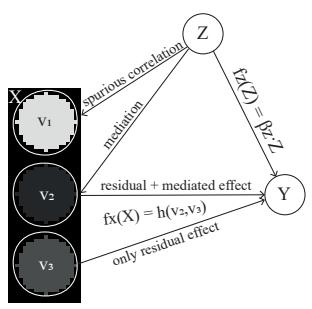

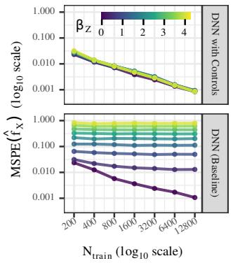  
(a) DGP with image X, confounder $Z$ and outcome Y. X consists of blobs with intensities v1, v2, v3.

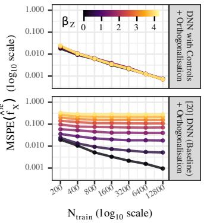  
(b) Consistency of estimators with growing $N _ { \mathrm { t r a i n } }$ under increasing of the strength $\beta _ { Z }$ of $f _ { Z } .$ . Measured using mean squared prediction error (MSPE), with bias-variance decomposition, results for ${ \hat { y } } ,$ $\hat { f } _ { Z }$ given in Section D.1.

Figure 1: (a) Simulation setting and (b) convergence results under increasing strength $\beta _ { Z }$ of $f _ { Z }$ with scalar valued outcomes $Y \in { \tilde { \mathbb { R } } }$ , when including (top) or omitting (bottom) control variables in the estimation of $f _ { X }$ (left) and $f _ { X } ^ { \mathrm { r e } }$ (right). MSPE is calculated on a holdout test dataset and over 50 model fits, each trained on independently drawn training and validation data sets of size $N _ { \mathrm { t r a i n } }$ . See Section 5 for details on the simulation study.

## 3.1 Biased Estimation of $f _ { X }$ due to Omitting Covariates $Z$

Typically, only X is used for predicting Y , therefore estimating $\mathbb { E } _ { Y \mid X } [ Y \mid X ]$ and not $\mathbb { E } _ { Y \mid X , Z } [ Y \mid X , Z ]$ . Now, suppose the additive model in Eq. (1) is in fact correct. In this case a DNN estimate $\hat { f } _ { X }$ of the effect of X on $Y$ can be biased due to OVB from omitting Z.

Theorem 1 (OVB in Additive Models). Assume Eqs. (1) and (2). Assume $\beta _ { 0 } = \mathbb { E } _ { Y } [ Y ]$ to be known. Then, the mean-squares estimator ofthe effect ofX on Y

$$
\hat { f } _ { X } \big ( X \big ) = \underset { g \in \mathcal { H } _ { X } } { \arg \operatorname* { m i n } } \mathbb { E } _ { Y \mid X } \big [ ( Y - \beta _ { 0 } - g ( X ) ) ^ { 2 } \big | X \big ]\tag{3}
$$

in a model omitting covariates $Z$ is given by

$$
{ \hat { f } } _ { X } ( X ) = f _ { X } ( X ) + \underbrace { \mathbb { E } _ { Z \mid X } [ f _ { Z } ( Z ) \mid X ] } _ { O V B } .\tag{4}
$$

The proof can be found in Section A.1. This shows that models trained solely on X can be biased, as they implicitly absorb the average direct effect $f _ { Z }$ of the omitted $Z$ given X. This dependence on $f _ { Z }$ in a DNN without control variables is demonstrated in Fig. 1b (bottom), while our proposed control variable approach leads to unbiased estimates (top).

## 3.2 Decomposing $f _ { X }$ into Z-Mediated and Residual Parts

Even without OVB, a confounder’s influence may still operate through X. When Z affects $X$ part of the effect $f _ { X }$ reflects variation in X that itself is driven by $Z { \bar { - } } \mathbf { a }$ mediated pathway rather than a spurious association. In classical mediation analysis, such dependencies are quantified by path coefficients obtained from linear regression: the mediated effect of $Z$ on Y is the product $\gamma _ { Z } \beta _ { X }$ of the coefficient $\gamma _ { Z }$ linking $Z$ to $\bar { X }$ , obtained from estimating $\mathbb { E } _ { X \mid Z } [ X \mid Z ] = \gamma _ { 0 } + Z \gamma _ { Z }$ and the coefficient $\beta _ { X }$ linking $X$ to $Y$ given $Z ,$ , obtained from estimating $\mathbb { E } _ { Y \mid X , Z } [ Y \mid X , Z ] =$ $\beta _ { 0 } + X \beta _ { X } + Z \beta _ { Z } \ [ 5 4 ]$ . When X is high-dimensional or its effect non-linear—as in DNNs—its effect becomes ill-defined or uninterpretable. In such cases we can instead work on the level of model predictions [55]. However, our additive modelling assumption allows us to apply the above approach to $f _ { X }$ directly and to decompose it into Z-mediated and residual parts.

Definition 1 (Residual and Z-Mediated Part of $f _ { X } )$ . Assume the additive model (1) with Eq. (2). We define the Z-mediated part of $f _ { X }$ as

$$
f _ { X } ^ { \mathrm { m e } } ( Z ) = \mathbb { E } _ { X \mid Z } \left[ f _ { X } ( X ) \mid Z \right] ,\tag{5}
$$

the component of the X-related effect that is explained by $Z .$ Then $f _ { X }$ decomposes into mediated and non-mediated parts $f _ { X } ( X ) = f _ { X } ^ { \mathrm { m e } } ( Z ) + f _ { X } ^ { r \mathrm { \bar { e } } } ( X \mid Z )$ , with

$$
f _ { X } ^ { r e } ( X \mid Z ) = f _ { X } ( X ) - \mathbb { E } _ { X \mid Z } \left[ f _ { X } ( X ) \mid Z \right]\tag{6}
$$

the residual effect of X given $Z .$

This definition of the Z-Mediated Part of $f _ { X }$ reduces to the classical product-of-coefficients formulation when all relationships are linear, as then $\mathbb { E } _ { X \mid Z } [ f _ { X } ( X ) \mid \dot { Z } ] ~ = ~ \mathbb { E } _ { X \mid Z } [ X \beta _ { X } \mid Z ] ~ =$ $\mathbb { E } _ { X \mid Z } [ X \mid Z ] \beta _ { X } = Z \gamma _ { Z } \beta _ { X }$ . It generalizes naturally to high-dimensional and non-linear settings by replacing path coefficients with the conditional expectations they describe.

## 3.3 Why Correlation-based Confound Control Fails

Many methods aim to mitigate confounding by removing the correlation between model predictions and covariates (see Section 2), and we now analyse what this implies under our model. In particular, we are interested in whether this can remove OVB and whether this can estimate $f _ { X }$ or $f _ { X } ^ { \mathrm { r e } } .$ We formalise correlation-based constraints more generally as estimating $f _ { X }$ subject to $\operatorname { \mathbb { E } } _ { X \mid Z } [ \hat { f } _ { X } ( X ) \mid Z ] = 0$ , i.e. the predicted X-effect should be mean independent of $Z ,$ generalising uncorrelatedness to non-linear dependence. Here, the zero on the right-hand side follows from the centring of effects. We provide theoretical results for two estimation procedures: fitting a biased model that omits $Z$ and removing the Z-dependence of its predictions post-hoc (Theorem $2 )$ , and adversarial optimisation of a DNN under the constraint during training (Theorem 3). The former requires explicit knowledge of $Z$ at prediction time, whereas the latter yields a model that learns to avoid using Z-related information and thus predicts from $X$ alone.

The first procedure corresponds, in essence, to regress-out $( \mathrm { e } . \mathrm { g } . [ 3 4 ] )$ and post-hoc orthogonalisation (e.g. [20]) approaches, which subtract (an estimate of) the Z-conditional mean from the predictions of a biased model.

Proposition 2 (Regress Out; Post-hoc Orthogonalisation). Assume Eqs. (1) and (2) and $\beta _ { 0 } = \mathbb { E } _ { Y } [ Y ]$ to be known. Let ${ \hat { f } } _ { X } ( X )$ be the biased estimator of Theorem 1 in a model omitting covariates $Z .$ Then, given $Z ,$ , the regress-out estimator

$$
{ \tilde { f } } _ { X } ( X \mid Z ) = { \hat { f } } _ { X } ( X ) - \operatorname { \mathbb { E } } _ { X \mid Z } [ { \hat { f } } _ { X } ( X ) \mid Z ] ,\tag{7}
$$

which satisfies the constraint $\mathbb { E } _ { X \mid Z } [ \tilde { f } _ { X } ( X \mid Z ) \mid Z ] = 0$ by construction, is given by

$$
\begin{array} { r } { \tilde { f } _ { X } ( X \mid Z ) = f _ { X } ^ { \mathrm { r e } } ( X \mid Z ) + \mathbb { E } _ { Z \mid X } [ f _ { Z } ( Z ) \mid X ] - \mathbb { E } _ { X \mid Z } \left[ \mathbb { E } _ { Z \mid X } [ f _ { Z } ( Z ) \mid X ] \middle \vert Z \right] . } \end{array}\tag{8}
$$

$$
\ne 0 i n g e n e r a l ( d o \dot { e } s n o t r e m o \nu e O V B / )
$$

The result follows directly from Theorem 1 and Definition 1. Figure 1b (bottom right) demonstrates this for orthogonalisation [20], where we see that the bias persists and grows with the strength $\beta _ { Z }$ of $f _ { Z }$ , even though predictions are uncorrelated with $Z .$

One might hope that imposing the constraint during training, rather than post-hoc, removes OVB. Theorem 3 shows that the resulting estimator has no closed form in general and is biased for both $f _ { X }$ and $f _ { X } ^ { \mathrm { r e } }$ whenever part of the $\bar { X ^ { . } }$ -effect is mediated by Z.

Proposition 3 (Adversarial Optimization). Assume Eqs. (1) and (2) and $\beta _ { 0 } = \mathbb { E } _ { Y } [ Y ]$ to be known. The constrained mean-squares estimator ofa model omitting covariates $Z _ { i }$

$$
\tilde { f } _ { X } ( X ) = \underset { g \in \mathcal { H } _ { X } } { \arg \operatorname* { m i n } } \mathbb { E } _ { Y , X } \left[ ( Y - \beta _ { 0 } - g ( X ) ) ^ { 2 } \right] \quad \mathrm { s . t . } \quad \mathbb { E } _ { X \mid Z } [ g ( X ) \mid Z ] = 0 ,\tag{9}
$$

is the orthogonal projection of $\hat { f } _ { X }$ from Theorem 1 onto $\mathcal { H } _ { X } \cap \left\{ g \in \mathcal { H } : \mathbb { E } _ { X \mid Z } [ g \mid Z ] = 0 \right\}$ , where $\mathcal { H } = \mathcal { H } _ { X } \oplus \mathcal { H } _ { Z }$ are the additive functions of X and Z. It has no closed form in general and differs from both $f _ { X }$ and $f _ { X } ^ { \mathrm { r e } }$ whenever $\mathrm { \bar { \it f } _ { \it X } ^ { \mathrm { m e } } } \ne 0 .$

The proof can be found in Section A.2. It follows that, perhaps surprisingly, model outputs may be biased even when the predictions are uncorrelated with the omitted covariate, and controlling for it explicitly should be a requirement in any deep learning prediction model. A discussion of practical implications is given in Section C.1.

## 3.4 The Problem of Concurvity in Estimation

When $f _ { X }$ is parametrised by a flexible function class, such as DNNs, its estimation can suffer from (approximate) concurvity [21]. On a finite training sample of size $n ,$ the network can find a nontrivial $g _ { X } \in \mathcal { H } _ { X }$ that matches some $g _ { Z } \in \mathcal { H } _ { Z }$ pointwise, so that ${ \pmb g } _ { X } = { \pmb g } _ { Z } \in \mathbb { R } ^ { n }$ . Whenever this happens, the training loss is invariant under shifts ${ \hat { f } } _ { X } - \lambda g _ { X } , { \hat { f } } _ { Z } + \lambda g _ { Z }$ for any $\lambda \in \mathbb { R }$ so estimates $\hat { f } _ { X } , \hat { f } _ { Z } \in \mathbb { R } ^ { n }$ are not identifiable from the data. Crucially, this does not change the model’s predictions $\hat { \pmb { y } }$ , so that the model’s fit may still converge in loss even though the effect estimates do not. Identifiability may be recovered for increasing n, but the required sample size depends on the flexibility of $\mathcal { H } _ { X }$

Concurvity has been shown to hinder identifiability of the estimates in the context of DNNs in recent publications on identifiability in NAMs [23], [24] and SSNs [9], [25]. Fig. 2 shows the consequences

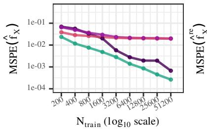

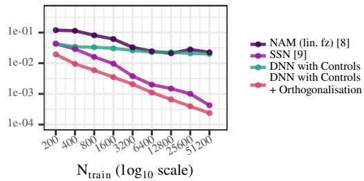  
Figure 2: Convergence of $\hat { f } _ { X }$ and $\hat { f } _ { X } ^ { \mathrm { r e } }$ across fitting strategies. See Fig. 1a and Section 5 for details on the simulation study. The used backbone has ∼21,000 parameters. Section C.4 contains an additional comparison to NAM over increasing backbone size. Train and hyperparameter search are documented in Section D.1.

for estimates of $\hat { f } _ { X }$ and $\hat { f } _ { X } ^ { \mathrm { r e } }$ : Naive stochastic gradient descent over an additive model with a linear covariate effect—that is, the same DNN with covariates as in our approach, but fit end-to-end with SGD, corresponding to a NAM [8] with image instead of scalar-valued inputs (purple)—eventually converges towards the true $f _ { X }$ but not for lower sample sizes. Applying a post-hoc orthogonalisation to remove the concurvity component [9], [25] (SSN, magenta) does not lead to consistent estimation of $f _ { X }$ , but rather recovers $f _ { X } ^ { \mathrm { r e } }$ (see Section C.3). To recover $f _ { X }$ already in the small-n regime, we constrain the estimation to a much lower-dimensional, identifiable parameter: the last layer coefficients of a pre-trained DNN and use 2-fold cross-fitting to efficiently use the whole sample for estimation (green, pink), leading to faster convergence than NAM and SSN for $f _ { X }$ and $f _ { X } ^ { \mathrm { r e } }$ respectively.

## 4 Methodology

We constrain the estimation of the additive model to the last layer of a pre-trained DNN and include a ridge penalty to avoid overfitting, when the number of last-layer features $q \in \mathbb { N }$ is larger than $n \in \mathbb { N }$ The backbone of a DNN is a learned feature map $\phi : S  \mathbb { R } ^ { \bar { q } }$ , with network input space $s ,$ , obtained from minimizing a loss $\ell ( \pmb { y } , \hat { \pmb { y } } )$ over $\pmb { y } = ( y _ { 1 } , \dots , y _ { n } ) ^ { \top }$ and predicted outcomes $\pmb { \hat { y } } = ( \hat { y } _ { 1 } , \dots , \hat { y } _ { n } ) ^ { \top }$ with $\hat { y } _ { i } = \hat { \beta } _ { 0 } + \hat { \phi } ^ { \top } { } _ { i } \hat { \beta } _ { X }$ and $\hat { \phi } _ { i } = \hat { \phi } ( X _ { i } )$ ). Applying $\hat { \phi } ( \cdot )$ element-wise to inputs $X \in S ^ { n }$ yields the feature matrix $\Phi \in \mathbb { R } ^ { \bar { n } \times q }$ . The refitted last layer consists of additive effects of covariates $\dot { Z } \in \mathbb { R } ^ { n \times p }$ the feature matrix $\Phi _ { i }$ , and an intercept $\beta _ { 0 } \in \dot { \mathbb { R } }$ . The outcome vector y may lie in $\mathbb { R } ^ { n } , \{ 0 , 1 \} ^ { n } , \mathbb { N } _ { 0 } ^ { n }$ , or other spaces, depending on the assumed exponential family distribution of $Y$ . The resulting model corresponds to a partial (generalized) linear model [7], [56], [57], where $f _ { X }$ is linear in the learned features and $f _ { Z }$ is a (possibly) flexible function. We assume linear output functions throughout and discuss the generalized version in Section B.1.

## 4.1 Estimators on Population Level in the Linear Case

Let $\phi : = \hat { \phi } ( X ) \in \mathbb { R } ^ { q }$ denote the random feature vector given a fixed backbone and define the centered features $\tilde { \phi } : = \phi - \mathbb { E } _ { X } [ \phi ]$ . Then, by considering $f _ { X } = \tilde { \phi } ^ { \top } \beta _ { X }$ to be the last layer of a

pre-trained DNN, the additive model Eq. (1) can be written as

$$
\mathbb { E } _ { Y \mid X , Z } [ Y \mid X , Z ] = \beta _ { 0 } + \tilde { \phi } ^ { \top } \beta _ { X } + f _ { Z } ( Z ) ,\tag{10}
$$

where $\mathbb { E } _ { X } [ \tilde { \phi } ] = 0$ ensures identifiability of $\beta _ { 0 }$

Proposition 4 (Population Normal Equations). Assume Eq. (10) and centering constraints. Let $\tilde { Y } = Y - \beta _ { 0 }$ . Then

$$
\beta _ { 0 } = \mathbb { E } _ { Y } [ Y ] , \qquad { \tilde { \phi } } ^ { \top } \beta _ { X } = \mathbb { E } _ { Y \mid { \tilde { \phi } } } [ { \tilde { Y } } - f _ { Z } ( Z ) \mid { \tilde { \phi } } ] , \qquad f _ { Z } ( Z ) = \mathbb { E } _ { Y \mid Z } [ { \tilde { Y } } - { \tilde { \phi } } ^ { \top } \beta _ { X } \mid Z ] .\tag{11}
$$

The proof is in Section A.3. These correspond to the usual back fitting equations for the semiparametric partial linear model with one smooth term [57].

## 4.2 Estimators on Sample Level in the Linear Case

Following [7] we replace conditional expectations with respect to $Z$ with a smoother matrix $S _ { Z }$ (see Section C.5) and define the centred smoother $\tilde { S } _ { Z } = ( I _ { n } - \mathbf { 1 } _ { n } \mathbf { 1 } ^ { \top } { } _ { n } / n ) S _ { Z }$ and the centred residual maker $\tilde { M } _ { Z } : = I _ { n } - \tilde { S } _ { Z }$ matrices, where ${ \bf 1 } _ { n }$ is an n-vector of ones.

Proposition 5 (Sample-Level Estimators for fixed λ). Let $\tilde { \pmb { y } } = \pmb { y } - \bar { y } \mathbf { 1 } _ { n }$ and $\tilde { \Phi } = \Phi - \mathbf { 1 } _ { n } \overline { { \phi } } ^ { \intercal }$ , with $\bar { \phi } \in \mathbb { R } ^ { q }$ the vector offeature-wise means. Then, for a given $\lambda > 0 ,$ the estimators for the additive model components in Eq. (10) are given by

$$
\hat { \beta } _ { 0 } = \frac { 1 } { n } \sum _ { i = 1 } ^ { n } y _ { i } = \bar { y } ,\tag{12}
$$

$$
\hat { \pmb { \beta } } _ { X } ( \lambda ) = \left( \tilde { \pmb { \Phi } } ^ { \top } \tilde { M } _ { Z } \tilde { \pmb { \Phi } } + \lambda { \pmb { I } } _ { q } \right) ^ { - 1 } \tilde { \pmb { \Phi } } ^ { \top } \tilde { M } _ { Z } \tilde { \pmb { y } } ,\tag{13}
$$

$$
\hat { \pmb f } _ { Z } = \tilde { \pmb S } _ { Z } ( \tilde { \pmb y } - \tilde { \pmb \Phi } \hat { \pmb \beta } _ { X } ) ,\tag{14}
$$

where λ controls the strength ofthe ridge penalty in the estimation of ${ \hat { \beta } } _ { X }$

The derivation can be found in Section A.4. To select λ, we follow the regularization path strategy of [28], which is explained in detail in Section C.6. Given an estimate of $\hat { f } _ { X }$ , we can estimate the residual X-effect $\hat { f } _ { X } ^ { \mathrm { r e } }$ by post-hoc orthogonalization [25] as

$$
\hat { \pmb f } _ { X } ^ { \mathrm { r e } } ( \lambda ) = \tilde { M } _ { Z } \tilde { \pmb \Phi } \hat { \pmb \beta } _ { X } ( \lambda ) .
$$

For generalized regression with non-linear output functions (e.g. Sigmoid) we provide an iteratively reweighted least squares version in Section B.2.

## 4.3 Consistent Estimation under Cross-fitting

Theorem 5 treats the feature matrix $\Phi = ( \hat { \phi } ( X _ { 1 } ) , \ldots , \hat { \phi } ( X _ { n } ) ) ^ { \top } \in \mathbb { R } ^ { n \times q }$ as a fixed design matrix, however, if $\hat { \phi }$ is trained on the same sample used to refit the last layer, it is no longer exogeneous and estimators are biased [26], [32]. Disjoint pre-training and refit samples restore exogeneity conditional on the pre-trained $\hat { \phi }$ and yield a consistent estimator under standard ridge regression conditions.

Lemma 6 (Consistency of ${ \hat { \beta } } _ { X }$ under sample splitting). Let $\mathcal { D } _ { \phi }$ denote the pre-training sample of $\hat { \phi }$ and D the refit sample of size $n ,$ and suppose $\mathcal { D } _ { \phi } \cap \mathcal { D } = \emptyset$ . Then conditional on the realised $\hat { \phi } ,$ for any penalty sequence with $\lambda _ { n } / n \to 0$ , and with certain smoother-quality assumptions on $S _ { Z }$

$$
\hat { \beta } _ { X } ( \lambda _ { n } ) \stackrel { p } {  } \beta _ { X } ^ { \circ } ,
$$

where $\beta _ { X } ^ { \circ }$ is the minimum-ℓ2-norm population coefficient induced by the realised $\hat { \phi } .$

The proof and more detailed assumptions are given in Section A.5. Sample splitting recovers consistency at the cost of using half the training data to fit the DNN backbone $\hat { \phi } .$ This cost can be alleviated by using the K-fold cross-fitting construction of [26].

Definition 2 (Cross-fitted ensemble model [26]). Let $\{ \mathcal { D } _ { k } \} _ { k = 1 } ^ { K }$ partition the data into K disjoint folds, and write $\textstyle { \mathcal { D } } _ { - k } : = \bigcup _ { l \neq k } { \mathcal { D } } _ { l }$ . For each $k ,$ let $\hat { \phi } _ { - k }$ be a backbone trained on $\mathcal { D } _ { - k }$ and let $( \hat { \beta } _ { 0 , k } , \hat { \beta } _ { X , k } , \hat { f } _ { Z , k } )$ denote the estimators of Theorem $^ { 5 }$ computed on $\mathcal { D } _ { k }$ using the features $\hat { \phi } _ { - k } ( \cdot )$ and the smoother $\tilde { S } _ { Z , k }$ . The cross-fitted predictor is

$$
\hat { \eta } ( X , Z ) = \frac { 1 } { K } \sum _ { k = 1 } ^ { K } \Big ( \hat { \beta } _ { 0 , k } + \hat { \phi } _ { - k } ( X ) ^ { \top } \hat { \beta } _ { X , k } + \hat { f } _ { Z , k } ( Z ) \Big ) ,\tag{15}
$$

with effect components $\begin{array} { r } { \hat { f } _ { X } ( \cdot ) = K ^ { - 1 } \sum _ { k } \hat { \phi } _ { - k } ( \cdot ) ^ { \top } \hat { \beta } _ { X , k } } \end{array}$ and $\begin{array} { r } { \hat { f } _ { Z } ( \cdot ) = K ^ { - 1 } \sum _ { k } \hat { f } _ { Z , k } ( \cdot ) } \end{array}$ . Since each $\hat { f } _ { X , k } , \hat { f } _ { Z , k }$ is centred only on fold k, we recentre $\hat { f } _ { X }$ and $\hat { f } _ { Z }$ over the full sample.

## 4.4 Prediction Controlled for Covariates

In many applications, obtaining predictions controlled for the covariates—and not just effect estimates ${ \dot { \pmb f } } _ { X }$ controlled for covariates—is desirable. We propose marginalizing the model predictions over the distribution of $Z$ to achieve this, which mirrors the "do"-operation from the causal inference literature [13].

Definition 3 (Marginalized Prediction). Let $p ( z )$ denote the marginal distribution of $Z .$ For a new observation with network input $X ^ { * }$ , the marginalized prediction is defined as

$$
\hat { y } _ { \mathrm { c o n t r o l } } ^ { * } = \int \hat { \mathbb { E } } [ Y \mid X = X ^ { * } , Z = z ] p ( z ) \mathrm { d } z .\tag{16}
$$

In practice, we approximate the integral by a sum over the empirical distribution of the covariates $Z$ in the training data. In settings with dataset shift, $p ^ { \mathrm { t r a i n } } ( z )$ could also be replaced by a target distribution $p ^ { \mathrm { t e s t } } ( z )$ to achieve better predictions.

## 5 Simulation Study

To investigate convergence of estimates across different models and settings, we simulate images $X \in [ 0 , 1 ] ^ { \breve { 2 } 0 \times 6 0 }$ , continuous confounders $Z \in [ 0 , 1 ] ^ { p }$ and an outcome $Y \in \{ \mathbb { R } , \{ 0 , 1 \} \}$ as follows:

$$
\begin{array} { r l } & { z _ { k } \sim U ( [ 0 , 1 ] ) \quad \mathrm { f o r } \ k = 1 , \dots , p } \\ & { X = h ( v _ { 1 } , v _ { 2 } , v _ { 3 } ) } \\ & { \quad v _ { 1 , k } \sim ( 1 - c _ { 1 } ) \cdot U ( [ 0 , 1 ] ) + c _ { 1 } z _ { k } \quad \mathrm { f o r } \ k = 1 , \dots , p } \\ & { \quad v _ { 2 , k } \sim ( 1 - c _ { 2 } ) \cdot U ( [ 0 , 1 ] ) + c _ { 2 } z _ { k } \quad \mathrm { f o r } \ k = 1 , \dots , p } \\ & { \quad v _ { 3 } \sim U ( [ 0 , 1 ] ) } \\ & { \quad \eta = \underbrace { v _ { 2 } ^ { \top } \beta _ { 2 } + \beta _ { 3 } \cdot v _ { 3 } } _ { f _ { x } } + \underbrace { z ^ { \top } \beta _ { Z } } _ { f _ { z } } , } \end{array}
$$

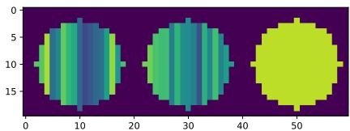  
Figure 3: Sample X for $p = 1 6$ . Strips have intensities $v _ { 1 , k }$ (left), $v _ { 2 , k }$ (center), and $v _ { 3 }$ (right).

with $c _ { 1 } , c _ { 2 } \in [ 0 , 1 ]$ . Fig. 3 shows how $X$ is generated from ${ \boldsymbol { v } } _ { 1 } , { \boldsymbol { v } } _ { 2 }$ and $v _ { 3 }$ . For continuous outcomes, we draw $y = \bar { \eta } + \bar { \epsilon , } \epsilon \sim \mathcal { N } ( 0 , 1 )$ , and for binary outcomes, we use a logistic link with $p = \sigma ( \eta - \mathbb { E } [ \eta ] )$ and $y \sim$ Bernoull $\mathrm { i } ( p )$ , where σ denotes the sigmoid function. Unless specified differently, we use $\beta _ { 2 , k } = \beta _ { 3 } = \beta _ { Z } = \bar { 1 }$ , for $k = 1 , \ldots , p , c _ { 1 } = 0 . 5 , c _ { 2 } = 0 . 5 , p = 1$ as default parameters. Additional figures and details on the backbone, the MSPE metric, and its bias-variance decomposition can be found in Section D.1.

Figure 1 summarises the main convergence behaviour of $\hat { f } _ { X }$ under increasing $\beta _ { Z } \colon$ the proposed method (DNN with Controls, with and without orthogonalisation) is consistent as $N _ { \mathrm { t r a i n } }  \infty$ , with both bias and variance of $\hat { f } _ { X }$ decaying independently of $\beta _ { Z }$ (see Section D.1 for bias and variance results). Methods without control variables (the baseline DNN and the post-hoc orthogonalisation of [20]) instead inherit a non-vanishing bias that grows with $\beta _ { Z }$ , in line with the omitted-variable result of Theorem 1. The same consistency carries over to binary outcomes fit by IRLS (Fig. 6 in Section B.1) and to non-linear covariate effects $f _ { Z } .$ , estimated via a spline expansion of Z (Fig. 11 in Section D.2). We further demonstrated better convergence than competing methods in Fig. 2.

We now investigate three potential failure modes, shown in Fig. 4. (left to right) Number of lastlayer features $q \mathrm { : }$ We see no difference in convergence behaviour over increasing q, except when it is chosen too small. Number ofconfounders p: We see slower convergence of $\hat { f } _ { X }$ and $\hat { f } _ { X } ^ { \mathrm { r e } }$ with increasing number of confounders. Controlling for a large number of confounders is possible, but a larger data set will be necessary to ensure a good estimation. Correlation between Image and Confounder $c _ { 1 }$ : We see slower convergence of $\hat { f } _ { X }$ for increasing correlation of image and confounder, up to no convergence, when the confounder is perfectly encoded in X $( c _ { 1 } = 1 )$ . This mirrors the typical behaviour of effect estimates in the linear model, in the presence of strong or perfect multicolinearity, where large sample sizes are needed to disentangle the effects of collinear variables (see e.g. [6]). As orthogonalizing $f _ { X }$ with respect to the covariates Z removes all correlation, the consistency of $\hat { f } _ { X } ^ { \mathrm { r e } }$ is not affected.

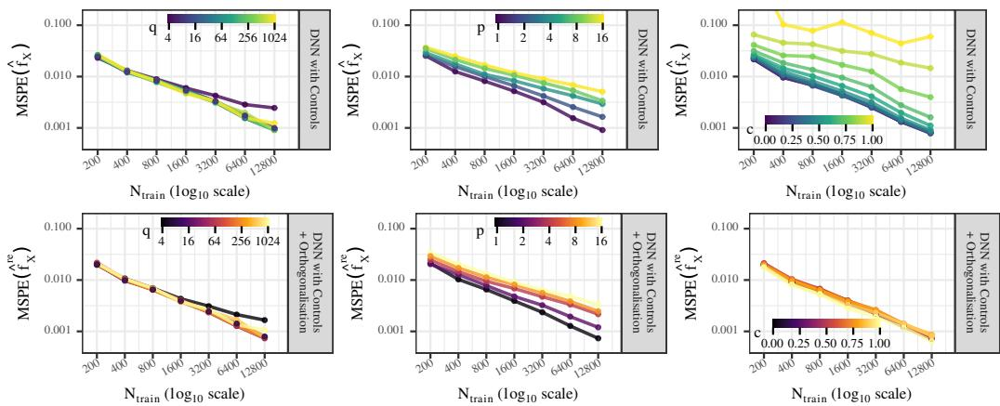  
Figure 4: Convergence behaviour of $\hat { f } _ { X }$ (top) and $\hat { f } _ { X } ^ { \mathrm { r e } }$ (bottom) in different adversarial settings for $y \in \mathbb R$ and $\beta _ { Z } = 1$ , with varying q (left), p (middle) and $c _ { 1 }$ (right).

## 6 Application to Neuroimaging Data with Synthetic Confounding

To evaluate our method in a high-dimensional real-data setting, we study the prediction of high alcohol consumption (highalc) from T1-weighted brain MRI [12], in the UK Biobank [58] $( n _ { \mathrm { t r a i n } } =$ 14,617, $n _ { \mathrm { t e s t } } = 4 { , } 5 0 5 )$ . We introduce synthetic confounding by resampling the training data with replacement to follow a logistic DGP with $\beta _ { \mathrm { s e x } } = 2$ and $\beta _ { \mathrm { a g e } } \in \{ 0 , - 2 \}$ . To prevent data leakage, we ensure that the original training dataset is first split into folds before resampling, and resample 5,000 observations per fold. We then treat the sex effect as the synthetic "signal" and the age effect as the synthetic "confound". To evaluate dependence on the confounder age, we resample 2,500 observations from the test set with $\beta _ { \mathrm { a g e } } = 0 .$ , defining an unconfounded target for measuring predictions performance. This setting reflects the scenario in which the training distribution is confounded, yet unconfounded predictions are required at deployment. Details on sMRI preprocessing, the resampling strategy, DNN training and cross validation can be found in Section D.4.

Every model uses a pretrained 3D ResNet-50 [59] backbone before fine-tuning. We evaluate four DNN models with age-control, that differ only in how the training fold is partitioned between backbone fitting and last-layer refit: (i) No sample split — both stages share the full training fold (5,000 observations); (ii) Sample split — backbone on one half (2,500 observations), refit on the disjoint other half; (iii) Cross-fit (K=2) — two rotations of the sample split, ensembled; (iv) Cross-fit (K=3) — three rotations. AUC is measured on the resampled unconfounded test set across five outer cross-validation folds, with age controlled predictions marginalised over the per-training-fold age distribution (see Definition 3).

For the age-balanced training setting $( \beta _ { \mathrm { a g e } } = 0 )$ , all five models agree closely (Fig. 5), however using sample splitting reduces performance, as effectively only half the sample is used to train the backbone and to refit the last layer coefficients. Cross-fitting (K=2) recovers this drop in performance. For the age-confounded setting $( \beta _ { \mathrm { a g e } } = - 2 )$ , the models diverge: the uncontrolled base DNN absorbs age into its image features and its AUC on the balanced test set drops from ≈ 0.70 $\mathrm { t o } \approx 0 . 6 2$ . Controlling for age recovers most of this gap, but only when the backbone and refit step use disjoint data. Cross-fitting with K=3 further reduces the variance across folds, compared to

K=2. Further discussion and results for joint age and sex control and their recovered coefficient are reported in Section D.4.  
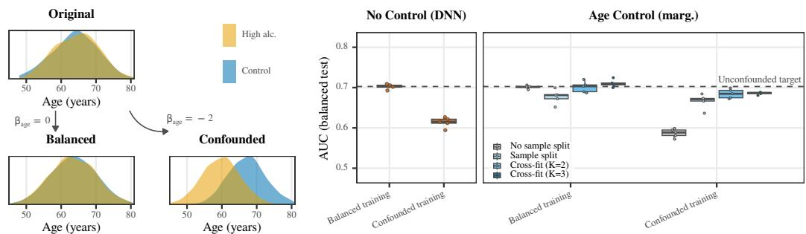  
Figure 5: (left) Visualization of the resampling procedure. (right) Comparison of AUC over a heldout test set that was resampled so that y is balanced with respect to age. x-axis indicates whether a model was trained on data that is balanced or age-confounded.

## 7 Limitations

Our method assumes that the confounding covariates Z are observed. In imaging cohorts this is less restrictive than it may appear, as demographic variables and acquisition-related variables such as scanner, site, and protocol are routinely recorded, but confounding that is never measured remains outside the scope of our method — as it does for the competing confound-control methods discussed in Section 2. Secondly, the estimated image effect depends on the expressiveness of the DNN backbone. If the last-layer representation is not rich enough, the estimand becomes the best approximation to the direct effect within the span of the learned features. The correction for omitted variable bias itself does not depend on this richness, and Fig. 4 shows that estimation is stable across a wide range of backbone sizes. Third, when Z is measured with noise, its estimated effect is attenuated and the image effect is only partially corrected. In Section D.3 we show that the resulting bias interpolates smoothly between the unbiased estimate under noise-free covariates and the bias of an uncontrolled DNN under pure noise, and that it persists asymptotically. Fourth, the additive decomposition separates the image effect from covariate effects but does not by itself interpret the deep image effect. Explainable AI attribution methods such as layer-wise relevance propagation [60] and Grad-CAM [61] could complement our approach, as attributions computed for a confounder controlled deep image effect inherit the covariate control.

## 8 Conclusion

We introduced a control variable approach for deep learning that estimates the direct image effect $f _ { X }$ free of omitted variable bias by fine-tuning the last layer of a pre-trained network under crossfitting with ridge penalisation, with an optional orthogonalisation step that recovers the residual effect $f _ { X } ^ { \mathrm { r e } }$ . Our theoretical results and simulations establish that last-layer refitting can recover the direct effect at lower sample sizes than existing methods, given that the covariate effects are correctly modelled. Further we showed that correlation-based confound control does not correct for omitted variable bias. Because our additive model separates $f _ { X }$ from $f _ { Z } ,$ , predictions can be marginalised over the covariate distribution $p ( Z )$ to control for $Z ,$ , which also allows us to adapt to dataset shift by replacing $p ^ { \mathrm { t r a i n } } ( z )$ with a target distribution $p ^ { \mathrm { t e s t } } ( z )$ , a capability unavailable in models that merely decorrelate predictions from $\bar { Z } .$ . Together, these results bridge classical statistical additive modelling and deep learning, and open the door to interpretable, unbiased predictions in medical research. A natural next step would therefore be multimodal learning, where the additive effects of different input modalities are identified, controlling for other modalities, even in small samples. Another interesting direction would be extensions to include interaction effects of $X$ and $Z ,$ thereby relaxing the additivity assumption underlying our method.

## Acknowledgments and Disclosure of Funding

We would like to thank Georg Keilbar, Giulia Patané, Johannes Brandau, Maarten Jung, Marco Simnacher and Paulo Yanez for helpful discussions and feedback and Jeffrey Verhey for invaluable writing advice and for reviewing an early draft of the paper. Funded by the Deutsche Forschungsgemeinschaft (DFG, German Research Foundation) – Projektnummer 459422098. This research has been conducted using the UK Biobank resource under application number 33073. The authors declare no competing interests.

## References

[1] R. Geirhos et al., “Shortcut learning in deep neural networks,” Nature Machine Intelligence, vol. 2, no. 11, pp. 665–673, Nov. 2020, Publisher: Nature Publishing Group.

[2] J. R. Zech, M. A. Badgeley, M. Liu, A. B. Costa, J. J. Titano, and E. K. Oermann, “Variable generalization performance of a deep learning model to detect pneumonia in chest radiographs: A cross-sectional study,” PLOS Medicine, vol. 15, no. 11, e1002683, 2018.

[3] R. P. Rane, J. Kim, A. Umesha, D. Stark, M.-A. Schulz, and K. Ritter, “Deeprepviz: Identifying potential confounders in deep learning model predictions,” in Medical Image Computing and Computer Assisted Intervention – MICCAI 2024, M. G. Linguraru et al., Eds., 2024, pp. 186–196.

[4] M. Klingenberg et al., “Higher performance for women than men in MRI-based Alzheimer’s disease detection,” Alzheimer’s Research & Therapy, vol. 15, no. 1, p. 84, 2023.

[5] J. D. Angrist and J.-S. Pischke, Mostly Harmless Econometrics: An Empiricist’s Companion. Princeton, New Jersey Oxford: Princeton University Press, 2009.

[6] J. M. Wooldridge, Econometric Analysis of Cross Section and Panel Data, Second edition. Cambridge, Massachusetts London, England: MIT Press, 2010.

[7] T. Hastie and R. Tibshirani, “Generalized Additive Models: Some Applications,” Journal of the American Statistical Association, vol. 82, no. 398, pp. 371–386, 1987.

[8] R. Agarwal et al., “Neural Additive Models: Interpretable Machine Learning with Neural Nets,” in Advances in Neural Information Processing Systems, vol. 34, Curran Associates, Inc., 2021, pp. 4699– 4711.

[9] D. Rügamer, C. Kolb, and N. Klein, “Semi-Structured Distributional Regression,” The American Statistician, 2023.

[10] F. Radenovic, A. Dubey, and D. Mahajan, “Neural basis models for interpretability,” in Advances in Neural Information Processing Systems, S. Koyejo, S. Mohamed, A. Agarwal, D. Belgrave, K. Cho, and A. Oh, Eds., vol. 35, Curran Associates, Inc., 2022, pp. 8414–8426.

[11] C. Rudin, “Stop Explaining Black Box Machine Learning Models for High Stakes Decisions and Use Interpretable Models Instead,” Nature machine intelligence, vol. 1, no. 5, pp. 206–215, 2019.

[12] R. P. Rane et al., “Structural differences in adolescent brains can predict alcohol misuse,” eLife, vol. 11, S. Jbabdi and C. I. Baker, Eds., e77545, 2022.

[13] J. Pearl, Causality, 2nd ed. Cambridge: Cambridge University Press, 2009.

[14] T. Calders, F. Kamiran, and M. Pechenizkiy, “Building Classifiers with Independency Constraints,” in 2009 IEEE International Conference on Data Mining Workshops, 2009, pp. 13–18.

[15] Qizhe Xie, Zihang Dai, Yulun Du, E. Hovy, and Graham Neubig, “Controllable Invariance through Adversarial Feature Learning,” Neural Information Processing Systems, 2017.

[16] D. Madras, E. Creager, T. Pitassi, and R. Zemel, “Learning Adversarially Fair and Transferable Representations,” in Proceedings of the 35th International Conference on Machine Learning, PMLR, 2018, pp. 3384–3393.

[17] E. Adeli et al., “Representation learning with statistical independence to mitigate bias,” in 2021 IEEE Winter Conference on Applications of Computer Vision (WACV), 2021, pp. 2512–2522.

[18] M. Lu et al., “Metadata Normalization,” Computer Vision and Pattern Recognition, 2021.

[19] A. Vento, Q. Zhao, R. Paul, K. M. Pohl, and E. Adeli, “A penalty approach for normalizing feature distributions to build confounder-free models,” in Medical Image Computing and Computer Assisted Intervention – MICCAI 2022, L. Wang, Q. Dou, P. T. Fletcher, S. Speidel, and S. Li, Eds., Cham: Springer Nature Switzerland, pp. 387–397.

[20] T. Weber, M. Ingrisch, B. Bischl, and D. Rügamer, “Preventing sensitive information leakage via posthoc orthogonalization with application to chest radiograph embeddings,” in Advances in Knowledge Discovery and Data Mining, X. Wu et al., Eds., Springer Nature Singapore, 2025, pp. 103–114.

[21] A. Buja, D. J. Donnell, and W. Stuetzle, “Additive Principal Components,” Dept. Statistics, Univ. Washington, Seattle, 1986.

[22] T. O. Ramsay, R. T. Burnett, and D. Krewski, “The Effect of Concurvity in Generalized Additive Models Linking Mortality to Ambient Particulate Matter,” Epidemiology, vol. 14, no. 1, pp. 18–23, 2003.

[23] J. Siems et al., “Curve Your Enthusiasm: Concurvity Regularization in Differentiable Generalized Ad ditive Models,” Advances in Neural Information Processing Systems, vol. 36, pp. 19 029–19 057, 2023.

[24] X. Zhang, J. Martinelli, and S. T. John, Challenges in interpretability of additive models, 2025. arXiv: 2504.10169 [cs].

[25] D. Rügamer, “A New PHO-rmula for Improved Performance of Semi-Structured Networks,” in Proceedings ofthe 40th International Conference on Machine Learning, PMLR, 2023, pp. 29 291–29 305.

[26] V. Chernozhukov et al., “Double/debiased machine learning for treatment and structural parameters,” The Econometrics Journal, vol. 21, no. 1, pp. C1–C68, 2018.

[27] J. A. Nelder and R. W. M. Wedderburn, “Generalized Linear Models,” Journal of the Royal Statistical Society. Series A (General), vol. 135, no. 3, pp. 370–384, 1972.

[28] J. H. Friedman, T. Hastie, and R. Tibshirani, “Regularization Paths for Generalized Linear Models via Coordinate Descent,” Journal of Statistical Software, vol. 33, pp. 1–22, 2010.

[29] J. K. Tay, B. Narasimhan, and T. Hastie, “Elastic Net Regularization Paths for All Generalized Linear Models,” Journal ofStatistical Software, vol. 106, pp. 1–31, 2023.

[30] S. Pölsterl, I. Sarasua, B. Gutiérrez-Becker, and C. Wachinger, “A Wide and Deep Neural Network for Survival Analysis from Anatomical Shape and Tabular Clinical Data,” in Machine Learning and Knowledge Discovery in Databases, P. Cellier and K. Driessens, Eds., Cham, 2020, pp. 453–464.

[31] T. N. Wolf, S. Pölsterl, and C. Wachinger, “Don’t panic: Prototypical additive neural network for in terpretable classification of alzheimer’s disease,” in Information Processing in Medical Imaging: 28th International Conference, IPMI 2023, 2023, pp. 82–94.

[32] D. J. Foster and V. Syrgkanis, “Orthogonal statistical learning,” The Annals of Statistics, vol. 51, no. 3, pp. 879–908, 2023.

[33] F. Kamiran and T. Calders, “Data preprocessing techniques for classification without discrimination,” Knowledge and Information Systems, vol. 33, no. 1, pp. 1–33, 2012.

[34] L. Snoek, S. Miletic, and H. S. Scholte, “How to control for confounds in decoding analyses of neu-´ roimaging data,” NeuroImage, vol. 184, pp. 741–760, 2019.

[35] D. Plecko and N. Meinshausen, “Fair Data Adaptation with Quantile Preservation,”ˇ Journal ofMachine Learning Research, vol. 21, no. 242, pp. 1–44, 2020.

[36] W. G. Cochran, “The effectiveness of adjustment by subclassification in removing bias in observational studies,” Biometrics, vol. 24, no. 2, p. 295, Jun. 1968.

[37] N. Keiding and D. Clayton, “Standardization and Control for Confounding in Observational Studies: A Historical Perspective,” Statistical Science, vol. 29, no. 4, 2014.

[38] R. Zemel, Y. Wu, K. Swersky, T. Pitassi, and C. Dwork, “Learning fair representations,” in Proceedings ofthe 30th International Conference on Machine Learning, PMLR, May 26, 2013, pp. 325–333.

[39] J. Komiyama, A. Takeda, J. Honda, and H. Shimao, “Nonconvex Optimization for Regression with Fairness Constraints.,” International Conference on Machine Learning, pp. 2737–2746, 2018.

[40] A. Agarwal, A. Beygelzimer, M. Dudik, J. Langford, and H. Wallach, “A Reductions Approach to Fair Classification,” in Proceedings of the 35th International Conference on Machine Learning, PMLR, 2018, pp. 60–69.

[41] A. Cotter et al., “Training Well-Generalizing Classifiers for Fairness Metrics and Other Data-Dependent Constraints,” in Proceedings ofthe 36th International Conference on Machine Learning, PMLR, 2019, pp. 1397–1405.

[42] Q. Zhao, E. Adeli, and K. M. Pohl, “Training confounder-free deep learning models for medical applications.,” Nature Communications, vol. 11, no. 1, pp. 6010–6010, 2020.

[43] Xianjing Liu, Bo Li, E. Bron, W. Niessen, E. Wolvius, and G. Roshchupkin, “Projection-wise Disentangling for Fair and Interpretable Representation Learning: Application to 3D Facial Shape Analysis,” International Conference on Medical Image Computing and Computer-Assisted Intervention, 2021.

[44] Enzo Tartaglione, C. Barbano, and Marco Grangetto, “EnD: Entangling and Disentangling deep representations for bias correction,” Computer Vision and Pattern Recognition, 2021.

[45] H. Zhao and G. J. Gordon, “Inherent Tradeoffs in Learning Fair Representations,” Journal of Machine Learning Research, vol. 23, no. 57, pp. 1–26, 2022.

[46] R. Pogodin, N. Deka, Y. Li, D. J. Sutherland, V. Veitch, and A. Gretton, “Efficient conditionally invariant representation learning,” International Conference on Learning Representations, 2023.

[47] Bashir Sadeghi, Runyi Yu, and Vishnu Naresh Boddeti, “On the Global Optima of Kernelized Adversarial Representation Learning,” IEEE International Conference on Computer Vision, pp. 7971–7979, 2019.

[48] I. Zliobaite, On the relation between accuracy andfairness in binary classification, 2015. arXiv: 1505. 05723 [cs].

[49] E. C. Neto, “Causality-aware counterfactual confounding adjustment as an alternative to linear residualization in anticausal prediction tasks based on linear learners,” in Proceedings of the 38th International Conference on Machine Learning, M. Meila and T. Zhang, Eds., ser. Proceedings of Machine Learning Research, vol. 139, PMLR, 2021, pp. 8034–8044.

[50] N. Belrose, D. Schneider-Joseph, S. Ravfogel, R. Cotterell, E. Raff, and S. Biderman, “LEACE: Perfect linear concept erasure in closed form,” in Advances in Neural Information Processing Systems, A. Oh, T. Naumann, A. Globerson, K. Saenko, M. Hardt, and S. Levine, Eds., vol. 36, Curran Associates, Inc., 2023, pp. 66 044–66 063.

[51] M. Arjovsky, L. Bottou, I. Gulrajani, and D. Lopez-Paz, Invariant Risk Minimization, 2020. arXiv: 1907.02893 [stat].

[52] P. Kirichenko, P. Izmailov, and A. Gordon Wilson, “Last layer re-training is sufficient for robustness to spurious correlations,” ICLR 2023, 2023.

[53] E. Rosenfeld, P. Ravikumar, and A. Risteski, “The risks of invariant risk minimization,” in International Conference on Learning Representations, vol. 9, 2021.

[54] R. M. Baron and D. A. Kenny, “The moderator–mediator variable distinction in social psychological research: Conceptual, strategic, and statistical considerations,” Journal of Personality and Social Psychology, 1986.

[55] J. Pearl, “Direct and indirect effects,” Proceedings of the Seventeenth Conference on Uncertainty in Artificial Intelligence, 2001.

[56] J. Rice, “Convergence rates for partially splined models,” Statistics & Probability Letters, vol. 4, no. 4, pp. 203–208, 1986.

[57] P. Speckman, “Kernel Smoothing in Partial Linear Models,” Journal of the Royal Statistical Society. Series B (Methodological), vol. 50, no. 3, pp. 413–436, 1988. JSTOR: 2345705.

[58] C. Sudlow et al., “UK biobank: An open access resource for identifying the causes of a wide range of complex diseases of middle and old age,” PLOS Medicine, vol. 12, no. 3, e1001779, 2015.

[59] M. J. Cardoso et al., “Monai: An open-source framework for deep learning in healthcare,” arXiv preprint arXiv:2211.02701, 2022.

[60] G. Montavon, A. Binder, S. Lapuschkin, W. Samek, and K.-R. Müller, “Layer-wise relevance propagation: An overview,” in Explainable AI: Interpreting, Explaining and Visualizing Deep Learning, ser. Lecture Notes in Computer Science, W. Samek, G. Montavon, A. Vedaldi, L. K. Hansen, and K.-R. Müller, Eds., vol. 11700, Springer, 2019, pp. 193–209.

[61] R. R. Selvaraju, M. Cogswell, A. Das, R. Vedantam, D. Parikh, and D. Batra, “Grad-CAM: Visual Explanations from Deep Networks via Gradient-Based Localization,” in 2017 IEEE International Conference on Computer Vision (ICCV), 2017, pp. 618–626.

[62] J. von Neumann, Functional Operators, Volume II: The Geometry of Orthogonal Spaces (Annals of Mathematics Studies 22). Princeton, NJ: Princeton University Press, 1950.

[63] A. Buja, T. Hastie, and R. Tibshirani, “Linear Smoothers and Additive Models,” The Annals ofStatistics, vol. 17, no. 2, pp. 453–510, 1989.

[64] A. E. Hoerl and R. W. Kennard, “Ridge Regression: Biased Estimation for Nonorthogonal Problems,” Technometrics, vol. 12, no. 1, pp. 55–67, 1970.

[65] W. K. Newey, “Convergence rates and asymptotic normality for series estimators,” Journal of Econometrics, vol. 79, no. 1, pp. 147–168, 1997.

[66] S. N. Wood, Generalized Additive Models: An Introduction with R, 2nd ed. Boca Raton, FL: Taylor & Francis Group, LLC, 2017.

[67] S. Greenland, J. M. Robins, and J. Pearl, “Confounding and Collapsibility in Causal Inference,” Statistical Science, vol. 14, no. 1, pp. 29–46, 1999.

[68] Y. Lecun, L. Bottou, Y. Bengio, and P. Haffner, “Gradient-based learning applied to document recognition,” Proceedings ofthe IEEE, vol. 86, no. 11, pp. 2278–2324, 1998.

[69] A. Krizhevsky, I. Sutskever, and G. E. Hinton, “ImageNet Classification with Deep Convolutional Neural Networks,” in Advances in Neural Information Processing Systems, vol. 25, Curran Associates, Inc., 2012.

[70] J. Nagi et al., “Max-pooling convolutional neural networks for vision-based hand gesture recognition,” in 2011 IEEE International Conference on Signal and Image Processing Applications (ICSIPA), 2011, pp. 342–347.

[71] R. J. Carroll, D. Ruppert, L. A. Stefanski, and C. M. Crainiceanu, Measurement Error in Nonlinear Models: A Modern Perspective, 2nd ed. Boca Raton, FL: Chapman & Hall/CRC, 2006.

[72] B. Fischl, “Freesurfer,” NeuroImage, vol. 62, no. 2, pp. 774–781, 2012, 20 YEARS OF fMRI. [Online]. Available: https://www.sciencedirect.com/science/article/pii/S1053811912000389

[73] K. Hara, H. Kataoka, and Y. Satoh, “Can spatiotemporal 3D CNNs retrace the history of 2D CNNs and ImageNet?” In Proceedings ofthe IEEE/CVF Conference on Computer Vision and Pattern Recognition, IEEE, 2018, pp. 6546–6555.

[74] J. Ansel et al., “PyTorch 2: Faster Machine Learning Through Dynamic Python Bytecode Transformation and Graph Compilation,” in Proceedings ofthe 29th ACM International Conference on Architectural Supportfor Programming Languages and Operating Systems, Volume 2, vol. 2, 2024, pp. 929–947.

## A Proofs and Derivations

## A.1 Proof of Theorem 1

Proof. Using the law of iterated expectations (LIE) and assumptions Eqs. (1) and (2), we can see that the conditional expectation of Y given X is

$$
\operatorname { \mathbb { E } } _ { Y \mid X } [ Y \mid X ] \stackrel { \mathrm { L I E } } { = } \operatorname { \mathbb { E } } _ { Z \mid X } \left[ \operatorname { \mathbb { E } } _ { Y \mid X , Z } [ Y \mid X , Z ] \mid X \right]\tag{17}
$$

$$
\stackrel { ( 1 ) } { = } \mathbb { E } _ { Z | X } \left[ \beta _ { 0 } + f _ { X } ( X ) + f _ { Z } ( Z ) \mid X \right]\tag{18}
$$

$$
= \beta _ { 0 } + f _ { X } ( X ) + \mathbb { E } _ { Z | X } \left[ f _ { Z } ( Z ) \mid X \right]\tag{19}
$$

It is well known in statistical learning theory that the function minimizing the mean-squared error $\operatorname { \mathbb { E } } _ { Y \mid X } [ ( Y - g ( X ) ) ^ { 2 } \mid X ]$ is the conditional expectation $g ( X ) = \mathbb { E } _ { Y \mid X } [ Y \mid X ]$ and consequently

$$
\hat { f } _ { X } ( X ) = \mathbb { E } _ { Y \mid X } [ Y - \beta _ { 0 } \mid X ] = f _ { X } ( X ) + \mathbb { E } _ { Z \mid X } [ f _ { Z } ( Z ) \mid X ] ,\tag{20}
$$

from which follows Theorem 1.

□

## A.2 Proof of Theorem 3

Proof. Write $\tilde { Y } = Y - \beta _ { 0 }$ and recall from Theorem 1 that the unconstrained estimator is ${ \hat { f } } _ { X } ( X ) =$ $\mathbb { E } _ { Y \mid X } [ \tilde { Y } \mid X ]$ . For any $g \in \mathcal { H } _ { X }$ , decomposing ${ \tilde { Y } } - g ( X ) = ( { \tilde { Y } } - { \hat { f } } _ { X } ( X ) ) + ( { \hat { f } } _ { X } ( X ) - g ( X ) )$ and expanding the square gives

$$
\mathbb { E } _ { Y , X } \left[ ( \tilde { Y } - g ( X ) ) ^ { 2 } \right] = \mathbb { E } _ { Y , X } \left[ ( \tilde { Y } - \hat { f } _ { X } ( X ) ) ^ { 2 } \right] + 2 \mathbb { E } _ { Y , X } \left[ ( \tilde { Y } - \hat { f } _ { X } ( X ) ) ( \hat { f } _ { X } ( X ) - g ( X ) ) \right] + \mathbb { E } _ { X } \left[ ( \hat { f } _ { X } ( X ) - g ( X ) ) ^ { 2 } \right] .\tag{21}
$$

The cross term vanishes by the LIE, as

$$
\mathbb { E } _ { Y , X } \left[ ( \tilde { Y } - \hat { f } _ { X } ( X ) ) ( \hat { f } _ { X } ( X ) - g ( X ) ) \right] = \mathbb { E } _ { X } \left[ ( \hat { f } _ { X } ( X ) - g ( X ) ) \mathbb { E } _ { Y \mid X } [ \tilde { Y } - \hat { f } _ { X } ( X ) \mid X ] \right]\tag{22}
$$

$$
= \mathbb { E } _ { X } \left[ ( { \hat { f } } _ { X } ( X ) - g ( X ) ) ( \mathbb { E } _ { Y \mid X } [ { \tilde { Y } } \mid X ] - { \hat { f } } _ { X } ( X ) ) \right]\tag{23}
$$

$$
= \mathbb { E } _ { X } \left[ ( { \hat { f } } _ { X } ( X ) - g ( X ) ) \cdot 0 \right] = 0 .\tag{24}
$$

Then, the first term of the decomposition

$$
\mathbb { E } _ { Y , X } \left[ ( \tilde { Y } - g ( X ) ) ^ { 2 } \right] = \mathbb { E } _ { Y , X } \left[ ( \tilde { Y } - \hat { f } _ { X } ( X ) ) ^ { 2 } \right] + \mathbb { E } _ { X } \left[ ( \hat { f } _ { X } ( X ) - g ( X ) ) ^ { 2 } \right] .\tag{25}
$$

does not depend on $g .$ . Minimising the objective in Theorem 3 over any set of functions of X is therefore equivalent to minimising the squared distance $\mathbb { E } _ { X } [ ( \hat { f } _ { X } - g ) ^ { 2 } ]$ over that set.

The constrained estimator is the orthogonal projection of $\hat { f } _ { X }$ onto the constrained set

$$
\mathcal { C } = \mathcal { H } _ { X } \cap \left\{ g : \mathbb { E } _ { X \mid Z } [ g ( X ) \mid Z ] = 0 \right\} .
$$

By the LIE, for every $k \in \mathcal { H } _ { Z }$

$$
\begin{array} { r } { \mathbb { E } _ { X , Z } \big [ g ( X ) k ( Z ) \big ] = \mathbb { E } _ { Z } \big [ \mathbb { E } _ { X \mid Z } [ g ( X ) \mid Z ] k ( Z ) \big ] , } \end{array}\tag{26}
$$

which vanishes for all k if $\mathbb { E } _ { X \mid Z } [ g ( X ) \mid Z ] = 0$ . Hence every function satisfying the constraint is orthogonal to $\mathcal { H } _ { Z }$ . Additionally, suppose that $g ( X )$ is orthogonal to every element of $\mathcal { H } _ { Z }$ . Since $\mathbb { E } _ { X \mid Z } [ g ( X ) \mid Z ]$ is itself a function of $Z ,$ , it belongs to $\mathcal { H } _ { Z }$ . We may therefore choose

$$
k ( Z ) = \mathbb { E } _ { X \mid Z } [ g ( X ) \mid Z ] .
$$

Orthogonality then gives

$$
0 = \mathbb { E } _ { X , Z } \big [ g ( X ) \mathbb { E } _ { X \mid Z } [ g ( X ) \mid Z ] \big ] .\tag{27}
$$

Applying the LIE once more,

$$
0 = \mathbb { E } _ { Z } \left[ \mathbb { E } _ { X \mid Z } [ g ( X ) \mid Z ] \mathbb { E } _ { X \mid Z } [ g ( X ) \mid Z ] \right] = \mathbb { E } _ { Z } \left[ \mathbb { E } _ { X \mid Z } [ g ( X ) \mid Z ] ^ { 2 } \right] .\tag{28}
$$

Since the integrand is non-negative, this implies $\mathbb { E } _ { X \mid Z } [ g ( X ) \mid Z ] = 0$ . Hence

$$
\left\{ g : \mathbb { E } _ { X \mid Z } [ g ( X ) \mid Z ] = 0 \right\} = \mathcal { H } _ { Z } ^ { \perp } ,
$$

and consequently

$$
{ \mathcal { C } } = \mathcal { H } _ { X } \cap \mathcal { H } _ { Z } ^ { \perp } .
$$

The projection onto an intersection of two subspaces is obtained by alternating the projections onto each of them [62]. Here the projection onto $\mathcal { H } _ { X }$ is $\mathbb { E } _ { Z \mid X } [ \cdot \mid X ]$ and the projection onto $\mathcal { H } _ { Z } ^ { \perp }$ is id $- \operatorname { \mathbb { E } } _ { X \mid Z } [ \cdot \mid Z ]$ , so the constrained estimator is the limit of iterating

$$
\hat { g } ^ { ( 0 ) } = \hat { f } _ { X } , \qquad \hat { g } ^ { ( m + 1 ) } = \mathbb { E } _ { Z \mid X } \Big [ \hat { g } ^ { ( m ) } - \mathbb { E } _ { X \mid Z } \big [ \hat { g } ^ { ( m ) } \mid Z \big ] \Big \mid X \Big ] ,\tag{29}
$$

which alternately removes the $Z .$ -conditional mean and projects onto $X$ . The limit has no closed form, as the two conditional-expectation operators do not commute in general. An exception is, for example, under independence of X and $Z ,$ where $\mathbb { E } _ { X \mid Z } [ \hat { f } _ { X } ( X ) \mid Z ] = \mathbb { E } _ { X } [ \hat { f } _ { X } ( X ) ] = 0$ by the centring of effects, so that the constraint is already satisfied and ${ \hat { g } } = { \hat { f } } _ { X }$

The estimator is biased for both target functions whenever part of the X-effect is mediated, that is $f _ { X } ^ { \mathrm { m e } } \neq 0$ . First, $f _ { X }$ violates the constraint, since $\mathbb { E } _ { X \mid Z } [ \bar { f } _ { X } ( X ) \mid Z ] = f _ { X } ^ { \mathrm { m e } } ( Z ) \neq 0$ , whereas $\hat { g }$ satisfies it by construction, so ${ \hat { g } } \neq f _ { X }$ . Second, $f _ { X } ^ { \mathrm { r e } } ( X | Z ) = f _ { X } ( X ) - f _ { X } ^ { \mathrm { m e } } ( Z )$ depends on $Z$ and therefore lies in $\mathcal { H } _ { X }$ only if $f _ { X } ^ { \mathrm { { { m e } } } }$ is constant. Under the absence of exact concurvity (Section $3 . 4 )$ a function that is measurable with respect to both X and Z is almost surely constant, and equal to zero by the centring of effects. Hence $\mathrm { \bar { \ f } _ { \it X } ^ { \mathrm { m e } } } \ne 0$ implies $f _ { X } ^ { \mathrm { r e } } \notin { \mathcal { H } } _ { X }$ , so that ${ \hat { g } } \neq f _ { X } ^ { \mathrm { r e } }$ □

## A.3 Proof of Theorem 4

We derive the result here for general functions $f _ { X } ( X )$ , then Theorem 4 follows from $f _ { X } = \Phi \beta _ { X }$ From constraining $f _ { X }$ and $f _ { Z }$ to be centred, it follows that

$$
\operatorname { \mathbb { E } } _ { Y } [ Y ] = \operatorname { \mathbb { E } } _ { X } [ \operatorname { \mathbb { E } } _ { Y \mid X } [ Y \mid X ] ]\tag{30}
$$

$$
= \mathbb { E } _ { X } [ \mathbb { E } _ { Z \mid X } [ \mathbb { E } _ { Y \mid X , Z } [ Y \mid X , Z ] \mid X ] ]\tag{31}
$$

$$
= \mathbb { E } _ { X } [ \mathbb { E } _ { Z \mid X } [ \beta _ { 0 } + f _ { X } ( X ) + f _ { Z } ( Z ) \mid X ] ]\tag{32}
$$

$$
= \beta _ { 0 } + \underbrace { \mathbb { E } _ { X } [ f _ { X } ( X ) ] } _ { = 0 } + \underbrace { \mathbb { E } _ { X } [ \mathbb { E } _ { Z \mid X } [ f _ { Z } ( Z ) \mid X ] ] } _ { = \mathbb { E } _ { Z } [ f _ { Z } ( Z ) ] = 0 } = \beta _ { 0 } .\tag{33}
$$

By considering the conditional expectations with respect to X and $Z$ and setting $\tilde { Y } = Y - \beta _ { 0 }$ we can derive normal equations for $f _ { X }$ and $f _ { Z }$ , as

$$
\operatorname { \mathbb { E } } _ { Y \mid X } [ \tilde { Y } - f _ { Z } ( Z ) \mid X ] = \operatorname { \mathbb { E } } _ { Z \mid X } [ \operatorname { \mathbb { E } } _ { Y \mid X , Z } [ \tilde { Y } - f _ { Z } ( Z ) \mid X , Z ] \mid X ]\tag{34}
$$

$$
= \mathbb { E } _ { Z \mid X } [ \mathbb { E } _ { Y \mid X , Z } [ \tilde { Y } \mid X , Z ] - \mathbb { E } _ { Y \mid X , Z } [ f _ { Z } ( Z ) \mid X , Z ] \mid X ]\tag{35}
$$

$$
= \operatorname { \mathbb { E } } _ { Z \mid X } [ f _ { X } ( X ) + f _ { Z } ( Z ) - f _ { Z } ( Z ) \mid X ]\tag{36}
$$

$$
= \mathbb { E } _ { Z \mid X } [ f _ { X } ( X ) \mid X ] = f _ { X } ( X ) ,\tag{37}
$$

$$
\mathbb { E } _ { Y \mid Z } [ \tilde { Y } - f _ { X } ( X ) \mid Z ] = \cdots = f _ { Z } ( Z ) .\tag{38}
$$

## A.4 Proof of Theorem 5

Starting with $\beta _ { 0 } = \mathbb { E } _ { Y } [ Y ]$ , we can replace the expectation with its sample analogue to obtain an estimator

$$
{ \hat { \beta } } _ { 0 } = { \frac { 1 } { n } } \sum _ { i = 1 } ^ { n } y _ { i } = { \bar { y } } .\tag{39}
$$

We use this to construct the centred vector of outcomes ${ \tilde { \pmb { y } } } = { \pmb y } - { \pmb y } { \bf 1 } _ { n }$ . We then consider $f _ { Z }$ as an additive smoother, which means we estimate conditional expectations with respect to $Z$ by multiplication with a smoother matrix $S _ { Z }$ (see e.g. [63]). To estimate a centred additive effect, we use a centred smoother matrix defined as $\tilde { S } _ { Z } : = ( { \cal I } _ { n } - { \bf 1 } _ { n } { \bf 1 } _ { n } ^ { \top } / n ) S _ { Z }$ , where ${ \cal I } _ { n }$ is the $n \times n$ identity matrix and ${ \bf 1 } _ { n }$ is the $n \times 1$ vector of ones. We can then replace the population equation for $f _ { Z }$ in Theorem 4 with its sample analogue based on the smoother matrix $\tilde { S } _ { Z }$ and obtain the estimator

$$
\hat { \pmb f } _ { Z } = \tilde { \pmb S } _ { Z } ( \tilde { \pmb y } - \tilde { \pmb \Phi } \hat { \pmb \beta } _ { X } ) ,\tag{40}
$$

which depends on the estimate ${ \hat { \beta } } _ { X }$ and the centred feature matrix $\tilde { \Phi } \in \mathbb { R } ^ { n \times q }$ . To obtain ${ \hat { \beta } } _ { X }$ we estimate the corresponding conditional expectation in Theorem 4 using least squares with ridge penalty, where we insert the formula for the estimator $\hat { f } _ { Z }$ , which also depends on ${ \hat { \beta } } _ { X }$

$$
\hat { \beta } _ { X } ( \lambda ) = \underset { \beta _ { X } \in \mathbb { R } ^ { q } } { \arg \operatorname* { m i n } } \| \tilde { \pmb { y } } - \tilde { \pmb { S } } _ { Z } ( \tilde { \pmb { y } } - \tilde { \pmb { \Phi } } \beta _ { X } ) - \tilde { \pmb { \Phi } } \beta _ { X } \| ^ { 2 } + \lambda \| \beta _ { X } \| ^ { 2 } ,\tag{41}
$$

where $\lambda > 0$ controls the strength of the ridge penalisation. We can rewrite the objective function using the "residual maker" matrix $\tilde { M } _ { Z } : = I _ { n } - \tilde { S } _ { Z }$ regressing out Z from $Y$

$$
\hat { \pmb { \beta } } _ { X } ( \lambda ) = \underset { \beta _ { X } \in \mathbb { R } ^ { q } } { \arg \operatorname* { m i n } } \| \tilde { M } _ { Z } \tilde { \pmb { y } } - \tilde { M } _ { Z } \tilde { \pmb { \Phi } } \beta _ { X } \| ^ { 2 } + \lambda \| \pmb { \beta } _ { X } \| ^ { 2 } .\tag{42}
$$

We assume $\tilde { M } _ { Z }$ to be idempotent with $\tilde { M } _ { Z } = \tilde { M } _ { Z } ^ { 2 } = \tilde { M } _ { Z } ^ { \top }$ , which is the case when $\tilde { S } _ { Z }$ is chosen as a projection type smoother (e.g. polynomials or basis splines) [63]. The solution to the penalized least squares objective is then given by the well known ridge estimator [64] for the $\tilde { M } _ { Z }$ -residualized data

$$
\hat { \pmb { \beta } } _ { X } ( \lambda ) = \left( \tilde { \pmb { \Phi } } ^ { \top } \tilde { M } _ { Z } \tilde { \pmb { \Phi } } + \lambda { \pmb { I } } _ { q } \right) ^ { - 1 } \tilde { \pmb { \Phi } } ^ { \top } \tilde { M } _ { Z } \tilde { \pmb { y } } .\tag{43}
$$

An estimator for the direct effect can thus be obtained by fitting a ridge regression after regressing out the covariates from both the features and the outcome. Here, λ is a hyperparameter and usually chosen with leave-one-out cross-validation (see [28]) or by validation on a holdout dataset. Except for the additonal ridge penalty term in the inverse, this mirrors the Speckman estimator [57] for the linear effect in a partial linear additive model.

## A.5 Proof of Theorem 6

We consider the asymptotic setting to gain insight into the behaviour of our estimator. We do not show consistency for the estimation of $\hat { f } _ { X }$ , which would depend on the quality of the pretrained DNN backbone $\hat { \phi } ,$ as asymptotics of DNNs are out of scope for this work, but show consistency of ${ \hat { \boldsymbol { \beta } } } _ { x } ( \lambda _ { n } )$ , conditional on some pretrained $\hat { \phi } ,$ against the population minimum $\ell _ { 2 }$ norm coefficient. For this we need three sets of assumptions: (a) assumptions on the correct specification of the model (b) assumptions on the smoother estimating $f _ { Z }$ and (c) assumptions about the ridge penalty. We assume

$$
{ \mathrm { ( a 1 ) } } \ y = \Phi \beta _ { X } + f _ { z } + \epsilon \quad \Leftrightarrow \quad y _ { i } = \hat { \phi } ( { \pmb X } _ { i } ) ^ { \top } \beta _ { X } + f _ { z } ( z _ { i } ) + \epsilon _ { i } , \quad i = 1 , \ldots , n ,
$$

(a2) $\mathcal { D } = \{ ( y _ { i } , X _ { i } , z _ { i } ) \}$ is a sequence of i.i.d. random objects,

$$
{ \mathrm { ( a 3 ) } } \ \mathbb { E } \left[ \left( \hat { \phi } ( \pmb { X } _ { i } ) - \mathbb { E } [ \hat { \phi } ( \pmb { X } _ { i } ) \mid z _ { i } ] \right) ( \hat { \phi } ( \pmb { X } _ { i } ) - \mathbb { E } [ \hat { \phi } ( \pmb { X } _ { i } ) \mid z _ { i } ] ) ^ { \top } \right] = : \pmb { \Sigma } _ { \phi \phi } \ \mathrm { i s ~ f i n i t e } ,
$$

$$
( \mathrm { a } 4 ) \mathbb { E } \big [ ( \hat { \phi } ( \pmb { X } _ { i } ) - \mathbb { E } [ \hat { \phi } ( \pmb { X } _ { i } ) \mid z _ { i } ] ) \epsilon _ { i } \big ] = 0 .
$$

Note that conditional on $\mathcal { D } _ { \phi }$ the backbone $\hat { \phi } ( \cdot )$ is a deterministic function, so from (a2) it immediately follows that $\{ ( y _ { i } , \hat { \phi } ( \pmb X _ { i } ) , z _ { i } ) \}$ is a sequence of i.i.d. random objects. Further note that (a3) typically assumes a nonsingular matrix. However, in the case of DNN features it can easily happen that some of them are redundant or linear combinations of the others, leading to singular (a3)—even after regressing out functions of $Z .$ . Accordingly we investigate convergence against the minimumℓ2-norm coefficient $\beta _ { x } ^ { \circ }$ (which is unique) and not against some arbitrary population coefficient and it holds that Φ $\dot { \bf \Delta } \beta _ { X } = \Phi \beta _ { X } ^ { \circ }$ for any $\beta _ { X }$ fulfilling (a1). In particular, it holds that $\beta _ { X } ^ { \circ } = \Phi ^ { + } \Phi \beta _ { X }$ also for $n  \infty .$ , where $( \cdot ) ^ { \bar { + } }$ indicates the Moore-Penrose pseudoinverse.

The proof uses a mixture of the standard proofs for ridge regression and partial linear models, while not assuming nonsingularity in (a3). Without loss of generality, assume variables are centred and substitute (a1) into the estimator from Theorem 5. Then divide numerator and denominator by n and define the rescaled penalty $\mu _ { n } : = \lambda _ { n } / n$ . We get

$$
\begin{array} { r l } & { \hat { \beta } _ { X } ( \lambda _ { n } ) = \left( \Phi ^ { \top } M _ { Z } \Phi + \lambda _ { n } I _ { q } \right) ^ { - 1 } \Phi ^ { \top } M _ { Z } y } \\ & { \quad \quad \quad = \left( \frac { 1 } { n } \Phi ^ { \top } M _ { Z } \Phi + \mu _ { n } I _ { q } \right) ^ { - 1 } \frac { 1 } { n } \Phi ^ { \top } M _ { Z } y } \\ & { \quad \quad \quad = \left( \hat { A } _ { n } + \mu _ { n } I _ { q } \right) ^ { - 1 } \Big [ \hat { A } _ { n } \beta _ { X } + \hat { s } _ { n } ^ { f \phi } + \hat { s } _ { n } ^ { e \phi } \Big ] , } \end{array}
$$

with

$$
\begin{array} { r } { \hat { A } _ { n } : = \frac { 1 } { n } \Phi ^ { \top } M _ { Z } \Phi , \qquad \hat { s } _ { n } ^ { f \phi } : = \frac { 1 } { n } \Phi ^ { \top } M _ { Z } f _ { z } , \qquad \hat { s } _ { n } ^ { e \phi } : = \frac { 1 } { n } \Phi ^ { \top } M _ { Z } \epsilon . } \end{array}
$$

We then require the following limits in probability for the three terms:

$$
( { \mathrm { b } } 1 ) { \hat { A } } _ { n } { \stackrel { p } {  } } \Sigma _ { \phi \phi } , \qquad ( { \mathrm { b } } 2 ) { \hat { s } } _ { n } ^ { f \phi } { \stackrel { p } {  } } { \bf 0 } , \qquad ( { \mathrm { b } } 3 ) { \hat { s } } _ { n } ^ { \epsilon \phi } { \stackrel { p } {  } } { \bf 0 } .
$$

Conditions (b1) to (b3) require smoother-quality assumptions on $S _ { Z } . \ ( \mathrm { b } 1 )$ requires $S _ { Z }$ to be a consistent estimator of $\mathbb { E } [ \hat { \phi } _ { j } ( \boldsymbol { X } ) \mid z ] , j = 1 , \ldots , q .$ . (b2) requires $M _ { Z } \pmb { f } _ { Z }  0$ so that the smoother is well-specified for the true target $f _ { Z } ,$ , and (b3) then follows from (a4) once (b1) holds. For example, regression splines with the basis dimension increasing (slowly) with n deliver all three plims [65]. These are common assumptions in the partial linear model and we refer to [57] for a rigorous treatment. Informally (disregarding limits for $\mu _ { n }$ for now), applying (b1)-(b3) would yield

$$
\beta _ { X } ( \lambda _ { n } ) \stackrel { p } {  } ( \pmb { \Sigma } _ { \Phi \Phi } + \mu _ { n } \pmb { I } _ { q } ) ^ { - 1 } \pmb { \Sigma } _ { \Phi \Phi } \beta _ { X } .
$$

Given a decomposition $\pmb { \Sigma } _ { \Phi \Phi } = \pmb { U } ^ { \top } \pmb { U }$ , where $U$ is the population analogue to $M _ { Z } \Phi / { \sqrt { n } }$ , we can use the typical ridge regression assumption that

$$
( \mathrm { c } 1 ) \mu _ { n } = \lambda _ { n } / n \xrightarrow { n \to \infty } 0 ,
$$

and apply the pseudoinverse limit

$$
( U ^ { \top } U + \mu _ { n } I _ { q } ) ^ { - 1 } U ^ { \top } \xrightarrow { \mu _ { n } \to 0 } U ^ { + } ,
$$

with $U ^ { + }$ the Moore–Penrose pseudoinverse of U. Taken together we can conclude that

$$
\hat { \beta } _ { X } ( \lambda _ { n } ) \stackrel { p } {  } U ^ { + } U \beta _ { X } .
$$

The minimum-ℓ2-norm coefficient $\beta _ { X } ^ { \circ }$ is, by definition, that projection so that $U ^ { + } U \beta _ { X } = \beta _ { X } ^ { \circ }$ for any $\beta _ { X }$ satisfying (a1). Then

$$
{ \hat { \beta } } _ { X } ( \lambda _ { n } ) \ { \overset { p } { \to } } \ \beta _ { X } ^ { \circ }
$$

i.e. the ridge estimator is consistent for the population minimum $\ell _ { 2 }$ -norm coefficient $\beta _ { x } ^ { \circ }$ , conditional on the estimated backbone $\hat { \phi } ( \cdot )$ □

## B Generalization to Non-linear Output Functions

## B.1 Omitted Variable Bias for Non-linear Output Functions

In Eq. (1) we assume that the conditional expectation is additively separable on the level of $Y .$ However, many common settings, such as disease status prediction, assume $Y$ to follow other distributions in the exponential family, such as a Bernoulli (e.g. binary labels) or Poisson (count data). We now assume that the conditional expectation of $Y$ is generalized additive with true regression function

$$
\mathbb { E } _ { Y \mid X , Z } [ Y \mid X , Z ] = g ^ { - 1 } ( \beta _ { 0 } + f _ { X } ( X ) + f _ { Z } ( Z ) ) ,\tag{44}
$$

where $g : \mathbb { R }  \mathbb { R }$ is a monotone link function with $g ^ { - 1 }$ the response function. The response function $g ^ { - 1 } ( \cdot )$ is typically called outputfunction in the machine learning literature and can be e.g. a sigmoid, exp or the identity function. This covers models such as Logistic regression, Poisson regression, and others under the generalized additive model (GAM) framework [7]. In this setting we directly model the so-called additive predictor

$$
\eta ( X , Z ) = \beta _ { 0 } + f _ { X } ( X ) + f _ { Z } ( Z ) ,\tag{45}
$$

which is linked to the conditional expectation of the output via the link function by $\eta ( X , Z ) =$ $g \left( \mathbb { E } _ { Y \mid X , Z } [ Y \mid X , Z ] \right)$ .

The preceding considerations translate to the generalized case as biases on the level of the additive predictor (e.g. on the level of the logits). We can see this, by referring to usual Newton-Raphson-type algorithms for estimating GAMs based on iteratively reweighted least squares (IRLS) (see e.g. [66]), where the generalized model is itaratively approximated by a linear model using reweighted pseudodata as will be discussed in Section B.2. The GAM is fitted iteratively by solving these reweighted linear models until convergence. It follows that biases on the level of the linear pseudo-data model translate to the resulting solution, which is demonstrated in Fig. 6. We can see similar results to the linear case, as a standard DNN (right) shows bias increasing with $\beta _ { Z }$ and a DNN with control variables (left) is unbiased, however, convergence is slower. As a side note, it is worth mentioning that in generalized models not including covariates $Z$ that are correlated with the outcome $Y$ can lead to underestimation of $f _ { X }$ due to non-collapsability of the output function (see e.g. [67]).

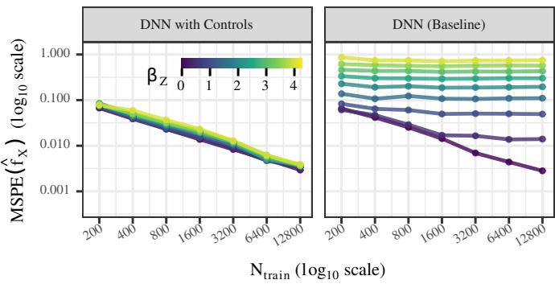  
Figure 6: Convergence behaviour with binary outcome $Y \in \{ 0 , 1 \}$ and Sigmoid response function $g ^ { - 1 } ( \cdot )$ under increasing strength $\beta _ { Z }$ of $f _ { Z }$ . Also in this generalized case, controlling for covariates using our method leads to consistent estimation (left), here measured by $\mathrm { M S P E } ( \hat { f } _ { X } )$ , while fitting a DNN without covariates (right) leads to inconsistent estimates with MSPE increasing with $\beta _ { Z }$ . See Section 5 for details on the simulation study.

## B.2 Estimation for Generalized Output Functions

In the non linear case, we estimate the model using the standard iteratively reweighted least squares (IRLS) scheme for generalized additive models [7], [66]. Here, the non-linear estimation problem is approximated by a sequence of weighted least squares problems constructed from pseudo-responses and observation weights.

Definition 4 (IRLS weights and pseudo-responses). Let $h = g ^ { - 1 }$ denote the inverse link. Given current estimates $\hat { \eta } _ { i } = \hat { \beta } _ { 0 } + \tilde { \phi } _ { i } ^ { \top } \hat { \beta } _ { X } + \hat { f } _ { Z } ( z _ { i } )$ and $\hat { \mu } _ { i } = h ( \hat { \eta } _ { i } )$ , define weights

$$
w _ { i } = \frac { h ^ { \prime } ( \hat { \eta } _ { i } ) ^ { 2 } } { V ( \hat { \mu } _ { i } ) }\tag{46}
$$

and pseudo-responses

$$
y _ { i } ^ { * } = \hat { \eta } _ { i } + \frac { y _ { i } - \hat { \mu } _ { i } } { h ^ { \prime } ( \hat { \eta } _ { i } ) } ,\tag{47}
$$

where $V ( \mu )$ denotes the variance function of the response distribution and $h ^ { \prime } ( \cdot )$ the derivative of the inverse link.

Define weighted centered variables $y _ { w , i } = \sqrt { w _ { i } } ( y _ { i } ^ { * } - \bar { y } _ { w } ) , \phi _ { w , i } = \sqrt { w _ { i } } ( \phi _ { i } - \bar { \phi } _ { w } ) , z _ { w , i } =$ $\sqrt { w _ { i } } ( z _ { i } - \bar { z } _ { w } )$ where $\bar { y } _ { w } ~ = ~ ( \pmb { w } ^ { \top } \pmb { y } ^ { * } ) / ( \pmb { w } ^ { \top } \pmb { 1 } _ { n } )$ and $\bar { \phi } _ { w } , \bar { z } _ { w }$ denote the corresponding weighted means. Starting from an initial predictor $\hat { \eta } _ { i } ^ { ( 0 ) } = \hat { \beta } _ { 0 } ^ { ( 0 ) } = g ( \bar { y } )$ and $\hat { f } _ { X } \equiv \hat { f } _ { Z } \equiv 0$ , the weights and pseudo-responses from Definition 4 are recomputed at each iteration and the estimators from Theorem 5 are estimated using the reweighted, centered data with the intercept being updated as $\begin{array} { r } { \hat { \beta } _ { 0 } = n ^ { - 1 } \sum _ { i } y _ { i } ^ { * } } \end{array}$ , until convergence of $\hat { f } _ { X }$ and $\hat { f } _ { Z }$

For numerical conditioning of the ridge penalty, $\phi$ and z are centred and standardised to unit variance before the IRLS solve and $\hat { \beta } _ { X } , \hat { \beta } _ { Z }$ are de-standardised at the end, so that $\hat { f } _ { X }$ and $\hat { f } _ { Z }$ are returned on the original centred-raw scale. Convergence is monitored via the relative change of predicted $\hat { f } _ { X } \in \mathbb { R } ^ { n }$ and $\hat { f } _ { Z } \in \mathbb { R } ^ { n }$ between successive iterations.

For each candidate $\lambda \in \Lambda$ , the IRLS algorithm is run to convergence before evaluating the validation loss ${ \mathcal { L } } _ { \mathrm { v a l } } ( \lambda )$ . When λ is chosen too small, it can happen that the algorithm fails to converge when q is large. This is known behaviour for regularized IWLS (see [28]) and usually not a problem. It just indicates that larger λ values should be used.

## C Additional Considerations

## C.1 Implications of Correlation-based Confound Control

Theorem 2 established that constraining model predictions to be uncorrelated with $Z$ estimates the residual effect $f _ { X } ^ { \mathrm { r e } }$ rather than the direct effect $f _ { X }$ . Two practical consequences follow:

First, $f _ { X } ^ { \mathrm { r e } }$ discards the component of $f _ { X }$ predictable from Z. When $Z$ is highly correlated with the outcome $Y ,$ , this removes a substantial amount of the signal in $\hat { f } _ { X }$ and prediction accuracy can collapse. For example, some neuroimaging studies have observed that common implementations of correlation based confound control methods tend to remove too much information [34]. To mitigate this, many adversarial confound control methods introduce a hyperparameter balancing prediction accuracy against the correlation of $\hat { y }$ with $Z ,$ , in a non-transparent trade-off (see Section 2).

Second, the discarded component is not always nuisance. Consider predicting alcohol misuse from neuroimaging with age as a confounder: age may influence brain morphology and changes to these specif parts of the brain may in turn influnce disease probability — a mediated effect of age through brain structure that is part of $f _ { X }$ even when age is included in the model. Whether this component should be removed depends on the objective: in fairness contexts it may represent unwanted bias, in medical or scientific applications it can carry causal information.

These limitations are intrinsic to the estimand $f _ { X } ^ { \mathrm { r e } }$ , not artefacts of any particular fitting procedure. Our approach side-steps them by estimating $f _ { X }$ directly, without imposing the decorrelation constraint. In practice a mixture of these approaches might be the best option, orthogonalising with respect to certain variables, where the mediated effect is not of interested, and merely controlling for others.

## C.2 The Problem of Concurvity in Estimation

To control for OVB while also estimating the direct effect $f _ { X }$ , we want to estimate the full additive model given by Eq. (1). However, estimating the full model may not be possible. When $f _ { X }$ belongs to a highly flexible function class such as DNNs, the effects in the full model can be unidentifiable and thus biased. For example, Definition 5 describes the situation where the deep neural network can perfectly capture any effects of covariates $Z ,$ which has been discussed under the term concurvity [21] in the statistical literature on additive models—an extension of multicolinearity to non-linear transformations of the input variables. Concurvity has been shown to hinder identifiability of the estimates and thus interpretation [22], which has also been discussed in the context of DNNs in recent publications on identifiability in NAMs [23], [24] and SSNs [9], [25]. Following [9], [23], [24] we give the following definition and proposition.

Definition 5 (Concurvity). Consider the additive model Eq. (1). The term concurvity refers to the situation where there exist non-trivial $g _ { X } \in \mathcal { H } _ { X }$ and $g _ { Z } \in \mathcal { H } _ { Z }$ such that

$$
g _ { X } ( X ) = g _ { Z } ( Z ) ,\tag{48}
$$

where $g _ { Z }$ is not trivial.

Proposition 7 (Unidentifiability under Concurvity). Assume Eqs. (1) and (2). $f _ { X } ( X )$ and $f _ { Z } ( Z )$ are not identifiable under concurvity

Proof. Assume Definition 5. Then for all $\lambda \ \in \ \mathbb { R }$ it holds that $\mathbb { E } _ { Y \mid X , Z } [ Y \mid X , Z ] = f _ { X } ( X ) +$ $f _ { Z } ( Z ) = f _ { X } ( X ) - \lambda g _ { X } ( X ) + f _ { Z } ( Z ) + \lambda g _ { Z } ( Z ) = : f _ { X } ^ { \lambda } ( X ) + f _ { Z } ^ { \lambda } ( Z )$ . Therefore $f _ { X } , f _ { Z }$ are not identifiable, as for every $\lambda \in \mathbb { R }$ there exists a pair $f _ { X } ^ { \lambda } ( X ) , f _ { Z } ^ { \lambda } ( Z )$ describing the same conditional expectation. □

The estimate of $\hat { f } _ { X }$ in an additive model with a highly flexible function class for $f _ { X }$ will therefore be biased by arbitrary concurvity components $\lambda g _ { Z } \overline { { ( Z ) } } , \lambda \in \mathbb { R }$

The easiest way for concurvity to occur is empirically in a finite sample setting via simple interpolation. Concurvity, or rather, multicolinearity in this case, is already guaranteed for a linear model (one layer network), where the number of features q is larger than the number of observations.

Example 1. Consider a feature matrix $\Phi \in \mathbb { R } ^ { n \times q }$ of full rank n with $q > n$ , obtained from applying a feature map $\phi : { \mathcal { S } }  \mathbb { R } ^ { q }$ to network inputs $\pmb { \chi } \in S ^ { n }$ element-wise, where S is the space of network inputs, e.g. normalized 2D or 3D images. Consider also a set of covariates $\boldsymbol { Z } \in \mathbb { R } ^ { n \times p }$ of full rank with $p \ll n$ . Assume a one layer network with stacked vector of effects $\pmb { f } _ { X } = \pmb { \Phi } \beta _ { X } \in \mathbb { R } ^ { n }$ and $\pmb { f } _ { Z } = \pmb { Z } \beta _ { Z } \in \mathbb { R } ^ { n }$ , with $\beta _ { X } \in \mathbb { R } ^ { q } , \beta _ { Z } \in \mathbb { R } ^ { p }$ . Then, for any $\tilde { \beta } _ { Z }$ , there exists a $\beta _ { X }$ so that $\Phi \tilde { \beta } _ { X } = Z \tilde { \beta } _ { Z }$

Proof. From $\operatorname { r a n k } ( \Phi ) = n$ it follows that the column range space $\mathcal { R } ( \Phi )$ is $\mathbb { R } ^ { n }$ . Therefore any $\boldsymbol { v } \in \mathbb { R } ^ { n }$ can be written as ${ \pmb v } = \pmb { \Phi } \tilde { \beta } _ { \pmb X }$ for some $\tilde { \beta } _ { X } \in \mathbb { R } ^ { q }$ and the same holds for $\boldsymbol { Z } \tilde { \beta } _ { \boldsymbol { Z } } \in \mathbb { R } ^ { n }$ □

For deeper networks with potentially millions of parameters this issue is only aggravated. It is therefore not possible to simply estimate $f _ { X }$ and $f _ { Z }$ in an additive model, when $f _ { X }$ is a deep learning network.

## C.3 Concurvity and Mediated Effects

When estimating $f _ { X } ( X )$ in a way that does not account for concurvity, we may end up with an estimate that is biased by an arbitrary concurvity component with

$$
f _ { X } ^ { \lambda } ( X ) = f _ { X } ( X ) - \lambda g _ { X } ( X )\tag{49}
$$

for some $\lambda \in \mathbb { R }$ with $g _ { X } ( X ) = g _ { Z } ( Z )$ . This concurvity component has no causal or associational interpretation and is solely an artifact of the complexity of function classes used to estimate $f _ { X }$ and $f _ { Z }$ , for example, when $f _ { X }$ is flexible enough to perfectly interpolate $f _ { Z }$ in the training data set. As [24] points out, concurvity is highly problematic for interpretability of the estimated effects, as it can be unclear whether $\lambda g _ { Z } ( Z )$ actually belongs to $f _ { X }$ or to $f _ { Z }$ or should even be split up between them in some way. However, this is only an issue for estimates of the direct effect of X.

Proposition 8 (Identifiability of $f _ { X } ^ { \mathrm { r e } }$ under Concurvity). Given an estimate $f _ { X } ^ { \lambda }$ with concurvity component $\lambda g _ { X } ( X )$ , as in Eq. (49),for any $\lambda \in \mathbb { R } i$ t holds that

$$
f _ { X } ^ { \lambda } ( X ) - \mathbb { E } _ { X \mid Z } [ f _ { X } ^ { \lambda } ( X ) \mid Z ] = f _ { X } ^ { \mathrm { r e } } ( X \mid Z ) .\tag{50}
$$

$$
\begin{array} { r l } & { P r o o f . \ f _ { X } ^ { \lambda } ( X ) - \mathbb { E } _ { X \mid Z } [ f _ { X } ^ { \lambda } ( X ) \mid Z ] = \ f _ { X } ( X ) - \lambda g _ { X } ( X ) - \mathbb { E } _ { X \mid Z } [ f _ { X } ( X ) - \lambda g _ { X } ( X ) \mid Z ] \ = } \\ & { f _ { X } ( X ) - \mathbb { E } _ { X \mid Z } [ f _ { X } ( X ) \mid Z ] = f _ { X } ^ { \mathrm { r e } } ( X \mid Z ) } \end{array}
$$

When removing the mediated component from an estimate including a concurvity component, we can see that any concurvity components will be removed as well. It follows that concurvity is not an issue when identifying the residual effect of X. An example of a model estimating $f _ { X } ^ { \mathrm { r e } }$ are Semistructured Networks (SSNs) proposed in [9], which can be estimated by a post-hoc orthogonalization method using a pre-trained deep neural network with covariates [25]. The orthogonalization was constructed to remove the concurvity component, but actually removes the mediated component of $f _ { X }$ as well. It therefore changes the interpretation of the estimated effects. We use the same method for estimation of $f _ { X } ^ { \mathrm { r e } }$ , as explained in Section 4.2.

## C.4 Dependence of NAM and DNN with Controls on Backbone Size

We investigate the convergence of additive models fit using our refitting procedure and stochastic gradient descent (given by a NAM) in Fig. 7. Our proposed refitting method is robust to backbone size: all DNN with Controls curves collapse onto a single trajectory. In contrast, NAMs generally converge more slowly with increasing $N _ { \mathrm { t r a i n } }$ , and their overall MSPE remains higher than that of the DNN with Controls at all sample sizes. While NAM convergence is clearly better for small backbone sizes (darker lines), the connection between backbone size and convergence is more volatile, which might indicate a strong sensitivity to hyperparameter choice. Hyperparameters are searched per method and along $( n , q )$ as documented in Section D.1. The size of the backbone was varied by adjusting the last-layer feature dimension q from 8 to 1024, as done in Section 5.

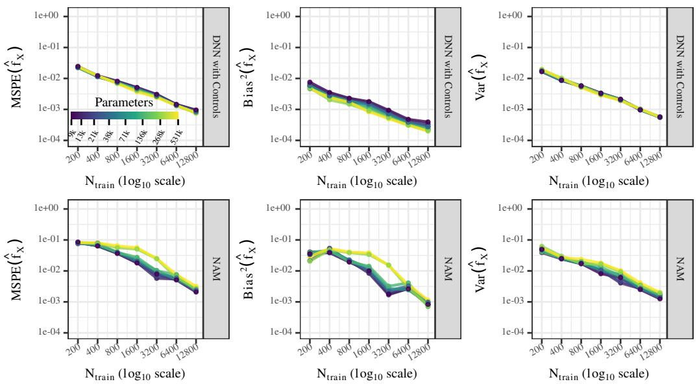  
Figure 7: Convergence of $\hat { f } _ { X }$ as the backbone size grows, comparing DNN with Controls (top, 2-fold cross-fit) and a NAM with linear covariate effect (bottom, trained end-to-end with SGD). Columns show MSPE, $\mathrm { B i a s } ^ { 2 } .$ , and Var of $\hat { f } _ { X }$ . Curves are coloured by the trainable parameter count of the DNN backbone, ranging from ∼9k to ∼531k.

## C.5 Conditional Expectations and Smoother Matrices

Drawing on the literature on additive smoothers (e.g. [63]) we can consider a pre-trained DNN as a linear (in y) smoother estimating conditional expectations with respect to network inputs X. For example, we may estimate a DNN without covariates by smoothing $\Phi { \hat { \beta } } _ { X } = S _ { X } \pmb { y }$ , with the DNN smoother matrix $S _ { X }$ given as the usual projection matrix $\begin{array} { r } { \pmb { S } _ { X } : = \pmb { \Phi } ( \pmb { \Phi } ^ { \top } \pmb { \Phi } ) ^ { - } \pmb { \Phi } ^ { \top } } \end{array}$ , where $( \cdot ) ^ { - }$ denotes a generalized inverse. Note that we do not need to assume that Φ has full rank, as we can still uniquely identify the product $\Phi \hat { \beta } _ { X }$ even if ${ \hat { \beta } } _ { X }$ is not unique. In settings where $q > n$ the DNN smoother matrix will interpolate the data, leading to poor generalization. We can therefore define the ridge-penalized smoother matrix $\pmb { S } _ { X } ^ { \lambda } = \pmb { \Phi } ( \bar { \pmb { \Phi } } ^ { \top } \pmb { \Phi } ^ { \top } + \lambda \bar { \pmb { I } } _ { q } ) ^ { - 1 } \pmb { \Phi } ^ { \top }$ with $q \times q$ identity matrix $I _ { q }$ and penalty parameter $\lambda \geq 0$ . In contrast to $S _ { X }$ , we want to make no further assumptions about the form of the covariate smoother matrix $S _ { Z }$ . Depending on whether Z has linear or non-linear effects on $Y$ , the smoother matrix $S _ { Z }$ could simply be given by $\pmb { S } _ { Z } = \pmb { Z } ( \pmb { Z } ^ { \top } \pmb { Z } ) ^ { - 1 } \pmb { Z } ^ { \top }$ , corresponding to a linear model with $\boldsymbol { Z } \hat { \beta } _ { Z } = \boldsymbol { S } _ { Z } \boldsymbol { y }$ , or could be given by a projection into a space spanned by nonlinear basis functions $B ( Z )$ , such as cubic spline evaluations.

## C.6 On the Ridge-Regularization Path and on Numerical Stability in IRLS Estimation

To select λ, we follow the regularization path strategy proposed for penalized generalized linear models in [28]. Specifically, we construct a decreasing grid $\Lambda = \{ \lambda _ { \operatorname* { m a x } } , \ldots , \lambda _ { \operatorname* { m i n } } \}$ of candidate values spaced logarithmically. The final regularization parameter λˆ is selected as $\hat { \lambda } \ =$ arg $\mathrm { m i n } _ { \lambda \in \Lambda } \mathcal { L } _ { \mathrm { v a l } } ( \lambda )$ where $\mathcal { L } _ { \mathrm { v a l } } ( \lambda )$ denotes the validation loss obtained for a model fitted with regularization parameter $\lambda .$ The resulting estimator $\hat { \beta } _ { X } ( \hat { \lambda } )$ and the corresponding $\hat { f } _ { Z }$ are then used as the final model. If the optimal value occurs at the boundary of the candidate grid, the range $[ \lambda _ { \operatorname* { m i n } } , \lambda _ { \operatorname* { m a x } } ]$ can be expanded and the procedure repeated in order to ensure that the optimal λ lies within the explored path.

Following [28], the regularization path is constructed on a logarithmic grid $\Lambda = \{ \lambda _ { \operatorname* { m a x } } , \ldots , \lambda _ { \operatorname* { m i n } } \}$ The upper bound $\lambda _ { \mathrm { m a x } }$ corresponds to a strongly regularized model, while $\lambda _ { \operatorname* { m i n } }$ determines the weakest regularization considered. We set $\lambda _ { \operatorname* { m i n } } = \epsilon \lambda _ { \operatorname* { m a x } }$ with $\epsilon = 1 0 ^ { - 3 }$ for $q > n$ and $\epsilon = 1 0 ^ { - 6 }$ for $q < n$ . For the identity link, $\lambda _ { \operatorname* { m a x } } = \lVert \Phi \rVert _ { 2 } ^ { 2 }$ , where $\| \cdot \| _ { 2 }$ denotes the spectral norm. For the logit link, $\lambda _ { \mathrm { m a x } }$ is computed using a weighted design motivated by the IRLS formulation of generalized linear models. Let $\mu$ denote the mean of the centered response, $V ( \mu )$ the variance function, and $g ^ { \prime } ( \mu )$ the derivative of the link function. Weights are defined as $\ddot { w } = g ^ { \prime } ( \mu ) ^ { 2 } / ( V ( \mu ) + \varepsilon )$ with a small constant $\varepsilon$ for numerical stability, and $\begin{array} { r } { \lambda _ { \operatorname* { m a x } } = 1 0 \lVert \operatorname* { d i a g } ( \sqrt { w } ) \varPhi \rVert _ { 2 } ^ { 2 } } \end{array}$ . To avoid numerical instabilities in the binomial case, probabilities $\mu$ within $1 0 ^ { - 6 }$ of 0 or 1 are clipped to $\{ 0 , 1 \}$ and the corresponding weights are set to $\mathrm { { 1 0 ^ { - 6 } } }$

## D Additional Experimental Results

## D.1 Details of the Simulation Study and Additional Figures

For binary outcomes, the centering of $\eta$ ensures that the linear predictor does not saturate the sigmoid, so that both classes occur with non-negligible probability. For evaluation, we center $f _ { X }$ and $f _ { Z }$ around their population mean to align with our model definition. We calculate the population $f _ { X } ^ { \mathrm { r e } }$ by removing $\mathbb { E } [ \pmb { v } _ { 2 } ^ { \top } \pmb { \beta } _ { 2 } | Z = z ] = c _ { 2 } \cdot z ^ { \top } \pmb { \beta } _ { 2 }$ (the Z-mediated part of $v _ { 2 } )$ from $f _ { X }$

The last layer feature representation of the used DNN backbone has size $q$ which is set to 32 as default. The backbone consists of two 2D convolutional layers [68], [69] (channels: $1  1 6 , 1 6 $ ${ \mathrm { 3 2 } } ;$ kernel size $^ { 3 , }$ padding 1), an adaptive average 2D pooling [70] (output: $4 \times 4 )$ and a fully connected layer of size $3 2 \cdot 4 \cdot 4  q . ~ f _ { Z }$ and $\bar { f } _ { X }$ are (mean zero) linear functions of $Z$ and the last layer features, respectively. Our method is fit with the 2-fold cross-fit ensemble (Definition 2) throughout the simulation studies.

We optimise all backbones with Adam, learning rate $3 \times 1 0 ^ { - 3 }$ , weight decay $1 0 ^ { - 5 }$ , batch size 200. Models are fit using early stopping with patience 6, ReduceLROnPlateau scheduler (mode min, patience $5 ,$ factor 0.5) anneals the learning rate. The post-hoc step is solved with a glmnet-style ridge path of 100 log-spaced λ candidates with adaptive end-point expansion, and λ selected via prediction loss on the validation half. The IRLS algorithm is run up to a coefficient-change tolerance of $1 0 ^ { - 2 }$ Unless stated otherwise we sweep sample size over $n \in \{ 4 0 0 , 8 0 0$ , 1600, 3200, 6400, 12800, 25600} and at simulation defaults $\beta _ { z } = b _ { 2 } = b _ { 3 } = 1 , c _ { 1 } = c _ { 2 } = 0 . 5 , \sigma _ { y } = 1$ . Competing methods are fit on the full training sample. Learning rate and weight decay are shared by all methods in the linear, binary, nonlinear, and noisy-covariate studies.

For the concurvity benchmark $( \mathrm { F i g s . } 2 $ and 7), hyperparameters are instead searched per method and per sample size. We select the learning rate and weight decay from the grid $\{ 3 \times \dot { 1 0 } ^ { - 4 } , 1 0 ^ { - 3 } , 3 \times$ $\mathbf { \dot { 1 0 ^ { - 3 } } , 1 \dot { 0 } ^ { - 2 } } \} \times \{ 1 0 ^ { - 5 } , 1 0 ^ { - 4 } \}$ at three sample sizes $n \in \{ 4 0 0 , 6 4 0 0 , 1 0 2 4 0 0 \}$ , and for the backbonesize sweep at nine pairs $( n , \bar { q } ) \in \{ 4 0 0 , 3 2 \bar { 0 } 0 , 2 5 6 0 0 \} \times \{ 4 , 6 4 , 1 0 2 4 \}$

We compare convergence behaviour of the estimators $\hat { f } \in \{ \hat { f } _ { x } , \hat { f } _ { x } ^ { \mathrm { r e } } \}$ of different models using the mean squared prediction error

$$
\begin{array} { r } { \mathbf { M S P E } [ \hat { f } ] = \mathbb { E } _ { ( X , Z ) , \mathcal { D } } \left[ \left( f - \hat { f } _ { \mathcal { D } } \right) ^ { 2 } \right] , } \end{array}\tag{51}
$$

where the expectation is taken over test observations $( y , X , Z ) \in \mathcal { D } _ { \mathrm { t e s t } } \sim p ( \mathcal { D } )$ , training datasets are independently drawn from $p ( \mathcal { D } )$ and each training dataset yields a realization $\hat { f } _ { \mathcal { D } }$ of the estimator ${ \hat { f } } .$ In practice, the expectations are replaced with sums over a test data of size $| \mathcal { D } _ { \mathrm { t e s t } } | = 8 0 0$ and model fits estimated from 50 independently drawn training data sets, each split into a training and validation part of equal size $N _ { \mathrm { t r a i n } }$

To investigate the recovery of the true effects $f \in \{ f _ { x } , f _ { x } ^ { r e } \}$ we can further decompose the MSPE into bias and variance with $\mathbf { M S P E } [ \hat { f } ] = \mathbf { B i a s } ^ { 2 } [ \hat { f } ] + \mathbf { V a r } [ \hat { f } ]$ . We calculate bias and variance via

$$
\begin{array} { r } { \mathrm { B i a s } ^ { 2 } [ \hat { f } ] = \mathbb { E } _ { ( X , Z ) } \left[ \left( \mathbb { E } _ { \mathcal { D } } [ \hat { f } _ { \mathcal { D } } ] - f \right) ^ { 2 } \right] , } \end{array}\tag{52}
$$

$$
\begin{array} { r } { \mathrm { V a r } [ \hat { f } ] = \mathbb { E } _ { ( X , Z ) , \mathcal { D } } \left[ \left( \hat { f } _ { \mathcal { D } } - \mathbb { E } _ { \mathcal { D } } [ \hat { f } _ { \mathcal { D } } ] \right) ^ { 2 } \right] . } \end{array}\tag{53}
$$

and display additional MSPE decomposition results in Figs. 8a and 8b. Additional results for $\hat { y }$ and $\hat { f } _ { Z }$ in Figs. 9a and 9b.

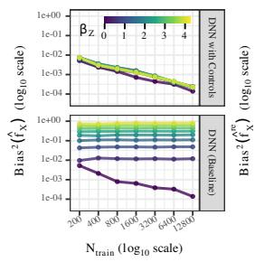

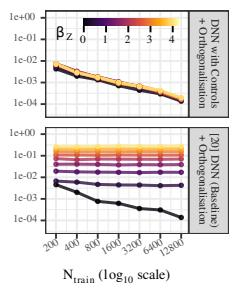  
(a) Squared bias of ${ \hat { f } } _ { X } $

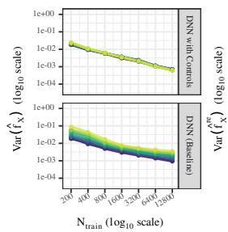

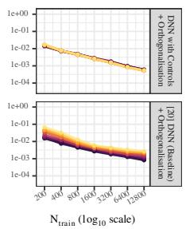  
(b) Variance of ${ \hat { f } } _ { X } .$

Figure 8: Bias–variance decomposition of $\hat { f } _ { X }$ in ${ \mathrm { F i g . } }$ . 1. It is clear that bias (left) dominates the MSPE of models fit without covariates, while variance converges for all models as the sample size grows (right).  
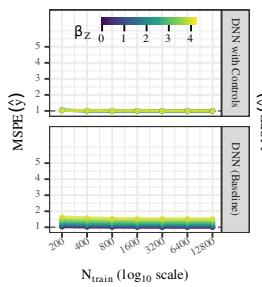  
(a) MSPE of yˆ.

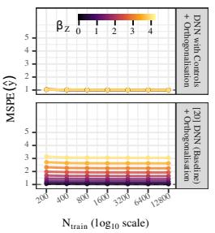

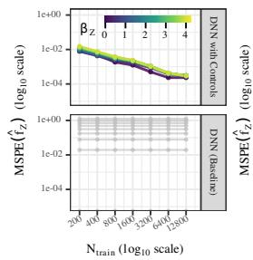

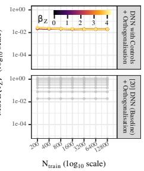  
(b) MSPE of $\hat { f } _ { Z }$  
Figure 9: MSPEs of $\hat { y }$ and $\hat { f } _ { Z }$ in ${ \mathrm { F i g . } }$ 1. Only DNNs with controls predict $y$ well (MSPE near the noise floor) and only the DNN with covariates can disentangle $f _ { X }$ and $f _ { Z }$ effects. We can see that also $f _ { Z }$ (here including the intercept $\beta _ { 0 } ! )$ is consistently estimated when using a model with control variables, while models without controls have no estimate for $f _ { Z }$ (greyed out line indicates $\beta _ { 0 }$ only).

## D.2 Nonlinear Covariate Effect

To verify that the framework extends to non-linear covariate effects, we repeat the $\beta _ { Z }$ sweep with the linear $f _ { Z }$ replaced by $f _ { Z } ( Z ) = \beta _ { Z } \cdot \sin ( 2 \pi ( Z - 0 . 5 ) )$ , keeping the image DGP and all other parameters unchanged. $f _ { Z }$ is now estimated as a cubic B-spline regression: we use the basis evaluations $B ( Z ) \in \mathbb { R } ^ { \breve { n } \times 9 }$ (5 inner knots evenly spaced over [0, 1]) as control variables and use $k = 2$ cross-fitting.

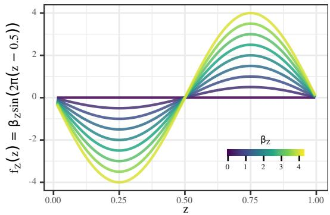  
Figure 10: Nonlinear $f _ { Z }$ for different values of $\beta _ { Z }$

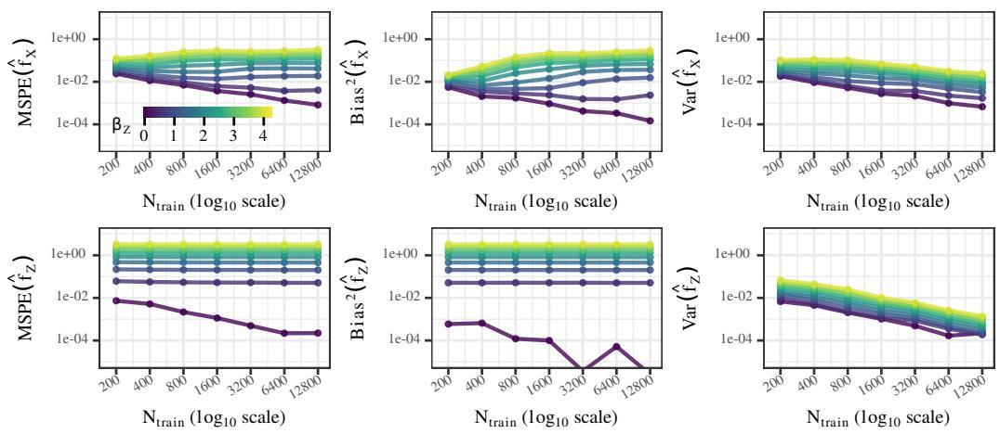

Figure 11 confirms that (i) the bias and variance of $\hat { f } _ { X }$ remain essentially independent of $\beta _ { Z }$ , so the spline absorbs the non-linear covariate effect without leaking into the image-effect estimate, and (ii) $\mathrm { V a r } ( \hat { f } _ { Z } )$ scales with $\beta _ { Z } ^ { 2 }$ and shrinks as $\sim N ^ { - 1 }$ while $\mathrm { B i a s } ^ { \bar { 2 } } ( \hat { f } _ { Z } )$ stays well below the variance, so the spline regression for $f _ { Z }$ is consistent across the full $\beta _ { Z }$ range.

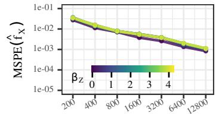

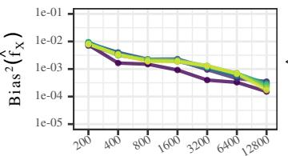

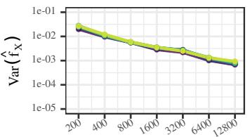

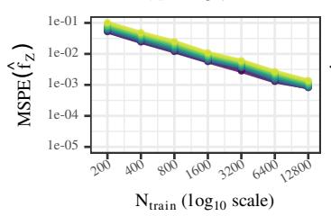

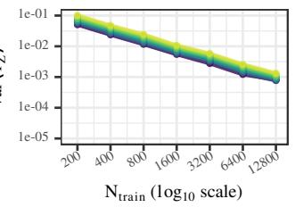  
Figure 11: Convergence behaviour under non-linear $f _ { Z }$ for the DNN w. Controls estimator with $k = 2$ cross-fitting and a cubic B-spline basis on Z. Top: MSPE and bias-variance decomposition of $\hat { f } _ { X }$ . Bottom: MSPE and bias-variance decomposition of $\hat { f } _ { Z }$ . Curves are nearly independent of $\beta _ { Z }$  
Figure 12: Convergence behaviour for non-linear $f _ { Z }$ under model misspecification. Here we control for only linear effects of $Z ,$ , even though the true $f _ { Z }$ is non-linear. Top: MSPE and bias-variance decomposition of $\hat { f } _ { X }$ . Bottom: MSPE and bias-variance decomposition of $\hat { f } _ { Z }$

## D.3 Noisy Control Variables

A control variable may be available only as a noisy measurement, for example when it is itself the output of a previous estimation step. In the measurement error literature, the resulting phenomenon is attenuation: the effect of the noisily observed variable is underestimated [71]. In our setting, an attenuated covariate effect implies that the image effect is only partially corrected for omitted variable bias. To quantify this, we repeat the simulation of Section 5 with a continuous outcome and $\beta _ { Z } ~ = ~ 1$ , generating X and y from the true covariate $Z ,$ , while all estimators receive only the corrupted version $\tilde { Z } = \left( 1 - a \right) Z + a \varepsilon$ with $\varepsilon \sim U ( [ 0 , 1 ] )$ drawn independently of $Z ,$ for training, validation, and prediction. The parameter $a \in \{ 0 , \overleftarrow { 0 . 1 } , \overleftarrow { \ldots } , 1 \}$ interpolates between noisefree covariates $( a = 0 )$ and covariates that are pure noise $( a = 1 )$ . All other settings, including the training protocol and hyperparameters, are identical to the main simulation study (Section D.1), with $n \in \bar { \{ 4 0 0 , \dots , 2 5 , 6 0 0 \} }$ and 50 simulation replications per setting.

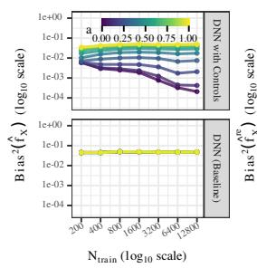  
(a) Squared bias.

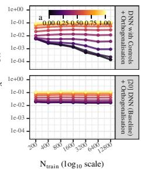

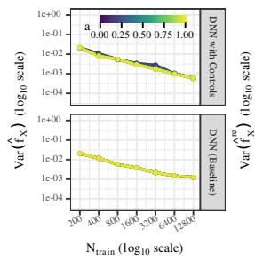

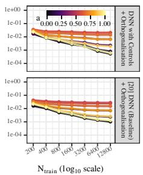  
(b) Variance.  
Figure 13: Squared bias (a) and variance (b) of $\hat { f } _ { X }$ (left blocks) and of the orthogonalised $\hat { f } _ { X } ^ { \mathrm { r e } }$ (right blocks) when estimators observe only the corrupted covariate $\tilde { Z } = ( 1 - a ) Z + a \varepsilon$ , for noise levels $a \in \{ 0 , 0 . 1 , \ldots , 1 \}$ (colour), over the sample size $N _ { \mathrm { t r a i n } } = n / 2$ available to the backbone and refit stages of each fold under 2-fold cross-fitting. Top rows: DNN with Controls; bottom rows: DNN fit without covariates, with post-hoc orthogonalisation [20] for $\hat { f } _ { X } ^ { \mathrm { r e } }$ . The bias interpolates between the noise-free decay at $a = 0$ and the flat level of the uncontrolled DNN at $a = 1$ , while the variance of the DNN with Controls is essentially unaffected by a.

Figure 13a shows the squared bias of $\hat { f } _ { X }$ . For noise-free covariates, the DNN with Controls reproduces the behaviour observed in Fig. 1: the bias decays as the sample grows. As a increases, the curves flatten onto plateaus whose level rises with the noise, and at $a = 1$ the plateau coincides with that of the uncontrolled DNN. Controlling for a noisy covariate therefore removes part of the omitted variable bias and degrades gracefully to the uncontrolled model in the pure-noise limit, rather than beyond it. The plateaus are flat in the sample size, so the remaining bias is not a small-sample artefact: more data does not compensate for a noisy control variable, in line with classical mea surement error results [71]. The same pattern holds for the orthogonalised estimator of the residual effect. Figure 13b shows the corresponding variances, which are essentially unaffected by a for the DNN with Controls, so the noise level moves the bias–variance trade-off through the bias alone. We discuss the practical implications of this limitation in Section 7.

## D.4 Additional Details on the UK Biobank Experiment

T1-weighted volumes were skull-stripped with using FreeSurfer [72] and rigidly registered to MNI152 space at 2 mm isotropic resolution. At training time, intensities are rescaled to [0, 1] within the brain mask; no further normalisation, augmentation, or masking is applied.

For confounding strength $\beta _ { \mathrm { a g e } } \in \{ 0 , 2 \}$ and fixed $\beta _ { \mathrm { s e x } } = 2$ we draw synthetic covariates $a g e _ { i } \sim$ $\mathcal { N } ( \mu _ { \mathrm { a g e } } , 0 . 9 \sigma _ { \mathrm { a g e } } )$ with $\mu _ { \mathrm { a g e } }$ the sample mean and $\sigma _ { \mathrm { a g e } }$ the sample variance over the training data. The factor 0.9 avoids over-sampling at the tails of the empirical age distribution. We sample sex uniformly with $s e x _ { i } \sim$ Bernoulli(0.5). We then sample the response $h i g h a l c _ { i }$ from a Bernoulli with logit $\beta _ { \mathrm { s e x } } \left( s e x _ { i } - 0 . 5 \right) - z _ { - } c o e f \cdot \left( a g e _ { i } - \mu _ { \mathrm { a g e } } \right) / ( 0 . 9 \sigma _ { \mathrm { a g e } } )$ . Together, the three draws form a synthetic sample $( y , s e x , a g e )$ . Then, each synthetic observation is matched to the closest real (y, sex, age) row in the candidate fold by nearest-neighbour matching with replacement; a candidate may appear multiple times per fold, but the folds themselves are disjoint as resampling is applied per fold and after splitting the original training dataset into folds. Per-fold training subsample size is $N = 5 { , } 0 0 0$ and test subsample size is $N _ { \mathrm { t e s t } } = 2 { , } 5 0 0$

The 3D ResNet-50 backbone [73] (2,048 last-layer features) is fine-tuned per fold with binary crossentropy and balanced class weights. Hyperparameters were selected by random grid search over learning rate and weight decay. Optimization used Adam with learning rate $1 . 6 7 \times 1 0 ^ { - 6 }$ , weight decay $\bar { 1 . 0 2 } \times 1 0 ^ { - 5 }$ , batch size 48, ReduceLROnPlateau scheduling (factor 0.8, patience 5), and early stopping on validation loss with patience 20. Model comparison uses five-fold stratified outer crossvalidation; within each fold, the synthetic resampling and the train/refit partition for sample-split / cross-fit estimators are drawn independently, always ensuring that no samples leak across folds or train/refit partition inside each fold.

Figure 14 reports additional results. The top row compares test-set AUC across model and control variants: In general, we can see that age-marginalisation of a DNN with controls nearly recovers the predictive performance of a DNN trained on balanced data, when using crossfitting. However, a small drop remains. The first panel checks that reducing the backbone training set to half (the partition used by the post-hoc fits) does not by itself explain this gap. The remaining two panels compare sample-split against cross-fit post-hoc estimation under age control and joint age and sex control, with $f _ { z }$ marginalised over the training covariate distribution. Cross-fitting closes most of this residual sample-split AUC gap and reduces fold-to-fold variance. Note that controlling for sex and then marginalizing over sex (in this case) removes most of the predictive power of the model, as sex was the primary signal in the "unconfounded" dataset—the age and sex controlled model should therefore be seen as a sanity check. The bottom row reports the recovery of the synthetic covariate coefficients $\hat { \beta } _ { \mathrm { a g e } }$ and $\hat { \beta } _ { \mathrm { s e x } }$ for the estimators using sample splitting. While coefficients are nearly recovered, we can also observe a gap here.

The gaps are likely an artifact of the simulation study, as we use a real (not synthetic) target with highalc — which could already carry some age- and sex-related signal of its own (see [12]. The recovered coefficients could absorb both the injected confound and any pre-existing real-data covari ate–outcome correlation. A second factor is the non-collapsibility of logistic regression [67] — the image effect plays the role of a brain-specific intercept, so the conditional coefficient identified afte image control is generally not equal to the marginal data-level coefficient implied by the resampling, and the recovered estimate reflects this. Finally, finite data means that the resampling procedure will oversample certain observations, especially in certain subpopulations of the dataset (e.g. female, high alcohol, older). More crossfitting folds naturally leads to smaller sample sizes per-fold, and a we apply resampling within each fold this leads to a stronger dataset bias per fold.

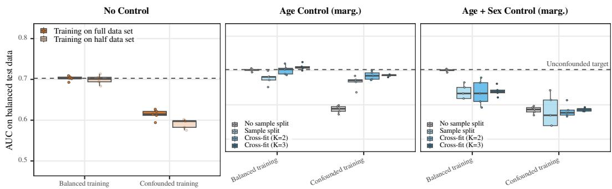

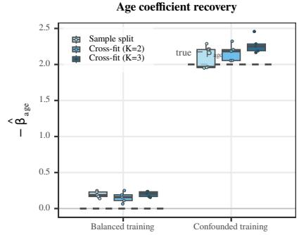

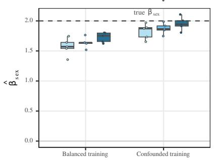  
ffi ffiFigure 14: Additional diagnostic results for the UK Biobank application. Top row – test-set AUC across model and control variants: (left) base DNN, full versus half training fold; (middle) age control, sample-split versus cross-fit (marginalised); (right) age and sex control, sample-split versus ficross-fit (marginalised). Bottom row – cross-fit coefficient recovery: (left) estimated $- \hat { \beta } _ { \mathrm { a g e } }$ vs. ground truth (dashed); (right) estimated $\hat { \beta } _ { \mathrm { s e x } }$ vs. ground truth (dashed). All boxplots span five crossvalidation folds.

## D.5 Computational Resources

All experiments were implemented in [74] and run on a compute server with $2 \times 2 8$ physical cores (112 hardware threads) at 2.0 GHz, 502 GB of system RAM, and two NVIDIA A100 80 GB PCIe GPUs (compute capability 8.0, CUDA driver 595.58, PyTorch built against CUDA 11.8).

Simulation study. Run on a single A100 with a 4-worker pool processing all simulation settings.   
Total active compute time was approximately 28 h.

UK Biobank application. A single outer fold (3D ResNet-50, $N _ { \mathrm { t r a i n } } = 5 0 0 0 )$ takes approximately 40 min for $K { = } 2$ and approximately 100 min for K=3. Aggregated over the five outer folds and two confounding settings, this corresponds to roughly 7 h single-GPU compute for $K { = } 2$ and roughly 16 h for $K { = } 3$ The K=2 sweep was parallelised across both A100s (one confounding setting per GPU); the $K { = } 3$ sweep ran sequentially on one GPU.