# DATA-DRIVEN EFFECTIVE MODELING OF STOCHASTIC CHEMICAL REACTION NETWORKS

YUAN CHEN∗, WEIZE MAO∗, AND DONGBIN XIU∗

Abstract. The Stochastic Simulation Algorithm (SSA), widely considered an exact algorithm for stochastic chemical reaction networks, sufers from high computational cost. In this work, we propose a data-driven efective model that operates on a user-defined coarse time step independent of the underlying microscopic reaction-event scale. This is accomplished by directly approximating the finite-time transition kernel of the continuous-time Markov chain induced by SSA, using a generative machine learning model trained on short bursts of SSA simulation data. The trained model constructs a stochastic propagator that recursively generates statistically consistent trajectories at the constant coarse time step, with significantly reduced computational cost. In this paper, we employ conditional normalizing flow as the stochastic propagator. A comprehensive set of numerical examples is presented to demonstrate the accuracy and eficiency of the proposed method.

Key words. Efective Modeling, Generative Model, Normalizing Flow, Stochastic Reaction Network, Stochastic Simulation Algorithm

MSC codes. 60J27, 60J28, 65C05, 65C40, 92C42

1. Introduction. Stochastic chemical kinetics of well-mixed reacting systems are commonly modeled by the Chemical Master Equation (CME), which describes the evolution of the probability distribution of the underlying reaction network. The corresponding stochastic process is a continuous-time Markov jump process whose exact sample trajectories can be generated by the Stochastic Simulation Algorithm (SSA), also known as the Gillespie algorithm. Since its introduction in [22], SSA has become one of the most widely used computational tools for stochastic chemical reaction systems.

Despite its exactness, SSA sufers from high computational cost. The algorithm advances the system by simulating one reaction event at a time, and the corresponding firing times can become exceedingly small for systems with large populations or stif reaction rates. Consequently, long-time simulations often require an extremely large number of reaction events. Numerous acceleration and approximation techniques have been developed to reduce this cost, including the next-reaction method [21], modified direct method [10], sorting direct method [35], moment closure approximations [25], and tau-leaping methods. Among these approaches, tau-leaping advances the system over a finite time interval by approximating the collective statistics of many reaction events [23]. This idea has led to extensive developments, including stability and error analysis [1, 29, 43], nonnegativity-preserving variants [7, 11], and adaptive or implicit schemes for stif systems [9]. Related coarse-graining and reduction strategies for stochastic reaction systems have also been studied from both computational and mathematical perspectives [27, 28]. We refer to [2, 26, 44] for broader reviews and background. These methods are efective in many regimes, but they typically rely on assumptions regarding slowly varying propensity functions and can sufer from loss of accuracy or stability when these assumptions fail.

In this work, we pursue a diferent direction. Instead of approximating the individual reaction events or modifying the internal mechanics of SSA, we directly approximate the finite-time transition law of the Markov jump process induced by

SSA. More precisely, let $X ( t )$ denote the stochastic process generated by the reaction network. For any finite time lag $\Delta > 0$ , the process admits a transition kernel

$$
P _ { \Delta } ( x , x ^ { \prime } ) = \mathbb { P } ( X ( t + \Delta ) = x ^ { \prime } \mid X ( t ) = x ) ,\tag{1.1}
$$

which defines the finite-time Markov semigroup associated with the CME. The objective of this work is to construct a data-driven approximation of $P _ { \Delta }$ directly from short bursts of SSA simulation data.

This viewpoint leads naturally to a coarse stochastic propagator operating on a user-defined time step $\Delta ,$ , which can be substantially larger than the average SSA firing time. Unlike tau-leaping methods, which accelerate SSA by approximating the numbers of reaction firings over a finite interval under assumptions on the variation of propensity functions, the proposed approach does not approximate the reactionevent dynamics. Instead, it directly targets the finite-time transition kernel of the SSA-induced continuous-time Markov chain and learns this kernel from SSA data. Consequently, the learned model should be viewed as a data-driven numerical approximation of the exact Markov semigroup associated with the underlying continuous-time Markov chain, rather than as an approximation of the reaction-event dynamics.

The proposed method follows the framework of stochastic Flow Map Learning (sFML) [16], which extends deterministic flow map learning [40] to stochastic dynamical systems. In deterministic systems, flow map learning seeks to approximate the map between consecutive states over a finite time interval. In stochastic systems, however, the finite-time evolution is no longer deterministic and is instead characterized by a conditional probability distribution. Consequently, the stochastic flow map is interpreted as a stochastic realization operator whose generated samples follow the finite-time transition kernel.

To realize the stochastic flow map, we employ a conditional normalizing flow model. Normalizing flows (see, e.g., [38]) provide expressive generative models capable of representing highly non-Gaussian conditional distributions while maintaining tractable likelihood evaluation and eficient sampling. This property is particularly important for stochastic chemical reaction systems, whose finite-time transition distributions are frequently strongly non-Gaussian and highly state-dependent.

The resulting framework constructs a stochastic propagator directly from short bursts of SSA trajectory data. Once trained, the model can eficiently produce longtime trajectories at a prescribed coarse time step while preserving important statistical properties of the underlying stochastic dynamics. The main contributions of this work are summarized as follows:

• We reinterpret stochastic flow map learning for chemical reaction systems as a data-driven approximation of the finite-time transition kernel associated with the SSA Markov process.

• We construct a coarse stochastic propagator operating on a user-defined time step independent of the microscopic reaction-event scale.

• We employ conditional normalizing flows to approximate non-Gaussian transition distributions arising from stochastic chemical kinetics.

• We demonstrate through a comprehensive set of numerical examples that the learned propagator produces statistically consistent trajectories while significantly reducing the number of simulation steps compared with SSA.

2. Preliminary. We first present the problem setup and our main objective.

2.1. Problem Setup. Consider a stochastic chemical reaction network with N species $S _ { i } , i = 1 , \ldots , N$ , and M reaction channels

$$
R _ { \mu } : \qquad \sum _ { i = 1 } ^ { N } r _ { i \mu } S _ { i } \stackrel { c _ { \mu } } { \longrightarrow } \sum _ { i = 1 } ^ { N } p _ { i \mu } S _ { i } , \qquad \mu = 1 , \ldots , M ,\tag{2.1}
$$

where $c _ { \mu }$ denotes the reaction rate constant, and $r _ { i \mu } , p _ { i \mu }$ are nonnegative integers representing the stoichiometric coeficients.

Let N-dimensional vector

$$
\mathbf { X } ( t ) = [ X _ { 1 } ( t ) , \ldots , X _ { N } ( t ) ] ^ { T }
$$

denote the vector of molecule numbers at time $t ,$ in the state space $\mathbb { Z } _ { \geq 0 } ^ { N } ,$ the set of N-dimensional vectors of non-negative integers. Under the well-mixed assumption, the evolution of $\mathbf X ( t )$ is modeled as a continuous-time Markov chain (CTMC). Each reaction channel $R _ { \mu }$ is characterized by:

• the stoichiometric vector $\mathbf { s } _ { \mu } = [ p _ { 1 \mu } - r _ { 1 \mu } , \dotsc , p _ { N \mu } - r _ { N \mu } ] ^ { T }$ , which specifies the state change caused by the reaction;

• the propensity function $a _ { \mu } ( { \bf x } ) = c _ { \mu } h _ { \mu } ( { \bf x } )$ , where $h _ { \mu } ( \mathbf { x } )$ represents the number of available reactant combinations at state $\mathbf { X } ( t ) = \mathbf { x }$

The stochastic process admits an infinitesimal generator

$$
( { \mathcal { L } } f ) ( \mathbf { x } ) = \sum _ { \mu = 1 } ^ { M } a _ { \mu } ( \mathbf { x } ) \left( f ( \mathbf { x } + \mathbf { s } _ { \mu } ) - f ( \mathbf { x } ) \right) ,\tag{2.2}
$$

which defines the corresponding chemical master equation.

The SSA algorithm generates exact sample trajectories of this CTMC. Starting from state $\mathbf { X } ( t ) = \mathbf { x } , \mathrm { S S A }$ samples:

(1) a firing time

$$
\tau \sim \mathrm { E x p } \left( \sum _ { \mu = 1 } ^ { M } a _ { \mu } ( \mathbf { x } ) \right) ,
$$

(2) a reaction index λ with probabilities

$$
\mathbb { P } ( \lambda = \mu ) = \frac { a _ { \mu } ( \mathbf { x } ) } { \sum _ { \nu = 1 } ^ { M } a _ { \nu } ( \mathbf { x } ) } ,
$$

and updates the state according to

$$
\mathbf { X } ( t + \tau ) = \mathbf { X } ( t ) + \mathbf { s } _ { \lambda } .
$$

Although SSA evolves through random microscopic firing events, the resulting process is globally characterized by a finite-time transition kernel. For any $\Delta > 0$ define transition kernel $P _ { \Delta } : \mathbb { Z } _ { > 0 } ^ { N } \times \mathbb { Z } _ { > 0 } ^ { N }  [ 0 , 1 ]$

$$
P _ { \Delta } ( \mathbf { x } , \mathbf { x } ^ { \prime } ) = \mathbb { P } ( \mathbf { X } ( t + \Delta ) = \mathbf { x } ^ { \prime } | \mathbf { X } ( t ) = \mathbf { x } ) .\tag{2.3}
$$

Equivalently, for any observable $\phi ,$

$$
( \mathcal { P } _ { \Delta } \phi ) ( \mathbf { x } ) = \mathbb { E } [ \phi ( \mathbf { X } ( t + \Delta ) ) | \mathbf { X } ( t ) = \mathbf { x } ]\tag{2.4}
$$

defines the Markov semigroup associated with the process.

For each fixed $\mathbf { x } , \ P _ { \Delta } ( \mathbf { x } , \cdot )$ defines a (conditional) probability measure on $\mathbb { Z } _ { > 0 } ^ { N }$ where $P _ { \Delta } ( \mathbf { x } , A ) = \mathbb { P } ( \mathbf { X } ( t + \Delta ) \in A | \mathbf { X } ( t ) = \mathbf { x } )$ for any event set A. Modeling this conditional distribution is the central goal of this paper.

2.2. Objective. The objective of this work is to construct a data-driven approximation of the finite-time transition kernel $P _ { \Delta } \ ( 2 . 3 )$ for a prescribed coarse time step $\Delta .$ . More importantly, $\Delta$ is chosen according to the time scale of the macroscopic behavior of the system and is independent of the microscopic SSA firing times τ . Therefore, $\Delta$ may be substantially larger than the average reaction-event scale, i.e., $\Delta \gg \mathbb { E } [ \tau ]$

2.3. Related Work. This work belongs to the broader area of learning dynamical systems from data, which has attracted growing attention due to the rapid development of machine learning. Most existing methods focus on deterministic systems, see, for example, [5, 12, 18, 30, 32, 37, 40, 41, 42].

For stochastic systems, most existing approaches are ‘model-based’, i.e., observational data is assumed to be sampled from a known model with unknown components, such as Itˆo stochastic diferential equations which approximately admit Gaussian transition distributions with unknown drift and difusion functions. These unknown functions are approximated by analyzing and matching statistical properties of data, such as moments, likelihoods, and densities. Such methods have been developed in conjunction with Gaussian processes [3, 19, 36, 51] and deep neural networks (DNNs) [13, 14, 20, 33, 48, 50, 52].

For processes generated by SSA, and CTMCs more broadly, such methods are less capable since the transition distributions are non-Gaussian and the underlying mathematical structure does not conform to a standard parametric form. Some recent explorations using machine learning methods can be found in $[ 6 , 4 6 , 4 7 ]$ . In this work, we adopt the sFML framework [16], which incorporates generative models to approximate the stochastic map between consecutive states in distribution. Many generative models are compatible with this framework, including GANs (generative adversarial networks) [16], autoencoders [49], normalizing flows [15,17], and difusion models [31, 45]. Recently, it was also extended to stochastic systems subjected to external excitation and multiscale systems [15, 17].

## 3. Main Method: Efective Stochastic Propagator.

3.1. Finite-Time Stochastic Flow Map. Let $t _ { n } = n \Delta , n = 0 , 1 , \cdot \cdot \cdot$ be a sequence of discrete time points with constant time stepsize $\Delta$ and we denote ${ \bf X } ( t _ { n } )$ by $\mathbf { X } _ { r }$ for convenience. Then the transition from $\mathbf { X } _ { n }$ to ${ \bf X } _ { n + 1 }$ is governed by the transition kernel

$$
\mathbf { X } _ { n + 1 } \sim P _ { \Delta } ( \mathbf { X } _ { n } , \cdot ) .
$$

We therefore define the stochastic flow map as a stochastic realization operator

$$
{ \bf X } _ { n + 1 } = { \bf G } _ { \Delta } ( { \bf X } _ { n } , { \pmb \xi } _ { n } ) ,\tag{3.1}
$$

where $\xi _ { n }$ is an auxiliary random variable independent of $\mathbf { X } _ { n }$ and follows a prescribed distribution $\mu _ { \xi }$ . The stochastic flow map is required to match the conditional distribution

$$
\begin{array} { r } { \mathbf { G } _ { \Delta } ( \mathbf { x } , \pmb { \xi } ) \sim P _ { \Delta } ( \mathbf { x } , \cdot ) , \quad \mathrm { a s } ~ \pmb { \xi } \sim \mu _ { \pmb { \xi } } . } \end{array}\tag{3.2}
$$

In other words, ${ \bf G } _ { \Delta } ( { \bf x } , \pmb { \xi } )$ provides a sampling realization of the transition kernel $P _ { \Delta } ( \mathbf { x } , \cdot )$

In the following sections, we construct a numerical approximation $\mathbf { G } _ { \Theta }$ of the stochastic flow map, parameterized by Θ, such that the conditional distribution of $\mathbf { G } _ { \Theta } ( \mathbf { x } , \pmb { \xi } )$ approximates the finite-time transition kernel $P _ { \Delta } ( \mathbf { x } , \cdot )$ . Consequently, the

learned model acts as a sampling realization of the finite-time transition kernel of the SSA Markov process. Once trained, repeated application of the stochastic flow map produces a discrete-time stochastic process

$$
\begin{array} { r } { \widetilde { { \mathbf { X } } } _ { n + 1 } = { \mathbf G } _ { \Theta } ( \widetilde { { \mathbf { X } } } _ { n } , \pmb { \xi } _ { n } ) , } \end{array}\tag{3.3}
$$

whose finite-time statistics approximate those of the original SSA process sampled at time interval $\Delta$

3.2. Short-Burst Data Generation. The training data are generated directly from SSA simulations. Let $\Delta > 0$ denote the prescribed coarse time step and let

$$
\left\{ \mathbf { X } _ { 0 } ^ { ( i ) } \right\} _ { i = 1 } ^ { K }
$$

be randomly sampled initial conditions from a prescribed distribution with size of dataset $K > 0$

For each initial condition $\mathbf { X } _ { 0 } ^ { ( i ) }$ , we run SSA up to time $\Delta$ and obtain

$$
\begin{array} { r } { \mathbf { X } _ { 1 } ^ { ( i ) } = \mathbf { X } ^ { ( i ) } ( \Delta ) . } \end{array}
$$

This produces a collection of independent sample pairs

$$
\left( \mathbf { X } _ { 0 } ^ { \left( i \right) } , \mathbf { X } _ { 1 } ^ { \left( i \right) } \right) , \qquad i = 1 , \ldots , K .\tag{3.4}
$$

Each sample pair represents one realization of the finite-time transition kernel

$$
\mathbf { X } _ { 1 } ^ { ( i ) } \sim P _ { \Delta } \left( \mathbf { X } _ { 0 } ^ { ( i ) } , \cdot \right) .
$$

An important feature of this construction is that only short independent trajectory bursts are required. The training process therefore avoids the need for extremely long SSA simulations and is naturally parallelizable.

3.3. Conditional Normalizing Flow Approximation. To approximate the stochastic flow map, we employ a conditional normalizing flow model. Let

$$
\mathbf { z } \sim \mathcal { N } ( 0 , \mathbf { I } _ { N } )
$$

be an N-dimensional standard Gaussian random variable.

We seek a parameterized map

$$
\begin{array} { r } { \mathbf { X } _ { 1 } = \mathbf { G } _ { \ominus } ( \mathbf { X } _ { 0 } , \mathbf { z } ) , } \end{array}\tag{3.5}
$$

such that the conditional distribution of $\mathbf { G } _ { \ominus } ( \mathbf { X } _ { 0 } , \mathbf { z } )$ approximates the finite-time transition kernel

$$
P _ { \Delta } ( { \bf X } _ { 0 } , \cdot ) .
$$

In this work, the map $\mathbf { G } _ { \Theta }$ is realized through a conditional normalizing flow. More specifically, we introduce an invertible transformation

$$
\mathbf { T } _ { \theta } : \mathbb { R } ^ { N }  \mathbb { R } ^ { N } ,
$$

whose parameters depend on the conditioning variable $\mathbf { X } _ { 0 }$ through a neural network with hyper-parameter Θ:

$$
\small \theta = \mathbf { N } _ { \Theta } ( \mathbf { X } _ { 0 } ) .\tag{3.6}
$$

The stochastic flow map is then defined as

$$
\mathbf { X } _ { 1 } = \mathbf { T } _ { \mathbf { N } _ { \ominus } ( X _ { 0 } ) } ( \mathbf { z } ) .\tag{3.7}
$$

The invertibility of the map T enables tractable likelihood evaluation through the change-of-variable formula. Let

$$
\begin{array} { r } { { \bf S } _ { \theta } = { \bf T } _ { \theta } ^ { - 1 } . } \end{array}
$$

Then the conditional density is

$$
p ( \mathbf { X } _ { 1 } | \mathbf { X } _ { 0 } ; \boldsymbol { \Theta } ) = p _ { \mathbf { z } } \left( \mathbf { S } _ { \mathbf { N } \boldsymbol { \Theta } ( \mathbf { X } _ { 0 } ) } ( \mathbf { X } _ { 1 } ) \right) \left| \operatorname* { d e t } \mathbf { D } \mathbf { T } _ { \mathbf { N } _ { \boldsymbol { \Theta } } ( \mathbf { X } _ { 0 } ) } \right| ^ { - 1 } ,\tag{3.8}
$$

where $p _ { \mathbf { z } }$ denotes the standard Gaussian density function and $\mathbf { D T } ( \mathbf { y } ) = \partial \mathbf { T } / \partial \mathbf { y }$ denotes the Jacobian of the mapping T.

The model parameters Θ are obtained by maximizing the conditional likelihood over the training dataset, equivalently minimizing the empirical negative log-likelihood loss

$$
\mathcal { L } ( \boldsymbol { \Theta } ) = - \frac { 1 } { K } \sum _ { i = 1 } ^ { K } \log p \left( \mathbf { X } _ { 1 } ^ { ( i ) } | \mathbf { X } _ { 0 } ^ { ( i ) } ; \boldsymbol { \Theta } \right) .\tag{3.9}
$$

An illustration of the proposed sFML model structure can be found in Figure 1. This is in direct correspondence of (3.7).

We emphasize that the conditional normalizing flow serves only as one realization strategy for the stochastic flow map. The proposed framework itself is independent of the particular generative architecture and may incorporate alternative conditional generative models.

3.4. Recursive System Prediction. Once the model is trained, long-time tra jectories are generated recursively by

$$
\left\{ \begin{array} { l l } { \widetilde { \mathbf { X } } _ { 0 } = \mathbf { X } _ { 0 } , } \\ { \widetilde { \mathbf { X } } _ { n + 1 } = \mathbf { R } \left( \mathbf { G } _ { \Theta } ( \widetilde { \mathbf { X } } _ { n } , \mathbf { z } _ { n } ) \right) , \qquad n = 0 , 1 , 2 , . . . , } \end{array} \right.\tag{3.10}
$$

where $\mathbf { z } _ { n }$ are standard Gaussian random samples independent of $\widetilde { \mathbf { X } } _ { n }$ and R denotes ean enforcing operator to satisfy the physical constraints such as nonnegativity and integer-valued molecule counts – see the Section 3.5 below.

The resulting process is designed to provide a weak approximation to the true stochastic dynamics at the discrete time points, i.e.,

$$
( \widetilde { \mathbf { X } } _ { 0 } , \widetilde { \mathbf { X } } _ { 1 } , \cdots , \widetilde { \mathbf { X } } _ { n } ) \overset { d } { \approx } ( \mathbf { X } _ { 0 } , \mathbf { X } _ { 1 } , \cdots , \mathbf { X } _ { n } ) ,
$$

but operates only on a constant coarse time step $\Delta$ independent of the microscopic SSA firing times. Consequently, the learned stochastic propagator can significantly reduce the number of simulation steps required for long-time stochastic simulations.

## 3.5. Computational Details for Enforcing Operator.

Conservation of Molecule Numbers. In some reaction networks, the total molecule count is a conserved quantity, i.e.,

$$
\mathbf { X } _ { n } \cdot \mathbf { 1 } _ { N } = \mathbf { X } _ { 0 } \cdot \mathbf { 1 } _ { N } , \quad { \mathrm { f o r ~ a l l ~ } } n = 0 , 1 , \cdots ,\tag{3.11}
$$

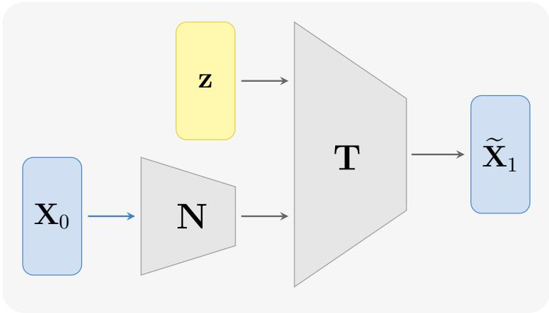  
Fig. 1. The DNN model structure for the proposed normalizing flow sFML method (3.7).

where $\mathbf { 1 } _ { N }$ denotes the N-dimensional vector of all ones. In this case, the transition kernel $P _ { \Delta } ( \mathbf { x } , \cdot )$ is supported on the $( N - 1 )$ -dimensional hyperplane $\{ { \bf x } ^ { \prime } : { \bf x } ^ { \prime } \cdot { \bf 1 } _ { N } =$ ${ \bf x } \cdot { \bf 1 } _ { N } \}$ , a constraint that will not be preserved automatically by generic generative models. We enforce this constraint strongly into the model construction.

Let $\mathbf { A } \in \mathbb { R } ^ { ( N - 1 ) \times N }$ be a slicing matrix consisting of the first $N - 1$ rows of the $N \times N$ identity matrix. We replace the training dataset with the projected pairs

$$
\left( \mathbf { Y } _ { 0 } ^ { ( i ) } , \mathbf { Y } _ { 1 } ^ { ( i ) } \right) : = \left( \mathbf { X } _ { 0 } ^ { ( i ) } , \mathbf { A } \mathbf { X } _ { 1 } ^ { ( i ) } \right) , \quad i = 1 , \ldots , K ,\tag{3.12}
$$

and train an $( N - 1 )$ )-dimensional conditional normalizing flow model based on the new dataset

$$
\mathbf { Y } _ { 1 } = \widehat { \mathbf { T } } _ { \mathbf { N } _ { \Theta } \left( \mathbf { Y } _ { 0 } \right) } \left( \widehat { \mathbf { z } } \right)\tag{3.13}
$$

following the procedure stated in previous sections. Here $\widehat { \mathbf { z } }$ follows an $( N - 1 )$ dimensional unit Gaussian distribution.

After training, the full N-dimensional model prediction is then recovered using the dimension-extension operator $\mathbf { E } : \mathbb { R } ^ { N } \times \mathbb { R } ^ { N - 1 } \overset { \cdot } {  } \mathbb { R } ^ { N }$ , defined by

$$
\mathbf { E } ( \mathbf { x } , \mathbf { y } ) : = \left[ \mathbf { y } ; \mathbf { x } \cdot \mathbf { 1 } _ { N } - \mathbf { y } \cdot \mathbf { 1 } _ { N - 1 } \right] ^ { T } ,\tag{3.14}
$$

which reconstructs the N-th component so that the total count is exactly preserved. The resulting model takes the form

$$
\begin{array} { r } { \mathbf { G } _ { \Theta } ( \mathbf { x } , \widehat { \mathbf { z } } ) = \mathbf { E } \Big ( \mathbf { x } , \widehat { \mathbf { T } } _ { \mathbf { N } _ { \Theta } ( \mathbf { x } ) } ( \widehat { \mathbf { z } } ) \Big ) , } \end{array}\tag{3.15}
$$

which satisfies $\mathbf { G } _ { \ominus } ( \mathbf { x } , \widehat { \mathbf { z } } ) \cdot \mathbf { 1 } _ { N } = \mathbf { x } \cdot \mathbf { 1 } _ { N }$ for any Θ by construction. Other invariants of bthis type, including those expressible as signal temporal logic (STL) requirements [6], are left for future work.

Post-processing. A notable feature of chemical reaction systems is that the state X(t) takes values of non-negative integers, as each component represents a molecule count. Since the output of the normalizing flow lies in $\mathbb { R } ^ { N }$ , we apply a deterministic post-processing operator $\mathbf { R } : \mathbb { R } ^ { N } \to \mathbb { Z } _ { > 0 } ^ { \bar { N } }$ after each recursive step, defined

by

$$
\mathbf { R } ( \mathbf { x } ) = \mathrm { R o u n d } ( \mathrm { m a x } ( \mathbf { x } , \mathbf { 0 } ) ) ,\tag{3.16}
$$

where max $\mathbf { \nabla } \cdot ( \cdot , \mathbf { 0 } )$ enforces nonnegativity componentwise and Round(·) maps each component to the nearest integer. The operator R ensures that all generated states remain physically admissible. This projection onto the discrete state space may be interpreted as an abstraction of the learned real-valued model, we refer to [4] for interested readers.

4. Numerical Examples. In this section, we present several numerical experiments to demonstrate the performance of the proposed sFML model across the fol lowing reaction networks:

• Transfer process;

• Lotka-Volterra model;

• The Brusselator;

• The Autocatalysis;

• The Oregonator.

In all examples, the reaction networks are known, and the training data are generated via SSA following the procedure described in Section 3.2. Initial conditions are sampled uniformly from a bounded domain specified for each example, along with the chosen coarse time step $\Delta .$ . Once trained, the model is used to generate ensemble predictions with new initial conditions, which are compared against the SSA ground truth and the classical acceleration method tau-leaping using the following quantities:

• Number of simulation steps required to reach the same termination time, used as a measure of computational eficiency;

• Simulated trajectories and their mean and standard deviation, for visual comparisons as well as basic statistics;

• Fourier modes for examples exhibiting periodic behavior;

• Distributional comparison of the learned stochastic flow map $\mathbf { G } _ { \boldsymbol { \Theta } } ( \mathbf { x } , \cdot )$ and the SSA transition kernel $P _ { \Delta } ( \mathbf { x } , \cdot )$ at fixed conditioning states x.

We use the Masked Autoregressive Flow (MAF, c.f. [39]) model as a technical realization of the normalizing flow. Upon use of the model, there are 4 coupling flow mappings constructed with independent training parameters. The training data size, batch size, and number of training epochs will be specified in each example. We use fully connected neural networks with 3 layers, each of which has 20 nodes, with a tanh activation function. We employ the cyclic learning rate with a base rate $3 \times 1 0 ^ { - 4 }$ and a maximum rate $5 \times 1 0 ^ { - 4 } , \gamma = 0 . 9 9 9 9 9$ , and step size 10, 000. Simultaneously, the whole cycle is set to decay with a scale 0.5 for every 40, 000 training epoch. To reduce the overfitting phenomenon, we also add a small weight decay with a scale 0.01 on the updated gradients.

For SSA, one simulation step corresponds to one reaction firing event. For sFML, one simulation step corresponds to one recursive evaluation of the learned stochastic flow map $\mathbf { G } _ { \ominus }$ over the prescribed coarse time step $\Delta$ , and therefore the number of sFML steps is exactly $T / \Delta$ . We also include tau-leaping as a classical accelerated SSA method. When the propensity functions remain approximately unchanged over a time interval τ , tau-leaping approximates the reaction firing counts by independent Poisson random variables,

$$
{ \mathbf X } ( t + \tau ) = { \mathbf X } ( t ) + \sum _ { \mu = 1 } ^ { M } { \mathbf s } _ { \mu } \mathcal { P } _ { \mu } ( a _ { \mu } ( { \mathbf X } ( t ) ) \tau ) ,\tag{4.1}
$$

where ${ \mathscr { P } } _ { \mu } ( \lambda )$ is the Poisson random variable with mean λ; see [8, 23]. We use tauleaping in two diferent ways. The first is adaptive tau-leaping, where the internal step size is chosen automatically to satisfy the leaping condition. This is used in Table 1 to compare the number of simulation steps. The second is fixed-step tau-leaping with $\tau =$ $\Delta .$ , which is used as an equal-step baseline against sFML to compare approximation accuracy in Table 3. In this paper, the tau-leaping method is implemented with the Python package Gilles $\mathrm { P y 2 }$ TauLeapingSolver [34].

Table 1 compares the simulation steps of SSA, adaptive tau-leaping, and sFML. The SSA and adaptive tau-leaping steps are averaged over simulated trajectories, while the sFML steps are fixed by $T / \Delta$ . Across the examples, sFML takes substan tially fewer steps than SSA and adaptive tau-leaping.

Table 1  
Comparison of simulation steps. SSA and tau-leaping steps are estimated as averages over 10,000 simulated trajectories and rounded to two significant figures. sFML steps equal T /∆ exactly. The ratios for SSA and adaptive tau-leaping are defined as their respective steps divided by the sFML steps.
<table><tr><td rowspan="2">Example</td><td rowspan="2">T</td><td rowspan="2">sFML Steps</td><td colspan="2">SSA</td><td colspan="2">Adaptive Tau-leaping</td></tr><tr><td>Steps</td><td>Ratio</td><td>Steps</td><td>Ratio</td></tr><tr><td>Transfer</td><td>10</td><td> $1 . 0 \times 1 0 ^ { 2 }$ </td><td> $1 . 9 \times 1 0 ^ { 2 }$ </td><td> $1 . 9 3 \times$ </td><td> $1 . 8 \times 1 0 ^ { 2 }$ </td><td> $1 . 7 5 \times$ </td></tr><tr><td>LV (slow)</td><td>20</td><td> $2 . 0 \times 1 0 ^ { 2 }$ </td><td> $7 . 2 \times 1 0 ^ { 3 }$ </td><td> $3 6 \times$ </td><td> $2 . 5 \times 1 0 ^ { 3 }$ </td><td> $1 2 . 3 \times$ </td></tr><tr><td>LV (fast)</td><td>20</td><td> $2 . 0 \times 1 0 ^ { 3 }$ </td><td> $6 . 0 \times 1 0 ^ { 5 }$ </td><td> $3 0 0 \times$ </td><td> $3 . 2 \times 1 0 ^ { 4 }$ </td><td> $1 5 . 8 \times$ </td></tr><tr><td>Brusselator</td><td>15</td><td> $1 . 5 \times 1 0 ^ { 3 }$ </td><td> $1 . 6 \times 1 0 ^ { 6 }$ </td><td>1070×</td><td> $2 . 1 \times 1 0 ^ { 5 }$ </td><td> $1 4 3 \times$ </td></tr><tr><td>Autocatalysis</td><td>10</td><td> $1 . 0 \times 1 0 ^ { 3 }$ </td><td> $3 . 2 \times 1 0 ^ { 5 }$ </td><td> $3 1 7 \times$ </td><td> $7 . 6 \times 1 0 ^ { 3 }$ </td><td> $7 . 6 5 \times$ </td></tr><tr><td>Oregonator</td><td>6</td><td> $6 . 0 \times 1 0 ^ { 2 }$ </td><td> $7 . 1 \times 1 0 ^ { 5 }$ </td><td> $1 1 8 7 \times$ </td><td> $9 . 0 \times 1 0 ^ { 4 }$ </td><td> $1 4 9 \times$ </td></tr></table>

We next evaluate the local accuracy of the learned one-step transition kernel. For a fixed conditioning state $\mathbf { x } ,$ let $\{ \mathbf { X } _ { 1 } ^ { ( i ) } \} _ { i = 1 } ^ { m }$ be samples generated by SSA from $P _ { \Delta } ( \mathbf { x } , \cdot )$ , and let $\{ \widetilde { \mathbf { X } } _ { 1 } ^ { ( j ) } \} _ { j = 1 } ^ { n }$ be samples generated by $\mathbf { G } _ { \Theta } ( \mathbf { x } , \pmb { \xi } )$ . We compare these etwo empirical distributions using the empirical estimator of the (square of) Maximum Mean Discrepancy (MMD), defined by

$$
\begin{array} { r l r } { \widehat { \mathrm { M M D } } _ { h } ^ { 2 } = \displaystyle \frac { 1 } { m ^ { 2 } } \sum _ { i , i ^ { \prime } = 1 } ^ { m } k _ { h } \left( \mathbf { X } _ { 1 } ^ { ( i ) } , \mathbf { X } _ { 1 } ^ { ( i ^ { \prime } ) } \right) + \displaystyle \frac { 1 } { n ^ { 2 } } \sum _ { j , j ^ { \prime } = 1 } ^ { n } k _ { h } \left( \widetilde { \mathbf { X } } _ { 1 } ^ { ( j ) } , \widetilde { \mathbf { X } } _ { 1 } ^ { ( j ^ { \prime } ) } \right) } & { } & \\ { \displaystyle - \frac { 2 } { m n } \sum _ { i = 1 } ^ { m } \sum _ { j = 1 } ^ { n } k _ { h } \left( \mathbf { X } _ { 1 } ^ { ( i ) } , \widetilde { \mathbf { X } } _ { 1 } ^ { ( j ) } \right) , } & { } & \end{array}\tag{4.2}
$$

with the Gaussian kernel

$$
k _ { h } ( \mathbf { x } , \mathbf { y } ) = \exp \left( - \frac { \left\| \mathbf { x } - \mathbf { y } \right\| _ { 2 } ^ { 2 } } { 2 h ^ { 2 } } \right) .\tag{4.3}
$$

The number reported in Table 2 is $\widehat { \mathrm { M M D } } _ { h }$ , where h is set to the median pairwise distance of the samples [24]. For each example, we take one SSA test trajectory, randomly select 30 conditioning states along that trajectory, and compute the MMD at each selected state with 10, 000 conditional samples for both SSA and sFML. Table 2 reports the minimum, median, and maximum MMD values over these 30 condition ing states. These values reflect the one-step distributional accuracy along the test manifolds sampled by the SSA trajectories.

Table 2  
One-step transition-kernel comparison. For each example, MMD is computed at 30 conditioning states sampled from one SSA test trajectory. The table reports the minimum, median, and maximum MMD over the selected states.
<table><tr><td>Example</td><td>Min MMD</td><td>Median MMD</td><td>Max MMD</td></tr><tr><td>Transfer</td><td> $1 . 8 9 \times 1 0 ^ { - 2 }$ </td><td> $5 . 5 9 \times 1 0 ^ { - 2 }$ </td><td> $1 . 0 5 \times 1 0 ^ { - 1 }$ </td></tr><tr><td>LV (slow)</td><td> $1 . 7 2 \times 1 0 ^ { - 2 }$ </td><td> $4 . 4 6 \times 1 0 ^ { - 2 }$ </td><td> $9 . 6 0 \times 1 0 ^ { - 2 }$ </td></tr><tr><td>LV (fast)</td><td> $1 . 5 5 \times 1 0 ^ { - 2 }$ </td><td> $5 . 0 7 \times 1 0 ^ { - 2 }$ </td><td> $8 . 7 2 \times 1 0 ^ { - 2 }$ </td></tr><tr><td>Brusselator</td><td> $8 . 0 9 \times 1 0 ^ { - 2 }$ </td><td> $2 . 2 9 \times 1 0 ^ { - 1 }$ </td><td> $2 . 8 3 \times 1 0 ^ { - 1 }$ </td></tr><tr><td>Autocatalysis</td><td> $1 . 8 1 \times 1 0 ^ { - 2 }$ </td><td> $4 . 1 8 \times 1 0 ^ { - 2 }$ </td><td> $9 . 3 5 \times 1 0 ^ { - 2 }$ </td></tr><tr><td>Oregonator</td><td> $5 . 2 8 \times 1 0 ^ { - 2 }$ </td><td> $1 . 5 3 \times 1 0 ^ { - 1 }$ </td><td> $3 . 0 9 \times 1 0 ^ { - 1 }$ </td></tr></table>

Finally, we compare long-time ensemble statistics over the full recursive rollout. Let $t _ { k } = k \Delta , k = 0 , \dots , K$ , and define

$$
\begin{array} { r } { \mu _ { k } = \mathbb { E } ( \mathbf { X } _ { k } ) , \qquad \widetilde { \mu } _ { k } = \mathbb { E } ( \widetilde { \mathbf { X } } _ { k } ) , \qquad \sigma _ { k } = \mathrm { S T D } ( \mathbf { X } _ { k } ) , \qquad \widetilde { \sigma } _ { k } = \mathrm { S T D } ( \widetilde { \mathbf { X } } _ { k } ) . } \end{array}\tag{4.4}
$$

The trajectory-level relative errors are

$$
E _ { \mu } = \left( \frac { \sum _ { k = 0 } ^ { K } \left\| \pmb { \mu } _ { k } - \widetilde { \pmb { \mu } } _ { k } \right\| _ { 2 } ^ { 2 } } { \sum _ { k = 0 } ^ { K } \left\| \pmb { \mu } _ { k } \right\| _ { 2 } ^ { 2 } } \right) ^ { 1 / 2 } , \qquad E _ { \sigma } = \left( \frac { \sum _ { k = 0 } ^ { K } \left\| \pmb { \sigma } _ { k } - \widetilde { \pmb { \sigma } } _ { k } \right\| _ { 2 } ^ { 2 } } { \sum _ { k = 0 } ^ { K } \left\| \pmb { \sigma } _ { k } \right\| _ { 2 } ^ { 2 } } \right) ^ { 1 / 2 } .\tag{4.5}
$$

These errors measure the discrepancy of the mean and standard-deviation curves over the whole discrete trajectory. Table 3 reports these errors for sFML and fixed-step tau-leaping with the same coarse step size $\tau = \Delta$ This provides a quantitative counterpart to the mean and standard-deviation plots shown below for each example.

Table 3  
Global trajectory comparison with fixed-step tau-leaping. Tau-leaping uses the same coarse step size $\tau = \Delta$ as sFML. Errors are estimated from 10,000 trajectories.
<table><tr><td>Example</td><td> $T$ </td><td>∆</td><td>Method</td><td> $E _ { \mu }$ </td><td> $E _ { \sigma }$ </td></tr><tr><td>Transfer</td><td>10</td><td>0.1</td><td>sFML Tau-leaping</td><td> $1 . 7 8 \times 1 0 ^ { - 3 }$   $7 . 6 4 \times 1 0 ^ { - 3 }$ </td><td> $7 . 9 2 \times 1 0 ^ { - 2 }$   $4 . 8 1 \times 1 0 ^ { - 2 }$ </td></tr><tr><td>LV (slow)</td><td>20</td><td>0.1</td><td>sFML Tau-leaping</td><td> $2 . 1 6 \times 1 0 ^ { - 2 }$   $1 . 7 0 \times 1 0 ^ { - 1 }$ </td><td> $3 . 0 7 \times 1 0 ^ { - 2 }$   $3 . 0 4 \times 1 0 ^ { 0 }$ </td></tr><tr><td>LV (fast)</td><td>200.01</td><td></td><td>sFML Tau-leaping</td><td> $8 . 3 1 \times 1 0 ^ { - 3 }$  unstable</td><td> $5 . 4 3 \times 1 0 ^ { - 2 }$  unstable</td></tr><tr><td>Brusselator</td><td>15</td><td>0.01</td><td>sFML Tau-leaping</td><td> $6 . 8 7 \times 1 0 ^ { - 2 }$   $2 . 4 4 \times 1 0 ^ { - 1 }$ </td><td> $9 . 3 1 \times 1 0 ^ { - 2 }$   $2 . 9 3 \times 1 0 ^ { - 1 }$ </td></tr><tr><td>Autocatalysis 10</td><td></td><td>0.01</td><td>sFML Tau-leaping</td><td> $2 . 1 8 \times 1 0 ^ { - 2 }$   $2 . 6 8 \times 1 0 ^ { - 1 }$ </td><td> $6 . 9 1 \times 1 0 ^ { - 2 }$   $3 . 6 7 \times 1 0 ^ { 0 }$ </td></tr><tr><td>Oregonator</td><td>6</td><td>0.01</td><td>sFML Tau-leaping</td><td> $4 . 4 1 \times 1 0 ^ { - 1 }$   $3 . 7 2 \times 1 0 ^ { - 1 }$ </td><td> $2 . 7 8 \times 1 0 ^ { - 1 }$   $3 . 9 2 \times 1 0 ^ { - 1 }$ </td></tr></table>

## 4.1. Transfer Process. We first consider the following transfer process

(4.6a)

$$
X _ { 1 } \xrightarrow { c _ { 1 } } X _ { 2 }\tag{4.6b}
$$

$$
X _ { 2 } \xrightarrow { c _ { 2 } } X _ { 3 } ,
$$

where there are 3 species and 2 reactions, with reaction rates $c _ { 1 } = c _ { 2 } = 1 . 0$ . This system has a conserved total molecule count $X _ { 1 } + X _ { 2 } + X _ { 3 }$ , so the dimension-reduction procedure of Section 3.5 is applied. A total of 40,000 training samples are generated with initial conditions drawn from $\mathcal { U } ( [ 0 , 1 0 0 ] \times [ 0 , 6 0 ] \times [ 5 0 , 1 8 0 ] )$ . The time step is set to $\Delta = 0 . 1$ , and the model is trained for 200, 000 epochs.

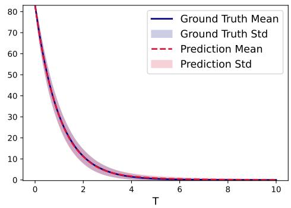

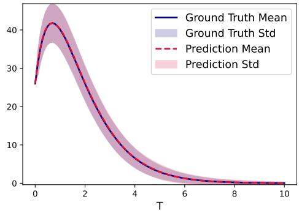

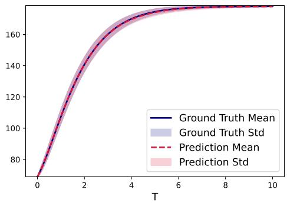

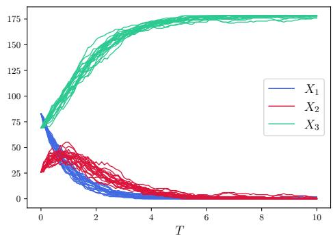  
Fig. 2. Mean and standard deviation (STD) of Example 4.1 with initial condition (83, 26, 69): upper $l e f t \colon X _ { 1 } ,$ upper right: $X _ { 2 }$ , lower left: $X _ { 3 }$ . Lower right: sample trajectories of Example 4.1 with initial condition (83, 26, 69).

The trained model is tested with the initial condition (83, 26, 69). The lower right panel of Figure 2 shows several independent predicted trajectory samples up to $T ~ = ~ 1 0 . 0$ , along with the mean and standard deviation averaged over 10, 000 trajectories. The predictions are in close agreement with the reference statistics over a long time period, which demonstrates the accuracy of our proposed method.

## 4.2. Lotka-Volterra Model. We next consider the Lotka-Volterra model

(4.7a)

$$
X _ { 1 } \ { \xrightarrow { c _ { 1 } } } \ 2 X _ { 1 }\tag{4.7b}
$$

$$
X _ { 1 } + X _ { 2 } \xrightarrow { c _ { 2 } } 2 X _ { 2 }\tag{4.7c}
$$

$$
X _ { 2 } \xrightarrow { c _ { 3 } } \emptyset ,
$$

where there are 2 species and 3 reactions with rates $c _ { 1 } , c _ { 2 }$ , and $c _ { 3 }$ . This is the classical biological model for the interaction between a predator population $( X _ { 2 } )$ and a prey population $( X _ { 1 } )$ . We examine two parameter regimes that pose qualitatively diferent challenges to the learned model.

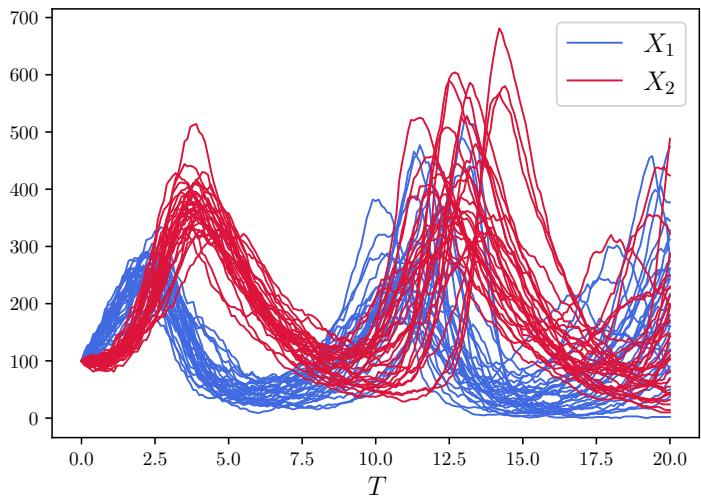  
Fig. 3. Test sample trajectories of Example 4.2 with initial condition (100, 100) and parameter $c _ { 1 } = 1 . 0 , c _ { 2 } = 0 . 0 0 5$ and $c _ { 3 } = 0 . 6$ up to $T = 2 0$

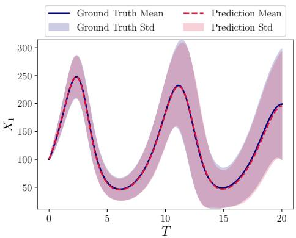

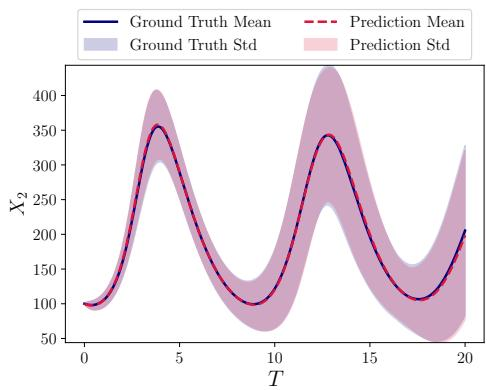  
Fig. 4. Mean and standard deviation (STD) of Example 4.2 with initial condition (100, 100) and parameters $c _ { 1 } = 1 . 0 , c _ { 2 } = 0 . 0 0 5$ and $c _ { 3 } = 0 . 6$ up to $T = 2 0 \colon$ left: number of $X _ { 1 }$ , right: number of $X _ { 2 }$

Slow Reaction. With $c _ { 1 } = 1 . 0 , c _ { 2 } = 0 . 0 0 5$ , and $c _ { 3 } = 0 . 6 $ , the system evolves on a long time scale with mild, irregular oscillations. A total of 120,000 training samples are generated with initial conditions drawn from $\mathcal { U } ( [ 0 , 6 5 0 ] \times [ 0 , 7 0 0 ] )$ . The time step is $\Delta = 0 . 1$ , and the model is trained for 200, 000 epochs.

The trained model is tested with the initial condition $\mathbf { X } _ { 0 } = ( 1 0 0 , 1 0 0 )$ . Figure 3 shows independent sample trajectories produced by the learned model, and Figure 4 presents the mean and standard deviation comparison using those samples. The results are in close agreement with the reference.

Fast Reaction. We consider the parameter set from [22], with $c _ { 1 } = 1 0 , c _ { 2 } =$ 0.01, and $c _ { 3 } = 1 0$ . Under such a setting, the system exhibits sharp transients and rapid oscillations. A total of 120,000 training samples are generated with initial conditions drawn from $\mathcal { U } ( [ 0 , 5 0 0 0 ] ^ { 2 } )$ . The time step is $\Delta = 0 . 0 1$ , chosen to resolve the sharp transients in the dynamics, and the model is trained for 400, 000 epochs.

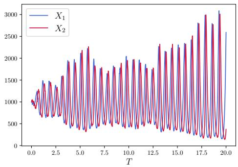

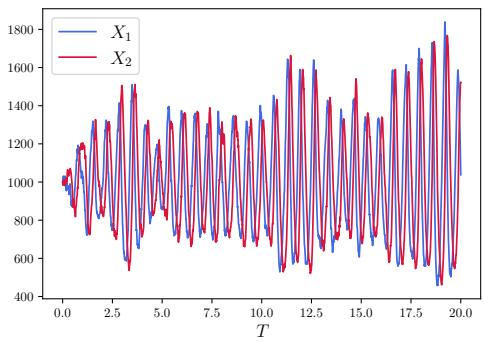

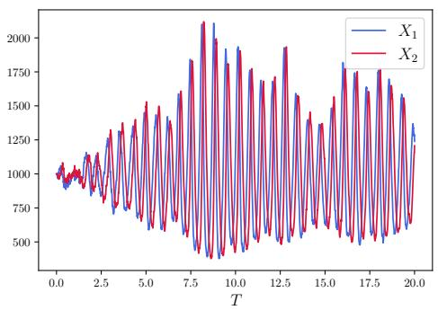

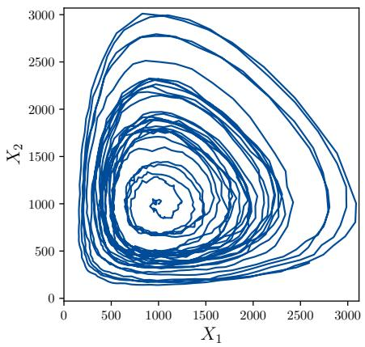  
Fig. 5. Sample trajectories produced by trained model of Example $4 . 2$ with initial condition (1000, 1000) and parameter $c _ { 1 } = 1 0 , c _ { 2 } = 0 . 0 1$ and $c _ { 3 } = 1 0$ up to $T = 2 0 .$ . Upper left, upper right, lower left: 3 independent simulations, lower right: phase plot of upper left.

Upon successful training, the model is tested with an initial condition ${ \bf { X } } _ { 0 } \ =$ (1000, 1000). Figure 5 presents 3 independent trajectory samples in state space and the phase space plot of the upper left case produced by the learned model. Figure 6 shows the corresponding SSA reference trajectories. The two sets exhibit consistent qualitative behavior. To further assess accuracy, we compare the one-step conditional distributions at condition $\mathbf { x } = ( 5 4 0 , 7 3 4 ) \colon 1 0 , 0 0 0$ samples are drawn from the trained model $\mathbf { G } _ { \boldsymbol { \Theta } } ( \mathbf { x } , \cdot )$ and compared against the SSA referenced transition kernel $P _ { \Delta } ( \mathbf { x } , \cdot )$ in Figure 7. The marginal distributions of $X _ { 1 }$ and $X _ { 2 }$ are also shown and confirm the accuracy of the learned model.

## 4.3. The Brusselator. We consider the Brusselator

(4.8a)

$$
\overline { { Y } } _ { 1 } \xrightarrow { c _ { 1 } } X _ { 1 }\tag{4.8b}
$$

$$
\overline { { { Y } } } _ { 2 } + X _ { 1 } \xrightarrow { { c } _ { 2 } } X _ { 2 } + Z _ { 1 }\tag{4.8c}
$$

$$
2 X _ { 1 } + X _ { 2 } \xrightarrow { c _ { 3 } } 3 X _ { 1 }\tag{4.8d}
$$

$$
X _ { 1 } \ { \xrightarrow { c _ { 4 } } } \ Z _ { 2 } ,
$$

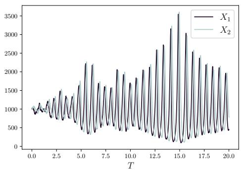

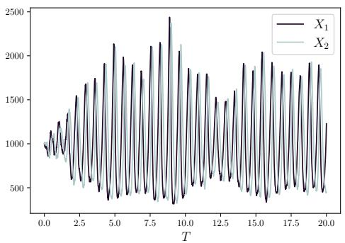

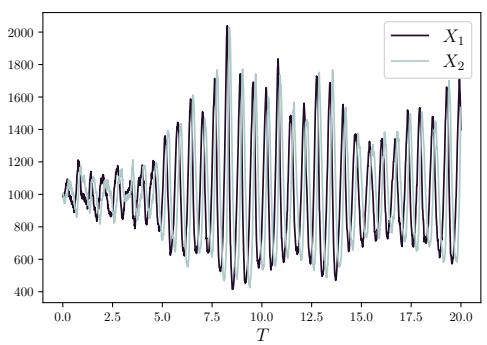

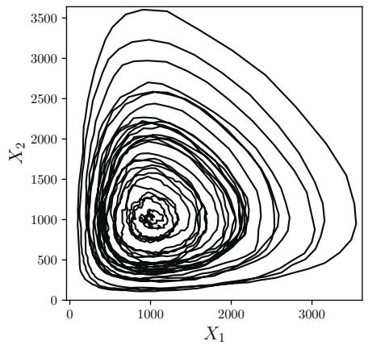  
Fig. 6. Sample trajectories produced $b y ~ S S A$ of Example 4.2 with initial condition (1000, 1000) and parameter $c _ { 1 } = 1 0 , c _ { 2 } = 0 . 0 1$ and $c _ { 3 } = 1 0$ up to $T = 2 0$ . Upper left, upper right, lower left: 3 independent simulations, lower right: phase plot of upper left.

where there are 2 species and 4 reactions, with $\overline { { Y } } _ { 1 }$ and $\overline { { Y } } _ { 2 }$ treated as parameters and $c _ { 1 } , \ c _ { 2 } , \ c _ { 3 }$ , and $c _ { 4 }$ the reaction rates. A total of 120,000 training samples are generated with initial conditions drawn from $\mathcal { U } ( [ 0 , 5 0 0 0 ] ^ { 2 } )$ ), parameter values $c _ { 1 } \overline { { Y } } _ { 1 } =$ 5000, $c _ { 2 } \overline { { Y } } _ { 2 } = 5 0 , c _ { 3 } = 5 \times 1 0 ^ { - 5 } , c _ { 4 } = 5$ . The time step is set to $\Delta = 0 . 0 1$ , and the model is trained for 400, 000 epochs.

Upon successful training, the model is tested with an initial condition ${ \bf { X } } _ { 0 } \ =$ (1000, 2000). Figure 8 presents a comparison of trajectories (in both state and phase spaces) generated by SSA and by the trained model. A consistent, nearly periodic behavior is observed across both sets of results. To further validate the dynamical properties, we apply the Fast Fourier Transform (FFT) to compute the Fourier modes of the two trajectories, presented in Figure 10. The first, second, and third dominant modes of the two trajectories agree closely, demonstrating that the learned model has captured the correct oscillation frequency. Furthermore, a comparison of histograms of the conditional distributions is presented in Figure 9. With condition $\mathbf { x } = ( 1 9 5 9 , 9 7 1 )$ , 10, 000 samples are generated from the trained model $\mathbf { G } _ { \boldsymbol { \Theta } } ( \mathbf { x } , \cdot )$ and displayed in the upper right of Figure 9, while the corresponding ground-truth histogram obtained from $\mathrm { S S A }$ transition kernel $P _ { \Delta } ( \mathbf { x } , \cdot )$ is shown in the upper left. The marginal distributions of $X _ { 1 }$ and $X _ { 2 }$ are also compared, confirming the accuracy of the learned model.

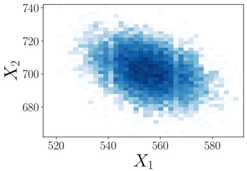

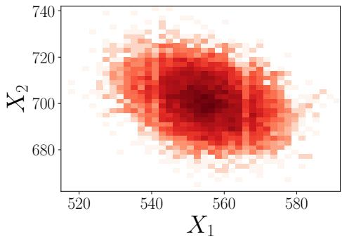

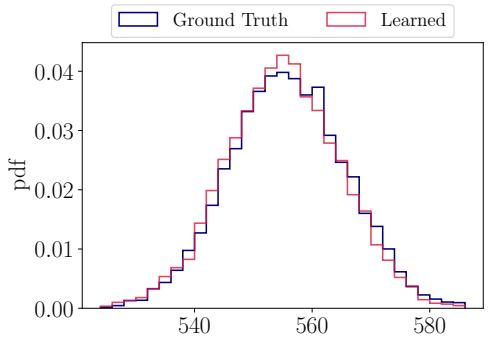

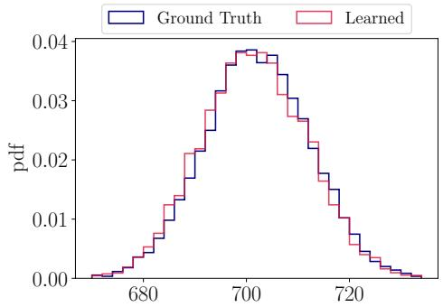  
Fig. 7. Comparison of one-step conditional distribution of Example 4.2 with condition $\bf { x } =$ (540, 734) and parameter $c _ { 1 } = 1 0 , \ : c _ { 2 } = 0 . 0 1$ and $c _ { 3 } ~ = ~ 1 0 $ . Upper left: ground truth of joint distribution of $( X _ { 1 } , X _ { 2 } )$ , upper right: learned joint distribution of $( X _ { 1 } , X _ { 2 } )$ , lower left: comparison of the marginal distribution $f o r \ X _ { 1 } ,$ lower $r i g h t .$ comparison of the marginal distribution $f o r \ X _ { 2 }$

## 4.4. The Autocatalysis. We consider the autocatalysis process

(4.9a)

$$
X _ { 1 } + X _ { 2 } \xrightarrow { c _ { 1 } } 2 X _ { 2 }\tag{4.9b}
$$

$$
X _ { 2 } + X _ { 3 } \xrightarrow { c _ { 2 } } 2 X _ { 3 }\tag{4.9c}
$$

$$
X _ { 3 } + X _ { 1 } \xrightarrow { c _ { 3 } } 2 X _ { 1 } ,
$$

where there are 3 species and 3 reactions with rates $c _ { 1 } = c _ { 2 } = c _ { 3 } = 0 . 0 0 2 .$ A total of 120,000 training samples are generated with initial conditions drawn from $\mathcal { U } ( [ 1 0 0 0 , 4 0 0 0 ] ^ { 3 } )$ . The time step is taken as $\Delta = 0 . 0 1$ . The training epochs are taken to be 400, 000.

This system conserves the total molecule count, so the dimension-reduction procedure of Section 3.5 applies. The trained model is tested with an initial condition $\mathbf { X } _ { 0 } = ( 3 0 0 0 , 2 0 0 0 , 2 0 0 0 )$ . Figure 11 compares trajectories in the state space produced by SSA and the learned model. The system exhibits periodic oscillations, and the dominant Fourier modes of the two trajectories, presented in Figure 12, are in close agreement. This confirms that the cyclic oscillation frequency is correctly learned.

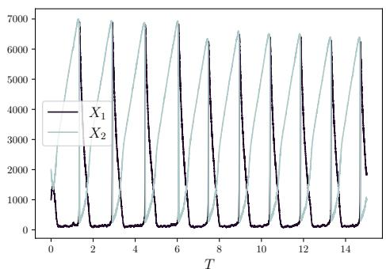

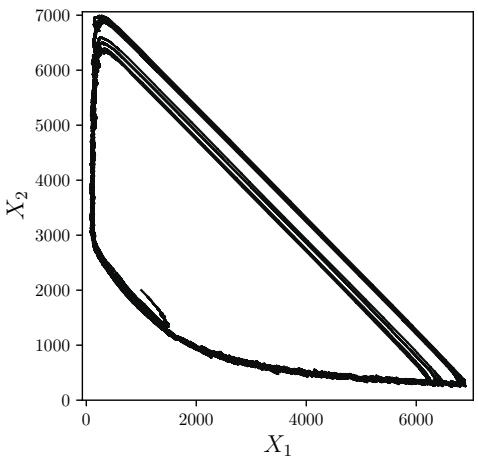

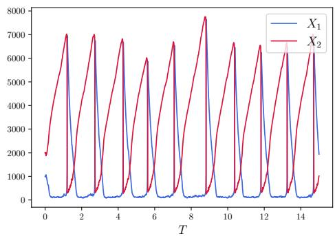

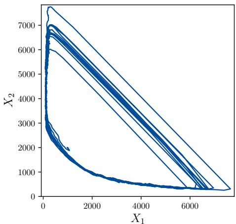  
Fig. 8. Comparison of sample trajectories of Example $4 . 3$ with initial condition (1000, 2000) and parameter c $\overline { { Y } } _ { 1 } = 5 0 0 0$ , c ${ \mathrm { ? } } \overline { { Y } } _ { 2 } = 5 0 $ $c _ { 3 } = 5 \times 1 0 ^ { - 5 }$ and $c _ { 4 } = 5$ up to $T = 1 5$ . Upper left: a sample trajectory in state space produced by SSA, upper right: a sample trajectory in state space produced by learned model, lower left: phase plot of upper $l e f t ,$ lower right: phase plot of upper right.

## 4.5. The Oregonator. We consider the Oregonator model

(4.10a)

$$
{ \overline { { Y } } } _ { 1 } + X _ { 2 } \ { \xrightarrow { c _ { 1 } } } X _ { 1 }\tag{4.10b}
$$

$$
X _ { 1 } + X _ { 2 } \xrightarrow { c _ { 2 } } Z _ { 1 }\tag{4.10c}
$$

$$
\overline { { Y } } _ { 2 } + X _ { 1 } \xrightarrow { c _ { 3 } } 2 X _ { 1 } + X _ { 3 }\tag{4.10d}
$$

$$
2 X _ { 1 } \xrightarrow { c _ { 4 } } Z _ { 2 }\tag{4.10e}
$$

$$
{ \overline { { Y } } } _ { 3 } + X _ { 3 } \ { \xrightarrow { c _ { 5 } } } X _ { 2 } ,
$$

where there are 3 species and 5 reactions, ${ \overline { { Y } } } _ { 1 } , { \overline { { Y } } } _ { 2 }$ and ${ \overline { { Y } } } _ { 3 }$ are treated as parameters, $c _ { 1 } , ~ c _ { 2 } , ~ c _ { 3 } , ~ c _ { 4 }$ and c5 are reaction rates, with $c _ { 1 } { \overline { { Y } } } _ { 1 } ~ { = } ~ 2 , ~ c _ { 2 } ~ { = } ~ 0 . 1 , ~ c _ { 3 } { \overline { { Y } } } _ { 2 } ~ { = } ~ 1 0 4$ $c _ { 4 } = 0 . 0 1 6$ and $c _ { 5 } \overline { { Y } } _ { 3 } = 2 6$ . A total of 120,000 training samples are generated with initial conditions drawn from $\mathcal { U } ( [ 0 , 1 0 0 0 0 ] ^ { 3 } )$ . The time step is taken as $\Delta = 0 . 0 1$ . The training epochs are taken to be 400, 000.

The trained model is tested with initial condition $\mathbf { X } _ { 0 } ~ = ~ ( 5 0 0 , 1 0 0 0 , 2 0 0 0 )$ . In Figures 13 and 14, we show a comparison of trajectories (in state and phase spaces) with both SSA and our trained model. The dominant Fourier modes of the two trajectories, presented in Figure 15, agree closely, confirming the accuracy of the learned model.

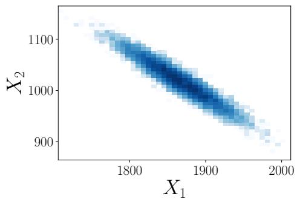

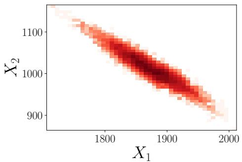

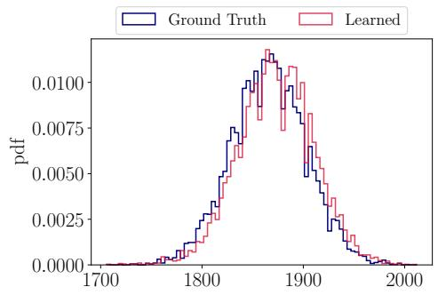

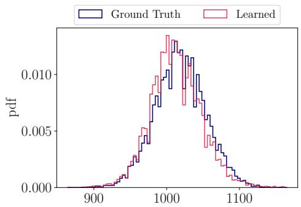

Fig. 9. Comparison of one-step conditional distribution of Example $4 . 3$ with initial condition $( 1 9 5 9 , 9 7 1 )$ and parameter $c _ { 1 } \overline { { Y } } _ { 1 } = 5 0 0 0$ , $c _ { 2 } \overline { { Y } } _ { 2 } = 5 0$ $c _ { 3 } = 5 \times \mathrm { i } 0 ^ { - 5 }$ and $c _ { 4 } = 5 .$ Upper left: ground truth of joint distribution $o f \left( X _ { 1 } , X _ { 2 } \right)$ , upper right: learned joint distribution of $( X _ { 1 } , X _ { 2 } )$ , lower $l e f t { : }$ comparison of the marginal distribution for $X _ { 1 }$ , lower right: comparison of the marginal distribution $f o r ~ X _ { 2 }$  
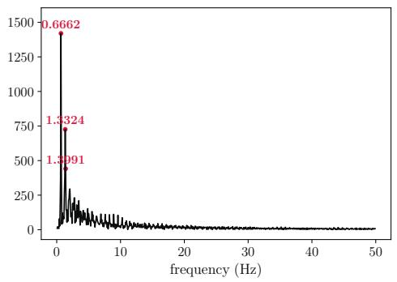

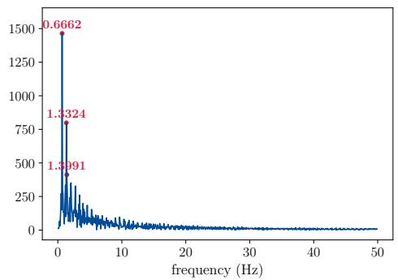  
Fig. 10. Comparison of Fourier modes for sFML generated trajectory and ground truth of Example $4 . 3$ with initial condition (1000, 2000) and parameter $c _ { 1 } { \overline { { Y } } } _ { 1 } \ = \ 5 0 0 0 ,$ $c _ { 2 } \overline { { Y } } _ { 2 } ~ = ~ 5 0 .$ $c _ { 3 } =$ $5 \times 1 0 ^ { - 5 }$ and $c _ { 4 } = 5$ up to $T = 1 5$ . Left: Fourier modes of SSA trajectory (upper left of Figure 8), right: Fourier modes of model trajectory (upper right of Figure 8).

5. Conclusion. In this paper, we propose a data-driven efective model for the Stochastic Simulation Algorithm of stochastic reaction networks. The method directly approximates the transition kernel of the underlying continuous-time Markov chain from short bursts of SSA simulation data using a generative model. This approach naturally accommodates highly non-Gaussian transition distributions and provides a flexible framework for constructing coarse stochastic models from exact SSA data. The resulting model serves as a stochastic propagator that generates long-time trajectories at a user-defined, constant coarse time step, independent of the microscopic firing times. As a consequence, the number of simulation steps is reduced significantly while the statistical properties of the true dynamics are accurately reproduced. In this paper, we employ a conditional normalizing flow as the realization of such a stochastic propagator. By using several numerical examples, we demonstrate the efectiveness and eficiency of the proposed method.

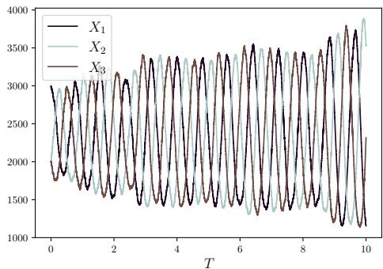

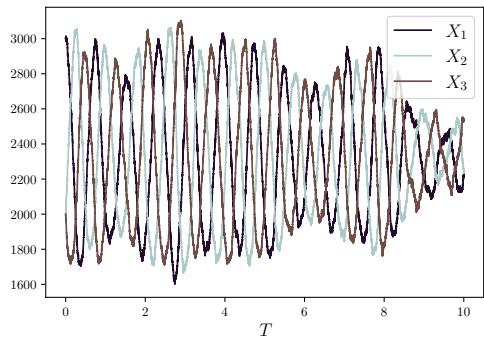

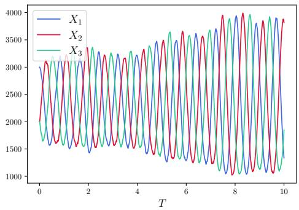

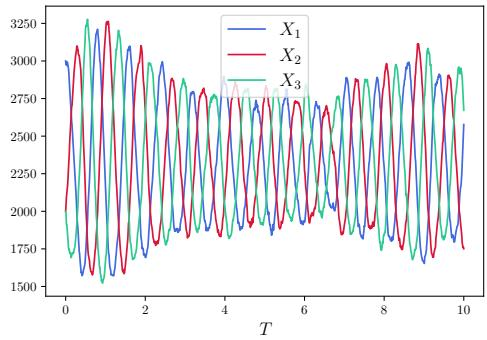  
Fig. 11. Comparison of sample trajectories of Example 4.4 with initial condition (3000, 2000, 2000) and parameter $c _ { 1 } = 0 . 0 0 2$ $c _ { 2 } ~ = ~ 0 . 0 0 2$ and $c _ { 3 } ~ = ~ 0 . 0 0 2$ up to $T = 1 0$ . Upper $l e f t ,$ upper right: 2 independent sample trajectories produced by $S S A ,$ lower $l e f t ,$ lower right: 2 independent sample trajectories produced by the trained model.

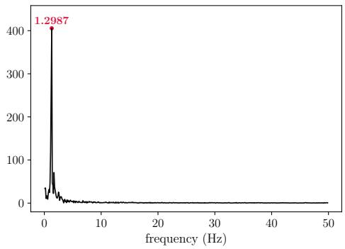

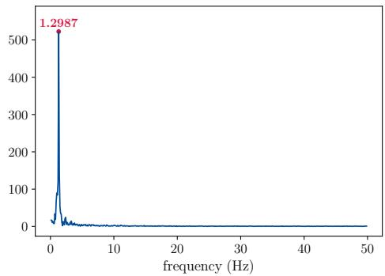  
Fig. 12. Comparison of Fourier modes for sFML generated trajectory and ground truth of Example 4.4 with initial condition (3000, 2000, 2000) and parameter $c _ { 1 } = 0 . 0 0 2 , \ : c _ { 2 } = 0 . 0 0 2$ and $c _ { 3 } = 0 . 0 0 2$ up to $T = 1 0$ . Left: Fourier modes of SSA trajectory (upper right of Figure 11), right: Fourier modes of model trajectory (lower right of Figure 11).

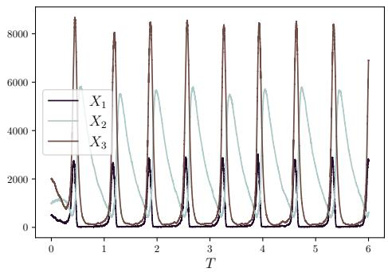

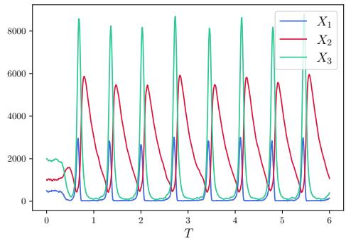  
Fig. 13. Comparison of sample trajectories of Example 4.5 in state space with initial condition (500, 1000, 2000) and parameter $c _ { 1 } \overline { { Y } } _ { 1 } = 2$ $c _ { 2 } = 0 . 1$ $c _ { 3 } \overline { { Y } } _ { 2 } = 1 0 4$ $c _ { 4 } = 0 . 0 1 6$ and $c _ { 5 } \overline { { Y } } _ { 3 } = 2 6$ up to $T = 6$ . Left: a sample trajectory produced by SSA, right: a sample trajectory produced by the trained model.

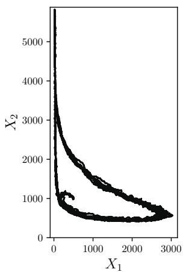

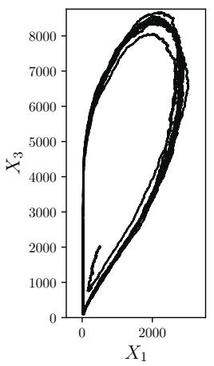

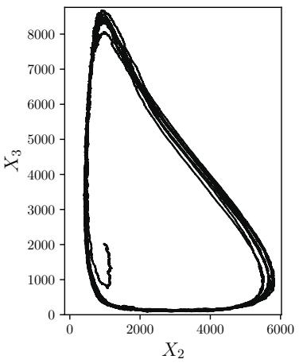

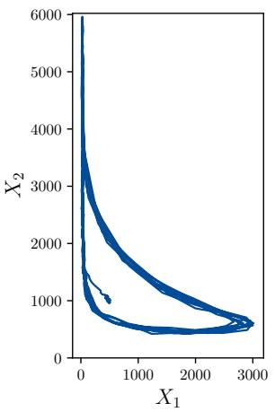

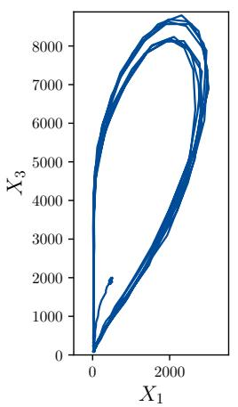

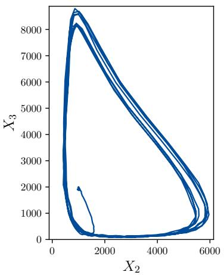  
Fig. 14. Comparison of sample trajectories of Example 4.5 in phase space with initial condition (500, 1000, 2000) and parameter $c _ { 1 } \overline { { { Y } } } _ { 1 } = 2 ,$ $c _ { 2 } = 0 . 1$ , c3 $; \overline { { Y } } _ { 2 } = 1 0 4$ $c _ { 4 } = 0 . 0 1 6$ and $c _ { 5 } \overline { { Y } } _ { 3 } = 2 6$ up to $T = 6 .$ . Upper: sample trajectory produced by SSA, lower: sample trajectory produced by trained model.

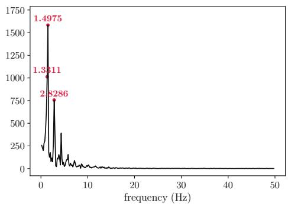

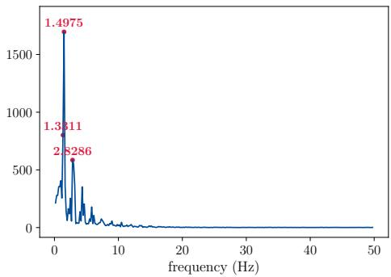  
Fig. 15. Comparison of Fourier modes for two sample trajectories of Example $4 . 5$ with initial condition (500, 1000, 2000) and parameter $\displaystyle c _ { 1 } \overline { { Y } } _ { 1 } = 2 , c _ { 2 } = 0 . 1 , c _ { 3 } \overline { { Y } } _ { 2 } = 1 0 4 , c _ { 4 } = 0 . 0 1 6$ and $c _ { 5 } \overline { { Y } } _ { 3 } =$ 26 up to $T = 6 ,$ . Left: Fourier modes of SSA trajectory (left of Figure 13), right: Fourier modes of model trajectory (right of Figure 13).

Data Availability Statement. The data that support the findings of this study are available from the corresponding author upon reasonable request.

## REFERENCES

[1] D. F. Anderson, A. Ganguly, and T. G. Kurtz, Error analysis of tau-leap simulation methods, The Annals of Applied Probability, 21 (2011), pp. 2226–2262.

[2] D. F. Anderson and T. G. Kurtz, Stochastic Analysis of Biochemical Systems, vol. 1.2 of Mathematical Biosciences Institute Lecture Series, Springer, 2015.

[3] C. Archambeau, D. Cornford, M. Opper, and J. Shawe-Taylor, Gaussian process approximations of stochastic diferential equations, in Gaussian Processes in Practice, N. D. Lawrence, A. Schwaighofer, and J. Qui˜nonero Candela, eds., vol. 1 of Proceedings of Machine Learning Research, Bletchley Park, UK, 2007, PMLR, pp. 1–16.

[4] L. Bortolussi and L. Palmieri, Deep abstractions of chemical reaction networks, in Computational Methods in Systems Biology: 16th International Conference, CMSB 2018, Brno, Czech Republic, September 12-14, 2018, Proceedings 16, Springer, 2018, pp. 21–38.

[5] S. L. Brunton, J. L. Proctor, and J. N. Kutz, Discovering governing equations from data by sparse identification of nonlinear dynamical systems, Proceedings of the National Academy of Sciences, 113 (2016), pp. 3932–3937.

[6] F. Cairoli, F. Anselmi, A. d’Onofrio, and L. Bortolussi, Generative abstraction of Markov population processes, Theoretical Computer Science, 977 (2023), p. 114169.

[7] Y. Cao, D. T. Gillespie, and L. R. Petzold, Avoiding negative populations in explicit poisson tau-leaping, The Journal of Chemical Physics, 123 (2005), p. 054104.

[8] Y. Cao, D. T. Gillespie, and L. R. Petzold, Eficient step size selection for the tau-leaping simulation method, The Journal of Chemical Physics, 124 (2006), p. 044109.

[9] Y. Cao, D. T. Gillespie, and L. R. Petzold, Adaptive explicit-implicit tau-leaping method with automatic tau selection, The Journal of Chemical Physics, 126 (2007), p. 224101.

[10] Y. Cao, H. Li, and L. Petzold, Eficient formulation of the stochastic simulation algorithm for chemically reacting systems, The Journal of Chemical Physics, 121 (2004), pp. 4059– 4067.

[11] A. Chatterjee, D. G. Vlachos, and M. A. Katsoulakis, Binomial distribution based tau-leap accelerated stochastic simulation, The Journal of Chemical Physics, 122 (2005), p. 024112.

[12] Q. Chen, Z. Xu, J. Zhang, and D. Xiu, Targeted digital twin via flow map learning and its application to fluid dynamics, Journal of Computational Physics, (2026), p. 114935.

[13] X. Chen, J. Duan, J. Hu, and D. Li, Data-driven method to learn the most probable transition pathway and stochastic diferential equation, Physica D: Nonlinear Phenomena, 443 (2023), p. 133559.

[14] X. Chen, L. Yang, J. Duan, and G. E. Karniadakis, Solving inverse stochastic problems from discrete particle observations using the Fokker-Planck equation and physics-informed

neural networks, SIAM Journal on Scientific Computing, 43 (2021), pp. B811–B830.

[15] Y. Chen and D. Xiu, Data-driven efective modeling of multiscale stochastic dynamical systems, Applied Mathematics for Modern Challenges, 2 (2024), pp. 348–364.

[16] Y. Chen and D. Xiu, Learning stochastic dynamical system via flow map operator, Journal of Computational Physics, 508 (2024), p. 112984.

[17] Y. Chen and D. Xiu, Modeling unknown stochastic dynamical system subject to external excitation, SIAM Journal on Scientific Computing, 48 (2026), pp. C216–C239.

[18] V. Churchill and D. Xiu, Flow map learning for unknown dynamical systems: Overview, implementation, and benchmarks, Journal of Machine Learning for Modeling and Computing, 4 (2023), pp. 173–201.

[19] M. Darcy, B. Hamzi, G. Livieri, H. Owhadi, and P. Tavallali, One-shot learning of stochastic diferential equations with data adapted kernels, Physica D: Nonlinear Phenomena, 444 (2023), p. 133583.

[20] F. Dietrich, A. Makeev, G. Kevrekidis, N. Evangelou, T. Bertalan, S. Reich, and I. G. Kevrekidis, Learning efective stochastic diferential equations from microscopic simulations: Linking stochastic numerics to deep learning, Chaos: An Interdisciplinary Journal of Nonlinear Science, 33 (2023), p. 023121.

[21] M. A. Gibson and J. Bruck, Eficient exact stochastic simulation of chemical systems with many species and many channels, The Journal of Physical Chemistry A, 104 (2000), pp. 1876–1889.

[22] D. T. Gillespie, Exact stochastic simulation of coupled chemical reactions, The Journal of Physical Chemistry, 81 (1977), pp. 2340–2361.

[23] D. T. Gillespie, Approximate accelerated stochastic simulation of chemically reacting systems, The Journal of Chemical Physics, 115 (2001), pp. 1716–1733.

[24] A. Gretton, K. M. Borgwardt, M. J. Rasch, B. Scholkopf, and A. Smola¨ , A kernel two-sample test, Journal of Machine Learning Research, 13 (2012), pp. 723–773.

[25] R. Grima, A study of the accuracy of moment-closure approximations for stochastic chemical kinetics, The Journal of Chemical Physics, 136 (2012), p. 154105.

[26] D. J. Higham, Modeling and simulating chemical reactions, SIAM Review, 50 (2008), pp. 347– 368.

[27] M. A. Katsoulakis and A. J. Majda, Coarse-grained stochastic processes for microscopic lattice systems, Proceedings of the National Academy of Sciences, 100 (2003), pp. 782–787.

[28] M. A. Katsoulakis and P. Vilanova, Data-driven, variational model reduction of highdimensional reaction networks, Journal of Computational Physics, 401 (2020), p. 108997.

[29] T. Li, Analysis of explicit tau-leaping schemes for simulating chemically reacting systems, Multiscale Modeling & Simulation, 6 (2007), pp. 417–436.

[30] Z. Li, N. B. Kovachki, K. Azizzadenesheli, B. Liu, K. Bhattacharya, A. Stuart, and A. Anandkumar, Fourier Neural Operator for Parametric Partial Diferential Equations, in International Conference on Learning Representations, 2021.

[31] Y. Liu, Y. Chen, D. Xiu, and G. Zhang, A training-free conditional difusion model for learning stochastic dynamical systems, SIAM Journal on Scientific Computing, 47 (2025), pp. C1144–C1171.

[32] L. Lu, P. Jin, G. Pang, Z. Zhang, and G. E. Karniadakis, Learning nonlinear operators via deeponet based on the universal approximation theorem of operators, Nature Machine Intelligence, 3 (2021), pp. 218–229.

[33] Y. Lu, X. Li, C. Liu, Q. Tang, and Y. Wang, Learning generalized difusions using an energetic variational approach, 2024.

[34] S. Matthew, F. Carter, J. Cooper, M. Dippel, E. Green, S. Hodges, M. Kidwell, D. Nickerson, B. Rumsey, J. Reeve, L. R. Petzold, K. R. Sanft, and B. Drawert, GillesPy2: A biochemical modeling framework for simulation driven biological discovery, Letters in Biomathematics, 10 (2023), pp. 87–103.

[35] J. M. McCollum, G. D. Peterson, C. D. Cox, M. L. Simpson, and N. F. Samatova, The sorting direct method for stochastic simulation of biochemical systems with varying reaction execution behavior, Computational Biology and Chemistry, 30 (2006), pp. 39–49.

[36] M. Opper, Variational inference for stochastic diferential equations, Annalen der Physik, 531 (2019), p. 1800233.

[37] H. Owhadi, Computational graph completion, Research in the Mathematical Sciences, 9 (2022), p. 27.

[38] G. Papamakarios, E. Nalisnick, D. J. Rezende, S. Mohamed, and B. Lakshminarayanan, Normalizing flows for probabilistic modeling and inference, Journal of Machine Learning Research, 22 (2021), pp. 1–64.

[39] G. Papamakarios, T. Pavlakou, and I. Murray, Masked autoregressive flow for density esti-

mation, in Advances in Neural Information Processing Systems, vol. 30, Curran Associates, Inc., 2017.

[40] T. Qin, K. Wu, and D. Xiu, Data driven governing equations approximation using deep neural networks, Journal of Computational Physics, 395 (2019), pp. 620–635.

[41] M. Raissi, P. Perdikaris, and G. Karniadakis, Physics-informed neural networks: A deep learning framework for solving forward and inverse problems involving nonlinear partial diferential equations, Journal of Computational Physics, 378 (2019), pp. 686–707.

[42] M. Raissi, P. Perdikaris, and G. E. Karniadakis, Multistep neural networks for data-driven discovery of nonlinear dynamical systems, arXiv preprint arXiv:1801.01236, (2018).

[43] M. Rathinam, L. R. Petzold, Y. Cao, and D. T. Gillespie, Stifness in stochastic chemically reacting systems: The implicit tau-leaping method, The Journal of Chemical Physics, 119 (2003), pp. 12784–12794.

[44] D. Schnoerr, G. Sanguinetti, and R. Grima, Approximation and inference methods for stochastic biochemical kinetics—a tutorial review, Journal of Physics A: Mathematical and Theoretical, 50 (2017), p. 093001.

[45] Y. Song, J. Sohl-Dickstein, D. P. Kingma, A. Kumar, S. Ermon, and B. Poole, Scorebased generative modeling through stochastic diferential equations, in International Con ference on Learning Representations, 2021.

[46] A. Sukys, K. Ocal, and R. Grima ¨ , Approximating solutions of the chemical master equation using neural networks, iScience, 25 (2022), p. 105010.

[47] Y. Tang, J. Weng, and P. Zhang, Neural-network solutions to stochastic reaction networks, Nature Machine Intelligence, 5 (2023), pp. 376–385.

[48] M. Xia, X. Li, Q. Shen, and T. Chou, An eficient Wasserstein-distance approach for reconstructing jump-difusion processes using parameterized neural networks, Machine Learning: Science and Technology, 5 (2024), p. 045052.

[49] Z. Xu, Y. Chen, Q. Chen, and D. Xiu, Modeling unknown stochastic dynamical system via autoencoder, Journal of Machine Learning for Modeling and Computing, 5 (2024), pp. 87– 112.

[50] L. Yang, C. Daskalakis, and G. E. Karniadakis, Generative ensemble regression: Learning particle dynamics from observations of ensembles with physics-informed deep generative models, SIAM Journal on Scientific Computing, 44 (2022), pp. B80–B99.

[51] C¸ . Yildiz, M. Heinonen, J. Intosalmi, H. Mannerstrom, and H. L¨ ahdesm¨ aki¨ , Learning stochastic diferential equations with Gaussian processes without gradient matching, in 2018 IEEE 28th International Workshop on Machine Learning for Signal Processing (MLSP), IEEE, 2018, pp. 1–6.

[52] J. Zhang, S. Zhang, and G. Lin, MultiAuto-DeepONet: A multi-resolution autoencoder deeponet for nonlinear dimension reduction, uncertainty quantification and operator learning of forward and inverse stochastic problems, 2022.