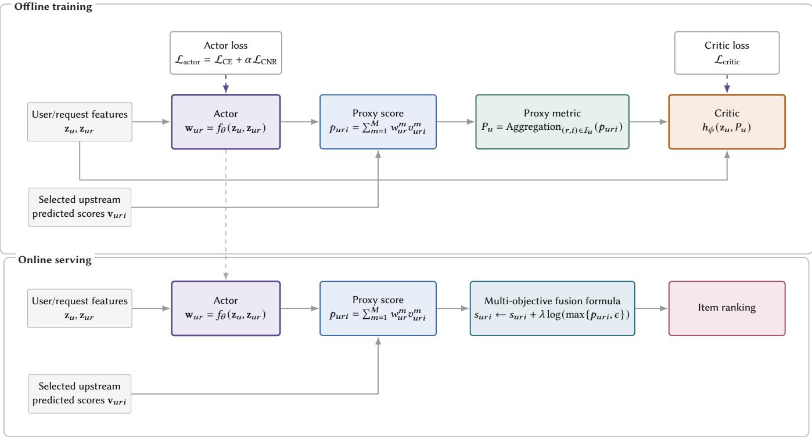

# DCEO: Direct Causal Efect Optimization for Long-Term User Value Modeling in E-commerce Search

Junzhao Zhang junzhao.zjz@alibaba-inc.com Taobao & Tmall Group of Alibaba Hangzhou, Zhejiang, China

Feiyi Dong Taobao & Tmall Group of Alibaba Hangzhou, Zhejiang, China dongfeiyi.dfy@taobao.com

Tao Zhang Taobao & Tmall Group of Alibaba Beijing, China quen.zt@alibaba-inc.com

Zhixuan Zhang Taobao & Tmall Group of Alibaba Hangzhou, Zhejiang, China zhibing.zzx@taobao.com

Haihong Tang Taobao & Tmall Group of Alibaba Hangzhou, Zhejiang, China piaoxue@taobao.com

Liren Yu Taobao & Tmall Group of Alibaba Hangzhou, Zhejiang, China yuliren.ylr@taobao.com

Dan Ou Taobao & Tmall Group of Alibaba Hangzhou, Zhejiang, China oudan.od@taobao.com

## Abstract

Industrial e-commerce search systems ultimately aim to optimize the user-level long-term objective, such as �-day cumulative purchases or gross merchandise value (GMV) per user. However, such objectives are defined at the user level, whereas search ranking is based on item-level scores within each request. Existing methods typically bridge this granularity gap through manually designed multi-objective fusion, where predicted scores for multiple item level objectives, such as click, cart, purchase, and transaction value, are combined into a ranking score that serves as a proxy for the ultimate objective. Such hand-crafted fusion schemes rely on a small set of manually tuned weights, limiting fine-grained personalization and leading to suboptimal alignment with the ultimate objective. In this paper, we propose DCEO (Direct Causal Efect Optimization), a data-driven framework for learning item-level proxy scores that are better aligned with the ultimate objective. We first aggregate the item-level proxy scores into a user-level proxy metric and quantify its alignment with the ultimate objective using a relative causal efect. We then develop an actor-critic framework, where the critic estimates the ultimate objective for a given user-level proxy metric, and the actor dynamically generates context-dependent fusion weights over multiple objectives to construct the item-level proxy scores and is trained to directly optimize the relative causal efect. Extensive ofline experiments and analyses demonstrate the efectiveness and interpretability of DCEO. In addition, DCEO has been deployed in a large-scale industrial e-commerce search system, outperforming the conventional GMV proxy by 0.36% in GMV in a 41-day online A/B test.

## CCS Concepts

• Information systems → Learning to rank; • Computing methodologies → Causal reasoning and diagnostics.

## Keywords

e-commerce search, learning to rank, long-term user value, multiobjective fusion, causal efect optimization, personalized ranking

## 1 Introduction

E-commerce search systems ultimately aim to optimize user-level long-term objectives, such as cumulative purchases or gross merchandise value (GMV) over an �-day window. For each request, the ranking stage assigns a score to each candidate item and orders the items by their scores [6, 8]. However, these ranking scores are defined at the item level, whereas the ultimate objective summarizes a user’s outcome over multiple requests and impressions. This granularity gap prevents the user-level objective from directly serving as an item-level training label, making it challenging to optimize long-term user value through item ranking.

Industrial ranking systems commonly mitigate this granularity gap with manually designed multi-objective fusion. Upstream models predict multiple item-level objectives, such as click, cart, purchase, and transaction value [10], and the fusion module combines their predicted scores into a ranking score [19]. Practitioners improve the alignment between this ranking score and the userlevel long-term objective by adding new signals or tuning fusion parameters through repeated online A/B tests. This process has two limitations: the small set of globally shared parameters provides limited personalization across users and requests, and repeated online experiments are costly and time-consuming. We therefore seek to develop a data-driven method for learning a context-dependent item-level proxy score directly from the user-level ultimate objective and incorporating it into the existing multi-objective fusion formula.

The key to learning such a proxy score is to define its alignment with the user-level ultimate objective. We evaluate the item-level proxy scores through their aggregated user-level proxy metric, which has the same granularity as the ultimate objective. A natural approach is to optimize the predictive association between the proxy metric and the ultimate objective. However, predictive association does not imply that increasing the proxy metric through ranking will produce a large improvement in the ultimate objective [11]. Since adding the proxy score to the fusion formula is intended to increase the proxy metric, we instead evaluate how much the ultimate objective improves under a given relative increase in the proxy metric. This motivates optimizing the relative causal efect of the proxy metric on the ultimate objective.

In this paper, we propose DirectCausal EfectOptimization (DCEO), a data-driven actor-critic framework that directly optimizes the relative causal efect of the proxy metric on the ultimate objective. The actor generates context-dependent weights over selected upstream predicted scores and combines them into an item-level proxy score. DCEO aggregates the proxy scores over a user’s impressions and calibrates the aggregate to a reference impression count, yielding a user-level proxy metric. The critic predicts the ultimate objective from the user features and proxy metric, and its predictions before and after a relative increase in the proxy metric provide the training signal for the actor. By maximizing the estimated causal efect, the actor learns a personalized item-level proxy score directly from user-level supervision.

DCEO separates ofline training from online serving. The critic and calibrated user-level aggregation are used only during training, while only the actor is deployed online. Given user and request features available online and selected upstream predicted scores, the actor generates an item-level proxy score. This score is added as a new term to the existing multi-objective fusion formula, while the original fusion weights and score components remain unchanged. In this way, DCEO learns an item-level score from user-level longterm supervision for direct use in online ranking.

The main contributions of this work are summarized as follows:

• We formulate learning an item-level proxy score from a user-level long-term objective as a cross-granularity optimization problem. We characterize the alignment between the proxy score and the ultimate objective using the relative causal efect of an aggregated user-level proxy metric on the ultimate objective.

• We propose DCEO, a data-driven actor-critic framework that learns context-dependent proxy scores by directly optimizing the critic-estimated relative causal efect. Calibrated user-level aggregation connects item-level actor outputs with user-level supervision, enabling end-to-end learning of the proxy score.

• Extensive ofline experiments and analyses demonstrate the efectiveness and interpretability of DCEO. In a 41- day online A/B test in a large-scale industrial e-commerce search system, DCEO outperforms the conventional GMV proxy by 0.36% in GMV.

## 2 Related Work

## 2.1 Long-Term User Value Modeling

Recent studies have increasingly shifted from optimizing item-level short-term feedback to optimizing user-level long-term objectives. However, these objectives are typically delayed, sparse, and defined at a coarser granularity than item-level ranking, making it dificult to derive efective item-level training signals. To address this challenge, one line of research constructs proxy objectives. Behaviorbased methods identify signals associated with future visits and retention from interaction logs [12, 14], while human-feedback methods use return-intent surveys or preference comparisons to capture aspects of long-term user experience that may not be reflected by immediate behavior [1, 16]. AURO converts session-level return time into a terminal retention reward and propagates it to preceding ranking decisions through sequential policy learning [17]. Future Impact Decomposition more explicitly bridges the granularity gap by allocating request-level future value to items according to immediate feedback or learned weights, thereby constructing item-level learning targets [13]. These methods derive tractable item-level supervision by constructing proxy objectives or decomposing future value, rather than directly learning an item-level proxy score from the ultimate objective.

Another line of research directly incorporates the ultimate objective into supervision without explicitly decomposing it into item-level targets. IURO learns item-level retention scores by using attention-based aggregation to connect item-level representations with a user-level retention outcome and introduces manually designed auxiliary attribution tasks for interpretability [3]. However, the attention weights that establish this connection during training are unavailable in the same form during online serving, resulting in training-serving inconsistency. Despite their diferent formulations, these methods primarily learn predictive associations: a signal that accurately predicts the ultimate objective does not necessarily imply that increasing it through ranking will improve that objective. In contrast, DCEO aggregates item-level proxy scores into a user-level proxy metric and, to the best of our knowledge, is the first framework to learn the item-level proxy score from the user-level ultimate objective by directly optimizing the estimated relative causal efect of the proxy metric on the ultimate objective.

## 2.2 Multi-Objective Fusion

Multi-objective fusion combines heterogeneous predicted scores into a single ranking score. Industrial systems traditionally rely on hand-crafted formulas with globally shared parameters, which require repeated online tuning and provide limited personalization. One line of work learns context-dependent fusion parameters through reward or policy optimization. Value-aware recommendation maps user actions to monetized rewards and optimizes their aggregate economic value [9]. BatchRL-MTF formulates fusion as a session-level Markov decision process and uses ofline reinforcement learning to optimize a reward constructed from user stickiness and activeness [18]. More recent methods improve policy learning under sparse industrial feedback: GRADE combines group-relative optimization with structured exploration over fusion weights [5], while SaFRO constructs a query-level satisfaction reward and employs dual-relative policy optimization for short-video search [20]. These methods improve personalized fusion, but their optimization targets are monetized behaviors or manually constructed satisfaction and retention rewards rather than the user-level ultimate objective itself.

Another line of work replaces the hand-crafted fusion formula with a trainable ensemble model. Pantheon inherits hidden representations from upstream task models and uses iterative Pareto optimization to balance multiple objectives [2]. EMER organizes candidates at the request level and uses a Transformer-based listwise model with self-evolving multi-objective supervision [4]. UMRE learns personalized monotonic transformations of upstream predicted scores before combining them with a lightweight ensemble model [15]. These approaches substantially increase the capacity and personalization of the fusion module, but they are trained primarily with item-level behavior labels and task-specific metrics. They therefore do not directly address the granularity gap between item-level ranking and user-level long-term objectives.

Whole-page optimization introduces long-term causal evidence by estimating the efects of page-level quality metrics on delayed user feedbacks from quasi-experimental data [7]. However, the estimated efects are used to construct fixed weights for a whole-page objective rather than serving as the optimization target for learning an item-level proxy. In contrast, DCEO learns a personalized proxy score from the user-level ultimate objective. It connects item-level actor outputs with user-level supervision through calibrated aggregation and directly optimizes the relative causal efect of the resulting proxy metric on the ultimate objective.

## 3 Problem Formulation

## 3.1 User-Level Ultimate Objective and Granularity Gap

Let �, �, and � index a user, a search request from the user, and an item shown for that request, respectively. For each user �, we consider a reference day and define

${ \mathcal Z } _ { u } = \{ ( r , i )$ : � is shown for request � on the reference day}. (1) Let $N _ { u } = \vert { \cal T } _ { u } \vert$ denote the corresponding impression count for user �.

Let $Y _ { u }$ denote the user-level long-term objective accumulated over an �-day outcome window starting on the reference day. $Y _ { u }$ may be defined as cumulative purchases, cumulative GMV, or an other user-level long-term value metric.

Search ranking orders items within each request according to item-level scores, whereas $Y _ { u }$ is a user-level quantity that summarizes the user’s outcome over multiple requests. The granularity mismatch between item-level ranking scores and the user-level objective prevents $Y _ { u }$ from directly serving as an item-level training label: all items exposed to the same user would otherwise receive the same label despite contributing diferently to the outcome. Accordingly, we seek to learn item-level proxy scores that are better aligned with $Y _ { u }$

## 3.2 Multi-Objective Fusion

For a request � from user �, let $C _ { u r }$ denote the set of candidate items entering the ranking stage. For each item $i \in C _ { u r } ,$ the ranking stage provides � predicted scores:

$$
\mathbf { x } _ { u r i } = [ x _ { u r i } ^ { 1 } , \ldots , x _ { u r i } ^ { K } ] \in \mathbb { R } ^ { K } ,\tag{2}
$$

These predicted scores correspond to click, cart, purchase, transaction value, and other business objectives. The multi-objective fusion module combines them into a ranking score

$$
s _ { u r i } = \sum _ { k = 1 } ^ { K } \lambda _ { k } \log \left( \operatorname* { m a x } \{ x _ { u r i } ^ { k } , \epsilon \} \right) ,\tag{3}
$$

where $\epsilon > 0$ and each $\lambda _ { k }$ is constant. Candidate items are ranked in descending order of $s _ { u r i }$

## 3.3 Item-Level Proxy Score and User-Level Proxy Metric

Consider an item-level proxy objective for the ultimate objective $Y _ { u } .$ . Let $y _ { u r i }$ denote its label and $\pounds _ { u r i }$ its predicted score. We assume that $\pounds _ { u r i }$ is a calibrated prediction of � �, that is

$$
\mathbb { E } [ p _ { u r i } ] = \mathbb { E } [ y _ { u r i } ] .\tag{4}
$$

A practical way to use this proxy objective to improve ranking is to add its predicted score to the multi-objective fusion formula:

$$
s _ { u r i } \gets s _ { u r i } + \lambda \log ( \operatorname* { m a x } \{ p _ { u r i } , \epsilon \} ) ,\tag{5}
$$

where $\lambda > 0$ is a constant.

Empirically, adding a proxy score into the multi-objective fusion formula increases the action rate of the corresponding proxy objective. However, neither the daily action count nor the daily action rate is a suitable proxy metric because they both depend on the impression count, which is afected by ranking. For example, deboosting items with high predicted dislike scores may reduce the dislike rate while increasing user activity, thereby increasing the impression count. The daily dislike count may then increase despite the lower dislike rate. At a fixed impression count, however, the action count and action rate do not sufer from this problem. We therefore use the fixed-impression action rate as the user-level proxy metric. Under the calibration assumption, this rate can be expressed equivalently using the proxy score:

$$
\operatorname { \mathbb { E } } _ { ( r , i ) \in { \mathcal { I } } _ { u } } \left[ y _ { u r i } \mid N _ { u } = C \right] = \operatorname { \mathbb { E } } _ { ( r , i ) \in { \mathcal { I } } _ { u } } \left[ { \mathcal { P } } _ { u r i } \mid N _ { u } = C \right] .\tag{6}
$$

We thus define $P _ { u } = \mathbb { E } _ { ( r , i ) \in \mathcal { I } _ { u } } \left[ / p _ { u r i } \ | \ N _ { u } = C \right]$ as the user-level proxy metric. Accordingly, adding $\pounds _ { u r i }$ to the fusion formula will increase $P _ { u } .$ . The magnitude of this increase is controlled by �, with a larger � producing a larger increase in $P _ { u }$

## 3.4 Relative Causal Efect of the Proxy Metric on the Ultimate Objective

Suppose that adding the proxy score to the fusion formula increases $P _ { u }$ by a relative amount $\delta > 0 \colon$

$$
P _ { u } \longrightarrow ( 1 + \delta ) P _ { u } .\tag{7}
$$

If the proxy metric is better aligned with the ultimate objective $Y _ { u }$ the same relative increase in $P _ { u }$ should produce a larger relative increase in $Y _ { u }$ . We use this relative increase in $P _ { u }$ as the treatment and measure its efect on the ultimate objective. Let $Y _ { u } ( P )$ denote the ultimate objective when $P _ { u } = P$ . We define the relative causal efect as

$$
\mathrm { R C E } = \frac { \mathbb { E } _ { u } \left[ Y _ { u } ( ( 1 + \delta ) P _ { u } ) - Y _ { u } ( P _ { u } ) \right] } { \mathbb { E } _ { u } \left[ Y _ { u } ( P _ { u } ) \right] } .\tag{8}
$$

A larger positive RCE indicates better alignment of the proxy metric, and hence the underlying item-level proxy scores, with the ultimate objective. Accordingly, the learning objective is to find an item-level proxy score that maximizes RCE.

## 4 Method

## 4.1 Overview

Figure 1 presents the training and serving framework of DCEO. Each training sample contains all impressions of a user on a reference day, together with the corresponding user-level features ${ \bf z } _ { u } ,$ , request-level features ${ \bf z } _ { u r } ,$ , selected upstream predicted scores $\mathbf { v } _ { u r i }$ , and ultimate-objective label $Y _ { u } .$ The actor $f _ { \theta }$ generates requestspecific weights ${ \bf w } _ { u r }$ from $\mathbf { z } _ { u }$ and $\mathbf { z } _ { u r }$ and combines ${ \bf w } _ { u r }$ with $\mathbf { v } _ { u r i }$ to produce the item-level proxy score $p _ { u r i } ( \theta )$ . DCEO then aggregates the proxy scores over the user’s impressions and uses the calibration model $g _ { \psi }$ to calibrate the aggregate to a reference impression count, yielding the user-level proxy metric $P _ { u } ( \theta )$ )

  
Figure 1: Overview of DCEO. During ofline training, the actor $f _ { \theta }$ generates request-specific weights ${ \bf w } _ { u r }$ from the user and request features $\mathbf { z } _ { u }$ and ${ \bf z } _ { u r } .$ . The weights combine the selected upstream predicted scores $\mathbf { v } _ { u r i }$ into the item-level proxy score $\phi _ { u r i } ,$ which is aggregated into the user-level proxy metric $P _ { u } .$ . The critic $h _ { \phi }$ models the ultimate objective $Y _ { u }$ from $\mathbf { z } _ { u }$ and $P _ { u }$ . The actor and critic are optimized using $\mathcal { L } _ { \mathrm { a c t o r } }$ and ${ \mathcal { L } } _ { \mathrm { c r i t i c . } }$ , respectively. During online serving, only $f _ { \theta }$ is deployed, and $\pounds _ { u r i }$ is added to the multi-objective fusion score $s _ { u r i }$ to improve the item ranking.

The critic $h _ { \phi }$ estimates the ultimate objective $Y _ { u }$ from $\mathbf { z } _ { u }$ and $P _ { u } ( \theta )$ . Its predictions before and after the relative intervention $P _ { u } ( \theta )  ( 1 + \delta ) P _ { u } ( \theta )$ define the causal efect loss $\mathcal { L } _ { \mathrm { C E } }$ . The conditional normalized ranking loss $\mathcal { L } _ { \mathrm { C N R } }$ further regularizes the actor by aligning the ordering of the proxy metric with that of the ultimate objective after conditional normalization. These two losses form the actor loss $\mathcal { L } _ { \mathrm { a c t o r } }$ , while $g _ { \psi } , h _ { \phi }$ , and the normalization model $e _ { \zeta }$ are optimized with their corresponding losses. All four models are trained jointly.

During online serving, only the actor $f _ { \theta }$ is deployed. It generates $\mathbf { w } _ { u r }$ and computes $\pounds _ { u r i }$ from the online user and request features and selected upstream predicted scores. The proxy score is added to the existing multi-objective fusion score $s _ { u r i }$ to improve the item ranking. We next describe each component in detail.

## 4.2 User-Level Training Sample

Each training sample contains all impressions of a user on a reference day. The inputs consist of user-level, request-level, and impression-level features. The user-level features $\mathbf { z } _ { u }$ include the user’s profile features and historical purchase sequence. They are stored only once in each sample because these features remain unchanged throughout the reference day. For each impression (�, �), the request-level features ${ \bf z } _ { u r }$ include the query and contextual features, and the impression-level features include the selected upstream predicted scores $\mathbf { v } _ { u r i } \in \mathbb { R } ^ { M }$ . The request-level and impression-level features vary across impressions, so each feature is stored as a sequence of length $N _ { u } .$

Each sample is associated with multiple user-level outcome labels, including the cumulative click count, purchase count, and GMV over an �-day window starting on the reference day. One of these outcomes or a combination of them serves as the ultimateobjective label $Y _ { u }$

## 4.3 Actor

4.3.1 Item-Level Proxy Score. For each impression $( r , i ) _ { ; }$ , the actor model $f _ { \theta }$ generates request-specific weights from the user features

$\mathbf { z } _ { u }$ and request features $\mathbf { z } _ { u r }$

$$
\mathbf { w } _ { u r } = f _ { \theta } ( \mathbf { z } _ { u } , \mathbf { z } _ { u r } ) , \qquad w _ { u r } ^ { m } \geq 0 , \qquad \sum _ { m = 1 } ^ { M } w _ { u r } ^ { m } = 1 .\tag{9}
$$

The weights are then combined with the selected upstream predicted scores $\mathbf { v } _ { u r i }$ to produce the item-level proxy score

$$
\mathop { p _ { u r i } } ( \theta ) = \sum _ { m = 1 } ^ { M } w _ { u r } ^ { m } v _ { u r i } ^ { m } .\tag{10}
$$

4.3.2 User-Level Proxy Metric. After calculating the item-level proxy scores $p _ { u r i } ( \theta )$ , we aggregate them into the user-level proxy metric $P _ { u } ( \theta )$ . According to the definition in Section 3.3, we estimate $P _ { u } ( \theta )$ as

$$
P _ { u } ^ { \mathrm { r a w } } ( \theta ) = \frac { 1 } { N _ { u } } \sum _ { ( r , i ) \in J _ { u } } \mathcal { P } _ { u r i } ( \theta ) ,\tag{11}
$$

$$
\begin{array} { r l } { P _ { u } ( \theta ) = P _ { u } ^ { \mathrm { r a w } } ( \theta ) } \\ { \quad } & { \times \mathrm { s g } \left( \frac { g _ { \psi } ( \mathbf { z } _ { u } , C ) } { \operatorname* { m a x } \{ g _ { \psi } ( \mathbf { z } _ { u } , N _ { u } ) , \epsilon _ { g } \} } \right) , } \end{array}\tag{12}
$$

where $C = 1 0 0$ is the reference impression count and $g _ { \psi }$ estimates the average of the item-level proxy scores $P _ { u } ^ { \mathrm { r a w } } ( \theta )$ for user � at a given impression count. The operator sg(·) preserves its argument during the forward pass and blocks gradients through it during backpropagation. We train $g _ { \psi }$ using a mean squared error loss

$$
\mathcal { L } _ { g } = \mathbb { E } _ { u } \Big [ \big ( g _ { \psi } ( \mathbf { z } _ { u } , N _ { u } ) - \mathrm { s g } \big ( P _ { u } ^ { \mathrm { r a w } } ( \theta ) \big ) \big ) ^ { 2 } \Big ] ~ .\tag{13}
$$

Equivalently, Eqs. (11) and (12) first compute the average proxy score over the observed $N _ { u }$ impressions and then multiply it by an impression-count calibration factor that maps the average at the observed count $N _ { u }$ to its counterpart at the reference count �.

## 4.4 Critic

The critic model $h _ { \phi }$ estimates the ultimate objective $Y _ { u }$ for user � given the user-level proxy metric $P _ { u } ( \theta )$ . We train $h _ { \phi }$ using a mean squared error loss

$$
\mathcal { L } _ { \mathrm { c r i t i c } } = \mathbb { E } _ { u } \left[ ( h _ { \phi } ( \mathbf { z } _ { u } , \operatorname { s g } ( P _ { u } ( \theta ) ) ) - Y _ { u } ) ^ { 2 } \right] .\tag{14}
$$

## 4.5 Optimization

The actor is trained with two losses: the causal efect loss $\mathcal { L } _ { \mathrm { C E } }$ and the conditional normalized ranking loss $\mathcal { L } _ { \mathrm { C N R } }$

4.5.1 Causal Efect Loss. We use the critic model to estimate the causal efect of increasing the user-level proxy metric from $P _ { u } ( \theta )$ to $( 1 + \delta ) P _ { u } ( \theta )$ and use its negative as the causal efect loss

$$
\mathcal { L } _ { \mathrm { C E } } = - \mathbb { E } _ { u } \left[ h _ { \mathrm { s g } ( \phi ) } ( \mathbf { z } _ { u } , ( 1 + \delta ) P _ { u } ( \theta ) ) - h _ { \mathrm { s g } ( \phi ) } ( \mathbf { z } _ { u } , P _ { u } ( \theta ) ) \right] .\tag{15}
$$

When calculating $\mathcal { L } _ { \mathrm { C E } }$ , the parameters of the critic model $h _ { \phi }$ are frozen so that $\mathcal { L } _ { \mathrm { C E } }$ updates only the parameters of the actor model $f _ { \theta }$

The causal efect loss preserves the optimization direction of RCE while avoiding the instability of directly optimizing a ratio. The batch estimate of the baseline response $\mathbb { E } _ { u } [ h _ { \phi } ( \mathbf { z } _ { u } , P _ { u } ( \theta ) ) ]$ varies little across training batches and can therefore be treated as approximately constant. Consequently, RCE is approximately proportional t $\mathbf { o } - \mathcal { L } _ { \mathrm { C E } }$ , so minimizing $\mathcal { L } _ { \mathrm { C E } }$ approximately maximizes

RCE. Directly using RCE as the actor loss would instead backpropagate through its denominator, making the gradients sensitive to fluctuations in the baseline response. We therefore optimize the unnormalized response diference in $\operatorname { E q } .$ (15).

4.5.2 Conditional Normalized Ranking Loss. The causal efect loss induces a highly non-convex optimization landscape for the actor, making it dificult to optimize efectively on its own. We therefore introduce a conditional normalized ranking loss as a regularizer. The goal of the conditional normalized ranking loss is to map all $( P _ { u } ( \theta ) , Y _ { u } )$ pairs into the same distribution and then optimize their ordering. We first estimate the means �� and $\mu _ { Y }$ and the log standard deviations log �� and log �� of $P _ { u } ( \theta )$ and $Y _ { u }$ using a model $e _ { \zeta }$

$$
\left( \mu _ { P } , \mu _ { Y } , \log \sigma _ { P } , \log \sigma _ { Y } \right) = e _ { \zeta } ( \mathbf { z } _ { u } ) .\tag{16}
$$

$e _ { \zeta }$ is trained by minimizing the Gaussian negative log-likelihood

$$
\begin{array} { r l } & { \mathcal { L } _ { e } = \mathbb { E } _ { u } \Bigg [ \log \sigma _ { P } + \frac { \big ( \operatorname { s g } ( P _ { u } ( { \boldsymbol { \theta } } ) ) - \mu _ { P } \big ) ^ { 2 } } { 2 \sigma _ { P } ^ { 2 } } \Bigg ] } \\ & { \quad \quad \quad + \mathbb { E } _ { u } \Bigg [ \log \sigma _ { Y } + \frac { \big ( Y _ { u } - \mu _ { Y } \big ) ^ { 2 } } { 2 \sigma _ { Y } ^ { 2 } } \Bigg ] . } \end{array}\tag{17}
$$

We then define

$$
\begin{array} { r } { \widetilde { P } _ { u } ( \boldsymbol { \theta } ) = \frac { P _ { u } ( \boldsymbol { \theta } ) - \mathrm { s g } ( \mu _ { P } ) } { \operatorname* { m a x } \{ \mathrm { s g } ( \sigma _ { P } ) , \epsilon _ { e } \} } , } \\ { \widetilde { Y } _ { u } = \frac { Y _ { u } - \mathrm { s g } ( \mu _ { Y } ) } { \operatorname* { m a x } \{ \mathrm { s g } ( \sigma _ { Y } ) , \epsilon _ { e } \} } . } \end{array}\tag{18}
$$

We compute the conditional normalized ranking loss from $\widetilde { P } _ { u } ( \boldsymbol { \theta } )$ and $\widetilde { Y } _ { u }$ using the Bradley–Terry loss:

$$
\mathcal { L } _ { \mathrm { C N R } } = \frac { 1 } { | \mathcal { B } _ { \mathrm { p a i r } } | } \sum _ { ( u , v ) \in \mathcal { B } _ { \mathrm { p a i r } } } \log \Bigl ( 1 + \exp \bigl [ - ( \widetilde { P } _ { u } ( \theta ) - \widetilde { P } _ { v } ( \theta ) ) \bigr ] \Bigr ) ,\tag{19}
$$

where $\mathcal { B } _ { \mathrm { p a i r } } = \{ ( u , v ) : \widetilde { Y } _ { u } > \widetilde { Y } _ { v } \}$ denotes the set of ordered user pairs.

Intuitively, $\mathcal { L } _ { \mathrm { C N R } }$ can be viewed as a coarse but stable approximation to $\mathcal { L } _ { \mathrm { C E } }$ . The causal efect loss implicitly groups users by their features $\mathbf { z } _ { u }$ and, within each group, encourages $P _ { u }$ to preserve the ordering of $Y _ { u } .$ Conditional normalization instead maps all $( P _ { u } , Y _ { u } )$ pairs to a common reference distribution, efectively placing them in a single group; the pairwise ranking loss then enforces the same ordering. Although this approximation discards some fine-grained conditioning on ${ \bf z } _ { u } ,$ , the ranking signal is more stable than the difference between two critic predictions. Therefore, $\mathcal { L } _ { \mathrm { C N R } }$ provides a stable complementary signal for optimizing the actor.

4.5.3 Joint Training. The final loss for the actor model is

$$
\mathcal { L } _ { \mathrm { a c t o r } } = \mathcal { L } _ { \mathrm { C E } } + \alpha \mathcal { L } _ { \mathrm { C N R } } ,\tag{20}
$$

where $\alpha = 0 . 3$ in the final configuration.

We jointly train the parameters of $f _ { \theta } , g _ { \psi } , h _ { \phi } ,$ , and $e _ { \zeta }$ using the overall loss

$$
\mathcal { L } = \mathcal { L } _ { \mathrm { a c t o r } } + \mathcal { L } _ { g } + \mathcal { L } _ { \mathrm { c r i t i c } } + \mathcal { L } _ { e } .\tag{21}
$$

## 4.6 Online Serving

During online serving, only the actor model $f _ { \theta }$ is deployed to com pute request-specific weights

$$
\begin{array} { r } { { { \bf w } _ { u r } } = f _ { \theta } ( { \bf z } _ { u } , { \bf z } _ { u r } ) . } \end{array}\tag{22}
$$

We then combine the selected upstream predicted scores $\mathbf { v } _ { u r i }$ with the weights $\mathbf { w } _ { u r }$ to calculate the item-level proxy scores

$$
{ { p } _ { u r i } } = \sum _ { m = 1 } ^ { M } { { { w } _ { u r } ^ { m } } { { v } _ { u r i } ^ { m } } } .\tag{23}
$$

We add $\pounds _ { u r i }$ to the multi-objective fusion formula

$$
s _ { u r i } \gets s _ { u r i } + \lambda \log ( \operatorname* { m a x } \{ p _ { u r i } , \epsilon \} ) .\tag{24}
$$

## 5 Experiments

## 5.1 Research Questions

We evaluate DCEO by answering the following research questions:

• RQ1: How does DCEO perform under the final configuration?

• RQ2: Is causal efect optimization better than predictive association optimization?

• RQ3: How do the actor losses and upstream predicted-score set afect performance?

• RQ4: How does the definition of the ultimate objective afect the learned weights?

• RQ5: Does DCEO outperform a conventional GMV proxy in online search?

## 5.2 Experimental Setup

5.2.1 Ofline Data and Configuration. We construct the user-level training samples described in Section 4.2 from search logs of a large-scale e-commerce search system. For each ofline experiment, we train the model on the same 14 consecutive days of data and evaluate it on the following day. Unless otherwise specified, the ultimate objective is the cumulative GMV over four days starting on the reference day.

DCEO uses 17 selected upstream predicted scores listed in Table 1. A simple transformation maps every predicted score into the interval [0, 1] while keeping its mean close to 0.1, making the average actor weights comparable across scores. We set $C = 1 0 0 \mathrm { : }$ $\delta = 0 . 0 5$ , and $\alpha = 0 . 3$ in the final configuration. Unless otherwise specified, we vary only the factor under study and keep all other settings fixed.

5.2.2 Implementation Details. DCEO does not rely on a specialized network architecture. All four models are multilayer perceptrons (MLPs) whose input features are represented as feature embeddings. The actor concatenates the user and request feature embeddings and uses a softmax output layer to produce the � nonnegative weights in Eq. (9). The critic takes the user feature embeddings and the scalar proxy metric as input and produces a scalar prediction of the ultimate objective. The calibration model takes the user feature embeddings and impression count as input and outputs a scalar to estimate the average of the item-level proxy scores, while the normalization model takes the user feature embeddings as input and outputs the four conditional statistics in Eq. (16). All four models are trained jointly as described in Section 4.5.3.

Table 1: Selected upstream predicted scores used by DCEO. These predicted scores are estimated by upstream models.
<table><tr><td>Score name</td><td>Meaning</td></tr><tr><td>impr2click</td><td>Probability of a click after an impression.</td></tr><tr><td>impr2cart</td><td>Probability of a cart addition after an impression.</td></tr><tr><td>impr2pay</td><td>Probability of a purchase after an impression.</td></tr><tr><td>impr2gmv</td><td>GMV generated after an impression.</td></tr><tr><td>impr2pay10</td><td>Probability of a purchase with transaction value above 10 after an impression.</td></tr><tr><td>impr2pay30</td><td>Probability of a purchase with transaction value above 30 after an impression.</td></tr><tr><td>impr2pay100</td><td>Probability of a purchase with transaction value above 100 after an impression.</td></tr><tr><td>impr2pay300</td><td>Probability of a purchase with transaction value above 300 after an impression.</td></tr><tr><td>impr2pay1000</td><td>Probability of a purchase with transaction value above 1,000 after an impression.</td></tr><tr><td>click2pay</td><td>Probability of a purchase after a click.</td></tr><tr><td>click2gmv</td><td>GMV generated after a click.</td></tr><tr><td>click2pay10</td><td>Probability of a purchase with transaction value above 10 after a click.</td></tr><tr><td>click2pay30</td><td>Probability of a purchase with transaction value above 30 after a click.</td></tr><tr><td>click2pay100</td><td>Probability of a purchase with transaction value above 100 after a click.</td></tr><tr><td>click2pay300</td><td>Probability of a purchase with transaction value above 300 after a click.</td></tr><tr><td>click2pay1000</td><td>Probability of a purchase with transaction value above 1,000 after a click.</td></tr><tr><td>cart2gmv</td><td>GMV generated after a cart addition</td></tr></table>

5.2.3 Ofline Evaluation. Our primary ofline metric is the relative causal efect defined in Eq. (8), computed on the evaluation data as

$$
\mathrm { R C E } = \frac { \mathbb { E } _ { u } [ h _ { \phi } ( { \mathbf { z } } _ { u } , 1 . 0 5 P _ { u } ) - h _ { \phi } ( { \mathbf { z } } _ { u } , P _ { u } ) ] } { \mathbb { E } _ { u } [ h _ { \phi } ( { \mathbf { z } } _ { u } , P _ { u } ) ] } .\tag{25}
$$

We report RCE as a ratio, so an RCE of 0.053 corresponds to a 5.3% relative increase in the ultimate objective under a 5% increase in the proxy metric. To analyze the actor, we report the mean and standard deviation of each weight over all impressions. Because all predicted scores have the same range and a similar mean, their weight statistics are directly comparable. The weight mean reflects the importance ofthe corresponding predicted score in constructing the proxy score, while the weight standard deviation measures its personalization strength, with a larger value indicating stronger weight variation across user and request contexts.

5.2.4 Online Evaluation. We conduct a 41-day online A/B test in a large-scale e-commerce search system. The control group uses the conventional GMV proxy, defined as

$$
\begin{array} { r } { p _ { \mathrm { G M V } } = \mathrm { p C T R } \times \mathrm { p C V R } \times \mathbb { E } \left[ \mathrm { t r a n s a c t i o n ~ v a l u e } \mid \mathrm { p u r c h a s e } = 1 \right] . } \end{array}\tag{26}
$$

The treatment group uses the DCEO proxy. Both proxies are incorporated into the existing multi-objective fusion formula using the same integration mechanism and boost strength. We report the relative changes of the treatment group over the control group in click count, purchase count, and GMV. GMV is the primary metric because it directly corresponds to the ultimate objective.

## 5.3 Analysis of the Final Model (RQ1)

Under the final configuration, DCEO achieves an RCE of 0.053. Table 2 summarizes the six predicted scores that receive most of the actor weight. impr2click receives the largest mean weight, while click2pay10, click2pay30, click2pay100, and click2pay1000 collectively receive substantial weight.

All six predicted scores have nonzero weight standard deviations, showing that DCEO learns context-dependent weights rather than a single fixed combination.

## 5.4 Causal Efect Optimization versus Predictive Association Optimization (RQ2)

Predictive association optimization trains the actor to maximize the ultimate objective predicted by the critic, $h _ { \phi } ( \mathbf { z } _ { u } , P _ { u } ( \theta ) )$ , and therefore favors proxy metrics associated with high ultimate-objective values. In contrast, causal efect optimization seeks a proxy metric whose increase produces a large estimated relative improvement in the ultimate objective. However, predictive association does not capture the efect of increasing the proxy metric on the ultimate objective. We therefore compare the two optimization paradigms.

We compare three actor losses: the predictive-association loss $- h _ { \mathrm { s g } ( \phi ) } \left( \mathbf { z } _ { u } , P _ { u } ( \theta ) \right)$ , the causal efect loss $\mathcal { L } _ { \mathrm { C E } } ,$ , and the complete actor loss ${ \mathcal { L } } _ { \mathrm { a c t o r } } .$ . All other configurations remain unchanged. We evaluate the three variants using RCE, which directly measures the estimated relative improvement in the ultimate objective under a 5% increase in the proxy metric. As shown in Table 3, replacing predictive association optimization with $\mathcal { L } _ { \mathrm { C E } }$ increases RCE from 0.022 to 0.031. Adding the conditional normalized ranking loss further increases RCE to 0.053, a 2.41× improvement over predictive association optimization. These results show that directly optimizing the causal efect better aligns changes in the proxy metric with changes in the ultimate objective.

## 5.5 Component Ablation Study (RQ3)

5.5.1 Efect ofthe Actor Losses. We next study the contributions of $\mathcal { L } _ { \mathrm { C E } }$ and $\mathcal { L } _ { \mathrm { C N R } }$ and vary their trade-of coeficient �. Table 4 shows that using $\mathcal { L } _ { \mathrm { C E } }$ alone yields an RCE of 0.031, while $\mathcal { L } _ { \mathrm { C N R } }$ alone achieves an RCE of 0.048. Combining the two losses further increases RCE, with $\alpha = 0 . 3$ achieving the best result of 0.053. A smaller coeficient of0.1 performs similarly, whereas increasing it to 1.0 reduces RCE to 0.047. These results indicate that the conditional normalized ranking loss provides useful regularization for actor learning, but overemphasizing it weakens RCE. We therefore use $\alpha = 0 . 3$ in the final configuration.

5.5.2 Efect ofthe Predicted-Score Set. We compare five predictedscore sets that provide diferent types of information about the conversion process and transaction value. The GMV-only set uses impr2gmv as the item-level counterpart of the 4-day GMV objec tive. The basic set contains impr2click, impr2cart, impr2pay, and impr2gmv, representing the main outcomes after an impression. The value-aware set contains impr2click, impr2cart, impr2pay, impr2pay10, click2pay30, click2pay100, and click2pay1000 to incorporate transaction-value information. The conversion-funnel set contains impr2click, impr2cart, impr2pay, click2pay, click2 and cart2gmv to represent multiple stages of the conversion funnel. The full set combines all 17 predicted scores in Table 1.

As shown in Table 5, the GMV-only set obtains an RCE of 0.027, while the basic set improves it to 0.039. The value-aware and conversion-funnel sets achieve RCEs of 0.041 and 0.040, respectively, and the full set achieves the highest RCE of 0.053. These results show that impr2gmv alone is insuficient to construct a well-aligned proxy and suggest that predicted scores from diferent conversion stages and transaction-value ranges provide complementary information for learning a proxy that is better aligned with 4-day GMV.

## 5.6 Efect of the Ultimate Objective (RQ4)

5.6.1 Efect ofthe Objective Type. We train DCEO with four userlevel ultimate objectives while keeping the other settings fixed. Table 6 reports the mean weights of six representative predicted scores. When the ultimate objective is 4-day click count, the actor assigns nearly all weight to impr2click. For 4-day purchase count, it retains a large impr2click weight but shifts substantial mass to click2pay and click2pay10. When optimizing 4-day GMV, the actor distributes more weight across transaction-value thresholds, including a weight of 0.205 on click2pay1000. The composite purchase-and-GMV objective produces a related but distinct allocation. These changes show that DCEO does not learn a fixed fusion rule: its proxy composition responds to the specified user-level objective.

5.6.2 Efectofthe Objective Horizon. We further fix the ultimate objective to GMV and vary its accumulation window from 1 to 4 days. Table 7 reports the resulting mean actor weights. The impr2click weight increases from 0.331 for 1-day GMV to 0.404 for 4-day GMV. A larger impr2click weight gives greater preference to items with high impr2click scores and therefore tends to increase click count. A higher click count indicates that users explore more items. This pattern suggests that DCEO encourages more exploration when optimizing GMV over a longer horizon and provides further evidence that DCEO adapts the composition of its proxy score to the definition of the ultimate objective.

## 5.7 Online A/B Test (RQ5)

Table 8 presents the online A/B test results. Compared with the conventional GMV proxy, DCEO increases GMV by 0.36%. It also increases click count and purchase count by 0.36% and 0.12%, respectively. The improvement in GMV demonstrates that DCEO is more efective than the conventional GMV proxy in optimizing the ultimate objective. The increases in click count and purchase count show that the GMV gain does not come at the cost of fewer clicks or purchases.

## 6 Limitations

DCEO has several limitations. First, RCE is a model-based local effect estimate obtained from a critic trained on observational logs. Its causal interpretation requires the user features to capture the major confounders between the proxy metric and the ultimate objective, suficient data support for both $P _ { u }$ and $( 1 + \delta ) P _ { u } ,$ and accurate critic predictions within this local region. Unobserved confounding may bias causal identification, while insuficient support or critic misspecification may introduce estimation error. We use a small intervention magnitude of $\delta = 0 . 0 5$ to reduce local extrapolation, although this does not eliminate bias from unobserved confounding. The online A/B test validates the end-to-end efectiveness of the learned proxy score but does not directly validate the numerical RCE estimate. Future work could randomly vary the proxy-score boost strength � to collect interventional data and more directly estimate the response of the ultimate objective to changes in the proxy metric.

Table 2: Mean and standard deviation of representative actor weights in the final 4-day GMV model. The standard deviation measures personalization strength and is computed over impressions.
<table><tr><td>Statistic</td><td>impr2click</td><td>impr2pay</td><td>click2pay10</td><td>click2pay30</td><td>click2pay100</td><td>click2pay1000</td></tr><tr><td>Mean</td><td>0.404</td><td>0.032</td><td>0.154</td><td>0.079</td><td>0.105</td><td>0.205</td></tr><tr><td>Standard deviation</td><td>0.115</td><td>0.096</td><td>0.057</td><td>0.046</td><td>0.049</td><td>0.067</td></tr></table>

Table 3: Comparison of predictive association and causal efect optimization. Higher RCE is better.
<table><tr><td>Actor loss</td><td>RCE</td></tr><tr><td>Predictive association optimization:  $- h _ { \mathrm { s g } ( \phi ) } ( { \bf z } _ { u } , P _ { u } ( \theta ) )$ </td><td>0.022</td></tr><tr><td>Causal effect optimization:  $\mathcal { L } _ { \mathrm { C E } }$ </td><td>0.031</td></tr><tr><td>Causal effect optimization:  $\mathcal { L } _ { \mathrm { a c t o r } }$ </td><td>0.053</td></tr></table>

Table 4: Ablation of the actor losses. Higher RCE is better.
<table><tr><td>Actor loss</td><td>RCE</td></tr><tr><td> $\mathcal { L } _ { \mathrm { C E } }$ </td><td>0.031</td></tr><tr><td> $\mathcal { L } _ { \mathrm { C N R } }$ </td><td>0.048</td></tr><tr><td> $\mathcal { L } _ { \mathrm { C E } } + 0 . 1 \mathcal { L } _ { \mathrm { C N R } }$ </td><td>0.052</td></tr><tr><td> $\mathcal { L } _ { \mathrm { C E } } + 0 . 3 \mathcal { L } _ { \mathrm { C N R } }$ </td><td>0.053</td></tr><tr><td> $\mathcal { L } _ { \mathrm { C E } } + 1 . 0 \mathcal { L } _ { \mathrm { C N R } }$ </td><td>0.047</td></tr></table>

Table 5: Efect of the upstream predicted-score set. Higher RCE is better.
<table><tr><td>Predicted-score set</td><td>RCE</td></tr><tr><td>impr2gmv only</td><td>0.027</td></tr><tr><td>Basic impression-level set</td><td>0.039</td></tr><tr><td>Value-aware set</td><td>0.041</td></tr><tr><td>Conversion-funnel set</td><td>0.040</td></tr><tr><td>Full 17-score set</td><td>0.053</td></tr></table>

Second, calibrating the proxy metric to a fixed impression count makes action counts and rates comparable across users. This design, however, deliberately excludes changes in the ultimate objective that arise through ranking-induced changes in user activity and impression count. The ofline RCE should therefore be interpreted as an alignment metric at the reference impression count rather than an estimate of the total deployment efect. The online A/B test complements this metric by measuring the end-to-end impact of DCEO, including changes in user activity and impression count. Future work could jointly model the per-impression response and the impression count to capture both pathways ofline.

Third, a more general actor could directly map impression-level features to an item-level proxy score. However, the resulting function space was dificult to optimize stably under our current criticbased objective. We therefore restrict the actor to predicting contextdependent weights that form a convex combination of selected upstream predicted scores. Compared with direct proxy-score prediction, this parameterization improves optimization stability and enables interpretable, lightweight online serving. The trade-of is reduced expressiveness: the actor cannot recover information absent from the upstream scores and inherits limitations in their coverage and quality. Future work will improve optimization stability to support more expressive actors that directly use impression-level features.

Finally, our evaluation is limited to one e-commerce search system and objective horizons of up to four days. Validation on additional platforms, objectives, and longer horizons is needed to establish broader generalizability.

## 7 Conclusion

In this paper, we presented DCEO, a data-driven framework for addressing the granularity gap between item-level ranking and user-level long-term objectives in industrial e-commerce search. DCEO learns context-dependent item-level proxy scores, aggregates them into a user-level proxy metric, and uses an actor-critic framework to directly optimize the relative causal efect of the proxy metric on the ultimate objective. During online serving, only the actor is deployed, and the learned proxy score is added to the existing multi-objective fusion formula. Extensive ofline experiments and analyses demonstrate the efectiveness and interpretability of DCEO. In a 41-day online A/B test, DCEO outperforms the conventional GMV proxy by 0.36% in GMV. These results demonstrate the efectiveness of learning item-level ranking signals directly from user-level long-term supervision.

## 8 Ethical Considerations

This study uses behavioral logs and user-side features from an industrial e-commerce search system, which may contain sensitive information about users’ interests and purchasing behavior. Responsible use requires appropriate data access controls, minimization, de-identification, and aggregation. We report only aggregate experimental results. DCEO may inherit biases from historical interactions, upstream models, and the existing ranking system, and may change the exposure of diferent items and merchants. Deployments should therefore evaluate relevant user, item, and merchant groups and monitor fairness, diversity, and user experience. Online A/B tests should use staged rollout, continuous monitoring, and rollback mechanisms. Since the impact of DCEO depends on the chosen objective, objective selection requires human oversight and consideration of afected stakeholders.

## References

[1] Saeideh Bakhshi, Phuong Mai Nguyen, Robert Schiller, Tiantian Xu, Pawan Kodandapani, Andrew Levine, Cayman Simpson, and Qifan Wang. 2026. Retentive Relevance: Capturing Long-Term User Value in Recommendation Systems.

Table 6: Mean actor weights under diferent ultimate objectives. The table reports representative predicted scores defined in Table 1; the remaining predicted scores account for the unreported weight mass.
<table><tr><td>Ultimate objective</td><td>impr2click</td><td>click2pay</td><td>click2pay10</td><td>click2pay30</td><td>click2pay100</td><td>click2pay1000</td></tr><tr><td>4-day click count</td><td>0.999</td><td>0.000</td><td>0.000</td><td>0.000</td><td>0.000</td><td>0.000</td></tr><tr><td>4-day purchase count</td><td>0.531</td><td>0.101</td><td>0.256</td><td>0.000</td><td>0.000</td><td>0.000</td></tr><tr><td>4-day GMV</td><td>0.404</td><td>0.032</td><td>0.154</td><td>0.079</td><td>0.105</td><td>0.205</td></tr><tr><td>4-day purchase count + 0.1× GMV</td><td>0.407</td><td>0.000</td><td>0.056</td><td>0.098</td><td>0.103</td><td>0.187</td></tr></table>

Table 7: Mean actor weights for GMV objectives with diferent accumulation windows. The table reports representative predicted scores defined in Table 1; the remaining predicted scores account for the unreported weight mass.
<table><tr><td>Ultimate objective</td><td>impr2click</td><td>click2pay</td><td>click2pay10</td><td> $\mathsf { c l i c k 2 p a y } 3 0$ </td><td>click2pay100</td><td>click2pay1000</td></tr><tr><td>1-day GMV</td><td>0.331</td><td>0.034</td><td>0.108</td><td>0.144</td><td>0.127</td><td>0.158</td></tr><tr><td>2-day GMV</td><td>0.379</td><td>0.000</td><td>0.000</td><td>0.140</td><td>0.129</td><td>0.189</td></tr><tr><td>3-day GMV</td><td>0.417</td><td>0.000</td><td>0.155</td><td>0.081</td><td>0.122</td><td>0.202</td></tr><tr><td>4-day GMV</td><td>0.404</td><td>0.032</td><td>0.154</td><td>0.079</td><td>0.105</td><td>0.205</td></tr></table>

Table 8: Online relative changes of DCEO over the conventional GMV proxy in the 41-day A/B test.
<table><tr><td>Metric</td><td>Relative change</td></tr><tr><td>Click count</td><td>+0.36%</td></tr><tr><td>Purchase count</td><td>+0.12%</td></tr><tr><td>GMV</td><td>+0.36%</td></tr></table>

Proceedings ofthe International AAAI Conference on Web and Social Media 20, 1 (2026), 205–217. doi:10.1609/icwsm.v20i1.42633

[2] Jiangxia Cao, Pengbo Xu, Yin Cheng, Kaiwei Guo, Jian Tang, Shijun Wang, Dewei Leng, Shuang Yang, Zhaojie Liu, Yanan Niu, Guorui Zhou, and Kun Gai. 2025. Pantheon: Personalized Multi-objective Ensemble Sort via Iterative Pareto Policy Optimization. In Proceedings ofthe 34th ACM International Conference on Information and Knowledge Management. Association for Computing Machinery, New York, NY, USA. arXiv:2505.13894

[3] Rui Ding, Ruobing Xie, Xiaobo Hao, Xiaochun Yang, Kaikai Ge, Xu Zhang, Jie Zhou, and Leyu Lin. 2023. Interpretable User Retention Modeling in Recommendation. In Proceedings of the 17th ACM Conference on Recommender Systems. Association for Computing Machinery, New York, NY, USA, 702–708. doi:10.1145/3604915.3608818

[4] Tiantian He, Minzhi Xie, Runtong Li, Xiaoxiao Xu, Jiaqi Yu, Zixiu Wang, Lantao Hu, Han Li, and Kun Gai. 2025. An End-to-End Multi-objective Ensemble Ranking Framework for Video Recommendation. arXiv:2508.05093 [cs.IR] doi:10.48550 arXiv.2508.05093

[5] Tingfeng Hong, Pingye Ren, Xinlong Xiao, Chao Wang, Chenyi Lei, Wenwu Ou, and Han Li. 2026. GRADE: Personalized Multi-Task Fusion via Group-relative Reinforcement Learning with Adaptive Dirichlet Exploration. In Proceedings of the ACM Web Conference 2026. Association for Computing Machinery, New York, NY, USA, 8232–8240. arXiv:2510.07919

[6] Yujing Hu, Qing Da, Anxiang Zeng, Yang Yu, and Yinghui Xu. 2018. Reinforcement Learning to Rank in E-Commerce Search Engine: Formalization, Analysis, and Application. In Proceedings of the 24th ACM SIGKDD International Conference on Knowledge Discovery and Data Mining. Association for Computing Machinery, New York, NY, USA, 368–377. doi:10.1145/3219819.3219846

[7] Pratik Lahiri, Bingqing Ge, Zhou Qin, Aditya Jumde, Shuning Huo, Lucas Scottini, Yi Liu, Mahmoud Mamlouk, and Wenyang Liu. 2026. Design and Evaluation of Whole-Page Experience Optimization for E-commerce Search. In Proceedings of the Nineteenth ACM International Conference on Web Search and Data Mining. Association for Computing Machinery, New York, NY, USA, 1175–1179. doi:10. 1145/3773966.3779374

[8] Shichen Liu, Fei Xiao, Wenwu Ou, and Luo Si. 2017. Cascade Ranking for Operational E-Commerce Search. In Proceedings ofthe 23rd ACM SIGKDD International Conference on Knowledge Discovery and Data Mining. Association for Computing Machinery, New York, NY, USA, 1557–1565. doi:10.1145/3097983.3098011

[9] Changhua Pei, Xinru Yang, Qing Cui, Xiao Lin, Fei Sun, Peng Jiang, Wenwu Ou, and Yongfeng Zhang. 2019. Value-aware Recommendation based on Reinforced Profit Maximization in E-commerce Systems. arXiv:1902.00851 [cs.IR] doi:10. 48550/arXiv.1902.00851

[10] Shubhra Kanti Karmaker Santu, Parikshit Sondhi, and ChengXiang Zhai. 2017. On Application of Learning to Rank for E-Commerce Search. In Proceedings of the 40th International ACM SIGIR Conference on Research and Development in Information Retrieval. Association for Computing Machinery, New York, NY, USA, 475–484. doi:10.1145/3077136.3080838

[11] Tyler J. VanderWeele. 2013. Surrogate Measures and Consistent Surrogates. Biometrics 69, 3 (2013), 561–565. doi:10.1111/biom.12071

[12] Dingsu Wang, Filip Ryzner, Kelly He, Armando Ordorica, David Woo, Aditya Mantha, Liyao Lu, Usha Amrutha Nookala, Haoran Guo, Jiacong He, Olafur Gudmundsson, Matt Chun, Krystal Benitez, Dhruvil Deven Badani, and Yi jie Dylan Wang. 2026. Long-term User Engagement Optimization through Model-agnostic Downstream Rewards Learning. arXiv:2607.14192 [cs.IR] doi:10.48550/arXiv.2607.14192

[13] Xiaobei Wang, Shuchang Liu, Xueliang Wang, Qingpeng Cai, Lantao Hu, Han Li, Peng Jiang, Kun Gai, and Guangming Xie. 2024. Future Impact Decomposition in Request-level Recommendations. In Proceedings ofthe 30th ACM SIGKDD Conference on Knowledge Discovery and Data Mining. Association for Computing Machinery, New York, NY, USA, 5905–5916. doi:10.1145/3637528.3671506

[14] Yuyan Wang, Mohit Sharma, Can Xu, Sriraj Badam, Qian Sun, Lee Richardson, Lisa Chung, Ed H. Chi, and Minmin Chen. 2022. Surrogate for Long-Term User Experience in Recommender Systems. In Proceedings ofthe 28th ACM SIGKDD Conference on Knowledge Discovery and Data Mining. Association for Computing Machinery, New York, NY, USA, 4100–4109. doi:10.1145/3534678.3539073

[15] Zhengrui Xu, Zhe Yang, Zhengxiao Guo, Shukai Liu, Luocheng Lin, Xiaoyan Liu, Yongqi Liu, and Han Li. 2025. UMRE: A Unified Monotonic Transformation for Ranking Ensemble in Recommender Systems. arXiv:2508.07613 [cs.IR] doi:10. 48550/arXiv.2508.07613

[16] Wanqi Xue, Qingpeng Cai, Zhenghai Xue, Shuo Sun, Shuchang Liu, Dong Zheng, Peng Jiang, Kun Gai, and Bo An. 2023. PrefRec: Recommender Systems with Human Preferences for Reinforcing Long-term User Engagement. In Proceedings ofthe 29th ACM SIGKDD Conference on Knowledge Discovery and Data Mining. Association for Computing Machinery, New York, NY, USA, 2874–2884. doi:10. 1145/3580305.3599473

[17] Zhenghai Xue, Qingpeng Cai, Bin Yang, Lantao Hu, Peng Jiang, Kun Gai, and Bo An. 2025. AURO: Reinforcement Learning for Adaptive User Retention Optimization in Recommender Systems. In Proceedings ofthe ACM Web Conference 2025. Association for Computing Machinery, New York, NY, USA, 1618–1629. doi:10.1145/3696410.3714956

[18] Qihua Zhang, Junning Liu, Yuzhuo Dai, Yiyan Qi, Yifan Yuan, Kunlun Zheng, Fan Huang, and Xianfeng Tan. 2022. Multi-Task Fusion via Reinforcement Learning for Long-Term User Satisfaction in Recommender Systems. In Proceedings of the 28th ACM SIGKDD Conference on Knowledge Discovery and Data Mining. Association for Computing Machinery, New York, NY, USA, 4510–4520. doi:10. 1145/3534678.3539040

[19] Zhe Zhao, Lichan Hong, Li Wei, Jilin Chen, Aniruddh Nath, Shawn Andrews, Aditee Kumthekar, Maheswaran Sathiamoorthy, Xinyang Yi, and Ed H. Chi. 2019. Recommending What Video to Watch Next: A Multitask Ranking System. In

Proceedings of the 13th ACM Conference on Recommender Systems. Association for Computing Machinery, New York, NY, USA, 43–51. doi:10.1145/3298689.3346997

[20] Renzhe Zhou, Songyang Li, Feiran Zhu, Chenglei Dai, Yi Zhang, Yi Wang, and Jingwei Zhuo. 2026. SaFRO: Satisfaction-Aware Fusion via Dual-Relative Policy

Optimization for Short-Video Search. In Proceedings ofthe 32nd ACM SIGKDD Conference on Knowledge Discovery and Data Mining. Association for Computing Machinery, New York, NY, USA. doi:10.1145/3770855.3818475