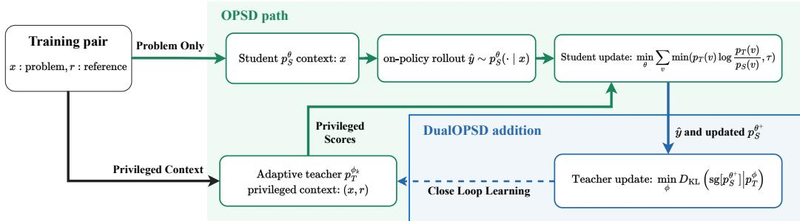
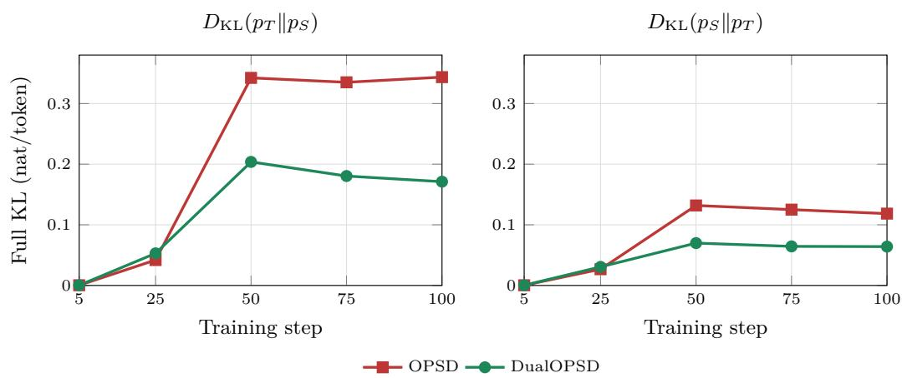

# DUALOPSD: ADAPTIVE PRIVILEGED TEACHERS FOR ON-POLICY SELF-DISTILLATION

Yutong Chen1 Guangfu Guo1 Zhichao Xu2 Kunpeng Liu1∗ 1Department of Computer Science, Clemson University 105 Sikes Hall, Clemson, SC 29634, USA 2Department of Computer Science, University of Utah {yutong2, gguo, kunpenl}@clemson.edu zhichao.xu@utah.edu

## ABSTRACT

On-policy self-distillation (OPSD) uses a privileged copy of the student model to provide dense supervision without an external teacher. OPSD keeps this privileged teacher fixed, even though the student distribution and output style change during training. We propose DualOPSD, an asymmetric alternating framework that adapts both policies. The student first learns from the privileged teacher. The teacher then moves toward the updated student distribution on the same student trajectory. This update makes later supervision responsive to the learner and does not require another rollout. On Qwen3-8B in non-thinking mode, DualOPSD improves avg@12 over OPSD by 23.61, 13.89, and 10.00 points on AIME 2024, AIME 2025, and HMMT 2025. Results at 1.7B and 4B show that the accuracy gain depends on model scale. Across all three scales, DualOPSD reduces truncation. The 4B diagnostic also shows lower KL in both directions between the teacher and student.

## 1 INTRODUCTION

Posttraining is central to improving the reasoning ability of large language models (LLMs). Common approaches include supervised fine-tuning (SFT) on high quality solutions, reinforcement learning with verifiable rewards (RLVR), and knowledge distillation from a teacher model. SFT provides direct supervision at the token level. However, it trains on fixed expert trajectories, so the model sees prefixes that differ from its own inference prefixes (Bengio et al., 2015; Kim & Rush, 2016). RLVR trains on model samples. Its final answer verifier provides only sparse feedback at the sequence level, and each prompt usually requires several rollouts (Shao et al., 2024; Guo et al., 2025). On-policy distillation (OPD) combines student trajectories with dense teacher feedback at each next token (Gu et al., 2023; Agarwal et al., 2024; Zhao et al., 2026).

On-policy self-distillation (OPSD) removes the external teacher (Zhao et al., 2026). It creates two conditional policies from the same base model. The student sees only the problem. The teacher receives a privileged context, such as a verified reference solution or answer that is available only during training. The student generates a response. The privileged teacher scores the next token distribution at every student prefix. The reference therefore provides dense supervision without a teacher trajectory or a verifier call during optimization.

Existing OPSD optimizes only the student and treats the privileged policy as a stationary oracle. This assumption is strong because the teacher is another conditional view of the same model, not an independently trained expert. OPSD also finds that a few vocabulary entries related to format and style can make unusually large contributions to forward KL. Fitting these entries can dominate the useful reasoning signal and damage training. OPSD therefore caps each large contribution before summation. This pointwise clipping protects the student, but it only rejects incompatible supervision. A fixed teacher receives no feedback about the rejected style signal and can present it again in later steps.

This leads to our central question. Should the privileged teaching policy itself learn as part of on-policy self-distillation?

Our answer is DualOPSD, an alternating procedure that learns both sides of the distillation interaction. The student update remains clipped and conservative. The privileged teacher then minimizes the full vocabulary $D _ { \mathrm { K L } } ( \mathrm { s g } [ p _ { S } ] \| p _ { T } )$ toward the updated student on the same trajectory. The adapted teacher supplies the targets for later student steps. It therefore changes future student gradients. This asymmetric closed loop requires neither a teacher rollout nor a correctness verifier.

Our contributions are:

• We identify a limitation of fixed teacher OPSD. Clipping can reject incompatible supervision at the current step, but a frozen privileged policy cannot respond to the changing learner or its prefix distribution.

• We introduce DualOPSD, an asymmetric alternating framework. The student learns conservatively from privileged supervision, and the teacher adapts to the updated student on the same trajectory. This update changes future supervision without another rollout.

• We evaluate Qwen3 models at 1.7B, 4B, and 8B scales in non-thinking mode. Teacher adaptation improves avg@12 at 4B and 8B but not at 1.7B. KL and generation length provide additional diagnostics of this scale dependent effect.

## 2 BACKGROUND

## 2.1 SUPERVISION FROM DEMONSTRATIONS AND REWARDS

SFT learns by predicting tokens from fixed reference solutions. It provides dense supervision and does not require sampling or a verifier. However, it is off-policy because the model trains on expert prefixes rather than its own. RLVR instead samples from the current policy and scores completed responses with a verifier. This makes RLVR on-policy. Its signal is sparse and can vanish when every response in a group receives the same reward (Shao et al., 2024). The two approaches trade dense token feedback against on-policy state coverage.

## 2.2 KNOWLEDGE DISTILLATION AND ON-POLICY DISTILLATION

Knowledge distillation transfers information from a teacher distribution $p _ { T }$ to a student $p _ { S }$ by matching soft output probabilities (Hinton et al., 2015). For an autoregressive model, a fixed trajectory y gives the token level objective

$$
{ \mathcal { L } } _ { \mathrm { K D } } = { \frac { 1 } { | y | } } \sum _ { n = 1 } ^ { | y | } D _ { \mathrm { K L } } { \big ( } p _ { T } { \big ( } \cdot | x , y _ { < n } { \big ) } \| p _ { S } { \big ( } \cdot | x , y _ { < n } { \big ) } { \big ) } .\tag{1}
$$

Sequence level distillation evaluates this loss on reference trajectories or teacher trajectories (Kim & Rush, 2016). OPD instead draws $\hat { y } \sim p _ { S } ( \cdot \mid x )$ and evaluates the divergence along student prefixes. This reduces the state distribution gap between training and inference (Gu et al., 2023; Agarwal et al., 2024). Full vocabulary distillation supervises every vocabulary entry at every completion position. OPD therefore combines the on-policy state coverage of RLVR with dense feedback, but it usually requires a separate teacher.

## 2.3 ON-POLICY SELF-DISTILLATION

Let the training set be $\boldsymbol { \mathcal { D } } = \{ ( \boldsymbol { x } , r ) \}$ , where $r$ is a verified reasoning trace available only during training. OPSD constructs a student $p _ { S } ^ { \theta } ( \cdot \mid x )$ and a privileged teacher $p _ { T } ( \cdot \mid x , r )$ from the same initial LLM (Zhao et al., 2026). Only the teacher sees r. The student samples yˆ, while both policies score the same prefix $\hat { y } _ { < n }$ . With forward $\mathrm { K L }$

$$
D _ { \mathrm { K L } } ( p _ { T } \Vert p _ { S } ) = \sum _ { v \in \mathcal { V } } c _ { n , v } , \qquad c _ { n , v } = p _ { T } ( v ) \log \frac { p _ { T } ( v ) } { p _ { S } ( v ) } .\tag{2}
$$

  
Figure 1: Overview of DualOPSD. Given $( x , r )$ , the student conditions only on the problem and samples one on-policy response ${ \hat { y } } .$ The privileged teacher conditions on the problem and reference. The green OPSD path updates the student with pointwise clipped $D _ { \mathrm { K L } } ( p _ { T } \Vert p _ { S } )$ on $\hat { y } .$ . The blue DualOPSD path recomputes the updated student on the same response. It then adapts the teacher with the full $\mathsf { \Pi } _ { \mathrm { K L } } ( p _ { S } \| p _ { T } )$ . The adapted teacher provides privileged targets in later steps.

Although the vocabulary sum is nonnegative, an individual $c _ { n , v }$ can be negative. OPSD applies an upper clip before summing,

$$
\widetilde { D } _ { \mathrm { K L } , \tau } ( p _ { T } \| p _ { S } ) = \sum _ { v \in \mathcal { V } } \operatorname* { m i n } ( c _ { n , v } , \tau ) ,\tag{3}
$$

which removes gradients from entries with large positive contributions. We call Equation 3 a pointwise clipped KL surrogate. The clip acts on signed vocabulary terms, so the resulting sum is not a divergence. OPSD finds that many clipped terms are style tokens (Zhao et al., 2026). Clipping prevents these terms from overwhelming student training. However, a frozen teacher cannot respond to the signal that the student repeatedly rejects.

## 3 DUALOPSD: ADAPTIVE PRIVILEGED TEACHER LEARNING

## 3.1 FROM FIXED TARGETS TO CLOSED LOOP ADAPTATION

Large forward KL contributions often reflect style differences rather than mathematical content. The OPSD clip prevents these terms from dominating the student update. However, it only stops the student from following them. A fixed teacher can present the same style signal throughout training. Let $\theta _ { k }$ and $\phi _ { k }$ be the student and teacher parameters at step $k .$ Let $\hat { y } _ { k }$ be the student trajectory at that step. Fixed teacher OPSD applies

$$
\theta _ { k + 1 } = \theta _ { k } - \eta _ { S } \nabla _ { \theta } \mathcal { L } _ { S } ( \theta _ { k } , \phi _ { 0 } ) ,\tag{4}
$$

where $\mathcal { L } _ { S }$ is evaluated on $\hat { y } _ { k }$ . Every step uses the initial teacher $\phi _ { 0 }$ , even as the student prefixes and style change.

DualOPSD also updates the privileged policy:

$$
\begin{array} { r l } & { \theta _ { k + 1 } = \theta _ { k } - \eta _ { S } \nabla _ { \theta } \mathcal { L } _ { S } ( \theta _ { k } , \phi _ { k } ) , } \\ & { \phi _ { k + 1 } = \phi _ { k } - \eta _ { T } \nabla _ { \phi } \mathcal { L } _ { T } ( \phi _ { k } , \theta _ { k + 1 } ) . } \end{array}\tag{5}
$$

Both losses use the same trajectory yˆk. The teacher loss uses the updated student $\theta _ { k + 1 }$ . The resulting teacher provides the target at the next step. Each teacher update therefore changes later supervision. We report KL between the teacher and student to measure this adaptation. Student accuracy measures whether the adapted supervision is useful.

Figure 1 shows the procedure. The teacher does not generate a response. Both updates use the same student rollout. The teacher update adds one privileged forward and backward pass after the student step.

Algorithm 1 DualOPSD (one optimization step)   
Require: Batch $B \subset D ,$ , student $p _ { S } ^ { \theta }$ , privileged teacher $p _ { T } ^ { \phi }$ , clip τ, learning rates $\eta _ { S } , \eta _ { T }$   
1: for $( x , r ) \in B$ do   
2: Sample one response $\hat { y } \sim p _ { S } ^ { \theta } ( \cdot \mid x )$   
3: Score every $\hat { y } _ { < n }$ with $p _ { S , n } ^ { \theta } ( \cdot \mid x )$ and $\operatorname { s g } [ p _ { T , n } ^ { \phi } ( \cdot \mid x , r ) ]$   
4: end for   
5: $\begin{array} { r } { \widehat { \mathcal { L } } _ { S } \gets | \mathcal { B } | ^ { - 1 } \sum _ { ( x , r ) , n , v } | \widehat { y } | ^ { - 1 } \operatorname* { m i n } \biggl ( \mathrm { s g } [ p _ { T , n } ^ { \phi } ( v ) ] \log \frac { \mathrm { s g } [ p _ { T , n } ^ { \phi } ( v ) ] } { p _ { S , n } ^ { \theta } ( v ) } , \tau \biggr ) } \end{array}$   
6: $\theta ^ { + } \gets \theta - \eta _ { S } \nabla _ { \theta } \widehat { \mathcal { L } } _ { S }$ and keep the same responses $\hat { y }$   
7: Score every $\hat { y } _ { < n }$ with $\operatorname { s g } [ p _ { S , n } ^ { \theta ^ { + } } ( \cdot \mid x ) ]$ and $p _ { T , n } ^ { \phi } ( \cdot \mid x , r )$   
8: $\begin{array} { r } { \widehat { \mathcal { L } } _ { T } \gets | \mathcal { B } | ^ { - 1 } \sum _ { ( x , r ) , n } | \widehat { y } | ^ { - 1 } D _ { \mathrm { K L } } \Big ( \mathrm { s g } [ p _ { S , n } ^ { \theta ^ { + } } ] \| p _ { T , n } ^ { \phi } \Big ) } \end{array}$   
9: ${ \phi } ^ { + } \gets \phi - \eta _ { T } \nabla _ { \phi } \widehat { \mathcal { L } } _ { T }$   
10: return updated student $\theta ^ { + }$ and teacher $\phi ^ { + }$

## 3.2 ASYMMETRIC ALTERNATING UPDATES

For completion token n, let the two next token distributions be $p _ { S , n } ^ { \theta }$ and $p _ { T , n } ^ { \phi }$ . We retain the OPSD upper clip so large style contributions do not dominate the student update:

$$
\mathcal { L } _ { S } ( \theta , \phi ) = \mathbb { E } _ { ( x , r ) , \hat { y } \sim p _ { S } ^ { \theta } } \left[ \frac { 1 } { | \hat { y } | } \sum _ { n } \sum _ { v \in \mathcal { V } } \operatorname* { m i n } \left( \mathrm { s g } [ p _ { T , n } ^ { \phi } ( v ) ] \log \frac { \mathrm { s g } [ p _ { T , n } ^ { \phi } ( v ) ] } { p _ { S , n } ^ { \theta } ( v ) } , \tau \right) \right] .\tag{6}
$$

Let $\theta ^ { + }$ denote the updated student. The teacher then minimizes

$$
\mathcal { L } _ { T } ( \phi , \theta ^ { + } ) = \mathbb { E } _ { ( x , r ) , \hat { y } } \left[ \frac { 1 } { \lvert \hat { y } \rvert } \sum _ { n } D _ { \mathrm { K L } } \left( \mathrm { s g } [ p _ { S , n } ^ { \theta ^ { + } } ] \Vert p _ { T , n } ^ { \phi } \right) \right] .\tag{7}
$$

Equation 7 uses the reverse KL $D _ { \mathrm { K L } } ( p _ { S } \| p _ { T } )$ . The stopped student distribution is the target, and gradients pass only through the teacher logits. The teacher remains conditioned on $( x , r )$ . Its vocabulary contributions are not clipped. The teacher therefore receives the style feedback that the student update suppresses. The student still learns from the remaining privileged signal. The two policies have distinct roles and do not optimize a symmetric consensus objective.

Algorithm 1 summarizes one optimization step. Sampling is outside the gradient graph. Only the student is used at inference time.

The updates are sequential. We implement the student and teacher as two LoRA adapters (Hu et al., 2022) on one frozen base model. Both adapters start from the same base policy LoRA state. Their parameters and AdamW optimizer states are separate. Only one adapter is active at a time.

## 4 EXPERIMENTS

## 4.1 EXPERIMENTAL SETUP

Training data and models. We train on 29,434 mathematics problems and solutions from the OpenThoughts OPSD split (Guha et al., 2026). We use Qwen3-1.7B, Qwen3-4B, and Qwen3-8B in non-thinking mode (Yang et al., 2025). Within each scale, all methods start from the same base checkpoint. OPSD and DualOPSD use batch size 32 and 100 optimizer steps. Student rollouts have at most 1,024 tokens. Sampling uses temperature 1.0, top-p 0.95, and top-k 20. The student clip is $\tau = 1 0 ^ { - 6 }$ for 1.7B and 4B. It is $1 0 ^ { - 7 }$ for 8B, following the corresponding OPSD setup. Both LoRA adapters have rank 64, scale 128, and zero dropout. They target the $q / \bar { k ^ { \prime } } v / o$ attention projections and the gate/up/down MLP projections. The student and teacher use separate AdamW optimizers. The learning rate is $5 \times 1 0 ^ { - 6 }$ with zero weight decay, ten warmup steps, and a constant schedule after warmup. We clip the gradient norm at 0.1. Training uses bfloat16, gradient checkpointing, token segments of 1,024, no data shuffling, and seed 42. Effective batch size and objectives are fixed across scales. Only microbatching and memory scheduling change. Appendix A gives the exact prompts and settings.

Table 1: Unified non-thinking accuracy across three Qwen3 scales. Each cell reports avg@12 / pass@12 (%). Bold avg@12 values are the highest for each model and benchmark. A method name is bold if it reaches at least one column maximum.
<table><tr><td>Model</td><td>Method</td><td>Steps</td><td>AIME24</td><td>AIME25</td><td>HMMT25</td></tr><tr><td rowspan="5">Qwen3-1.7B</td><td>Base</td><td>0</td><td>11.11 / 33.33</td><td>8.33 / 23.33</td><td>5.83 / 16.67</td></tr><tr><td>SFT</td><td>100</td><td>9.44 / 30.00</td><td>7.50 / 26.67</td><td>2.22 / 10.00</td></tr><tr><td>GRPO</td><td>200</td><td>13.06 / 26.67</td><td>10.28 / 36.67</td><td>5.00 / 13.33</td></tr><tr><td>OPSD</td><td>100</td><td>15.56 / 33.33</td><td>10.00 / 26.67</td><td>6.39 / 23.33</td></tr><tr><td>DualOPSD</td><td>100</td><td>11.94 / 26.67</td><td>8.06 / 36.67</td><td>4.44 / 20.00</td></tr><tr><td rowspan="8">Qwen3-4B</td><td>Base</td><td>0</td><td>22.78 / 46.67</td><td>20.83 / 46.67</td><td>10.28 / 20.00</td></tr><tr><td>SFT</td><td>100</td><td>19.44 / 50.00</td><td>18.06 / 36.67</td><td>10.83 / 23.33</td></tr><tr><td>GRPO</td><td>200</td><td>21.39 / 46.67</td><td>18.61 / 43.33</td><td>10.28 / 20.00</td></tr><tr><td>PiDistill</td><td>100</td><td>9.72 / 33.33</td><td>6.94 / 23.33</td><td>3.89 / 20.00</td></tr><tr><td>BRTS</td><td>100</td><td>11.67 / 33.33</td><td>8.89 / 30.00</td><td>3.06 / 10.00</td></tr><tr><td>OPSD</td><td>100</td><td>28.61 / 60.00</td><td>26.11 / 50.00</td><td>15.56 / 33.33</td></tr><tr><td>OPSD</td><td>200</td><td>25.00 / 60.00</td><td>20.28 / 43.33</td><td>10.28 / 26.67</td></tr><tr><td>DualOPSD</td><td>100</td><td>41.67 / 73.33</td><td>31.11 / 53.33</td><td>22.22 / 53.33</td></tr><tr><td rowspan="4">Qwen3-8B</td><td>Base</td><td>0</td><td>27.50 / 56.67</td><td>19.17 / 50.00</td><td>11.67 / 26.67</td></tr><tr><td>SFT</td><td>100</td><td>22.22 / 43.33</td><td>17.78 / 43.33</td><td>8.33 / 13.33</td></tr><tr><td>OPSD</td><td>100</td><td>35.83 / 63.33</td><td>27.78 / 56.67</td><td>16.67 / 46.67</td></tr><tr><td>DualOPSD</td><td>100</td><td>59.44 / 83.33</td><td>41.67 / 80.00</td><td>26.67 / 63.33</td></tr></table>

Baselines. We compare three posttraining families. SFT trains for 100 steps on reference solutions. GRPO represents reinforcement learning (Shao et al., 2024). It trains for 200 steps with eight generations of at most 8,192 tokens and two iterations. Rewards come from a binary math verifier. Distillation baselines include fixed teacher OPSD at 100 and 200 steps (Zhao et al., 2026). We also implement two privileged distillation variants. PiDistill samples four trajectories from a learned privileged teacher. It updates the teacher using validity and compatibility with the student, then distills the teacher trajectories into the student. BRTS samples the same four candidates. It keeps candidates that pass the validity gate and selects the one with the smallest mean token gap between teacher and student. The untrained Base is the common reference. Every method uses the same training split and LoRA rank. All comparisons are within one model scale. Appendix A gives the budgets for each method.

Evaluation. We evaluate three recent competition mathematics benchmarks with 30 problems each. They are AIME 2024, AIME 2025, and HMMT February 2025. We draw 12 samples per problem. Decoding uses non-thinking mode, bfloat16, temperature 1.0, top-p 1.0, and seed 42. Top-k and min-p are disabled. For each example, the completion limit is 32,768 minus the tokenized prompt length. We extract the last complete boxed answer and use math\_verify. If parsing fails, the project verifier provides the fallback verdict. The primary accuracy measure is avg@12 over responses. We also report pass@12 over problems, truncation rate, and mean completion length among samples without truncation.

## 4.2 MAIN RESULTS

Teacher adaptation exhibits a strong scale interaction. Relative to OPSD at 100 steps, DualOPSD changes avg@12 by −3.61/ − 1.94/ − 1.94 points at 1.7B. The changes are +13.06/ + 5.00/ + 6.67 at 4B and +23.61/+13.89/+10.00 at 8B. The order is AIME24, AIME25, and HMMT25. The gain grows from 4B to 8B but reverses at 1.7B. At 1.7B, OPSD is strongest on AIME24 and HMMT25, while GRPO is strongest on AIME25. We also compare the gain over Base at 8B with the gain over Base at 1.7B. The paired differences are 31.11, 22.78, and 16.39 points. Their paired bootstrap 95% intervals are [20.00, 42.22], [12.78, 33.61], and [6.39, 27.22]. All three intervals exclude zero. These results support a scale dependent effect rather than a uniform benefit.

Table 2: Qwen3-4B generation behavior and training cost. Truncation and mean completion length without truncation are pooled over all three benchmarks. Wall time is measured on one A100.
<table><tr><td>Method</td><td>Steps</td><td>Truncation (%)</td><td>Mean tokens without truncation</td><td>Train cost (A100 h)</td></tr><tr><td>Base</td><td>0</td><td>0.00</td><td>2,960</td><td>N/A</td></tr><tr><td>SFT</td><td>100</td><td>0.00</td><td>3,373</td><td>2.09</td></tr><tr><td>GRPO</td><td>200</td><td>0.00</td><td>2,930</td><td>8.76</td></tr><tr><td>PiDistill</td><td>100</td><td>0.00</td><td>1,671</td><td>6.80</td></tr><tr><td>BRTS</td><td>100</td><td>0.00</td><td>1,782</td><td>3.16</td></tr><tr><td>OPSD</td><td>100</td><td>9.63</td><td>4,804</td><td>~1.00</td></tr><tr><td>OPSD</td><td>200</td><td>20.00</td><td>3,219</td><td>~2.00</td></tr><tr><td>DualOPSD</td><td>100</td><td>2.31</td><td>5,362</td><td>1.40</td></tr></table>

Lower truncation is consistent across scales but does not explain accuracy. For 4B, Table 2 shows that pooled truncation falls from 9.63% with OPSD to 2.31% with DualOPSD. Mean completion length without truncation increases. Appendix Table 4 shows the same truncation trend at 1.7B and 8B. The rate falls from 3.24% to 1.20% at 1.7B and from 8.43% to 3.33% at 8B. At 8B, mean length increases from 4,195 to 7,996 tokens, and accuracy improves. At 1.7B, mean length decreases from 3,679 to 2,500 tokens, and accuracy falls. Lower truncation is therefore common across scales, but it does not explain the accuracy pattern.

Teacher adaptation adds moderate training cost without another rollout. On one A100, 4B training takes about 1.00 hour for OPSD and 1.40 hours for DualOPSD. The increase comes from the additional teacher forward and backward pass. Training time increases from 0.61 to 0.81 hours at 1.7B and from 1.38 to 2.00 hours at 8B. Appendix Table 4 gives these results. The number of student optimizer steps and sampled trajectories stays fixed.

## 4.3 TEACHER AND STUDENT ADAPTATION DYNAMICS

We recompute full vocabulary KL in both directions for OPSD and DualOPSD. We use checkpoints at steps 5, 25, 50, 75, and 100. The computation uses the same eight OpenThoughts examples at every checkpoint. Both adapters receive the same problem context and fixed reference completion. Each completion has at most 512 tokens, which gives 3,983 shared valid tokens. We compute KL in FP32 at temperature one. Fixed prefixes and masks isolate coupling between adapter parameters. This diagnostic differs from the privileged context objective used in training.

Teacher adaptation changes the coupling between the two policies. Figure 2 shows that OPSD’s $D _ { \mathrm { K L } } ( p _ { T } \Vert p _ { S } )$ grows to 0.342 by step 50 and stays near 0.34. DualOPSD reaches 0.171 at step 100, which is 50.2% below OPSD. Its $D _ { \mathrm { K L } } ( p _ { S } \| p _ { T } )$ is 0.064, which is 45.9% below OPSD. Lower divergence is expected from the teacher objective and confirms that the teacher responds to the learner. Student accuracy in Table 1 measures whether this adaptation is useful. At step 100, the median $D _ { \mathrm { K L } } ( p _ { T } \Vert p _ { S } )$ is 0.00185, while the mean is 0.171. A small fraction of positions therefore dominates this diagnostic.

## 5 ABLATION STUDY

We test a teacher variant with a lower clip, DualOPSD-C. This ablation measures whether adaptation benefits from the full reverse KL signal. Define

$$
d _ { n , v } = \mathrm { s g } [ p _ { S , n } ^ { \theta ^ { + } } ( v ) ] \log \frac { \mathrm { s g } [ p _ { S , n } ^ { \theta ^ { + } } ( v ) ] } { p _ { T , n } ^ { \phi } ( v ) } ,\tag{8}
$$

  
Figure 2: Adapter coupling measured by full vocabulary KL. Both adapters use the same problem context and fixed reference prefixes. Each checkpoint contains 3,983 valid tokens. The vertical axis uses a linear scale.

the variant replaces Equation 7 with

$$
\mathcal { L } _ { T } ^ { \mathrm { C } } = \mathbb { E } \left[ \frac { 1 } { | \hat { y } | } \sum _ { n } \sum _ { v \in \mathcal { V } } \operatorname* { m a x } ( d _ { n , v } , \tau ) \right] .\tag{9}
$$

The lower clip removes gradients from vocabulary contributions at or below τ . It acts on signed terms, so the resulting objective is not a divergence.

Table 3: Teacher update ablation and checkpoint trend (avg@12, %). Every row uses the same upper clip for the student. Bold marks the best result in each column, and underline marks the second best.
<table><tr><td>Teacher</td><td>Step</td><td>AIME24</td><td>AIME25</td><td>HMMT25</td><td>Mean</td></tr><tr><td>Frozen (OPSD)</td><td>100</td><td>28.61</td><td>26.11</td><td>15.56</td><td>23.43</td></tr><tr><td>Adaptive (DualOPSD-C)</td><td>50</td><td>30.83</td><td>24.44</td><td>14.17</td><td>23.15</td></tr><tr><td>Adaptive (DualOPSD-C)</td><td>75</td><td>34.72</td><td>27.78</td><td>15.00</td><td>25.83</td></tr><tr><td>Adaptive (DualOPSD-C)</td><td>100</td><td>40.28</td><td>29.44</td><td>16.67</td><td>28.80</td></tr><tr><td>Adaptive (DualOPSD)</td><td>100</td><td>41.67</td><td>31.11</td><td>22.22</td><td>31.67</td></tr></table>

Learning the teacher improves over the frozen OPSD target. With the same student update, the mean for DualOPSD-C rises from 23.15% at step 50 to 28.80% at step 100. This exceeds the 23.43% OPSD mean by 5.37 points. The comparison separates teacher adaptation from the effect of additional student steps.

The full teacher signal outperforms the tested lower clip. Replacing Equation 9 with full reverse KL raises the mean at step 100 by another 2.87 points. The gains are 1.39, 1.67, and 5.56 points on AIME24, AIME25, and HMMT25. An earlier run without student clipping reached 2.0% on MATH-500 and 0% on both AIME sets. That evaluation used an 8k token limit, so it is not directly comparable. However, the large degradation supports the intended asymmetry. The student uses conservative supervision, while the teacher receives the full learner signal.

## 6 RELATED WORK

## 6.1 SUPERVISED FINE-TUNING AND REINFORCEMENT LEARNING

SFT trains directly on expert solutions or model solutions and is a standard way to teach reasoning traces (Zelikman et al., 2022). Its dense token loss is simple and stable. However, its prefixes come from fixed demonstrations rather than the deployment distribution. RLVR methods such as GRPO optimize verifiable rewards over groups of on-policy samples (Shao et al., 2024; Guo et al., 2025). They directly target answer correctness and do not need teacher probabilities at the token level. Their feedback is sparse, and several long rollouts can be expensive. DualOPSD combines the student state distribution used by RLVR with the dense supervision used by SFT. It uses a reference in the privileged context during training instead of a reward signal.

## 6.2 DISTILLATION AND ADAPTIVE TEACHING POLICIES

Classical knowledge distillation trains a student on soft teacher probabilities (Hinton et al., 2015). Sequence level KD extends this transfer to autoregressive outputs (Kim & Rush, 2016). MiniLLM uses reverse KL and policy gradient optimization for generative distillation (Gu et al., 2023). GKD combines on-policy and off-policy sampling with several divergences (Agarwal et al., 2024). These methods show the value of supervising student prefixes, but they usually assume an external teacher. Deep Mutual Learning and online distillation allow peer targets to change during training (Zhang et al., 2018; Chen et al., 2020). DualOPSD also uses a changing target, but only the teacher sees the reference. The student uses clipped forward KL. The teacher follows the updated student with full reverse KL. PiDistill and BRTS provide two other mechanisms for privileged teachers. Their teacher rollouts can search across several candidates. Tables 1 and 2 show that they have higher training cost and lower accuracy in our implementation. DualOPSD reuses one student rollout and does not select candidates.

## 6.3 PRIVILEGED CONTEXT SELF-DISTILLATION

Learning with privileged information gives extra training features to a teacher but not to the deployed predictor. Generalized distillation connects this setting to soft target transfer (Lopez-Paz et al., 2016). OPSD applies this idea to a teacher created from the same model (Zhao et al., 2026). The teacher conditions on a reference solution and provides dense feedback along a student response. OPSD avoids an external teacher and verifier, but its privileged target stays fixed. DualOPSD preserves the dense on-policy signal and makes the target responsive to the learner. The update is also related to interactive imitation learning because supervision adapts around states visited by the learner (Ross et al., 2011). Our method operates directly on next token distributions.

## 7 CONCLUSION AND LIMITATIONS

DualOPSD turns privileged context self-distillation into an asymmetric closed loop. The student learns conservatively from a clipped privileged target. The teacher then adapts to the updated student on the same trajectory. Across three Qwen3 scales, this update reduces truncation without another rollout. Its accuracy effect depends strongly on model size. It improves over OPSD at 4B and 8B but not at 1.7B. The 4B diagnostic also shows lower KL in both directions, which confirms that policy coupling changes during training.

The evidence covers one model family, one training seed, and the same 90 competition problems at each scale. The large 8B result needs replication across seeds and broader answer auditing. The 1.7B reversal rules out a claim that is independent of scale. Lower KL is expected from the teacher objective. It does not by itself establish better reasoning or continued use of the privileged reference. The fixed prefix KL diagnostic also covers only eight 4B examples. These limits make model scale a central variable for future work on adaptive privileged teaching.

## A REPRODUCIBILITY DETAILS

## A.1 EXACT TRAINING PROMPTS

The student user message is:

Problem: {problem}   
Please reason step by step, and put your final answer within   
\boxed{}.

Table 4: Generation behavior and training cost for 1.7B and 8B models. Truncation and mean completion length without truncation are pooled over AIME24, AIME25, and HMMT25. Wall time is measured on one A100.
<table><tr><td>Model</td><td>Method</td><td>Truncation (%)</td><td>Mean tokens without truncation</td><td>Train cost (A100 h)</td></tr><tr><td rowspan="5">Qwen3-1.7B</td><td>Base</td><td>0.19</td><td>2,289</td><td>N/A</td></tr><tr><td>SFT</td><td>0.00</td><td>2,306</td><td>1.40</td></tr><tr><td>GRPO</td><td>0.00</td><td>2,338</td><td>7.69</td></tr><tr><td>OPSD</td><td>3.24</td><td>3,679</td><td>0.61</td></tr><tr><td>DualOPSD</td><td>1.20</td><td>2,500</td><td>0.81</td></tr><tr><td rowspan="4">Qwen3-8B</td><td>Base</td><td>0.00</td><td>2,843</td><td>N/A</td></tr><tr><td>SFT</td><td>0.00</td><td>2,842</td><td>2.97</td></tr><tr><td>OPSD</td><td>8.43</td><td>4,195</td><td>1.38</td></tr><tr><td>DualOPSD</td><td>3.33</td><td>7,996</td><td>2.00</td></tr></table>

The teacher user message is:

Problem: {problem}   
Here is a reference solution to this problem:   
=== Reference Solution Begin ===   
{reference}   
=== Reference Solution End ===   
After reading the reference solution above, make sure you   
truly understand the reasoning behind each step -- do   
not copy or paraphrase it. Now, using your own words and   
independent reasoning, derive the same final answer to   
the problem above. Think step by step, explore different   
approaches, and don’t be afraid to backtrack or reconsider   
if something doesn’t work out:   
Please reason step by step, and put your final answer within   
\boxed{}.

Each message uses the Qwen chat template with add\_generation\_prompt=True and enable\_thinking=False. The evaluation message omits the initial Problem: label. It uses the same final answer instruction and chat settings.

## A.2 OPTIMIZATION AND UPDATE ORDER

At every step, a batch of 32 prompts produces one student rollout per problem. Each rollout has at most 1,024 tokens. The student adapter is scored and updated first. Its logits are then recomputed with gradients disabled. The teacher adapter is activated and scored with the privileged prompts on the same token IDs and mask. The teacher is updated after this scoring pass. Full vocabulary scoring uses token segments of length 1,024 and row microbatches chosen for each model scale. Segment gradients accumulate before each adapter step, so the effective batch and objective do not change. Sampling is outside the gradient graph. Both adapters start from the same state. Their parameters and optimizer states are separate.

## A.3 BASELINE BUDGETS

SFT uses 100 steps, global batch 64, maximum sequence length 16,000, and learning rate $5 \times 1 0 ^ { - 6 }$ GRPO uses 200 steps and effective batch 32. It uses eight generations of at most 8,192 tokens, two iterations, β = 0, temperature 1.0, and the same learning rate. PiDistill and BRTS use four privileged candidates per problem, rollouts of at most 1,024 tokens, and 100 steps. They are comparison variants defined in this paper, not names of cited external methods.

## A.4 TRAINING COST MEASUREMENT

Tables 2 and 4 report total wall time for training on one A100. The measurements include rollout generation, model scoring, optimization, verifier execution when used, checkpoint I/O, and systems

overhead. They compare the actual implementations and are not hardware independent measures of algorithmic FLOPs.

## A.5 EVALUATION AND ANSWER EXTRACTION

For every problem, the completion limit is 32,768 − |tokenized prompt|. A sample is truncated if its finish reason is length or if it reaches this limit. The verifier extracts the last balanced \boxed{...} expression. An absent or unbalanced box invokes the project answer extractor. The reference and prediction are then parsed with math\_verify. A parsing failure invokes the legacy verifier. Mean and linearly interpolated P99 lengths use only completions without truncation.

## REFERENCES

Rishabh Agarwal, Nino Vieillard, Yongchao Zhou, Piotr Stanczyk, Sabela Ramos, Matthieu Geist, and Olivier Bachem. On-policy distillation of language models: Learning from self-generated mistakes. In International Conference on Learning Representations, 2024.

Samy Bengio, Oriol Vinyals, Navdeep Jaitly, and Noam Shazeer. Scheduled sampling for sequence prediction with recurrent neural networks. In Advances in Neural Information Processing Systems, 2015.

Defang Chen, Jian-Ping Mei, Can Wang, Yan Feng, and Chun Chen. Online knowledge distillation with diverse peers. In Proceedings ofthe AAAI Conference on Artificial Intelligence, volume 34, pp. 3430–3437, 2020.

Yuxian Gu, Li Dong, Furu Wei, and Minlie Huang. MiniLLM: Knowledge distillation of large language models. arXiv preprint arXiv:2306.08543, 2023.

Etash Kumar Guha, Ryan Marten, Sedrick Keh, Negin Raoof, Georgios Smyrnis, Hritik Bansal, Marianna Nezhurina, Jean Mercat, Trung Vu, Zayne Rea Sprague, et al. OpenThoughts: Data recipes for reasoning models. In International Conference on Learning Representations, 2026.

Daya Guo, Dejian Yang, Haowei Zhang, Junxiao Song, Ruoyu Zhang, Runxin Xu, Qihao Zhu, Shirong Ma, Peiyi Wang, Xiao Bi, et al. DeepSeek-R1: Incentivizing reasoning capability in llms via reinforcement learning. arXiv preprint arXiv:2501.12948, 2025.

Geoffrey Hinton, Oriol Vinyals, and Jeff Dean. Distilling the knowledge in a neural network. arXiv preprint arXiv:1503.02531, 2015.

Edward J. Hu, Yelong Shen, Phillip Wallis, Zeyuan Allen-Zhu, Yuanzhi Li, Shean Wang, Lu Wang, and Weizhu Chen. LoRA: Low-rank adaptation of large language models. In International Conference on Learning Representations, 2022.

Yoon Kim and Alexander M. Rush. Sequence-level knowledge distillation. In Proceedings ofEMNLP, pp. 1317–1327, 2016.

David Lopez-Paz, Léon Bottou, Bernhard Schölkopf, and Vladimir Vapnik. Unifying distillation and privileged information. In International Conference on Learning Representations, 2016.

Stéphane Ross, Geoffrey J. Gordon, and J. Andrew Bagnell. A reduction of imitation learning and structured prediction to no-regret online learning. In Proceedings ofAISTATS, pp. 627–635, 2011.

Zhihong Shao, Peiyi Wang, Qihao Zhu, Runxin Xu, Junxiao Song, Xiao Bi, Haowei Zhang, Mingchuan Zhang, Y. K. Li, Y. Wu, and Daya Guo. DeepSeekMath: Pushing the limits of mathematical reasoning in open language models. arXiv preprint arXiv:2402.03300, 2024.

An Yang, Anfeng Li, Baosong Yang, Beichen Zhang, Binyuan Hui, Bo Zheng, Bowen Yu, Chang Gao, Chengen Huang, Chenxu Lv, et al. Qwen3 technical report. arXiv preprint arXiv:2505.09388, 2025.

Eric Zelikman, Yuhuai Wu, Jesse Mu, and Noah D. Goodman. STaR: Bootstrapping reasoning with reasoning. In Advances in Neural Information Processing Systems, 2022.

Ying Zhang, Tao Xiang, Timothy M. Hospedales, and Huchuan Lu. Deep mutual learning. In Proceedings of the IEEE Conference on Computer Vision and Pattern Recognition, pp. 4320–4328, 2018.

Siyan Zhao, Zhihui Xie, Mengchen Liu, Jing Huang, Guan Pang, Feiyu Chen, and Aditya Grover. Self-distilled reasoner: On-policy self-distillation for large language models. arXiv preprint arXiv:2601.18734, 2026.