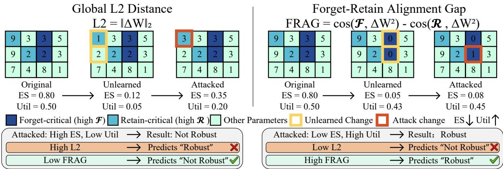
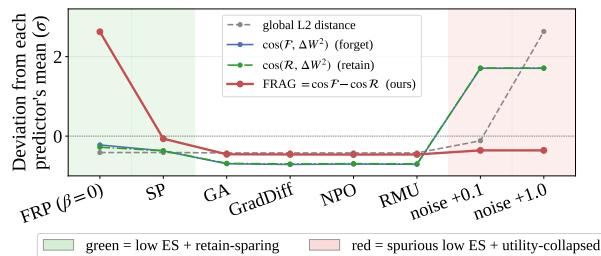

# Distance Is Not Enough: Forget-Retain Alignment Gap Predicts LLM Relearning Robustness

Yi Chen1\*, Hanna Hsieh1\*, Shuhong Liu2, Chuanbo Hua1, Zihan Ma1, Kun Wang1, Joo-Young Kim1

1KAIST

2The University of Tokyo

{chenyi, hihahanaisme, cbhua, zihanma, walkerwang, jooyoung1203}@kaist.ac.kr s-liu@mi.t.u-tokyo.ac.jp

## Abstract

Machine unlearning aims to make a model forget specific data, yet unlearned LLMs often fail to stay unlearned: brief fine-tuning can revive removed knowledge. Existing robustness predictors rely on global weight-space displacement, but distance alone can be misleading when random or destructive updates collapse performance. We argue that relearning robustness depends on update structure: robust unlearning should affect forget-critical weights while sparing retain-critical ones. We introduce the Forget-Retain Alignment Gap (FRAG), a training-free predictor that scores an update’s forget-retain alignment without running a relearning attack, and separates selective from dense updates more reliably than global distance. Building on the forget-critical, retain-sparing principle, Forget-Retain Pruning (FRP) improves relearning robustness. Our results suggest that weight selectivity better explains robustness than distance alone. Our code is available at https://github.com/ Yi1-Chen/FRAG.

## 1 Introduction

Machine unlearning aims to remove the influence of specified data from a trained model while preserving its behavior on the remaining retain data (Maini et al., 2024; Li et al., 2024). However, for large language models (LLMs), forgetting at edit time is often fragile: even without access to the forgotten examples, subsequent fine-tuning on benign retain data can revive the supposedly removed knowledge, forming a relearning attack (Hu et al., 2025; Lynch et al., 2024). This relearning behavior exposes a central weakness of current unlearning methods: successful forgetting at edit time does not necessarily imply robustness against relearning attacks (Łucki et al., 2025; Che et al., 2025; Deeb and Roger, 2024).

Recent work argues that relearning robustness can be improved by moving the unlearned model farther from the original model in weight space, making the removed knowledge harder to recover under relearning attacks (Siddiqui et al., 2025). This motivates using the global $\ell _ { 2 }$ weight-space distance between the original and unlearned weights as a simple robustness predictor. However, distance alone can be misleading: it measures how far the weights move, but not which weights move. For example, a random or destructive update can yield a large $\ell _ { 2 }$ displacement and appear robust to a distance-based predictor, while collapsing retain or forget performance and producing a model that is far from the original but not meaningfully unlearned. Robust unlearning should depend not only on displacement magnitude, but on whether the update concentrates on forget-critical weights while sparing retain-critical ones.

This observation motivates a proxy that diagnoses where the unlearning update is concentrated, not only how large it is. We introduce the Forget– Retain Alignment Gap (FRAG), a training-free scalar proxy for predicting relearning robustness that measures whether the update aligns more with forget-critical than retain-critical weights. By penalizing retain-side disruption, FRAG avoids rewarding collapsed models and better reflects practical unlearning robustness.

Across diverse unlearning methods (Zhang et al., 2024a; Maini et al., 2024; Li et al., 2024; Pochinkov and Schoots, 2024; Jang et al., 2023), benchmarks, and model families, we show that FRAG correlates with empirical relearning robustness more reliably than global distance-based predictors. To show that this principle is actionable rather than merely diagnostic, we instantiate it as Forget-Retain Pruning (FRP), which selectively targets forget-critical weights while avoiding retain-critical ones. FRP improves robustness under relearning attacks, tracing a robustness– utility frontier that dominates strong baselines at every matched utility level, suggesting that which weights move matters more than distance alone.

Our contributions are summarized as follows:

• We revisit relearning robustness from a weight-selectivity perspective, showing that global distance alone cannot distinguish selective unlearning updates from random or retain-damaging perturbations.

• We introduce FRAG, a training-free proxy that predicts relearning robustness by diagnosing whether an update is forget-critical and retain-sparing.

• As an application of the same principle, we propose FRP, which improves relearning robustness at a controllable utility cost.

## 2 Related Work

Machine Unlearning for LLMs. LLM unlearning removes a forget set’s influence while preserving retain utility, judged jointly on the two (Maini et al., 2024). Most methods optimize a forgetderived loss: likelihood suppression (GA, Jang et al., 2023; GradDiff, Liu et al., 2022), preference optimization (NPO, Zhang et al., 2024a; SimNPO, Fan et al., 2025b), and representation engineering (RMU; Li et al., 2024). Others edit forget-related weights directly (pruning, attribution) or drop the retain set (Wang et al., 2025) or act only at inference (Pawelczyk et al., 2024).

Relearning robustness. Unlearned LLMs recover forgotten knowledge under modest extra training (Hu et al., 2025; Lynch et al., 2024; Łucki et al., 2025; Schwinn et al., 2024; Patil et al., 2024; Deeb and Roger, 2024; Che et al., 2025), suggesting edit-time forgetting suppresses rather than removes knowledge. Proposed defenses include sharpness-aware unlearning (Fan et al., 2025a), latent adversarial training (Sheshadri et al., 2025), tamper-resistant safeguards (Tamirisa et al., 2025), and localized edits (Guo et al., 2025). Closest to us, Siddiqui et al. (2025) tie robustness to weightspace displacement; we show a scalar global $\ell _ { 2 }$ distance is insufficient: which weights move, not how far, governs robustness.

Weight Importance and Pruning. Unstructured LLM pruning scores weights by activations (Wanda; Sun et al., 2024), relative importance (RIA; Zhang et al., 2024b), or second-order reconstruction (SparseGPT; Frantar and Alistarh,

2023); a parallel line localizes knowledge to FFN memories (Geva et al., 2021), neurons (Dai et al., 2022), and MLP modules (Meng et al., 2022). For unlearning, Selective Pruning (Pochinkov and Schoots, 2024) uses forget–retain activation contrast, SSD (Foster et al., 2024) dampens forget weights via Fisher information (vision), SalUn (Fan et al., 2024) uses gradient-based weight saliency, and WAGLE (Jia et al., 2024) uses gradient attribution; Jia et al. (2023) show in vision that sparsity alone eases unlearning. None target the forget–retain alignment structure governing relearning robustness; FRP builds on the importance contrast of Selective Pruning and applies it to relearning robustness (§3.3).

## 3 Method

We develop a weight-selective view of relearning robustness. Our starting point is that a robust unlearned model should not merely move far from the original model; its update should be concentrated on forget-critical weights while avoiding retaincritical ones. Based on this property, we first define an attack-free robustness prediction problem, then introduce FRAG as a diagnostic proxy. Finally, we instantiate the same principle as FRP, which directly constructs more robust unlearned models by enforcing this selective update structure.

## 3.1 Problem Formulation

Let $M _ { 0 }$ and $M _ { u }$ denote the original and unlearned models with parameters $\theta _ { 0 }$ and $\theta _ { u }$ . Given a forget set $\mathcal { D } _ { f }$ and retain set $\mathcal { D } _ { r }$ , unlearning aims to remove the influence of $\mathcal { D } _ { f }$ while maintaining retain-side behavior on $\mathcal { D } _ { r }$ . After unlearning, $M _ { u }$ may face a relearning attack by fine-tuning on an attack set $\mathcal { D } _ { a }$ drawn from $\mathcal { D } _ { r } , \mathcal { D } _ { f }$ , or their mixture, producing an attacked model $M _ { a }$

A robust unlearned model should resist recovery of forgotten knowledge while maintaining retainside utility. Thus, robustness is not captured by post-attack forgetting alone; a utility-collapsed model is not meaningfully robust. Our goal is to identify attack-free weight-space properties that predict such robustness. Given $M _ { 0 } , M _ { u }$ , and small calibration sets $\mathcal { D } _ { f } ^ { \mathrm { c a l } } , \mathcal { D } _ { r } ^ { \mathrm { c a l } }$ , we seek an attack-free scoring function

$$
\phi : ( M _ { 0 } , M _ { u } , { \cal D } _ { f } ^ { \mathrm { c a l } } , { \cal D } _ { r } ^ { \mathrm { c a l } } ) \mapsto \mathbb { R } ,\tag{1}
$$

where R denotes the real numbers and higher scores indicate stronger predicted robustness under relearning attacks. Unlike global $\ell _ { 2 }$ distance

  
Figure 1: Illustration of global $L _ { 2 }$ and FRAG as attack-free predictors of relearning robustness. Large $L _ { 2 }$ can falsely suggest robustness when edits hit retain-critical weights, while small $L _ { 2 }$ can miss robust forget-critical edits. FRAG captures both cases by measuring whether updates target forget-critical while sparing retain-critical weights.

$\lVert \theta _ { u } - \theta _ { 0 } \rVert _ { 2 }$ , which measures only update magnitude, we focus on where the update is concentrated.

## 3.2 Predicting Robustness: FRAG

A weight is forget-critical if its magnitude and input-channel activation indicate greater importance on forget than on retain data; retain-critical is defined symmetrically. Both denote relative, datadependent importance rather than weights exclusive to one set: nearly every weight carries some of both, and what matters is the ratio.

For layer $\ell ,$ let $W _ { 0 } ^ { \ell }$ and $W _ { u } ^ { \ell }$ be the original and unlearned weights. The unlearning update is

$$
\Delta W ^ { \ell } = W _ { u } ^ { \ell } - W _ { 0 } ^ { \ell } .\tag{2}
$$

To assess whether the update is robustly structured, we compare $( \Delta W ^ { \ell } ) ^ { 2 }$ with forget- and retaincritical weight importance.

For each input channel $j ,$ , we collect activation norms on forget and retain calibration data, denoted $x _ { j } ^ { f , \ell }$ and $x _ { j } ^ { r , \ell }$ . Following the weight importance (Sun et al., 2024), we define

$$
\mathcal { F } _ { i j } ^ { \ell } = | ( W _ { 0 } ^ { \ell } ) _ { i j } | \frac { x _ { j } ^ { f , \ell } } { x _ { j } ^ { r , \ell } + \epsilon } ,\tag{3}
$$

$$
\mathcal { R } _ { i j } ^ { \ell } = | ( W _ { 0 } ^ { \ell } ) _ { i j } | \frac { x _ { j } ^ { r , \ell } } { x _ { j } ^ { f , \ell } + \epsilon } .\tag{4}
$$

Here, $\mathcal { F } ^ { \ell }$ and $\mathcal { R } ^ { \ell }$ denote forget- and retain-critical weight importance, respectively. Let $D = ( \Delta W ) ^ { 2 }$ denote the squared update after aggregating selected layers. We use cosine similarity because it is scale-invariant, measuring alignment rather than update magnitude:

$$
\begin{array} { r } { A _ { f } = \cos ( \mathcal { F } , D ) , } \\ { A _ { r } = \cos ( \mathcal { R } , D ) , } \\ { \mathrm { F R A G } = A _ { f } - \gamma A _ { r } . } \end{array}\tag{5}
$$

Algorithm 1: Forget–Retain Pruning (FRP)   
Input: $\overline { { \theta _ { 0 } , \mathcal { D } _ { f } , \mathcal { D } _ { r } } }$ , modules M, sparsity ρ, retain penalty β,   
magnitude weight λ   
Output: θ   
1 for m ∈ M with W $\equiv \mathbb { R } ^ { d _ { o } \times d _ { i } }$ do   
2 $x ^ { f } , x ^ { r }$ ← input-channel norms on $\mathcal { D } _ { f } , \mathcal { D } _ { r } ;$   
3 $\mathcal { F } _ { i j }  \vert W _ { i j } \vert x _ { j } ^ { f } / ( x _ { j } ^ { r } + \epsilon ) ; \mathcal { R } _ { i j }  \vert W _ { i j } \vert x _ { j } ^ { r } / ( x _ { j } ^ { f } + \epsilon ) ;$   
4 for i = 1, . . . , d do   
5 $S _ { i j }$ ← rankj (Fij ) − β rankj (Rij ) + λ rankj (|Wij |);   
6 $\mathcal { P } _ { i } ^ { \phantom { \dagger } }  \mathrm { T o p K } ( S _ { i , : } , \lfloor \rho d _ { i } \rfloor ) ;$   
7 $W _ { i , \mathcal { P } _ { i } } \gets 0 ;$   
8 return $\theta _ { u } ;$

Here, $A _ { f }$ and $A _ { r }$ are forget- and retain-update alignment scores. A high FRAG indicates the update aligns with forget-critical weights while avoiding retain-critical ones. The retain term $( \gamma = 1 ;$ App. A.1) prevents forget-only alignment from rewarding destructive updates that damage utility.

Fine-tuning can only move a weight that the finetuning data actually uses: for a linear layer, the gradient of $W _ { i j }$ carries a factor $x _ { j }$ , the activation of its input channel. Weights that fire on forgotten content but not on retain content are therefore inert under a retain-only relearning attack, and an edit placed there survives it. FRAG scores exactly this placement, which is why an attack-free score can anticipate the attack. The argument is local and first-order, and it weakens once the attacker also holds forget data, which reactivates those channels; we therefore evaluate FRAG under that stronger attack (Table 3).

Computing FRAG only requires calibration forward passes and a weight comparison between $M _ { 0 }$ and $M _ { u } ;$ it needs no relearning attack or additional optimization. Unless specified otherwise, we score attention and MLP projection layers. Because FRAG measures directional alignment, diffuse dense updates align weakly and receive substantially smaller scores; it therefore separates selective from dense updates reliably, while resolving differences among dense methods only coarsely. See Appendix A.1 for details.

<table><tr><td rowspan="2">Method</td><td colspan="2">Unlearned ES↓</td><td colspan="3">Retain Attack</td><td colspan="3">Forget Attack</td><td colspan="3">Forget+Retain Attack</td><td colspan="3">Average</td><td colspan="2">Predictor</td></tr><tr><td></td><td>Util↑</td><td>ES↓</td><td>∆ES↓</td><td>Util↑</td><td>ES↓</td><td>ΔES↓ Util↑</td><td></td><td>ES↓</td><td>∆ES↓</td><td>Util↑</td><td>ES↓</td><td>∆ES↓</td><td>Util↑</td><td>L2↑</td><td>FRAG↑</td></tr><tr><td colspan="10">LLaMA-3.2-1B</td><td></td><td></td><td></td><td></td><td></td><td></td><td></td></tr><tr><td>Retain</td><td>0.064</td><td>0.596</td><td>0.063</td><td>-0.001</td><td>0.597</td><td>0.081</td><td>0.017</td><td>0.580</td><td>0.071</td><td>0.007</td><td>0.597</td><td>0.072</td><td>0.008</td><td>0.591</td><td></td><td></td></tr><tr><td>GA</td><td>0.086</td><td>0.199</td><td>0.284</td><td>0.198</td><td>0.598</td><td>0.153</td><td>0.067</td><td>0.359</td><td>0.401</td><td>0.315</td><td>0.598</td><td>0.279</td><td>0.193</td><td>0.518</td><td>0.875</td><td>0.002</td></tr><tr><td>GradDiff</td><td>0.123</td><td>0.498</td><td>0.256</td><td>0.134</td><td>0.602</td><td>0.264</td><td>0.142</td><td>0.591</td><td>0.441</td><td>0.318</td><td>0.600</td><td>0.320</td><td>0.198</td><td>0.598</td><td>0.569</td><td>0.003</td></tr><tr><td>NPO</td><td>0.126</td><td>0.487</td><td>0.215</td><td>0.089</td><td>0.603</td><td>0.197</td><td>0.071</td><td>0.547</td><td>0.331</td><td>0.205</td><td>0.600</td><td>0.248</td><td>0.122</td><td>0.583</td><td>0.748</td><td>0.000</td></tr><tr><td>RMU</td><td>0.105</td><td>0.561</td><td>0.412</td><td>0.307</td><td>0.602</td><td>0.420</td><td>0.315</td><td>0.579</td><td>0.742</td><td>0.637</td><td>0.601</td><td>0.525</td><td>0.420</td><td>0.594</td><td>0.769</td><td>0.004</td></tr><tr><td>SP</td><td>0.124</td><td>0.486</td><td>0.171</td><td>0.047</td><td>0.521</td><td>0.200</td><td>0.076</td><td>0.497</td><td>0.237</td><td>0.113</td><td>0.520</td><td>0.203</td><td>0.079</td><td>0.513</td><td>120.6</td><td>0.393</td></tr><tr><td>FRP (β=0.00)</td><td>0.055</td><td>0.384</td><td>0.079</td><td>0.024</td><td>0.464</td><td>0.071</td><td>0.015</td><td>0.407</td><td>0.104</td><td>0.049</td><td>0.463</td><td>0.085</td><td>0.029</td><td>0.444</td><td>111.5</td><td>3.159</td></tr><tr><td>FRP (β=0.15)</td><td>0.099</td><td>0.494</td><td>0.133</td><td>0.034</td><td>0.526</td><td>0.138</td><td>0.039</td><td>0.498</td><td>0.201</td><td>0.102</td><td>0.526</td><td>0.157</td><td>0.058</td><td>0.517</td><td>81.4</td><td>3.020</td></tr><tr><td colspan="10"></td><td colspan="7"></td></tr><tr><td>Retain</td><td>0.064</td><td>0.658</td><td>0.071</td><td>0.007</td><td>0.655</td><td>0.085</td><td>0.022</td><td>0.639</td><td>0.082</td><td>0.019</td><td>0.651</td><td>0.080</td><td>0.016</td><td>0.649</td><td>一</td><td></td></tr><tr><td>GA</td><td>0.120</td><td>0.384</td><td>0.331</td><td>0.211</td><td>0.671</td><td>0.222</td><td>0.102</td><td>0.548</td><td>0.497</td><td>0.376</td><td>0.673</td><td>0.350</td><td>0.230</td><td>0.630</td><td>1.363</td><td>0.002</td></tr><tr><td>GradDiff</td><td>0.195</td><td>0.584</td><td>0.380</td><td>0.184</td><td>0.658</td><td>0.454</td><td>0.259</td><td>0.654</td><td>0.553</td><td>0.358</td><td>0.660</td><td>0.462</td><td>0.267</td><td>0.657</td><td>0.937</td><td>0.005</td></tr><tr><td>NPO</td><td>0.082</td><td>0.663</td><td>0.108</td><td>0.026</td><td>0.665</td><td>0.175</td><td>0.093</td><td>0.649</td><td>0.281</td><td>0.198</td><td>0.664</td><td>0.188</td><td>0.106</td><td>0.660</td><td>1.506</td><td>0.002</td></tr><tr><td>RMU</td><td>0.054</td><td>0.664</td><td>0.123</td><td>0.068</td><td>0.664</td><td>0.139</td><td>0.085</td><td>0.663</td><td>0.755</td><td>0.700</td><td>0.664</td><td>0.339</td><td>0.284</td><td>0.664</td><td>1.488</td><td>0.007</td></tr><tr><td>SP</td><td>0.187</td><td>0.589</td><td>0.299</td><td>0.112</td><td>0.613</td><td>0.431</td><td>0.244</td><td>0.597</td><td>0.443</td><td>0.257</td><td>0.618</td><td>0.391</td><td>0.204</td><td>0.610</td><td>191.9</td><td>0.941</td></tr><tr><td>FRP (β=0.00)</td><td>0.068</td><td>0.499</td><td>0.096</td><td>0.028</td><td>0.569</td><td>0.107</td><td>0.039</td><td>0.522</td><td>0.147</td><td>0.079</td><td>0.570</td><td>0.117</td><td>0.049</td><td>0.553</td><td>182.2</td><td>3.538</td></tr><tr><td>FRP (β=0.05)</td><td>0.093</td><td>0.555</td><td>0.127</td><td>0.034</td><td>0.598</td><td>0.132</td><td>0.039</td><td>0.561</td><td>0.195</td><td>0.102</td><td>0.600</td><td>0.151</td><td>0.058</td><td>0.587</td><td>162.3</td><td>3.738</td></tr></table>

Table 1: Relearning robustness on TOFU averaged over forget-set sizes. We report post-attack ES, ∆ES, and utility under retain, forget, and forget+retain attacks, along with attack-free predictors. FRP achieves the lowest post-attack ES/∆ES with favorable robustness-utility tradeoff. FRAG better identifies robust updates than global $\ell _ { 2 }$ distance.

<table><tr><td>Method</td><td colspan="2">Unlearned Acc↓ MMLU↑|</td><td colspan="3">Retain Attack Acc↓ ΔAcc↓ MMLU↑</td><td colspan="2">Predictor L2↑ FRAG ↑</td></tr><tr><td>Ref</td><td>|0.583</td><td>0.788</td><td>|0.581</td><td>-0.002</td><td>0.792</td><td></td><td></td></tr><tr><td>RMU</td><td>0.479</td><td>0.782</td><td>0.552</td><td>+0.073</td><td>0.791</td><td>26.3</td><td>0.185</td></tr><tr><td>SP FRP(β=0)|</td><td>0.515 0.429</td><td>0.764 0.668</td><td>0.513 0.417</td><td>-0.002 -0.012</td><td>0.771 0.707</td><td>464.1 443.4</td><td>3.149 9.198</td></tr></table>

Table 2: Cross-family validation on WMDP-cyber with Qwen2.5-14B-Instruct.

## 3.3 Achieving Robustness: FRP

The same weight-selective principle can be used to construct robust unlearned models. We propose FRP, which prunes weights that are forgetimportant, retain-unimportant, and large enough to induce a meaningful edit.

For each target module, FRP computes the weight-aware importance scores $\mathcal { F }$ and R from Eq. (3)–(4). For each output row $i ,$ it scores each weight $W _ { i j }$ by

$$
\begin{array} { r l } & { S _ { i j } = \mathrm { r a n k } _ { j } ( \mathcal { F } _ { i j } ) - \beta \mathrm { r a n k } _ { j } ( \mathcal { R } _ { i j } ) } \\ & { ~ + \lambda \mathrm { r a n k } _ { j } ( | W _ { i j } | ) . } \end{array}\tag{6}
$$

Here, rank $_ j ( \cdot )$ ranks entries within the same output row, with larger values receiving larger ranks. The three terms favor forget-critical weights, penalize retain-critical weights, and add a magnitude prior so that pruning produces a nontrivial edit. The hyperparameters $\beta$ and λ control the retain penalty and magnitude prior, respectively. This weightlevel, rank-space scoring distinguishes FRP from Selective Pruning (Pochinkov and Schoots, 2024), which thresholds a raw importance ratio at the neuron level and is not evaluated for relearning robustness. Finally, FRP prunes the top $\lfloor \rho d _ { i } \rfloor$ weights in each row according to $S _ { i , : }$ , as shown in Algorithm 1. See Appendix B for details and ablation study.

## 4 Experiments

Evaluation Setups. All experiments use OpenUnlearning (Dorna et al., 2025). We evaluate TOFU (Maini et al., 2024) on LLaMA-3.2-1B/3B (Grattafiori et al., 2024) across forget01/05/10, using retain, forget, and forget+retain relearning attacks, and WMDPcyber (Li et al., 2024) on Qwen2.5-14B-Instruct (Qwen Team, 2024); Appendix C.6 adds MUSE-News (Shi et al., 2025). Baselines include GA (Jang et al., 2023), GradDiff (Liu et al., 2022), NPO (Zhang et al., 2024a), RMU (Li et al., 2024), and SP (Pochinkov and Schoots, 2024). We report ES/∆ES/utility on TOFU and Acc/∆Acc/MMLU on WMDP, and compare global $\ell _ { 2 }$ distance (Siddiqui et al., 2025) with FRAG as robustness predictors. Best results are shaded first second , third ; details are in Appendix B.

  
Figure 2: Curves are normalized by their own mean/std across unlearned checkpoints and noise controls. Global $\ell _ { 2 }$ and individual cosine terms peak on utility-collapsed perturbations, while FRAG peaks on the low-ES, retainsparing FRP checkpoint.

<table><tr><td rowspan="2"></td><td colspan="2">Global  $\ell _ { 2 }$ </td><td colspan="2">FRAG</td></tr><tr><td>all</td><td>w/o</td><td>all</td><td>w/o</td></tr><tr><td>1B</td><td>-0.56</td><td>-0.36</td><td>-0.92</td><td>-0.85</td></tr><tr><td>3B</td><td>-0.17</td><td>+0.13</td><td>-0.72</td><td>-0.71</td></tr><tr><td>Pooled</td><td>-0.36</td><td>-0.10</td><td>-0.78</td><td>-0.74</td></tr></table>

Table 3: Spearman $\rho$ between each predictor and ∆ES under the forget+retain relearning attack, over healthy checkpoints only (5 methods × 3 splits × 2 models; n = 30 pooled). Collapsed and noise controls are excluded. More negative is better; “w/o” drops all FRP checkpoints (n = 24) to rule out circularity.

Main Results. Table 1 shows that FRP consistently achieves the best average post-attack ES and ∆ES on TOFU across both model sizes and three relearning attacks. Although SP obtains very large global $\ell _ { 2 }$ distance, its performance is worse than FRP, showing that distance alone misranks update quality. Table 2 confirms the same trend on WMDP-cyber: FRP achieves the lowest cyber accuracy after retain-set relearning, and FRAG assigns it the highest robustness score despite SP having larger $\ell _ { 2 }$ distance. This comes at a cost: FRP’s MMLU drop exceeds that of RMU and SP, so FRP traces a robustness–utility frontier rather than dominating on both axes. See Appendix B.3 for guidance on choosing $\beta$ and $\rho ,$ and Appendix C for more results.

Predictor Analysis. Figure 2 isolates predictor behavior on TOFU forget10 checkpoints with noise-based collapsed controls. After per-predictor normalization, global $\ell _ { 2 }$ and individual cosine terms peak on collapsed perturbations, while FRAG peaks on the low-ES, non-collapsed FRP checkpoint. This shows why retain-aware alignment is necessary. Table 3 makes the comparison quantitative over healthy checkpoints only, with collapsed and noise controls removed. FRAG reaches $\rho ~ = ~ - 0 . 7 8$ pooled against −0.36 for global $\ell _ { 2 } .$ , and the gap widens at 3B, where $\ell _ { 2 }$ falls to −0.17. Dropping every FRP checkpoint leaves FRAG at −0.74 while $\ell _ { 2 }$ falls to −0.10, reversing sign at 3B, so the ranking power does not come from FRAG scoring the method built on it. See more in Appendix A.2.

## 5 Conclusion

We present a weight-selective view of relearning robustness: robust unlearning depends on which weights move, not distance alone. We introduce FRAG, a training-free predictor of forget-critical and retain-sparing updates, and FRP, a direct pruning-based application of the same principle. Together, they show that forget-retain alignment provides a more reliable basis for predicting and improving relearning robustness.

## Limitations

Our experiments cover TOFU, WMDP-cyber and MUSE-News across several model families and scales; broader benchmarks, multilingual data, and larger architectures would give a more complete picture. FRAG also has limited resolution within dense unlearning methods: their updates receive scores an order of magnitude smaller than selective edits, so it separates dense from selective updates far more sharply than it ranks dense methods among themselves. FRP is instantiated as unstructured pruning; the same principle may extend to structured pruning, low-rank editing, and other parameter-efficient interventions. Studying relearning attacks also inevitably shows how easily unlearned knowledge can be recovered, which could inform adversaries seeking to restore hazardous content (e.g., WMDP); we use only public benchmarks and attack protocols, frame these attacks as tools for building more robust unlearning (FRP strengthens, not weakens, resistance), and release no model with restored hazardous capabilities.

## Acknowledgments

This work was partly supported by Institute for Information & Communications Technology Promotion (IITP) grant funded by the Korea government (MSIT) (No. RS-2025-02264029, Integration and Validation of an AI Semiconductor-Based Data Center Training and Inference System) and (No. RS-2023-00228255, PIM-NPU Based Processing System Software Developments for Hyper-scale Artificial Neural Network Processing).

## References

Nicholas Carlini, Florian Tramer, Eric Wallace, Matthew Jagielski, Ariel Herbert-Voss, Katherine Lee, Adam Roberts, Tom Brown, Dawn Song, Ulfar Erlingsson, Alina Oprea, and Colin Raffel. 2021. Extracting training data from large language models. In 30th USENIX Security Symposium (USENIX Security 21), pages 2633–2650.

Zora Che, Stephen Casper, Robert Kirk, Anirudh Satheesh, Stewart Slocum, Lev E. McKinney, Rohit Gandikota, Aidan Ewart, Domenic Rosati, Zichu Wu, Zikui Cai, Bilal Chughtai, Yarin Gal, Furong Huang, and Dylan Hadfield-Menell. 2025. Model tampering attacks enable more rigorous evaluations of LLM capabilities. Transactions on Machine Learning Research.

Damai Dai, Li Dong, Yaru Hao, Zhifang Sui, Baobao Chang, and Furu Wei. 2022. Knowledge neurons in pretrained transformers. In Proceedings of the 60th Annual Meeting of the Association for Computational Linguistics (Volume 1: Long Papers), pages 8493– 8502, Dublin, Ireland. Association for Computational Linguistics.

Aghyad Deeb and Fabien Roger. 2024. Do unlearning methods remove information from language model weights? Preprint, arXiv:2410.08827.

Vineeth Dorna, Anmol Mekala, Wenlong Zhao, Andrew McCallum, Zachary C. Lipton, J. Zico Kolter, and Pratyush Maini. 2025. OpenUnlearning: Accelerating LLM unlearning via unified benchmarking of methods and metrics. In Advances in Neural Information Processing Systems (NeurIPS) Datasets and Benchmarks Track.

Chongyu Fan, Jinghan Jia, Yihua Zhang, Anil Ramakrishna, Mingyi Hong, and Sijia Liu. 2025a. Towards LLM unlearning resilient to relearning attacks: A sharpness-aware minimization perspective and beyond. In International Conference on Machine Learning (ICML).

Chongyu Fan, Jiancheng Liu, Licong Lin, Jinghan Jia, Ruiqi Zhang, Song Mei, and Sijia Liu. 2025b. Simplicity prevails: Rethinking negative preference optimization for LLM unlearning. In Advances in Neural Information Processing Systems (NeurIPS).

Chongyu Fan, Jiancheng Liu, Yihua Zhang, Eric Wong, Dennis Wei, and Sijia Liu. 2024. Salun: Empowering machine unlearning via gradient-based weight saliency in both image classification and generation. In International Conference on Learning Representations (ICLR).

Jack Foster, Stefan Schoepf, and Alexandra Brintrup. 2024. Fast machine unlearning without retraining through selective synaptic dampening. In Proceedings of the AAAI Conference on Artificial Intelligence (AAAI), volume 38, pages 12043–12051.

Elias Frantar and Dan Alistarh. 2023. SparseGPT: Massive language models can be accurately pruned in one-shot. In International Conference on Machine Learning (ICML).

Mor Geva, Roei Schuster, Jonathan Berant, and Omer Levy. 2021. Transformer feed-forward layers are keyvalue memories. In Proceedings of the 2021 Conference on Empirical Methods in Natural Language Processing (EMNLP), pages 5484–5495, Online and Punta Cana, Dominican Republic.

Aaron Grattafiori, Abhimanyu Dubey, Abhinav Jauhri, Abhinav Pandey, Abhishek Kadian, Ahmad Al-Dahle, Aiesha Letman, Akhil Mathur, Alan Schelten, Alex Vaughan, and 1 others. 2024. The Llama 3 herd of models. Preprint, arXiv:2407.21783.

Phillip Huang Guo, Aaquib Syed, Abhay Sheshadri, Aidan Ewart, and Gintare Karolina Dziugaite. 2025. Mechanistic unlearning: Robust knowledge unlearning and editing via mechanistic localization. In International Conference on Machine Learning (ICML).

Shengyuan Hu, Yiwei Fu, Zhiwei Steven Wu, and Virginia Smith. 2025. Unlearning or obfuscating? jogging the memory of unlearned LLMs via benign relearning. In International Conference on Learning Representations (ICLR).

Joel Jang, Dongkeun Yoon, Sohee Yang, Sungmin Cha, Moontae Lee, Lajanugen Logeswaran, and Minjoon Seo. 2023. Knowledge unlearning for mitigating privacy risks in language models. In Proceedings of the 61st Annual Meeting ofthe Associationfor Computational Linguistics (ACL), pages 14389–14408, Toronto, Canada.

Jinghan Jia, Jiancheng Liu, Parikshit Ram, Yuguang Yao, Gaowen Liu, Yang Liu, Pranay Sharma, and Sijia Liu. 2023. Model sparsity can simplify machine unlearning. In Advances in Neural Information Processing Systems (NeurIPS).

Jinghan Jia, Jiancheng Liu, Yihua Zhang, Parikshit Ram, Nathalie Baracaldo, and Sijia Liu. 2024. WAGLE: Strategic weight attribution for effective and modular unlearning in large language models. In Advances in Neural Information Processing Systems (NeurIPS).

Nathaniel Li, Alexander Pan, Anjali Gopal, Summer Yue, Daniel Berrios, Alice Gatti, Justin D. Li, Ann-Kathrin Dombrowski, Shashwat Goel, and 1 others. 2024. The WMDP benchmark: Measuring and reducing malicious use with unlearning. In International Conference on Machine Learning (ICML).

Bo Liu, Qiang Liu, and Peter Stone. 2022. Continual learning and private unlearning. In Conference on Lifelong Learning Agents (CoLLAs), pages 243–254.

Jakub Łucki, Boyi Wei, Yangsibo Huang, Peter Henderson, Florian Tramèr, and Javier Rando. 2025. An adversarial perspective on machine unlearning for AI safety. Transactions on Machine Learning Research.

Aengus Lynch, Phillip Guo, Aidan Ewart, Stephen Casper, and Dylan Hadfield-Menell. 2024. Eight methods to evaluate robust unlearning in LLMs. Preprint, arXiv:2402.16835.

Pratyush Maini, Zhili Feng, Avi Schwarzschild, Zachary C. Lipton, and J. Zico Kolter. 2024. TOFU: A task of fictitious unlearning for LLMs. In Conference on Language Modeling (COLM).

Kevin Meng, David Bau, Alex J. Andonian, and Yonatan Belinkov. 2022. Locating and editing factual associations in GPT. In Advances in Neural Information Processing Systems (NeurIPS).

Vaidehi Patil, Peter Hase, and Mohit Bansal. 2024. Can sensitive information be deleted from LLMs? objectives for defending against extraction attacks. In International Conference on Learning Representations (ICLR).

Martin Pawelczyk, Seth Neel, and Himabindu Lakkaraju. 2024. In-context unlearning: Language models as few-shot unlearners. In International Conference on Machine Learning (ICML), pages 40034– 40050.

Nicholas Pochinkov and Nandi Schoots. 2024. Dissecting language models: Machine unlearning via selective pruning. Preprint, arXiv:2403.01267.

Qwen Team. 2024. Qwen2.5 technical report. Preprint, arXiv:2412.15115.

Leo Schwinn, David Dobre, Sophie Xhonneux, Gauthier Gidel, and Stephan Günnemann. 2024. Soft prompt threats: Attacking safety alignment and unlearning in open-source LLMs through the embedding space. In Advances in Neural Information Processing Systems (NeurIPS).

Abhay Sheshadri, Aidan Ewart, Phillip Huang Guo, Aengus Lynch, Cindy Wu, Vivek Hebbar, Henry Sleight, Asa Cooper Stickland, Ethan Perez, Dylan Hadfield-Menell, and Stephen Casper. 2025. Latent adversarial training improves robustness to persistent harmful behaviors in LLMs. Transactions on Machine Learning Research.

Weijia Shi, Jaechan Lee, Yangsibo Huang, Sadhika Malladi, Jieyu Zhao, Ari Holtzman, Daogao Liu, Luke Zettlemoyer, Noah A. Smith, and Chiyuan Zhang. 2025. MUSE: Machine unlearning six-way evaluation for language models. In International Conference on Learning Representations (ICLR).

Shoaib Ahmed Siddiqui, Adrian Weller, David Krueger, Gintare Karolina Dziugaite, Michael Curtis Mozer, and Eleni Triantafillou. 2025. From dormant to deleted: Tamper-resistant unlearning through weightspace regularization. In Advances in Neural Information Processing Systems (NeurIPS).

Mingjie Sun, Zhuang Liu, Anna Bair, and J. Zico Kolter. 2024. A simple and effective pruning approach for large language models. In International Conference on Learning Representations (ICLR).

Rishub Tamirisa, Bhrugu Bharathi, Long Phan, Andy Zhou, Alice Gatti, Tarun Suresh, Maxwell Lin, Justin Wang, Rowan Wang, Ron Arel, Andy Zou, Dawn Song, Bo Li, Dan Hendrycks, and Mantas Mazeika. 2025. Tamper-resistant safeguards for open-weight LLMs. In International Conference on Learning Representations (ICLR).

Hugo Touvron, Louis Martin, Kevin Stone, Peter Albert, Amjad Almahairi, Yasmine Babaei, Nikolay Bashlykov, Soumya Batra, Prajjwal Bhargava, Shruti Bhosale, and 1 others. 2023. Llama 2: Open foundation and fine-tuned chat models. Preprint, arXiv:2307.09288.

Lewis Tunstall, Edward Emanuel Beeching, Nathan Lambert, Nazneen Rajani, Kashif Rasul, Younes Belkada, Shengyi Huang, Leandro Von Werra, Clé- mentine Fourrier, Nathan Habib, Nathan Sarrazin, Omar Sanseviero, Alexander M. Rush, and Thomas Wolf. 2024. Zephyr: Direct distillation of LM alignment. In Conference on Language Modeling (COLM).

Yaxuan Wang, Jiaheng Wei, Chris Yuhao Liu, Jinlong Pang, Quan Liu, Ankit Shah, Yujia Bao, Yang Liu, and Wei Wei. 2025. LLM unlearning via loss adjustment with only forget data. In International Conference on Learning Representations (ICLR).

Ruiqi Zhang, Licong Lin, Yu Bai, and Song Mei. 2024a. Negative preference optimization: From catastrophic collapse to effective unlearning. In Conference on Language Modeling (COLM).

Yingtao Zhang, Haoli Bai, Haokun Lin, Jialin Zhao, Lu Hou, and Carlo Vittorio Cannistraci. 2024b. Plugand-play: An efficient post-training pruning method for large language models. In International Conference on Learning Representations (ICLR).

## Appendix

The appendix expands three threads from the main text: Appendix A gives FRAG’s computational recipe and the direction-blind perturbation control that motivates it. Appendix B reports $\mathrm { F R P s }$ implementation, evaluation protocol, and ablations over scoring, mixing weight, and sparsity. Appendix C provides the cross-family WMDP-cyber extension and the per-split TOFU breakdowns supporting the averaged main-text table.

## A FRAG: Forget–Retain Alignment Gap

This appendix complements Section 3.2 with FRAG’s full computational recipe (§A.1) and the direction-blind perturbation control that motivates the retain-penalty term (§A.2).

## A.1 Computational Recipe

Module scope. FRAG scores every linear projection inside each transformer block (seven per block in Llama/Qwen): the four attention projections q\_proj, k\_proj, v\_proj, o\_proj, and the three MLP projections gate\_proj, up\_proj, down\_proj. For other architectures the predictor falls back to all nn.Linear modules; reported results use this projection list.

Activation norms. Following the Wanda-style calibration of Sun et al. (2024), forward hooks on each selected module accumulate per-inputchannel $\ell _ { 2 }$ norms of the input activation:

$$
x _ { j } ^ { f , \ell } = \frac { 1 } { N _ { f } } \sum _ { i = 1 } ^ { N _ { f } } \bigl \| X _ { : , : , j } ^ { ( i ) , \ell } \bigr \| _ { 2 } ,\tag{7}
$$

and analogously $x _ { j } ^ { r , \ell }$ . Both forward passes use $W _ { 0 } ;$ $W _ { u }$ is read but never executed. Cosine similarity in Equation (5) is invariant to the per-channel norm convention.

Per-element importance and update tensors. For each layer ℓ with $W _ { 0 } ^ { \ell } \in \mathbb { R } ^ { d _ { \mathrm { o u t } } \times d _ { \mathrm { i n } } }$ , we broadcast the channel norms along the output dimension:

$$
\begin{array} { l } { \mathcal { F } _ { i j } ^ { \ell } = | ( W _ { 0 } ^ { \ell } ) _ { i j } | \cdot \frac { x _ { j } ^ { f , \ell } } { x _ { j } ^ { r , \ell } + \epsilon } , } \\ { \mathcal { R } _ { i j } ^ { \ell } = | ( W _ { 0 } ^ { \ell } ) _ { i j } | \cdot \frac { x _ { j } ^ { r , \ell } } { x _ { j } ^ { f , \ell } + \epsilon } , } \end{array}\tag{8}
$$

and form $D ^ { \ell } = ( W _ { u } ^ { \ell } - W _ { 0 } ^ { \ell } ) ^ { 2 }$

Cross-layer aggregation. $A _ { f }$ and $A _ { r }$ are computed jointly across all selected layers by streaming three inner products and three squared norms, keeping memory at $O ( d _ { \mathrm { o u t } } \times d _ { \mathrm { i n } } )$

$$
A _ { f } = \frac { \sum _ { \ell } \langle \mathcal { F } ^ { \ell } , D ^ { \ell } \rangle } { \sqrt { \sum _ { \ell } \| \mathcal { F } ^ { \ell } \| ^ { 2 } } \sqrt { \sum _ { \ell } \| D ^ { \ell } \| ^ { 2 } } } .\tag{9}
$$

This single global cosine, rather than per-layer cosines that are then averaged, preserves the relative magnitude across layers so updates concentrated in a few high-importance layers are rewarded correctly.

Defaults. $\epsilon = 1 0 ^ { - 6 } , \gamma = 1 , N _ { f } = N _ { r } =$ 128 calibration sequences of length 256, kept unchanged across all reported results. The smaller calibration here vs. FRP’s N = 400 (Table 4) reflects that cosine alignment is robust to per-channel norm noise, while $\mathrm { F R P s }$ per-row top-k thresholds require more stable estimates. Computation runs in bf16 with fp32 accumulation; $W _ { u }$ is read shardby-shard from safetensors so peak memory stays comparable to a single transformer layer.

Compute cost. On a single A6000, end-to-end wall-clock is 25 s on LLaMA-3.2-1B (112 projections), 1 min on 3B (196 projections), and ∼4 min on Qwen-14B. The shortest relearning attack we report (retain-1ep, batch 32, lr=10−5) costs ∼30 min on 1B and over an hour on 14B per checkpoint, and yields only a single post-attack ES point. FRAG is ∼60× cheaper at 1B and $\ge 1 5 \times$ cheaper at 14B, and assigns a continuous score from weights alone.

## A.2 Direction-blind Perturbation Ablation

The strongest test of FRAG against $L _ { 2 }$ is a perturbation that performs no targeting at all: isotropic ${ \mathcal { N } } ( 0 , \sigma ^ { 2 } )$ noise added to every MLP weight of Qwen2.5-14B-Instruct (seed 42). Attention layers are untouched, no calibration data is used, and every weight is perturbed equally. We choose σ so that the resulting $L _ { 2 }$ displacement straddles $\mathrm { F R P s }$ operating range: $\sigma { = } 0 . 0 0 2$ gives $L _ { 2 } { \approx } 2 0 2$ and $\sigma { = } 0 . 0 0 4$ gives $L _ { 2 } { \approx } 4 0 4$ , the latter matching FRP (443.4) within 10%.

The noise rows of Table 8 make the distance/direction distinction sharp. $\operatorname { A t } \sigma { = } 0 . 0 0 4$ the noise edit not only matches $\mathrm { F R P ' s } ~ L _ { 2 }$ but produces a more negative $\Delta \mathrm { A c c } ( - 0 . 0 2 7 \mathrm { v s . } - 0 . 0 1 2 ) \colon$ a predictor that watches either signal would rank it as at least as robust as FRP. The key observation is that pre-attack Acc is essentially unchanged from

Ref (0.562 vs. 0.583) and MMLU actually exceeds FRP (0.740 vs. 0.668) – the noise did not unlearn, so there is nothing for the attack to undo, and the apparent robustness is vacuous. FRAG correctly demotes both noise settings to a flat 0.39 (×100), well below FRP’s 9.20 on the same panel. This is the failure mode that motivates the retain term in Eq. (5): random perturbations hit forget- and retaincritical weights with equal intensity, so $A _ { f }$ and $A _ { r }$ are both large and roughly equal, and the gap collapses. With $\gamma = 0 , A _ { f } \approx 3 8 \%$ exceeds FRP’s 22%, the predictor would rank random destruction as more robust.

## B FRP: Forget–Retain Pruning

## B.1 Implementation Details

All experiments share the configuration in Table 4. Baseline-specific deviations from OpenUnlearning defaults are minimal: RMU on WMDP targets down\_proj layers 5–7 with steering coefficient 2; SP uses mlp\_frac=0.05, cos\_threshold=0.5.

<table><tr><td colspan="2">Component</td><td>Setting</td></tr><tr><td rowspan="5">FRP</td><td>Sparsity</td><td>3% (MLP only)</td></tr><tr><td> $\beta$ </td><td>0.05</td></tr><tr><td>Damage mode</td><td>zero out  $( W ^ { \prime } { = } 0 )$ </td></tr><tr><td>Calibration</td><td>400 seq × 256 tok</td></tr><tr><td>Precision</td><td>bf16 (≤3B), fp16 (7B+)</td></tr><tr><td rowspan="4">Setup</td><td>Baselines</td><td>OpenUnlearning defaults</td></tr><tr><td>Hardware</td><td>4×RTX A6000 48 GB</td></tr><tr><td></td><td></td></tr><tr><td>Seed</td><td>42 (all stages)</td></tr></table>

Table 4: FRP and infrastructure settings used across all benchmarks. Attack and evaluation protocols are in Appendix B.2.

## B.2 Evaluation Protocol

Forgetting and utility. On TOFU, forgetting is measured by Extraction Strength (Carlini et al., 2021) (ES) as implemented in the OpenUnlearning evaluator. For a sequence y of length |y| following prompt x, ES is one minus the normalized minimal prefix length k at which greedy continuation from $[ x , y ^ { < k } ]$ reproduces the remaining suffix:

$$
\mathrm { E S } = 1 - { \frac { 1 } { | y | } } \operatorname* { m i n } _ { k } \Bigl \{ k \Big | f \bigl ( [ x , y ^ { < k } ] ; \theta \bigr ) = y ^ { > k } \Bigr \} .\tag{10}
$$

ES = 1 indicates trivial extractability; ES = 0 indicates the suffix cannot be recovered. We report the per-split mean. Utility is the OpenUnlearning Model Utility scalar (geometric mean of nine retain-side metrics). On WMDP-cyber, ES is undefined for multiple-choice items, so we substitute the benchmark’s 4-way accuracy via lm-eval-harness; the general-capability proxy is 5-shot MMLU.

Three relearning attacks. We follow the “Jogging the Memory” threat model (Hu et al., 2025): after unlearning, the adversary fine-tunes the released checkpoint for one epoch at $\scriptstyle \mathrm { l r = } 1 0 ^ { - 5 }$ with AdamW (8-bit on ≥7B). We instantiate the attacker with three data sources to cover the realistic spectrum from white-box leakage to mask-free recovery:

• Retain attack: adversary fine-tunes on the retain split only. Tests whether normal continued use of the model surfaces the forgotten content. This is the canonical Hu et al. protocol and the default reported in the main text.

• Forget attack: adversary has direct access to the forget split itself (worst case: the leak that motivated unlearning also reveals the forget set). Smallest split, ∼50 optimization steps, but the strongest gradient signal toward the target content.

• Forget+retain attack: full white-box adversary that fine-tunes on the union, the most aggressive setting.

For each, we report post-attack ES, the change $\Delta \mathrm { E S } = \mathrm { E S } _ { \mathrm { p o s t } } - \mathrm { E S } _ { \mathrm { p r e } } ,$ and post-attack Utility. A robust unlearner should keep ES near its unlearned value across all three attacks; a method that relies on loss-surface suppression rather than knowledge removal will see ∆ES inflate sharply on the forget and forget+retain attacks.

Averaging convention. Table 1 averages over the three forget splits (1%/5%/10%) within each model. The split-wise breakdown is reported in Appendix C.2.

## B.3 Ablation

We ablate FRP’s three design choices on LLaMA-3.2-1B / TOFU forget10: the scoring rule (Table 5), the rank-space mixing weight $\beta$ (Table 6), and the sparsity ρ (Table 7).

Scoring rule. All three magnitude-driven baselines collapse utility to zero: their top-scoring entries are the largest weights, which the retain set also relies on, so the resulting low ES reflects degraded output rather than targeted forgetting — their FRAG scores are correspondingly near zero. Only $\mathrm { F R P s }$ rank-space combination of activation ratio r and $\left| W \right| ( \beta = 0 . 0 5 )$ preserves utility above 0.4 and earns a positive FRAG.

<table><tr><td rowspan="2">Score</td><td colspan="2">Unlearned</td><td colspan="3">Retain Attack</td><td colspan="2">Predictor</td></tr><tr><td>ES↓</td><td>U↑</td><td>ES↓</td><td>ΔES↓</td><td> $\mathrm { ~ U ~ } \uparrow$ </td><td>L2↑</td><td>FRAG (%) ↑</td></tr><tr><td>Ref</td><td>0.060</td><td>0.593</td><td>0.059</td><td>-0.001</td><td>0.593</td><td></td><td></td></tr><tr><td>|W| only†</td><td>0.033</td><td>0.000</td><td>0.033</td><td>0.001</td><td>0.013</td><td>236.4</td><td>-0.1</td></tr><tr><td> $\lvert W \rvert \cdot \lVert \dot { X ^ { f } } \rVert ^ { \dag }$ </td><td>0.033</td><td>0.000</td><td>0.033</td><td>0.000</td><td>0.008</td><td>214.9</td><td>-0.1</td></tr><tr><td>|W|.r†</td><td>0.033</td><td>0.000</td><td>0.033</td><td>0.000</td><td>0.000</td><td>235.9</td><td>+0.1</td></tr><tr><td>FRP(β=0.05)</td><td>0.062</td><td>0.405</td><td>0.099</td><td>0.037</td><td>0.485</td><td>111.3</td><td>+2.1</td></tr></table>

Table 5: Scoring ablation at fixed 3% MLP sparsity on TOFU/LLaMA-3.2-1B forget10. †Magnitude-driven scores collapse utility $( \mathrm { U } \le 0 . 0 1 3$ after attack) and are excluded from ranking.

Mixing weight $\beta .$ At fixed 3% sparsity, $\beta$ traces a smooth, monotonic utility/forgetting trade-off. We fix $\beta { = } 0 . 0 5$ as the smallest mixing weight that matches the Retain ${ \mathrm { E S } } _ { \mathrm { p r e } }$ floor.

<table><tr><td rowspan=1 colspan=1> $\beta$ </td><td rowspan=1 colspan=1>UnlearnedES↓ U↑</td><td rowspan=1 colspan=3>Retain AttackES↓∆ES↓ U↑</td><td rowspan=1 colspan=1>PredictorL2↑ FRAG (%)↑</td></tr><tr><td rowspan=1 colspan=1>Ref</td><td rowspan=1 colspan=1>0.0600.593</td><td rowspan=1 colspan=3>|0.059-0.0010.593</td><td rowspan=1 colspan=1></td></tr><tr><td rowspan=1 colspan=1>0.00</td><td rowspan=2 colspan=1>0.0860.4810.0820.464</td><td rowspan=2 colspan=3>|0.121+0.0350.5270.112</td><td rowspan=1 colspan=1>89.4    +1.9</td></tr><tr><td rowspan=1 colspan=1>0.01</td><td rowspan=1 colspan=1>12 +0.031 0.513</td><td rowspan=1 colspan=1>94.1    +1.9</td></tr><tr><td rowspan=1 colspan=1>0.05*</td><td rowspan=1 colspan=1>0.0620.408</td><td rowspan=1 colspan=2>0.</td><td rowspan=1 colspan=1>0.100+0.0370.482</td><td rowspan=1 colspan=1>111.3    +2.1</td></tr><tr><td rowspan=1 colspan=1>0.10</td><td rowspan=1 colspan=1>0.0530.359</td><td rowspan=1 colspan=3>0.080+0.0270.443</td><td rowspan=1 colspan=1>127.0    +2.1</td></tr><tr><td rowspan=1 colspan=1>0.25</td><td rowspan=1 colspan=1>0.0460.295</td><td rowspan=1 colspan=3>0.078+0.0320.393</td><td rowspan=1 colspan=1>147.8    +2.2</td></tr><tr><td rowspan=1 colspan=1>0.50</td><td rowspan=1 colspan=1>0.0450.220</td><td rowspan=1 colspan=3>0.070+0.0250.324</td><td rowspan=1 colspan=1>162.7    +2.2</td></tr><tr><td rowspan=1 colspan=1>1.00</td><td rowspan=1 colspan=1>0.0410.167</td><td rowspan=1 colspan=3>0.065+0.024 0.301</td><td rowspan=1 colspan=1>177.1    +2.2</td></tr></table>

Table 6: $\beta$ sweep at 3% MLP sparsity on TOFU/LLaMA-3.2-1B forget10. ⋆Headline, chosen as the smallest $\beta$ matching the Retain ${ \mathrm { E S } } _ { \mathrm { p r e } }$ floor.

<table><tr><td rowspan=1 colspan=1> $\mathbf { s p } ( \% )$ </td><td rowspan=1 colspan=1>UnlearnedES↓U↑</td><td rowspan=1 colspan=1>Retain AttackES↓∆ES↓U↑</td><td rowspan=1 colspan=1>PredictorL2↑FRAG (%) ↑</td></tr><tr><td rowspan=1 colspan=1>Ref</td><td rowspan=1 colspan=1>|0.060 0.593|</td><td rowspan=1 colspan=1>|0.059-0.0010.593|</td><td rowspan=1 colspan=1></td></tr><tr><td rowspan=1 colspan=1>0.5</td><td rowspan=1 colspan=1>|0.163 0.544</td><td rowspan=1 colspan=1>|0.2190.0550.562</td><td rowspan=1 colspan=1>60.95    +1.5</td></tr><tr><td rowspan=1 colspan=1>1.0</td><td rowspan=1 colspan=1>0.1070.520</td><td rowspan=1 colspan=1>0.1470.0410.548</td><td rowspan=1 colspan=1>77.83    +1.7</td></tr><tr><td rowspan=1 colspan=1>1.5</td><td rowspan=1 colspan=1>0.090 0.477</td><td rowspan=1 colspan=1>0.1260.0360.521</td><td rowspan=1 colspan=1>89.07    +1.8</td></tr><tr><td rowspan=1 colspan=1>2.0</td><td rowspan=1 colspan=1>0.0780.461</td><td rowspan=1 colspan=1>0.1140.0360.508</td><td rowspan=1 colspan=1>97.65    +1.9</td></tr><tr><td rowspan=1 colspan=1>2.5</td><td rowspan=1 colspan=1>0.0700.431</td><td rowspan=1 colspan=1>0.1080.0380.497</td><td rowspan=1 colspan=1>105.15   +1.9</td></tr><tr><td rowspan=1 colspan=1>3.0</td><td rowspan=1 colspan=1>0.062 0.408</td><td rowspan=1 colspan=1>0.1000.0370.482</td><td rowspan=1 colspan=1>111.34   +2.1</td></tr><tr><td rowspan=1 colspan=1>4.0</td><td rowspan=1 colspan=1>0.055 0.375</td><td rowspan=1 colspan=1>0.0840.0290.451</td><td rowspan=1 colspan=1>122.77   +2.1</td></tr><tr><td rowspan=1 colspan=1>5.0</td><td rowspan=1 colspan=1>0.0510.316</td><td rowspan=1 colspan=1>0.0760.0250.421</td><td rowspan=1 colspan=1>133.59   +2.1</td></tr><tr><td rowspan=2 colspan=1>7.010.0</td><td rowspan=1 colspan=1>0.0450.245</td><td rowspan=1 colspan=1>0.0680.0230.359</td><td rowspan=1 colspan=1>152.75   +2.2</td></tr><tr><td rowspan=1 colspan=1>0.0380.143</td><td rowspan=1 colspan=1>0.0640.0260.263</td><td rowspan=1 colspan=1>177.58   +2.4</td></tr></table>

Table 7: LLaMA-3.2-1B FRP sparsity sweep on TOFU forget10. 3.0% is the headline operating point; Ref is the retain90 gold model.

Sparsity $\rho _ { \bullet }$ At fixed $\beta { = } 0 . 0 5$ , sparsity sweeps a Pareto frontier between forgetting and utility: ${ \mathrm { E S } } _ { \mathrm { p r e } }$ falls monotonically from 0.163 at 0.5% to 0.038 at 10% while utility falls from 0.544 to 0.143. We adopt 3% as the headline operating point, the smallest sparsity that matches the Retain ${ \mathrm { E S } } _ { \mathrm { p r e } }$ floor (0.062 vs. 0.060) while preserving utility above 0.4. The joint $( \beta , \rho ) = ( 0 . 0 5 , 3 \% )$ point is selected consistently by the same criterion along both axes. In practice, $\rho$ and $\beta$ should be increased only until the target forgetting level is reached, since robustness gains beyond that point are paid for in retain-side utility. Utility-critical deployments should keep $\beta \leq 0 . 0 5$ and use the smallest sparsity that reaches the desired ${ \mathrm { E S } } _ { \mathrm { p r e } }$

## C Extended Results

## C.1 Cross-Family on WMDP-cyber

Table 8 extends the WMDP-cyber evaluation to Zephyr-7B-β (Tunstall et al., 2024) and reports gradient-method baselines; FRAG and post-attack accuracy agree on the ordering, while $\ell _ { 2 }$ is inflated by direction-blind noise.

<table><tr><td>Method</td><td colspan="2">Unlearned Acc↓ MMLU↑|</td><td colspan="2">Retain Attack Acc↓ MMLU↑</td><td colspan="2">Predictor L2↑ FRAG (%) ↑</td></tr><tr><td colspan="7">Zephyr-7B-β</td></tr><tr><td>Ref</td><td>|0.446</td><td>0.586</td><td>0.430</td><td>0.577</td><td></td><td></td></tr><tr><td> $\mathrm { G A } ^ { \dag }$ </td><td>0.243</td><td>0.247</td><td>0.254</td><td>0.256</td><td>25.7</td><td>0.063</td></tr><tr><td>GradDiff†</td><td>0.246</td><td>0.255</td><td>0.246</td><td>0.255</td><td>27.5</td><td>0.052</td></tr><tr><td>NPO†</td><td>0.245</td><td>0.251</td><td>0.246</td><td>0.255</td><td>26.8</td><td>0.182</td></tr><tr><td>RMU</td><td>0.270</td><td>0.574</td><td>0.424</td><td>0.577</td><td>4.7</td><td>0.105</td></tr><tr><td>SP</td><td>0.414</td><td>0.572</td><td>0.407</td><td>0.561</td><td>52.1</td><td>2.148</td></tr><tr><td>FRP</td><td>0.344</td><td>0.533</td><td>0.376</td><td>0.530</td><td>49.9</td><td>6.311</td></tr><tr><td colspan="7">Qwen2.5-14B-Instruct</td></tr><tr><td>Ref</td><td>|0.583</td><td>0.788</td><td>0.581</td><td>0.792</td><td></td><td></td></tr><tr><td> $\mathrm { G A } ^ { \dagger }$ </td><td>0.255</td><td>0.270</td><td>0.264</td><td>0.241</td><td>288.5</td><td>0.054</td></tr><tr><td>GradDiff†</td><td>0.245</td><td>0.726</td><td>0.275</td><td>0.693</td><td>507.1</td><td>0.004</td></tr><tr><td>RMU</td><td>0.479</td><td>0.782</td><td>0.552</td><td>0.791</td><td>26.3</td><td>0.185</td></tr><tr><td>SP</td><td>0.515</td><td>0.764</td><td>0.513</td><td>0.771</td><td>464.1</td><td>3.149</td></tr><tr><td>Noise σ=.002</td><td>0.582</td><td>0.778</td><td>0.557</td><td>0.782</td><td>201.9</td><td>0.394</td></tr><tr><td>Noise σ=.004</td><td>0.562</td><td>0.740</td><td>0.535</td><td>0.752</td><td>403.8</td><td>0.394</td></tr><tr><td>FRP</td><td>0.429</td><td>0.668</td><td>0.417</td><td>0.707</td><td>443.4</td><td>9.198</td></tr></table>

Table 8: Cross-family validation on WMDP-cyber (Zephyr-7B-β, Qwen2.5-14B-Instruct); MMLU as the general-capability proxy. † marks degenerate baselines excluded from ranking.

## C.2 Full TOFU Results

Table 9 expands Table 1 along two axes the main text compresses: it separates the three relearning attacks instead of averaging them, and it reports each forget split with its own retain-trained gold reference. Two observations follow. First, under the forget+retain attack FRP has the lowest attacked ES in every split at both scales; the ordering is less stable under the weaker retain-only and forget-only attacks. Second, the three attacks are not interchangeable: forget+retain recovers the most for every method, and a checkpoint can appear robust under the retain-only attack yet return most of the forgotten content once the attacker also holds forget data—the same asymmetry the first-order argument in §3.2 predicts.

## C.3 Relearning Attack Variants

The main text fixes one attack configuration across its three attack sets. Here we vary that configuration along four axes on TOFU forget10 with LLaMA-3.2-1B; every cell reports attacked ES / utility. The RMU and NPO checkpoints in this section differ from those in Table 9. Not every setting is an effective attack: where no method recovers meaningfully (all ∆ES below 0.10), nothing was taken back from any of them and the setting says nothing about robustness. Excluding those leaves eight effective variants, and FRP has the lowest attacked ES among the unlearned methods in every one of them.

Learning rate. Too small a step recovers nothing and too large a one destroys the model, so only the middle of the range is informative (Table 10).
<table><tr><td>lr</td><td>gold</td><td>RMU</td><td>NPO</td><td>FRP</td></tr><tr><td>pre-attack</td><td>.060/.593</td><td>.035/.581</td><td>.085/.568</td><td>.062/.405</td></tr><tr><td>5e-6</td><td>.062/.590</td><td>.047/.584</td><td>.104/.565 .095/.467</td><td></td></tr><tr><td>1e-5</td><td>.068/.588</td><td>.461/.587</td><td>.137/.576.120/.484</td><td></td></tr><tr><td>2e-5</td><td>.103/.582</td><td>.611/.592</td><td>.259/.590.178/.499</td><td></td></tr><tr><td>5e-5</td><td>.135/.541</td><td>.358/.550</td><td></td><td>.270/.550.207/.474</td></tr><tr><td>1e-4</td><td>.109/.446</td><td>.134/.445</td><td></td><td>.134/.442.129/.337</td></tr></table>

Table 10: Relearning attack across learning rates (forget+retain attack set, 1 epoch, AdamW), as attacked ES / utility; lower ES means less recovery. Recovery is negligible at 5e−6; from 1e−5 to 5e−5, FRP has lower attacked ES than NPO and RMU. At 1e−4 every method loses substantial utility.

Optimizer. The attacker’s optimizer matters more than its learning rate: three of the five settings fail to constitute an attack at all (Table 11).

<table><tr><td>Optimizer</td><td>gold</td><td>RMU</td><td>NPO</td><td>FRP</td></tr><tr><td>pre-attack</td><td>.060/.593</td><td>.035/.581</td><td>.085/.568</td><td>.062/.405</td></tr><tr><td>AdamW</td><td>.109/.446</td><td>.134/.445</td><td>.134/.442</td><td>.129/.337</td></tr><tr><td>SGD</td><td>.059/.592</td><td>.035/.581</td><td>.091/.571</td><td>.064/.416</td></tr><tr><td>SGD+mom.</td><td>.060/.592</td><td>.035/.574</td><td>.096/.571</td><td>.076/.439</td></tr><tr><td>Adafactor</td><td>.083/.297</td><td>.088/.274</td><td>.086/.280</td><td>.079/.108</td></tr><tr><td>Adagrad</td><td>.083/.583</td><td>.597/.590</td><td>0.208/.586.137/.489</td><td></td></tr></table>

Table 11: Relearning attack across optimizers (forget+retain attack set, 1 epoch, lr 1e−4), as attacked ES / utility. SGD recovers nothing—every method, including the retain-trained gold model, stays at its pre-attack ES—and Adafactor collapses utility for all methods, so neither probes robustness. “SGD+mom.” uses momentum 0.9. Adagrad is the only additional effective attack, and there FRP remains far less recovered than RMU and NPO.

Attack data. Access to the forgotten examples is what makes an attack strong; indirect substitutes recover far less (Table 12).

<table><tr><td>Attack set</td><td>gold</td><td>RMU</td><td>NPO</td><td>FRP</td></tr><tr><td>pre-attack</td><td>.060/.593</td><td>.035/.581</td><td>.085/.568</td><td>.062/.405</td></tr><tr><td>retain only</td><td>.059/.594</td><td>.039/.598</td><td>.097/.585 .099/.485</td><td></td></tr><tr><td>forget only</td><td>.066/.573</td><td>.038/.576</td><td>.093/.535.090/.437</td><td></td></tr><tr><td>forget+retain</td><td>.068/.588</td><td>.461/.587</td><td>.137/.576.120/.484</td><td></td></tr><tr><td>paraphrase</td><td>.065/.572</td><td>.037/.576</td><td>.084/.520.075/.425</td><td></td></tr><tr><td>50/50 mix</td><td>.067/.568</td><td>.087/.567</td><td>.111/.544.101/.452</td><td></td></tr><tr><td>forget+general .069/.642</td><td></td><td>.047/.597</td><td>.099/.575 .097/.454</td><td></td></tr></table>

Table 12: Relearning attack across attack-data mixtures (1 epoch, lr 1e−5, AdamW), as attacked ES / utility. Single-source and indirect mixtures recover little; “paraphrase” rewrites the forget set and “50/50 mix” balances forget and retain; forget+retain is the strongest attack, and it is there that FRP shows the lowest attacked ES among the unlearned models.

Horizon. Given enough epochs every method eventually gives the knowledge back, so the question is how fast (Table 13).
<table><tr><td>Horizon</td><td>gold</td><td>RMU</td><td>NPO</td><td>FRP</td></tr><tr><td>pre-attack</td><td>.060/.593</td><td>.035/.581</td><td>.085/.568</td><td>.062/.405</td></tr><tr><td>1 ep</td><td>.068/.588</td><td>.461/.587</td><td>.137/.576.120/.484</td><td></td></tr><tr><td>2 ep</td><td>.084/.588</td><td>.649/.594</td><td>.200/.584.161/.496</td><td></td></tr><tr><td>3 ep</td><td>.097/.586</td><td>.792/.596</td><td>.255/.584.203/.502</td><td></td></tr><tr><td>5 ep</td><td>.126/.585</td><td>.936/.596</td><td>.404/.585.318/.508</td><td></td></tr><tr><td>10 ep</td><td>.365/.575</td><td>.999/.587</td><td>.820/.566.752/.504</td><td></td></tr></table>

Table 13: Relearning attack across fine-tuning horizons (forget+retain attack set, lr 1e−5, AdamW), as attacked ES / utility. FRP stays less recovered than NPO and RMU at every horizon; after 10 epochs RMU reaches .999 and NPO .820 while FRP remains at .752.

<table><tr><td rowspan=1 colspan=1>Method</td><td rowspan=1 colspan=2>UnlearnedES↓  U↑</td><td rowspan=1 colspan=3>Retain AttackES↓ △ES↓  U↑</td><td rowspan=1 colspan=3>Forget AttackES↓  △ES↓  U↑</td><td rowspan=1 colspan=3>Forget+Retain AttackES↓  ∆ES↓   U↑</td><td rowspan=1 colspan=1>PredictorL2↑ FRAG (%) ↑</td></tr><tr><td rowspan=1 colspan=13>TOFU forget01</td></tr><tr><td rowspan=1 colspan=13>LLaMA-3.2-1B</td></tr><tr><td rowspan=1 colspan=1>Retain</td><td rowspan=1 colspan=2>0.0690.598</td><td rowspan=1 colspan=3>0.067 -0.002 0.597</td><td rowspan=1 colspan=3>0.096+0.027 0.593</td><td rowspan=1 colspan=3>0.073 +0.003 0.601</td><td rowspan=1 colspan=1>2.781</td></tr><tr><td rowspan=1 colspan=1>GA</td><td rowspan=1 colspan=2>0.1870.594</td><td rowspan=1 colspan=3>0.185 -0.002 0.601</td><td rowspan=1 colspan=3>0.309 +0.1220.591</td><td rowspan=1 colspan=3>0.298 +0.1120.600</td><td rowspan=2 colspan=1>0.361   -0.0020.314   +0.003</td></tr><tr><td rowspan=1 colspan=1>GradDiff</td><td rowspan=1 colspan=2>0.178 0.587</td><td rowspan=1 colspan=1>0.240</td><td rowspan=1 colspan=2>+0.062 0.602</td><td rowspan=1 colspan=3>0.304 +0.1260.601</td><td rowspan=1 colspan=3>0.348 +0.1700.599</td></tr><tr><td rowspan=1 colspan=1>NPO</td><td rowspan=1 colspan=2>0.1810.595</td><td rowspan=1 colspan=3>0.148 -0.033 0.600</td><td rowspan=1 colspan=3>0.292+0.1100.593</td><td rowspan=1 colspan=3>0.260+0.079 0.600</td><td rowspan=1 colspan=1>0.353   -0.002</td></tr><tr><td rowspan=1 colspan=1>RMU</td><td rowspan=1 colspan=2>0.1500.556</td><td rowspan=1 colspan=3>0.433 +0.2830.604</td><td rowspan=1 colspan=3>0.485 +0.335 0.587</td><td rowspan=1 colspan=3>0.792 +0.6420.601</td><td rowspan=1 colspan=1>0.284   +0.003</td></tr><tr><td rowspan=1 colspan=1>SP</td><td rowspan=1 colspan=1>0.079</td><td rowspan=1 colspan=1>0.456</td><td rowspan=1 colspan=3>0.104 +0.025 0.495</td><td rowspan=1 colspan=3>0.151+0.0730.465</td><td rowspan=1 colspan=3>0.150+0.0720.494</td><td rowspan=1 colspan=1>121.7  +0.689</td></tr><tr><td rowspan=1 colspan=1>FRP(β=0.05)</td><td rowspan=1 colspan=2>0.0360.344</td><td rowspan=1 colspan=3>0.052 +0.015 0.445</td><td rowspan=1 colspan=3>0.041+0.005 0.369</td><td rowspan=1 colspan=3>0.071+0.035 0.439</td><td rowspan=1 colspan=1>111.8  +5.238</td></tr><tr><td rowspan=1 colspan=13>LLaMA-3.2-3B</td></tr><tr><td rowspan=1 colspan=1>Retain</td><td rowspan=1 colspan=2>0.067 0.663</td><td rowspan=1 colspan=3>0.088 +0.021 0.663</td><td rowspan=1 colspan=3>0.099 +0.033 0.658</td><td rowspan=1 colspan=3>0.094 +0.028 0.663</td><td rowspan=1 colspan=1>4.760</td></tr><tr><td rowspan=1 colspan=1>GA</td><td rowspan=1 colspan=1>0.237</td><td rowspan=1 colspan=1>0.667</td><td rowspan=1 colspan=3>0.244+0.0070.659</td><td rowspan=1 colspan=3>0.402 +0.165 0.664</td><td rowspan=1 colspan=3>0.417 +0.1800.658</td><td rowspan=2 colspan=1>0.576   +0.0020.503   +0.008</td></tr><tr><td rowspan=1 colspan=1>GradDiff</td><td rowspan=1 colspan=1>0.318</td><td rowspan=1 colspan=1>0.661</td><td rowspan=1 colspan=1>0.357</td><td rowspan=1 colspan=1>+0.039</td><td rowspan=1 colspan=1>0.657</td><td rowspan=1 colspan=3>0.501 +0.1840.668</td><td rowspan=1 colspan=1>0.484</td><td rowspan=1 colspan=2>+0.1660.658</td></tr><tr><td rowspan=1 colspan=1>NPO</td><td rowspan=1 colspan=1>0.119</td><td rowspan=1 colspan=1>0.655</td><td rowspan=1 colspan=1>0.138</td><td rowspan=1 colspan=2>+0.019 0.657</td><td rowspan=1 colspan=1>0.182</td><td rowspan=1 colspan=2>+0.0630.658</td><td rowspan=1 colspan=1>0.187</td><td rowspan=1 colspan=2>+0.0680.653</td><td rowspan=1 colspan=1>1.032   +0.004</td></tr><tr><td rowspan=1 colspan=1>RMU</td><td rowspan=1 colspan=1>0.075</td><td rowspan=1 colspan=1>0.660</td><td rowspan=1 colspan=1>0.237</td><td rowspan=1 colspan=2>+0.162 0.663</td><td rowspan=1 colspan=3>0.240 +0.1650.662</td><td rowspan=1 colspan=3>0.721 +0.6460.661</td><td rowspan=1 colspan=1>0.877   +0.016</td></tr><tr><td rowspan=1 colspan=1>SP</td><td rowspan=1 colspan=1>0.123</td><td rowspan=1 colspan=1>0.588</td><td rowspan=1 colspan=1>0.214</td><td rowspan=1 colspan=2>+0.091 0.618</td><td rowspan=1 colspan=3>0.351 +0.228 0.592</td><td rowspan=1 colspan=3>0.330 +0.2060.620</td><td rowspan=1 colspan=1>192.3  +1.628</td></tr><tr><td rowspan=1 colspan=1>FRP(β=0.05)</td><td rowspan=1 colspan=1>0.046</td><td rowspan=1 colspan=1>0.458</td><td rowspan=1 colspan=1>0.056</td><td rowspan=1 colspan=2>+0.010 0.540</td><td rowspan=1 colspan=3>0.065+0.0190.473</td><td rowspan=1 colspan=3>0.083+0.0370.545</td><td rowspan=1 colspan=1>182.3  +5.782</td></tr><tr><td rowspan=1 colspan=13>TOFU forget05</td></tr><tr><td rowspan=1 colspan=13>LLaMA-3.2-1B</td></tr><tr><td rowspan=1 colspan=1>Retain</td><td rowspan=1 colspan=2>0.063 0.598</td><td rowspan=1 colspan=3>0.063 -0.000 0.600</td><td rowspan=1 colspan=3>0.076 +0.013 0.580</td><td rowspan=1 colspan=3>0.070 +0.007 0.602</td><td rowspan=1 colspan=1>2.975</td></tr><tr><td rowspan=1 colspan=1>GA</td><td rowspan=1 colspan=1>0.039</td><td rowspan=1 colspan=1>0.002</td><td rowspan=1 colspan=1>0.276</td><td rowspan=1 colspan=2>+0.237 0.596</td><td rowspan=1 colspan=3>0.045+0.0060.078</td><td rowspan=1 colspan=3>0.418 +0.379 0.592</td><td rowspan=2 colspan=1>0.936  +0.0030.614  +0.003</td></tr><tr><td rowspan=1 colspan=1>GradDiff</td><td rowspan=1 colspan=2>0.1080.467</td><td rowspan=1 colspan=1>0.258</td><td rowspan=1 colspan=2>+0.1500.602</td><td rowspan=1 colspan=3>0.174+0.0660.578</td><td rowspan=1 colspan=1>0.462</td><td rowspan=1 colspan=2>+0.3540.601</td></tr><tr><td rowspan=1 colspan=1>NPO</td><td rowspan=1 colspan=2>0.101 0.464</td><td rowspan=1 colspan=3>0.212 +0.111 0.600</td><td rowspan=1 colspan=3>0.135+0.0330.504</td><td rowspan=1 colspan=1>0.339</td><td rowspan=1 colspan=2>+0.2370.600</td><td rowspan=1 colspan=1>0.819   +0.003</td></tr><tr><td rowspan=1 colspan=1>RMU</td><td rowspan=1 colspan=1>0.108</td><td rowspan=1 colspan=1>0.551</td><td rowspan=1 colspan=3>0.512 +0.404 0.602</td><td rowspan=1 colspan=3>0.356 +0.2480.577</td><td rowspan=1 colspan=1>0.733</td><td rowspan=1 colspan=2>+0.6250.600</td><td rowspan=1 colspan=1>0.749  +0.006</td></tr><tr><td rowspan=1 colspan=1>SP</td><td rowspan=1 colspan=1>0.163</td><td rowspan=1 colspan=1>0.504</td><td rowspan=1 colspan=1>0.210</td><td rowspan=1 colspan=2>+0.047 0.535</td><td rowspan=1 colspan=3>0.234+0.0720.513</td><td rowspan=1 colspan=1>0.285</td><td rowspan=1 colspan=1>+0.122</td><td rowspan=1 colspan=1>0.532</td><td rowspan=2 colspan=1>119.8  +0.222111.5  +2.156</td></tr><tr><td rowspan=1 colspan=1>FRP(β=0.05)</td><td rowspan=1 colspan=1>0.067</td><td rowspan=1 colspan=1>0.399</td><td rowspan=1 colspan=3>0.086 +0.018 0.464</td><td rowspan=1 colspan=3>0.081+0.013 0.420</td><td rowspan=1 colspan=1>0.120</td><td rowspan=1 colspan=1>+0.053</td><td rowspan=1 colspan=1>0.460</td></tr><tr><td rowspan=1 colspan=13>LLaMA-3.2-3B</td></tr><tr><td rowspan=1 colspan=1>Retain</td><td rowspan=1 colspan=2>0.061 0.660</td><td rowspan=1 colspan=3>0.061 -0.001 0.658</td><td rowspan=1 colspan=3>0.082 +0.021 0.649</td><td rowspan=1 colspan=3>0.077 +0.016 0.651</td><td rowspan=1 colspan=1>4.994</td></tr><tr><td rowspan=1 colspan=1>GA</td><td rowspan=1 colspan=2>0.091 0.484</td><td rowspan=1 colspan=1>0.316</td><td rowspan=1 colspan=2>+0.224 0.664</td><td rowspan=1 colspan=3>0.165 +0.0740.584</td><td rowspan=1 colspan=1>0.491</td><td rowspan=1 colspan=2>+0.4000.669</td><td rowspan=1 colspan=1>1.473   +0.002</td></tr><tr><td rowspan=1 colspan=1>GradDiff</td><td rowspan=1 colspan=2>0.1620.562</td><td rowspan=1 colspan=1>0.385</td><td rowspan=1 colspan=2>+0.223 0.659</td><td rowspan=1 colspan=1>0.384</td><td rowspan=1 colspan=2>+0.2220.643</td><td rowspan=1 colspan=1>0.543</td><td rowspan=1 colspan=2>+0.3820.659</td><td rowspan=1 colspan=1>1.046  +0.003</td></tr><tr><td rowspan=1 colspan=1>NPO</td><td rowspan=1 colspan=2>0.0700.662</td><td rowspan=1 colspan=1>0.101</td><td rowspan=1 colspan=2>+0.031 0.662</td><td rowspan=1 colspan=1>0.138</td><td rowspan=1 colspan=1>+0.068</td><td rowspan=1 colspan=1>0.640</td><td rowspan=1 colspan=1>0.259</td><td rowspan=1 colspan=2>+0.1890.667</td><td rowspan=1 colspan=1>2.024   +0.001</td></tr><tr><td rowspan=1 colspan=1>RMU</td><td rowspan=1 colspan=1>0.054</td><td rowspan=1 colspan=1>0.665</td><td rowspan=1 colspan=1>0.073</td><td rowspan=1 colspan=1>+0.019</td><td rowspan=1 colspan=1>0.665</td><td rowspan=1 colspan=1>0.102</td><td rowspan=1 colspan=1>+0.048</td><td rowspan=1 colspan=1>0.664</td><td rowspan=1 colspan=1>0.733</td><td rowspan=1 colspan=2>+0.6780.663</td><td rowspan=1 colspan=1>2.272   +0.001</td></tr><tr><td rowspan=1 colspan=1>SP</td><td rowspan=1 colspan=1>0.219</td><td rowspan=1 colspan=1>0.590</td><td rowspan=1 colspan=1>0.341</td><td rowspan=1 colspan=2>+0.122 0.611</td><td rowspan=1 colspan=2>0.486+0.267</td><td rowspan=1 colspan=1>0.600</td><td rowspan=1 colspan=1>0.494</td><td rowspan=1 colspan=2>+0.2750.618</td><td rowspan=1 colspan=1>191.7  +0.615</td></tr><tr><td rowspan=1 colspan=1>FRP(β=0.05)</td><td rowspan=1 colspan=2>0.078 0.512</td><td rowspan=1 colspan=1>0.116</td><td rowspan=1 colspan=2>+0.038 0.579</td><td rowspan=1 colspan=3>0.132+0.054 0.539</td><td rowspan=1 colspan=1>0.183</td><td rowspan=1 colspan=2>+0.1050.575</td><td rowspan=1 colspan=1>182.3  +2.537</td></tr><tr><td rowspan=1 colspan=13>TOFU forget10</td></tr><tr><td rowspan=1 colspan=13>LLaMA-3.2-1B</td></tr><tr><td rowspan=1 colspan=1>Retain</td><td rowspan=1 colspan=2>0.0600.593</td><td rowspan=1 colspan=1>0.059</td><td rowspan=1 colspan=2>-0.001 0.593</td><td rowspan=1 colspan=3>0.071 +0.012 0.5680</td><td rowspan=1 colspan=3>.070 +0.0100.589</td><td rowspan=1 colspan=1>3.255</td></tr><tr><td rowspan=1 colspan=1>GA</td><td rowspan=1 colspan=1>0.033</td><td rowspan=1 colspan=1>0.000</td><td rowspan=1 colspan=1>0.392</td><td rowspan=1 colspan=2>+0.359 0.596</td><td rowspan=1 colspan=3>0.104+0.0720.407</td><td rowspan=1 colspan=1>0.486</td><td rowspan=1 colspan=2>+0.4530.601</td><td rowspan=1 colspan=1>1.311  +0.005</td></tr><tr><td rowspan=1 colspan=1>GradDiff</td><td rowspan=1 colspan=1>0.082</td><td rowspan=1 colspan=1>0.442</td><td rowspan=1 colspan=1>0.271</td><td rowspan=1 colspan=2>+0.1890.602</td><td rowspan=1 colspan=1>0.315</td><td rowspan=1 colspan=1>+0.233</td><td rowspan=1 colspan=1>0.595</td><td rowspan=1 colspan=1>0.512</td><td rowspan=1 colspan=2>+0.4300.600</td><td rowspan=1 colspan=1>0.773   +0.003</td></tr><tr><td rowspan=1 colspan=1>NPO</td><td rowspan=1 colspan=1>0.096</td><td rowspan=1 colspan=1>0.402</td><td rowspan=1 colspan=1>0.285</td><td rowspan=1 colspan=1>+0.190</td><td rowspan=1 colspan=1>0.609</td><td rowspan=1 colspan=1>0.164</td><td rowspan=1 colspan=1>+0.069</td><td rowspan=1 colspan=1>0.544</td><td rowspan=1 colspan=1>0.396</td><td rowspan=1 colspan=1>+0.300</td><td rowspan=1 colspan=1>0.601</td><td rowspan=1 colspan=1>1.065   +0.001</td></tr><tr><td rowspan=1 colspan=1>RMU</td><td rowspan=1 colspan=1>0.056</td><td rowspan=1 colspan=1>0.577</td><td rowspan=1 colspan=1>0.291</td><td rowspan=1 colspan=1>+0.235</td><td rowspan=1 colspan=1>0.599</td><td rowspan=1 colspan=1>0.420</td><td rowspan=1 colspan=1>+0.363</td><td rowspan=1 colspan=1>0.574</td><td rowspan=1 colspan=1>0.701</td><td rowspan=1 colspan=1>+0.644</td><td rowspan=1 colspan=1>0.601</td><td rowspan=1 colspan=1>1.264   +0.002</td></tr><tr><td rowspan=1 colspan=1>SP</td><td rowspan=1 colspan=1>0.131</td><td rowspan=1 colspan=1>0.499</td><td rowspan=1 colspan=1>0.200</td><td rowspan=1 colspan=1>+0.069</td><td rowspan=1 colspan=1>0.533</td><td rowspan=1 colspan=1>0.213</td><td rowspan=1 colspan=1>+0.082</td><td rowspan=1 colspan=1>0.513</td><td rowspan=1 colspan=1>0.275</td><td rowspan=1 colspan=1>+0.144</td><td rowspan=1 colspan=1>0.535</td><td rowspan=1 colspan=1>120.1  +0.269</td></tr><tr><td rowspan=1 colspan=1>FRP(β=0.05)</td><td rowspan=1 colspan=1>0.062</td><td rowspan=1 colspan=1>0.408</td><td rowspan=1 colspan=1>0.100</td><td rowspan=1 colspan=2>+0.0370.482</td><td rowspan=1 colspan=1>0.090</td><td rowspan=1 colspan=1>+0.027</td><td rowspan=1 colspan=1>0.432</td><td rowspan=1 colspan=1>0.121</td><td rowspan=1 colspan=1>+0.059</td><td rowspan=1 colspan=1>0.488</td><td rowspan=1 colspan=1>111.3  +2.083</td></tr><tr><td rowspan=1 colspan=13>LLaMA-3.2-3B</td></tr><tr><td rowspan=1 colspan=1>Retain</td><td rowspan=1 colspan=2>0.0630.651</td><td rowspan=1 colspan=3>0.064 +0.001 0.645</td><td rowspan=1 colspan=3>0.075+0.012 0.611</td><td rowspan=1 colspan=3>0.075 +0.012 0.638</td><td rowspan=1 colspan=1>5.282</td></tr><tr><td rowspan=1 colspan=1>GA</td><td rowspan=1 colspan=1>0.033</td><td rowspan=1 colspan=1>0.000</td><td rowspan=1 colspan=1>0.433</td><td rowspan=1 colspan=2>+0.401 0.689</td><td rowspan=1 colspan=1>0.098</td><td rowspan=1 colspan=1>+0.066</td><td rowspan=1 colspan=1>0.395</td><td rowspan=1 colspan=1>0.581</td><td rowspan=1 colspan=2>+0.5490.692</td><td rowspan=1 colspan=1>2.041   +0.003</td></tr><tr><td rowspan=1 colspan=1>GradDiff</td><td rowspan=1 colspan=1>0.107</td><td rowspan=1 colspan=1>0.529</td><td rowspan=1 colspan=1>0.397</td><td rowspan=1 colspan=2>+0.290 0.656</td><td rowspan=1 colspan=1>0.478</td><td rowspan=1 colspan=1>+0.371</td><td rowspan=1 colspan=1>0.652</td><td rowspan=1 colspan=1>0.632</td><td rowspan=1 colspan=1>+0.525</td><td rowspan=1 colspan=1>0.663</td><td rowspan=1 colspan=1>1.257   +0.003</td></tr><tr><td rowspan=1 colspan=1>NPO</td><td rowspan=1 colspan=1>0.057</td><td rowspan=1 colspan=1>0.674</td><td rowspan=1 colspan=1>0.085</td><td rowspan=1 colspan=1>+0.027</td><td rowspan=1 colspan=1>0.677</td><td rowspan=1 colspan=2>0.204+0.147</td><td rowspan=1 colspan=1>0.650</td><td rowspan=1 colspan=1>0.396</td><td rowspan=1 colspan=1>+0.339</td><td rowspan=1 colspan=1>0.672</td><td rowspan=1 colspan=1>2.559  +0.000</td></tr><tr><td rowspan=1 colspan=1>RMU</td><td rowspan=1 colspan=1>0.034</td><td rowspan=1 colspan=1>0.667</td><td rowspan=1 colspan=1>0.058</td><td rowspan=1 colspan=1>+0.024</td><td rowspan=1 colspan=1>0.665</td><td rowspan=1 colspan=1>0.075</td><td rowspan=1 colspan=1>+0.041</td><td rowspan=1 colspan=1>0.664</td><td rowspan=1 colspan=1>0.810</td><td rowspan=1 colspan=1>+0.776</td><td rowspan=1 colspan=1>0.669</td><td rowspan=1 colspan=1>3.082  +0.003</td></tr><tr><td rowspan=1 colspan=1>SP</td><td rowspan=1 colspan=2>0.2170.587</td><td rowspan=1 colspan=1>0.341</td><td rowspan=1 colspan=1>+0.123</td><td rowspan=1 colspan=1>0.612</td><td rowspan=1 colspan=1>0.456</td><td rowspan=1 colspan=1>+0.238</td><td rowspan=1 colspan=1>0.600</td><td rowspan=1 colspan=1>0.507</td><td rowspan=1 colspan=1>+0.289</td><td rowspan=1 colspan=1>0.617</td><td rowspan=1 colspan=1>191.8  +0.580</td></tr><tr><td rowspan=1 colspan=1>FRP(β=0.05)</td><td rowspan=1 colspan=2>0.081 0.528</td><td rowspan=1 colspan=3>0.117 +0.036 0.588</td><td rowspan=1 colspan=2>0.125 +0.044</td><td rowspan=1 colspan=1>0.553</td><td rowspan=1 colspan=2>0.175 +0.094</td><td rowspan=1 colspan=1>0.589</td><td rowspan=1 colspan=1>181.9  +2.295</td></tr></table>

Table 9: Per-method tamper resistance on TOFU forget01/05/10. Retain is the gold reference (unranked).

## C.4 Matched Controls

Unlearning methods differ simultaneously in utility, forgetting depth, sparsity, and update magnitude, so a raw comparison cannot attribute FRP’s robustness to selective placement rather than to one of these confounds. We therefore address each in turn; the advantage survives all four, which is what attributes it to where the edit is placed.

Matched utility. Sweeping each method’s strength knob and comparing only checkpoints of equal retain-side utility removes the possibility that FRP simply trades utility for robustness (Table 14).

<table><tr><td>forget01</td><td></td><td>forget05</td><td>forget10</td></tr><tr><td colspan="3">utility ≈ 0.52</td><td></td></tr><tr><td>RMU</td><td>.486</td><td>.279</td><td>.304</td></tr><tr><td>FRP</td><td>.101</td><td>.086</td><td>.156</td></tr><tr><td colspan="3">utility ≈ 0.45</td><td></td></tr><tr><td>RMU</td><td></td><td>.263</td><td>.228</td></tr><tr><td>FRP</td><td>.052</td><td>.056</td><td>.075</td></tr><tr><td colspan="3">utility ≈ 0.38</td><td></td></tr><tr><td>RMU</td><td></td><td>.257</td><td></td></tr><tr><td>FRP</td><td>.035</td><td>.053</td><td>.058</td></tr></table>

Table 14: ∆ES at matched utility (TOFU-1B, forget+retain attack, 1 epoch). Each method’s strength knob is swept—steering coefficient for RMU, sparsity for FRP—and checkpoints are grouped into utility bands; $^ { 6 6 } - ^ { 5 5 }$ marks a band with no RMU checkpoint. Within every band where both methods appear, utilities differ by at most 0.01 or FRP’s is higher, and FRP recovers 1.9–4.9× less.

Forgetting strength. Comparing each method’s pre-attack ES against the gold level rules out the possibility that FRP merely forgets more deeply to begin with: RMU forgets deeper still (0.056 vs. 0.062) and yet recovers an order of magnitude more (Table 15).

<table><tr><td>Method</td><td>pre-ES</td><td>pre-utility</td><td>ΔES</td></tr><tr><td>Retain (gold)</td><td>0.060</td><td>0.593</td><td>+0.008</td></tr><tr><td>RMU</td><td>0.056</td><td>0.577</td><td>+0.644</td></tr><tr><td>GradDiff</td><td>0.082</td><td>0.442</td><td>+0.430</td></tr><tr><td>NPO</td><td>0.096</td><td>0.402</td><td>+0.300</td></tr><tr><td>SP</td><td>0.131</td><td>0.499</td><td>+0.144</td></tr><tr><td>FRP</td><td>0.062</td><td>0.408</td><td>+0.059</td></tr></table>

Table 15: Forgetting strength on forget10, compared against the gold pre-attack ES (0.060). FRP lands closest to the gold level (0.062) and still recovers the least; RMU forgets even more deeply (0.056) yet recovers about ten times as much.

Matched sparsity. Comparing FRP and SP at the same pruning budget isolates the scoring rule from the amount of pruning (Table 16).

<table><tr><td>Budget</td><td>Method</td><td>pre-ES</td><td>pre-utility</td><td>ΔES</td></tr><tr><td>2.5%</td><td>SP</td><td>0.274</td><td>0.539</td><td>+0.173</td></tr><tr><td>2.5%</td><td>FRP</td><td>0.068</td><td>0.434</td><td>+0.067</td></tr><tr><td>5%</td><td>SP</td><td>0.131</td><td>0.499</td><td>+0.144</td></tr><tr><td>5%</td><td>FRP</td><td>0.050</td><td>0.315</td><td>+0.043</td></tr></table>

Table 16: Matched sparsity: FRP and SP remove the same fraction of MLP weights. At equal budget FRP reaches 2.6–4.0× lower pre-attack ES and 2.6–3.3× lower ∆ES. Its lower utility at the same budget reflects a stronger intervention, which is why we also report the matched-utility comparison in Table 14.

Matched update norm. Comparing the two at near-identical $\| \Delta W \| _ { 2 }$ rules out displacement magnitude as the explanation (Table 17).

<table><tr><td>Edit</td><td>∥|∆W∥|2</td><td>pre-ES</td><td>pre-utility</td><td>ΔES</td></tr><tr><td>SP 2.5%</td><td>86.3</td><td>0.274</td><td>0.539</td><td>+0.173</td></tr><tr><td>FRP 1.5%</td><td>89.1</td><td>0.090</td><td>0.483</td><td>+0.079</td></tr><tr><td>SP 5%</td><td>120.1</td><td>0.131</td><td>0.499</td><td>+0.144</td></tr><tr><td>FRP 4%</td><td>122.8</td><td>0.054</td><td>0.366</td><td>+0.049</td></tr></table>

Table 17: Matched update norm: FRP and SP compared at near-identical $\ell _ { 2 }$ update magnitudes $( \mathrm { g a p s } \leq 3 \% )$ FRP reaches $2 . 4 \mathrm { - } 3 . 0 \times$ lower pre-attack ES and 2.2– 2.9× lower ∆ES, so displacement magnitude alone does not explain the gain.

## C.5 Predictor Design Choices

Two ingredients of FRAG could have been chosen differently: the importance term it is built on, and the weight-space quantity it competes against. We check both.

Alternative importance measures. FRAG scores importance from weight magnitude and input activation. Swapping that term for gradient-, curvature-, or influence-based alternatives, and leaving the rest of FRAG untouched, weakens the predictor in every case (Table 18).

<table><tr><td>Importance term</td><td>Requires</td><td>ρ</td></tr><tr><td>Fisher  $g ^ { 2 }$ </td><td>backward</td><td>+0.57</td></tr><tr><td>Influence surrogate</td><td>backward</td><td>+0.25</td></tr><tr><td>Hessian  $H _ { j j } \bar { W ^ { 2 } } \left( \mathrm { O B D } \right)$ </td><td>backward</td><td>-0.79</td></tr><tr><td>Integrated grad. |Wē|</td><td>backward</td><td>-0.84</td></tr><tr><td>Activation  $\vert W \vert \vert \dot { X } _ { f } \vert$  (FRAG)</td><td>forward</td><td>-0.92</td></tr></table>

Table 18: Replacing only FRAG’s importance term, evaluated on the same 15 TOFU-1B checkpoints and attack as Table 3. Negative is the correct sign. Fisher and the influence surrogate get the sign wrong; the Hessian and integrated-gradient variants are weaker and need backward passes. The activation-based term is both the strongest and the only forward-only choice.

Linear mode connectivity. Siddiqui et al. (2025) pair weight-space distance with a linear mode connectivity barrier in the vision setting. Ported to TOFU, the barrier carries almost no signal (Table 19).

<table><tr><td>Family</td><td>Checkpoints</td><td> $B _ { f }$ </td></tr><tr><td>Dense methods and FRP</td><td>42</td><td>0.000</td></tr><tr><td>SP (2.5–15%)</td><td>4</td><td>0.076-0.387</td></tr></table>

Table 19: Linear mode connectivity barrier $B _ { f }$ between $\theta _ { 0 }$ and the unlearned model, ported from Siddiqui et al. (2025) to TOFU-1B. Dense methods are GradDiff, NPO and RMU. For every healthy non-SP checkpoint the loss curve shows no upward bump at all, so there is nothing to rank by; only SP produces nonzero barriers, and there FRAG gives the same ordering.

## C.6 Cross-Benchmark Check

TOFU and WMDP-cyber differ in domain but share an extraction-style evaluation. As a third setting we run MUSE-News (Shi et al., 2025), whose forget set is natural news text rather than synthetic profiles or hazardous procedures, on LLaMA-2-7B (Touvron et al., 2023) (Table 20). The ordering among utility-preserving methods carries over; broader benchmarks and architectures remain future work.

<table><tr><td>Method</td><td>Utility ↑</td><td>pre-ES ↓</td><td>∆ES↓</td></tr><tr><td>GradDiff</td><td>0.048</td><td>0.008</td><td>+0.313</td></tr><tr><td>RMU</td><td>0.496</td><td>0.084</td><td>+0.205</td></tr><tr><td>SP</td><td>0.432</td><td>0.085</td><td>+0.072</td></tr><tr><td>FRP</td><td>0.379</td><td>0.059</td><td>+0.067</td></tr></table>

Table 20: Cross-benchmark check on MUSE-News (LLaMA-2-7B, retain-ROUGE utility, gold = 0.557; retain-only relearning attack, 1 epoch). GradDiff collapses in utility; among the utility-preserving methods FRP has the lowest ∆ES.