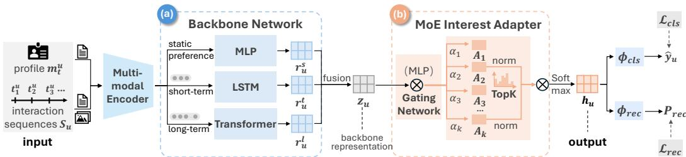
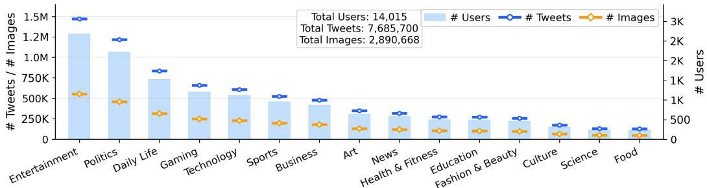

# Drift-Aware Multimodal User Representation Learning via Multi-Scale Temporal Modeling and Sparse Mixture-of-Experts

Ziqing Qian1 Haohang Chen1 Shengqi Dang1,2 Yuhan Xiong1 Canyu Shen1 Jiaying Lei1,2 Nan Cao1,2∗ 1Tongji University 2Shanghai Innovation Institute

## Abstract

Understanding user preferences from noisy and temporally evolving social media behaviors is fundamentally challenging due to interest drift, where user preferences shift across time and exhibit both multi-scale temporal patterns and diverse co-existing interests. To address this, we propose DUMoE, a unified framework for drift-aware multimodal user representation learning. Our model consists of (i) a temporal dynamics-aware backbone that captures and integrates static profiles, short-term behavioral signals, and long-term dependencies into a coherent representation, and (ii) a sparse mixture-of-experts (MoE) interest adapter that disentangles multiple latent interests via expert specialization and adaptive routing. Each expert models a distinct interest subspace, while a gating network dynamically selects and aggregates a sparse subset of relevant experts for each user. To enable stable and effective optimization, we further introduce a three-stage training strategy that decouples backbone learning, expert specialization, and gating optimization. Extensive experiments on real-world social media datasets show that DUMoE consistently outperforms state-of-the-art methods on both user interest prediction and interaction prediction tasks.

## 1 Introduction

Modeling user preferences is a fundamental problem in machine learning, underpinning applications such as recommendation, personalization, and information retrieval. A core challenge arises from interest drift, where user preferences evolve over time, exhibiting both long-term stability and shortterm dynamics, while simultaneously spanning multiple co-existing interests. Effectively capturing such multi-scale temporal dynamics and multi-interest structure is essential for learning adaptive and robust user representations.

Social media platforms (e.g., X) provide a continuous stream of multimodal user-generated data, including textual content, visual signals, and interaction behaviors, offering a valuable testbed for modeling fine-grained user preference evolution. However, effectively leveraging such data remains challenging due to (1) heterogeneous multimodal inputs, (2) the need to capture multi-scale temporal dynamics, and (3) data sparsity with irregular user activity. Existing user profiling methods typically rely on static representations [1, 2, 3] or coarse temporal modeling [4, 5, 6], limiting their ability to capture interest drift. Moreover, most approaches focus on single modalities, overlooking the complementary signals across modalities. Critically, prior work lacks a unified framework that jointly models multi-modal information, multi-scale temporal dynamics, and both explicit (interpretable) and implicit (latent) user preferences.

In this work, we propose DUMoE, a Drift-aware User Modeling framework with Mixture-Of-Experts. This technique learns hierarchical user representations by jointly modeling multimodal signals, multiscale temporal dynamics, and user interest structure within a unified architecture. We first encode heterogeneous user-generated content into a shared semantic space, enabling consistent cross-modal representations. On top of this, we decompose user preferences into two complementary components: (1) explicit preference distributions over predefined interest domains, and (2) latent representations that capture both short-term behavioral dynamics and long-term dependencies. Temporal evolution is modeled via a multi-scale design, combining sequential modeling of recent activities with global aggregation over historical interactions. To further capture diverse user intents, we introduce a multiinterest module based on sparse mixture-of-experts, which disentangles user interests into specialized subspaces through expert specialization and adaptive routing. Extensive experiments on real-world datasets demonstrate that our approach consistently outperforms strong baselines in modeling user preference dynamics and adapting to evolving interests. Our contributions are summarized as follows:

• Unified drift-aware user representation learning framework. We propose a unified framework that jointly models multimodal signals, multi-scale temporal dynamics, and both explicit and latent user preferences. The proposed backbone integrates static profiles, short-term behaviors, and long-term dependencies into a hierarchical representation, enabling effective modeling of evolving user interests.

• Sparse mixture-of-experts for multi-interest disentanglement. We introduce a sparse mixtureof-experts (MoE) interest adapter that decomposes user representations into specialized interest subspaces via expert specialization and adaptive routing. The design promotes disentangled, interpretable, and personalized multi-interest modeling.

• Large-scale temporally annotated multimodal dataset. We construct a large-scale dataset from X with chronologically evolving interest annotations, covering 15 domains with 14K+ users, 7.7M tweets, and 2.9M images, providing a realistic benchmark for modeling user interest drift.

## 2 Related Work

Multimodal Representation Learning. Modeling user behavior over social media requires representations that effectively integrate heterogeneous signals, particularly textual and visual content [7, 8]. Cross-modal alignment architectures such as VisualBERT [9] and ViLBERT [10] enable fine-grained modality interactions via region-level grounding. Contrastive frameworks including CLIP [11] and ALBEF [12] scale alignment to web-level data, and generative models such as Flamingo [13], BLIP 2 [14], and LLaVA [15] extend multimodal learning to complex reasoning. However, these models are designed for curated, domain-specific corpora rather than the noisy, temporally irregular, and user-attributed streams characteristic of social media—they produce instance-level representations with no mechanism to aggregate signals across a user’s evolving behavioral history.

Sequential User Behavior Modeling. Sequential modeling aims to capture temporal dynamics in user behavior, but existing approaches largely operate at the item level with limited semantic expressiveness. Early methods such as GRU4Rec [4] and Caser [5] model short-term dependencies using recurrent and convolutional architectures. Transformer-based models, including SASRec [1] and BERT4Rec [2], improve long-range dependency modeling via self-attention mechanisms. PTUM [6] further pre-trains user representations from unlabeled behavior sequences. Structural and contrastive enhancements are introduced in SR-GNN [16] and DuoRec [17], while UniSRec [18], VQ-Rec [19], and HM4SR [20] incorporate textual or multimodal item features. Yet these methods model behavior at the item level and largely neglect user-level multi-scale temporal dynamics, and open-domain interest drift.

User Interest Disentanglement. Single-vector representations fail to capture preference diversity [21], motivating multi-interest modeling. MIND [22] and ComiRec [23] extract multiple interest vectors via capsule routing and self-attention, while S3-Rec [24], DCCF [25], and SINE [26] improve disentanglement through mutual information, graph contrastive learning, and sparse prototypes, respectively. DisMIR [27] addresses interest collapse via spectral clustering, and HORAE [28] incorporates relative temporal intervals to track interest shifts over time. Despite this, interest subspaces are learned at a fixed snapshot: how their composition and relative salience drift as user behavior evolves over time remains unmodeled.

  
Figure 1: Algorithm Overview.

Summary. In summary, prior work has made substantial progress along three complementary directions: multimodal representation learning, sequential modeling, and interest disentanglement. However, these lines of research are largely developed in isolation. Existing multimodal methods overlook temporal dynamics, sequential models underutilize multimodal signals, and disentanglement approaches rarely consider both temporal evolution and heterogeneous content. To bridge these gaps, we propose a unified framework that jointly models multimodal signals, temporal dynamics, and multi-faceted user interests, enabling dynamic and expressive user representations for evolving socia media environments.

## 3 Problem Formulation

Given a set of users $u ,$ each user $u \in \mathcal { U }$ is associated with a profile $\mathbf { p } _ { u }$ and a chronologically ordered interaction sequence $ { \boldsymbol { S } } _ { u }$ . Our goal is to learn a mapping function

$$
f : ( S _ { u } , \mathbf { p } _ { u } ) \mapsto \mathbf { h } _ { u } \in \mathbb { R } ^ { d } ,\tag{1}
$$

where $\mathbf { h } _ { u }$ denotes the learned user representation that captures three key aspects of a user’s behavior: (1) interaction-level preference signals, (2) multi-scale temporal dependencies that reflect evolving behavioral dynamics, and (3) multi-interest structure across diverse user activities. Here, the interaction sequence $ { \boldsymbol { S } } _ { u }$ is formally defined as

$$
\mathcal { S } _ { u } = \{ ( m _ { 1 } ^ { u } , t _ { 1 } ^ { u } ) , ( m _ { 2 } ^ { u } , t _ { 2 } ^ { u } ) , \dots , ( m _ { n } ^ { u } , t _ { n } ^ { u } ) \} ,\tag{2}
$$

where $t _ { i } ^ { u }$ denotes the timestamp of the i-th interaction, with $t _ { 1 } ^ { u } < t _ { 2 } ^ { u } < \cdot \cdot \cdot < t _ { n } ^ { u }$ . Each $m _ { i } ^ { u } \in \mathcal { M }$ represents the multimodal content associated with the interaction $( \mathrm { e . g . }$ , posted or retweeted text/image content). The user profile $\mathbf { p } _ { u }$ consists of static attributes, including numerical features (e.g., follower counts) and textual descriptions (e.g., self-declared biography).

## 4 Methodology

In this section, we first present the proposed representation learning framework and then introduce the loss function and the stage-wise optimization strategy. Generally, the framework (Fig. 1) consists of two key components: a temporal dynamics-aware backbone network and a sparse mixtureof-experts (MoE) interest adapter. The backbone network (Fig. 1(a)) learns hierarchical user representations by capturing both short-term behavioral dynamics and long-term interaction dependencies. Built upon this representation, the MoE interest adapter (Fig. 1(b)) performs multi-interest disentanglement through expert specialization and adaptive routing, enabling dynamic preference modeling.

## 4.1 Temporal Dynamics-Aware Backbone Network

As shown in Fig. 1(a), the backbone network is designed to capture user preferences by jointly leveraging static profile information and the user’s temporally evolving interaction behaviors. The architecture consists of two main components:

Post and Profile Encoding. We first encode both user posts and profile information into a unified embedding space based on a multimodal encoder. Here, we adopt a pre-trained UNITE encoder [29] due to its strong capability in learning aligned text-image representations. For each user post $m _ { t } ^ { u }$

consisting of textual and visual content, we apply the encoder $\mathcal { E }$ to jointly encode both modalities into a post representation $\mathbf { e } _ { t } ^ { u }$

$$
\mathbf { e } _ { t } ^ { u } = \mathcal { E } ( m _ { t } ^ { u } )\tag{3}
$$

In addition, we also encode the heterogeneous attributes of a user profile $\mathbf { p } _ { u }$ separately: numerical features (e.g., follower count, age) are normalized via min–max scaling and projected into embeddings, while textual attributes (e.g., self-declared biography) are encoded using $\mathcal { E } .$ The final profile representation $\mathbf { a } _ { u }$ is constructed by concatenating all attribute embeddings.

Temporal Dynamic Preference Modeling. Next, to capture the diverse behavioral patterns exhibited by users in real-world social media environments, we model user preferences from three complementary temporal perspectives: (1) static preference signals, (2) short-term dynamic patterns, and (3) long-term interests. Accordingly, we extract three corresponding feature representations, denoted by $\mathbf { r } _ { u } ^ { s } , \mathbf { r } _ { u } ^ { t }$ , and $\mathbf { r } _ { u } ^ { l } .$ and integrate them into a unified user representation. These features are defined as

$$
\mathbf { r } _ { u } ^ { s } = \phi _ { s } ( \mathbf { a } _ { u } ) ,\tag{4}
$$

$$
\mathbf { r } _ { u } ^ { t } = \phi _ { t } ( \mathbf { S } _ { u } ^ { t } ) ,\tag{5}
$$

$$
\mathbf { r } _ { u } ^ { l } = \phi _ { l } ( \mathbf { S } _ { u } ^ { l } ) ,\tag{6}
$$

where $\phi _ { s } ( \cdot )$ is a two-layer MLP that encodes the static profile feature $\mathbf { a } _ { u } ; \phi _ { t } ( \cdot )$ is an LSTM that processes the short-term interaction sequence $\mathbf { S } _ { u } ^ { t }$ to capture recent behavioral dynamics; and $\phi _ { l } ( \cdot )$ is a Transformer encoder that models long-range dependency patterns over the long-term interaction sequence $\mathbf { S } _ { u } ^ { l }$ . The short-term and long-term sequences are defined as

$$
\mathbf { S } _ { u } ^ { t } = \{ \mathbf { e } _ { i } ^ { u } \ | \ i = T _ { u } - L _ { t } + 1 , \ldots , T _ { u } \} ,\tag{7}
$$

$$
\mathbf { S } _ { u } ^ { l } = \{ \mathbf { e } _ { i } ^ { u } \ | \ i = T _ { u } - L _ { l } + 1 , \ldots , T _ { u } \} ,\tag{8}
$$

where $L _ { t }$ and $L _ { l }$ denote the lengths of the short-term and long-term windows, respectively, with $L _ { t } < < L _ { l }$ , and $T _ { u }$ is the current time step for user u.

Finally, we fuse the three features through direct sum followed by nonlinear projection:

$$
\mathbf { z } _ { u } = \phi _ { f } \left( \mathbf { r } _ { u } ^ { s } \oplus \mathbf { r } _ { u } ^ { t } \oplus \mathbf { r } _ { u } ^ { l } \right) ,\tag{9}
$$

where $\oplus$ denotes the direct sum (concatenation) operation, and $\phi _ { f } ( \cdot )$ is an MLP that integrates the three components into a unified backbone representation $\mathbf { z } _ { u }$

## 4.2 Mixture-of-Experts Interest Adapter

To capture multiple latent interests underlying diverse user behaviors, we introduce a sparse Mixtureof-Experts (MoE) interest adapter. The module consists of a set of lightweight expert networks and an adaptive gating mechanism. Each expert is implemented as an adapter module that specializes in modeling a distinct latent interest subspace, enabling multi-interest disentanglement. The gating network learns a user-specific routing distribution over experts, dynamically selecting a sparse subset of relevant experts for each user. The final user representation is obtained via a gated aggregation of expert outputs:

$$
\mathbf { h } _ { u } = \sum _ { k = 1 } ^ { K } \alpha _ { u , k } \mathcal { A } _ { k } ( \mathbf { z } _ { u } ) ,\tag{10}
$$

where K denotes the number of experts, $\mathcal { A } _ { k } ( \cdot )$ is the k-th interest expert, and $\alpha _ { u , k }$ is the gating weight for user $u .$ The gating weights satisfy $\begin{array} { r } { \sum _ { k = 1 } ^ { K } \alpha _ { u , k } = 1 } \end{array}$ . In practice, we employ sparse routing, where only a subset of experts receives non-zero weights. Next, We detail the expert design and gating mechanism below.

Interest Expert. Each expert is implemented as a lightweight adapter that transforms the shared backbone representation $\mathbf { z } _ { u } .$ . Specifically, the k-th expert is defined as

$$
\begin{array} { r } { \mathcal { A } _ { k } ( \mathbf { z } _ { u } ) = \mathbf { z } _ { u } + \phi _ { k } ( \mathbf { z } _ { u } ) , } \end{array}\tag{11}
$$

where $\phi _ { k } ( \cdot )$ is a multi-layer perceptron (MLP) that models interest-specific transformations. The residual formulation allows each expert to capture an interest-specific deviation from the shared representation, ensuring that all experts remain anchored in a common semantic space while enabling specialization across distinct interest dimensions.

Gating Weight. To mitigate interference across interest subspaces and encourage expert specialization, we adopt a sparse top- $. K ^ { \prime }$ routing mechanism. The gating weights are defined as

$$
\alpha _ { u , k } = \left\{ \begin{array} { l l } { \displaystyle \frac { \tilde { \alpha } _ { u , k } } { \sum _ { k ^ { \prime } \in \mathcal { K } _ { u } } \tilde { \alpha } _ { u , k ^ { \prime } } } } & { k \in \mathcal { K } _ { u } } \\ { 0 } & { k \notin \mathcal { K } _ { u } } \end{array} \right.\tag{12}
$$

where $\kappa _ { u }$ contains the indices of the top- $K ^ { \prime }$ experts selected from the routing scores $\tilde { \alpha } _ { u } .$ . This design enforces sparse activation, allowing each user to be represented by a small subset of dominant interests, thereby improving both efficiency and interpretability. The routing scores are computed as

$$
\tilde { \alpha } _ { u } = \mathrm { s o f t m a x } ( \mathbf { W } _ { g } \mathbf { z } _ { u } + \mathbf { b } _ { g } ) ,\tag{13}
$$

where $\mathbf { W } _ { g }$ and ${ \bf b } _ { g }$ are learnable parameters.

## 4.3 Learning Objective and Training Procedure

To enable the learned representation to understand user preferences and behaviors, we employ a supervised learning approach to learn the representation. We use two learning objectives: (1) interest classification and (2) interaction prediction. The overall training objective is a sum of the two loss terms for each task, corresponding to the two tasks respectively:

$$
\mathcal { L } = \mathcal { L } _ { \mathrm { c l s } } + \lambda \mathcal { L } _ { \mathrm { r e c } }\tag{14}
$$

where $\mathcal { L } _ { \mathrm { c l s } }$ is the interest classification loss, $\mathcal { L } _ { \mathrm { r e c } }$ is the interaction prediction loss, and λ is a weight balances the two parts.

Interest Classification. The learning objective for interest classification minimizes a class-weighted focal loss between the ground-truth interest label $y _ { u }$ and the prediction $\phi _ { \mathrm { c l s } } ( \mathbf { h } _ { u } )$ :

$$
\mathcal { L } _ { \mathrm { c l s } } = - \frac { 1 } { B _ { \mathrm { c l s } } } \sum _ { i = 1 } ^ { B _ { \mathrm { c l s } } } w _ { y _ { i } } ( 1 - p _ { y _ { i } } ) ^ { \gamma } \log p _ { y _ { i } }\tag{15}
$$

Here, $p _ { y _ { i } } = \phi _ { \mathrm { c l s } } ( \mathbf { h } _ { u } ) _ { y _ { i } }$ denotes the predicted probability of the ground-truth class, where i indexes users in a mini-batch. $B _ { \mathrm { c l s } }$ is the batch size of users for the classification task. $w _ { y _ { i } }$ is the inversefrequency class weight for handling class imbalance, and $\gamma = 2$ is the focusing parameter. $\phi _ { \mathrm { c l s } } ( \cdot )$ is implemented as softmax $( \mathbf { W } _ { \mathrm { o u t } } \mathbf { h } _ { u } \mathbf { \bar { + } } \mathbf { b } _ { \mathrm { o u t } } )$ with learnable parameters $\mathbf { W } _ { \mathrm { o u t } } , \mathbf { b } _ { \mathrm { o u t } } ,$ and $y _ { u }$ is assigned from the C predefined interest categories based on the user’s interaction history.

Interaction Prediction. For interaction prediction, we aim to learn user representations such that the representation of a user is similar to the representation of the next post they actually interact with (e.g., a post or repost), and dissimilar to randomly sampled negative posts. To achieve this, we adopt a negative sampling approach with binary cross-entropy (BCE) loss, which encourages high inner products for positive pairs and low inner products for negative pairs, defined as:

$$
\mathcal { L } _ { \mathrm { r e c } } = - \frac { 1 } { B _ { \mathrm { r e c } } } \sum _ { i = 1 } ^ { B _ { \mathrm { r e c } } } \left[ \log \sigma ( s _ { i } ^ { + } ) + \frac { 1 } { K } \sum _ { k = 1 } ^ { K } \log \sigma ( - s _ { i k } ^ { - } ) \right]\tag{16}
$$

where $\sigma ( \cdot )$ is the sigmoid function, $\boldsymbol { B } _ { \mathrm { r e c } }$ is the mini-batch size consisting of users who have interaction samples, and K denotes the number of negative samples per user. For each user i in this batch, $\mathbf { h } _ { u }$ denotes the representation of user i, and $s _ { i } ^ {  } = \phi _ { \mathrm { r e c } } ( \dot { \bf h } _ { u } ^ {  } ) ^ { \top } \dot { \bf v } _ { i } ^ { + }$ is the inner product between the user’s projected representation $\phi _ { \mathrm { r e c } } ( \mathbf { h } _ { u } )$ and the positive post embedding $\mathbf { v } _ { i } ^ { + }$ (the ground-truth next post). Here, $\phi _ { \mathrm { r e c } }$ is implemented as an MLP. Similarly, $s _ { i k } ^ { - } = \phi _ { \mathrm { r e c } } ( \mathbf { h } _ { u } ) ^ { \top } \mathbf { v } _ { i k } ^ { - }$ is the inner product with the k-th negative post embedding, where $\{ \mathbf { v } _ { i k } ^ { - } \} _ { k = 1 } ^ { K }$ are sampled negative posts for user i.

Training Strategy. We adopt a three-stage optimization procedure to stabilize training and promote expert specialization: (1) backbone pre-training, (2) expert specialization, and (3) gating optimization. The prediction heads $\phi _ { \mathrm { c l s } }$ and $\phi _ { \mathrm { r e c } }$ are jointly optimized across all stages. Stage 1: Backbone Pre-training. We train the backbone network together with the prediction heads, while removing the MoE adapter. The user representation is directly taken as $\mathbf { h } _ { u } = \mathbf { z } _ { u }$ . This stage learns a strong and discriminative shared representation. Stage 2: Expert Specialization. We freeze the backbone and train each expert independently using users whose dominant interest label matches the expert index. This encourages each expert to capture a distinct interest subspace. After this stage, the expert pool $\{ \mathcal { A } _ { 1 } , . . . , \mathcal { A } _ { K } \}$ consists of specialized and fixed experts. Stage 3: Gating Optimization. We freeze both the backbone and the experts, and train only the gating network parameters $( \mathbf { W } _ { g } , \mathbf { b } _ { g } )$ allowing it to learn a stable user-specific routing distribution over the specialized experts.

Inference. At inference time, the full model is applied end-to-end. The backbone and adapter representations are further combined via a KL-based gating signal (see Appendix ?? for details).

This stage-wise design decouples representation learning, expert specialization, and routing optimization, resulting in improved stability, clearer expert roles, and more reliable personalized routing.

## 5 Experiments

To evaluate the effectiveness of the proposed techinque, we first introduce a large-scale multimodal dataset collected from X (detailed in Section 5.1). Based on this dataset, we detail the experimental settings and conduct comprehensive experiments on two downstream tasks: (1) user interest classifica tion and (2) social interaction prediction, to assess the quality and utility of the learned representations. Finally, we present ablation studies to analyze the contribution of each key component.

  
Figure 2: Data distribution across different interest domains.

## 5.1 Dataset Construction

We construct a large-scale multimodal social interaction dataset from X (twitter) to support drift-aware user modeling. As shown in Fig. 2, the dataset includes user profiles, interaction behaviors (posts and reposts), multimodal content, and timestamps, covering 15 high-level interest domains with diverse topical distributions. For each domain, active users are first identified followed by collecting their historical interactions, including textual posts, associated images, and profile metadata. Overall, the dataset comprises 14,015 users, 7,685,700 posts, and 2,890,668 images.

Based on the collected dataset, we construct training samples via a three-step procedure: (1) Temporal segmentation. For each user, interactions are chronologically ordered and partitioned into nonoverlapping collections, each containing 30 posts. (2) Pseudo-label annotation. For each target collection, we assign an interest label from 15 predefined domains using GPT-5.1. The annotation is conditioned on the content of the target collection and up to 2 preceding collections as historical context. This design incorporates temporal dependencies to better capture interest drift and improve label consistency. (3) Quality verification. To assess annotation quality, we manually inspect a randomly sampled subset of labeled collections. The results indicate that the generated labels are largely consistent with human judgments.

## 5.2 Experimental settings

Baselines. We compare our method with representative baselines from three categories, covering key paradigms in user modeling: sequential recommendation, multi-interest modeling, and contentaware representation learning.

• Sequential recommendation. We include three representative baselines for modeling user behavior from interaction sequences. SASRec [1] uses causal self-attention to model sequential dependencies. BERT4Rec [2] employs a masked language modeling objective for bidirectional sequence modeling. PTUM [6] incorporates self-supervised learning signals, including masked behavior and next-item prediction.

• Multi-interest modeling. We include two representative baselines that explicitly model multiple user interests. MIND [22] employs capsule-based dynamic routing to extract latent interest representations from behavior sequences. HORAE [28] combines temporal-aware pre-training with explicit interest decomposition to capture temporal dynamics and multi-interest structures.

• Content-aware representation learning. We include two representative baselines that incorporate auxiliary content information into user modeling. PeterRec [3] adopts a pre-training and fine-tuning paradigm to learn transferable user representations from behavioral data. UniS-Rec [18] integrates textual content with Mixture-of-Experts adapters to learn unified sequential representations across domains.

Metrics. For user interest classification, we evaluate performance using macro Recall, Hit@1, NDCG@3, and KL divergence. Hit@1 reflects top-1 prediction accuracy, while NDCG@3 captures the quality of ranked predictions with higher emphasis on top positions. KL divergence measures the alignment between the predicted distribution and the label-smoothed ground-truth distribution. For interaction prediction, we report Accuracy (Acc), Recall, F1 score, and binary cross-entropy (BCE), providing both classification-based and probabilistic evaluation of model performance.

Implementation details. The backbone network is trained using the proposed three-stage strategy with a batch size of 128. After the pre-training stage, its parameters are frozen for subsequent optimization. The dataset is split chronologically at the usercollection level, with each user’s 12 collections allocated as 8 for training, 2 for validation, and 2 for testing.

## 5.3 Experiment I: User Interest Classification

This experiment aims to evaluate the quality of learned user representations by measuring how accurately they predict users’ interest categories. We implement all baselines using their publicly available code or official reproductions, following the same data splits and evaluation protocol for fair comparison.

Table 1: Interest classification performance. ↑ / ↓ indicates higher/lower is better.
<table><tr><td>Method</td><td>Hit@1↑</td><td>NDCG@3↑</td><td>Recall ↑</td><td>KL Divergence ↓</td></tr><tr><td>SASRec</td><td>0.788</td><td>0.883</td><td>0.723</td><td>0.584</td></tr><tr><td>BERT4Rec</td><td>0.776</td><td>0.879</td><td>0.707</td><td>0.568</td></tr><tr><td>PTUM</td><td>0.811</td><td>0.900</td><td>0.757</td><td>0.482</td></tr><tr><td>MIND</td><td>0.821</td><td>0.904</td><td>0.763</td><td>0.471</td></tr><tr><td>HORAE</td><td>0.807</td><td>0.897</td><td>0.746</td><td>0.506</td></tr><tr><td>PeterRec</td><td>0.786</td><td>0.885</td><td>0.714</td><td>0.532</td></tr><tr><td>UniSRec</td><td>0.767</td><td>0.873</td><td>0.689</td><td>0.595</td></tr><tr><td>DUMoE</td><td>0.872</td><td>0.940</td><td>0.856</td><td>0.323</td></tr></table>

As shown in Table 1, DUMoE consistently outperforms all baselines across all evaluation metrics. It achieves a Hit@1 of 0.872, a Recall of 0.856, and an NDCG@3 of 0.940, demonstrating its effectiveness in accurately identifying the most relevant target while maintaining strong ranking quality. The substantial improvement in Recall further indicates that our method captures a broader set of relevant candidates, which is critical in recommendation scenarios with diverse user preferences. Compared to the strongest baselines MIND and PTUM, our method improves Hit@1 by approximately 6.2% and 7.5%, respectively, and yields a notable gain in Recall (+12.2% over MIND). Relative to HORAE, which explicitly models multi-interest representations, our approach achieves an 8.1% improvement in Hit@1, highlighting its advantage in learning more precise and comprehensive user representations. In contrast, purely sequential models such as SASRec and BERT4Rec lag significantly behind (e.g., 10.7% lower Hit@1 for SASRec), suggesting that sequence-only modeling without explicit disentanglement struggles to capture complex user behaviors.

Moreover, DUMoE achieves the lowest KL divergence of 0.323, substantially below all baselines and corresponding to a 31.4% reduction over the second-best method MIND (0.471), indicating significantly better calibration of the predicted interest distribution. Most competing methods exhibit KL values in the range of 0.47–0.60, reflecting notable distributional mismatch even when ranking performance is relatively strong. The superior NDCG@3 further confirms that our method not only identifies the correct target but also ranks relevant items more effectively at top positions. Collectively, these results demonstrate that our framework achieves both strong ranking performance and improved distributional alignment, validating the effectiveness of the proposed representation learning strategy.

## 5.4 Experiment II: User Interaction Prediction

This experiment evaluates the model’s ability to predict future user interactions. Given a chronological sequence of behavioral windows for a user, we use the representation derived from our method to predict items in the subsequent window. We adopt the same lightweight prediction head and training protocol for all baselines to ensure fair comparison. For further details, please refer to the Appendix.

Table 2 summarizes the results. DUMoE achieves the best overall performance in ranking-oriented metrics, obtaining a Recall of 0.926 and an F1 of 0.888, clearly outperforming all baselines. In particular, it surpasses the strongest baseline PeterRec (Recall: 0.894, F1: 0.885) with a notable improvement, and also consistently outperforms PTUM and HORAE in both metrics, demonstrating stronger capability in retrieving future positive interactions. In terms of Accuracy, DUMoE achieves 0.883, which is comparable to PTUM (0.886) and MIND (0.884), and on par with PeterRec (0.883), indicating competitive classification performance despite prioritizing retrieval quality. For BCE (lower is better), our method achieves 0.276, matching the best-performing baselines (e.g., PTUM at 0.274 and MIND at 0.277), suggesting that the model maintains strong probability calibration while improving ranking performance. These results confirm that our temporal dynamics-aware backbone combined with the MoE interest adapter produces superior user representations for predicting future interactions, particularly in terms of retrieval effectiveness and ranking quality.

Table 2: Interaction prediction performance. ↑ / ↓ indicates higher/lower is better.
<table><tr><td rowspan=1 colspan=5>Method     Acc ↑  Recall ↑  F1↑  BCE↓</td></tr><tr><td rowspan=1 colspan=1>SASRec</td><td rowspan=1 colspan=1>0.873</td><td rowspan=1 colspan=1>0.877</td><td rowspan=1 colspan=1>0.874</td><td rowspan=1 colspan=1>0.302</td></tr><tr><td rowspan=1 colspan=1>BERT4Rec</td><td rowspan=1 colspan=1>0.877</td><td rowspan=1 colspan=1>0.884</td><td rowspan=1 colspan=1>0.878</td><td rowspan=1 colspan=1>0.294</td></tr><tr><td rowspan=1 colspan=1>PTUM</td><td rowspan=1 colspan=1>0.886</td><td rowspan=1 colspan=1>0.887</td><td rowspan=1 colspan=1>0.886</td><td rowspan=1 colspan=1>0.274</td></tr><tr><td rowspan=1 colspan=1>MIND</td><td rowspan=1 colspan=1>0.884</td><td rowspan=1 colspan=1>0.884</td><td rowspan=1 colspan=1>0.884</td><td rowspan=1 colspan=1>0.277</td></tr><tr><td rowspan=1 colspan=1>HORAE</td><td rowspan=1 colspan=1>0.882</td><td rowspan=1 colspan=1>0.888</td><td rowspan=1 colspan=1>0.883</td><td rowspan=1 colspan=1>0.281</td></tr><tr><td rowspan=1 colspan=1>PeterRec</td><td rowspan=1 colspan=1>0.883</td><td rowspan=1 colspan=1>0.894</td><td rowspan=1 colspan=1>0.885</td><td rowspan=1 colspan=1>0.279</td></tr><tr><td rowspan=1 colspan=1>UniSRec</td><td rowspan=1 colspan=1>0.875</td><td rowspan=1 colspan=1>0.883</td><td rowspan=1 colspan=1>0.876</td><td rowspan=1 colspan=1>0.297</td></tr><tr><td rowspan=1 colspan=1>DUMoE</td><td rowspan=1 colspan=1>0.883</td><td rowspan=1 colspan=1>0.926</td><td rowspan=1 colspan=1>0.888</td><td rowspan=1 colspan=1>0.276</td></tr></table>

## 5.5 Ablation Study

We perform ablation experiments on downstream tasks using the same evaluation protocol (Table 3). We study the effect of key components, including (1) backbone, (2) mixture-of-experts interest adapter, and (3) the training strategy and objective.

Backbone Network. The backbone ablations (Static Only, Short-term Only, Long-term Only) reveal that each temporal branch contributes meaningfully to the final performance. Among singlebranch variants, Long-term Only achieves the highest Hit@1 (0.862) but still trails the full model by 1.1%, while Short-term Only (0.805) and Static Only (0.774) lag further behind, confirming that dynamic temporal information is essential for accurate interest profiling.

Mixture-of-Experts Interest Adapter. Removing the adapter pool (w/o Adapter) drops Hit@1 by 1.6% (0.858) and raises BCE to 0.329, while replacing sparse gating with uniform averaging (w/o Gating) similarly degrades performance (Hit@1: 0.864, BCE: 0.326), as indiscriminate expert activation dilutes interest signals. Both variants underperform the full model on interaction prediction (Acc: 0.858 vs. 0.883), validating that both the adapter pool and adaptive routing are essential for capturing diverse user interests.

Table 3: Ablation study on downstream tasks. ↑/↓ indicates higher/lower is better.
<table><tr><td rowspan="2">Variant</td><td colspan="4">Interest Classification</td><td colspan="4">Interaction Prediction</td></tr><tr><td>Hit@1↑</td><td>NDCG@3↑</td><td>Recall ↑</td><td>KL↓</td><td>Acc ↑</td><td>Recall ↑</td><td>F1↑</td><td>BCE↓</td></tr><tr><td>w/o Adapter</td><td>0.858</td><td>0.933</td><td>0.810</td><td>0.340</td><td>0.858</td><td>0.903</td><td>0.864</td><td>0.329</td></tr><tr><td>w/o Gating</td><td>0.864</td><td>0.934</td><td>0.827</td><td>0.333</td><td>0.858</td><td>0.907</td><td>0.865</td><td>0.326</td></tr><tr><td>w/o Stage-wise Training</td><td>0.865</td><td>0.936</td><td>0.846</td><td>0.341</td><td>0.873</td><td>0.910</td><td>0.877</td><td>0.294</td></tr><tr><td>Static Only</td><td>0.774</td><td>0.875</td><td>0.728</td><td>0.577</td><td>0.807</td><td>0.869</td><td>0.818</td><td>0.409</td></tr><tr><td>Short-term Only</td><td>0.805</td><td>0.894</td><td>0.738</td><td>0.485</td><td>0.846</td><td>0.859</td><td>0.848</td><td>0.350</td></tr><tr><td>Long-term Only</td><td>0.862</td><td>0.934</td><td>0.829</td><td>0.345</td><td>0.864</td><td>0.881</td><td>0.866</td><td>0.313</td></tr><tr><td> ${ \mathcal { L } } _ { \mathrm { c l s } }$  Only</td><td>0.870</td><td>0.936</td><td>0.848</td><td>0.325</td><td>0.799</td><td>0.844</td><td>0.807</td><td>0.437</td></tr><tr><td> ${ \mathcal { L } } _ { \mathrm { r e c } }$  Only</td><td>0.798</td><td>0.897</td><td>0.719</td><td>0.473</td><td>0.869</td><td>0.884</td><td>0.871</td><td>0.303</td></tr><tr><td>Full model</td><td>0.872</td><td>0.940</td><td>0.856</td><td>0.323</td><td>0.883</td><td>0.926</td><td>0.888</td><td>0.276</td></tr></table>

Training Strategy and Objective. Disabling the stage-wise training strategy (w/o Stage-wise Training) causes a moderate performance drop (Hit@1: 0.865, KL: 0.341), confirming that jointly optimizing all components from scratch leads to instability in distribution alignment, while our three-stage approach effectively decouples the learning dynamics and yields stable convergence. Regarding the training objective, $\mathcal { L } _ { \mathrm { c l s } }$ alone drives discriminative interest identification (Hit@1: 0.870, KL: 0.325) but substantially degrades interaction prediction (Acc: 0.799, BCE: 0.437); conversely, $\mathcal { L } _ { \mathrm { r e c } }$ alone yields competitive interaction prediction (Acc: 0.869, BCE: 0.303) but underperforms on interest classification (Hit@1: 0.798, KL: 0.473), as reconstruction supervision alone lacks the discriminative signal for accurate interest identification.

## 5.6 Discussion

While our framework demonstrates strong performance on user interest classification and interaction prediction, several limitations warrant discussion. First, pseudo-label generation relies on GPT-5.1 with contextual signals derived from adjacent behavioral windows. Although this design improves temporal consistency, label quality may still be affected by annotation noise or domain-specific biases inherent to the language model. Future work could explore semi-supervised or self-supervised alternatives to reduce dependence on external supervision. Second, the multi-scale backbone adopts fixed window lengths for short-term (LSTM) and long-term (Transformer) modeling. In practice, optimal temporal granularity likely varies across users depending on their activity patterns and engagement frequency. Adaptive window selection mechanisms could provide finer-grained personalization in such heterogeneous settings. Third, the MoE interest adapter employs a fixed number of experts with static top- $. K ^ { \prime }$ routing. While effective, the optimal number of activated experts may differ substantially across users with varying behavioral diversity. Dynamic expert allocation conditioned on user-level complexity is a promising direction for further improving adaptability. Finally, the current framework operates in an offline training regime. Although our three-stage training strategy promotes stable optimization, online continual learning with efficient incremental updates remains an open challenge. Incorporating lightweight adaptation mechanisms to handle real-time interest drift would be valuable for production-scale deployment. Addressing these limitations in future work can further enhance the robustness, efficiency, and generalizability of dynamic user profiling.

## 6 Conclusion

In this paper, we proposed a dynamic user profiling framework that jointly models explicit and implicit preferences across multiple temporal scales. Our approach features a multi-scale backbone fusing static, short-term, and long-term features, a Mixture-of-Experts interest adapter with sparse routing for multi-interest decomposition, and a three-stage training strategy that ensures stable specialization. We also contributed a large-scale multimodal dataset from X with temporally evolved interest labels. Extensive experiments on user interest classification and interaction prediction demonstrated that our method consistently outperforms strong baselines. Ablation studies validated the contribution of each key component. Future work includes extending the framework to more fine-grained temporal dynamics and exploring online adaptation scenarios. Our code and dataset will be made publicly available under the privacy policy to facilitate reproducibility.

## References

[1] Wang-Cheng Kang and Julian McAuley. Self-attentive sequential recommendation. In 2018 IEEE international conference on data mining (ICDM), pages 197–206. IEEE, 2018.

[2] Fei Sun, Jun Liu, Jian Wu, Changhua Pei, Xiao Lin, Wenwu Ou, and Peng Jiang. Bert4rec: Sequential recommendation with bidirectional encoder representations from transformer. In Proceedings of the 28th ACM international conference on information and knowledge management, pages 1441–1450, 2019.

[3] Fajie Yuan, Xiangnan He, Alexandros Karatzoglou, and Liguang Zhang. Parameter-efficient transfer from sequential behaviors for user modeling and recommendation. In Proceedings of the 43rd International ACM SIGIR conference on research and development in Information Retrieval, pages 1469–1478, 2020.

[4] Balázs Hidasi, Alexandros Karatzoglou, Linas Baltrunas, and Domonkos Tikk. Session-based recommendations with recurrent neural networks. arXiv preprint arXiv:1511.06939, 2015.

[5] Jiaxi Tang and Ke Wang. Personalized top-n sequential recommendation via convolutional sequence embedding. In Proceedings of the eleventh ACM international conference on web search and data mining, pages 565–573, 2018.

[6] Chuhan Wu, Fangzhao Wu, Tao Qi, Jianxun Lian, Yongfeng Huang, and Xing Xie. Ptum: Pre-training user model from unlabeled user behaviors via self-supervision. In Findings of the Association for Computational Linguistics: EMNLP 2020, pages 1939–1944, 2020.

[7] Erasmo Purificato, Ludovico Boratto, and Ernesto William De Luca. User modeling and user profiling: A comprehensive survey. arXiv preprint arXiv:2402.09660, 2024.

[8] Christopher Ifeanyi Eke, Azah Anir Norman, Liyana Shuib, and Henry Friday Nweke. A survey of user profiling: State-of-the-art, challenges, and solutions. IEEE Access, 7:144907–144924, 2019.

[9] Liunian Harold Li, Mark Yatskar, Da Yin, Cho-Jui Hsieh, and Kai-Wei Chang. Visualbert: A simple and performant baseline for vision and language. arXiv preprint arXiv:1908.03557, 2019.

[10] Jiasen Lu, Dhruv Batra, Devi Parikh, and Stefan Lee. Vilbert: Pretraining task-agnostic visiolinguistic representations for vision-and-language tasks. Advances in neural information processing systems, 32, 2019.

[11] Alec Radford, Jong Wook Kim, Chris Hallacy, Aditya Ramesh, Gabriel Goh, Sandhini Agarwal, Girish Sastry, Amanda Askell, Pamela Mishkin, Jack Clark, et al. Learning transferable visual models from natural language supervision. In International conference on machine learning, pages 8748–8763. PMLR, 2021.

[12] Junnan Li, Ramprasaath Selvaraju, Akhilesh Gotmare, Shafiq Joty, Caiming Xiong, and Steven Chu Hong Hoi. Align before fuse: Vision and language representation learning with momentum distillation. Advances in neural information processing systems, 34:9694–9705, 2021.

[13] Jean-Baptiste Alayrac, Jeff Donahue, Pauline Luc, Antoine Miech, Iain Barr, Yana Hasson, Karel Lenc, Arthur Mensch, Katherine Millican, Malcolm Reynolds, et al. Flamingo: a visual language model for few-shot learning. Advances in neural information processing systems, 35:23716–23736, 2022.

[14] Junnan Li, Dongxu Li, Silvio Savarese, and Steven Hoi. Blip-2: Bootstrapping language-image pre-training with frozen image encoders and large language models. In International conference on machine learning, pages 19730–19742. PMLR, 2023.

[15] Haotian Liu, Chunyuan Li, Qingyang Wu, and Yong Jae Lee. Visual instruction tuning. Advances in neural information processing systems, 36:34892–34916, 2023.

[16] Shu Wu, Yuyuan Tang, Yanqiao Zhu, Liang Wang, Xing Xie, and Tieniu Tan. Session-based recommendation with graph neural networks. In Proceedings of the AAAI conference on artificial intelligence, volume 33, pages 346–353, 2019.

[17] Ruihong Qiu, Zi Huang, Hongzhi Yin, and Zijian Wang. Contrastive learning for representation degeneration problem in sequential recommendation. In Proceedings of the fifteenth ACM international conference on web search and data mining, pages 813–823, 2022.

[18] Yupeng Hou, Shanlei Mu, Wayne Xin Zhao, Yaliang Li, Bolin Ding, and Ji-Rong Wen. Towards universal sequence representation learning for recommender systems. In Proceedings of the 28th ACM SIGKDD conference on knowledge discovery and data mining, pages 585–593, 2022.

[19] Yupeng Hou, Zhankui He, Julian McAuley, and Wayne Xin Zhao. Learning vector-quantized item representation for transferable sequential recommenders. In Proceedings of the ACM Web Conference 2023, pages 1162–1171, 2023.

[20] Shengzhe Zhang, Liyi Chen, Dazhong Shen, Chao Wang, and Hui Xiong. Hierarchical timeaware mixture of experts for multi-modal sequential recommendation. In Proceedings ofthe ACM on Web Conference 2025, pages 3672–3682, 2025.

[21] Minyar Sassi Hidri. Learning-based models for building user profiles for personalized information access. arXiv preprint arXiv:2405.15791, 2024.

[22] Chao Li, Zhiyuan Liu, Mengmeng Wu, Yuchi Xu, Huan Zhao, Pipei Huang, Guoliang Kang, Qiwei Chen, Wei Li, and Dik Lun Lee. Multi-interest network with dynamic routing for recommendation at tmall. In Proceedings ofthe 28th ACM international conference on information and knowledge management, pages 2615–2623, 2019.

[23] Yukuo Cen, Jianwei Zhang, Xu Zou, Chang Zhou, Hongxia Yang, and Jie Tang. Controllable multi-interest framework for recommendation. In Proceedings of the 26th ACM SIGKDD international conference on knowledge discovery & data mining, pages 2942–2951, 2020.

[24] Kun Zhou, Hui Wang, Wayne Xin Zhao, Yutao Zhu, Sirui Wang, Fuzheng Zhang, Zhongyuan Wang, and Ji-Rong Wen. S3-rec: Self-supervised learning for sequential recommendation with mutual information maximization. In Proceedings ofthe 29th ACM international conference on information & knowledge management, pages 1893–1902, 2020.

[25] Xubin Ren, Lianghao Xia, Jiashu Zhao, Dawei Yin, and Chao Huang. Disentangled contrastive collaborative filtering. In Proceedings of the 46th international ACM SIGIR conference on research and development in information retrieval, pages 1137–1146, 2023.

[26] Qiaoyu Tan, Jianwei Zhang, Jiangchao Yao, Ninghao Liu, Jingren Zhou, Hongxia Yang, and Xia Hu. Sparse-interest network for sequential recommendation. In Proceedings of the 14th ACM international conference on web search and data mining, pages 598–606, 2021.

[27] Yingpeng Du, Ziyan Wang, Zhu Sun, Yining Ma, Hongzhi Liu, and Jie Zhang. Disentangled multi-interest representation learning for sequential recommendation. In Proceedings of the 30th ACM SIGKDD conference on knowledge discovery and data mining, pages 677–688, 2024.

[28] Shirui Hu, Weichang Wu, Zuoli Tang, Zhaoxin Huan, Lin Wang, Xiaolu Zhang, Jun Zhou, Lixin Zou, and Chenliang Li. Horae: Temporal multi-interest pre-training for sequential recommendation. ACM Transactions on Information Systems, 43(4):1–29, 2025.

[29] Fanheng Kong, Jingyuan Zhang, Yahui Liu, Hongzhi Zhang, Shi Feng, Xiaocui Yang, Daling Wang, Yu Tian, Fuzheng Zhang, Guorui Zhou, et al. Modality curation: Building universal embeddings for advanced multimodal information retrieval. arXiv preprint arXiv:2505.19650, 2025.