# Eficient Estimation of High Information Projections using Nearest Neighbours

David Hofmeyr

School of Mathematical Sciences, Lancaster University

## Abstract

An intuitive method for dimensionality reduction is proposed, which is highly effective for finding interesting projections of multivariate data. Following similar intuitive motivation to a number of existing techniques, the proposed method is based on enhancing the nearest neighbour relationships in the data. The proposed projection arises from the spectral decomposition of a matrix designed to encode the local covariance structure in the data, where the local covariance at a point is captured by pairs of its nearest neighbours. We show that under standard regularity conditions this matrix is a consistent estimator of the so-called “Density Information Matrix” (DIM); a non-parametric analogue of the Fisher Information Matrix. Spectral decompositions of DIMs have been shown to be connected with the important problems of Independent Components Analysis and, in the supervised context, Suficient Dimension Reduction. However, existing estimators of the DIM are computationally expensive to compute and only target the DIM of a surrogate density, which is proportional to the square of the true underlying density. In addition, we go on to explore the practical utility of our method in aiding the downstream tasks of cluster analysis and outlier detection.

Keywords: Dimension Reduction; Fisher Information; Entropy; Cluster Analysis; Outlier Detection

## 1 Introduction

At a high level the task of dimension reduction is to extract from a set of multivariate observations, a reduced representation which retains as well as possible the useful information/structure in the data. Structure may be represented at a global level, as in the ubiquitous Principal Components Analysis and its variants (Jollife and Cadima, 2016, PCA); or at a more local level, e.g. as in those methods based on manifold learning, which typically rely on a graph-based representation of the data (He and

Niyogi, 2003). Another perspective on the problem is to operate at the level of the probability distribution of the reduced representation, where (after accounting for scale) low entropy distributions are seen to contain more interesting structure than high entropy ones (Hyv¨arinen, 1997), with both multimodality and long-tailedness being associated with low entropy.

In this paper we introduce a simple and intuitive linear dimensionality reduction technique which is based on enhancing the local structure in a set of data. Although similar in some respects to those based on a nearest neighbour graph constructed from the data, we take our motivation more from the information/entropy perspective. In particular, let $\mathcal { X } : = \{ \mathbf { x } _ { 1 } , . . . , \mathbf { x } _ { n } \}$ be a set of obervations in $\mathbb { R } ^ { p }$ and for $k < n$ let $\mathbf { x } _ { i } ^ { ( k ) }$ be the k-th nearest neighbour of $\mathbf { x } _ { i } ; i \in [ n ] ^ { \mathrm { ~ a ~ } }$ . Then define

$$
I ( \mathcal X , k ) = \frac { p } { 2 n } \sum _ { i = 1 } ^ { n } \left( \left( \frac { 1 } { D _ { \mathbf x _ { i } , ( k ) } ^ { 2 } } + \frac { 1 } { D _ { \mathbf x _ { i } , ( k + 1 ) } ^ { 2 } } \right) \mathbf I - \frac { 2 p } { D _ { \mathbf x _ { i } , ( k ) } ^ { 2 } D _ { \mathbf x _ { i } , ( k + 1 ) } ^ { 2 } } \mathbf V _ { \mathbf x _ { i } , ( k ) } \right) ,\tag{1}
$$

where $D _ { \mathbf { x } _ { i } , ( k ) } : = | | \mathbf { x } _ { i } - \mathbf { x } _ { i } ^ { ( k ) } | |$ is the k-th neighbour distance of $\mathbf { x } _ { i }$ and $\begin{array} { r } { { \bf V } _ { { \bf x } _ { i } , ( k ) } = \frac { 1 } { 2 } ( { \bf x } _ { i } ^ { ( k ) } - } \end{array}$ $\mathbf { x } _ { i } ^ { ( k + 1 ) } ) ( \mathbf { x } _ { i } ^ { ( k ) } - \mathbf { x } _ { i } ^ { ( k + 1 ) } ) ^ { \prime }$ represents a coarse estimate of the local covariance at $\mathbf { x } _ { i }$ . At its essence our approach may be seen from the point of view of projecting $\mathcal { X }$ on the leading eigenvectors of $I ( { \mathcal { X } } , k ) \Sigma _ { \mathcal { X } }$ , where $\Sigma _ { \mathcal { X } }$ is the covariance of $\mathcal { X }$ . Although we make a few adjustments to this, which we describe in detail in Section $4 ^ { \mathrm { b } }$ , it is worthwhile first considering this formulation as it ofers immediate intuitive motivation.

Notice that $I ( \mathcal { X } , k )$ may be expressed as αI $- \textstyle \sum _ { i = 1 } ^ { n } \beta _ { i } \mathbf { V } _ { \mathbf { x } _ { i } , ( k ) }$ for some $\alpha , \beta _ { i } ; i \in$ [n]. The leading eigenvectors of $I ( { \mathcal { X } } , k ) \Sigma _ { \mathcal { X } }$ may therefore be seen to represent projections which lead to tighter/more compact local covariance relative to the overall covariance of the projected data. Moreover, notice that the coeficients $\beta _ { i } \ \propto$ $1 / D _ { \mathbf { x } _ { i } , ( k ) } ^ { 2 } D _ { \mathbf { x } _ { i } , ( k + 1 ) } ^ { 2 } ; i \in [ n ]$ , will emphasise this compactness around points whose neighbour distances are smaller, or equivalently those at which the density of points is generally higher. In other words, projecting onto the leading eigenvectors of $I ( \mathcal { X } , k ) \Sigma _ { \mathcal { X } }$ will tend to lead to especially compact/high density regions, relative to the overall scale of the projected data, and in such a way which emphasises the already higher density points, leading to “peaky” (low entropy) distributions. In addition, as we show in the remainder, I(X , k) is a consistent estimator of the Density Information Matrix (Lindsay and Yao, 2012, DIM); a nonparametric analogue of the Fisher Information Matrix. Spectral decompositions of DIMs have been connected with the task of Independent Components Analysis (ICA), which further links the proposed approach with entropy minimisation since ICA may be formulated as a minimum entropy task (Hyv¨arinen, 1997).

The DIM possesses some remarkable properties at a population level, but is very challenging to estimate. Indeed, as far as we are aware our proposal is the first direct estimator of the DIM, where existing approaches only target the DIM of a surrogate density which is proportional to the square of the data density (Hui and Lindsay, 2010; Lindsay and Yao, 2012; Yao et al., 2019). Although it has been shown that the spectral decompositions of the DIMs from both the true and surrogate densities are similar in many respects, we have found far better practical utility in the proposed formulation, especially on high dimensional applications. We show two examples in Figure 1. The first is a data set commonly used to assess the performance of clustering models; the Multiple Features Database (Duin, 1998). Combining all five associated data sets, these data comprise a total of 649 features derived from 2000 images of handwritten digits taken from Dutch utility maps. The second is the Election2005 data set, taken from the R package OutliersO3 (Unwin, 2026). The data correspond with details from two German elections, from 2002 and 2005. We used all 66 numerical features, and have highlighted in the plots the ten points most frequently identified as outliers as described in the package vignettec.

In each case the plots show two dimensional projections of the data from (i) the proposed approach; (ii) the method of Lindsay and Yao (2012), which projects the data onto the eigenvectors of $I ( \hat { f } ^ { * } ) \Sigma _ { \mathcal { X } }$ , where $I ( \hat { f } ^ { * } )$ is a kernel based estimate of the DIM of the surrogate density mentioned above; (iii) PCA; (iv) a robust variant of PCA (Hubert et al., 2005, RPCA); and (v) Locality Preserving Projections (He and Niyogi, 2003, LPP). PCA is arguably the most well recognised dimension reduction technique and is based on finding an orthogonal projection which maximises the variance of the projected data. The robust variant used here instead finds the projection which maximises the variance of the projections of the least outlying points. Finally, LPP is a well recognised graph based method, and is a linear approximation of the Laplacian eigenmap.

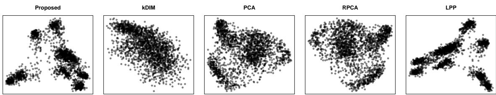

(a) Multiple Features Database  
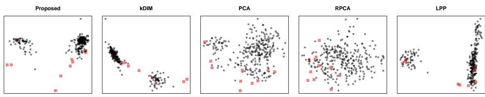  
(b) Election2005  
Figure 1: Two dimensional projections of (a) the Multiple Features Database; and (b) the Election2005 data set with potential outliers highlighted.

In the case of the Multiple Features data set, Figure 1(a), both LPP and the proposed approach show pleasing separation of numerous clearly defined clusters. PCA shows some evidence of the presence of clusters but with much less clear separation, and the projection found with RPCA is almost identical up to a reflection in the vertical axis. The DIM based on the method of Lindsay and Yao (2012) shows very little structure by comparison.

On the other hand, when applied to the Election2005 data set, Figure 1(b), all methods place multiple of the potential outliers beyond or near the periphery of the higher density regions, but only the DIM based approaches (the proposed and kDIM methods) separate some of these well away from the remaining data and arguably the proposed approach achieves this more clearly than kDIM.

The remainder of the paper is organised as follows. In the next section we briefly review some of the theoretical properties of the DIM at a population level, while in Section 3 we explore the theoretical properties of $I ( \mathcal { X } , k )$ as an estimator for the DIM. In Section 4 we describe some of the practicalities associated with our methodology, and we go on, in Section 5, to further document its practical utility in experiments using popular data sets in the public domain. We then conclude the paper with a brief discussion, in Section 6.

## 2 The Density Information Matrix

The Density Information Matrix (DIM), described by Hui and Lindsay (2010); Lindsay and Yao (2012); but only named as the DIM later on (Yao et al., 2019), may be seen as a non-parametric analogue of the Fisher Information Matrix (FIM), well known for its relevance in the theory of maximum likelihood estimation. If X is a random variable on $\mathbb { R } ^ { p }$ , with density $f _ { X }$ parameterised by a $\pmb \theta \in \mathbb { R } ^ { q }$ , then the FIM is defined as

$$
\boldsymbol { I } ( \theta ) : = - E \left[ \nabla _ { \theta } ^ { 2 } \log \left( f _ { X } ( X | \theta ) \right) \right] = E \left[ \frac { 1 } { f _ { X } ( X | \theta ) ^ { 2 } } \nabla _ { \theta } f _ { X } ( X | \theta ) \nabla _ { \theta } f _ { X } ( X | \theta ) ^ { \prime } \right] ,\tag{2}
$$

with the equality above holding under the standard regularity conditions of maximum likelihood theory. Here we have used $\nabla _ { \theta }$ to be the gradient operator (with respect to $\theta )$ , i.e., $\begin{array} { r } { \nabla _ { \pmb { \theta } } f _ { X } ( \mathbf { x } | \pmb { \theta } ) = ( \frac { \partial } { \partial \theta _ { 1 } } f _ { X } ( \mathbf { x } | \pmb { \theta } ) , . . . , \frac { \partial } { \partial \theta _ { q } } f _ { X } ( \mathbf { x } | \pmb { \theta } ) ) } \end{array}$ , and similarly $\nabla _ { \theta } ^ { 2 }$ the corresponding Hessian operator, i.e., the matrix of second partial derivatives; $\begin{array} { r l } {  { \nabla _ { \pmb { \theta } } ^ { 2 } f _ { X } \big ( \mathbf { x } | \pmb { \theta } \big ) _ { i , j } = } } \end{array}$ ${ \frac { \partial ^ { 2 } } { \partial \theta _ { i } \partial \theta _ { j } } } f _ { X } ( \mathbf { x } | \pmb \theta )$ . At an intuitive level the FIM may be interpreted as the average amount of information a realisation of X carries about the parameter $\theta ,$ , and hence about its distribution (since its density is characterised by the value of $\pmb \theta )$ . This ofers pleasing interpretation in the context of maximum likelihood estimation, where $I ( \pmb \theta ) ^ { - 1 }$ represents the (asymptotic) variance of the maximum likelihood estimator for $\theta ;$ and any natural interpretation of X being “more informative about $\pmb { \theta } ^ { \ast }$ ought to be consistent with a “standard” estimator for θ having lower variance.

In the non-parametric context, where no parametric form of $f _ { X }$ is assumed, the DIM is defined as

$$
I ( f _ { X } ) : = E \left[ \frac { 1 } { f _ { X } ( X ) ^ { 2 } } \nabla f _ { X } ( X ) \nabla f _ { X } ( X ) ^ { \prime } \right] ,\tag{3}
$$

where here the gradient is taken with respect to the argument of $f _ { X }$ , i.e., $\nabla f _ { X } ( \mathbf { x } ) =$ $\begin{array} { r } { \left( \frac { \partial } { \partial x _ { 1 } } f _ { X } ( \mathbf { x } ) , . . . , \frac { \partial } { \partial x _ { p } } f _ { X } ( \mathbf { x } ) \right) } \end{array}$ . Transferring the intuitive interpretation of the FIM to the non-parametric context, the DIM may be seen as representing the average information which a realisation of X carries about its density function. Minimal thought can thus lead us to an intuitive connection between the elements in $I ( f _ { X } )$ and the dependence structure in the components of X. Specifically, if $X _ { i }$ provides information about the distribution of $X _ { j }$ , where $i , j \in [ p ]$ , then $X _ { i }$ and $X _ { j }$ are not independent. Indeed it has been shown that $I ( f _ { X } ) _ { i , j } \neq 0$ implies that $X _ { i }$ and $X _ { j }$ are not independent (Lindsay and Yao, 2012). In fact the properties of $I ( f _ { X } )$ , in relation to the dependence structure in the components of X, go further and include potential diagnostics for conditional independence among groups of components (Lindsay and Yao, 2012). As such the DIM acts similarly to the precision matrix of a multivariate Gaussian density, and it is straightforward to show that if X has a multivariate Gaussian distribution then its DIM and precision matrix are equal.

It has also been shown that, after accounting for scale, the Gaussian densities have the minimum information, and in particular $I ( f _ { X } ) \succcurlyeq \Sigma _ { X } ^ { - 1 }$ , with equality holding if and only if X has a Gaussian distribution (Hui and Lindsay, 2010). From the point of view of dimension reduction, then, projecting X onto the leading eigenvectors of

$I ( f _ { X } ) \Sigma _ { X }$ may be seen to maximise departure from Gaussianity. In fact the DIM was first used for the dual problem of finding so-called “white noise subspaces”, i.e. subspaces within which the projection of X has a Gaussian distribution, by considering the space spanned by the eigenvectors of $I ( f _ { X } ) \Sigma _ { X }$ associated with eigenvalues equal to one (Hui and Lindsay, 2010). Retaining only the projection of X onto the orthogonal complement of this white noise subspace is thus seen to retain potentially interesting structure in the distribution of X.

This perspective also connects the DIM to the problem of ICA, since it is also known that, again after accounting for scale, the Gaussian densities have the greatest entropy. Indeed numerous methods for performing ICA focus on the problem of maximising “non-Gaussianity” instead of the more challenging problem of directly minimising entropy (Hyvarinen, 1999). Perhaps unsurprisingly, then, it was also shown that if X satisfies the conditions of the independent components model (Comon, 1994), i.e., that $X = \mathbf { M } S$ , where $S$ is a random variable on $\mathbb { R } ^ { p }$ whose components are mutually independent and $\mathbf { M } \in \mathbb { R } ^ { p \times p }$ is a non-singular matrix, then the spectral decomposition of $I ( f _ { X } ) \Sigma _ { X }$ recovers the independent components up to unknown scaling and permutation (Lindsay and Yao, 2012).

## 3 $I ( \mathcal { X } , k )$ as an Estimator of the DIM

In this section we explore the theoretical properties of $I ( \mathcal { X } , k )$ , in relation to the DIM of the density underlying the data. To that end we consider a sequence of independent random variables $X _ { 1 } , X _ { 2 } , . . . ,$ identically distributed to random variable $X$ , with continuous distribution function $F _ { X }$ admitting density function $f _ { X }$ . Then for $n \in \mathbb { N }$ we let $\mathbf { X } _ { n } : = \left\{ X _ { 1 } , . . . , X _ { n } \right\}$ be the set containing the first n elements of the sequence, and for $i \in [ n ] ; k \in [ n - 1 ]$ let $X _ { i , n } ^ { ( k ) }$ be the k-th nearest neighbour of $X _ { i }$ from among $\mathbf { X } _ { n } .$ , and let $D _ { i , n , ( k ) } = | | X _ { i } - X _ { i , n } ^ { ( k ) } | |$ be the corresponding k-th neighbour distance. Our main result is then stated in the following theorem, where we have used the notation $B _ { h } ( \mathbf { x } ) = \{ \mathbf { z } \in \mathbb { R } ^ { p } | | \mathbf { x } - \mathbf { z } | | \leq h \}$ to be the ball of radius h centered on $\mathbf { x } ,$ and for a smooth measureable set $V \subset \mathbb { R } ^ { p }$ we use $\oint _ { V } g ( \mathbf { x } ) d \mathbf { x }$ to indicate the surface integral of the function $g$ over $\partial V$ , the surface of V. We also use $a _ { 0 }$ and $v _ { 0 }$ to be the surface area and volume of the unit ball, i.e. $a _ { 0 } = \oint _ { B _ { 1 } ( { \bf 0 } ) }$ 1dx and $\begin{array} { r } { v _ { 0 } = \int _ { B _ { 1 } ( { \bf 0 } ) } } \end{array}$ 1dx, in $\mathbb { R } ^ { p }$ . In addition we use $F _ { ( \mathbf { x } ) }$ to denote the distribution function of the random variable $| | X - \mathbf { x } | |$

Theorem 1 Let $X _ { 1 } , X _ { 2 } , \ldots$ . be a sequence of $i . i . d .$ random variables on $\mathbb { R } ^ { p } ; p > 4$ 1 with density function $f _ { X }$ satisfying

C1: The support of $f _ { X }$ is bounded, i.e. $\exists M > 0 \ s . t .$ $S u p p ( f _ { X } ) : = \{ \mathbf { x } \in \mathbb { R } ^ { p } | f _ { X } ( \mathbf { x } ) >$ $0 \} \subset B _ { M } ( \mathbf { 0 } )$

C2: The density $f _ { X }$ has bounded first two derivatives on the interior of $S u p p ( f _ { X } )$

C3: There exist $l , H > 0 \ s . t .$

$$
\underset { \substack { \mathbf { x } \in S u p p ( f _ { X } ) } } { \operatorname* { s u p } } \frac { f _ { X } ( \mathbf { x } ) ^ { 2 } h _ { 1 } ^ { p - 1 } h _ { 2 } ^ { p - 1 } h _ { 2 } ^ { 3 } } { \oint _ { B _ { h _ { 1 } } ( \mathbf { x } ) } \oint _ { B _ { h _ { 2 } } ( \mathbf { x } ) } f _ { X } ( \mathbf { z } ) f _ { X } ( \mathbf { w } ) d \mathbf { z } d \mathbf { w } } \leq l
$$

$C 4 { : }$ For any $a > 0 \exists U > 0$ for which

$$
\operatorname* { s u p } _ { \substack { \mathbf { x } \in S u p p ( f _ { X } ) , } } \frac { 1 } { F _ { ( \mathbf { x } ) } ( u ) ^ { k } } \int _ { 1 } ^ { \infty } F _ { ( \mathbf { x } ) } ( u \epsilon ^ { - 1 / a } ) ^ { k } d \epsilon = o ( 1 ) ,
$$

as $k \to \infty$

Then

$$
I ( { \bf X } _ { n } , k ( n ) ) \stackrel { P }  I ( f _ { X } )
$$

provided the sequence $\{ k ( n ) \} _ { n \in \mathbb { N } }$ satisfies $k ( n ) \to \infty$ and $k ( n ) ^ { 2 - p / 4 } / n ^ { 1 - p / 4 } \to 0$ as $n \to \infty$

Assumptions for Convergence Conditions C1 and C2 in the statement of Theorem 1 are very standard, however we have stated C3 and C4 in a form which is immediately useful in the proof of our result. Nonetheless it is worthwhile briefly discussing these.

Note that for small $h _ { 1 } , h _ { 2 }$ we have $\oint _ { B _ { h _ { 1 } } ( \mathbf { x } ) } \oint _ { B _ { h _ { 2 } } ( \mathbf { x } ) } f _ { X } ( \mathbf { z } ) f _ { X } ( \mathbf { w } ) d \mathbf { z } d \mathbf { w } \approx a _ { 0 } ^ { 2 } f _ { X } ( \mathbf { x } ) ^ { 2 } h _ { 1 } ^ { p - 1 } h _ { 2 } ^ { p - 1 }$ and so C3 holds as long as there is an $H > 0$ independent of x for which this approximation holds reasonably well over $0 < h _ { 1 } \leq h _ { 2 } \leq H$ . Note that the additional factor of $h _ { 2 } ^ { 3 }$ adds an additional margin for this approximation. On the other hand C4 essentially states that the distribution functions of the random variables $\{ | | X - \mathbf { x } | | \mathbf { x } \in S u p p ( f _ { X } ) \}$ behave “nicely” for arguments close to zero. For example if there is a universal $U > 0$ for which all $\{ F _ { ( \mathbf { x } ) } | \mathbf { x } \in S u p p ( f _ { X } ) \}$ are convex on the interval [0, U] then we would have, for all $u \in ( 0 , U ) , \mathbf { x } \in S u p p ( f _ { X } )$ and $\epsilon \geq 1$ that

$$
\begin{array} { r l r } & { } & { F _ { \mathbf { ( x ) } } ( u \epsilon ^ { - 1 / a } ) \le F _ { \mathbf { ( x ) } } ( u ) \epsilon ^ { - 1 / a } } \\ & { } & { \Rightarrow \frac { 1 } { F _ { \mathbf { ( x ) } } ( u ) ^ { k } } \int _ { 1 } ^ { \infty } F _ { \mathbf { ( x ) } } ( u \epsilon ^ { - 1 / a } ) ^ { k } d \epsilon \le \int _ { 1 } ^ { \infty } \epsilon ^ { - k / a } d \epsilon } \\ & { } & { = O ( 1 / k ) , \qquad } \end{array}
$$

and so then this condition would hold strongly. Moreover if the density is smooth then we have for small u that $F _ { ( \mathbf { x } ) } ( u ) \approx v _ { 0 } f _ { X } ( \mathbf { x } ) u ^ { p }$ , which is highly convex on the positive real numbers for even moderate $p ,$ and so the question would be whether or not there is an interval which is independent of x over which this approximation is close enough to maintain convexity.

Perhaps more clearly, what is a far more common condition for nearest neighbours based estimation, in place of C3 and C4, is that the density is bounded away from zero on its support and that the support itself is relatively smooth. We show in the appendix that these conditions (along with C1 and C2) imply both C3 and C4. It is unclear to us, however, how much of a relaxation C3 and C4 is compared with the more common assumptions .

The rest of this section constitutes a proof of Theorem 1.

## 3.1 Estimating $\begin{array} { r } { \frac { 1 } { f _ { X } ( \mathbf { x } ) ^ { 2 } } \nabla f _ { X } ( \mathbf { x } ) \nabla f _ { X } ( \mathbf { x } ) ^ { \prime } } \end{array}$ for Fixed x

As is common when studying the properties of nearest neighbours based estimators we consider first a fixed x in relation to a sample of size $n - 1$ from $f _ { X }$ . For a given $\mathbf { x } \in \mathbb { R } ^ { p }$ define

$$
\begin{array} { r l } & { X _ { \mathbf { x } , n - 1 } ^ { ( 1 ) } = \mathop { \mathrm { a r g m i n } } _ { \mathbf { z } \in \mathbf { X } _ { n - 1 } } | | \mathbf { x } - \mathbf { z } | | , } \\ & { X _ { \mathbf { x } , n - 1 } ^ { ( k ) } = \mathop { \mathrm { a r g m i n } } _ { \mathbf { z } \in \mathbf { X } _ { n - 1 } \backslash \{ X _ { \mathbf { x } , n - 1 } ^ { ( 1 ) } , \ldots , X _ { \mathbf { x } , n - 1 } ^ { ( k - 1 ) } \} } | | \mathbf { x } - \mathbf { z } | | ; \ k = 2 , . . . , n - 1 , } \end{array}
$$

to be the ordering of the sample ${ \bf X } _ { n - 1 }$ based on their distances from x, and let $D _ { \mathbf { x } , n - 1 , ( k ) } : = | | \mathbf { x } - X _ { \mathbf { x } , n - 1 } ^ { ( k ) } | | ; k \in [ n - 1 ]$ . The usefulness of considering a fixed x is that the distribution of the random variable $g ( \mathbf { x } , k , \mathbf { X } _ { n - 1 } ) : = G ( \mathbf { x } , X _ { \mathbf { x } , n - 1 } ^ { ( 1 ) } , . . . , X _ { \mathbf { x } , n - 1 } ^ { ( k ) } )$ 2 where G is some measureable function on $( \mathbb { R } ^ { p } ) ^ { k + 1 }$ , is equivalent to that of the conditional distribution of $g ( X _ { i } , k , \mathbf { X } _ { n } \mid \{ X _ { i } \} )$ , given $X _ { i } = \mathbf { x }$ , for any i.

Now, returning to fixed x, let $\{ j ^ { * } \} _ { j \in [ n - 1 ] }$ be the rank of the distances in ${ \bf X } _ { n - }$ 1 from x so that $X _ { j } = X _ { \mathbf { x } , n - 1 } ^ { ( j ^ { * } ) }$ . In the coming arguments we will use the fact that all dependence between the the elements $( X _ { \mathbf { x } , n - 1 } ^ { ( 1 ) } , . . . , X _ { \mathbf { x } , n - 1 } ^ { ( n - 1 ) } )$ is captured entirely through the relative ordering in their distances from x. This means that $X _ { \mathbf { x } , n - 1 } ^ { ( k ) }$ is conditionally independent of $\mathbf { X } _ { \mathbf { x } , n - 1 } ^ { ( - k ) } : = \{ X _ { \mathbf { x } , n - 1 } ^ { ( 1 ) } , . . . , X _ { \mathbf { x } , n - 1 } ^ { ( k - 1 ) } , X _ { \mathbf { x } , n - 1 } ^ { ( k + 1 ) } , X _ { \mathbf { x } , n - 1 } ^ { ( n - 1 ) } \}$ , given $D _ { \mathbf { x } , n - 1 , ( k ) }$ ; since the only information about $X _ { \mathbf { x } , n - 1 } ^ { ( k ) }$ which is carried by $\mathbf { X } _ { \mathbf { x } , n - 1 } ^ { ( - k ) }$ is that $D _ { \mathbf { x } , n - 1 , ( k - 1 ) } \leq$ $D _ { \mathbf { x } , n - 1 , ( k ) } \leq D _ { \mathbf { x } , n - 1 , ( k + 1 ) }$ and this information is redundant, given $D _ { \mathbf { x } , n - 1 , ( k ) }$ . It also means that, conditional on its distance from x, each $X _ { j }$ is independent of the rank of its distance, since

$$
\begin{array} { r l } & { { X } _ { j } \Big | \big ( | | X _ { j } - \mathbf { x } | | = h \big ) \overset { D } = { X } _ { j } \Big | \big ( | | X _ { j } - \mathbf { x } | | = h , \mathbf { X } _ { - j } \big ) } \\ & { \qquad \overset { D } = { X } _ { j } \Big | \big ( | | X _ { j } - \mathbf { x } | | = h , \mathbf { X } _ { - j } , j ^ { * } \big ) } \\ & { \qquad \overset { D } = { X } _ { j } \Big | \big ( | | X _ { j } - \mathbf { x } | | = h , \mathbf { X } ^ { ( - j ^ { * } ) } , j ^ { * } \big ) } \\ & { \qquad \overset { D } = { X } _ { j } \big | \big ( | | X _ { j } - \mathbf { x } | | = h , j ^ { * } \big ) . } \end{array}\tag{4}
$$

In other words, the distributions of the nearest neighbours only difer by how the distributions of $D _ { \mathbf { x } , n - 1 , ( j ) } ; j \in [ n - 1 ]$ , assign weights to the conditional distributions

of the prototype $X \sim F _ { X }$ , given $| | X - \mathbf { x } | |$ . Specifically, using $f _ { Z }$ to denote the density of an arbitrary continuous random variable $Z _ { i }$ we have

$$
\begin{array} { l } { f _ { X _ { \mathbf { x } , n - 1 } ^ { ( j ) } } ( \cdot ) = \int _ { 0 } ^ { \infty } f _ { X _ { \mathbf { x } , n - 1 } ^ { ( j ) } } ( \cdot | D _ { \mathbf { x } , n - 1 , ( j ) } = h ) f _ { D _ { \mathbf { x } , n - 1 , ( j ) } } ( h ) d h } \\ { = \int _ { 0 } ^ { \infty } f _ { X } \left( \cdot \Big | | | X - \mathbf { x } | | = h \right) f _ { D _ { \mathbf { x } , n - 1 , ( j ) } } ( h ) d h . } \end{array}
$$

With this understanding we are now in a position to establish that for k small enough that $D _ { \mathbf { x } , n - 1 , ( k ) }$ and $D _ { \mathbf { x } , n - 1 , ( k + 1 ) }$ are small on average, we have

$$
\begin{array} { r l } { E \Bigg [ \frac { 1 } { D _ { \mathbf { x } , n - 1 , ( k ) } ^ { 2 } D _ { \mathbf { x } , n - 1 , ( k + 1 ) } ^ { 2 } } ( X _ { \mathbf { x } , n - 1 } ^ { ( k ) } - X _ { \mathbf { x } , n - 1 } ^ { ( k + 1 ) } ) ( X _ { \mathbf { x } , n - 1 } ^ { ( k ) } - X _ { \mathbf { x } , n - 1 } ^ { ( k + 1 ) } ) ^ { \prime } \Bigg ] } & { } \\ { \approx \frac { 1 } { p } E \left[ \frac { 1 } { D _ { \mathbf { x } , n - 1 , ( k ) } ^ { 2 } } + \frac { 1 } { D _ { \mathbf { x } , n - 1 , ( k + 1 ) } ^ { 2 } } \right] \mathbf { I } - \frac { 2 } { p ^ { 2 } f _ { X } ( \mathbf { x } ) ^ { 2 } } \nabla f _ { X } ( \mathbf { x } ) \nabla f _ { X } ( \mathbf { x } ) ^ { \prime } , } & { } \end{array}\tag{5}
$$

plus additional terms which depend on $f _ { X } ( \mathbf { x } ) ^ { - 1 } \nabla ^ { 2 } f _ { X } ( \mathbf { x } )$ , where $\nabla ^ { 2 } f _ { X } ( \mathbf { x } )$ is the Hessian of $f _ { X }$ at $\mathbf { x } .$ . Towards elucidating the details, the importance of the conditional independence described previously is that we can address the left hand side in Eq. (5) using the law of total expectation, where for $0 < h _ { 1 } \leq h _ { 2 }$ , we have

$$
\begin{array} { r l } & { E \biggl [ ( X _ { \mathbf { x } , n - 1 } ^ { ( k ) } - X _ { \mathbf { x } , n - 1 } ^ { ( k + 1 ) } ) ( X _ { \mathbf { x } , n - 1 } ^ { ( k ) } - X _ { \mathbf { x } , n - 1 } ^ { ( k + 1 ) } ) ^ { \prime } \Bigl | D _ { \mathbf { x } , n - 1 , ( k ) } = h _ { 1 } , D _ { \mathbf { x } , n - 1 , ( k + 1 ) } = h _ { 2 } \biggr ] } \\ & { \quad = E \biggl [ \left( Z - W \right) \left( Z - W \right) ^ { \prime } \bigg | | Z - \mathbf { x } | | = h _ { 1 } , | | W - \mathbf { x } | | = h _ { 2 } \biggr ] , } \end{array}
$$

where the expectation is over Z, W being i.i.d. with distribution $F _ { X }$ . It is immediate then that this expectation may be written as

$$
\frac { 1 } { \oint _ { B _ { h _ { 2 } } ( \mathbf { x } ) } \oint _ { B _ { h _ { 1 } } ( \mathbf { x } ) } f _ { X } ( \mathbf { z } ) f _ { X } ( \mathbf { w } ) d \mathbf { z } d \mathbf { w } } \oint _ { B _ { h _ { 2 } } ( \mathbf { x } ) } \oint _ { B _ { h _ { 1 } } ( \mathbf { x } ) } ( \mathbf { z } - \mathbf { w } ) ( \mathbf { z } - \mathbf { w } ) ^ { \prime } f _ { X } ( \mathbf { z } ) f _ { X } ( \mathbf { w } ) d \mathbf { z } d \mathbf { w } .
$$

Evaluating the numerator intergral, we find, using a standard Taylor expansion about x,

$$
\begin{array} { r l } & { \int _ { B _ { h _ { 2 } ( \mathbf x ) } } \oint _ { B _ { h _ { 1 } ( \mathbf x ) } } ( \mathbf z - \mathbf w ) ( \mathbf z - \mathbf w ) ^ { \prime } f _ { X } ( \mathbf z ) f _ { X } ( \mathbf w ) d z d \mathbf w = f _ { X } ( \mathbf x ) ^ { 2 } \int _ { B _ { h _ { 2 } ( \mathbf x ) } } ^ { \mathbf f } \int _ { B _ { h _ { 1 } ( \mathbf x ) } } ( \mathbf z - \mathbf w ) ( \mathbf z - \mathbf w ) ^ { \prime } d z d \mathbf w } \\ & { \qquad + f _ { X } ( \mathbf x ) \int _ { \beta _ { h _ { 2 } ( \mathbf x ) } } \iint _ { B _ { h _ { 1 } ( \mathbf 0 ) } } ( \mathbf z - \mathbf w ) ( \mathbf z - \mathbf w ) ^ { \prime } \nabla f _ { X } ( \mathbf x ) ^ { \prime } z d \mathbf z d \mathbf w } \\ & { \qquad + f _ { X } ( \mathbf x ) \oint _ { B _ { h _ { 2 } ( \mathbf x ) } } \oint _ { B _ { h _ { 1 } ( \mathbf x ) } } ( \mathbf z - \mathbf w ) ( \mathbf z - \mathbf w ) ^ { \prime } \nabla f _ { X } ( \mathbf x ) ^ { \prime } \mathbf w d z d \mathbf w } \\ & { \qquad + \int _ { B _ { h _ { 2 } ( \mathbf x ) } } \oint _ { B _ { h _ { 1 } ( \mathbf x ) } } ( \mathbf z - \mathbf w ) ( \mathbf z - \mathbf w ) ^ { \prime } \nabla f _ { X } ( \mathbf x ) ^ { \prime } \mathbf w d z d \mathbf w } \\ & { \qquad + \int _ { B _ { h _ { 2 } ( \mathbf x ) } } \oint _ { B _ { h _ { 1 } ( \mathbf x ) } } ( \mathbf z - \mathbf w ) ( \mathbf z - \mathbf w ) ^ { \prime } \nabla f _ { X } ( \mathbf x ) ^ { \prime } \mathbf w \nabla f _ { X } ( \mathbf x ) ^ { \prime } z d \mathbf z d \mathbf w } \\ &  \qquad + \frac 1 2 f _ { X } ( \mathbf x ) \int _ { B _ { h _ { 2 } ( \mathbf x ) } } \oint _ { B _ { h _ { 1 } ( \mathbf x ) } } ( \mathbf z - \mathbf w ) ( \mathbf z - \mathbf w ) ^ { \prime } ( \mathbf z ^ { \prime } \nabla ^  2  \end{array}
$$

where since $f _ { X }$ has a bounded second derivative we have $| | R _ { 1 } | | _ { F } < K _ { 1 } f _ { X } ( { \bf x } ) ( h _ { 1 } +$ $h _ { 2 } ) ^ { 2 } ( h _ { 1 } ^ { 2 } + h _ { 2 } ^ { 2 } ) h _ { 1 } ^ { p - 1 } h _ { 2 } ^ { p - 1 }$ for some $K _ { 1 } > 0$ . Now, using standard integration of polynomials on the unit sphere (Folland, 2001) it is straightforward to verify that this is equal to

$$
\begin{array} { r l } & { a _ { 0 } v _ { 0 } f _ { X } ( \mathbf x ) ^ { 2 } h _ { 1 } ^ { p - 1 } h _ { 2 } ^ { p - 1 } ( h _ { 1 } ^ { 2 } + h _ { 2 } ^ { 2 } ) \mathbf I - 2 v _ { 0 } ^ { 2 } h _ { 1 } ^ { p + 1 } h _ { 2 } ^ { p + 1 } \nabla f _ { X } ( \mathbf x ) \nabla f _ { X } ( \mathbf x ) ^ { \prime } } \\ & { \qquad + \frac { f _ { X } ( \mathbf x ) a _ { 0 } ^ { 2 } } { p ( p + 2 ) } h _ { 1 } ^ { p - 1 } h _ { 2 } ^ { p - 1 } ( h _ { 1 } ^ { 4 } + h _ { 2 } ^ { 4 } ) \nabla ^ { 2 } f _ { X } ( \mathbf x ) + \frac { f _ { X } ( \mathbf x ) a _ { 0 } ^ { 2 } h _ { 1 } ^ { p - 1 } h _ { 2 } ^ { p - 1 } } { 2 p } \operatorname { t r } \left( \nabla ^ { 2 } f _ { X } ( \mathbf x ) \right) \left( \frac { h _ { 1 } ^ { 4 } + h _ { 2 } ^ { 4 } } { p + 2 } + \frac { h _ { 1 } ^ { 2 } h _ { 2 } ^ { 2 } } { p } \right) \mathbf I } \\ & { \qquad + R _ { 1 } . } \end{array}
$$

Similarly, but far more straightforward, we have

$$
\oint _ { B _ { h _ { 2 } } ( \mathbf x ) } \oint _ { B _ { h _ { 1 } } ( \mathbf x ) } f _ { X } ( \mathbf z ) f _ { X } ( \mathbf w ) d \mathbf z d \mathbf w = a _ { 0 } ^ { 2 } f _ { X } ( \mathbf x ) ^ { 2 } h _ { 1 } ^ { p - 1 } h _ { 2 } ^ { p - 1 } + R _ { 2 } ,
$$

where $| R _ { 2 } | < K _ { 2 } f _ { X } ( { \bf x } ) ( h _ { 1 } ^ { 2 } + h _ { 2 } ^ { 2 } ) h _ { 1 } ^ { p - 1 } h _ { 2 } ^ { p - 1 }$ for some $K _ { 2 } > 0$ . Combining these we have

$$
\begin{array} { r l } {  { E \biggl [ \frac { 1 } { D _ { \mathbf { x } , n - 1 , ( k ) } ^ { 2 } D _ { \mathbf { x } , n - 1 , ( k + 1 ) } ^ { 2 } } ( X _ { \mathbf { x } , n - 1 } ^ { ( k ) } - X _ { \mathbf { x } , n - 1 } ^ { ( k + 1 ) } ) ( X _ { \mathbf { x } , n - 1 } ^ { ( k ) } - X _ { \mathbf { x } , n - 1 } ^ { ( k + 1 ) } ) ^ { \prime } \big | D _ { \mathbf { x } , n - 1 , ( k ) } = h _ { 1 } , D _ { \mathbf { x } , n - 1 , ( k + 1 ) } = h _ { 2 } \biggr ] } \qquad } & { } \\ & { = \frac { v _ { 0 } } { a _ { 0 } } ( \frac { 1 } { h _ { 1 } ^ { 2 } } + \frac { 1 } { h _ { 2 } ^ { 2 } } ) \mathbf { I } - \frac { 2 v _ { 0 } ^ { 2 } } { a _ { 0 } ^ { 2 } f _ { X } ( \mathbf { x } ) ^ { 2 } } \nabla f _ { X } ( \mathbf { x } ) \nabla f _ { X } ( \mathbf { x } ) ^ { \prime } + R } \\ & { + \frac { h _ { 1 } ^ { 4 } + h _ { 2 } ^ { 4 } } { p ( p + 2 ) f _ { X } ( \mathbf { x } ) h _ { 1 } ^ { 2 } h _ { 2 } ^ { 2 } } ( \nabla ^ { 2 } f _ { X } ( \mathbf { x } ) + \frac { 1 } { 2 } \mathrm { t r } ( \nabla ^ { 2 } f _ { X } ( \mathbf { x } ) ) \mathbf { I } ) + \frac { 1 } { 2 p ^ { 2 } f _ { X } ( \mathbf { x } ) ^ { 4 } } \mathrm { t r } ( \nabla ^ { 2 } f _ { X } ( \mathbf { x } ) ) \mathbf { I } , } \end{array}
$$

where,

$$
| | R | | _ { F } \leq K \frac { f _ { X } ( \mathbf { x } ) h _ { 2 } ^ { 4 } h _ { 1 } ^ { p - 1 } h _ { 2 } ^ { p - 1 } } { f _ { B _ { h _ { 2 } } ( \mathbf { x } ) } \oint _ { B _ { h _ { 1 } } ( \mathbf { x } ) } f _ { X } ( \mathbf { z } ) f _ { X } ( \mathbf { w } ) d \mathbf { z } d \mathbf { w } } \leq \frac { K l h _ { 2 } } { f _ { X } ( \mathbf { x } ) } ,
$$

for some $K > 0$ and where l is given in Condition C3.

Integrating over the potential values of $h _ { 1 } , h _ { 2 }$ we thus have (noting that $v _ { 0 } / a _ { 0 } =$ $1 / p )$

$$
\begin{array} { r l } {  { E \biggl [ \frac { 1 } { D _ { \mathbf { x } , n - 1 , ( k ) } ^ { 2 } D _ { \mathbf { x } , n - 1 , ( k + 1 ) } ^ { 2 } } ( X _ { \mathbf { x } , n - 1 } ^ { ( k ) } - X _ { \mathbf { x } , n - 1 } ^ { ( k + 1 ) } ) ( X _ { \mathbf { x } , n - 1 } ^ { ( k ) } - X _ { \mathbf { x } , n - 1 } ^ { ( k + 1 ) } ) ^ { \prime } \biggr ] } \qquad } & { } \\ & { = \frac { 1 } { p } E [ \frac { 1 } { D _ { \mathbf { x } , n - 1 , ( k ) } ^ { 2 } } + \frac { 1 } { D _ { \mathbf { x } , n - 1 , ( k + 1 ) } ^ { 2 } } ] \mathbf { I } - \frac { 2 } { p ^ { 2 } f _ { X } ( \mathbf { x } ) ^ { 2 } } \nabla f _ { X } ( \mathbf { x } ) \nabla f _ { X } ( \mathbf { x } ) ^ { \prime } } \\ & { + \frac { 1 } { p ( p + 2 ) f _ { X } ( \mathbf { x } ) } ( \frac { D _ { \mathbf { x } , n - 1 , ( k ) } ^ { 2 } } { D _ { \mathbf { x } , n - 1 , ( k + 1 ) } ^ { 2 } } + \frac { D _ { \mathbf { x } , n - 1 , ( k + 1 ) } ^ { 2 } } { D _ { \mathbf { x } , n - 1 , ( k ) } ^ { 2 } } ) ( \nabla ^ { 2 } f _ { X } ( \mathbf { x } ) + \frac { 1 } { 2 } \mathrm { t r } ( \nabla ^ { 2 } f _ { X } ( \mathbf { x } ) ) \mathbf { I } ) } \\ & { + \frac { 1 } { 2 p ^ { 2 } f _ { X } ( \mathbf { x } ) } \mathrm { t r } ( \nabla ^ { 2 } f _ { X } ( \mathbf { x } ) ) \mathbf { I } + \tilde { R } , } \end{array}\tag{6}
$$

where $\begin{array} { r } { | | \tilde { R } | | _ { F } \leq \frac { K l } { f _ { X } ( \mathbf { x } ) } E [ D _ { \mathbf { x } , n - 1 , ( k + 1 ) } ] } \end{array}$ . Now, the reason for separating the terms involving ${ \frac { 1 } { f _ { X } ( \mathbf { x } ) } } \nabla ^ { 2 } f _ { X } ( \mathbf { x } )$ is that the regularity conditions ensure that when taken over a random $X$ , they contribute zero, i.e. $\begin{array} { r } { E [ \frac { 1 } { f _ { X } ( X ) } \nabla ^ { 2 } f _ { X } ( X ) ] = \mathbf { 0 } } \end{array}$ . It should be clear, however, that because of the dependence between the quantity ${ \frac { 1 } { f _ { X } ( X ) } } \nabla ^ { 2 } f _ { X } ( X )$ and the nearest neighbour distances from X this does not ensure that $\begin{array} { r } { E \left[ \left( \frac { D _ { X , n - 1 , ( k ) } ^ { 2 } } { D _ { X , n - 1 , ( k + 1 ) } ^ { 2 } } + \frac { D _ { X , n - 1 , ( k + 1 ) } ^ { 2 } } { D _ { X , n - 1 , ( k ) } ^ { 2 } } \right) \frac { 1 } { f _ { X } ( X ) } \nabla ^ { 2 } f _ { X } ( X ) \right] } \end{array}$ where the expectation is taken over $X , X _ { 1 } , . . . , X _ { n - 1 } \sim _ { i . i . d . } F _ { X }$ , is equal to 0. We address this in the following subsection.

## 3.2 Averaging Over the Sample

Using the expression in Eq. (6), taken at each of the $X _ { i } ; i \in [ n ]$ and with neighbours taken from the rest of the sample, ${ \bf X } _ { n }$ , we have

$$
\begin{array} { l } { { \displaystyle E \left[ I ( { \mathbf X } _ { n } , k ) \right] = I ( f _ { X } ) + R ^ { * } } } \\ { { \displaystyle ~ - \frac { p } { 2 ( p + 2 ) } E \left[ \left( \frac { D _ { 1 , n , ( k ) } ^ { 2 } } { D _ { 1 , n , ( k + 1 ) } ^ { 2 } } + \frac { D _ { 1 , n , ( k + 1 ) } ^ { 2 } } { D _ { 1 , n , ( k ) } ^ { 2 } } \right) \frac { 1 } { f _ { X } ( X _ { 1 } ) } \left( \nabla ^ { 2 } f _ { X } ( X _ { 1 } ) + \frac { 1 } { 2 } \mathrm { t r } \left( \nabla ^ { 2 } f _ { X } ( X _ { 1 } ) \right) \right) \right] , } } \end{array}\tag{7}
$$

where $\begin{array} { r } { | | R ^ { * } | | _ { F } \leq K ^ { * } E [ \frac { D _ { 1 , n , ( k + 1 ) } } { f _ { X } ( X _ { 1 } ) } ] } \end{array}$ for some $K ^ { * } > 0$ , and we have used the index $^ { 6 6 } 1 ^ { \mathfrak { s } }$ $( \mathrm { i . e . }$ . the first sample point) arbitrarily, since each term in the sum defining $I ( \mathbf { X } _ { n } , k )$ has the same distribution. Now, it is well known that if $S u p p ( f _ { X } )$ is bounded then $\begin{array} { r } { \operatorname* { s u p } _ { \mathbf { x } \in S u p p ( f _ { X } ) } E \left[ D _ { \mathbf { x } , n - 1 , ( k + 1 ) } \right] } \end{array}$ vanishes as $n  \infty$ and hence $\begin{array} { r } { E \big [ \frac { D _ { 1 , n , ( k + 1 ) } } { f _ { X } ( X _ { 1 } ) } \big ] ~ = } \end{array}$ $\begin{array} { r } { \int _ { S u p p ( f _ { X } ) } E \big [ D _ { \mathbf { x } , n - 1 , ( k + 1 ) } \big ] } \end{array}$ dx tends to zero as $n \to \infty$ . In addition the following lemma, the proof of which may be found in the appendix, can be used to ensure that $\begin{array} { r } { E \left[ \frac { D _ { \mathbf { x } , n - 1 , ( k + 1 ) } } { D _ { \mathbf { x } , n - 1 , ( k ) } } + \frac { D _ { \mathbf { x } , n - 1 , ( k ) } } { D _ { \mathbf { x } , n - 1 , ( k + 1 ) } } \right] } \end{array}$ converges to 2, uniformly in x, as $n \to \infty$

Lemma 2 Let $X _ { 1 } , X _ { 2 } , . .$ . be i.i.d. random variables with density $f _ { X }$ satisfying Conditions $C 1 { - } C _ { 4 }$ . Let $0 \textless a \textless b$ and let $\{ k ( n ) \} _ { n \in \mathbb { N } }$ satisfy $\begin{array} { r } { \operatorname* { l i m } _ { n \to \infty } k ( n ) \ = \ \infty } \end{array}$ and $\scriptstyle \operatorname* { l i m } _ { n \to \infty } k ( n ) / n = 0$ . Then

$$
\operatorname* { l i m } _ { n \to \infty } \operatorname* { s u p } _ { \substack { \mathbf { x } \in S u p p ( X ) } } \left( E \left[ \frac { D _ { \mathbf { x } , n , ( k ( n ) + 1 ) } ^ { b } } { D _ { \mathbf { x } , n , ( k ( n ) ) } ^ { a } } \right] - E \left[ D _ { \mathbf { x } , n , ( k ( n ) + 1 ) } ^ { b - a } \right] \right) = 0 .
$$

Notice that trivially we have

$$
E \left[ \frac { D _ { \mathbf { x } , n , ( k ( n ) + 1 ) } ^ { b } } { D _ { \mathbf { x } , n , ( k ( n ) ) } ^ { a } } \right] - E \left[ D _ { \mathbf { x } , n , ( k ( n ) + 1 ) } ^ { b - a } \right] \geq 0 ,
$$

and so applying the lemma for $b = a = 2$ we see that $E \left[ \frac { D _ { \mathbf { x } , n - 1 , \left( k + 1 \right) } ^ { 2 } } { D _ { \mathbf { x } , n - 1 , \left( k \right) } ^ { 2 } } \right]$ converges uniformly to 1 as $n  \infty$ . To see that $E \left[ \frac { D _ { \mathbf { x } , n - 1 , ( k ) } ^ { 2 } } { D _ { \mathbf { x } , n - 1 , ( k + 1 ) } ^ { 2 } } \right]$ also converges to one notice simply that $\begin{array} { r }   \begin{array} { r } { 1 \geq E [ \frac { D _ { \mathbf { x } , n - 1 , ( k ) } ^ { 2 } } { D _ { \mathbf { x } , n - 1 , ( k + 1 ) } ^ { 2 } } ] = E [ ( \frac { D _ { \mathbf { x } , n - 1 , ( k + 1 ) } ^ { 2 } } { D _ { \mathbf { x } , n - 1 , ( k ) } ^ { 2 } } ) ^ { - 1 } ] \geq E [ \frac { D _ { \mathbf { x } , n - 1 , ( k + 1 ) } ^ { 2 } } { D _ { \mathbf { x } , n - 1 , ( k ) } ^ { 2 } } ] ^ { - 1 } } \end{array} \end{array}$ which converges uniformly to 1. We therefore also have

$$
\begin{array} { r l } & { \Bigg \vert E \Bigg [ \left( \frac { D _ { 1 , n , ( k + 1 ) } ^ { 2 } } { D _ { 1 , n , ( k + 1 ) } ^ { 2 } } + \frac { D _ { 1 , n , ( k + 1 ) } ^ { 2 } } { D _ { 1 , n , ( k ) } ^ { 2 } } \right) \frac { 1 } { f x ( X _ { 1 } ) } \left( \nabla ^ { 2 } f _ { X } ( X _ { 1 } ) + \frac { 1 } { 2 } \mathrm { t r } \left( \nabla ^ { 2 } f _ { X } ( X _ { 1 } ) \right) \right) \Bigg ] \Bigg \vert _ { F } } \\ & { = \Bigg \Vert _ { S u p ( f _ { X } ) } \left( \nabla ^ { 2 } f _ { X } ( \mathbf { x } ) + \frac { 1 } { 2 } \mathrm { t r } \left( \nabla ^ { 2 } f _ { X } ( \mathbf { x } ) \right) \right) E \left[ \frac { D _ { \mathbf { x } , n - 1 , ( k + 1 ) } } { D _ { \mathbf { x } , n - 1 , ( k ) } } + \frac { D _ { \mathbf { x } , n - 1 , ( k ) } } { D _ { \mathbf { x } , n - 1 , ( k + 1 ) } } \right] d \mathbf { x } \Bigg \Vert _ { F } } \\ & { \leq 2 \Bigg \Vert _ { S u p ( f _ { X } ) } \left( \nabla ^ { 2 } f _ { X } ( \mathbf { x } ) + \frac { 1 } { 2 } \mathrm { t r } \left( \nabla ^ { 2 } f _ { X } ( \mathbf { x } ) \right) \right) d \mathbf { x } \Bigg \Vert _ { F } } \\ &  \quad + \underset { S u p ( f _ { X } ) } { \int } \left. \nabla ^ { 2 } f _ { X } ( \mathbf { x } ) + \frac { 1 } { 2 } \mathrm { t r } \left( \nabla ^ { 2 } f _ { X } ( \mathbf { x } ) \right) \right. _ { F } \Bigg \vert E \left[ \frac { D _ { \mathbf { x } , n - 1 , ( k + 1 ) } } { D _ { \mathbf { x } , n - 1 , ( k ) } } + \frac { D _ { \mathbf { x } , n - 1 , ( k ) } } { D _ { \mathbf { x } , n - 1 , ( k + 1 ) } } \right] - 2 \Bigg \vert d \mathbf  \end{array}
$$

where the first term is exactly zero and the second term converges to zero as $n \to \infty$ since $\nabla ^ { 2 } f _ { X } ( \mathbf { x } )$ is bounded and $\begin{array} { r } { E \left[ \frac { D _ { \mathbf { x } , n - 1 , ( k + 1 ) } } { D _ { \mathbf { x } , n - 1 , ( k ) } } + \frac { D _ { \mathbf { x } , n - 1 , ( k ) } } { D _ { \mathbf { x } , n - 1 , ( k + 1 ) } } \right] } \end{array}$ converges uniformly to 2, as described. We therefore have $\begin{array} { r } { \operatorname* { l i m } _ { n  \infty } E [ I ( \mathbf { X } _ { n } , k ( n ) ) ] = I ( f _ { X } ) } \end{array}$

Now, to bound the variance of $I ( \mathbf { X } _ { n } , k )$ we use Lemma 4.6 of Evans (2008), which we apply to each of the elements of $I ( \mathbf { X } _ { n } , k )$ , giving

$$
V a r \left( I ( \mathbf { X } _ { n } , k ) _ { i , j } \right) \leq \frac { 2 ( n + 1 ) ( 3 + 8 k ^ { 2 } p v _ { 0 } ) } { n ^ { 2 } } E \left[ \Phi _ { X , n - 1 , ( i , j ) } ^ { 2 } \right] ,
$$

where $\begin{array} { r } { \Phi _ { X , n - 1 , ( i , i ) } = \frac { p } { 2 } \left( \frac { 1 } { D _ { X , n - 1 , ( k ) } ^ { 2 } } + \frac { 1 } { D _ { X , n - 1 , ( k + 1 ) } ^ { 2 } } - \frac { p ( X _ { X , n - 1 } ^ { ( k ) } - X _ { X , n - 1 } ^ { ( k + 1 ) } ) _ { i } ^ { 2 } } { D _ { X , n - 1 , ( k ) } ^ { 2 } D _ { X , n - 1 , ( k + 1 ) } ^ { 2 } } \right) } \end{array}$ and for $i \neq j$ $\begin{array} { r } { \Phi _ { X , n - 1 , ( i , j ) } = \frac { p ^ { 2 } ( X _ { X , n - 1 } ^ { ( k ) } - X _ { X , n - 1 } ^ { ( k + 1 ) } ) _ { i } ( X _ { X , n - 1 } ^ { ( k ) } - X _ { X , n - 1 } ^ { ( k + 1 ) } ) _ { j } } { 2 D _ { X , n - 1 , ( k ) } ^ { 2 } D _ { X , n - 1 , ( k + 1 ) } ^ { 2 } } } \end{array}$ . Now, clearly we have, for any $i , j$ that

$$
\begin{array} { r l } & { \quad | ( X _ { x , n - 1 } ^ { ( k ) } - X _ { x , n - 1 } ^ { ( k + 1 ) } ) _ { i } ( X _ { x , n - 1 } ^ { ( k ) } - X _ { x , n - 1 } ^ { ( k + 1 ) } ) _ { j } | \le | | X _ { x , n - 1 } ^ { ( k ) } - X _ { x , n - 1 } ^ { ( k + 1 ) } | | ^ { 2 } \le \left( D _ { X , n - 1 , ( k ) } + D _ { X , n - 1 , ( k + 1 ) } \right) ^ { 2 } } \\ & { \Rightarrow \frac { | ( X _ { x , n - 1 } ^ { ( k ) } - X _ { x , n - 1 } ^ { ( k + 1 ) } ) _ { i } ( X _ { x , n - 1 } ^ { ( k ) } - X _ { x , n - 1 } ^ { ( k + 1 ) } ) _ { j } | } { D _ { X , n - 1 , ( k ) } ^ { 2 } D _ { X , n - 1 , ( k + 1 ) } ^ { 2 } } \le 2 ( D _ { X , n - 1 , ( k ) } ^ { - 2 } + D _ { X , n - 1 , ( k + 1 ) } ^ { - 2 } ) \le 4 D _ { X , n - 1 , ( k ) } ^ { - 2 } , } \end{array}
$$

and hence $\begin{array} { r } { \Phi _ { X , n - 1 , ( i , j ) } ^ { 2 } \le \frac { p ^ { 2 } ( 2 + 4 p ) ^ { 2 } } { 4 } D _ { X , n - 1 , ( k ) } ^ { - 4 } } \end{array}$ . It is therefore suficient that $E [ D _ { X , n - 1 , ( k ) } ^ { - 4 } ] =$ $O { \Big ( } { \frac { n } { k ^ { 2 } } } { \Big ) }$ in order to ensure Var $( I ( \mathbf { X } _ { n } , k ) _ { i , j } )$ vanishes asymptotically. To see this, note that using the properties of order statistics we have

$$
E \left[ D _ { { \bf x } , n - 1 , ( k ) } ^ { - 4 } \right] = { \frac { n ! } { ( k - 1 ) ! ( n - k ) ! } } \int _ { 0 } ^ { \infty } u ^ { - 4 } F _ { ( { \bf x } ) } ( u ) ^ { k - 1 } ( 1 - F _ { ( { \bf x } ) } ( u ) ) ^ { n - k } d F _ { ( { \bf x } ) } ( u ) .
$$

Now, both a bounded derivative and bounded support of $f _ { X }$ ensures ${ \overline { { f } } } : = \operatorname* { s u p } _ { \mathbf { x } } f _ { X } ( \mathbf { x } ) <$ ∞, and hence $F _ { ( \mathbf { x } ) } ( u ) \leq v _ { 0 } \overline { { f } } u ^ { p }$ , giving

$$
\begin{array} { r l } & { E \left[ D _ { \mathbf { x } , n - 1 , ( k ) } ^ { - 4 } \right] \leq \displaystyle \frac { n ! } { ( k - 1 ) ! ( n - k ) ! } ( v _ { 0 } \overline { { f } } ) ^ { 4 / p } \int _ { 0 } ^ { \infty } F _ { ( \mathbf { x } ) } ( u ) ^ { k - 1 - 4 / p } ( 1 - F _ { ( \mathbf { x } ) } ( u ) ) ^ { n - k } d F _ { ( \mathbf { x } ) } ( u ) } \\ & { \qquad = ( v _ { 0 } \overline { { f } } ) ^ { 4 / p } \displaystyle \frac { n ! } { ( k - 1 ) ! ( n - k ) ! } \frac { \Gamma ( k - 4 / p ) ( n - k ) ! } { \Gamma ( n - 4 / p ) } } \\ & { \qquad \leq ( v _ { 0 } \overline { { f } } ) ^ { 4 / p } \left( \displaystyle \frac { n + 1 } { k } \right) ^ { 4 / p } , } \end{array}
$$

where in the final step we have used Gautschi’s inequality (Gautschi, 1959). Provided $\frac { k ( n ) ^ { 2 - 4 / p } } { n ^ { 1 - 4 / p } }  0$ we have $E [ D _ { X , n - 1 , ( k ( n ) ) } ^ { - 4 } ] = o ( n / k ( n ) ^ { 2 } )$ , and hence Var $( I ( \mathbf { X } _ { n } , k ( n ) ) _ { i , j } ) $ 0 as $n \to \infty$ as required.

We have thus shown that $I ( \mathbf { X } _ { n } , k ( n ) )$ is asymptotically unbiased for $I ( f _ { X } )$ , and its variance vanishes as $n \to \infty$ , and so $I ( { \bf X } _ { n } , k ( n ) ) \stackrel { P }  I ( f _ { X } )$ , and we are done.

## 4 Practicalities

As mentioned in Section 1, when performing dimension reduction we perform a few modifications to the basic approach of projecting onto the eigenvectors of $I ( \mathcal { X } , k ) \Sigma _ { \mathcal { X } }$ The first two are simply to improve the quality of $I ( \mathcal { X } , k )$ as an estimate of $I ( f _ { X } )$ whereas the third is a straightforward orthogonalisation of the eigenvectors which we have found to lead to improved results when performing downstream tasks such as clustering and outlier detection on the projected data.

## 4.1 Improving Estimation

## 4.1.1 Variance Reduction

To obtain a lower variance estimator of the DIM we simply average over multiple estimates, obtained for diferent values of k. Specifically, for $0 < k _ { 0 } \le k _ { 1 } < n$ we define $\begin{array} { r } { I ( \mathcal { X } , k _ { 0 } , k _ { 1 } ) : = \frac { 1 } { k _ { 1 } - k _ { 0 } + 1 } \sum _ { k = k _ { 0 } } ^ { k _ { 1 } } I ( \mathcal { X } , k ) } \end{array}$ . It should be clear that, provided $k _ { 0 } ( n )$ and $k _ { 1 } ( n )$ both satisfy the conditions of Theorem 1, we have $I ( { \bf X } _ { n } , k _ { 0 } ( n ) , k _ { 1 } ( n ) ) \stackrel { P } {  } I ( f _ { X } )$ That is, averaging over an appropriate set of values for k does not afect consistency of the estimator.

## 4.1.2 Bias Reduction

To reduce the bias of $I ( \mathcal { X } , k _ { 0 } , k _ { 1 } )$ as an estimate for $I ( f _ { X } )$ we rely on the theoretical properties of $I ( f _ { X } )$ given by Lindsay and Yao (2012). Since $I ( \mathcal { X } , k _ { 0 } , k _ { 1 } )$ is symmetric, we can express it via its spectral decomposition as UDU′, where the columns of U are its eigenvectors and D is the diagonal matrix containing its eigenvalues. We then define $I ( \mathcal { X } , k _ { 0 } , k _ { 1 } ) ^ { * } : = \mathbf { U } \mathbf { D } ^ { * } \mathbf { U } ^ { \prime }$ where $\mathbf { D } ^ { * }$ is diagonal with

$$
\mathbf { D } _ { i i } ^ { * } = \operatorname* { m a x } \{ \mathbf { D } _ { i i } , ( \mathbf { u } _ { i } ^ { \prime } \Sigma _ { \mathcal { X } } \mathbf { u } _ { i } + \epsilon ) ^ { - 1 } \} ,
$$

where $\mathbf { u } _ { i } ; i \in [ p ]$ , the i-th column of U and ϵ is a small additive factor to avoid numerical issuesd. This adjustment is based on the following lemma, which describes a lower bound on the spectrum of the population level DIM.

Lemma 3 Let $I ( f _ { X } ) = \mathbf { V } \Delta \mathbf { V } ^ { \prime }$ be the standard spectral decomposition of $I ( f _ { X } )$ . Then $\begin{array} { r } { \Delta _ { i i } \geq \frac { 1 } { V a r ( \mathbf { v } _ { i } ^ { \prime } X ) } } \end{array}$ , where $\mathbf { v } _ { i } ; i \in [ p ]$ , is the $- i - t h$ column of V.

Proof Follows from Eq. (4) and Eq. (6) from Lindsay and Yao (2012).

Notice also that if the eigenvalues of $I ( f _ { X } )$ are distinct then the spectral decomposition of $I ( \mathbf { X } _ { n } , k _ { 0 } ( n ) , k _ { 1 } ( n ) )$ converges to that of $I ( f _ { X } )$ , and so for any fixed $\epsilon > 0$ the probability that a bias adjustment actually modifies $I ( \mathbf { X } _ { n } , k _ { 0 } ( n ) , k _ { 1 } ( n ) )$ converges to zero. As a consequence we clearly have $I ( { \bf X } _ { n } , k _ { 0 } ( n ) , k _ { 1 } ( n ) ) ^ { * } \stackrel { P } {  } I ( f _ { X } )$

## 4.2 Orthogonalisation

The final modification is a simple orthogonalisation of the eigenvectors of $I ( \mathcal { X } , k _ { 0 } , k _ { 1 } ) ^ { * } \Sigma _ { \mathcal { X } }$ The most notable implications of this are from the point of view of overall variation in the projected data, where if $I ( \mathcal { X } , k _ { 0 } , k _ { 1 } ) ^ { * } \Sigma _ { \mathcal { X } } = \mathbf { W } \Gamma \mathbf { W } ^ { - 1 }$ is the eigen-decomposition of $I ( \mathcal { X } , k _ { 0 } , k _ { 1 } ) ^ { * } \Sigma _ { \mathcal { X } }$ it is possible that trace $\left( \Sigma _ { \mathbf { W } ^ { \prime } \mathcal { X } } \right) = \operatorname { t r a c e } ( \mathbf { W } ^ { \prime } \Sigma _ { \mathcal { X } } \mathbf { W } )$ is substantially less than $\operatorname { t r a c e } ( \Sigma _ { \mathcal { X } } )$ . We therefore use as our final projection basis the columns of $\mathbf { W ^ { * } } = \mathbf { W _ { u } } \mathbf { W _ { v } ^ { \prime } } ,$ where $\mathbf { W _ { u } }$ and $\mathbf { W _ { v } }$ contain in their columns the left and right singular vectors of W, respectively.

## 5 Experiments

In this section we document the practical utility of the proposed approach, by exploring its use as a dimension reduction tool to aid downstream tasks such as cluster analysis and outlier detection. For comparisons we use a number of other general purpose linear dimension reduction techniques, including (i) standard PCA; (ii) robust PCA (RPCA) using the method of Hubert et al. (2005); (iii) Locality Preserving Projections (He and Niyogi, 2003, LPP); and (iv) the kernel based DIM method (kDIM) of Lindsay and Yao (2012). We also investigated methods designed specifically for clustering (Hofmeyr and Pavlidis, 2019) and outlier detection (Kandanaarachchi and Hyndman, 2021), however we found the general purpose methods outperformed these even on problems for which they were designed, and so omit their results.

For RPCA we used the implementation in the R package rrcov (Todorov and Filzmoser, 2009), and when p exceeds 50 we used the projection pursuit approach due to the high computational cost of computing the minimum covariance discriminant in high dimensions. For LPP we explored the implementation in the R package Rdimtools, but found far better performance using our own implementation using a nearest neighbour graph with $\lfloor \log ( n ) \rfloor$ ⌋ neighbourse. For kDIM we converted MAT-LAB code obtained from the authors for use within R. For the proposed approach we used $k _ { 1 } = \lceil 2 \log ( n ) \rceil$ and $k _ { 0 } = \lfloor k _ { 1 } / 2 \rfloor$ . Both PCA and RPCA produce orthogonal projection bases, whereas LPP and kDIM produce non-orthogonal bases. We explored both the raw and orthogonalised variants and found that for LPP the raw basis was superior, while for the kDIM method orthogonalisation improved performance. We report only the results from the superior variant of each.

Rather than attempting to separately determine an appropriate number of dimensions to extract with the diferent methods, we simply reduced dimensionality from p to $\lceil p ^ { 4 / 5 } \rceil$ in all cases.

Preprocessing Distance based methods, such as those based on nearest neighbours, are highly sensitive to the scaling of individual variables relative to one another. It is therefore crucial that this is accounted for before the application of any such methods. We used a standard scaling approach of dividing each variable by the sample estimate of its standard deviation. Note that a complete whitening of the data, which results in unit variance when measured in any direction and not only along the cardinal basis directions, is a reasonable alternative. We prefer the simpler standardisation since when the data lie close to a low dimensional subspace total whitening can have the efect of inflating the noise in directions orthogonal to this subspace. Moreover, as it is discussed by Hui and Lindsay (2010); Lindsay and Yao (2012), at a population level the eigenvectors of $I ( f _ { X } ) \Sigma$ are proportional to $\Sigma ^ { - 1 / 2 } \mathbf { W }$ 2 where W are the eigenvectors of the DIM of the whitened $\Sigma ^ { - 1 / 2 } X$ . Again at a population level, first whitening and then projecting onto the eigenvectors of the DIM of the whitened $\Sigma ^ { - 1 / 2 } X$ is equivalent (up to scaling of the resulting projected variables) to projecting directly onto the eigenvectors of $I ( f _ { X } ) \Sigma$

For consistency across diferent methods, we standardised the data before applying any of the dimension reduction techniques.

## 5.1 Estimation Accuracy

Before exploring the utility of the proposed approach for dimension reduction, we first briefly explore the estimation accuracy of $I ( \mathcal { X } , k _ { 0 } , k _ { 1 } ) ^ { * }$ in the simple case where X has a Gaussian distribution, and hence where $I ( f _ { X } )$ is known to be equal to $\Sigma ^ { - 1 }$ . Since $I ( \mathcal { X } , k _ { 0 } , k _ { 1 } ) ^ { * }$ and $I ( f _ { X } )$ are location invariant we fix $\pmb { \mu } = \mathbf { 0 }$ throughout for simplicity. To produce a variety of covariance matrices, in each experimental set-up we generate covariance matrices randomly by sampling the set of eigenvectors uniformly from the Stiefel manifold, and the set of eigenvalues independently from an Exponential(1) distribution. For simple comparisons we use $\Sigma _ { \mathcal { X } } ^ { - 1 }$ and $\tilde { \Sigma } _ { \mathcal { X } } ^ { - 1 }$ , where $\Sigma _ { \mathcal { X } }$ is the maximum likelihood estimator for $\Sigma$ and $\tilde { \Sigma } _ { \mathcal { X } }$ is the regularised estimator described by Sch¨afer and Strimmer (2005). For the latter we used the implementation in the R package corpcor (Schafer et al., 2021), and the automatic selection of regularisation strength.

We vary n in {1000, 2000} and $p$ in $\{ 1 0 , 2 0 , 5 0 , 1 0 0 , 2 0 0 , 5 0 0 \}$ . For each pair of $p$ and n we generate 50 covariance matrices as described above, and a single sample of size n for each, from which to perform estimation. To assess the accuracy of estimation we report the average (and standard deviation of) values of log $( | | \hat { \tau } - \tau | | _ { F } ^ { 2 } ) { - } \log \left( | | \tau | | _ { F } ^ { 2 } \right)$ , where $\tau = \Sigma ^ { - 1 }$ and ˆτ is one of $I ( \mathcal { X } , k _ { 0 } , k _ { 1 } ) ^ { * } ; \Sigma _ { \mathcal { X } } ^ { - 1 }$ and $\tilde { \Sigma } _ { \mathcal { X } } ^ { - 1 }$ Results from these experiments are shown in Figure 2, where the average accuracy from estimation using the maximum likelihood estimator is shown with $- \triangle - ;$ using the regularised estimator with $- \boxed { \mathbf { \Sigma } } -$ ; and using $I ( \mathcal { X } , k _ { 0 } , k _ { 1 } ) ^ { * }$ with –◦–. $I ( \mathcal { X } , k _ { 0 } , k _ { 1 } ) ^ { * }$ shows quite competitive accuracy to using the maximum likelihood estimator for all values of $p ,$ and even outperforms it for larger values of $p .$ The regularised variant is primarily used for large $p$ relative to n scenarios, and is only included for interested readers.

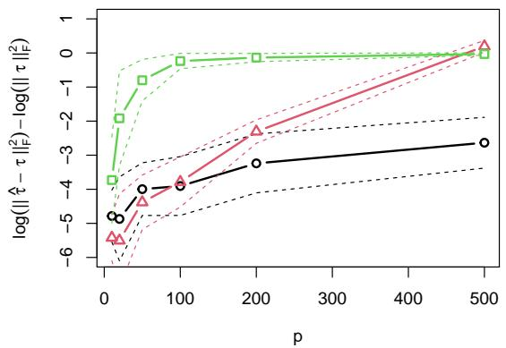  
(a) n = 1000

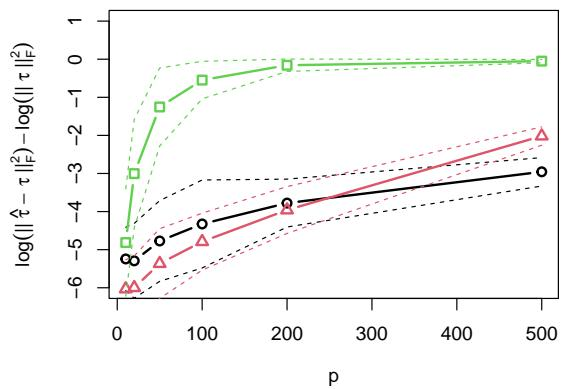  
(b) n = 2000  
Figure 2: Average estimation error for $I ( f _ { X } )$ when $X \sim \mathit { N } ( \mathbf { 0 } , \tau ^ { - 1 } )$ using (i) $\Sigma _ { \mathcal { X } } ^ { - 1 } ~ ( -$ $\triangle - )$ ; (ii) $\tilde { \Sigma } _ { x } ^ { - 1 } \left( - \sqsupset - \right)$ ; and (iii) $I ( \mathcal { X } , k _ { 0 } , k _ { 1 } ) ^ { * }  { \ \left( - \infty - \right) }$ . The dashed lines indicate one standard error deviations from the mean.

## 5.2 Clustering

To assess the usefulness of the proposed approach for aiding cluster analysis we applied it, plus the other general purpose dimension reduction techniques, to the 45 data sets used by Hofmeyr (2025)f. These are data for which “ground truth” classifications of the points into groups are available, and so clustering performance can be quantified by how well the clusters align with these true groups/classes.

To perform clustering we used the ubiquitous KMeans; the hierarchical variant of DBSCAN (Campello et al., 2013, HDBSCAN); Spectral Clustering (Ng et al., 2001, SC); and the recently proposed Torque Clustering (Yang and Lin, 2025, TORC). For KMeans we used the popular KMeans++(Arthur et al., 2007) initialisation and selected the number of clusters using the silhouette score (Kaufman and Rousseeuw, 2009). For HDBSCAN we used the implementation in the R package dbscan and simply set the threshold number of neighbours to characterise a point as a high density point to 5. For SC we used the implementation in the R package kknn (Schliep and Hechenbichler, 2025) as it is both computationally eficient and can automatically determine an appropriate number of clusters to extract from a set of data. Finally, TORC is a fully automatic clustering method which does not require any specification of the number of clusters, nor any hyperparameters. To quantify the quality of a clustering solution we use the Adjusted Rand Index (Hubert and Arabie, 1985, ARI). We also considered the Adjusted Mutual Information, but the results are very similar and so for brevity we report only on the ARI.

The results are summarised in Figure 3, where we have used nnDIM (nearest neighbours DIM) to refer to the proposed approach. The plots in the figure show the average diferences between the ARI achieved by clustering the data after dimension reduction and that achieved by clustering the raw data, when taken over those data sets above the given dimension. That is, for a given value of $q ,$ we filtered out data sets with dimension below $q$ and computed the average ARI diference over the remaining data sets. We then plotted these averages as a function of $q .$ In particular for $q = 1$ (at the leftmost point in each plot) the average includes all data sets, whereas for q = 200 (at the rightmost) only the six data sets of highest dimension, i.e. those above 200 dimensions, are included in the average.

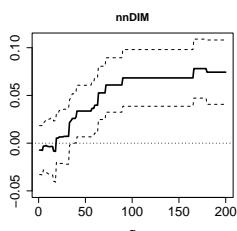

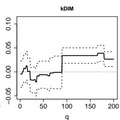

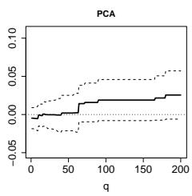  
(a) KMeans

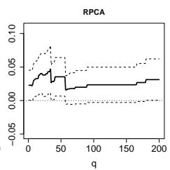

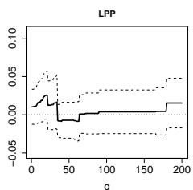

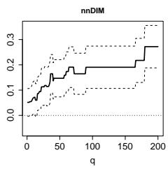

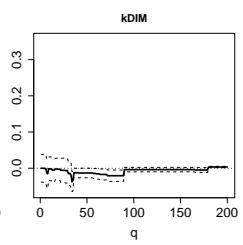

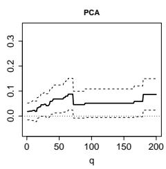

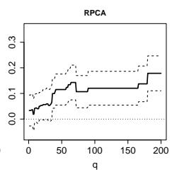  
(b) HDBSCAN

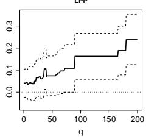

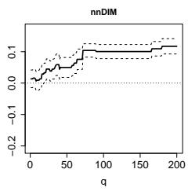

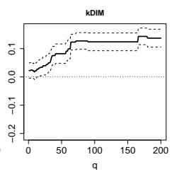

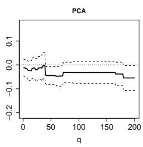

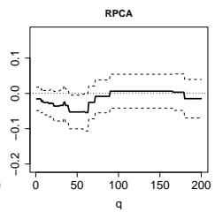  
(c) Spectral Clustering

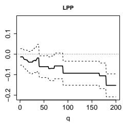

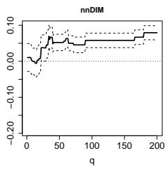

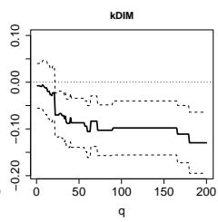

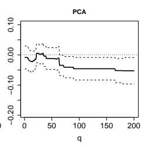  
(d) TORC

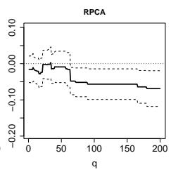

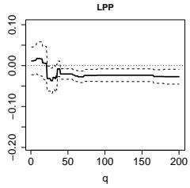  
Figure 3: Each plot shows, for each $q \in \{ 1 , 2 , . . . , 2 0 0 \}$ , the average increase in ARI due to dimension reduction, using only the subset of data sets with dimension at least q. Dashed lines correspond with two standard error deviations. Note that there are six data sets with dimension at least 200, i.e. the rightmost value in each plot is an average of six ARI diferences while the leftmost is an average of all 48.

It is noteworthy that, when filtering out the data sets of lower dimension, the proposed approach is the only one of the five which leads to an improvement in clustering quality for all four clustering methods.

## 5.3 Outlier Detection

To assess the usefulness of the proposed approach for aiding outlier detection, we applied it, plus the other dimension reduction techniques, to a large collection of data sets derived from the same set of 45 classification data sets used previously (48 after including the multiple label sets). We used the common approach of splitting the classes in a data set into “inlier classes” and “outlier classes”, and then creating a data set with outliers by combining all observations in the inlier classes with a small sample of the observations from the outlier classes. For simplicity we used a fixed ratio of “outliers” to “inliers” of 1:20.

We considered three approaches to splitting the classes into inlier classes and outlier classes: (i) each class is treated, in turn, as the inlier class, and all other classes are outlier classes; (ii) all pairs of classes are treated, in turn, as inlier classes, and all remaining classes are outlier classes; and (iii) each class is treated, in turn, as the only outlier class, and all other classes are inlier classes. For (i) we used all 48 classification data sets (after including the multiple label sets), whereas due to the large number of pairs of classes in some of the data sets we excluded those with more than ten classes for (ii). We also excluded data sets with only two classes from (ii). For (iii), we included only data sets with up to five classes. The reason for this is that if the number of classes is large, then a sample from the single outlier class comprising close to 5% of the total number of observations will better resemble a cluster than a small collection of outliers. Finally, we excluded from the resulting data sets any instances where the total number of inliers was less than 30. This resulted in 274 data sets of type (i); 545 of type (ii); and 69 of type (iii).

For outlier “detection” we used the rankings based on isolation forest (Liu et al.,

2008, IF); simplified Local Outlier Factors (Schubert et al., 2014, sLOF); and the simple nearest neighbour distance method of Angiulli and Pizzuti (2002) which uses the sum of the k nearest neighbour distances from a point to determine its “outlierness” (kNNW); where we simply set $k = 1 0$ throughout, deliberately choosing a value diferent from the value used in evaluating $I ( \mathcal { X } , k _ { 0 } , k _ { 1 } ) ^ { * }$ to avoid the possibility that the same setting may artificially inflate the performance of the proposed approach. In addition, to reduce dependence on the hyperparameter determining locality in sLOF, which uses nearest neighbour distances, we also average the sLOF scores from settings of k in $\{ 1 , 2 , . . . , 1 0 \}$ . To evaluate the performance of a ranking of points based on their “outlierness” we used the area under the precision-recall curve (AUPRC).

The results are summarised in Figures 4 - 6, where the results are analogous to those in Figure 3 in that points in the plots show the average diferences in performance, between results from the reduced data and those from the raw data, after filtering out data sets with dimension less than $q ,$ for $q$ up to 200. On data sets with a single inlier class, Figure 4, RPCA arguably shows the best overall performance but with the proposed approach the best pairing with sLOF. With two inlier classes, Figure 5, the proposed approach is the best pairing for both sLOF and Isolation Forest, while it is unclear what the best pairing is with kNNW. Finally, when there is only one outlier class, Figure 6, none of the results is as conclusive as in the previous cases, with the bounds of the naive confidence intervals formed by the two standard error bands typically transcending or lying close to zero. None of the methods improves performance of kNNW when compared with using the raw data, while the proposed approach shows some improvement over the raw data when combined with sLOF, but is one of only two (along with kDIM) which do not appear to ofer an improvement to Isolation Forests.

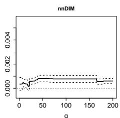

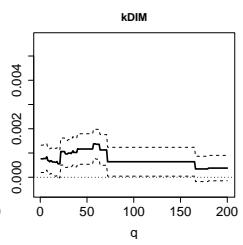

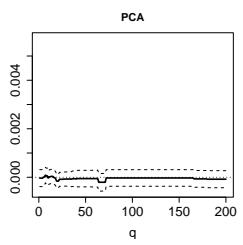

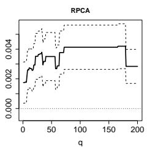  
(a) kNN Weight

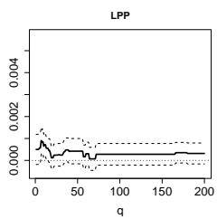

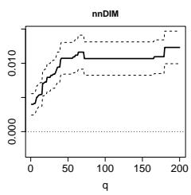

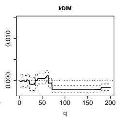

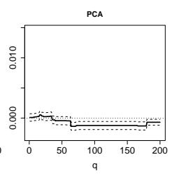

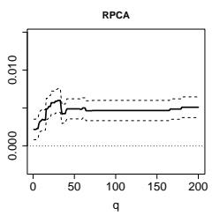  
(b) Simplified LOF

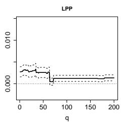

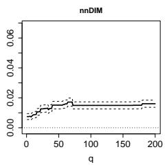

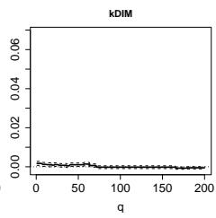

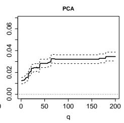

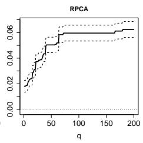  
(c) Isolation Forest

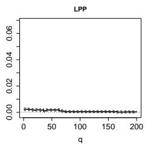  
Figure 4: Single inlier class data sets (type (i)): Average increases in AUPRC due to dimension reduction, after filtering out data sets of dimension below q, for $q \in \{ 1 , 2 , . . . , 2 0 0 \}$ . Dashed lines correspond with two standard error deviations.

## 6 Discussion and Conclusions

In this paper we introduced an intuitive linear dimension reduction technique based on enhancing the local structure in the data. Emphasising this local structure more around higher density points leads to projections with low entropy relative to overall scale. We demonstrated this theoretically by establishing an asymptotic connection with the Density Information Matrix (DIM), which itself has been connected to the task of Independent Components Analysis (ICA); a classical minimum entropy task.

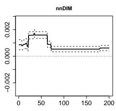

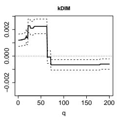

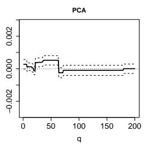

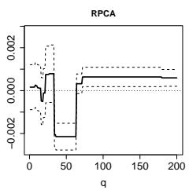  
(a) kNN Weight

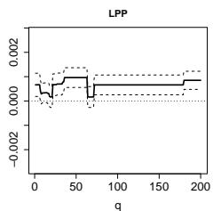

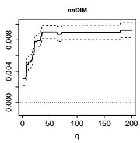

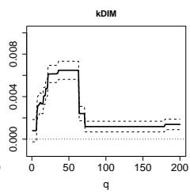

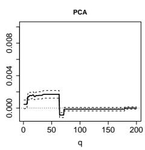

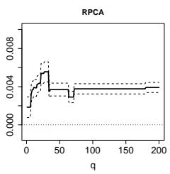

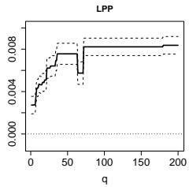  
(b) Simplified LOF

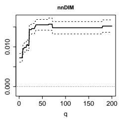

  
(c) Isolation Forest

  
Figure 5: Two inlier class data sets (type (ii)): Average increases in AUPRC due to dimension reduction, after filtering out data sets of dimension below q, for $q \in \{ 1 , 2 , . . . , 2 0 0 \}$ . Dashed lines correspond with two standard error deviations.

Finding low entropy projections can be used to aid two of the archetypal unsupervised tasks of cluster analysis and outlier detection, due to both multimodality and long-tailedness being typical characteristics of low entropy distributions. We demonstrated the practical utility of the proposed approach in these contexts, using a large collection of publicly available data sets; where it showed superior overall performance to relevant alternative general purpose linear dimension reduction techniques from the literature.

  
(a) kNN Weight

  
(b) Simplified LOF

  
(c) Isolation Forest

  
Figure 6: Single outlier class data sets (type (iii)): Average increases in AUPRC due to dimension reduction, after filtering out data sets of dimension below q, for $q \in \{ 1 , 2 , . . . , 2 0 0 \}$ . Dashed lines correspond with two standard error deviations.

# Some Additional Proofs and Derivations

## Density Bounded Away from Zero Plus Support Having a Smooth Boundary Implies C3 and C4

Suppose $\exists f > 0$ for which $f _ { X } ( \mathbf { x } ) \geq \underline { { { f } } } \forall \mathbf { x } \in S u p p ( f _ { X } )$ , and also that $\exists h _ { 0 } , q _ { 0 } > 0$ for which $\oint _ { B _ { h } ( \mathbf { x } ) \cap S u p p ( f _ { X } ) } 1 d \mathbf { z } \ \geq \ q _ { 0 } a _ { 0 } h ^ { p - 1 }$ for all $\mathbf { x } \in S u p p ( f _ { X } )$ and $0 < h \leq h _ { 0 }$ . Note also that since the gradient and support of $f _ { X }$ are bounded there is also a $\overline { { f } } < \infty$ for which $f _ { X } ( \mathbf { x } ) \leq \overline { { f } } \ \forall \mathbf { x } \in \mathbb { R } ^ { p }$

We therefore have, for any $\mathbf { x } \in S u p p ( f _ { X } )$ and $h _ { 1 } , h _ { 2 } \leq \operatorname* { m i n } \{ h _ { 0 } , 1 \}$ , that

$$
\begin{array} { r l } & { \frac { f _ { X } ( \mathbf { x } ) ^ { 2 } h _ { 1 } ^ { p - 1 } h _ { 2 } ^ { p - 1 } h _ { 2 } ^ { 3 } } { \oint _ { B _ { h _ { 1 } } ( \mathbf { x } ) } \oint _ { B _ { h _ { 2 } } ( \mathbf { x } ) } f _ { X } ( \mathbf { z } ) f _ { X } ( \mathbf { w } ) d \mathbf { z } d \mathbf { w } } \leq \frac { \overline { { f } } ^ { 2 } h _ { 1 } ^ { p - 1 } h _ { 2 } ^ { p - 1 } } { \oint _ { B _ { h _ { 1 } } ( \mathbf { x } ) \cap S u p p ( f _ { X } ) } { B _ { h _ { 2 } } ( \mathbf { x } ) \cap S u p p ( f _ { X } ) } } \frac { f ^ { 2 } d \mathbf { z } d \mathbf { w } } { \oint _ { B _ { h _ { 2 } } ( \mathbf { z } ) \cap S u p p ( f _ { X } ) } \int _ { \frac { 1 } { 2 } } ^ { \infty } d \mathbf { z } d \mathbf { w } } } \\ & { \qquad \leq \frac { \overline { { f } } ^ { 2 } } { a _ { 0 } ^ { 2 } q _ { 0 } ^ { 2 } f ^ { 2 } } , } \end{array}
$$

and hence $C _ { 3 }$ holds for $\begin{array} { r } { l = \frac { \overline { { f } } ^ { 2 } } { a _ { 0 } ^ { 2 } q _ { 0 } ^ { 2 } \underline { { f } } ^ { 2 } } } \end{array}$ and $H = \operatorname* { m i n } \{ h _ { 0 } , 1 \}$

To show that C4 holds, note that a bounded gradient implies that $\exists L > 0$ for which $| f _ { X } ( \mathbf { x } ) - f _ { X } ( \mathbf { x } ^ { \prime } ) | \leq L | | \mathbf { x } - \mathbf { x } ^ { \prime } | |$ for all $\mathbf { x } , \mathbf { x } ^ { \prime } \in S u p p ( f _ { X } )$ , and we can choose any $\alpha \in ( 0 , 1 )$ , so that for all $u \in \left( 0 , \operatorname* { m i n } \{ h _ { 0 } , \frac { \alpha f } { L } \} \right)$ and $\gamma \in ( 0 , 1 )$

$$
q _ { 0 } v _ { 0 } ( f _ { X } ( \mathbf { x } ) - L u ) u ^ { p } \leq F _ { ( \mathbf { x } ) } ( u ) \leq v _ { 0 } ( f _ { X } ( \mathbf { x } ) + L u ) u ^ { p } ,
$$

which gives

$$
\frac { F _ { ( \mathbf { x } ) } ( \gamma u ) } { F _ { ( \mathbf { x } ) } ( u ) } \leq \frac { f _ { X } ( \mathbf { x } ) + L u } { q _ { 0 } ( f _ { X } ( \mathbf { x } ) - L u ) } \gamma ^ { p } \leq \frac { 1 + \alpha } { q _ { 0 } ( 1 - \alpha ) } \gamma ^ { p } ,
$$

with the second inequality holding since $L u < \alpha f \leq \alpha f _ { X } ( \mathbf { x } )$ . But in addition we have

$$
F _ { ( { \mathbf { x } } ) } ( u ) - F _ { ( { \mathbf { x } } ) } ( \gamma u ) \geq q _ { 0 } v _ { 0 } ( f _ { X } ( { \mathbf { x } } ) - L u ) u ^ { p } ( 1 - \gamma ^ { p } ) ,
$$

which gives

$$
\frac { F _ { ( \mathbf { x } ) } ( \gamma u ) } { F _ { ( \mathbf { x } ) } ( u ) } = 1 - \frac { F _ { ( \mathbf { x } ) } ( u ) - F _ { ( \mathbf { x } ) } ( \gamma u ) } { F _ { ( \mathbf { x } ) } ( u ) } \leq 1 - \frac { q _ { 0 } ( 1 - \alpha ) } { 1 + \alpha } ( 1 - \gamma ^ { p } ) .
$$

Combining these, we have

$$
\begin{array} { l } { { \displaystyle \int _ { 1 } ^ { \infty } F _ { ( \mathbf x ) } ( u \epsilon ^ { - 1 / a } ) ^ { k } d \epsilon = \sum _ { 1 } ^ { ( \frac { 1 + \alpha } { q _ { 0 } ( 1 - \alpha ) } ) ^ { a / p } } F _ { ( \mathbf x ) } ( u \epsilon ^ { - 1 / a } ) ^ { k } d \epsilon + \sum _ { ( \frac { 1 + \alpha } { q _ { 0 } ( 1 - \alpha ) } ) ^ { a / p } } ^ { \infty } F _ { ( \mathbf x ) } ( u \epsilon ^ { - 1 / a } ) ^ { k } d \epsilon } } \\ { { \displaystyle \le F _ { ( \mathbf x ) } ( u ) ^ { k } ( ( \begin{array} { l } { { \frac { ( 1 + \alpha } { q _ { 0 } ( 1 - \alpha ) } ) ^ { a / p } } } \\ { { \displaystyle \int _ { 1 } ^ { 1 } } } \end{array} ( 1 - \frac { q _ { 0 } ( 1 - \alpha ) } { 1 + \alpha } ( 1 - \epsilon ^ { - p / a } ) ) ^ { k } d \epsilon + ( \frac { 1 + \alpha } { q _ { 0 } ( 1 - \alpha ) } ) ^ { k } \sum _ { ( \frac { 1 + \alpha } { q _ { 0 } ( 1 - \alpha ) } ) ^ { a / p } } ^ { \infty } \epsilon ^ { - p k / a } d \epsilon ) . } } \end{array}
$$

Now, it is straightforward to show that both terms in the brackets above are $O ( 1 / k )$ ， and we are done.

## Proof of Lemma 2

We will use the identity $\begin{array} { r } { E [ D _ { \mathbf { x } , n , ( k ( n ) + 1 ) } ^ { b } / D _ { \mathbf { x } , n , ( k ( n ) ) } ^ { a } ] = \int _ { 0 } ^ { \infty } P ( D _ { \mathbf { x } , n , ( k ( n ) + 1 ) } ^ { b } / D _ { \mathbf { x } , n , ( k ( n ) ) } ^ { a } > } \end{array}$ $\epsilon ) d \epsilon$ . As previously let $F _ { ( \mathbf { x } ) }$ be the distribution function of $| | X - \mathbf { x } | |$ , i.e. $F _ { ( \mathbf { x } ) } ( u ) =$ $P ( | | X - \mathbf { x } | | \leq u )$ . We then have, for $\epsilon > 0$ and suppressing the notational dependence of $k ( n )$ on n, that

$$
P \left( \frac { D _ { \mathbf { x } , n , ( k + 1 ) } ^ { b } } { D _ { \mathbf { x } , n , ( k ) } ^ { a } } > \epsilon \right) = P \left( D _ { \mathbf { x } , n , ( k + 1 ) } ^ { b - a } > \epsilon \right) + P \left( D _ { \mathbf { x } , n , ( k + 1 ) } ^ { b - a } \leq \epsilon , D _ { \mathbf { x } , n , ( k ) } < \frac { D _ { \mathbf { x } , n , ( k + 1 ) } ^ { b / a } } { \epsilon ^ { 1 / a } } \right) ,
$$

and hence

$$
\begin{array} { r l } { \displaystyle E \left[ \frac { D _ { \mathbf { x } , n _ { \alpha } ( k + 1 ) } ^ { b } } { D _ { \mathbf { x } , n _ { \alpha } ( k ) } ^ { a } } \right] = \int _ { 0 } ^ { \infty } P \left( D _ { \mathbf { x } , n _ { \alpha } ( k + 1 ) } ^ { b - a } > \epsilon \right) d \epsilon } & { } \\ { \displaystyle } & { ~ + \int _ { 0 } ^ { \infty } P \left( D _ { \mathbf { x } , n _ { \alpha } ( k + 1 ) } ^ { b - a } \leq \epsilon , D _ { \mathbf { x } , n _ { \alpha } ( k ) } < \frac { D _ { \mathbf { x } , n _ { \alpha } ( k + 1 ) } ^ { b / a } } { \epsilon ^ { 1 / a } } \right) d \epsilon } \\ { \displaystyle } & { = E \left[ D _ { \mathbf { x } , n _ { \alpha } ( k + 1 ) } ^ { b - a } \right] } \\ & { ~ + \int _ { 0 } ^ { \infty } P \left( D _ { \mathbf { x } , n _ { \alpha } ( k + 1 ) } ^ { b - a } \leq \epsilon , D _ { \mathbf { x } , n _ { \alpha } ( k ) } < \frac { D _ { \mathbf { x } , n _ { \alpha } ( k + 1 ) } ^ { b / a } } { \epsilon ^ { 1 / a } } \right) d \epsilon , } \end{array}
$$

and so it is suficient to show that the second integral above converges to zero uniformly in x. Towards establishing this, note that, using the properties of order statis-

tics, we have

$$
\begin{array} { r l } & { P \Bigg ( D _ { \mathbf x , n , ( k + 1 ) } ^ { b - a } \leq \epsilon , D _ { \mathbf x , n , ( k ) } < \frac { D _ { \mathbf x , n , ( k + 1 ) } ^ { b / a } } { \epsilon ^ { 1 / a } } \Bigg ) } \\ & { \quad \quad \quad = \frac { n ! \stackrel { e ^ { \frac { 1 } { 6 } n } = \frac { \mathbf { u } _ { \mathbf x } ^ { b / a } } { 4 ^ { 1 / a } } } { \epsilon ^ { 1 / a } } } { ( k - 1 ) ! ( n - k - 1 ) ! } d F _ { ( \mathbf x ) } ( z ) d F _ { ( \mathbf x ) } ( u ) } \\ & { \quad \quad \quad = \frac { n ! \stackrel { e ^ { \frac { 1 } { 6 } n } } { \int } F _ { ( \mathbf x ) } \left( \frac { \mathbf { u } _ { \mathbf x } ^ { b / a } } { \epsilon ^ { 1 / a } } \right) ^ { k } \left( 1 - F _ { ( \mathbf x ) } ( u ) \right) ^ { n - k - 1 } d F _ { ( \mathbf x ) } ( u ) } { k ! ( n - k - 1 ) ! } , } \\ & { \quad \quad \quad = \frac { n ! \stackrel { e ^ { \frac { 1 } { 6 } n } } { \int } F _ { ( \mathbf x ) } \left( \frac { \mathbf { u } _ { \mathbf x } ^ { b / a } } { \epsilon ^ { 1 / a } } \right) ^ { k } \left( 1 - F _ { ( \mathbf x ) } ( u ) \right) ^ { n - k - 1 } d F _ { ( \mathbf x ) } ( u ) } { k ! ( n - k - 1 ) ! } , } \end{array}
$$

and hence, letting $u ^ { * } = \operatorname* { m i n } \{ 1 , U \}$ with U as in Condition C4,

$$
\begin{array} { r l } { \int _ { 0 } ^ { \infty } \int _ { 0 } ^ { \infty } ( \frac { 1 } { \omega } ) ^ { 2 } d x \leq \omega \mathrm { P r } ( \frac { 1 } { \omega } ) ^ { 2 } d x \leq \omega \mathrm { P r } ( \frac { 1 } { \omega } ) ^ { 2 } d x } & { \leq \omega \mathrm { P r } ( \frac { 1 } { \omega } ) ^ { 2 } d x } \\ & { = \int _ { 0 } ^ { \infty } ( \frac { 1 } { \omega } ) ^ { 2 } d x + \frac { 1 } { \omega ^ { 2 } } ( \frac { 1 } { \omega } ) ^ { 2 } d x + \frac { 1 } { \omega ^ { 2 } } ( \frac { 1 } { \omega } ) ^ { 2 } d x + \frac { 1 } { \omega ^ { 2 } } } \\ & { = \int _ { 0 } ^ { \infty } ( - \frac { 1 } { \omega } ) ^ { 2 } d x + \frac { 1 } { \omega ^ { 2 } } ( \frac { 1 } { \omega } ) ^ { 2 } d x + \frac { 1 } { \omega ^ { 2 } } d x } \\ & { + \int _ { 0 } ^ { \infty } ( 1 - s _ { \mathrm { o } } ) \omega \mathrm { P r } ( \frac { 1 } { \omega } ) ^ { 2 } d x } \\ & { \leq ( \frac { 1 } { \omega } ) ^ { 2 } d x + \frac { 1 } { \omega ^ { 2 } } ( \frac { 1 } { \omega } ) ^ { 2 } d x + \frac { 1 } { \omega ^ { 2 } } ( \frac { 1 } { \omega } ) ^ { 2 } d x } \\ & { \leq ( \frac { 1 } { \omega } ) ^ { 2 } d x + \frac { 1 } { \omega ^ { 2 } } ( \frac { 1 } { \omega } ) ^ { 2 } \frac { 1 } { s _ { \mathrm { o } } ^ { 2 } d x + \frac { 1 } { \omega ^ { 2 } } } } \\ &  \leq \frac { 1 } { \omega ^ { 2 } } ( \frac { 1 } { \omega } ) ^ { 2 } ( \frac { 1 } { \omega } ) ^ { 2 } ( \frac { 1 }  \ \end{array}
$$

Now, letting $\overline { { f } }$ be an upper bound on $f _ { X } ( \mathbf { x } )$ , consider that $F _ { ( \mathbf { x } ) } ( u ^ { b / a } \epsilon ^ { - 1 / a } ) \leq \operatorname* { m i n } \{ 1 , v _ { 0 } \overline { { f } } u ^ { b p / a } \epsilon ^ { - p / a } \}$ and so $\begin{array} { r } { \int _ { u ^ { b - a } } F _ { ( { \mathbf x } ) } ( u ^ { b / a } / \epsilon ^ { 1 / a } ) ^ { k } d \epsilon \le \int _ { 0 } \operatorname* { m i n } \{ 1 , v _ { 0 } \overline { { f } } u ^ { b p / a } \epsilon ^ { - p / a } \} ^ { k } d \epsilon = ( v _ { 0 } \overline { { f } } ) ^ { p / a } u ^ { b } \frac { p k } { p k - a } . } \end{array}$ . We

therefore have

$$
\begin{array} { r l } {  { \int _ { u ^ { * } } ^ { \infty } ( 1 - F _ { ( \mathbf { x } ) } ( u ) ) ^ { n - k - 1 } \int _ { u ^ { b - a } } ^ { \infty } F _ { ( \mathbf { x } ) } ( \frac { u ^ { b / a } } { \epsilon ^ { 1 / a } } ) ^ { k } d \epsilon d F _ { ( \mathbf { x } ) } ( u ) } } \\ & { \leq ( v _ { 0 } \overline { { f } } ) ^ { p / a } \frac { p k } { p k - a } \int _ { u ^ { * } } ^ { \infty } u ^ { b } ( 1 - F _ { ( \mathbf { x } ) } ( u ) ) ^ { n - k - 1 } d F _ { ( \mathbf { x } ) } ( u ) } \\ & { \leq ( v _ { 0 } \overline { { f } } ) ^ { p / a } ( 2 M ) ^ { b } \frac { p k } { p k - a } \int _ { u ^ { * } } ^ { \infty } ( 1 - F _ { ( \mathbf { x } ) } ( u ) ) ^ { n - k - 1 } d F _ { ( \mathbf { x } ) } ( u ) } \\ & { = ( v _ { 0 } \overline { { f } } ) ^ { p / a } ( 2 M ) ^ { b } \frac { p k } { ( p k - a ) ( n - k ) } ( 1 - F _ { ( \mathbf { x } ) } ( u ^ { * } ) ) ^ { n - k } , } \end{array}
$$

where M is as in Condition C1. Then, since the closure of the support of $f _ { X }$ $\overline { { S u p p ( f _ { X } ) } }$ , is compact, it must be that $\exists \mathbf { x } ^ { * } \in \overline { { S u p p ( f _ { X } ) } }$ for which $0 < F _ { ( { \bf x } ^ { * } ) } ( u ^ { * } ) \le$ mi $\mathrm { n } _ { \mathbf { x } \in S u p p ( f _ { X } ) } F _ { ( \mathbf { x } ) } ( u ^ { * } )$ , and as a result we have

$$
\begin{array} { r } { \underset { \mathbf { x } \in S u p p ( f _ { X } ) } { \operatorname* { s u p } } \int _ { u ^ { * } } ^ { \infty } ( 1 - F _ { \mathbf { ( x ) } } ( u ) ) ^ { n - k - 1 } \int _ { u ^ { b - a } } ^ { \infty } F _ { \mathbf { ( x ) } } \left( \frac { u ^ { b / a } } { \epsilon ^ { 1 / a } } \right) ^ { k } d \epsilon d F _ { \mathbf { ( x ) } } ( u ) } \\ { \leq C \frac { 1 } { n - k } \left( 1 - F _ { \mathbf { ( x * ) } } ( u ^ { * } ) \right) ^ { n - k } , } \end{array}
$$

for some constant C, independent of $n , k .$

Next observe that, for $u < u ^ { * } \leq 1$ and using the change of variables $v = u ^ { b / a } / \epsilon ^ { 1 / a }$ we have

$$
\begin{array} { r l r } {  { \int _ { u ^ { b - a } } ^ { \infty } F _ { ( { \mathbf x } ) } ( u ^ { b / a } \epsilon ^ { 1 / a } ) d \epsilon = a u ^ { b } \int _ { 0 } ^ { u } v ^ { - ( a + 1 ) } F _ { ( { \mathbf x } ) } ( v ) d v } } \\ & { } & { \leq a u ^ { a } \int _ { 0 } ^ { u } v ^ { - ( a + 1 ) } F _ { ( { \mathbf x } ) } ( v ) d v = \int _ { 1 } ^ { \infty } F _ { ( { \mathbf x } ) } ( u \epsilon ^ { 1 / a } ) d \epsilon , } \end{array}
$$

and hence

$$
\operatorname* { s u p } _ { 0 \leq u < u ^ { * } } \left( \frac { 1 } { F _ { ( \mathbf { x } ) } ( u ) ^ { k } } \int _ { u ^ { b - a } } ^ { \infty } F _ { ( \mathbf { x } ) } \left( \frac { u ^ { b / a } } { \epsilon ^ { 1 / a } } \right) ^ { k } d \epsilon \right) \leq \operatorname* { s u p } _ { 0 < u < u ^ { * } } \left( \frac { 1 } { F _ { ( \mathbf { x } ) } ( u ) ^ { k } } \int _ { 1 } ^ { \infty } F _ { ( \mathbf { x } ) } \left( \frac { u } { \epsilon ^ { 1 / a } } \right) ^ { k } d \epsilon \right) .
$$

Combining this we have, for all $\mathbf { x } \in S u p p ( f _ { X } )$

$$
\begin{array} { r l } { E \left[ \frac { D _ { \mathbf { x } , n , ( k ( n ) + 1 ) } ^ { b } } { D _ { \mathbf { x } , n , ( k ( n ) ) } ^ { a } } \right] - E \left[ D _ { \mathbf { x } , n , ( k ( n ) + 1 ) } ^ { b - a } \right] \leq \frac { n ! } { k ! ( n - k - 1 ) ! } \Biggl ( C \frac { 1 } { n - k } \left( 1 - F _ { ( \mathbf { x } ^ { * } ) } ( u ^ { * } ) \right) ^ { n - k } } & { } \\ { + \frac { ( n - k - 1 ) ! k ! } { n ! } \underset { 0 < u < u ^ { * } } { \operatorname* { s u p } } \left( \frac { 1 } { F _ { ( \mathbf { x } ) } ( u ) ^ { k } } \int _ { 1 } ^ { \infty } F _ { ( \mathbf { x } ) } \left( \frac { u } { \epsilon ^ { 1 / a } } \right) ^ { k } d \epsilon \right) \Biggr ) } & { } \\ { = C \binom { n } { k } \left( 1 - F _ { ( \mathbf { x } ^ { * } ) } ( u ^ { * } ) \right) ^ { n - k } + \underset { 0 < u < u ^ { * } } { \operatorname* { s u p } } \left( \frac { 1 } { F _ { ( \mathbf { x } ) } ( u ) ^ { k } } \int _ { 1 } ^ { \infty } F _ { ( \mathbf { x } ) } \left( \frac { u } { \epsilon ^ { 1 / a } } \right) ^ { k } d \epsilon \right) , } \end{array}
$$

where the first term is independent of x and clearly converges to zero as $n  \infty$ provided $k / n  0$ , and the second term converges to zero uniformly in x by Condition C4 since $k \to \infty { \mathrm { ~ a s ~ } } n \to \infty$

## References

Fabrizio Angiulli and Clara Pizzuti. Fast outlier detection in high dimensional spaces. In European conference on principles of data mining and knowledge discovery, pages 15–27. Springer, 2002.

David Arthur, Sergei Vassilvitskii, et al. k-means++: The advantages of careful seeding. In Soda, volume 7, pages 1027–1035, 2007.

Ricardo JGB Campello, Davoud Moulavi, and J¨org Sander. Density-based clustering based on hierarchical density estimates. In Pacific-Asia Conference on Knowledge Discovery and Data Mining, pages 160–172. Springer, 2013.

Pierre Comon. Independent component analysis, a new concept? Signal processing, 36(3):287–314, 1994.

Robert Duin. Multiple Features. UCI Machine Learning Repository, 1998. DOI: https://doi.org/10.24432/C5HC70.

Dafydd Evans. A law of large numbers for nearest neighbour statistics. Proceedings of the Royal Society A: Mathematical, Physical and Engineering Sciences, 464(2100): 3175–3192, 2008.

Gerald B Folland. How to integrate a polynomial over a sphere. The American Mathematical Monthly, 108(5):446–448, 2001.

Walter Gautschi. Some elementary inequalities relating to the gamma and incomplete gamma function. J. Math. Phys, 38(1):77–81, 1959.

Xiaofei He and Partha Niyogi. Locality preserving projections. Advances in neural information processing systems, 16, 2003.

David P Hofmeyr. Clustering by nonparametric smoothing. arXiv preprint arXiv:2503.09134, 2025.

David P. Hofmeyr and Nicos G. Pavlidis. PPCI: an R Package for Cluster Identification using Projection Pursuit. The R Journal, 11(2):152–170, 2019. doi: 10.32614/RJ-2019-046. URL https://doi.org/10.32614/RJ-2019-046.

Lawrence Hubert and Phipps Arabie. Comparing partitions. Journal of classification, 2(1):193–218, 1985.

Mia Hubert, Peter J Rousseeuw, and Karlien Vanden Branden. Robpca: a new approach to robust principal component analysis. Technometrics, 47(1):64–79, 2005.

Guodong Hui and Bruce G Lindsay. Projection pursuit via white noise matrices. Sankhya B, 72(2):123–153, 2010.

Aapo Hyv¨arinen. New approximations of diferential entropy for independent component analysis and projection pursuit. Advances in neural information processing systems, 10, 1997.

Aapo Hyvarinen. Fast and robust fixed-point algorithms for independent component analysis. IEEE transactions on Neural Networks, 10(3):626–634, 1999.

Ian T Jollife and Jorge Cadima. Principal component analysis: a review and recent developments. Philosophical transactions of the royal society A: Mathematical, Physical and Engineering Sciences, 374(2065):20150202, 2016.

Sevvandi Kandanaarachchi and Rob J Hyndman. Dimension reduction for outlier detection using dobin. Journal of Computational and Graphical Statistics, 30(1): 204–219, 2021.

Leonard Kaufman and Peter J Rousseeuw. Finding groups in data: an introduction to cluster analysis, volume 344. John Wiley & Sons, 2009.

Bruce G Lindsay and Weixin Yao. Fisher information matrix: A tool for dimension reduction, projection pursuit, independent component analysis, and more. Canadian Journal of Statistics, 40(4):712–730, 2012.

Fei Tony Liu, Kai Ming Ting, and Zhi-Hua Zhou. Isolation forest. In 2008 eighth ieee international conference on data mining, pages 413–422. IEEE, 2008.

Andrew Ng, Michael Jordan, and Yair Weiss. On spectral clustering: Analysis and an algorithm. Advances in neural information processing systems, 14, 2001.

Juliane Sch¨afer and Korbinian Strimmer. A shrinkage approach to large-scale covariance matrix estimation and implications for functional genomics. Statistical applications in genetics and molecular biology, 4(1), 2005.

Juliane Schafer, Rainer Opgen-Rhein, Verena Zuber, Miika Ahdesmaki, A. Pedro Duarte Silva, and Korbinian Strimmer. corpcor: Eficient Estimation of Covariance and (Partial) Correlation, 2021. URL https://CRAN.R-project.org/ package=corpcor. R package version 1.6.10.

Klaus Schliep and Klaus Hechenbichler. kknn: Weighted k-Nearest Neighbors, 2025. URL https://CRAN.R-project.org/package=kknn. R package version 1.4.1.

Erich Schubert, Arthur Zimek, and Hans-Peter Kriegel. Local outlier detection reconsidered: a generalized view on locality with applications to spatial, video, and network outlier detection. Data mining and knowledge discovery, 28(1):190–237, 2014.

Valentin Todorov and Peter Filzmoser. An object-oriented framework for robust multivariate analysis. Journal of Statistical Software, 32(3):1–47, 2009. doi: 10. 18637/jss.v032.i03.

Antony Unwin. OutliersO3: Draws Overview of Outliers (O3) Plots, 2026. URL https://CRAN.R-project.org/package=OutliersO3. R package version 0.7.

Jie Yang and Chin-Teng Lin. Autonomous clustering by fast find of mass and distance peaks. IEEE Transactions on Pattern Analysis and Machine Intelligence, 47(7): 5336–5349, 2025.

Weixin Yao, Debmalya Nandy, Bruce G Lindsay, and Francesca Chiaromonte. Covariate information matrix for suficient dimension reduction. Journal of the American Statistical Association, 2019.