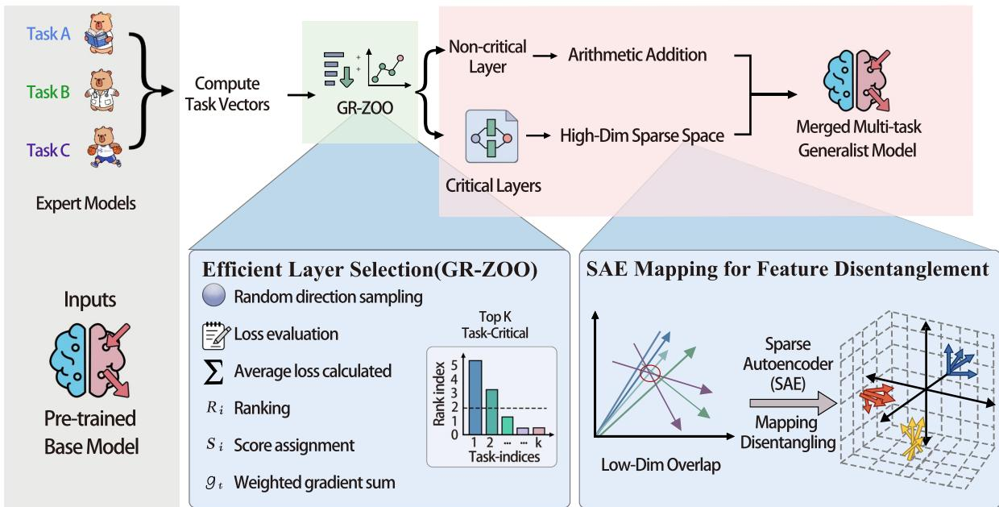
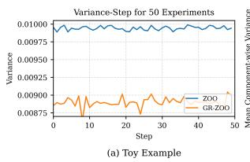
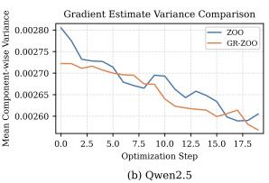
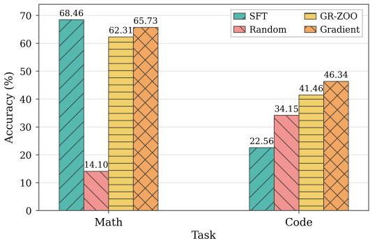
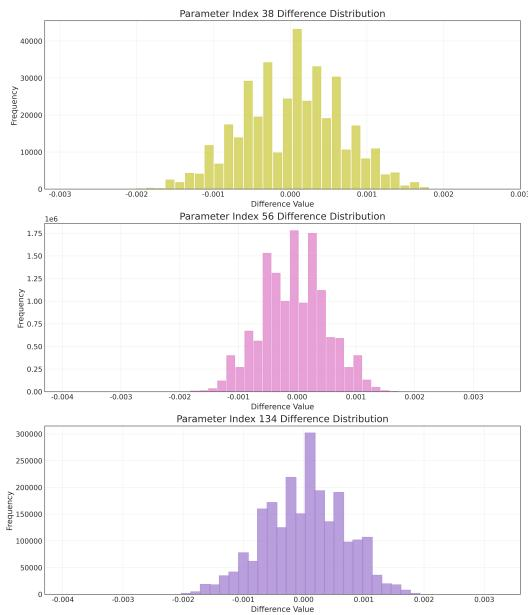

# Escaping Low-Dimensional Overlap: Multi-Task Model Merging via High-Dimensional Sparse Disentanglement

Yihang Zhang1\*, Shengke Sun2\*, Junjie Wen3, Feng Zeng1†

1Central South University

2Nanjing University of Science and Technology

3Hefei University of Technology

zhangyihang1010@gmail.com, sunshengke@njust.edu.cn, junjie.wen@mail.hfut.edu.cn, fengzeng@csu.edu.cn

## Abstract

Model merging provides an efficient way to construct multi-task generalist models without additional training, but its performance often degrades under severe task interference. Task interference in model merging primarily stems from superposition, where task-specific features become entangled within the parameter space. This entanglement renders conventional decomposition methods insufficient for effectively isolating useful task directions from interfering components. In this paper, we propose a sparse-representation-based merging framework that uses Sparse Autoencoders (SAEs) to project task vectors into a high-dimensional sparse feature space, enabling feature-level disentanglement before fusion. To reduce computational overhead, we further introduce a lightweight Group-Ranked Zeroth-Order Optimizer (GR-ZOO) to identify task-critical layers for selective merging. Experiments on both Qwen2.5-1.5B and Qwen2.5-7B demonstrate that our method consistently outperforms representative baselines, including Task Arithmetic, TIES-Merge, DARE, Fisher-Merge,and several recent training-free merging methods, across mathematical reasoning, code generation, instruction following, and general knowledge tasks. In a highly conflicting four-task setting on Qwen2.5-1.5B, our method further achieves a 2.78% improvement over the strongest baseline.

## 1 Introduction

As the scale of foundation models continues to grow (Yang et al., 2025; Team et al., 2023; Achiam et al., 2023; Guo et al., 2025), fine-tuning and deploying separate models for different downstream tasks has become increasingly prohibitive (Ouyang et al., 2022; Tang et al., 2025). Recently, model merging (Ilharco et al., 2023; Wortsman et al.,

2022) has emerged as an efficient way to integrate multiple task-specific models without additional training. It aims to construct a versatile generalist model by directly fusing the weights of multiple expert models that excel in individual tasks (Matena and Raffel, 2022; Ilharco et al., 2023; Yadav et al., 2023; Yu et al., 2024).

A major challenge in model merging lies in task interference (Jin et al., 2023; Yadav et al., 2023; Tam et al., 2024). Due to different finetuning data distributions and optimization objectives of expert models, their parameter updates may encode conflicting task-specific directions. As a result, the merged model often struggles to simultaneously preserve the capabilities of all constituent experts. To mitigate such interference, numerous model merging approaches have been proposed. Parameter-space arithmetic methods, such as TIES-Merge (Yadav et al., 2023) and DARE (Yu et al., 2024), attempt to reduce conflicts by pruning, rescaling, or resolving sign conflicts of task vectors before fusion. Parameter decomposition methods, such as TSV (Gargiulo et al., 2025) and Twin-Merging (Lu et al., 2024), further seek to separate task-relevant and interfering components through low-rank or structured decompositions. However, these methods still rely on operations within the original parameter space, and thus remain limited when task-specific updates are highly entangled.

In this paper, we attempt to alleviate this limitation through the lens of superposition, a phenomenon widely discussed in mechanistic interpretability (Elhage et al., 2022; Cunningham et al., 2023). Mechanistic interpretability studies reveal that in neural networks, multiple functionally distinct features may share non-orthogonal directions in the same representation space. In model merging, this view suggests that task vectors are not always clean combinations of independent taskspecific components (Cunningham et al., 2023; Bricken et al., 2023). Instead, updates from different tasks may partially reuse, compete for, or interfere with overlapping feature directions. Therefore, operations performed only in the original parameter space, such as direct arithmetic or orthogonal decomposition, may still suffer from interference when task-specific features are highly entangled.

  
Figure 1: Overall architecture of our proposed High-Dimensional Sparse Disentanglement Merging framework. The pipeline first extracts task vectors from expert models and applies GR-ZOO to identify task-critical layers. Non-critical layers are merged through arithmetic addition, while critical layers are projected into a high-dimensional sparse space via SAE-based feature disentanglement, enabling interference-free fusion of overlapping task features.

Building upon this observation, we propose to reduce task interference by projecting task vectors into a higher-dimensional sparse feature space before fusion, thereby alleviating merging conflicts. We propose High-Dimensional Sparse Disentanglement Merging, a sparse-representation-based framework for model merging. Our method uses Sparse Autoencoders (SAEs) to map layer-wise task vectors into sparse feature codes, where taskspecific components can be separated more explicitly (Bricken et al., 2023; Cunningham et al., 2023). The task vectors are then fused at the feature level and mapped back to the parameter space. Since applying SAE-based disentanglement to all layers can be computationally expensive, inspired by zerothorder optimization techniques that estimate search directions from function evaluations (Nesterov and Spokoiny, 2017; Malladi et al., 2023), we further introduce a lightweight Group-Ranked Zeroth-Order Optimizer (GR-ZOO) to identify task-critical layers. By applying SAE-based merging only to these selected layers, our method reduces computational overhead while preserving the benefits of featurelevel disentanglement.

The main contributions of this paper are summarized as follows:

• We analyze task interference in model merging from the perspective of superposition, suggesting that highly entangled task vectors can be difficult to separate within the original parameter space.

• We propose High-Dimensional Sparse Disentanglement Merging, which uses SAEs to project task vectors into a high-dimensional sparse feature space and performs featurelevel fusion to reduce interference.

• We introduce a Group-Ranked Zeroth-Order Optimizer (GR-ZOO), a forward-pass-only layer selection method that identifies taskcritical layers and avoids applying SAE-based disentanglement to every layer.

## 2 Related Work

## 2.1 Multi-Task Model Merging

Model merging aims to integrate multiple taskspecific expert models into a single generalist model without joint retraining. Recent advancements fall into two primary trajectories: parameter arithmetic and parameter decomposition.

Parameter Arithmetic. This line of work operates directly within the original parameter space. Approaches like Model Soups (Wortsman et al., 2022) and Task Arithmetic (Ilharco et al., 2023) merge weights via linear interpolation or vector addition. To mitigate severe task interference, subsequent methods introduce sparsification and conflict resolution mechanisms, such as trimming and sign election (TIES-Merging (Yadav et al., 2023)), randomized dropping (DARE (Yu et al., 2024)), and magnitude-aware sampling (DELLA (Deep et al., 2024)).

Parameter Decomposition. To overcome lowdimensional limitations, a complementary trajectory projects task updates into structured subspaces prior to fusion. Methods like KnOTS (Stoica et al., 2025) and TSV-M (Gargiulo et al., 2025) align or compress updates via Singular Value Decomposition (SVD). Other frameworks introduce spectral truncation (STAR (Lee et al., 2025b)), adaptive rank selection (AdaRank (Lee et al., 2025a)), or explicit subspace partitioning (ISO (Marczak et al., 2025), WIDEN (Xiong et al., 2024), ESM (Li et al., 2026)).

Although highly scalable, these coordinate-wise heuristic manipulations operate directly in the original parameter space and may struggle when multiple task updates exhibit substantial interference. Despite providing stronger functional decoupling, these strategies predominantly rely on linear composability assumptions or orthogonal transformations. When functionally distinct capabilities are trapped in non-orthogonal, superposed structures, such rigid linear approximations fail to fully isolate useful task directions from overlapping, conflicting components.

## 2.2 Superposition and Sparse Feature Disentanglement

Mechanistic interpretability establishes that neural networks tend to encode latent features far exceeding their available dimensions into overcomplete, non-orthogonal hidden directions—a phenomenon known as superposition (Elhage et al., 2022; Scherlis et al., 2022). This causes polysemanticity, where individual parameter coordinates activate across multiple orthogonal contexts (Henighan et al., 2023). Consequently, task vectors are highly superposed mixtures of multi-semantic components. Attempting to resolve interference via lowdimensional coordinate pruning or linear orthogonalization inherently creates a zero-sum trade-off, distorting crucial task capabilities.

To resolve superposition, Sparse Autoencoders (SAEs) have emerged as powerful tools for unsupervised dictionary learning, untangling features into monosemantic components across foundation models (Yun et al., 2021; Cunningham et al., 2023; Bricken et al., 2023; Templeton et al., 2024; Gao et al., 2025). However, (Cui et al., 2026) demonstrate that vanilla SAEs suffer from magnitude shrinkage induced by $L _ { 1 }$ penalties, highlighting the need for rigid activation gating and geometric regularizations.

While prior work mainly applies Sparse Autoencoders (SAEs) to activation analysis, we extend sparse feature disentanglement to task-vector merging by projecting parameter updates into a highdimensional sparse latent space before fusion, reducing interference from low-dimensional parameter overlap.

## 3 Methodology

In this section, we present the proposed High-Dimensional Sparse Disentanglement Merging framework. We begin by formulating the model merging problem and theoretically show that sparse decomposition of task vectors can reduce crosstask interference under feature superposition. We then employ an improved Sparse Autoencoder (SAE) to project layer-wise task vectors into a high-dimensional sparse feature space, where taskrelevant components can be represented more explicitly. To make sparse disentanglement computationally feasible, we introduce Group-Ranked Zeroth-Order Optimizer (GR-ZOO) to identify task-critical layers, so that the subsequent featurelevel processing can be restricted to a small subset of layers. Finally, we design a feature-aware fusion strategy in the sparse latent space and decode the fused representation back to the parameter space, enabling effective multi-task model merging while reducing task interference.

## 3.1 Problem Setup

Model Merging. Let $f _ { \theta _ { 0 } }$ denote a pre-trained base model with parameters $\theta _ { 0 } \in \mathbb { R } ^ { d }$ . Given N downstream tasks $\{ \mathcal { T } _ { i } \} _ { i = 1 } ^ { N }$ , each task-specific expert model $f _ { \theta _ { i } }$ is obtained by fine-tuning the same base model on task Ti, where $\theta _ { i } \in \mathbb { R } ^ { d }$ denotes the parameters of the i-th expert. The goal of model merging is to construct a single model $f _ { \theta _ { m } }$ that preserves the capabilities of all expert models without accessing their original training data or performing additional full fine-tuning. Formally, model merging can be written as

$$
\theta _ { m } = \mathcal { A } ( \theta _ { 0 } , \theta _ { 1 } , \ldots , \theta _ { N } ) ,\tag{1}
$$

where $\boldsymbol { \mathcal { A } } ( \cdot )$ denotes a merging algorithm.

Task Vector. Following task-vector-based model merging (Ilharco et al., 2023; Yu et al., 2024), we define the task vector of expert i as the parameter displacement from the base model:

$$
\tau _ { i } = \theta _ { i } - \theta _ { 0 } .\tag{2}
$$

The task vector $\tau _ { i }$ represents the task-specific knowledge acquired by fine-tuning on task $\mathcal { T } _ { i }$ . A general task-vector merging process can then be formulated as

$$
\theta _ { m } = \theta _ { 0 } + \mathcal { M } ( \tau _ { 1 } , \tau _ { 2 } , \ldots , \tau _ { N } ) ,\tag{3}
$$

where $\mathcal { M } ( \cdot )$ is a task-vector fusion operator. A typical example is weighted linear merging (Ilharco et al., 2023):

$$
\theta _ { m } = \theta _ { 0 } + \Delta , \quad \Delta = \sum _ { i = 1 } ^ { N } \alpha _ { i } \tau _ { i } ,\tag{4}
$$

where $\alpha _ { i }$ controls the contribution of expert i.

Since modern language models consist of multiple parameterized layers, we can also define the layer-wise task vector as

$$
\tau _ { i } ^ { ( \ell ) } = \theta _ { i } ^ { ( \ell ) } - \theta _ { 0 } ^ { ( \ell ) } , \quad \ell = 1 , 2 , \ldots , L ,\tag{5}
$$

where $\theta _ { i } ^ { ( \ell ) }$ denotes the parameters of the ℓ-th layer of expert i. This layer-wise view is important because task-specific knowledge and cross-task conflicts may be unevenly distributed across layers.

Superposition. Superposition (Elhage et al., 2022; Scherlis et al., 2022) suggests that large neural networks may encode more latent features than the number of available independent dimensions, causing multiple features to share the same representational directions. We view task interference through the lens of feature superposition: task vectors may contain sparse combinations of latent capability directions that are not well separated in the original parameter space. As a result, coordinatewise pruning or orthogonal decomposition may not fully remove cross-task interference without distorting useful capabilities. We formalize this intuition and provide theoretical bounds in Appendix H. These results motivate projecting task vectors into a high-dimensional sparse feature space before fusion.

## 3.2 High-Dimensional Sparse Disentanglement via Improved SAEs

To reduce task interference induced by feature superposition in the original parameter space, we project layer-wise task vectors into a highdimensional sparse latent space. Specifically, for a selected task vector $\tau _ { i } ^ { ( \ell ) } \in \mathbb { R } ^ { d }$ . We train a Sparse Autoencoder (Cunningham et al., 2023) (SAE) to encode $\tau _ { i } ^ { ( \ell ) }$ into an overcomplete sparse representation and then reconstruct it back to the parameter space:

$$
h = E ( \tau _ { i } ^ { ( \ell ) } ) \Rightarrow z = \mathrm { T o p K } ( h ) \Rightarrow \hat { \tau } _ { i } ^ { ( \ell ) } = D ( z )\tag{6}
$$

where $E ( \cdot )$ and $D ( \cdot )$ denote the encoder and decoder, respectively. The latent dimension is set much larger than the input dimension, enabling task vectors to be represented by a small number of activated latent features.

Although standard SAEs are commonly trained with an $L _ { 1 }$ sparsity penalty, directly applying them to model merging is suboptimal. The $L _ { 1 }$ penalty tends to shrink latent activation magnitudes, which may distort the scale of task-specific updates (Rajamanoharan et al., 2024). Moreover, standard SAE training often suffers from inactive latent units, commonly known as dead neurons, leading to an inefficient use of the high-dimensional latent space. Finally, without proper constraints on the decoder, the model may exploit scale ambiguity between latent activations and decoder weights, resulting in unstable or collapsed feature representations. To address these issues, we introduce the following modifications.

Top-K sparse activation. Instead of imposing an $L _ { 1 }$ penalty on the latent codes, we enforce sparsity using a hard Top-K activation:

$$
z _ { j } = { \left\{ \begin{array} { l l } { h _ { j } , } & { j \in S _ { K } ( h ) , } \\ { 0 , } & { { \mathrm { o t h e r w i s e } } , } \end{array} \right. }\tag{7}
$$

where $S _ { K } ( h )$ denotes the indices of the K largest activations in h. This operation preserves the magnitude of salient latent features while ensuring that only a limited number of features are active for each input. Compared with soft sparsity induced by $L _ { 1 }$ regularization, Top-K sparsity avoids systematic activation shrinkage and encourages different latent units to compete for representing taskrelevant directions (Gao et al., 2025).

Residual fitting for inactive features. To improve the utilization of the overcomplete latent space, we introduce an auxiliary residual fitting objective for inactive features. Given the reconstruction residual

$$
r = \tau _ { i } ^ { ( \ell ) } - \hat { \tau } _ { i } ^ { ( \ell ) } ,\tag{8}
$$

we encourage rarely activated latent units to explain the residual directions that are not captured by the current active features. Let D denote the set of inactive or rarely used latent units, and let $z ^ { r e s }$ be the auxiliary sparse code obtained by applying Top-K selection only within D. The residual fitting loss is defined as

$$
\begin{array} { r } { \mathcal { L } _ { r e s } = \| \mathrm { s g } ( r ) - D ( z ^ { r e s } ) \| _ { 2 } ^ { 2 } , } \end{array}\tag{9}
$$

where $\operatorname { s g } ( \cdot )$ denotes the stop-gradient operation. This auxiliary loss does not alter the main reconstruction target, but provides additional learning signals for under-utilized features, encouraging them to explore directions not sufficiently represented by the active latent subspace.

Decoder normalization and orthogonality regularization. To avoid scale ambiguity between latent activations and decoder weights, we normalize each decoder atom after every update:

$$
w _ { j }  \frac { w _ { j } } { \vert \vert w _ { j } \vert \vert _ { 2 } } ,\tag{10}
$$

where $w _ { j }$ is the j-th column of the decoder matrix $W _ { d e c }$ . This constraint ensures that feature competition is primarily determined by directional similarity rather than weight magnitude. In addition, we introduce an orthogonality regularization term on the normalized decoder atoms:

$$
\mathcal { L } _ { o r t h o } = \left\| { W _ { d e c } ^ { \top } W _ { d e c } - I } \right\| _ { F } ^ { 2 } .\tag{11}
$$

This penalty discourages redundant dictionary atoms and promotes a more diverse latent feature space, which is beneficial for disentangling taskspecific components.

The final training objective of the improved SAE is

$$
\begin{array} { r l } & { \mathcal { L } _ { S A E } = \underbrace { | | \omega - D ( \mathrm { T o p K } ( E ( \tau _ { i } ^ { ( \ell ) } ) ) ) | | _ { 2 } ^ { 2 } } _ { \mathcal { L } _ { r e c } } } \\ & { ~ + \lambda _ { r e s } \mathcal { L } _ { r e s } } \\ & { ~ + \lambda _ { o r t h o } \mathcal { L } _ { o r t h o } } \end{array}\tag{12}
$$

where $\lambda _ { r e s }$ and $\lambda _ { o r t h o }$ control the strengths of residual fitting and orthogonality regularization, respectively. After training, each selected layer-wise task vector is encoded into the sparse latent space, merged at the feature level, and decoded back to the original parameter space for model merging.

## 3.3 Group-Ranked Zeroth-Order Optimizer(GR-ZOO)

Although high-dimensional sparse disentanglement can effectively reduce task interference, applying SAE-based mapping to every layer of a large language model is computationally expensive. Moreover, task interference is usually not uniformly distributed across all layers. Therefore, instead of performing sparse disentanglement on all layers, it is more efficient to first identify a small subset of task-critical layers and only apply SAE-based merging to these layers.

A natural way to measure the importance of a layer is to estimate how sensitively the task loss changes when the parameters of that layer are perturbed. However, directly computing gradients for all candidate layers requires backpropagation through the full model, which is memoryintensive and inefficient for large-scale model merging. Zeroth-order optimization (Malladi et al., 2023; Zhang et al., 2024) provides a lightweight alternative by estimating local sensitivity using only forward evaluations. Given a model parameter θ and a loss function $\mathcal { L } ( \boldsymbol { \theta } )$ , a standard two-point zeroth-order estimator samples a random direction u and estimates the directional derivative as

$$
g ( u ) = \frac { \mathcal { L } ( \theta + \epsilon u ) - \mathcal { L } ( \theta - \epsilon u ) } { 2 \epsilon } ,\tag{13}
$$

where ϵ is the perturbation scale. This avoids explicit gradient computation and is thus suitable for layer-wise sensitivity estimation.

Nevertheless, directly using standard zerothorder estimates for layer selection is unstable in the context of LLMs (Yu et al., 2025; Park et al., 2024; Gautam et al., 2024). The loss landscape of large models is highly non-smooth and anisotropic, making single-direction estimates extremely noisy. This issue makes naive ZOO prone to high-variance estimates and unstable selection results.

To address these limitations, we propose a Group-Ranked Zeroth-Order Optimizer (GR-ZOO). We partition the model parameters into G groups, where each group corresponds to a layer or a transformer block. Let $\theta ^ { r e f }$ denote a reference expert model, and let $P _ { g }$ be the parameter mask that only perturbs the g-th group. For each task $\tau _ { i \cdot }$ , we evaluate the task loss on a small calibration set $B _ { i }$ For each group g, we sample R normalized random directions $\{ u _ { g , r } \} _ { r = 1 } ^ { R }$ and compute the symmetric zeroth-order response:

$$
\begin{array} { l } { s _ { i , g , r } = \left. \frac { \ell _ { i } ( \theta ^ { r e f } + \delta _ { g , r } ) - \ell _ { i } ( \theta ^ { r e f } - \delta _ { g , r } ) } { 2 \epsilon } \right. , } \\ { \ell _ { i } ( \theta ) \triangleq \mathcal { L } _ { i } ( \theta ; \mathcal { B } _ { i } ) , \qquad \delta _ { g , r } \triangleq \epsilon P _ { g } u _ { g , r } . } \end{array}\tag{14}
$$

A larger value of $s _ { i , g , r }$ indicates that the task loss is more sensitive to perturbations in group $^ { g , }$ suggesting that this group is more relevant to task $\mathcal { T } _ { i }$

Instead of directly averaging the raw sensitivity values, GR-ZOO converts them into rank scores. For each task $\tau _ { i }$ and perturbation round $^ { r , }$ we rank all groups according to their zeroth-order responses $\{ s _ { i , g , r } \} _ { g = 1 } ^ { G }$ . Let $\operatorname { r a n k } _ { i , r } ( g )$ denote the rank of group g, where a smaller rank indicates stronger sensitivity. The normalized rank score is defined as

$$
q _ { i , g , r } = \frac { G - \mathrm { r a n k } _ { i , r } ( g ) + 1 } { G } .\tag{15}
$$

The final importance score of group g is obtained by aggregating its rank scores across tasks and perturbation rounds:

$$
S _ { g } = \frac { 1 } { N R } \sum _ { i = 1 } ^ { N } \sum _ { r = 1 } ^ { R } q _ { i , g , r } .\tag{16}
$$

This rank-based aggregation suppresses the influence of unstable raw loss magnitudes and makes the importance scores more comparable across layers and tasks. Meanwhile, using multiple perturbation directions reduces the variance of zeroth-order estimation and yields a more reliable layer ranking.

After computing $\{ S _ { g } \} _ { g = 1 } ^ { G }$ , we select the top-M groups with the highest importance scores:

$$
\mathcal { G } ^ { \ast } = \mathrm { T o p M } \left( \{ S _ { g } \} _ { g = 1 } ^ { G } \right) .\tag{17}
$$

SAE-based high-dimensional sparse disentanglement is then applied only to the selected groups $\mathcal { G } ^ { * }$ , while the remaining layers are merged using a lightweight parameter-space strategy. In this way, GR-ZOO serves as an efficient layer selection mechanism that concentrates the computational budget on the most task-sensitive parts of the model, thereby preserving the benefit of sparse feature disentanglement while substantially reducing the overall merging cost.

## 3.4 Differentiated Parameter Fusion Strategy

After projecting the task vectors of critical layers into the high-dimensional sparse feature space, a naive additive fusion rule treats all latent features uniformly. However, some features may correspond to common capabilities shared across multiple tasks. Directly accumulating such overlapping features can lead to norm inflation after decoding, thereby destabilizing the merged parameters. To address this issue, we distinguish shared features from task-specific features and apply different fusion operations to them.

Let $\pmb { \mu } _ { i }$ and $\nu _ { i }$ denote the i-th latent feature components of two task vectors in the sparse feature space. We measure their similarity by cosine similarity:

$$
s _ { i } = \frac { \langle \pmb { \mu } _ { i } , \pmb { \nu } _ { i } \rangle } { \| \pmb { \mu } _ { i } \| _ { 2 } \| \pmb { \nu } _ { i } \| _ { 2 } + \epsilon } ,\tag{18}
$$

where ϵ is a small constant for numerical stability. Given a similarity threshold $\tau ,$ we partition the latent features into a shared set and a unique set:

$$
\begin{array} { r } { S = \{ i \mid s _ { i } \geq \tau \} , \qquad \mathcal { U } = \{ i \mid s _ { i } < \tau \} . } \end{array}\tag{19}
$$

The fused latent feature $\omega _ { i } ^ { \mathrm { m e r g e d } }$ is then computed as

$$
\omega _ { i } ^ { \mathrm { m e r g e d } } = \left\{ \begin{array} { l l } { \frac { 1 } { 2 } \left( \pmb { \mu } _ { i } + \pmb { \nu } _ { i } \right) , } & { i \in \mathcal { S } , } \\ { \pmb { \mu } _ { i } + \pmb { \nu } _ { i } , } & { i \in \mathcal { U } . } \end{array} \right.\tag{20}
$$

For features in the shared set S, high similarity indicates that the corresponding latent directions encode overlapping capabilities across tasks. Therefore, we use mean fusion to preserve these common features while preventing repeated amplification of their magnitudes. In contrast, features in the unique set U are treated as task-specific components.

Finally, the fused latent representation is decoded back to the parameter space of the selected critical layers. In this way, the proposed strategy avoids over-amplifying shared capabilities while retaining task-specific features, leading to a more stable and less interfering merged model.

## 4 Experiments

To comprehensively evaluate the proposed High-Dimensional Sparse Disentanglement Merging framework, we conduct extensive empirical validations across diverse natural language processing tasks and model scales. In this section, we first detail the experimental setup, followed by an indepth analysis of critical layer identification, main multi-task merging results, performance scalability under increasing task conflict, and comprehensive ablation studies.

<table><tr><td rowspan=1 colspan=2>Methods</td><td rowspan=1 colspan=1>Math (GSM8k)</td><td rowspan=1 colspan=1>Code (HumanEval+)</td><td rowspan=1 colspan=1>IF (IFEval)</td><td rowspan=1 colspan=1>Average</td></tr><tr><td rowspan=1 colspan=2>Task Arithmetic</td><td rowspan=1 colspan=1>83.85</td><td rowspan=1 colspan=1>73.80</td><td rowspan=1 colspan=1>45.47</td><td rowspan=1 colspan=1>67.71</td></tr><tr><td rowspan=1 colspan=2>TIES-Merge</td><td rowspan=1 colspan=1>83.40</td><td rowspan=1 colspan=1>75.00</td><td rowspan=1 colspan=1>38.45</td><td rowspan=1 colspan=1>65.62</td></tr><tr><td rowspan=1 colspan=2>DARE+TIES</td><td rowspan=1 colspan=1>83.62</td><td rowspan=1 colspan=1>72.60</td><td rowspan=1 colspan=1>36.78</td><td rowspan=1 colspan=1>64.33</td></tr><tr><td rowspan=4 colspan=2>Fisher-MergeTSV-MergeWUDI-MergingEMR-Merging</td><td rowspan=1 colspan=1>er-Merge</td><td rowspan=1 colspan=1>84.00</td><td rowspan=1 colspan=2>75.60</td></tr><tr><td rowspan=1 colspan=1>83.32</td><td rowspan=1 colspan=1>72.88</td><td rowspan=1 colspan=1>45.77</td><td rowspan=2 colspan=1>67.3267.01</td></tr><tr><td rowspan=1 colspan=1>82.79</td><td rowspan=1 colspan=1>73.49</td><td rowspan=1 colspan=1>44.74</td></tr><tr><td rowspan=1 colspan=1>83.70</td><td rowspan=1 colspan=1>74.71</td><td rowspan=1 colspan=1>43.08</td><td rowspan=1 colspan=1>67.16</td></tr><tr><td rowspan=1 colspan=2>DELLA</td><td rowspan=1 colspan=1>83.40</td><td rowspan=1 colspan=1>75.32</td><td rowspan=1 colspan=1>42.89</td><td rowspan=1 colspan=1>67.20</td></tr><tr><td rowspan=1 colspan=2>Ours</td><td rowspan=1 colspan=1>85.22</td><td rowspan=1 colspan=1>74.40</td><td rowspan=1 colspan=1>45.84</td><td rowspan=1 colspan=1>68.49</td></tr></table>

Table 1: Main multi-task merging results on Qwen2.5-7B.
<table><tr><td rowspan="2">Methods</td><td>Math</td><td colspan="4">General</td><td>Code</td><td>Safe</td><td rowspan="2">Average</td></tr><tr><td>GSM8k</td><td>STEM</td><td>Social Sciences</td><td>Humanities</td><td>Others</td><td>HumanEval</td><td>BeaverTail</td></tr><tr><td>Task Arithmetic</td><td>33.74</td><td>8.91</td><td>9.39</td><td>7.48</td><td>7.00</td><td>0.00</td><td>41.60</td><td>15.45</td></tr><tr><td>TIES-Merge</td><td>51.10</td><td>19.48</td><td>15.70</td><td>14.73</td><td>11.75</td><td>32.93</td><td>61.05</td><td>29.53</td></tr><tr><td>DARE+TIES</td><td>52.16</td><td>20.44</td><td>14.85</td><td>13.62</td><td>11.14</td><td>31.71</td><td>49.91</td><td>27.69</td></tr><tr><td>Fisher-Merge</td><td>60.80</td><td>22.13</td><td>6.47</td><td>10.74</td><td>5.74</td><td>36.59</td><td>39.00</td><td>25.92</td></tr><tr><td>TSV-Merge</td><td>52.00</td><td>30.10</td><td>33.30</td><td>29.70</td><td>38.80</td><td>15.00</td><td>29.00</td><td>32.24</td></tr><tr><td>WUDI-Merging</td><td>36.00</td><td>24.30</td><td>22.60</td><td>28.90</td><td>25.90</td><td>8.00</td><td>12.00</td><td>22.50</td></tr><tr><td>EMR-Merging</td><td>33.00</td><td>26.20</td><td>23.80</td><td>25.00</td><td>23.50</td><td>8.00</td><td>3.00</td><td>20.40</td></tr><tr><td>DELLA</td><td>54.00</td><td>30.10</td><td>31.00</td><td>28.90</td><td>32.90</td><td>37.00</td><td>22.00</td><td>33.70</td></tr><tr><td>Ours</td><td>51.55</td><td>29.42</td><td>36.53</td><td>26.65</td><td>28.35</td><td>32.32</td><td>50.55</td><td>36.48</td></tr></table>

Table 2: Performance scaling to 4 tasks on Qwen2.5-1.5B. Average denotes the unweighted arithmetic mean over the seven reported evaluation metrics: GSM8K, four General capability domains, HumanEval, and BeaverTail. The same aggregation rule is applied consistently to all methods.

## 4.1 Experimental Setup

Models and Task Selection. We select the Qwen2.5 (Qwen et al., 2025) series as the foundation models and conduct experiments at two levels:

• Main Results (7B scale): We utilize Qwen2.5-7B to verify merging capabilities at a large parameter scale. Three expert models are fine-tuned: Mathematical Reasoning (Cobbe et al., 2021) (GSM8k), Code Generation (Liu et al., 2023) (HumanEval+), and Instruction Following (Zhou et al., 2023) (IFEval).

• Analysis (1.5B scale): We utilize Qwen2.5- 1.5B for high-conflict scenarios and mechanistic analysis. Four experts are constructed: Math (GSM8k), Code (Chen et al., 2021) (HumanEval), General Knowledge (Hendrycks et al., 2021) (MMLU subsets), and Safety Alignment (Ji et al., 2023) (BeaverTail).

Baselines. We compare our framework against representative training-free model merging methods, including Task Arithmetic (Ilharco et al., 2023), TIES-Merge (Yadav et al., 2023), DARE (Yu et al., 2024), Fisher-Merge(Matena and Raffel, 2022), TSV-Merge (Gargiulo et al., 2025), WUDI-Merging (Cheng et al., 2025), EMR-Merging (Huang et al., 2024), and DELLA-Merging (Deep et al., 2024).

  
Figure 2: Gradient estimate variance comparison: GR-ZOO effectively smooths the variance compared to standard ZOO.

## 4.2 Effectiveness of Critical Layer Identification

We validate GR-ZOO against full-gradient and random layer selection on Qwen2.5-1.5B. As shown in Figure 2, standard ZOO (Malladi et al., 2023)

exhibits high estimation variance in complex LLM loss landscapes, whereas GR-ZOO substantially stabilizes the estimates through group ranking.

As illustrated in Figure 3, the layers selected by GR-ZOO achieve recovery rates of 62.31% for Math and 41.46% for Code, closely approaching the full-gradient upper bounds of 65.73% and 46.34%, respectively, while significantly outperforming random selection. These results demonstrate that GR-ZOO can effectively identify taskcritical layers using only forward-pass evaluations.

  
Figure 3: Performance comparison of different layer selection strategies. GR-ZOO closely approximates the theoretical upper bound (Gradient) while significantly outperforming the Random baseline.

## 4.3 Main Multi-Task Merging Results

We evaluate 3-task merging (Math, Code, IF) on Qwen2.5-7B, as shown in Table 1. Conventional arithmetic methods suffer from severe performance drops, particularly on sensitive tasks like IFEval (dropping to 38.45 and 36.78). This indicates that low-dimensional masking or dropping destroys shared instruction features.

Our framework circumvents this by projecting overlapping features into an orthogonal highdimensional space. It achieves state-of-the-art performance with an Average score of 68.49, notably outperforming the best baseline Task Arithmetic (67.71) and ensuring near-lossless retention of IF and Math capabilities.

## 4.4 Performance Degradation under Task Scaling

The bottleneck of model merging is exposed as the number of tasks increases and conflicts intensify. We extend the Qwen2.5-1.5B setup from 3 tasks to 4 tasks by adding Safety Alignment, with the detailed results presented in Table 2.

In the high-conflict 4-task scenario, baselines degrade catastrophically: Task Arithmetic’s average score drops to 15.45, and TIES-Merge falls to 29.53. Our framework exhibits superior robustness, maintaining an average score of 36.48. This represents a 6.95% improvement over TIES-Merge, effectively preserving general and math capabilities while maintaining strict safety alignment comparable to the expert model.

## 4.5 Ablation Study

We conduct controlled ablations on Qwen2.5-1.5B to examine the effects of the projection space, layerselection strategy, and individual SAE components. Detailed per-task results and representation-level diagnostics are provided in Appendix F.

Ablation Results. Under matched settings, SAE and GR-ZOO achieve the highest average scores among the projection and layer-selection alternatives, respectively (Table 3). Our complete SAE design also improves the average from 39.30 to 40.18 in the 3-task setting and from 35.24 to 36.48 in the 4-task setting. Detailed results are provided in Appendix F.

<table><tr><td>Component</td><td>Variant</td><td>Metric Avg.</td></tr><tr><td rowspan="3">Projection Space</td><td>PCA</td><td>30.80</td></tr><tr><td>Random Projection</td><td>31.01</td></tr><tr><td>SAE</td><td>31.56</td></tr><tr><td rowspan="4">Layer Selection</td><td>First Layers</td><td>28.27</td></tr><tr><td>Random Selection</td><td>27.64</td></tr><tr><td>Fisher Selection</td><td>29.90</td></tr><tr><td>GR-ZOO</td><td>31.56</td></tr></table>

Table 3: Average performance of different projection spaces and layer-selection strategies.

## 5 Conclusion

In this paper, we propose the High-Dimensional Sparse Disentanglement Merging framework to address the parameter superposition bottleneck in multi-task merging. By utilizing an improved Top-K Sparse Autoencoder, our method projects overlapping updates into an orthogonal highdimensional space, substantially eliminating destructive interference. Additionally, we introduce a Group-Ranked Zeroth-Order Optimizer (GR-ZOO) to efficiently identify task-critical layers for targeted disentanglement. Extensive evaluations demonstrate that our approach achieves state-ofthe-art performance and exhibits exceptional robustness in highly conflicting scenarios.

## Limitations

While the proposed framework significantly mitigates task interference, it possesses certain limitations. First, despite the efficiency gains introduced by GR-ZOO, training the Sparse Autoencoder on the critical layers still incurs additional computational overhead prior to merging, compared to purely arithmetic methods (e.g., Task Arithmetic) which operate instantaneously. Second, the framework introduces hyper-parameters, notably the high-dimensional expansion factor and the cosine similarity threshold $( \tau _ { s i m } )$ . Although our empirical defaults perform robustly across Qwen2.5 models, optimal thresholds may vary slightly across different model architectures (e.g., LLaMA-3 (Grattafiori et al., 2024) or Mistral (Liu et al., 2026)) or significantly different task scales, requiring minor calibration. Future work will explore dynamic, parameter-free thresholding mechanisms.

## Ethics Statement

This work relies exclusively on publicly available evaluation datasets. We neither collect new humansubject data nor attempt to identify individuals from the datasets. These data are used solely for model training and aggregate evaluation, and we report benchmark-level metrics rather than reproducing potentially harmful examples. All external datasets, benchmarks, models, and judges are properly attributed to their original creators and used in accordance with their intended research purposes. Furthermore, we acknowledge that large language models are prone to hallucinations—generating plausible but factually incorrect or fabricated content—and therefore emphasize the necessity of careful human review and verification of all model outputs prior to deployment or reliance in realworld applications.

## References

Josh Achiam, Steven Adler, Sandhini Agarwal, Lama Ahmad, Ilge Akkaya, Florencia Leoni Aleman, Diogo Almeida, Janko Altenschmidt, Sam Altman, Shyamal Anadkat, and 1 others. 2023. Gpt-4 technical report. arXiv preprint arXiv:2303.08774.

Trenton Bricken, Adly Templeton, Joshua Batson, Brian Chen, Adam Jermyn, Tom Conerly, Nick Turner, Cem Anil, Carson Denison, Amanda Askell, Robert Lasenby, Yifan Wu, Shauna Kravec, Nicholas Schiefer, Tim Maxwell, Nicholas Joseph, Zac

Hatfield-Dodds, Alex Tamkin, Karina Nguyen, and 6 others. 2023. Towards monosemanticity: Decomposing language models with dictionary learning. Transformer Circuits Thread.

Mark Chen, Jerry Tworek, Heewoo Jun, Qiming Yuan, Henrique Ponde De Oliveira Pinto, Jared Kaplan, Harri Edwards, Yuri Burda, Nicholas Joseph, Greg Brockman, and 1 others. 2021. Evaluating large language models trained on code. arXiv preprint arXiv:2107.03374.

Runxi Cheng, Feng Xiong, Yongxian Wei, Wanyun Zhu, and Chun Yuan. 2025. Whoever started the interference should end it: Guiding data-free model merging via task vectors. In Proceedings of the 42nd International Conference on Machine Learning, volume 267 of Proceedings of Machine Learning Research, pages 10121–10143. PMLR.

Karl Cobbe, Vineet Kosaraju, Mohammad Bavarian, Mark Chen, Heewoo Jun, Lukasz Kaiser, Matthias Plappert, Jerry Tworek, Jacob Hilton, Reiichiro Nakano, and 1 others. 2021. Training verifiers to solve math word problems. arXiv preprint arXiv:2110.14168.

Jingyi Cui, Qi Zhang, Yifei Wang, and Yisen Wang. 2026. On the limits of sparse autoencoders: A theoretical framework and reweighted remedy. In The Fourteenth International Conference on Learning Representations.

Hoagy Cunningham, Aidan Ewart, Logan Riggs, Robert Huben, and Lee Sharkey. 2023. Sparse autoencoders find highly interpretable features in language models. arXiv preprint arXiv:2309.08600.

Pala Tej Deep and 1 others. 2024. Dellamerging: Reducing interference in model merging through magnitude-based sampling. arXiv preprint arXiv:2406.11617.

Nelson Elhage, Tristan Hume, Catherine Olsson, Nicholas Schiefer, Tom Henighan, Shauna Kravec, Zac Hatfield-Dodds, Robert Lasenby, Dawn Drain, Carol Chen, and 1 others. 2022. Toy models of superposition. arXiv preprint arXiv:2209.10652.

Leo Gao, Tom Dupre la Tour, Henk Tillman, Gabriel Goh, Rajan Troll, Alec Radford, Ilya Sutskever, Jan Leike, and Jeffrey Wu. 2025. Scaling and evaluating sparse autoencoders. In International Conference on Learning Representations, volume 2025, pages 26721–26754.

Antonio Andrea Gargiulo, Donato Crisostomi, Maria Sofia Bucarelli, Simone Scardapane, Fabrizio Silvestri, and Emanuele Rodola. 2025. Task singular vectors: Reducing task interference in model merging. In Proceedings of the Computer Vision and Pattern Recognition Conference, pages 18695–18705.

Tanmay Gautam, Youngsuk Park, Hao Zhou, Parameswaran Raman, and Wooseok Ha. 2024.

Variance-reduced zeroth-order methods for finetuning language models. In Forty-first International Conference on Machine Learning.

Aaron Grattafiori, Abhimanyu Dubey, Abhinav Jauhri, Abhinav Pandey, Abhishek Kadian, Ahmad Al-Dahle, Aiesha Letman, Akhil Mathur, Alan Schelten, Alex Vaughan, and 1 others. 2024. The llama 3 herd of models. arXiv preprint arXiv:2407.21783.

Daya Guo, Dejian Yang, Haowei Zhang, Junxiao Song, Peiyi Wang, Qihao Zhu, Runxin Xu, Ruoyu Zhang, Shirong Ma, Xiao Bi, and 1 others. 2025. Deepseekr1 incentivizes reasoning in llms through reinforcement learning. Nature, 645(8081):633–638.

Dan Hendrycks, Collin Burns, Steven Basart, Andy Zou, Mantas Mazeika, Dawn Song, and Jacob Steinhardt. 2021. Measuring massive multitask language understanding. In International Conference on Learning Representations.

Tom Henighan, Shan Carter, Tristan Hume, Nelson Elhage, Robert Lasenby, Stanislav Fort, Nicholas Schiefer, and Christopher Olah. 2023. Superposition, memorization, and double descent. Transformer Circuits Thread.

Chenyu Huang, Peng Ye, Tao Chen, Tong He, Xiangyu Yue, and Wanli Ouyang. 2024. EMR-Merging: Tuning-free high-performance model merging. In Advances in Neural Information Processing Systems, volume 37, pages 122741–122769.

Gabriel Ilharco, Marco Tulio Ribeiro, Mitchell Wortsman, Suchin Gururangan, Ludwig Schmidt, Hannaneh Hajishirzi, and Ali Farhadi. 2023. Editing models with task arithmetic. In The Eleventh International Conference on Learning Representations.

Jiaming Ji, Mickel Liu, Josef Dai, Xuehai Pan, Chi Zhang, Ce Bian, Boyuan Chen, Ruiyang Sun, Yizhou Wang, and Yaodong Yang. 2023. Beavertails: Towards improved safety alignment of llm via a humanpreference dataset. In Advances in Neural Information Processing Systems, volume 36, pages 24678– 24704. Curran Associates, Inc.

Xisen Jin, Xiang Ren, Daniel Preotiuc-Pietro, and Pengxiang Cheng. 2023. Dataless knowledge fusion by merging weights of language models. In The Eleventh International Conference on Learning Representations.

Chanhyuk Lee and 1 others. 2025a. Adarank: Adaptive rank selection for model merging. arXiv preprint.

Yu-Ang Lee and 1 others. 2025b. Star: Spectral truncation and rescaling for model merging. arXiv preprint arXiv:2502.10698.

Longhua Li and 1 others. 2026. Model merging in the essential subspace. arXiv preprint.

Alexander H Liu, Kartik Khandelwal, Sandeep Subramanian, Victor Jouault, Abhinav Rastogi, Adrien Sadé, Alan Jeffares, Albert Jiang, Alexandre Cahill, Alexandre Gavaudan, and 1 others. 2026. Ministral 3. arXiv preprint arXiv:2601.08584.

Jiawei Liu, Chunqiu Steven Xia, Yuyao Wang, and LINGMING ZHANG. 2023. Is your code generated by chatgpt really correct? rigorous evaluation of large language models for code generation. In Advances in Neural Information Processing Systems, volume 36, pages 21558–21572. Curran Associates, Inc.

Zhenyi Lu, Chenghao Fan, Wei Wei, Xiaoye Qu, Dangyang Chen, and Yu Cheng. 2024. Twin-merging: Dynamic integration of modular expertise in model merging. Advances in Neural Information Processing Systems, 37:78905–78935.

Sadhika Malladi, Tianyu Gao, Eshaan Nichani, Alex Damian, Jason D Lee, Danqi Chen, and Sanjeev Arora. 2023. Fine-tuning language models with just forward passes. Advances in Neural Information Processing Systems, 36:53038–53075.

Daniel Marczak and 1 others. 2025. No task left behind: Model merging via common and task-specific subspaces. arXiv preprint arXiv:2502.04959.

Michael S Matena and Colin A Raffel. 2022. Merging models with fisher-weighted averaging. Advances in Neural Information Processing Systems, 35:17703– 17716.

Yurii Nesterov and Vladimir Spokoiny. 2017. Random gradient-free minimization of convex functions. Foundations ofComputational Mathematics, 17(2):527–566.

Long Ouyang, Jeffrey Wu, Xu Jiang, Diogo Almeida, Carroll Wainwright, Pamela Mishkin, Chong Zhang, Sandhini Agarwal, Katarina Slama, Alex Ray, and 1 others. 2022. Training language models to follow instructions with human feedback. Advances in neural information processing systems, 35:27730–27744.

Sihwan Park, Jihun Yun, Sung-Yub Kim, June Yong Yang, Yeonsung Jung, Souvik Kundu, Kyungsu Kim, and Eunho Yang. 2024. MeZO-a\$^{3}\$dam: Memory-efficient zeroth-order adam with adaptivity adjustments for fine-tuning LLMs.

Qwen, :, An Yang, Baosong Yang, Beichen Zhang, Binyuan Hui, Bo Zheng, Bowen Yu, Chengyuan Li, Dayiheng Liu, Fei Huang, Haoran Wei, Huan Lin, Jian Yang, Jianhong Tu, Jianwei Zhang, Jianxin Yang, Jiaxi Yang, Jingren Zhou, and 25 others. 2025. Qwen2.5 technical report. Preprint, arXiv:2412.15115.

Senthooran Rajamanoharan, Arthur Conmy, Lewis Smith, Tom Lieberum, Vikrant Varma, János Kramár, Rohin Shah, and Neel Nanda. 2024. Improving dictionary learning with gated sparse autoencoders. arXiv preprint arXiv:2404.16014.

Adam Scherlis, Kshitij Sachan, Adam S Jermyn, Joe Benton, and Buck Shlegeris. 2022. Polysemanticity and capacity in neural networks. arXiv preprint arXiv:2210.01892.

George Stoica and 1 others. 2025. Model merging with svd to tie the knots. In The Thirteenth International Conference on Learning Representations.

Derek Tam, Mohit Bansal, and Colin Raffel. 2024. Merging by matching models in task parameter subspaces. Transactions on Machine Learning Research.

Shengeng Tang, Jiayi He, Lechao Cheng, Jingjing Wu, Dan Guo, and Richang Hong. 2025. Discrete to continuous: Generating smooth transition poses from sign language observations. In Proceedings of the IEEE/CVF Conference on Computer Vision and Pattern Recognition (CVPR), pages 3481–3491.

Gemini Team, Rohan Anil, Sebastian Borgeaud, Jean-Baptiste Alayrac, Jiahui Yu, Radu Soricut, Johan Schalkwyk, Andrew M Dai, Anja Hauth, Katie Millican, and 1 others. 2023. Gemini: a family of highly capable multimodal models. arXiv preprint arXiv:2312.11805.

Adly Templeton, Tom Conerly, Jonathan Marcus, Jack Lindsey, Trenton Bricken, Brian Chen, Adam Pearce, Craig Citro, Emmanuel Ameisen, Andy Jones, and 1 others. 2024. Scaling monosemanticity: Extracting interpretable features from claude 3 sonnet. Transformer Circuits Thread.

Mitchell Wortsman, Gabriel Ilharco, Samir Ya Gadre, Rebecca Roelofs, Raphael Gontijo-Lopes, Ari S Morcos, Hongseok Namkoong, Ali Farhadi, Yair Carmon, Simon Kornblith, and 1 others. 2022. Model soups: averaging weights of multiple fine-tuned models improves accuracy without increasing inference time. In International conference on machine learning, pages 23965–23998. PMLR.

Feng Xiong and 1 others. 2024. Extend model merging from ft to pt llms via widen. arXiv preprint arXiv:2410.19735.

Prateek Yadav, Derek Tam, Leshem Choshen, Colin A. Raffel, and Mohit Bansal. 2023. TIES-Merging: Resolving interference when merging models. In Advances in Neural Information Processing Systems, volume 36, pages 7093–7115.

An Yang, Anfeng Li, Baosong Yang, Beichen Zhang, Binyuan Hui, Bo Zheng, Bowen Yu, Chang Gao, Chengen Huang, Chenxu Lv, and 1 others. 2025. Qwen3 technical report. arXiv preprint arXiv:2505.09388.

Le Yu, Bowen Yu, Haiyang Yu, Fei Huang, and Yongbin Li. 2024. Language models are super mario: Absorbing abilities from homologous models as a free lunch. In Forty-first International Conference on Machine Learning.

Ziming Yu, Pan Zhou, Sike Wang, Jia Li, Mi Tian, and Hua Huang. 2025. Zeroth-order fine-tuning of llms in random subspaces. In Proceedings of the IEEE/CVF International Conference on Computer Vision (ICCV), pages 4475–4485.

Zeyu Yun, Yubei Chen, Bruno A Olshausen, and Yann LeCun. 2021. Transformer visualization via dictionary learning: Contextualized embedding as a linear superposition of transformer factors. In Proceedings ofDeep Learning Inside Out (DeeLIO).

Yihua Zhang, Pingzhi Li, Junyuan Hong, Jiaxiang Li, Yimeng Zhang, Wenqing Zheng, Pin-Yu Chen, Jason D. Lee, Wotao Yin, Mingyi Hong, Zhangyang Wang, Sijia Liu, and Tianlong Chen. 2024. Revisiting zeroth-order optimization for memory-efficient LLM fine-tuning: A benchmark. In Forty-first International Conference on Machine Learning.

Jeffrey Zhou, Tianjian Lu, Swaroop Mishra, Siddhartha Brahma, Sujoy Basu, Yi Luan, Denny Zhou, and Le Hou. 2023. Instruction-following evaluation for large language models. arXiv preprint arXiv:2311.07911.

# Supplementary Material

## A Model Configuration

This section describes the base model and the training details of the task-specific experts discussed in our main experiments. All expert models are initialized from the same foundation model and undergo full-parameter supervised fine-tuning (SFT). To ensure training stability and efficiency, we train all experts using bfloat16 precision, DeepSpeed ZeRO-3, gradient checkpointing, and a cosine learning rate schedule.

• Base Model (Qwen2.5-7B): We adopt the pretrained Qwen2.5-7B model as our foundation base model for all downstream expert tuning and model merging experiments.

• Math Expert: We fine-tune the base model using approximately 7,160 high-quality mathematical reasoning samples. The data is constructed via rejection sampling (RS): a teacher model generates multiple candidate responses featuring step-by-step reasoning and a final answer. These candidates are then strictly filtered based on formatting and mathematical validity.

• Code Expert: We train the code expert on 8,646 MBPP-style Python programming tasks. For each instruction (comprising a problem description, function requirements, and test cases), teacher-generated code snippets are extracted and executed against unit and challenge tests. Only test-passing, syntactically correct, and non-duplicate solutions are retained for SFT.

• Instruction Following (IF) Expert: We construct 5,473 samples focusing on automatically verifiable rule constraints, such as JSON formatting, numbered lists, word limits, and exact keyword inclusions. Teacher-generated responses are validated through deterministic rule checkers, ensuring that only strictly compliant samples are added to the training set, thereby eliminating manual annotation costs.

  
Figure 4: Distribution of element-wise parameter differences $\Delta w = w _ { \mathrm { O u r s } } - w _ { \mathrm { T A } }$ across selected parameter indices. The distributions are centered near zero, while their spike-like structures suggest sparse and selective parameter calibration.

## B Visualization of Sparse Feature Selection

We visualize the element-wise weight differences between our SAE-based merge and Task Arithmetic (TA). Specifically, for selected parameter indices, we compute $\Delta w = w _ { \mathrm { O u r s } } - w _ { \mathrm { T A } }$ , where $w _ { \mathrm { O u r s } }$ and wTA denote the merged weights produced by our method and TA, respectively. The resulting distributions are shown in Figure 4.

The near-zero-centered envelopes suggest that our SAE-based merge largely preserves the global structure of TA instead of introducing broad dense shifts. Meanwhile, the discontinuous spike-like patterns are consistent with sparse feature selection, indicating that the SAE mainly calibrates selected parameter directions rather than uniformly rescaling all updates.

## C Computational Cost and Training Details

We profile the computational cost of the GR-ZOO and SAE pipeline and summarize the training configuration in Table 4. For SAE training, we report the cost of processing one selected layer.

All experiments are conducted on NVIDIA A800 GPUs with 80GB memory. The expert models are trained with bfloat16 precision, Deep-Speed ZeRO-3, gradient checkpointing, and a cosine learning rate schedule.

<table><tr><td>Item</td><td>Setting</td></tr><tr><td>Candidate / selected layers Fraction of layers receiving SAE pro-</td><td>197 / 16 8.12%</td></tr><tr><td>cessing</td><td></td></tr><tr><td>Number of trained SAEs</td><td>16</td></tr><tr><td>Cold GR-ZOO time</td><td>467.13s / 7.79min</td></tr><tr><td>Single-layer SAE training and latent en- coding</td><td>366.75s / 6.11min</td></tr><tr><td>Peak GPU memory</td><td> $2 5 , 1 5 3 . 9 3 \mathrm { M B }$ </td></tr><tr><td>Sparse activation Default Top-K</td><td> $\operatorname { H a r d } \operatorname { T o p } { \boldsymbol { - K } }$ </td></tr><tr><td>Post-Top-K active ratio</td><td> $K = { \dot { 3 } } 2$ </td></tr><tr><td></td><td>8.33%</td></tr><tr><td>Similarity threshold</td><td> $\tau = 1 0 ^ { - 4 }$ </td></tr><tr><td>Objective</td><td> $L _ { \mathrm { S A E } }$ </td></tr><tr><td>Optimizer</td><td> $\mathrm { A d a m } \mathrm { \bar { w } }$ </td></tr><tr><td>Learning rate</td><td> $1 0 ^ { - 4 }$ </td></tr><tr><td>Batch size</td><td></td></tr><tr><td></td><td> $^ { 5 1 2 }$ </td></tr><tr><td>Training epochs</td><td>10</td></tr><tr><td>Latent expansion factor</td><td>4×</td></tr></table>

Table 4: Computational cost and training configuration of GR-ZOO and SAE. SAE cost is measured for one selected layer.

<table><tr><td>Metric</td><td>Raw</td><td>SAE</td></tr><tr><td>Pairwise active overlap ↓</td><td>0.3368</td><td>0.0983</td></tr><tr><td rowspan="3">Active Jaccard ↓ Task-specific active ratio ↑</td><td>0.2027</td><td>0.0518</td></tr><tr><td>29.40%</td><td>73.84%</td></tr><tr><td>70.60%</td><td>26.16%</td></tr><tr><td>Shared active ratio ↓ Shared feature ratio ↓</td><td>50.96%</td><td>14.52%</td></tr></table>

Table 5: Disentanglement analysis between raw task vectors and SAE latent representations. SAE reduces activation overlap and increases task-specific feature allocation.

GR-ZOO introduces only an offline layerselection cost. After selecting task-critical layers, SAE processing is applied only to these layers. The decoded merged model preserves the original architecture and introduces no additional inference overhead.

## D Disentanglement Analysis

To further verify whether SAE provides effective feature disentanglement, we compare the activation patterns of raw task vectors and SAE latent representations. We measure feature overlap using pairwise active overlap and active Jaccard similarity, where lower values indicate less shared activation. We also report the ratio of task-specific and shared features to characterize the allocation of latent features.

As shown in Table 5, SAE significantly reduces activation overlap while increasing the proportion of task-specific features. These results suggest that the proposed sparse latent representation provides a more separable feature space compared with directly merging task vectors in the original parameter space.

## E Hyperparameter Sensitivity Analysis

We investigate the sensitivity of our method to two important hyperparameters: the Top-K sparsity level and the similarity threshold used for feature selection. All experiments are conducted under the same evaluation protocol, and we report the mean performance with standard deviation over multiple runs.

## E.1 Sensitivity to Top-K

The Top-K activation controls the sparsity level of the SAE latent representation. We evaluate different values of K while keeping other training configurations unchanged. As shown in Table 6, the performance remains stable across a broad range of sparsity levels. Although individual tasks prefer slightly different values of K, the overall variation is limited, demonstrating that our method does not rely on a narrow sparsity setting.

<table><tr><td>K</td><td>GSM8K</td><td>HumanEval</td><td>MMLU</td><td>Avg.</td></tr><tr><td>8</td><td> $4 2 . 0 5 \pm 0 . 4 2$ </td><td> $3 7 . 6 0 \pm 0 . 7 0$ </td><td> $1 2 . 0 8 \pm 0 . 5 3$ </td><td> $3 0 . 5 8 \pm 0 . 2 5$ </td></tr><tr><td>16</td><td> $4 2 . 0 3 \pm 0 . 8 5$ </td><td> $3 6 . 1 8 \pm 0 . 9 3$ </td><td> $1 3 . 6 8 \pm 1 . 6 4$ </td><td> $3 0 . 6 3 \pm 0 . 4 0$ </td></tr><tr><td>24</td><td> $4 1 . 8 2 \pm 1 . 0 3$ </td><td> $3 7 . 2 0 \pm 2 . 4 4$ </td><td> $1 2 . 6 3 \pm 0 . 1 1$ </td><td> $3 0 . 5 5 \pm 1 . 0 9$ </td></tr><tr><td>32</td><td> $4 2 . 3 6 \pm 0 . 4 2$ </td><td> $3 6 . 1 8 \pm 1 . 2 7$ </td><td> $1 3 . 3 1 \pm 1 . 8 8$ </td><td> $3 0 . 6 1 \pm 0 . 9 9$ </td></tr><tr><td>64</td><td> $4 1 . 9 3 \pm 1 . 1 8$ </td><td> $3 7 . 4 0 \pm 1 . 2 7$ </td><td> $1 2 . 7 5 \pm 1 . 7 6$ </td><td> $3 0 . 6 9 \pm 0 . 7 5$ </td></tr></table>

Table 6: Sensitivity to the Top-K sparsity level with the similarity threshold fixed at $\tau = 1 0 ^ { - 4 }$ . IFEval-S denotes the strict IFEval score.

## E.2 Sensitivity to Similarity Threshold

The similarity threshold τ determines whether latent features are considered sufficiently similar during feature selection. We evaluate different threshold values while fixing K = 32. Table 7 shows that the proposed method is robust to different threshold choices. The default setting $\tau = 1 0 ^ { - 4 }$ achieves the best overall performance, providing an effective balance between feature sharing and task-specific feature preservation.

<table><tr><td>T</td><td>GSM8K</td><td>HumanEval</td><td>MMLU</td><td>Avg.</td></tr><tr><td>0</td><td> $4 2 . 1 3 \pm 0 . 2 3$ </td><td> $3 5 . 5 7 \pm 1 . 4 1$ </td><td> $1 3 . 1 9 \pm 1 . 6 8$ </td><td> $3 0 . 2 9 \pm 0 . 6 1$ </td></tr><tr><td>10 -5</td><td> $4 2 . 1 5 \pm 0 . 2 3$ </td><td> $3 6 . 3 8 \pm 1 . 4 1$ </td><td> $1 2 . 1 4 \pm 0 . 7 0$ </td><td> $3 0 . 2 2 \pm 0 . 5 7$ </td></tr><tr><td> $1 0 ^ { - 4 }$ </td><td> $4 2 . 3 6 \pm 0 . 4 2$ </td><td> $3 6 . 1 8 \pm 1 . 2 7$ </td><td> $1 3 . 3 1 \pm 1 . 8 8$ </td><td> $3 0 . 6 1 \pm 0 . 9 9$ </td></tr><tr><td>10⁻3</td><td> $4 2 . 0 5 \pm 0 . 2 9$ </td><td> $3 6 . 5 9 \pm 1 . 6 1$ </td><td> $1 3 . 0 6 \pm 1 . 4 8$ </td><td> $3 0 . 5 7 \pm 0 . 9 2$ </td></tr></table>

Table 7: Sensitivity to the similarity threshold τ with the sparsity level fixed at $K = 3 2$ . IFEval-S denotes the strict IFEval score.

## F Extended Experimental Results

This section provides additional experimental results that complement the aggregated analyses in the main text. We first report detailed per-domain results for the 3-task and 4-task merging settings on Qwen2.5-1.5B. We then compare alternative projection spaces and layer-selection strategies, followed by representation-level diagnostics of the individual components in our SAE design.

## F.1 Detailed Downstream Results

We compare a standard L1-regularized SAE with our proposed SAE design, which combines Top-K activation, decoder normalization, residual fitting, and orthogonality regularization. The 3-task setting merges the Math, General, and Code experts, while the 4-task setting additionally incorporates the Safety expert.

The “Metric Avg.” column reports the unweighted mean over all evaluation metrics displayed in each table. Since the General capability is evaluated using four domain-specific metrics, the metric average assigns greater weight to General than to each of the other task categories. We therefore use the detailed per-domain results to analyze the capability trade-offs between different variants.

Three-Task Merging. Table 8 reports the detailed results for merging the Math, General, and Code experts. Compared with the standard $L _ { 1 }$ SAE, our Top-K SAE with orthogonality regularization improves the metric average from 39.30 to 40.18. The proposed variant improves performance on GSM8K, Humanities, and Others, while maintaining comparable HumanEval performance. These results indicate that the proposed SAE design provides a better overall balance across the three merged capabilities.

Four-Task Merging. Table 9 reports the corresponding results after incorporating the Safety expert. This setting requires the merged model to simultaneously preserve mathematical reasoning, general knowledge, code generation, and safety alignment, resulting in stronger cross-task interference.

Our proposed SAE design improves the metric average from 35.24 to 36.48. The main gains occur across the four General domains: STEM increases from 27.44 to 29.42, Social Sciences from 33.44 to 36.53, Humanities from 22.51 to 26.65, and Others from 26.22 to 28.35. These results suggest that

Top-K activation and orthogonality regularization improve the retention of general capabilities when more heterogeneous experts are merged.

The proposed variant does not improve every individual metric. HumanEval decreases from 32.93 to 32.32, and BeaverTail decreases from 52.97 to 50.55. We therefore interpret the improvement as better overall cross-task balance rather than uniform superiority on every evaluation metric.

## F.2 Detailed Projection-Space and Layer-Selection Results

Table 10 reports the detailed per-task results corresponding to the average scores summarized in Table 3 of the main text.

For the projection-space comparison, we replace the SAE with PCA or random projection while keeping the selected layers and downstream fusion procedure fixed. For the layer-selection comparison, all strategies select the same number of layers and use the same SAE and feature-level fusion configurations.

Projection Space. The SAE achieves the highest metric average of 31.56, compared with 30.80 for PCA and 31.01 for random projection. Although random projection obtains a higher HumanEval score and PCA matches the SAE on IFEval, the SAE provides the best overall balance across mathematical reasoning, code generation, and instruction following. This result indicates that the improvement cannot be explained solely by projecting task vectors into a different or higher-dimensional space.

Layer Selection. GR-ZOO achieves the highest metric average among the evaluated layer-selection strategies. Fisher selection obtains slightly higher GSM8K and IFEval scores, but substantially underperforms GR-ZOO on HumanEval. Selecting the first layers or random layers also produces considerably lower average scores. These results suggest that selecting layers according to multi-task behavioral sensitivity provides a more balanced preservation of the merged capabilities.

## F.3 Representation-Level Diagnostics of SAE Components

We further isolate the roles of Top-K activation, residual fitting, decoder normalization, and orthogonality regularization. Since these components directly affect the internal representation learned by the SAE, we evaluate them using reconstruction quality, activation sparsity, dictionary utilization, decoder-scale variation, and atom coherence.

<table><tr><td rowspan="2">Method</td><td>Math</td><td colspan="4">General</td><td rowspan="2">Code HumanEval</td><td rowspan="2">Metric Avg.</td></tr><tr><td>GSM8K</td><td>STEM</td><td>Social Sciences</td><td>Humanities</td><td>Others</td></tr><tr><td>Task Arithmetic</td><td>53.14</td><td>33.63</td><td>46.99</td><td>33.79</td><td>42.91</td><td>14.63</td><td>37.52</td></tr><tr><td>TIES-Merge</td><td>51.93</td><td>30.35</td><td>29.90</td><td>27.97</td><td>26.77</td><td>31.10</td><td>33.00</td></tr><tr><td>DARE+TIES</td><td>56.02</td><td>29.26</td><td>28.34</td><td>25.80</td><td>25.29</td><td>32.93</td><td>32.94</td></tr><tr><td>Fisher-Merge</td><td>48.45</td><td>21.40</td><td>10.63</td><td>13.82</td><td>8.76</td><td>37.20</td><td>23.38</td></tr><tr><td> $L _ { 1 }$  SAE</td><td>54.89</td><td>35.02</td><td>43.68</td><td>31.99</td><td>36.67</td><td>33.54</td><td>39.30</td></tr><tr><td>Ours</td><td>55.27</td><td>33.66</td><td>46.15</td><td>34.47</td><td>38.59</td><td>32.93</td><td>40.18</td></tr></table>

Table 8: Detailed results for 3-task merging on Qwen2.5-1.5B. Compared with the standard $L _ { 1 } \ L _ { \ l }$ -regularized SAE, our complete SAE design achieves a higher overall metric average while maintaining a better balance across Math, General, and Code capabilities. Metric Avg. denotes the unweighted mean over the six displayed evaluation metrics.
<table><tr><td rowspan="2">Method</td><td>Math</td><td colspan="4">General</td><td>Code</td><td>Safety</td><td rowspan="2">Metric Avg.</td></tr><tr><td>GSM8K</td><td>STEM</td><td>Social Sciences</td><td>Humanities</td><td>Others</td><td>HumanEval</td><td>BeaverTail</td></tr><tr><td>Task Arithmetic</td><td>33.74</td><td>8.91</td><td>9.39</td><td>7.48</td><td>7.00</td><td>0.00</td><td>41.60</td><td>15.45</td></tr><tr><td>TIES-Merge</td><td>51.10</td><td>19.48</td><td>15.70</td><td>14.73</td><td>11.75</td><td>32.93</td><td>61.05</td><td>29.53</td></tr><tr><td>DARE+TIES</td><td>52.16</td><td>20.44</td><td>14.85</td><td>13.62</td><td>11.14</td><td>31.71</td><td>49.91</td><td>27.69</td></tr><tr><td>Fisher-Merge</td><td>60.80</td><td>22.13</td><td>6.47</td><td>10.74</td><td>5.74</td><td>36.59</td><td>39.00</td><td>25.92</td></tr><tr><td> $L _ { 1 }$  SAE</td><td>51.18</td><td>27.44</td><td>33.44</td><td>22.51</td><td>26.22</td><td>32.93</td><td>52.97</td><td>35.24</td></tr><tr><td>Ours</td><td>51.55</td><td>29.42</td><td>36.53</td><td>26.65</td><td>28.35</td><td>32.32</td><td>50.55</td><td>36.48</td></tr></table>

Table 9: Detailed results for 4-task merging on Qwen2.5-1.5B. Compared with the standard $L _ { 1 }$ -regularized SAE, our complete SAE design improves the overall metric average and better preserves General capabilities under increased cross-task interference. Metric Avg. denotes the unweighted mean over the seven displayed evaluation metrics.

The fraction of variance unexplained (FVU) measures reconstruction error. The dead-feature rate measures the proportion of latent features that are rarely activated. The post-Top-K active ratio measures the sparsity of the latent representation after feature selection, while the pre-Top-K active ratio measures the density of candidate activations before truncation. Norm standard deviation measures scale variation among decoder atoms, and atom coherence measures the similarity between different decoder directions.

Effect of Top-K Activation. Removing Top-K substantially reduces FVU because the SAE is allowed to use a much denser latent representation. However, the active-feature ratio increases from 8.33% to 35.76%, weakening the sparse feature separation required by the subsequent feature-level fusion procedure. This observation shows that reconstruction error alone is insufficient for evaluating the quality of the learned latent representation.

Effect of Decoder Normalization and Orthogonality. Removing decoder normalization introduces scale variation among decoder atoms, as reflected by the increase in norm standard deviation from 0.0000 to 0.0101. It also increases FVU and

the dead-feature rate.

Removing orthogonality regularization reduces FVU but increases atom coherence from 0.0176 to 0.0224 and raises the dead-feature rate from 0.0488% to 1.5299%. Removing both decoder normalization and orthogonality further increases the dead-feature rate to 5.1921%. These results suggest that a lower reconstruction error may be achieved by learning a more redundant dictionary, which is less suitable for separating overlapping task features.

Effect of Residual Fitting. Residual fitting has a comparatively modest effect on the reported representation-level metrics. Removing it leaves the post-Top-K active ratio unchanged at 8.33%, but increases the pre-Top-K active ratio from 20.22% to 26.83%. We therefore interpret residual fitting as a secondary mechanism for stabilizing reconstruction and dictionary utilization rather than as the primary source of the downstream improvement.

## G Disclosure of LLM usage

We have used SoTA LLMs extensively to brainstorm ideas to prove mathematical statements presented in the paper. Specifically, we setup research directions, provide problem setup and intuitions, proposes statements for LLM to analyze and prove, points out key issues in the generated proofs, adjust the statements accordingly and iterate. We also have done extensive experiments to verify the resulting statements. Many proofs proposed by LLMs are incorrect in subtle ways and requires substantial editing and correction. We have carefully revised all the proofs presented in the work, and take full accountability for their correctness.

<table><tr><td>Component</td><td>Variant</td><td>GSM8K</td><td>HumanEval</td><td>IFEval</td><td>Metric Avg.</td></tr><tr><td rowspan="3">Projection Space</td><td>PCA</td><td>41.09</td><td>35.98</td><td>15.34</td><td>30.80</td></tr><tr><td>Random Projection</td><td>40.94</td><td>38.41</td><td>13.68</td><td>31.01</td></tr><tr><td>SAE</td><td>42.76</td><td>36.59</td><td>15.34</td><td>31.56</td></tr><tr><td rowspan="4">Layer Selection</td><td>First Layers</td><td>42.84</td><td>28.66</td><td>13.31</td><td>28.27</td></tr><tr><td>Random Selection</td><td>40.94</td><td>28.66</td><td>13.31</td><td>27.64</td></tr><tr><td>Fisher Selection</td><td>43.06</td><td>31.10</td><td>15.53</td><td>29.90</td></tr><tr><td>GR-ZOO</td><td>42.76</td><td>36.59</td><td>15.34</td><td>31.56</td></tr></table>

Table 10: Detailed per-task results for the projection-space and layer-selection ablations. For the projection-space comparison, all methods use the same selected layers and fusion procedure. For the layer-selection comparison, all strategies select the same number of layers and use identical SAE and fusion configurations. Metric Avg. denotes the unweighted mean over GSM8K, HumanEval, and IFEval.
<table><tr><td>Variant</td><td>FVU↓</td><td>Dead Features (%) ↓</td><td>Post-Top-K Active (%) ↓</td><td>Pre-Top-K Active (%)</td><td>Norm Std. ↓</td><td>Atom Coherence ↓</td></tr><tr><td>Full SAE</td><td>0.1528</td><td>0.0488</td><td>8.33</td><td>20.22</td><td>0.0000</td><td>0.0176</td></tr><tr><td>w/o Top-K</td><td>0.0212</td><td>0.0000</td><td>35.76</td><td>35.76</td><td>0.0000</td><td>0.0176</td></tr><tr><td>w/o Residual Fitting</td><td>0.1539</td><td>0.0000</td><td>8.33</td><td>26.83</td><td>0.0000</td><td>0.0176</td></tr><tr><td>w/o Decoder Normalization</td><td>0.1565</td><td>0.2441</td><td>8.33</td><td>18.25</td><td>0.0101</td><td>0.0176</td></tr><tr><td>w/o Orthogonality</td><td>0.0110</td><td>1.5299</td><td>8.33</td><td>14.39</td><td>0.0000</td><td>0.0224</td></tr><tr><td>w/o Normalization and Orthogonality</td><td>0.0107</td><td>5.1921</td><td>8.33</td><td>13.23</td><td>0.0094</td><td>0.0224</td></tr></table>

Table 11: Representation-level diagnostics of the individual SAE components. Lower reconstruction error does not necessarily indicate better feature separation, since a dense or redundant representation may obtain lower FVU while exhibiting higher activation density, atom coherence, or dead-feature rates.

## H Detailed Proofs

For clarity, we consider a single layer and omit the layer index ℓ when there is no ambiguity. Let $h ( x ; \theta ) \in \mathbb { R } ^ { m }$ denote the activation of this layer under input x. For expert i, the activation shift induced by its task vector $\tau _ { i }$ is defined as

$$
\delta h _ { i } ( x ) = h ( x ; \theta _ { i } ) - h ( x ; \theta _ { 0 } ) .\tag{21}
$$

Around the base model $\theta _ { 0 } ,$ , this activation shift can be approximated by a first-order linearization:

$$
\delta h _ { i } ( x ) = J ( x ) \tau _ { i } + \rho _ { i } ( x ) ,\tag{22}
$$

where $J ( x ) = \nabla _ { \theta } h ( x ; \theta _ { 0 } )$ is the Jacobian of the activation with respect to the layer parameters, and $\rho _ { i } ( x )$ denotes the higher-order linearization error. Define the linear operator

$$
\Phi ( u ) ( x ) = J ( x ) u ,\tag{23}
$$

which maps a weight-space perturbation u to its induced activation perturbation. This operator induces a behavior-aware semi-inner product in the weight space:

$$
\begin{array} { r l } & { \langle u , v \rangle _ { G } = \langle \Phi ( u ) , \Phi ( v ) \rangle _ { \mathcal { H } } } \\ & { \qquad = \mathbb { E } _ { x \sim \mathcal { D } } \left[ u ^ { \top } J ( x ) ^ { \top } J ( x ) v \right] } \end{array}\tag{24}
$$

where $\mathcal { H } = L _ { 2 } ( \mathcal { D } ; \mathbb { R } ^ { m } )$ denotes the activation function space under input distribution $\mathcal { D } ,$ and $G =$ $\mathbb { E } _ { x \sim D } [ J ( x ) ^ { \top } J ( x ) ]$

Following the superposition view, we assume that the activation shifts can be represented by an overcomplete latent feature dictionary $A = \left\{ a _ { 1 } , \ldots , a _ { K } \right\} \subset { \mathcal { H } }$

$$
\begin{array} { r l r } { \displaystyle } & { { } } & { \displaystyle \delta h _ { i } = \sum _ { k = 1 } ^ { K } c _ { i k } a _ { k } + e _ { i } } \\ { \| c _ { i } \| _ { 0 } \ll K , \quad } & { { } } & { \| e _ { i } \| _ { \mathcal H } \leq \varepsilon _ { \operatorname* { s u p } } } \end{array}\tag{25}
$$

where $c _ { i } \in \mathbb { R } ^ { K }$ is a sparse coefficient vector and $e _ { i }$ is the approximation error. Since the dictionary is overcomplete, the feature directions $\{ a _ { k } \} _ { k = 1 } ^ { K }$ cannot, in general, be mutually orthogonal. We measure their activation-level coherence by

$$
\mu _ { A } = \operatorname* { m a x } _ { p \neq q } { \frac { | \langle a _ { p } , a _ { q } \rangle _ { \mathcal { H } } | } { \| a _ { p } \| _ { \mathcal { H } } \| a _ { q } \| _ { \mathcal { H } } } } .\tag{26}
$$

When $\mu _ { A } > 0$ , different latent features interact through non-zero cross terms in activation space. Through the linearized map $\Phi$ , such activation superposition is reflected in the weight space: task vectors become sparse combinations of latent capability directions that are not behaviorally orthogonal under $\langle \cdot , \cdot \rangle _ { G }$ Consequently, directly merging task vectors in the original parameter space may preserve not only useful task-specific components, but also the cross-feature interactions that cause interference.

Lemma 1 (Activation superposition induces weight superposition). Suppose that the activation shift induced by task vector τi satisfies the linearized relation $\delta h _ { i }$ ≈ $\Phi ( \tau _ { i } )$ , and that the activation features $\{ a _ { k } \} _ { k = 1 } ^ { K }$ are approximately reachable by weight-space directions $\{ v _ { k } \} _ { k = 1 } ^ { K } . \ : I f$

$$
\delta h _ { i } \approx \sum _ { k = 1 } ^ { K } c _ { i k } a _ { k } , \qquad \| c _ { i } \| _ { 0 } \ll K ,\tag{27}
$$

then the corresponding task vector admits an observable weight-space superposition form

$$
\tau _ { i } = \sum _ { k = 1 } ^ { K } c _ { i k } v _ { k } + \xi _ { i } + n _ { i } , \qquad n _ { i } \in \mathop { \mathrm { k e r } } ( \Phi ) ,\tag{28}
$$

where $\xi _ { i }$ is a bounded approximation error. Moreover, the coherence among activation features is preserved up to approximation error under the behavior-aware metric $\langle \cdot , \cdot \rangle _ { G }$

Lemma 1 shows that superposition is not only an activation-space phenomenon: it can also manifest in task vectors, where different latent capabilities are mixed within shared weight-space directions. All proofs and details are deferred to Appendix H.

Theorem 1 (Limitation of orthogonal decomposition). Let $v _ { p }$ and $v _ { q }$ be two latent capability directions with non-zero behavior-aware interaction

$$
\gamma _ { p q } = | \langle v _ { p } , v _ { q } \rangle _ { G } | > 0 .\tag{29}
$$

Let P be an orthogonal projection or filtering operator. If P preserves both capabilities up to relative error ε, i.e.,

$$
\begin{array} { r } { \| P v _ { k } - v _ { k } \| _ { G } \le \varepsilon \| v _ { k } \| _ { G } , \qquad k \in \{ p , q \} , } \end{array}\tag{30}
$$

then the residual interaction satisfies

$$
| \langle P v _ { p } , P v _ { q } \rangle _ { G } | \geq \gamma _ { p q } - ( 2 \varepsilon + \varepsilon ^ { 2 } ) \| v _ { p } \| _ { G } \| v _ { q } \| _ { G } .\tag{31}
$$

Thus, an orthogonal decomposition can fully remove superposition-induced conflict only by substantially distorting or discarding at least one capability direction.

Theorem 1 explains why PCA or SVD-style decompositions may be insufficient: orthogonal coordinates do not necessarily correspond to disentangled latent capabilities.

Theorem 2 (Sparse overcomplete decomposition reduces capability conflict). Assume that each task vector admits a sparse overcomplete decomposition

$$
\tau _ { i } = D z _ { i } + r _ { i } , \qquad \| r _ { i } \| _ { G } \leq \varepsilon _ { i } , \qquad \| z _ { i } \| _ { 0 } \leq s _ { i } ,\tag{32}
$$

where $D = [ d _ { 1 } , \dots , d _ { M } ]$ is an overcomplete dictionary. Let

$$
\mu _ { D } = \operatorname* { m a x } _ { p \neq q } | \langle d _ { p } , d _ { q } \rangle _ { G } |\tag{33}
$$

denote the behavior-aware coherence ofthe dictionary. Then the cross-task capability conflict between tasks i and j is bounded by

$$
\begin{array} { r } { \mathcal { C } _ { i j } ^ { \mathrm { s p a r s e } } \leq \mu _ { D } \sqrt { s _ { i } s _ { j } } \| z _ { i } \| _ { 2 } \| z _ { j } \| _ { 2 } . } \end{array}\tag{34}
$$

Moreover, the deviation between raw task-vector merging and sparse-code merging satisfies

$$
\left. \sum _ { i = 1 } ^ { N } \alpha _ { i } \tau _ { i } - D \sum _ { i = 1 } ^ { N } \alpha _ { i } z _ { i } \right. _ { G } \leq \sum _ { i = 1 } ^ { N } | \alpha _ { i } | \varepsilon _ { i } .\tag{35}
$$

Therefore, a sparse overcomplete decomposition with low dictionary coherence can reduce cross-task capability conflict while approximately preserving the merged update.

Theorem 2 suggests that the key to reducing superposition-induced interference is not merely to orthogonalize task vectors, but to recover sparse latent capability coordinates. This naturally motivates our SAE-based merging framework: SAEs provide an overcomplete dictionary and sparse task codes, allowing task vectors to be merged in a more disentangled feature space before being mapped back to the original parameter space.

## H.1 Proof of Lemma 1

Lemma 1. Activation superposition induces weight superposition. Assume that the linearization error in Eq. (22) satisfies $\| \rho _ { i } \| _ { \mathcal { H } } \leq \varepsilon _ { \mathrm { l i n } }$ . Further assume that each activation feature $a _ { k }$ is reachable, up to error η, by some weight-space direction $v _ { k } .$ , namely

$$
\lVert \Phi ( v _ { k } ) - a _ { k } \rVert _ { \mathcal { H } } \leq \eta .\tag{36}
$$

Then each task vector admits the following observable weight-space decomposition:

$$
\tau _ { i } = \sum _ { k = 1 } ^ { K } c _ { i k } v _ { k } + \xi _ { i } + n _ { i } , \qquad n _ { i } \in \mathop { \mathrm { k e r } } ( \Phi ) ,\tag{37}
$$

where $n _ { i }$ is behaviorally invisible under the linearized map Φ, and

$$
\| \xi _ { i } \| _ { G } \leq \varepsilon _ { \mathrm { l i n } } + \varepsilon _ { \mathrm { s u p } } + \eta \| c _ { i } \| _ { 1 } .\tag{38}
$$

Moreover, for any two feature directions $v _ { p }$ and $v _ { q }$

$$
| \langle v _ { p } , v _ { q } \rangle _ { G } - \langle a _ { p } , a _ { q } \rangle _ { \mathcal { H } } | \leq 2 \eta + \eta ^ { 2 } ,\tag{39}
$$

assuming $\| a _ { p } \| _ { \mathcal { H } } = \| a _ { q } \| _ { \mathcal { H } } = 1$ . Therefore, if $\mu _ { A } > 2 \eta + \eta ^ { 2 }$ , then the weight-space feature dictionary $V = \{ v _ { 1 } , \ldots , v _ { K } \}$ is also coherent under the behavior-aware metric:

$$
\mu _ { W } = \operatorname* { m a x } _ { p \neq q } { \frac { | \langle v _ { p } , v _ { q } \rangle _ { G } | } { \| v _ { p } \| _ { G } \| v _ { q } \| _ { G } } } > 0 .\tag{40}
$$

We call this phenomenon weight superposition: task vectors are sparse combinations of latent capability directions, but those directions are not behaviorally orthogonal.

Proof. From Eq. (22), we have $\Phi ( \tau _ { i } ) = \delta h _ { i } - \rho _ { i }$ . Combining this with Eq. (41) gives

$$
\Phi ( \tau _ { i } ) = \sum _ { k = 1 } ^ { K } c _ { i k } a _ { k } + e _ { i } - \rho _ { i } .\tag{41}
$$

Using $\operatorname { E q . }$ . (36), write $\Phi ( v _ { k } ) = a _ { k } + r _ { k }$ with $\| r _ { k } \| _ { \mathcal { H } } \leq \eta$ . Then

$$
\Phi \left( \tau _ { i } - \sum _ { k = 1 } ^ { K } c _ { i k } v _ { k } \right) = e _ { i } - \rho _ { i } - \sum _ { k = 1 } ^ { K } c _ { i k } r _ { k } .\tag{42}
$$

Taking the H-norm and applying the triangle inequality yields Eq. (38). The remaining component in the null space of Φ is denoted by $n _ { i } \in$ ker(Φ), which gives Eq. (37). Finally,

$$
\langle v _ { p } , v _ { q } \rangle _ { G } = \langle \Phi ( v _ { p } ) , \Phi ( v _ { q } ) \rangle _ { \mathcal { H } } = \langle a _ { p } + r _ { p } , a _ { q } + r _ { q } \rangle _ { \mathcal { H } } .\tag{43}
$$

Thus,

$$
\begin{array} { r } { | \langle v _ { p } , v _ { q } \rangle _ { G } - \langle a _ { p } , a _ { q } \rangle _ { \mathcal { H } } | \leq \| r _ { p } \| \varkappa \| a _ { q } \| _ { \mathcal { H } } + \| a _ { p } \| \varkappa \| r _ { q } \| _ { \mathcal { H } } + \| r _ { p } \| \varkappa \| r _ { q } \| _ { \mathcal { H } } \leq 2 \eta + \eta ^ { 2 } . } \end{array}\tag{44}
$$

This proves the lemma.

## H.2 Proof of Theorem 1

Theorem 1. Orthogonal weight decomposition cannot fully remove superposition-induced conflicts. Consider two latent capability directions $v _ { p }$ and $v _ { q }$ obtained from Lemma 1, and suppose their behavioraware interference is nonzero:

$$
\gamma _ { p q } = | \langle v _ { p } , v _ { q } \rangle _ { G } | > 0 .\tag{45}
$$

Let $P$ be the projection or filtering operator induced by an orthogonal weight decomposition method, such as PCA- or SVD-based merging. If $P$ preserves both capabilities up to relative error ε, namely

$$
\begin{array} { r } { \| P v _ { k } - v _ { k } \| _ { G } \le \varepsilon \| v _ { k } \| _ { G } , \qquad k \in \{ p , q \} , } \end{array}\tag{46}
$$

then the residual interference after projection satisfies

$$
| \langle P v _ { p } , P v _ { q } \rangle _ { G } | \geq \gamma _ { p q } - ( 2 \varepsilon + \varepsilon ^ { 2 } ) \| v _ { p } \| _ { G } \| v _ { q } \| _ { G } .\tag{47}
$$

In particular, if $\| v _ { p } \| _ { G } = \| v _ { q } \| _ { G } = 1$ and $\varepsilon < \sqrt { 1 + \gamma _ { p q } } - 1$ , then $| \langle P v _ { p } , P v _ { q } \rangle _ { G } | > 0$ . Therefore, an orthogonal decomposition can only remove the conflict by distorting or discarding at least one of the capability directions.

Proof. Let

$$
\Delta _ { p } = \Phi ( P v _ { p } - v _ { p } ) , \qquad \Delta _ { q } = \Phi ( P v _ { q } - v _ { q } ) .\tag{48}
$$

By Eq. (46), $\| \Delta _ { p } \| _ { \mathcal { H } } \leq \varepsilon \| v _ { p } \| _ { G }$ and $\| \Delta _ { q } \| _ { \mathcal { H } } \leq \varepsilon \| v _ { q } \| _ { G }$ . We have

$$
\langle P v _ { p } , P v _ { q } \rangle _ { G } = \langle \Phi ( v _ { p } ) + \Delta _ { p } , \Phi ( v _ { q } ) + \Delta _ { q } \rangle _ { \mathcal { H } } .\tag{49}
$$

Therefore,

$$
| \langle P v _ { p } , P v _ { q } \rangle _ { G } | \geq | \langle v _ { p } , v _ { q } \rangle _ { G } | - | \langle \Delta _ { p } , \Phi ( v _ { q } ) \rangle _ { \mathcal { H } } | - | \langle \Phi ( v _ { p } ) , \Delta _ { q } \rangle _ { \mathcal { H } } | - | \langle \Delta _ { p } , \Delta _ { q } \rangle _ { \mathcal { H } } |
$$

$$
\begin{array} { r } { \geq \gamma _ { p q } - ( 2 \varepsilon + \varepsilon ^ { 2 } ) \| v _ { p } \| _ { G } \| v _ { q } \| _ { G } . } \end{array}\tag{50}
$$

(51)

This proves Eq. (47). Hence, if the projection preserves both capabilities, the original superpositioninduced interference cannot vanish. Conversely, making the interference vanish requires increasing ε, which corresponds to losing or distorting at least one capability. □

## H.3 Proof of Theorem 2

Theorem 2. SAE-decoupled weight decomposition reduces cross-task capability conflict. Assume that the SAE decomposition satisfies

$$
\tau _ { i } = D z _ { i } + r _ { i } , \qquad \| r _ { i } \| _ { G } \leq \varepsilon _ { i } , \qquad \| z _ { i } \| _ { 0 } \leq s _ { i } ,\tag{52}
$$

and that the learned atoms are behaviorally incoherent:

$$
\mu _ { D } = \operatorname* { m a x } _ { p \neq q } | \langle d _ { p } , d _ { q } \rangle _ { G } | .\tag{53}
$$

For two tasks i and j, define their SAE-level cross-capability conflict as

$$
\mathcal { C } _ { i j } ^ { \mathrm { { S A E } } } = \sum _ { \tiny \begin{array} { c } { p \in \mathrm { s u p p } ( z _ { i } ) , q \in \mathrm { s u p p } ( z _ { j } ) } \\ { p \neq q } \end{array} } | z _ { i p } z _ { j q } | | \langle d _ { p } , d _ { q } \rangle _ { G } | .\tag{54}
$$

Then

$$
\mathcal { C } _ { i j } ^ { \mathrm { S A E } } \leq \mu _ { D } \| z _ { i } \| _ { 1 } \| z _ { j } \| _ { 1 } \leq \mu _ { D } \sqrt { s _ { i } s _ { j } } \| z _ { i } \| _ { 2 } \| z _ { j } \| _ { 2 } .\tag{55}
$$

Moreover, for the weighted merged update

$$
\Delta _ { \mathrm { S A E } } = D \sum _ { i = 1 } ^ { N } \alpha _ { i } z _ { i } ,\tag{56}
$$

and the raw task-vector update

$$
\Delta _ { \mathrm { r a w } } = \sum _ { i = 1 } ^ { N } \alpha _ { i } \tau _ { i } ,\tag{57}
$$

the reconstruction-induced behavioral deviation is bounded by

$$
\| \Delta _ { \mathrm { r a w } } - \Delta _ { \mathrm { S A E } } \| _ { G } \leq \sum _ { i = 1 } ^ { N } | \alpha _ { i } | \varepsilon _ { i } .\tag{58}
$$

Furthermore, let the raw weight-superposition decomposition from Lemma 1 be

$$
\tau _ { i } = \sum _ { k = 1 } ^ { K } c _ { i k } v _ { k } + \xi _ { i } + n _ { i } .\tag{59}
$$

Define the raw cross-capability conflict between tasks i and $j$ as

$$
\mathcal { C } _ { i j } ^ { \mathrm { r a w } } = \sum _ { \tiny \begin{array} { c } { p \in \mathrm { s u p p } ( c _ { i } ) , q \in \mathrm { s u p p } ( c _ { j } ) } \\ { p \not = q } \end{array} } | c _ { i p } c _ { j q } | | \langle v _ { p } , v _ { q } \rangle _ { G } | .\tag{60}
$$

If the SAE recovers decoupled atoms such that, for all cross-task feature pairs,

$$
| \langle d _ { p } , d _ { q } \rangle _ { G } | \leq \kappa | \langle v _ { p } , v _ { q } \rangle _ { G } | , \qquad 0 \leq \kappa < 1 ,\tag{61}
$$

and the coefficient distortion is bounded by

$$
\sum _ { p , q } | | z _ { i p } z _ { j q } | - | c _ { i p } c _ { j q } | | | \langle d _ { p } , d _ { q } \rangle _ { G } | \leq \delta _ { i j } ,\tag{62}
$$

then

$$
\begin{array} { r } { \mathcal { C } _ { i j } ^ { \mathrm { S A E } } \leq \kappa \mathcal { C } _ { i j } ^ { \mathrm { r a w } } + \delta _ { i j } . } \end{array}\tag{63}
$$

Consequently, whenever $\delta _ { i j } < ( 1 - \kappa ) \mathcal { C } _ { i j } ^ { \mathrm { r a w } }$ , the SAE-based decomposition strictly reduces the cross-task capability conflict.

Proof. The first inequality follows directly from the definition of $\mu _ { D }$

$$
\mathcal { C } _ { i j } ^ { \mathrm { { S A E } } } = \sum _ { p \neq q } | z _ { i p } z _ { j q } | \left| \langle d _ { p } , d _ { q } \rangle _ { G } \right|\tag{64}
$$

$$
\leq \mu _ { D } \sum _ { p \neq q } | z _ { i p } z _ { j q } | \leq \mu _ { D } \| z _ { i } \| _ { 1 } \| z _ { j } \| _ { 1 } .\tag{65}
$$

Since $z _ { i }$ and $z _ { j }$ are $s _ { i ^ { - } }$ and $s _ { j } \mathrm { - s p a r s e }$ , respectively, $\| z _ { i } \| _ { 1 } \leq \sqrt { s _ { i } } \| z _ { i } \| _ { 2 }$ and $\| z _ { j } \| _ { 1 } \le \sqrt { s _ { j } } \| z _ { j } |$ 2, which gives Eq. (55).

For the merged update, using Eq. (52), we have

$$
\Delta _ { \mathrm { r a w } } - \Delta _ { \mathrm { S A E } } = \sum _ { i = 1 } ^ { N } \alpha _ { i } ( \tau _ { i } - D z _ { i } ) = \sum _ { i = 1 } ^ { N } \alpha _ { i } r _ { i } .\tag{66}
$$

The triangle inequality gives Eq. (58).

Finally, under Eq. (62),

$$
\mathcal { C } _ { i j } ^ { \mathrm { S A E } } \leq \sum _ { p , q } | c _ { i p } c _ { j q } | | \langle d _ { p } , d _ { q } \rangle _ { G } | + \delta _ { i j }\tag{67}
$$

$$
\leq \kappa \sum _ { p , q } | c _ { i p } c _ { j q } | | \langle v _ { p } , v _ { q } \rangle _ { G } | + \delta _ { i j }\tag{68}
$$

$$
= \kappa \mathcal { C } _ { i j } ^ { \mathrm { r a w } } + \delta _ { i j } .\tag{69}
$$

Thus, if $\delta _ { i j } < ( 1 - \kappa ) \mathcal { C } _ { i j } ^ { \mathrm { r a w } }$ , the SAE conflict is strictly smaller than the raw superposition conflict.

## I Algorithm Workflow

Combining the modules detailed above, the overall execution workflow of the proposed High-Dimensional Sparse Disentanglement Merging framework is summarized in Algorithm 1.

Algorithm 1 High-Dimensional Sparse Disentanglement Merging   
Input: Pre-trained $\theta _ { p r e }$ , Fine-tuned models $\{ \theta _ { f t } ^ { ( 1 ) } , \dots , \theta _ { f t } ^ { ( N ) } \}$   
Parameters: Critical layer count K, SAE dimension $n ,$ Sim-threshold $\tau _ { s i m }$   
Output: Merged multi-task model $\theta _ { m e r g e d }$   
1: // Stage 1: Compute Task Vectors   
2: $\tau ^ { ( n ) } \gets \theta _ { { f t } } ^ { ( n ) } - \theta _ { { p r e } }$ for each task $n \in \{ 1 , \ldots , N \}$   
3: // Stage 2: Efficient Critical Layer Identification   
4: for each layer l in $\theta _ { p r e }$ do   
5: Evaluate task-alignment gradient $g _ { l }$ via GR-ZOO ranking   
6: end for   
7: Extract top-K layers to form critical set C   
8: // Stage 3: High-Dimensional SAE Disentanglement & Fusion   
9: for each layer $l \in \mathbb { C }$ do   
10: Train Top-K SAE on $\{ \tau _ { l } ^ { ( 1 ) } , \ldots , \tau _ { l } ^ { ( N ) } \}$ with $\mathcal { L } _ { t o t a l }$   
11: Project to high-dim space: $h _ { l } ^ { ( n ) }  \mathrm { T o p } { - } K ( E ( \tau _ { l } ^ { ( n ) } ) )$   
12: for each feature dimension i from 1 to n do   
13: $\mathbf { i f } \operatorname { C o s i n e S i m } ( h _ { l , i } ^ { ( 1 ) } , \ldots , h _ { l , i } ^ { ( N ) } ) > \tau _ { s i m }$ then   
14: $h _ { l , i } ^ { m e r g e d } \gets \mathsf { M e a n } ( h _ { l , i } ^ { ( 1 ) } , \dots , h _ { l , i } ^ { ( N ) } )$ // Shared   
15: else   
16: $\begin{array} { r } { h _ { l , i } ^ { m e r g e d }  \sum _ { k = 1 } ^ { N } h _ { l , i } ^ { ( k ) } } \end{array}$ // Unique (Orthogonal)   
17: end if   
18: end for   
19: Decode back to low-dim: $\tau _ { l } ^ { m e r g e d } \gets D ( h _ { l } ^ { m e r g e d } )$   
20: end for   
21: // Stage 4: Arithmetic Addition for Non-Critical Layers   
22: for each layer $l \notin \mathbb { C }$ do   
23: $\begin{array} { r } { \tau _ { l } ^ { m e r g e \dot { d } }  \dot { \sum _ { k = 1 } ^ { N } } \tau _ { l } ^ { ( k ) } } \end{array}$ // Low-conflict layers   
24: end for   
25: Return: $\theta _ { m e r g e d }  \theta _ { p r e } + \tau$ merged