# FRAME: separating sampling variation from representational cause in medical imaging fairness

Mahshad Lotfinia<sup>1</sup>, Daniel Truhn<sup>2,3</sup>, Andreas Maier<sup>1</sup>, and Soroosh Tayebi Arasteh<sup>2,3∗</sup>

<sup>1</sup> Pattern Recognition Lab, Friedrich-Alexander-Universität Erlangen-Nürnberg, Erlangen, Germany <sup>2</sup> Lab for AI in Medicine, RWTH Aachen University, Aachen, Germany

<sup>3</sup> Department of Diagnostic and Interventional Radiology, University Hospital RWTH Aachen, Aachen, Germany

<sup>∗</sup>Correspondence to: Soroosh Tayebi Arasteh (soroosh.arasteh@rwth-aachen.de)

Abstract. Subgroup performance diferences are the standard evidence for fairness bias in medical imaging, and the usual response removes the demographic information that a model encodes. Here we introduce Fair-model Reference And Mechanism Evaluation (FRAME), a two-step framework for auditing such a claim. The first step derives a fair-model reference, the distribution of the diference under exact fairness at the observed subgroup sizes. In the second step, we test the remainder with two operators in representation space. One operator cannot change a within-group ranking by construction. Across 702,206 images and 36 encoders, the reference accounts for a median 41% of the reported race diference and 22% of the age diference. Injecting demographic decodability leaves the remainder unchanged, while entangling the group with the disease direction raises the race diference from 0.077 to 0.118. No intervention we tested changes the remainder more than a change of random seed does. Those interventions reduce a diference at the operating point and leave the withingroup ranking diference at a median of 0.000. Applied to 89 diferences in 9 published studies across 6 medical imaging modalities, the reference accounts for a median 25% of a rate diference and 70% of a diference in the area under the receiver operating characteristic curve. Image-text pretraining instead raises worst-group performance by about 0.05. Applying FRAME before choosing an intervention could distinguish diferences that need a mechanistic explanation from diferences compatible with sampling variation at the current cohort sizes.

## Introduction

Artificial intelligence systems for medical imaging perform diferently for diferent groups of patients. Chest radiograph classifiers underdiagnose Black patients, women, and patients on Medicaid, and most severely patients in more than one of those groups [1]. Training on a sex-imbalanced corpus lowers performance for the underrepresented sex [2]. Dermatology classifiers lose accuracy on dark skin [3]. Computational pathology models separate White from Black patients by 3 to 16 percentage points of the area under the receiver operating characteristic curve (AUROC) across three diagnostic tasks [4]. These findings have motivated fairness interventions that modify the model [5].

That response depends on a chain of four beliefs. (i) Models show demographic performance diferences [1], measured almost everywhere as the maximum minus the minimum subgroup value of a performance measure [6]. (ii) A model can recover a patient’s self-reported race from the image alone, at high accuracy and from images degraded far past what a radiologist can read [7]. The features of disease classifiers also encode these characteristics [8]. (iii) The diference therefore arises because the model encodes demographics. A model can use race where no radiologist would detect it [7]. Correcting a demographic shortcut also removes the diference inside the training distribution [9]. (iv) Removing that encoding will therefore equalize performance. The mitigation literature is built on belief (iv), from a per-group threshold to a constrained loss [10], a worst-group objective [11], an adversarial classifier, and a concept-erasure step [12,13].

Beliefs (iii) and (iv) have not been tested by intervention, and (i) has been questioned on grounds that were not quantified. Two commentaries on the underdiagnosis report argued that dataset bias and unmeasured confounders complicate any reported diference [14,15]. Diferences in task dificulty can also produce unequal subgroup performance where the model itself is not the source [16]. A causal account showed that current mitigation addresses a narrow set of the mechanisms involved [17]. A multi-site study found that correcting a demographic shortcut is optimal only inside the distribution that it was corrected on [9]. Aggregate metrics hide the risk borne by individual patients and by the smallest groups [18]. Outside medicine, the statistic itself has been shown to be inflated at small samples, since a maximum minus a minimum cannot fall below zero and rises with sampling variation alone [19,20,21]. A subgroup AUROC is a within-group rank statistic, so its value changes only if the ordering of disease scores within that group changes. In medical imaging, we are not aware of a study that has quantified the diference expected under exact fairness at the reported subgroup sizes, or injected a demographic efect into a representation to test whether the subgroup diference changes.

Here we introduce Fair-model Reference And Mechanism Evaluation (FRAME), a framework that audits a reported subgroup diference in two steps (Fig. 1). In the first step, we assign every subgroup the model’s own overall AUROC and simulate the statistic at the observed per-subgroup counts. Those simulations define the fair-model reference, which then replaces zero as the comparison value for a reported diference. In the second step, we inject each candidate cause into the cached features of a released encoder at graded strengths and record whether the remainder changes. One of the two operators cannot change a within-group ranking by construction. We then use FRAME to test beliefs (iii) and (iv). We also train 22 encoders under a matrix that varies only the objective, the backbone, the pretraining data composition, and the seed at a fixed budget, since the objective and the pretraining domain are otherwise confounded [22]. Because its first step needs only a reported diference and the counts behind it, we also apply it to 89 subgroup diferences in 9 published studies across 6 imaging modalities. The evidence base is 702,206 images from 3 modalities and 10 sites, 36 encoders, 9 mitigation methods, and 4 levels of unfreezing. Every model is open-weight and run locally.

The fair-model reference accounts for a median 41% of the reported race diference and 22% of the age diference, and 51 of 130 combinations of encoder and finding do not exceed it for race. In the published record, it accounts for a median 25% of a rate diference and 70% of an AUROC diference. Across encoders, demographic decodability spans 0.659 to 0.872 while the diferences themselves span 0.069 to 0.088. Injecting decodability raises decodability to 0.942 while the diference stays at 0.077. Entangling the group with the disease direction raises the diference to 0.118. The median change in the remainder under mitigation is 0.005 for race and 0.008 for age, against 0.012 under a change of pretraining seed. Beliefs (iii) and (iv) concern only the remainder, the part of a reported diference that exceeds the fair-model reference. Injecting demographic decodability does not change the remainder. Image-text pretraining raises worst-group AUROC by about 0.05. No fairness intervention we tested produces a comparable gain. Separating a reported diference from what exact fairness produces at those sizes could change which findings in this field need explaining, and which need only a larger cohort.

## Results

We evaluate subgroup performance on four measures: AUROC, sensitivity, the false positive rate (FPR), and the expected calibration error. Each attribute’s subgroup performance diference is the maximum minus the minimum of a measure across its groups, where a smaller value is better. Performance values are written as the bootstrap mean ± standard deviation with the 95% confidence interval (CI) in brackets [23]. Observed and achievable diferences, demographic decodability, and the geometry measures are point estimates without resampling intervals. Tests are two-sided at 0.05 under Benjamini-Hochberg false discovery rate (FDR) control within each test family [24], and a corrected value is written p<sub>FDR</sub>.

  
a The reported difference

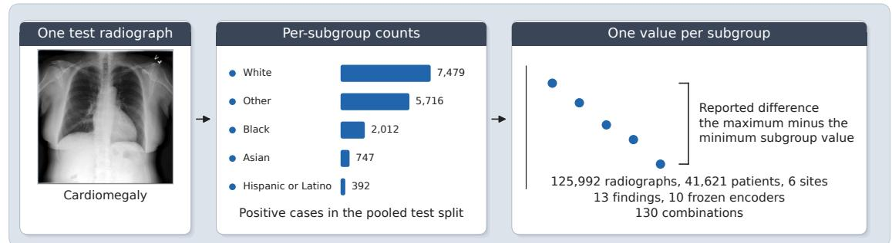

b Step 1, the fair-model reference  
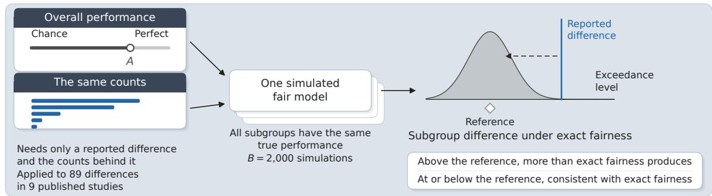

c Step 2, the candidate causes  
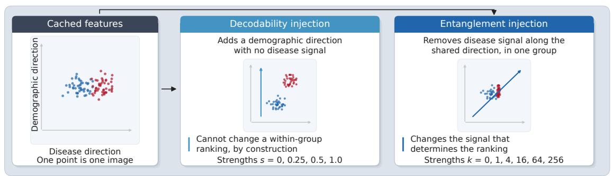  
Fig. 1: FRAME and the audit of a reported subgroup diference. The top row lists the four beliefs that motivate a fairness intervention, and labels mark which FRAME step evaluates each belief. a, The object being audited. The example image is a cardiomegaly-positive test radiograph from NIH ChestX-ray14 at the 224 × 224 preprocessed size used throughout. Classifier performance is evaluated separately in each subgroup. The bars show the number of positive cases in each race subgroup of the pooled test split. The reported diference is the maximum minus the minimum of the per-subgroup values. b, The first step. It uses the model’s own overall performance, marked as the symbol A on a scale from chance to perfect, together with those same counts, and simulates models in which every subgroup has the same true performance. Each simulation still produces a nonzero maximum minus minimum, because a subgroup with a few hundred cases has more sampling variation than a subgroup with several thousand. Their distribution defines the fair-model reference, which replaces zero as the comparison value for the reported diference. A diference above the reference exceeds the variation expected under exact fairness. The shaded tail is the exceedance level. c, The second step, which tests the part above the reference. Each candidate cause is injected into a released encoder’s cached features at graded strengths. One operator adds a demographic direction with no disease signal, and the other removes disease signal along the shared direction. The first operator cannot change a within-group ranking by construction. The comparison therefore distinguishes demographic information that a classifier can decode from representation changes that alter the disease ranking. A solid arrow is a flow and a dashed arrow is a comparison. FRAME Fair-model Reference And Mechanism Evaluation.

## Step one of FRAME: the reference against the reported diference

We fit one linear disease head per finding on the frozen features of 10 image encoders and evaluated every head on the pooled test split of $n = 1 2 5 { , } 9 9 2$ chest radiographs from 41,621 patients across 6 sites (Table 1 and Table 2), and computed the subgroup performance diference for self-reported race and for age (Eq. 1). Each head is evaluated only on the images with an available label for that finding. Sex and insurance were evaluated on the same runs and are reported in Supplementary Note 1 and Supplementary Table 1. For each of the 130 resulting combinations of encoder and finding, we derived the reference per attribute at the observed per-subgroup counts (Eq. 2) and tested every observed diference against it. Supplementary Table 2 reports the same quantities per finding. Race is recorded at two of the six sites. The pooled race attribute therefore includes an Other category that is partly a site indicator (Supplementary Table 3 and Supplementary Note 2).

A perfectly fair model already produces much of the reported diference (Fig. 2a,b). Across the panel, the observed race diference has a median of 0.082 (range 0.029–0.218) against a fairmodel reference of 0.034 (0.013–0.087). The reference accounts for a median 41% of the reported value (interquartile range 26–55). For age, the observed diference is 0.066 (0.014–0.160) against a reference of 0.014 (0.006–0.038), a median share of 22% (11–34) (Fig. 2c).

We call the diference that remains after the reference is subtracted the remainder. It still exceeds the reference in most combinations, more often for age than for race. Against its own reference, the age diference is significantly larger in 116 of the 130 combinations and the race diference in 79 (Fig. 2e). Over every combination in the study, which adds the finetuned models and the two other modalities, the counts are 226 of 252 for age and 129 of 243 for race. The race diference is computed across five evaluable subgroups and the age diference across four. A subgroup is evaluable when it contains at least 20 labeled images. The median number of positive cases in the smallest evaluable subgroup is 136 for race and 949 for age (Fig. 2g). Outside dermatology age, no attribute in dermatology or funduscopy exceeds its reference in more than 2 of 9 combinations at these cohort sizes (Fig. 3). The per-combination values are in Supplementary Table 4 and Supplementary Note 3. The reference is largest where the smallest evaluable subgroup is smallest (Fig. 2d,f). For pleural other, at 20 positive cases, it is 0.083 against an observed 0.077, and for support devices, at 396, it is 0.015 against 0.058 (Supplementary Table 2). Across the 130 frozen combinations, the Spearman correlation between the reference and the observed race diference is 0.486 (p<sub>FDR</sub> = 0.005). For age, the same correlation is −0.140 (p<sub>FDR</sub> = 0.140).

## Step two of FRAME: candidate causes of the remainder

We measured how well a linear classifier recovers race from each frozen encoder’s features and compared it against the unmitigated diference and against the achievable diference of Eq. 6, then injected each candidate cause into the cached features of two released chest radiograph encoders that we did not train, RAD-DINO [34] and the TorchXRayVision DenseNet-121 [36], at graded strengths over three findings spanning the prevalence range (Fig. 4).

Decodability varies far more than the diference does (Fig. 4a). Across the ten encoders, the median race decodability spans 0.659 to 0.872, while the median unmitigated race diference spans

Table 1: Imaging cohorts and their subgroup composition. Counts are images at the final curated state of each manifest, with the train, validation, and test columns following the released or assigned split and the last column reporting the number of patients in the test split. Subgroup rows list the harmonized groups that the fairness analysis evaluates, and rows with a missing value for an attribute are listed as not recorded and are excluded from that attribute’s analysis. The chest radiograph race category Other combines patients recorded as another race at MIMIC-CXR and CheXpert with every radiograph from the four sites that record no race field. Age bands are in years. Dermatology sources are split disjointly over cases for DDI and Fitzpatrick17k and over lesions for ISIC 2019, which is why its test patients are fewer than its test images. Each fundus record is one image from one patient. DDI, Diverse Dermatology Images.
<table><tr><td>Source or subgroup</td><td>Images</td><td>Train</td><td>Validation</td><td>Test</td><td>Test patients</td></tr><tr><td colspan="6">Chest radiography, six sites</td></tr><tr><td>MIMIC-CXR [25]</td><td>243,345</td><td>180,300</td><td>18,409</td><td>44,636</td><td>11,179</td></tr><tr><td>CheXpert [26]</td><td>157,865</td><td>115,449</td><td>13,098</td><td>29,318</td><td>9,810</td></tr><tr><td>NIH ChestX-ray14 [27]</td><td>112,120</td><td>77,870</td><td>8,654</td><td>25,596</td><td>2,797</td></tr><tr><td>PadChest [28]</td><td>110,525</td><td>79,697</td><td>8,783</td><td>22,045</td><td>13,438</td></tr><tr><td>VinDr-CXR [29]</td><td>18,000</td><td>15,000</td><td>0</td><td>3,000</td><td>3,000</td></tr><tr><td>VinDr-PCXR [30]</td><td>8,352</td><td>6,955</td><td>0</td><td>1,397</td><td>1,397</td></tr><tr><td>All chest radiographs</td><td>650,207</td><td>475,271</td><td>48,944</td><td>125,992</td><td>41,621</td></tr><tr><td colspan="6">Chest radiograph subgroups</td></tr><tr><td>Sex, female</td><td>278,816</td><td>203,747</td><td>22,366</td><td>52,703</td><td>18,289</td></tr><tr><td>Sex, male</td><td>341,000</td><td>248,105</td><td>25,545</td><td>67,350</td><td>19,552</td></tr><tr><td>Sex, not recorded</td><td>30,391</td><td>23,419</td><td>1,033</td><td>5,939</td><td>3,782</td></tr><tr><td>Age, 0–40</td><td>118,888</td><td>86,703</td><td>8,170</td><td>24,015</td><td>10,608</td></tr><tr><td>Age, 40–60</td><td>194,383</td><td>139,967</td><td>15,026</td><td>39,390</td><td>12,080</td></tr><tr><td>Age, 60–80</td><td>231,499</td><td>169,844</td><td>17,826</td><td>43,829</td><td>13,082</td></tr><tr><td>Age, 80 and over</td><td>84,456</td><td>63,001</td><td>6,889</td><td>14,566</td><td>4,997</td></tr><tr><td>Age, not recorded</td><td>20,981</td><td>15,756</td><td>1,033</td><td>4,192</td><td>2,035</td></tr><tr><td>Race, White</td><td>234,624</td><td>174,122</td><td>18,025</td><td>42,477</td><td>10,972</td></tr><tr><td>Race, Black</td><td>43,419</td><td>31,420</td><td>3,553</td><td>8,446</td><td>2,082</td></tr><tr><td>Race, Asian</td><td>23,794</td><td>17,506</td><td>1,920</td><td>4,368</td><td>1,407</td></tr><tr><td>Race, Hispanic or Latino</td><td>11,687</td><td>8,621</td><td>886</td><td>2,180</td><td>552</td></tr><tr><td>Race, Other</td><td>336,683</td><td>243,602</td><td>24,560</td><td>68,521</td><td>26,621</td></tr><tr><td colspan="6">Dermatology, three sources</td></tr><tr><td>DDI [3]</td><td>656</td><td>394</td><td>66</td><td>196</td><td>196</td></tr><tr><td>Fitzpatrick17k [31]</td><td>16,012</td><td>9,607</td><td>1,601</td><td>4,804</td><td>4,804</td></tr><tr><td>ISIC 2019 [32]</td><td>25,331</td><td>15,023</td><td>2,672</td><td>7,636</td><td>4,179</td></tr><tr><td>All dermatology</td><td>41,999</td><td>25,024</td><td>4,339</td><td>12,636</td><td>9,179</td></tr><tr><td>Skin type I–II</td><td>7,963</td><td>4,784</td><td>785</td><td>2,394</td><td>2,394</td></tr><tr><td>Skin type III-IV</td><td>6,330</td><td>3,741</td><td>672</td><td>1,917</td><td>1,917</td></tr><tr><td>Skin type V-VI</td><td>2,375</td><td>1,476</td><td>210</td><td>689</td><td>689</td></tr><tr><td colspan="6">Retinal fundus, one source</td></tr><tr><td>Harvard-FairVision [33]</td><td>10,000</td><td>6,000</td><td>1,000</td><td>3,000</td><td>3,000</td></tr><tr><td>Race, White</td><td>7,725</td><td>4,610</td><td>781</td><td>2,334</td><td>2,334</td></tr><tr><td>Race, Black</td><td>1,448</td><td>881</td><td>145</td><td>422</td><td>422</td></tr><tr><td>Race, Asian</td><td>827</td><td>509</td><td>74</td><td>244</td><td>244</td></tr></table>

Table 2: The encoder panel and the controlled pretraining matrix. Every model is open-weight and is used locally as a frozen feature extractor at 224 × 224 pixels, and the dimension column lists the width of the global embedding for each model. The panel spans domain-specific medical encoders, general-purpose vision encoders at three widths, and an untrained transformer of the same architecture as the smallest controlled backbone, so a diference between encoders is not confounded with model size. The controlled block lists the 22 encoders trained in house from a size-matched DINOv3 initialization on chest radiographs under a fixed budget, where the run count is the product of the varying factors named in the objective and model columns, and the six seed runs repeat the three objectives at ViT-S under two further seeds. Random ViT-S is a randomly initialized vision transformer of the same architecture as ViT-S/16. CXR, chest radiograph; SSL, self-supervised learning; ViT, vision transformer.
<table><tr><td>Model</td><td>Pretraining objective</td><td>Domain</td><td>Dimension</td><td>Role</td></tr><tr><td colspan="5">Publicly released encoders</td></tr><tr><td>RAD-DINO [34]</td><td>Self-supervised</td><td>CXR</td><td>768</td><td>Panel, injections</td></tr><tr><td>BiomedCLIP [35]</td><td>Image-text</td><td>CXR</td><td>512</td><td>Panel</td></tr><tr><td>TorchXRayVision [36]</td><td>Label-supervised</td><td>CXR</td><td>1,024</td><td>Panel, injections</td></tr><tr><td>DINOv3 ViT-L [37]</td><td>Self-supervised</td><td>General</td><td>1,024</td><td>Panel</td></tr><tr><td>DINOv3 ViT-B [37]</td><td>Self-supervised</td><td>General</td><td>768</td><td>Panel</td></tr><tr><td>DINOv3 ViT-S [37]</td><td>Self-supervised</td><td>General</td><td>384</td><td>Panel</td></tr><tr><td>DINOv2 ViT-L [38]</td><td>Self-supervised</td><td>General</td><td>1,024</td><td>Panel</td></tr><tr><td>CLIP ViT-L/14 [39]</td><td>Image-text</td><td>General</td><td>768</td><td>Panel</td></tr><tr><td>SigLIP2-L [40]</td><td>Image-text</td><td>General</td><td>1,152</td><td>Panel</td></tr><tr><td>Random ViT-S [41]</td><td>None</td><td>General</td><td>384</td><td>Untrained reference</td></tr><tr><td>MONET [42]</td><td>Image-text</td><td>Dermatology</td><td>768</td><td>Dermatology only</td></tr><tr><td>DermLIP ViT-B/16 [43]</td><td>Image-text</td><td>Dermatology</td><td>512</td><td>Dermatology only</td></tr><tr><td>RETFound [44]</td><td>Self-supervised</td><td>Fundus</td><td>1,024</td><td>Fundus only</td></tr><tr><td>FLAIR [45]</td><td>Image-text</td><td>Fundus</td><td>512</td><td>Fundus only</td></tr><tr><td colspan="5">Controlled pretraining on chest radiographs, 22 runs</td></tr><tr><td>ViT-S/16 and ViT-B/16</td><td>SSL, label-supervised, image-text</td><td>CXR</td><td>384, 768</td><td>12 core runs</td></tr><tr><td>ViT-S/16 and ViT-B/16</td><td>Image-text, scrubbed re- CXR ports</td><td></td><td>384, 768</td><td>2 runs</td></tr><tr><td>ViT-S/16 and ViT-B/16</td><td>Image-text, amplified re- CXR</td><td></td><td>384, 768</td><td>2 runs</td></tr><tr><td>ViT-S/16</td><td>ports SSL, label-supervised, CXR image-text</td><td></td><td>384</td><td>6 seed runs</td></tr></table>

f Per-finding medians, race  
d Size dependence  
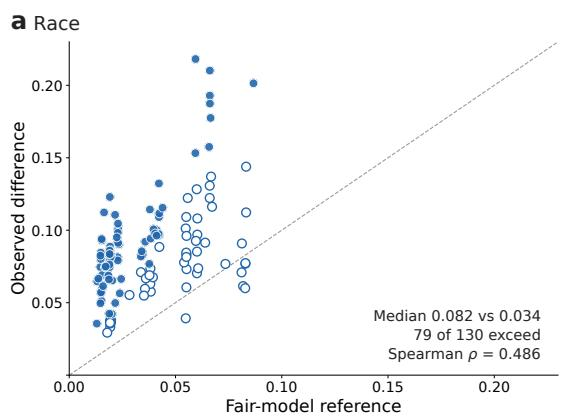

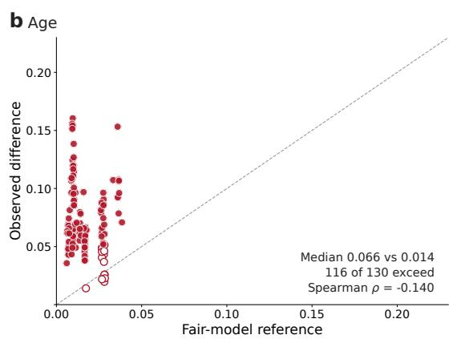

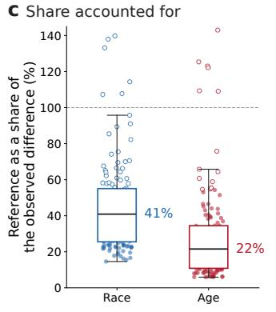

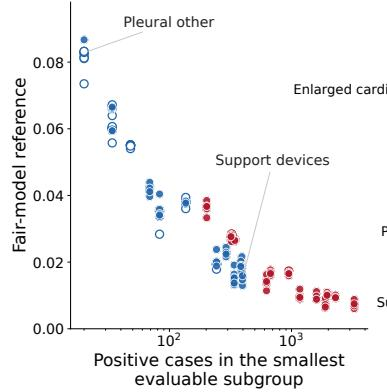

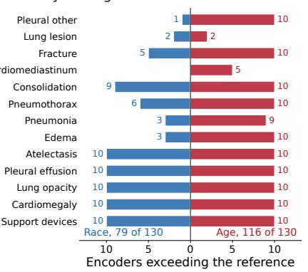

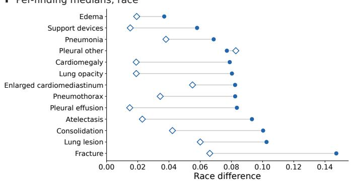

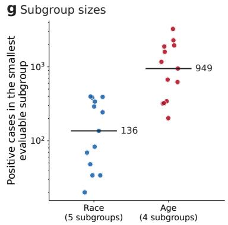

Fig. 2: The reported subgroup performance diference against the diference that a perfectly fair model produces. Every panel uses the 130 combinations of 10 frozen encoders and 13 findings on the pooled chest radiograph test split of 125,992 images from 41,621 patients, race and age evaluated from the same scores. Blue denotes race and red denotes age. A filled marker exceeds its reference at an FDR of 0.05 and an open marker does not. Gray dashed lines mark the identity and the 100% line. a,b, The observed diference against its fair-model reference, one point per combination, race and age on the same axes. $\mathbf { c } ,$ The reference as a share of the observed diference. The box shows the median and the interquartile range, with whiskers at 1.5 times the interquartile range. d, The reference against positive cases in the smallest evaluable subgroup, on a logarithmic axis. e, The number of the 10 encoders whose diference exceeds the reference, per finding. Race extends to the left and age extends to the right. f, The per-finding race medians over the 10 encoders. g, Positive cases in the smallest evaluable subgroup, per finding. Exceedance is the one-sided share of 2,000 simulated fair models matching or exceeding the observed diference, under FDR control within each attribute. Spearman $\rho$ is the rank correlation over those combinations. FDR, false discovery rate.

a Reference and observed  
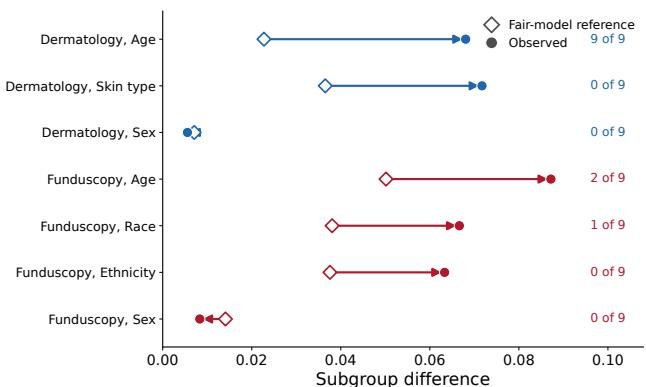

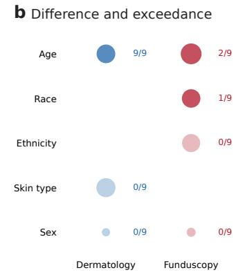

c Every combination against its reference  
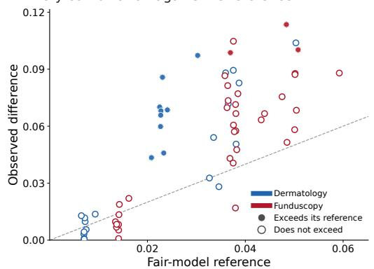

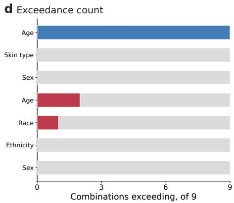

e Lowest difference under mitigation  
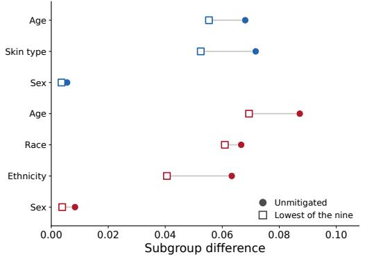

f Reference against subgroup size  
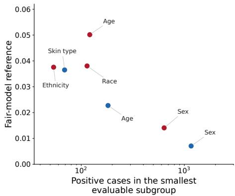  
Fig. 3: Dermatology and funduscopy against their own fair-model references. Blue is dermatology and red is funduscopy throughout. Every panel uses the nine combinations of encoder and finding evaluated in each modality, on the test splits of 12,636 dermatology images from 9,179 subjects and 3,000 fundus images from 3,000 patients, giving 63 combinations of encoder, finding, and attribute in total. a, The median reference and the median observed diference for each attribute in each modality. An arrow connects the median reference to the median observed diference, and the number of combinations exceeding their reference is printed beside each group. b, The same seven groups of modality and attribute. Marker area increases with the observed diference, and a solid fill marks a group in which at least one combination exceeds its reference. $\mathbf { c } ,$ Every combination against its own reference, with the dashed identity line. A filled marker exceeds its reference at an FDR of 0.05. d, Combinations exceeding their reference, per group. $\mathbf { e } ,$ The unmitigated diference and the lowest diference that any of the nine mitigation methods produces at matched disease performance, as medians over the nine combinations. f, The reference against the positive cases in the smallest evaluable subgroup of that group, on a logarithmic axis. Exceedance is the one-sided share of 2,000 simulated fair models matching or exceeding the observed diference, under FDR control within each attribute. FDR, false discovery rate.

a Decodability across encoders  
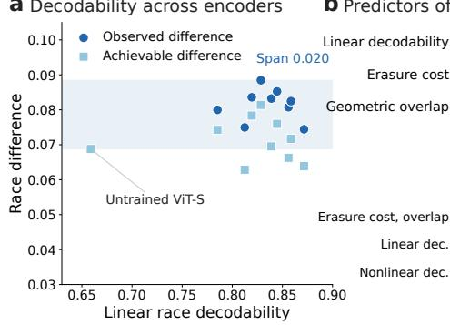  
b Predictors of the difference

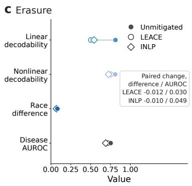

d Race difference against decodability  
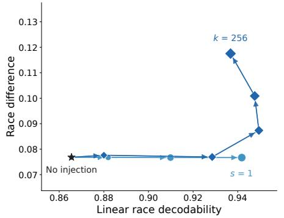

e Decodability injection  
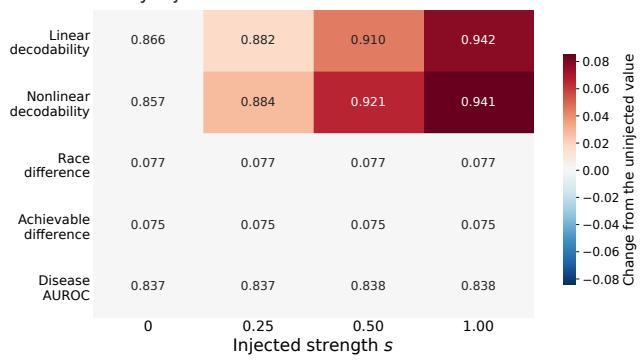

f Entanglement injection  
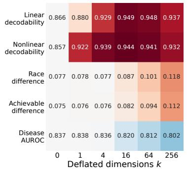

g Difference at full strength  
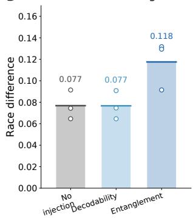

h Response to strength  
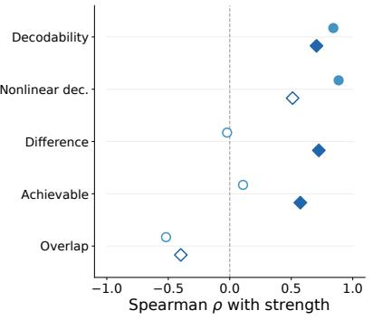

Fig. 4: Decodability, entanglement, and the two injections. Every panel reports race on chest radiographs. Panels a–c use the frozen panel of 10 encoders and 13 findings. Panels d–h show the injection experiment on the cached features of RAD-DINO over three findings. Mid blue circles show the decodability injection and dark blue diamonds show the entanglement injection. An open marker is not significant at an FDR of 0.05, and dark gray is the overall disease AUROC. a, Per-encoder medians against linear decodability. The band marks the full span of the observed diference. b, Spearman correlation of each property with the achievable diference over the 130 combinations, above the cross-fitted out-of-sample ${ \dot { R } } ^ { 2 }$ of the three feature sets, which are the two geometry measures together and each decodability measure alone. c, The two erasure methods against the unmitigated model, as medians over the panel, with the paired change beside them. d, The race diference against linear race decodability across injection strengths, starting from the shared uninjected model. Marker size increases with strength. e,f, Every quantity at every strength. The value is printed and the color encodes the change from the uninjected model, on one scale for both operators. g, The race diference at the largest strength of each grid, as the mean over the three findings. Each finding is drawn on the bar. h, Spearman correlation of each quantity with strength, for both operators. Correlations are permutation tested and corrected within each operator under FDR control. AUROC, area under the receiver operating characteristic curve; FDR, false discovery rate.

0.069 to 0.088 and the achievable diference spans 0.063 to 0.081. Neither decodability nor the two geometry measures predict the achievable diference out of sample (Fig. 4b). Over the 130 combinations, the Spearman correlation is 0.036 for linear decodability, −0.142 for the cost of erasure in disease AUROC, and −0.027 for the principal-angle overlap, none of them significant (all p ≥ 0.329). Cross-fitted out-of-sample $R ^ { 2 }$ is negative for the two geometry measures together and for either decodability measure alone.

LEACE [13] drives linear race decodability from a median 0.812 to the chance level of 0.502 while nonlinear decodability remains at 0.755 (Fig. 4c). The race diference falls by a median 0.012.

Values below are means over the three injected findings. On RAD-DINO, the decodability injection (Eq. 3, Fig. 4d,e) raises linear race decodability from 0.866 to 0.942 (Spearman 0.842, $p _ { \mathrm { F D R } } = 0 . 0 1 4 )$ and nonlinear decodability from 0.857 to 0.941 (0.885, $p _ { \mathrm { F D R } } = 0 . 0 1 4 )$ while the race diference stays at 0.077 (−0.022, p<sub>FDR</sub> > 0.999). The entanglement injection at 256 dimensions (Fig. 4d,f–h) raises the race diference from 0.077 to 0.118 (0.724, p = 0.014) and the achievable diference with it (0.574, $p _ { \mathrm { F D R } } ~ = ~ 0 . 0 4 0 )$ , while the overall disease AUROC falls by 0.035. On cardiomegaly, the diference is unchanged at 0.074 ± 0.009 [0.068, 0.103] under the decodability injection and rises to 0.132 ± 0.012 [0.121, 0.167] under the entanglement injection. Decodability rises under both injections.

On the TorchXRayVision DenseNet-121, linear decodability rises from 0.800 to 0.901 (0.842, $p _ { \mathrm { F D R } } = 0 . 0 1 4 )$ while the race diference stays at 0.106 against 0.102 (−0.194, p<sub>FDR</sub> = 0.862). The invariance of Eq. 4 therefore holds on a second architecture and a second embedding width. The entanglement injection removes a 256-dimensional disease subspace. On this encoder, removing that subspace leaves the overall disease AUROC unchanged on all three findings, at 0.852 against 0.857 on cardiomegaly, 0.673 against 0.670 on fracture, and 0.905 against 0.906 on pleural efusion. The race diference stays at 0.106 against 0.103 (−0.066, p = 0.942). Because removing that subspace does not reduce the disease AUROC, this experiment does not test whether entanglement produces the diference on that encoder. The operator requires the removed subspace to contain disease-predictive signal. In these DenseNet features, predictive signal remains outside that subspace (Supplementary Note 1).

In a synthetic model with collinearity as a free parameter, raising the collinearity between the disease and the group direction from 0 to 1 increases the diference from 0.010 to 0.121 while decodability falls (Fig. 5).

## The remainder under every intervention

We applied 9 mitigation methods, spanning resampling and reweighing, loss constraints [11,10], per-group operating point and calibration adjustment [46], and erasure, to the frozen features of every encoder and finding, and recorded the achievable diference of every combination (Fig. 6). A tenth method is reported in Supplementary Note 1. The achievable race diference has a median of 0.071, a reduction of 0.005 (range 0.000–0.111) that is significant in 10 of 128 combinations (Fig. 6a–c). The achievable age diference is 0.057, a reduction of 0.008 (0.000–0.042) significant in 45 of 130.

Among the pretraining factors of the controlled matrix, the objective has the largest median efect on the subgroup diference (Fig. 6d). Image-text pretraining lowers the race diference against self-supervised pretraining by a median 0.013, significant in 9 of 52 comparisons, and the age diference by 0.015, significant in 22 of 52. Balancing the pretraining data on race changes the race diference by a median of −0.002 to +0.008 across the three objectives and is significant in 0 of 26 comparisons for every one of them. Neutralizing demographic terms in the training reports is significant in 0 of 26 comparisons for race on every measure. Prepending an explicit demographic sentence to every report, which is the mirror-image control, is significant in 0 of 26 comparisons on

a The synthetic model across collinearity

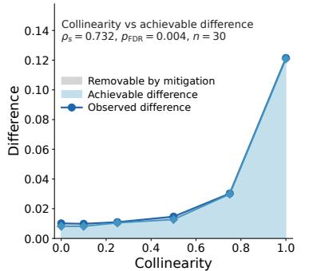

b Geometry and decodability  
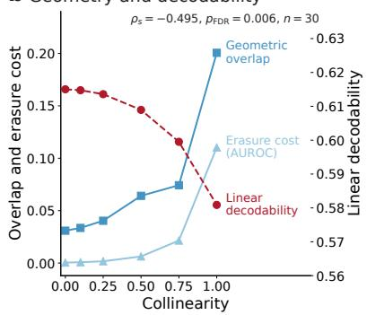

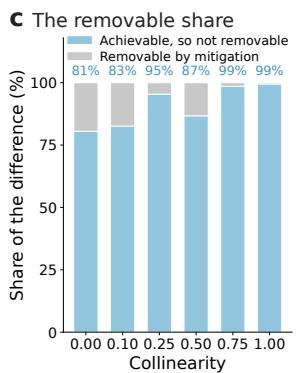

d Achievable difference  
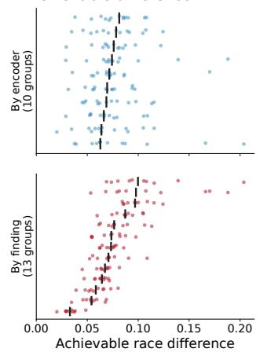

e Geometry by encoder  
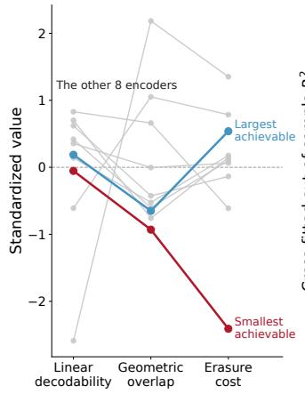

f Predicting the achievable difference  
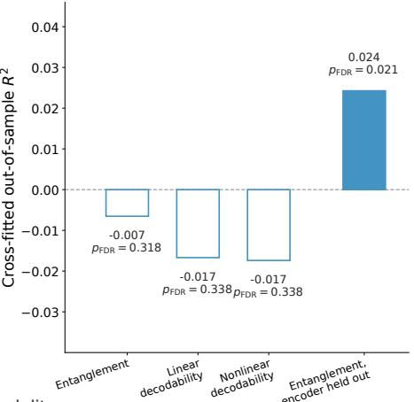

g The predictor in another modality  
h Achievable difference by modality  
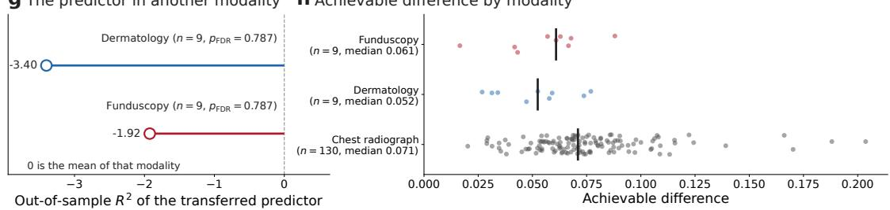

Fig. 5: The synthetic collinearity model and the geometry predictor. a–c, The model of Eq. 5 at the six values of the collinearity ρ between the disease and the demographic direction, from orthogonal at 0 to collinear at 1, each level over five seeds and 4,000 samples. a, The observed diference (dark blue circles) and the achievable diference of Eq. 6 (mid blue diamonds). The lower band shows the achievable diference and the upper band shows the further part that every mitigation method could remove. b, The geometric overlap and the AUROC cost of erasure on the left axis and linear demographic decodability on the right axis, each curve labeled at its right end. $\mathbf { c } ,$ The achievable diference as a share of the observed diference. The value is printed inside the bar. d–f, The 130 combinations of encoder and finding of the frozen chest radiograph panel, evaluated for race. d, The achievable diference of every combination, grouped by encoder in the upper track and by finding in the lower track on one scale. The bar marks each group’s median. $\mathbf { e } ,$ Each encoder’s median of linear decodability, the geometric overlap, and the erasure cost, standardized across the 10 encoders. The encoders with the largest and the smallest median achievable diference are drawn in color. f, Out-of-sample $R ^ { 2 }$ of a predictor of the achievable diference by five-fold cross-fitting, one bar per feature set. A filled bar is significant at an FDR of 0.05 against 1,000 target shufles. Entanglement is the erasure cost and the overlap together. The rightmost bar reports leave-one-encoder-out performance. g, The chest radiograph predictor applied to dermatology (blue) and funduscopy (red). h, The achievable diference per modality for race, skin type, and race respectively, every combination with its median. Correlations in a and b are permutation tested over the 30 level and seed combinations under FDR control. AUROC, area under the receiver operating characteristic curve; FDR, false discovery rate.

a Median change by method  
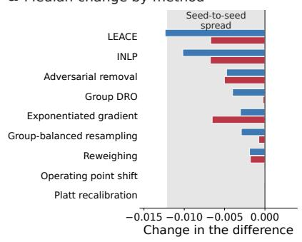

b Difference against disease AUROC  
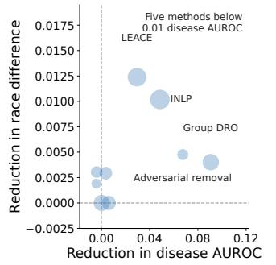

c Achievable reduction  
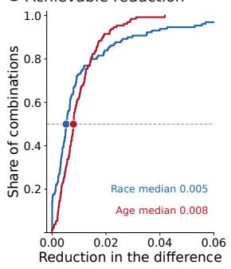

d Changing how the encoder is pretrained  
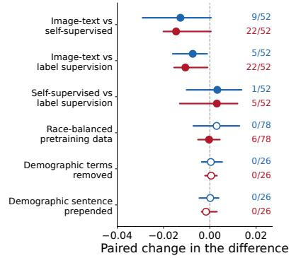

e Unfreezing the backbone  
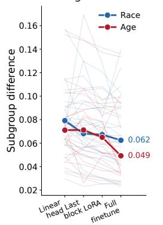

f Retraining vs mitigating  
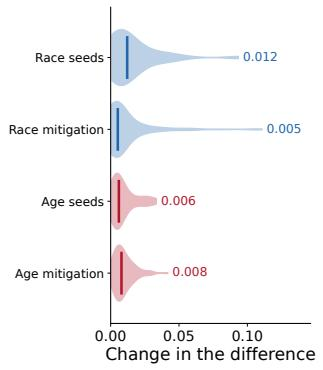

g Every method on all four measures  
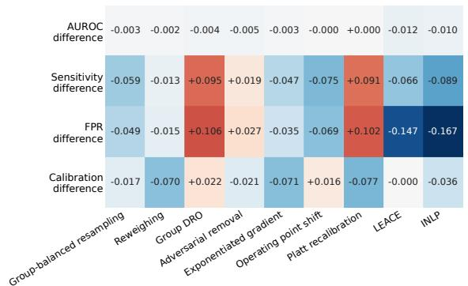

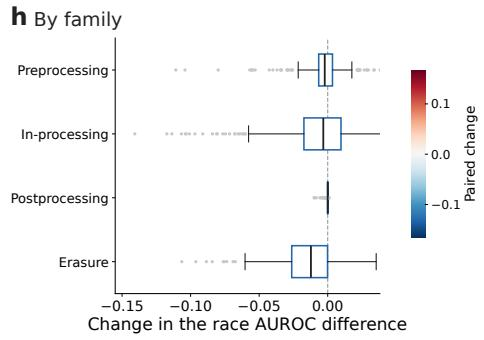  
Fig. 6: Disparity reduction and disease AUROC across every intervention. Blue is race and red is age. Every value is a paired change from the unmitigated model over the 130 combinations of 10 encoders and 13 findings. a, The median paired change for each of the nine methods. The gray band shows the median spread across three pretraining seeds. b, The reduction in the race diference against the reduction in the disease AUROC. Marker area increases with the change in the FPR diference. c, The share of combinations at each reduction, using the largest reduction among the nine at matched disease performance. d, The controlled pretraining contrasts, as the median and interquartile range of the paired change. The number of significant comparisons is printed beside each contrast, and a filled marker indicates a nonzero count. e, The four unfreezing levels, with one faint line per combination. The thick line is the median. f, The change under retraining with two further seeds, against the largest reduction that any of the nine methods produces. g, Every method on all four measures. The median paired change for race is printed and encoded by color. h, The same change grouped into the four method families. Significance is a paired cluster bootstrap over patients at 1,000 resamples under FDR control at 0.05 within each family. AUROC, area under the receiver operating characteristic curve; DRO, distributionally robust optimization; FDR, false discovery rate; FPR, false positive rate; INLP, iterative nullspace projection.

the diference. So the diference is unlikely to come from the demographic content of the training reports, at least as those terms can be removed or amplified here.

Across four levels of unfreezing, from a linear head to the last block, LoRA adapters, and a full finetune, the median race diference decreases from 0.079 to 0.062 and the median age diference from 0.071 to 0.049 (Fig. 6e). No trend across levels is significant for any attribute or encoder (Spearman −0.007 to −0.233, all $p _ { \mathrm { F D R } } ~ \geq ~ 0 . 1 6 9 )$ . Retraining the same configuration under two further seeds changes the race diference by a median 0.012 (range 0.001–0.093), against a median reduction of 0.005 under the nine mitigation methods. Every intervention we ran therefore changes the diference by less than a change of pretraining seed does (Fig. 6f). None of them optimizes the within-group ranking directly.

## Operating point and ranking disparities under mitigation

We then evaluated every method on all four measures from the identical test scores, with the two rates taken at a threshold fixed on validation at 0.80 sensitivity. For the unmitigated models, the median race diferences are 0.177 for sensitivity, 0.245 for FPR, and 0.093 for calibration. Each method reduces the measure that it directly targets (Fig. 6g). The per-group threshold shift and per-group Platt calibration cannot change a within-group ranking while their score maps are strictly increasing (Eq. 4). A per-group operating point shift keeps the race AUROC diference at a median 0.000 while cutting the sensitivity diference by a median 0.075 and the FPR diference by 0.069. The calibration diference increases by 0.016. Per-group Platt calibration also leaves the AUROC diference at 0.000 and reduces the calibration diference by 0.077. The sensitivity and FPR diferences increase by 0.091 and 0.102. The AUROC diference is unchanged in 252 of the 260 combinations and changes by less than $1 \times 1 0 ^ { - 6 }$ in three more. In the remaining five combinations, the change ranges from 0.130 to 0.440. All five are race comparisons on the three rarest findings, where a map fitted on 20 to 34 positive cases is no longer strictly increasing (Supplementary Note 1).

The two erasure methods produce the largest reductions in the race AUROC diference (Fig. 6h). LEACE lowers that diference by a median 0.012 and lowers the disease AUROC by 0.030. Iterative nullspace projection lowers the diference by 0.010 and lowers the disease AUROC by 0.049. Group distributionally robust optimization lowers the diference by 0.004 and lowers the disease AUROC by 0.091. Adversarial removal lowers the diference by 0.005 and the disease AUROC by 0.067. Both also increase the sensitivity and FPR diferences (Supplementary Table 5). A threshold shift or a calibration map can change a diference at the operating point but not a within-group ranking. None of the nine methods optimizes the subgroup AUROC diference directly.

## Acquisition view and site as competing explanations

A published analysis attributes chest radiograph performance diferences to technical acquisition factors and not to demographics [47]. We evaluated the same test scores in four analyses: the pooled demographic diference, the demographic diference within each view, view as an attribute in its own right, and site as an attribute in its own right. Each analysis is compared against its own reference computed from the rows that were evaluated. Holding the view fixed does not remove the race diference (Fig. 7). The pooled value of 0.081 becomes 0.066 in anteroposterior and 0.090 in posteroanterior radiographs, and neither difers from it (Wilcoxon signed-rank [48], both $p _ { \mathrm { F D R } } \geq 0 . 2 7 1$ over 26 combinations). Part of the age diference is view composition. The pooled age diference of 0.074 falls to 0.044 within anteroposterior radiographs $( p _ { \mathrm { F D R } } = 8 . 8 \times 1 0 ^ { - 5 } )$ , while within posteroanterior radiographs it is unchanged at 0.074 $( p _ { \mathrm { F D R } } = 0 . 4 3 7 )$ . Every demographic diference still exceeds its own reference inside every view (all $p _ { \mathrm { F D R } } \leq 9 . 5 \times 1 0 ^ { - 5 } )$ .

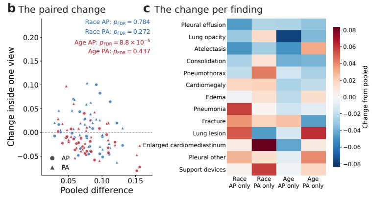

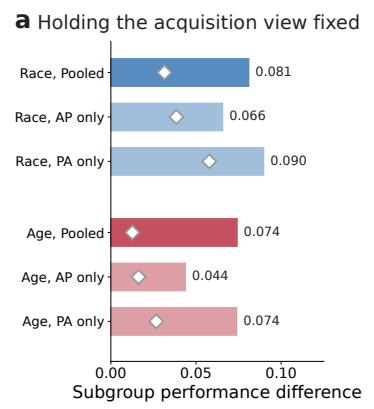

d View and site as attributes  
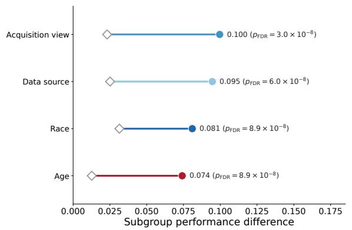

e The full distribution per attribute  
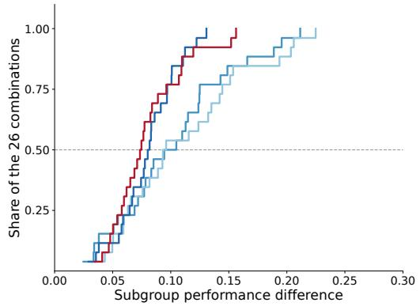

f Attribute order on each measure  
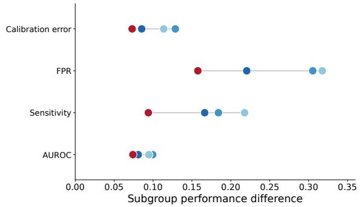

g The reference inside a view  
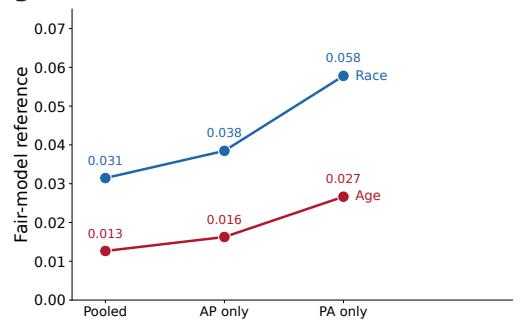

Fig. 7: Subgroup performance diferences with the acquisition view held fixed, and with acquisition view and site treated as attributes. Every panel uses the 26 combinations of 2 encoders and 13 findings on the pooled chest radiograph test split of 125,992 images from 41,621 patients, with anteroposterior and posteroanterior as the two views. Blue marks the acquisition view, pale blue marks the data source, dark blue marks race, and red marks age. The change in b and c is the within-view diference minus the pooled diference of the same combination. a, The median race and age diference pooled and inside each view, each with its own fair-model reference. b, That change against the pooled diference, one point per combination. Circles mark $\mathrm { A P }$ and triangles mark PA, with the p value for each pairing. $\mathbf { c } ,$ The same change per finding, as the median over the 2 encoders. d, Each attribute from its own reference to the median observed diference, with the p value of the paired test against that reference. $\mathbf { e } ,$ The cumulative distribution of the diference over the 26 combinations, per attribute. f, The median diference on the four measures, AUROC, sensitivity, FPR, and the expected calibration error. The horizontal bar connects the smallest and the largest attribute-specific diference on each measure. $\mathbf { g } ,$ The fair-model reference in each condition. Every $\mathrm { p }$ value comes from a two-sided Wilcoxon signed-rank test over the paired combinations at 0.05, corrected within its family under FDR control. $\mathrm { A P } ,$ anteroposterior; AUROC, area under the receiver operating characteristic curve; FDR, false discovery rate; $\mathrm { F P R } ,$ false positive rate; PA, posteroanterior.

Treated as attributes in their own right, acquisition view and data source give median diferences of 0.100 and 0.095, against references of 0.023 and 0.025. The race diference is 0.081 against a reference of 0.031, and the age diference is 0.074 against a reference of 0.013. All four exceed their references (all $p _ { \mathrm { F D R } } \leq 9 . 0 \times 1 0 ^ { - 8 } )$ . On this pool, the median diference is larger across acquisition view and data source than across patient race.

## Worst-group performance across pretraining objectives and unfreezing levels

We evaluated the worst-group AUROC and the equity-scaled AUROC [49], the overall value discounted by the spread of the subgroup values around it, on the controlled encoders and at each of the four unfreezing levels (Fig. 8 and Supplementary Table 6). We computed the subgroup performance diference from the same scores. Image-text pretraining raises both by about 0.05 over self-supervised pretraining at fixed data, architecture, and budget (Fig. 8a,b,h). Across the 52 comparisons on natural data, the median gain in worst-group AUROC is 0.049 for race, significant in 35 of them, 0.054 for age, significant in 50, and 0.044 for sex, significant in 49. The equity-scaled AUROC gains 0.049, 0.047, and 0.042 on the same comparisons, significant in 32, 44, and 49 (Fig. 8c). In both contrasts, the median change in the subgroup diference is at most 0.015. On cardiomegaly at the ViT-B backbone (Fig. 8g), the equity-scaled value is $0 . 7 5 1 \pm 0 . 0 1 3 [ 0 . 7 2 5$ 0.775] under image-text pretraining and $0 . 7 1 1 \pm 0 . 0 1 3 [ 0 . 6 8 3 , 0 . 7 3 3 ]$ under self-supervision, while the race diference is $0 . 0 6 9 \pm 0 . 0 0 6$ [0.061, 0.085] and 0.082 ± 0.009 [0.069, 0.103].

From a linear head to a full finetune, the median overall AUROC rises from 0.785 to 0.830 and the equity-scaled value from 0.680 to 0.732 for race and from 0.708 to 0.784 for age, against the 0.017 of race diference that the same four levels remove (Fig. 8d–f). Image-text pretraining and deeper finetuning each raise the worst-group AUROC by about 0.05. The median change in the subgroup diference is at most 0.022.

## FRAME applied to published subgroup diferences

Everything above is measured on our own experiments. We therefore applied step one of FRAME to subgroup diferences already published, using each study’s own reported values and none of our models. Nine studies report everything the reference needs, giving 89 claims over ten datasets, ten tasks, six imaging modalities, and the race, sex, race-by-sex, age, and skin-tone attributes (Fig. 9 and Supplementary Table 7). Of the 89 claims, 41 exceed their reference. The 53 rate diferences, meaning a sensitivity or an FPR diference at a fixed threshold, exceed in 40 cases at a median reference share of 25%. The 36 diferences in AUROC exceed in 1 case at a median share of 70%. In 22 of the 89, the reference is larger than the diference that the study reported.

Within each modality that reports both kinds of statistic, rate diferences exceed the reference more often than AUROC diferences do. In chest radiography, the most cited claim [1], the underdiagnosis diference across race and sex on MIMIC-CXR [25], is 0.122 against a reference of 0.017 ± 0.008 [0.005, 0.035] at a smallest subgroup of 1,152 cases. On CheXpert [26], the benchmark that standardized this statistic [6] reports a race diference of 0.002 and a sex diference of 0.000, both against a reference of 0.008. In dermatology, across four labelers on the same 656 clinical photographs [50], 11 of 16 rate diferences exceed at a median 25% share while none of the 8 AUROC diferences does. In the smallest cohorts, the reference accounts for most of the reported diference, though a suficiently large diference still exceeds it. Across 6 race-stratified recall diferences in computational pathology [51], the reference accounts for a median 68% and 3 of the 6 exceed, at smallest subgroups of 9 to 100 slides. In two of the three that do not, the reference is larger than the diference reported. In a referable diabetic retinopathy system evaluated by skin tone on

Gain from the level before

a Image-text vs self-supervised  
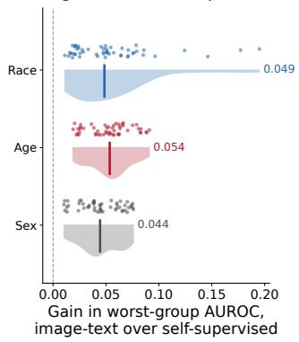

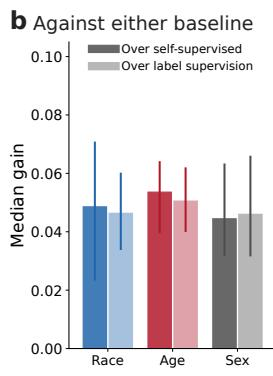  
Overall AUROC at that level

c Significant comparisons  
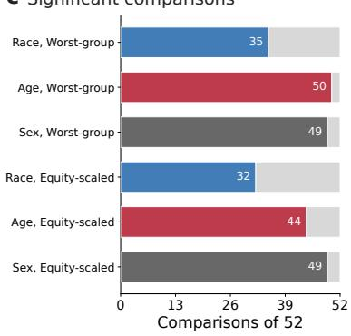

d Equity-scaled AUROC by level  
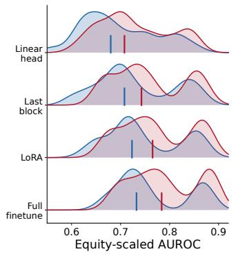

e The difference across levels  
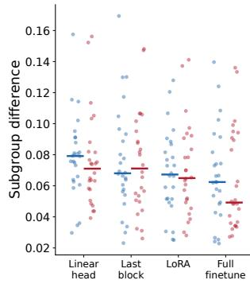

f AUROC change per level  
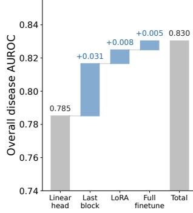

g One worked comparison, cardiomegaly at ViT-B  


h Every comparison  
  
Fig. 8: Worst-group performance and the subgroup performance diference across pretraining objectives and unfreezing levels. Blue is race, red is age, and dark gray is sex. Panels a–c and h use the 52 paired comparisons of the controlled matrix on natural pretraining data. Panels d–f use the four unfreezing levels on both finetuned encoders. a, The distribution of the paired gain in worst-group AUROC from image-text over self-supervised pretraining, with every comparison and the median drawn. $\mathbf { b } ,$ The median gain against each baseline objective, with the interquartile range. The paler bar marks the contrast against label supervision. c, The number of significant comparisons among the 52, on the worst-group AUROC and the equity-scaled AUROC. d, The equity-scaled AUROC at each unfreezing level, as a density per attribute with its median marked. e, The subgroup diference on the identical runs, every combination drawn with its median. f, The change in overall disease AUROC between successive unfreezing levels. $\mathbf { g } ,$ One worked comparison. The point marks the bootstrap mean, the thick band shows one standard deviation, and the thin line shows the 95% confidence interval. h, Every comparison of image-text against self-supervised pretraining on the same axes, with the identity line. Significance is a paired cluster bootstrap over patients at 1,000 resamples under FDR control at 0.05 within each family. AUROC, area under the receiver operating characteristic curve; FDR, false discovery rate.

a Claims against their references  


b The reference as a share  


d Reference against subgroup size  


e Across the modalities  


g The provenance of the counts  


Fig. 9: Published subgroup performance diferences compared with the fair-model reference. Every panel uses the 89 audited claims from nine studies over ten cohorts and six imaging modalities, with one color and marker per modality. A filled marker exceeds its reference and an open marker does not. a, Each claim’s reported diference against the reference derived at that claim’s own subgroup counts, with the identity line. b, The reference as a share of the reported value, per statistic and modality. Every claim is shown with the group median and the number exceeding. Two dermatology claims report a diference of 0.000, so their share is undefined. Neither the violin nor the points include them. c, The number of claims exceeding their reference in each study, of the claims included from that study. d, The reference against the number of cases in the smallest subgroup that the diference ranges over, on logarithmic axes. e, The median reference share of a rate diference against the median smallest subgroup, per modality; the audit includes AUROC claims only for abdominal computed tomography, which has no point here. f, The largest reported diference in each cohort. The point marks the reported diference, the diamond marks the reference, and the line shows its 95% interval. g, The provenance of each claim’s per-subgroup counts. Exceedance is the one-sided share of 2,000 simulated fair models matching or exceeding the reported diference, corrected across the claims sharing a metric under FDR control at 0.05. Per-claim values are in Supplementary Table 7. AUROC, area under the receiver operating characteristic curve; FDR, false discovery rate; FPR, false positive rate; TPR, true positive rate.

100 referable and 100 healthy images per group [52], 5 of 6 rate diferences exceed. The untreated system’s sensitivity diference is 0.500 against a reference of 0.055 ± 0.042 [0.000, 0.160].

The meaning of non-exceedance depends on what the study claimed. Across 20 AUROC diferences in abdominal computed tomography, evaluated by sex and by age across 10 privacy budgets from one model family [53], not one exceeds its reference. Those diferences range from 0.010 to 0.056. The corresponding references range from 0.004 to 0.086, and in 9 of the 20 the reference is larger than the diference reported. Those subgroups contain 75 to 127 evaluable cases. That study [53] concluded that private training did not amplify discrimination against age or sex. The reference supports that conclusion and quantifies the sampling component that the original analysis did not report. Where a study instead reports a diference as its finding, non-exceedance is weaker evidence for a disparity. The audit therefore records the direction of each study’s own claim alongside the exceedance level.

The share that the reference accounts for is not ordered by the subgroup size alone. Among the rate diferences, it is a median 68% in pathology at a median smallest subgroup of 41 cases, 26% in funduscopy at 100, 25% in dermatology at 94, and 18% in chest radiography at 1,152. Screening mammography has the largest denominators in the set and a reference share of 47% [54]. Its reported diferences are also the smallest, at a median of 0.020 against 0.077 in chest radiography.

In the two modalities that report both kinds of statistic, the published studies show the same distinction as our own panel. Rate diferences exceed the reference and AUROC diferences generally do not. The reference needs only the counts that an evaluation already has, so any of these claims can be compared against it without new data and without retraining. The second step needs the feature representation, which a reported number does not provide. We therefore applied the second step to two released encoders whose features we could compute.

## Discussion

Medical imaging fairness studies commonly treat the diference between the best-performing and the worst-performing subgroup as a disparity, and then apply an intervention to the model. We built FRAME to estimate the subgroup diference expected under exact fairness at the observed subgroup sizes and to measure what remains once that reference is subtracted. Its second step tests which manipulation of the representation changes the remainder. On a pooled test set of 125,992 chest radiographs, the fair-model reference accounts for a median 41% of the reported race diference and 22% of the age diference. For race, 51 of the 130 combinations of encoder and finding do not exceed it. The remaining 79 race combinations and 116 of the 130 age combinations do exceed it. Injecting demographic decodability does not change the remainder. No mitigation method changes it by more than a change of random seed. The entanglement injection raises the diference from 0.077 to 0.118. Image-text pretraining, by contrast, raises worst-group performance by about 0.05 and changes the subgroup diference by at most a median 0.015.

The inflation of the reported statistic at small subgroup sizes is not itself new. FRAME quantifies the sampling contribution separately for each combination of encoder and finding. Dataset bias and unmeasured confounders were already named as complications for any reported diference [14,15]. Petersen and colleagues reached the same conclusion from first principles, that unequal performance can arise from unequal task dificulty even where the model is not the source [16]. Work outside medicine showed the maximum-minus-minimum statistic to be biased away from zero at small samples [19,20]. Because the reference is derived at each unit’s own subgroup counts, it estimates the part of that unit’s diference expected from sampling variation. A recent study of privacy risk in medical artificial intelligence observed that its subgroup efects correlate with group size and concluded that they may be driven in part by that [18]. The same reasoning applies to fairness evaluation. The reference quantifies the part of a reported diference attributable to subgroup size. In a domain transfer study across five institutions and more than 590,000 chest radiographs, subgroup diferences remained under one percentage point almost everywhere [55], consistent with the smaller fair-model reference expected at larger subgroup sizes.

We then applied the reference to diferences already in the published record. Across 89 such diferences spanning six imaging modalities, each on its own cohort, model, and label policy, 41 exceed what exact fairness produces at the sizes that they were measured on. Diferences in a thresholded rate, the measure that the underdiagnosis literature is built on, exceed their reference in 40 of 53 cases and keep a median 75% of their reported size, though that share falls to 32% in pathology, where the subgroups are smallest. Diferences in AUROC exceed in 1 of 36, and the reference is a median 70% of the reported value. In 22 of the 89 claims, it is larger than the diference that the study reported. A claim that does not exceed its reference is not thereby refuted. The interpretation of non-exceedance depends on the direction of the study’s own claim. Twenty of the 48 that do not exceed come from a study whose conclusion was that private training did not amplify discrimination. For that study, the reference supports the conclusion instead of weakening it. The published studies therefore show the same distinction between rate and AUROC diferences that our injections produce.

The measured associations do not support demographic decodability as the cause of the remaining subgroup diference. Models can recover self-reported race from images with no cue that a radiologist can use [7]. The features of disease classifiers also encode protected characteristics [8]. We reproduce both findings, since race is decodable at up to 0.872 across our panel. High demographic decodability alone does not establish that demographic encoding causes the subgroup diference. Decodability varies across encoders by more than 0.20 while the achievable diference varies by less than 0.02. An untrained transformer that has learned nothing already decodes race at 0.659. Neither decodability nor the two geometry measures we tested predict the achievable diference out of sample. Adding decodability along a direction with no disease signal leaves the diference unchanged at every strength, while removing disease signal from the minority rows raises it. Demographic decodability is therefore distinct from the representation change that alters the within-group ranking. The studies cited above measured decodability and not that change. Glocker and colleagues had already argued that statistical diferences between subgroups must be accounted for before a subgroup diference is interpreted as a disparity [8]. Our results are consistent with that argument. Jones and colleagues make the compatible point that current mitigation addresses a narrow subset of the mechanisms at work [17].

Across nine mitigation methods, the controlled pretraining matrix, and four levels of unfreezing, the subgroup AUROC diference changes by less than a change of pretraining seed produces. A pergroup threshold and a per-group calibration map cannot alter a within-group rank statistic while the map they apply is strictly increasing. They reduce the sensitivity and calibration diferences while the median change in the AUROC diference remains 0.000. The calibration map leaves the AUROC diference unchanged in 252 of 260 combinations. In the five combinations whose smallest race subgroup has 20 to 34 positive cases, the fitted map is no longer strictly increasing. LEACE produces the largest reduction in the race AUROC diference, at a median 0.012, and lowers the disease AUROC by 0.030. The threshold and calibration methods reduce the operating point measures that they optimize. None of the nine optimizes the subgroup AUROC diference directly, and those nine span the families that the field uses. A failure to reduce that diference therefore does not establish that the diference is intractable. Where the reported diference is a diference at the operating point, the postprocessing methods do reduce it and remain the right tool.

Image-text pretraining and deeper finetuning each raised the worst-group AUROC by about 0.05. No fairness intervention we tested matched that gain. Studies of privacy-preserving training report that stricter privacy widens subgroup diferences, and that the widening is amplified in smaller and more heterogeneous datasets [56]. Part of that widening may reflect the larger fairmodel reference expected at smaller subgroup sizes. An increase measured against zero is larger than the same increase measured against the fair-model reference. The same caution applies to our own earlier work, where private training reduced performance most on the harder diagnoses and the harder subgroups [53], and to a speech study in which gender diferences under privacy were minimal at reasonable budgets [57]. We did not test whether privacy changes fairness after correcting for sampling variation. Such interactions should be estimated against a reference instead of against zero. The same argument has been made for the privacy-utility trade-of itself, where an assumed cost turned out to be far smaller at a realistic operating point [58].

This study has several limitations. First, the mechanism behind the remainder is not identified. Injecting alignment between the group and the disease direction raises the subgroup diference, but our interventions are applied to cached features and not during pretraining. So we cannot say what produces the entanglement in a trained encoder. The entanglement injection also removed disease signal on RAD-DINO and not on the DenseNet-121, where removing a 256-dimensional disease subspace from 1,024 dimensions left the overall disease AUROC unchanged. Second, the pooled race attribute assigns every record from the four sites that record no race field to an Other category, which contains 52,038 of its 68,521 test radiographs. The pooled race contrast is therefore partly a contrast between sites. We analyze site as an attribute in its own right for that reason. A cohort in which every site records race would separate the race efect from site. Third, the evidence for a remainder above the reference is not uniform across the study. For race, 129 of 243 combinations exceed their reference, against 226 of 252 for age. Race is evaluated across more and smaller subgroups, which raises its fair-model reference. Outside dermatology age, no attribute in dermatology or funduscopy exceeds its reference in more than 2 of 9 combinations at these cohort sizes. The causal claims depend on chest radiographs for that reason. Fourth, the reference models sampling at the image level. It does not model within-patient correlation, which makes the correction conservative and the remaining share an upper bound. Fifth, the sensitive labels are coarse self-reported categories and the disease labels at the two largest sites are derived from reports by an automated labeler, so both are subject to measurement error that we did not model. Sixth, the audit of published claims depends on what each article prints, so a study reporting a diference without the counts behind it cannot be checked. For one of the nine, MEDFAIR [6], the per-subgroup counts behind its four claims had to be reconstructed from the composition and split fraction that it states.

Much of what is currently reported as demographic unfairness in medical imaging is a property of the statistic and the subgroup sizes that it is computed on. The diference that remains does not change when the demographic information that a model encodes is injected. Applying the fairmodel reference distinguishes the findings that exceed the variation expected under exact fairness from the findings that do not. Its first step can be run from counts that a study already has, without new data and without retraining. On the diferences that remain, the interventions we tested reduce a diference at the operating point and leave the within-group ranking diference at a median of 0.000, while image-text pretraining raises the worst-group AUROC. Larger cohorts in other imaging modalities could test whether the operating point and the ranking separate the same way beyond chest radiographs, and whether entanglement between the group and the disease direction arises during pretraining.

## Methods

## Ethics statement

This study was conducted in accordance with the relevant guidelines and regulations. It reuses previously collected, de-identified imaging data released for research by the institutions that maintain them, publicly or under credentialed access. It generated no new patient data and recruited no participants. Institutional review board approval and individual informed consent were therefore not required for this study. Every source was used in accordance with its license and data use agreement. No re-identification was attempted, and no source data are redistributed apart from the single openly released chest radiograph reproduced in Fig. 1. All models are open-weight and were run locally, so no image, report, or record was sent to a third-party service.

## Datasets

All experiments operate on a curated three-modality imaging corpus of $n = 7 0 2 { , } 2 0 6$ images assembled for this work: chest radiography $( n = 6 5 0 , 2 0 7 )$ , dermatology $( n = 4 1 , 9 9 9 )$ , and retinal funduscopy $( n = 1 0 , 0 0 0 )$ . Counts are reported at the final curated state of the manifests, and per-source composition is given in Table 1 and Supplementary Table 3.

Chest radiography. The pool contains $n = 6 5 0 { , } 2 0 7$ frontal radiographs from six sites: MIMIC-CXR $( n = 2 4 3 , 3 4 5$ images from 63,945 patients) [25], CheXpert $( n = 1 5 7 , 8 6 5$ from 57,872) [26], NIH ChestX-ray14 (n = 112,120 from 30,805) [27], PadChest $( n = 1 1 0 , 5 2 5$ from 67,205) [28], VinDr-CXR (n = 18,000) [29], and the pediatric VinDr-PCXR $( n = 8 { , } 3 5 2 )$ [30]. The two VinDr sources provide no patient identifier. Lateral views were excluded and every image file was confirmed present before a record entered the pool. Each site’s released partition was preserved, giving $n = 4 7 5 , 2 7 1$ training, $n = 4 8 { , } 9 4 4$ validation, and $n = 1 2 5 { , } 9 9 2$ test radiographs over 41,621 test patients, with per-site partitions in Table 1. Recorded sex is male for $n = 3 4 1 { , } 0 0 0$ , female for $n \ : = \ : 2 7 8 , 8 1 6$ and other or absent for $n = 3 0 { , } 3 9 1 ;$ ; view is anteroposterior for $n = 3 4 4 { , } 2 5 3$ , posteroanterior for $n = 2 7 9 { , } 6 0 2$ , and unrecorded for $n = 2 6 { , } 3 5 2 ;$ age is available for $n = 6 2 9 , 2 2 7$ radiographs (97%) at a median of 60.0 years (interquartile range 45.0–72.2).

Labels are the 13 canonical findings, which are the 14 CheXpert categories with No Finding removed. MIMIC-CXR and CheXpert encode each finding as positive, negative, uncertain, or blank, resolved throughout as positive for the positive code, negative for the negative and uncertain codes, and excluded for blank. The other four sites release binary labels. Exclusion is per finding, so evaluable counts difer across findings. Prevalence over the pool ranges from 1% for pleural other to 41% for support devices, with the per-finding evaluable and positive counts in Supplementary Table 8. The image-text objective uses $n = 4 0 1 , 0 7 7$ image-report pairs drawn from the pool’s own radiographs, $n = 2 4 3 { , } 3 4 5$ from $\mathrm { M I M I C - C X R }$ and $n = 1 5 7 , 7 3 2$ from $\mathrm { C h e X p e r t }$ Plus, partitioned into $n = 2 9 5 { , } 6 5 5$ training, $n = 3 1$ ,493 validation, and $n = 7 3 , 9 2 9$ test pairs. The report text was taken from the findings and impression sections.

Dermatology. The pool contains $ { n _ { \mathrm { ~  ~ } } } = \ 4 1 , 9 9 9$ images from three sources: ISIC 2019 $( n \ =$ 25,331) [32,59], Fitzpatrick17k $\mathit { \Omega } ( n \  \ 1 6 , 0 1 2 ) \ [ 3 1 ]$ , and the Diverse Dermatology Images set $( n = 6 5 6 )$ [3]. Its 30,599 subjects are partitioned at fractions of 0.6, 0.1, and 0.3 (Table 1), disjointly over cases for the Diverse Dermatology Images set and Fitzpatrick17k and over lesions for ISIC 2019. The task is malignant against benign, with $n = 1 1 , 6 7 1$ malignant and $n = 1 8 { , } 6 3 6$ benign images and $n = 1 1 , 6 9 2$ unlabeled, taken from the released malignancy annotation for the Diverse Dermatology Images set, the three-partition label for Fitzpatrick17k, and the diagnostic classes for ISIC 2019, where melanoma, basal cell carcinoma, actinic keratosis, and squamous cell carcinoma are malignant and nevus, benign keratosis, dermatofibroma, and vascular lesion are benign. Fitzpatrick skin type is recorded for $n = 1 6 { , } 6 6 8$ images, $n = 7 { , } 9 6 3$ as types I and II, $n = 6 { , } 3 3 0$ as III and IV, and $n = 2 { , } 3 7 5$ as V and VI.

Retinal funduscopy. The pool is the scanning laser ophthalmoscopy images of Harvard-FairVision $( n = 1 0 , 0 0 0$ images from 10,000 patients) [33], partitioned by the release’s own folders (Table 1), with glaucoma as the task at $n = 5 { , } 0 0 6$ positive images. Race is White for $n = 7 , 7 2 5$ , Black for $n = 1 , 4 4 8$ , and Asian for $n = 8 2 7 ;$ ; ethnicity is non-Hispanic for $n = 9 , 6 2 2$ and Hispanic for $n = 3 7 8 ;$ sex is female for $n = 5 { , } 8 2 4$ and male for $n = 4 , 1 7 6$

Sensitive attributes. Attributes were harmonized across sites before analysis. Age is banded at under 40, 40 to under 60, 60 to under 80, and 80 or over. Race is mapped by case-insensitive substring matching to White, Black, Asian, Hispanic or Latino, and Other, and insurance to Medicare, Medicaid, Private, and Other, with any unmatched string assigned to Other. Over the chest radiograph pool, the counts are $n = 2 3 4 { , } 6 2 4$ White, $n = 4 3 , 4 1 9$ Black, $n = 2 3 , 7 9 4$ Asian, $n = 1 1 , 6 8 7$ Hispanic or Latino, and $n = 3 3 6 { , } 6 8 3$ Other for race, and $n = 1 9 4 { , } 0 7 5$ Medicare, $n = 9 0 { , } 1 4 2$ Private, $n = 5 1 , 7 3 4$ Medicaid, and $n = 3 1 4 { , } 2 5 6$ Other for insurance. Fitzpatrick skin type is grouped from six levels into three, and the fundus source records race as White, Black, and Asian with a separate ethnicity field.

Race and insurance are recorded at two of the six chest radiograph sites, CheXpert directly and MIMIC-CXR through the MIMIC-IV version 3.1 demographics linkage [60]. A record from a site without the field is assigned to Other, which Supplementary Note 2 quantifies. A subgroup with fewer than 20 evaluable images is dropped from a comparison, and an attribute needs at least two evaluable subgroups. We prespecified both bounds before analyzing any result. We analyze the acquisition view and the site of origin both as variables to hold fixed and as attributes in their own right, with view recorded as unknown dropped.

## FRAME

FRAME audits one reported subgroup diference in two steps. Neither step is specific to a measure or to an imaging modality. Step one needs the reported diference, the per-subgroup counts that it was computed on, and the common performance value assigned to every subgroup under exact fairness. Step two additionally needs the feature representation that produced the scores.

Let $\mathcal { G } = \{ 1 , \ldots , J \}$ index the evaluable subgroups of one attribute on one evaluation unit, a combination of encoder, finding, and attribute, and let $m _ { j }$ be a measure evaluated on subgroup j. The reported quantity throughout is the range over subgroups,

$$
\varDelta _ { m } \ = \ \operatorname* { m a x } _ { j \in \mathcal { G } } m _ { j } \ - \ \operatorname* { m i n } _ { j \in \mathcal { G } } m _ { j } .\tag{1}
$$

Eq. 1 is an order statistic over subgroups, so its expectation is positive under exact fairness and grows as subgroups shrink [19,20]. For every evaluation unit, we therefore construct the distribution that the statistic takes when no disparity is present. Let A<sup>ˆ</sup> be the unit’s observed overall AUROC, $( n _ { j } ^ { + } , n _ { j } ^ { - } )$ the positive and negative counts of subgroup j on the test split, and $F ( \cdot ; A , n ^ { + } , n ^ { - } )$ the sampling distribution of an empirical AUROC at true value A and those counts, taken in closed form from Hanley and McNeil [61] and truncated to [0, 1]. The construction needs only a sampling distribution for the measure at a given true value and count, so it extends to any such measure. For a rate, every subgroup shares one true rate under exact fairness and its observed value is a binomial proportion at that subgroup’s own denominator, which is exact and needs no closed-form approximation. Assigning every subgroup the same true value A<sup>ˆ</sup> makes sampling variation the only source of spread, and the reference distribution of the diference is the law of

$$
G \ : = \ : \operatorname* { m a x } _ { j \in \mathcal { G } } A _ { j } \ : - \ : \operatorname* { m i n } _ { j \in \mathcal { G } } A _ { j } , \qquad A _ { j } \ : \overset { \mathrm { i n d } } { \sim } F \big ( \cdot ; \ : \hat { A } , n _ { j } ^ { + } , n _ { j } ^ { - } \big ) .\tag{2}
$$

The reference $r = \mathbb { E } [ G ]$ and its interval are estimated from B = 2,000 draws at seed 0, with the 2.5th and 97.5th percentiles as the interval. The remainder is the excess of the observed diference over the reference, $\hat { \varDelta } - r .$ with the one-sided exceedance level $\big ( 1 + | \{ b : G _ { b } \geq \hat { \Delta } \} | \big ) / ( B + 1 )$ . Supplementary Algorithm 1 states the procedure and Supplementary Note 4 the sampling distribution it draws from.

Subgroups below 20 evaluable images are dropped and an attribute needs at least two, matching the panel. The closed-form draw was checked against an exact simulation on randomly chosen units in every run (Supplementary Note 4). References were built for the frozen panel, the two smaller modalities, and the four unfreezing levels. The frozen chest radiograph panel of ten encoders and 13 findings has 130 evaluation units per attribute. Each of the two smaller modalities has nine per attribute over a single task.

Two operators inject a candidate cause into the cached embedding matrix $X \in \mathbb { R } ^ { N \times D }$ of one encoder, between feature extraction and head fitting. Let $a \in \{ - 1 , 0 , + \bar { 1 } \} ^ { N }$ equal +1 on the largest subgroup, −1 on every other named subgroup, and 0 where the attribute is missing; let σ be the mean per-dimension standard deviation of $X ;$ let w be the unit disease direction of a linear head fitted on the training rows; and let $U _ { k } \in \mathbb { R } ^ { D \times k }$ have orthonormal columns spanning a k-dimensional disease subspace obtained by fitting a disease direction, deflating the training features along it, and refitting k times. With u a random unit vector satisfying $u ^ { \top } w = 0$ , the two operators are

$$
T _ { s } ^ { \mathrm { d e c } } ( X ) = X + s \sigma a u ^ { \top } , \qquad T _ { k } ^ { \mathrm { e n t } } ( X ) = X - D _ { a } X U _ { k } U _ { k } ^ { \top } , \quad D _ { a } = \mathrm { d i a g } \big ( { \bf 1 } [ a < 0 ] \big ) ,\tag{3}
$$

at strengths $s \in \{ 0 , 0 . 2 5 , 0 . 5 , 1 . 0 \}$ and $k \in \{ 0 , 1 , 4 , 1 6 , 6 4 , 2 5 6 \}$ , with $T _ { 0 } = \mathrm { i d }$ in both grids. Both grids were fixed from a preliminary calibration of the strengths on one encoder. The strength of Eq. 3 is applied to the cached matrix in row blocks of 50,000, which makes the result bit-identical across runs. Because a subgroup AUROC depends on the scores of that subgroup only through their ranks, and $T _ { s } ^ { \mathrm { d e c } }$ adds the constant vector sσu to every row of a group, a linear head θ evaluated after the decodability injection satisfies

$$
A _ { j } \big ( \theta ; T _ { s } ^ { \mathrm { d e c } } ( X ) \big ) \ = \ A _ { j } \big ( \theta ; X \big ) \quad \mathrm { f o r ~ e v e r y ~ } j \ \mathrm { a n d ~ e v e r y ~ } s ,\tag{4}
$$

since within group j every score is displaced by the same $s \sigma a _ { j } \theta ^ { \top } u$ . Both operators act before the head is fitted, so that head is refitted on the injected features at every strength. Eq. 4 holds for any fixed linear head, so only a refit could reorder scores within a group under $T _ { s } ^ { \mathrm { d e c } }$ . No such invariance holds for $T _ { k } ^ { \mathrm { e n t } }$ , which projects out disease signal for the minority rows alone and so reorders scores within that group. The injections were run on two released chest radiograph encoders, RAD-DINO at 768 dimensions and the TorchXRayVision DenseNet-121 at 1,024, for race over pleural efusion, cardiomegaly, and fracture, with every measure and every geometry measure recomputed at each strength. $T _ { k } ^ { \mathrm { e n t } }$ removes a fixed number of directions, so it changes disease information only where the removed k-dimensional subspace contains disease-predictive signal. We verify that condition with the overall disease AUROC at the largest strength, which falls where disease signal was removed and does not fall where predictive signal remains outside the removed subspace. We check it before interpreting the correlation with strength.

The two steps run in order. Step one derives the reference at the observed counts. Where the observed diference does not exceed it, we classify the diference as consistent with exact fairness and do not run step two. Otherwise we apply both operators to the remainder $\hat { \varDelta } - r$ over their strength grids and compare their rank correlations with strength. Supplementary Algorithm 1 states the whole procedure and Supplementary Algorithm 2 the operator internals.

## Experimental design

We apply FRAME to beliefs (iii) and (iv) under three controls used in every experiment. Every diference is compared against its own reference at that unit’s subgroup counts, so no claim depends on a comparison against zero. Every candidate cause is tested by intervention as well as by observation, because a cross-model association alone cannot show whether changing the candidate changes the diference. And every intervention is compared at matched disease performance, so a method that lowers a diference by lowering performance is not counted as a success.

We run the full design on chest radiography, the only modality with cohorts large enough to leave a testable remainder across a panel of encoders. We evaluate dermatology and funduscopy on the identical protocol as a scope check. A final experiment applies step one to 89 subgroup diferences in nine published studies across six imaging modalities, on their cohorts, their models, and their label policies.

## Representation geometry and the synthetic model

Four measures describe how much a frozen representation encodes the sensitive attribute. Each is fitted on the training split and evaluated on the test split. Linear decodability is the macro one-vs-rest AUROC of a logistic regression at $C = 1 . 0$ predicting the attribute from the features, with chance at $0 . 5 ;$ nonlinear decodability is the same quantity from a one-hidden-layer network of 256 units with an $L _ { 2 }$ penalty of $1 \times 1 0 ^ { - 3 } ,$ at most 300 iterations, and early stopping; the geometric overlap is the mean cosine of the principal angles between the fitted sensitive and disease subspaces in the standardized feature space; and the erasure cost is the disease AUROC lost when the sensitive direction is removed by LEACE.

A synthetic model varies the collinearity between the group and disease directions while holding both group efects fixed. Each sample draws $y \in \{ 0 , 1 \}$ and $a \in \{ 0 , 1 \}$ independently and uniformly and forms $\boldsymbol { x } \in \mathbb { R } ^ { D }$ with $D = 1 6 0$ , with signal present in $d = 3 2$ dimensions,

$$
\begin{array} { r } { x = \varepsilon + \underbrace { \alpha ( 2 y - 1 ) w _ { d } } _ { \mathrm { d i s e a s e } } + \underbrace { \beta ( 2 a - 1 ) w _ { a } } _ { \mathrm { r a n k - n e u t r a l ~ s h i f t } } + \underbrace { \mathbf { 1 } [ a = 1 ] \gamma \eta w _ { a } } _ { \mathrm { g r o u p - s p e c i f i c ~ v a r i a n c e } } , } \end{array}\tag{5}
$$

with $\varepsilon \sim \mathcal { N } ( 0 , I _ { D } ) , \eta \sim \mathcal { N } ( 0 , 1 )$ , unit vectors $w _ { d } , w _ { a }$ in the signal subspace at prescribed inner product $w _ { d } ^ { \top } w _ { a } = \rho ,$ and $\alpha = 1 . 2 , \beta = 0 . 5 , \gamma = 2 . 0$ . The second term satisfies the invariance of Eq. 4 and the third does not. The projection of the third term onto $w _ { d }$ scales with $\rho .$ In Eq. 5, $\rho$ takes {0, 0.1, 0.25, 0.5, 0.75, 1.0} at five seeds and 4,000 samples per setting, split 0.6, 0.15, and 0.25, with the identical measures and geometry measures recomputed at each level.

## Encoder panel and controlled pretraining

Every publicly released model is treated as a frozen feature extractor mapping an image to one global embedding vector. The panel is ten encoders for chest radiography (Table 2): the chest radiograph encoders RAD-DINO [34] (768 dimensions), BiomedCLIP [35] (512), and the TorchXRayVision DenseNet-121 [36] (1,024); the general-purpose self-distilled vision transformers DINOv3 ViT-L, ViT-B, and ViT-S [37] (1,024, 768, 384) and DINOv2 ViT-L [38] (1,024); the general-purpose language-supervised encoders CLIP ViT-L/14 [39] (768) and SigLIP2-L [40] (1,152); and a randomly initialized ViT-S/16 [41] (384) as the untrained reference. For dermatology and funduscopy, we replace the three chest radiograph encoders with two modality-specific encoders, giving nine encoders in each modality. Those encoders are MONET [42] (768) and DermLIP ViT-B/16 [43] (512) for dermatology, and RETFound [44] (1,024) and FLAIR [45] (512) for funduscopy.

We use each encoder’s native global vector: the class token for the self-distilled transformers, the pooled projection output for the language-supervised encoders, and the pooled classifier feature for the DenseNet. Images are resized and center-cropped to $2 2 4 \times 2 2 4$ pixels and normalized with the ImageNet channel statistics [62]. Extraction runs once per encoder at a batch size of 64 with four workers in half precision, and the features are cached. Each model’s downloaded weights are deleted afterwards.

Twenty-two encoders were pretrained on the chest radiograph training split under a matrix that fixes data, architecture, and budget while varying the training recipe. Each run is initialized from the DINOv3 checkpoint matched to its backbone: DINOv3-S for ViT-S/16 and DINOv3-B for ViT-B/16 [37]. These checkpoints transfer to chest radiograph classification across pediatric and adult cohorts [63]. All runs share one configuration: 224 × 224 inputs; 50 epochs; a batch size of 256 with gradient accumulation to an efective 512; AdamW [64] at a learning rate of $1 \times 1 0 ^ { - 4 }$ and weight decay 0.05; a linear warmup over the first 10% of steps followed by cosine decay to zero; bfloat16 precision with gradient checkpointing; and augmentation by random resized crop, random horizontal flip, and color jitter of strength 0.4 applied with probability 0.5, the crop covering 20% to 100% of the image for the self-supervised objective and 50% to 100% otherwise.

The three objectives are an image-image contrastive loss over two augmented views in the manner of SimCLR [65] at temperature 0.1; a masked mean binary cross-entropy over the 13 findings; and an image-text contrastive loss [39] at temperature 0.07 against a Bio\_ClinicalBERT text encoder [66], with the report text truncated at 256 tokens. The image-image objective uses the backbone output through a two-layer projection head of width 2,048 mapping to a 256-dimensional space. The image-text objective uses one linear projection to 256 dimensions on each encoder. Both are trained jointly with the encoder and discarded at feature extraction. The matrix has 22 runs: 12 core runs over three objectives, two backbones, and two pretraining data compositions, the natural composition and one resampled to equalize the race composition of the pretraining set; 4 runs varying the report text of the image-text objective across the two backbones, one condition neutralizing demographic tokens by case-insensitive whole-word removal against a fixed term list and one prepending an explicit sentence naming race, sex, and age band; and 6 seed runs repeating the three objectives at ViT-S under seeds 1 and 2, seed 0 being the core run.

## Subgroup measures and disease heads

Four measures enter Eq. 1: AUROC, which needs no threshold; sensitivity and the FPR, both evaluated at one threshold shared by every subgroup, fixed on the validation split at the 20th percentile of the positive scores, which sets overall sensitivity to 0.80; and the expected calibration error over 15 equal-width probability bins. The false negative rate diference equals the sensitivity diference and is not reported separately. A secondary operating point at the Youden index [67] was computed alongside and is not reported. Diferences are computed for race, age, sex, and insurance on the chest radiograph pool, for skin type, sex, and age in dermatology, and for race, ethnicity, sex, and age in funduscopy. Two summaries of the same subgroup AUROC values are also recorded, the worst-group value min<sub>j</sub> $A _ { j }$ and the equity-scaled AUROC of Luo et al. [49], the overall AUROC divided by one plus the total absolute deviation of the subgroup values from it.

Outside the finetuning experiment, the encoder is frozen and one head is fitted per finding on cached training features and evaluated on the pooled test split. The linear head is a logistic regression at C = 1.0 with at most 1,000 iterations and class weights inverse to class frequency, on features standardized with training-split statistics; the nonlinear head is a one-hidden-layer network of 256 units with an $L _ { 2 }$ penalty of $1 \times 1 0 ^ { - 4 }$ , at most 200 iterations, and early stopping; both use seed 0 and the scikit-learn implementations [68]. We use at most 100,000 training rows to fit each head, and the test split is uncapped. The main text reports the linear head and Supplementary Note 1 the nonlinear head.

## Mitigation methods, the achievable diference, and its prediction

Nine methods were applied to the frozen features of every encoder and finding for race and for age, spanning four families: methods acting on the training data, methods acting on the objective, methods acting on the scores, and methods erasing the demographic direction from the features. The data methods are group-balanced resampling, which resamples each group to a common size, and Kamiran-Calders reweighing [69], which weights a case in group g with label y by $P ( g ) P ( y ) / P ( g , y )$ The objective methods are group distributionally robust optimization [11] at 80 epochs, a learning rate of $1 \times 1 0 ^ { - 2 }$ , a step of 0.01 on the group weights applied once per epoch, and Adam with a weight decay of $1 \times 1 0 ^ { - 4 } ;$ adversarial removal through a gradient reversal layer [70,71] whose 64-unit adversary receives the predictor’s logit as input, at 80 epochs, a learning rate of $1 \times 1 0 ^ { - 3 }$ , a fixed adversarial weight of $1 . 0 ,$ and the same optimizer and weight decay; and the exponentiated-gradient reduction of Agarwal et al. [10] under an equalized-odds constraint, which returns a randomized ensemble. The score methods are a per-group threshold shift that re-centers each group on its own 0.80-sensitivity validation quantile [72] and per-group Platt recalibration [46], which fits a one-dimensional logistic map per group on the validation split. The erasure methods are LEACE in closed form [13] and iterative nullspace projection at ten iterations [12]. Every method is fitted on the training split and evaluated on the test split at seed 0. The two data methods and the three objective methods each fit a disease classifier and return its scores. The two score methods apply their per-group map to the unmitigated model’s scores. After erasure, we refit the linear head on the transformed training features. Both in-processing predictors are linear and are trained full batch on the standardized training features. A tenth method, a Gaussian optimal transport map between subgroup feature distributions with covariance shrinkage 0.1 in the manner of Fair CLIP [49], applies to the image-text encoder only and is reported in Supplementary Note 1.

Let M denote the nine methods, let $\varDelta _ { m }$ and $A _ { m }$ denote the diference and the disease AUROC produced by method m, and let $A _ { 0 }$ and $\varDelta _ { 0 }$ denote the unmitigated values. The quantity that we report for a unit is the diference reachable at matched disease performance,

$$
\Delta ^ { \star } \ = \ \operatorname* { m i n } \big \{ \varDelta _ { m } \ : \ m \in \mathcal { M } \cup \{ 0 \} , \ A _ { m } \geq A _ { 0 } - \tau \big \} , \qquad \tau = 0 . 0 1 0 .\tag{6}
$$

The unmitigated model is always feasible in Eq. 6, so $\varDelta ^ { \star } \leq \varDelta _ { 0 }$ . The nine methods were run for race and for age on the chest radiograph pool and for every attribute in the two smaller modalities, with both head types, and with LoRA adapters added for the controlled encoders. Supplementary Table 5 reports the paired change for each method.

Three feature sets were regressed on $\varDelta ^ { \star }$ over the frozen panel by ridge regression at a penalty of 1.0, on features that are standardized within each training fold. The sets are the erasure cost and the geometric overlap together, linear decodability alone, and nonlinear decodability alone. Outof-sample $R ^ { 2 }$ comes from five-fold cross-fitting at seed 0 and its reference distribution from 1,000 target shufles. A negative value means that the predictor does worse than the held-out mean. We also fit the two geometry measures with leave-one-encoder-out cross-validation. That predictor was then fitted on the chest radiograph panel and applied to dermatology and to funduscopy (Fig. 5).

## Finetuning and the acquisition controls

RAD-DINO and DINOv2 ViT-L were finetuned at four ordinal levels of unfreezing: a linear head, the last transformer block, LoRA adapters of rank 8 and scaling 16 [73], and the full backbone. All levels share one configuration: at most 10 epochs; batch size 64; AdamW with weight decay 0.05 and a linear warmup over the first 10% of steps; learning rate $1 \times 1 0 ^ { - 3 }$ for the head and $1 \times 1 0 ^ { - 5 }$ for unfrozen backbone parameters; bfloat16 precision with gradient checkpointing; and early stopping on mean validation AUROC across findings with patience $^ { 3 , }$ minimum improvement

0.0005, at least one epoch evaluated, and the best epoch restored before inference. Race, sex, and age were evaluated at every level, each with its own fair-model reference. Without early stopping the full level memorized the training split, its training loss falling from 0.244 to 0.0012 over ten epochs while its test AUROC fell below the LoRA level.

On RAD-DINO and DINOv2 ViT-L, the race and age diferences were recomputed within each acquisition view and compared with their pooled values by a paired test over evaluation units. Each view has its own reference from Eq. 2 at that view’s subgroup counts. We prespecified a minimum of 500 evaluable images per view before analyzing any result. We also analyzed view and site as attributes in their own right, entering Eq. 1 and Eq. 2 as a demographic attribute does.

## Auditing published subgroup diferences

Step one of FRAME needs the reported diference, the per-subgroup counts that it was computed on, and the common performance value assigned to every subgroup under exact fairness. None of these has to come from our own models, so it applies to any diference that a study has already published. The set of studies was assembled to cover the reports that this field treats as its principal empirical evidence of subgroup performance diferences, with at least one study for each imaging modality in which such diferences have been reported. It is not a systematic search. Twenty-two studies were screened against four criteria: the reported statistic is an AUROC, a true positive rate (TPR), or an FPR, which are the statistics that the reference is derived for; the article states the diference numerically instead of plotting it alone; it names the subgroups that the diference ranges over and states the number of cases in each on the denominator that the statistic uses; and it reports an overall performance value or enough per-subgroup values to recover an overall value. Nine studies meet all four [1,8,47,6,50,51,52,54,53], giving 89 claims over six imaging modalities, ten datasets, ten tasks, and the race, sex, race-by-sex, age, and skin-tone attributes. Of the 13 excluded studies, 5 fail the first criterion by reporting accuracy, an F1 score, or a parity ratio in place of a rate or an AUROC, 5 fail the third by reporting a diference without the per-subgroup counts it was computed on, and 3 fail the second by plotting every result. Two of those exclusions print a group-wise value and still cannot be audited. (i) One reports the demographic composition but not the label distribution that the AUROC denominators need. (ii) The other reports the average of AUROC diferences from a baseline, averaged over five classifications, so no per-subgroup value exists. Where a study reports one auditable block and one that is not auditable, only the auditable block is taken. One study reporting an abdominal computed tomography AUROC per subgroup is therefore audited on that block and not on its chest radiograph block, whose per-subgroup value is averaged over eight diagnoses. Each reported value and each count was transcribed from the article or its supplement into a versioned table, together with the exact source table. No value was estimated from a figure. Each claim records where its denominators come from. We obtain the denominators in three ways: printed directly in the article, derived by arithmetic on totals and shares that the article prints, or reconstructed from the article’s own pool composition and its stated split fraction where no per-subgroup count is printed. Subgroups that a study excluded from its own comparison are excluded here. Where fewer than two subgroups have both a value and a denominator, we report the claim as not auditable and estimate no value for it.

The reference is then built at those counts as in Eq. 2. Where the article reports an overall value, we assign that value to every subgroup. Otherwise we use the denominator-weighted mean of the reported subgroup values, which recovers the overall value without approximation whenever the statistic is a rate. For a diference in AUROC, the per-subgroup draw is F as above. For a diference in a rate, meaning a TPR or an FPR at whatever threshold the study fixed, every subgroup shares one true rate under exact fairness. Its observed value is a binomial proportion at the subgroup’s own denominator, which is the positive count for a TPR and the negative count for an FPR. That draw is exact and needs no closed-form approximation. Each reference uses the same number of draws at seed 0 and the same one-sided exceedance level as above, corrected across the claims sharing a metric under FDR control at $\alpha = 0 . 0 5$ . An AUROC diference is therefore not corrected against a family of rate diferences. Supplementary Table 7 reports every claim with its provenance. The audit uses no embedding, no model, and no image from this study.

## Statistical analysis

Seeds are fixed throughout: 0 for head fitting, the bootstrap, the reference simulation, and the erasure and injection fits, and 1 and 2 for the two additional pretraining runs per objective.

Every resampling and simulation count in the study is fixed once and used everywhere. Uncertainty on a performance quantity comes from a cluster bootstrap resampled at the patient level, so all images of one patient are drawn or omitted together, with $n _ { \mathrm { b o o t } } = 1 { , } 0 0 0$ resamples at seed 0 [23]. The fair-model reference of Eq. 2 uses a separate and larger count, $B = 2 { , } 0 0 0$ simulated fair models per evaluation unit at seed 0, because that distribution is the object being estimated and its upper tail sets the resolution of the exceedance level. Permutation tests use $n _ { \mathrm { p e r m } } = 1 { , } 0 0 0$ draws, and the cross-fitted predictor uses five folds with 1,000 target shufles for its reference distribution. A permutation or simulation level is therefore reported no finer than 1 in 1,000 or 1 in 2,000, respectively.

A reported performance value is the bootstrap mean with its standard deviation (SD) and the 2.5th and 97.5th percentiles of the resampled distribution as a 95% CI, written mean±SD [95% CI]. The same three quantities describe the reference of Eq. 2, taken over the 2,000 simulated models. Metrics are given on the 0 to 1 scale to three decimals, a share of one such value by another in percent, and correlations and p-values to three decimals. The observed diference, the achievable diference of Eq. 6, the two decodability measures, the geometric overlap, and the erasure cost are reported as point estimates without resampling intervals. Every test on those quantities uses either a paired change or the reference of Eq. 2, and each of those has its own interval.

A contrast between two conditions evaluated on the same patients uses the paired cluster bootstrap, resampling the patient clusters once and recomputing both conditions on every resample. The interval is computed for the paired diference and not for either value. Its p-value is obtained by shifting the resampled diference distribution to zero and reflecting it. A comparison across evaluation units, where the units share no patients, uses the Wilcoxon signed-rank test over the paired units [48]. A trend along an injection grid, a collinearity grid, or the four unfreezing levels uses the Spearman rank correlation over strengths. The exceedance of an observed diference over its own reference uses the simulated distribution directly, as the share of the 2,000 fair models matching or exceeding the observed value.

All tests are two-sided at a significance level of 0.05, with one exception: the exceedance test is one-sided by construction, since only a diference larger than the reference is evidence of a disparity. Multiplicity is controlled within each family by the Benjamini-Hochberg FDR procedure [24] at 0.05, and corrected values are written $p _ { \mathrm { F D R } }$ throughout while an uncorrected value is written p. A family is one experiment and one attribute for the reference, acquisition, worst-group performance, and injection tests, so the encoders and findings inside one such experiment are corrected together. Four of the 41 families are broader. The two mitigation families cover the paired change in the diference against disease performance, and the reduction to the achievable diference. Each is corrected across every attribute and across the frozen panel, the two smaller modalities, and the injection experiment. The cross-modality transfer family and the family comparing the reference with the observed diference are corrected across attributes.

Counts of evaluation units, such as how many exceed their reference, are reported as counts out of the evaluable total and are based on the FDR-corrected per-unit tests. A unit enters its family

whenever it meets the minimum subgroup size of 20 evaluable images in at least two subgroups.   
No unit was excluded after its result was computed.

## Data availability

All data used in this study come from existing, publicly released sources. No images or derived records are redistributed here. The one exception is the single chest radiograph reproduced in Fig. 1, which comes from the openly released NIH ChestX-ray14 collection. The chest radiographs come from six sources. MIMIC-CXR [25] is available from PhysioNet under credentialed access at https://physionet.org/content/mimic-cxr-jpg/, with a signed data use agreement and completion of the required human-subjects training. The race, ethnicity, and insurance fields are taken from MIMIC-IV [60] (https://physionet.org/content/mimiciv/) under the same terms. CheXpert [26], which supplies the report text used for the image-text pretraining runs, is available from the Stanford AIMI portal (https://aimi.stanford.edu/) after registration and acceptance of its research use agreement. NIH ChestX-ray14 [27] is openly available from the US National Institutes of Health Clinical Center at https://nihcc.app.box.com/v/ChestXray-NIHCC. PadChest [28] is available from the BIMCV repository at https://bimcv.cipf.es/bimcv-p rojects/padchest/ under its academic license on request. VinDr-CXR [29] (https://physio net.org/content/vindr-cxr/) and the pediatric VinDr-PCXR [30] (https://physionet. org/content/vindr-pcxr/) are available from PhysioNet under credentialed access. The two smaller modalities are likewise public. The dermatology pool combines ISIC 2019 [59,32], openly available from the ISIC Archive at https://challenge.isic-archive.com/, Fitzpatrick17k [31], available at https://github.com/mattgroh/fitzpatrick17k under its stated terms, and the Diverse Dermatology Images set [3], available from the Stanford AIMI portal after registration and acceptance of a research use agreement. The funduscopy pool is the scanning laser ophthalmoscopy images of Harvard-FairVision [33], available at https://ophai.hms.harvard.edu/datasets/ on request under its license.

The audit of published subgroup diferences uses no data beyond what the audited articles print. Those articles are Seyyed-Kalantari et al., Nature Medicine 2021 [1]; Glocker et al., EBioMedicine 2023 [8]; Lotter, Nature Communications 2024 [47]; Zong et al., ICLR 2023 [6]; Daneshjou et al., Science Advances 2022 [50]; Burlina et al., Translational Vision Science & Technology 2021 [52]; Vaidya et al., Nature Medicine 2024 [51]; Yala et al., Journal of Clinical Oncology 2022 [54]; and Tayebi Arasteh et al., Communications Medicine 2024 [53].

## Code availability

The analysis code is publicly available at https://github.com/mahshadlotfinia/bias\_origin. The repository provides the data build, controlled pretraining, analysis, and figure code. It also records the fixed bootstrap, permutation, and simulation seeds. It does not redistribute the model weights or the underlying datasets.

All evaluated encoders are local, open-weight models run entirely on-site as frozen feature extractors, without any cloud service or third-party application programming interface. No closed model and no model served over a network was used. Model access difers by checkpoint. Most are ungated downloads under permissive licenses, whereas the DINOv3 checkpoints are distributed under a custom license that must be accepted before use. The controlled encoders were trained inhouse from the DINOv3 ViT-S and ViT-B checkpoints. The untrained reference is a ViT-S/16 with random weights and has no released checkpoint. The models were accessed and all experiments run between June and August 2026. The URLs of the evaluated checkpoints are:

## Chest radiograph encoders:

– RAD-DINO: https://huggingface.co/microsoft/rad-dino

– BiomedCLIP: https://huggingface.co/microsoft/BiomedCLIP-PubMedBERT\_256-vit\_base\_patch1 6\_224

– TorchXRayVision DenseNet-121 (densenet121-res224-all): https://github.com/mlmed/torchxrayvi sion

## General-purpose image encoders:

– DINOv3 ViT-L, ViT-B, and ViT-S: https://huggingface.co/facebook/dinov3-vitl16-pre train- lvd1689m, https://huggingface.co/facebook/dinov3- vitb16- pretrain- lvd1689m, https://huggingface.co/facebook/dinov3-vits16-pretrain-lvd1689m

– DINOv2 ViT-L: https://huggingface.co/facebook/dinov2-large

– CLIP ViT-L/14: https://huggingface.co/openai/clip-vit-large-patch14

– SigLIP2-L: https://huggingface.co/google/siglip2-large-patch16-512

## Dermatology and fundus encoders:

– MONET: https://huggingface.co/chanwkim/monet

– DermLIP ViT-B/16: https://huggingface.co/redlessone/DermLIP\_ViT-B-16

– RETFound: https://huggingface.co/iszt/RETFound\_mae\_meh

– FLAIR: https://github.com/jusiro/FLAIR

## Text encoder for the image-text pretraining runs:

– Bio\_ClinicalBERT: https://huggingface.co/emilyalsentzer/Bio\_ClinicalBERT

Analyses used Python 3.11, PyTorch 2.2.2 with torchvision 0.17.2, Hugging Face Transformers 4.40.2, timm 0.9.16, OpenCLIP 2.24.0, TorchXRayVision 1.2.1, NumPy 1.26.4, SciPy 1.11.4, pandas 2.1.4, scikit-learn 1.4.2, fairlearn 0.10.0, pingouin 0.5.4, and concept-erasure 0.2.4, with the full pinned environment in the repository. Encoder pretraining, finetuning, and feature extraction ran on NVIDIA L40S GPUs (48 GB each) with Intel Xeon Silver 4310 CPUs. Every other stage ran on CPU.

## Acknowledgements

DT is supported by the German Ministry of Research, Technology and Space (TRANSFORM LIVER - 031L0312C, DECIPHER-M - 01KD2420B), DFG (515639690), and the European Union (Horizon Europe, ODELIA - GA 101057091, ERC Starting Grant SAGMA – GA 101222556). STA is supported by the Excellence Strategy of the German Federal Government, the Länder, and RWTH ERS (START\_526-26).

## Author contributions

The formal analysis was conducted by ML and STA. The original draft was written by ML and STA and edited by STA. ML developed the code. The experiments were performed by ML. The statistical analyses were performed by ML and STA. DT provided clinical expertise. ML, DT, AM, and STA provided technical expertise. The study was defined by STA. All authors read the manuscript and agreed to the submission of this paper.

## Competing interests

ML is employed by Generali Deutschland Services GmbH, Germany, and is on the editorial board of European Radiology Experimental. DT received honoraria for lectures from Bayer, GE, Roche, AstraZeneca, and Philips and holds shares in StratifAI GmbH, Germany, and in Synagen GmbH, Germany. AM is an associate editor at IEEE Transactions on Medical Imaging. STA is on the editorial board of Communications Medicine and of European Radiology Experimental, and on the trainee editorial board of Radiology: Artificial Intelligence. The authors declare no other competing financial or non-financial interests.

## References

1. Seyyed-Kalantari, L., Zhang, H., McDermott, M.B., Chen, I.Y., Ghassemi, M.: Underdiagnosis bias of artificial intelligence algorithms applied to chest radiographs in under-served patient populations. Nature medicine 27(12), 2176–2182 (2021)

2. Larrazabal, A.J., Nieto, N., Peterson, V., Milone, D.H., Ferrante, E.: Gender imbalance in medical imaging datasets produces biased classifiers for computer-aided diagnosis. Proceedings of the National Academy of Sciences 117(23), 12592–12594 (2020)

3. Daneshjou, R., Vodrahalli, K., Novoa, R.A., et al.: Disparities in dermatology ai performance on a diverse, curated clinical image set. Science Advances 8(32), eabq6147 (2022). https://doi.org/10.1 126/sciadv.abq6147

4. Vaidya, A., Chen, R.J., Williamson, D.F., Song, A.H., Jaume, G., Yang, Y., Hartvigsen, T., Dyer, E.C., Lu, M.Y., Lipkova, J., et al.: Demographic bias in misdiagnosis by computational pathology models. Nature Medicine 30(4), 1174–1190 (2024)

5. Chen, R.J., Wang, J.J., Williamson, D.F., Chen, T.Y., Lipkova, J., Lu, M.Y., Sahai, S., Mahmood, F.: Algorithmic fairness in artificial intelligence for medicine and healthcare. Nature biomedical engineering 7(6), 719–742 (2023)

6. Zong, Y., Yang, Y., Hospedales, T.: MEDFAIR: Benchmarking fairness for medical imaging. In: The Eleventh International Conference on Learning Representations (2023), https://openreview.net/f orum?id=6ve2CkeQe5S

7. Gichoya, J.W., Banerjee, I., Bhimireddy, A.R., Burns, J.L., Celi, L.A., Chen, L.C., Correa, R., Dullerud, N., Ghassemi, M., Huang, S.C., et al.: Ai recognition of patient race in medical imaging: a modelling study. The Lancet Digital Health 4(6), e406–e414 (2022)

8. Glocker, B., Jones, C., Bernhardt, M., Winzeck, S.: Algorithmic encoding of protected characteristics in chest x-ray disease detection models. EBioMedicine 89 (2023)

9. Yang, Y., Zhang, H., Gichoya, J.W., Katabi, D., Ghassemi, M.: The limits of fair medical imaging ai in real-world generalization. Nature medicine 30(10), 2838–2848 (2024)

10. Agarwal, A., Beygelzimer, A., Dudík, M., Langford, J., Wallach, H.: A reductions approach to fair classification. In: International conference on machine learning. pp. 60–69. PMLR (2018)

11. Sagawa\*, S., Koh\*, P.W., Hashimoto, T.B., Liang, P.: Distributionally robust neural networks. In: International Conference on Learning Representations (2020), https://openreview.net/forum?id= ryxGuJrFvS

12. Ravfogel, S., Elazar, Y., Gonen, H., Twiton, M., Goldberg, Y.: Null it out: Guarding protected attributes by iterative nullspace projection. In: Proceedings of the 58th Annual Meeting of the Association for Computational Linguistics. pp. 7237–7256. Association for Computational Linguistics, Online (2020). https://doi.org/10.18653/v1/2020.acl-main.647

13. Belrose, N., Schneider-Joseph, D., Ravfogel, S., Cotterell, R., Raf, E., Biderman, S.: Leace: Perfect linear concept erasure in closed form. In: Advances in Neural Information Processing Systems. vol. 36, pp. 66044–66063 (2023). https://doi.org/10.52202/075280-2884, https://proceedings.neurips. cc/paper\_files/paper/2023/file/d066d21c619d0a78c5b557fa3291a8f4-Paper-Conference.pdf

14. Bernhardt, M., Jones, C., Glocker, B.: Potential sources of dataset bias complicate investigation of underdiagnosis by machine learning algorithms. Nature Medicine 28(6), 1157–1158 (2022)

15. Mukherjee, P., Shen, T.C., Liu, J., Mathai, T., Shafaat, O., Summers, R.M.: Confounding factors need to be accounted for in assessing bias by machine learning algorithms. Nature Medicine 28(6), 1159–1160 (2022)

16. Petersen, E., Holm, S., Ganz, M., Feragen, A.: The path toward equal performance in medical machine learning. Patterns 4(7) (2023)

17. Jones, C., Castro, D.C., De Sousa Ribeiro, F., Oktay, O., McCradden, M., Glocker, B.: A causal perspective on dataset bias in machine learning for medical imaging. Nature Machine Intelligence 6(2), 138–146 (2024)

18. Knolle, M.A., Menten, M.J., Jungmann, F., Meissen, F., Glocker, B., Rueckert, D., Kaissis, G.: Disparate privacy risks from medical ai. Nature pp. 1–7 (2026)

19. Borchers, C., Baker, R.S.: Abroca distributions for algorithmic bias assessment: Considerations around interpretation. In: Proceedings of the 15th International Learning Analytics and Knowledge Conference. pp. 837–843 (2025)

20. Briscoe, J., Kepler, G., DeFord, D.R., Gebremedhin, A.: Sample-size-induced bias in confusion-matrix metrics. In: The 28th International Conference on Artificial Intelligence and Statistics (2025), https: //openreview.net/forum?id=5bm7TH6tWb

21. Paes, L.M., Suresh, A.T., Beutel, A., Calmon, F.P., Beirami, A.: Multi-group fairness evaluation via conditional value-at-risk testing. IEEE Journal on Selected Areas in Information Theory 5, 659–674 (2024)

22. Arasteh, S.T., Farajiamiri, M., Lotfinia, M., Hinrichs-Puladi, B., Bienzeisler, J., Alhaskir, M., Rusu, M., Kuhl, C., Nebelung, S., Truhn, D.: The pretraining domain outweighs the training objective in setting the privacy-utility trade-of of diferentially private medical image analysis (2026), https: //arxiv.org/abs/2601.19618

23. Efron, B.: Bootstrap methods: another look at the jackknife. In: Breakthroughs in statistics: Methodology and distribution, pp. 569–593. Springer (1992)

24. Benjamini, Y., Hochberg, Y.: Controlling the false discovery rate: a practical and powerful approach to multiple testing. Journal of the Royal statistical society: series B (Methodological) 57(1), 289–300 (1995)

25. Johnson, A.E., Pollard, T.J., Berkowitz, S.J., Greenbaum, N.R., Lungren, M.P., Deng, C.y., Mark, R.G., Horng, S.: Mimic-cxr, a de-identified publicly available database of chest radiographs with freetext reports. Scientific data 6(1), 317 (2019)

26. Irvin, J., Rajpurkar, P., Ko, M., et al.: Chexpert: A large chest radiograph dataset with uncertainty labels and expert comparison. In: Proceedings of the AAAI conference on artificial intelligence. vol. 33, pp. 590–597 (2019)

27. Wang, X., Peng, Y., Lu, L., Lu, Z., Bagheri, M., Summers, R.M.: ChestX-Ray8: Hospital-Scale Chest X-Ray Database and Benchmarks on Weakly-Supervised Classification and Localization of Common Thorax Diseases . In: 2017 IEEE Conference on Computer Vision and Pattern Recognition (CVPR). pp. 3462–3471. IEEE Computer Society (Jul 2017). https://doi.org/10.1109/CVPR.2017.369

28. Bustos, A., Pertusa, A., Salinas, J.M., de la Iglesia-Vayá, M.: Padchest: A large chest x-ray image dataset with multi-label annotated reports. Medical Image Analysis 66, 101797 (2020). https://doi. org/https://doi.org/10.1016/j.media.2020.101797

29. Nguyen, H.Q., Lam, K., Le, L.T., et al.: Vindr-cxr: An open dataset of chest x-rays with radiologist’s annotations. Scientific Data 9(1), 429 (2022)

30. Pham, H.H., Nguyen, N.H., Tran, T.T., Nguyen, T.N., Nguyen, H.Q.: Pedicxr: an open, large-scale chest radiograph dataset for interpretation of common thoracic diseases in children. Scientific data 10(1), 240 (2023)

31. Groh, M., Harris, C., Soenksen, L., Lau, F., Han, R., Kim, A., Koochek, A., Badri, O.: Evaluating deep neural networks trained on clinical images in dermatology with the fitzpatrick 17k dataset. In: 2021 IEEE/CVF Conference on Computer Vision and Pattern Recognition Workshops (CVPRW). pp. 1820–1828. IEEE (2021)

32. Hernández-Pérez, C., Combalia, M., et al.: Bcn20000: Dermoscopic lesions in the wild. Scientific data 11(1), 641 (2024)

33. Luo, Y., Khan, M.O., Tian, Y., Shi, M., Dou, Z., Elze, T., Fang, Y., Wang, M.: Fairvision: Equitable deep learning for eye disease screening via fair identity scaling (2024), https://arxiv.org/abs/2310 .02492

34. Pérez-García, F., Sharma, H., Bond-Taylor, S., Bouzid, K., Salvatelli, V., Ilse, M., Bannur, S., Castro, D.C., Schwaighofer, A., Lungren, M.P., et al.: Exploring scalable medical image encoders beyond text supervision. Nature Machine Intelligence 7(1), 119–130 (2025)

35. Zhang, S., Xu, Y., Usuyama, N., Xu, H., Bagga, J., Tinn, R., Preston, S., Rao, R., Wei, M., Valluri, N., et al.: A multimodal biomedical foundation model trained from fifteen million image–text pairs. Nejm Ai 2(1), AIoa2400640 (2025)

36. Cohen, J.P., Viviano, J.D., Bertin, P., Morrison, P., Torabian, P., Guarrera, M., Lungren, M.P., Chaudhari, A., Brooks, R., Hashir, M., et al.: Torchxrayvision: A library of chest x-ray datasets and models. In: International Conference on Medical Imaging with Deep Learning. pp. 231–249. PMLR (2022)

37. Siméoni, O., Vo, H.V., Seitzer, M., et al.: Dinov3 (2025), https://arxiv.org/abs/2508.10104

38. Oquab, M., Darcet, T., Moutakanni, T., et al.: DINOv2: Learning robust visual features without supervision. Transactions on Machine Learning Research (2024), https://openreview.net/forum?i d=a68SUt6zFt

39. Radford, A., et al.: Learning transferable visual models from natural language supervision. In: ICML. pp. 8748–8763. PmLR (2021)

40. Tschannen, M., Gritsenko, A., Wang, X., Naeem, M.F., Alabdulmohsin, I., Parthasarathy, N., Evans, T., Beyer, L., Xia, Y., Mustafa, B., Hénaf, O., Harmsen, J., Steiner, A., Zhai, X.: Siglip 2: Multilingual vision-language encoders with improved semantic understanding, localization, and dense features (2025), https://arxiv.org/abs/2502.14786

41. Dosovitskiy, A., Beyer, L., Kolesnikov, A., Weissenborn, D., Zhai, X., Unterthiner, T., Dehghani, M., Minderer, M., Heigold, G., Gelly, S., Uszkoreit, J., Houlsby, N.: An image is worth 16x16 words: Transformers for image recognition at scale. In: ICLR 2021 (2021), https://openreview.net/forum ?id=YicbFdNTTy

42. Kim, C., Gadgil, S.U., DeGrave, A.J., Omiye, J.A., Cai, Z.R., Daneshjou, R., Lee, S.I.: Transparent medical image ai via an image–text foundation model grounded in medical literature. Nature medicine 30(4), 1154–1165 (2024)

43. Yan, S., Hu, M., Jiang, Y., Li, X., Fei, H., Tschandl, P., Kittler, H., Ge, Z.: Derm1m: A million-scale vision-language dataset aligned with clinical ontology knowledge for dermatology. In: 2025 IEEE/CVF International Conference on Computer Vision (ICCV). pp. 12681–12690 (2025). https://doi.org/10 .1109/ICCV51701.2025.01178

44. Zhou, Y., Chia, M.A., Wagner, S.K., et al.: A foundation model for generalizable disease detection from retinal images. Nature 622(7981), 156–163 (2023)

45. Silva-Rodriguez, J., Chakor, H., Kobbi, R., Dolz, J., Ayed, I.B.: A foundation language-image model of the retina (flair): Encoding expert knowledge in text supervision. Medical Image Analysis 99, 103357 (2025)

46. Platt, J., et al.: Probabilistic outputs for support vector machines and comparisons to regularized likelihood methods. Advances in large margin classifiers 10(3), 61–74 (1999)

47. Lotter, W.: Acquisition parameters influence ai recognition of race in chest x-rays and mitigating these factors reduces underdiagnosis bias. Nature Communications 15(1), 7465 (2024)

48. Wilcoxon, F.: Individual comparisons by ranking methods. Biometrics bulletin 1(6), 80–83 (1945)

49. Luo, Y., Shi, M., Khan, M.O., Afzal, M.M., Huang, H., Yuan, S., Tian, Y., Song, L., Kouhana, A., Elze, T., et al.: Fairclip: Harnessing fairness in vision-language learning. In: 2024 IEEE/CVF Conference on Computer Vision and Pattern Recognition (CVPR). pp. 12289–12301. IEEE (2024)

50. Daneshjou, R., Vodrahalli, K., Novoa, R.A., Jenkins, M., Liang, W., Rotemberg, V., Ko, J., Swetter, S.M., Bailey, E.E., Gevaert, O., et al.: Disparities in dermatology ai performance on a diverse, curated clinical image set. Science advances 8(31), eabq6147 (2022)

51. Vaidya, A., Chen, R.J., Williamson, D.F., Song, A.H., Jaume, G., Yang, Y., Hartvigsen, T., Dyer, E.C., Lu, M.Y., Lipkova, J., et al.: Demographic bias in misdiagnosis by computational pathology models. Nature Medicine 30(4), 1174–1190 (2024)

52. Burlina, P., Joshi, N., Paul, W., Pacheco, K.D., Bressler, N.M.: Addressing artificial intelligence bias in retinal diagnostics. Translational Vision Science & Technology 10(2), 13–13 (2021)

53. Tayebi Arasteh, S., Ziller, A., Kuhl, C., Makowski, M., Nebelung, S., Braren, R., Rueckert, D., Truhn, D., Kaissis, G.: Preserving fairness and diagnostic accuracy in private large-scale ai models for medical imaging. Communications medicine 4(1), 46 (2024)

54. Yala, A., Mikhael, P.G., Strand, F., Lin, G., Satuluru, S., Kim, T., Banerjee, I., Gichoya, J., Trivedi, H., Lehman, C.D., et al.: Multi-institutional validation of a mammography-based breast cancer risk model. Journal of Clinical Oncology 40(16), 1732–1740 (2022)

55. Tayebi Arasteh, S., Lotfinia, M., Nolte, T., Sähn, M.J., Isfort, P., Kuhl, C., Nebelung, S., Kaissis, G., Truhn, D.: Securing collaborative medical ai by using diferential privacy: domain transfer for classification of chest radiographs. Radiology: Artificial Intelligence 6(1), e230212 (2023)

56. Mohammadi, M., Vejdanihemmat, M., Lotfinia, M., Rusu, M., Truhn, D., Maier, A., Tayebi Arasteh, S.: Diferential privacy for medical deep learning: methods, tradeofs, and deployment implications. npj Digital Medicine 9(1), 93 (2026)

57. Tayebi Arasteh, S., Lotfinia, M., Perez-Toro, P.A., Arias-Vergara, T., Ranji, M., Orozco-Arroyave, J.R., Schuster, M., Maier, A., Yang, S.H.: Diferential privacy enables fair and accurate ai-based analysis of speech disorders while protecting patient data. npj Artificial Intelligence 1(1), 37 (2025)

58. Ziller, A., Mueller, T.T., Stieger, S., Feiner, L.F., Brandt, J., Braren, R., Rueckert, D., Kaissis, G.: Reconciling privacy and accuracy in ai for medical imaging. Nature Machine Intelligence 6(7), 764–774 (2024)

59. Tschandl, P., Rosendahl, C., Kittler, H.: The ham10000 dataset, a large collection of multi-source dermatoscopic images of common pigmented skin lesions. Scientific data 5(1), 180161 (2018)

60. Johnson, A.E., Bulgarelli, L., Shen, L., Gayles, A., Shammout, A., Horng, S., Pollard, T.J., Hao, S., Moody, B., Gow, B., et al.: Mimic-iv, a freely accessible electronic health record dataset. Scientific data 10(1), 1 (2023)

61. Hanley, J.A., McNeil, B.J.: The meaning and use of the area under a receiver operating characteristic (roc) curve. Radiology 143(1), 29–36 (1982)

62. Deng, J., Dong, W., Socher, R., Li, L.J., Li, K., Fei-Fei, L.: Imagenet: A large-scale hierarchical image database. In: 2009 IEEE Conference on Computer Vision and Pattern Recognition. pp. 248–255 (2009). https://doi.org/10.1109/CVPR.2009.5206848

63. Arasteh, S.T., Shaigan, M., Kuhl, C., Kather, J.N., Nebelung, S., Truhn, D.: Resolution scaling governs dinov3 transfer performance in chest radiograph classification (2026), https://arxiv.org/abs/2510 .07191

64. Loshchilov, I., Hutter, F.: Decoupled weight decay regularization. In: International Conference on Learning Representations (2019), https://openreview.net/forum?id=Bkg6RiCqY7

65. Chen, T., Kornblith, S., Norouzi, M., Hinton, G.: A simple framework for contrastive learning of visual representations. In: International conference on machine learning. pp. 1597–1607. PmLR (2020)

66. Alsentzer, E., Murphy, J., Boag, W., Weng, W.H., Jindi, D., Naumann, T., McDermott, M.: Publicly available clinical bert embeddings. In: Proceedings of the 2nd clinical natural language processing workshop. pp. 72–78 (2019)

67. Youden, W.J.: Index for rating diagnostic tests. Cancer 3(1), 32–35 (1950)

68. Pedregosa, F., Varoquaux, G., Gramfort, A., Michel, V., Thirion, B., Grisel, O., Blondel, M., Prettenhofer, P., Weiss, R., Dubourg, V., et al.: Scikit-learn: Machine learning in python. the Journal of machine Learning research 12, 2825–2830 (2011)

69. Kamiran, F., Calders, T.: Data preprocessing techniques for classification without discrimination. Knowledge and information systems 33(1), 1–33 (2012)

70. Ganin, Y., Ustinova, E., Ajakan, H., Germain, P., Larochelle, H., Laviolette, F., March, M., Lempitsky, V.: Domain-adversarial training of neural networks. Journal of machine learning research 17(59), 1–35 (2016)

71. Zhang, B.H., Lemoine, B., Mitchell, M.: Mitigating unwanted biases with adversarial learning. In: Proceedings of the 2018 AAAI/ACM Conference on AI, Ethics, and Society. pp. 335–340 (2018)

72. Hardt, M., Price, E., Srebro, N.: Equality of opportunity in supervised learning. Advances in neural information processing systems 29 (2016)

73. Hu, E.J., yelong shen, Wallis, P., Allen-Zhu, Z., Li, Y., Wang, S., Wang, L., Chen, W.: LoRA: Low-rank adaptation of large language models. In: International Conference on Learning Representations (2022), https://openreview.net/forum?id=nZeVKeeFYf9

## Supplementary information

## Supplementary Note 1: Additional checks on the chest radiograph protocol

## Sex and insurance as sensitive attributes

We focus on race and age because the field reports its diferences on those attributes, and because a fair-model reference could be derived for them at every combination. Two further attributes were evaluated on the same runs. For sex, across the 104 combinations of encoder and finding for which a reference is available, the observed diference has a median of 0.009 against a reference of 0.004. It exceeds the reference in 35 of the 104. A sex diference is therefore roughly one order of magnitude smaller than a race or age diference measured on the identical scores. Exact fairness produces most of the sex diference at those subgroup sizes.

Insurance was harmonized into four categories, Medicare, Medicaid, Private, and Other, and evaluated on the controlled encoders. Across the 78 combinations of encoder, backbone, and finding, the diference has a median of 0.062 (interquartile range 0.047–0.076), between the corresponding race and age medians (Supplementary Table 1). No fair-model reference was computed for insurance, so the observed value cannot be separated into the part that exact fairness produces and the part that remains. No significance test was run on it either. Its Other category also contains 64,749 test radiographs, 52,038 of them from the four sites that record no insurance field, so the contrast is even more strongly a site contrast than the race contrast is (Supplementary Note 2). We therefore do not interpret these values as evidence of a disparity.

## Non-monotone per-group calibration maps

A per-group threshold or a per-group calibration map cannot change a within-group rank statistic while the map is strictly increasing. Neither can therefore change a diference in the area under the receiver operating characteristic curve (AUROC), except where the fitted map is not monotone. Across the 260 combinations of encoder, finding, and attribute on which per-group Platt calibration was run, the race or age AUROC diference is unchanged in 252 and changes by less than 1 × 10<sup>−6</sup> in three more. In the remaining five combinations, the change is between 0.130 and 0.440. Every one of the five is a race comparison on pleural other, lung lesion, or fracture, the three findings whose smallest race subgroups contain 20, 34, and 34 positive cases. A logistic map fitted on that many cases can return a constant, which destroys the within-group ordering it was supposed to preserve. For the per-group operating point shift, the change in the AUROC diference is nonzero in 238 of 260 combinations and is at most 0.016. That is the size of a tie at the threshold and not a change of ranking. Neither method changes the reported medians. The five calibration failures occur only in the smallest race subgroups, at 20 to 34 positive cases, which are also the subgroups with the largest fair-model references.

## The nonlinear disease head

Every controlled analysis was run twice, once with a linear disease head and once with a twolayer head on the same frozen features. Pairing the two heads within each combination of encoder, backbone, and finding, the median change from the linear to the nonlinear head is −0.002 for race, +0.004 for age, +0.002 for insurance, and +0.001 for sex, over 78 paired combinations per attribute (Supplementary Table 1). The largest single change is 0.088, on one race combination. Head capacity therefore does not account for the subgroup performance diference, and the main text reports the linear head.

## The second injected encoder

The two injection operators were run on a second released encoder, the TorchXRayVision DenseNet-121, on the same three findings and the same strength grids as on RAD-DINO. On both encoders, injecting decodability raises decodability and leaves the race diference unchanged. The invariance of Eq. 4 therefore holds at a second embedding width and on a convolutional backbone instead of a transformer.

The entanglement operator removes a k-dimensional disease subspace. At k = 256 of the 1,024 available dimensions, the overall disease AUROC is unchanged on every finding, while the same grid lowers RAD-DINO’s overall disease AUROC from 0.837 to 0.802. The race diference changes little for each finding, at 0.075 to 0.079 on cardiomegaly, 0.177 to 0.166 on fracture, and 0.067 to 0.064 on pleural efusion. Its rank correlation with strength is −0.066 under false discovery rate (FDR) control $( p _ { \mathrm { F D R } } = 0 . 9 4 2 )$ , against 0.724 $( p _ { \mathrm { F D R } } = 0 . 0 1 4 )$ on RAD-DINO. Decodability and the principal-angle overlap do change under the intervention, decodability rising from 0.800 to 0.912 (Spearman 0.593, $p _ { \mathrm { F D R } } = 0 . 0 2 8 )$ and the overlap falling (Spearman −0.574, $p _ { \mathrm { F D R } } = 0 . 0 4 0 )$ . The operator therefore changed the representation without removing disease signal.

Because the overall disease AUROC is unchanged, this intervention does not test the efect of entanglement between the group and the disease direction on the DenseNet-121. The second step requires the removed subspace to contain disease-predictive signal, and we verify that condition with the overall disease AUROC at the largest strength. The causal claim of the main text therefore depends on RAD-DINO alone.

## An optimal-transport fairness method

A tenth mitigation method was run separately from the nine, matching subgroup feature distributions by optimal transport in the manner of FairCLIP [49]. Across the 13 findings, the race diference has a median of 0.078 under the method against 0.079 unmitigated. The reduction is significant for one finding, pleural efusion, where the diference falls by 0.006 $( p _ { \mathrm { F D R } } = 0 . 0 2 6 )$ . For the other 12 findings, the reduction is not significant. It is reported here because it belongs to a diferent family from the nine and was run on one encoder only.

## Supplementary Note 2: Data and reporting caveats

## Pooled attributes whose residual category is largely a site indicator

Race is recorded at two of the six chest radiograph sites and insurance at the same two. The harmonization assigns every record from a site without the field to the Other category. That category mixes patients recorded as another race or another insurance type with patients from a site that does not record the field (Supplementary Table 3). In the test split, the race Other category contains 68,521 radiographs, 52,038 of them (76%) from the four sites with no race field. The insurance Other category contains 64,749, the same 52,038 of them (80%). Any pooled contrast on either attribute is therefore partly a contrast between sites. We analyze site as an attribute in its own right, with its own reference, and we also report the demographic diferences within a fixed acquisition view.

## The limits of the sampling model behind the reference

The reference draws each subgroup’s AUROC at that subgroup’s own positive and negative counts, and those counts are images. Radiographs from one patient are not independent, which is why every bootstrap interval in the study resamples patient clusters. The reference is built at image counts instead. Under positive within-patient correlation, the efective sample behind a subgroup AUROC is smaller than its image count. The reference therefore understates the true spread that a perfectly fair model produces. Our correction is therefore conservative. It attributes less of the reported diference to sampling than a patient-level model would. The share of each reported diference that remains after the correction is an upper bound. We did not estimate the within-patient correlation, so the direction of that bound is an assumption and not a measurement.

## Supplementary Note 3: Dermatology and funduscopy

## Dermatology and funduscopy against their references

Extended Data Fig. 3 summarizes dermatology and funduscopy, and this Note reports the corresponding per-combination values. The fair-model reference and the nine mitigation methods were run on dermatology and on funduscopy with the same protocol as on chest radiographs, over nine combinations of encoder and finding in each modality per attribute. Of the seven combinations of modality and attribute, one exceeds its reference in most comparisons (Supplementary Table 4). For dermatology, the age diference exceeds its reference in 9 of 9 combinations, at an observed median of 0.068 against a reference of 0.023. No other attribute in either modality exceeds its reference in more than 2 of 9. For fundus sex, the observed median of 0.008 is below the reference of 0.014.

None of the 126 tests of the mitigation methods across both modalities, attributes, and metrics is significant. At these cohort sizes, the analysis cannot distinguish most observed diferences from sampling variation under exact fairness. In dermatology and fundus cohorts of a few thousand images, subgroup counts are small enough that the diference that a perfectly fair model produces is already the size of the reported diference. The chest radiograph analysis quantifies the same mechanism at larger sizes. The causal analyses in the main text are based on chest radiographs for that reason.

## Transfer of the chest radiograph predictor

We tested directly whether the geometry measured on chest radiographs predicts the achievable diference in another modality, by fitting the predictor on the chest radiograph panel and applying it to dermatology and to funduscopy. Out-of-sample $R ^ { 2 }$ is −3.40 for dermatology and −1.92 for funduscopy, neither significant $( p _ { \mathrm { F D R } } = 0 . 7 8 7$ for both modalities). A negative value means that the fitted predictor does worse than predicting the mean of that modality, so no transfer was detected. Within chest radiography, the leave-one-encoder-out predictor has an out-of-sample $R ^ { 2 }$ of 0.024 (p<sub>FDR</sub> = 0.021), against −0.007 for the same features pooled across encoders (Extended Data Fig. 5). The entanglement geometry therefore contains a small amount of encoder-specific information.

## Supplementary Note 4: The steps of FRAME

## FRAME end to end

Supplementary Algorithm 1 specifies the full procedure of Fair-model Reference And Mechanism Evaluation (FRAME) for one reported subgroup diference. In Supplementary Algorithm 1, SE denotes the Hanley-McNeil standard error of an empirical AUROC at a given true value and a given pair of positive and negative counts [61]. Step 1 needs nothing beyond the model’s overall

AUROC and the per-subgroup positive and negative counts. So it can be run on a published result from counts alone. Step 2 needs the cached features, so it applies where the representation is available.

The closed-form draw is an approximation. On 12 randomly chosen units per run, we reestimated the same reference by ranking binormal draws at the observed counts, which is correct by construction and far slower. The two estimates agreed. Adding 1 to the numerator and denominator keeps the exceedance level strictly positive at the resolution of the simulation. Where the observed diference exceeds every simulated fair-model diference, the exceedance level is reported at $1 / ( B +$ 1) and not at zero.

```latex
Supplementary Algorithm 1 FRAME, end to end, for one reported subgroup diference
Require: scores $z ,$ labels y, subgroup assignment g on the test split; cached features X and train index
T of the encoder that produced $z ;$ draws $B ;$ level α; strength grids $s , \kappa$
1: $\begin{array} { r } { \hat { A } \xleftarrow { \mathrm { A U R O C } } ( y , z ) ; m _ { j } \xleftarrow { } \mathrm { A U R O C } ( y , z \vert g = j ) ; \hat { \Delta } \xleftarrow { } \mathrm { m a x } _ { j } m _ { j } - \mathrm { m i n } _ { j } m _ { j } \ \{ \mathrm { E q . ~ 1 } \} } \end{array}$
2: $( n _ { j } ^ { + } , n _ { j } ^ { - } )$ ← positive and negative counts of subgroup j, keeping j with $n _ { j } ^ { + } + n _ { j } ^ { - } \ge 2 0$
3: Step $^ { 1 , }$ reference.
4: for $b = 1$ to B do
5: $A _ { j b }  \operatorname* { m i n } ( 1 $ , max $\big ( 0 , \mathcal { N } ( \hat { A } , \mathrm { S E } ( \hat { A } , n _ { j } ^ { + } , n _ { j } ^ { - } ) ^ { 2 } ) \big ) \big )$ for each $j$ {same true AUROC for every subgroup}
6: G<sub>b</sub> ← max<sub>j</sub> $A _ { j b } -$ min<sub>j</sub> $A _ { j b }$
7: end for
8: $\begin{array} { r } { r  \frac { 1 } { B } \sum _ { b } G _ { b } ; \ p  \big ( 1 + \vert \{ b : G _ { b } \geq \hat { \Delta } \} \vert \big ) / ( B + 1 ) } \end{array}$
9: if $p > \alpha$ then
10: return $r , p ,$ classification = consistent with exact fairness {no remainder to explain}
11: end if
12: $e \gets \hat { \varDelta } - r$ {the remainder}
13: Step $^ { 2 , }$ mechanism.
14: for $s \in S$ do
15: $\varDelta _ { s } ^ { \mathrm { d e c } } \gets$ recompute $\hat { \varDelta }$ on $T _ { s } ^ { \mathrm { d e c } } ( X )$ {Alg. 2; invariant by Eq. $4 \}$
16: end for
17: for $k \in \mathcal { K }$ do
18: $\varDelta _ { k } ^ { \mathrm { e n t } } \gets$ recompute $\hat { \varDelta }$ on $T _ { k } ^ { \mathrm { e n t } } ( X )$ {Alg. 2}
19: end for
20: $\rho _ { \mathrm { d e c } } \gets \mathrm { S } _ { \mathrm { l } }$ pearman $( S , \varDelta ^ { \mathrm { d e c } } )$ ; ρ<sub>ent</sub> ← Spearman $( \boldsymbol { \kappa } , \boldsymbol { \varDelta ^ { \mathrm { e n t } } } )$
21: return $r , e , p ,$ and the classification from $( \rho _ { \mathrm { d e c } } , \rho _ { \mathrm { e n t } } )$ : entanglement if $\rho _ { \mathrm { e n t } }$ is significant and $\rho _ { \mathrm { d e c } }$ is
not
```

## Injection operators

Supplementary Algorithm 2 states both operators step by step, and four details of the construction are recorded only here. Group membership enters as a sign vector equal $\mathrm { t o ~ } + 1$ on the largest subgroup, −1 on every other named subgroup, and 0 where the attribute is missing. Rows with a missing attribute value are unchanged, because $a = 0$ for those rows. The random direction of the decodability operator is orthogonalized against the fitted disease direction. The absence of disease signal is exact and does not rely on the near-orthogonality of two random directions in a highdimensional space. The disease subspaces of the entanglement operator are nested by construction, since each direction is recorded before the training features are deflated along it. We reuse the basis fitted at the largest strength for every smaller strength, so no strength is fitted twice. At strength zero, the matrix is unchanged. The zero-strength point on each response curve therefore uses the unmodified experimental values and not a separately computed baseline.

Supplementary Algorithm 2 Injection operators on a cached embedding matrix   
Require: $X \in \mathbb { R } ^ { N \times D } ;$ signs $a \in \{ - 1 , 0 , + 1 \} ^ { N } ;$ labels $y ;$ train index $T ;$ mode; strength   
1: if strength $= 0$ then   
2: return $X$   
3: end if   
4: σ $\textstyle \overleftarrow { \frac { 1 } { D } } \sum _ { d = 1 } ^ { D } { \mathrm { s d } } ( X _ { \cdot d } )$   
5: w $ \bar { \theta } / \| \theta \| , \mathit { \bar { \theta } } $ logistic disease head fitted on $X _ { T } ,$ rescaled to raw features   
6: if mode = decodability, strength s then   
7: $u \sim { \mathcal { N } } ( 0 , I _ { D } ) ;$ u $ \underline { { u } } - ( u ^ { \top } w ) w ;$ u ← u/∥u∥ {u<sup>⊤</sup>w = 0}   
8: return X + s σ a u<sup>⊤</sup>   
9: else   
10: $U \gets [ w ]$   
11: for $i = 2$ to k do   
12: X<sub>T</sub> $\cdot  X _ { T } - X _ { T } v v ^ { \top }$ with v the direction just recorded; refit; append its unit direction to U   
13: end for   
14: $U  \mathrm { q r } ( U ) ; D _ { a }  \mathrm { d i a g } ( \mathbf { 1 } [ a < 0 ] )$   
15: return $\dot { X } - D _ { a } X U U ^ { \top }$   
16: end if

Supplementary Table 1: Subgroup performance diferences for four sensitive attributes, and the linear against the nonlinear disease head. Values are areas under the receiver operating characteristic curve on the 0 to 1 scale, measured on the controlled encoders at natural data composition and one seed, over 78 combinations of encoder, backbone, and finding per attribute. The two head columns report the median and the interquartile range of the diference under each head. The paired columns compare the two heads within each combination, and the largest change column reports the largest absolute change over the 78 pairs. Race and age are the attributes that the main text reports. Sex and insurance are reported here only. Insurance has no fair-model reference and no significance test.
<table><tr><td>Attribute</td><td>Linear head</td><td>Nonlinear head</td><td>Median paired change</td><td>Largest change</td></tr><tr><td>Race</td><td>0.075 (0.057–0.103)</td><td>0.072 (0.056–0.102)</td><td>-0.002</td><td>0.088</td></tr><tr><td>Age</td><td>0.067 (0.047–0.094)</td><td>0.074 (0.056–0.097)</td><td>+0.004</td><td>0.061</td></tr><tr><td>Insurance</td><td>0.062 (0.047–0.076)</td><td>0.064 (0.049–0.083)</td><td>+0.002</td><td>0.028</td></tr><tr><td>Sex</td><td>0.012 (0.007–0.018)</td><td>0.012 (0.007–0.024)</td><td>+0.001</td><td>0.055</td></tr></table>

Supplementary Table 2: The frozen chest radiograph panel by finding, over which the subgroup counts vary. Findings are ordered by the number of positive cases in the smallest evaluable race subgroup, given in the n column, and each value is the median over the ten encoders on the pooled test split of 125,992 radiographs from 41,621 patients. The reference is the mean of the sampling distribution of the same statistic under exact fairness over 2,000 simulated fair models at that finding’s own per-subgroup counts. The share column reports the median of the ten per-encoder ratios of the reference to the observed diference. That ratio is computed for each encoder before the median is taken across encoders, so it is not the ratio of the two medians beside it. AUROC, area under the receiver operating characteristic curve.
<table><tr><td rowspan="2">Finding</td><td colspan="4">Race</td><td colspan="4">Age</td></tr><tr><td>n</td><td>Observed</td><td>Reference</td><td>Share</td><td>n</td><td>Observed</td><td>Reference</td><td>Share</td></tr><tr><td>Support devices</td><td>396</td><td>0.058</td><td>0.015</td><td>26</td><td>3258</td><td>0.048</td><td>0.007</td><td>15</td></tr><tr><td>Cardiomegaly</td><td>392</td><td>0.079</td><td>0.019</td><td>23</td><td>1601</td><td>0.115</td><td>0.010</td><td>8</td></tr><tr><td>Lung opacity</td><td>384</td><td>0.080</td><td>0.019</td><td>24</td><td>2290</td><td>0.154</td><td>0.009</td><td>6</td></tr><tr><td>Pleural effusion</td><td>339</td><td>0.084</td><td>0.015</td><td>18</td><td>1890</td><td>0.069</td><td>0.007</td><td>10</td></tr><tr><td>Atelectasis</td><td>291</td><td>0.093</td><td>0.023</td><td>24</td><td>1953</td><td>0.093</td><td>0.010</td><td>11</td></tr><tr><td>Edema</td><td>243</td><td>0.037</td><td>0.019</td><td>52</td><td>1169</td><td>0.058</td><td>0.010</td><td>17</td></tr><tr><td>Pneumonia</td><td>136</td><td>0.069</td><td>0.038</td><td>54</td><td>949</td><td>0.050</td><td>0.017</td><td>34</td></tr><tr><td>Pneumothorax</td><td>83</td><td>0.082</td><td>0.034</td><td>41</td><td>624</td><td>0.065</td><td>0.014</td><td>22</td></tr><tr><td>Consolidation</td><td>69</td><td>0.100</td><td>0.042</td><td>40</td><td>672</td><td>0.062</td><td>0.017</td><td>28</td></tr><tr><td>Enlarged cardiomediastinum</td><td>48</td><td>0.082</td><td>0.055</td><td>67</td><td>343</td><td>0.054</td><td>0.027</td><td>50</td></tr><tr><td>Fracture</td><td>34</td><td>0.147</td><td>0.066</td><td>45</td><td>319</td><td>0.086</td><td>0.027</td><td>32</td></tr><tr><td>Lung lesion</td><td>34</td><td>0.103</td><td>0.060</td><td>59</td><td>323</td><td>0.040</td><td>0.028</td><td>70</td></tr><tr><td>Pleural other</td><td>20</td><td>0.077</td><td>0.083</td><td>102</td><td>202</td><td>0.101</td><td>0.037</td><td>36</td></tr></table>

Supplementary Table 3: Composition of the two pooled chest radiograph attributes whose residual category contains every image from the sites that do not record the field. Counts are radiographs in the pooled test split of 125,992 images. The recorded column counts images from MIMIC-CXR and CheXpert, the two sites that record the field, and the not recorded column counts images from NIH ChestX-ray14, PadChest, VinDr-CXR, and VinDr-PCXR, which do not. Every image from a site that does not record the field is assigned to the Other category by the harmonization, so that category alone mixes the two provenances.
<table><tr><td>Attribute</td><td>Category</td><td>Recorded</td><td>Not recorded</td><td>Total</td></tr><tr><td>Race</td><td>White</td><td>42,477</td><td>0</td><td>42,477</td></tr><tr><td>Race</td><td>Black</td><td>8,446</td><td>0</td><td>8,446</td></tr><tr><td>Race</td><td>Asian</td><td>4,368</td><td>0</td><td>4,368</td></tr><tr><td>Race</td><td>Hispanic or Latino</td><td>2,180</td><td>0</td><td>2,180</td></tr><tr><td>Race</td><td>Other</td><td>16,483</td><td>52,038</td><td>68,521</td></tr><tr><td>Insurance</td><td>Medicare</td><td>35,014</td><td>0</td><td>35,014</td></tr><tr><td>Insurance</td><td>Private</td><td>16,523</td><td>0</td><td>16,523</td></tr><tr><td>Insurance</td><td>Medicaid</td><td>9,706</td><td>0</td><td>9,706</td></tr><tr><td>Insurance</td><td>Other</td><td>12,711</td><td>52,038</td><td>64,749</td></tr></table>

Supplementary Table 4: The fair-model reference and the mitigation methods in dermatology and funduscopy. Each row is one attribute in one modality over nine combinations of encoder and finding. The observed and reference columns report the median across those nine combinations of the subgroup performance diference and of the diference that a perfectly fair model produces at the same subgroup sizes, both as areas under the receiver operating characteristic curve on the 0 to 1 scale. The exceeding column counts the combinations whose observed diference is significantly larger than its reference. Exceedance is tested as the one-sided share of 2,000 simulated fair-model diferences that match or exceed the observed diference, under FDR control at 0.05. The achievable column reports the median minimum diference across the nine mitigation methods, holding disease performance within 0.010 of the unmitigated model. Skin type is the Fitzpatrick scale grouped from six levels into three. FDR, false discovery rate.
<table><tr><td>Modality</td><td>Attribute</td><td>Observed</td><td>Reference</td><td>Exceeding</td><td>Achievable</td></tr><tr><td>Dermatology</td><td>Age</td><td>0.068</td><td>0.023</td><td>9 of 9</td><td>0.055</td></tr><tr><td>Dermatology</td><td>Skin type</td><td>0.072</td><td>0.037</td><td>0 of 9</td><td>0.052</td></tr><tr><td>Dermatology</td><td>Sex</td><td>0.006</td><td>0.007</td><td>0 of 9</td><td>0.004</td></tr><tr><td>Fundus</td><td>Age</td><td>0.087</td><td>0.050</td><td>2 of 9</td><td>0.069</td></tr><tr><td>Fundus</td><td>Race</td><td>0.067</td><td>0.038</td><td>1 of 9</td><td>0.061</td></tr><tr><td>Fundus</td><td>Ethnicity</td><td>0.063</td><td>0.038</td><td>0 of 9</td><td>0.041</td></tr><tr><td>Fundus</td><td>Sex</td><td>0.008</td><td>0.014</td><td>0 of 9</td><td>0.004</td></tr></table>

Supplementary Table 5: Every mitigation method, over all combinations on the chest radiograph pool. n is the number of combinations of encoder and finding that the method was run on for that attribute, and the change is the unmitigated AUROC diference minus the mitigated value on the identical combination, so a positive value is a reduction. Values are the median and the interquartile range of that paired change. AUROC, area under the receiver operating characteristic curve; DRO, distributionally robust optimization; IQR, interquartile range; INLP, iterative nullspace projection; LEACE, least-squares concept erasure.
<table><tr><td>Method</td><td colspan="3">Race</td><td colspan="3">Age</td></tr><tr><td></td><td>n</td><td>Median</td><td>IQR</td><td>n</td><td>Median</td><td>IQR</td></tr><tr><td>Group-balanced resampling</td><td>130</td><td>0.003</td><td>-0.004 to 0.009</td><td>130</td><td>0.001</td><td>-0.002 to 0.005</td></tr><tr><td>Reweighing</td><td>130</td><td>0.002</td><td>-0.002 to 0.005</td><td>130</td><td>0.002</td><td>-0.001 to 0.005</td></tr><tr><td>Group DRO</td><td>130</td><td>0.004</td><td>-0.010 to 0.017</td><td>130</td><td>0.000</td><td>-0.010 to 0.010</td></tr><tr><td>Adversarial removal</td><td>130</td><td>0.005</td><td>-0.013 to 0.023</td><td>130</td><td>0.005</td><td>-0.007 to 0.026</td></tr><tr><td>Exponentiated gradient</td><td>130</td><td>0.003</td><td>-0.005 to 0.010</td><td>130</td><td>0.007</td><td>0.001 to 0.013</td></tr><tr><td>Operating point shift</td><td>130</td><td>0.000</td><td>-0.000 to 0.000</td><td>130</td><td>0.000</td><td>-0.000 to 0.000</td></tr><tr><td>Platt recalibration</td><td>130</td><td>0.000</td><td>0.000 to 0.000</td><td>130</td><td>0.000</td><td>0.000 to 0.000</td></tr><tr><td>LEACE</td><td>130</td><td>0.012</td><td>0.000 to 0.023</td><td>130</td><td>0.007</td><td>0.001 to 0.016</td></tr><tr><td>INLP</td><td>130</td><td>0.010</td><td>-0.002 to 0.028</td><td>130</td><td>0.007</td><td>0.000 to 0.020</td></tr></table>

Supplementary Table 6: The controlled pretraining matrix, one row per contrast and attribute. n is the number of paired comparisons, each pairing two runs that difer only in the pretraining objective at a fixed backbone, pretraining data composition, seed, and budget, where supervised means labelsupervised pretraining. The gain is the median paired diference in the worst-group AUROC and in the equity-scaled AUROC, and the count beside each is the number of significant comparisons under a paired cluster bootstrap over patients under FDR control at α = 0.05. AUROC, area under the receiver operating characteristic curve; FDR, false discovery rate.
<table><tr><td rowspan="2">Contrast</td><td rowspan="2">Attribute</td><td rowspan="2">n</td><td colspan="2">Worst-group AUROC</td><td colspan="2">Equity-scaled AUROC</td></tr><tr><td>Gain</td><td>Significant</td><td>Gain</td><td>Significant</td></tr><tr><td>Image-text vs self-supervised</td><td>Race</td><td>52</td><td>0.049</td><td>35</td><td>0.049</td><td>32</td></tr><tr><td>Image-text vs self-supervised</td><td>Age</td><td>52</td><td>0.054</td><td>50</td><td>0.047</td><td>44</td></tr><tr><td>Image-text vs self-supervised</td><td>Sex</td><td>52</td><td>0.044</td><td>49</td><td>0.042</td><td>49</td></tr><tr><td>Image-text vs supervised</td><td>Race</td><td>52</td><td>0.046</td><td>34</td><td>0.046</td><td>34</td></tr><tr><td>Image-text vs supervised</td><td>Age</td><td>52</td><td>0.050</td><td>51</td><td>0.047</td><td>47</td></tr><tr><td>Image-text vs supervised</td><td>Sex</td><td>52</td><td>0.046</td><td>52</td><td>0.045</td><td>51</td></tr><tr><td>Self-supervised vs supervised</td><td>Race</td><td>52</td><td>0.002</td><td>15</td><td>-0.001</td><td>15</td></tr><tr><td>Self-supervised vs supervised</td><td>Age</td><td>52</td><td>-0.001</td><td>25</td><td>0.005</td><td>23</td></tr><tr><td>Self-supervised vs supervised</td><td>Sex</td><td>52</td><td>0.004</td><td>31</td><td>0.005</td><td>31</td></tr></table>

Supplementary Table 7: Published subgroup performance diferences, measured against the fairmodel reference. Each row is one diference reported in a published study, audited with step one of FRAME using that study’s own reported values and subgroup counts and none of our models. The studies listed are those meeting all four inclusion criteria, and the modality that each study evaluates is given beside its name. The condition column names the study’s own experimental condition, with the training dataset in parentheses where the study varied it, and N/A where the study reports a single condition. The groups column reports the number of subgroups that the diference ranges over, and the value in parentheses is the number of cases in the smallest of those subgroups on the denominator that the metric uses, meaning positives for TPR, negatives for FPR, and both for AUROC. The counts column records where the denominators come from: R, printed in the article; D, derived by arithmetic on totals and shares printed in the article; P, reconstructed from the article’s pool composition and its stated split fraction, because no per-subgroup count is printed. The reference is the mean of the sampling distribution of the same statistic under exact fairness at those counts, over 2,000 simulated fair models, and the interval reports its 2.5th and 97.5th percentiles, drawn from the Hanley-McNeil distribution for AUROC and the binomial for a rate. p<sub>FDR</sub> is the one-sided exceedance level, the share of simulated fair models matching or exceeding the reported diference, corrected across claims sharing a metric under FDR control at α = 0.05; † marks a reported diference larger than exact fairness produces at those subgroup sizes AUROC, area under the receiver operating characteristic curve; CT, computed tomography; DR, diabetic retinopathy; ERM, empirical risk minimization; FDR, false discovery rate; FPR, false positive rate; FRAME, Fair-model Reference And Mechanism Evaluation; N/A, not applicable; PDAC, pancreatic ductal adenocarcinoma; TC, Tyrer-Cuzick; TPR, true positive rate.

<table><tr><td>Dataset</td><td>Task</td><td>Attribute Condition</td><td>Metric</td><td>Groups</td><td></td><td>Counts Reported Reference</td><td>PFDR</td></tr><tr><td colspan="8">Seyyed-Kalantari et al. [1] (chest radiograph)</td></tr><tr><td>MIMIC-CXR</td><td>No finding</td><td>Race×sex N/A</td><td>FPR</td><td>4 (1,152)</td><td>R</td><td>0.122 0.017 [0.005,0.035] &lt;0.001†</td><td></td></tr><tr><td></td><td>Glocker et al. [8] (chest radiograph)</td><td></td><td></td><td></td><td></td><td></td><td></td></tr></table>

<table><tr><td>Dataset</td><td>Task</td><td>Attribute</td><td>Condition</td><td>Metric Groups</td><td></td><td>Counts Reported Reference</td><td></td><td colspan="4">PFDR</td></tr><tr><td></td><td></td><td></td><td></td><td></td><td></td><td></td><td></td><td colspan="4"></td></tr><tr><td>CheXpert</td><td>No finding</td><td>Race</td><td>N/A</td><td>AUROC</td><td>3 (2,746)</td><td>R</td><td>0.010 0.017 [0.003,0.038]</td><td colspan="4">0.864</td></tr><tr><td>CheXpert</td><td>No finding</td><td>Race</td><td>N/A</td><td>FPR TPR</td><td>3 (2,434)</td><td>R</td><td>0.030 0.010 [0.002,0.023]</td><td colspan="4">0.006†</td></tr><tr><td>CheXpert</td><td>No finding Effusion</td><td>Race Race</td><td>N/A N/A</td><td>AUROC</td><td>3 (312) 3 (2,746)</td><td>R R</td><td>0.050 0.029 [0.005,0.065] 0.020 0.009 [0.001,0.022]</td><td colspan="4">0.149 0.157</td></tr><tr><td>CheXpert</td><td>Effusion</td><td>Race</td><td>N/A</td><td>FPR</td><td>3 (1,849)</td><td>R</td><td>0.050 0.012 [0.002,0.027]</td><td colspan="4">&lt;0.001†</td></tr><tr><td>CheXpert</td><td>Effusion</td><td>Race</td><td>N/A</td><td>TPR</td><td>3 (897)</td><td>R</td><td>0.070 0.016 [0.003,0.037]</td><td colspan="4">0.002†</td></tr><tr><td>CheXpert</td><td>No finding</td><td>Race</td><td>N/A</td><td>AUROC</td><td>3 (2,082)</td><td>R</td><td>0.010 0.010 [0.002,0.025]</td><td colspan="4">0.707</td></tr><tr><td>MIMIC-CXR</td><td>No finding</td><td>Race</td><td>N/A</td><td>FPR</td><td>3 (1,423)</td><td>R</td><td>0.0800.011 [0.002,0.027]</td><td colspan="4">&lt;0.001†</td></tr><tr><td>MIMIC-CXR</td><td></td><td></td><td>N/A</td><td></td><td>3 (659)</td><td>R</td><td>0.0600.017</td><td colspan="4"></td></tr><tr><td>MIMIC-CXR</td><td>No finding</td><td>Race Race</td><td>N/A</td><td>TPR AUROC</td><td>3 (2,082)</td><td>R</td><td>[0.003,0.041] 0.020 0.010 [0.002,0.023]</td><td colspan="4">0.003†</td></tr><tr><td>MIMIC-CXR</td><td>Effusion</td><td></td><td>N/A</td><td>FPR</td><td>3 (1,504)</td><td>R</td><td>[0.002,0.026]</td><td colspan="4">0.157</td></tr><tr><td>MIMIC-CXR</td><td>Effusion</td><td>Race</td><td>N/A</td><td>TPR</td><td></td><td>R</td><td>0.070 0.011 0.050 0.017 [0.002,0.041]</td><td colspan="4">&lt;0.001† 0.010†</td></tr><tr><td>MIMIC-CXR</td><td>Effusion</td><td>Race</td><td></td><td></td><td>3 (578)</td><td></td><td></td><td colspan="4"></td></tr><tr><td colspan="12">Lotter [47] (chest radiograph)</td></tr><tr><td>MIMIC-CXR</td><td>Findings</td><td>Race</td><td>Baseline (CXP)</td><td>FPR</td><td>3 (689)</td><td>D</td><td>0.109 0.018 [0.003,0.043]</td><td colspan="4">&lt;0.001†</td></tr><tr><td></td><td>Findings</td><td>Race</td><td>Augmentation (CXP)</td><td>FPR</td><td>3 (689)</td><td>D</td><td>0.107 0.017 [0.002,0.044]</td><td colspan="4">&lt;0.001†</td></tr><tr><td>MIMIC-CXR</td><td>Findings</td><td>Race</td><td>Per-view (CXP)</td><td>FPR</td><td>3 (689)</td><td>D</td><td>0.105 0.019 [0.003,0.046]</td><td colspan="4">&lt;0.001†</td></tr><tr><td>MIMIC-CXR</td><td>Findings</td><td>Race</td><td>Baseline (MXR)</td><td>FPR</td><td>3 (689)</td><td>D</td><td>0.092 0.017 [0.002,0.042]</td><td colspan="4">&lt;0.001†</td></tr><tr><td>MIMIC-CXR MIMIC-CXR</td><td>Findings</td><td>Race</td><td>Augmentation (MXR)</td><td>FPR</td><td>3 (689)</td><td>D</td><td>0.099 0.017 [0.003,0.042]</td><td colspan="4">&lt;0.001†</td></tr><tr><td>MIMIC-CXR</td><td>Findings</td><td>Race</td><td>Per-view (MXR)</td><td>FPR</td><td>3 (689)</td><td>D</td><td>0.079 0.018 [0.003,0.046]</td><td colspan="4">&lt;0.001†</td></tr><tr><td>MIMIC-CXR</td><td>Findings</td><td>Race</td><td>Baseline (CXP)</td><td>TPR</td><td>3 (1,303)</td><td>D</td><td>0.075 0.012 [0.002,0.029]</td><td colspan="4">0.002†</td></tr><tr><td>MIMIC-CXR</td><td>Findings</td><td>Race</td><td>Augmentation (CXP)</td><td>TPR</td><td>3 (1,303)</td><td>D</td><td>0.095 0.012 [0.002,0.028]</td><td colspan="4">0.002†</td></tr><tr><td>MIMIC-CXR</td><td>Findings</td><td>Race</td><td>Per-view (CXP)</td><td>TPR</td><td>3 (1,303)</td><td>D</td><td>0.054 0.012 [0.002,0.029]</td><td colspan="4">0.002†</td></tr><tr><td>MIMIC-CXR</td><td>Findings</td><td>Race</td><td>Baseline (MXR)</td><td>TPR</td><td>3 (1,303) 3 (1,303)</td><td>D D</td><td>0.077 0.011 [0.002,0.028]</td><td colspan="4">0.002†</td></tr><tr><td>MIMIC-CXR</td><td>Findings</td><td>Race</td><td>Augmentation (MXR) Per-view (MXR)</td><td>TPR TPR</td><td>3 (1,303)</td><td>D</td><td>0.097 0.011 [0.002,0.027]</td><td colspan="4">0.002†</td></tr><tr><td>MIMIC-CXR</td><td>Findings</td><td>Race</td><td></td><td></td><td></td><td></td><td>0.042 0.011 [0.002,0.027]</td><td colspan="4">0.003†</td></tr><tr><td colspan="12">Zong et al. [6] (chest radiograph)</td></tr><tr><td></td><td>No finding</td><td>Race</td><td>ERM</td><td>AUROC</td><td>2 (9,716)</td><td>P</td><td>0.002 0.008 [0.000,0.022]</td><td colspan="4">0.924</td></tr><tr><td>CheXpert CheXpert</td><td>No finding</td><td>Sex</td><td>ERM</td><td>AUROC</td><td>2 (9,057)</td><td>P</td><td>0.000 0.008 [0.000,0.022]</td><td colspan="4">0.982</td></tr><tr><td>MIMIC-CXR</td><td>No finding No finding</td><td>Race</td><td>ERM ERM</td><td>AUROC AUROC 2</td><td>2 (14,630) (17,743)</td><td>P P</td><td>0.008 0.003 [0.000,0.010] 0.036†</td><td colspan="4">0.157</td></tr><tr><td colspan="12">MIMIC-CXR Sex</td></tr><tr><td>Daneshjou et al.</td><td>. [50] (dermatology)</td><td></td><td></td><td></td><td></td><td></td><td></td><td colspan="4"></td></tr><tr><td>DDI</td><td>Malignancy</td><td>Skin tone</td><td>DeepDerm</td><td>AUROC</td><td>2 (207) 2 (207)</td><td>R</td><td>0.110 0.054 [0.002,0.156]</td><td colspan="4">0.246</td></tr><tr><td>DDI</td><td>Malignancy</td><td>Skin tone</td><td>Dermatologists HAM10000</td><td>AUROC AUROC</td><td>2 (207)</td><td>R R</td><td>0.1300.050 [0.002,0.146] 0.150 0.052 [0.002,0.151]</td><td colspan="4">0.157</td></tr><tr><td>DDI</td><td>Malignancy</td><td>Skin tone</td><td>ModelDerm</td><td>AUROC</td><td>2 (207)</td><td>R</td><td>0.090 0.053 [0.002,0.153]</td><td colspan="4">0.157 0.319</td></tr><tr><td>DDI</td><td>Malignancy</td><td>Skin tone</td><td>DeepDerm</td><td>FPR</td><td>2 (159)</td><td>R</td><td>0.300 0.045 [0.000,0.126]</td><td colspan="4">&lt;0.001†</td></tr><tr><td>DDI</td><td>Malignancy Malignancy</td><td>Skin tone Skin tone</td><td>Dermatologists</td><td>FPR</td><td>2 (159)</td><td>R</td><td>0.190 0.042 [0.000,0.113]</td><td colspan="4">&lt;0.001†</td></tr><tr><td>DDI</td><td>Malignancy</td><td>Skin tone</td><td>HAM10000</td><td>FPR</td><td>2 (159)</td><td>R</td><td>0.0000.009 [0.000,0.025]</td><td colspan="4">&gt;0.999</td></tr><tr><td>DDI</td><td>Malignancy</td><td>Skin tone</td><td>ModelDerm</td><td>FPR</td><td>2 (159)</td><td>R</td><td>0.1400.035 [0.000,0.094]</td><td colspan="4">0.002†</td></tr><tr><td>DDI</td><td>Malignancy</td><td>Skin tone</td><td>DeepDerm</td><td>TPR</td><td>2 (48)</td><td>R</td><td>0.4600.084 [0.009,0.235]</td><td colspan="4">0.002†</td></tr><tr><td>DDI</td><td>Malignancy</td><td>Skin tone</td><td>Dermatologists</td><td>TPR</td><td>2 (48)</td><td>R</td><td>0.4400.076 [0.006,0.211]</td><td colspan="4">0.002†</td></tr><tr><td>DDI DDI</td><td>Malignancy</td><td>Skin tone</td><td>HAM10000</td><td>TPR</td><td>2 (48)</td><td>R</td><td>0.040 0.039 [0.001,0.105]</td><td colspan="4">0.510</td></tr><tr><td>DDI</td><td>Malignancy</td><td>Skin tone</td><td>ModelDerm</td><td>TPR</td><td>2 (48) 2 (156)</td><td>R</td><td>0.290 0.081 [0,007,0.219]</td><td colspan="4">0.007†</td></tr><tr><td>DDI common</td><td>Malignancy</td><td>Skin tone</td><td>DeepDerm</td><td>AUROC AUROC</td><td>2 (156)</td><td>R R</td><td>0.090 0.073 [0.003,0.208]</td><td colspan="4">0.609</td></tr><tr><td>DDI common</td><td>Malignancy</td><td>Skin tone</td><td>Dermatologists HAM10000</td><td>AUROC</td><td>2 (156)</td><td>R</td><td>0.010 0.061 [0.003,0.172] 0.130 0.071 [0.003,0.201]</td><td colspan="4">0.925 0.307</td></tr><tr><td>DDI common</td><td>Malignancy Malignancy</td><td colspan="2">Skin tone Skin tone</td><td>ModelDerm DeepDerm</td><td>AUROC FPR</td><td colspan="4">2 (156) 2 (140)</td><td>R</td><td>0.020 0.069 [0.003,0.196] 0.923</td></tr><tr><td>Dataset</td><td>Task</td><td colspan="2">Attribute Condition</td><td>Metric</td><td>Groups Counts</td><td colspan="4">Reported Reference</td><td rowspan="2">PFDR</td><td rowspan="2">0.157</td></tr><tr><td>Emory</td><td>5-year risk</td><td>Race</td><td>At TC specificity</td><td>TPR</td><td>2 (301)</td><td>R</td><td></td><td></td><td>0.061 0.031 [0.001,0.086]</td></tr><tr><td colspan="9">Tayebi Arasteh et al. [53] (abdominal CT)</td><td></td></tr><tr><td></td><td>PDAC</td><td>Sex</td><td>E 二 0.29</td><td>AUROC</td><td>2 (127)</td><td>R</td><td>0.026</td><td>0.032</td><td>[0.001,0.092]</td><td>0.781</td></tr><tr><td>PDAC PDAC</td><td>PDAC</td><td>Age</td><td>ε 二 0.29</td><td>AUROC</td><td>4 (75)</td><td>R</td><td>0.047</td><td>0.086</td><td>[0.024,0.167]</td><td>0.924</td></tr><tr><td>PDAC</td><td>PDAC</td><td>Sex</td><td>ε 二 0.54</td><td>AUROC</td><td>2 (127)</td><td>R</td><td>0.026</td><td>0.024</td><td>[0.001,0.069]</td><td>0.690</td></tr><tr><td>PDAC</td><td>PDAC</td><td>Age</td><td>1 0.54 3</td><td>AUROC</td><td>4 (75)</td><td>R</td><td>0.056</td><td>0.064</td><td>[0.018,0.123]</td><td>0.827</td></tr><tr><td>PDAC</td><td>PDAC</td><td>Sex</td><td>ε 二 1.06</td><td>AUROC</td><td>2 (127)</td><td>R</td><td>0.032</td><td>0.018</td><td>[0.001,0.053]</td><td>0.319</td></tr><tr><td>PDAC</td><td>PDAC</td><td>Age</td><td>ε 二 1.06</td><td>AUROC</td><td>4 (75)</td><td>R</td><td>0.046</td><td>0.048</td><td>[0.014,0.092]</td><td>0.781</td></tr><tr><td>PDAC</td><td>PDAC</td><td>Sex</td><td>ε 1 2.04</td><td>AUROC</td><td>2 (127)</td><td>R</td><td>0.031</td><td>0.014</td><td>[0.001,0.039]</td><td>0.185</td></tr><tr><td>PDAC</td><td>PDAC</td><td>Age</td><td>ε 2.04</td><td>AUROC</td><td>4 (75)</td><td>R</td><td>0.025</td><td>0.034</td><td>[0.010,0.065]</td><td>0.864</td></tr><tr><td>PDAC</td><td>PDAC</td><td>Age</td><td>ε 二 4.71</td><td>AUROC</td><td>4 (75)</td><td>R</td><td>0.021</td><td>0.027</td><td>[0.008,0.051]</td><td>0.827</td></tr><tr><td>PDAC</td><td>PDAC</td><td>Sex</td><td>ε 4.71</td><td>AUROC</td><td>2 (127)</td><td>R</td><td>0.028</td><td>0.011</td><td>[0.000,0.031]</td><td>0.157</td></tr><tr><td>PDAC</td><td>PDAC</td><td>Sex</td><td>ε 二 5.0</td><td>AUROC</td><td>2 (127)</td><td>R</td><td>0.028</td><td>0.011</td><td>[0.000,0.031]</td><td>0.157</td></tr><tr><td>PDAC</td><td>PDAC</td><td>Age</td><td>ε 二 5.0</td><td>AUROC</td><td>4 (75)</td><td>R</td><td>0.021</td><td>0.027</td><td>[0.008,0.050]</td><td>0.827</td></tr><tr><td>PDAC</td><td>PDAC</td><td>Sex</td><td>ε 二 6.0</td><td>AUROC</td><td>2 (127)</td><td>R</td><td>0.027</td><td>0.011</td><td>[0.000,0.030]</td><td>0.157</td></tr><tr><td>PDAC</td><td>PDAC</td><td>Age</td><td>ε 二 6.0</td><td>AUROC</td><td>4 (75)</td><td>R</td><td>0.022</td><td>0.026</td><td>[0.008,0.049]</td><td>0.827</td></tr><tr><td>PDAC</td><td>PDAC</td><td>Sex</td><td>ε 7.0 V</td><td>AUROC</td><td>2 (127)</td><td>R</td><td>0.026</td><td>0.011</td><td>[0.000,0.030]</td><td>0.157</td></tr><tr><td>PDAC</td><td>PDAC</td><td>Age Sex</td><td>ε V 7.0 8.0</td><td>AUROC AUROC</td><td>4 (75)</td><td>R R</td><td>0.021 0.016</td><td>0.026 0.007</td><td>[0.008,0.049] [0.000,0.018]</td><td>0.827</td></tr><tr><td>PDAC</td><td>PDAC PDAC</td><td>Age</td><td>ε ε = 8.0</td><td>AUROC</td><td>2 (127) 4 (75)</td><td>R</td><td>0.016</td><td>0.016</td><td>[0.004,0.030]</td><td>0.157</td></tr><tr><td>PDAC</td><td>PDAC</td><td>Sex</td><td>Non-private</td><td>AUROC</td><td>2 (127)</td><td>R</td><td>0.010</td><td>0.004</td><td>[0.000,0.011]</td><td>0.707</td></tr><tr><td>PDAC</td><td>PDAC</td><td>Age</td><td>Non-private</td><td>AUROC</td><td>4 (75)</td><td>R</td><td>0.015 0.009</td><td></td><td>[0.002,0.018]</td><td>0.157</td></tr><tr><td>PDAC</td><td></td><td></td><td></td><td></td><td></td><td></td><td></td><td></td><td></td><td>0.207</td></tr></table>

Supplementary Table 8: Per-finding evaluable and positive counts over the chest radiograph pool The evaluable column counts the images whose label for that finding is not blank, so it difers across findings because a blank label excludes an image from that finding alone. The positive column counts the images with the positive code, and prevalence is the positive count as a share of the evaluable count. Counts are over all 650,207 pooled radiographs and not over the test split.
<table><tr><td>Finding</td><td>Evaluable</td><td>Positive</td><td>Prevalence (%)</td></tr><tr><td>Atelectasis</td><td>610,323</td><td>92,977</td><td>15</td></tr><tr><td>Cardiomegaly</td><td>635,437</td><td>82,311</td><td>13</td></tr><tr><td>Consolidation</td><td>616,837</td><td>27,617</td><td>4</td></tr><tr><td>Edema</td><td>499,085</td><td>74,846</td><td>15</td></tr><tr><td>Enlarged cardiomediastinum</td><td>382,768</td><td>15,444</td><td>4</td></tr><tr><td>Fracture</td><td>418,170</td><td>11,280</td><td>3</td></tr><tr><td>Lung lesion</td><td>418,018</td><td>13,063</td><td>3</td></tr><tr><td>Lung opacity</td><td>415,187</td><td>129,361</td><td>31</td></tr><tr><td>Pleural effusion</td><td>516,408</td><td>130,589</td><td>25</td></tr><tr><td>Pleural other</td><td>417,005</td><td>5,168</td><td>1</td></tr><tr><td>Pneumonia</td><td>622,414</td><td>28,555</td><td>5</td></tr><tr><td>Pneumothorax</td><td>638,407</td><td>33,308</td><td>5</td></tr><tr><td>Support devices</td><td>400,228</td><td>164,262</td><td>41</td></tr></table>