# Finding and using interpretable latents in a neutrino foundation model with sparse autoencoders

Raphaël Bonnet-Guerrini1,2, Johann Ioannou-Nikolaides3, Inar Timiryasov3, and Vincenzo Piuri1,

1 Computer Science Department, Università degli Studi di Milano, Milano, Italy 2 INFN Sezione di Milano, Milano, Italy 3 Niels Bohr Institute, University of Copenhagen, Copenhagen, Denmark

## Abstract

We present a first application of sparse-autoencoder-based mechanistic interpretability to particle physics. Studying a neutrino foundation model pretrained on IceCube data and fine-tuned for direction reconstruction, we identify a validated atlas of physical concepts in the model representation, using a strict validation protocol consisting of held-out tests, matched nuisance controls, and replication across independent dictionary trainings. Causal interventions show that the direction head barely draws on this atlas. Motivated by this underused information, we train an uncertainty head on the same event-level representation to predict the model’s angular reconstruction error. Unlike the direction head, it depends causally on quality and brightness features from the atlas. At 20% selection efficiency, this interpretable estimator improves the median angular resolution from 20.2◦ to 3.2◦. These results suggest that mechanistic interpretability can reveal learned latent physics encoded within a model’s internal representation and help design downstream tasks that exploit it.

## Contents

1 Introduction 2   
2 Setup 4   
2.1 PolarBERT as a controlled testbed 4   
2.2 Sparse dictionaries 5   
2.3 Validation protocol 8   
3 From candidates to a validated atlas 10   
3.1 The identified physical atlas 10   
3.2 Sparse read-outs versus linear baselines 13   
3.3 Robustness of the atlas across dictionaries and inputs 14   
4 Causality is head-relative 16   
4.1 The atlas is inert for the direction head 16   
4.2 The direction head’s causal axis 17   
4.3 An uncertainty head with causal latents 19   
4.4 Event selection and calibration 21   
5 Outlook 23   
References 24   
Appendix 26

## 1 Introduction

Modern neutrino telescopes reconstruct particle properties from sparse Cherenkov light recorded in large, irregular detector volumes [1, 2]. In IceCube, each event is a variable-length set of photomultiplier pulses on digital optical modules (DOMs) embedded in Antarctic ice [3, 4]. Direction reconstruction depends on the visible light pattern, but also on detector geometry, ice properties, noise and trigger conditions. As machine-learning-based reconstructions become more expressive, the learned representation that carries these effects becomes an object of physics interest in its own right.

Foundation models are a natural fit in this domain. They use a shared representation from broad detector data and couple it to task-specific heads. This can reduce task-specific training cost and improve statistical efficiency, as various downstream tasks can read the same representation differently. This trend mirrors the broader success of scaling and pretraining in machine learning [5,6], and is now emerging in particle physics through masked-particle modeling, pretraining, joint fine-tuning, and neutrino-specific foundation models [7–11]. Foundation models thus raise a concrete interpretability problem: which structures are encoded in the shared representation, and which of them are used by a given head?

Standard post-hoc explanations alone do not answer this problem. Saliency maps, integrated gradients, Grad-CAM-like methods, and broader explainable-AI tools assign importance scores to inputs or intermediate quantities [12–15]. While these explanations are useful, they are often local, approximate, and method-dependent, and do not expose the physical concepts latent within a representation. In particle physics, recent work has connected learned representations to jet-substructure observables using attribution methods, probes, path patching, Shapley values, and symbolic regression [16, 17]. To move from feature attribution methods to understanding the model’s internal representation, we turn to mechanistic interpretability [18–20]. The investigation of the internal variables and circuits that determine the model’s output raises two questions with regard to neutrino reconstruction. Can mechanistic interpretability recover concepts within the internal representation of neutrino foundation models? If yes, which features can be named, tested, and intervened on?

We study these questions with sparse autoencoders (SAEs). An SAE learns an overcomplete dictionary of directions in activation space. A single neuron can contribute to several interpretable concepts at the same time, its representations are superposed [21, 22]. An SAE addresses this problem by reconstructing each activation from only a few learned directions, which aim to separate concepts that overlap in the original neuron basis [23–25].

The main criticism of SAEs is that a sparse feature is not automatically interpretable, and an interpretable feature is not automatically causal. Recent studies have shown that learned features can depend on the training run, underperform linear probes on labelled concepts, or fail to act as reliable steering directions even when they appear interpretable [26–28]. To address this gap, end-to-end sparse dictionary learning preserves downstream behavior rather than activation structure alone [29]. We therefore treat SAE interpretability as a hypothesis that must be rigorously validated. Candidate features must survive held-out tests, matched controls, dictionary variation, and interventions.

We develop such a validation protocol and apply it on PolarBERT, a BERT-like foundation model trained on IceCube pulse sequences and fine-tuned for direction reconstruction [10,30]. The public Monte Carlo setting provides true direction, detector-level auxiliary flag, and perevent angular errors [31], enabling rigorous hypothesis testing. Because sparse dictionaries are stochastic objects, we test our verdict across independent SAE training seeds, dictionary objectives, and model layers. To our knowledge, this is the first application of SAE-based mechanistic interpretability to a particle-physics foundation model.

We show that PolarBERT’s frozen representations contain a rich atlas of physical concepts including detector quality, auxiliary activity, event brightness, and detector depth.

Yet, the downstream direction head uses almost none of this atlas. Removing or overwriting identified features, both individually and in families, leaves the predicted direction essentially unchanged. Instead, one stable axis with no simple physics name dominates the aggregated Jacobian sensitivity, although local sensitivity varies substantially between events. This suggests that the shared representation contains substantial physical information that the direction objective leaves underused.

Motivated by this underused information, we train an uncertainty head to predict the angular reconstruction error. Unlike the direction head, the uncertainty head depends causally on the bright-clean read-out and related clean-side features. At 20% selection efficiency, it achieves a median angular resolution of 3.2◦, compared with 20.2◦ for selection using the best single detector observable. The interventions show that this head causally uses physically interpretable information in the representation.

The paper is organized as follows. Section 2 introduces PolarBERT, the sparse dictionaries, and the validation protocol. Section 3 maps the atlas of validated read-outs and its stability across dictionary draws. Section 4 shows that the causal use of this atlas depends on the downstream head. Section 4.4 uses the resulting uncertainty estimate for event selection. Section 5 summarizes the implications and future directions.

## 2 Setup

This section defines the objects used throughout the paper. We first specify the frozen PolarBERT representation and the downstream heads that read it. We then define the sparse dictionaries trained on this representation. Finally, we describe the validation protocol used to separate readable features, validated physical read-outs, and causal features.

## 2.1 PolarBERT as a controlled testbed

PolarBERT is an eight-block BERT-like transformer pretrained on IceCube pulse sequences and fine-tuned for neutrino direction reconstruction [10, 30].

During pretraining, the backbone learns through masked-DOM prediction and total-charge regression from the CLS state. During fine-tuning, the backbone and direction head are updated jointly. We freeze the fine-tuned direction backbone when training the uncertainty heads, so that both heads share the same representation. Across this study, we analyze the fine-tuned backbone. We only use the pretrained checkpoint alone in Section 4 to determine which physical information was already present before direction fine-tuning.

A variable-length sequence of detected pulses represents each event. The arrival time, measured charge, digital optical module (DOM) identifier, and a Boolean auxiliary flag describe each pulse. In the public IceCube sample, this flag identifies pulses that were not fully digitized [31]. The full waveform only gets read out when the hard local coincidence (HLC) condition is met (for this at least one neighboring DOM on the same string also needs to record a signal within 1µs [32]). Pulses that do not meet this criterion are consequently more susceptible to uncorrelated photomultiplier noise, although the flag is not itself a truth-level noise label [3, 33].

We summarize the auxiliary content of each event as seen by the model using two observables defined on the tokenized input window. Each event contains at most $L = 1 2 7$ pulses before tokenization, with non-auxiliary pulses retained preferentially and the remaining slots filled by a uniform random sample of the auxiliary pulses. Let $\mathcal { T } _ { i }$ denote the resulting set of input pulses of event $i \ ( \vert { T } _ { i } \vert = { N _ { \mathrm { p u l s e } , i } } \leq L )$ , let $\mathcal { A } _ { i } \subseteq \mathcal { T } _ { i }$ denote the subset carrying the auxiliary flag, and let $q _ { i p }$ be the measured charge of pulse $p .$ . We define

$$
f _ { \mathrm { a u x } , i } = \frac { | \mathcal { A } _ { i } | } { | \mathcal { T } _ { i } | } , \qquad q _ { \mathrm { a u x } , i } = \frac { \sum _ { p \in \mathcal { A } _ { i } } q _ { i p } } { \sum _ { p \in \mathcal { T } _ { i } } q _ { i p } } .\tag{1}
$$

Here, i indexes events and $p$ indexes pulses within an event. The first quantity is the fraction of input pulses marked auxiliary, while the second is the fraction of the total charge in the input window carried by those pulses. For the 87% of events that fit within the window, these quantities coincide with their full-event counterparts while for truncated events, they instead characterize the input actually presented to the model.

We use the following event classes throughout:

• Clean: $ { f _ { \mathrm { a u x } } } < 0 . 0 5$ and $q _ { \mathrm { a u x } } < 0 . 0 5$

• Auxiliary-dominated: $ { f _ { \mathrm { a u x } } } > 0 . 9 0$ and $q _ { \mathrm { a u x } } > 0 . 8 0$

• Within the clean class, we additionally define two brightness subsets:

– Bright-clean: $Q _ { \mathrm { t o t } } \geq 1 6 0 .$

– Dim-clean: $Q _ { \mathrm { t o t } } \leq 1 2 2 . 1 6 .$

PolarBERT maps the pulse sequence to a contextualized pulse representation. In BERTlike models, the sequence begins with a learned CLS token, whose hidden state aggregates information from the pulse tokens. For event i, we denote the complete hidden-state sequence after transformer block ℓ by $H _ { i } ^ { ( \ell ) }$ , including both the CLS state and the pulse-token states. The final transformer-block CLS-token is

$$
h _ { i } = H _ { i , \mathrm { C L S } } ^ { ( 8 ) } \in \mathbb { R } ^ { 2 5 6 } .\tag{2}
$$

Every downstream head reads only this CLS representation. These internal activations of the frozen representation are the object investigated in this study. The frozen direction head maps the final CLS state to the sphere:

$$
g _ { \mathrm { d i r } } : \mathbb { R } ^ { 2 5 6 } \to S ^ { 2 } , \qquad \hat { u } _ { i } = g _ { \mathrm { d i r } } ( h _ { i } ) ,\tag{3}
$$

and is evaluated against the Monte Carlo truth direction $u _ { i }$ through $\Delta \psi _ { i } = \operatorname { a r c c o s } \left( \hat { u } _ { i } \cdot u _ { i } \right)$ Because $g _ { \mathrm { d i r } }$ consumes only $h _ { i } ,$ , interventions on the CLS state act on the complete input of the head, there is no side channel for directional information to bypass them. The final-block CLS representation defines the common vector space for sparse dictionaries, probes, principal components, and interventions. Later checks compare this final summary to information available at earlier layers. We report layer-wise scans in Appendix A.

Crucially, our protocol trains the SAE purely on raw model activations, without requiring MC truth labels. This ensures that the methodology applies directly to real detector data, where truth information is absent or incomplete. Here, PolarBERT serves as a testbed: the main concept criteria are defined from detector-level observables, while Monte Carlo truth provides additional controls and evaluation quantities.

The analysis uses a one-million-event sample forward-passed through PolarBERT’s finetuned backbone and partitioned into five disjoint sets. The sets, presented in Table 1, separate sparse-autoencoder training, reconstruction validation, concept discovery, independent concept validation, and causal testing. This separation is important because it ensures that we do not use the same Monte Carlo labels to find a candidate feature, tune its controls, and evaluate the final claim.

<table><tr><td>Split name</td><td>Role</td><td>Fraction</td></tr><tr><td>sae_train</td><td>SAE weight training</td><td>75%</td></tr><tr><td></td><td>sae_reconstruction_val Reconstruction and fidelity validation</td><td>10%</td></tr><tr><td>concept_dev</td><td>Candidate latent discovery</td><td>7%</td></tr><tr><td>concept_test</td><td>Independent concept validation</td><td>6%</td></tr><tr><td>causal_test</td><td>Independent causal interventions</td><td>2%</td></tr></table>

Table 1: Disjoint event splits used for SAE training and downstream validation. Fractions refer to the nominal one-million-event partition.

Before training the SAE, we normalize the CLS activations using only the sae\_train split. Let $\mu$ and σ denote the training-set mean and standard deviation. The normalized activation is

$$
\tilde { h } _ { i } = \frac { h _ { i } - \mu } { \sigma } .\tag{4}
$$

We apply the same fixed transformation to all the other splits. We perform all SAE training and decoding in this normalized activation space.

## 2.2 Sparse dictionaries

Intuitively, an SAE rewrites each CLS summary as a longer, low-frequency activation, so that the resulting few activations per event are more easily interpretable than the original dense vector.

Architecture and sparsity. An SAE represents $\tilde { h } _ { i }$ through an overcomplete sparse code $z _ { i } \in \mathbb { R } ^ { m }$ with $m \gg d$ , where $d = 2 5 6$ is the PolarBERT activation dimension. The decoder reconstructs the normalized activation as

$$
\widehat { \tilde { h } } _ { i } = b _ { \mathrm { d e c } } + W _ { \mathrm { d e c } } z _ { i } = b _ { \mathrm { d e c } } + \sum _ { j = 1 } ^ { m } z _ { i , j } f _ { j } ,\tag{5}
$$

where $b _ { \mathrm { d e c } } = D ( 0 )$ is the learned decoder bias, i.e. the baseline reconstruction when all latent activations are zero, and $f _ { j } = \left( W _ { \mathrm { d e c } } \right) _ { : , j }$ is the j-th decoder direction. Each latent coordinate $z _ { i , j }$ is therefore a candidate feature activation, while the corresponding decoder vector $f _ { j }$ defines a direction in the normalized PolarBERT activation space.

The encoder first maps the normalized CLS representation to a vector of latent scores, or pre-activations $a _ { i } = W _ { \mathrm { e n c } } \tilde { h } _ { i } + b _ { \mathrm { e n c } }$ . Then, instead of using an $L _ { 1 }$ penalty to encourage sparsity, we impose a hard sparse budget with BatchTopK [25]. For a batch of size B, BatchTopK keeps the largest $B _ { k }$ positive pre-activations across the batch and sets the rest to zero:

$$
z _ { i , j } = \operatorname* { m a x } ( a _ { i , j } , 0 ) { \bf 1 } \left[ \operatorname* { m a x } ( a _ { i , j } , 0 ) \geq \tau _ { B } \right] ,\tag{6}
$$

where $\tau _ { B }$ is the threshold corresponding to the $B _ { k }$ -th largest positive activation in the batch. This enforces an average sparse budget of k active latents per event while allowing the number of active latents to vary from event to event. We use BatchTopK because its batch-level budget allows the number of active latents to adapt across events. A concept-independent sweep selects $k = 1 6 \colon$ the sparser $k = 8$ setting reduces fidelity and dictionary utilization, whereas $k = 3 2$ increases feature density for only a marginal reconstruction gain.

Training objective. The main reconstruction loss is the mean squared error in normalized activation space,

$$
\mathcal { L } _ { \mathrm { r e c } } = \frac { 1 } { B } \sum _ { i = 1 } ^ { B } \left\| \tilde { h } _ { i } - \widehat { \tilde { h } } _ { i } \right\| _ { 2 } ^ { 2 } .\tag{7}
$$

To avoid dead latents, we add the AuxK revival loss used in scalable TopK sparse autoencoders [24]. AuxK prevents rarely used latents from becoming permanently inactive by asking them to reconstruct the part of the input that is not explained by the main sparse code. For each event, we define the detached reconstruction residual

$$
r _ { i } = { \mathrm { s t o p g r a d } } \left( \widetilde { h } _ { i } - \widehat { \widetilde { h } } _ { i } \right) .\tag{8}
$$

Among latents that have not recently activated, AuxK retains the $k _ { \mathrm { a u x } }$ largest positive preactivations, giving an auxiliary sparse code $z _ { i } ^ { \mathrm { a u x } }$ . The corresponding auxiliary loss is

$$
\mathcal { L } _ { \mathrm { a u x } } = \frac { 1 } { B } \sum _ { i = 1 } ^ { B } \left. \boldsymbol { r } _ { i } - W _ { \mathrm { d e c } } z _ { i } ^ { \mathrm { a u x } } \right. _ { 2 } ^ { 2 } ,\tag{9}
$$

where the decoder bias is omitted because the auxiliary path reconstructs the residual around the main reconstruction. The full training objective is then

$$
\mathcal { L } _ { \mathrm { S A E } } = \mathcal { L } _ { \mathrm { r e c } } + \lambda _ { \mathrm { a u x } } \mathcal { L } _ { \mathrm { a u x } } .\tag{10}
$$

AuxK is empirically important in this setting: without it, the final full-scale training run leaves 286 dead latents, whereas nonzero auxiliary coefficients eliminate dead latents without materially changing reconstruction quality.

Selecting the dictionary. To arrive at the dictionary studied in this paper, we select the optimal hyperparameter set based on reconstruction diagnostics alone without using any downstream concept label. We scan the SAE capacity, sparsity budget, and AuxK revival parameters on sae\_reconstruction\_val, using the activation reconstruction quality, recovered directional fidelity, latent utilization, feature density, decoder redundancy, and dead-latent count [24, 34]. We summarize the selected configuration based on hyperparameter studies in Table 2.
<table><tr><td>Choice</td><td>Values tested</td><td>Selected</td><td>Basis</td></tr><tr><td>Expansion  $m / d$ </td><td>{2,4,8}</td><td>4</td><td>intrinsic diagnostics</td></tr><tr><td>BatchTopK budget k</td><td>{8,16,32}</td><td>16</td><td>fidelity-sparsity tradeoff</td></tr><tr><td>AuxK coefficient  $\lambda _ { \mathrm { a u x } }$ </td><td> $\{ 0 , 2 ^ { - 8 } , 2 ^ { - 6 } , 2 ^ { - 5 } , 2 ^ { - 4 } , 2 ^ { - 3 } , 2 ^ { - 2 } \}$ </td><td> $2 ^ { - 5 }$ </td><td>zero dead latents</td></tr><tr><td>AuxK budget  $k _ { \mathrm { a u x } }$ </td><td>{64,256,512}</td><td>512</td><td>validation diagnos- tics</td></tr><tr><td>Dead-step threshold  $\tau _ { \mathrm { d e a d } }$ </td><td> $\{ 2 ^ { 8 } , 2 ^ { 9 } , 2 ^ { 1 0 } , 2 ^ { 1 2 } , 2 ^ { 1 3 } \}$ </td><td> $2 ^ { 8 }$ </td><td>validation diagnos- tics</td></tr></table>

Table 2: Concept-independent SAE selection. We select the configuration using intrinsic reconstruction and sparsity diagnostics on sae\_reconstruction\_val set, before any concept validation or causal analysis.

We use the selected expansion-4, k = 16 dictionary for all concepts and causal analyses. This label-independent selection is essential for interpreting later sparse features as unsupervised read-outs rather than as coordinates chosen for agreement with known physics labels.

We measure the reconstruction quality by the raw coefficient of determination,

$$
R _ { \mathrm { r a w } } ^ { 2 } = 1 - \frac { \sum _ { i } \left\| \tilde { h } _ { i } - \widehat { \tilde { h } } _ { i } \right\| _ { 2 } ^ { 2 } } { \sum _ { i } \left\| \tilde { h } _ { i } - \bar { \tilde { h } } \right\| _ { 2 } ^ { 2 } } ,\tag{11}
$$

where $\bar { h }$ is the validation-set mean activation in normalized space. We also evaluate whether the SAE reconstruction preserves the information used by a frozen downstream head. For each validation event, we replace the original activation by its SAE reconstruction, forward the patched representation through the frozen downstream computation, and compare the induced angular deviation to a mean-ablation baseline. The recovered-fidelity score is

$$
\mathrm { f i d } _ { \mathrm { r e c } } = 1 - \frac { \mathbb { E } _ { i } \left[ \operatorname { a r c c o s } \left( g _ { \mathrm { d i r } } ( \hat { h } _ { i } ) \cdot g _ { \mathrm { d i r } } ( h _ { i } ) \right) \right] } { \mathbb { E } _ { i } \left[ \operatorname { a r c c o s } \left( g _ { \mathrm { d i r } } ( \bar { h } ) \cdot g _ { \mathrm { d i r } } ( h _ { i } ) \right) \right] } = 1 - \frac { \mathbb { E } _ { i } \left[ \Delta \psi _ { \mathrm { S A E } , i } \right] } { \mathbb { E } _ { i } \left[ \Delta \psi _ { \mathrm { m e a n } , i } \right] } ,\tag{12}
$$

where $\Delta \psi _ { \mathrm { S A E } }$ is the angular deviation induced by SAE reconstruction and $\Delta \psi _ { \mathrm { m e a n } }$ is the angular deviation induced by replacing the activation with its validation-set mean. The canonical dictionary reaches $R _ { \mathrm { r a w } } ^ { 2 } \simeq 0 . 9 9 4$ and $\operatorname { f i d } _ { \operatorname { r e c } } \simeq 0 . 9 8 9$ with no dead latents. In absolute terms, replacing $h _ { i }$ with its SAE reconstruction changes the direction-head output by a mean angular deviation of $0 . 6 5 ^ { \circ }$ , whereas mean ablation changes it by $5 6 ^ { \circ }$ . These two numbers set the scale of every intervention below, and rule out a lossy reconstruction as the explanation of later nulls.

To test robustness to the dictionary draw, we train four seeds with the same architecture, splits, and normalization procedure. Across seeds, $R _ { \mathrm { r a w } } ^ { 2 } = 0 . 9 9 3 7 { \pm } 0 . 0 0 0 1$ and $\mathrm { f i d } _ { \mathrm { r e c } } = 0 . 9 8 9 { \pm } 0 . 0 0 1$ with zero dead latents in each draw. We also train per-layer dictionaries on the CLS state

of each transformer block, to test whether some concepts reside upstream of the final summary. Finally, we train functionally oriented dictionaries whose objective preserves the frozen direction-head output. These provide a stress test of whether a dictionary optimized for downstream behavior recovers nameable physical mechanisms for direction reconstruction.

The resulting dictionaries are sparse coordinate systems for PolarBERT activations, not explanations by themselves. The validation protocol below classifies latents as candidates, validated read-outs, or causal features.

The reference dictionary. Unless stated otherwise, we report quantitative SAE results for the expansion-4, $k { = } 1 6 ,$ seed-1 dictionary selected above using intrinsic metrics alone. This is a reporting convention, not a claim that this basis is privileged. Individual latent indices are specific to one training run. Section 3.3 therefore tests which read-outs, response patterns, and causal verdicts persist across independent seeds and dictionary architectures, while functionally trained dictionaries provide a separate stress test across training objectives. We use the reference dictionary to report concrete coordinates, but treat only the replicated structures and verdicts as conclusions about the model representation.

## 2.3 Validation protocol

Our protocol validates sparse directions through three checks: read-out quality, nuisance selectivity, and causal relevance. Throughout $z _ { i , j }$ denotes the activation of latent j on event $i ,$ and G the tested object - either a single latent $G = \{ j \}$ or a family of related latents. We use three terms consistently throughout the paper: the association step proposes a candidate, a candidate that survives the validation and matched-control tests is a validated read-out, and a validated read-out that additionally passes downstream intervention tests is a causal feature (see Figure 1).

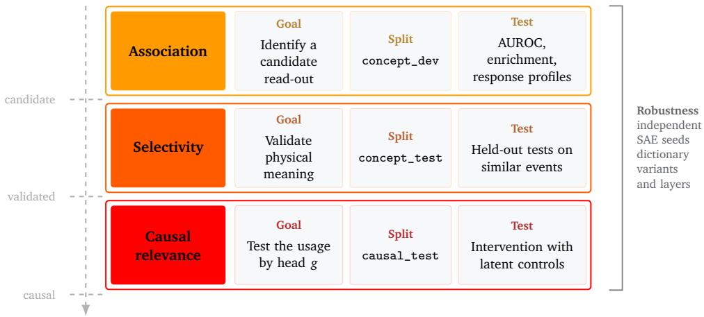  
Figure 1: Concept-validation protocol. A candidate SAE read-out is first identified by association, then tested for held-out selectivity, and finally intervened on to establish whether a particular downstream head uses it. Robustness checks are applied across the validation chain. Exact numerical criteria are given in Table 5.

Association. For a concept indicated by the label $y ^ { ( c ) }$ , we first rank candidate latents by their association with $y ^ { ( c ) }$ on concept\_dev and then re-evaluate them on an independent validation split, concept\_test. For binary concepts, we evaluate each latent using the AUROC of $z _ { j }$ as a classifier and the difference in mean activation between positive and negative events.

We additionally report the firing rate, $P ( z _ { j } > 0 )$ , and the enrichment of positive events among the highest activations

$$
E _ { q } ( j , c ) = \frac { P \left( y ^ { ( c ) } = 1 | z _ { j } \geq Q _ { q } ( z _ { j } ) \right) } { P \left( y ^ { ( c ) } = 1 \right) } ,\tag{13}
$$

where $Q _ { q } ( z _ { j } )$ is the q-quantile of the latent activation. For continuous observables, we formulate the same step through response profiles or monotonic trends rather than a single binary AUROC.

Selectivity. A candidate should track the concept we claim it tracks, not a correlated nuisance variable. We therefore recompute the AUROC after matching positive and negative events jointly on five nuisance variables: pulse count, total charge, non-auxiliary pulse count, and, in this controlled study, true zenith and azimuth\*, and retain the candidate only if this stricter AUROC on the matched sample still clears the validation threshold. We also compare each candidate to latents with similar firing rates, excluding dense latents whose removal degrades reconstruction broadly, rather than for reasons specific to the tested concept.

Causal relevance. We test causal relevance only after a feature passes the checks above, and always relative to a specific downstream head $g .$ . The simplest intervention is removal. We zero the corresponding sparse activations, decode the modified code, and pass the resulting patched activation through g,

$$
\begin{array} { r } { \tilde { h } _ { i } ^ { ( - G ) } = D \left( z _ { i } \odot \mathbf { 1 } _ { j \notin G } \right) . } \end{array}\tag{14}
$$

Removal asks whether $g$ needs the feature. We also test writing when a concept has a natural source and target population. In this case, we replace the activations in G by donor values before decoding,

$$
z _ { i , j } ^ { \mathrm { ( w r i t e ) } } = \left\{ { \begin{array} { l l } { w _ { i , j } , } & { j \in G , } \\ { z _ { i , j } , } & { j \not \in G , } \end{array} } \right.\tag{15}
$$

where $w _ { i , j }$ is the written activation. Writing asks whether the decoded feature can steer the head in the expected direction. We also study dose response, in which we rescale its activation, $z _ { j }  s z _ { j }$ , and measure the resulting change in the downstream head.

For each intervention we compare the effect against matched controls. In the case of removal, we use as controls latents or latent sets with a similar firing-rate distribution. Writing controls are latents with matching firing rates and the same donor activation. We fix every threshold before evaluation and report it in Appendix A. We call a feature causal for g only if its effect is large enough, exceeds the matched-control effects, and is specific to the target concept. The fixed discovery, validation, control-matching, and causal-verdict rules are summarized in Appendix A.2.

Supervised baseline. Alongside the sparse latents, we use linear probes as the supervised reference: a probe is a linear model fit on the discovery split to predict $y ^ { ( c ) }$ from the full activation $\tilde { h } _ { i }$ [35]. Its held-out performance measures how much of the concept we can extract linearly from the full representation. This is the baseline against which we can judge localized sparse read-outs throughout the paper. Between these two extremes, k-sparse probes restricted to the k most informative latents (selected on the discovery split, refit and scored on held-out events) measure how many sparse coordinates a concept actually requires.

## 3 From candidates to a validated atlas

This section reports what the SAE-dictionary reads out of the final-layer CLS representation (we use probes on all layers to estimate which carries most of the directional information in Appendix A.1). Of the 1024 latents in the sparse dictionary, most do not correspond to any identifiable concepts we tested, and several concept candidates, such as event morphology and sub-detector geometry, do not correspond to any validated read-out. This is not surprising as association alone is a weak filter, and a look-elsewhere effect can produce convincing-looking candidates by chance across 1024 unlabelled directions. Selectivity is the step that removes candidates associated with a particular concept: the few latents that pass every test organize into a few interpretable concepts. We first present these validated read-outs and the structure they reveal in the sample, compare them against two linear baselines, and show that none of it depends on the particular dictionary. All latent indices refer to the reference dictionary of Section 2.2 and their independence from this choice is established in Section 3.3.

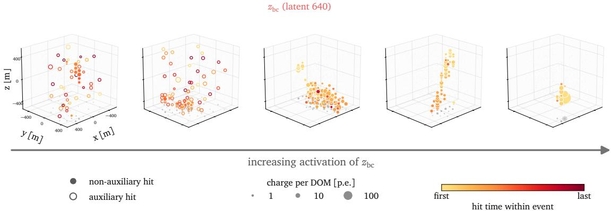  
Figure 2: Illustration of five events ordered by increasing activation of ${ \mathfrak { z } } _ { \mathrm { b c } }$ on causal\_test $( z = 0 . 3 5$ , 0.45, 0.58, 1.03, 2.67). Panels share camera, detector frame and charge scale.

## 3.1 The identified physical atlas

Validated read-outs. The strongest final-layer read-out, ${ \mathcal { Z } } _ { \mathrm { b c } } ,$ is a bright-clean feature (illustrated in Figure 2): it activates on events whose standard, non-auxiliary pulses dominate light and whose total charge is high. In the reference dictionary this is latent 640. On the independent validation split, it separates bright-clean events from strongly auxiliary, dim events with AUROC 0.911, and remains informative under all matched controls.

<table><tr><td>Feature Role</td><td></td><td></td><td>Validation / response Min. control AUROC Response analog</td><td></td></tr><tr><td> ${ \mathfrak { z } } _ { \mathrm { b c } }$ </td><td>bright-clean events</td><td>0.91</td><td>0.79</td><td> $\overline { { 4 / 4 } }$ </td></tr><tr><td> $z _ { \mathrm { b c } } ^ { \prime }$ </td><td>clean events, secondary</td><td>0.69</td><td>0.84</td><td>4/4</td></tr><tr><td> ${ z _ { \mathrm { a u x } } }$ </td><td>auxiliary activity</td><td>0.84</td><td>0.85</td><td>3/4</td></tr><tr><td> ${ z _ { \mathrm { b s } } }$ </td><td>brightness-associated support (dense) charge monot. +0.92 non-selective</td><td></td><td></td><td> $4 / 4$ </td></tr><tr><td> ${ \underline { { \boldsymbol { z } } } } _ { \mathrm { d e p t h } }$ </td><td>detector depth (layer 2)</td><td>0.986</td><td>0.984</td><td>layer bank</td></tr></table>

Table 3: Named sparse directions identified in the paper. The final column reports whether an analogous response appears across dictionary seeds; it does not report replication of the complete validation criteria. Section 3.3 gives the corresponding seed-by-seed verdicts.

The complete clean- and auxiliary-side discovery rankings, including the candidates that were not retained, are reported in Appendix B.1.

A weaker clean-side feature, $z _ { \mathrm { b c } } ^ { \prime } ,$ corresponds to latent 1006 and passes the same controls at lower discrimination. Latent 195, ${ \mathcal { Z } } _ { \mathrm { a u x } } ,$ captures the complementary event class which activates on auxiliary-dominated, low-charge events. Finally, ${ \mathcal { Z } } _ { \mathrm { b s } } .$ , latent 973 in the reference dictionary, is a dense brightness-associated support feature. Its mean activation rises strongly with total charge, but it does not cleanly discriminate high- from low-charge events and fails the selectivity controls. We therefore do not treat it as a validated brightness read-out. evertheless, interventions on this coordinate produce a large change in the direction-head output. Section 4.1 shows that the direction reconstruction is strongly disrupted when this coordinate is moved away from its natural value.

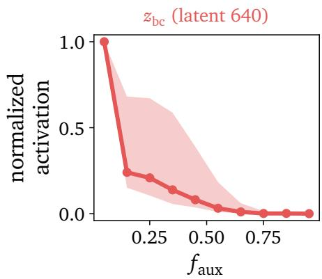

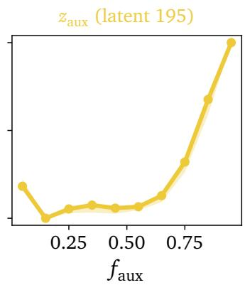

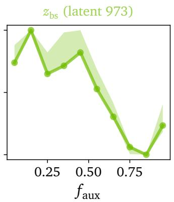

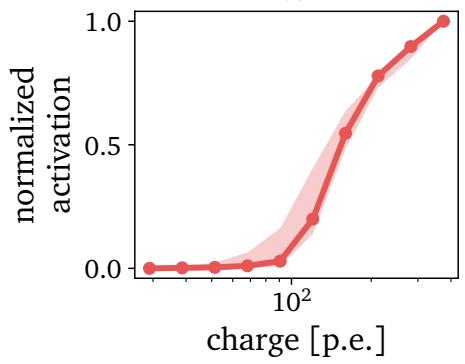

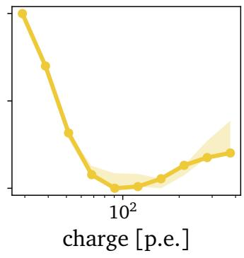

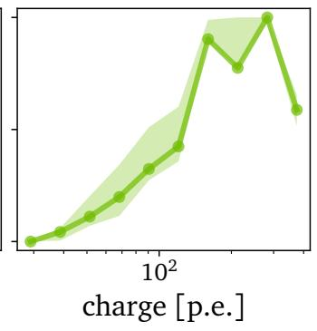  
Figure 3: Response profiles of the main SAE latents along the auxiliary fraction and the total charge, on concept\_dev set events. Bands show the min-max spread across dictionary seeds.

In Figure 4, we show the most activated event for these latents. ${ \mathfrak { z } } _ { \mathrm { b c } }$ fires on a compact bright deposit (391 p.e., 12 DOMs, 3 strings). ${  { \mathcal Z } } _ { \mathrm { a u x } }$ fires on sparse auxiliary-dominated activity across 30 strings. The $z _ { \mathrm { b s } }$ panel is not a bright event (129 p.e.; per-event rank correlation with total charge 0.05 on causal\_test), consistent with it being a support direction rather than a concept read-out.

Cleanliness and brightness are one axis. Auxiliary-dominated events are also systematically dimmer in this sample, so auxiliary activity and brightness form a strongly correlated axis. The bright-clean and dim-clean subsets defined in Section 2.1 allow us to test brightness while holding event quality fixed. We also test the analogous brightness contrast within auxiliary-dominated events, but find no validated sparse read-out.

Within the clean class, ${ \mathfrak { z } } _ { \mathrm { b c } }$ also distinguishes bright-clean from dim-clean events, with a validation AUROC of 0.821. Both groups satisfy the same clean-event criteria and differ only in their total-charge selection, showing that ${ \mathfrak { z } } _ { \mathrm { b c } }$ also carries a brightness dependence. We therefore describe ${ \mathfrak { z } } _ { \mathrm { b c } }$ as a bright-clean read-out rather than as a pure event-quality feature. When applied to the other candidate latents, this within-clean-class test eliminates most of the weaker candidates. No latent that discriminates based on $f _ { \mathrm { a u x } }$ survives the analogous withinclass brightness test. Thus, some response-profile shapes are real physical structures, while others arise from correlations between observables.

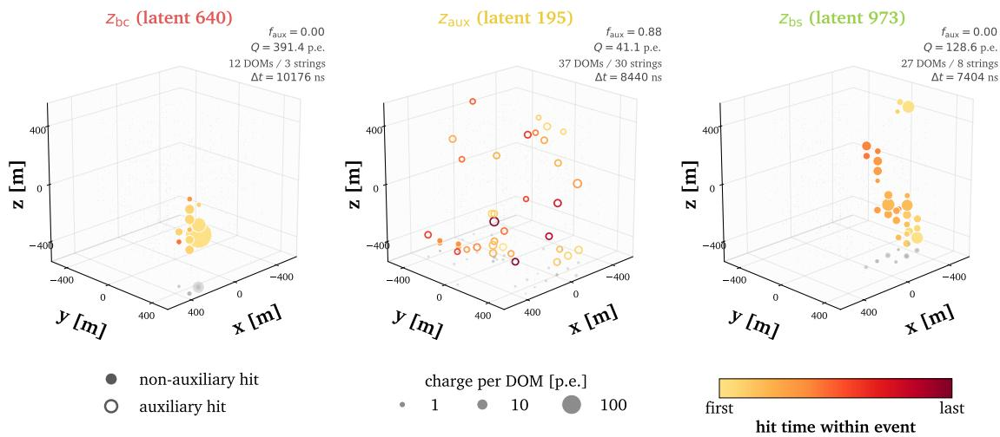  
Figure 4: Highest-activating event of each latent on causal\_test. Markers are DOMs (charge summed per DOM), area grows with ${ \sqrt { \operatorname { c h a r g e } } } ,$ color encodes hit time within the event, and filled versus hollow marks non-auxiliary versus auxiliary hits. Panels share axes and charge scale.

The response landscape. The protocol identifies and validates a few latents, we now ask whether they are a part of a larger family. Cleanliness and brightness are broad concepts, and we find that the validated read-outs are not isolated. Instead, they sit within a broader response landscape, which we characterize by dividing all events into ten bins of auxiliary fraction $f _ { \mathrm { a u x } }$ . For each latent j, we compute its mean activation in each bin and take the Spearman correlation between these ten mean activations and the corresponding $f _ { \mathrm { a u x } }$ bin centers. We denote this auxiliary-monotonicity score by amsj. Thus, amsj 1 indicates a latent whose activation decreases toward auxiliary-dominated events, whereas amsj $\simeq + 1$ indicates one whose activation increases. We define the latent sets used later for joint interventions as:

• Clean pair: $\{ \boldsymbol { z } _ { \mathrm { b c } } , \boldsymbol { z } _ { \mathrm { b c } } ^ { \prime } \}$

• Clean family: all latents with ams $\leq - 0 . 8 5$ , excluding the dense brightness-support direction ${ \mathcal { Z } } _ { \mathrm { b s } } ;$ this gives 194 latents.

• Clean core: the members of the clean family with firing rate $P ( z _ { j } > 0 ) \geq 0 . 0 5$ ; this gives 5 latents.

• Auxiliary family: all latents with ams $\geq + 0 . 8 5 ;$ this gives 135 latents.

The exact reference-dictionary definitions and sizes of these intervention sets are summarized in Appendix B.2.

A monotonic response, however, is not the same as a validated read-out. Many latents follow the global trend only weakly but do not pass every step of the validation protocol. The result is therefore not hundreds of clean or auxiliary features. It is a continuous qualitybrightness axis spread across many sparse coordinates, with only a few coordinates sharp enough to validate individually. This matters for causality: if the direction head used the axis in a distributed way, removing one latent would not have a decisive impact. Section 4.2 therefore tests the causality of both the single validated read-outs and the full response-profile families.

Discoveries beyond the target concepts. Because we train the dictionary without labels, it can also expose structure that we do not specify in advance. Some latents vary smoothly with zenith or azimuth direction (we report them in Appendix B.4.3). They are more active for events from one broad horizontal direction than from the opposite one, but no latents show the characteristic azimuthal dependence that arises from the detector’s hexagonal string spacing [36]. However, given our strict protocol, none of these candidates pass the selectivity test. We still report them to illustrate the use case of sparse dictionaries for discovery: unlike a supervised probe, which requires the concept to be named before training, an SAE can surface candidates that then require thorough validation.

What the dictionary does not read, and why. While we find candidates for many concepts, the dictionary built from the last residual layer has an informative blind spot. DOM position information enters at the pulse-token level, so the network learns detector geometry early. At the final layer, however, no latent tied to event radius, depth, or sub-detector location survives the matched geometry contrasts. Using the same SAE recipe at layer 2 recovers a near-monosemantic depth feature, $z _ { \mathrm { d e p t h } } ,$ , with validation AUROC 0.986. This does not mean, however, that geometry information is lost. At earlier layers, geometry is distributed across the sequence, and later transformer blocks can still integrate information from the pulse tokens into the final CLS state. The early CLS-level depth feature is therefore not necessarily a causal bottleneck for the direction prediction. Absence of a concept from one dictionary therefore does not imply absence from the model in general. A single-layer atlas should not be read as an inventory of everything the network represents. We similarly find no validated single-latent read-out for the elongated-versus-compact morphology contrast. We construct this contrast from charge-weighted pulse-pattern observables because the dataset provides no track/cascade labels. Because the Kaggle dataset lacks track/cascade labels, any such concept has to be identified using indirect features and would have to emerge indirectly from pulse-level structure. Linear probes nevertheless recover the continuous morphology proxies with held-out $R ^ { 2 }$ values between 0.46 and 0.65, showing that the representation contains morphology-related information without localizing it in one tested SAE coordinate.

## 3.2 Sparse read-outs versus linear baselines

Section 3.1 reported what the SAE finds on its own. Before treating that atlas as a property of the representation, rather than an artifact of sparse dictionary learning, we check it against two linear baselines that make no sparsity projection: Principal Component Analysis (PCA), which asks what an unsupervised linear basis finds, and linear probes, which ask how much of a labelled concept the full representation carries. Linear probes are supervised models that combine all coordinates of the representation. We evaluate both in the same normalized finallayer CLS space as the SAE. PCA gives unsupervised linear directions $\nu _ { r }$ in the space of $\tilde { h } _ { i }$ . We score event i on component r by

$$
\begin{array} { r } { s _ { i , r } ^ { \mathrm { P C A } } = \nu _ { r } ^ { \top } \left( \tilde { h } _ { i } - \bar { h } _ { \mathrm { P C A } } \right) , } \end{array}\tag{16}
$$

where $\bar { h } _ { \mathrm { P C A } }$ is the mean activation on the PCA training split. We fit the components on sae\_train, select and sign-orient them on the concept\_dev, and evaluate them on the independent val-

idation split. A linear probe for concept c instead uses the labelled score

$$
s _ { i } ^ { ( c ) } = a _ { c } ^ { \top } \tilde { h } _ { i } ,\tag{17}
$$

with $a _ { c } \in \mathbb { R } ^ { 2 5 6 }$

In the previous section we discussed that the SAE represents event quality and brightness through individually testable read-outs $( z _ { \mathrm { b c } }$ and $z _ { \mathrm { a u x } } )$ . We find that the tenth principal component (PC10) of the CLS summary represents event quality and brightness in a single entangled direction. While PCA and the SAE find and decompose this bright-clean axis differently, the fact that two unsupervised methods find the same axis is evidence that the axis is a property of the representation’s geometry, not an artifact of a specific method. This anticipates the result of Section 4: the quality-brightness axis organizes events physically, but the direction head assigns little causal weight to its validated sparse read-outs.

Linear probes answer a slightly different question from a sparse dictionary. A probe is trained with the concept label and can combine all 256 coordinates of the representation, so its performance measures how well the concept is linearly decodable from the full CLS state. A single SAE latent instead asks whether the same information has been localized into one unsupervised sparse coordinate. Accordingly, probes generally match or exceed the best single latent. For the angular reconstruction error, for example, a probe on the full CLS representation reaches AUROC 0.925, while no individual SAE latent forms a validated error read-out. The error information is therefore present and linearly accessible in the representation, but distributed across multiple coordinates rather than localized in one sparse feature. This distributed behavior foreshadows Section 4.3: predicting angular reconstruction error requires a head that combines information distributed across the representation.

Appendix B.4.1 uses k-sparse probes to test how strongly the morphology information concentrates in the SAE coordinates. No individual latent passes the fixed morphology criteria at layers 2, 3, or 8, while full linear probes recover the continuous morphology proxies. Thus, the information remains linearly accessible but does not localize in a single tested SAE coordinate.

## 3.3 Robustness of the atlas across dictionaries and inputs

We further support our finding that the foundation model’s latent representation encodes a physically meaningful atlas by rerunning the same discovery, validation, and control pipeline across independent training seeds and across the different trained models of the hyperparameter studies.

Across all seeds, we find latents that have a higher activation for cleaner events. An analog of ${ \mathfrak { z } } _ { \mathrm { b c } }$ appears in every seed, and in three of four seeds it satisfies the same validation criteria used for the reference dictionary. The auxiliary read-out ${ z _ { \mathrm { a u x } } }$ passes the validation step only in the reference seed, although auxiliary-shaped latents appear in the other seeds as well. The clean and auxiliary families also appear in every seed with similar sizes. The ${ z _ { \mathrm { b s } } }$ latent rising with charge is even more stable. In every dictionary draw we recover a dense, chargemonotonic but non-selective latent. In one of the seeds, we observe that the brightness-support behavior is carried jointly by two latents rather than concentrated in one. Detailed seed-byseed mappings and validation results are reported in Appendix B.5.

When re-running the clean-trigger isolation for $m / d \in \{ 2 , 4 , 8 \}$ and $k \in \{ 8 , 1 6 , 3 2 \}$ , we find a control-surviving analog of ${ \mathfrak { z } } _ { \mathrm { b c } }$ in every dictionary, with validation AUROC between 0.84 and 0.99.

As a final check, we perturb the input events themselves and re-encode them. We inject synthetic auxiliary pulses, randomly remove pulses, or rescale all pulse charges before passing the event again through the frozen backbone and SAE. The verified latents respond in the expected directions: injected auxiliary pulses raise ${  { \mathcal { Z } } _ { \mathrm { a u x } } }$ and lower ${ \mathfrak { z } } _ { \mathrm { b c } }$ activation. Pulse removal suppresses ${ \mathfrak { z } } _ { \mathrm { b c } }$ and $z _ { \mathrm { b s } }$ activation, while charge rescaling moves $z _ { \mathrm { b s } }$ with the charge scale. These perturbations support the physical labels of the validated read-outs and, separately, the brightness association of ${ \mathcal { Z } } _ { \mathrm { b s } }$ . We further test their causal role for the direction head in Section 4.2.

## 4 Causality is head-relative

Section 3 established a validated, robust atlas of concepts with a clear interpretation. However, a concept can be reliably decodable and still play no role in what a downstream head computes. This section tests that gap directly, using the removal and writing interventions of Eqs. (14) and (15), always applied to the final-layer CLS state $h _ { i }$ . We pass every intervention through the frozen direction head and then through an uncertainty head trained on $h _ { i } .$ . The two heads return opposite verdicts on the causality of the clean-side atlas. Finally, we compare the pretrained and fine-tuned backbones to test whether these physical read-outs are already present before direction fine-tuning.

## 4.1 The atlas is inert for the direction head

Removal and writing on the direction head. As a scale reference, we replace the final CLS state with its validation-set mean. This intervention changes the direction-head output by $5 6 . 4 ^ { \circ }$ . We use this value as the baseline. Compared to this, zeroing ${ \mathfrak { z } } _ { \mathrm { b c } }$ shifts the angular error by only $+ 0 . 0 6 ^ { \circ }$ , essentially the same as removing unrelated latents with matched firing rates $( + 0 . 0 5 ^ { \circ } )$ . This null also replicates across dictionary draws, with all analogs remaining within $| \triangle | \leq 0 . 1 ^ { \circ }$

We repeat the removal test at every scale of the atlas. In the reference dictionary, the clean pair, clean family, clean core, and auxiliary family all give null results. The clean pair gives a null result in all four seeds. The clean family and clean core give null results in three of four seeds. In the negative seed, both family ablations change the output by about $1 0 ^ { \circ }$ because the family includes a reconstruction-critical support latent that does not validate as a clean concept. The auxiliary family gives a null result in all four seeds.

Removing a latent is only one intervention, we also test the opposite, amplifying the activation by writing. This allows us to test whether a read-out can steer the head at all. We first write clean-like values of ${ \mathfrak { z } } _ { \mathrm { b c } }$ and $z _ { \mathrm { b c } } ^ { \prime }$ into auxiliary events, and conversely write an auxiliarylike value of ${  { \mathcal { Z } } _ { \mathrm { a u x } } }$ into clean events. We also repeat these interventions while removing the latent signature of the original class. In all cases, the direction prediction is unchanged. Steering brightness within the clean class is likewise null (Appendix C.3). The direction head’s output remains unchanged in both directions: it neither needs the quality read-outs nor can it be steered by imposing them.

${ \mathfrak { z } } _ { \mathbf { b } \mathbf { s } }$ steers the direction head. One dense latent, however, behaves differently from the other validated read-outs. $z _ { \mathrm { b s } } .$ , introduced in section 3.1, is functionally important. Setting it to zero increases the direction-head angular error by $1 5 . 0 ^ { \circ }$ on clean-bright events and $1 0 . 9 ^ { \circ }$ on clean-dim events. Moving $z _ { \mathrm { b s } }$ either below or above its natural value damages direction reconstruction systematically with a minimum angular error at its unperturbed value(Figure $^ { 5 , }$ left). The direction head therefore does not read larger $z _ { \mathrm { b s } }$ as “more brightness”. Rather, this charge-correlated coordinate supports a well-formed representation around its natural operating point. The ${ \mathcal { Z } } _ { \mathrm { b s } } ^ { }$ -like latents recovered in all four dictionary draws show the same V-shaped impact on the angular reconstruction error.

Dictionary construction independence. Perhaps the activation dictionary is simply the wrong basis for this head. To test this, we use end-to-end sparse (e2e) dictionaries [29]. They are specifically design to preserve the output of a downstream head, pushing the recovery of causal features, which the reference dictionary misses. The learning objective of E2e dictionaries is

$$
\mathcal { L } _ { \mathrm { e 2 e } } = d \left( g _ { \mathrm { d i r } } ( \hat { h } _ { i } ) , g _ { \mathrm { d i r } } ( \tilde { h } _ { i } ) \right) + \alpha \mathcal { L } _ { \mathrm { r e c } } ,\tag{18}
$$

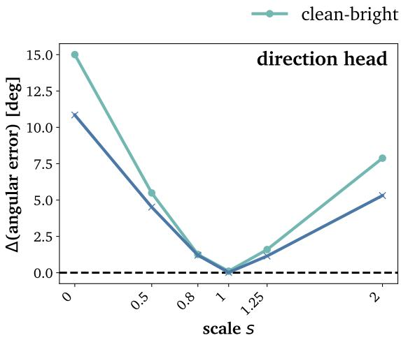

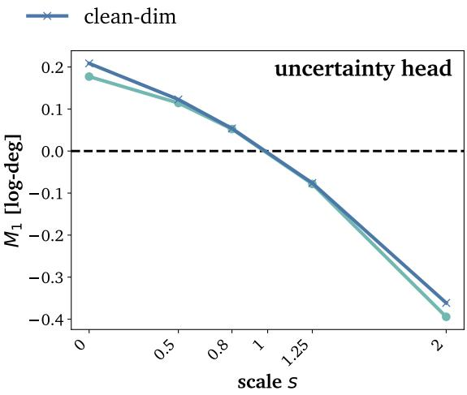  
Figure 5: Dose response of the brightness-support latent $z _ { \mathrm { b s } }$ (latent 973) on causal\_test: this single coordinate is rescaled as $z  s z$ before decoding. In both panels the two curves are clean events $(  { f _ { \mathrm { a u x } } } \leq 0 . 0 5 )$ split by brightness alone: bright $( Q _ { \mathrm { t o t } } \geq 1 6 0 \ \mathrm { p . e . } )$ and dim $( Q _ { \mathrm { t o t } } \leq 1 2 2 \ \mathrm { p . e . } )$ . Left: the resulting change in the true angular error of the direction head. Right: the resulting shift $M _ { 1 }$ in the log-error predicted by the uncertainty head (Section 4.3).

with d an angular distance and $\alpha \ge 0$ interpolating between a local dictionary and pure e2e dictionary.

We test every causal latent against the full concept vocabulary: quality, auxiliary activity, charge, zenith, azimuth, depth, morphology, and error (Appendix C.4). The two pure end-toend dictionaries contain no bright-clean analog, with a best AUROC of about 0.53. The two reconstruction-anchored dictionaries recover bright-clean analogs with AUROC 0.87-0.88, but these latents remain outside the causal sets.

## 4.2 The direction head’s causal axis

The previous interventions show that the direction head depends strongly on the CLS representation, but only weakly on the physical read-outs identified by the SAE. We therefore ask which directions in the 256-dimensional CLS space the frozen head is locally sensitive to. The local sensitivity of the frozen head to the summary is its Jacobian,

$$
J _ { i } = \frac { \partial \hat { u } _ { i } } { \partial h _ { i } } \in \mathbb { R } ^ { 3 \times 2 5 6 } ,\tag{19}
$$

computed exactly through the frozen head. We compute the Jacobian of the direction head for each event in the discovery split and combine these Jacobians to identify the representation directions to which the head is most sensitive. We detail the process in Appendix A.3.

At the dataset level we find a direction that is stable across splits. We quantify how similar the directions across different splits are by their principal angle in the 256-dimensional space. The leading axis obtained on the concept\_dev differs by only $5 . 6 ^ { \circ }$ from the axis that we compute independently on concept\_test. This angle lies far from the average $9 0 ^ { \circ }$ split of two random directions. It accounts for 98% of the aggregate sensitivity on the latter. This dataset-level stability does not mean every event relies on the same direction locally. For a given event, we can ask what fraction of its own local sensitivity the fixed axis captures. The typical event captures none of it - the median is 0% because most individual Jacobians are close to degenerate to begin with. So, the head’s local response is nearly flat in most directions for most events. It is the minority of events that the shared axis explains well, which is what produces the higher sample mean of 14.9%. The stable axis is therefore a dataset-level summary of where sensitivity concentrates, not a bottleneck every event’s prediction passes through.

We ask four questions about this stable axis, in the following order: does it match a named concept, is it simply the direction of largest generic variance, does the direction head depend on a physical quantity, and is it really causal rather than merely correlated with the output?

It does not match any named concept and no verified latent exceeds $| \cos | = 0 . 1 5$ , see Figure 6. However, it is also not simply a generic direction. Its strongest alignment with the two leading principal components is $| \cos | = 0 . 6 2$ and 0.52, meaning that it is related to the directions that dominate the representation’s overall variance, but clearly distinct from them.

Each probe direction in Figure 6 is the linear-probe construction of Section 2.3, Eq. (17), which we use to test whether the Jacobian of the direction head is related to a labeled quantity. We fit each linear model to predict one labelled quantity (angular error, auxiliary (charge) fraction, charge, zenith) from the full CLS representation is only weakly aligned with the causal axis and at most $| \cos | = 0 . 1$ for the charge probe.

The clearest evidence that the Jacobian and the direction head are causal and not merely correlated comes from the causal latents of the functionally trained dictionaries. The set of causal latents of the reconstruction-anchored functional dictionary aligns strongly with the direction-head causal subspace, with $| \cos | \simeq 0 . 8$ . This direction is meaningful and its misalignment with the physical latents of the named concepts is a finding, not a coincidence.

Finally, perturbing the CLS representation along the Jacobian-derived sensitivity directions changes the predicted direction, confirming that these directions have a causal effect. The induced change is event-dependent and does not correspond to a simple operation, such as a fixed rotation.

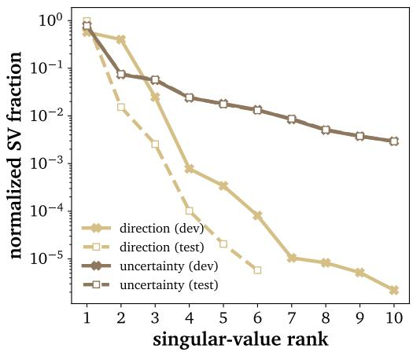

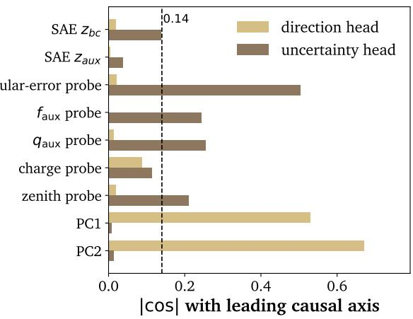  
Figure 6: Sensitivity structure of the direction and uncertainty heads. Left: normalized singular-value spectra of the aggregate head Jacobians on the concept\_dev and concept\_test splits. Right: absolute cosine similarity between each head’s leading sensitivity axis and selected SAE decoder directions, physics-probe directions, and the first two principal components. The dashed vertical line marks $| \cos | = 0 . 1 4$

The direction head, then, is not indifferent to its representation, but has a real, replicable causal axis, just not one that matches any concept we can name. This raises a sharper question: is that indifference to the atlas a property of the quality and brightness features themselves, or a property of this particular head? If inertness were a property of the features, it would persist for any reader. If it is instead head-dependent, a task that actually requires event-quality information should use them, even though the direction head does not. Direction reconstruction has no explicit need to assess whether an event is clean. However, error prediction does.

## 4.3 An uncertainty head with causal latents

Training an error reader. We train an uncertainty head, a one-hidden-layer MLP $U _ { \mathrm { M L P } }$ (256 128 1, GELU), on the same frozen representation $\tilde { h } _ { i }$ , leaving both the backbone and direction head unchanged. It predicts

$$
u _ { i } = \log \left( 1 + \Delta \psi _ { i } / \mathrm { d e g } \right) .\tag{20}
$$

We also trained a simple linear regressor on the same target, which reaches comparable performance, indicating that most of the error-relevant information is already linearly accessible in the representation. All causal interventions use $U _ { \mathrm { M L P } }$

$U _ { \mathrm { M L P } }$ reaches a Spearman correlation of 0.60 with the true error on the independent validation split. As an additional ranking test, we use the predicted error to distinguish events in the highest and lowest quartiles of true angular error. The MLP reaches an AUROC of 0.925, equal to a dedicated linear classifier trained on the full 256-dimensional CLS representation and well above the 0.787 obtained from a classifier using only pulse count, total charge, faux, $q _ { \mathrm { a u x } } ,$ and zenith.

The head recovers essentially all linearly available error information. And because that information is distributed rather than localized, the head must read broadly. It is the natural consumer of the atlas.

Measuring intervention effects. To test whether the verified concepts we discovered in $h _ { i }$ become causal for the uncertainty head, we repeat every intervention of Section 4.1. We measure the effects as the induced shift in the predicted log error,

$$
M _ { 1 } ( G ) = \mathbb { E } _ { i } \left[ U \left( \tilde { h } _ { i } ^ { ( G ) } \right) - U \left( \tilde { h } _ { i } \right) \right] ,\tag{21}
$$

with U the uncertainty head. Because the target is a logarithm, $M _ { 1 }$ has a direct multiplicative reading. Independent of an event’s baseline, an effect of $M _ { 1 }$ corresponds to scaling $( 1 + \Delta \psi _ { \mathrm { p r e d } } / \mathrm { d e g } )$ by $e ^ { M _ { 1 } }$

We judge effects, as before, by empirical exceedance of twenty matched control interventions and a fixed effect floor. The controls are latents matched by firing rate, with dense latents that contribute strongly to activation reconstruction excluded from the control pool when appropriate. We call a feature causal only when the intervention changes the predicted error by a meaningful amount, exceeds the effects of the matched controls, and moves the prediction in the expected direction. Appendix A.2 gives the exact thresholds.

The clean latents become causal. As detailed in Table $^ { 4 , }$ the bright-clean latent becomes causal. Zeroing ${ \mathfrak { z } } _ { \mathrm { b c } }$ gives $M _ { 1 } = + 0 . 3 1$ . This multiplies $\left( 1 + \Delta \psi _ { \mathrm { p r e d } } / \mathrm { d e g } \right)$ by approximately $e ^ { 0 . 3 1 } \simeq 1 . 3 6$ . The effect is far beyond its matched controls. We repeat the causal tests across all scales of the verified atlas. The clean pair gives $M _ { 1 } = + 0 . 3 2$ , the 194-latent clean family gives $M _ { 1 } = + 0 . 7 8$ , and the dense clean core gives $M _ { 1 } = + 0 . 3 7$ . This clear causality holds across all dictionary seeds, with all effects well beyond their matched controls.

The dense brightness-support coordinate ${ \mathcal { Z } } _ { \mathrm { b s } }$ is causal for the uncertainty head as well. Unlike its V-shaped, non-monotone effect on the direction head, the uncertainty head’s predicted error relies monotonously on ${ \mathcal { Z } } _ { \mathrm { b s } }$ in both event classes, see Figure 5, right (cross-seed details are in Appendix C.5).

In contrast to ${ z } _ { \mathrm { b c } } ,$ we find that ${ z _ { \mathrm { a u x } } }$ remains inert for the uncertainty head. While events with a higher fraction of auxiliary pulses are more likely to be noisier, the uncertainty prediction does not causally depend on this latent, or on the broader auxiliary family. We see two plausible, non-exclusive explanations for this. First, clean and auxiliary activity are two ends of a similar underlying axis (see Section 3.1 and Figure 3). The bright-clean signature the head already relies on may carry enough of that shared structure to make a separate auxiliaryspecific read-out redundant. Second, the head may still use auxiliary information, just spread across latents our family definition does not capture, which would mirror the error concept discussed in Section 3.2. The interventions run here cannot distinguish between these two explanations.

<table><tr><td colspan="3">Direction head</td><td colspan="3">Uncertainty head</td></tr><tr><td>Intervention</td><td>effect</td><td>verdict seeds</td><td> $M _ { 1 }$ </td><td>verdict</td><td>seeds</td></tr><tr><td>remove  ${ \mathfrak { z } } _ { \mathrm { b c } }$ </td><td>+0.04°</td><td>null 4/4</td><td>+0.31</td><td>causal</td><td> $\overline { { 4 / 4 } }$ </td></tr><tr><td>remove  $z _ { \mathrm { a u x } }$ </td><td>+0.00°</td><td>null 3/4</td><td>-0.059</td><td>null, sign only 3/4</td><td></td></tr><tr><td>remove clean pair</td><td>+0.03°</td><td>null 4/4</td><td>+0.32</td><td>causal</td><td>4/4</td></tr><tr><td>remove clean family</td><td> $- 0 . 0 2 ^ { \circ }$ </td><td>null 3/4</td><td>+0.78</td><td>causal</td><td>4/4</td></tr><tr><td>remove clean core</td><td> $+ 0 . 0 2 ^ { \circ }$ </td><td>null 3/4</td><td>+0.37</td><td>causal</td><td>4/4</td></tr><tr><td>remove aux family</td><td> $- 0 . 0 1 ^ { \circ }$ </td><td>null 4/4</td><td>-0.085</td><td>null, sign only 4/4</td><td></td></tr><tr><td>scale  ${ z _ { \mathrm { b s } } }$ </td><td>V-shaped support 4/4</td><td></td><td>monotone</td><td>causal</td><td>3/4</td></tr></table>

Table 4: Intervention effects on the final layer for the direction head and the uncertainty head. The “seeds” columns report replication of the corresponding verdict across the four independently trained SAE dictionaries. Direction-head effects are measured as shifts of angular error in degrees. Uncertainty-head effects are measured as shifts of predicted log error, $M _ { 1 }$ in Eq. (21).

The causal basis becomes physically interpretable. The intervention results tie the uncertainty head directly to named sparse read-outs. Clean-side quality and brightness features that are inert for the direction head become causal for the uncertainty head, individually and in families, while the auxiliary family remains a controlled null. The Jacobian analysis gives a complementary view. In Figure 6, for the MLP uncertainty head, one aggregate sensitivity axis carries 78% of the variance and is stable across the discovery and validation splits, with a principal angle of $0 . 4 ^ { \circ }$ . Unlike the direction-head axis, it also captures a median of 77% of each event’s own local sensitivity. This is a direction genuinely shared across events rather than an average over a mostly insensitive population. This means that the uncertainty head runs through one genuinely shared, low-dimensional mechanism across almost every event, while the direction head’s computation is fundamentally distributed and event-specific with no common bottleneck.

This shared uncertainty-axis is not itself an latent or one of the principal components. As expected, it aligns most strongly with the angular-error probe, followed by event-quality probes. The SAE interventions therefore establish which named features the head uses, while the probe alignment identifies the broader physical quantity the uncertainty head relies on.

Our validation protocol applied to the same final layer of the backbone gives opposite verdicts for two different heads. Represented but not used is not a property of a feature alone, but a relation between a representation and a specific downstream head.

The physical read-outs predate direction fine-tuning. We finally compare the fine-tuned backbone with its pretrained-only checkpoint. Charge and detector geometry are already strongly recoverable before direction fine-tuning: total charge reaches $R ^ { 2 } = 0 . 9 9 7$ , compared with 0.960 after fine-tuning, while depth and radius have comparable probe performance across the two checkpoints. Thus, physical structures are present and do not necessarily require fine-tuning. Instead, fine-tuning can partially erode unused directions.

Such an analysis can reveal which useful structures are already present and help guide the choice of what to fine-tune, which layers to unfreeze, and which information should be preserved. Fine-tuning currently has no way to know that a concept it never explicitly needs might still be valuable to a reader trained later on the same representation, so nothing in the objective protects it. Since our protocol can track a concept’s matched-control quality across checkpoints, the same procedure could in principle run during fine-tuning itself to keep concepts intact for downstream heads that do not exist yet. We do not test this here, but the erosion we observe is direct evidence that fine-tuning is not neutral with respect to information represented, which is exactly the kind of blind spot mechanistic interpretability is positioned to catch.

## 4.4 Event selection and calibration

The uncertainty head turns physical information underused by the direction head, into a perevent estimate of angular reconstruction error. We now ask whether this estimate can identify a sample with improved effective angular resolution. For each selection variable, we orient the score $s _ { i }$ so that larger values indicate better-reconstructed events. At a target efficiency ε, the figure of merit is the median angular error of the retained sample,

$$
R ( \epsilon ; s ) = \mathrm { m e d i a n } _ { i \in S _ { \epsilon } ( s ) } \Delta \psi _ { i } ,\tag{22}
$$

evaluated on the held-out causal\_test split. We compare the uncertainty head with detector observables, the atlas feature ${ \mathfrak { z } } _ { \mathrm { b c } }$ , and distributed supervised read-outs of the same frozen representation.

Figure 7-left shows the resulting resolution-efficiency curves. Without selection, the median angular error is $5 1 . 3 ^ { \circ }$ . Among the detector-level observables, total charge gives the strongest selection: retaining the highest-charge 20% of events reduces the median to $2 0 . 2 ^ { \circ }$ The representation-derived uncertainty estimates are substantially sharper. At the same efficiency, the linear and MLP heads reach $3 . 1 6 ^ { \circ }$ and $3 . 1 5 ^ { \circ }$ , respectively. At 50% efficiency they give $1 1 . 3 2 ^ { \circ }$ and $1 1 . 2 4 ^ { \circ }$ , compared with $3 7 . 7 2 ^ { \circ }$ for total charge. Their performance is also close to a linear probe trained on the full CLS representation to distinguish high- from low-error events: the probe reaches $3 . 4 1 ^ { \circ }$ at 20% efficiency and marginally leads at 50%, with $1 1 . 1 4 ^ { \circ }$ . The comparison with ${ \mathfrak { z } } _ { \mathrm { b c } }$ clarifies the distinct roles of sparse interpretation and distributed prediction. Although ${ \mathfrak { z } } _ { \mathrm { b c } }$ is a validated physical read-out, it is not an effective standalone error-ranking score. It fires on only 14% of events, so quantile thresholds targeting larger efficiencies fall on its zero-activation plateau and return the unselected sample. In this analysis, the sparse latents provide localized variables for physical validation and causal intervention, whereas accurate event ranking requires combining information distributed across the full summary.

Figure 7-right shows the calibration curve of the uncertainty head. The true median error rises with the predicted error, with an event-level Spearman correlation of $\rho _ { s } = 0 . 6 1 5$ . In the low-error region relevant for the tightest selections, the binned medians remain close to the diagonal, meaning that the uncertainty head is well-calibrated. At intermediate predicted errors, the uncertainty head is overconfident, and the broad within-bin spread shows substantial event-to-event variation. The head is therefore well ordered and approximately calibrated in the most-certain regime, but its raw outputs should not be interpreted as globally calibrated event-by-event uncertainties without an additional calibration step.

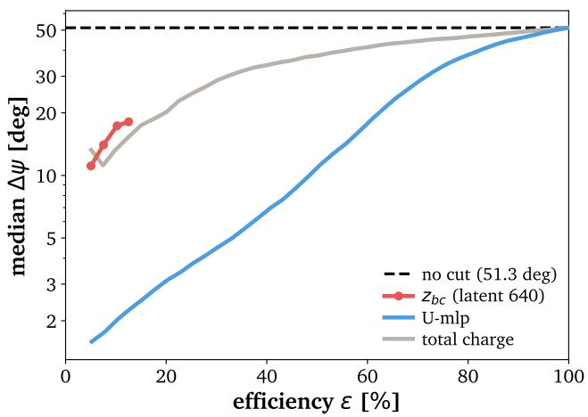

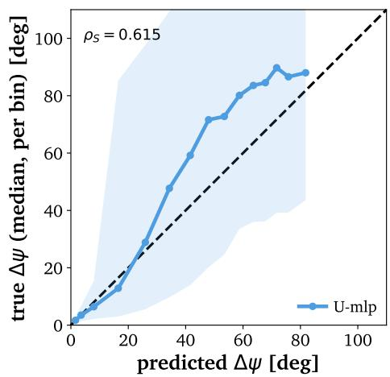  
Figure 7: Left: median angular error of the retained sample as a function of selection efficiency for detector-level observables, distributed representation read-outs, the sparse feature ${ z } _ { \mathrm { b c } } ,$ and the uncertainty head. The horizontal line gives the unselected resolution, and bands show bootstrap intervals. Right: median true angular error in bins of the error predicted by $U _ { \mathrm { l i n } }$ and $U _ { \mathrm { M L P } }$ . The diagonal indicates perfect calibration, while the shaded regions show the within-bin spread of true angular errors.

Together, these results show that the uncertainty head is both accurate and physically grounded. It ranks events nearly as well as a supervised probe built directly for the task, and Subsection 4.3 showed that this ranking causally depends on named, validated features rather than on opaque structure.

## 5 Outlook

To our knowledge, we apply sparse-autoencoder-based mechanistic interpretability to a foundation model in particle physics for the first time. We ask what physical information is represented internally and which parts are used by downstream heads. The two questions have different answers. Across its layers, PolarBERT contains validated read-outs of event quality, auxiliary activity, brightness, and detector depth. The direction head shows marginal causal dependence on the validated physical read-outs across the dictionaries we trained, including functionally trained dictionaries. Its aggregate sensitivity is instead dominated by a stable causal axis with no simple physical interpretation. What the model demonstrably represents and what the direction task uses are almost disjoint.

After this diagnosis, we investigate whether a more complex task could use this atlas. An uncertainty head, trained on the same event-level representation to predict the model’s own error reads the atlas that the direction head did not use. Intuitively, direction-reconstruction uncertainty should depend on how bright and clean an event is [37, 38]. Our results confirm this expectation.

The SAE latents representing how clean and bright an event is are causally inert for the direction head and become causal for the uncertainty head across all four independently trained dictionaries, and the resulting estimator is a sharp selector, not just an interpretable one. At 20% selection efficiency, the best single detector observable reaches the 20◦ scale, while the uncertainty reader reaches 3.2◦.

A black-box regressor trained on the same target might reach similar numbers, but its inputs would be opaque. Because we isolate, match-control and test by intervention the concept we are able to identify, we postulate that the uncertainty head relies on physics terms that can justify its selection rather than taken on faith. This strongly matters once working on real data points, where the correctness of a cut cannot be checked against Monte Carlo truth.

We thus show that represented but not used is a relation between a shared representation and a particular downstream task. This is especially relevant for foundation models, where multiple objectives can reuse the same representations. Sparse dictionaries can reveal which physical information is available in that shared representation and which parts remain unused by a given head. This information can then guide the design of new downstream tasks or learning objectives that explicitly exploit the available structure. In this sense, mechanistic interpretability is not only a diagnostic tool, but also a way to inform how foundation-model representations can be used.

We test our protocol on Monte Carlo with each step of the validation protocol extending to real detector data, where truth labels are incomplete and the atlas must stand on controls and replication alone. Natural next steps are to carry the uncertainty score into full likelihood analyses, repeat the interpretability study with models trained on more event-level labels such as morphology, and extend it to other particle-physics foundation models.

## Acknowledgements

We thank Antonin Vacheret for suggesting the application of mechanistic interpretability to neutrino foundation models, and Jean-Loup Tastet for guidance on the use of Polar-BERT. Part of this work was supported by the European Union’s Horizon Europe research and innovation programme under the Marie Sklodowska-Curie grant agreement No 101168829, Challenging AI with Challenges from Physics: How to solve fundamental problems in Physics by AI and vice versa (AIPHY). We thank the CINECA Leonardo HPC cluster (via INFN grant PML4HEP) and the University of Copenhagen’s SCIENCE AI Centre for providing computing resources.

## References

[1] U. Katz and C. Spiering, High-energy neutrino astrophysics: Status and perspectives, Progress in Particle and Nuclear Physics 67, 651 (2011).

[2] M. G. Aartsen, R. U. Abbasi, M. Ackermann, J. Adams, J. A. Aguilar, M. Ahlers, D. Altmann, C. A. Arguelles, J. Auffenberg, X. Bai, M. Baker, S. W. Barwick et al., Energy reconstruction methods in the icecube neutrino telescope, JINST 9, P03009 (2014), doi:10.1088/1748-0221/9/03/P03009, 1311.4767.

[3] R. Abbasi, M. Ackermann, J. Adams, M. Ahlers, J. Ahrens, K. Andeen, J. Auffenberg, X. Bai, M. Baker, S. Barwick, R. Bay, J. Bazo Alba et al., The icecube data acquisition system: Signal capture, digitization, and timestamping, Nuclear Instruments and Methods in Physics Research Section A: Accelerators, Spectrometers, Detectors and Associated Equipment 601(3), 294–316 (2009), doi:10.1016/j.nima.2009.01.001.

[4] I. C. M. Aartsen, M. Ackermann, J. H. Adams, J. A. Aguilar, M. Ahlers, M. Ahrens, D. Altmann, K. Andeen, T. Anderson, I. Ansseau, G. Anton, M. Archinger et al., The icecube neutrino observatory: Instrumentation and online systems, JINST 12(03), P03012 (2017), doi:10.1088/1748-0221/12/03/P03012, [Erratum: JINST 19, E05001 (2024)], 1612.05093.

[5] J. Kaplan, S. McCandlish, T. Henighan, T. B. Brown, B. Chess, R. Child, S. Gray, A. Radford, J. Wu and D. Amodei, Scaling lawsfor neural language models (2020), 2001.08361.

[6] R. Bommasani, D. A. Hudson, E. Adeli, R. Altman, S. Arora, S. von Arx, M. S. Bernstein, J. Bohg, A. Bosselut, E. Brunskill, E. Brynjolfsson, S. Buch et al., On the opportunities and risks offoundation models (2022), 2108.07258.

[7] T. Kishimoto, M. Morinaga, M. Saito and J. Tanaka, Pre-training strategy using real particle collision data for event classification in collider physics, In 37th Conference on Neural Information Processing Systems (2023), 2312.06909.

[8] T. Golling, L. Heinrich, M. Kagan, S. Klein, M. Leigh, M. Osadchy and J. A. Raine, Masked particle modeling on sets: towards self-supervised high energy physics foundation models, Mach. Learn. Sci. Tech. 5(3), 035074 (2024), doi:10.1088/2632-2153/ad64a8, 2401. 13537.

[9] M. Vigl, N. Hartman and L. Heinrich, Finetuning foundation models for joint analysis optimization in High Energy Physics, Mach. Learn. Sci. Tech. 5(2), 025075 (2024), doi:10.1088/2632-2153/ad55a3, 2401.13536.

[10] I. Timiryasov, J.-L. Tastet and O. Ruchayskiy, Polarbert: A foundation model for icecube, In NeurIPS 2024 Workshop: Machine Learning and the Physical Sciences (2024).

[11] M. Vigl, N. Hartman, M. Kagan and L. Heinrich, Neural Scaling Laws for Boosted Jet Tagging, ICLR 2026 Workshop FM4Science Poster (2026), 2602.15781.

[12] K. Simonyan, A. Vedaldi and A. Zisserman, Deep inside convolutional networks: Visualising image classification models and saliency maps (2014), 1312.6034.

[13] M. Sundararajan, A. Taly and Q. Yan, Axiomatic attribution for deep networks (2017), 1703.01365.

[14] R. R. Selvaraju, M. Cogswell, A. Das, R. Vedantam, D. Parikh and D. Batra, Grad-cam: Visual explanationsfrom deep networks via gradient-based localization, International Journal of Computer Vision 128(2), 336–359 (2019), doi:10.1007/s11263-019-01228-7.

[15] G. Schwalbe and B. Finzel, A comprehensive taxonomy for explainable artificial intelligence: a systematic survey of surveys on methods and concepts, Data Mining and Knowledge Discovery 38(5), 3043–3101 (2023), doi:10.1007/s10618-022-00867-8.

[16] S. Vent, R. Winterhalder and T. Plehn, The Physics Behind ML-based Quark-Gluon Taggers, SciPost Phys. 20, 084 (2026), doi:10.21468/SciPostPhys.20.3.084, 2507.21214.

[17] P. Patel and S. Ganguly, Explainable ai for jet tagging: A comparative study of gnnexplainer, gnnshap, and gradcamforjet tagging in the lundjet plane, ArXiv abs/2604.25885 (2026).

[18] N. Cammarata, S. Carter, G. Goh, C. Olah, M. Petrov, L. Schubert, C. Voss, B. Egan and S. K. Lim, Thread: Circuits, Distill (2020), doi:10.23915/distill.00024, Https://distill.pub/2020/circuits.

[19] L. Sharkey, B. Chughtai, J. Batson, J. Lindsey, J. Wu, L. Bushnaq, N. Goldowsky-Dill, S. Heimersheim, A. Ortega, J. Bloom, S. Biderman, A. Garriga-Alonso et al., Open problems in mechanistic interpretability (2025), 2501.16496.

[20] S. Rai and S. Ganguly, Dissecting Jet-Tagger Through Mechanistic Interpretability (2026), 2605.09881.

[21] N. Elhage, T. Hume, C. Olsson, N. Schiefer, T. Henighan, S. Kravec, Z. Hatfield-Dodds, R. Lasenby, D. Drain, C. Chen, R. Grosse, S. McCandlish et al., Toy models of superposition (2022), 2209.10652.

[22] T. Bricken, A. Templeton, J. Batson, B. Chen, A. Jermyn, T. Conerly, N. Turner, C. Anil, C. Denison, A. Askell, R. Lasenby, Y. Wu et al., Towards monosemanticity: Decomposing language models with dictionary learning, Transformer Circuits Thread (2023), Https://transformer-circuits.pub/2023/monosemantic-features/index.html.

[23] H. Cunningham, A. Ewart, L. R. Smith, R. Huben and L. Sharkey, Sparse autoencoders find highly interpretable features in language models, ArXiv abs/2309.08600 (2023).

[24] L. Gao, T. D. la Tour, H. Tillman, G. Goh, R. Troll, A. Radford, I. Sutskever, J. Leike and J. Wu, Scaling and evaluating sparse autoencoders, ArXiv abs/2406.04093 (2024).

[25] B. Bussmann, P. Leask and N. Nanda, Batchtopk sparse autoencoders, ArXiv abs/2412.06410 (2024).

[26] S. Kantamneni, J. Engels, S. Rajamanoharan, M. Tegmark and N. Nanda, Are sparse autoencoders useful? a case study in sparse probing, ArXiv abs/2502.16681 (2025).

[27] G. Paulo and N. Belrose, Sparse autoencoders trained on the same data learn different features, ArXiv abs/2501.16615 (2025).

[28] A. R. Kulkarni, T.-W. Weng, V. S. Narayanaswamy, S. Liu, W. A. Sakla and K. Thopalli, Interpretable and steerable concept bottleneck sparse autoencoders, ArXiv abs/2512.10805 (2025).

[29] D. Braun, J. K. Taylor, N. Goldowsky-Dill and L. Sharkey, Identifying functionally importantfeatures with end-to-end sparse dictionary learning, ArXiv abs/2405.12241 (2024).

[30] J. Devlin, M.-W. Chang, K. Lee and K. Toutanova, Bert: Pre-training of deep bidirectional transformersfor language understanding (2019), 1810.04805.

[31] A. Chow, L. Heinrich, P. Eller, R. Ørsøe and S. Dane, Icecube - neutrinos in deep ice, https://kaggle.com/competitions/icecube-neutrinos-in-deep-ice, Kaggle (2023).

[32] H. Bukhari, D. Chakraborty, P. Eller, T. Ito, M. V. Shugaev and R. Ørsøe, IceCube – Neutrinos in Deep Ice: The top 3 solutions from the public Kaggle competition, Eur. Phys. J. C 84(6), 646 (2024), doi:10.1140/epjc/s10052-024-12977-2, 2310.15674.

[33] R. Abbasi et al., The IceCube Data Acquisition System: Signal Capture, Digitization, and Timestamping, Nucl. Instrum. Meth. A 601, 294 (2009), doi:10.1016/j.nima.2009.01.001, 0810.4930.

[34] A. Karvonen, C. Rager, J. Lin, C. Tigges, J. Bloom, D. Chanin, Y.-T. Lau, E. Farrell, C. S. Mc-Dougall, K. Ayonrinde, M. Wearden, A. Conmy et al., Saebench: A comprehensive benchmark for sparse autoencoders in language model interpretability, ArXiv abs/2503.09532 (2025).

[35] G. Alain and Y. Bengio, Understanding intermediate layers using linear classifier probes, arXiv e-prints arXiv:1610.01644 (2016), doi:10.48550/arXiv.1610.01644, 1610.01644.

[36] R. Abbasi et al., Observation ofan Anisotropy in the Galactic Cosmic Ray arrival direction at 400 TeV with IceCube, Astrophys. J. 746, 33 (2012), doi:10.1088/0004-637X/746/1/33, 1109.1017.

[37] R. Abbasi et al., Neural posterior estimation of the neutrino direction in IceCube using transformer-encoded normalizing flows on the sphere (2026), 2604.19846.

[38] R. Abbasi et al., Low energy event reconstruction in IceCube DeepCore, Eur. Phys. J. C 82(9), 807 (2022), doi:10.1140/epjc/s10052-022-10721-2, 2203.02303.

## A Supplementary analysis protocol

This section justifies the representational site, states the fixed verdict rules, and defines the head-aligned sensitivity basis. The following sections then report additional atlas results, robustness checks, and detailed interventions in the same order as the main text.

## A.1 Choice of representational site

To justify analyzing the final-block CLS state, we fit ridge probes (α = 1) from the CLS residual state at every depth to the true neutrino direction. Index 0 denotes the post-embedding state, while indices 1–8 denote the transformer-block outputs. We train the probes on concept\_dev (69,632 events) and evaluate them on the disjoint concept\_test split (59,648 events).

Figure 8 shows that linearly decodable directional information improves monotonically with depth and plateaus from block 6 onward. The final-block probe reaches a mean angular error of 61.0◦, close to the $5 9 . 0 ^ { \circ }$ obtained by the frozen nonlinear direction head on the same events. This supports using the final-block CLS state as the common site for the dictionary, probes, and head interventions.

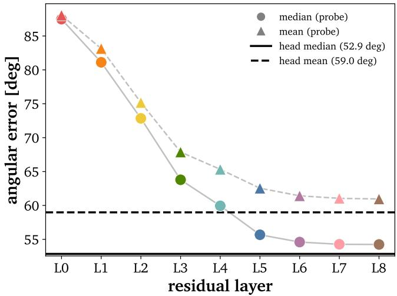  
Figure 8: Held-out mean angular error of a linear CLS probe at each layer. Lower values are better; the frozen direction head is shown as a reference.

## A.2 Fixed read-out and causal criteria

We fix each verdict rule before its corresponding held-out evaluation and retain partial or failed replications. For a target intervention statistic T, its control-normalized score is

$$
z ( T ) = \frac { T - \mathrm { m e a n } ( T _ { \mathrm { c t r l } } ) } { s \mathrm { t d } ( T _ { \mathrm { c t r l } } ) } ,\tag{23}
$$

where $T _ { \mathrm { c t r l } }$ is obtained from the matched-control interventions. For direction-head tests, the selectivity statistic is $\Delta _ { + } - \Delta _ { - }$ , with the control statistic computed in the same way. Table 5 collects the rules used throughout the analysis.

The density rule applies to matched-control pools, not automatically to the physical families. For the within-clean brightness analysis, the control pool additionally excludes the 43

<table><tr><td>Stage</td><td>Fixed rule</td></tr><tr><td>Primary binary candidate</td><td>Discovery AUROC  $\overline { { \ge 0 . 7 5 } }$  and survival of every evaluable matched-control scheme</td></tr><tr><td>Secondary read-out</td><td>Reported separately when it survives the nuisance controls but remains below the primary AUROC bar</td></tr><tr><td>Independent confirmation</td><td>Re-evaluate the fixed candidate on concept_test, with- out reselection or threshold tuning</td></tr><tr><td>Family membership</td><td>Auxiliary-monotonicity score ams  $\leq - 0 . 8 5$  for the clean side or ams ≥ +0.85 for the auxiliary side</td></tr><tr><td>Direction-head causality</td><td> $\Delta _ { + } \geq 0 . 0 5 ^ { \circ } , z ( \Delta _ { + } ) \geq 2$  and  $z ( \Delta _ { + } - \Delta _ { - } ) \ge 2$ </td></tr><tr><td>Uncertainty-head causality Removal controls</td><td> $| M _ { 1 } | \geq 0 . 0 2 , z ( M _ { 1 } ) \geq 2 ;$  and the pre-specified sign</td></tr><tr><td></td><td>20 firing-rate-matched latents or sets; multi-latent controls also match firing-rate composition</td></tr><tr><td>Writing controls</td><td>The same donor values as the target write, with firing-rate- matched recipient coordinates</td></tr><tr><td>Density exclusion</td><td>Control-pool exclusion for firing rate  $> 0 . 3 0$  or top-decile mean nonzero activation</td></tr></table>

Table 5: Fixed discovery, validation, and intervention rules. Each row gives the condition used at that stage.

charge-tracking latents defined by that analysis. Latent 1006 is retained as a secondary cleanside read-out because it survives the nuisance controls despite falling below the primary discovery AUROC.

## A.3 Head-aligned sensitivity basis

For event i, let $\nu \in \mathbb { R } ^ { 2 5 6 }$ be a unit direction in the standardized CLS activation space. A small perturbation εv changes a frozen head to first order as

$$
g ( \tilde { h } _ { i } + \epsilon \nu ) - g ( \tilde { h } _ { i } ) \simeq \epsilon J _ { i } \nu ,\tag{24}
$$

where $J _ { i }$ is the head Jacobian. Thus, $\| J _ { i } \nu \|$ measures local sensitivity along v. We compute the Jacobians by automatic differentiation, verify them against finite differences, and aggregate them over n = 8000 discovery-split events as

$$
M = \frac { 1 } { n } \sum _ { i = 1 } ^ { n } { J _ { i } ^ { \top } J _ { i } } .\tag{25}
$$

All Jacobians are expressed in the standardized CLS frame used by the SAE, probes, and PCA. Because

$$
\mathrm { t r } { \cal M } = { \frac { 1 } { n } } \sum _ { i } \lVert { \boldsymbol { J } } _ { i } \rVert _ { F } ^ { 2 } ,\tag{26}
$$

events for which the head is more locally responsive contribute more strongly without an explicit event weight. The eigenvectors of M order activation-space directions by their average effect on the head output, and the normalized eigenvalues give their share of aggregate sensitivity. We retain a direction only when it replicates on the independent split.

## B Supplementary atlas results

## B.1 Isolation of the named read-outs

Table 6 reports the leading clean-trigger coordinates on the discovery split. Latent 640 is the only primary candidate. Latent 1006 remains below the primary AUROC bar but is retained as a secondary read-out because it survives the nuisance controls and concentrates clean events in its activation tail. The sparse candidates 751, 946, and 369 fail the controls. Latent 973 has the largest mean-activation contrast but is dense and non-selective, motivating its separate treatment as a support coordinate rather than a validated concept read-out.

The auxiliary contrast yields one primary candidate, latent 195. Its discovery AUROC is 0.832, and its held-out AUROC is 0.840. The evaluable nuisance controls survive, with a minimum AUROC of 0.854. schemes that additionally match the non-auxiliary pulse count produce no usable pairs because that count is nearly deterministic for the extreme clean and auxiliary classes. The remaining candidates have either weak discrimination or high enrichment at negligible firing rates and are not promoted.

<table><tr><td colspan="4">Latent AUROC Top-1% enrich. Firing rate Min. ctrl AUROC Status</td></tr><tr><td colspan="4">Positive class: clean-trigger events</td></tr><tr><td>640 0.913</td><td>15.40× 0.139</td><td>0.818</td><td>primary</td></tr><tr><td>1006 0.698</td><td>14.94× 0.087</td><td>0.699</td><td>secondary</td></tr><tr><td>751 0.631</td><td>6.13× 0.134</td><td>0.550</td><td>rejected</td></tr><tr><td>946 0.601</td><td>15.18× 0.014</td><td>0.510</td><td>rejected</td></tr><tr><td>418 0.591</td><td>3.89× 0.126</td><td>0.590</td><td>rejected</td></tr><tr><td>369 0.589</td><td>6.51× 0.081</td><td>0.543</td><td>rejected</td></tr><tr><td>973 0.561</td><td>2.07× 0.406</td><td>0.561</td><td>support only</td></tr><tr><td colspan="4">Positive class: auxiliary-dominated events</td></tr><tr><td>195 0.832</td><td>7.07× 0.493</td><td>0.827</td><td>primary</td></tr><tr><td>261 0.661</td><td>19.01× 0.024</td><td>0.642</td><td>rejected</td></tr><tr><td>551 0.604</td><td>2.19× 0.161</td><td>0.571</td><td>rejected</td></tr><tr><td>74 0.582</td><td>3.17× 0.085</td><td>0.574</td><td>rejected</td></tr><tr><td>115 0.543</td><td>8.53× 0.007</td><td>0.539</td><td>rejected</td></tr><tr><td>289 0.516</td><td>3.90× 0.003</td><td>0.512</td><td>rejected</td></tr></table>

Table 6: Discovery-split rankings for the clean-trigger and auxiliary-dominated contrasts. AUROC measures event-level discrimination, top-1% enrichment is the prevalence of the positive class in the highest-activation tail relative to its overall prevalence, firing rate is $P ( z _ { j } > 0 )$ , and “Min. ctrl $\mathrm { { A U R O C } ^ { \prime \prime } }$ is the lowest AUROC across the matched-control schemes. Status records the role assigned after applying the fixed discovery criteria.

## B.2 Latent-family definitions

<table><tr><td>Family</td><td>Definition n</td></tr><tr><td>clean_pair</td><td>{640, 1006} 2</td></tr><tr><td>clean_family All ams</td><td> $\leq - 0 . 8 5 ,$  excluding the brightness-support coordinate  ${ z _ { \mathrm { b s } } }$  194</td></tr><tr><td>clean_core</td><td>Members of clean_family with firing rate  $\ge 0 . 0 5$  5</td></tr><tr><td>aux_family</td><td>All ams  $\geq + 0 . 8 5$  135</td></tr></table>

Table 7: Reference-dictionary families. The final column gives the number of included latents.

The family interventions test whether a single-latent null could arise because a concept is distributed across several coordinates with similar response profiles. Table 7 gives the reference-dictionary definitions used in these tests.

## B.3 PCA comparison

Table 8 compares PC10, $z _ { \mathrm { b c } } , ~ z _ { \mathrm { a u x } } .$ , and ${ \mathcal { Z } } _ { \mathrm { b s } }$ on the same validation events. For clean events the SAE’s sparse latent ${ \mathfrak { z } } _ { \mathrm { b c } }$ is a sharper discriminant than PC10, while for auxiliary-dominated events, ${ z _ { \mathrm { a u x } } }$ and PC10 perform about the same. For for high-charge events, PC10 clearly outperforms ${ \mathcal { Z } } _ { \mathrm { b s } }$ because ${ \mathfrak { z } } _ { \mathrm { b s } }$ tracks charge only in its population-level average and is a poor per-event classifier, which is exactly why we do not treat it as a validated brightness read-out.

<table><tr><td>Positive class Score</td><td>Test AUROC Control AUROC</td></tr><tr><td>clean PC10</td><td>0.846 0.727</td></tr><tr><td>clean  ${ \mathfrak { z } } _ { \mathrm { b c } }$  0.911</td><td>0.787</td></tr><tr><td>auxiliary PC10</td><td>0.847 0.845</td></tr><tr><td></td><td>0.840 0.854</td></tr><tr><td>auxiliary  ${ z _ { \mathrm { a u x } } }$  PC10</td><td> $0 . 8 4 8 ^ { \dagger }$  0.750</td></tr><tr><td>high charge high charge  ${ \mathcal { Z } } _ { \mathrm { b s } }$  (973)</td><td> $0 . 5 3 2 ^ { \sharp }$  0.516</td></tr></table>

Table 8: PCA and SAE scores evaluated on the independent concept\_test split. Control AUROC is the strictest matched-control value for each target.

## B.4 Distributed and exploratory physical information

## B.4.1 Morphology proxies

To test whether linearly decodable morphology information is concentrated in a few SAE coordinates, we fit k-sparse probes to time extent, linefit speed, linearity, charge concentration, and vertical extent. A LARS path fitted on concept\_dev selects the k coordinates, after which a ridge model is refitted on those columns and evaluated on concept\_test. Dense ridge probes on the raw CLS state and on all SAE coordinates provide reference ceilings.

<table><tr><td></td><td>Layer 8</td><td>Layer 3</td></tr><tr><td>Target</td><td>CLS SAE k=1  $k _ { 9 0 \% }$ </td><td>CLS SAE k=1  $k _ { 9 0 \% }$ </td></tr><tr><td>linefit speed</td><td>0.48 0.42 0.16128</td><td>0.61 0.53 0.14 64</td></tr><tr><td>linearity</td><td>0.52 0.53 0.12 128</td><td>0.49 0.52 0.10128</td></tr><tr><td>time extent</td><td>0.78 0.78 0.36 32</td><td>0.88 0.880.43 16</td></tr><tr><td></td><td>top-5 charge frac. 0.60 0.51 0.05 256</td><td>0.73 0.64 0.08 64</td></tr><tr><td>zRMS</td><td>0.67 0.67 0.10 256</td><td>0.74 0.71 0.19 64</td></tr></table>

Table 9: Held-out morphology-probe results at layers 8 and 3. Within each layer, CLS and SAE are the $R ^ { 2 }$ values of dense ridge probes using the raw CLS representation and all SAE latents, respectively. The k=1 column gives the best single-latent $R ^ { 2 }$ while $k _ { 9 0 \% }$ is the smallest number of selected latents needed to reach 90% of the dense-SAE $R ^ { 2 }$

Table 9 shows that time extent is moderately sparse, whereas the track-likeness and chargeconcentration proxies require tens to hundreds of coordinates. The selected k values are upper bounds rather than exact circuit sizes because the selection path is greedy. Thus, the absence of a validated single morphology latent does not imply that morphology information is absent from the representation, however it is mostly distributed across the dictionary.

## B.4.2 Layer-dependent depth read-outs

<table><tr><td>Layer</td><td>Latent</td><td colspan="3">Depth AUROC Min. ctrl AUROC Direction-head  $\Delta _ { + }$ </td></tr><tr><td>2</td><td>171</td><td>0.986</td><td>0.984</td><td> $\overline { { + 0 . 0 0 6 4 ^ { \circ } } }$ </td></tr><tr><td>3</td><td>191</td><td>0.925</td><td>0.899</td><td> $- 0 . 0 0 9 ^ { \circ }$ </td></tr><tr><td>8</td><td>none retained</td><td>0.598</td><td>一</td><td></td></tr></table>

Table 10: Depth isolation across layers. “Min. ctrl AUROC” is the lowest AUROC across the matched-control schemes, and $\Delta _ { + }$ is the direction-head angular-error shift after removing the selected latent. At layer 8, 0.598 is the best raw AUROC, but no latent passed the isolation criteria.

The final-layer dictionary contains no validated depth coordinate (Table 10), but this depends on the representational site. Repeating the same isolation procedure at layers 2 and 3 recovers strong depth read-outs, with the layer-2 latent reaching AUROC 0.986 and remaining essentially unchanged under matched controls. Neither early-layer coordinate passes the direction-head causal criteria. Geometry is therefore sharply localized at an earlier CLS site without becoming a direction-head bottleneck.

## B.4.3 Exploratory geometry profiles

We also search for latents whose activation changes with event direction, without first selecting candidates using a binary concept contrast. For azimuth, we divide the horizontal chargecentroid direction $\phi _ { c }$ into 24 bins and compute the mean activation of each latent in every bin. We then determine whether the resulting profile has one broad preferred direction $( k = 1 )$ , two opposite preferred directions $\left( k = 2 \right)$ , or the sixfold pattern expected from IceCube’s hexagonal string layout $( k = 6 )$ . Of the 91 latents active enough for this test, 61 vary across azimuth with an anisotropy of at least 0.15. Among them, 52 prefer one broad direction and 9 show a two-direction pattern. None shows the expected sixfold detector pattern. The observed azimuthal dependence is therefore more likely to reflect the non-uniform distribution of events in the sample than the hexagonal detector geometry. We perform a similar scan in zenith by measuring how each latent’s mean activation changes with cos $\theta _ { z }$ . We find 207 latents with a strong monotonic response, $| \rho _ { \mathrm { S p e a r m a n } } | \geq 0 . 8 5$ . However, the strongest responses come from dense latents that contribute broadly to reconstruction, and no individual latent survives the matched-control validation test. These direction-dependent latents are therefore reported as exploratory candidates rather than validated physical read-outs.

## B.5 Robustness across dictionaries

We repeat the read-out analysis across four independently trained dictionaries. Table 11 groups functional analogues by role rather than by latent index. The clean-primary role passes every control scheme in three of four draws. The auxiliary role is less stable: only the reference seed passes all evaluable controls, and seed 3 yields no isolated auxiliary candidate. In contrast, the dense, charge-monotonic, non-selective support phenotype appears in every draw.

The larger response landscape is more stable than the individual coordinates. Every seed contains more than 100 clean-monotonic and more than 100 auxiliary-monotonic latents at $| \mathrm { a m s } | \geq 0 . 8 5$ . Across the tested expansion and sparsity grid, every dictionary also contains a control-surviving bright-clean analogue, with validation AUROC between 0.84 and 0.99. The robust object is therefore the physical role and the broader response axis, not a particular latent index.

<table><tr><td>Role</td><td>Quantity</td><td>Seed 1 Seed 2 Seed 3 Seed 4</td><td></td><td></td></tr><tr><td rowspan="4">Clean primary</td><td>latent</td><td>640</td><td>754 617</td><td>947</td></tr><tr><td>test AUROC</td><td>0.911</td><td>0.874 0.912</td><td>0.996</td></tr><tr><td>min. ctrl AUROC</td><td>0.787</td><td>0.740 0.781</td><td>0.987</td></tr><tr><td>all ctrl schemes</td><td>Yes</td><td>Yes</td><td>Yes</td></tr><tr><td rowspan="4">Clean secondary</td><td>latent</td><td>1006</td><td>662</td><td>918 808</td></tr><tr><td>test AUROC</td><td>0.694 0.744</td><td>0.691</td><td>0.679</td></tr><tr><td>min. ctrl AUROC</td><td>0.837</td><td>0.697 0.836</td><td>0.831</td></tr><tr><td>all ctrl schemes</td><td>Yes</td><td>Yes</td><td>Yes</td></tr><tr><td rowspan="4">Auxiliary</td><td>latent</td><td>195</td><td>539</td><td>none 706</td></tr><tr><td>test AUROC</td><td>0.840</td><td>0.748</td><td>0.753</td></tr><tr><td>min. ctrl AUROC</td><td>0.854</td><td>0.715</td><td>0.731</td></tr><tr><td>all ctrl schemes</td><td>Yes</td><td>No</td><td>No</td></tr><tr><td rowspan="4">Brightness support carrier</td><td></td><td>973</td><td>119</td><td>661</td></tr><tr><td>charge monotonicity</td><td>0.915</td><td>0.915 0.891</td><td>0.915</td></tr><tr><td>clean-aux AUROC</td><td>0.562</td><td>0.569</td><td>0.545 0.568</td></tr></table>

Table 11: Functional read-out analogues across SAE seeds. Each block reports the coordinate and its held-out validation quantities.

## C Head-relative intervention details

## C.1 Family-level removals

Table 12 reports family removals on causal\_test. None of the clean- or auxiliary-side sets produces a selective direction-head effect. The control means are much larger than the medians for several families because a minority of high-density control sets removes substantial reconstruction mass.
<table><tr><td>Family</td><td>n Status</td><td></td><td> $\Delta _ { + }$ </td><td> $\Delta .$ </td><td>Select.</td><td> $z _ { + }$ </td><td>Ctrl med. Ctrl mean</td><td></td></tr><tr><td>clean_pair</td><td>2 </td><td>null</td><td></td><td></td><td>+0.033°-0.007°+0.039°-0.33</td><td></td><td> $\overline { { + 0 . 0 2 4 ^ { \circ } } }$ </td><td> $\overline { { + 0 . 8 4 4 ^ { \circ } } }$ </td></tr><tr><td>clean_family 194</td><td></td><td>null</td><td></td><td></td><td>-0.020°-0.016°-0.005°-1.25</td><td></td><td> $+ 7 . 6 5 1 ^ { \circ }$ </td><td> $+ 9 . 2 3 9 ^ { \circ }$ </td></tr><tr><td> ${ z _ { \mathrm { a u x } } }$ </td><td>1</td><td>null</td><td></td><td></td><td>+0.004°+0.033°-0.029°-0.22</td><td></td><td> $- 0 . 0 0 6 ^ { \circ }$ </td><td> $+ 0 . 2 4 7 ^ { \circ }$ </td></tr><tr><td>aux_family</td><td>135</td><td>null</td><td> $- 0 . 0 0 8 ^ { \circ }$ </td><td></td><td>+0.031°-0.039°-0.75</td><td></td><td> $+ 0 . 0 2 5 ^ { \circ }$ </td><td> $+ 1 . 3 0 5 ^ { \circ }$ </td></tr><tr><td>clean_core</td><td>5</td><td>null</td><td></td><td></td><td>1 +0.018°-0.010°+0.028°-0.63</td><td></td><td> $+ 0 . 0 3 3 ^ { \circ }$ </td><td> $+ 2 . 9 6 6 ^ { \circ }$ </td></tr></table>

Table 12: Reference-dictionary removals on causal\_test. “Select.” is $\Delta _ { + } - \Delta _ { - } ;$ the last columns summarize matched controls.

The clean-pair removal is the more reliable verdict for the secondary coordinate 1006: removing the pair changes the positive-class error by only $+ 0 . 0 3 3 ^ { \circ }$ and fails both the effect and control-normalized criteria. Removing the complete 194-latent clean family is also null. The absence of an effect therefore does not result from testing only one sparse coordinate.

## C.2 Cross-seed single-latent replication

We identify the latent that plays the same physical role in each dictionary and repeat the direction-head removal test. Table 13 shows that removing the primary clean or auxiliary read-out never passes the causal criteria in any evaluable seed. The direction-head null is therefore not specific to the reference dictionary.

<table><tr><td>Role</td><td>Seed 1</td><td></td><td>Seed 2</td><td>Seed 3</td><td>Seed 4</td></tr><tr><td>Clean primary</td><td></td><td></td><td></td><td> $+ 0 . 0 5 7 ^ { \circ } \ ( \mathrm { { n u l l } } ) \ + 0 . 0 9 8 ^ { \circ } \ ( \mathrm { { n u l l } } ) \ + 0 . 0 3 1 ^ { \circ } \ ( \mathrm { { n u l l } } ) \ - 0 . 0 3 3 ^ { \circ }$ </td><td>(null)</td></tr><tr><td>Clean secondary</td><td></td><td></td><td></td><td></td><td> $+ 0 . 0 8 2 ^ { \circ } \ ( \mathrm { p a s s } ) \ + 0 . 1 1 3 ^ { \circ } \ ( \mathrm { n u l l } ) \ + 0 . 0 4 2 ^ { \circ } \ ( \mathrm { n u l l } ) \ - 0 . 0 1 9 ^ { \circ } \ ( \mathrm { n u l l } )$ </td></tr><tr><td>Auxiliary</td><td> $+ 0 . 1 5 6 ^ { \circ }$ </td><td></td><td>(null) —0.117° (null)</td><td></td><td> $- 0 . 0 4 0 ^ { \circ } \ \mathrm { ( n u l l ) }$ </td></tr><tr><td>Brightness support</td><td> $+ 1 3 . 5 1 ^ { \circ } \ ( \mathrm { V } )$ </td><td></td><td> $+ 1 4 . 8 1 ^ { \circ } \mathrm { ~ ( V ) }$ </td><td> $+ 1 1 . 6 1 ^ { \circ } \ ( \mathrm { V } )$ </td><td> $+ 1 4 . 5 9 ^ { \circ } \ ( \mathrm { V } )$ </td></tr></table>

Table 13: Direction-head shifts across SAE seeds. Parentheses give the fixed-rule verdict or dose-response shape.

The secondary clean read-out has one exception. In seed 1, removing latent 1006 produces a small shift of $+ 0 . 0 8 2 ^ { \circ }$ that formally passes the causal test because the matched-control effects have very little spread. However, the corresponding secondary read-outs are null in the other three seeds, and removing the clean pair 640, 1006 is also null. We therefore report the seed-1 result as an isolated pass rather than a replicated causal effect.

The brightness-support coordinates behave differently. Removing them changes the angular error by $1 1 . 6 ^ { \circ } - 1 4 . 8 ^ { \circ }$ in every seed. Their full dose responses are V-shaped: moving the activation either below or above its natural value damages the prediction. These coordinates therefore support direction reconstruction, but the head does not interpret their activation as a monotonic brightness signal.

## C.3 Writing and swap interventions

Removal tests whether the direction head uses a read-out. Writing tests whether changing that read-out can change the head’s prediction. We write clean-event activations into auxiliary events, write auxiliary-event activations into clean events, and swap brightness-related activations between bright and dim clean events. Table 14 reports the results. None of these interventions produces a larger effect than the matched controls. We therefore find no evidence that the direction head uses or responds to these validated read-outs.

<table><tr><td>Experiment</td><td>∆ recip. ∆ donor</td><td> $\overline { { z ( \Delta _ { + } ) } }$ </td><td></td><td>z(sel.) Verdict</td></tr><tr><td>write 640 into aux</td><td> $- 0 . 0 1 2 ^ { \circ } \ + 0 . 0 2 5 ^ { \circ } \ - 0 . 9 2 \ - 0 . 7 1$ </td><td></td><td></td><td>null</td></tr><tr><td>full swap (+zero 195)</td><td> $- 0 . 0 0 2 ^ { \circ } \ + 0 . 0 3 4 ^ { \circ } \ - 0 . 0 1 \ - 0 . 5 1$ </td><td></td><td></td><td>null</td></tr><tr><td>write {640, 1006} into aux</td><td></td><td></td><td> $+ 0 . 0 0 3 ^ { \circ } \ + 0 . 0 4 5 ^ { \circ } \ - 0 . 2 1 \ + 0 . 0 3$ </td><td>null</td></tr><tr><td>full swap</td><td></td><td></td><td> $+ 0 . 0 1 3 ^ { \circ } \ + 0 . 0 5 3 ^ { \circ } \ + 0 . 3 8 \ - 0 . 2 2$ </td><td>null</td></tr><tr><td>write clean core (5 lat.)</td><td></td><td></td><td> $+ 0 . 0 0 6 ^ { \circ } \ + 0 . 0 4 4 ^ { \circ } \ - 0 . 0 6 \ + 0 . 2 5$ </td><td>null</td></tr><tr><td>full swap</td><td></td><td></td><td> $+ 0 . 0 1 6 ^ { \circ } ~ + 0 . 0 5 1 ^ { \circ } ~ + 0 . 2 8 ~ + 0 . 5 6$ </td><td>null</td></tr><tr><td>write 195 into clean</td><td></td><td></td><td> $+ 0 . 0 2 4 ^ { \circ } \ - 0 . 0 0 3 ^ { \circ } \ - 0 . 5 3 \ - 1 . 0 4$ </td><td>null</td></tr><tr><td>full swap (+zero 640, 1006)</td><td></td><td></td><td> $+ 0 . 0 3 4 ^ { \circ } \ - 0 . 0 0 3 ^ { \circ } \ + 0 . 2 1 \ + 0 . 6 9$ </td><td>null</td></tr><tr><td>brightness swap: dim→bright (640)</td><td></td><td></td><td> $+ 0 . 0 1 6 ^ { \circ } ~ + 0 . 1 1 4 ^ { \circ } ~ - 0 . 4 4 ~ - 0 . 4 0$ </td><td>null</td></tr><tr><td>brightness swap: bright→dim (640)</td><td></td><td></td><td> $+ 0 . 1 1 5 ^ { \circ } ~ + 0 . 0 1 3 ^ { \circ } ~ + 0 . 1 0 ~ + 0 . 7 0$ </td><td>null</td></tr></table>

Table 14: Direction-head writing tests. Recipient and donor columns give the induced angular-error shifts.

## C.4 Functionally trained dictionaries

For each dictionary, we first identify the latents whose removal changes the direction-head output beyond matched controls. We call these latents the causal set. We then test every latent in this set against the full concept vocabulary, including event quality, auxiliary activity, energy, direction, depth, morphology, and angular error. Separately, we search the complete dictionary for a latent representing bright clean events. Table 15 summarizes the four dictionaries. The two pure functional dictionaries contain 16 and 11 causal latents, confirming that

<table><tr><td>Dictionary Objective</td><td></td><td>Bright-clean AUROC Causal set Best concept AUROC Validated pairs</td><td></td><td></td><td></td></tr><tr><td>One-shot</td><td>pure functional</td><td>0.53</td><td>16</td><td></td><td>0</td></tr><tr><td>R1</td><td>pure functional</td><td>0.53</td><td>11</td><td>0.59</td><td>0</td></tr><tr><td>R9</td><td>reconstruction anchored</td><td>0.87</td><td>6</td><td>0.69</td><td>0</td></tr><tr><td>R10</td><td>reconstruction anchored</td><td>0.878</td><td>6</td><td>&lt; 0.75</td><td>0</td></tr></table>

Table 15: Results for the functionally trained dictionaries. ‘Bright-clean AUROC” gives the best bright-clean read-out, ‘Causal set” counts latents that affect the direction head, and ‘Best concept AUROC” tests those latents against the full concept vocabulary. ‘Validated pairs” counts the pairs that pass the complete validation procedure.

the training objective finds coordinates that affect the head. However, neither dictionary contains an identifiable bright-clean latent: the best AUROC is 0.53, close to chance. Adding the reconstruction term recovers a bright-clean latent in both anchored dictionaries, with AUROC 0.87 and 0.878. In both cases, this latent lies outside the causal set and its removal does not affect the direction head. Conversely, none of the causal latents passes validation for any tested physical concept. The result therefore persists even when causal latents and an identifiable bright-clean latent coexist in the same dictionary.

## C.5 Uncertainty-head replication

The reference-dictionary results are summarized in Table 4. Here we test whether the positive clean-side verdicts depend on the SAE draw. Removal of ${ z } _ { \mathrm { b c } } ,$ the clean pair, the clean family, and the clean core shifts the uncertainty head toward larger predicted error in every seed. The auxiliary-side interventions remain null, preserving the controlled contrast reported in the main text.

<table><tr><td>Intervention</td><td>Seed 1 Seed 2 Seed 3 Seed 4</td><td></td><td></td></tr><tr><td>remove  ${ \mathfrak { z } } _ { \mathrm { b c } }$ </td><td> $+ 0 . 3 1 0 ~ + 0 . 1 9 3 ~ + 0 . 2 9 5 ~ + 0 . 6 1 2$ </td><td></td><td></td></tr><tr><td>remove clean pair</td><td> $+ 0 . 3 2 1 \ + 0 . 3 7 4 \ + 0 . 3 0 7 \ + 0 . 6 1 2$ </td><td></td><td></td></tr><tr><td>remove clean family</td><td> $+ 0 . 7 7 5 ~ + 0 . 8 3 7 ~ + 1 . 0 1 2 ~ + 0 . 8 0 5$ </td><td></td><td></td></tr><tr><td>remove clean core</td><td> $+ 0 . 3 7 3 ~ + 0 . 4 9 3 ~ + 0 . 6 8 1 ~ + 0 . 6 1 7$ </td><td></td><td></td></tr><tr><td>clean core after support exclusion</td><td> $+ 0 . 3 7 3 ~ + 0 . 4 9 3 ~ + 0 . 3 0 2 ~ + 0 . 6 1 7$ </td><td></td><td></td></tr></table>

Table 16: Cross-seed uncertainty-head removals. Entries are shifts $M _ { 1 }$ in predicted log error.

The first four rows reproduce the positive-sign reference-seed verdicts in every draw. The final row diagnoses the larger seed-3 core effect: after removing its support-carrier contamination, $M _ { 1 }$ falls from +0.681 to +0.302 but remains significant $( z = 6 . 8 )$ . Seed 3 also splits the support role between latents 661 and 144. The direction head is more sensitive to 661, whereas the uncertainty head is more sensitive to 144. Consequently, the pre-specified singlecarrier uncertainty dose replicates in 3/4 seeds; a post-hoc joint dose on 661, 144 restores the monotone response in the remaining draw.